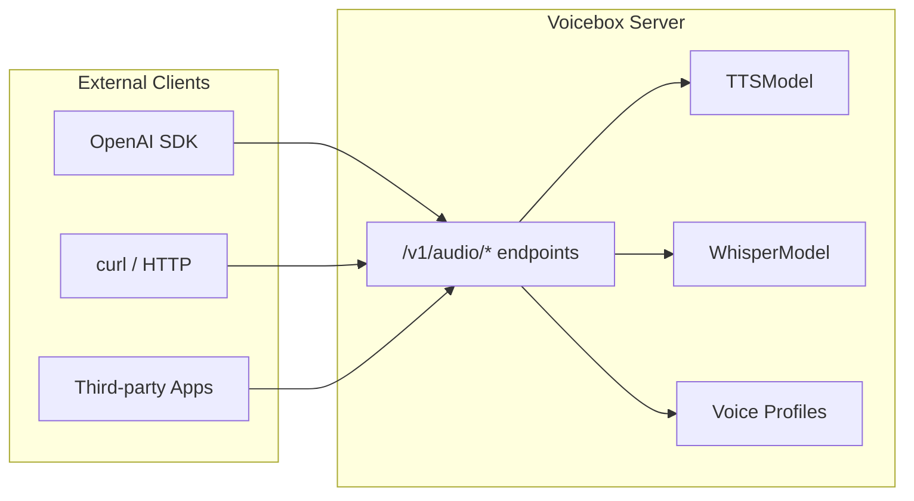

# KNOWLEDGE EXTRACT: voicebox
> **Extracted on:** 2026-03-30 17:58:55
> **Source:** voicebox

---

## File: `.biomeignore`
```
# Dependencies
node_modules
bun.lockb

# Build outputs
dist
target
.tauri

# Generated files
app/src/lib/api

# Config files (don't lint/format)
*.config.js
*.config.ts

# Tailwind CSS files (contains @tailwind directives)
**/index.css
```

## File: `.bumpversion.cfg`
```
[bumpversion]
current_version = 0.2.3
commit = True
tag = True
tag_name = v{new_version}
tag_message = Release v{new_version}
message = Bump version: {current_version} → {new_version}

[bumpversion:file:tauri/src-tauri/tauri.conf.json]
search = "version": "{current_version}"
replace = "version": "{new_version}"

[bumpversion:file:tauri/src-tauri/Cargo.toml]
search = version = "{current_version}"
replace = version = "{new_version}"

[bumpversion:file:package.json]
search = "version": "{current_version}"
replace = "version": "{new_version}"

[bumpversion:file:app/package.json]
search = "version": "{current_version}"
replace = "version": "{new_version}"

[bumpversion:file:tauri/package.json]
search = "version": "{current_version}"
replace = "version": "{new_version}"

[bumpversion:file:landing/package.json]
search = "version": "{current_version}"
replace = "version": "{new_version}"

[bumpversion:file:web/package.json]
search = "version": "{current_version}"
replace = "version": "{new_version}"

[bumpversion:file:backend/__init__.py]
search = __version__ = "{current_version}"
replace = __version__ = "{new_version}"
```

## File: `.dockerignore`
```
# Version control
.git
.github
.gitignore

# Desktop-only (not needed in web container)
tauri/
landing/
docs/
mlx-test/
scripts/

# Dependencies & build artifacts (rebuilt in Docker)
node_modules/
__pycache__/
*.pyc
*.pyo
*.egg-info/
dist/
build/
*.spec

# Data (will be bind-mounted)
data/
backend/data/

# IDE & OS
.vscode/
.idea/
*.swp
*.swo
.DS_Store
Thumbs.db

# Config files not needed in container
biome.json
.biomeignore
.bumpversion.cfg
.npmrc
Makefile
CHANGELOG.md
CONTRIBUTING.md
SECURITY.md
LICENSE
README.md
backend/README.md
```

## File: `.gitignore`
```
# Dependencies
node_modules/
bun.lockb
__pycache__/
*.py[cod]
*$py.class
*.so
.Python
venv/
env/
ENV/
*.prompt
# Build outputs
dist/
build/
*.egg-info/
*.egg
target/
*.app
*.dmg
*.exe
*.msi
*.deb
*.AppImage

# IDE
.vscode/
.idea/
*.swp
*.swo
*~

# OS
.DS_Store
Thumbs.db

# Data (user-generated)
data/
!data/.gitkeep

# Logs
*.log
logs/

# Environment
.env
.env.local

# Generated files
app/openapi.json
tauri/src-tauri/binaries/*

# Temporary
tmp/
temp/
*.tmp
```

## File: `.npmrc`
```
# Force bun usage
engine-strict=true
```

## File: `biome.json`
```json
{
  "$schema": "https://biomejs.dev/schemas/2.3.12/schema.json",
  "vcs": {
    "enabled": true,
    "clientKind": "git",
    "useIgnoreFile": true
  },
  "formatter": {
    "enabled": true,
    "indentStyle": "space",
    "indentWidth": 2,
    "lineWidth": 100
  },
  "linter": {
    "enabled": true,
    "rules": {
      "recommended": true,
      "a11y": {
        "useButtonType": "warn"
      },
      "correctness": {
        "noUnusedVariables": "warn",
        "noUnusedImports": "error",
        "useExhaustiveDependencies": "warn",
        "useHookAtTopLevel": "error"
      },
      "suspicious": {
        "noDoubleEquals": "error",
        "noExplicitAny": "warn",
        "noUnknownAtRules": "off"
      },
      "style": {
        "useFilenamingConvention": "off",
        "noNonNullAssertion": "off"
      }
    }
  },
  "javascript": {
    "formatter": {
      "quoteStyle": "single",
      "jsxQuoteStyle": "double",
      "trailingCommas": "all",
      "semicolons": "always",
      "arrowParentheses": "always"
    }
  },
  "json": {
    "formatter": {
      "trailingCommas": "none"
    }
  },
  "css": {
    "parser": {
      "cssModules": false,
      "allowWrongLineComments": false,
      "tailwindDirectives": true
    },
    "linter": {
      "enabled": true
    }
  }
}
```

## File: `bun.lock`
```
{
  "lockfileVersion": 1,
  "configVersion": 1,
  "workspaces": {
    "": {
      "name": "voicebox",
      "dependencies": {
        "loaders.css": "^0.1.2",
        "react-loaders": "^3.0.1",
      },
      "devDependencies": {
        "@biomejs/biome": "2.3.12",
        "@types/node": "^20.0.0",
        "tailwindcss": "^4.1.18",
        "typescript": "^5.6.0",
      },
    },
    "app": {
      "name": "@voicebox/app",
      "version": "0.2.0",
      "dependencies": {
        "@dnd-kit/core": "^6.3.1",
        "@dnd-kit/sortable": "^10.0.0",
        "@dnd-kit/utilities": "^3.2.2",
        "@hookform/resolvers": "^3.9.0",
        "@radix-ui/react-alert-dialog": "^1.1.1",
        "@radix-ui/react-avatar": "^1.1.0",
        "@radix-ui/react-dialog": "^1.1.1",
        "@radix-ui/react-dropdown-menu": "^2.1.1",
        "@radix-ui/react-label": "^2.1.0",
        "@radix-ui/react-popover": "^1.1.1",
        "@radix-ui/react-progress": "^1.1.0",
        "@radix-ui/react-scroll-area": "^1.1.0",
        "@radix-ui/react-select": "^2.1.1",
        "@radix-ui/react-separator": "^1.1.0",
        "@radix-ui/react-slider": "^1.3.6",
        "@radix-ui/react-slot": "^1.1.0",
        "@radix-ui/react-tabs": "^1.1.0",
        "@radix-ui/react-toast": "^1.2.1",
        "@tanstack/react-query": "^5.0.0",
        "@tanstack/react-query-devtools": "^5.0.0",
        "@tanstack/react-router": "^1.157.16",
        "@tauri-apps/api": "^2.0.0",
        "@tauri-apps/plugin-dialog": "^2.0.0",
        "@tauri-apps/plugin-fs": "^2.0.0",
        "@tauri-apps/plugin-process": "^2.3.1",
        "@tauri-apps/plugin-updater": "^2.9.0",
        "class-variance-authority": "^0.7.0",
        "clsx": "^2.1.1",
        "date-fns": "^3.6.0",
        "framer-motion": "^12.29.0",
        "lucide-react": "^0.454.0",
        "motion": "^12.29.0",
        "react": "^18.3.0",
        "react-dom": "^18.3.0",
        "react-hook-form": "^7.53.0",
        "react-sound-visualizer": "^1.4.0",
        "tailwind-merge": "^2.5.4",
        "wavesurfer.js": "^7.0.0",
        "zod": "^3.23.8",
        "zustand": "^4.5.0",
      },
      "devDependencies": {
        "@tailwindcss/vite": "^4.1.18",
        "@types/react": "^18.3.0",
        "@types/react-dom": "^18.3.0",
        "@vitejs/plugin-react": "^4.3.0",
        "tailwindcss": "^4.1.0",
        "typescript": "^5.6.0",
        "vite": "^5.4.0",
      },
    },
    "landing": {
      "name": "@voicebox/landing",
      "version": "0.2.0",
      "dependencies": {
        "@fontsource/space-grotesk": "^5.2.10",
        "@radix-ui/react-separator": "^1.1.8",
        "@radix-ui/react-slot": "^1.2.4",
        "autoprefixer": "^10.4.17",
        "class-variance-authority": "^0.7.1",
        "clsx": "^2.1.1",
        "framer-motion": "^12.36.0",
        "lucide-react": "^0.316.0",
        "next": "^16.1.3",
        "postcss": "^8.4.33",
        "react": "^18.2.0",
        "react-dom": "^18.2.0",
        "tailwind-merge": "^3.4.0",
        "tailwindcss": "^3.4.1",
        "tailwindcss-animate": "^1.0.7",
        "wavesurfer.js": "^7.12.2",
      },
      "devDependencies": {
        "@types/node": "^20.11.5",
        "@types/react": "^18.2.48",
        "@types/react-dom": "^18.2.18",
        "typescript": "^5.3.3",
      },
    },
    "tauri": {
      "name": "@voicebox/tauri",
      "version": "0.2.0",
      "dependencies": {
        "@tauri-apps/api": "^2.0.0",
        "@tauri-apps/plugin-dialog": "^2.0.0",
        "@tauri-apps/plugin-fs": "^2.0.0",
        "@tauri-apps/plugin-process": "^2.0.0",
        "@tauri-apps/plugin-shell": "^2.0.0",
        "@tauri-apps/plugin-updater": "^2.0.0",
      },
      "devDependencies": {
        "@tailwindcss/vite": "^4.1.18",
        "@tauri-apps/cli": "^2.0.0",
        "@types/react": "^18.3.0",
        "@types/react-dom": "^18.3.0",
        "@vitejs/plugin-react": "^4.3.0",
        "tailwindcss": "^4.1.18",
        "tailwindcss-animate": "^1.0.7",
        "typescript": "^5.6.0",
        "vite": "^5.4.0",
      },
    },
    "web": {
      "name": "@voicebox/web",
      "version": "0.2.0",
      "dependencies": {
        "@tanstack/react-query": "^5.0.0",
        "react": "^18.3.0",
        "react-dom": "^18.3.0",
        "wavesurfer.js": "^7.0.0",
        "zustand": "^4.5.0",
      },
      "devDependencies": {
        "@tailwindcss/vite": "^4.0.0",
        "@types/react": "^18.3.0",
        "@types/react-dom": "^18.3.0",
        "@typescript-eslint/eslint-plugin": "^7.0.0",
        "@typescript-eslint/parser": "^7.0.0",
        "@vitejs/plugin-react": "^4.3.0",
        "eslint": "^8.57.0",
        "eslint-plugin-react-hooks": "^4.6.0",
        "eslint-plugin-react-refresh": "^0.4.0",
        "typescript": "^5.6.0",
        "vite": "^5.4.0",
      },
    },
  },
  "packages": {
    "@alloc/quick-lru": ["@alloc/quick-lru@5.2.0", "", {}, "sha512-UrcABB+4bUrFABwbluTIBErXwvbsU/V7TZWfmbgJfbkwiBuziS9gxdODUyuiecfdGQ85jglMW6juS3+z5TsKLw=="],

    "@babel/code-frame": ["@babel/code-frame@7.28.6", "", { "dependencies": { "@babel/helper-validator-identifier": "^7.28.5", "js-tokens": "^4.0.0", "picocolors": "^1.1.1" } }, "sha512-JYgintcMjRiCvS8mMECzaEn+m3PfoQiyqukOMCCVQtoJGYJw8j/8LBJEiqkHLkfwCcs74E3pbAUFNg7d9VNJ+Q=="],

    "@babel/compat-data": ["@babel/compat-data@7.28.6", "", {}, "sha512-2lfu57JtzctfIrcGMz992hyLlByuzgIk58+hhGCxjKZ3rWI82NnVLjXcaTqkI2NvlcvOskZaiZ5kjUALo3Lpxg=="],

    "@babel/core": ["@babel/core@7.28.6", "", { "dependencies": { "@babel/code-frame": "^7.28.6", "@babel/generator": "^7.28.6", "@babel/helper-compilation-targets": "^7.28.6", "@babel/helper-module-transforms": "^7.28.6", "@babel/helpers": "^7.28.6", "@babel/parser": "^7.28.6", "@babel/template": "^7.28.6", "@babel/traverse": "^7.28.6", "@babel/types": "^7.28.6", "@jridgewell/remapping": "^2.3.5", "convert-source-map": "^2.0.0", "debug": "^4.1.0", "gensync": "^1.0.0-beta.2", "json5": "^2.2.3", "semver": "^6.3.1" } }, "sha512-H3mcG6ZDLTlYfaSNi0iOKkigqMFvkTKlGUYlD8GW7nNOYRrevuA46iTypPyv+06V3fEmvvazfntkBU34L0azAw=="],

    "@babel/generator": ["@babel/generator@7.28.6", "", { "dependencies": { "@babel/parser": "^7.28.6", "@babel/types": "^7.28.6", "@jridgewell/gen-mapping": "^0.3.12", "@jridgewell/trace-mapping": "^0.3.28", "jsesc": "^3.0.2" } }, "sha512-lOoVRwADj8hjf7al89tvQ2a1lf53Z+7tiXMgpZJL3maQPDxh0DgLMN62B2MKUOFcoodBHLMbDM6WAbKgNy5Suw=="],

    "@babel/helper-compilation-targets": ["@babel/helper-compilation-targets@7.28.6", "", { "dependencies": { "@babel/compat-data": "^7.28.6", "@babel/helper-validator-option": "^7.27.1", "browserslist": "^4.24.0", "lru-cache": "^5.1.1", "semver": "^6.3.1" } }, "sha512-JYtls3hqi15fcx5GaSNL7SCTJ2MNmjrkHXg4FSpOA/grxK8KwyZ5bubHsCq8FXCkua6xhuaaBit+3b7+VZRfcA=="],

    "@babel/helper-globals": ["@babel/helper-globals@7.28.0", "", {}, "sha512-+W6cISkXFa1jXsDEdYA8HeevQT/FULhxzR99pxphltZcVaugps53THCeiWA8SguxxpSp3gKPiuYfSWopkLQ4hw=="],

    "@babel/helper-module-imports": ["@babel/helper-module-imports@7.28.6", "", { "dependencies": { "@babel/traverse": "^7.28.6", "@babel/types": "^7.28.6" } }, "sha512-l5XkZK7r7wa9LucGw9LwZyyCUscb4x37JWTPz7swwFE/0FMQAGpiWUZn8u9DzkSBWEcK25jmvubfpw2dnAMdbw=="],

    "@babel/helper-module-transforms": ["@babel/helper-module-transforms@7.28.6", "", { "dependencies": { "@babel/helper-module-imports": "^7.28.6", "@babel/helper-validator-identifier": "^7.28.5", "@babel/traverse": "^7.28.6" }, "peerDependencies": { "@babel/core": "^7.0.0" } }, "sha512-67oXFAYr2cDLDVGLXTEABjdBJZ6drElUSI7WKp70NrpyISso3plG9SAGEF6y7zbha/wOzUByWWTJvEDVNIUGcA=="],

    "@babel/helper-plugin-utils": ["@babel/helper-plugin-utils@7.28.6", "", {}, "sha512-S9gzZ/bz83GRysI7gAD4wPT/AI3uCnY+9xn+Mx/KPs2JwHJIz1W8PZkg2cqyt3RNOBM8ejcXhV6y8Og7ly/Dug=="],

    "@babel/helper-string-parser": ["@babel/helper-string-parser@7.27.1", "", {}, "sha512-qMlSxKbpRlAridDExk92nSobyDdpPijUq2DW6oDnUqd0iOGxmQjyqhMIihI9+zv4LPyZdRje2cavWPbCbWm3eA=="],

    "@babel/helper-validator-identifier": ["@babel/helper-validator-identifier@7.28.5", "", {}, "sha512-qSs4ifwzKJSV39ucNjsvc6WVHs6b7S03sOh2OcHF9UHfVPqWWALUsNUVzhSBiItjRZoLHx7nIarVjqKVusUZ1Q=="],

    "@babel/helper-validator-option": ["@babel/helper-validator-option@7.27.1", "", {}, "sha512-YvjJow9FxbhFFKDSuFnVCe2WxXk1zWc22fFePVNEaWJEu8IrZVlda6N0uHwzZrUM1il7NC9Mlp4MaJYbYd9JSg=="],

    "@babel/helpers": ["@babel/helpers@7.28.6", "", { "dependencies": { "@babel/template": "^7.28.6", "@babel/types": "^7.28.6" } }, "sha512-xOBvwq86HHdB7WUDTfKfT/Vuxh7gElQ+Sfti2Cy6yIWNW05P8iUslOVcZ4/sKbE+/jQaukQAdz/gf3724kYdqw=="],

    "@babel/parser": ["@babel/parser@7.28.6", "", { "dependencies": { "@babel/types": "^7.28.6" }, "bin": "./bin/babel-parser.js" }, "sha512-TeR9zWR18BvbfPmGbLampPMW+uW1NZnJlRuuHso8i87QZNq2JRF9i6RgxRqtEq+wQGsS19NNTWr2duhnE49mfQ=="],

    "@babel/plugin-transform-react-jsx-self": ["@babel/plugin-transform-react-jsx-self@7.27.1", "", { "dependencies": { "@babel/helper-plugin-utils": "^7.27.1" }, "peerDependencies": { "@babel/core": "^7.0.0-0" } }, "sha512-6UzkCs+ejGdZ5mFFC/OCUrv028ab2fp1znZmCZjAOBKiBK2jXD1O+BPSfX8X2qjJ75fZBMSnQn3Rq2mrBJK2mw=="],

    "@babel/plugin-transform-react-jsx-source": ["@babel/plugin-transform-react-jsx-source@7.27.1", "", { "dependencies": { "@babel/helper-plugin-utils": "^7.27.1" }, "peerDependencies": { "@babel/core": "^7.0.0-0" } }, "sha512-zbwoTsBruTeKB9hSq73ha66iFeJHuaFkUbwvqElnygoNbj/jHRsSeokowZFN3CZ64IvEqcmmkVe89OPXc7ldAw=="],

    "@babel/template": ["@babel/template@7.28.6", "", { "dependencies": { "@babel/code-frame": "^7.28.6", "@babel/parser": "^7.28.6", "@babel/types": "^7.28.6" } }, "sha512-YA6Ma2KsCdGb+WC6UpBVFJGXL58MDA6oyONbjyF/+5sBgxY/dwkhLogbMT2GXXyU84/IhRw/2D1Os1B/giz+BQ=="],

    "@babel/traverse": ["@babel/traverse@7.28.6", "", { "dependencies": { "@babel/code-frame": "^7.28.6", "@babel/generator": "^7.28.6", "@babel/helper-globals": "^7.28.0", "@babel/parser": "^7.28.6", "@babel/template": "^7.28.6", "@babel/types": "^7.28.6", "debug": "^4.3.1" } }, "sha512-fgWX62k02qtjqdSNTAGxmKYY/7FSL9WAS1o2Hu5+I5m9T0yxZzr4cnrfXQ/MX0rIifthCSs6FKTlzYbJcPtMNg=="],

    "@babel/types": ["@babel/types@7.28.6", "", { "dependencies": { "@babel/helper-string-parser": "^7.27.1", "@babel/helper-validator-identifier": "^7.28.5" } }, "sha512-0ZrskXVEHSWIqZM/sQZ4EV3jZJXRkio/WCxaqKZP1g//CEWEPSfeZFcms4XeKBCHU0ZKnIkdJeU/kF+eRp5lBg=="],

    "@biomejs/biome": ["@biomejs/biome@2.3.12", "", { "optionalDependencies": { "@biomejs/cli-darwin-arm64": "2.3.12", "@biomejs/cli-darwin-x64": "2.3.12", "@biomejs/cli-linux-arm64": "2.3.12", "@biomejs/cli-linux-arm64-musl": "2.3.12", "@biomejs/cli-linux-x64": "2.3.12", "@biomejs/cli-linux-x64-musl": "2.3.12", "@biomejs/cli-win32-arm64": "2.3.12", "@biomejs/cli-win32-x64": "2.3.12" }, "bin": { "biome": "bin/biome" } }, "sha512-AR7h4aSlAvXj7TAajW/V12BOw2EiS0AqZWV5dGozf4nlLoUF/ifvD0+YgKSskT0ylA6dY1A8AwgP8kZ6yaCQnA=="],

    "@biomejs/cli-darwin-arm64": ["@biomejs/cli-darwin-arm64@2.3.12", "", { "os": "darwin", "cpu": "arm64" }, "sha512-cO6fn+KiMBemva6EARDLQBxeyvLzgidaFRJi8G7OeRqz54kWK0E+uSjgFaiHlc3DZYoa0+1UFE8mDxozpc9ieg=="],

    "@biomejs/cli-darwin-x64": ["@biomejs/cli-darwin-x64@2.3.12", "", { "os": "darwin", "cpu": "x64" }, "sha512-/fiF/qmudKwSdvmSrSe/gOTkW77mHHkH8Iy7YC2rmpLuk27kbaUOPa7kPiH5l+3lJzTUfU/t6x1OuIq/7SGtxg=="],

    "@biomejs/cli-linux-arm64": ["@biomejs/cli-linux-arm64@2.3.12", "", { "os": "linux", "cpu": "arm64" }, "sha512-nbOsuQROa3DLla5vvsTZg+T5WVPGi9/vYxETm9BOuLHBJN3oWQIg3MIkE2OfL18df1ZtNkqXkH6Yg9mdTPem7A=="],

    "@biomejs/cli-linux-arm64-musl": ["@biomejs/cli-linux-arm64-musl@2.3.12", "", { "os": "linux", "cpu": "arm64" }, "sha512-aqkeSf7IH+wkzFpKeDVPSXy9uDjxtLpYA6yzkYsY+tVjwFFirSuajHDI3ul8en90XNs1NA0n8kgBrjwRi5JeyA=="],

    "@biomejs/cli-linux-x64": ["@biomejs/cli-linux-x64@2.3.12", "", { "os": "linux", "cpu": "x64" }, "sha512-CQtqrJ+qEEI8tgRSTjjzk6wJAwfH3wQlkIGsM5dlecfRZaoT+XCms/mf7G4kWNexrke6mnkRzNy6w8ebV177ow=="],

    "@biomejs/cli-linux-x64-musl": ["@biomejs/cli-linux-x64-musl@2.3.12", "", { "os": "linux", "cpu": "x64" }, "sha512-kVGWtupRRsOjvw47YFkk5mLiAdpCPMWBo1jOwAzh+juDpUb2sWarIp+iq+CPL1Wt0LLZnYtP7hH5kD6fskcxmg=="],

    "@biomejs/cli-win32-arm64": ["@biomejs/cli-win32-arm64@2.3.12", "", { "os": "win32", "cpu": "arm64" }, "sha512-Re4I7UnOoyE4kHMqpgtG6UvSBGBbbtvsOvBROgCCoH7EgANN6plSQhvo2W7OCITvTp7gD6oZOyZy72lUdXjqZg=="],

    "@biomejs/cli-win32-x64": ["@biomejs/cli-win32-x64@2.3.12", "", { "os": "win32", "cpu": "x64" }, "sha512-qqGVWqNNek0KikwPZlOIoxtXgsNGsX+rgdEzgw82Re8nF02W+E2WokaQhpF5TdBh/D/RQ3TLppH+otp6ztN0lw=="],

    "@dnd-kit/accessibility": ["@dnd-kit/accessibility@3.1.1", "", { "dependencies": { "tslib": "^2.0.0" }, "peerDependencies": { "react": ">=16.8.0" } }, "sha512-2P+YgaXF+gRsIihwwY1gCsQSYnu9Zyj2py8kY5fFvUM1qm2WA2u639R6YNVfU4GWr+ZM5mqEsfHZZLoRONbemw=="],

    "@dnd-kit/core": ["@dnd-kit/core@6.3.1", "", { "dependencies": { "@dnd-kit/accessibility": "^3.1.1", "@dnd-kit/utilities": "^3.2.2", "tslib": "^2.0.0" }, "peerDependencies": { "react": ">=16.8.0", "react-dom": ">=16.8.0" } }, "sha512-xkGBRQQab4RLwgXxoqETICr6S5JlogafbhNsidmrkVv2YRs5MLwpjoF2qpiGjQt8S9AoxtIV603s0GIUpY5eYQ=="],

    "@dnd-kit/sortable": ["@dnd-kit/sortable@10.0.0", "", { "dependencies": { "@dnd-kit/utilities": "^3.2.2", "tslib": "^2.0.0" }, "peerDependencies": { "@dnd-kit/core": "^6.3.0", "react": ">=16.8.0" } }, "sha512-+xqhmIIzvAYMGfBYYnbKuNicfSsk4RksY2XdmJhT+HAC01nix6fHCztU68jooFiMUB01Ky3F0FyOvhG/BZrWkg=="],

    "@dnd-kit/utilities": ["@dnd-kit/utilities@3.2.2", "", { "dependencies": { "tslib": "^2.0.0" }, "peerDependencies": { "react": ">=16.8.0" } }, "sha512-+MKAJEOfaBe5SmV6t34p80MMKhjvUz0vRrvVJbPT0WElzaOJ/1xs+D+KDv+tD/NE5ujfrChEcshd4fLn0wpiqg=="],

    "@emnapi/runtime": ["@emnapi/runtime@1.8.1", "", { "dependencies": { "tslib": "^2.4.0" } }, "sha512-mehfKSMWjjNol8659Z8KxEMrdSJDDot5SXMq00dM8BN4o+CLNXQ0xH2V7EchNHV4RmbZLmmPdEaXZc5H2FXmDg=="],

    "@esbuild/aix-ppc64": ["@esbuild/aix-ppc64@0.21.5", "", { "os": "aix", "cpu": "ppc64" }, "sha512-1SDgH6ZSPTlggy1yI6+Dbkiz8xzpHJEVAlF/AM1tHPLsf5STom9rwtjE4hKAF20FfXXNTFqEYXyJNWh1GiZedQ=="],

    "@esbuild/android-arm": ["@esbuild/android-arm@0.21.5", "", { "os": "android", "cpu": "arm" }, "sha512-vCPvzSjpPHEi1siZdlvAlsPxXl7WbOVUBBAowWug4rJHb68Ox8KualB+1ocNvT5fjv6wpkX6o/iEpbDrf68zcg=="],

    "@esbuild/android-arm64": ["@esbuild/android-arm64@0.21.5", "", { "os": "android", "cpu": "arm64" }, "sha512-c0uX9VAUBQ7dTDCjq+wdyGLowMdtR/GoC2U5IYk/7D1H1JYC0qseD7+11iMP2mRLN9RcCMRcjC4YMclCzGwS/A=="],

    "@esbuild/android-x64": ["@esbuild/android-x64@0.21.5", "", { "os": "android", "cpu": "x64" }, "sha512-D7aPRUUNHRBwHxzxRvp856rjUHRFW1SdQATKXH2hqA0kAZb1hKmi02OpYRacl0TxIGz/ZmXWlbZgjwWYaCakTA=="],

    "@esbuild/darwin-arm64": ["@esbuild/darwin-arm64@0.21.5", "", { "os": "darwin", "cpu": "arm64" }, "sha512-DwqXqZyuk5AiWWf3UfLiRDJ5EDd49zg6O9wclZ7kUMv2WRFr4HKjXp/5t8JZ11QbQfUS6/cRCKGwYhtNAY88kQ=="],

    "@esbuild/darwin-x64": ["@esbuild/darwin-x64@0.21.5", "", { "os": "darwin", "cpu": "x64" }, "sha512-se/JjF8NlmKVG4kNIuyWMV/22ZaerB+qaSi5MdrXtd6R08kvs2qCN4C09miupktDitvh8jRFflwGFBQcxZRjbw=="],

    "@esbuild/freebsd-arm64": ["@esbuild/freebsd-arm64@0.21.5", "", { "os": "freebsd", "cpu": "arm64" }, "sha512-5JcRxxRDUJLX8JXp/wcBCy3pENnCgBR9bN6JsY4OmhfUtIHe3ZW0mawA7+RDAcMLrMIZaf03NlQiX9DGyB8h4g=="],

    "@esbuild/freebsd-x64": ["@esbuild/freebsd-x64@0.21.5", "", { "os": "freebsd", "cpu": "x64" }, "sha512-J95kNBj1zkbMXtHVH29bBriQygMXqoVQOQYA+ISs0/2l3T9/kj42ow2mpqerRBxDJnmkUDCaQT/dfNXWX/ZZCQ=="],

    "@esbuild/linux-arm": ["@esbuild/linux-arm@0.21.5", "", { "os": "linux", "cpu": "arm" }, "sha512-bPb5AHZtbeNGjCKVZ9UGqGwo8EUu4cLq68E95A53KlxAPRmUyYv2D6F0uUI65XisGOL1hBP5mTronbgo+0bFcA=="],

    "@esbuild/linux-arm64": ["@esbuild/linux-arm64@0.21.5", "", { "os": "linux", "cpu": "arm64" }, "sha512-ibKvmyYzKsBeX8d8I7MH/TMfWDXBF3db4qM6sy+7re0YXya+K1cem3on9XgdT2EQGMu4hQyZhan7TeQ8XkGp4Q=="],

    "@esbuild/linux-ia32": ["@esbuild/linux-ia32@0.21.5", "", { "os": "linux", "cpu": "ia32" }, "sha512-YvjXDqLRqPDl2dvRODYmmhz4rPeVKYvppfGYKSNGdyZkA01046pLWyRKKI3ax8fbJoK5QbxblURkwK/MWY18Tg=="],

    "@esbuild/linux-loong64": ["@esbuild/linux-loong64@0.21.5", "", { "os": "linux", "cpu": "none" }, "sha512-uHf1BmMG8qEvzdrzAqg2SIG/02+4/DHB6a9Kbya0XDvwDEKCoC8ZRWI5JJvNdUjtciBGFQ5PuBlpEOXQj+JQSg=="],

    "@esbuild/linux-mips64el": ["@esbuild/linux-mips64el@0.21.5", "", { "os": "linux", "cpu": "none" }, "sha512-IajOmO+KJK23bj52dFSNCMsz1QP1DqM6cwLUv3W1QwyxkyIWecfafnI555fvSGqEKwjMXVLokcV5ygHW5b3Jbg=="],

    "@esbuild/linux-ppc64": ["@esbuild/linux-ppc64@0.21.5", "", { "os": "linux", "cpu": "ppc64" }, "sha512-1hHV/Z4OEfMwpLO8rp7CvlhBDnjsC3CttJXIhBi+5Aj5r+MBvy4egg7wCbe//hSsT+RvDAG7s81tAvpL2XAE4w=="],

    "@esbuild/linux-riscv64": ["@esbuild/linux-riscv64@0.21.5", "", { "os": "linux", "cpu": "none" }, "sha512-2HdXDMd9GMgTGrPWnJzP2ALSokE/0O5HhTUvWIbD3YdjME8JwvSCnNGBnTThKGEB91OZhzrJ4qIIxk/SBmyDDA=="],

    "@esbuild/linux-s390x": ["@esbuild/linux-s390x@0.21.5", "", { "os": "linux", "cpu": "s390x" }, "sha512-zus5sxzqBJD3eXxwvjN1yQkRepANgxE9lgOW2qLnmr8ikMTphkjgXu1HR01K4FJg8h1kEEDAqDcZQtbrRnB41A=="],

    "@esbuild/linux-x64": ["@esbuild/linux-x64@0.21.5", "", { "os": "linux", "cpu": "x64" }, "sha512-1rYdTpyv03iycF1+BhzrzQJCdOuAOtaqHTWJZCWvijKD2N5Xu0TtVC8/+1faWqcP9iBCWOmjmhoH94dH82BxPQ=="],

    "@esbuild/netbsd-x64": ["@esbuild/netbsd-x64@0.21.5", "", { "os": "none", "cpu": "x64" }, "sha512-Woi2MXzXjMULccIwMnLciyZH4nCIMpWQAs049KEeMvOcNADVxo0UBIQPfSmxB3CWKedngg7sWZdLvLczpe0tLg=="],

    "@esbuild/openbsd-x64": ["@esbuild/openbsd-x64@0.21.5", "", { "os": "openbsd", "cpu": "x64" }, "sha512-HLNNw99xsvx12lFBUwoT8EVCsSvRNDVxNpjZ7bPn947b8gJPzeHWyNVhFsaerc0n3TsbOINvRP2byTZ5LKezow=="],

    "@esbuild/sunos-x64": ["@esbuild/sunos-x64@0.21.5", "", { "os": "sunos", "cpu": "x64" }, "sha512-6+gjmFpfy0BHU5Tpptkuh8+uw3mnrvgs+dSPQXQOv3ekbordwnzTVEb4qnIvQcYXq6gzkyTnoZ9dZG+D4garKg=="],

    "@esbuild/win32-arm64": ["@esbuild/win32-arm64@0.21.5", "", { "os": "win32", "cpu": "arm64" }, "sha512-Z0gOTd75VvXqyq7nsl93zwahcTROgqvuAcYDUr+vOv8uHhNSKROyU961kgtCD1e95IqPKSQKH7tBTslnS3tA8A=="],

    "@esbuild/win32-ia32": ["@esbuild/win32-ia32@0.21.5", "", { "os": "win32", "cpu": "ia32" }, "sha512-SWXFF1CL2RVNMaVs+BBClwtfZSvDgtL//G/smwAc5oVK/UPu2Gu9tIaRgFmYFFKrmg3SyAjSrElf0TiJ1v8fYA=="],

    "@esbuild/win32-x64": ["@esbuild/win32-x64@0.21.5", "", { "os": "win32", "cpu": "x64" }, "sha512-tQd/1efJuzPC6rCFwEvLtci/xNFcTZknmXs98FYDfGE4wP9ClFV98nyKrzJKVPMhdDnjzLhdUyMX4PsQAPjwIw=="],

    "@eslint-community/eslint-utils": ["@eslint-community/eslint-utils@4.9.1", "", { "dependencies": { "eslint-visitor-keys": "^3.4.3" }, "peerDependencies": { "eslint": "^6.0.0 || ^7.0.0 || >=8.0.0" } }, "sha512-phrYmNiYppR7znFEdqgfWHXR6NCkZEK7hwWDHZUjit/2/U0r6XvkDl0SYnoM51Hq7FhCGdLDT6zxCCOY1hexsQ=="],

    "@eslint-community/regexpp": ["@eslint-community/regexpp@4.12.2", "", {}, "sha512-EriSTlt5OC9/7SXkRSCAhfSxxoSUgBm33OH+IkwbdpgoqsSsUg7y3uh+IICI/Qg4BBWr3U2i39RpmycbxMq4ew=="],

    "@eslint/eslintrc": ["@eslint/eslintrc@2.1.4", "", { "dependencies": { "ajv": "^6.12.4", "debug": "^4.3.2", "espree": "^9.6.0", "globals": "^13.19.0", "ignore": "^5.2.0", "import-fresh": "^3.2.1", "js-yaml": "^4.1.0", "minimatch": "^3.1.2", "strip-json-comments": "^3.1.1" } }, "sha512-269Z39MS6wVJtsoUl10L60WdkhJVdPG24Q4eZTH3nnF6lpvSShEK3wQjDX9JRWAUPvPh7COouPpU9IrqaZFvtQ=="],

    "@eslint/js": ["@eslint/js@8.57.1", "", {}, "sha512-d9zaMRSTIKDLhctzH12MtXvJKSSUhaHcjV+2Z+GK+EEY7XKpP5yR4x+N3TAcHTcu963nIr+TMcCb4DBCYX1z6Q=="],

    "@floating-ui/core": ["@floating-ui/core@1.7.3", "", { "dependencies": { "@floating-ui/utils": "^0.2.10" } }, "sha512-sGnvb5dmrJaKEZ+LDIpguvdX3bDlEllmv4/ClQ9awcmCZrlx5jQyyMWFM5kBI+EyNOCDDiKk8il0zeuX3Zlg/w=="],

    "@floating-ui/dom": ["@floating-ui/dom@1.7.4", "", { "dependencies": { "@floating-ui/core": "^1.7.3", "@floating-ui/utils": "^0.2.10" } }, "sha512-OOchDgh4F2CchOX94cRVqhvy7b3AFb+/rQXyswmzmGakRfkMgoWVjfnLWkRirfLEfuD4ysVW16eXzwt3jHIzKA=="],

    "@floating-ui/react-dom": ["@floating-ui/react-dom@2.1.6", "", { "dependencies": { "@floating-ui/dom": "^1.7.4" }, "peerDependencies": { "react": ">=16.8.0", "react-dom": ">=16.8.0" } }, "sha512-4JX6rEatQEvlmgU80wZyq9RT96HZJa88q8hp0pBd+LrczeDI4o6uA2M+uvxngVHo4Ihr8uibXxH6+70zhAFrVw=="],

    "@floating-ui/utils": ["@floating-ui/utils@0.2.10", "", {}, "sha512-aGTxbpbg8/b5JfU1HXSrbH3wXZuLPJcNEcZQFMxLs3oSzgtVu6nFPkbbGGUvBcUjKV2YyB9Wxxabo+HEH9tcRQ=="],

    "@fontsource/space-grotesk": ["@fontsource/space-grotesk@5.2.10", "", {}, "sha512-XNXEbT74OIITPqw2H6HXwPDp85fy43uxfBwFR5PU+9sLnjuLj12KlhVM9nZVN6q6dlKjkuN8JisW/OBxwxgUew=="],

    "@hookform/resolvers": ["@hookform/resolvers@3.10.0", "", { "peerDependencies": { "react-hook-form": "^7.0.0" } }, "sha512-79Dv+3mDF7i+2ajj7SkypSKHhl1cbln1OGavqrsF7p6mbUv11xpqpacPsGDCTRvCSjEEIez2ef1NveSVL3b0Ag=="],

    "@humanwhocodes/config-array": ["@humanwhocodes/config-array@0.13.0", "", { "dependencies": { "@humanwhocodes/object-schema": "^2.0.3", "debug": "^4.3.1", "minimatch": "^3.0.5" } }, "sha512-DZLEEqFWQFiyK6h5YIeynKx7JlvCYWL0cImfSRXZ9l4Sg2efkFGTuFf6vzXjK1cq6IYkU+Eg/JizXw+TD2vRNw=="],

    "@humanwhocodes/module-importer": ["@humanwhocodes/module-importer@1.0.1", "", {}, "sha512-bxveV4V8v5Yb4ncFTT3rPSgZBOpCkjfK0y4oVVVJwIuDVBRMDXrPyXRL988i5ap9m9bnyEEjWfm5WkBmtffLfA=="],

    "@humanwhocodes/object-schema": ["@humanwhocodes/object-schema@2.0.3", "", {}, "sha512-93zYdMES/c1D69yZiKDBj0V24vqNzB/koF26KPaagAfd3P/4gUlh3Dys5ogAK+Exi9QyzlD8x/08Zt7wIKcDcA=="],

    "@img/colour": ["@img/colour@1.0.0", "", {}, "sha512-A5P/LfWGFSl6nsckYtjw9da+19jB8hkJ6ACTGcDfEJ0aE+l2n2El7dsVM7UVHZQ9s2lmYMWlrS21YLy2IR1LUw=="],

    "@img/sharp-darwin-arm64": ["@img/sharp-darwin-arm64@0.34.5", "", { "optionalDependencies": { "@img/sharp-libvips-darwin-arm64": "1.2.4" }, "os": "darwin", "cpu": "arm64" }, "sha512-imtQ3WMJXbMY4fxb/Ndp6HBTNVtWCUI0WdobyheGf5+ad6xX8VIDO8u2xE4qc/fr08CKG/7dDseFtn6M6g/r3w=="],

    "@img/sharp-darwin-x64": ["@img/sharp-darwin-x64@0.34.5", "", { "optionalDependencies": { "@img/sharp-libvips-darwin-x64": "1.2.4" }, "os": "darwin", "cpu": "x64" }, "sha512-YNEFAF/4KQ/PeW0N+r+aVVsoIY0/qxxikF2SWdp+NRkmMB7y9LBZAVqQ4yhGCm/H3H270OSykqmQMKLBhBJDEw=="],

    "@img/sharp-libvips-darwin-arm64": ["@img/sharp-libvips-darwin-arm64@1.2.4", "", { "os": "darwin", "cpu": "arm64" }, "sha512-zqjjo7RatFfFoP0MkQ51jfuFZBnVE2pRiaydKJ1G/rHZvnsrHAOcQALIi9sA5co5xenQdTugCvtb1cuf78Vf4g=="],

    "@img/sharp-libvips-darwin-x64": ["@img/sharp-libvips-darwin-x64@1.2.4", "", { "os": "darwin", "cpu": "x64" }, "sha512-1IOd5xfVhlGwX+zXv2N93k0yMONvUlANylbJw1eTah8K/Jtpi15KC+WSiaX/nBmbm2HxRM1gZ0nSdjSsrZbGKg=="],

    "@img/sharp-libvips-linux-arm": ["@img/sharp-libvips-linux-arm@1.2.4", "", { "os": "linux", "cpu": "arm" }, "sha512-bFI7xcKFELdiNCVov8e44Ia4u2byA+l3XtsAj+Q8tfCwO6BQ8iDojYdvoPMqsKDkuoOo+X6HZA0s0q11ANMQ8A=="],

    "@img/sharp-libvips-linux-arm64": ["@img/sharp-libvips-linux-arm64@1.2.4", "", { "os": "linux", "cpu": "arm64" }, "sha512-excjX8DfsIcJ10x1Kzr4RcWe1edC9PquDRRPx3YVCvQv+U5p7Yin2s32ftzikXojb1PIFc/9Mt28/y+iRklkrw=="],

    "@img/sharp-libvips-linux-ppc64": ["@img/sharp-libvips-linux-ppc64@1.2.4", "", { "os": "linux", "cpu": "ppc64" }, "sha512-FMuvGijLDYG6lW+b/UvyilUWu5Ayu+3r2d1S8notiGCIyYU/76eig1UfMmkZ7vwgOrzKzlQbFSuQfgm7GYUPpA=="],

    "@img/sharp-libvips-linux-riscv64": ["@img/sharp-libvips-linux-riscv64@1.2.4", "", { "os": "linux", "cpu": "none" }, "sha512-oVDbcR4zUC0ce82teubSm+x6ETixtKZBh/qbREIOcI3cULzDyb18Sr/Wcyx7NRQeQzOiHTNbZFF1UwPS2scyGA=="],

    "@img/sharp-libvips-linux-s390x": ["@img/sharp-libvips-linux-s390x@1.2.4", "", { "os": "linux", "cpu": "s390x" }, "sha512-qmp9VrzgPgMoGZyPvrQHqk02uyjA0/QrTO26Tqk6l4ZV0MPWIW6LTkqOIov+J1yEu7MbFQaDpwdwJKhbJvuRxQ=="],

    "@img/sharp-libvips-linux-x64": ["@img/sharp-libvips-linux-x64@1.2.4", "", { "os": "linux", "cpu": "x64" }, "sha512-tJxiiLsmHc9Ax1bz3oaOYBURTXGIRDODBqhveVHonrHJ9/+k89qbLl0bcJns+e4t4rvaNBxaEZsFtSfAdquPrw=="],

    "@img/sharp-libvips-linuxmusl-arm64": ["@img/sharp-libvips-linuxmusl-arm64@1.2.4", "", { "os": "linux", "cpu": "arm64" }, "sha512-FVQHuwx1IIuNow9QAbYUzJ+En8KcVm9Lk5+uGUQJHaZmMECZmOlix9HnH7n1TRkXMS0pGxIJokIVB9SuqZGGXw=="],

    "@img/sharp-libvips-linuxmusl-x64": ["@img/sharp-libvips-linuxmusl-x64@1.2.4", "", { "os": "linux", "cpu": "x64" }, "sha512-+LpyBk7L44ZIXwz/VYfglaX/okxezESc6UxDSoyo2Ks6Jxc4Y7sGjpgU9s4PMgqgjj1gZCylTieNamqA1MF7Dg=="],

    "@img/sharp-linux-arm": ["@img/sharp-linux-arm@0.34.5", "", { "optionalDependencies": { "@img/sharp-libvips-linux-arm": "1.2.4" }, "os": "linux", "cpu": "arm" }, "sha512-9dLqsvwtg1uuXBGZKsxem9595+ujv0sJ6Vi8wcTANSFpwV/GONat5eCkzQo/1O6zRIkh0m/8+5BjrRr7jDUSZw=="],

    "@img/sharp-linux-arm64": ["@img/sharp-linux-arm64@0.34.5", "", { "optionalDependencies": { "@img/sharp-libvips-linux-arm64": "1.2.4" }, "os": "linux", "cpu": "arm64" }, "sha512-bKQzaJRY/bkPOXyKx5EVup7qkaojECG6NLYswgktOZjaXecSAeCWiZwwiFf3/Y+O1HrauiE3FVsGxFg8c24rZg=="],

    "@img/sharp-linux-ppc64": ["@img/sharp-linux-ppc64@0.34.5", "", { "optionalDependencies": { "@img/sharp-libvips-linux-ppc64": "1.2.4" }, "os": "linux", "cpu": "ppc64" }, "sha512-7zznwNaqW6YtsfrGGDA6BRkISKAAE1Jo0QdpNYXNMHu2+0dTrPflTLNkpc8l7MUP5M16ZJcUvysVWWrMefZquA=="],

    "@img/sharp-linux-riscv64": ["@img/sharp-linux-riscv64@0.34.5", "", { "optionalDependencies": { "@img/sharp-libvips-linux-riscv64": "1.2.4" }, "os": "linux", "cpu": "none" }, "sha512-51gJuLPTKa7piYPaVs8GmByo7/U7/7TZOq+cnXJIHZKavIRHAP77e3N2HEl3dgiqdD/w0yUfiJnII77PuDDFdw=="],

    "@img/sharp-linux-s390x": ["@img/sharp-linux-s390x@0.34.5", "", { "optionalDependencies": { "@img/sharp-libvips-linux-s390x": "1.2.4" }, "os": "linux", "cpu": "s390x" }, "sha512-nQtCk0PdKfho3eC5MrbQoigJ2gd1CgddUMkabUj+rBevs8tZ2cULOx46E7oyX+04WGfABgIwmMC0VqieTiR4jg=="],

    "@img/sharp-linux-x64": ["@img/sharp-linux-x64@0.34.5", "", { "optionalDependencies": { "@img/sharp-libvips-linux-x64": "1.2.4" }, "os": "linux", "cpu": "x64" }, "sha512-MEzd8HPKxVxVenwAa+JRPwEC7QFjoPWuS5NZnBt6B3pu7EG2Ge0id1oLHZpPJdn3OQK+BQDiw9zStiHBTJQQQQ=="],

    "@img/sharp-linuxmusl-arm64": ["@img/sharp-linuxmusl-arm64@0.34.5", "", { "optionalDependencies": { "@img/sharp-libvips-linuxmusl-arm64": "1.2.4" }, "os": "linux", "cpu": "arm64" }, "sha512-fprJR6GtRsMt6Kyfq44IsChVZeGN97gTD331weR1ex1c1rypDEABN6Tm2xa1wE6lYb5DdEnk03NZPqA7Id21yg=="],

    "@img/sharp-linuxmusl-x64": ["@img/sharp-linuxmusl-x64@0.34.5", "", { "optionalDependencies": { "@img/sharp-libvips-linuxmusl-x64": "1.2.4" }, "os": "linux", "cpu": "x64" }, "sha512-Jg8wNT1MUzIvhBFxViqrEhWDGzqymo3sV7z7ZsaWbZNDLXRJZoRGrjulp60YYtV4wfY8VIKcWidjojlLcWrd8Q=="],

    "@img/sharp-wasm32": ["@img/sharp-wasm32@0.34.5", "", { "dependencies": { "@emnapi/runtime": "^1.7.0" }, "cpu": "none" }, "sha512-OdWTEiVkY2PHwqkbBI8frFxQQFekHaSSkUIJkwzclWZe64O1X4UlUjqqqLaPbUpMOQk6FBu/HtlGXNblIs0huw=="],

    "@img/sharp-win32-arm64": ["@img/sharp-win32-arm64@0.34.5", "", { "os": "win32", "cpu": "arm64" }, "sha512-WQ3AgWCWYSb2yt+IG8mnC6Jdk9Whs7O0gxphblsLvdhSpSTtmu69ZG1Gkb6NuvxsNACwiPV6cNSZNzt0KPsw7g=="],

    "@img/sharp-win32-ia32": ["@img/sharp-win32-ia32@0.34.5", "", { "os": "win32", "cpu": "ia32" }, "sha512-FV9m/7NmeCmSHDD5j4+4pNI8Cp3aW+JvLoXcTUo0IqyjSfAZJ8dIUmijx1qaJsIiU+Hosw6xM5KijAWRJCSgNg=="],

    "@img/sharp-win32-x64": ["@img/sharp-win32-x64@0.34.5", "", { "os": "win32", "cpu": "x64" }, "sha512-+29YMsqY2/9eFEiW93eqWnuLcWcufowXewwSNIT6UwZdUUCrM3oFjMWH/Z6/TMmb4hlFenmfAVbpWeup2jryCw=="],

    "@jridgewell/gen-mapping": ["@jridgewell/gen-mapping@0.3.13", "", { "dependencies": { "@jridgewell/sourcemap-codec": "^1.5.0", "@jridgewell/trace-mapping": "^0.3.24" } }, "sha512-2kkt/7niJ6MgEPxF0bYdQ6etZaA+fQvDcLKckhy1yIQOzaoKjBBjSj63/aLVjYE3qhRt5dvM+uUyfCg6UKCBbA=="],

    "@jridgewell/remapping": ["@jridgewell/remapping@2.3.5", "", { "dependencies": { "@jridgewell/gen-mapping": "^0.3.5", "@jridgewell/trace-mapping": "^0.3.24" } }, "sha512-LI9u/+laYG4Ds1TDKSJW2YPrIlcVYOwi2fUC6xB43lueCjgxV4lffOCZCtYFiH6TNOX+tQKXx97T4IKHbhyHEQ=="],

    "@jridgewell/resolve-uri": ["@jridgewell/resolve-uri@3.1.2", "", {}, "sha512-bRISgCIjP20/tbWSPWMEi54QVPRZExkuD9lJL+UIxUKtwVJA8wW1Trb1jMs1RFXo1CBTNZ/5hpC9QvmKWdopKw=="],

    "@jridgewell/sourcemap-codec": ["@jridgewell/sourcemap-codec@1.5.5", "", {}, "sha512-cYQ9310grqxueWbl+WuIUIaiUaDcj7WOq5fVhEljNVgRfOUhY9fy2zTvfoqWsnebh8Sl70VScFbICvJnLKB0Og=="],

    "@jridgewell/trace-mapping": ["@jridgewell/trace-mapping@0.3.31", "", { "dependencies": { "@jridgewell/resolve-uri": "^3.1.0", "@jridgewell/sourcemap-codec": "^1.4.14" } }, "sha512-zzNR+SdQSDJzc8joaeP8QQoCQr8NuYx2dIIytl1QeBEZHJ9uW6hebsrYgbz8hJwUQao3TWCMtmfV8Nu1twOLAw=="],

    "@next/env": ["@next/env@16.1.4", "", {}, "sha512-gkrXnZyxPUy0Gg6SrPQPccbNVLSP3vmW8LU5dwEttEEC1RwDivk8w4O+sZIjFvPrSICXyhQDCG+y3VmjlJf+9A=="],

    "@next/swc-darwin-arm64": ["@next/swc-darwin-arm64@16.1.4", "", { "os": "darwin", "cpu": "arm64" }, "sha512-T8atLKuvk13XQUdVLCv1ZzMPgLPW0+DWWbHSQXs0/3TjPrKNxTmUIhOEaoEyl3Z82k8h/gEtqyuoZGv6+Ugawg=="],

    "@next/swc-darwin-x64": ["@next/swc-darwin-x64@16.1.4", "", { "os": "darwin", "cpu": "x64" }, "sha512-AKC/qVjUGUQDSPI6gESTx0xOnOPQ5gttogNS3o6bA83yiaSZJek0Am5yXy82F1KcZCx3DdOwdGPZpQCluonuxg=="],

    "@next/swc-linux-arm64-gnu": ["@next/swc-linux-arm64-gnu@16.1.4", "", { "os": "linux", "cpu": "arm64" }, "sha512-POQ65+pnYOkZNdngWfMEt7r53bzWiKkVNbjpmCt1Zb3V6lxJNXSsjwRuTQ8P/kguxDC8LRkqaL3vvsFrce4dMQ=="],

    "@next/swc-linux-arm64-musl": ["@next/swc-linux-arm64-musl@16.1.4", "", { "os": "linux", "cpu": "arm64" }, "sha512-3Wm0zGYVCs6qDFAiSSDL+Z+r46EdtCv/2l+UlIdMbAq9hPJBvGu/rZOeuvCaIUjbArkmXac8HnTyQPJFzFWA0Q=="],

    "@next/swc-linux-x64-gnu": ["@next/swc-linux-x64-gnu@16.1.4", "", { "os": "linux", "cpu": "x64" }, "sha512-lWAYAezFinaJiD5Gv8HDidtsZdT3CDaCeqoPoJjeB57OqzvMajpIhlZFce5sCAH6VuX4mdkxCRqecCJFwfm2nQ=="],

    "@next/swc-linux-x64-musl": ["@next/swc-linux-x64-musl@16.1.4", "", { "os": "linux", "cpu": "x64" }, "sha512-fHaIpT7x4gA6VQbdEpYUXRGyge/YbRrkG6DXM60XiBqDM2g2NcrsQaIuj375egnGFkJow4RHacgBOEsHfGbiUw=="],

    "@next/swc-win32-arm64-msvc": ["@next/swc-win32-arm64-msvc@16.1.4", "", { "os": "win32", "cpu": "arm64" }, "sha512-MCrXxrTSE7jPN1NyXJr39E+aNFBrQZtO154LoCz7n99FuKqJDekgxipoodLNWdQP7/DZ5tKMc/efybx1l159hw=="],

    "@next/swc-win32-x64-msvc": ["@next/swc-win32-x64-msvc@16.1.4", "", { "os": "win32", "cpu": "x64" }, "sha512-JSVlm9MDhmTXw/sO2PE/MRj+G6XOSMZB+BcZ0a7d6KwVFZVpkHcb2okyoYFBaco6LeiL53BBklRlOrDDbOeE5w=="],

    "@nodelib/fs.scandir": ["@nodelib/fs.scandir@2.1.5", "", { "dependencies": { "@nodelib/fs.stat": "2.0.5", "run-parallel": "^1.1.9" } }, "sha512-vq24Bq3ym5HEQm2NKCr3yXDwjc7vTsEThRDnkp2DK9p1uqLR+DHurm/NOTo0KG7HYHU7eppKZj3MyqYuMBf62g=="],

    "@nodelib/fs.stat": ["@nodelib/fs.stat@2.0.5", "", {}, "sha512-RkhPPp2zrqDAQA/2jNhnztcPAlv64XdhIp7a7454A5ovI7Bukxgt7MX7udwAu3zg1DcpPU0rz3VV1SeaqvY4+A=="],

    "@nodelib/fs.walk": ["@nodelib/fs.walk@1.2.8", "", { "dependencies": { "@nodelib/fs.scandir": "2.1.5", "fastq": "^1.6.0" } }, "sha512-oGB+UxlgWcgQkgwo8GcEGwemoTFt3FIO9ababBmaGwXIoBKZ+GTy0pP185beGg7Llih/NSHSV2XAs1lnznocSg=="],

    "@radix-ui/number": ["@radix-ui/number@1.1.1", "", {}, "sha512-MkKCwxlXTgz6CFoJx3pCwn07GKp36+aZyu/u2Ln2VrA5DcdyCZkASEDBTd8x5whTQQL5CiYf4prXKLcgQdv29g=="],

    "@radix-ui/primitive": ["@radix-ui/primitive@1.1.3", "", {}, "sha512-JTF99U/6XIjCBo0wqkU5sK10glYe27MRRsfwoiq5zzOEZLHU3A3KCMa5X/azekYRCJ0HlwI0crAXS/5dEHTzDg=="],

    "@radix-ui/react-alert-dialog": ["@radix-ui/react-alert-dialog@1.1.15", "", { "dependencies": { "@radix-ui/primitive": "1.1.3", "@radix-ui/react-compose-refs": "1.1.2", "@radix-ui/react-context": "1.1.2", "@radix-ui/react-dialog": "1.1.15", "@radix-ui/react-primitive": "2.1.3", "@radix-ui/react-slot": "1.2.3" }, "peerDependencies": { "@types/react": "*", "@types/react-dom": "*", "react": "^16.8 || ^17.0 || ^18.0 || ^19.0 || ^19.0.0-rc", "react-dom": "^16.8 || ^17.0 || ^18.0 || ^19.0 || ^19.0.0-rc" }, "optionalPeers": ["@types/react", "@types/react-dom"] }, "sha512-oTVLkEw5GpdRe29BqJ0LSDFWI3qu0vR1M0mUkOQWDIUnY/QIkLpgDMWuKxP94c2NAC2LGcgVhG1ImF3jkZ5wXw=="],

    "@radix-ui/react-arrow": ["@radix-ui/react-arrow@1.1.7", "", { "dependencies": { "@radix-ui/react-primitive": "2.1.3" }, "peerDependencies": { "@types/react": "*", "@types/react-dom": "*", "react": "^16.8 || ^17.0 || ^18.0 || ^19.0 || ^19.0.0-rc", "react-dom": "^16.8 || ^17.0 || ^18.0 || ^19.0 || ^19.0.0-rc" }, "optionalPeers": ["@types/react", "@types/react-dom"] }, "sha512-F+M1tLhO+mlQaOWspE8Wstg+z6PwxwRd8oQ8IXceWz92kfAmalTRf0EjrouQeo7QssEPfCn05B4Ihs1K9WQ/7w=="],

    "@radix-ui/react-avatar": ["@radix-ui/react-avatar@1.1.11", "", { "dependencies": { "@radix-ui/react-context": "1.1.3", "@radix-ui/react-primitive": "2.1.4", "@radix-ui/react-use-callback-ref": "1.1.1", "@radix-ui/react-use-is-hydrated": "0.1.0", "@radix-ui/react-use-layout-effect": "1.1.1" }, "peerDependencies": { "@types/react": "*", "@types/react-dom": "*", "react": "^16.8 || ^17.0 || ^18.0 || ^19.0 || ^19.0.0-rc", "react-dom": "^16.8 || ^17.0 || ^18.0 || ^19.0 || ^19.0.0-rc" }, "optionalPeers": ["@types/react", "@types/react-dom"] }, "sha512-0Qk603AHGV28BOBO34p7IgD5m+V5Sg/YovfayABkoDDBM5d3NCx0Mp4gGrjzLGes1jV5eNOE1r3itqOR33VC6Q=="],

    "@radix-ui/react-collection": ["@radix-ui/react-collection@1.1.7", "", { "dependencies": { "@radix-ui/react-compose-refs": "1.1.2", "@radix-ui/react-context": "1.1.2", "@radix-ui/react-primitive": "2.1.3", "@radix-ui/react-slot": "1.2.3" }, "peerDependencies": { "@types/react": "*", "@types/react-dom": "*", "react": "^16.8 || ^17.0 || ^18.0 || ^19.0 || ^19.0.0-rc", "react-dom": "^16.8 || ^17.0 || ^18.0 || ^19.0 || ^19.0.0-rc" }, "optionalPeers": ["@types/react", "@types/react-dom"] }, "sha512-Fh9rGN0MoI4ZFUNyfFVNU4y9LUz93u9/0K+yLgA2bwRojxM8JU1DyvvMBabnZPBgMWREAJvU2jjVzq+LrFUglw=="],

    "@radix-ui/react-compose-refs": ["@radix-ui/react-compose-refs@1.1.2", "", { "peerDependencies": { "@types/react": "*", "react": "^16.8 || ^17.0 || ^18.0 || ^19.0 || ^19.0.0-rc" }, "optionalPeers": ["@types/react"] }, "sha512-z4eqJvfiNnFMHIIvXP3CY57y2WJs5g2v3X0zm9mEJkrkNv4rDxu+sg9Jh8EkXyeqBkB7SOcboo9dMVqhyrACIg=="],

    "@radix-ui/react-context": ["@radix-ui/react-context@1.1.2", "", { "peerDependencies": { "@types/react": "*", "react": "^16.8 || ^17.0 || ^18.0 || ^19.0 || ^19.0.0-rc" }, "optionalPeers": ["@types/react"] }, "sha512-jCi/QKUM2r1Ju5a3J64TH2A5SpKAgh0LpknyqdQ4m6DCV0xJ2HG1xARRwNGPQfi1SLdLWZ1OJz6F4OMBBNiGJA=="],

    "@radix-ui/react-dialog": ["@radix-ui/react-dialog@1.1.15", "", { "dependencies": { "@radix-ui/primitive": "1.1.3", "@radix-ui/react-compose-refs": "1.1.2", "@radix-ui/react-context": "1.1.2", "@radix-ui/react-dismissable-layer": "1.1.11", "@radix-ui/react-focus-guards": "1.1.3", "@radix-ui/react-focus-scope": "1.1.7", "@radix-ui/react-id": "1.1.1", "@radix-ui/react-portal": "1.1.9", "@radix-ui/react-presence": "1.1.5", "@radix-ui/react-primitive": "2.1.3", "@radix-ui/react-slot": "1.2.3", "@radix-ui/react-use-controllable-state": "1.2.2", "aria-hidden": "^1.2.4", "react-remove-scroll": "^2.6.3" }, "peerDependencies": { "@types/react": "*", "@types/react-dom": "*", "react": "^16.8 || ^17.0 || ^18.0 || ^19.0 || ^19.0.0-rc", "react-dom": "^16.8 || ^17.0 || ^18.0 || ^19.0 || ^19.0.0-rc" }, "optionalPeers": ["@types/react", "@types/react-dom"] }, "sha512-TCglVRtzlffRNxRMEyR36DGBLJpeusFcgMVD9PZEzAKnUs1lKCgX5u9BmC2Yg+LL9MgZDugFFs1Vl+Jp4t/PGw=="],

    "@radix-ui/react-direction": ["@radix-ui/react-direction@1.1.1", "", { "peerDependencies": { "@types/react": "*", "react": "^16.8 || ^17.0 || ^18.0 || ^19.0 || ^19.0.0-rc" }, "optionalPeers": ["@types/react"] }, "sha512-1UEWRX6jnOA2y4H5WczZ44gOOjTEmlqv1uNW4GAJEO5+bauCBhv8snY65Iw5/VOS/ghKN9gr2KjnLKxrsvoMVw=="],

    "@radix-ui/react-dismissable-layer": ["@radix-ui/react-dismissable-layer@1.1.11", "", { "dependencies": { "@radix-ui/primitive": "1.1.3", "@radix-ui/react-compose-refs": "1.1.2", "@radix-ui/react-primitive": "2.1.3", "@radix-ui/react-use-callback-ref": "1.1.1", "@radix-ui/react-use-escape-keydown": "1.1.1" }, "peerDependencies": { "@types/react": "*", "@types/react-dom": "*", "react": "^16.8 || ^17.0 || ^18.0 || ^19.0 || ^19.0.0-rc", "react-dom": "^16.8 || ^17.0 || ^18.0 || ^19.0 || ^19.0.0-rc" }, "optionalPeers": ["@types/react", "@types/react-dom"] }, "sha512-Nqcp+t5cTB8BinFkZgXiMJniQH0PsUt2k51FUhbdfeKvc4ACcG2uQniY/8+h1Yv6Kza4Q7lD7PQV0z0oicE0Mg=="],

    "@radix-ui/react-dropdown-menu": ["@radix-ui/react-dropdown-menu@2.1.16", "", { "dependencies": { "@radix-ui/primitive": "1.1.3", "@radix-ui/react-compose-refs": "1.1.2", "@radix-ui/react-context": "1.1.2", "@radix-ui/react-id": "1.1.1", "@radix-ui/react-menu": "2.1.16", "@radix-ui/react-primitive": "2.1.3", "@radix-ui/react-use-controllable-state": "1.2.2" }, "peerDependencies": { "@types/react": "*", "@types/react-dom": "*", "react": "^16.8 || ^17.0 || ^18.0 || ^19.0 || ^19.0.0-rc", "react-dom": "^16.8 || ^17.0 || ^18.0 || ^19.0 || ^19.0.0-rc" }, "optionalPeers": ["@types/react", "@types/react-dom"] }, "sha512-1PLGQEynI/3OX/ftV54COn+3Sud/Mn8vALg2rWnBLnRaGtJDduNW/22XjlGgPdpcIbiQxjKtb7BkcjP00nqfJw=="],

    "@radix-ui/react-focus-guards": ["@radix-ui/react-focus-guards@1.1.3", "", { "peerDependencies": { "@types/react": "*", "react": "^16.8 || ^17.0 || ^18.0 || ^19.0 || ^19.0.0-rc" }, "optionalPeers": ["@types/react"] }, "sha512-0rFg/Rj2Q62NCm62jZw0QX7a3sz6QCQU0LpZdNrJX8byRGaGVTqbrW9jAoIAHyMQqsNpeZ81YgSizOt5WXq0Pw=="],

    "@radix-ui/react-focus-scope": ["@radix-ui/react-focus-scope@1.1.7", "", { "dependencies": { "@radix-ui/react-compose-refs": "1.1.2", "@radix-ui/react-primitive": "2.1.3", "@radix-ui/react-use-callback-ref": "1.1.1" }, "peerDependencies": { "@types/react": "*", "@types/react-dom": "*", "react": "^16.8 || ^17.0 || ^18.0 || ^19.0 || ^19.0.0-rc", "react-dom": "^16.8 || ^17.0 || ^18.0 || ^19.0 || ^19.0.0-rc" }, "optionalPeers": ["@types/react", "@types/react-dom"] }, "sha512-t2ODlkXBQyn7jkl6TNaw/MtVEVvIGelJDCG41Okq/KwUsJBwQ4XVZsHAVUkK4mBv3ewiAS3PGuUWuY2BoK4ZUw=="],

    "@radix-ui/react-id": ["@radix-ui/react-id@1.1.1", "", { "dependencies": { "@radix-ui/react-use-layout-effect": "1.1.1" }, "peerDependencies": { "@types/react": "*", "react": "^16.8 || ^17.0 || ^18.0 || ^19.0 || ^19.0.0-rc" }, "optionalPeers": ["@types/react"] }, "sha512-kGkGegYIdQsOb4XjsfM97rXsiHaBwco+hFI66oO4s9LU+PLAC5oJ7khdOVFxkhsmlbpUqDAvXw11CluXP+jkHg=="],

    "@radix-ui/react-label": ["@radix-ui/react-label@2.1.8", "", { "dependencies": { "@radix-ui/react-primitive": "2.1.4" }, "peerDependencies": { "@types/react": "*", "@types/react-dom": "*", "react": "^16.8 || ^17.0 || ^18.0 || ^19.0 || ^19.0.0-rc", "react-dom": "^16.8 || ^17.0 || ^18.0 || ^19.0 || ^19.0.0-rc" }, "optionalPeers": ["@types/react", "@types/react-dom"] }, "sha512-FmXs37I6hSBVDlO4y764TNz1rLgKwjJMQ0EGte6F3Cb3f4bIuHB/iLa/8I9VKkmOy+gNHq8rql3j686ACVV21A=="],

    "@radix-ui/react-menu": ["@radix-ui/react-menu@2.1.16", "", { "dependencies": { "@radix-ui/primitive": "1.1.3", "@radix-ui/react-collection": "1.1.7", "@radix-ui/react-compose-refs": "1.1.2", "@radix-ui/react-context": "1.1.2", "@radix-ui/react-direction": "1.1.1", "@radix-ui/react-dismissable-layer": "1.1.11", "@radix-ui/react-focus-guards": "1.1.3", "@radix-ui/react-focus-scope": "1.1.7", "@radix-ui/react-id": "1.1.1", "@radix-ui/react-popper": "1.2.8", "@radix-ui/react-portal": "1.1.9", "@radix-ui/react-presence": "1.1.5", "@radix-ui/react-primitive": "2.1.3", "@radix-ui/react-roving-focus": "1.1.11", "@radix-ui/react-slot": "1.2.3", "@radix-ui/react-use-callback-ref": "1.1.1", "aria-hidden": "^1.2.4", "react-remove-scroll": "^2.6.3" }, "peerDependencies": { "@types/react": "*", "@types/react-dom": "*", "react": "^16.8 || ^17.0 || ^18.0 || ^19.0 || ^19.0.0-rc", "react-dom": "^16.8 || ^17.0 || ^18.0 || ^19.0 || ^19.0.0-rc" }, "optionalPeers": ["@types/react", "@types/react-dom"] }, "sha512-72F2T+PLlphrqLcAotYPp0uJMr5SjP5SL01wfEspJbru5Zs5vQaSHb4VB3ZMJPimgHHCHG7gMOeOB9H3Hdmtxg=="],

    "@radix-ui/react-popover": ["@radix-ui/react-popover@1.1.15", "", { "dependencies": { "@radix-ui/primitive": "1.1.3", "@radix-ui/react-compose-refs": "1.1.2", "@radix-ui/react-context": "1.1.2", "@radix-ui/react-dismissable-layer": "1.1.11", "@radix-ui/react-focus-guards": "1.1.3", "@radix-ui/react-focus-scope": "1.1.7", "@radix-ui/react-id": "1.1.1", "@radix-ui/react-popper": "1.2.8", "@radix-ui/react-portal": "1.1.9", "@radix-ui/react-presence": "1.1.5", "@radix-ui/react-primitive": "2.1.3", "@radix-ui/react-slot": "1.2.3", "@radix-ui/react-use-controllable-state": "1.2.2", "aria-hidden": "^1.2.4", "react-remove-scroll": "^2.6.3" }, "peerDependencies": { "@types/react": "*", "@types/react-dom": "*", "react": "^16.8 || ^17.0 || ^18.0 || ^19.0 || ^19.0.0-rc", "react-dom": "^16.8 || ^17.0 || ^18.0 || ^19.0 || ^19.0.0-rc" }, "optionalPeers": ["@types/react", "@types/react-dom"] }, "sha512-kr0X2+6Yy/vJzLYJUPCZEc8SfQcf+1COFoAqauJm74umQhta9M7lNJHP7QQS3vkvcGLQUbWpMzwrXYwrYztHKA=="],

    "@radix-ui/react-popper": ["@radix-ui/react-popper@1.2.8", "", { "dependencies": { "@floating-ui/react-dom": "^2.0.0", "@radix-ui/react-arrow": "1.1.7", "@radix-ui/react-compose-refs": "1.1.2", "@radix-ui/react-context": "1.1.2", "@radix-ui/react-primitive": "2.1.3", "@radix-ui/react-use-callback-ref": "1.1.1", "@radix-ui/react-use-layout-effect": "1.1.1", "@radix-ui/react-use-rect": "1.1.1", "@radix-ui/react-use-size": "1.1.1", "@radix-ui/rect": "1.1.1" }, "peerDependencies": { "@types/react": "*", "@types/react-dom": "*", "react": "^16.8 || ^17.0 || ^18.0 || ^19.0 || ^19.0.0-rc", "react-dom": "^16.8 || ^17.0 || ^18.0 || ^19.0 || ^19.0.0-rc" }, "optionalPeers": ["@types/react", "@types/react-dom"] }, "sha512-0NJQ4LFFUuWkE7Oxf0htBKS6zLkkjBH+hM1uk7Ng705ReR8m/uelduy1DBo0PyBXPKVnBA6YBlU94MBGXrSBCw=="],

    "@radix-ui/react-portal": ["@radix-ui/react-portal@1.1.9", "", { "dependencies": { "@radix-ui/react-primitive": "2.1.3", "@radix-ui/react-use-layout-effect": "1.1.1" }, "peerDependencies": { "@types/react": "*", "@types/react-dom": "*", "react": "^16.8 || ^17.0 || ^18.0 || ^19.0 || ^19.0.0-rc", "react-dom": "^16.8 || ^17.0 || ^18.0 || ^19.0 || ^19.0.0-rc" }, "optionalPeers": ["@types/react", "@types/react-dom"] }, "sha512-bpIxvq03if6UNwXZ+HTK71JLh4APvnXntDc6XOX8UVq4XQOVl7lwok0AvIl+b8zgCw3fSaVTZMpAPPagXbKmHQ=="],

    "@radix-ui/react-presence": ["@radix-ui/react-presence@1.1.5", "", { "dependencies": { "@radix-ui/react-compose-refs": "1.1.2", "@radix-ui/react-use-layout-effect": "1.1.1" }, "peerDependencies": { "@types/react": "*", "@types/react-dom": "*", "react": "^16.8 || ^17.0 || ^18.0 || ^19.0 || ^19.0.0-rc", "react-dom": "^16.8 || ^17.0 || ^18.0 || ^19.0 || ^19.0.0-rc" }, "optionalPeers": ["@types/react", "@types/react-dom"] }, "sha512-/jfEwNDdQVBCNvjkGit4h6pMOzq8bHkopq458dPt2lMjx+eBQUohZNG9A7DtO/O5ukSbxuaNGXMjHicgwy6rQQ=="],

    "@radix-ui/react-primitive": ["@radix-ui/react-primitive@2.1.3", "", { "dependencies": { "@radix-ui/react-slot": "1.2.3" }, "peerDependencies": { "@types/react": "*", "@types/react-dom": "*", "react": "^16.8 || ^17.0 || ^18.0 || ^19.0 || ^19.0.0-rc", "react-dom": "^16.8 || ^17.0 || ^18.0 || ^19.0 || ^19.0.0-rc" }, "optionalPeers": ["@types/react", "@types/react-dom"] }, "sha512-m9gTwRkhy2lvCPe6QJp4d3G1TYEUHn/FzJUtq9MjH46an1wJU+GdoGC5VLof8RX8Ft/DlpshApkhswDLZzHIcQ=="],

    "@radix-ui/react-progress": ["@radix-ui/react-progress@1.1.8", "", { "dependencies": { "@radix-ui/react-context": "1.1.3", "@radix-ui/react-primitive": "2.1.4" }, "peerDependencies": { "@types/react": "*", "@types/react-dom": "*", "react": "^16.8 || ^17.0 || ^18.0 || ^19.0 || ^19.0.0-rc", "react-dom": "^16.8 || ^17.0 || ^18.0 || ^19.0 || ^19.0.0-rc" }, "optionalPeers": ["@types/react", "@types/react-dom"] }, "sha512-+gISHcSPUJ7ktBy9RnTqbdKW78bcGke3t6taawyZ71pio1JewwGSJizycs7rLhGTvMJYCQB1DBK4KQsxs7U8dA=="],

    "@radix-ui/react-roving-focus": ["@radix-ui/react-roving-focus@1.1.11", "", { "dependencies": { "@radix-ui/primitive": "1.1.3", "@radix-ui/react-collection": "1.1.7", "@radix-ui/react-compose-refs": "1.1.2", "@radix-ui/react-context": "1.1.2", "@radix-ui/react-direction": "1.1.1", "@radix-ui/react-id": "1.1.1", "@radix-ui/react-primitive": "2.1.3", "@radix-ui/react-use-callback-ref": "1.1.1", "@radix-ui/react-use-controllable-state": "1.2.2" }, "peerDependencies": { "@types/react": "*", "@types/react-dom": "*", "react": "^16.8 || ^17.0 || ^18.0 || ^19.0 || ^19.0.0-rc", "react-dom": "^16.8 || ^17.0 || ^18.0 || ^19.0 || ^19.0.0-rc" }, "optionalPeers": ["@types/react", "@types/react-dom"] }, "sha512-7A6S9jSgm/S+7MdtNDSb+IU859vQqJ/QAtcYQcfFC6W8RS4IxIZDldLR0xqCFZ6DCyrQLjLPsxtTNch5jVA4lA=="],

    "@radix-ui/react-scroll-area": ["@radix-ui/react-scroll-area@1.2.10", "", { "dependencies": { "@radix-ui/number": "1.1.1", "@radix-ui/primitive": "1.1.3", "@radix-ui/react-compose-refs": "1.1.2", "@radix-ui/react-context": "1.1.2", "@radix-ui/react-direction": "1.1.1", "@radix-ui/react-presence": "1.1.5", "@radix-ui/react-primitive": "2.1.3", "@radix-ui/react-use-callback-ref": "1.1.1", "@radix-ui/react-use-layout-effect": "1.1.1" }, "peerDependencies": { "@types/react": "*", "@types/react-dom": "*", "react": "^16.8 || ^17.0 || ^18.0 || ^19.0 || ^19.0.0-rc", "react-dom": "^16.8 || ^17.0 || ^18.0 || ^19.0 || ^19.0.0-rc" }, "optionalPeers": ["@types/react", "@types/react-dom"] }, "sha512-tAXIa1g3sM5CGpVT0uIbUx/U3Gs5N8T52IICuCtObaos1S8fzsrPXG5WObkQN3S6NVl6wKgPhAIiBGbWnvc97A=="],

    "@radix-ui/react-select": ["@radix-ui/react-select@2.2.6", "", { "dependencies": { "@radix-ui/number": "1.1.1", "@radix-ui/primitive": "1.1.3", "@radix-ui/react-collection": "1.1.7", "@radix-ui/react-compose-refs": "1.1.2", "@radix-ui/react-context": "1.1.2", "@radix-ui/react-direction": "1.1.1", "@radix-ui/react-dismissable-layer": "1.1.11", "@radix-ui/react-focus-guards": "1.1.3", "@radix-ui/react-focus-scope": "1.1.7", "@radix-ui/react-id": "1.1.1", "@radix-ui/react-popper": "1.2.8", "@radix-ui/react-portal": "1.1.9", "@radix-ui/react-primitive": "2.1.3", "@radix-ui/react-slot": "1.2.3", "@radix-ui/react-use-callback-ref": "1.1.1", "@radix-ui/react-use-controllable-state": "1.2.2", "@radix-ui/react-use-layout-effect": "1.1.1", "@radix-ui/react-use-previous": "1.1.1", "@radix-ui/react-visually-hidden": "1.2.3", "aria-hidden": "^1.2.4", "react-remove-scroll": "^2.6.3" }, "peerDependencies": { "@types/react": "*", "@types/react-dom": "*", "react": "^16.8 || ^17.0 || ^18.0 || ^19.0 || ^19.0.0-rc", "react-dom": "^16.8 || ^17.0 || ^18.0 || ^19.0 || ^19.0.0-rc" }, "optionalPeers": ["@types/react", "@types/react-dom"] }, "sha512-I30RydO+bnn2PQztvo25tswPH+wFBjehVGtmagkU78yMdwTwVf12wnAOF+AeP8S2N8xD+5UPbGhkUfPyvT+mwQ=="],

    "@radix-ui/react-separator": ["@radix-ui/react-separator@1.1.8", "", { "dependencies": { "@radix-ui/react-primitive": "2.1.4" }, "peerDependencies": { "@types/react": "*", "@types/react-dom": "*", "react": "^16.8 || ^17.0 || ^18.0 || ^19.0 || ^19.0.0-rc", "react-dom": "^16.8 || ^17.0 || ^18.0 || ^19.0 || ^19.0.0-rc" }, "optionalPeers": ["@types/react", "@types/react-dom"] }, "sha512-sDvqVY4itsKwwSMEe0jtKgfTh+72Sy3gPmQpjqcQneqQ4PFmr/1I0YA+2/puilhggCe2gJcx5EBAYFkWkdpa5g=="],

    "@radix-ui/react-slider": ["@radix-ui/react-slider@1.3.6", "", { "dependencies": { "@radix-ui/number": "1.1.1", "@radix-ui/primitive": "1.1.3", "@radix-ui/react-collection": "1.1.7", "@radix-ui/react-compose-refs": "1.1.2", "@radix-ui/react-context": "1.1.2", "@radix-ui/react-direction": "1.1.1", "@radix-ui/react-primitive": "2.1.3", "@radix-ui/react-use-controllable-state": "1.2.2", "@radix-ui/react-use-layout-effect": "1.1.1", "@radix-ui/react-use-previous": "1.1.1", "@radix-ui/react-use-size": "1.1.1" }, "peerDependencies": { "@types/react": "*", "@types/react-dom": "*", "react": "^16.8 || ^17.0 || ^18.0 || ^19.0 || ^19.0.0-rc", "react-dom": "^16.8 || ^17.0 || ^18.0 || ^19.0 || ^19.0.0-rc" }, "optionalPeers": ["@types/react", "@types/react-dom"] }, "sha512-JPYb1GuM1bxfjMRlNLE+BcmBC8onfCi60Blk7OBqi2MLTFdS+8401U4uFjnwkOr49BLmXxLC6JHkvAsx5OJvHw=="],

    "@radix-ui/react-slot": ["@radix-ui/react-slot@1.2.4", "", { "dependencies": { "@radix-ui/react-compose-refs": "1.1.2" }, "peerDependencies": { "@types/react": "*", "react": "^16.8 || ^17.0 || ^18.0 || ^19.0 || ^19.0.0-rc" }, "optionalPeers": ["@types/react"] }, "sha512-Jl+bCv8HxKnlTLVrcDE8zTMJ09R9/ukw4qBs/oZClOfoQk/cOTbDn+NceXfV7j09YPVQUryJPHurafcSg6EVKA=="],

    "@radix-ui/react-tabs": ["@radix-ui/react-tabs@1.1.13", "", { "dependencies": { "@radix-ui/primitive": "1.1.3", "@radix-ui/react-context": "1.1.2", "@radix-ui/react-direction": "1.1.1", "@radix-ui/react-id": "1.1.1", "@radix-ui/react-presence": "1.1.5", "@radix-ui/react-primitive": "2.1.3", "@radix-ui/react-roving-focus": "1.1.11", "@radix-ui/react-use-controllable-state": "1.2.2" }, "peerDependencies": { "@types/react": "*", "@types/react-dom": "*", "react": "^16.8 || ^17.0 || ^18.0 || ^19.0 || ^19.0.0-rc", "react-dom": "^16.8 || ^17.0 || ^18.0 || ^19.0 || ^19.0.0-rc" }, "optionalPeers": ["@types/react", "@types/react-dom"] }, "sha512-7xdcatg7/U+7+Udyoj2zodtI9H/IIopqo+YOIcZOq1nJwXWBZ9p8xiu5llXlekDbZkca79a/fozEYQXIA4sW6A=="],

    "@radix-ui/react-toast": ["@radix-ui/react-toast@1.2.15", "", { "dependencies": { "@radix-ui/primitive": "1.1.3", "@radix-ui/react-collection": "1.1.7", "@radix-ui/react-compose-refs": "1.1.2", "@radix-ui/react-context": "1.1.2", "@radix-ui/react-dismissable-layer": "1.1.11", "@radix-ui/react-portal": "1.1.9", "@radix-ui/react-presence": "1.1.5", "@radix-ui/react-primitive": "2.1.3", "@radix-ui/react-use-callback-ref": "1.1.1", "@radix-ui/react-use-controllable-state": "1.2.2", "@radix-ui/react-use-layout-effect": "1.1.1", "@radix-ui/react-visually-hidden": "1.2.3" }, "peerDependencies": { "@types/react": "*", "@types/react-dom": "*", "react": "^16.8 || ^17.0 || ^18.0 || ^19.0 || ^19.0.0-rc", "react-dom": "^16.8 || ^17.0 || ^18.0 || ^19.0 || ^19.0.0-rc" }, "optionalPeers": ["@types/react", "@types/react-dom"] }, "sha512-3OSz3TacUWy4WtOXV38DggwxoqJK4+eDkNMl5Z/MJZaoUPaP4/9lf81xXMe1I2ReTAptverZUpbPY4wWwWyL5g=="],

    "@radix-ui/react-use-callback-ref": ["@radix-ui/react-use-callback-ref@1.1.1", "", { "peerDependencies": { "@types/react": "*", "react": "^16.8 || ^17.0 || ^18.0 || ^19.0 || ^19.0.0-rc" }, "optionalPeers": ["@types/react"] }, "sha512-FkBMwD+qbGQeMu1cOHnuGB6x4yzPjho8ap5WtbEJ26umhgqVXbhekKUQO+hZEL1vU92a3wHwdp0HAcqAUF5iDg=="],

    "@radix-ui/react-use-controllable-state": ["@radix-ui/react-use-controllable-state@1.2.2", "", { "dependencies": { "@radix-ui/react-use-effect-event": "0.0.2", "@radix-ui/react-use-layout-effect": "1.1.1" }, "peerDependencies": { "@types/react": "*", "react": "^16.8 || ^17.0 || ^18.0 || ^19.0 || ^19.0.0-rc" }, "optionalPeers": ["@types/react"] }, "sha512-BjasUjixPFdS+NKkypcyyN5Pmg83Olst0+c6vGov0diwTEo6mgdqVR6hxcEgFuh4QrAs7Rc+9KuGJ9TVCj0Zzg=="],

    "@radix-ui/react-use-effect-event": ["@radix-ui/react-use-effect-event@0.0.2", "", { "dependencies": { "@radix-ui/react-use-layout-effect": "1.1.1" }, "peerDependencies": { "@types/react": "*", "react": "^16.8 || ^17.0 || ^18.0 || ^19.0 || ^19.0.0-rc" }, "optionalPeers": ["@types/react"] }, "sha512-Qp8WbZOBe+blgpuUT+lw2xheLP8q0oatc9UpmiemEICxGvFLYmHm9QowVZGHtJlGbS6A6yJ3iViad/2cVjnOiA=="],

    "@radix-ui/react-use-escape-keydown": ["@radix-ui/react-use-escape-keydown@1.1.1", "", { "dependencies": { "@radix-ui/react-use-callback-ref": "1.1.1" }, "peerDependencies": { "@types/react": "*", "react": "^16.8 || ^17.0 || ^18.0 || ^19.0 || ^19.0.0-rc" }, "optionalPeers": ["@types/react"] }, "sha512-Il0+boE7w/XebUHyBjroE+DbByORGR9KKmITzbR7MyQ4akpORYP/ZmbhAr0DG7RmmBqoOnZdy2QlvajJ2QA59g=="],

    "@radix-ui/react-use-is-hydrated": ["@radix-ui/react-use-is-hydrated@0.1.0", "", { "dependencies": { "use-sync-external-store": "^1.5.0" }, "peerDependencies": { "@types/react": "*", "react": "^16.8 || ^17.0 || ^18.0 || ^19.0 || ^19.0.0-rc" }, "optionalPeers": ["@types/react"] }, "sha512-U+UORVEq+cTnRIaostJv9AGdV3G6Y+zbVd+12e18jQ5A3c0xL03IhnHuiU4UV69wolOQp5GfR58NW/EgdQhwOA=="],

    "@radix-ui/react-use-layout-effect": ["@radix-ui/react-use-layout-effect@1.1.1", "", { "peerDependencies": { "@types/react": "*", "react": "^16.8 || ^17.0 || ^18.0 || ^19.0 || ^19.0.0-rc" }, "optionalPeers": ["@types/react"] }, "sha512-RbJRS4UWQFkzHTTwVymMTUv8EqYhOp8dOOviLj2ugtTiXRaRQS7GLGxZTLL1jWhMeoSCf5zmcZkqTl9IiYfXcQ=="],

    "@radix-ui/react-use-previous": ["@radix-ui/react-use-previous@1.1.1", "", { "peerDependencies": { "@types/react": "*", "react": "^16.8 || ^17.0 || ^18.0 || ^19.0 || ^19.0.0-rc" }, "optionalPeers": ["@types/react"] }, "sha512-2dHfToCj/pzca2Ck724OZ5L0EVrr3eHRNsG/b3xQJLA2hZpVCS99bLAX+hm1IHXDEnzU6by5z/5MIY794/a8NQ=="],

    "@radix-ui/react-use-rect": ["@radix-ui/react-use-rect@1.1.1", "", { "dependencies": { "@radix-ui/rect": "1.1.1" }, "peerDependencies": { "@types/react": "*", "react": "^16.8 || ^17.0 || ^18.0 || ^19.0 || ^19.0.0-rc" }, "optionalPeers": ["@types/react"] }, "sha512-QTYuDesS0VtuHNNvMh+CjlKJ4LJickCMUAqjlE3+j8w+RlRpwyX3apEQKGFzbZGdo7XNG1tXa+bQqIE7HIXT2w=="],

    "@radix-ui/react-use-size": ["@radix-ui/react-use-size@1.1.1", "", { "dependencies": { "@radix-ui/react-use-layout-effect": "1.1.1" }, "peerDependencies": { "@types/react": "*", "react": "^16.8 || ^17.0 || ^18.0 || ^19.0 || ^19.0.0-rc" }, "optionalPeers": ["@types/react"] }, "sha512-ewrXRDTAqAXlkl6t/fkXWNAhFX9I+CkKlw6zjEwk86RSPKwZr3xpBRso655aqYafwtnbpHLj6toFzmd6xdVptQ=="],

    "@radix-ui/react-visually-hidden": ["@radix-ui/react-visually-hidden@1.2.3", "", { "dependencies": { "@radix-ui/react-primitive": "2.1.3" }, "peerDependencies": { "@types/react": "*", "@types/react-dom": "*", "react": "^16.8 || ^17.0 || ^18.0 || ^19.0 || ^19.0.0-rc", "react-dom": "^16.8 || ^17.0 || ^18.0 || ^19.0 || ^19.0.0-rc" }, "optionalPeers": ["@types/react", "@types/react-dom"] }, "sha512-pzJq12tEaaIhqjbzpCuv/OypJY/BPavOofm+dbab+MHLajy277+1lLm6JFcGgF5eskJ6mquGirhXY2GD/8u8Ug=="],

    "@radix-ui/rect": ["@radix-ui/rect@1.1.1", "", {}, "sha512-HPwpGIzkl28mWyZqG52jiqDJ12waP11Pa1lGoiyUkIEuMLBP0oeK/C89esbXrxsky5we7dfd8U58nm0SgAWpVw=="],

    "@rolldown/pluginutils": ["@rolldown/pluginutils@1.0.0-beta.27", "", {}, "sha512-+d0F4MKMCbeVUJwG96uQ4SgAznZNSq93I3V+9NHA4OpvqG8mRCpGdKmK8l/dl02h2CCDHwW2FqilnTyDcAnqjA=="],

    "@rollup/rollup-android-arm-eabi": ["@rollup/rollup-android-arm-eabi@4.56.0", "", { "os": "android", "cpu": "arm" }, "sha512-LNKIPA5k8PF1+jAFomGe3qN3bbIgJe/IlpDBwuVjrDKrJhVWywgnJvflMt/zkbVNLFtF1+94SljYQS6e99klnw=="],

    "@rollup/rollup-android-arm64": ["@rollup/rollup-android-arm64@4.56.0", "", { "os": "android", "cpu": "arm64" }, "sha512-lfbVUbelYqXlYiU/HApNMJzT1E87UPGvzveGg2h0ktUNlOCxKlWuJ9jtfvs1sKHdwU4fzY7Pl8sAl49/XaEk6Q=="],

    "@rollup/rollup-darwin-arm64": ["@rollup/rollup-darwin-arm64@4.56.0", "", { "os": "darwin", "cpu": "arm64" }, "sha512-EgxD1ocWfhoD6xSOeEEwyE7tDvwTgZc8Bss7wCWe+uc7wO8G34HHCUH+Q6cHqJubxIAnQzAsyUsClt0yFLu06w=="],

    "@rollup/rollup-darwin-x64": ["@rollup/rollup-darwin-x64@4.56.0", "", { "os": "darwin", "cpu": "x64" }, "sha512-1vXe1vcMOssb/hOF8iv52A7feWW2xnu+c8BV4t1F//m9QVLTfNVpEdja5ia762j/UEJe2Z1jAmEqZAK42tVW3g=="],

    "@rollup/rollup-freebsd-arm64": ["@rollup/rollup-freebsd-arm64@4.56.0", "", { "os": "freebsd", "cpu": "arm64" }, "sha512-bof7fbIlvqsyv/DtaXSck4VYQ9lPtoWNFCB/JY4snlFuJREXfZnm+Ej6yaCHfQvofJDXLDMTVxWscVSuQvVWUQ=="],

    "@rollup/rollup-freebsd-x64": ["@rollup/rollup-freebsd-x64@4.56.0", "", { "os": "freebsd", "cpu": "x64" }, "sha512-KNa6lYHloW+7lTEkYGa37fpvPq+NKG/EHKM8+G/g9WDU7ls4sMqbVRV78J6LdNuVaeeK5WB9/9VAFbKxcbXKYg=="],

    "@rollup/rollup-linux-arm-gnueabihf": ["@rollup/rollup-linux-arm-gnueabihf@4.56.0", "", { "os": "linux", "cpu": "arm" }, "sha512-E8jKK87uOvLrrLN28jnAAAChNq5LeCd2mGgZF+fGF5D507WlG/Noct3lP/QzQ6MrqJ5BCKNwI9ipADB6jyiq2A=="],

    "@rollup/rollup-linux-arm-musleabihf": ["@rollup/rollup-linux-arm-musleabihf@4.56.0", "", { "os": "linux", "cpu": "arm" }, "sha512-jQosa5FMYF5Z6prEpTCCmzCXz6eKr/tCBssSmQGEeozA9tkRUty/5Vx06ibaOP9RCrW1Pvb8yp3gvZhHwTDsJw=="],

    "@rollup/rollup-linux-arm64-gnu": ["@rollup/rollup-linux-arm64-gnu@4.56.0", "", { "os": "linux", "cpu": "arm64" }, "sha512-uQVoKkrC1KGEV6udrdVahASIsaF8h7iLG0U0W+Xn14ucFwi6uS539PsAr24IEF9/FoDtzMeeJXJIBo5RkbNWvQ=="],

    "@rollup/rollup-linux-arm64-musl": ["@rollup/rollup-linux-arm64-musl@4.56.0", "", { "os": "linux", "cpu": "arm64" }, "sha512-vLZ1yJKLxhQLFKTs42RwTwa6zkGln+bnXc8ueFGMYmBTLfNu58sl5/eXyxRa2RarTkJbXl8TKPgfS6V5ijNqEA=="],

    "@rollup/rollup-linux-loong64-gnu": ["@rollup/rollup-linux-loong64-gnu@4.56.0", "", { "os": "linux", "cpu": "none" }, "sha512-FWfHOCub564kSE3xJQLLIC/hbKqHSVxy8vY75/YHHzWvbJL7aYJkdgwD/xGfUlL5UV2SB7otapLrcCj2xnF1dg=="],

    "@rollup/rollup-linux-loong64-musl": ["@rollup/rollup-linux-loong64-musl@4.56.0", "", { "os": "linux", "cpu": "none" }, "sha512-z1EkujxIh7nbrKL1lmIpqFTc/sr0u8Uk0zK/qIEFldbt6EDKWFk/pxFq3gYj4Bjn3aa9eEhYRlL3H8ZbPT1xvA=="],

    "@rollup/rollup-linux-ppc64-gnu": ["@rollup/rollup-linux-ppc64-gnu@4.56.0", "", { "os": "linux", "cpu": "ppc64" }, "sha512-iNFTluqgdoQC7AIE8Q34R3AuPrJGJirj5wMUErxj22deOcY7XwZRaqYmB6ZKFHoVGqRcRd0mqO+845jAibKCkw=="],

    "@rollup/rollup-linux-ppc64-musl": ["@rollup/rollup-linux-ppc64-musl@4.56.0", "", { "os": "linux", "cpu": "ppc64" }, "sha512-MtMeFVlD2LIKjp2sE2xM2slq3Zxf9zwVuw0jemsxvh1QOpHSsSzfNOTH9uYW9i1MXFxUSMmLpeVeUzoNOKBaWg=="],

    "@rollup/rollup-linux-riscv64-gnu": ["@rollup/rollup-linux-riscv64-gnu@4.56.0", "", { "os": "linux", "cpu": "none" }, "sha512-in+v6wiHdzzVhYKXIk5U74dEZHdKN9KH0Q4ANHOTvyXPG41bajYRsy7a8TPKbYPl34hU7PP7hMVHRvv/5aCSew=="],

    "@rollup/rollup-linux-riscv64-musl": ["@rollup/rollup-linux-riscv64-musl@4.56.0", "", { "os": "linux", "cpu": "none" }, "sha512-yni2raKHB8m9NQpI9fPVwN754mn6dHQSbDTwxdr9SE0ks38DTjLMMBjrwvB5+mXrX+C0npX0CVeCUcvvvD8CNQ=="],

    "@rollup/rollup-linux-s390x-gnu": ["@rollup/rollup-linux-s390x-gnu@4.56.0", "", { "os": "linux", "cpu": "s390x" }, "sha512-zhLLJx9nQPu7wezbxt2ut+CI4YlXi68ndEve16tPc/iwoylWS9B3FxpLS2PkmfYgDQtosah07Mj9E0khc3Y+vQ=="],

    "@rollup/rollup-linux-x64-gnu": ["@rollup/rollup-linux-x64-gnu@4.56.0", "", { "os": "linux", "cpu": "x64" }, "sha512-MVC6UDp16ZSH7x4rtuJPAEoE1RwS8N4oK9DLHy3FTEdFoUTCFVzMfJl/BVJ330C+hx8FfprA5Wqx4FhZXkj2Kw=="],

    "@rollup/rollup-linux-x64-musl": ["@rollup/rollup-linux-x64-musl@4.56.0", "", { "os": "linux", "cpu": "x64" }, "sha512-ZhGH1eA4Qv0lxaV00azCIS1ChedK0V32952Md3FtnxSqZTBTd6tgil4nZT5cU8B+SIw3PFYkvyR4FKo2oyZIHA=="],

    "@rollup/rollup-openbsd-x64": ["@rollup/rollup-openbsd-x64@4.56.0", "", { "os": "openbsd", "cpu": "x64" }, "sha512-O16XcmyDeFI9879pEcmtWvD/2nyxR9mF7Gs44lf1vGGx8Vg2DRNx11aVXBEqOQhWb92WN4z7fW/q4+2NYzCbBA=="],

    "@rollup/rollup-openharmony-arm64": ["@rollup/rollup-openharmony-arm64@4.56.0", "", { "os": "none", "cpu": "arm64" }, "sha512-LhN/Reh+7F3RCgQIRbgw8ZMwUwyqJM+8pXNT6IIJAqm2IdKkzpCh/V9EdgOMBKuebIrzswqy4ATlrDgiOwbRcQ=="],

    "@rollup/rollup-win32-arm64-msvc": ["@rollup/rollup-win32-arm64-msvc@4.56.0", "", { "os": "win32", "cpu": "arm64" }, "sha512-kbFsOObXp3LBULg1d3JIUQMa9Kv4UitDmpS+k0tinPBz3watcUiV2/LUDMMucA6pZO3WGE27P7DsfaN54l9ing=="],

    "@rollup/rollup-win32-ia32-msvc": ["@rollup/rollup-win32-ia32-msvc@4.56.0", "", { "os": "win32", "cpu": "ia32" }, "sha512-vSSgny54D6P4vf2izbtFm/TcWYedw7f8eBrOiGGecyHyQB9q4Kqentjaj8hToe+995nob/Wv48pDqL5a62EWtg=="],

    "@rollup/rollup-win32-x64-gnu": ["@rollup/rollup-win32-x64-gnu@4.56.0", "", { "os": "win32", "cpu": "x64" }, "sha512-FeCnkPCTHQJFbiGG49KjV5YGW/8b9rrXAM2Mz2kiIoktq2qsJxRD5giEMEOD2lPdgs72upzefaUvS+nc8E3UzQ=="],

    "@rollup/rollup-win32-x64-msvc": ["@rollup/rollup-win32-x64-msvc@4.56.0", "", { "os": "win32", "cpu": "x64" }, "sha512-H8AE9Ur/t0+1VXujj90w0HrSOuv0Nq9r1vSZF2t5km20NTfosQsGGUXDaKdQZzwuLts7IyL1fYT4hM95TI9c4g=="],

    "@swc/helpers": ["@swc/helpers@0.5.15", "", { "dependencies": { "tslib": "^2.8.0" } }, "sha512-JQ5TuMi45Owi4/BIMAJBoSQoOJu12oOk/gADqlcUL9JEdHB8vyjUSsxqeNXnmXHjYKMi2WcYtezGEEhqUI/E2g=="],

    "@tailwindcss/node": ["@tailwindcss/node@4.1.18", "", { "dependencies": { "@jridgewell/remapping": "^2.3.4", "enhanced-resolve": "^5.18.3", "jiti": "^2.6.1", "lightningcss": "1.30.2", "magic-string": "^0.30.21", "source-map-js": "^1.2.1", "tailwindcss": "4.1.18" } }, "sha512-DoR7U1P7iYhw16qJ49fgXUlry1t4CpXeErJHnQ44JgTSKMaZUdf17cfn5mHchfJ4KRBZRFA/Coo+MUF5+gOaCQ=="],

    "@tailwindcss/oxide": ["@tailwindcss/oxide@4.1.18", "", { "optionalDependencies": { "@tailwindcss/oxide-android-arm64": "4.1.18", "@tailwindcss/oxide-darwin-arm64": "4.1.18", "@tailwindcss/oxide-darwin-x64": "4.1.18", "@tailwindcss/oxide-freebsd-x64": "4.1.18", "@tailwindcss/oxide-linux-arm-gnueabihf": "4.1.18", "@tailwindcss/oxide-linux-arm64-gnu": "4.1.18", "@tailwindcss/oxide-linux-arm64-musl": "4.1.18", "@tailwindcss/oxide-linux-x64-gnu": "4.1.18", "@tailwindcss/oxide-linux-x64-musl": "4.1.18", "@tailwindcss/oxide-wasm32-wasi": "4.1.18", "@tailwindcss/oxide-win32-arm64-msvc": "4.1.18", "@tailwindcss/oxide-win32-x64-msvc": "4.1.18" } }, "sha512-EgCR5tTS5bUSKQgzeMClT6iCY3ToqE1y+ZB0AKldj809QXk1Y+3jB0upOYZrn9aGIzPtUsP7sX4QQ4XtjBB95A=="],

    "@tailwindcss/oxide-android-arm64": ["@tailwindcss/oxide-android-arm64@4.1.18", "", { "os": "android", "cpu": "arm64" }, "sha512-dJHz7+Ugr9U/diKJA0W6N/6/cjI+ZTAoxPf9Iz9BFRF2GzEX8IvXxFIi/dZBloVJX/MZGvRuFA9rqwdiIEZQ0Q=="],

    "@tailwindcss/oxide-darwin-arm64": ["@tailwindcss/oxide-darwin-arm64@4.1.18", "", { "os": "darwin", "cpu": "arm64" }, "sha512-Gc2q4Qhs660bhjyBSKgq6BYvwDz4G+BuyJ5H1xfhmDR3D8HnHCmT/BSkvSL0vQLy/nkMLY20PQ2OoYMO15Jd0A=="],

    "@tailwindcss/oxide-darwin-x64": ["@tailwindcss/oxide-darwin-x64@4.1.18", "", { "os": "darwin", "cpu": "x64" }, "sha512-FL5oxr2xQsFrc3X9o1fjHKBYBMD1QZNyc1Xzw/h5Qu4XnEBi3dZn96HcHm41c/euGV+GRiXFfh2hUCyKi/e+yw=="],

    "@tailwindcss/oxide-freebsd-x64": ["@tailwindcss/oxide-freebsd-x64@4.1.18", "", { "os": "freebsd", "cpu": "x64" }, "sha512-Fj+RHgu5bDodmV1dM9yAxlfJwkkWvLiRjbhuO2LEtwtlYlBgiAT4x/j5wQr1tC3SANAgD+0YcmWVrj8R9trVMA=="],

    "@tailwindcss/oxide-linux-arm-gnueabihf": ["@tailwindcss/oxide-linux-arm-gnueabihf@4.1.18", "", { "os": "linux", "cpu": "arm" }, "sha512-Fp+Wzk/Ws4dZn+LV2Nqx3IilnhH51YZoRaYHQsVq3RQvEl+71VGKFpkfHrLM/Li+kt5c0DJe/bHXK1eHgDmdiA=="],

    "@tailwindcss/oxide-linux-arm64-gnu": ["@tailwindcss/oxide-linux-arm64-gnu@4.1.18", "", { "os": "linux", "cpu": "arm64" }, "sha512-S0n3jboLysNbh55Vrt7pk9wgpyTTPD0fdQeh7wQfMqLPM/Hrxi+dVsLsPrycQjGKEQk85Kgbx+6+QnYNiHalnw=="],

    "@tailwindcss/oxide-linux-arm64-musl": ["@tailwindcss/oxide-linux-arm64-musl@4.1.18", "", { "os": "linux", "cpu": "arm64" }, "sha512-1px92582HkPQlaaCkdRcio71p8bc8i/ap5807tPRDK/uw953cauQBT8c5tVGkOwrHMfc2Yh6UuxaH4vtTjGvHg=="],

    "@tailwindcss/oxide-linux-x64-gnu": ["@tailwindcss/oxide-linux-x64-gnu@4.1.18", "", { "os": "linux", "cpu": "x64" }, "sha512-v3gyT0ivkfBLoZGF9LyHmts0Isc8jHZyVcbzio6Wpzifg/+5ZJpDiRiUhDLkcr7f/r38SWNe7ucxmGW3j3Kb/g=="],

    "@tailwindcss/oxide-linux-x64-musl": ["@tailwindcss/oxide-linux-x64-musl@4.1.18", "", { "os": "linux", "cpu": "x64" }, "sha512-bhJ2y2OQNlcRwwgOAGMY0xTFStt4/wyU6pvI6LSuZpRgKQwxTec0/3Scu91O8ir7qCR3AuepQKLU/kX99FouqQ=="],

    "@tailwindcss/oxide-wasm32-wasi": ["@tailwindcss/oxide-wasm32-wasi@4.1.18", "", { "dependencies": { "@emnapi/core": "^1.7.1", "@emnapi/runtime": "^1.7.1", "@emnapi/wasi-threads": "^1.1.0", "@napi-rs/wasm-runtime": "^1.1.0", "@tybys/wasm-util": "^0.10.1", "tslib": "^2.4.0" }, "cpu": "none" }, "sha512-LffYTvPjODiP6PT16oNeUQJzNVyJl1cjIebq/rWWBF+3eDst5JGEFSc5cWxyRCJ0Mxl+KyIkqRxk1XPEs9x8TA=="],

    "@tailwindcss/oxide-win32-arm64-msvc": ["@tailwindcss/oxide-win32-arm64-msvc@4.1.18", "", { "os": "win32", "cpu": "arm64" }, "sha512-HjSA7mr9HmC8fu6bdsZvZ+dhjyGCLdotjVOgLA2vEqxEBZaQo9YTX4kwgEvPCpRh8o4uWc4J/wEoFzhEmjvPbA=="],

    "@tailwindcss/oxide-win32-x64-msvc": ["@tailwindcss/oxide-win32-x64-msvc@4.1.18", "", { "os": "win32", "cpu": "x64" }, "sha512-bJWbyYpUlqamC8dpR7pfjA0I7vdF6t5VpUGMWRkXVE3AXgIZjYUYAK7II1GNaxR8J1SSrSrppRar8G++JekE3Q=="],

    "@tailwindcss/vite": ["@tailwindcss/vite@4.1.18", "", { "dependencies": { "@tailwindcss/node": "4.1.18", "@tailwindcss/oxide": "4.1.18", "tailwindcss": "4.1.18" }, "peerDependencies": { "vite": "^5.2.0 || ^6 || ^7" } }, "sha512-jVA+/UpKL1vRLg6Hkao5jldawNmRo7mQYrZtNHMIVpLfLhDml5nMRUo/8MwoX2vNXvnaXNNMedrMfMugAVX1nA=="],

    "@tanstack/history": ["@tanstack/history@1.154.14", "", {}, "sha512-xyIfof8eHBuub1CkBnbKNKQXeRZC4dClhmzePHVOEel4G7lk/dW+TQ16da7CFdeNLv6u6Owf5VoBQxoo6DFTSA=="],

    "@tanstack/query-core": ["@tanstack/query-core@5.90.20", "", {}, "sha512-OMD2HLpNouXEfZJWcKeVKUgQ5n+n3A2JFmBaScpNDUqSrQSjiveC7dKMe53uJUg1nDG16ttFPz2xfilz6i2uVg=="],

    "@tanstack/query-devtools": ["@tanstack/query-devtools@5.92.0", "", {}, "sha512-N8D27KH1vEpVacvZgJL27xC6yPFUy0Zkezn5gnB3L3gRCxlDeSuiya7fKge8Y91uMTnC8aSxBQhcK6ocY7alpQ=="],

    "@tanstack/react-query": ["@tanstack/react-query@5.90.20", "", { "dependencies": { "@tanstack/query-core": "5.90.20" }, "peerDependencies": { "react": "^18 || ^19" } }, "sha512-vXBxa+qeyveVO7OA0jX1z+DeyCA4JKnThKv411jd5SORpBKgkcVnYKCiBgECvADvniBX7tobwBmg01qq9JmMJw=="],

    "@tanstack/react-query-devtools": ["@tanstack/react-query-devtools@5.91.2", "", { "dependencies": { "@tanstack/query-devtools": "5.92.0" }, "peerDependencies": { "@tanstack/react-query": "^5.90.14", "react": "^18 || ^19" } }, "sha512-ZJ1503ay5fFeEYFUdo7LMNFzZryi6B0Cacrgr2h1JRkvikK1khgIq6Nq2EcblqEdIlgB/r7XDW8f8DQ89RuUgg=="],

    "@tanstack/react-router": ["@tanstack/react-router@1.157.16", "", { "dependencies": { "@tanstack/history": "1.154.14", "@tanstack/react-store": "^0.8.0", "@tanstack/router-core": "1.157.16", "isbot": "^5.1.22", "tiny-invariant": "^1.3.3", "tiny-warning": "^1.0.3" }, "peerDependencies": { "react": ">=18.0.0 || >=19.0.0", "react-dom": ">=18.0.0 || >=19.0.0" } }, "sha512-xwFQa7S7dhBhm3aJYwU79cITEYgAKSrcL6wokaROIvl2JyIeazn8jueWqUPJzFjv+QF6Q8euKRlKUEyb5q2ymg=="],

    "@tanstack/react-store": ["@tanstack/react-store@0.8.0", "", { "dependencies": { "@tanstack/store": "0.8.0", "use-sync-external-store": "^1.6.0" }, "peerDependencies": { "react": "^16.8.0 || ^17.0.0 || ^18.0.0 || ^19.0.0", "react-dom": "^16.8.0 || ^17.0.0 || ^18.0.0 || ^19.0.0" } }, "sha512-1vG9beLIuB7q69skxK9r5xiLN3ztzIPfSQSs0GfeqWGO2tGIyInZx0x1COhpx97RKaONSoAb8C3dxacWksm1ow=="],

    "@tanstack/router-core": ["@tanstack/router-core@1.157.16", "", { "dependencies": { "@tanstack/history": "1.154.14", "@tanstack/store": "^0.8.0", "cookie-es": "^2.0.0", "seroval": "^1.4.2", "seroval-plugins": "^1.4.2", "tiny-invariant": "^1.3.3", "tiny-warning": "^1.0.3" } }, "sha512-eJuVgM7KZYTTr4uPorbUzUflmljMVcaX2g6VvhITLnHmg9SBx9RAgtQ1HmT+72mzyIbRSlQ1q0fY/m+of/fosA=="],

    "@tanstack/store": ["@tanstack/store@0.8.0", "", {}, "sha512-Om+BO0YfMZe//X2z0uLF2j+75nQga6TpTJgLJQBiq85aOyZNIhkCgleNcud2KQg4k4v9Y9l+Uhru3qWMPGTOzQ=="],

    "@tauri-apps/api": ["@tauri-apps/api@2.9.1", "", {}, "sha512-IGlhP6EivjXHepbBic618GOmiWe4URJiIeZFlB7x3czM0yDHHYviH1Xvoiv4FefdkQtn6v7TuwWCRfOGdnVUGw=="],

    "@tauri-apps/cli": ["@tauri-apps/cli@2.9.6", "", { "optionalDependencies": { "@tauri-apps/cli-darwin-arm64": "2.9.6", "@tauri-apps/cli-darwin-x64": "2.9.6", "@tauri-apps/cli-linux-arm-gnueabihf": "2.9.6", "@tauri-apps/cli-linux-arm64-gnu": "2.9.6", "@tauri-apps/cli-linux-arm64-musl": "2.9.6", "@tauri-apps/cli-linux-riscv64-gnu": "2.9.6", "@tauri-apps/cli-linux-x64-gnu": "2.9.6", "@tauri-apps/cli-linux-x64-musl": "2.9.6", "@tauri-apps/cli-win32-arm64-msvc": "2.9.6", "@tauri-apps/cli-win32-ia32-msvc": "2.9.6", "@tauri-apps/cli-win32-x64-msvc": "2.9.6" }, "bin": { "tauri": "tauri.js" } }, "sha512-3xDdXL5omQ3sPfBfdC8fCtDKcnyV7OqyzQgfyT5P3+zY6lcPqIYKQBvUasNvppi21RSdfhy44ttvJmftb0PCDw=="],

    "@tauri-apps/cli-darwin-arm64": ["@tauri-apps/cli-darwin-arm64@2.9.6", "", { "os": "darwin", "cpu": "arm64" }, "sha512-gf5no6N9FCk1qMrti4lfwP77JHP5haASZgVbBgpZG7BUepB3fhiLCXGUK8LvuOjP36HivXewjg72LTnPDScnQQ=="],

    "@tauri-apps/cli-darwin-x64": ["@tauri-apps/cli-darwin-x64@2.9.6", "", { "os": "darwin", "cpu": "x64" }, "sha512-oWh74WmqbERwwrwcueJyY6HYhgCksUc6NT7WKeXyrlY/FPmNgdyQAgcLuTSkhRFuQ6zh4Np1HZpOqCTpeZBDcw=="],

    "@tauri-apps/cli-linux-arm-gnueabihf": ["@tauri-apps/cli-linux-arm-gnueabihf@2.9.6", "", { "os": "linux", "cpu": "arm" }, "sha512-/zde3bFroFsNXOHN204DC2qUxAcAanUjVXXSdEGmhwMUZeAQalNj5cz2Qli2elsRjKN/hVbZOJj0gQ5zaYUjSg=="],

    "@tauri-apps/cli-linux-arm64-gnu": ["@tauri-apps/cli-linux-arm64-gnu@2.9.6", "", { "os": "linux", "cpu": "arm64" }, "sha512-pvbljdhp9VOo4RnID5ywSxgBs7qiylTPlK56cTk7InR3kYSTJKYMqv/4Q/4rGo/mG8cVppesKIeBMH42fw6wjg=="],

    "@tauri-apps/cli-linux-arm64-musl": ["@tauri-apps/cli-linux-arm64-musl@2.9.6", "", { "os": "linux", "cpu": "arm64" }, "sha512-02TKUndpodXBCR0oP//6dZWGYcc22Upf2eP27NvC6z0DIqvkBBFziQUcvi2n6SrwTRL0yGgQjkm9K5NIn8s6jw=="],

    "@tauri-apps/cli-linux-riscv64-gnu": ["@tauri-apps/cli-linux-riscv64-gnu@2.9.6", "", { "os": "linux", "cpu": "none" }, "sha512-fmp1hnulbqzl1GkXl4aTX9fV+ubHw2LqlLH1PE3BxZ11EQk+l/TmiEongjnxF0ie4kV8DQfDNJ1KGiIdWe1GvQ=="],

    "@tauri-apps/cli-linux-x64-gnu": ["@tauri-apps/cli-linux-x64-gnu@2.9.6", "", { "os": "linux", "cpu": "x64" }, "sha512-vY0le8ad2KaV1PJr+jCd8fUF9VOjwwQP/uBuTJvhvKTloEwxYA/kAjKK9OpIslGA9m/zcnSo74czI6bBrm2sYA=="],

    "@tauri-apps/cli-linux-x64-musl": ["@tauri-apps/cli-linux-x64-musl@2.9.6", "", { "os": "linux", "cpu": "x64" }, "sha512-TOEuB8YCFZTWVDzsO2yW0+zGcoMiPPwcUgdnW1ODnmgfwccpnihDRoks+ABT1e3fHb1ol8QQWsHSCovb3o2ENQ=="],

    "@tauri-apps/cli-win32-arm64-msvc": ["@tauri-apps/cli-win32-arm64-msvc@2.9.6", "", { "os": "win32", "cpu": "arm64" }, "sha512-ujmDGMRc4qRLAnj8nNG26Rlz9klJ0I0jmZs2BPpmNNf0gM/rcVHhqbEkAaHPTBVIrtUdf7bGvQAD2pyIiUrBHQ=="],

    "@tauri-apps/cli-win32-ia32-msvc": ["@tauri-apps/cli-win32-ia32-msvc@2.9.6", "", { "os": "win32", "cpu": "ia32" }, "sha512-S4pT0yAJgFX8QRCyKA1iKjZ9Q/oPjCZf66A/VlG5Yw54Nnr88J1uBpmenINbXxzyhduWrIXBaUbEY1K80ZbpMg=="],

    "@tauri-apps/cli-win32-x64-msvc": ["@tauri-apps/cli-win32-x64-msvc@2.9.6", "", { "os": "win32", "cpu": "x64" }, "sha512-ldWuWSSkWbKOPjQMJoYVj9wLHcOniv7diyI5UAJ4XsBdtaFB0pKHQsqw/ItUma0VXGC7vB4E9fZjivmxur60aw=="],

    "@tauri-apps/plugin-dialog": ["@tauri-apps/plugin-dialog@2.6.0", "", { "dependencies": { "@tauri-apps/api": "^2.8.0" } }, "sha512-q4Uq3eY87TdcYzXACiYSPhmpBA76shgmQswGkSVio4C82Sz2W4iehe9TnKYwbq7weHiL88Yw19XZm7v28+Micg=="],

    "@tauri-apps/plugin-fs": ["@tauri-apps/plugin-fs@2.4.5", "", { "dependencies": { "@tauri-apps/api": "^2.8.0" } }, "sha512-dVxWWGE6VrOxC7/jlhyE+ON/Cc2REJlM35R3PJX3UvFw2XwYhLGQVAIyrehenDdKjotipjYEVc4YjOl3qq90fA=="],

    "@tauri-apps/plugin-process": ["@tauri-apps/plugin-process@2.3.1", "", { "dependencies": { "@tauri-apps/api": "^2.8.0" } }, "sha512-nCa4fGVaDL/B9ai03VyPOjfAHRHSBz5v6F/ObsB73r/dA3MHHhZtldaDMIc0V/pnUw9ehzr2iEG+XkSEyC0JJA=="],

    "@tauri-apps/plugin-shell": ["@tauri-apps/plugin-shell@2.3.4", "", { "dependencies": { "@tauri-apps/api": "^2.8.0" } }, "sha512-ktsRWf8wHLD17aZEyqE8c5x98eNAuTizR1FSX475zQ4TxaiJnhwksLygQz+AGwckJL5bfEP13nWrlTNQJUpKpA=="],

    "@tauri-apps/plugin-updater": ["@tauri-apps/plugin-updater@2.9.0", "", { "dependencies": { "@tauri-apps/api": "^2.6.0" } }, "sha512-j++sgY8XpeDvzImTrzWA08OqqGqgkNyxczLD7FjNJJx/uXxMZFz5nDcfkyoI/rCjYuj2101Tci/r/HFmOmoxCg=="],

    "@types/babel__core": ["@types/babel__core@7.20.5", "", { "dependencies": { "@babel/parser": "^7.20.7", "@babel/types": "^7.20.7", "@types/babel__generator": "*", "@types/babel__template": "*", "@types/babel__traverse": "*" } }, "sha512-qoQprZvz5wQFJwMDqeseRXWv3rqMvhgpbXFfVyWhbx9X47POIA6i/+dXefEmZKoAgOaTdaIgNSMqMIU61yRyzA=="],

    "@types/babel__generator": ["@types/babel__generator@7.27.0", "", { "dependencies": { "@babel/types": "^7.0.0" } }, "sha512-ufFd2Xi92OAVPYsy+P4n7/U7e68fex0+Ee8gSG9KX7eo084CWiQ4sdxktvdl0bOPupXtVJPY19zk6EwWqUQ8lg=="],

    "@types/babel__template": ["@types/babel__template@7.4.4", "", { "dependencies": { "@babel/parser": "^7.1.0", "@babel/types": "^7.0.0" } }, "sha512-h/NUaSyG5EyxBIp8YRxo4RMe2/qQgvyowRwVMzhYhBCONbW8PUsg4lkFMrhgZhUe5z3L3MiLDuvyJ/CaPa2A8A=="],

    "@types/babel__traverse": ["@types/babel__traverse@7.28.0", "", { "dependencies": { "@babel/types": "^7.28.2" } }, "sha512-8PvcXf70gTDZBgt9ptxJ8elBeBjcLOAcOtoO/mPJjtji1+CdGbHgm77om1GrsPxsiE+uXIpNSK64UYaIwQXd4Q=="],

    "@types/estree": ["@types/estree@1.0.8", "", {}, "sha512-dWHzHa2WqEXI/O1E9OjrocMTKJl2mSrEolh1Iomrv6U+JuNwaHXsXx9bLu5gG7BUWFIN0skIQJQ/L1rIex4X6w=="],

    "@types/node": ["@types/node@20.19.30", "", { "dependencies": { "undici-types": "~6.21.0" } }, "sha512-WJtwWJu7UdlvzEAUm484QNg5eAoq5QR08KDNx7g45Usrs2NtOPiX8ugDqmKdXkyL03rBqU5dYNYVQetEpBHq2g=="],

    "@types/prop-types": ["@types/prop-types@15.7.15", "", {}, "sha512-F6bEyamV9jKGAFBEmlQnesRPGOQqS2+Uwi0Em15xenOxHaf2hv6L8YCVn3rPdPJOiJfPiCnLIRyvwVaqMY3MIw=="],

    "@types/react": ["@types/react@18.3.27", "", { "dependencies": { "@types/prop-types": "*", "csstype": "^3.2.2" } }, "sha512-cisd7gxkzjBKU2GgdYrTdtQx1SORymWyaAFhaxQPK9bYO9ot3Y5OikQRvY0VYQtvwjeQnizCINJAenh/V7MK2w=="],

    "@types/react-dom": ["@types/react-dom@18.3.7", "", { "peerDependencies": { "@types/react": "^18.0.0" } }, "sha512-MEe3UeoENYVFXzoXEWsvcpg6ZvlrFNlOQ7EOsvhI3CfAXwzPfO8Qwuxd40nepsYKqyyVQnTdEfv68q91yLcKrQ=="],

    "@typescript-eslint/eslint-plugin": ["@typescript-eslint/eslint-plugin@7.18.0", "", { "dependencies": { "@eslint-community/regexpp": "^4.10.0", "@typescript-eslint/scope-manager": "7.18.0", "@typescript-eslint/type-utils": "7.18.0", "@typescript-eslint/utils": "7.18.0", "@typescript-eslint/visitor-keys": "7.18.0", "graphemer": "^1.4.0", "ignore": "^5.3.1", "natural-compare": "^1.4.0", "ts-api-utils": "^1.3.0" }, "peerDependencies": { "@typescript-eslint/parser": "^7.0.0", "eslint": "^8.56.0" } }, "sha512-94EQTWZ40mzBc42ATNIBimBEDltSJ9RQHCC8vc/PDbxi4k8dVwUAv4o98dk50M1zB+JGFxp43FP7f8+FP8R6Sw=="],

    "@typescript-eslint/parser": ["@typescript-eslint/parser@7.18.0", "", { "dependencies": { "@typescript-eslint/scope-manager": "7.18.0", "@typescript-eslint/types": "7.18.0", "@typescript-eslint/typescript-estree": "7.18.0", "@typescript-eslint/visitor-keys": "7.18.0", "debug": "^4.3.4" }, "peerDependencies": { "eslint": "^8.56.0" } }, "sha512-4Z+L8I2OqhZV8qA132M4wNL30ypZGYOQVBfMgxDH/K5UX0PNqTu1c6za9ST5r9+tavvHiTWmBnKzpCJ/GlVFtg=="],

    "@typescript-eslint/scope-manager": ["@typescript-eslint/scope-manager@7.18.0", "", { "dependencies": { "@typescript-eslint/types": "7.18.0", "@typescript-eslint/visitor-keys": "7.18.0" } }, "sha512-jjhdIE/FPF2B7Z1uzc6i3oWKbGcHb87Qw7AWj6jmEqNOfDFbJWtjt/XfwCpvNkpGWlcJaog5vTR+VV8+w9JflA=="],

    "@typescript-eslint/type-utils": ["@typescript-eslint/type-utils@7.18.0", "", { "dependencies": { "@typescript-eslint/typescript-estree": "7.18.0", "@typescript-eslint/utils": "7.18.0", "debug": "^4.3.4", "ts-api-utils": "^1.3.0" }, "peerDependencies": { "eslint": "^8.56.0" } }, "sha512-XL0FJXuCLaDuX2sYqZUUSOJ2sG5/i1AAze+axqmLnSkNEVMVYLF+cbwlB2w8D1tinFuSikHmFta+P+HOofrLeA=="],

    "@typescript-eslint/types": ["@typescript-eslint/types@7.18.0", "", {}, "sha512-iZqi+Ds1y4EDYUtlOOC+aUmxnE9xS/yCigkjA7XpTKV6nCBd3Hp/PRGGmdwnfkV2ThMyYldP1wRpm/id99spTQ=="],

    "@typescript-eslint/typescript-estree": ["@typescript-eslint/typescript-estree@7.18.0", "", { "dependencies": { "@typescript-eslint/types": "7.18.0", "@typescript-eslint/visitor-keys": "7.18.0", "debug": "^4.3.4", "globby": "^11.1.0", "is-glob": "^4.0.3", "minimatch": "^9.0.4", "semver": "^7.6.0", "ts-api-utils": "^1.3.0" } }, "sha512-aP1v/BSPnnyhMHts8cf1qQ6Q1IFwwRvAQGRvBFkWlo3/lH29OXA3Pts+c10nxRxIBrDnoMqzhgdwVe5f2D6OzA=="],

    "@typescript-eslint/utils": ["@typescript-eslint/utils@7.18.0", "", { "dependencies": { "@eslint-community/eslint-utils": "^4.4.0", "@typescript-eslint/scope-manager": "7.18.0", "@typescript-eslint/types": "7.18.0", "@typescript-eslint/typescript-estree": "7.18.0" }, "peerDependencies": { "eslint": "^8.56.0" } }, "sha512-kK0/rNa2j74XuHVcoCZxdFBMF+aq/vH83CXAOHieC+2Gis4mF8jJXT5eAfyD3K0sAxtPuwxaIOIOvhwzVDt/kw=="],

    "@typescript-eslint/visitor-keys": ["@typescript-eslint/visitor-keys@7.18.0", "", { "dependencies": { "@typescript-eslint/types": "7.18.0", "eslint-visitor-keys": "^3.4.3" } }, "sha512-cDF0/Gf81QpY3xYyJKDV14Zwdmid5+uuENhjH2EqFaF0ni+yAyq/LzMaIJdhNJXZI7uLzwIlA+V7oWoyn6Curg=="],

    "@ungap/structured-clone": ["@ungap/structured-clone@1.3.0", "", {}, "sha512-WmoN8qaIAo7WTYWbAZuG8PYEhn5fkz7dZrqTBZ7dtt//lL2Gwms1IcnQ5yHqjDfX8Ft5j4YzDM23f87zBfDe9g=="],

    "@vitejs/plugin-react": ["@vitejs/plugin-react@4.7.0", "", { "dependencies": { "@babel/core": "^7.28.0", "@babel/plugin-transform-react-jsx-self": "^7.27.1", "@babel/plugin-transform-react-jsx-source": "^7.27.1", "@rolldown/pluginutils": "1.0.0-beta.27", "@types/babel__core": "^7.20.5", "react-refresh": "^0.17.0" }, "peerDependencies": { "vite": "^4.2.0 || ^5.0.0 || ^6.0.0 || ^7.0.0" } }, "sha512-gUu9hwfWvvEDBBmgtAowQCojwZmJ5mcLn3aufeCsitijs3+f2NsrPtlAWIR6OPiqljl96GVCUbLe0HyqIpVaoA=="],

    "@voicebox/app": ["@voicebox/app@workspace:app"],

    "@voicebox/landing": ["@voicebox/landing@workspace:landing"],

    "@voicebox/tauri": ["@voicebox/tauri@workspace:tauri"],

    "@voicebox/web": ["@voicebox/web@workspace:web"],

    "acorn": ["acorn@8.15.0", "", { "bin": { "acorn": "bin/acorn" } }, "sha512-NZyJarBfL7nWwIq+FDL6Zp/yHEhePMNnnJ0y3qfieCrmNvYct8uvtiV41UvlSe6apAfk0fY1FbWx+NwfmpvtTg=="],

    "acorn-jsx": ["acorn-jsx@5.3.2", "", { "peerDependencies": { "acorn": "^6.0.0 || ^7.0.0 || ^8.0.0" } }, "sha512-rq9s+JNhf0IChjtDXxllJ7g41oZk5SlXtp0LHwyA5cejwn7vKmKp4pPri6YEePv2PU65sAsegbXtIinmDFDXgQ=="],

    "ajv": ["ajv@6.12.6", "", { "dependencies": { "fast-deep-equal": "^3.1.1", "fast-json-stable-stringify": "^2.0.0", "json-schema-traverse": "^0.4.1", "uri-js": "^4.2.2" } }, "sha512-j3fVLgvTo527anyYyJOGTYJbG+vnnQYvE0m5mmkc1TK+nxAppkCLMIL0aZ4dblVCNoGShhm+kzE4ZUykBoMg4g=="],

    "ansi-regex": ["ansi-regex@5.0.1", "", {}, "sha512-quJQXlTSUGL2LH9SUXo8VwsY4soanhgo6LNSm84E1LBcE8s3O0wpdiRzyR9z/ZZJMlMWv37qOOb9pdJlMUEKFQ=="],

    "ansi-styles": ["ansi-styles@4.3.0", "", { "dependencies": { "color-convert": "^2.0.1" } }, "sha512-zbB9rCJAT1rbjiVDb2hqKFHNYLxgtk8NURxZ3IZwD3F6NtxbXZQCnnSi1Lkx+IDohdPlFp222wVALIheZJQSEg=="],

    "any-promise": ["any-promise@1.3.0", "", {}, "sha512-7UvmKalWRt1wgjL1RrGxoSJW/0QZFIegpeGvZG9kjp8vrRu55XTHbwnqq2GpXm9uLbcuhxm3IqX9OB4MZR1b2A=="],

    "anymatch": ["anymatch@3.1.3", "", { "dependencies": { "normalize-path": "^3.0.0", "picomatch": "^2.0.4" } }, "sha512-KMReFUr0B4t+D+OBkjR3KYqvocp2XaSzO55UcB6mgQMd3KbcE+mWTyvVV7D/zsdEbNnV6acZUutkiHQXvTr1Rw=="],

    "arg": ["arg@5.0.2", "", {}, "sha512-PYjyFOLKQ9y57JvQ6QLo8dAgNqswh8M1RMJYdQduT6xbWSgK36P/Z/v+p888pM69jMMfS8Xd8F6I1kQ/I9HUGg=="],

    "argparse": ["argparse@2.0.1", "", {}, "sha512-8+9WqebbFzpX9OR+Wa6O29asIogeRMzcGtAINdpMHHyAg10f05aSFVBbcEqGf/PXw1EjAZ+q2/bEBg3DvurK3Q=="],

    "aria-hidden": ["aria-hidden@1.2.6", "", { "dependencies": { "tslib": "^2.0.0" } }, "sha512-ik3ZgC9dY/lYVVM++OISsaYDeg1tb0VtP5uL3ouh1koGOaUMDPpbFIei4JkFimWUFPn90sbMNMXQAIVOlnYKJA=="],

    "array-union": ["array-union@2.1.0", "", {}, "sha512-HGyxoOTYUyCM6stUe6EJgnd4EoewAI7zMdfqO+kGjnlZmBDz/cR5pf8r/cR4Wq60sL/p0IkcjUEEPwS3GFrIyw=="],

    "autoprefixer": ["autoprefixer@10.4.23", "", { "dependencies": { "browserslist": "^4.28.1", "caniuse-lite": "^1.0.30001760", "fraction.js": "^5.3.4", "picocolors": "^1.1.1", "postcss-value-parser": "^4.2.0" }, "peerDependencies": { "postcss": "^8.1.0" }, "bin": { "autoprefixer": "bin/autoprefixer" } }, "sha512-YYTXSFulfwytnjAPlw8QHncHJmlvFKtczb8InXaAx9Q0LbfDnfEYDE55omerIJKihhmU61Ft+cAOSzQVaBUmeA=="],

    "balanced-match": ["balanced-match@1.0.2", "", {}, "sha512-3oSeUO0TMV67hN1AmbXsK4yaqU7tjiHlbxRDZOpH0KW9+CeX4bRAaX0Anxt0tx2MrpRpWwQaPwIlISEJhYU5Pw=="],

    "baseline-browser-mapping": ["baseline-browser-mapping@2.9.18", "", { "bin": { "baseline-browser-mapping": "dist/cli.js" } }, "sha512-e23vBV1ZLfjb9apvfPk4rHVu2ry6RIr2Wfs+O324okSidrX7pTAnEJPCh/O5BtRlr7QtZI7ktOP3vsqr7Z5XoA=="],

    "binary-extensions": ["binary-extensions@2.3.0", "", {}, "sha512-Ceh+7ox5qe7LJuLHoY0feh3pHuUDHAcRUeyL2VYghZwfpkNIy/+8Ocg0a3UuSoYzavmylwuLWQOf3hl0jjMMIw=="],

    "brace-expansion": ["brace-expansion@1.1.12", "", { "dependencies": { "balanced-match": "^1.0.0", "concat-map": "0.0.1" } }, "sha512-9T9UjW3r0UW5c1Q7GTwllptXwhvYmEzFhzMfZ9H7FQWt+uZePjZPjBP/W1ZEyZ1twGWom5/56TF4lPcqjnDHcg=="],

    "braces": ["braces@3.0.3", "", { "dependencies": { "fill-range": "^7.1.1" } }, "sha512-yQbXgO/OSZVD2IsiLlro+7Hf6Q18EJrKSEsdoMzKePKXct3gvD8oLcOQdIzGupr5Fj+EDe8gO/lxc1BzfMpxvA=="],

    "browserslist": ["browserslist@4.28.1", "", { "dependencies": { "baseline-browser-mapping": "^2.9.0", "caniuse-lite": "^1.0.30001759", "electron-to-chromium": "^1.5.263", "node-releases": "^2.0.27", "update-browserslist-db": "^1.2.0" }, "bin": { "browserslist": "cli.js" } }, "sha512-ZC5Bd0LgJXgwGqUknZY/vkUQ04r8NXnJZ3yYi4vDmSiZmC/pdSN0NbNRPxZpbtO4uAfDUAFffO8IZoM3Gj8IkA=="],

    "callsites": ["callsites@3.1.0", "", {}, "sha512-P8BjAsXvZS+VIDUI11hHCQEv74YT67YUi5JJFNWIqL235sBmjX4+qx9Muvls5ivyNENctx46xQLQ3aTuE7ssaQ=="],

    "camelcase-css": ["camelcase-css@2.0.1", "", {}, "sha512-QOSvevhslijgYwRx6Rv7zKdMF8lbRmx+uQGx2+vDc+KI/eBnsy9kit5aj23AgGu3pa4t9AgwbnXWqS+iOY+2aA=="],

    "caniuse-lite": ["caniuse-lite@1.0.30001766", "", {}, "sha512-4C0lfJ0/YPjJQHagaE9x2Elb69CIqEPZeG0anQt9SIvIoOH4a4uaRl73IavyO+0qZh6MDLH//DrXThEYKHkmYA=="],

    "chalk": ["chalk@4.1.2", "", { "dependencies": { "ansi-styles": "^4.1.0", "supports-color": "^7.1.0" } }, "sha512-oKnbhFyRIXpUuez8iBMmyEa4nbj4IOQyuhc/wy9kY7/WVPcwIO9VA668Pu8RkO7+0G76SLROeyw9CpQ061i4mA=="],

    "chokidar": ["chokidar@3.6.0", "", { "dependencies": { "anymatch": "~3.1.2", "braces": "~3.0.2", "glob-parent": "~5.1.2", "is-binary-path": "~2.1.0", "is-glob": "~4.0.1", "normalize-path": "~3.0.0", "readdirp": "~3.6.0" }, "optionalDependencies": { "fsevents": "~2.3.2" } }, "sha512-7VT13fmjotKpGipCW9JEQAusEPE+Ei8nl6/g4FBAmIm0GOOLMua9NDDo/DWp0ZAxCr3cPq5ZpBqmPAQgDda2Pw=="],

    "class-variance-authority": ["class-variance-authority@0.7.1", "", { "dependencies": { "clsx": "^2.1.1" } }, "sha512-Ka+9Trutv7G8M6WT6SeiRWz792K5qEqIGEGzXKhAE6xOWAY6pPH8U+9IY3oCMv6kqTmLsv7Xh/2w2RigkePMsg=="],

    "classnames": ["classnames@2.5.1", "", {}, "sha512-saHYOzhIQs6wy2sVxTM6bUDsQO4F50V9RQ22qBpEdCW+I+/Wmke2HOl6lS6dTpdxVhb88/I6+Hs+438c3lfUow=="],

    "client-only": ["client-only@0.0.1", "", {}, "sha512-IV3Ou0jSMzZrd3pZ48nLkT9DA7Ag1pnPzaiQhpW7c3RbcqqzvzzVu+L8gfqMp/8IM2MQtSiqaCxrrcfu8I8rMA=="],

    "clsx": ["clsx@2.1.1", "", {}, "sha512-eYm0QWBtUrBWZWG0d386OGAw16Z995PiOVo2B7bjWSbHedGl5e0ZWaq65kOGgUSNesEIDkB9ISbTg/JK9dhCZA=="],

    "color-convert": ["color-convert@2.0.1", "", { "dependencies": { "color-name": "~1.1.4" } }, "sha512-RRECPsj7iu/xb5oKYcsFHSppFNnsj/52OVTRKb4zP5onXwVF3zVmmToNcOfGC+CRDpfK/U584fMg38ZHCaElKQ=="],

    "color-name": ["color-name@1.1.4", "", {}, "sha512-dOy+3AuW3a2wNbZHIuMZpTcgjGuLU/uBL/ubcZF9OXbDo8ff4O8yVp5Bf0efS8uEoYo5q4Fx7dY9OgQGXgAsQA=="],

    "commander": ["commander@4.1.1", "", {}, "sha512-NOKm8xhkzAjzFx8B2v5OAHT+u5pRQc2UCa2Vq9jYL/31o2wi9mxBA7LIFs3sV5VSC49z6pEhfbMULvShKj26WA=="],

    "concat-map": ["concat-map@0.0.1", "", {}, "sha512-/Srv4dswyQNBfohGpz9o6Yb3Gz3SrUDqBH5rTuhGR7ahtlbYKnVxw2bCFMRljaA7EXHaXZ8wsHdodFvbkhKmqg=="],

    "convert-source-map": ["convert-source-map@2.0.0", "", {}, "sha512-Kvp459HrV2FEJ1CAsi1Ku+MY3kasH19TFykTz2xWmMeq6bk2NU3XXvfJ+Q61m0xktWwt+1HSYf3JZsTms3aRJg=="],

    "cookie-es": ["cookie-es@2.0.0", "", {}, "sha512-RAj4E421UYRgqokKUmotqAwuplYw15qtdXfY+hGzgCJ/MBjCVZcSoHK/kH9kocfjRjcDME7IiDWR/1WX1TM2Pg=="],

    "cross-spawn": ["cross-spawn@7.0.6", "", { "dependencies": { "path-key": "^3.1.0", "shebang-command": "^2.0.0", "which": "^2.0.1" } }, "sha512-uV2QOWP2nWzsy2aMp8aRibhi9dlzF5Hgh5SHaB9OiTGEyDTiJJyx0uy51QXdyWbtAHNua4XJzUKca3OzKUd3vA=="],

    "cssesc": ["cssesc@3.0.0", "", { "bin": { "cssesc": "bin/cssesc" } }, "sha512-/Tb/JcjK111nNScGob5MNtsntNM1aCNUDipB/TkwZFhyDrrE47SOx/18wF2bbjgc3ZzCSKW1T5nt5EbFoAz/Vg=="],

    "csstype": ["csstype@3.2.3", "", {}, "sha512-z1HGKcYy2xA8AGQfwrn0PAy+PB7X/GSj3UVJW9qKyn43xWa+gl5nXmU4qqLMRzWVLFC8KusUX8T/0kCiOYpAIQ=="],

    "date-fns": ["date-fns@3.6.0", "", {}, "sha512-fRHTG8g/Gif+kSh50gaGEdToemgfj74aRX3swtiouboip5JDLAyDE9F11nHMIcvOaXeOC6D7SpNhi7uFyB7Uww=="],

    "debug": ["debug@4.4.3", "", { "dependencies": { "ms": "^2.1.3" } }, "sha512-RGwwWnwQvkVfavKVt22FGLw+xYSdzARwm0ru6DhTVA3umU5hZc28V3kO4stgYryrTlLpuvgI9GiijltAjNbcqA=="],

    "deep-is": ["deep-is@0.1.4", "", {}, "sha512-oIPzksmTg4/MriiaYGO+okXDT7ztn/w3Eptv/+gSIdMdKsJo0u4CfYNFJPy+4SKMuCqGw2wxnA+URMg3t8a/bQ=="],

    "detect-libc": ["detect-libc@2.1.2", "", {}, "sha512-Btj2BOOO83o3WyH59e8MgXsxEQVcarkUOpEYrubB0urwnN10yQ364rsiByU11nZlqWYZm05i/of7io4mzihBtQ=="],

    "detect-node-es": ["detect-node-es@1.1.0", "", {}, "sha512-ypdmJU/TbBby2Dxibuv7ZLW3Bs1QEmM7nHjEANfohJLvE0XVujisn1qPJcZxg+qDucsr+bP6fLD1rPS3AhJ7EQ=="],

    "didyoumean": ["didyoumean@1.2.2", "", {}, "sha512-gxtyfqMg7GKyhQmb056K7M3xszy/myH8w+B4RT+QXBQsvAOdc3XymqDDPHx1BgPgsdAA5SIifona89YtRATDzw=="],

    "dir-glob": ["dir-glob@3.0.1", "", { "dependencies": { "path-type": "^4.0.0" } }, "sha512-WkrWp9GR4KXfKGYzOLmTuGVi1UWFfws377n9cc55/tb6DuqyF6pcQ5AbiHEshaDpY9v6oaSr2XCDidGmMwdzIA=="],

    "dlv": ["dlv@1.1.3", "", {}, "sha512-+HlytyjlPKnIG8XuRG8WvmBP8xs8P71y+SKKS6ZXWoEgLuePxtDoUEiH7WkdePWrQ5JBpE6aoVqfZfJUQkjXwA=="],

    "doctrine": ["doctrine@3.0.0", "", { "dependencies": { "esutils": "^2.0.2" } }, "sha512-yS+Q5i3hBf7GBkd4KG8a7eBNNWNGLTaEwwYWUijIYM7zrlYDM0BFXHjjPWlWZ1Rg7UaddZeIDmi9jF3HmqiQ2w=="],

    "electron-to-chromium": ["electron-to-chromium@1.5.278", "", {}, "sha512-dQ0tM1svDRQOwxnXxm+twlGTjr9Upvt8UFWAgmLsxEzFQxhbti4VwxmMjsDxVC51Zo84swW7FVCXEV+VAkhuPw=="],

    "enhanced-resolve": ["enhanced-resolve@5.18.4", "", { "dependencies": { "graceful-fs": "^4.2.4", "tapable": "^2.2.0" } }, "sha512-LgQMM4WXU3QI+SYgEc2liRgznaD5ojbmY3sb8LxyguVkIg5FxdpTkvk72te2R38/TGKxH634oLxXRGY6d7AP+Q=="],

    "esbuild": ["esbuild@0.21.5", "", { "optionalDependencies": { "@esbuild/aix-ppc64": "0.21.5", "@esbuild/android-arm": "0.21.5", "@esbuild/android-arm64": "0.21.5", "@esbuild/android-x64": "0.21.5", "@esbuild/darwin-arm64": "0.21.5", "@esbuild/darwin-x64": "0.21.5", "@esbuild/freebsd-arm64": "0.21.5", "@esbuild/freebsd-x64": "0.21.5", "@esbuild/linux-arm": "0.21.5", "@esbuild/linux-arm64": "0.21.5", "@esbuild/linux-ia32": "0.21.5", "@esbuild/linux-loong64": "0.21.5", "@esbuild/linux-mips64el": "0.21.5", "@esbuild/linux-ppc64": "0.21.5", "@esbuild/linux-riscv64": "0.21.5", "@esbuild/linux-s390x": "0.21.5", "@esbuild/linux-x64": "0.21.5", "@esbuild/netbsd-x64": "0.21.5", "@esbuild/openbsd-x64": "0.21.5", "@esbuild/sunos-x64": "0.21.5", "@esbuild/win32-arm64": "0.21.5", "@esbuild/win32-ia32": "0.21.5", "@esbuild/win32-x64": "0.21.5" }, "bin": { "esbuild": "bin/esbuild" } }, "sha512-mg3OPMV4hXywwpoDxu3Qda5xCKQi+vCTZq8S9J/EpkhB2HzKXq4SNFZE3+NK93JYxc8VMSep+lOUSC/RVKaBqw=="],

    "escalade": ["escalade@3.2.0", "", {}, "sha512-WUj2qlxaQtO4g6Pq5c29GTcWGDyd8itL8zTlipgECz3JesAiiOKotd8JU6otB3PACgG6xkJUyVhboMS+bje/jA=="],

    "escape-string-regexp": ["escape-string-regexp@4.0.0", "", {}, "sha512-TtpcNJ3XAzx3Gq8sWRzJaVajRs0uVxA2YAkdb1jm2YkPz4G6egUFAyA3n5vtEIZefPk5Wa4UXbKuS5fKkJWdgA=="],

    "eslint": ["eslint@8.57.1", "", { "dependencies": { "@eslint-community/eslint-utils": "^4.2.0", "@eslint-community/regexpp": "^4.6.1", "@eslint/eslintrc": "^2.1.4", "@eslint/js": "8.57.1", "@humanwhocodes/config-array": "^0.13.0", "@humanwhocodes/module-importer": "^1.0.1", "@nodelib/fs.walk": "^1.2.8", "@ungap/structured-clone": "^1.2.0", "ajv": "^6.12.4", "chalk": "^4.0.0", "cross-spawn": "^7.0.2", "debug": "^4.3.2", "doctrine": "^3.0.0", "escape-string-regexp": "^4.0.0", "eslint-scope": "^7.2.2", "eslint-visitor-keys": "^3.4.3", "espree": "^9.6.1", "esquery": "^1.4.2", "esutils": "^2.0.2", "fast-deep-equal": "^3.1.3", "file-entry-cache": "^6.0.1", "find-up": "^5.0.0", "glob-parent": "^6.0.2", "globals": "^13.19.0", "graphemer": "^1.4.0", "ignore": "^5.2.0", "imurmurhash": "^0.1.4", "is-glob": "^4.0.0", "is-path-inside": "^3.0.3", "js-yaml": "^4.1.0", "json-stable-stringify-without-jsonify": "^1.0.1", "levn": "^0.4.1", "lodash.merge": "^4.6.2", "minimatch": "^3.1.2", "natural-compare": "^1.4.0", "optionator": "^0.9.3", "strip-ansi": "^6.0.1", "text-table": "^0.2.0" }, "bin": { "eslint": "bin/eslint.js" } }, "sha512-ypowyDxpVSYpkXr9WPv2PAZCtNip1Mv5KTW0SCurXv/9iOpcrH9PaqUElksqEB6pChqHGDRCFTyrZlGhnLNGiA=="],

    "eslint-plugin-react-hooks": ["eslint-plugin-react-hooks@4.6.2", "", { "peerDependencies": { "eslint": "^3.0.0 || ^4.0.0 || ^5.0.0 || ^6.0.0 || ^7.0.0 || ^8.0.0-0" } }, "sha512-QzliNJq4GinDBcD8gPB5v0wh6g8q3SUi6EFF0x8N/BL9PoVs0atuGc47ozMRyOWAKdwaZ5OnbOEa3WR+dSGKuQ=="],

    "eslint-plugin-react-refresh": ["eslint-plugin-react-refresh@0.4.26", "", { "peerDependencies": { "eslint": ">=8.40" } }, "sha512-1RETEylht2O6FM/MvgnyvT+8K21wLqDNg4qD51Zj3guhjt433XbnnkVttHMyaVyAFD03QSV4LPS5iE3VQmO7XQ=="],

    "eslint-scope": ["eslint-scope@7.2.2", "", { "dependencies": { "esrecurse": "^4.3.0", "estraverse": "^5.2.0" } }, "sha512-dOt21O7lTMhDM+X9mB4GX+DZrZtCUJPL/wlcTqxyrx5IvO0IYtILdtrQGQp+8n5S0gwSVmOf9NQrjMOgfQZlIg=="],

    "eslint-visitor-keys": ["eslint-visitor-keys@3.4.3", "", {}, "sha512-wpc+LXeiyiisxPlEkUzU6svyS1frIO3Mgxj1fdy7Pm8Ygzguax2N3Fa/D/ag1WqbOprdI+uY6wMUl8/a2G+iag=="],

    "espree": ["espree@9.6.1", "", { "dependencies": { "acorn": "^8.9.0", "acorn-jsx": "^5.3.2", "eslint-visitor-keys": "^3.4.1" } }, "sha512-oruZaFkjorTpF32kDSI5/75ViwGeZginGGy2NoOSg3Q9bnwlnmDm4HLnkl0RE3n+njDXR037aY1+x58Z/zFdwQ=="],

    "esquery": ["esquery@1.7.0", "", { "dependencies": { "estraverse": "^5.1.0" } }, "sha512-Ap6G0WQwcU/LHsvLwON1fAQX9Zp0A2Y6Y/cJBl9r/JbW90Zyg4/zbG6zzKa2OTALELarYHmKu0GhpM5EO+7T0g=="],

    "esrecurse": ["esrecurse@4.3.0", "", { "dependencies": { "estraverse": "^5.2.0" } }, "sha512-KmfKL3b6G+RXvP8N1vr3Tq1kL/oCFgn2NYXEtqP8/L3pKapUA4G8cFVaoF3SU323CD4XypR/ffioHmkti6/Tag=="],

    "estraverse": ["estraverse@5.3.0", "", {}, "sha512-MMdARuVEQziNTeJD8DgMqmhwR11BRQ/cBP+pLtYdSTnf3MIO8fFeiINEbX36ZdNlfU/7A9f3gUw49B3oQsvwBA=="],

    "esutils": ["esutils@2.0.3", "", {}, "sha512-kVscqXk4OCp68SZ0dkgEKVi6/8ij300KBWTJq32P/dYeWTSwK41WyTxalN1eRmA5Z9UU/LX9D7FWSmV9SAYx6g=="],

    "fast-deep-equal": ["fast-deep-equal@3.1.3", "", {}, "sha512-f3qQ9oQy9j2AhBe/H9VC91wLmKBCCU/gDOnKNAYG5hswO7BLKj09Hc5HYNz9cGI++xlpDCIgDaitVs03ATR84Q=="],

    "fast-glob": ["fast-glob@3.3.3", "", { "dependencies": { "@nodelib/fs.stat": "^2.0.2", "@nodelib/fs.walk": "^1.2.3", "glob-parent": "^5.1.2", "merge2": "^1.3.0", "micromatch": "^4.0.8" } }, "sha512-7MptL8U0cqcFdzIzwOTHoilX9x5BrNqye7Z/LuC7kCMRio1EMSyqRK3BEAUD7sXRq4iT4AzTVuZdhgQ2TCvYLg=="],

    "fast-json-stable-stringify": ["fast-json-stable-stringify@2.1.0", "", {}, "sha512-lhd/wF+Lk98HZoTCtlVraHtfh5XYijIjalXck7saUtuanSDyLMxnHhSXEDJqHxD7msR8D0uCmqlkwjCV8xvwHw=="],

    "fast-levenshtein": ["fast-levenshtein@2.0.6", "", {}, "sha512-DCXu6Ifhqcks7TZKY3Hxp3y6qphY5SJZmrWMDrKcERSOXWQdMhU9Ig/PYrzyw/ul9jOIyh0N4M0tbC5hodg8dw=="],

    "fastq": ["fastq@1.20.1", "", { "dependencies": { "reusify": "^1.0.4" } }, "sha512-GGToxJ/w1x32s/D2EKND7kTil4n8OVk/9mycTc4VDza13lOvpUZTGX3mFSCtV9ksdGBVzvsyAVLM6mHFThxXxw=="],

    "fdir": ["fdir@6.5.0", "", { "peerDependencies": { "picomatch": "^3 || ^4" }, "optionalPeers": ["picomatch"] }, "sha512-tIbYtZbucOs0BRGqPJkshJUYdL+SDH7dVM8gjy+ERp3WAUjLEFJE+02kanyHtwjWOnwrKYBiwAmM0p4kLJAnXg=="],

    "file-entry-cache": ["file-entry-cache@6.0.1", "", { "dependencies": { "flat-cache": "^3.0.4" } }, "sha512-7Gps/XWymbLk2QLYK4NzpMOrYjMhdIxXuIvy2QBsLE6ljuodKvdkWs/cpyJJ3CVIVpH0Oi1Hvg1ovbMzLdFBBg=="],

    "fill-range": ["fill-range@7.1.1", "", { "dependencies": { "to-regex-range": "^5.0.1" } }, "sha512-YsGpe3WHLK8ZYi4tWDg2Jy3ebRz2rXowDxnld4bkQB00cc/1Zw9AWnC0i9ztDJitivtQvaI9KaLyKrc+hBW0yg=="],

    "find-up": ["find-up@5.0.0", "", { "dependencies": { "locate-path": "^6.0.0", "path-exists": "^4.0.0" } }, "sha512-78/PXT1wlLLDgTzDs7sjq9hzz0vXD+zn+7wypEe4fXQxCmdmqfGsEPQxmiCSQI3ajFV91bVSsvNtrJRiW6nGng=="],

    "flat-cache": ["flat-cache@3.2.0", "", { "dependencies": { "flatted": "^3.2.9", "keyv": "^4.5.3", "rimraf": "^3.0.2" } }, "sha512-CYcENa+FtcUKLmhhqyctpclsq7QF38pKjZHsGNiSQF5r4FtoKDWabFDl3hzaEQMvT1LHEysw5twgLvpYYb4vbw=="],

    "flatted": ["flatted@3.3.3", "", {}, "sha512-GX+ysw4PBCz0PzosHDepZGANEuFCMLrnRTiEy9McGjmkCQYwRq4A/X786G/fjM/+OjsWSU1ZrY5qyARZmO/uwg=="],

    "fraction.js": ["fraction.js@5.3.4", "", {}, "sha512-1X1NTtiJphryn/uLQz3whtY6jK3fTqoE3ohKs0tT+Ujr1W59oopxmoEh7Lu5p6vBaPbgoM0bzveAW4Qi5RyWDQ=="],

    "framer-motion": ["framer-motion@12.29.0", "", { "dependencies": { "motion-dom": "^12.29.0", "motion-utils": "^12.27.2", "tslib": "^2.4.0" }, "peerDependencies": { "@emotion/is-prop-valid": "*", "react": "^18.0.0 || ^19.0.0", "react-dom": "^18.0.0 || ^19.0.0" }, "optionalPeers": ["@emotion/is-prop-valid", "react", "react-dom"] }, "sha512-1gEFGXHYV2BD42ZPTFmSU9buehppU+bCuOnHU0AD18DKh9j4DuTx47MvqY5ax+NNWRtK32qIcJf1UxKo1WwjWg=="],

    "fs.realpath": ["fs.realpath@1.0.0", "", {}, "sha512-OO0pH2lK6a0hZnAdau5ItzHPI6pUlvI7jMVnxUQRtw4owF2wk8lOSabtGDCTP4Ggrg2MbGnWO9X8K1t4+fGMDw=="],

    "fsevents": ["fsevents@2.3.3", "", { "os": "darwin" }, "sha512-5xoDfX+fL7faATnagmWPpbFtwh/R77WmMMqqHGS65C3vvB0YHrgF+B1YmZ3441tMj5n63k0212XNoJwzlhffQw=="],

    "function-bind": ["function-bind@1.1.2", "", {}, "sha512-7XHNxH7qX9xG5mIwxkhumTox/MIRNcOgDrxWsMt2pAr23WHp6MrRlN7FBSFpCpr+oVO0F744iUgR82nJMfG2SA=="],

    "gensync": ["gensync@1.0.0-beta.2", "", {}, "sha512-3hN7NaskYvMDLQY55gnW3NQ+mesEAepTqlg+VEbj7zzqEMBVNhzcGYYeqFo/TlYz6eQiFcp1HcsCZO+nGgS8zg=="],

    "get-nonce": ["get-nonce@1.0.1", "", {}, "sha512-FJhYRoDaiatfEkUK8HKlicmu/3SGFD51q3itKDGoSTysQJBnfOcxU5GxnhE1E6soB76MbT0MBtnKJuXyAx+96Q=="],

    "glob": ["glob@7.2.3", "", { "dependencies": { "fs.realpath": "^1.0.0", "inflight": "^1.0.4", "inherits": "2", "minimatch": "^3.1.1", "once": "^1.3.0", "path-is-absolute": "^1.0.0" } }, "sha512-nFR0zLpU2YCaRxwoCJvL6UvCH2JFyFVIvwTLsIf21AuHlMskA1hhTdk+LlYJtOlYt9v6dvszD2BGRqBL+iQK9Q=="],

    "glob-parent": ["glob-parent@6.0.2", "", { "dependencies": { "is-glob": "^4.0.3" } }, "sha512-XxwI8EOhVQgWp6iDL+3b0r86f4d6AX6zSU55HfB4ydCEuXLXc5FcYeOu+nnGftS4TEju/11rt4KJPTMgbfmv4A=="],

    "globals": ["globals@13.24.0", "", { "dependencies": { "type-fest": "^0.20.2" } }, "sha512-AhO5QUcj8llrbG09iWhPU2B204J1xnPeL8kQmVorSsy+Sjj1sk8gIyh6cUocGmH4L0UuhAJy+hJMRA4mgA4mFQ=="],

    "globby": ["globby@11.1.0", "", { "dependencies": { "array-union": "^2.1.0", "dir-glob": "^3.0.1", "fast-glob": "^3.2.9", "ignore": "^5.2.0", "merge2": "^1.4.1", "slash": "^3.0.0" } }, "sha512-jhIXaOzy1sb8IyocaruWSn1TjmnBVs8Ayhcy83rmxNJ8q2uWKCAj3CnJY+KpGSXCueAPc0i05kVvVKtP1t9S3g=="],

    "graceful-fs": ["graceful-fs@4.2.11", "", {}, "sha512-RbJ5/jmFcNNCcDV5o9eTnBLJ/HszWV0P73bc+Ff4nS/rJj+YaS6IGyiOL0VoBYX+l1Wrl3k63h/KrH+nhJ0XvQ=="],

    "graphemer": ["graphemer@1.4.0", "", {}, "sha512-EtKwoO6kxCL9WO5xipiHTZlSzBm7WLT627TqC/uVRd0HKmq8NXyebnNYxDoBi7wt8eTWrUrKXCOVaFq9x1kgag=="],

    "has-flag": ["has-flag@4.0.0", "", {}, "sha512-EykJT/Q1KjTWctppgIAgfSO0tKVuZUjhgMr17kqTumMl6Afv3EISleU7qZUzoXDFTAHTDC4NOoG/ZxU3EvlMPQ=="],

    "hasown": ["hasown@2.0.2", "", { "dependencies": { "function-bind": "^1.1.2" } }, "sha512-0hJU9SCPvmMzIBdZFqNPXWa6dqh7WdH0cII9y+CyS8rG3nL48Bclra9HmKhVVUHyPWNH5Y7xDwAB7bfgSjkUMQ=="],

    "ignore": ["ignore@5.3.2", "", {}, "sha512-hsBTNUqQTDwkWtcdYI2i06Y/nUBEsNEDJKjWdigLvegy8kDuJAS8uRlpkkcQpyEXL0Z/pjDy5HBmMjRCJ2gq+g=="],

    "import-fresh": ["import-fresh@3.3.1", "", { "dependencies": { "parent-module": "^1.0.0", "resolve-from": "^4.0.0" } }, "sha512-TR3KfrTZTYLPB6jUjfx6MF9WcWrHL9su5TObK4ZkYgBdWKPOFoSoQIdEuTuR82pmtxH2spWG9h6etwfr1pLBqQ=="],

    "imurmurhash": ["imurmurhash@0.1.4", "", {}, "sha512-JmXMZ6wuvDmLiHEml9ykzqO6lwFbof0GG4IkcGaENdCRDDmMVnny7s5HsIgHCbaq0w2MyPhDqkhTUgS2LU2PHA=="],

    "inflight": ["inflight@1.0.6", "", { "dependencies": { "once": "^1.3.0", "wrappy": "1" } }, "sha512-k92I/b08q4wvFscXCLvqfsHCrjrF7yiXsQuIVvVE7N82W3+aqpzuUdBbfhWcy/FZR3/4IgflMgKLOsvPDrGCJA=="],

    "inherits": ["inherits@2.0.4", "", {}, "sha512-k/vGaX4/Yla3WzyMCvTQOXYeIHvqOKtnqBduzTHpzpQZzAskKMhZ2K+EnBiSM9zGSoIFeMpXKxa4dYeZIQqewQ=="],

    "is-binary-path": ["is-binary-path@2.1.0", "", { "dependencies": { "binary-extensions": "^2.0.0" } }, "sha512-ZMERYes6pDydyuGidse7OsHxtbI7WVeUEozgR/g7rd0xUimYNlvZRE/K2MgZTjWy725IfelLeVcEM97mmtRGXw=="],

    "is-core-module": ["is-core-module@2.16.1", "", { "dependencies": { "hasown": "^2.0.2" } }, "sha512-UfoeMA6fIJ8wTYFEUjelnaGI67v6+N7qXJEvQuIGa99l4xsCruSYOVSQ0uPANn4dAzm8lkYPaKLrrijLq7x23w=="],

    "is-extglob": ["is-extglob@2.1.1", "", {}, "sha512-SbKbANkN603Vi4jEZv49LeVJMn4yGwsbzZworEoyEiutsN3nJYdbO36zfhGJ6QEDpOZIFkDtnq5JRxmvl3jsoQ=="],

    "is-glob": ["is-glob@4.0.3", "", { "dependencies": { "is-extglob": "^2.1.1" } }, "sha512-xelSayHH36ZgE7ZWhli7pW34hNbNl8Ojv5KVmkJD4hBdD3th8Tfk9vYasLM+mXWOZhFkgZfxhLSnrwRr4elSSg=="],

    "is-number": ["is-number@7.0.0", "", {}, "sha512-41Cifkg6e8TylSpdtTpeLVMqvSBEVzTttHvERD741+pnZ8ANv0004MRL43QKPDlK9cGvNp6NZWZUBlbGXYxxng=="],

    "is-path-inside": ["is-path-inside@3.0.3", "", {}, "sha512-Fd4gABb+ycGAmKou8eMftCupSir5lRxqf4aD/vd0cD2qc4HL07OjCeuHMr8Ro4CoMaeCKDB0/ECBOVWjTwUvPQ=="],

    "isbot": ["isbot@5.1.34", "", {}, "sha512-aCMIBSKd/XPRYdiCQTLC8QHH4YT8B3JUADu+7COgYIZPvkeoMcUHMRjZLM9/7V8fCj+l7FSREc1lOPNjzogo/A=="],

    "isexe": ["isexe@2.0.0", "", {}, "sha512-RHxMLp9lnKHGHRng9QFhRCMbYAcVpn69smSGcq3f36xjgVVWThj4qqLbTLlq7Ssj8B+fIQ1EuCEGI2lKsyQeIw=="],

    "jiti": ["jiti@1.21.7", "", { "bin": { "jiti": "bin/jiti.js" } }, "sha512-/imKNG4EbWNrVjoNC/1H5/9GFy+tqjGBHCaSsN+P2RnPqjsLmv6UD3Ej+Kj8nBWaRAwyk7kK5ZUc+OEatnTR3A=="],

    "js-tokens": ["js-tokens@4.0.0", "", {}, "sha512-RdJUflcE3cUzKiMqQgsCu06FPu9UdIJO0beYbPhHN4k6apgJtifcoCtT9bcxOpYBtpD2kCM6Sbzg4CausW/PKQ=="],

    "js-yaml": ["js-yaml@4.1.1", "", { "dependencies": { "argparse": "^2.0.1" }, "bin": { "js-yaml": "bin/js-yaml.js" } }, "sha512-qQKT4zQxXl8lLwBtHMWwaTcGfFOZviOJet3Oy/xmGk2gZH677CJM9EvtfdSkgWcATZhj/55JZ0rmy3myCT5lsA=="],

    "jsesc": ["jsesc@3.1.0", "", { "bin": { "jsesc": "bin/jsesc" } }, "sha512-/sM3dO2FOzXjKQhJuo0Q173wf2KOo8t4I8vHy6lF9poUp7bKT0/NHE8fPX23PwfhnykfqnC2xRxOnVw5XuGIaA=="],

    "json-buffer": ["json-buffer@3.0.1", "", {}, "sha512-4bV5BfR2mqfQTJm+V5tPPdf+ZpuhiIvTuAB5g8kcrXOZpTT/QwwVRWBywX1ozr6lEuPdbHxwaJlm9G6mI2sfSQ=="],

    "json-schema-traverse": ["json-schema-traverse@0.4.1", "", {}, "sha512-xbbCH5dCYU5T8LcEhhuh7HJ88HXuW3qsI3Y0zOZFKfZEHcpWiHU/Jxzk629Brsab/mMiHQti9wMP+845RPe3Vg=="],

    "json-stable-stringify-without-jsonify": ["json-stable-stringify-without-jsonify@1.0.1", "", {}, "sha512-Bdboy+l7tA3OGW6FjyFHWkP5LuByj1Tk33Ljyq0axyzdk9//JSi2u3fP1QSmd1KNwq6VOKYGlAu87CisVir6Pw=="],

    "json5": ["json5@2.2.3", "", { "bin": { "json5": "lib/cli.js" } }, "sha512-XmOWe7eyHYH14cLdVPoyg+GOH3rYX++KpzrylJwSW98t3Nk+U8XOl8FWKOgwtzdb8lXGf6zYwDUzeHMWfxasyg=="],

    "keyv": ["keyv@4.5.4", "", { "dependencies": { "json-buffer": "3.0.1" } }, "sha512-oxVHkHR/EJf2CNXnWxRLW6mg7JyCCUcG0DtEGmL2ctUo1PNTin1PUil+r/+4r5MpVgC/fn1kjsx7mjSujKqIpw=="],

    "levn": ["levn@0.4.1", "", { "dependencies": { "prelude-ls": "^1.2.1", "type-check": "~0.4.0" } }, "sha512-+bT2uH4E5LGE7h/n3evcS/sQlJXCpIp6ym8OWJ5eV6+67Dsql/LaaT7qJBAt2rzfoa/5QBGBhxDix1dMt2kQKQ=="],

    "lightningcss": ["lightningcss@1.30.2", "", { "dependencies": { "detect-libc": "^2.0.3" }, "optionalDependencies": { "lightningcss-android-arm64": "1.30.2", "lightningcss-darwin-arm64": "1.30.2", "lightningcss-darwin-x64": "1.30.2", "lightningcss-freebsd-x64": "1.30.2", "lightningcss-linux-arm-gnueabihf": "1.30.2", "lightningcss-linux-arm64-gnu": "1.30.2", "lightningcss-linux-arm64-musl": "1.30.2", "lightningcss-linux-x64-gnu": "1.30.2", "lightningcss-linux-x64-musl": "1.30.2", "lightningcss-win32-arm64-msvc": "1.30.2", "lightningcss-win32-x64-msvc": "1.30.2" } }, "sha512-utfs7Pr5uJyyvDETitgsaqSyjCb2qNRAtuqUeWIAKztsOYdcACf2KtARYXg2pSvhkt+9NfoaNY7fxjl6nuMjIQ=="],

    "lightningcss-android-arm64": ["lightningcss-android-arm64@1.30.2", "", { "os": "android", "cpu": "arm64" }, "sha512-BH9sEdOCahSgmkVhBLeU7Hc9DWeZ1Eb6wNS6Da8igvUwAe0sqROHddIlvU06q3WyXVEOYDZ6ykBZQnjTbmo4+A=="],

    "lightningcss-darwin-arm64": ["lightningcss-darwin-arm64@1.30.2", "", { "os": "darwin", "cpu": "arm64" }, "sha512-ylTcDJBN3Hp21TdhRT5zBOIi73P6/W0qwvlFEk22fkdXchtNTOU4Qc37SkzV+EKYxLouZ6M4LG9NfZ1qkhhBWA=="],

    "lightningcss-darwin-x64": ["lightningcss-darwin-x64@1.30.2", "", { "os": "darwin", "cpu": "x64" }, "sha512-oBZgKchomuDYxr7ilwLcyms6BCyLn0z8J0+ZZmfpjwg9fRVZIR5/GMXd7r9RH94iDhld3UmSjBM6nXWM2TfZTQ=="],

    "lightningcss-freebsd-x64": ["lightningcss-freebsd-x64@1.30.2", "", { "os": "freebsd", "cpu": "x64" }, "sha512-c2bH6xTrf4BDpK8MoGG4Bd6zAMZDAXS569UxCAGcA7IKbHNMlhGQ89eRmvpIUGfKWNVdbhSbkQaWhEoMGmGslA=="],

    "lightningcss-linux-arm-gnueabihf": ["lightningcss-linux-arm-gnueabihf@1.30.2", "", { "os": "linux", "cpu": "arm" }, "sha512-eVdpxh4wYcm0PofJIZVuYuLiqBIakQ9uFZmipf6LF/HRj5Bgm0eb3qL/mr1smyXIS1twwOxNWndd8z0E374hiA=="],

    "lightningcss-linux-arm64-gnu": ["lightningcss-linux-arm64-gnu@1.30.2", "", { "os": "linux", "cpu": "arm64" }, "sha512-UK65WJAbwIJbiBFXpxrbTNArtfuznvxAJw4Q2ZGlU8kPeDIWEX1dg3rn2veBVUylA2Ezg89ktszWbaQnxD/e3A=="],

    "lightningcss-linux-arm64-musl": ["lightningcss-linux-arm64-musl@1.30.2", "", { "os": "linux", "cpu": "arm64" }, "sha512-5Vh9dGeblpTxWHpOx8iauV02popZDsCYMPIgiuw97OJ5uaDsL86cnqSFs5LZkG3ghHoX5isLgWzMs+eD1YzrnA=="],

    "lightningcss-linux-x64-gnu": ["lightningcss-linux-x64-gnu@1.30.2", "", { "os": "linux", "cpu": "x64" }, "sha512-Cfd46gdmj1vQ+lR6VRTTadNHu6ALuw2pKR9lYq4FnhvgBc4zWY1EtZcAc6EffShbb1MFrIPfLDXD6Xprbnni4w=="],

    "lightningcss-linux-x64-musl": ["lightningcss-linux-x64-musl@1.30.2", "", { "os": "linux", "cpu": "x64" }, "sha512-XJaLUUFXb6/QG2lGIW6aIk6jKdtjtcffUT0NKvIqhSBY3hh9Ch+1LCeH80dR9q9LBjG3ewbDjnumefsLsP6aiA=="],

    "lightningcss-win32-arm64-msvc": ["lightningcss-win32-arm64-msvc@1.30.2", "", { "os": "win32", "cpu": "arm64" }, "sha512-FZn+vaj7zLv//D/192WFFVA0RgHawIcHqLX9xuWiQt7P0PtdFEVaxgF9rjM/IRYHQXNnk61/H/gb2Ei+kUQ4xQ=="],

    "lightningcss-win32-x64-msvc": ["lightningcss-win32-x64-msvc@1.30.2", "", { "os": "win32", "cpu": "x64" }, "sha512-5g1yc73p+iAkid5phb4oVFMB45417DkRevRbt/El/gKXJk4jid+vPFF/AXbxn05Aky8PapwzZrdJShv5C0avjw=="],

    "lilconfig": ["lilconfig@3.1.3", "", {}, "sha512-/vlFKAoH5Cgt3Ie+JLhRbwOsCQePABiU3tJ1egGvyQ+33R/vcwM2Zl2QR/LzjsBeItPt3oSVXapn+m4nQDvpzw=="],

    "lines-and-columns": ["lines-and-columns@1.2.4", "", {}, "sha512-7ylylesZQ/PV29jhEDl3Ufjo6ZX7gCqJr5F7PKrqc93v7fzSymt1BpwEU8nAUXs8qzzvqhbjhK5QZg6Mt/HkBg=="],

    "loaders.css": ["loaders.css@0.1.2", "", {}, "sha512-Rhowlq24ey1VOeor+3wYOt9+MjaxBOJm1u4KlQgNC3+0xJ0LS4wq4iG57D/BPzvuD/7HHDGQOWJ+81oR2EI9bQ=="],

    "locate-path": ["locate-path@6.0.0", "", { "dependencies": { "p-locate": "^5.0.0" } }, "sha512-iPZK6eYjbxRu3uB4/WZ3EsEIMJFMqAoopl3R+zuq0UjcAm/MO6KCweDgPfP3elTztoKP3KtnVHxTn2NHBSDVUw=="],

    "lodash.merge": ["lodash.merge@4.6.2", "", {}, "sha512-0KpjqXRVvrYyCsX1swR/XTK0va6VQkQM6MNo7PqW77ByjAhoARA8EfrP1N4+KlKj8YS0ZUCtRT/YUuhyYDujIQ=="],

    "loose-envify": ["loose-envify@1.4.0", "", { "dependencies": { "js-tokens": "^3.0.0 || ^4.0.0" }, "bin": { "loose-envify": "cli.js" } }, "sha512-lyuxPGr/Wfhrlem2CL/UcnUc1zcqKAImBDzukY7Y5F/yQiNdko6+fRLevlw1HgMySw7f611UIY408EtxRSoK3Q=="],

    "lru-cache": ["lru-cache@5.1.1", "", { "dependencies": { "yallist": "^3.0.2" } }, "sha512-KpNARQA3Iwv+jTA0utUVVbrh+Jlrr1Fv0e56GGzAFOXN7dk/FviaDW8LHmK52DlcH4WP2n6gI8vN1aesBFgo9w=="],

    "lucide-react": ["lucide-react@0.454.0", "", { "peerDependencies": { "react": "^16.5.1 || ^17.0.0 || ^18.0.0 || ^19.0.0-rc" } }, "sha512-hw7zMDwykCLnEzgncEEjHeA6+45aeEzRYuKHuyRSOPkhko+J3ySGjGIzu+mmMfDFG1vazHepMaYFYHbTFAZAAQ=="],

    "magic-string": ["magic-string@0.30.21", "", { "dependencies": { "@jridgewell/sourcemap-codec": "^1.5.5" } }, "sha512-vd2F4YUyEXKGcLHoq+TEyCjxueSeHnFxyyjNp80yg0XV4vUhnDer/lvvlqM/arB5bXQN5K2/3oinyCRyx8T2CQ=="],

    "merge2": ["merge2@1.4.1", "", {}, "sha512-8q7VEgMJW4J8tcfVPy8g09NcQwZdbwFEqhe/WZkoIzjn/3TGDwtOCYtXGxA3O8tPzpczCCDgv+P2P5y00ZJOOg=="],

    "micromatch": ["micromatch@4.0.8", "", { "dependencies": { "braces": "^3.0.3", "picomatch": "^2.3.1" } }, "sha512-PXwfBhYu0hBCPw8Dn0E+WDYb7af3dSLVWKi3HGv84IdF4TyFoC0ysxFd0Goxw7nSv4T/PzEJQxsYsEiFCKo2BA=="],

    "minimatch": ["minimatch@3.1.2", "", { "dependencies": { "brace-expansion": "^1.1.7" } }, "sha512-J7p63hRiAjw1NDEww1W7i37+ByIrOWO5XQQAzZ3VOcL0PNybwpfmV/N05zFAzwQ9USyEcX6t3UO+K5aqBQOIHw=="],

    "motion": ["motion@12.29.0", "", { "dependencies": { "framer-motion": "^12.29.0", "tslib": "^2.4.0" }, "peerDependencies": { "@emotion/is-prop-valid": "*", "react": "^18.0.0 || ^19.0.0", "react-dom": "^18.0.0 || ^19.0.0" }, "optionalPeers": ["@emotion/is-prop-valid", "react", "react-dom"] }, "sha512-rjB5CP2N9S2ESAyEFnAFMgTec6X8yvfxLNcz8n12gPq3M48R7ZbBeVYkDOTj8SPMwfvGIFI801SiPSr1+HCr9g=="],

    "motion-dom": ["motion-dom@12.29.0", "", { "dependencies": { "motion-utils": "^12.27.2" } }, "sha512-3eiz9bb32yvY8Q6XNM4AwkSOBPgU//EIKTZwsSWgA9uzbPBhZJeScCVcBuwwYVqhfamewpv7ZNmVKTGp5qnzkA=="],

    "motion-utils": ["motion-utils@12.27.2", "", {}, "sha512-B55gcoL85Mcdt2IEStY5EEAsrMSVE2sI14xQ/uAdPL+mfQxhKKFaEag9JmfxedJOR4vZpBGoPeC/Gm13I/4g5Q=="],

    "ms": ["ms@2.1.3", "", {}, "sha512-6FlzubTLZG3J2a/NVCAleEhjzq5oxgHyaCU9yYXvcLsvoVaHJq/s5xXI6/XXP6tz7R9xAOtHnSO/tXtF3WRTlA=="],

    "mz": ["mz@2.7.0", "", { "dependencies": { "any-promise": "^1.0.0", "object-assign": "^4.0.1", "thenify-all": "^1.0.0" } }, "sha512-z81GNO7nnYMEhrGh9LeymoE4+Yr0Wn5McHIZMK5cfQCl+NDX08sCZgUc9/6MHni9IWuFLm1Z3HTCXu2z9fN62Q=="],

    "nanoid": ["nanoid@3.3.11", "", { "bin": { "nanoid": "bin/nanoid.cjs" } }, "sha512-N8SpfPUnUp1bK+PMYW8qSWdl9U+wwNWI4QKxOYDy9JAro3WMX7p2OeVRF9v+347pnakNevPmiHhNmZ2HbFA76w=="],

    "natural-compare": ["natural-compare@1.4.0", "", {}, "sha512-OWND8ei3VtNC9h7V60qff3SVobHr996CTwgxubgyQYEpg290h9J0buyECNNJexkFm5sOajh5G116RYA1c8ZMSw=="],

    "next": ["next@16.1.4", "", { "dependencies": { "@next/env": "16.1.4", "@swc/helpers": "0.5.15", "baseline-browser-mapping": "^2.8.3", "caniuse-lite": "^1.0.30001579", "postcss": "8.4.31", "styled-jsx": "5.1.6" }, "optionalDependencies": { "@next/swc-darwin-arm64": "16.1.4", "@next/swc-darwin-x64": "16.1.4", "@next/swc-linux-arm64-gnu": "16.1.4", "@next/swc-linux-arm64-musl": "16.1.4", "@next/swc-linux-x64-gnu": "16.1.4", "@next/swc-linux-x64-musl": "16.1.4", "@next/swc-win32-arm64-msvc": "16.1.4", "@next/swc-win32-x64-msvc": "16.1.4", "sharp": "^0.34.4" }, "peerDependencies": { "@opentelemetry/api": "^1.1.0", "@playwright/test": "^1.51.1", "babel-plugin-react-compiler": "*", "react": "^18.2.0 || 19.0.0-rc-de68d2f4-20241204 || ^19.0.0", "react-dom": "^18.2.0 || 19.0.0-rc-de68d2f4-20241204 || ^19.0.0", "sass": "^1.3.0" }, "optionalPeers": ["@opentelemetry/api", "@playwright/test", "babel-plugin-react-compiler", "sass"], "bin": { "next": "dist/bin/next" } }, "sha512-gKSecROqisnV7Buen5BfjmXAm7Xlpx9o2ueVQRo5DxQcjC8d330dOM1xiGWc2k3Dcnz0In3VybyRPOsudwgiqQ=="],

    "node-releases": ["node-releases@2.0.27", "", {}, "sha512-nmh3lCkYZ3grZvqcCH+fjmQ7X+H0OeZgP40OierEaAptX4XofMh5kwNbWh7lBduUzCcV/8kZ+NDLCwm2iorIlA=="],

    "normalize-path": ["normalize-path@3.0.0", "", {}, "sha512-6eZs5Ls3WtCisHWp9S2GUy8dqkpGi4BVSz3GaqiE6ezub0512ESztXUwUB6C6IKbQkY2Pnb/mD4WYojCRwcwLA=="],

    "object-assign": ["object-assign@4.1.1", "", {}, "sha512-rJgTQnkUnH1sFw8yT6VSU3zD3sWmu6sZhIseY8VX+GRu3P6F7Fu+JNDoXfklElbLJSnc3FUQHVe4cU5hj+BcUg=="],

    "object-hash": ["object-hash@3.0.0", "", {}, "sha512-RSn9F68PjH9HqtltsSnqYC1XXoWe9Bju5+213R98cNGttag9q9yAOTzdbsqvIa7aNm5WffBZFpWYr2aWrklWAw=="],

    "once": ["once@1.4.0", "", { "dependencies": { "wrappy": "1" } }, "sha512-lNaJgI+2Q5URQBkccEKHTQOPaXdUxnZZElQTZY0MFUAuaEqe1E+Nyvgdz/aIyNi6Z9MzO5dv1H8n58/GELp3+w=="],

    "optionator": ["optionator@0.9.4", "", { "dependencies": { "deep-is": "^0.1.3", "fast-levenshtein": "^2.0.6", "levn": "^0.4.1", "prelude-ls": "^1.2.1", "type-check": "^0.4.0", "word-wrap": "^1.2.5" } }, "sha512-6IpQ7mKUxRcZNLIObR0hz7lxsapSSIYNZJwXPGeF0mTVqGKFIXj1DQcMoT22S3ROcLyY/rz0PWaWZ9ayWmad9g=="],

    "p-limit": ["p-limit@3.1.0", "", { "dependencies": { "yocto-queue": "^0.1.0" } }, "sha512-TYOanM3wGwNGsZN2cVTYPArw454xnXj5qmWF1bEoAc4+cU/ol7GVh7odevjp1FNHduHc3KZMcFduxU5Xc6uJRQ=="],

    "p-locate": ["p-locate@5.0.0", "", { "dependencies": { "p-limit": "^3.0.2" } }, "sha512-LaNjtRWUBY++zB5nE/NwcaoMylSPk+S+ZHNB1TzdbMJMny6dynpAGt7X/tl/QYq3TIeE6nxHppbo2LGymrG5Pw=="],

    "parent-module": ["parent-module@1.0.1", "", { "dependencies": { "callsites": "^3.0.0" } }, "sha512-GQ2EWRpQV8/o+Aw8YqtfZZPfNRWZYkbidE9k5rpl/hC3vtHHBfGm2Ifi6qWV+coDGkrUKZAxE3Lot5kcsRlh+g=="],

    "path-exists": ["path-exists@4.0.0", "", {}, "sha512-ak9Qy5Q7jYb2Wwcey5Fpvg2KoAc/ZIhLSLOSBmRmygPsGwkVVt0fZa0qrtMz+m6tJTAHfZQ8FnmB4MG4LWy7/w=="],

    "path-is-absolute": ["path-is-absolute@1.0.1", "", {}, "sha512-AVbw3UJ2e9bq64vSaS9Am0fje1Pa8pbGqTTsmXfaIiMpnr5DlDhfJOuLj9Sf95ZPVDAUerDfEk88MPmPe7UCQg=="],

    "path-key": ["path-key@3.1.1", "", {}, "sha512-ojmeN0qd+y0jszEtoY48r0Peq5dwMEkIlCOu6Q5f41lfkswXuKtYrhgoTpLnyIcHm24Uhqx+5Tqm2InSwLhE6Q=="],

    "path-parse": ["path-parse@1.0.7", "", {}, "sha512-LDJzPVEEEPR+y48z93A0Ed0yXb8pAByGWo/k5YYdYgpY2/2EsOsksJrq7lOHxryrVOn1ejG6oAp8ahvOIQD8sw=="],

    "path-type": ["path-type@4.0.0", "", {}, "sha512-gDKb8aZMDeD/tZWs9P6+q0J9Mwkdl6xMV8TjnGP3qJVJ06bdMgkbBlLU8IdfOsIsFz2BW1rNVT3XuNEl8zPAvw=="],

    "picocolors": ["picocolors@1.1.1", "", {}, "sha512-xceH2snhtb5M9liqDsmEw56le376mTZkEX/jEb/RxNFyegNul7eNslCXP9FDj/Lcu0X8KEyMceP2ntpaHrDEVA=="],

    "picomatch": ["picomatch@2.3.1", "", {}, "sha512-JU3teHTNjmE2VCGFzuY8EXzCDVwEqB2a8fsIvwaStHhAWJEeVd1o1QD80CU6+ZdEXXSLbSsuLwJjkCBWqRQUVA=="],

    "pify": ["pify@2.3.0", "", {}, "sha512-udgsAY+fTnvv7kI7aaxbqwWNb0AHiB0qBO89PZKPkoTmGOgdbrHDKD+0B2X4uTfJ/FT1R09r9gTsjUjNJotuog=="],

    "pirates": ["pirates@4.0.7", "", {}, "sha512-TfySrs/5nm8fQJDcBDuUng3VOUKsd7S+zqvbOTiGXHfxX4wK31ard+hoNuvkicM/2YFzlpDgABOevKSsB4G/FA=="],

    "postcss": ["postcss@8.5.6", "", { "dependencies": { "nanoid": "^3.3.11", "picocolors": "^1.1.1", "source-map-js": "^1.2.1" } }, "sha512-3Ybi1tAuwAP9s0r1UQ2J4n5Y0G05bJkpUIO0/bI9MhwmD70S5aTWbXGBwxHrelT+XM1k6dM0pk+SwNkpTRN7Pg=="],

    "postcss-import": ["postcss-import@15.1.0", "", { "dependencies": { "postcss-value-parser": "^4.0.0", "read-cache": "^1.0.0", "resolve": "^1.1.7" }, "peerDependencies": { "postcss": "^8.0.0" } }, "sha512-hpr+J05B2FVYUAXHeK1YyI267J/dDDhMU6B6civm8hSY1jYJnBXxzKDKDswzJmtLHryrjhnDjqqp/49t8FALew=="],

    "postcss-js": ["postcss-js@4.1.0", "", { "dependencies": { "camelcase-css": "^2.0.1" }, "peerDependencies": { "postcss": "^8.4.21" } }, "sha512-oIAOTqgIo7q2EOwbhb8UalYePMvYoIeRY2YKntdpFQXNosSu3vLrniGgmH9OKs/qAkfoj5oB3le/7mINW1LCfw=="],

    "postcss-load-config": ["postcss-load-config@6.0.1", "", { "dependencies": { "lilconfig": "^3.1.1" }, "peerDependencies": { "jiti": ">=1.21.0", "postcss": ">=8.0.9", "tsx": "^4.8.1", "yaml": "^2.4.2" }, "optionalPeers": ["jiti", "postcss", "tsx", "yaml"] }, "sha512-oPtTM4oerL+UXmx+93ytZVN82RrlY/wPUV8IeDxFrzIjXOLF1pN+EmKPLbubvKHT2HC20xXsCAH2Z+CKV6Oz/g=="],

    "postcss-nested": ["postcss-nested@6.2.0", "", { "dependencies": { "postcss-selector-parser": "^6.1.1" }, "peerDependencies": { "postcss": "^8.2.14" } }, "sha512-HQbt28KulC5AJzG+cZtj9kvKB93CFCdLvog1WFLf1D+xmMvPGlBstkpTEZfK5+AN9hfJocyBFCNiqyS48bpgzQ=="],

    "postcss-selector-parser": ["postcss-selector-parser@6.1.2", "", { "dependencies": { "cssesc": "^3.0.0", "util-deprecate": "^1.0.2" } }, "sha512-Q8qQfPiZ+THO/3ZrOrO0cJJKfpYCagtMUkXbnEfmgUjwXg6z/WBeOyS9APBBPCTSiDV+s4SwQGu8yFsiMRIudg=="],

    "postcss-value-parser": ["postcss-value-parser@4.2.0", "", {}, "sha512-1NNCs6uurfkVbeXG4S8JFT9t19m45ICnif8zWLd5oPSZ50QnwMfK+H3jv408d4jw/7Bttv5axS5IiHoLaVNHeQ=="],

    "prelude-ls": ["prelude-ls@1.2.1", "", {}, "sha512-vkcDPrRZo1QZLbn5RLGPpg/WmIQ65qoWWhcGKf/b5eplkkarX0m9z8ppCat4mlOqUsWpyNuYgO3VRyrYHSzX5g=="],

    "prop-types": ["prop-types@15.8.1", "", { "dependencies": { "loose-envify": "^1.4.0", "object-assign": "^4.1.1", "react-is": "^16.13.1" } }, "sha512-oj87CgZICdulUohogVAR7AjlC0327U4el4L6eAvOqCeudMDVU0NThNaV+b9Df4dXgSP1gXMTnPdhfe/2qDH5cg=="],

    "punycode": ["punycode@2.3.1", "", {}, "sha512-vYt7UD1U9Wg6138shLtLOvdAu+8DsC/ilFtEVHcH+wydcSpNE20AfSOduf6MkRFahL5FY7X1oU7nKVZFtfq8Fg=="],

    "queue-microtask": ["queue-microtask@1.2.3", "", {}, "sha512-NuaNSa6flKT5JaSYQzJok04JzTL1CA6aGhv5rfLW3PgqA+M2ChpZQnAC8h8i4ZFkBS8X5RqkDBHA7r4hej3K9A=="],

    "react": ["react@18.3.1", "", { "dependencies": { "loose-envify": "^1.1.0" } }, "sha512-wS+hAgJShR0KhEvPJArfuPVN1+Hz1t0Y6n5jLrGQbkb4urgPE/0Rve+1kMB1v/oWgHgm4WIcV+i7F2pTVj+2iQ=="],

    "react-dom": ["react-dom@18.3.1", "", { "dependencies": { "loose-envify": "^1.1.0", "scheduler": "^0.23.2" }, "peerDependencies": { "react": "^18.3.1" } }, "sha512-5m4nQKp+rZRb09LNH59GM4BxTh9251/ylbKIbpe7TpGxfJ+9kv6BLkLBXIjjspbgbnIBNqlI23tRnTWT0snUIw=="],

    "react-hook-form": ["react-hook-form@7.71.1", "", { "peerDependencies": { "react": "^16.8.0 || ^17 || ^18 || ^19" } }, "sha512-9SUJKCGKo8HUSsCO+y0CtqkqI5nNuaDqTxyqPsZPqIwudpj4rCrAz/jZV+jn57bx5gtZKOh3neQu94DXMc+w5w=="],

    "react-is": ["react-is@16.13.1", "", {}, "sha512-24e6ynE2H+OKt4kqsOvNd8kBpV65zoxbA4BVsEOB3ARVWQki/DHzaUoC5KuON/BiccDaCCTZBuOcfZs70kR8bQ=="],

    "react-loaders": ["react-loaders@3.0.1", "", { "dependencies": { "classnames": "^2.2.3" }, "peerDependencies": { "prop-types": ">=15.6.0", "react": ">=15" } }, "sha512-4igMNqs9Fb3d4Z+0UHIGQNJsw/37gX0nUO8QxupnEKRn1dtyYC1LGwk5GuaoDciMQCQc/MmPwb4Fn6ZfdoX1FQ=="],

    "react-refresh": ["react-refresh@0.17.0", "", {}, "sha512-z6F7K9bV85EfseRCp2bzrpyQ0Gkw1uLoCel9XBVWPg/TjRj94SkJzUTGfOa4bs7iJvBWtQG0Wq7wnI0syw3EBQ=="],

    "react-remove-scroll": ["react-remove-scroll@2.7.2", "", { "dependencies": { "react-remove-scroll-bar": "^2.3.7", "react-style-singleton": "^2.2.3", "tslib": "^2.1.0", "use-callback-ref": "^1.3.3", "use-sidecar": "^1.1.3" }, "peerDependencies": { "@types/react": "*", "react": "^16.8.0 || ^17.0.0 || ^18.0.0 || ^19.0.0 || ^19.0.0-rc" }, "optionalPeers": ["@types/react"] }, "sha512-Iqb9NjCCTt6Hf+vOdNIZGdTiH1QSqr27H/Ek9sv/a97gfueI/5h1s3yRi1nngzMUaOOToin5dI1dXKdXiF+u0Q=="],

    "react-remove-scroll-bar": ["react-remove-scroll-bar@2.3.8", "", { "dependencies": { "react-style-singleton": "^2.2.2", "tslib": "^2.0.0" }, "peerDependencies": { "@types/react": "*", "react": "^16.8.0 || ^17.0.0 || ^18.0.0 || ^19.0.0" }, "optionalPeers": ["@types/react"] }, "sha512-9r+yi9+mgU33AKcj6IbT9oRCO78WriSj6t/cF8DWBZJ9aOGPOTEDvdUDz1FwKim7QXWwmHqtdHnRJfhAxEG46Q=="],

    "react-sound-visualizer": ["react-sound-visualizer@1.4.0", "", { "dependencies": { "sound-visualizer": "^1.2.0" }, "peerDependencies": { "react": ">= 16" } }, "sha512-Qe7tFTd1owtQ8nYrUYXg7QLt8mw7iUy86mqj/+IwmXzSw+NlhnMnAGPuisb1Lk3ncliFnM+AQbZb3C4RQN9uMQ=="],

    "react-style-singleton": ["react-style-singleton@2.2.3", "", { "dependencies": { "get-nonce": "^1.0.0", "tslib": "^2.0.0" }, "peerDependencies": { "@types/react": "*", "react": "^16.8.0 || ^17.0.0 || ^18.0.0 || ^19.0.0 || ^19.0.0-rc" }, "optionalPeers": ["@types/react"] }, "sha512-b6jSvxvVnyptAiLjbkWLE/lOnR4lfTtDAl+eUC7RZy+QQWc6wRzIV2CE6xBuMmDxc2qIihtDCZD5NPOFl7fRBQ=="],

    "read-cache": ["read-cache@1.0.0", "", { "dependencies": { "pify": "^2.3.0" } }, "sha512-Owdv/Ft7IjOgm/i0xvNDZ1LrRANRfew4b2prF3OWMQLxLfu3bS8FVhCsrSCMK4lR56Y9ya+AThoTpDCTxCmpRA=="],

    "readdirp": ["readdirp@3.6.0", "", { "dependencies": { "picomatch": "^2.2.1" } }, "sha512-hOS089on8RduqdbhvQ5Z37A0ESjsqz6qnRcffsMU3495FuTdqSm+7bhJ29JvIOsBDEEnan5DPu9t3To9VRlMzA=="],

    "resolve": ["resolve@1.22.11", "", { "dependencies": { "is-core-module": "^2.16.1", "path-parse": "^1.0.7", "supports-preserve-symlinks-flag": "^1.0.0" }, "bin": { "resolve": "bin/resolve" } }, "sha512-RfqAvLnMl313r7c9oclB1HhUEAezcpLjz95wFH4LVuhk9JF/r22qmVP9AMmOU4vMX7Q8pN8jwNg/CSpdFnMjTQ=="],

    "resolve-from": ["resolve-from@4.0.0", "", {}, "sha512-pb/MYmXstAkysRFx8piNI1tGFNQIFA3vkE3Gq4EuA1dF6gHp/+vgZqsCGJapvy8N3Q+4o7FwvquPJcnZ7RYy4g=="],

    "reusify": ["reusify@1.1.0", "", {}, "sha512-g6QUff04oZpHs0eG5p83rFLhHeV00ug/Yf9nZM6fLeUrPguBTkTQOdpAWWspMh55TZfVQDPaN3NQJfbVRAxdIw=="],

    "rimraf": ["rimraf@3.0.2", "", { "dependencies": { "glob": "^7.1.3" }, "bin": { "rimraf": "bin.js" } }, "sha512-JZkJMZkAGFFPP2YqXZXPbMlMBgsxzE8ILs4lMIX/2o0L9UBw9O/Y3o6wFw/i9YLapcUJWwqbi3kdxIPdC62TIA=="],

    "rollup": ["rollup@4.56.0", "", { "dependencies": { "@types/estree": "1.0.8" }, "optionalDependencies": { "@rollup/rollup-android-arm-eabi": "4.56.0", "@rollup/rollup-android-arm64": "4.56.0", "@rollup/rollup-darwin-arm64": "4.56.0", "@rollup/rollup-darwin-x64": "4.56.0", "@rollup/rollup-freebsd-arm64": "4.56.0", "@rollup/rollup-freebsd-x64": "4.56.0", "@rollup/rollup-linux-arm-gnueabihf": "4.56.0", "@rollup/rollup-linux-arm-musleabihf": "4.56.0", "@rollup/rollup-linux-arm64-gnu": "4.56.0", "@rollup/rollup-linux-arm64-musl": "4.56.0", "@rollup/rollup-linux-loong64-gnu": "4.56.0", "@rollup/rollup-linux-loong64-musl": "4.56.0", "@rollup/rollup-linux-ppc64-gnu": "4.56.0", "@rollup/rollup-linux-ppc64-musl": "4.56.0", "@rollup/rollup-linux-riscv64-gnu": "4.56.0", "@rollup/rollup-linux-riscv64-musl": "4.56.0", "@rollup/rollup-linux-s390x-gnu": "4.56.0", "@rollup/rollup-linux-x64-gnu": "4.56.0", "@rollup/rollup-linux-x64-musl": "4.56.0", "@rollup/rollup-openbsd-x64": "4.56.0", "@rollup/rollup-openharmony-arm64": "4.56.0", "@rollup/rollup-win32-arm64-msvc": "4.56.0", "@rollup/rollup-win32-ia32-msvc": "4.56.0", "@rollup/rollup-win32-x64-gnu": "4.56.0", "@rollup/rollup-win32-x64-msvc": "4.56.0", "fsevents": "~2.3.2" }, "bin": { "rollup": "dist/bin/rollup" } }, "sha512-9FwVqlgUHzbXtDg9RCMgodF3Ua4Na6Gau+Sdt9vyCN4RhHfVKX2DCHy3BjMLTDd47ITDhYAnTwGulWTblJSDLg=="],

    "run-parallel": ["run-parallel@1.2.0", "", { "dependencies": { "queue-microtask": "^1.2.2" } }, "sha512-5l4VyZR86LZ/lDxZTR6jqL8AFE2S0IFLMP26AbjsLVADxHdhB/c0GUsH+y39UfCi3dzz8OlQuPmnaJOMoDHQBA=="],

    "scheduler": ["scheduler@0.23.2", "", { "dependencies": { "loose-envify": "^1.1.0" } }, "sha512-UOShsPwz7NrMUqhR6t0hWjFduvOzbtv7toDH1/hIrfRNIDBnnBWd0CwJTGvTpngVlmwGCdP9/Zl/tVrDqcuYzQ=="],

    "semver": ["semver@6.3.1", "", { "bin": { "semver": "bin/semver.js" } }, "sha512-BR7VvDCVHO+q2xBEWskxS6DJE1qRnb7DxzUrogb71CWoSficBxYsiAGd+Kl0mmq/MprG9yArRkyrQxTO6XjMzA=="],

    "seroval": ["seroval@1.5.0", "", {}, "sha512-OE4cvmJ1uSPrKorFIH9/w/Qwuvi/IMcGbv5RKgcJ/zjA/IohDLU6SVaxFN9FwajbP7nsX0dQqMDes1whk3y+yw=="],

    "seroval-plugins": ["seroval-plugins@1.5.0", "", { "peerDependencies": { "seroval": "^1.0" } }, "sha512-EAHqADIQondwRZIdeW2I636zgsODzoBDwb3PT/+7TLDWyw1Dy/Xv7iGUIEXXav7usHDE9HVhOU61irI3EnyyHA=="],

    "sharp": ["sharp@0.34.5", "", { "dependencies": { "@img/colour": "^1.0.0", "detect-libc": "^2.1.2", "semver": "^7.7.3" }, "optionalDependencies": { "@img/sharp-darwin-arm64": "0.34.5", "@img/sharp-darwin-x64": "0.34.5", "@img/sharp-libvips-darwin-arm64": "1.2.4", "@img/sharp-libvips-darwin-x64": "1.2.4", "@img/sharp-libvips-linux-arm": "1.2.4", "@img/sharp-libvips-linux-arm64": "1.2.4", "@img/sharp-libvips-linux-ppc64": "1.2.4", "@img/sharp-libvips-linux-riscv64": "1.2.4", "@img/sharp-libvips-linux-s390x": "1.2.4", "@img/sharp-libvips-linux-x64": "1.2.4", "@img/sharp-libvips-linuxmusl-arm64": "1.2.4", "@img/sharp-libvips-linuxmusl-x64": "1.2.4", "@img/sharp-linux-arm": "0.34.5", "@img/sharp-linux-arm64": "0.34.5", "@img/sharp-linux-ppc64": "0.34.5", "@img/sharp-linux-riscv64": "0.34.5", "@img/sharp-linux-s390x": "0.34.5", "@img/sharp-linux-x64": "0.34.5", "@img/sharp-linuxmusl-arm64": "0.34.5", "@img/sharp-linuxmusl-x64": "0.34.5", "@img/sharp-wasm32": "0.34.5", "@img/sharp-win32-arm64": "0.34.5", "@img/sharp-win32-ia32": "0.34.5", "@img/sharp-win32-x64": "0.34.5" } }, "sha512-Ou9I5Ft9WNcCbXrU9cMgPBcCK8LiwLqcbywW3t4oDV37n1pzpuNLsYiAV8eODnjbtQlSDwZ2cUEeQz4E54Hltg=="],

    "shebang-command": ["shebang-command@2.0.0", "", { "dependencies": { "shebang-regex": "^3.0.0" } }, "sha512-kHxr2zZpYtdmrN1qDjrrX/Z1rR1kG8Dx+gkpK1G4eXmvXswmcE1hTWBWYUzlraYw1/yZp6YuDY77YtvbN0dmDA=="],

    "shebang-regex": ["shebang-regex@3.0.0", "", {}, "sha512-7++dFhtcx3353uBaq8DDR4NuxBetBzC7ZQOhmTQInHEd6bSrXdiEyzCvG07Z44UYdLShWUyXt5M/yhz8ekcb1A=="],

    "slash": ["slash@3.0.0", "", {}, "sha512-g9Q1haeby36OSStwb4ntCGGGaKsaVSjQ68fBxoQcutl5fS1vuY18H3wSt3jFyFtrkx+Kz0V1G85A4MyAdDMi2Q=="],

    "sound-visualizer": ["sound-visualizer@1.4.0", "", {}, "sha512-2+Un0PrrBgXylnCjrVYUoRW7KEDH29h7O8/MGzeDOgFGBPb9oX/2n/RGBxJXvVv2U3KFwX5olUWeJKf0Rr5TLQ=="],

    "source-map-js": ["source-map-js@1.2.1", "", {}, "sha512-UXWMKhLOwVKb728IUtQPXxfYU+usdybtUrK/8uGE8CQMvrhOpwvzDBwj0QhSL7MQc7vIsISBG8VQ8+IDQxpfQA=="],

    "strip-ansi": ["strip-ansi@6.0.1", "", { "dependencies": { "ansi-regex": "^5.0.1" } }, "sha512-Y38VPSHcqkFrCpFnQ9vuSXmquuv5oXOKpGeT6aGrr3o3Gc9AlVa6JBfUSOCnbxGGZF+/0ooI7KrPuUSztUdU5A=="],

    "strip-json-comments": ["strip-json-comments@3.1.1", "", {}, "sha512-6fPc+R4ihwqP6N/aIv2f1gMH8lOVtWQHoqC4yK6oSDVVocumAsfCqjkXnqiYMhmMwS/mEHLp7Vehlt3ql6lEig=="],

    "styled-jsx": ["styled-jsx@5.1.6", "", { "dependencies": { "client-only": "0.0.1" }, "peerDependencies": { "react": ">= 16.8.0 || 17.x.x || ^18.0.0-0 || ^19.0.0-0" } }, "sha512-qSVyDTeMotdvQYoHWLNGwRFJHC+i+ZvdBRYosOFgC+Wg1vx4frN2/RG/NA7SYqqvKNLf39P2LSRA2pu6n0XYZA=="],

    "sucrase": ["sucrase@3.35.1", "", { "dependencies": { "@jridgewell/gen-mapping": "^0.3.2", "commander": "^4.0.0", "lines-and-columns": "^1.1.6", "mz": "^2.7.0", "pirates": "^4.0.1", "tinyglobby": "^0.2.11", "ts-interface-checker": "^0.1.9" }, "bin": { "sucrase": "bin/sucrase", "sucrase-node": "bin/sucrase-node" } }, "sha512-DhuTmvZWux4H1UOnWMB3sk0sbaCVOoQZjv8u1rDoTV0HTdGem9hkAZtl4JZy8P2z4Bg0nT+YMeOFyVr4zcG5Tw=="],

    "supports-color": ["supports-color@7.2.0", "", { "dependencies": { "has-flag": "^4.0.0" } }, "sha512-qpCAvRl9stuOHveKsn7HncJRvv501qIacKzQlO/+Lwxc9+0q2wLyv4Dfvt80/DPn2pqOBsJdDiogXGR9+OvwRw=="],

    "supports-preserve-symlinks-flag": ["supports-preserve-symlinks-flag@1.0.0", "", {}, "sha512-ot0WnXS9fgdkgIcePe6RHNk1WA8+muPa6cSjeR3V8K27q9BB1rTE3R1p7Hv0z1ZyAc8s6Vvv8DIyWf681MAt0w=="],

    "tailwind-merge": ["tailwind-merge@2.6.0", "", {}, "sha512-P+Vu1qXfzediirmHOC3xKGAYeZtPcV9g76X+xg2FD4tYgR71ewMA35Y3sCz3zhiN/dwefRpJX0yBcgwi1fXNQA=="],

    "tailwindcss": ["tailwindcss@4.1.18", "", {}, "sha512-4+Z+0yiYyEtUVCScyfHCxOYP06L5Ne+JiHhY2IjR2KWMIWhJOYZKLSGZaP5HkZ8+bY0cxfzwDE5uOmzFXyIwxw=="],

    "tailwindcss-animate": ["tailwindcss-animate@1.0.7", "", { "peerDependencies": { "tailwindcss": ">=3.0.0 || insiders" } }, "sha512-bl6mpH3T7I3UFxuvDEXLxy/VuFxBk5bbzplh7tXI68mwMokNYd1t9qPBHlnyTwfa4JGC4zP516I1hYYtQ/vspA=="],

    "tapable": ["tapable@2.3.0", "", {}, "sha512-g9ljZiwki/LfxmQADO3dEY1CbpmXT5Hm2fJ+QaGKwSXUylMybePR7/67YW7jOrrvjEgL1Fmz5kzyAjWVWLlucg=="],

    "text-table": ["text-table@0.2.0", "", {}, "sha512-N+8UisAXDGk8PFXP4HAzVR9nbfmVJ3zYLAWiTIoqC5v5isinhr+r5uaO8+7r3BMfuNIufIsA7RdpVgacC2cSpw=="],

    "thenify": ["thenify@3.3.1", "", { "dependencies": { "any-promise": "^1.0.0" } }, "sha512-RVZSIV5IG10Hk3enotrhvz0T9em6cyHBLkH/YAZuKqd8hRkKhSfCGIcP2KUY0EPxndzANBmNllzWPwak+bheSw=="],

    "thenify-all": ["thenify-all@1.6.0", "", { "dependencies": { "thenify": ">= 3.1.0 < 4" } }, "sha512-RNxQH/qI8/t3thXJDwcstUO4zeqo64+Uy/+sNVRBx4Xn2OX+OZ9oP+iJnNFqplFra2ZUVeKCSa2oVWi3T4uVmA=="],

    "tiny-invariant": ["tiny-invariant@1.3.3", "", {}, "sha512-+FbBPE1o9QAYvviau/qC5SE3caw21q3xkvWKBtja5vgqOWIHHJ3ioaq1VPfn/Szqctz2bU/oYeKd9/z5BL+PVg=="],

    "tiny-warning": ["tiny-warning@1.0.3", "", {}, "sha512-lBN9zLN/oAf68o3zNXYrdCt1kP8WsiGW8Oo2ka41b2IM5JL/S1CTyX1rW0mb/zSuJun0ZUrDxx4sqvYS2FWzPA=="],

    "tinyglobby": ["tinyglobby@0.2.15", "", { "dependencies": { "fdir": "^6.5.0", "picomatch": "^4.0.3" } }, "sha512-j2Zq4NyQYG5XMST4cbs02Ak8iJUdxRM0XI5QyxXuZOzKOINmWurp3smXu3y5wDcJrptwpSjgXHzIQxR0omXljQ=="],

    "to-regex-range": ["to-regex-range@5.0.1", "", { "dependencies": { "is-number": "^7.0.0" } }, "sha512-65P7iz6X5yEr1cwcgvQxbbIw7Uk3gOy5dIdtZ4rDveLqhrdJP+Li/Hx6tyK0NEb+2GCyneCMJiGqrADCSNk8sQ=="],

    "ts-api-utils": ["ts-api-utils@1.4.3", "", { "peerDependencies": { "typescript": ">=4.2.0" } }, "sha512-i3eMG77UTMD0hZhgRS562pv83RC6ukSAC2GMNWc+9dieh/+jDM5u5YG+NHX6VNDRHQcHwmsTHctP9LhbC3WxVw=="],

    "ts-interface-checker": ["ts-interface-checker@0.1.13", "", {}, "sha512-Y/arvbn+rrz3JCKl9C4kVNfTfSm2/mEp5FSz5EsZSANGPSlQrpRI5M4PKF+mJnE52jOO90PnPSc3Ur3bTQw0gA=="],

    "tslib": ["tslib@2.8.1", "", {}, "sha512-oJFu94HQb+KVduSUQL7wnpmqnfmLsOA/nAh6b6EH0wCEoK0/mPeXU6c3wKDV83MkOuHPRHtSXKKU99IBazS/2w=="],

    "type-check": ["type-check@0.4.0", "", { "dependencies": { "prelude-ls": "^1.2.1" } }, "sha512-XleUoc9uwGXqjWwXaUTZAmzMcFZ5858QA2vvx1Ur5xIcixXIP+8LnFDgRplU30us6teqdlskFfu+ae4K79Ooew=="],

    "type-fest": ["type-fest@0.20.2", "", {}, "sha512-Ne+eE4r0/iWnpAxD852z3A+N0Bt5RN//NjJwRd2VFHEmrywxf5vsZlh4R6lixl6B+wz/8d+maTSAkN1FIkI3LQ=="],

    "typescript": ["typescript@5.9.3", "", { "bin": { "tsc": "bin/tsc", "tsserver": "bin/tsserver" } }, "sha512-jl1vZzPDinLr9eUt3J/t7V6FgNEw9QjvBPdysz9KfQDD41fQrC2Y4vKQdiaUpFT4bXlb1RHhLpp8wtm6M5TgSw=="],

    "undici-types": ["undici-types@6.21.0", "", {}, "sha512-iwDZqg0QAGrg9Rav5H4n0M64c3mkR59cJ6wQp+7C4nI0gsmExaedaYLNO44eT4AtBBwjbTiGPMlt2Md0T9H9JQ=="],

    "update-browserslist-db": ["update-browserslist-db@1.2.3", "", { "dependencies": { "escalade": "^3.2.0", "picocolors": "^1.1.1" }, "peerDependencies": { "browserslist": ">= 4.21.0" }, "bin": { "update-browserslist-db": "cli.js" } }, "sha512-Js0m9cx+qOgDxo0eMiFGEueWztz+d4+M3rGlmKPT+T4IS/jP4ylw3Nwpu6cpTTP8R1MAC1kF4VbdLt3ARf209w=="],

    "uri-js": ["uri-js@4.4.1", "", { "dependencies": { "punycode": "^2.1.0" } }, "sha512-7rKUyy33Q1yc98pQ1DAmLtwX109F7TIfWlW1Ydo8Wl1ii1SeHieeh0HHfPeL2fMXK6z0s8ecKs9frCuLJvndBg=="],

    "use-callback-ref": ["use-callback-ref@1.3.3", "", { "dependencies": { "tslib": "^2.0.0" }, "peerDependencies": { "@types/react": "*", "react": "^16.8.0 || ^17.0.0 || ^18.0.0 || ^19.0.0 || ^19.0.0-rc" }, "optionalPeers": ["@types/react"] }, "sha512-jQL3lRnocaFtu3V00JToYz/4QkNWswxijDaCVNZRiRTO3HQDLsdu1ZtmIUvV4yPp+rvWm5j0y0TG/S61cuijTg=="],

    "use-sidecar": ["use-sidecar@1.1.3", "", { "dependencies": { "detect-node-es": "^1.1.0", "tslib": "^2.0.0" }, "peerDependencies": { "@types/react": "*", "react": "^16.8.0 || ^17.0.0 || ^18.0.0 || ^19.0.0 || ^19.0.0-rc" }, "optionalPeers": ["@types/react"] }, "sha512-Fedw0aZvkhynoPYlA5WXrMCAMm+nSWdZt6lzJQ7Ok8S6Q+VsHmHpRWndVRJ8Be0ZbkfPc5LRYH+5XrzXcEeLRQ=="],

    "use-sync-external-store": ["use-sync-external-store@1.6.0", "", { "peerDependencies": { "react": "^16.8.0 || ^17.0.0 || ^18.0.0 || ^19.0.0" } }, "sha512-Pp6GSwGP/NrPIrxVFAIkOQeyw8lFenOHijQWkUTrDvrF4ALqylP2C/KCkeS9dpUM3KvYRQhna5vt7IL95+ZQ9w=="],

    "util-deprecate": ["util-deprecate@1.0.2", "", {}, "sha512-EPD5q1uXyFxJpCrLnCc1nHnq3gOa6DZBocAIiI2TaSCA7VCJ1UJDMagCzIkXNsUYfD1daK//LTEQ8xiIbrHtcw=="],

    "vite": ["vite@5.4.21", "", { "dependencies": { "esbuild": "^0.21.3", "postcss": "^8.4.43", "rollup": "^4.20.0" }, "optionalDependencies": { "fsevents": "~2.3.3" }, "peerDependencies": { "@types/node": "^18.0.0 || >=20.0.0", "less": "*", "lightningcss": "^1.21.0", "sass": "*", "sass-embedded": "*", "stylus": "*", "sugarss": "*", "terser": "^5.4.0" }, "optionalPeers": ["@types/node", "less", "lightningcss", "sass", "sass-embedded", "stylus", "sugarss", "terser"], "bin": { "vite": "bin/vite.js" } }, "sha512-o5a9xKjbtuhY6Bi5S3+HvbRERmouabWbyUcpXXUA1u+GNUKoROi9byOJ8M0nHbHYHkYICiMlqxkg1KkYmm25Sw=="],

    "wavesurfer.js": ["wavesurfer.js@7.12.1", "", {}, "sha512-NswPjVHxk0Q1F/VMRemCPUzSojjuHHisQrBqQiRXg7MVbe3f5vQ6r0rTTXA/a/neC/4hnOEC4YpXca4LpH0SUg=="],

    "which": ["which@2.0.2", "", { "dependencies": { "isexe": "^2.0.0" }, "bin": { "node-which": "./bin/node-which" } }, "sha512-BLI3Tl1TW3Pvl70l3yq3Y64i+awpwXqsGBYWkkqMtnbXgrMD+yj7rhW0kuEDxzJaYXGjEW5ogapKNMEKNMjibA=="],

    "word-wrap": ["word-wrap@1.2.5", "", {}, "sha512-BN22B5eaMMI9UMtjrGd5g5eCYPpCPDUy0FJXbYsaT5zYxjFOckS53SQDE3pWkVoWpHXVb3BrYcEN4Twa55B5cA=="],

    "wrappy": ["wrappy@1.0.2", "", {}, "sha512-l4Sp/DRseor9wL6EvV2+TuQn63dMkPjZ/sp9XkghTEbV9KlPS1xUsZ3u7/IQO4wxtcFB4bgpQPRcR3QCvezPcQ=="],

    "yallist": ["yallist@3.1.1", "", {}, "sha512-a4UGQaWPH59mOXUYnAG2ewncQS4i4F43Tv3JoAM+s2VDAmS9NsK8GpDMLrCHPksFT7h3K6TOoUNn2pb7RoXx4g=="],

    "yocto-queue": ["yocto-queue@0.1.0", "", {}, "sha512-rVksvsnNCdJ/ohGc6xgPwyN8eheCxsiLM8mxuE/t/mOVqJewPuO1miLpTHQiRgTKCLexL4MeAFVagts7HmNZ2Q=="],

    "zod": ["zod@3.25.76", "", {}, "sha512-gzUt/qt81nXsFGKIFcC3YnfEAx5NkunCfnDlvuBSSFS02bcXu4Lmea0AFIUwbLWxWPx3d9p8S5QoaujKcNQxcQ=="],

    "zustand": ["zustand@4.5.7", "", { "dependencies": { "use-sync-external-store": "^1.2.2" }, "peerDependencies": { "@types/react": ">=16.8", "immer": ">=9.0.6", "react": ">=16.8" }, "optionalPeers": ["@types/react", "immer", "react"] }, "sha512-CHOUy7mu3lbD6o6LJLfllpjkzhHXSBlX8B9+qPddUsIfeF5S/UZ5q0kmCsnRqT1UHFQZchNFDDzMbQsuesHWlw=="],

    "@radix-ui/react-alert-dialog/@radix-ui/react-slot": ["@radix-ui/react-slot@1.2.3", "", { "dependencies": { "@radix-ui/react-compose-refs": "1.1.2" }, "peerDependencies": { "@types/react": "*", "react": "^16.8 || ^17.0 || ^18.0 || ^19.0 || ^19.0.0-rc" }, "optionalPeers": ["@types/react"] }, "sha512-aeNmHnBxbi2St0au6VBVC7JXFlhLlOnvIIlePNniyUNAClzmtAUEY8/pBiK3iHjufOlwA+c20/8jngo7xcrg8A=="],

    "@radix-ui/react-avatar/@radix-ui/react-context": ["@radix-ui/react-context@1.1.3", "", { "peerDependencies": { "@types/react": "*", "react": "^16.8 || ^17.0 || ^18.0 || ^19.0 || ^19.0.0-rc" }, "optionalPeers": ["@types/react"] }, "sha512-ieIFACdMpYfMEjF0rEf5KLvfVyIkOz6PDGyNnP+u+4xQ6jny3VCgA4OgXOwNx2aUkxn8zx9fiVcM8CfFYv9Lxw=="],

    "@radix-ui/react-avatar/@radix-ui/react-primitive": ["@radix-ui/react-primitive@2.1.4", "", { "dependencies": { "@radix-ui/react-slot": "1.2.4" }, "peerDependencies": { "@types/react": "*", "@types/react-dom": "*", "react": "^16.8 || ^17.0 || ^18.0 || ^19.0 || ^19.0.0-rc", "react-dom": "^16.8 || ^17.0 || ^18.0 || ^19.0 || ^19.0.0-rc" }, "optionalPeers": ["@types/react", "@types/react-dom"] }, "sha512-9hQc4+GNVtJAIEPEqlYqW5RiYdrr8ea5XQ0ZOnD6fgru+83kqT15mq2OCcbe8KnjRZl5vF3ks69AKz3kh1jrhg=="],

    "@radix-ui/react-collection/@radix-ui/react-slot": ["@radix-ui/react-slot@1.2.3", "", { "dependencies": { "@radix-ui/react-compose-refs": "1.1.2" }, "peerDependencies": { "@types/react": "*", "react": "^16.8 || ^17.0 || ^18.0 || ^19.0 || ^19.0.0-rc" }, "optionalPeers": ["@types/react"] }, "sha512-aeNmHnBxbi2St0au6VBVC7JXFlhLlOnvIIlePNniyUNAClzmtAUEY8/pBiK3iHjufOlwA+c20/8jngo7xcrg8A=="],

    "@radix-ui/react-dialog/@radix-ui/react-slot": ["@radix-ui/react-slot@1.2.3", "", { "dependencies": { "@radix-ui/react-compose-refs": "1.1.2" }, "peerDependencies": { "@types/react": "*", "react": "^16.8 || ^17.0 || ^18.0 || ^19.0 || ^19.0.0-rc" }, "optionalPeers": ["@types/react"] }, "sha512-aeNmHnBxbi2St0au6VBVC7JXFlhLlOnvIIlePNniyUNAClzmtAUEY8/pBiK3iHjufOlwA+c20/8jngo7xcrg8A=="],

    "@radix-ui/react-label/@radix-ui/react-primitive": ["@radix-ui/react-primitive@2.1.4", "", { "dependencies": { "@radix-ui/react-slot": "1.2.4" }, "peerDependencies": { "@types/react": "*", "@types/react-dom": "*", "react": "^16.8 || ^17.0 || ^18.0 || ^19.0 || ^19.0.0-rc", "react-dom": "^16.8 || ^17.0 || ^18.0 || ^19.0 || ^19.0.0-rc" }, "optionalPeers": ["@types/react", "@types/react-dom"] }, "sha512-9hQc4+GNVtJAIEPEqlYqW5RiYdrr8ea5XQ0ZOnD6fgru+83kqT15mq2OCcbe8KnjRZl5vF3ks69AKz3kh1jrhg=="],

    "@radix-ui/react-menu/@radix-ui/react-slot": ["@radix-ui/react-slot@1.2.3", "", { "dependencies": { "@radix-ui/react-compose-refs": "1.1.2" }, "peerDependencies": { "@types/react": "*", "react": "^16.8 || ^17.0 || ^18.0 || ^19.0 || ^19.0.0-rc" }, "optionalPeers": ["@types/react"] }, "sha512-aeNmHnBxbi2St0au6VBVC7JXFlhLlOnvIIlePNniyUNAClzmtAUEY8/pBiK3iHjufOlwA+c20/8jngo7xcrg8A=="],

    "@radix-ui/react-popover/@radix-ui/react-slot": ["@radix-ui/react-slot@1.2.3", "", { "dependencies": { "@radix-ui/react-compose-refs": "1.1.2" }, "peerDependencies": { "@types/react": "*", "react": "^16.8 || ^17.0 || ^18.0 || ^19.0 || ^19.0.0-rc" }, "optionalPeers": ["@types/react"] }, "sha512-aeNmHnBxbi2St0au6VBVC7JXFlhLlOnvIIlePNniyUNAClzmtAUEY8/pBiK3iHjufOlwA+c20/8jngo7xcrg8A=="],

    "@radix-ui/react-primitive/@radix-ui/react-slot": ["@radix-ui/react-slot@1.2.3", "", { "dependencies": { "@radix-ui/react-compose-refs": "1.1.2" }, "peerDependencies": { "@types/react": "*", "react": "^16.8 || ^17.0 || ^18.0 || ^19.0 || ^19.0.0-rc" }, "optionalPeers": ["@types/react"] }, "sha512-aeNmHnBxbi2St0au6VBVC7JXFlhLlOnvIIlePNniyUNAClzmtAUEY8/pBiK3iHjufOlwA+c20/8jngo7xcrg8A=="],

    "@radix-ui/react-progress/@radix-ui/react-context": ["@radix-ui/react-context@1.1.3", "", { "peerDependencies": { "@types/react": "*", "react": "^16.8 || ^17.0 || ^18.0 || ^19.0 || ^19.0.0-rc" }, "optionalPeers": ["@types/react"] }, "sha512-ieIFACdMpYfMEjF0rEf5KLvfVyIkOz6PDGyNnP+u+4xQ6jny3VCgA4OgXOwNx2aUkxn8zx9fiVcM8CfFYv9Lxw=="],

    "@radix-ui/react-progress/@radix-ui/react-primitive": ["@radix-ui/react-primitive@2.1.4", "", { "dependencies": { "@radix-ui/react-slot": "1.2.4" }, "peerDependencies": { "@types/react": "*", "@types/react-dom": "*", "react": "^16.8 || ^17.0 || ^18.0 || ^19.0 || ^19.0.0-rc", "react-dom": "^16.8 || ^17.0 || ^18.0 || ^19.0 || ^19.0.0-rc" }, "optionalPeers": ["@types/react", "@types/react-dom"] }, "sha512-9hQc4+GNVtJAIEPEqlYqW5RiYdrr8ea5XQ0ZOnD6fgru+83kqT15mq2OCcbe8KnjRZl5vF3ks69AKz3kh1jrhg=="],

    "@radix-ui/react-select/@radix-ui/react-slot": ["@radix-ui/react-slot@1.2.3", "", { "dependencies": { "@radix-ui/react-compose-refs": "1.1.2" }, "peerDependencies": { "@types/react": "*", "react": "^16.8 || ^17.0 || ^18.0 || ^19.0 || ^19.0.0-rc" }, "optionalPeers": ["@types/react"] }, "sha512-aeNmHnBxbi2St0au6VBVC7JXFlhLlOnvIIlePNniyUNAClzmtAUEY8/pBiK3iHjufOlwA+c20/8jngo7xcrg8A=="],

    "@radix-ui/react-separator/@radix-ui/react-primitive": ["@radix-ui/react-primitive@2.1.4", "", { "dependencies": { "@radix-ui/react-slot": "1.2.4" }, "peerDependencies": { "@types/react": "*", "@types/react-dom": "*", "react": "^16.8 || ^17.0 || ^18.0 || ^19.0 || ^19.0.0-rc", "react-dom": "^16.8 || ^17.0 || ^18.0 || ^19.0 || ^19.0.0-rc" }, "optionalPeers": ["@types/react", "@types/react-dom"] }, "sha512-9hQc4+GNVtJAIEPEqlYqW5RiYdrr8ea5XQ0ZOnD6fgru+83kqT15mq2OCcbe8KnjRZl5vF3ks69AKz3kh1jrhg=="],

    "@tailwindcss/node/jiti": ["jiti@2.6.1", "", { "bin": { "jiti": "lib/jiti-cli.mjs" } }, "sha512-ekilCSN1jwRvIbgeg/57YFh8qQDNbwDb9xT/qu2DAHbFFZUicIl4ygVaAvzveMhMVr3LnpSKTNnwt8PoOfmKhQ=="],

    "@tailwindcss/oxide-wasm32-wasi/@emnapi/core": ["@emnapi/core@1.8.1", "", { "dependencies": { "@emnapi/wasi-threads": "1.1.0", "tslib": "^2.4.0" }, "bundled": true }, "sha512-AvT9QFpxK0Zd8J0jopedNm+w/2fIzvtPKPjqyw9jwvBaReTTqPBk9Hixaz7KbjimP+QNz605/XnjFcDAL2pqBg=="],

    "@tailwindcss/oxide-wasm32-wasi/@emnapi/runtime": ["@emnapi/runtime@1.8.1", "", { "dependencies": { "tslib": "^2.4.0" }, "bundled": true }, "sha512-mehfKSMWjjNol8659Z8KxEMrdSJDDot5SXMq00dM8BN4o+CLNXQ0xH2V7EchNHV4RmbZLmmPdEaXZc5H2FXmDg=="],

    "@tailwindcss/oxide-wasm32-wasi/@emnapi/wasi-threads": ["@emnapi/wasi-threads@1.1.0", "", { "dependencies": { "tslib": "^2.4.0" }, "bundled": true }, "sha512-WI0DdZ8xFSbgMjR1sFsKABJ/C5OnRrjT06JXbZKexJGrDuPTzZdDYfFlsgcCXCyf+suG5QU2e/y1Wo2V/OapLQ=="],

    "@tailwindcss/oxide-wasm32-wasi/@napi-rs/wasm-runtime": ["@napi-rs/wasm-runtime@1.1.1", "", { "dependencies": { "@emnapi/core": "^1.7.1", "@emnapi/runtime": "^1.7.1", "@tybys/wasm-util": "^0.10.1" }, "bundled": true }, "sha512-p64ah1M1ld8xjWv3qbvFwHiFVWrq1yFvV4f7w+mzaqiR4IlSgkqhcRdHwsGgomwzBH51sRY4NEowLxnaBjcW/A=="],

    "@tailwindcss/oxide-wasm32-wasi/@tybys/wasm-util": ["@tybys/wasm-util@0.10.1", "", { "dependencies": { "tslib": "^2.4.0" }, "bundled": true }, "sha512-9tTaPJLSiejZKx+Bmog4uSubteqTvFrVrURwkmHixBo0G4seD0zUxp98E1DzUBJxLQ3NPwXrGKDiVjwx/DpPsg=="],

    "@tailwindcss/oxide-wasm32-wasi/tslib": ["tslib@2.8.1", "", { "bundled": true }, "sha512-oJFu94HQb+KVduSUQL7wnpmqnfmLsOA/nAh6b6EH0wCEoK0/mPeXU6c3wKDV83MkOuHPRHtSXKKU99IBazS/2w=="],

    "@typescript-eslint/typescript-estree/minimatch": ["minimatch@9.0.5", "", { "dependencies": { "brace-expansion": "^2.0.1" } }, "sha512-G6T0ZX48xgozx7587koeX9Ys2NYy6Gmv//P89sEte9V9whIapMNF4idKxnW2QtCcLiTWlb/wfCabAtAFWhhBow=="],

    "@typescript-eslint/typescript-estree/semver": ["semver@7.7.3", "", { "bin": { "semver": "bin/semver.js" } }, "sha512-SdsKMrI9TdgjdweUSR9MweHA4EJ8YxHn8DFaDisvhVlUOe4BF1tLD7GAj0lIqWVl+dPb/rExr0Btby5loQm20Q=="],

    "@voicebox/landing/framer-motion": ["framer-motion@12.36.0", "", { "dependencies": { "motion-dom": "^12.36.0", "motion-utils": "^12.36.0", "tslib": "^2.4.0" }, "peerDependencies": { "@emotion/is-prop-valid": "*", "react": "^18.0.0 || ^19.0.0", "react-dom": "^18.0.0 || ^19.0.0" }, "optionalPeers": ["@emotion/is-prop-valid", "react", "react-dom"] }, "sha512-4PqYHAT7gev0ke0wos+PyrcFxI0HScjm3asgU8nSYa8YzJFuwgIvdj3/s3ZaxLq0bUSboIn19A2WS/MHwLCvfw=="],

    "@voicebox/landing/lucide-react": ["lucide-react@0.316.0", "", { "peerDependencies": { "react": "^16.5.1 || ^17.0.0 || ^18.0.0" } }, "sha512-dTmYX1H4IXsRfVcj/KUxworV6814ApTl7iXaS21AimK2RUEl4j4AfOmqD3VR8phe5V91m4vEJ8tCK4uT1jE5nA=="],

    "@voicebox/landing/tailwind-merge": ["tailwind-merge@3.4.0", "", {}, "sha512-uSaO4gnW+b3Y2aWoWfFpX62vn2sR3skfhbjsEnaBI81WD1wBLlHZe5sWf0AqjksNdYTbGBEd0UasQMT3SNV15g=="],

    "@voicebox/landing/tailwindcss": ["tailwindcss@3.4.19", "", { "dependencies": { "@alloc/quick-lru": "^5.2.0", "arg": "^5.0.2", "chokidar": "^3.6.0", "didyoumean": "^1.2.2", "dlv": "^1.1.3", "fast-glob": "^3.3.2", "glob-parent": "^6.0.2", "is-glob": "^4.0.3", "jiti": "^1.21.7", "lilconfig": "^3.1.3", "micromatch": "^4.0.8", "normalize-path": "^3.0.0", "object-hash": "^3.0.0", "picocolors": "^1.1.1", "postcss": "^8.4.47", "postcss-import": "^15.1.0", "postcss-js": "^4.0.1", "postcss-load-config": "^4.0.2 || ^5.0 || ^6.0", "postcss-nested": "^6.2.0", "postcss-selector-parser": "^6.1.2", "resolve": "^1.22.8", "sucrase": "^3.35.0" }, "bin": { "tailwind": "lib/cli.js", "tailwindcss": "lib/cli.js" } }, "sha512-3ofp+LL8E+pK/JuPLPggVAIaEuhvIz4qNcf3nA1Xn2o/7fb7s/TYpHhwGDv1ZU3PkBluUVaF8PyCHcm48cKLWQ=="],

    "@voicebox/landing/wavesurfer.js": ["wavesurfer.js@7.12.2", "", {}, "sha512-akVYISAHCw2gNw/7n8Pk/zH1Zz91WJyL/2MaNQCLD1XV3A226gKlWoDHWp9UdWqQ3zXnWttDf9ewZQQ3cxbOmQ=="],

    "chokidar/glob-parent": ["glob-parent@5.1.2", "", { "dependencies": { "is-glob": "^4.0.1" } }, "sha512-AOIgSQCepiJYwP3ARnGx+5VnTu2HBYdzbGP45eLw1vr3zB3vZLeyed1sC9hnbcOc9/SrMyM5RPQrkGz4aS9Zow=="],

    "fast-glob/glob-parent": ["glob-parent@5.1.2", "", { "dependencies": { "is-glob": "^4.0.1" } }, "sha512-AOIgSQCepiJYwP3ARnGx+5VnTu2HBYdzbGP45eLw1vr3zB3vZLeyed1sC9hnbcOc9/SrMyM5RPQrkGz4aS9Zow=="],

    "next/postcss": ["postcss@8.4.31", "", { "dependencies": { "nanoid": "^3.3.6", "picocolors": "^1.0.0", "source-map-js": "^1.0.2" } }, "sha512-PS08Iboia9mts/2ygV3eLpY5ghnUcfLV/EXTOW1E2qYxJKGGBUtNjN76FYHnMs36RmARn41bC0AZmn+rR0OVpQ=="],

    "sharp/semver": ["semver@7.7.3", "", { "bin": { "semver": "bin/semver.js" } }, "sha512-SdsKMrI9TdgjdweUSR9MweHA4EJ8YxHn8DFaDisvhVlUOe4BF1tLD7GAj0lIqWVl+dPb/rExr0Btby5loQm20Q=="],

    "tinyglobby/picomatch": ["picomatch@4.0.3", "", {}, "sha512-5gTmgEY/sqK6gFXLIsQNH19lWb4ebPDLA4SdLP7dsWkIXHWlG66oPuVvXSGFPppYZz8ZDZq0dYYrbHfBCVUb1Q=="],

    "@typescript-eslint/typescript-estree/minimatch/brace-expansion": ["brace-expansion@2.0.2", "", { "dependencies": { "balanced-match": "^1.0.0" } }, "sha512-Jt0vHyM+jmUBqojB7E1NIYadt0vI0Qxjxd2TErW94wDz+E2LAm5vKMXXwg6ZZBTHPuUlDgQHKXvjGBdfcF1ZDQ=="],

    "@voicebox/landing/framer-motion/motion-dom": ["motion-dom@12.36.0", "", { "dependencies": { "motion-utils": "^12.36.0" } }, "sha512-Ep1pq8P88rGJ75om8lTCA13zqd7ywPGwCqwuWwin6BKc0hMLkVfcS6qKlRqEo2+t0DwoUcgGJfXwaiFn4AOcQA=="],

    "@voicebox/landing/framer-motion/motion-utils": ["motion-utils@12.36.0", "", {}, "sha512-eHWisygbiwVvf6PZ1vhaHCLamvkSbPIeAYxWUuL3a2PD/TROgE7FvfHWTIH4vMl798QLfMw15nRqIaRDXTlYRg=="],
  }
}
```

## File: `CHANGELOG.md`
```markdown
# Changelog

All notable changes to Voicebox will be documented in this file.

The format is based on [Keep a Changelog](https://keepachangelog.com/en/1.0.0/),
and this project adheres to [Semantic Versioning](https://semver.org/spec/v2.0.0.html).

## [Unreleased]

### Fixed
- **Profile Name Validation** - Added proper validation to prevent duplicate profile names ([#134](https://github.com/jamiepine/voicebox/issues/134))
  - Users now receive clear error messages when attempting to create or update profiles with duplicate names
  - Improved error handling in create and update profile API endpoints
  - Added comprehensive test suite for duplicate name validation

## [0.1.0] - 2026-01-25

### Added

#### Core Features
- **Voice Cloning** - Clone voices from audio samples using Qwen3-TTS (1.7B and 0.6B models)
- **Voice Profile Management** - Create, edit, and organize voice profiles with multiple samples
- **Speech Generation** - Generate high-quality speech from text using cloned voices
- **Generation History** - Track all generations with search and filtering capabilities
- **Audio Transcription** - Automatic transcription powered by Whisper
- **In-App Recording** - Record audio samples directly in the app with waveform visualization

#### Desktop App
- **Tauri Desktop App** - Native desktop application for macOS, Windows, and Linux
- **Local Server Mode** - Embedded Python server runs automatically
- **Remote Server Mode** - Connect to a remote Voicebox server on your network
- **Auto-Updates** - Automatic update notifications and installation

#### API
- **REST API** - Full REST API for voice synthesis and profile management
- **OpenAPI Documentation** - Interactive API docs at `/docs` endpoint
- **Type-Safe Client** - Auto-generated TypeScript client from OpenAPI schema

#### Technical
- **Voice Prompt Caching** - Fast regeneration with cached voice prompts
- **Multi-Sample Support** - Combine multiple audio samples for better voice quality
- **GPU/CPU/MPS Support** - Automatic device detection and optimization
- **Model Management** - Lazy loading and VRAM management
- **SQLite Database** - Local data persistence

### Technical Details

- Built with Tauri v2 (Rust + React)
- FastAPI backend with async Python
- TypeScript frontend with React Query and Zustand
- Qwen3-TTS for voice cloning
- Whisper for transcription

### Platform Support

- macOS (Apple Silicon and Intel)
- Windows
- Linux (AppImage)

---

## [Unreleased]

### Fixed
- Audio export failing when Tauri save dialog returns object instead of string path
- OpenAPI client generator script now documents the local backend port and avoids an unused loop variable warning

### Added
- **Makefile** - Comprehensive development workflow automation with commands for setup, development, building, testing, and code quality checks
  - Includes Python version detection and compatibility warnings
  - Self-documenting help system with `make help`
  - Colored output for better readability
  - Supports parallel development server execution

### Changed
- **README** - Added Makefile reference and updated Quick Start with Makefile-based setup instructions alongside manual setup

---

## [Unreleased - Planned]

### Planned
- Real-time streaming synthesis
- Conversation mode with multiple speakers
- Voice effects (pitch shift, reverb, M3GAN-style)
- Timeline-based audio editor
- Additional voice models (XTTS, Bark)
- Voice design from text descriptions
- Project system for saving sessions
- Plugin architecture

---

[0.1.0]: https://github.com/jamiepine/voicebox/releases/tag/v0.1.0
```

## File: `CONTRIBUTING.md`
```markdown
# Contributing to Voicebox

Thank you for your interest in contributing to Voicebox! This document provides guidelines and instructions for contributing.

## Code of Conduct

- Be respectful and inclusive
- Welcome newcomers and help them learn
- Focus on constructive feedback
- Respect different viewpoints and experiences

## Getting Started

### Prerequisites

- **[Bun](https://bun.sh)** - Fast JavaScript runtime and package manager
  ```bash
  curl -fsSL https://bun.sh/install | bash
  ```

- **[Python 3.11+](https://python.org)** - For backend development
  ```bash
  python --version  # Should be 3.11 or higher
  ```

- **[Rust](https://rustup.rs)** - For Tauri desktop app (installed automatically by Tauri CLI)
  ```bash
  rustc --version  # Check if installed
  ```
- **[Tauri Prerequisites](https://v2.tauri.app/start/prerequisites)** - Tauri-specific system dependencies (varies by OS).

- **Git** - Version control

### Development Setup

Install [just](https://github.com/casey/just) (`brew install just`, `cargo install just`, or `winget install Casey.Just`), then:

```bash
git clone https://github.com/YOUR_USERNAME/voicebox.git
cd voicebox

just setup   # creates venv, installs Python + JS deps
just dev     # starts backend + desktop app
```

`just setup` handles everything automatically, including:
- Creating a Python virtual environment
- Installing Python dependencies (with CUDA PyTorch on Windows if an NVIDIA GPU is detected)
- Installing MLX dependencies on Apple Silicon
- Installing JavaScript dependencies

`just dev` starts the backend and desktop app together. If a backend is already running (e.g. from `just dev-backend` in another terminal), it detects it and only starts the frontend.

Other useful commands:

```bash
just dev-web       # backend + web app (no Tauri/Rust build)
just dev-backend   # backend only
just dev-frontend  # Tauri app only (backend must be running)
just kill          # stop all dev processes
just clean-all     # nuke everything and start fresh
just --list        # see all available commands
```

> **Note:** In dev mode, the app connects to a manually-started Python server.
> The bundled server binary is only used in production builds.

#### Windows Notes

The justfile works natively on Windows via PowerShell. No WSL or Git Bash required. On Windows with an NVIDIA GPU, `just setup` automatically installs CUDA-enabled PyTorch for GPU acceleration.

### Model Downloads

Models are automatically downloaded from HuggingFace Hub on first use:
- **Whisper** (transcription): Auto-downloads on first transcription
- **Qwen3-TTS** (voice cloning): Auto-downloads on first generation (~2-4GB)

First-time usage will be slower due to model downloads, but subsequent runs will use cached models.

### Building

**Build production app:**

```bash
just build        # Build CPU server binary + Tauri installer
```

On Windows, to build with CUDA support for local testing:

```bash
just build-local  # Build CPU + CUDA server binaries + Tauri installer
```

This builds the CPU sidecar (bundled with the app), the CUDA binary (placed in `%APPDATA%/com.voicebox.app/backends/` for runtime GPU switching), and the installable Tauri app.

Creates platform-specific installers (`.dmg`, `.msi`, `.AppImage`) in `tauri/src-tauri/target/release/bundle/`.

**Individual build targets:**

```bash
just build-server       # CPU server binary only
just build-server-cuda  # CUDA server binary only (Windows)
just build-tauri        # Tauri desktop app only
just build-web          # Web app only
```

**Building with local Qwen3-TTS development version:**

If you're actively developing or modifying the Qwen3-TTS library, set the `QWEN_TTS_PATH` environment variable to point to your local clone:

```bash
export QWEN_TTS_PATH=~/path/to/your/Qwen3-TTS
just build-server
```

This makes PyInstaller use your local qwen-tts version instead of the pip-installed package.

### Generate OpenAPI Client

After starting the backend server:
```bash
./scripts/generate-api.sh
```
This downloads the OpenAPI schema and generates the TypeScript client in `app/src/lib/api/`

### Convert Assets to Web Formats

To optimize images and videos for the web, run:
```bash
bun run convert:assets
```

This script:
- Converts PNG → WebP (better compression, same quality)
- Converts MOV → WebM (VP9 codec, smaller file size)
- Processes files in `landing/public/` and `docs/public/`
- **Deletes original files** after successful conversion

**Requirements:** Install `webp` and `ffmpeg`:
```bash
brew install webp ffmpeg
```

> **Note:** Run this before committing new images or videos to keep the repository size small.

## Development Workflow

### 1. Create a Branch

```bash
git checkout -b feature/your-feature-name
# or
git checkout -b fix/your-bug-fix
```

### 2. Make Your Changes

- Write clean, readable code
- Follow existing code style
- Add comments for complex logic
- Update documentation as needed

### 3. Test Your Changes

- Test manually in the app
- Ensure backend API endpoints work
- Check for TypeScript/Python errors
- Verify UI components render correctly

### 4. Commit Your Changes

Write clear, descriptive commit messages:

```bash
git commit -m "Add feature: voice profile export"
git commit -m "Fix: audio playback stops after 30 seconds"
```

### 5. Push and Create Pull Request

```bash
git push origin feature/your-feature-name
```

Then create a pull request on GitHub with:
- Clear description of changes
- Screenshots (for UI changes)
- Reference to related issues

## Code Style

### TypeScript/React

- Use TypeScript strict mode
- Follow React best practices
- Use functional components with hooks
- Prefer named exports
- Format with Biome (runs automatically)

```typescript
// Good
export function ProfileCard({ profile }: { profile: Profile }) {
  return <div>{profile.name}</div>;
}

// Avoid
export const ProfileCard = (props) => { ... }
```

### Python

- Follow PEP 8 style guide
- Use type hints
- Use async/await for I/O operations
- Format with Black (if configured)

```python
# Good
async def create_profile(name: str, language: str) -> Profile:
    """Create a new voice profile."""
    ...

# Avoid
def create_profile(name, language):
    ...
```

### Rust

- Follow Rust conventions
- Use meaningful variable names
- Handle errors explicitly
- Format with `rustfmt`

## Project Structure

```
voicebox/
├── app/              # Shared React frontend
│   └── src/
│       ├── components/   # UI components
│       ├── lib/          # Utilities and API client
│       └── hooks/        # React hooks
├── backend/          # Python FastAPI server
│   ├── main.py       # API routes
│   ├── tts.py        # Voice synthesis
│   └── ...
├── tauri/            # Desktop app wrapper
│   └── src-tauri/    # Rust backend
└── scripts/          # Build scripts
```

## Areas for Contribution

### 🐛 Bug Fixes

- Check existing issues for bugs to fix
- Test your fix thoroughly
- Add tests if possible

### ✨ New Features

- Check the roadmap in README.md
- Discuss major features in an issue first
- Keep features focused and well-scoped

### 📚 Documentation

- Improve README clarity
- Add code comments
- Write API documentation
- Create tutorials or guides

### 🎨 UI/UX Improvements

- Improve accessibility
- Enhance visual design
- Optimize performance
- Add animations/transitions

### 🔧 Infrastructure

- Improve build process
- Add CI/CD improvements
- Optimize bundle size
- Add testing infrastructure

## API Development

When adding new API endpoints:

1. **Add route in `backend/main.py`**
2. **Create Pydantic models in `backend/models.py`**
3. **Implement business logic in appropriate module**
4. **Update OpenAPI schema** (automatic with FastAPI)
5. **Regenerate TypeScript client:**
   ```bash
   bun run generate:api
   ```
6. **Update `backend/README.md`** with endpoint documentation

## Testing

Currently, testing is primarily manual. When adding tests:

- **Backend**: Use pytest for Python tests
- **Frontend**: Use Vitest for React component tests
- **E2E**: Use Playwright for end-to-end tests (future)

## Pull Request Process

1. **Update documentation** if needed
2. **Ensure code follows style guidelines**
3. **Test your changes thoroughly**
4. **Update CHANGELOG.md** with your changes
5. **Request review** from maintainers

### PR Checklist

- [ ] Code follows style guidelines
- [ ] Documentation updated
- [ ] Changes tested
- [ ] No breaking changes (or documented)
- [ ] CHANGELOG.md updated

## Release Process

Releases are managed by maintainers:

1. **Bump version using bumpversion:**
   ```bash
   # Install bumpversion (if not already installed)
   pip install bumpversion
   
   # Bump patch version (0.1.0 -> 0.1.1)
   bumpversion patch
   
   # Or bump minor version (0.1.0 -> 0.2.0)
   bumpversion minor
   
   # Or bump major version (0.1.0 -> 1.0.0)
   bumpversion major
   ```
   
   This automatically:
   - Updates version numbers in all files (`tauri.conf.json`, `Cargo.toml`, all `package.json` files, `backend/main.py`)
   - Creates a git commit with the version bump
   - Creates a git tag (e.g., `v0.1.1`, `v0.2.0`)

2. **Update CHANGELOG.md** with release notes

3. **Push commits and tags:**
   ```bash
   git push
   git push --tags
   ```

4. **GitHub Actions builds and releases** automatically when tags are pushed

## Troubleshooting

See [docs/TROUBLESHOOTING.md](docs/TROUBLESHOOTING.md) for common issues and solutions.

**Quick fixes:**

- **Backend won't start:** Check Python version (3.11+), ensure venv is activated, install dependencies
- **Tauri build fails:** Ensure Rust is installed, clean build with `cd tauri/src-tauri && cargo clean`
- **OpenAPI client generation fails:** Ensure backend is running, check `curl http://localhost:17493/openapi.json`

## Questions?

- Open an issue for bugs or feature requests
- Check existing issues and discussions
- Review the codebase to understand patterns
- See [docs/TROUBLESHOOTING.md](docs/TROUBLESHOOTING.md) for common issues

## Additional Resources

- [README.md](README.md) - Project overview
- [backend/README.md](backend/README.md) - API documentation
- [docs/AUTOUPDATER_QUICKSTART.md](docs/AUTOUPDATER_QUICKSTART.md) - Auto-updater setup
- [SECURITY.md](SECURITY.md) - Security policy
- [CHANGELOG.md](CHANGELOG.md) - Version history

## License

By contributing, you agree that your contributions will be licensed under the MIT License.

---

Thank you for contributing to Voicebox! 🎉
```

## File: `docker-compose.yml`
```yaml
services:
  voicebox:
    build: .
    container_name: voicebox
    restart: unless-stopped

    ports:
      # Bind to localhost only for security
      - "127.0.0.1:17493:17493"

    volumes:
      # Bind-mount for generated audio (customize the host path as needed)
      # Host side:      ./output/
      # Container side: /app/data/generations/
      - ./output:/app/data/generations

      # Named volume for profiles, DB, cache (persists across container restarts)
      - voicebox-data:/app/data

      # HuggingFace model cache (so models aren't re-downloaded on rebuild)
      - huggingface-cache:/home/voicebox/.cache/huggingface

    environment:
      - LOG_LEVEL=info

    networks:
      - voicebox-net

    deploy:
      resources:
        limits:
          cpus: '4'
          memory: 8G

networks:
  voicebox-net:
    driver: bridge

volumes:
  voicebox-data:
  huggingface-cache:
```

## File: `Dockerfile`
```
# ============================================================
# Voicebox — Local TTS Server with Web UI (CPU)
# 3-stage build: Frontend → Python deps → Runtime
# ============================================================

# === Stage 1: Build frontend ===
FROM oven/bun:1 AS frontend

WORKDIR /build

# Copy workspace config and frontend source
COPY package.json bun.lock ./
COPY app/ ./app/
COPY web/ ./web/

# Strip workspaces not needed for web build, and fix trailing comma
RUN sed -i '/"tauri"/d; /"landing"/d' package.json && \
    sed -i -z 's/,\n  ]/\n  ]/' package.json
RUN bun install --no-save
# Build frontend (skip tsc — upstream has pre-existing type errors)
RUN cd web && bunx --bun vite build


# === Stage 2: Build Python dependencies ===
FROM python:3.11-slim AS backend-builder

WORKDIR /build

RUN apt-get update && apt-get install -y --no-install-recommends \
    git \
    build-essential \
    && rm -rf /var/lib/apt/lists/*

COPY backend/requirements.txt .
RUN pip install --no-cache-dir --prefix=/install -r requirements.txt
RUN pip install --no-cache-dir --prefix=/install \
    git+https://github.com/QwenLM/Qwen3-TTS.git


# === Stage 3: Runtime ===
FROM python:3.11-slim

# Create non-root user for security
RUN groupadd -r voicebox && \
    useradd -r -g voicebox -m -s /bin/bash voicebox

WORKDIR /app

# Install only runtime system dependencies
RUN apt-get update && apt-get install -y --no-install-recommends \
    ffmpeg \
    curl \
    && rm -rf /var/lib/apt/lists/*

# Copy installed Python packages from builder stage
COPY --from=backend-builder /install /usr/local

# Copy backend application code
COPY --chown=voicebox:voicebox backend/ /app/backend/

# Copy built frontend from frontend stage
COPY --from=frontend --chown=voicebox:voicebox /build/web/dist /app/frontend/

# Create data directories owned by non-root user
RUN mkdir -p /app/data/generations /app/data/profiles /app/data/cache \
    && chown -R voicebox:voicebox /app/data

# Switch to non-root user
USER voicebox

# Expose the API port
EXPOSE 17493

# Health check — auto-restart if the server hangs
HEALTHCHECK --interval=30s --timeout=10s --retries=3 --start-period=60s \
    CMD curl -f http://localhost:17493/health || exit 1

# Start the FastAPI server
CMD ["uvicorn", "backend.main:app", "--host", "0.0.0.0", "--port", "17493"]
```

## File: `justfile`
```
# Voicebox development commands
# Install: brew install just (or cargo install just)
# Usage: just --list

# Directories
backend_dir := "backend"
tauri_dir := "tauri"
app_dir := "app"
web_dir := "web"
venv := backend_dir / "venv"

# Platform-aware paths
venv_bin := if os() == "windows" { venv / "Scripts" } else { venv / "bin" }
python := if os() == "windows" { venv_bin / "python.exe" } else { venv_bin / "python" }
pip := if os() == "windows" { venv_bin / "pip.exe" } else { venv_bin / "pip" }

# Shell selection: use powershell on Windows, bash elsewhere
set windows-shell := ["powershell", "-NoProfile", "-Command"]

# Detect best python for venv creation (platform-aware)
system_python := if os() == "windows" { "python" } else { `command -v python3.12 2>/dev/null || command -v python3.13 2>/dev/null || echo python3` }

# ─── Setup ────────────────────────────────────────────────────────────

# Full project setup (python venv + JS deps + dev sidecar)
setup: setup-python setup-js
    @echo ""
    @echo "Setup complete! Run: just dev"

# Create venv and install Python dependencies
[unix]
setup-python:
    #!/usr/bin/env bash
    set -euo pipefail
    if [ ! -d "{{ venv }}" ]; then
        echo "Creating Python virtual environment..."
        PY_MINOR=$({{ system_python }} -c "import sys; print(sys.version_info[1])")
        if [ "$PY_MINOR" -gt 13 ]; then
            echo "Warning: Python 3.$PY_MINOR detected. ML packages may not be compatible."
            echo "Recommended: brew install python@3.12"
        fi
        {{ system_python }} -m venv {{ venv }}
    fi
    echo "Installing Python dependencies..."
    {{ pip }} install --upgrade pip -q
    {{ pip }} install -r {{ backend_dir }}/requirements.txt
    # Chatterbox pins numpy<1.26 / torch==2.6 which break on Python 3.12+
    {{ pip }} install --no-deps chatterbox-tts
    # Apple Silicon: install MLX backend
    if [ "$(uname -m)" = "arm64" ] && [ "$(uname)" = "Darwin" ]; then
        echo "Detected Apple Silicon — installing MLX dependencies..."
        {{ pip }} install -r {{ backend_dir }}/requirements-mlx.txt
    fi
    {{ pip }} install git+https://github.com/QwenLM/Qwen3-TTS.git
    {{ pip }} install pyinstaller -q
    echo "Python environment ready."

[windows]
setup-python:
    if (-not (Test-Path "{{ venv }}")) { \
        Write-Host "Creating Python virtual environment..."; \
        $pyMinor = & {{ system_python }} -c "import sys; print(sys.version_info[1])"; \
        if ([int]$pyMinor -gt 13) { \
            Write-Host "Warning: Python 3.$pyMinor detected. ML packages may not be compatible."; \
        }; \
        & {{ system_python }} -m venv {{ venv }}; \
    }
    Write-Host "Installing Python dependencies..."
    & "{{ python }}" -m pip install --upgrade pip -q
    $hasNvidia = $null -ne (Get-WmiObject Win32_VideoController | Where-Object { $_.Name -match 'NVIDIA' })
    if ($hasNvidia) { \
        Write-Host "NVIDIA GPU detected — installing PyTorch with CUDA support..."; \
        & "{{ pip }}" install torch torchvision torchaudio --index-url https://download.pytorch.org/whl/cu126; \
    }
    & "{{ pip }}" install -r {{ backend_dir }}/requirements.txt
    & "{{ pip }}" install --no-deps chatterbox-tts
    & "{{ pip }}" install git+https://github.com/QwenLM/Qwen3-TTS.git
    & "{{ pip }}" install pyinstaller -q
    Write-Host "Python environment ready."

# Install JavaScript dependencies
setup-js:
    bun install

# ─── Development ──────────────────────────────────────────────────────

# Start backend (if not already running) + frontend for development
[unix]
dev: _ensure-venv _ensure-sidecar
    #!/usr/bin/env bash
    set -euo pipefail

    backend_pid=""
    if curl -sf http://127.0.0.1:17493/health > /dev/null 2>&1; then
        echo "Backend already running on http://localhost:17493"
    else
        echo "Starting backend on http://localhost:17493 ..."
        {{ venv_bin }}/uvicorn backend.main:app --reload --port 17493 &
        backend_pid=$!
        sleep 2
    fi

    trap '[ -n "$backend_pid" ] && kill "$backend_pid" 2>/dev/null; wait' EXIT

    echo "Starting Tauri desktop app..."
    cd {{ tauri_dir }} && bun run tauri dev

[windows]
dev: _ensure-venv _ensure-sidecar
    $backendJob = $null; \
    try { $null = Invoke-WebRequest -Uri "http://127.0.0.1:17493/health" -UseBasicParsing -TimeoutSec 2 -ErrorAction Stop; Write-Host "Backend already running on http://localhost:17493" } catch { \
        Write-Host "Starting backend on http://localhost:17493 ..."; \
        $backendJob = Start-Process -PassThru -NoNewWindow -FilePath "{{ python }}" -ArgumentList "-m","uvicorn","backend.main:app","--reload","--port","17493"; \
        Start-Sleep -Seconds 2; \
    }; \
    Write-Host "Starting Tauri desktop app..."; \
    try { Set-Location "{{ tauri_dir }}"; bun run tauri dev } finally { if ($backendJob) { taskkill /PID $backendJob.Id /T /F 2>$null | Out-Null } }

# Start backend only
[unix]
dev-backend: _ensure-venv
    {{ venv_bin }}/uvicorn backend.main:app --reload --port 17493

[windows]
dev-backend: _ensure-venv
    & "{{ python }}" -m uvicorn backend.main:app --reload --port 17493

# Start Tauri desktop app only (backend must be running separately)
[unix]
dev-frontend: _ensure-sidecar
    cd {{ tauri_dir }} && bun run tauri dev

[windows]
dev-frontend: _ensure-sidecar
    Set-Location "{{ tauri_dir }}"; bun run tauri dev

# Start backend (if not already running) + web app (no Tauri)
[unix]
dev-web: _ensure-venv
    #!/usr/bin/env bash
    set -euo pipefail

    backend_pid=""
    if curl -sf http://127.0.0.1:17493/health > /dev/null 2>&1; then
        echo "Backend already running on http://localhost:17493"
    else
        echo "Starting backend on http://localhost:17493 ..."
        {{ venv_bin }}/uvicorn backend.main:app --reload --port 17493 &
        backend_pid=$!
        sleep 2
    fi

    trap '[ -n "$backend_pid" ] && kill "$backend_pid" 2>/dev/null; wait' EXIT

    cd {{ web_dir }} && bun run dev

[windows]
dev-web: _ensure-venv
    $backendJob = $null; \
    try { $null = Invoke-WebRequest -Uri "http://127.0.0.1:17493/health" -UseBasicParsing -TimeoutSec 2 -ErrorAction Stop; Write-Host "Backend already running on http://localhost:17493" } catch { \
        Write-Host "Starting backend on http://localhost:17493 ..."; \
        $backendJob = Start-Process -PassThru -NoNewWindow -FilePath "{{ python }}" -ArgumentList "-m","uvicorn","backend.main:app","--reload","--port","17493"; \
        Start-Sleep -Seconds 2; \
    }; \
    Write-Host "Starting web app..."; \
    try { Set-Location "{{ web_dir }}"; bun run dev } finally { if ($backendJob) { taskkill /PID $backendJob.Id /T /F 2>$null | Out-Null } }

# Kill all dev processes
[unix]
kill:
    -pkill -f "uvicorn backend.main:app" 2>/dev/null || true
    -pkill -f "vite" 2>/dev/null || true
    @echo "Dev processes killed."

[windows]
kill:
    Get-Process -ErrorAction SilentlyContinue | Where-Object { $_.CommandLine -like '*uvicorn*backend.main*' -or $_.CommandLine -like '*vite*' } | Stop-Process -Force -ErrorAction SilentlyContinue
    Write-Host "Dev processes killed."

# ─── Build ────────────────────────────────────────────────────────────

# Build everything (server binary + desktop app)
build: build-server build-tauri

# Build Python server binary (CPU)
[unix]
build-server: _ensure-venv
    PATH="{{ venv_bin }}:$PATH" ./scripts/build-server.sh

[windows]
build-server: _ensure-venv
    $ErrorActionPreference = "Stop"; \
    $env:PATH = "{{ venv_bin }};$env:PATH"; \
    & "{{ python }}" backend/build_binary.py; \
    if ($LASTEXITCODE -ne 0) { throw "build_binary.py failed with exit code $LASTEXITCODE" }; \
    $triple = (rustc --print host-tuple); \
    New-Item -ItemType Directory -Path "{{ tauri_dir }}/src-tauri/binaries" -Force | Out-Null; \
    Copy-Item "backend/dist/voicebox-server.exe" "{{ tauri_dir }}/src-tauri/binaries/voicebox-server-$triple.exe" -Force; \
    Write-Host "Copied sidecar: voicebox-server-$triple.exe"

# Build CUDA server binary and place in app data dir for local testing
[windows]
build-server-cuda: _ensure-venv
    $ErrorActionPreference = "Stop"; \
    $env:PATH = "{{ venv_bin }};$env:PATH"; \
    & "{{ python }}" backend/build_binary.py --cuda; \
    if ($LASTEXITCODE -ne 0) { throw "build_binary.py --cuda failed with exit code $LASTEXITCODE" }; \
    $dest = "$env:APPDATA/com.voicebox.app/backends"; \
    New-Item -ItemType Directory -Path $dest -Force | Out-Null; \
    Copy-Item "backend/dist/voicebox-server-cuda.exe" "$dest/voicebox-server-cuda.exe" -Force; \
    Write-Host "Copied CUDA binary to $dest"

# Build everything locally: CPU server + CUDA server + installable Tauri app
[windows]
build-local: build-server build-server-cuda build-tauri

# Build Tauri desktop app
[unix]
build-tauri:
    cd {{ tauri_dir }} && bun run tauri build

[windows]
build-tauri:
    Set-Location "{{ tauri_dir }}"; bun run tauri build

# Build web app
[unix]
build-web:
    cd {{ web_dir }} && bun run build

[windows]
build-web:
    Set-Location "{{ web_dir }}"; bun run build

# ─── Code Quality ────────────────────────────────────────────────────

# Run all checks (lint + format + typecheck)
check:
    bun run check

# Lint with Biome
lint:
    bun run lint

# Format with Biome
format:
    bun run format

# Fix lint + format issues
fix:
    bun run check:fix

# ─── Database ─────────────────────────────────────────────────────────

# Initialize SQLite database
[unix]
db-init: _ensure-venv
    {{ python }} -c "from backend.database import init_db; init_db()"

[windows]
db-init: _ensure-venv
    & "{{ python }}" -c "from backend.database import init_db; init_db()"

# Reset database (delete + reinit)
[unix]
db-reset:
    rm -f {{ backend_dir }}/data/voicebox.db
    just db-init

[windows]
db-reset:
    if (Test-Path "{{ backend_dir }}/data/voicebox.db") { Remove-Item -Force "{{ backend_dir }}/data/voicebox.db" }
    just db-init

# ─── Utilities ────────────────────────────────────────────────────────

# Generate TypeScript API client (backend must be running)
[unix]
generate-api:
    ./scripts/generate-api.sh

[windows]
generate-api:
    bash scripts/generate-api.sh

# Open API docs in browser
[unix]
docs:
    open http://localhost:17493/docs 2>/dev/null || xdg-open http://localhost:17493/docs

[windows]
docs:
    Start-Process "http://localhost:17493/docs"

# Tail backend logs
[unix]
logs:
    tail -f {{ backend_dir }}/logs/*.log 2>/dev/null || echo "No log files found"

[windows]
logs:
    Get-ChildItem {{ backend_dir }}/logs/*.log -ErrorAction SilentlyContinue | ForEach-Object { Get-Content $_.FullName -Tail 50 -Wait } ; if (-not $?) { Write-Host "No log files found" }

# ─── Clean ────────────────────────────────────────────────────────────

# Clean build artifacts
[unix]
clean:
    rm -rf {{ tauri_dir }}/src-tauri/target/release
    rm -rf {{ web_dir }}/dist
    rm -rf {{ app_dir }}/dist

[windows]
clean:
    if (Test-Path "{{ tauri_dir }}/src-tauri/target/release") { Remove-Item -Recurse -Force "{{ tauri_dir }}/src-tauri/target/release" }
    if (Test-Path "{{ web_dir }}/dist") { Remove-Item -Recurse -Force "{{ web_dir }}/dist" }
    if (Test-Path "{{ app_dir }}/dist") { Remove-Item -Recurse -Force "{{ app_dir }}/dist" }

# Clean Python venv and cache
[unix]
clean-python:
    rm -rf {{ venv }}
    find {{ backend_dir }} -type d -name "__pycache__" -exec rm -rf {} + 2>/dev/null || true

[windows]
clean-python:
    if (Test-Path "{{ venv }}") { Remove-Item -Recurse -Force "{{ venv }}" }
    Get-ChildItem -Path "{{ backend_dir }}" -Directory -Recurse -Filter "__pycache__" -ErrorAction SilentlyContinue | Remove-Item -Recurse -Force

# Nuclear clean (everything including node_modules)
[unix]
clean-all: clean clean-python
    rm -rf node_modules
    rm -rf {{ app_dir }}/node_modules
    rm -rf {{ tauri_dir }}/node_modules
    rm -rf {{ web_dir }}/node_modules
    cd {{ tauri_dir }}/src-tauri && cargo clean

[windows]
clean-all: clean clean-python
    if (Test-Path "node_modules") { Remove-Item -Recurse -Force "node_modules" }
    if (Test-Path "{{ app_dir }}/node_modules") { Remove-Item -Recurse -Force "{{ app_dir }}/node_modules" }
    if (Test-Path "{{ tauri_dir }}/node_modules") { Remove-Item -Recurse -Force "{{ tauri_dir }}/node_modules" }
    if (Test-Path "{{ web_dir }}/node_modules") { Remove-Item -Recurse -Force "{{ web_dir }}/node_modules" }
    Push-Location "{{ tauri_dir }}/src-tauri"; cargo clean; Pop-Location

# ─── Internal ─────────────────────────────────────────────────────────

# Ensure venv exists (prompt to run setup if not)
[private, unix]
_ensure-venv:
    #!/usr/bin/env bash
    if [ ! -d "{{ venv }}" ]; then
        echo "Python venv not found. Run: just setup"
        exit 1
    fi

[private, windows]
_ensure-venv:
    if (-not (Test-Path "{{ venv }}")) { Write-Host "Python venv not found. Run: just setup"; exit 1 }

# Ensure Tauri dev sidecar placeholder exists
[private]
_ensure-sidecar:
    bun run setup:dev
```

## File: `LICENSE`
```
MIT License

Copyright (c) 2026 Voicebox Contributors

Permission is hereby granted, free of charge, to any person obtaining a copy
of this software and associated documentation files (the "Software"), to deal
in the Software without restriction, including without limitation the rights
to use, copy, modify, merge, publish, distribute, sublicense, and/or sell
copies of the Software, and to permit persons to whom the Software is
furnished to do so, subject to the following conditions:

The above copyright notice and this permission notice shall be included in all
copies or substantial portions of the Software.

THE SOFTWARE IS PROVIDED "AS IS", WITHOUT WARRANTY OF ANY KIND, EXPRESS OR
IMPLIED, INCLUDING BUT NOT LIMITED TO THE WARRANTIES OF MERCHANTABILITY,
FITNESS FOR A PARTICULAR PURPOSE AND NONINFRINGEMENT. IN NO EVENT SHALL THE
AUTHORS OR COPYRIGHT HOLDERS BE LIABLE FOR ANY CLAIM, DAMAGES OR OTHER
LIABILITY, WHETHER IN AN ACTION OF CONTRACT, TORT OR OTHERWISE, ARISING FROM,
OUT OF OR IN CONNECTION WITH THE SOFTWARE OR THE USE OR OTHER DEALINGS IN THE
SOFTWARE.
```

## File: `Makefile`
```
# Voicebox Makefile
# Unix-only (macOS/Linux). Windows users should use WSL.

SHELL := /bin/bash
.DEFAULT_GOAL := help

# Directories
BACKEND_DIR := backend
TAURI_DIR := tauri
WEB_DIR := web
APP_DIR := app

# Python (prefer 3.12, fallback to 3.13, then python3)
PYTHON := $(shell command -v python3.12 2>/dev/null || command -v python3.13 2>/dev/null || echo python3)
VENV := $(CURDIR)/$(BACKEND_DIR)/venv
VENV_BIN := $(VENV)/bin
PIP := $(VENV_BIN)/pip
PYTHON_VENV := $(VENV_BIN)/python

# Colors for output
BLUE := \033[0;34m
GREEN := \033[0;32m
YELLOW := \033[0;33m
NC := \033[0m # No Color

.PHONY: help
help: ## Show this help message
	@echo -e "$(BLUE)Voicebox$(NC) - Development Commands"
	@echo ""
	@grep -E '^[a-zA-Z_-]+:.*?## .*$$' $(MAKEFILE_LIST) | sort | \
		awk 'BEGIN {FS = ":.*?## "}; {printf "  $(GREEN)%-20s$(NC) %s\n", $$1, $$2}'

# =============================================================================
# SETUP
# =============================================================================

.PHONY: setup setup-js setup-python setup-rust

setup: setup-js setup-python ## Full project setup (all dependencies)
	@echo -e "$(GREEN)✓ Setup complete!$(NC)"
	@echo -e "  Run $(YELLOW)make dev$(NC) to start development servers"

setup-js: ## Install JavaScript dependencies (bun)
	@echo -e "$(BLUE)Installing JavaScript dependencies...$(NC)"
	bun install

setup-python: $(VENV)/bin/activate ## Set up Python virtual environment and dependencies
	@echo -e "$(BLUE)Installing Python dependencies...$(NC)"
	$(PIP) install --upgrade pip
	$(PIP) install -r $(BACKEND_DIR)/requirements.txt
	$(PIP) install --no-deps chatterbox-tts
	@if [ "$$(uname -m)" = "arm64" ] && [ "$$(uname)" = "Darwin" ]; then \
		echo -e "$(BLUE)Detected Apple Silicon - installing MLX dependencies...$(NC)"; \
		$(PIP) install -r $(BACKEND_DIR)/requirements-mlx.txt; \
		echo -e "$(GREEN)✓ MLX backend enabled (native Metal acceleration)$(NC)"; \
	fi
	$(PIP) install git+https://github.com/QwenLM/Qwen3-TTS.git
	@echo -e "$(GREEN)✓ Python environment ready$(NC)"

$(VENV)/bin/activate:
	@echo -e "$(BLUE)Creating Python virtual environment...$(NC)"
	@PY_MINOR=$$($(PYTHON) -c "import sys; print(sys.version_info[1])"); \
	if [ "$$PY_MINOR" -gt 13 ]; then \
		echo -e "$(YELLOW)Warning: Python 3.$$PY_MINOR detected. ML packages may not be compatible.$(NC)"; \
		echo -e "$(YELLOW)Recommended: Use Python 3.12 or 3.13 (brew install python@3.12)$(NC)"; \
	fi
	$(PYTHON) -m venv $(VENV)

setup-rust: ## Install Rust toolchain (if not present)
	@command -v rustc >/dev/null 2>&1 || curl --proto '=https' --tlsv1.2 -sSf https://sh.rustup.rs | sh

# =============================================================================
# DEVELOPMENT
# =============================================================================

.PHONY: dev dev-backend dev-frontend dev-web kill-dev

dev: ## Start backend + desktop app (parallel)
	@echo -e "$(BLUE)Starting development servers...$(NC)"
	@echo -e "$(YELLOW)Note: If Tauri fails, run 'make build-server' first or use separate terminals$(NC)"
	@trap 'kill 0' EXIT; \
		$(MAKE) dev-backend & \
		sleep 2 && if [ "$$(uname)" = "Linux" ] && lspci 2>/dev/null | grep -qi nvidia; then \
			WEBKIT_DISABLE_DMABUF_RENDERER=1 $(MAKE) dev-frontend; \
		else \
			$(MAKE) dev-frontend; \
		fi & \
		wait

dev-backend: ## Start FastAPI backend server
	@echo -e "$(BLUE)Starting backend server on http://localhost:17493$(NC)"
	$(VENV_BIN)/uvicorn backend.main:app --reload --port 17493

dev-frontend: ## Start Tauri desktop app
	@echo -e "$(BLUE)Starting Tauri desktop app...$(NC)"
	bun run dev

dev-web: ## Start backend + web app (parallel)
	@echo -e "$(BLUE)Starting web development servers...$(NC)"
	@trap 'kill 0' EXIT; \
		$(MAKE) dev-backend & \
		sleep 2 && cd $(WEB_DIR) && bun run dev & \
		wait

kill-dev: ## Kill all development processes
	@echo -e "$(YELLOW)Killing development processes...$(NC)"
	-pkill -f "uvicorn main:app" 2>/dev/null || true
	-pkill -f "vite" 2>/dev/null || true
	@echo -e "$(GREEN)✓ Processes killed$(NC)"

# =============================================================================
# BUILD
# =============================================================================

.PHONY: build build-server build-tauri build-web

build: build-server build-tauri ## Build everything (server binary + desktop app)
	@echo -e "$(GREEN)✓ Build complete!$(NC)"

build-server: ## Build Python server binary
	@echo -e "$(BLUE)Building server binary...$(NC)"
	PATH="$(VENV_BIN):$$PATH" ./scripts/build-server.sh

build-tauri: ## Build Tauri desktop app
	@echo -e "$(BLUE)Building Tauri desktop app...$(NC)"
	cd $(TAURI_DIR) && bun run tauri build

build-web: ## Build web app
	@echo -e "$(BLUE)Building web app...$(NC)"
	cd $(WEB_DIR) && bun run build
	@echo -e "$(GREEN)✓ Web build output in $(WEB_DIR)/dist/$(NC)"

# =============================================================================
# DATABASE & API
# =============================================================================

.PHONY: db-init db-reset generate-api

db-init: $(VENV)/bin/activate ## Initialize SQLite database
	@echo -e "$(BLUE)Initializing database...$(NC)"
	cd $(BACKEND_DIR) && $(PYTHON_VENV) -c "from database import init_db; init_db()"
	@echo -e "$(GREEN)✓ Database created at $(BACKEND_DIR)/data/voicebox.db$(NC)"

db-reset: ## Reset database (delete and reinitialize)
	@echo -e "$(YELLOW)Resetting database...$(NC)"
	rm -f $(BACKEND_DIR)/data/voicebox.db
	$(MAKE) db-init

generate-api: ## Generate TypeScript API client from OpenAPI schema
	@echo -e "$(BLUE)Generating API client...$(NC)"
	@echo -e "$(YELLOW)Note: Backend must be running (make dev-backend)$(NC)"
	./scripts/generate-api.sh
	@echo -e "$(GREEN)✓ API client generated in $(APP_DIR)/src/lib/api/$(NC)"

# =============================================================================
# CODE QUALITY
# =============================================================================

.PHONY: lint format typecheck check

lint: ## Run linter (Biome)
	@echo -e "$(BLUE)Linting...$(NC)"
	bun run lint

format: ## Format code (Biome)
	@echo -e "$(BLUE)Formatting...$(NC)"
	bun run format

typecheck: ## Run TypeScript type checking
	@echo -e "$(BLUE)Type checking...$(NC)"
	bun run tsc --noEmit

check: ## Run all checks (Biome lint + format + type check)
	@echo -e "$(BLUE)Running all checks...$(NC)"
	bun run check
	@echo -e "$(GREEN)✓ All checks passed$(NC)"

# =============================================================================
# TESTING
# =============================================================================

.PHONY: test test-backend test-frontend

test: test-backend test-frontend ## Run all tests
	@echo -e "$(GREEN)✓ All tests passed$(NC)"

test-backend: ## Run Python backend tests (requires pytest)
	@echo -e "$(BLUE)Running backend tests...$(NC)"
	@if [ -f "$(VENV_BIN)/pytest" ]; then \
		cd $(BACKEND_DIR) && $(VENV_BIN)/pytest -v; \
	else \
		echo -e "$(YELLOW)pytest not installed. Run: $(PIP) install pytest$(NC)"; \
		exit 1; \
	fi

test-frontend: ## Run frontend tests (requires test script in package.json)
	@echo -e "$(BLUE)Running frontend tests...$(NC)"
	@if bun run test --help >/dev/null 2>&1; then \
		bun run test; \
	else \
		echo -e "$(YELLOW)No test script configured$(NC)"; \
		exit 1; \
	fi

# =============================================================================
# LOGS & DEBUGGING
# =============================================================================

.PHONY: logs docs

logs: ## Tail backend logs
	@echo -e "$(BLUE)Tailing logs (Ctrl+C to stop)...$(NC)"
	tail -f $(BACKEND_DIR)/logs/*.log 2>/dev/null || echo "No log files found"

docs: ## Open API documentation (backend must be running)
	@echo -e "$(BLUE)Opening API docs...$(NC)"
	open http://localhost:17493/docs 2>/dev/null || xdg-open http://localhost:17493/docs

# =============================================================================
# CLEAN
# =============================================================================

.PHONY: clean clean-python clean-build clean-all

clean: ## Clean build artifacts
	@echo -e "$(BLUE)Cleaning build artifacts...$(NC)"
	rm -rf $(TAURI_DIR)/src-tauri/target/release
	rm -rf $(WEB_DIR)/dist
	rm -rf $(APP_DIR)/dist
	@echo -e "$(GREEN)✓ Build artifacts cleaned$(NC)"

clean-python: ## Clean Python cache and virtual environment
	@echo -e "$(BLUE)Cleaning Python files...$(NC)"
	rm -rf $(VENV)
	find $(BACKEND_DIR) -type d -name "__pycache__" -exec rm -rf {} + 2>/dev/null || true
	find $(BACKEND_DIR) -type f -name "*.pyc" -delete 2>/dev/null || true
	@echo -e "$(GREEN)✓ Python environment cleaned$(NC)"

clean-build: ## Clean Rust/Tauri build cache
	@echo -e "$(BLUE)Cleaning Rust build cache...$(NC)"
	cd $(TAURI_DIR)/src-tauri && cargo clean
	@echo -e "$(GREEN)✓ Rust cache cleaned$(NC)"

clean-all: clean clean-python clean-build ## Nuclear clean (everything)
	@echo -e "$(BLUE)Cleaning node_modules...$(NC)"
	rm -rf node_modules
	rm -rf $(APP_DIR)/node_modules
	rm -rf $(TAURI_DIR)/node_modules
	rm -rf $(WEB_DIR)/node_modules
	@echo -e "$(GREEN)✓ Full clean complete$(NC)"
```

## File: `package.json`
```json
{
  "name": "voicebox",
  "version": "0.2.3",
  "private": true,
  "workspaces": [
    "app",
    "tauri",
    "web",
    "landing"
  ],
  "scripts": {
    "dev": "bun run setup:dev && cd tauri && bun run tauri dev",
    "dev:web": "cd web && bun run dev",
    "dev:landing": "cd landing && bun run dev",
    "dev:server": "uvicorn backend.main:app --reload --port 17493",
    "setup:dev": "bun run scripts/setup-dev-sidecar.js",
    "build": "./scripts/build-server.sh && cd tauri && bun run tauri build",
    "build:web": "cd web && bun run build",
    "build:landing": "cd landing && bun run build",
    "build:release": "./scripts/prepare-release.sh",
    "generate:api": "./scripts/generate-api.sh",
    "generate:keys": "cd tauri && bun tauri signer generate -w ~/.tauri/voicebox.key",
    "build:server": "./scripts/build-server.sh",
    "update:icons": "./scripts/update-icons.sh",
    "convert:assets": "./scripts/convert-assets.sh",
    "lint": "biome lint .",
    "lint:fix": "biome lint --write .",
    "format": "biome format --write .",
    "format:check": "biome format .",
    "check": "biome check .",
    "check:fix": "biome check --write .",
    "ci": "biome ci ."
  },
  "devDependencies": {
    "@biomejs/biome": "2.3.12",
    "@types/node": "^20.0.0",
    "tailwindcss": "^4.1.18",
    "typescript": "^5.6.0"
  },
  "engines": {
    "bun": ">=1.0.0"
  },
  "packageManager": "bun@1.3.8",
  "dependencies": {
    "loaders.css": "^0.1.2",
    "react-loaders": "^3.0.1"
  }
}
```

## File: `PATCH_NOTES.md`
```markdown
# Voicebox Offline Mode Fix

## Problem
Voicebox crashes when generating speech if HuggingFace is unreachable, even when models are fully cached locally.

**Root Cause:**
- Voicebox downloads `mlx-community/Qwen3-TTS-12Hz-1.7B-Base-bf16` (MLX optimized version)
- But `mlx_audio.tts.load()` tries to fetch `config.json` from original repo `Qwen/Qwen3-TTS-12Hz-1.7B-Base`
- This network request fails → server crashes with `RemoteDisconnected`

**Related Issues:**
- Issue #150: "Internet connection required, even though models are downloaded?"
- Issue #151: "API Stability Issues: Model Loading Hangs and Server Crashes"

## Solution
Two-part fix:

### 1. Monkey-patch huggingface_hub (`backend/utils/hf_offline_patch.py`)
- Intercepts cache lookup functions
- Forces offline mode early (before mlx_audio imports)
- Adds debug logging for cache hits/misses

### 2. Symlink original repo to MLX version (`ensure_original_qwen_config_cached()`)
- When original `Qwen/Qwen3-TTS-12Hz-1.7B-Base` cache doesn't exist
- But MLX `mlx-community/Qwen3-TTS-12Hz-1.7B-Base-bf16` does exist
- Creates a symlink so cache lookups succeed

## Files Changed
- `backend/backends/mlx_backend.py` - Added patch imports at top
- `backend/utils/hf_offline_patch.py` - New patch module

## Testing
To test this fix:
1. Build Voicebox from source: `make build`
2. Disconnect from internet
3. Try generating speech
4. Should work without network requests

## Build Instructions

```bash
# Install dependencies
pip install -r requirements.txt

# Build the app
make build

# Or build just the server
make build-server
```

## Notes
- The patch is applied automatically when `mlx_backend.py` is imported
- Set `VOICEBOX_OFFLINE_PATCH=0` to disable the patch
- The symlink approach works because the config.json is compatible between versions

---
*Patch contributed by community*
```

## File: `README.md`
```markdown
<p align="center">
  
</p>

<h1 align="center">Voicebox</h1>

<p align="center">
  <strong>The open-source voice synthesis studio.</strong><br/>
  Clone voices. Generate speech. Build voice-powered apps.<br/>
  All running locally on your machine.
</p>

<p align="center">
  <a href="https://github.com/jamiepine/voicebox/releases">
    
  </a>
  <a href="https://github.com/jamiepine/voicebox/releases/latest">
    
  </a>
  <a href="https://github.com/jamiepine/voicebox/stargazers">
    
  </a>
  <a href="https://github.com/jamiepine/voicebox/blob/main/LICENSE">
    
  </a>
</p>

<p align="center">
  <a href="https://voicebox.sh">voicebox.sh</a> •
  <a href="#download">Download</a> •
  <a href="#features">Features</a> •
  <a href="#api">API</a> •
  <a href="#roadmap">Roadmap</a>
</p>

<br/>

<p align="center">
  <a href="https://voicebox.sh">
    
  </a>
</p>

<p align="center">
  <em>Click the image above to watch the demo video on <a href="https://voicebox.sh">voicebox.sh</a></em>
</p>

<br/>

<p align="center">
  
</p>

<p align="center">
  
</p>

<br/>

## What is Voicebox?

Voicebox is a **local-first voice cloning studio** with DAW-like features for professional voice synthesis. Think of it as a **local, free and open-source alternative to ElevenLabs** — download models, clone voices, and generate speech entirely on your machine.

Unlike cloud services that lock your voice data behind subscriptions, Voicebox gives you:

- **Complete privacy** — models and voice data stay on your machine
- **Professional tools** — multi-track timeline editor, audio trimming, conversation mixing
- **Model flexibility** — currently powered by Qwen3-TTS, with support for XTTS, Bark, and other models coming soon
- **API-first** — use the desktop app or integrate voice synthesis into your own projects
- **Native performance** — built with Tauri (Rust), not Electron
- **Super fast on Mac** — MLX backend with native Metal acceleration for 4-5x faster inference on Apple Silicon

Download a voice model, clone any voice from a few seconds of audio, and compose multi-voice projects with studio-grade editing tools. No Python install required, no cloud dependency, no limits.

---

## Download

Voicebox is available now for macOS and Windows.

| Platform | Download |
|----------|----------|
| macOS (Apple Silicon) | [Voicebox_aarch64.app.tar.gz](https://github.com/jamiepine/voicebox/releases/latest/download/Voicebox_aarch64.app.tar.gz) |
| macOS (Intel) | [Voicebox_x64.app.tar.gz](https://github.com/jamiepine/voicebox/releases/latest/download/Voicebox_x64.app.tar.gz) |
| Windows (MSI) | [Latest Windows MSI](https://github.com/jamiepine/voicebox/releases/latest) |
| Windows (Setup) | [Latest Windows Setup](https://github.com/jamiepine/voicebox/releases/latest) |

> **Linux** — Pre-built binaries are not yet available. Linux users can compile from source, see [Development](#development) below.

---

## Features

### Voice Cloning with Qwen3-TTS

Powered by Alibaba's **Qwen3-TTS** — a breakthrough model that achieves near-perfect voice cloning from just a few seconds of audio.

- **Instant cloning** — Upload a sample, get a voice profile
- **High fidelity** — Natural prosody, emotion, and cadence
- **Multi-language** — English, Chinese, and more coming
- **Lightning fast on Mac** — MLX backend leverages Apple Silicon's Neural Engine for super-fast generation

### Voice Profile Management

- **Create profiles** from audio files or record directly in-app
- **Import/Export** profiles to share or back up
- **Multi-sample support** — combine multiple samples for higher quality cloning
- **Organize** with descriptions and language tags

### Speech Generation

- **Text-to-speech** with any cloned voice
- **Batch generation** for long-form content
- **Smart caching** — regenerate instantly with voice prompt caching

### Stories Editor

Create multi-voice narratives, podcasts, and conversations with a timeline-based editor.

- **Multi-track composition** — arrange multiple voice tracks in a single project
- **Inline audio editing** — trim and split clips directly in the timeline
- **Auto-playback** — preview stories with synchronized playhead
- **Voice mixing** — build conversations with multiple participants

### Recording & Transcription

- **In-app recording** with waveform visualization
- **System audio capture** — record desktop audio on macOS and Windows
- **Automatic transcription** powered by Whisper
- **Export recordings** in multiple formats

### Generation History

- **Full history** of all generated audio
- **Search & filter** by voice, text, or date
- **Re-generate** any past generation with one click

### Flexible Deployment

- **Local mode** — Everything runs on your machine
- **Remote mode** — Connect to a GPU server on your network
- **One-click server** — Turn any machine into a Voicebox server

---

## API

Voicebox exposes a full REST API, so you can integrate voice synthesis into your own apps.

For the current local app and development workflow, the backend is typically available at `http://localhost:17493`.
If you launch the backend manually with a different host or port, use that address instead.

```bash
# Generate speech
curl -X POST http://localhost:17493/generate \
  -H "Content-Type: application/json" \
  -d '{"text": "Hello world", "profile_id": "abc123", "language": "en"}'

# List voice profiles
curl http://localhost:17493/profiles

# Create a profile
curl -X POST http://localhost:17493/profiles \
  -H "Content-Type: application/json" \
  -d '{"name": "My Voice", "language": "en"}'
```

**Use cases:**

- Game dialogue systems
- Podcast/video production pipelines
- Accessibility tools
- Voice assistants
- Content creation automation

Full API documentation is available at `http://localhost:17493/docs` in the default local workflow, or at `/docs` on whatever server address you configured.

---

## Tech Stack

| Layer | Technology |
|-------|------------|
| Desktop App | Tauri (Rust) |
| Frontend | React, TypeScript, Tailwind CSS |
| State | Zustand, React Query |
| Backend | FastAPI (Python) |
| Voice Model | Qwen3-TTS (PyTorch or MLX) |
| Transcription | Whisper (PyTorch or MLX) |
| Inference Engine | MLX (Apple Silicon) / PyTorch (Windows/Linux/Intel) |
| Database | SQLite |
| Audio | WaveSurfer.js, librosa |

**Why this stack?**

- **Tauri over Electron** — 10x smaller bundle, native performance, lower memory
- **FastAPI** — Async Python with automatic OpenAPI schema generation
- **Type-safe end-to-end** — Generated TypeScript client from OpenAPI spec

---

## Roadmap

Voicebox is the beginning of something bigger. Here's what's coming:

### Coming Soon

| Feature | Description |
|---------|-------------|
| **Real-time Synthesis** | Stream audio as it generates, word by word |
| **Conversation Mode** | Multi-speaker dialogues with automatic turn-taking |
| **Voice Effects** | Pitch shift, reverb, M3GAN-style effects |
| **Timeline Editor** | Audio studio with word-level precision editing |
| **More Models** | XTTS, Bark, and other open-source voice models |

### Future Vision

- **Voice Design** — Create new voices from text descriptions
- **Project System** — Save and load complex multi-voice sessions
- **Plugin Architecture** — Extend with custom models and effects
- **Mobile Companion** — Control Voicebox from your phone

Voicebox aims to be the **one-stop shop for everything voice** — cloning, synthesis, editing, effects, and beyond.

---

## Development

See [CONTRIBUTING.md](CONTRIBUTING.md) for detailed setup and contribution guidelines.

### Quick Start

```bash
git clone https://github.com/jamiepine/voicebox.git
cd voicebox

just setup   # creates Python venv, installs all deps
just dev     # starts backend + desktop app
```

Install [just](https://github.com/casey/just): `brew install just` or `cargo install just`. Run `just --list` to see all commands.

**Prerequisites:** [Bun](https://bun.sh), [Rust](https://rustup.rs), [Python 3.11+](https://python.org), [Tauri Prerequisites](https://v2.tauri.app/start/prerequisites/), and [Xcode](https://developer.apple.com/xcode/) on macOS.

### Platform Notes

| Platform | GPU Backend | Notes |
|----------|-------------|-------|
| macOS (Apple Silicon) | MLX (Metal) | 4-5x faster inference via Neural Engine |
| Windows (NVIDIA) | PyTorch (CUDA) | `just setup` auto-installs CUDA PyTorch |
| Windows/Linux (no NVIDIA) | PyTorch (CPU) | Works but slower |

### Building Locally

```bash
just build          # Build CPU server binary + Tauri app
just build-local    # (Windows) Build CPU + CUDA server binaries + Tauri app
```

`just build-local` produces a production-ready installer with the CUDA binary pre-placed for GPU switching.

### Project Structure

```
voicebox/
├── app/              # Shared React frontend
├── tauri/            # Desktop app (Tauri + Rust)
├── web/              # Web deployment
├── backend/          # Python FastAPI server
├── landing/          # Marketing website
└── scripts/          # Build & release scripts
```

---

## Contributing

Contributions welcome! See [CONTRIBUTING.md](CONTRIBUTING.md) for guidelines.

1. Fork the repo
2. Create a feature branch
3. Make your changes
4. Submit a PR

## Security

Found a security vulnerability? Please report it responsibly. See [SECURITY.md](SECURITY.md) for details.

---

## License

MIT License — see [LICENSE](LICENSE) for details.

---

<p align="center">
  <a href="https://voicebox.sh">voicebox.sh</a>
</p>
```

## File: `requirements.txt`
```
uvicorn
fastapi
sqlalchemy
torch
torchvision
soundfile
librosa
python-multipart
huggingface_hub
```

## File: `SECURITY.md`
```markdown
# Security Policy

## Supported Versions

We release patches for security vulnerabilities. Which versions are eligible for receiving such patches depends on the CVSS v3.0 Rating:

| Version | Supported          |
| ------- | ------------------ |
| 0.1.x   | :white_check_mark: |
| < 0.1   | :x:                |

## Reporting a Vulnerability

If you discover a security vulnerability, please report it responsibly:

1. **Do not** open a public GitHub issue
2. Email security details to: [security@voicebox.sh](mailto:security@voicebox.sh)
3. Include:
   - Description of the vulnerability
   - Steps to reproduce
   - Potential impact
   - Suggested fix (if any)

We will:
- Acknowledge receipt within 48 hours
- Provide a timeline for addressing the issue
- Keep you informed of progress
- Credit you in the security advisory (if desired)

## Security Best Practices

### For Users

- **Keep Voicebox updated** - Updates include security patches
- **Verify downloads** - Only download from official releases
- **Local processing** - Voice data stays on your machine
- **Network security** - Use HTTPS when connecting to remote servers

### For Developers

- **Dependencies** - Keep all dependencies up to date
- **Code review** - All PRs require review before merging
- **Secrets** - Never commit API keys or signing keys
- **Signing** - All releases are cryptographically signed

## Known Security Considerations

### Local Processing

Voicebox processes all audio locally by default. Your voice data never leaves your machine unless you explicitly enable remote server mode.

### Remote Server Mode

When connecting to a remote server:
- Ensure the server is on a trusted network
- Use HTTPS for remote connections
- Verify server identity before connecting

### Auto-Updates

- Updates are cryptographically signed
- Signature verification happens before installation
- Only HTTPS endpoints are allowed

### Python Server

The embedded Python server:
- Runs locally by default (localhost only)
- Can be configured for remote access
- Uses standard FastAPI security practices

## Disclosure Timeline

- **Day 0**: Vulnerability reported
- **Day 1-2**: Initial assessment and acknowledgment
- **Day 3-7**: Investigation and fix development
- **Day 8-14**: Testing and release preparation
- **Day 15+**: Public disclosure (if applicable)

Timeline may vary based on severity and complexity.

## Security Updates

Security updates will be:
- Released as patch versions (e.g., 0.1.1)
- Documented in CHANGELOG.md
- Announced via GitHub releases
- Automatically delivered via auto-updater

---

Thank you for helping keep Voicebox secure! 🔒
```

## File: `app/components.json`
```json
{
  "$schema": "https://ui.shadcn.com/schema.json",
  "style": "new-york",
  "rsc": false,
  "tsx": true,
  "tailwind": {
    "config": "tailwind.config.js",
    "css": "src/index.css",
    "baseColor": "slate",
    "cssVariables": true,
    "prefix": ""
  },
  "aliases": {
    "components": "@/components",
    "utils": "@/lib/utils",
    "ui": "@/components/ui",
    "lib": "@/lib",
    "hooks": "@/lib/hooks"
  }
}
```

## File: `app/index.html`
```html
<!doctype html>
<html lang="en" class="dark">
  <head>
    <meta charset="UTF-8" />
    <link rel="icon" type="image/svg+xml" href="/vite.svg" />
    <meta name="viewport" content="width=device-width, initial-scale=1.0" />
    <title>voicebox</title>
  </head>
  <body>
    <div id="root"></div>
    <script type="module" src="/src/main.tsx"></script>
  </body>
</html>
```

## File: `app/package.json`
```json
{
  "name": "@voicebox/app",
  "version": "0.2.3",
  "private": true,
  "type": "module",
  "scripts": {
    "dev": "vite",
    "build": "vite build",
    "preview": "vite preview",
    "lint": "biome lint src",
    "lint:fix": "biome lint --write src",
    "format": "biome format --write src",
    "check": "biome check --write src"
  },
  "dependencies": {
    "@dnd-kit/core": "^6.3.1",
    "@dnd-kit/sortable": "^10.0.0",
    "@dnd-kit/utilities": "^3.2.2",
    "@hookform/resolvers": "^3.9.0",
    "@radix-ui/react-alert-dialog": "^1.1.1",
    "@radix-ui/react-avatar": "^1.1.0",
    "@radix-ui/react-dialog": "^1.1.1",
    "@radix-ui/react-dropdown-menu": "^2.1.1",
    "@radix-ui/react-label": "^2.1.0",
    "@radix-ui/react-popover": "^1.1.1",
    "@radix-ui/react-progress": "^1.1.0",
    "@radix-ui/react-scroll-area": "^1.1.0",
    "@radix-ui/react-select": "^2.1.1",
    "@radix-ui/react-separator": "^1.1.0",
    "@radix-ui/react-slider": "^1.3.6",
    "@radix-ui/react-slot": "^1.1.0",
    "@radix-ui/react-tabs": "^1.1.0",
    "@radix-ui/react-toast": "^1.2.1",
    "@tanstack/react-query": "^5.0.0",
    "@tanstack/react-query-devtools": "^5.0.0",
    "@tanstack/react-router": "^1.157.16",
    "@tauri-apps/api": "^2.0.0",
    "@tauri-apps/plugin-dialog": "^2.0.0",
    "@tauri-apps/plugin-fs": "^2.0.0",
    "@tauri-apps/plugin-process": "^2.3.1",
    "@tauri-apps/plugin-updater": "^2.9.0",
    "class-variance-authority": "^0.7.0",
    "clsx": "^2.1.1",
    "date-fns": "^3.6.0",
    "framer-motion": "^12.29.0",
    "lucide-react": "^0.454.0",
    "motion": "^12.29.0",
    "react": "^18.3.0",
    "react-dom": "^18.3.0",
    "react-hook-form": "^7.53.0",
    "react-sound-visualizer": "^1.4.0",
    "tailwind-merge": "^2.5.4",
    "wavesurfer.js": "^7.0.0",
    "zod": "^3.23.8",
    "zustand": "^4.5.0"
  },
  "devDependencies": {
    "@tailwindcss/vite": "^4.1.18",
    "@types/react": "^18.3.0",
    "@types/react-dom": "^18.3.0",
    "@vitejs/plugin-react": "^4.3.0",
    "tailwindcss": "^4.1.0",
    "typescript": "^5.6.0",
    "vite": "^5.4.0"
  }
}
```

## File: `app/tsconfig.json`
```json
{
  "compilerOptions": {
    "target": "ES2020",
    "useDefineForClassFields": true,
    "lib": ["ES2020", "DOM", "DOM.Iterable"],
    "module": "ESNext",
    "skipLibCheck": true,

    /* Bundler mode */
    "moduleResolution": "bundler",
    "allowImportingTsExtensions": true,
    "resolveJsonModule": true,
    "isolatedModules": true,
    "noEmit": true,
    "jsx": "react-jsx",

    /* Linting */
    "strict": true,
    "noUnusedLocals": true,
    "noUnusedParameters": true,
    "noFallthroughCasesInSwitch": true,

    /* Path aliases */
    "baseUrl": ".",
    "paths": {
      "@/*": ["./src/*"]
    },
    "types": ["vite/client"]
  },
  "include": ["src"],
  "references": [{ "path": "./tsconfig.node.json" }]
}
```

## File: `app/tsconfig.node.json`
```json
{
  "compilerOptions": {
    "composite": true,
    "skipLibCheck": true,
    "module": "ESNext",
    "moduleResolution": "bundler",
    "allowSyntheticDefaultImports": true
  },
  "include": ["vite.config.ts"]
}
```

## File: `app/vite.config.ts`
```typescript
import path from 'node:path';
import tailwindcss from '@tailwindcss/vite';
import react from '@vitejs/plugin-react';
import { defineConfig } from 'vite';

export default defineConfig({
  plugins: [tailwindcss(), react()],
  resolve: {
    alias: {
      '@': path.resolve(__dirname, './src'),
    },
  },
});
```

## File: `app/src/App.tsx`
```tsx
import { RouterProvider } from '@tanstack/react-router';
import { useEffect, useRef, useState } from 'react';
import voiceboxLogo from '@/assets/voicebox-logo.png';
import ShinyText from '@/components/ShinyText';
import { TitleBarDragRegion } from '@/components/TitleBarDragRegion';
import { useAutoUpdater } from '@/hooks/useAutoUpdater';
import { TOP_SAFE_AREA_PADDING } from '@/lib/constants/ui';
import { cn } from '@/lib/utils/cn';
import { usePlatform } from '@/platform/PlatformContext';
import { router } from '@/router';
import { useServerStore } from '@/stores/serverStore';

const LOADING_MESSAGES = [
  'Warming up tensors...',
  'Calibrating synthesizer engine...',
  'Initializing voice models...',
  'Loading neural networks...',
  'Preparing audio pipelines...',
  'Optimizing waveform generators...',
  'Tuning frequency analyzers...',
  'Building voice embeddings...',
  'Configuring text-to-speech cores...',
  'Syncing audio buffers...',
  'Establishing model connections...',
  'Preprocessing training data...',
  'Validating voice samples...',
  'Compiling inference engines...',
  'Mapping phoneme sequences...',
  'Aligning prosody parameters...',
  'Activating speech synthesis...',
  'Fine-tuning acoustic models...',
  'Preparing voice cloning matrices...',
  'Initializing Qwen TTS framework...',
];

function App() {
  const platform = usePlatform();
  const [serverReady, setServerReady] = useState(false);
  const [loadingMessageIndex, setLoadingMessageIndex] = useState(0);
  const serverStartingRef = useRef(false);

  // Automatically check for app updates on startup and show toast notifications
  useAutoUpdater({ checkOnMount: true, showToast: true });

  // Sync stored setting to Rust on startup
  useEffect(() => {
    if (platform.metadata.isTauri) {
      const keepRunning = useServerStore.getState().keepServerRunningOnClose;
      platform.lifecycle.setKeepServerRunning(keepRunning).catch((error) => {
        console.error('Failed to sync initial setting to Rust:', error);
      });
    }
    // Empty dependency array - platform is stable from context, only run once
    // eslint-disable-next-line react-hooks/exhaustive-deps
  }, [platform.metadata.isTauri, platform.lifecycle]);

  // Setup lifecycle callbacks
  useEffect(() => {
    platform.lifecycle.onServerReady = () => {
      setServerReady(true);
    };
    // Empty dependency array - platform is stable from context, only run once
    // eslint-disable-next-line react-hooks/exhaustive-deps
  }, [platform.lifecycle]);

  // Setup window close handler and auto-start server when running in Tauri (production only)
  useEffect(() => {
    if (!platform.metadata.isTauri) {
      setServerReady(true); // Web assumes server is running
      return;
    }

    // Setup window close handler to check setting and stop server if needed
    // This works in both dev and prod, but will only stop server if it was started by the app
    platform.lifecycle.setupWindowCloseHandler().catch((error) => {
      console.error('Failed to setup window close handler:', error);
    });

    // Only auto-start server in production mode
    // In dev mode, user runs server separately
    if (!import.meta.env?.PROD) {
      console.log('Dev mode: Skipping auto-start of server (run it separately)');
      setServerReady(true); // Mark as ready so UI doesn't show loading screen
      // Mark that server was not started by app (so we don't try to stop it on close)
      // @ts-expect-error - adding property to window
      window.__voiceboxServerStartedByApp = false;
      return;
    }

    // Auto-start server in production
    if (serverStartingRef.current) {
      return;
    }

    serverStartingRef.current = true;
    const isRemote = useServerStore.getState().mode === 'remote';
    const customModelsDir = useServerStore.getState().customModelsDir;
    console.log(`Production mode: Starting bundled server... (remote: ${isRemote})`);

    platform.lifecycle
      .startServer(isRemote, customModelsDir)
      .then((serverUrl) => {
        console.log('Server is ready at:', serverUrl);
        // Update the server URL in the store with the dynamically assigned port
        useServerStore.getState().setServerUrl(serverUrl);
        setServerReady(true);
        // Mark that we started the server (so we know to stop it on close)
        // @ts-expect-error - adding property to window
        window.__voiceboxServerStartedByApp = true;
      })
      .catch((error) => {
        console.error('Failed to auto-start server:', error);
        serverStartingRef.current = false;
        // @ts-expect-error - adding property to window
        window.__voiceboxServerStartedByApp = false;
      });

    // Cleanup: stop server on actual unmount (not StrictMode remount)
    // Note: Window close is handled separately in Tauri Rust code
    return () => {
      // Window close event handles server shutdown based on setting
      serverStartingRef.current = false;
    };
    // Empty dependency array - platform is stable from context, only run once
    // eslint-disable-next-line react-hooks/exhaustive-deps
  }, [platform.metadata.isTauri, platform.lifecycle]);

  // Cycle through loading messages every 3 seconds
  useEffect(() => {
    if (!platform.metadata.isTauri || serverReady) {
      return;
    }

    const interval = setInterval(() => {
      setLoadingMessageIndex((prev) => (prev + 1) % LOADING_MESSAGES.length);
    }, 3000);

    return () => clearInterval(interval);
  }, [serverReady, platform.metadata.isTauri]);

  // Show loading screen while server is starting in Tauri
  if (platform.metadata.isTauri && !serverReady) {
    return (
      <div
        className={cn(
          'min-h-screen bg-background flex items-center justify-center',
          TOP_SAFE_AREA_PADDING,
        )}
      >
        <TitleBarDragRegion />
        <div className="text-center space-y-6">
          <div className="flex justify-center relative">
            <div className="absolute inset-0 flex items-center justify-center">
              <div className="w-48 h-48 rounded-full bg-accent/20 blur-3xl" />
            </div>
            
          </div>
          <div className="animate-fade-in-delayed">
            <ShinyText
              text={LOADING_MESSAGES[loadingMessageIndex]}
              className="text-lg font-medium text-muted-foreground"
              speed={2}
              color="hsl(var(--muted-foreground))"
              shineColor="hsl(var(--foreground))"
            />
          </div>
        </div>
      </div>
    );
  }

  return <RouterProvider router={router} />;
}

export default App;
```

## File: `app/src/global.d.ts`
```typescript
interface Window {
  __voiceboxServerStartedByApp?: boolean;
}
```

## File: `app/src/index.css`
```css
@import "tailwindcss" source(".");
@import "loaders.css/loaders.min.css";

@theme {
  --radius-sm: calc(var(--radius) - 4px);
  --radius-md: calc(var(--radius) - 2px);
  --radius-lg: var(--radius);

  --color-background: hsl(var(--background));
  --color-foreground: hsl(var(--foreground));

  --color-card: hsl(var(--card));
  --color-card-foreground: hsl(var(--card-foreground));

  --color-popover: hsl(var(--popover));
  --color-popover-foreground: hsl(var(--popover-foreground));

  --color-primary: hsl(var(--primary));
  --color-primary-foreground: hsl(var(--primary-foreground));

  --color-secondary: hsl(var(--secondary));
  --color-secondary-foreground: hsl(var(--secondary-foreground));

  --color-muted: hsl(var(--muted));
  --color-muted-foreground: hsl(var(--muted-foreground));

  --color-accent: hsl(var(--accent));
  --color-accent-foreground: hsl(var(--accent-foreground));

  --color-destructive: hsl(var(--destructive));
  --color-destructive-foreground: hsl(var(--destructive-foreground));

  --color-border: hsl(var(--border));
  --color-input: hsl(var(--input));
  --color-ring: hsl(var(--ring));
  --color-sidebar: hsl(var(--sidebar));

  --color-chart-1: hsl(var(--chart-1));
  --color-chart-2: hsl(var(--chart-2));
  --color-chart-3: hsl(var(--chart-3));
  --color-chart-4: hsl(var(--chart-4));
  --color-chart-5: hsl(var(--chart-5));
}

:root {
  --background: 0 0% 95%;
  --foreground: 222.2 84% 4.9%;
  --card: 0 0% 97%;
  --card-foreground: 222.2 84% 4.9%;
  --popover: 0 0% 97%;
  --popover-foreground: 222.2 84% 4.9%;
  --primary: 222.2 47.4% 11.2%;
  --primary-foreground: 210 40% 98%;
  --secondary: 210 40% 92%;
  --secondary-foreground: 222.2 47.4% 11.2%;
  --muted: 210 40% 90%;
  --muted-foreground: 215.4 16.3% 46.9%;
  --accent: 43 50% 50%;
  --accent-foreground: 222.2 47.4% 11.2%;
  --destructive: 0 84.2% 60.2%;
  --destructive-foreground: 210 40% 98%;
  --border: 214.3 31.8% 85%;
  --input: 214.3 31.8% 88%;
  --ring: 222.2 84% 4.9%;
  --sidebar: 0 0% 92%;
  --radius: 0.5rem;
  --chart-1: 12 76% 61%;
  --chart-2: 173 58% 39%;
  --chart-3: 197 37% 24%;
  --chart-4: 43 74% 66%;
  --chart-5: 27 87% 67%;
}

.dark {
  --background: 0 0% 6%;
  --foreground: 0 0% 95%;
  --card: 0 0% 8%;
  --card-foreground: 0 0% 95%;
  --popover: 0 0% 8%;
  --popover-foreground: 0 0% 95%;
  --primary: 0 0% 18%;
  --primary-foreground: 0 0% 95%;
  --secondary: 0 0% 12%;
  --secondary-foreground: 0 0% 95%;
  --muted: 0 0% 12%;
  --muted-foreground: 0 0% 60%;
  --accent: 43 50% 45%;
  --accent-foreground: 0 0% 95%;
  --destructive: 0 62.8% 50%;
  --destructive-foreground: 0 0% 95%;
  --border: 0 0% 12%;
  --input: 0 0% 12%;
  --ring: 0 0% 40%;
  --sidebar: 0 0% 4%;
  --chart-1: 220 70% 50%;
  --chart-2: 160 60% 45%;
  --chart-3: 30 80% 55%;
  --chart-4: 280 65% 60%;
  --chart-5: 340 75% 55%;
}

@layer base {
  * {
    @apply border-border;
  }
  html,
  body {
    @apply overflow-hidden;
  }
  body {
    @apply bg-background text-foreground;
  }
  /* Hide scrollbars globally */
  * {
    scrollbar-width: none; /* Firefox */
    -ms-overflow-style: none; /* IE and Edge */
  }
  *::-webkit-scrollbar {
    display: none; /* Chrome, Safari, Opera */
  }
}

@layer utilities {
  .writing-vertical {
    writing-mode: vertical-rl;
    text-orientation: mixed;
    letter-spacing: 0.1em;
  }
}

@keyframes fadeInScale {
  from {
    opacity: 0;
    transform: scale(0.8);
  }
  to {
    opacity: 1;
    transform: scale(1);
  }
}

@keyframes fadeIn {
  from {
    opacity: 0;
  }
  to {
    opacity: 1;
  }
}

.animate-fade-in-scale {
  animation: fadeInScale 0.5s ease-out forwards;
}

.animate-fade-in-delayed {
  animation: fadeIn 0.5s ease-out 0.15s forwards;
  opacity: 0;
}

/* react-loaders */
.line-scale-pulse-out-rapid > div,
.line-scale > div {
  background-color: hsl(var(--accent)) !important;
}

.loader-hidden {
  display: block;
}

.loader-hidden > div > div {
  animation-play-state: paused !important;
  background-color: hsl(var(--muted-foreground)) !important;
}
```

## File: `app/src/main.tsx`
```tsx
import { QueryClient, QueryClientProvider } from '@tanstack/react-query';
// import { ReactQueryDevtools } from '@tanstack/react-query-devtools';
import React from 'react';
import ReactDOM from 'react-dom/client';
import App from './App';
import './index.css';

const queryClient = new QueryClient({
  defaultOptions: {
    queries: {
      staleTime: 1000 * 60 * 5, // 5 minutes
      gcTime: 1000 * 60 * 10, // 10 minutes (formerly cacheTime)
      retry: 1,
      refetchOnWindowFocus: false,
    },
  },
});

ReactDOM.createRoot(document.getElementById('root')!).render(
  <React.StrictMode>
    <QueryClientProvider client={queryClient}>
      <App />
      {/* <ReactQueryDevtools initialIsOpen={false} /> */}
    </QueryClientProvider>
  </React.StrictMode>,
);
```

## File: `app/src/router.tsx`
```tsx
import { createRootRoute, createRoute, createRouter, Outlet } from '@tanstack/react-router';
import { AppFrame } from '@/components/AppFrame/AppFrame';
import { AudioTab } from '@/components/AudioTab/AudioTab';
import { EffectsTab } from '@/components/EffectsTab/EffectsTab';
import { MainEditor } from '@/components/MainEditor/MainEditor';
import { ModelsTab } from '@/components/ModelsTab/ModelsTab';
import { ServerTab } from '@/components/ServerTab/ServerTab';
import { Sidebar } from '@/components/Sidebar';
import { StoriesTab } from '@/components/StoriesTab/StoriesTab';
import { Toaster } from '@/components/ui/toaster';
import { VoicesTab } from '@/components/VoicesTab/VoicesTab';
import { useGenerationProgress } from '@/lib/hooks/useGenerationProgress';
import { useModelDownloadToast } from '@/lib/hooks/useModelDownloadToast';
import { MODEL_DISPLAY_NAMES, useRestoreActiveTasks } from '@/lib/hooks/useRestoreActiveTasks';

// Simple platform check that works in both web and Tauri
const isMacOS = () => navigator.platform.toLowerCase().includes('mac');

// Root layout component
function RootLayout() {
  // Monitor active downloads/generations and show toasts for them
  const activeDownloads = useRestoreActiveTasks();

  // Subscribe to SSE for pending generations — handles completion, auto-play, and history refresh
  useGenerationProgress();

  return (
    <AppFrame>
      <div className="flex flex-1 min-h-0 overflow-hidden">
        <Sidebar isMacOS={isMacOS()} />

        <main className="flex-1 ml-20 overflow-hidden flex flex-col">
          <div className="container mx-auto px-8 max-w-[1800px] h-full overflow-hidden flex flex-col">
            <Outlet />
          </div>
        </main>
      </div>

      {/* Show download toasts for any active downloads (from anywhere) */}
      {activeDownloads.map((download) => {
        const displayName = MODEL_DISPLAY_NAMES[download.model_name] || download.model_name;
        return (
          <DownloadToastRestorer
            key={download.model_name}
            modelName={download.model_name}
            displayName={displayName}
          />
        );
      })}

      <Toaster />
    </AppFrame>
  );
}

/**
 * Component that restores a download toast for a specific model.
 */
function DownloadToastRestorer({
  modelName,
  displayName,
}: {
  modelName: string;
  displayName: string;
}) {
  // Use the download toast hook to restore the toast
  useModelDownloadToast({
    modelName,
    displayName,
    enabled: true,
  });

  return null;
}

// Root route with layout
const rootRoute = createRootRoute({
  component: RootLayout,
});

// Index route (main/generate)
const indexRoute = createRoute({
  getParentRoute: () => rootRoute,
  path: '/',
  component: MainEditor,
});

// Stories route
const storiesRoute = createRoute({
  getParentRoute: () => rootRoute,
  path: '/stories',
  component: StoriesTab,
});

// Voices route
const voicesRoute = createRoute({
  getParentRoute: () => rootRoute,
  path: '/voices',
  component: VoicesTab,
});

// Audio route
const audioRoute = createRoute({
  getParentRoute: () => rootRoute,
  path: '/audio',
  component: AudioTab,
});

// Effects route
const effectsRoute = createRoute({
  getParentRoute: () => rootRoute,
  path: '/effects',
  component: EffectsTab,
});

// Models route
const modelsRoute = createRoute({
  getParentRoute: () => rootRoute,
  path: '/models',
  component: ModelsTab,
});

// Server route
const serverRoute = createRoute({
  getParentRoute: () => rootRoute,
  path: '/server',
  component: ServerTab,
});

// Route tree
const routeTree = rootRoute.addChildren([
  indexRoute,
  storiesRoute,
  voicesRoute,
  audioRoute,
  effectsRoute,
  modelsRoute,
  serverRoute,
]);

// Create router
export const router = createRouter({ routeTree });

// Register router for type safety
declare module '@tanstack/react-router' {
  interface Register {
    router: typeof router;
  }
}
```

## File: `app/src/components/ShinyText.tsx`
```tsx
import { motion, useAnimationFrame, useMotionValue, useTransform } from 'motion/react';
import type React from 'react';
import { useCallback, useEffect, useRef, useState } from 'react';

interface ShinyTextProps {
  text: string;
  disabled?: boolean;
  speed?: number;
  className?: string;
  color?: string;
  shineColor?: string;
  spread?: number;
  yoyo?: boolean;
  pauseOnHover?: boolean;
  direction?: 'left' | 'right';
  delay?: number;
}

const ShinyText: React.FC<ShinyTextProps> = ({
  text,
  disabled = false,
  speed = 2,
  className = '',
  color = '#b5b5b5',
  shineColor = '#ffffff',
  spread = 120,
  yoyo = false,
  pauseOnHover = false,
  direction = 'left',
  delay = 0,
}) => {
  const [isPaused, setIsPaused] = useState(false);
  const progress = useMotionValue(0);
  const elapsedRef = useRef(0);
  const lastTimeRef = useRef<number | null>(null);
  const directionRef = useRef(direction === 'left' ? 1 : -1);

  const animationDuration = speed * 1000;
  const delayDuration = delay * 1000;

  useAnimationFrame((time) => {
    if (disabled || isPaused) {
      lastTimeRef.current = null;
      return;
    }

    if (lastTimeRef.current === null) {
      lastTimeRef.current = time;
      return;
    }

    const deltaTime = time - lastTimeRef.current;
    lastTimeRef.current = time;

    elapsedRef.current += deltaTime;

    // Animation goes from 0 to 100
    if (yoyo) {
      const cycleDuration = animationDuration + delayDuration;
      const fullCycle = cycleDuration * 2;
      const cycleTime = elapsedRef.current % fullCycle;

      if (cycleTime < animationDuration) {
        // Forward animation: 0 -> 100
        const p = (cycleTime / animationDuration) * 100;
        progress.set(directionRef.current === 1 ? p : 100 - p);
      } else if (cycleTime < cycleDuration) {
        // Delay at end
        progress.set(directionRef.current === 1 ? 100 : 0);
      } else if (cycleTime < cycleDuration + animationDuration) {
        // Reverse animation: 100 -> 0
        const reverseTime = cycleTime - cycleDuration;
        const p = 100 - (reverseTime / animationDuration) * 100;
        progress.set(directionRef.current === 1 ? p : 100 - p);
      } else {
        // Delay at start
        progress.set(directionRef.current === 1 ? 0 : 100);
      }
    } else {
      const cycleDuration = animationDuration + delayDuration;
      const cycleTime = elapsedRef.current % cycleDuration;

      if (cycleTime < animationDuration) {
        // Animation phase: 0 -> 100
        const p = (cycleTime / animationDuration) * 100;
        progress.set(directionRef.current === 1 ? p : 100 - p);
      } else {
        // Delay phase - hold at end (shine off-screen)
        progress.set(directionRef.current === 1 ? 100 : 0);
      }
    }
  });

  useEffect(() => {
    directionRef.current = direction === 'left' ? 1 : -1;
    elapsedRef.current = 0;
    progress.set(0);
    // eslint-d, progress.setisable-next-line react-hooks/exhaustive-deps
  }, [direction]);

  // Transform: p=0 -> 150% (shine off right), p=100 -> -50% (shine off left)
  const backgroundPosition = useTransform(progress, (p) => `${150 - p * 2}% center`);

  const handleMouseEnter = useCallback(() => {
    if (pauseOnHover) setIsPaused(true);
  }, [pauseOnHover]);

  const handleMouseLeave = useCallback(() => {
    if (pauseOnHover) setIsPaused(false);
  }, [pauseOnHover]);

  const gradientStyle: React.CSSProperties = {
    backgroundImage: `linear-gradient(${spread}deg, ${color} 0%, ${color} 35%, ${shineColor} 50%, ${color} 65%, ${color} 100%)`,
    backgroundSize: '200% auto',
    WebkitBackgroundClip: 'text',
    backgroundClip: 'text',
    WebkitTextFillColor: 'transparent',
  };

  return (
    <motion.span
      className={`inline-block ${className}`}
      style={{ ...gradientStyle, backgroundPosition }}
      onMouseEnter={handleMouseEnter}
      onMouseLeave={handleMouseLeave}
    >
      {text}
    </motion.span>
  );
};

export default ShinyText;
//   plugins: [],
// };
```

## File: `app/src/components/Sidebar.tsx`
```tsx
import { Link, useMatchRoute } from '@tanstack/react-router';
import { AudioLines, Box, Mic, Server, Speaker, Volume2, Wand2 } from 'lucide-react';
import voiceboxLogo from '@/assets/voicebox-logo.png';
import { cn } from '@/lib/utils/cn';
import { usePlayerStore } from '@/stores/playerStore';
import { version } from '../../package.json';

interface SidebarProps {
  isMacOS?: boolean;
}

const tabs = [
  { id: 'main', path: '/', icon: Volume2, label: 'Generate' },
  { id: 'stories', path: '/stories', icon: AudioLines, label: 'Stories' },
  { id: 'voices', path: '/voices', icon: Mic, label: 'Voices' },
  { id: 'effects', path: '/effects', icon: Wand2, label: 'Effects' },
  { id: 'audio', path: '/audio', icon: Speaker, label: 'Audio' },
  { id: 'models', path: '/models', icon: Box, label: 'Models' },
  { id: 'server', path: '/server', icon: Server, label: 'Server' },
];

export function Sidebar({ isMacOS }: SidebarProps) {
  const matchRoute = useMatchRoute();
  const isPlayerOpen = !!usePlayerStore((s) => s.audioUrl);

  return (
    <div
      className={cn(
        'fixed left-0 top-0 h-full w-20 bg-sidebar border-r border-border flex flex-col items-center py-6 gap-6',
        isMacOS && 'pt-14',
      )}
    >
      {/* Logo */}
      <div className="mb-2">
        
      </div>

      {/* Navigation Buttons */}
      <div className="flex flex-col gap-3">
        {tabs.map((tab, index) => {
          const Icon = tab.icon;
          // For index route, use exact match; for others, use default matching
          const isActive =
            tab.path === '/' ? matchRoute({ to: '/', exact: true }) : matchRoute({ to: tab.path });

          // Accent fades as buttons get further from the logo
          const accentOpacity = Math.max(0.08, 0.5 - index * 0.07);

          return (
            <Link
              key={tab.id}
              to={tab.path}
              className={cn(
                'relative w-12 h-12 rounded-full flex items-center justify-center transition-all duration-200 overflow-hidden',
                isActive
                  ? 'bg-white/[0.07] text-foreground shadow-lg backdrop-blur-sm border border-white/[0.08]'
                  : 'text-muted-foreground hover:bg-muted/50',
              )}
              title={tab.label}
              aria-label={tab.label}
            >
              {isActive && (
                <div
                  className="absolute inset-0 rounded-full pointer-events-none"
                  style={{
                    maskImage: 'linear-gradient(to bottom, black, transparent 60%)',
                    WebkitMaskImage: 'linear-gradient(to bottom, black, transparent 60%)',
                    border: `1px solid hsl(var(--accent) / ${accentOpacity})`,
                  }}
                />
              )}
              <Icon className="h-5 w-5 relative z-10" />
            </Link>
          );
        })}
      </div>

      {/* Version */}
      <div
        className="mt-auto text-[10px] text-muted-foreground/50 transition-all duration-300"
        style={{ paddingBottom: isPlayerOpen ? '7rem' : undefined }}
      >
        v{version}
      </div>
    </div>
  );
}
```

## File: `app/src/components/TitleBarDragRegion.tsx`
```tsx
const isWindows = navigator.userAgent.includes('Windows');

export function TitleBarDragRegion() {
  if (isWindows) return null;

  return <div data-tauri-drag-region className="fixed top-0 left-0 right-0 h-12 z-[9999]" />;
}
```

## File: `app/src/components/AppFrame/AppFrame.tsx`
```tsx
import { useRouterState } from '@tanstack/react-router';
import { TitleBarDragRegion } from '@/components/TitleBarDragRegion';
import { AudioPlayer } from '@/components/AudioPlayer/AudioPlayer';
import { StoryTrackEditor } from '@/components/StoriesTab/StoryTrackEditor';
import { TOP_SAFE_AREA_PADDING } from '@/lib/constants/ui';
import { cn } from '@/lib/utils/cn';
import { useStoryStore } from '@/stores/storyStore';
import { useStory } from '@/lib/hooks/useStories';

interface AppFrameProps {
  children: React.ReactNode;
}

export function AppFrame({ children }: AppFrameProps) {
  const routerState = useRouterState();
  const isStoriesRoute = routerState.location.pathname === '/stories';
  
  const selectedStoryId = useStoryStore((state) => state.selectedStoryId);
  const { data: story } = useStory(selectedStoryId);
  
  // Show track editor when on stories route with a selected story that has items
  const showTrackEditor = isStoriesRoute && selectedStoryId && story && story.items.length > 0;

  return (
    <div className={cn('h-screen bg-background flex flex-col overflow-hidden', TOP_SAFE_AREA_PADDING)}>
      <TitleBarDragRegion />
      {children}
      {showTrackEditor ? (
        <StoryTrackEditor storyId={story.id} items={story.items} />
      ) : (
        <AudioPlayer />
      )}
    </div>
  );
}
```

## File: `app/src/components/AudioPlayer/AudioPlayer.tsx`
```tsx
import { useQuery } from '@tanstack/react-query';
import { Pause, Play, Repeat, Volume2, VolumeX, X } from 'lucide-react';
import { useEffect, useId, useMemo, useRef, useState } from 'react';
import WaveSurfer from 'wavesurfer.js';
import { Button } from '@/components/ui/button';
import { Slider } from '@/components/ui/slider';
import { apiClient } from '@/lib/api/client';
import { formatAudioDuration } from '@/lib/utils/audio';
import { debug } from '@/lib/utils/debug';
import { usePlatform } from '@/platform/PlatformContext';
import { usePlayerStore } from '@/stores/playerStore';

export function AudioPlayer() {
  const platform = usePlatform();
  const volumeLabelId = useId();
  const {
    audioUrl,
    audioId,
    profileId,
    title,
    isPlaying,
    currentTime,
    duration,
    volume,
    isLooping,
    shouldRestart,
    setIsPlaying,
    setCurrentTime,
    setDuration,
    setVolume,
    toggleLoop,
    clearRestartFlag,
    reset,
  } = usePlayerStore();

  // Check if profile has assigned channels (for native audio routing)
  const { data: profileChannels } = useQuery({
    queryKey: ['profile-channels', profileId],
    queryFn: () => {
      if (!profileId) return { channel_ids: [] };
      return apiClient.getProfileChannels(profileId);
    },
    enabled: !!profileId && platform.metadata.isTauri,
  });

  const { data: channels } = useQuery({
    queryKey: ['channels'],
    queryFn: () => apiClient.listChannels(),
    enabled: !!profileChannels && profileChannels.channel_ids.length > 0,
  });

  // Determine if we should use native playback
  const useNativePlayback = useMemo(() => {
    if (!platform.metadata.isTauri || !profileChannels || !channels) {
      return false;
    }

    const assignedChannels = channels.filter((ch) => profileChannels.channel_ids.includes(ch.id));

    // Use native playback if any assigned channel has non-default devices
    const shouldUseNative = assignedChannels.some(
      (ch) => ch.device_ids.length > 0 && !ch.is_default,
    );

    return shouldUseNative;
  }, [profileChannels, channels, profileId]);

  const waveformRef = useRef<HTMLDivElement>(null);
  const wavesurferRef = useRef<WaveSurfer | null>(null);
  const loadingRef = useRef(false);
  const previousAudioIdRef = useRef<string | null>(null);
  const hasInitializedRef = useRef(false);
  const isUsingNativePlaybackRef = useRef(false);
  const [isLoading, setIsLoading] = useState(false);
  const [error, setError] = useState<string | null>(null);

  // Initialize WaveSurfer (only when audioUrl exists and container is ready)
  useEffect(() => {
    // Don't initialize if no audioUrl or already initialized
    if (!audioUrl) {
      return;
    }

    if (wavesurferRef.current) {
      debug.log('WaveSurfer already initialized, skipping');
      return;
    }

    debug.log('Creating NEW WaveSurfer instance');

    // Wait for container to be properly rendered
    const initWaveSurfer = () => {
      const container = waveformRef.current;
      if (!container) {
        // Container not ready yet, retry
        setTimeout(initWaveSurfer, 50);
        return;
      }

      // Check if container has dimensions and is visible
      const rect = container.getBoundingClientRect();
      const style = window.getComputedStyle(container);
      const isVisible =
        rect.width > 0 &&
        rect.height > 0 &&
        style.display !== 'none' &&
        style.visibility !== 'hidden';

      if (!isVisible) {
        // Retry after a short delay
        setTimeout(initWaveSurfer, 50);
        return;
      }

      debug.log('Initializing WaveSurfer...', {
        container,
        width: rect.width,
        height: rect.height,
      });

      try {
        // Get computed CSS variable values
        const root = document.documentElement;
        const getCSSVar = (varName: string) => {
          const value = getComputedStyle(root).getPropertyValue(varName).trim();
          return value ? `hsl(${value})` : '';
        };

        const waveColor = getCSSVar('--muted');
        const progressColor = getCSSVar('--accent');
        const cursorColor = getCSSVar('--accent');

        const wavesurfer = WaveSurfer.create({
          container: container,
          waveColor: waveColor,
          progressColor: progressColor,
          cursorColor: cursorColor,
          barWidth: 2,
          barRadius: 2,
          height: 80,
          normalize: true,
          // Use MediaElement backend (default). Unlike the WebAudio backend,
          // MediaElement uses a standard <audio> element for playback which
          // benefits from the browser/webview's built-in audio session recovery.
          // This prevents audio loss when another app steals audio output or
          // the system audio session is interrupted.
          interact: true, // Enable interaction (click to seek)
          mediaControls: false, // Don't show native controls
        });

        wavesurferRef.current = wavesurfer;
        debug.log('WaveSurfer created successfully');
      } catch (error) {
        debug.error('Failed to create WaveSurfer:', error);
        setError(
          `Failed to initialize waveform: ${error instanceof Error ? error.message : String(error)}`,
        );
        return;
      }

      const wavesurfer = wavesurferRef.current;
      if (!wavesurfer) return;

      // Update store when time changes, stop if past duration
      wavesurfer.on('timeupdate', (time) => {
        const dur = usePlayerStore.getState().duration;
        if (dur > 0 && time >= dur) {
          setCurrentTime(dur);
          const loop = usePlayerStore.getState().isLooping;
          if (loop) {
            wavesurfer.seekTo(0);
            wavesurfer.play();
          } else {
            wavesurfer.pause();
            setIsPlaying(false);
          }
          return;
        }
        setCurrentTime(time);
      });

      // Update store when duration is loaded
      wavesurfer.on('ready', async () => {
        const dur = wavesurfer.getDuration();
        setDuration(dur);
        loadingRef.current = false;
        setIsLoading(false);
        setError(null);
        debug.log('Audio ready, duration:', dur);
        debug.log('Waveform should be visible now');

        // Ensure volume is set
        const currentVolume = usePlayerStore.getState().volume;
        wavesurfer.setVolume(currentVolume);

        // Auto-play when ready - check if we should use native playback
        // Get current values from the store and queries at runtime (not captured closure values)
        const currentAudioUrl = usePlayerStore.getState().audioUrl;
        const currentProfileId = usePlayerStore.getState().profileId;

        debug.log('Auto-play check - capturing runtime values...');

        // Fetch profile channels at runtime (not using captured value)
        let runtimeProfileChannels = null;
        let runtimeChannels = null;

        if (platform.metadata.isTauri && currentProfileId) {
          try {
            runtimeProfileChannels = await apiClient.getProfileChannels(currentProfileId);
            debug.log('Runtime profileChannels:', runtimeProfileChannels);

            if (runtimeProfileChannels && runtimeProfileChannels.channel_ids.length > 0) {
              runtimeChannels = await apiClient.listChannels();
              debug.log('Runtime channels:', runtimeChannels);
            }
          } catch (error) {
            debug.error('Failed to fetch runtime channel data:', error);
          }
        }

        debug.log('Auto-play check:', {
          isTauri: platform.metadata.isTauri,
          currentAudioUrl,
          currentProfileId,
          hasProfileChannels: !!runtimeProfileChannels,
          hasChannels: !!runtimeChannels,
        });

        if (
          platform.metadata.isTauri &&
          currentAudioUrl &&
          currentProfileId &&
          runtimeProfileChannels &&
          runtimeChannels
        ) {
          debug.log('Attempting native audio playback...');

          // Stop any existing native playback first
          if (isUsingNativePlaybackRef.current) {
            try {
              platform.audio.stopPlayback();
              debug.log('Stopped existing native playback before starting new one');
            } catch (error) {
              debug.error('Failed to stop existing playback:', error);
            }
          }

          try {
            // Collect all device IDs from assigned channels
            const assignedChannels = runtimeChannels.filter((ch: any) =>
              runtimeProfileChannels.channel_ids.includes(ch.id),
            );
            debug.log('Assigned channels for playback:', assignedChannels);

            // Check if any assigned channel has non-default devices
            const shouldUseNative = assignedChannels.some(
              (ch: any) => ch.device_ids.length > 0 && !ch.is_default,
            );
            debug.log('Should use native playback:', shouldUseNative);

            if (!shouldUseNative) {
              debug.log('No custom devices assigned, using standard playback');
              isUsingNativePlaybackRef.current = false;
            } else {
              const deviceIds = assignedChannels.flatMap((ch: any) => ch.device_ids);
              debug.log('Device IDs to play to:', deviceIds);

              if (deviceIds.length > 0) {
                debug.log('Fetching audio data from:', currentAudioUrl);
                // Fetch audio data
                const response = await fetch(currentAudioUrl);
                const audioData = new Uint8Array(await response.arrayBuffer());
                debug.log('Audio data size:', audioData.length);

                // Play via native audio
                debug.log('Invoking play_audio_to_devices...');
                try {
                  await platform.audio.playToDevices(audioData, deviceIds);
                  debug.log('play_audio_to_devices completed successfully');

                  // Mark that we're using native playback
                  isUsingNativePlaybackRef.current = true;

                  // Mute WaveSurfer's audio output — native handles the actual sound
                  // Keep WaveSurfer running for waveform visualization
                  wavesurfer.setVolume(0);
                  wavesurfer.setMuted(true);

                  // Start WaveSurfer playback for visualization (muted)
                  wavesurfer.play().catch((error) => {
                    debug.error('Failed to start WaveSurfer visualization:', error);
                  });

                  setIsPlaying(true);
                  debug.log('Auto-playing via native audio routing - SUCCESS');
                  return;
                } catch (invokeError) {
                  debug.error('play_audio_to_devices invoke failed:', invokeError);
                  throw invokeError;
                }
              } else {
                debug.log('No device IDs found, falling back to WaveSurfer');
              }
            }
          } catch (error) {
            debug.error(
              'Native playback failed during auto-play, falling back to WaveSurfer:',
              error,
            );
            isUsingNativePlaybackRef.current = false;
            // Fall through to WaveSurfer playback
          }
        }

        // Standard playback path — ensure WaveSurfer is unmuted
        if (!isUsingNativePlaybackRef.current) {
          wavesurfer.setMuted(false);
          wavesurfer.setVolume(usePlayerStore.getState().volume);
        }

        // Only auto-play if shouldAutoPlay flag is set (user explicitly clicked to play)
        const shouldAutoPlayNow = usePlayerStore.getState().shouldAutoPlay;
        if (shouldAutoPlayNow) {
          // Clear the flag first
          usePlayerStore.getState().clearAutoPlayFlag();

          // Use a small delay to ensure audio element is fully ready
          setTimeout(() => {
            wavesurfer.play().catch((error) => {
              debug.error('Failed to autoplay:', error);
              // Don't show error for autoplay failures (browser restrictions)
            });
          }, 100);
        } else {
          debug.log('Skipping auto-play - shouldAutoPlay is false');
        }
      });

      // Handle play/pause
      wavesurfer.on('play', () => {
        setIsPlaying(true);
      });
      wavesurfer.on('pause', () => setIsPlaying(false));
      wavesurfer.on('finish', () => {
        // Check loop state from store
        const loop = usePlayerStore.getState().isLooping;
        if (loop) {
          wavesurfer.seekTo(0);
          wavesurfer.play();
        } else {
          setIsPlaying(false);
          // Trigger finish callback if set
          const onFinish = usePlayerStore.getState().onFinish;
          if (onFinish) {
            onFinish();
          }
        }
      });

      // Handle errors
      wavesurfer.on('error', (error) => {
        debug.error('WaveSurfer error:', error);
        setIsLoading(false);
        setError(`Audio error: ${error instanceof Error ? error.message : String(error)}`);
      });

      // Handle loading
      wavesurfer.on('loading', (percent) => {
        setIsLoading(true);
        if (percent === 100) {
          setIsLoading(false);
        }
      });

      // Load audio immediately if audioUrl is already set
      if (audioUrl) {
        debug.log('WaveSurfer ready, loading audio:', audioUrl);
        loadingRef.current = true;
        setIsLoading(true);
        // Stop any current playback before loading new audio
        if (wavesurfer.isPlaying()) {
          wavesurfer.pause();
        }
        wavesurfer
          .load(audioUrl)
          .then(() => {
            debug.log('Audio loaded into WaveSurfer');
            loadingRef.current = false;
          })
          .catch((error) => {
            debug.error('Failed to load audio into WaveSurfer:', error);
            loadingRef.current = false;
            setIsLoading(false);
            setError(
              `Failed to load audio: ${error instanceof Error ? error.message : String(error)}`,
            );
          });
      }
    };

    // Use double requestAnimationFrame to ensure DOM is fully rendered
    let rafId1: number;
    let rafId2: number;
    let timeoutId: number | null = null;

    rafId1 = requestAnimationFrame(() => {
      rafId2 = requestAnimationFrame(() => {
        // Add a small delay to ensure container is fully laid out
        timeoutId = setTimeout(() => {
          initWaveSurfer();
        }, 10);
      });
    });

    return () => {
      debug.log('Cleaning up WaveSurfer initialization effect');
      if (rafId1) cancelAnimationFrame(rafId1);
      if (rafId2) cancelAnimationFrame(rafId2);
      if (timeoutId) clearTimeout(timeoutId);
      if (wavesurferRef.current) {
        debug.log('Destroying WaveSurfer instance');
        try {
          wavesurferRef.current.destroy();
        } catch (error) {
          debug.error('Error destroying WaveSurfer:', error);
        }
        wavesurferRef.current = null;
      }
    };
  }, [audioUrl, setIsPlaying, setCurrentTime, setDuration]);

  // Load audio when URL changes (only if WaveSurfer is already initialized)
  useEffect(() => {
    const wavesurfer = wavesurferRef.current;

    if (!audioUrl || !wavesurfer) {
      // Reset state when no audio or WaveSurfer not ready
      if (!audioUrl && wavesurfer) {
        wavesurfer.pause();
        wavesurfer.seekTo(0);
        loadingRef.current = false;
        setIsLoading(false);
        setDuration(0);
        setCurrentTime(0);
        setError(null);
        // Reset native playback flag
        isUsingNativePlaybackRef.current = false;
      }
      return;
    }

    // Stop native playback if it was active
    if (isUsingNativePlaybackRef.current && platform.metadata.isTauri) {
      try {
        platform.audio.stopPlayback();
        debug.log('Stopped native audio playback');
      } catch (error) {
        debug.error('Failed to stop native playback:', error);
      }
    }

    // Reset native playback flag when loading new audio
    // Unmute WaveSurfer if it was muted for native playback
    if (isUsingNativePlaybackRef.current) {
      wavesurfer.setMuted(false);
      wavesurfer.setVolume(usePlayerStore.getState().volume);
    }
    isUsingNativePlaybackRef.current = false;

    // CRITICAL: Force stop any current playback and cancel any pending loads
    // This must happen BEFORE any early returns
    debug.log('Audio URL changed to:', audioUrl);

    // COMPLETELY stop and destroy the current audio
    try {
      // First pause if playing
      if (wavesurfer.isPlaying()) {
        debug.log('Pausing current playback');
        wavesurfer.pause();
      }

      // Use empty() to completely destroy the waveform and reset media
      debug.log('Calling wavesurfer.empty() to destroy audio');
      wavesurfer.empty();
    } catch (error) {
      debug.error('Error stopping previous audio:', error);
      // Continue anyway to load new audio
    }

    // Reset loading state to allow new load (cancel any pending loads)
    loadingRef.current = false;

    // Now start the new load
    loadingRef.current = true;
    setIsLoading(true);
    setError(null);
    setCurrentTime(0);
    setDuration(0);

    // Load new audio
    debug.log('Starting new audio load for:', audioUrl);
    wavesurfer
      .load(audioUrl)
      .then(() => {
        debug.log('Audio load promise resolved');
        // Don't set loading to false here - wait for 'ready' event
      })
      .catch((error) => {
        debug.error('Failed to load audio:', error);
        debug.error('Audio URL:', audioUrl);
        loadingRef.current = false;
        setIsLoading(false);
        setError(`Failed to load audio: ${error instanceof Error ? error.message : String(error)}`);
      });
  }, [audioUrl, setCurrentTime, setDuration]);

  // Sync play/pause state (only when user clicks play/pause button, not auto-sync)
  // This effect is kept for external state changes but should be minimal
  useEffect(() => {
    if (!wavesurferRef.current || duration === 0) return;

    if (isPlaying && wavesurferRef.current.isPlaying() === false) {
      // Only auto-play if audio is ready
      wavesurferRef.current.play().catch((error) => {
        debug.error('Failed to play:', error);
        setIsPlaying(false);
        setError(`Playback error: ${error instanceof Error ? error.message : String(error)}`);
      });
    } else if (!isPlaying && wavesurferRef.current.isPlaying()) {
      wavesurferRef.current.pause();
    }
  }, [isPlaying, setIsPlaying, duration]);

  // Sync volume
  useEffect(() => {
    if (wavesurferRef.current) {
      // If using native playback, keep WaveSurfer muted regardless of volume setting
      if (isUsingNativePlaybackRef.current) {
        wavesurferRef.current.setVolume(0);
        debug.log('Volume sync: Using native playback, keeping WaveSurfer muted');
      } else {
        wavesurferRef.current.setVolume(volume);
        debug.log('Volume synced:', volume);
      }
    }
  }, [volume]);

  // Mark as initialized when audio is ready, reset when audioId changes
  useEffect(() => {
    if (duration > 0 && audioId) {
      hasInitializedRef.current = true;
    }
    // Reset initialization flag when audioId changes to a new audio
    if (audioId !== previousAudioIdRef.current && previousAudioIdRef.current !== null) {
      hasInitializedRef.current = false;
    }
    if (audioId !== null) {
      previousAudioIdRef.current = audioId;
    }
  }, [duration, audioId]);

  // Handle restart flag - when history item is clicked again, restart from beginning
  useEffect(() => {
    const wavesurfer = wavesurferRef.current;
    if (!wavesurfer || !shouldRestart || duration === 0) {
      return;
    }

    // Reset to beginning and play
    debug.log('Restarting current audio from beginning');
    wavesurfer.seekTo(0);
    wavesurfer.play().catch((error) => {
      debug.error('Failed to play after restart:', error);
      setIsPlaying(false);
      setError(`Playback error: ${error instanceof Error ? error.message : String(error)}`);
    });

    // Clear the restart flag
    clearRestartFlag();
  }, [shouldRestart, duration, setIsPlaying, clearRestartFlag]);

  // Handle shouldAutoPlay flag - for story mode auto-advance
  const shouldAutoPlay = usePlayerStore((state) => state.shouldAutoPlay);
  const clearAutoPlayFlag = usePlayerStore((state) => state.clearAutoPlayFlag);

  useEffect(() => {
    const wavesurfer = wavesurferRef.current;
    if (!wavesurfer || !shouldAutoPlay || duration === 0) {
      return;
    }

    // Auto-play the newly loaded audio
    debug.log('Auto-playing next track in story mode');
    wavesurfer.seekTo(0);
    wavesurfer.play().catch((error) => {
      debug.error('Failed to auto-play:', error);
      setIsPlaying(false);
      setError(`Playback error: ${error instanceof Error ? error.message : String(error)}`);
    });

    // Clear the auto-play flag
    clearAutoPlayFlag();
  }, [shouldAutoPlay, duration, setIsPlaying, clearAutoPlayFlag]);

  // Handle loop - WaveSurfer handles this via the 'finish' event

  const handlePlayPause = async () => {
    // Standard WaveSurfer playback (works for both normal and native playback modes)
    // When using native playback, WaveSurfer is muted but still controls visualization
    if (!wavesurferRef.current) {
      debug.error('WaveSurfer not initialized');
      return;
    }

    // Check if audio is loaded
    if (duration === 0 && !isLoading) {
      debug.error('Audio not loaded yet');
      setError('Audio not loaded. Please wait...');
      return;
    }

    // If using native playback
    if (useNativePlayback && audioUrl && profileChannels && channels) {
      if (isPlaying) {
        // Pause: stop native playback and pause WaveSurfer visualization
        try {
          platform.audio.stopPlayback();
          debug.log('Stopped native audio playback');
        } catch (error) {
          debug.error('Failed to stop native playback:', error);
        }
        wavesurferRef.current.pause();
        return;
      }

      // Play: trigger native playback
      try {
        // Stop any existing native playback first
        try {
          platform.audio.stopPlayback();
        } catch (_error) {
          // Ignore errors when stopping (might not be playing)
          debug.log('No existing playback to stop');
        }

        // Collect all device IDs from assigned channels
        const assignedChannels = channels.filter((ch) =>
          profileChannels.channel_ids.includes(ch.id),
        );
        const deviceIds = assignedChannels.flatMap((ch) => ch.device_ids);

        if (deviceIds.length > 0) {
          // Fetch audio data
          const response = await fetch(audioUrl);
          const audioData = new Uint8Array(await response.arrayBuffer());

          // Play via native audio
          await platform.audio.playToDevices(audioData, deviceIds);

          // Mark that we're using native playback
          isUsingNativePlaybackRef.current = true;

          // Mute WaveSurfer and start it for visualization
          wavesurferRef.current.setVolume(0);
          wavesurferRef.current.setMuted(true);

          // Start WaveSurfer for visualization (muted)
          wavesurferRef.current.play().catch((error) => {
            debug.error('Failed to start WaveSurfer visualization:', error);
            setIsPlaying(false);
            setError(`Playback error: ${error instanceof Error ? error.message : String(error)}`);
          });

          return;
        }
      } catch (error) {
        debug.error('Native playback failed, falling back to WaveSurfer:', error);
        // Fall through to WaveSurfer playback
        isUsingNativePlaybackRef.current = false;
      }
    }

    // Standard WaveSurfer playback (or fallback from native playback failure)
    if (wavesurferRef.current.isPlaying()) {
      wavesurferRef.current.pause();
    } else {
      // Ensure WaveSurfer is not muted if not using native playback
      if (!isUsingNativePlaybackRef.current) {
        wavesurferRef.current.setMuted(false);
        wavesurferRef.current.setVolume(volume);
      }

      wavesurferRef.current.play().catch((error) => {
        debug.error('Failed to play:', error);
        setIsPlaying(false);
        setError(`Playback error: ${error instanceof Error ? error.message : String(error)}`);
      });
    }
  };

  const handleSeek = (value: number[]) => {
    if (!wavesurferRef.current || duration === 0) return;
    const progress = value[0] / 100;
    wavesurferRef.current.seekTo(progress);
  };

  const handleVolumeChange = (value: number[]) => {
    setVolume(value[0] / 100);
  };

  const handleClose = () => {
    // Stop any native playback
    if (isUsingNativePlaybackRef.current && platform.metadata.isTauri) {
      try {
        platform.audio.stopPlayback();
      } catch (error) {
        debug.error('Failed to stop native playback:', error);
      }
    }
    // Stop WaveSurfer
    if (wavesurferRef.current) {
      wavesurferRef.current.pause();
      wavesurferRef.current.seekTo(0);
    }
    // Reset player state
    reset();
  };

  // Don't render if no audio
  if (!audioUrl) {
    return null;
  }

  return (
    <div className="fixed bottom-0 left-0 right-0 border-t bg-background/95 backdrop-blur supports-backdrop-filter:bg-background/60 z-50">
      <div className="container mx-auto px-4 py-3 max-w-7xl">
        <div className="flex items-center gap-4">
          {/* Play/Pause Button */}
          <Button
            variant="ghost"
            size="icon"
            onClick={handlePlayPause}
            disabled={isLoading || duration === 0}
            className="shrink-0"
            title={duration === 0 && !isLoading ? 'Audio not loaded' : ''}
            aria-label={
              duration === 0 && !isLoading ? 'Audio not loaded' : isPlaying ? 'Pause' : 'Play'
            }
          >
            {isPlaying ? <Pause className="h-5 w-5" /> : <Play className="h-5 w-5" />}
          </Button>

          {/* Waveform */}
          <div className="flex-1 min-w-0 flex flex-col gap-1">
            <div ref={waveformRef} className="w-full min-h-[80px]" />
            {duration > 0 && (
              <Slider
                value={duration > 0 ? [(currentTime / duration) * 100] : [0]}
                onValueChange={handleSeek}
                max={100}
                step={0.1}
                className="w-full"
                aria-label="Playback position"
                aria-valuetext={`${formatAudioDuration(currentTime)} of ${formatAudioDuration(duration)}`}
              />
            )}
            {isLoading && (
              <div className="text-xs text-muted-foreground text-center py-2">Loading audio...</div>
            )}
            {error && <div className="text-xs text-destructive text-center py-2">{error}</div>}
          </div>

          {/* Time Display */}
          <div className="flex items-center gap-2 text-sm text-muted-foreground shrink-0 min-w-[100px]">
            <span className="font-mono">{formatAudioDuration(currentTime)}</span>
            <span>/</span>
            <span className="font-mono">{formatAudioDuration(duration)}</span>
          </div>

          {/* Title */}
          {title && (
            <div className="text-sm font-medium truncate max-w-[200px] shrink-0 hidden lg:block">
              {title}
            </div>
          )}

          {/* Loop Button */}
          <Button
            variant="ghost"
            size="icon"
            onClick={toggleLoop}
            className={isLooping ? 'text-primary' : ''}
            title="Toggle loop"
            aria-label={isLooping ? 'Stop looping' : 'Loop'}
          >
            <Repeat className="h-4 w-4" />
          </Button>

          {/* Volume Control */}
          <div
            className="flex items-center gap-2 shrink-0 w-[120px]"
            role="group"
            aria-label="Volume"
          >
            <Button
              variant="ghost"
              size="icon"
              onClick={() => setVolume(volume > 0 ? 0 : 1)}
              className="h-8 w-8"
              aria-label={volume > 0 ? 'Mute' : 'Unmute'}
            >
              {volume > 0 ? <Volume2 className="h-4 w-4" /> : <VolumeX className="h-4 w-4" />}
            </Button>
            <span id={volumeLabelId} className="sr-only">
              Volume level, {Math.round(volume * 100)}%
            </span>
            <Slider
              value={[volume * 100]}
              onValueChange={handleVolumeChange}
              max={100}
              step={1}
              className="flex-1"
              aria-labelledby={volumeLabelId}
              aria-valuetext={`${Math.round(volume * 100)}%`}
            />
          </div>

          {/* Close Button */}
          <Button
            variant="ghost"
            size="icon"
            onClick={handleClose}
            className="shrink-0"
            title="Close player"
            aria-label="Close player"
          >
            <X className="h-5 w-5" />
          </Button>
        </div>
      </div>
    </div>
  );
}
```

## File: `app/src/components/AudioStudio/.gitkeep`
```
# Audio studio timeline editing components
```

## File: `app/src/components/AudioTab/AudioTab.tsx`
```tsx
import { useMutation, useQuery, useQueryClient } from '@tanstack/react-query';
import { Check, CheckCircle2, Edit, Plus, Speaker, Trash2 } from 'lucide-react';
import { useState } from 'react';
import { Badge } from '@/components/ui/badge';
import { Button } from '@/components/ui/button';
import {
  Dialog,
  DialogContent,
  DialogDescription,
  DialogFooter,
  DialogHeader,
  DialogTitle,
} from '@/components/ui/dialog';
import { Input } from '@/components/ui/input';
import { Label } from '@/components/ui/label';
import {
  Select,
  SelectContent,
  SelectItem,
  SelectTrigger,
  SelectValue,
} from '@/components/ui/select';
import { apiClient } from '@/lib/api/client';
import { BOTTOM_SAFE_AREA_PADDING } from '@/lib/constants/ui';
import { cn } from '@/lib/utils/cn';
import { usePlatform } from '@/platform/PlatformContext';
import { usePlayerStore } from '@/stores/playerStore';

interface AudioDevice {
  id: string;
  name: string;
  is_default: boolean;
}

export function AudioTab() {
  const platform = usePlatform();
  const [createDialogOpen, setCreateDialogOpen] = useState(false);
  const [editingChannel, setEditingChannel] = useState<string | null>(null);
  const [selectedChannelId, setSelectedChannelId] = useState<string | null>(null);
  const queryClient = useQueryClient();
  const audioUrl = usePlayerStore((state) => state.audioUrl);
  const isPlayerVisible = !!audioUrl;

  const { data: channels, isLoading: channelsLoading } = useQuery({
    queryKey: ['channels'],
    queryFn: () => apiClient.listChannels(),
  });

  const { data: devices, isLoading: devicesLoading } = useQuery({
    queryKey: ['audio-devices'],
    queryFn: async () => {
      if (!platform.metadata.isTauri) {
        return [];
      }
      try {
        return await platform.audio.listOutputDevices();
      } catch (error) {
        console.error('Failed to list audio devices:', error);
        return [];
      }
    },
    enabled: platform.metadata.isTauri,
  });

  const { data: profiles } = useQuery({
    queryKey: ['profiles'],
    queryFn: () => apiClient.listProfiles(),
  });

  const createChannel = useMutation({
    mutationFn: (data: { name: string; device_ids: string[] }) => apiClient.createChannel(data),
    onSuccess: () => {
      queryClient.invalidateQueries({ queryKey: ['channels'] });
      setCreateDialogOpen(false);
    },
  });

  const updateChannel = useMutation({
    mutationFn: ({
      channelId,
      data,
    }: {
      channelId: string;
      data: { name?: string; device_ids?: string[] };
    }) => apiClient.updateChannel(channelId, data),
    onSuccess: () => {
      queryClient.invalidateQueries({ queryKey: ['channels'] });
      queryClient.invalidateQueries({ queryKey: ['profile-channels'] });
      setEditingChannel(null);
    },
  });

  const deleteChannel = useMutation({
    mutationFn: (channelId: string) => apiClient.deleteChannel(channelId),
    onSuccess: () => {
      queryClient.invalidateQueries({ queryKey: ['channels'] });
      queryClient.invalidateQueries({ queryKey: ['profile-channels'] });
    },
  });

  const { data: channelVoices } = useQuery({
    queryKey: ['channel-voices', editingChannel],
    queryFn: async () => {
      if (!editingChannel) return { profile_ids: [] };
      return apiClient.getChannelVoices(editingChannel);
    },
    enabled: !!editingChannel,
  });

  const setChannelVoices = useMutation({
    mutationFn: ({ channelId, profileIds }: { channelId: string; profileIds: string[] }) =>
      apiClient.setChannelVoices(channelId, profileIds),
    onSuccess: () => {
      queryClient.invalidateQueries({ queryKey: ['channel-voices'] });
      queryClient.invalidateQueries({ queryKey: ['profile-channels'] });
    },
  });

  if (channelsLoading || devicesLoading) {
    return (
      <div className="flex items-center justify-center h-full">
        <div className="text-muted-foreground">Loading...</div>
      </div>
    );
  }

  const handleChannelDelete = async (e, channelId) => {
    e.stopPropagation();
    if (await confirm('Delete this channel?')) {
      deleteChannel.mutate(channelId);
    }
  };

  const allChannels = channels || [];
  const allDevices = devices || [];
  const selectedChannel = selectedChannelId
    ? allChannels.find((c) => c.id === selectedChannelId)
    : null;

  return (
    <div className="h-full flex flex-col">
      <div className="flex items-center justify-between mb-6 shrink-0">
        <h2 className="text-2xl font-bold">Audio Channels</h2>
        <Button onClick={() => setCreateDialogOpen(true)}>
          <Plus className="h-4 w-4 mr-2" />
          New Channel
        </Button>
      </div>

      <div className="grid grid-cols-1 lg:grid-cols-2 gap-6 h-full min-h-0">
        {/* Left Column - Channels */}
        <div
          className={cn(
            'flex flex-col min-h-0 overflow-y-auto',
            isPlayerVisible && BOTTOM_SAFE_AREA_PADDING,
          )}
        >
          {allChannels.length === 0 ? (
            <div className="flex flex-col items-center justify-center py-12 border-2 border-dashed border-muted rounded-md">
              <Speaker className="h-12 w-12 text-muted-foreground mb-4" />
              <p className="text-muted-foreground mb-4">
                No audio channels yet. Create your first channel to route voices to specific
                devices.
              </p>
              <Button onClick={() => setCreateDialogOpen(true)}>
                <Plus className="h-4 w-4 mr-2" />
                Create Channel
              </Button>
            </div>
          ) : (
            <div className="space-y-3">
              {allChannels.map((channel) => {
                const isSelected = selectedChannelId === channel.id;
                return (
                  <button
                    key={channel.id}
                    type="button"
                    className={cn(
                      'group border rounded-lg p-4 transition-colors cursor-pointer text-left w-full',
                      isSelected && 'ring-2 ring-primary bg-primary/5 border-primary',
                    )}
                    onClick={() => setSelectedChannelId(isSelected ? null : channel.id)}
                  >
                    <div className="flex items-start justify-between gap-4">
                      <div className="flex-1 min-w-0">
                        <div className="flex items-center gap-2 mb-3">
                          <div className="h-8 w-8 rounded-lg bg-muted flex items-center justify-center shrink-0">
                            <Speaker className="h-4 w-4 text-muted-foreground" />
                          </div>
                          <div className="flex items-center gap-2 min-w-0">
                            <h3 className="font-semibold text-base truncate">{channel.name}</h3>
                          </div>
                        </div>

                        <div className="space-y-2.5 ml-10">
                          <div>
                            <div className="text-xs font-medium text-muted-foreground mb-1">
                              Output Devices
                            </div>
                            <div className="flex flex-wrap gap-1.5">
                              {channel.device_ids.length > 0
                                ? channel.device_ids.map((deviceId) => {
                                    const device = allDevices.find((d) => d.id === deviceId);
                                    return (
                                      <Badge
                                        key={deviceId}
                                        variant="outline"
                                        className="text-xs font-normal"
                                      >
                                        {device?.name || deviceId}
                                      </Badge>
                                    );
                                  })
                                : (() => {
                                    const defaultDevice = allDevices.find((d) => d.is_default);
                                    return defaultDevice ? (
                                      <Badge variant="outline" className="text-xs font-normal">
                                        {defaultDevice.name}
                                      </Badge>
                                    ) : null;
                                  })()}
                            </div>
                          </div>

                          <div>
                            <div className="text-xs font-medium text-muted-foreground mb-1">
                              Assigned Voices
                            </div>
                            <ChannelVoicesList channelId={channel.id} />
                          </div>
                        </div>
                      </div>

                      {!channel.is_default && (
                        <div className="flex gap-1 shrink-0 opacity-0 group-hover:opacity-100 transition-opacity">
                          <Button
                            variant="ghost"
                            size="sm"
                            className="h-8 w-8 p-0"
                            onClick={(e) => {
                              e.stopPropagation();
                              setEditingChannel(channel.id);
                            }}
                          >
                            <Edit className="h-4 w-4" />
                          </Button>
                          <Button
                            variant="ghost"
                            size="sm"
                            className="h-8 w-8 p-0"
                            onClick={(e) => handleChannelDelete(e, channel.id)}
                          >
                            <Trash2 className="h-4 w-4" />
                          </Button>
                        </div>
                      )}
                    </div>
                  </button>
                );
              })}
            </div>
          )}
        </div>

        {/* Right Column - Available Devices */}
        <div
          className={cn(
            'flex flex-col min-h-0 overflow-y-auto',
            isPlayerVisible && BOTTOM_SAFE_AREA_PADDING,
          )}
        >
          <div className="shrink-0 mb-4">
            <h3 className="text-lg font-semibold">Available Devices</h3>
            <p className="text-sm text-muted-foreground mt-1">
              {selectedChannelId
                ? selectedChannel?.is_default
                  ? 'Default channel uses system default device'
                  : 'Click devices to add or remove them from the selected channel'
                : 'Select a channel to assign devices'}
            </p>
          </div>
          {allDevices.length > 0 ? (
            <div className="space-y-2">
              {allDevices.map((device) => {
                const isConnected =
                  selectedChannelId &&
                  selectedChannel &&
                  (selectedChannel.device_ids.length === 0
                    ? device.is_default
                    : selectedChannel.device_ids.includes(device.id));
                const canToggle =
                  selectedChannelId && selectedChannel && !selectedChannel.is_default;

                const handleDeviceClick = () => {
                  if (!canToggle || !selectedChannel) return;

                  const currentDeviceIds = selectedChannel.device_ids;
                  const newDeviceIds = isConnected
                    ? currentDeviceIds.filter((id) => id !== device.id)
                    : [...currentDeviceIds, device.id];

                  updateChannel.mutate({
                    channelId: selectedChannelId,
                    data: { device_ids: newDeviceIds },
                  });
                };

                return (
                  <button
                    key={device.id}
                    type="button"
                    onClick={handleDeviceClick}
                    disabled={!canToggle}
                    className={cn(
                      'flex items-center gap-2 text-sm p-3 rounded-lg border transition-colors text-left w-full',
                      isConnected
                        ? 'bg-primary/10 border-primary ring-1 ring-primary/20'
                        : 'hover:bg-muted/50',
                      !canToggle && 'cursor-default opacity-60',
                      canToggle && 'cursor-pointer',
                    )}
                  >
                    {canToggle ? (
                      <div
                        className={cn(
                          'h-4 w-4 rounded border-2 flex items-center justify-center shrink-0',
                          isConnected ? 'bg-accent border-accent' : 'border-muted-foreground/30',
                        )}
                      >
                        {isConnected && <Check className="h-3 w-3 text-accent-foreground" />}
                      </div>
                    ) : device.is_default ? (
                      <CheckCircle2 className="h-4 w-4 text-primary shrink-0" />
                    ) : null}
                    <span className={cn('truncate flex-1', device.is_default && 'font-medium')}>
                      {device.name}
                    </span>
                  </button>
                );
              })}
            </div>
          ) : (
            <div className="flex flex-col items-center justify-center py-12 border-2 border-dashed border-muted rounded-md">
              <CheckCircle2 className="h-12 w-12 text-muted-foreground mb-4" />
              <p className="text-muted-foreground text-center">
                {platform.metadata.isTauri
                  ? 'No audio devices found'
                  : 'Audio device selection requires Tauri'}
              </p>
            </div>
          )}
        </div>
      </div>

      {/* Create Channel Dialog */}
      <CreateChannelDialog
        open={createDialogOpen}
        onOpenChange={setCreateDialogOpen}
        devices={devices || []}
        onCreate={(name, deviceIds) => {
          createChannel.mutate({ name, device_ids: deviceIds });
        }}
      />

      {/* Edit Channel Dialog */}
      {editingChannel &&
        (() => {
          const channel = channels?.find((c) => c.id === editingChannel);
          return channel ? (
            <EditChannelDialog
              open={!!editingChannel}
              onOpenChange={(open) => !open && setEditingChannel(null)}
              channel={channel}
              devices={devices || []}
              profiles={profiles || []}
              channelVoices={channelVoices?.profile_ids || []}
              onUpdate={(name, deviceIds) => {
                updateChannel.mutate({
                  channelId: editingChannel,
                  data: { name, device_ids: deviceIds },
                });
              }}
              onSetVoices={(profileIds) => {
                setChannelVoices.mutate({
                  channelId: editingChannel,
                  profileIds,
                });
              }}
            />
          ) : null;
        })()}
    </div>
  );
}

function ChannelVoicesList({ channelId }: { channelId: string }) {
  const { data: voices } = useQuery({
    queryKey: ['channel-voices', channelId],
    queryFn: () => apiClient.getChannelVoices(channelId),
  });

  const { data: profiles } = useQuery({
    queryKey: ['profiles'],
    queryFn: () => apiClient.listProfiles(),
  });

  const voiceNames =
    voices?.profile_ids.map((id) => profiles?.find((p) => p.id === id)?.name).filter(Boolean) || [];

  return (
    <div className="flex flex-wrap gap-1.5">
      {voiceNames.length > 0 ? (
        voiceNames.map((name) => (
          <Badge key={name} variant="outline" className="text-xs font-normal">
            {name}
          </Badge>
        ))
      ) : (
        <span className="text-sm text-muted-foreground">No voices assigned</span>
      )}
    </div>
  );
}

interface CreateChannelDialogProps {
  open: boolean;
  onOpenChange: (open: boolean) => void;
  devices: AudioDevice[];
  onCreate: (name: string, deviceIds: string[]) => void;
}

function CreateChannelDialog({ open, onOpenChange, devices, onCreate }: CreateChannelDialogProps) {
  const [name, setName] = useState('');
  const [selectedDevices, setSelectedDevices] = useState<string[]>([]);

  const handleSubmit = () => {
    if (name.trim()) {
      onCreate(name.trim(), selectedDevices);
      setName('');
      setSelectedDevices([]);
    }
  };

  return (
    <Dialog open={open} onOpenChange={onOpenChange}>
      <DialogContent>
        <DialogHeader>
          <DialogTitle>Create Audio Channel</DialogTitle>
          <DialogDescription>
            Create a new audio channel (bus) to route voices to specific output devices.
          </DialogDescription>
        </DialogHeader>
        <div className="space-y-4">
          <div>
            <Label htmlFor="channel-name">Channel Name</Label>
            <Input
              id="channel-name"
              value={name}
              onChange={(e) => setName(e.target.value)}
              placeholder="e.g., Virtual Cable, Broadcast"
            />
          </div>
          <div>
            <Label>Output Devices</Label>
            <Select
              value={selectedDevices[0] || ''}
              onValueChange={(value) => {
                if (value && !selectedDevices.includes(value)) {
                  setSelectedDevices([...selectedDevices, value]);
                }
              }}
            >
              <SelectTrigger>
                <SelectValue placeholder="Select device" />
              </SelectTrigger>
              <SelectContent>
                {devices.map((device) => (
                  <SelectItem key={device.id} value={device.id}>
                    {device.name} {device.is_default && '(default)'}
                  </SelectItem>
                ))}
              </SelectContent>
            </Select>
            {selectedDevices.length > 0 && (
              <div className="mt-2 space-y-1">
                {selectedDevices.map((deviceId) => {
                  const device = devices.find((d) => d.id === deviceId);
                  return (
                    <div
                      key={deviceId}
                      className="flex items-center justify-between text-sm bg-muted p-2 rounded"
                    >
                      <span>{device?.name || deviceId}</span>
                      <Button
                        variant="ghost"
                        size="sm"
                        onClick={() =>
                          setSelectedDevices(selectedDevices.filter((id) => id !== deviceId))
                        }
                      >
                        <Trash2 className="h-3 w-3" />
                      </Button>
                    </div>
                  );
                })}
              </div>
            )}
          </div>
        </div>
        <DialogFooter>
          <Button variant="outline" onClick={() => onOpenChange(false)}>
            Cancel
          </Button>
          <Button onClick={handleSubmit} disabled={!name.trim()}>
            Create
          </Button>
        </DialogFooter>
      </DialogContent>
    </Dialog>
  );
}

interface EditChannelDialogProps {
  open: boolean;
  onOpenChange: (open: boolean) => void;
  channel: {
    id: string;
    name: string;
    device_ids: string[];
  };
  devices: AudioDevice[];
  profiles: Array<{ id: string; name: string }>;
  channelVoices: string[];
  onUpdate: (name: string, deviceIds: string[]) => void;
  onSetVoices: (profileIds: string[]) => void;
}

function EditChannelDialog({
  open,
  onOpenChange,
  channel,
  devices,
  profiles,
  channelVoices,
  onUpdate,
  onSetVoices,
}: EditChannelDialogProps) {
  const [name, setName] = useState(channel.name);
  const [selectedDevices, setSelectedDevices] = useState<string[]>(channel.device_ids);
  const [selectedVoices, setSelectedVoices] = useState<string[]>(channelVoices);

  const handleSubmit = () => {
    if (name.trim()) {
      onUpdate(name.trim(), selectedDevices);
      onSetVoices(selectedVoices);
    }
  };

  return (
    <Dialog open={open} onOpenChange={onOpenChange}>
      <DialogContent className="max-w-2xl">
        <DialogHeader>
          <DialogTitle>Edit Channel</DialogTitle>
          <DialogDescription>Update channel settings and voice assignments.</DialogDescription>
        </DialogHeader>
        <div className="space-y-4">
          <div>
            <Label htmlFor="edit-channel-name">Channel Name</Label>
            <Input id="edit-channel-name" value={name} onChange={(e) => setName(e.target.value)} />
          </div>
          <div>
            <Label>Output Devices</Label>
            <Select
              value=""
              onValueChange={(value) => {
                if (value && !selectedDevices.includes(value)) {
                  setSelectedDevices([...selectedDevices, value]);
                }
              }}
            >
              <SelectTrigger>
                <SelectValue placeholder="Add device" />
              </SelectTrigger>
              <SelectContent>
                {devices.map((device) => (
                  <SelectItem key={device.id} value={device.id}>
                    {device.name} {device.is_default && '(default)'}
                  </SelectItem>
                ))}
              </SelectContent>
            </Select>
            {selectedDevices.length > 0 && (
              <div className="mt-2 space-y-1">
                {selectedDevices.map((deviceId) => {
                  const device = devices.find((d) => d.id === deviceId);
                  return (
                    <div
                      key={deviceId}
                      className="flex items-center justify-between text-sm bg-muted p-2 rounded"
                    >
                      <span>{device?.name || deviceId}</span>
                      <Button
                        variant="ghost"
                        size="sm"
                        onClick={() =>
                          setSelectedDevices(selectedDevices.filter((id) => id !== deviceId))
                        }
                      >
                        <Trash2 className="h-3 w-3" />
                      </Button>
                    </div>
                  );
                })}
              </div>
            )}
          </div>
          <div>
            <Label>Assigned Voices</Label>
            <Select
              value=""
              onValueChange={(value) => {
                if (value && !selectedVoices.includes(value)) {
                  setSelectedVoices([...selectedVoices, value]);
                }
              }}
            >
              <SelectTrigger>
                <SelectValue placeholder="Add voice" />
              </SelectTrigger>
              <SelectContent>
                {profiles.map((profile) => (
                  <SelectItem key={profile.id} value={profile.id}>
                    {profile.name}
                  </SelectItem>
                ))}
              </SelectContent>
            </Select>
            {selectedVoices.length > 0 && (
              <div className="mt-2 space-y-1">
                {selectedVoices.map((profileId) => {
                  const profile = profiles.find((p) => p.id === profileId);
                  return (
                    <div
                      key={profileId}
                      className="flex items-center justify-between text-sm bg-muted p-2 rounded"
                    >
                      <span>{profile?.name || profileId}</span>
                      <Button
                        variant="ghost"
                        size="sm"
                        onClick={() =>
                          setSelectedVoices(selectedVoices.filter((id) => id !== profileId))
                        }
                      >
                        <Trash2 className="h-3 w-3" />
                      </Button>
                    </div>
                  );
                })}
              </div>
            )}
          </div>
        </div>
        <DialogFooter>
          <Button variant="outline" onClick={() => onOpenChange(false)}>
            Cancel
          </Button>
          <Button onClick={handleSubmit} disabled={!name.trim()}>
            Save
          </Button>
        </DialogFooter>
      </DialogContent>
    </Dialog>
  );
}
```

## File: `app/src/components/Effects/EffectsChainEditor.tsx`
```tsx
import {
  closestCenter,
  DndContext,
  type DragEndEvent,
  KeyboardSensor,
  PointerSensor,
  useSensor,
  useSensors,
} from '@dnd-kit/core';
import {
  arrayMove,
  SortableContext,
  sortableKeyboardCoordinates,
  useSortable,
  verticalListSortingStrategy,
} from '@dnd-kit/sortable';
import { CSS } from '@dnd-kit/utilities';
import { useQuery } from '@tanstack/react-query';
import { ChevronDown, ChevronRight, GripVertical, Plus, Power, Trash2 } from 'lucide-react';
import { useCallback, useMemo, useRef, useState } from 'react';
import { Button } from '@/components/ui/button';
import { Label } from '@/components/ui/label';
import {
  Select,
  SelectContent,
  SelectItem,
  SelectTrigger,
  SelectValue,
} from '@/components/ui/select';
import { Slider } from '@/components/ui/slider';
import { apiClient } from '@/lib/api/client';
import type { AvailableEffect, EffectConfig, EffectPresetResponse } from '@/lib/api/types';
import { cn } from '@/lib/utils/cn';

// Each effect in the chain gets a stable ID for dnd-kit
interface EffectWithId extends EffectConfig {
  _id: string;
}

let nextId = 0;
function makeId() {
  return `fx-${++nextId}`;
}

interface EffectsChainEditorProps {
  value: EffectConfig[];
  onChange: (chain: EffectConfig[]) => void;
  compact?: boolean;
  showPresets?: boolean;
}

export function EffectsChainEditor({
  value,
  onChange,
  compact = false,
  showPresets = true,
}: EffectsChainEditorProps) {
  const [expandedId, setExpandedId] = useState<string | null>(null);

  // Maintain stable IDs for each effect across renders.
  // We use a ref to map value items to IDs, rebuilding when length changes.
  const idsRef = useRef<string[]>([]);
  const items: EffectWithId[] = useMemo(() => {
    // Grow ID array if effects were added
    while (idsRef.current.length < value.length) {
      idsRef.current.push(makeId());
    }
    // Shrink if effects were removed
    if (idsRef.current.length > value.length) {
      idsRef.current = idsRef.current.slice(0, value.length);
    }
    return value.map((e, i) => ({ ...e, _id: idsRef.current[i] }));
  }, [value]);

  const sensors = useSensors(
    useSensor(PointerSensor, { activationConstraint: { distance: 5 } }),
    useSensor(KeyboardSensor, { coordinateGetter: sortableKeyboardCoordinates }),
  );

  const { data: availableEffects } = useQuery({
    queryKey: ['available-effects'],
    queryFn: () => apiClient.getAvailableEffects(),
    staleTime: Infinity,
  });

  const { data: presets } = useQuery({
    queryKey: ['effect-presets'],
    queryFn: () => apiClient.listEffectPresets(),
    staleTime: 30_000,
  });

  const effectsMap = useMemo(() => {
    const m = new Map<string, AvailableEffect>();
    if (availableEffects) {
      for (const e of availableEffects.effects) {
        m.set(e.type, e);
      }
    }
    return m;
  }, [availableEffects]);

  function addEffect(type: string) {
    const def = effectsMap.get(type);
    if (!def) return;
    const params: Record<string, number> = {};
    for (const [key, p] of Object.entries(def.params)) {
      params[key] = p.default;
    }
    const newEffect: EffectConfig = { type, enabled: true, params };
    const newId = makeId();
    idsRef.current = [...idsRef.current, newId];
    onChange([...value, newEffect]);
    setExpandedId(newId);
  }

  const removeEffect = useCallback(
    (index: number) => {
      const removedId = idsRef.current[index];
      idsRef.current = idsRef.current.filter((_, i) => i !== index);
      onChange(value.filter((_, i) => i !== index));
      if (expandedId === removedId) setExpandedId(null);
    },
    [value, onChange, expandedId],
  );

  const toggleEnabled = useCallback(
    (index: number) => {
      onChange(value.map((e, i) => (i === index ? { ...e, enabled: !e.enabled } : e)));
    },
    [value, onChange],
  );

  const updateParam = useCallback(
    (index: number, paramName: string, paramValue: number) => {
      onChange(
        value.map((e, i) =>
          i === index ? { ...e, params: { ...e.params, [paramName]: paramValue } } : e,
        ),
      );
    },
    [value, onChange],
  );

  function loadPreset(preset: EffectPresetResponse) {
    idsRef.current = preset.effects_chain.map(() => makeId());
    onChange(preset.effects_chain);
    setExpandedId(null);
  }

  function clearAll() {
    idsRef.current = [];
    onChange([]);
    setExpandedId(null);
  }

  function handleDragEnd(event: DragEndEvent) {
    const { active, over } = event;
    if (!over || active.id === over.id) return;

    const oldIndex = idsRef.current.indexOf(active.id as string);
    const newIndex = idsRef.current.indexOf(over.id as string);
    if (oldIndex === -1 || newIndex === -1) return;

    idsRef.current = arrayMove(idsRef.current, oldIndex, newIndex);
    onChange(arrayMove([...value], oldIndex, newIndex));
  }

  return (
    <div className={cn('space-y-2', compact && 'text-sm')}>
      {/* Preset selector row */}
      {showPresets && (
        <div className="flex items-center gap-2">
          <Select
            onValueChange={(id) => {
              const preset = presets?.find((p) => p.id === id);
              if (preset) loadPreset(preset);
            }}
          >
            <SelectTrigger className="h-8 flex-1 text-xs focus:ring-0 focus:ring-offset-0">
              <SelectValue placeholder="Load preset..." />
            </SelectTrigger>
            <SelectContent>
              {presets?.map((p) => (
                <SelectItem key={p.id} value={p.id}>
                  {p.name}
                  {p.description && (
                    <span className="ml-1 text-muted-foreground">- {p.description}</span>
                  )}
                </SelectItem>
              ))}
            </SelectContent>
          </Select>

          {value.length > 0 && (
            <Button
              variant="ghost"
              size="sm"
              className="h-8 px-2 text-xs text-muted-foreground"
              onClick={clearAll}
            >
              Clear
            </Button>
          )}
        </div>
      )}

      {/* Sortable effects chain */}
      <DndContext sensors={sensors} collisionDetection={closestCenter} onDragEnd={handleDragEnd}>
        <SortableContext items={items.map((i) => i._id)} strategy={verticalListSortingStrategy}>
          {items.map((effect, index) => (
            <SortableEffectItem
              key={effect._id}
              id={effect._id}
              effect={effect}
              index={index}
              effectDef={effectsMap.get(effect.type)}
              isExpanded={expandedId === effect._id}
              onToggleExpand={() => setExpandedId(expandedId === effect._id ? null : effect._id)}
              onRemove={() => removeEffect(index)}
              onToggleEnabled={() => toggleEnabled(index)}
              onUpdateParam={(paramName, paramValue) => updateParam(index, paramName, paramValue)}
            />
          ))}
        </SortableContext>
      </DndContext>

      {/* Add effect */}
      {availableEffects && (
        <Select onValueChange={addEffect}>
          <SelectTrigger className="h-8 border-dashed text-xs text-muted-foreground focus:ring-0 focus:ring-offset-0">
            <Plus className="mr-1 h-3.5 w-3.5" />
            <SelectValue placeholder="Add effect..." />
          </SelectTrigger>
          <SelectContent>
            {availableEffects.effects.map((e) => (
              <SelectItem key={e.type} value={e.type}>
                {e.label}
              </SelectItem>
            ))}
          </SelectContent>
        </Select>
      )}
    </div>
  );
}

// ---------------------------------------------------------------------------
// Sortable effect item
// ---------------------------------------------------------------------------

interface SortableEffectItemProps {
  id: string;
  effect: EffectConfig;
  index: number;
  effectDef?: AvailableEffect;
  isExpanded: boolean;
  onToggleExpand: () => void;
  onRemove: () => void;
  onToggleEnabled: () => void;
  onUpdateParam: (paramName: string, paramValue: number) => void;
}

function SortableEffectItem({
  id,
  effect,
  effectDef,
  isExpanded,
  onToggleExpand,
  onRemove,
  onToggleEnabled,
  onUpdateParam,
}: SortableEffectItemProps) {
  const { attributes, listeners, setNodeRef, transform, transition, isDragging } = useSortable({
    id,
  });

  const style = {
    transform: CSS.Transform.toString(transform),
    transition,
    zIndex: isDragging ? 10 : undefined,
  };

  const label = effectDef?.label ?? effect.type;

  return (
    <div
      ref={setNodeRef}
      style={style}
      className={cn(
        'rounded-md border',
        effect.enabled ? 'border-border bg-card' : 'border-border/50 bg-muted/30',
        isDragging && 'opacity-80 shadow-lg',
      )}
    >
      {/* Header */}
      <div className="flex items-center gap-1 px-2 py-1.5">
        <button
          type="button"
          className="p-0.5 text-muted-foreground hover:text-foreground"
          onClick={onToggleExpand}
        >
          {isExpanded ? (
            <ChevronDown className="h-3.5 w-3.5" />
          ) : (
            <ChevronRight className="h-3.5 w-3.5" />
          )}
        </button>

        <button
          type="button"
          className="p-0.5 text-muted-foreground/50 hover:text-muted-foreground cursor-grab active:cursor-grabbing touch-none"
          {...attributes}
          {...listeners}
        >
          <GripVertical className="h-3.5 w-3.5" />
        </button>

        <span
          className={cn('flex-1 text-xs font-medium', !effect.enabled && 'text-muted-foreground')}
        >
          {label}
        </span>

        <button
          type="button"
          className={cn(
            'p-0.5 transition-colors',
            effect.enabled ? 'text-primary' : 'text-muted-foreground hover:text-foreground',
          )}
          onClick={onToggleEnabled}
          title={effect.enabled ? 'Disable' : 'Enable'}
        >
          <Power className="h-3.5 w-3.5" />
        </button>

        <button
          type="button"
          className="p-0.5 text-muted-foreground hover:text-destructive"
          onClick={onRemove}
          title="Remove"
        >
          <Trash2 className="h-3.5 w-3.5" />
        </button>
      </div>

      {/* Params */}
      {isExpanded && effectDef && (
        <div className="space-y-3 border-t px-3 py-2.5">
          {Object.entries(effectDef.params).map(([paramName, paramDef]) => {
            const currentValue = effect.params[paramName] ?? paramDef.default;
            return (
              <div key={paramName} className="space-y-1">
                <div className="flex items-center justify-between">
                  <Label className="text-[11px] text-muted-foreground">
                    {paramDef.description}
                  </Label>
                  <span className="text-[11px] font-mono tabular-nums text-foreground">
                    {currentValue.toFixed(
                      paramDef.step < 1 ? Math.max(1, -Math.floor(Math.log10(paramDef.step))) : 0,
                    )}
                  </span>
                </div>
                <Slider
                  min={paramDef.min}
                  max={paramDef.max}
                  step={paramDef.step}
                  value={[currentValue]}
                  onValueChange={([v]) => onUpdateParam(paramName, v)}
                />
              </div>
            );
          })}
        </div>
      )}
    </div>
  );
}
```

## File: `app/src/components/Effects/GenerationPicker.tsx`
```tsx
import { ChevronDown, Search } from 'lucide-react';
import { useMemo, useState } from 'react';
import { Button } from '@/components/ui/button';
import { Input } from '@/components/ui/input';
import { Popover, PopoverContent, PopoverTrigger } from '@/components/ui/popover';
import type { HistoryResponse } from '@/lib/api/types';
import { useHistory } from '@/lib/hooks/useHistory';
import { cn } from '@/lib/utils/cn';

interface GenerationPickerProps {
  selectedId: string | null;
  onSelect: (generation: HistoryResponse) => void;
  className?: string;
}

export function GenerationPicker({ selectedId, onSelect, className }: GenerationPickerProps) {
  const [open, setOpen] = useState(false);
  const [searchQuery, setSearchQuery] = useState('');

  const { data: historyData } = useHistory({ limit: 50 });

  const completedGenerations = useMemo(() => {
    if (!historyData?.items) return [];
    return historyData.items.filter((gen) => gen.status === 'completed');
  }, [historyData]);

  const filtered = useMemo(() => {
    if (!searchQuery) return completedGenerations;
    const q = searchQuery.toLowerCase();
    return completedGenerations.filter(
      (gen) => gen.text.toLowerCase().includes(q) || gen.profile_name.toLowerCase().includes(q),
    );
  }, [completedGenerations, searchQuery]);

  const selectedGeneration = completedGenerations.find((g) => g.id === selectedId);

  return (
    <Popover open={open} onOpenChange={setOpen}>
      <PopoverTrigger asChild>
        <Button
          variant="outline"
          size="sm"
          className={cn('h-8 justify-between gap-2 text-xs font-normal', className)}
        >
          {selectedGeneration ? (
            <span className="truncate">
              <span className="font-medium">{selectedGeneration.profile_name}</span>
              <span className="text-muted-foreground ml-1.5">
                {selectedGeneration.text.length > 30
                  ? `${selectedGeneration.text.substring(0, 30)}...`
                  : selectedGeneration.text}
              </span>
            </span>
          ) : (
            <span className="text-muted-foreground">Select a generation...</span>
          )}
          <ChevronDown className="h-3.5 w-3.5 shrink-0 opacity-50" />
        </Button>
      </PopoverTrigger>
      <PopoverContent className="w-80 p-0" align="start">
        <div className="p-2 border-b">
          <div className="relative">
            <Search className="absolute left-2 top-1/2 -translate-y-1/2 h-3.5 w-3.5 text-muted-foreground" />
            <Input
              placeholder="Search by voice or text..."
              value={searchQuery}
              onChange={(e) => setSearchQuery(e.target.value)}
              className="h-8 pl-7 text-xs"
            />
          </div>
        </div>
        <div className="max-h-60 overflow-y-auto">
          {filtered.length === 0 ? (
            <div className="p-4 text-center text-xs text-muted-foreground">
              No generations found
            </div>
          ) : (
            filtered.map((gen) => (
              <button
                key={gen.id}
                type="button"
                className={cn(
                  'w-full text-left px-3 py-2 hover:bg-muted/50 transition-colors border-b border-border/30 last:border-0',
                  gen.id === selectedId && 'bg-accent/10',
                )}
                onClick={() => {
                  onSelect(gen);
                  setOpen(false);
                  setSearchQuery('');
                }}
              >
                <div className="font-medium text-sm">{gen.profile_name}</div>
                <div className="text-xs text-muted-foreground truncate">
                  {gen.text.length > 60 ? `${gen.text.substring(0, 60)}...` : gen.text}
                </div>
              </button>
            ))
          )}
        </div>
      </PopoverContent>
    </Popover>
  );
}
```

## File: `app/src/components/EffectsTab/EffectsDetail.tsx`
```tsx
import { useQuery, useQueryClient } from '@tanstack/react-query';
import { Loader2, Play, Save, Trash2, Wand2 } from 'lucide-react';
import { useEffect, useRef, useState } from 'react';

import { EffectsChainEditor } from '@/components/Effects/EffectsChainEditor';
import { GenerationPicker } from '@/components/Effects/GenerationPicker';
import { Button } from '@/components/ui/button';
import {
  Dialog,
  DialogContent,
  DialogDescription,
  DialogFooter,
  DialogHeader,
  DialogTitle,
} from '@/components/ui/dialog';
import { Input } from '@/components/ui/input';
import { Label } from '@/components/ui/label';
import { Separator } from '@/components/ui/separator';
import { Textarea } from '@/components/ui/textarea';
import { useToast } from '@/components/ui/use-toast';
import { apiClient } from '@/lib/api/client';
import type { HistoryResponse } from '@/lib/api/types';
import { useHistory } from '@/lib/hooks/useHistory';
import { useEffectsStore } from '@/stores/effectsStore';
import { usePlayerStore } from '@/stores/playerStore';

export function EffectsDetail() {
  const selectedPresetId = useEffectsStore((s) => s.selectedPresetId);
  const isCreatingNew = useEffectsStore((s) => s.isCreatingNew);
  const workingChain = useEffectsStore((s) => s.workingChain);
  const setWorkingChain = useEffectsStore((s) => s.setWorkingChain);
  const setSelectedPresetId = useEffectsStore((s) => s.setSelectedPresetId);
  const setIsCreatingNew = useEffectsStore((s) => s.setIsCreatingNew);

  const [name, setName] = useState('');
  const [description, setDescription] = useState('');
  const [saving, setSaving] = useState(false);
  const [deleting, setDeleting] = useState(false);

  // "Save as Custom" dialog state
  const [saveAsDialogOpen, setSaveAsDialogOpen] = useState(false);
  const [saveAsName, setSaveAsName] = useState('');
  const [saveAsDescription, setSaveAsDescription] = useState('');

  // Preview state
  const [previewGenId, setPreviewGenId] = useState<string | null>(null);
  const [previewLoading, setPreviewLoading] = useState(false);
  const blobUrlRef = useRef<string | null>(null);
  const setAudioWithAutoPlay = usePlayerStore((s) => s.setAudioWithAutoPlay);

  const { toast } = useToast();
  const queryClient = useQueryClient();

  // Auto-select the most recent generation as preview source
  const { data: historyData } = useHistory({ limit: 1 });
  useEffect(() => {
    if (!previewGenId && historyData?.items?.length) {
      const first = historyData.items.find((g) => g.status === 'completed');
      if (first) setPreviewGenId(first.id);
    }
  }, [historyData, previewGenId]);

  const { data: preset } = useQuery({
    queryKey: ['effect-preset', selectedPresetId],
    queryFn: () =>
      selectedPresetId
        ? apiClient
            .listEffectPresets()
            .then((all) => all.find((p) => p.id === selectedPresetId) ?? null)
        : null,
    enabled: !!selectedPresetId,
    staleTime: 30_000,
  });

  // Sync name/description when selecting a preset
  useEffect(() => {
    if (preset) {
      setName(preset.name);
      setDescription(preset.description ?? '');
    } else if (isCreatingNew) {
      setName('');
      setDescription('');
    }
  }, [preset, isCreatingNew]);

  // Cleanup blob URL on unmount
  useEffect(() => {
    return () => {
      if (blobUrlRef.current) {
        URL.revokeObjectURL(blobUrlRef.current);
        blobUrlRef.current = null;
      }
    };
  }, []);

  const isEditing = !!selectedPresetId || isCreatingNew;
  const isBuiltIn = preset?.is_builtin ?? false;

  async function handlePreview() {
    if (!previewGenId || workingChain.length === 0) return;

    setPreviewLoading(true);
    try {
      const blob = await apiClient.previewEffects(previewGenId, workingChain);

      // Revoke old blob URL
      if (blobUrlRef.current) {
        URL.revokeObjectURL(blobUrlRef.current);
      }

      const url = URL.createObjectURL(blob);
      blobUrlRef.current = url;

      // Play through the main audio player
      setAudioWithAutoPlay(url, `preview-${Date.now()}`, null, 'Effects Preview');
    } catch (error) {
      toast({
        title: 'Preview failed',
        description: error instanceof Error ? error.message : 'Unknown error',
        variant: 'destructive',
      });
    } finally {
      setPreviewLoading(false);
    }
  }

  function handleSelectGeneration(gen: HistoryResponse) {
    setPreviewGenId(gen.id);
  }

  async function handleSaveNew() {
    if (!name.trim()) {
      toast({ title: 'Name required', variant: 'destructive' });
      return;
    }
    setSaving(true);
    try {
      const created = await apiClient.createEffectPreset({
        name: name.trim(),
        description: description.trim() || undefined,
        effects_chain: workingChain,
      });
      queryClient.invalidateQueries({ queryKey: ['effect-presets'] });
      setIsCreatingNew(false);
      setSelectedPresetId(created.id);
      toast({ title: 'Preset saved', description: `"${created.name}" has been created.` });
    } catch (error) {
      toast({
        title: 'Failed to save',
        description: error instanceof Error ? error.message : 'Unknown error',
        variant: 'destructive',
      });
    } finally {
      setSaving(false);
    }
  }

  async function handleSaveExisting() {
    if (!selectedPresetId || !name.trim()) return;
    setSaving(true);
    try {
      await apiClient.updateEffectPreset(selectedPresetId, {
        name: name.trim(),
        description: description.trim() || undefined,
        effects_chain: workingChain,
      });
      queryClient.invalidateQueries({ queryKey: ['effect-presets'] });
      queryClient.invalidateQueries({ queryKey: ['effect-preset', selectedPresetId] });
      toast({ title: 'Preset updated' });
    } catch (error) {
      toast({
        title: 'Failed to save',
        description: error instanceof Error ? error.message : 'Unknown error',
        variant: 'destructive',
      });
    } finally {
      setSaving(false);
    }
  }

  function handleSaveAsNew() {
    // Open the dialog with a suggested name based on the current preset
    setSaveAsName(`${name} (Copy)`);
    setSaveAsDescription(description);
    setSaveAsDialogOpen(true);
  }

  async function handleSaveAsConfirm() {
    if (!saveAsName.trim()) {
      toast({ title: 'Name required', variant: 'destructive' });
      return;
    }
    setSaving(true);
    try {
      const created = await apiClient.createEffectPreset({
        name: saveAsName.trim(),
        description: saveAsDescription.trim() || undefined,
        effects_chain: workingChain,
      });
      queryClient.invalidateQueries({ queryKey: ['effect-presets'] });
      setSaveAsDialogOpen(false);
      setSelectedPresetId(created.id);
      toast({ title: 'Preset saved', description: `"${created.name}" has been created.` });
    } catch (error) {
      toast({
        title: 'Failed to save',
        description: error instanceof Error ? error.message : 'Unknown error',
        variant: 'destructive',
      });
    } finally {
      setSaving(false);
    }
  }

  async function handleDelete() {
    if (!selectedPresetId) return;
    setDeleting(true);
    try {
      await apiClient.deleteEffectPreset(selectedPresetId);
      queryClient.invalidateQueries({ queryKey: ['effect-presets'] });
      setSelectedPresetId(null);
      setWorkingChain([]);
      toast({ title: 'Preset deleted' });
    } catch (error) {
      toast({
        title: 'Failed to delete',
        description: error instanceof Error ? error.message : 'Unknown error',
        variant: 'destructive',
      });
    } finally {
      setDeleting(false);
    }
  }

  if (!isEditing) {
    return (
      <div className="flex-1 flex items-center justify-center text-muted-foreground">
        <div className="text-center space-y-2">
          <Wand2 className="h-10 w-10 mx-auto opacity-30" />
          <p className="text-sm">Select a preset or create a new one</p>
        </div>
      </div>
    );
  }

  return (
    <div className="flex flex-col h-full min-h-0">
      {/* Header */}
      <div className="flex items-center justify-between mb-4">
        <h2 className="text-lg font-semibold">
          {isCreatingNew ? 'New Preset' : isBuiltIn ? preset?.name : 'Edit Preset'}
        </h2>
        <div className="flex items-center gap-2">
          {!isBuiltIn && !isCreatingNew && (
            <>
              <Button
                variant="ghost"
                size="sm"
                className="h-8 text-destructive hover:text-destructive gap-1.5"
                onClick={handleDelete}
                disabled={deleting}
              >
                <Trash2 className="h-3.5 w-3.5" />
                {deleting ? 'Deleting...' : 'Delete'}
              </Button>
              <Button
                size="sm"
                className="h-8 gap-1.5"
                onClick={handleSaveExisting}
                disabled={saving || workingChain.length === 0}
              >
                <Save className="h-3.5 w-3.5" />
                {saving ? 'Saving...' : 'Save'}
              </Button>
            </>
          )}
          {isCreatingNew && (
            <Button
              size="sm"
              className="h-8 gap-1.5"
              onClick={handleSaveNew}
              disabled={saving || workingChain.length === 0}
            >
              <Save className="h-3.5 w-3.5" />
              {saving ? 'Saving...' : 'Save Preset'}
            </Button>
          )}
          {isBuiltIn && (
            <Button
              size="sm"
              variant="outline"
              className="h-8 gap-1.5"
              onClick={handleSaveAsNew}
              disabled={saving}
            >
              <Save className="h-3.5 w-3.5" />
              {saving ? 'Saving...' : 'Save as Custom'}
            </Button>
          )}
        </div>
      </div>

      {/* Scrollable content */}
      <div className="flex-1 min-h-0 overflow-y-auto space-y-5 pr-1">
        {/* Name & description */}
        {(isCreatingNew || !isBuiltIn) && (
          <div className="space-y-3">
            <div className="space-y-1.5">
              <Label className="text-xs">Name</Label>
              <Input
                value={name}
                onChange={(e) => setName(e.target.value)}
                placeholder="My preset..."
                className="h-9"
              />
            </div>
            <div className="space-y-1.5">
              <Label className="text-xs">Description</Label>
              <Textarea
                value={description}
                onChange={(e) => setDescription(e.target.value)}
                placeholder="Describe what this preset does..."
                className="min-h-[60px] resize-none"
              />
            </div>
          </div>
        )}

        {/* Built-in description (read-only) */}
        {isBuiltIn && preset?.description && (
          <p className="text-sm text-muted-foreground">{preset.description}</p>
        )}

        {/* Effects chain editor */}
        <EffectsChainEditor value={workingChain} onChange={setWorkingChain} showPresets={false} />

        <Separator />

        {/* Preview section */}
        <div className="space-y-3">
          <Label className="text-xs">Preview</Label>
          <div className="flex items-center gap-2">
            <GenerationPicker
              selectedId={previewGenId}
              onSelect={handleSelectGeneration}
              className="flex-1"
            />
            <Button
              variant="outline"
              size="sm"
              className="h-8 gap-1.5 shrink-0"
              onClick={handlePreview}
              disabled={!previewGenId || workingChain.length === 0 || previewLoading}
            >
              {previewLoading ? (
                <>
                  <Loader2 className="h-3.5 w-3.5 animate-spin" />
                  Processing...
                </>
              ) : (
                <>
                  <Play className="h-3.5 w-3.5" />
                  Preview
                </>
              )}
            </Button>
          </div>
          <p className="text-[11px] text-muted-foreground">
            Preview applies effects to the clean version without saving.
          </p>
        </div>
      </div>

      {/* Save as Custom dialog */}
      <Dialog open={saveAsDialogOpen} onOpenChange={setSaveAsDialogOpen}>
        <DialogContent className="sm:max-w-md">
          <DialogHeader>
            <DialogTitle>Save as Custom Preset</DialogTitle>
            <DialogDescription>
              Create a new custom preset based on the current effects chain.
            </DialogDescription>
          </DialogHeader>
          <div className="space-y-3 py-2">
            <div className="space-y-1.5">
              <Label className="text-xs">Name</Label>
              <Input
                value={saveAsName}
                onChange={(e) => setSaveAsName(e.target.value)}
                placeholder="My preset..."
                className="h-9"
                autoFocus
                onKeyDown={(e) => {
                  if (e.key === 'Enter' && saveAsName.trim()) {
                    handleSaveAsConfirm();
                  }
                }}
              />
            </div>
            <div className="space-y-1.5">
              <Label className="text-xs">Description</Label>
              <Textarea
                value={saveAsDescription}
                onChange={(e) => setSaveAsDescription(e.target.value)}
                placeholder="Describe what this preset does..."
                className="min-h-[60px] resize-none"
              />
            </div>
          </div>
          <DialogFooter>
            <Button variant="outline" onClick={() => setSaveAsDialogOpen(false)} disabled={saving}>
              Cancel
            </Button>
            <Button onClick={handleSaveAsConfirm} disabled={saving || !saveAsName.trim()}>
              <Save className="h-3.5 w-3.5 mr-1.5" />
              {saving ? 'Saving...' : 'Save'}
            </Button>
          </DialogFooter>
        </DialogContent>
      </Dialog>
    </div>
  );
}
```

## File: `app/src/components/EffectsTab/EffectsList.tsx`
```tsx
import { useQuery } from '@tanstack/react-query';
import { Loader2, Plus, Sparkles, Wand2 } from 'lucide-react';
import { Button } from '@/components/ui/button';
import { apiClient } from '@/lib/api/client';
import type { EffectPresetResponse } from '@/lib/api/types';
import { cn } from '@/lib/utils/cn';
import { useEffectsStore } from '@/stores/effectsStore';

export function EffectsList() {
  const selectedPresetId = useEffectsStore((s) => s.selectedPresetId);
  const setSelectedPresetId = useEffectsStore((s) => s.setSelectedPresetId);
  const setWorkingChain = useEffectsStore((s) => s.setWorkingChain);
  const setIsCreatingNew = useEffectsStore((s) => s.setIsCreatingNew);
  const isCreatingNew = useEffectsStore((s) => s.isCreatingNew);

  const { data: presets, isLoading } = useQuery({
    queryKey: ['effect-presets'],
    queryFn: () => apiClient.listEffectPresets(),
    staleTime: 30_000,
  });

  const builtIn = presets?.filter((p) => p.is_builtin) ?? [];
  const userPresets = presets?.filter((p) => !p.is_builtin) ?? [];

  function handleSelect(preset: EffectPresetResponse) {
    setSelectedPresetId(preset.id);
    setWorkingChain(preset.effects_chain);
  }

  function handleCreateNew() {
    setIsCreatingNew(true);
    setWorkingChain([]);
  }

  if (isLoading) {
    return (
      <div className="flex items-center justify-center h-full">
        <Loader2 className="h-6 w-6 animate-spin text-muted-foreground" />
      </div>
    );
  }

  return (
    <div className="flex flex-col h-full min-h-0">
      {/* Header */}
      <div className="flex items-center justify-between mb-4">
        <h2 className="text-lg font-semibold">Effects</h2>
        <Button variant="outline" size="sm" className="h-8 gap-1.5" onClick={handleCreateNew}>
          <Plus className="h-3.5 w-3.5" />
          New Preset
        </Button>
      </div>

      {/* Scrollable list */}
      <div className="flex-1 min-h-0 overflow-y-auto space-y-4">
        {/* Built-in presets */}
        {builtIn.length > 0 && (
          <div>
            <div className="text-[11px] text-muted-foreground font-medium uppercase tracking-wider mb-2 px-1">
              Built-in
            </div>
            <div className="space-y-1.5">
              {builtIn.map((preset) => (
                <PresetCard
                  key={preset.id}
                  preset={preset}
                  isSelected={selectedPresetId === preset.id && !isCreatingNew}
                  onSelect={() => handleSelect(preset)}
                />
              ))}
            </div>
          </div>
        )}

        {/* User presets */}
        {userPresets.length > 0 && (
          <div>
            <div className="text-[11px] text-muted-foreground font-medium uppercase tracking-wider mb-2 px-1">
              Custom
            </div>
            <div className="space-y-1.5">
              {userPresets.map((preset) => (
                <PresetCard
                  key={preset.id}
                  preset={preset}
                  isSelected={selectedPresetId === preset.id && !isCreatingNew}
                  onSelect={() => handleSelect(preset)}
                />
              ))}
            </div>
          </div>
        )}

        {/* New preset placeholder */}
        {isCreatingNew && (
          <div>
            <div className="text-[11px] text-muted-foreground font-medium uppercase tracking-wider mb-2 px-1">
              New
            </div>
            <div className="rounded-xl border-2 border-accent/40 bg-accent/5 p-3">
              <div className="flex items-center gap-2">
                <Sparkles className="h-4 w-4 text-accent" />
                <span className="text-sm font-medium">Unsaved Preset</span>
              </div>
              <p className="text-xs text-muted-foreground mt-1">
                Configure effects in the panel on the right.
              </p>
            </div>
          </div>
        )}
      </div>
    </div>
  );
}

function PresetCard({
  preset,
  isSelected,
  onSelect,
}: {
  preset: EffectPresetResponse;
  isSelected: boolean;
  onSelect: () => void;
}) {
  const effectCount = preset.effects_chain.length;

  return (
    <button
      type="button"
      className={cn(
        'w-full text-left rounded-xl border p-3 h-[88px] transition-all duration-150',
        isSelected
          ? 'border-accent/50 bg-accent/10'
          : 'border-border bg-card hover:bg-muted/50 hover:border-border',
      )}
      onClick={onSelect}
    >
      <div className="flex items-center gap-2">
        <Wand2
          className={cn('h-4 w-4 shrink-0', isSelected ? 'text-accent' : 'text-muted-foreground')}
        />
        <span className="text-sm font-medium truncate">{preset.name}</span>
        {preset.is_builtin && (
          <span className="text-[10px] bg-muted text-muted-foreground px-1.5 py-0.5 rounded-full shrink-0">
            built-in
          </span>
        )}
      </div>
      <p className="text-xs text-muted-foreground mt-1 line-clamp-1 pl-6">
        {preset.description || 'No description'}
      </p>
      <div className="flex items-center gap-2 mt-1.5 pl-6">
        <span className="text-[10px] text-muted-foreground">
          {effectCount} effect{effectCount !== 1 ? 's' : ''}
        </span>
        <span className="text-[10px] text-muted-foreground/50">
          {preset.effects_chain
            .filter((e) => e.enabled)
            .map((e) => e.type)
            .join(' → ')}
        </span>
      </div>
    </button>
  );
}
```

## File: `app/src/components/EffectsTab/EffectsTab.tsx`
```tsx
import {EffectsDetail} from "./EffectsDetail";
import {EffectsList} from "./EffectsList";

export function EffectsTab() {
	return (
		<div className="flex flex-col h-full min-h-0 overflow-hidden">
			<div className="flex-1 min-h-0 flex gap-6 overflow-hidden">
				{/* Left - Presets list */}
				<div className="w-full max-w-[360px] shrink-0 flex flex-col min-h-0">
					<EffectsList />
				</div>

				{/* Right - Detail / editor */}
				<div className="flex-1 min-h-0 flex flex-col">
					<EffectsDetail />
				</div>
			</div>
		</div>
	);
}
```

## File: `app/src/components/Generation/FloatingGenerateBox.tsx`
```tsx
import { useMatchRoute } from '@tanstack/react-router';
import { AnimatePresence, motion } from 'framer-motion';
import { Loader2, SlidersHorizontal, Sparkles } from 'lucide-react';
import { useEffect, useRef, useState } from 'react';
import { EffectsChainEditor } from '@/components/Effects/EffectsChainEditor';
import { Button } from '@/components/ui/button';
import { Form, FormControl, FormField, FormItem, FormMessage } from '@/components/ui/form';
import {
  Select,
  SelectContent,
  SelectItem,
  SelectTrigger,
  SelectValue,
} from '@/components/ui/select';
import { Textarea } from '@/components/ui/textarea';
import type { EffectConfig } from '@/lib/api/types';
import { getLanguageOptionsForEngine, type LanguageCode } from '@/lib/constants/languages';
import { useGenerationForm } from '@/lib/hooks/useGenerationForm';
import { useProfile, useProfiles } from '@/lib/hooks/useProfiles';
import { useStory } from '@/lib/hooks/useStories';
import { cn } from '@/lib/utils/cn';
import { useGenerationStore } from '@/stores/generationStore';
import { useStoryStore } from '@/stores/storyStore';
import { useUIStore } from '@/stores/uiStore';
import { ParalinguisticInput } from './ParalinguisticInput';

interface FloatingGenerateBoxProps {
  isPlayerOpen?: boolean;
  showVoiceSelector?: boolean;
}

export function FloatingGenerateBox({
  isPlayerOpen = false,
  showVoiceSelector = false,
}: FloatingGenerateBoxProps) {
  const selectedProfileId = useUIStore((state) => state.selectedProfileId);
  const setSelectedProfileId = useUIStore((state) => state.setSelectedProfileId);
  const { data: selectedProfile } = useProfile(selectedProfileId || '');
  const { data: profiles } = useProfiles();
  const [isExpanded, setIsExpanded] = useState(false);
  const [isInstructMode, setIsInstructMode] = useState(false);
  const [effectsChain, setEffectsChain] = useState<EffectConfig[]>([]);
  const containerRef = useRef<HTMLDivElement>(null);
  const textareaRef = useRef<HTMLTextAreaElement | null>(null);
  const matchRoute = useMatchRoute();
  const isStoriesRoute = matchRoute({ to: '/stories' });
  const selectedStoryId = useStoryStore((state) => state.selectedStoryId);
  const trackEditorHeight = useStoryStore((state) => state.trackEditorHeight);
  const { data: currentStory } = useStory(selectedStoryId);
  const addPendingStoryAdd = useGenerationStore((s) => s.addPendingStoryAdd);

  // Calculate if track editor is visible (on stories route with items)
  const hasTrackEditor = isStoriesRoute && currentStory && currentStory.items.length > 0;

  const { form, handleSubmit, isPending } = useGenerationForm({
    onSuccess: async (generationId) => {
      setIsExpanded(false);
      // Defer the story add until TTS completes — useGenerationProgress handles it
      if (isStoriesRoute && selectedStoryId && generationId) {
        addPendingStoryAdd(generationId, selectedStoryId);
      }
    },
    getEffectsChain: () => (effectsChain.length > 0 ? effectsChain : undefined),
  });

  // Click away handler to collapse the box
  useEffect(() => {
    function handleClickOutside(event: MouseEvent) {
      const target = event.target as HTMLElement;

      // Don't collapse if clicking inside the container
      if (containerRef.current?.contains(target)) {
        return;
      }

      // Don't collapse if clicking on a Select dropdown (which renders in a portal)
      if (
        target.closest('[role="listbox"]') ||
        target.closest('[data-radix-popper-content-wrapper]')
      ) {
        return;
      }

      setIsExpanded(false);
    }

    if (isExpanded) {
      document.addEventListener('mousedown', handleClickOutside);
    }

    return () => {
      document.removeEventListener('mousedown', handleClickOutside);
    };
  }, [isExpanded]);

  // Set first voice as default if none selected
  useEffect(() => {
    if (!selectedProfileId && profiles && profiles.length > 0) {
      setSelectedProfileId(profiles[0].id);
    }
  }, [selectedProfileId, profiles, setSelectedProfileId]);

  // Sync generation form language with selected profile's language
  useEffect(() => {
    if (selectedProfile?.language) {
      form.setValue('language', selectedProfile.language as LanguageCode);
    }
  }, [selectedProfile, form]);

  // Auto-resize textarea based on content (only when expanded)
  useEffect(() => {
    if (!isExpanded) {
      // Reset textarea height after collapse animation completes
      const timeoutId = setTimeout(() => {
        const textarea = textareaRef.current;
        if (textarea) {
          textarea.style.height = '32px';
          textarea.style.overflowY = 'hidden';
        }
      }, 200); // Wait for animation to complete
      return () => clearTimeout(timeoutId);
    }

    const textarea = textareaRef.current;
    if (!textarea) return;

    const adjustHeight = () => {
      textarea.style.height = 'auto';
      const scrollHeight = textarea.scrollHeight;
      const minHeight = 100; // Expanded minimum
      const maxHeight = 300; // Max height in pixels
      const targetHeight = Math.max(minHeight, Math.min(scrollHeight, maxHeight));
      textarea.style.height = `${targetHeight}px`;

      // Show scrollbar if content exceeds max height
      if (scrollHeight > maxHeight) {
        textarea.style.overflowY = 'auto';
      } else {
        textarea.style.overflowY = 'hidden';
      }
    };

    // Small delay to let framer animation complete
    const timeoutId = setTimeout(() => {
      adjustHeight();
    }, 200);

    // Adjust on mount and when value changes
    adjustHeight();

    // Watch for input changes
    textarea.addEventListener('input', adjustHeight);

    return () => {
      clearTimeout(timeoutId);
      textarea.removeEventListener('input', adjustHeight);
    };
  }, [isExpanded]);

  async function onSubmit(data: Parameters<typeof handleSubmit>[0]) {
    await handleSubmit(data, selectedProfileId);
  }

  return (
    <motion.div
      ref={containerRef}
      className={cn(
        'fixed right-auto',
        isStoriesRoute
          ? // Position aligned with story list: after sidebar + padding, width 360px
            'left-[calc(5rem+2rem)] w-[360px]'
          : 'left-[calc(5rem+2rem)] right-8 lg:right-auto lg:w-[calc((100%-5rem-4rem)/2-1rem)]',
      )}
      style={{
        // On stories route: offset by track editor height when visible
        // On other routes: offset by audio player height when visible
        bottom: hasTrackEditor
          ? `${trackEditorHeight + 24}px`
          : isPlayerOpen
            ? 'calc(7rem + 1.5rem)'
            : '1.5rem',
      }}
    >
      <motion.div
        className="bg-background/30 backdrop-blur-2xl border border-accent/20 rounded-[2rem] shadow-2xl hover:bg-background/40 hover:border-accent/20 transition-all duration-300 p-3"
        transition={{ duration: 0.6, ease: 'easeInOut' }}
      >
        <Form {...form}>
          <form onSubmit={form.handleSubmit(onSubmit)}>
            <div className="flex gap-2">
              <motion.div
                className={cn('flex-1', isExpanded && 'mr-12')}
                transition={{ duration: 0.3, ease: 'easeOut' }}
              >
                {/* Text field - hidden when in instruct mode */}
                <div style={{ display: isInstructMode ? 'none' : 'block' }}>
                  <FormField
                    control={form.control}
                    name="text"
                    render={({ field }) => (
                      <FormItem>
                        <FormControl>
                          <motion.div
                            animate={{
                              height: isExpanded ? 'auto' : '32px',
                            }}
                            transition={{ duration: 0.15, ease: 'easeOut' }}
                            style={{ overflow: 'hidden' }}
                          >
                            {form.watch('engine') === 'chatterbox_turbo' ? (
                              <ParalinguisticInput
                                value={field.value}
                                onChange={field.onChange}
                                placeholder={
                                  isStoriesRoute && currentStory
                                    ? `Generate speech for "${currentStory.name}"... (type / for effects)`
                                    : selectedProfile
                                      ? `Type / for effects like [laugh], [sigh]...`
                                      : 'Select a voice profile above...'
                                }
                                className="px-3 py-2 resize-none bg-transparent border-none focus-visible:ring-0 focus-visible:ring-offset-0 focus:outline-none focus:ring-0 outline-none ring-0 rounded-2xl text-sm w-full"
                                style={{
                                  minHeight: isExpanded ? '100px' : '32px',
                                  maxHeight: '300px',
                                  overflowY: 'auto',
                                }}
                                disabled={!selectedProfileId}
                                onClick={() => setIsExpanded(true)}
                                onFocus={() => setIsExpanded(true)}
                              />
                            ) : (
                              <Textarea
                                {...field}
                                ref={(node: HTMLTextAreaElement | null) => {
                                  // Store ref for auto-resize (only for active field)
                                  if (!isInstructMode) {
                                    textareaRef.current = node;
                                  }
                                  // Forward ref to react-hook-form
                                  if (typeof field.ref === 'function') {
                                    field.ref(node);
                                  }
                                }}
                                placeholder={
                                  isStoriesRoute && currentStory
                                    ? `Generate speech for "${currentStory.name}"...`
                                    : selectedProfile
                                      ? `Generate speech using ${selectedProfile.name}...`
                                      : 'Select a voice profile above...'
                                }
                                className="resize-none bg-transparent border-none focus-visible:ring-0 focus-visible:ring-offset-0 focus:outline-none focus:ring-0 outline-none ring-0 rounded-2xl text-sm placeholder:text-muted-foreground/60 w-full"
                                style={{
                                  minHeight: isExpanded ? '100px' : '32px',
                                  maxHeight: '300px',
                                }}
                                disabled={!selectedProfileId}
                                onClick={() => setIsExpanded(true)}
                                onFocus={() => setIsExpanded(true)}
                              />
                            )}
                          </motion.div>
                        </FormControl>
                        <FormMessage className="text-xs" />
                      </FormItem>
                    )}
                  />
                </div>
                {/* Instruct field - hidden when in text mode */}
                <div style={{ display: isInstructMode ? 'block' : 'none' }}>
                  <FormField
                    control={form.control}
                    name="instruct"
                    render={({ field }) => (
                      <FormItem>
                        <FormControl>
                          <motion.div
                            animate={{
                              height: isExpanded ? 'auto' : '32px',
                            }}
                            transition={{ duration: 0.15, ease: 'easeOut' }}
                            style={{ overflow: 'hidden' }}
                          >
                            <Textarea
                              {...field}
                              ref={(node: HTMLTextAreaElement | null) => {
                                // Store ref for auto-resize (only for active field)
                                if (isInstructMode) {
                                  textareaRef.current = node;
                                }
                                // Forward ref to react-hook-form
                                if (typeof field.ref === 'function') {
                                  field.ref(node);
                                }
                              }}
                              placeholder="e.g. very happy and excited"
                              className="resize-none bg-transparent border-none focus-visible:ring-0 focus-visible:ring-offset-0 focus:outline-none focus:ring-0 outline-none ring-0 rounded-2xl text-sm placeholder:text-muted-foreground/60 w-full"
                              style={{
                                minHeight: isExpanded ? '100px' : '32px',
                                maxHeight: '300px',
                              }}
                              disabled={!selectedProfileId}
                              onClick={() => setIsExpanded(true)}
                              onFocus={() => setIsExpanded(true)}
                            />
                          </motion.div>
                        </FormControl>
                        <FormMessage className="text-xs" />
                      </FormItem>
                    )}
                  />
                </div>
              </motion.div>

              <div className="relative shrink-0">
                <div className="group relative">
                  <Button
                    type="submit"
                    disabled={isPending || !selectedProfileId}
                    className="h-10 w-10 rounded-full bg-accent hover:bg-accent/90 hover:scale-105 text-accent-foreground shadow-lg hover:shadow-accent/50 transition-all duration-200"
                    size="icon"
                    aria-label={
                      isPending
                        ? 'Generating...'
                        : !selectedProfileId
                          ? 'Select a voice profile first'
                          : 'Generate speech'
                    }
                  >
                    {isPending ? (
                      <Loader2 className="h-4 w-4 animate-spin" />
                    ) : (
                      <Sparkles className="h-4 w-4" />
                    )}
                  </Button>
                  <span className="pointer-events-none absolute bottom-full left-1/2 -translate-x-1/2 mb-2 whitespace-nowrap rounded-md bg-popover px-3 py-1.5 text-xs text-popover-foreground border border-border opacity-0 transition-opacity group-hover:opacity-100 z-[9999]">
                    {isPending
                      ? 'Generating...'
                      : !selectedProfileId
                        ? 'Select a voice profile first'
                        : 'Generate speech'}
                  </span>
                </div>
                <AnimatePresence>
                  {isExpanded && form.watch('engine') === 'qwen' && (
                    <motion.div
                      initial={{ opacity: 0, scale: 0.8 }}
                      animate={{ opacity: 1, scale: 1 }}
                      exit={{ opacity: 0, scale: 0.8 }}
                      transition={{ duration: 0.2 }}
                      className="absolute top-0 right-[calc(100%+0.5rem)]"
                    >
                      <div className="group relative">
                        <Button
                          type="button"
                          variant="ghost"
                          size="icon"
                          onClick={() => setIsInstructMode(!isInstructMode)}
                          className={cn(
                            'h-10 w-10 rounded-full transition-all duration-200',
                            isInstructMode
                              ? 'bg-accent text-accent-foreground border border-accent hover:bg-accent/90'
                              : effectsChain.length > 0
                                ? 'bg-accent/50 text-accent-foreground border border-accent/50 hover:bg-accent/70'
                                : 'bg-card border border-border hover:bg-background/50',
                          )}
                          aria-label={
                            isInstructMode ? 'Fine tune instructions, on' : 'Fine tune instructions'
                          }
                        >
                          <SlidersHorizontal className="h-4 w-4" />
                        </Button>
                        <span className="pointer-events-none absolute bottom-full left-1/2 -translate-x-1/2 mb-2 whitespace-nowrap rounded-md bg-popover px-3 py-1.5 text-xs text-popover-foreground border border-border opacity-0 transition-opacity group-hover:opacity-100 z-[9999]">
                          Fine tune instructions & effects
                        </span>
                      </div>
                    </motion.div>
                  )}
                </AnimatePresence>
              </div>
            </div>

            {/* Effects chain editor panel - shown alongside instruct */}
            <AnimatePresence>
              {isExpanded && isInstructMode && (
                <motion.div
                  initial={{ height: 0, opacity: 0 }}
                  animate={{ height: 'auto', opacity: 1 }}
                  exit={{ height: 0, opacity: 0 }}
                  transition={{ duration: 0.2 }}
                  className="overflow-hidden mt-2"
                >
                  <div className="border-t border-border/50 pt-2 pb-1">
                    <EffectsChainEditor value={effectsChain} onChange={setEffectsChain} compact />
                  </div>
                </motion.div>
              )}
            </AnimatePresence>

            <AnimatePresence>
              <motion.div
                initial={{ height: 0, opacity: 0 }}
                animate={{ height: 'auto', opacity: 1 }}
                exit={{ height: 0, opacity: 0 }}
                transition={{ duration: 0.3, ease: 'easeOut' }}
                className=" mt-3"
              >
                <div className="flex items-center gap-2">
                  {showVoiceSelector && (
                    <div className="flex-1">
                      <Select
                        value={selectedProfileId || ''}
                        onValueChange={(value) => setSelectedProfileId(value || null)}
                      >
                        <SelectTrigger className="h-8 text-xs bg-card border-border rounded-full hover:bg-background/50 transition-all w-full">
                          <SelectValue placeholder="Select a voice..." />
                        </SelectTrigger>
                        <SelectContent>
                          {profiles?.map((profile) => (
                            <SelectItem key={profile.id} value={profile.id} className="text-xs">
                              {profile.name}
                            </SelectItem>
                          ))}
                        </SelectContent>
                      </Select>
                    </div>
                  )}

                  <FormField
                    control={form.control}
                    name="language"
                    render={({ field }) => {
                      const engineLangs = getLanguageOptionsForEngine(
                        form.watch('engine') || 'qwen',
                      );
                      return (
                        <FormItem className="flex-1 space-y-0">
                          <Select onValueChange={field.onChange} value={field.value}>
                            <FormControl>
                              <SelectTrigger className="h-8 text-xs bg-card border-border rounded-full hover:bg-background/50 transition-all">
                                <SelectValue />
                              </SelectTrigger>
                            </FormControl>
                            <SelectContent>
                              {engineLangs.map((lang) => (
                                <SelectItem key={lang.value} value={lang.value} className="text-xs">
                                  {lang.label}
                                </SelectItem>
                              ))}
                            </SelectContent>
                          </Select>
                          <FormMessage className="text-xs" />
                        </FormItem>
                      );
                    }}
                  />

                  <FormItem className="flex-1 space-y-0">
                    <Select
                      value={
                        form.watch('engine') === 'luxtts'
                          ? 'luxtts'
                          : form.watch('engine') === 'chatterbox'
                            ? 'chatterbox'
                            : form.watch('engine') === 'chatterbox_turbo'
                              ? 'chatterbox_turbo'
                              : `qwen:${form.watch('modelSize') || '1.7B'}`
                      }
                      onValueChange={(value) => {
                        if (value === 'luxtts') {
                          form.setValue('engine', 'luxtts');
                          form.setValue('language', 'en');
                        } else if (value === 'chatterbox') {
                          form.setValue('engine', 'chatterbox');
                        } else if (value === 'chatterbox_turbo') {
                          form.setValue('engine', 'chatterbox_turbo');
                          form.setValue('language', 'en');
                        } else {
                          const [, modelSize] = value.split(':');
                          form.setValue('engine', 'qwen');
                          form.setValue('modelSize', modelSize as '1.7B' | '0.6B');
                        }
                      }}
                    >
                      <FormControl>
                        <SelectTrigger className="h-8 text-xs bg-card border-border rounded-full hover:bg-background/50 transition-all">
                          <SelectValue />
                        </SelectTrigger>
                      </FormControl>
                      <SelectContent>
                        <SelectItem value="qwen:1.7B" className="text-xs text-muted-foreground">
                          Qwen3-TTS 1.7B
                        </SelectItem>
                        <SelectItem value="qwen:0.6B" className="text-xs text-muted-foreground">
                          Qwen3-TTS 0.6B
                        </SelectItem>
                        <SelectItem value="luxtts" className="text-xs text-muted-foreground">
                          LuxTTS
                        </SelectItem>
                        <SelectItem value="chatterbox" className="text-xs text-muted-foreground">
                          Chatterbox
                        </SelectItem>
                        <SelectItem
                          value="chatterbox_turbo"
                          className="text-xs text-muted-foreground"
                        >
                          Chatterbox Turbo
                        </SelectItem>
                      </SelectContent>
                    </Select>
                  </FormItem>
                </div>
              </motion.div>
            </AnimatePresence>
          </form>
        </Form>
      </motion.div>
    </motion.div>
  );
}
```

## File: `app/src/components/Generation/GenerationForm.tsx`
```tsx
import { Loader2, Mic } from 'lucide-react';
import { Button } from '@/components/ui/button';
import { Card, CardContent, CardHeader, CardTitle } from '@/components/ui/card';
import {
  Form,
  FormControl,
  FormDescription,
  FormField,
  FormItem,
  FormLabel,
  FormMessage,
} from '@/components/ui/form';
import { Input } from '@/components/ui/input';
import {
  Select,
  SelectContent,
  SelectItem,
  SelectTrigger,
  SelectValue,
} from '@/components/ui/select';
import { Textarea } from '@/components/ui/textarea';
import { getLanguageOptionsForEngine } from '@/lib/constants/languages';
import { useGenerationForm } from '@/lib/hooks/useGenerationForm';
import { useProfile } from '@/lib/hooks/useProfiles';
import { useUIStore } from '@/stores/uiStore';
import { ParalinguisticInput } from './ParalinguisticInput';

export function GenerationForm() {
  const selectedProfileId = useUIStore((state) => state.selectedProfileId);
  const { data: selectedProfile } = useProfile(selectedProfileId || '');

  const { form, handleSubmit, isPending } = useGenerationForm();

  async function onSubmit(data: Parameters<typeof handleSubmit>[0]) {
    await handleSubmit(data, selectedProfileId);
  }

  return (
    <Card>
      <CardHeader>
        <CardTitle>Generate Speech</CardTitle>
      </CardHeader>
      <CardContent>
        <Form {...form}>
          <form onSubmit={form.handleSubmit(onSubmit)} className="space-y-4">
            <div>
              <FormLabel>Voice Profile</FormLabel>
              {selectedProfile ? (
                <div className="mt-2 p-3 border rounded-md bg-muted/50 flex items-center gap-2">
                  <Mic className="h-4 w-4 text-muted-foreground" />
                  <span className="font-medium">{selectedProfile.name}</span>
                  <span className="text-sm text-muted-foreground">{selectedProfile.language}</span>
                </div>
              ) : (
                <div className="mt-2 p-3 border border-dashed rounded-md text-sm text-muted-foreground">
                  Click on a profile card above to select a voice profile
                </div>
              )}
            </div>

            <FormField
              control={form.control}
              name="text"
              render={({ field }) => (
                <FormItem>
                  <FormLabel>Text to Speak</FormLabel>
                  <FormControl>
                    {form.watch('engine') === 'chatterbox_turbo' ? (
                      <ParalinguisticInput
                        value={field.value}
                        onChange={field.onChange}
                        placeholder="Enter text... type / for effects like [laugh], [sigh]"
                        className="min-h-[150px] rounded-md border border-input bg-background px-3 py-2"
                      />
                    ) : (
                      <Textarea
                        placeholder="Enter the text you want to generate..."
                        className="min-h-[150px]"
                        {...field}
                      />
                    )}
                  </FormControl>
                  <FormDescription>
                    {form.watch('engine') === 'chatterbox_turbo'
                      ? 'Max 5000 characters. Type / to insert sound effects.'
                      : 'Max 5000 characters'}
                  </FormDescription>
                  <FormMessage />
                </FormItem>
              )}
            />

            {form.watch('engine') === 'qwen' && (
              <FormField
                control={form.control}
                name="instruct"
                render={({ field }) => (
                  <FormItem>
                    <FormLabel>Delivery Instructions (optional)</FormLabel>
                    <FormControl>
                      <Textarea
                        placeholder="e.g. Speak slowly with emphasis, Warm and friendly tone, Professional and authoritative..."
                        className="min-h-[80px]"
                        {...field}
                      />
                    </FormControl>
                    <FormDescription>
                      Natural language instructions to control speech delivery (tone, emotion,
                      pace). Max 500 characters
                    </FormDescription>
                    <FormMessage />
                  </FormItem>
                )}
              />
            )}

            <div className="grid gap-4 md:grid-cols-3">
              <FormItem>
                <FormLabel>Model</FormLabel>
                <Select
                  value={
                    form.watch('engine') === 'luxtts'
                      ? 'luxtts'
                      : form.watch('engine') === 'chatterbox'
                        ? 'chatterbox'
                        : form.watch('engine') === 'chatterbox_turbo'
                          ? 'chatterbox_turbo'
                          : `qwen:${form.watch('modelSize') || '1.7B'}`
                  }
                  onValueChange={(value) => {
                    if (value === 'luxtts') {
                      form.setValue('engine', 'luxtts');
                      form.setValue('language', 'en');
                    } else if (value === 'chatterbox') {
                      form.setValue('engine', 'chatterbox');
                    } else if (value === 'chatterbox_turbo') {
                      form.setValue('engine', 'chatterbox_turbo');
                      form.setValue('language', 'en');
                    } else {
                      const [, modelSize] = value.split(':');
                      form.setValue('engine', 'qwen');
                      form.setValue('modelSize', modelSize as '1.7B' | '0.6B');
                    }
                  }}
                >
                  <FormControl>
                    <SelectTrigger>
                      <SelectValue />
                    </SelectTrigger>
                  </FormControl>
                  <SelectContent>
                    <SelectItem value="qwen:1.7B">Qwen3-TTS 1.7B</SelectItem>
                    <SelectItem value="qwen:0.6B">Qwen3-TTS 0.6B</SelectItem>
                    <SelectItem value="luxtts">LuxTTS</SelectItem>
                    <SelectItem value="chatterbox">Chatterbox</SelectItem>
                    <SelectItem value="chatterbox_turbo">Chatterbox Turbo</SelectItem>
                  </SelectContent>
                </Select>
                <FormDescription>
                  {form.watch('engine') === 'luxtts'
                    ? 'Fast, English-focused'
                    : form.watch('engine') === 'chatterbox'
                      ? '23 languages, incl. Hebrew'
                      : form.watch('engine') === 'chatterbox_turbo'
                        ? 'English, [laugh] [cough] tags'
                        : 'Multi-language, two sizes'}
                </FormDescription>
              </FormItem>

              <FormField
                control={form.control}
                name="language"
                render={({ field }) => {
                  const engineLangs = getLanguageOptionsForEngine(form.watch('engine') || 'qwen');
                  return (
                    <FormItem>
                      <FormLabel>Language</FormLabel>
                      <Select onValueChange={field.onChange} value={field.value}>
                        <FormControl>
                          <SelectTrigger>
                            <SelectValue />
                          </SelectTrigger>
                        </FormControl>
                        <SelectContent>
                          {engineLangs.map((lang) => (
                            <SelectItem key={lang.value} value={lang.value}>
                              {lang.label}
                            </SelectItem>
                          ))}
                        </SelectContent>
                      </Select>
                      <FormMessage />
                    </FormItem>
                  );
                }}
              />

              <FormField
                control={form.control}
                name="seed"
                render={({ field }) => (
                  <FormItem>
                    <FormLabel>Seed (optional)</FormLabel>
                    <FormControl>
                      <Input
                        type="number"
                        placeholder="Random"
                        {...field}
                        onChange={(e) =>
                          field.onChange(e.target.value ? parseInt(e.target.value, 10) : undefined)
                        }
                      />
                    </FormControl>
                    <FormDescription>For reproducible results</FormDescription>
                    <FormMessage />
                  </FormItem>
                )}
              />
            </div>

            <Button type="submit" className="w-full" disabled={isPending || !selectedProfileId}>
              {isPending ? (
                <>
                  <Loader2 className="mr-2 h-4 w-4 animate-spin" />
                  Generating...
                </>
              ) : (
                'Generate Speech'
              )}
            </Button>
          </form>
        </Form>
      </CardContent>
    </Card>
  );
}
```

## File: `app/src/components/Generation/ParalinguisticInput.tsx`
```tsx
/**
 * ParalinguisticInput — a contentEditable rich text input that renders
 * Chatterbox Turbo paralinguistic tags (e.g. [laugh]) as inline badges.
 *
 * Trigger: typing "/" opens an autocomplete dropdown.
 * Paste:   pasting text with [tag] patterns auto-converts to badges.
 * Output:  serializes badges back to plain [tag] text for the API.
 */

import { AnimatePresence, motion } from 'framer-motion';
import { forwardRef, useCallback, useEffect, useImperativeHandle, useRef, useState } from 'react';
import { createPortal } from 'react-dom';
import { cn } from '@/lib/utils/cn';

// ── Tag definitions ─────────────────────────────────────────────────
const PARALINGUISTIC_TAGS = [
  { tag: '[laugh]', label: 'laugh', emoji: '\u{1F602}' },
  { tag: '[chuckle]', label: 'chuckle', emoji: '\u{1F60F}' },
  { tag: '[gasp]', label: 'gasp', emoji: '\u{1F62E}' },
  { tag: '[cough]', label: 'cough', emoji: '\u{1F637}' },
  { tag: '[sigh]', label: 'sigh', emoji: '\u{1F614}' },
  { tag: '[groan]', label: 'groan', emoji: '\u{1F629}' },
  { tag: '[sniff]', label: 'sniff', emoji: '\u{1F443}' },
  { tag: '[shush]', label: 'shush', emoji: '\u{1F92B}' },
  { tag: '[clear throat]', label: 'clear throat', emoji: '\u{1F64A}' },
] as const;

const TAG_REGEX = /\[(laugh|chuckle|gasp|cough|sigh|groan|sniff|shush|clear throat)\]/gi;

// Data attribute used to identify badge spans in the DOM
const BADGE_ATTR = 'data-ptag';

// ── Helpers ─────────────────────────────────────────────────────────

/** Build an inline badge <span> for a tag. */
function makeBadgeHTML(tag: string): string {
  const entry = PARALINGUISTIC_TAGS.find((t) => t.tag.toLowerCase() === tag.toLowerCase());
  const label = entry?.label ?? tag.replace(/[[\]]/g, '');
  const emoji = entry?.emoji ?? '';
  // Non-editable inline badge. Zero-width spaces around it let the
  // caret sit on either side so the user can type before/after.
  return `\u200B<span ${BADGE_ATTR}="${tag}" contenteditable="false" class="ptag-badge">${emoji ? `${emoji}\u00A0` : ''}${label}</span>\u200B`;
}

/** Convert plain text with [tag] patterns into HTML with badge spans. */
function textToHTML(text: string): string {
  // Escape HTML entities first
  const escaped = text.replace(/&/g, '&amp;').replace(/</g, '&lt;').replace(/>/g, '&gt;');
  // Replace tag patterns with badge HTML
  return escaped.replace(TAG_REGEX, (match) => makeBadgeHTML(match));
}

/** Serialize the contentEditable innerHTML back to plain text with [tag] syntax. */
function htmlToText(container: HTMLElement): string {
  let result = '';
  for (const node of container.childNodes) {
    if (node.nodeType === Node.TEXT_NODE) {
      // Strip zero-width spaces we added around badges
      result += (node.textContent ?? '').replace(/\u200B/g, '');
    } else if (node.nodeType === Node.ELEMENT_NODE) {
      const el = node as HTMLElement;
      if (el.hasAttribute(BADGE_ATTR)) {
        result += el.getAttribute(BADGE_ATTR) ?? '';
      } else if (el.tagName === 'BR') {
        result += '\n';
      } else {
        // Recurse for nested elements (e.g. spans from paste)
        result += htmlToText(el);
      }
    }
  }
  return result;
}

/** Get the text content from the current caret position back to the last
 *  whitespace or start of container, to detect the "/" trigger. */
function getWordBeforeCaret(_container: HTMLElement): { word: string; range: Range | null } {
  const sel = window.getSelection();
  if (!sel || sel.rangeCount === 0) return { word: '', range: null };
  const range = sel.getRangeAt(0).cloneRange();
  range.collapse(true);

  // Walk backwards from caret through the text node
  const textNode = range.startContainer;
  if (textNode.nodeType !== Node.TEXT_NODE) return { word: '', range: null };
  const text = textNode.textContent ?? '';
  const offset = range.startOffset;

  let start = offset;
  while (
    start > 0 &&
    text[start - 1] !== ' ' &&
    text[start - 1] !== '\n' &&
    text[start - 1] !== '\u00A0'
  ) {
    start--;
  }

  const word = text.slice(start, offset);
  const wordRange = document.createRange();
  wordRange.setStart(textNode, start);
  wordRange.setEnd(textNode, offset);

  return { word, range: wordRange };
}

// ── Component ───────────────────────────────────────────────────────

export interface ParalinguisticInputProps {
  value?: string;
  onChange?: (value: string) => void;
  placeholder?: string;
  disabled?: boolean;
  className?: string;
  style?: React.CSSProperties;
  onClick?: () => void;
  onFocus?: () => void;
}

export interface ParalinguisticInputRef {
  focus: () => void;
  element: HTMLDivElement | null;
}

export const ParalinguisticInput = forwardRef<ParalinguisticInputRef, ParalinguisticInputProps>(
  function ParalinguisticInput(
    { value, onChange, placeholder, disabled, className, style, onClick, onFocus },
    ref,
  ) {
    const editorRef = useRef<HTMLDivElement>(null);
    const [showMenu, setShowMenu] = useState(false);
    const [menuFilter, setMenuFilter] = useState('');
    const [menuIndex, setMenuIndex] = useState(0);
    const [menuPosition, setMenuPosition] = useState<{ bottom: number; left: number }>({
      bottom: 0,
      left: 0,
    });
    const triggerRangeRef = useRef<Range | null>(null);
    const lastSerializedRef = useRef<string>('');
    const isComposingRef = useRef(false);

    useImperativeHandle(ref, () => ({
      focus: () => editorRef.current?.focus(),
      element: editorRef.current,
    }));

    // Filtered tag list for the autocomplete menu
    const filteredTags = PARALINGUISTIC_TAGS.filter((t) =>
      t.label.toLowerCase().includes(menuFilter.toLowerCase()),
    );

    // ── Sync external value → editor ──────────────────────────────
    useEffect(() => {
      const el = editorRef.current;
      if (!el) return;
      // Only update DOM if the external value differs from what we last emitted
      if (value !== undefined && value !== lastSerializedRef.current) {
        lastSerializedRef.current = value;
        el.innerHTML = value ? textToHTML(value) : '';
      }
    }, [value]);

    // ── Emit plain-text value on input ────────────────────────────
    const emitChange = useCallback(() => {
      const el = editorRef.current;
      if (!el || !onChange) return;
      const text = htmlToText(el);
      lastSerializedRef.current = text;
      onChange(text);
    }, [onChange]);

    // ── Insert a tag badge at the caret ───────────────────────────
    const insertTag = useCallback(
      (tag: string) => {
        const el = editorRef.current;
        if (!el) return;

        // Delete the /filter text
        const wordRange = triggerRangeRef.current;
        if (wordRange) {
          wordRange.deleteContents();
        }

        // Insert badge HTML
        const temp = document.createElement('span');
        temp.innerHTML = makeBadgeHTML(tag);
        const frag = document.createDocumentFragment();
        let lastNode: Node | null = null;
        while (temp.firstChild) {
          lastNode = frag.appendChild(temp.firstChild);
        }

        const sel = window.getSelection();
        if (sel && sel.rangeCount > 0) {
          const range = sel.getRangeAt(0);
          range.deleteContents();
          range.insertNode(frag);

          // Move caret after the badge
          if (lastNode) {
            const newRange = document.createRange();
            newRange.setStartAfter(lastNode);
            newRange.collapse(true);
            sel.removeAllRanges();
            sel.addRange(newRange);
          }
        }

        setShowMenu(false);
        setMenuFilter('');
        emitChange();
        el.focus();
      },
      [emitChange],
    );

    // ── Handle keydown for autocomplete navigation ────────────────
    const handleKeyDown = useCallback(
      (e: React.KeyboardEvent) => {
        if (showMenu) {
          if (filteredTags.length === 0) {
            if (e.key === 'Escape') {
              e.preventDefault();
              setShowMenu(false);
            }
            return;
          }
          if (e.key === 'ArrowDown') {
            e.preventDefault();
            setMenuIndex((i) => (i + 1) % filteredTags.length);
          } else if (e.key === 'ArrowUp') {
            e.preventDefault();
            setMenuIndex((i) => (i - 1 + filteredTags.length) % filteredTags.length);
          } else if (e.key === 'Enter' || e.key === 'Tab') {
            e.preventDefault();
            if (filteredTags[menuIndex]) {
              insertTag(filteredTags[menuIndex].tag);
            }
          } else if (e.key === 'Escape') {
            e.preventDefault();
            setShowMenu(false);
          }
        } else {
          // Prevent Enter from creating <div> blocks in contentEditable
          if (e.key === 'Enter' && !e.shiftKey) {
            // Let the form handle submit
          }
        }
      },
      [showMenu, filteredTags, menuIndex, insertTag],
    );

    // ── Handle input (check for / trigger) ────────────────────────
    const handleInput = useCallback(() => {
      if (isComposingRef.current) return;
      const el = editorRef.current;
      if (!el) return;

      const { word, range } = getWordBeforeCaret(el);

      if (word.startsWith('/')) {
        const filter = word.slice(1); // strip the /
        setMenuFilter(filter);
        setMenuIndex(0);
        triggerRangeRef.current = range;

        // Position the menu above the caret using viewport coords (portalled)
        const sel = window.getSelection();
        if (sel && sel.rangeCount > 0) {
          const rect = sel.getRangeAt(0).getBoundingClientRect();
          setMenuPosition({
            bottom: window.innerHeight - rect.top + 4,
            left: rect.left,
          });
        }

        setShowMenu(true);
      } else {
        setShowMenu(false);
      }

      emitChange();
    }, [emitChange]);

    // ── Handle paste — convert [tag] patterns to badges ───────────
    const handlePaste = useCallback(
      (e: React.ClipboardEvent) => {
        e.preventDefault();
        const text = e.clipboardData.getData('text/plain');
        if (!text) return;

        const el = editorRef.current;
        if (!el) return;

        const html = textToHTML(text);

        // Insert at caret
        const sel = window.getSelection();
        if (sel && sel.rangeCount > 0) {
          const range = sel.getRangeAt(0);
          range.deleteContents();
          const temp = document.createElement('div');
          temp.innerHTML = html;
          const frag = document.createDocumentFragment();
          let lastNode: Node | null = null;
          while (temp.firstChild) {
            lastNode = frag.appendChild(temp.firstChild);
          }
          range.insertNode(frag);
          if (lastNode) {
            const newRange = document.createRange();
            newRange.setStartAfter(lastNode);
            newRange.collapse(true);
            sel.removeAllRanges();
            sel.addRange(newRange);
          }
        }

        emitChange();
      },
      [emitChange],
    );

    // ── Show placeholder ──────────────────────────────────────────
    const isEmpty = !value || value.trim() === '';

    return (
      <div className="relative">
        {/* Placeholder */}
        {isEmpty && placeholder && (
          <div
            className="pointer-events-none absolute inset-0 text-sm text-muted-foreground/60 px-3 py-2 select-none"
            aria-hidden
          >
            {placeholder}
          </div>
        )}

        {/* Editable area */}
        <div
          ref={editorRef}
          contentEditable={!disabled}
          suppressContentEditableWarning
          role={disabled ? undefined : 'textbox'}
          aria-multiline={disabled ? undefined : true}
          aria-placeholder={placeholder}
          aria-disabled={disabled}
          tabIndex={disabled ? -1 : 0}
          className={cn(
            'min-h-[32px] text-sm whitespace-pre-wrap break-words outline-none',
            '[&_.ptag-badge]:inline-flex [&_.ptag-badge]:items-center [&_.ptag-badge]:rounded-full',
            '[&_.ptag-badge]:bg-accent/20 [&_.ptag-badge]:text-accent [&_.ptag-badge]:border [&_.ptag-badge]:border-accent/30',
            '[&_.ptag-badge]:px-2 [&_.ptag-badge]:py-0 [&_.ptag-badge]:text-xs [&_.ptag-badge]:font-medium',
            '[&_.ptag-badge]:mx-0.5 [&_.ptag-badge]:select-none [&_.ptag-badge]:cursor-default',
            '[&_.ptag-badge]:align-baseline',
            disabled && 'opacity-50 cursor-not-allowed',
            className,
          )}
          style={style}
          onInput={!disabled ? handleInput : undefined}
          onKeyDown={!disabled ? handleKeyDown : undefined}
          onPaste={!disabled ? handlePaste : undefined}
          onClick={!disabled ? onClick : undefined}
          onFocus={!disabled ? onFocus : undefined}
          onBlur={() => {
            setShowMenu(false);
            triggerRangeRef.current = null;
          }}
          onCompositionStart={() => {
            isComposingRef.current = true;
          }}
          onCompositionEnd={() => {
            isComposingRef.current = false;
            handleInput();
          }}
        />

        {/* Autocomplete dropdown — portalled to body, positioned above the caret */}
        {showMenu &&
          filteredTags.length > 0 &&
          createPortal(
            <AnimatePresence>
              <motion.div
                initial={{ opacity: 0, y: 4 }}
                animate={{ opacity: 1, y: 0 }}
                exit={{ opacity: 0, y: 4 }}
                transition={{ duration: 0.12 }}
                className="fixed z-[9999] min-w-[200px] max-h-[280px] overflow-y-auto rounded-lg border border-border bg-popover shadow-lg"
                style={{
                  bottom: menuPosition.bottom,
                  left: menuPosition.left,
                }}
              >
                {filteredTags.map((t, i) => (
                  <button
                    key={t.tag}
                    type="button"
                    className={cn(
                      'flex items-center gap-2 w-full px-3 py-1.5 text-sm text-left transition-colors',
                      i === menuIndex
                        ? 'bg-accent/20 text-accent-foreground'
                        : 'text-popover-foreground hover:bg-muted/50',
                    )}
                    onMouseDown={(e) => {
                      e.preventDefault(); // Keep focus in editor
                      insertTag(t.tag);
                    }}
                    onMouseEnter={() => setMenuIndex(i)}
                  >
                    <span className="text-base leading-none">{t.emoji}</span>
                    <span>{t.label}</span>
                    <span className="ml-auto text-xs text-muted-foreground font-mono">{t.tag}</span>
                  </button>
                ))}
              </motion.div>
            </AnimatePresence>,
            document.body,
          )}
      </div>
    );
  },
);
```

## File: `app/src/components/History/HistoryTable.tsx`
```tsx
import { useQueryClient } from '@tanstack/react-query';
import { AnimatePresence, motion } from 'framer-motion';
import {
  AlignCenter,
  AudioLines,
  AudioWaveform,
  Download,
  FileArchive,
  Loader2,
  MoreHorizontal,
  Play,
  RotateCcw,
  Star,
  Trash2,
  Wand2,
} from 'lucide-react';
import { useEffect, useRef, useState } from 'react';
import Loader from 'react-loaders';
import { EffectsChainEditor } from '@/components/Effects/EffectsChainEditor';
import { Button } from '@/components/ui/button';
import {
  Dialog,
  DialogContent,
  DialogDescription,
  DialogFooter,
  DialogHeader,
  DialogTitle,
} from '@/components/ui/dialog';
import {
  DropdownMenu,
  DropdownMenuContent,
  DropdownMenuItem,
  DropdownMenuTrigger,
} from '@/components/ui/dropdown-menu';
import {
  Select,
  SelectContent,
  SelectItem,
  SelectTrigger,
  SelectValue,
} from '@/components/ui/select';
import { Textarea } from '@/components/ui/textarea';
import { useToast } from '@/components/ui/use-toast';
import { apiClient } from '@/lib/api/client';
import type { EffectConfig, GenerationVersionResponse, HistoryResponse } from '@/lib/api/types';
import { BOTTOM_SAFE_AREA_PADDING } from '@/lib/constants/ui';
import {
  useDeleteGeneration,
  useExportGeneration,
  useExportGenerationAudio,
  useHistory,
  useImportGeneration,
} from '@/lib/hooks/useHistory';
import { cn } from '@/lib/utils/cn';
import { formatDate, formatDuration, formatEngineName } from '@/lib/utils/format';
import { useGenerationStore } from '@/stores/generationStore';
import { usePlayerStore } from '@/stores/playerStore';

// OLD TABLE-BASED COMPONENT - REMOVED (can be found in git history)
// This is the new alternate history view with fixed height rows

// NEW ALTERNATE HISTORY VIEW - FIXED HEIGHT ROWS WITH INFINITE SCROLL
export function HistoryTable() {
  const [page, setPage] = useState(0);
  const [allHistory, setAllHistory] = useState<HistoryResponse[]>([]);
  const [total, setTotal] = useState(0);
  const [isScrolled, setIsScrolled] = useState(false);
  const scrollRef = useRef<HTMLDivElement>(null);
  const loadMoreRef = useRef<HTMLDivElement>(null);
  const fileInputRef = useRef<HTMLInputElement>(null);
  const [importDialogOpen, setImportDialogOpen] = useState(false);
  const [selectedFile, setSelectedFile] = useState<File | null>(null);
  const [deleteDialogOpen, setDeleteDialogOpen] = useState(false);
  const [generationToDelete, setGenerationToDelete] = useState<{ id: string; name: string } | null>(
    null,
  );
  const [effectsDialogOpen, setEffectsDialogOpen] = useState(false);
  const [effectsTargetId, setEffectsTargetId] = useState<string | null>(null);
  const [effectsTargetVersions, setEffectsTargetVersions] = useState<GenerationVersionResponse[]>(
    [],
  );
  const [effectsSourceVersionId, setEffectsSourceVersionId] = useState<string | null>(null);
  const [effectsChain, setEffectsChain] = useState<EffectConfig[]>([]);
  const [applyingEffects, setApplyingEffects] = useState(false);
  const [expandedVersionsId, setExpandedVersionsId] = useState<string | null>(null);
  const limit = 20;
  const { toast } = useToast();
  const queryClient = useQueryClient();

  const {
    data: historyData,
    isLoading,
    isFetching,
  } = useHistory({
    limit,
    offset: page * limit,
  });

  const deleteGeneration = useDeleteGeneration();
  const exportGeneration = useExportGeneration();
  const exportGenerationAudio = useExportGenerationAudio();
  const importGeneration = useImportGeneration();
  const addPendingGeneration = useGenerationStore((state) => state.addPendingGeneration);
  const setAudioWithAutoPlay = usePlayerStore((state) => state.setAudioWithAutoPlay);
  const restartCurrentAudio = usePlayerStore((state) => state.restartCurrentAudio);
  const currentAudioId = usePlayerStore((state) => state.audioId);
  const isPlaying = usePlayerStore((state) => state.isPlaying);
  const audioUrl = usePlayerStore((state) => state.audioUrl);
  const isPlayerVisible = !!audioUrl;

  // Update accumulated history when new data arrives
  useEffect(() => {
    if (historyData?.items) {
      setTotal(historyData.total);
      if (page === 0) {
        // Reset to first page
        setAllHistory(historyData.items);
      } else {
        // Append new items, avoiding duplicates
        setAllHistory((prev) => {
          const existingIds = new Set(prev.map((item) => item.id));
          const newItems = historyData.items.filter((item) => !existingIds.has(item.id));
          return [...prev, ...newItems];
        });
      }
    }
  }, [historyData, page]);

  // Reset to page 0 when deletions or imports occur
  useEffect(() => {
    if (deleteGeneration.isSuccess || importGeneration.isSuccess) {
      setPage(0);
      setAllHistory([]);
    }
  }, [deleteGeneration.isSuccess, importGeneration.isSuccess]);

  // Intersection Observer for infinite scroll
  useEffect(() => {
    const loadMoreEl = loadMoreRef.current;
    if (!loadMoreEl) return;

    const observer = new IntersectionObserver(
      (entries) => {
        const target = entries[0];
        if (target.isIntersecting && !isFetching && allHistory.length < total) {
          setPage((prev) => prev + 1);
        }
      },
      {
        root: scrollRef.current,
        rootMargin: '100px',
        threshold: 0.1,
      },
    );

    observer.observe(loadMoreEl);
    return () => observer.disconnect();
  }, [isFetching, allHistory.length, total]);

  // Track scroll position for gradient effect
  useEffect(() => {
    const scrollEl = scrollRef.current;
    if (!scrollEl) return;

    const handleScroll = () => {
      setIsScrolled(scrollEl.scrollTop > 0);
    };

    scrollEl.addEventListener('scroll', handleScroll);
    return () => scrollEl.removeEventListener('scroll', handleScroll);
  }, []);

  const handlePlay = (audioId: string, text: string, profileId: string) => {
    // If clicking the same audio, restart it from the beginning
    if (currentAudioId === audioId) {
      restartCurrentAudio();
    } else {
      // Otherwise, load the new audio and auto-play it
      const audioUrl = apiClient.getAudioUrl(audioId);
      setAudioWithAutoPlay(audioUrl, audioId, profileId, text.substring(0, 50));
    }
  };

  const handleDownloadAudio = (generationId: string, text: string) => {
    exportGenerationAudio.mutate(
      { generationId, text },
      {
        onError: (error) => {
          toast({
            title: 'Failed to download audio',
            description: error.message,
            variant: 'destructive',
          });
        },
      },
    );
  };

  const handleExportPackage = (generationId: string, text: string) => {
    exportGeneration.mutate(
      { generationId, text },
      {
        onError: (error) => {
          toast({
            title: 'Failed to export generation',
            description: error.message,
            variant: 'destructive',
          });
        },
      },
    );
  };

  const handleDeleteClick = (generationId: string, profileName: string) => {
    setGenerationToDelete({ id: generationId, name: profileName });
    setDeleteDialogOpen(true);
  };

  const handleDeleteConfirm = () => {
    if (generationToDelete) {
      deleteGeneration.mutate(generationToDelete.id);
      setDeleteDialogOpen(false);
      setGenerationToDelete(null);
    }
  };

  const handleRetry = async (generationId: string) => {
    try {
      const result = await apiClient.retryGeneration(generationId);
      addPendingGeneration(result.id);
      queryClient.invalidateQueries({ queryKey: ['history'] });
    } catch (error) {
      toast({
        title: 'Retry failed',
        description: error instanceof Error ? error.message : 'Could not retry generation',
        variant: 'destructive',
      });
    }
  };

  const handleRegenerate = async (generationId: string) => {
    try {
      await apiClient.regenerateGeneration(generationId);
      addPendingGeneration(generationId);
      queryClient.invalidateQueries({ queryKey: ['history'] });
    } catch (error) {
      toast({
        title: 'Regenerate failed',
        description: error instanceof Error ? error.message : 'Could not regenerate',
        variant: 'destructive',
      });
    }
  };

  const handleToggleFavorite = async (generationId: string) => {
    try {
      await apiClient.toggleFavorite(generationId);
      queryClient.invalidateQueries({ queryKey: ['history'] });
    } catch (error) {
      toast({
        title: 'Failed to update favorite',
        description: error instanceof Error ? error.message : 'Unknown error',
        variant: 'destructive',
      });
    }
  };

  const handleApplyEffects = (generationId: string) => {
    const gen = allHistory.find((g) => g.id === generationId);
    const versions = gen?.versions ?? [];
    setEffectsTargetId(generationId);
    setEffectsTargetVersions(versions);
    // Default to clean/original version (no effects chain)
    const cleanVersion = versions.find((v) => !v.effects_chain || v.effects_chain.length === 0);
    setEffectsSourceVersionId(cleanVersion?.id ?? null);
    setEffectsChain([]);
    setEffectsDialogOpen(true);
  };

  const handleApplyEffectsConfirm = async () => {
    if (!effectsTargetId || effectsChain.length === 0) return;
    setApplyingEffects(true);
    try {
      const newVersion = await apiClient.applyEffectsToGeneration(effectsTargetId, {
        effects_chain: effectsChain,
        source_version_id: effectsSourceVersionId ?? undefined,
        set_as_default: true,
      });
      queryClient.invalidateQueries({ queryKey: ['history'] });

      // If the player is currently on this generation, reload with the new version audio
      if (currentAudioId === effectsTargetId) {
        const gen = allHistory.find((g) => g.id === effectsTargetId);
        if (gen) {
          const versionUrl = apiClient.getVersionAudioUrl(newVersion.id);
          setAudioWithAutoPlay(
            versionUrl,
            effectsTargetId,
            gen.profile_id,
            gen.text.substring(0, 50),
          );
        }
      }

      setEffectsDialogOpen(false);
      toast({ title: 'Effects applied', description: 'A new version has been created.' });
    } catch (error) {
      toast({
        title: 'Failed to apply effects',
        description: error instanceof Error ? error.message : 'Unknown error',
        variant: 'destructive',
      });
    } finally {
      setApplyingEffects(false);
    }
  };

  const handleSwitchVersion = async (generationId: string, versionId: string) => {
    try {
      await apiClient.setDefaultVersion(generationId, versionId);
      queryClient.invalidateQueries({ queryKey: ['history'] });
    } catch (error) {
      toast({
        title: 'Failed to switch version',
        description: error instanceof Error ? error.message : 'Unknown error',
        variant: 'destructive',
      });
    }
  };

  const handlePlayVersion = (
    generationId: string,
    versionId: string,
    text: string,
    profileId: string,
  ) => {
    const audioUrl = apiClient.getVersionAudioUrl(versionId);
    setAudioWithAutoPlay(audioUrl, generationId, profileId, text.substring(0, 50));
  };

  const handleImportConfirm = () => {
    if (selectedFile) {
      importGeneration.mutate(selectedFile, {
        onSuccess: (data) => {
          setImportDialogOpen(false);
          setSelectedFile(null);
          if (fileInputRef.current) {
            fileInputRef.current.value = '';
          }
          toast({
            title: 'Generation imported',
            description: data.message || 'Generation imported successfully',
          });
        },
        onError: (error) => {
          toast({
            title: 'Failed to import generation',
            description: error.message,
            variant: 'destructive',
          });
        },
      });
    }
  };

  if (isLoading && page === 0) {
    return (
      <div className="flex items-center justify-center h-full">
        <Loader2 className="h-8 w-8 animate-spin text-muted-foreground" />
      </div>
    );
  }

  const history = allHistory;
  const hasMore = allHistory.length < total;

  return (
    <div className="flex flex-col h-full min-h-0 relative">
      {history.length === 0 ? (
        <div className="text-center py-12 px-5 border-2 border-dashed mb-5 border-muted rounded-md text-muted-foreground flex-1 flex items-center justify-center">
          No voice generations, yet...
        </div>
      ) : (
        <>
          {isScrolled && (
            <div className="absolute top-0 left-0 right-0 h-16 bg-gradient-to-b from-background to-transparent z-10 pointer-events-none" />
          )}
          <div
            ref={scrollRef}
            className={cn(
              'flex-1 min-h-0 overflow-y-auto space-y-2 pb-4',
              isPlayerVisible && BOTTOM_SAFE_AREA_PADDING,
            )}
          >
            {history.map((gen) => {
              const isCurrentlyPlaying = currentAudioId === gen.id && isPlaying;
              const isGenerating = gen.status === 'generating';
              const isFailed = gen.status === 'failed';
              const isPlayable = !isGenerating && !isFailed;
              const hasVersions = gen.versions && gen.versions.length > 1;
              const isVersionsExpanded = expandedVersionsId === gen.id;
              return (
                <div
                  key={gen.id}
                  className={cn(
                    'border rounded-md bg-card transition-colors text-left w-full',
                    isCurrentlyPlaying && 'bg-muted/70',
                  )}
                >
                  {/* Main row */}
                  <div
                    role={isPlayable ? 'button' : undefined}
                    tabIndex={isPlayable ? 0 : undefined}
                    className={cn(
                      'flex items-stretch gap-4 h-26 p-3',
                      isPlayable && 'hover:bg-muted/70 cursor-pointer rounded-md',
                      isVersionsExpanded && 'rounded-b-none',
                    )}
                    aria-label={
                      isGenerating
                        ? `Generating speech for ${gen.profile_name}...`
                        : isFailed
                          ? `Generation failed for ${gen.profile_name}`
                          : isCurrentlyPlaying
                            ? `Sample from ${gen.profile_name}, ${formatDuration(gen.duration ?? 0)}, ${formatDate(gen.created_at)}. Playing. Press Enter to restart.`
                            : `Sample from ${gen.profile_name}, ${formatDuration(gen.duration ?? 0)}, ${formatDate(gen.created_at)}. Press Enter to play.`
                    }
                    onMouseDown={(e) => {
                      if (!isPlayable) return;
                      const target = e.target as HTMLElement;
                      if (target.closest('textarea') || window.getSelection()?.toString()) {
                        return;
                      }
                      handlePlay(gen.id, gen.text, gen.profile_id);
                    }}
                    onKeyDown={(e) => {
                      if (!isPlayable) return;
                      const target = e.target as HTMLElement;
                      if (target.closest('textarea') || target.closest('button')) return;
                      if (e.key === 'Enter' || e.key === ' ') {
                        e.preventDefault();
                        handlePlay(gen.id, gen.text, gen.profile_id);
                      }
                    }}
                  >
                    {/* Status icon */}
                    <div className="flex items-center shrink-0 w-10 justify-center overflow-hidden">
                      <div className="scale-50">
                        <Loader
                          type={isGenerating ? 'line-scale' : 'line-scale-pulse-out-rapid'}
                          active={isGenerating || isCurrentlyPlaying}
                        />
                      </div>
                    </div>

                    {/* Left side - Meta information */}
                    <div className="flex flex-col gap-1.5 w-48 shrink-0 justify-center">
                      <div className="font-medium text-sm truncate" title={gen.profile_name}>
                        {gen.profile_name}
                      </div>
                      <div className="flex items-center gap-2">
                        <span className="text-xs text-muted-foreground">{gen.language}</span>
                        <span className="text-xs text-muted-foreground">
                          {formatEngineName(gen.engine, gen.model_size)}
                        </span>
                        {isFailed ? (
                          <span className="text-xs text-destructive">Failed</span>
                        ) : !isGenerating ? (
                          <span className="text-xs text-muted-foreground">
                            {formatDuration(gen.duration ?? 0)}
                          </span>
                        ) : null}
                      </div>
                      <div className="text-xs text-muted-foreground">
                        {isGenerating ? (
                          <span className="text-accent">Generating...</span>
                        ) : (
                          formatDate(gen.created_at)
                        )}
                      </div>
                    </div>

                    {/* Right side - Transcript textarea */}
                    <div className="flex-1 min-w-0 flex">
                      <Textarea
                        value={gen.text}
                        className="flex-1 resize-none text-sm text-muted-foreground select-text"
                        readOnly
                        aria-label={`Transcript for sample from ${gen.profile_name}, ${formatDuration(gen.duration ?? 0)}`}
                      />
                    </div>

                    {/* Far right - Actions */}
                    <div
                      className="shrink-0 flex flex-col justify-center items-center gap-0.5"
                      onMouseDown={(e) => e.stopPropagation()}
                      onClick={(e) => e.stopPropagation()}
                    >
                      <Button
                        variant="ghost"
                        size="icon"
                        className={cn(
                          'h-6 w-6 text-muted-foreground/50 hover:bg-muted-foreground/20 hover:text-muted-foreground',
                          gen.is_favorited && 'text-accent hover:text-accent',
                        )}
                        aria-label={gen.is_favorited ? 'Unfavorite' : 'Favorite'}
                        onClick={() => handleToggleFavorite(gen.id)}
                      >
                        <Star
                          className="h-2 w-2"
                          fill={gen.is_favorited ? 'currentColor' : 'none'}
                        />
                      </Button>
                      {hasVersions && (
                        <Button
                          variant="ghost"
                          size="icon"
                          className={cn(
                            'h-6 w-6 text-muted-foreground/50 hover:bg-muted-foreground/20 hover:text-muted-foreground',
                            isVersionsExpanded && 'text-accent hover:text-accent',
                          )}
                          aria-label="Toggle versions"
                          onClick={() => setExpandedVersionsId(isVersionsExpanded ? null : gen.id)}
                        >
                          <AudioLines className="h-2 w-2" />
                        </Button>
                      )}

                      {isFailed ? (
                        <Button
                          variant="ghost"
                          size="icon"
                          className="h-6 w-6 text-muted-foreground/50 hover:bg-muted-foreground/20 hover:text-muted-foreground"
                          aria-label="Retry generation"
                          onClick={() => handleRetry(gen.id)}
                        >
                          <RotateCcw className="h-2 w-2" />
                        </Button>
                      ) : (
                        <>
                          <DropdownMenu>
                            <DropdownMenuTrigger asChild>
                              <Button
                                variant="ghost"
                                size="icon"
                                className="h-6 w-6 text-muted-foreground/50 hover:bg-muted-foreground/20 hover:text-muted-foreground"
                                aria-label="Actions"
                                disabled={isGenerating}
                              >
                                <MoreHorizontal className="h-2 w-2" />
                              </Button>
                            </DropdownMenuTrigger>
                            <DropdownMenuContent align="end">
                              <DropdownMenuItem
                                onClick={() => handlePlay(gen.id, gen.text, gen.profile_id)}
                              >
                                <Play className="mr-2 h-4 w-4" />
                                Play
                              </DropdownMenuItem>
                              <DropdownMenuItem
                                onClick={() => handleDownloadAudio(gen.id, gen.text)}
                                disabled={exportGenerationAudio.isPending}
                              >
                                <Download className="mr-2 h-4 w-4" />
                                Export Audio
                              </DropdownMenuItem>
                              <DropdownMenuItem
                                onClick={() => handleExportPackage(gen.id, gen.text)}
                                disabled={exportGeneration.isPending}
                              >
                                <FileArchive className="mr-2 h-4 w-4" />
                                Export Package
                              </DropdownMenuItem>
                              <DropdownMenuItem onClick={() => handleApplyEffects(gen.id)}>
                                <Wand2 className="mr-2 h-4 w-4" />
                                Apply Effects
                              </DropdownMenuItem>
                              <DropdownMenuItem onClick={() => handleRegenerate(gen.id)}>
                                <RotateCcw className="mr-2 h-4 w-4" />
                                Regenerate
                              </DropdownMenuItem>
                              <DropdownMenuItem
                                onClick={() => handleDeleteClick(gen.id, gen.profile_name)}
                                disabled={deleteGeneration.isPending}
                                // className="text-destructive focus:text-destructive"
                              >
                                <Trash2 className="mr-2 h-4 w-4" />
                                Delete
                              </DropdownMenuItem>
                            </DropdownMenuContent>
                          </DropdownMenu>
                        </>
                      )}
                    </div>
                  </div>

                  {/* Expandable versions panel */}
                  <AnimatePresence>
                    {isVersionsExpanded && gen.versions && (
                      <motion.div
                        initial={{ height: 0, opacity: 0 }}
                        animate={{ height: 'auto', opacity: 1 }}
                        exit={{ height: 0, opacity: 0 }}
                        transition={{ duration: 0.2, ease: 'easeOut' }}
                        className="overflow-hidden"
                      >
                        <div className="border-t border-border/50">
                          <div className="divide-y divide-border/40">
                            {gen.versions.map((v) => {
                              // Show source provenance when effects were applied to a non-clean version
                              const sourceVersion = v.source_version_id
                                ? gen.versions?.find((sv) => sv.id === v.source_version_id)
                                : null;
                              const showSource =
                                sourceVersion &&
                                sourceVersion.effects_chain &&
                                sourceVersion.effects_chain.length > 0;

                              return (
                                <button
                                  key={v.id}
                                  type="button"
                                  className="flex items-center gap-2 w-full h-9 px-3 text-left hover:bg-muted/50 transition-colors"
                                  onClick={() => {
                                    handlePlayVersion(gen.id, v.id, gen.text, gen.profile_id);
                                    if (!v.is_default) {
                                      handleSwitchVersion(gen.id, v.id);
                                    }
                                  }}
                                >
                                  <AudioLines className="h-3 w-3 shrink-0 text-muted-foreground" />
                                  <span className="truncate text-xs font-medium">{v.label}</span>
                                  {v.effects_chain && v.effects_chain.length > 0 && (
                                    <span className="text-[10px] text-muted-foreground truncate">
                                      {v.effects_chain.map((e) => e.type).join(' → ')}
                                    </span>
                                  )}
                                  {showSource && (
                                    <span className="text-[10px] text-muted-foreground/60 truncate">
                                      from {sourceVersion.label}
                                    </span>
                                  )}
                                  <span className="flex-1" />
                                  {v.is_default && (
                                    <span className="text-[10px] bg-accent/15 text-accent px-1.5 py-0.5 rounded-full">
                                      active
                                    </span>
                                  )}
                                </button>
                              );
                            })}
                          </div>
                        </div>
                      </motion.div>
                    )}
                  </AnimatePresence>
                </div>
              );
            })}

            {/* Load more trigger element */}
            {hasMore && (
              <div ref={loadMoreRef} className="flex items-center justify-center py-4">
                {isFetching && <Loader2 className="h-6 w-6 animate-spin text-muted-foreground" />}
              </div>
            )}

            {/* End of list indicator */}
            {!hasMore && history.length > 0 && (
              <div className="text-center py-4 text-xs text-muted-foreground">
                You've reached the end
              </div>
            )}
          </div>
        </>
      )}

      <Dialog open={deleteDialogOpen} onOpenChange={setDeleteDialogOpen}>
        <DialogContent>
          <DialogHeader>
            <DialogTitle>Delete Generation</DialogTitle>
            <DialogDescription>
              Are you sure you want to delete this generation from "{generationToDelete?.name}"?
              This action cannot be undone.
            </DialogDescription>
          </DialogHeader>
          <DialogFooter>
            <Button
              variant="outline"
              onClick={() => {
                setDeleteDialogOpen(false);
                setGenerationToDelete(null);
              }}
            >
              Cancel
            </Button>
            <Button
              variant="destructive"
              onClick={handleDeleteConfirm}
              disabled={deleteGeneration.isPending}
            >
              {deleteGeneration.isPending ? 'Deleting...' : 'Delete'}
            </Button>
          </DialogFooter>
        </DialogContent>
      </Dialog>

      <Dialog open={importDialogOpen} onOpenChange={setImportDialogOpen}>
        <DialogContent>
          <DialogHeader>
            <DialogTitle>Import Generation</DialogTitle>
            <DialogDescription>
              Import the generation from "{selectedFile?.name}". This will add it to your history.
            </DialogDescription>
          </DialogHeader>
          <DialogFooter>
            <Button
              variant="outline"
              onClick={() => {
                setImportDialogOpen(false);
                setSelectedFile(null);
                if (fileInputRef.current) {
                  fileInputRef.current.value = '';
                }
              }}
            >
              Cancel
            </Button>
            <Button
              onClick={handleImportConfirm}
              disabled={importGeneration.isPending || !selectedFile}
            >
              {importGeneration.isPending ? 'Importing...' : 'Import'}
            </Button>
          </DialogFooter>
        </DialogContent>
      </Dialog>

      <Dialog open={effectsDialogOpen} onOpenChange={setEffectsDialogOpen}>
        <DialogContent className="max-w-md">
          <DialogHeader>
            <DialogTitle>Apply Effects</DialogTitle>
            <DialogDescription>
              Configure post-processing effects to apply to this generation. A new version will be
              created.
            </DialogDescription>
          </DialogHeader>
          {effectsTargetVersions.length > 1 && (
            <div className="space-y-1.5">
              <label className="text-xs font-medium text-muted-foreground">Source</label>
              <Select
                value={effectsSourceVersionId ?? ''}
                onValueChange={(val) => setEffectsSourceVersionId(val || null)}
              >
                <SelectTrigger className="h-8 text-xs">
                  <SelectValue placeholder="Select source version" />
                </SelectTrigger>
                <SelectContent>
                  {effectsTargetVersions.map((v) => (
                    <SelectItem key={v.id} value={v.id} className="text-xs">
                      {v.label}
                      {v.effects_chain && v.effects_chain.length > 0 && (
                        <span className="text-muted-foreground ml-1.5">
                          ({v.effects_chain.map((e) => e.type).join(' + ')})
                        </span>
                      )}
                    </SelectItem>
                  ))}
                </SelectContent>
              </Select>
            </div>
          )}
          <div className="py-2 max-h-80 overflow-y-auto">
            <EffectsChainEditor value={effectsChain} onChange={setEffectsChain} />
          </div>
          <DialogFooter>
            <Button variant="outline" onClick={() => setEffectsDialogOpen(false)}>
              Cancel
            </Button>
            <Button
              onClick={handleApplyEffectsConfirm}
              disabled={applyingEffects || effectsChain.length === 0}
            >
              {applyingEffects ? 'Applying...' : 'Apply'}
            </Button>
          </DialogFooter>
        </DialogContent>
      </Dialog>
    </div>
  );
}
```

## File: `app/src/components/MainEditor/MainEditor.tsx`
```tsx
import { Sparkles, Upload } from 'lucide-react';
import { useRef, useState } from 'react';
import { FloatingGenerateBox } from '@/components/Generation/FloatingGenerateBox';
import { HistoryTable } from '@/components/History/HistoryTable';
import { Button } from '@/components/ui/button';
import {
  Dialog,
  DialogContent,
  DialogDescription,
  DialogFooter,
  DialogHeader,
  DialogTitle,
} from '@/components/ui/dialog';
import { useToast } from '@/components/ui/use-toast';
import { ProfileList } from '@/components/VoiceProfiles/ProfileList';

import { useImportProfile } from '@/lib/hooks/useProfiles';
import { cn } from '@/lib/utils/cn';
import { usePlayerStore } from '@/stores/playerStore';
import { useUIStore } from '@/stores/uiStore';

export function MainEditor() {
  const audioUrl = usePlayerStore((state) => state.audioUrl);
  const isPlayerVisible = !!audioUrl;
  const scrollRef = useRef<HTMLDivElement>(null);
  const setDialogOpen = useUIStore((state) => state.setProfileDialogOpen);
  const importProfile = useImportProfile();
  const fileInputRef = useRef<HTMLInputElement>(null);
  const [importDialogOpen, setImportDialogOpen] = useState(false);
  const [selectedFile, setSelectedFile] = useState<File | null>(null);
  const { toast } = useToast();

  const handleImportClick = () => {
    fileInputRef.current?.click();
  };

  const handleFileChange = (e: React.ChangeEvent<HTMLInputElement>) => {
    const file = e.target.files?.[0];
    if (file) {
      if (!file.name.endsWith('.voicebox.zip')) {
        toast({
          title: 'Invalid file type',
          description: 'Please select a valid .voicebox.zip file',
          variant: 'destructive',
        });
        return;
      }
      setSelectedFile(file);
      setImportDialogOpen(true);
    }
  };

  const handleImportConfirm = () => {
    if (selectedFile) {
      importProfile.mutate(selectedFile, {
        onSuccess: () => {
          setImportDialogOpen(false);
          setSelectedFile(null);
          if (fileInputRef.current) {
            fileInputRef.current.value = '';
          }
          toast({
            title: 'Profile imported',
            description: 'Voice profile imported successfully',
          });
        },
        onError: (error) => {
          toast({
            title: 'Failed to import profile',
            description: error.message,
            variant: 'destructive',
          });
        },
      });
    }
  };

  return (
    // Main view: Profiles top left, Generator bottom left, History right
    <div className="grid grid-cols-1 lg:grid-cols-2 lg:gap-6 h-full min-h-0 overflow-hidden relative">
      {/* Left Column */}
      <div className="flex flex-col min-h-0 overflow-hidden relative lg:overflow-hidden">
        {/* Scroll Mask - Always visible, behind content */}
        <div className="absolute top-0 left-0 right-0 h-16 bg-gradient-to-b from-background to-transparent z-0 pointer-events-none" />

        {/* Fixed Header */}
        <div className="absolute top-0 left-0 right-0 z-10">
          <div className="flex items-center justify-between mb-4 px-1">
            <h2 className="text-2xl font-bold">Voicebox</h2>
            <div className="flex gap-2">
              <Button variant="outline" onClick={handleImportClick}>
                <Upload className="mr-2 h-4 w-4" />
                Import Voice
              </Button>
              <input
                ref={fileInputRef}
                type="file"
                accept=".voicebox.zip"
                onChange={handleFileChange}
                className="hidden"
              />
              <Button onClick={() => setDialogOpen(true)}>
                <Sparkles className="mr-2 h-4 w-4" />
                Create Voice
              </Button>
            </div>
          </div>
        </div>

        {/* Scrollable Content */}
        <div
          ref={scrollRef}
          className={cn('flex-1 min-h-0 overflow-y-auto pt-14 pb-4', isPlayerVisible && 'lg:pb-32')}
        >
          <div className="flex flex-col gap-6">
            <div className="shrink-0 flex flex-col">
              <ProfileList />
            </div>
          </div>
        </div>
      </div>

      {/* Divider - single column only */}
      {/* <div className="border-t border-border -my-3 lg:hidden" /> */}

      {/* Right Column - History */}
      <div className="flex flex-col min-h-0 overflow-hidden">
        <HistoryTable />
      </div>

      {/* Floating Generate Box */}
      <FloatingGenerateBox isPlayerOpen={!!audioUrl} />

      {/* Import Dialog */}
      <Dialog open={importDialogOpen} onOpenChange={setImportDialogOpen}>
        <DialogContent>
          <DialogHeader>
            <DialogTitle>Import Profile</DialogTitle>
            <DialogDescription>
              Import the profile from "{selectedFile?.name}". This will create a new profile with
              all samples.
            </DialogDescription>
          </DialogHeader>
          <DialogFooter>
            <Button
              variant="outline"
              onClick={() => {
                setImportDialogOpen(false);
                setSelectedFile(null);
                if (fileInputRef.current) {
                  fileInputRef.current.value = '';
                }
              }}
            >
              Cancel
            </Button>
            <Button
              onClick={handleImportConfirm}
              disabled={importProfile.isPending || !selectedFile}
            >
              {importProfile.isPending ? 'Importing...' : 'Import'}
            </Button>
          </DialogFooter>
        </DialogContent>
      </Dialog>
    </div>
  );
}
```

## File: `app/src/components/ModelsTab/ModelsTab.tsx`
```tsx
import { ModelManagement } from '@/components/ServerSettings/ModelManagement';

export function ModelsTab() {
  return (
    <div className="h-full flex flex-col">
      <ModelManagement />
    </div>
  );
}
```

## File: `app/src/components/ServerSettings/ConnectionForm.tsx`
```tsx
import { zodResolver } from '@hookform/resolvers/zod';
import { Loader2, XCircle } from 'lucide-react';
import { useEffect } from 'react';
import { useForm } from 'react-hook-form';
import * as z from 'zod';
import { Badge } from '@/components/ui/badge';
import { Button } from '@/components/ui/button';
import { Card, CardContent, CardHeader, CardTitle } from '@/components/ui/card';
import { Checkbox } from '@/components/ui/checkbox';
import {
  Form,
  FormControl,
  FormDescription,
  FormField,
  FormItem,
  FormLabel,
  FormMessage,
} from '@/components/ui/form';
import { Input } from '@/components/ui/input';
import { useToast } from '@/components/ui/use-toast';
import { useServerHealth } from '@/lib/hooks/useServer';
import { usePlatform } from '@/platform/PlatformContext';
import { useServerStore } from '@/stores/serverStore';

const connectionSchema = z.object({
  serverUrl: z.string().url('Please enter a valid URL'),
});

type ConnectionFormValues = z.infer<typeof connectionSchema>;

export function ConnectionForm() {
  const platform = usePlatform();
  const serverUrl = useServerStore((state) => state.serverUrl);
  const setServerUrl = useServerStore((state) => state.setServerUrl);
  const keepServerRunningOnClose = useServerStore((state) => state.keepServerRunningOnClose);
  const setKeepServerRunningOnClose = useServerStore((state) => state.setKeepServerRunningOnClose);
  const mode = useServerStore((state) => state.mode);
  const setMode = useServerStore((state) => state.setMode);
  const { toast } = useToast();
  const { data: health, isLoading, error: healthError } = useServerHealth();

  const form = useForm<ConnectionFormValues>({
    resolver: zodResolver(connectionSchema),
    defaultValues: {
      serverUrl: serverUrl,
    },
  });

  // Sync form with store when serverUrl changes externally
  useEffect(() => {
    form.reset({ serverUrl });
  }, [serverUrl, form]);

  const { isDirty } = form.formState;

  function onSubmit(data: ConnectionFormValues) {
    setServerUrl(data.serverUrl);
    form.reset(data);
    toast({
      title: 'Server URL updated',
      description: `Connected to ${data.serverUrl}`,
    });
  }

  return (
    <Card role="region" aria-label="Server Connection" tabIndex={0}>
      <CardHeader>
        <CardTitle>Server Connection</CardTitle>
      </CardHeader>
      <CardContent>
        <Form {...form}>
          <form onSubmit={form.handleSubmit(onSubmit)} className="space-y-4">
            <FormField
              control={form.control}
              name="serverUrl"
              render={({ field }) => (
                <FormItem>
                  <FormLabel>Server URL</FormLabel>
                  <FormControl>
                    <Input placeholder="http://127.0.0.1:17493" {...field} />
                  </FormControl>
                  <FormDescription>Enter the URL of your voicebox backend server</FormDescription>
                  <FormMessage />
                </FormItem>
              )}
            />

            {isDirty && <Button type="submit">Update Connection</Button>}
          </form>
        </Form>

        {/* Connection status */}
        <div className="mt-4">
          {isLoading ? (
            <div className="flex items-center gap-2">
              <Loader2 className="h-4 w-4 animate-spin" />
              <span className="text-sm text-muted-foreground">Checking connection...</span>
            </div>
          ) : healthError ? (
            <div className="flex items-center gap-2">
              <XCircle className="h-4 w-4 text-destructive" />
              <span className="text-sm text-destructive">
                Connection failed: {healthError.message}
              </span>
            </div>
          ) : health ? (
            <div className="flex flex-wrap gap-2">
              <Badge
                variant={health.model_loaded || health.model_downloaded ? 'default' : 'secondary'}
              >
                {health.model_loaded || health.model_downloaded ? 'Model Ready' : 'No Model'}
              </Badge>
              <Badge variant={health.gpu_available ? 'default' : 'secondary'}>
                GPU: {health.gpu_available ? 'Available' : 'Not Available'}
              </Badge>
              {health.vram_used_mb != null && health.vram_used_mb > 0 && (
                <Badge variant="outline">VRAM: {health.vram_used_mb.toFixed(0)} MB</Badge>
              )}
            </div>
          ) : null}
        </div>

        <div className="mt-6 pt-6 border-t">
          <div className="flex items-start space-x-3">
            <Checkbox
              id="keepServerRunning"
              className="mt-[6px]"
              checked={keepServerRunningOnClose}
              onCheckedChange={(checked: boolean) => {
                setKeepServerRunningOnClose(checked);
                platform.lifecycle.setKeepServerRunning(checked).catch((error) => {
                  console.error('Failed to sync setting to Rust:', error);
                });
                toast({
                  title: 'Setting updated',
                  description: checked
                    ? 'Server will continue running when app closes'
                    : 'Server will stop when app closes',
                });
              }}
            />
            <div className="space-y-1">
              <label
                htmlFor="keepServerRunning"
                className="text-sm font-medium leading-none peer-disabled:cursor-not-allowed peer-disabled:opacity-70 cursor-pointer"
              >
                Keep server running when app closes
              </label>
              <p className="text-sm text-muted-foreground">
                When enabled, the server will continue running in the background after closing the
                app. Disabled by default.
              </p>
            </div>
          </div>
        </div>

        {platform.metadata.isTauri && (
          <div className="mt-6 pt-6 border-t">
            <div className="flex items-start space-x-3">
              <Checkbox
                id="allowNetworkAccess"
                className="mt-[6px]"
                checked={mode === 'remote'}
                onCheckedChange={(checked: boolean) => {
                  setMode(checked ? 'remote' : 'local');
                  toast({
                    title: 'Setting updated',
                    description: checked
                      ? 'Network access enabled. Restart the app to apply.'
                      : 'Network access disabled. Restart the app to apply.',
                  });
                }}
              />
              <div className="space-y-1">
                <label
                  htmlFor="allowNetworkAccess"
                  className="text-sm font-medium leading-none peer-disabled:cursor-not-allowed peer-disabled:opacity-70 cursor-pointer"
                >
                  Allow network access
                </label>
                <p className="text-sm text-muted-foreground">
                  Makes the server accessible from other devices on your network. Restart the app
                  after changing this setting.
                </p>
              </div>
            </div>
          </div>
        )}
      </CardContent>
    </Card>
  );
}
```

## File: `app/src/components/ServerSettings/GenerationSettings.tsx`
```tsx
import { Card, CardContent, CardDescription, CardHeader, CardTitle } from '@/components/ui/card';
import { Checkbox } from '@/components/ui/checkbox';
import { Slider } from '@/components/ui/slider';
import { useServerStore } from '@/stores/serverStore';

export function GenerationSettings() {
  const maxChunkChars = useServerStore((state) => state.maxChunkChars);
  const setMaxChunkChars = useServerStore((state) => state.setMaxChunkChars);
  const crossfadeMs = useServerStore((state) => state.crossfadeMs);
  const setCrossfadeMs = useServerStore((state) => state.setCrossfadeMs);
  const normalizeAudio = useServerStore((state) => state.normalizeAudio);
  const setNormalizeAudio = useServerStore((state) => state.setNormalizeAudio);
  const autoplayOnGenerate = useServerStore((state) => state.autoplayOnGenerate);
  const setAutoplayOnGenerate = useServerStore((state) => state.setAutoplayOnGenerate);

  return (
    <Card role="region" aria-label="Generation Settings" tabIndex={0}>
      <CardHeader>
        <CardTitle>Generation Settings</CardTitle>
        <CardDescription>
          Controls for long text generation. These settings apply to all engines.
        </CardDescription>
      </CardHeader>
      <CardContent>
        <div className="space-y-6">
          <div className="space-y-3">
            <div className="flex items-center justify-between">
              <label htmlFor="maxChunkChars" className="text-sm font-medium leading-none">
                Auto-chunking limit
              </label>
              <span className="text-sm tabular-nums text-muted-foreground">
                {maxChunkChars} chars
              </span>
            </div>
            <Slider
              id="maxChunkChars"
              value={[maxChunkChars]}
              onValueChange={([value]) => setMaxChunkChars(value)}
              min={100}
              max={5000}
              step={50}
              aria-label="Auto-chunking character limit"
            />
            <p className="text-sm text-muted-foreground">
              Long text is split into chunks at sentence boundaries before generating. Lower values
              can improve quality for long outputs.
            </p>
          </div>

          <div className="space-y-3">
            <div className="flex items-center justify-between">
              <label htmlFor="crossfadeMs" className="text-sm font-medium leading-none">
                Chunk crossfade
              </label>
              <span className="text-sm tabular-nums text-muted-foreground">
                {crossfadeMs === 0 ? 'Cut' : `${crossfadeMs}ms`}
              </span>
            </div>
            <Slider
              id="crossfadeMs"
              value={[crossfadeMs]}
              onValueChange={([value]) => setCrossfadeMs(value)}
              min={0}
              max={200}
              step={10}
              aria-label="Chunk crossfade duration"
            />
            <p className="text-sm text-muted-foreground">
              Blends audio between chunks to smooth transitions. Set to 0 for a hard cut.
            </p>
          </div>

          <div className="flex items-start gap-3">
            <Checkbox
              id="normalizeAudio"
              checked={normalizeAudio}
              onCheckedChange={setNormalizeAudio}
              className="mt-[6px]"
            />
            <div className="space-y-1">
              <label
                htmlFor="normalizeAudio"
                className="text-sm font-medium leading-none cursor-pointer"
              >
                Normalize audio
              </label>
              <p className="text-sm text-muted-foreground">
                Adjusts output volume to a consistent level across generations.
              </p>
            </div>
          </div>

          <div className="flex items-start gap-3">
            <Checkbox
              id="autoplayOnGenerate"
              checked={autoplayOnGenerate}
              onCheckedChange={setAutoplayOnGenerate}
              className="mt-[6px]"
            />
            <div className="space-y-1">
              <label
                htmlFor="autoplayOnGenerate"
                className="text-sm font-medium leading-none cursor-pointer"
              >
                Autoplay on generate
              </label>
              <p className="text-sm text-muted-foreground">
                Automatically play audio when a generation completes.
              </p>
            </div>
          </div>
        </div>
      </CardContent>
    </Card>
  );
}
```

## File: `app/src/components/ServerSettings/GpuAcceleration.tsx`
```tsx
import { useQuery, useQueryClient } from '@tanstack/react-query';
import { AlertCircle, Download, Loader2, RotateCw, Trash2 } from 'lucide-react';
import { useCallback, useEffect, useRef, useState } from 'react';
import { Button } from '@/components/ui/button';
import { Card, CardContent, CardHeader, CardTitle } from '@/components/ui/card';
import { Progress } from '@/components/ui/progress';
import { apiClient } from '@/lib/api/client';
import type { CudaDownloadProgress } from '@/lib/api/types';
import { useServerHealth } from '@/lib/hooks/useServer';
import { usePlatform } from '@/platform/PlatformContext';
import { useServerStore } from '@/stores/serverStore';

type RestartPhase = 'idle' | 'stopping' | 'waiting' | 'ready';

export function GpuAcceleration() {
  const platform = usePlatform();
  const queryClient = useQueryClient();
  const serverUrl = useServerStore((state) => state.serverUrl);
  const { data: health } = useServerHealth();

  const [restartPhase, setRestartPhase] = useState<RestartPhase>('idle');
  const [error, setError] = useState<string | null>(null);
  const [downloadProgress, setDownloadProgress] = useState<CudaDownloadProgress | null>(null);
  const healthPollRef = useRef<ReturnType<typeof setInterval> | null>(null);

  // Query CUDA backend status
  const {
    data: cudaStatus,
    isLoading: _cudaStatusLoading,
    refetch: refetchCudaStatus,
  } = useQuery({
    queryKey: ['cuda-status', serverUrl],
    queryFn: () => apiClient.getCudaStatus(),
    refetchInterval: (query) => (query.state.status === 'pending' ? false : 10000),
    retry: 1,
    enabled: !!health, // Only fetch when backend is reachable
  });

  // Derived state
  const isCurrentlyCuda = health?.backend_variant === 'cuda';
  const cudaAvailable = cudaStatus?.available ?? false;
  const cudaDownloading = cudaStatus?.downloading ?? false;

  // Clean up health poll on unmount
  useEffect(() => {
    return () => {
      if (healthPollRef.current) {
        clearInterval(healthPollRef.current);
        healthPollRef.current = null;
      }
    };
  }, []);

  // SSE progress tracking during download
  useEffect(() => {
    if (!cudaDownloading || !serverUrl) {
      return;
    }

    const eventSource = new EventSource(`${serverUrl}/backend/cuda-progress`);

    eventSource.onmessage = (event) => {
      try {
        const data = JSON.parse(event.data) as CudaDownloadProgress;
        setDownloadProgress(data);

        if (data.status === 'complete') {
          eventSource.close();
          setDownloadProgress(null);
          refetchCudaStatus();
        } else if (data.status === 'error') {
          eventSource.close();
          setError(data.error || 'Download failed');
          setDownloadProgress(null);
          refetchCudaStatus();
        }
      } catch (e) {
        console.error('Error parsing CUDA progress event:', e);
      }
    };

    eventSource.onerror = () => {
      eventSource.close();
    };

    return () => {
      eventSource.close();
    };
  }, [cudaDownloading, serverUrl, refetchCudaStatus]);

  // Start aggressive health polling during restart
  const startHealthPolling = useCallback(() => {
    if (healthPollRef.current) return;

    healthPollRef.current = setInterval(async () => {
      try {
        const result = await apiClient.getHealth();
        if (result.status === 'healthy') {
          // Server is back up
          if (healthPollRef.current) {
            clearInterval(healthPollRef.current);
            healthPollRef.current = null;
          }
          setRestartPhase('ready');
          // Invalidate all queries to refresh UI
          queryClient.invalidateQueries();
          // Reset after a moment
          setTimeout(() => setRestartPhase('idle'), 2000);
        }
      } catch {
        // Server still down, keep polling
      }
    }, 1000);
  }, [queryClient]);

  const handleDownload = async () => {
    setError(null);
    try {
      await apiClient.downloadCudaBackend();
      refetchCudaStatus();
    } catch (e: unknown) {
      const msg = e instanceof Error ? e.message : 'Failed to start download';
      if (msg.includes('already downloaded')) {
        refetchCudaStatus();
      } else {
        setError(msg);
      }
    }
  };

  const handleRestart = async () => {
    setError(null);
    setRestartPhase('stopping');

    try {
      setRestartPhase('waiting');
      startHealthPolling();
      await platform.lifecycle.restartServer();
      // Invoke resolved — server is likely ready. Stop polling and refresh.
      if (healthPollRef.current) {
        clearInterval(healthPollRef.current);
        healthPollRef.current = null;
      }
      setRestartPhase('ready');
      queryClient.invalidateQueries();
      setTimeout(() => setRestartPhase('idle'), 2000);
    } catch (e: unknown) {
      setRestartPhase('idle');
      if (healthPollRef.current) {
        clearInterval(healthPollRef.current);
        healthPollRef.current = null;
      }
      setError(e instanceof Error ? e.message : 'Restart failed');
    }
  };

  const handleSwitchToCpu = async () => {
    // To switch to CPU: delete the CUDA binary, then restart.
    // start_server always prefers CUDA if present, so we must remove it first.
    setError(null);
    setRestartPhase('stopping');

    try {
      await apiClient.deleteCudaBackend();
      setRestartPhase('waiting');
      startHealthPolling();
      await platform.lifecycle.restartServer();
      // Invoke resolved — server is likely ready
      if (healthPollRef.current) {
        clearInterval(healthPollRef.current);
        healthPollRef.current = null;
      }
      setRestartPhase('ready');
      queryClient.invalidateQueries();
      setTimeout(() => setRestartPhase('idle'), 2000);
    } catch (e: unknown) {
      setRestartPhase('idle');
      if (healthPollRef.current) {
        clearInterval(healthPollRef.current);
        healthPollRef.current = null;
      }
      setError(e instanceof Error ? e.message : 'Failed to switch to CPU');
      refetchCudaStatus();
    }
  };

  const handleDelete = async () => {
    setError(null);
    try {
      await apiClient.deleteCudaBackend();
      refetchCudaStatus();
    } catch (e: unknown) {
      setError(e instanceof Error ? e.message : 'Failed to delete CUDA backend');
    }
  };

  const formatBytes = (bytes: number): string => {
    if (bytes === 0) return '0 B';
    const k = 1024;
    const sizes = ['B', 'KB', 'MB', 'GB'];
    const i = Math.floor(Math.log(bytes) / Math.log(k));
    return `${(bytes / k ** i).toFixed(1)} ${sizes[i]}`;
  };

  // Don't render until health data is available
  if (!health) return null;

  // If the system already has native GPU (MPS, etc.), only show info - no CUDA needed
  const hasNativeGpu =
    health.gpu_available &&
    !isCurrentlyCuda &&
    health.gpu_type &&
    !health.gpu_type.includes('CUDA');

  return (
    <Card>
      <CardHeader>
        <CardTitle>GPU Acceleration</CardTitle>
      </CardHeader>
      <CardContent className="space-y-4">
        {/* GPU status */}
        <div className="space-y-1">
          {health.gpu_available && health.gpu_type ? (
            <>
              <div className="text-sm font-medium">
                {health.gpu_type.replace(/^(CUDA|ROCm|MPS|Metal|XPU|DirectML)\s*\((.+)\)$/, '$2') ||
                  health.gpu_type}
              </div>
              <div className="text-sm text-muted-foreground">
                {health.gpu_type.replace(/\s*\(.+\)$/, '')}
                {health.vram_used_mb != null && health.vram_used_mb > 0
                  ? ` \u00b7 ${health.vram_used_mb.toFixed(0)} MB VRAM used`
                  : ''}
              </div>
            </>
          ) : (
            <>
              <div className="text-sm font-medium">CPU</div>
              <div className="text-sm text-muted-foreground">No GPU acceleration available</div>
            </>
          )}
        </div>

        {/* Native GPU detected - no CUDA download needed */}

        {/* CUDA download section - only show when no GPU is active (native or CUDA) */}
        {!hasNativeGpu && !isCurrentlyCuda && (
          <>
            {/* Download progress (manual download or auto-update) */}
            {cudaDownloading && downloadProgress && (
              <div className="space-y-2">
                <div className="flex items-center justify-between text-sm">
                  <div className="flex items-center gap-2">
                    <Loader2 className="h-4 w-4 animate-spin" />
                    <span>
                      {downloadProgress.filename ||
                        (cudaAvailable
                          ? 'Updating CUDA backend...'
                          : 'Downloading CUDA backend...')}
                    </span>
                  </div>
                  {downloadProgress.total > 0 && (
                    <span className="text-muted-foreground">
                      {downloadProgress.progress.toFixed(1)}%
                    </span>
                  )}
                </div>
                {downloadProgress.total > 0 && (
                  <>
                    <Progress value={downloadProgress.progress} className="h-2" />
                    <div className="text-xs text-muted-foreground">
                      {formatBytes(downloadProgress.current)} /{' '}
                      {formatBytes(downloadProgress.total)}
                    </div>
                  </>
                )}
              </div>
            )}

            {/* Restart in progress */}
            {restartPhase !== 'idle' && (
              <div className="flex items-center gap-2 p-3 rounded-lg bg-primary/5 border">
                <Loader2 className="h-4 w-4 animate-spin" />
                <span className="text-sm">
                  {restartPhase === 'stopping' && 'Stopping server...'}
                  {restartPhase === 'waiting' && 'Restarting server...'}
                  {restartPhase === 'ready' && 'Server restarted successfully!'}
                </span>
              </div>
            )}

            {/* Error display */}
            {error && (
              <div className="flex items-center gap-2 text-sm text-destructive">
                <AlertCircle className="h-4 w-4 shrink-0" />
                <span>{error}</span>
              </div>
            )}

            {/* Actions */}
            {restartPhase === 'idle' && !cudaDownloading && (
              <div className="space-y-2">
                {/* Not downloaded yet - show download button */}
                {!cudaAvailable && (
                  <div className="space-y-3">
                    <p className="text-sm text-muted-foreground">
                      Download the CUDA backend (~2.4 GB) for NVIDIA GPU acceleration. Requires an
                      NVIDIA GPU with CUDA support.
                    </p>
                    <Button onClick={handleDownload} className="w-full" size="sm">
                      <Download className="h-4 w-4 mr-2" />
                      Download CUDA Backend
                    </Button>
                  </div>
                )}

                {/* Downloaded but not active - show switch button */}
                {cudaAvailable && !isCurrentlyCuda && platform.metadata.isTauri && (
                  <div className="space-y-3">
                    <p className="text-sm text-muted-foreground">
                      CUDA backend is downloaded and ready. Restart the server to enable GPU
                      acceleration.
                    </p>
                    <Button onClick={handleRestart} className="w-full" size="sm">
                      <RotateCw className="h-4 w-4 mr-2" />
                      Switch to CUDA Backend
                    </Button>
                  </div>
                )}

                {/* Currently active - show switch back to CPU */}
                {isCurrentlyCuda && platform.metadata.isTauri && (
                  <div className="space-y-3">
                    <p className="text-sm text-muted-foreground">
                      Running with CUDA GPU acceleration. Switch back to CPU if needed (you can
                      re-download later).
                    </p>
                    <Button
                      onClick={handleSwitchToCpu}
                      variant="outline"
                      className="w-full"
                      size="sm"
                    >
                      <RotateCw className="h-4 w-4 mr-2" />
                      Switch to CPU Backend
                    </Button>
                  </div>
                )}

                {/* Delete option when downloaded (and not active) */}
                {cudaAvailable && !isCurrentlyCuda && (
                  <Button
                    onClick={handleDelete}
                    variant="ghost"
                    className="w-full text-muted-foreground hover:text-destructive"
                    size="sm"
                  >
                    <Trash2 className="h-4 w-4 mr-2" />
                    Remove CUDA Backend
                  </Button>
                )}
              </div>
            )}
          </>
        )}
      </CardContent>
    </Card>
  );
}
```

## File: `app/src/components/ServerSettings/ModelManagement.tsx`
```tsx
import { useMutation, useQuery, useQueryClient } from '@tanstack/react-query';
import {
  ChevronDown,
  ChevronRight,
  ChevronUp,
  CircleCheck,
  CircleX,
  Download,
  ExternalLink,
  FolderOpen,
  HardDrive,
  Heart,
  Loader2,
  RotateCcw,
  Scale,
  Trash2,
  Unplug,
  X,
} from 'lucide-react';
import { useCallback, useMemo, useState } from 'react';
import {
  AlertDialog,
  AlertDialogAction,
  AlertDialogCancel,
  AlertDialogContent,
  AlertDialogDescription,
  AlertDialogFooter,
  AlertDialogHeader,
  AlertDialogTitle,
} from '@/components/ui/alert-dialog';
import { Badge } from '@/components/ui/badge';
import { Button } from '@/components/ui/button';
import {
  Dialog,
  DialogContent,
  DialogDescription,
  DialogHeader,
  DialogTitle,
} from '@/components/ui/dialog';
import { Progress } from '@/components/ui/progress';
import { useToast } from '@/components/ui/use-toast';
import { apiClient } from '@/lib/api/client';
import type { ActiveDownloadTask, HuggingFaceModelInfo, ModelStatus } from '@/lib/api/types';
import { useModelDownloadToast } from '@/lib/hooks/useModelDownloadToast';
import { usePlatform } from '@/platform/PlatformContext';
import { useServerStore } from '@/stores/serverStore';

async function fetchHuggingFaceModelInfo(repoId: string): Promise<HuggingFaceModelInfo> {
  const response = await fetch(`https://huggingface.co/api/models/${repoId}`);
  if (!response.ok) throw new Error(`Failed to fetch model info: ${response.status}`);
  return response.json();
}

const MODEL_DESCRIPTIONS: Record<string, string> = {
  'qwen-tts-1.7B':
    'High-quality multilingual TTS by Alibaba. Supports 10 languages with natural prosody and voice cloning from short reference audio.',
  'qwen-tts-0.6B':
    'Lightweight version of Qwen TTS. Same language support with faster inference, ideal for lower-end hardware.',
  luxtts:
    'Lightweight ZipVoice-based TTS designed for high quality voice cloning and 48kHz speech generation at speeds exceeding 150x realtime.',
  'chatterbox-tts':
    'Production-grade open source TTS by Resemble AI. Supports 23 languages with voice cloning and emotion exaggeration control.',
  'chatterbox-turbo':
    'Streamlined 350M parameter TTS by Resemble AI. High-quality English speech with less compute and VRAM than larger models.',
  'whisper-base':
    'Smallest Whisper model (74M parameters). Fast transcription with moderate accuracy.',
  'whisper-small':
    'Whisper Small (244M parameters). Good balance of speed and accuracy for transcription.',
  'whisper-medium':
    'Whisper Medium (769M parameters). Higher accuracy transcription at moderate speed.',
  'whisper-large':
    'Whisper Large (1.5B parameters). Best accuracy for speech-to-text across multiple languages.',
  'whisper-turbo':
    'Whisper Large v3 Turbo. Pruned for significantly faster inference while maintaining near-large accuracy.',
};

function formatDownloads(n: number): string {
  if (n >= 1_000_000) return `${(n / 1_000_000).toFixed(1)}M`;
  if (n >= 1_000) return `${(n / 1_000).toFixed(1)}k`;
  return n.toString();
}

function formatLicense(license: string): string {
  const map: Record<string, string> = {
    'apache-2.0': 'Apache 2.0',
    mit: 'MIT',
    'cc-by-4.0': 'CC BY 4.0',
    'cc-by-sa-4.0': 'CC BY-SA 4.0',
    'cc-by-nc-4.0': 'CC BY-NC 4.0',
    'openrail++': 'OpenRAIL++',
    openrail: 'OpenRAIL',
  };
  return map[license] || license;
}

function formatPipelineTag(tag: string): string {
  return tag
    .split('-')
    .map((w) => w.charAt(0).toUpperCase() + w.slice(1))
    .join(' ');
}

function formatBytes(bytes: number): string {
  if (bytes === 0) return '0 B';
  const k = 1024;
  const sizes = ['B', 'KB', 'MB', 'GB'];
  const i = Math.floor(Math.log(bytes) / Math.log(k));
  return `${(bytes / k ** i).toFixed(1)} ${sizes[i]}`;
}

export function ModelManagement() {
  const { toast } = useToast();
  const queryClient = useQueryClient();
  const platform = usePlatform();
  const customModelsDir = useServerStore((state) => state.customModelsDir);
  const setCustomModelsDir = useServerStore((state) => state.setCustomModelsDir);
  const [migrating, setMigrating] = useState(false);
  const [migrationProgress, setMigrationProgress] = useState<{
    current: number;
    total: number;
    progress: number;
    filename?: string;
    status: string;
  } | null>(null);
  const [pendingMigrateDir, setPendingMigrateDir] = useState<string | null>(null);
  const [downloadingModel, setDownloadingModel] = useState<string | null>(null);
  const [downloadingDisplayName, setDownloadingDisplayName] = useState<string | null>(null);
  const [consoleOpen, setConsoleOpen] = useState(false);
  const [dismissedErrors, setDismissedErrors] = useState<Set<string>>(new Set());
  const [localErrors, setLocalErrors] = useState<Map<string, string>>(new Map());

  // Modal state
  const [selectedModel, setSelectedModel] = useState<ModelStatus | null>(null);
  const [detailOpen, setDetailOpen] = useState(false);

  const { data: modelStatus, isLoading } = useQuery({
    queryKey: ['modelStatus'],
    queryFn: async () => {
      const result = await apiClient.getModelStatus();
      return result;
    },
    refetchInterval: 5000,
  });

  const { data: cacheDir } = useQuery({
    queryKey: ['modelsCacheDir'],
    queryFn: () => apiClient.getModelsCacheDir(),
    staleTime: 1000 * 60 * 5,
  });

  const { data: activeTasks } = useQuery({
    queryKey: ['activeTasks'],
    queryFn: () => apiClient.getActiveTasks(),
    refetchInterval: (query) => {
      const data = query.state.data;
      const hasActive = data?.downloads.some((d) => d.status === 'downloading');
      return hasActive ? 1000 : 5000;
    },
  });

  // HuggingFace model card query - only fetches when modal is open and model has a repo ID
  const { data: hfModelInfo, isLoading: hfLoading } = useQuery({
    queryKey: ['hfModelInfo', selectedModel?.hf_repo_id],
    queryFn: () => fetchHuggingFaceModelInfo(selectedModel!.hf_repo_id!),
    enabled: detailOpen && !!selectedModel?.hf_repo_id,
    staleTime: 1000 * 60 * 30, // Cache for 30 minutes
    retry: 1,
  });

  // Build a map of errored downloads for quick lookup, excluding dismissed ones
  const erroredDownloads = new Map<string, ActiveDownloadTask>();
  if (activeTasks?.downloads) {
    for (const dl of activeTasks.downloads) {
      if (dl.status === 'error' && !dismissedErrors.has(dl.model_name)) {
        const localErr = localErrors.get(dl.model_name);
        erroredDownloads.set(dl.model_name, localErr ? { ...dl, error: localErr } : dl);
      }
    }
  }
  for (const [modelName, error] of localErrors) {
    if (!erroredDownloads.has(modelName) && !dismissedErrors.has(modelName)) {
      erroredDownloads.set(modelName, {
        model_name: modelName,
        status: 'error',
        started_at: new Date().toISOString(),
        error,
      });
    }
  }

  const errorCount = erroredDownloads.size;

  // Build progress map from active tasks for inline display
  const downloadProgressMap = useMemo(() => {
    const map = new Map<string, ActiveDownloadTask>();
    if (activeTasks?.downloads) {
      for (const dl of activeTasks.downloads) {
        if (dl.status === 'downloading') {
          map.set(dl.model_name, dl);
        }
      }
    }
    return map;
  }, [activeTasks]);

  const handleDownloadComplete = useCallback(() => {
    setDownloadingModel(null);
    setDownloadingDisplayName(null);
    queryClient.invalidateQueries({ queryKey: ['modelStatus'] });
    queryClient.invalidateQueries({ queryKey: ['activeTasks'] });
  }, [queryClient]);

  const handleDownloadError = useCallback(
    (error: string) => {
      if (downloadingModel) {
        setLocalErrors((prev) => new Map(prev).set(downloadingModel, error));
        setConsoleOpen(true);
      }
      setDownloadingModel(null);
      setDownloadingDisplayName(null);
      queryClient.invalidateQueries({ queryKey: ['activeTasks'] });
    },
    [queryClient, downloadingModel],
  );

  useModelDownloadToast({
    modelName: downloadingModel || '',
    displayName: downloadingDisplayName || '',
    enabled: !!downloadingModel && !!downloadingDisplayName,
    onComplete: handleDownloadComplete,
    onError: handleDownloadError,
  });

  const [deleteDialogOpen, setDeleteDialogOpen] = useState(false);
  const [modelToDelete, setModelToDelete] = useState<{
    name: string;
    displayName: string;
    sizeMb?: number;
  } | null>(null);

  const handleDownload = async (modelName: string) => {
    setDismissedErrors((prev) => {
      const next = new Set(prev);
      next.delete(modelName);
      return next;
    });

    const model = modelStatus?.models.find((m) => m.model_name === modelName);
    const displayName = model?.display_name || modelName;

    try {
      await apiClient.triggerModelDownload(modelName);

      setDownloadingModel(modelName);
      setDownloadingDisplayName(displayName);

      queryClient.invalidateQueries({ queryKey: ['modelStatus'] });
      queryClient.invalidateQueries({ queryKey: ['activeTasks'] });
    } catch (error) {
      setDownloadingModel(null);
      setDownloadingDisplayName(null);
      toast({
        title: 'Download failed',
        description: error instanceof Error ? error.message : 'Unknown error',
        variant: 'destructive',
      });
    }
  };

  const cancelMutation = useMutation({
    mutationFn: (modelName: string) => apiClient.cancelDownload(modelName),
    onSuccess: async () => {
      await queryClient.invalidateQueries({ queryKey: ['modelStatus'], refetchType: 'all' });
      await queryClient.invalidateQueries({ queryKey: ['activeTasks'], refetchType: 'all' });
    },
  });

  const handleCancel = (modelName: string) => {
    const prevDismissed = dismissedErrors;
    const prevLocalErrors = localErrors;
    const prevDownloadingModel = downloadingModel;
    const prevDownloadingDisplayName = downloadingDisplayName;

    setDismissedErrors((prev) => new Set(prev).add(modelName));
    setLocalErrors((prev) => {
      const next = new Map(prev);
      next.delete(modelName);
      return next;
    });
    if (downloadingModel === modelName) {
      setDownloadingModel(null);
      setDownloadingDisplayName(null);
    }

    cancelMutation.mutate(modelName, {
      onError: () => {
        setDismissedErrors(prevDismissed);
        setLocalErrors(prevLocalErrors);
        setDownloadingModel(prevDownloadingModel);
        setDownloadingDisplayName(prevDownloadingDisplayName);
        toast({
          title: 'Cancel failed',
          description: 'Could not cancel the download task.',
          variant: 'destructive',
        });
      },
    });
  };

  const clearAllMutation = useMutation({
    mutationFn: () => apiClient.clearAllTasks(),
    onSuccess: async () => {
      setDismissedErrors(new Set());
      setLocalErrors(new Map());
      setDownloadingModel(null);
      setDownloadingDisplayName(null);
      await queryClient.invalidateQueries({ queryKey: ['modelStatus'], refetchType: 'all' });
      await queryClient.invalidateQueries({ queryKey: ['activeTasks'], refetchType: 'all' });
    },
  });

  const deleteMutation = useMutation({
    mutationFn: async (modelName: string) => {
      const result = await apiClient.deleteModel(modelName);
      return result;
    },
    onSuccess: async () => {
      toast({
        title: 'Model deleted',
        description: `${modelToDelete?.displayName || 'Model'} has been deleted successfully.`,
      });
      setDeleteDialogOpen(false);
      setModelToDelete(null);
      setDetailOpen(false);
      setSelectedModel(null);
      await queryClient.invalidateQueries({ queryKey: ['modelStatus'], refetchType: 'all' });
      await queryClient.refetchQueries({ queryKey: ['modelStatus'] });
    },
    onError: (error: Error) => {
      toast({
        title: 'Delete failed',
        description: error.message,
        variant: 'destructive',
      });
    },
  });

  const unloadMutation = useMutation({
    mutationFn: async (modelName: string) => {
      return await apiClient.unloadModel(modelName);
    },
    onSuccess: async (_data, modelName) => {
      toast({
        title: 'Model unloaded',
        description: `${modelName} has been unloaded from memory.`,
      });
      await queryClient.invalidateQueries({ queryKey: ['modelStatus'], refetchType: 'all' });
      await queryClient.refetchQueries({ queryKey: ['modelStatus'] });
    },
    onError: (error: Error) => {
      toast({
        title: 'Unload failed',
        description: error.message,
        variant: 'destructive',
      });
    },
  });

  const formatSize = (sizeMb?: number): string => {
    if (!sizeMb) return 'Unknown size';
    if (sizeMb < 1024) return `${sizeMb.toFixed(1)} MB`;
    return `${(sizeMb / 1024).toFixed(2)} GB`;
  };

  const getModelState = (model: ModelStatus) => {
    const isDownloading =
      (model.downloading || downloadingModel === model.model_name) &&
      !erroredDownloads.has(model.model_name) &&
      !dismissedErrors.has(model.model_name);
    const hasError = erroredDownloads.has(model.model_name);
    return { isDownloading, hasError };
  };

  const openModelDetail = (model: ModelStatus) => {
    setSelectedModel(model);
    setDetailOpen(true);
  };

  const voiceModels =
    modelStatus?.models.filter(
      (m) =>
        m.model_name.startsWith('qwen-tts') ||
        m.model_name.startsWith('luxtts') ||
        m.model_name.startsWith('chatterbox'),
    ) ?? [];
  const whisperModels = modelStatus?.models.filter((m) => m.model_name.startsWith('whisper')) ?? [];

  // Build sections
  const sections: { label: string; models: ModelStatus[] }[] = [
    { label: 'Voice Generation', models: voiceModels },
    { label: 'Transcription', models: whisperModels },
  ];

  // Get detail modal state for selected model
  const selectedState = selectedModel ? getModelState(selectedModel) : null;
  const selectedError = selectedModel ? erroredDownloads.get(selectedModel.model_name) : undefined;

  // Keep selectedModel data fresh from query results
  const freshSelectedModel =
    selectedModel && modelStatus
      ? modelStatus.models.find((m) => m.model_name === selectedModel.model_name) || selectedModel
      : selectedModel;

  // Derive license from HF data
  const license =
    hfModelInfo?.cardData?.license ||
    hfModelInfo?.tags?.find((t) => t.startsWith('license:'))?.replace('license:', '');

  return (
    <div className="flex flex-col h-full">
      {/* Header */}
      <div className="shrink-0 pb-4">
        <h1 className="text-lg font-semibold">Models</h1>
        <p className="text-sm text-muted-foreground">
          Download and manage AI models for voice generation and transcription
        </p>
      </div>

      {/* Model storage location */}
      {platform.metadata.isTauri && cacheDir && (
        <div className="shrink-0 pb-4 border-b mb-4">
          <div className="flex items-center justify-between gap-2">
            <div className="min-w-0">
              <span className="text-xs text-muted-foreground">Storage location</span>
              <p
                className="text-xs font-mono text-muted-foreground/70 truncate"
                title={cacheDir.path}
              >
                {cacheDir.path}
              </p>
            </div>
            <div className="flex items-center gap-1 shrink-0">
              <Button
                variant="ghost"
                size="sm"
                className="text-xs text-muted-foreground h-7 px-2"
                onClick={async () => {
                  try {
                    await platform.filesystem.openPath(cacheDir.path);
                  } catch {
                    toast({ title: 'Failed to open model folder', variant: 'destructive' });
                  }
                }}
              >
                <FolderOpen className="h-3 w-3" />
                Open
              </Button>
              <Button
                variant="ghost"
                size="sm"
                className="text-xs text-muted-foreground h-7 px-2"
                onClick={async () => {
                  try {
                    const newDir = await platform.filesystem.pickDirectory(
                      'Choose model storage folder',
                    );
                    if (!newDir) return;
                    setPendingMigrateDir(newDir);
                  } catch {
                    toast({ title: 'Failed to open folder picker', variant: 'destructive' });
                  }
                }}
                disabled={migrating}
              >
                {migrating ? (
                  <Loader2 className="h-3 w-3 animate-spin" />
                ) : (
                  <FolderOpen className="h-3 w-3" />
                )}
                {migrating ? 'Migrating...' : 'Change'}
              </Button>
              {customModelsDir && (
                <Button
                  variant="ghost"
                  size="sm"
                  className="text-xs text-muted-foreground h-7 px-2"
                  disabled={migrating}
                  onClick={async () => {
                    setCustomModelsDir(null);
                    toast({ title: 'Reset to default location. Restarting server...' });
                    await platform.lifecycle.restartServer('');
                    queryClient.invalidateQueries();
                  }}
                >
                  <RotateCcw className="h-3 w-3" />
                  Reset
                </Button>
              )}
            </div>
          </div>
        </div>
      )}

      {/* Model list */}
      {isLoading ? (
        <div className="flex items-center justify-center py-16">
          <Loader2 className="h-5 w-5 animate-spin text-muted-foreground" />
        </div>
      ) : modelStatus ? (
        <div className="flex-1 min-h-0 overflow-y-auto space-y-6">
          {sections.map((section) => (
            <div key={section.label}>
              <h2 className="text-xs font-medium text-muted-foreground uppercase tracking-wider mb-1 px-1">
                {section.label}
              </h2>
              <div className="border rounded-lg divide-y overflow-hidden">
                {section.models.map((model) => {
                  const { isDownloading, hasError } = getModelState(model);
                  return (
                    <button
                      key={model.model_name}
                      type="button"
                      onClick={() => openModelDetail(model)}
                      className="w-full flex items-center gap-3 px-3 py-2.5 text-left hover:bg-muted/50 transition-colors group"
                    >
                      {/* Status indicator */}
                      <div className="shrink-0">
                        {hasError ? (
                          <CircleX className="h-4 w-4 text-destructive" />
                        ) : isDownloading ? (
                          <Loader2 className="h-4 w-4 animate-spin text-muted-foreground" />
                        ) : model.loaded ? (
                          <CircleCheck className="h-4 w-4 text-accent" />
                        ) : model.downloaded ? (
                          <CircleCheck className="h-4 w-4 text-emerald-500" />
                        ) : (
                          <Download className="h-4 w-4 text-muted-foreground/50" />
                        )}
                      </div>

                      {/* Name + inline progress */}
                      <div className="flex-1 min-w-0">
                        <span className="text-sm font-medium">{model.display_name}</span>
                        {isDownloading &&
                          (() => {
                            const dl = downloadProgressMap.get(model.model_name);
                            const pct = dl?.progress ?? 0;
                            const hasProgress = dl && dl.total && dl.total > 0;
                            return (
                              <div className="mt-1 space-y-0.5">
                                <Progress value={hasProgress ? pct : undefined} className="h-1" />
                                <div className="text-[10px] text-muted-foreground truncate">
                                  {hasProgress
                                    ? `${formatBytes(dl.current ?? 0)} / ${formatBytes(dl.total!)} (${pct.toFixed(0)}%)`
                                    : dl?.filename || 'Connecting...'}
                                </div>
                              </div>
                            );
                          })()}
                      </div>

                      {/* Right side info */}
                      <div className="shrink-0 flex items-center gap-2">
                        {hasError && (
                          <Badge variant="destructive" className="text-[10px] h-5">
                            Error
                          </Badge>
                        )}
                        {model.loaded && (
                          <Badge className="text-[10px] h-5 bg-accent/15 text-accent border-accent/30 hover:bg-accent/15">
                            Loaded
                          </Badge>
                        )}
                        {model.downloaded && !isDownloading && !hasError && (
                          <span className="text-xs text-muted-foreground">
                            {formatSize(model.size_mb)}
                          </span>
                        )}

                        <ChevronRight className="h-4 w-4 text-muted-foreground/40 group-hover:text-muted-foreground transition-colors" />
                      </div>
                    </button>
                  );
                })}
              </div>
            </div>
          ))}

          {/* Error console */}
          {errorCount > 0 && (
            <div className="border rounded-lg overflow-hidden">
              <div className="flex items-center justify-between px-3 py-1.5 bg-muted/50 text-xs font-medium text-muted-foreground">
                <button
                  type="button"
                  onClick={() => setConsoleOpen((v) => !v)}
                  className="flex items-center gap-2 hover:text-foreground transition-colors"
                >
                  {consoleOpen ? (
                    <ChevronUp className="h-3.5 w-3.5" />
                  ) : (
                    <ChevronDown className="h-3.5 w-3.5" />
                  )}
                  <span>Problems</span>
                  <Badge variant="destructive" className="text-[10px] h-4 px-1.5 rounded-full">
                    {errorCount}
                  </Badge>
                </button>
                <Button
                  size="sm"
                  variant="ghost"
                  className="h-6 px-2 text-xs text-muted-foreground hover:text-foreground"
                  onClick={() => clearAllMutation.mutate()}
                  disabled={clearAllMutation.isPending}
                >
                  <RotateCcw className="h-3 w-3 mr-1" />
                  Clear All
                </Button>
              </div>
              {consoleOpen && (
                <div className="bg-[#1e1e1e] text-[#d4d4d4] p-3 max-h-48 overflow-auto font-mono text-xs leading-relaxed">
                  {Array.from(erroredDownloads.entries()).map(([modelName, dl]) => (
                    <div key={modelName} className="mb-2 last:mb-0">
                      <span className="text-[#f44747]">[error]</span>{' '}
                      <span className="text-[#569cd6]">{modelName}</span>
                      {dl.error ? (
                        <>
                          {': '}
                          <span className="text-[#ce9178] whitespace-pre-wrap break-all">
                            {dl.error}
                          </span>
                        </>
                      ) : (
                        <>
                          {': '}
                          <span className="text-[#808080]">
                            No error details available. Try downloading again.
                          </span>
                        </>
                      )}
                      <div className="text-[#6a9955] mt-0.5">
                        started at {new Date(dl.started_at).toLocaleString()}
                      </div>
                    </div>
                  ))}
                </div>
              )}
            </div>
          )}
        </div>
      ) : null}

      {/* Model Detail Modal */}
      <Dialog open={detailOpen} onOpenChange={setDetailOpen}>
        <DialogContent className="sm:max-w-md">
          {freshSelectedModel && (
            <>
              <DialogHeader>
                <DialogTitle>{freshSelectedModel.display_name}</DialogTitle>
                <DialogDescription className="flex items-center gap-1.5">
                  {freshSelectedModel.hf_repo_id ? (
                    <a
                      href={`https://huggingface.co/${freshSelectedModel.hf_repo_id}`}
                      target="_blank"
                      rel="noopener noreferrer"
                      className="inline-flex items-center gap-1 hover:underline"
                    >
                      {freshSelectedModel.hf_repo_id}
                      <ExternalLink className="h-3 w-3" />
                    </a>
                  ) : (
                    freshSelectedModel.model_name
                  )}
                </DialogDescription>
              </DialogHeader>

              <div className="space-y-4 pt-2">
                {/* Status badges */}
                <div className="flex items-center gap-2 flex-wrap">
                  {freshSelectedModel.loaded && (
                    <Badge className="text-xs bg-accent/15 text-accent border-accent/30 hover:bg-accent/15">
                      <CircleCheck className="h-3 w-3 mr-1" />
                      Loaded
                    </Badge>
                  )}
                  {selectedState?.hasError && (
                    <Badge variant="destructive" className="text-xs">
                      <CircleX className="h-3 w-3 mr-1" />
                      Error
                    </Badge>
                  )}
                </div>

                {/* HuggingFace model card info */}
                {hfLoading && freshSelectedModel.hf_repo_id && (
                  <div className="flex items-center gap-2 text-xs text-muted-foreground py-2">
                    <Loader2 className="h-3 w-3 animate-spin" />
                    Loading model info...
                  </div>
                )}

                {/* Description */}
                {MODEL_DESCRIPTIONS[freshSelectedModel.model_name] && (
                  <p className="text-xs text-muted-foreground leading-relaxed">
                    {MODEL_DESCRIPTIONS[freshSelectedModel.model_name]}
                  </p>
                )}

                {hfModelInfo && (
                  <div className="space-y-3">
                    {/* Pipeline tag + author */}
                    <div className="flex flex-wrap gap-1.5">
                      {hfModelInfo.pipeline_tag && (
                        <Badge variant="outline" className="text-[10px]">
                          {formatPipelineTag(hfModelInfo.pipeline_tag)}
                        </Badge>
                      )}
                      {hfModelInfo.library_name && (
                        <Badge variant="outline" className="text-[10px]">
                          {hfModelInfo.library_name}
                        </Badge>
                      )}
                      {hfModelInfo.author && (
                        <Badge variant="outline" className="text-[10px]">
                          by {hfModelInfo.author}
                        </Badge>
                      )}
                    </div>

                    {/* Stats row */}
                    <div className="flex items-center gap-4 text-xs text-muted-foreground">
                      <span className="flex items-center gap-1" title="Downloads">
                        <Download className="h-3.5 w-3.5" />
                        {formatDownloads(hfModelInfo.downloads)}
                      </span>
                      <span className="flex items-center gap-1" title="Likes">
                        <Heart className="h-3.5 w-3.5" />
                        {formatDownloads(hfModelInfo.likes)}
                      </span>
                      {license && (
                        <span className="flex items-center gap-1" title="License">
                          <Scale className="h-3.5 w-3.5" />
                          {formatLicense(license)}
                        </span>
                      )}
                    </div>

                    {/* Languages */}
                    {hfModelInfo.cardData?.language && hfModelInfo.cardData.language.length > 0 && (
                      <div>
                        <span className="text-xs text-muted-foreground">
                          {hfModelInfo.cardData.language.length > 10
                            ? `${hfModelInfo.cardData.language.length} languages supported`
                            : `Languages: ${hfModelInfo.cardData.language.join(', ')}`}
                        </span>
                      </div>
                    )}
                  </div>
                )}

                {/* Disk size */}
                {freshSelectedModel.downloaded && freshSelectedModel.size_mb && (
                  <div className="flex items-center gap-2 text-xs text-muted-foreground">
                    <HardDrive className="h-3.5 w-3.5" />
                    <span>{formatSize(freshSelectedModel.size_mb)} on disk</span>
                  </div>
                )}

                {/* Error detail */}
                {selectedError?.error && (
                  <div className="rounded-md bg-destructive/10 border border-destructive/20 p-3 text-xs text-destructive">
                    {selectedError.error}
                  </div>
                )}

                {/* Actions */}
                <div className="flex items-center gap-2 pt-2">
                  {selectedState?.hasError ? (
                    <>
                      <Button
                        size="sm"
                        onClick={() => handleDownload(freshSelectedModel.model_name)}
                        variant="outline"
                        className="flex-1"
                      >
                        <Download className="h-4 w-4 mr-2" />
                        Retry Download
                      </Button>
                      <Button
                        size="sm"
                        onClick={() => handleCancel(freshSelectedModel.model_name)}
                        variant="ghost"
                        disabled={
                          cancelMutation.isPending &&
                          cancelMutation.variables === freshSelectedModel.model_name
                        }
                      >
                        <X className="h-4 w-4" />
                      </Button>
                    </>
                  ) : selectedState?.isDownloading ? (
                    <>
                      <div className="flex-1 space-y-2">
                        {(() => {
                          const dl = freshSelectedModel
                            ? downloadProgressMap.get(freshSelectedModel.model_name)
                            : undefined;
                          const pct = dl?.progress ?? 0;
                          const hasProgress = dl && dl.total && dl.total > 0;
                          return (
                            <>
                              <Progress value={hasProgress ? pct : undefined} className="h-2" />
                              <div className="text-xs text-muted-foreground">
                                {hasProgress
                                  ? `${formatBytes(dl.current ?? 0)} / ${formatBytes(dl.total!)} (${pct.toFixed(1)}%)`
                                  : dl?.filename || 'Connecting to HuggingFace...'}
                              </div>
                            </>
                          );
                        })()}
                      </div>
                      <Button
                        size="sm"
                        onClick={() => handleCancel(freshSelectedModel.model_name)}
                        variant="ghost"
                        disabled={
                          cancelMutation.isPending &&
                          cancelMutation.variables === freshSelectedModel.model_name
                        }
                      >
                        <X className="h-4 w-4" />
                      </Button>
                    </>
                  ) : freshSelectedModel.downloaded ? (
                    <div className="flex gap-2 flex-1">
                      {freshSelectedModel.loaded && (
                        <Button
                          size="sm"
                          onClick={() => unloadMutation.mutate(freshSelectedModel.model_name)}
                          variant="outline"
                          disabled={unloadMutation.isPending}
                          className="flex-1"
                        >
                          {unloadMutation.isPending ? (
                            <Loader2 className="h-4 w-4 mr-2 animate-spin" />
                          ) : (
                            <Unplug className="h-4 w-4 mr-2" />
                          )}
                          {unloadMutation.isPending ? 'Unloading...' : 'Unload'}
                        </Button>
                      )}
                      <Button
                        size="sm"
                        onClick={() => {
                          setModelToDelete({
                            name: freshSelectedModel.model_name,
                            displayName: freshSelectedModel.display_name,
                            sizeMb: freshSelectedModel.size_mb,
                          });
                          setDeleteDialogOpen(true);
                        }}
                        variant="outline"
                        disabled={freshSelectedModel.loaded}
                        title={
                          freshSelectedModel.loaded
                            ? 'Unload model before deleting'
                            : 'Delete model'
                        }
                        className="flex-1"
                      >
                        <Trash2 className="h-4 w-4 mr-2" />
                        Delete Model
                      </Button>
                    </div>
                  ) : (
                    <Button
                      size="sm"
                      onClick={() => handleDownload(freshSelectedModel.model_name)}
                      className="flex-1"
                    >
                      <Download className="h-4 w-4 mr-2" />
                      Download
                    </Button>
                  )}
                </div>
              </div>
            </>
          )}
        </DialogContent>
      </Dialog>

      {/* Delete Confirmation Dialog */}
      <AlertDialog open={deleteDialogOpen} onOpenChange={setDeleteDialogOpen}>
        <AlertDialogContent>
          <AlertDialogHeader>
            <AlertDialogTitle>Delete Model</AlertDialogTitle>
            <AlertDialogDescription>
              Are you sure you want to delete <strong>{modelToDelete?.displayName}</strong>?
              {modelToDelete?.sizeMb && (
                <>
                  {' '}
                  This will free up {formatSize(modelToDelete.sizeMb)} of disk space. The model will
                  need to be re-downloaded if you want to use it again.
                </>
              )}
            </AlertDialogDescription>
          </AlertDialogHeader>
          <AlertDialogFooter>
            <AlertDialogCancel>Cancel</AlertDialogCancel>
            <AlertDialogAction
              onClick={() => {
                if (modelToDelete) {
                  deleteMutation.mutate(modelToDelete.name);
                }
              }}
              disabled={deleteMutation.isPending}
              className="bg-destructive text-destructive-foreground hover:bg-destructive/90"
            >
              {deleteMutation.isPending ? (
                <>
                  <Loader2 className="h-4 w-4 mr-2 animate-spin" />
                  Deleting...
                </>
              ) : (
                'Delete'
              )}
            </AlertDialogAction>
          </AlertDialogFooter>
        </AlertDialogContent>
      </AlertDialog>

      {/* Migration confirmation dialog */}
      <AlertDialog
        open={!!pendingMigrateDir}
        onOpenChange={(open) => !open && setPendingMigrateDir(null)}
      >
        <AlertDialogContent>
          <AlertDialogHeader>
            <AlertDialogTitle>Move models to new location?</AlertDialogTitle>
            <AlertDialogDescription>
              The server will shut down while models are being moved to the new folder. It will
              restart automatically once the migration is complete.
            </AlertDialogDescription>
          </AlertDialogHeader>
          <div
            className="text-xs font-mono text-muted-foreground bg-muted/50 rounded px-3 py-2 truncate"
            title={pendingMigrateDir ?? ''}
          >
            {pendingMigrateDir}
          </div>
          <AlertDialogFooter>
            <AlertDialogCancel>Cancel</AlertDialogCancel>
            <AlertDialogAction
              onClick={async () => {
                if (!pendingMigrateDir) return;
                const newDir = pendingMigrateDir;
                setPendingMigrateDir(null);
                setMigrating(true);
                setMigrationProgress({
                  current: 0,
                  total: 0,
                  progress: 0,
                  status: 'downloading',
                  filename: 'Preparing...',
                });
                try {
                  // Start the migration (background task)
                  await apiClient.migrateModels(newDir);

                  // Connect to SSE for progress
                  await new Promise<void>((resolve, reject) => {
                    const es = new EventSource(apiClient.getMigrationProgressUrl());
                    es.onmessage = (event) => {
                      try {
                        const data = JSON.parse(event.data);
                        setMigrationProgress(data);
                        if (data.status === 'complete') {
                          es.close();
                          resolve();
                        } else if (data.status === 'error') {
                          es.close();
                          reject(new Error(data.error || 'Migration failed'));
                        }
                      } catch {
                        /* ignore parse errors */
                      }
                    };
                    es.onerror = () => {
                      es.close();
                      reject(new Error('Lost connection during migration'));
                    };
                  });

                  setCustomModelsDir(newDir);
                  setMigrationProgress({
                    current: 1,
                    total: 1,
                    progress: 100,
                    status: 'complete',
                    filename: 'Restarting server...',
                  });
                  await platform.lifecycle.restartServer(newDir);
                  queryClient.invalidateQueries();
                  toast({ title: 'Models moved successfully' });
                } catch (e) {
                  toast({
                    title: 'Migration failed',
                    description: e instanceof Error ? e.message : 'Failed to migrate models',
                    variant: 'destructive',
                  });
                } finally {
                  setMigrating(false);
                  setMigrationProgress(null);
                }
              }}
            >
              Move Models
            </AlertDialogAction>
          </AlertDialogFooter>
        </AlertDialogContent>
      </AlertDialog>

      {/* Migration progress overlay */}
      {migrating && migrationProgress && (
        <div className="fixed inset-0 z-50 bg-background/95 backdrop-blur-sm flex items-center justify-center">
          <div className="w-full max-w-md px-8 space-y-6 text-center">
            <div className="space-y-2">
              <Loader2 className="h-8 w-8 animate-spin mx-auto text-muted-foreground" />
              <h2 className="text-lg font-semibold">Moving models</h2>
              <p className="text-sm text-muted-foreground">
                {migrationProgress.status === 'complete'
                  ? 'Restarting server...'
                  : 'The server is offline while models are being moved.'}
              </p>
            </div>
            {migrationProgress.total > 0 && (
              <div className="space-y-2">
                <Progress value={migrationProgress.progress} className="h-2" />
                <div className="flex justify-between text-xs text-muted-foreground">
                  <span className="truncate max-w-[60%]">{migrationProgress.filename}</span>
                  <span>
                    {formatBytes(migrationProgress.current)} /{' '}
                    {formatBytes(migrationProgress.total)}
                  </span>
                </div>
              </div>
            )}
          </div>
        </div>
      )}
    </div>
  );
}

interface ModelItemProps {
  model: {
    model_name: string;
    display_name: string;
    downloaded: boolean;
    downloading?: boolean; // From server - true if download in progress
    size_mb?: number;
    loaded: boolean;
  };
  onDownload: () => void;
  onDelete: () => void;
  isDownloading: boolean; // Local state - true if user just clicked download
  formatSize: (sizeMb?: number) => string;
}

function ModelItem({ model, onDownload, onDelete, isDownloading, formatSize }: ModelItemProps) {
  // Use server's downloading state OR local state (for immediate feedback before server updates)
  const showDownloading = model.downloading || isDownloading;

  const statusText = model.loaded
    ? 'Loaded'
    : showDownloading
      ? 'Downloading'
      : model.downloaded
        ? 'Downloaded'
        : 'Not downloaded';
  const sizeText =
    model.downloaded && model.size_mb && !showDownloading ? `, ${formatSize(model.size_mb)}` : '';
  const rowLabel = `${model.display_name}, ${statusText}${sizeText}. Use Tab to reach Download or Delete.`;

  return (
    <div
      className="flex items-center justify-between p-3 border rounded-lg"
      role="group"
      tabIndex={0}
      aria-label={rowLabel}
    >
      <div className="flex-1">
        <div className="flex items-center gap-2">
          <span className="font-medium text-sm">{model.display_name}</span>
          {model.loaded && (
            <Badge variant="default" className="text-xs">
              Loaded
            </Badge>
          )}
          {/* Only show Downloaded if actually downloaded AND not downloading */}
          {model.downloaded && !model.loaded && !showDownloading && (
            <Badge variant="secondary" className="text-xs">
              Downloaded
            </Badge>
          )}
        </div>
        {model.downloaded && model.size_mb && !showDownloading && (
          <div className="text-xs text-muted-foreground mt-1">
            Size: {formatSize(model.size_mb)}
          </div>
        )}
      </div>
      <div className="flex items-center gap-2">
        {model.downloaded && !showDownloading ? (
          <div className="flex items-center gap-2">
            <div className="flex items-center gap-1 text-sm text-muted-foreground">
              <span>Ready</span>
            </div>
            <Button
              size="sm"
              onClick={onDelete}
              variant="outline"
              disabled={model.loaded}
              title={model.loaded ? 'Unload model before deleting' : 'Delete model'}
              aria-label={
                model.loaded ? 'Unload model before deleting' : `Delete ${model.display_name}`
              }
            >
              <Trash2 className="h-4 w-4" />
            </Button>
          </div>
        ) : showDownloading ? (
          <Button
            size="sm"
            variant="outline"
            disabled
            aria-label={`${model.display_name} downloading`}
          >
            <Loader2 className="h-4 w-4 mr-2 animate-spin" />
            Downloading...
          </Button>
        ) : (
          <Button
            size="sm"
            onClick={onDownload}
            variant="outline"
            aria-label={`Download ${model.display_name}`}
          >
            <Download className="h-4 w-4 mr-2" />
            Download
          </Button>
        )}
      </div>
    </div>
  );
}
```

## File: `app/src/components/ServerSettings/ModelProgress.tsx`
```tsx
import { Loader2, XCircle } from 'lucide-react';
import { useEffect, useState } from 'react';
import { Card, CardContent, CardHeader, CardTitle } from '@/components/ui/card';
import { Progress } from '@/components/ui/progress';
import type { ModelProgress as ModelProgressType } from '@/lib/api/types';
import { useServerStore } from '@/stores/serverStore';

interface ModelProgressProps {
  modelName: string;
  displayName: string;
  /** Only connect to SSE when actively downloading - prevents connection exhaustion */
  isDownloading?: boolean;
}

export function ModelProgress({ modelName, displayName, isDownloading = false }: ModelProgressProps) {
  const [progress, setProgress] = useState<ModelProgressType | null>(null);
  const serverUrl = useServerStore((state) => state.serverUrl);

  useEffect(() => {
    // IMPORTANT: Only connect to SSE when this specific model is downloading
    // Opening SSE connections for all models exhausts HTTP/1.1 connection limits (6 per origin)
    // which causes other fetches (like the download trigger) to be queued/blocked
    if (!serverUrl || !isDownloading) {
      return;
    }

    console.log(`[ModelProgress] Connecting SSE for ${modelName}`);

    // Subscribe to progress updates via Server-Sent Events
    const eventSource = new EventSource(`${serverUrl}/models/progress/${modelName}`);

    eventSource.onmessage = (event) => {
      try {
        const data = JSON.parse(event.data) as ModelProgressType;
        setProgress(data);

        // Close connection if complete or error
        if (data.status === 'complete' || data.status === 'error') {
          console.log(`[ModelProgress] Download ${data.status} for ${modelName}, closing SSE`);
          eventSource.close();
        }
      } catch (error) {
        console.error('Error parsing progress event:', error);
      }
    };

    eventSource.onerror = (error) => {
      console.error(`[ModelProgress] SSE error for ${modelName}:`, error);
      eventSource.close();
    };

    return () => {
      console.log(`[ModelProgress] Cleanup - closing SSE for ${modelName}`);
      eventSource.close();
    };
  }, [serverUrl, modelName, isDownloading]);

  // Don't render if no progress or if complete/error and some time has passed
  if (
    !progress ||
    (progress.status === 'complete' && Date.now() - new Date(progress.timestamp).getTime() > 5000)
  ) {
    return null;
  }

  const formatBytes = (bytes: number): string => {
    if (bytes === 0) return '0 B';
    const k = 1024;
    const sizes = ['B', 'KB', 'MB', 'GB'];
    const i = Math.floor(Math.log(bytes) / Math.log(k));
    return `${(bytes / k ** i).toFixed(1)} ${sizes[i]}`;
  };

  const getStatusIcon = () => {
    switch (progress.status) {
      case 'error':
        return <XCircle className="h-4 w-4 text-destructive" />;
      case 'downloading':
      case 'extracting':
        return <Loader2 className="h-4 w-4 animate-spin" />;
      default:
        return null;
    }
  };

  const getStatusText = () => {
    switch (progress.status) {
      case 'complete':
        return 'Download complete';
      case 'error':
        return `Error: ${progress.error || 'Unknown error'}`;
      case 'downloading':
        return progress.filename ? `Downloading ${progress.filename}...` : 'Downloading...';
      case 'extracting':
        return 'Extracting...';
      default:
        return 'Processing...';
    }
  };

  return (
    <Card className="mb-4">
      <CardHeader className="pb-3">
        <CardTitle className="text-sm font-medium flex items-center gap-2">
          {getStatusIcon()}
          {displayName}
        </CardTitle>
      </CardHeader>
      <CardContent className="space-y-2">
        <div className="space-y-1">
          <div className="flex justify-between text-xs text-muted-foreground">
            <span>{getStatusText()}</span>
            {progress.total > 0 && (
              <span>
                {formatBytes(progress.current)} / {formatBytes(progress.total)} (
                {progress.progress.toFixed(1)}%)
              </span>
            )}
          </div>
          {progress.total > 0 && <Progress value={progress.progress} className="h-2" />}
        </div>
      </CardContent>
    </Card>
  );
}
```

## File: `app/src/components/ServerSettings/ServerStatus.tsx`
```tsx
import { Loader2, XCircle } from 'lucide-react';
import { Badge } from '@/components/ui/badge';
import { Card, CardContent, CardHeader, CardTitle } from '@/components/ui/card';
import { useServerHealth } from '@/lib/hooks/useServer';
import { useServerStore } from '@/stores/serverStore';

export function ServerStatus() {
  const { data: health, isLoading, error } = useServerHealth();
  const serverUrl = useServerStore((state) => state.serverUrl);

  return (
    <Card role="region" aria-label="Server Status" tabIndex={0}>
      <CardHeader>
        <CardTitle>Server Status</CardTitle>
      </CardHeader>
      <CardContent className="space-y-4">
        <div>
          <div className="text-sm text-muted-foreground mb-1">Server URL</div>
          <div className="font-mono text-sm">{serverUrl}</div>
        </div>

        {isLoading ? (
          <div className="flex items-center gap-2">
            <Loader2 className="h-4 w-4 animate-spin" />
            <span className="text-sm">Checking connection...</span>
          </div>
        ) : error ? (
          <div className="flex items-center gap-2">
            <XCircle className="h-4 w-4 text-destructive" />
            <span className="text-sm text-destructive">Connection failed: {error.message}</span>
          </div>
        ) : health ? (
          <div className="space-y-2">
            <div className="flex items-center gap-2">
              <span className="text-sm">Connected</span>
            </div>
            <div className="flex flex-wrap gap-2">
              <Badge
                variant={health.model_loaded || health.model_downloaded ? 'default' : 'secondary'}
              >
                {health.model_loaded || health.model_downloaded ? 'Model Ready' : 'No Model'}
              </Badge>
              <Badge variant={health.gpu_available ? 'default' : 'secondary'}>
                GPU: {health.gpu_available ? 'Available' : 'Not Available'}
              </Badge>
              {health.vram_used_mb && (
                <Badge variant="outline">VRAM: {health.vram_used_mb.toFixed(0)} MB</Badge>
              )}
            </div>
          </div>
        ) : null}
      </CardContent>
    </Card>
  );
}
```

## File: `app/src/components/ServerSettings/UpdateStatus.tsx`
```tsx
import { AlertCircle, Download, RefreshCw } from 'lucide-react';
import { useEffect, useState } from 'react';
import { Badge } from '@/components/ui/badge';
import { Button } from '@/components/ui/button';
import { Card, CardContent, CardHeader, CardTitle } from '@/components/ui/card';
import { Progress } from '@/components/ui/progress';
import { useAutoUpdater } from '@/hooks/useAutoUpdater';
import { usePlatform } from '@/platform/PlatformContext';

export function UpdateStatus() {
  const platform = usePlatform();
  const { status, checkForUpdates, downloadAndInstall, restartAndInstall } = useAutoUpdater(false);
  const [currentVersion, setCurrentVersion] = useState<string>('');
  const isDev = !import.meta.env?.PROD;

  useEffect(() => {
    platform.metadata
      .getVersion()
      .then(setCurrentVersion)
      .catch(() => setCurrentVersion('Unknown'));
  }, [platform]);

  return (
    <Card role="region" aria-label="App Updates" tabIndex={0}>
      <CardHeader>
        <CardTitle>App Updates</CardTitle>
      </CardHeader>
      <CardContent className="space-y-4">
        <div className="flex items-center justify-between">
          <div className="space-y-1">
            <div className="text-sm font-medium">Current Version</div>
            <div className="text-sm text-muted-foreground">
              v{currentVersion}
              {isDev ? ' (dev)' : ''}
            </div>
          </div>
          {!isDev && (
            <Button
              onClick={checkForUpdates}
              disabled={status.checking || status.downloading || status.readyToInstall}
              variant="outline"
              size="sm"
            >
              <RefreshCw className={`h-4 w-4 mr-2 ${status.checking ? 'animate-spin' : ''}`} />
              Check for Updates
            </Button>
          )}
        </div>

        {isDev ? (
          <div className="text-sm text-muted-foreground">
            Auto-updates are disabled in development mode.
          </div>
        ) : (
          <>
            {status.checking && (
              <div className="flex items-center gap-2 text-sm text-muted-foreground">
                <RefreshCw className="h-4 w-4 animate-spin" />
                Checking for updates...
              </div>
            )}

            {status.error && (
              <div className="flex items-center gap-2 text-sm text-destructive">
                <AlertCircle className="h-4 w-4" />
                {status.error}
              </div>
            )}

            {status.available && !status.downloading && !status.readyToInstall && (
              <div className="space-y-3 p-4 border rounded-lg bg-primary/5">
                <div className="flex items-center justify-between">
                  <div>
                    <div className="font-semibold">Update Available</div>
                    <div className="text-sm text-muted-foreground">Version {status.version}</div>
                  </div>
                  <Badge>New</Badge>
                </div>
                <Button onClick={downloadAndInstall} className="w-full" size="sm">
                  <Download className="h-4 w-4 mr-2" />
                  Download Update
                </Button>
              </div>
            )}

            {status.downloading && (
              <div className="space-y-2">
                <div className="flex items-center justify-between text-sm">
                  <div className="flex items-center gap-2">
                    <Download className="h-4 w-4" />
                    Downloading update...
                  </div>
                  {status.downloadProgress !== undefined && (
                    <span className="text-muted-foreground">{status.downloadProgress}%</span>
                  )}
                </div>
                <Progress value={status.downloadProgress} />
                {status.downloadedBytes !== undefined &&
                  status.totalBytes !== undefined &&
                  status.totalBytes > 0 && (
                    <div className="text-xs text-muted-foreground">
                      {(status.downloadedBytes / 1024 / 1024).toFixed(1)} MB /{' '}
                      {(status.totalBytes / 1024 / 1024).toFixed(1)} MB
                    </div>
                  )}
              </div>
            )}

            {status.readyToInstall && (
              <div className="space-y-3 p-4 border rounded-lg bg-accent/30 border-accent/50">
                <div className="flex items-center gap-2">
                  <div>
                    <div className="font-semibold">Update Ready to Install</div>
                    <div className="text-sm text-muted-foreground">
                      Version {status.version} has been downloaded
                    </div>
                  </div>
                </div>
                <div className="text-sm text-muted-foreground">
                  The app needs to restart to complete the installation. You can do this now or
                  later at your convenience.
                </div>
                <Button onClick={restartAndInstall} className="w-full" size="sm">
                  <RefreshCw className="h-4 w-4 mr-2" />
                  Restart Now
                </Button>
              </div>
            )}

            {!status.available && !status.checking && !status.error && (
              <div className="flex items-center gap-2 text-sm text-muted-foreground">
                You're up to date
              </div>
            )}
          </>
        )}
      </CardContent>
    </Card>
  );
}
```

## File: `app/src/components/ServerTab/ServerTab.tsx`
```tsx
import { ConnectionForm } from '@/components/ServerSettings/ConnectionForm';
import { GenerationSettings } from '@/components/ServerSettings/GenerationSettings';
import { GpuAcceleration } from '@/components/ServerSettings/GpuAcceleration';
import { UpdateStatus } from '@/components/ServerSettings/UpdateStatus';
import { BOTTOM_SAFE_AREA_PADDING } from '@/lib/constants/ui';
import { cn } from '@/lib/utils/cn';
import { usePlatform } from '@/platform/PlatformContext';
import { usePlayerStore } from '@/stores/playerStore';

export function ServerTab() {
  const platform = usePlatform();
  const isPlayerVisible = !!usePlayerStore((state) => state.audioUrl);
  return (
    <div
      className={cn('overflow-y-auto flex flex-col', isPlayerVisible && BOTTOM_SAFE_AREA_PADDING)}
    >
      <div className="grid gap-4 md:grid-cols-2">
        <ConnectionForm />
        <GenerationSettings />
        {platform.metadata.isTauri && <GpuAcceleration />}
        {platform.metadata.isTauri && <UpdateStatus />}
      </div>
      <div className="py-8 text-center text-sm text-muted-foreground">
        Created by{' '}
        <a
          href="https://github.com/jamiepine"
          target="_blank"
          rel="noopener noreferrer"
          className="text-accent hover:underline"
        >
          Jamie Pine
        </a>
      </div>
    </div>
  );
}
```

## File: `app/src/components/StoriesTab/StoriesTab.tsx`
```tsx
import { FloatingGenerateBox } from '@/components/Generation/FloatingGenerateBox';
import { usePlayerStore } from '@/stores/playerStore';
import { StoryContent } from './StoryContent';
import { StoryList } from './StoryList';

export function StoriesTab() {
  const audioUrl = usePlayerStore((state) => state.audioUrl);

  return (
    <div className="flex flex-col h-full min-h-0 overflow-hidden">
      {/* Main content area */}
      <div className="flex-1 min-h-0 flex gap-6 overflow-hidden relative">
        {/* Left Column - Story List */}
        <div className="flex flex-col min-h-0 overflow-hidden w-full max-w-[360px] shrink-0">
          <StoryList />
        </div>

        {/* Right Column - Story Content */}
        <div className="flex flex-col min-h-0 overflow-hidden flex-1">
          <StoryContent />
        </div>

        {/* Floating Generate Box - position is managed via storyStore.trackEditorHeight */}
        <FloatingGenerateBox showVoiceSelector isPlayerOpen={!!audioUrl} />
      </div>
    </div>
  );
}
```

## File: `app/src/components/StoriesTab/StoryChatItem.tsx`
```tsx
import { useSortable } from '@dnd-kit/sortable';
import { CSS } from '@dnd-kit/utilities';
import { GripVertical, Mic, MoreHorizontal, Play, Trash2 } from 'lucide-react';
import { useState } from 'react';
import { Button } from '@/components/ui/button';
import {
  DropdownMenu,
  DropdownMenuContent,
  DropdownMenuItem,
  DropdownMenuTrigger,
} from '@/components/ui/dropdown-menu';
import { Textarea } from '@/components/ui/textarea';
import type { StoryItemDetail } from '@/lib/api/types';
import { cn } from '@/lib/utils/cn';
import { useStoryStore } from '@/stores/storyStore';
import { useServerStore } from '@/stores/serverStore';

interface StoryChatItemProps {
  item: StoryItemDetail;
  storyId: string;
  index: number;
  onRemove: () => void;
  currentTimeMs: number;
  isPlaying: boolean;
  dragHandleProps?: React.HTMLAttributes<HTMLButtonElement>;
  isDragging?: boolean;
}

export function StoryChatItem({
  item,
  onRemove,
  currentTimeMs,
  isPlaying,
  dragHandleProps,
  isDragging,
}: StoryChatItemProps) {
  const seek = useStoryStore((state) => state.seek);
  const serverUrl = useServerStore((state) => state.serverUrl);
  const [avatarError, setAvatarError] = useState(false);

  const avatarUrl = `${serverUrl}/profiles/${item.profile_id}/avatar`;

  // Check if this item is currently playing based on timecode
  const itemStartMs = item.start_time_ms;
  const itemEndMs = item.start_time_ms + item.duration * 1000;
  const isCurrentlyPlaying = isPlaying && currentTimeMs >= itemStartMs && currentTimeMs < itemEndMs;

  const handlePlay = () => {
    // Seek to the start of this item
    seek(itemStartMs);
  };

  const formatTime = (ms: number): string => {
    const totalSeconds = Math.floor(ms / 1000);
    const minutes = Math.floor(totalSeconds / 60);
    const seconds = totalSeconds % 60;
    const milliseconds = Math.floor((ms % 1000) / 100);
    return `${minutes}:${seconds.toString().padStart(2, '0')}.${milliseconds}`;
  };

  return (
    <div
      className={cn(
        'flex items-start gap-3 p-4 rounded-lg border transition-colors',
        isCurrentlyPlaying && 'bg-muted/70 border-primary',
        !isCurrentlyPlaying && 'hover:bg-muted/50',
        isDragging && 'opacity-50 shadow-lg',
      )}
    >
      {/* Drag Handle */}
      {dragHandleProps && (
        <button
          type="button"
          className="shrink-0 cursor-grab active:cursor-grabbing touch-none text-muted-foreground hover:text-foreground transition-colors"
          {...dragHandleProps}
        >
          <GripVertical className="h-5 w-5" />
        </button>
      )}

      {/* Voice Avatar */}
      <div className="shrink-0">
        <div className="h-10 w-10 rounded-full bg-muted flex items-center justify-center overflow-hidden">
          {!avatarError ? (
             setAvatarError(true)}
            />
          ) : (
            <Mic className="h-5 w-5 text-muted-foreground" />
          )}
        </div>
      </div>

      {/* Content */}
      <div className="flex-1 min-w-0">
        <div className="flex items-center gap-2 mb-2">
          <span className="font-medium text-sm">{item.profile_name}</span>
          <span className="text-xs text-muted-foreground">{item.language}</span>
          <span className="text-xs text-muted-foreground tabular-nums ml-auto">
            {formatTime(itemStartMs)}
          </span>
        </div>
        <Textarea
          value={item.text}
          className="flex-1 resize-none text-sm text-muted-foreground select-text bg-card cursor-text"
          readOnly
          onDoubleClick={handlePlay}
        />
      </div>

      {/* Actions */}
      <div className="shrink-0">
        <DropdownMenu>
          <DropdownMenuTrigger asChild>
            <Button variant="ghost" size="icon" className="h-8 w-8" aria-label="Actions">
              <MoreHorizontal className="h-4 w-4" />
            </Button>
          </DropdownMenuTrigger>
          <DropdownMenuContent align="end">
            <DropdownMenuItem onClick={handlePlay}>
              <Play className="mr-2 h-4 w-4" />
              Play from here
            </DropdownMenuItem>
            <DropdownMenuItem onClick={onRemove} className="text-destructive focus:text-destructive">
              <Trash2 className="mr-2 h-4 w-4" />
              Remove from Story
            </DropdownMenuItem>
          </DropdownMenuContent>
        </DropdownMenu>
      </div>
    </div>
  );
}

// Sortable wrapper component
export function SortableStoryChatItem(props: Omit<StoryChatItemProps, 'dragHandleProps' | 'isDragging'>) {
  const {
    attributes,
    listeners,
    setNodeRef,
    transform,
    transition,
    isDragging,
  } = useSortable({ id: props.item.generation_id });

  const style = {
    transform: CSS.Transform.toString(transform),
    transition,
  };

  return (
    <div ref={setNodeRef} style={style} {...attributes}>
      <StoryChatItem
        {...props}
        dragHandleProps={listeners}
        isDragging={isDragging}
      />
    </div>
  );
}
```

## File: `app/src/components/StoriesTab/StoryContent.tsx`
```tsx
import {
  closestCenter,
  DndContext,
  type DragEndEvent,
  KeyboardSensor,
  PointerSensor,
  useSensor,
  useSensors,
} from '@dnd-kit/core';
import {
  arrayMove,
  SortableContext,
  sortableKeyboardCoordinates,
  verticalListSortingStrategy,
} from '@dnd-kit/sortable';
import { Link } from '@tanstack/react-router';
import { AnimatePresence, motion } from 'framer-motion';
import { Download, Plus } from 'lucide-react';
import { useEffect, useMemo, useRef, useState } from 'react';
import Loader from 'react-loaders';
import { Button } from '@/components/ui/button';
import { Input } from '@/components/ui/input';
import { Popover, PopoverContent, PopoverTrigger } from '@/components/ui/popover';
import { useToast } from '@/components/ui/use-toast';
import { useHistory } from '@/lib/hooks/useHistory';
import {
  useAddStoryItem,
  useExportStoryAudio,
  useRemoveStoryItem,
  useReorderStoryItems,
  useStory,
} from '@/lib/hooks/useStories';
import { useStoryPlayback } from '@/lib/hooks/useStoryPlayback';
import { useGenerationStore } from '@/stores/generationStore';
import { useStoryStore } from '@/stores/storyStore';
import { SortableStoryChatItem } from './StoryChatItem';

export function StoryContent() {
  const selectedStoryId = useStoryStore((state) => state.selectedStoryId);
  const { data: story, isLoading } = useStory(selectedStoryId);
  const removeItem = useRemoveStoryItem();
  const reorderItems = useReorderStoryItems();
  const exportAudio = useExportStoryAudio();
  const addStoryItem = useAddStoryItem();
  const { toast } = useToast();
  const scrollRef = useRef<HTMLDivElement>(null);
  const pendingCount = useGenerationStore((s) => s.pendingGenerationIds.size);

  // Add generation popover state
  const [searchQuery, setSearchQuery] = useState('');
  const [isAddOpen, setIsAddOpen] = useState(false);
  const { data: historyData } = useHistory();

  // Filter generations not in story and matching search
  const availableGenerations = useMemo(() => {
    if (!historyData?.items || !story) return [];
    const storyGenerationIds = new Set(story.items.map((i) => i.generation_id));
    const query = searchQuery.toLowerCase();
    return historyData.items.filter(
      (gen) =>
        gen.status === 'completed' &&
        !storyGenerationIds.has(gen.id) &&
        (gen.text.toLowerCase().includes(query) || gen.profile_name.toLowerCase().includes(query)),
    );
  }, [historyData, story, searchQuery]);

  // Get track editor height from store for dynamic padding
  const trackEditorHeight = useStoryStore((state) => state.trackEditorHeight);

  // Track editor is shown when story has items
  const hasBottomBar = story && story.items.length > 0;

  // Calculate dynamic bottom padding: track editor + gap
  const bottomPadding = hasBottomBar ? trackEditorHeight + 24 : 0;

  // Drag and drop sensors
  const sensors = useSensors(
    useSensor(PointerSensor, {
      activationConstraint: {
        distance: 8,
      },
    }),
    useSensor(KeyboardSensor, {
      coordinateGetter: sortableKeyboardCoordinates,
    }),
  );

  // Playback state (for auto-scroll and item highlighting)
  const isPlaying = useStoryStore((state) => state.isPlaying);
  const currentTimeMs = useStoryStore((state) => state.currentTimeMs);
  const playbackStoryId = useStoryStore((state) => state.playbackStoryId);

  // Refs for auto-scrolling to playing item
  const itemRefsMap = useRef<Map<string, HTMLDivElement>>(new Map());
  const lastScrolledItemRef = useRef<string | null>(null);

  // Use playback hook
  useStoryPlayback(story?.items);

  // Sort items by start_time_ms
  const sortedItems = useMemo(() => {
    if (!story?.items) return [];
    return [...story.items].sort((a, b) => a.start_time_ms - b.start_time_ms);
  }, [story?.items]);

  // Find the currently playing item based on timecode
  const currentlyPlayingItemId = useMemo(() => {
    if (!isPlaying || playbackStoryId !== story?.id || !sortedItems.length) {
      return null;
    }
    const playingItem = sortedItems.find((item) => {
      const itemStart = item.start_time_ms;
      const itemEnd = item.start_time_ms + item.duration * 1000;
      return currentTimeMs >= itemStart && currentTimeMs < itemEnd;
    });
    return playingItem?.generation_id ?? null;
  }, [isPlaying, playbackStoryId, story?.id, sortedItems, currentTimeMs]);

  // Auto-scroll to the currently playing item
  useEffect(() => {
    if (!currentlyPlayingItemId || currentlyPlayingItemId === lastScrolledItemRef.current) {
      return;
    }

    const element = itemRefsMap.current.get(currentlyPlayingItemId);
    if (element && scrollRef.current) {
      element.scrollIntoView({ behavior: 'smooth', block: 'start' });
      lastScrolledItemRef.current = currentlyPlayingItemId;
    }
  }, [currentlyPlayingItemId]);

  // Reset last scrolled item when playback stops
  useEffect(() => {
    if (!isPlaying) {
      lastScrolledItemRef.current = null;
    }
  }, [isPlaying]);

  const handleRemoveItem = (itemId: string) => {
    if (!story) return;

    removeItem.mutate(
      {
        storyId: story.id,
        itemId,
      },
      {
        onError: (error) => {
          toast({
            title: 'Failed to remove item',
            description: error.message,
            variant: 'destructive',
          });
        },
      },
    );
  };

  const handleDragEnd = (event: DragEndEvent) => {
    const { active, over } = event;

    if (!story || !over || active.id === over.id) return;

    const oldIndex = sortedItems.findIndex((item) => item.generation_id === active.id);
    const newIndex = sortedItems.findIndex((item) => item.generation_id === over.id);

    if (oldIndex === -1 || newIndex === -1) return;

    // Calculate the new order
    const newOrder = arrayMove(sortedItems, oldIndex, newIndex);
    const generationIds = newOrder.map((item) => item.generation_id);

    // Send reorder request to backend
    reorderItems.mutate(
      {
        storyId: story.id,
        data: { generation_ids: generationIds },
      },
      {
        onError: (error) => {
          toast({
            title: 'Failed to reorder items',
            description: error.message,
            variant: 'destructive',
          });
        },
      },
    );
  };

  const handleExportAudio = () => {
    if (!story) return;

    exportAudio.mutate(
      {
        storyId: story.id,
        storyName: story.name,
      },
      {
        onError: (error) => {
          toast({
            title: 'Failed to export audio',
            description: error.message,
            variant: 'destructive',
          });
        },
      },
    );
  };

  const handleAddGeneration = (generationId: string) => {
    if (!story) return;

    addStoryItem.mutate(
      {
        storyId: story.id,
        data: { generation_id: generationId },
      },
      {
        onSuccess: () => {
          setIsAddOpen(false);
          setSearchQuery('');
        },
        onError: (error) => {
          toast({
            title: 'Failed to add generation',
            description: error.message,
            variant: 'destructive',
          });
        },
      },
    );
  };

  if (!selectedStoryId) {
    return (
      <div className="flex items-center justify-center h-full text-muted-foreground">
        <div className="text-center">
          <p className="text-lg font-medium mb-2">Select a story</p>
          <p className="text-sm">Choose a story from the list to view its content</p>
        </div>
      </div>
    );
  }

  if (isLoading) {
    return (
      <div className="flex items-center justify-center h-full">
        <div className="text-muted-foreground">Loading story...</div>
      </div>
    );
  }

  if (!story) {
    return (
      <div className="flex items-center justify-center h-full text-muted-foreground">
        <div className="text-center">
          <p className="text-lg font-medium mb-2">Story not found</p>
          <p className="text-sm">The selected story could not be loaded</p>
        </div>
      </div>
    );
  }

  return (
    <div className="flex flex-col h-full min-h-0">
      {/* Header */}
      <div className="flex items-center justify-between mb-4 px-1">
        <div>
          <h2 className="text-2xl font-bold">{story.name}</h2>
          {story.description && (
            <p className="text-sm text-muted-foreground mt-1">{story.description}</p>
          )}
        </div>
        <div className="flex gap-2 items-center">
          <AnimatePresence>
            {pendingCount > 0 && (
              <motion.div
                initial={{ opacity: 0, scale: 0.9, width: 0 }}
                animate={{ opacity: 1, scale: 1, width: 'auto' }}
                exit={{ opacity: 0, scale: 0.9, width: 0 }}
                transition={{ duration: 0.2 }}
              >
                <Link
                  to="/"
                  className="flex items-center gap-2 h-8 pl-1.5 pr-3 rounded-full bg-card border border-border hover:bg-muted/50 transition-all duration-200 cursor-pointer"
                >
                  <div className="shrink-0 w-10 h-5 overflow-hidden flex items-center justify-center">
                    <div className="scale-[0.45]">
                      <Loader type="line-scale" active />
                    </div>
                  </div>
                  <span className="text-xs text-muted-foreground whitespace-nowrap">
                    Generating {pendingCount} {pendingCount === 1 ? 'audio' : 'audios'}
                  </span>
                </Link>
              </motion.div>
            )}
          </AnimatePresence>
          <Popover open={isAddOpen} onOpenChange={setIsAddOpen}>
            <PopoverTrigger asChild>
              <Button variant="outline" size="sm">
                <Plus className="mr-2 h-4 w-4" />
                Add
              </Button>
            </PopoverTrigger>
            <PopoverContent className="w-80 p-0" align="end">
              <div className="p-2 border-b">
                <Input
                  placeholder="Search by name or transcript..."
                  value={searchQuery}
                  onChange={(e) => setSearchQuery(e.target.value)}
                  autoFocus
                />
              </div>
              <div className="max-h-60 overflow-y-auto">
                {availableGenerations.length === 0 ? (
                  <div className="p-4 text-center text-sm text-muted-foreground">
                    {searchQuery ? 'No matching generations found' : 'No available generations'}
                  </div>
                ) : (
                  availableGenerations.map((gen) => (
                    <button
                      key={gen.id}
                      type="button"
                      className="w-full text-left px-3 py-2 hover:bg-muted transition-colors border-b last:border-b-0"
                      onClick={() => handleAddGeneration(gen.id)}
                    >
                      <div className="font-medium text-sm">{gen.profile_name}</div>
                      <div className="text-xs text-muted-foreground truncate">
                        {gen.text.length > 50 ? `${gen.text.substring(0, 50)}...` : gen.text}
                      </div>
                    </button>
                  ))
                )}
              </div>
            </PopoverContent>
          </Popover>
          {story.items.length > 0 && (
            <Button
              variant="outline"
              size="sm"
              onClick={handleExportAudio}
              disabled={exportAudio.isPending}
            >
              <Download className="mr-2 h-4 w-4" />
              Export Audio
            </Button>
          )}
        </div>
      </div>

      {/* Content */}
      <div
        ref={scrollRef}
        className="flex-1 min-h-0 overflow-y-auto space-y-3"
        style={{ paddingBottom: bottomPadding > 0 ? `${bottomPadding}px` : undefined }}
      >
        {sortedItems.length === 0 ? (
          <div className="text-center py-12 px-5 border-2 border-dashed border-muted rounded-md text-muted-foreground">
            <p className="text-sm">No items in this story</p>
            <p className="text-xs mt-2">Generate speech using the box below to add items</p>
          </div>
        ) : (
          <DndContext
            sensors={sensors}
            collisionDetection={closestCenter}
            onDragEnd={handleDragEnd}
          >
            <SortableContext
              items={sortedItems.map((item) => item.generation_id)}
              strategy={verticalListSortingStrategy}
            >
              <div className="space-y-3">
                {sortedItems.map((item, index) => (
                  <div
                    key={item.id}
                    ref={(el) => {
                      if (el) {
                        itemRefsMap.current.set(item.generation_id, el);
                      } else {
                        itemRefsMap.current.delete(item.generation_id);
                      }
                    }}
                  >
                    <SortableStoryChatItem
                      item={item}
                      storyId={story.id}
                      index={index}
                      onRemove={() => handleRemoveItem(item.id)}
                      currentTimeMs={currentTimeMs}
                      isPlaying={isPlaying && playbackStoryId === story.id}
                    />
                  </div>
                ))}
              </div>
            </SortableContext>
          </DndContext>
        )}
      </div>
    </div>
  );
}
```

## File: `app/src/components/StoriesTab/StoryList.tsx`
```tsx
import { BookOpen, MoreHorizontal, Pencil, Plus, Trash2 } from 'lucide-react';
import { useEffect, useState } from 'react';
import {
  AlertDialog,
  AlertDialogAction,
  AlertDialogCancel,
  AlertDialogContent,
  AlertDialogDescription,
  AlertDialogFooter,
  AlertDialogHeader,
  AlertDialogTitle,
} from '@/components/ui/alert-dialog';
import { Button } from '@/components/ui/button';
import {
  Dialog,
  DialogContent,
  DialogDescription,
  DialogFooter,
  DialogHeader,
  DialogTitle,
} from '@/components/ui/dialog';
import {
  DropdownMenu,
  DropdownMenuContent,
  DropdownMenuItem,
  DropdownMenuTrigger,
} from '@/components/ui/dropdown-menu';
import { Input } from '@/components/ui/input';
import { Label } from '@/components/ui/label';
import { Textarea } from '@/components/ui/textarea';
import { useToast } from '@/components/ui/use-toast';
import {
  useCreateStory,
  useDeleteStory,
  useStories,
  useStory,
  useUpdateStory,
} from '@/lib/hooks/useStories';
import { cn } from '@/lib/utils/cn';
import { formatDate } from '@/lib/utils/format';
import { useStoryStore } from '@/stores/storyStore';

export function StoryList() {
  const { data: stories, isLoading } = useStories();
  const selectedStoryId = useStoryStore((state) => state.selectedStoryId);
  const setSelectedStoryId = useStoryStore((state) => state.setSelectedStoryId);
  const trackEditorHeight = useStoryStore((state) => state.trackEditorHeight);
  const { data: selectedStory } = useStory(selectedStoryId);
  const createStory = useCreateStory();
  const updateStory = useUpdateStory();
  const deleteStory = useDeleteStory();
  const [createDialogOpen, setCreateDialogOpen] = useState(false);
  const [editDialogOpen, setEditDialogOpen] = useState(false);
  const [deleteDialogOpen, setDeleteDialogOpen] = useState(false);
  const [editingStory, setEditingStory] = useState<{
    id: string;
    name: string;
    description?: string;
  } | null>(null);
  const [deletingStoryId, setDeletingStoryId] = useState<string | null>(null);
  const [newStoryName, setNewStoryName] = useState('');
  const [newStoryDescription, setNewStoryDescription] = useState('');
  const { toast } = useToast();

  // Auto-select the first story when the list loads with no selection
  useEffect(() => {
    if (!selectedStoryId && stories && stories.length > 0) {
      setSelectedStoryId(stories[0].id);
    }
  }, [selectedStoryId, stories, setSelectedStoryId]);

  const handleCreateStory = () => {
    if (!newStoryName.trim()) {
      toast({
        title: 'Name required',
        description: 'Please enter a story name',
        variant: 'destructive',
      });
      return;
    }

    createStory.mutate(
      {
        name: newStoryName.trim(),
        description: newStoryDescription.trim() || undefined,
      },
      {
        onSuccess: (story) => {
          setSelectedStoryId(story.id);
          setCreateDialogOpen(false);
          setNewStoryName('');
          setNewStoryDescription('');
          toast({
            title: 'Story created',
            description: `"${story.name}" has been created`,
          });
        },
        onError: (error) => {
          toast({
            title: 'Failed to create story',
            description: error.message,
            variant: 'destructive',
          });
        },
      },
    );
  };

  const handleEditClick = (story: { id: string; name: string; description?: string }) => {
    setEditingStory(story);
    setNewStoryName(story.name);
    setNewStoryDescription(story.description || '');
    setEditDialogOpen(true);
  };

  const handleUpdateStory = () => {
    if (!editingStory || !newStoryName.trim()) {
      toast({
        title: 'Name required',
        description: 'Please enter a story name',
        variant: 'destructive',
      });
      return;
    }

    updateStory.mutate(
      {
        storyId: editingStory.id,
        data: {
          name: newStoryName.trim(),
          description: newStoryDescription.trim() || undefined,
        },
      },
      {
        onSuccess: () => {
          setEditDialogOpen(false);
          setEditingStory(null);
          setNewStoryName('');
          setNewStoryDescription('');
        },
        onError: (error) => {
          toast({
            title: 'Failed to update story',
            description: error.message,
            variant: 'destructive',
          });
        },
      },
    );
  };

  const handleDeleteClick = (storyId: string) => {
    setDeletingStoryId(storyId);
    setDeleteDialogOpen(true);
  };

  const handleDeleteConfirm = () => {
    if (!deletingStoryId) return;

    deleteStory.mutate(deletingStoryId, {
      onSuccess: () => {
        // Clear selection if deleting the currently selected story
        if (selectedStoryId === deletingStoryId) {
          setSelectedStoryId(null);
        }
        setDeleteDialogOpen(false);
        setDeletingStoryId(null);
      },
      onError: (error) => {
        toast({
          title: 'Failed to delete story',
          description: error.message,
          variant: 'destructive',
        });
      },
    });
  };

  if (isLoading) {
    return (
      <div className="flex items-center justify-center h-full">
        <div className="text-muted-foreground">Loading stories...</div>
      </div>
    );
  }

  const storyList = stories || [];
  const hasTrackEditor = selectedStoryId && selectedStory && selectedStory.items.length > 0;

  return (
    <div className="h-full flex flex-col relative overflow-hidden">
      {/* Scroll Mask */}
      <div className="absolute top-0 left-0 right-0 h-16 bg-gradient-to-b from-background to-transparent z-10 pointer-events-none" />

      {/* Fixed Header */}
      <div className="absolute top-0 left-0 right-0 z-20">
        <div className="flex items-center justify-between mb-4 px-1">
          <h2 className="text-2xl font-bold">Stories</h2>
          <Button onClick={() => setCreateDialogOpen(true)} size="sm">
            <Plus className="mr-2 h-4 w-4" />
            New Story
          </Button>
        </div>
      </div>

      {/* Scrollable Story List */}
      <div
        className="flex-1 overflow-y-auto pt-14 relative z-0"
        style={{ paddingBottom: hasTrackEditor ? `${trackEditorHeight + 140}px` : '170px' }}
      >
        {storyList.length === 0 ? (
          <div className="text-center py-12 px-5 border-2 border-dashed border-muted rounded-2xl text-muted-foreground">
            <BookOpen className="h-12 w-12 mx-auto mb-4 opacity-50" />
            <p className="text-sm">No stories yet</p>
            <p className="text-xs mt-2">Create your first story to get started</p>
          </div>
        ) : (
          <div className="space-y-0.5">
            {storyList.map((story) => (
              <div
                key={story.id}
                role="button"
                tabIndex={0}
                className={cn(
                  'px-5 py-3 rounded-lg transition-colors group flex items-center cursor-pointer',
                  selectedStoryId === story.id ? 'bg-muted' : 'hover:bg-muted/50',
                )}
                aria-label={`Story ${story.name}, ${story.item_count} ${story.item_count === 1 ? 'item' : 'items'}, ${formatDate(story.updated_at)}`}
                aria-pressed={selectedStoryId === story.id}
                onClick={() => setSelectedStoryId(story.id)}
                onKeyDown={(e) => {
                  if (e.target !== e.currentTarget) return;
                  if (e.key === 'Enter' || e.key === ' ') {
                    e.preventDefault();
                    setSelectedStoryId(story.id);
                  }
                }}
              >
                <div className="flex items-start justify-between gap-2 w-full min-w-0">
                  <div className="flex-1 min-w-0 text-left overflow-hidden">
                    <h3 className="text-sm font-medium truncate">{story.name}</h3>
                    <div className="flex items-center gap-2 mt-1 text-xs text-muted-foreground">
                      <span>
                        {story.item_count} {story.item_count === 1 ? 'item' : 'items'}
                      </span>
                      <span>·</span>
                      <span>{formatDate(story.updated_at)}</span>
                    </div>
                  </div>
                  <DropdownMenu>
                    <DropdownMenuTrigger asChild>
                      <Button
                        variant="ghost"
                        size="icon"
                        className="h-7 w-7 opacity-0 group-hover:opacity-100 transition-opacity"
                        onClick={(e) => e.stopPropagation()}
                        aria-label={`Actions for ${story.name}`}
                      >
                        <MoreHorizontal className="h-3.5 w-3.5" />
                      </Button>
                    </DropdownMenuTrigger>
                    <DropdownMenuContent align="end">
                      <DropdownMenuItem onClick={() => handleEditClick(story)}>
                        <Pencil className="mr-2 h-4 w-4" />
                        Edit
                      </DropdownMenuItem>
                      <DropdownMenuItem
                        onClick={() => handleDeleteClick(story.id)}
                        className="text-destructive focus:text-destructive"
                      >
                        <Trash2 className="mr-2 h-4 w-4" />
                        Delete
                      </DropdownMenuItem>
                    </DropdownMenuContent>
                  </DropdownMenu>
                </div>
              </div>
            ))}
          </div>
        )}
      </div>

      {/* Create Story Dialog */}
      <Dialog open={createDialogOpen} onOpenChange={setCreateDialogOpen}>
        <DialogContent>
          <DialogHeader>
            <DialogTitle>Create New Story</DialogTitle>
            <DialogDescription>
              Create a new story to organize your voice generations into conversations.
            </DialogDescription>
          </DialogHeader>
          <div className="space-y-4 py-4">
            <div className="space-y-2">
              <Label htmlFor="story-name">Name</Label>
              <Input
                id="story-name"
                placeholder="My Story"
                value={newStoryName}
                onChange={(e) => setNewStoryName(e.target.value)}
                onKeyDown={(e) => {
                  if (e.key === 'Enter') {
                    handleCreateStory();
                  }
                }}
              />
            </div>
            <div className="space-y-2">
              <Label htmlFor="story-description">Description (optional)</Label>
              <Textarea
                id="story-description"
                placeholder="A conversation between..."
                value={newStoryDescription}
                onChange={(e) => setNewStoryDescription(e.target.value)}
                rows={3}
              />
            </div>
          </div>
          <DialogFooter>
            <Button variant="outline" onClick={() => setCreateDialogOpen(false)}>
              Cancel
            </Button>
            <Button onClick={handleCreateStory} disabled={createStory.isPending}>
              {createStory.isPending ? 'Creating...' : 'Create'}
            </Button>
          </DialogFooter>
        </DialogContent>
      </Dialog>

      {/* Edit Story Dialog */}
      <Dialog open={editDialogOpen} onOpenChange={setEditDialogOpen}>
        <DialogContent>
          <DialogHeader>
            <DialogTitle>Edit Story</DialogTitle>
            <DialogDescription>Update the story name and description.</DialogDescription>
          </DialogHeader>
          <div className="space-y-4 py-4">
            <div className="space-y-2">
              <Label htmlFor="edit-story-name">Name</Label>
              <Input
                id="edit-story-name"
                placeholder="My Story"
                value={newStoryName}
                onChange={(e) => setNewStoryName(e.target.value)}
                onKeyDown={(e) => {
                  if (e.key === 'Enter') {
                    handleUpdateStory();
                  }
                }}
              />
            </div>
            <div className="space-y-2">
              <Label htmlFor="edit-story-description">Description (optional)</Label>
              <Textarea
                id="edit-story-description"
                placeholder="A conversation between..."
                value={newStoryDescription}
                onChange={(e) => setNewStoryDescription(e.target.value)}
                rows={3}
              />
            </div>
          </div>
          <DialogFooter>
            <Button variant="outline" onClick={() => setEditDialogOpen(false)}>
              Cancel
            </Button>
            <Button onClick={handleUpdateStory} disabled={updateStory.isPending}>
              {updateStory.isPending ? 'Saving...' : 'Save'}
            </Button>
          </DialogFooter>
        </DialogContent>
      </Dialog>

      {/* Delete Story Confirmation Dialog */}
      <AlertDialog open={deleteDialogOpen} onOpenChange={setDeleteDialogOpen}>
        <AlertDialogContent>
          <AlertDialogHeader>
            <AlertDialogTitle>Are you sure?</AlertDialogTitle>
            <AlertDialogDescription>
              This will permanently delete the story and all its items. This action cannot be
              undone.
            </AlertDialogDescription>
          </AlertDialogHeader>
          <AlertDialogFooter>
            <AlertDialogCancel>Cancel</AlertDialogCancel>
            <AlertDialogAction asChild>
              <Button
                onClick={handleDeleteConfirm}
                disabled={deleteStory.isPending}
                className="bg-destructive text-destructive-foreground hover:bg-destructive/90"
              >
                {deleteStory.isPending ? 'Deleting...' : 'Delete'}
              </Button>
            </AlertDialogAction>
          </AlertDialogFooter>
        </AlertDialogContent>
      </AlertDialog>
    </div>
  );
}
```

## File: `app/src/components/StoriesTab/StoryTrackEditor.tsx`
```tsx
import {
  Check,
  Copy,
  GalleryVerticalEnd,
  GripHorizontal,
  Minus,
  Pause,
  Play,
  Plus,
  Scissors,
  Square,
  Trash2,
} from 'lucide-react';
import { useCallback, useEffect, useMemo, useRef, useState } from 'react';
import WaveSurfer from 'wavesurfer.js';
import { Button } from '@/components/ui/button';
import {
  DropdownMenu,
  DropdownMenuContent,
  DropdownMenuItem,
  DropdownMenuTrigger,
} from '@/components/ui/dropdown-menu';
import { useToast } from '@/components/ui/use-toast';
import { apiClient } from '@/lib/api/client';
import type { StoryItemDetail } from '@/lib/api/types';
import {
  useDuplicateStoryItem,
  useMoveStoryItem,
  useRemoveStoryItem,
  useSetStoryItemVersion,
  useSplitStoryItem,
  useTrimStoryItem,
} from '@/lib/hooks/useStories';
import { cn } from '@/lib/utils/cn';
import { useStoryStore } from '@/stores/storyStore';

// Clip waveform component with trim support
function ClipWaveform({
  generationId,
  versionId,
  width,
  trimStartMs,
  trimEndMs,
  duration,
}: {
  generationId: string;
  versionId?: string;
  width: number;
  trimStartMs: number;
  trimEndMs: number;
  duration: number;
}) {
  const waveformRef = useRef<HTMLDivElement>(null);
  const wavesurferRef = useRef<WaveSurfer | null>(null);

  // Calculate the full waveform width based on the original duration
  // The visible portion (width) represents the effective duration after trimming
  const effectiveDurationMs = duration * 1000 - trimStartMs - trimEndMs;
  const fullWaveformWidth =
    effectiveDurationMs > 0 ? (width / effectiveDurationMs) * (duration * 1000) : width;

  // Calculate how much to offset the waveform to hide the trimmed start
  const offsetX =
    effectiveDurationMs > 0 ? (trimStartMs / (duration * 1000)) * fullWaveformWidth : 0;

  useEffect(() => {
    if (!waveformRef.current || fullWaveformWidth < 20) return;

    // Get CSS colors
    const root = document.documentElement;
    const getCSSVar = (varName: string) => {
      const value = getComputedStyle(root).getPropertyValue(varName).trim();
      return value ? `hsl(${value})` : '';
    };

    const waveColor = getCSSVar('--accent-foreground');

    const wavesurfer = WaveSurfer.create({
      container: waveformRef.current,
      waveColor,
      progressColor: waveColor,
      cursorWidth: 0,
      barWidth: 1,
      barRadius: 1,
      barGap: 1,
      height: 28,
      normalize: true,
      interact: false,
    });

    wavesurferRef.current = wavesurfer;

    const audioUrl = versionId
      ? apiClient.getVersionAudioUrl(versionId)
      : apiClient.getAudioUrl(generationId);
    wavesurfer.load(audioUrl).catch(() => {
      // Ignore load errors
    });

    return () => {
      wavesurfer.destroy();
      wavesurferRef.current = null;
    };
  }, [generationId, versionId, fullWaveformWidth]);

  return (
    <div className="w-full h-full opacity-60 overflow-hidden">
      {/* Inner container that holds the full waveform, offset to show only visible portion */}
      <div
        ref={waveformRef}
        style={{
          width: `${fullWaveformWidth}px`,
          transform: `translateX(-${offsetX}px)`,
        }}
        className="h-full"
      />
    </div>
  );
}

interface StoryTrackEditorProps {
  storyId: string;
  items: StoryItemDetail[];
}

const TRACK_HEIGHT = 48;
const TIME_RULER_HEIGHT = 24; // h-6 = 1.5rem = 24px
const MIN_PIXELS_PER_SECOND = 10;
const MAX_PIXELS_PER_SECOND = 200;
const DEFAULT_PIXELS_PER_SECOND = 50;
const DEFAULT_TRACKS = [1, 0, -1]; // Default 3 tracks
const MIN_EDITOR_HEIGHT = 120;
const MAX_EDITOR_HEIGHT = 500;

export function StoryTrackEditor({ storyId, items }: StoryTrackEditorProps) {
  const [pixelsPerSecond, setPixelsPerSecond] = useState(DEFAULT_PIXELS_PER_SECOND);
  const [draggingItem, setDraggingItem] = useState<string | null>(null);
  const [dragOffset, setDragOffset] = useState({ x: 0, y: 0 });
  const [dragPosition, setDragPosition] = useState({ x: 0, y: 0 });
  const [isResizing, setIsResizing] = useState(false);
  const [containerWidth, setContainerWidth] = useState(0);
  const containerRef = useRef<HTMLDivElement>(null);
  const tracksRef = useRef<HTMLDivElement>(null);
  const resizeStartY = useRef(0);
  const resizeStartHeight = useRef(0);
  const moveItem = useMoveStoryItem();
  const trimItem = useTrimStoryItem();
  const splitItem = useSplitStoryItem();
  const duplicateItem = useDuplicateStoryItem();
  const removeItem = useRemoveStoryItem();
  const setItemVersion = useSetStoryItemVersion();
  const { toast } = useToast();

  // Selection state
  const selectedClipId = useStoryStore((state) => state.selectedClipId);
  const setSelectedClipId = useStoryStore((state) => state.setSelectedClipId);

  // Selected clip item (for version picker)
  const selectedItem = useMemo(
    () => (selectedClipId ? items.find((i) => i.id === selectedClipId) : undefined),
    [selectedClipId, items],
  );
  const selectedItemVersions = selectedItem?.versions;
  const hasMultipleVersions = selectedItemVersions && selectedItemVersions.length > 1;

  // Determine which version label is active for the selected clip
  const activeVersionLabel = useMemo(() => {
    if (!selectedItem || !selectedItemVersions) return null;
    // If the item has a pinned version_id, find its label
    if (selectedItem.version_id) {
      const pinned = selectedItemVersions.find((v) => v.id === selectedItem.version_id);
      return pinned?.label ?? null;
    }
    // Otherwise use the generation's default version
    const defaultVersion = selectedItemVersions.find((v) => v.is_default);
    return defaultVersion?.label ?? null;
  }, [selectedItem, selectedItemVersions]);

  const handleSetVersion = useCallback(
    (versionId: string | null) => {
      if (!selectedClipId) return;
      setItemVersion.mutate(
        {
          storyId,
          itemId: selectedClipId,
          data: { version_id: versionId },
        },
        {
          onError: (error) => {
            toast({
              title: 'Failed to set version',
              description: error instanceof Error ? error.message : String(error),
              variant: 'destructive',
            });
          },
        },
      );
    },
    [selectedClipId, storyId, setItemVersion, toast],
  );

  // Trim state
  const [trimmingItem, setTrimmingItem] = useState<string | null>(null);
  const [trimSide, setTrimSide] = useState<'start' | 'end' | null>(null);
  const [trimStartX, setTrimStartX] = useState(0);
  const [tempTrimValues, setTempTrimValues] = useState<{
    trim_start_ms: number;
    trim_end_ms: number;
  } | null>(null);

  // Track editor height from store (shared with FloatingGenerateBox)
  const editorHeight = useStoryStore((state) => state.trackEditorHeight);
  const setEditorHeight = useStoryStore((state) => state.setTrackEditorHeight);

  // Playback state
  const isPlaying = useStoryStore((state) => state.isPlaying);
  const currentTimeMs = useStoryStore((state) => state.currentTimeMs);
  const playbackStoryId = useStoryStore((state) => state.playbackStoryId);
  const play = useStoryStore((state) => state.play);
  const pause = useStoryStore((state) => state.pause);
  const stop = useStoryStore((state) => state.stop);
  const seek = useStoryStore((state) => state.seek);
  const setActiveStory = useStoryStore((state) => state.setActiveStory);

  const isActiveStory = playbackStoryId === storyId;
  const isCurrentlyPlaying = isPlaying && isActiveStory;

  // Auto-activate this story when the editor is shown so playhead is visible
  useEffect(() => {
    if (items.length > 0 && !isActiveStory) {
      const totalDuration = Math.max(
        ...items.map((item) => {
          const trimStart = item.trim_start_ms || 0;
          const trimEnd = item.trim_end_ms || 0;
          const effectiveDuration = item.duration * 1000 - trimStart - trimEnd;
          return item.start_time_ms + effectiveDuration;
        }),
        0,
      );
      setActiveStory(storyId, items, totalDuration);
    }
  }, [storyId, items, isActiveStory, setActiveStory]);

  // Sort items by start time for play
  const sortedItems = useMemo(() => {
    return [...items].sort((a, b) => a.start_time_ms - b.start_time_ms);
  }, [items]);

  const handlePlayPause = () => {
    if (isCurrentlyPlaying) {
      pause();
    } else {
      play(storyId, sortedItems);
    }
  };

  const handleStop = () => {
    stop();
  };

  // Calculate unique tracks from items, always showing at least 3 default tracks
  const tracks = useMemo(() => {
    const trackSet = new Set([...DEFAULT_TRACKS, ...items.map((item) => item.track)]);
    return Array.from(trackSet).sort((a, b) => b - a); // Higher tracks on top
  }, [items]);

  // Track container width for full-width minimum
  useEffect(() => {
    const container = tracksRef.current;
    if (!container) return;

    const observer = new ResizeObserver((entries) => {
      for (const entry of entries) {
        setContainerWidth(entry.contentRect.width);
      }
    });

    observer.observe(container);
    // Set initial width
    setContainerWidth(container.clientWidth);

    return () => observer.disconnect();
  }, []);

  // Calculate effective duration (accounting for trims)
  const getEffectiveDuration = (item: StoryItemDetail) => {
    return item.duration * 1000 - (item.trim_start_ms || 0) - (item.trim_end_ms || 0);
  };

  // Calculate total duration (using effective durations)
  const totalDurationMs = useMemo(() => {
    if (items.length === 0) return 10000; // Default 10 seconds
    return Math.max(...items.map((item) => item.start_time_ms + getEffectiveDuration(item)), 10000);
  }, [items, getEffectiveDuration]);

  // Calculate timeline width - at least full container width
  const contentWidth = (totalDurationMs / 1000) * pixelsPerSecond + 200; // Content width with padding
  const timelineWidth = Math.max(contentWidth, containerWidth);

  // Generate time markers
  const timeMarkers = useMemo(() => {
    const markers: number[] = [];
    // Determine interval based on zoom level
    let intervalMs = 5000; // 5 seconds
    if (pixelsPerSecond > 100) intervalMs = 1000;
    else if (pixelsPerSecond > 50) intervalMs = 2000;
    else if (pixelsPerSecond < 20) intervalMs = 10000;

    for (let ms = 0; ms <= totalDurationMs + intervalMs; ms += intervalMs) {
      markers.push(ms);
    }
    return markers;
  }, [totalDurationMs, pixelsPerSecond]);

  const formatTime = (ms: number): string => {
    const totalSeconds = Math.floor(ms / 1000);
    const minutes = Math.floor(totalSeconds / 60);
    const seconds = totalSeconds % 60;
    return `${minutes}:${seconds.toString().padStart(2, '0')}`;
  };

  const msToPixels = useCallback((ms: number) => (ms / 1000) * pixelsPerSecond, [pixelsPerSecond]);

  const pixelsToMs = useCallback((px: number) => (px / pixelsPerSecond) * 1000, [pixelsPerSecond]);

  const handleZoomIn = () => {
    setPixelsPerSecond((prev) => Math.min(prev * 1.5, MAX_PIXELS_PER_SECOND));
  };

  const handleZoomOut = () => {
    setPixelsPerSecond((prev) => Math.max(prev / 1.5, MIN_PIXELS_PER_SECOND));
  };

  // Resize handlers
  const handleResizeStart = useCallback(
    (e: React.MouseEvent) => {
      e.preventDefault();
      setIsResizing(true);
      resizeStartY.current = e.clientY;
      resizeStartHeight.current = editorHeight;
    },
    [editorHeight],
  );

  const handleResizeMove = useCallback(
    (e: MouseEvent) => {
      if (!isResizing) return;
      const deltaY = resizeStartY.current - e.clientY;
      const newHeight = Math.min(
        MAX_EDITOR_HEIGHT,
        Math.max(MIN_EDITOR_HEIGHT, resizeStartHeight.current + deltaY),
      );
      setEditorHeight(newHeight);
    },
    [isResizing, setEditorHeight],
  );

  const handleResizeEnd = useCallback(() => {
    setIsResizing(false);
  }, []);

  // Add global mouse listeners for resizing
  useEffect(() => {
    if (isResizing) {
      window.addEventListener('mousemove', handleResizeMove);
      window.addEventListener('mouseup', handleResizeEnd);
      return () => {
        window.removeEventListener('mousemove', handleResizeMove);
        window.removeEventListener('mouseup', handleResizeEnd);
      };
    }
  }, [isResizing, handleResizeMove, handleResizeEnd]);

  const handleTimelineClick = (e: React.MouseEvent<HTMLDivElement>) => {
    if (!tracksRef.current || draggingItem || trimmingItem) return;
    const rect = tracksRef.current.getBoundingClientRect();
    const x = e.clientX - rect.left + tracksRef.current.scrollLeft;
    const timeMs = Math.max(0, pixelsToMs(x));
    seek(timeMs);
    // Deselect clip when clicking on timeline
    setSelectedClipId(null);
  };

  const handleClipClick = (e: React.MouseEvent, item: StoryItemDetail) => {
    e.stopPropagation();
    if (draggingItem || trimmingItem) return;
    setSelectedClipId(item.id);
  };

  const handleTrimStart = (e: React.MouseEvent, item: StoryItemDetail, side: 'start' | 'end') => {
    e.stopPropagation();
    if (!tracksRef.current) return;
    setTrimmingItem(item.id);
    setTrimSide(side);
    setSelectedClipId(item.id);
    setTrimStartX(e.clientX);
    trimStartItemRef.current = {
      item,
      initialTrimStart: item.trim_start_ms || 0,
      initialTrimEnd: item.trim_end_ms || 0,
    };
  };

  const trimStartItemRef = useRef<{
    item: StoryItemDetail;
    initialTrimStart: number;
    initialTrimEnd: number;
  } | null>(null);

  const handleTrimMove = useCallback(
    (e: MouseEvent) => {
      if (!trimmingItem || !trimSide || !trimStartItemRef.current) return;

      const deltaX = e.clientX - trimStartX;
      const deltaMs = pixelsToMs(deltaX); // Signed delta in milliseconds

      const { item, initialTrimStart, initialTrimEnd } = trimStartItemRef.current;
      const originalDurationMs = item.duration * 1000;

      let newTrimStart = initialTrimStart;
      let newTrimEnd = initialTrimEnd;

      if (trimSide === 'start') {
        // Moving right increases trim_start (trims more from start)
        // Moving left decreases trim_start (restores from start)
        newTrimStart = Math.round(
          Math.max(
            0,
            Math.min(initialTrimStart + deltaMs, originalDurationMs - initialTrimEnd - 100),
          ),
        );
      } else {
        // Moving right decreases trim_end (restores from end)
        // Moving left increases trim_end (trims more from end)
        newTrimEnd = Math.round(
          Math.max(
            0,
            Math.min(initialTrimEnd - deltaMs, originalDurationMs - initialTrimStart - 100),
          ),
        );
      }

      // Validate that we don't exceed duration
      if (newTrimStart + newTrimEnd >= originalDurationMs - 100) {
        return; // Don't allow trimming to less than 100ms
      }

      // Update temporary trim values for visual feedback
      setTempTrimValues({
        trim_start_ms: newTrimStart,
        trim_end_ms: newTrimEnd,
      });
    },
    [trimmingItem, trimSide, trimStartX, pixelsToMs],
  );

  const handleTrimEnd = useCallback(() => {
    if (!trimmingItem || !trimSide || !trimStartItemRef.current) {
      setTrimmingItem(null);
      setTrimSide(null);
      setTempTrimValues(null);
      trimStartItemRef.current = null;
      return;
    }

    const { initialTrimStart, initialTrimEnd } = trimStartItemRef.current;

    // Use temporary trim values if available, otherwise use initial values
    // Ensure values are integers for the backend
    const finalTrimStart = Math.round(tempTrimValues?.trim_start_ms ?? initialTrimStart);
    const finalTrimEnd = Math.round(tempTrimValues?.trim_end_ms ?? initialTrimEnd);

    // Only update if values changed
    if (finalTrimStart !== initialTrimStart || finalTrimEnd !== initialTrimEnd) {
      trimItem.mutate(
        {
          storyId,
          itemId: trimmingItem,
          data: {
            trim_start_ms: finalTrimStart,
            trim_end_ms: finalTrimEnd,
          },
        },
        {
          onError: (error) => {
            toast({
              title: 'Failed to trim clip',
              description: error instanceof Error ? error.message : String(error),
              variant: 'destructive',
            });
          },
        },
      );
    }

    setTrimmingItem(null);
    setTrimSide(null);
    setTempTrimValues(null);
    trimStartItemRef.current = null;
  }, [trimmingItem, trimSide, tempTrimValues, storyId, trimItem, toast]);

  const handleSplit = useCallback(() => {
    if (!selectedClipId) return;

    const item = items.find((i) => i.id === selectedClipId);
    if (!item) return;

    const splitTimeMs = currentTimeMs - item.start_time_ms;
    const effectiveDuration = getEffectiveDuration(item);

    if (splitTimeMs <= 0 || splitTimeMs >= effectiveDuration) {
      toast({
        title: 'Invalid split point',
        description: 'Playhead must be within the selected clip',
        variant: 'destructive',
      });
      return;
    }

    splitItem.mutate(
      {
        storyId,
        itemId: selectedClipId,
        data: { split_time_ms: splitTimeMs },
      },
      {
        onSuccess: () => {
          setSelectedClipId(null);
        },
        onError: (error) => {
          toast({
            title: 'Failed to split clip',
            description: error instanceof Error ? error.message : String(error),
            variant: 'destructive',
          });
        },
      },
    );
  }, [
    selectedClipId,
    items,
    currentTimeMs,
    getEffectiveDuration,
    storyId,
    splitItem,
    toast,
    setSelectedClipId,
  ]);

  const handleDuplicate = useCallback(() => {
    if (!selectedClipId) return;

    duplicateItem.mutate(
      {
        storyId,
        itemId: selectedClipId,
      },
      {
        onError: (error) => {
          toast({
            title: 'Failed to duplicate clip',
            description: error instanceof Error ? error.message : String(error),
            variant: 'destructive',
          });
        },
      },
    );
  }, [selectedClipId, storyId, duplicateItem, toast]);

  const handleDelete = useCallback(() => {
    if (!selectedClipId) return;

    removeItem.mutate(
      {
        storyId,
        itemId: selectedClipId,
      },
      {
        onSuccess: () => {
          setSelectedClipId(null);
        },
        onError: (error) => {
          toast({
            title: 'Failed to delete clip',
            description: error instanceof Error ? error.message : String(error),
            variant: 'destructive',
          });
        },
      },
    );
  }, [selectedClipId, storyId, removeItem, toast, setSelectedClipId]);

  // Keyboard shortcuts
  useEffect(() => {
    const handleKeyDown = (e: KeyboardEvent) => {
      // Only handle shortcuts when editor is focused or no input is focused
      if (e.target instanceof HTMLInputElement || e.target instanceof HTMLTextAreaElement) {
        return;
      }

      if (e.key === ' ') {
        e.preventDefault();
        handlePlayPause();
      } else if (e.key === 'Escape') {
        setSelectedClipId(null);
      } else if (e.key === 's' || e.key === 'S') {
        if (selectedClipId) {
          e.preventDefault();
          handleSplit();
        }
      } else if (e.key === 'd' || e.key === 'D') {
        if (selectedClipId && (e.metaKey || e.ctrlKey)) {
          e.preventDefault();
          handleDuplicate();
        }
      } else if (e.key === 'Delete' || e.key === 'Backspace') {
        if (selectedClipId) {
          e.preventDefault();
          handleDelete();
        }
      }
    };

    window.addEventListener('keydown', handleKeyDown);
    return () => window.removeEventListener('keydown', handleKeyDown);
  }, [
    selectedClipId,
    handleSplit,
    handleDuplicate,
    handleDelete,
    setSelectedClipId,
    handlePlayPause,
  ]);

  // Add global mouse listeners for trimming
  useEffect(() => {
    if (trimmingItem) {
      window.addEventListener('mousemove', handleTrimMove);
      window.addEventListener('mouseup', handleTrimEnd);
      return () => {
        window.removeEventListener('mousemove', handleTrimMove);
        window.removeEventListener('mouseup', handleTrimEnd);
      };
    }
  }, [trimmingItem, handleTrimMove, handleTrimEnd]);

  const handleDragStart = (e: React.MouseEvent, item: StoryItemDetail) => {
    e.stopPropagation();
    if (!tracksRef.current) return;

    const rect = e.currentTarget.getBoundingClientRect();
    setDragOffset({
      x: e.clientX - rect.left,
      y: e.clientY - rect.top,
    });
    setDragPosition({
      x: rect.left - tracksRef.current.getBoundingClientRect().left + tracksRef.current.scrollLeft,
      // Subtract ruler height since clips are positioned relative to tracks area, not the scrollable container
      y: rect.top - tracksRef.current.getBoundingClientRect().top - TIME_RULER_HEIGHT,
    });
    setDraggingItem(item.id);
  };

  const handleDragMove = useCallback(
    (e: React.MouseEvent) => {
      if (!draggingItem || !tracksRef.current) return;

      const rect = tracksRef.current.getBoundingClientRect();
      const x = e.clientX - rect.left + tracksRef.current.scrollLeft - dragOffset.x;
      // Subtract ruler height since clips are positioned relative to tracks area
      const y = e.clientY - rect.top - dragOffset.y - TIME_RULER_HEIGHT;

      setDragPosition({ x: Math.max(0, x), y });
    },
    [draggingItem, dragOffset],
  );

  const handleDragEnd = useCallback(() => {
    if (!draggingItem || !tracksRef.current) {
      setDraggingItem(null);
      return;
    }

    const item = items.find((i) => i.id === draggingItem);
    if (!item) {
      setDraggingItem(null);
      return;
    }

    // Calculate new time from x position
    const newTimeMs = Math.max(0, Math.round(pixelsToMs(dragPosition.x)));

    // Calculate new track from y position
    const trackIndex = Math.floor(dragPosition.y / TRACK_HEIGHT);
    const clampedTrackIndex = Math.max(0, Math.min(trackIndex, tracks.length - 1));
    const newTrack = tracks[clampedTrackIndex] ?? 0;

    // Check if position changed
    if (newTimeMs !== item.start_time_ms || newTrack !== item.track) {
      moveItem.mutate(
        {
          storyId,
          itemId: item.id,
          data: {
            start_time_ms: newTimeMs,
            track: newTrack,
          },
        },
        {
          onError: (error) => {
            toast({
              title: 'Failed to move item',
              description: error instanceof Error ? error.message : String(error),
              variant: 'destructive',
            });
          },
        },
      );
    }

    setDraggingItem(null);
  }, [draggingItem, dragPosition, items, tracks, pixelsToMs, storyId, moveItem, toast]);

  // Get track index for rendering
  const getTrackIndex = (trackNumber: number) => tracks.indexOf(trackNumber);

  // Calculate clip position and dimensions
  const getClipStyle = (item: StoryItemDetail) => {
    const isDragging = draggingItem === item.id;
    const trackIndex = getTrackIndex(item.track);
    const effectiveDuration = getEffectiveDuration(item);
    const width = msToPixels(effectiveDuration);
    const left = isDragging ? dragPosition.x : msToPixels(item.start_time_ms);
    const top = isDragging ? dragPosition.y : trackIndex * TRACK_HEIGHT;

    return {
      width: `${width}px`,
      left: `${left}px`,
      top: `${top}px`,
      height: `${TRACK_HEIGHT - 4}px`,
    };
  };

  // Playhead position
  const playheadLeft = msToPixels(currentTimeMs);

  // Auto-scroll timeline to follow playhead during playback
  useEffect(() => {
    if (!isCurrentlyPlaying || !tracksRef.current) return;

    const container = tracksRef.current;
    const containerWidth = container.clientWidth;
    const scrollLeft = container.scrollLeft;
    const halfwayPoint = scrollLeft + containerWidth / 2;

    // If playhead is past the halfway point, scroll to keep it centered
    if (playheadLeft > halfwayPoint) {
      const targetScroll = playheadLeft - containerWidth / 2;
      container.scrollLeft = targetScroll;
    }
  }, [isCurrentlyPlaying, playheadLeft]);

  // Calculate tracks area height
  const tracksAreaHeight = tracks.length * TRACK_HEIGHT;
  const timelineContainerHeight = editorHeight - 40; // Subtract toolbar height

  if (items.length === 0) {
    return null;
  }

  return (
    <div className="fixed bottom-0 left-0 right-0 border-t bg-background/95 backdrop-blur supports-backdrop-filter:bg-background/60 z-50">
      <div
        className="border-t bg-background/30 backdrop-blur-2xl overflow-hidden relative"
        ref={containerRef}
      >
        {/* Resize handle at top */}
        <button
          type="button"
          className="absolute top-0 left-0 right-0 h-2 cursor-ns-resize flex items-center justify-center hover:bg-muted/50 transition-colors z-20 group"
          onMouseDown={handleResizeStart}
          aria-label="Resize track editor"
        >
          <GripHorizontal className="h-3 w-3 text-muted-foreground/50 group-hover:text-muted-foreground" />
        </button>

        {/* Toolbar */}
        <div className="flex items-center justify-between px-3 py-2 border-b bg-muted/30 mt-2">
          {/* Play controls - left side */}
          <div className="flex items-center gap-2">
            <Button
              variant="ghost"
              size="icon"
              className="h-7 w-7"
              onClick={handlePlayPause}
              title="Play/Pause (Space)"
              aria-label={isCurrentlyPlaying ? 'Pause' : 'Play'}
            >
              {isCurrentlyPlaying ? <Pause className="h-4 w-4" /> : <Play className="h-4 w-4" />}
            </Button>
            <Button
              variant="ghost"
              size="icon"
              className="h-7 w-7"
              onClick={handleStop}
              disabled={!isCurrentlyPlaying}
              aria-label="Stop"
            >
              <Square className="h-3 w-3" />
            </Button>
            <span className="text-xs text-muted-foreground tabular-nums ml-2">
              {formatTime(currentTimeMs)} / {formatTime(totalDurationMs)}
            </span>
          </div>

          {/* Clip editing controls - center */}
          {selectedClipId && (
            <div className="flex items-center gap-1">
              <Button
                variant="ghost"
                size="icon"
                className="h-7 w-7"
                onClick={handleSplit}
                title="Split at playhead (S)"
                aria-label="Split at playhead"
              >
                <Scissors className="h-4 w-4" />
              </Button>
              <Button
                variant="ghost"
                size="icon"
                className="h-7 w-7"
                onClick={handleDuplicate}
                title="Duplicate (Cmd/Ctrl+D)"
                aria-label="Duplicate clip"
              >
                <Copy className="h-4 w-4" />
              </Button>
              <Button
                variant="ghost"
                size="icon"
                className="h-7 w-7"
                onClick={handleDelete}
                title="Delete (Delete/Backspace)"
                aria-label="Delete clip"
              >
                <Trash2 className="h-4 w-4" />
              </Button>
              {hasMultipleVersions && (
                <>
                  <div className="w-px h-4 bg-border mx-1" />
                  <DropdownMenu>
                    <DropdownMenuTrigger asChild>
                      <Button
                        variant="ghost"
                        className="h-7 gap-1.5 px-2 text-xs"
                        title="Change version/take"
                      >
                        <GalleryVerticalEnd className="h-3.5 w-3.5" />
                        <span className="max-w-[80px] truncate">
                          {activeVersionLabel ?? 'default'}
                        </span>
                      </Button>
                    </DropdownMenuTrigger>
                    <DropdownMenuContent align="center" className="min-w-[160px]">
                      {selectedItemVersions.map((version) => {
                        const isActive = selectedItem?.version_id
                          ? version.id === selectedItem.version_id
                          : version.is_default;
                        return (
                          <DropdownMenuItem
                            key={version.id}
                            onClick={() => handleSetVersion(version.id)}
                            className="gap-2 text-xs"
                          >
                            <Check
                              className={cn('h-3 w-3', isActive ? 'opacity-100' : 'opacity-0')}
                            />
                            <span className="truncate">{version.label}</span>
                            {version.effects_chain && version.effects_chain.length > 0 && (
                              <span className="text-muted-foreground ml-auto text-[10px]">
                                {version.effects_chain.length} fx
                              </span>
                            )}
                          </DropdownMenuItem>
                        );
                      })}
                    </DropdownMenuContent>
                  </DropdownMenu>
                </>
              )}
            </div>
          )}

          {/* Zoom controls - right side */}
          <div className="flex items-center gap-2">
            <span className="text-xs text-muted-foreground">Zoom:</span>
            <Button
              variant="ghost"
              size="icon"
              className="h-6 w-6"
              onClick={handleZoomOut}
              aria-label="Zoom out"
            >
              <Minus className="h-3 w-3" />
            </Button>
            <Button
              variant="ghost"
              size="icon"
              className="h-6 w-6"
              onClick={handleZoomIn}
              aria-label="Zoom in"
            >
              <Plus className="h-3 w-3" />
            </Button>
          </div>
        </div>

        {/* Timeline container with track labels sidebar */}
        <div className="flex" style={{ height: `${timelineContainerHeight}px` }}>
          {/* Track labels sidebar - fixed width */}
          <div className="w-16 shrink-0 border-r bg-muted/20 overflow-hidden">
            {/* Spacer for time ruler */}
            <div className="h-6 border-b bg-muted/30" />
            {/* Track labels */}
            <div style={{ height: `${tracksAreaHeight}px` }}>
              {tracks.map((trackNumber, index) => (
                <div
                  key={trackNumber}
                  className={cn(
                    'border-b flex items-center justify-center',
                    index % 2 === 0 ? 'bg-background' : 'bg-muted/10',
                  )}
                  style={{ height: `${TRACK_HEIGHT}px` }}
                >
                  <span className="text-[10px] text-muted-foreground select-none">
                    {trackNumber}
                  </span>
                </div>
              ))}
            </div>
          </div>

          {/* Scrollable timeline area */}
          {/* biome-ignore lint/a11y/noStaticElementInteractions: Container handles drag events for child clips */}
          <div
            ref={tracksRef}
            className="overflow-auto relative flex-1"
            onMouseMove={draggingItem ? handleDragMove : undefined}
            onMouseUp={draggingItem ? handleDragEnd : undefined}
            onMouseLeave={draggingItem ? handleDragEnd : undefined}
          >
            {/* Time ruler - clickable to seek */}
            <button
              type="button"
              className="h-6 border-b bg-muted/20 sticky top-0 z-10 cursor-pointer text-left"
              style={{ width: `${timelineWidth}px` }}
              onClick={handleTimelineClick}
              aria-label="Seek timeline"
            >
              {timeMarkers.map((ms) => (
                <div
                  key={ms}
                  className="absolute top-0 h-full flex flex-col justify-end pointer-events-none"
                  style={{ left: `${msToPixels(ms)}px` }}
                >
                  <div className="h-2 w-px bg-border" />
                  <span className="text-[10px] text-muted-foreground ml-1 select-none">
                    {formatTime(ms)}
                  </span>
                </div>
              ))}
            </button>

            {/* Tracks area */}
            <div
              className="relative"
              style={{ width: `${timelineWidth}px`, height: `${tracksAreaHeight}px` }}
            >
              {/* Track backgrounds - pointer-events-none to allow clicks to pass through */}
              {tracks.map((trackNumber, index) => (
                <div
                  key={trackNumber}
                  className={cn(
                    'absolute left-0 right-0 border-b pointer-events-none',
                    index % 2 === 0 ? 'bg-background' : 'bg-muted/10',
                  )}
                  style={{
                    top: `${index * TRACK_HEIGHT}px`,
                    height: `${TRACK_HEIGHT}px`,
                  }}
                />
              ))}

              {/* Click area for seeking - z-index lower than clips */}
              <button
                type="button"
                className="absolute inset-0 z-0 cursor-pointer"
                onClick={handleTimelineClick}
                aria-label="Seek timeline"
              />

              {/* Audio clips */}
              {items.map((item) => {
                const isDragging = draggingItem === item.id;
                const isSelected = selectedClipId === item.id;
                const isTrimming = trimmingItem === item.id;

                // Use temporary trim values during trimming for visual feedback
                const displayTrimStart =
                  isTrimming && tempTrimValues
                    ? tempTrimValues.trim_start_ms
                    : item.trim_start_ms || 0;
                const displayTrimEnd =
                  isTrimming && tempTrimValues ? tempTrimValues.trim_end_ms : item.trim_end_ms || 0;
                const effectiveDuration = item.duration * 1000 - displayTrimStart - displayTrimEnd;

                const style = getClipStyle({
                  ...item,
                  trim_start_ms: displayTrimStart,
                  trim_end_ms: displayTrimEnd,
                });
                const clipWidth = msToPixels(effectiveDuration);

                return (
                  <div
                    key={item.id}
                    className={cn(
                      'absolute rounded select-none overflow-visible z-10',
                      isSelected && 'ring-2 ring-primary ring-offset-1',
                      isTrimming && 'ring-2 ring-accent',
                    )}
                    style={style}
                  >
                    <button
                      type="button"
                      className={cn(
                        'w-full h-full rounded cursor-move overflow-hidden',
                        'bg-accent/80 hover:bg-accent border border-accent-foreground/20',
                        'flex flex-col justify-center',
                        isDragging && 'opacity-80 shadow-lg z-20',
                        !isDragging && 'transition-all duration-100',
                      )}
                      onClick={(e) => handleClipClick(e, item)}
                      onMouseDown={(e) => {
                        // Only start drag if not clicking on trim handles
                        if (!(e.target as HTMLElement).closest('.trim-handle')) {
                          handleDragStart(e, item);
                        }
                      }}
                    >
                      {/* Clip label */}
                      <div className="absolute top-0 left-1 right-1 z-10">
                        <p className="text-[9px] font-medium text-accent-foreground truncate">
                          {item.profile_name}
                        </p>
                      </div>
                      {/* Waveform */}
                      <div className="absolute inset-0 top-3">
                        <ClipWaveform
                          generationId={item.generation_id}
                          versionId={item.version_id}
                          width={clipWidth}
                          trimStartMs={displayTrimStart}
                          trimEndMs={displayTrimEnd}
                          duration={item.duration}
                        />
                      </div>
                    </button>

                    {/* Trim handles */}
                    {isSelected && (
                      <>
                        {/* Left trim handle */}
                        <button
                          type="button"
                          className="trim-handle absolute left-0 top-0 bottom-0 w-2 cursor-ew-resize hover:bg-primary/30 bg-primary/20 z-30 rounded-l"
                          onMouseDown={(e) => handleTrimStart(e, item, 'start')}
                          aria-label="Trim start"
                        />
                        {/* Right trim handle */}
                        <button
                          type="button"
                          className="trim-handle absolute right-0 top-0 bottom-0 w-2 cursor-ew-resize hover:bg-primary/30 bg-primary/20 z-30 rounded-r"
                          onMouseDown={(e) => handleTrimStart(e, item, 'end')}
                          aria-label="Trim end"
                        />
                      </>
                    )}
                  </div>
                );
              })}

              {/* Playhead - always visible */}
              <div
                className="absolute top-0 bottom-0 w-1 bg-accent z-30 pointer-events-none rounded-full"
                style={{ left: `${playheadLeft}px` }}
              >
                <div className="absolute -top-1 left-1/2 -translate-x-1/2 w-3 h-3 bg-accent rounded-full" />
              </div>
            </div>
          </div>
        </div>
      </div>
    </div>
  );
}
```

## File: `app/src/components/ui/alert-dialog.tsx`
```tsx
import * as AlertDialogPrimitive from '@radix-ui/react-alert-dialog';
import * as React from 'react';
import { cn } from '@/lib/utils/cn';
import { buttonVariants } from './button';

const AlertDialog = AlertDialogPrimitive.Root;

const AlertDialogTrigger = AlertDialogPrimitive.Trigger;

const AlertDialogPortal = AlertDialogPrimitive.Portal;

const AlertDialogOverlay = React.forwardRef<
  React.ElementRef<typeof AlertDialogPrimitive.Overlay>,
  React.ComponentPropsWithoutRef<typeof AlertDialogPrimitive.Overlay>
>(({ className, ...props }, ref) => (
  <AlertDialogPrimitive.Overlay
    className={cn(
      'fixed inset-0 z-50 bg-black/80 data-[state=open]:animate-in data-[state=closed]:animate-out data-[state=closed]:fade-out-0 data-[state=open]:fade-in-0',
      className,
    )}
    {...props}
    ref={ref}
  />
));
AlertDialogOverlay.displayName = AlertDialogPrimitive.Overlay.displayName;

const AlertDialogContent = React.forwardRef<
  React.ElementRef<typeof AlertDialogPrimitive.Content>,
  React.ComponentPropsWithoutRef<typeof AlertDialogPrimitive.Content>
>(({ className, ...props }, ref) => (
  <AlertDialogPortal>
    <AlertDialogOverlay />
    <AlertDialogPrimitive.Content
      ref={ref}
      className={cn(
        'fixed left-[50%] top-[50%] z-50 grid w-full max-w-lg translate-x-[-50%] translate-y-[-50%] gap-4 border bg-background p-6 shadow-lg duration-200 data-[state=open]:animate-in data-[state=closed]:animate-out data-[state=closed]:fade-out-0 data-[state=open]:fade-in-0 data-[state=closed]:zoom-out-95 data-[state=open]:zoom-in-95 data-[state=closed]:slide-out-to-left-1/2 data-[state=closed]:slide-out-to-top-[48%] data-[state=open]:slide-in-from-left-1/2 data-[state=open]:slide-in-from-top-[48%] sm:rounded-lg',
        className,
      )}
      {...props}
    />
  </AlertDialogPortal>
));
AlertDialogContent.displayName = AlertDialogPrimitive.Content.displayName;

const AlertDialogHeader = ({ className, ...props }: React.HTMLAttributes<HTMLDivElement>) => (
  <div className={cn('flex flex-col space-y-2 text-center sm:text-left', className)} {...props} />
);
AlertDialogHeader.displayName = 'AlertDialogHeader';

const AlertDialogFooter = ({ className, ...props }: React.HTMLAttributes<HTMLDivElement>) => (
  <div
    className={cn('flex flex-col-reverse sm:flex-row sm:justify-end sm:space-x-2', className)}
    {...props}
  />
);
AlertDialogFooter.displayName = 'AlertDialogFooter';

const AlertDialogTitle = React.forwardRef<
  React.ElementRef<typeof AlertDialogPrimitive.Title>,
  React.ComponentPropsWithoutRef<typeof AlertDialogPrimitive.Title>
>(({ className, ...props }, ref) => (
  <AlertDialogPrimitive.Title
    ref={ref}
    className={cn('text-lg font-semibold', className)}
    {...props}
  />
));
AlertDialogTitle.displayName = AlertDialogPrimitive.Title.displayName;

const AlertDialogDescription = React.forwardRef<
  React.ElementRef<typeof AlertDialogPrimitive.Description>,
  React.ComponentPropsWithoutRef<typeof AlertDialogPrimitive.Description>
>(({ className, ...props }, ref) => (
  <AlertDialogPrimitive.Description
    ref={ref}
    className={cn('text-sm text-muted-foreground', className)}
    {...props}
  />
));
AlertDialogDescription.displayName = AlertDialogPrimitive.Description.displayName;

const AlertDialogAction = React.forwardRef<
  React.ElementRef<typeof AlertDialogPrimitive.Action>,
  React.ComponentPropsWithoutRef<typeof AlertDialogPrimitive.Action>
>(({ className, ...props }, ref) => (
  <AlertDialogPrimitive.Action ref={ref} className={cn(buttonVariants(), className)} {...props} />
));
AlertDialogAction.displayName = AlertDialogPrimitive.Action.displayName;

const AlertDialogCancel = React.forwardRef<
  React.ElementRef<typeof AlertDialogPrimitive.Cancel>,
  React.ComponentPropsWithoutRef<typeof AlertDialogPrimitive.Cancel>
>(({ className, ...props }, ref) => (
  <AlertDialogPrimitive.Cancel
    ref={ref}
    className={cn(buttonVariants({ variant: 'outline' }), 'mt-2 sm:mt-0', className)}
    {...props}
  />
));
AlertDialogCancel.displayName = AlertDialogPrimitive.Cancel.displayName;

export {
  AlertDialog,
  AlertDialogPortal,
  AlertDialogOverlay,
  AlertDialogTrigger,
  AlertDialogContent,
  AlertDialogHeader,
  AlertDialogFooter,
  AlertDialogTitle,
  AlertDialogDescription,
  AlertDialogAction,
  AlertDialogCancel,
};
```

## File: `app/src/components/ui/badge.tsx`
```tsx
import { cva, type VariantProps } from 'class-variance-authority';
import type * as React from 'react';
import { cn } from '@/lib/utils/cn';

const badgeVariants = cva(
  'inline-flex items-center rounded-full border px-2.5 py-0.5 text-xs font-semibold transition-colors focus:outline-none focus:ring-2 focus:ring-ring focus:ring-offset-2',
  {
    variants: {
      variant: {
        default: 'border-transparent bg-primary text-primary-foreground hover:bg-primary/80',
        secondary:
          'border-transparent bg-secondary text-secondary-foreground hover:bg-secondary/80',
        destructive:
          'border-transparent bg-destructive text-destructive-foreground hover:bg-destructive/80',
        outline: 'text-foreground',
      },
    },
    defaultVariants: {
      variant: 'default',
    },
  },
);

export interface BadgeProps
  extends React.HTMLAttributes<HTMLDivElement>,
    VariantProps<typeof badgeVariants> {}

function Badge({ className, variant, ...props }: BadgeProps) {
  return <div className={cn(badgeVariants({ variant }), className)} {...props} />;
}

export { Badge, badgeVariants };
```

## File: `app/src/components/ui/button.tsx`
```tsx
import { Slot } from '@radix-ui/react-slot';
import { cva, type VariantProps } from 'class-variance-authority';
import * as React from 'react';
import { cn } from '@/lib/utils/cn';

const buttonVariants = cva(
  'inline-flex items-center justify-center gap-2 whitespace-nowrap rounded-full text-sm font-medium ring-offset-background transition-colors focus-visible:outline-none focus-visible:ring-2 focus-visible:ring-ring focus-visible:ring-offset-2 disabled:pointer-events-none disabled:opacity-50 [&_svg]:pointer-events-none [&_svg]:size-4 [&_svg]:shrink-0',
  {
    variants: {
      variant: {
        default: 'bg-accent text-accent-foreground hover:bg-accent/90',
        destructive: 'bg-destructive text-destructive-foreground hover:bg-destructive/90',
        outline: 'border border-input bg-background hover:bg-accent hover:text-accent-foreground',
        secondary: 'bg-secondary text-secondary-foreground hover:bg-secondary/80',
        ghost: 'hover:bg-accent hover:text-accent-foreground',
        link: 'text-accent underline-offset-4 hover:underline',
      },
      size: {
        default: 'h-10 px-4 py-2',
        sm: 'h-9 rounded-full px-3',
        lg: 'h-11 rounded-full px-8',
        icon: 'h-10 w-10 rounded-full',
      },
    },
    defaultVariants: {
      variant: 'default',
      size: 'default',
    },
  },
);

export interface ButtonProps
  extends React.ButtonHTMLAttributes<HTMLButtonElement>,
    VariantProps<typeof buttonVariants> {
  asChild?: boolean;
}

const Button = React.forwardRef<HTMLButtonElement, ButtonProps>(
  ({ className, variant, size, asChild = false, ...props }, ref) => {
    const Comp = asChild ? Slot : 'button';
    return (
      <Comp className={cn(buttonVariants({ variant, size, className }))} ref={ref} {...props} />
    );
  },
);
Button.displayName = 'Button';

export { Button, buttonVariants };
```

## File: `app/src/components/ui/card.tsx`
```tsx
import * as React from 'react';
import { cn } from '@/lib/utils/cn';

const Card = React.forwardRef<HTMLDivElement, React.HTMLAttributes<HTMLDivElement>>(
  ({ className, ...props }, ref) => (
    <div
      ref={ref}
      className={cn('rounded-lg border bg-card text-card-foreground shadow-sm', className)}
      {...props}
    />
  ),
);
Card.displayName = 'Card';

const CardHeader = React.forwardRef<HTMLDivElement, React.HTMLAttributes<HTMLDivElement>>(
  ({ className, ...props }, ref) => (
    <div ref={ref} className={cn('flex flex-col space-y-1.5 p-6', className)} {...props} />
  ),
);
CardHeader.displayName = 'CardHeader';

const CardTitle = React.forwardRef<HTMLParagraphElement, React.HTMLAttributes<HTMLHeadingElement>>(
  ({ className, ...props }, ref) => (
    <h3
      ref={ref}
      className={cn('text-2xl font-semibold leading-none tracking-tight', className)}
      {...props}
    />
  ),
);
CardTitle.displayName = 'CardTitle';

const CardDescription = React.forwardRef<
  HTMLParagraphElement,
  React.HTMLAttributes<HTMLParagraphElement>
>(({ className, ...props }, ref) => (
  <p ref={ref} className={cn('text-sm text-muted-foreground', className)} {...props} />
));
CardDescription.displayName = 'CardDescription';

const CardContent = React.forwardRef<HTMLDivElement, React.HTMLAttributes<HTMLDivElement>>(
  ({ className, ...props }, ref) => (
    <div ref={ref} className={cn('p-6 pt-0', className)} {...props} />
  ),
);
CardContent.displayName = 'CardContent';

const CardFooter = React.forwardRef<HTMLDivElement, React.HTMLAttributes<HTMLDivElement>>(
  ({ className, ...props }, ref) => (
    <div ref={ref} className={cn('flex items-center p-6 pt-0', className)} {...props} />
  ),
);
CardFooter.displayName = 'CardFooter';

export { Card, CardHeader, CardFooter, CardTitle, CardDescription, CardContent };
```

## File: `app/src/components/ui/checkbox.tsx`
```tsx
import { Check } from 'lucide-react';
import * as React from 'react';
import { cn } from '@/lib/utils/cn';

export interface CheckboxProps {
  checked?: boolean;
  onCheckedChange?: (checked: boolean) => void;
  disabled?: boolean;
  className?: string;
  id?: string;
}

const Checkbox = React.forwardRef<HTMLButtonElement, CheckboxProps>(
  ({ checked = false, onCheckedChange, disabled = false, className, id, ...props }, ref) => {
    return (
      <button
        type="button"
        ref={ref}
        id={id}
        role="checkbox"
        aria-checked={checked}
        disabled={disabled}
        onClick={() => {
          if (!disabled && onCheckedChange) {
            onCheckedChange(!checked);
          }
        }}
        className={cn(
          'h-4 w-4 rounded border-2 flex items-center justify-center shrink-0 transition-colors',
          checked ? 'bg-accent border-accent' : 'border-muted-foreground/30',
          disabled && 'opacity-50 cursor-not-allowed',
          !disabled && 'cursor-pointer',
          className,
        )}
        {...props}
      >
        {checked && <Check className="h-3 w-3 text-accent-foreground" />}
      </button>
    );
  },
);
Checkbox.displayName = 'Checkbox';

export { Checkbox };
```

## File: `app/src/components/ui/circle-button.tsx`
```tsx
import * as React from 'react';
import { cn } from '@/lib/utils/cn';

export interface CircleButtonProps extends React.ButtonHTMLAttributes<HTMLButtonElement> {
  icon: React.ComponentType<{ className?: string }>;
}

const CircleButton = React.forwardRef<HTMLButtonElement, CircleButtonProps>(
  ({ className, icon: Icon, type = 'button', ...props }, ref) => {
    return (
      <button
        ref={ref}
        type={type}
        className={cn(
          'h-7 w-7 rounded-full flex items-center justify-center flex-shrink-0',
          'hover:bg-muted transition-colors',
          'focus-visible:outline-none focus-visible:ring-2 focus-visible:ring-ring focus-visible:ring-offset-2',
          'disabled:pointer-events-none disabled:opacity-50',
          className,
        )}
        {...props}
      >
        <Icon className="h-3.5 w-3.5 text-muted-foreground/60" />
      </button>
    );
  },
);
CircleButton.displayName = 'CircleButton';

export { CircleButton };
```

## File: `app/src/components/ui/dialog.tsx`
```tsx
import * as DialogPrimitive from '@radix-ui/react-dialog';
import { X } from 'lucide-react';
import * as React from 'react';
import { cn } from '@/lib/utils/cn';

const Dialog = DialogPrimitive.Root;

const DialogTrigger = DialogPrimitive.Trigger;

const DialogPortal = DialogPrimitive.Portal;

const DialogClose = DialogPrimitive.Close;

const DialogOverlay = React.forwardRef<
  React.ElementRef<typeof DialogPrimitive.Overlay>,
  React.ComponentPropsWithoutRef<typeof DialogPrimitive.Overlay>
>(({ className, ...props }, ref) => (
  <DialogPrimitive.Overlay
    ref={ref}
    className={cn(
      'fixed inset-0 z-50 bg-black/80 data-[state=open]:animate-in data-[state=closed]:animate-out data-[state=closed]:fade-out-0 data-[state=open]:fade-in-0',
      className,
    )}
    {...props}
  />
));
DialogOverlay.displayName = DialogPrimitive.Overlay.displayName;

const DialogContent = React.forwardRef<
  React.ElementRef<typeof DialogPrimitive.Content>,
  React.ComponentPropsWithoutRef<typeof DialogPrimitive.Content>
>(({ className, children, ...props }, ref) => (
  <DialogPortal>
    <DialogOverlay />
    <DialogPrimitive.Content
      ref={ref}
      className={cn(
        'fixed left-[50%] top-[50%] z-50 grid w-full max-w-lg translate-x-[-50%] translate-y-[-50%] gap-4 border bg-background p-6 shadow-lg duration-200 data-[state=open]:animate-in data-[state=closed]:animate-out data-[state=closed]:fade-out-0 data-[state=open]:fade-in-0 data-[state=closed]:zoom-out-95 data-[state=open]:zoom-in-95 data-[state=closed]:slide-out-to-left-1/2 data-[state=closed]:slide-out-to-top-[48%] data-[state=open]:slide-in-from-left-1/2 data-[state=open]:slide-in-from-top-[48%] sm:rounded-lg',
        className,
      )}
      {...props}
    >
      {children}
      <DialogPrimitive.Close className="absolute right-4 top-4 rounded-sm opacity-70 ring-offset-background transition-opacity hover:opacity-100 focus:outline-none focus:ring-2 focus:ring-ring focus:ring-offset-2 disabled:pointer-events-none data-[state=open]:bg-accent data-[state=open]:text-muted-foreground">
        <X className="h-4 w-4" />
        <span className="sr-only">Close</span>
      </DialogPrimitive.Close>
    </DialogPrimitive.Content>
  </DialogPortal>
));
DialogContent.displayName = DialogPrimitive.Content.displayName;

const DialogHeader = ({ className, ...props }: React.HTMLAttributes<HTMLDivElement>) => (
  <div className={cn('flex flex-col space-y-1.5 text-center sm:text-left', className)} {...props} />
);
DialogHeader.displayName = 'DialogHeader';

const DialogFooter = ({ className, ...props }: React.HTMLAttributes<HTMLDivElement>) => (
  <div
    className={cn('flex flex-col-reverse sm:flex-row sm:justify-end sm:space-x-2', className)}
    {...props}
  />
);
DialogFooter.displayName = 'DialogFooter';

const DialogTitle = React.forwardRef<
  React.ElementRef<typeof DialogPrimitive.Title>,
  React.ComponentPropsWithoutRef<typeof DialogPrimitive.Title>
>(({ className, ...props }, ref) => (
  <DialogPrimitive.Title
    ref={ref}
    className={cn('text-lg font-semibold leading-none tracking-tight', className)}
    {...props}
  />
));
DialogTitle.displayName = DialogPrimitive.Title.displayName;

const DialogDescription = React.forwardRef<
  React.ElementRef<typeof DialogPrimitive.Description>,
  React.ComponentPropsWithoutRef<typeof DialogPrimitive.Description>
>(({ className, ...props }, ref) => (
  <DialogPrimitive.Description
    ref={ref}
    className={cn('text-sm text-muted-foreground', className)}
    {...props}
  />
));
DialogDescription.displayName = DialogPrimitive.Description.displayName;

export {
  Dialog,
  DialogPortal,
  DialogOverlay,
  DialogClose,
  DialogTrigger,
  DialogContent,
  DialogHeader,
  DialogFooter,
  DialogTitle,
  DialogDescription,
};
```

## File: `app/src/components/ui/dropdown-menu.tsx`
```tsx
import * as DropdownMenuPrimitive from '@radix-ui/react-dropdown-menu';
import { MoreHorizontal } from 'lucide-react';
import * as React from 'react';
import { cn } from '@/lib/utils/cn';

const DropdownMenu = DropdownMenuPrimitive.Root;
const DropdownMenuTrigger = DropdownMenuPrimitive.Trigger;
const DropdownMenuGroup = DropdownMenuPrimitive.Group;
const DropdownMenuPortal = DropdownMenuPrimitive.Portal;
const DropdownMenuSub = DropdownMenuPrimitive.Sub;
const DropdownMenuRadioGroup = DropdownMenuPrimitive.RadioGroup;

const DropdownMenuSubTrigger = React.forwardRef<
  React.ElementRef<typeof DropdownMenuPrimitive.SubTrigger>,
  React.ComponentPropsWithoutRef<typeof DropdownMenuPrimitive.SubTrigger> & {
    inset?: boolean;
  }
>(({ className, inset, children, ...props }, ref) => (
  <DropdownMenuPrimitive.SubTrigger
    ref={ref}
    className={cn(
      'flex cursor-default select-none items-center rounded-sm px-2 py-1.5 text-sm outline-none focus:bg-accent data-[state=open]:bg-accent',
      inset && 'pl-8',
      className,
    )}
    {...props}
  >
    {children}
    <MoreHorizontal className="ml-auto h-4 w-4" />
  </DropdownMenuPrimitive.SubTrigger>
));
DropdownMenuSubTrigger.displayName = DropdownMenuPrimitive.SubTrigger.displayName;

const DropdownMenuSubContent = React.forwardRef<
  React.ElementRef<typeof DropdownMenuPrimitive.SubContent>,
  React.ComponentPropsWithoutRef<typeof DropdownMenuPrimitive.SubContent>
>(({ className, ...props }, ref) => (
  <DropdownMenuPrimitive.SubContent
    ref={ref}
    className={cn(
      'z-50 min-w-[8rem] overflow-hidden rounded-md border bg-popover p-1 text-popover-foreground shadow-lg data-[state=open]:animate-in data-[state=closed]:animate-out data-[state=closed]:fade-out-0 data-[state=open]:fade-in-0 data-[state=closed]:zoom-out-95 data-[state=open]:zoom-in-95 data-[side=bottom]:slide-in-from-top-2 data-[side=left]:slide-in-from-right-2 data-[side=right]:slide-in-from-left-2 data-[side=top]:slide-in-from-bottom-2',
      className,
    )}
    {...props}
  />
));
DropdownMenuSubContent.displayName = DropdownMenuPrimitive.SubContent.displayName;

const DropdownMenuContent = React.forwardRef<
  React.ElementRef<typeof DropdownMenuPrimitive.Content>,
  React.ComponentPropsWithoutRef<typeof DropdownMenuPrimitive.Content>
>(({ className, sideOffset = 4, ...props }, ref) => (
  <DropdownMenuPrimitive.Portal>
    <DropdownMenuPrimitive.Content
      ref={ref}
      sideOffset={sideOffset}
      className={cn(
        'z-50 min-w-[8rem] overflow-hidden rounded-md border bg-popover p-1 text-popover-foreground shadow-md data-[state=open]:animate-in data-[state=closed]:animate-out data-[state=closed]:fade-out-0 data-[state=open]:fade-in-0 data-[state=closed]:zoom-out-95 data-[state=open]:zoom-in-95 data-[side=bottom]:slide-in-from-top-2 data-[side=left]:slide-in-from-right-2 data-[side=right]:slide-in-from-left-2 data-[side=top]:slide-in-from-bottom-2',
        className,
      )}
      {...props}
    />
  </DropdownMenuPrimitive.Portal>
));
DropdownMenuContent.displayName = DropdownMenuPrimitive.Content.displayName;

const DropdownMenuItem = React.forwardRef<
  React.ElementRef<typeof DropdownMenuPrimitive.Item>,
  React.ComponentPropsWithoutRef<typeof DropdownMenuPrimitive.Item> & {
    inset?: boolean;
  }
>(({ className, inset, ...props }, ref) => (
  <DropdownMenuPrimitive.Item
    ref={ref}
    className={cn(
      'relative flex cursor-default select-none items-center rounded-sm px-2 py-1.5 text-sm outline-none focus:bg-accent focus:text-accent-foreground data-[disabled]:pointer-events-none data-[disabled]:opacity-50',
      inset && 'pl-8',
      className,
    )}
    {...props}
  />
));
DropdownMenuItem.displayName = DropdownMenuPrimitive.Item.displayName;

const DropdownMenuCheckboxItem = React.forwardRef<
  React.ElementRef<typeof DropdownMenuPrimitive.CheckboxItem>,
  React.ComponentPropsWithoutRef<typeof DropdownMenuPrimitive.CheckboxItem>
>(({ className, children, checked, ...props }, ref) => (
  <DropdownMenuPrimitive.CheckboxItem
    ref={ref}
    className={cn(
      'relative flex cursor-default select-none items-center rounded-sm py-1.5 pl-8 pr-2 text-sm outline-none transition-colors focus:bg-accent focus:text-accent-foreground data-[disabled]:pointer-events-none data-[disabled]:opacity-50',
      className,
    )}
    checked={checked}
    {...props}
  >
    <span className="absolute left-2 flex h-3.5 w-3.5 items-center justify-center">
      <DropdownMenuPrimitive.ItemIndicator>
        <MoreHorizontal className="h-4 w-4" />
      </DropdownMenuPrimitive.ItemIndicator>
    </span>
    {children}
  </DropdownMenuPrimitive.CheckboxItem>
));
DropdownMenuCheckboxItem.displayName = DropdownMenuPrimitive.CheckboxItem.displayName;

const DropdownMenuRadioItem = React.forwardRef<
  React.ElementRef<typeof DropdownMenuPrimitive.RadioItem>,
  React.ComponentPropsWithoutRef<typeof DropdownMenuPrimitive.RadioItem>
>(({ className, children, ...props }, ref) => (
  <DropdownMenuPrimitive.RadioItem
    ref={ref}
    className={cn(
      'relative flex cursor-default select-none items-center rounded-sm py-1.5 pl-8 pr-2 text-sm outline-none transition-colors focus:bg-accent focus:text-accent-foreground data-[disabled]:pointer-events-none data-[disabled]:opacity-50',
      className,
    )}
    {...props}
  >
    <span className="absolute left-2 flex h-3.5 w-3.5 items-center justify-center">
      <DropdownMenuPrimitive.ItemIndicator>
        <MoreHorizontal className="h-2 w-2 fill-current" />
      </DropdownMenuPrimitive.ItemIndicator>
    </span>
    {children}
  </DropdownMenuPrimitive.RadioItem>
));
DropdownMenuRadioItem.displayName = DropdownMenuPrimitive.RadioItem.displayName;

const DropdownMenuLabel = React.forwardRef<
  React.ElementRef<typeof DropdownMenuPrimitive.Label>,
  React.ComponentPropsWithoutRef<typeof DropdownMenuPrimitive.Label> & {
    inset?: boolean;
  }
>(({ className, inset, ...props }, ref) => (
  <DropdownMenuPrimitive.Label
    ref={ref}
    className={cn('px-2 py-1.5 text-sm font-semibold', inset && 'pl-8', className)}
    {...props}
  />
));
DropdownMenuLabel.displayName = DropdownMenuPrimitive.Label.displayName;

const DropdownMenuSeparator = React.forwardRef<
  React.ElementRef<typeof DropdownMenuPrimitive.Separator>,
  React.ComponentPropsWithoutRef<typeof DropdownMenuPrimitive.Separator>
>(({ className, ...props }, ref) => (
  <DropdownMenuPrimitive.Separator
    ref={ref}
    className={cn('-mx-1 my-1 h-px bg-muted', className)}
    {...props}
  />
));
DropdownMenuSeparator.displayName = DropdownMenuPrimitive.Separator.displayName;

const DropdownMenuShortcut = ({ className, ...props }: React.HTMLAttributes<HTMLSpanElement>) => {
  return (
    <span className={cn('ml-auto text-xs tracking-widest opacity-60', className)} {...props} />
  );
};
DropdownMenuShortcut.displayName = 'DropdownMenuShortcut';

export {
  DropdownMenu,
  DropdownMenuTrigger,
  DropdownMenuContent,
  DropdownMenuItem,
  DropdownMenuCheckboxItem,
  DropdownMenuRadioItem,
  DropdownMenuLabel,
  DropdownMenuSeparator,
  DropdownMenuShortcut,
  DropdownMenuGroup,
  DropdownMenuPortal,
  DropdownMenuSub,
  DropdownMenuSubContent,
  DropdownMenuSubTrigger,
  DropdownMenuRadioGroup,
};
```

## File: `app/src/components/ui/form.tsx`
```tsx
import type * as LabelPrimitive from '@radix-ui/react-label';
import { Slot } from '@radix-ui/react-slot';
import * as React from 'react';
import {
  Controller,
  type ControllerProps,
  type FieldPath,
  type FieldValues,
  FormProvider,
  useFormContext,
} from 'react-hook-form';
import { cn } from '@/lib/utils/cn';
import { Label } from './label';

const Form = FormProvider;

type FormFieldContextValue<
  TFieldValues extends FieldValues = FieldValues,
  TName extends FieldPath<TFieldValues> = FieldPath<TFieldValues>,
> = {
  name: TName;
};

const FormFieldContext = React.createContext<FormFieldContextValue>({} as FormFieldContextValue);

const FormField = <
  TFieldValues extends FieldValues = FieldValues,
  TName extends FieldPath<TFieldValues> = FieldPath<TFieldValues>,
>({
  ...props
}: ControllerProps<TFieldValues, TName>) => {
  return (
    <FormFieldContext.Provider value={{ name: props.name }}>
      <Controller {...props} />
    </FormFieldContext.Provider>
  );
};

const useFormField = () => {
  const fieldContext = React.useContext(FormFieldContext);
  const itemContext = React.useContext(FormItemContext);
  const { getFieldState, formState } = useFormContext();

  const fieldState = getFieldState(fieldContext.name, formState);

  if (!fieldContext) {
    throw new Error('useFormField should be used within <FormField>');
  }

  const { id } = itemContext;

  return {
    id,
    name: fieldContext.name,
    formItemId: `${id}-form-item`,
    formDescriptionId: `${id}-form-item-description`,
    formMessageId: `${id}-form-item-message`,
    ...fieldState,
  };
};

type FormItemContextValue = {
  id: string;
};

const FormItemContext = React.createContext<FormItemContextValue>({} as FormItemContextValue);

const FormItem = React.forwardRef<HTMLDivElement, React.HTMLAttributes<HTMLDivElement>>(
  ({ className, ...props }, ref) => {
    const id = React.useId();

    return (
      <FormItemContext.Provider value={{ id }}>
        <div ref={ref} className={cn('space-y-2', className)} {...props} />
      </FormItemContext.Provider>
    );
  },
);
FormItem.displayName = 'FormItem';

const FormLabel = React.forwardRef<
  React.ElementRef<typeof LabelPrimitive.Root>,
  React.ComponentPropsWithoutRef<typeof LabelPrimitive.Root>
>(({ className, ...props }, ref) => {
  const { error, formItemId } = useFormField();

  return (
    <Label
      ref={ref}
      className={cn(error && 'text-destructive', className)}
      htmlFor={formItemId}
      {...props}
    />
  );
});
FormLabel.displayName = 'FormLabel';

const FormControl = React.forwardRef<
  React.ElementRef<typeof Slot>,
  React.ComponentPropsWithoutRef<typeof Slot>
>(({ ...props }, ref) => {
  const { error, formItemId, formDescriptionId, formMessageId } = useFormField();

  return (
    <Slot
      ref={ref}
      id={formItemId}
      aria-describedby={!error ? `${formDescriptionId}` : `${formDescriptionId} ${formMessageId}`}
      aria-invalid={!!error}
      {...props}
    />
  );
});
FormControl.displayName = 'FormControl';

const FormDescription = React.forwardRef<
  HTMLParagraphElement,
  React.HTMLAttributes<HTMLParagraphElement>
>(({ className, ...props }, ref) => {
  const { formDescriptionId } = useFormField();

  return (
    <p
      ref={ref}
      id={formDescriptionId}
      className={cn('text-sm text-muted-foreground', className)}
      {...props}
    />
  );
});
FormDescription.displayName = 'FormDescription';

const FormMessage = React.forwardRef<
  HTMLParagraphElement,
  React.HTMLAttributes<HTMLParagraphElement>
>(({ className, children, ...props }, ref) => {
  const { error, formMessageId } = useFormField();
  const body = error ? String(error?.message) : children;

  if (!body) {
    return null;
  }

  return (
    <p
      ref={ref}
      id={formMessageId}
      className={cn('text-sm font-medium text-destructive', className)}
      {...props}
    >
      {body}
    </p>
  );
});
FormMessage.displayName = 'FormMessage';

export {
  useFormField,
  Form,
  FormItem,
  FormLabel,
  FormControl,
  FormDescription,
  FormMessage,
  FormField,
};
```

## File: `app/src/components/ui/input.tsx`
```tsx
import * as React from 'react';
import { cn } from '@/lib/utils/cn';

export interface InputProps extends React.InputHTMLAttributes<HTMLInputElement> {}

const Input = React.forwardRef<HTMLInputElement, InputProps>(
  ({ className, type, ...props }, ref) => {
    return (
      <input
        type={type}
        className={cn(
          'flex h-10 w-full rounded-md border border-input bg-background px-3 py-2 text-sm ring-offset-background file:border-0 file:bg-transparent file:text-sm file:font-medium file:text-foreground placeholder:text-muted-foreground focus-visible:outline-none focus-visible:ring-2 focus-visible:ring-ring focus-visible:ring-offset-2 disabled:cursor-not-allowed disabled:opacity-50',
          className,
        )}
        ref={ref}
        {...props}
      />
    );
  },
);
Input.displayName = 'Input';

export { Input };
```

## File: `app/src/components/ui/label.tsx`
```tsx
import * as LabelPrimitive from '@radix-ui/react-label';
import { cva, type VariantProps } from 'class-variance-authority';
import * as React from 'react';
import { cn } from '@/lib/utils/cn';

const labelVariants = cva(
  'text-sm font-medium leading-none peer-disabled:cursor-not-allowed peer-disabled:opacity-70',
);

const Label = React.forwardRef<
  React.ElementRef<typeof LabelPrimitive.Root>,
  React.ComponentPropsWithoutRef<typeof LabelPrimitive.Root> & VariantProps<typeof labelVariants>
>(({ className, ...props }, ref) => (
  <LabelPrimitive.Root ref={ref} className={cn(labelVariants(), className)} {...props} />
));
Label.displayName = LabelPrimitive.Root.displayName;

export { Label };
```

## File: `app/src/components/ui/multi-select.tsx`
```tsx
import * as React from 'react';
import { ChevronDown, Check } from 'lucide-react';
import { cn } from '@/lib/utils/cn';
import {
  DropdownMenu,
  DropdownMenuContent,
  DropdownMenuTrigger,
} from '@/components/ui/dropdown-menu';
import * as DropdownMenuPrimitive from '@radix-ui/react-dropdown-menu';

export interface MultiSelectOption {
  value: string;
  label: string;
}

export interface MultiSelectProps {
  options: MultiSelectOption[];
  value: string[];
  onChange: (value: string[]) => void;
  placeholder?: string;
  className?: string;
}

const MultiSelectCheckboxItem = React.forwardRef<
  React.ElementRef<typeof DropdownMenuPrimitive.CheckboxItem>,
  React.ComponentPropsWithoutRef<typeof DropdownMenuPrimitive.CheckboxItem>
>(({ className, children, checked, ...props }, ref) => (
  <DropdownMenuPrimitive.CheckboxItem
    ref={ref}
    className={cn(
      'relative flex cursor-default select-none items-center rounded-sm py-1.5 pl-8 pr-2 text-xs outline-none focus:bg-accent focus:text-accent-foreground data-disabled:pointer-events-none data-disabled:opacity-50',
      className,
    )}
    checked={checked}
    {...props}
  >
    <span className="absolute left-2 flex h-3.5 w-3.5 items-center justify-center">
      <DropdownMenuPrimitive.ItemIndicator>
        <Check className="h-4 w-4" />
      </DropdownMenuPrimitive.ItemIndicator>
    </span>
    {children}
  </DropdownMenuPrimitive.CheckboxItem>
));
MultiSelectCheckboxItem.displayName = DropdownMenuPrimitive.CheckboxItem.displayName;

export function MultiSelect({
  options,
  value,
  onChange,
  placeholder = 'Select...',
  className,
}: MultiSelectProps) {
  const [open, setOpen] = React.useState(false);

  const handleSelect = (optionValue: string) => {
    const newValue = value.includes(optionValue)
      ? value.filter((v) => v !== optionValue)
      : [...value, optionValue];
    onChange(newValue);
  };

  const displayText =
    value.length === 0
      ? placeholder
      : value.length === 1
        ? options.find((opt) => opt.value === value[0])?.label || placeholder
        : `${value.length} selected`;

  return (
    <DropdownMenu open={open} onOpenChange={setOpen}>
      <DropdownMenuTrigger asChild>
        <button
          type="button"
          className={cn(
            'flex h-8 w-full items-center justify-between rounded-full border border-border bg-card px-3 py-2 text-xs ring-offset-background placeholder:text-muted-foreground focus:outline-none focus:ring-2 focus:ring-ring focus:ring-offset-2 disabled:cursor-not-allowed disabled:opacity-50 hover:bg-background/50 transition-all',
            className,
          )}
        >
          <span className="line-clamp-1">{displayText}</span>
          <ChevronDown className="h-4 w-4 opacity-50" />
        </button>
      </DropdownMenuTrigger>
      <DropdownMenuContent
        className="max-h-96 overflow-auto"
        align="start"
        onCloseAutoFocus={(e) => e.preventDefault()}
      >
        {options.map((option) => (
          <MultiSelectCheckboxItem
            key={option.value}
            checked={value.includes(option.value)}
            onSelect={() => handleSelect(option.value)}
            onCheckedChange={() => handleSelect(option.value)}
          >
            {option.label}
          </MultiSelectCheckboxItem>
        ))}
      </DropdownMenuContent>
    </DropdownMenu>
  );
}
```

## File: `app/src/components/ui/popover.tsx`
```tsx
import * as PopoverPrimitive from '@radix-ui/react-popover';
import * as React from 'react';
import { cn } from '@/lib/utils/cn';

const Popover = PopoverPrimitive.Root;

const PopoverTrigger = PopoverPrimitive.Trigger;

const PopoverContent = React.forwardRef<
  React.ElementRef<typeof PopoverPrimitive.Content>,
  React.ComponentPropsWithoutRef<typeof PopoverPrimitive.Content>
>(({ className, align = 'center', sideOffset = 4, ...props }, ref) => (
  <PopoverPrimitive.Portal>
    <PopoverPrimitive.Content
      ref={ref}
      align={align}
      sideOffset={sideOffset}
      className={cn(
        'z-50 w-72 rounded-md border bg-popover p-4 text-popover-foreground shadow-md outline-none data-[state=open]:animate-in data-[state=closed]:animate-out data-[state=closed]:fade-out-0 data-[state=open]:fade-in-0 data-[state=closed]:zoom-out-95 data-[state=open]:zoom-in-95 data-[side=bottom]:slide-in-from-top-2 data-[side=left]:slide-in-from-right-2 data-[side=right]:slide-in-from-left-2 data-[side=top]:slide-in-from-bottom-2',
        className,
      )}
      {...props}
    />
  </PopoverPrimitive.Portal>
));
PopoverContent.displayName = PopoverPrimitive.Content.displayName;

export { Popover, PopoverTrigger, PopoverContent };
```

## File: `app/src/components/ui/progress.tsx`
```tsx
import * as ProgressPrimitive from '@radix-ui/react-progress';
import * as React from 'react';
import { cn } from '@/lib/utils/cn';

const Progress = React.forwardRef<
  React.ElementRef<typeof ProgressPrimitive.Root>,
  React.ComponentPropsWithoutRef<typeof ProgressPrimitive.Root>
>(({ className, value, ...props }, ref) => (
  <ProgressPrimitive.Root
    ref={ref}
    className={cn('relative h-4 w-full overflow-hidden rounded-full bg-secondary', className)}
    {...props}
  >
    <ProgressPrimitive.Indicator
      className="h-full w-full flex-1 bg-accent transition-all"
      style={{ transform: `translateX(-${100 - (value || 0)}%)` }}
    />
  </ProgressPrimitive.Root>
));
Progress.displayName = ProgressPrimitive.Root.displayName;

export { Progress };
```

## File: `app/src/components/ui/select.tsx`
```tsx
import * as SelectPrimitive from '@radix-ui/react-select';
import { Check, ChevronDown, ChevronUp } from 'lucide-react';
import * as React from 'react';
import { cn } from '@/lib/utils/cn';

const Select = SelectPrimitive.Root;

const SelectGroup = SelectPrimitive.Group;

const SelectValue = SelectPrimitive.Value;

const SelectTrigger = React.forwardRef<
  React.ElementRef<typeof SelectPrimitive.Trigger>,
  React.ComponentPropsWithoutRef<typeof SelectPrimitive.Trigger>
>(({ className, children, ...props }, ref) => (
  <SelectPrimitive.Trigger
    ref={ref}
    className={cn(
      'flex h-10 w-full items-center justify-between rounded-md border border-input bg-background px-3 py-2 text-sm ring-offset-background placeholder:text-muted-foreground focus:outline-none focus:ring-2 focus:ring-ring focus:ring-offset-2 disabled:cursor-not-allowed disabled:opacity-50 [&>span]:line-clamp-1',
      className,
    )}
    {...props}
  >
    {children}
    <SelectPrimitive.Icon asChild>
      <ChevronDown className="h-4 w-4 opacity-50" />
    </SelectPrimitive.Icon>
  </SelectPrimitive.Trigger>
));
SelectTrigger.displayName = SelectPrimitive.Trigger.displayName;

const SelectScrollUpButton = React.forwardRef<
  React.ElementRef<typeof SelectPrimitive.ScrollUpButton>,
  React.ComponentPropsWithoutRef<typeof SelectPrimitive.ScrollUpButton>
>(({ className, ...props }, ref) => (
  <SelectPrimitive.ScrollUpButton
    ref={ref}
    className={cn('flex cursor-default items-center justify-center py-1', className)}
    {...props}
  >
    <ChevronUp className="h-4 w-4" />
  </SelectPrimitive.ScrollUpButton>
));
SelectScrollUpButton.displayName = SelectPrimitive.ScrollUpButton.displayName;

const SelectScrollDownButton = React.forwardRef<
  React.ElementRef<typeof SelectPrimitive.ScrollDownButton>,
  React.ComponentPropsWithoutRef<typeof SelectPrimitive.ScrollDownButton>
>(({ className, ...props }, ref) => (
  <SelectPrimitive.ScrollDownButton
    ref={ref}
    className={cn('flex cursor-default items-center justify-center py-1', className)}
    {...props}
  >
    <ChevronDown className="h-4 w-4" />
  </SelectPrimitive.ScrollDownButton>
));
SelectScrollDownButton.displayName = SelectPrimitive.ScrollDownButton.displayName;

const SelectContent = React.forwardRef<
  React.ElementRef<typeof SelectPrimitive.Content>,
  React.ComponentPropsWithoutRef<typeof SelectPrimitive.Content>
>(({ className, children, position = 'popper', ...props }, ref) => (
  <SelectPrimitive.Portal>
    <SelectPrimitive.Content
      ref={ref}
      className={cn(
        'relative z-50 max-h-96 min-w-[8rem] overflow-hidden rounded-md border bg-popover text-popover-foreground shadow-md data-[state=open]:animate-in data-[state=closed]:animate-out data-[state=closed]:fade-out-0 data-[state=open]:fade-in-0 data-[state=closed]:zoom-out-95 data-[state=open]:zoom-in-95 data-[side=bottom]:slide-in-from-top-2 data-[side=left]:slide-in-from-right-2 data-[side=right]:slide-in-from-left-2 data-[side=top]:slide-in-from-bottom-2',
        position === 'popper' &&
          'data-[side=bottom]:translate-y-1 data-[side=left]:-translate-x-1 data-[side=right]:translate-x-1 data-[side=top]:-translate-y-1',
        className,
      )}
      position={position}
      {...props}
    >
      <SelectScrollUpButton />
      <SelectPrimitive.Viewport
        className={cn(
          'p-1',
          position === 'popper' &&
            'h-[var(--radix-select-trigger-height)] w-full min-w-[var(--radix-select-trigger-width)]',
        )}
      >
        {children}
      </SelectPrimitive.Viewport>
      <SelectScrollDownButton />
    </SelectPrimitive.Content>
  </SelectPrimitive.Portal>
));
SelectContent.displayName = SelectPrimitive.Content.displayName;

const SelectLabel = React.forwardRef<
  React.ElementRef<typeof SelectPrimitive.Label>,
  React.ComponentPropsWithoutRef<typeof SelectPrimitive.Label>
>(({ className, ...props }, ref) => (
  <SelectPrimitive.Label
    ref={ref}
    className={cn('py-1.5 pl-8 pr-2 text-sm font-semibold', className)}
    {...props}
  />
));
SelectLabel.displayName = SelectPrimitive.Label.displayName;

const SelectItem = React.forwardRef<
  React.ElementRef<typeof SelectPrimitive.Item>,
  React.ComponentPropsWithoutRef<typeof SelectPrimitive.Item>
>(({ className, children, ...props }, ref) => (
  <SelectPrimitive.Item
    ref={ref}
    className={cn(
      'relative flex w-full cursor-default select-none items-center rounded-sm py-1.5 pl-8 pr-2 text-sm outline-none focus:bg-accent focus:text-accent-foreground focus:[&_*]:text-accent-foreground data-[disabled]:pointer-events-none data-[disabled]:opacity-50',
      className,
    )}
    {...props}
  >
    <span className="absolute left-2 flex h-3.5 w-3.5 items-center justify-center">
      <SelectPrimitive.ItemIndicator>
        <Check className="h-4 w-4" />
      </SelectPrimitive.ItemIndicator>
    </span>

    <SelectPrimitive.ItemText>{children}</SelectPrimitive.ItemText>
  </SelectPrimitive.Item>
));
SelectItem.displayName = SelectPrimitive.Item.displayName;

const SelectSeparator = React.forwardRef<
  React.ElementRef<typeof SelectPrimitive.Separator>,
  React.ComponentPropsWithoutRef<typeof SelectPrimitive.Separator>
>(({ className, ...props }, ref) => (
  <SelectPrimitive.Separator
    ref={ref}
    className={cn('-mx-1 my-1 h-px bg-muted', className)}
    {...props}
  />
));
SelectSeparator.displayName = SelectPrimitive.Separator.displayName;

export {
  Select,
  SelectGroup,
  SelectValue,
  SelectTrigger,
  SelectContent,
  SelectLabel,
  SelectItem,
  SelectSeparator,
  SelectScrollUpButton,
  SelectScrollDownButton,
};
```

## File: `app/src/components/ui/separator.tsx`
```tsx
import * as SeparatorPrimitive from '@radix-ui/react-separator';
import * as React from 'react';
import { cn } from '@/lib/utils/cn';

const Separator = React.forwardRef<
  React.ElementRef<typeof SeparatorPrimitive.Root>,
  React.ComponentPropsWithoutRef<typeof SeparatorPrimitive.Root>
>(({ className, orientation = 'horizontal', decorative = true, ...props }, ref) => (
  <SeparatorPrimitive.Root
    ref={ref}
    decorative={decorative}
    orientation={orientation}
    className={cn(
      'shrink-0 bg-border',
      orientation === 'horizontal' ? 'h-[1px] w-full' : 'h-full w-[1px]',
      className,
    )}
    {...props}
  />
));
Separator.displayName = SeparatorPrimitive.Root.displayName;

export { Separator };
```

## File: `app/src/components/ui/slider.tsx`
```tsx
import * as React from 'react';
import * as SliderPrimitive from '@radix-ui/react-slider';
import { cn } from '@/lib/utils/cn';

const Slider = React.forwardRef<
  React.ElementRef<typeof SliderPrimitive.Root>,
  React.ComponentPropsWithoutRef<typeof SliderPrimitive.Root>
>(({ className, ...props }, ref) => (
  <SliderPrimitive.Root
    ref={ref}
    className={cn('relative flex w-full touch-none select-none items-center', className)}
    {...props}
  >
    <SliderPrimitive.Track className="relative h-2 w-full grow overflow-hidden rounded-full bg-secondary">
      <SliderPrimitive.Range className="absolute h-full bg-primary" />
    </SliderPrimitive.Track>
    <SliderPrimitive.Thumb className="block h-5 w-5 rounded-full border-2 border-primary bg-background ring-offset-background transition-colors focus-visible:outline-none focus-visible:ring-2 focus-visible:ring-ring focus-visible:ring-offset-2 disabled:pointer-events-none disabled:opacity-50 translate-x-0.5" />
  </SliderPrimitive.Root>
));
Slider.displayName = SliderPrimitive.Root.displayName;

export { Slider };
```

## File: `app/src/components/ui/table.tsx`
```tsx
import * as React from 'react';
import { cn } from '@/lib/utils/cn';

const Table = React.forwardRef<HTMLTableElement, React.HTMLAttributes<HTMLTableElement>>(
  ({ className, ...props }, ref) => (
    <div className="relative w-full overflow-auto">
      <table ref={ref} className={cn('w-full caption-bottom text-sm', className)} {...props} />
    </div>
  ),
);
Table.displayName = 'Table';

const TableHeader = React.forwardRef<
  HTMLTableSectionElement,
  React.HTMLAttributes<HTMLTableSectionElement>
>(({ className, ...props }, ref) => (
  <thead
    ref={ref}
    className={cn('[&_tr]:border-b [&_tr]:hover:bg-transparent', className)}
    {...props}
  />
));
TableHeader.displayName = 'TableHeader';

const TableBody = React.forwardRef<
  HTMLTableSectionElement,
  React.HTMLAttributes<HTMLTableSectionElement>
>(({ className, ...props }, ref) => (
  <tbody ref={ref} className={cn('[&_tr:last-child]:border-0', className)} {...props} />
));
TableBody.displayName = 'TableBody';

const TableFooter = React.forwardRef<
  HTMLTableSectionElement,
  React.HTMLAttributes<HTMLTableSectionElement>
>(({ className, ...props }, ref) => (
  <tfoot
    ref={ref}
    className={cn('border-t bg-muted/50 font-medium [&>tr]:last:border-b-0', className)}
    {...props}
  />
));
TableFooter.displayName = 'TableFooter';

const TableRow = React.forwardRef<HTMLTableRowElement, React.HTMLAttributes<HTMLTableRowElement>>(
  ({ className, ...props }, ref) => (
    <tr
      ref={ref}
      className={cn('border-b hover:bg-muted/50 data-[state=selected]:bg-muted', className)}
      {...props}
    />
  ),
);
TableRow.displayName = 'TableRow';

const TableHead = React.forwardRef<
  HTMLTableCellElement,
  React.ThHTMLAttributes<HTMLTableCellElement>
>(({ className, ...props }, ref) => (
  <th
    ref={ref}
    className={cn(
      'h-12 px-4 text-left align-middle font-medium text-muted-foreground [&:has([role=checkbox])]:pr-0',
      className,
    )}
    {...props}
  />
));
TableHead.displayName = 'TableHead';

const TableCell = React.forwardRef<
  HTMLTableCellElement,
  React.TdHTMLAttributes<HTMLTableCellElement>
>(({ className, ...props }, ref) => (
  <td
    ref={ref}
    className={cn('p-4 align-middle [&:has([role=checkbox])]:pr-0', className)}
    {...props}
  />
));
TableCell.displayName = 'TableCell';

const TableCaption = React.forwardRef<
  HTMLTableCaptionElement,
  React.HTMLAttributes<HTMLTableCaptionElement>
>(({ className, ...props }, ref) => (
  <caption ref={ref} className={cn('mt-4 text-sm text-muted-foreground', className)} {...props} />
));
TableCaption.displayName = 'TableCaption';

export { Table, TableHeader, TableBody, TableFooter, TableHead, TableRow, TableCell, TableCaption };
```

## File: `app/src/components/ui/tabs.tsx`
```tsx
import * as TabsPrimitive from '@radix-ui/react-tabs';
import * as React from 'react';
import { cn } from '@/lib/utils/cn';

const Tabs = TabsPrimitive.Root;

const TabsList = React.forwardRef<
  React.ElementRef<typeof TabsPrimitive.List>,
  React.ComponentPropsWithoutRef<typeof TabsPrimitive.List>
>(({ className, ...props }, ref) => (
  <TabsPrimitive.List
    ref={ref}
    className={cn(
      'inline-flex h-10 items-center justify-center rounded-md bg-muted p-1 text-muted-foreground',
      className,
    )}
    {...props}
  />
));
TabsList.displayName = TabsPrimitive.List.displayName;

const TabsTrigger = React.forwardRef<
  React.ElementRef<typeof TabsPrimitive.Trigger>,
  React.ComponentPropsWithoutRef<typeof TabsPrimitive.Trigger>
>(({ className, ...props }, ref) => (
  <TabsPrimitive.Trigger
    ref={ref}
    className={cn(
      'inline-flex items-center justify-center whitespace-nowrap rounded-sm px-3 py-1.5 text-sm font-medium ring-offset-background transition-all focus-visible:outline-none focus-visible:ring-2 focus-visible:ring-ring focus-visible:ring-offset-2 disabled:pointer-events-none disabled:opacity-50 data-[state=active]:bg-background data-[state=active]:text-foreground data-[state=active]:shadow-sm',
      className,
    )}
    {...props}
  />
));
TabsTrigger.displayName = TabsPrimitive.Trigger.displayName;

const TabsContent = React.forwardRef<
  React.ElementRef<typeof TabsPrimitive.Content>,
  React.ComponentPropsWithoutRef<typeof TabsPrimitive.Content>
>(({ className, ...props }, ref) => (
  <TabsPrimitive.Content
    ref={ref}
    className={cn(
      'mt-2 ring-offset-background focus-visible:outline-none focus-visible:ring-2 focus-visible:ring-ring focus-visible:ring-offset-2',
      className,
    )}
    {...props}
  />
));
TabsContent.displayName = TabsPrimitive.Content.displayName;

export { Tabs, TabsList, TabsTrigger, TabsContent };
```

## File: `app/src/components/ui/textarea.tsx`
```tsx
import * as React from 'react';
import { cn } from '@/lib/utils/cn';

export interface TextareaProps extends React.TextareaHTMLAttributes<HTMLTextAreaElement> {}

const Textarea = React.forwardRef<HTMLTextAreaElement, TextareaProps>(
  ({ className, ...props }, ref) => {
    return (
      <textarea
        className={cn(
          'flex min-h-[80px] w-full rounded-md border border-input bg-background px-3 py-2 text-sm ring-offset-background placeholder:text-muted-foreground focus-visible:outline-none focus-visible:ring-2 focus-visible:ring-ring focus-visible:ring-offset-2 disabled:cursor-not-allowed disabled:opacity-50',
          className,
        )}
        ref={ref}
        {...props}
      />
    );
  },
);
Textarea.displayName = 'Textarea';

export { Textarea };
```

## File: `app/src/components/ui/toast.tsx`
```tsx
import * as ToastPrimitives from '@radix-ui/react-toast';
import { cva, type VariantProps } from 'class-variance-authority';
import { X } from 'lucide-react';
import * as React from 'react';
import { cn } from '@/lib/utils/cn';

const ToastProvider = ToastPrimitives.Provider;

const ToastViewport = React.forwardRef<
  React.ElementRef<typeof ToastPrimitives.Viewport>,
  React.ComponentPropsWithoutRef<typeof ToastPrimitives.Viewport>
>(({ className, ...props }, ref) => (
  <ToastPrimitives.Viewport
    ref={ref}
    className={cn(
      'fixed top-0 z-[100] flex max-h-screen w-full flex-col-reverse p-4 sm:bottom-0 sm:right-0 sm:top-auto sm:flex-col md:max-w-[420px]',
      className,
    )}
    {...props}
  />
));
ToastViewport.displayName = ToastPrimitives.Viewport.displayName;

const toastVariants = cva(
  'group pointer-events-auto relative flex w-full items-center justify-between space-x-4 overflow-hidden rounded-md border p-6 pr-8 shadow-lg transition-all data-[swipe=cancel]:translate-x-0 data-[swipe=end]:translate-x-[var(--radix-toast-swipe-end-x)] data-[swipe=move]:translate-x-[var(--radix-toast-swipe-move-x)] data-[swipe=move]:transition-none data-[state=open]:animate-in data-[state=closed]:animate-out data-[swipe=end]:animate-out data-[state=closed]:fade-out-80 data-[state=closed]:slide-out-to-right-full data-[state=open]:slide-in-from-top-full data-[state=open]:sm:slide-in-from-bottom-full',
  {
    variants: {
      variant: {
        default: 'border bg-background text-foreground',
        destructive:
          'destructive group border-destructive bg-destructive text-destructive-foreground',
      },
    },
    defaultVariants: {
      variant: 'default',
    },
  },
);

const Toast = React.forwardRef<
  React.ElementRef<typeof ToastPrimitives.Root>,
  React.ComponentPropsWithoutRef<typeof ToastPrimitives.Root> & VariantProps<typeof toastVariants>
>(({ className, variant, ...props }, ref) => {
  return (
    <ToastPrimitives.Root
      ref={ref}
      className={cn(toastVariants({ variant }), className)}
      {...props}
    />
  );
});
Toast.displayName = ToastPrimitives.Root.displayName;

const ToastAction = React.forwardRef<
  React.ElementRef<typeof ToastPrimitives.Action>,
  React.ComponentPropsWithoutRef<typeof ToastPrimitives.Action>
>(({ className, ...props }, ref) => (
  <ToastPrimitives.Action
    ref={ref}
    className={cn(
      'inline-flex h-8 shrink-0 items-center justify-center rounded-md border bg-transparent px-3 text-sm font-medium ring-offset-background transition-colors hover:bg-secondary focus:outline-none focus:ring-2 focus:ring-ring focus:ring-offset-2 disabled:pointer-events-none disabled:opacity-50 group-[.destructive]:border-muted/40 group-[.destructive]:hover:border-destructive/30 group-[.destructive]:hover:bg-destructive group-[.destructive]:hover:text-destructive-foreground group-[.destructive]:focus:ring-destructive',
      className,
    )}
    {...props}
  />
));
ToastAction.displayName = ToastPrimitives.Action.displayName;

const ToastClose = React.forwardRef<
  React.ElementRef<typeof ToastPrimitives.Close>,
  React.ComponentPropsWithoutRef<typeof ToastPrimitives.Close>
>(({ className, ...props }, ref) => (
  <ToastPrimitives.Close
    ref={ref}
    className={cn(
      'absolute right-2 top-2 rounded-md p-1 text-foreground/50 opacity-0 transition-opacity hover:text-foreground focus:opacity-100 focus:outline-none focus:ring-2 group-hover:opacity-100 group-[.destructive]:text-red-300 group-[.destructive]:hover:text-red-50 group-[.destructive]:focus:ring-red-400 group-[.destructive]:focus:ring-offset-red-600',
      className,
    )}
    toast-close=""
    {...props}
  >
    <X className="h-4 w-4" />
  </ToastPrimitives.Close>
));
ToastClose.displayName = ToastPrimitives.Close.displayName;

const ToastTitle = React.forwardRef<
  React.ElementRef<typeof ToastPrimitives.Title>,
  React.ComponentPropsWithoutRef<typeof ToastPrimitives.Title>
>(({ className, ...props }, ref) => (
  <ToastPrimitives.Title ref={ref} className={cn('text-sm font-semibold', className)} {...props} />
));
ToastTitle.displayName = ToastPrimitives.Title.displayName;

const ToastDescription = React.forwardRef<
  React.ElementRef<typeof ToastPrimitives.Description>,
  React.ComponentPropsWithoutRef<typeof ToastPrimitives.Description>
>(({ className, ...props }, ref) => (
  <ToastPrimitives.Description
    ref={ref}
    className={cn('text-sm opacity-90', className)}
    {...props}
  />
));
ToastDescription.displayName = ToastPrimitives.Description.displayName;

type ToastProps = React.ComponentPropsWithoutRef<typeof Toast>;

type ToastActionElement = React.ReactElement<typeof ToastAction>;

export {
  type ToastProps,
  type ToastActionElement,
  ToastProvider,
  ToastViewport,
  Toast,
  ToastTitle,
  ToastDescription,
  ToastClose,
  ToastAction,
};
```

## File: `app/src/components/ui/toaster.tsx`
```tsx
import {
  Toast,
  ToastClose,
  ToastDescription,
  ToastProvider,
  ToastTitle,
  ToastViewport,
} from './toast';
import { useToast } from './use-toast';

export function Toaster() {
  const { toasts } = useToast();

  return (
    <ToastProvider>
      {toasts.map(({ id, title, description, action, ...props }) => (
        <Toast key={id} {...props}>
          <div className="grid gap-1 flex-1 min-w-0">
            {title && <ToastTitle>{title}</ToastTitle>}
            {description && <ToastDescription>{description}</ToastDescription>}
          </div>
          {action}
          <ToastClose />
        </Toast>
      ))}
      <ToastViewport />
    </ToastProvider>
  );
}
```

## File: `app/src/components/ui/use-toast.ts`
```typescript
import * as React from 'react';
import type { ToastActionElement, ToastProps } from './toast';

const TOAST_LIMIT = 1;
const TOAST_REMOVE_DELAY = 1000000;

type ToasterToast = ToastProps & {
  id: string;
  title?: React.ReactNode;
  description?: React.ReactNode;
  action?: ToastActionElement;
};

const actionTypes = {
  ADD_TOAST: 'ADD_TOAST',
  UPDATE_TOAST: 'UPDATE_TOAST',
  DISMISS_TOAST: 'DISMISS_TOAST',
  REMOVE_TOAST: 'REMOVE_TOAST',
} as const;

let count = 0;

function genId() {
  count = (count + 1) % Number.MAX_SAFE_INTEGER;
  return count.toString();
}

type ActionType = typeof actionTypes;

type Action =
  | {
      type: ActionType['ADD_TOAST'];
      toast: ToasterToast;
    }
  | {
      type: ActionType['UPDATE_TOAST'];
      toast: Partial<ToasterToast>;
    }
  | {
      type: ActionType['DISMISS_TOAST'];
      toastId?: ToasterToast['id'];
    }
  | {
      type: ActionType['REMOVE_TOAST'];
      toastId?: ToasterToast['id'];
    };

interface State {
  toasts: ToasterToast[];
}

const toastTimeouts = new Map<string, ReturnType<typeof setTimeout>>();

const addToRemoveQueue = (toastId: string) => {
  if (toastTimeouts.has(toastId)) {
    return;
  }

  const timeout = setTimeout(() => {
    toastTimeouts.delete(toastId);
    dispatch({
      type: 'REMOVE_TOAST',
      toastId: toastId,
    });
  }, TOAST_REMOVE_DELAY);

  toastTimeouts.set(toastId, timeout);
};

export const reducer = (state: State, action: Action): State => {
  switch (action.type) {
    case 'ADD_TOAST':
      return {
        ...state,
        toasts: [action.toast, ...state.toasts].slice(0, TOAST_LIMIT),
      };

    case 'UPDATE_TOAST':
      return {
        ...state,
        toasts: state.toasts.map((t) => (t.id === action.toast.id ? { ...t, ...action.toast } : t)),
      };

    case 'DISMISS_TOAST': {
      const { toastId } = action;

      if (toastId) {
        addToRemoveQueue(toastId);
      } else {
        state.toasts.forEach((toast) => {
          addToRemoveQueue(toast.id);
        });
      }

      return {
        ...state,
        toasts: state.toasts.map((t) =>
          t.id === toastId || toastId === undefined
            ? {
                ...t,
                open: false,
              }
            : t,
        ),
      };
    }
    case 'REMOVE_TOAST':
      if (action.toastId === undefined) {
        return {
          ...state,
          toasts: [],
        };
      }
      return {
        ...state,
        toasts: state.toasts.filter((t) => t.id !== action.toastId),
      };
  }
};

const listeners: Array<(state: State) => void> = [];

let memoryState: State = { toasts: [] };

function dispatch(action: Action) {
  memoryState = reducer(memoryState, action);
  listeners.forEach((listener) => {
    listener(memoryState);
  });
}

type Toast = Omit<ToasterToast, 'id'>;

function toast({ ...props }: Toast) {
  const id = genId();

  const update = (props: ToasterToast) =>
    dispatch({
      type: 'UPDATE_TOAST',
      toast: { ...props, id },
    });
  const dismiss = () => dispatch({ type: 'DISMISS_TOAST', toastId: id });

  dispatch({
    type: 'ADD_TOAST',
    toast: {
      ...props,
      id,
      open: true,
      onOpenChange: (open) => {
        if (!open) dismiss();
      },
    },
  });

  return {
    id: id,
    dismiss,
    update,
  };
}

function useToast() {
  const [state, setState] = React.useState<State>(memoryState);

  React.useEffect(() => {
    listeners.push(setState);
    return () => {
      const index = listeners.indexOf(setState);
      if (index > -1) {
        listeners.splice(index, 1);
      }
    };
  }, []);

  return {
    ...state,
    toast,
    dismiss: (toastId?: string) => dispatch({ type: 'DISMISS_TOAST', toastId }),
  };
}

export { useToast, toast };
```

## File: `app/src/components/VoiceProfiles/AudioSampleRecording.tsx`
```tsx
import { Mic, Pause, Play, Square } from 'lucide-react';
import { memo, useEffect, useState } from 'react';
import { Visualizer } from 'react-sound-visualizer';
import { Button } from '@/components/ui/button';
import { FormControl, FormItem, FormMessage } from '@/components/ui/form';
import { formatAudioDuration } from '@/lib/utils/audio';

const MemoizedWaveform = memo(function MemoizedWaveform({
  audioStream,
}: {
  audioStream: MediaStream;
}) {
  return (
    <div className="absolute inset-0 pointer-events-none flex items-center justify-center opacity-30">
      <Visualizer audio={audioStream} autoStart strokeColor="#b39a3d">
        {({ canvasRef }) => (
          <canvas
            ref={canvasRef}
            width={500}
            height={150}
            className="w-full h-full"
          />
        )}
      </Visualizer>
    </div>
  );
});

interface AudioSampleRecordingProps {
  file: File | null | undefined;
  isRecording: boolean;
  duration: number;
  onStart: () => void;
  onStop: () => void;
  onCancel: () => void;
  onTranscribe: () => void;
  onPlayPause: () => void;
  isPlaying: boolean;
  isTranscribing?: boolean;
  showWaveform?: boolean;
}

export function AudioSampleRecording({
  file,
  isRecording,
  duration,
  onStart,
  onStop,
  onCancel,
  onTranscribe,
  onPlayPause,
  isPlaying,
  isTranscribing = false,
  showWaveform = true,
}: AudioSampleRecordingProps) {
  const [audioStream, setAudioStream] = useState<MediaStream | null>(null);

  // Request microphone access when component mounts
  useEffect(() => {
    if (!showWaveform) return;
    if (!navigator.mediaDevices || !navigator.mediaDevices.getUserMedia) return;

    let stream: MediaStream | null = null;

    navigator.mediaDevices
      .getUserMedia({ audio: true, video: false })
      .then((s) => {
        stream = s;
        setAudioStream(s);
      })
      .catch((err) => {
        console.warn('Could not access microphone for visualization:', err);
      });

    return () => {
      if (stream) {
        stream.getTracks().forEach((track) => {
          track.stop();
        });
      }
    };
  }, [showWaveform]);

  return (
    <FormItem>
      <FormControl>
        <div className="space-y-4">
          {!isRecording && !file && (
            <div className="relative flex flex-col items-center justify-center gap-4 p-4 border-2 border-dashed rounded-lg min-h-[180px] overflow-hidden">
              {showWaveform && audioStream && (
                <MemoizedWaveform audioStream={audioStream} />
              )}
              <Button
                type="button"
                onClick={onStart}
                size="lg"
                className="relative z-10 flex items-center gap-2"
              >
                <Mic className="h-5 w-5" />
                Start Recording
              </Button>
              <p className="relative z-10 text-sm text-muted-foreground text-center">
                Click to start recording. Maximum duration: 30 seconds.
              </p>
            </div>
          )}

          {isRecording && (
            <div className="relative flex flex-col items-center justify-center gap-4 p-4 border-2 border-accent rounded-lg bg-accent/5 min-h-[180px] overflow-hidden">
              {showWaveform && audioStream && (
                <MemoizedWaveform audioStream={audioStream} />
              )}
              <div className="relative z-10 flex items-center gap-4">
                <div className="flex items-center gap-2">
                  <div className="h-3 w-3 rounded-full bg-accent animate-pulse" />
                  <span className="text-lg font-mono font-semibold">
                    {formatAudioDuration(duration)}
                  </span>
                </div>
              </div>
              <Button
                type="button"
                onClick={onStop}
                className="relative z-10 flex items-center gap-2 bg-accent text-accent-foreground hover:bg-accent/90"
              >
                <Square className="h-4 w-4" />
                Stop Recording
              </Button>
              <p className="relative z-10 text-sm text-muted-foreground text-center">
                {formatAudioDuration(30 - duration)} remaining
              </p>
            </div>
          )}

          {file && !isRecording && (
            <div className="flex flex-col items-center justify-center gap-4 p-4 border-2 border-primary rounded-lg bg-primary/5 min-h-[180px]">
              <div className="flex items-center gap-2">
                <Mic className="h-5 w-5 text-primary" />
                <span className="font-medium">Recording complete</span>
              </div>
              <p className="text-sm text-muted-foreground text-center">File: {file.name}</p>
              <div className="flex gap-2">
                <Button
                  type="button"
                  size="icon"
                  variant="outline"
                  onClick={onPlayPause}
                  aria-label={isPlaying ? 'Pause' : 'Play'}
                >
                  {isPlaying ? <Pause className="h-4 w-4" /> : <Play className="h-4 w-4" />}
                </Button>
                <Button
                  type="button"
                  variant="outline"
                  onClick={onTranscribe}
                  disabled={isTranscribing}
                  className="flex items-center gap-2"
                >
                  <Mic className="h-4 w-4" />
                  {isTranscribing ? 'Transcribing...' : 'Transcribe'}
                </Button>
                <Button
                  type="button"
                  variant="outline"
                  onClick={onCancel}
                  className="flex items-center gap-2"
                >
                  Record Again
                </Button>
              </div>
            </div>
          )}
        </div>
      </FormControl>
      <FormMessage />
    </FormItem>
  );
}
```

## File: `app/src/components/VoiceProfiles/AudioSampleSystem.tsx`
```tsx
import { Mic, Monitor, Pause, Play, Square } from 'lucide-react';
import { Button } from '@/components/ui/button';
import { FormControl, FormItem, FormMessage } from '@/components/ui/form';
import { formatAudioDuration } from '@/lib/utils/audio';

interface AudioSampleSystemProps {
  file: File | null | undefined;
  isRecording: boolean;
  duration: number;
  onStart: () => void;
  onStop: () => void;
  onCancel: () => void;
  onTranscribe: () => void;
  onPlayPause: () => void;
  isPlaying: boolean;
  isTranscribing?: boolean;
}

export function AudioSampleSystem({
  file,
  isRecording,
  duration,
  onStart,
  onStop,
  onCancel,
  onTranscribe,
  onPlayPause,
  isPlaying,
  isTranscribing = false,
}: AudioSampleSystemProps) {
  return (
    <FormItem>
      <FormControl>
        <div className="space-y-4">
          {!isRecording && !file && (
            <div className="flex flex-col items-center justify-center gap-4 p-4 border-2 border-dashed rounded-lg min-h-[180px]">
              <Button type="button" onClick={onStart} size="lg" className="flex items-center gap-2">
                <Monitor className="h-5 w-5" />
                Start Capture
              </Button>
              <p className="text-sm text-muted-foreground text-center">
                Capture audio from your system. Maximum duration: 30 seconds.
              </p>
            </div>
          )}

          {isRecording && (
            <div className="flex flex-col items-center justify-center gap-4 p-4 border-2 border-destructive rounded-lg bg-destructive/5 min-h-[180px]">
              <div className="flex items-center gap-4">
                <div className="flex items-center gap-2">
                  <div className="h-3 w-3 rounded-full bg-destructive animate-pulse" />
                  <span className="text-lg font-mono font-semibold">
                    {formatAudioDuration(duration)}
                  </span>
                </div>
              </div>
              <Button
                type="button"
                onClick={onStop}
                variant="destructive"
                className="flex items-center gap-2"
              >
                <Square className="h-4 w-4" />
                Stop Capture
              </Button>
              <p className="text-sm text-muted-foreground text-center">
                {formatAudioDuration(30 - duration)} remaining
              </p>
            </div>
          )}

          {file && !isRecording && (
            <div className="flex flex-col items-center justify-center gap-4 p-4 border-2 border-primary rounded-lg bg-primary/5 min-h-[180px]">
              <div className="flex items-center gap-2">
                <Monitor className="h-5 w-5 text-primary" />
                <span className="font-medium">Capture complete</span>
              </div>
              <p className="text-sm text-muted-foreground text-center">File: {file.name}</p>
              <div className="flex gap-2">
                <Button
                  type="button"
                  size="icon"
                  variant="outline"
                  onClick={onPlayPause}
                  aria-label={isPlaying ? 'Pause' : 'Play'}
                >
                  {isPlaying ? <Pause className="h-4 w-4" /> : <Play className="h-4 w-4" />}
                </Button>
                <Button
                  type="button"
                  variant="outline"
                  onClick={onTranscribe}
                  disabled={isTranscribing}
                  className="flex items-center gap-2"
                >
                  <Mic className="h-4 w-4" />
                  {isTranscribing ? 'Transcribing...' : 'Transcribe'}
                </Button>
                <Button
                  type="button"
                  variant="outline"
                  onClick={onCancel}
                  className="flex items-center gap-2"
                >
                  Capture Again
                </Button>
              </div>
            </div>
          )}
        </div>
      </FormControl>
      <FormMessage />
    </FormItem>
  );
}
```

## File: `app/src/components/VoiceProfiles/AudioSampleUpload.tsx`
```tsx
import { Mic, Pause, Play, Upload } from 'lucide-react';
import { useRef, useState } from 'react';
import { Button } from '@/components/ui/button';
import { FormControl, FormItem, FormMessage } from '@/components/ui/form';

interface AudioSampleUploadProps {
  file: File | null | undefined;
  onFileChange: (file: File | undefined) => void;
  onTranscribe: () => void;
  onPlayPause: () => void;
  isPlaying: boolean;
  isValidating?: boolean;
  isTranscribing?: boolean;
  isDisabled?: boolean;
  fieldName: string;
}

export function AudioSampleUpload({
  file,
  onFileChange,
  onTranscribe,
  onPlayPause,
  isPlaying,
  isValidating = false,
  isTranscribing = false,
  isDisabled = false,
  fieldName,
}: AudioSampleUploadProps) {
  const [isDragging, setIsDragging] = useState(false);
  const fileInputRef = useRef<HTMLInputElement>(null);

  return (
    <FormItem>
      <FormControl>
        <div className="flex flex-col gap-2">
          <input
            type="file"
            accept="audio/*"
            name={fieldName}
            ref={fileInputRef}
            onChange={(e) => {
              const selectedFile = e.target.files?.[0];
              if (selectedFile) {
                onFileChange(selectedFile);
              } else {
                onFileChange(undefined);
              }
            }}
            className="hidden"
          />
          <div
            role="button"
            tabIndex={0}
            onDragOver={(e) => {
              e.preventDefault();
              setIsDragging(true);
            }}
            onDragLeave={(e) => {
              e.preventDefault();
              setIsDragging(false);
            }}
            onDrop={(e) => {
              e.preventDefault();
              setIsDragging(false);
              const droppedFile = e.dataTransfer.files?.[0];
              if (droppedFile?.type.startsWith('audio/')) {
                onFileChange(droppedFile);
              }
            }}
            onKeyDown={(e) => {
              if (e.key === 'Enter' || e.key === ' ') {
                e.preventDefault();
                fileInputRef.current?.click();
              }
            }}
            className={`flex flex-col items-center justify-center gap-4 p-4 border-2 rounded-lg transition-colors min-h-[180px] ${
              file
                ? 'border-primary bg-primary/5'
                : isDragging
                  ? 'border-primary bg-primary/5'
                  : 'border-dashed border-muted-foreground/25 hover:border-muted-foreground/50'
            }`}
          >
            {!file ? (
              <>
                <Button
                  type="button"
                  size="lg"
                  onClick={() => fileInputRef.current?.click()}
                  className="flex items-center gap-2"
                >
                  <Upload className="h-5 w-5" />
                  Choose File
                </Button>
                <p className="text-sm text-muted-foreground text-center">
                  Click to choose a file or drag and drop. Maximum duration: 30 seconds.
                </p>
              </>
            ) : (
              <>
                <div className="flex items-center gap-2">
                  <Upload className="h-5 w-5 text-primary" />
                  <span className="font-medium">File uploaded</span>
                </div>
                <p className="text-sm text-muted-foreground text-center">File: {file.name}</p>
                <div className="flex gap-2">
                  <Button
                    type="button"
                    size="icon"
                    variant="outline"
                    onClick={onPlayPause}
                    disabled={isValidating}
                    aria-label={isPlaying ? 'Pause' : 'Play'}
                  >
                    {isPlaying ? <Pause className="h-4 w-4" /> : <Play className="h-4 w-4" />}
                  </Button>
                  <Button
                    type="button"
                    variant="outline"
                    onClick={onTranscribe}
                    disabled={isTranscribing || isValidating || isDisabled}
                    className="flex items-center gap-2"
                  >
                    <Mic className="h-4 w-4" />
                    {isTranscribing ? 'Transcribing...' : 'Transcribe'}
                  </Button>
                  <Button
                    type="button"
                    variant="outline"
                    onClick={() => {
                      onFileChange(undefined);
                      if (fileInputRef.current) {
                        fileInputRef.current.value = '';
                      }
                    }}
                  >
                    Remove
                  </Button>
                </div>
              </>
            )}
          </div>
        </div>
      </FormControl>
      <FormMessage />
    </FormItem>
  );
}
```

## File: `app/src/components/VoiceProfiles/ProfileCard.tsx`
```tsx
import { Download, Edit, Sparkles, Trash2 } from 'lucide-react';
import { useState } from 'react';
import { Badge } from '@/components/ui/badge';
import { Button } from '@/components/ui/button';
import { Card, CardContent, CardHeader, CardTitle } from '@/components/ui/card';
import { CircleButton } from '@/components/ui/circle-button';
import {
  Dialog,
  DialogContent,
  DialogDescription,
  DialogFooter,
  DialogHeader,
  DialogTitle,
} from '@/components/ui/dialog';
import type { VoiceProfileResponse } from '@/lib/api/types';
import { useDeleteProfile, useExportProfile } from '@/lib/hooks/useProfiles';
import { cn } from '@/lib/utils/cn';
import { useUIStore } from '@/stores/uiStore';

interface ProfileCardProps {
  profile: VoiceProfileResponse;
}

export function ProfileCard({ profile }: ProfileCardProps) {
  const [deleteDialogOpen, setDeleteDialogOpen] = useState(false);

  const deleteProfile = useDeleteProfile();
  const exportProfile = useExportProfile();
  const setEditingProfileId = useUIStore((state) => state.setEditingProfileId);
  const setProfileDialogOpen = useUIStore((state) => state.setProfileDialogOpen);
  const selectedProfileId = useUIStore((state) => state.selectedProfileId);
  const setSelectedProfileId = useUIStore((state) => state.setSelectedProfileId);

  const isSelected = selectedProfileId === profile.id;

  const handleSelect = () => {
    setSelectedProfileId(isSelected ? null : profile.id);
  };

  const handleEdit = () => {
    setEditingProfileId(profile.id);
    setProfileDialogOpen(true);
  };

  const handleDeleteClick = (e: React.MouseEvent) => {
    e.stopPropagation();
    setDeleteDialogOpen(true);
  };

  const handleDeleteConfirm = () => {
    deleteProfile.mutate(profile.id);
    setDeleteDialogOpen(false);
  };

  const handleExport = (e: React.MouseEvent) => {
    e.stopPropagation();
    exportProfile.mutate(profile.id);
  };

  const handleKeyDown = (e: React.KeyboardEvent) => {
    const target = e.target as HTMLElement;
    if (target.closest('button')) return;
    if (e.key === 'Enter' || e.key === ' ') {
      e.preventDefault();
      handleSelect();
    }
  };

  const selectLabel = isSelected
    ? `${profile.name}, ${profile.language}. Selected as voice for generation.`
    : `${profile.name}, ${profile.language}. Select as voice for generation.`;

  return (
    <>
      <Card
        className={cn(
          'cursor-pointer hover:shadow-md transition-all flex flex-col h-[162px]',
          isSelected && 'ring-2 ring-accent shadow-md',
        )}
        onClick={handleSelect}
        tabIndex={0}
        role="button"
        aria-label={selectLabel}
        aria-pressed={isSelected}
        onKeyDown={handleKeyDown}
      >
        <CardHeader className="p-3 pb-2">
          <CardTitle className="text-base font-medium">
            <span className="break-words">{profile.name}</span>
          </CardTitle>
        </CardHeader>
        <CardContent className="p-3 pt-0 flex flex-col flex-1">
          <p className="text-xs text-muted-foreground mb-1.5 line-clamp-2 leading-relaxed">
            {profile.description || 'No description'}
          </p>
          <div className="mb-2 flex items-center gap-1.5">
            <Badge variant="outline" className="text-xs h-5 px-1.5 text-muted-foreground">
              {profile.language}
            </Badge>
            {profile.effects_chain && profile.effects_chain.length > 0 && (
              <Sparkles className="h-3.5 w-3.5 text-accent fill-accent" />
            )}
          </div>
          <div className="flex gap-0.5 justify-end items-end mt-auto">
            <CircleButton
              icon={Download}
              onClick={handleExport}
              disabled={exportProfile.isPending}
              aria-label="Export profile"
            />
            <CircleButton
              icon={Edit}
              onClick={(e) => {
                e.stopPropagation();
                handleEdit();
              }}
              aria-label="Edit profile"
            />
            <CircleButton
              icon={Trash2}
              onClick={handleDeleteClick}
              disabled={deleteProfile.isPending}
              aria-label="Delete profile"
            />
          </div>
        </CardContent>
      </Card>

      <Dialog open={deleteDialogOpen} onOpenChange={setDeleteDialogOpen}>
        <DialogContent>
          <DialogHeader>
            <DialogTitle>Delete Profile</DialogTitle>
            <DialogDescription>
              Are you sure you want to delete "{profile.name}"? This action cannot be undone.
            </DialogDescription>
          </DialogHeader>
          <DialogFooter>
            <Button variant="outline" onClick={() => setDeleteDialogOpen(false)}>
              Cancel
            </Button>
            <Button
              variant="destructive"
              onClick={handleDeleteConfirm}
              disabled={deleteProfile.isPending}
            >
              {deleteProfile.isPending ? 'Deleting...' : 'Delete'}
            </Button>
          </DialogFooter>
        </DialogContent>
      </Dialog>
    </>
  );
}
```

## File: `app/src/components/VoiceProfiles/ProfileForm.tsx`
```tsx
import { zodResolver } from '@hookform/resolvers/zod';
import { Edit2, Mic, Monitor, Upload, X } from 'lucide-react';
import { useEffect, useRef, useState } from 'react';
import { useForm } from 'react-hook-form';
import * as z from 'zod';
import { EffectsChainEditor } from '@/components/Effects/EffectsChainEditor';
import { Button } from '@/components/ui/button';
import {
  Dialog,
  DialogContent,
  DialogDescription,
  DialogHeader,
  DialogTitle,
} from '@/components/ui/dialog';
import {
  Form,
  FormControl,
  FormField,
  FormItem,
  FormLabel,
  FormMessage,
} from '@/components/ui/form';
import { Input } from '@/components/ui/input';
import {
  Select,
  SelectContent,
  SelectItem,
  SelectTrigger,
  SelectValue,
} from '@/components/ui/select';
import { Tabs, TabsContent, TabsList, TabsTrigger } from '@/components/ui/tabs';
import { Textarea } from '@/components/ui/textarea';
import { useToast } from '@/components/ui/use-toast';
import { apiClient } from '@/lib/api/client';
import type { EffectConfig } from '@/lib/api/types';
import { LANGUAGE_CODES, LANGUAGE_OPTIONS, type LanguageCode } from '@/lib/constants/languages';
import { useAudioPlayer } from '@/lib/hooks/useAudioPlayer';
import { useAudioRecording } from '@/lib/hooks/useAudioRecording';
import {
  useAddSample,
  useCreateProfile,
  useDeleteAvatar,
  useProfile,
  useUpdateProfile,
  useUploadAvatar,
} from '@/lib/hooks/useProfiles';
import { useSystemAudioCapture } from '@/lib/hooks/useSystemAudioCapture';
import { useTranscription } from '@/lib/hooks/useTranscription';
import { convertToWav, formatAudioDuration, getAudioDuration } from '@/lib/utils/audio';
import { usePlatform } from '@/platform/PlatformContext';
import { useServerStore } from '@/stores/serverStore';
import { type ProfileFormDraft, useUIStore } from '@/stores/uiStore';
import { AudioSampleRecording } from './AudioSampleRecording';
import { AudioSampleSystem } from './AudioSampleSystem';
import { AudioSampleUpload } from './AudioSampleUpload';
import { SampleList } from './SampleList';

const MAX_AUDIO_DURATION_SECONDS = 30;

const baseProfileSchema = z.object({
  name: z.string().min(1, 'Name is required').max(100),
  description: z.string().max(500).optional(),
  language: z.enum(LANGUAGE_CODES as [LanguageCode, ...LanguageCode[]]),
  sampleFile: z.instanceof(File).optional(),
  referenceText: z.string().max(1000).optional(),
  avatarFile: z.instanceof(File).optional(),
});

const profileSchema = baseProfileSchema.refine(
  (data) => {
    // If sample file is provided, reference text is required
    if (data.sampleFile && (!data.referenceText || data.referenceText.trim().length === 0)) {
      return false;
    }
    return true;
  },
  {
    message: 'Reference text is required when adding a sample',
    path: ['referenceText'],
  },
);

type ProfileFormValues = z.infer<typeof profileSchema>;

// Helper to convert File to base64
async function fileToBase64(file: File): Promise<string> {
  return new Promise((resolve, reject) => {
    const reader = new FileReader();
    reader.onload = () => resolve(reader.result as string);
    reader.onerror = reject;
    reader.readAsDataURL(file);
  });
}

// Helper to convert base64 to File
function base64ToFile(base64: string, fileName: string, fileType: string): File {
  const arr = base64.split(',');
  const bstr = atob(arr[1]);
  let n = bstr.length;
  const u8arr = new Uint8Array(n);
  while (n--) {
    u8arr[n] = bstr.charCodeAt(n);
  }
  return new File([u8arr], fileName, { type: fileType });
}

export function ProfileForm() {
  const platform = usePlatform();
  const open = useUIStore((state) => state.profileDialogOpen);
  const setOpen = useUIStore((state) => state.setProfileDialogOpen);
  const editingProfileId = useUIStore((state) => state.editingProfileId);
  const setEditingProfileId = useUIStore((state) => state.setEditingProfileId);
  const profileFormDraft = useUIStore((state) => state.profileFormDraft);
  const setProfileFormDraft = useUIStore((state) => state.setProfileFormDraft);
  const { data: editingProfile } = useProfile(editingProfileId || '');
  const createProfile = useCreateProfile();
  const updateProfile = useUpdateProfile();
  const addSample = useAddSample();
  const uploadAvatar = useUploadAvatar();
  const deleteAvatar = useDeleteAvatar();
  const transcribe = useTranscription();
  const { toast } = useToast();
  const [sampleMode, setSampleMode] = useState<'upload' | 'record' | 'system'>('record');
  const [audioDuration, setAudioDuration] = useState<number | null>(null);
  const [isValidatingAudio, setIsValidatingAudio] = useState(false);
  const [avatarPreview, setAvatarPreview] = useState<string | null>(null);
  const avatarInputRef = useRef<HTMLInputElement>(null);
  const { isPlaying, playPause, cleanup: cleanupAudio } = useAudioPlayer();
  const isCreating = !editingProfileId;
  const serverUrl = useServerStore((state) => state.serverUrl);
  const [profileEffectsChain, setProfileEffectsChain] = useState<EffectConfig[]>([]);
  const [effectsDirty, setEffectsDirty] = useState(false);

  const form = useForm<ProfileFormValues>({
    resolver: zodResolver(profileSchema),
    defaultValues: {
      name: '',
      description: '',
      language: 'en',
      sampleFile: undefined,
      referenceText: '',
      avatarFile: undefined,
    },
  });

  const selectedFile = form.watch('sampleFile');
  const selectedAvatarFile = form.watch('avatarFile');

  // Validate audio duration when file is selected
  useEffect(() => {
    if (selectedFile && selectedFile instanceof File) {
      setIsValidatingAudio(true);
      getAudioDuration(selectedFile as File & { recordedDuration?: number })
        .then((duration) => {
          setAudioDuration(duration);
          if (duration > MAX_AUDIO_DURATION_SECONDS) {
            form.setError('sampleFile', {
              type: 'manual',
              message: `Audio is too long (${formatAudioDuration(duration)}). Maximum duration is ${formatAudioDuration(MAX_AUDIO_DURATION_SECONDS)}.`,
            });
          } else {
            form.clearErrors('sampleFile');
          }
        })
        .catch((error) => {
          console.error('Failed to get audio duration:', error);
          setAudioDuration(null);
          // For recordings, we auto-stop at max duration, so we can skip validation errors
          const isRecordedFile =
            selectedFile.name.startsWith('recording-') ||
            selectedFile.name.startsWith('system-audio-');
          if (!isRecordedFile) {
            form.setError('sampleFile', {
              type: 'manual',
              message: 'Failed to validate audio file. Please try a different file.',
            });
          } else {
            // Clear any existing errors for recorded files
            form.clearErrors('sampleFile');
          }
        })
        .finally(() => {
          setIsValidatingAudio(false);
        });
    } else {
      setAudioDuration(null);
      form.clearErrors('sampleFile');
    }
  }, [selectedFile, form]);

  const {
    isRecording,
    duration,
    error: recordingError,
    startRecording,
    stopRecording,
    cancelRecording,
  } = useAudioRecording({
    maxDurationSeconds: 29,
    onRecordingComplete: (blob, recordedDuration) => {
      const file = new File([blob], `recording-${Date.now()}.webm`, {
        type: blob.type || 'audio/webm',
      }) as File & { recordedDuration?: number };
      // Store the actual recorded duration to bypass metadata reading issues on Windows
      if (recordedDuration !== undefined) {
        file.recordedDuration = recordedDuration;
      }
      form.setValue('sampleFile', file, { shouldValidate: true });
      toast({
        title: 'Recording complete',
        description: 'Audio has been recorded successfully.',
      });
    },
  });

  const {
    isRecording: isSystemRecording,
    duration: systemDuration,
    error: systemRecordingError,
    isSupported: isSystemAudioSupported,
    startRecording: startSystemRecording,
    stopRecording: stopSystemRecording,
    cancelRecording: cancelSystemRecording,
  } = useSystemAudioCapture({
    maxDurationSeconds: 29,
    onRecordingComplete: (blob, recordedDuration) => {
      const file = new File([blob], `system-audio-${Date.now()}.wav`, {
        type: blob.type || 'audio/wav',
      }) as File & { recordedDuration?: number };
      // Store the actual recorded duration to bypass metadata reading issues on Windows
      if (recordedDuration !== undefined) {
        file.recordedDuration = recordedDuration;
      }
      form.setValue('sampleFile', file, { shouldValidate: true });
      toast({
        title: 'System audio captured',
        description: 'Audio has been captured successfully.',
      });
    },
  });

  // Show recording errors
  useEffect(() => {
    if (recordingError) {
      toast({
        title: 'Recording error',
        description: recordingError,
        variant: 'destructive',
      });
    }
  }, [recordingError, toast]);

  // Show system audio recording errors
  useEffect(() => {
    if (systemRecordingError) {
      toast({
        title: 'System audio capture error',
        description: systemRecordingError,
        variant: 'destructive',
      });
    }
  }, [systemRecordingError, toast]);

  // Handle avatar preview
  useEffect(() => {
    if (selectedAvatarFile instanceof File) {
      const url = URL.createObjectURL(selectedAvatarFile);
      setAvatarPreview(url);
      return () => URL.revokeObjectURL(url);
    } else if (editingProfile?.avatar_path) {
      setAvatarPreview(`${serverUrl}/profiles/${editingProfile.id}/avatar`);
    } else {
      setAvatarPreview(null);
    }
  }, [selectedAvatarFile, editingProfile, serverUrl]);

  // Restore form state from draft or editing profile
  useEffect(() => {
    if (editingProfile) {
      form.reset({
        name: editingProfile.name,
        description: editingProfile.description || '',
        language: editingProfile.language as LanguageCode,
        sampleFile: undefined,
        referenceText: undefined,
        avatarFile: undefined,
      });
      setProfileEffectsChain(editingProfile.effects_chain ?? []);
      setEffectsDirty(false);
    } else if (profileFormDraft && open) {
      // Restore from draft when opening in create mode
      form.reset({
        name: profileFormDraft.name,
        description: profileFormDraft.description,
        language: profileFormDraft.language as LanguageCode,
        referenceText: profileFormDraft.referenceText,
        sampleFile: undefined,
        avatarFile: undefined,
      });
      setSampleMode(profileFormDraft.sampleMode);
      // Restore the file if we have it saved
      if (
        profileFormDraft.sampleFileData &&
        profileFormDraft.sampleFileName &&
        profileFormDraft.sampleFileType
      ) {
        const file = base64ToFile(
          profileFormDraft.sampleFileData,
          profileFormDraft.sampleFileName,
          profileFormDraft.sampleFileType,
        );
        form.setValue('sampleFile', file);
      }
    } else if (!open) {
      // Only reset to defaults when modal is closed and no draft
      form.reset({
        name: '',
        description: '',
        language: 'en',
        sampleFile: undefined,
        referenceText: undefined,
        avatarFile: undefined,
      });
      setSampleMode('record');
      setAvatarPreview(null);
    }
  }, [editingProfile, profileFormDraft, open, form]);

  async function handleTranscribe() {
    const file = form.getValues('sampleFile');
    if (!file) {
      toast({
        title: 'No file selected',
        description: 'Please select an audio file first.',
        variant: 'destructive',
      });
      return;
    }

    try {
      const language = form.getValues('language');
      const result = await transcribe.mutateAsync({ file, language });

      form.setValue('referenceText', result.text, { shouldValidate: true });
    } catch (error) {
      toast({
        title: 'Transcription failed',
        description: error instanceof Error ? error.message : 'Failed to transcribe audio',
        variant: 'destructive',
      });
    }
  }

  function handleCancelRecording() {
    if (sampleMode === 'record') {
      cancelRecording();
    } else if (sampleMode === 'system') {
      cancelSystemRecording();
    }
    form.resetField('sampleFile');
    cleanupAudio();
  }

  function handlePlayPause() {
    const file = form.getValues('sampleFile');
    playPause(file);
  }

  function handleAvatarFileChange(e: React.ChangeEvent<HTMLInputElement>) {
    const file = e.target.files?.[0];
    if (file) {
      if (!file.type.startsWith('image/')) {
        toast({
          title: 'Invalid file type',
          description: 'Please select an image file (PNG, JPG, or WebP)',
          variant: 'destructive',
        });
        return;
      }
      if (file.size > 5 * 1024 * 1024) {
        toast({
          title: 'File too large',
          description: 'Image must be less than 5MB',
          variant: 'destructive',
        });
        return;
      }
      form.setValue('avatarFile', file);
    }
  }

  async function handleRemoveAvatar() {
    if (editingProfileId && editingProfile?.avatar_path) {
      try {
        await deleteAvatar.mutateAsync(editingProfileId);
        toast({
          title: 'Avatar removed',
          description: 'Avatar image has been removed successfully.',
        });
      } catch (error) {
        toast({
          title: 'Failed to remove avatar',
          description: error instanceof Error ? error.message : 'Unknown error',
          variant: 'destructive',
        });
      }
    }
    form.setValue('avatarFile', undefined);
    setAvatarPreview(null);
    if (avatarInputRef.current) {
      avatarInputRef.current.value = '';
    }
  }

  async function onSubmit(data: ProfileFormValues) {
    try {
      if (editingProfileId) {
        // Editing: just update profile
        await updateProfile.mutateAsync({
          profileId: editingProfileId,
          data: {
            name: data.name,
            description: data.description,
            language: data.language,
          },
        });

        // Handle avatar upload/update if file changed
        if (data.avatarFile) {
          try {
            await uploadAvatar.mutateAsync({
              profileId: editingProfileId,
              file: data.avatarFile,
            });
          } catch (avatarError) {
            toast({
              title: 'Avatar upload failed',
              description:
                avatarError instanceof Error ? avatarError.message : 'Failed to upload avatar',
              variant: 'destructive',
            });
          }
        }

        // Save effects chain if changed
        if (effectsDirty) {
          try {
            await apiClient.updateProfileEffects(
              editingProfileId,
              profileEffectsChain.length > 0 ? profileEffectsChain : null,
            );
          } catch (fxError) {
            toast({
              title: 'Effects update failed',
              description:
                fxError instanceof Error ? fxError.message : 'Failed to save effects chain',
              variant: 'destructive',
            });
            return;
          }
        }

        toast({
          title: 'Voice updated',
          description: `"${data.name}" has been updated successfully.`,
        });
      } else {
        // Creating: require sample file and reference text
        const sampleFile = form.getValues('sampleFile');
        const referenceText = form.getValues('referenceText');

        if (!sampleFile) {
          form.setError('sampleFile', {
            type: 'manual',
            message: 'Audio sample is required',
          });
          toast({
            title: 'Audio sample required',
            description: 'Please provide an audio sample to create the voice profile.',
            variant: 'destructive',
          });
          return;
        }

        if (!referenceText || referenceText.trim().length === 0) {
          form.setError('referenceText', {
            type: 'manual',
            message: 'Reference text is required',
          });
          toast({
            title: 'Reference text required',
            description: 'Please provide the reference text for the audio sample.',
            variant: 'destructive',
          });
          return;
        }

        // Validate audio duration before creating profile
        try {
          const duration = await getAudioDuration(sampleFile);
          if (duration > MAX_AUDIO_DURATION_SECONDS) {
            form.setError('sampleFile', {
              type: 'manual',
              message: `Audio is too long (${formatAudioDuration(duration)}). Maximum duration is ${formatAudioDuration(MAX_AUDIO_DURATION_SECONDS)}.`,
            });
            toast({
              title: 'Invalid audio file',
              description: `Audio duration is ${formatAudioDuration(duration)}, but maximum is ${formatAudioDuration(MAX_AUDIO_DURATION_SECONDS)}.`,
              variant: 'destructive',
            });
            return; // Prevent form submission
          }
        } catch (error) {
          form.setError('sampleFile', {
            type: 'manual',
            message: 'Failed to validate audio file. Please try a different file.',
          });
          toast({
            title: 'Validation error',
            description: error instanceof Error ? error.message : 'Failed to validate audio file',
            variant: 'destructive',
          });
          return; // Prevent form submission
        }

        // Creating: create profile, then add sample
        const profile = await createProfile.mutateAsync({
          name: data.name,
          description: data.description,
          language: data.language,
        });

        // Convert non-WAV uploads to WAV so the backend can always use soundfile.
        // Recorded audio is already WAV (from useAudioRecording's convertToWav call).
        let fileToUpload: File = sampleFile;
        if (!sampleFile.type.includes('wav') && !sampleFile.name.toLowerCase().endsWith('.wav')) {
          try {
            const wavBlob = await convertToWav(sampleFile);
            const wavName = sampleFile.name.replace(/\.[^.]+$/, '.wav');
            fileToUpload = new File([wavBlob], wavName, { type: 'audio/wav' });
          } catch {
            // If browser can't decode the format, send the original and let the backend try.
          }
        }

        try {
          await addSample.mutateAsync({
            profileId: profile.id,
            file: fileToUpload,
            referenceText: referenceText,
          });

          // Handle avatar upload if provided
          if (data.avatarFile) {
            try {
              await uploadAvatar.mutateAsync({
                profileId: profile.id,
                file: data.avatarFile,
              });
            } catch (avatarError) {
              toast({
                title: 'Avatar upload failed',
                description:
                  avatarError instanceof Error ? avatarError.message : 'Failed to upload avatar',
                variant: 'destructive',
              });
            }
          }

          toast({
            title: 'Profile created',
            description: `"${data.name}" has been created with a sample.`,
          });
        } catch (sampleError) {
          // Profile was created but sample failed - still show error
          toast({
            title: 'Failed to add sample',
            description: `Profile "${data.name}" was created, but failed to add sample: ${sampleError instanceof Error ? sampleError.message : 'Unknown error'}`,
            variant: 'destructive',
          });
        }
      }

      // Clear draft and reset form on success
      setProfileFormDraft(null);
      form.reset();
      setEditingProfileId(null);
      setOpen(false);
    } catch (error) {
      toast({
        title: 'Error',
        description: error instanceof Error ? error.message : 'Failed to save profile',
        variant: 'destructive',
      });
    }
  }

  async function handleOpenChange(newOpen: boolean) {
    if (!newOpen && isCreating) {
      // Save draft when closing the create modal
      const values = form.getValues();
      const hasContent =
        values.name || values.description || values.referenceText || values.sampleFile;

      if (hasContent) {
        const draft: ProfileFormDraft = {
          name: values.name || '',
          description: values.description || '',
          language: values.language || 'en',
          referenceText: values.referenceText || '',
          sampleMode,
        };

        // Save file as base64 if present
        if (values.sampleFile) {
          try {
            draft.sampleFileName = values.sampleFile.name;
            draft.sampleFileType = values.sampleFile.type;
            draft.sampleFileData = await fileToBase64(values.sampleFile);
          } catch {
            // If file conversion fails, just don't save the file
          }
        }

        setProfileFormDraft(draft);
      }
    }

    setOpen(newOpen);
    if (!newOpen) {
      setEditingProfileId(null);
      // Don't reset form here - let the effect handle it based on draft state
      if (isRecording) {
        cancelRecording();
      }
      if (isSystemRecording) {
        cancelSystemRecording();
      }
      cleanupAudio();
    }
  }

  return (
    <Dialog open={open} onOpenChange={handleOpenChange}>
      <DialogContent className="max-w-none w-screen h-screen left-0 top-0 translate-x-0 translate-y-0 rounded-none p-6 overflow-y-auto">
        <div className="max-w-5xl max-h-[85vh] mx-auto my-auto w-full flex flex-col">
          <DialogHeader>
            <DialogTitle className="text-2xl">
              {editingProfileId ? 'Edit Voice' : 'Clone voice'}
            </DialogTitle>
            <DialogDescription>
              {editingProfileId
                ? 'Update your voice profile details and manage samples.'
                : 'Create a new voice profile with an audio sample to clone the voice.'}
            </DialogDescription>
            {isCreating && profileFormDraft && (
              <div className="flex items-center gap-2 pt-2">
                <span className="text-xs text-muted-foreground">Draft restored</span>
                <Button
                  type="button"
                  variant="ghost"
                  size="sm"
                  className="h-6 px-2 text-xs text-muted-foreground"
                  onClick={() => {
                    setProfileFormDraft(null);
                    form.reset({
                      name: '',
                      description: '',
                      language: 'en',
                      sampleFile: undefined,
                      referenceText: '',
                    });
                    setSampleMode('record');
                  }}
                >
                  <X className="h-3 w-3 mr-1" />
                  Discard
                </Button>
              </div>
            )}
          </DialogHeader>

          <Form {...form}>
            <form onSubmit={form.handleSubmit(onSubmit)} className="flex-1 min-h-0 flex flex-col">
              <div className="grid gap-6 grid-cols-2 flex-1 overflow-y-auto min-h-0">
                {/* Left column: Sample management */}
                <div className="space-y-4 border-r pr-6">
                  {isCreating ? (
                    <>
                      <Tabs
                        className="pt-4"
                        value={sampleMode}
                        onValueChange={(v) => {
                          const newMode = v as 'upload' | 'record' | 'system';
                          // Cancel any active recordings when switching modes
                          if (isRecording && newMode !== 'record') {
                            cancelRecording();
                          }
                          if (isSystemRecording && newMode !== 'system') {
                            cancelSystemRecording();
                          }
                          setSampleMode(newMode);
                        }}
                      >
                        <TabsList
                          className={`grid w-full ${platform.metadata.isTauri && isSystemAudioSupported ? 'grid-cols-3' : 'grid-cols-2'}`}
                        >
                          <TabsTrigger value="upload" className="flex items-center gap-2">
                            <Upload className="h-4 w-4 shrink-0" />
                            Upload
                          </TabsTrigger>
                          <TabsTrigger value="record" className="flex items-center gap-2">
                            <Mic className="h-4 w-4 shrink-0" />
                            Record
                          </TabsTrigger>
                          {platform.metadata.isTauri && isSystemAudioSupported && (
                            <TabsTrigger value="system" className="flex items-center gap-2">
                              <Monitor className="h-4 w-4 shrink-0" />
                              System Audio
                            </TabsTrigger>
                          )}
                        </TabsList>

                        <TabsContent value="upload" className="space-y-4">
                          <FormField
                            control={form.control}
                            name="sampleFile"
                            render={({ field: { onChange, name } }) => (
                              <AudioSampleUpload
                                file={selectedFile}
                                onFileChange={onChange}
                                onTranscribe={handleTranscribe}
                                onPlayPause={handlePlayPause}
                                isPlaying={isPlaying}
                                isValidating={isValidatingAudio}
                                isTranscribing={transcribe.isPending}
                                isDisabled={
                                  audioDuration !== null &&
                                  audioDuration > MAX_AUDIO_DURATION_SECONDS
                                }
                                fieldName={name}
                              />
                            )}
                          />
                        </TabsContent>

                        <TabsContent value="record" className="space-y-4">
                          <FormField
                            control={form.control}
                            name="sampleFile"
                            render={() => (
                              <AudioSampleRecording
                                file={selectedFile}
                                isRecording={isRecording}
                                duration={duration}
                                onStart={startRecording}
                                onStop={stopRecording}
                                onCancel={handleCancelRecording}
                                onTranscribe={handleTranscribe}
                                onPlayPause={handlePlayPause}
                                isPlaying={isPlaying}
                                isTranscribing={transcribe.isPending}
                              />
                            )}
                          />
                        </TabsContent>

                        {platform.metadata.isTauri && isSystemAudioSupported && (
                          <TabsContent value="system" className="space-y-4">
                            <FormField
                              control={form.control}
                              name="sampleFile"
                              render={() => (
                                <AudioSampleSystem
                                  file={selectedFile}
                                  isRecording={isSystemRecording}
                                  duration={systemDuration}
                                  onStart={startSystemRecording}
                                  onStop={stopSystemRecording}
                                  onCancel={handleCancelRecording}
                                  onTranscribe={handleTranscribe}
                                  onPlayPause={handlePlayPause}
                                  isPlaying={isPlaying}
                                  isTranscribing={transcribe.isPending}
                                />
                              )}
                            />
                          </TabsContent>
                        )}
                      </Tabs>

                      <FormField
                        control={form.control}
                        name="referenceText"
                        render={({ field }) => (
                          <FormItem>
                            <FormLabel>Reference Text</FormLabel>
                            <FormControl>
                              <Textarea
                                placeholder="Enter the exact text spoken in the audio..."
                                className="min-h-[100px]"
                                {...field}
                              />
                            </FormControl>
                            <FormMessage />
                          </FormItem>
                        )}
                      />
                    </>
                  ) : (
                    // Show sample list when editing
                    editingProfileId && (
                      <div>
                        <SampleList profileId={editingProfileId} />
                      </div>
                    )
                  )}
                </div>

                {/* Right column: Profile info */}
                <div className="space-y-4">
                  {/* Avatar Upload */}
                  <FormField
                    control={form.control}
                    name="avatarFile"
                    render={() => (
                      <FormItem>
                        <FormControl>
                          <div className="flex justify-center pt-4 pb-2">
                            <div className="relative group">
                              <div className="h-24 w-24 rounded-full bg-muted flex items-center justify-center shrink-0 overflow-hidden border-2 border-border">
                                {avatarPreview ? (
                                  
                                ) : (
                                  <Mic className="h-10 w-10 text-muted-foreground" />
                                )}
                              </div>
                              <button
                                type="button"
                                onClick={() => avatarInputRef.current?.click()}
                                className="absolute inset-0 rounded-full bg-accent/60 opacity-0 group-hover:opacity-100 transition-opacity flex items-center justify-center cursor-pointer"
                              >
                                <Edit2 className="h-6 w-6 text-accent-foreground" />
                              </button>
                              {(avatarPreview || editingProfile?.avatar_path) && (
                                <button
                                  type="button"
                                  onClick={handleRemoveAvatar}
                                  disabled={deleteAvatar.isPending}
                                  className="absolute bottom-0 right-0 h-6 w-6 rounded-full bg-background/60 backdrop-blur-sm text-muted-foreground flex items-center justify-center hover:bg-background/80 hover:text-foreground transition-colors shadow-sm border border-border/50"
                                >
                                  <X className="h-3.5 w-3.5" />
                                </button>
                              )}
                            </div>
                            <input
                              ref={avatarInputRef}
                              type="file"
                              accept="image/png,image/jpeg,image/webp"
                              onChange={handleAvatarFileChange}
                              className="hidden"
                            />
                          </div>
                        </FormControl>
                        <FormMessage />
                      </FormItem>
                    )}
                  />

                  <FormField
                    control={form.control}
                    name="name"
                    render={({ field }) => (
                      <FormItem>
                        <FormLabel>Name</FormLabel>
                        <FormControl>
                          <Input placeholder="My Voice" {...field} />
                        </FormControl>
                        <FormMessage />
                      </FormItem>
                    )}
                  />

                  <FormField
                    control={form.control}
                    name="description"
                    render={({ field }) => (
                      <FormItem>
                        <FormLabel>Description (Optional)</FormLabel>
                        <FormControl>
                          <Textarea placeholder="Describe this voice..." {...field} />
                        </FormControl>
                        <FormMessage />
                      </FormItem>
                    )}
                  />

                  <FormField
                    control={form.control}
                    name="language"
                    render={({ field }) => (
                      <FormItem>
                        <FormLabel>Language</FormLabel>
                        <Select onValueChange={field.onChange} defaultValue={field.value}>
                          <FormControl>
                            <SelectTrigger>
                              <SelectValue />
                            </SelectTrigger>
                          </FormControl>
                          <SelectContent>
                            {LANGUAGE_OPTIONS.map((lang) => (
                              <SelectItem key={lang.value} value={lang.value}>
                                {lang.label}
                              </SelectItem>
                            ))}
                          </SelectContent>
                        </Select>
                        <FormMessage />
                      </FormItem>
                    )}
                  />

                  {editingProfileId && (
                    <div className="space-y-2">
                      <FormLabel>Default Effects</FormLabel>
                      <p className="text-xs text-muted-foreground">
                        Effects applied automatically to all new generations with this voice.
                      </p>
                      <EffectsChainEditor
                        value={profileEffectsChain}
                        onChange={(chain) => {
                          setProfileEffectsChain(chain);
                          setEffectsDirty(true);
                        }}
                        compact
                      />
                    </div>
                  )}
                </div>
              </div>

              <div className="flex gap-2 justify-end mt-6 pt-4 border-t">
                <Button type="button" variant="outline" onClick={() => handleOpenChange(false)}>
                  Cancel
                </Button>
                <Button
                  type="submit"
                  disabled={
                    createProfile.isPending || updateProfile.isPending || addSample.isPending
                  }
                >
                  {createProfile.isPending || updateProfile.isPending || addSample.isPending
                    ? 'Saving...'
                    : editingProfileId
                      ? 'Save Changes'
                      : 'Create Profile'}
                </Button>
              </div>
            </form>
          </Form>
        </div>
      </DialogContent>
    </Dialog>
  );
}
```

## File: `app/src/components/VoiceProfiles/ProfileList.tsx`
```tsx
import { Mic, Sparkles } from 'lucide-react';
import { Button } from '@/components/ui/button';
import { Card, CardContent } from '@/components/ui/card';
import { useProfiles } from '@/lib/hooks/useProfiles';
import { useUIStore } from '@/stores/uiStore';
import { ProfileCard } from './ProfileCard';
import { ProfileForm } from './ProfileForm';

export function ProfileList() {
  const { data: profiles, isLoading, error } = useProfiles();
  const setDialogOpen = useUIStore((state) => state.setProfileDialogOpen);

  if (isLoading) {
    return null;
  }

  if (error) {
    return (
      <div className="flex items-center justify-center p-8">
        <div className="text-destructive">Error loading profiles: {error.message}</div>
      </div>
    );
  }

  const allProfiles = profiles || [];

  return (
    <div className="flex flex-col">
      <div className="shrink-0">
        {allProfiles.length === 0 ? (
          <Card>
            <CardContent className="flex flex-col items-center justify-center py-12">
              <Mic className="h-12 w-12 text-muted-foreground mb-4" />
              <p className="text-muted-foreground mb-4">
                No voice profiles yet. Create your first profile to get started.
              </p>
              <Button onClick={() => setDialogOpen(true)}>
                <Sparkles className="mr-2 h-4 w-4" />
                Create Voice
              </Button>
            </CardContent>
          </Card>
        ) : (
          <div className="flex gap-4 overflow-x-auto p-1 pb-1 lg:grid lg:grid-cols-3 lg:auto-rows-auto lg:overflow-x-visible lg:pb-[150px]">
            {allProfiles.map((profile) => (
              <div key={profile.id} className="shrink-0 w-[200px] lg:w-auto lg:shrink">
                <ProfileCard profile={profile} />
              </div>
            ))}
          </div>
        )}
      </div>

      <ProfileForm />
    </div>
  );
}
```

## File: `app/src/components/VoiceProfiles/SampleList.tsx`
```tsx
import { Check, Edit, Pause, Play, Plus, Trash2, Volume2, X } from 'lucide-react';
import { useEffect, useRef, useState } from 'react';
import { Button } from '@/components/ui/button';
import { CircleButton } from '@/components/ui/circle-button';
import {
  Dialog,
  DialogContent,
  DialogDescription,
  DialogFooter,
  DialogHeader,
  DialogTitle,
} from '@/components/ui/dialog';
import { Slider } from '@/components/ui/slider';
import { Textarea } from '@/components/ui/textarea';
import { useToast } from '@/components/ui/use-toast';
import { apiClient } from '@/lib/api/client';
import { useDeleteSample, useProfileSamples, useUpdateSample } from '@/lib/hooks/useProfiles';
import { formatAudioDuration } from '@/lib/utils/audio';
import { cn } from '@/lib/utils/cn';
import { SampleUpload } from './SampleUpload';

interface MiniSamplePlayerProps {
  audioUrl: string;
}

function MiniSamplePlayer({ audioUrl }: MiniSamplePlayerProps) {
  const audioRef = useRef<HTMLAudioElement | null>(null);
  const [isPlaying, setIsPlaying] = useState(false);
  const [currentTime, setCurrentTime] = useState(0);
  const [duration, setDuration] = useState(0);
  const [isLoading, setIsLoading] = useState(true);

  useEffect(() => {
    const audio = new Audio(audioUrl);
    audioRef.current = audio;

    const handleLoadedMetadata = () => {
      setDuration(audio.duration);
      setIsLoading(false);
    };

    const handleTimeUpdate = () => {
      setCurrentTime(audio.currentTime);
    };

    const handleEnded = () => {
      setIsPlaying(false);
      setCurrentTime(0);
    };

    const handlePlay = () => setIsPlaying(true);
    const handlePause = () => setIsPlaying(false);

    audio.addEventListener('loadedmetadata', handleLoadedMetadata);
    audio.addEventListener('timeupdate', handleTimeUpdate);
    audio.addEventListener('ended', handleEnded);
    audio.addEventListener('play', handlePlay);
    audio.addEventListener('pause', handlePause);

    return () => {
      audio.pause();
      audio.removeEventListener('loadedmetadata', handleLoadedMetadata);
      audio.removeEventListener('timeupdate', handleTimeUpdate);
      audio.removeEventListener('ended', handleEnded);
      audio.removeEventListener('play', handlePlay);
      audio.removeEventListener('pause', handlePause);
      audio.src = '';
    };
  }, [audioUrl]);

  const handlePlayPause = () => {
    if (!audioRef.current) return;
    if (isPlaying) {
      audioRef.current.pause();
    } else {
      audioRef.current.play();
    }
  };

  const handleSeek = (value: number[]) => {
    if (!audioRef.current || duration === 0) return;
    const progress = value[0] / 100;
    audioRef.current.currentTime = progress * duration;
  };

  const handleStop = () => {
    if (audioRef.current) {
      audioRef.current.pause();
      audioRef.current.currentTime = 0;
    }
    setIsPlaying(false);
    setCurrentTime(0);
  };

  return (
    <div className="border-t bg-muted/30 px-3 py-2 mt-2">
      <div className="flex items-center gap-2">
        <Button
          type="button"
          variant="ghost"
          size="icon"
          className="h-7 w-7 shrink-0"
          onClick={handlePlayPause}
          disabled={isLoading}
          aria-label={isPlaying ? 'Pause sample' : 'Play sample'}
        >
          {isPlaying ? <Pause className="h-3.5 w-3.5" /> : <Play className="h-3.5 w-3.5 ml-0.5" />}
        </Button>

        <div className="flex-1 min-w-0 flex items-center gap-2">
          <Slider
            value={duration > 0 ? [(currentTime / duration) * 100] : [0]}
            onValueChange={handleSeek}
            max={100}
            step={0.1}
            className="flex-1"
            aria-label="Sample playback position"
            aria-valuetext={`${formatAudioDuration(currentTime)} of ${formatAudioDuration(duration)}`}
          />
          <div className="flex items-center gap-1 text-xs text-muted-foreground shrink-0 min-w-[70px]">
            <span className="font-mono">{formatAudioDuration(currentTime)}</span>
            <span>/</span>
            <span className="font-mono">{formatAudioDuration(duration)}</span>
          </div>
        </div>

        <Button
          type="button"
          variant="ghost"
          size="icon"
          className="h-7 w-7 shrink-0"
          onClick={handleStop}
          title="Stop"
          aria-label="Stop playback"
        >
          <X className="h-3.5 w-3.5" />
        </Button>
      </div>
    </div>
  );
}

interface SampleListProps {
  profileId: string;
}

export function SampleList({ profileId }: SampleListProps) {
  const { data: samples, isLoading } = useProfileSamples(profileId);
  const deleteSample = useDeleteSample();
  const updateSample = useUpdateSample();
  const { toast } = useToast();
  const [uploadOpen, setUploadOpen] = useState(false);
  const [editingSampleId, setEditingSampleId] = useState<string | null>(null);
  const [editedText, setEditedText] = useState<string>('');
  const [deleteDialogOpen, setDeleteDialogOpen] = useState(false);
  const [sampleToDelete, setSampleToDelete] = useState<string | null>(null);

  const handleDeleteClick = (sampleId: string) => {
    setSampleToDelete(sampleId);
    setDeleteDialogOpen(true);
  };

  const handleDeleteConfirm = () => {
    if (sampleToDelete) {
      deleteSample.mutate(sampleToDelete);
      setDeleteDialogOpen(false);
      setSampleToDelete(null);
    }
  };

  const handleStartEdit = (sampleId: string, currentText: string) => {
    setEditingSampleId(sampleId);
    setEditedText(currentText);
  };

  const handleCancelEdit = () => {
    setEditingSampleId(null);
    setEditedText('');
  };

  const handleSaveEdit = async (sampleId: string) => {
    if (!editedText.trim()) {
      toast({
        title: 'Invalid text',
        description: 'Reference text cannot be empty.',
        variant: 'destructive',
      });
      return;
    }

    try {
      await updateSample.mutateAsync({ sampleId, referenceText: editedText.trim() });
      toast({
        title: 'Sample updated',
        description: 'Reference text has been updated successfully.',
      });
      setEditingSampleId(null);
      setEditedText('');
    } catch (error) {
      toast({
        title: 'Update failed',
        description: error instanceof Error ? error.message : 'Failed to update sample',
        variant: 'destructive',
      });
    }
  };

  if (isLoading) {
    return <div className="text-sm text-muted-foreground">Loading samples...</div>;
  }

  return (
    <div className="space-y-4 pt-4">
      {samples && samples.length === 0 ? (
        <div className="flex flex-col items-center justify-center py-8 text-center border border-dashed rounded-lg">
          <Volume2 className="h-8 w-8 text-muted-foreground/50 mb-2" />
          <p className="text-sm text-muted-foreground">No samples yet</p>
          <p className="text-xs text-muted-foreground/70 mt-1">
            Add your first audio sample to get started
          </p>
        </div>
      ) : (
        <div className="space-y-2">
          {samples?.map((sample, index) => {
            const isEditing = editingSampleId === sample.id;

            return (
              <div
                key={sample.id}
                className={cn(
                  'group relative rounded-lg border bg-card transition-all duration-200',
                  isEditing ? 'ring-2 ring-primary/20' : 'hover:border-primary/30',
                )}
              >
                {isEditing ? (
                  /* Edit Mode */
                  <div className="p-4 space-y-3">
                    <div className="flex items-center gap-2 text-xs text-muted-foreground mb-2">
                      <Edit className="h-3 w-3" />
                      <span>Editing transcription</span>
                    </div>
                    <Textarea
                      value={editedText}
                      onChange={(e) => setEditedText(e.target.value)}
                      className="min-h-[100px] text-sm resize-none"
                      placeholder="Enter reference text..."
                      autoFocus
                    />
                    <div className="flex items-center justify-end gap-2 pt-1">
                      <Button
                        type="button"
                        size="sm"
                        variant="ghost"
                        onClick={handleCancelEdit}
                        disabled={updateSample.isPending}
                      >
                        <X className="h-4 w-4 mr-1" />
                        Cancel
                      </Button>
                      <Button
                        type="button"
                        size="sm"
                        onClick={() => handleSaveEdit(sample.id)}
                        disabled={updateSample.isPending}
                      >
                        <Check className="h-4 w-4 mr-1" />
                        {updateSample.isPending ? 'Saving...' : 'Save'}
                      </Button>
                    </div>
                  </div>
                ) : (
                  <>
                    {/* View Mode */}
                    <div className="flex items-center gap-3 p-3 h-[72px]">
                      {/* Text Content */}
                      <div className="flex-1 min-w-0 py-0.5">
                        <p className="text-sm font-medium line-clamp-2 leading-snug">
                          {sample.reference_text}
                        </p>
                      </div>

                      {/* Action Buttons */}
                      <div className="shrink-0 flex items-center gap-0.5 opacity-0 group-hover:opacity-100 transition-opacity">
                        <CircleButton
                          icon={Edit}
                          title="Edit transcription"
                          onClick={() => handleStartEdit(sample.id, sample.reference_text)}
                        />
                        <CircleButton
                          icon={Trash2}
                          title="Delete sample"
                          onClick={() => handleDeleteClick(sample.id)}
                          disabled={deleteSample.isPending}
                        />
                      </div>

                      {/* Sample Number Badge */}
                      <div className="absolute top-1 right-2 text-[10px] text-muted-foreground/50 font-medium">
                        #{index + 1}
                      </div>
                    </div>

                    {/* Mini Player - Always visible */}
                    <MiniSamplePlayer audioUrl={apiClient.getSampleUrl(sample.id)} />
                  </>
                )}
              </div>
            );
          })}
        </div>
      )}

      <Button
        type="button"
        variant="outline"
        className="w-full"
        onClick={() => setUploadOpen(true)}
      >
        <Plus className="mr-2 h-4 w-4" />
        Add Sample
      </Button>

      <p className="text-xs text-muted-foreground text-center px-2">
        Note: A single 30-second sample is the sweet spot. Quality may decrease with multiple
        samples. In a future update samples might be interchangeable and tagged for varying styles
        of the same voice.
      </p>

      <SampleUpload profileId={profileId} open={uploadOpen} onOpenChange={setUploadOpen} />

      <Dialog open={deleteDialogOpen} onOpenChange={setDeleteDialogOpen}>
        <DialogContent>
          <DialogHeader>
            <DialogTitle>Delete Sample</DialogTitle>
            <DialogDescription>
              Are you sure you want to delete this audio sample? This action cannot be undone.
            </DialogDescription>
          </DialogHeader>
          <DialogFooter>
            <Button
              variant="outline"
              onClick={() => {
                setDeleteDialogOpen(false);
                setSampleToDelete(null);
              }}
            >
              Cancel
            </Button>
            <Button
              variant="destructive"
              onClick={handleDeleteConfirm}
              disabled={deleteSample.isPending}
            >
              {deleteSample.isPending ? 'Deleting...' : 'Delete'}
            </Button>
          </DialogFooter>
        </DialogContent>
      </Dialog>
    </div>
  );
}
```

## File: `app/src/components/VoiceProfiles/SampleUpload.tsx`
```tsx
import { zodResolver } from '@hookform/resolvers/zod';
import { Mic, Monitor, Upload } from 'lucide-react';
import { useEffect, useState } from 'react';
import { useForm } from 'react-hook-form';
import * as z from 'zod';
import { Button } from '@/components/ui/button';
import {
  Dialog,
  DialogContent,
  DialogDescription,
  DialogHeader,
  DialogTitle,
} from '@/components/ui/dialog';
import {
  Form,
  FormControl,
  FormField,
  FormItem,
  FormLabel,
  FormMessage,
} from '@/components/ui/form';
import { Tabs, TabsContent, TabsList, TabsTrigger } from '@/components/ui/tabs';
import { Textarea } from '@/components/ui/textarea';
import { useToast } from '@/components/ui/use-toast';
import { useAudioPlayer } from '@/lib/hooks/useAudioPlayer';
import { useAudioRecording } from '@/lib/hooks/useAudioRecording';
import { useAddSample, useProfile } from '@/lib/hooks/useProfiles';
import { useSystemAudioCapture } from '@/lib/hooks/useSystemAudioCapture';
import { useTranscription } from '@/lib/hooks/useTranscription';
import { usePlatform } from '@/platform/PlatformContext';
import { AudioSampleRecording } from './AudioSampleRecording';
import { AudioSampleSystem } from './AudioSampleSystem';
import { AudioSampleUpload } from './AudioSampleUpload';

const sampleSchema = z.object({
  file: z.instanceof(File, { message: 'Please select an audio file' }),
  referenceText: z
    .string()
    .min(1, 'Reference text is required')
    .max(1000, 'Reference text must be less than 1000 characters'),
});

type SampleFormValues = z.infer<typeof sampleSchema>;

interface SampleUploadProps {
  profileId: string;
  open: boolean;
  onOpenChange: (open: boolean) => void;
}

export function SampleUpload({ profileId, open, onOpenChange }: SampleUploadProps) {
  const platform = usePlatform();
  const addSample = useAddSample();
  const transcribe = useTranscription();
  const { data: profile } = useProfile(profileId);
  const { toast } = useToast();
  const [mode, setMode] = useState<'upload' | 'record' | 'system'>('upload');
  const { isPlaying, playPause, cleanup: cleanupAudio } = useAudioPlayer();

  const form = useForm<SampleFormValues>({
    resolver: zodResolver(sampleSchema),
    defaultValues: {
      referenceText: '',
    },
  });

  const selectedFile = form.watch('file');

  const {
    isRecording,
    duration,
    error: recordingError,
    startRecording,
    stopRecording,
    cancelRecording,
  } = useAudioRecording({
    maxDurationSeconds: 29,
    onRecordingComplete: (blob, recordedDuration) => {
      // Convert blob to File object
      const file = new File([blob], `recording-${Date.now()}.webm`, {
        type: blob.type || 'audio/webm',
      }) as File & { recordedDuration?: number };
      // Store the actual recorded duration to bypass metadata reading issues on Windows
      if (recordedDuration !== undefined) {
        file.recordedDuration = recordedDuration;
      }
      form.setValue('file', file, { shouldValidate: true });
      toast({
        title: 'Recording complete',
        description: 'Audio has been recorded successfully.',
      });
    },
  });

  const {
    isRecording: isSystemRecording,
    duration: systemDuration,
    error: systemRecordingError,
    isSupported: isSystemAudioSupported,
    startRecording: startSystemRecording,
    stopRecording: stopSystemRecording,
    cancelRecording: cancelSystemRecording,
  } = useSystemAudioCapture({
    maxDurationSeconds: 29,
    onRecordingComplete: (blob, recordedDuration) => {
      // Convert blob to File object
      const file = new File([blob], `system-audio-${Date.now()}.wav`, {
        type: blob.type || 'audio/wav',
      }) as File & { recordedDuration?: number };
      // Store the actual recorded duration to bypass metadata reading issues on Windows
      if (recordedDuration !== undefined) {
        file.recordedDuration = recordedDuration;
      }
      form.setValue('file', file, { shouldValidate: true });
      toast({
        title: 'System audio captured',
        description: 'Audio has been captured successfully.',
      });
    },
  });

  // Show recording errors
  useEffect(() => {
    if (recordingError) {
      toast({
        title: 'Recording error',
        description: recordingError,
        variant: 'destructive',
      });
    }
  }, [recordingError, toast]);

  // Show system audio recording errors
  useEffect(() => {
    if (systemRecordingError) {
      toast({
        title: 'System audio capture error',
        description: systemRecordingError,
        variant: 'destructive',
      });
    }
  }, [systemRecordingError, toast]);

  async function handleTranscribe() {
    const file = form.getValues('file');
    if (!file) {
      toast({
        title: 'No file selected',
        description: 'Please select an audio file first.',
        variant: 'destructive',
      });
      return;
    }

    try {
      const language = profile?.language as 'en' | 'zh' | undefined;
      const result = await transcribe.mutateAsync({ file, language });

      form.setValue('referenceText', result.text, { shouldValidate: true });
    } catch (error) {
      toast({
        title: 'Transcription failed',
        description: error instanceof Error ? error.message : 'Failed to transcribe audio',
        variant: 'destructive',
      });
    }
  }

  async function onSubmit(data: SampleFormValues) {
    try {
      await addSample.mutateAsync({
        profileId,
        file: data.file,
        referenceText: data.referenceText,
      });

      toast({
        title: 'Sample added',
        description: 'Audio sample has been added successfully.',
      });

      handleOpenChange(false);
    } catch (error) {
      toast({
        title: 'Error',
        description: error instanceof Error ? error.message : 'Failed to add sample',
        variant: 'destructive',
      });
    }
  }

  function handleOpenChange(newOpen: boolean) {
    if (!newOpen) {
      form.reset();
      setMode('upload');
      if (isRecording) {
        cancelRecording();
      }
      if (isSystemRecording) {
        cancelSystemRecording();
      }
      cleanupAudio();
    }
    onOpenChange(newOpen);
  }

  function handleCancelRecording() {
    if (mode === 'record') {
      cancelRecording();
    } else if (mode === 'system') {
      cancelSystemRecording();
    }
    form.resetField('file');
    cleanupAudio();
  }

  function handlePlayPause() {
    const file = form.getValues('file');
    playPause(file);
  }

  return (
    <Dialog open={open} onOpenChange={handleOpenChange}>
      <DialogContent>
        <DialogHeader>
          <DialogTitle>Add Audio Sample</DialogTitle>
          <DialogDescription>
            Upload an audio file and provide the reference text that matches the audio.
          </DialogDescription>
        </DialogHeader>

        <Form {...form}>
          <form onSubmit={form.handleSubmit(onSubmit)} className="space-y-4">
            <Tabs value={mode} onValueChange={(v) => setMode(v as 'upload' | 'record' | 'system')}>
              <TabsList
                className={`grid w-full ${platform.metadata.isTauri && isSystemAudioSupported ? 'grid-cols-3' : 'grid-cols-2'}`}
              >
                <TabsTrigger value="upload" className="flex items-center gap-2">
                  <Upload className="h-4 w-4 shrink-0" />
                  Upload
                </TabsTrigger>
                <TabsTrigger value="record" className="flex items-center gap-2">
                  <Mic className="h-4 w-4 shrink-0" />
                  Record
                </TabsTrigger>
                {platform.metadata.isTauri && isSystemAudioSupported && (
                  <TabsTrigger value="system" className="flex items-center gap-2">
                    <Monitor className="h-4 w-4 shrink-0" />
                    System Audio
                  </TabsTrigger>
                )}
              </TabsList>

              <TabsContent value="upload" className="space-y-4">
                <FormField
                  control={form.control}
                  name="file"
                  render={({ field: { onChange, name } }) => (
                    <AudioSampleUpload
                      file={selectedFile}
                      onFileChange={onChange}
                      onTranscribe={handleTranscribe}
                      onPlayPause={handlePlayPause}
                      isPlaying={isPlaying}
                      isTranscribing={transcribe.isPending}
                      fieldName={name}
                    />
                  )}
                />
              </TabsContent>

              <TabsContent value="record" className="space-y-4">
                <FormField
                  control={form.control}
                  name="file"
                  render={() => (
                    <AudioSampleRecording
                      file={selectedFile}
                      isRecording={isRecording}
                      duration={duration}
                      onStart={startRecording}
                      onStop={stopRecording}
                      onCancel={handleCancelRecording}
                      onTranscribe={handleTranscribe}
                      onPlayPause={handlePlayPause}
                      isPlaying={isPlaying}
                      isTranscribing={transcribe.isPending}
                    />
                  )}
                />
              </TabsContent>

              {platform.metadata.isTauri && isSystemAudioSupported && (
                <TabsContent value="system" className="space-y-4">
                  <FormField
                    control={form.control}
                    name="file"
                    render={() => (
                      <AudioSampleSystem
                        file={selectedFile}
                        isRecording={isSystemRecording}
                        duration={systemDuration}
                        onStart={startSystemRecording}
                        onStop={stopSystemRecording}
                        onCancel={handleCancelRecording}
                        onTranscribe={handleTranscribe}
                        onPlayPause={handlePlayPause}
                        isPlaying={isPlaying}
                        isTranscribing={transcribe.isPending}
                      />
                    )}
                  />
                </TabsContent>
              )}
            </Tabs>

            <FormField
              control={form.control}
              name="referenceText"
              render={({ field }) => (
                <FormItem>
                  <FormLabel>Reference Text</FormLabel>
                  <FormControl>
                    <Textarea
                      placeholder="Enter the exact text spoken in the audio..."
                      className="min-h-[100px]"
                      {...field}
                    />
                  </FormControl>
                  <FormMessage />
                </FormItem>
              )}
            />

            <div className="flex gap-2 justify-end">
              <Button type="button" variant="outline" onClick={() => handleOpenChange(false)}>
                Cancel
              </Button>
              <Button type="submit" disabled={addSample.isPending}>
                {addSample.isPending ? 'Uploading...' : 'Add Sample'}
              </Button>
            </div>
          </form>
        </Form>
      </DialogContent>
    </Dialog>
  );
}
```

## File: `app/src/components/VoicesTab/VoiceInspector.tsx`
```tsx
import { zodResolver } from '@hookform/resolvers/zod';
import { Edit2, Mic, X } from 'lucide-react';
import { useEffect, useRef, useState } from 'react';
import { useForm } from 'react-hook-form';
import * as z from 'zod';
import { EffectsChainEditor } from '@/components/Effects/EffectsChainEditor';
import { Button } from '@/components/ui/button';
import {
  Form,
  FormControl,
  FormField,
  FormItem,
  FormLabel,
  FormMessage,
} from '@/components/ui/form';
import { Input } from '@/components/ui/input';
import {
  Select,
  SelectContent,
  SelectItem,
  SelectTrigger,
  SelectValue,
} from '@/components/ui/select';
import { Textarea } from '@/components/ui/textarea';
import { useToast } from '@/components/ui/use-toast';
import { SampleList } from '@/components/VoiceProfiles/SampleList';
import { apiClient } from '@/lib/api/client';
import type { EffectConfig } from '@/lib/api/types';
import { LANGUAGE_CODES, LANGUAGE_OPTIONS, type LanguageCode } from '@/lib/constants/languages';
import { BOTTOM_SAFE_AREA_PADDING } from '@/lib/constants/ui';
import {
  useDeleteAvatar,
  useProfile,
  useUpdateProfile,
  useUploadAvatar,
} from '@/lib/hooks/useProfiles';
import { cn } from '@/lib/utils/cn';
import { usePlayerStore } from '@/stores/playerStore';
import { useServerStore } from '@/stores/serverStore';

const profileSchema = z.object({
  name: z.string().min(1, 'Name is required').max(100),
  description: z.string().max(500).optional(),
  language: z.enum(LANGUAGE_CODES as [LanguageCode, ...LanguageCode[]]),
});

type ProfileFormValues = z.infer<typeof profileSchema>;

interface VoiceInspectorProps {
  profileId: string;
}

export function VoiceInspector({ profileId }: VoiceInspectorProps) {
  const { data: profile } = useProfile(profileId);
  const audioUrl = usePlayerStore((state) => state.audioUrl);
  const isPlayerVisible = !!audioUrl;
  const updateProfile = useUpdateProfile();
  const uploadAvatar = useUploadAvatar();
  const deleteAvatar = useDeleteAvatar();
  const serverUrl = useServerStore((state) => state.serverUrl);
  const { toast } = useToast();

  const [avatarPreview, setAvatarPreview] = useState<string | null>(null);
  const [avatarError, setAvatarError] = useState(false);
  const avatarInputRef = useRef<HTMLInputElement>(null);

  const [effectsChain, setEffectsChain] = useState<EffectConfig[]>([]);
  const [effectsDirty, setEffectsDirty] = useState(false);

  const form = useForm<ProfileFormValues>({
    resolver: zodResolver(profileSchema),
    defaultValues: {
      name: '',
      description: '',
      language: 'en',
    },
  });

  // Populate form when profile loads
  useEffect(() => {
    if (profile) {
      form.reset({
        name: profile.name,
        description: profile.description || '',
        language: profile.language as LanguageCode,
      });
      setEffectsChain(profile.effects_chain ?? []);
      setEffectsDirty(false);
    }
  }, [profile, form]);

  // Avatar preview
  useEffect(() => {
    if (profile?.avatar_path) {
      setAvatarPreview(`${serverUrl}/profiles/${profile.id}/avatar`);
    } else {
      setAvatarPreview(null);
    }
    setAvatarError(false);
  }, [profile, serverUrl]);

  function handleAvatarFileChange(e: React.ChangeEvent<HTMLInputElement>) {
    const file = e.target.files?.[0];
    if (!file) return;
    if (!file.type.startsWith('image/')) {
      toast({
        title: 'Invalid file type',
        description: 'Please select PNG, JPG, or WebP',
        variant: 'destructive',
      });
      return;
    }
    if (file.size > 5 * 1024 * 1024) {
      toast({
        title: 'File too large',
        description: 'Image must be less than 5MB',
        variant: 'destructive',
      });
      return;
    }
    // Upload immediately
    uploadAvatar.mutate(
      { profileId, file },
      {
        onSuccess: () => {
          setAvatarPreview(URL.createObjectURL(file));
          toast({ title: 'Avatar updated' });
        },
        onError: (err) => {
          toast({
            title: 'Avatar upload failed',
            description: err instanceof Error ? err.message : 'Unknown error',
            variant: 'destructive',
          });
        },
      },
    );
  }

  async function handleRemoveAvatar() {
    if (profile?.avatar_path) {
      try {
        await deleteAvatar.mutateAsync(profileId);
        toast({ title: 'Avatar removed' });
      } catch (err) {
        toast({
          title: 'Failed to remove avatar',
          description: err instanceof Error ? err.message : 'Unknown error',
          variant: 'destructive',
        });
      }
    }
    setAvatarPreview(null);
    if (avatarInputRef.current) avatarInputRef.current.value = '';
  }

  async function onSubmit(data: ProfileFormValues) {
    try {
      await updateProfile.mutateAsync({
        profileId,
        data: {
          name: data.name,
          description: data.description,
          language: data.language,
        },
      });

      if (effectsDirty) {
        try {
          await apiClient.updateProfileEffects(
            profileId,
            effectsChain.length > 0 ? effectsChain : null,
          );
          setEffectsDirty(false);
        } catch (fxError) {
          toast({
            title: 'Effects update failed',
            description: fxError instanceof Error ? fxError.message : 'Failed to save effects',
            variant: 'destructive',
          });
          return;
        }
      }

      toast({ title: 'Voice updated', description: `"${data.name}" saved.` });
    } catch (error) {
      toast({
        title: 'Error',
        description: error instanceof Error ? error.message : 'Failed to save profile',
        variant: 'destructive',
      });
    }
  }

  if (!profile) {
    return (
      <div className="flex items-center justify-center h-full text-muted-foreground text-sm">
        Loading...
      </div>
    );
  }

  const isDirty = form.formState.isDirty || effectsDirty;

  return (
    <div className="h-full flex flex-col overflow-hidden">
      <div className={cn('flex-1 overflow-y-auto', isPlayerVisible && BOTTOM_SAFE_AREA_PADDING)}>
        <Form {...form}>
          <form onSubmit={form.handleSubmit(onSubmit)} className="space-y-0">
            {/* Avatar */}
            <div className="flex justify-center pt-5 pb-3">
              <div className="relative group">
                <div className="h-20 w-20 rounded-full bg-muted flex items-center justify-center shrink-0 overflow-hidden border-2 border-border">
                  {avatarPreview && !avatarError ? (
                     setAvatarError(true)}
                    />
                  ) : (
                    <Mic className="h-8 w-8 text-muted-foreground" />
                  )}
                </div>
                <button
                  type="button"
                  onClick={() => avatarInputRef.current?.click()}
                  className="absolute inset-0 rounded-full bg-accent/60 opacity-0 group-hover:opacity-100 transition-opacity flex items-center justify-center cursor-pointer"
                >
                  <Edit2 className="h-5 w-5 text-accent-foreground" />
                </button>
                {avatarPreview && (
                  <button
                    type="button"
                    onClick={handleRemoveAvatar}
                    disabled={deleteAvatar.isPending}
                    className="absolute bottom-0 right-0 h-5 w-5 rounded-full bg-background/60 backdrop-blur-sm text-muted-foreground flex items-center justify-center hover:bg-background/80 hover:text-foreground transition-colors shadow-sm border border-border/50"
                  >
                    <X className="h-3 w-3" />
                  </button>
                )}
              </div>
              <input
                ref={avatarInputRef}
                type="file"
                accept="image/png,image/jpeg,image/webp"
                onChange={handleAvatarFileChange}
                className="hidden"
              />
            </div>

            {/* Fields */}
            <div className="space-y-3 px-5">
              <FormField
                control={form.control}
                name="name"
                render={({ field }) => (
                  <FormItem>
                    <FormLabel>Name</FormLabel>
                    <FormControl>
                      <Input placeholder="My Voice" {...field} />
                    </FormControl>
                    <FormMessage />
                  </FormItem>
                )}
              />

              <FormField
                control={form.control}
                name="description"
                render={({ field }) => (
                  <FormItem>
                    <FormLabel>Description</FormLabel>
                    <FormControl>
                      <Textarea placeholder="Describe this voice..." rows={2} {...field} />
                    </FormControl>
                    <FormMessage />
                  </FormItem>
                )}
              />

              <FormField
                control={form.control}
                name="language"
                render={({ field }) => (
                  <FormItem>
                    <FormLabel>Language</FormLabel>
                    <Select onValueChange={field.onChange} value={field.value}>
                      <FormControl>
                        <SelectTrigger>
                          <SelectValue />
                        </SelectTrigger>
                      </FormControl>
                      <SelectContent>
                        {LANGUAGE_OPTIONS.map((lang) => (
                          <SelectItem key={lang.value} value={lang.value}>
                            {lang.label}
                          </SelectItem>
                        ))}
                      </SelectContent>
                    </Select>
                    <FormMessage />
                  </FormItem>
                )}
              />

              {/* Effects */}
              <div className="space-y-2">
                <FormLabel>Default Effects</FormLabel>
                <p className="text-xs text-muted-foreground">
                  Applied automatically to new generations with this voice.
                </p>
                <EffectsChainEditor
                  value={effectsChain}
                  onChange={(chain) => {
                    setEffectsChain(chain);
                    setEffectsDirty(true);
                  }}
                  compact
                />
              </div>

              {/* Save */}
              {isDirty && (
                <Button type="submit" className="w-full" disabled={updateProfile.isPending}>
                  {updateProfile.isPending ? 'Saving...' : 'Save Changes'}
                </Button>
              )}
            </div>

            {/* Samples */}
            <div className="px-5 pb-5">
              <SampleList profileId={profileId} />
            </div>
          </form>
        </Form>
      </div>
    </div>
  );
}
```

## File: `app/src/components/VoicesTab/VoicesTab.tsx`
```tsx
import { useQuery, useQueryClient } from '@tanstack/react-query';
import { Mic, Plus, Search, Sparkles } from 'lucide-react';
import { useEffect, useMemo, useRef, useState } from 'react';
import { Button } from '@/components/ui/button';
import { Input } from '@/components/ui/input';

import { MultiSelect } from '@/components/ui/multi-select';
import {
  Table,
  TableBody,
  TableCell,
  TableHead,
  TableHeader,
  TableRow,
} from '@/components/ui/table';
import { ProfileForm } from '@/components/VoiceProfiles/ProfileForm';
import { apiClient } from '@/lib/api/client';
import type { VoiceProfileResponse } from '@/lib/api/types';
import { BOTTOM_SAFE_AREA_PADDING } from '@/lib/constants/ui';
import { useProfiles } from '@/lib/hooks/useProfiles';
import { cn } from '@/lib/utils/cn';
import { usePlayerStore } from '@/stores/playerStore';
import { useServerStore } from '@/stores/serverStore';
import { useUIStore } from '@/stores/uiStore';
import { VoiceInspector } from './VoiceInspector';

export function VoicesTab() {
  const { data: profiles, isLoading } = useProfiles();
  const queryClient = useQueryClient();
  const setDialogOpen = useUIStore((state) => state.setProfileDialogOpen);
  const selectedVoiceId = useUIStore((state) => state.selectedVoiceId);
  const setSelectedVoiceId = useUIStore((state) => state.setSelectedVoiceId);
  const scrollRef = useRef<HTMLDivElement>(null);
  const audioUrl = usePlayerStore((state) => state.audioUrl);
  const isPlayerVisible = !!audioUrl;
  const [search, setSearch] = useState('');

  const filteredProfiles = useMemo(() => {
    if (!profiles) return [];
    if (!search.trim()) return profiles;
    const q = search.toLowerCase();
    return profiles.filter(
      (p) =>
        p.name.toLowerCase().includes(q) ||
        p.description?.toLowerCase().includes(q) ||
        p.language.toLowerCase().includes(q),
    );
  }, [profiles, search]);

  // Auto-select first profile if none selected
  useEffect(() => {
    if (!selectedVoiceId && profiles && profiles.length > 0) {
      setSelectedVoiceId(profiles[0].id);
    }
    // Clear selection if selected profile was deleted
    if (selectedVoiceId && profiles && !profiles.find((p) => p.id === selectedVoiceId)) {
      setSelectedVoiceId(profiles.length > 0 ? profiles[0].id : null);
    }
  }, [profiles, selectedVoiceId, setSelectedVoiceId]);

  // Get channel assignments for each profile
  const { data: channelAssignments } = useQuery({
    queryKey: ['profile-channels'],
    queryFn: async () => {
      if (!profiles) return {};
      const assignments: Record<string, string[]> = {};
      for (const profile of profiles) {
        try {
          const result = await apiClient.getProfileChannels(profile.id);
          assignments[profile.id] = result.channel_ids;
        } catch {
          assignments[profile.id] = [];
        }
      }
      return assignments;
    },
    enabled: !!profiles,
  });

  // Get all channels
  const { data: channels } = useQuery({
    queryKey: ['channels'],
    queryFn: () => apiClient.listChannels(),
  });

  const handleChannelChange = async (profileId: string, channelIds: string[]) => {
    try {
      await apiClient.setProfileChannels(profileId, channelIds);
      queryClient.invalidateQueries({ queryKey: ['profile-channels'] });
    } catch (error) {
      console.error('Failed to update channels:', error);
    }
  };

  if (isLoading) {
    return (
      <div className="flex items-center justify-center h-full">
        <div className="text-muted-foreground">Loading voices...</div>
      </div>
    );
  }

  return (
    <div className="h-full flex gap-0 overflow-hidden -mx-8">
      {/* Left: Table */}
      <div className="flex-1 min-w-0 flex flex-col relative overflow-hidden">
        {/* Scroll Mask */}
        <div className="absolute top-0 left-0 right-0 h-16 bg-gradient-to-b from-background to-transparent z-10 pointer-events-none" />

        {/* Fixed Header */}
        <div className="absolute top-0 left-0 right-0 z-20 pl-8 pr-8">
          <div className="flex items-center gap-3 mb-6">
            <h1 className="text-2xl font-bold">Voices</h1>
            <div className="flex-1" />
            <div className="relative w-[240px]">
              <Search className="absolute left-2.5 top-1/2 -translate-y-1/2 h-3.5 w-3.5 text-muted-foreground" />
              <Input
                placeholder="Search voices..."
                value={search}
                onChange={(e) => setSearch(e.target.value)}
                className="h-10 pl-8 text-sm rounded-full focus-visible:ring-0 focus-visible:ring-offset-0"
              />
            </div>
            <Button onClick={() => setDialogOpen(true)}>
              <Plus className="h-4 w-4 mr-2" />
              New Voice
            </Button>
          </div>
        </div>

        {/* Scrollable Content */}
        <div
          ref={scrollRef}
          className={cn(
            'flex-1 overflow-y-auto overflow-x-hidden pt-16 relative z-0',
            isPlayerVisible && BOTTOM_SAFE_AREA_PADDING,
          )}
        >
          <Table className="table-fixed [&_td:first-child]:pl-8 [&_th:first-child]:pl-8">
            <TableHeader>
              <TableRow>
                <TableHead className="w-[30%]">Name</TableHead>
                <TableHead className="w-[10%]">Language</TableHead>
                <TableHead className="w-[10%]">Generations</TableHead>
                <TableHead className="w-[8%]">Samples</TableHead>
                <TableHead className="w-[8%]">Effects</TableHead>
                <TableHead className="w-[24%]">Channels</TableHead>
                <TableHead className="w-6"></TableHead>
              </TableRow>
            </TableHeader>
            <TableBody>
              {filteredProfiles.map((profile) => (
                <VoiceRow
                  key={profile.id}
                  profile={profile}
                  isSelected={selectedVoiceId === profile.id}
                  onSelect={() => setSelectedVoiceId(profile.id)}
                  channelIds={channelAssignments?.[profile.id] || []}
                  channels={channels || []}
                  onChannelChange={(channelIds) => handleChannelChange(profile.id, channelIds)}
                />
              ))}
            </TableBody>
          </Table>
        </div>
      </div>

      {/* Right: Inspector */}
      {selectedVoiceId && (
        <div className="w-[340px] shrink-0 border-l border-t rounded-tl-xl bg-muted/30">
          <VoiceInspector key={selectedVoiceId} profileId={selectedVoiceId} />
        </div>
      )}

      <ProfileForm />
    </div>
  );
}

interface VoiceRowProps {
  profile: VoiceProfileResponse;
  isSelected: boolean;
  onSelect: () => void;
  channelIds: string[];
  channels: Array<{ id: string; name: string; is_default: boolean }>;
  onChannelChange: (channelIds: string[]) => void;
}

function VoiceRow({
  profile,
  isSelected,
  onSelect,
  channelIds,
  channels,
  onChannelChange,
}: VoiceRowProps) {
  const serverUrl = useServerStore((state) => state.serverUrl);
  const [avatarError, setAvatarError] = useState(false);
  const avatarUrl = profile.avatar_path ? `${serverUrl}/profiles/${profile.id}/avatar` : null;

  const enabledEffects = profile.effects_chain?.filter((e) => e.enabled) ?? [];
  const effectsSummary = enabledEffects.map((e) => e.type).join(' → ');

  return (
    <TableRow
      className={cn('cursor-pointer', isSelected ? 'bg-muted/50' : 'hover:bg-muted/50')}
      onClick={onSelect}
    >
      <TableCell>
        <div className="flex w-full min-w-0 items-center gap-2">
          <div className="h-8 w-8 rounded-full bg-muted flex items-center justify-center shrink-0 overflow-hidden">
            {avatarUrl && !avatarError ? (
               setAvatarError(true)}
              />
            ) : (
              <Mic className="h-4 w-4 text-muted-foreground" />
            )}
          </div>
          <div className="min-w-0">
            <div className="font-medium truncate">{profile.name}</div>
            {profile.description && (
              <div className="text-sm text-muted-foreground truncate">{profile.description}</div>
            )}
          </div>
        </div>
      </TableCell>
      <TableCell>{profile.language}</TableCell>
      <TableCell>{profile.generation_count}</TableCell>
      <TableCell>{profile.sample_count}</TableCell>
      <TableCell>
        {enabledEffects.length > 0 ? (
          <span
            className="inline-flex items-center gap-1 text-xs text-accent"
            title={effectsSummary}
          >
            <Sparkles className="h-3 w-3 fill-accent" />
            {enabledEffects.length}
          </span>
        ) : (
          <span className="text-xs text-muted-foreground">—</span>
        )}
      </TableCell>
      <TableCell onClick={(e) => e.stopPropagation()}>
        <MultiSelect
          options={channels.map((ch) => ({
            value: ch.id,
            label: `${ch.name}${ch.is_default ? ' (Default)' : ''}`,
          }))}
          value={channelIds}
          onChange={onChannelChange}
          placeholder="Select channels..."
          className="w-full"
        />
      </TableCell>
      <TableCell />
    </TableRow>
  );
}
```

## File: `app/src/hooks/useAutoUpdater.ts`
```typescript
import { useCallback, useEffect, useRef, useState } from 'react';
import { usePlatform } from '@/platform/PlatformContext';
import type { UpdateStatus } from '@/platform/types';

// Re-export UpdateStatus for backwards compatibility
export type { UpdateStatus };

export function useAutoUpdater(checkOnMount = false) {
  const platform = usePlatform();
  const [status, setStatus] = useState<UpdateStatus>(platform.updater.getStatus());
  const hasCheckedRef = useRef(false);

  // Subscribe to updater status changes
  useEffect(() => {
    const unsubscribe = platform.updater.subscribe((newStatus) => {
      setStatus(newStatus);
    });
    return unsubscribe;
    // Empty dependency array - platform is stable from context
    // eslint-disable-next-line react-hooks/exhaustive-deps
  }, [platform.updater.subscribe]);

  const checkForUpdates = useCallback(async () => {
    await platform.updater.checkForUpdates();
    // eslint-disable-next-line react-hooks/exhaustive-deps
  }, [platform.updater.checkForUpdates]);

  const downloadAndInstall = useCallback(async () => {
    await platform.updater.downloadAndInstall();
    // eslint-disable-next-line react-hooks/exhaustive-deps
  }, [platform.updater.downloadAndInstall]);

  const restartAndInstall = useCallback(async () => {
    await platform.updater.restartAndInstall();
    // eslint-disable-next-line react-hooks/exhaustive-deps
  }, [platform.updater.restartAndInstall]);

  useEffect(() => {
    if (checkOnMount && platform.metadata.isTauri && !hasCheckedRef.current) {
      hasCheckedRef.current = true;
      checkForUpdates();
    }
    // eslint-disable-next-line react-hooks/exhaustive-deps
  }, [platform.metadata.isTauricheckOnMountcheckForUpdates]);

  return {
    status,
    checkForUpdates,
    downloadAndInstall,
    restartAndInstall,
  };
}
```

## File: `app/src/hooks/useAutoUpdater.tsx`
```tsx
import { Download, RefreshCw } from 'lucide-react';
import { useCallback, useEffect, useRef, useState } from 'react';
import { Progress } from '@/components/ui/progress';
import { ToastAction } from '@/components/ui/toast';
import { useToast } from '@/components/ui/use-toast';
import { usePlatform } from '@/platform/PlatformContext';
import type { UpdateStatus } from '@/platform/types';

// Re-export UpdateStatus for backwards compatibility
export type { UpdateStatus };

interface UseAutoUpdaterOptions {
  checkOnMount?: boolean;
  showToast?: boolean;
}

export function useAutoUpdater(options: boolean | UseAutoUpdaterOptions = false) {
  // Support both old boolean API and new options object
  const { checkOnMount, showToast } =
    typeof options === 'boolean'
      ? { checkOnMount: options, showToast: false }
      : { checkOnMount: options.checkOnMount ?? false, showToast: options.showToast ?? false };

  const platform = usePlatform();
  const { toast } = useToast();
  const [status, setStatus] = useState<UpdateStatus>(platform.updater.getStatus());
  const hasCheckedRef = useRef(false);
  const toastIdRef = useRef<string | null>(null);
  const toastUpdateRef = useRef<
    | ((props: {
        title?: React.ReactNode;
        description?: React.ReactNode;
        duration?: number;
        variant?: 'default' | 'destructive';
        open?: boolean;
        action?: React.ReactElement<typeof ToastAction>;
      }) => void)
    | null
  >(null);

  // Subscribe to updater status changes
  useEffect(() => {
    const unsubscribe = platform.updater.subscribe((newStatus) => {
      setStatus(newStatus);
    });
    return unsubscribe;
    // Empty dependency array - platform is stable from context
    // eslint-disable-next-line react-hooks/exhaustive-deps
  }, [platform.updater.subscribe]);

  const checkForUpdates = useCallback(async () => {
    await platform.updater.checkForUpdates();
    // eslint-disable-next-line react-hooks/exhaustive-deps
  }, [platform.updater.checkForUpdates]);

  const downloadAndInstall = useCallback(async () => {
    await platform.updater.downloadAndInstall();
    // eslint-disable-next-line react-hooks/exhaustive-deps
  }, [platform.updater.downloadAndInstall]);

  const restartAndInstall = useCallback(async () => {
    await platform.updater.restartAndInstall();
    // eslint-disable-next-line react-hooks/exhaustive-deps
  }, [platform.updater.restartAndInstall]);

  // Check for updates on mount
  useEffect(() => {
    if (checkOnMount && platform.metadata.isTauri && !hasCheckedRef.current) {
      hasCheckedRef.current = true;
      checkForUpdates().catch((error) => {
        console.error('Auto update check failed:', error);
      });
    }
    // Empty dependency array - only run once on mount
    // eslint-disable-next-line react-hooks/exhaustive-deps
  }, [platform.metadata.isTauricheckOnMountcheckForUpdates]);

  // Show toast when update is available
  useEffect(() => {
    if (
      !showToast ||
      !status.available ||
      status.downloading ||
      status.readyToInstall ||
      toastIdRef.current
    ) {
      return;
    }

    const handleUpdateNow = async () => {
      await downloadAndInstall();
    };

    const toastResult = toast({
      title: 'Update Available',
      description: `Version ${status.version} is ready to download.`,
      duration: Infinity,
      action: (
        <ToastAction altText="Update now" onClick={handleUpdateNow}>
          Update Now
        </ToastAction>
      ),
    });

    toastIdRef.current = toastResult.id;
    // Type assertion needed because update function has broader type than our ref
    toastUpdateRef.current = toastResult.update as typeof toastUpdateRef.current;
  }, [
    showToast,
    status.available,
    status.downloading,
    status.readyToInstall,
    status.version,
    downloadAndInstall,
    toast,
  ]);

  // Update toast when downloading
  useEffect(() => {
    if (!showToast || !status.downloading || !toastIdRef.current || !toastUpdateRef.current) {
      return;
    }

    const progressPercent = status.downloadProgress || 0;
    const progressText =
      status.downloadedBytes !== undefined &&
      status.totalBytes !== undefined &&
      status.totalBytes > 0
        ? `${(status.downloadedBytes / 1024 / 1024).toFixed(1)} MB / ${(status.totalBytes / 1024 / 1024).toFixed(1)} MB`
        : '';

    toastUpdateRef.current({
      title: (
        <div className="flex items-center gap-2">
          <Download className="h-4 w-4 animate-pulse" />
          <span>Downloading Update</span>
        </div>
      ),
      description: (
        <div className="space-y-2">
          <div className="text-sm">Version {status.version}</div>
          {progressPercent > 0 && (
            <>
              <Progress value={progressPercent} className="h-2" />
              {progressText && <div className="text-xs text-muted-foreground">{progressText}</div>}
            </>
          )}
        </div>
      ),
      duration: Infinity,
    });
  }, [
    showToast,
    status.downloading,
    status.downloadProgress,
    status.downloadedBytes,
    status.totalBytes,
    status.version,
  ]);

  // Update toast when ready to install
  useEffect(() => {
    if (!showToast || !status.readyToInstall || !toastIdRef.current || !toastUpdateRef.current) {
      return;
    }

    const handleRestartNow = async () => {
      await restartAndInstall();
    };

    toastUpdateRef.current({
      title: 'Update Ready',
      description: `Version ${status.version} has been downloaded and is ready to install.`,
      duration: Infinity,
      action: (
        <ToastAction altText="Restart now" onClick={handleRestartNow}>
          <RefreshCw className="h-3 w-3 mr-1" />
          Restart Now
        </ToastAction>
      ),
    });
  }, [showToast, status.readyToInstall, status.version, restartAndInstall]);

  // Handle errors in toast
  useEffect(() => {
    if (!showToast || !status.error || !toastIdRef.current || !toastUpdateRef.current) {
      return;
    }

    toastUpdateRef.current({
      title: 'Update Failed',
      description: status.error,
      variant: 'destructive',
      duration: 5000,
    });

    setTimeout(() => {
      toastIdRef.current = null;
      toastUpdateRef.current = null;
    }, 5000);
  }, [showToast, status.error]);

  return {
    status,
    checkForUpdates,
    downloadAndInstall,
    restartAndInstall,
  };
}
```

## File: `app/src/lib/api/.gitkeep`
```
# Generated OpenAPI client will be placed here
```

## File: `app/src/lib/api/client.ts`
```typescript
import type { LanguageCode } from '@/lib/constants/languages';
import { useServerStore } from '@/stores/serverStore';
import type {
  ActiveTasksResponse,
  ApplyEffectsRequest,
  AvailableEffectsResponse,
  CudaStatus,
  EffectConfig,
  EffectPresetCreate,
  EffectPresetResponse,
  GenerationRequest,
  GenerationResponse,
  GenerationVersionResponse,
  HealthResponse,
  HistoryListResponse,
  HistoryQuery,
  HistoryResponse,
  ModelDownloadRequest,
  ModelStatusListResponse,
  ProfileSampleResponse,
  StoryCreate,
  StoryDetailResponse,
  StoryItemBatchUpdate,
  StoryItemCreate,
  StoryItemDetail,
  StoryItemMove,
  StoryItemReorder,
  StoryItemSplit,
  StoryItemTrim,
  StoryItemVersionUpdate,
  StoryResponse,
  TranscriptionResponse,
  VoiceProfileCreate,
  VoiceProfileResponse,
} from './types';

class ApiClient {
  private getBaseUrl(): string {
    const serverUrl = useServerStore.getState().serverUrl;
    return serverUrl;
  }

  private async request<T>(endpoint: string, options?: RequestInit): Promise<T> {
    const url = `${this.getBaseUrl()}${endpoint}`;
    const response = await fetch(url, {
      ...options,
      headers: {
        'Content-Type': 'application/json',
        ...options?.headers,
      },
    });

    if (!response.ok) {
      const error = await response.json().catch(() => ({
        detail: response.statusText,
      }));
      throw new Error(error.detail || `HTTP error! status: ${response.status}`);
    }

    return response.json();
  }

  // Health
  async getHealth(): Promise<HealthResponse> {
    return this.request<HealthResponse>('/health');
  }

  // Profiles
  async createProfile(data: VoiceProfileCreate): Promise<VoiceProfileResponse> {
    return this.request<VoiceProfileResponse>('/profiles', {
      method: 'POST',
      body: JSON.stringify(data),
    });
  }

  async listProfiles(): Promise<VoiceProfileResponse[]> {
    return this.request<VoiceProfileResponse[]>('/profiles');
  }

  async getProfile(profileId: string): Promise<VoiceProfileResponse> {
    return this.request<VoiceProfileResponse>(`/profiles/${profileId}`);
  }

  async updateProfile(profileId: string, data: VoiceProfileCreate): Promise<VoiceProfileResponse> {
    return this.request<VoiceProfileResponse>(`/profiles/${profileId}`, {
      method: 'PUT',
      body: JSON.stringify(data),
    });
  }

  async deleteProfile(profileId: string): Promise<void> {
    await this.request<void>(`/profiles/${profileId}`, {
      method: 'DELETE',
    });
  }

  async addProfileSample(
    profileId: string,
    file: File,
    referenceText: string,
  ): Promise<ProfileSampleResponse> {
    const url = `${this.getBaseUrl()}/profiles/${profileId}/samples`;
    const formData = new FormData();
    formData.append('file', file);
    formData.append('reference_text', referenceText);

    const response = await fetch(url, {
      method: 'POST',
      body: formData,
    });

    if (!response.ok) {
      const error = await response.json().catch(() => ({
        detail: response.statusText,
      }));
      throw new Error(error.detail || `HTTP error! status: ${response.status}`);
    }

    return response.json();
  }

  async listProfileSamples(profileId: string): Promise<ProfileSampleResponse[]> {
    return this.request<ProfileSampleResponse[]>(`/profiles/${profileId}/samples`);
  }

  async deleteProfileSample(sampleId: string): Promise<void> {
    await this.request<void>(`/profiles/samples/${sampleId}`, {
      method: 'DELETE',
    });
  }

  async updateProfileSample(
    sampleId: string,
    referenceText: string,
  ): Promise<ProfileSampleResponse> {
    return this.request<ProfileSampleResponse>(`/profiles/samples/${sampleId}`, {
      method: 'PUT',
      body: JSON.stringify({ reference_text: referenceText }),
    });
  }

  async exportProfile(profileId: string): Promise<Blob> {
    const url = `${this.getBaseUrl()}/profiles/${profileId}/export`;
    const response = await fetch(url);

    if (!response.ok) {
      const error = await response.json().catch(() => ({
        detail: response.statusText,
      }));
      throw new Error(error.detail || `HTTP error! status: ${response.status}`);
    }

    return response.blob();
  }

  async importProfile(file: File): Promise<VoiceProfileResponse> {
    const url = `${this.getBaseUrl()}/profiles/import`;
    const formData = new FormData();
    formData.append('file', file);

    const response = await fetch(url, {
      method: 'POST',
      body: formData,
    });

    if (!response.ok) {
      const error = await response.json().catch(() => ({
        detail: response.statusText,
      }));
      throw new Error(error.detail || `HTTP error! status: ${response.status}`);
    }

    return response.json();
  }

  async uploadAvatar(profileId: string, file: File): Promise<VoiceProfileResponse> {
    const url = `${this.getBaseUrl()}/profiles/${profileId}/avatar`;
    const formData = new FormData();
    formData.append('file', file);

    const response = await fetch(url, {
      method: 'POST',
      body: formData,
    });

    if (!response.ok) {
      const error = await response.json().catch(() => ({
        detail: response.statusText,
      }));
      throw new Error(error.detail || `HTTP error! status: ${response.status}`);
    }

    return response.json();
  }

  async deleteAvatar(profileId: string): Promise<void> {
    await this.request<void>(`/profiles/${profileId}/avatar`, {
      method: 'DELETE',
    });
  }

  // Generation
  async generateSpeech(data: GenerationRequest): Promise<GenerationResponse> {
    return this.request<GenerationResponse>('/generate', {
      method: 'POST',
      body: JSON.stringify(data),
    });
  }

  async retryGeneration(generationId: string): Promise<GenerationResponse> {
    return this.request<GenerationResponse>(`/generate/${generationId}/retry`, {
      method: 'POST',
    });
  }

  async regenerateGeneration(generationId: string): Promise<GenerationResponse> {
    return this.request<GenerationResponse>(`/generate/${generationId}/regenerate`, {
      method: 'POST',
    });
  }

  async toggleFavorite(generationId: string): Promise<{ is_favorited: boolean }> {
    return this.request<{ is_favorited: boolean }>(`/history/${generationId}/favorite`, {
      method: 'POST',
    });
  }

  // History
  async listHistory(query?: HistoryQuery): Promise<HistoryListResponse> {
    const params = new URLSearchParams();
    if (query?.profile_id) params.append('profile_id', query.profile_id);
    if (query?.search) params.append('search', query.search);
    if (query?.limit) params.append('limit', query.limit.toString());
    if (query?.offset) params.append('offset', query.offset.toString());

    const queryString = params.toString();
    const endpoint = queryString ? `/history?${queryString}` : '/history';

    return this.request<HistoryListResponse>(endpoint);
  }

  async getGeneration(generationId: string): Promise<HistoryResponse> {
    return this.request<HistoryResponse>(`/history/${generationId}`);
  }

  async deleteGeneration(generationId: string): Promise<void> {
    await this.request<void>(`/history/${generationId}`, {
      method: 'DELETE',
    });
  }

  async exportGeneration(generationId: string): Promise<Blob> {
    const url = `${this.getBaseUrl()}/history/${generationId}/export`;
    const response = await fetch(url);

    if (!response.ok) {
      const error = await response.json().catch(() => ({
        detail: response.statusText,
      }));
      throw new Error(error.detail || `HTTP error! status: ${response.status}`);
    }

    return response.blob();
  }

  async exportGenerationAudio(generationId: string): Promise<Blob> {
    const url = `${this.getBaseUrl()}/history/${generationId}/export-audio`;
    const response = await fetch(url);

    if (!response.ok) {
      const error = await response.json().catch(() => ({
        detail: response.statusText,
      }));
      throw new Error(error.detail || `HTTP error! status: ${response.status}`);
    }

    return response.blob();
  }

  async importGeneration(file: File): Promise<{
    id: string;
    profile_id: string;
    profile_name: string;
    text: string;
    message: string;
  }> {
    const url = `${this.getBaseUrl()}/history/import`;
    const formData = new FormData();
    formData.append('file', file);

    const response = await fetch(url, {
      method: 'POST',
      body: formData,
    });

    if (!response.ok) {
      const error = await response.json().catch(() => ({
        detail: response.statusText,
      }));
      throw new Error(error.detail || `HTTP error! status: ${response.status}`);
    }

    return response.json();
  }

  // Generation status SSE
  getGenerationStatusUrl(generationId: string): string {
    return `${this.getBaseUrl()}/generate/${generationId}/status`;
  }

  // Audio
  getAudioUrl(audioId: string): string {
    return `${this.getBaseUrl()}/audio/${audioId}`;
  }

  getSampleUrl(sampleId: string): string {
    return `${this.getBaseUrl()}/samples/${sampleId}`;
  }

  // Transcription
  async transcribeAudio(file: File, language?: LanguageCode): Promise<TranscriptionResponse> {
    const formData = new FormData();
    formData.append('file', file);
    if (language) {
      formData.append('language', language);
    }

    const url = `${this.getBaseUrl()}/transcribe`;
    const response = await fetch(url, {
      method: 'POST',
      body: formData,
    });

    if (!response.ok) {
      const error = await response.json().catch(() => ({
        detail: response.statusText,
      }));
      throw new Error(error.detail || `HTTP error! status: ${response.status}`);
    }

    return response.json();
  }

  // Model Management
  async getModelStatus(): Promise<ModelStatusListResponse> {
    return this.request<ModelStatusListResponse>('/models/status');
  }

  async getModelsCacheDir(): Promise<{ path: string }> {
    return this.request<{ path: string }>('/models/cache-dir');
  }

  async migrateModels(destination: string): Promise<{ source: string; destination: string }> {
    return this.request('/models/migrate', {
      method: 'POST',
      body: JSON.stringify({ destination }),
    });
  }

  getMigrationProgressUrl(): string {
    return `${this.getBaseUrl()}/models/migrate/progress`;
  }

  async triggerModelDownload(modelName: string): Promise<{ message: string }> {
    console.log(
      '[API] triggerModelDownload called for:',
      modelName,
      'at',
      new Date().toISOString(),
    );
    const result = await this.request<{ message: string }>('/models/download', {
      method: 'POST',
      body: JSON.stringify({ model_name: modelName } as ModelDownloadRequest),
    });
    console.log('[API] triggerModelDownload response:', result);
    return result;
  }

  async deleteModel(modelName: string): Promise<{ message: string }> {
    return this.request<{ message: string }>(`/models/${modelName}`, {
      method: 'DELETE',
    });
  }

  async unloadModel(modelName: string): Promise<{ message: string }> {
    return this.request<{ message: string }>(`/models/${modelName}/unload`, {
      method: 'POST',
    });
  }

  async cancelDownload(modelName: string): Promise<{ message: string }> {
    return this.request<{ message: string }>('/models/download/cancel', {
      method: 'POST',
      body: JSON.stringify({ model_name: modelName } as ModelDownloadRequest),
    });
  }

  // Task Management
  async getActiveTasks(): Promise<ActiveTasksResponse> {
    return this.request<ActiveTasksResponse>('/tasks/active');
  }

  async clearAllTasks(): Promise<{ message: string }> {
    return this.request<{ message: string }>('/tasks/clear', { method: 'POST' });
  }

  // Audio Channels
  async listChannels(): Promise<
    Array<{
      id: string;
      name: string;
      is_default: boolean;
      device_ids: string[];
      created_at: string;
    }>
  > {
    return this.request('/channels');
  }

  async createChannel(data: { name: string; device_ids: string[] }): Promise<{
    id: string;
    name: string;
    is_default: boolean;
    device_ids: string[];
    created_at: string;
  }> {
    return this.request('/channels', {
      method: 'POST',
      body: JSON.stringify(data),
    });
  }

  async updateChannel(
    channelId: string,
    data: {
      name?: string;
      device_ids?: string[];
    },
  ): Promise<{
    id: string;
    name: string;
    is_default: boolean;
    device_ids: string[];
    created_at: string;
  }> {
    return this.request(`/channels/${channelId}`, {
      method: 'PUT',
      body: JSON.stringify(data),
    });
  }

  async deleteChannel(channelId: string): Promise<{ message: string }> {
    return this.request(`/channels/${channelId}`, {
      method: 'DELETE',
    });
  }

  async getChannelVoices(channelId: string): Promise<{ profile_ids: string[] }> {
    return this.request(`/channels/${channelId}/voices`);
  }

  async setChannelVoices(channelId: string, profileIds: string[]): Promise<{ message: string }> {
    return this.request(`/channels/${channelId}/voices`, {
      method: 'PUT',
      body: JSON.stringify({ profile_ids: profileIds }),
    });
  }

  async getProfileChannels(profileId: string): Promise<{ channel_ids: string[] }> {
    return this.request(`/profiles/${profileId}/channels`);
  }

  async setProfileChannels(profileId: string, channelIds: string[]): Promise<{ message: string }> {
    return this.request(`/profiles/${profileId}/channels`, {
      method: 'PUT',
      body: JSON.stringify({ channel_ids: channelIds }),
    });
  }

  // CUDA Backend Management
  async getCudaStatus(): Promise<CudaStatus> {
    return this.request<CudaStatus>('/backend/cuda-status');
  }

  async downloadCudaBackend(): Promise<{ message: string; progress_key: string }> {
    return this.request<{ message: string; progress_key: string }>('/backend/download-cuda', {
      method: 'POST',
    });
  }

  async deleteCudaBackend(): Promise<{ message: string }> {
    return this.request<{ message: string }>('/backend/cuda', {
      method: 'DELETE',
    });
  }

  // Stories
  async listStories(): Promise<StoryResponse[]> {
    return this.request<StoryResponse[]>('/stories');
  }

  async createStory(data: StoryCreate): Promise<StoryResponse> {
    return this.request<StoryResponse>('/stories', {
      method: 'POST',
      body: JSON.stringify(data),
    });
  }

  async getStory(storyId: string): Promise<StoryDetailResponse> {
    return this.request<StoryDetailResponse>(`/stories/${storyId}`);
  }

  async updateStory(storyId: string, data: StoryCreate): Promise<StoryResponse> {
    return this.request<StoryResponse>(`/stories/${storyId}`, {
      method: 'PUT',
      body: JSON.stringify(data),
    });
  }

  async deleteStory(storyId: string): Promise<void> {
    await this.request<void>(`/stories/${storyId}`, {
      method: 'DELETE',
    });
  }

  async addStoryItem(storyId: string, data: StoryItemCreate): Promise<StoryItemDetail> {
    return this.request<StoryItemDetail>(`/stories/${storyId}/items`, {
      method: 'POST',
      body: JSON.stringify(data),
    });
  }

  async removeStoryItem(storyId: string, itemId: string): Promise<void> {
    await this.request<void>(`/stories/${storyId}/items/${itemId}`, {
      method: 'DELETE',
    });
  }

  async updateStoryItemTimes(storyId: string, data: StoryItemBatchUpdate): Promise<void> {
    await this.request<void>(`/stories/${storyId}/items/times`, {
      method: 'PUT',
      body: JSON.stringify(data),
    });
  }

  async reorderStoryItems(storyId: string, data: StoryItemReorder): Promise<StoryItemDetail[]> {
    return this.request<StoryItemDetail[]>(`/stories/${storyId}/items/reorder`, {
      method: 'PUT',
      body: JSON.stringify(data),
    });
  }

  async moveStoryItem(
    storyId: string,
    itemId: string,
    data: StoryItemMove,
  ): Promise<StoryItemDetail> {
    return this.request<StoryItemDetail>(`/stories/${storyId}/items/${itemId}/move`, {
      method: 'PUT',
      body: JSON.stringify(data),
    });
  }

  async trimStoryItem(
    storyId: string,
    itemId: string,
    data: StoryItemTrim,
  ): Promise<StoryItemDetail> {
    return this.request<StoryItemDetail>(`/stories/${storyId}/items/${itemId}/trim`, {
      method: 'PUT',
      body: JSON.stringify(data),
    });
  }

  async splitStoryItem(
    storyId: string,
    itemId: string,
    data: StoryItemSplit,
  ): Promise<StoryItemDetail[]> {
    return this.request<StoryItemDetail[]>(`/stories/${storyId}/items/${itemId}/split`, {
      method: 'POST',
      body: JSON.stringify(data),
    });
  }

  async duplicateStoryItem(storyId: string, itemId: string): Promise<StoryItemDetail> {
    return this.request<StoryItemDetail>(`/stories/${storyId}/items/${itemId}/duplicate`, {
      method: 'POST',
    });
  }

  async setStoryItemVersion(
    storyId: string,
    itemId: string,
    data: StoryItemVersionUpdate,
  ): Promise<StoryItemDetail> {
    return this.request<StoryItemDetail>(`/stories/${storyId}/items/${itemId}/version`, {
      method: 'PUT',
      body: JSON.stringify(data),
    });
  }

  async exportStoryAudio(storyId: string): Promise<Blob> {
    const url = `${this.getBaseUrl()}/stories/${storyId}/export-audio`;
    const response = await fetch(url);

    if (!response.ok) {
      const error = await response.json().catch(() => ({
        detail: response.statusText,
      }));
      throw new Error(error.detail || `HTTP error! status: ${response.status}`);
    }

    return response.blob();
  }

  // Effects & Versions
  async getAvailableEffects(): Promise<AvailableEffectsResponse> {
    return this.request<AvailableEffectsResponse>('/effects/available');
  }

  async listEffectPresets(): Promise<EffectPresetResponse[]> {
    return this.request<EffectPresetResponse[]>('/effects/presets');
  }

  async createEffectPreset(data: EffectPresetCreate): Promise<EffectPresetResponse> {
    return this.request<EffectPresetResponse>('/effects/presets', {
      method: 'POST',
      body: JSON.stringify(data),
    });
  }

  async updateEffectPreset(
    presetId: string,
    data: { name?: string; description?: string; effects_chain?: EffectConfig[] },
  ): Promise<EffectPresetResponse> {
    return this.request<EffectPresetResponse>(`/effects/presets/${presetId}`, {
      method: 'PUT',
      body: JSON.stringify(data),
    });
  }

  async deleteEffectPreset(presetId: string): Promise<void> {
    await this.request<void>(`/effects/presets/${presetId}`, {
      method: 'DELETE',
    });
  }

  async listGenerationVersions(generationId: string): Promise<GenerationVersionResponse[]> {
    return this.request<GenerationVersionResponse[]>(`/generations/${generationId}/versions`);
  }

  async applyEffectsToGeneration(
    generationId: string,
    data: ApplyEffectsRequest,
  ): Promise<GenerationVersionResponse> {
    return this.request<GenerationVersionResponse>(
      `/generations/${generationId}/versions/apply-effects`,
      {
        method: 'POST',
        body: JSON.stringify(data),
      },
    );
  }

  async setDefaultVersion(
    generationId: string,
    versionId: string,
  ): Promise<GenerationVersionResponse> {
    return this.request<GenerationVersionResponse>(
      `/generations/${generationId}/versions/${versionId}/set-default`,
      { method: 'PUT' },
    );
  }

  async deleteGenerationVersion(generationId: string, versionId: string): Promise<void> {
    await this.request<void>(`/generations/${generationId}/versions/${versionId}`, {
      method: 'DELETE',
    });
  }

  getVersionAudioUrl(versionId: string): string {
    return `${this.getBaseUrl()}/audio/version/${versionId}`;
  }

  async updateProfileEffects(
    profileId: string,
    effectsChain: EffectConfig[] | null,
  ): Promise<VoiceProfileResponse> {
    return this.request<VoiceProfileResponse>(`/profiles/${profileId}/effects`, {
      method: 'PUT',
      body: JSON.stringify({ effects_chain: effectsChain }),
    });
  }

  async previewEffects(generationId: string, effectsChain: EffectConfig[]): Promise<Blob> {
    const url = `${this.getBaseUrl()}/effects/preview/${generationId}`;
    const response = await fetch(url, {
      method: 'POST',
      headers: { 'Content-Type': 'application/json' },
      body: JSON.stringify({ effects_chain: effectsChain }),
    });

    if (!response.ok) {
      const error = await response.json().catch(() => ({
        detail: response.statusText,
      }));
      throw new Error(error.detail || `HTTP error! status: ${response.status}`);
    }

    return response.blob();
  }
}

export const apiClient = new ApiClient();
```

## File: `app/src/lib/api/index.ts`
```typescript
/* generated using openapi-typescript-codegen -- do not edit */
/* istanbul ignore file */
/* tslint:disable */
/* eslint-disable */
export { ApiError } from './core/ApiError';
export { CancelablePromise, CancelError } from './core/CancelablePromise';
export { OpenAPI } from './core/OpenAPI';
export type { OpenAPIConfig } from './core/OpenAPI';

export type { Body_add_profile_sample_profiles__profile_id__samples_post } from './models/Body_add_profile_sample_profiles__profile_id__samples_post';
export type { Body_transcribe_audio_transcribe_post } from './models/Body_transcribe_audio_transcribe_post';
export type { GenerationRequest } from './models/GenerationRequest';
export type { GenerationResponse } from './models/GenerationResponse';
export type { HealthResponse } from './models/HealthResponse';
export type { HistoryListResponse } from './models/HistoryListResponse';
export type { HistoryResponse } from './models/HistoryResponse';
export type { HTTPValidationError } from './models/HTTPValidationError';
export type { ModelDownloadRequest } from './models/ModelDownloadRequest';
export type { ModelStatus } from './models/ModelStatus';
export type { ModelStatusListResponse } from './models/ModelStatusListResponse';
export type { ProfileSampleResponse } from './models/ProfileSampleResponse';
export type { TranscriptionResponse } from './models/TranscriptionResponse';
export type { ValidationError } from './models/ValidationError';
export type { VoiceProfileCreate } from './models/VoiceProfileCreate';
export type { VoiceProfileResponse } from './models/VoiceProfileResponse';

export { $Body_add_profile_sample_profiles__profile_id__samples_post } from './schemas/$Body_add_profile_sample_profiles__profile_id__samples_post';
export { $Body_transcribe_audio_transcribe_post } from './schemas/$Body_transcribe_audio_transcribe_post';
export { $GenerationRequest } from './schemas/$GenerationRequest';
export { $GenerationResponse } from './schemas/$GenerationResponse';
export { $HealthResponse } from './schemas/$HealthResponse';
export { $HistoryListResponse } from './schemas/$HistoryListResponse';
export { $HistoryResponse } from './schemas/$HistoryResponse';
export { $HTTPValidationError } from './schemas/$HTTPValidationError';
export { $ModelDownloadRequest } from './schemas/$ModelDownloadRequest';
export { $ModelStatus } from './schemas/$ModelStatus';
export { $ModelStatusListResponse } from './schemas/$ModelStatusListResponse';
export { $ProfileSampleResponse } from './schemas/$ProfileSampleResponse';
export { $TranscriptionResponse } from './schemas/$TranscriptionResponse';
export { $ValidationError } from './schemas/$ValidationError';
export { $VoiceProfileCreate } from './schemas/$VoiceProfileCreate';
export { $VoiceProfileResponse } from './schemas/$VoiceProfileResponse';

export { DefaultService } from './services/DefaultService';
```

## File: `app/src/lib/api/types.ts`
```typescript
// API Types matching backend Pydantic models
import type { LanguageCode } from '@/lib/constants/languages';

export interface VoiceProfileCreate {
  name: string;
  description?: string;
  language: LanguageCode;
}

export interface VoiceProfileResponse {
  id: string;
  name: string;
  description?: string;
  language: string;
  avatar_path?: string;
  effects_chain?: EffectConfig[];
  generation_count: number;
  sample_count: number;
  created_at: string;
  updated_at: string;
}

export interface ProfileSampleCreate {
  reference_text: string;
}

export interface ProfileSampleResponse {
  id: string;
  profile_id: string;
  audio_path: string;
  reference_text: string;
}

export interface EffectConfig {
  type: string;
  enabled: boolean;
  params: Record<string, number>;
}

export interface GenerationRequest {
  profile_id: string;
  text: string;
  language: LanguageCode;
  seed?: number;
  model_size?: '1.7B' | '0.6B';
  engine?: 'qwen' | 'luxtts' | 'chatterbox' | 'chatterbox_turbo';
  instruct?: string;
  max_chunk_chars?: number;
  crossfade_ms?: number;
  normalize?: boolean;
  effects_chain?: EffectConfig[];
}

export interface GenerationVersionResponse {
  id: string;
  generation_id: string;
  label: string;
  audio_path: string;
  effects_chain?: EffectConfig[];
  source_version_id?: string;
  is_default: boolean;
  created_at: string;
}

export interface GenerationResponse {
  id: string;
  profile_id: string;
  text: string;
  language: string;
  audio_path?: string;
  duration?: number;
  seed?: number;
  instruct?: string;
  engine?: string;
  model_size?: string;
  status: 'generating' | 'completed' | 'failed';
  error?: string;
  is_favorited?: boolean;
  created_at: string;
  versions?: GenerationVersionResponse[];
  active_version_id?: string;
}

export interface HistoryQuery {
  profile_id?: string;
  search?: string;
  limit?: number;
  offset?: number;
}

export interface HistoryResponse extends GenerationResponse {
  profile_name: string;
  versions?: GenerationVersionResponse[];
  active_version_id?: string;
}

export interface HistoryListResponse {
  items: HistoryResponse[];
  total: number;
}

export interface TranscriptionRequest {
  language?: LanguageCode;
}

export interface TranscriptionResponse {
  text: string;
  duration: number;
}

export interface HealthResponse {
  status: string;
  model_loaded: boolean;
  model_downloaded?: boolean;
  model_size?: string;
  gpu_available: boolean;
  gpu_type?: string;
  vram_used_mb?: number;
  backend_type?: string;
  backend_variant?: string; // "cpu" or "cuda"
}

export interface CudaDownloadProgress {
  model_name: string;
  current: number;
  total: number;
  progress: number;
  filename?: string;
  status: 'downloading' | 'extracting' | 'complete' | 'error';
  timestamp: string;
  error?: string;
}

export interface CudaStatus {
  available: boolean; // CUDA binary exists on disk
  active: boolean; // Currently running the CUDA binary
  binary_path?: string;
  downloading: boolean; // Download in progress
  download_progress?: CudaDownloadProgress;
}

export interface ModelProgress {
  model_name: string;
  current: number;
  total: number;
  progress: number;
  filename?: string;
  status: 'downloading' | 'extracting' | 'complete' | 'error';
  timestamp: string;
  error?: string;
}

export interface ModelStatus {
  model_name: string;
  display_name: string;
  hf_repo_id?: string; // HuggingFace repository ID
  downloaded: boolean;
  downloading: boolean; // True if download is in progress
  size_mb?: number;
  loaded: boolean;
}

export interface HuggingFaceModelInfo {
  id: string;
  author: string;
  lastModified: string;
  pipeline_tag?: string;
  library_name?: string;
  downloads: number;
  likes: number;
  tags: string[];
  cardData?: {
    license?: string;
    language?: string[];
    pipeline_tag?: string;
  };
}

export interface ModelStatusListResponse {
  models: ModelStatus[];
}

export interface ModelDownloadRequest {
  model_name: string;
}

export interface ActiveDownloadTask {
  model_name: string;
  status: string;
  started_at: string;
  error?: string;
  progress?: number; // 0-100 percentage
  current?: number; // bytes downloaded
  total?: number; // total bytes
  filename?: string; // current file being downloaded
}

export interface ActiveGenerationTask {
  task_id: string;
  profile_id: string;
  text_preview: string;
  started_at: string;
}

export interface ActiveTasksResponse {
  downloads: ActiveDownloadTask[];
  generations: ActiveGenerationTask[];
}

export interface StoryCreate {
  name: string;
  description?: string;
}

export interface StoryResponse {
  id: string;
  name: string;
  description?: string;
  created_at: string;
  updated_at: string;
  item_count: number;
}

export interface StoryItemDetail {
  id: string;
  story_id: string;
  generation_id: string;
  version_id?: string;
  start_time_ms: number;
  track: number;
  trim_start_ms: number;
  trim_end_ms: number;
  created_at: string;
  profile_id: string;
  profile_name: string;
  text: string;
  language: string;
  audio_path: string;
  duration: number;
  seed?: number;
  instruct?: string;
  generation_created_at: string;
  versions?: GenerationVersionResponse[];
  active_version_id?: string;
}

export interface StoryItemVersionUpdate {
  version_id: string | null;
}

export interface StoryDetailResponse {
  id: string;
  name: string;
  description?: string;
  created_at: string;
  updated_at: string;
  items: StoryItemDetail[];
}

export interface StoryItemCreate {
  generation_id: string;
  start_time_ms?: number;
  track?: number;
}

export interface StoryItemUpdateTime {
  generation_id: string;
  start_time_ms: number;
}

export interface StoryItemBatchUpdate {
  updates: StoryItemUpdateTime[];
}

export interface StoryItemReorder {
  generation_ids: string[];
}

export interface StoryItemMove {
  start_time_ms: number;
  track: number;
}

export interface StoryItemTrim {
  trim_start_ms: number;
  trim_end_ms: number;
}

export interface StoryItemSplit {
  split_time_ms: number;
}

// Effects

export interface EffectPresetResponse {
  id: string;
  name: string;
  description?: string;
  effects_chain: EffectConfig[];
  is_builtin: boolean;
  created_at: string;
}

export interface EffectPresetCreate {
  name: string;
  description?: string;
  effects_chain: EffectConfig[];
}

export interface EffectPresetUpdate {
  name?: string;
  description?: string;
  effects_chain?: EffectConfig[];
}

export interface AvailableEffectParam {
  default: number;
  min: number;
  max: number;
  step: number;
  description: string;
}

export interface AvailableEffect {
  type: string;
  label: string;
  description: string;
  params: Record<string, AvailableEffectParam>;
}

export interface AvailableEffectsResponse {
  effects: AvailableEffect[];
}

export interface ApplyEffectsRequest {
  effects_chain: EffectConfig[];
  source_version_id?: string;
  label?: string;
  set_as_default?: boolean;
}
```

## File: `app/src/lib/api/core/ApiError.ts`
```typescript
/* generated using openapi-typescript-codegen -- do not edit */
/* istanbul ignore file */
/* tslint:disable */
/* eslint-disable */
import type { ApiRequestOptions } from './ApiRequestOptions';
import type { ApiResult } from './ApiResult';

export class ApiError extends Error {
  public readonly url: string;
  public readonly status: number;
  public readonly statusText: string;
  public readonly body: any;
  public readonly request: ApiRequestOptions;

  constructor(request: ApiRequestOptions, response: ApiResult, message: string) {
    super(message);

    this.name = 'ApiError';
    this.url = response.url;
    this.status = response.status;
    this.statusText = response.statusText;
    this.body = response.body;
    this.request = request;
  }
}
```

## File: `app/src/lib/api/core/ApiRequestOptions.ts`
```typescript
/* generated using openapi-typescript-codegen -- do not edit */
/* istanbul ignore file */
/* tslint:disable */
/* eslint-disable */
export type ApiRequestOptions = {
  readonly method: 'GET' | 'PUT' | 'POST' | 'DELETE' | 'OPTIONS' | 'HEAD' | 'PATCH';
  readonly url: string;
  readonly path?: Record<string, any>;
  readonly cookies?: Record<string, any>;
  readonly headers?: Record<string, any>;
  readonly query?: Record<string, any>;
  readonly formData?: Record<string, any>;
  readonly body?: any;
  readonly mediaType?: string;
  readonly responseHeader?: string;
  readonly errors?: Record<number, string>;
};
```

## File: `app/src/lib/api/core/ApiResult.ts`
```typescript
/* generated using openapi-typescript-codegen -- do not edit */
/* istanbul ignore file */
/* tslint:disable */
/* eslint-disable */
export type ApiResult = {
  readonly url: string;
  readonly ok: boolean;
  readonly status: number;
  readonly statusText: string;
  readonly body: any;
};
```

## File: `app/src/lib/api/core/CancelablePromise.ts`
```typescript
/* generated using openapi-typescript-codegen -- do not edit */
/* istanbul ignore file */
/* tslint:disable */
/* eslint-disable */
export class CancelError extends Error {
  constructor(message: string) {
    super(message);
    this.name = 'CancelError';
  }

  public get isCancelled(): boolean {
    return true;
  }
}

export interface OnCancel {
  readonly isResolved: boolean;
  readonly isRejected: boolean;
  readonly isCancelled: boolean;

  (cancelHandler: () => void): void;
}

export class CancelablePromise<T> implements Promise<T> {
  #isResolved: boolean;
  #isRejected: boolean;
  #isCancelled: boolean;
  readonly #cancelHandlers: (() => void)[];
  readonly #promise: Promise<T>;
  #resolve?: (value: T | PromiseLike<T>) => void;
  #reject?: (reason?: any) => void;

  constructor(
    executor: (
      resolve: (value: T | PromiseLike<T>) => void,
      reject: (reason?: any) => void,
      onCancel: OnCancel,
    ) => void,
  ) {
    this.#isResolved = false;
    this.#isRejected = false;
    this.#isCancelled = false;
    this.#cancelHandlers = [];
    this.#promise = new Promise<T>((resolve, reject) => {
      this.#resolve = resolve;
      this.#reject = reject;

      const onResolve = (value: T | PromiseLike<T>): void => {
        if (this.#isResolved || this.#isRejected || this.#isCancelled) {
          return;
        }
        this.#isResolved = true;
        if (this.#resolve) this.#resolve(value);
      };

      const onReject = (reason?: any): void => {
        if (this.#isResolved || this.#isRejected || this.#isCancelled) {
          return;
        }
        this.#isRejected = true;
        if (this.#reject) this.#reject(reason);
      };

      const onCancel = (cancelHandler: () => void): void => {
        if (this.#isResolved || this.#isRejected || this.#isCancelled) {
          return;
        }
        this.#cancelHandlers.push(cancelHandler);
      };

      Object.defineProperty(onCancel, 'isResolved', {
        get: (): boolean => this.#isResolved,
      });

      Object.defineProperty(onCancel, 'isRejected', {
        get: (): boolean => this.#isRejected,
      });

      Object.defineProperty(onCancel, 'isCancelled', {
        get: (): boolean => this.#isCancelled,
      });

      return executor(onResolve, onReject, onCancel as OnCancel);
    });
  }

  get [Symbol.toStringTag]() {
    return 'Cancellable Promise';
  }

  public then<TResult1 = T, TResult2 = never>(
    onFulfilled?: ((value: T) => TResult1 | PromiseLike<TResult1>) | null,
    onRejected?: ((reason: any) => TResult2 | PromiseLike<TResult2>) | null,
  ): Promise<TResult1 | TResult2> {
    return this.#promise.then(onFulfilled, onRejected);
  }

  public catch<TResult = never>(
    onRejected?: ((reason: any) => TResult | PromiseLike<TResult>) | null,
  ): Promise<T | TResult> {
    return this.#promise.catch(onRejected);
  }

  public finally(onFinally?: (() => void) | null): Promise<T> {
    return this.#promise.finally(onFinally);
  }

  public cancel(): void {
    if (this.#isResolved || this.#isRejected || this.#isCancelled) {
      return;
    }
    this.#isCancelled = true;
    if (this.#cancelHandlers.length) {
      try {
        for (const cancelHandler of this.#cancelHandlers) {
          cancelHandler();
        }
      } catch (error) {
        console.warn('Cancellation threw an error', error);
        return;
      }
    }
    this.#cancelHandlers.length = 0;
    if (this.#reject) this.#reject(new CancelError('Request aborted'));
  }

  public get isCancelled(): boolean {
    return this.#isCancelled;
  }
}
```

## File: `app/src/lib/api/core/OpenAPI.ts`
```typescript
/* generated using openapi-typescript-codegen -- do not edit */
/* istanbul ignore file */
/* tslint:disable */
/* eslint-disable */
import type { ApiRequestOptions } from './ApiRequestOptions';

type Resolver<T> = (options: ApiRequestOptions) => Promise<T>;
type Headers = Record<string, string>;

export type OpenAPIConfig = {
  BASE: string;
  VERSION: string;
  WITH_CREDENTIALS: boolean;
  CREDENTIALS: 'include' | 'omit' | 'same-origin';
  TOKEN?: string | Resolver<string> | undefined;
  USERNAME?: string | Resolver<string> | undefined;
  PASSWORD?: string | Resolver<string> | undefined;
  HEADERS?: Headers | Resolver<Headers> | undefined;
  ENCODE_PATH?: ((path: string) => string) | undefined;
};

export const OpenAPI: OpenAPIConfig = {
  BASE: '',
  VERSION: '0.1.0',
  WITH_CREDENTIALS: false,
  CREDENTIALS: 'include',
  TOKEN: undefined,
  USERNAME: undefined,
  PASSWORD: undefined,
  HEADERS: undefined,
  ENCODE_PATH: undefined,
};
```

## File: `app/src/lib/api/core/request.ts`
```typescript
/* generated using openapi-typescript-codegen -- do not edit */
/* istanbul ignore file */
/* tslint:disable */
/* eslint-disable */
import { ApiError } from './ApiError';
import type { ApiRequestOptions } from './ApiRequestOptions';
import type { ApiResult } from './ApiResult';
import { CancelablePromise } from './CancelablePromise';
import type { OnCancel } from './CancelablePromise';
import type { OpenAPIConfig } from './OpenAPI';

export const isDefined = <T>(
  value: T | null | undefined,
): value is Exclude<T, null | undefined> => {
  return value !== undefined && value !== null;
};

export const isString = (value: any): value is string => {
  return typeof value === 'string';
};

export const isStringWithValue = (value: any): value is string => {
  return isString(value) && value !== '';
};

export const isBlob = (value: any): value is Blob => {
  return (
    typeof value === 'object' &&
    typeof value.type === 'string' &&
    typeof value.stream === 'function' &&
    typeof value.arrayBuffer === 'function' &&
    typeof value.constructor === 'function' &&
    typeof value.constructor.name === 'string' &&
    /^(Blob|File)$/.test(value.constructor.name) &&
    /^(Blob|File)$/.test(value[Symbol.toStringTag])
  );
};

export const isFormData = (value: any): value is FormData => {
  return value instanceof FormData;
};

export const base64 = (str: string): string => {
  try {
    return btoa(str);
  } catch (err) {
    // @ts-ignore
    return Buffer.from(str).toString('base64');
  }
};

export const getQueryString = (params: Record<string, any>): string => {
  const qs: string[] = [];

  const append = (key: string, value: any) => {
    qs.push(`${encodeURIComponent(key)}=${encodeURIComponent(String(value))}`);
  };

  const process = (key: string, value: any) => {
    if (isDefined(value)) {
      if (Array.isArray(value)) {
        value.forEach((v) => {
          process(key, v);
        });
      } else if (typeof value === 'object') {
        Object.entries(value).forEach(([k, v]) => {
          process(`${key}[${k}]`, v);
        });
      } else {
        append(key, value);
      }
    }
  };

  Object.entries(params).forEach(([key, value]) => {
    process(key, value);
  });

  if (qs.length > 0) {
    return `?${qs.join('&')}`;
  }

  return '';
};

const getUrl = (config: OpenAPIConfig, options: ApiRequestOptions): string => {
  const encoder = config.ENCODE_PATH || encodeURI;

  const path = options.url
    .replace('{api-version}', config.VERSION)
    .replace(/{(.*?)}/g, (substring: string, group: string) => {
      if (options.path?.hasOwnProperty(group)) {
        return encoder(String(options.path[group]));
      }
      return substring;
    });

  const url = `${config.BASE}${path}`;
  if (options.query) {
    return `${url}${getQueryString(options.query)}`;
  }
  return url;
};

export const getFormData = (options: ApiRequestOptions): FormData | undefined => {
  if (options.formData) {
    const formData = new FormData();

    const process = (key: string, value: any) => {
      if (isString(value) || isBlob(value)) {
        formData.append(key, value);
      } else {
        formData.append(key, JSON.stringify(value));
      }
    };

    Object.entries(options.formData)
      .filter(([_, value]) => isDefined(value))
      .forEach(([key, value]) => {
        if (Array.isArray(value)) {
          value.forEach((v) => process(key, v));
        } else {
          process(key, value);
        }
      });

    return formData;
  }
  return undefined;
};

type Resolver<T> = (options: ApiRequestOptions) => Promise<T>;

export const resolve = async <T>(
  options: ApiRequestOptions,
  resolver?: T | Resolver<T>,
): Promise<T | undefined> => {
  if (typeof resolver === 'function') {
    return (resolver as Resolver<T>)(options);
  }
  return resolver;
};

export const getHeaders = async (
  config: OpenAPIConfig,
  options: ApiRequestOptions,
): Promise<Headers> => {
  const [token, username, password, additionalHeaders] = await Promise.all([
    resolve(options, config.TOKEN),
    resolve(options, config.USERNAME),
    resolve(options, config.PASSWORD),
    resolve(options, config.HEADERS),
  ]);

  const headers = Object.entries({
    Accept: 'application/json',
    ...additionalHeaders,
    ...options.headers,
  })
    .filter(([_, value]) => isDefined(value))
    .reduce(
      (headers, [key, value]) => ({
        ...headers,
        [key]: String(value),
      }),
      {} as Record<string, string>,
    );

  if (isStringWithValue(token)) {
    headers['Authorization'] = `Bearer ${token}`;
  }

  if (isStringWithValue(username) && isStringWithValue(password)) {
    const credentials = base64(`${username}:${password}`);
    headers['Authorization'] = `Basic ${credentials}`;
  }

  if (options.body !== undefined) {
    if (options.mediaType) {
      headers['Content-Type'] = options.mediaType;
    } else if (isBlob(options.body)) {
      headers['Content-Type'] = options.body.type || 'application/octet-stream';
    } else if (isString(options.body)) {
      headers['Content-Type'] = 'text/plain';
    } else if (!isFormData(options.body)) {
      headers['Content-Type'] = 'application/json';
    }
  }

  return new Headers(headers);
};

export const getRequestBody = (options: ApiRequestOptions): any => {
  if (options.body !== undefined) {
    if (options.mediaType?.includes('/json')) {
      return JSON.stringify(options.body);
    } else if (isString(options.body) || isBlob(options.body) || isFormData(options.body)) {
      return options.body;
    } else {
      return JSON.stringify(options.body);
    }
  }
  return undefined;
};

export const sendRequest = async (
  config: OpenAPIConfig,
  options: ApiRequestOptions,
  url: string,
  body: any,
  formData: FormData | undefined,
  headers: Headers,
  onCancel: OnCancel,
): Promise<Response> => {
  const controller = new AbortController();

  const request: RequestInit = {
    headers,
    body: body ?? formData,
    method: options.method,
    signal: controller.signal,
  };

  if (config.WITH_CREDENTIALS) {
    request.credentials = config.CREDENTIALS;
  }

  onCancel(() => controller.abort());

  return await fetch(url, request);
};

export const getResponseHeader = (
  response: Response,
  responseHeader?: string,
): string | undefined => {
  if (responseHeader) {
    const content = response.headers.get(responseHeader);
    if (isString(content)) {
      return content;
    }
  }
  return undefined;
};

export const getResponseBody = async (response: Response): Promise<any> => {
  if (response.status !== 204) {
    try {
      const contentType = response.headers.get('Content-Type');
      if (contentType) {
        const jsonTypes = ['application/json', 'application/problem+json'];
        const isJSON = jsonTypes.some((type) => contentType.toLowerCase().startsWith(type));
        if (isJSON) {
          return await response.json();
        } else {
          return await response.text();
        }
      }
    } catch (error) {
      console.error(error);
    }
  }
  return undefined;
};

export const catchErrorCodes = (options: ApiRequestOptions, result: ApiResult): void => {
  const errors: Record<number, string> = {
    400: 'Bad Request',
    401: 'Unauthorized',
    403: 'Forbidden',
    404: 'Not Found',
    500: 'Internal Server Error',
    502: 'Bad Gateway',
    503: 'Service Unavailable',
    ...options.errors,
  };

  const error = errors[result.status];
  if (error) {
    throw new ApiError(options, result, error);
  }

  if (!result.ok) {
    const errorStatus = result.status ?? 'unknown';
    const errorStatusText = result.statusText ?? 'unknown';
    const errorBody = (() => {
      try {
        return JSON.stringify(result.body, null, 2);
      } catch (e) {
        return undefined;
      }
    })();

    throw new ApiError(
      options,
      result,
      `Generic Error: status: ${errorStatus}; status text: ${errorStatusText}; body: ${errorBody}`,
    );
  }
};

/**
 * Request method
 * @param config The OpenAPI configuration object
 * @param options The request options from the service
 * @returns CancelablePromise<T>
 * @throws ApiError
 */
export const request = <T>(
  config: OpenAPIConfig,
  options: ApiRequestOptions,
): CancelablePromise<T> => {
  return new CancelablePromise(async (resolve, reject, onCancel) => {
    try {
      const url = getUrl(config, options);
      const formData = getFormData(options);
      const body = getRequestBody(options);
      const headers = await getHeaders(config, options);

      if (!onCancel.isCancelled) {
        const response = await sendRequest(config, options, url, body, formData, headers, onCancel);
        const responseBody = await getResponseBody(response);
        const responseHeader = getResponseHeader(response, options.responseHeader);

        const result: ApiResult = {
          url,
          ok: response.ok,
          status: response.status,
          statusText: response.statusText,
          body: responseHeader ?? responseBody,
        };

        catchErrorCodes(options, result);

        resolve(result.body);
      }
    } catch (error) {
      reject(error);
    }
  });
};
```

## File: `app/src/lib/api/models/Body_add_profile_sample_profiles__profile_id__samples_post.ts`
```typescript
/* generated using openapi-typescript-codegen -- do not edit */
/* istanbul ignore file */
/* tslint:disable */
/* eslint-disable */
export type Body_add_profile_sample_profiles__profile_id__samples_post = {
  file: Blob;
  reference_text: string;
};
```

## File: `app/src/lib/api/models/Body_transcribe_audio_transcribe_post.ts`
```typescript
/* generated using openapi-typescript-codegen -- do not edit */
/* istanbul ignore file */
/* tslint:disable */
/* eslint-disable */
export type Body_transcribe_audio_transcribe_post = {
  file: Blob;
  language?: string | null;
};
```

## File: `app/src/lib/api/models/GenerationRequest.ts`
```typescript
/* generated using openapi-typescript-codegen -- do not edit */
/* istanbul ignore file */
/* tslint:disable */
/* eslint-disable */
/**
 * Request model for voice generation.
 */
export type GenerationRequest = {
  profile_id: string;
  text: string;
  language?: string;
  seed?: number | null;
  model_size?: string | null;
  instruct?: string | null;
};
```

## File: `app/src/lib/api/models/GenerationResponse.ts`
```typescript
/* generated using openapi-typescript-codegen -- do not edit */
/* istanbul ignore file */
/* tslint:disable */
/* eslint-disable */
/**
 * Response model for voice generation.
 */
export type GenerationResponse = {
  id: string;
  profile_id: string;
  text: string;
  language: string;
  audio_path: string;
  duration: number;
  seed: number | null;
  instruct: string | null;
  created_at: string;
};
```

## File: `app/src/lib/api/models/HealthResponse.ts`
```typescript
/* generated using openapi-typescript-codegen -- do not edit */
/* istanbul ignore file */
/* tslint:disable */
/* eslint-disable */
/**
 * Response model for health check.
 */
export type HealthResponse = {
  status: string;
  model_loaded: boolean;
  model_downloaded?: boolean | null;
  model_size?: string | null;
  gpu_available: boolean;
  vram_used_mb?: number | null;
};
```

## File: `app/src/lib/api/models/HistoryListResponse.ts`
```typescript
/* generated using openapi-typescript-codegen -- do not edit */
/* istanbul ignore file */
/* tslint:disable */
/* eslint-disable */
import type { HistoryResponse } from './HistoryResponse';
/**
 * Response model for history list.
 */
export type HistoryListResponse = {
  items: Array<HistoryResponse>;
  total: number;
};
```

## File: `app/src/lib/api/models/HistoryResponse.ts`
```typescript
/* generated using openapi-typescript-codegen -- do not edit */
/* istanbul ignore file */
/* tslint:disable */
/* eslint-disable */
/**
 * Response model for history entry (includes profile name).
 */
export type HistoryResponse = {
  id: string;
  profile_id: string;
  profile_name: string;
  text: string;
  language: string;
  audio_path: string;
  duration: number;
  seed: number | null;
  instruct: string | null;
  created_at: string;
};
```

## File: `app/src/lib/api/models/HTTPValidationError.ts`
```typescript
/* generated using openapi-typescript-codegen -- do not edit */
/* istanbul ignore file */
/* tslint:disable */
/* eslint-disable */
import type { ValidationError } from './ValidationError';
export type HTTPValidationError = {
  detail?: Array<ValidationError>;
};
```

## File: `app/src/lib/api/models/ModelDownloadRequest.ts`
```typescript
/* generated using openapi-typescript-codegen -- do not edit */
/* istanbul ignore file */
/* tslint:disable */
/* eslint-disable */
/**
 * Request model for triggering model download.
 */
export type ModelDownloadRequest = {
  model_name: string;
};
```

## File: `app/src/lib/api/models/ModelStatus.ts`
```typescript
/* generated using openapi-typescript-codegen -- do not edit */
/* istanbul ignore file */
/* tslint:disable */
/* eslint-disable */
/**
 * Response model for model status.
 */
export type ModelStatus = {
  model_name: string;
  display_name: string;
  downloaded: boolean;
  downloading?: boolean;  // True if download is in progress
  size_mb?: number | null;
  loaded?: boolean;
};
```

## File: `app/src/lib/api/models/ModelStatusListResponse.ts`
```typescript
/* generated using openapi-typescript-codegen -- do not edit */
/* istanbul ignore file */
/* tslint:disable */
/* eslint-disable */
import type { ModelStatus } from './ModelStatus';
/**
 * Response model for model status list.
 */
export type ModelStatusListResponse = {
  models: Array<ModelStatus>;
};
```

## File: `app/src/lib/api/models/ProfileSampleResponse.ts`
```typescript
/* generated using openapi-typescript-codegen -- do not edit */
/* istanbul ignore file */
/* tslint:disable */
/* eslint-disable */
/**
 * Response model for profile sample.
 */
export type ProfileSampleResponse = {
  id: string;
  profile_id: string;
  audio_path: string;
  reference_text: string;
};
```

## File: `app/src/lib/api/models/TranscriptionResponse.ts`
```typescript
/* generated using openapi-typescript-codegen -- do not edit */
/* istanbul ignore file */
/* tslint:disable */
/* eslint-disable */
/**
 * Response model for transcription.
 */
export type TranscriptionResponse = {
  text: string;
  duration: number;
};
```

## File: `app/src/lib/api/models/ValidationError.ts`
```typescript
/* generated using openapi-typescript-codegen -- do not edit */
/* istanbul ignore file */
/* tslint:disable */
/* eslint-disable */
export type ValidationError = {
  loc: Array<string | number>;
  msg: string;
  type: string;
};
```

## File: `app/src/lib/api/models/VoiceProfileCreate.ts`
```typescript
/* generated using openapi-typescript-codegen -- do not edit */
/* istanbul ignore file */
/* tslint:disable */
/* eslint-disable */
/**
 * Request model for creating a voice profile.
 */
export type VoiceProfileCreate = {
  name: string;
  description?: string | null;
  language?: string;
};
```

## File: `app/src/lib/api/models/VoiceProfileResponse.ts`
```typescript
/* generated using openapi-typescript-codegen -- do not edit */
/* istanbul ignore file */
/* tslint:disable */
/* eslint-disable */
/**
 * Response model for voice profile.
 */
export type VoiceProfileResponse = {
  id: string;
  name: string;
  description: string | null;
  language: string;
  created_at: string;
  updated_at: string;
};
```

## File: `app/src/lib/api/schemas/$Body_add_profile_sample_profiles__profile_id__samples_post.ts`
```typescript
/* generated using openapi-typescript-codegen -- do not edit */
/* istanbul ignore file */
/* tslint:disable */
/* eslint-disable */
export const $Body_add_profile_sample_profiles__profile_id__samples_post = {
  properties: {
    file: {
      type: 'binary',
      isRequired: true,
      format: 'binary',
    },
    reference_text: {
      type: 'string',
      isRequired: true,
    },
  },
} as const;
```

## File: `app/src/lib/api/schemas/$Body_transcribe_audio_transcribe_post.ts`
```typescript
/* generated using openapi-typescript-codegen -- do not edit */
/* istanbul ignore file */
/* tslint:disable */
/* eslint-disable */
export const $Body_transcribe_audio_transcribe_post = {
  properties: {
    file: {
      type: 'binary',
      isRequired: true,
      format: 'binary',
    },
    language: {
      type: 'any-of',
      contains: [
        {
          type: 'string',
        },
        {
          type: 'null',
        },
      ],
    },
  },
} as const;
```

## File: `app/src/lib/api/schemas/$GenerationRequest.ts`
```typescript
/* generated using openapi-typescript-codegen -- do not edit */
/* istanbul ignore file */
/* tslint:disable */
/* eslint-disable */
export const $GenerationRequest = {
  description: `Request model for voice generation.`,
  properties: {
    profile_id: {
      type: 'string',
      isRequired: true,
    },
    text: {
      type: 'string',
      isRequired: true,
      maxLength: 5000,
      minLength: 1,
    },
    language: {
      type: 'string',
      pattern: '^(en|zh)$',
    },
    seed: {
      type: 'any-of',
      contains: [
        {
          type: 'number',
        },
        {
          type: 'null',
        },
      ],
    },
    model_size: {
      type: 'any-of',
      contains: [
        {
          type: 'string',
          pattern: '^(1\\.7B|0\\.6B)$',
        },
        {
          type: 'null',
        },
      ],
    },
  },
} as const;
```

## File: `app/src/lib/api/schemas/$GenerationResponse.ts`
```typescript
/* generated using openapi-typescript-codegen -- do not edit */
/* istanbul ignore file */
/* tslint:disable */
/* eslint-disable */
export const $GenerationResponse = {
  description: `Response model for voice generation.`,
  properties: {
    id: {
      type: 'string',
      isRequired: true,
    },
    profile_id: {
      type: 'string',
      isRequired: true,
    },
    text: {
      type: 'string',
      isRequired: true,
    },
    language: {
      type: 'string',
      isRequired: true,
    },
    audio_path: {
      type: 'string',
      isRequired: true,
    },
    duration: {
      type: 'number',
      isRequired: true,
    },
    seed: {
      type: 'any-of',
      contains: [
        {
          type: 'number',
        },
        {
          type: 'null',
        },
      ],
      isRequired: true,
    },
    created_at: {
      type: 'string',
      isRequired: true,
      format: 'date-time',
    },
  },
} as const;
```

## File: `app/src/lib/api/schemas/$HealthResponse.ts`
```typescript
/* generated using openapi-typescript-codegen -- do not edit */
/* istanbul ignore file */
/* tslint:disable */
/* eslint-disable */
export const $HealthResponse = {
  description: `Response model for health check.`,
  properties: {
    status: {
      type: 'string',
      isRequired: true,
    },
    model_loaded: {
      type: 'boolean',
      isRequired: true,
    },
    model_downloaded: {
      type: 'any-of',
      contains: [
        {
          type: 'boolean',
        },
        {
          type: 'null',
        },
      ],
    },
    model_size: {
      type: 'any-of',
      contains: [
        {
          type: 'string',
        },
        {
          type: 'null',
        },
      ],
    },
    gpu_available: {
      type: 'boolean',
      isRequired: true,
    },
    vram_used_mb: {
      type: 'any-of',
      contains: [
        {
          type: 'number',
        },
        {
          type: 'null',
        },
      ],
    },
  },
} as const;
```

## File: `app/src/lib/api/schemas/$HistoryListResponse.ts`
```typescript
/* generated using openapi-typescript-codegen -- do not edit */
/* istanbul ignore file */
/* tslint:disable */
/* eslint-disable */
export const $HistoryListResponse = {
  description: `Response model for history list.`,
  properties: {
    items: {
      type: 'array',
      contains: {
        type: 'HistoryResponse',
      },
      isRequired: true,
    },
    total: {
      type: 'number',
      isRequired: true,
    },
  },
} as const;
```

## File: `app/src/lib/api/schemas/$HistoryResponse.ts`
```typescript
/* generated using openapi-typescript-codegen -- do not edit */
/* istanbul ignore file */
/* tslint:disable */
/* eslint-disable */
export const $HistoryResponse = {
  description: `Response model for history entry (includes profile name).`,
  properties: {
    id: {
      type: 'string',
      isRequired: true,
    },
    profile_id: {
      type: 'string',
      isRequired: true,
    },
    profile_name: {
      type: 'string',
      isRequired: true,
    },
    text: {
      type: 'string',
      isRequired: true,
    },
    language: {
      type: 'string',
      isRequired: true,
    },
    audio_path: {
      type: 'string',
      isRequired: true,
    },
    duration: {
      type: 'number',
      isRequired: true,
    },
    seed: {
      type: 'any-of',
      contains: [
        {
          type: 'number',
        },
        {
          type: 'null',
        },
      ],
      isRequired: true,
    },
    created_at: {
      type: 'string',
      isRequired: true,
      format: 'date-time',
    },
  },
} as const;
```

## File: `app/src/lib/api/schemas/$HTTPValidationError.ts`
```typescript
/* generated using openapi-typescript-codegen -- do not edit */
/* istanbul ignore file */
/* tslint:disable */
/* eslint-disable */
export const $HTTPValidationError = {
  properties: {
    detail: {
      type: 'array',
      contains: {
        type: 'ValidationError',
      },
    },
  },
} as const;
```

## File: `app/src/lib/api/schemas/$ModelDownloadRequest.ts`
```typescript
/* generated using openapi-typescript-codegen -- do not edit */
/* istanbul ignore file */
/* tslint:disable */
/* eslint-disable */
export const $ModelDownloadRequest = {
  description: `Request model for triggering model download.`,
  properties: {
    model_name: {
      type: 'string',
      isRequired: true,
    },
  },
} as const;
```

## File: `app/src/lib/api/schemas/$ModelStatus.ts`
```typescript
/* generated using openapi-typescript-codegen -- do not edit */
/* istanbul ignore file */
/* tslint:disable */
/* eslint-disable */
export const $ModelStatus = {
  description: `Response model for model status.`,
  properties: {
    model_name: {
      type: 'string',
      isRequired: true,
    },
    display_name: {
      type: 'string',
      isRequired: true,
    },
    downloaded: {
      type: 'boolean',
      isRequired: true,
    },
    size_mb: {
      type: 'any-of',
      contains: [
        {
          type: 'number',
        },
        {
          type: 'null',
        },
      ],
    },
    loaded: {
      type: 'boolean',
    },
  },
} as const;
```

## File: `app/src/lib/api/schemas/$ModelStatusListResponse.ts`
```typescript
/* generated using openapi-typescript-codegen -- do not edit */
/* istanbul ignore file */
/* tslint:disable */
/* eslint-disable */
export const $ModelStatusListResponse = {
  description: `Response model for model status list.`,
  properties: {
    models: {
      type: 'array',
      contains: {
        type: 'ModelStatus',
      },
      isRequired: true,
    },
  },
} as const;
```

## File: `app/src/lib/api/schemas/$ProfileSampleResponse.ts`
```typescript
/* generated using openapi-typescript-codegen -- do not edit */
/* istanbul ignore file */
/* tslint:disable */
/* eslint-disable */
export const $ProfileSampleResponse = {
  description: `Response model for profile sample.`,
  properties: {
    id: {
      type: 'string',
      isRequired: true,
    },
    profile_id: {
      type: 'string',
      isRequired: true,
    },
    audio_path: {
      type: 'string',
      isRequired: true,
    },
    reference_text: {
      type: 'string',
      isRequired: true,
    },
  },
} as const;
```

## File: `app/src/lib/api/schemas/$TranscriptionResponse.ts`
```typescript
/* generated using openapi-typescript-codegen -- do not edit */
/* istanbul ignore file */
/* tslint:disable */
/* eslint-disable */
export const $TranscriptionResponse = {
  description: `Response model for transcription.`,
  properties: {
    text: {
      type: 'string',
      isRequired: true,
    },
    duration: {
      type: 'number',
      isRequired: true,
    },
  },
} as const;
```

## File: `app/src/lib/api/schemas/$ValidationError.ts`
```typescript
/* generated using openapi-typescript-codegen -- do not edit */
/* istanbul ignore file */
/* tslint:disable */
/* eslint-disable */
export const $ValidationError = {
  properties: {
    loc: {
      type: 'array',
      contains: {
        type: 'any-of',
        contains: [
          {
            type: 'string',
          },
          {
            type: 'number',
          },
        ],
      },
      isRequired: true,
    },
    msg: {
      type: 'string',
      isRequired: true,
    },
    type: {
      type: 'string',
      isRequired: true,
    },
  },
} as const;
```

## File: `app/src/lib/api/schemas/$VoiceProfileCreate.ts`
```typescript
/* generated using openapi-typescript-codegen -- do not edit */
/* istanbul ignore file */
/* tslint:disable */
/* eslint-disable */
export const $VoiceProfileCreate = {
  description: `Request model for creating a voice profile.`,
  properties: {
    name: {
      type: 'string',
      isRequired: true,
      maxLength: 100,
      minLength: 1,
    },
    description: {
      type: 'any-of',
      contains: [
        {
          type: 'string',
          maxLength: 500,
        },
        {
          type: 'null',
        },
      ],
    },
    language: {
      type: 'string',
      pattern: '^(en|zh)$',
    },
  },
} as const;
```

## File: `app/src/lib/api/schemas/$VoiceProfileResponse.ts`
```typescript
/* generated using openapi-typescript-codegen -- do not edit */
/* istanbul ignore file */
/* tslint:disable */
/* eslint-disable */
export const $VoiceProfileResponse = {
  description: `Response model for voice profile.`,
  properties: {
    id: {
      type: 'string',
      isRequired: true,
    },
    name: {
      type: 'string',
      isRequired: true,
    },
    description: {
      type: 'any-of',
      contains: [
        {
          type: 'string',
        },
        {
          type: 'null',
        },
      ],
      isRequired: true,
    },
    language: {
      type: 'string',
      isRequired: true,
    },
    created_at: {
      type: 'string',
      isRequired: true,
      format: 'date-time',
    },
    updated_at: {
      type: 'string',
      isRequired: true,
      format: 'date-time',
    },
  },
} as const;
```

## File: `app/src/lib/api/services/DefaultService.ts`
```typescript
/* generated using openapi-typescript-codegen -- do not edit */
/* istanbul ignore file */
/* tslint:disable */
/* eslint-disable */
import type { Body_add_profile_sample_profiles__profile_id__samples_post } from '../models/Body_add_profile_sample_profiles__profile_id__samples_post';
import type { Body_transcribe_audio_transcribe_post } from '../models/Body_transcribe_audio_transcribe_post';
import type { GenerationRequest } from '../models/GenerationRequest';
import type { GenerationResponse } from '../models/GenerationResponse';
import type { HealthResponse } from '../models/HealthResponse';
import type { HistoryListResponse } from '../models/HistoryListResponse';
import type { HistoryResponse } from '../models/HistoryResponse';
import type { ModelDownloadRequest } from '../models/ModelDownloadRequest';
import type { ModelStatusListResponse } from '../models/ModelStatusListResponse';
import type { ProfileSampleResponse } from '../models/ProfileSampleResponse';
import type { TranscriptionResponse } from '../models/TranscriptionResponse';
import type { VoiceProfileCreate } from '../models/VoiceProfileCreate';
import type { VoiceProfileResponse } from '../models/VoiceProfileResponse';
import type { CancelablePromise } from '../core/CancelablePromise';
import { OpenAPI } from '../core/OpenAPI';
import { request as __request } from '../core/request';
export class DefaultService {
  /**
   * Root
   * Root endpoint.
   * @returns any Successful Response
   * @throws ApiError
   */
  public static rootGet(): CancelablePromise<any> {
    return __request(OpenAPI, {
      method: 'GET',
      url: '/',
    });
  }
  /**
   * Health
   * Health check endpoint.
   * @returns HealthResponse Successful Response
   * @throws ApiError
   */
  public static healthHealthGet(): CancelablePromise<HealthResponse> {
    return __request(OpenAPI, {
      method: 'GET',
      url: '/health',
    });
  }
  /**
   * List Profiles
   * List all voice profiles.
   * @returns VoiceProfileResponse Successful Response
   * @throws ApiError
   */
  public static listProfilesProfilesGet(): CancelablePromise<Array<VoiceProfileResponse>> {
    return __request(OpenAPI, {
      method: 'GET',
      url: '/profiles',
    });
  }
  /**
   * Create Profile
   * Create a new voice profile.
   * @returns VoiceProfileResponse Successful Response
   * @throws ApiError
   */
  public static createProfileProfilesPost({
    requestBody,
  }: {
    requestBody: VoiceProfileCreate;
  }): CancelablePromise<VoiceProfileResponse> {
    return __request(OpenAPI, {
      method: 'POST',
      url: '/profiles',
      body: requestBody,
      mediaType: 'application/json',
      errors: {
        422: `Validation Error`,
      },
    });
  }
  /**
   * Get Profile
   * Get a voice profile by ID.
   * @returns VoiceProfileResponse Successful Response
   * @throws ApiError
   */
  public static getProfileProfilesProfileIdGet({
    profileId,
  }: {
    profileId: string;
  }): CancelablePromise<VoiceProfileResponse> {
    return __request(OpenAPI, {
      method: 'GET',
      url: '/profiles/{profile_id}',
      path: {
        profile_id: profileId,
      },
      errors: {
        422: `Validation Error`,
      },
    });
  }
  /**
   * Update Profile
   * Update a voice profile.
   * @returns VoiceProfileResponse Successful Response
   * @throws ApiError
   */
  public static updateProfileProfilesProfileIdPut({
    profileId,
    requestBody,
  }: {
    profileId: string;
    requestBody: VoiceProfileCreate;
  }): CancelablePromise<VoiceProfileResponse> {
    return __request(OpenAPI, {
      method: 'PUT',
      url: '/profiles/{profile_id}',
      path: {
        profile_id: profileId,
      },
      body: requestBody,
      mediaType: 'application/json',
      errors: {
        422: `Validation Error`,
      },
    });
  }
  /**
   * Delete Profile
   * Delete a voice profile.
   * @returns any Successful Response
   * @throws ApiError
   */
  public static deleteProfileProfilesProfileIdDelete({
    profileId,
  }: {
    profileId: string;
  }): CancelablePromise<any> {
    return __request(OpenAPI, {
      method: 'DELETE',
      url: '/profiles/{profile_id}',
      path: {
        profile_id: profileId,
      },
      errors: {
        422: `Validation Error`,
      },
    });
  }
  /**
   * Add Profile Sample
   * Add a sample to a voice profile.
   * @returns ProfileSampleResponse Successful Response
   * @throws ApiError
   */
  public static addProfileSampleProfilesProfileIdSamplesPost({
    profileId,
    formData,
  }: {
    profileId: string;
    formData: Body_add_profile_sample_profiles__profile_id__samples_post;
  }): CancelablePromise<ProfileSampleResponse> {
    return __request(OpenAPI, {
      method: 'POST',
      url: '/profiles/{profile_id}/samples',
      path: {
        profile_id: profileId,
      },
      formData: formData,
      mediaType: 'multipart/form-data',
      errors: {
        422: `Validation Error`,
      },
    });
  }
  /**
   * Get Profile Samples
   * Get all samples for a profile.
   * @returns ProfileSampleResponse Successful Response
   * @throws ApiError
   */
  public static getProfileSamplesProfilesProfileIdSamplesGet({
    profileId,
  }: {
    profileId: string;
  }): CancelablePromise<Array<ProfileSampleResponse>> {
    return __request(OpenAPI, {
      method: 'GET',
      url: '/profiles/{profile_id}/samples',
      path: {
        profile_id: profileId,
      },
      errors: {
        422: `Validation Error`,
      },
    });
  }
  /**
   * Delete Profile Sample
   * Delete a profile sample.
   * @returns any Successful Response
   * @throws ApiError
   */
  public static deleteProfileSampleProfilesSamplesSampleIdDelete({
    sampleId,
  }: {
    sampleId: string;
  }): CancelablePromise<any> {
    return __request(OpenAPI, {
      method: 'DELETE',
      url: '/profiles/samples/{sample_id}',
      path: {
        sample_id: sampleId,
      },
      errors: {
        422: `Validation Error`,
      },
    });
  }
  /**
   * Generate Speech
   * Generate speech from text using a voice profile.
   * @returns GenerationResponse Successful Response
   * @throws ApiError
   */
  public static generateSpeechGeneratePost({
    requestBody,
  }: {
    requestBody: GenerationRequest;
  }): CancelablePromise<GenerationResponse> {
    return __request(OpenAPI, {
      method: 'POST',
      url: '/generate',
      body: requestBody,
      mediaType: 'application/json',
      errors: {
        422: `Validation Error`,
      },
    });
  }
  /**
   * List History
   * List generation history with optional filters.
   * @returns HistoryListResponse Successful Response
   * @throws ApiError
   */
  public static listHistoryHistoryGet({
    profileId,
    search,
    limit = 50,
    offset,
  }: {
    profileId?: string | null;
    search?: string | null;
    limit?: number;
    offset?: number;
  }): CancelablePromise<HistoryListResponse> {
    return __request(OpenAPI, {
      method: 'GET',
      url: '/history',
      query: {
        profile_id: profileId,
        search: search,
        limit: limit,
        offset: offset,
      },
      errors: {
        422: `Validation Error`,
      },
    });
  }
  /**
   * Get Generation
   * Get a generation by ID.
   * @returns HistoryResponse Successful Response
   * @throws ApiError
   */
  public static getGenerationHistoryGenerationIdGet({
    generationId,
  }: {
    generationId: string;
  }): CancelablePromise<HistoryResponse> {
    return __request(OpenAPI, {
      method: 'GET',
      url: '/history/{generation_id}',
      path: {
        generation_id: generationId,
      },
      errors: {
        422: `Validation Error`,
      },
    });
  }
  /**
   * Delete Generation
   * Delete a generation.
   * @returns any Successful Response
   * @throws ApiError
   */
  public static deleteGenerationHistoryGenerationIdDelete({
    generationId,
  }: {
    generationId: string;
  }): CancelablePromise<any> {
    return __request(OpenAPI, {
      method: 'DELETE',
      url: '/history/{generation_id}',
      path: {
        generation_id: generationId,
      },
      errors: {
        422: `Validation Error`,
      },
    });
  }
  /**
   * Get Stats
   * Get generation statistics.
   * @returns any Successful Response
   * @throws ApiError
   */
  public static getStatsHistoryStatsGet(): CancelablePromise<any> {
    return __request(OpenAPI, {
      method: 'GET',
      url: '/history/stats',
    });
  }
  /**
   * Transcribe Audio
   * Transcribe audio file to text.
   * @returns TranscriptionResponse Successful Response
   * @throws ApiError
   */
  public static transcribeAudioTranscribePost({
    formData,
  }: {
    formData: Body_transcribe_audio_transcribe_post;
  }): CancelablePromise<TranscriptionResponse> {
    return __request(OpenAPI, {
      method: 'POST',
      url: '/transcribe',
      formData: formData,
      mediaType: 'multipart/form-data',
      errors: {
        422: `Validation Error`,
      },
    });
  }
  /**
   * Get Audio
   * Serve generated audio file.
   * @returns any Successful Response
   * @throws ApiError
   */
  public static getAudioAudioGenerationIdGet({
    generationId,
  }: {
    generationId: string;
  }): CancelablePromise<any> {
    return __request(OpenAPI, {
      method: 'GET',
      url: '/audio/{generation_id}',
      path: {
        generation_id: generationId,
      },
      errors: {
        422: `Validation Error`,
      },
    });
  }
  /**
   * Load Model
   * Manually load TTS model.
   * @returns any Successful Response
   * @throws ApiError
   */
  public static loadModelModelsLoadPost({
    modelSize = '1.7B',
  }: {
    modelSize?: string;
  }): CancelablePromise<any> {
    return __request(OpenAPI, {
      method: 'POST',
      url: '/models/load',
      query: {
        model_size: modelSize,
      },
      errors: {
        422: `Validation Error`,
      },
    });
  }
  /**
   * Unload Model
   * Unload TTS model to free memory.
   * @returns any Successful Response
   * @throws ApiError
   */
  public static unloadModelModelsUnloadPost(): CancelablePromise<any> {
    return __request(OpenAPI, {
      method: 'POST',
      url: '/models/unload',
    });
  }
  /**
   * Get Model Progress
   * Get model download progress via Server-Sent Events.
   * @returns any Successful Response
   * @throws ApiError
   */
  public static getModelProgressModelsProgressModelNameGet({
    modelName,
  }: {
    modelName: string;
  }): CancelablePromise<any> {
    return __request(OpenAPI, {
      method: 'GET',
      url: '/models/progress/{model_name}',
      path: {
        model_name: modelName,
      },
      errors: {
        422: `Validation Error`,
      },
    });
  }
  /**
   * Get Model Status
   * Get status of all available models.
   * @returns ModelStatusListResponse Successful Response
   * @throws ApiError
   */
  public static getModelStatusModelsStatusGet(): CancelablePromise<ModelStatusListResponse> {
    return __request(OpenAPI, {
      method: 'GET',
      url: '/models/status',
    });
  }
  /**
   * Trigger Model Download
   * Trigger download of a specific model.
   * @returns any Successful Response
   * @throws ApiError
   */
  public static triggerModelDownloadModelsDownloadPost({
    requestBody,
  }: {
    requestBody: ModelDownloadRequest;
  }): CancelablePromise<any> {
    return __request(OpenAPI, {
      method: 'POST',
      url: '/models/download',
      body: requestBody,
      mediaType: 'application/json',
      errors: {
        422: `Validation Error`,
      },
    });
  }
}
```

## File: `app/src/lib/constants/languages.ts`
```typescript
/**
 * Supported languages for voice generation, per engine.
 *
 * Qwen3-TTS supports 10 languages.
 * LuxTTS is English-only.
 * Chatterbox Multilingual supports 23 languages.
 * Chatterbox Turbo is English-only.
 */

/** All languages that any engine supports. */
export const ALL_LANGUAGES = {
  ar: 'Arabic',
  da: 'Danish',
  de: 'German',
  el: 'Greek',
  en: 'English',
  es: 'Spanish',
  fi: 'Finnish',
  fr: 'French',
  he: 'Hebrew',
  hi: 'Hindi',
  it: 'Italian',
  ja: 'Japanese',
  ko: 'Korean',
  ms: 'Malay',
  nl: 'Dutch',
  no: 'Norwegian',
  pl: 'Polish',
  pt: 'Portuguese',
  ru: 'Russian',
  sv: 'Swedish',
  sw: 'Swahili',
  tr: 'Turkish',
  zh: 'Chinese',
} as const;

export type LanguageCode = keyof typeof ALL_LANGUAGES;

/** Per-engine supported language codes. */
export const ENGINE_LANGUAGES: Record<string, readonly LanguageCode[]> = {
  qwen: ['zh', 'en', 'ja', 'ko', 'de', 'fr', 'ru', 'pt', 'es', 'it'],
  luxtts: ['en'],
  chatterbox: [
    'ar',
    'da',
    'de',
    'el',
    'en',
    'es',
    'fi',
    'fr',
    'he',
    'hi',
    'it',
    'ja',
    'ko',
    'ms',
    'nl',
    'no',
    'pl',
    'pt',
    'ru',
    'sv',
    'sw',
    'tr',
    'zh',
  ],
  chatterbox_turbo: ['en'],
} as const;

/** Helper: get language options for a given engine. */
export function getLanguageOptionsForEngine(engine: string) {
  const codes = ENGINE_LANGUAGES[engine] ?? ENGINE_LANGUAGES.qwen;
  return codes.map((code) => ({
    value: code,
    label: ALL_LANGUAGES[code],
  }));
}

// ── Backwards-compatible exports used elsewhere ──────────────────────
export const SUPPORTED_LANGUAGES = ALL_LANGUAGES;
export const LANGUAGE_CODES = Object.keys(ALL_LANGUAGES) as LanguageCode[];
export const LANGUAGE_OPTIONS = LANGUAGE_CODES.map((code) => ({
  value: code,
  label: ALL_LANGUAGES[code],
}));
```

## File: `app/src/lib/constants/ui.ts`
```typescript
/**
 * UI layout constants for safe area padding
 */

const isWindows = typeof navigator !== 'undefined' && navigator.userAgent.includes('Windows');

/**
 * Top safe area padding - height of the drag region bar
 * On macOS this accounts for the overlay titlebar (48px).
 * On Windows the native title bar is outside the webview, so no padding is needed.
 */
export const TOP_SAFE_AREA_PADDING = isWindows ? 'pt-8' : 'pt-12';

/**
 * Bottom safe area padding - height of the audio player
 * Corresponds to Tailwind's pb-32 (8rem / 128px)
 */
export const BOTTOM_SAFE_AREA_PADDING = 'pb-32';
```

## File: `app/src/lib/hooks/useAudioPlayer.ts`
```typescript
import { useRef, useState } from 'react';
import { useToast } from '@/components/ui/use-toast';

export function useAudioPlayer() {
  const [isPlaying, setIsPlaying] = useState(false);
  const audioRef = useRef<HTMLAudioElement | null>(null);
  const { toast } = useToast();

  const playPause = (file: File | null | undefined) => {
    if (!file) return;

    if (audioRef.current) {
      if (isPlaying) {
        audioRef.current.pause();
        setIsPlaying(false);
      } else {
        audioRef.current.play();
        setIsPlaying(true);
      }
    } else {
      const audio = new Audio(URL.createObjectURL(file));
      audioRef.current = audio;

      audio.addEventListener('ended', () => {
        setIsPlaying(false);
        if (audioRef.current) {
          URL.revokeObjectURL(audioRef.current.src);
        }
        audioRef.current = null;
      });

      audio.addEventListener('error', () => {
        setIsPlaying(false);
        toast({
          title: 'Playback error',
          description: 'Failed to play audio file',
          variant: 'destructive',
        });
        if (audioRef.current) {
          URL.revokeObjectURL(audioRef.current.src);
        }
        audioRef.current = null;
      });

      audio.play();
      setIsPlaying(true);
    }
  };

  const cleanup = () => {
    if (audioRef.current) {
      audioRef.current.pause();
      if (audioRef.current.src.startsWith('blob:')) {
        URL.revokeObjectURL(audioRef.current.src);
      }
      audioRef.current = null;
    }
    setIsPlaying(false);
  };

  return {
    isPlaying,
    playPause,
    cleanup,
  };
}
```

## File: `app/src/lib/hooks/useAudioRecording.ts`
```typescript
import { useCallback, useEffect, useRef, useState } from 'react';
import { usePlatform } from '@/platform/PlatformContext';
import { convertToWav } from '@/lib/utils/audio';

interface UseAudioRecordingOptions {
  maxDurationSeconds?: number;
  onRecordingComplete?: (blob: Blob, duration?: number) => void;
}

export function useAudioRecording({
  maxDurationSeconds = 29,
  onRecordingComplete,
}: UseAudioRecordingOptions = {}) {
  const platform = usePlatform();
  const [isRecording, setIsRecording] = useState(false);
  const [duration, setDuration] = useState(0);
  const [error, setError] = useState<string | null>(null);
  const mediaRecorderRef = useRef<MediaRecorder | null>(null);
  const chunksRef = useRef<Blob[]>([]);
  const streamRef = useRef<MediaStream | null>(null);
  const timerRef = useRef<number | null>(null);
  const startTimeRef = useRef<number | null>(null);
  const cancelledRef = useRef<boolean>(false);

  const startRecording = useCallback(async () => {
    try {
      setError(null);
      chunksRef.current = [];
      cancelledRef.current = false;
      setDuration(0);

      // Check if getUserMedia is available
      // In Tauri, navigator.mediaDevices might not be available immediately
      if (typeof navigator === 'undefined') {
        const errorMsg =
          'Navigator API is not available. This might be a Tauri configuration issue.';
        setError(errorMsg);
        throw new Error(errorMsg);
      }

      if (!navigator.mediaDevices || !navigator.mediaDevices.getUserMedia) {
        // Try waiting a bit for Tauri webview to initialize
        await new Promise((resolve) => setTimeout(resolve, 100));

        if (!navigator.mediaDevices || !navigator.mediaDevices.getUserMedia) {
          console.error('MediaDevices check:', {
            hasNavigator: typeof navigator !== 'undefined',
            hasMediaDevices: !!navigator?.mediaDevices,
            hasGetUserMedia: !!navigator?.mediaDevices?.getUserMedia,
            isTauri: platform.metadata.isTauri,
          });

          const errorMsg = platform.metadata.isTauri
            ? 'Microphone access is not available. Please ensure:\n1. The app has microphone permissions in System Settings (macOS: System Settings > Privacy & Security > Microphone)\n2. You restart the app after granting permissions\n3. You are using Tauri v2 with a webview that supports getUserMedia'
            : 'Microphone access is not available. Please ensure you are using a secure context (HTTPS or localhost) and that your browser has microphone permissions enabled.';
          setError(errorMsg);
          throw new Error(errorMsg);
        }
      }

      // Request microphone access
      const stream = await navigator.mediaDevices.getUserMedia({
        audio: {
          echoCancellation: true,
          noiseSuppression: true,
          autoGainControl: true,
        },
      });

      streamRef.current = stream;

      // Create MediaRecorder with preferred MIME type
      const options: MediaRecorderOptions = {
        mimeType: 'audio/webm;codecs=opus',
      };

      // Fallback to default if webm not supported
      if (!MediaRecorder.isTypeSupported(options.mimeType!)) {
        delete options.mimeType;
      }

      const mediaRecorder = new MediaRecorder(stream, options);
      mediaRecorderRef.current = mediaRecorder;

      mediaRecorder.ondataavailable = (event) => {
        if (event.data.size > 0) {
          chunksRef.current.push(event.data);
        }
      };

      mediaRecorder.onstop = async () => {
        // Snapshot the cancellation flag and recorded duration immediately —
        // cancelRecording() clears chunks and sets cancelledRef synchronously
        // before this async handler runs, so we must check it first.
        const wasCancelled = cancelledRef.current;
        const recordedDuration = startTimeRef.current
          ? (Date.now() - startTimeRef.current) / 1000
          : undefined;

        const webmBlob = new Blob(chunksRef.current, { type: 'audio/webm' });

        // Stop all tracks now that we have the data
        streamRef.current?.getTracks().forEach((track) => {
          track.stop();
        });
        streamRef.current = null;

        // Don't fire completion callback if the recording was cancelled
        if (wasCancelled) return;

        // Convert to WAV format to avoid needing ffmpeg on backend
        try {
          const wavBlob = await convertToWav(webmBlob);
          onRecordingComplete?.(wavBlob, recordedDuration);
        } catch (err) {
          console.error('Error converting audio to WAV:', err);
          // Fallback to original blob if conversion fails
          onRecordingComplete?.(webmBlob, recordedDuration);
        }
      };

      mediaRecorder.onerror = (event) => {
        setError('Recording error occurred');
        console.error('MediaRecorder error:', event);
      };

      // Start recording
      mediaRecorder.start(100); // Collect data every 100ms
      setIsRecording(true);
      startTimeRef.current = Date.now();

      // Start timer
      timerRef.current = window.setInterval(() => {
        if (startTimeRef.current) {
          const elapsed = (Date.now() - startTimeRef.current) / 1000;
          setDuration(elapsed);

          // Auto-stop at max duration
          if (elapsed >= maxDurationSeconds) {
            if (mediaRecorderRef.current && mediaRecorderRef.current.state !== 'inactive') {
              mediaRecorderRef.current.stop();
              setIsRecording(false);
              if (timerRef.current !== null) {
                clearInterval(timerRef.current);
                timerRef.current = null;
              }
            }
          }
        }
      }, 100);
    } catch (err) {
      const errorMessage =
        err instanceof Error
          ? err.message
          : 'Failed to access microphone. Please check permissions.';
      setError(errorMessage);
      setIsRecording(false);
    }
  }, [maxDurationSeconds, onRecordingComplete]);

  const stopRecording = useCallback(() => {
    if (mediaRecorderRef.current && isRecording) {
      mediaRecorderRef.current.stop();
      setIsRecording(false);

      if (timerRef.current !== null) {
        clearInterval(timerRef.current);
        timerRef.current = null;
      }
    }
  }, [isRecording]);

  const cancelRecording = useCallback(() => {
    if (mediaRecorderRef.current) {
      cancelledRef.current = true; // Must be set before stop() triggers onstop
      chunksRef.current = [];
      mediaRecorderRef.current.stop();
      setIsRecording(false);
      setDuration(0);
    }

    // Stop all tracks
    streamRef.current?.getTracks().forEach((track) => {
      track.stop();
    });
    streamRef.current = null;

    if (timerRef.current !== null) {
      clearInterval(timerRef.current);
      timerRef.current = null;
    }
  }, []);

  // Cleanup on unmount
  useEffect(() => {
    return () => {
      if (timerRef.current !== null) {
        clearInterval(timerRef.current);
      }
      streamRef.current?.getTracks().forEach((track) => {
        track.stop();
      });
    };
  }, []);

  return {
    isRecording,
    duration,
    error,
    startRecording,
    stopRecording,
    cancelRecording,
  };
}
```

## File: `app/src/lib/hooks/useGeneration.ts`
```typescript
import { useMutation, useQueryClient } from '@tanstack/react-query';
import { apiClient } from '@/lib/api/client';
import type { GenerationRequest } from '@/lib/api/types';

export function useGeneration() {
  const queryClient = useQueryClient();

  return useMutation({
    mutationFn: (data: GenerationRequest) => apiClient.generateSpeech(data),
    onSuccess: () => {
      // Invalidate history to show new generation
      queryClient.invalidateQueries({ queryKey: ['history'] });
    },
  });
}
```

## File: `app/src/lib/hooks/useGenerationForm.ts`
```typescript
import { zodResolver } from '@hookform/resolvers/zod';
import { useState } from 'react';
import { useForm } from 'react-hook-form';
import * as z from 'zod';
import { useToast } from '@/components/ui/use-toast';
import { apiClient } from '@/lib/api/client';
import type { EffectConfig } from '@/lib/api/types';
import { LANGUAGE_CODES, type LanguageCode } from '@/lib/constants/languages';
import { useGeneration } from '@/lib/hooks/useGeneration';
import { useModelDownloadToast } from '@/lib/hooks/useModelDownloadToast';
import { useGenerationStore } from '@/stores/generationStore';
import { useServerStore } from '@/stores/serverStore';

const generationSchema = z.object({
  text: z.string().min(1, '').max(50000),
  language: z.enum(LANGUAGE_CODES as [LanguageCode, ...LanguageCode[]]),
  seed: z.number().int().optional(),
  modelSize: z.enum(['1.7B', '0.6B']).optional(),
  instruct: z.string().max(500).optional(),
  engine: z.enum(['qwen', 'luxtts', 'chatterbox', 'chatterbox_turbo']).optional(),
});

export type GenerationFormValues = z.infer<typeof generationSchema>;

interface UseGenerationFormOptions {
  onSuccess?: (generationId: string) => void;
  defaultValues?: Partial<GenerationFormValues>;
  getEffectsChain?: () => EffectConfig[] | undefined;
}

export function useGenerationForm(options: UseGenerationFormOptions = {}) {
  const { toast } = useToast();
  const generation = useGeneration();
  const addPendingGeneration = useGenerationStore((state) => state.addPendingGeneration);
  const maxChunkChars = useServerStore((state) => state.maxChunkChars);
  const crossfadeMs = useServerStore((state) => state.crossfadeMs);
  const normalizeAudio = useServerStore((state) => state.normalizeAudio);
  const [downloadingModelName, setDownloadingModelName] = useState<string | null>(null);
  const [downloadingDisplayName, setDownloadingDisplayName] = useState<string | null>(null);

  useModelDownloadToast({
    modelName: downloadingModelName || '',
    displayName: downloadingDisplayName || '',
    enabled: !!downloadingModelName,
  });

  const form = useForm<GenerationFormValues>({
    resolver: zodResolver(generationSchema),
    defaultValues: {
      text: '',
      language: 'en',
      seed: undefined,
      modelSize: '1.7B',
      instruct: '',
      engine: 'qwen',
      ...options.defaultValues,
    },
  });

  async function handleSubmit(
    data: GenerationFormValues,
    selectedProfileId: string | null,
  ): Promise<void> {
    if (!selectedProfileId) {
      toast({
        title: 'No profile selected',
        description: 'Please select a voice profile from the cards above.',
        variant: 'destructive',
      });
      return;
    }

    try {
      const engine = data.engine || 'qwen';
      const modelName =
        engine === 'luxtts'
          ? 'luxtts'
          : engine === 'chatterbox'
            ? 'chatterbox-tts'
            : engine === 'chatterbox_turbo'
              ? 'chatterbox-turbo'
              : `qwen-tts-${data.modelSize}`;
      const displayName =
        engine === 'luxtts'
          ? 'LuxTTS'
          : engine === 'chatterbox'
            ? 'Chatterbox TTS'
            : engine === 'chatterbox_turbo'
              ? 'Chatterbox Turbo'
              : data.modelSize === '1.7B'
                ? 'Qwen TTS 1.7B'
                : 'Qwen TTS 0.6B';

      // Check if model needs downloading
      try {
        const modelStatus = await apiClient.getModelStatus();
        const model = modelStatus.models.find((m) => m.model_name === modelName);

        if (model && !model.downloaded) {
          setDownloadingModelName(modelName);
          setDownloadingDisplayName(displayName);
        }
      } catch (error) {
        console.error('Failed to check model status:', error);
      }

      const isQwen = engine === 'qwen';
      const effectsChain = options.getEffectsChain?.();
      // This now returns immediately with status="generating"
      const result = await generation.mutateAsync({
        profile_id: selectedProfileId,
        text: data.text,
        language: data.language,
        seed: data.seed,
        model_size: isQwen ? data.modelSize : undefined,
        engine,
        instruct: isQwen ? data.instruct || undefined : undefined,
        max_chunk_chars: maxChunkChars,
        crossfade_ms: crossfadeMs,
        normalize: normalizeAudio,
        effects_chain: effectsChain?.length ? effectsChain : undefined,
      });

      // Track this generation for SSE status updates
      addPendingGeneration(result.id);

      // Reset form immediately — user can start typing again
      form.reset({
        text: '',
        language: data.language,
        seed: undefined,
        modelSize: data.modelSize,
        instruct: '',
        engine: data.engine,
      });
      options.onSuccess?.(result.id);
    } catch (error) {
      toast({
        title: 'Generation failed',
        description: error instanceof Error ? error.message : 'Failed to generate audio',
        variant: 'destructive',
      });
    } finally {
      setDownloadingModelName(null);
      setDownloadingDisplayName(null);
    }
  }

  return {
    form,
    handleSubmit,
    isPending: generation.isPending,
  };
}
```

## File: `app/src/lib/hooks/useGenerationProgress.ts`
```typescript
import { useQueryClient } from '@tanstack/react-query';
import { useEffect, useRef } from 'react';
import { useToast } from '@/components/ui/use-toast';
import { apiClient } from '@/lib/api/client';
import { useGenerationStore } from '@/stores/generationStore';
import { usePlayerStore } from '@/stores/playerStore';
import { useServerStore } from '@/stores/serverStore';

interface GenerationStatusEvent {
  id: string;
  status: 'generating' | 'completed' | 'failed' | 'not_found';
  duration?: number;
  error?: string;
}

/**
 * Subscribes to SSE for all pending generations. When a generation completes,
 * invalidates the history query, removes it from pending, and auto-plays
 * if the player is idle.
 */
export function useGenerationProgress() {
  const queryClient = useQueryClient();
  const { toast } = useToast();
  const pendingIds = useGenerationStore((s) => s.pendingGenerationIds);
  const removePendingGeneration = useGenerationStore((s) => s.removePendingGeneration);
  const removePendingStoryAdd = useGenerationStore((s) => s.removePendingStoryAdd);
  const isPlaying = usePlayerStore((s) => s.isPlaying);
  const setAudioWithAutoPlay = usePlayerStore((s) => s.setAudioWithAutoPlay);
  const autoplayOnGenerate = useServerStore((s) => s.autoplayOnGenerate);

  // Keep refs to avoid stale closures in EventSource handlers
  const isPlayingRef = useRef(isPlaying);
  const autoplayRef = useRef(autoplayOnGenerate);
  isPlayingRef.current = isPlaying;
  autoplayRef.current = autoplayOnGenerate;

  // Track active EventSource instances
  const eventSourcesRef = useRef<Map<string, EventSource>>(new Map());

  // Unmount-only cleanup — close all SSE connections when the hook is torn down
  useEffect(() => {
    const sources = eventSourcesRef.current;
    return () => {
      for (const source of sources.values()) {
        source.close();
      }
      sources.clear();
    };
  }, []);

  useEffect(() => {
    const currentSources = eventSourcesRef.current;

    // Close SSE connections for IDs no longer pending
    for (const [id, source] of currentSources.entries()) {
      if (!pendingIds.has(id)) {
        source.close();
        currentSources.delete(id);
      }
    }

    // Open SSE connections for new pending IDs
    for (const id of pendingIds) {
      if (currentSources.has(id)) continue;

      const url = apiClient.getGenerationStatusUrl(id);
      const source = new EventSource(url);

      source.onmessage = (event) => {
        try {
          const data: GenerationStatusEvent = JSON.parse(event.data);

          if (data.status === 'completed') {
            source.close();
            currentSources.delete(id);
            removePendingGeneration(id);

            // Refresh history to pick up the completed generation
            queryClient.invalidateQueries({ queryKey: ['history'] });

            // If this generation was queued for a story, add it now
            const storyId = removePendingStoryAdd(id);
            if (storyId) {
              apiClient
                .addStoryItem(storyId, { generation_id: id })
                .then(() => {
                  queryClient.invalidateQueries({ queryKey: ['stories'] });
                  queryClient.invalidateQueries({ queryKey: ['stories', storyId] });
                  toast({
                    title: 'Added to story',
                    description: data.duration
                      ? `Audio generated (${data.duration.toFixed(2)}s) and added to story`
                      : 'Audio generated and added to story',
                  });
                })
                .catch(() => {
                  toast({
                    title: 'Generation complete',
                    description: 'Audio generated but failed to add to story',
                    variant: 'destructive',
                  });
                });
            } else {
              // toast({
              //   title: 'Generation complete!',
              //   description: data.duration
              //     ? `Audio generated (${data.duration.toFixed(2)}s)`
              //     : 'Audio generated',
              // });
            }

            // Auto-play if enabled and nothing is currently playing
            if (autoplayRef.current && !isPlayingRef.current) {
              const genAudioUrl = apiClient.getAudioUrl(id);
              setAudioWithAutoPlay(genAudioUrl, id, '', '');
            }
          } else if (data.status === 'failed' || data.status === 'not_found') {
            source.close();
            currentSources.delete(id);
            removePendingGeneration(id);
            removePendingStoryAdd(id);

            queryClient.invalidateQueries({ queryKey: ['history'] });

            toast({
              title: data.status === 'not_found' ? 'Generation not found' : 'Generation failed',
              description: data.error || 'An error occurred during generation',
              variant: 'destructive',
            });
          }
        } catch {
          // Ignore parse errors from heartbeats etc
        }
      };

      source.onerror = () => {
        // EventSource auto-reconnects, but if we get repeated errors
        // just clean up
        source.close();
        currentSources.delete(id);
        removePendingGeneration(id);
      };

      currentSources.set(id, source);
    }
  }, [
    pendingIds,
    removePendingGeneration,
    removePendingStoryAdd,
    queryClient,
    toast,
    setAudioWithAutoPlay,
  ]);
}
```

## File: `app/src/lib/hooks/useHistory.ts`
```typescript
import { useMutation, useQuery, useQueryClient } from '@tanstack/react-query';
import { apiClient } from '@/lib/api/client';
import type { HistoryQuery } from '@/lib/api/types';
import { usePlatform } from '@/platform/PlatformContext';

export function useHistory(query?: HistoryQuery) {
  return useQuery({
    queryKey: ['history', query],
    queryFn: () => apiClient.listHistory(query),
  });
}

export function useGenerationDetail(generationId: string) {
  return useQuery({
    queryKey: ['history', generationId],
    queryFn: () => apiClient.getGeneration(generationId),
    enabled: !!generationId,
  });
}

export function useDeleteGeneration() {
  const queryClient = useQueryClient();

  return useMutation({
    mutationFn: (generationId: string) => apiClient.deleteGeneration(generationId),
    onSuccess: () => {
      queryClient.invalidateQueries({ queryKey: ['history'] });
    },
  });
}

export function useExportGeneration() {
  const platform = usePlatform();

  return useMutation({
    mutationFn: async ({ generationId, text }: { generationId: string; text: string }) => {
      const blob = await apiClient.exportGeneration(generationId);

      // Create safe filename from text
      const safeText = text
        .substring(0, 30)
        .replace(/[^a-z0-9]/gi, '-')
        .toLowerCase();
      const filename = `generation-${safeText}.voicebox.zip`;

      await platform.filesystem.saveFile(filename, blob, [
        {
          name: 'Voicebox Generation',
          extensions: ['zip'],
        },
      ]);

      return blob;
    },
  });
}

export function useExportGenerationAudio() {
  const platform = usePlatform();

  return useMutation({
    mutationFn: async ({ generationId, text }: { generationId: string; text: string }) => {
      const blob = await apiClient.exportGenerationAudio(generationId);

      // Create safe filename from text
      const safeText = text
        .substring(0, 30)
        .replace(/[^a-z0-9]/gi, '-')
        .toLowerCase();
      const filename = `${safeText}.wav`;

      await platform.filesystem.saveFile(filename, blob, [
        {
          name: 'Audio File',
          extensions: ['wav'],
        },
      ]);

      return blob;
    },
  });
}

export function useImportGeneration() {
  const queryClient = useQueryClient();

  return useMutation({
    mutationFn: (file: File) => apiClient.importGeneration(file),
    onSuccess: () => {
      queryClient.invalidateQueries({ queryKey: ['history'] });
    },
  });
}
```

## File: `app/src/lib/hooks/useModelDownloadToast.tsx`
```tsx
import { CheckCircle2, Loader2, XCircle } from 'lucide-react';
import { useCallback, useEffect, useRef } from 'react';
import { Progress } from '@/components/ui/progress';
import { useToast } from '@/components/ui/use-toast';
import type { ModelProgress } from '@/lib/api/types';
import { useServerStore } from '@/stores/serverStore';

interface UseModelDownloadToastOptions {
  modelName: string;
  displayName: string;
  enabled?: boolean;
  onComplete?: () => void;
  onError?: (error: string) => void;
}

/**
 * Hook to show and update a toast notification with model download progress.
 * Subscribes to Server-Sent Events for real-time progress updates.
 */
export function useModelDownloadToast({
  modelName,
  displayName,
  enabled = false,
  onComplete,
  onError,
}: UseModelDownloadToastOptions) {
  const { toast } = useToast();
  const serverUrl = useServerStore((state) => state.serverUrl);
  const toastIdRef = useRef<string | null>(null);
  // biome-ignore lint: Using any for toast update ref to handle complex toast types
  const toastUpdateRef = useRef<any>(null);
  const eventSourceRef = useRef<EventSource | null>(null);

  const formatBytes = useCallback((bytes: number): string => {
    if (bytes === 0) return '0 B';
    const k = 1024;
    const sizes = ['B', 'KB', 'MB', 'GB'];
    const i = Math.floor(Math.log(bytes) / Math.log(k));
    return `${(bytes / k ** i).toFixed(1)} ${sizes[i]}`;
  }, []);

  useEffect(() => {
    console.log('[useModelDownloadToast] useEffect triggered', {
      enabled,
      serverUrl,
      modelName,
      displayName,
    });

    if (!enabled || !serverUrl || !modelName) {
      console.log('[useModelDownloadToast] Not enabled, skipping');
      return;
    }

    console.log('[useModelDownloadToast] Creating toast and EventSource for:', modelName);

    // Create initial toast
    const toastResult = toast({
      title: displayName,
      description: (
        <div className="flex items-center gap-2">
          <Loader2 className="h-4 w-4 animate-spin" />
          <span>Connecting to download...</span>
        </div>
      ),
      duration: Infinity, // Don't auto-dismiss, we'll handle it manually
    });
    toastIdRef.current = toastResult.id;
    toastUpdateRef.current = toastResult.update;

    // Subscribe to progress updates via Server-Sent Events
    const eventSourceUrl = `${serverUrl}/models/progress/${modelName}`;
    console.log('[useModelDownloadToast] Creating EventSource to:', eventSourceUrl);
    const eventSource = new EventSource(eventSourceUrl);

    eventSource.onopen = () => {
      console.log('[useModelDownloadToast] EventSource connection opened for:', modelName);
    };

    eventSource.onmessage = (event) => {
      console.log('[useModelDownloadToast] Received SSE message:', event.data);
      try {
        const progress = JSON.parse(event.data) as ModelProgress;

        // Update toast with progress
        if (toastIdRef.current && toastUpdateRef.current) {
          const progressPercent = progress.total > 0 ? progress.progress : 0;
          const progressText =
            progress.total > 0
              ? `${formatBytes(progress.current)} / ${formatBytes(progress.total)} (${progress.progress.toFixed(1)}%)`
              : '';

          // Determine status icon and text
          let statusIcon: React.ReactNode = null;
          let statusText = 'Processing...';

          switch (progress.status) {
            case 'complete':
              statusIcon = <CheckCircle2 className="h-4 w-4 text-green-500" />;
              statusText = 'Download complete';
              break;
            case 'error':
              statusIcon = <XCircle className="h-4 w-4 text-destructive" />;
              statusText = 'Download failed. See Problems panel for details.';
              break;
            case 'downloading':
              statusIcon = <Loader2 className="h-4 w-4 animate-spin" />;
              statusText = progress.filename || 'Downloading...';
              break;
            case 'extracting':
              statusIcon = <Loader2 className="h-4 w-4 animate-spin" />;
              statusText = 'Extracting...';
              break;
          }

          toastUpdateRef.current({
            title: (
              <div className="flex items-center gap-2">
                {statusIcon}
                <span>{displayName}</span>
              </div>
            ),
            description: (
              <div className="space-y-2">
                <div className="text-sm">{statusText}</div>
                {progress.total > 0 && (
                  <>
                    <Progress value={progressPercent} className="h-2" />
                    <div className="text-xs text-muted-foreground">{progressText}</div>
                  </>
                )}
              </div>
            ),
            duration: progress.status === 'complete' || progress.status === 'error' ? 5000 : Infinity,
          });

          // Close connection and dismiss toast on completion or error
          // Also treat progress >= 100% as complete
          const isComplete = progress.status === 'complete' || progress.progress >= 100;
          const isError = progress.status === 'error';

          if (isComplete || isError) {
            console.log('[useModelDownloadToast] Download finished:', {
              isComplete,
              isError,
              progress: progress.progress,
            });
            eventSource.close();
            eventSourceRef.current = null;

            // Update toast to show completion state before callbacks
            if (isComplete && toastUpdateRef.current) {
              toastUpdateRef.current({
                title: (
                  <div className="flex items-center gap-2">
                    <CheckCircle2 className="h-4 w-4 text-green-500" />
                    <span>{displayName}</span>
                  </div>
                ),
                description: 'Download complete',
                duration: 3000,
              });
            }

            // Call callbacks
            if (isComplete && onComplete) {
              console.log('[useModelDownloadToast] Download complete, calling onComplete callback');
              onComplete();
            } else if (isError && onError) {
              console.log('[useModelDownloadToast] Download error, calling onError callback');
              onError(progress.error || 'Unknown error');
            }
          }
        }
      } catch (error) {
        console.error('Error parsing progress event:', error);
      }
    };

    eventSource.onerror = (error) => {
      console.error('[useModelDownloadToast] SSE error for:', modelName, error);
      console.log('[useModelDownloadToast] EventSource readyState:', eventSource.readyState);
      eventSource.close();
      eventSourceRef.current = null;

      // Show error toast
      if (toastIdRef.current && toastUpdateRef.current) {
        toastUpdateRef.current({
          title: displayName,
          description: 'Failed to track download progress',
          variant: 'destructive',
          duration: 5000,
        });
        toastIdRef.current = null;
        toastUpdateRef.current = null;
      }
    };

    eventSourceRef.current = eventSource;

    // Cleanup on unmount or when disabled
    return () => {
      console.log('[useModelDownloadToast] Cleanup - closing EventSource for:', modelName);
      if (eventSourceRef.current) {
        eventSourceRef.current.close();
        eventSourceRef.current = null;
      }
      // Note: We don't dismiss the toast here as it might still be showing completion state
    };
  }, [enabled, serverUrl, modelName, displayName, toast, formatBytes, onComplete, onError]);

  return {
    isTracking: enabled && eventSourceRef.current !== null,
  };
}
```

## File: `app/src/lib/hooks/useProfiles.ts`
```typescript
import { useMutation, useQuery, useQueryClient } from '@tanstack/react-query';
import { apiClient } from '@/lib/api/client';
import type { VoiceProfileCreate } from '@/lib/api/types';
import { usePlatform } from '@/platform/PlatformContext';

export function useProfiles() {
  return useQuery({
    queryKey: ['profiles'],
    queryFn: () => apiClient.listProfiles(),
  });
}

export function useProfile(profileId: string) {
  return useQuery({
    queryKey: ['profiles', profileId],
    queryFn: () => apiClient.getProfile(profileId),
    enabled: !!profileId,
  });
}

export function useCreateProfile() {
  const queryClient = useQueryClient();

  return useMutation({
    mutationFn: (data: VoiceProfileCreate) => apiClient.createProfile(data),
    onSuccess: () => {
      queryClient.invalidateQueries({ queryKey: ['profiles'] });
    },
  });
}

export function useUpdateProfile() {
  const queryClient = useQueryClient();

  return useMutation({
    mutationFn: ({ profileId, data }: { profileId: string; data: VoiceProfileCreate }) =>
      apiClient.updateProfile(profileId, data),
    onSuccess: (_, variables) => {
      queryClient.invalidateQueries({ queryKey: ['profiles'] });
      queryClient.invalidateQueries({
        queryKey: ['profiles', variables.profileId],
      });
    },
  });
}

export function useDeleteProfile() {
  const queryClient = useQueryClient();

  return useMutation({
    mutationFn: (profileId: string) => apiClient.deleteProfile(profileId),
    onSuccess: () => {
      queryClient.invalidateQueries({ queryKey: ['profiles'] });
    },
  });
}

export function useProfileSamples(profileId: string) {
  return useQuery({
    queryKey: ['profiles', profileId, 'samples'],
    queryFn: () => apiClient.listProfileSamples(profileId),
    enabled: !!profileId,
  });
}

export function useAddSample() {
  const queryClient = useQueryClient();

  return useMutation({
    mutationFn: ({
      profileId,
      file,
      referenceText,
    }: {
      profileId: string;
      file: File;
      referenceText: string;
    }) => apiClient.addProfileSample(profileId, file, referenceText),
    onSuccess: (_, variables) => {
      queryClient.invalidateQueries({
        queryKey: ['profiles', variables.profileId, 'samples'],
      });
      queryClient.invalidateQueries({
        queryKey: ['profiles', variables.profileId],
      });
    },
  });
}

export function useDeleteSample() {
  const queryClient = useQueryClient();

  return useMutation({
    mutationFn: (sampleId: string) => apiClient.deleteProfileSample(sampleId),
    onSuccess: () => {
      queryClient.invalidateQueries({ queryKey: ['profiles'] });
    },
  });
}

export function useUpdateSample() {
  const queryClient = useQueryClient();

  return useMutation({
    mutationFn: ({ sampleId, referenceText }: { sampleId: string; referenceText: string }) =>
      apiClient.updateProfileSample(sampleId, referenceText),
    onSuccess: (data) => {
      queryClient.invalidateQueries({
        queryKey: ['profiles', data.profile_id, 'samples'],
      });
      queryClient.invalidateQueries({
        queryKey: ['profiles', data.profile_id],
      });
      queryClient.invalidateQueries({ queryKey: ['profiles'] });
    },
  });
}

export function useExportProfile() {
  const platform = usePlatform();

  return useMutation({
    mutationFn: async (profileId: string) => {
      const blob = await apiClient.exportProfile(profileId);

      // Get profile name for filename
      const profile = await apiClient.getProfile(profileId);
      const safeName = profile.name.replace(/[^a-z0-9]/gi, '-').toLowerCase();
      const filename = `profile-${safeName}.voicebox.zip`;

      await platform.filesystem.saveFile(filename, blob, [
        {
          name: 'Voicebox Profile',
          extensions: ['zip'],
        },
      ]);

      return blob;
    },
  });
}

export function useImportProfile() {
  const queryClient = useQueryClient();

  return useMutation({
    mutationFn: (file: File) => apiClient.importProfile(file),
    onSuccess: () => {
      queryClient.invalidateQueries({ queryKey: ['profiles'] });
    },
  });
}

export function useUploadAvatar() {
  const queryClient = useQueryClient();

  return useMutation({
    mutationFn: ({ profileId, file }: { profileId: string; file: File }) =>
      apiClient.uploadAvatar(profileId, file),
    onSuccess: (_, variables) => {
      queryClient.invalidateQueries({ queryKey: ['profiles'] });
      queryClient.invalidateQueries({
        queryKey: ['profiles', variables.profileId],
      });
    },
  });
}

export function useDeleteAvatar() {
  const queryClient = useQueryClient();

  return useMutation({
    mutationFn: (profileId: string) => apiClient.deleteAvatar(profileId),
    onSuccess: (_, profileId) => {
      queryClient.invalidateQueries({ queryKey: ['profiles'] });
      queryClient.invalidateQueries({
        queryKey: ['profiles', profileId],
      });
    },
  });
}
```

## File: `app/src/lib/hooks/useRestoreActiveTasks.tsx`
```tsx
import { useCallback, useEffect, useRef, useState } from 'react';
import { apiClient } from '@/lib/api/client';
import type { ActiveDownloadTask } from '@/lib/api/types';
import { useGenerationStore } from '@/stores/generationStore';

// Polling interval in milliseconds
const POLL_INTERVAL = 30000;

/**
 * Hook to monitor active tasks (downloads and generations).
 * Polls the server periodically to catch downloads triggered from anywhere
 * (transcription, generation, explicit download, etc.).
 *
 * Returns the active downloads so components can render download toasts.
 */
export function useRestoreActiveTasks() {
  const [activeDownloads, setActiveDownloads] = useState<ActiveDownloadTask[]>([]);
  const setActiveGenerationId = useGenerationStore((state) => state.setActiveGenerationId);
  const addPendingGeneration = useGenerationStore((state) => state.addPendingGeneration);

  // Track which downloads we've seen to detect new ones
  const seenDownloadsRef = useRef<Set<string>>(new Set());

  const fetchActiveTasks = useCallback(async () => {
    try {
      const tasks = await apiClient.getActiveTasks();

      // Restore pending generations (e.g., after page refresh)
      if (tasks.generations.length > 0) {
        setActiveGenerationId(tasks.generations[0].task_id);
        for (const gen of tasks.generations) {
          addPendingGeneration(gen.task_id);
        }
      } else {
        const currentId = useGenerationStore.getState().activeGenerationId;
        if (currentId) {
          setActiveGenerationId(null);
        }
      }

      // Update active downloads
      // Keep track of all active downloads (including new ones)
      const currentDownloadNames = new Set(tasks.downloads.map((d) => d.model_name));

      // Remove completed downloads from our seen set
      for (const name of seenDownloadsRef.current) {
        if (!currentDownloadNames.has(name)) {
          seenDownloadsRef.current.delete(name);
        }
      }

      // Add new downloads to seen set
      for (const download of tasks.downloads) {
        seenDownloadsRef.current.add(download.model_name);
      }

      setActiveDownloads(tasks.downloads);
    } catch (error) {
      // Silently fail - server might be temporarily unavailable
      console.debug('Failed to fetch active tasks:', error);
    }
  }, [setActiveGenerationId, addPendingGeneration]);

  useEffect(() => {
    // Fetch immediately on mount
    fetchActiveTasks();

    // Poll for active tasks
    const interval = setInterval(fetchActiveTasks, POLL_INTERVAL);

    return () => clearInterval(interval);
  }, [fetchActiveTasks]);

  return activeDownloads;
}

/**
 * Map model names to display names for download toasts.
 */
export const MODEL_DISPLAY_NAMES: Record<string, string> = {
  'qwen-tts-1.7B': 'Qwen TTS 1.7B',
  'qwen-tts-0.6B': 'Qwen TTS 0.6B',
  'whisper-base': 'Whisper Base',
  'whisper-small': 'Whisper Small',
  'whisper-medium': 'Whisper Medium',
  'whisper-large': 'Whisper Large',
};
```

## File: `app/src/lib/hooks/useServer.ts`
```typescript
import { useQuery } from '@tanstack/react-query';
import { apiClient } from '@/lib/api/client';
import { useServerStore } from '@/stores/serverStore';

export function useServerHealth() {
  const serverUrl = useServerStore((state) => state.serverUrl);

  return useQuery({
    queryKey: ['server', 'health', serverUrl],
    queryFn: () => apiClient.getHealth(),
    refetchInterval: 30000, // Check every 30 seconds
    retry: 1,
  });
}
```

## File: `app/src/lib/hooks/useStories.ts`
```typescript
import { useMutation, useQuery, useQueryClient } from '@tanstack/react-query';
import { apiClient } from '@/lib/api/client';
import type {
  StoryCreate,
  StoryItemBatchUpdate,
  StoryItemCreate,
  StoryItemMove,
  StoryItemReorder,
  StoryItemSplit,
  StoryItemTrim,
  StoryItemVersionUpdate,
} from '@/lib/api/types';
import { usePlatform } from '@/platform/PlatformContext';

export function useStories() {
  return useQuery({
    queryKey: ['stories'],
    queryFn: () => apiClient.listStories(),
  });
}

export function useStory(storyId: string | null) {
  return useQuery({
    queryKey: ['stories', storyId],
    queryFn: () => apiClient.getStory(storyId!),
    enabled: !!storyId,
  });
}

export function useCreateStory() {
  const queryClient = useQueryClient();

  return useMutation({
    mutationFn: (data: StoryCreate) => apiClient.createStory(data),
    onSuccess: () => {
      queryClient.invalidateQueries({ queryKey: ['stories'] });
    },
  });
}

export function useUpdateStory() {
  const queryClient = useQueryClient();

  return useMutation({
    mutationFn: ({ storyId, data }: { storyId: string; data: StoryCreate }) =>
      apiClient.updateStory(storyId, data),
    onSuccess: (_, variables) => {
      queryClient.invalidateQueries({ queryKey: ['stories'] });
      queryClient.invalidateQueries({ queryKey: ['stories', variables.storyId] });
    },
  });
}

export function useDeleteStory() {
  const queryClient = useQueryClient();

  return useMutation({
    mutationFn: (storyId: string) => apiClient.deleteStory(storyId),
    onSuccess: () => {
      queryClient.invalidateQueries({ queryKey: ['stories'] });
    },
  });
}

export function useAddStoryItem() {
  const queryClient = useQueryClient();

  return useMutation({
    mutationFn: ({ storyId, data }: { storyId: string; data: StoryItemCreate }) =>
      apiClient.addStoryItem(storyId, data),
    onSuccess: (_, variables) => {
      queryClient.invalidateQueries({ queryKey: ['stories'] });
      queryClient.invalidateQueries({ queryKey: ['stories', variables.storyId] });
    },
  });
}

export function useRemoveStoryItem() {
  const queryClient = useQueryClient();

  return useMutation({
    mutationFn: ({ storyId, itemId }: { storyId: string; itemId: string }) =>
      apiClient.removeStoryItem(storyId, itemId),
    onSuccess: (_, variables) => {
      queryClient.invalidateQueries({ queryKey: ['stories'] });
      queryClient.invalidateQueries({ queryKey: ['stories', variables.storyId] });
    },
  });
}

export function useUpdateStoryItemTimes() {
  const queryClient = useQueryClient();

  return useMutation({
    mutationFn: ({ storyId, data }: { storyId: string; data: StoryItemBatchUpdate }) =>
      apiClient.updateStoryItemTimes(storyId, data),
    onSuccess: (_, variables) => {
      queryClient.invalidateQueries({ queryKey: ['stories'] });
      queryClient.invalidateQueries({ queryKey: ['stories', variables.storyId] });
    },
  });
}

export function useReorderStoryItems() {
  const queryClient = useQueryClient();

  return useMutation({
    mutationFn: ({ storyId, data }: { storyId: string; data: StoryItemReorder }) =>
      apiClient.reorderStoryItems(storyId, data),
    onSuccess: (_, variables) => {
      queryClient.invalidateQueries({ queryKey: ['stories'] });
      queryClient.invalidateQueries({ queryKey: ['stories', variables.storyId] });
    },
  });
}

export function useMoveStoryItem() {
  const queryClient = useQueryClient();

  return useMutation({
    mutationFn: ({
      storyId,
      itemId,
      data,
    }: {
      storyId: string;
      itemId: string;
      data: StoryItemMove;
    }) => apiClient.moveStoryItem(storyId, itemId, data),
    onSuccess: (_, variables) => {
      queryClient.invalidateQueries({ queryKey: ['stories'] });
      queryClient.invalidateQueries({ queryKey: ['stories', variables.storyId] });
    },
  });
}

export function useTrimStoryItem() {
  const queryClient = useQueryClient();

  return useMutation({
    mutationFn: ({
      storyId,
      itemId,
      data,
    }: {
      storyId: string;
      itemId: string;
      data: StoryItemTrim;
    }) => apiClient.trimStoryItem(storyId, itemId, data),
    onSuccess: (_, variables) => {
      queryClient.invalidateQueries({ queryKey: ['stories'] });
      queryClient.invalidateQueries({ queryKey: ['stories', variables.storyId] });
    },
  });
}

export function useSplitStoryItem() {
  const queryClient = useQueryClient();

  return useMutation({
    mutationFn: ({
      storyId,
      itemId,
      data,
    }: {
      storyId: string;
      itemId: string;
      data: StoryItemSplit;
    }) => apiClient.splitStoryItem(storyId, itemId, data),
    onSuccess: (_, variables) => {
      queryClient.invalidateQueries({ queryKey: ['stories'] });
      queryClient.invalidateQueries({ queryKey: ['stories', variables.storyId] });
    },
  });
}

export function useDuplicateStoryItem() {
  const queryClient = useQueryClient();

  return useMutation({
    mutationFn: ({ storyId, itemId }: { storyId: string; itemId: string }) =>
      apiClient.duplicateStoryItem(storyId, itemId),
    onSuccess: (_, variables) => {
      queryClient.invalidateQueries({ queryKey: ['stories'] });
      queryClient.invalidateQueries({ queryKey: ['stories', variables.storyId] });
    },
  });
}

export function useSetStoryItemVersion() {
  const queryClient = useQueryClient();

  return useMutation({
    mutationFn: ({
      storyId,
      itemId,
      data,
    }: {
      storyId: string;
      itemId: string;
      data: StoryItemVersionUpdate;
    }) => apiClient.setStoryItemVersion(storyId, itemId, data),
    onSuccess: (_, variables) => {
      queryClient.invalidateQueries({ queryKey: ['stories'] });
      queryClient.invalidateQueries({ queryKey: ['stories', variables.storyId] });
    },
  });
}

export function useExportStoryAudio() {
  const platform = usePlatform();

  return useMutation({
    mutationFn: async ({ storyId, storyName }: { storyId: string; storyName: string }) => {
      const blob = await apiClient.exportStoryAudio(storyId);

      // Create safe filename
      const safeName = storyName
        .substring(0, 50)
        .replace(/[^a-z0-9]/gi, '-')
        .toLowerCase();
      const filename = `${safeName || 'story'}.wav`;

      await platform.filesystem.saveFile(filename, blob, [
        {
          name: 'Audio File',
          extensions: ['wav'],
        },
      ]);

      return blob;
    },
  });
}
```

## File: `app/src/lib/hooks/useStoryPlayback.ts`
```typescript
import { useCallback, useEffect, useRef } from 'react';
import { apiClient } from '@/lib/api/client';
import type { StoryItemDetail } from '@/lib/api/types';
import { useStoryStore } from '@/stores/storyStore';

interface ActiveSource {
  source: AudioBufferSourceNode;
  itemId: string;
  generationId: string;
  startTimeMs: number;
  endTimeMs: number;
}

/**
 * Hook for managing timecode-based story playback using Web Audio API.
 * Supports multiple simultaneous audio sources for overlapping clips on different tracks.
 * Uses AudioContext for sample-accurate timing synchronization.
 */
export function useStoryPlayback(items: StoryItemDetail[] | undefined) {
  const isPlaying = useStoryStore((state) => state.isPlaying);
  const playbackItems = useStoryStore((state) => state.playbackItems);
  const playbackStartContextTime = useStoryStore((state) => state.playbackStartContextTime);
  const playbackStartStoryTime = useStoryStore((state) => state.playbackStartStoryTime);
  const setPlaybackTiming = useStoryStore((state) => state.setPlaybackTiming);

  // AudioContext instance (created once)
  const audioContextRef = useRef<AudioContext | null>(null);
  // Master gain for volume control
  const masterGainRef = useRef<GainNode | null>(null);
  // Preloaded AudioBuffers by generation_id (audio file is shared between split clips)
  const audioBuffersRef = useRef<Map<string, AudioBuffer>>(new Map());
  // Currently playing AudioBufferSourceNodes by item.id (unique per clip)
  const activeSourcesRef = useRef<Map<string, ActiveSource>>(new Map());
  // Animation frame for syncing visual playhead
  const animationFrameRef = useRef<number | null>(null);

  // Get or create AudioContext and audio graph
  const getAudioContext = useCallback(() => {
    if (!audioContextRef.current) {
      audioContextRef.current = new AudioContext();
      console.log(
        '[StoryPlayback] Created AudioContext, sample rate:',
        audioContextRef.current.sampleRate,
      );

      // Create master gain node for volume control
      masterGainRef.current = audioContextRef.current.createGain();
      masterGainRef.current.gain.value = 1;
      masterGainRef.current.connect(audioContextRef.current.destination);
    }
    // Resume context if suspended (browser autoplay policy)
    if (audioContextRef.current.state === 'suspended') {
      audioContextRef.current.resume().catch(() => {
        // Ignore resume errors
      });
    }
    return audioContextRef.current;
  }, []);

  // Stop a source by item id
  const stopSource = useCallback((itemId: string) => {
    const activeSource = activeSourcesRef.current.get(itemId);
    if (activeSource) {
      try {
        activeSource.source.stop();
      } catch {
        // Source may have already stopped
      }
      activeSourcesRef.current.delete(itemId);
    }
  }, []);

  // Resolve the audio buffer key and URL for an item.
  // When a version_id is pinned, use that version's audio; otherwise use the generation default.
  const getAudioKey = (item: StoryItemDetail) =>
    item.version_id ? `v:${item.version_id}` : item.generation_id;

  const getAudioUrlForItem = (item: StoryItemDetail) =>
    item.version_id
      ? apiClient.getVersionAudioUrl(item.version_id)
      : apiClient.getAudioUrl(item.generation_id);

  // Preload audio files as AudioBuffers
  useEffect(() => {
    if (!items || items.length === 0) {
      // Clear preloaded buffers when no items
      audioBuffersRef.current.clear();
      return;
    }

    const currentKeys = new Set(items.map(getAudioKey));
    const audioContext = getAudioContext();

    // Remove buffers for items that no longer exist
    for (const [id] of audioBuffersRef.current) {
      if (!currentKeys.has(id)) {
        audioBuffersRef.current.delete(id);
      }
    }

    // Preload audio for new items
    const preloadPromises: Promise<void>[] = [];
    for (const item of items) {
      const key = getAudioKey(item);
      if (!audioBuffersRef.current.has(key)) {
        const audioUrl = getAudioUrlForItem(item);
        console.log('[StoryPlayback] Preloading audio buffer:', key);

        const preloadPromise = fetch(audioUrl)
          .then((response) => response.arrayBuffer())
          .then((arrayBuffer) => audioContext.decodeAudioData(arrayBuffer))
          .then((audioBuffer) => {
            audioBuffersRef.current.set(key, audioBuffer);
            console.log(
              '[StoryPlayback] Preloaded buffer:',
              key,
              'duration:',
              audioBuffer.duration,
            );
          })
          .catch((err) => {
            console.error('[StoryPlayback] Failed to preload audio:', key, err);
          });

        preloadPromises.push(preloadPromise);
      }
    }

    Promise.all(preloadPromises).then(() => {
      console.log('[StoryPlayback] Preloaded', audioBuffersRef.current.size, 'audio buffers');
    });
  }, [items, getAudioContext]);

  // Cleanup AudioContext on unmount
  useEffect(() => {
    return () => {
      // Stop all sources
      for (const [itemId] of activeSourcesRef.current) {
        stopSource(itemId);
      }
      activeSourcesRef.current.clear();

      // Clean up audio graph
      if (masterGainRef.current) {
        masterGainRef.current.disconnect();
        masterGainRef.current = null;
      }
      if (audioContextRef.current && audioContextRef.current.state !== 'closed') {
        audioContextRef.current.close().catch(() => {
          // Ignore errors when closing
        });
        audioContextRef.current = null;
      }

      if (animationFrameRef.current !== null) {
        cancelAnimationFrame(animationFrameRef.current);
      }
    };
  }, [stopSource]);

  // Find ALL items that should be playing at a given story time
  const findActiveItems = useCallback(
    (storyTimeMs: number, itemList: StoryItemDetail[]): StoryItemDetail[] => {
      return itemList.filter((item) => {
        const itemStart = item.start_time_ms;
        // Use effective duration (accounting for trims)
        const trimStartMs = item.trim_start_ms || 0;
        const trimEndMs = item.trim_end_ms || 0;
        const effectiveDurationMs = item.duration * 1000 - trimStartMs - trimEndMs;
        const itemEnd = item.start_time_ms + effectiveDurationMs;
        return storyTimeMs >= itemStart && storyTimeMs < itemEnd;
      });
    },
    [],
  );

  // Convert AudioContext time to story time (ms)
  const contextTimeToStoryTime = useCallback(
    (contextTime: number): number => {
      if (playbackStartContextTime === null || playbackStartStoryTime === null) {
        return 0;
      }
      const elapsedContextTime = contextTime - playbackStartContextTime;
      return playbackStartStoryTime + elapsedContextTime * 1000;
    },
    [playbackStartContextTime, playbackStartStoryTime],
  );

  // Convert story time (ms) to AudioContext time
  const storyTimeToContextTime = useCallback(
    (storyTimeMs: number): number => {
      if (playbackStartContextTime === null || playbackStartStoryTime === null) {
        return 0;
      }
      const elapsedStoryTime = (storyTimeMs - playbackStartStoryTime) / 1000;
      return playbackStartContextTime + elapsedStoryTime;
    },
    [playbackStartContextTime, playbackStartStoryTime],
  );

  // Stop all sources
  const stopAllSources = useCallback(() => {
    console.log('[StoryPlayback] Stopping all sources');
    for (const [itemId] of activeSourcesRef.current) {
      stopSource(itemId);
    }
    activeSourcesRef.current.clear();
  }, [stopSource]);

  // Schedule playback for all items that should be playing
  const schedulePlayback = useCallback(
    (storyTimeMs: number, itemList: StoryItemDetail[]) => {
      const audioContext = getAudioContext();
      const currentContextTime = audioContext.currentTime;

      // Find all items that should be playing
      const shouldBePlaying = findActiveItems(storyTimeMs, itemList);
      const shouldBePlayingIds = new Set(shouldBePlaying.map((item) => item.id));

      // Stop sources that shouldn't be playing anymore
      for (const [itemId] of activeSourcesRef.current) {
        if (!shouldBePlayingIds.has(itemId)) {
          stopSource(itemId);
        }
      }

      // Schedule new sources for items that should be playing
      for (const item of shouldBePlaying) {
        if (!activeSourcesRef.current.has(item.id)) {
          const bufferKey = getAudioKey(item);
          const buffer = audioBuffersRef.current.get(bufferKey);
          if (!buffer) {
            console.warn('[StoryPlayback] Buffer not loaded for:', bufferKey);
            continue;
          }

          // Calculate when this item should start in AudioContext time
          const itemStartContextTime = storyTimeToContextTime(item.start_time_ms);

          // Calculate effective duration and trim offsets
          const trimStartSec = (item.trim_start_ms || 0) / 1000;
          const trimEndSec = (item.trim_end_ms || 0) / 1000;
          const effectiveDuration = item.duration - trimStartSec - trimEndSec;
          const itemEndStoryTime = item.start_time_ms + effectiveDuration * 1000;

          // Calculate offset into the buffer (if seeking mid-way)
          // Offset is relative to the trimmed start of the clip
          const offsetIntoEffectiveClip = Math.max(0, (storyTimeMs - item.start_time_ms) / 1000);
          const offsetIntoBuffer = trimStartSec + offsetIntoEffectiveClip;
          const duration = effectiveDuration - offsetIntoEffectiveClip;

          // If the item should have already started, schedule it to start immediately
          const startAtContextTime = Math.max(currentContextTime, itemStartContextTime);

          console.log('[StoryPlayback] Scheduling source:', {
            itemId: item.id,
            generationId: item.generation_id,
            storyTimeMs,
            itemStart: item.start_time_ms,
            offsetIntoBuffer,
            startAtContextTime,
            duration,
          });

          const source = audioContext.createBufferSource();
          source.buffer = buffer;
          source.connect(masterGainRef.current || audioContext.destination);

          const activeSource: ActiveSource = {
            source,
            itemId: item.id,
            generationId: item.generation_id,
            startTimeMs: item.start_time_ms,
            endTimeMs: itemEndStoryTime,
          };

          activeSourcesRef.current.set(item.id, activeSource);

          // Schedule playback
          source.start(startAtContextTime, offsetIntoBuffer, duration);

          // Clean up when source ends
          source.onended = () => {
            console.log('[StoryPlayback] Source ended:', item.id);
            activeSourcesRef.current.delete(item.id);
          };
        }
      }
    },
    [getAudioContext, findActiveItems, storyTimeToContextTime, stopSource],
  );

  // Sync visual playhead from AudioContext time
  useEffect(() => {
    if (!isPlaying || playbackStartContextTime === null || playbackStartStoryTime === null) {
      if (animationFrameRef.current !== null) {
        cancelAnimationFrame(animationFrameRef.current);
        animationFrameRef.current = null;
      }
      return;
    }

    const audioContext = getAudioContext();
    const itemList = playbackItems || [];

    const syncPlayhead = () => {
      if (!useStoryStore.getState().isPlaying) {
        return;
      }

      const currentContextTime = audioContext.currentTime;
      const currentStoryTime = contextTimeToStoryTime(currentContextTime);
      const totalDuration = useStoryStore.getState().totalDurationMs;

      // Update store with current story time
      useStoryStore.setState({ currentTimeMs: Math.min(currentStoryTime, totalDuration) });

      // Schedule any items that should be playing
      schedulePlayback(currentStoryTime, itemList);

      // Check if we've reached the end
      if (currentStoryTime >= totalDuration) {
        // Check if all sources have ended
        if (activeSourcesRef.current.size === 0) {
          console.log('[StoryPlayback] Reached end');
          useStoryStore.getState().stop();
          return;
        }
      }

      // Continue sync loop
      animationFrameRef.current = requestAnimationFrame(syncPlayhead);
    };

    // Initial sync
    const currentContextTime = audioContext.currentTime;
    const currentStoryTime = contextTimeToStoryTime(currentContextTime);
    schedulePlayback(currentStoryTime, itemList);

    // Start sync loop
    animationFrameRef.current = requestAnimationFrame(syncPlayhead);

    return () => {
      if (animationFrameRef.current !== null) {
        cancelAnimationFrame(animationFrameRef.current);
        animationFrameRef.current = null;
      }
    };
  }, [
    isPlaying,
    playbackItems,
    playbackStartContextTime,
    playbackStartStoryTime,
    getAudioContext,
    contextTimeToStoryTime,
    schedulePlayback,
  ]);

  // Handle play/pause changes - stop sources when paused
  useEffect(() => {
    if (!isPlaying) {
      console.log('[StoryPlayback] Stopping playback');
      stopAllSources();
    }
  }, [isPlaying, stopAllSources]);

  // Handle seek - reset timing anchors when they become null (triggered by seek)
  useEffect(() => {
    if (!isPlaying || !playbackItems || playbackItems.length === 0) {
      return;
    }

    // Only run when timing anchors are null (after a seek)
    if (playbackStartContextTime !== null && playbackStartStoryTime !== null) {
      return;
    }

    const audioContext = getAudioContext();
    const currentContextTime = audioContext.currentTime;
    const currentStoryTime = useStoryStore.getState().currentTimeMs;

    console.log('[StoryPlayback] Setting timing anchors after seek:', {
      contextTime: currentContextTime,
      storyTime: currentStoryTime,
    });
    setPlaybackTiming(currentContextTime, currentStoryTime);

    // Stop all existing sources and reschedule from new position
    stopAllSources();
    schedulePlayback(currentStoryTime, playbackItems);
  }, [
    isPlaying,
    playbackItems,
    playbackStartContextTime,
    playbackStartStoryTime,
    getAudioContext,
    stopAllSources,
    schedulePlayback,
    setPlaybackTiming,
  ]);
}
```

## File: `app/src/lib/hooks/useSystemAudioCapture.ts`
```typescript
import { useState, useRef, useCallback, useEffect } from 'react';
import { usePlatform } from '@/platform/PlatformContext';

interface UseSystemAudioCaptureOptions {
  maxDurationSeconds?: number;
  onRecordingComplete?: (blob: Blob, duration?: number) => void;
}

/**
 * Hook for native system audio capture using Tauri commands.
 * Uses ScreenCaptureKit on macOS and WASAPI loopback on Windows.
 */
export function useSystemAudioCapture({
  maxDurationSeconds = 29,
  onRecordingComplete,
}: UseSystemAudioCaptureOptions = {}) {
  const platform = usePlatform();
  const [isRecording, setIsRecording] = useState(false);
  const [duration, setDuration] = useState(0);
  const [error, setError] = useState<string | null>(null);
  const [isSupported, setIsSupported] = useState(false);
  const timerRef = useRef<number | null>(null);
  const startTimeRef = useRef<number | null>(null);
  const stopRecordingRef = useRef<(() => Promise<void>) | null>(null);
  const isRecordingRef = useRef(false);

  // Check if system audio capture is supported
  useEffect(() => {
    const supported = platform.audio.isSystemAudioSupported();
    setIsSupported(supported);
  }, [platform]);

  const startRecording = useCallback(async () => {
    if (!platform.metadata.isTauri) {
      const errorMsg = 'System audio capture is only available in the desktop app.';
      setError(errorMsg);
      return;
    }

    if (!isSupported) {
      const errorMsg = 'System audio capture is not supported on this platform.';
      setError(errorMsg);
      return;
    }

    try {
      setError(null);
      setDuration(0);

      // Start native capture
      await platform.audio.startSystemAudioCapture(maxDurationSeconds);

      setIsRecording(true);
      isRecordingRef.current = true;
      startTimeRef.current = Date.now();

      // Start timer
      timerRef.current = window.setInterval(() => {
        if (startTimeRef.current) {
          const elapsed = (Date.now() - startTimeRef.current) / 1000;
          setDuration(elapsed);

          // Auto-stop at max duration
          if (elapsed >= maxDurationSeconds && stopRecordingRef.current) {
            void stopRecordingRef.current();
          }
        }
      }, 100);
    } catch (err) {
      const errorMessage =
        err instanceof Error
          ? err.message
          : 'Failed to start system audio capture. Please check permissions.';
      setError(errorMessage);
      setIsRecording(false);
    }
  }, [maxDurationSeconds, isSupported, platform]);

  const stopRecording = useCallback(async () => {
    if (!isRecording || !platform.metadata.isTauri) {
      return;
    }

    try {
      setIsRecording(false);
      isRecordingRef.current = false;

      if (timerRef.current !== null) {
        clearInterval(timerRef.current);
        timerRef.current = null;
      }

      // Stop capture and get Blob
      const blob = await platform.audio.stopSystemAudioCapture();

      // Pass the actual recorded duration
      const recordedDuration = startTimeRef.current 
        ? (Date.now() - startTimeRef.current) / 1000 
        : undefined;
      onRecordingComplete?.(blob, recordedDuration);
    } catch (err) {
      const errorMessage =
        err instanceof Error
          ? err.message
          : 'Failed to stop system audio capture.';
      setError(errorMessage);
    }
  }, [isRecording, onRecordingComplete, platform]);

  // Store stopRecording in ref for use in timer
  useEffect(() => {
    stopRecordingRef.current = stopRecording;
  }, [stopRecording]);

  const cancelRecording = useCallback(async () => {
    if (isRecordingRef.current) {
      await stopRecording();
    }

    setIsRecording(false);
    isRecordingRef.current = false;
    setDuration(0);

    if (timerRef.current !== null) {
      clearInterval(timerRef.current);
      timerRef.current = null;
    }
  }, [stopRecording]);

  // Cleanup on unmount only
  useEffect(() => {
    return () => {
      if (timerRef.current !== null) {
        clearInterval(timerRef.current);
        timerRef.current = null;
      }
      // Cancel recording on unmount if still recording
      if (isRecordingRef.current && platform.metadata.isTauri) {
        // Call stop directly without the callback to avoid stale closure
        platform.audio.stopSystemAudioCapture().catch((err) => {
          console.error('Error stopping audio capture on unmount:', err);
        });
      }
    };
    // biome-ignore lint/correctness/useExhaustiveDependencies: Only run on unmount
  }, [platform]);

  return {
    isRecording,
    duration,
    error,
    isSupported,
    startRecording,
    stopRecording,
    cancelRecording,
  };
}
```

## File: `app/src/lib/hooks/useTranscription.ts`
```typescript
import { useMutation } from '@tanstack/react-query';
import { apiClient } from '@/lib/api/client';
import type { LanguageCode } from '@/lib/constants/languages';

export function useTranscription() {
  return useMutation({
    mutationFn: ({ file, language }: { file: File; language?: LanguageCode }) =>
      apiClient.transcribeAudio(file, language),
  });
}
```

## File: `app/src/lib/utils/.gitkeep`
```
# Utility functions will be placed here
```

## File: `app/src/lib/utils/audio.ts`
```typescript
export function createAudioUrl(audioId: string, serverUrl: string): string {
  return `${serverUrl}/audio/${audioId}`;
}

export function downloadAudio(url: string, filename: string): void {
  const link = document.createElement('a');
  link.href = url;
  link.download = filename;
  document.body.appendChild(link);
  link.click();
  document.body.removeChild(link);
}

export function formatAudioDuration(seconds: number): string {
  const mins = Math.floor(seconds / 60);
  const secs = Math.floor(seconds % 60);
  return `${mins}:${secs.toString().padStart(2, '0')}`;
}

/**
 * Get audio duration from a File.
 * If the file has a recordedDuration property (from recording hooks),
 * use that instead of trying to read metadata. This fixes issues on Windows
 * where WebM files from MediaRecorder don't have proper duration metadata.
 *
 * For uploaded files we use AudioContext.decodeAudioData which fully decodes
 * the audio and returns the exact duration. This is more reliable than
 * HTMLMediaElement.duration which can return incorrect large values for VBR
 * MP3 files that lack a proper XING/VBRI header.
 */
export async function getAudioDuration(
  file: File & { recordedDuration?: number },
): Promise<number> {
  if (file.recordedDuration !== undefined && Number.isFinite(file.recordedDuration)) {
    return file.recordedDuration;
  }

  // Use Web Audio API for accurate duration — avoids VBR MP3 metadata issues.
  try {
    const audioContext = new AudioContext();
    try {
      const arrayBuffer = await file.arrayBuffer();
      const audioBuffer = await audioContext.decodeAudioData(arrayBuffer);
      return audioBuffer.duration;
    } finally {
      await audioContext.close();
    }
  } catch {
    // Fallback: read duration from the media element (less accurate but works for WAV).
    return new Promise((resolve, reject) => {
      const audio = new Audio();
      const url = URL.createObjectURL(file);

      audio.addEventListener('loadedmetadata', () => {
        URL.revokeObjectURL(url);
        if (Number.isFinite(audio.duration) && audio.duration > 0) {
          resolve(audio.duration);
        } else {
          reject(new Error('Audio file has invalid duration metadata'));
        }
      });

      audio.addEventListener('error', () => {
        URL.revokeObjectURL(url);
        reject(new Error('Failed to load audio file'));
      });

      audio.src = url;
    });
  }
}

/**
 * Convert any audio blob to WAV format using Web Audio API.
 * This ensures compatibility without requiring ffmpeg on the backend.
 */
export async function convertToWav(audioBlob: Blob): Promise<Blob> {
  // Create audio context
  const audioContext = new AudioContext();

  // Read blob as array buffer
  const arrayBuffer = await audioBlob.arrayBuffer();

  // Decode audio data
  const audioBuffer = await audioContext.decodeAudioData(arrayBuffer);

  // Convert to WAV
  const wavBlob = audioBufferToWav(audioBuffer);

  // Close audio context to free resources
  await audioContext.close();

  return wavBlob;
}

/**
 * Convert AudioBuffer to WAV blob.
 */
function audioBufferToWav(buffer: AudioBuffer): Blob {
  const numberOfChannels = buffer.numberOfChannels;
  const sampleRate = buffer.sampleRate;
  const format = 1; // PCM
  const bitDepth = 16;

  const bytesPerSample = bitDepth / 8;
  const blockAlign = numberOfChannels * bytesPerSample;

  // Interleave channels
  const interleaved = interleaveChannels(buffer);

  // Create WAV file
  const dataLength = interleaved.length * bytesPerSample;
  const buffer2 = new ArrayBuffer(44 + dataLength);
  const view = new DataView(buffer2);

  // Write WAV header
  writeString(view, 0, 'RIFF');
  view.setUint32(4, 36 + dataLength, true);
  writeString(view, 8, 'WAVE');
  writeString(view, 12, 'fmt ');
  view.setUint32(16, 16, true); // fmt chunk size
  view.setUint16(20, format, true); // audio format (PCM)
  view.setUint16(22, numberOfChannels, true);
  view.setUint32(24, sampleRate, true);
  view.setUint32(28, sampleRate * blockAlign, true); // byte rate
  view.setUint16(32, blockAlign, true);
  view.setUint16(34, bitDepth, true);
  writeString(view, 36, 'data');
  view.setUint32(40, dataLength, true);

  // Write audio data
  floatTo16BitPCM(view, 44, interleaved);

  return new Blob([buffer2], { type: 'audio/wav' });
}

/**
 * Interleave multiple channels into a single array.
 */
function interleaveChannels(buffer: AudioBuffer): Float32Array {
  const numberOfChannels = buffer.numberOfChannels;
  const length = buffer.length;
  const interleaved = new Float32Array(length * numberOfChannels);

  for (let channel = 0; channel < numberOfChannels; channel++) {
    const channelData = buffer.getChannelData(channel);
    for (let i = 0; i < length; i++) {
      interleaved[i * numberOfChannels + channel] = channelData[i];
    }
  }

  return interleaved;
}

/**
 * Write string to DataView.
 */
function writeString(view: DataView, offset: number, string: string): void {
  for (let i = 0; i < string.length; i++) {
    view.setUint8(offset + i, string.charCodeAt(i));
  }
}

/**
 * Convert float32 audio data to 16-bit PCM.
 */
function floatTo16BitPCM(view: DataView, offset: number, input: Float32Array): void {
  for (let i = 0; i < input.length; i++, offset += 2) {
    const s = Math.max(-1, Math.min(1, input[i]));
    view.setInt16(offset, s < 0 ? s * 0x8000 : s * 0x7fff, true);
  }
}
```

## File: `app/src/lib/utils/cn.ts`
```typescript
import { type ClassValue, clsx } from 'clsx';
import { twMerge } from 'tailwind-merge';

export function cn(...inputs: ClassValue[]) {
  return twMerge(clsx(inputs));
}
```

## File: `app/src/lib/utils/debug.ts`
```typescript
const DEBUG = import.meta.env.DEV;

export const debug = {
  log: (...args: unknown[]) => {
    if (DEBUG) {
      console.log(...args);
    }
  },
  error: (...args: unknown[]) => {
    if (DEBUG) {
      console.error(...args);
    }
  },
  warn: (...args: unknown[]) => {
    if (DEBUG) {
      console.warn(...args);
    }
  },
};
```

## File: `app/src/lib/utils/format.ts`
```typescript
import { formatDistance } from 'date-fns';

export function formatDuration(seconds: number): string {
  const mins = Math.floor(seconds / 60);
  const secs = Math.floor(seconds % 60);
  return `${mins}:${secs.toString().padStart(2, '0')}`;
}

export function formatDate(date: string | Date): string {
  // Parse the date string - if it doesn't have timezone info, treat it as UTC
  let dateObj: Date;
  if (typeof date === 'string') {
    // If the string doesn't end with Z or have timezone offset, assume it's UTC
    const dateStr = date.trim();
    if (!dateStr.includes('Z') && !dateStr.match(/[+-]\d{2}:\d{2}$/)) {
      // No timezone info, treat as UTC
      dateObj = new Date(dateStr + 'Z');
    } else {
      dateObj = new Date(dateStr);
    }
  } else {
    dateObj = date;
  }

  return formatDistance(dateObj, new Date(), { addSuffix: true }).replace(/^about /i, '');
}

const ENGINE_DISPLAY_NAMES: Record<string, string> = {
  qwen: 'Qwen',
  luxtts: 'LuxTTS',
  chatterbox: 'Chatterbox',
  chatterbox_turbo: 'Chatterbox Turbo',
};

export function formatEngineName(engine?: string, modelSize?: string): string {
  const name = ENGINE_DISPLAY_NAMES[engine ?? 'qwen'] ?? engine ?? 'Qwen';
  if (engine === 'qwen' && modelSize) {
    return `${name} ${modelSize}`;
  }
  return name;
}

export function formatFileSize(bytes: number): string {
  if (bytes === 0) return '0 Bytes';
  const k = 1024;
  const sizes = ['Bytes', 'KB', 'MB', 'GB'];
  const i = Math.floor(Math.log(bytes) / Math.log(k));
  return `${Math.round((bytes / k ** i) * 100) / 100} ${sizes[i]}`;
}
```

## File: `app/src/platform/PlatformContext.tsx`
```tsx
import { createContext, useContext, type ReactNode } from 'react';
import type { Platform } from './types';

const PlatformContext = createContext<Platform | null>(null);

export interface PlatformProviderProps {
  platform: Platform;
  children: ReactNode;
}

export function PlatformProvider({ platform, children }: PlatformProviderProps) {
  return (
    <PlatformContext.Provider value={platform}>
      {children}
    </PlatformContext.Provider>
  );
}

export function usePlatform(): Platform {
  const platform = useContext(PlatformContext);
  if (!platform) {
    throw new Error('usePlatform must be used within PlatformProvider');
  }
  return platform;
}
```

## File: `app/src/platform/types.ts`
```typescript
/**
 * Platform abstraction types
 * These interfaces define the contract that platform implementations must fulfill
 */

export interface FileFilter {
  name: string;
  extensions: string[];
}

export interface PlatformFilesystem {
  saveFile(filename: string, blob: Blob, filters?: FileFilter[]): Promise<void>;
  openPath(path: string): Promise<void>;
  pickDirectory(title: string): Promise<string | null>;
}

export interface UpdateStatus {
  checking: boolean;
  available: boolean;
  version?: string;
  downloading: boolean;
  installing: boolean;
  readyToInstall: boolean;
  error?: string;
  downloadProgress?: number; // 0-100 percentage
  downloadedBytes?: number;
  totalBytes?: number;
}

export interface PlatformUpdater {
  checkForUpdates(): Promise<void>;
  downloadAndInstall(): Promise<void>;
  restartAndInstall(): Promise<void>;
  getStatus(): UpdateStatus;
  subscribe(callback: (status: UpdateStatus) => void): () => void;
}

export interface AudioDevice {
  id: string;
  name: string;
  is_default: boolean;
}

export interface PlatformAudio {
  isSystemAudioSupported(): boolean;
  startSystemAudioCapture(maxDurationSecs: number): Promise<void>;
  stopSystemAudioCapture(): Promise<Blob>;
  listOutputDevices(): Promise<AudioDevice[]>;
  playToDevices(audioData: Uint8Array, deviceIds: string[]): Promise<void>;
  stopPlayback(): void;
}

export interface PlatformLifecycle {
  startServer(remote?: boolean, modelsDir?: string | null): Promise<string>;
  stopServer(): Promise<void>;
  restartServer(modelsDir?: string | null): Promise<string>;
  setKeepServerRunning(keep: boolean): Promise<void>;
  setupWindowCloseHandler(): Promise<void>;
  onServerReady?: () => void;
}

export interface PlatformMetadata {
  getVersion(): Promise<string>;
  isTauri: boolean;
}

export interface Platform {
  filesystem: PlatformFilesystem;
  updater: PlatformUpdater;
  audio: PlatformAudio;
  lifecycle: PlatformLifecycle;
  metadata: PlatformMetadata;
}
```

## File: `app/src/stores/audioChannelStore.ts`
```typescript
import { create } from 'zustand';
import { persist } from 'zustand/middleware';

export interface AudioChannel {
  id: string;
  name: string;
  is_default: boolean;
  device_ids: string[];
  created_at: string;
}

interface AudioChannelStore {
  channels: AudioChannel[];
  setChannels: (channels: AudioChannel[]) => void;
  addChannel: (channel: AudioChannel) => void;
  updateChannel: (id: string, channel: Partial<AudioChannel>) => void;
  removeChannel: (id: string) => void;
}

export const useAudioChannelStore = create<AudioChannelStore>()(
  persist(
    (set) => ({
      channels: [],
      setChannels: (channels) => set({ channels }),
      addChannel: (channel) =>
        set((state) => ({
          channels: [...state.channels, channel],
        })),
      updateChannel: (id, updates) =>
        set((state) => ({
          channels: state.channels.map((ch) => (ch.id === id ? { ...ch, ...updates } : ch)),
        })),
      removeChannel: (id) =>
        set((state) => ({
          channels: state.channels.filter((ch) => ch.id !== id),
        })),
    }),
    {
      name: 'voicebox-audio-channels',
    },
  ),
);
```

## File: `app/src/stores/effectsStore.ts`
```typescript
import { create } from 'zustand';
import type { EffectConfig } from '@/lib/api/types';

interface EffectsStore {
  selectedPresetId: string | null;
  setSelectedPresetId: (id: string | null) => void;

  // Working chain for the detail panel (editing a preset or building a new one)
  workingChain: EffectConfig[];
  setWorkingChain: (chain: EffectConfig[]) => void;

  // Track if editing an existing preset vs creating new
  isCreatingNew: boolean;
  setIsCreatingNew: (v: boolean) => void;
}

export const useEffectsStore = create<EffectsStore>((set) => ({
  selectedPresetId: null,
  setSelectedPresetId: (id) => set({ selectedPresetId: id, isCreatingNew: false }),

  workingChain: [],
  setWorkingChain: (chain) => set({ workingChain: chain }),

  isCreatingNew: false,
  setIsCreatingNew: (v) => set({ isCreatingNew: v, ...(v && { selectedPresetId: null }) }),
}));
```

## File: `app/src/stores/generationStore.ts`
```typescript
import { create } from 'zustand';

interface GenerationState {
  /** IDs of generations currently in progress */
  pendingGenerationIds: Set<string>;
  /** Whether any generation is in progress (derived from pendingGenerationIds) */
  isGenerating: boolean;
  /** Map of generationId → storyId for deferred story additions */
  pendingStoryAdds: Map<string, string>;
  addPendingGeneration: (id: string) => void;
  removePendingGeneration: (id: string) => void;
  addPendingStoryAdd: (generationId: string, storyId: string) => void;
  removePendingStoryAdd: (generationId: string) => string | undefined;
  setActiveGenerationId: (id: string | null) => void;
  activeGenerationId: string | null;
}

export const useGenerationStore = create<GenerationState>((set, get) => ({
  pendingGenerationIds: new Set(),
  isGenerating: false,
  activeGenerationId: null,
  pendingStoryAdds: new Map(),

  addPendingGeneration: (id) =>
    set((state) => {
      const next = new Set(state.pendingGenerationIds);
      next.add(id);
      return { pendingGenerationIds: next, isGenerating: true };
    }),

  removePendingGeneration: (id) =>
    set((state) => {
      const next = new Set(state.pendingGenerationIds);
      next.delete(id);
      return { pendingGenerationIds: next, isGenerating: next.size > 0 };
    }),

  addPendingStoryAdd: (generationId, storyId) =>
    set((state) => {
      const next = new Map(state.pendingStoryAdds);
      next.set(generationId, storyId);
      return { pendingStoryAdds: next };
    }),

  removePendingStoryAdd: (generationId) => {
    const storyId = get().pendingStoryAdds.get(generationId);
    if (storyId) {
      set((state) => {
        const next = new Map(state.pendingStoryAdds);
        next.delete(generationId);
        return { pendingStoryAdds: next };
      });
    }
    return storyId;
  },

  setActiveGenerationId: (id) => set({ activeGenerationId: id }),
}));
```

## File: `app/src/stores/playerStore.ts`
```typescript
import { create } from 'zustand';

interface PlayerState {
  audioUrl: string | null;
  audioId: string | null;
  profileId: string | null;
  title: string | null;
  isPlaying: boolean;
  currentTime: number;
  duration: number;
  volume: number;
  isLooping: boolean;
  shouldRestart: boolean;
  shouldAutoPlay: boolean;
  onFinish: (() => void) | null;

  setAudio: (url: string, id: string, profileId: string | null, title?: string) => void;
  setAudioWithAutoPlay: (url: string, id: string, profileId: string | null, title?: string) => void;
  setIsPlaying: (playing: boolean) => void;
  setCurrentTime: (time: number) => void;
  setDuration: (duration: number) => void;
  setVolume: (volume: number) => void;
  toggleLoop: () => void;
  restartCurrentAudio: () => void;
  clearRestartFlag: () => void;
  clearAutoPlayFlag: () => void;
  setOnFinish: (callback: (() => void) | null) => void;
  reset: () => void;
}

export const usePlayerStore = create<PlayerState>((set) => ({
  audioUrl: null,
  audioId: null,
  profileId: null,
  title: null,
  isPlaying: false,
  currentTime: 0,
  duration: 0,
  volume: 1,
  isLooping: false,
  shouldRestart: false,
  shouldAutoPlay: false,
  onFinish: null,

  setAudio: (url, id, profileId, title) =>
    set({
      audioUrl: url,
      audioId: id,
      profileId: profileId || null,
      title: title || null,
      currentTime: 0,
      isPlaying: false,
      shouldRestart: false,
      shouldAutoPlay: false,
    }),
  setAudioWithAutoPlay: (url, id, profileId, title) =>
    set({
      audioUrl: url,
      audioId: id,
      profileId: profileId || null,
      title: title || null,
      currentTime: 0,
      isPlaying: false,
      shouldRestart: false,
      shouldAutoPlay: true,
    }),
  setIsPlaying: (playing) => set({ isPlaying: playing }),
  setCurrentTime: (time) => set({ currentTime: time }),
  setDuration: (duration) => set({ duration }),
  setVolume: (volume) => set({ volume }),
  toggleLoop: () => set((state) => ({ isLooping: !state.isLooping })),
  restartCurrentAudio: () => set({ shouldRestart: true }),
  clearRestartFlag: () => set({ shouldRestart: false }),
  clearAutoPlayFlag: () => set({ shouldAutoPlay: false }),
  setOnFinish: (callback) => set({ onFinish: callback }),
  reset: () =>
    set({
      audioUrl: null,
      audioId: null,
      profileId: null,
      title: null,
      isPlaying: false,
      currentTime: 0,
      duration: 0,
      isLooping: false,
      shouldRestart: false,
      shouldAutoPlay: false,
      onFinish: null,
    }),
}));
```

## File: `app/src/stores/serverStore.ts`
```typescript
import { create } from 'zustand';
import { persist } from 'zustand/middleware';

interface ServerStore {
  serverUrl: string;
  setServerUrl: (url: string) => void;

  isConnected: boolean;
  setIsConnected: (connected: boolean) => void;

  mode: 'local' | 'remote';
  setMode: (mode: 'local' | 'remote') => void;

  keepServerRunningOnClose: boolean;
  setKeepServerRunningOnClose: (keepRunning: boolean) => void;

  maxChunkChars: number;
  setMaxChunkChars: (value: number) => void;

  crossfadeMs: number;
  setCrossfadeMs: (value: number) => void;

  normalizeAudio: boolean;
  setNormalizeAudio: (value: boolean) => void;

  autoplayOnGenerate: boolean;
  setAutoplayOnGenerate: (value: boolean) => void;

  customModelsDir: string | null;
  setCustomModelsDir: (dir: string | null) => void;
}

export const useServerStore = create<ServerStore>()(
  persist(
    (set) => ({
      serverUrl: 'http://127.0.0.1:17493',
      setServerUrl: (url) => set({ serverUrl: url }),

      isConnected: false,
      setIsConnected: (connected) => set({ isConnected: connected }),

      mode: 'local',
      setMode: (mode) => set({ mode }),

      keepServerRunningOnClose: false,
      setKeepServerRunningOnClose: (keepRunning) => set({ keepServerRunningOnClose: keepRunning }),

      maxChunkChars: 800,
      setMaxChunkChars: (value) => set({ maxChunkChars: value }),

      crossfadeMs: 50,
      setCrossfadeMs: (value) => set({ crossfadeMs: value }),

      normalizeAudio: true,
      setNormalizeAudio: (value) => set({ normalizeAudio: value }),

      autoplayOnGenerate: true,
      setAutoplayOnGenerate: (value) => set({ autoplayOnGenerate: value }),

      customModelsDir: null,
      setCustomModelsDir: (dir) => set({ customModelsDir: dir }),
    }),
    {
      name: 'voicebox-server',
    },
  ),
);
```

## File: `app/src/stores/storyStore.ts`
```typescript
import { create } from 'zustand';
import type { StoryItemDetail } from '@/lib/api/types';

interface StoryPlaybackState {
  // Selection
  selectedStoryId: string | null;
  setSelectedStoryId: (id: string | null) => void;
  selectedClipId: string | null;
  setSelectedClipId: (id: string | null) => void;

  // Track editor UI state
  trackEditorHeight: number;
  setTrackEditorHeight: (height: number) => void;

  // Playback state
  isPlaying: boolean;
  currentTimeMs: number;
  totalDurationMs: number;
  playbackStoryId: string | null;
  playbackItems: StoryItemDetail[] | null;
  // Web Audio API timing (null when not playing)
  playbackStartContextTime: number | null; // AudioContext.currentTime when playback started
  playbackStartStoryTime: number | null; // Story time (ms) when playback started

  // Actions
  play: (storyId: string, items: StoryItemDetail[]) => void;
  pause: () => void;
  stop: () => void;
  seek: (timeMs: number) => void;
  setPlaybackTiming: (contextTime: number, storyTime: number) => void; // Set timing anchors for Web Audio API
  setActiveStory: (storyId: string, items: StoryItemDetail[], totalDurationMs: number) => void; // Activate story for seeking without playing
}

const DEFAULT_TRACK_EDITOR_HEIGHT = 250;

export const useStoryStore = create<StoryPlaybackState>((set, get) => ({
  // Selection
  selectedStoryId: null,
  setSelectedStoryId: (id) => set({ selectedStoryId: id }),
  selectedClipId: null,
  setSelectedClipId: (id) => set({ selectedClipId: id }),

  // Track editor UI state
  trackEditorHeight: DEFAULT_TRACK_EDITOR_HEIGHT,
  setTrackEditorHeight: (height) => set({ trackEditorHeight: height }),

  // Playback state
  isPlaying: false,
  currentTimeMs: 0,
  totalDurationMs: 0,
  playbackStoryId: null,
  playbackItems: null,
  playbackStartContextTime: null,
  playbackStartStoryTime: null,

  // Actions
  play: (storyId, items) => {
    // Calculate total duration from items
    const maxEndTimeMs = Math.max(
      ...items.map((item) => item.start_time_ms + item.duration * 1000),
      0,
    );

    // Find the minimum start time (first item)
    const minStartTimeMs = Math.min(...items.map((item) => item.start_time_ms), 0);

    // If resuming the same story, keep position; otherwise start at first item
    const currentState = get();
    const shouldResume = currentState.playbackStoryId === storyId && currentState.currentTimeMs > 0;
    const startTimeMs = shouldResume ? currentState.currentTimeMs : minStartTimeMs;

    console.log('[StoryStore] Play called:', {
      storyId,
      itemCount: items.length,
      items: items.map((i) => ({
        id: i.generation_id,
        start: i.start_time_ms,
        duration: i.duration,
      })),
      maxEndTimeMs,
      minStartTimeMs,
      startTimeMs,
      shouldResume,
    });

    set({
      isPlaying: true,
      playbackStoryId: storyId,
      playbackItems: items,
      totalDurationMs: maxEndTimeMs,
      currentTimeMs: startTimeMs,
      // Reset timing anchors - will be set fresh by the playback hook
      playbackStartContextTime: null,
      playbackStartStoryTime: null,
    });
  },

  pause: () => {
    set({
      isPlaying: false,
      // Keep timing anchors so we can resume from same position
    });
  },

  stop: () => {
    set({
      isPlaying: false,
      currentTimeMs: 0,
      playbackStoryId: null,
      playbackItems: null,
      totalDurationMs: 0,
      playbackStartContextTime: null,
      playbackStartStoryTime: null,
    });
  },

  seek: (timeMs) => {
    const state = get();
    const clampedTime = Math.max(0, Math.min(timeMs, state.totalDurationMs));
    set({
      currentTimeMs: clampedTime,
      // Reset timing anchors - will be set by hook when playback resumes
      playbackStartContextTime: null,
      playbackStartStoryTime: null,
    });
  },

  setPlaybackTiming: (contextTime, storyTime) => {
    set({
      playbackStartContextTime: contextTime,
      playbackStartStoryTime: storyTime,
    });
  },

  setActiveStory: (storyId, items, totalDurationMs) => {
    const currentState = get();
    // Only update if switching to a different story
    if (currentState.playbackStoryId !== storyId) {
      set({
        playbackStoryId: storyId,
        playbackItems: items,
        totalDurationMs,
        currentTimeMs: 0,
        isPlaying: false,
      });
    }
  },
}));
```

## File: `app/src/stores/uiStore.ts`
```typescript
import { create } from 'zustand';

// Draft state for the create voice profile form
export interface ProfileFormDraft {
  name: string;
  description: string;
  language: string;
  referenceText: string;
  sampleMode: 'upload' | 'record' | 'system';
  // Note: File objects can't be persisted, so we store metadata
  sampleFileName?: string;
  sampleFileType?: string;
  sampleFileData?: string; // Base64 encoded
}

interface UIStore {
  // Sidebar
  sidebarOpen: boolean;
  setSidebarOpen: (open: boolean) => void;

  // Modals
  profileDialogOpen: boolean;
  setProfileDialogOpen: (open: boolean) => void;
  editingProfileId: string | null;
  setEditingProfileId: (id: string | null) => void;

  generationDialogOpen: boolean;
  setGenerationDialogOpen: (open: boolean) => void;

  // Selected profile for generation
  selectedProfileId: string | null;
  setSelectedProfileId: (id: string | null) => void;

  // Selected voice in Voices tab inspector
  selectedVoiceId: string | null;
  setSelectedVoiceId: (id: string | null) => void;

  // Profile form draft (for persisting create voice modal state)
  profileFormDraft: ProfileFormDraft | null;
  setProfileFormDraft: (draft: ProfileFormDraft | null) => void;

  // Theme
  theme: 'light' | 'dark';
  setTheme: (theme: 'light' | 'dark') => void;
}

export const useUIStore = create<UIStore>((set) => ({
  sidebarOpen: true,
  setSidebarOpen: (open) => set({ sidebarOpen: open }),

  profileDialogOpen: false,
  setProfileDialogOpen: (open) => set({ profileDialogOpen: open }),
  editingProfileId: null,
  setEditingProfileId: (id) => set({ editingProfileId: id }),

  generationDialogOpen: false,
  setGenerationDialogOpen: (open) => set({ generationDialogOpen: open }),

  selectedProfileId: null,
  setSelectedProfileId: (id) => set({ selectedProfileId: id }),

  selectedVoiceId: null,
  setSelectedVoiceId: (id) => set({ selectedVoiceId: id }),

  profileFormDraft: null,
  setProfileFormDraft: (draft) => set({ profileFormDraft: draft }),

  theme: 'light',
  setTheme: (theme) => {
    set({ theme });
    document.documentElement.classList.toggle('dark', theme === 'dark');
  },
}));
```

## File: `app/src/types/index.ts`
```typescript
// Shared TypeScript types for the voicebox application

export interface VoiceProfile {
  id: string;
  name: string;
  description?: string;
  language: string;
  createdAt: string;
  updatedAt: string;
}

export interface Generation {
  id: string;
  profileId: string;
  text: string;
  language: string;
  audioPath: string;
  duration: number;
  seed?: number;
  createdAt: string;
}

export interface ServerConfig {
  url: string;
  isRemote: boolean;
  isRunning: boolean;
}
```

## File: `backend/build_binary.py`
```python
"""
PyInstaller build script for creating standalone Python server binary.

Usage:
    python build_binary.py           # Build default (CPU) server binary
    python build_binary.py --cuda    # Build CUDA-enabled server binary
"""

import PyInstaller.__main__
import argparse
import os
import platform
import sys
from pathlib import Path


def is_apple_silicon():
    """Check if running on Apple Silicon."""
    return platform.system() == "Darwin" and platform.machine() == "arm64"


def build_server(cuda=False):
    """Build Python server as standalone binary.

    Args:
        cuda: If True, build with CUDA support and name the binary
              voicebox-server-cuda instead of voicebox-server.
    """
    backend_dir = Path(__file__).parent

    binary_name = 'voicebox-server-cuda' if cuda else 'voicebox-server'

    # PyInstaller arguments
    args = [
        'server.py',  # Use server.py as entry point instead of main.py
        '--onefile',
        '--noconsole',  # No visible console window on Windows
        '--name', binary_name,
    ]

    # Add local qwen_tts path if specified (for editable installs)
    qwen_tts_path = os.getenv('QWEN_TTS_PATH')
    if qwen_tts_path and Path(qwen_tts_path).exists():
        args.extend(['--paths', str(qwen_tts_path)])
        print(f"Using local qwen_tts source from: {qwen_tts_path}")

    # Add common hidden imports
    args.extend([
        '--hidden-import', 'backend',
        '--hidden-import', 'backend.main',
        '--hidden-import', 'backend.config',
        '--hidden-import', 'backend.database',
        '--hidden-import', 'backend.models',
        '--hidden-import', 'backend.profiles',
        '--hidden-import', 'backend.history',
        '--hidden-import', 'backend.tts',
        '--hidden-import', 'backend.transcribe',
        '--hidden-import', 'backend.platform_detect',
        '--hidden-import', 'backend.backends',
        '--hidden-import', 'backend.backends.pytorch_backend',
        '--hidden-import', 'backend.utils.audio',
        '--hidden-import', 'backend.utils.cache',
        '--hidden-import', 'backend.utils.progress',
        '--hidden-import', 'backend.utils.hf_progress',
        '--hidden-import', 'backend.utils.validation',
        '--hidden-import', 'backend.cuda_download',
        '--hidden-import', 'backend.effects',
        '--hidden-import', 'backend.utils.effects',
        '--hidden-import', 'backend.versions',
        '--hidden-import', 'pedalboard',
        '--hidden-import', 'chatterbox',
        '--hidden-import', 'chatterbox.tts_turbo',
        '--hidden-import', 'chatterbox.mtl_tts',
        '--hidden-import', 'backend.backends.chatterbox_backend',
        '--hidden-import', 'backend.backends.chatterbox_turbo_backend',
        '--hidden-import', 'backend.backends.luxtts_backend',
        '--hidden-import', 'zipvoice',
        '--hidden-import', 'zipvoice.luxvoice',
        '--hidden-import', 'torch',
        '--hidden-import', 'transformers',
        '--hidden-import', 'fastapi',
        '--hidden-import', 'uvicorn',
        '--hidden-import', 'sqlalchemy',
        '--hidden-import', 'librosa',
        '--hidden-import', 'soundfile',
        '--hidden-import', 'qwen_tts',
        '--hidden-import', 'qwen_tts.inference',
        '--hidden-import', 'qwen_tts.inference.qwen3_tts_model',
        '--hidden-import', 'qwen_tts.inference.qwen3_tts_tokenizer',
        '--hidden-import', 'qwen_tts.core',
        '--hidden-import', 'qwen_tts.cli',
        '--copy-metadata', 'qwen-tts',
        '--collect-submodules', 'qwen_tts',
        '--collect-data', 'qwen_tts',
        # Fix for pkg_resources and jaraco namespace packages
        '--hidden-import', 'pkg_resources.extern',
        '--collect-submodules', 'jaraco',
    ])

    # Add CUDA-specific hidden imports
    if cuda:
        print("Building with CUDA support")
        args.extend([
            '--hidden-import', 'torch.cuda',
            '--hidden-import', 'torch.backends.cudnn',
        ])
    else:
        # Exclude NVIDIA CUDA packages from CPU-only builds to keep binary small.
        # When building from a venv with CUDA torch installed, PyInstaller would
        # bundle ~3GB of NVIDIA shared libraries. We exclude both the Python
        # modules and the binary DLLs.
        nvidia_packages = [
            'nvidia', 'nvidia.cublas', 'nvidia.cuda_cupti', 'nvidia.cuda_nvrtc',
            'nvidia.cuda_runtime', 'nvidia.cudnn', 'nvidia.cufft', 'nvidia.curand',
            'nvidia.cusolver', 'nvidia.cusparse', 'nvidia.nccl', 'nvidia.nvjitlink',
            'nvidia.nvtx',
        ]
        for pkg in nvidia_packages:
            args.extend(['--exclude-module', pkg])

    # Add MLX-specific imports if building on Apple Silicon (never for CUDA builds)
    if is_apple_silicon() and not cuda:
        print("Building for Apple Silicon - including MLX dependencies")
        args.extend([
            '--hidden-import', 'backend.backends.mlx_backend',
            '--hidden-import', 'mlx',
            '--hidden-import', 'mlx.core',
            '--hidden-import', 'mlx.nn',
            '--hidden-import', 'mlx_audio',
            '--hidden-import', 'mlx_audio.tts',
            '--hidden-import', 'mlx_audio.stt',
            '--collect-submodules', 'mlx',
            '--collect-submodules', 'mlx_audio',
            # Use --collect-all so PyInstaller bundles both data files AND
            # native shared libraries (.dylib, .metallib) for MLX.
            # Previously only --collect-data was used, which caused MLX to
            # raise OSError at runtime inside the bundled binary because
            # the Metal shader libraries were missing.
            '--collect-all', 'mlx',
            '--collect-all', 'mlx_audio',
        ])
    elif not cuda:
        print("Building for non-Apple Silicon platform - PyTorch only")

    dist_dir = str(backend_dir / 'dist')
    build_dir = str(backend_dir / 'build')

    args.extend([
        '--distpath', dist_dir,
        '--workpath', build_dir,
        '--noconfirm',
        '--clean',
    ])

    # Change to backend directory
    os.chdir(backend_dir)
    
    # For CPU builds on Windows, ensure we're using CPU-only torch.
    # If CUDA torch is installed (local dev), swap to CPU torch before building,
    # then restore CUDA torch after. This prevents PyInstaller from bundling
    # ~3GB of CUDA DLLs into the CPU binary.
    restore_cuda = False
    if not cuda and platform.system() == "Windows":
        import subprocess
        result = subprocess.run(
            [sys.executable, "-c", "import torch; print(torch.version.cuda or '')"],
            capture_output=True, text=True
        )
        has_cuda_torch = bool(result.stdout.strip())
        if has_cuda_torch:
            print("CUDA torch detected — installing CPU torch for CPU build...")
            subprocess.run(
                [sys.executable, "-m", "pip", "install", "torch", "torchvision", "torchaudio",
                 "--index-url", "https://download.pytorch.org/whl/cpu", "--force-reinstall", "-q"],
                check=True
            )
            restore_cuda = True

    # Run PyInstaller
    try:
        PyInstaller.__main__.run(args)
    finally:
        # Restore CUDA torch if we swapped it out (even on build failure)
        if restore_cuda:
            print("Restoring CUDA torch...")
            import subprocess
            subprocess.run(
                [sys.executable, "-m", "pip", "install", "torch", "torchvision", "torchaudio",
                 "--index-url", "https://download.pytorch.org/whl/cu126", "--force-reinstall", "-q"],
                check=True
            )
    
    print(f"Binary built in {backend_dir / 'dist' / binary_name}")


def _get_cuda_dll_excludes():
    """Get list of CUDA DLL filenames to exclude from CPU builds.
    
    When building locally with CUDA torch installed, PyInstaller bundles ~3GB of
    CUDA DLLs from torch/lib/. Returns a list of DLL filenames to exclude.
    """
    try:
        import torch
        torch_lib = Path(torch.__file__).parent / 'lib'
    except ImportError:
        return []
    
    cuda_prefixes = (
        'torch_cuda', 'cublas', 'cublasLt', 'cudnn', 'cusparse', 'cufft',
        'cusolver', 'cusolverMg', 'curand', 'nvrtc', 'nvJitLink', 'nccl',
        'nvperf', 'nvrtc-builtins',
    )
    
    exclude_dlls = []
    if torch_lib.exists():
        for f in torch_lib.iterdir():
            if f.suffix == '.dll' and any(f.name.startswith(p) for p in cuda_prefixes):
                exclude_dlls.append(f.name)
    
    if exclude_dlls:
        total_mb = sum(
            (torch_lib / dll).stat().st_size 
            for dll in exclude_dlls 
            if (torch_lib / dll).exists()
        ) / 1024 / 1024
        print(f"CPU build: will exclude {len(exclude_dlls)} CUDA DLLs ({total_mb:.0f} MB)")
    
    return exclude_dlls


if __name__ == '__main__':
    parser = argparse.ArgumentParser(description="Build voicebox-server binary")
    parser.add_argument(
        '--cuda',
        action='store_true',
        help="Build CUDA-enabled binary (voicebox-server-cuda)",
    )
    cli_args = parser.parse_args()
    build_server(cuda=cli_args.cuda)
```

## File: `backend/channels.py`
```python
"""
Audio channel management module.
"""

from typing import List, Optional
from datetime import datetime
import uuid
from sqlalchemy.orm import Session

from .models import (
    AudioChannelCreate,
    AudioChannelUpdate,
    AudioChannelResponse,
    ChannelVoiceAssignment,
    ProfileChannelAssignment,
)
from .database import (
    AudioChannel as DBAudioChannel,
    ChannelDeviceMapping as DBChannelDeviceMapping,
    ProfileChannelMapping as DBProfileChannelMapping,
    VoiceProfile as DBVoiceProfile,
)


async def list_channels(db: Session) -> List[AudioChannelResponse]:
    """List all audio channels."""
    channels = db.query(DBAudioChannel).all()
    result = []
    
    for channel in channels:
        # Get device IDs for this channel
        device_mappings = db.query(DBChannelDeviceMapping).filter_by(
            channel_id=channel.id
        ).all()
        device_ids = [m.device_id for m in device_mappings]
        
        result.append(AudioChannelResponse(
            id=channel.id,
            name=channel.name,
            is_default=channel.is_default,
            device_ids=device_ids,
            created_at=channel.created_at,
        ))
    
    return result


async def get_channel(channel_id: str, db: Session) -> Optional[AudioChannelResponse]:
    """Get a channel by ID."""
    channel = db.query(DBAudioChannel).filter_by(id=channel_id).first()
    if not channel:
        return None
    
    # Get device IDs
    device_mappings = db.query(DBChannelDeviceMapping).filter_by(
        channel_id=channel.id
    ).all()
    device_ids = [m.device_id for m in device_mappings]
    
    return AudioChannelResponse(
        id=channel.id,
        name=channel.name,
        is_default=channel.is_default,
        device_ids=device_ids,
        created_at=channel.created_at,
    )


async def create_channel(
    data: AudioChannelCreate,
    db: Session,
) -> AudioChannelResponse:
    """Create a new audio channel."""
    # Check if name already exists
    existing = db.query(DBAudioChannel).filter_by(name=data.name).first()
    if existing:
        raise ValueError(f"Channel with name '{data.name}' already exists")
    
    # Create channel
    channel = DBAudioChannel(
        id=str(uuid.uuid4()),
        name=data.name,
        is_default=False,
        created_at=datetime.utcnow(),
    )
    db.add(channel)
    db.flush()
    
    # Add device mappings
    for device_id in data.device_ids:
        mapping = DBChannelDeviceMapping(
            id=str(uuid.uuid4()),
            channel_id=channel.id,
            device_id=device_id,
        )
        db.add(mapping)
    
    db.commit()
    db.refresh(channel)
    
    return AudioChannelResponse(
        id=channel.id,
        name=channel.name,
        is_default=channel.is_default,
        device_ids=data.device_ids,
        created_at=channel.created_at,
    )


async def update_channel(
    channel_id: str,
    data: AudioChannelUpdate,
    db: Session,
) -> Optional[AudioChannelResponse]:
    """Update an audio channel."""
    channel = db.query(DBAudioChannel).filter_by(id=channel_id).first()
    if not channel:
        return None
    
    if channel.is_default:
        raise ValueError("Cannot modify the default channel")
    
    # Update name if provided
    if data.name is not None:
        # Check if name already exists (excluding current channel)
        existing = db.query(DBAudioChannel).filter(
            DBAudioChannel.name == data.name,
            DBAudioChannel.id != channel_id
        ).first()
        if existing:
            raise ValueError(f"Channel with name '{data.name}' already exists")
        channel.name = data.name
    
    # Update device mappings if provided
    if data.device_ids is not None:
        # Delete existing mappings
        db.query(DBChannelDeviceMapping).filter_by(channel_id=channel_id).delete()
        
        # Add new mappings
        for device_id in data.device_ids:
            mapping = DBChannelDeviceMapping(
                id=str(uuid.uuid4()),
                channel_id=channel.id,
                device_id=device_id,
            )
            db.add(mapping)
    
    db.commit()
    db.refresh(channel)
    
    # Get updated device IDs
    device_mappings = db.query(DBChannelDeviceMapping).filter_by(
        channel_id=channel.id
    ).all()
    device_ids = [m.device_id for m in device_mappings]
    
    return AudioChannelResponse(
        id=channel.id,
        name=channel.name,
        is_default=channel.is_default,
        device_ids=device_ids,
        created_at=channel.created_at,
    )


async def delete_channel(channel_id: str, db: Session) -> bool:
    """Delete an audio channel."""
    channel = db.query(DBAudioChannel).filter_by(id=channel_id).first()
    if not channel:
        return False
    
    if channel.is_default:
        raise ValueError("Cannot delete the default channel")
    
    # Delete device mappings
    db.query(DBChannelDeviceMapping).filter_by(channel_id=channel_id).delete()
    
    # Delete profile-channel mappings
    db.query(DBProfileChannelMapping).filter_by(channel_id=channel_id).delete()
    
    # Delete channel
    db.delete(channel)
    db.commit()
    
    return True


async def get_channel_voices(channel_id: str, db: Session) -> List[str]:
    """Get list of profile IDs assigned to a channel."""
    mappings = db.query(DBProfileChannelMapping).filter_by(
        channel_id=channel_id
    ).all()
    return [m.profile_id for m in mappings]


async def set_channel_voices(
    channel_id: str,
    data: ChannelVoiceAssignment,
    db: Session,
) -> None:
    """Set which voices are assigned to a channel."""
    # Verify channel exists
    channel = db.query(DBAudioChannel).filter_by(id=channel_id).first()
    if not channel:
        raise ValueError(f"Channel {channel_id} not found")
    
    # Verify all profiles exist
    for profile_id in data.profile_ids:
        profile = db.query(DBVoiceProfile).filter_by(id=profile_id).first()
        if not profile:
            raise ValueError(f"Profile {profile_id} not found")
    
    # Delete existing mappings for this channel
    db.query(DBProfileChannelMapping).filter_by(channel_id=channel_id).delete()
    
    # Add new mappings
    for profile_id in data.profile_ids:
        mapping = DBProfileChannelMapping(
            profile_id=profile_id,
            channel_id=channel_id,
        )
        db.add(mapping)
    
    db.commit()


async def get_profile_channels(profile_id: str, db: Session) -> List[str]:
    """Get list of channel IDs assigned to a profile."""
    mappings = db.query(DBProfileChannelMapping).filter_by(
        profile_id=profile_id
    ).all()
    return [m.channel_id for m in mappings]


async def set_profile_channels(
    profile_id: str,
    data: ProfileChannelAssignment,
    db: Session,
) -> None:
    """Set which channels a profile is assigned to."""
    # Verify profile exists
    profile = db.query(DBVoiceProfile).filter_by(id=profile_id).first()
    if not profile:
        raise ValueError(f"Profile {profile_id} not found")
    
    # Verify all channels exist
    for channel_id in data.channel_ids:
        channel = db.query(DBAudioChannel).filter_by(id=channel_id).first()
        if not channel:
            raise ValueError(f"Channel {channel_id} not found")
    
    # Delete existing mappings for this profile
    db.query(DBProfileChannelMapping).filter_by(profile_id=profile_id).delete()
    
    # Add new mappings
    for channel_id in data.channel_ids:
        mapping = DBProfileChannelMapping(
            profile_id=profile_id,
            channel_id=channel_id,
        )
        db.add(mapping)
    
    db.commit()
```

## File: `backend/config.py`
```python
"""
Configuration module for voicebox backend.

Handles data directory configuration for production bundling.
"""

import os
from pathlib import Path

# Allow users to override the HuggingFace model download directory.
# Set VOICEBOX_MODELS_DIR to an absolute path before starting the server.
# This sets HF_HUB_CACHE so all huggingface_hub downloads go to that path.
_custom_models_dir = os.environ.get("VOICEBOX_MODELS_DIR")
if _custom_models_dir:
    os.environ["HF_HUB_CACHE"] = _custom_models_dir
    print(f"[config] Model download path set to: {_custom_models_dir}")

# Default data directory (used in development)
_data_dir = Path("data")

def set_data_dir(path: str | Path):
    """
    Set the data directory path.

    Args:
        path: Path to the data directory
    """
    global _data_dir
    _data_dir = Path(path)
    _data_dir.mkdir(parents=True, exist_ok=True)
    print(f"Data directory set to: {_data_dir.absolute()}")

def get_data_dir() -> Path:
    """
    Get the data directory path.

    Returns:
        Path to the data directory
    """
    return _data_dir

def get_db_path() -> Path:
    """Get database file path."""
    return _data_dir / "voicebox.db"

def get_profiles_dir() -> Path:
    """Get profiles directory path."""
    path = _data_dir / "profiles"
    path.mkdir(parents=True, exist_ok=True)
    return path

def get_generations_dir() -> Path:
    """Get generations directory path."""
    path = _data_dir / "generations"
    path.mkdir(parents=True, exist_ok=True)
    return path

def get_cache_dir() -> Path:
    """Get cache directory path."""
    path = _data_dir / "cache"
    path.mkdir(parents=True, exist_ok=True)
    return path

def get_models_dir() -> Path:
    """Get models directory path."""
    path = _data_dir / "models"
    path.mkdir(parents=True, exist_ok=True)
    return path
```

## File: `backend/cuda_download.py`
```python
"""
CUDA backend binary download, assembly, and verification.

Downloads split parts of the CUDA-enabled voicebox-server binary from
GitHub Releases, reassembles them, verifies integrity via SHA-256,
and places the binary in the app's data directory for use on next
backend restart.
"""

import hashlib
import logging
import os
import sys
from pathlib import Path
from typing import Optional

from .config import get_data_dir
from .utils.progress import get_progress_manager
from . import __version__

logger = logging.getLogger(__name__)

GITHUB_RELEASES_URL = "https://github.com/jamiepine/voicebox/releases/download"

PROGRESS_KEY = "cuda-backend"


def get_backends_dir() -> Path:
    """Directory where downloaded backend binaries are stored."""
    d = get_data_dir() / "backends"
    d.mkdir(parents=True, exist_ok=True)
    return d


def get_cuda_binary_name() -> str:
    """Platform-specific CUDA binary filename."""
    if sys.platform == "win32":
        return "voicebox-server-cuda.exe"
    return "voicebox-server-cuda"


def get_cuda_binary_path() -> Optional[Path]:
    """Return path to CUDA binary if it exists."""
    p = get_backends_dir() / get_cuda_binary_name()
    if p.exists():
        return p
    return None


def is_cuda_active() -> bool:
    """Check if the current process is the CUDA binary.

    The CUDA binary sets this env var on startup (see server.py).
    """
    return os.environ.get("VOICEBOX_BACKEND_VARIANT") == "cuda"


def get_cuda_status() -> dict:
    """Get current CUDA backend status for the API."""
    progress_manager = get_progress_manager()
    cuda_path = get_cuda_binary_path()
    progress = progress_manager.get_progress(PROGRESS_KEY)

    return {
        "available": cuda_path is not None,
        "active": is_cuda_active(),
        "binary_path": str(cuda_path) if cuda_path else None,
        "downloading": progress is not None and progress.get("status") == "downloading",
        "download_progress": progress,
    }


async def download_cuda_binary(version: Optional[str] = None):
    """Download the CUDA backend binary from GitHub Releases.

    Downloads split parts listed in a manifest file, concatenates them,
    and verifies the SHA-256 checksum for integrity. Atomic write
    (temp file -> rename).

    Args:
        version: Version tag (e.g. "v0.2.0"). Defaults to current app version.
    """
    import httpx

    if version is None:
        version = f"v{__version__}"

    progress = get_progress_manager()
    binary_name = get_cuda_binary_name()
    dest_dir = get_backends_dir()
    final_path = dest_dir / binary_name
    temp_path = dest_dir / f"{binary_name}.download"

    # Clean up any leftover partial download
    if temp_path.exists():
        temp_path.unlink()

    logger.info(f"Starting CUDA backend download for {version}")
    progress.update_progress(
        PROGRESS_KEY, current=0, total=0,
        filename="Fetching manifest...", status="downloading",
    )

    base_url = f"{GITHUB_RELEASES_URL}/{version}"
    stem = Path(binary_name).stem  # voicebox-server-cuda

    try:
        async with httpx.AsyncClient(follow_redirects=True, timeout=30.0) as client:
            # Fetch the manifest (list of split part filenames)
            manifest_url = f"{base_url}/{stem}.manifest"
            manifest_resp = await client.get(manifest_url)
            manifest_resp.raise_for_status()
            parts = [p.strip() for p in manifest_resp.text.strip().splitlines() if p.strip()]

            if not parts:
                raise ValueError("Empty manifest — no split parts found")

            logger.info(f"Found {len(parts)} split parts to download")

            # Fetch expected checksum (optional — for integrity verification)
            expected_sha = None
            try:
                sha_url = f"{base_url}/{stem}.sha256"
                sha_resp = await client.get(sha_url)
                if sha_resp.status_code == 200:
                    # Format: "sha256hex  filename\n"
                    expected_sha = sha_resp.text.strip().split()[0]
                    logger.info(f"Expected SHA-256: {expected_sha[:16]}...")
            except Exception as e:
                logger.warning(f"Could not fetch checksum file — skipping verification: {e}")

            # Get total size across all parts by issuing HEAD requests
            total_size = 0
            for part_name in parts:
                try:
                    head_resp = await client.head(f"{base_url}/{part_name}")
                    content_length = int(head_resp.headers.get("content-length", 0))
                    total_size += content_length
                except Exception:
                    pass
            logger.info(f"Total download size: {total_size / 1024 / 1024:.1f} MB")

            # Download and concatenate parts
            total_downloaded = 0
            with open(temp_path, "wb") as f:
                for i, part_name in enumerate(parts):
                    part_url = f"{base_url}/{part_name}"
                    logger.info(f"Downloading part {i + 1}/{len(parts)}: {part_name}")

                    async with client.stream("GET", part_url) as response:
                        response.raise_for_status()
                        async for chunk in response.aiter_bytes(chunk_size=1024 * 1024):
                            f.write(chunk)
                            total_downloaded += len(chunk)
                            progress.update_progress(
                                PROGRESS_KEY, current=total_downloaded, total=total_size,
                                filename=f"Downloading CUDA backend ({i + 1}/{len(parts)})",
                                status="downloading",
                            )

        # Verify integrity if checksum was available
        if expected_sha:
            progress.update_progress(
                PROGRESS_KEY, current=total_downloaded, total=total_downloaded,
                filename="Verifying integrity...", status="downloading",
            )
            sha256 = hashlib.sha256()
            with open(temp_path, "rb") as f:
                while True:
                    chunk = f.read(1024 * 1024)
                    if not chunk:
                        break
                    sha256.update(chunk)

            actual = sha256.hexdigest()
            if actual != expected_sha:
                raise ValueError(
                    f"Integrity check failed: expected {expected_sha[:16]}..., "
                    f"got {actual[:16]}..."
                )
            logger.info(f"Integrity verified: {actual[:16]}...")

        # Atomic move into place (replace handles existing target on all platforms)
        temp_path.replace(final_path)

        # Make executable on Unix
        if sys.platform != "win32":
            final_path.chmod(0o755)

        logger.info(f"CUDA backend downloaded to {final_path}")
        progress.mark_complete(PROGRESS_KEY)

    except Exception as e:
        # Clean up on failure
        if temp_path.exists():
            temp_path.unlink()
        logger.error(f"CUDA backend download failed: {e}")
        progress.mark_error(PROGRESS_KEY, str(e))
        raise


def get_cuda_binary_version() -> Optional[str]:
    """Get the version of the installed CUDA binary, or None if not installed."""
    import subprocess
    cuda_path = get_cuda_binary_path()
    if not cuda_path:
        return None
    try:
        result = subprocess.run(
            [str(cuda_path), "--version"],
            capture_output=True, text=True, timeout=30,
        )
        # Output format: "voicebox-server 0.2.0"
        for line in result.stdout.strip().splitlines():
            if "voicebox-server" in line:
                return line.split()[-1]
    except Exception as e:
        logger.warning(f"Could not get CUDA binary version: {e}")
    return None


async def check_and_update_cuda_binary():
    """Check if the CUDA binary is outdated and auto-download if so.

    Called on server startup. If a CUDA binary exists but its version
    doesn't match the current app version, triggers a background download
    of the updated CUDA binary. The download progress is visible to the
    frontend via the existing SSE progress endpoint.
    """
    cuda_path = get_cuda_binary_path()
    if not cuda_path:
        return  # No CUDA binary installed, nothing to update

    cuda_version = get_cuda_binary_version()
    current_version = __version__

    if cuda_version == current_version:
        logger.info(f"CUDA binary is up to date (v{current_version})")
        return

    logger.info(
        f"CUDA binary version mismatch: binary=v{cuda_version}, app=v{current_version}. "
        f"Auto-downloading updated CUDA backend..."
    )

    try:
        await download_cuda_binary()
    except Exception as e:
        logger.error(f"Auto-update of CUDA binary failed: {e}")


async def delete_cuda_binary() -> bool:
    """Delete the downloaded CUDA binary. Returns True if deleted."""
    path = get_cuda_binary_path()
    if path and path.exists():
        path.unlink()
        logger.info(f"Deleted CUDA binary: {path}")
        return True
    return False
```

## File: `backend/database.py`
```python
"""
SQLite database ORM using SQLAlchemy.
"""

from sqlalchemy import create_engine, Column, String, Integer, Float, DateTime, Text, ForeignKey, Boolean
from sqlalchemy.ext.declarative import declarative_base
from sqlalchemy.orm import sessionmaker, Session
from datetime import datetime
import uuid
from pathlib import Path

from . import config

Base = declarative_base()


class VoiceProfile(Base):
    """Voice profile database model."""
    __tablename__ = "profiles"

    id = Column(String, primary_key=True, default=lambda: str(uuid.uuid4()))
    name = Column(String, unique=True, nullable=False)
    description = Column(Text)
    language = Column(String, default="en")
    avatar_path = Column(String, nullable=True)
    effects_chain = Column(Text, nullable=True)  # JSON-serialized default effects chain
    created_at = Column(DateTime, default=datetime.utcnow)
    updated_at = Column(DateTime, default=datetime.utcnow, onupdate=datetime.utcnow)


class ProfileSample(Base):
    """Voice profile sample database model."""
    __tablename__ = "profile_samples"
    
    id = Column(String, primary_key=True, default=lambda: str(uuid.uuid4()))
    profile_id = Column(String, ForeignKey("profiles.id"), nullable=False)
    audio_path = Column(String, nullable=False)
    reference_text = Column(Text, nullable=False)


class Generation(Base):
    """Generation history database model."""
    __tablename__ = "generations"

    id = Column(String, primary_key=True, default=lambda: str(uuid.uuid4()))
    profile_id = Column(String, ForeignKey("profiles.id"), nullable=False)
    text = Column(Text, nullable=False)
    language = Column(String, default="en")
    audio_path = Column(String, nullable=True)
    duration = Column(Float, nullable=True)
    seed = Column(Integer)
    instruct = Column(Text)
    engine = Column(String, default="qwen")
    model_size = Column(String, nullable=True)
    status = Column(String, default="completed")  # generating, completed, failed
    error = Column(Text, nullable=True)
    is_favorited = Column(Boolean, default=False)
    created_at = Column(DateTime, default=datetime.utcnow)


class Story(Base):
    """Story database model."""
    __tablename__ = "stories"
    
    id = Column(String, primary_key=True, default=lambda: str(uuid.uuid4()))
    name = Column(String, nullable=False)
    description = Column(Text)
    created_at = Column(DateTime, default=datetime.utcnow)
    updated_at = Column(DateTime, default=datetime.utcnow, onupdate=datetime.utcnow)


class StoryItem(Base):
    """Story item database model (links generations to stories)."""
    __tablename__ = "story_items"
    
    id = Column(String, primary_key=True, default=lambda: str(uuid.uuid4()))
    story_id = Column(String, ForeignKey("stories.id"), nullable=False)
    generation_id = Column(String, ForeignKey("generations.id"), nullable=False)
    version_id = Column(String, ForeignKey("generation_versions.id"), nullable=True)  # Pin to specific version, null = use generation default
    start_time_ms = Column(Integer, nullable=False, default=0)  # Milliseconds from story start
    track = Column(Integer, nullable=False, default=0)  # Track number (0 = main track)
    trim_start_ms = Column(Integer, nullable=False, default=0)  # Milliseconds trimmed from start
    trim_end_ms = Column(Integer, nullable=False, default=0)  # Milliseconds trimmed from end
    created_at = Column(DateTime, default=datetime.utcnow)


class Project(Base):
    """Audio studio project database model."""
    __tablename__ = "projects"
    
    id = Column(String, primary_key=True, default=lambda: str(uuid.uuid4()))
    name = Column(String, nullable=False)
    data = Column(Text)  # JSON string
    created_at = Column(DateTime, default=datetime.utcnow)
    updated_at = Column(DateTime, default=datetime.utcnow, onupdate=datetime.utcnow)


class GenerationVersion(Base):
    """A version of a generation's audio (clean, processed, alternate takes)."""
    __tablename__ = "generation_versions"

    id = Column(String, primary_key=True, default=lambda: str(uuid.uuid4()))
    generation_id = Column(String, ForeignKey("generations.id"), nullable=False)
    label = Column(String, nullable=False)  # "clean", "processed", or user-defined
    audio_path = Column(String, nullable=False)
    effects_chain = Column(Text, nullable=True)  # JSON-serialized effects config, null for clean
    source_version_id = Column(String, ForeignKey("generation_versions.id"), nullable=True)  # Which version was used as input
    is_default = Column(Boolean, default=False)
    created_at = Column(DateTime, default=datetime.utcnow)


class EffectPreset(Base):
    """Saved effect chain preset."""
    __tablename__ = "effect_presets"

    id = Column(String, primary_key=True, default=lambda: str(uuid.uuid4()))
    name = Column(String, unique=True, nullable=False)
    description = Column(Text, nullable=True)
    effects_chain = Column(Text, nullable=False)  # JSON-serialized effects config
    is_builtin = Column(Boolean, default=False)
    sort_order = Column(Integer, default=100)
    created_at = Column(DateTime, default=datetime.utcnow)


class AudioChannel(Base):
    """Audio channel (bus) database model."""
    __tablename__ = "audio_channels"
    
    id = Column(String, primary_key=True, default=lambda: str(uuid.uuid4()))
    name = Column(String, nullable=False)
    is_default = Column(Boolean, default=False)
    created_at = Column(DateTime, default=datetime.utcnow)


class ChannelDeviceMapping(Base):
    """Mapping between channels and OS audio devices."""
    __tablename__ = "channel_device_mappings"
    
    id = Column(String, primary_key=True, default=lambda: str(uuid.uuid4()))
    channel_id = Column(String, ForeignKey("audio_channels.id"), nullable=False)
    device_id = Column(String, nullable=False)  # OS device identifier


class ProfileChannelMapping(Base):
    """Mapping between voice profiles and audio channels (many-to-many)."""
    __tablename__ = "profile_channel_mappings"
    
    profile_id = Column(String, ForeignKey("profiles.id"), primary_key=True)
    channel_id = Column(String, ForeignKey("audio_channels.id"), primary_key=True)


# Database setup will be initialized in init_db()
engine = None
SessionLocal = None
_db_path = None


def init_db():
    """Initialize database tables."""
    global engine, SessionLocal, _db_path

    _db_path = config.get_db_path()
    _db_path.parent.mkdir(parents=True, exist_ok=True)

    engine = create_engine(
        f"sqlite:///{_db_path}",
        connect_args={"check_same_thread": False},
    )

    SessionLocal = sessionmaker(autocommit=False, autoflush=False, bind=engine)
    
    # Run migrations before creating tables
    _run_migrations(engine)
    
    Base.metadata.create_all(bind=engine)
    
    # Create default channel if it doesn't exist
    db = SessionLocal()
    try:
        default_channel = db.query(AudioChannel).filter(AudioChannel.is_default == True).first()
        if not default_channel:
            default_channel = AudioChannel(
                id=str(uuid.uuid4()),
                name="Default",
                is_default=True
            )
            db.add(default_channel)
            
            # Assign all existing profiles to default channel
            profiles = db.query(VoiceProfile).all()
            for profile in profiles:
                mapping = ProfileChannelMapping(
                    profile_id=profile.id,
                    channel_id=default_channel.id
                )
                db.add(mapping)
            
            db.commit()
    finally:
        db.close()

    # Backfill: create "clean" GenerationVersion entries for existing generations
    _backfill_generation_versions()

    # Seed built-in effect presets
    _seed_builtin_presets()


def _run_migrations(engine):
    """Run database migrations."""
    from sqlalchemy import inspect, text
    
    inspector = inspect(engine)
    
    # Check if story_items table exists
    if 'story_items' not in inspector.get_table_names():
        return  # Table doesn't exist yet, will be created fresh
    
    # Get columns in story_items table
    columns = {col['name'] for col in inspector.get_columns('story_items')}
    
    # Migration: Remove position column and ensure start_time_ms exists
    # SQLite doesn't support DROP COLUMN easily, so we recreate the table
    if 'position' in columns:
        print("Migrating story_items: removing position column, using start_time_ms")
        
        with engine.connect() as conn:
            # Check if start_time_ms already exists
            has_start_time = 'start_time_ms' in columns
            
            if not has_start_time:
                # First, add the new column temporarily
                conn.execute(text("ALTER TABLE story_items ADD COLUMN start_time_ms INTEGER DEFAULT 0"))
                
                # Calculate timecodes from position ordering
                result = conn.execute(text("""
                    SELECT si.id, si.story_id, si.position, g.duration
                    FROM story_items si
                    JOIN generations g ON si.generation_id = g.id
                    ORDER BY si.story_id, si.position
                """))
                
                rows = result.fetchall()
                
                current_story_id = None
                current_time_ms = 0
                
                for row in rows:
                    item_id, story_id, position, duration = row
                    
                    if story_id != current_story_id:
                        current_story_id = story_id
                        current_time_ms = 0
                    
                    conn.execute(
                        text("UPDATE story_items SET start_time_ms = :time WHERE id = :id"),
                        {"time": current_time_ms, "id": item_id}
                    )
                    
                    current_time_ms += int(duration * 1000) + 200
                
                conn.commit()
            
            # Now recreate the table without the position column
            # 1. Create new table
            conn.execute(text("""
                CREATE TABLE story_items_new (
                    id VARCHAR PRIMARY KEY,
                    story_id VARCHAR NOT NULL,
                    generation_id VARCHAR NOT NULL,
                    start_time_ms INTEGER NOT NULL DEFAULT 0,
                    created_at DATETIME,
                    FOREIGN KEY (story_id) REFERENCES stories(id),
                    FOREIGN KEY (generation_id) REFERENCES generations(id)
                )
            """))
            
            # 2. Copy data
            conn.execute(text("""
                INSERT INTO story_items_new (id, story_id, generation_id, start_time_ms, created_at)
                SELECT id, story_id, generation_id, start_time_ms, created_at FROM story_items
            """))
            
            # 3. Drop old table
            conn.execute(text("DROP TABLE story_items"))
            
            # 4. Rename new table
            conn.execute(text("ALTER TABLE story_items_new RENAME TO story_items"))
            
            conn.commit()
            print("Migrated story_items table to use start_time_ms (removed position column)")
    
    # Migration: Add track column if it doesn't exist
    # Re-check columns after potential position migration
    columns = {col['name'] for col in inspector.get_columns('story_items')}
    if 'track' not in columns:
        print("Migrating story_items: adding track column")
        with engine.connect() as conn:
            conn.execute(text("ALTER TABLE story_items ADD COLUMN track INTEGER NOT NULL DEFAULT 0"))
            conn.commit()
            print("Added track column to story_items")
    
    # Migration: Add trim columns if they don't exist
    # Re-check columns after potential track migration
    columns = {col['name'] for col in inspector.get_columns('story_items')}
    if 'trim_start_ms' not in columns:
        print("Migrating story_items: adding trim_start_ms column")
        with engine.connect() as conn:
            conn.execute(text("ALTER TABLE story_items ADD COLUMN trim_start_ms INTEGER NOT NULL DEFAULT 0"))
            conn.commit()
            print("Added trim_start_ms column to story_items")
    
    columns = {col['name'] for col in inspector.get_columns('story_items')}
    if 'trim_end_ms' not in columns:
        print("Migrating story_items: adding trim_end_ms column")
        with engine.connect() as conn:
            conn.execute(text("ALTER TABLE story_items ADD COLUMN trim_end_ms INTEGER NOT NULL DEFAULT 0"))
            conn.commit()
            print("Added trim_end_ms column to story_items")

    # Migration: Add avatar_path to profiles table
    if 'profiles' in inspector.get_table_names():
        columns = {col['name'] for col in inspector.get_columns('profiles')}
        if 'avatar_path' not in columns:
            print("Migrating profiles: adding avatar_path column")
            with engine.connect() as conn:
                conn.execute(text("ALTER TABLE profiles ADD COLUMN avatar_path VARCHAR"))
                conn.commit()
                print("Added avatar_path column to profiles")

    # Migration: Add status and error columns to generations table
    if 'generations' in inspector.get_table_names():
        columns = {col['name'] for col in inspector.get_columns('generations')}
        if 'status' not in columns:
            print("Migrating generations: adding status column")
            with engine.connect() as conn:
                conn.execute(text("ALTER TABLE generations ADD COLUMN status VARCHAR DEFAULT 'completed'"))
                conn.commit()
                print("Added status column to generations")
        if 'error' not in columns:
            print("Migrating generations: adding error column")
            with engine.connect() as conn:
                conn.execute(text("ALTER TABLE generations ADD COLUMN error TEXT"))
                conn.commit()
                print("Added error column to generations")
        if 'engine' not in columns:
            print("Migrating generations: adding engine column")
            with engine.connect() as conn:
                conn.execute(text("ALTER TABLE generations ADD COLUMN engine VARCHAR DEFAULT 'qwen'"))
                conn.commit()
                print("Added engine column to generations")
        # Re-read columns after engine migration (variable name shadows outer `engine`)
        columns = {col['name'] for col in inspector.get_columns('generations')}
        if 'model_size' not in columns:
            print("Migrating generations: adding model_size column")
            with engine.connect() as conn:
                conn.execute(text("ALTER TABLE generations ADD COLUMN model_size VARCHAR"))
                conn.commit()
                print("Added model_size column to generations")

    # Migration: Add effects_chain to profiles table
    if 'profiles' in inspector.get_table_names():
        columns = {col['name'] for col in inspector.get_columns('profiles')}
        if 'effects_chain' not in columns:
            print("Migrating profiles: adding effects_chain column")
            with engine.connect() as conn:
                conn.execute(text("ALTER TABLE profiles ADD COLUMN effects_chain TEXT"))
                conn.commit()
                print("Added effects_chain column to profiles")

    # Migration: Add sort_order to effect_presets table
    if 'effect_presets' in inspector.get_table_names():
        columns = {col['name'] for col in inspector.get_columns('effect_presets')}
        if 'sort_order' not in columns:
            print("Migrating effect_presets: adding sort_order column")
            with engine.connect() as conn:
                conn.execute(text("ALTER TABLE effect_presets ADD COLUMN sort_order INTEGER DEFAULT 100"))
                conn.commit()
                print("Added sort_order column to effect_presets")

    # Migration: Add version_id column to story_items table
    if 'story_items' in inspector.get_table_names():
        columns = {col['name'] for col in inspector.get_columns('story_items')}
        if 'version_id' not in columns:
            print("Migrating story_items: adding version_id column")
            with engine.connect() as conn:
                conn.execute(text("ALTER TABLE story_items ADD COLUMN version_id VARCHAR"))
                conn.commit()
                print("Added version_id column to story_items")

    # Migration: Add source_version_id to generation_versions table
    if 'generation_versions' in inspector.get_table_names():
        columns = {col['name'] for col in inspector.get_columns('generation_versions')}
        if 'source_version_id' not in columns:
            print("Migrating generation_versions: adding source_version_id column")
            with engine.connect() as conn:
                conn.execute(text("ALTER TABLE generation_versions ADD COLUMN source_version_id VARCHAR"))
                conn.commit()
                print("Added source_version_id column to generation_versions")

    if 'generations' in inspector.get_table_names():
        columns = {col['name'] for col in inspector.get_columns('generations')}
        if 'is_favorited' not in columns:
            print("Migrating generations: adding is_favorited column")
            with engine.connect() as conn:
                conn.execute(text("ALTER TABLE generations ADD COLUMN is_favorited BOOLEAN DEFAULT 0"))
                conn.commit()
                print("Added is_favorited column to generations")

    # Migration: Create generation_versions for existing generations
    # (populate after tables are created, handled in init_db)


def _backfill_generation_versions():
    """Create 'clean' version entries for existing generations that don't have any."""
    db = SessionLocal()
    try:
        from pathlib import Path as _Path

        # Find generations that have no version entries
        existing_version_gen_ids = {
            row[0] for row in db.query(GenerationVersion.generation_id).all()
        }
        generations = db.query(Generation).filter(
            Generation.status == "completed",
            Generation.audio_path.isnot(None),
            Generation.audio_path != "",
        ).all()

        count = 0
        for gen in generations:
            if gen.id in existing_version_gen_ids:
                continue
            if not _Path(gen.audio_path).exists():
                continue
            version = GenerationVersion(
                id=str(uuid.uuid4()),
                generation_id=gen.id,
                label="clean",
                audio_path=gen.audio_path,
                effects_chain=None,
                is_default=True,
            )
            db.add(version)
            count += 1

        if count > 0:
            db.commit()
            print(f"Backfilled {count} generation version entries")
    finally:
        db.close()


def _seed_builtin_presets():
    """Ensure built-in effect presets exist in the database."""
    import json
    from .utils.effects import BUILTIN_PRESETS

    db = SessionLocal()
    try:
        for idx, (key, preset_data) in enumerate(BUILTIN_PRESETS.items()):
            sort_order = preset_data.get("sort_order", idx)
            existing = db.query(EffectPreset).filter_by(name=preset_data["name"]).first()
            if not existing:
                preset = EffectPreset(
                    id=str(uuid.uuid4()),
                    name=preset_data["name"],
                    description=preset_data.get("description"),
                    effects_chain=json.dumps(preset_data["effects_chain"]),
                    is_builtin=True,
                    sort_order=sort_order,
                )
                db.add(preset)
            elif existing.sort_order != sort_order:
                existing.sort_order = sort_order
        db.commit()
    finally:
        db.close()


def get_db():
    """Get database session (generator for dependency injection)."""
    db = SessionLocal()
    try:
        yield db
    finally:
        db.close()
```

## File: `backend/effects.py`
```python
"""
Effect presets CRUD operations.
"""

from __future__ import annotations

import json
import uuid
from typing import List, Optional

from sqlalchemy.orm import Session
from sqlalchemy.exc import IntegrityError

from .database import EffectPreset as DBEffectPreset
from .models import EffectPresetResponse, EffectPresetCreate, EffectPresetUpdate, EffectConfig


def _preset_response(p: DBEffectPreset) -> EffectPresetResponse:
    """Convert a DB preset row to a Pydantic response."""
    effects_chain = [EffectConfig(**e) for e in json.loads(p.effects_chain)]
    return EffectPresetResponse(
        id=p.id,
        name=p.name,
        description=p.description,
        effects_chain=effects_chain,
        is_builtin=p.is_builtin or False,
        created_at=p.created_at,
    )


def list_presets(db: Session) -> List[EffectPresetResponse]:
    """List all effect presets (built-in + user-created)."""
    presets = db.query(DBEffectPreset).order_by(DBEffectPreset.sort_order, DBEffectPreset.name).all()
    return [_preset_response(p) for p in presets]


def get_preset(preset_id: str, db: Session) -> Optional[EffectPresetResponse]:
    """Get a preset by ID."""
    p = db.query(DBEffectPreset).filter_by(id=preset_id).first()
    if not p:
        return None
    return _preset_response(p)


def get_preset_by_name(name: str, db: Session) -> Optional[EffectPresetResponse]:
    """Get a preset by name."""
    p = db.query(DBEffectPreset).filter_by(name=name).first()
    if not p:
        return None
    return _preset_response(p)


def create_preset(data: EffectPresetCreate, db: Session) -> EffectPresetResponse:
    """Create a new user effect preset."""
    from .utils.effects import validate_effects_chain

    chain_dicts = [e.model_dump() for e in data.effects_chain]
    error = validate_effects_chain(chain_dicts)
    if error:
        raise ValueError(error)

    # Check for duplicate name before insert
    existing = db.query(DBEffectPreset).filter_by(name=data.name).first()
    if existing:
        raise ValueError(f"A preset named '{data.name}' already exists")

    preset = DBEffectPreset(
        id=str(uuid.uuid4()),
        name=data.name,
        description=data.description,
        effects_chain=json.dumps(chain_dicts),
        is_builtin=False,
    )
    db.add(preset)
    try:
        db.commit()
    except IntegrityError:
        db.rollback()
        raise ValueError(f"A preset named '{data.name}' already exists")
    db.refresh(preset)
    return _preset_response(preset)


def update_preset(preset_id: str, data: EffectPresetUpdate, db: Session) -> Optional[EffectPresetResponse]:
    """Update a user effect preset. Cannot modify built-in presets."""
    preset = db.query(DBEffectPreset).filter_by(id=preset_id).first()
    if not preset:
        return None
    if preset.is_builtin:
        raise ValueError("Cannot modify built-in presets")

    if data.name is not None:
        preset.name = data.name
    if data.description is not None:
        preset.description = data.description
    if data.effects_chain is not None:
        from .utils.effects import validate_effects_chain

        chain_dicts = [e.model_dump() for e in data.effects_chain]
        error = validate_effects_chain(chain_dicts)
        if error:
            raise ValueError(error)
        preset.effects_chain = json.dumps(chain_dicts)

    db.commit()
    db.refresh(preset)
    return _preset_response(preset)


def delete_preset(preset_id: str, db: Session) -> bool:
    """Delete a user effect preset. Cannot delete built-in presets."""
    preset = db.query(DBEffectPreset).filter_by(id=preset_id).first()
    if not preset:
        return False
    if preset.is_builtin:
        raise ValueError("Cannot delete built-in presets")

    db.delete(preset)
    db.commit()
    return True
```

## File: `backend/example_usage.py`
```python
"""
Example usage of the voicebox backend API.

This script demonstrates how to:
1. Create a voice profile
2. Add samples to the profile
3. Generate speech
4. List history
"""

import requests
import time
from pathlib import Path

# API base URL
BASE_URL = "http://localhost:8000"


def check_health():
    """Check if the server is running."""
    response = requests.get(f"{BASE_URL}/health")
    data = response.json()
    print(f"Server status: {data['status']}")
    print(f"Model loaded: {data['model_loaded']}")
    print(f"GPU available: {data['gpu_available']}")
    print()
    return data


def create_profile(name: str, description: str = None, language: str = "en"):
    """Create a new voice profile."""
    response = requests.post(
        f"{BASE_URL}/profiles",
        json={
            "name": name,
            "description": description,
            "language": language,
        },
    )
    response.raise_for_status()
    profile = response.json()
    print(f"Created profile: {profile['name']} (ID: {profile['id']})")
    return profile


def add_sample(profile_id: str, audio_file: str, reference_text: str):
    """Add a sample to a voice profile."""
    with open(audio_file, "rb") as f:
        files = {"file": f}
        data = {"reference_text": reference_text}
        response = requests.post(
            f"{BASE_URL}/profiles/{profile_id}/samples",
            files=files,
            data=data,
        )
    response.raise_for_status()
    sample = response.json()
    print(f"Added sample: {sample['id']}")
    return sample


def generate_speech(profile_id: str, text: str, language: str = "en", seed: int = None):
    """Generate speech using a voice profile."""
    print(f"Generating speech: '{text[:50]}...'")
    start_time = time.time()
    
    response = requests.post(
        f"{BASE_URL}/generate",
        json={
            "profile_id": profile_id,
            "text": text,
            "language": language,
            "seed": seed,
        },
    )
    response.raise_for_status()
    generation = response.json()
    
    elapsed = time.time() - start_time
    print(f"Generated in {elapsed:.2f}s (duration: {generation['duration']:.2f}s)")
    print(f"Generation ID: {generation['id']}")
    return generation


def download_audio(generation_id: str, output_file: str):
    """Download generated audio."""
    response = requests.get(f"{BASE_URL}/audio/{generation_id}")
    response.raise_for_status()
    
    with open(output_file, "wb") as f:
        f.write(response.content)
    
    print(f"Saved audio to: {output_file}")


def list_profiles():
    """List all voice profiles."""
    response = requests.get(f"{BASE_URL}/profiles")
    response.raise_for_status()
    profiles = response.json()
    
    print(f"Found {len(profiles)} profiles:")
    for profile in profiles:
        print(f"  - {profile['name']} (ID: {profile['id']})")
    
    return profiles


def list_history(profile_id: str = None, limit: int = 10):
    """List generation history."""
    params = {"limit": limit}
    if profile_id:
        params["profile_id"] = profile_id
    
    response = requests.get(f"{BASE_URL}/history", params=params)
    response.raise_for_status()
    history = response.json()
    
    print(f"Found {len(history)} generations:")
    for gen in history:
        print(f"  - {gen['text'][:50]}... ({gen['duration']:.2f}s)")
    
    return history


def transcribe_audio(audio_file: str, language: str = None):
    """Transcribe audio file."""
    print(f"Transcribing: {audio_file}")
    
    with open(audio_file, "rb") as f:
        files = {"file": f}
        data = {}
        if language:
            data["language"] = language
        
        response = requests.post(
            f"{BASE_URL}/transcribe",
            files=files,
            data=data,
        )
    
    response.raise_for_status()
    result = response.json()
    
    print(f"Transcription: {result['text']}")
    print(f"Duration: {result['duration']:.2f}s")
    return result


def main():
    """Run example workflow."""
    print("=" * 60)
    print("voicebox Backend API Example")
    print("=" * 60)
    print()
    
    # 1. Check health
    print("1. Checking server health...")
    check_health()
    
    # 2. Create a profile
    print("2. Creating voice profile...")
    profile = create_profile(
        name="Example Voice",
        description="A test voice profile",
        language="en",
    )
    profile_id = profile["id"]
    print()
    
    # 3. Add samples (you'll need actual audio files)
    print("3. Adding samples...")
    print("   (Skipping - add your own audio files here)")
    # Uncomment and add your audio file:
    # sample = add_sample(
    #     profile_id,
    #     "path/to/your/sample.wav",
    #     "This is the transcript of the audio",
    # )
    print()
    
    # 4. Generate speech (requires samples to be added first)
    print("4. Generating speech...")
    print("   (Skipping - add samples first)")
    # Uncomment after adding samples:
    # generation = generate_speech(
    #     profile_id,
    #     "Hello, this is a test of the voice cloning system.",
    #     language="en",
    #     seed=42,
    # )
    # 
    # # 5. Download audio
    # print("\n5. Downloading audio...")
    # download_audio(generation["id"], "output.wav")
    print()
    
    # 6. List profiles
    print("6. Listing all profiles...")
    list_profiles()
    print()
    
    # 7. List history
    print("7. Listing generation history...")
    list_history(limit=5)
    print()
    
    # 8. Transcribe audio (you'll need an audio file)
    print("8. Transcribing audio...")
    print("   (Skipping - add your own audio file here)")
    # Uncomment and add your audio file:
    # transcribe_audio("path/to/audio.wav", language="en")
    print()
    
    print("=" * 60)
    print("Example complete!")
    print("=" * 60)


if __name__ == "__main__":
    main()
```

## File: `backend/export_import.py`
```python
"""
Voice profile export/import module.

Handles exporting profiles to ZIP archives and importing them back.
Also handles exporting individual generations.
"""

import json
import zipfile
import io
from pathlib import Path
from typing import Optional
from sqlalchemy.orm import Session

from .models import VoiceProfileResponse
from .database import VoiceProfile as DBVoiceProfile, ProfileSample as DBProfileSample, Generation as DBGeneration, GenerationVersion as DBGenerationVersion
from .profiles import create_profile, add_profile_sample
from .models import VoiceProfileCreate
from . import config


def _get_profiles_dir() -> Path:
    """Get profiles directory from config."""
    return config.get_profiles_dir()


def _get_unique_profile_name(name: str, db: Session) -> str:
    """
    Get a unique profile name by appending a number if needed.
    
    Args:
        name: Original profile name
        db: Database session
        
    Returns:
        Unique profile name
    """
    base_name = name
    counter = 1
    
    while True:
        existing = db.query(DBVoiceProfile).filter_by(name=name).first()
        if not existing:
            return name
        
        name = f"{base_name} ({counter})"
        counter += 1


def export_profile_to_zip(profile_id: str, db: Session) -> bytes:
    """
    Export a voice profile to a ZIP archive.
    
    Args:
        profile_id: Profile ID to export
        db: Database session
        
    Returns:
        ZIP file contents as bytes
        
    Raises:
        ValueError: If profile not found or has no samples
    """
    # Get profile
    profile = db.query(DBVoiceProfile).filter_by(id=profile_id).first()
    if not profile:
        raise ValueError(f"Profile {profile_id} not found")
    
    # Get all samples
    samples = db.query(DBProfileSample).filter_by(profile_id=profile_id).all()
    if not samples:
        raise ValueError(f"Profile {profile_id} has no samples")
    
    # Create ZIP in memory
    zip_buffer = io.BytesIO()
    
    with zipfile.ZipFile(zip_buffer, 'w', zipfile.ZIP_DEFLATED) as zip_file:
        # Check if profile has avatar
        has_avatar = False
        if profile.avatar_path:
            avatar_path = Path(profile.avatar_path)
            if avatar_path.exists():
                has_avatar = True
                # Add avatar to ZIP root with original extension
                avatar_ext = avatar_path.suffix
                zip_file.write(avatar_path, f"avatar{avatar_ext}")

        # Create manifest.json
        manifest = {
            "version": "1.0",
            "profile": {
                "name": profile.name,
                "description": profile.description,
                "language": profile.language,
            },
            "has_avatar": has_avatar,
        }
        zip_file.writestr("manifest.json", json.dumps(manifest, indent=2))

        # Create samples.json mapping
        samples_data = {}
        profile_dir = _get_profiles_dir() / profile_id

        for sample in samples:
            # Get filename from audio_path (should be {sample_id}.wav)
            audio_path = Path(sample.audio_path)
            filename = audio_path.name

            # Read audio file
            if not audio_path.exists():
                raise ValueError(f"Audio file not found: {audio_path}")

            # Add to samples directory in ZIP
            zip_path = f"samples/{filename}"
            zip_file.write(audio_path, zip_path)

            # Map filename to reference text
            samples_data[filename] = sample.reference_text

        zip_file.writestr("samples.json", json.dumps(samples_data, indent=2))
    
    zip_buffer.seek(0)
    return zip_buffer.read()


async def import_profile_from_zip(file_bytes: bytes, db: Session) -> VoiceProfileResponse:
    """
    Import a voice profile from a ZIP archive.
    
    Args:
        file_bytes: ZIP file contents
        db: Database session
        
    Returns:
        Created profile
        
    Raises:
        ValueError: If ZIP is invalid or missing required files
    """
    zip_buffer = io.BytesIO(file_bytes)
    
    try:
        with zipfile.ZipFile(zip_buffer, 'r') as zip_file:
            # Validate ZIP structure
            namelist = zip_file.namelist()
            
            if "manifest.json" not in namelist:
                raise ValueError("ZIP archive missing manifest.json")
            
            if "samples.json" not in namelist:
                raise ValueError("ZIP archive missing samples.json")
            
            # Read manifest
            manifest_data = json.loads(zip_file.read("manifest.json"))
            
            if "version" not in manifest_data:
                raise ValueError("Invalid manifest.json: missing version")
            
            if "profile" not in manifest_data:
                raise ValueError("Invalid manifest.json: missing profile")
            
            profile_data = manifest_data["profile"]
            
            # Read samples mapping
            samples_data = json.loads(zip_file.read("samples.json"))
            
            if not isinstance(samples_data, dict):
                raise ValueError("Invalid samples.json: must be a dictionary")
            
            # Get unique profile name
            original_name = profile_data.get("name", "Imported Profile")
            unique_name = _get_unique_profile_name(original_name, db)
            
            # Create profile
            profile_create = VoiceProfileCreate(
                name=unique_name,
                description=profile_data.get("description"),
                language=profile_data.get("language", "en"),
            )
            
            profile = await create_profile(profile_create, db)

            # Extract and add samples
            profile_dir = _get_profiles_dir() / profile.id
            profile_dir.mkdir(parents=True, exist_ok=True)

            # Handle avatar if present
            avatar_files = [f for f in namelist if f.startswith("avatar.")]
            if avatar_files:
                try:
                    avatar_file = avatar_files[0]
                    # Extract to temporary file
                    import tempfile
                    with tempfile.NamedTemporaryFile(suffix=Path(avatar_file).suffix, delete=False) as tmp:
                        tmp.write(zip_file.read(avatar_file))
                        tmp_path = tmp.name

                    try:
                        from .profiles import upload_avatar
                        await upload_avatar(profile.id, tmp_path, db)
                    finally:
                        Path(tmp_path).unlink(missing_ok=True)
                except Exception as e:
                    # Avatar import is optional - continue even if it fails
                    pass

            for filename, reference_text in samples_data.items():
                # Validate filename
                if not filename.endswith('.wav'):
                    raise ValueError(f"Invalid sample filename: {filename} (must be .wav)")
                
                # Extract audio file to temp location
                zip_path = f"samples/{filename}"
                
                if zip_path not in namelist:
                    raise ValueError(f"Sample file not found in ZIP: {zip_path}")
                
                # Extract to temporary file
                import tempfile
                with tempfile.NamedTemporaryFile(suffix=".wav", delete=False) as tmp:
                    tmp.write(zip_file.read(zip_path))
                    tmp_path = tmp.name
                
                try:
                    # Add sample to profile
                    await add_profile_sample(
                        profile.id,
                        tmp_path,
                        reference_text,
                        db,
                    )
                finally:
                    # Clean up temp file
                    Path(tmp_path).unlink(missing_ok=True)
            
            return profile
            
    except zipfile.BadZipFile:
        raise ValueError("Invalid ZIP file")
    except json.JSONDecodeError as e:
        raise ValueError(f"Invalid JSON in archive: {e}")
    except Exception as e:
        if isinstance(e, ValueError):
            raise
        raise ValueError(f"Error importing profile: {str(e)}")


def export_generation_to_zip(generation_id: str, db: Session) -> bytes:
    """
    Export a generation to a ZIP archive.
    
    Args:
        generation_id: Generation ID to export
        db: Database session
        
    Returns:
        ZIP file contents as bytes
        
    Raises:
        ValueError: If generation not found
    """
    # Get generation
    generation = db.query(DBGeneration).filter_by(id=generation_id).first()
    if not generation:
        raise ValueError(f"Generation {generation_id} not found")
    
    # Get profile info
    profile = db.query(DBVoiceProfile).filter_by(id=generation.profile_id).first()
    if not profile:
        raise ValueError(f"Profile {generation.profile_id} not found")
    
    # Get all versions for this generation
    versions = (
        db.query(DBGenerationVersion)
        .filter_by(generation_id=generation_id)
        .order_by(DBGenerationVersion.created_at)
        .all()
    )

    # Create ZIP in memory
    zip_buffer = io.BytesIO()
    
    with zipfile.ZipFile(zip_buffer, 'w', zipfile.ZIP_DEFLATED) as zip_file:
        # Build version manifest entries
        version_entries = []
        for v in versions:
            v_path = Path(v.audio_path)
            effects_chain = None
            if v.effects_chain:
                effects_chain = json.loads(v.effects_chain)
            version_entries.append({
                "id": v.id,
                "label": v.label,
                "is_default": v.is_default,
                "effects_chain": effects_chain,
                "filename": v_path.name,
            })

        manifest = {
            "version": "1.0",
            "generation": {
                "id": generation.id,
                "text": generation.text,
                "language": generation.language,
                "duration": generation.duration,
                "seed": generation.seed,
                "instruct": generation.instruct,
                "created_at": generation.created_at.isoformat(),
            },
            "profile": {
                "id": profile.id,
                "name": profile.name,
                "description": profile.description,
                "language": profile.language,
            },
            "versions": version_entries,
        }
        zip_file.writestr("manifest.json", json.dumps(manifest, indent=2))
        
        # Add all version audio files
        for v in versions:
            v_path = Path(v.audio_path)
            if v_path.exists():
                zip_file.write(v_path, f"audio/{v_path.name}")

        # Fallback: if no versions exist, include the generation's main audio
        if not versions:
            audio_path = Path(generation.audio_path)
            if audio_path.exists():
                zip_file.write(audio_path, f"audio/{audio_path.name}")
    
    zip_buffer.seek(0)
    return zip_buffer.read()


async def import_generation_from_zip(file_bytes: bytes, db: Session) -> dict:
    """
    Import a generation from a ZIP archive.
    
    Args:
        file_bytes: ZIP file contents
        db: Database session
        
    Returns:
        Dictionary with generation ID and profile info
        
    Raises:
        ValueError: If ZIP is invalid or missing required files
    """
    from pathlib import Path
    import tempfile
    import shutil
    from datetime import datetime
    from . import config
    
    zip_buffer = io.BytesIO(file_bytes)
    
    try:
        with zipfile.ZipFile(zip_buffer, 'r') as zip_file:
            # Validate ZIP structure
            namelist = zip_file.namelist()
            
            if "manifest.json" not in namelist:
                raise ValueError("ZIP archive missing manifest.json")
            
            # Read manifest
            manifest_data = json.loads(zip_file.read("manifest.json"))
            
            if "version" not in manifest_data:
                raise ValueError("Invalid manifest.json: missing version")
            
            if "generation" not in manifest_data:
                raise ValueError("Invalid manifest.json: missing generation data")
            
            generation_data = manifest_data["generation"]
            profile_data = manifest_data.get("profile", {})
            
            # Validate required fields
            required_fields = ["text", "language", "duration"]
            for field in required_fields:
                if field not in generation_data:
                    raise ValueError(f"Invalid manifest.json: missing generation.{field}")
            
            # Find audio file in archive
            audio_files = [f for f in namelist if f.startswith("audio/") and f.endswith(".wav")]
            if not audio_files:
                raise ValueError("No audio file found in ZIP archive")
            
            audio_file_path = audio_files[0]
            
            # Check if we should match an existing profile or create metadata
            profile_id = None
            profile_name = profile_data.get("name", "Unknown Profile")
            
            # Try to find matching profile by name
            if profile_name and profile_name != "Unknown Profile":
                existing_profile = db.query(DBVoiceProfile).filter_by(name=profile_name).first()
                if existing_profile:
                    profile_id = existing_profile.id
            
            # If no matching profile, use a placeholder or the first available profile
            if not profile_id:
                # Get any profile, or None if no profiles exist
                any_profile = db.query(DBVoiceProfile).first()
                if any_profile:
                    profile_id = any_profile.id
                    profile_name = any_profile.name
                else:
                    raise ValueError("No voice profiles found. Please create a profile before importing generations.")
            
            # Extract audio file to temporary location
            with tempfile.NamedTemporaryFile(suffix=".wav", delete=False) as tmp:
                tmp.write(zip_file.read(audio_file_path))
                tmp_path = tmp.name
            
            try:
                # Create generations directory
                generations_dir = config.get_generations_dir()
                generations_dir.mkdir(parents=True, exist_ok=True)
                
                # Generate new ID for this generation
                new_generation_id = str(__import__('uuid').uuid4())
                
                # Copy audio to generations directory
                audio_dest = generations_dir / f"{new_generation_id}.wav"
                shutil.copy(tmp_path, audio_dest)
                
                # Create generation record
                db_generation = DBGeneration(
                    id=new_generation_id,
                    profile_id=profile_id,
                    text=generation_data["text"],
                    language=generation_data["language"],
                    audio_path=str(audio_dest),
                    duration=generation_data["duration"],
                    seed=generation_data.get("seed"),
                    instruct=generation_data.get("instruct"),
                    created_at=datetime.utcnow(),
                )
                
                db.add(db_generation)
                db.commit()
                db.refresh(db_generation)
                
                return {
                    "id": db_generation.id,
                    "profile_id": profile_id,
                    "profile_name": profile_name,
                    "text": db_generation.text,
                    "message": f"Generation imported successfully (assigned to profile: {profile_name})"
                }
                
            finally:
                # Clean up temp file
                Path(tmp_path).unlink(missing_ok=True)
            
    except zipfile.BadZipFile:
        raise ValueError("Invalid ZIP file")
    except json.JSONDecodeError as e:
        raise ValueError(f"Invalid JSON in archive: {e}")
    except Exception as e:
        if isinstance(e, ValueError):
            raise
        raise ValueError(f"Error importing generation: {str(e)}")
```

## File: `backend/history.py`
```python
"""
Generation history management module.
"""

from typing import List, Optional, Tuple
from datetime import datetime
import uuid
import shutil
from pathlib import Path
from sqlalchemy.orm import Session
from sqlalchemy import or_

from .models import GenerationRequest, GenerationResponse, HistoryQuery, HistoryResponse, HistoryListResponse, GenerationVersionResponse, EffectConfig
from .database import Generation as DBGeneration, GenerationVersion as DBGenerationVersion, VoiceProfile as DBVoiceProfile
from . import config


def _get_generations_dir() -> Path:
    """Get generations directory from config."""
    return config.get_generations_dir()


def _get_versions_for_generation(generation_id: str, db: Session) -> tuple:
    """Get versions list and active version ID for a generation."""
    import json
    versions_rows = (
        db.query(DBGenerationVersion)
        .filter_by(generation_id=generation_id)
        .order_by(DBGenerationVersion.created_at)
        .all()
    )
    if not versions_rows:
        return None, None

    versions = []
    active_version_id = None
    for v in versions_rows:
        effects_chain = None
        if v.effects_chain:
            try:
                raw = json.loads(v.effects_chain)
                effects_chain = [EffectConfig(**e) for e in raw]
            except Exception:
                pass
        versions.append(GenerationVersionResponse(
            id=v.id,
            generation_id=v.generation_id,
            label=v.label,
            audio_path=v.audio_path,
            effects_chain=effects_chain,
            is_default=v.is_default,
            created_at=v.created_at,
        ))
        if v.is_default:
            active_version_id = v.id

    return versions, active_version_id


async def create_generation(
    profile_id: str,
    text: str,
    language: str,
    audio_path: str,
    duration: float,
    seed: Optional[int],
    db: Session,
    instruct: Optional[str] = None,
    generation_id: Optional[str] = None,
    status: str = "completed",
    engine: Optional[str] = "qwen",
    model_size: Optional[str] = None,
) -> GenerationResponse:
    """
    Create a new generation history entry.

    Args:
        profile_id: Profile ID used for generation
        text: Generated text
        language: Language code
        audio_path: Path where audio was saved
        duration: Audio duration in seconds
        seed: Random seed used (if any)
        db: Database session
        instruct: Natural language instruction used (if any)
        generation_id: Pre-assigned ID (for async generation flow)
        status: Generation status (generating, completed, failed)
        engine: TTS engine used (qwen, luxtts, chatterbox, chatterbox_turbo)
        model_size: Model size variant (1.7B, 0.6B) — only relevant for qwen

    Returns:
        Created generation entry
    """
    db_generation = DBGeneration(
        id=generation_id or str(uuid.uuid4()),
        profile_id=profile_id,
        text=text,
        language=language,
        audio_path=audio_path,
        duration=duration,
        seed=seed,
        instruct=instruct,
        engine=engine,
        model_size=model_size,
        status=status,
        created_at=datetime.utcnow(),
    )

    db.add(db_generation)
    db.commit()
    db.refresh(db_generation)

    return GenerationResponse.model_validate(db_generation)


async def update_generation_status(
    generation_id: str,
    status: str,
    db: Session,
    audio_path: Optional[str] = None,
    duration: Optional[float] = None,
    error: Optional[str] = None,
) -> Optional[GenerationResponse]:
    """Update the status of a generation (used by async generation flow)."""
    generation = db.query(DBGeneration).filter_by(id=generation_id).first()
    if not generation:
        return None

    generation.status = status
    if audio_path is not None:
        generation.audio_path = audio_path
    if duration is not None:
        generation.duration = duration
    if error is not None:
        generation.error = error

    db.commit()
    db.refresh(generation)
    return GenerationResponse.model_validate(generation)


async def get_generation(
    generation_id: str,
    db: Session,
) -> Optional[GenerationResponse]:
    """
    Get a generation by ID.
    
    Args:
        generation_id: Generation ID
        db: Database session
        
    Returns:
        Generation or None if not found
    """
    generation = db.query(DBGeneration).filter_by(id=generation_id).first()
    if not generation:
        return None
    
    return GenerationResponse.model_validate(generation)


async def list_generations(
    query: HistoryQuery,
    db: Session,
) -> HistoryListResponse:
    """
    List generations with optional filters.
    
    Args:
        query: Query parameters (filters, pagination)
        db: Database session
        
    Returns:
        HistoryListResponse with items and total count
    """
    # Build base query with join to get profile name
    q = db.query(
        DBGeneration,
        DBVoiceProfile.name.label('profile_name')
    ).join(
        DBVoiceProfile,
        DBGeneration.profile_id == DBVoiceProfile.id
    )
    
    # Apply profile filter
    if query.profile_id:
        q = q.filter(DBGeneration.profile_id == query.profile_id)
    
    # Apply search filter (searches in text content)
    if query.search:
        search_pattern = f"%{query.search}%"
        q = q.filter(DBGeneration.text.like(search_pattern))
    
    # Get total count before pagination
    total_count = q.count()
    
    # Apply ordering (newest first)
    q = q.order_by(DBGeneration.created_at.desc())
    
    # Apply pagination
    q = q.offset(query.offset).limit(query.limit)
    
    # Execute query
    results = q.all()
    
    # Convert to HistoryResponse with profile_name
    items = []
    for generation, profile_name in results:
        versions, active_version_id = _get_versions_for_generation(generation.id, db)
        items.append(HistoryResponse(
            id=generation.id,
            profile_id=generation.profile_id,
            profile_name=profile_name,
            text=generation.text,
            language=generation.language,
            audio_path=generation.audio_path,
            duration=generation.duration,
            seed=generation.seed,
            instruct=generation.instruct,
            engine=generation.engine or "qwen",
            model_size=generation.model_size,
            status=generation.status or "completed",
            error=generation.error,
            is_favorited=bool(generation.is_favorited),
            created_at=generation.created_at,
            versions=versions,
            active_version_id=active_version_id,
        ))
    
    return HistoryListResponse(
        items=items,
        total=total_count,
    )


async def delete_generation(
    generation_id: str,
    db: Session,
) -> bool:
    """
    Delete a generation.
    
    Args:
        generation_id: Generation ID
        db: Database session
        
    Returns:
        True if deleted, False if not found
    """
    generation = db.query(DBGeneration).filter_by(id=generation_id).first()
    if not generation:
        return False

    # Delete all version files and records
    from . import versions as versions_mod
    versions_mod.delete_versions_for_generation(generation_id, db)

    # Delete main audio file (if not already removed by version cleanup)
    if generation.audio_path:
        audio_path = Path(generation.audio_path)
        if audio_path.exists():
            audio_path.unlink()

    # Delete from database
    db.delete(generation)
    db.commit()
    
    return True


async def delete_generations_by_profile(
    profile_id: str,
    db: Session,
) -> int:
    """
    Delete all generations for a profile.
    
    Args:
        profile_id: Profile ID
        db: Database session
        
    Returns:
        Number of generations deleted
    """
    generations = db.query(DBGeneration).filter_by(profile_id=profile_id).all()
    
    count = 0
    for generation in generations:
        # Delete audio file
        audio_path = Path(generation.audio_path)
        if audio_path.exists():
            audio_path.unlink()
        
        # Delete from database
        db.delete(generation)
        count += 1
    
    db.commit()
    
    return count


async def get_generation_stats(db: Session) -> dict:
    """
    Get generation statistics.
    
    Args:
        db: Database session
        
    Returns:
        Statistics dictionary
    """
    from sqlalchemy import func
    
    total = db.query(func.count(DBGeneration.id)).scalar()
    
    total_duration = db.query(func.sum(DBGeneration.duration)).scalar() or 0
    
    # Get generations by profile
    by_profile = db.query(
        DBGeneration.profile_id,
        func.count(DBGeneration.id).label('count')
    ).group_by(DBGeneration.profile_id).all()
    
    return {
        "total_generations": total,
        "total_duration_seconds": total_duration,
        "generations_by_profile": {
            profile_id: count for profile_id, count in by_profile
        },
    }
```

## File: `backend/main.py`
```python
"""
FastAPI application for voicebox backend.

Handles voice cloning, generation history, and server mode.
"""

from fastapi import FastAPI, Depends, UploadFile, File, Form, HTTPException
from fastapi.middleware.cors import CORSMiddleware
from fastapi.responses import FileResponse, StreamingResponse
from fastapi.staticfiles import StaticFiles
from sqlalchemy.orm import Session
from typing import List, Optional
from datetime import datetime
import asyncio
import uvicorn
import argparse
import tempfile
import io
from pathlib import Path
import uuid
import asyncio
import signal
import os

# Set HSA_OVERRIDE_GFX_VERSION for AMD GPUs that aren't officially listed in ROCm
# (e.g., RX 6600 is gfx1032 which maps to gfx1030 target)
# This must be set BEFORE any torch.cuda calls
if not os.environ.get("HSA_OVERRIDE_GFX_VERSION"):
    os.environ["HSA_OVERRIDE_GFX_VERSION"] = "10.3.0"

# Suppress noisy MIOpen workspace warnings on AMD GPUs
if not os.environ.get("MIOPEN_LOG_LEVEL"):
    os.environ["MIOPEN_LOG_LEVEL"] = "4"

import torch
from urllib.parse import quote


def _safe_content_disposition(disposition_type: str, filename: str) -> str:
    """Build a Content-Disposition header that is safe for non-ASCII filenames.

    Uses RFC 5987 ``filename*`` parameter so that browsers can decode
    UTF-8 filenames while the ``filename`` fallback stays ASCII-only.
    """
    ascii_name = "".join(
        c for c in filename if c.isascii() and (c.isalnum() or c in " -_.")
    ).strip() or "download"
    utf8_name = quote(filename, safe="")
    return (
        f'{disposition_type}; filename="{ascii_name}"; '
        f"filename*=UTF-8''{utf8_name}"
    )


from . import database, models, profiles, history, tts, transcribe, config, export_import, channels, stories, __version__
from .database import get_db, Generation as DBGeneration, VoiceProfile as DBVoiceProfile
from .utils.progress import get_progress_manager
from .utils.tasks import get_task_manager
from .utils.cache import clear_voice_prompt_cache
from .platform_detect import get_backend_type

# Keep references to fire-and-forget background tasks to prevent GC
_background_tasks: set = set()

# Generation queue — serializes TTS inference to avoid GPU contention
_generation_queue: asyncio.Queue = None  # type: ignore  # initialized at startup


def _create_background_task(coro) -> asyncio.Task:
    """Create a background task and prevent it from being garbage collected."""
    task = asyncio.create_task(coro)
    _background_tasks.add(task)
    task.add_done_callback(_background_tasks.discard)
    return task


async def _generation_worker():
    """Worker that processes generation tasks one at a time."""
    while True:
        coro = await _generation_queue.get()
        try:
            await coro
        except Exception:
            import traceback
            traceback.print_exc()
        finally:
            _generation_queue.task_done()


def _enqueue_generation(coro):
    """Add a generation coroutine to the serial queue."""
    _generation_queue.put_nowait(coro)


app = FastAPI(
    title="voicebox API",
    description="Production-quality Qwen3-TTS voice cloning API",
    version=__version__,
)

# CORS middleware - restrict to known local origins by default.
# Set VOICEBOX_CORS_ORIGINS env var to a comma-separated list of origins
# to allow additional origins (e.g. for remote server mode).
_default_origins = [
    "http://localhost:5173",     # Vite dev server
    "http://127.0.0.1:5173",
    "http://localhost:17493",
    "http://127.0.0.1:17493",
    "tauri://localhost",         # Tauri webview (macOS)
    "https://tauri.localhost",   # Tauri webview (Windows/Linux)
    "http://tauri.localhost",    # Tauri webview (Windows, some builds)
]
_env_origins = os.environ.get("VOICEBOX_CORS_ORIGINS", "")
_cors_origins = _default_origins + [o.strip() for o in _env_origins.split(",") if o.strip()]

app.add_middleware(
    CORSMiddleware,
    allow_origins=_cors_origins,
    allow_credentials=True,
    allow_methods=["*"],
    allow_headers=["*"],
)


# ============================================
# ROOT & HEALTH ENDPOINTS
# ============================================

@app.get("/")
async def root():
    """Root endpoint."""
    return {"message": "voicebox API", "version": __version__}


@app.post("/shutdown")
async def shutdown():
    """Gracefully shutdown the server."""
    async def shutdown_async():
        await asyncio.sleep(0.1)  # Give response time to send
        os.kill(os.getpid(), signal.SIGTERM)

    asyncio.create_task(shutdown_async())
    return {"message": "Shutting down..."}


@app.post("/watchdog/disable")
async def watchdog_disable():
    """Disable the parent process watchdog so the server keeps running."""
    from backend.server import disable_watchdog
    disable_watchdog()
    return {"message": "Watchdog disabled"}


@app.get("/health", response_model=models.HealthResponse)
async def health():
    """Health check endpoint."""
    from huggingface_hub import hf_hub_download, constants as hf_constants
    from pathlib import Path
    import os

    tts_model = tts.get_tts_model()
    backend_type = get_backend_type()

    # Check for GPU availability (CUDA, MPS, Intel Arc XPU, or DirectML)
    has_cuda = torch.cuda.is_available()
    has_mps = hasattr(torch.backends, 'mps') and torch.backends.mps.is_available()

    # Intel Arc / Intel Xe via intel-extension-for-pytorch (IPEX)
    has_xpu = False
    xpu_name = None
    try:
        import intel_extension_for_pytorch as ipex  # noqa: F401
        if hasattr(torch, 'xpu') and torch.xpu.is_available():
            has_xpu = True
            try:
                xpu_name = torch.xpu.get_device_name(0)
            except Exception:
                xpu_name = "Intel GPU"
    except ImportError:
        pass

    # DirectML backend (torch-directml) for any Windows GPU
    has_directml = False
    directml_name = None
    try:
        import torch_directml
        if torch_directml.device_count() > 0:
            has_directml = True
            try:
                directml_name = torch_directml.device_name(0)
            except Exception:
                directml_name = "DirectML GPU"
    except ImportError:
        pass

    gpu_available = has_cuda or has_mps or has_xpu or has_directml or backend_type == "mlx"

    gpu_type = None
    if has_cuda:
        gpu_type = f"CUDA ({torch.cuda.get_device_name(0)})"
    elif has_mps:
        gpu_type = "MPS (Apple Silicon)"
    elif backend_type == "mlx":
        gpu_type = "Metal (Apple Silicon via MLX)"
    elif has_xpu:
        gpu_type = f"XPU ({xpu_name})"
    elif has_directml:
        gpu_type = f"DirectML ({directml_name})"

    vram_used = None
    if has_cuda:
        vram_used = torch.cuda.memory_allocated() / 1024 / 1024  # MB
    
    # Check if model is loaded - use the same logic as model status endpoint
    model_loaded = False
    model_size = None
    try:
        # Use the same check as model status endpoint
        if tts_model.is_loaded():
            model_loaded = True
            # Get the actual loaded model size
            # Check _current_model_size first (more reliable for actually loaded models)
            model_size = getattr(tts_model, '_current_model_size', None)
            if not model_size:
                # Fallback to model_size attribute (which should be set when model loads)
                model_size = getattr(tts_model, 'model_size', None)
    except Exception:
        # If there's an error checking, assume not loaded
        model_loaded = False
        model_size = None
    
    # Check if default model is downloaded (cached)
    model_downloaded = None
    try:
        # Check if the default model (1.7B) is cached
        # Use different model IDs based on backend
        if backend_type == "mlx":
            default_model_id = "mlx-community/Qwen3-TTS-12Hz-1.7B-Base-bf16"
        else:
            default_model_id = "Qwen/Qwen3-TTS-12Hz-1.7B-Base"
        
        # Method 1: Try scan_cache_dir if available
        try:
            from huggingface_hub import scan_cache_dir
            cache_info = scan_cache_dir()
            for repo in cache_info.repos:
                if repo.repo_id == default_model_id:
                    model_downloaded = True
                    break
        except (ImportError, Exception):
            # Method 2: Check cache directory (using HuggingFace's OS-specific cache location)
            cache_dir = hf_constants.HF_HUB_CACHE
            repo_cache = Path(cache_dir) / ("models--" + default_model_id.replace("/", "--"))
            if repo_cache.exists():
                has_model_files = (
                    any(repo_cache.rglob("*.bin")) or
                    any(repo_cache.rglob("*.safetensors")) or
                    any(repo_cache.rglob("*.pt")) or
                    any(repo_cache.rglob("*.pth")) or
                    any(repo_cache.rglob("*.npz"))  # MLX models may use npz
                )
                model_downloaded = has_model_files
    except Exception:
        pass
    
    return models.HealthResponse(
        status="healthy",
        model_loaded=model_loaded,
        model_downloaded=model_downloaded,
        model_size=model_size,
        gpu_available=gpu_available,
        gpu_type=gpu_type,
        vram_used_mb=vram_used,
        backend_type=backend_type,
        backend_variant=os.environ.get("VOICEBOX_BACKEND_VARIANT", "cuda" if torch.cuda.is_available() else "cpu"),
    )


@app.get("/health/filesystem", response_model=models.FilesystemHealthResponse)
async def filesystem_health():
    """Check filesystem health: directory existence, write permissions, and disk space."""
    import shutil

    dirs_to_check = {
        "generations": config.get_generations_dir(),
        "profiles": config.get_profiles_dir(),
        "data": config.get_data_dir(),
    }

    checks: list[models.DirectoryCheck] = []
    all_ok = True

    for _label, dir_path in dirs_to_check.items():
        exists = dir_path.exists()
        writable = False
        error = None
        if exists:
            # Probe writability with a temp file
            probe = dir_path / ".voicebox_probe"
            try:
                probe.write_text("ok")
                probe.unlink()
                writable = True
            except PermissionError:
                error = "Permission denied"
            except OSError as e:
                error = str(e)
            finally:
                try:
                    probe.unlink(missing_ok=True)
                except Exception:
                    pass
        else:
            error = "Directory does not exist"

        if not exists or not writable:
            all_ok = False

        checks.append(
            models.DirectoryCheck(
                path=str(dir_path),
                exists=exists,
                writable=writable,
                error=error,
            )
        )

    # Disk space for the data directory
    disk_free_mb = None
    disk_total_mb = None
    try:
        usage = shutil.disk_usage(str(config.get_data_dir()))
        disk_free_mb = round(usage.free / (1024 * 1024), 1)
        disk_total_mb = round(usage.total / (1024 * 1024), 1)
        if disk_free_mb < 500:
            all_ok = False
    except OSError:
        all_ok = False

    return models.FilesystemHealthResponse(
        healthy=all_ok,
        disk_free_mb=disk_free_mb,
        disk_total_mb=disk_total_mb,
        directories=checks,
    )


# ============================================
# VOICE PROFILE ENDPOINTS
# ============================================

@app.post("/profiles", response_model=models.VoiceProfileResponse)
async def create_profile(
    data: models.VoiceProfileCreate,
    db: Session = Depends(get_db),
):
    """Create a new voice profile."""
    try:
        return await profiles.create_profile(data, db)
    except ValueError as e:
        raise HTTPException(status_code=400, detail=str(e))
    except Exception as e:
        # Fallback for unexpected errors
        raise HTTPException(status_code=400, detail=str(e))


@app.get("/profiles", response_model=List[models.VoiceProfileResponse])
async def list_profiles(db: Session = Depends(get_db)):
    """List all voice profiles."""
    return await profiles.list_profiles(db)


@app.post("/profiles/import", response_model=models.VoiceProfileResponse)
async def import_profile(
    file: UploadFile = File(...),
    db: Session = Depends(get_db),
):
    """Import a voice profile from a ZIP archive."""
    # Validate file size (max 100MB)
    MAX_FILE_SIZE = 100 * 1024 * 1024  # 100MB
    
    # Read file content
    content = await file.read()
    
    if len(content) > MAX_FILE_SIZE:
        raise HTTPException(
            status_code=400,
            detail=f"File too large. Maximum size is {MAX_FILE_SIZE / (1024 * 1024)}MB"
        )
    
    try:
        profile = await export_import.import_profile_from_zip(content, db)
        return profile
    except ValueError as e:
        raise HTTPException(status_code=400, detail=str(e))
    except Exception as e:
        raise HTTPException(status_code=500, detail=str(e))


@app.get("/profiles/{profile_id}", response_model=models.VoiceProfileResponse)
async def get_profile(
    profile_id: str,
    db: Session = Depends(get_db),
):
    """Get a voice profile by ID."""
    profile = await profiles.get_profile(profile_id, db)
    if not profile:
        raise HTTPException(status_code=404, detail="Profile not found")
    return profile


@app.put("/profiles/{profile_id}", response_model=models.VoiceProfileResponse)
async def update_profile(
    profile_id: str,
    data: models.VoiceProfileCreate,
    db: Session = Depends(get_db),
):
    """Update a voice profile."""
    try:
        profile = await profiles.update_profile(profile_id, data, db)
        if not profile:
            raise HTTPException(status_code=404, detail="Profile not found")
        return profile
    except ValueError as e:
        raise HTTPException(status_code=400, detail=str(e))


@app.delete("/profiles/{profile_id}")
async def delete_profile(
    profile_id: str,
    db: Session = Depends(get_db),
):
    """Delete a voice profile."""
    success = await profiles.delete_profile(profile_id, db)
    if not success:
        raise HTTPException(status_code=404, detail="Profile not found")
    return {"message": "Profile deleted successfully"}


@app.post("/profiles/{profile_id}/samples", response_model=models.ProfileSampleResponse)
async def add_profile_sample(
    profile_id: str,
    file: UploadFile = File(...),
    reference_text: str = Form(...),
    db: Session = Depends(get_db),
):
    """Add a sample to a voice profile."""
    # Preserve the uploaded file's extension so librosa can detect format correctly.
    # Defaulting to .wav was causing soundfile to reject MP3/WebM content as invalid WAV.
    _allowed_audio_exts = {'.wav', '.mp3', '.m4a', '.ogg', '.flac', '.aac', '.webm', '.opus'}
    _uploaded_ext = Path(file.filename or '').suffix.lower()
    file_suffix = _uploaded_ext if _uploaded_ext in _allowed_audio_exts else '.wav'

    with tempfile.NamedTemporaryFile(suffix=file_suffix, delete=False) as tmp:
        content = await file.read()
        tmp.write(content)
        tmp_path = tmp.name

    try:
        sample = await profiles.add_profile_sample(
            profile_id,
            tmp_path,
            reference_text,
            db,
        )
        return sample
    except ValueError as e:
        raise HTTPException(status_code=400, detail=str(e))
    except Exception as e:
        raise HTTPException(status_code=500, detail=f"Failed to process audio file: {str(e)}")
    finally:
        # Clean up temp file
        Path(tmp_path).unlink(missing_ok=True)


@app.get("/profiles/{profile_id}/samples", response_model=List[models.ProfileSampleResponse])
async def get_profile_samples(
    profile_id: str,
    db: Session = Depends(get_db),
):
    """Get all samples for a profile."""
    return await profiles.get_profile_samples(profile_id, db)


@app.delete("/profiles/samples/{sample_id}")
async def delete_profile_sample(
    sample_id: str,
    db: Session = Depends(get_db),
):
    """Delete a profile sample."""
    success = await profiles.delete_profile_sample(sample_id, db)
    if not success:
        raise HTTPException(status_code=404, detail="Sample not found")
    return {"message": "Sample deleted successfully"}


@app.put("/profiles/samples/{sample_id}", response_model=models.ProfileSampleResponse)
async def update_profile_sample(
    sample_id: str,
    data: models.ProfileSampleUpdate,
    db: Session = Depends(get_db),
):
    """Update a profile sample's reference text."""
    sample = await profiles.update_profile_sample(sample_id, data.reference_text, db)
    if not sample:
        raise HTTPException(status_code=404, detail="Sample not found")
    return sample


@app.post("/profiles/{profile_id}/avatar", response_model=models.VoiceProfileResponse)
async def upload_profile_avatar(
    profile_id: str,
    file: UploadFile = File(...),
    db: Session = Depends(get_db),
):
    """Upload or update avatar image for a profile."""
    # Save uploaded file to temp location
    with tempfile.NamedTemporaryFile(delete=False, suffix=Path(file.filename).suffix) as tmp:
        content = await file.read()
        tmp.write(content)
        tmp_path = tmp.name

    try:
        profile = await profiles.upload_avatar(profile_id, tmp_path, db)
        return profile
    except ValueError as e:
        raise HTTPException(status_code=400, detail=str(e))
    finally:
        # Clean up temp file
        Path(tmp_path).unlink(missing_ok=True)


@app.get("/profiles/{profile_id}/avatar")
async def get_profile_avatar(
    profile_id: str,
    db: Session = Depends(get_db),
):
    """Get avatar image for a profile."""
    profile = await profiles.get_profile(profile_id, db)
    if not profile:
        raise HTTPException(status_code=404, detail="Profile not found")

    if not profile.avatar_path:
        raise HTTPException(status_code=404, detail="No avatar found for this profile")

    avatar_path = Path(profile.avatar_path)
    if not avatar_path.exists():
        raise HTTPException(status_code=404, detail="Avatar file not found")

    return FileResponse(avatar_path)


@app.delete("/profiles/{profile_id}/avatar")
async def delete_profile_avatar(
    profile_id: str,
    db: Session = Depends(get_db),
):
    """Delete avatar image for a profile."""
    success = await profiles.delete_avatar(profile_id, db)
    if not success:
        raise HTTPException(status_code=404, detail="Profile not found or no avatar to delete")
    return {"message": "Avatar deleted successfully"}


@app.get("/profiles/{profile_id}/export")
async def export_profile(
    profile_id: str,
    db: Session = Depends(get_db),
):
    """Export a voice profile as a ZIP archive."""
    try:
        # Get profile to get name for filename
        profile = await profiles.get_profile(profile_id, db)
        if not profile:
            raise HTTPException(status_code=404, detail="Profile not found")
        
        # Export to ZIP
        zip_bytes = export_import.export_profile_to_zip(profile_id, db)
        
        # Create safe filename
        safe_name = "".join(c for c in profile.name if c.isalnum() or c in (' ', '-', '_')).strip()
        if not safe_name:
            safe_name = "profile"
        filename = f"profile-{safe_name}.voicebox.zip"
        
        # Return as streaming response
        return StreamingResponse(
            io.BytesIO(zip_bytes),
            media_type="application/zip",
            headers={
                "Content-Disposition": _safe_content_disposition("attachment", filename)
            }
        )
    except ValueError as e:
        raise HTTPException(status_code=400, detail=str(e))
    except Exception as e:
        raise HTTPException(status_code=500, detail=str(e))


# ============================================
# AUDIO CHANNEL ENDPOINTS
# ============================================

@app.get("/channels", response_model=List[models.AudioChannelResponse])
async def list_channels(db: Session = Depends(get_db)):
    """List all audio channels."""
    return await channels.list_channels(db)


@app.post("/channels", response_model=models.AudioChannelResponse)
async def create_channel(
    data: models.AudioChannelCreate,
    db: Session = Depends(get_db),
):
    """Create a new audio channel."""
    try:
        return await channels.create_channel(data, db)
    except ValueError as e:
        raise HTTPException(status_code=400, detail=str(e))


@app.get("/channels/{channel_id}", response_model=models.AudioChannelResponse)
async def get_channel(
    channel_id: str,
    db: Session = Depends(get_db),
):
    """Get an audio channel by ID."""
    channel = await channels.get_channel(channel_id, db)
    if not channel:
        raise HTTPException(status_code=404, detail="Channel not found")
    return channel


@app.put("/channels/{channel_id}", response_model=models.AudioChannelResponse)
async def update_channel(
    channel_id: str,
    data: models.AudioChannelUpdate,
    db: Session = Depends(get_db),
):
    """Update an audio channel."""
    try:
        channel = await channels.update_channel(channel_id, data, db)
        if not channel:
            raise HTTPException(status_code=404, detail="Channel not found")
        return channel
    except ValueError as e:
        raise HTTPException(status_code=400, detail=str(e))


@app.delete("/channels/{channel_id}")
async def delete_channel(
    channel_id: str,
    db: Session = Depends(get_db),
):
    """Delete an audio channel."""
    try:
        success = await channels.delete_channel(channel_id, db)
        if not success:
            raise HTTPException(status_code=404, detail="Channel not found")
        return {"message": "Channel deleted successfully"}
    except ValueError as e:
        raise HTTPException(status_code=400, detail=str(e))


@app.get("/channels/{channel_id}/voices")
async def get_channel_voices(
    channel_id: str,
    db: Session = Depends(get_db),
):
    """Get list of profile IDs assigned to a channel."""
    try:
        profile_ids = await channels.get_channel_voices(channel_id, db)
        return {"profile_ids": profile_ids}
    except ValueError as e:
        raise HTTPException(status_code=400, detail=str(e))


@app.put("/channels/{channel_id}/voices")
async def set_channel_voices(
    channel_id: str,
    data: models.ChannelVoiceAssignment,
    db: Session = Depends(get_db),
):
    """Set which voices are assigned to a channel."""
    try:
        await channels.set_channel_voices(channel_id, data, db)
        return {"message": "Channel voices updated successfully"}
    except ValueError as e:
        raise HTTPException(status_code=400, detail=str(e))


@app.get("/profiles/{profile_id}/channels")
async def get_profile_channels(
    profile_id: str,
    db: Session = Depends(get_db),
):
    """Get list of channel IDs assigned to a profile."""
    try:
        channel_ids = await channels.get_profile_channels(profile_id, db)
        return {"channel_ids": channel_ids}
    except ValueError as e:
        raise HTTPException(status_code=400, detail=str(e))


@app.put("/profiles/{profile_id}/channels")
async def set_profile_channels(
    profile_id: str,
    data: models.ProfileChannelAssignment,
    db: Session = Depends(get_db),
):
    """Set which channels a profile is assigned to."""
    try:
        await channels.set_profile_channels(profile_id, data, db)
        return {"message": "Profile channels updated successfully"}
    except ValueError as e:
        raise HTTPException(status_code=400, detail=str(e))


# ============================================
# GENERATION ENDPOINTS
# ============================================

@app.post("/generate", response_model=models.GenerationResponse)
async def generate_speech(
    data: models.GenerationRequest,
    db: Session = Depends(get_db),
):
    """Generate speech from text using a voice profile.
    
    Creates a history entry immediately with status='generating' and kicks off
    TTS in the background. The frontend can poll or use SSE to detect completion.
    """
    task_manager = get_task_manager()
    generation_id = str(uuid.uuid4())

    # Validate profile exists before creating the record
    profile = await profiles.get_profile(data.profile_id, db)
    if not profile:
        raise HTTPException(status_code=404, detail="Profile not found")

    from .backends import get_tts_backend_for_engine
    engine = data.engine or "qwen"
    tts_model = get_tts_backend_for_engine(engine)
    model_size = data.model_size or "1.7B"

    # Create the history entry immediately with status="generating"
    generation = await history.create_generation(
        profile_id=data.profile_id,
        text=data.text,
        language=data.language,
        audio_path="",
        duration=0,
        seed=data.seed,
        db=db,
        instruct=data.instruct,
        generation_id=generation_id,
        status="generating",
        engine=engine,
        model_size=model_size if engine == "qwen" else None,
    )

    # Track in task manager
    task_manager.start_generation(
        task_id=generation_id,
        profile_id=data.profile_id,
        text=data.text,
    )

    # Resolve effects chain: explicit request > profile default > none
    effects_chain_config = None
    if data.effects_chain is not None:
        effects_chain_config = [e.model_dump() for e in data.effects_chain]
    else:
        # Check profile default
        import json as _json
        profile_obj = db.query(DBVoiceProfile).filter_by(id=data.profile_id).first()
        if profile_obj and profile_obj.effects_chain:
            try:
                effects_chain_config = _json.loads(profile_obj.effects_chain)
            except Exception:
                pass

    # Kick off TTS in background
    async def _run_generation():
        bg_db = next(get_db())
        try:
            # Load model
            if engine == "qwen":
                await tts_model.load_model_async(model_size)
            else:
                await tts_model.load_model()

            # Create voice prompt
            voice_prompt = await profiles.create_voice_prompt_for_profile(
                data.profile_id,
                bg_db,
                use_cache=True,
                engine=engine,
            )

            from .utils.chunked_tts import generate_chunked

            trim_fn = None
            if engine in ("chatterbox", "chatterbox_turbo"):
                from .utils.audio import trim_tts_output
                trim_fn = trim_tts_output

            audio, sample_rate = await generate_chunked(
                tts_model,
                data.text,
                voice_prompt,
                language=data.language,
                seed=data.seed,
                instruct=data.instruct,
                max_chunk_chars=data.max_chunk_chars,
                crossfade_ms=data.crossfade_ms,
                trim_fn=trim_fn,
            )

            if data.normalize:
                from .utils.audio import normalize_audio
                audio = normalize_audio(audio)

            duration = len(audio) / sample_rate

            # Always save clean version first
            clean_audio_path = config.get_generations_dir() / f"{generation_id}.wav"
            from .utils.audio import save_audio
            save_audio(audio, str(clean_audio_path), sample_rate)

            from . import versions as versions_mod

            has_effects = effects_chain_config and any(
                e.get("enabled", True) for e in effects_chain_config
            )

            # Create clean version entry
            versions_mod.create_version(
                generation_id=generation_id,
                label="original",
                audio_path=str(clean_audio_path),
                db=bg_db,
                effects_chain=None,
                is_default=not has_effects,
            )

            # Apply effects and create processed version if configured
            final_audio_path = str(clean_audio_path)
            if has_effects:
                from .utils.effects import apply_effects, validate_effects_chain
                error_msg = validate_effects_chain(effects_chain_config)
                if error_msg:
                    print(f"Warning: invalid effects chain, skipping: {error_msg}")
                else:
                    processed_audio = apply_effects(audio, sample_rate, effects_chain_config)
                    processed_path = config.get_generations_dir() / f"{generation_id}_processed.wav"
                    save_audio(processed_audio, str(processed_path), sample_rate)
                    final_audio_path = str(processed_path)
                    versions_mod.create_version(
                        generation_id=generation_id,
                        label="version-2",
                        audio_path=str(processed_path),
                        db=bg_db,
                        effects_chain=effects_chain_config,
                        is_default=True,
                    )

            # Update the record to completed
            await history.update_generation_status(
                generation_id=generation_id,
                status="completed",
                db=bg_db,
                audio_path=final_audio_path,
                duration=duration,
            )

        except Exception as e:
            import traceback
            traceback.print_exc()
            await history.update_generation_status(
                generation_id=generation_id,
                status="failed",
                db=bg_db,
                error=str(e),
            )
        finally:
            task_manager.complete_generation(generation_id)
            bg_db.close()

    _enqueue_generation(_run_generation())

    return generation


@app.post("/generate/{generation_id}/retry", response_model=models.GenerationResponse)
async def retry_generation(generation_id: str, db: Session = Depends(get_db)):
    """Retry a failed generation using the same parameters."""
    gen = db.query(DBGeneration).filter_by(id=generation_id).first()
    if not gen:
        raise HTTPException(status_code=404, detail="Generation not found")

    if (gen.status or "completed") != "failed":
        raise HTTPException(status_code=400, detail="Only failed generations can be retried")

    # Reset the record to generating
    gen.status = "generating"
    gen.error = None
    gen.audio_path = ""
    gen.duration = 0
    db.commit()
    db.refresh(gen)

    task_manager = get_task_manager()
    task_manager.start_generation(
        task_id=generation_id,
        profile_id=gen.profile_id,
        text=gen.text,
    )

    # Resolve engine/model from stored values
    retry_engine = gen.engine or "qwen"
    retry_model_size = gen.model_size or "1.7B"

    from .backends import get_tts_backend_for_engine
    tts_model = get_tts_backend_for_engine(retry_engine)

    async def _run_retry():
        bg_db = next(get_db())
        try:
            if retry_engine == "qwen":
                await tts_model.load_model_async(retry_model_size)
            else:
                await tts_model.load_model()

            voice_prompt = await profiles.create_voice_prompt_for_profile(
                gen.profile_id,
                bg_db,
                use_cache=True,
                engine=retry_engine,
            )

            from .utils.chunked_tts import generate_chunked

            trim_fn = None
            if retry_engine in ("chatterbox", "chatterbox_turbo"):
                from .utils.audio import trim_tts_output
                trim_fn = trim_tts_output

            audio, sample_rate = await generate_chunked(
                tts_model,
                gen.text,
                voice_prompt,
                language=gen.language,
                seed=gen.seed,
                instruct=gen.instruct,
                trim_fn=trim_fn,
            )

            duration = len(audio) / sample_rate
            audio_path = config.get_generations_dir() / f"{generation_id}.wav"

            from .utils.audio import save_audio
            save_audio(audio, str(audio_path), sample_rate)

            await history.update_generation_status(
                generation_id=generation_id,
                status="completed",
                db=bg_db,
                audio_path=str(audio_path),
                duration=duration,
            )
        except Exception as e:
            import traceback
            traceback.print_exc()
            await history.update_generation_status(
                generation_id=generation_id,
                status="failed",
                db=bg_db,
                error=str(e),
            )
        finally:
            task_manager.complete_generation(generation_id)
            bg_db.close()

    _enqueue_generation(_run_retry())

    return models.GenerationResponse.model_validate(gen)


@app.post(
    "/generate/{generation_id}/regenerate",
    response_model=models.GenerationResponse,
)
async def regenerate_generation(generation_id: str, db: Session = Depends(get_db)):
    """Re-run TTS with the same parameters and save the result as a new version."""
    gen = db.query(DBGeneration).filter_by(id=generation_id).first()
    if not gen:
        raise HTTPException(status_code=404, detail="Generation not found")
    if (gen.status or "completed") != "completed":
        raise HTTPException(status_code=400, detail="Generation must be completed to regenerate")

    from .backends import get_tts_backend_for_engine
    from . import versions as versions_mod

    regen_engine = gen.engine or "qwen"
    regen_model_size = gen.model_size or "1.7B"
    tts_model = get_tts_backend_for_engine(regen_engine)

    # Set to generating so the UI shows the loader and SSE picks it up
    gen.status = "generating"
    gen.error = None
    db.commit()
    db.refresh(gen)

    task_manager = get_task_manager()
    task_manager.start_generation(
        task_id=generation_id,
        profile_id=gen.profile_id,
        text=gen.text,
    )

    version_id = str(uuid.uuid4())

    async def _run_regenerate():
        bg_db = next(get_db())
        try:
            if regen_engine == "qwen":
                await tts_model.load_model_async(regen_model_size)
            else:
                await tts_model.load_model()

            voice_prompt = await profiles.create_voice_prompt_for_profile(
                gen.profile_id,
                bg_db,
                use_cache=True,
                engine=regen_engine,
            )

            from .utils.chunked_tts import generate_chunked

            trim_fn = None
            if regen_engine in ("chatterbox", "chatterbox_turbo"):
                from .utils.audio import trim_tts_output
                trim_fn = trim_tts_output

            audio, sample_rate = await generate_chunked(
                tts_model,
                gen.text,
                voice_prompt,
                language=gen.language,
                seed=None,  # New seed for variation
                instruct=gen.instruct,
                trim_fn=trim_fn,
            )

            from .utils.audio import normalize_audio, save_audio
            audio = normalize_audio(audio)

            duration = len(audio) / sample_rate
            audio_path = config.get_generations_dir() / f"{generation_id}_{version_id[:8]}.wav"

            save_audio(audio, str(audio_path), sample_rate)

            # Count existing versions to auto-label
            existing = versions_mod.list_versions(generation_id, bg_db)
            label = f"take-{len(existing) + 1}"

            versions_mod.create_version(
                generation_id=generation_id,
                label=label,
                audio_path=str(audio_path),
                db=bg_db,
                effects_chain=None,
                is_default=True,
            )

            await history.update_generation_status(
                generation_id=generation_id,
                status="completed",
                db=bg_db,
                audio_path=str(audio_path),
                duration=duration,
            )
        except Exception as e:
            import traceback
            traceback.print_exc()
            await history.update_generation_status(
                generation_id=generation_id,
                status="failed",
                db=bg_db,
                error=str(e),
            )
        finally:
            task_manager.complete_generation(generation_id)
            bg_db.close()

    _enqueue_generation(_run_regenerate())

    return models.GenerationResponse.model_validate(gen)


@app.get("/generate/{generation_id}/status")
async def get_generation_status(generation_id: str, db: Session = Depends(get_db)):
    """SSE endpoint that streams generation status updates.
    
    Polls the DB every second and yields the current status. Closes when
    the generation reaches 'completed' or 'failed'.
    """
    import json

    async def event_stream():
        while True:
            db.expire_all()
            gen = db.query(DBGeneration).filter_by(id=generation_id).first()
            if not gen:
                yield f"data: {json.dumps({'status': 'not_found', 'id': generation_id})}\n\n"
                return

            payload = {
                "id": gen.id,
                "status": gen.status or "completed",
                "duration": gen.duration,
                "error": gen.error,
            }
            yield f"data: {json.dumps(payload)}\n\n"

            if (gen.status or "completed") in ("completed", "failed"):
                return

            await asyncio.sleep(1)

    return StreamingResponse(
        event_stream(),
        media_type="text/event-stream",
        headers={
            "Cache-Control": "no-cache",
            "Connection": "keep-alive",
            "X-Accel-Buffering": "no",
        },
    )


@app.post("/generate/stream")
async def stream_speech(
    data: models.GenerationRequest,
    db: Session = Depends(get_db),
):
    """
    Generate speech and stream the WAV audio directly without saving to disk.

    Returns raw WAV bytes via a StreamingResponse so the client can start
    playing audio before the entire file has been received.  This endpoint
    does NOT create a history entry — use /generate for that.
    """
    from .backends import get_tts_backend_for_engine

    profile = await profiles.get_profile(data.profile_id, db)
    if not profile:
        raise HTTPException(status_code=404, detail="Profile not found")

    engine = data.engine or "qwen"
    tts_model = get_tts_backend_for_engine(engine)
    model_size = data.model_size or "1.7B"

    if engine == "qwen":
        if not tts_model._is_model_cached(model_size):
            raise HTTPException(
                status_code=400,
                detail=f"Model {model_size} is not downloaded yet. Use /generate to trigger a download.",
            )
        await tts_model.load_model_async(model_size)
    elif engine == "luxtts":
        if not tts_model._is_model_cached():
            raise HTTPException(
                status_code=400,
                detail="LuxTTS model is not downloaded yet. Use /generate to trigger a download.",
            )
        await tts_model.load_model()
    elif engine == "chatterbox":
        if not tts_model._is_model_cached():
            raise HTTPException(
                status_code=400,
                detail="Chatterbox model is not downloaded yet. Use /generate to trigger a download.",
            )
        await tts_model.load_model()
    elif engine == "chatterbox_turbo":
        if not tts_model._is_model_cached():
            raise HTTPException(
                status_code=400,
                detail="Chatterbox Turbo model is not downloaded yet. Use /generate to trigger a download.",
            )
        await tts_model.load_model()

    voice_prompt = await profiles.create_voice_prompt_for_profile(
        data.profile_id, db, engine=engine,
    )

    from .utils.chunked_tts import generate_chunked

    trim_fn = None
    if engine in ("chatterbox", "chatterbox_turbo"):
        from .utils.audio import trim_tts_output
        trim_fn = trim_tts_output

    audio, sample_rate = await generate_chunked(
        tts_model,
        data.text,
        voice_prompt,
        language=data.language,
        seed=data.seed,
        instruct=data.instruct,
        max_chunk_chars=data.max_chunk_chars,
        crossfade_ms=data.crossfade_ms,
        trim_fn=trim_fn,
    )

    if data.normalize:
        from .utils.audio import normalize_audio
        audio = normalize_audio(audio)

    wav_bytes = tts.audio_to_wav_bytes(audio, sample_rate)

    async def _wav_stream():
        # Yield in chunks so large responses don't block the event loop
        chunk_size = 64 * 1024  # 64 KB
        for i in range(0, len(wav_bytes), chunk_size):
            yield wav_bytes[i : i + chunk_size]

    return StreamingResponse(
        _wav_stream(),
        media_type="audio/wav",
        headers={"Content-Disposition": 'attachment; filename="speech.wav"'},
    )


# ============================================
# HISTORY ENDPOINTS
# ============================================

@app.get("/history", response_model=models.HistoryListResponse)
async def list_history(
    profile_id: Optional[str] = None,
    search: Optional[str] = None,
    limit: int = 50,
    offset: int = 0,
    db: Session = Depends(get_db),
):
    """List generation history with optional filters."""
    query = models.HistoryQuery(
        profile_id=profile_id,
        search=search,
        limit=limit,
        offset=offset,
    )
    return await history.list_generations(query, db)


@app.get("/history/stats")
async def get_stats(db: Session = Depends(get_db)):
    """Get generation statistics."""
    return await history.get_generation_stats(db)


@app.post("/history/import")
async def import_generation(
    file: UploadFile = File(...),
    db: Session = Depends(get_db),
):
    """Import a generation from a ZIP archive."""
    # Validate file size (max 50MB)
    MAX_FILE_SIZE = 50 * 1024 * 1024  # 50MB
    
    # Read file content
    content = await file.read()
    
    if len(content) > MAX_FILE_SIZE:
        raise HTTPException(
            status_code=400,
            detail=f"File too large. Maximum size is {MAX_FILE_SIZE / (1024 * 1024)}MB"
        )
    
    try:
        result = await export_import.import_generation_from_zip(content, db)
        return result
    except ValueError as e:
        raise HTTPException(status_code=400, detail=str(e))
    except Exception as e:
        raise HTTPException(status_code=500, detail=str(e))


@app.get("/history/{generation_id}", response_model=models.HistoryResponse)
async def get_generation(
    generation_id: str,
    db: Session = Depends(get_db),
):
    """Get a generation by ID."""
    # Get generation with profile name
    result = db.query(
        DBGeneration,
        DBVoiceProfile.name.label('profile_name')
    ).join(
        DBVoiceProfile,
        DBGeneration.profile_id == DBVoiceProfile.id
    ).filter(
        DBGeneration.id == generation_id
    ).first()
    
    if not result:
        raise HTTPException(status_code=404, detail="Generation not found")
    
    gen, profile_name = result
    return models.HistoryResponse(
        id=gen.id,
        profile_id=gen.profile_id,
        profile_name=profile_name,
        text=gen.text,
        language=gen.language,
        audio_path=gen.audio_path,
        duration=gen.duration,
        seed=gen.seed,
        instruct=gen.instruct,
        created_at=gen.created_at,
    )


@app.post("/history/{generation_id}/favorite")
async def toggle_favorite(
    generation_id: str,
    db: Session = Depends(get_db),
):
    """Toggle the favorite status of a generation."""
    gen = db.query(DBGeneration).filter_by(id=generation_id).first()
    if not gen:
        raise HTTPException(status_code=404, detail="Generation not found")
    gen.is_favorited = not gen.is_favorited
    db.commit()
    return {"is_favorited": gen.is_favorited}


@app.delete("/history/{generation_id}")
async def delete_generation(
    generation_id: str,
    db: Session = Depends(get_db),
):
    """Delete a generation."""
    success = await history.delete_generation(generation_id, db)
    if not success:
        raise HTTPException(status_code=404, detail="Generation not found")
    return {"message": "Generation deleted successfully"}


@app.get("/history/{generation_id}/export")
async def export_generation(
    generation_id: str,
    db: Session = Depends(get_db),
):
    """Export a generation as a ZIP archive."""
    try:
        # Get generation to create filename
        generation = db.query(DBGeneration).filter_by(id=generation_id).first()
        if not generation:
            raise HTTPException(status_code=404, detail="Generation not found")
        
        # Export to ZIP
        zip_bytes = export_import.export_generation_to_zip(generation_id, db)
        
        # Create safe filename from text
        safe_text = "".join(c for c in generation.text[:30] if c.isalnum() or c in (' ', '-', '_')).strip()
        if not safe_text:
            safe_text = "generation"
        filename = f"generation-{safe_text}.voicebox.zip"
        
        # Return as streaming response
        return StreamingResponse(
            io.BytesIO(zip_bytes),
            media_type="application/zip",
            headers={
                "Content-Disposition": _safe_content_disposition("attachment", filename)
            }
        )
    except ValueError as e:
        raise HTTPException(status_code=400, detail=str(e))
    except Exception as e:
        raise HTTPException(status_code=500, detail=str(e))


@app.get("/history/{generation_id}/export-audio")
async def export_generation_audio(
    generation_id: str,
    db: Session = Depends(get_db),
):
    """Export only the audio file from a generation."""
    generation = db.query(DBGeneration).filter_by(id=generation_id).first()
    if not generation:
        raise HTTPException(status_code=404, detail="Generation not found")
    
    audio_path = Path(generation.audio_path)
    if not audio_path.exists():
        raise HTTPException(status_code=404, detail="Audio file not found")
    
    # Create safe filename from text
    safe_text = "".join(c for c in generation.text[:30] if c.isalnum() or c in (' ', '-', '_')).strip()
    if not safe_text:
        safe_text = "generation"
    filename = f"{safe_text}.wav"
    
    return FileResponse(
        audio_path,
        media_type="audio/wav",
        headers={
            "Content-Disposition": _safe_content_disposition("attachment", filename)
        }
    )


# ============================================
# TRANSCRIPTION ENDPOINTS
# ============================================

@app.post("/transcribe", response_model=models.TranscriptionResponse)
async def transcribe_audio(
    file: UploadFile = File(...),
    language: Optional[str] = Form(None),
):
    """Transcribe audio file to text."""
    # Save uploaded file to temporary location
    with tempfile.NamedTemporaryFile(suffix=".wav", delete=False) as tmp:
        content = await file.read()
        tmp.write(content)
        tmp_path = tmp.name
    
    try:
        # Get audio duration
        from .utils.audio import load_audio
        audio, sr = await asyncio.to_thread(load_audio, tmp_path)
        duration = len(audio) / sr
        
        # Transcribe
        whisper_model = transcribe.get_whisper_model()

        # Check if Whisper model is downloaded
        model_size = whisper_model.model_size
        # Map model sizes to HF repo IDs (some need special suffixes)
        whisper_hf_repos = {
            "large": "openai/whisper-large-v3",
            "turbo": "openai/whisper-large-v3-turbo",
        }
        model_name = whisper_hf_repos.get(model_size, f"openai/whisper-{model_size}")

        # Check if model is cached
        from huggingface_hub import constants as hf_constants
        repo_cache = Path(hf_constants.HF_HUB_CACHE) / ("models--" + model_name.replace("/", "--"))
        if not repo_cache.exists():
            # Start download in background
            progress_model_name = f"whisper-{model_size}"

            async def download_whisper_background():
                try:
                    await whisper_model.load_model_async(model_size)
                except Exception as e:
                    get_task_manager().error_download(progress_model_name, str(e))

            get_task_manager().start_download(progress_model_name)
            _create_background_task(download_whisper_background())

            # Return 202 Accepted
            raise HTTPException(
                status_code=202,
                detail={
                    "message": f"Whisper model {model_size} is being downloaded. Please wait and try again.",
                    "model_name": progress_model_name,
                    "downloading": True
                }
            )

        text = await whisper_model.transcribe(tmp_path, language)
        
        return models.TranscriptionResponse(
            text=text,
            duration=duration,
        )
        
    except Exception as e:
        raise HTTPException(status_code=500, detail=str(e))
    finally:
        # Clean up temp file
        Path(tmp_path).unlink(missing_ok=True)


# ============================================
# STORY ENDPOINTS
# ============================================

@app.get("/stories", response_model=List[models.StoryResponse])
async def list_stories(db: Session = Depends(get_db)):
    """List all stories."""
    return await stories.list_stories(db)


@app.post("/stories", response_model=models.StoryResponse)
async def create_story(
    data: models.StoryCreate,
    db: Session = Depends(get_db),
):
    """Create a new story."""
    try:
        return await stories.create_story(data, db)
    except Exception as e:
        raise HTTPException(status_code=400, detail=str(e))


@app.get("/stories/{story_id}", response_model=models.StoryDetailResponse)
async def get_story(
    story_id: str,
    db: Session = Depends(get_db),
):
    """Get a story with all its items."""
    story = await stories.get_story(story_id, db)
    if not story:
        raise HTTPException(status_code=404, detail="Story not found")
    return story


@app.put("/stories/{story_id}", response_model=models.StoryResponse)
async def update_story(
    story_id: str,
    data: models.StoryCreate,
    db: Session = Depends(get_db),
):
    """Update a story."""
    story = await stories.update_story(story_id, data, db)
    if not story:
        raise HTTPException(status_code=404, detail="Story not found")
    return story


@app.delete("/stories/{story_id}")
async def delete_story(
    story_id: str,
    db: Session = Depends(get_db),
):
    """Delete a story."""
    success = await stories.delete_story(story_id, db)
    if not success:
        raise HTTPException(status_code=404, detail="Story not found")
    return {"message": "Story deleted successfully"}


@app.post("/stories/{story_id}/items", response_model=models.StoryItemDetail)
async def add_story_item(
    story_id: str,
    data: models.StoryItemCreate,
    db: Session = Depends(get_db),
):
    """Add a generation to a story."""
    item = await stories.add_item_to_story(story_id, data, db)
    if not item:
        raise HTTPException(status_code=404, detail="Story or generation not found")
    return item


@app.delete("/stories/{story_id}/items/{item_id}")
async def remove_story_item(
    story_id: str,
    item_id: str,
    db: Session = Depends(get_db),
):
    """Remove a story item from a story."""
    success = await stories.remove_item_from_story(story_id, item_id, db)
    if not success:
        raise HTTPException(status_code=404, detail="Story item not found")
    return {"message": "Item removed successfully"}


@app.put("/stories/{story_id}/items/times")
async def update_story_item_times(
    story_id: str,
    data: models.StoryItemBatchUpdate,
    db: Session = Depends(get_db),
):
    """Update story item timecodes."""
    success = await stories.update_story_item_times(story_id, data, db)
    if not success:
        raise HTTPException(status_code=400, detail="Invalid timecode update request")
    return {"message": "Item timecodes updated successfully"}


@app.put("/stories/{story_id}/items/reorder", response_model=List[models.StoryItemDetail])
async def reorder_story_items(
    story_id: str,
    data: models.StoryItemReorder,
    db: Session = Depends(get_db),
):
    """Reorder story items and recalculate timecodes."""
    items = await stories.reorder_story_items(story_id, data.generation_ids, db)
    if items is None:
        raise HTTPException(status_code=400, detail="Invalid reorder request - ensure all generation IDs belong to this story")
    return items


@app.put("/stories/{story_id}/items/{item_id}/move", response_model=models.StoryItemDetail)
async def move_story_item(
    story_id: str,
    item_id: str,
    data: models.StoryItemMove,
    db: Session = Depends(get_db),
):
    """Move a story item (update position and/or track)."""
    item = await stories.move_story_item(story_id, item_id, data, db)
    if item is None:
        raise HTTPException(status_code=404, detail="Story item not found")
    return item


@app.put("/stories/{story_id}/items/{item_id}/trim", response_model=models.StoryItemDetail)
async def trim_story_item(
    story_id: str,
    item_id: str,
    data: models.StoryItemTrim,
    db: Session = Depends(get_db),
):
    """Trim a story item (update trim_start_ms and trim_end_ms)."""
    item = await stories.trim_story_item(story_id, item_id, data, db)
    if item is None:
        raise HTTPException(status_code=404, detail="Story item not found or invalid trim values")
    return item


@app.post("/stories/{story_id}/items/{item_id}/split", response_model=List[models.StoryItemDetail])
async def split_story_item(
    story_id: str,
    item_id: str,
    data: models.StoryItemSplit,
    db: Session = Depends(get_db),
):
    """Split a story item at a given time, creating two clips."""
    items = await stories.split_story_item(story_id, item_id, data, db)
    if items is None:
        raise HTTPException(status_code=404, detail="Story item not found or invalid split point")
    return items


@app.post("/stories/{story_id}/items/{item_id}/duplicate", response_model=models.StoryItemDetail)
async def duplicate_story_item(
    story_id: str,
    item_id: str,
    db: Session = Depends(get_db),
):
    """Duplicate a story item, creating a copy with all properties."""
    item = await stories.duplicate_story_item(story_id, item_id, db)
    if item is None:
        raise HTTPException(status_code=404, detail="Story item not found")
    return item


@app.put("/stories/{story_id}/items/{item_id}/version", response_model=models.StoryItemDetail)
async def set_story_item_version(
    story_id: str,
    item_id: str,
    data: models.StoryItemVersionUpdate,
    db: Session = Depends(get_db),
):
    """Pin a story item to a specific generation version."""
    item = await stories.set_story_item_version(story_id, item_id, data, db)
    if item is None:
        raise HTTPException(status_code=404, detail="Story item or version not found")
    return item


@app.get("/stories/{story_id}/export-audio")
async def export_story_audio(
    story_id: str,
    db: Session = Depends(get_db),
):
    """Export story as single mixed audio file with timecode-based mixing."""
    try:
        # Get story to create filename
        story = db.query(database.Story).filter_by(id=story_id).first()
        if not story:
            raise HTTPException(status_code=404, detail="Story not found")
        
        # Export audio
        audio_bytes = await stories.export_story_audio(story_id, db)
        if not audio_bytes:
            raise HTTPException(status_code=400, detail="Story has no audio items")
        
        # Create safe filename
        safe_name = "".join(c for c in story.name if c.isalnum() or c in (' ', '-', '_')).strip()
        if not safe_name:
            safe_name = "story"
        filename = f"{safe_name}.wav"
        
        # Return as streaming response
        return StreamingResponse(
            io.BytesIO(audio_bytes),
            media_type="audio/wav",
            headers={
                "Content-Disposition": _safe_content_disposition("attachment", filename)
            }
        )
    except HTTPException:
        raise
    except Exception as e:
        raise HTTPException(status_code=500, detail=str(e))


# ============================================
# EFFECTS & VERSIONS
# ============================================

@app.post("/effects/preview/{generation_id}")
async def preview_effects(
    generation_id: str,
    data: models.ApplyEffectsRequest,
    db: Session = Depends(get_db),
):
    """Apply effects to a generation's clean audio and stream back the result without saving.

    Used for ephemeral preview/auditioning of effects chains.
    """
    gen = db.query(DBGeneration).filter_by(id=generation_id).first()
    if not gen:
        raise HTTPException(status_code=404, detail="Generation not found")
    if (gen.status or "completed") != "completed":
        raise HTTPException(status_code=400, detail="Generation is not completed")

    from . import versions as versions_mod
    from .utils.effects import apply_effects, validate_effects_chain
    from .utils.audio import load_audio

    # Validate chain
    chain_dicts = [e.model_dump() for e in data.effects_chain]
    error = validate_effects_chain(chain_dicts)
    if error:
        raise HTTPException(status_code=400, detail=error)

    # Find the original unprocessed version (no effects applied)
    all_versions = versions_mod.list_versions(generation_id, db)
    clean_version = next((v for v in all_versions if v.effects_chain is None), None)
    source_path = clean_version.audio_path if clean_version else gen.audio_path
    if not source_path or not Path(source_path).exists():
        raise HTTPException(status_code=404, detail="Source audio file not found")

    # Process in memory (off the event loop)
    audio, sample_rate = await asyncio.to_thread(load_audio, source_path)
    processed = await asyncio.to_thread(apply_effects, audio, sample_rate, chain_dicts)

    # Write to in-memory buffer
    import soundfile as sf
    buf = io.BytesIO()
    await asyncio.to_thread(lambda: sf.write(buf, processed, sample_rate, format="WAV"))
    buf.seek(0)

    return StreamingResponse(
        buf,
        media_type="audio/wav",
        headers={
            "Content-Disposition": f'inline; filename="preview_{generation_id}.wav"',
            "Cache-Control": "no-cache, no-store",
        },
    )


@app.get("/effects/available", response_model=models.AvailableEffectsResponse)
async def get_available_effects():
    """List all available effect types with parameter definitions."""
    from .utils.effects import get_available_effects as _get_effects
    return models.AvailableEffectsResponse(effects=[
        models.AvailableEffect(**e) for e in _get_effects()
    ])


@app.get("/effects/presets", response_model=List[models.EffectPresetResponse])
async def list_effect_presets(db: Session = Depends(get_db)):
    """List all effect presets (built-in + user-created)."""
    from . import effects as effects_mod
    return effects_mod.list_presets(db)


@app.get("/effects/presets/{preset_id}", response_model=models.EffectPresetResponse)
async def get_effect_preset(preset_id: str, db: Session = Depends(get_db)):
    """Get a specific effect preset."""
    from . import effects as effects_mod
    preset = effects_mod.get_preset(preset_id, db)
    if not preset:
        raise HTTPException(status_code=404, detail="Preset not found")
    return preset


@app.post("/effects/presets", response_model=models.EffectPresetResponse)
async def create_effect_preset(
    data: models.EffectPresetCreate,
    db: Session = Depends(get_db),
):
    """Create a new effect preset."""
    from . import effects as effects_mod
    try:
        return effects_mod.create_preset(data, db)
    except ValueError as e:
        raise HTTPException(status_code=400, detail=str(e))


@app.put("/effects/presets/{preset_id}", response_model=models.EffectPresetResponse)
async def update_effect_preset(
    preset_id: str,
    data: models.EffectPresetUpdate,
    db: Session = Depends(get_db),
):
    """Update an effect preset."""
    from . import effects as effects_mod
    try:
        result = effects_mod.update_preset(preset_id, data, db)
        if not result:
            raise HTTPException(status_code=404, detail="Preset not found")
        return result
    except ValueError as e:
        raise HTTPException(status_code=400, detail=str(e))


@app.delete("/effects/presets/{preset_id}")
async def delete_effect_preset(preset_id: str, db: Session = Depends(get_db)):
    """Delete a user effect preset."""
    from . import effects as effects_mod
    try:
        if not effects_mod.delete_preset(preset_id, db):
            raise HTTPException(status_code=404, detail="Preset not found")
        return {"status": "deleted"}
    except ValueError as e:
        raise HTTPException(status_code=400, detail=str(e))


@app.get(
    "/generations/{generation_id}/versions",
    response_model=List[models.GenerationVersionResponse],
)
async def list_generation_versions(
    generation_id: str,
    db: Session = Depends(get_db),
):
    """List all versions for a generation."""
    gen = await history.get_generation(generation_id, db)
    if not gen:
        raise HTTPException(status_code=404, detail="Generation not found")

    from . import versions as versions_mod
    return versions_mod.list_versions(generation_id, db)


@app.post(
    "/generations/{generation_id}/versions/apply-effects",
    response_model=models.GenerationVersionResponse,
)
async def apply_effects_to_generation(
    generation_id: str,
    data: models.ApplyEffectsRequest,
    db: Session = Depends(get_db),
):
    """Apply an effects chain to an existing generation, creating a new version."""
    gen = db.query(DBGeneration).filter_by(id=generation_id).first()
    if not gen:
        raise HTTPException(status_code=404, detail="Generation not found")
    if (gen.status or "completed") != "completed":
        raise HTTPException(status_code=400, detail="Generation is not completed")

    from . import versions as versions_mod
    from .utils.effects import apply_effects, validate_effects_chain
    from .utils.audio import load_audio, save_audio

    # Validate effects chain
    chain_dicts = [e.model_dump() for e in data.effects_chain]
    error = validate_effects_chain(chain_dicts)
    if error:
        raise HTTPException(status_code=400, detail=error)

    # Determine source audio: use specified version, or fall back to clean/original
    all_versions = versions_mod.list_versions(generation_id, db)
    source_version_id = data.source_version_id
    if source_version_id:
        source_version = next(
            (v for v in all_versions if v.id == source_version_id), None
        )
        if not source_version:
            raise HTTPException(status_code=404, detail="Source version not found")
        source_path = source_version.audio_path
    else:
        clean_version = next(
            (v for v in all_versions if v.effects_chain is None), None
        )
        if not clean_version:
            source_path = gen.audio_path
        else:
            source_path = clean_version.audio_path
            source_version_id = clean_version.id

    if not source_path or not Path(source_path).exists():
        raise HTTPException(status_code=404, detail="Source audio file not found")

    # Load, process, save (off the event loop)
    audio, sample_rate = await asyncio.to_thread(load_audio, source_path)
    processed_audio = await asyncio.to_thread(apply_effects, audio, sample_rate, chain_dicts)

    # Generate a unique filename
    version_id = str(uuid.uuid4())
    processed_path = config.get_generations_dir() / f"{generation_id}_{version_id[:8]}.wav"
    await asyncio.to_thread(save_audio, processed_audio, str(processed_path), sample_rate)

    # Auto-label
    label = data.label or f"version-{len(all_versions) + 1}"

    version = versions_mod.create_version(
        generation_id=generation_id,
        label=label,
        audio_path=str(processed_path),
        db=db,
        effects_chain=chain_dicts,
        is_default=data.set_as_default,
        source_version_id=source_version_id,
    )

    return version


@app.put(
    "/generations/{generation_id}/versions/{version_id}/set-default",
    response_model=models.GenerationVersionResponse,
)
async def set_default_version(
    generation_id: str,
    version_id: str,
    db: Session = Depends(get_db),
):
    """Set a specific version as the default for a generation."""
    from . import versions as versions_mod

    version = versions_mod.get_version(version_id, db)
    if not version or version.generation_id != generation_id:
        raise HTTPException(status_code=404, detail="Version not found")

    result = versions_mod.set_default_version(version_id, db)
    if not result:
        raise HTTPException(status_code=404, detail="Version not found")
    return result


@app.delete("/generations/{generation_id}/versions/{version_id}")
async def delete_generation_version(
    generation_id: str,
    version_id: str,
    db: Session = Depends(get_db),
):
    """Delete a version. Cannot delete the last remaining version."""
    from . import versions as versions_mod

    version = versions_mod.get_version(version_id, db)
    if not version or version.generation_id != generation_id:
        raise HTTPException(status_code=404, detail="Version not found")

    if not versions_mod.delete_version(version_id, db):
        raise HTTPException(
            status_code=400,
            detail="Cannot delete the last remaining version",
        )
    return {"status": "deleted"}


@app.get("/audio/version/{version_id}")
async def get_version_audio(version_id: str, db: Session = Depends(get_db)):
    """Serve audio for a specific version."""
    from . import versions as versions_mod

    version = versions_mod.get_version(version_id, db)
    if not version:
        raise HTTPException(status_code=404, detail="Version not found")

    audio_path = Path(version.audio_path)
    if not audio_path.exists():
        raise HTTPException(status_code=404, detail="Audio file not found")

    return FileResponse(
        audio_path,
        media_type="audio/wav",
        filename=f"generation_{version.generation_id}_{version.label}.wav",
    )


@app.put("/profiles/{profile_id}/effects", response_model=models.VoiceProfileResponse)
async def update_profile_effects(
    profile_id: str,
    data: models.ProfileEffectsUpdate,
    db: Session = Depends(get_db),
):
    """Set or clear the default effects chain for a voice profile."""
    import json as _json

    profile = db.query(DBVoiceProfile).filter_by(id=profile_id).first()
    if not profile:
        raise HTTPException(status_code=404, detail="Profile not found")

    if data.effects_chain is not None:
        from .utils.effects import validate_effects_chain
        chain_dicts = [e.model_dump() for e in data.effects_chain]
        error = validate_effects_chain(chain_dicts)
        if error:
            raise HTTPException(status_code=400, detail=error)
        profile.effects_chain = _json.dumps(chain_dicts)
    else:
        profile.effects_chain = None

    profile.updated_at = datetime.utcnow()
    db.commit()
    db.refresh(profile)

    return _profile_to_response(profile)


def _profile_to_response(profile) -> models.VoiceProfileResponse:
    """Convert a DB profile to a VoiceProfileResponse with parsed effects_chain."""
    import json as _json
    import logging

    effects_chain = None
    if profile.effects_chain:
        try:
            raw = _json.loads(profile.effects_chain)
            effects_chain = [models.EffectConfig(**e) for e in raw]
        except Exception as e:
            logging.warning(f"Failed to parse effects_chain for profile {profile.id}: {e}")

    return models.VoiceProfileResponse(
        id=profile.id,
        name=profile.name,
        description=profile.description,
        language=profile.language,
        avatar_path=profile.avatar_path,
        effects_chain=effects_chain,
        created_at=profile.created_at,
        updated_at=profile.updated_at,
    )


# ============================================
# FILE SERVING
# ============================================

@app.get("/audio/{generation_id}")
async def get_audio(generation_id: str, db: Session = Depends(get_db)):
    """Serve generated audio file (serves the default version)."""
    generation = await history.get_generation(generation_id, db)
    if not generation:
        raise HTTPException(status_code=404, detail="Generation not found")
    
    audio_path = Path(generation.audio_path)
    if not audio_path.exists():
        raise HTTPException(status_code=404, detail="Audio file not found")
    
    return FileResponse(
        audio_path,
        media_type="audio/wav",
        filename=f"generation_{generation_id}.wav",
    )


@app.get("/samples/{sample_id}")
async def get_sample_audio(sample_id: str, db: Session = Depends(get_db)):
    """Serve profile sample audio file."""
    from .database import ProfileSample as DBProfileSample
    
    sample = db.query(DBProfileSample).filter_by(id=sample_id).first()
    if not sample:
        raise HTTPException(status_code=404, detail="Sample not found")
    
    audio_path = Path(sample.audio_path)
    if not audio_path.exists():
        raise HTTPException(status_code=404, detail="Audio file not found")
    
    return FileResponse(
        audio_path,
        media_type="audio/wav",
        filename=f"sample_{sample_id}.wav",
    )


# ============================================
# MODEL MANAGEMENT
# ============================================

@app.post("/models/load")
async def load_model(model_size: str = "1.7B"):
    """Manually load TTS model."""
    try:
        tts_model = tts.get_tts_model()
        await tts_model.load_model_async(model_size)
        return {"message": f"Model {model_size} loaded successfully"}
    except Exception as e:
        raise HTTPException(status_code=500, detail=str(e))


@app.post("/models/unload")
async def unload_model():
    """Unload the default Qwen TTS model to free memory."""
    try:
        tts.unload_tts_model()
        return {"message": "Model unloaded successfully"}
    except Exception as e:
        raise HTTPException(status_code=500, detail=str(e))


@app.post("/models/{model_name}/unload")
async def unload_model_by_name(model_name: str):
    """Unload a specific model from memory without deleting it from disk."""
    # Map of model_name -> (model_type, model_size)
    model_types = {
        "qwen-tts-1.7B": ("tts", "1.7B"),
        "qwen-tts-0.6B": ("tts", "0.6B"),
        "luxtts": ("luxtts", "default"),
        "chatterbox-tts": ("chatterbox", "default"),
        "chatterbox-turbo": ("chatterbox_turbo", "default"),
        "whisper-base": ("whisper", "base"),
        "whisper-small": ("whisper", "small"),
        "whisper-medium": ("whisper", "medium"),
        "whisper-large": ("whisper", "large"),
        "whisper-turbo": ("whisper", "turbo"),
    }

    if model_name not in model_types:
        raise HTTPException(status_code=400, detail=f"Unknown model: {model_name}")

    model_type, model_size = model_types[model_name]

    try:
        if model_type == "tts":
            tts_model = tts.get_tts_model()
            loaded_size = getattr(
                tts_model, "_current_model_size", None
            ) or getattr(tts_model, "model_size", None)
            if tts_model.is_loaded() and loaded_size == model_size:
                tts.unload_tts_model()
            else:
                return {"message": f"Model {model_name} is not loaded"}
        elif model_type == "luxtts":
            from .backends import get_tts_backend_for_engine
            backend = get_tts_backend_for_engine("luxtts")
            if backend.is_loaded():
                backend.unload_model()
            else:
                return {"message": f"Model {model_name} is not loaded"}
        elif model_type == "chatterbox":
            from .backends import get_tts_backend_for_engine
            backend = get_tts_backend_for_engine("chatterbox")
            if backend.is_loaded():
                backend.unload_model()
            else:
                return {"message": f"Model {model_name} is not loaded"}
        elif model_type == "chatterbox_turbo":
            from .backends import get_tts_backend_for_engine
            backend = get_tts_backend_for_engine("chatterbox_turbo")
            if backend.is_loaded():
                backend.unload_model()
            else:
                return {"message": f"Model {model_name} is not loaded"}
        elif model_type == "whisper":
            whisper_model = transcribe.get_whisper_model()
            if whisper_model.is_loaded() and whisper_model.model_size == model_size:
                transcribe.unload_whisper_model()
            else:
                return {"message": f"Model {model_name} is not loaded"}

        return {"message": f"Model {model_name} unloaded successfully"}
    except Exception as e:
        raise HTTPException(status_code=500, detail=str(e)) from e


@app.get("/models/progress/{model_name}")
async def get_model_progress(model_name: str):
    """Get model download progress via Server-Sent Events."""
    from fastapi.responses import StreamingResponse
    
    progress_manager = get_progress_manager()
    
    async def event_generator():
        """Generate SSE events for progress updates."""
        async for event in progress_manager.subscribe(model_name):
            yield event
    
    return StreamingResponse(
        event_generator(),
        media_type="text/event-stream",
        headers={
            "Cache-Control": "no-cache",
            "Connection": "keep-alive",
            "X-Accel-Buffering": "no",
        },
    )


@app.get("/models/cache-dir")
async def get_models_cache_dir():
    """Get the path to the HuggingFace model cache directory."""
    from huggingface_hub import constants as hf_constants
    return {"path": str(Path(hf_constants.HF_HUB_CACHE))}


def _get_dir_size(path: Path) -> int:
    """Get total size of a directory in bytes."""
    total = 0
    for f in path.rglob("*"):
        if f.is_file():
            total += f.stat().st_size
    return total


def _copy_with_progress(src: Path, dst: Path, progress_manager, copied_so_far: int, total_bytes: int) -> int:
    """Copy a directory tree with byte-level progress tracking."""
    import shutil
    dst.mkdir(parents=True, exist_ok=True)
    for item in src.iterdir():
        dest_item = dst / item.name
        if item.is_dir():
            copied_so_far = _copy_with_progress(item, dest_item, progress_manager, copied_so_far, total_bytes)
        else:
            size = item.stat().st_size
            shutil.copy2(str(item), str(dest_item))
            copied_so_far += size
            progress_manager.update_progress(
                "migration", copied_so_far, total_bytes,
                filename=item.name, status="downloading",
            )
    return copied_so_far


@app.post("/models/migrate")
async def migrate_models(request: models.ModelMigrateRequest):
    """Move all downloaded models to a new directory with byte-level progress via SSE."""
    import shutil
    from huggingface_hub import constants as hf_constants

    source = Path(hf_constants.HF_HUB_CACHE)
    destination = Path(request.destination)

    if not source.exists():
        raise HTTPException(status_code=404, detail="Current model cache directory not found")

    model_dirs = [d for d in source.iterdir() if d.name.startswith("models--") and d.is_dir()]
    if not model_dirs:
        return {"moved": 0, "errors": [], "source": str(source), "destination": str(destination)}

    destination.mkdir(parents=True, exist_ok=True)

    progress_manager = get_progress_manager()

    # Check if source and destination are on the same filesystem (rename is instant)
    same_fs = False
    try:
        same_fs = source.stat().st_dev == destination.stat().st_dev
    except OSError:
        pass

    async def migrate_background():
        moved = 0
        errors = []
        try:
            if same_fs:
                # Same filesystem: rename is instant, just track model count
                total = len(model_dirs)
                for i, item in enumerate(model_dirs):
                    dest_item = destination / item.name
                    try:
                        if dest_item.exists():
                            shutil.rmtree(dest_item)
                        shutil.move(str(item), str(dest_item))
                        moved += 1
                        progress_manager.update_progress(
                            "migration", i + 1, total,
                            filename=item.name, status="downloading",
                        )
                    except Exception as e:
                        errors.append(f"{item.name}: {str(e)}")
            else:
                # Cross-filesystem: copy with byte-level progress, then delete source
                total_bytes = sum(_get_dir_size(d) for d in model_dirs)
                progress_manager.update_progress("migration", 0, total_bytes, filename="Calculating...", status="downloading")

                copied = 0
                for item in model_dirs:
                    dest_item = destination / item.name
                    try:
                        if dest_item.exists():
                            shutil.rmtree(dest_item)
                        copied = await asyncio.to_thread(
                            _copy_with_progress, item, dest_item, progress_manager, copied, total_bytes
                        )
                        # Remove source after successful copy
                        await asyncio.to_thread(shutil.rmtree, str(item))
                        moved += 1
                    except Exception as e:
                        errors.append(f"{item.name}: {str(e)}")

            progress_manager.update_progress("migration", 1, 1, status="complete")
            progress_manager.mark_complete("migration")
        except Exception as e:
            progress_manager.update_progress("migration", 0, 0, status="error")
            progress_manager.mark_error("migration", str(e))

    _create_background_task(migrate_background())

    return {"source": str(source), "destination": str(destination)}


@app.get("/models/migrate/progress")
async def get_migration_progress():
    """Get model migration progress via Server-Sent Events."""
    from fastapi.responses import StreamingResponse

    progress_manager = get_progress_manager()

    async def event_generator():
        async for event in progress_manager.subscribe("migration"):
            yield event

    return StreamingResponse(
        event_generator(),
        media_type="text/event-stream",
        headers={
            "Cache-Control": "no-cache",
            "Connection": "keep-alive",
            "X-Accel-Buffering": "no",
        },
    )


@app.get("/models/status", response_model=models.ModelStatusListResponse)
async def get_model_status():
    """Get status of all available models."""
    from huggingface_hub import constants as hf_constants
    from pathlib import Path
    
    backend_type = get_backend_type()
    task_manager = get_task_manager()
    
    # Get set of currently downloading model names
    active_download_names = {task.model_name for task in task_manager.get_active_downloads()}
    
    # Try to import scan_cache_dir (might not be available in older versions)
    try:
        from huggingface_hub import scan_cache_dir
        use_scan_cache = True
    except ImportError:
        use_scan_cache = False
    
    def check_tts_loaded(model_size: str):
        """Check if TTS model is loaded with specific size."""
        try:
            tts_model = tts.get_tts_model()
            loaded_size = getattr(
                tts_model, "_current_model_size", None
            ) or getattr(tts_model, "model_size", None)
            return tts_model.is_loaded() and loaded_size == model_size
        except Exception:
            return False
    
    def check_whisper_loaded(model_size: str):
        """Check if Whisper model is loaded with specific size."""
        try:
            whisper_model = transcribe.get_whisper_model()
            return whisper_model.is_loaded() and getattr(whisper_model, 'model_size', None) == model_size
        except Exception:
            return False
    
    # Use backend-specific model IDs
    if backend_type == "mlx":
        tts_1_7b_id = "mlx-community/Qwen3-TTS-12Hz-1.7B-Base-bf16"
        tts_0_6b_id = "mlx-community/Qwen3-TTS-12Hz-1.7B-Base-bf16"  # Fallback to 1.7B
        # MLX backend uses openai/whisper-* models, not mlx-community
        whisper_base_id = "openai/whisper-base"
        whisper_small_id = "openai/whisper-small"
        whisper_medium_id = "openai/whisper-medium"
        whisper_large_id = "openai/whisper-large-v3"
    else:
        tts_1_7b_id = "Qwen/Qwen3-TTS-12Hz-1.7B-Base"
        tts_0_6b_id = "Qwen/Qwen3-TTS-12Hz-0.6B-Base"
        whisper_base_id = "openai/whisper-base"
        whisper_small_id = "openai/whisper-small"
        whisper_medium_id = "openai/whisper-medium"
        whisper_large_id = "openai/whisper-large-v3"
    
    # Check if LuxTTS backend is loaded
    def check_luxtts_loaded():
        try:
            from .backends import get_tts_backend_for_engine
            backend = get_tts_backend_for_engine("luxtts")
            return backend.is_loaded()
        except Exception:
            return False

    # Check if Chatterbox backend is loaded
    def check_chatterbox_loaded():
        try:
            from .backends import get_tts_backend_for_engine
            backend = get_tts_backend_for_engine("chatterbox")
            return backend.is_loaded()
        except Exception:
            return False

    # Check if Chatterbox Turbo backend is loaded
    def check_chatterbox_turbo_loaded():
        try:
            from .backends import get_tts_backend_for_engine
            backend = get_tts_backend_for_engine("chatterbox_turbo")
            return backend.is_loaded()
        except Exception:
            return False

    model_configs = [
        {
            "model_name": "qwen-tts-1.7B",
            "display_name": "Qwen TTS 1.7B",
            "hf_repo_id": tts_1_7b_id,
            "model_size": "1.7B",
            "check_loaded": lambda: check_tts_loaded("1.7B"),
        },
        {
            "model_name": "qwen-tts-0.6B",
            "display_name": "Qwen TTS 0.6B",
            "hf_repo_id": tts_0_6b_id,
            "model_size": "0.6B",
            "check_loaded": lambda: check_tts_loaded("0.6B"),
        },
        {
            "model_name": "luxtts",
            "display_name": "LuxTTS (Fast, CPU-friendly)",
            "hf_repo_id": "YatharthS/LuxTTS",
            "model_size": "default",
            "check_loaded": check_luxtts_loaded,
        },
        {
            "model_name": "chatterbox-tts",
            "display_name": "Chatterbox TTS (Multilingual)",
            "hf_repo_id": "ResembleAI/chatterbox",
            "model_size": "default",
            "check_loaded": check_chatterbox_loaded,
        },
        {
            "model_name": "chatterbox-turbo",
            "display_name": "Chatterbox Turbo (English, Tags)",
            "hf_repo_id": "ResembleAI/chatterbox-turbo",
            "model_size": "default",
            "check_loaded": check_chatterbox_turbo_loaded,
        },
        {
            "model_name": "whisper-base",
            "display_name": "Whisper Base",
            "hf_repo_id": whisper_base_id,
            "model_size": "base",
            "check_loaded": lambda: check_whisper_loaded("base"),
        },
        {
            "model_name": "whisper-small",
            "display_name": "Whisper Small",
            "hf_repo_id": whisper_small_id,
            "model_size": "small",
            "check_loaded": lambda: check_whisper_loaded("small"),
        },
        {
            "model_name": "whisper-medium",
            "display_name": "Whisper Medium",
            "hf_repo_id": whisper_medium_id,
            "model_size": "medium",
            "check_loaded": lambda: check_whisper_loaded("medium"),
        },
        {
            "model_name": "whisper-large",
            "display_name": "Whisper Large",
            "hf_repo_id": whisper_large_id,
            "model_size": "large",
            "check_loaded": lambda: check_whisper_loaded("large"),
        },
        {
            "model_name": "whisper-turbo",
            "display_name": "Whisper Turbo",
            "hf_repo_id": "openai/whisper-large-v3-turbo",
            "model_size": "turbo",
            "check_loaded": lambda: check_whisper_loaded("turbo"),
        },
    ]
    
    # Build a mapping of model_name -> hf_repo_id so we can check if shared repos are downloading
    model_to_repo = {cfg["model_name"]: cfg["hf_repo_id"] for cfg in model_configs}
    
    # Get the set of hf_repo_ids that are currently being downloaded
    # This handles the case where multiple models share the same repo (e.g., 0.6B and 1.7B on MLX)
    active_download_repos = {model_to_repo.get(name) for name in active_download_names if name in model_to_repo}
    
    # Get HuggingFace cache info (if available)
    cache_info = None
    if use_scan_cache:
        try:
            cache_info = scan_cache_dir()
        except Exception:
            # Function failed, continue without it
            pass
    
    statuses = []
    
    for config in model_configs:
        try:
            downloaded = False
            size_mb = None
            loaded = False
            
            # Method 1: Try using scan_cache_dir if available
            if cache_info:
                repo_id = config["hf_repo_id"]
                for repo in cache_info.repos:
                    if repo.repo_id == repo_id:
                        # Check if actual model weight files exist (not just config files)
                        # scan_cache_dir only shows completed files, so check if any are model weights
                        has_model_weights = False
                        for rev in repo.revisions:
                            for f in rev.files:
                                fname = f.file_name.lower()
                                if fname.endswith(('.safetensors', '.bin', '.pt', '.pth', '.npz')):
                                    has_model_weights = True
                                    break
                            if has_model_weights:
                                break
                        
                        # Also check for .incomplete files in blobs directory (downloads in progress)
                        has_incomplete = False
                        try:
                            cache_dir = hf_constants.HF_HUB_CACHE
                            blobs_dir = Path(cache_dir) / ("models--" + repo_id.replace("/", "--")) / "blobs"
                            if blobs_dir.exists():
                                has_incomplete = any(blobs_dir.glob("*.incomplete"))
                        except Exception:
                            pass
                        
                        # Only mark as downloaded if we have model weights AND no incomplete files
                        if has_model_weights and not has_incomplete:
                            downloaded = True
                            # Calculate size from cache info
                            try:
                                total_size = sum(revision.size_on_disk for revision in repo.revisions)
                                size_mb = total_size / (1024 * 1024)
                            except Exception:
                                pass
                        break
            
            # Method 2: Fallback to checking cache directory directly (using HuggingFace's OS-specific cache location)
            if not downloaded:
                try:
                    cache_dir = hf_constants.HF_HUB_CACHE
                    repo_cache = Path(cache_dir) / ("models--" + config["hf_repo_id"].replace("/", "--"))
                    
                    if repo_cache.exists():
                        # Check for .incomplete files - if any exist, download is still in progress
                        blobs_dir = repo_cache / "blobs"
                        has_incomplete = blobs_dir.exists() and any(blobs_dir.glob("*.incomplete"))
                        
                        if not has_incomplete:
                            # Check for actual model weight files (not just index files)
                            # in the snapshots directory (symlinks to completed blobs)
                            snapshots_dir = repo_cache / "snapshots"
                            has_model_files = False
                            if snapshots_dir.exists():
                                has_model_files = (
                                    any(snapshots_dir.rglob("*.bin")) or
                                    any(snapshots_dir.rglob("*.safetensors")) or
                                    any(snapshots_dir.rglob("*.pt")) or
                                    any(snapshots_dir.rglob("*.pth")) or
                                    any(snapshots_dir.rglob("*.npz"))
                                )
                            
                            if has_model_files:
                                downloaded = True
                                # Calculate size (exclude .incomplete files)
                                try:
                                    total_size = sum(
                                        f.stat().st_size for f in repo_cache.rglob("*") 
                                        if f.is_file() and not f.name.endswith('.incomplete')
                                    )
                                    size_mb = total_size / (1024 * 1024)
                                except Exception:
                                    pass
                except Exception:
                    pass
            
            # Method 3 removed - checking for config.json is too lenient
            # Methods 1 and 2 properly verify that model weight files exist
            
            # Check if loaded in memory
            try:
                loaded = config["check_loaded"]()
            except Exception:
                loaded = False
            
            # Check if this model (or its shared repo) is currently being downloaded
            is_downloading = config["hf_repo_id"] in active_download_repos
            
            # If downloading, don't report as downloaded (partial files exist)
            if is_downloading:
                downloaded = False
                size_mb = None  # Don't show partial size during download
            
            statuses.append(models.ModelStatus(
                model_name=config["model_name"],
                display_name=config["display_name"],
                hf_repo_id=config["hf_repo_id"],
                downloaded=downloaded,
                downloading=is_downloading,
                size_mb=size_mb,
                loaded=loaded,
            ))
        except Exception as e:
            # If check fails, try to at least check if loaded
            try:
                loaded = config["check_loaded"]()
            except Exception:
                loaded = False
            
            # Check if this model (or its shared repo) is currently being downloaded
            is_downloading = config["hf_repo_id"] in active_download_repos
            
            statuses.append(models.ModelStatus(
                model_name=config["model_name"],
                display_name=config["display_name"],
                hf_repo_id=config["hf_repo_id"],
                downloaded=False,  # Assume not downloaded if check failed
                downloading=is_downloading,
                size_mb=None,
                loaded=loaded,
            ))
    
    return models.ModelStatusListResponse(models=statuses)


@app.post("/models/download")
async def trigger_model_download(request: models.ModelDownloadRequest):
    """Trigger download of a specific model."""
    import asyncio
    from .backends import get_tts_backend_for_engine
    
    task_manager = get_task_manager()
    progress_manager = get_progress_manager()
    
    model_configs = {
        "qwen-tts-1.7B": {
            "model_size": "1.7B",
            "load_func": lambda: tts.get_tts_model().load_model("1.7B"),
        },
        "qwen-tts-0.6B": {
            "model_size": "0.6B",
            "load_func": lambda: tts.get_tts_model().load_model("0.6B"),
        },
        "luxtts": {
            "model_size": "default",
            "load_func": lambda: get_tts_backend_for_engine("luxtts").load_model(),
        },
        "chatterbox-tts": {
            "model_size": "default",
            "load_func": lambda: get_tts_backend_for_engine("chatterbox").load_model(),
        },
        "chatterbox-turbo": {
            "model_size": "default",
            "load_func": lambda: get_tts_backend_for_engine("chatterbox_turbo").load_model(),
        },
        "whisper-base": {
            "model_size": "base",
            "load_func": lambda: transcribe.get_whisper_model().load_model("base"),
        },
        "whisper-small": {
            "model_size": "small",
            "load_func": lambda: transcribe.get_whisper_model().load_model("small"),
        },
        "whisper-medium": {
            "model_size": "medium",
            "load_func": lambda: transcribe.get_whisper_model().load_model("medium"),
        },
        "whisper-large": {
            "model_size": "large",
            "load_func": lambda: transcribe.get_whisper_model().load_model("large"),
        },
        "whisper-turbo": {
            "model_size": "turbo",
            "load_func": lambda: transcribe.get_whisper_model().load_model("turbo"),
        },
    }
    
    if request.model_name not in model_configs:
        raise HTTPException(status_code=400, detail=f"Unknown model: {request.model_name}")
    
    config = model_configs[request.model_name]
    
    async def download_in_background():
        """Download model in background without blocking the HTTP request."""
        try:
            # Call the load function (which may be async)
            result = config["load_func"]()
            # If it's a coroutine, await it
            if asyncio.iscoroutine(result):
                await result
            task_manager.complete_download(request.model_name)
        except Exception as e:
            task_manager.error_download(request.model_name, str(e))

    # Start tracking download
    task_manager.start_download(request.model_name)
    
    # Initialize progress state so SSE endpoint has initial data to send.
    # This fixes a race condition where the frontend connects to SSE before
    # any progress callbacks have fired (especially for large models like Qwen
    # where huggingface_hub takes time to fetch metadata for all files).
    progress_manager.update_progress(
        model_name=request.model_name,
        current=0,
        total=0,  # Will be updated once actual total is known
        filename="Connecting to HuggingFace...",
        status="downloading",
    )

    # Start download in background task (don't await)
    _create_background_task(download_in_background())

    # Return immediately - frontend should poll progress endpoint
    return {"message": f"Model {request.model_name} download started"}


@app.post("/models/download/cancel")
async def cancel_model_download(request: models.ModelDownloadRequest):
    """Cancel or dismiss an errored/stale download task."""
    task_manager = get_task_manager()
    progress_manager = get_progress_manager()

    removed = task_manager.cancel_download(request.model_name)

    # Also clear progress state so the model doesn't show as downloading
    progress_removed = False
    with progress_manager._lock:
        if request.model_name in progress_manager._progress:
            del progress_manager._progress[request.model_name]
            progress_removed = True

    if removed or progress_removed:
        return {"message": f"Download task for {request.model_name} cancelled"}
    return {"message": f"No active task found for {request.model_name}"}


@app.post("/tasks/clear")
async def clear_all_tasks():
    """Clear all download tasks and progress state. Does not delete downloaded files."""
    task_manager = get_task_manager()
    progress_manager = get_progress_manager()

    task_manager.clear_all()

    with progress_manager._lock:
        progress_manager._progress.clear()
        progress_manager._last_notify_time.clear()
        progress_manager._last_notify_progress.clear()

    return {"message": "All task state cleared"}


@app.delete("/models/{model_name}")
async def delete_model(model_name: str):
    """Delete a downloaded model from the HuggingFace cache."""
    import shutil
    import os
    from huggingface_hub import constants as hf_constants
    
    # Map model names to HuggingFace repo IDs
    model_configs = {
        "qwen-tts-1.7B": {
            "hf_repo_id": "Qwen/Qwen3-TTS-12Hz-1.7B-Base",
            "model_size": "1.7B",
            "model_type": "tts",
        },
        "qwen-tts-0.6B": {
            "hf_repo_id": "Qwen/Qwen3-TTS-12Hz-0.6B-Base",
            "model_size": "0.6B",
            "model_type": "tts",
        },
        "luxtts": {
            "hf_repo_id": "YatharthS/LuxTTS",
            "model_size": "default",
            "model_type": "luxtts",
        },
        "chatterbox-tts": {
            "hf_repo_id": "ResembleAI/chatterbox",
            "model_size": "default",
            "model_type": "chatterbox",
        },
        "chatterbox-turbo": {
            "hf_repo_id": "ResembleAI/chatterbox-turbo",
            "model_size": "default",
            "model_type": "chatterbox_turbo",
        },
        "whisper-base": {
            "hf_repo_id": "openai/whisper-base",
            "model_size": "base",
            "model_type": "whisper",
        },
        "whisper-small": {
            "hf_repo_id": "openai/whisper-small",
            "model_size": "small",
            "model_type": "whisper",
        },
        "whisper-medium": {
            "hf_repo_id": "openai/whisper-medium",
            "model_size": "medium",
            "model_type": "whisper",
        },
        "whisper-large": {
            "hf_repo_id": "openai/whisper-large-v3",
            "model_size": "large",
            "model_type": "whisper",
        },
        "whisper-turbo": {
            "hf_repo_id": "openai/whisper-large-v3-turbo",
            "model_size": "turbo",
            "model_type": "whisper",
        },
    }

    if model_name not in model_configs:
        raise HTTPException(status_code=400, detail=f"Unknown model: {model_name}")
    
    config = model_configs[model_name]
    hf_repo_id = config["hf_repo_id"]
    
    try:
        # Check if model is loaded and unload it first
        if config["model_type"] == "tts":
            tts_model = tts.get_tts_model()
            loaded_size = getattr(
                tts_model, "_current_model_size", None
            ) or getattr(tts_model, "model_size", None)
            if tts_model.is_loaded() and loaded_size == config["model_size"]:
                tts.unload_tts_model()
        elif config["model_type"] == "luxtts":
            from .backends import get_tts_backend_for_engine
            luxtts = get_tts_backend_for_engine("luxtts")
            if luxtts.is_loaded():
                luxtts.unload_model()
        elif config["model_type"] == "chatterbox":
            from .backends import get_tts_backend_for_engine
            chatterbox = get_tts_backend_for_engine("chatterbox")
            if chatterbox.is_loaded():
                chatterbox.unload_model()
        elif config["model_type"] == "chatterbox_turbo":
            from .backends import get_tts_backend_for_engine
            turbo = get_tts_backend_for_engine("chatterbox_turbo")
            if turbo.is_loaded():
                turbo.unload_model()
        elif config["model_type"] == "whisper":
            whisper_model = transcribe.get_whisper_model()
            if whisper_model.is_loaded() and whisper_model.model_size == config["model_size"]:
                transcribe.unload_whisper_model()
        
        # Find and delete the cache directory (using HuggingFace's OS-specific cache location)
        cache_dir = hf_constants.HF_HUB_CACHE
        repo_cache_dir = Path(cache_dir) / ("models--" + hf_repo_id.replace("/", "--"))
        
        # Check if the cache directory exists
        if not repo_cache_dir.exists():
            raise HTTPException(status_code=404, detail=f"Model {model_name} not found in cache")
        
        # Delete the entire cache directory for this model
        try:
            shutil.rmtree(repo_cache_dir)
        except OSError as e:
            raise HTTPException(
                status_code=500,
                detail=f"Failed to delete model cache directory: {str(e)}"
            )
        
        return {"message": f"Model {model_name} deleted successfully"}
        
    except HTTPException:
        raise
    except Exception as e:
        raise HTTPException(status_code=500, detail=f"Failed to delete model: {str(e)}")


@app.post("/cache/clear")
async def clear_cache():
    """Clear all voice prompt caches (memory and disk)."""
    try:
        deleted_count = clear_voice_prompt_cache()
        return {
            "message": f"Voice prompt cache cleared successfully",
            "files_deleted": deleted_count,
        }
    except Exception as e:
        raise HTTPException(status_code=500, detail=f"Failed to clear cache: {str(e)}")


# ============================================
# TASK MANAGEMENT
# ============================================

@app.get("/tasks/active", response_model=models.ActiveTasksResponse)
async def get_active_tasks():
    """Return all currently active downloads and generations."""
    task_manager = get_task_manager()
    progress_manager = get_progress_manager()
    
    # Get active downloads from both task manager and progress manager
    # Task manager tracks which downloads are active
    # Progress manager has the actual progress data
    active_downloads = []
    task_manager_downloads = task_manager.get_active_downloads()
    progress_active = progress_manager.get_all_active()
    
    # Combine data from both sources
    download_map = {task.model_name: task for task in task_manager_downloads}
    progress_map = {p["model_name"]: p for p in progress_active}
    
    # Create unified list
    all_model_names = set(download_map.keys()) | set(progress_map.keys())
    for model_name in all_model_names:
        task = download_map.get(model_name)
        progress = progress_map.get(model_name)
        
        if task:
            # Prefer task error, fall back to progress manager error
            error = task.error
            if not error:
                with progress_manager._lock:
                    pm_data = progress_manager._progress.get(model_name)
                    if pm_data:
                        error = pm_data.get("error")
            # Include progress data if available
            prog = progress or {}
            if not prog:
                with progress_manager._lock:
                    pm_data = progress_manager._progress.get(model_name)
                    if pm_data:
                        prog = pm_data
            active_downloads.append(models.ActiveDownloadTask(
                model_name=model_name,
                status=task.status,
                started_at=task.started_at,
                error=error,
                progress=prog.get("progress"),
                current=prog.get("current"),
                total=prog.get("total"),
                filename=prog.get("filename"),
            ))
        elif progress:
            # Progress exists but no task - create from progress data
            timestamp_str = progress.get("timestamp")
            if timestamp_str:
                try:
                    started_at = datetime.fromisoformat(timestamp_str.replace('Z', '+00:00'))
                except (ValueError, AttributeError):
                    started_at = datetime.utcnow()
            else:
                started_at = datetime.utcnow()
            
            active_downloads.append(models.ActiveDownloadTask(
                model_name=model_name,
                status=progress.get("status", "downloading"),
                started_at=started_at,
                error=progress.get("error"),
                progress=progress.get("progress"),
                current=progress.get("current"),
                total=progress.get("total"),
                filename=progress.get("filename"),
            ))
    
    # Get active generations
    active_generations = []
    for gen_task in task_manager.get_active_generations():
        active_generations.append(models.ActiveGenerationTask(
            task_id=gen_task.task_id,
            profile_id=gen_task.profile_id,
            text_preview=gen_task.text_preview,
            started_at=gen_task.started_at,
        ))
    
    return models.ActiveTasksResponse(
        downloads=active_downloads,
        generations=active_generations,
    )


# ============================================
# CUDA BACKEND MANAGEMENT
# ============================================

@app.get("/backend/cuda-status")
async def get_cuda_status():
    """Get CUDA backend download/availability status."""
    from . import cuda_download
    return cuda_download.get_cuda_status()


@app.post("/backend/download-cuda")
async def download_cuda_backend():
    """Download the CUDA backend binary. Returns immediately; track progress via SSE."""
    from . import cuda_download

    # Check if already downloaded
    if cuda_download.get_cuda_binary_path() is not None:
        raise HTTPException(status_code=409, detail="CUDA backend already downloaded")

    async def _download():
        try:
            await cuda_download.download_cuda_binary()
        except Exception as e:
            import logging
            logging.getLogger(__name__).error(f"CUDA download failed: {e}")

    _create_background_task(_download())
    return {"message": "CUDA backend download started", "progress_key": "cuda-backend"}


@app.delete("/backend/cuda")
async def delete_cuda_backend():
    """Delete the downloaded CUDA backend binary."""
    from . import cuda_download

    if cuda_download.is_cuda_active():
        raise HTTPException(
            status_code=409,
            detail="Cannot delete CUDA backend while it is active. Switch to CPU first.",
        )

    deleted = await cuda_download.delete_cuda_binary()
    if not deleted:
        raise HTTPException(status_code=404, detail="No CUDA backend found to delete")

    return {"message": "CUDA backend deleted"}


@app.get("/backend/cuda-progress")
async def get_cuda_download_progress():
    """Get CUDA backend download progress via Server-Sent Events."""
    progress_manager = get_progress_manager()

    async def event_generator():
        async for event in progress_manager.subscribe("cuda-backend"):
            yield event

    return StreamingResponse(
        event_generator(),
        media_type="text/event-stream",
        headers={
            "Cache-Control": "no-cache",
            "Connection": "keep-alive",
            "X-Accel-Buffering": "no",
        },
    )


# ============================================
# STARTUP & SHUTDOWN
# ============================================

def _get_gpu_status() -> str:
    """Get GPU availability status."""
    backend_type = get_backend_type()
    if torch.cuda.is_available():
        device_name = torch.cuda.get_device_name(0)
        # Check if this is ROCm (AMD) or CUDA (NVIDIA)
        is_rocm = hasattr(torch.version, 'hip') and torch.version.hip is not None
        if is_rocm:
            return f"ROCm ({device_name})"
        return f"CUDA ({device_name})"
    elif hasattr(torch.backends, 'mps') and torch.backends.mps.is_available():
        return "MPS (Apple Silicon)"
    elif backend_type == "mlx":
        return "Metal (Apple Silicon via MLX)"
    return "None (CPU only)"


@app.on_event("startup")
async def startup_event():
    """Run on application startup."""
    global _generation_queue
    print("voicebox API starting up...")
    database.init_db()
    print(f"Database initialized at {database._db_path}")

    # Start the serial generation worker
    _generation_queue = asyncio.Queue()
    _create_background_task(_generation_worker())

    # Mark any stale "generating" records as failed — these are leftovers
    # from a previous process that was killed mid-generation
    try:
        from sqlalchemy import text as sa_text
        db = next(get_db())
        result = db.execute(
            sa_text("UPDATE generations SET status = 'failed', error = 'Server was shut down during generation' WHERE status = 'generating'")
        )
        if result.rowcount > 0:
            print(f"Marked {result.rowcount} stale generation(s) as failed")
        db.commit()
        db.close()
    except Exception as e:
        print(f"Warning: Could not clean up stale generations: {e}")
    backend_type = get_backend_type()
    print(f"Backend: {backend_type.upper()}")
    print(f"GPU available: {_get_gpu_status()}")

    # Auto-update CUDA binary if installed but outdated
    from .cuda_download import check_and_update_cuda_binary
    _create_background_task(check_and_update_cuda_binary())

    # Initialize progress manager with main event loop for thread-safe operations
    try:
        progress_manager = get_progress_manager()
        progress_manager._set_main_loop(asyncio.get_running_loop())
        print("Progress manager initialized with event loop")
    except Exception as e:
        print(f"Warning: Could not initialize progress manager event loop: {e}")

    # Ensure HuggingFace cache directory exists
    try:
        from huggingface_hub import constants as hf_constants
        cache_dir = Path(hf_constants.HF_HUB_CACHE)
        cache_dir.mkdir(parents=True, exist_ok=True)
        print(f"HuggingFace cache directory: {cache_dir}")
    except Exception as e:
        print(f"Warning: Could not create HuggingFace cache directory: {e}")
        print("Model downloads may fail. Please ensure the directory exists and has write permissions.")


@app.on_event("shutdown")
async def shutdown_event():
    """Run on application shutdown."""
    print("voicebox API shutting down...")
    # Unload models to free memory
    tts.unload_tts_model()
    transcribe.unload_whisper_model()


# ============================================
# MAIN
# ============================================

if __name__ == "__main__":
    parser = argparse.ArgumentParser(description="voicebox backend server")
    parser.add_argument(
        "--host",
        type=str,
        default="127.0.0.1",
        help="Host to bind to (use 0.0.0.0 for remote access)",
    )
    parser.add_argument(
        "--port",
        type=int,
        default=8000,
        help="Port to bind to",
    )
    parser.add_argument(
        "--data-dir",
        type=str,
        default=None,
        help="Data directory for database, profiles, and generated audio",
    )
    args = parser.parse_args()

    # Set data directory if provided
    if args.data_dir:
        config.set_data_dir(args.data_dir)

    # Initialize database after data directory is set
    database.init_db()

    uvicorn.run(
        "backend.main:app",
        host=args.host,
        port=args.port,
        reload=False,  # Disable reload in production
    )
```

## File: `backend/migrate_add_instruct.py`
```python
"""
Database migration script to add instruct column to generations table.

Run this once to update existing databases:
    python -m backend.migrate_add_instruct
"""

import sqlite3
import os
from pathlib import Path


def migrate():
    """Add instruct column to generations table if it doesn't exist."""
    # Get data directory
    data_dir = os.environ.get("VOICEBOX_DATA_DIR")
    if data_dir:
        db_path = Path(data_dir) / "voicebox.db"
    else:
        db_path = Path.cwd() / "data" / "voicebox.db"

    if not db_path.exists():
        print(f"Database not found at {db_path}, skipping migration")
        return

    conn = sqlite3.connect(db_path)
    cursor = conn.cursor()

    # Check if instruct column already exists
    cursor.execute("PRAGMA table_info(generations)")
    columns = [row[1] for row in cursor.fetchall()]

    if 'instruct' in columns:
        print("instruct column already exists, skipping migration")
        conn.close()
        return

    # Add instruct column
    print("Adding instruct column to generations table...")
    cursor.execute("ALTER TABLE generations ADD COLUMN instruct TEXT")
    conn.commit()
    conn.close()

    print("Migration complete!")


if __name__ == "__main__":
    migrate()
```

## File: `backend/models.py`
```python
"""
Pydantic models for request/response validation.
"""

from pydantic import BaseModel, Field
from typing import Optional, List
from datetime import datetime


class VoiceProfileCreate(BaseModel):
    """Request model for creating a voice profile."""
    name: str = Field(..., min_length=1, max_length=100)
    description: Optional[str] = Field(None, max_length=500)
    language: str = Field(default="en", pattern="^(zh|en|ja|ko|de|fr|ru|pt|es|it|he|ar|da|el|fi|hi|ms|nl|no|pl|sv|sw|tr)$")


class VoiceProfileResponse(BaseModel):
    """Response model for voice profile."""
    id: str
    name: str
    description: Optional[str]
    language: str
    avatar_path: Optional[str] = None
    effects_chain: Optional[List["EffectConfig"]] = None
    generation_count: int = 0
    sample_count: int = 0
    created_at: datetime
    updated_at: datetime

    class Config:
        from_attributes = True


class ProfileSampleCreate(BaseModel):
    """Request model for adding a sample to a profile."""
    reference_text: str = Field(..., min_length=1, max_length=1000)


class ProfileSampleUpdate(BaseModel):
    """Request model for updating a profile sample."""
    reference_text: str = Field(..., min_length=1, max_length=1000)


class ProfileSampleResponse(BaseModel):
    """Response model for profile sample."""
    id: str
    profile_id: str
    audio_path: str
    reference_text: str

    class Config:
        from_attributes = True


class GenerationRequest(BaseModel):
    """Request model for voice generation."""
    profile_id: str
    text: str = Field(..., min_length=1, max_length=50000)
    language: str = Field(default="en", pattern="^(zh|en|ja|ko|de|fr|ru|pt|es|it|he)$")
    seed: Optional[int] = Field(None, ge=0)
    model_size: Optional[str] = Field(default="1.7B", pattern="^(1\\.7B|0\\.6B)$")
    instruct: Optional[str] = Field(None, max_length=500)
    engine: Optional[str] = Field(default="qwen", pattern="^(qwen|luxtts|chatterbox|chatterbox_turbo)$")
    max_chunk_chars: int = Field(default=800, ge=100, le=5000, description="Max characters per chunk for long text splitting")
    crossfade_ms: int = Field(default=50, ge=0, le=500, description="Crossfade duration in ms between chunks (0 for hard cut)")
    normalize: bool = Field(default=True, description="Normalize output audio volume")
    effects_chain: Optional[List["EffectConfig"]] = Field(None, description="Effects chain to apply after generation (overrides profile default)")


class GenerationResponse(BaseModel):
    """Response model for voice generation."""
    id: str
    profile_id: str
    text: str
    language: str
    audio_path: Optional[str] = None
    duration: Optional[float] = None
    seed: Optional[int] = None
    instruct: Optional[str] = None
    engine: Optional[str] = "qwen"
    model_size: Optional[str] = None
    status: str = "completed"
    error: Optional[str] = None
    is_favorited: bool = False
    created_at: datetime
    versions: Optional[List["GenerationVersionResponse"]] = None
    active_version_id: Optional[str] = None

    class Config:
        from_attributes = True


class HistoryQuery(BaseModel):
    """Query model for generation history."""
    profile_id: Optional[str] = None
    search: Optional[str] = None
    limit: int = Field(default=50, ge=1, le=100)
    offset: int = Field(default=0, ge=0)


class HistoryResponse(BaseModel):
    """Response model for history entry (includes profile name)."""
    id: str
    profile_id: str
    profile_name: str
    text: str
    language: str
    audio_path: Optional[str] = None
    duration: Optional[float] = None
    seed: Optional[int] = None
    instruct: Optional[str] = None
    engine: Optional[str] = "qwen"
    model_size: Optional[str] = None
    status: str = "completed"
    error: Optional[str] = None
    is_favorited: bool = False
    created_at: datetime
    versions: Optional[List["GenerationVersionResponse"]] = None
    active_version_id: Optional[str] = None

    class Config:
        from_attributes = True


class HistoryListResponse(BaseModel):
    """Response model for history list."""
    items: List[HistoryResponse]
    total: int


class TranscriptionRequest(BaseModel):
    """Request model for audio transcription."""
    language: Optional[str] = Field(None, pattern="^(en|zh)$")


class TranscriptionResponse(BaseModel):
    """Response model for transcription."""
    text: str
    duration: float


class HealthResponse(BaseModel):
    """Response model for health check."""
    status: str
    model_loaded: bool
    model_downloaded: Optional[bool] = None  # Whether model is cached/downloaded
    model_size: Optional[str] = None  # Current model size if loaded
    gpu_available: bool
    gpu_type: Optional[str] = None  # GPU type (CUDA, MPS, or None)
    vram_used_mb: Optional[float] = None
    backend_type: Optional[str] = None  # Backend type (mlx or pytorch)
    backend_variant: Optional[str] = None  # Binary variant (cpu or cuda)


class DirectoryCheck(BaseModel):
    """Health status for a single directory."""
    path: str
    exists: bool
    writable: bool
    error: Optional[str] = None


class FilesystemHealthResponse(BaseModel):
    """Response model for filesystem health check."""
    healthy: bool
    disk_free_mb: Optional[float] = None
    disk_total_mb: Optional[float] = None
    directories: List[DirectoryCheck]


class ModelStatus(BaseModel):
    """Response model for model status."""
    model_name: str
    display_name: str
    hf_repo_id: Optional[str] = None  # HuggingFace repository ID
    downloaded: bool
    downloading: bool = False  # True if download is in progress
    size_mb: Optional[float] = None
    loaded: bool = False


class ModelStatusListResponse(BaseModel):
    """Response model for model status list."""
    models: List[ModelStatus]


class ModelDownloadRequest(BaseModel):
    """Request model for triggering model download."""
    model_name: str


class ModelMigrateRequest(BaseModel):
    """Request model for migrating models to a new directory."""
    destination: str


class ActiveDownloadTask(BaseModel):
    """Response model for active download task."""
    model_name: str
    status: str
    started_at: datetime
    error: Optional[str] = None
    progress: Optional[float] = None  # 0-100 percentage
    current: Optional[int] = None     # bytes downloaded
    total: Optional[int] = None       # total bytes
    filename: Optional[str] = None    # current file being downloaded


class ActiveGenerationTask(BaseModel):
    """Response model for active generation task."""
    task_id: str
    profile_id: str
    text_preview: str
    started_at: datetime


class ActiveTasksResponse(BaseModel):
    """Response model for active tasks."""
    downloads: List[ActiveDownloadTask]
    generations: List[ActiveGenerationTask]


class AudioChannelCreate(BaseModel):
    """Request model for creating an audio channel."""
    name: str = Field(..., min_length=1, max_length=100)
    device_ids: List[str] = Field(default_factory=list)


class AudioChannelUpdate(BaseModel):
    """Request model for updating an audio channel."""
    name: Optional[str] = Field(None, min_length=1, max_length=100)
    device_ids: Optional[List[str]] = None


class AudioChannelResponse(BaseModel):
    """Response model for audio channel."""
    id: str
    name: str
    is_default: bool
    device_ids: List[str]
    created_at: datetime

    class Config:
        from_attributes = True


class ChannelVoiceAssignment(BaseModel):
    """Request model for assigning voices to a channel."""
    profile_ids: List[str]


class ProfileChannelAssignment(BaseModel):
    """Request model for assigning channels to a profile."""
    channel_ids: List[str]


class StoryCreate(BaseModel):
    """Request model for creating a story."""
    name: str = Field(..., min_length=1, max_length=100)
    description: Optional[str] = Field(None, max_length=500)


class StoryResponse(BaseModel):
    """Response model for story (list view)."""
    id: str
    name: str
    description: Optional[str]
    created_at: datetime
    updated_at: datetime
    item_count: int = 0

    class Config:
        from_attributes = True


class StoryItemDetail(BaseModel):
    """Detail model for story item with generation info."""
    id: str
    story_id: str
    generation_id: str
    version_id: Optional[str] = None
    start_time_ms: int
    track: int = 0
    trim_start_ms: int = 0
    trim_end_ms: int = 0
    created_at: datetime
    # Generation details
    profile_id: str
    profile_name: str
    text: str
    language: str
    audio_path: str
    duration: float
    seed: Optional[int]
    instruct: Optional[str]
    generation_created_at: datetime
    # Versions available for this generation
    versions: Optional[List["GenerationVersionResponse"]] = None
    active_version_id: Optional[str] = None

    class Config:
        from_attributes = True


class StoryDetailResponse(BaseModel):
    """Response model for story with items."""
    id: str
    name: str
    description: Optional[str]
    created_at: datetime
    updated_at: datetime
    items: List[StoryItemDetail] = []

    class Config:
        from_attributes = True


class StoryItemCreate(BaseModel):
    """Request model for adding a generation to a story."""
    generation_id: str
    start_time_ms: Optional[int] = None  # If not provided, will be calculated automatically
    track: Optional[int] = 0  # Track number (0 = main track)


class StoryItemUpdateTime(BaseModel):
    """Request model for updating a story item's timecode."""
    generation_id: str
    start_time_ms: int = Field(..., ge=0)


class StoryItemBatchUpdate(BaseModel):
    """Request model for batch updating story item timecodes."""
    updates: List[StoryItemUpdateTime]


class StoryItemReorder(BaseModel):
    """Request model for reordering story items."""
    generation_ids: List[str] = Field(..., min_length=1)


class StoryItemMove(BaseModel):
    """Request model for moving a story item (position and/or track)."""
    start_time_ms: int = Field(..., ge=0)
    track: int = 0


class StoryItemTrim(BaseModel):
    """Request model for trimming a story item."""
    trim_start_ms: int = Field(..., ge=0)
    trim_end_ms: int = Field(..., ge=0)


class StoryItemSplit(BaseModel):
    """Request model for splitting a story item."""
    split_time_ms: int = Field(..., ge=0)  # Time within the clip to split at (relative to clip start)


class StoryItemVersionUpdate(BaseModel):
    """Request model for setting a story item's pinned version."""
    version_id: Optional[str] = None  # null = use generation default


# ============================================
# Effects & Versions
# ============================================

class EffectConfig(BaseModel):
    """A single effect in an effects chain."""
    type: str
    enabled: bool = True
    params: dict = Field(default_factory=dict)


class EffectsChain(BaseModel):
    """An ordered list of effects to apply."""
    effects: List[EffectConfig] = Field(default_factory=list)


class EffectPresetCreate(BaseModel):
    """Request model for creating an effect preset."""
    name: str = Field(..., min_length=1, max_length=100)
    description: Optional[str] = Field(None, max_length=500)
    effects_chain: List[EffectConfig]


class EffectPresetUpdate(BaseModel):
    """Request model for updating an effect preset."""
    name: Optional[str] = Field(None, min_length=1, max_length=100)
    description: Optional[str] = None
    effects_chain: Optional[List[EffectConfig]] = None


class EffectPresetResponse(BaseModel):
    """Response model for effect preset."""
    id: str
    name: str
    description: Optional[str] = None
    effects_chain: List[EffectConfig]
    is_builtin: bool = False
    created_at: datetime

    class Config:
        from_attributes = True


class GenerationVersionResponse(BaseModel):
    """Response model for a generation version."""
    id: str
    generation_id: str
    label: str
    audio_path: str
    effects_chain: Optional[List[EffectConfig]] = None
    source_version_id: Optional[str] = None
    is_default: bool
    created_at: datetime

    class Config:
        from_attributes = True


class ApplyEffectsRequest(BaseModel):
    """Request to apply effects to an existing generation."""
    effects_chain: List[EffectConfig]
    source_version_id: Optional[str] = Field(None, description="Version to use as source audio (defaults to clean/original)")
    label: Optional[str] = Field(None, max_length=100, description="Label for this version (auto-generated if omitted)")
    set_as_default: bool = Field(default=True, description="Set this version as the default")


class ProfileEffectsUpdate(BaseModel):
    """Request to update the default effects chain on a profile."""
    effects_chain: Optional[List[EffectConfig]] = Field(None, description="Effects chain (null to remove)")


class AvailableEffectParam(BaseModel):
    """Description of a single effect parameter."""
    default: float
    min: float
    max: float
    step: float
    description: str


class AvailableEffect(BaseModel):
    """Description of an available effect type."""
    type: str
    label: str
    description: str
    params: dict  # param_name -> AvailableEffectParam


class AvailableEffectsResponse(BaseModel):
    """Response listing all available effect types."""
    effects: List[AvailableEffect]
```

## File: `backend/platform_detect.py`
```python
"""
Platform detection for backend selection.
"""

import platform
from typing import Literal


def is_apple_silicon() -> bool:
    """
    Check if running on Apple Silicon (arm64 macOS).
    
    Returns:
        True if on Apple Silicon, False otherwise
    """
    return platform.system() == "Darwin" and platform.machine() == "arm64"


def get_backend_type() -> Literal["mlx", "pytorch"]:
    """
    Detect the best backend for the current platform.

    Returns:
        "mlx" on Apple Silicon (if MLX is available and functional), "pytorch" otherwise
    """
    if is_apple_silicon():
        try:
            import mlx.core  # noqa: F401 — triggers native lib loading
            return "mlx"
        except (ImportError, OSError, RuntimeError):
            # MLX not installed, or native libraries failed to load inside a
            # PyInstaller bundle (OSError on missing .dylib / .metallib).
            # Fall through to PyTorch.
            return "pytorch"
    return "pytorch"
```

## File: `backend/profiles.py`
```python
"""
Voice profile management module.
"""

from typing import List, Optional
from datetime import datetime
import uuid
import shutil
from pathlib import Path
from sqlalchemy.orm import Session
from sqlalchemy import func, select

from .models import (
    VoiceProfileCreate,
    VoiceProfileResponse,
    ProfileSampleCreate,
    ProfileSampleResponse,
)
from .database import (
    VoiceProfile as DBVoiceProfile,
    ProfileSample as DBProfileSample,
    Generation as DBGeneration,
)
from .models import EffectConfig
from .utils.audio import validate_reference_audio, load_audio, save_audio
from .utils.images import validate_image, process_avatar
from .utils.cache import _get_cache_dir, clear_profile_cache
from .tts import get_tts_model
from . import config
import json as _json


def _profile_to_response(
    profile: DBVoiceProfile,
    generation_count: int = 0,
    sample_count: int = 0,
) -> VoiceProfileResponse:
    """Convert a DB profile to a VoiceProfileResponse, deserializing effects_chain."""
    effects_chain = None
    if profile.effects_chain:
        try:
            raw = _json.loads(profile.effects_chain)
            effects_chain = [EffectConfig(**e) for e in raw]
        except Exception as e:
            import logging
            logging.warning(f"Failed to parse effects_chain for profile {profile.id}: {e}")
    return VoiceProfileResponse(
        id=profile.id,
        name=profile.name,
        description=profile.description,
        language=profile.language,
        avatar_path=profile.avatar_path,
        effects_chain=effects_chain,
        generation_count=generation_count,
        sample_count=sample_count,
        created_at=profile.created_at,
        updated_at=profile.updated_at,
    )


def _get_profiles_dir() -> Path:
    """Get profiles directory from config."""
    return config.get_profiles_dir()


async def create_profile(
    data: VoiceProfileCreate,
    db: Session,
) -> VoiceProfileResponse:
    """
    Create a new voice profile.

    Args:
        data: Profile creation data
        db: Database session

    Returns:
        Created profile

    Raises:
        ValueError: If a profile with the same name already exists
    """
    # Check if profile name already exists
    existing_profile = db.query(DBVoiceProfile).filter_by(name=data.name).first()
    if existing_profile:
        raise ValueError(f"A profile with the name '{data.name}' already exists. Please choose a different name.")

    # Create profile in database
    db_profile = DBVoiceProfile(
        id=str(uuid.uuid4()),
        name=data.name,
        description=data.description,
        language=data.language,
        created_at=datetime.utcnow(),
        updated_at=datetime.utcnow(),
    )

    db.add(db_profile)
    db.commit()
    db.refresh(db_profile)

    # Create profile directory
    profile_dir = _get_profiles_dir() / db_profile.id
    profile_dir.mkdir(parents=True, exist_ok=True)

    return _profile_to_response(db_profile)


async def add_profile_sample(
    profile_id: str,
    audio_path: str,
    reference_text: str,
    db: Session,
) -> ProfileSampleResponse:
    """
    Add a sample to a voice profile.
    
    Args:
        profile_id: Profile ID
        audio_path: Path to temporary audio file
        reference_text: Transcript of audio
        db: Database session
        
    Returns:
        Created sample
    """
    # Validate profile exists
    profile = db.query(DBVoiceProfile).filter_by(id=profile_id).first()
    if not profile:
        raise ValueError(f"Profile {profile_id} not found")
    
    # Validate audio
    is_valid, error_msg = validate_reference_audio(audio_path)
    if not is_valid:
        raise ValueError(f"Invalid reference audio: {error_msg}")
    
    # Create sample ID and directory
    sample_id = str(uuid.uuid4())
    profile_dir = _get_profiles_dir() / profile_id
    profile_dir.mkdir(parents=True, exist_ok=True)
    
    # Copy audio file to profile directory
    dest_path = profile_dir / f"{sample_id}.wav"
    audio, sr = load_audio(audio_path)
    save_audio(audio, str(dest_path), sr)
    
    # Create database entry
    db_sample = DBProfileSample(
        id=sample_id,
        profile_id=profile_id,
        audio_path=str(dest_path),
        reference_text=reference_text,
    )
    
    db.add(db_sample)
    
    # Update profile timestamp
    profile.updated_at = datetime.utcnow()
    
    db.commit()
    db.refresh(db_sample)
    
    # Invalidate combined audio cache for this profile
    # Since a new sample was added, any cached combined audio is now stale
    clear_profile_cache(profile_id)
    
    return ProfileSampleResponse.model_validate(db_sample)


async def get_profile(
    profile_id: str,
    db: Session,
) -> Optional[VoiceProfileResponse]:
    """
    Get a voice profile by ID.
    
    Args:
        profile_id: Profile ID
        db: Database session
        
    Returns:
        Profile or None if not found
    """
    profile = db.query(DBVoiceProfile).filter_by(id=profile_id).first()
    if not profile:
        return None
    
    return _profile_to_response(profile)


async def get_profile_samples(
    profile_id: str,
    db: Session,
) -> List[ProfileSampleResponse]:
    """
    Get all samples for a profile.
    
    Args:
        profile_id: Profile ID
        db: Database session
        
    Returns:
        List of samples
    """
    samples = db.query(DBProfileSample).filter_by(profile_id=profile_id).all()
    return [ProfileSampleResponse.model_validate(s) for s in samples]


async def list_profiles(db: Session) -> List[VoiceProfileResponse]:
    """
    List all voice profiles with generation and sample counts.
    
    Args:
        db: Database session
        
    Returns:
        List of profiles
    """
    profiles = db.query(DBVoiceProfile).order_by(
        DBVoiceProfile.created_at.desc()
    ).all()

    if not profiles:
        return []

    # Batch-fetch generation counts
    gen_counts_rows = (
        db.query(DBGeneration.profile_id, func.count(DBGeneration.id))
        .group_by(DBGeneration.profile_id)
        .all()
    )
    gen_counts = {row[0]: row[1] for row in gen_counts_rows}

    # Batch-fetch sample counts
    sample_counts_rows = (
        db.query(DBProfileSample.profile_id, func.count(DBProfileSample.id))
        .group_by(DBProfileSample.profile_id)
        .all()
    )
    sample_counts = {row[0]: row[1] for row in sample_counts_rows}

    return [
        _profile_to_response(
            p,
            generation_count=gen_counts.get(p.id, 0),
            sample_count=sample_counts.get(p.id, 0),
        )
        for p in profiles
    ]


async def update_profile(
    profile_id: str,
    data: VoiceProfileCreate,
    db: Session,
) -> Optional[VoiceProfileResponse]:
    """
    Update a voice profile.

    Args:
        profile_id: Profile ID
        data: Updated profile data
        db: Database session

    Returns:
        Updated profile or None if not found

    Raises:
        ValueError: If a profile with the same name already exists (different profile)
    """
    profile = db.query(DBVoiceProfile).filter_by(id=profile_id).first()
    if not profile:
        return None

    # Check if the new name conflicts with another profile
    if profile.name != data.name:
        existing_profile = db.query(DBVoiceProfile).filter_by(name=data.name).first()
        if existing_profile:
            raise ValueError(f"A profile with the name '{data.name}' already exists. Please choose a different name.")

    # Update fields
    profile.name = data.name
    profile.description = data.description
    profile.language = data.language
    profile.updated_at = datetime.utcnow()

    db.commit()
    db.refresh(profile)

    return _profile_to_response(profile)


async def delete_profile(
    profile_id: str,
    db: Session,
) -> bool:
    """
    Delete a voice profile and all associated data.
    
    Args:
        profile_id: Profile ID
        db: Database session
        
    Returns:
        True if deleted, False if not found
    """
    profile = db.query(DBVoiceProfile).filter_by(id=profile_id).first()
    if not profile:
        return False
    
    # Delete samples from database
    db.query(DBProfileSample).filter_by(profile_id=profile_id).delete()
    
    # Delete profile from database
    db.delete(profile)
    db.commit()
    
    # Delete profile directory
    profile_dir = _get_profiles_dir() / profile_id
    if profile_dir.exists():
        shutil.rmtree(profile_dir)
    
    # Clean up combined audio cache files for this profile
    clear_profile_cache(profile_id)
    
    return True


async def delete_profile_sample(
    sample_id: str,
    db: Session,
) -> bool:
    """
    Delete a profile sample.
    
    Args:
        sample_id: Sample ID
        db: Database session
        
    Returns:
        True if deleted, False if not found
    """
    sample = db.query(DBProfileSample).filter_by(id=sample_id).first()
    if not sample:
        return False
    
    # Store profile_id before deleting
    profile_id = sample.profile_id
    
    # Delete audio file
    audio_path = Path(sample.audio_path)
    if audio_path.exists():
        audio_path.unlink()
    
    # Delete from database
    db.delete(sample)
    db.commit()
    
    # Invalidate combined audio cache for this profile
    # Since the sample set changed, any cached combined audio is now stale
    clear_profile_cache(profile_id)
    
    return True


async def update_profile_sample(
    sample_id: str,
    reference_text: str,
    db: Session,
) -> Optional[ProfileSampleResponse]:
    """
    Update a profile sample's reference text.
    
    Args:
        sample_id: Sample ID
        reference_text: Updated reference text
        db: Database session
        
    Returns:
        Updated sample or None if not found
    """
    sample = db.query(DBProfileSample).filter_by(id=sample_id).first()
    if not sample:
        return None
    
    # Store profile_id before updating
    profile_id = sample.profile_id
    
    sample.reference_text = reference_text
    db.commit()
    db.refresh(sample)
    
    # Invalidate combined audio cache for this profile
    # Since the reference text changed, cache keys and combined text are now stale
    clear_profile_cache(profile_id)
    
    return ProfileSampleResponse.model_validate(sample)


async def create_voice_prompt_for_profile(
    profile_id: str,
    db: Session,
    use_cache: bool = True,
    engine: str = "qwen",
) -> dict:
    """
    Create a combined voice prompt from all samples in a profile.

    Args:
        profile_id: Profile ID
        db: Database session
        use_cache: Whether to use cached prompts
        engine: TTS engine to create prompt for ("qwen" or "luxtts")

    Returns:
        Voice prompt dictionary
    """
    from .backends import get_tts_backend_for_engine

    # Get all samples for profile
    samples = db.query(DBProfileSample).filter_by(profile_id=profile_id).all()

    if not samples:
        raise ValueError(f"No samples found for profile {profile_id}")

    tts_model = get_tts_backend_for_engine(engine)

    if len(samples) == 1:
        # Single sample - use directly
        sample = samples[0]
        voice_prompt, _ = await tts_model.create_voice_prompt(
            sample.audio_path,
            sample.reference_text,
            use_cache=use_cache,
        )
        return voice_prompt
    else:
        # Multiple samples - combine them
        audio_paths = [s.audio_path for s in samples]
        reference_texts = [s.reference_text for s in samples]

        # Combine audio
        combined_audio, combined_text = await tts_model.combine_voice_prompts(
            audio_paths,
            reference_texts,
        )

        # Save combined audio to cache directory (persistent)
        # Create a hash of sample IDs to identify this specific combination
        import hashlib
        sample_ids_str = "-".join(sorted([s.id for s in samples]))
        combination_hash = hashlib.md5(sample_ids_str.encode()).hexdigest()[:12]
        
        # Store in cache directory
        cache_dir = _get_cache_dir()
        cache_dir.mkdir(parents=True, exist_ok=True)
        combined_path = cache_dir / f"combined_{profile_id}_{combination_hash}.wav"
        
        # Save combined audio
        save_audio(combined_audio, str(combined_path), 24000)

        # Create prompt from combined audio
        voice_prompt, _ = await tts_model.create_voice_prompt(
            str(combined_path),
            combined_text,
            use_cache=use_cache,
        )
        return voice_prompt


async def upload_avatar(
    profile_id: str,
    image_path: str,
    db: Session,
) -> VoiceProfileResponse:
    """
    Upload and process avatar image for a profile.

    Args:
        profile_id: Profile ID
        image_path: Path to uploaded image file
        db: Database session

    Returns:
        Updated profile
    """
    # Validate profile exists
    profile = db.query(DBVoiceProfile).filter_by(id=profile_id).first()
    if not profile:
        raise ValueError(f"Profile {profile_id} not found")

    # Validate image
    is_valid, error_msg = validate_image(image_path)
    if not is_valid:
        raise ValueError(error_msg)

    # Delete existing avatar if present
    if profile.avatar_path:
        old_avatar = Path(profile.avatar_path)
        if old_avatar.exists():
            old_avatar.unlink()

    # Determine file extension from uploaded file
    from PIL import Image
    with Image.open(image_path) as img:
        # Normalize JPEG variants (MPO is multi-picture format from some cameras)
        img_format = img.format
        if img_format in ('MPO', 'JPG'):
            img_format = 'JPEG'
        
        ext_map = {
            'PNG': '.png',
            'JPEG': '.jpg',
            'WEBP': '.webp'
        }
        ext = ext_map.get(img_format, '.png')

    # Save processed image to profile directory
    profile_dir = _get_profiles_dir() / profile_id
    profile_dir.mkdir(parents=True, exist_ok=True)
    output_path = profile_dir / f"avatar{ext}"

    process_avatar(image_path, str(output_path))

    # Update database
    profile.avatar_path = str(output_path)
    profile.updated_at = datetime.utcnow()

    db.commit()
    db.refresh(profile)

    return _profile_to_response(profile)


async def delete_avatar(
    profile_id: str,
    db: Session,
) -> bool:
    """
    Delete avatar image for a profile.

    Args:
        profile_id: Profile ID
        db: Database session

    Returns:
        True if deleted, False if not found or no avatar
    """
    profile = db.query(DBVoiceProfile).filter_by(id=profile_id).first()
    if not profile or not profile.avatar_path:
        return False

    # Delete avatar file
    avatar_path = Path(profile.avatar_path)
    if avatar_path.exists():
        avatar_path.unlink()

    # Update database
    profile.avatar_path = None
    profile.updated_at = datetime.utcnow()

    db.commit()

    return True
```

## File: `backend/README.md`
```markdown
# voicebox Backend

Production-quality FastAPI backend for Qwen3-TTS voice cloning.

## Features

- ✅ **Voice Profile Management** - Create, update, delete voice profiles with multi-sample support
- ✅ **Voice Cloning** - Generate speech using voice profiles with caching
- ✅ **Generation History** - Full history tracking with search and filtering
- ✅ **Transcription** - Whisper-based audio transcription
- ✅ **Multi-Sample Profiles** - Combine multiple reference samples for better quality
- ✅ **Voice Prompt Caching** - Dual memory + disk caching for fast generation
- ✅ **Audio Validation** - Automatic validation of reference audio quality
- ✅ **Model Management** - Lazy loading and VRAM management

## Architecture

```
backend/
├── main.py              # FastAPI app with all routes
├── models.py            # Pydantic request/response models
├── platform_detect.py   # Platform detection for backend selection
├── tts.py              # TTS backend abstraction (delegates to MLX or PyTorch)
├── transcribe.py       # STT backend abstraction (delegates to MLX or PyTorch)
├── backends/           # Backend implementations
│   ├── __init__.py     # Backend factory and protocols
│   ├── mlx_backend.py  # MLX backend (Apple Silicon)
│   └── pytorch_backend.py  # PyTorch backend (Windows/Linux/Intel)
├── profiles.py         # Voice profile CRUD
├── history.py          # Generation history
├── studio.py           # Audio editing (TODO)
├── database.py         # SQLite ORM
└── utils/
    ├── audio.py        # Audio processing utilities
    ├── cache.py        # Voice prompt caching
    └── validation.py   # Input validation
```

### Backend Selection

Voicebox automatically selects the best backend based on platform:

- **Apple Silicon (M1/M2/M3)**: Uses MLX backend with native Metal acceleration (4-5x faster)
- **Windows/Linux/Intel Mac**: Uses PyTorch backend (CUDA GPU if available, CPU fallback)

The backend is detected at runtime via `platform_detect.py`. Both backends implement the same interface, so the API remains consistent across platforms.

## API Endpoints

### Health & Info

#### `GET /`
Root endpoint with version info.

#### `GET /health`
Health check with model status.

**Response:**
```json
{
  "status": "healthy",
  "model_loaded": true,
  "gpu_available": true,
  "gpu_type": "Metal (Apple Silicon via MLX)",
  "backend_type": "mlx",
  "vram_used_mb": null
}
```

**Backend Types:**
- `"mlx"` - MLX backend (Apple Silicon with Metal acceleration)
- `"pytorch"` - PyTorch backend (Windows/Linux/Intel Mac)

### Voice Profiles

**Note:** The database is automatically initialized when the server starts. No manual setup required.

#### `POST /profiles`
Create a new voice profile.

**Request:**
```json
{
  "name": "My Voice",
  "description": "Optional description",
  "language": "en"
}
```

**Response:**
```json
{
  "id": "uuid",
  "name": "My Voice",
  "description": "Optional description",
  "language": "en",
  "created_at": "2024-01-01T00:00:00Z",
  "updated_at": "2024-01-01T00:00:00Z"
}
```

#### `GET /profiles`
List all voice profiles.

#### `GET /profiles/{profile_id}`
Get a specific profile.

#### `PUT /profiles/{profile_id}`
Update a profile.

#### `DELETE /profiles/{profile_id}`
Delete a profile and all associated samples.

#### `POST /profiles/{profile_id}/samples`
Add a sample to a profile.

**Form Data:**
- `file`: Audio file (WAV, MP3, etc.)
- `reference_text`: Transcript of the audio

**Response:**
```json
{
  "id": "sample-uuid",
  "profile_id": "profile-uuid",
  "audio_path": "/path/to/sample.wav",
  "reference_text": "This is my voice"
}
```

#### `GET /profiles/{profile_id}/samples`
List all samples for a profile.

#### `DELETE /profiles/samples/{sample_id}`
Delete a specific sample.

### Generation

#### `POST /generate`
Generate speech from text using a voice profile.

**Request:**
```json
{
  "profile_id": "uuid",
  "text": "Hello, this is a test.",
  "language": "en",
  "seed": 42
}
```

**Response:**
```json
{
  "id": "generation-uuid",
  "profile_id": "profile-uuid",
  "text": "Hello, this is a test.",
  "language": "en",
  "audio_path": "/path/to/audio.wav",
  "duration": 2.5,
  "seed": 42,
  "created_at": "2024-01-01T00:00:00Z"
}
```

### History

#### `GET /history`
List generation history with optional filters.

**Query Parameters:**
- `profile_id` (optional): Filter by profile
- `search` (optional): Search in text content
- `limit` (default: 50): Results per page
- `offset` (default: 0): Pagination offset

#### `GET /history/{generation_id}`
Get a specific generation.

#### `DELETE /history/{generation_id}`
Delete a generation.

#### `GET /history/stats`
Get generation statistics.

**Response:**
```json
{
  "total_generations": 100,
  "total_duration_seconds": 250.5,
  "generations_by_profile": {
    "profile-uuid-1": 50,
    "profile-uuid-2": 50
  }
}
```

### Audio Files

#### `GET /audio/{generation_id}`
Download generated audio file.

Returns WAV file with appropriate headers.

### Transcription

#### `POST /transcribe`
Transcribe audio file to text.

**Form Data:**
- `file`: Audio file
- `language` (optional): Language hint (en or zh)

**Response:**
```json
{
  "text": "Transcribed text here",
  "duration": 5.5
}
```

### Model Management

#### `POST /models/load`
Manually load TTS model.

**Query Parameters:**
- `model_size`: Model size (1.7B or 0.6B)

#### `POST /models/unload`
Unload TTS model to free memory.

## Database Schema

### profiles
- `id`: UUID primary key
- `name`: Profile name (unique)
- `description`: Optional description
- `language`: Language code (en/zh)
- `created_at`: Creation timestamp
- `updated_at`: Last update timestamp

### profile_samples
- `id`: UUID primary key
- `profile_id`: Foreign key to profiles
- `audio_path`: Path to audio file
- `reference_text`: Transcript

### generations
- `id`: UUID primary key
- `profile_id`: Foreign key to profiles
- `text`: Generated text
- `language`: Language code
- `audio_path`: Path to audio file
- `duration`: Duration in seconds
- `seed`: Random seed (optional)
- `created_at`: Creation timestamp

### projects
- `id`: UUID primary key
- `name`: Project name
- `data`: JSON data
- `created_at`: Creation timestamp
- `updated_at`: Last update timestamp

## File Structure

```
data/
├── profiles/
│   └── {profile_id}/
│       ├── {sample_id}.wav
│       └── ...
├── generations/
│   └── {generation_id}.wav
├── cache/
│   └── {hash}.prompt
├── projects/
│   └── {project_id}.json
└── voicebox.db
```

## Setup

### 1. Install Dependencies

```bash
pip install -r requirements.txt
```

**Note:** On Apple Silicon, also install MLX dependencies for faster inference:
```bash
pip install -r requirements-mlx.txt
```

### 2. Download Models (Automatic)

The Qwen3-TTS models are automatically downloaded from HuggingFace Hub on first use, similar to how Whisper models work.

**No manual download required!** The models will be cached locally after the first download.

Available models:
- **1.7B** (recommended): `Qwen/Qwen3-TTS-12Hz-1.7B-Base` (~4GB)
- **0.6B** (faster): `Qwen/Qwen3-TTS-12Hz-0.6B-Base` (~2GB)

**Note:** The first generation will take longer as the model downloads. Subsequent generations will use the cached model.

#### Manual Download (Optional)

If you prefer to download models manually or have limited internet during runtime:

```bash
# Install huggingface-cli
pip install huggingface_hub

# Download 1.7B model
huggingface-cli download Qwen/Qwen3-TTS-12Hz-1.7B-Base

# Or use Python
python -c "from huggingface_hub import snapshot_download; snapshot_download('Qwen/Qwen3-TTS-12Hz-1.7B-Base')"
```

Models are cached in `~/.cache/huggingface/hub/` by default.

### 4. Run Server

```bash
# Development (local only)
python -m backend.main

# Production (allow remote access)
python -m backend.main --host 0.0.0.0 --port 8000
```

## Usage Examples

The desktop app, web client, and current development workflow use `http://localhost:17493` by default.
If you launch the backend manually with a different host or port, substitute that address in the examples below.

### Creating a Voice Profile

```bash
# 1. Create profile
curl -X POST http://localhost:17493/profiles \
  -H "Content-Type: application/json" \
  -d '{"name": "My Voice", "language": "en"}'

# Response: {"id": "abc-123", ...}

# 2. Add sample
curl -X POST http://localhost:17493/profiles/abc-123/samples \
  -F "file=@sample.wav" \
  -F "reference_text=This is my voice sample"
```

### Generating Speech

```bash
curl -X POST http://localhost:17493/generate \
  -H "Content-Type: application/json" \
  -d '{
    "profile_id": "abc-123",
    "text": "Hello, this is a test.",
    "language": "en",
    "seed": 42
  }'

# Response: {"id": "gen-456", "audio_path": "/path/to/audio.wav", ...}

# Download audio
curl http://localhost:17493/audio/gen-456 -o output.wav
```

### Transcribing Audio

```bash
curl -X POST http://localhost:17493/transcribe \
  -F "file=@audio.wav" \
  -F "language=en"

# Response: {"text": "Transcribed text", "duration": 5.5}
```

## Advanced Features

### Multi-Sample Profiles

Add multiple samples to a profile for better quality:

```bash
# Add first sample
curl -X POST http://localhost:17493/profiles/abc-123/samples \
  -F "file=@sample1.wav" \
  -F "reference_text=First sample"

# Add second sample
curl -X POST http://localhost:17493/profiles/abc-123/samples \
  -F "file=@sample2.wav" \
  -F "reference_text=Second sample"

# Generation will automatically combine all samples
```

### Voice Prompt Caching

Voice prompts are automatically cached for faster generation:
- First generation: ~5-10 seconds (creates prompt)
- Subsequent generations: ~1-2 seconds (uses cached prompt)

Cache is stored in `data/cache/` and persists across server restarts.

### VRAM Management

Models are lazy-loaded and can be manually unloaded:

```bash
# Unload TTS model
curl -X POST http://localhost:17493/models/unload

# Load specific model size
curl -X POST "http://localhost:17493/models/load?model_size=0.6B"
```

## Error Handling

All endpoints return proper HTTP status codes:

- `200 OK`: Success
- `400 Bad Request`: Invalid input
- `404 Not Found`: Resource not found
- `500 Internal Server Error`: Server error

Error responses include details:

```json
{
  "detail": "Profile not found"
}
```

## Performance Tips

1. **Use multi-sample profiles** - Better quality than single sample
2. **Let caching work** - Voice prompts are cached automatically
3. **Use 0.6B model on CPU** - Faster than 1.7B with acceptable quality
4. **Use 1.7B model on GPU** - Best quality, still fast
5. **Unload Whisper after transcription** - Frees VRAM for TTS

## TODO

- [ ] WebSocket support for generation progress
- [ ] Batch generation endpoint
- [ ] Audio effects (M3GAN, etc.)
- [ ] Voice design (text-to-voice)
- [ ] Audio studio timeline features
- [ ] Project management
- [ ] Authentication & rate limiting
- [ ] Export/import profiles

## License

See main project LICENSE.
```

## File: `backend/requirements-mlx.txt`
```
# MLX-specific dependencies (Apple Silicon only)
# These should only be installed on aarch64-apple-darwin platforms

mlx>=0.30.0
mlx-audio>=0.3.1
```

## File: `backend/requirements.txt`
```
# FastAPI and server
fastapi>=0.109.0
uvicorn[standard]>=0.27.0
pydantic>=2.5.0

# Database
sqlalchemy>=2.0.0
alembic>=1.13.0

# ML models
torch>=2.1.0
transformers>=4.36.0,<=4.57.6
accelerate>=0.26.0
huggingface_hub>=0.20.0
qwen-tts>=0.0.5

# LuxTTS (voice cloning engine)
# piper-phonemize needs custom index (no PyPI wheels)
--find-links https://k2-fsa.github.io/icefall/piper_phonemize.html
# linacodec is a git-only dep of Zipvoice (uv-only source, pip can't resolve it)
linacodec @ git+https://github.com/ysharma3501/LinaCodec.git
Zipvoice @ git+https://github.com/ysharma3501/LuxTTS.git

# Chatterbox TTS sub-dependencies (chatterbox-tts itself is installed
# --no-deps in the setup script because it pins numpy<1.26 / torch==2.6
# which are incompatible with Python 3.12+)
conformer>=0.3.2
diffusers>=0.29.0
omegaconf
pykakasi
resemble-perth>=1.0.1
s3tokenizer
spacy-pkuseg
pyloudnorm

# Audio processing
librosa>=0.10.0
soundfile>=0.12.0
numpy>=1.24.0
numba>=0.60.0,<0.61.0
pedalboard>=0.9.0

# HTTP client (for CUDA backend download)
httpx>=0.27.0

# Utilities
python-multipart>=0.0.6
Pillow>=10.0.0
```

## File: `backend/server.py`
```python
"""
Entry point for PyInstaller-bundled voicebox server.

This module provides an entry point that works with PyInstaller by using
absolute imports instead of relative imports.
"""

import sys

# Fast path: handle --version before any heavy imports so the Rust
# version check doesn't block for 30+ seconds loading torch etc.
if "--version" in sys.argv:
    from backend import __version__
    print(f"voicebox-server {__version__}")
    sys.exit(0)

import logging

# Set up logging FIRST, before any imports that might fail
logging.basicConfig(
    level=logging.INFO,
    format='%(asctime)s - %(name)s - %(levelname)s - %(message)s',
    stream=sys.stderr,  # Log to stderr so it's captured by Tauri
)
logger = logging.getLogger(__name__)

# Log startup immediately to confirm binary execution
logger.info("=" * 60)
logger.info("voicebox-server starting up...")
logger.info(f"Python version: {sys.version}")
logger.info(f"Executable: {sys.executable}")
logger.info(f"Arguments: {sys.argv}")
logger.info("=" * 60)

try:
    logger.info("Importing argparse...")
    import argparse
    logger.info("Importing uvicorn...")
    import uvicorn
    logger.info("Standard library imports successful")

    # Import the FastAPI app from the backend package
    logger.info("Importing backend.config...")
    from backend import config
    logger.info("Importing backend.database...")
    from backend import database
    logger.info("Importing backend.main (this may take a while due to torch/transformers)...")
    from backend.main import app
    logger.info("Backend imports successful")
except Exception as e:
    logger.error(f"Failed to import required modules: {e}", exc_info=True)
    sys.exit(1)

_watchdog_disabled = False


def disable_watchdog():
    """Disable the parent watchdog so the server keeps running after parent exits."""
    global _watchdog_disabled
    _watchdog_disabled = True
    # Ignore SIGHUP so the server survives when the parent Tauri process exits.
    # On Unix, child processes receive SIGHUP when the parent's session leader
    # exits, which would kill the server even though we want it to persist.
    if sys.platform != "win32":
        import signal
        signal.signal(signal.SIGHUP, signal.SIG_IGN)


def _start_parent_watchdog(parent_pid, data_dir=None):
    """Monitor parent process and exit if it dies.

    This is the clean shutdown mechanism: instead of the Tauri app trying to
    forcefully kill the server (which spawns console windows on Windows),
    the server monitors its parent and shuts itself down gracefully.
    """
    import os
    import signal
    import threading
    import time

    # Set up a file logger so we can debug in production
    watchdog_logger = logging.getLogger("watchdog")
    if data_dir:
        try:
            log_dir = os.path.join(data_dir, "logs")
            os.makedirs(log_dir, exist_ok=True)
            fh = logging.FileHandler(os.path.join(log_dir, "watchdog.log"))
            fh.setFormatter(logging.Formatter('%(asctime)s - %(message)s'))
            watchdog_logger.addHandler(fh)
        except Exception:
            pass
    watchdog_logger.setLevel(logging.INFO)

    def _is_pid_alive(pid):
        """Check if a process with the given PID exists (cross-platform)."""
        try:
            if sys.platform == "win32":
                import ctypes
                kernel32 = ctypes.windll.kernel32
                PROCESS_QUERY_LIMITED_INFORMATION = 0x1000
                handle = kernel32.OpenProcess(PROCESS_QUERY_LIMITED_INFORMATION, False, pid)
                if handle:
                    # Check if process has actually exited
                    STILL_ACTIVE = 259
                    exit_code = ctypes.c_ulong()
                    result = kernel32.GetExitCodeProcess(handle, ctypes.byref(exit_code))
                    kernel32.CloseHandle(handle)
                    if result and exit_code.value == STILL_ACTIVE:
                        return True
                    watchdog_logger.info(f"PID {pid}: exited with code {exit_code.value}")
                    return False
                # OpenProcess failed — check if it's an access error (process exists
                # but we can't open it) vs process not found
                error = ctypes.GetLastError()
                ACCESS_DENIED = 5
                if error == ACCESS_DENIED:
                    return True  # process exists, we just can't open it
                watchdog_logger.info(f"PID {pid}: OpenProcess failed, error={error}")
                return False
            else:
                os.kill(pid, 0)
                return True
        except (OSError, PermissionError):
            return False

    def _watch():
        watchdog_logger.info(f"Parent watchdog started, monitoring PID {parent_pid}, server PID {os.getpid()}")
        # Verify parent is alive before starting the loop
        alive = _is_pid_alive(parent_pid)
        watchdog_logger.info(f"Parent PID {parent_pid} initial check: alive={alive}")
        if not alive:
            watchdog_logger.warning(f"Parent PID {parent_pid} not found on first check — disabling watchdog")
            return
        while True:
            if _watchdog_disabled:
                watchdog_logger.info("Watchdog disabled (keep server running), stopping monitor")
                return
            if not _is_pid_alive(parent_pid):
                # Parent is gone. Before shutting down, give the app a moment
                # to send /watchdog/disable — there is a race where the Tauri
                # RunEvent::Exit handler sends the disable request while we are
                # mid-iteration (already past the _watchdog_disabled check above).
                watchdog_logger.info(f"Parent process {parent_pid} gone, waiting for possible disable request...")
                time.sleep(1)
                if _watchdog_disabled:
                    watchdog_logger.info("Watchdog was disabled during grace period, keeping server alive")
                    return
                watchdog_logger.info("Watchdog still enabled after grace period, shutting down server...")
                if sys.platform == "win32":
                    # sys.exit triggers SystemExit, allowing uvicorn to run
                    # shutdown handlers. os.kill(SIGTERM) on Windows calls
                    # TerminateProcess which hard-kills without cleanup.
                    os._exit(0)
                else:
                    os.kill(os.getpid(), signal.SIGTERM)
                return
            time.sleep(2)

    t = threading.Thread(target=_watch, daemon=True)
    t.start()


if __name__ == "__main__":
    try:
        parser = argparse.ArgumentParser(description="voicebox backend server")
        parser.add_argument(
            "--host",
            type=str,
            default="127.0.0.1",
            help="Host to bind to (use 0.0.0.0 for remote access)",
        )
        parser.add_argument(
            "--port",
            type=int,
            default=8000,
            help="Port to bind to",
        )
        parser.add_argument(
            "--data-dir",
            type=str,
            default=None,
            help="Data directory for database, profiles, and generated audio",
        )
        parser.add_argument(
            "--parent-pid",
            type=int,
            default=None,
            help="PID of parent process to monitor; server exits when parent dies",
        )
        parser.add_argument(
            "--version",
            action="store_true",
            help="Print version and exit (handled above, kept for argparse help)",
        )
        args = parser.parse_args()

        if args.parent_pid is not None and args.parent_pid <= 0:
            parser.error("--parent-pid must be a positive integer")

        # Detect backend variant from binary name
        # voicebox-server-cuda → sets VOICEBOX_BACKEND_VARIANT=cuda
        import os
        binary_name = os.path.basename(sys.executable).lower()
        if "cuda" in binary_name:
            os.environ["VOICEBOX_BACKEND_VARIANT"] = "cuda"
            logger.info("Backend variant: CUDA")
        else:
            os.environ["VOICEBOX_BACKEND_VARIANT"] = "cpu"
            logger.info("Backend variant: CPU")

        # Register parent watchdog to start after server is fully ready
        if args.parent_pid is not None:
            _parent_pid = args.parent_pid
            _data_dir = args.data_dir
            @app.on_event("startup")
            async def _on_startup():
                _start_parent_watchdog(_parent_pid, _data_dir)

        logger.info(f"Parsed arguments: host={args.host}, port={args.port}, data_dir={args.data_dir}")

        # Set data directory if provided
        if args.data_dir:
            logger.info(f"Setting data directory to: {args.data_dir}")
            config.set_data_dir(args.data_dir)

        # Initialize database after data directory is set
        logger.info("Initializing database...")
        database.init_db()
        logger.info("Database initialized successfully")

        logger.info(f"Starting uvicorn server on {args.host}:{args.port}...")
        uvicorn.run(
            app,
            host=args.host,
            port=args.port,
            log_level="info",
        )
    except Exception as e:
        logger.error(f"Server startup failed: {e}", exc_info=True)
        sys.exit(1)
```

## File: `backend/stories.py`
```python
"""
Story management module.
"""

from typing import List, Optional
from datetime import datetime
import uuid
import tempfile
from pathlib import Path
from sqlalchemy.orm import Session
from sqlalchemy import func

from .models import (
    StoryCreate,
    StoryResponse,
    StoryDetailResponse,
    StoryItemDetail,
    StoryItemCreate,
    StoryItemBatchUpdate,
    StoryItemMove,
    StoryItemTrim,
    StoryItemSplit,
    StoryItemVersionUpdate,
)
from .database import Story as DBStory, StoryItem as DBStoryItem, Generation as DBGeneration, VoiceProfile as DBVoiceProfile
from .history import _get_versions_for_generation
from .utils.audio import load_audio, save_audio
import numpy as np


def _build_item_detail(
    item: DBStoryItem,
    generation: DBGeneration,
    profile_name: str,
    db: Session,
) -> StoryItemDetail:
    """Build a StoryItemDetail with version info from a story item and its generation."""
    versions, active_version_id = _get_versions_for_generation(generation.id, db)

    # Resolve the audio path: if version_id is set, use that version's audio
    audio_path = generation.audio_path
    if item.version_id and versions:
        for v in versions:
            if v.id == item.version_id:
                audio_path = v.audio_path
                break

    return StoryItemDetail(
        id=item.id,
        story_id=item.story_id,
        generation_id=item.generation_id,
        version_id=getattr(item, 'version_id', None),
        start_time_ms=item.start_time_ms,
        track=item.track,
        trim_start_ms=getattr(item, 'trim_start_ms', 0),
        trim_end_ms=getattr(item, 'trim_end_ms', 0),
        created_at=item.created_at,
        profile_id=generation.profile_id,
        profile_name=profile_name,
        text=generation.text,
        language=generation.language,
        audio_path=audio_path,
        duration=generation.duration,
        seed=generation.seed,
        instruct=generation.instruct,
        generation_created_at=generation.created_at,
        versions=versions,
        active_version_id=active_version_id,
    )


async def create_story(
    data: StoryCreate,
    db: Session,
) -> StoryResponse:
    """
    Create a new story.

    Args:
        data: Story creation data
        db: Database session

    Returns:
        Created story
    """
    db_story = DBStory(
        id=str(uuid.uuid4()),
        name=data.name,
        description=data.description,
        created_at=datetime.utcnow(),
        updated_at=datetime.utcnow(),
    )

    db.add(db_story)
    db.commit()
    db.refresh(db_story)

    # Get item count
    item_count = db.query(func.count(DBStoryItem.id)).filter(
        DBStoryItem.story_id == db_story.id
    ).scalar()

    response = StoryResponse.model_validate(db_story)
    response.item_count = item_count
    return response


async def list_stories(
    db: Session,
) -> List[StoryResponse]:
    """
    List all stories.

    Args:
        db: Database session

    Returns:
        List of stories with item counts
    """
    stories = db.query(DBStory).order_by(DBStory.updated_at.desc()).all()
    
    result = []
    for story in stories:
        item_count = db.query(func.count(DBStoryItem.id)).filter(
            DBStoryItem.story_id == story.id
        ).scalar()
        
        response = StoryResponse.model_validate(story)
        response.item_count = item_count
        result.append(response)
    
    return result


async def get_story(
    story_id: str,
    db: Session,
) -> Optional[StoryDetailResponse]:
    """
    Get a story with all its items.

    Args:
        story_id: Story ID
        db: Database session

    Returns:
        Story with items or None if not found
    """
    story = db.query(DBStory).filter_by(id=story_id).first()
    if not story:
        return None

    # Get all items ordered by start_time_ms
    items = db.query(
        DBStoryItem,
        DBGeneration,
        DBVoiceProfile.name.label('profile_name')
    ).join(
        DBGeneration,
        DBStoryItem.generation_id == DBGeneration.id
    ).join(
        DBVoiceProfile,
        DBGeneration.profile_id == DBVoiceProfile.id
    ).filter(
        DBStoryItem.story_id == story_id
    ).order_by(DBStoryItem.start_time_ms).all()

    # Build item details
    item_details = []
    for item, generation, profile_name in items:
        item_details.append(_build_item_detail(item, generation, profile_name, db))

    response = StoryDetailResponse.model_validate(story)
    response.items = item_details
    return response


async def update_story(
    story_id: str,
    data: StoryCreate,
    db: Session,
) -> Optional[StoryResponse]:
    """
    Update a story.

    Args:
        story_id: Story ID
        data: Update data
        db: Database session

    Returns:
        Updated story or None if not found
    """
    story = db.query(DBStory).filter_by(id=story_id).first()
    if not story:
        return None

    story.name = data.name
    story.description = data.description
    story.updated_at = datetime.utcnow()

    db.commit()
    db.refresh(story)

    # Get item count
    item_count = db.query(func.count(DBStoryItem.id)).filter(
        DBStoryItem.story_id == story.id
    ).scalar()

    response = StoryResponse.model_validate(story)
    response.item_count = item_count
    return response


async def delete_story(
    story_id: str,
    db: Session,
) -> bool:
    """
    Delete a story and all its items.

    Args:
        story_id: Story ID
        db: Database session

    Returns:
        True if deleted, False if not found
    """
    story = db.query(DBStory).filter_by(id=story_id).first()
    if not story:
        return False

    # Delete all items
    db.query(DBStoryItem).filter_by(story_id=story_id).delete()

    # Delete story
    db.delete(story)
    db.commit()

    return True


async def add_item_to_story(
    story_id: str,
    data: StoryItemCreate,
    db: Session,
) -> Optional[StoryItemDetail]:
    """
    Add a generation to a story.

    Args:
        story_id: Story ID
        data: Item creation data
        db: Database session

    Returns:
        Created item detail or None if story/generation not found
    """
    # Verify story exists
    story = db.query(DBStory).filter_by(id=story_id).first()
    if not story:
        return None

    # Verify generation exists
    generation = db.query(DBGeneration).filter_by(id=data.generation_id).first()
    if not generation:
        return None

    # Check if generation is already in story
    existing = db.query(DBStoryItem).filter_by(
        story_id=story_id,
        generation_id=data.generation_id
    ).first()
    if existing:
        # Return existing item
        profile = db.query(DBVoiceProfile).filter_by(id=generation.profile_id).first()
        return _build_item_detail(existing, generation, profile.name if profile else "Unknown", db)

    # Get track from data or default to 0
    track = data.track if data.track is not None else 0

    # Calculate start_time_ms if not provided
    if data.start_time_ms is not None:
        start_time_ms = data.start_time_ms
    else:
        # Find the maximum end time on the target track only
        existing_items = db.query(
            DBStoryItem,
            DBGeneration
        ).join(
            DBGeneration,
            DBStoryItem.generation_id == DBGeneration.id
        ).filter(
            DBStoryItem.story_id == story_id,
            DBStoryItem.track == track,
        ).all()
        
        if not existing_items:
            start_time_ms = 0
        else:
            max_end_time_ms = 0
            for item, gen in existing_items:
                item_end_ms = item.start_time_ms + int(gen.duration * 1000)
                max_end_time_ms = max(max_end_time_ms, item_end_ms)
            
            # Add 200ms gap after the last item
            start_time_ms = max_end_time_ms + 200

    # Create item
    item = DBStoryItem(
        id=str(uuid.uuid4()),
        story_id=story_id,
        generation_id=data.generation_id,
        start_time_ms=start_time_ms,
        track=track,
        created_at=datetime.utcnow(),
    )

    db.add(item)
    
    # Update story updated_at
    story.updated_at = datetime.utcnow()
    
    db.commit()
    db.refresh(item)

    # Get profile name
    profile = db.query(DBVoiceProfile).filter_by(id=generation.profile_id).first()

    return _build_item_detail(item, generation, profile.name if profile else "Unknown", db)


async def move_story_item(
    story_id: str,
    item_id: str,
    data: StoryItemMove,
    db: Session,
) -> Optional[StoryItemDetail]:
    """
    Move a story item (update position and/or track).

    Args:
        story_id: Story ID
        item_id: Story item ID
        data: New position and track data
        db: Database session

    Returns:
        Updated item detail or None if not found
    """
    # Get the item
    item = db.query(DBStoryItem).filter_by(
        id=item_id,
        story_id=story_id,
    ).first()
    if not item:
        return None

    # Get the generation
    generation = db.query(DBGeneration).filter_by(id=item.generation_id).first()
    if not generation:
        return None

    # Update position and track
    item.start_time_ms = data.start_time_ms
    item.track = data.track

    # Update story updated_at
    story = db.query(DBStory).filter_by(id=story_id).first()
    if story:
        story.updated_at = datetime.utcnow()

    db.commit()
    db.refresh(item)

    # Get profile name
    profile = db.query(DBVoiceProfile).filter_by(id=generation.profile_id).first()

    return _build_item_detail(item, generation, profile.name if profile else "Unknown", db)


async def remove_item_from_story(
    story_id: str,
    item_id: str,
    db: Session,
) -> bool:
    """
    Remove a story item from a story.

    Args:
        story_id: Story ID
        item_id: Story item ID to remove
        db: Database session

    Returns:
        True if removed, False if not found
    """
    item = db.query(DBStoryItem).filter_by(
        id=item_id,
        story_id=story_id,
    ).first()
    if not item:
        return False

    # Delete item
    db.delete(item)

    # Update story updated_at
    story = db.query(DBStory).filter_by(id=story_id).first()
    if story:
        story.updated_at = datetime.utcnow()

    db.commit()
    return True


async def trim_story_item(
    story_id: str,
    item_id: str,
    data: StoryItemTrim,
    db: Session,
) -> Optional[StoryItemDetail]:
    """
    Trim a story item (update trim_start_ms and trim_end_ms).

    Args:
        story_id: Story ID
        item_id: Story item ID
        data: Trim data (trim_start_ms, trim_end_ms)
        db: Database session

    Returns:
        Updated item detail or None if not found
    """
    # Get the item
    item = db.query(DBStoryItem).filter_by(
        id=item_id,
        story_id=story_id,
    ).first()
    if not item:
        return None

    # Get the generation
    generation = db.query(DBGeneration).filter_by(id=item.generation_id).first()
    if not generation:
        return None

    # Validate trim values don't exceed duration
    max_duration_ms = int(generation.duration * 1000)
    if data.trim_start_ms + data.trim_end_ms >= max_duration_ms:
        return None  # Invalid trim - would result in zero or negative duration

    # Update trim values
    item.trim_start_ms = data.trim_start_ms
    item.trim_end_ms = data.trim_end_ms

    # Update story updated_at
    story = db.query(DBStory).filter_by(id=story_id).first()
    if story:
        story.updated_at = datetime.utcnow()

    db.commit()
    db.refresh(item)

    # Get profile name
    profile = db.query(DBVoiceProfile).filter_by(id=generation.profile_id).first()

    return _build_item_detail(item, generation, profile.name if profile else "Unknown", db)


async def split_story_item(
    story_id: str,
    item_id: str,
    data: StoryItemSplit,
    db: Session,
) -> Optional[List[StoryItemDetail]]:
    """
    Split a story item at a given time, creating two clips.

    Args:
        story_id: Story ID
        item_id: Story item ID to split
        data: Split data (split_time_ms - time within clip to split at)
        db: Database session

    Returns:
        List of two updated item details (original and new) or None if not found/invalid
    """
    # Get the item
    item = db.query(DBStoryItem).filter_by(
        id=item_id,
        story_id=story_id,
    ).first()
    if not item:
        return None

    # Get the generation
    generation = db.query(DBGeneration).filter_by(id=item.generation_id).first()
    if not generation:
        return None

    # Calculate effective duration and validate split point
    current_trim_start = getattr(item, 'trim_start_ms', 0)
    current_trim_end = getattr(item, 'trim_end_ms', 0)
    original_duration_ms = int(generation.duration * 1000)
    effective_duration_ms = original_duration_ms - current_trim_start - current_trim_end

    # Validate split_time_ms is within the effective duration
    if data.split_time_ms <= 0 or data.split_time_ms >= effective_duration_ms:
        return None  # Invalid split point

    # Calculate the absolute time in the original audio where we're splitting
    absolute_split_ms = current_trim_start + data.split_time_ms

    # Update original clip: trim from the end
    item.trim_end_ms = original_duration_ms - absolute_split_ms

    # Create new clip: starts after the split, trimmed from the start
    new_item = DBStoryItem(
        id=str(uuid.uuid4()),
        story_id=story_id,
        generation_id=item.generation_id,  # Same generation, different trim
        version_id=getattr(item, 'version_id', None),  # Preserve pinned version
        start_time_ms=item.start_time_ms + data.split_time_ms,
        track=item.track,
        trim_start_ms=absolute_split_ms,
        trim_end_ms=current_trim_end,
        created_at=datetime.utcnow(),
    )

    db.add(new_item)

    # Update story updated_at
    story = db.query(DBStory).filter_by(id=story_id).first()
    if story:
        story.updated_at = datetime.utcnow()

    db.commit()
    db.refresh(item)
    db.refresh(new_item)

    # Get profile name
    profile = db.query(DBVoiceProfile).filter_by(id=generation.profile_id).first()
    profile_name = profile.name if profile else "Unknown"

    return [
        _build_item_detail(item, generation, profile_name, db),
        _build_item_detail(new_item, generation, profile_name, db),
    ]


async def duplicate_story_item(
    story_id: str,
    item_id: str,
    db: Session,
) -> Optional[StoryItemDetail]:
    """
    Duplicate a story item, creating a copy with all properties.

    Args:
        story_id: Story ID
        item_id: Story item ID to duplicate
        db: Database session

    Returns:
        New item detail or None if not found
    """
    # Get the original item
    original_item = db.query(DBStoryItem).filter_by(
        id=item_id,
        story_id=story_id,
    ).first()
    if not original_item:
        return None

    # Get the generation
    generation = db.query(DBGeneration).filter_by(id=original_item.generation_id).first()
    if not generation:
        return None

    # Calculate effective duration
    current_trim_start = getattr(original_item, 'trim_start_ms', 0)
    current_trim_end = getattr(original_item, 'trim_end_ms', 0)
    original_duration_ms = int(generation.duration * 1000)
    effective_duration_ms = original_duration_ms - current_trim_start - current_trim_end

    # Create duplicate item - place it right after the original
    new_item = DBStoryItem(
        id=str(uuid.uuid4()),
        story_id=story_id,
        generation_id=original_item.generation_id,  # Same generation as original
        version_id=getattr(original_item, 'version_id', None),  # Preserve pinned version
        start_time_ms=original_item.start_time_ms + effective_duration_ms + 200,  # 200ms gap
        track=original_item.track,
        trim_start_ms=current_trim_start,
        trim_end_ms=current_trim_end,
        created_at=datetime.utcnow(),
    )

    db.add(new_item)

    # Update story updated_at
    story = db.query(DBStory).filter_by(id=story_id).first()
    if story:
        story.updated_at = datetime.utcnow()

    db.commit()
    db.refresh(new_item)

    # Get profile name
    profile = db.query(DBVoiceProfile).filter_by(id=generation.profile_id).first()

    return _build_item_detail(new_item, generation, profile.name if profile else "Unknown", db)


async def update_story_item_times(
    story_id: str,
    data: StoryItemBatchUpdate,
    db: Session,
) -> bool:
    """
    Update story item timecodes.

    Args:
        story_id: Story ID
        data: Batch update data with timecodes
        db: Database session

    Returns:
        True if updated, False if story not found or invalid
    """
    story = db.query(DBStory).filter_by(id=story_id).first()
    if not story:
        return False

    # Get all items for this story
    items = db.query(DBStoryItem).filter_by(story_id=story_id).all()
    item_map = {item.generation_id: item for item in items}

    # Verify all generation IDs belong to this story and update timecodes
    for update in data.updates:
        if update.generation_id not in item_map:
            return False
        item_map[update.generation_id].start_time_ms = update.start_time_ms

    # Update story updated_at
    story.updated_at = datetime.utcnow()

    db.commit()
    return True


async def reorder_story_items(
    story_id: str,
    generation_ids: List[str],
    db: Session,
    gap_ms: int = 200,
) -> Optional[List[StoryItemDetail]]:
    """
    Reorder story items and recalculate timecodes.

    Args:
        story_id: Story ID
        generation_ids: List of generation IDs in the desired order
        db: Database session
        gap_ms: Gap in milliseconds between items (default 200ms)

    Returns:
        Updated list of story items with new timecodes, or None if invalid
    """
    story = db.query(DBStory).filter_by(id=story_id).first()
    if not story:
        return None

    # Get all items for this story with their generation data
    items_with_gen = db.query(
        DBStoryItem,
        DBGeneration,
        DBVoiceProfile.name.label('profile_name')
    ).join(
        DBGeneration,
        DBStoryItem.generation_id == DBGeneration.id
    ).join(
        DBVoiceProfile,
        DBGeneration.profile_id == DBVoiceProfile.id
    ).filter(
        DBStoryItem.story_id == story_id
    ).all()

    # Create maps for quick lookup
    item_map = {item.generation_id: (item, gen, profile_name) for item, gen, profile_name in items_with_gen}

    # Verify all generation IDs belong to this story
    if set(generation_ids) != set(item_map.keys()):
        return None

    # Recalculate timecodes based on new order
    current_time_ms = 0
    updated_items = []

    for gen_id in generation_ids:
        item, generation, profile_name = item_map[gen_id]
        
        # Update the item's start time
        item.start_time_ms = current_time_ms
        
        # Calculate the duration in ms
        duration_ms = int(generation.duration * 1000)
        
        # Move to next position (current end + gap)
        current_time_ms += duration_ms + gap_ms

        # Build the response item
        updated_items.append(_build_item_detail(item, generation, profile_name, db))

    # Update story updated_at
    story.updated_at = datetime.utcnow()

    db.commit()
    return updated_items


async def set_story_item_version(
    story_id: str,
    item_id: str,
    data: StoryItemVersionUpdate,
    db: Session,
) -> Optional[StoryItemDetail]:
    """
    Pin a story item to a specific generation version.

    Args:
        story_id: Story ID
        item_id: Story item ID
        data: Version update data (version_id or null for default)
        db: Database session

    Returns:
        Updated item detail or None if not found
    """
    item = db.query(DBStoryItem).filter_by(
        id=item_id,
        story_id=story_id,
    ).first()
    if not item:
        return None

    generation = db.query(DBGeneration).filter_by(id=item.generation_id).first()
    if not generation:
        return None

    # Validate version_id belongs to this generation if provided
    if data.version_id:
        from .database import GenerationVersion as DBGenerationVersion
        version = db.query(DBGenerationVersion).filter_by(
            id=data.version_id,
            generation_id=item.generation_id,
        ).first()
        if not version:
            return None

    item.version_id = data.version_id

    # Update story updated_at
    story = db.query(DBStory).filter_by(id=story_id).first()
    if story:
        story.updated_at = datetime.utcnow()

    db.commit()
    db.refresh(item)

    profile = db.query(DBVoiceProfile).filter_by(id=generation.profile_id).first()

    return _build_item_detail(item, generation, profile.name if profile else "Unknown", db)


async def export_story_audio(
    story_id: str,
    db: Session,
) -> Optional[bytes]:
    """
    Export story as single mixed audio file with timecode-based mixing.

    Args:
        story_id: Story ID
        db: Database session

    Returns:
        Audio file bytes or None if story not found
    """
    story = db.query(DBStory).filter_by(id=story_id).first()
    if not story:
        return None

    # Get all items ordered by start_time_ms
    items = db.query(
        DBStoryItem,
        DBGeneration
    ).join(
        DBGeneration,
        DBStoryItem.generation_id == DBGeneration.id
    ).filter(
        DBStoryItem.story_id == story_id
    ).order_by(DBStoryItem.start_time_ms).all()

    if not items:
        return None

    # Load all audio files and calculate total duration
    audio_data = []
    sample_rate = 24000  # Default sample rate

    for item, generation in items:
        # Resolve audio path: use pinned version if set, otherwise generation default
        resolved_audio_path = generation.audio_path
        if getattr(item, 'version_id', None):
            from .database import GenerationVersion as DBGenerationVersion
            version = db.query(DBGenerationVersion).filter_by(id=item.version_id).first()
            if version:
                resolved_audio_path = version.audio_path

        audio_path = Path(resolved_audio_path)
        if not audio_path.exists():
            continue

        try:
            audio, sr = load_audio(str(audio_path), sample_rate=sample_rate)
            sample_rate = sr  # Use actual sample rate from first file
            
            # Get trim values
            trim_start_ms = getattr(item, 'trim_start_ms', 0)
            trim_end_ms = getattr(item, 'trim_end_ms', 0)
            
            # Calculate effective duration
            original_duration_ms = int(generation.duration * 1000)
            effective_duration_ms = original_duration_ms - trim_start_ms - trim_end_ms
            
            # Slice audio based on trim values
            trim_start_sample = int((trim_start_ms / 1000.0) * sample_rate)
            trim_end_sample = int((trim_end_ms / 1000.0) * sample_rate)
            
            # Extract the trimmed portion
            if trim_end_ms > 0:
                trimmed_audio = audio[trim_start_sample:-trim_end_sample] if trim_end_sample > 0 else audio[trim_start_sample:]
            else:
                trimmed_audio = audio[trim_start_sample:]
            
            # Store audio with its timecode info
            start_time_ms = item.start_time_ms
            
            audio_data.append({
                'audio': trimmed_audio,
                'start_time_ms': start_time_ms,
                'duration_ms': effective_duration_ms,
            })
        except Exception:
            # Skip files that can't be loaded
            continue

    if not audio_data:
        return None

    # Calculate total duration: max(start_time_ms + duration_ms)
    max_end_time_ms = max(
        (data['start_time_ms'] + data['duration_ms'] for data in audio_data),
        default=0
    )
    
    # Convert to samples
    total_samples = int((max_end_time_ms / 1000.0) * sample_rate)
    
    # Create output buffer initialized to zeros
    final_audio = np.zeros(total_samples, dtype=np.float32)

    # Mix each audio segment at its timecode position
    for data in audio_data:
        audio = data['audio']
        start_time_ms = data['start_time_ms']
        
        # Calculate start sample index
        start_sample = int((start_time_ms / 1000.0) * sample_rate)
        
        # Ensure we don't exceed buffer bounds
        audio_length = len(audio)
        end_sample = min(start_sample + audio_length, total_samples)
        
        if start_sample < total_samples:
            # Trim audio if it extends beyond buffer
            audio_to_mix = audio[:end_sample - start_sample]
            
            # Mix: add audio to existing buffer (overlapping audio will sum)
            # Normalize to prevent clipping (simple approach: divide by max)
            final_audio[start_sample:end_sample] += audio_to_mix

    # Normalize to prevent clipping
    max_val = np.abs(final_audio).max()
    if max_val > 1.0:
        final_audio = final_audio / max_val

    # Save to temporary file
    with tempfile.NamedTemporaryFile(suffix='.wav', delete=False) as tmp:
        tmp_path = tmp.name

    try:
        save_audio(final_audio, tmp_path, sample_rate)

        # Read file bytes
        with open(tmp_path, 'rb') as f:
            audio_bytes = f.read()

        return audio_bytes
    finally:
        # Clean up temp file
        Path(tmp_path).unlink(missing_ok=True)
```

## File: `backend/studio.py`
```python
"""
Audio studio module for timeline editing.
"""

from typing import List, Dict, Optional
import numpy as np


class AudioStudio:
    """Audio editing and timeline management."""
    
    async def get_word_timestamps(
        self,
        audio_path: str,
        text: str,
    ) -> List[Dict[str, float]]:
        """
        Get word-level timestamps for audio.
        
        Args:
            audio_path: Path to audio file
            text: Corresponding text
            
        Returns:
            List of word timestamps: [{"word": "...", "start": 0.0, "end": 0.5}, ...]
        """
        # TODO: Implement Whisper alignment
        raise NotImplementedError("Word timestamps not yet implemented")
    
    async def mix_audio(
        self,
        audio_paths: List[str],
        volumes: Optional[List[float]] = None,
    ) -> bytes:
        """
        Mix multiple audio files together.
        
        Args:
            audio_paths: List of audio file paths
            volumes: Optional volume levels (0.0-1.0) for each track
            
        Returns:
            Mixed audio bytes (WAV format)
        """
        # TODO: Implement audio mixing
        raise NotImplementedError("Audio mixing not yet implemented")
    
    async def trim_audio(
        self,
        audio_path: str,
        start: float,
        end: float,
    ) -> bytes:
        """
        Trim audio to specified time range.
        
        Args:
            audio_path: Path to audio file
            start: Start time in seconds
            end: End time in seconds
            
        Returns:
            Trimmed audio bytes (WAV format)
        """
        # TODO: Implement audio trimming
        raise NotImplementedError("Audio trimming not yet implemented")
```

## File: `backend/transcribe.py`
```python
"""
STT (Speech-to-Text) module - delegates to backend abstraction layer.
"""

from typing import Optional
from .backends import get_stt_backend, STTBackend


def get_whisper_model() -> STTBackend:
    """
    Get STT backend instance (MLX or PyTorch based on platform).
    
    Returns:
        STT backend instance
    """
    return get_stt_backend()


def unload_whisper_model():
    """Unload Whisper model to free memory."""
    backend = get_stt_backend()
    backend.unload_model()
```

## File: `backend/tts.py`
```python
"""
TTS inference module - delegates to backend abstraction layer.
"""

from typing import Optional
import numpy as np
import io
import soundfile as sf

from .backends import get_tts_backend, TTSBackend


def get_tts_model() -> TTSBackend:
    """
    Get TTS backend instance (MLX or PyTorch based on platform).
    
    Returns:
        TTS backend instance
    """
    return get_tts_backend()


def unload_tts_model():
    """Unload TTS model to free memory."""
    backend = get_tts_backend()
    backend.unload_model()


def audio_to_wav_bytes(audio: np.ndarray, sample_rate: int) -> bytes:
    """Convert audio array to WAV bytes."""
    buffer = io.BytesIO()
    sf.write(buffer, audio, sample_rate, format="WAV")
    buffer.seek(0)
    return buffer.read()
```

## File: `backend/versions.py`
```python
"""
Generation versions management module.

Each generation can have multiple audio versions: a clean (unprocessed)
version and any number of processed versions with different effects chains.
"""

from __future__ import annotations

import json
import uuid
from pathlib import Path
from typing import List, Optional

from sqlalchemy.orm import Session

from .database import (
    GenerationVersion as DBGenerationVersion,
    Generation as DBGeneration,
)
from .models import GenerationVersionResponse, EffectConfig
from . import config


def _version_response(v: DBGenerationVersion) -> GenerationVersionResponse:
    """Convert a DB version row to a Pydantic response."""
    effects_chain = None
    if v.effects_chain:
        raw = json.loads(v.effects_chain)
        effects_chain = [EffectConfig(**e) for e in raw]
    return GenerationVersionResponse(
        id=v.id,
        generation_id=v.generation_id,
        label=v.label,
        audio_path=v.audio_path,
        effects_chain=effects_chain,
        source_version_id=v.source_version_id,
        is_default=v.is_default,
        created_at=v.created_at,
    )


def list_versions(generation_id: str, db: Session) -> List[GenerationVersionResponse]:
    """List all versions for a generation."""
    versions = (
        db.query(DBGenerationVersion)
        .filter_by(generation_id=generation_id)
        .order_by(DBGenerationVersion.created_at)
        .all()
    )
    return [_version_response(v) for v in versions]


def get_version(version_id: str, db: Session) -> Optional[GenerationVersionResponse]:
    """Get a specific version by ID."""
    v = db.query(DBGenerationVersion).filter_by(id=version_id).first()
    if not v:
        return None
    return _version_response(v)


def get_default_version(generation_id: str, db: Session) -> Optional[GenerationVersionResponse]:
    """Get the default version for a generation."""
    v = (
        db.query(DBGenerationVersion)
        .filter_by(generation_id=generation_id, is_default=True)
        .first()
    )
    if not v:
        # Fallback: return the first version
        v = (
            db.query(DBGenerationVersion)
            .filter_by(generation_id=generation_id)
            .order_by(DBGenerationVersion.created_at)
            .first()
        )
    if not v:
        return None
    return _version_response(v)


def create_version(
    generation_id: str,
    label: str,
    audio_path: str,
    db: Session,
    effects_chain: Optional[List[dict]] = None,
    is_default: bool = False,
    source_version_id: Optional[str] = None,
) -> GenerationVersionResponse:
    """Create a new version for a generation.

    If ``is_default`` is True, all other versions for this generation
    are un-defaulted first.
    """
    if is_default:
        _clear_defaults(generation_id, db)

    version = DBGenerationVersion(
        id=str(uuid.uuid4()),
        generation_id=generation_id,
        label=label,
        audio_path=audio_path,
        effects_chain=json.dumps(effects_chain) if effects_chain else None,
        source_version_id=source_version_id,
        is_default=is_default,
    )
    db.add(version)
    db.commit()
    db.refresh(version)

    # If this version is the default, update the generation's audio_path
    if is_default:
        gen = db.query(DBGeneration).filter_by(id=generation_id).first()
        if gen:
            gen.audio_path = audio_path
            db.commit()

    return _version_response(version)


def set_default_version(version_id: str, db: Session) -> Optional[GenerationVersionResponse]:
    """Set a version as the default for its generation."""
    version = db.query(DBGenerationVersion).filter_by(id=version_id).first()
    if not version:
        return None

    _clear_defaults(version.generation_id, db)
    version.is_default = True
    db.commit()
    db.refresh(version)

    # Update generation's audio_path to point to this version
    gen = db.query(DBGeneration).filter_by(id=version.generation_id).first()
    if gen:
        gen.audio_path = version.audio_path
        db.commit()

    return _version_response(version)


def delete_version(version_id: str, db: Session) -> bool:
    """Delete a version. Cannot delete the last remaining version."""
    version = db.query(DBGenerationVersion).filter_by(id=version_id).first()
    if not version:
        return False

    # Don't allow deleting the last version
    count = (
        db.query(DBGenerationVersion)
        .filter_by(generation_id=version.generation_id)
        .count()
    )
    if count <= 1:
        return False

    was_default = version.is_default
    gen_id = version.generation_id

    # Delete audio file
    audio_path = Path(version.audio_path)
    if audio_path.exists():
        audio_path.unlink()

    db.delete(version)
    db.commit()

    # If this was the default, promote the first remaining version
    if was_default:
        first = (
            db.query(DBGenerationVersion)
            .filter_by(generation_id=gen_id)
            .order_by(DBGenerationVersion.created_at)
            .first()
        )
        if first:
            first.is_default = True
            db.commit()
            gen = db.query(DBGeneration).filter_by(id=gen_id).first()
            if gen:
                gen.audio_path = first.audio_path
                db.commit()

    return True


def delete_versions_for_generation(generation_id: str, db: Session) -> int:
    """Delete all versions for a generation (used when deleting a generation)."""
    versions = (
        db.query(DBGenerationVersion)
        .filter_by(generation_id=generation_id)
        .all()
    )
    count = 0
    for v in versions:
        audio_path = Path(v.audio_path)
        if audio_path.exists():
            audio_path.unlink()
        db.delete(v)
        count += 1
    if count > 0:
        db.commit()
    return count


def _clear_defaults(generation_id: str, db: Session) -> None:
    """Clear the is_default flag on all versions for a generation."""
    db.query(DBGenerationVersion).filter_by(
        generation_id=generation_id, is_default=True
    ).update({"is_default": False})
    db.flush()
```

## File: `backend/voicebox-server.spec`
```
# -*- mode: python ; coding: utf-8 -*-
from PyInstaller.utils.hooks import collect_data_files
from PyInstaller.utils.hooks import collect_submodules
from PyInstaller.utils.hooks import collect_all
from PyInstaller.utils.hooks import copy_metadata

datas = []
binaries = []
hiddenimports = ['backend', 'backend.main', 'backend.config', 'backend.database', 'backend.models', 'backend.profiles', 'backend.history', 'backend.tts', 'backend.transcribe', 'backend.platform_detect', 'backend.backends', 'backend.backends.pytorch_backend', 'backend.utils.audio', 'backend.utils.cache', 'backend.utils.progress', 'backend.utils.hf_progress', 'backend.utils.validation', 'backend.cuda_download', 'backend.effects', 'backend.utils.effects', 'backend.versions', 'pedalboard', 'torch', 'transformers', 'fastapi', 'uvicorn', 'sqlalchemy', 'librosa', 'soundfile', 'qwen_tts', 'qwen_tts.inference', 'qwen_tts.inference.qwen3_tts_model', 'qwen_tts.inference.qwen3_tts_tokenizer', 'qwen_tts.core', 'qwen_tts.cli', 'pkg_resources.extern', 'backend.backends.mlx_backend', 'mlx', 'mlx.core', 'mlx.nn', 'mlx_audio', 'mlx_audio.tts', 'mlx_audio.stt']
datas += collect_data_files('qwen_tts')
datas += copy_metadata('qwen-tts')
hiddenimports += collect_submodules('qwen_tts')
hiddenimports += collect_submodules('jaraco')
hiddenimports += collect_submodules('mlx')
hiddenimports += collect_submodules('mlx_audio')
tmp_ret = collect_all('mlx')
datas += tmp_ret[0]; binaries += tmp_ret[1]; hiddenimports += tmp_ret[2]
tmp_ret = collect_all('mlx_audio')
datas += tmp_ret[0]; binaries += tmp_ret[1]; hiddenimports += tmp_ret[2]


a = Analysis(
    ['server.py'],
    pathex=[],
    binaries=binaries,
    datas=datas,
    hiddenimports=hiddenimports,
    hookspath=[],
    hooksconfig={},
    runtime_hooks=[],
    excludes=['nvidia', 'nvidia.cublas', 'nvidia.cuda_cupti', 'nvidia.cuda_nvrtc', 'nvidia.cuda_runtime', 'nvidia.cudnn', 'nvidia.cufft', 'nvidia.curand', 'nvidia.cusolver', 'nvidia.cusparse', 'nvidia.nccl', 'nvidia.nvjitlink', 'nvidia.nvtx'],
    noarchive=False,
    optimize=0,
)
pyz = PYZ(a.pure)

exe = EXE(
    pyz,
    a.scripts,
    a.binaries,
    a.datas,
    [],
    name='voicebox-server',
    debug=False,
    bootloader_ignore_signals=False,
    strip=False,
    upx=True,
    upx_exclude=[],
    runtime_tmpdir=None,
    console=True,
    disable_windowed_traceback=False,
    argv_emulation=False,
    target_arch=None,
    codesign_identity=None,
    entitlements_file=None,
)
```

## File: `backend/__init__.py`
```python
# Backend package

__version__ = "0.2.3"
```

## File: `backend/backends/chatterbox_backend.py`
```python
"""
Chatterbox TTS backend implementation.

Wraps ChatterboxMultilingualTTS from chatterbox-tts for zero-shot
voice cloning. Supports 23 languages including Hebrew. Forces CPU
on macOS due to known MPS tensor issues.
"""

import asyncio
import logging
import platform
import threading
from pathlib import Path
from typing import ClassVar, List, Optional, Tuple

import numpy as np

from . import TTSBackend
from ..utils.audio import normalize_audio, load_audio
from ..utils.progress import get_progress_manager
from ..utils.tasks import get_task_manager

logger = logging.getLogger(__name__)

CHATTERBOX_HF_REPO = "ResembleAI/chatterbox"

# Files that must be present for the multilingual model
_MTL_WEIGHT_FILES = [
    "t3_mtl23ls_v2.safetensors",
    "s3gen.pt",
    "ve.pt",
]


class ChatterboxTTSBackend:
    """Chatterbox Multilingual TTS backend for voice cloning."""

    # Class-level lock for torch.load monkey-patching
    _load_lock: ClassVar[threading.Lock] = threading.Lock()

    def __init__(self):
        self.model = None
        self.model_size = "default"
        self._device = None
        self._model_load_lock = asyncio.Lock()

    def _get_device(self) -> str:
        """Get the best available device. Forces CPU on macOS (MPS issue)."""
        if platform.system() == "Darwin":
            return "cpu"
        try:
            import torch

            if torch.cuda.is_available():
                return "cuda"
        except ImportError:
            pass
        return "cpu"

    def is_loaded(self) -> bool:
        return self.model is not None

    def _get_model_path(self, model_size: str = "default") -> str:
        return CHATTERBOX_HF_REPO

    def _is_model_cached(self, model_size: str = "default") -> bool:
        """Check if the Chatterbox multilingual model is cached locally."""
        try:
            from huggingface_hub import constants as hf_constants

            repo_cache = Path(hf_constants.HF_HUB_CACHE) / (
                "models--" + CHATTERBOX_HF_REPO.replace("/", "--")
            )

            if not repo_cache.exists():
                return False

            blobs_dir = repo_cache / "blobs"
            if blobs_dir.exists() and any(blobs_dir.glob("*.incomplete")):
                return False

            # Check for multilingual weight files
            snapshots_dir = repo_cache / "snapshots"
            if snapshots_dir.exists():
                for fname in _MTL_WEIGHT_FILES:
                    if not any(snapshots_dir.rglob(fname)):
                        return False
                return True

            return False
        except Exception as e:
            logger.warning(f"Error checking Chatterbox cache: {e}")
            return False

    async def load_model(self, model_size: str = "default") -> None:
        """Load the Chatterbox multilingual model."""
        if self.model is not None:
            return
        async with self._model_load_lock:
            if self.model is not None:
                return
            await asyncio.to_thread(self._load_model_sync)

    def _load_model_sync(self):
        """Synchronous model loading."""
        from ..utils.hf_progress import HFProgressTracker, create_hf_progress_callback

        progress_manager = get_progress_manager()
        task_manager = get_task_manager()
        model_name = "chatterbox-tts"

        is_cached = self._is_model_cached()

        # Set up HF progress tracking (intercepts tqdm for file-level progress)
        progress_callback = create_hf_progress_callback(model_name, progress_manager)
        tracker = HFProgressTracker(progress_callback, filter_non_downloads=is_cached)
        tracker_context = tracker.patch_download()
        tracker_context.__enter__()

        if not is_cached:
            task_manager.start_download(model_name)
            progress_manager.update_progress(
                model_name=model_name,
                current=0,
                total=0,
                filename="Connecting to HuggingFace...",
                status="downloading",
            )

        try:
            device = self._get_device()
            self._device = device

            logger.info(f"Loading Chatterbox Multilingual TTS on {device}...")

            import torch
            from chatterbox.mtl_tts import ChatterboxMultilingualTTS

            # Load into a local variable first, apply all patches, then
            # assign to self.model.  This avoids leaving a half-initialised
            # model on self.model if any patch step raises an exception.
            #
            # Monkey-patch torch.load for CPU loading. The model's .pt files
            # were saved on CUDA; from_pretrained() doesn't pass map_location
            # so loading on CPU fails without this.
            try:
                if device == "cpu":
                    _orig_torch_load = torch.load

                    def _patched_load(*args, **kwargs):
                        kwargs.setdefault("map_location", "cpu")
                        return _orig_torch_load(*args, **kwargs)

                    with ChatterboxTTSBackend._load_lock:
                        torch.load = _patched_load
                        try:
                            model = ChatterboxMultilingualTTS.from_pretrained(
                                device=device,
                            )
                        finally:
                            torch.load = _orig_torch_load
                else:
                    model = ChatterboxMultilingualTTS.from_pretrained(
                        device=device,
                    )
            finally:
                tracker_context.__exit__(None, None, None)

            # Fix: transformers >= 4.36 defaults LlamaModel to sdpa attention
            # which doesn't support output_attentions=True (needed by
            # Chatterbox's AlignmentStreamAnalyzer). Force eager attention.
            t3_tfmr = model.t3.tfmr
            if hasattr(t3_tfmr, "config") and hasattr(
                t3_tfmr.config, "_attn_implementation"
            ):
                t3_tfmr.config._attn_implementation = "eager"
                for layer in getattr(t3_tfmr, "layers", []):
                    if hasattr(layer, "self_attn"):
                        layer.self_attn._attn_implementation = "eager"

            if not is_cached:
                progress_manager.mark_complete(model_name)
                task_manager.complete_download(model_name)

            # Patch float64 → float32 dtype mismatches in upstream chatterbox.
            # librosa.load returns float64 numpy; multiple upstream code paths
            # convert it to a torch tensor via torch.from_numpy() without
            # casting, then matmul it against float32 model weights.
            import types

            # Patch S3Tokenizer (used by s3gen.tokenizer)
            _tokzr = model.s3gen.tokenizer
            _orig_log_mel = _tokzr.log_mel_spectrogram.__func__

            def _f32_log_mel(self_tokzr, audio, padding=0):
                import torch as _torch
                if _torch.is_tensor(audio):
                    audio = audio.float()
                return _orig_log_mel(self_tokzr, audio, padding)

            _tokzr.log_mel_spectrogram = types.MethodType(_f32_log_mel, _tokzr)

            # Patch VoiceEncoder
            _ve = model.ve
            _orig_ve_forward = _ve.forward.__func__

            def _f32_ve_forward(self_ve, mels):
                return _orig_ve_forward(self_ve, mels.float())

            _ve.forward = types.MethodType(_f32_ve_forward, _ve)

            # All patches applied successfully — publish the model
            self.model = model

            logger.info("Chatterbox Multilingual TTS loaded successfully")

        except ImportError as e:
            logger.error(
                "chatterbox-tts package not found. "
                "Install with: pip install chatterbox-tts"
            )
            if not is_cached:
                progress_manager.mark_error(model_name, str(e))
                task_manager.error_download(model_name, str(e))
            raise
        except Exception as e:
            logger.error(f"Failed to load Chatterbox: {e}")
            if not is_cached:
                progress_manager.mark_error(model_name, str(e))
                task_manager.error_download(model_name, str(e))
            raise

    def unload_model(self) -> None:
        """Unload model to free memory."""
        if self.model is not None:
            device = self._device
            del self.model
            self.model = None
            self._device = None
            if device == "cuda":
                import torch

                torch.cuda.empty_cache()
            logger.info("Chatterbox unloaded")

    async def create_voice_prompt(
        self,
        audio_path: str,
        reference_text: str,
        use_cache: bool = True,
    ) -> Tuple[dict, bool]:
        """
        Create voice prompt from reference audio.

        Chatterbox processes reference audio at generation time, so the
        prompt just stores the file path. The actual audio is loaded by
        model.generate() via audio_prompt_path.
        """
        voice_prompt = {
            "ref_audio": str(audio_path),
            "ref_text": reference_text,
        }
        return voice_prompt, False

    async def combine_voice_prompts(
        self,
        audio_paths: List[str],
        reference_texts: List[str],
    ) -> Tuple[np.ndarray, str]:
        """Combine multiple reference samples."""
        combined_audio = []
        for path in audio_paths:
            audio, _sr = load_audio(path)
            audio = normalize_audio(audio)
            combined_audio.append(audio)

        mixed = np.concatenate(combined_audio)
        mixed = normalize_audio(mixed)
        combined_text = " ".join(reference_texts)
        return mixed, combined_text

    # Per-language generation defaults. Lower temp + higher cfg = clearer speech.
    _LANG_DEFAULTS: ClassVar[dict] = {
        "he": {
            "exaggeration": 0.4,
            "cfg_weight": 0.7,
            "temperature": 0.65,
            "repetition_penalty": 2.5,
        },
    }
    _GLOBAL_DEFAULTS: ClassVar[dict] = {
        "exaggeration": 0.5,
        "cfg_weight": 0.5,
        "temperature": 0.8,
        "repetition_penalty": 2.0,
    }

    async def generate(
        self,
        text: str,
        voice_prompt: dict,
        language: str = "en",
        seed: Optional[int] = None,
        instruct: Optional[str] = None,
    ) -> Tuple[np.ndarray, int]:
        """
        Generate audio using Chatterbox Multilingual TTS.

        Args:
            text: Text to synthesize
            voice_prompt: Dict with ref_audio path
            language: BCP-47 language code
            seed: Random seed for reproducibility
            instruct: Unused (protocol compatibility)

        Returns:
            Tuple of (audio_array, sample_rate)
        """
        await self.load_model()

        ref_audio = voice_prompt.get("ref_audio")
        if ref_audio and not Path(ref_audio).exists():
            logger.warning(f"Reference audio not found: {ref_audio}")
            ref_audio = None

        # Merge language-specific defaults with global defaults
        lang_defaults = self._LANG_DEFAULTS.get(language, self._GLOBAL_DEFAULTS)

        def _generate_sync():
            import torch

            if seed is not None:
                torch.manual_seed(seed)

            logger.info(f"[Chatterbox] Generating: lang={language}")

            wav = self.model.generate(
                text,
                language_id=language,
                audio_prompt_path=ref_audio,
                exaggeration=lang_defaults["exaggeration"],
                cfg_weight=lang_defaults["cfg_weight"],
                temperature=lang_defaults["temperature"],
                repetition_penalty=lang_defaults["repetition_penalty"],
            )

            # Convert tensor -> numpy
            if isinstance(wav, torch.Tensor):
                audio = wav.squeeze().cpu().numpy().astype(np.float32)
            else:
                audio = np.asarray(wav, dtype=np.float32)

            sample_rate = (
                getattr(self.model, "sr", None)
                or getattr(self.model, "sample_rate", 24000)
            )

            return audio, sample_rate

        return await asyncio.to_thread(_generate_sync)
```

## File: `backend/backends/chatterbox_turbo_backend.py`
```python
"""
Chatterbox Turbo TTS backend implementation.

Wraps ChatterboxTurboTTS from chatterbox-tts for fast, English-only
voice cloning with paralinguistic tag support ([laugh], [cough], etc.).
Forces CPU on macOS due to known MPS tensor issues.
"""

import asyncio
import logging
import platform
import threading
from pathlib import Path
from typing import ClassVar, List, Optional, Tuple

import numpy as np

from . import TTSBackend
from ..utils.audio import normalize_audio, load_audio
from ..utils.progress import get_progress_manager
from ..utils.tasks import get_task_manager

logger = logging.getLogger(__name__)

CHATTERBOX_TURBO_HF_REPO = "ResembleAI/chatterbox-turbo"

# Files that must be present for the turbo model
_TURBO_WEIGHT_FILES = [
    "t3_turbo_v1.safetensors",
    "s3gen_meanflow.safetensors",
    "ve.safetensors",
]


class ChatterboxTurboTTSBackend:
    """Chatterbox Turbo TTS backend — fast, English-only, with paralinguistic tags."""

    # Class-level lock for torch.load monkey-patching
    _load_lock: ClassVar[threading.Lock] = threading.Lock()

    def __init__(self):
        self.model = None
        self.model_size = "default"
        self._device = None
        self._model_load_lock = asyncio.Lock()

    def _get_device(self) -> str:
        """Get the best available device. Forces CPU on macOS (MPS issue)."""
        if platform.system() == "Darwin":
            return "cpu"
        try:
            import torch

            if torch.cuda.is_available():
                return "cuda"
        except ImportError:
            pass
        return "cpu"

    def is_loaded(self) -> bool:
        return self.model is not None

    def _get_model_path(self, model_size: str = "default") -> str:
        return CHATTERBOX_TURBO_HF_REPO

    def _is_model_cached(self, model_size: str = "default") -> bool:
        """Check if the Chatterbox Turbo model is cached locally."""
        try:
            from huggingface_hub import constants as hf_constants

            repo_cache = Path(hf_constants.HF_HUB_CACHE) / (
                "models--" + CHATTERBOX_TURBO_HF_REPO.replace("/", "--")
            )

            if not repo_cache.exists():
                return False

            blobs_dir = repo_cache / "blobs"
            if blobs_dir.exists() and any(blobs_dir.glob("*.incomplete")):
                return False

            # Check for turbo weight files
            snapshots_dir = repo_cache / "snapshots"
            if snapshots_dir.exists():
                for fname in _TURBO_WEIGHT_FILES:
                    if not any(snapshots_dir.rglob(fname)):
                        return False
                return True

            return False
        except Exception as e:
            logger.warning(f"Error checking Chatterbox Turbo cache: {e}")
            return False

    async def load_model(self, model_size: str = "default") -> None:
        """Load the Chatterbox Turbo model."""
        if self.model is not None:
            return
        async with self._model_load_lock:
            if self.model is not None:
                return
            await asyncio.to_thread(self._load_model_sync)

    def _load_model_sync(self):
        """Synchronous model loading."""
        from ..utils.hf_progress import HFProgressTracker, create_hf_progress_callback

        progress_manager = get_progress_manager()
        task_manager = get_task_manager()
        model_name = "chatterbox-turbo"

        is_cached = self._is_model_cached()

        # Set up HF progress tracking (intercepts tqdm for file-level progress)
        progress_callback = create_hf_progress_callback(model_name, progress_manager)
        tracker = HFProgressTracker(progress_callback, filter_non_downloads=is_cached)
        tracker_context = tracker.patch_download()
        tracker_context.__enter__()

        if not is_cached:
            task_manager.start_download(model_name)
            progress_manager.update_progress(
                model_name=model_name,
                current=0,
                total=0,
                filename="Connecting to HuggingFace...",
                status="downloading",
            )

        try:
            device = self._get_device()
            self._device = device

            logger.info(f"Loading Chatterbox Turbo TTS on {device}...")

            import torch
            from huggingface_hub import snapshot_download
            from chatterbox.tts_turbo import ChatterboxTurboTTS

            # Download model files ourselves so we can pass token=None
            # (upstream from_pretrained passes token=True which requires
            # a stored HF token even though the repo is public).
            try:
                local_path = snapshot_download(
                    repo_id=CHATTERBOX_TURBO_HF_REPO,
                    token=None,
                    allow_patterns=[
                        "*.safetensors", "*.json", "*.txt", "*.pt", "*.model",
                    ],
                )
            finally:
                tracker_context.__exit__(None, None, None)

            # Monkey-patch torch.load for CPU loading. The model's .pt files
            # were saved on CUDA; from_local() doesn't pass map_location
            # so loading on CPU fails without this.
            # Load into a local var, apply patches, then publish to
            # self.model so a failed patch doesn't leave us half-initialised.
            if device == "cpu":
                _orig_torch_load = torch.load

                def _patched_load(*args, **kwargs):
                    kwargs.setdefault("map_location", "cpu")
                    return _orig_torch_load(*args, **kwargs)

                with ChatterboxTurboTTSBackend._load_lock:
                    torch.load = _patched_load
                    try:
                        model = ChatterboxTurboTTS.from_local(
                            local_path, device,
                        )
                    finally:
                        torch.load = _orig_torch_load
            else:
                model = ChatterboxTurboTTS.from_local(
                    local_path, device,
                )

            if not is_cached:
                progress_manager.mark_complete(model_name)
                task_manager.complete_download(model_name)

            # Patch float64 → float32 dtype mismatches in upstream chatterbox.
            # librosa.load returns float64 numpy; multiple upstream code paths
            # convert it to a torch tensor via torch.from_numpy() without
            # casting, then matmul it against float32 model weights.
            # We patch the two known entry points:
            #
            # 1. S3Tokenizer.log_mel_spectrogram — the audio tensor from
            #    librosa hits _mel_filters (float32) in a matmul.
            # 2. VoiceEncoder.forward — float64 mel spectrograms hit the
            #    float32 LSTM weights.
            import types

            # Patch S3Tokenizer (used by s3gen.tokenizer)
            _tokzr = model.s3gen.tokenizer
            _orig_log_mel = _tokzr.log_mel_spectrogram.__func__

            def _f32_log_mel(self_tokzr, audio, padding=0):
                import torch as _torch
                if _torch.is_tensor(audio):
                    audio = audio.float()
                return _orig_log_mel(self_tokzr, audio, padding)

            _tokzr.log_mel_spectrogram = types.MethodType(_f32_log_mel, _tokzr)

            # Patch VoiceEncoder
            _ve = model.ve
            _orig_ve_forward = _ve.forward.__func__

            def _f32_ve_forward(self_ve, mels):
                return _orig_ve_forward(self_ve, mels.float())

            _ve.forward = types.MethodType(_f32_ve_forward, _ve)

            # Only publish after all patches succeed
            self.model = model

            logger.info("Chatterbox Turbo TTS loaded successfully")

        except ImportError as e:
            logger.error(
                "chatterbox-tts package not found. "
                "Install with: pip install chatterbox-tts"
            )
            if not is_cached:
                progress_manager.mark_error(model_name, str(e))
                task_manager.error_download(model_name, str(e))
            raise
        except Exception as e:
            logger.error(f"Failed to load Chatterbox Turbo: {e}")
            if not is_cached:
                progress_manager.mark_error(model_name, str(e))
                task_manager.error_download(model_name, str(e))
            raise

    def unload_model(self) -> None:
        """Unload model to free memory."""
        if self.model is not None:
            device = self._device
            del self.model
            self.model = None
            self._device = None
            if device == "cuda":
                import torch

                torch.cuda.empty_cache()
            logger.info("Chatterbox Turbo unloaded")

    async def create_voice_prompt(
        self,
        audio_path: str,
        reference_text: str,
        use_cache: bool = True,
    ) -> Tuple[dict, bool]:
        """
        Create voice prompt from reference audio.

        Chatterbox Turbo processes reference audio at generation time, so the
        prompt just stores the file path.
        """
        voice_prompt = {
            "ref_audio": str(audio_path),
            "ref_text": reference_text,
        }
        return voice_prompt, False

    async def combine_voice_prompts(
        self,
        audio_paths: List[str],
        reference_texts: List[str],
    ) -> Tuple[np.ndarray, str]:
        """Combine multiple reference samples."""
        combined_audio = []
        for path in audio_paths:
            audio, _sr = load_audio(path)
            audio = normalize_audio(audio)
            combined_audio.append(audio)

        mixed = np.concatenate(combined_audio)
        mixed = normalize_audio(mixed)
        combined_text = " ".join(reference_texts)
        return mixed, combined_text

    async def generate(
        self,
        text: str,
        voice_prompt: dict,
        language: str = "en",
        seed: Optional[int] = None,
        instruct: Optional[str] = None,
    ) -> Tuple[np.ndarray, int]:
        """
        Generate audio using Chatterbox Turbo TTS.

        Supports paralinguistic tags in text: [laugh], [cough], [chuckle], etc.

        Args:
            text: Text to synthesize (may include paralinguistic tags)
            voice_prompt: Dict with ref_audio path
            language: Ignored (Turbo is English-only)
            seed: Random seed for reproducibility
            instruct: Unused (protocol compatibility)

        Returns:
            Tuple of (audio_array, sample_rate)
        """
        await self.load_model()

        ref_audio = voice_prompt.get("ref_audio")
        if ref_audio and not Path(ref_audio).exists():
            logger.warning(f"Reference audio not found: {ref_audio}")
            ref_audio = None

        def _generate_sync():
            import torch

            if seed is not None:
                torch.manual_seed(seed)

            logger.info("[Chatterbox Turbo] Generating (English)")

            wav = self.model.generate(
                text,
                audio_prompt_path=ref_audio,
                temperature=0.8,
                top_k=1000,
                top_p=0.95,
                repetition_penalty=1.2,
            )

            # Convert tensor -> numpy
            if isinstance(wav, torch.Tensor):
                audio = wav.squeeze().cpu().numpy().astype(np.float32)
            else:
                audio = np.asarray(wav, dtype=np.float32)

            sample_rate = (
                getattr(self.model, "sr", None)
                or getattr(self.model, "sample_rate", 24000)
            )

            return audio, sample_rate

        return await asyncio.to_thread(_generate_sync)
```

## File: `backend/backends/luxtts_backend.py`
```python
"""
LuxTTS backend implementation.

Wraps the LuxTTS (ZipVoice) model for zero-shot voice cloning.
~1GB VRAM, 48kHz output, 150x realtime on CPU.
"""

import asyncio
import logging
from pathlib import Path
from typing import List, Optional, Tuple

import numpy as np

from . import TTSBackend
from ..utils.audio import normalize_audio, load_audio
from ..utils.cache import get_cache_key, get_cached_voice_prompt, cache_voice_prompt
from ..utils.progress import get_progress_manager
from ..utils.tasks import get_task_manager

logger = logging.getLogger(__name__)

# HuggingFace repo for model weight detection
LUXTTS_HF_REPO = "YatharthS/LuxTTS"


class LuxTTSBackend:
    """LuxTTS backend for zero-shot voice cloning."""

    def __init__(self):
        self.model = None
        self.model_size = "default"  # LuxTTS has only one model size
        self._device = None

    def _get_device(self) -> str:
        """Get the best available device."""
        import torch

        if torch.cuda.is_available():
            return "cuda"
        if hasattr(torch.backends, "mps") and torch.backends.mps.is_available():
            return "mps"
        return "cpu"

    def is_loaded(self) -> bool:
        return self.model is not None

    @property
    def device(self) -> str:
        if self._device is None:
            self._device = self._get_device()
        return self._device

    def _get_model_path(self, model_size: str) -> str:
        return LUXTTS_HF_REPO

    def _is_model_cached(self, model_size: str = "default") -> bool:
        """Check if LuxTTS model weights are cached locally."""
        try:
            from huggingface_hub import constants as hf_constants

            repo_cache = (
                Path(hf_constants.HF_HUB_CACHE)
                / ("models--" + LUXTTS_HF_REPO.replace("/", "--"))
            )

            if not repo_cache.exists():
                return False

            blobs_dir = repo_cache / "blobs"
            if blobs_dir.exists() and any(blobs_dir.glob("*.incomplete")):
                return False

            snapshots_dir = repo_cache / "snapshots"
            if snapshots_dir.exists():
                has_weights = any(snapshots_dir.rglob("*.pt")) or any(
                    snapshots_dir.rglob("*.safetensors")
                ) or any(snapshots_dir.rglob("*.onnx")) or any(
                    snapshots_dir.rglob("*.bin")
                )
                return has_weights

            return False
        except Exception as e:
            logger.warning(f"Error checking LuxTTS cache: {e}")
            return False

    async def load_model(self, model_size: str = "default") -> None:
        """Load the LuxTTS model."""
        if self.model is not None:
            return

        await asyncio.to_thread(self._load_model_sync)

    def _load_model_sync(self):
        """Synchronous model loading."""
        from ..utils.hf_progress import HFProgressTracker, create_hf_progress_callback

        progress_manager = get_progress_manager()
        task_manager = get_task_manager()
        model_name = "luxtts"

        is_cached = self._is_model_cached()

        # Set up HF progress tracking (intercepts tqdm for file-level progress)
        progress_callback = create_hf_progress_callback(model_name, progress_manager)
        tracker = HFProgressTracker(progress_callback, filter_non_downloads=is_cached)
        tracker_context = tracker.patch_download()
        tracker_context.__enter__()

        if not is_cached:
            task_manager.start_download(model_name)
            progress_manager.update_progress(
                model_name=model_name,
                current=0,
                total=0,
                filename="Connecting to HuggingFace...",
                status="downloading",
            )

        try:
            from zipvoice.luxvoice import LuxTTS

            device = self.device
            logger.info(f"Loading LuxTTS on {device}...")

            # LuxTTS constructor downloads model and loads everything
            try:
                if device == "cpu":
                    import os
                    threads = os.cpu_count() or 4
                    self.model = LuxTTS(
                        model_path=LUXTTS_HF_REPO,
                        device="cpu",
                        threads=min(threads, 8),
                    )
                else:
                    self.model = LuxTTS(
                        model_path=LUXTTS_HF_REPO,
                        device=device,
                    )
            finally:
                tracker_context.__exit__(None, None, None)

            if not is_cached:
                progress_manager.mark_complete(model_name)
                task_manager.complete_download(model_name)

            logger.info("LuxTTS loaded successfully")

        except Exception as e:
            logger.error(f"Failed to load LuxTTS: {e}")
            if not is_cached:
                progress_manager.mark_error(model_name, str(e))
                task_manager.error_download(model_name, str(e))
            raise

    def unload_model(self) -> None:
        """Unload model to free memory."""
        if self.model is not None:
            del self.model
            self.model = None

            import torch
            if torch.cuda.is_available():
                torch.cuda.empty_cache()

            logger.info("LuxTTS unloaded")

    async def create_voice_prompt(
        self,
        audio_path: str,
        reference_text: str,
        use_cache: bool = True,
    ) -> Tuple[dict, bool]:
        """
        Create voice prompt from reference audio.

        LuxTTS uses its own encode_prompt() which runs Whisper ASR internally
        to transcribe the reference. The reference_text parameter is not used
        by LuxTTS itself, but we include it in the cache key for consistency.
        """
        await self.load_model()

        # Compute cache key once for both lookup and storage
        cache_key = ("luxtts_" + get_cache_key(audio_path, reference_text)) if use_cache else None

        if cache_key:
            cached = get_cached_voice_prompt(cache_key)
            if cached is not None and isinstance(cached, dict):
                return cached, True

        def _encode_sync():
            return self.model.encode_prompt(
                prompt_audio=str(audio_path),
                duration=5,
                rms=0.01,
            )

        encoded = await asyncio.to_thread(_encode_sync)

        if cache_key:
            cache_voice_prompt(cache_key, encoded)

        return encoded, False

    async def combine_voice_prompts(
        self,
        audio_paths: List[str],
        reference_texts: List[str],
    ) -> Tuple[np.ndarray, str]:
        """
        Combine multiple reference samples.

        LuxTTS doesn't have native multi-prompt support, so we concatenate
        the audio and let encode_prompt handle the combined clip.
        """
        combined_audio = []
        for path in audio_paths:
            audio, _sr = load_audio(path, sample_rate=24000)
            audio = normalize_audio(audio)
            combined_audio.append(audio)

        mixed = np.concatenate(combined_audio)
        mixed = normalize_audio(mixed)
        combined_text = " ".join(reference_texts)

        return mixed, combined_text

    async def generate(
        self,
        text: str,
        voice_prompt: dict,
        language: str = "en",
        seed: Optional[int] = None,
        instruct: Optional[str] = None,
    ) -> Tuple[np.ndarray, int]:
        """
        Generate audio from text using LuxTTS.

        Args:
            text: Text to synthesize
            voice_prompt: Encoded prompt dict from encode_prompt()
            language: Language code (LuxTTS is English-focused)
            seed: Random seed for reproducibility
            instruct: Not supported by LuxTTS (ignored)

        Returns:
            Tuple of (audio_array, sample_rate)
        """
        await self.load_model()

        def _generate_sync():
            import torch

            if seed is not None:
                torch.manual_seed(seed)
                if torch.cuda.is_available():
                    torch.cuda.manual_seed(seed)

            wav = self.model.generate_speech(
                text=text,
                encode_dict=voice_prompt,
                num_steps=4,
                guidance_scale=3.0,
                t_shift=0.5,
                speed=1.0,
                return_smooth=False,  # 48kHz output
            )

            # LuxTTS returns a tensor (may be on GPU/MPS), move to CPU first
            audio = wav.detach().cpu().numpy().squeeze()
            return audio, 48000

        return await asyncio.to_thread(_generate_sync)
```

## File: `backend/backends/mlx_backend.py`
```python
"""
MLX backend implementation for TTS and STT using mlx-audio.
"""

from typing import Optional, List, Tuple
import asyncio
import numpy as np
import os
from pathlib import Path

# PATCH: Import and apply offline patch BEFORE any huggingface_hub usage
# This prevents mlx_audio from making network requests when models are cached
from ..utils.hf_offline_patch import patch_huggingface_hub_offline, ensure_original_qwen_config_cached
patch_huggingface_hub_offline()
ensure_original_qwen_config_cached()

from . import TTSBackend, STTBackend
from ..utils.cache import get_cache_key, get_cached_voice_prompt, cache_voice_prompt
from ..utils.audio import normalize_audio, load_audio
from ..utils.progress import get_progress_manager
from ..utils.hf_progress import HFProgressTracker, create_hf_progress_callback
from ..utils.tasks import get_task_manager

LANGUAGE_CODE_TO_NAME = {
    "zh": "chinese", "en": "english", "ja": "japanese", "ko": "korean",
    "de": "german", "fr": "french", "ru": "russian", "pt": "portuguese",
    "es": "spanish", "it": "italian",
}


class MLXTTSBackend:
    """MLX-based TTS backend using mlx-audio."""
    
    def __init__(self, model_size: str = "1.7B"):
        self.model = None
        self.model_size = model_size
        self._current_model_size = None
    
    def is_loaded(self) -> bool:
        """Check if model is loaded."""
        return self.model is not None
    
    def _get_model_path(self, model_size: str) -> str:
        """
        Get the MLX model path.
        
        Args:
            model_size: Model size (1.7B or 0.6B)
            
        Returns:
            HuggingFace Hub model ID for MLX
        """
        # MLX model mapping
        mlx_model_map = {
            "1.7B": "mlx-community/Qwen3-TTS-12Hz-1.7B-Base-bf16",
            # 0.6B not yet converted to MLX format
            "0.6B": "mlx-community/Qwen3-TTS-12Hz-1.7B-Base-bf16",  # Fallback to 1.7B
        }
        
        if model_size not in mlx_model_map:
            raise ValueError(f"Unknown model size: {model_size}")
        
        hf_model_id = mlx_model_map[model_size]
        print(f"Will download MLX model from HuggingFace Hub: {hf_model_id}")
        
        return hf_model_id
    
    def _is_model_cached(self, model_size: str) -> bool:
        """
        Check if the model is already cached locally AND fully downloaded.
        
        Args:
            model_size: Model size to check
            
        Returns:
            True if model is fully cached, False if missing or incomplete
        """
        try:
            from huggingface_hub import constants as hf_constants
            model_path = self._get_model_path(model_size)
            repo_cache = Path(hf_constants.HF_HUB_CACHE) / ("models--" + model_path.replace("/", "--"))
            
            if not repo_cache.exists():
                return False
            
            # Check for .incomplete files - if any exist, download is still in progress
            blobs_dir = repo_cache / "blobs"
            if blobs_dir.exists() and any(blobs_dir.glob("*.incomplete")):
                print(f"[_is_model_cached] Found .incomplete files for {model_size}, treating as not cached")
                return False
            
            # Check that actual model weight files exist in snapshots
            snapshots_dir = repo_cache / "snapshots"
            if snapshots_dir.exists():
                has_weights = (
                    any(snapshots_dir.rglob("*.safetensors")) or
                    any(snapshots_dir.rglob("*.bin")) or
                    any(snapshots_dir.rglob("*.npz"))
                )
                if not has_weights:
                    print(f"[_is_model_cached] No model weights found for {model_size}, treating as not cached")
                    return False
            
            return True
        except Exception as e:
            print(f"[_is_model_cached] Error checking cache for {model_size}: {e}")
            return False
    
    async def load_model_async(self, model_size: Optional[str] = None):
        """
        Lazy load the MLX TTS model.
        
        Args:
            model_size: Model size to load (1.7B or 0.6B)
        """
        if model_size is None:
            model_size = self.model_size
            
        # If already loaded with correct size, return
        if self.model is not None and self._current_model_size == model_size:
            return
        
        # Unload existing model if different size requested
        if self.model is not None and self._current_model_size != model_size:
            self.unload_model()
        
        # Run blocking load in thread pool
        await asyncio.to_thread(self._load_model_sync, model_size)
    
    # Alias for compatibility
    load_model = load_model_async
    
    def _load_model_sync(self, model_size: str):
        """Synchronous model loading."""
        try:
            # Get model path BEFORE importing mlx_audio
            model_path = self._get_model_path(model_size)
            
            # Set up progress tracking
            progress_manager = get_progress_manager()
            task_manager = get_task_manager()
            model_name = f"qwen-tts-{model_size}"
            
            # Check if model is already cached
            is_cached = self._is_model_cached(model_size)
            
            # Set up progress callback
            # If cached: filter out non-download progress
            # If not cached: report all progress (we're actually downloading)
            progress_callback = create_hf_progress_callback(model_name, progress_manager)
            tracker = HFProgressTracker(progress_callback, filter_non_downloads=is_cached)
            
            print(f"Loading MLX TTS model {model_size}...")
            
            # Only track download progress if model is NOT cached
            if not is_cached:
                # Start tracking download task
                task_manager.start_download(model_name)
                
                # Initialize progress state so SSE endpoint has initial data to send
                # This provides immediate feedback while HuggingFace fetches metadata
                progress_manager.update_progress(
                    model_name=model_name,
                    current=0,
                    total=0,  # Will be updated once actual total is known
                    filename="Connecting to HuggingFace...",
                    status="downloading",
                )
            
            # IMPORTANT: Patch tqdm BEFORE importing mlx_audio
            # Otherwise mlx_audio caches reference to original tqdm
            tracker_context = tracker.patch_download()
            tracker_context.__enter__()
            
            # PATCH: Force offline mode when model is already cached
            # This prevents crashes when HuggingFace is unreachable
            original_hf_hub_offline = os.environ.get("HF_HUB_OFFLINE")
            if is_cached:
                os.environ["HF_HUB_OFFLINE"] = "1"
                print(f"[PATCH] Model {model_size} is cached, forcing HF_HUB_OFFLINE=1 to avoid network requests")
            
            # Import mlx_audio AFTER patching tqdm
            from mlx_audio.tts import load
            
            # Load MLX model (downloads automatically)
            try:
                self.model = load(model_path)
            except Exception as load_error:
                # If offline mode failed, try with network enabled as fallback
                if is_cached and "offline" in str(load_error).lower():
                    print(f"[PATCH] Offline load failed, trying with network: {load_error}")
                    os.environ.pop("HF_HUB_OFFLINE", None)
                    self.model = load(model_path)
                else:
                    raise
            finally:
                # Exit the patch context
                tracker_context.__exit__(None, None, None)
                # Restore original HF_HUB_OFFLINE setting
                if original_hf_hub_offline is not None:
                    os.environ["HF_HUB_OFFLINE"] = original_hf_hub_offline
                else:
                    os.environ.pop("HF_HUB_OFFLINE", None)
            
            # Only mark download as complete if we were tracking it
            if not is_cached:
                progress_manager.mark_complete(model_name)
                task_manager.complete_download(model_name)
            
            self._current_model_size = model_size
            self.model_size = model_size
            
            print(f"MLX TTS model {model_size} loaded successfully")
            
        except ImportError as e:
            print(f"Error: mlx_audio package not found. Install with: pip install mlx-audio")
            progress_manager = get_progress_manager()
            task_manager = get_task_manager()
            model_name = f"qwen-tts-{model_size}"
            progress_manager.mark_error(model_name, str(e))
            task_manager.error_download(model_name, str(e))
            raise
        except Exception as e:
            print(f"Error loading MLX TTS model: {e}")
            progress_manager = get_progress_manager()
            task_manager = get_task_manager()
            model_name = f"qwen-tts-{model_size}"
            progress_manager.mark_error(model_name, str(e))
            task_manager.error_download(model_name, str(e))
            raise
    
    def unload_model(self):
        """Unload the model to free memory."""
        if self.model is not None:
            del self.model
            self.model = None
            self._current_model_size = None
            print("MLX TTS model unloaded")
    
    async def create_voice_prompt(
        self,
        audio_path: str,
        reference_text: str,
        use_cache: bool = True,
    ) -> Tuple[dict, bool]:
        """
        Create voice prompt from reference audio.
        
        MLX backend stores voice prompt as a dict with audio path and text.
        The actual voice prompt processing happens during generation.
        
        Args:
            audio_path: Path to reference audio file
            reference_text: Transcript of reference audio
            use_cache: Whether to use cached prompt if available
            
        Returns:
            Tuple of (voice_prompt_dict, was_cached)
        """
        await self.load_model_async(None)
        
        # Check cache if enabled
        if use_cache:
            cache_key = get_cache_key(audio_path, reference_text)
            cached_prompt = get_cached_voice_prompt(cache_key)
            if cached_prompt is not None:
                # Return cached prompt (should be dict format)
                if isinstance(cached_prompt, dict):
                    # Validate that the cached audio file still exists
                    cached_audio_path = cached_prompt.get("ref_audio") or cached_prompt.get("ref_audio_path")
                    if cached_audio_path and Path(cached_audio_path).exists():
                        return cached_prompt, True
                    else:
                        # Cached file no longer exists, invalidate cache
                        print(f"Cached audio file not found: {cached_audio_path}, regenerating prompt")
        
        # MLX voice prompt format - store audio path and text
        # The model will process this during generation
        voice_prompt_items = {
            "ref_audio": str(audio_path),
            "ref_text": reference_text,
        }
        
        # Cache if enabled
        if use_cache:
            cache_key = get_cache_key(audio_path, reference_text)
            cache_voice_prompt(cache_key, voice_prompt_items)
        
        return voice_prompt_items, False
    
    async def combine_voice_prompts(
        self,
        audio_paths: List[str],
        reference_texts: List[str],
    ) -> Tuple[np.ndarray, str]:
        """
        Combine multiple reference samples for better quality.
        
        Args:
            audio_paths: List of audio file paths
            reference_texts: List of reference texts
            
        Returns:
            Tuple of (combined_audio, combined_text)
        """
        combined_audio = []
        
        for audio_path in audio_paths:
            audio, sr = load_audio(audio_path)
            audio = normalize_audio(audio)
            combined_audio.append(audio)
        
        # Concatenate audio
        mixed = np.concatenate(combined_audio)
        mixed = normalize_audio(mixed)
        
        # Combine texts
        combined_text = " ".join(reference_texts)
        
        return mixed, combined_text
    
    async def generate(
        self,
        text: str,
        voice_prompt: dict,
        language: str = "en",
        seed: Optional[int] = None,
        instruct: Optional[str] = None,
    ) -> Tuple[np.ndarray, int]:
        """
        Generate audio from text using voice prompt.

        Args:
            text: Text to synthesize
            voice_prompt: Voice prompt dictionary with ref_audio and ref_text
            language: Language code (en or zh) - may not be fully supported by MLX
            seed: Random seed for reproducibility
            instruct: Natural language instruction (may not be supported by MLX)

        Returns:
            Tuple of (audio_array, sample_rate)
        """
        await self.load_model_async(None)

        print(f"Generating audio for text: {text}")

        def _generate_sync():
            """Run synchronous generation in thread pool."""
            # MLX generate() returns a generator yielding GenerationResult objects
            audio_chunks = []
            sample_rate = 24000
            lang = LANGUAGE_CODE_TO_NAME.get(language, "auto")

            # Set seed if provided (MLX uses numpy random)
            if seed is not None:
                import mlx.core as mx
                np.random.seed(seed)
                mx.random.seed(seed)
            
            # Extract voice prompt info
            ref_audio = voice_prompt.get("ref_audio") or voice_prompt.get("ref_audio_path")
            ref_text = voice_prompt.get("ref_text", "")
            
            # Validate that the audio file exists
            if ref_audio and not Path(ref_audio).exists():
                print(f"Warning: Audio file not found: {ref_audio}")
                print("This may be due to a cached voice prompt referencing a deleted temp file.")
                print("Regenerating without voice prompt.")
                ref_audio = None
            
            # Check if model supports voice cloning via generate method
            # MLX API may support ref_audio parameter directly
            try:
                # Try with voice cloning parameters if supported
                if ref_audio:
                    # Check if generate accepts ref_audio parameter
                    import inspect
                    sig = inspect.signature(self.model.generate)
                    if "ref_audio" in sig.parameters:
                        # Generate with voice cloning
                        for result in self.model.generate(text, ref_audio=ref_audio, ref_text=ref_text, lang_code=lang):
                            audio_chunks.append(np.array(result.audio))
                            sample_rate = result.sample_rate
                    else:
                        # Fallback: generate without voice cloning
                        for result in self.model.generate(text, lang_code=lang):
                            audio_chunks.append(np.array(result.audio))
                            sample_rate = result.sample_rate
                else:
                    # No voice prompt, generate normally
                    for result in self.model.generate(text, lang_code=lang):
                        audio_chunks.append(np.array(result.audio))
                        sample_rate = result.sample_rate
            except Exception as e:
                # If voice cloning fails, try without it
                print(f"Warning: Voice cloning failed, generating without voice prompt: {e}")
                for result in self.model.generate(text, lang_code=lang):
                    audio_chunks.append(np.array(result.audio))
                    sample_rate = result.sample_rate
            
            # Concatenate all chunks
            if audio_chunks:
                audio = np.concatenate([np.asarray(chunk, dtype=np.float32) for chunk in audio_chunks])
            else:
                # Fallback: empty audio
                audio = np.array([], dtype=np.float32)
            
            return audio, sample_rate

        # Run blocking inference in thread pool
        audio, sample_rate = await asyncio.to_thread(_generate_sync)

        return audio, sample_rate


WHISPER_HF_REPOS = {
    "base": "openai/whisper-base",
    "small": "openai/whisper-small",
    "medium": "openai/whisper-medium",
    "large": "openai/whisper-large-v3",
}


class MLXSTTBackend:
    """MLX-based STT backend using mlx-audio Whisper."""

    def __init__(self, model_size: str = "base"):
        self.model = None
        self.model_size = model_size
    
    def is_loaded(self) -> bool:
        """Check if model is loaded."""
        return self.model is not None
    
    def _is_model_cached(self, model_size: str) -> bool:
        """
        Check if the Whisper model is already cached locally AND fully downloaded.
        
        Args:
            model_size: Model size to check
            
        Returns:
            True if model is fully cached, False if missing or incomplete
        """
        try:
            from huggingface_hub import constants as hf_constants
            hf_repo = WHISPER_HF_REPOS.get(model_size, f"openai/whisper-{model_size}")
            repo_cache = Path(hf_constants.HF_HUB_CACHE) / ("models--" + hf_repo.replace("/", "--"))
            
            if not repo_cache.exists():
                return False
            
            # Check for .incomplete files - if any exist, download is still in progress
            blobs_dir = repo_cache / "blobs"
            if blobs_dir.exists() and any(blobs_dir.glob("*.incomplete")):
                print(f"[_is_model_cached] Found .incomplete files for whisper-{model_size}, treating as not cached")
                return False
            
            # Check that actual model weight files exist in snapshots
            snapshots_dir = repo_cache / "snapshots"
            if snapshots_dir.exists():
                has_weights = (
                    any(snapshots_dir.rglob("*.safetensors")) or
                    any(snapshots_dir.rglob("*.bin")) or
                    any(snapshots_dir.rglob("*.npz"))
                )
                if not has_weights:
                    print(f"[_is_model_cached] No model weights found for whisper-{model_size}, treating as not cached")
                    return False
            
            return True
        except Exception as e:
            print(f"[_is_model_cached] Error checking cache for whisper-{model_size}: {e}")
            return False
    
    async def load_model_async(self, model_size: Optional[str] = None):
        """
        Lazy load the MLX Whisper model.
        
        Args:
            model_size: Model size (tiny, base, small, medium, large)
        """
        if model_size is None:
            model_size = self.model_size
        
        if self.model is not None and self.model_size == model_size:
            return
        
        # Run blocking load in thread pool
        await asyncio.to_thread(self._load_model_sync, model_size)
    
    # Alias for compatibility
    load_model = load_model_async
    
    def _load_model_sync(self, model_size: str):
        """Synchronous model loading."""
        try:
            progress_manager = get_progress_manager()
            task_manager = get_task_manager()
            progress_model_name = f"whisper-{model_size}"

            # Check if model is already cached
            is_cached = self._is_model_cached(model_size)

            # Set up progress callback and tracker
            # If cached: filter out non-download progress
            # If not cached: report all progress (we're actually downloading)
            progress_callback = create_hf_progress_callback(progress_model_name, progress_manager)
            tracker = HFProgressTracker(progress_callback, filter_non_downloads=is_cached)

            # Patch tqdm BEFORE importing mlx_audio
            tracker_context = tracker.patch_download()
            tracker_context.__enter__()

            # Import mlx_audio
            from mlx_audio.stt import load

            # MLX Whisper uses the standard OpenAI models
            model_name = WHISPER_HF_REPOS.get(model_size, f"openai/whisper-{model_size}")

            print(f"Loading MLX Whisper model {model_size}...")

            # Only track download progress if model is NOT cached
            if not is_cached:
                # Start tracking download task
                task_manager.start_download(progress_model_name)
                
                # Initialize progress state so SSE endpoint has initial data to send
                progress_manager.update_progress(
                    model_name=progress_model_name,
                    current=0,
                    total=0,
                    filename="Connecting to HuggingFace...",
                    status="downloading",
                )

            # Load the model (tqdm is patched, but filters out non-download progress)
            try:
                self.model = load(model_name)
            finally:
                # Exit the patch context
                tracker_context.__exit__(None, None, None)
            
            # Only mark download as complete if we were tracking it
            if not is_cached:
                progress_manager.mark_complete(progress_model_name)
                task_manager.complete_download(progress_model_name)
            
            self.model_size = model_size
            
            print(f"MLX Whisper model {model_size} loaded successfully")
            
        except ImportError as e:
            print(f"Error: mlx_audio package not found. Install with: pip install mlx-audio")
            progress_manager = get_progress_manager()
            task_manager = get_task_manager()
            progress_model_name = f"whisper-{model_size}"
            progress_manager.mark_error(progress_model_name, str(e))
            task_manager.error_download(progress_model_name, str(e))
            raise
        except Exception as e:
            print(f"Error loading MLX Whisper model: {e}")
            progress_manager = get_progress_manager()
            task_manager = get_task_manager()
            progress_model_name = f"whisper-{model_size}"
            progress_manager.mark_error(progress_model_name, str(e))
            task_manager.error_download(progress_model_name, str(e))
            raise
    
    def unload_model(self):
        """Unload the model to free memory."""
        if self.model is not None:
            del self.model
            self.model = None
            print("MLX Whisper model unloaded")
    
    async def transcribe(
        self,
        audio_path: str,
        language: Optional[str] = None,
    ) -> str:
        """
        Transcribe audio to text.

        Args:
            audio_path: Path to audio file
            language: Optional language hint (en or zh)

        Returns:
            Transcribed text
        """
        await self.load_model_async(None)

        def _transcribe_sync():
            """Run synchronous transcription in thread pool."""
            # MLX Whisper transcription using generate method
            # The generate method accepts audio path directly
            decode_options = {}
            if language:
                decode_options["language"] = language

            result = self.model.generate(str(audio_path), **decode_options)

            # Extract text from result
            if isinstance(result, str):
                return result.strip()
            elif isinstance(result, dict):
                return result.get("text", "").strip()
            elif hasattr(result, "text"):
                return result.text.strip()
            else:
                return str(result).strip()

        # Run blocking transcription in thread pool
        return await asyncio.to_thread(_transcribe_sync)
```

## File: `backend/backends/pytorch_backend.py`
```python
"""
PyTorch backend implementation for TTS and STT.
"""

from typing import Optional, List, Tuple
import asyncio
import torch
import numpy as np
from pathlib import Path

from . import TTSBackend, STTBackend
from ..utils.cache import get_cache_key, get_cached_voice_prompt, cache_voice_prompt
from ..utils.audio import normalize_audio, load_audio
from ..utils.progress import get_progress_manager
from ..utils.hf_progress import HFProgressTracker, create_hf_progress_callback
from ..utils.tasks import get_task_manager

LANGUAGE_CODE_TO_NAME = {
    "zh": "chinese", "en": "english", "ja": "japanese", "ko": "korean",
    "de": "german", "fr": "french", "ru": "russian", "pt": "portuguese",
    "es": "spanish", "it": "italian",
}


class PyTorchTTSBackend:
    """PyTorch-based TTS backend using Qwen3-TTS."""
    
    def __init__(self, model_size: str = "1.7B"):
        self.model = None
        self.model_size = model_size
        self.device = self._get_device()
        self._current_model_size = None
    
    def _get_device(self) -> str:
        """Get the best available device."""
        if torch.cuda.is_available():
            return "cuda"
        # Intel Arc / Intel Xe GPU via intel-extension-for-pytorch (IPEX)
        try:
            import intel_extension_for_pytorch  # noqa: F401
            if hasattr(torch, 'xpu') and torch.xpu.is_available():
                return "xpu"
        except ImportError:
            pass
        # Any GPU on Windows via DirectML (torch-directml)
        try:
            import torch_directml
            if torch_directml.device_count() > 0:
                return torch_directml.device(0)
        except ImportError:
            pass
        # MPS (Apple Silicon) — kept for completeness but MLX backend is preferred
        if hasattr(torch.backends, 'mps') and torch.backends.mps.is_available():
            return "cpu"  # MPS disabled for stability; MLX backend handles Apple Silicon
        return "cpu"
    
    def is_loaded(self) -> bool:
        """Check if model is loaded."""
        return self.model is not None
    
    def _get_model_path(self, model_size: str) -> str:
        """
        Get the HuggingFace Hub model ID.
        
        Args:
            model_size: Model size (1.7B or 0.6B)
            
        Returns:
            HuggingFace Hub model ID
        """
        hf_model_map = {
            "1.7B": "Qwen/Qwen3-TTS-12Hz-1.7B-Base",
            "0.6B": "Qwen/Qwen3-TTS-12Hz-0.6B-Base",
        }
        
        if model_size not in hf_model_map:
            raise ValueError(f"Unknown model size: {model_size}")
        
        return hf_model_map[model_size]
    
    def _is_model_cached(self, model_size: str) -> bool:
        """
        Check if the model is already cached locally AND fully downloaded.
        
        Args:
            model_size: Model size to check
            
        Returns:
            True if model is fully cached, False if missing or incomplete
        """
        try:
            from huggingface_hub import constants as hf_constants
            model_path = self._get_model_path(model_size)
            repo_cache = Path(hf_constants.HF_HUB_CACHE) / ("models--" + model_path.replace("/", "--"))
            
            if not repo_cache.exists():
                return False
            
            # Check for .incomplete files - if any exist, download is still in progress
            blobs_dir = repo_cache / "blobs"
            if blobs_dir.exists() and any(blobs_dir.glob("*.incomplete")):
                print(f"[_is_model_cached] Found .incomplete files for {model_size}, treating as not cached")
                return False
            
            # Check that actual model weight files exist in snapshots
            snapshots_dir = repo_cache / "snapshots"
            if snapshots_dir.exists():
                has_weights = (
                    any(snapshots_dir.rglob("*.safetensors")) or
                    any(snapshots_dir.rglob("*.bin"))
                )
                if not has_weights:
                    print(f"[_is_model_cached] No model weights found for {model_size}, treating as not cached")
                    return False
            
            return True
        except Exception as e:
            print(f"[_is_model_cached] Error checking cache for {model_size}: {e}")
            return False
    
    async def load_model_async(self, model_size: Optional[str] = None):
        """
        Lazy load the TTS model with automatic downloading from HuggingFace Hub.
        
        Args:
            model_size: Model size to load (1.7B or 0.6B)
        """
        if model_size is None:
            model_size = self.model_size
            
        # If already loaded with correct size, return
        if self.model is not None and self._current_model_size == model_size:
            return
        
        # Unload existing model if different size requested
        if self.model is not None and self._current_model_size != model_size:
            self.unload_model()
        
        # Run blocking load in thread pool
        await asyncio.to_thread(self._load_model_sync, model_size)
    
    # Alias for compatibility
    load_model = load_model_async
    
    def _load_model_sync(self, model_size: str):
        """Synchronous model loading."""
        try:
            progress_manager = get_progress_manager()
            task_manager = get_task_manager()
            model_name = f"qwen-tts-{model_size}"

            # Check if model is already cached
            is_cached = self._is_model_cached(model_size)

            # Set up progress callback and tracker
            # If cached: filter out non-download progress (like "Segment 1/1" during generation)
            # If not cached: report all progress (we're actually downloading)
            progress_callback = create_hf_progress_callback(model_name, progress_manager)
            tracker = HFProgressTracker(progress_callback, filter_non_downloads=is_cached)

            # Patch tqdm BEFORE importing qwen_tts
            tracker_context = tracker.patch_download()
            tracker_context.__enter__()

            # Import qwen_tts
            from qwen_tts import Qwen3TTSModel

            # Get model path (local or HuggingFace Hub ID)
            model_path = self._get_model_path(model_size)

            print(f"Loading TTS model {model_size} on {self.device}...")

            # Only track download progress if model is NOT cached
            if not is_cached:
                # Start tracking download task
                task_manager.start_download(model_name)

                # Initialize progress state so SSE endpoint has initial data to send
                progress_manager.update_progress(
                    model_name=model_name,
                    current=0,
                    total=0,  # Will be updated once actual total is known
                    filename="Connecting to HuggingFace...",
                    status="downloading",
                )

            # Load the model (tqdm is patched, but filters out non-download progress)
            try:
                # Don't pass device_map on CPU: accelerate's meta-tensor mechanism
                # causes "Cannot copy out of meta tensor" when moving to CPU.
                # Instead load directly then call .to(device) if needed.
                if self.device == "cpu":
                    self.model = Qwen3TTSModel.from_pretrained(
                        model_path,
                        torch_dtype=torch.float32,
                        low_cpu_mem_usage=False,
                    )
                else:
                    self.model = Qwen3TTSModel.from_pretrained(
                        model_path,
                        device_map=self.device,
                        torch_dtype=torch.bfloat16,
                    )
            finally:
                # Exit the patch context
                tracker_context.__exit__(None, None, None)
            
            # Only mark download as complete if we were tracking it
            if not is_cached:
                progress_manager.mark_complete(model_name)
                task_manager.complete_download(model_name)
            
            self._current_model_size = model_size
            self.model_size = model_size
            
            print(f"TTS model {model_size} loaded successfully")
            
        except ImportError as e:
            print(f"Error: qwen_tts package not found. Install with: pip install git+https://github.com/QwenLM/Qwen3-TTS.git")
            progress_manager = get_progress_manager()
            task_manager = get_task_manager()
            model_name = f"qwen-tts-{model_size}"
            progress_manager.mark_error(model_name, str(e))
            task_manager.error_download(model_name, str(e))
            raise
        except Exception as e:
            print(f"Error loading TTS model: {e}")
            print(f"Tip: The model will be automatically downloaded from HuggingFace Hub on first use.")
            progress_manager = get_progress_manager()
            task_manager = get_task_manager()
            model_name = f"qwen-tts-{model_size}"
            progress_manager.mark_error(model_name, str(e))
            task_manager.error_download(model_name, str(e))
            raise
    
    def unload_model(self):
        """Unload the model to free memory."""
        if self.model is not None:
            del self.model
            self.model = None
            self._current_model_size = None
            
            if torch.cuda.is_available():
                torch.cuda.empty_cache()
            
            print("TTS model unloaded")
    
    async def create_voice_prompt(
        self,
        audio_path: str,
        reference_text: str,
        use_cache: bool = True,
    ) -> Tuple[dict, bool]:
        """
        Create voice prompt from reference audio.
        
        Args:
            audio_path: Path to reference audio file
            reference_text: Transcript of reference audio
            use_cache: Whether to use cached prompt if available
            
        Returns:
            Tuple of (voice_prompt_dict, was_cached)
        """
        await self.load_model_async(None)
        
        # Check cache if enabled
        if use_cache:
            cache_key = get_cache_key(audio_path, reference_text)
            cached_prompt = get_cached_voice_prompt(cache_key)
            if cached_prompt is not None:
                # Cache stores as torch.Tensor but actual prompt is dict
                # Convert if needed
                if isinstance(cached_prompt, dict):
                    # For PyTorch backend, the dict should contain tensors, not file paths
                    # So we can safely return it
                    return cached_prompt, True
                elif isinstance(cached_prompt, torch.Tensor):
                    # Legacy cache format - convert to dict
                    # This shouldn't happen in practice, but handle it
                    return {"prompt": cached_prompt}, True
        
        def _create_prompt_sync():
            """Run synchronous voice prompt creation in thread pool."""
            return self.model.create_voice_clone_prompt(
                ref_audio=str(audio_path),
                ref_text=reference_text,
                x_vector_only_mode=False,
            )
        
        # Run blocking operation in thread pool
        voice_prompt_items = await asyncio.to_thread(_create_prompt_sync)
        
        # Cache if enabled
        if use_cache:
            cache_key = get_cache_key(audio_path, reference_text)
            cache_voice_prompt(cache_key, voice_prompt_items)
        
        return voice_prompt_items, False
    
    async def combine_voice_prompts(
        self,
        audio_paths: List[str],
        reference_texts: List[str],
    ) -> Tuple[np.ndarray, str]:
        """
        Combine multiple reference samples for better quality.
        
        Args:
            audio_paths: List of audio file paths
            reference_texts: List of reference texts
            
        Returns:
            Tuple of (combined_audio, combined_text)
        """
        combined_audio = []
        
        for audio_path in audio_paths:
            audio, sr = load_audio(audio_path)
            audio = normalize_audio(audio)
            combined_audio.append(audio)
        
        # Concatenate audio
        mixed = np.concatenate(combined_audio)
        mixed = normalize_audio(mixed)
        
        # Combine texts
        combined_text = " ".join(reference_texts)
        
        return mixed, combined_text
    
    async def generate(
        self,
        text: str,
        voice_prompt: dict,
        language: str = "en",
        seed: Optional[int] = None,
        instruct: Optional[str] = None,
    ) -> Tuple[np.ndarray, int]:
        """
        Generate audio from text using voice prompt.

        Args:
            text: Text to synthesize
            voice_prompt: Voice prompt dictionary from create_voice_prompt
            language: Language code (en or zh)
            seed: Random seed for reproducibility
            instruct: Natural language instruction for speech delivery control

        Returns:
            Tuple of (audio_array, sample_rate)
        """
        # Load model
        await self.load_model_async(None)

        def _generate_sync():
            """Run synchronous generation in thread pool."""
            # Set seed if provided
            if seed is not None:
                torch.manual_seed(seed)
                if torch.cuda.is_available():
                    torch.cuda.manual_seed(seed)

            # Generate audio - this is the blocking operation
            wavs, sample_rate = self.model.generate_voice_clone(
                text=text,
                voice_clone_prompt=voice_prompt,
                language=LANGUAGE_CODE_TO_NAME.get(language, "auto"),
                instruct=instruct,
            )
            return wavs[0], sample_rate

        # Run blocking inference in thread pool to avoid blocking event loop
        audio, sample_rate = await asyncio.to_thread(_generate_sync)

        return audio, sample_rate


WHISPER_HF_REPOS = {
    "base": "openai/whisper-base",
    "small": "openai/whisper-small",
    "medium": "openai/whisper-medium",
    "large": "openai/whisper-large-v3",
    "turbo": "openai/whisper-large-v3-turbo",
}


class PyTorchSTTBackend:
    """PyTorch-based STT backend using Whisper."""

    def __init__(self, model_size: str = "base"):
        self.model = None
        self.processor = None
        self.model_size = model_size
        self.device = self._get_device()
    
    def _get_device(self) -> str:
        """Get the best available device."""
        if torch.cuda.is_available():
            return "cuda"
        # Intel Arc / Intel Xe GPU via intel-extension-for-pytorch (IPEX)
        try:
            import intel_extension_for_pytorch  # noqa: F401
            if hasattr(torch, 'xpu') and torch.xpu.is_available():
                return "xpu"
        except ImportError:
            pass
        # Any GPU on Windows via DirectML (torch-directml)
        try:
            import torch_directml
            if torch_directml.device_count() > 0:
                return torch_directml.device(0)
        except ImportError:
            pass
        if hasattr(torch.backends, 'mps') and torch.backends.mps.is_available():
            return "cpu"  # MPS disabled for stability
        return "cpu"
    
    def is_loaded(self) -> bool:
        """Check if model is loaded."""
        return self.model is not None
    
    def _is_model_cached(self, model_size: str) -> bool:
        """
        Check if the Whisper model is already cached locally AND fully downloaded.
        
        Args:
            model_size: Model size to check
            
        Returns:
            True if model is fully cached, False if missing or incomplete
        """
        try:
            from huggingface_hub import constants as hf_constants
            hf_repo = WHISPER_HF_REPOS.get(model_size, f"openai/whisper-{model_size}")
            repo_cache = Path(hf_constants.HF_HUB_CACHE) / ("models--" + hf_repo.replace("/", "--"))

            if not repo_cache.exists():
                return False

            # Check for .incomplete files - if any exist, download is still in progress
            blobs_dir = repo_cache / "blobs"
            if blobs_dir.exists() and any(blobs_dir.glob("*.incomplete")):
                print(f"[_is_model_cached] Found .incomplete files for whisper-{model_size}, treating as not cached")
                return False

            # Check that actual model weight files exist in snapshots
            snapshots_dir = repo_cache / "snapshots"
            if snapshots_dir.exists():
                has_weights = (
                    any(snapshots_dir.rglob("*.safetensors")) or
                    any(snapshots_dir.rglob("*.bin"))
                )
                if not has_weights:
                    print(f"[_is_model_cached] No model weights found for whisper-{model_size}, treating as not cached")
                    return False

            return True
        except Exception as e:
            print(f"[_is_model_cached] Error checking cache for whisper-{model_size}: {e}")
            return False

    async def load_model_async(self, model_size: Optional[str] = None):
        """
        Lazy load the Whisper model.

        Args:
            model_size: Model size (tiny, base, small, medium, large)
        """
        print(f"[DEBUG] load_model_async called with size: {model_size}")
        if model_size is None:
            model_size = self.model_size

        print(f"[DEBUG] Model already loaded? {self.model is not None}, current size: {self.model_size}, requested: {model_size}")
        if self.model is not None and self.model_size == model_size:
            print(f"[DEBUG] Early return - model already loaded")
            return

        print(f"[DEBUG] Calling asyncio.to_thread for _load_model_sync")
        # Run blocking load in thread pool
        await asyncio.to_thread(self._load_model_sync, model_size)
        print(f"[DEBUG] asyncio.to_thread completed")
    
    # Alias for compatibility
    load_model = load_model_async
    
    def _load_model_sync(self, model_size: str):
        """Synchronous model loading."""
        print(f"[DEBUG] _load_model_sync called for Whisper {model_size}")
        try:
            progress_manager = get_progress_manager()
            task_manager = get_task_manager()
            progress_model_name = f"whisper-{model_size}"

            # Check if model is already cached
            is_cached = self._is_model_cached(model_size)

            # Set up progress callback and tracker
            # If cached: filter out non-download progress
            # If not cached: report all progress (we're actually downloading)
            progress_callback = create_hf_progress_callback(progress_model_name, progress_manager)
            tracker = HFProgressTracker(progress_callback, filter_non_downloads=is_cached)

            # Patch tqdm BEFORE importing transformers
            print("[DEBUG] Starting tqdm patch BEFORE transformers import")
            tracker_context = tracker.patch_download()
            tracker_context.__enter__()
            print("[DEBUG] tqdm patched, now importing transformers")

            # Import transformers
            from transformers import WhisperProcessor, WhisperForConditionalGeneration

            model_name = WHISPER_HF_REPOS.get(model_size, f"openai/whisper-{model_size}")
            print(f"[DEBUG] Model name: {model_name}")

            print(f"Loading Whisper model {model_size} on {self.device}...")

            # Only track download progress if model is NOT cached
            if not is_cached:
                # Start tracking download task
                task_manager.start_download(progress_model_name)

                # Initialize progress state so SSE endpoint has initial data to send
                progress_manager.update_progress(
                    model_name=progress_model_name,
                    current=0,
                    total=0,  # Will be updated once actual total is known
                    filename="Connecting to HuggingFace...",
                    status="downloading",
                )

            # Load models (tqdm is patched, but filters out non-download progress)
            try:
                self.processor = WhisperProcessor.from_pretrained(model_name)
                self.model = WhisperForConditionalGeneration.from_pretrained(model_name)
            finally:
                # Exit the patch context
                tracker_context.__exit__(None, None, None)
            
            # Only mark download as complete if we were tracking it
            if not is_cached:
                progress_manager.mark_complete(progress_model_name)
                task_manager.complete_download(progress_model_name)
            
            self.model.to(self.device)
            self.model_size = model_size
            
            print(f"Whisper model {model_size} loaded successfully")
            
        except Exception as e:
            print(f"Error loading Whisper model: {e}")
            progress_manager = get_progress_manager()
            task_manager = get_task_manager()
            progress_model_name = f"whisper-{model_size}"
            progress_manager.mark_error(progress_model_name, str(e))
            task_manager.error_download(progress_model_name, str(e))
            raise
    
    def unload_model(self):
        """Unload the model to free memory."""
        if self.model is not None:
            del self.model
            del self.processor
            self.model = None
            self.processor = None
            
            if torch.cuda.is_available():
                torch.cuda.empty_cache()
            
            print("Whisper model unloaded")
    
    async def transcribe(
        self,
        audio_path: str,
        language: Optional[str] = None,
    ) -> str:
        """
        Transcribe audio to text.
        
        Args:
            audio_path: Path to audio file
            language: Optional language hint (en or zh)
            
        Returns:
            Transcribed text
        """
        await self.load_model_async(None)
        
        def _transcribe_sync():
            """Run synchronous transcription in thread pool."""
            # Load audio
            audio, sr = load_audio(audio_path, sample_rate=16000)
            
            # Process audio
            inputs = self.processor(
                audio,
                sampling_rate=16000,
                return_tensors="pt",
            )
            inputs = inputs.to(self.device)
            
            # Generate transcription
            # If language is provided, force it; otherwise let Whisper auto-detect
            generate_kwargs = {}
            if language:
                forced_decoder_ids = self.processor.get_decoder_prompt_ids(
                    language=language,
                    task="transcribe",
                )
                generate_kwargs["forced_decoder_ids"] = forced_decoder_ids
            
            with torch.no_grad():
                predicted_ids = self.model.generate(
                    inputs["input_features"],
                    **generate_kwargs,
                )
            
            # Decode
            transcription = self.processor.batch_decode(
                predicted_ids,
                skip_special_tokens=True,
            )[0]
            
            return transcription.strip()
        
        # Run blocking transcription in thread pool
        return await asyncio.to_thread(_transcribe_sync)
```

## File: `backend/backends/__init__.py`
```python
"""
Backend abstraction layer for TTS and STT.

Provides a unified interface for MLX and PyTorch backends.
"""

import threading
from typing import Protocol, Optional, Tuple, List
from typing_extensions import runtime_checkable
import numpy as np

from ..platform_detect import get_backend_type


@runtime_checkable
class TTSBackend(Protocol):
    """Protocol for TTS backend implementations."""
    
    async def load_model(self, model_size: str) -> None:
        """Load TTS model."""
        ...
    
    async def create_voice_prompt(
        self,
        audio_path: str,
        reference_text: str,
        use_cache: bool = True,
    ) -> Tuple[dict, bool]:
        """
        Create voice prompt from reference audio.
        
        Returns:
            Tuple of (voice_prompt_dict, was_cached)
        """
        ...
    
    async def combine_voice_prompts(
        self,
        audio_paths: List[str],
        reference_texts: List[str],
    ) -> Tuple[np.ndarray, str]:
        """
        Combine multiple voice prompts.
        
        Returns:
            Tuple of (combined_audio_array, combined_text)
        """
        ...
    
    async def generate(
        self,
        text: str,
        voice_prompt: dict,
        language: str = "en",
        seed: Optional[int] = None,
        instruct: Optional[str] = None,
    ) -> Tuple[np.ndarray, int]:
        """
        Generate audio from text.
        
        Returns:
            Tuple of (audio_array, sample_rate)
        """
        ...
    
    def unload_model(self) -> None:
        """Unload model to free memory."""
        ...
    
    def is_loaded(self) -> bool:
        """Check if model is loaded."""
        ...
    
    def _get_model_path(self, model_size: str) -> str:
        """
        Get model path for a given size.
        
        Returns:
            Model path or HuggingFace Hub ID
        """
        ...


@runtime_checkable
class STTBackend(Protocol):
    """Protocol for STT (Speech-to-Text) backend implementations."""
    
    async def load_model(self, model_size: str) -> None:
        """Load STT model."""
        ...
    
    async def transcribe(
        self,
        audio_path: str,
        language: Optional[str] = None,
    ) -> str:
        """
        Transcribe audio to text.
        
        Returns:
            Transcribed text
        """
        ...
    
    def unload_model(self) -> None:
        """Unload model to free memory."""
        ...
    
    def is_loaded(self) -> bool:
        """Check if model is loaded."""
        ...


# Global backend instances
_tts_backend: Optional[TTSBackend] = None
_tts_backends: dict[str, TTSBackend] = {}
_tts_backends_lock = threading.Lock()
_stt_backend: Optional[STTBackend] = None

# Supported TTS engines
TTS_ENGINES = {
    "qwen": "Qwen TTS",
    "luxtts": "LuxTTS",
    "chatterbox": "Chatterbox TTS",
    "chatterbox_turbo": "Chatterbox Turbo",
}


def get_tts_backend() -> TTSBackend:
    """
    Get or create the default (Qwen) TTS backend instance based on platform.
    
    Returns:
        TTS backend instance (MLX or PyTorch)
    """
    return get_tts_backend_for_engine("qwen")


def get_tts_backend_for_engine(engine: str) -> TTSBackend:
    """
    Get or create a TTS backend for the given engine.
    
    Args:
        engine: Engine name ("qwen" or "luxtts")
    
    Returns:
        TTS backend instance
    """
    global _tts_backends
    
    # Fast path: check without lock
    if engine in _tts_backends:
        return _tts_backends[engine]
    
    # Slow path: create with lock to avoid duplicate instantiation
    with _tts_backends_lock:
        # Double-check after acquiring lock
        if engine in _tts_backends:
            return _tts_backends[engine]
        
        if engine == "qwen":
            backend_type = get_backend_type()
            if backend_type == "mlx":
                from .mlx_backend import MLXTTSBackend
                backend = MLXTTSBackend()
            else:
                from .pytorch_backend import PyTorchTTSBackend
                backend = PyTorchTTSBackend()
        elif engine == "luxtts":
            from .luxtts_backend import LuxTTSBackend
            backend = LuxTTSBackend()
        elif engine == "chatterbox":
            from .chatterbox_backend import ChatterboxTTSBackend
            backend = ChatterboxTTSBackend()
        elif engine == "chatterbox_turbo":
            from .chatterbox_turbo_backend import ChatterboxTurboTTSBackend
            backend = ChatterboxTurboTTSBackend()
        else:
            raise ValueError(f"Unknown TTS engine: {engine}. Supported: {list(TTS_ENGINES.keys())}")
        
        _tts_backends[engine] = backend
        return backend


def get_stt_backend() -> STTBackend:
    """
    Get or create STT backend instance based on platform.
    
    Returns:
        STT backend instance (MLX or PyTorch)
    """
    global _stt_backend
    
    if _stt_backend is None:
        backend_type = get_backend_type()
        
        if backend_type == "mlx":
            from .mlx_backend import MLXSTTBackend
            _stt_backend = MLXSTTBackend()
        else:
            from .pytorch_backend import PyTorchSTTBackend
            _stt_backend = PyTorchSTTBackend()
    
    return _stt_backend


def reset_backends():
    """Reset backend instances (useful for testing)."""
    global _tts_backend, _tts_backends, _stt_backend
    _tts_backend = None
    _tts_backends.clear()
    _stt_backend = None
```

## File: `backend/tests/README.md`
```markdown
# Backend Tests

Manual test scripts for debugging and validating backend functionality.

## Test Files

### `test_generation_progress.py`
Tests TTS generation with SSE progress monitoring to identify UX issues where users see download progress even when the model is already cached.

**Usage:**
```bash
cd backend
python tests/test_generation_progress.py
```

**Prerequisites:**
- Server must be running (`python main.py`)
- At least one voice profile must exist

### `test_real_download.py`
Tests real model download with SSE progress monitoring.

**Usage:**
```bash
cd backend
# Delete cache first to force fresh download
rm -rf ~/.cache/huggingface/hub/models--openai--whisper-base
python tests/test_real_download.py
```

**Prerequisites:**
- Server must be running (`python main.py`)

### `test_progress.py`
Unit tests for ProgressManager and HFProgressTracker functionality.

**Usage:**
```bash
cd backend
python tests/test_progress.py
```

### `test_check_progress_state.py`
Debugging script to inspect the internal state of ProgressManager and TaskManager.

**Usage:**
```bash
cd backend
python tests/test_check_progress_state.py
```

## Notes

These are manual test scripts, not automated unit tests. They're designed for:
- Debugging progress tracking issues
- Validating SSE event streams
- Monitoring real-time download behavior
- Inspecting internal state during development
```

## File: `backend/tests/test_cors.py`
```python
"""
Tests for CORS origin restrictions.

Validates that the CORS middleware only allows known local origins
and respects the VOICEBOX_CORS_ORIGINS environment variable.

Uses a minimal FastAPI app that mirrors the exact CORS configuration
from backend/main.py, so tests run without heavy ML dependencies.

Usage:
    pip install httpx pytest fastapi starlette
    python -m pytest backend/tests/test_cors.py -v
"""

import os
import pytest
from unittest.mock import patch
from fastapi import FastAPI
from fastapi.middleware.cors import CORSMiddleware
from starlette.testclient import TestClient


def _build_app(env_origins: str = "") -> FastAPI:
    """
    Build a minimal FastAPI app with the same CORS logic as backend/main.py.

    This mirrors the exact code in main.py so the test validates the real
    configuration without needing torch/numpy/transformers installed.
    """
    app = FastAPI()

    _default_origins = [
        "http://localhost:5173",
        "http://127.0.0.1:5173",
        "http://localhost:17493",
        "http://127.0.0.1:17493",
        "tauri://localhost",
        "https://tauri.localhost",
    ]
    _cors_origins = _default_origins + [o.strip() for o in env_origins.split(",") if o.strip()]

    app.add_middleware(
        CORSMiddleware,
        allow_origins=_cors_origins,
        allow_credentials=True,
        allow_methods=["*"],
        allow_headers=["*"],
    )

    @app.get("/health")
    async def health():
        return {"status": "ok"}

    return app


@pytest.fixture()
def client():
    return TestClient(_build_app())


@pytest.fixture()
def client_with_custom_origins():
    return TestClient(_build_app("https://custom.example.com,https://other.example.com"))


def _get_with_origin(client: TestClient, origin: str) -> dict:
    """Send a GET with Origin header, return response headers."""
    response = client.get("/health", headers={"Origin": origin})
    return dict(response.headers)


def _preflight(client: TestClient, origin: str) -> dict:
    """Send CORS preflight OPTIONS request, return response headers."""
    response = client.options(
        "/health",
        headers={
            "Origin": origin,
            "Access-Control-Request-Method": "GET",
        },
    )
    return dict(response.headers)


class TestCORSDefaultOrigins:
    """CORS should allow known local origins and block everything else."""

    @pytest.mark.parametrize("origin", [
        "http://localhost:5173",
        "http://127.0.0.1:5173",
        "http://localhost:17493",
        "http://127.0.0.1:17493",
        "tauri://localhost",
        "https://tauri.localhost",
    ])
    def test_allowed_origins(self, client, origin):
        headers = _get_with_origin(client, origin)
        assert headers.get("access-control-allow-origin") == origin

    @pytest.mark.parametrize("origin", [
        "http://evil.com",
        "http://localhost:9999",
        "https://attacker.example.com",
        "null",
    ])
    def test_blocked_origins(self, client, origin):
        headers = _get_with_origin(client, origin)
        assert "access-control-allow-origin" not in headers

    def test_preflight_allowed(self, client):
        headers = _preflight(client, "http://localhost:5173")
        assert headers.get("access-control-allow-origin") == "http://localhost:5173"

    def test_preflight_blocked(self, client):
        headers = _preflight(client, "http://evil.com")
        assert "access-control-allow-origin" not in headers

    def test_credentials_header_present(self, client):
        headers = _get_with_origin(client, "http://localhost:5173")
        assert headers.get("access-control-allow-credentials") == "true"


class TestCORSCustomOrigins:
    """VOICEBOX_CORS_ORIGINS env var should extend the allowlist."""

    def test_custom_origin_allowed(self, client_with_custom_origins):
        headers = _get_with_origin(client_with_custom_origins, "https://custom.example.com")
        assert headers.get("access-control-allow-origin") == "https://custom.example.com"

    def test_other_custom_origin_allowed(self, client_with_custom_origins):
        headers = _get_with_origin(client_with_custom_origins, "https://other.example.com")
        assert headers.get("access-control-allow-origin") == "https://other.example.com"

    def test_default_origins_still_work(self, client_with_custom_origins):
        headers = _get_with_origin(client_with_custom_origins, "http://localhost:5173")
        assert headers.get("access-control-allow-origin") == "http://localhost:5173"

    def test_unlisted_origin_still_blocked(self, client_with_custom_origins):
        headers = _get_with_origin(client_with_custom_origins, "http://evil.com")
        assert "access-control-allow-origin" not in headers


class TestCORSEnvVarParsing:
    """Edge cases for VOICEBOX_CORS_ORIGINS parsing."""

    def test_empty_env_var(self):
        app = _build_app("")
        client = TestClient(app)
        headers = _get_with_origin(client, "http://evil.com")
        assert "access-control-allow-origin" not in headers

    def test_whitespace_trimmed(self):
        app = _build_app("  https://spaced.example.com  ")
        client = TestClient(app)
        headers = _get_with_origin(client, "https://spaced.example.com")
        assert headers.get("access-control-allow-origin") == "https://spaced.example.com"

    def test_trailing_comma_ignored(self):
        app = _build_app("https://one.example.com,")
        client = TestClient(app)
        headers = _get_with_origin(client, "https://one.example.com")
        assert headers.get("access-control-allow-origin") == "https://one.example.com"
```

## File: `backend/tests/test_generation_download.py`
```python
"""
Test TTS generation with SSE progress monitoring.
This test captures the exact SSE events triggered during generation
to identify UX issues where users see download progress even when
the model is already cached.
"""

import asyncio
import json
import httpx
from typing import List, Dict, Optional
from datetime import datetime


async def monitor_sse_stream(model_name: str, timeout: int = 120):
    """Monitor SSE stream for a model during generation."""
    events: List[Dict] = []
    url = f"http://localhost:8000/models/progress/{model_name}"

    print(f"[{_timestamp()}] Connecting to SSE endpoint: {url}")

    try:
        async with httpx.AsyncClient(timeout=timeout) as client:
            async with client.stream("GET", url) as response:
                print(f"[{_timestamp()}] SSE connected, status: {response.status_code}")

                if response.status_code != 200:
                    print(f"[{_timestamp()}] Error: SSE endpoint returned {response.status_code}")
                    return events

                async for line in response.aiter_lines():
                    if not line:
                        continue

                    timestamp = _timestamp()

                    if line.startswith("data: "):
                        try:
                            data = json.loads(line[6:])
                            print(f"[{timestamp}] → SSE Event: {data['status']:12} {data.get('progress', 0):6.1f}% {data.get('filename', '')}")
                            events.append({
                                **data,
                                "_timestamp": timestamp
                            })

                            # Stop if complete or error
                            if data.get("status") in ("complete", "error"):
                                print(f"[{timestamp}] → Model {data['status']}!")
                                break

                        except json.JSONDecodeError as e:
                            print(f"[{timestamp}] Error parsing JSON: {e}")
                            print(f"  Line was: {line}")

                    elif line.startswith(": heartbeat"):
                        print(f"[{timestamp}] ♥ heartbeat")

    except asyncio.TimeoutError:
        print(f"[{_timestamp()}] SSE monitoring timed out")
    except Exception as e:
        print(f"[{_timestamp()}] SSE error: {e}")

    return events


async def trigger_generation(profile_id: str, text: str, model_size: str = "1.7B"):
    """Trigger TTS generation via the API."""
    url = "http://localhost:8000/generate"

    print(f"\n[{_timestamp()}] Triggering generation...")
    print(f"  Profile: {profile_id}")
    print(f"  Text: {text[:50]}...")
    print(f"  Model: {model_size}")

    try:
        async with httpx.AsyncClient(timeout=120) as client:
            response = await client.post(url, json={
                "profile_id": profile_id,
                "text": text,
                "language": "en",
                "model_size": model_size,
            })

            print(f"[{_timestamp()}] Response: {response.status_code}")

            if response.status_code == 200:
                result = response.json()
                print(f"[{_timestamp()}] ✓ Generation successful!")
                print(f"  Generation ID: {result.get('id')}")
                print(f"  Duration: {result.get('duration', 0):.2f}s")
                return True, result
            elif response.status_code == 202:
                # Model is being downloaded
                result = response.json()
                print(f"[{_timestamp()}] → Model download in progress")
                print(f"  Detail: {result}")
                return False, result
            else:
                print(f"[{_timestamp()}] ✗ Error: {response.text}")
                return False, None

    except Exception as e:
        print(f"[{_timestamp()}] ✗ Exception: {e}")
        return False, None


async def get_first_profile():
    """Get the first available voice profile."""
    url = "http://localhost:8000/profiles"

    try:
        async with httpx.AsyncClient(timeout=10) as client:
            response = await client.get(url)
            if response.status_code == 200:
                profiles = response.json()
                if profiles:
                    return profiles[0]["id"]
    except Exception as e:
        print(f"Error getting profiles: {e}")

    return None


async def check_server():
    """Check if the server is running."""
    try:
        async with httpx.AsyncClient(timeout=5) as client:
            response = await client.get("http://localhost:8000/health")
            return response.status_code == 200
    except Exception as e:
        print(f"Server not running: {e}")
        return False


def _timestamp():
    """Get current timestamp for logging."""
    return datetime.now().strftime("%H:%M:%S.%f")[:-3]


async def test_generation_with_cached_model():
    """
    Test Case 1: Generation when model is already cached.
    
    This should NOT show any download progress events.
    If it does, that's the UX bug we're trying to fix.
    """
    print("\n" + "=" * 80)
    print("TEST CASE 1: Generation with Cached Model")
    print("=" * 80)
    print("Expected: No download progress events (or minimal/instant completion)")
    print("Actual UX Issue: Users see 'started' and 'finished' events even for cached models")
    print("=" * 80)

    model_size = "1.7B"
    model_name = f"qwen-tts-{model_size}"

    # Get a profile
    profile_id = await get_first_profile()
    if not profile_id:
        print("✗ No voice profiles found. Please create a profile first.")
        return False

    print(f"\nUsing profile: {profile_id}")

    # Start SSE monitor BEFORE triggering generation
    monitor_task = asyncio.create_task(monitor_sse_stream(model_name, timeout=30))

    # Wait for SSE to connect
    await asyncio.sleep(1)

    # Trigger generation
    test_text = "Hello, this is a test of the voice generation system."
    success, result = await trigger_generation(profile_id, test_text, model_size)

    if not success and result and result.get("downloading"):
        print("\n⚠ Model is being downloaded. Waiting for download to complete...")
        # Wait for SSE monitor to capture download events
        events = await monitor_task
        return events

    # Wait a bit more to catch any progress events
    await asyncio.sleep(3)

    # Cancel SSE monitor
    monitor_task.cancel()
    try:
        events = await monitor_task
    except asyncio.CancelledError:
        events = []

    return events


async def test_generation_with_fresh_download():
    """
    Test Case 2: Generation when model needs to be downloaded.
    
    This SHOULD show download progress events.
    """
    print("\n" + "=" * 80)
    print("TEST CASE 2: Generation with Model Download")
    print("=" * 80)
    print("Expected: Download progress events from 0% to 100%")
    print("=" * 80)

    # Use a different model size to force download
    model_size = "0.6B"  # Smaller model for faster testing
    model_name = f"qwen-tts-{model_size}"

    # Get a profile
    profile_id = await get_first_profile()
    if not profile_id:
        print("✗ No voice profiles found. Please create a profile first.")
        return False

    print(f"\nUsing profile: {profile_id}")
    print("Note: This will download the model if not cached")

    # Start SSE monitor BEFORE triggering generation
    monitor_task = asyncio.create_task(monitor_sse_stream(model_name, timeout=300))

    # Wait for SSE to connect
    await asyncio.sleep(1)

    # Trigger generation
    test_text = "This should trigger a model download if the model is not cached."
    success, result = await trigger_generation(profile_id, test_text, model_size)

    if not success and result and result.get("downloading"):
        print("\n→ Model download initiated. Monitoring progress...")
        # Wait for download to complete
        events = await monitor_task

        # Try generation again
        print(f"\n[{_timestamp()}] Retrying generation after download...")
        await asyncio.sleep(2)
        success, result = await trigger_generation(profile_id, test_text, model_size)

        if success:
            print("✓ Generation successful after download")

        return events

    # If model was already cached
    await asyncio.sleep(3)
    monitor_task.cancel()
    try:
        events = await monitor_task
    except asyncio.CancelledError:
        events = []

    return events


async def main():
    print("=" * 80)
    print("TTS Generation Progress Test")
    print("=" * 80)
    print("Purpose: Capture exact SSE events during generation to identify UX issues")
    print("=" * 80)

    # Check if server is running
    print(f"\n[{_timestamp()}] Checking if server is running...")
    if not await check_server():
        print("✗ Server is not running on http://localhost:8000")
        print("\nPlease start the server first:")
        print("  cd backend && python main.py")
        return False

    print("✓ Server is running")

    # Test Case 1: Cached model
    print("\n" + "🧪 " * 20)
    events_cached = await test_generation_with_cached_model()

    # Results for Test Case 1
    print("\n" + "=" * 80)
    print("TEST CASE 1 RESULTS: Generation with Cached Model")
    print("=" * 80)

    if not events_cached:
        print("✓ GOOD: No SSE progress events received")
        print("  This is the expected behavior for a cached model.")
    else:
        print(f"⚠ ISSUE FOUND: Received {len(events_cached)} SSE events:")
        print("\nEvent Timeline:")
        for i, event in enumerate(events_cached, 1):
            timestamp = event.pop("_timestamp", "??:??:??.???")
            print(f"  {i}. [{timestamp}] {event}")

        print("\n⚠ This explains the UX issue!")
        print("  Users see progress events even when the model is already cached,")
        print("  making them think the model is downloading again.")

    # Test Case 2: Fresh download (optional, commented out by default)
    # Uncomment if you want to test download progress
    # print("\n" + "🧪 " * 20)
    # events_download = await test_generation_with_fresh_download()
    #
    # print("\n" + "=" * 80)
    # print("TEST CASE 2 RESULTS: Generation with Model Download")
    # print("=" * 80)
    #
    # if not events_download:
    #     print("ℹ Model was already cached, no download occurred")
    # else:
    #     print(f"✓ Received {len(events_download)} download progress events")
    #     print("\nDownload Timeline:")
    #     for i, event in enumerate(events_download, 1):
    #         timestamp = event.pop("_timestamp", "??:??:??.???")
    #         print(f"  {i}. [{timestamp}] {event}")

    print("\n" + "=" * 80)
    print("Test Complete!")
    print("=" * 80)

    return True


if __name__ == "__main__":
    asyncio.run(main())
```

## File: `backend/tests/test_profile_duplicate_names.py`
```python
"""
Tests for profile duplicate name validation.

This test suite verifies that the application correctly handles
duplicate profile names and provides user-friendly error messages.
"""

import pytest
import tempfile
import shutil
from pathlib import Path
from sqlalchemy import create_engine
from sqlalchemy.orm import sessionmaker

# Add parent directory to path to import backend modules
import sys
sys.path.insert(0, str(Path(__file__).parent.parent))

from database import Base, VoiceProfile as DBVoiceProfile
from models import VoiceProfileCreate
from profiles import create_profile, update_profile


@pytest.fixture
def test_db():
    """Create a temporary test database."""
    # Create temporary directory for test database
    temp_dir = tempfile.mkdtemp()
    db_path = Path(temp_dir) / "test.db"

    # Create engine and session
    engine = create_engine(f"sqlite:///{db_path}")
    Base.metadata.create_all(bind=engine)
    SessionLocal = sessionmaker(autocommit=False, autoflush=False, bind=engine)

    db = SessionLocal()

    yield db

    # Cleanup
    db.close()
    shutil.rmtree(temp_dir)


@pytest.fixture
def mock_profiles_dir(monkeypatch, tmp_path):
    """Mock the profiles directory to use a temporary path."""
    import profiles
    monkeypatch.setattr(profiles, '_get_profiles_dir', lambda: tmp_path)
    return tmp_path


@pytest.mark.asyncio
async def test_create_profile_duplicate_name_raises_error(test_db, mock_profiles_dir):
    """Test that creating a profile with a duplicate name raises a ValueError."""
    # Create first profile
    profile_data_1 = VoiceProfileCreate(
        name="Test Profile",
        description="First profile",
        language="en"
    )

    profile_1 = await create_profile(profile_data_1, test_db)
    assert profile_1.name == "Test Profile"

    # Try to create second profile with same name
    profile_data_2 = VoiceProfileCreate(
        name="Test Profile",
        description="Second profile",
        language="en"
    )

    with pytest.raises(ValueError) as exc_info:
        await create_profile(profile_data_2, test_db)

    # Verify error message is user-friendly
    assert "already exists" in str(exc_info.value)
    assert "Test Profile" in str(exc_info.value)
    assert "choose a different name" in str(exc_info.value).lower()


@pytest.mark.asyncio
async def test_create_profile_different_names_succeeds(test_db, mock_profiles_dir):
    """Test that creating profiles with different names succeeds."""
    # Create first profile
    profile_data_1 = VoiceProfileCreate(
        name="Profile One",
        description="First profile",
        language="en"
    )

    profile_1 = await create_profile(profile_data_1, test_db)
    assert profile_1.name == "Profile One"

    # Create second profile with different name
    profile_data_2 = VoiceProfileCreate(
        name="Profile Two",
        description="Second profile",
        language="en"
    )

    profile_2 = await create_profile(profile_data_2, test_db)
    assert profile_2.name == "Profile Two"

    # Verify both profiles exist
    assert profile_1.id != profile_2.id


@pytest.mark.asyncio
async def test_update_profile_to_duplicate_name_raises_error(test_db, mock_profiles_dir):
    """Test that updating a profile to a duplicate name raises a ValueError."""
    # Create two profiles with different names
    profile_data_1 = VoiceProfileCreate(
        name="Profile A",
        description="First profile",
        language="en"
    )
    profile_1 = await create_profile(profile_data_1, test_db)

    profile_data_2 = VoiceProfileCreate(
        name="Profile B",
        description="Second profile",
        language="en"
    )
    profile_2 = await create_profile(profile_data_2, test_db)

    # Try to update profile_2 to use profile_1's name
    update_data = VoiceProfileCreate(
        name="Profile A",  # Duplicate name
        description="Updated description",
        language="en"
    )

    with pytest.raises(ValueError) as exc_info:
        await update_profile(profile_2.id, update_data, test_db)

    # Verify error message is user-friendly
    assert "already exists" in str(exc_info.value)
    assert "Profile A" in str(exc_info.value)


@pytest.mark.asyncio
async def test_update_profile_keep_same_name_succeeds(test_db, mock_profiles_dir):
    """Test that updating a profile while keeping the same name succeeds."""
    # Create profile
    profile_data = VoiceProfileCreate(
        name="My Profile",
        description="Original description",
        language="en"
    )
    profile = await create_profile(profile_data, test_db)

    # Update profile with same name but different description
    update_data = VoiceProfileCreate(
        name="My Profile",  # Same name
        description="Updated description",
        language="en"
    )

    updated_profile = await update_profile(profile.id, update_data, test_db)

    # Verify update succeeded
    assert updated_profile is not None
    assert updated_profile.id == profile.id
    assert updated_profile.name == "My Profile"
    assert updated_profile.description == "Updated description"


@pytest.mark.asyncio
async def test_update_profile_to_new_unique_name_succeeds(test_db, mock_profiles_dir):
    """Test that updating a profile to a new unique name succeeds."""
    # Create profile
    profile_data = VoiceProfileCreate(
        name="Original Name",
        description="Profile description",
        language="en"
    )
    profile = await create_profile(profile_data, test_db)

    # Update profile with new unique name
    update_data = VoiceProfileCreate(
        name="New Unique Name",
        description="Updated description",
        language="en"
    )

    updated_profile = await update_profile(profile.id, update_data, test_db)

    # Verify update succeeded
    assert updated_profile is not None
    assert updated_profile.id == profile.id
    assert updated_profile.name == "New Unique Name"


@pytest.mark.asyncio
async def test_case_sensitive_names_allowed(test_db, mock_profiles_dir):
    """Test that profile names are case-sensitive (e.g., 'Test' and 'test' are different)."""
    # Create profile with lowercase name
    profile_data_1 = VoiceProfileCreate(
        name="test profile",
        description="Lowercase",
        language="en"
    )
    profile_1 = await create_profile(profile_data_1, test_db)

    # Create profile with different case
    profile_data_2 = VoiceProfileCreate(
        name="Test Profile",
        description="Title case",
        language="en"
    )
    profile_2 = await create_profile(profile_data_2, test_db)

    # Both should succeed since SQLite unique constraint is case-sensitive by default
    assert profile_1.name == "test profile"
    assert profile_2.name == "Test Profile"
    assert profile_1.id != profile_2.id
```

## File: `backend/tests/test_progress.py`
```python
"""
Test script to debug model download progress tracking.
"""

import asyncio
import json
import time
from typing import List, Dict
import logging

# Set up logging to see what's happening
logging.basicConfig(
    level=logging.DEBUG,
    format='%(asctime)s - %(name)s - %(levelname)s - %(message)s'
)

from utils.progress import ProgressManager, get_progress_manager
from utils.hf_progress import HFProgressTracker, create_hf_progress_callback


def test_progress_manager_basic():
    """Test 1: Basic ProgressManager functionality."""
    print("\n" + "=" * 60)
    print("Test 1: ProgressManager Basic Operations")
    print("=" * 60)

    pm = ProgressManager()

    # Test update_progress
    pm.update_progress(
        model_name="test-model",
        current=50,
        total=100,
        filename="test.bin",
        status="downloading"
    )

    # Test get_progress
    progress = pm.get_progress("test-model")
    print(f"✓ Progress stored: {progress}")
    assert progress is not None
    assert progress["progress"] == 50.0
    assert progress["filename"] == "test.bin"
    assert progress["status"] == "downloading"

    # Test mark_complete
    pm.mark_complete("test-model")
    progress = pm.get_progress("test-model")
    print(f"✓ Marked complete: {progress}")
    assert progress["status"] == "complete"
    assert progress["progress"] == 100.0

    print("✓ Test 1 PASSED\n")
    return True


async def test_progress_manager_sse():
    """Test 2: ProgressManager SSE streaming."""
    print("\n" + "=" * 60)
    print("Test 2: ProgressManager SSE Streaming")
    print("=" * 60)

    pm = ProgressManager()
    collected_events: List[Dict] = []

    # Simulate SSE client
    async def sse_client():
        """Simulates a frontend SSE connection."""
        print("  SSE client: Subscribing to test-model-sse...")
        async for event in pm.subscribe("test-model-sse"):
            # Parse SSE event
            if event.startswith("data: "):
                data = json.loads(event[6:])
                print(f"  SSE client: Received event: {data['status']} - {data.get('progress', 0):.1f}%")
                collected_events.append(data)

                # Stop when complete
                if data.get("status") in ("complete", "error"):
                    break
            elif event.startswith(": heartbeat"):
                print("  SSE client: Received heartbeat")

    # Simulate download progress updates (from backend thread)
    async def simulate_download():
        """Simulates backend sending progress updates."""
        print("  Backend: Starting simulated download...")
        await asyncio.sleep(0.2)  # Let SSE client subscribe first

        # Send progress updates
        for i in range(0, 101, 20):
            print(f"  Backend: Updating progress to {i}%")
            pm.update_progress(
                model_name="test-model-sse",
                current=i,
                total=100,
                filename=f"file_{i}.bin",
                status="downloading" if i < 100 else "downloading"
            )
            await asyncio.sleep(0.1)

        # Mark complete
        print("  Backend: Marking download complete")
        pm.mark_complete("test-model-sse")

    # Run SSE client and download simulation concurrently
    await asyncio.gather(
        sse_client(),
        simulate_download()
    )

    # Verify we got events
    print(f"\n  Collected {len(collected_events)} events")
    assert len(collected_events) > 0, "Should have received at least one event"
    assert collected_events[-1]["status"] == "complete", "Last event should be 'complete'"

    print("✓ Test 2 PASSED\n")
    return True


def test_hf_progress_tracker():
    """Test 3: HFProgressTracker tqdm patching."""
    print("\n" + "=" * 60)
    print("Test 3: HFProgressTracker tqdm Patching")
    print("=" * 60)

    captured_progress: List[tuple] = []

    def progress_callback(downloaded: int, total: int, filename: str):
        """Capture progress updates."""
        captured_progress.append((downloaded, total, filename))
        print(f"  Progress callback: {downloaded}/{total} bytes ({filename})")

    tracker = HFProgressTracker(progress_callback)

    # Simulate a download with tqdm
    with tracker.patch_download():
        try:
            from tqdm import tqdm

            # Simulate downloading a file
            print("  Simulating download with tqdm...")
            total_size = 1000
            with tqdm(total=total_size, desc="model.bin", unit="B", unit_scale=True) as pbar:
                for chunk in range(0, total_size, 100):
                    pbar.update(100)
                    time.sleep(0.01)

            print(f"  Captured {len(captured_progress)} progress updates")
            assert len(captured_progress) > 0, "Should have captured progress updates"

            # Verify progress increases
            last_downloaded = 0
            for downloaded, total, filename in captured_progress:
                assert downloaded >= last_downloaded, "Downloaded bytes should increase"
                assert total == total_size, "Total should be consistent"
                last_downloaded = downloaded

            print("✓ Test 3 PASSED\n")
            return True

        except ImportError:
            print("✗ tqdm not available, skipping test\n")
            return None


async def test_full_integration():
    """Test 4: Full integration test."""
    print("\n" + "=" * 60)
    print("Test 4: Full Integration (ProgressManager + HFProgressTracker)")
    print("=" * 60)

    pm = get_progress_manager()
    collected_events: List[Dict] = []

    # SSE client
    async def sse_client():
        print("  SSE client: Subscribing...")
        async for event in pm.subscribe("integration-test"):
            if event.startswith("data: "):
                data = json.loads(event[6:])
                print(f"  SSE client: {data['status']} - {data.get('progress', 0):.1f}% - {data.get('filename', '')}")
                collected_events.append(data)
                if data.get("status") in ("complete", "error"):
                    break

    # Simulate backend download with HFProgressTracker
    async def simulate_real_download():
        await asyncio.sleep(0.2)  # Let SSE subscribe

        print("  Backend: Starting download with HFProgressTracker...")

        # Set up tracking (like the real backend does)
        progress_callback = create_hf_progress_callback("integration-test", pm)
        tracker = HFProgressTracker(progress_callback)

        # Initialize progress
        pm.update_progress(
            model_name="integration-test",
            current=0,
            total=1,
            filename="",
            status="downloading"
        )

        # Simulate download with tqdm patching
        with tracker.patch_download():
            try:
                from tqdm import tqdm

                # Simulate multi-file download (like HuggingFace does)
                files = [
                    ("model.safetensors", 5000),
                    ("config.json", 1000),
                    ("tokenizer.json", 500),
                ]

                for filename, size in files:
                    print(f"  Backend: Downloading {filename}...")
                    with tqdm(total=size, desc=filename, unit="B") as pbar:
                        for chunk in range(0, size, 500):
                            chunk_size = min(500, size - chunk)
                            pbar.update(chunk_size)
                            await asyncio.sleep(0.05)

                # Mark complete
                print("  Backend: Download complete")
                pm.mark_complete("integration-test")

            except ImportError:
                print("  ✗ tqdm not available")
                pm.mark_error("integration-test", "tqdm not available")

    # Run both
    await asyncio.gather(
        sse_client(),
        simulate_real_download()
    )

    # Verify
    print(f"\n  Collected {len(collected_events)} events")
    if len(collected_events) > 0:
        print(f"  First event: {collected_events[0]}")
        print(f"  Last event: {collected_events[-1]}")
        assert collected_events[-1]["status"] == "complete", "Should end with 'complete'"
        print("✓ Test 4 PASSED\n")
        return True
    else:
        print("✗ Test 4 FAILED - No events received\n")
        return False


async def main():
    """Run all tests."""
    print("\n" + "=" * 60)
    print("Voicebox Progress Tracking Test Suite")
    print("=" * 60)

    results = []

    # Test 1: Basic operations
    try:
        results.append(("Basic Operations", test_progress_manager_basic()))
    except Exception as e:
        print(f"✗ Test 1 FAILED: {e}\n")
        results.append(("Basic Operations", False))

    # Test 2: SSE streaming
    try:
        results.append(("SSE Streaming", await test_progress_manager_sse()))
    except Exception as e:
        print(f"✗ Test 2 FAILED: {e}\n")
        results.append(("SSE Streaming", False))

    # Test 3: tqdm patching
    try:
        results.append(("tqdm Patching", test_hf_progress_tracker()))
    except Exception as e:
        print(f"✗ Test 3 FAILED: {e}\n")
        results.append(("tqdm Patching", False))

    # Test 4: Full integration
    try:
        results.append(("Full Integration", await test_full_integration()))
    except Exception as e:
        print(f"✗ Test 4 FAILED: {e}\n")
        results.append(("Full Integration", False))

    # Summary
    print("\n" + "=" * 60)
    print("Test Results Summary")
    print("=" * 60)

    for name, result in results:
        status = "✓ PASS" if result else ("⊘ SKIP" if result is None else "✗ FAIL")
        print(f"  {status:8} {name}")

    passed = sum(1 for _, r in results if r is True)
    failed = sum(1 for _, r in results if r is False)
    skipped = sum(1 for _, r in results if r is None)

    print()
    print(f"  Total: {len(results)} tests")
    print(f"  Passed: {passed}")
    print(f"  Failed: {failed}")
    print(f"  Skipped: {skipped}")
    print("=" * 60 + "\n")

    return failed == 0


if __name__ == "__main__":
    success = asyncio.run(main())
    exit(0 if success else 1)
```

## File: `backend/tests/test_qwen_download.py`
```python
"""
Test Qwen TTS model download with SSE progress monitoring.

This specifically tests the MLX TTS backend download progress tracking,
which requires tqdm to be patched BEFORE mlx_audio is imported.

Usage:
    cd backend && python -m tests.test_qwen_download

Prerequisites:
    - Server must be running: cd backend && python main.py
    - Delete model first for fresh download test:
      curl -X DELETE http://localhost:8000/models/qwen-tts-0.6B
"""

import asyncio
import json
import httpx
import time
from typing import List, Dict, Optional


async def monitor_sse_stream(model_name: str, timeout: int = 600) -> List[Dict]:
    """
    Monitor SSE stream for a model download.
    
    Args:
        model_name: Name of the model to monitor
        timeout: Maximum time to wait for download (seconds)
        
    Returns:
        List of SSE events received
    """
    events: List[Dict] = []
    url = f"http://localhost:8000/models/progress/{model_name}"
    last_progress = -1
    
    print(f"\n📡 Connecting to SSE endpoint: {url}")

    try:
        async with httpx.AsyncClient(timeout=timeout) as client:
            async with client.stream("GET", url) as response:
                print(f"   SSE connected, status: {response.status_code}")

                if response.status_code != 200:
                    print(f"   ❌ Error: SSE endpoint returned {response.status_code}")
                    return events

                async for line in response.aiter_lines():
                    if not line:
                        continue

                    if line.startswith("data: "):
                        try:
                            data = json.loads(line[6:])
                            events.append(data)
                            
                            # Print progress (only when it changes significantly)
                            progress = data.get('progress', 0)
                            status = data.get('status', 'unknown')
                            filename = data.get('filename', '')
                            current = data.get('current', 0)
                            total = data.get('total', 0)
                            
                            # Print every 5% change or status change
                            if abs(progress - last_progress) >= 5 or status in ('complete', 'error'):
                                current_mb = current / (1024 * 1024)
                                total_mb = total / (1024 * 1024)
                                print(f"   📊 {status:12} {progress:6.1f}% ({current_mb:.1f}MB / {total_mb:.1f}MB) {filename[:50]}")
                                last_progress = progress

                            # Stop if complete or error
                            if status in ("complete", "error"):
                                if status == "complete":
                                    print(f"   ✅ Download complete!")
                                else:
                                    print(f"   ❌ Download error: {data.get('error', 'unknown')}")
                                break

                        except json.JSONDecodeError as e:
                            print(f"   ⚠️  Error parsing JSON: {e}")

                    elif line.startswith(": heartbeat"):
                        # Heartbeat every 1 second, don't spam
                        pass

    except asyncio.CancelledError:
        print("   ⏹️  SSE monitor cancelled")
    except Exception as e:
        print(f"   ❌ SSE error: {e}")

    return events


async def trigger_download(model_name: str) -> bool:
    """Trigger a model download via the API."""
    url = "http://localhost:8000/models/download"

    print(f"\n🚀 Triggering download for: {model_name}")

    try:
        async with httpx.AsyncClient(timeout=30) as client:
            response = await client.post(url, json={"model_name": model_name})
            result = response.json()
            print(f"   Response: {response.status_code} - {result}")
            return response.status_code == 200
    except Exception as e:
        print(f"   ❌ Error triggering download: {e}")
        return False


async def delete_model(model_name: str) -> bool:
    """Delete a model from cache."""
    url = f"http://localhost:8000/models/{model_name}"

    print(f"\n🗑️  Deleting model: {model_name}")

    try:
        async with httpx.AsyncClient(timeout=30) as client:
            response = await client.delete(url)
            if response.status_code == 200:
                print(f"   ✅ Model deleted")
                return True
            elif response.status_code == 404:
                print(f"   ℹ️  Model not found (already deleted)")
                return True
            else:
                print(f"   ⚠️  Delete response: {response.status_code} - {response.text}")
                return False
    except Exception as e:
        print(f"   ❌ Error deleting model: {e}")
        return False


async def check_model_status(model_name: str) -> Optional[Dict]:
    """Check the status of a model."""
    try:
        async with httpx.AsyncClient(timeout=10) as client:
            response = await client.get("http://localhost:8000/models/status")
            if response.status_code == 200:
                data = response.json()
                for model in data.get("models", []):
                    if model["model_name"] == model_name:
                        return model
    except Exception as e:
        print(f"   ⚠️  Error checking model status: {e}")
    return None


async def check_server() -> bool:
    """Check if the server is running."""
    try:
        async with httpx.AsyncClient(timeout=5) as client:
            response = await client.get("http://localhost:8000/health")
            return response.status_code == 200
    except Exception:
        return False


async def main():
    print("=" * 70)
    print("🧪 Qwen TTS Model Download Progress Test")
    print("=" * 70)
    print("\nThis test verifies that MLX TTS download progress tracking works.")
    print("It specifically tests the tqdm patching for mlx_audio.tts imports.")

    # Check if server is running
    print("\n📡 Checking if server is running...")
    if not await check_server():
        print("   ❌ Server is not running on http://localhost:8000")
        print("\n   Please start the server first:")
        print("   cd backend && python main.py")
        return False

    print("   ✅ Server is running")

    # Test model
    model_name = "qwen-tts-0.6B"  # Note: 0.6B currently maps to 1.7B on MLX
    
    # Check current status
    print(f"\n📊 Checking status of {model_name}...")
    status = await check_model_status(model_name)
    if status:
        print(f"   Downloaded: {status.get('downloaded', False)}")
        print(f"   Downloading: {status.get('downloading', False)}")
        print(f"   Loaded: {status.get('loaded', False)}")
        if status.get('size_mb'):
            print(f"   Size: {status['size_mb']:.1f} MB")
    else:
        print("   ⚠️  Could not get model status")

    # Ask if user wants to delete first
    print("\n" + "-" * 70)
    if status and status.get('downloaded'):
        print("⚠️  Model is already downloaded. Delete it for a fresh download test?")
        print("   [y] Yes, delete and download fresh")
        print("   [n] No, just test SSE connection")
        print("   [q] Quit")
        
        choice = input("\nChoice [y/n/q]: ").strip().lower()
        
        if choice == 'q':
            print("Exiting...")
            return True
        
        if choice == 'y':
            if not await delete_model(model_name):
                print("Failed to delete model. Continue anyway? [y/n]")
                if input().strip().lower() != 'y':
                    return False
    else:
        print("Model not downloaded. Will perform fresh download test.")
        input("Press Enter to continue...")

    # Run the test
    print("\n" + "=" * 70)
    print("🏃 Starting Download Test")
    print("=" * 70)

    async def run_test():
        # Start SSE monitor in background FIRST
        monitor_task = asyncio.create_task(monitor_sse_stream(model_name, timeout=600))

        # Wait for SSE to connect
        await asyncio.sleep(1)

        # Trigger download
        success = await trigger_download(model_name)

        if not success:
            print("   ❌ Failed to trigger download")
            monitor_task.cancel()
            try:
                await monitor_task
            except asyncio.CancelledError:
                pass
            return []

        # Wait for SSE monitor to complete
        print("\n⏳ Waiting for download to complete (this may take several minutes)...")
        events = await monitor_task

        return events

    start_time = time.time()
    events = await run_test()
    elapsed = time.time() - start_time

    # Results
    print("\n" + "=" * 70)
    print("📋 Test Results")
    print("=" * 70)

    print(f"\n⏱️  Elapsed time: {elapsed:.1f} seconds")
    print(f"📨 Total SSE events received: {len(events)}")

    if not events:
        print("\n❌ FAILED - No SSE events received!")
        print("\nPossible causes:")
        print("  1. SSE endpoint not working")
        print("  2. tqdm not patched before mlx_audio import")
        print("  3. Progress callbacks not firing")
        print("  4. Model already fully downloaded")
        print("\nDebug steps:")
        print("  1. Check server logs for [DEBUG] messages")
        print("  2. Look for 'tqdm patched' before 'mlx_audio.tts import'")
        print(f"  3. Delete model: curl -X DELETE http://localhost:8000/models/{model_name}")
        return False

    # Analyze events
    first_event = events[0]
    last_event = events[-1]
    
    print(f"\n📊 First event:")
    print(f"   Status: {first_event.get('status')}")
    print(f"   Progress: {first_event.get('progress', 0):.1f}%")
    
    print(f"\n📊 Last event:")
    print(f"   Status: {last_event.get('status')}")
    print(f"   Progress: {last_event.get('progress', 0):.1f}%")

    # Check for expected behaviors
    has_progress_updates = len(events) > 2
    has_increasing_progress = False
    has_complete = any(e.get('status') == 'complete' for e in events)
    has_100_percent = any(e.get('progress', 0) >= 100 for e in events)
    
    # Check if progress increased over time
    if len(events) >= 2:
        progress_values = [e.get('progress', 0) for e in events]
        has_increasing_progress = progress_values[-1] > progress_values[0]

    print("\n📋 Checks:")
    print(f"   {'✅' if has_progress_updates else '❌'} Multiple progress updates received ({len(events)} events)")
    print(f"   {'✅' if has_increasing_progress else '❌'} Progress increased over time")
    print(f"   {'✅' if has_100_percent else '❌'} Reached 100% progress")
    print(f"   {'✅' if has_complete else '❌'} Received 'complete' status")

    # Overall result
    success = has_progress_updates and has_complete
    
    if success:
        print("\n" + "=" * 70)
        print("✅ TEST PASSED - Qwen TTS download progress tracking works!")
        print("=" * 70)
    else:
        print("\n" + "=" * 70)
        print("❌ TEST FAILED - Progress tracking has issues")
        print("=" * 70)
        print("\nCheck the server logs for debug output.")

    return success


if __name__ == "__main__":
    result = asyncio.run(main())
    exit(0 if result else 1)
```

## File: `backend/tests/test_whisper_download.py`
```python
"""
Test real model download with SSE progress monitoring.
"""

import asyncio
import json
import httpx
import time
from typing import List, Dict

async def monitor_sse_stream(model_name: str, timeout: int = 300):
    """Monitor SSE stream for a model download."""
    events: List[Dict] = []
    url = f"http://localhost:8000/models/progress/{model_name}"

    print(f"Connecting to SSE endpoint: {url}")

    async with httpx.AsyncClient(timeout=timeout) as client:
        async with client.stream("GET", url) as response:
            print(f"SSE connected, status: {response.status_code}")

            if response.status_code != 200:
                print(f"Error: SSE endpoint returned {response.status_code}")
                return events

            async for line in response.aiter_lines():
                if not line:
                    continue

                print(f"  Raw SSE: {line[:100]}...")  # Print first 100 chars

                if line.startswith("data: "):
                    try:
                        data = json.loads(line[6:])
                        print(f"  → {data['status']:12} {data.get('progress', 0):6.1f}% {data.get('filename', '')}")
                        events.append(data)

                        # Stop if complete or error
                        if data.get("status") in ("complete", "error"):
                            print(f"  Download {data['status']}!")
                            break

                    except json.JSONDecodeError as e:
                        print(f"  Error parsing JSON: {e}")
                        print(f"  Line was: {line}")

                elif line.startswith(": heartbeat"):
                    print("  ♥ heartbeat")

    return events


async def trigger_download(model_name: str):
    """Trigger a model download via the API."""
    url = "http://localhost:8000/models/download"

    print(f"\nTriggering download for: {model_name}")

    async with httpx.AsyncClient(timeout=300) as client:
        response = await client.post(url, json={"model_name": model_name})
        print(f"Response: {response.status_code} - {response.json()}")
        return response.status_code == 200


async def check_server():
    """Check if the server is running."""
    try:
        async with httpx.AsyncClient(timeout=5) as client:
            response = await client.get("http://localhost:8000/health")
            return response.status_code == 200
    except Exception as e:
        print(f"Server not running: {e}")
        return False


async def main():
    print("=" * 60)
    print("Real Model Download Progress Test")
    print("=" * 60)

    # Check if server is running
    print("\nChecking if server is running...")
    if not await check_server():
        print("✗ Server is not running on http://localhost:8000")
        print("\nPlease start the server first:")
        print("  cd backend && python main.py")
        return False

    print("✓ Server is running")

    # Choose a small model for testing
    model_name = "whisper-base"  # ~150MB, faster to download
    print(f"\nUsing model: {model_name}")

    # Option to delete model first if it exists
    print("\nDo you want to delete the model first to force a fresh download? (y/n)")
    # For automated testing, skip deletion prompt
    # delete_first = input().strip().lower() == 'y'
    delete_first = False

    if delete_first:
        print(f"Deleting {model_name}...")
        async with httpx.AsyncClient(timeout=30) as client:
            response = await client.delete(f"http://localhost:8000/models/{model_name}")
            print(f"Delete response: {response.status_code}")

    print("\n" + "=" * 60)
    print("Starting Test")
    print("=" * 60)

    # Start monitoring SSE stream BEFORE triggering download
    async def run_test():
        # Start SSE monitor in background
        monitor_task = asyncio.create_task(monitor_sse_stream(model_name))

        # Wait a bit to ensure SSE is connected
        await asyncio.sleep(1)

        # Trigger download
        success = await trigger_download(model_name)

        if not success:
            print("✗ Failed to trigger download")
            monitor_task.cancel()
            return False

        # Wait for SSE monitor to complete
        events = await monitor_task

        return events

    events = await run_test()

    # Results
    print("\n" + "=" * 60)
    print("Test Results")
    print("=" * 60)

    if not events:
        print("✗ FAILED - No SSE events received!")
        print("\nPossible causes:")
        print("  1. SSE endpoint not working")
        print("  2. Progress updates not being sent")
        print("  3. Model already downloaded (no progress to report)")
        print("\nTry deleting the model first to force a fresh download:")
        print(f"  curl -X DELETE http://localhost:8000/models/{model_name}")
        return False

    print(f"✓ Received {len(events)} SSE events")
    print(f"\nFirst event: {events[0]}")
    print(f"Last event: {events[-1]}")

    # Check if we got meaningful progress
    has_progress = any(e.get('progress', 0) > 0 for e in events)
    has_complete = any(e.get('status') == 'complete' for e in events)

    if has_progress:
        print("✓ Progress updates received")
    else:
        print("✗ No progress updates (might be already downloaded)")

    if has_complete:
        print("✓ Download completed successfully")
    else:
        print("✗ Download did not complete")

    success = has_progress and has_complete

    if success:
        print("\n✓ TEST PASSED - Progress tracking works!")
    else:
        print("\n⊘ TEST INCONCLUSIVE - Try with a fresh download")

    return success


if __name__ == "__main__":
    asyncio.run(main())
```

## File: `backend/tests/__init__.py`
```python
"""
Test suite for Voicebox backend.

This directory contains manual test scripts for debugging and validating
progress tracking, model downloads, and generation functionality.
"""
```

## File: `backend/utils/audio.py`
```python
"""
Audio processing utilities.
"""

import numpy as np
import soundfile as sf
import librosa
from typing import Tuple, Optional


def normalize_audio(
    audio: np.ndarray,
    target_db: float = -20.0,
    peak_limit: float = 0.85,
) -> np.ndarray:
    """
    Normalize audio to target loudness with peak limiting.
    
    Args:
        audio: Input audio array
        target_db: Target RMS level in dB
        peak_limit: Peak limit (0.0-1.0)
        
    Returns:
        Normalized audio array
    """
    # Convert to float32
    audio = audio.astype(np.float32)
    
    # Calculate current RMS
    rms = np.sqrt(np.mean(audio**2))
    
    # Calculate target RMS
    target_rms = 10**(target_db / 20)
    
    # Apply gain
    if rms > 0:
        gain = target_rms / rms
        audio = audio * gain
    
    # Peak limiting
    audio = np.clip(audio, -peak_limit, peak_limit)
    
    return audio


def load_audio(
    path: str,
    sample_rate: int = 24000,
    mono: bool = True,
) -> Tuple[np.ndarray, int]:
    """
    Load audio file with normalization.
    
    Args:
        path: Path to audio file
        sample_rate: Target sample rate
        mono: Convert to mono
        
    Returns:
        Tuple of (audio_array, sample_rate)
    """
    audio, sr = librosa.load(path, sr=sample_rate, mono=mono)
    return audio, sr


def save_audio(
    audio: np.ndarray,
    path: str,
    sample_rate: int = 24000,
) -> None:
    """
    Save audio file with atomic write and error handling.

    Writes to a temporary file first, then atomically renames to the
    target path.  This prevents corrupted/partial WAV files if the
    process is interrupted mid-write.

    Args:
        audio: Audio array
        path: Output path
        sample_rate: Sample rate

    Raises:
        OSError: If file cannot be written
    """
    from pathlib import Path
    import os

    temp_path = f"{path}.tmp"
    try:
        # Ensure parent directory exists
        Path(path).parent.mkdir(parents=True, exist_ok=True)

        # Write to temporary file first (explicit format since .tmp
        # extension is not recognised by soundfile)
        sf.write(temp_path, audio, sample_rate, format='WAV')

        # Atomic rename to final path
        os.replace(temp_path, path)

    except Exception as e:
        # Clean up temp file on failure
        try:
            if Path(temp_path).exists():
                Path(temp_path).unlink()
        except Exception:
            pass  # Best effort cleanup

        raise OSError(f"Failed to save audio to {path}: {e}") from e


def trim_tts_output(
    audio: np.ndarray,
    sample_rate: int = 24000,
    frame_ms: int = 20,
    silence_threshold_db: float = -40.0,
    min_silence_ms: int = 200,
    max_internal_silence_ms: int = 1000,
    fade_ms: int = 30,
) -> np.ndarray:
    """
    Trim trailing silence and post-silence hallucination from TTS output.

    Chatterbox sometimes produces ``[speech][silence][hallucinated noise]``.
    This detects internal silence gaps longer than *max_internal_silence_ms*
    and cuts the audio at that boundary, then trims trailing silence and
    applies a short cosine fade-out.

    Args:
        audio: Input audio array (mono float32)
        sample_rate: Sample rate in Hz
        frame_ms: Frame size for RMS energy calculation
        silence_threshold_db: dB threshold below which a frame is silence
        min_silence_ms: Minimum trailing silence to keep
        max_internal_silence_ms: Cut after any silence gap longer than this
        fade_ms: Cosine fade-out duration in ms

    Returns:
        Trimmed audio array
    """
    frame_len = int(sample_rate * frame_ms / 1000)
    if frame_len == 0 or len(audio) < frame_len:
        return audio

    n_frames = len(audio) // frame_len
    threshold_linear = 10 ** (silence_threshold_db / 20)

    # Compute per-frame RMS
    rms = np.array(
        [
            np.sqrt(np.mean(audio[i * frame_len : (i + 1) * frame_len] ** 2))
            for i in range(n_frames)
        ]
    )
    is_speech = rms >= threshold_linear

    # Find first speech frame
    first_speech = 0
    for i, s in enumerate(is_speech):
        if s:
            first_speech = max(0, i - 1)  # keep 1 frame padding
            break

    # Walk forward from first speech; cut at long internal silence gaps
    max_silence_frames = int(max_internal_silence_ms / frame_ms)
    consecutive_silence = 0
    cut_frame = n_frames

    for i in range(first_speech, n_frames):
        if is_speech[i]:
            consecutive_silence = 0
        else:
            consecutive_silence += 1
            if consecutive_silence >= max_silence_frames:
                cut_frame = i - consecutive_silence + 1
                break

    # Trim trailing silence from the cut point
    min_silence_frames = int(min_silence_ms / frame_ms)
    end_frame = cut_frame
    while end_frame > first_speech and not is_speech[end_frame - 1]:
        end_frame -= 1
    # Keep a short tail
    end_frame = min(end_frame + min_silence_frames, cut_frame)

    # Convert frames back to samples
    start_sample = first_speech * frame_len
    end_sample = min(end_frame * frame_len, len(audio))

    trimmed = audio[start_sample:end_sample].copy()

    # Cosine fade-out
    fade_samples = int(sample_rate * fade_ms / 1000)
    if fade_samples > 0 and len(trimmed) > fade_samples:
        fade = np.cos(np.linspace(0, np.pi / 2, fade_samples)) ** 2
        trimmed[-fade_samples:] *= fade

    return trimmed


def validate_reference_audio(
    audio_path: str,
    min_duration: float = 2.0,
    max_duration: float = 30.0,
    min_rms: float = 0.01,
) -> Tuple[bool, Optional[str]]:
    """
    Validate reference audio for voice cloning.
    
    Args:
        audio_path: Path to audio file
        min_duration: Minimum duration in seconds
        max_duration: Maximum duration in seconds
        min_rms: Minimum RMS level
        
    Returns:
        Tuple of (is_valid, error_message)
    """
    try:
        audio, sr = load_audio(audio_path)
        duration = len(audio) / sr
        
        if duration < min_duration:
            return False, f"Audio too short (minimum {min_duration} seconds)"
        if duration > max_duration:
            return False, f"Audio too long (maximum {max_duration} seconds)"
        
        rms = np.sqrt(np.mean(audio**2))
        if rms < min_rms:
            return False, "Audio is too quiet or silent"
        
        if np.abs(audio).max() > 0.99:
            return False, "Audio is clipping (reduce input gain)"
        
        return True, None
    except Exception as e:
        return False, f"Error validating audio: {str(e)}"
```

## File: `backend/utils/cache.py`
```python
"""
Voice prompt caching utilities.
"""

import hashlib
import torch
from pathlib import Path
from typing import Optional, Union, Dict, Any

from .. import config


def _get_cache_dir() -> Path:
    """Get cache directory from config."""
    return config.get_cache_dir()


# In-memory cache - can store dict (voice prompt) or tensor (legacy)
_memory_cache: dict[str, Union[torch.Tensor, Dict[str, Any]]] = {}


def get_cache_key(audio_path: str, reference_text: str) -> str:
    """
    Generate cache key from audio file and reference text.

    Args:
        audio_path: Path to audio file
        reference_text: Reference text

    Returns:
        Cache key (MD5 hash)
    """
    # Read audio file
    with open(audio_path, "rb") as f:
        audio_bytes = f.read()

    # Combine audio bytes and text
    combined = audio_bytes + reference_text.encode("utf-8")

    # Generate hash
    return hashlib.md5(combined).hexdigest()


def get_cached_voice_prompt(
    cache_key: str,
) -> Optional[Union[torch.Tensor, Dict[str, Any]]]:
    """
    Get cached voice prompt if available.

    Args:
        cache_key: Cache key

    Returns:
        Cached voice prompt (dict or tensor) or None
    """
    # Check in-memory cache
    if cache_key in _memory_cache:
        return _memory_cache[cache_key]

    # Check disk cache
    cache_file = _get_cache_dir() / f"{cache_key}.prompt"
    if cache_file.exists():
        try:
            prompt = torch.load(cache_file)
            _memory_cache[cache_key] = prompt
            return prompt
        except Exception:
            # Cache file corrupted, delete it
            cache_file.unlink()

    return None


def cache_voice_prompt(
    cache_key: str,
    voice_prompt: Union[torch.Tensor, Dict[str, Any]],
) -> None:
    """
    Cache voice prompt to memory and disk.

    Args:
        cache_key: Cache key
        voice_prompt: Voice prompt (dict or tensor)
    """
    # Store in memory
    _memory_cache[cache_key] = voice_prompt

    # Store on disk (torch.save can handle both dicts and tensors)
    cache_file = _get_cache_dir() / f"{cache_key}.prompt"
    torch.save(voice_prompt, cache_file)


def clear_voice_prompt_cache() -> int:
    """
    Clear all voice prompt caches (memory and disk).
    
    Returns:
        Number of cache files deleted
    """
    # Clear memory cache
    _memory_cache.clear()
    
    # Clear disk cache
    cache_dir = _get_cache_dir()
    deleted_count = 0
    
    if cache_dir.exists():
        # Delete prompt cache files
        for cache_file in cache_dir.glob("*.prompt"):
            try:
                cache_file.unlink()
                deleted_count += 1
            except Exception as e:
                print(f"Failed to delete cache file {cache_file}: {e}")
        
        # Delete combined audio files
        for audio_file in cache_dir.glob("combined_*.wav"):
            try:
                audio_file.unlink()
                deleted_count += 1
            except Exception as e:
                print(f"Failed to delete combined audio file {audio_file}: {e}")
    
    return deleted_count


def clear_profile_cache(profile_id: str) -> int:
    """
    Clear cache files for a specific profile.
    
    Args:
        profile_id: Profile ID
    
    Returns:
        Number of cache files deleted
    """
    cache_dir = _get_cache_dir()
    deleted_count = 0
    
    if cache_dir.exists():
        # Delete combined audio files for this profile
        pattern = f"combined_{profile_id}_*.wav"
        for audio_file in cache_dir.glob(pattern):
            try:
                audio_file.unlink()
                deleted_count += 1
            except Exception as e:
                print(f"Failed to delete combined audio file {audio_file}: {e}")
    
    return deleted_count
```

## File: `backend/utils/chunked_tts.py`
```python
"""
Chunked TTS generation utilities.

Splits long text into sentence-boundary chunks, generates audio per-chunk
via any TTSBackend, and concatenates with crossfade.  All logic is
engine-agnostic — it wraps the standard ``TTSBackend.generate()`` interface.

Short text (≤ max_chunk_chars) uses the single-shot fast path with zero
overhead.
"""

import logging
import re
from typing import List, Tuple

import numpy as np

logger = logging.getLogger("voicebox.chunked-tts")

# Default chunk size in characters.  Can be overridden per-request via
# the ``max_chunk_chars`` field on GenerationRequest.
DEFAULT_MAX_CHUNK_CHARS = 800

# Common abbreviations that should NOT be treated as sentence endings.
# Lowercase for case-insensitive matching.
_ABBREVIATIONS = frozenset(
    {
        "mr",
        "mrs",
        "ms",
        "dr",
        "prof",
        "sr",
        "jr",
        "st",
        "ave",
        "blvd",
        "inc",
        "ltd",
        "corp",
        "dept",
        "est",
        "approx",
        "vs",
        "etc",
        "e.g",
        "i.e",
        "a.m",
        "p.m",
        "u.s",
        "u.s.a",
        "u.k",
    }
)

# Paralinguistic tags used by Chatterbox Turbo.  The splitter must never
# cut inside one of these.
_PARA_TAG_RE = re.compile(r"\[[^\]]*\]")


# ---------------------------------------------------------------------------
# Text splitting
# ---------------------------------------------------------------------------


def split_text_into_chunks(text: str, max_chars: int = DEFAULT_MAX_CHUNK_CHARS) -> List[str]:
    """Split *text* at natural boundaries into chunks of at most *max_chars*.

    Priority: sentence-end (``.!?`` not preceded by an abbreviation and not
    inside brackets) → clause boundary (``;:,—``) → whitespace → hard cut.

    Paralinguistic tags like ``[laugh]`` are treated as atomic and will not
    be split across chunks.
    """
    text = text.strip()
    if not text:
        return []
    if len(text) <= max_chars:
        return [text]

    chunks: List[str] = []
    remaining = text

    while remaining:
        remaining = remaining.lstrip()
        if not remaining:
            break
        if len(remaining) <= max_chars:
            chunks.append(remaining)
            break

        segment = remaining[:max_chars]

        # Try to split at the last real sentence ending
        split_pos = _find_last_sentence_end(segment)
        if split_pos == -1:
            split_pos = _find_last_clause_boundary(segment)
        if split_pos == -1:
            split_pos = segment.rfind(" ")
        if split_pos == -1:
            # Absolute fallback: hard cut but avoid splitting inside a tag
            split_pos = _safe_hard_cut(segment, max_chars)

        chunk = remaining[: split_pos + 1].strip()
        if chunk:
            chunks.append(chunk)
        remaining = remaining[split_pos + 1 :]

    return chunks


def _find_last_sentence_end(text: str) -> int:
    """Return the index of the last sentence-ending punctuation in *text*.

    Skips periods that follow common abbreviations (``Dr.``, ``Mr.``, etc.)
    and periods inside bracket tags (``[laugh]``).  Also handles CJK
    sentence-ending punctuation (``。！？``).
    """
    best = -1
    # ASCII sentence ends
    for m in re.finditer(r"[.!?](?:\s|$)", text):
        pos = m.start()
        char = text[pos]
        # Skip periods after abbreviations
        if char == ".":
            # Walk backwards to find the preceding word
            word_start = pos - 1
            while word_start >= 0 and text[word_start].isalpha():
                word_start -= 1
            word = text[word_start + 1 : pos].lower()
            if word in _ABBREVIATIONS:
                continue
            # Skip decimal numbers (digit immediately before the period)
            if word_start >= 0 and text[word_start].isdigit():
                continue
        # Skip if we're inside a bracket tag
        if _inside_bracket_tag(text, pos):
            continue
        best = pos
    # CJK sentence-ending punctuation
    for m in re.finditer(r"[\u3002\uff01\uff1f]", text):
        if m.start() > best:
            best = m.start()
    return best


def _find_last_clause_boundary(text: str) -> int:
    """Return the index of the last clause-boundary punctuation."""
    best = -1
    for m in re.finditer(r"[;:,\u2014](?:\s|$)", text):
        pos = m.start()
        # Skip if inside a bracket tag
        if _inside_bracket_tag(text, pos):
            continue
        best = pos
    return best


def _inside_bracket_tag(text: str, pos: int) -> bool:
    """Return True if *pos* falls inside a ``[...]`` tag."""
    for m in _PARA_TAG_RE.finditer(text):
        if m.start() < pos < m.end():
            return True
    return False


def _safe_hard_cut(segment: str, max_chars: int) -> int:
    """Find a hard-cut position that doesn't split a ``[tag]``."""
    cut = max_chars - 1
    # Check if the cut falls inside a bracket tag; if so, move before it
    for m in _PARA_TAG_RE.finditer(segment):
        if m.start() < cut < m.end():
            return m.start() - 1 if m.start() > 0 else cut
    return cut


# ---------------------------------------------------------------------------
# Audio concatenation
# ---------------------------------------------------------------------------


def concatenate_audio_chunks(
    chunks: List[np.ndarray],
    sample_rate: int,
    crossfade_ms: int = 50,
) -> np.ndarray:
    """Concatenate audio arrays with a short crossfade to eliminate clicks.

    Each chunk is expected to be a 1-D float32 ndarray at *sample_rate* Hz.
    """
    if not chunks:
        return np.array([], dtype=np.float32)
    if len(chunks) == 1:
        return chunks[0]

    crossfade_samples = int(sample_rate * crossfade_ms / 1000)
    result = np.array(chunks[0], dtype=np.float32, copy=True)

    for chunk in chunks[1:]:
        if len(chunk) == 0:
            continue
        overlap = min(crossfade_samples, len(result), len(chunk))
        if overlap > 0:
            fade_out = np.linspace(1.0, 0.0, overlap, dtype=np.float32)
            fade_in = np.linspace(0.0, 1.0, overlap, dtype=np.float32)
            result[-overlap:] = result[-overlap:] * fade_out + chunk[:overlap] * fade_in
            result = np.concatenate([result, chunk[overlap:]])
        else:
            result = np.concatenate([result, chunk])

    return result


# ---------------------------------------------------------------------------
# Engine-agnostic chunked generation
# ---------------------------------------------------------------------------


async def generate_chunked(
    backend,
    text: str,
    voice_prompt: dict,
    language: str = "en",
    seed: int | None = None,
    instruct: str | None = None,
    max_chunk_chars: int = DEFAULT_MAX_CHUNK_CHARS,
    crossfade_ms: int = 50,
    trim_fn=None,
) -> Tuple[np.ndarray, int]:
    """Generate audio with automatic chunking for long text.

    For text shorter than *max_chunk_chars* this is a thin wrapper around
    ``backend.generate()`` with zero overhead.

    For longer text the input is split at natural sentence boundaries,
    each chunk is generated independently, optionally trimmed (useful for
    Chatterbox engines that hallucinate trailing noise), and the results
    are concatenated with a crossfade (or hard cut if *crossfade_ms* is 0).

    Parameters
    ----------
    backend : TTSBackend
        Any backend implementing the ``generate()`` protocol.
    text : str
        Input text (may be arbitrarily long).
    voice_prompt, language, seed, instruct
        Forwarded to ``backend.generate()`` verbatim.
    max_chunk_chars : int
        Maximum characters per chunk (default 800).
    crossfade_ms : int
        Crossfade duration in milliseconds between chunks.  0 for a hard
        cut with no overlap (default 50).
    trim_fn : callable | None
        Optional ``(audio, sample_rate) -> audio`` post-processing
        function applied to each chunk before concatenation (e.g.
        ``trim_tts_output`` for Chatterbox engines).

    Returns
    -------
    (audio, sample_rate) : Tuple[np.ndarray, int]
    """
    chunks = split_text_into_chunks(text, max_chunk_chars)

    if len(chunks) <= 1:
        # Short text — single-shot fast path
        audio, sample_rate = await backend.generate(
            text, voice_prompt, language, seed, instruct,
        )
        if trim_fn is not None:
            audio = trim_fn(audio, sample_rate)
        return audio, sample_rate

    # Long text — chunked generation
    logger.info(
        "Splitting %d chars into %d chunks (max %d chars each)",
        len(text), len(chunks), max_chunk_chars,
    )
    audio_chunks: List[np.ndarray] = []
    sample_rate: int | None = None

    for i, chunk_text in enumerate(chunks):
        logger.info(
            "Generating chunk %d/%d (%d chars)",
            i + 1, len(chunks), len(chunk_text),
        )
        # Vary the seed per chunk to avoid correlated RNG artefacts,
        # but keep it deterministic so the same (text, seed) pair
        # always produces the same output.
        chunk_seed = (seed + i) if seed is not None else None

        chunk_audio, chunk_sr = await backend.generate(
            chunk_text, voice_prompt, language, chunk_seed, instruct,
        )
        if trim_fn is not None:
            chunk_audio = trim_fn(chunk_audio, chunk_sr)

        audio_chunks.append(np.asarray(chunk_audio, dtype=np.float32))
        if sample_rate is None:
            sample_rate = chunk_sr

    audio = concatenate_audio_chunks(audio_chunks, sample_rate, crossfade_ms=crossfade_ms)
    return audio, sample_rate
```

## File: `backend/utils/effects.py`
```python
"""
Audio post-processing effects engine.

Uses Spotify's pedalboard library to apply professional-grade DSP effects
to generated audio. Effects are described as a JSON-serializable chain
(list of effect dicts) so they can be stored in the database and sent
over the API.

Supported effect types:
  - chorus      (flanger-style with short delays)
  - reverb      (room reverb)
  - delay       (echo / delay line)
  - compressor  (dynamic range compression)
  - gain        (volume adjustment in dB)
  - highpass     (high-pass filter)
  - lowpass      (low-pass filter)
  - pitch_shift (semitone pitch shifting)
"""

from __future__ import annotations

import numpy as np
from typing import Any, Dict, List, Optional

from pedalboard import (
    Pedalboard,
    Chorus,
    Reverb,
    Compressor,
    Gain,
    HighpassFilter,
    LowpassFilter,
    Delay,
    PitchShift,
)


# ---------------------------------------------------------------------------
# Effect registry: maps type names -> (pedalboard class, param definitions)
# ---------------------------------------------------------------------------

# Each param definition: (default, min, max, description)
EFFECT_REGISTRY: Dict[str, Dict[str, Any]] = {
    "chorus": {
        "cls": Chorus,
        "label": "Chorus / Flanger",
        "description": "Modulated delay for flanging or chorus effects. Short centre_delay_ms (<10) gives flanger; longer gives chorus.",
        "params": {
            "rate_hz":          {"default": 1.0,  "min": 0.01, "max": 20.0,  "step": 0.01, "description": "LFO speed (Hz)"},
            "depth":            {"default": 0.5,  "min": 0.0,  "max": 1.0,   "step": 0.01, "description": "Modulation depth"},
            "feedback":         {"default": 0.0,  "min": 0.0,  "max": 0.95,  "step": 0.01, "description": "Feedback amount"},
            "centre_delay_ms":  {"default": 7.0,  "min": 0.5,  "max": 50.0,  "step": 0.1,  "description": "Centre delay (ms)"},
            "mix":              {"default": 0.5,  "min": 0.0,  "max": 1.0,   "step": 0.01, "description": "Wet/dry mix"},
        },
    },
    "reverb": {
        "cls": Reverb,
        "label": "Reverb",
        "description": "Room reverb effect.",
        "params": {
            "room_size":  {"default": 0.5,  "min": 0.0,  "max": 1.0,  "step": 0.01, "description": "Room size"},
            "damping":    {"default": 0.5,  "min": 0.0,  "max": 1.0,  "step": 0.01, "description": "High frequency damping"},
            "wet_level":  {"default": 0.33, "min": 0.0,  "max": 1.0,  "step": 0.01, "description": "Wet level"},
            "dry_level":  {"default": 0.4,  "min": 0.0,  "max": 1.0,  "step": 0.01, "description": "Dry level"},
            "width":      {"default": 1.0,  "min": 0.0,  "max": 1.0,  "step": 0.01, "description": "Stereo width"},
        },
    },
    "delay": {
        "cls": Delay,
        "label": "Delay",
        "description": "Echo / delay line.",
        "params": {
            "delay_seconds": {"default": 0.3,  "min": 0.01, "max": 2.0,  "step": 0.01, "description": "Delay time (seconds)"},
            "feedback":      {"default": 0.3,  "min": 0.0,  "max": 0.95, "step": 0.01, "description": "Feedback amount"},
            "mix":           {"default": 0.3,  "min": 0.0,  "max": 1.0,  "step": 0.01, "description": "Wet/dry mix"},
        },
    },
    "compressor": {
        "cls": Compressor,
        "label": "Compressor",
        "description": "Dynamic range compression for consistent loudness.",
        "params": {
            "threshold_db": {"default": -20.0, "min": -60.0, "max": 0.0,   "step": 0.5, "description": "Threshold (dB)"},
            "ratio":        {"default": 4.0,   "min": 1.0,   "max": 20.0,  "step": 0.1, "description": "Compression ratio"},
            "attack_ms":    {"default": 10.0,  "min": 0.1,   "max": 100.0, "step": 0.1, "description": "Attack time (ms)"},
            "release_ms":   {"default": 100.0, "min": 10.0,  "max": 1000.0,"step": 1.0, "description": "Release time (ms)"},
        },
    },
    "gain": {
        "cls": Gain,
        "label": "Gain",
        "description": "Volume adjustment in decibels.",
        "params": {
            "gain_db": {"default": 0.0, "min": -40.0, "max": 40.0, "step": 0.5, "description": "Gain (dB)"},
        },
    },
    "highpass": {
        "cls": HighpassFilter,
        "label": "High-Pass Filter",
        "description": "Removes frequencies below the cutoff.",
        "params": {
            "cutoff_frequency_hz": {"default": 80.0, "min": 20.0, "max": 8000.0, "step": 1.0, "description": "Cutoff frequency (Hz)"},
        },
    },
    "lowpass": {
        "cls": LowpassFilter,
        "label": "Low-Pass Filter",
        "description": "Removes frequencies above the cutoff.",
        "params": {
            "cutoff_frequency_hz": {"default": 8000.0, "min": 200.0, "max": 20000.0, "step": 1.0, "description": "Cutoff frequency (Hz)"},
        },
    },
    "pitch_shift": {
        "cls": PitchShift,
        "label": "Pitch Shift",
        "description": "Shift pitch up or down by semitones.",
        "params": {
            "semitones": {"default": 0.0, "min": -12.0, "max": 12.0, "step": 0.5, "description": "Semitones to shift"},
        },
    },
}


# ---------------------------------------------------------------------------
# Built-in presets
# ---------------------------------------------------------------------------

BUILTIN_PRESETS: Dict[str, Dict[str, Any]] = {
    "robotic": {
        "name": "Robotic",
        "sort_order": 0,
        "description": "Metallic robotic voice (flanger with slow LFO and high feedback)",
        "effects_chain": [
            {
                "type": "chorus",
                "enabled": True,
                "params": {
                    "rate_hz": 0.2,
                    "depth": 1.0,
                    "feedback": 0.35,
                    "centre_delay_ms": 7.0,
                    "mix": 0.5,
                },
            },
        ],
    },
    "radio": {
        "name": "Radio",
        "sort_order": 1,
        "description": "Thin AM-radio voice with band-pass filtering and light compression",
        "effects_chain": [
            {
                "type": "highpass",
                "enabled": True,
                "params": {"cutoff_frequency_hz": 300.0},
            },
            {
                "type": "lowpass",
                "enabled": True,
                "params": {"cutoff_frequency_hz": 3500.0},
            },
            {
                "type": "compressor",
                "enabled": True,
                "params": {
                    "threshold_db": -15.0,
                    "ratio": 6.0,
                    "attack_ms": 5.0,
                    "release_ms": 50.0,
                },
            },
            {
                "type": "gain",
                "enabled": True,
                "params": {"gain_db": 6.0},
            },
        ],
    },
    "echo_chamber": {
        "name": "Echo Chamber",
        "sort_order": 2,
        "description": "Spacious reverb with trailing echo",
        "effects_chain": [
            {
                "type": "reverb",
                "enabled": True,
                "params": {
                    "room_size": 0.85,
                    "damping": 0.3,
                    "wet_level": 0.45,
                    "dry_level": 0.55,
                    "width": 1.0,
                },
            },
            {
                "type": "delay",
                "enabled": True,
                "params": {
                    "delay_seconds": 0.25,
                    "feedback": 0.3,
                    "mix": 0.2,
                },
            },
        ],
    },
    "deep_voice": {
        "name": "Deep Voice",
        "sort_order": 99,
        "description": "Lower pitch with added warmth",
        "effects_chain": [
            {
                "type": "pitch_shift",
                "enabled": True,
                "params": {"semitones": -3.0},
            },
            {
                "type": "lowpass",
                "enabled": True,
                "params": {"cutoff_frequency_hz": 6000.0},
            },
            {
                "type": "compressor",
                "enabled": True,
                "params": {
                    "threshold_db": -18.0,
                    "ratio": 3.0,
                    "attack_ms": 10.0,
                    "release_ms": 150.0,
                },
            },
        ],
    },
}


# ---------------------------------------------------------------------------
# Public API
# ---------------------------------------------------------------------------

def get_available_effects() -> List[Dict[str, Any]]:
    """Return the list of available effect types with their parameter definitions.

    Used by the frontend to build the effects chain editor UI.
    """
    result = []
    for effect_type, info in EFFECT_REGISTRY.items():
        result.append({
            "type": effect_type,
            "label": info["label"],
            "description": info["description"],
            "params": {
                name: {k: v for k, v in pdef.items()}
                for name, pdef in info["params"].items()
            },
        })
    return result


def get_builtin_presets() -> Dict[str, Dict[str, Any]]:
    """Return all built-in effect presets."""
    return BUILTIN_PRESETS


def validate_effects_chain(effects_chain: List[Dict[str, Any]]) -> Optional[str]:
    """Validate an effects chain configuration.

    Returns None if valid, or an error message string.
    """
    if not isinstance(effects_chain, list):
        return "effects_chain must be a list"

    for i, effect in enumerate(effects_chain):
        if not isinstance(effect, dict):
            return f"Effect at index {i} must be a dict"

        effect_type = effect.get("type")
        if effect_type not in EFFECT_REGISTRY:
            return f"Unknown effect type '{effect_type}' at index {i}. Available: {list(EFFECT_REGISTRY.keys())}"

        params = effect.get("params", {})
        if not isinstance(params, dict):
            return f"Effect '{effect_type}' at index {i}: params must be a dict"

        registry = EFFECT_REGISTRY[effect_type]
        for param_name, value in params.items():
            if param_name not in registry["params"]:
                return f"Effect '{effect_type}' at index {i}: unknown param '{param_name}'"

            pdef = registry["params"][param_name]
            if not isinstance(value, (int, float)):
                return f"Effect '{effect_type}' at index {i}: param '{param_name}' must be a number"
            if value < pdef["min"] or value > pdef["max"]:
                return (
                    f"Effect '{effect_type}' at index {i}: param '{param_name}' "
                    f"must be between {pdef['min']} and {pdef['max']} (got {value})"
                )

    return None


def build_pedalboard(effects_chain: List[Dict[str, Any]]) -> Pedalboard:
    """Build a Pedalboard instance from an effects chain config.

    Skips effects where ``enabled`` is ``False``.
    """
    plugins = []
    for effect in effects_chain:
        if not effect.get("enabled", True):
            continue

        effect_type = effect["type"]
        registry = EFFECT_REGISTRY[effect_type]
        cls = registry["cls"]

        # Merge defaults with provided params
        params = {}
        for pname, pdef in registry["params"].items():
            params[pname] = effect.get("params", {}).get(pname, pdef["default"])

        plugins.append(cls(**params))

    return Pedalboard(plugins)


def apply_effects(
    audio: np.ndarray,
    sample_rate: int,
    effects_chain: List[Dict[str, Any]],
) -> np.ndarray:
    """Apply an effects chain to audio data.

    Args:
        audio: Input audio array (1-D mono float32).
        sample_rate: Sample rate in Hz.
        effects_chain: List of effect configuration dicts.

    Returns:
        Processed audio array.
    """
    if not effects_chain:
        return audio

    board = build_pedalboard(effects_chain)

    # pedalboard expects shape (channels, samples)
    if audio.ndim == 1:
        audio_2d = audio[np.newaxis, :]
    else:
        audio_2d = audio

    processed = board(audio_2d.astype(np.float32), sample_rate)

    # Return same dimensionality as input
    if audio.ndim == 1:
        return processed[0]
    return processed
```

## File: `backend/utils/hf_offline_patch.py`
```python
"""
Monkey patch for huggingface_hub to force offline mode with cached models.
This prevents mlx_audio from making network requests when models are already downloaded.
"""

import os
from pathlib import Path
from typing import Optional, Union


def patch_huggingface_hub_offline():
    """
    Monkey-patch huggingface_hub to force offline mode.
    This must be called BEFORE importing mlx_audio.
    """
    try:
        import huggingface_hub
        from huggingface_hub import constants as hf_constants
        from huggingface_hub.file_download import _try_to_load_from_cache
        
        # Store original function
        original_try_load = _try_to_load_from_cache
        
        def _patched_try_to_load_from_cache(
            repo_id: str,
            filename: str,
            cache_dir: Union[str, Path, None] = None,
            revision: Optional[str] = None,
            repo_type: Optional[str] = None,
        ):
            """
            Patched version that forces offline mode.
            Returns None if not cached (instead of making network request).
            """
            # Always use the original function, but we're already in HF_HUB_OFFLINE mode
            result = original_try_load(
                repo_id=repo_id,
                filename=filename,
                cache_dir=cache_dir,
                revision=revision,
                repo_type=repo_type,
            )
            
            if result is None:
                # File not in cache - log this for debugging
                cache_path = Path(hf_constants.HF_HUB_CACHE) / f"models--{repo_id.replace('/', '--')}"
                print(f"[HF_PATCH] File not cached: {repo_id}/{filename}")
                print(f"[HF_PATCH] Expected at: {cache_path}")
            else:
                print(f"[HF_PATCH] Cache hit: {repo_id}/{filename}")
            
            return result
        
        # Replace the function
        import huggingface_hub.file_download as fd
        fd._try_to_load_from_cache = _patched_try_to_load_from_cache
        
        print("[HF_PATCH] huggingface_hub patched for offline mode")
        
    except ImportError:
        print("[HF_PATCH] huggingface_hub not found, skipping patch")
    except Exception as e:
        print(f"[HF_PATCH] Error patching huggingface_hub: {e}")


def ensure_original_qwen_config_cached():
    """
    The MLX community model is based on the original Qwen model.
    mlx_audio may try to fetch config from the original repo.
    We need to ensure that config is available in the cache.
    """
    from huggingface_hub import constants as hf_constants
    
    # Original Qwen model that mlx_audio might reference
    original_repo = "Qwen/Qwen3-TTS-12Hz-1.7B-Base"
    mlx_repo = "mlx-community/Qwen3-TTS-12Hz-1.7B-Base-bf16"
    
    cache_dir = Path(hf_constants.HF_HUB_CACHE)
    
    original_path = cache_dir / f"models--{original_repo.replace('/', '--')}"
    mlx_path = cache_dir / f"models--{mlx_repo.replace('/', '--')}"
    
    # If original repo cache doesn't exist but MLX does, create a symlink or copy config
    if not original_path.exists() and mlx_path.exists():
        print(f"[HF_PATCH] Original repo not cached, but MLX version is")
        print(f"[HF_PATCH] Creating symlink from {original_repo} -> {mlx_repo}")
        
        try:
            # Create a symlink so the cache lookup succeeds
            original_path.parent.mkdir(parents=True, exist_ok=True)
            original_path.symlink_to(mlx_path, target_is_directory=True)
            print(f"[HF_PATCH] Symlink created successfully")
        except Exception as e:
            print(f"[HF_PATCH] Could not create symlink: {e}")


# Auto-apply patch when module is imported
if os.environ.get("VOICEBOX_OFFLINE_PATCH", "1") != "0":
    patch_huggingface_hub_offline()
    ensure_original_qwen_config_cached()
```

## File: `backend/utils/hf_progress.py`
```python
"""
HuggingFace Hub download progress tracking.
"""

from typing import Optional, Callable
from contextlib import contextmanager
import threading
import sys


class HFProgressTracker:
    """Tracks HuggingFace Hub download progress by intercepting tqdm."""
    
    def __init__(self, progress_callback: Optional[Callable] = None, filter_non_downloads: bool = False):
        self.progress_callback = progress_callback
        self.filter_non_downloads = filter_non_downloads  # Only filter if True
        self._original_tqdm_class = None
        self._lock = threading.Lock()
        self._total_downloaded = 0
        self._total_size = 0
        self._file_sizes = {}  # Track sizes of individual files
        self._file_downloaded = {}  # Track downloaded bytes per file
        self._current_filename = ""
        self._active_tqdms = {}  # Track active tqdm instances
        self._hf_tqdm_original_update = None  # For monkey-patching hf's tqdm
    
    def _create_tracked_tqdm_class(self):
        """Create a tqdm subclass that tracks progress."""
        tracker = self
        original_tqdm = self._original_tqdm_class
        
        class TrackedTqdm(original_tqdm):
            """A tqdm subclass that reports progress to our tracker."""

            def __init__(self, *args, **kwargs):
                # Extract filename from desc before passing to parent
                desc = kwargs.get("desc", "")
                if not desc and args:
                    first_arg = args[0]
                    if isinstance(first_arg, str):
                        desc = first_arg
                
                filename = ""
                if desc:
                    # Try to extract filename from description
                    # HuggingFace Hub uses format like "model.safetensors: 0%|..."
                    if ":" in desc:
                        filename = desc.split(":")[0].strip()
                    else:
                        filename = desc.strip()
                
                # Filter out non-standard kwargs that huggingface_hub might pass
                # These are custom kwargs that tqdm doesn't understand
                filtered_kwargs = {}
                # Known tqdm kwargs - pass these through
                tqdm_kwargs = {
                    'iterable', 'desc', 'total', 'leave', 'file', 'ncols', 'mininterval',
                    'maxinterval', 'miniters', 'ascii', 'disable', 'unit', 'unit_scale',
                    'dynamic_ncols', 'smoothing', 'bar_format', 'initial', 'position',
                    'postfix', 'unit_divisor', 'write_bytes', 'lock_args', 'nrows',
                    'colour', 'color', 'delay', 'gui', 'disable_default', 'pos'
                }
                for key, value in kwargs.items():
                    if key in tqdm_kwargs:
                        filtered_kwargs[key] = value
                
                # Try to initialize with filtered kwargs, fall back to all kwargs if that fails
                try:
                    super().__init__(*args, **filtered_kwargs)
                except TypeError:
                    # If filtering failed, try with all kwargs (maybe tqdm version accepts them)
                    super().__init__(*args, **kwargs)
                
                self._tracker_filename = filename or "unknown"
                
                with tracker._lock:
                    if filename:
                        tracker._current_filename = filename
                    tracker._active_tqdms[id(self)] = {
                        "filename": self._tracker_filename,
                    }
            
            def update(self, n=1):
                result = super().update(n)

                # Report progress
                with tracker._lock:
                    if id(self) in tracker._active_tqdms:
                        filename = tracker._active_tqdms[id(self)]["filename"]
                        current = getattr(self, "n", 0)
                        total = getattr(self, "total", 0)
                        
                        if total and total > 0:
                            # Always filter out non-byte progress bars (e.g., "Fetching 12 files")
                            # These cause crazy percentages because they're counting files, not bytes
                            if self._is_non_byte_progress(filename):
                                return result
                            
                            # When model is cached, also filter out generation-related progress
                            if tracker.filter_non_downloads:
                                if not self._is_download_progress(filename):
                                    return result
                            
                            # Update per-file tracking
                            tracker._file_sizes[filename] = total
                            tracker._file_downloaded[filename] = current
                            
                            # Calculate totals across all files
                            tracker._total_size = sum(tracker._file_sizes.values())
                            tracker._total_downloaded = sum(tracker._file_downloaded.values())
                            
                            # Only report progress once we have a meaningful total (at least 1MB)
                            # This avoids the "100% at 0MB" issue when small config
                            # files are counted before the real model files
                            MIN_TOTAL_BYTES = 1_000_000  # 1MB
                            if tracker._total_size < MIN_TOTAL_BYTES:
                                return result
                            
                            # Call progress callback
                            if tracker.progress_callback:
                                tracker.progress_callback(
                                    tracker._total_downloaded,
                                    tracker._total_size,
                                    filename
                                )
                
                return result
            
            def _is_non_byte_progress(self, filename: str) -> bool:
                """Check if this progress bar should be SKIPPED (returns True to skip).
                
                We want to track byte-based progress bars. This method identifies
                progress bars that count files/items instead of bytes, which would
                cause crazy percentages if mixed with our byte counting.
                
                Returns:
                    True = SKIP this bar (it's not byte-based)
                    False = TRACK this bar (it counts bytes)
                """
                if not filename:
                    return False
                
                filename_lower = filename.lower()
                
                # Skip "Fetching X files" - it counts files (total=12), not bytes
                # Don't skip "Downloading (incomplete total...)" - that IS byte-based
                skip_patterns = [
                    'fetching',  # "Fetching 12 files" has total=12 files, not bytes
                ]
                return any(pattern in filename_lower for pattern in skip_patterns)
            
            def _is_download_progress(self, filename: str) -> bool:
                """Check if this is a real file download progress bar vs internal processing."""
                if not filename or filename == "unknown":
                    return False
                
                # Real downloads have file extensions
                download_extensions = [
                    '.safetensors', '.bin', '.pt', '.pth',  # Model weights
                    '.json', '.txt', '.py',  # Config files
                    '.msgpack', '.h5',  # Other formats
                ]
                
                filename_lower = filename.lower()
                has_extension = any(filename_lower.endswith(ext) for ext in download_extensions)
                
                # Skip generation-related progress indicators
                skip_patterns = ['segment', 'processing', 'generating', 'loading']
                has_skip_pattern = any(pattern in filename_lower for pattern in skip_patterns)
                
                return has_extension and not has_skip_pattern
            
            def close(self):
                with tracker._lock:
                    if id(self) in tracker._active_tqdms:
                        del tracker._active_tqdms[id(self)]
                return super().close()
        
        return TrackedTqdm
    
    @contextmanager
    def patch_download(self):
        """Context manager to patch tqdm for progress tracking."""
        try:
            import tqdm as tqdm_module

            # Store original tqdm class
            self._original_tqdm_class = tqdm_module.tqdm
            
            # Reset totals
            with self._lock:
                self._total_downloaded = 0
                self._total_size = 0
                self._file_sizes = {}
                self._file_downloaded = {}
                self._current_filename = ""
                self._active_tqdms = {}
            
            # Create our tracked tqdm class
            tracked_tqdm = self._create_tracked_tqdm_class()

            # Patch tqdm.tqdm
            tqdm_module.tqdm = tracked_tqdm

            # Also patch tqdm.auto.tqdm if it exists (used by huggingface_hub)
            self._original_tqdm_auto = None
            if hasattr(tqdm_module, "auto") and hasattr(tqdm_module.auto, "tqdm"):
                self._original_tqdm_auto = tqdm_module.auto.tqdm
                tqdm_module.auto.tqdm = tracked_tqdm
            
            # Patch in sys.modules to catch already-imported references
            # huggingface_hub uses: from tqdm.auto import tqdm as base_tqdm
            # So we need to patch both 'tqdm' and 'base_tqdm' attributes
            self._patched_modules = {}
            tqdm_attr_names = ['tqdm', 'base_tqdm', 'old_tqdm']  # Various names used
            
            patched_count = 0
            for module_name in list(sys.modules.keys()):
                if "huggingface" in module_name or module_name.startswith("tqdm"):
                    try:
                        module = sys.modules[module_name]
                        for attr_name in tqdm_attr_names:
                            if hasattr(module, attr_name):
                                attr = getattr(module, attr_name)
                                # Only patch if it's a tqdm class (not already patched)
                                is_tqdm_class = (
                                    attr is self._original_tqdm_class or 
                                    (self._original_tqdm_auto and attr is self._original_tqdm_auto) or
                                    (hasattr(attr, "__name__") and attr.__name__ == "tqdm" and 
                                     hasattr(attr, "update"))  # tqdm classes have update method
                                )
                                if is_tqdm_class:
                                    key = f"{module_name}.{attr_name}"
                                    self._patched_modules[key] = (module, attr_name, attr)
                                    setattr(module, attr_name, tracked_tqdm)
                                    patched_count += 1
                    except (AttributeError, TypeError):
                        pass
            
            # ALSO monkey-patch the update method on huggingface_hub's tqdm class
            # This is needed because the class was already defined at import time
            self._hf_tqdm_original_update = None
            try:
                from huggingface_hub.utils import tqdm as hf_tqdm_module
                if hasattr(hf_tqdm_module, 'tqdm'):
                    hf_tqdm_class = hf_tqdm_module.tqdm
                    self._hf_tqdm_original_update = hf_tqdm_class.update
                    
                    # Create a wrapper that calls our tracking
                    tracker = self  # Reference to HFProgressTracker instance
                    def patched_update(tqdm_self, n=1):
                        result = tracker._hf_tqdm_original_update(tqdm_self, n)
                        
                        # Track this progress
                        with tracker._lock:
                            desc = getattr(tqdm_self, 'desc', '') or ''
                            current = getattr(tqdm_self, 'n', 0)
                            total = getattr(tqdm_self, 'total', 0) or 0
                            
                            # Skip non-byte progress bars
                            if 'fetching' in desc.lower():
                                return result
                            
                            # Skip until we have a meaningful total (at least 1MB)
                            # This avoids the "100% at 0MB" issue when small config
                            # files are counted before the real model files
                            MIN_TOTAL_BYTES = 1_000_000  # 1MB
                            if total >= MIN_TOTAL_BYTES:
                                tracker._total_downloaded = current
                                tracker._total_size = total
                                
                                if tracker.progress_callback:
                                    tracker.progress_callback(current, total, desc)
                        
                        return result
                    
                    hf_tqdm_class.update = patched_update
                    patched_count += 1
                    print(f"[HFProgressTracker] Monkey-patched huggingface_hub.utils.tqdm.tqdm.update")
            except (ImportError, AttributeError) as e:
                print(f"[HFProgressTracker] Could not monkey-patch hf_tqdm: {e}")
            
            print(f"[HFProgressTracker] Patched {patched_count} tqdm references")
            
            yield
            
        except ImportError:
            # If tqdm not available, just yield without patching
            yield
        finally:
            # Restore original tqdm
            if self._original_tqdm_class:
                try:
                    import tqdm as tqdm_module
                    tqdm_module.tqdm = self._original_tqdm_class
                    
                    if self._original_tqdm_auto:
                        tqdm_module.auto.tqdm = self._original_tqdm_auto
                    
                    # Restore patched modules
                    for key, (module, attr_name, original) in self._patched_modules.items():
                        try:
                            if module and original:
                                setattr(module, attr_name, original)
                        except (AttributeError, TypeError):
                            pass
                    self._patched_modules = {}
                    
                    # Restore hf_tqdm's original update method
                    if self._hf_tqdm_original_update:
                        try:
                            from huggingface_hub.utils import tqdm as hf_tqdm_module
                            if hasattr(hf_tqdm_module, 'tqdm'):
                                hf_tqdm_module.tqdm.update = self._hf_tqdm_original_update
                        except (ImportError, AttributeError):
                            pass
                        self._hf_tqdm_original_update = None
                    
                except (ImportError, AttributeError):
                    pass


def create_hf_progress_callback(model_name: str, progress_manager):
    """Create a progress callback for HuggingFace downloads."""
    def callback(downloaded: int, total: int, filename: str = ""):
        """Progress callback.
        
        Note: We send updates even when total=0 (unknown) to provide feedback
        during the "incomplete total" phase of huggingface_hub downloads.
        The frontend handles total=0 gracefully.
        """
        progress_manager.update_progress(
            model_name=model_name,
            current=downloaded,
            total=total,
            filename=filename or "",
            status="downloading",
        )
    return callback
```

## File: `backend/utils/images.py`
```python
"""Image processing utilities for avatar uploads."""

from pathlib import Path
from typing import Optional, Tuple
from PIL import Image

# JPEG can be reported as 'JPEG' or 'MPO' (for multi-picture format from some cameras)
ALLOWED_FORMATS = {'PNG', 'JPEG', 'WEBP', 'MPO', 'JPG'}
MAX_SIZE = 512
MAX_FILE_SIZE = 5 * 1024 * 1024  # 5MB


def validate_image(file_path: str) -> Tuple[bool, Optional[str]]:
    """
    Validate image format and file size.
    
    Args:
        file_path: Path to image file
        
    Returns:
        Tuple of (is_valid, error_message)
    """
    path = Path(file_path)
    
    # Check file size
    if path.stat().st_size > MAX_FILE_SIZE:
        return False, f"File size exceeds maximum of {MAX_FILE_SIZE // (1024 * 1024)}MB"
    
    try:
        with Image.open(file_path) as img:
            # Verify the image can be loaded
            img.load()
            
            # Check format (normalize JPEG variants)
            img_format = img.format
            if img_format in ('MPO', 'JPG'):
                img_format = 'JPEG'
            
            if img_format not in {'PNG', 'JPEG', 'WEBP'}:
                return False, f"Invalid format '{img_format}'. Allowed formats: PNG, JPEG, WEBP"
            
            return True, None
    except Exception as e:
        return False, f"Invalid image file: {str(e)}"


def process_avatar(input_path: str, output_path: str, max_size: int = MAX_SIZE) -> None:
    """
    Process avatar image: resize and optimize.
    
    Resizes image to fit within max_size x max_size while maintaining aspect ratio.
    
    Args:
        input_path: Path to input image
        output_path: Path to save processed image
        max_size: Maximum width or height in pixels
    """
    with Image.open(input_path) as img:
        # Handle EXIF orientation for JPEG images
        try:
            from PIL import ExifTags
            for orientation in ExifTags.TAGS.keys():
                if ExifTags.TAGS[orientation] == 'Orientation':
                    break
            exif = img._getexif()
            if exif is not None:
                orientation_value = exif.get(orientation)
                if orientation_value == 3:
                    img = img.rotate(180, expand=True)
                elif orientation_value == 6:
                    img = img.rotate(270, expand=True)
                elif orientation_value == 8:
                    img = img.rotate(90, expand=True)
        except (AttributeError, KeyError, IndexError, TypeError):
            # No EXIF data or orientation tag
            pass
        
        # Convert to RGB if necessary (handles RGBA, P, CMYK, etc.)
        if img.mode not in ('RGB', 'L'):
            if img.mode == 'RGBA':
                # Create white background for RGBA images
                background = Image.new('RGB', img.size, (255, 255, 255))
                background.paste(img, mask=img.split()[3])  # Use alpha channel as mask
                img = background
            elif img.mode == 'CMYK':
                # Convert CMYK to RGB
                img = img.convert('RGB')
            elif img.mode == 'P':
                # Convert palette mode to RGB
                img = img.convert('RGB')
            else:
                img = img.convert('RGB')
        
        # Calculate new size maintaining aspect ratio
        img.thumbnail((max_size, max_size), Image.Resampling.LANCZOS)
        
        # Determine output format from extension
        output_ext = Path(output_path).suffix.lower()
        
        format_map = {
            '.png': 'PNG',
            '.jpeg': 'JPEG',
            '.jpg': 'JPEG',
            '.webp': 'WEBP'
        }
        
        output_format = format_map.get(output_ext, 'PNG')
        
        # Save with optimization
        save_kwargs = {'optimize': True}
        if output_format == 'JPEG':
            save_kwargs['quality'] = 90
        
        img.save(output_path, format=output_format, **save_kwargs)
```

## File: `backend/utils/progress.py`
```python
"""
Progress tracking for model downloads using Server-Sent Events.
"""

from typing import Optional, Callable, Dict, List
from fastapi.responses import StreamingResponse
import asyncio
import json
import threading
from datetime import datetime


class ProgressManager:
    """Manages download progress for multiple models.
    
    Thread-safe: can be called from background threads (e.g., via asyncio.to_thread).
    """
    
    # Throttle settings to prevent overwhelming SSE clients
    THROTTLE_INTERVAL_SECONDS = 0.5  # Minimum time between updates
    THROTTLE_PROGRESS_DELTA = 1.0    # Minimum progress change (%) to force update
    
    def __init__(self):
        self._progress: Dict[str, Dict] = {}
        self._listeners: Dict[str, list] = {}
        self._lock = threading.Lock()  # Thread-safe lock for progress dict
        self._main_loop: Optional[asyncio.AbstractEventLoop] = None
        self._last_notify_time: Dict[str, float] = {}  # Last notification time per model
        self._last_notify_progress: Dict[str, float] = {}  # Last notified progress per model
    
    def _set_main_loop(self, loop: asyncio.AbstractEventLoop):
        """Set the main event loop for thread-safe operations."""
        self._main_loop = loop
    
    def _notify_listeners_threadsafe(self, model_name: str, progress_data: Dict):
        """Notify listeners in a thread-safe manner."""
        import logging
        logger = logging.getLogger(__name__)
        
        if model_name not in self._listeners:
            return
            
        for queue in self._listeners[model_name]:
            try:
                # Check if we're in the main event loop thread
                try:
                    running_loop = asyncio.get_running_loop()
                    # We're in an async context, can use put_nowait directly
                    queue.put_nowait(progress_data.copy())
                except RuntimeError:
                    # Not in async context (running in background thread)
                    # Use call_soon_threadsafe to safely put on queue
                    if self._main_loop and self._main_loop.is_running():
                        self._main_loop.call_soon_threadsafe(
                            lambda q=queue, d=progress_data.copy(): q.put_nowait(d) if not q.full() else None
                        )
                    else:
                        logger.debug(f"No main loop available for {model_name}, skipping notification")
            except asyncio.QueueFull:
                logger.warning(f"Queue full for {model_name}, dropping update")
            except Exception as e:
                logger.warning(f"Error notifying listener for {model_name}: {e}")

    def update_progress(
        self,
        model_name: str,
        current: int,
        total: int,
        filename: Optional[str] = None,
        status: str = "downloading",
    ):
        """
        Update progress for a model download.

        Thread-safe: can be called from background threads.
        
        Progress updates are throttled to prevent overwhelming SSE clients.
        Updates are sent at most every THROTTLE_INTERVAL_SECONDS, or when
        progress changes by at least THROTTLE_PROGRESS_DELTA percent.

        Args:
            model_name: Name of the model (e.g., "qwen-tts-1.7B", "whisper-base")
            current: Current bytes downloaded
            total: Total bytes to download
            filename: Current file being downloaded
            status: Status string (downloading, extracting, complete, error)
        """
        import logging
        import time
        logger = logging.getLogger(__name__)

        # Calculate progress percentage, clamped to 0-100 range
        # This prevents crazy percentages from edge cases like:
        # - current > total temporarily during aggregation
        # - mixing file-count progress with byte-count progress
        if total > 0:
            progress_pct = min(100.0, max(0.0, (current / total * 100)))
        else:
            progress_pct = 0

        progress_data = {
            "model_name": model_name,
            "current": current,
            "total": total,
            "progress": progress_pct,
            "filename": filename,
            "status": status,
            "timestamp": datetime.now().isoformat(),
        }

        # Thread-safe update of progress dict (always update internal state)
        with self._lock:
            self._progress[model_name] = progress_data

        # Check if we should notify listeners (throttling)
        current_time = time.time()
        last_time = self._last_notify_time.get(model_name, 0)
        last_progress = self._last_notify_progress.get(model_name, -100)
        
        time_delta = current_time - last_time
        progress_delta = abs(progress_pct - last_progress)
        
        # Always notify for complete/error status, or if throttle conditions are met
        should_notify = (
            status in ("complete", "error") or
            time_delta >= self.THROTTLE_INTERVAL_SECONDS or
            progress_delta >= self.THROTTLE_PROGRESS_DELTA
        )
        
        if not should_notify:
            return  # Skip this update (throttled)
        
        # Update throttle tracking
        self._last_notify_time[model_name] = current_time
        self._last_notify_progress[model_name] = progress_pct

        # Notify all listeners (thread-safe)
        listener_count = len(self._listeners.get(model_name, []))

        if listener_count > 0:
            logger.debug(f"Notifying {listener_count} listeners for {model_name}: {progress_pct:.1f}% ({filename})")
            self._notify_listeners_threadsafe(model_name, progress_data)
        else:
            logger.debug(f"No listeners for {model_name}, progress update stored: {progress_pct:.1f}%")
    
    def get_progress(self, model_name: str) -> Optional[Dict]:
        """Get current progress for a model. Thread-safe."""
        with self._lock:
            progress = self._progress.get(model_name)
            return progress.copy() if progress else None
    
    def get_all_active(self) -> List[Dict]:
        """Get all active downloads (status is 'downloading' or 'extracting'). Thread-safe."""
        active = []
        with self._lock:
            for model_name, progress in self._progress.items():
                status = progress.get("status", "")
                if status in ("downloading", "extracting"):
                    active.append(progress.copy())
        return active
    
    def create_progress_callback(self, model_name: str, filename: Optional[str] = None):
        """
        Create a progress callback function for HuggingFace downloads.
        
        Args:
            model_name: Name of the model
            filename: Optional filename filter
            
        Returns:
            Callback function
        """
        def callback(progress: Dict):
            """HuggingFace Hub progress callback."""
            if "total" in progress and "current" in progress:
                current = progress.get("current", 0)
                total = progress.get("total", 0)
                file_name = progress.get("filename", filename)
                
                self.update_progress(
                    model_name=model_name,
                    current=current,
                    total=total,
                    filename=file_name,
                    status="downloading",
                )
        
        return callback
    
    async def subscribe(self, model_name: str):
        """
        Subscribe to progress updates for a model.

        Yields progress updates as Server-Sent Events.
        """
        import logging
        logger = logging.getLogger(__name__)
        
        # Store the main event loop for thread-safe operations
        try:
            self._main_loop = asyncio.get_running_loop()
        except RuntimeError:
            pass

        queue = asyncio.Queue(maxsize=10)

        # Add to listeners
        if model_name not in self._listeners:
            self._listeners[model_name] = []
        self._listeners[model_name].append(queue)

        logger.info(f"SSE client subscribed to {model_name}, total listeners: {len(self._listeners[model_name])}")

        try:
            # Send initial progress if available and still in progress (thread-safe read)
            with self._lock:
                initial_progress = self._progress.get(model_name)
                if initial_progress:
                    initial_progress = initial_progress.copy()
            
            if initial_progress:
                status = initial_progress.get('status')
                # Only send initial progress if download is actually in progress
                # Don't send old 'complete' or 'error' status from previous downloads
                if status in ('downloading', 'extracting'):
                    logger.info(f"Sending initial progress for {model_name}: {status}")
                    yield f"data: {json.dumps(initial_progress)}\n\n"
                else:
                    logger.info(f"Skipping initial progress for {model_name} (status: {status})")
            else:
                logger.info(f"No initial progress available for {model_name}")

            # Stream updates
            while True:
                try:
                    # Wait for update with timeout
                    progress = await asyncio.wait_for(queue.get(), timeout=1.0)
                    logger.debug(f"Sending progress update for {model_name}: {progress.get('status')} - {progress.get('progress', 0):.1f}%")
                    yield f"data: {json.dumps(progress)}\n\n"

                    # Stop if complete or error
                    if progress.get("status") in ("complete", "error"):
                        logger.info(f"Download {progress.get('status')} for {model_name}, closing SSE connection")
                        break
                except asyncio.TimeoutError:
                    # Send heartbeat
                    yield ": heartbeat\n\n"
                    continue
        finally:
            # Remove from listeners
            if model_name in self._listeners:
                self._listeners[model_name].remove(queue)
                if not self._listeners[model_name]:
                    del self._listeners[model_name]
                logger.info(f"SSE client unsubscribed from {model_name}, remaining listeners: {len(self._listeners.get(model_name, []))}")
    
    def mark_complete(self, model_name: str):
        """Mark a model download as complete. Thread-safe."""
        import logging
        logger = logging.getLogger(__name__)

        with self._lock:
            if model_name in self._progress:
                self._progress[model_name]["status"] = "complete"
                self._progress[model_name]["progress"] = 100.0
                progress_data = self._progress[model_name].copy()
            else:
                logger.warning(f"Cannot mark {model_name} as complete: not found in progress")
                return
        
        logger.info(f"Marked {model_name} as complete")
        # Notify listeners (thread-safe)
        self._notify_listeners_threadsafe(model_name, progress_data)
    
    def mark_error(self, model_name: str, error: str):
        """Mark a model download as failed. Thread-safe."""
        import logging
        logger = logging.getLogger(__name__)

        with self._lock:
            if model_name in self._progress:
                self._progress[model_name]["status"] = "error"
                self._progress[model_name]["error"] = error
                progress_data = self._progress[model_name].copy()
            else:
                # Create new progress entry for error
                progress_data = {
                    "model_name": model_name,
                    "current": 0,
                    "total": 0,
                    "progress": 0,
                    "filename": None,
                    "status": "error",
                    "error": error,
                    "timestamp": datetime.now().isoformat(),
                }
                self._progress[model_name] = progress_data
        
        logger.error(f"Marked {model_name} as error: {error}")
        # Notify listeners (thread-safe)
        self._notify_listeners_threadsafe(model_name, progress_data)


# Global progress manager instance
_progress_manager: Optional[ProgressManager] = None


def get_progress_manager() -> ProgressManager:
    """Get or create the global progress manager."""
    global _progress_manager
    if _progress_manager is None:
        _progress_manager = ProgressManager()
    return _progress_manager
```

## File: `backend/utils/tasks.py`
```python
"""
Task tracking for active downloads and generations.
"""

from typing import Optional, Dict, List
from datetime import datetime
from dataclasses import dataclass, field


@dataclass
class DownloadTask:
    """Represents an active download task."""
    model_name: str
    status: str = "downloading"  # downloading, extracting, complete, error
    started_at: datetime = field(default_factory=datetime.utcnow)
    error: Optional[str] = None


@dataclass
class GenerationTask:
    """Represents an active generation task."""
    task_id: str
    profile_id: str
    text_preview: str  # First 50 chars of text
    started_at: datetime = field(default_factory=datetime.utcnow)


class TaskManager:
    """Manages active downloads and generations."""
    
    def __init__(self):
        self._active_downloads: Dict[str, DownloadTask] = {}
        self._active_generations: Dict[str, GenerationTask] = {}
    
    def start_download(self, model_name: str) -> None:
        """Mark a download as started."""
        self._active_downloads[model_name] = DownloadTask(
            model_name=model_name,
            status="downloading",
        )
    
    def complete_download(self, model_name: str) -> None:
        """Mark a download as complete."""
        if model_name in self._active_downloads:
            del self._active_downloads[model_name]
    
    def error_download(self, model_name: str, error: str) -> None:
        """Mark a download as failed."""
        if model_name in self._active_downloads:
            self._active_downloads[model_name].status = "error"
            self._active_downloads[model_name].error = error
    
    def start_generation(self, task_id: str, profile_id: str, text: str) -> None:
        """Mark a generation as started."""
        text_preview = text[:50] + "..." if len(text) > 50 else text
        self._active_generations[task_id] = GenerationTask(
            task_id=task_id,
            profile_id=profile_id,
            text_preview=text_preview,
        )
    
    def complete_generation(self, task_id: str) -> None:
        """Mark a generation as complete."""
        if task_id in self._active_generations:
            del self._active_generations[task_id]
    
    def get_active_downloads(self) -> List[DownloadTask]:
        """Get all active downloads."""
        return list(self._active_downloads.values())
    
    def get_active_generations(self) -> List[GenerationTask]:
        """Get all active generations."""
        return list(self._active_generations.values())
    
    def cancel_download(self, model_name: str) -> bool:
        """Cancel/dismiss a download task (removes it from active list)."""
        return self._active_downloads.pop(model_name, None) is not None

    def clear_all(self) -> None:
        """Clear all download and generation tasks."""
        self._active_downloads.clear()
        self._active_generations.clear()

    def is_download_active(self, model_name: str) -> bool:
        """Check if a download is active."""
        return model_name in self._active_downloads
    
    def is_generation_active(self, task_id: str) -> bool:
        """Check if a generation is active."""
        return task_id in self._active_generations


# Global task manager instance
_task_manager: Optional[TaskManager] = None


def get_task_manager() -> TaskManager:
    """Get or create the global task manager."""
    global _task_manager
    if _task_manager is None:
        _task_manager = TaskManager()
    return _task_manager
```

## File: `backend/utils/validation.py`
```python
"""
Input validation utilities.
"""

from typing import Tuple, Optional
from pathlib import Path


def validate_text(text: str, max_length: int = 5000) -> Tuple[bool, Optional[str]]:
    """
    Validate text input.
    
    Args:
        text: Text to validate
        max_length: Maximum length
        
    Returns:
        Tuple of (is_valid, error_message)
    """
    if not text or not text.strip():
        return False, "Text cannot be empty"
    
    if len(text) > max_length:
        return False, f"Text too long (maximum {max_length} characters)"
    
    return True, None


def validate_language(language: str) -> Tuple[bool, Optional[str]]:
    """
    Validate language code.

    Supported languages for Qwen3-TTS:
    Chinese, English, Japanese, Korean, German, French, Russian, Portuguese, Spanish, Italian

    Args:
        language: Language code

    Returns:
        Tuple of (is_valid, error_message)
    """
    valid_languages = ["zh", "en", "ja", "ko", "de", "fr", "ru", "pt", "es", "it"]
    if language not in valid_languages:
        return False, f"Invalid language (must be one of: {', '.join(valid_languages)})"

    return True, None


def validate_file_path(path: str) -> Tuple[bool, Optional[str]]:
    """
    Validate file path exists.
    
    Args:
        path: File path
        
    Returns:
        Tuple of (is_valid, error_message)
    """
    file_path = Path(path)
    if not file_path.exists():
        return False, f"File not found: {path}"
    
    if not file_path.is_file():
        return False, f"Path is not a file: {path}"
    
    return True, None
```

## File: `backend/utils/__init__.py`
```python
# Utils package
```

## File: `data/.gitkeep`
```
# User data directory
# This directory contains:
# - profiles/ - Voice profile audio files
# - generations/ - Generated audio files
# - projects/ - Audio studio project files
# - voicebox.db - SQLite database
# - cache/ - Voice prompt cache files
```

## File: `data/cache/.gitkeep`
```
# Voice prompt cache files
```

## File: `docs/.gitignore`
```
node_modules
.mintlify
.DS_Store
```

## File: `docs/AUTOUPDATER.md`
```markdown
# Auto-Updater Documentation

Voicebox includes automatic updates powered by Tauri's updater plugin. This document explains how it works for both users and developers.

## 1. Generate Signing Keys

Run this command to generate your signing keypair:

```bash
cd tauri && bun tauri signer generate -w ~/.tauri/voicebox.key
```

This creates:
- **Private key**: `~/.tauri/voicebox.key` (keep this secret!)
- **Public key**: `~/.tauri/voicebox.key.pub`

## 2. Update Configuration

Copy the content from `~/.tauri/voicebox.key.pub` and replace the placeholder in `tauri/src-tauri/tauri.conf.json`:

```json
{
  "plugins": {
    "updater": {
      "pubkey": "PASTE_PUBLIC_KEY_CONTENT_HERE",
      "endpoints": [
        "https://github.com/YOUR_USERNAME/voicebox/releases/latest/download/latest.json"
      ]
    }
  }
}
```

Update the endpoint URL with your actual GitHub username/organization.

## 3. Building with Signatures

When building releases, set these environment variables:

**macOS/Linux:**
```bash
export TAURI_SIGNING_PRIVATE_KEY="$(cat ~/.tauri/voicebox.key)"
export TAURI_SIGNING_PRIVATE_KEY_PASSWORD=""
bun run build
```

**Windows PowerShell:**
```powershell
$env:TAURI_SIGNING_PRIVATE_KEY = Get-Content ~/.tauri/voicebox.key -Raw
$env:TAURI_SIGNING_PRIVATE_KEY_PASSWORD = ""
bun run build
```

## 4. GitHub Release Setup

When you create a GitHub release, the build process will generate:
- Installers for each platform
- `.sig` signature files
- `latest.json` update manifest

### Manual Release Process

1. Build the app with signing keys set
2. Create a new GitHub release
3. Upload all files from `tauri/src-tauri/target/release/bundle/`
4. Create `latest.json` in your release assets:

```json
{
  "version": "0.2.0",
  "notes": "Bug fixes and improvements",
  "pub_date": "2026-01-25T12:00:00Z",
  "platforms": {
    "darwin-aarch64": {
      "signature": "CONTENT_FROM_.app.tar.gz.sig",
      "url": "https://github.com/YOUR_USERNAME/voicebox/releases/download/v0.2.0/voicebox_0.2.0_aarch64.dmg"
    },
    "darwin-x86_64": {
      "signature": "CONTENT_FROM_.app.tar.gz.sig",
      "url": "https://github.com/YOUR_USERNAME/voicebox/releases/download/v0.2.0/voicebox_0.2.0_x64.dmg"
    },
    "linux-x86_64": {
      "signature": "CONTENT_FROM_.AppImage.sig",
      "url": "https://github.com/YOUR_USERNAME/voicebox/releases/download/v0.2.0/voicebox_0.2.0_amd64.AppImage"
    },
    "windows-x86_64": {
      "signature": "CONTENT_FROM_.msi.sig",
      "url": "https://github.com/YOUR_USERNAME/voicebox/releases/download/v0.2.0/voicebox_0.2.0_x64_en-US.msi"
    }
  }
}
```

### Automated GitHub Actions (Recommended)

Create `.github/workflows/release.yml`:

```yaml
name: Release

on:
  push:
    tags:
      - 'v*'

jobs:
  release:
    strategy:
      matrix:
        platform: [macos-latest, ubuntu-22.04, windows-latest]

    runs-on: ${{ matrix.platform }}

    steps:
      - uses: actions/checkout@v4

      - name: Setup Bun
        uses: oven-sh/setup-bun@v1

      - name: Install Rust
        uses: dtolnay/rust-toolchain@stable

      - name: Install dependencies (Ubuntu)
        if: matrix.platform == 'ubuntu-22.04'
        run: |
          sudo apt-get update
          sudo apt-get install -y libwebkit2gtk-4.1-dev libappindicator3-dev librsvg2-dev patchelf

      - name: Install dependencies
        run: bun install

      - name: Build
        env:
          TAURI_SIGNING_PRIVATE_KEY: ${{ secrets.TAURI_SIGNING_PRIVATE_KEY }}
          TAURI_SIGNING_PRIVATE_KEY_PASSWORD: ${{ secrets.TAURI_SIGNING_PRIVATE_KEY_PASSWORD }}
        run: bun run build

      - name: Upload Release
        uses: softprops/action-gh-release@v1
        with:
          files: tauri/src-tauri/target/release/bundle/**/*
        env:
          GITHUB_TOKEN: ${{ secrets.GITHUB_TOKEN }}
```

Add your private key to GitHub secrets:
- Go to Settings → Secrets and variables → Actions
- Add `TAURI_SIGNING_PRIVATE_KEY` with the content of `~/.tauri/voicebox.key`
- Add `TAURI_SIGNING_PRIVATE_KEY_PASSWORD` (empty string if no password)

## Frontend Integration

The frontend integration is complete with automatic update notifications and manual update checks:

- **Update Notification Banner** - Appears automatically when updates are available
- **Settings Panel** - Manual "Check for Updates" button in Settings tab
- **Update Hook** - React hook handles all update operations

See `docs/AUTOUPDATER_QUICKSTART.md` for a quick setup guide.

## Security Notes

- Never commit your private key to version control
- Store private keys securely (use GitHub secrets for CI/CD)
- The public key in `tauri.conf.json` is safe to commit
- Updates are cryptographically verified before installation
- HTTP endpoints are blocked by default (HTTPS only)

## Testing Updates

1. Build version 0.1.0 and install it
2. Update version in `tauri.conf.json` to 0.2.0
3. Build version 0.2.0 with signatures
4. Create a local server or GitHub release with `latest.json`
5. Run version 0.1.0 and trigger update check
6. Verify update downloads and installs correctly

## Troubleshooting

**"Invalid signature" error:**
- Verify public key matches the private key used to sign
- Ensure signature files (.sig) are uploaded correctly

**"No update available" when one exists:**
- Check endpoint URL is correct
- Verify `latest.json` format matches specification
- Ensure version in latest.json is higher than current version

**Build fails with signing:**
- Confirm environment variables are set correctly
- Check private key file exists and is readable
- Verify private key format (should start with `dW50cnVzdGVkIGNvbW1lbnQ6`)
```

## File: `docs/AUTOUPDATER_QUICKSTART.md`
```markdown
# Autoupdater Quick Start

The Tauri v2 autoupdater has been fully configured and integrated. Follow these steps to activate it.

## What's Already Done

✅ Rust plugin installed and initialized
✅ Tauri configuration set up with updater settings
✅ Permissions granted for update operations
✅ GitHub Actions workflow updated with signing support
✅ Frontend components created and integrated
✅ Update notifications on app startup
✅ Manual update check in Settings tab

## Required Steps (5 minutes)

### 1. Generate Signing Keys

```bash
bun run generate:keys
```

This creates:
- Private key: `~/.tauri/voicebox.key` (keep secret!)
- Public key: `~/.tauri/voicebox.key.pub` (safe to share)

### 2. Update Tauri Config

Open `tauri/src-tauri/tauri.conf.json` and:

1. Replace `"REPLACE_WITH_YOUR_PUBLIC_KEY"` with the content from `~/.tauri/voicebox.key.pub`
2. Update the endpoint URL with your GitHub username:
   ```json
   "endpoints": [
     "https://github.com/YOUR_USERNAME/voicebox/releases/latest/download/latest.json"
   ]
   ```

### 3. Add GitHub Secrets

Go to your repo Settings → Secrets and variables → Actions:

1. Add `TAURI_SIGNING_PRIVATE_KEY`:
   ```bash
   cat ~/.tauri/voicebox.key
   ```
   Copy the entire output and paste as the secret value

2. Add `TAURI_SIGNING_PRIVATE_KEY_PASSWORD`:
   Leave empty (or add your password if you set one)

### 4. Test the Setup

To test locally before creating a release:

```bash
bun run build:release
```

This will verify your keys are set up correctly.

## How It Works

### For Users
1. App checks for updates on startup (only in Tauri builds)
2. If an update is available, a banner appears at the top
3. Users can click "Install Now" to download and install
4. App restarts automatically after installation

### For Developers
1. Create a new git tag: `git tag v0.2.0 && git push --tags`
2. GitHub Actions builds signed releases for all platforms
3. Uploads installers and generates `latest.json` manifest
4. Users running older versions will be notified automatically

## UI Components

### Update Notification Banner
- Shows at top of app when update is available
- Appears automatically on startup
- Displays download/install progress

### Settings Panel
- Located in Settings tab
- Shows current version
- Manual "Check for Updates" button
- Update status and progress

## Troubleshooting

**"Public key not configured"**
- Make sure you copied the entire content from `voicebox.key.pub`
- The key should start with `dW50cnVzdGVkIGNvbW1lbnQ6`

**"Failed to check for updates"**
- Endpoint URL might be incorrect
- No releases published yet (expected for first setup)

**Build fails with signing error**
- Check that GitHub secrets are set correctly
- Verify private key file exists at `~/.tauri/voicebox.key`

## Next Release Workflow

1. Update version in `tauri/src-tauri/tauri.conf.json`
2. Commit changes
3. Create and push tag: `git tag v0.2.0 && git push --tags`
4. GitHub Actions will automatically build and create a draft release
5. Review the release and publish it
6. Users will be notified of the update

## See Also

- Full documentation: `docs/AUTOUPDATER.md`
- Build script: `scripts/prepare-release.sh`
- GitHub workflow: `.github/workflows/release.yml`
```

## File: `docs/bun.lock`
```
{
  "lockfileVersion": 1,
  "configVersion": 1,
  "workspaces": {
    "": {
      "name": "voicebox-docs",
      "devDependencies": {
        "mintlify": "latest",
      },
    },
  },
  "packages": {
    "@alcalzone/ansi-tokenize": ["@alcalzone/ansi-tokenize@0.2.4", "", { "dependencies": { "ansi-styles": "^6.2.1", "is-fullwidth-code-point": "^5.0.0" } }, "sha512-HTgrrTgZ9Jgeo6Z3oqbQ7lifOVvRR14vaDuBGPPUxk9Thm+vObaO4QfYYYWw4Zo5CWQDBEfsinFA6Gre+AqwNQ=="],

    "@alloc/quick-lru": ["@alloc/quick-lru@5.2.0", "", {}, "sha512-UrcABB+4bUrFABwbluTIBErXwvbsU/V7TZWfmbgJfbkwiBuziS9gxdODUyuiecfdGQ85jglMW6juS3+z5TsKLw=="],

    "@ark/schema": ["@ark/schema@0.55.0", "", { "dependencies": { "@ark/util": "0.55.0" } }, "sha512-IlSIc0FmLKTDGr4I/FzNHauMn0MADA6bCjT1wauu4k6MyxhC1R9gz0olNpIRvK7lGGDwtc/VO0RUDNvVQW5WFg=="],

    "@ark/util": ["@ark/util@0.55.0", "", {}, "sha512-aWFNK7aqSvqFtVsl1xmbTjGbg91uqtJV7Za76YGNEwIO4qLjMfyY8flmmbhooYMuqPCO2jyxu8hve943D+w3bA=="],

    "@asyncapi/parser": ["@asyncapi/parser@3.4.0", "", { "dependencies": { "@asyncapi/specs": "^6.8.0", "@openapi-contrib/openapi-schema-to-json-schema": "~3.2.0", "@stoplight/json": "3.21.0", "@stoplight/json-ref-readers": "^1.2.2", "@stoplight/json-ref-resolver": "^3.1.5", "@stoplight/spectral-core": "^1.18.3", "@stoplight/spectral-functions": "^1.7.2", "@stoplight/spectral-parsers": "^1.0.2", "@stoplight/spectral-ref-resolver": "^1.0.3", "@stoplight/types": "^13.12.0", "@types/json-schema": "^7.0.11", "@types/urijs": "^1.19.19", "ajv": "^8.17.1", "ajv-errors": "^3.0.0", "ajv-formats": "^2.1.1", "avsc": "^5.7.5", "js-yaml": "^4.1.0", "jsonpath-plus": "^10.0.0", "node-fetch": "2.6.7" } }, "sha512-Sxn74oHiZSU6+cVeZy62iPZMFMvKp4jupMFHelSICCMw1qELmUHPvuZSr+ZHDmNGgHcEpzJM5HN02kR7T4g+PQ=="],

    "@asyncapi/specs": ["@asyncapi/specs@6.10.0", "", { "dependencies": { "@types/json-schema": "^7.0.11" } }, "sha512-vB5oKLsdrLUORIZ5BXortZTlVyGWWMC1Nud/0LtgxQ3Yn2738HigAD6EVqScvpPsDUI/bcLVsYEXN4dtXQHVng=="],

    "@babel/code-frame": ["@babel/code-frame@7.28.6", "", { "dependencies": { "@babel/helper-validator-identifier": "^7.28.5", "js-tokens": "^4.0.0", "picocolors": "^1.1.1" } }, "sha512-JYgintcMjRiCvS8mMECzaEn+m3PfoQiyqukOMCCVQtoJGYJw8j/8LBJEiqkHLkfwCcs74E3pbAUFNg7d9VNJ+Q=="],

    "@babel/helper-validator-identifier": ["@babel/helper-validator-identifier@7.28.5", "", {}, "sha512-qSs4ifwzKJSV39ucNjsvc6WVHs6b7S03sOh2OcHF9UHfVPqWWALUsNUVzhSBiItjRZoLHx7nIarVjqKVusUZ1Q=="],

    "@canvas/image-data": ["@canvas/image-data@1.1.0", "", {}, "sha512-QdObRRjRbcXGmM1tmJ+MrHcaz1MftF2+W7YI+MsphnsCrmtyfS0d5qJbk0MeSbUeyM/jCb0hmnkXPsy026L7dA=="],

    "@emnapi/runtime": ["@emnapi/runtime@1.8.1", "", { "dependencies": { "tslib": "^2.4.0" } }, "sha512-mehfKSMWjjNol8659Z8KxEMrdSJDDot5SXMq00dM8BN4o+CLNXQ0xH2V7EchNHV4RmbZLmmPdEaXZc5H2FXmDg=="],

    "@floating-ui/core": ["@floating-ui/core@1.7.4", "", { "dependencies": { "@floating-ui/utils": "^0.2.10" } }, "sha512-C3HlIdsBxszvm5McXlB8PeOEWfBhcGBTZGkGlWc2U0KFY5IwG5OQEuQ8rq52DZmcHDlPLd+YFBK+cZcytwIFWg=="],

    "@floating-ui/dom": ["@floating-ui/dom@1.7.5", "", { "dependencies": { "@floating-ui/core": "^1.7.4", "@floating-ui/utils": "^0.2.10" } }, "sha512-N0bD2kIPInNHUHehXhMke1rBGs1dwqvC9O9KYMyyjK7iXt7GAhnro7UlcuYcGdS/yYOlq0MAVgrow8IbWJwyqg=="],

    "@floating-ui/react-dom": ["@floating-ui/react-dom@2.1.7", "", { "dependencies": { "@floating-ui/dom": "^1.7.5" }, "peerDependencies": { "react": ">=16.8.0", "react-dom": ">=16.8.0" } }, "sha512-0tLRojf/1Go2JgEVm+3Frg9A3IW8bJgKgdO0BN5RkF//ufuz2joZM63Npau2ff3J6lUVYgDSNzNkR+aH3IVfjg=="],

    "@floating-ui/utils": ["@floating-ui/utils@0.2.10", "", {}, "sha512-aGTxbpbg8/b5JfU1HXSrbH3wXZuLPJcNEcZQFMxLs3oSzgtVu6nFPkbbGGUvBcUjKV2YyB9Wxxabo+HEH9tcRQ=="],

    "@img/sharp-darwin-arm64": ["@img/sharp-darwin-arm64@0.33.5", "", { "optionalDependencies": { "@img/sharp-libvips-darwin-arm64": "1.0.4" }, "os": "darwin", "cpu": "arm64" }, "sha512-UT4p+iz/2H4twwAoLCqfA9UH5pI6DggwKEGuaPy7nCVQ8ZsiY5PIcrRvD1DzuY3qYL07NtIQcWnBSY/heikIFQ=="],

    "@img/sharp-darwin-x64": ["@img/sharp-darwin-x64@0.33.5", "", { "optionalDependencies": { "@img/sharp-libvips-darwin-x64": "1.0.4" }, "os": "darwin", "cpu": "x64" }, "sha512-fyHac4jIc1ANYGRDxtiqelIbdWkIuQaI84Mv45KvGRRxSAa7o7d1ZKAOBaYbnepLC1WqxfpimdeWfvqqSGwR2Q=="],

    "@img/sharp-libvips-darwin-arm64": ["@img/sharp-libvips-darwin-arm64@1.0.4", "", { "os": "darwin", "cpu": "arm64" }, "sha512-XblONe153h0O2zuFfTAbQYAX2JhYmDHeWikp1LM9Hul9gVPjFY427k6dFEcOL72O01QxQsWi761svJ/ev9xEDg=="],

    "@img/sharp-libvips-darwin-x64": ["@img/sharp-libvips-darwin-x64@1.0.4", "", { "os": "darwin", "cpu": "x64" }, "sha512-xnGR8YuZYfJGmWPvmlunFaWJsb9T/AO2ykoP3Fz/0X5XV2aoYBPkX6xqCQvUTKKiLddarLaxpzNe+b1hjeWHAQ=="],

    "@img/sharp-libvips-linux-arm": ["@img/sharp-libvips-linux-arm@1.0.5", "", { "os": "linux", "cpu": "arm" }, "sha512-gvcC4ACAOPRNATg/ov8/MnbxFDJqf/pDePbBnuBDcjsI8PssmjoKMAz4LtLaVi+OnSb5FK/yIOamqDwGmXW32g=="],

    "@img/sharp-libvips-linux-arm64": ["@img/sharp-libvips-linux-arm64@1.0.4", "", { "os": "linux", "cpu": "arm64" }, "sha512-9B+taZ8DlyyqzZQnoeIvDVR/2F4EbMepXMc/NdVbkzsJbzkUjhXv/70GQJ7tdLA4YJgNP25zukcxpX2/SueNrA=="],

    "@img/sharp-libvips-linux-s390x": ["@img/sharp-libvips-linux-s390x@1.0.4", "", { "os": "linux", "cpu": "s390x" }, "sha512-u7Wz6ntiSSgGSGcjZ55im6uvTrOxSIS8/dgoVMoiGE9I6JAfU50yH5BoDlYA1tcuGS7g/QNtetJnxA6QEsCVTA=="],

    "@img/sharp-libvips-linux-x64": ["@img/sharp-libvips-linux-x64@1.0.4", "", { "os": "linux", "cpu": "x64" }, "sha512-MmWmQ3iPFZr0Iev+BAgVMb3ZyC4KeFc3jFxnNbEPas60e1cIfevbtuyf9nDGIzOaW9PdnDciJm+wFFaTlj5xYw=="],

    "@img/sharp-libvips-linuxmusl-arm64": ["@img/sharp-libvips-linuxmusl-arm64@1.0.4", "", { "os": "linux", "cpu": "arm64" }, "sha512-9Ti+BbTYDcsbp4wfYib8Ctm1ilkugkA/uscUn6UXK1ldpC1JjiXbLfFZtRlBhjPZ5o1NCLiDbg8fhUPKStHoTA=="],

    "@img/sharp-libvips-linuxmusl-x64": ["@img/sharp-libvips-linuxmusl-x64@1.0.4", "", { "os": "linux", "cpu": "x64" }, "sha512-viYN1KX9m+/hGkJtvYYp+CCLgnJXwiQB39damAO7WMdKWlIhmYTfHjwSbQeUK/20vY154mwezd9HflVFM1wVSw=="],

    "@img/sharp-linux-arm": ["@img/sharp-linux-arm@0.33.5", "", { "optionalDependencies": { "@img/sharp-libvips-linux-arm": "1.0.5" }, "os": "linux", "cpu": "arm" }, "sha512-JTS1eldqZbJxjvKaAkxhZmBqPRGmxgu+qFKSInv8moZ2AmT5Yib3EQ1c6gp493HvrvV8QgdOXdyaIBrhvFhBMQ=="],

    "@img/sharp-linux-arm64": ["@img/sharp-linux-arm64@0.33.5", "", { "optionalDependencies": { "@img/sharp-libvips-linux-arm64": "1.0.4" }, "os": "linux", "cpu": "arm64" }, "sha512-JMVv+AMRyGOHtO1RFBiJy/MBsgz0x4AWrT6QoEVVTyh1E39TrCUpTRI7mx9VksGX4awWASxqCYLCV4wBZHAYxA=="],

    "@img/sharp-linux-s390x": ["@img/sharp-linux-s390x@0.33.5", "", { "optionalDependencies": { "@img/sharp-libvips-linux-s390x": "1.0.4" }, "os": "linux", "cpu": "s390x" }, "sha512-y/5PCd+mP4CA/sPDKl2961b+C9d+vPAveS33s6Z3zfASk2j5upL6fXVPZi7ztePZ5CuH+1kW8JtvxgbuXHRa4Q=="],

    "@img/sharp-linux-x64": ["@img/sharp-linux-x64@0.33.5", "", { "optionalDependencies": { "@img/sharp-libvips-linux-x64": "1.0.4" }, "os": "linux", "cpu": "x64" }, "sha512-opC+Ok5pRNAzuvq1AG0ar+1owsu842/Ab+4qvU879ippJBHvyY5n2mxF1izXqkPYlGuP/M556uh53jRLJmzTWA=="],

    "@img/sharp-linuxmusl-arm64": ["@img/sharp-linuxmusl-arm64@0.33.5", "", { "optionalDependencies": { "@img/sharp-libvips-linuxmusl-arm64": "1.0.4" }, "os": "linux", "cpu": "arm64" }, "sha512-XrHMZwGQGvJg2V/oRSUfSAfjfPxO+4DkiRh6p2AFjLQztWUuY/o8Mq0eMQVIY7HJ1CDQUJlxGGZRw1a5bqmd1g=="],

    "@img/sharp-linuxmusl-x64": ["@img/sharp-linuxmusl-x64@0.33.5", "", { "optionalDependencies": { "@img/sharp-libvips-linuxmusl-x64": "1.0.4" }, "os": "linux", "cpu": "x64" }, "sha512-WT+d/cgqKkkKySYmqoZ8y3pxx7lx9vVejxW/W4DOFMYVSkErR+w7mf2u8m/y4+xHe7yY9DAXQMWQhpnMuFfScw=="],

    "@img/sharp-wasm32": ["@img/sharp-wasm32@0.33.5", "", { "dependencies": { "@emnapi/runtime": "^1.2.0" }, "cpu": "none" }, "sha512-ykUW4LVGaMcU9lu9thv85CbRMAwfeadCJHRsg2GmeRa/cJxsVY9Rbd57JcMxBkKHag5U/x7TSBpScF4U8ElVzg=="],

    "@img/sharp-win32-ia32": ["@img/sharp-win32-ia32@0.33.5", "", { "os": "win32", "cpu": "ia32" }, "sha512-T36PblLaTwuVJ/zw/LaH0PdZkRz5rd3SmMHX8GSmR7vtNSP5Z6bQkExdSK7xGWyxLw4sUknBuugTelgw2faBbQ=="],

    "@img/sharp-win32-x64": ["@img/sharp-win32-x64@0.33.5", "", { "os": "win32", "cpu": "x64" }, "sha512-MpY/o8/8kj+EcnxwvrP4aTJSWw/aZ7JIGR4aBeZkZw5B7/Jn+tY9/VNwtcoGmdT7GfggGIU4kygOMSbYnOrAbg=="],

    "@inquirer/ansi": ["@inquirer/ansi@1.0.2", "", {}, "sha512-S8qNSZiYzFd0wAcyG5AXCvUHC5Sr7xpZ9wZ2py9XR88jUz8wooStVx5M6dRzczbBWjic9NP7+rY0Xi7qqK/aMQ=="],

    "@inquirer/checkbox": ["@inquirer/checkbox@4.3.2", "", { "dependencies": { "@inquirer/ansi": "^1.0.2", "@inquirer/core": "^10.3.2", "@inquirer/figures": "^1.0.15", "@inquirer/type": "^3.0.10", "yoctocolors-cjs": "^2.1.3" }, "peerDependencies": { "@types/node": ">=18" }, "optionalPeers": ["@types/node"] }, "sha512-VXukHf0RR1doGe6Sm4F0Em7SWYLTHSsbGfJdS9Ja2bX5/D5uwVOEjr07cncLROdBvmnvCATYEWlHqYmXv2IlQA=="],

    "@inquirer/confirm": ["@inquirer/confirm@5.1.21", "", { "dependencies": { "@inquirer/core": "^10.3.2", "@inquirer/type": "^3.0.10" }, "peerDependencies": { "@types/node": ">=18" }, "optionalPeers": ["@types/node"] }, "sha512-KR8edRkIsUayMXV+o3Gv+q4jlhENF9nMYUZs9PA2HzrXeHI8M5uDag70U7RJn9yyiMZSbtF5/UexBtAVtZGSbQ=="],

    "@inquirer/core": ["@inquirer/core@10.3.2", "", { "dependencies": { "@inquirer/ansi": "^1.0.2", "@inquirer/figures": "^1.0.15", "@inquirer/type": "^3.0.10", "cli-width": "^4.1.0", "mute-stream": "^2.0.0", "signal-exit": "^4.1.0", "wrap-ansi": "^6.2.0", "yoctocolors-cjs": "^2.1.3" }, "peerDependencies": { "@types/node": ">=18" }, "optionalPeers": ["@types/node"] }, "sha512-43RTuEbfP8MbKzedNqBrlhhNKVwoK//vUFNW3Q3vZ88BLcrs4kYpGg+B2mm5p2K/HfygoCxuKwJJiv8PbGmE0A=="],

    "@inquirer/editor": ["@inquirer/editor@4.2.23", "", { "dependencies": { "@inquirer/core": "^10.3.2", "@inquirer/external-editor": "^1.0.3", "@inquirer/type": "^3.0.10" }, "peerDependencies": { "@types/node": ">=18" }, "optionalPeers": ["@types/node"] }, "sha512-aLSROkEwirotxZ1pBaP8tugXRFCxW94gwrQLxXfrZsKkfjOYC1aRvAZuhpJOb5cu4IBTJdsCigUlf2iCOu4ZDQ=="],

    "@inquirer/expand": ["@inquirer/expand@4.0.23", "", { "dependencies": { "@inquirer/core": "^10.3.2", "@inquirer/type": "^3.0.10", "yoctocolors-cjs": "^2.1.3" }, "peerDependencies": { "@types/node": ">=18" }, "optionalPeers": ["@types/node"] }, "sha512-nRzdOyFYnpeYTTR2qFwEVmIWypzdAx/sIkCMeTNTcflFOovfqUk+HcFhQQVBftAh9gmGrpFj6QcGEqrDMDOiew=="],

    "@inquirer/external-editor": ["@inquirer/external-editor@1.0.3", "", { "dependencies": { "chardet": "^2.1.1", "iconv-lite": "^0.7.0" }, "peerDependencies": { "@types/node": ">=18" }, "optionalPeers": ["@types/node"] }, "sha512-RWbSrDiYmO4LbejWY7ttpxczuwQyZLBUyygsA9Nsv95hpzUWwnNTVQmAq3xuh7vNwCp07UTmE5i11XAEExx4RA=="],

    "@inquirer/figures": ["@inquirer/figures@1.0.15", "", {}, "sha512-t2IEY+unGHOzAaVM5Xx6DEWKeXlDDcNPeDyUpsRc6CUhBfU3VQOEl+Vssh7VNp1dR8MdUJBWhuObjXCsVpjN5g=="],

    "@inquirer/input": ["@inquirer/input@4.3.1", "", { "dependencies": { "@inquirer/core": "^10.3.2", "@inquirer/type": "^3.0.10" }, "peerDependencies": { "@types/node": ">=18" }, "optionalPeers": ["@types/node"] }, "sha512-kN0pAM4yPrLjJ1XJBjDxyfDduXOuQHrBB8aLDMueuwUGn+vNpF7Gq7TvyVxx8u4SHlFFj4trmj+a2cbpG4Jn1g=="],

    "@inquirer/number": ["@inquirer/number@3.0.23", "", { "dependencies": { "@inquirer/core": "^10.3.2", "@inquirer/type": "^3.0.10" }, "peerDependencies": { "@types/node": ">=18" }, "optionalPeers": ["@types/node"] }, "sha512-5Smv0OK7K0KUzUfYUXDXQc9jrf8OHo4ktlEayFlelCjwMXz0299Y8OrI+lj7i4gCBY15UObk76q0QtxjzFcFcg=="],

    "@inquirer/password": ["@inquirer/password@4.0.23", "", { "dependencies": { "@inquirer/ansi": "^1.0.2", "@inquirer/core": "^10.3.2", "@inquirer/type": "^3.0.10" }, "peerDependencies": { "@types/node": ">=18" }, "optionalPeers": ["@types/node"] }, "sha512-zREJHjhT5vJBMZX/IUbyI9zVtVfOLiTO66MrF/3GFZYZ7T4YILW5MSkEYHceSii/KtRk+4i3RE7E1CUXA2jHcA=="],

    "@inquirer/prompts": ["@inquirer/prompts@7.9.0", "", { "dependencies": { "@inquirer/checkbox": "^4.3.0", "@inquirer/confirm": "^5.1.19", "@inquirer/editor": "^4.2.21", "@inquirer/expand": "^4.0.21", "@inquirer/input": "^4.2.5", "@inquirer/number": "^3.0.21", "@inquirer/password": "^4.0.21", "@inquirer/rawlist": "^4.1.9", "@inquirer/search": "^3.2.0", "@inquirer/select": "^4.4.0" }, "peerDependencies": { "@types/node": ">=18" }, "optionalPeers": ["@types/node"] }, "sha512-X7/+dG9SLpSzRkwgG5/xiIzW0oMrV3C0HOa7YHG1WnrLK+vCQHfte4k/T80059YBdei29RBC3s+pSMvPJDU9/A=="],

    "@inquirer/rawlist": ["@inquirer/rawlist@4.1.11", "", { "dependencies": { "@inquirer/core": "^10.3.2", "@inquirer/type": "^3.0.10", "yoctocolors-cjs": "^2.1.3" }, "peerDependencies": { "@types/node": ">=18" }, "optionalPeers": ["@types/node"] }, "sha512-+LLQB8XGr3I5LZN/GuAHo+GpDJegQwuPARLChlMICNdwW7OwV2izlCSCxN6cqpL0sMXmbKbFcItJgdQq5EBXTw=="],

    "@inquirer/search": ["@inquirer/search@3.2.2", "", { "dependencies": { "@inquirer/core": "^10.3.2", "@inquirer/figures": "^1.0.15", "@inquirer/type": "^3.0.10", "yoctocolors-cjs": "^2.1.3" }, "peerDependencies": { "@types/node": ">=18" }, "optionalPeers": ["@types/node"] }, "sha512-p2bvRfENXCZdWF/U2BXvnSI9h+tuA8iNqtUKb9UWbmLYCRQxd8WkvwWvYn+3NgYaNwdUkHytJMGG4MMLucI1kA=="],

    "@inquirer/select": ["@inquirer/select@4.4.2", "", { "dependencies": { "@inquirer/ansi": "^1.0.2", "@inquirer/core": "^10.3.2", "@inquirer/figures": "^1.0.15", "@inquirer/type": "^3.0.10", "yoctocolors-cjs": "^2.1.3" }, "peerDependencies": { "@types/node": ">=18" }, "optionalPeers": ["@types/node"] }, "sha512-l4xMuJo55MAe+N7Qr4rX90vypFwCajSakx59qe/tMaC1aEHWLyw68wF4o0A4SLAY4E0nd+Vt+EyskeDIqu1M6w=="],

    "@inquirer/type": ["@inquirer/type@3.0.10", "", { "peerDependencies": { "@types/node": ">=18" }, "optionalPeers": ["@types/node"] }, "sha512-BvziSRxfz5Ov8ch0z/n3oijRSEcEsHnhggm4xFZe93DHcUCTlutlq9Ox4SVENAfcRD22UQq7T/atg9Wr3k09eA=="],

    "@jridgewell/gen-mapping": ["@jridgewell/gen-mapping@0.3.13", "", { "dependencies": { "@jridgewell/sourcemap-codec": "^1.5.0", "@jridgewell/trace-mapping": "^0.3.24" } }, "sha512-2kkt/7niJ6MgEPxF0bYdQ6etZaA+fQvDcLKckhy1yIQOzaoKjBBjSj63/aLVjYE3qhRt5dvM+uUyfCg6UKCBbA=="],

    "@jridgewell/resolve-uri": ["@jridgewell/resolve-uri@3.1.2", "", {}, "sha512-bRISgCIjP20/tbWSPWMEi54QVPRZExkuD9lJL+UIxUKtwVJA8wW1Trb1jMs1RFXo1CBTNZ/5hpC9QvmKWdopKw=="],

    "@jridgewell/sourcemap-codec": ["@jridgewell/sourcemap-codec@1.5.5", "", {}, "sha512-cYQ9310grqxueWbl+WuIUIaiUaDcj7WOq5fVhEljNVgRfOUhY9fy2zTvfoqWsnebh8Sl70VScFbICvJnLKB0Og=="],

    "@jridgewell/trace-mapping": ["@jridgewell/trace-mapping@0.3.31", "", { "dependencies": { "@jridgewell/resolve-uri": "^3.1.0", "@jridgewell/sourcemap-codec": "^1.4.14" } }, "sha512-zzNR+SdQSDJzc8joaeP8QQoCQr8NuYx2dIIytl1QeBEZHJ9uW6hebsrYgbz8hJwUQao3TWCMtmfV8Nu1twOLAw=="],

    "@jsep-plugin/assignment": ["@jsep-plugin/assignment@1.3.0", "", { "peerDependencies": { "jsep": "^0.4.0||^1.0.0" } }, "sha512-VVgV+CXrhbMI3aSusQyclHkenWSAm95WaiKrMxRFam3JSUiIaQjoMIw2sEs/OX4XifnqeQUN4DYbJjlA8EfktQ=="],

    "@jsep-plugin/regex": ["@jsep-plugin/regex@1.0.4", "", { "peerDependencies": { "jsep": "^0.4.0||^1.0.0" } }, "sha512-q7qL4Mgjs1vByCaTnDFcBnV9HS7GVPJX5vyVoCgZHNSC9rjwIlmbXG5sUuorR5ndfHAIlJ8pVStxvjXHbNvtUg=="],

    "@jsep-plugin/ternary": ["@jsep-plugin/ternary@1.1.4", "", { "peerDependencies": { "jsep": "^0.4.0||^1.0.0" } }, "sha512-ck5wiqIbqdMX6WRQztBL7ASDty9YLgJ3sSAK5ZpBzXeySvFGCzIvM6UiAI4hTZ22fEcYQVV/zhUbNscggW+Ukg=="],

    "@leichtgewicht/ip-codec": ["@leichtgewicht/ip-codec@2.0.5", "", {}, "sha512-Vo+PSpZG2/fmgmiNzYK9qWRh8h/CHrwD0mo1h1DzL4yzHNSfWYujGTYsWGreD000gcgmZ7K4Ys6Tx9TxtsKdDw=="],

    "@mdx-js/mdx": ["@mdx-js/mdx@3.1.1", "", { "dependencies": { "@types/estree": "^1.0.0", "@types/estree-jsx": "^1.0.0", "@types/hast": "^3.0.0", "@types/mdx": "^2.0.0", "acorn": "^8.0.0", "collapse-white-space": "^2.0.0", "devlop": "^1.0.0", "estree-util-is-identifier-name": "^3.0.0", "estree-util-scope": "^1.0.0", "estree-walker": "^3.0.0", "hast-util-to-jsx-runtime": "^2.0.0", "markdown-extensions": "^2.0.0", "recma-build-jsx": "^1.0.0", "recma-jsx": "^1.0.0", "recma-stringify": "^1.0.0", "rehype-recma": "^1.0.0", "remark-mdx": "^3.0.0", "remark-parse": "^11.0.0", "remark-rehype": "^11.0.0", "source-map": "^0.7.0", "unified": "^11.0.0", "unist-util-position-from-estree": "^2.0.0", "unist-util-stringify-position": "^4.0.0", "unist-util-visit": "^5.0.0", "vfile": "^6.0.0" } }, "sha512-f6ZO2ifpwAQIpzGWaBQT2TXxPv6z3RBzQKpVftEWN78Vl/YweF1uwussDx8ECAXVtr3Rs89fKyG9YlzUs9DyGQ=="],

    "@mdx-js/react": ["@mdx-js/react@3.1.1", "", { "dependencies": { "@types/mdx": "^2.0.0" }, "peerDependencies": { "@types/react": ">=16", "react": ">=16" } }, "sha512-f++rKLQgUVYDAtECQ6fn/is15GkEH9+nZPM3MS0RcxVqoTfawHvDlSCH7JbMhAM6uJ32v3eXLvLmLvjGu7PTQw=="],

    "@mintlify/cli": ["@mintlify/cli@4.0.911", "", { "dependencies": { "@inquirer/prompts": "7.9.0", "@mintlify/common": "1.0.691", "@mintlify/link-rot": "3.0.850", "@mintlify/models": "0.0.260", "@mintlify/prebuild": "1.0.827", "@mintlify/previewing": "4.0.883", "@mintlify/validation": "0.1.573", "adm-zip": "0.5.16", "chalk": "5.2.0", "color": "4.2.3", "detect-port": "1.5.1", "front-matter": "4.0.2", "fs-extra": "11.2.0", "ink": "6.3.0", "inquirer": "12.3.0", "js-yaml": "4.1.0", "mdast-util-mdx-jsx": "3.2.0", "react": "19.2.3", "semver": "7.7.2", "unist-util-visit": "5.0.0", "yargs": "17.7.1" }, "bin": { "mint": "bin/index.js", "mintlify": "bin/index.js" } }, "sha512-HB5+3rBbPSI3U6eJcCGRoulxPrm6NCvPApwl48EkFIGgQK07h1LABzyfxNGHX3b7l3tOdcVzVVd8Volpzs6PYw=="],

    "@mintlify/common": ["@mintlify/common@1.0.691", "", { "dependencies": { "@asyncapi/parser": "3.4.0", "@mintlify/mdx": "^3.0.4", "@mintlify/models": "0.0.260", "@mintlify/openapi-parser": "^0.0.8", "@mintlify/validation": "0.1.573", "@sindresorhus/slugify": "2.2.0", "@types/mdast": "4.0.4", "acorn": "8.11.2", "acorn-jsx": "5.3.2", "color-blend": "4.0.0", "estree-util-to-js": "2.0.0", "estree-walker": "3.0.3", "front-matter": "4.0.2", "hast-util-from-html": "2.0.3", "hast-util-to-html": "9.0.4", "hast-util-to-text": "4.0.2", "hex-rgb": "5.0.0", "ignore": "7.0.5", "js-yaml": "4.1.0", "lodash": "4.17.21", "mdast-util-from-markdown": "2.0.2", "mdast-util-gfm": "3.0.0", "mdast-util-mdx": "3.0.0", "mdast-util-mdx-jsx": "3.1.3", "micromark-extension-gfm": "3.0.0", "micromark-extension-mdx-jsx": "3.0.1", "micromark-extension-mdxjs": "3.0.0", "openapi-types": "12.1.3", "postcss": "8.5.6", "rehype-stringify": "10.0.1", "remark": "15.0.1", "remark-frontmatter": "5.0.0", "remark-gfm": "4.0.0", "remark-math": "6.0.0", "remark-mdx": "3.1.0", "remark-parse": "11.0.0", "remark-rehype": "11.1.1", "remark-stringify": "11.0.0", "tailwindcss": "3.4.4", "unified": "11.0.5", "unist-builder": "4.0.0", "unist-util-map": "4.0.0", "unist-util-remove": "4.0.0", "unist-util-remove-position": "5.0.0", "unist-util-visit": "5.0.0", "unist-util-visit-parents": "6.0.1", "vfile": "6.0.3" } }, "sha512-KXiEpSzeuTmdUwbW+Of0KnI71AHY/kjvZ+ZmJI0HohGQgYO4sRzx31ab1QmQ+tt3yJOhzjZjnFXjM9/CZ1sL3A=="],

    "@mintlify/link-rot": ["@mintlify/link-rot@3.0.850", "", { "dependencies": { "@mintlify/common": "1.0.691", "@mintlify/prebuild": "1.0.827", "@mintlify/previewing": "4.0.883", "@mintlify/scraping": "4.0.522", "@mintlify/validation": "0.1.573", "fs-extra": "11.1.0", "unist-util-visit": "4.1.2" } }, "sha512-hzcdFZqqd2zEkFojUAmMfSgyT0XHCdJswfjH5pLBAiTsSKmxIXs5nQVW9MYAS2DX/ZBG3CWyuwDEPo45cOk9ow=="],

    "@mintlify/mdx": ["@mintlify/mdx@3.0.4", "", { "dependencies": { "@shikijs/transformers": "^3.11.0", "@shikijs/twoslash": "^3.12.2", "arktype": "^2.1.26", "hast-util-to-string": "^3.0.1", "mdast-util-from-markdown": "^2.0.2", "mdast-util-gfm": "^3.1.0", "mdast-util-mdx-jsx": "^3.2.0", "mdast-util-to-hast": "^13.2.0", "next-mdx-remote-client": "^1.0.3", "rehype-katex": "^7.0.1", "remark-gfm": "^4.0.0", "remark-math": "^6.0.0", "remark-smartypants": "^3.0.2", "shiki": "^3.11.0", "unified": "^11.0.0", "unist-util-visit": "^5.0.0" }, "peerDependencies": { "@radix-ui/react-popover": "^1.1.15", "react": "^18.3.1", "react-dom": "^18.3.1" } }, "sha512-tJhdpnM5ReJLNJ2fuDRIEr0zgVd6id7/oAIfs26V46QlygiLsc8qx4Rz3LWIX51rUXW/cfakjj0EATxIciIw+g=="],

    "@mintlify/models": ["@mintlify/models@0.0.260", "", { "dependencies": { "axios": "1.13.2", "openapi-types": "12.1.3" } }, "sha512-M7WpKC4ysrrc5M16fUPFBLbhmdxfOm3LsMeurhQJ7Jc4V8o8DCdqLKkGTs0PZEFPSKx34X1wCBp4YrDx3kBDNQ=="],

    "@mintlify/openapi-parser": ["@mintlify/openapi-parser@0.0.8", "", { "dependencies": { "ajv": "^8.17.1", "ajv-draft-04": "^1.0.0", "ajv-formats": "^3.0.1", "jsonpointer": "^5.0.1", "leven": "^4.0.0", "yaml": "^2.4.5" } }, "sha512-9MBRq9lS4l4HITYCrqCL7T61MOb20q9IdU7HWhqYMNMM1jGO1nHjXasFy61yZ8V6gMZyyKQARGVoZ0ZrYN48Og=="],

    "@mintlify/prebuild": ["@mintlify/prebuild@1.0.827", "", { "dependencies": { "@mintlify/common": "1.0.691", "@mintlify/openapi-parser": "^0.0.8", "@mintlify/scraping": "4.0.552", "@mintlify/validation": "0.1.573", "chalk": "5.3.0", "favicons": "7.2.0", "front-matter": "4.0.2", "fs-extra": "11.1.0", "js-yaml": "4.1.0", "openapi-types": "12.1.3", "sharp": "0.33.5", "sharp-ico": "0.1.5", "unist-util-visit": "4.1.2", "uuid": "11.1.0" } }, "sha512-OG9XzuXe7vp0f+yn0r8Dm9nT4DML4oRXqaxLoFg6RXse7gWBv1Dwty+0BIfgjdRiL4Q3i9+lLV9bzlnCgcWX9Q=="],

    "@mintlify/previewing": ["@mintlify/previewing@4.0.883", "", { "dependencies": { "@mintlify/common": "1.0.691", "@mintlify/prebuild": "1.0.827", "@mintlify/validation": "0.1.573", "better-opn": "3.0.2", "chalk": "5.2.0", "chokidar": "3.5.3", "express": "4.18.2", "front-matter": "4.0.2", "fs-extra": "11.1.0", "got": "13.0.0", "ink": "6.3.0", "ink-spinner": "5.0.0", "is-online": "10.0.0", "js-yaml": "4.1.0", "openapi-types": "12.1.3", "react": "19.2.3", "socket.io": "4.7.2", "tar": "6.1.15", "unist-util-visit": "4.1.2", "yargs": "17.7.1" } }, "sha512-o5Nx8jEh9lw+xtngbLGWSCHhoTAbf+XrKZ45IQsp0ILZcNoNv9HHFKiOZUM7Yh4rl/qxaNwy/5BHEkEbNBGAUQ=="],

    "@mintlify/scraping": ["@mintlify/scraping@4.0.522", "", { "dependencies": { "@mintlify/common": "1.0.661", "@mintlify/openapi-parser": "^0.0.8", "fs-extra": "11.1.1", "hast-util-to-mdast": "10.1.0", "js-yaml": "4.1.0", "mdast-util-mdx-jsx": "3.1.3", "neotraverse": "0.6.18", "puppeteer": "22.14.0", "rehype-parse": "9.0.1", "remark-gfm": "4.0.0", "remark-mdx": "3.0.1", "remark-parse": "11.0.0", "remark-stringify": "11.0.0", "unified": "11.0.5", "unist-util-visit": "5.0.0", "yargs": "17.7.1", "zod": "3.21.4" }, "bin": { "mintlify-scrape": "bin/cli.js" } }, "sha512-PL2k52WT5S5OAgnT2K13bP7J2El6XwiVvQlrLvxDYw5KMMV+y34YVJI8ZscKb4trjitWDgyK0UTq2KN6NQgn6g=="],

    "@mintlify/validation": ["@mintlify/validation@0.1.573", "", { "dependencies": { "@mintlify/mdx": "^3.0.4", "@mintlify/models": "0.0.260", "arktype": "2.1.27", "js-yaml": "4.1.0", "lcm": "0.0.3", "lodash": "4.17.21", "object-hash": "3.0.0", "openapi-types": "12.1.3", "uuid": "11.1.0", "zod": "3.24.0", "zod-to-json-schema": "3.20.4" } }, "sha512-wOqKx5gHoz7BQ2noFRLkXCvXlPNVl8AXm6yK62RRaOHgAHdQkSu2sxMn4y8D+4myNl0Yqx58eII99zxN6SwFTA=="],

    "@nodelib/fs.scandir": ["@nodelib/fs.scandir@2.1.5", "", { "dependencies": { "@nodelib/fs.stat": "2.0.5", "run-parallel": "^1.1.9" } }, "sha512-vq24Bq3ym5HEQm2NKCr3yXDwjc7vTsEThRDnkp2DK9p1uqLR+DHurm/NOTo0KG7HYHU7eppKZj3MyqYuMBf62g=="],

    "@nodelib/fs.stat": ["@nodelib/fs.stat@2.0.5", "", {}, "sha512-RkhPPp2zrqDAQA/2jNhnztcPAlv64XdhIp7a7454A5ovI7Bukxgt7MX7udwAu3zg1DcpPU0rz3VV1SeaqvY4+A=="],

    "@nodelib/fs.walk": ["@nodelib/fs.walk@1.2.8", "", { "dependencies": { "@nodelib/fs.scandir": "2.1.5", "fastq": "^1.6.0" } }, "sha512-oGB+UxlgWcgQkgwo8GcEGwemoTFt3FIO9ababBmaGwXIoBKZ+GTy0pP185beGg7Llih/NSHSV2XAs1lnznocSg=="],

    "@openapi-contrib/openapi-schema-to-json-schema": ["@openapi-contrib/openapi-schema-to-json-schema@3.2.0", "", { "dependencies": { "fast-deep-equal": "^3.1.3" } }, "sha512-Gj6C0JwCr8arj0sYuslWXUBSP/KnUlEGnPW4qxlXvAl543oaNQgMgIgkQUA6vs5BCCvwTEiL8m/wdWzfl4UvSw=="],

    "@puppeteer/browsers": ["@puppeteer/browsers@2.3.0", "", { "dependencies": { "debug": "^4.3.5", "extract-zip": "^2.0.1", "progress": "^2.0.3", "proxy-agent": "^6.4.0", "semver": "^7.6.3", "tar-fs": "^3.0.6", "unbzip2-stream": "^1.4.3", "yargs": "^17.7.2" }, "bin": { "browsers": "lib/cjs/main-cli.js" } }, "sha512-ioXoq9gPxkss4MYhD+SFaU9p1IHFUX0ILAWFPyjGaBdjLsYAlZw6j1iLA0N/m12uVHLFDfSYNF7EQccjinIMDA=="],

    "@radix-ui/primitive": ["@radix-ui/primitive@1.1.3", "", {}, "sha512-JTF99U/6XIjCBo0wqkU5sK10glYe27MRRsfwoiq5zzOEZLHU3A3KCMa5X/azekYRCJ0HlwI0crAXS/5dEHTzDg=="],

    "@radix-ui/react-arrow": ["@radix-ui/react-arrow@1.1.7", "", { "dependencies": { "@radix-ui/react-primitive": "2.1.3" }, "peerDependencies": { "@types/react": "*", "@types/react-dom": "*", "react": "^16.8 || ^17.0 || ^18.0 || ^19.0 || ^19.0.0-rc", "react-dom": "^16.8 || ^17.0 || ^18.0 || ^19.0 || ^19.0.0-rc" }, "optionalPeers": ["@types/react", "@types/react-dom"] }, "sha512-F+M1tLhO+mlQaOWspE8Wstg+z6PwxwRd8oQ8IXceWz92kfAmalTRf0EjrouQeo7QssEPfCn05B4Ihs1K9WQ/7w=="],

    "@radix-ui/react-compose-refs": ["@radix-ui/react-compose-refs@1.1.2", "", { "peerDependencies": { "@types/react": "*", "react": "^16.8 || ^17.0 || ^18.0 || ^19.0 || ^19.0.0-rc" }, "optionalPeers": ["@types/react"] }, "sha512-z4eqJvfiNnFMHIIvXP3CY57y2WJs5g2v3X0zm9mEJkrkNv4rDxu+sg9Jh8EkXyeqBkB7SOcboo9dMVqhyrACIg=="],

    "@radix-ui/react-context": ["@radix-ui/react-context@1.1.2", "", { "peerDependencies": { "@types/react": "*", "react": "^16.8 || ^17.0 || ^18.0 || ^19.0 || ^19.0.0-rc" }, "optionalPeers": ["@types/react"] }, "sha512-jCi/QKUM2r1Ju5a3J64TH2A5SpKAgh0LpknyqdQ4m6DCV0xJ2HG1xARRwNGPQfi1SLdLWZ1OJz6F4OMBBNiGJA=="],

    "@radix-ui/react-dismissable-layer": ["@radix-ui/react-dismissable-layer@1.1.11", "", { "dependencies": { "@radix-ui/primitive": "1.1.3", "@radix-ui/react-compose-refs": "1.1.2", "@radix-ui/react-primitive": "2.1.3", "@radix-ui/react-use-callback-ref": "1.1.1", "@radix-ui/react-use-escape-keydown": "1.1.1" }, "peerDependencies": { "@types/react": "*", "@types/react-dom": "*", "react": "^16.8 || ^17.0 || ^18.0 || ^19.0 || ^19.0.0-rc", "react-dom": "^16.8 || ^17.0 || ^18.0 || ^19.0 || ^19.0.0-rc" }, "optionalPeers": ["@types/react", "@types/react-dom"] }, "sha512-Nqcp+t5cTB8BinFkZgXiMJniQH0PsUt2k51FUhbdfeKvc4ACcG2uQniY/8+h1Yv6Kza4Q7lD7PQV0z0oicE0Mg=="],

    "@radix-ui/react-focus-guards": ["@radix-ui/react-focus-guards@1.1.3", "", { "peerDependencies": { "@types/react": "*", "react": "^16.8 || ^17.0 || ^18.0 || ^19.0 || ^19.0.0-rc" }, "optionalPeers": ["@types/react"] }, "sha512-0rFg/Rj2Q62NCm62jZw0QX7a3sz6QCQU0LpZdNrJX8byRGaGVTqbrW9jAoIAHyMQqsNpeZ81YgSizOt5WXq0Pw=="],

    "@radix-ui/react-focus-scope": ["@radix-ui/react-focus-scope@1.1.7", "", { "dependencies": { "@radix-ui/react-compose-refs": "1.1.2", "@radix-ui/react-primitive": "2.1.3", "@radix-ui/react-use-callback-ref": "1.1.1" }, "peerDependencies": { "@types/react": "*", "@types/react-dom": "*", "react": "^16.8 || ^17.0 || ^18.0 || ^19.0 || ^19.0.0-rc", "react-dom": "^16.8 || ^17.0 || ^18.0 || ^19.0 || ^19.0.0-rc" }, "optionalPeers": ["@types/react", "@types/react-dom"] }, "sha512-t2ODlkXBQyn7jkl6TNaw/MtVEVvIGelJDCG41Okq/KwUsJBwQ4XVZsHAVUkK4mBv3ewiAS3PGuUWuY2BoK4ZUw=="],

    "@radix-ui/react-id": ["@radix-ui/react-id@1.1.1", "", { "dependencies": { "@radix-ui/react-use-layout-effect": "1.1.1" }, "peerDependencies": { "@types/react": "*", "react": "^16.8 || ^17.0 || ^18.0 || ^19.0 || ^19.0.0-rc" }, "optionalPeers": ["@types/react"] }, "sha512-kGkGegYIdQsOb4XjsfM97rXsiHaBwco+hFI66oO4s9LU+PLAC5oJ7khdOVFxkhsmlbpUqDAvXw11CluXP+jkHg=="],

    "@radix-ui/react-popover": ["@radix-ui/react-popover@1.1.15", "", { "dependencies": { "@radix-ui/primitive": "1.1.3", "@radix-ui/react-compose-refs": "1.1.2", "@radix-ui/react-context": "1.1.2", "@radix-ui/react-dismissable-layer": "1.1.11", "@radix-ui/react-focus-guards": "1.1.3", "@radix-ui/react-focus-scope": "1.1.7", "@radix-ui/react-id": "1.1.1", "@radix-ui/react-popper": "1.2.8", "@radix-ui/react-portal": "1.1.9", "@radix-ui/react-presence": "1.1.5", "@radix-ui/react-primitive": "2.1.3", "@radix-ui/react-slot": "1.2.3", "@radix-ui/react-use-controllable-state": "1.2.2", "aria-hidden": "^1.2.4", "react-remove-scroll": "^2.6.3" }, "peerDependencies": { "@types/react": "*", "@types/react-dom": "*", "react": "^16.8 || ^17.0 || ^18.0 || ^19.0 || ^19.0.0-rc", "react-dom": "^16.8 || ^17.0 || ^18.0 || ^19.0 || ^19.0.0-rc" }, "optionalPeers": ["@types/react", "@types/react-dom"] }, "sha512-kr0X2+6Yy/vJzLYJUPCZEc8SfQcf+1COFoAqauJm74umQhta9M7lNJHP7QQS3vkvcGLQUbWpMzwrXYwrYztHKA=="],

    "@radix-ui/react-popper": ["@radix-ui/react-popper@1.2.8", "", { "dependencies": { "@floating-ui/react-dom": "^2.0.0", "@radix-ui/react-arrow": "1.1.7", "@radix-ui/react-compose-refs": "1.1.2", "@radix-ui/react-context": "1.1.2", "@radix-ui/react-primitive": "2.1.3", "@radix-ui/react-use-callback-ref": "1.1.1", "@radix-ui/react-use-layout-effect": "1.1.1", "@radix-ui/react-use-rect": "1.1.1", "@radix-ui/react-use-size": "1.1.1", "@radix-ui/rect": "1.1.1" }, "peerDependencies": { "@types/react": "*", "@types/react-dom": "*", "react": "^16.8 || ^17.0 || ^18.0 || ^19.0 || ^19.0.0-rc", "react-dom": "^16.8 || ^17.0 || ^18.0 || ^19.0 || ^19.0.0-rc" }, "optionalPeers": ["@types/react", "@types/react-dom"] }, "sha512-0NJQ4LFFUuWkE7Oxf0htBKS6zLkkjBH+hM1uk7Ng705ReR8m/uelduy1DBo0PyBXPKVnBA6YBlU94MBGXrSBCw=="],

    "@radix-ui/react-portal": ["@radix-ui/react-portal@1.1.9", "", { "dependencies": { "@radix-ui/react-primitive": "2.1.3", "@radix-ui/react-use-layout-effect": "1.1.1" }, "peerDependencies": { "@types/react": "*", "@types/react-dom": "*", "react": "^16.8 || ^17.0 || ^18.0 || ^19.0 || ^19.0.0-rc", "react-dom": "^16.8 || ^17.0 || ^18.0 || ^19.0 || ^19.0.0-rc" }, "optionalPeers": ["@types/react", "@types/react-dom"] }, "sha512-bpIxvq03if6UNwXZ+HTK71JLh4APvnXntDc6XOX8UVq4XQOVl7lwok0AvIl+b8zgCw3fSaVTZMpAPPagXbKmHQ=="],

    "@radix-ui/react-presence": ["@radix-ui/react-presence@1.1.5", "", { "dependencies": { "@radix-ui/react-compose-refs": "1.1.2", "@radix-ui/react-use-layout-effect": "1.1.1" }, "peerDependencies": { "@types/react": "*", "@types/react-dom": "*", "react": "^16.8 || ^17.0 || ^18.0 || ^19.0 || ^19.0.0-rc", "react-dom": "^16.8 || ^17.0 || ^18.0 || ^19.0 || ^19.0.0-rc" }, "optionalPeers": ["@types/react", "@types/react-dom"] }, "sha512-/jfEwNDdQVBCNvjkGit4h6pMOzq8bHkopq458dPt2lMjx+eBQUohZNG9A7DtO/O5ukSbxuaNGXMjHicgwy6rQQ=="],

    "@radix-ui/react-primitive": ["@radix-ui/react-primitive@2.1.3", "", { "dependencies": { "@radix-ui/react-slot": "1.2.3" }, "peerDependencies": { "@types/react": "*", "@types/react-dom": "*", "react": "^16.8 || ^17.0 || ^18.0 || ^19.0 || ^19.0.0-rc", "react-dom": "^16.8 || ^17.0 || ^18.0 || ^19.0 || ^19.0.0-rc" }, "optionalPeers": ["@types/react", "@types/react-dom"] }, "sha512-m9gTwRkhy2lvCPe6QJp4d3G1TYEUHn/FzJUtq9MjH46an1wJU+GdoGC5VLof8RX8Ft/DlpshApkhswDLZzHIcQ=="],

    "@radix-ui/react-slot": ["@radix-ui/react-slot@1.2.3", "", { "dependencies": { "@radix-ui/react-compose-refs": "1.1.2" }, "peerDependencies": { "@types/react": "*", "react": "^16.8 || ^17.0 || ^18.0 || ^19.0 || ^19.0.0-rc" }, "optionalPeers": ["@types/react"] }, "sha512-aeNmHnBxbi2St0au6VBVC7JXFlhLlOnvIIlePNniyUNAClzmtAUEY8/pBiK3iHjufOlwA+c20/8jngo7xcrg8A=="],

    "@radix-ui/react-use-callback-ref": ["@radix-ui/react-use-callback-ref@1.1.1", "", { "peerDependencies": { "@types/react": "*", "react": "^16.8 || ^17.0 || ^18.0 || ^19.0 || ^19.0.0-rc" }, "optionalPeers": ["@types/react"] }, "sha512-FkBMwD+qbGQeMu1cOHnuGB6x4yzPjho8ap5WtbEJ26umhgqVXbhekKUQO+hZEL1vU92a3wHwdp0HAcqAUF5iDg=="],

    "@radix-ui/react-use-controllable-state": ["@radix-ui/react-use-controllable-state@1.2.2", "", { "dependencies": { "@radix-ui/react-use-effect-event": "0.0.2", "@radix-ui/react-use-layout-effect": "1.1.1" }, "peerDependencies": { "@types/react": "*", "react": "^16.8 || ^17.0 || ^18.0 || ^19.0 || ^19.0.0-rc" }, "optionalPeers": ["@types/react"] }, "sha512-BjasUjixPFdS+NKkypcyyN5Pmg83Olst0+c6vGov0diwTEo6mgdqVR6hxcEgFuh4QrAs7Rc+9KuGJ9TVCj0Zzg=="],

    "@radix-ui/react-use-effect-event": ["@radix-ui/react-use-effect-event@0.0.2", "", { "dependencies": { "@radix-ui/react-use-layout-effect": "1.1.1" }, "peerDependencies": { "@types/react": "*", "react": "^16.8 || ^17.0 || ^18.0 || ^19.0 || ^19.0.0-rc" }, "optionalPeers": ["@types/react"] }, "sha512-Qp8WbZOBe+blgpuUT+lw2xheLP8q0oatc9UpmiemEICxGvFLYmHm9QowVZGHtJlGbS6A6yJ3iViad/2cVjnOiA=="],

    "@radix-ui/react-use-escape-keydown": ["@radix-ui/react-use-escape-keydown@1.1.1", "", { "dependencies": { "@radix-ui/react-use-callback-ref": "1.1.1" }, "peerDependencies": { "@types/react": "*", "react": "^16.8 || ^17.0 || ^18.0 || ^19.0 || ^19.0.0-rc" }, "optionalPeers": ["@types/react"] }, "sha512-Il0+boE7w/XebUHyBjroE+DbByORGR9KKmITzbR7MyQ4akpORYP/ZmbhAr0DG7RmmBqoOnZdy2QlvajJ2QA59g=="],

    "@radix-ui/react-use-layout-effect": ["@radix-ui/react-use-layout-effect@1.1.1", "", { "peerDependencies": { "@types/react": "*", "react": "^16.8 || ^17.0 || ^18.0 || ^19.0 || ^19.0.0-rc" }, "optionalPeers": ["@types/react"] }, "sha512-RbJRS4UWQFkzHTTwVymMTUv8EqYhOp8dOOviLj2ugtTiXRaRQS7GLGxZTLL1jWhMeoSCf5zmcZkqTl9IiYfXcQ=="],

    "@radix-ui/react-use-rect": ["@radix-ui/react-use-rect@1.1.1", "", { "dependencies": { "@radix-ui/rect": "1.1.1" }, "peerDependencies": { "@types/react": "*", "react": "^16.8 || ^17.0 || ^18.0 || ^19.0 || ^19.0.0-rc" }, "optionalPeers": ["@types/react"] }, "sha512-QTYuDesS0VtuHNNvMh+CjlKJ4LJickCMUAqjlE3+j8w+RlRpwyX3apEQKGFzbZGdo7XNG1tXa+bQqIE7HIXT2w=="],

    "@radix-ui/react-use-size": ["@radix-ui/react-use-size@1.1.1", "", { "dependencies": { "@radix-ui/react-use-layout-effect": "1.1.1" }, "peerDependencies": { "@types/react": "*", "react": "^16.8 || ^17.0 || ^18.0 || ^19.0 || ^19.0.0-rc" }, "optionalPeers": ["@types/react"] }, "sha512-ewrXRDTAqAXlkl6t/fkXWNAhFX9I+CkKlw6zjEwk86RSPKwZr3xpBRso655aqYafwtnbpHLj6toFzmd6xdVptQ=="],

    "@radix-ui/rect": ["@radix-ui/rect@1.1.1", "", {}, "sha512-HPwpGIzkl28mWyZqG52jiqDJ12waP11Pa1lGoiyUkIEuMLBP0oeK/C89esbXrxsky5we7dfd8U58nm0SgAWpVw=="],

    "@shikijs/core": ["@shikijs/core@3.21.0", "", { "dependencies": { "@shikijs/types": "3.21.0", "@shikijs/vscode-textmate": "^10.0.2", "@types/hast": "^3.0.4", "hast-util-to-html": "^9.0.5" } }, "sha512-AXSQu/2n1UIQekY8euBJlvFYZIw0PHY63jUzGbrOma4wPxzznJXTXkri+QcHeBNaFxiiOljKxxJkVSoB3PjbyA=="],

    "@shikijs/engine-javascript": ["@shikijs/engine-javascript@3.21.0", "", { "dependencies": { "@shikijs/types": "3.21.0", "@shikijs/vscode-textmate": "^10.0.2", "oniguruma-to-es": "^4.3.4" } }, "sha512-ATwv86xlbmfD9n9gKRiwuPpWgPENAWCLwYCGz9ugTJlsO2kOzhOkvoyV/UD+tJ0uT7YRyD530x6ugNSffmvIiQ=="],

    "@shikijs/engine-oniguruma": ["@shikijs/engine-oniguruma@3.21.0", "", { "dependencies": { "@shikijs/types": "3.21.0", "@shikijs/vscode-textmate": "^10.0.2" } }, "sha512-OYknTCct6qiwpQDqDdf3iedRdzj6hFlOPv5hMvI+hkWfCKs5mlJ4TXziBG9nyabLwGulrUjHiCq3xCspSzErYQ=="],

    "@shikijs/langs": ["@shikijs/langs@3.21.0", "", { "dependencies": { "@shikijs/types": "3.21.0" } }, "sha512-g6mn5m+Y6GBJ4wxmBYqalK9Sp0CFkUqfNzUy2pJglUginz6ZpWbaWjDB4fbQ/8SHzFjYbtU6Ddlp1pc+PPNDVA=="],

    "@shikijs/themes": ["@shikijs/themes@3.21.0", "", { "dependencies": { "@shikijs/types": "3.21.0" } }, "sha512-BAE4cr9EDiZyYzwIHEk7JTBJ9CzlPuM4PchfcA5ao1dWXb25nv6hYsoDiBq2aZK9E3dlt3WB78uI96UESD+8Mw=="],

    "@shikijs/transformers": ["@shikijs/transformers@3.21.0", "", { "dependencies": { "@shikijs/core": "3.21.0", "@shikijs/types": "3.21.0" } }, "sha512-CZwvCWWIiRRiFk9/JKzdEooakAP8mQDtBOQ1TKiCaS2E1bYtyBCOkUzS8akO34/7ufICQ29oeSfkb3tT5KtrhA=="],

    "@shikijs/twoslash": ["@shikijs/twoslash@3.21.0", "", { "dependencies": { "@shikijs/core": "3.21.0", "@shikijs/types": "3.21.0", "twoslash": "^0.3.6" }, "peerDependencies": { "typescript": ">=5.5.0" } }, "sha512-iH360udAYON2JwfIldoCiMZr9MljuQA5QRBivKLpEuEpmVCSwrR+0WTQ0eS1ptgGBdH9weFiIsA5wJDzsEzTYg=="],

    "@shikijs/types": ["@shikijs/types@3.21.0", "", { "dependencies": { "@shikijs/vscode-textmate": "^10.0.2", "@types/hast": "^3.0.4" } }, "sha512-zGrWOxZ0/+0ovPY7PvBU2gIS9tmhSUUt30jAcNV0Bq0gb2S98gwfjIs1vxlmH5zM7/4YxLamT6ChlqqAJmPPjA=="],

    "@shikijs/vscode-textmate": ["@shikijs/vscode-textmate@10.0.2", "", {}, "sha512-83yeghZ2xxin3Nj8z1NMd/NCuca+gsYXswywDy5bHvwlWL8tpTQmzGeUuHd9FC3E/SBEMvzJRwWEOz5gGes9Qg=="],

    "@sindresorhus/is": ["@sindresorhus/is@5.6.0", "", {}, "sha512-TV7t8GKYaJWsn00tFDqBw8+Uqmr8A0fRU1tvTQhyZzGv0sJCGRQL3JGMI3ucuKo3XIZdUP+Lx7/gh2t3lewy7g=="],

    "@sindresorhus/slugify": ["@sindresorhus/slugify@2.2.0", "", { "dependencies": { "@sindresorhus/transliterate": "^1.0.0", "escape-string-regexp": "^5.0.0" } }, "sha512-9Vybc/qX8Kj6pxJaapjkFbiUJPk7MAkCh/GFCxIBnnsuYCFPIXKvnLidG8xlepht3i24L5XemUmGtrJ3UWrl6w=="],

    "@sindresorhus/transliterate": ["@sindresorhus/transliterate@1.6.0", "", { "dependencies": { "escape-string-regexp": "^5.0.0" } }, "sha512-doH1gimEu3A46VX6aVxpHTeHrytJAG6HgdxntYnCFiIFHEM/ZGpG8KiZGBChchjQmG0XFIBL552kBTjVcMZXwQ=="],

    "@socket.io/component-emitter": ["@socket.io/component-emitter@3.1.2", "", {}, "sha512-9BCxFwvbGg/RsZK9tjXd8s4UcwR0MWeFQ1XEKIQVVvAGJyINdrqKMcTRyLoK8Rse1GjzLV9cwjWV1olXRWEXVA=="],

    "@stoplight/better-ajv-errors": ["@stoplight/better-ajv-errors@1.0.3", "", { "dependencies": { "jsonpointer": "^5.0.0", "leven": "^3.1.0" }, "peerDependencies": { "ajv": ">=8" } }, "sha512-0p9uXkuB22qGdNfy3VeEhxkU5uwvp/KrBTAbrLBURv6ilxIVwanKwjMc41lQfIVgPGcOkmLbTolfFrSsueu7zA=="],

    "@stoplight/json": ["@stoplight/json@3.21.0", "", { "dependencies": { "@stoplight/ordered-object-literal": "^1.0.3", "@stoplight/path": "^1.3.2", "@stoplight/types": "^13.6.0", "jsonc-parser": "~2.2.1", "lodash": "^4.17.21", "safe-stable-stringify": "^1.1" } }, "sha512-5O0apqJ/t4sIevXCO3SBN9AHCEKKR/Zb4gaj7wYe5863jme9g02Q0n/GhM7ZCALkL+vGPTe4ZzTETP8TFtsw3g=="],

    "@stoplight/json-ref-readers": ["@stoplight/json-ref-readers@1.2.2", "", { "dependencies": { "node-fetch": "^2.6.0", "tslib": "^1.14.1" } }, "sha512-nty0tHUq2f1IKuFYsLM4CXLZGHdMn+X/IwEUIpeSOXt0QjMUbL0Em57iJUDzz+2MkWG83smIigNZ3fauGjqgdQ=="],

    "@stoplight/json-ref-resolver": ["@stoplight/json-ref-resolver@3.1.6", "", { "dependencies": { "@stoplight/json": "^3.21.0", "@stoplight/path": "^1.3.2", "@stoplight/types": "^12.3.0 || ^13.0.0", "@types/urijs": "^1.19.19", "dependency-graph": "~0.11.0", "fast-memoize": "^2.5.2", "immer": "^9.0.6", "lodash": "^4.17.21", "tslib": "^2.6.0", "urijs": "^1.19.11" } }, "sha512-YNcWv3R3n3U6iQYBsFOiWSuRGE5su1tJSiX6pAPRVk7dP0L7lqCteXGzuVRQ0gMZqUl8v1P0+fAKxF6PLo9B5A=="],

    "@stoplight/ordered-object-literal": ["@stoplight/ordered-object-literal@1.0.5", "", {}, "sha512-COTiuCU5bgMUtbIFBuyyh2/yVVzlr5Om0v5utQDgBCuQUOPgU1DwoffkTfg4UBQOvByi5foF4w4T+H9CoRe5wg=="],

    "@stoplight/path": ["@stoplight/path@1.3.2", "", {}, "sha512-lyIc6JUlUA8Ve5ELywPC8I2Sdnh1zc1zmbYgVarhXIp9YeAB0ReeqmGEOWNtlHkbP2DAA1AL65Wfn2ncjK/jtQ=="],

    "@stoplight/spectral-core": ["@stoplight/spectral-core@1.20.0", "", { "dependencies": { "@stoplight/better-ajv-errors": "1.0.3", "@stoplight/json": "~3.21.0", "@stoplight/path": "1.3.2", "@stoplight/spectral-parsers": "^1.0.0", "@stoplight/spectral-ref-resolver": "^1.0.4", "@stoplight/spectral-runtime": "^1.1.2", "@stoplight/types": "~13.6.0", "@types/es-aggregate-error": "^1.0.2", "@types/json-schema": "^7.0.11", "ajv": "^8.17.1", "ajv-errors": "~3.0.0", "ajv-formats": "~2.1.1", "es-aggregate-error": "^1.0.7", "jsonpath-plus": "^10.3.0", "lodash": "~4.17.21", "lodash.topath": "^4.5.2", "minimatch": "3.1.2", "nimma": "0.2.3", "pony-cause": "^1.1.1", "simple-eval": "1.0.1", "tslib": "^2.8.1" } }, "sha512-5hBP81nCC1zn1hJXL/uxPNRKNcB+/pEIHgCjPRpl/w/qy9yC9ver04tw1W0l/PMiv0UeB5dYgozXVQ4j5a6QQQ=="],

    "@stoplight/spectral-formats": ["@stoplight/spectral-formats@1.8.2", "", { "dependencies": { "@stoplight/json": "^3.17.0", "@stoplight/spectral-core": "^1.19.2", "@types/json-schema": "^7.0.7", "tslib": "^2.8.1" } }, "sha512-c06HB+rOKfe7tuxg0IdKDEA5XnjL2vrn/m/OVIIxtINtBzphZrOgtRn7epQ5bQF5SWp84Ue7UJWaGgDwVngMFw=="],

    "@stoplight/spectral-functions": ["@stoplight/spectral-functions@1.10.1", "", { "dependencies": { "@stoplight/better-ajv-errors": "1.0.3", "@stoplight/json": "^3.17.1", "@stoplight/spectral-core": "^1.19.4", "@stoplight/spectral-formats": "^1.8.1", "@stoplight/spectral-runtime": "^1.1.2", "ajv": "^8.17.1", "ajv-draft-04": "~1.0.0", "ajv-errors": "~3.0.0", "ajv-formats": "~2.1.1", "lodash": "~4.17.21", "tslib": "^2.8.1" } }, "sha512-obu8ZfoHxELOapfGsCJixKZXZcffjg+lSoNuttpmUFuDzVLT3VmH8QkPXfOGOL5Pz80BR35ClNAToDkdnYIURg=="],

    "@stoplight/spectral-parsers": ["@stoplight/spectral-parsers@1.0.5", "", { "dependencies": { "@stoplight/json": "~3.21.0", "@stoplight/types": "^14.1.1", "@stoplight/yaml": "~4.3.0", "tslib": "^2.8.1" } }, "sha512-ANDTp2IHWGvsQDAY85/jQi9ZrF4mRrA5bciNHX+PUxPr4DwS6iv4h+FVWJMVwcEYdpyoIdyL+SRmHdJfQEPmwQ=="],

    "@stoplight/spectral-ref-resolver": ["@stoplight/spectral-ref-resolver@1.0.5", "", { "dependencies": { "@stoplight/json-ref-readers": "1.2.2", "@stoplight/json-ref-resolver": "~3.1.6", "@stoplight/spectral-runtime": "^1.1.2", "dependency-graph": "0.11.0", "tslib": "^2.8.1" } }, "sha512-gj3TieX5a9zMW29z3mBlAtDOCgN3GEc1VgZnCVlr5irmR4Qi5LuECuFItAq4pTn5Zu+sW5bqutsCH7D4PkpyAA=="],

    "@stoplight/spectral-runtime": ["@stoplight/spectral-runtime@1.1.4", "", { "dependencies": { "@stoplight/json": "^3.20.1", "@stoplight/path": "^1.3.2", "@stoplight/types": "^13.6.0", "abort-controller": "^3.0.0", "lodash": "^4.17.21", "node-fetch": "^2.7.0", "tslib": "^2.8.1" } }, "sha512-YHbhX3dqW0do6DhiPSgSGQzr6yQLlWybhKwWx0cqxjMwxej3TqLv3BXMfIUYFKKUqIwH4Q2mV8rrMM8qD2N0rQ=="],

    "@stoplight/types": ["@stoplight/types@13.20.0", "", { "dependencies": { "@types/json-schema": "^7.0.4", "utility-types": "^3.10.0" } }, "sha512-2FNTv05If7ib79VPDA/r9eUet76jewXFH2y2K5vuge6SXbRHtWBhcaRmu+6QpF4/WRNoJj5XYRSwLGXDxysBGA=="],

    "@stoplight/yaml": ["@stoplight/yaml@4.3.0", "", { "dependencies": { "@stoplight/ordered-object-literal": "^1.0.5", "@stoplight/types": "^14.1.1", "@stoplight/yaml-ast-parser": "0.0.50", "tslib": "^2.2.0" } }, "sha512-JZlVFE6/dYpP9tQmV0/ADfn32L9uFarHWxfcRhReKUnljz1ZiUM5zpX+PH8h5CJs6lao3TuFqnPm9IJJCEkE2w=="],

    "@stoplight/yaml-ast-parser": ["@stoplight/yaml-ast-parser@0.0.50", "", {}, "sha512-Pb6M8TDO9DtSVla9yXSTAxmo9GVEouq5P40DWXdOie69bXogZTkgvopCq+yEvTMA0F6PEvdJmbtTV3ccIp11VQ=="],

    "@szmarczak/http-timer": ["@szmarczak/http-timer@5.0.1", "", { "dependencies": { "defer-to-connect": "^2.0.1" } }, "sha512-+PmQX0PiAYPMeVYe237LJAYvOMYW1j2rH5YROyS3b4CTVJum34HfRvKvAzozHAQG0TnHNdUfY9nCeUyRAs//cw=="],

    "@tootallnate/quickjs-emscripten": ["@tootallnate/quickjs-emscripten@0.23.0", "", {}, "sha512-C5Mc6rdnsaJDjO3UpGW/CQTHtCKaYlScZTly4JIu97Jxo/odCiH0ITnDXSJPTOrEKk/ycSZ0AOgTmkDtkOsvIA=="],

    "@types/acorn": ["@types/acorn@4.0.6", "", { "dependencies": { "@types/estree": "*" } }, "sha512-veQTnWP+1D/xbxVrPC3zHnCZRjSrKfhbMUlEA43iMZLu7EsnTtkJklIuwrCPbOi8YkvDQAiW05VQQFvvz9oieQ=="],

    "@types/cookie": ["@types/cookie@0.4.1", "", {}, "sha512-XW/Aa8APYr6jSVVA1y/DEIZX0/GMKLEVekNG727R8cs56ahETkRAy/3DR7+fJyh7oUgGwNQaRfXCun0+KbWY7Q=="],

    "@types/cors": ["@types/cors@2.8.19", "", { "dependencies": { "@types/node": "*" } }, "sha512-mFNylyeyqN93lfe/9CSxOGREz8cpzAhH+E93xJ4xWQf62V8sQ/24reV2nyzUWM6H6Xji+GGHpkbLe7pVoUEskg=="],

    "@types/debug": ["@types/debug@4.1.12", "", { "dependencies": { "@types/ms": "*" } }, "sha512-vIChWdVG3LG1SMxEvI/AK+FWJthlrqlTu7fbrlywTkkaONwk/UAGaULXRlf8vkzFBLVm0zkMdCquhL5aOjhXPQ=="],

    "@types/es-aggregate-error": ["@types/es-aggregate-error@1.0.6", "", { "dependencies": { "@types/node": "*" } }, "sha512-qJ7LIFp06h1QE1aVxbVd+zJP2wdaugYXYfd6JxsyRMrYHaxb6itXPogW2tz+ylUJ1n1b+JF1PHyYCfYHm0dvUg=="],

    "@types/estree": ["@types/estree@1.0.8", "", {}, "sha512-dWHzHa2WqEXI/O1E9OjrocMTKJl2mSrEolh1Iomrv6U+JuNwaHXsXx9bLu5gG7BUWFIN0skIQJQ/L1rIex4X6w=="],

    "@types/estree-jsx": ["@types/estree-jsx@1.0.5", "", { "dependencies": { "@types/estree": "*" } }, "sha512-52CcUVNFyfb1A2ALocQw/Dd1BQFNmSdkuC3BkZ6iqhdMfQz7JWOFRuJFloOzjk+6WijU56m9oKXFAXc7o3Towg=="],

    "@types/hast": ["@types/hast@3.0.4", "", { "dependencies": { "@types/unist": "*" } }, "sha512-WPs+bbQw5aCj+x6laNGWLH3wviHtoCv/P3+otBhbOhJgG8qtpdAMlTCxLtsTWA7LH1Oh/bFCHsBn0TPS5m30EQ=="],

    "@types/http-cache-semantics": ["@types/http-cache-semantics@4.2.0", "", {}, "sha512-L3LgimLHXtGkWikKnsPg0/VFx9OGZaC+eN1u4r+OB1XRqH3meBIAVC2zr1WdMH+RHmnRkqliQAOHNJ/E0j/e0Q=="],

    "@types/json-schema": ["@types/json-schema@7.0.15", "", {}, "sha512-5+fP8P8MFNC+AyZCDxrB2pkZFPGzqQWUzpSeuuVLvm8VMcorNYavBqoFcxK8bQz4Qsbn4oUEEem4wDLfcysGHA=="],

    "@types/katex": ["@types/katex@0.16.8", "", {}, "sha512-trgaNyfU+Xh2Tc+ABIb44a5AYUpicB3uwirOioeOkNPPbmgRNtcWyDeeFRzjPZENO9Vq8gvVqfhaaXWLlevVwg=="],

    "@types/mdast": ["@types/mdast@4.0.4", "", { "dependencies": { "@types/unist": "*" } }, "sha512-kGaNbPh1k7AFzgpud/gMdvIm5xuECykRR+JnWKQno9TAXVa6WIVCGTPvYGekIDL4uwCZQSYbUxNBSb1aUo79oA=="],

    "@types/mdx": ["@types/mdx@2.0.13", "", {}, "sha512-+OWZQfAYyio6YkJb3HLxDrvnx6SWWDbC0zVPfBRzUk0/nqoDyf6dNxQi3eArPe8rJ473nobTMQ/8Zk+LxJ+Yuw=="],

    "@types/ms": ["@types/ms@2.1.0", "", {}, "sha512-GsCCIZDE/p3i96vtEqx+7dBUGXrc7zeSK3wwPHIaRThS+9OhWIXRqzs4d6k1SVU8g91DrNRWxWUGhp5KXQb2VA=="],

    "@types/nlcst": ["@types/nlcst@2.0.3", "", { "dependencies": { "@types/unist": "*" } }, "sha512-vSYNSDe6Ix3q+6Z7ri9lyWqgGhJTmzRjZRqyq15N0Z/1/UnVsno9G/N40NBijoYx2seFDIl0+B2mgAb9mezUCA=="],

    "@types/node": ["@types/node@25.1.0", "", { "dependencies": { "undici-types": "~7.16.0" } }, "sha512-t7frlewr6+cbx+9Ohpl0NOTKXZNV9xHRmNOvql47BFJKcEG1CxtxlPEEe+gR9uhVWM4DwhnvTF110mIL4yP9RA=="],

    "@types/react": ["@types/react@19.2.10", "", { "dependencies": { "csstype": "^3.2.2" } }, "sha512-WPigyYuGhgZ/cTPRXB2EwUw+XvsRA3GqHlsP4qteqrnnjDrApbS7MxcGr/hke5iUoeB7E/gQtrs9I37zAJ0Vjw=="],

    "@types/unist": ["@types/unist@3.0.3", "", {}, "sha512-ko/gIFJRv177XgZsZcBwnqJN5x/Gien8qNOn0D5bQU/zAzVf9Zt3BlcUiLqhV9y4ARk0GbT3tnUiPNgnTXzc/Q=="],

    "@types/urijs": ["@types/urijs@1.19.26", "", {}, "sha512-wkXrVzX5yoqLnndOwFsieJA7oKM8cNkOKJtf/3vVGSUFkWDKZvFHpIl9Pvqb/T9UsawBBFMTTD8xu7sK5MWuvg=="],

    "@types/yauzl": ["@types/yauzl@2.10.3", "", { "dependencies": { "@types/node": "*" } }, "sha512-oJoftv0LSuaDZE3Le4DbKX+KS9G36NzOeSap90UIK0yMA/NhKJhqlSGtNDORNRaIbQfzjXDrQa0ytJ6mNRGz/Q=="],

    "@typescript/vfs": ["@typescript/vfs@1.6.2", "", { "dependencies": { "debug": "^4.1.1" }, "peerDependencies": { "typescript": "*" } }, "sha512-hoBwJwcbKHmvd2QVebiytN1aELvpk9B74B4L1mFm/XT1Q/VOYAWl2vQ9AWRFtQq8zmz6enTpfTV8WRc4ATjW/g=="],

    "@ungap/structured-clone": ["@ungap/structured-clone@1.3.0", "", {}, "sha512-WmoN8qaIAo7WTYWbAZuG8PYEhn5fkz7dZrqTBZ7dtt//lL2Gwms1IcnQ5yHqjDfX8Ft5j4YzDM23f87zBfDe9g=="],

    "abort-controller": ["abort-controller@3.0.0", "", { "dependencies": { "event-target-shim": "^5.0.0" } }, "sha512-h8lQ8tacZYnR3vNQTgibj+tODHI5/+l06Au2Pcriv/Gmet0eaj4TwWH41sO9wnHDiQsEj19q0drzdWdeAHtweg=="],

    "accepts": ["accepts@1.3.8", "", { "dependencies": { "mime-types": "~2.1.34", "negotiator": "0.6.3" } }, "sha512-PYAthTa2m2VKxuvSD3DPC/Gy+U+sOA1LAuT8mkmRuvw+NACSaeXEQ+NHcVF7rONl6qcaxV3Uuemwawk+7+SJLw=="],

    "acorn": ["acorn@8.11.2", "", { "bin": { "acorn": "bin/acorn" } }, "sha512-nc0Axzp/0FILLEVsm4fNwLCwMttvhEI263QtVPQcbpfZZ3ts0hLsZGOpE6czNlid7CJ9MlyH8reXkpsf3YUY4w=="],

    "acorn-jsx": ["acorn-jsx@5.3.2", "", { "peerDependencies": { "acorn": "^6.0.0 || ^7.0.0 || ^8.0.0" } }, "sha512-rq9s+JNhf0IChjtDXxllJ7g41oZk5SlXtp0LHwyA5cejwn7vKmKp4pPri6YEePv2PU65sAsegbXtIinmDFDXgQ=="],

    "address": ["address@1.2.2", "", {}, "sha512-4B/qKCfeE/ODUaAUpSwfzazo5x29WD4r3vXiWsB7I2mSDAihwEqKO+g8GELZUQSSAo5e1XTYh3ZVfLyxBc12nA=="],

    "adm-zip": ["adm-zip@0.5.16", "", {}, "sha512-TGw5yVi4saajsSEgz25grObGHEUaDrniwvA2qwSC060KfqGPdglhvPMA2lPIoxs3PQIItj2iag35fONcQqgUaQ=="],

    "agent-base": ["agent-base@7.1.4", "", {}, "sha512-MnA+YT8fwfJPgBx3m60MNqakm30XOkyIoH1y6huTQvC0PwZG7ki8NacLBcrPbNoo8vEZy7Jpuk7+jMO+CUovTQ=="],

    "aggregate-error": ["aggregate-error@4.0.1", "", { "dependencies": { "clean-stack": "^4.0.0", "indent-string": "^5.0.0" } }, "sha512-0poP0T7el6Vq3rstR8Mn4V/IQrpBLO6POkUSrN7RhyY+GF/InCFShQzsQ39T25gkHhLgSLByyAz+Kjb+c2L98w=="],

    "ajv": ["ajv@8.17.1", "", { "dependencies": { "fast-deep-equal": "^3.1.3", "fast-uri": "^3.0.1", "json-schema-traverse": "^1.0.0", "require-from-string": "^2.0.2" } }, "sha512-B/gBuNg5SiMTrPkC+A2+cW0RszwxYmn6VYxB/inlBStS5nx6xHIt/ehKRhIMhqusl7a8LjQoZnjCs5vhwxOQ1g=="],

    "ajv-draft-04": ["ajv-draft-04@1.0.0", "", { "peerDependencies": { "ajv": "^8.5.0" }, "optionalPeers": ["ajv"] }, "sha512-mv00Te6nmYbRp5DCwclxtt7yV/joXJPGS7nM+97GdxvuttCOfgI3K4U25zboyeX0O+myI8ERluxQe5wljMmVIw=="],

    "ajv-errors": ["ajv-errors@3.0.0", "", { "peerDependencies": { "ajv": "^8.0.1" } }, "sha512-V3wD15YHfHz6y0KdhYFjyy9vWtEVALT9UrxfN3zqlI6dMioHnJrqOYfyPKol3oqrnCM9uwkcdCwkJ0WUcbLMTQ=="],

    "ajv-formats": ["ajv-formats@2.1.1", "", { "dependencies": { "ajv": "^8.0.0" } }, "sha512-Wx0Kx52hxE7C18hkMEggYlEifqWZtYaRgouJor+WMdPnQyEK13vgEWyVNup7SoeeoLMsr4kf5h6dOW11I15MUA=="],

    "ansi-escapes": ["ansi-escapes@7.2.0", "", { "dependencies": { "environment": "^1.0.0" } }, "sha512-g6LhBsl+GBPRWGWsBtutpzBYuIIdBkLEvad5C/va/74Db018+5TZiyA26cZJAr3Rft5lprVqOIPxf5Vid6tqAw=="],

    "ansi-regex": ["ansi-regex@6.2.2", "", {}, "sha512-Bq3SmSpyFHaWjPk8If9yc6svM8c56dB5BAtW4Qbw5jHTwwXXcTLoRMkpDJp6VL0XzlWaCHTXrkFURMYmD0sLqg=="],

    "ansi-styles": ["ansi-styles@6.2.3", "", {}, "sha512-4Dj6M28JB+oAH8kFkTLUo+a2jwOFkuqb3yucU0CANcRRUbxS0cP0nZYCGjcc3BNXwRIsUVmDGgzawme7zvJHvg=="],

    "any-promise": ["any-promise@1.3.0", "", {}, "sha512-7UvmKalWRt1wgjL1RrGxoSJW/0QZFIegpeGvZG9kjp8vrRu55XTHbwnqq2GpXm9uLbcuhxm3IqX9OB4MZR1b2A=="],

    "anymatch": ["anymatch@3.1.3", "", { "dependencies": { "normalize-path": "^3.0.0", "picomatch": "^2.0.4" } }, "sha512-KMReFUr0B4t+D+OBkjR3KYqvocp2XaSzO55UcB6mgQMd3KbcE+mWTyvVV7D/zsdEbNnV6acZUutkiHQXvTr1Rw=="],

    "arg": ["arg@5.0.2", "", {}, "sha512-PYjyFOLKQ9y57JvQ6QLo8dAgNqswh8M1RMJYdQduT6xbWSgK36P/Z/v+p888pM69jMMfS8Xd8F6I1kQ/I9HUGg=="],

    "argparse": ["argparse@2.0.1", "", {}, "sha512-8+9WqebbFzpX9OR+Wa6O29asIogeRMzcGtAINdpMHHyAg10f05aSFVBbcEqGf/PXw1EjAZ+q2/bEBg3DvurK3Q=="],

    "aria-hidden": ["aria-hidden@1.2.6", "", { "dependencies": { "tslib": "^2.0.0" } }, "sha512-ik3ZgC9dY/lYVVM++OISsaYDeg1tb0VtP5uL3ouh1koGOaUMDPpbFIei4JkFimWUFPn90sbMNMXQAIVOlnYKJA=="],

    "arkregex": ["arkregex@0.0.3", "", { "dependencies": { "@ark/util": "0.55.0" } }, "sha512-bU21QJOJEFJK+BPNgv+5bVXkvRxyAvgnon75D92newgHxkBJTgiFwQxusyViYyJkETsddPlHyspshDQcCzmkNg=="],

    "arktype": ["arktype@2.1.27", "", { "dependencies": { "@ark/schema": "0.55.0", "@ark/util": "0.55.0", "arkregex": "0.0.3" } }, "sha512-enctOHxI4SULBv/TDtCVi5M8oLd4J5SVlPUblXDzSsOYQNMzmVbUosGBnJuZDKmFlN5Ie0/QVEuTE+Z5X1UhsQ=="],

    "array-buffer-byte-length": ["array-buffer-byte-length@1.0.2", "", { "dependencies": { "call-bound": "^1.0.3", "is-array-buffer": "^3.0.5" } }, "sha512-LHE+8BuR7RYGDKvnrmcuSq3tDcKv9OFEXQt/HpbZhY7V6h0zlUXutnAD82GiFx9rdieCMjkvtcsPqBwgUl1Iiw=="],

    "array-flatten": ["array-flatten@1.1.1", "", {}, "sha512-PCVAQswWemu6UdxsDFFX/+gVeYqKAod3D3UVm91jHwynguOwAvYPhx8nNlM++NqRcK6CxxpUafjmhIdKiHibqg=="],

    "array-iterate": ["array-iterate@2.0.1", "", {}, "sha512-I1jXZMjAgCMmxT4qxXfPXa6SthSoE8h6gkSI9BGGNv8mP8G/v0blc+qFnZu6K42vTOiuME596QaLO0TP3Lk0xg=="],

    "arraybuffer.prototype.slice": ["arraybuffer.prototype.slice@1.0.4", "", { "dependencies": { "array-buffer-byte-length": "^1.0.1", "call-bind": "^1.0.8", "define-properties": "^1.2.1", "es-abstract": "^1.23.5", "es-errors": "^1.3.0", "get-intrinsic": "^1.2.6", "is-array-buffer": "^3.0.4" } }, "sha512-BNoCY6SXXPQ7gF2opIP4GBE+Xw7U+pHMYKuzjgCN3GwiaIR09UUeKfheyIry77QtrCBlC0KK0q5/TER/tYh3PQ=="],

    "ast-types": ["ast-types@0.13.4", "", { "dependencies": { "tslib": "^2.0.1" } }, "sha512-x1FCFnFifvYDDzTaLII71vG5uvDwgtmDTEVWAxrgeiR8VjMONcCXJx7E+USjDtHlwFmt9MysbqgF9b9Vjr6w+w=="],

    "astring": ["astring@1.9.0", "", { "bin": { "astring": "bin/astring" } }, "sha512-LElXdjswlqjWrPpJFg1Fx4wpkOCxj1TDHlSV4PlaRxHGWko024xICaa97ZkMfs6DRKlCguiAI+rbXv5GWwXIkg=="],

    "async-function": ["async-function@1.0.0", "", {}, "sha512-hsU18Ae8CDTR6Kgu9DYf0EbCr/a5iGL0rytQDobUcdpYOKokk8LEjVphnXkDkgpi0wYVsqrXuP0bZxJaTqdgoA=="],

    "asynckit": ["asynckit@0.4.0", "", {}, "sha512-Oei9OH4tRh0YqU3GxhX79dM/mwVgvbZJaSNaRk+bshkj0S5cfHcgYakreBjrHwatXKbz+IoIdYLxrKim2MjW0Q=="],

    "auto-bind": ["auto-bind@5.0.1", "", {}, "sha512-ooviqdwwgfIfNmDwo94wlshcdzfO64XV0Cg6oDsDYBJfITDz1EngD2z7DkbvCWn+XIMsIqW27sEVF6qcpJrRcg=="],

    "available-typed-arrays": ["available-typed-arrays@1.0.7", "", { "dependencies": { "possible-typed-array-names": "^1.0.0" } }, "sha512-wvUjBtSGN7+7SjNpq/9M2Tg350UZD3q62IFZLbRAR1bSMlCo1ZaeW+BJ+D090e4hIIZLBcTDWe4Mh4jvUDajzQ=="],

    "avsc": ["avsc@5.7.9", "", {}, "sha512-yOA4wFeI7ET3v32Di/sUybQ+ttP20JHSW3mxLuNGeO0uD6PPcvLrIQXSvy/rhJOWU5JrYh7U4OHplWMmtAtjMg=="],

    "axios": ["axios@1.13.2", "", { "dependencies": { "follow-redirects": "^1.15.6", "form-data": "^4.0.4", "proxy-from-env": "^1.1.0" } }, "sha512-VPk9ebNqPcy5lRGuSlKx752IlDatOjT9paPlm8A7yOuW2Fbvp4X3JznJtT4f0GzGLLiWE9W8onz51SqLYwzGaA=="],

    "b4a": ["b4a@1.7.3", "", { "peerDependencies": { "react-native-b4a": "*" }, "optionalPeers": ["react-native-b4a"] }, "sha512-5Q2mfq2WfGuFp3uS//0s6baOJLMoVduPYVeNmDYxu5OUA1/cBfvr2RIS7vi62LdNj/urk1hfmj867I3qt6uZ7Q=="],

    "bail": ["bail@2.0.2", "", {}, "sha512-0xO6mYd7JB2YesxDKplafRpsiOzPt9V02ddPCLbY1xYGPOX24NTyN50qnUxgCPcSoYMhKpAuBTjQoRZCAkUDRw=="],

    "balanced-match": ["balanced-match@1.0.2", "", {}, "sha512-3oSeUO0TMV67hN1AmbXsK4yaqU7tjiHlbxRDZOpH0KW9+CeX4bRAaX0Anxt0tx2MrpRpWwQaPwIlISEJhYU5Pw=="],

    "bare-events": ["bare-events@2.8.2", "", { "peerDependencies": { "bare-abort-controller": "*" }, "optionalPeers": ["bare-abort-controller"] }, "sha512-riJjyv1/mHLIPX4RwiK+oW9/4c3TEUeORHKefKAKnZ5kyslbN+HXowtbaVEqt4IMUB7OXlfixcs6gsFeo/jhiQ=="],

    "bare-fs": ["bare-fs@4.5.3", "", { "dependencies": { "bare-events": "^2.5.4", "bare-path": "^3.0.0", "bare-stream": "^2.6.4", "bare-url": "^2.2.2", "fast-fifo": "^1.3.2" }, "peerDependencies": { "bare-buffer": "*" }, "optionalPeers": ["bare-buffer"] }, "sha512-9+kwVx8QYvt3hPWnmb19tPnh38c6Nihz8Lx3t0g9+4GoIf3/fTgYwM4Z6NxgI+B9elLQA7mLE9PpqcWtOMRDiQ=="],

    "bare-os": ["bare-os@3.6.2", "", {}, "sha512-T+V1+1srU2qYNBmJCXZkUY5vQ0B4FSlL3QDROnKQYOqeiQR8UbjNHlPa+TIbM4cuidiN9GaTaOZgSEgsvPbh5A=="],

    "bare-path": ["bare-path@3.0.0", "", { "dependencies": { "bare-os": "^3.0.1" } }, "sha512-tyfW2cQcB5NN8Saijrhqn0Zh7AnFNsnczRcuWODH0eYAXBsJ5gVxAUuNr7tsHSC6IZ77cA0SitzT+s47kot8Mw=="],

    "bare-stream": ["bare-stream@2.7.0", "", { "dependencies": { "streamx": "^2.21.0" }, "peerDependencies": { "bare-buffer": "*", "bare-events": "*" }, "optionalPeers": ["bare-buffer", "bare-events"] }, "sha512-oyXQNicV1y8nc2aKffH+BUHFRXmx6VrPzlnaEvMhram0nPBrKcEdcyBg5r08D0i8VxngHFAiVyn1QKXpSG0B8A=="],

    "bare-url": ["bare-url@2.3.2", "", { "dependencies": { "bare-path": "^3.0.0" } }, "sha512-ZMq4gd9ngV5aTMa5p9+UfY0b3skwhHELaDkhEHetMdX0LRkW9kzaym4oo/Eh+Ghm0CCDuMTsRIGM/ytUc1ZYmw=="],

    "base64-js": ["base64-js@1.5.1", "", {}, "sha512-AKpaYlHn8t4SVbOHCy+b5+KKgvR4vrsD8vbvrbiQJps7fKDTkjkDry6ji0rUJjC0kzbNePLwzxq8iypo41qeWA=="],

    "base64id": ["base64id@2.0.0", "", {}, "sha512-lGe34o6EHj9y3Kts9R4ZYs/Gr+6N7MCaMlIFA3F1R2O5/m7K06AxfSeO5530PEERE6/WyEg3lsuyw4GHlPZHog=="],

    "basic-ftp": ["basic-ftp@5.1.0", "", {}, "sha512-RkaJzeJKDbaDWTIPiJwubyljaEPwpVWkm9Rt5h9Nd6h7tEXTJ3VB4qxdZBioV7JO5yLUaOKwz7vDOzlncUsegw=="],

    "better-opn": ["better-opn@3.0.2", "", { "dependencies": { "open": "^8.0.4" } }, "sha512-aVNobHnJqLiUelTaHat9DZ1qM2w0C0Eym4LPI/3JxOnSokGVdsl1T1kN7TFvsEAD8G47A6VKQ0TVHqbBnYMJlQ=="],

    "binary-extensions": ["binary-extensions@2.3.0", "", {}, "sha512-Ceh+7ox5qe7LJuLHoY0feh3pHuUDHAcRUeyL2VYghZwfpkNIy/+8Ocg0a3UuSoYzavmylwuLWQOf3hl0jjMMIw=="],

    "body-parser": ["body-parser@1.20.1", "", { "dependencies": { "bytes": "3.1.2", "content-type": "~1.0.4", "debug": "2.6.9", "depd": "2.0.0", "destroy": "1.2.0", "http-errors": "2.0.0", "iconv-lite": "0.4.24", "on-finished": "2.4.1", "qs": "6.11.0", "raw-body": "2.5.1", "type-is": "~1.6.18", "unpipe": "1.0.0" } }, "sha512-jWi7abTbYwajOytWCQc37VulmWiRae5RyTpaCyDcS5/lMdtwSz5lOpDE67srw/HYe35f1z3fDQw+3txg7gNtWw=="],

    "brace-expansion": ["brace-expansion@1.1.12", "", { "dependencies": { "balanced-match": "^1.0.0", "concat-map": "0.0.1" } }, "sha512-9T9UjW3r0UW5c1Q7GTwllptXwhvYmEzFhzMfZ9H7FQWt+uZePjZPjBP/W1ZEyZ1twGWom5/56TF4lPcqjnDHcg=="],

    "braces": ["braces@3.0.3", "", { "dependencies": { "fill-range": "^7.1.1" } }, "sha512-yQbXgO/OSZVD2IsiLlro+7Hf6Q18EJrKSEsdoMzKePKXct3gvD8oLcOQdIzGupr5Fj+EDe8gO/lxc1BzfMpxvA=="],

    "buffer": ["buffer@5.7.1", "", { "dependencies": { "base64-js": "^1.3.1", "ieee754": "^1.1.13" } }, "sha512-EHcyIPBQ4BSGlvjB16k5KgAJ27CIsHY/2JBmCRReo48y9rQ3MaUzWX3KVlBa4U7MyX02HdVj0K7C3WaB3ju7FQ=="],

    "buffer-crc32": ["buffer-crc32@0.2.13", "", {}, "sha512-VO9Ht/+p3SN7SKWqcrgEzjGbRSJYTx+Q1pTQC0wrWqHx0vpJraQ6GtHx8tvcg1rlK1byhU5gccxgOgj7B0TDkQ=="],

    "bytes": ["bytes@3.1.2", "", {}, "sha512-/Nf7TyzTx6S3yRJObOAV7956r8cr2+Oj8AC5dt8wSP3BQAoeX58NoHyCU8P8zGkNXStjTSi6fzO6F0pBdcYbEg=="],

    "cacheable-lookup": ["cacheable-lookup@7.0.0", "", {}, "sha512-+qJyx4xiKra8mZrcwhjMRMUhD5NR1R8esPkzIYxX96JiecFoxAXFuz/GpR3+ev4PE1WamHip78wV0vcmPQtp8w=="],

    "cacheable-request": ["cacheable-request@10.2.14", "", { "dependencies": { "@types/http-cache-semantics": "^4.0.2", "get-stream": "^6.0.1", "http-cache-semantics": "^4.1.1", "keyv": "^4.5.3", "mimic-response": "^4.0.0", "normalize-url": "^8.0.0", "responselike": "^3.0.0" } }, "sha512-zkDT5WAF4hSSoUgyfg5tFIxz8XQK+25W/TLVojJTMKBaxevLBBtLxgqguAuVQB8PVW79FVjHcU+GJ9tVbDZ9mQ=="],

    "call-bind": ["call-bind@1.0.8", "", { "dependencies": { "call-bind-apply-helpers": "^1.0.0", "es-define-property": "^1.0.0", "get-intrinsic": "^1.2.4", "set-function-length": "^1.2.2" } }, "sha512-oKlSFMcMwpUg2ednkhQ454wfWiU/ul3CkJe/PEHcTKuiX6RpbehUiFMXu13HalGZxfUwCQzZG747YXBn1im9ww=="],

    "call-bind-apply-helpers": ["call-bind-apply-helpers@1.0.2", "", { "dependencies": { "es-errors": "^1.3.0", "function-bind": "^1.1.2" } }, "sha512-Sp1ablJ0ivDkSzjcaJdxEunN5/XvksFJ2sMBFfq6x0ryhQV/2b/KwFe21cMpmHtPOSij8K99/wSfoEuTObmuMQ=="],

    "call-bound": ["call-bound@1.0.4", "", { "dependencies": { "call-bind-apply-helpers": "^1.0.2", "get-intrinsic": "^1.3.0" } }, "sha512-+ys997U96po4Kx/ABpBCqhA9EuxJaQWDQg7295H4hBphv3IZg0boBKuwYpt4YXp6MZ5AmZQnU/tyMTlRpaSejg=="],

    "callsites": ["callsites@3.1.0", "", {}, "sha512-P8BjAsXvZS+VIDUI11hHCQEv74YT67YUi5JJFNWIqL235sBmjX4+qx9Muvls5ivyNENctx46xQLQ3aTuE7ssaQ=="],

    "camelcase-css": ["camelcase-css@2.0.1", "", {}, "sha512-QOSvevhslijgYwRx6Rv7zKdMF8lbRmx+uQGx2+vDc+KI/eBnsy9kit5aj23AgGu3pa4t9AgwbnXWqS+iOY+2aA=="],

    "ccount": ["ccount@2.0.1", "", {}, "sha512-eyrF0jiFpY+3drT6383f1qhkbGsLSifNAjA61IUjZjmLCWjItY6LB9ft9YhoDgwfmclB2zhu51Lc7+95b8NRAg=="],

    "chalk": ["chalk@5.2.0", "", {}, "sha512-ree3Gqw/nazQAPuJJEy+avdl7QfZMcUvmHIKgEZkGL+xOBzRvup5Hxo6LHuMceSxOabuJLJm5Yp/92R9eMmMvA=="],

    "character-entities": ["character-entities@2.0.2", "", {}, "sha512-shx7oQ0Awen/BRIdkjkvz54PnEEI/EjwXDSIZp86/KKdbafHh1Df/RYGBhn4hbe2+uKC9FnT5UCEdyPz3ai9hQ=="],

    "character-entities-html4": ["character-entities-html4@2.1.0", "", {}, "sha512-1v7fgQRj6hnSwFpq1Eu0ynr/CDEw0rXo2B61qXrLNdHZmPKgb7fqS1a2JwF0rISo9q77jDI8VMEHoApn8qDoZA=="],

    "character-entities-legacy": ["character-entities-legacy@3.0.0", "", {}, "sha512-RpPp0asT/6ufRm//AJVwpViZbGM/MkjQFxJccQRHmISF/22NBtsHqAWmL+/pmkPWoIUJdWyeVleTl1wydHATVQ=="],

    "character-reference-invalid": ["character-reference-invalid@2.0.1", "", {}, "sha512-iBZ4F4wRbyORVsu0jPV7gXkOsGYjGHPmAyv+HiHG8gi5PtC9KI2j1+v8/tlibRvjoWX027ypmG/n0HtO5t7unw=="],

    "chardet": ["chardet@2.1.1", "", {}, "sha512-PsezH1rqdV9VvyNhxxOW32/d75r01NY7TQCmOqomRo15ZSOKbpTFVsfjghxo6JloQUCGnH4k1LGu0R4yCLlWQQ=="],

    "chokidar": ["chokidar@3.5.3", "", { "dependencies": { "anymatch": "~3.1.2", "braces": "~3.0.2", "glob-parent": "~5.1.2", "is-binary-path": "~2.1.0", "is-glob": "~4.0.1", "normalize-path": "~3.0.0", "readdirp": "~3.6.0" }, "optionalDependencies": { "fsevents": "~2.3.2" } }, "sha512-Dr3sfKRP6oTcjf2JmUmFJfeVMvXBdegxB0iVQ5eb2V10uFJUCAS8OByZdVAyVb8xXNz3GjjTgj9kLWsZTqE6kw=="],

    "chownr": ["chownr@2.0.0", "", {}, "sha512-bIomtDF5KGpdogkLd9VspvFzk9KfpyyGlS8YFVZl7TGPBHL5snIOnxeshwVgPteQ9b4Eydl+pVbIyE1DcvCWgQ=="],

    "chromium-bidi": ["chromium-bidi@0.6.2", "", { "dependencies": { "mitt": "3.0.1", "urlpattern-polyfill": "10.0.0", "zod": "3.23.8" }, "peerDependencies": { "devtools-protocol": "*" } }, "sha512-4WVBa6ijmUTVr9cZD4eicQD8Mdy/HCX3bzEIYYpmk0glqYLoWH+LqQEvV9RpDRzoQSbY1KJHloYXbDMXMbDPhg=="],

    "clean-stack": ["clean-stack@4.2.0", "", { "dependencies": { "escape-string-regexp": "5.0.0" } }, "sha512-LYv6XPxoyODi36Dp976riBtSY27VmFo+MKqEU9QCCWyTrdEPDog+RWA7xQWHi6Vbp61j5c4cdzzX1NidnwtUWg=="],

    "cli-boxes": ["cli-boxes@3.0.0", "", {}, "sha512-/lzGpEWL/8PfI0BmBOPRwp0c/wFNX1RdUML3jK/RcSBA9T8mZDdQpqYBKtCFTOfQbwPqWEOpjqW+Fnayc0969g=="],

    "cli-cursor": ["cli-cursor@4.0.0", "", { "dependencies": { "restore-cursor": "^4.0.0" } }, "sha512-VGtlMu3x/4DOtIUwEkRezxUZ2lBacNJCHash0N0WeZDBS+7Ux1dm3XWAgWYxLJFMMdOeXMHXorshEFhbMSGelg=="],

    "cli-spinners": ["cli-spinners@2.9.2", "", {}, "sha512-ywqV+5MmyL4E7ybXgKys4DugZbX0FC6LnwrhjuykIjnK9k8OQacQ7axGKnjDXWNhns0xot3bZI5h55H8yo9cJg=="],

    "cli-truncate": ["cli-truncate@4.0.0", "", { "dependencies": { "slice-ansi": "^5.0.0", "string-width": "^7.0.0" } }, "sha512-nPdaFdQ0h/GEigbPClz11D0v/ZJEwxmeVZGeMo3Z5StPtUTkA9o1lD6QwoirYiSDzbcwn2XcjwmCp68W1IS4TA=="],

    "cli-width": ["cli-width@4.1.0", "", {}, "sha512-ouuZd4/dm2Sw5Gmqy6bGyNNNe1qt9RpmxveLSO7KcgsTnU7RXfsw+/bukWGo1abgBiMAic068rclZsO4IWmmxQ=="],

    "cliui": ["cliui@8.0.1", "", { "dependencies": { "string-width": "^4.2.0", "strip-ansi": "^6.0.1", "wrap-ansi": "^7.0.0" } }, "sha512-BSeNnyus75C4//NQ9gQt1/csTXyo/8Sb+afLAkzAptFuMsod9HFokGNudZpi/oQV73hnVK+sR+5PVRMd+Dr7YQ=="],

    "code-excerpt": ["code-excerpt@4.0.0", "", { "dependencies": { "convert-to-spaces": "^2.0.1" } }, "sha512-xxodCmBen3iy2i0WtAK8FlFNrRzjUqjRsMfho58xT/wvZU1YTM3fCnRjcy1gJPMepaRlgm/0e6w8SpWHpn3/cA=="],

    "collapse-white-space": ["collapse-white-space@2.1.0", "", {}, "sha512-loKTxY1zCOuG4j9f6EPnuyyYkf58RnhhWTvRoZEokgB+WbdXehfjFviyOVYkqzEWz1Q5kRiZdBYS5SwxbQYwzw=="],

    "color": ["color@4.2.3", "", { "dependencies": { "color-convert": "^2.0.1", "color-string": "^1.9.0" } }, "sha512-1rXeuUUiGGrykh+CeBdu5Ie7OJwinCgQY0bc7GCRxy5xVHy+moaqkpL/jqQq0MtQOeYcrqEz4abc5f0KtU7W4A=="],

    "color-blend": ["color-blend@4.0.0", "", {}, "sha512-fYODTHhI/NG+B5GnzvuL3kiFrK/UnkUezWFTgEPBTY5V+kpyfAn95Vn9sJeeCX6omrCOdxnqCL3CvH+6sXtIbw=="],

    "color-convert": ["color-convert@2.0.1", "", { "dependencies": { "color-name": "~1.1.4" } }, "sha512-RRECPsj7iu/xb5oKYcsFHSppFNnsj/52OVTRKb4zP5onXwVF3zVmmToNcOfGC+CRDpfK/U584fMg38ZHCaElKQ=="],

    "color-name": ["color-name@1.1.4", "", {}, "sha512-dOy+3AuW3a2wNbZHIuMZpTcgjGuLU/uBL/ubcZF9OXbDo8ff4O8yVp5Bf0efS8uEoYo5q4Fx7dY9OgQGXgAsQA=="],

    "color-string": ["color-string@1.9.1", "", { "dependencies": { "color-name": "^1.0.0", "simple-swizzle": "^0.2.2" } }, "sha512-shrVawQFojnZv6xM40anx4CkoDP+fZsw/ZerEMsW/pyzsRbElpsL/DBVW7q3ExxwusdNXI3lXpuhEZkzs8p5Eg=="],

    "combined-stream": ["combined-stream@1.0.8", "", { "dependencies": { "delayed-stream": "~1.0.0" } }, "sha512-FQN4MRfuJeHf7cBbBMJFXhKSDq+2kAArBlmRBvcvFE5BB1HZKXtSFASDhdlz9zOYwxh8lDdnvmMOe/+5cdoEdg=="],

    "comma-separated-tokens": ["comma-separated-tokens@2.0.3", "", {}, "sha512-Fu4hJdvzeylCfQPp9SGWidpzrMs7tTrlu6Vb8XGaRGck8QSNZJJp538Wrb60Lax4fPwR64ViY468OIUTbRlGZg=="],

    "commander": ["commander@4.1.1", "", {}, "sha512-NOKm8xhkzAjzFx8B2v5OAHT+u5pRQc2UCa2Vq9jYL/31o2wi9mxBA7LIFs3sV5VSC49z6pEhfbMULvShKj26WA=="],

    "concat-map": ["concat-map@0.0.1", "", {}, "sha512-/Srv4dswyQNBfohGpz9o6Yb3Gz3SrUDqBH5rTuhGR7ahtlbYKnVxw2bCFMRljaA7EXHaXZ8wsHdodFvbkhKmqg=="],

    "content-disposition": ["content-disposition@0.5.4", "", { "dependencies": { "safe-buffer": "5.2.1" } }, "sha512-FveZTNuGw04cxlAiWbzi6zTAL/lhehaWbTtgluJh4/E95DqMwTmha3KZN1aAWA8cFIhHzMZUvLevkw5Rqk+tSQ=="],

    "content-type": ["content-type@1.0.5", "", {}, "sha512-nTjqfcBFEipKdXCv4YDQWCfmcLZKm81ldF0pAopTvyrFGVbcR6P/VAAd5G7N+0tTr8QqiU0tFadD6FK4NtJwOA=="],

    "convert-to-spaces": ["convert-to-spaces@2.0.1", "", {}, "sha512-rcQ1bsQO9799wq24uE5AM2tAILy4gXGIK/njFWcVQkGNZ96edlpY+A7bjwvzjYvLDyzmG1MmMLZhpcsb+klNMQ=="],

    "cookie": ["cookie@0.5.0", "", {}, "sha512-YZ3GUyn/o8gfKJlnlX7g7xq4gyO6OSuhGPKaaGssGB2qgDUS0gPgtTvoyZLTt9Ab6dC4hfc9dV5arkvc/OCmrw=="],

    "cookie-signature": ["cookie-signature@1.0.6", "", {}, "sha512-QADzlaHc8icV8I7vbaJXJwod9HWYp8uCqf1xa4OfNu1T7JVxQIrUgOWtHdNDtPiywmFbiS12VjotIXLrKM3orQ=="],

    "cors": ["cors@2.8.6", "", { "dependencies": { "object-assign": "^4", "vary": "^1" } }, "sha512-tJtZBBHA6vjIAaF6EnIaq6laBBP9aq/Y3ouVJjEfoHbRBcHBAHYcMh/w8LDrk2PvIMMq8gmopa5D4V8RmbrxGw=="],

    "cosmiconfig": ["cosmiconfig@9.0.0", "", { "dependencies": { "env-paths": "^2.2.1", "import-fresh": "^3.3.0", "js-yaml": "^4.1.0", "parse-json": "^5.2.0" }, "peerDependencies": { "typescript": ">=4.9.5" }, "optionalPeers": ["typescript"] }, "sha512-itvL5h8RETACmOTFc4UfIyB2RfEHi71Ax6E/PivVxq9NseKbOWpeyHEOIbmAw1rs8Ak0VursQNww7lf7YtUwzg=="],

    "cssesc": ["cssesc@3.0.0", "", { "bin": { "cssesc": "bin/cssesc" } }, "sha512-/Tb/JcjK111nNScGob5MNtsntNM1aCNUDipB/TkwZFhyDrrE47SOx/18wF2bbjgc3ZzCSKW1T5nt5EbFoAz/Vg=="],

    "csstype": ["csstype@3.2.3", "", {}, "sha512-z1HGKcYy2xA8AGQfwrn0PAy+PB7X/GSj3UVJW9qKyn43xWa+gl5nXmU4qqLMRzWVLFC8KusUX8T/0kCiOYpAIQ=="],

    "data-uri-to-buffer": ["data-uri-to-buffer@6.0.2", "", {}, "sha512-7hvf7/GW8e86rW0ptuwS3OcBGDjIi6SZva7hCyWC0yYry2cOPmLIjXAUHI6DK2HsnwJd9ifmt57i8eV2n4YNpw=="],

    "data-view-buffer": ["data-view-buffer@1.0.2", "", { "dependencies": { "call-bound": "^1.0.3", "es-errors": "^1.3.0", "is-data-view": "^1.0.2" } }, "sha512-EmKO5V3OLXh1rtK2wgXRansaK1/mtVdTUEiEI0W8RkvgT05kfxaH29PliLnpLP73yYO6142Q72QNa8Wx/A5CqQ=="],

    "data-view-byte-length": ["data-view-byte-length@1.0.2", "", { "dependencies": { "call-bound": "^1.0.3", "es-errors": "^1.3.0", "is-data-view": "^1.0.2" } }, "sha512-tuhGbE6CfTM9+5ANGf+oQb72Ky/0+s3xKUpHvShfiz2RxMFgFPjsXuRLBVMtvMs15awe45SRb83D6wH4ew6wlQ=="],

    "data-view-byte-offset": ["data-view-byte-offset@1.0.1", "", { "dependencies": { "call-bound": "^1.0.2", "es-errors": "^1.3.0", "is-data-view": "^1.0.1" } }, "sha512-BS8PfmtDGnrgYdOonGZQdLZslWIeCGFP9tpan0hi1Co2Zr2NKADsvGYA8XxuG/4UWgJ6Cjtv+YJnB6MM69QGlQ=="],

    "debug": ["debug@4.4.3", "", { "dependencies": { "ms": "^2.1.3" } }, "sha512-RGwwWnwQvkVfavKVt22FGLw+xYSdzARwm0ru6DhTVA3umU5hZc28V3kO4stgYryrTlLpuvgI9GiijltAjNbcqA=="],

    "decode-bmp": ["decode-bmp@0.2.1", "", { "dependencies": { "@canvas/image-data": "^1.0.0", "to-data-view": "^1.1.0" } }, "sha512-NiOaGe+GN0KJqi2STf24hfMkFitDUaIoUU3eKvP/wAbLe8o6FuW5n/x7MHPR0HKvBokp6MQY/j7w8lewEeVCIA=="],

    "decode-ico": ["decode-ico@0.4.1", "", { "dependencies": { "@canvas/image-data": "^1.0.0", "decode-bmp": "^0.2.0", "to-data-view": "^1.1.0" } }, "sha512-69NZfbKIzux1vBOd31al3XnMnH+2mqDhEgLdpygErm4d60N+UwA5Sq5WFjmEDQzumgB9fElojGwWG0vybVfFmA=="],

    "decode-named-character-reference": ["decode-named-character-reference@1.3.0", "", { "dependencies": { "character-entities": "^2.0.0" } }, "sha512-GtpQYB283KrPp6nRw50q3U9/VfOutZOe103qlN7BPP6Ad27xYnOIWv4lPzo8HCAL+mMZofJ9KEy30fq6MfaK6Q=="],

    "decompress-response": ["decompress-response@6.0.0", "", { "dependencies": { "mimic-response": "^3.1.0" } }, "sha512-aW35yZM6Bb/4oJlZncMH2LCoZtJXTRxES17vE3hoRiowU2kWHaJKFkSBDnDR+cm9J+9QhXmREyIfv0pji9ejCQ=="],

    "defer-to-connect": ["defer-to-connect@2.0.1", "", {}, "sha512-4tvttepXG1VaYGrRibk5EwJd1t4udunSOVMdLSAL6mId1ix438oPwPZMALY41FCijukO1L0twNcGsdzS7dHgDg=="],

    "define-data-property": ["define-data-property@1.1.4", "", { "dependencies": { "es-define-property": "^1.0.0", "es-errors": "^1.3.0", "gopd": "^1.0.1" } }, "sha512-rBMvIzlpA8v6E+SJZoo++HAYqsLrkg7MSfIinMPFhmkorw7X+dOXVJQs+QT69zGkzMyfDnIMN2Wid1+NbL3T+A=="],

    "define-lazy-prop": ["define-lazy-prop@2.0.0", "", {}, "sha512-Ds09qNh8yw3khSjiJjiUInaGX9xlqZDY7JVryGxdxV7NPeuqQfplOpQ66yJFZut3jLa5zOwkXw1g9EI2uKh4Og=="],

    "define-properties": ["define-properties@1.2.1", "", { "dependencies": { "define-data-property": "^1.0.1", "has-property-descriptors": "^1.0.0", "object-keys": "^1.1.1" } }, "sha512-8QmQKqEASLd5nx0U1B1okLElbUuuttJ/AnYmRXbbbGDWh6uS208EjD4Xqq/I9wK7u0v6O08XhTWnt5XtEbR6Dg=="],

    "degenerator": ["degenerator@5.0.1", "", { "dependencies": { "ast-types": "^0.13.4", "escodegen": "^2.1.0", "esprima": "^4.0.1" } }, "sha512-TllpMR/t0M5sqCXfj85i4XaAzxmS5tVA16dqvdkMwGmzI+dXLXnw3J+3Vdv7VKw+ThlTMboK6i9rnZ6Nntj5CQ=="],

    "delayed-stream": ["delayed-stream@1.0.0", "", {}, "sha512-ZySD7Nf91aLB0RxL4KGrKHBXl7Eds1DAmEdcoVawXnLD7SDhpNgtuII2aAkg7a7QS41jxPSZ17p4VdGnMHk3MQ=="],

    "depd": ["depd@2.0.0", "", {}, "sha512-g7nH6P6dyDioJogAAGprGpCtVImJhpPk/roCzdb3fIh61/s/nPsfR6onyMwkCAR/OlC3yBC0lESvUoQEAssIrw=="],

    "dependency-graph": ["dependency-graph@0.11.0", "", {}, "sha512-JeMq7fEshyepOWDfcfHK06N3MhyPhz++vtqWhMT5O9A3K42rdsEDpfdVqjaqaAhsw6a+ZqeDvQVtD0hFHQWrzg=="],

    "dequal": ["dequal@2.0.3", "", {}, "sha512-0je+qPKHEMohvfRTCEo3CrPG6cAzAYgmzKyxRiYSSDkS6eGJdyVJm7WaYA5ECaAD9wLB2T4EEeymA5aFVcYXCA=="],

    "destroy": ["destroy@1.2.0", "", {}, "sha512-2sJGJTaXIIaR1w4iJSNoN0hnMY7Gpc/n8D4qSCJw8QqFWXf7cuAgnEHxBpweaVcPevC2l3KpjYCx3NypQQgaJg=="],

    "detect-libc": ["detect-libc@2.1.2", "", {}, "sha512-Btj2BOOO83o3WyH59e8MgXsxEQVcarkUOpEYrubB0urwnN10yQ364rsiByU11nZlqWYZm05i/of7io4mzihBtQ=="],

    "detect-node-es": ["detect-node-es@1.1.0", "", {}, "sha512-ypdmJU/TbBby2Dxibuv7ZLW3Bs1QEmM7nHjEANfohJLvE0XVujisn1qPJcZxg+qDucsr+bP6fLD1rPS3AhJ7EQ=="],

    "detect-port": ["detect-port@1.5.1", "", { "dependencies": { "address": "^1.0.1", "debug": "4" }, "bin": { "detect": "bin/detect-port.js", "detect-port": "bin/detect-port.js" } }, "sha512-aBzdj76lueB6uUst5iAs7+0H/oOjqI5D16XUWxlWMIMROhcM0rfsNVk93zTngq1dDNpoXRr++Sus7ETAExppAQ=="],

    "devlop": ["devlop@1.1.0", "", { "dependencies": { "dequal": "^2.0.0" } }, "sha512-RWmIqhcFf1lRYBvNmr7qTNuyCt/7/ns2jbpp1+PalgE/rDQcBT0fioSMUpJ93irlUhC5hrg4cYqe6U+0ImW0rA=="],

    "devtools-protocol": ["devtools-protocol@0.0.1312386", "", {}, "sha512-DPnhUXvmvKT2dFA/j7B+riVLUt9Q6RKJlcppojL5CoRywJJKLDYnRlw0gTFKfgDPHP5E04UoB71SxoJlVZy8FA=="],

    "didyoumean": ["didyoumean@1.2.2", "", {}, "sha512-gxtyfqMg7GKyhQmb056K7M3xszy/myH8w+B4RT+QXBQsvAOdc3XymqDDPHx1BgPgsdAA5SIifona89YtRATDzw=="],

    "dlv": ["dlv@1.1.3", "", {}, "sha512-+HlytyjlPKnIG8XuRG8WvmBP8xs8P71y+SKKS6ZXWoEgLuePxtDoUEiH7WkdePWrQ5JBpE6aoVqfZfJUQkjXwA=="],

    "dns-packet": ["dns-packet@5.6.1", "", { "dependencies": { "@leichtgewicht/ip-codec": "^2.0.1" } }, "sha512-l4gcSouhcgIKRvyy99RNVOgxXiicE+2jZoNmaNmZ6JXiGajBOJAesk1OBlJuM5k2c+eudGdLxDqXuPCKIj6kpw=="],

    "dns-socket": ["dns-socket@4.2.2", "", { "dependencies": { "dns-packet": "^5.2.4" } }, "sha512-BDeBd8najI4/lS00HSKpdFia+OvUMytaVjfzR9n5Lq8MlZRSvtbI+uLtx1+XmQFls5wFU9dssccTmQQ6nfpjdg=="],

    "dunder-proto": ["dunder-proto@1.0.1", "", { "dependencies": { "call-bind-apply-helpers": "^1.0.1", "es-errors": "^1.3.0", "gopd": "^1.2.0" } }, "sha512-KIN/nDJBQRcXw0MLVhZE9iQHmG68qAVIBg9CqmUYjmQIhgij9U5MFvrqkUL5FbtyyzZuOeOt0zdeRe4UY7ct+A=="],

    "ee-first": ["ee-first@1.1.1", "", {}, "sha512-WMwm9LhRUo+WUaRN+vRuETqG89IgZphVSNkdFgeb6sS/E4OrDIN7t48CAewSHXc6C8lefD8KKfr5vY61brQlow=="],

    "emoji-regex": ["emoji-regex@10.6.0", "", {}, "sha512-toUI84YS5YmxW219erniWD0CIVOo46xGKColeNQRgOzDorgBi1v4D71/OFzgD9GO2UGKIv1C3Sp8DAn0+j5w7A=="],

    "encodeurl": ["encodeurl@1.0.2", "", {}, "sha512-TPJXq8JqFaVYm2CWmPvnP2Iyo4ZSM7/QKcSmuMLDObfpH5fi7RUGmd/rTDf+rut/saiDiQEeVTNgAmJEdAOx0w=="],

    "end-of-stream": ["end-of-stream@1.4.5", "", { "dependencies": { "once": "^1.4.0" } }, "sha512-ooEGc6HP26xXq/N+GCGOT0JKCLDGrq2bQUZrQ7gyrJiZANJ/8YDTxTpQBXGMn+WbIQXNVpyWymm7KYVICQnyOg=="],

    "engine.io": ["engine.io@6.5.5", "", { "dependencies": { "@types/cookie": "^0.4.1", "@types/cors": "^2.8.12", "@types/node": ">=10.0.0", "accepts": "~1.3.4", "base64id": "2.0.0", "cookie": "~0.4.1", "cors": "~2.8.5", "debug": "~4.3.1", "engine.io-parser": "~5.2.1", "ws": "~8.17.1" } }, "sha512-C5Pn8Wk+1vKBoHghJODM63yk8MvrO9EWZUfkAt5HAqIgPE4/8FF0PEGHXtEd40l223+cE5ABWuPzm38PHFXfMA=="],

    "engine.io-parser": ["engine.io-parser@5.2.3", "", {}, "sha512-HqD3yTBfnBxIrbnM1DoD6Pcq8NECnh8d4As1Qgh0z5Gg3jRRIqijury0CL3ghu/edArpUYiYqQiDUQBIs4np3Q=="],

    "entities": ["entities@6.0.1", "", {}, "sha512-aN97NXWF6AWBTahfVOIrB/NShkzi5H7F9r1s9mD3cDj4Ko5f2qhhVoYMibXF7GlLveb/D2ioWay8lxI97Ven3g=="],

    "env-paths": ["env-paths@2.2.1", "", {}, "sha512-+h1lkLKhZMTYjog1VEpJNG7NZJWcuc2DDk/qsqSTRRCOXiLjeQ1d1/udrUGhqMxUgAlwKNZ0cf2uqan5GLuS2A=="],

    "environment": ["environment@1.1.0", "", {}, "sha512-xUtoPkMggbz0MPyPiIWr1Kp4aeWJjDZ6SMvURhimjdZgsRuDplF5/s9hcgGhyXMhs+6vpnuoiZ2kFiu3FMnS8Q=="],

    "error-ex": ["error-ex@1.3.4", "", { "dependencies": { "is-arrayish": "^0.2.1" } }, "sha512-sqQamAnR14VgCr1A618A3sGrygcpK+HEbenA/HiEAkkUwcZIIB/tgWqHFxWgOyDh4nB4JCRimh79dR5Ywc9MDQ=="],

    "es-abstract": ["es-abstract@1.24.1", "", { "dependencies": { "array-buffer-byte-length": "^1.0.2", "arraybuffer.prototype.slice": "^1.0.4", "available-typed-arrays": "^1.0.7", "call-bind": "^1.0.8", "call-bound": "^1.0.4", "data-view-buffer": "^1.0.2", "data-view-byte-length": "^1.0.2", "data-view-byte-offset": "^1.0.1", "es-define-property": "^1.0.1", "es-errors": "^1.3.0", "es-object-atoms": "^1.1.1", "es-set-tostringtag": "^2.1.0", "es-to-primitive": "^1.3.0", "function.prototype.name": "^1.1.8", "get-intrinsic": "^1.3.0", "get-proto": "^1.0.1", "get-symbol-description": "^1.1.0", "globalthis": "^1.0.4", "gopd": "^1.2.0", "has-property-descriptors": "^1.0.2", "has-proto": "^1.2.0", "has-symbols": "^1.1.0", "hasown": "^2.0.2", "internal-slot": "^1.1.0", "is-array-buffer": "^3.0.5", "is-callable": "^1.2.7", "is-data-view": "^1.0.2", "is-negative-zero": "^2.0.3", "is-regex": "^1.2.1", "is-set": "^2.0.3", "is-shared-array-buffer": "^1.0.4", "is-string": "^1.1.1", "is-typed-array": "^1.1.15", "is-weakref": "^1.1.1", "math-intrinsics": "^1.1.0", "object-inspect": "^1.13.4", "object-keys": "^1.1.1", "object.assign": "^4.1.7", "own-keys": "^1.0.1", "regexp.prototype.flags": "^1.5.4", "safe-array-concat": "^1.1.3", "safe-push-apply": "^1.0.0", "safe-regex-test": "^1.1.0", "set-proto": "^1.0.0", "stop-iteration-iterator": "^1.1.0", "string.prototype.trim": "^1.2.10", "string.prototype.trimend": "^1.0.9", "string.prototype.trimstart": "^1.0.8", "typed-array-buffer": "^1.0.3", "typed-array-byte-length": "^1.0.3", "typed-array-byte-offset": "^1.0.4", "typed-array-length": "^1.0.7", "unbox-primitive": "^1.1.0", "which-typed-array": "^1.1.19" } }, "sha512-zHXBLhP+QehSSbsS9Pt23Gg964240DPd6QCf8WpkqEXxQ7fhdZzYsocOr5u7apWonsS5EjZDmTF+/slGMyasvw=="],

    "es-aggregate-error": ["es-aggregate-error@1.0.14", "", { "dependencies": { "define-data-property": "^1.1.4", "define-properties": "^1.2.1", "es-abstract": "^1.24.0", "es-errors": "^1.3.0", "function-bind": "^1.1.2", "globalthis": "^1.0.4", "has-property-descriptors": "^1.0.2", "set-function-name": "^2.0.2" } }, "sha512-3YxX6rVb07B5TV11AV5wsL7nQCHXNwoHPsQC8S4AmBiqYhyNCJ5BRKXkXyDJvs8QzXN20NgRtxe3dEEQD9NLHA=="],

    "es-define-property": ["es-define-property@1.0.1", "", {}, "sha512-e3nRfgfUZ4rNGL232gUgX06QNyyez04KdjFrF+LTRoOXmrOgFKDg4BCdsjW8EnT69eqdYGmRpJwiPVYNrCaW3g=="],

    "es-errors": ["es-errors@1.3.0", "", {}, "sha512-Zf5H2Kxt2xjTvbJvP2ZWLEICxA6j+hAmMzIlypy4xcBg1vKVnx89Wy0GbS+kf5cwCVFFzdCFh2XSCFNULS6csw=="],

    "es-object-atoms": ["es-object-atoms@1.1.1", "", { "dependencies": { "es-errors": "^1.3.0" } }, "sha512-FGgH2h8zKNim9ljj7dankFPcICIK9Cp5bm+c2gQSYePhpaG5+esrLODihIorn+Pe6FGJzWhXQotPv73jTaldXA=="],

    "es-set-tostringtag": ["es-set-tostringtag@2.1.0", "", { "dependencies": { "es-errors": "^1.3.0", "get-intrinsic": "^1.2.6", "has-tostringtag": "^1.0.2", "hasown": "^2.0.2" } }, "sha512-j6vWzfrGVfyXxge+O0x5sh6cvxAog0a/4Rdd2K36zCMV5eJ+/+tOAngRO8cODMNWbVRdVlmGZQL2YS3yR8bIUA=="],

    "es-to-primitive": ["es-to-primitive@1.3.0", "", { "dependencies": { "is-callable": "^1.2.7", "is-date-object": "^1.0.5", "is-symbol": "^1.0.4" } }, "sha512-w+5mJ3GuFL+NjVtJlvydShqE1eN3h3PbI7/5LAsYJP/2qtuMXjfL2LpHSRqo4b4eSF5K/DH1JXKUAHSB2UW50g=="],

    "es-toolkit": ["es-toolkit@1.44.0", "", {}, "sha512-6penXeZalaV88MM3cGkFZZfOoLGWshWWfdy0tWw/RlVVyhvMaWSBTOvXNeiW3e5FwdS5ePW0LGEu17zT139ktg=="],

    "esast-util-from-estree": ["esast-util-from-estree@2.0.0", "", { "dependencies": { "@types/estree-jsx": "^1.0.0", "devlop": "^1.0.0", "estree-util-visit": "^2.0.0", "unist-util-position-from-estree": "^2.0.0" } }, "sha512-4CyanoAudUSBAn5K13H4JhsMH6L9ZP7XbLVe/dKybkxMO7eDyLsT8UHl9TRNrU2Gr9nz+FovfSIjuXWJ81uVwQ=="],

    "esast-util-from-js": ["esast-util-from-js@2.0.1", "", { "dependencies": { "@types/estree-jsx": "^1.0.0", "acorn": "^8.0.0", "esast-util-from-estree": "^2.0.0", "vfile-message": "^4.0.0" } }, "sha512-8Ja+rNJ0Lt56Pcf3TAmpBZjmx8ZcK5Ts4cAzIOjsjevg9oSXJnl6SUQ2EevU8tv3h6ZLWmoKL5H4fgWvdvfETw=="],

    "escalade": ["escalade@3.2.0", "", {}, "sha512-WUj2qlxaQtO4g6Pq5c29GTcWGDyd8itL8zTlipgECz3JesAiiOKotd8JU6otB3PACgG6xkJUyVhboMS+bje/jA=="],

    "escape-html": ["escape-html@1.0.3", "", {}, "sha512-NiSupZ4OeuGwr68lGIeym/ksIZMJodUGOSCZ/FSnTxcrekbvqrgdUxlJOMpijaKZVjAJrWrGs/6Jy8OMuyj9ow=="],

    "escape-string-regexp": ["escape-string-regexp@5.0.0", "", {}, "sha512-/veY75JbMK4j1yjvuUxuVsiS/hr/4iHs9FTT6cgTexxdE0Ly/glccBAkloH/DofkjRbZU3bnoj38mOmhkZ0lHw=="],

    "escodegen": ["escodegen@2.1.0", "", { "dependencies": { "esprima": "^4.0.1", "estraverse": "^5.2.0", "esutils": "^2.0.2" }, "optionalDependencies": { "source-map": "~0.6.1" }, "bin": { "esgenerate": "bin/esgenerate.js", "escodegen": "bin/escodegen.js" } }, "sha512-2NlIDTwUWJN0mRPQOdtQBzbUHvdGY2P1VXSyU83Q3xKxM7WHX2Ql8dKq782Q9TgQUNOLEzEYu9bzLNj1q88I5w=="],

    "esprima": ["esprima@4.0.1", "", { "bin": { "esparse": "./bin/esparse.js", "esvalidate": "./bin/esvalidate.js" } }, "sha512-eGuFFw7Upda+g4p+QHvnW0RyTX/SVeJBDM/gCtMARO0cLuT2HcEKnTPvhjV6aGeqrCB/sbNop0Kszm0jsaWU4A=="],

    "estraverse": ["estraverse@5.3.0", "", {}, "sha512-MMdARuVEQziNTeJD8DgMqmhwR11BRQ/cBP+pLtYdSTnf3MIO8fFeiINEbX36ZdNlfU/7A9f3gUw49B3oQsvwBA=="],

    "estree-util-attach-comments": ["estree-util-attach-comments@3.0.0", "", { "dependencies": { "@types/estree": "^1.0.0" } }, "sha512-cKUwm/HUcTDsYh/9FgnuFqpfquUbwIqwKM26BVCGDPVgvaCl/nDCCjUfiLlx6lsEZ3Z4RFxNbOQ60pkaEwFxGw=="],

    "estree-util-build-jsx": ["estree-util-build-jsx@3.0.1", "", { "dependencies": { "@types/estree-jsx": "^1.0.0", "devlop": "^1.0.0", "estree-util-is-identifier-name": "^3.0.0", "estree-walker": "^3.0.0" } }, "sha512-8U5eiL6BTrPxp/CHbs2yMgP8ftMhR5ww1eIKoWRMlqvltHF8fZn5LRDvTKuxD3DUn+shRbLGqXemcP51oFCsGQ=="],

    "estree-util-is-identifier-name": ["estree-util-is-identifier-name@3.0.0", "", {}, "sha512-hFtqIDZTIUZ9BXLb8y4pYGyk6+wekIivNVTcmvk8NoOh+VeRn5y6cEHzbURrWbfp1fIqdVipilzj+lfaadNZmg=="],

    "estree-util-scope": ["estree-util-scope@1.0.0", "", { "dependencies": { "@types/estree": "^1.0.0", "devlop": "^1.0.0" } }, "sha512-2CAASclonf+JFWBNJPndcOpA8EMJwa0Q8LUFJEKqXLW6+qBvbFZuF5gItbQOs/umBUkjviCSDCbBwU2cXbmrhQ=="],

    "estree-util-to-js": ["estree-util-to-js@2.0.0", "", { "dependencies": { "@types/estree-jsx": "^1.0.0", "astring": "^1.8.0", "source-map": "^0.7.0" } }, "sha512-WDF+xj5rRWmD5tj6bIqRi6CkLIXbbNQUcxQHzGysQzvHmdYG2G7p/Tf0J0gpxGgkeMZNTIjT/AoSvC9Xehcgdg=="],

    "estree-util-visit": ["estree-util-visit@2.0.0", "", { "dependencies": { "@types/estree-jsx": "^1.0.0", "@types/unist": "^3.0.0" } }, "sha512-m5KgiH85xAhhW8Wta0vShLcUvOsh3LLPI2YVwcbio1l7E09NTLL1EyMZFM1OyWowoH0skScNbhOPl4kcBgzTww=="],

    "estree-walker": ["estree-walker@3.0.3", "", { "dependencies": { "@types/estree": "^1.0.0" } }, "sha512-7RUKfXgSMMkzt6ZuXmqapOurLGPPfgj6l9uRZ7lRGolvk0y2yocc35LdcxKC5PQZdn2DMqioAQ2NoWcrTKmm6g=="],

    "esutils": ["esutils@2.0.3", "", {}, "sha512-kVscqXk4OCp68SZ0dkgEKVi6/8ij300KBWTJq32P/dYeWTSwK41WyTxalN1eRmA5Z9UU/LX9D7FWSmV9SAYx6g=="],

    "etag": ["etag@1.8.1", "", {}, "sha512-aIL5Fx7mawVa300al2BnEE4iNvo1qETxLrPI/o05L7z6go7fCw1J6EQmbK4FmJ2AS7kgVF/KEZWufBfdClMcPg=="],

    "event-target-shim": ["event-target-shim@5.0.1", "", {}, "sha512-i/2XbnSz/uxRCU6+NdVJgKWDTM427+MqYbkQzD321DuCQJUqOuJKIA0IM2+W2xtYHdKOmZ4dR6fExsd4SXL+WQ=="],

    "events-universal": ["events-universal@1.0.1", "", { "dependencies": { "bare-events": "^2.7.0" } }, "sha512-LUd5euvbMLpwOF8m6ivPCbhQeSiYVNb8Vs0fQ8QjXo0JTkEHpz8pxdQf0gStltaPpw0Cca8b39KxvK9cfKRiAw=="],

    "express": ["express@4.18.2", "", { "dependencies": { "accepts": "~1.3.8", "array-flatten": "1.1.1", "body-parser": "1.20.1", "content-disposition": "0.5.4", "content-type": "~1.0.4", "cookie": "0.5.0", "cookie-signature": "1.0.6", "debug": "2.6.9", "depd": "2.0.0", "encodeurl": "~1.0.2", "escape-html": "~1.0.3", "etag": "~1.8.1", "finalhandler": "1.2.0", "fresh": "0.5.2", "http-errors": "2.0.0", "merge-descriptors": "1.0.1", "methods": "~1.1.2", "on-finished": "2.4.1", "parseurl": "~1.3.3", "path-to-regexp": "0.1.7", "proxy-addr": "~2.0.7", "qs": "6.11.0", "range-parser": "~1.2.1", "safe-buffer": "5.2.1", "send": "0.18.0", "serve-static": "1.15.0", "setprototypeof": "1.2.0", "statuses": "2.0.1", "type-is": "~1.6.18", "utils-merge": "1.0.1", "vary": "~1.1.2" } }, "sha512-5/PsL6iGPdfQ/lKM1UuielYgv3BUoJfz1aUwU9vHZ+J7gyvwdQXFEBIEIaxeGf0GIcreATNyBExtalisDbuMqQ=="],

    "extend": ["extend@3.0.2", "", {}, "sha512-fjquC59cD7CyW6urNXK0FBufkZcoiGG80wTuPujX590cB5Ttln20E2UB4S/WARVqhXffZl2LNgS+gQdPIIim/g=="],

    "extract-zip": ["extract-zip@2.0.1", "", { "dependencies": { "debug": "^4.1.1", "get-stream": "^5.1.0", "yauzl": "^2.10.0" }, "optionalDependencies": { "@types/yauzl": "^2.9.1" }, "bin": { "extract-zip": "cli.js" } }, "sha512-GDhU9ntwuKyGXdZBUgTIe+vXnWj0fppUEtMDL0+idd5Sta8TGpHssn/eusA9mrPr9qNDym6SxAYZjNvCn/9RBg=="],

    "fast-deep-equal": ["fast-deep-equal@3.1.3", "", {}, "sha512-f3qQ9oQy9j2AhBe/H9VC91wLmKBCCU/gDOnKNAYG5hswO7BLKj09Hc5HYNz9cGI++xlpDCIgDaitVs03ATR84Q=="],

    "fast-fifo": ["fast-fifo@1.3.2", "", {}, "sha512-/d9sfos4yxzpwkDkuN7k2SqFKtYNmCTzgfEpz82x34IM9/zc8KGxQoXg1liNC/izpRM/MBdt44Nmx41ZWqk+FQ=="],

    "fast-glob": ["fast-glob@3.3.3", "", { "dependencies": { "@nodelib/fs.stat": "^2.0.2", "@nodelib/fs.walk": "^1.2.3", "glob-parent": "^5.1.2", "merge2": "^1.3.0", "micromatch": "^4.0.8" } }, "sha512-7MptL8U0cqcFdzIzwOTHoilX9x5BrNqye7Z/LuC7kCMRio1EMSyqRK3BEAUD7sXRq4iT4AzTVuZdhgQ2TCvYLg=="],

    "fast-memoize": ["fast-memoize@2.5.2", "", {}, "sha512-Ue0LwpDYErFbmNnZSF0UH6eImUwDmogUO1jyE+JbN2gsQz/jICm1Ve7t9QT0rNSsfJt+Hs4/S3GnsDVjL4HVrw=="],

    "fast-uri": ["fast-uri@3.1.0", "", {}, "sha512-iPeeDKJSWf4IEOasVVrknXpaBV0IApz/gp7S2bb7Z4Lljbl2MGJRqInZiUrQwV16cpzw/D3S5j5Julj/gT52AA=="],

    "fastq": ["fastq@1.20.1", "", { "dependencies": { "reusify": "^1.0.4" } }, "sha512-GGToxJ/w1x32s/D2EKND7kTil4n8OVk/9mycTc4VDza13lOvpUZTGX3mFSCtV9ksdGBVzvsyAVLM6mHFThxXxw=="],

    "fault": ["fault@2.0.1", "", { "dependencies": { "format": "^0.2.0" } }, "sha512-WtySTkS4OKev5JtpHXnib4Gxiurzh5NCGvWrFaZ34m6JehfTUhKZvn9njTfw48t6JumVQOmrKqpmGcdwxnhqBQ=="],

    "favicons": ["favicons@7.2.0", "", { "dependencies": { "escape-html": "^1.0.3", "sharp": "^0.33.1", "xml2js": "^0.6.1" } }, "sha512-k/2rVBRIRzOeom3wI9jBPaSEvoTSQEW4iM0EveBmBBKFxO8mSyyRWtDlfC3VnEfu0avmjrMzy8/ZFPSe6F71Hw=="],

    "fd-slicer": ["fd-slicer@1.1.0", "", { "dependencies": { "pend": "~1.2.0" } }, "sha512-cE1qsB/VwyQozZ+q1dGxR8LBYNZeofhEdUNGSMbQD3Gw2lAzX9Zb3uIU6Ebc/Fmyjo9AWWfnn0AUCHqtevs/8g=="],

    "fdir": ["fdir@6.5.0", "", { "peerDependencies": { "picomatch": "^3 || ^4" }, "optionalPeers": ["picomatch"] }, "sha512-tIbYtZbucOs0BRGqPJkshJUYdL+SDH7dVM8gjy+ERp3WAUjLEFJE+02kanyHtwjWOnwrKYBiwAmM0p4kLJAnXg=="],

    "fill-range": ["fill-range@7.1.1", "", { "dependencies": { "to-regex-range": "^5.0.1" } }, "sha512-YsGpe3WHLK8ZYi4tWDg2Jy3ebRz2rXowDxnld4bkQB00cc/1Zw9AWnC0i9ztDJitivtQvaI9KaLyKrc+hBW0yg=="],

    "finalhandler": ["finalhandler@1.2.0", "", { "dependencies": { "debug": "2.6.9", "encodeurl": "~1.0.2", "escape-html": "~1.0.3", "on-finished": "2.4.1", "parseurl": "~1.3.3", "statuses": "2.0.1", "unpipe": "~1.0.0" } }, "sha512-5uXcUVftlQMFnWC9qu/svkWv3GTd2PfUhK/3PLkYNAe7FbqJMt3515HaxE6eRL74GdsriiwujiawdaB1BpEISg=="],

    "follow-redirects": ["follow-redirects@1.15.11", "", {}, "sha512-deG2P0JfjrTxl50XGCDyfI97ZGVCxIpfKYmfyrQ54n5FO/0gfIES8C/Psl6kWVDolizcaaxZJnTS0QSMxvnsBQ=="],

    "for-each": ["for-each@0.3.5", "", { "dependencies": { "is-callable": "^1.2.7" } }, "sha512-dKx12eRCVIzqCxFGplyFKJMPvLEWgmNtUrpTiJIR5u97zEhRG8ySrtboPHZXx7daLxQVrl643cTzbab2tkQjxg=="],

    "form-data": ["form-data@4.0.5", "", { "dependencies": { "asynckit": "^0.4.0", "combined-stream": "^1.0.8", "es-set-tostringtag": "^2.1.0", "hasown": "^2.0.2", "mime-types": "^2.1.12" } }, "sha512-8RipRLol37bNs2bhoV67fiTEvdTrbMUYcFTiy3+wuuOnUog2QBHCZWXDRijWQfAkhBj2Uf5UnVaiWwA5vdd82w=="],

    "form-data-encoder": ["form-data-encoder@2.1.4", "", {}, "sha512-yDYSgNMraqvnxiEXO4hi88+YZxaHC6QKzb5N84iRCTDeRO7ZALpir/lVmf/uXUhnwUr2O4HU8s/n6x+yNjQkHw=="],

    "format": ["format@0.2.2", "", {}, "sha512-wzsgA6WOq+09wrU1tsJ09udeR/YZRaeArL9e1wPbFg3GG2yDnC2ldKpxs4xunpFF9DgqCqOIra3bc1HWrJ37Ww=="],

    "forwarded": ["forwarded@0.2.0", "", {}, "sha512-buRG0fpBtRHSTCOASe6hD258tEubFoRLb4ZNA6NxMVHNw2gOcwHo9wyablzMzOA5z9xA9L1KNjk/Nt6MT9aYow=="],

    "fresh": ["fresh@0.5.2", "", {}, "sha512-zJ2mQYM18rEFOudeV4GShTGIQ7RbzA7ozbU9I/XBpm7kqgMywgmylMwXHxZJmkVoYkna9d2pVXVXPdYTP9ej8Q=="],

    "front-matter": ["front-matter@4.0.2", "", { "dependencies": { "js-yaml": "^3.13.1" } }, "sha512-I8ZuJ/qG92NWX8i5x1Y8qyj3vizhXS31OxjKDu3LKP+7/qBgfIKValiZIEwoVoJKUHlhWtYrktkxV1XsX+pPlg=="],

    "fs-extra": ["fs-extra@11.2.0", "", { "dependencies": { "graceful-fs": "^4.2.0", "jsonfile": "^6.0.1", "universalify": "^2.0.0" } }, "sha512-PmDi3uwK5nFuXh7XDTlVnS17xJS7vW36is2+w3xcv8SVxiB4NyATf4ctkVY5bkSjX0Y4nbvZCq1/EjtEyr9ktw=="],

    "fs-minipass": ["fs-minipass@2.1.0", "", { "dependencies": { "minipass": "^3.0.0" } }, "sha512-V/JgOLFCS+R6Vcq0slCuaeWEdNC3ouDlJMNIsacH2VtALiu9mV4LPrHc5cDl8k5aw6J8jwgWWpiTo5RYhmIzvg=="],

    "fsevents": ["fsevents@2.3.3", "", { "os": "darwin" }, "sha512-5xoDfX+fL7faATnagmWPpbFtwh/R77WmMMqqHGS65C3vvB0YHrgF+B1YmZ3441tMj5n63k0212XNoJwzlhffQw=="],

    "function-bind": ["function-bind@1.1.2", "", {}, "sha512-7XHNxH7qX9xG5mIwxkhumTox/MIRNcOgDrxWsMt2pAr23WHp6MrRlN7FBSFpCpr+oVO0F744iUgR82nJMfG2SA=="],

    "function.prototype.name": ["function.prototype.name@1.1.8", "", { "dependencies": { "call-bind": "^1.0.8", "call-bound": "^1.0.3", "define-properties": "^1.2.1", "functions-have-names": "^1.2.3", "hasown": "^2.0.2", "is-callable": "^1.2.7" } }, "sha512-e5iwyodOHhbMr/yNrc7fDYG4qlbIvI5gajyzPnb5TCwyhjApznQh1BMFou9b30SevY43gCJKXycoCBjMbsuW0Q=="],

    "functions-have-names": ["functions-have-names@1.2.3", "", {}, "sha512-xckBUXyTIqT97tq2x2AMb+g163b5JFysYk0x4qxNFwbfQkmNZoiRHb6sPzI9/QV33WeuvVYBUIiD4NzNIyqaRQ=="],

    "gcd": ["gcd@0.0.1", "", {}, "sha512-VNx3UEGr+ILJTiMs1+xc5SX1cMgJCrXezKPa003APUWNqQqaF6n25W8VcR7nHN6yRWbvvUTwCpZCFJeWC2kXlw=="],

    "generator-function": ["generator-function@2.0.1", "", {}, "sha512-SFdFmIJi+ybC0vjlHN0ZGVGHc3lgE0DxPAT0djjVg+kjOnSqclqmj0KQ7ykTOLP6YxoqOvuAODGdcHJn+43q3g=="],

    "get-caller-file": ["get-caller-file@2.0.5", "", {}, "sha512-DyFP3BM/3YHTQOCUL/w0OZHR0lpKeGrxotcHWcqNEdnltqFwXVfhEBQ94eIo34AfQpo0rGki4cyIiftY06h2Fg=="],

    "get-east-asian-width": ["get-east-asian-width@1.4.0", "", {}, "sha512-QZjmEOC+IT1uk6Rx0sX22V6uHWVwbdbxf1faPqJ1QhLdGgsRGCZoyaQBm/piRdJy/D2um6hM1UP7ZEeQ4EkP+Q=="],

    "get-intrinsic": ["get-intrinsic@1.3.0", "", { "dependencies": { "call-bind-apply-helpers": "^1.0.2", "es-define-property": "^1.0.1", "es-errors": "^1.3.0", "es-object-atoms": "^1.1.1", "function-bind": "^1.1.2", "get-proto": "^1.0.1", "gopd": "^1.2.0", "has-symbols": "^1.1.0", "hasown": "^2.0.2", "math-intrinsics": "^1.1.0" } }, "sha512-9fSjSaos/fRIVIp+xSJlE6lfwhES7LNtKaCBIamHsjr2na1BiABJPo0mOjjz8GJDURarmCPGqaiVg5mfjb98CQ=="],

    "get-nonce": ["get-nonce@1.0.1", "", {}, "sha512-FJhYRoDaiatfEkUK8HKlicmu/3SGFD51q3itKDGoSTysQJBnfOcxU5GxnhE1E6soB76MbT0MBtnKJuXyAx+96Q=="],

    "get-proto": ["get-proto@1.0.1", "", { "dependencies": { "dunder-proto": "^1.0.1", "es-object-atoms": "^1.0.0" } }, "sha512-sTSfBjoXBp89JvIKIefqw7U2CCebsc74kiY6awiGogKtoSGbgjYE/G/+l9sF3MWFPNc9IcoOC4ODfKHfxFmp0g=="],

    "get-stream": ["get-stream@6.0.1", "", {}, "sha512-ts6Wi+2j3jQjqi70w5AlN8DFnkSwC+MqmxEzdEALB2qXZYV3X/b1CTfgPLGJNMeAWxdPfU8FO1ms3NUfaHCPYg=="],

    "get-symbol-description": ["get-symbol-description@1.1.0", "", { "dependencies": { "call-bound": "^1.0.3", "es-errors": "^1.3.0", "get-intrinsic": "^1.2.6" } }, "sha512-w9UMqWwJxHNOvoNzSJ2oPF5wvYcvP7jUvYzhp67yEhTi17ZDBBC1z9pTdGuzjD+EFIqLSYRweZjqfiPzQ06Ebg=="],

    "get-uri": ["get-uri@6.0.5", "", { "dependencies": { "basic-ftp": "^5.0.2", "data-uri-to-buffer": "^6.0.2", "debug": "^4.3.4" } }, "sha512-b1O07XYq8eRuVzBNgJLstU6FYc1tS6wnMtF1I1D9lE8LxZSOGZ7LhxN54yPP6mGw5f2CkXY2BQUL9Fx41qvcIg=="],

    "glob-parent": ["glob-parent@6.0.2", "", { "dependencies": { "is-glob": "^4.0.3" } }, "sha512-XxwI8EOhVQgWp6iDL+3b0r86f4d6AX6zSU55HfB4ydCEuXLXc5FcYeOu+nnGftS4TEju/11rt4KJPTMgbfmv4A=="],

    "globalthis": ["globalthis@1.0.4", "", { "dependencies": { "define-properties": "^1.2.1", "gopd": "^1.0.1" } }, "sha512-DpLKbNU4WylpxJykQujfCcwYWiV/Jhm50Goo0wrVILAv5jOr9d+H+UR3PhSCD2rCCEIg0uc+G+muBTwD54JhDQ=="],

    "gopd": ["gopd@1.2.0", "", {}, "sha512-ZUKRh6/kUFoAiTAtTYPZJ3hw9wNxx+BIBOijnlG9PnrJsCcSjs1wyyD6vJpaYtgnzDrKYRSqf3OO6Rfa93xsRg=="],

    "got": ["got@13.0.0", "", { "dependencies": { "@sindresorhus/is": "^5.2.0", "@szmarczak/http-timer": "^5.0.1", "cacheable-lookup": "^7.0.0", "cacheable-request": "^10.2.8", "decompress-response": "^6.0.0", "form-data-encoder": "^2.1.2", "get-stream": "^6.0.1", "http2-wrapper": "^2.1.10", "lowercase-keys": "^3.0.0", "p-cancelable": "^3.0.0", "responselike": "^3.0.0" } }, "sha512-XfBk1CxOOScDcMr9O1yKkNaQyy865NbYs+F7dr4H0LZMVgCj2Le59k6PqbNHoL5ToeaEQUYh6c6yMfVcc6SJxA=="],

    "graceful-fs": ["graceful-fs@4.2.11", "", {}, "sha512-RbJ5/jmFcNNCcDV5o9eTnBLJ/HszWV0P73bc+Ff4nS/rJj+YaS6IGyiOL0VoBYX+l1Wrl3k63h/KrH+nhJ0XvQ=="],

    "has-bigints": ["has-bigints@1.1.0", "", {}, "sha512-R3pbpkcIqv2Pm3dUwgjclDRVmWpTJW2DcMzcIhEXEx1oh/CEMObMm3KLmRJOdvhM7o4uQBnwr8pzRK2sJWIqfg=="],

    "has-property-descriptors": ["has-property-descriptors@1.0.2", "", { "dependencies": { "es-define-property": "^1.0.0" } }, "sha512-55JNKuIW+vq4Ke1BjOTjM2YctQIvCT7GFzHwmfZPGo5wnrgkid0YQtnAleFSqumZm4az3n2BS+erby5ipJdgrg=="],

    "has-proto": ["has-proto@1.2.0", "", { "dependencies": { "dunder-proto": "^1.0.0" } }, "sha512-KIL7eQPfHQRC8+XluaIw7BHUwwqL19bQn4hzNgdr+1wXoU0KKj6rufu47lhY7KbJR2C6T6+PfyN0Ea7wkSS+qQ=="],

    "has-symbols": ["has-symbols@1.1.0", "", {}, "sha512-1cDNdwJ2Jaohmb3sg4OmKaMBwuC48sYni5HUw2DvsC8LjGTLK9h+eb1X6RyuOHe4hT0ULCW68iomhjUoKUqlPQ=="],

    "has-tostringtag": ["has-tostringtag@1.0.2", "", { "dependencies": { "has-symbols": "^1.0.3" } }, "sha512-NqADB8VjPFLM2V0VvHUewwwsw0ZWBaIdgo+ieHtK3hasLz4qeCRjYcqfB6AQrBggRKppKF8L52/VqdVsO47Dlw=="],

    "hasown": ["hasown@2.0.2", "", { "dependencies": { "function-bind": "^1.1.2" } }, "sha512-0hJU9SCPvmMzIBdZFqNPXWa6dqh7WdH0cII9y+CyS8rG3nL48Bclra9HmKhVVUHyPWNH5Y7xDwAB7bfgSjkUMQ=="],

    "hast-util-embedded": ["hast-util-embedded@3.0.0", "", { "dependencies": { "@types/hast": "^3.0.0", "hast-util-is-element": "^3.0.0" } }, "sha512-naH8sld4Pe2ep03qqULEtvYr7EjrLK2QHY8KJR6RJkTUjPGObe1vnx585uzem2hGra+s1q08DZZpfgDVYRbaXA=="],

    "hast-util-from-dom": ["hast-util-from-dom@5.0.1", "", { "dependencies": { "@types/hast": "^3.0.0", "hastscript": "^9.0.0", "web-namespaces": "^2.0.0" } }, "sha512-N+LqofjR2zuzTjCPzyDUdSshy4Ma6li7p/c3pA78uTwzFgENbgbUrm2ugwsOdcjI1muO+o6Dgzp9p8WHtn/39Q=="],

    "hast-util-from-html": ["hast-util-from-html@2.0.3", "", { "dependencies": { "@types/hast": "^3.0.0", "devlop": "^1.1.0", "hast-util-from-parse5": "^8.0.0", "parse5": "^7.0.0", "vfile": "^6.0.0", "vfile-message": "^4.0.0" } }, "sha512-CUSRHXyKjzHov8yKsQjGOElXy/3EKpyX56ELnkHH34vDVw1N1XSQ1ZcAvTyAPtGqLTuKP/uxM+aLkSPqF/EtMw=="],

    "hast-util-from-html-isomorphic": ["hast-util-from-html-isomorphic@2.0.0", "", { "dependencies": { "@types/hast": "^3.0.0", "hast-util-from-dom": "^5.0.0", "hast-util-from-html": "^2.0.0", "unist-util-remove-position": "^5.0.0" } }, "sha512-zJfpXq44yff2hmE0XmwEOzdWin5xwH+QIhMLOScpX91e/NSGPsAzNCvLQDIEPyO2TXi+lBmU6hjLIhV8MwP2kw=="],

    "hast-util-from-parse5": ["hast-util-from-parse5@8.0.3", "", { "dependencies": { "@types/hast": "^3.0.0", "@types/unist": "^3.0.0", "devlop": "^1.0.0", "hastscript": "^9.0.0", "property-information": "^7.0.0", "vfile": "^6.0.0", "vfile-location": "^5.0.0", "web-namespaces": "^2.0.0" } }, "sha512-3kxEVkEKt0zvcZ3hCRYI8rqrgwtlIOFMWkbclACvjlDw8Li9S2hk/d51OI0nr/gIpdMHNepwgOKqZ/sy0Clpyg=="],

    "hast-util-has-property": ["hast-util-has-property@3.0.0", "", { "dependencies": { "@types/hast": "^3.0.0" } }, "sha512-MNilsvEKLFpV604hwfhVStK0usFY/QmM5zX16bo7EjnAEGofr5YyI37kzopBlZJkHD4t887i+q/C8/tr5Q94cA=="],

    "hast-util-is-body-ok-link": ["hast-util-is-body-ok-link@3.0.1", "", { "dependencies": { "@types/hast": "^3.0.0" } }, "sha512-0qpnzOBLztXHbHQenVB8uNuxTnm/QBFUOmdOSsEn7GnBtyY07+ENTWVFBAnXd/zEgd9/SUG3lRY7hSIBWRgGpQ=="],

    "hast-util-is-element": ["hast-util-is-element@3.0.0", "", { "dependencies": { "@types/hast": "^3.0.0" } }, "sha512-Val9mnv2IWpLbNPqc/pUem+a7Ipj2aHacCwgNfTiK0vJKl0LF+4Ba4+v1oPHFpf3bLYmreq0/l3Gud9S5OH42g=="],

    "hast-util-minify-whitespace": ["hast-util-minify-whitespace@1.0.1", "", { "dependencies": { "@types/hast": "^3.0.0", "hast-util-embedded": "^3.0.0", "hast-util-is-element": "^3.0.0", "hast-util-whitespace": "^3.0.0", "unist-util-is": "^6.0.0" } }, "sha512-L96fPOVpnclQE0xzdWb/D12VT5FabA7SnZOUMtL1DbXmYiHJMXZvFkIZfiMmTCNJHUeO2K9UYNXoVyfz+QHuOw=="],

    "hast-util-parse-selector": ["hast-util-parse-selector@4.0.0", "", { "dependencies": { "@types/hast": "^3.0.0" } }, "sha512-wkQCkSYoOGCRKERFWcxMVMOcYE2K1AaNLU8DXS9arxnLOUEWbOXKXiJUNzEpqZ3JOKpnha3jkFrumEjVliDe7A=="],

    "hast-util-phrasing": ["hast-util-phrasing@3.0.1", "", { "dependencies": { "@types/hast": "^3.0.0", "hast-util-embedded": "^3.0.0", "hast-util-has-property": "^3.0.0", "hast-util-is-body-ok-link": "^3.0.0", "hast-util-is-element": "^3.0.0" } }, "sha512-6h60VfI3uBQUxHqTyMymMZnEbNl1XmEGtOxxKYL7stY2o601COo62AWAYBQR9lZbYXYSBoxag8UpPRXK+9fqSQ=="],

    "hast-util-to-estree": ["hast-util-to-estree@3.1.3", "", { "dependencies": { "@types/estree": "^1.0.0", "@types/estree-jsx": "^1.0.0", "@types/hast": "^3.0.0", "comma-separated-tokens": "^2.0.0", "devlop": "^1.0.0", "estree-util-attach-comments": "^3.0.0", "estree-util-is-identifier-name": "^3.0.0", "hast-util-whitespace": "^3.0.0", "mdast-util-mdx-expression": "^2.0.0", "mdast-util-mdx-jsx": "^3.0.0", "mdast-util-mdxjs-esm": "^2.0.0", "property-information": "^7.0.0", "space-separated-tokens": "^2.0.0", "style-to-js": "^1.0.0", "unist-util-position": "^5.0.0", "zwitch": "^2.0.0" } }, "sha512-48+B/rJWAp0jamNbAAf9M7Uf//UVqAoMmgXhBdxTDJLGKY+LRnZ99qcG+Qjl5HfMpYNzS5v4EAwVEF34LeAj7w=="],

    "hast-util-to-html": ["hast-util-to-html@9.0.4", "", { "dependencies": { "@types/hast": "^3.0.0", "@types/unist": "^3.0.0", "ccount": "^2.0.0", "comma-separated-tokens": "^2.0.0", "hast-util-whitespace": "^3.0.0", "html-void-elements": "^3.0.0", "mdast-util-to-hast": "^13.0.0", "property-information": "^6.0.0", "space-separated-tokens": "^2.0.0", "stringify-entities": "^4.0.0", "zwitch": "^2.0.4" } }, "sha512-wxQzXtdbhiwGAUKrnQJXlOPmHnEehzphwkK7aluUPQ+lEc1xefC8pblMgpp2w5ldBTEfveRIrADcrhGIWrlTDA=="],

    "hast-util-to-jsx-runtime": ["hast-util-to-jsx-runtime@2.3.6", "", { "dependencies": { "@types/estree": "^1.0.0", "@types/hast": "^3.0.0", "@types/unist": "^3.0.0", "comma-separated-tokens": "^2.0.0", "devlop": "^1.0.0", "estree-util-is-identifier-name": "^3.0.0", "hast-util-whitespace": "^3.0.0", "mdast-util-mdx-expression": "^2.0.0", "mdast-util-mdx-jsx": "^3.0.0", "mdast-util-mdxjs-esm": "^2.0.0", "property-information": "^7.0.0", "space-separated-tokens": "^2.0.0", "style-to-js": "^1.0.0", "unist-util-position": "^5.0.0", "vfile-message": "^4.0.0" } }, "sha512-zl6s8LwNyo1P9uw+XJGvZtdFF1GdAkOg8ujOw+4Pyb76874fLps4ueHXDhXWdk6YHQ6OgUtinliG7RsYvCbbBg=="],

    "hast-util-to-mdast": ["hast-util-to-mdast@10.1.0", "", { "dependencies": { "@types/hast": "^3.0.0", "@types/mdast": "^4.0.0", "@ungap/structured-clone": "^1.0.0", "hast-util-phrasing": "^3.0.0", "hast-util-to-html": "^9.0.0", "hast-util-to-text": "^4.0.0", "hast-util-whitespace": "^3.0.0", "mdast-util-phrasing": "^4.0.0", "mdast-util-to-hast": "^13.0.0", "mdast-util-to-string": "^4.0.0", "rehype-minify-whitespace": "^6.0.0", "trim-trailing-lines": "^2.0.0", "unist-util-position": "^5.0.0", "unist-util-visit": "^5.0.0" } }, "sha512-DsL/SvCK9V7+vfc6SLQ+vKIyBDXTk2KLSbfBYkH4zeF/uR1yBajHRhkzuaUSGOB1WJSTieJBdHwxlC+HLKvZZw=="],

    "hast-util-to-string": ["hast-util-to-string@3.0.1", "", { "dependencies": { "@types/hast": "^3.0.0" } }, "sha512-XelQVTDWvqcl3axRfI0xSeoVKzyIFPwsAGSLIsKdJKQMXDYJS4WYrBNF/8J7RdhIcFI2BOHgAifggsvsxp/3+A=="],

    "hast-util-to-text": ["hast-util-to-text@4.0.2", "", { "dependencies": { "@types/hast": "^3.0.0", "@types/unist": "^3.0.0", "hast-util-is-element": "^3.0.0", "unist-util-find-after": "^5.0.0" } }, "sha512-KK6y/BN8lbaq654j7JgBydev7wuNMcID54lkRav1P0CaE1e47P72AWWPiGKXTJU271ooYzcvTAn/Zt0REnvc7A=="],

    "hast-util-whitespace": ["hast-util-whitespace@3.0.0", "", { "dependencies": { "@types/hast": "^3.0.0" } }, "sha512-88JUN06ipLwsnv+dVn+OIYOvAuvBMy/Qoi6O7mQHxdPXpjy+Cd6xRkWwux7DKO+4sYILtLBRIKgsdpS2gQc7qw=="],

    "hastscript": ["hastscript@9.0.1", "", { "dependencies": { "@types/hast": "^3.0.0", "comma-separated-tokens": "^2.0.0", "hast-util-parse-selector": "^4.0.0", "property-information": "^7.0.0", "space-separated-tokens": "^2.0.0" } }, "sha512-g7df9rMFX/SPi34tyGCyUBREQoKkapwdY/T04Qn9TDWfHhAYt4/I0gMVirzK5wEzeUqIjEB+LXC/ypb7Aqno5w=="],

    "hex-rgb": ["hex-rgb@5.0.0", "", {}, "sha512-NQO+lgVUCtHxZ792FodgW0zflK+ozS9X9dwGp9XvvmPlH7pyxd588cn24TD3rmPm/N0AIRXF10Otah8yKqGw4w=="],

    "html-void-elements": ["html-void-elements@3.0.0", "", {}, "sha512-bEqo66MRXsUGxWHV5IP0PUiAWwoEjba4VCzg0LjFJBpchPaTfyfCKTG6bc5F8ucKec3q5y6qOdGyYTSBEvhCrg=="],

    "http-cache-semantics": ["http-cache-semantics@4.2.0", "", {}, "sha512-dTxcvPXqPvXBQpq5dUr6mEMJX4oIEFv6bwom3FDwKRDsuIjjJGANqhBuoAn9c1RQJIdAKav33ED65E2ys+87QQ=="],

    "http-errors": ["http-errors@2.0.0", "", { "dependencies": { "depd": "2.0.0", "inherits": "2.0.4", "setprototypeof": "1.2.0", "statuses": "2.0.1", "toidentifier": "1.0.1" } }, "sha512-FtwrG/euBzaEjYeRqOgly7G0qviiXoJWnvEH2Z1plBdXgbyjv34pHTSb9zoeHMyDy33+DWy5Wt9Wo+TURtOYSQ=="],

    "http-proxy-agent": ["http-proxy-agent@7.0.2", "", { "dependencies": { "agent-base": "^7.1.0", "debug": "^4.3.4" } }, "sha512-T1gkAiYYDWYx3V5Bmyu7HcfcvL7mUrTWiM6yOfa3PIphViJ/gFPbvidQ+veqSOHci/PxBcDabeUNCzpOODJZig=="],

    "http2-wrapper": ["http2-wrapper@2.2.1", "", { "dependencies": { "quick-lru": "^5.1.1", "resolve-alpn": "^1.2.0" } }, "sha512-V5nVw1PAOgfI3Lmeaj2Exmeg7fenjhRUgz1lPSezy1CuhPYbgQtbQj4jZfEAEMlaL+vupsvhjqCyjzob0yxsmQ=="],

    "https-proxy-agent": ["https-proxy-agent@7.0.6", "", { "dependencies": { "agent-base": "^7.1.2", "debug": "4" } }, "sha512-vK9P5/iUfdl95AI+JVyUuIcVtd4ofvtrOr3HNtM2yxC9bnMbEdp3x01OhQNnjb8IJYi38VlTE3mBXwcfvywuSw=="],

    "ico-endec": ["ico-endec@0.1.6", "", {}, "sha512-ZdLU38ZoED3g1j3iEyzcQj+wAkY2xfWNkymszfJPoxucIUhK7NayQ+/C4Kv0nDFMIsbtbEHldv3V8PU494/ueQ=="],

    "iconv-lite": ["iconv-lite@0.7.2", "", { "dependencies": { "safer-buffer": ">= 2.1.2 < 3.0.0" } }, "sha512-im9DjEDQ55s9fL4EYzOAv0yMqmMBSZp6G0VvFyTMPKWxiSBHUj9NW/qqLmXUwXrrM7AvqSlTCfvqRb0cM8yYqw=="],

    "ieee754": ["ieee754@1.2.1", "", {}, "sha512-dcyqhDvX1C46lXZcVqCpK+FtMRQVdIMN6/Df5js2zouUsqG7I6sFxitIC+7KYK29KdXOLHdu9zL4sFnoVQnqaA=="],

    "ignore": ["ignore@7.0.5", "", {}, "sha512-Hs59xBNfUIunMFgWAbGX5cq6893IbWg4KnrjbYwX3tx0ztorVgTDA6B2sxf8ejHJ4wz8BqGUMYlnzNBer5NvGg=="],

    "immer": ["immer@9.0.21", "", {}, "sha512-bc4NBHqOqSfRW7POMkHd51LvClaeMXpm8dx0e8oE2GORbq5aRK7Bxl4FyzVLdGtLmvLKL7BTDBG5ACQm4HWjTA=="],

    "import-fresh": ["import-fresh@3.3.1", "", { "dependencies": { "parent-module": "^1.0.0", "resolve-from": "^4.0.0" } }, "sha512-TR3KfrTZTYLPB6jUjfx6MF9WcWrHL9su5TObK4ZkYgBdWKPOFoSoQIdEuTuR82pmtxH2spWG9h6etwfr1pLBqQ=="],

    "indent-string": ["indent-string@5.0.0", "", {}, "sha512-m6FAo/spmsW2Ab2fU35JTYwtOKa2yAwXSwgjSv1TJzh4Mh7mC3lzAOVLBprb72XsTrgkEIsl7YrFNAiDiRhIGg=="],

    "inherits": ["inherits@2.0.4", "", {}, "sha512-k/vGaX4/Yla3WzyMCvTQOXYeIHvqOKtnqBduzTHpzpQZzAskKMhZ2K+EnBiSM9zGSoIFeMpXKxa4dYeZIQqewQ=="],

    "ink": ["ink@6.3.0", "", { "dependencies": { "@alcalzone/ansi-tokenize": "^0.2.0", "ansi-escapes": "^7.0.0", "ansi-styles": "^6.2.1", "auto-bind": "^5.0.1", "chalk": "^5.6.0", "cli-boxes": "^3.0.0", "cli-cursor": "^4.0.0", "cli-truncate": "^4.0.0", "code-excerpt": "^4.0.0", "es-toolkit": "^1.39.10", "indent-string": "^5.0.0", "is-in-ci": "^2.0.0", "patch-console": "^2.0.0", "react-reconciler": "^0.32.0", "signal-exit": "^3.0.7", "slice-ansi": "^7.1.0", "stack-utils": "^2.0.6", "string-width": "^7.2.0", "type-fest": "^4.27.0", "widest-line": "^5.0.0", "wrap-ansi": "^9.0.0", "ws": "^8.18.0", "yoga-layout": "~3.2.1" }, "peerDependencies": { "@types/react": ">=19.0.0", "react": ">=19.0.0", "react-devtools-core": "^4.19.1" }, "optionalPeers": ["@types/react", "react-devtools-core"] }, "sha512-2CbJAa7XeziZYe6pDS5RVLirRY28iSGMQuEV8jRU5NQsONQNfcR/BZHHc9vkMg2lGYTHTM2pskxC1YmY28p6bQ=="],

    "ink-spinner": ["ink-spinner@5.0.0", "", { "dependencies": { "cli-spinners": "^2.7.0" }, "peerDependencies": { "ink": ">=4.0.0", "react": ">=18.0.0" } }, "sha512-EYEasbEjkqLGyPOUc8hBJZNuC5GvXGMLu0w5gdTNskPc7Izc5vO3tdQEYnzvshucyGCBXc86ig0ujXPMWaQCdA=="],

    "inline-style-parser": ["inline-style-parser@0.2.7", "", {}, "sha512-Nb2ctOyNR8DqQoR0OwRG95uNWIC0C1lCgf5Naz5H6Ji72KZ8OcFZLz2P5sNgwlyoJ8Yif11oMuYs5pBQa86csA=="],

    "inquirer": ["inquirer@12.3.0", "", { "dependencies": { "@inquirer/core": "^10.1.2", "@inquirer/prompts": "^7.2.1", "@inquirer/type": "^3.0.2", "ansi-escapes": "^4.3.2", "mute-stream": "^2.0.0", "run-async": "^3.0.0", "rxjs": "^7.8.1" }, "peerDependencies": { "@types/node": ">=18" } }, "sha512-3NixUXq+hM8ezj2wc7wC37b32/rHq1MwNZDYdvx+d6jokOD+r+i8Q4Pkylh9tISYP114A128LCX8RKhopC5RfQ=="],

    "internal-slot": ["internal-slot@1.1.0", "", { "dependencies": { "es-errors": "^1.3.0", "hasown": "^2.0.2", "side-channel": "^1.1.0" } }, "sha512-4gd7VpWNQNB4UKKCFFVcp1AVv+FMOgs9NKzjHKusc8jTMhd5eL1NqQqOpE0KzMds804/yHlglp3uxgluOqAPLw=="],

    "ip-address": ["ip-address@10.1.0", "", {}, "sha512-XXADHxXmvT9+CRxhXg56LJovE+bmWnEWB78LB83VZTprKTmaC5QfruXocxzTZ2Kl0DNwKuBdlIhjL8LeY8Sf8Q=="],

    "ip-regex": ["ip-regex@4.3.0", "", {}, "sha512-B9ZWJxHHOHUhUjCPrMpLD4xEq35bUTClHM1S6CBU5ixQnkZmwipwgc96vAd7AAGM9TGHvJR+Uss+/Ak6UphK+Q=="],

    "ipaddr.js": ["ipaddr.js@1.9.1", "", {}, "sha512-0KI/607xoxSToH7GjN1FfSbLoU0+btTicjsQSWQlh/hZykN8KpmMf7uYwPW3R+akZ6R/w18ZlXSHBYXiYUPO3g=="],

    "is-alphabetical": ["is-alphabetical@2.0.1", "", {}, "sha512-FWyyY60MeTNyeSRpkM2Iry0G9hpr7/9kD40mD/cGQEuilcZYS4okz8SN2Q6rLCJ8gbCt6fN+rC+6tMGS99LaxQ=="],

    "is-alphanumerical": ["is-alphanumerical@2.0.1", "", { "dependencies": { "is-alphabetical": "^2.0.0", "is-decimal": "^2.0.0" } }, "sha512-hmbYhX/9MUMF5uh7tOXyK/n0ZvWpad5caBA17GsC6vyuCqaWliRG5K1qS9inmUhEMaOBIW7/whAnSwveW/LtZw=="],

    "is-array-buffer": ["is-array-buffer@3.0.5", "", { "dependencies": { "call-bind": "^1.0.8", "call-bound": "^1.0.3", "get-intrinsic": "^1.2.6" } }, "sha512-DDfANUiiG2wC1qawP66qlTugJeL5HyzMpfr8lLK+jMQirGzNod0B12cFB/9q838Ru27sBwfw78/rdoU7RERz6A=="],

    "is-arrayish": ["is-arrayish@0.3.4", "", {}, "sha512-m6UrgzFVUYawGBh1dUsWR5M2Clqic9RVXC/9f8ceNlv2IcO9j9J/z8UoCLPqtsPBFNzEpfR3xftohbfqDx8EQA=="],

    "is-async-function": ["is-async-function@2.1.1", "", { "dependencies": { "async-function": "^1.0.0", "call-bound": "^1.0.3", "get-proto": "^1.0.1", "has-tostringtag": "^1.0.2", "safe-regex-test": "^1.1.0" } }, "sha512-9dgM/cZBnNvjzaMYHVoxxfPj2QXt22Ev7SuuPrs+xav0ukGB0S6d4ydZdEiM48kLx5kDV+QBPrpVnFyefL8kkQ=="],

    "is-bigint": ["is-bigint@1.1.0", "", { "dependencies": { "has-bigints": "^1.0.2" } }, "sha512-n4ZT37wG78iz03xPRKJrHTdZbe3IicyucEtdRsV5yglwc3GyUfbAfpSeD0FJ41NbUNSt5wbhqfp1fS+BgnvDFQ=="],

    "is-binary-path": ["is-binary-path@2.1.0", "", { "dependencies": { "binary-extensions": "^2.0.0" } }, "sha512-ZMERYes6pDydyuGidse7OsHxtbI7WVeUEozgR/g7rd0xUimYNlvZRE/K2MgZTjWy725IfelLeVcEM97mmtRGXw=="],

    "is-boolean-object": ["is-boolean-object@1.2.2", "", { "dependencies": { "call-bound": "^1.0.3", "has-tostringtag": "^1.0.2" } }, "sha512-wa56o2/ElJMYqjCjGkXri7it5FbebW5usLw/nPmCMs5DeZ7eziSYZhSmPRn0txqeW4LnAmQQU7FgqLpsEFKM4A=="],

    "is-callable": ["is-callable@1.2.7", "", {}, "sha512-1BC0BVFhS/p0qtw6enp8e+8OD0UrK0oFLztSjNzhcKA3WDuJxxAPXzPuPtKkjEY9UUoEWlX/8fgKeu2S8i9JTA=="],

    "is-core-module": ["is-core-module@2.16.1", "", { "dependencies": { "hasown": "^2.0.2" } }, "sha512-UfoeMA6fIJ8wTYFEUjelnaGI67v6+N7qXJEvQuIGa99l4xsCruSYOVSQ0uPANn4dAzm8lkYPaKLrrijLq7x23w=="],

    "is-data-view": ["is-data-view@1.0.2", "", { "dependencies": { "call-bound": "^1.0.2", "get-intrinsic": "^1.2.6", "is-typed-array": "^1.1.13" } }, "sha512-RKtWF8pGmS87i2D6gqQu/l7EYRlVdfzemCJN/P3UOs//x1QE7mfhvzHIApBTRf7axvT6DMGwSwBXYCT0nfB9xw=="],

    "is-date-object": ["is-date-object@1.1.0", "", { "dependencies": { "call-bound": "^1.0.2", "has-tostringtag": "^1.0.2" } }, "sha512-PwwhEakHVKTdRNVOw+/Gyh0+MzlCl4R6qKvkhuvLtPMggI1WAHt9sOwZxQLSGpUaDnrdyDsomoRgNnCfKNSXXg=="],

    "is-decimal": ["is-decimal@2.0.1", "", {}, "sha512-AAB9hiomQs5DXWcRB1rqsxGUstbRroFOPPVAomNk/3XHR5JyEZChOyTWe2oayKnsSsr/kcGqF+z6yuH6HHpN0A=="],

    "is-docker": ["is-docker@2.2.1", "", { "bin": { "is-docker": "cli.js" } }, "sha512-F+i2BKsFrH66iaUFc0woD8sLy8getkwTwtOBjvs56Cx4CgJDeKQeqfz8wAYiSb8JOprWhHH5p77PbmYCvvUuXQ=="],

    "is-extglob": ["is-extglob@2.1.1", "", {}, "sha512-SbKbANkN603Vi4jEZv49LeVJMn4yGwsbzZworEoyEiutsN3nJYdbO36zfhGJ6QEDpOZIFkDtnq5JRxmvl3jsoQ=="],

    "is-finalizationregistry": ["is-finalizationregistry@1.1.1", "", { "dependencies": { "call-bound": "^1.0.3" } }, "sha512-1pC6N8qWJbWoPtEjgcL2xyhQOP491EQjeUo3qTKcmV8YSDDJrOepfG8pcC7h/QgnQHYSv0mJ3Z/ZWxmatVrysg=="],

    "is-fullwidth-code-point": ["is-fullwidth-code-point@5.1.0", "", { "dependencies": { "get-east-asian-width": "^1.3.1" } }, "sha512-5XHYaSyiqADb4RnZ1Bdad6cPp8Toise4TzEjcOYDHZkTCbKgiUl7WTUCpNWHuxmDt91wnsZBc9xinNzopv3JMQ=="],

    "is-generator-function": ["is-generator-function@1.1.2", "", { "dependencies": { "call-bound": "^1.0.4", "generator-function": "^2.0.0", "get-proto": "^1.0.1", "has-tostringtag": "^1.0.2", "safe-regex-test": "^1.1.0" } }, "sha512-upqt1SkGkODW9tsGNG5mtXTXtECizwtS2kA161M+gJPc1xdb/Ax629af6YrTwcOeQHbewrPNlE5Dx7kzvXTizA=="],

    "is-glob": ["is-glob@4.0.3", "", { "dependencies": { "is-extglob": "^2.1.1" } }, "sha512-xelSayHH36ZgE7ZWhli7pW34hNbNl8Ojv5KVmkJD4hBdD3th8Tfk9vYasLM+mXWOZhFkgZfxhLSnrwRr4elSSg=="],

    "is-hexadecimal": ["is-hexadecimal@2.0.1", "", {}, "sha512-DgZQp241c8oO6cA1SbTEWiXeoxV42vlcJxgH+B3hi1AiqqKruZR3ZGF8In3fj4+/y/7rHvlOZLZtgJ/4ttYGZg=="],

    "is-in-ci": ["is-in-ci@2.0.0", "", { "bin": { "is-in-ci": "cli.js" } }, "sha512-cFeerHriAnhrQSbpAxL37W1wcJKUUX07HyLWZCW1URJT/ra3GyUTzBgUnh24TMVfNTV2Hij2HLxkPHFZfOZy5w=="],

    "is-ip": ["is-ip@3.1.0", "", { "dependencies": { "ip-regex": "^4.0.0" } }, "sha512-35vd5necO7IitFPjd/YBeqwWnyDWbuLH9ZXQdMfDA8TEo7pv5X8yfrvVO3xbJbLUlERCMvf6X0hTUamQxCYJ9Q=="],

    "is-map": ["is-map@2.0.3", "", {}, "sha512-1Qed0/Hr2m+YqxnM09CjA2d/i6YZNfF6R2oRAOj36eUdS6qIV/huPJNSEpKbupewFs+ZsJlxsjjPbc0/afW6Lw=="],

    "is-negative-zero": ["is-negative-zero@2.0.3", "", {}, "sha512-5KoIu2Ngpyek75jXodFvnafB6DJgr3u8uuK0LEZJjrU19DrMD3EVERaR8sjz8CCGgpZvxPl9SuE1GMVPFHx1mw=="],

    "is-number": ["is-number@7.0.0", "", {}, "sha512-41Cifkg6e8TylSpdtTpeLVMqvSBEVzTttHvERD741+pnZ8ANv0004MRL43QKPDlK9cGvNp6NZWZUBlbGXYxxng=="],

    "is-number-object": ["is-number-object@1.1.1", "", { "dependencies": { "call-bound": "^1.0.3", "has-tostringtag": "^1.0.2" } }, "sha512-lZhclumE1G6VYD8VHe35wFaIif+CTy5SJIi5+3y4psDgWu4wPDoBhF8NxUOinEc7pHgiTsT6MaBb92rKhhD+Xw=="],

    "is-online": ["is-online@10.0.0", "", { "dependencies": { "got": "^12.1.0", "p-any": "^4.0.0", "p-timeout": "^5.1.0", "public-ip": "^5.0.0" } }, "sha512-WCPdKwNDjXJJmUubf2VHLMDBkUZEtuOvpXUfUnUFbEnM6In9ByiScL4f4jKACz/fsb2qDkesFerW3snf/AYz3A=="],

    "is-plain-obj": ["is-plain-obj@4.1.0", "", {}, "sha512-+Pgi+vMuUNkJyExiMBt5IlFoMyKnr5zhJ4Uspz58WOhBF5QoIZkFyNHIbBAtHwzVAgk5RtndVNsDRN61/mmDqg=="],

    "is-regex": ["is-regex@1.2.1", "", { "dependencies": { "call-bound": "^1.0.2", "gopd": "^1.2.0", "has-tostringtag": "^1.0.2", "hasown": "^2.0.2" } }, "sha512-MjYsKHO5O7mCsmRGxWcLWheFqN9DJ/2TmngvjKXihe6efViPqc274+Fx/4fYj/r03+ESvBdTXK0V6tA3rgez1g=="],

    "is-set": ["is-set@2.0.3", "", {}, "sha512-iPAjerrse27/ygGLxw+EBR9agv9Y6uLeYVJMu+QNCoouJ1/1ri0mGrcWpfCqFZuzzx3WjtwxG098X+n4OuRkPg=="],

    "is-shared-array-buffer": ["is-shared-array-buffer@1.0.4", "", { "dependencies": { "call-bound": "^1.0.3" } }, "sha512-ISWac8drv4ZGfwKl5slpHG9OwPNty4jOWPRIhBpxOoD+hqITiwuipOQ2bNthAzwA3B4fIjO4Nln74N0S9byq8A=="],

    "is-string": ["is-string@1.1.1", "", { "dependencies": { "call-bound": "^1.0.3", "has-tostringtag": "^1.0.2" } }, "sha512-BtEeSsoaQjlSPBemMQIrY1MY0uM6vnS1g5fmufYOtnxLGUZM2178PKbhsk7Ffv58IX+ZtcvoGwccYsh0PglkAA=="],

    "is-symbol": ["is-symbol@1.1.1", "", { "dependencies": { "call-bound": "^1.0.2", "has-symbols": "^1.1.0", "safe-regex-test": "^1.1.0" } }, "sha512-9gGx6GTtCQM73BgmHQXfDmLtfjjTUDSyoxTCbp5WtoixAhfgsDirWIcVQ/IHpvI5Vgd5i/J5F7B9cN/WlVbC/w=="],

    "is-typed-array": ["is-typed-array@1.1.15", "", { "dependencies": { "which-typed-array": "^1.1.16" } }, "sha512-p3EcsicXjit7SaskXHs1hA91QxgTw46Fv6EFKKGS5DRFLD8yKnohjF3hxoju94b/OcMZoQukzpPpBE9uLVKzgQ=="],

    "is-weakmap": ["is-weakmap@2.0.2", "", {}, "sha512-K5pXYOm9wqY1RgjpL3YTkF39tni1XajUIkawTLUo9EZEVUFga5gSQJF8nNS7ZwJQ02y+1YCNYcMh+HIf1ZqE+w=="],

    "is-weakref": ["is-weakref@1.1.1", "", { "dependencies": { "call-bound": "^1.0.3" } }, "sha512-6i9mGWSlqzNMEqpCp93KwRS1uUOodk2OJ6b+sq7ZPDSy2WuI5NFIxp/254TytR8ftefexkWn5xNiHUNpPOfSew=="],

    "is-weakset": ["is-weakset@2.0.4", "", { "dependencies": { "call-bound": "^1.0.3", "get-intrinsic": "^1.2.6" } }, "sha512-mfcwb6IzQyOKTs84CQMrOwW4gQcaTOAWJ0zzJCl2WSPDrWk/OzDaImWFH3djXhb24g4eudZfLRozAvPGw4d9hQ=="],

    "is-wsl": ["is-wsl@2.2.0", "", { "dependencies": { "is-docker": "^2.0.0" } }, "sha512-fKzAra0rGJUUBwGBgNkHZuToZcn+TtXHpeCgmkMJMMYx1sQDYaCSyjJBSCa2nH1DGm7s3n1oBnohoVTBaN7Lww=="],

    "isarray": ["isarray@2.0.5", "", {}, "sha512-xHjhDr3cNBK0BzdUJSPXZntQUx/mwMS5Rw4A7lPJ90XGAO6ISP/ePDNuo0vhqOZU+UD5JoodwCAAoZQd3FeAKw=="],

    "jiti": ["jiti@1.21.7", "", { "bin": { "jiti": "bin/jiti.js" } }, "sha512-/imKNG4EbWNrVjoNC/1H5/9GFy+tqjGBHCaSsN+P2RnPqjsLmv6UD3Ej+Kj8nBWaRAwyk7kK5ZUc+OEatnTR3A=="],

    "js-tokens": ["js-tokens@4.0.0", "", {}, "sha512-RdJUflcE3cUzKiMqQgsCu06FPu9UdIJO0beYbPhHN4k6apgJtifcoCtT9bcxOpYBtpD2kCM6Sbzg4CausW/PKQ=="],

    "js-yaml": ["js-yaml@4.1.0", "", { "dependencies": { "argparse": "^2.0.1" }, "bin": { "js-yaml": "bin/js-yaml.js" } }, "sha512-wpxZs9NoxZaJESJGIZTyDEaYpl0FKSA+FB9aJiyemKhMwkxQg63h4T1KJgUGHpTqPDNRcmmYLugrRjJlBtWvRA=="],

    "jsep": ["jsep@1.4.0", "", {}, "sha512-B7qPcEVE3NVkmSJbaYxvv4cHkVW7DQsZz13pUMrfS8z8Q/BuShN+gcTXrUlPiGqM2/t/EEaI030bpxMqY8gMlw=="],

    "json-buffer": ["json-buffer@3.0.1", "", {}, "sha512-4bV5BfR2mqfQTJm+V5tPPdf+ZpuhiIvTuAB5g8kcrXOZpTT/QwwVRWBywX1ozr6lEuPdbHxwaJlm9G6mI2sfSQ=="],

    "json-parse-even-better-errors": ["json-parse-even-better-errors@2.3.1", "", {}, "sha512-xyFwyhro/JEof6Ghe2iz2NcXoj2sloNsWr/XsERDK/oiPCfaNhl5ONfp+jQdAZRQQ0IJWNzH9zIZF7li91kh2w=="],

    "json-schema-traverse": ["json-schema-traverse@1.0.0", "", {}, "sha512-NM8/P9n3XjXhIZn1lLhkFaACTOURQXjWhV4BA/RnOv8xvgqtqpAX9IO4mRQxSx1Rlo4tqzeqb0sOlruaOy3dug=="],

    "jsonc-parser": ["jsonc-parser@2.2.1", "", {}, "sha512-o6/yDBYccGvTz1+QFevz6l6OBZ2+fMVu2JZ9CIhzsYRX4mjaK5IyX9eldUdCmga16zlgQxyrj5pt9kzuj2C02w=="],

    "jsonfile": ["jsonfile@6.2.0", "", { "dependencies": { "universalify": "^2.0.0" }, "optionalDependencies": { "graceful-fs": "^4.1.6" } }, "sha512-FGuPw30AdOIUTRMC2OMRtQV+jkVj2cfPqSeWXv1NEAJ1qZ5zb1X6z1mFhbfOB/iy3ssJCD+3KuZ8r8C3uVFlAg=="],

    "jsonpath-plus": ["jsonpath-plus@10.3.0", "", { "dependencies": { "@jsep-plugin/assignment": "^1.3.0", "@jsep-plugin/regex": "^1.0.4", "jsep": "^1.4.0" }, "bin": { "jsonpath": "bin/jsonpath-cli.js", "jsonpath-plus": "bin/jsonpath-cli.js" } }, "sha512-8TNmfeTCk2Le33A3vRRwtuworG/L5RrgMvdjhKZxvyShO+mBu2fP50OWUjRLNtvw344DdDarFh9buFAZs5ujeA=="],

    "jsonpointer": ["jsonpointer@5.0.1", "", {}, "sha512-p/nXbhSEcu3pZRdkW1OfJhpsVtW1gd4Wa1fnQc9YLiTfAjn0312eMKimbdIQzuZl9aa9xUGaRlP9T/CJE/ditQ=="],

    "katex": ["katex@0.16.28", "", { "dependencies": { "commander": "^8.3.0" }, "bin": { "katex": "cli.js" } }, "sha512-YHzO7721WbmAL6Ov1uzN/l5mY5WWWhJBSW+jq4tkfZfsxmo1hu6frS0EOswvjBUnWE6NtjEs48SFn5CQESRLZg=="],

    "keyv": ["keyv@4.5.4", "", { "dependencies": { "json-buffer": "3.0.1" } }, "sha512-oxVHkHR/EJf2CNXnWxRLW6mg7JyCCUcG0DtEGmL2ctUo1PNTin1PUil+r/+4r5MpVgC/fn1kjsx7mjSujKqIpw=="],

    "lcm": ["lcm@0.0.3", "", { "dependencies": { "gcd": "^0.0.1" } }, "sha512-TB+ZjoillV6B26Vspf9l2L/vKaRY/4ep3hahcyVkCGFgsTNRUQdc24bQeNFiZeoxH0vr5+7SfNRMQuPHv/1IrQ=="],

    "leven": ["leven@4.1.0", "", {}, "sha512-KZ9W9nWDT7rF7Dazg8xyLHGLrmpgq2nVNFUckhqdW3szVP6YhCpp/RAnpmVExA9JvrMynjwSLVrEj3AepHR6ew=="],

    "lilconfig": ["lilconfig@2.1.0", "", {}, "sha512-utWOt/GHzuUxnLKxB6dk81RoOeoNeHgbrXiuGk4yyF5qlRz+iIVWu56E2fqGHFrXz0QNUhLB/8nKqvRH66JKGQ=="],

    "lines-and-columns": ["lines-and-columns@1.2.4", "", {}, "sha512-7ylylesZQ/PV29jhEDl3Ufjo6ZX7gCqJr5F7PKrqc93v7fzSymt1BpwEU8nAUXs8qzzvqhbjhK5QZg6Mt/HkBg=="],

    "lodash": ["lodash@4.17.21", "", {}, "sha512-v2kDEe57lecTulaDIuNTPy3Ry4gLGJ6Z1O3vE1krgXZNrsQ+LFTGHVxVjcXPs17LhbZVGedAJv8XZ1tvj5FvSg=="],

    "lodash.topath": ["lodash.topath@4.5.2", "", {}, "sha512-1/W4dM+35DwvE/iEd1M9ekewOSTlpFekhw9mhAtrwjVqUr83/ilQiyAvmg4tVX7Unkcfl1KC+i9WdaT4B6aQcg=="],

    "longest-streak": ["longest-streak@3.1.0", "", {}, "sha512-9Ri+o0JYgehTaVBBDoMqIl8GXtbWg711O3srftcHhZ0dqnETqLaoIK0x17fUw9rFSlK/0NlsKe0Ahhyl5pXE2g=="],

    "loose-envify": ["loose-envify@1.4.0", "", { "dependencies": { "js-tokens": "^3.0.0 || ^4.0.0" }, "bin": { "loose-envify": "cli.js" } }, "sha512-lyuxPGr/Wfhrlem2CL/UcnUc1zcqKAImBDzukY7Y5F/yQiNdko6+fRLevlw1HgMySw7f611UIY408EtxRSoK3Q=="],

    "lowercase-keys": ["lowercase-keys@3.0.0", "", {}, "sha512-ozCC6gdQ+glXOQsveKD0YsDy8DSQFjDTz4zyzEHNV5+JP5D62LmfDZ6o1cycFx9ouG940M5dE8C8CTewdj2YWQ=="],

    "lru-cache": ["lru-cache@7.18.3", "", {}, "sha512-jumlc0BIUrS3qJGgIkWZsyfAM7NCWiBcCDhnd+3NNM5KbBmLTgHVfWBcg6W+rLUsIpzpERPsvwUP7CckAQSOoA=="],

    "markdown-extensions": ["markdown-extensions@2.0.0", "", {}, "sha512-o5vL7aDWatOTX8LzaS1WMoaoxIiLRQJuIKKe2wAw6IeULDHaqbiqiggmx+pKvZDb1Sj+pE46Sn1T7lCqfFtg1Q=="],

    "markdown-table": ["markdown-table@3.0.4", "", {}, "sha512-wiYz4+JrLyb/DqW2hkFJxP7Vd7JuTDm77fvbM8VfEQdmSMqcImWeeRbHwZjBjIFki/VaMK2BhFi7oUUZeM5bqw=="],

    "math-intrinsics": ["math-intrinsics@1.1.0", "", {}, "sha512-/IXtbwEk5HTPyEwyKX6hGkYXxM9nbj64B+ilVJnC/R6B0pH5G4V3b0pVbL7DBj4tkhBAppbQUlf6F6Xl9LHu1g=="],

    "mdast-util-find-and-replace": ["mdast-util-find-and-replace@3.0.2", "", { "dependencies": { "@types/mdast": "^4.0.0", "escape-string-regexp": "^5.0.0", "unist-util-is": "^6.0.0", "unist-util-visit-parents": "^6.0.0" } }, "sha512-Tmd1Vg/m3Xz43afeNxDIhWRtFZgM2VLyaf4vSTYwudTyeuTneoL3qtWMA5jeLyz/O1vDJmmV4QuScFCA2tBPwg=="],

    "mdast-util-from-markdown": ["mdast-util-from-markdown@2.0.2", "", { "dependencies": { "@types/mdast": "^4.0.0", "@types/unist": "^3.0.0", "decode-named-character-reference": "^1.0.0", "devlop": "^1.0.0", "mdast-util-to-string": "^4.0.0", "micromark": "^4.0.0", "micromark-util-decode-numeric-character-reference": "^2.0.0", "micromark-util-decode-string": "^2.0.0", "micromark-util-normalize-identifier": "^2.0.0", "micromark-util-symbol": "^2.0.0", "micromark-util-types": "^2.0.0", "unist-util-stringify-position": "^4.0.0" } }, "sha512-uZhTV/8NBuw0WHkPTrCqDOl0zVe1BIng5ZtHoDk49ME1qqcjYmmLmOf0gELgcRMxN4w2iuIeVso5/6QymSrgmA=="],

    "mdast-util-frontmatter": ["mdast-util-frontmatter@2.0.1", "", { "dependencies": { "@types/mdast": "^4.0.0", "devlop": "^1.0.0", "escape-string-regexp": "^5.0.0", "mdast-util-from-markdown": "^2.0.0", "mdast-util-to-markdown": "^2.0.0", "micromark-extension-frontmatter": "^2.0.0" } }, "sha512-LRqI9+wdgC25P0URIJY9vwocIzCcksduHQ9OF2joxQoyTNVduwLAFUzjoopuRJbJAReaKrNQKAZKL3uCMugWJA=="],

    "mdast-util-gfm": ["mdast-util-gfm@3.0.0", "", { "dependencies": { "mdast-util-from-markdown": "^2.0.0", "mdast-util-gfm-autolink-literal": "^2.0.0", "mdast-util-gfm-footnote": "^2.0.0", "mdast-util-gfm-strikethrough": "^2.0.0", "mdast-util-gfm-table": "^2.0.0", "mdast-util-gfm-task-list-item": "^2.0.0", "mdast-util-to-markdown": "^2.0.0" } }, "sha512-dgQEX5Amaq+DuUqf26jJqSK9qgixgd6rYDHAv4aTBuA92cTknZlKpPfa86Z/s8Dj8xsAQpFfBmPUHWJBWqS4Bw=="],

    "mdast-util-gfm-autolink-literal": ["mdast-util-gfm-autolink-literal@2.0.1", "", { "dependencies": { "@types/mdast": "^4.0.0", "ccount": "^2.0.0", "devlop": "^1.0.0", "mdast-util-find-and-replace": "^3.0.0", "micromark-util-character": "^2.0.0" } }, "sha512-5HVP2MKaP6L+G6YaxPNjuL0BPrq9orG3TsrZ9YXbA3vDw/ACI4MEsnoDpn6ZNm7GnZgtAcONJyPhOP8tNJQavQ=="],

    "mdast-util-gfm-footnote": ["mdast-util-gfm-footnote@2.1.0", "", { "dependencies": { "@types/mdast": "^4.0.0", "devlop": "^1.1.0", "mdast-util-from-markdown": "^2.0.0", "mdast-util-to-markdown": "^2.0.0", "micromark-util-normalize-identifier": "^2.0.0" } }, "sha512-sqpDWlsHn7Ac9GNZQMeUzPQSMzR6Wv0WKRNvQRg0KqHh02fpTz69Qc1QSseNX29bhz1ROIyNyxExfawVKTm1GQ=="],

    "mdast-util-gfm-strikethrough": ["mdast-util-gfm-strikethrough@2.0.0", "", { "dependencies": { "@types/mdast": "^4.0.0", "mdast-util-from-markdown": "^2.0.0", "mdast-util-to-markdown": "^2.0.0" } }, "sha512-mKKb915TF+OC5ptj5bJ7WFRPdYtuHv0yTRxK2tJvi+BDqbkiG7h7u/9SI89nRAYcmap2xHQL9D+QG/6wSrTtXg=="],

    "mdast-util-gfm-table": ["mdast-util-gfm-table@2.0.0", "", { "dependencies": { "@types/mdast": "^4.0.0", "devlop": "^1.0.0", "markdown-table": "^3.0.0", "mdast-util-from-markdown": "^2.0.0", "mdast-util-to-markdown": "^2.0.0" } }, "sha512-78UEvebzz/rJIxLvE7ZtDd/vIQ0RHv+3Mh5DR96p7cS7HsBhYIICDBCu8csTNWNO6tBWfqXPWekRuj2FNOGOZg=="],

    "mdast-util-gfm-task-list-item": ["mdast-util-gfm-task-list-item@2.0.0", "", { "dependencies": { "@types/mdast": "^4.0.0", "devlop": "^1.0.0", "mdast-util-from-markdown": "^2.0.0", "mdast-util-to-markdown": "^2.0.0" } }, "sha512-IrtvNvjxC1o06taBAVJznEnkiHxLFTzgonUdy8hzFVeDun0uTjxxrRGVaNFqkU1wJR3RBPEfsxmU6jDWPofrTQ=="],

    "mdast-util-math": ["mdast-util-math@3.0.0", "", { "dependencies": { "@types/hast": "^3.0.0", "@types/mdast": "^4.0.0", "devlop": "^1.0.0", "longest-streak": "^3.0.0", "mdast-util-from-markdown": "^2.0.0", "mdast-util-to-markdown": "^2.1.0", "unist-util-remove-position": "^5.0.0" } }, "sha512-Tl9GBNeG/AhJnQM221bJR2HPvLOSnLE/T9cJI9tlc6zwQk2nPk/4f0cHkOdEixQPC/j8UtKDdITswvLAy1OZ1w=="],

    "mdast-util-mdx": ["mdast-util-mdx@3.0.0", "", { "dependencies": { "mdast-util-from-markdown": "^2.0.0", "mdast-util-mdx-expression": "^2.0.0", "mdast-util-mdx-jsx": "^3.0.0", "mdast-util-mdxjs-esm": "^2.0.0", "mdast-util-to-markdown": "^2.0.0" } }, "sha512-JfbYLAW7XnYTTbUsmpu0kdBUVe+yKVJZBItEjwyYJiDJuZ9w4eeaqks4HQO+R7objWgS2ymV60GYpI14Ug554w=="],

    "mdast-util-mdx-expression": ["mdast-util-mdx-expression@2.0.1", "", { "dependencies": { "@types/estree-jsx": "^1.0.0", "@types/hast": "^3.0.0", "@types/mdast": "^4.0.0", "devlop": "^1.0.0", "mdast-util-from-markdown": "^2.0.0", "mdast-util-to-markdown": "^2.0.0" } }, "sha512-J6f+9hUp+ldTZqKRSg7Vw5V6MqjATc+3E4gf3CFNcuZNWD8XdyI6zQ8GqH7f8169MM6P7hMBRDVGnn7oHB9kXQ=="],

    "mdast-util-mdx-jsx": ["mdast-util-mdx-jsx@3.2.0", "", { "dependencies": { "@types/estree-jsx": "^1.0.0", "@types/hast": "^3.0.0", "@types/mdast": "^4.0.0", "@types/unist": "^3.0.0", "ccount": "^2.0.0", "devlop": "^1.1.0", "mdast-util-from-markdown": "^2.0.0", "mdast-util-to-markdown": "^2.0.0", "parse-entities": "^4.0.0", "stringify-entities": "^4.0.0", "unist-util-stringify-position": "^4.0.0", "vfile-message": "^4.0.0" } }, "sha512-lj/z8v0r6ZtsN/cGNNtemmmfoLAFZnjMbNyLzBafjzikOM+glrjNHPlf6lQDOTccj9n5b0PPihEBbhneMyGs1Q=="],

    "mdast-util-mdxjs-esm": ["mdast-util-mdxjs-esm@2.0.1", "", { "dependencies": { "@types/estree-jsx": "^1.0.0", "@types/hast": "^3.0.0", "@types/mdast": "^4.0.0", "devlop": "^1.0.0", "mdast-util-from-markdown": "^2.0.0", "mdast-util-to-markdown": "^2.0.0" } }, "sha512-EcmOpxsZ96CvlP03NghtH1EsLtr0n9Tm4lPUJUBccV9RwUOneqSycg19n5HGzCf+10LozMRSObtVr3ee1WoHtg=="],

    "mdast-util-phrasing": ["mdast-util-phrasing@4.1.0", "", { "dependencies": { "@types/mdast": "^4.0.0", "unist-util-is": "^6.0.0" } }, "sha512-TqICwyvJJpBwvGAMZjj4J2n0X8QWp21b9l0o7eXyVJ25YNWYbJDVIyD1bZXE6WtV6RmKJVYmQAKWa0zWOABz2w=="],

    "mdast-util-to-hast": ["mdast-util-to-hast@13.2.1", "", { "dependencies": { "@types/hast": "^3.0.0", "@types/mdast": "^4.0.0", "@ungap/structured-clone": "^1.0.0", "devlop": "^1.0.0", "micromark-util-sanitize-uri": "^2.0.0", "trim-lines": "^3.0.0", "unist-util-position": "^5.0.0", "unist-util-visit": "^5.0.0", "vfile": "^6.0.0" } }, "sha512-cctsq2wp5vTsLIcaymblUriiTcZd0CwWtCbLvrOzYCDZoWyMNV8sZ7krj09FSnsiJi3WVsHLM4k6Dq/yaPyCXA=="],

    "mdast-util-to-markdown": ["mdast-util-to-markdown@2.1.2", "", { "dependencies": { "@types/mdast": "^4.0.0", "@types/unist": "^3.0.0", "longest-streak": "^3.0.0", "mdast-util-phrasing": "^4.0.0", "mdast-util-to-string": "^4.0.0", "micromark-util-classify-character": "^2.0.0", "micromark-util-decode-string": "^2.0.0", "unist-util-visit": "^5.0.0", "zwitch": "^2.0.0" } }, "sha512-xj68wMTvGXVOKonmog6LwyJKrYXZPvlwabaryTjLh9LuvovB/KAH+kvi8Gjj+7rJjsFi23nkUxRQv1KqSroMqA=="],

    "mdast-util-to-string": ["mdast-util-to-string@4.0.0", "", { "dependencies": { "@types/mdast": "^4.0.0" } }, "sha512-0H44vDimn51F0YwvxSJSm0eCDOJTRlmN0R1yBh4HLj9wiV1Dn0QoXGbvFAWj2hSItVTlCmBF1hqKlIyUBVFLPg=="],

    "media-typer": ["media-typer@0.3.0", "", {}, "sha512-dq+qelQ9akHpcOl/gUVRTxVIOkAJ1wR3QAvb4RsVjS8oVoFjDGTc679wJYmUmknUF5HwMLOgb5O+a3KxfWapPQ=="],

    "merge-descriptors": ["merge-descriptors@1.0.1", "", {}, "sha512-cCi6g3/Zr1iqQi6ySbseM1Xvooa98N0w31jzUYrXPX2xqObmFGHJ0tQ5u74H3mVh7wLouTseZyYIq39g8cNp1w=="],

    "merge2": ["merge2@1.4.1", "", {}, "sha512-8q7VEgMJW4J8tcfVPy8g09NcQwZdbwFEqhe/WZkoIzjn/3TGDwtOCYtXGxA3O8tPzpczCCDgv+P2P5y00ZJOOg=="],

    "methods": ["methods@1.1.2", "", {}, "sha512-iclAHeNqNm68zFtnZ0e+1L2yUIdvzNoauKU4WBA3VvH/vPFieF7qfRlwUZU+DA9P9bPXIS90ulxoUoCH23sV2w=="],

    "micromark": ["micromark@4.0.2", "", { "dependencies": { "@types/debug": "^4.0.0", "debug": "^4.0.0", "decode-named-character-reference": "^1.0.0", "devlop": "^1.0.0", "micromark-core-commonmark": "^2.0.0", "micromark-factory-space": "^2.0.0", "micromark-util-character": "^2.0.0", "micromark-util-chunked": "^2.0.0", "micromark-util-combine-extensions": "^2.0.0", "micromark-util-decode-numeric-character-reference": "^2.0.0", "micromark-util-encode": "^2.0.0", "micromark-util-normalize-identifier": "^2.0.0", "micromark-util-resolve-all": "^2.0.0", "micromark-util-sanitize-uri": "^2.0.0", "micromark-util-subtokenize": "^2.0.0", "micromark-util-symbol": "^2.0.0", "micromark-util-types": "^2.0.0" } }, "sha512-zpe98Q6kvavpCr1NPVSCMebCKfD7CA2NqZ+rykeNhONIJBpc1tFKt9hucLGwha3jNTNI8lHpctWJWoimVF4PfA=="],

    "micromark-core-commonmark": ["micromark-core-commonmark@2.0.3", "", { "dependencies": { "decode-named-character-reference": "^1.0.0", "devlop": "^1.0.0", "micromark-factory-destination": "^2.0.0", "micromark-factory-label": "^2.0.0", "micromark-factory-space": "^2.0.0", "micromark-factory-title": "^2.0.0", "micromark-factory-whitespace": "^2.0.0", "micromark-util-character": "^2.0.0", "micromark-util-chunked": "^2.0.0", "micromark-util-classify-character": "^2.0.0", "micromark-util-html-tag-name": "^2.0.0", "micromark-util-normalize-identifier": "^2.0.0", "micromark-util-resolve-all": "^2.0.0", "micromark-util-subtokenize": "^2.0.0", "micromark-util-symbol": "^2.0.0", "micromark-util-types": "^2.0.0" } }, "sha512-RDBrHEMSxVFLg6xvnXmb1Ayr2WzLAWjeSATAoxwKYJV94TeNavgoIdA0a9ytzDSVzBy2YKFK+emCPOEibLeCrg=="],

    "micromark-extension-frontmatter": ["micromark-extension-frontmatter@2.0.0", "", { "dependencies": { "fault": "^2.0.0", "micromark-util-character": "^2.0.0", "micromark-util-symbol": "^2.0.0", "micromark-util-types": "^2.0.0" } }, "sha512-C4AkuM3dA58cgZha7zVnuVxBhDsbttIMiytjgsM2XbHAB2faRVaHRle40558FBN+DJcrLNCoqG5mlrpdU4cRtg=="],

    "micromark-extension-gfm": ["micromark-extension-gfm@3.0.0", "", { "dependencies": { "micromark-extension-gfm-autolink-literal": "^2.0.0", "micromark-extension-gfm-footnote": "^2.0.0", "micromark-extension-gfm-strikethrough": "^2.0.0", "micromark-extension-gfm-table": "^2.0.0", "micromark-extension-gfm-tagfilter": "^2.0.0", "micromark-extension-gfm-task-list-item": "^2.0.0", "micromark-util-combine-extensions": "^2.0.0", "micromark-util-types": "^2.0.0" } }, "sha512-vsKArQsicm7t0z2GugkCKtZehqUm31oeGBV/KVSorWSy8ZlNAv7ytjFhvaryUiCUJYqs+NoE6AFhpQvBTM6Q4w=="],

    "micromark-extension-gfm-autolink-literal": ["micromark-extension-gfm-autolink-literal@2.1.0", "", { "dependencies": { "micromark-util-character": "^2.0.0", "micromark-util-sanitize-uri": "^2.0.0", "micromark-util-symbol": "^2.0.0", "micromark-util-types": "^2.0.0" } }, "sha512-oOg7knzhicgQ3t4QCjCWgTmfNhvQbDDnJeVu9v81r7NltNCVmhPy1fJRX27pISafdjL+SVc4d3l48Gb6pbRypw=="],

    "micromark-extension-gfm-footnote": ["micromark-extension-gfm-footnote@2.1.0", "", { "dependencies": { "devlop": "^1.0.0", "micromark-core-commonmark": "^2.0.0", "micromark-factory-space": "^2.0.0", "micromark-util-character": "^2.0.0", "micromark-util-normalize-identifier": "^2.0.0", "micromark-util-sanitize-uri": "^2.0.0", "micromark-util-symbol": "^2.0.0", "micromark-util-types": "^2.0.0" } }, "sha512-/yPhxI1ntnDNsiHtzLKYnE3vf9JZ6cAisqVDauhp4CEHxlb4uoOTxOCJ+9s51bIB8U1N1FJ1RXOKTIlD5B/gqw=="],

    "micromark-extension-gfm-strikethrough": ["micromark-extension-gfm-strikethrough@2.1.0", "", { "dependencies": { "devlop": "^1.0.0", "micromark-util-chunked": "^2.0.0", "micromark-util-classify-character": "^2.0.0", "micromark-util-resolve-all": "^2.0.0", "micromark-util-symbol": "^2.0.0", "micromark-util-types": "^2.0.0" } }, "sha512-ADVjpOOkjz1hhkZLlBiYA9cR2Anf8F4HqZUO6e5eDcPQd0Txw5fxLzzxnEkSkfnD0wziSGiv7sYhk/ktvbf1uw=="],

    "micromark-extension-gfm-table": ["micromark-extension-gfm-table@2.1.1", "", { "dependencies": { "devlop": "^1.0.0", "micromark-factory-space": "^2.0.0", "micromark-util-character": "^2.0.0", "micromark-util-symbol": "^2.0.0", "micromark-util-types": "^2.0.0" } }, "sha512-t2OU/dXXioARrC6yWfJ4hqB7rct14e8f7m0cbI5hUmDyyIlwv5vEtooptH8INkbLzOatzKuVbQmAYcbWoyz6Dg=="],

    "micromark-extension-gfm-tagfilter": ["micromark-extension-gfm-tagfilter@2.0.0", "", { "dependencies": { "micromark-util-types": "^2.0.0" } }, "sha512-xHlTOmuCSotIA8TW1mDIM6X2O1SiX5P9IuDtqGonFhEK0qgRI4yeC6vMxEV2dgyr2TiD+2PQ10o+cOhdVAcwfg=="],

    "micromark-extension-gfm-task-list-item": ["micromark-extension-gfm-task-list-item@2.1.0", "", { "dependencies": { "devlop": "^1.0.0", "micromark-factory-space": "^2.0.0", "micromark-util-character": "^2.0.0", "micromark-util-symbol": "^2.0.0", "micromark-util-types": "^2.0.0" } }, "sha512-qIBZhqxqI6fjLDYFTBIa4eivDMnP+OZqsNwmQ3xNLE4Cxwc+zfQEfbs6tzAo2Hjq+bh6q5F+Z8/cksrLFYWQQw=="],

    "micromark-extension-math": ["micromark-extension-math@3.1.0", "", { "dependencies": { "@types/katex": "^0.16.0", "devlop": "^1.0.0", "katex": "^0.16.0", "micromark-factory-space": "^2.0.0", "micromark-util-character": "^2.0.0", "micromark-util-symbol": "^2.0.0", "micromark-util-types": "^2.0.0" } }, "sha512-lvEqd+fHjATVs+2v/8kg9i5Q0AP2k85H0WUOwpIVvUML8BapsMvh1XAogmQjOCsLpoKRCVQqEkQBB3NhVBcsOg=="],

    "micromark-extension-mdx-expression": ["micromark-extension-mdx-expression@3.0.1", "", { "dependencies": { "@types/estree": "^1.0.0", "devlop": "^1.0.0", "micromark-factory-mdx-expression": "^2.0.0", "micromark-factory-space": "^2.0.0", "micromark-util-character": "^2.0.0", "micromark-util-events-to-acorn": "^2.0.0", "micromark-util-symbol": "^2.0.0", "micromark-util-types": "^2.0.0" } }, "sha512-dD/ADLJ1AeMvSAKBwO22zG22N4ybhe7kFIZ3LsDI0GlsNr2A3KYxb0LdC1u5rj4Nw+CHKY0RVdnHX8vj8ejm4Q=="],

    "micromark-extension-mdx-jsx": ["micromark-extension-mdx-jsx@3.0.1", "", { "dependencies": { "@types/acorn": "^4.0.0", "@types/estree": "^1.0.0", "devlop": "^1.0.0", "estree-util-is-identifier-name": "^3.0.0", "micromark-factory-mdx-expression": "^2.0.0", "micromark-factory-space": "^2.0.0", "micromark-util-character": "^2.0.0", "micromark-util-events-to-acorn": "^2.0.0", "micromark-util-symbol": "^2.0.0", "micromark-util-types": "^2.0.0", "vfile-message": "^4.0.0" } }, "sha512-vNuFb9czP8QCtAQcEJn0UJQJZA8Dk6DXKBqx+bg/w0WGuSxDxNr7hErW89tHUY31dUW4NqEOWwmEUNhjTFmHkg=="],

    "micromark-extension-mdx-md": ["micromark-extension-mdx-md@2.0.0", "", { "dependencies": { "micromark-util-types": "^2.0.0" } }, "sha512-EpAiszsB3blw4Rpba7xTOUptcFeBFi+6PY8VnJ2hhimH+vCQDirWgsMpz7w1XcZE7LVrSAUGb9VJpG9ghlYvYQ=="],

    "micromark-extension-mdxjs": ["micromark-extension-mdxjs@3.0.0", "", { "dependencies": { "acorn": "^8.0.0", "acorn-jsx": "^5.0.0", "micromark-extension-mdx-expression": "^3.0.0", "micromark-extension-mdx-jsx": "^3.0.0", "micromark-extension-mdx-md": "^2.0.0", "micromark-extension-mdxjs-esm": "^3.0.0", "micromark-util-combine-extensions": "^2.0.0", "micromark-util-types": "^2.0.0" } }, "sha512-A873fJfhnJ2siZyUrJ31l34Uqwy4xIFmvPY1oj+Ean5PHcPBYzEsvqvWGaWcfEIr11O5Dlw3p2y0tZWpKHDejQ=="],

    "micromark-extension-mdxjs-esm": ["micromark-extension-mdxjs-esm@3.0.0", "", { "dependencies": { "@types/estree": "^1.0.0", "devlop": "^1.0.0", "micromark-core-commonmark": "^2.0.0", "micromark-util-character": "^2.0.0", "micromark-util-events-to-acorn": "^2.0.0", "micromark-util-symbol": "^2.0.0", "micromark-util-types": "^2.0.0", "unist-util-position-from-estree": "^2.0.0", "vfile-message": "^4.0.0" } }, "sha512-DJFl4ZqkErRpq/dAPyeWp15tGrcrrJho1hKK5uBS70BCtfrIFg81sqcTVu3Ta+KD1Tk5vAtBNElWxtAa+m8K9A=="],

    "micromark-factory-destination": ["micromark-factory-destination@2.0.1", "", { "dependencies": { "micromark-util-character": "^2.0.0", "micromark-util-symbol": "^2.0.0", "micromark-util-types": "^2.0.0" } }, "sha512-Xe6rDdJlkmbFRExpTOmRj9N3MaWmbAgdpSrBQvCFqhezUn4AHqJHbaEnfbVYYiexVSs//tqOdY/DxhjdCiJnIA=="],

    "micromark-factory-label": ["micromark-factory-label@2.0.1", "", { "dependencies": { "devlop": "^1.0.0", "micromark-util-character": "^2.0.0", "micromark-util-symbol": "^2.0.0", "micromark-util-types": "^2.0.0" } }, "sha512-VFMekyQExqIW7xIChcXn4ok29YE3rnuyveW3wZQWWqF4Nv9Wk5rgJ99KzPvHjkmPXF93FXIbBp6YdW3t71/7Vg=="],

    "micromark-factory-mdx-expression": ["micromark-factory-mdx-expression@2.0.3", "", { "dependencies": { "@types/estree": "^1.0.0", "devlop": "^1.0.0", "micromark-factory-space": "^2.0.0", "micromark-util-character": "^2.0.0", "micromark-util-events-to-acorn": "^2.0.0", "micromark-util-symbol": "^2.0.0", "micromark-util-types": "^2.0.0", "unist-util-position-from-estree": "^2.0.0", "vfile-message": "^4.0.0" } }, "sha512-kQnEtA3vzucU2BkrIa8/VaSAsP+EJ3CKOvhMuJgOEGg9KDC6OAY6nSnNDVRiVNRqj7Y4SlSzcStaH/5jge8JdQ=="],

    "micromark-factory-space": ["micromark-factory-space@2.0.1", "", { "dependencies": { "micromark-util-character": "^2.0.0", "micromark-util-types": "^2.0.0" } }, "sha512-zRkxjtBxxLd2Sc0d+fbnEunsTj46SWXgXciZmHq0kDYGnck/ZSGj9/wULTV95uoeYiK5hRXP2mJ98Uo4cq/LQg=="],

    "micromark-factory-title": ["micromark-factory-title@2.0.1", "", { "dependencies": { "micromark-factory-space": "^2.0.0", "micromark-util-character": "^2.0.0", "micromark-util-symbol": "^2.0.0", "micromark-util-types": "^2.0.0" } }, "sha512-5bZ+3CjhAd9eChYTHsjy6TGxpOFSKgKKJPJxr293jTbfry2KDoWkhBb6TcPVB4NmzaPhMs1Frm9AZH7OD4Cjzw=="],

    "micromark-factory-whitespace": ["micromark-factory-whitespace@2.0.1", "", { "dependencies": { "micromark-factory-space": "^2.0.0", "micromark-util-character": "^2.0.0", "micromark-util-symbol": "^2.0.0", "micromark-util-types": "^2.0.0" } }, "sha512-Ob0nuZ3PKt/n0hORHyvoD9uZhr+Za8sFoP+OnMcnWK5lngSzALgQYKMr9RJVOWLqQYuyn6ulqGWSXdwf6F80lQ=="],

    "micromark-util-character": ["micromark-util-character@2.1.1", "", { "dependencies": { "micromark-util-symbol": "^2.0.0", "micromark-util-types": "^2.0.0" } }, "sha512-wv8tdUTJ3thSFFFJKtpYKOYiGP2+v96Hvk4Tu8KpCAsTMs6yi+nVmGh1syvSCsaxz45J6Jbw+9DD6g97+NV67Q=="],

    "micromark-util-chunked": ["micromark-util-chunked@2.0.1", "", { "dependencies": { "micromark-util-symbol": "^2.0.0" } }, "sha512-QUNFEOPELfmvv+4xiNg2sRYeS/P84pTW0TCgP5zc9FpXetHY0ab7SxKyAQCNCc1eK0459uoLI1y5oO5Vc1dbhA=="],

    "micromark-util-classify-character": ["micromark-util-classify-character@2.0.1", "", { "dependencies": { "micromark-util-character": "^2.0.0", "micromark-util-symbol": "^2.0.0", "micromark-util-types": "^2.0.0" } }, "sha512-K0kHzM6afW/MbeWYWLjoHQv1sgg2Q9EccHEDzSkxiP/EaagNzCm7T/WMKZ3rjMbvIpvBiZgwR3dKMygtA4mG1Q=="],

    "micromark-util-combine-extensions": ["micromark-util-combine-extensions@2.0.1", "", { "dependencies": { "micromark-util-chunked": "^2.0.0", "micromark-util-types": "^2.0.0" } }, "sha512-OnAnH8Ujmy59JcyZw8JSbK9cGpdVY44NKgSM7E9Eh7DiLS2E9RNQf0dONaGDzEG9yjEl5hcqeIsj4hfRkLH/Bg=="],

    "micromark-util-decode-numeric-character-reference": ["micromark-util-decode-numeric-character-reference@2.0.2", "", { "dependencies": { "micromark-util-symbol": "^2.0.0" } }, "sha512-ccUbYk6CwVdkmCQMyr64dXz42EfHGkPQlBj5p7YVGzq8I7CtjXZJrubAYezf7Rp+bjPseiROqe7G6foFd+lEuw=="],

    "micromark-util-decode-string": ["micromark-util-decode-string@2.0.1", "", { "dependencies": { "decode-named-character-reference": "^1.0.0", "micromark-util-character": "^2.0.0", "micromark-util-decode-numeric-character-reference": "^2.0.0", "micromark-util-symbol": "^2.0.0" } }, "sha512-nDV/77Fj6eH1ynwscYTOsbK7rR//Uj0bZXBwJZRfaLEJ1iGBR6kIfNmlNqaqJf649EP0F3NWNdeJi03elllNUQ=="],

    "micromark-util-encode": ["micromark-util-encode@2.0.1", "", {}, "sha512-c3cVx2y4KqUnwopcO9b/SCdo2O67LwJJ/UyqGfbigahfegL9myoEFoDYZgkT7f36T0bLrM9hZTAaAyH+PCAXjw=="],

    "micromark-util-events-to-acorn": ["micromark-util-events-to-acorn@2.0.3", "", { "dependencies": { "@types/estree": "^1.0.0", "@types/unist": "^3.0.0", "devlop": "^1.0.0", "estree-util-visit": "^2.0.0", "micromark-util-symbol": "^2.0.0", "micromark-util-types": "^2.0.0", "vfile-message": "^4.0.0" } }, "sha512-jmsiEIiZ1n7X1Rr5k8wVExBQCg5jy4UXVADItHmNk1zkwEVhBuIUKRu3fqv+hs4nxLISi2DQGlqIOGiFxgbfHg=="],

    "micromark-util-html-tag-name": ["micromark-util-html-tag-name@2.0.1", "", {}, "sha512-2cNEiYDhCWKI+Gs9T0Tiysk136SnR13hhO8yW6BGNyhOC4qYFnwF1nKfD3HFAIXA5c45RrIG1ub11GiXeYd1xA=="],

    "micromark-util-normalize-identifier": ["micromark-util-normalize-identifier@2.0.1", "", { "dependencies": { "micromark-util-symbol": "^2.0.0" } }, "sha512-sxPqmo70LyARJs0w2UclACPUUEqltCkJ6PhKdMIDuJ3gSf/Q+/GIe3WKl0Ijb/GyH9lOpUkRAO2wp0GVkLvS9Q=="],

    "micromark-util-resolve-all": ["micromark-util-resolve-all@2.0.1", "", { "dependencies": { "micromark-util-types": "^2.0.0" } }, "sha512-VdQyxFWFT2/FGJgwQnJYbe1jjQoNTS4RjglmSjTUlpUMa95Htx9NHeYW4rGDJzbjvCsl9eLjMQwGeElsqmzcHg=="],

    "micromark-util-sanitize-uri": ["micromark-util-sanitize-uri@2.0.1", "", { "dependencies": { "micromark-util-character": "^2.0.0", "micromark-util-encode": "^2.0.0", "micromark-util-symbol": "^2.0.0" } }, "sha512-9N9IomZ/YuGGZZmQec1MbgxtlgougxTodVwDzzEouPKo3qFWvymFHWcnDi2vzV1ff6kas9ucW+o3yzJK9YB1AQ=="],

    "micromark-util-subtokenize": ["micromark-util-subtokenize@2.1.0", "", { "dependencies": { "devlop": "^1.0.0", "micromark-util-chunked": "^2.0.0", "micromark-util-symbol": "^2.0.0", "micromark-util-types": "^2.0.0" } }, "sha512-XQLu552iSctvnEcgXw6+Sx75GflAPNED1qx7eBJ+wydBb2KCbRZe+NwvIEEMM83uml1+2WSXpBAcp9IUCgCYWA=="],

    "micromark-util-symbol": ["micromark-util-symbol@2.0.1", "", {}, "sha512-vs5t8Apaud9N28kgCrRUdEed4UJ+wWNvicHLPxCa9ENlYuAY31M0ETy5y1vA33YoNPDFTghEbnh6efaE8h4x0Q=="],

    "micromark-util-types": ["micromark-util-types@2.0.2", "", {}, "sha512-Yw0ECSpJoViF1qTU4DC6NwtC4aWGt1EkzaQB8KPPyCRR8z9TWeV0HbEFGTO+ZY1wB22zmxnJqhPyTpOVCpeHTA=="],

    "micromatch": ["micromatch@4.0.8", "", { "dependencies": { "braces": "^3.0.3", "picomatch": "^2.3.1" } }, "sha512-PXwfBhYu0hBCPw8Dn0E+WDYb7af3dSLVWKi3HGv84IdF4TyFoC0ysxFd0Goxw7nSv4T/PzEJQxsYsEiFCKo2BA=="],

    "mime": ["mime@1.6.0", "", { "bin": { "mime": "cli.js" } }, "sha512-x0Vn8spI+wuJ1O6S7gnbaQg8Pxh4NNHb7KSINmEWKiPE4RKOplvijn+NkmYmmRgP68mc70j2EbeTFRsrswaQeg=="],

    "mime-db": ["mime-db@1.52.0", "", {}, "sha512-sPU4uV7dYlvtWJxwwxHD0PuihVNiE7TyAbQ5SWxDCB9mUYvOgroQOwYQQOKPJ8CIbE+1ETVlOoK1UC2nU3gYvg=="],

    "mime-types": ["mime-types@2.1.35", "", { "dependencies": { "mime-db": "1.52.0" } }, "sha512-ZDY+bPm5zTTF+YpCrAU9nK0UgICYPT0QtT1NZWFv4s++TNkcgVaT0g6+4R2uI4MjQjzysHB1zxuWL50hzaeXiw=="],

    "mimic-fn": ["mimic-fn@2.1.0", "", {}, "sha512-OqbOk5oEQeAZ8WXWydlu9HJjz9WVdEIvamMCcXmuqUYjTknH/sqsWvhQ3vgwKFRR1HpjvNBKQ37nbJgYzGqGcg=="],

    "mimic-response": ["mimic-response@4.0.0", "", {}, "sha512-e5ISH9xMYU0DzrT+jl8q2ze9D6eWBto+I8CNpe+VI+K2J/F/k3PdkdTdz4wvGVH4NTpo+NRYTVIuMQEMMcsLqg=="],

    "minimatch": ["minimatch@3.1.2", "", { "dependencies": { "brace-expansion": "^1.1.7" } }, "sha512-J7p63hRiAjw1NDEww1W7i37+ByIrOWO5XQQAzZ3VOcL0PNybwpfmV/N05zFAzwQ9USyEcX6t3UO+K5aqBQOIHw=="],

    "minipass": ["minipass@5.0.0", "", {}, "sha512-3FnjYuehv9k6ovOEbyOswadCDPX1piCfhV8ncmYtHOjuPwylVWsghTLo7rabjC3Rx5xD4HDx8Wm1xnMF7S5qFQ=="],

    "minizlib": ["minizlib@2.1.2", "", { "dependencies": { "minipass": "^3.0.0", "yallist": "^4.0.0" } }, "sha512-bAxsR8BVfj60DWXHE3u30oHzfl4G7khkSuPW+qvpd7jFRHm7dLxOjUk1EHACJ/hxLY8phGJ0YhYHZo7jil7Qdg=="],

    "mintlify": ["mintlify@4.2.307", "", { "dependencies": { "@mintlify/cli": "4.0.911" }, "bin": { "mint": "index.js", "mintlify": "index.js" } }, "sha512-OWhKQNuQ2pXafx99w+HtgsG9n4Dhr5igFDo6qx7g44dSb8jhM9zbyjImyLhJt2bd92qs7potW1Cv9SDoQJHvIg=="],

    "mitt": ["mitt@3.0.1", "", {}, "sha512-vKivATfr97l2/QBCYAkXYDbrIWPM2IIKEl7YPhjCvKlG3kE2gm+uBo6nEXK3M5/Ffh/FLpKExzOQ3JJoJGFKBw=="],

    "mkdirp": ["mkdirp@1.0.4", "", { "bin": { "mkdirp": "bin/cmd.js" } }, "sha512-vVqVZQyf3WLx2Shd0qJ9xuvqgAyKPLAiqITEtqW0oIUjzo3PePDd6fW9iFz30ef7Ysp/oiWqbhszeGWW2T6Gzw=="],

    "ms": ["ms@2.1.3", "", {}, "sha512-6FlzubTLZG3J2a/NVCAleEhjzq5oxgHyaCU9yYXvcLsvoVaHJq/s5xXI6/XXP6tz7R9xAOtHnSO/tXtF3WRTlA=="],

    "mute-stream": ["mute-stream@2.0.0", "", {}, "sha512-WWdIxpyjEn+FhQJQQv9aQAYlHoNVdzIzUySNV1gHUPDSdZJ3yZn7pAAbQcV7B56Mvu881q9FZV+0Vx2xC44VWA=="],

    "mz": ["mz@2.7.0", "", { "dependencies": { "any-promise": "^1.0.0", "object-assign": "^4.0.1", "thenify-all": "^1.0.0" } }, "sha512-z81GNO7nnYMEhrGh9LeymoE4+Yr0Wn5McHIZMK5cfQCl+NDX08sCZgUc9/6MHni9IWuFLm1Z3HTCXu2z9fN62Q=="],

    "nanoid": ["nanoid@3.3.11", "", { "bin": { "nanoid": "bin/nanoid.cjs" } }, "sha512-N8SpfPUnUp1bK+PMYW8qSWdl9U+wwNWI4QKxOYDy9JAro3WMX7p2OeVRF9v+347pnakNevPmiHhNmZ2HbFA76w=="],

    "negotiator": ["negotiator@0.6.3", "", {}, "sha512-+EUsqGPLsM+j/zdChZjsnX51g4XrHFOIXwfnCVPGlQk/k5giakcKsuxCObBRu6DSm9opw/O6slWbJdghQM4bBg=="],

    "neotraverse": ["neotraverse@0.6.18", "", {}, "sha512-Z4SmBUweYa09+o6pG+eASabEpP6QkQ70yHj351pQoEXIs8uHbaU2DWVmzBANKgflPa47A50PtB2+NgRpQvr7vA=="],

    "netmask": ["netmask@2.0.2", "", {}, "sha512-dBpDMdxv9Irdq66304OLfEmQ9tbNRFnFTuZiLo+bD+r332bBmMJ8GBLXklIXXgxd3+v9+KUnZaUR5PJMa75Gsg=="],

    "next-mdx-remote-client": ["next-mdx-remote-client@1.1.4", "", { "dependencies": { "@babel/code-frame": "^7.27.1", "@mdx-js/mdx": "^3.1.1", "@mdx-js/react": "^3.1.1", "remark-mdx-remove-esm": "^1.2.1", "serialize-error": "^12.0.0", "vfile": "^6.0.3", "vfile-matter": "^5.0.1" }, "peerDependencies": { "react": ">= 18.3.0 < 19.0.0", "react-dom": ">= 18.3.0 < 19.0.0" } }, "sha512-psCMdO50tfoT1kAH7OGXZvhyRfiHVK6IqwjmWFV5gtLo4dnqjAgcjcLNeJ92iI26UNlKShxYrBs1GQ6UXxk97A=="],

    "nimma": ["nimma@0.2.3", "", { "dependencies": { "@jsep-plugin/regex": "^1.0.1", "@jsep-plugin/ternary": "^1.0.2", "astring": "^1.8.1", "jsep": "^1.2.0" }, "optionalDependencies": { "jsonpath-plus": "^6.0.1 || ^10.1.0", "lodash.topath": "^4.5.2" } }, "sha512-1ZOI8J+1PKKGceo/5CT5GfQOG6H8I2BencSK06YarZ2wXwH37BSSUWldqJmMJYA5JfqDqffxDXynt6f11AyKcA=="],

    "nlcst-to-string": ["nlcst-to-string@4.0.0", "", { "dependencies": { "@types/nlcst": "^2.0.0" } }, "sha512-YKLBCcUYKAg0FNlOBT6aI91qFmSiFKiluk655WzPF+DDMA02qIyy8uiRqI8QXtcFpEvll12LpL5MXqEmAZ+dcA=="],

    "node-fetch": ["node-fetch@2.6.7", "", { "dependencies": { "whatwg-url": "^5.0.0" }, "peerDependencies": { "encoding": "^0.1.0" }, "optionalPeers": ["encoding"] }, "sha512-ZjMPFEfVx5j+y2yF35Kzx5sF7kDzxuDj6ziH4FFbOp87zKDZNx8yExJIb05OGF4Nlt9IHFIMBkRl41VdvcNdbQ=="],

    "normalize-path": ["normalize-path@3.0.0", "", {}, "sha512-6eZs5Ls3WtCisHWp9S2GUy8dqkpGi4BVSz3GaqiE6ezub0512ESztXUwUB6C6IKbQkY2Pnb/mD4WYojCRwcwLA=="],

    "normalize-url": ["normalize-url@8.1.1", "", {}, "sha512-JYc0DPlpGWB40kH5g07gGTrYuMqV653k3uBKY6uITPWds3M0ov3GaWGp9lbE3Bzngx8+XkfzgvASb9vk9JDFXQ=="],

    "object-assign": ["object-assign@4.1.1", "", {}, "sha512-rJgTQnkUnH1sFw8yT6VSU3zD3sWmu6sZhIseY8VX+GRu3P6F7Fu+JNDoXfklElbLJSnc3FUQHVe4cU5hj+BcUg=="],

    "object-hash": ["object-hash@3.0.0", "", {}, "sha512-RSn9F68PjH9HqtltsSnqYC1XXoWe9Bju5+213R98cNGttag9q9yAOTzdbsqvIa7aNm5WffBZFpWYr2aWrklWAw=="],

    "object-inspect": ["object-inspect@1.13.4", "", {}, "sha512-W67iLl4J2EXEGTbfeHCffrjDfitvLANg0UlX3wFUUSTx92KXRFegMHUVgSqE+wvhAbi4WqjGg9czysTV2Epbew=="],

    "object-keys": ["object-keys@1.1.1", "", {}, "sha512-NuAESUOUMrlIXOfHKzD6bpPu3tYt3xvjNdRIQ+FeT0lNb4K8WR70CaDxhuNguS2XG+GjkyMwOzsN5ZktImfhLA=="],

    "object.assign": ["object.assign@4.1.7", "", { "dependencies": { "call-bind": "^1.0.8", "call-bound": "^1.0.3", "define-properties": "^1.2.1", "es-object-atoms": "^1.0.0", "has-symbols": "^1.1.0", "object-keys": "^1.1.1" } }, "sha512-nK28WOo+QIjBkDduTINE4JkF/UJJKyf2EJxvJKfblDpyg0Q+pkOHNTL0Qwy6NP6FhE/EnzV73BxxqcJaXY9anw=="],

    "on-finished": ["on-finished@2.4.1", "", { "dependencies": { "ee-first": "1.1.1" } }, "sha512-oVlzkg3ENAhCk2zdv7IJwd/QUD4z2RxRwpkcGY8psCVcCYZNq4wYnVWALHM+brtuJjePWiYF/ClmuDr8Ch5+kg=="],

    "once": ["once@1.4.0", "", { "dependencies": { "wrappy": "1" } }, "sha512-lNaJgI+2Q5URQBkccEKHTQOPaXdUxnZZElQTZY0MFUAuaEqe1E+Nyvgdz/aIyNi6Z9MzO5dv1H8n58/GELp3+w=="],

    "onetime": ["onetime@5.1.2", "", { "dependencies": { "mimic-fn": "^2.1.0" } }, "sha512-kbpaSSGJTWdAY5KPVeMOKXSrPtr8C8C7wodJbcsd51jRnmD+GZu8Y0VoU6Dm5Z4vWr0Ig/1NKuWRKf7j5aaYSg=="],

    "oniguruma-parser": ["oniguruma-parser@0.12.1", "", {}, "sha512-8Unqkvk1RYc6yq2WBYRj4hdnsAxVze8i7iPfQr8e4uSP3tRv0rpZcbGUDvxfQQcdwHt/e9PrMvGCsa8OqG9X3w=="],

    "oniguruma-to-es": ["oniguruma-to-es@4.3.4", "", { "dependencies": { "oniguruma-parser": "^0.12.1", "regex": "^6.0.1", "regex-recursion": "^6.0.2" } }, "sha512-3VhUGN3w2eYxnTzHn+ikMI+fp/96KoRSVK9/kMTcFqj1NRDh2IhQCKvYxDnWePKRXY/AqH+Fuiyb7VHSzBjHfA=="],

    "open": ["open@8.4.2", "", { "dependencies": { "define-lazy-prop": "^2.0.0", "is-docker": "^2.1.1", "is-wsl": "^2.2.0" } }, "sha512-7x81NCL719oNbsq/3mh+hVrAWmFuEYUqrq/Iw3kUzH8ReypT9QQ0BLoJS7/G9k6N81XjW4qHWtjWwe/9eLy1EQ=="],

    "openapi-types": ["openapi-types@12.1.3", "", {}, "sha512-N4YtSYJqghVu4iek2ZUvcN/0aqH1kRDuNqzcycDxhOUpg7GdvLa2F3DgS6yBNhInhv2r/6I0Flkn7CqL8+nIcw=="],

    "own-keys": ["own-keys@1.0.1", "", { "dependencies": { "get-intrinsic": "^1.2.6", "object-keys": "^1.1.1", "safe-push-apply": "^1.0.0" } }, "sha512-qFOyK5PjiWZd+QQIh+1jhdb9LpxTF0qs7Pm8o5QHYZ0M3vKqSqzsZaEB6oWlxZ+q2sJBMI/Ktgd2N5ZwQoRHfg=="],

    "p-any": ["p-any@4.0.0", "", { "dependencies": { "p-cancelable": "^3.0.0", "p-some": "^6.0.0" } }, "sha512-S/B50s+pAVe0wmEZHmBs/9yJXeZ5KhHzOsgKzt0hRdgkoR3DxW9ts46fcsWi/r3VnzsnkKS7q4uimze+zjdryw=="],

    "p-cancelable": ["p-cancelable@3.0.0", "", {}, "sha512-mlVgR3PGuzlo0MmTdk4cXqXWlwQDLnONTAg6sm62XkMJEiRxN3GL3SffkYvqwonbkJBcrI7Uvv5Zh9yjvn2iUw=="],

    "p-some": ["p-some@6.0.0", "", { "dependencies": { "aggregate-error": "^4.0.0", "p-cancelable": "^3.0.0" } }, "sha512-CJbQCKdfSX3fIh8/QKgS+9rjm7OBNUTmwWswAFQAhc8j1NR1dsEDETUEuVUtQHZpV+J03LqWBEwvu0g1Yn+TYg=="],

    "p-timeout": ["p-timeout@5.1.0", "", {}, "sha512-auFDyzzzGZZZdHz3BtET9VEz0SE/uMEAx7uWfGPucfzEwwe/xH0iVeZibQmANYE/hp9T2+UUZT5m+BKyrDp3Ew=="],

    "pac-proxy-agent": ["pac-proxy-agent@7.2.0", "", { "dependencies": { "@tootallnate/quickjs-emscripten": "^0.23.0", "agent-base": "^7.1.2", "debug": "^4.3.4", "get-uri": "^6.0.1", "http-proxy-agent": "^7.0.0", "https-proxy-agent": "^7.0.6", "pac-resolver": "^7.0.1", "socks-proxy-agent": "^8.0.5" } }, "sha512-TEB8ESquiLMc0lV8vcd5Ql/JAKAoyzHFXaStwjkzpOpC5Yv+pIzLfHvjTSdf3vpa2bMiUQrg9i6276yn8666aA=="],

    "pac-resolver": ["pac-resolver@7.0.1", "", { "dependencies": { "degenerator": "^5.0.0", "netmask": "^2.0.2" } }, "sha512-5NPgf87AT2STgwa2ntRMr45jTKrYBGkVU36yT0ig/n/GMAa3oPqhZfIQ2kMEimReg0+t9kZViDVZ83qfVUlckg=="],

    "parent-module": ["parent-module@1.0.1", "", { "dependencies": { "callsites": "^3.0.0" } }, "sha512-GQ2EWRpQV8/o+Aw8YqtfZZPfNRWZYkbidE9k5rpl/hC3vtHHBfGm2Ifi6qWV+coDGkrUKZAxE3Lot5kcsRlh+g=="],

    "parse-entities": ["parse-entities@4.0.2", "", { "dependencies": { "@types/unist": "^2.0.0", "character-entities-legacy": "^3.0.0", "character-reference-invalid": "^2.0.0", "decode-named-character-reference": "^1.0.0", "is-alphanumerical": "^2.0.0", "is-decimal": "^2.0.0", "is-hexadecimal": "^2.0.0" } }, "sha512-GG2AQYWoLgL877gQIKeRPGO1xF9+eG1ujIb5soS5gPvLQ1y2o8FL90w2QWNdf9I361Mpp7726c+lj3U0qK1uGw=="],

    "parse-json": ["parse-json@5.2.0", "", { "dependencies": { "@babel/code-frame": "^7.0.0", "error-ex": "^1.3.1", "json-parse-even-better-errors": "^2.3.0", "lines-and-columns": "^1.1.6" } }, "sha512-ayCKvm/phCGxOkYRSCM82iDwct8/EonSEgCSxWxD7ve6jHggsFl4fZVQBPRNgQoKiuV/odhFrGzQXZwbifC8Rg=="],

    "parse-latin": ["parse-latin@7.0.0", "", { "dependencies": { "@types/nlcst": "^2.0.0", "@types/unist": "^3.0.0", "nlcst-to-string": "^4.0.0", "unist-util-modify-children": "^4.0.0", "unist-util-visit-children": "^3.0.0", "vfile": "^6.0.0" } }, "sha512-mhHgobPPua5kZ98EF4HWiH167JWBfl4pvAIXXdbaVohtK7a6YBOy56kvhCqduqyo/f3yrHFWmqmiMg/BkBkYYQ=="],

    "parse5": ["parse5@7.3.0", "", { "dependencies": { "entities": "^6.0.0" } }, "sha512-IInvU7fabl34qmi9gY8XOVxhYyMyuH2xUNpb2q8/Y+7552KlejkRvqvD19nMoUW/uQGGbqNpA6Tufu5FL5BZgw=="],

    "parseurl": ["parseurl@1.3.3", "", {}, "sha512-CiyeOxFT/JZyN5m0z9PfXw4SCBJ6Sygz1Dpl0wqjlhDEGGBP1GnsUVEL0p63hoG1fcj3fHynXi9NYO4nWOL+qQ=="],

    "patch-console": ["patch-console@2.0.0", "", {}, "sha512-0YNdUceMdaQwoKce1gatDScmMo5pu/tfABfnzEqeG0gtTmd7mh/WcwgUjtAeOU7N8nFFlbQBnFK2gXW5fGvmMA=="],

    "path-parse": ["path-parse@1.0.7", "", {}, "sha512-LDJzPVEEEPR+y48z93A0Ed0yXb8pAByGWo/k5YYdYgpY2/2EsOsksJrq7lOHxryrVOn1ejG6oAp8ahvOIQD8sw=="],

    "path-to-regexp": ["path-to-regexp@0.1.7", "", {}, "sha512-5DFkuoqlv1uYQKxy8omFBeJPQcdoE07Kv2sferDCrAq1ohOU+MSDswDIbnx3YAM60qIOnYa53wBhXW0EbMonrQ=="],

    "pend": ["pend@1.2.0", "", {}, "sha512-F3asv42UuXchdzt+xXqfW1OGlVBe+mxa2mqI0pg5yAHZPvFmY3Y6drSf/GQ1A86WgWEN9Kzh/WrgKa6iGcHXLg=="],

    "picocolors": ["picocolors@1.1.1", "", {}, "sha512-xceH2snhtb5M9liqDsmEw56le376mTZkEX/jEb/RxNFyegNul7eNslCXP9FDj/Lcu0X8KEyMceP2ntpaHrDEVA=="],

    "picomatch": ["picomatch@2.3.1", "", {}, "sha512-JU3teHTNjmE2VCGFzuY8EXzCDVwEqB2a8fsIvwaStHhAWJEeVd1o1QD80CU6+ZdEXXSLbSsuLwJjkCBWqRQUVA=="],

    "pify": ["pify@2.3.0", "", {}, "sha512-udgsAY+fTnvv7kI7aaxbqwWNb0AHiB0qBO89PZKPkoTmGOgdbrHDKD+0B2X4uTfJ/FT1R09r9gTsjUjNJotuog=="],

    "pirates": ["pirates@4.0.7", "", {}, "sha512-TfySrs/5nm8fQJDcBDuUng3VOUKsd7S+zqvbOTiGXHfxX4wK31ard+hoNuvkicM/2YFzlpDgABOevKSsB4G/FA=="],

    "pony-cause": ["pony-cause@1.1.1", "", {}, "sha512-PxkIc/2ZpLiEzQXu5YRDOUgBlfGYBY8156HY5ZcRAwwonMk5W/MrJP2LLkG/hF7GEQzaHo2aS7ho6ZLCOvf+6g=="],

    "possible-typed-array-names": ["possible-typed-array-names@1.1.0", "", {}, "sha512-/+5VFTchJDoVj3bhoqi6UeymcD00DAwb1nJwamzPvHEszJ4FpF6SNNbUbOS8yI56qHzdV8eK0qEfOSiodkTdxg=="],

    "postcss": ["postcss@8.5.6", "", { "dependencies": { "nanoid": "^3.3.11", "picocolors": "^1.1.1", "source-map-js": "^1.2.1" } }, "sha512-3Ybi1tAuwAP9s0r1UQ2J4n5Y0G05bJkpUIO0/bI9MhwmD70S5aTWbXGBwxHrelT+XM1k6dM0pk+SwNkpTRN7Pg=="],

    "postcss-import": ["postcss-import@15.1.0", "", { "dependencies": { "postcss-value-parser": "^4.0.0", "read-cache": "^1.0.0", "resolve": "^1.1.7" }, "peerDependencies": { "postcss": "^8.0.0" } }, "sha512-hpr+J05B2FVYUAXHeK1YyI267J/dDDhMU6B6civm8hSY1jYJnBXxzKDKDswzJmtLHryrjhnDjqqp/49t8FALew=="],

    "postcss-js": ["postcss-js@4.1.0", "", { "dependencies": { "camelcase-css": "^2.0.1" }, "peerDependencies": { "postcss": "^8.4.21" } }, "sha512-oIAOTqgIo7q2EOwbhb8UalYePMvYoIeRY2YKntdpFQXNosSu3vLrniGgmH9OKs/qAkfoj5oB3le/7mINW1LCfw=="],

    "postcss-load-config": ["postcss-load-config@4.0.2", "", { "dependencies": { "lilconfig": "^3.0.0", "yaml": "^2.3.4" }, "peerDependencies": { "postcss": ">=8.0.9", "ts-node": ">=9.0.0" }, "optionalPeers": ["postcss", "ts-node"] }, "sha512-bSVhyJGL00wMVoPUzAVAnbEoWyqRxkjv64tUl427SKnPrENtq6hJwUojroMz2VB+Q1edmi4IfrAPpami5VVgMQ=="],

    "postcss-nested": ["postcss-nested@6.2.0", "", { "dependencies": { "postcss-selector-parser": "^6.1.1" }, "peerDependencies": { "postcss": "^8.2.14" } }, "sha512-HQbt28KulC5AJzG+cZtj9kvKB93CFCdLvog1WFLf1D+xmMvPGlBstkpTEZfK5+AN9hfJocyBFCNiqyS48bpgzQ=="],

    "postcss-selector-parser": ["postcss-selector-parser@6.1.2", "", { "dependencies": { "cssesc": "^3.0.0", "util-deprecate": "^1.0.2" } }, "sha512-Q8qQfPiZ+THO/3ZrOrO0cJJKfpYCagtMUkXbnEfmgUjwXg6z/WBeOyS9APBBPCTSiDV+s4SwQGu8yFsiMRIudg=="],

    "postcss-value-parser": ["postcss-value-parser@4.2.0", "", {}, "sha512-1NNCs6uurfkVbeXG4S8JFT9t19m45ICnif8zWLd5oPSZ50QnwMfK+H3jv408d4jw/7Bttv5axS5IiHoLaVNHeQ=="],

    "progress": ["progress@2.0.3", "", {}, "sha512-7PiHtLll5LdnKIMw100I+8xJXR5gW2QwWYkT6iJva0bXitZKa/XMrSbdmg3r2Xnaidz9Qumd0VPaMrZlF9V9sA=="],

    "property-information": ["property-information@6.5.0", "", {}, "sha512-PgTgs/BlvHxOu8QuEN7wi5A0OmXaBcHpmCSTehcs6Uuu9IkDIEo13Hy7n898RHfrQ49vKCoGeWZSaAK01nwVig=="],

    "proxy-addr": ["proxy-addr@2.0.7", "", { "dependencies": { "forwarded": "0.2.0", "ipaddr.js": "1.9.1" } }, "sha512-llQsMLSUDUPT44jdrU/O37qlnifitDP+ZwrmmZcoSKyLKvtZxpyV0n2/bD/N4tBAAZ/gJEdZU7KMraoK1+XYAg=="],

    "proxy-agent": ["proxy-agent@6.5.0", "", { "dependencies": { "agent-base": "^7.1.2", "debug": "^4.3.4", "http-proxy-agent": "^7.0.1", "https-proxy-agent": "^7.0.6", "lru-cache": "^7.14.1", "pac-proxy-agent": "^7.1.0", "proxy-from-env": "^1.1.0", "socks-proxy-agent": "^8.0.5" } }, "sha512-TmatMXdr2KlRiA2CyDu8GqR8EjahTG3aY3nXjdzFyoZbmB8hrBsTyMezhULIXKnC0jpfjlmiZ3+EaCzoInSu/A=="],

    "proxy-from-env": ["proxy-from-env@1.1.0", "", {}, "sha512-D+zkORCbA9f1tdWRK0RaCR3GPv50cMxcrz4X8k5LTSUD1Dkw47mKJEZQNunItRTkWwgtaUSo1RVFRIG9ZXiFYg=="],

    "public-ip": ["public-ip@5.0.0", "", { "dependencies": { "dns-socket": "^4.2.2", "got": "^12.0.0", "is-ip": "^3.1.0" } }, "sha512-xaH3pZMni/R2BG7ZXXaWS9Wc9wFlhyDVJF47IJ+3ali0TGv+2PsckKxbmo+rnx3ZxiV2wblVhtdS3bohAP6GGw=="],

    "pump": ["pump@3.0.3", "", { "dependencies": { "end-of-stream": "^1.1.0", "once": "^1.3.1" } }, "sha512-todwxLMY7/heScKmntwQG8CXVkWUOdYxIvY2s0VWAAMh/nd8SoYiRaKjlr7+iCs984f2P8zvrfWcDDYVb73NfA=="],

    "puppeteer": ["puppeteer@22.14.0", "", { "dependencies": { "@puppeteer/browsers": "2.3.0", "cosmiconfig": "^9.0.0", "devtools-protocol": "0.0.1312386", "puppeteer-core": "22.14.0" }, "bin": { "puppeteer": "lib/esm/puppeteer/node/cli.js" } }, "sha512-MGTR6/pM8zmWbTdazb6FKnwIihzsSEXBPH49mFFU96DNZpQOevCAZMnjBZGlZRGRzRK6aADCavR6SQtrbv5dQw=="],

    "puppeteer-core": ["puppeteer-core@22.14.0", "", { "dependencies": { "@puppeteer/browsers": "2.3.0", "chromium-bidi": "0.6.2", "debug": "^4.3.5", "devtools-protocol": "0.0.1312386", "ws": "^8.18.0" } }, "sha512-rl4tOY5LcA3e374GAlsGGHc05HL3eGNf5rZ+uxkl6id9zVZKcwcp1Z+Nd6byb6WPiPeecT/dwz8f/iUm+AZQSw=="],

    "qs": ["qs@6.11.0", "", { "dependencies": { "side-channel": "^1.0.4" } }, "sha512-MvjoMCJwEarSbUYk5O+nmoSzSutSsTwF85zcHPQ9OrlFoZOYIjaqBAJIqIXjptyD5vThxGq52Xu/MaJzRkIk4Q=="],

    "queue-microtask": ["queue-microtask@1.2.3", "", {}, "sha512-NuaNSa6flKT5JaSYQzJok04JzTL1CA6aGhv5rfLW3PgqA+M2ChpZQnAC8h8i4ZFkBS8X5RqkDBHA7r4hej3K9A=="],

    "quick-lru": ["quick-lru@5.1.1", "", {}, "sha512-WuyALRjWPDGtt/wzJiadO5AXY+8hZ80hVpe6MyivgraREW751X3SbhRvG3eLKOYN+8VEvqLcf3wdnt44Z4S4SA=="],

    "range-parser": ["range-parser@1.2.1", "", {}, "sha512-Hrgsx+orqoygnmhFbKaHE6c296J+HTAQXoxEF6gNupROmmGJRoyzfG3ccAveqCBrwr/2yxQ5BVd/GTl5agOwSg=="],

    "raw-body": ["raw-body@2.5.1", "", { "dependencies": { "bytes": "3.1.2", "http-errors": "2.0.0", "iconv-lite": "0.4.24", "unpipe": "1.0.0" } }, "sha512-qqJBtEyVgS0ZmPGdCFPWJ3FreoqvG4MVQln/kCgF7Olq95IbOp0/BWyMwbdtn4VTvkM8Y7khCQ2Xgk/tcrCXig=="],

    "react": ["react@19.2.3", "", {}, "sha512-Ku/hhYbVjOQnXDZFv2+RibmLFGwFdeeKHFcOTlrt7xplBnya5OGn/hIRDsqDiSUcfORsDC7MPxwork8jBwsIWA=="],

    "react-dom": ["react-dom@18.3.1", "", { "dependencies": { "loose-envify": "^1.1.0", "scheduler": "^0.23.2" }, "peerDependencies": { "react": "^18.3.1" } }, "sha512-5m4nQKp+rZRb09LNH59GM4BxTh9251/ylbKIbpe7TpGxfJ+9kv6BLkLBXIjjspbgbnIBNqlI23tRnTWT0snUIw=="],

    "react-reconciler": ["react-reconciler@0.32.0", "", { "dependencies": { "scheduler": "^0.26.0" }, "peerDependencies": { "react": "^19.1.0" } }, "sha512-2NPMOzgTlG0ZWdIf3qG+dcbLSoAc/uLfOwckc3ofy5sSK0pLJqnQLpUFxvGcN2rlXSjnVtGeeFLNimCQEj5gOQ=="],

    "react-remove-scroll": ["react-remove-scroll@2.7.2", "", { "dependencies": { "react-remove-scroll-bar": "^2.3.7", "react-style-singleton": "^2.2.3", "tslib": "^2.1.0", "use-callback-ref": "^1.3.3", "use-sidecar": "^1.1.3" }, "peerDependencies": { "@types/react": "*", "react": "^16.8.0 || ^17.0.0 || ^18.0.0 || ^19.0.0 || ^19.0.0-rc" }, "optionalPeers": ["@types/react"] }, "sha512-Iqb9NjCCTt6Hf+vOdNIZGdTiH1QSqr27H/Ek9sv/a97gfueI/5h1s3yRi1nngzMUaOOToin5dI1dXKdXiF+u0Q=="],

    "react-remove-scroll-bar": ["react-remove-scroll-bar@2.3.8", "", { "dependencies": { "react-style-singleton": "^2.2.2", "tslib": "^2.0.0" }, "peerDependencies": { "@types/react": "*", "react": "^16.8.0 || ^17.0.0 || ^18.0.0 || ^19.0.0" }, "optionalPeers": ["@types/react"] }, "sha512-9r+yi9+mgU33AKcj6IbT9oRCO78WriSj6t/cF8DWBZJ9aOGPOTEDvdUDz1FwKim7QXWwmHqtdHnRJfhAxEG46Q=="],

    "react-style-singleton": ["react-style-singleton@2.2.3", "", { "dependencies": { "get-nonce": "^1.0.0", "tslib": "^2.0.0" }, "peerDependencies": { "@types/react": "*", "react": "^16.8.0 || ^17.0.0 || ^18.0.0 || ^19.0.0 || ^19.0.0-rc" }, "optionalPeers": ["@types/react"] }, "sha512-b6jSvxvVnyptAiLjbkWLE/lOnR4lfTtDAl+eUC7RZy+QQWc6wRzIV2CE6xBuMmDxc2qIihtDCZD5NPOFl7fRBQ=="],

    "read-cache": ["read-cache@1.0.0", "", { "dependencies": { "pify": "^2.3.0" } }, "sha512-Owdv/Ft7IjOgm/i0xvNDZ1LrRANRfew4b2prF3OWMQLxLfu3bS8FVhCsrSCMK4lR56Y9ya+AThoTpDCTxCmpRA=="],

    "readdirp": ["readdirp@3.6.0", "", { "dependencies": { "picomatch": "^2.2.1" } }, "sha512-hOS089on8RduqdbhvQ5Z37A0ESjsqz6qnRcffsMU3495FuTdqSm+7bhJ29JvIOsBDEEnan5DPu9t3To9VRlMzA=="],

    "recma-build-jsx": ["recma-build-jsx@1.0.0", "", { "dependencies": { "@types/estree": "^1.0.0", "estree-util-build-jsx": "^3.0.0", "vfile": "^6.0.0" } }, "sha512-8GtdyqaBcDfva+GUKDr3nev3VpKAhup1+RvkMvUxURHpW7QyIvk9F5wz7Vzo06CEMSilw6uArgRqhpiUcWp8ew=="],

    "recma-jsx": ["recma-jsx@1.0.1", "", { "dependencies": { "acorn-jsx": "^5.0.0", "estree-util-to-js": "^2.0.0", "recma-parse": "^1.0.0", "recma-stringify": "^1.0.0", "unified": "^11.0.0" }, "peerDependencies": { "acorn": "^6.0.0 || ^7.0.0 || ^8.0.0" } }, "sha512-huSIy7VU2Z5OLv6oFLosQGGDqPqdO1iq6bWNAdhzMxSJP7RAso4fCZ1cKu8j9YHCZf3TPrq4dw3okhrylgcd7w=="],

    "recma-parse": ["recma-parse@1.0.0", "", { "dependencies": { "@types/estree": "^1.0.0", "esast-util-from-js": "^2.0.0", "unified": "^11.0.0", "vfile": "^6.0.0" } }, "sha512-OYLsIGBB5Y5wjnSnQW6t3Xg7q3fQ7FWbw/vcXtORTnyaSFscOtABg+7Pnz6YZ6c27fG1/aN8CjfwoUEUIdwqWQ=="],

    "recma-stringify": ["recma-stringify@1.0.0", "", { "dependencies": { "@types/estree": "^1.0.0", "estree-util-to-js": "^2.0.0", "unified": "^11.0.0", "vfile": "^6.0.0" } }, "sha512-cjwII1MdIIVloKvC9ErQ+OgAtwHBmcZ0Bg4ciz78FtbT8In39aAYbaA7zvxQ61xVMSPE8WxhLwLbhif4Js2C+g=="],

    "reflect.getprototypeof": ["reflect.getprototypeof@1.0.10", "", { "dependencies": { "call-bind": "^1.0.8", "define-properties": "^1.2.1", "es-abstract": "^1.23.9", "es-errors": "^1.3.0", "es-object-atoms": "^1.0.0", "get-intrinsic": "^1.2.7", "get-proto": "^1.0.1", "which-builtin-type": "^1.2.1" } }, "sha512-00o4I+DVrefhv+nX0ulyi3biSHCPDe+yLv5o/p6d/UVlirijB8E16FtfwSAi4g3tcqrQ4lRAqQSoFEZJehYEcw=="],

    "regex": ["regex@6.1.0", "", { "dependencies": { "regex-utilities": "^2.3.0" } }, "sha512-6VwtthbV4o/7+OaAF9I5L5V3llLEsoPyq9P1JVXkedTP33c7MfCG0/5NOPcSJn0TzXcG9YUrR0gQSWioew3LDg=="],

    "regex-recursion": ["regex-recursion@6.0.2", "", { "dependencies": { "regex-utilities": "^2.3.0" } }, "sha512-0YCaSCq2VRIebiaUviZNs0cBz1kg5kVS2UKUfNIx8YVs1cN3AV7NTctO5FOKBA+UT2BPJIWZauYHPqJODG50cg=="],

    "regex-utilities": ["regex-utilities@2.3.0", "", {}, "sha512-8VhliFJAWRaUiVvREIiW2NXXTmHs4vMNnSzuJVhscgmGav3g9VDxLrQndI3dZZVVdp0ZO/5v0xmX516/7M9cng=="],

    "regexp.prototype.flags": ["regexp.prototype.flags@1.5.4", "", { "dependencies": { "call-bind": "^1.0.8", "define-properties": "^1.2.1", "es-errors": "^1.3.0", "get-proto": "^1.0.1", "gopd": "^1.2.0", "set-function-name": "^2.0.2" } }, "sha512-dYqgNSZbDwkaJ2ceRd9ojCGjBq+mOm9LmtXnAnEGyHhN/5R7iDW2TRw3h+o/jCFxus3P2LfWIIiwowAjANm7IA=="],

    "rehype-katex": ["rehype-katex@7.0.1", "", { "dependencies": { "@types/hast": "^3.0.0", "@types/katex": "^0.16.0", "hast-util-from-html-isomorphic": "^2.0.0", "hast-util-to-text": "^4.0.0", "katex": "^0.16.0", "unist-util-visit-parents": "^6.0.0", "vfile": "^6.0.0" } }, "sha512-OiM2wrZ/wuhKkigASodFoo8wimG3H12LWQaH8qSPVJn9apWKFSH3YOCtbKpBorTVw/eI7cuT21XBbvwEswbIOA=="],

    "rehype-minify-whitespace": ["rehype-minify-whitespace@6.0.2", "", { "dependencies": { "@types/hast": "^3.0.0", "hast-util-minify-whitespace": "^1.0.0" } }, "sha512-Zk0pyQ06A3Lyxhe9vGtOtzz3Z0+qZ5+7icZ/PL/2x1SHPbKao5oB/g/rlc6BCTajqBb33JcOe71Ye1oFsuYbnw=="],

    "rehype-parse": ["rehype-parse@9.0.1", "", { "dependencies": { "@types/hast": "^3.0.0", "hast-util-from-html": "^2.0.0", "unified": "^11.0.0" } }, "sha512-ksCzCD0Fgfh7trPDxr2rSylbwq9iYDkSn8TCDmEJ49ljEUBxDVCzCHv7QNzZOfODanX4+bWQ4WZqLCRWYLfhag=="],

    "rehype-recma": ["rehype-recma@1.0.0", "", { "dependencies": { "@types/estree": "^1.0.0", "@types/hast": "^3.0.0", "hast-util-to-estree": "^3.0.0" } }, "sha512-lqA4rGUf1JmacCNWWZx0Wv1dHqMwxzsDWYMTowuplHF3xH0N/MmrZ/G3BDZnzAkRmxDadujCjaKM2hqYdCBOGw=="],

    "rehype-stringify": ["rehype-stringify@10.0.1", "", { "dependencies": { "@types/hast": "^3.0.0", "hast-util-to-html": "^9.0.0", "unified": "^11.0.0" } }, "sha512-k9ecfXHmIPuFVI61B9DeLPN0qFHfawM6RsuX48hoqlaKSF61RskNjSm1lI8PhBEM0MRdLxVVm4WmTqJQccH9mA=="],

    "remark": ["remark@15.0.1", "", { "dependencies": { "@types/mdast": "^4.0.0", "remark-parse": "^11.0.0", "remark-stringify": "^11.0.0", "unified": "^11.0.0" } }, "sha512-Eht5w30ruCXgFmxVUSlNWQ9iiimq07URKeFS3hNc8cUWy1llX4KDWfyEDZRycMc+znsN9Ux5/tJ/BFdgdOwA3A=="],

    "remark-frontmatter": ["remark-frontmatter@5.0.0", "", { "dependencies": { "@types/mdast": "^4.0.0", "mdast-util-frontmatter": "^2.0.0", "micromark-extension-frontmatter": "^2.0.0", "unified": "^11.0.0" } }, "sha512-XTFYvNASMe5iPN0719nPrdItC9aU0ssC4v14mH1BCi1u0n1gAocqcujWUrByftZTbLhRtiKRyjYTSIOcr69UVQ=="],

    "remark-gfm": ["remark-gfm@4.0.0", "", { "dependencies": { "@types/mdast": "^4.0.0", "mdast-util-gfm": "^3.0.0", "micromark-extension-gfm": "^3.0.0", "remark-parse": "^11.0.0", "remark-stringify": "^11.0.0", "unified": "^11.0.0" } }, "sha512-U92vJgBPkbw4Zfu/IiW2oTZLSL3Zpv+uI7My2eq8JxKgqraFdU8YUGicEJCEgSbeaG+QDFqIcwwfMTOEelPxuA=="],

    "remark-math": ["remark-math@6.0.0", "", { "dependencies": { "@types/mdast": "^4.0.0", "mdast-util-math": "^3.0.0", "micromark-extension-math": "^3.0.0", "unified": "^11.0.0" } }, "sha512-MMqgnP74Igy+S3WwnhQ7kqGlEerTETXMvJhrUzDikVZ2/uogJCb+WHUg97hK9/jcfc0dkD73s3LN8zU49cTEtA=="],

    "remark-mdx": ["remark-mdx@3.1.0", "", { "dependencies": { "mdast-util-mdx": "^3.0.0", "micromark-extension-mdxjs": "^3.0.0" } }, "sha512-Ngl/H3YXyBV9RcRNdlYsZujAmhsxwzxpDzpDEhFBVAGthS4GDgnctpDjgFl/ULx5UEDzqtW1cyBSNKqYYrqLBA=="],

    "remark-mdx-remove-esm": ["remark-mdx-remove-esm@1.2.2", "", { "dependencies": { "@types/mdast": "^4.0.4", "mdast-util-mdxjs-esm": "^2.0.1", "unist-util-remove": "^4.0.0" }, "peerDependencies": { "unified": "^11" } }, "sha512-YSaUwqiuJuD6S9XTAD6zmO4JJJZJgsRAdsl2drZO8/ssAVv0HXAg4vkSgHZAP46ORh8ERPFQrC7JWlbkwBwu1A=="],

    "remark-parse": ["remark-parse@11.0.0", "", { "dependencies": { "@types/mdast": "^4.0.0", "mdast-util-from-markdown": "^2.0.0", "micromark-util-types": "^2.0.0", "unified": "^11.0.0" } }, "sha512-FCxlKLNGknS5ba/1lmpYijMUzX2esxW5xQqjWxw2eHFfS2MSdaHVINFmhjo+qN1WhZhNimq0dZATN9pH0IDrpA=="],

    "remark-rehype": ["remark-rehype@11.1.1", "", { "dependencies": { "@types/hast": "^3.0.0", "@types/mdast": "^4.0.0", "mdast-util-to-hast": "^13.0.0", "unified": "^11.0.0", "vfile": "^6.0.0" } }, "sha512-g/osARvjkBXb6Wo0XvAeXQohVta8i84ACbenPpoSsxTOQH/Ae0/RGP4WZgnMH5pMLpsj4FG7OHmcIcXxpza8eQ=="],

    "remark-smartypants": ["remark-smartypants@3.0.2", "", { "dependencies": { "retext": "^9.0.0", "retext-smartypants": "^6.0.0", "unified": "^11.0.4", "unist-util-visit": "^5.0.0" } }, "sha512-ILTWeOriIluwEvPjv67v7Blgrcx+LZOkAUVtKI3putuhlZm84FnqDORNXPPm+HY3NdZOMhyDwZ1E+eZB/Df5dA=="],

    "remark-stringify": ["remark-stringify@11.0.0", "", { "dependencies": { "@types/mdast": "^4.0.0", "mdast-util-to-markdown": "^2.0.0", "unified": "^11.0.0" } }, "sha512-1OSmLd3awB/t8qdoEOMazZkNsfVTeY4fTsgzcQFdXNq8ToTN4ZGwrMnlda4K6smTFKD+GRV6O48i6Z4iKgPPpw=="],

    "require-directory": ["require-directory@2.1.1", "", {}, "sha512-fGxEI7+wsG9xrvdjsrlmL22OMTTiHRwAMroiEeMgq8gzoLC/PQr7RsRDSTLUg/bZAZtF+TVIkHc6/4RIKrui+Q=="],

    "require-from-string": ["require-from-string@2.0.2", "", {}, "sha512-Xf0nWe6RseziFMu+Ap9biiUbmplq6S9/p+7w7YXP/JBHhrUDDUhwa+vANyubuqfZWTveU//DYVGsDG7RKL/vEw=="],

    "resolve": ["resolve@1.22.11", "", { "dependencies": { "is-core-module": "^2.16.1", "path-parse": "^1.0.7", "supports-preserve-symlinks-flag": "^1.0.0" }, "bin": { "resolve": "bin/resolve" } }, "sha512-RfqAvLnMl313r7c9oclB1HhUEAezcpLjz95wFH4LVuhk9JF/r22qmVP9AMmOU4vMX7Q8pN8jwNg/CSpdFnMjTQ=="],

    "resolve-alpn": ["resolve-alpn@1.2.1", "", {}, "sha512-0a1F4l73/ZFZOakJnQ3FvkJ2+gSTQWz/r2KE5OdDY0TxPm5h4GkqkWWfM47T7HsbnOtcJVEF4epCVy6u7Q3K+g=="],

    "resolve-from": ["resolve-from@4.0.0", "", {}, "sha512-pb/MYmXstAkysRFx8piNI1tGFNQIFA3vkE3Gq4EuA1dF6gHp/+vgZqsCGJapvy8N3Q+4o7FwvquPJcnZ7RYy4g=="],

    "responselike": ["responselike@3.0.0", "", { "dependencies": { "lowercase-keys": "^3.0.0" } }, "sha512-40yHxbNcl2+rzXvZuVkrYohathsSJlMTXKryG5y8uciHv1+xDLHQpgjG64JUO9nrEq2jGLH6IZ8BcZyw3wrweg=="],

    "restore-cursor": ["restore-cursor@4.0.0", "", { "dependencies": { "onetime": "^5.1.0", "signal-exit": "^3.0.2" } }, "sha512-I9fPXU9geO9bHOt9pHHOhOkYerIMsmVaWB0rA2AI9ERh/+x/i7MV5HKBNrg+ljO5eoPVgCcnFuRjJ9uH6I/3eg=="],

    "retext": ["retext@9.0.0", "", { "dependencies": { "@types/nlcst": "^2.0.0", "retext-latin": "^4.0.0", "retext-stringify": "^4.0.0", "unified": "^11.0.0" } }, "sha512-sbMDcpHCNjvlheSgMfEcVrZko3cDzdbe1x/e7G66dFp0Ff7Mldvi2uv6JkJQzdRcvLYE8CA8Oe8siQx8ZOgTcA=="],

    "retext-latin": ["retext-latin@4.0.0", "", { "dependencies": { "@types/nlcst": "^2.0.0", "parse-latin": "^7.0.0", "unified": "^11.0.0" } }, "sha512-hv9woG7Fy0M9IlRQloq/N6atV82NxLGveq+3H2WOi79dtIYWN8OaxogDm77f8YnVXJL2VD3bbqowu5E3EMhBYA=="],

    "retext-smartypants": ["retext-smartypants@6.2.0", "", { "dependencies": { "@types/nlcst": "^2.0.0", "nlcst-to-string": "^4.0.0", "unist-util-visit": "^5.0.0" } }, "sha512-kk0jOU7+zGv//kfjXEBjdIryL1Acl4i9XNkHxtM7Tm5lFiCog576fjNC9hjoR7LTKQ0DsPWy09JummSsH1uqfQ=="],

    "retext-stringify": ["retext-stringify@4.0.0", "", { "dependencies": { "@types/nlcst": "^2.0.0", "nlcst-to-string": "^4.0.0", "unified": "^11.0.0" } }, "sha512-rtfN/0o8kL1e+78+uxPTqu1Klt0yPzKuQ2BfWwwfgIUSayyzxpM1PJzkKt4V8803uB9qSy32MvI7Xep9khTpiA=="],

    "reusify": ["reusify@1.1.0", "", {}, "sha512-g6QUff04oZpHs0eG5p83rFLhHeV00ug/Yf9nZM6fLeUrPguBTkTQOdpAWWspMh55TZfVQDPaN3NQJfbVRAxdIw=="],

    "run-async": ["run-async@3.0.0", "", {}, "sha512-540WwVDOMxA6dN6We19EcT9sc3hkXPw5mzRNGM3FkdN/vtE9NFvj5lFAPNwUDmJjXidm3v7TC1cTE7t17Ulm1Q=="],

    "run-parallel": ["run-parallel@1.2.0", "", { "dependencies": { "queue-microtask": "^1.2.2" } }, "sha512-5l4VyZR86LZ/lDxZTR6jqL8AFE2S0IFLMP26AbjsLVADxHdhB/c0GUsH+y39UfCi3dzz8OlQuPmnaJOMoDHQBA=="],

    "rxjs": ["rxjs@7.8.2", "", { "dependencies": { "tslib": "^2.1.0" } }, "sha512-dhKf903U/PQZY6boNNtAGdWbG85WAbjT/1xYoZIC7FAY0yWapOBQVsVrDl58W86//e1VpMNBtRV4MaXfdMySFA=="],

    "safe-array-concat": ["safe-array-concat@1.1.3", "", { "dependencies": { "call-bind": "^1.0.8", "call-bound": "^1.0.2", "get-intrinsic": "^1.2.6", "has-symbols": "^1.1.0", "isarray": "^2.0.5" } }, "sha512-AURm5f0jYEOydBj7VQlVvDrjeFgthDdEF5H1dP+6mNpoXOMo1quQqJ4wvJDyRZ9+pO3kGWoOdmV08cSv2aJV6Q=="],

    "safe-buffer": ["safe-buffer@5.2.1", "", {}, "sha512-rp3So07KcdmmKbGvgaNxQSJr7bGVSVk5S9Eq1F+ppbRo70+YeaDxkw5Dd8NPN+GD6bjnYm2VuPuCXmpuYvmCXQ=="],

    "safe-push-apply": ["safe-push-apply@1.0.0", "", { "dependencies": { "es-errors": "^1.3.0", "isarray": "^2.0.5" } }, "sha512-iKE9w/Z7xCzUMIZqdBsp6pEQvwuEebH4vdpjcDWnyzaI6yl6O9FHvVpmGelvEHNsoY6wGblkxR6Zty/h00WiSA=="],

    "safe-regex-test": ["safe-regex-test@1.1.0", "", { "dependencies": { "call-bound": "^1.0.2", "es-errors": "^1.3.0", "is-regex": "^1.2.1" } }, "sha512-x/+Cz4YrimQxQccJf5mKEbIa1NzeCRNI5Ecl/ekmlYaampdNLPalVyIcCZNNH3MvmqBugV5TMYZXv0ljslUlaw=="],

    "safe-stable-stringify": ["safe-stable-stringify@1.1.1", "", {}, "sha512-ERq4hUjKDbJfE4+XtZLFPCDi8Vb1JqaxAPTxWFLBx8XcAlf9Bda/ZJdVezs/NAfsMQScyIlUMx+Yeu7P7rx5jw=="],

    "safer-buffer": ["safer-buffer@2.1.2", "", {}, "sha512-YZo3K82SD7Riyi0E1EQPojLz7kpepnSQI9IyPbHHg1XXXevb5dJI7tpyN2ADxGcQbHG7vcyRHk0cbwqcQriUtg=="],

    "sax": ["sax@1.4.4", "", {}, "sha512-1n3r/tGXO6b6VXMdFT54SHzT9ytu9yr7TaELowdYpMqY/Ao7EnlQGmAQ1+RatX7Tkkdm6hONI2owqNx2aZj5Sw=="],

    "scheduler": ["scheduler@0.26.0", "", {}, "sha512-NlHwttCI/l5gCPR3D1nNXtWABUmBwvZpEQiD4IXSbIDq8BzLIK/7Ir5gTFSGZDUu37K5cMNp0hFtzO38sC7gWA=="],

    "semver": ["semver@7.7.2", "", { "bin": { "semver": "bin/semver.js" } }, "sha512-RF0Fw+rO5AMf9MAyaRXI4AV0Ulj5lMHqVxxdSgiVbixSCXoEmmX/jk0CuJw4+3SqroYO9VoUh+HcuJivvtJemA=="],

    "send": ["send@0.18.0", "", { "dependencies": { "debug": "2.6.9", "depd": "2.0.0", "destroy": "1.2.0", "encodeurl": "~1.0.2", "escape-html": "~1.0.3", "etag": "~1.8.1", "fresh": "0.5.2", "http-errors": "2.0.0", "mime": "1.6.0", "ms": "2.1.3", "on-finished": "2.4.1", "range-parser": "~1.2.1", "statuses": "2.0.1" } }, "sha512-qqWzuOjSFOuqPjFe4NOsMLafToQQwBSOEpS+FwEt3A2V3vKubTquT3vmLTQpFgMXp8AlFWFuP1qKaJZOtPpVXg=="],

    "serialize-error": ["serialize-error@12.0.0", "", { "dependencies": { "type-fest": "^4.31.0" } }, "sha512-ZYkZLAvKTKQXWuh5XpBw7CdbSzagarX39WyZ2H07CDLC5/KfsRGlIXV8d4+tfqX1M7916mRqR1QfNHSij+c9Pw=="],

    "serve-static": ["serve-static@1.15.0", "", { "dependencies": { "encodeurl": "~1.0.2", "escape-html": "~1.0.3", "parseurl": "~1.3.3", "send": "0.18.0" } }, "sha512-XGuRDNjXUijsUL0vl6nSD7cwURuzEgglbOaFuZM9g3kwDXOWVTck0jLzjPzGD+TazWbboZYu52/9/XPdUgne9g=="],

    "set-function-length": ["set-function-length@1.2.2", "", { "dependencies": { "define-data-property": "^1.1.4", "es-errors": "^1.3.0", "function-bind": "^1.1.2", "get-intrinsic": "^1.2.4", "gopd": "^1.0.1", "has-property-descriptors": "^1.0.2" } }, "sha512-pgRc4hJ4/sNjWCSS9AmnS40x3bNMDTknHgL5UaMBTMyJnU90EgWh1Rz+MC9eFu4BuN/UwZjKQuY/1v3rM7HMfg=="],

    "set-function-name": ["set-function-name@2.0.2", "", { "dependencies": { "define-data-property": "^1.1.4", "es-errors": "^1.3.0", "functions-have-names": "^1.2.3", "has-property-descriptors": "^1.0.2" } }, "sha512-7PGFlmtwsEADb0WYyvCMa1t+yke6daIG4Wirafur5kcf+MhUnPms1UeR0CKQdTZD81yESwMHbtn+TR+dMviakQ=="],

    "set-proto": ["set-proto@1.0.0", "", { "dependencies": { "dunder-proto": "^1.0.1", "es-errors": "^1.3.0", "es-object-atoms": "^1.0.0" } }, "sha512-RJRdvCo6IAnPdsvP/7m6bsQqNnn1FCBX5ZNtFL98MmFF/4xAIJTIg1YbHW5DC2W5SKZanrC6i4HsJqlajw/dZw=="],

    "setprototypeof": ["setprototypeof@1.2.0", "", {}, "sha512-E5LDX7Wrp85Kil5bhZv46j8jOeboKq5JMmYM3gVGdGH8xFpPWXUMsNrlODCrkoxMEeNi/XZIwuRvY4XNwYMJpw=="],

    "sharp": ["sharp@0.33.5", "", { "dependencies": { "color": "^4.2.3", "detect-libc": "^2.0.3", "semver": "^7.6.3" }, "optionalDependencies": { "@img/sharp-darwin-arm64": "0.33.5", "@img/sharp-darwin-x64": "0.33.5", "@img/sharp-libvips-darwin-arm64": "1.0.4", "@img/sharp-libvips-darwin-x64": "1.0.4", "@img/sharp-libvips-linux-arm": "1.0.5", "@img/sharp-libvips-linux-arm64": "1.0.4", "@img/sharp-libvips-linux-s390x": "1.0.4", "@img/sharp-libvips-linux-x64": "1.0.4", "@img/sharp-libvips-linuxmusl-arm64": "1.0.4", "@img/sharp-libvips-linuxmusl-x64": "1.0.4", "@img/sharp-linux-arm": "0.33.5", "@img/sharp-linux-arm64": "0.33.5", "@img/sharp-linux-s390x": "0.33.5", "@img/sharp-linux-x64": "0.33.5", "@img/sharp-linuxmusl-arm64": "0.33.5", "@img/sharp-linuxmusl-x64": "0.33.5", "@img/sharp-wasm32": "0.33.5", "@img/sharp-win32-ia32": "0.33.5", "@img/sharp-win32-x64": "0.33.5" } }, "sha512-haPVm1EkS9pgvHrQ/F3Xy+hgcuMV0Wm9vfIBSiwZ05k+xgb0PkBQpGsAA/oWdDobNaZTH5ppvHtzCFbnSEwHVw=="],

    "sharp-ico": ["sharp-ico@0.1.5", "", { "dependencies": { "decode-ico": "*", "ico-endec": "*", "sharp": "*" } }, "sha512-a3jODQl82NPp1d5OYb0wY+oFaPk7AvyxipIowCHk7pBsZCWgbe0yAkU2OOXdoH0ENyANhyOQbs9xkAiRHcF02Q=="],

    "shiki": ["shiki@3.21.0", "", { "dependencies": { "@shikijs/core": "3.21.0", "@shikijs/engine-javascript": "3.21.0", "@shikijs/engine-oniguruma": "3.21.0", "@shikijs/langs": "3.21.0", "@shikijs/themes": "3.21.0", "@shikijs/types": "3.21.0", "@shikijs/vscode-textmate": "^10.0.2", "@types/hast": "^3.0.4" } }, "sha512-N65B/3bqL/TI2crrXr+4UivctrAGEjmsib5rPMMPpFp1xAx/w03v8WZ9RDDFYteXoEgY7qZ4HGgl5KBIu1153w=="],

    "side-channel": ["side-channel@1.1.0", "", { "dependencies": { "es-errors": "^1.3.0", "object-inspect": "^1.13.3", "side-channel-list": "^1.0.0", "side-channel-map": "^1.0.1", "side-channel-weakmap": "^1.0.2" } }, "sha512-ZX99e6tRweoUXqR+VBrslhda51Nh5MTQwou5tnUDgbtyM0dBgmhEDtWGP/xbKn6hqfPRHujUNwz5fy/wbbhnpw=="],

    "side-channel-list": ["side-channel-list@1.0.0", "", { "dependencies": { "es-errors": "^1.3.0", "object-inspect": "^1.13.3" } }, "sha512-FCLHtRD/gnpCiCHEiJLOwdmFP+wzCmDEkc9y7NsYxeF4u7Btsn1ZuwgwJGxImImHicJArLP4R0yX4c2KCrMrTA=="],

    "side-channel-map": ["side-channel-map@1.0.1", "", { "dependencies": { "call-bound": "^1.0.2", "es-errors": "^1.3.0", "get-intrinsic": "^1.2.5", "object-inspect": "^1.13.3" } }, "sha512-VCjCNfgMsby3tTdo02nbjtM/ewra6jPHmpThenkTYh8pG9ucZ/1P8So4u4FGBek/BjpOVsDCMoLA/iuBKIFXRA=="],

    "side-channel-weakmap": ["side-channel-weakmap@1.0.2", "", { "dependencies": { "call-bound": "^1.0.2", "es-errors": "^1.3.0", "get-intrinsic": "^1.2.5", "object-inspect": "^1.13.3", "side-channel-map": "^1.0.1" } }, "sha512-WPS/HvHQTYnHisLo9McqBHOJk2FkHO/tlpvldyrnem4aeQp4hai3gythswg6p01oSoTl58rcpiFAjF2br2Ak2A=="],

    "signal-exit": ["signal-exit@3.0.7", "", {}, "sha512-wnD2ZE+l+SPC/uoS0vXeE9L1+0wuaMqKlfz9AMUo38JsyLSBWSFcHR1Rri62LZc12vLr1gb3jl7iwQhgwpAbGQ=="],

    "simple-eval": ["simple-eval@1.0.1", "", { "dependencies": { "jsep": "^1.3.6" } }, "sha512-LH7FpTAkeD+y5xQC4fzS+tFtaNlvt3Ib1zKzvhjv/Y+cioV4zIuw4IZr2yhRLu67CWL7FR9/6KXKnjRoZTvGGQ=="],

    "simple-swizzle": ["simple-swizzle@0.2.4", "", { "dependencies": { "is-arrayish": "^0.3.1" } }, "sha512-nAu1WFPQSMNr2Zn9PGSZK9AGn4t/y97lEm+MXTtUDwfP0ksAIX4nO+6ruD9Jwut4C49SB1Ws+fbXsm/yScWOHw=="],

    "slice-ansi": ["slice-ansi@7.1.2", "", { "dependencies": { "ansi-styles": "^6.2.1", "is-fullwidth-code-point": "^5.0.0" } }, "sha512-iOBWFgUX7caIZiuutICxVgX1SdxwAVFFKwt1EvMYYec/NWO5meOJ6K5uQxhrYBdQJne4KxiqZc+KptFOWFSI9w=="],

    "smart-buffer": ["smart-buffer@4.2.0", "", {}, "sha512-94hK0Hh8rPqQl2xXc3HsaBoOXKV20MToPkcXvwbISWLEs+64sBq5kFgn2kJDHb1Pry9yrP0dxrCI9RRci7RXKg=="],

    "socket.io": ["socket.io@4.7.2", "", { "dependencies": { "accepts": "~1.3.4", "base64id": "~2.0.0", "cors": "~2.8.5", "debug": "~4.3.2", "engine.io": "~6.5.2", "socket.io-adapter": "~2.5.2", "socket.io-parser": "~4.2.4" } }, "sha512-bvKVS29/I5fl2FGLNHuXlQaUH/BlzX1IN6S+NKLNZpBsPZIDH+90eQmCs2Railn4YUiww4SzUedJ6+uzwFnKLw=="],

    "socket.io-adapter": ["socket.io-adapter@2.5.6", "", { "dependencies": { "debug": "~4.4.1", "ws": "~8.18.3" } }, "sha512-DkkO/dz7MGln0dHn5bmN3pPy+JmywNICWrJqVWiVOyvXjWQFIv9c2h24JrQLLFJ2aQVQf/Cvl1vblnd4r2apLQ=="],

    "socket.io-parser": ["socket.io-parser@4.2.5", "", { "dependencies": { "@socket.io/component-emitter": "~3.1.0", "debug": "~4.4.1" } }, "sha512-bPMmpy/5WWKHea5Y/jYAP6k74A+hvmRCQaJuJB6I/ML5JZq/KfNieUVo/3Mh7SAqn7TyFdIo6wqYHInG1MU1bQ=="],

    "socks": ["socks@2.8.7", "", { "dependencies": { "ip-address": "^10.0.1", "smart-buffer": "^4.2.0" } }, "sha512-HLpt+uLy/pxB+bum/9DzAgiKS8CX1EvbWxI4zlmgGCExImLdiad2iCwXT5Z4c9c3Eq8rP2318mPW2c+QbtjK8A=="],

    "socks-proxy-agent": ["socks-proxy-agent@8.0.5", "", { "dependencies": { "agent-base": "^7.1.2", "debug": "^4.3.4", "socks": "^2.8.3" } }, "sha512-HehCEsotFqbPW9sJ8WVYB6UbmIMv7kUUORIF2Nncq4VQvBfNBLibW9YZR5dlYCSUhwcD628pRllm7n+E+YTzJw=="],

    "source-map": ["source-map@0.7.6", "", {}, "sha512-i5uvt8C3ikiWeNZSVZNWcfZPItFQOsYTUAOkcUPGd8DqDy1uOUikjt5dG+uRlwyvR108Fb9DOd4GvXfT0N2/uQ=="],

    "source-map-js": ["source-map-js@1.2.1", "", {}, "sha512-UXWMKhLOwVKb728IUtQPXxfYU+usdybtUrK/8uGE8CQMvrhOpwvzDBwj0QhSL7MQc7vIsISBG8VQ8+IDQxpfQA=="],

    "space-separated-tokens": ["space-separated-tokens@2.0.2", "", {}, "sha512-PEGlAwrG8yXGXRjW32fGbg66JAlOAwbObuqVoJpv/mRgoWDQfgH1wDPvtzWyUSNAXBGSk8h755YDbbcEy3SH2Q=="],

    "sprintf-js": ["sprintf-js@1.0.3", "", {}, "sha512-D9cPgkvLlV3t3IzL0D0YLvGA9Ahk4PcvVwUbN0dSGr1aP0Nrt4AEnTUbuGvquEC0mA64Gqt1fzirlRs5ibXx8g=="],

    "stack-utils": ["stack-utils@2.0.6", "", { "dependencies": { "escape-string-regexp": "^2.0.0" } }, "sha512-XlkWvfIm6RmsWtNJx+uqtKLS8eqFbxUg0ZzLXqY0caEy9l7hruX8IpiDnjsLavoBgqCCR71TqWO8MaXYheJ3RQ=="],

    "statuses": ["statuses@2.0.1", "", {}, "sha512-RwNA9Z/7PrK06rYLIzFMlaF+l73iwpzsqRIFgbMLbTcLD6cOao82TaWefPXQvB2fOC4AjuYSEndS7N/mTCbkdQ=="],

    "stop-iteration-iterator": ["stop-iteration-iterator@1.1.0", "", { "dependencies": { "es-errors": "^1.3.0", "internal-slot": "^1.1.0" } }, "sha512-eLoXW/DHyl62zxY4SCaIgnRhuMr6ri4juEYARS8E6sCEqzKpOiE521Ucofdx+KnDZl5xmvGYaaKCk5FEOxJCoQ=="],

    "streamx": ["streamx@2.23.0", "", { "dependencies": { "events-universal": "^1.0.0", "fast-fifo": "^1.3.2", "text-decoder": "^1.1.0" } }, "sha512-kn+e44esVfn2Fa/O0CPFcex27fjIL6MkVae0Mm6q+E6f0hWv578YCERbv+4m02cjxvDsPKLnmxral/rR6lBMAg=="],

    "string-width": ["string-width@7.2.0", "", { "dependencies": { "emoji-regex": "^10.3.0", "get-east-asian-width": "^1.0.0", "strip-ansi": "^7.1.0" } }, "sha512-tsaTIkKW9b4N+AEj+SVA+WhJzV7/zMhcSu78mLKWSk7cXMOSHsBKFWUs0fWwq8QyK3MgJBQRX6Gbi4kYbdvGkQ=="],

    "string.prototype.trim": ["string.prototype.trim@1.2.10", "", { "dependencies": { "call-bind": "^1.0.8", "call-bound": "^1.0.2", "define-data-property": "^1.1.4", "define-properties": "^1.2.1", "es-abstract": "^1.23.5", "es-object-atoms": "^1.0.0", "has-property-descriptors": "^1.0.2" } }, "sha512-Rs66F0P/1kedk5lyYyH9uBzuiI/kNRmwJAR9quK6VOtIpZ2G+hMZd+HQbbv25MgCA6gEffoMZYxlTod4WcdrKA=="],

    "string.prototype.trimend": ["string.prototype.trimend@1.0.9", "", { "dependencies": { "call-bind": "^1.0.8", "call-bound": "^1.0.2", "define-properties": "^1.2.1", "es-object-atoms": "^1.0.0" } }, "sha512-G7Ok5C6E/j4SGfyLCloXTrngQIQU3PWtXGst3yM7Bea9FRURf1S42ZHlZZtsNque2FN2PoUhfZXYLNWwEr4dLQ=="],

    "string.prototype.trimstart": ["string.prototype.trimstart@1.0.8", "", { "dependencies": { "call-bind": "^1.0.7", "define-properties": "^1.2.1", "es-object-atoms": "^1.0.0" } }, "sha512-UXSH262CSZY1tfu3G3Secr6uGLCFVPMhIqHjlgCUtCCcgihYc/xKs9djMTMUOb2j1mVSeU8EU6NWc/iQKU6Gfg=="],

    "stringify-entities": ["stringify-entities@4.0.4", "", { "dependencies": { "character-entities-html4": "^2.0.0", "character-entities-legacy": "^3.0.0" } }, "sha512-IwfBptatlO+QCJUo19AqvrPNqlVMpW9YEL2LIVY+Rpv2qsjCGxaDLNRgeGsQWJhfItebuJhsGSLjaBbNSQ+ieg=="],

    "strip-ansi": ["strip-ansi@7.1.2", "", { "dependencies": { "ansi-regex": "^6.0.1" } }, "sha512-gmBGslpoQJtgnMAvOVqGZpEz9dyoKTCzy2nfz/n8aIFhN/jCE/rCmcxabB6jOOHV+0WNnylOxaxBQPSvcWklhA=="],

    "style-to-js": ["style-to-js@1.1.21", "", { "dependencies": { "style-to-object": "1.0.14" } }, "sha512-RjQetxJrrUJLQPHbLku6U/ocGtzyjbJMP9lCNK7Ag0CNh690nSH8woqWH9u16nMjYBAok+i7JO1NP2pOy8IsPQ=="],

    "style-to-object": ["style-to-object@1.0.14", "", { "dependencies": { "inline-style-parser": "0.2.7" } }, "sha512-LIN7rULI0jBscWQYaSswptyderlarFkjQ+t79nzty8tcIAceVomEVlLzH5VP4Cmsv6MtKhs7qaAiwlcp+Mgaxw=="],

    "sucrase": ["sucrase@3.35.1", "", { "dependencies": { "@jridgewell/gen-mapping": "^0.3.2", "commander": "^4.0.0", "lines-and-columns": "^1.1.6", "mz": "^2.7.0", "pirates": "^4.0.1", "tinyglobby": "^0.2.11", "ts-interface-checker": "^0.1.9" }, "bin": { "sucrase": "bin/sucrase", "sucrase-node": "bin/sucrase-node" } }, "sha512-DhuTmvZWux4H1UOnWMB3sk0sbaCVOoQZjv8u1rDoTV0HTdGem9hkAZtl4JZy8P2z4Bg0nT+YMeOFyVr4zcG5Tw=="],

    "supports-preserve-symlinks-flag": ["supports-preserve-symlinks-flag@1.0.0", "", {}, "sha512-ot0WnXS9fgdkgIcePe6RHNk1WA8+muPa6cSjeR3V8K27q9BB1rTE3R1p7Hv0z1ZyAc8s6Vvv8DIyWf681MAt0w=="],

    "tailwindcss": ["tailwindcss@3.4.4", "", { "dependencies": { "@alloc/quick-lru": "^5.2.0", "arg": "^5.0.2", "chokidar": "^3.5.3", "didyoumean": "^1.2.2", "dlv": "^1.1.3", "fast-glob": "^3.3.0", "glob-parent": "^6.0.2", "is-glob": "^4.0.3", "jiti": "^1.21.0", "lilconfig": "^2.1.0", "micromatch": "^4.0.5", "normalize-path": "^3.0.0", "object-hash": "^3.0.0", "picocolors": "^1.0.0", "postcss": "^8.4.23", "postcss-import": "^15.1.0", "postcss-js": "^4.0.1", "postcss-load-config": "^4.0.1", "postcss-nested": "^6.0.1", "postcss-selector-parser": "^6.0.11", "resolve": "^1.22.2", "sucrase": "^3.32.0" }, "bin": { "tailwind": "lib/cli.js", "tailwindcss": "lib/cli.js" } }, "sha512-ZoyXOdJjISB7/BcLTR6SEsLgKtDStYyYZVLsUtWChO4Ps20CBad7lfJKVDiejocV4ME1hLmyY0WJE3hSDcmQ2A=="],

    "tar": ["tar@6.1.15", "", { "dependencies": { "chownr": "^2.0.0", "fs-minipass": "^2.0.0", "minipass": "^5.0.0", "minizlib": "^2.1.1", "mkdirp": "^1.0.3", "yallist": "^4.0.0" } }, "sha512-/zKt9UyngnxIT/EAGYuxaMYgOIJiP81ab9ZfkILq4oNLPFX50qyYmu7jRj9qeXoxmJHjGlbH0+cm2uy1WCs10A=="],

    "tar-fs": ["tar-fs@3.1.1", "", { "dependencies": { "pump": "^3.0.0", "tar-stream": "^3.1.5" }, "optionalDependencies": { "bare-fs": "^4.0.1", "bare-path": "^3.0.0" } }, "sha512-LZA0oaPOc2fVo82Txf3gw+AkEd38szODlptMYejQUhndHMLQ9M059uXR+AfS7DNo0NpINvSqDsvyaCrBVkptWg=="],

    "tar-stream": ["tar-stream@3.1.7", "", { "dependencies": { "b4a": "^1.6.4", "fast-fifo": "^1.2.0", "streamx": "^2.15.0" } }, "sha512-qJj60CXt7IU1Ffyc3NJMjh6EkuCFej46zUqJ4J7pqYlThyd9bO0XBTmcOIhSzZJVWfsLks0+nle/j538YAW9RQ=="],

    "text-decoder": ["text-decoder@1.2.3", "", { "dependencies": { "b4a": "^1.6.4" } }, "sha512-3/o9z3X0X0fTupwsYvR03pJ/DjWuqqrfwBgTQzdWDiQSm9KitAyz/9WqsT2JQW7KV2m+bC2ol/zqpW37NHxLaA=="],

    "thenify": ["thenify@3.3.1", "", { "dependencies": { "any-promise": "^1.0.0" } }, "sha512-RVZSIV5IG10Hk3enotrhvz0T9em6cyHBLkH/YAZuKqd8hRkKhSfCGIcP2KUY0EPxndzANBmNllzWPwak+bheSw=="],

    "thenify-all": ["thenify-all@1.6.0", "", { "dependencies": { "thenify": ">= 3.1.0 < 4" } }, "sha512-RNxQH/qI8/t3thXJDwcstUO4zeqo64+Uy/+sNVRBx4Xn2OX+OZ9oP+iJnNFqplFra2ZUVeKCSa2oVWi3T4uVmA=="],

    "through": ["through@2.3.8", "", {}, "sha512-w89qg7PI8wAdvX60bMDP+bFoD5Dvhm9oLheFp5O4a2QF0cSBGsBX4qZmadPMvVqlLJBBci+WqGGOAPvcDeNSVg=="],

    "tinyglobby": ["tinyglobby@0.2.15", "", { "dependencies": { "fdir": "^6.5.0", "picomatch": "^4.0.3" } }, "sha512-j2Zq4NyQYG5XMST4cbs02Ak8iJUdxRM0XI5QyxXuZOzKOINmWurp3smXu3y5wDcJrptwpSjgXHzIQxR0omXljQ=="],

    "to-data-view": ["to-data-view@1.1.0", "", {}, "sha512-1eAdufMg6mwgmlojAx3QeMnzB/BTVp7Tbndi3U7ftcT2zCZadjxkkmLmd97zmaxWi+sgGcgWrokmpEoy0Dn0vQ=="],

    "to-regex-range": ["to-regex-range@5.0.1", "", { "dependencies": { "is-number": "^7.0.0" } }, "sha512-65P7iz6X5yEr1cwcgvQxbbIw7Uk3gOy5dIdtZ4rDveLqhrdJP+Li/Hx6tyK0NEb+2GCyneCMJiGqrADCSNk8sQ=="],

    "toidentifier": ["toidentifier@1.0.1", "", {}, "sha512-o5sSPKEkg/DIQNmH43V0/uerLrpzVedkUh8tGNvaeXpfpuwjKenlSox/2O/BTlZUtEe+JG7s5YhEz608PlAHRA=="],

    "tr46": ["tr46@0.0.3", "", {}, "sha512-N3WMsuqV66lT30CrXNbEjx4GEwlow3v6rr4mCcv6prnfwhS01rkgyFdjPNBYd9br7LpXV1+Emh01fHnq2Gdgrw=="],

    "trim-lines": ["trim-lines@3.0.1", "", {}, "sha512-kRj8B+YHZCc9kQYdWfJB2/oUl9rA99qbowYYBtr4ui4mZyAQ2JpvVBd/6U2YloATfqBhBTSMhTpgBHtU0Mf3Rg=="],

    "trim-trailing-lines": ["trim-trailing-lines@2.1.0", "", {}, "sha512-5UR5Biq4VlVOtzqkm2AZlgvSlDJtME46uV0br0gENbwN4l5+mMKT4b9gJKqWtuL2zAIqajGJGuvbCbcAJUZqBg=="],

    "trough": ["trough@2.2.0", "", {}, "sha512-tmMpK00BjZiUyVyvrBK7knerNgmgvcV/KLVyuma/SC+TQN167GrMRciANTz09+k3zW8L8t60jWO1GpfkZdjTaw=="],

    "ts-interface-checker": ["ts-interface-checker@0.1.13", "", {}, "sha512-Y/arvbn+rrz3JCKl9C4kVNfTfSm2/mEp5FSz5EsZSANGPSlQrpRI5M4PKF+mJnE52jOO90PnPSc3Ur3bTQw0gA=="],

    "tslib": ["tslib@2.8.1", "", {}, "sha512-oJFu94HQb+KVduSUQL7wnpmqnfmLsOA/nAh6b6EH0wCEoK0/mPeXU6c3wKDV83MkOuHPRHtSXKKU99IBazS/2w=="],

    "twoslash": ["twoslash@0.3.6", "", { "dependencies": { "@typescript/vfs": "^1.6.2", "twoslash-protocol": "0.3.6" }, "peerDependencies": { "typescript": "^5.5.0" } }, "sha512-VuI5OKl+MaUO9UIW3rXKoPgHI3X40ZgB/j12VY6h98Ae1mCBihjPvhOPeJWlxCYcmSbmeZt5ZKkK0dsVtp+6pA=="],

    "twoslash-protocol": ["twoslash-protocol@0.3.6", "", {}, "sha512-FHGsJ9Q+EsNr5bEbgG3hnbkvEBdW5STgPU824AHUjB4kw0Dn4p8tABT7Ncg1Ie6V0+mDg3Qpy41VafZXcQhWMA=="],

    "type-fest": ["type-fest@4.41.0", "", {}, "sha512-TeTSQ6H5YHvpqVwBRcnLDCBnDOHWYu7IvGbHT6N8AOymcr9PJGjc1GTtiWZTYg0NCgYwvnYWEkVChQAr9bjfwA=="],

    "type-is": ["type-is@1.6.18", "", { "dependencies": { "media-typer": "0.3.0", "mime-types": "~2.1.24" } }, "sha512-TkRKr9sUTxEH8MdfuCSP7VizJyzRNMjj2J2do2Jr3Kym598JVdEksuzPQCnlFPW4ky9Q+iA+ma9BGm06XQBy8g=="],

    "typed-array-buffer": ["typed-array-buffer@1.0.3", "", { "dependencies": { "call-bound": "^1.0.3", "es-errors": "^1.3.0", "is-typed-array": "^1.1.14" } }, "sha512-nAYYwfY3qnzX30IkA6AQZjVbtK6duGontcQm1WSG1MD94YLqK0515GNApXkoxKOWMusVssAHWLh9SeaoefYFGw=="],

    "typed-array-byte-length": ["typed-array-byte-length@1.0.3", "", { "dependencies": { "call-bind": "^1.0.8", "for-each": "^0.3.3", "gopd": "^1.2.0", "has-proto": "^1.2.0", "is-typed-array": "^1.1.14" } }, "sha512-BaXgOuIxz8n8pIq3e7Atg/7s+DpiYrxn4vdot3w9KbnBhcRQq6o3xemQdIfynqSeXeDrF32x+WvfzmOjPiY9lg=="],

    "typed-array-byte-offset": ["typed-array-byte-offset@1.0.4", "", { "dependencies": { "available-typed-arrays": "^1.0.7", "call-bind": "^1.0.8", "for-each": "^0.3.3", "gopd": "^1.2.0", "has-proto": "^1.2.0", "is-typed-array": "^1.1.15", "reflect.getprototypeof": "^1.0.9" } }, "sha512-bTlAFB/FBYMcuX81gbL4OcpH5PmlFHqlCCpAl8AlEzMz5k53oNDvN8p1PNOWLEmI2x4orp3raOFB51tv9X+MFQ=="],

    "typed-array-length": ["typed-array-length@1.0.7", "", { "dependencies": { "call-bind": "^1.0.7", "for-each": "^0.3.3", "gopd": "^1.0.1", "is-typed-array": "^1.1.13", "possible-typed-array-names": "^1.0.0", "reflect.getprototypeof": "^1.0.6" } }, "sha512-3KS2b+kL7fsuk/eJZ7EQdnEmQoaho/r6KUef7hxvltNA5DR8NAUM+8wJMbJyZ4G9/7i3v5zPBIMN5aybAh2/Jg=="],

    "typescript": ["typescript@5.9.3", "", { "bin": { "tsc": "bin/tsc", "tsserver": "bin/tsserver" } }, "sha512-jl1vZzPDinLr9eUt3J/t7V6FgNEw9QjvBPdysz9KfQDD41fQrC2Y4vKQdiaUpFT4bXlb1RHhLpp8wtm6M5TgSw=="],

    "unbox-primitive": ["unbox-primitive@1.1.0", "", { "dependencies": { "call-bound": "^1.0.3", "has-bigints": "^1.0.2", "has-symbols": "^1.1.0", "which-boxed-primitive": "^1.1.1" } }, "sha512-nWJ91DjeOkej/TA8pXQ3myruKpKEYgqvpw9lz4OPHj/NWFNluYrjbz9j01CJ8yKQd2g4jFoOkINCTW2I5LEEyw=="],

    "unbzip2-stream": ["unbzip2-stream@1.4.3", "", { "dependencies": { "buffer": "^5.2.1", "through": "^2.3.8" } }, "sha512-mlExGW4w71ebDJviH16lQLtZS32VKqsSfk80GCfUlwT/4/hNRFsoscrF/c++9xinkMzECL1uL9DDwXqFWkruPg=="],

    "undici-types": ["undici-types@7.16.0", "", {}, "sha512-Zz+aZWSj8LE6zoxD+xrjh4VfkIG8Ya6LvYkZqtUQGJPZjYl53ypCaUwWqo7eI0x66KBGeRo+mlBEkMSeSZ38Nw=="],

    "unified": ["unified@11.0.5", "", { "dependencies": { "@types/unist": "^3.0.0", "bail": "^2.0.0", "devlop": "^1.0.0", "extend": "^3.0.0", "is-plain-obj": "^4.0.0", "trough": "^2.0.0", "vfile": "^6.0.0" } }, "sha512-xKvGhPWw3k84Qjh8bI3ZeJjqnyadK+GEFtazSfZv/rKeTkTjOJho6mFqh2SM96iIcZokxiOpg78GazTSg8+KHA=="],

    "unist-builder": ["unist-builder@4.0.0", "", { "dependencies": { "@types/unist": "^3.0.0" } }, "sha512-wmRFnH+BLpZnTKpc5L7O67Kac89s9HMrtELpnNaE6TAobq5DTZZs5YaTQfAZBA9bFPECx2uVAPO31c+GVug8mg=="],

    "unist-util-find-after": ["unist-util-find-after@5.0.0", "", { "dependencies": { "@types/unist": "^3.0.0", "unist-util-is": "^6.0.0" } }, "sha512-amQa0Ep2m6hE2g72AugUItjbuM8X8cGQnFoHk0pGfrFeT9GZhzN5SW8nRsiGKK7Aif4CrACPENkA6P/Lw6fHGQ=="],

    "unist-util-is": ["unist-util-is@6.0.1", "", { "dependencies": { "@types/unist": "^3.0.0" } }, "sha512-LsiILbtBETkDz8I9p1dQ0uyRUWuaQzd/cuEeS1hoRSyW5E5XGmTzlwY1OrNzzakGowI9Dr/I8HVaw4hTtnxy8g=="],

    "unist-util-map": ["unist-util-map@4.0.0", "", { "dependencies": { "@types/unist": "^3.0.0" } }, "sha512-HJs1tpkSmRJUzj6fskQrS5oYhBYlmtcvy4SepdDEEsL04FjBrgF0Mgggvxc1/qGBGgW7hRh9+UBK1aqTEnBpIA=="],

    "unist-util-modify-children": ["unist-util-modify-children@4.0.0", "", { "dependencies": { "@types/unist": "^3.0.0", "array-iterate": "^2.0.0" } }, "sha512-+tdN5fGNddvsQdIzUF3Xx82CU9sMM+fA0dLgR9vOmT0oPT2jH+P1nd5lSqfCfXAw+93NhcXNY2qqvTUtE4cQkw=="],

    "unist-util-position": ["unist-util-position@5.0.0", "", { "dependencies": { "@types/unist": "^3.0.0" } }, "sha512-fucsC7HjXvkB5R3kTCO7kUjRdrS0BJt3M/FPxmHMBOm8JQi2BsHAHFsy27E0EolP8rp0NzXsJ+jNPyDWvOJZPA=="],

    "unist-util-position-from-estree": ["unist-util-position-from-estree@2.0.0", "", { "dependencies": { "@types/unist": "^3.0.0" } }, "sha512-KaFVRjoqLyF6YXCbVLNad/eS4+OfPQQn2yOd7zF/h5T/CSL2v8NpN6a5TPvtbXthAGw5nG+PuTtq+DdIZr+cRQ=="],

    "unist-util-remove": ["unist-util-remove@4.0.0", "", { "dependencies": { "@types/unist": "^3.0.0", "unist-util-is": "^6.0.0", "unist-util-visit-parents": "^6.0.0" } }, "sha512-b4gokeGId57UVRX/eVKej5gXqGlc9+trkORhFJpu9raqZkZhU0zm8Doi05+HaiBsMEIJowL+2WtQ5ItjsngPXg=="],

    "unist-util-remove-position": ["unist-util-remove-position@5.0.0", "", { "dependencies": { "@types/unist": "^3.0.0", "unist-util-visit": "^5.0.0" } }, "sha512-Hp5Kh3wLxv0PHj9m2yZhhLt58KzPtEYKQQ4yxfYFEO7EvHwzyDYnduhHnY1mDxoqr7VUwVuHXk9RXKIiYS1N8Q=="],

    "unist-util-stringify-position": ["unist-util-stringify-position@4.0.0", "", { "dependencies": { "@types/unist": "^3.0.0" } }, "sha512-0ASV06AAoKCDkS2+xw5RXJywruurpbC4JZSm7nr7MOt1ojAzvyyaO+UxZf18j8FCF6kmzCZKcAgN/yu2gm2XgQ=="],

    "unist-util-visit": ["unist-util-visit@5.0.0", "", { "dependencies": { "@types/unist": "^3.0.0", "unist-util-is": "^6.0.0", "unist-util-visit-parents": "^6.0.0" } }, "sha512-MR04uvD+07cwl/yhVuVWAtw+3GOR/knlL55Nd/wAdblk27GCVt3lqpTivy/tkJcZoNPzTwS1Y+KMojlLDhoTzg=="],

    "unist-util-visit-children": ["unist-util-visit-children@3.0.0", "", { "dependencies": { "@types/unist": "^3.0.0" } }, "sha512-RgmdTfSBOg04sdPcpTSD1jzoNBjt9a80/ZCzp5cI9n1qPzLZWF9YdvWGN2zmTumP1HWhXKdUWexjy/Wy/lJ7tA=="],

    "unist-util-visit-parents": ["unist-util-visit-parents@6.0.1", "", { "dependencies": { "@types/unist": "^3.0.0", "unist-util-is": "^6.0.0" } }, "sha512-L/PqWzfTP9lzzEa6CKs0k2nARxTdZduw3zyh8d2NVBnsyvHjSX4TWse388YrrQKbvI8w20fGjGlhgT96WwKykw=="],

    "universalify": ["universalify@2.0.1", "", {}, "sha512-gptHNQghINnc/vTGIk0SOFGFNXw7JVrlRUtConJRlvaw6DuX0wO5Jeko9sWrMBhh+PsYAZ7oXAiOnf/UKogyiw=="],

    "unpipe": ["unpipe@1.0.0", "", {}, "sha512-pjy2bYhSsufwWlKwPc+l3cN7+wuJlK6uz0YdJEOlQDbl6jo/YlPi4mb8agUkVC8BF7V8NuzeyPNqRksA3hztKQ=="],

    "urijs": ["urijs@1.19.11", "", {}, "sha512-HXgFDgDommxn5/bIv0cnQZsPhHDA90NPHD6+c/v21U5+Sx5hoP8+dP9IZXBU1gIfvdRfhG8cel9QNPeionfcCQ=="],

    "urlpattern-polyfill": ["urlpattern-polyfill@10.0.0", "", {}, "sha512-H/A06tKD7sS1O1X2SshBVeA5FLycRpjqiBeqGKmBwBDBy28EnRjORxTNe269KSSr5un5qyWi1iL61wLxpd+ZOg=="],

    "use-callback-ref": ["use-callback-ref@1.3.3", "", { "dependencies": { "tslib": "^2.0.0" }, "peerDependencies": { "@types/react": "*", "react": "^16.8.0 || ^17.0.0 || ^18.0.0 || ^19.0.0 || ^19.0.0-rc" }, "optionalPeers": ["@types/react"] }, "sha512-jQL3lRnocaFtu3V00JToYz/4QkNWswxijDaCVNZRiRTO3HQDLsdu1ZtmIUvV4yPp+rvWm5j0y0TG/S61cuijTg=="],

    "use-sidecar": ["use-sidecar@1.1.3", "", { "dependencies": { "detect-node-es": "^1.1.0", "tslib": "^2.0.0" }, "peerDependencies": { "@types/react": "*", "react": "^16.8.0 || ^17.0.0 || ^18.0.0 || ^19.0.0 || ^19.0.0-rc" }, "optionalPeers": ["@types/react"] }, "sha512-Fedw0aZvkhynoPYlA5WXrMCAMm+nSWdZt6lzJQ7Ok8S6Q+VsHmHpRWndVRJ8Be0ZbkfPc5LRYH+5XrzXcEeLRQ=="],

    "util-deprecate": ["util-deprecate@1.0.2", "", {}, "sha512-EPD5q1uXyFxJpCrLnCc1nHnq3gOa6DZBocAIiI2TaSCA7VCJ1UJDMagCzIkXNsUYfD1daK//LTEQ8xiIbrHtcw=="],

    "utility-types": ["utility-types@3.11.0", "", {}, "sha512-6Z7Ma2aVEWisaL6TvBCy7P8rm2LQoPv6dJ7ecIaIixHcwfbJ0x7mWdbcwlIM5IGQxPZSFYeqRCqlOOeKoJYMkw=="],

    "utils-merge": ["utils-merge@1.0.1", "", {}, "sha512-pMZTvIkT1d+TFGvDOqodOclx0QWkkgi6Tdoa8gC8ffGAAqz9pzPTZWAybbsHHoED/ztMtkv/VoYTYyShUn81hA=="],

    "uuid": ["uuid@11.1.0", "", { "bin": { "uuid": "dist/esm/bin/uuid" } }, "sha512-0/A9rDy9P7cJ+8w1c9WD9V//9Wj15Ce2MPz8Ri6032usz+NfePxx5AcN3bN+r6ZL6jEo066/yNYB3tn4pQEx+A=="],

    "vary": ["vary@1.1.2", "", {}, "sha512-BNGbWLfd0eUPabhkXUVm0j8uuvREyTh5ovRa/dyow/BqAbZJyC+5fU+IzQOzmAKzYqYRAISoRhdQr3eIZ/PXqg=="],

    "vfile": ["vfile@6.0.3", "", { "dependencies": { "@types/unist": "^3.0.0", "vfile-message": "^4.0.0" } }, "sha512-KzIbH/9tXat2u30jf+smMwFCsno4wHVdNmzFyL+T/L3UGqqk6JKfVqOFOZEpZSHADH1k40ab6NUIXZq422ov3Q=="],

    "vfile-location": ["vfile-location@5.0.3", "", { "dependencies": { "@types/unist": "^3.0.0", "vfile": "^6.0.0" } }, "sha512-5yXvWDEgqeiYiBe1lbxYF7UMAIm/IcopxMHrMQDq3nvKcjPKIhZklUKL+AE7J7uApI4kwe2snsK+eI6UTj9EHg=="],

    "vfile-matter": ["vfile-matter@5.0.1", "", { "dependencies": { "vfile": "^6.0.0", "yaml": "^2.0.0" } }, "sha512-o6roP82AiX0XfkyTHyRCMXgHfltUNlXSEqCIS80f+mbAyiQBE2fxtDVMtseyytGx75sihiJFo/zR6r/4LTs2Cw=="],

    "vfile-message": ["vfile-message@4.0.3", "", { "dependencies": { "@types/unist": "^3.0.0", "unist-util-stringify-position": "^4.0.0" } }, "sha512-QTHzsGd1EhbZs4AsQ20JX1rC3cOlt/IWJruk893DfLRr57lcnOeMaWG4K0JrRta4mIJZKth2Au3mM3u03/JWKw=="],

    "web-namespaces": ["web-namespaces@2.0.1", "", {}, "sha512-bKr1DkiNa2krS7qxNtdrtHAmzuYGFQLiQ13TsorsdT6ULTkPLKuu5+GsFpDlg6JFjUTwX2DyhMPG2be8uPrqsQ=="],

    "webidl-conversions": ["webidl-conversions@3.0.1", "", {}, "sha512-2JAn3z8AR6rjK8Sm8orRC0h/bcl/DqL7tRPdGZ4I1CjdF+EaMLmYxBHyXuKL849eucPFhvBoxMsflfOb8kxaeQ=="],

    "whatwg-url": ["whatwg-url@5.0.0", "", { "dependencies": { "tr46": "~0.0.3", "webidl-conversions": "^3.0.0" } }, "sha512-saE57nupxk6v3HY35+jzBwYa0rKSy0XR8JSxZPwgLr7ys0IBzhGviA1/TUGJLmSVqs8pb9AnvICXEuOHLprYTw=="],

    "which-boxed-primitive": ["which-boxed-primitive@1.1.1", "", { "dependencies": { "is-bigint": "^1.1.0", "is-boolean-object": "^1.2.1", "is-number-object": "^1.1.1", "is-string": "^1.1.1", "is-symbol": "^1.1.1" } }, "sha512-TbX3mj8n0odCBFVlY8AxkqcHASw3L60jIuF8jFP78az3C2YhmGvqbHBpAjTRH2/xqYunrJ9g1jSyjCjpoWzIAA=="],

    "which-builtin-type": ["which-builtin-type@1.2.1", "", { "dependencies": { "call-bound": "^1.0.2", "function.prototype.name": "^1.1.6", "has-tostringtag": "^1.0.2", "is-async-function": "^2.0.0", "is-date-object": "^1.1.0", "is-finalizationregistry": "^1.1.0", "is-generator-function": "^1.0.10", "is-regex": "^1.2.1", "is-weakref": "^1.0.2", "isarray": "^2.0.5", "which-boxed-primitive": "^1.1.0", "which-collection": "^1.0.2", "which-typed-array": "^1.1.16" } }, "sha512-6iBczoX+kDQ7a3+YJBnh3T+KZRxM/iYNPXicqk66/Qfm1b93iu+yOImkg0zHbj5LNOcNv1TEADiZ0xa34B4q6Q=="],

    "which-collection": ["which-collection@1.0.2", "", { "dependencies": { "is-map": "^2.0.3", "is-set": "^2.0.3", "is-weakmap": "^2.0.2", "is-weakset": "^2.0.3" } }, "sha512-K4jVyjnBdgvc86Y6BkaLZEN933SwYOuBFkdmBu9ZfkcAbdVbpITnDmjvZ/aQjRXQrv5EPkTnD1s39GiiqbngCw=="],

    "which-typed-array": ["which-typed-array@1.1.20", "", { "dependencies": { "available-typed-arrays": "^1.0.7", "call-bind": "^1.0.8", "call-bound": "^1.0.4", "for-each": "^0.3.5", "get-proto": "^1.0.1", "gopd": "^1.2.0", "has-tostringtag": "^1.0.2" } }, "sha512-LYfpUkmqwl0h9A2HL09Mms427Q1RZWuOHsukfVcKRq9q95iQxdw0ix1JQrqbcDR9PH1QDwf5Qo8OZb5lksZ8Xg=="],

    "widest-line": ["widest-line@5.0.0", "", { "dependencies": { "string-width": "^7.0.0" } }, "sha512-c9bZp7b5YtRj2wOe6dlj32MK+Bx/M/d+9VB2SHM1OtsUHR0aV0tdP6DWh/iMt0kWi1t5g1Iudu6hQRNd1A4PVA=="],

    "wrap-ansi": ["wrap-ansi@9.0.2", "", { "dependencies": { "ansi-styles": "^6.2.1", "string-width": "^7.0.0", "strip-ansi": "^7.1.0" } }, "sha512-42AtmgqjV+X1VpdOfyTGOYRi0/zsoLqtXQckTmqTeybT+BDIbM/Guxo7x3pE2vtpr1ok6xRqM9OpBe+Jyoqyww=="],

    "wrappy": ["wrappy@1.0.2", "", {}, "sha512-l4Sp/DRseor9wL6EvV2+TuQn63dMkPjZ/sp9XkghTEbV9KlPS1xUsZ3u7/IQO4wxtcFB4bgpQPRcR3QCvezPcQ=="],

    "ws": ["ws@8.19.0", "", { "peerDependencies": { "bufferutil": "^4.0.1", "utf-8-validate": ">=5.0.2" }, "optionalPeers": ["bufferutil", "utf-8-validate"] }, "sha512-blAT2mjOEIi0ZzruJfIhb3nps74PRWTCz1IjglWEEpQl5XS/UNama6u2/rjFkDDouqr4L67ry+1aGIALViWjDg=="],

    "xml2js": ["xml2js@0.6.2", "", { "dependencies": { "sax": ">=0.6.0", "xmlbuilder": "~11.0.0" } }, "sha512-T4rieHaC1EXcES0Kxxj4JWgaUQHDk+qwHcYOCFHfiwKz7tOVPLq7Hjq9dM1WCMhylqMEfP7hMcOIChvotiZegA=="],

    "xmlbuilder": ["xmlbuilder@11.0.1", "", {}, "sha512-fDlsI/kFEx7gLvbecc0/ohLG50fugQp8ryHzMTuW9vSa1GJ0XYWKnhsUx7oie3G98+r56aTQIUB4kht42R3JvA=="],

    "y18n": ["y18n@5.0.8", "", {}, "sha512-0pfFzegeDWJHJIAmTLRP2DwHjdF5s7jo9tuztdQxAhINCdvS+3nGINqPd00AphqJR/0LhANUS6/+7SCb98YOfA=="],

    "yallist": ["yallist@4.0.0", "", {}, "sha512-3wdGidZyq5PB084XLES5TpOSRA3wjXAlIWMhum2kRcv/41Sn2emQ0dycQW4uZXLejwKvg6EsvbdlVL+FYEct7A=="],

    "yaml": ["yaml@2.8.2", "", { "bin": { "yaml": "bin.mjs" } }, "sha512-mplynKqc1C2hTVYxd0PU2xQAc22TI1vShAYGksCCfxbn/dFwnHTNi1bvYsBTkhdUNtGIf5xNOg938rrSSYvS9A=="],

    "yargs": ["yargs@17.7.1", "", { "dependencies": { "cliui": "^8.0.1", "escalade": "^3.1.1", "get-caller-file": "^2.0.5", "require-directory": "^2.1.1", "string-width": "^4.2.3", "y18n": "^5.0.5", "yargs-parser": "^21.1.1" } }, "sha512-cwiTb08Xuv5fqF4AovYacTFNxk62th7LKJ6BL9IGUpTJrWoU7/7WdQGTP2SjKf1dUNBGzDd28p/Yfs/GI6JrLw=="],

    "yargs-parser": ["yargs-parser@21.1.1", "", {}, "sha512-tVpsJW7DdjecAiFpbIB1e3qxIQsE6NoPc5/eTdrbbIC4h0LVsWhnoa3g+m2HclBIujHzsxZ4VJVA+GUuc2/LBw=="],

    "yauzl": ["yauzl@2.10.0", "", { "dependencies": { "buffer-crc32": "~0.2.3", "fd-slicer": "~1.1.0" } }, "sha512-p4a9I6X6nu6IhoGmBqAcbJy1mlC4j27vEPZX9F4L4/vZT3Lyq1VkFHw/V/PUcB9Buo+DG3iHkT0x3Qya58zc3g=="],

    "yoctocolors-cjs": ["yoctocolors-cjs@2.1.3", "", {}, "sha512-U/PBtDf35ff0D8X8D0jfdzHYEPFxAI7jJlxZXwCSez5M3190m+QobIfh+sWDWSHMCWWJN2AWamkegn6vr6YBTw=="],

    "yoga-layout": ["yoga-layout@3.2.1", "", {}, "sha512-0LPOt3AxKqMdFBZA3HBAt/t/8vIKq7VaQYbuA8WxCgung+p9TVyKRYdpvCb80HcdTN2NkbIKbhNwKUfm3tQywQ=="],

    "zod": ["zod@3.24.0", "", {}, "sha512-Hz+wiY8yD0VLA2k/+nsg2Abez674dDGTai33SwNvMPuf9uIrBC9eFgIMQxBBbHFxVXi8W+5nX9DcAh9YNSQm/w=="],

    "zod-to-json-schema": ["zod-to-json-schema@3.20.4", "", { "peerDependencies": { "zod": "^3.20.0" } }, "sha512-Un9+kInJ2Zt63n6Z7mLqBifzzPcOyX+b+Exuzf7L1+xqck9Q2EPByyTRduV3kmSPaXaRer1JCsucubpgL1fipg=="],

    "zwitch": ["zwitch@2.0.4", "", {}, "sha512-bXE4cR/kVZhKZX/RjPEflHaKVhUVl85noU3v6b8apfQEc1x4A+zBxjZ4lN8LqGd6WZ3dl98pY4o717VFmoPp+A=="],

    "@inquirer/core/signal-exit": ["signal-exit@4.1.0", "", {}, "sha512-bzyZ1e88w9O1iNJbKnOlvYTrWPDl46O1bG0D3XInv+9tkPrxrN8jUUTiFlDkkmKWgn1M6CfIA13SuGqOa9Korw=="],

    "@inquirer/core/wrap-ansi": ["wrap-ansi@6.2.0", "", { "dependencies": { "ansi-styles": "^4.0.0", "string-width": "^4.1.0", "strip-ansi": "^6.0.0" } }, "sha512-r6lPcBGxZXlIcymEu7InxDMhdW0KDxpLgoFLcguasxCaJ/SOIZwINatK9KY/tf+ZrlywOKU0UDj3ATXUBfxJXA=="],

    "@mintlify/common/mdast-util-mdx-jsx": ["mdast-util-mdx-jsx@3.1.3", "", { "dependencies": { "@types/estree-jsx": "^1.0.0", "@types/hast": "^3.0.0", "@types/mdast": "^4.0.0", "@types/unist": "^3.0.0", "ccount": "^2.0.0", "devlop": "^1.1.0", "mdast-util-from-markdown": "^2.0.0", "mdast-util-to-markdown": "^2.0.0", "parse-entities": "^4.0.0", "stringify-entities": "^4.0.0", "unist-util-stringify-position": "^4.0.0", "vfile-message": "^4.0.0" } }, "sha512-bfOjvNt+1AcbPLTFMFWY149nJz0OjmewJs3LQQ5pIyVGxP4CdOqNVJL6kTaM5c68p8q82Xv3nCyFfUnuEcH3UQ=="],

    "@mintlify/link-rot/fs-extra": ["fs-extra@11.1.0", "", { "dependencies": { "graceful-fs": "^4.2.0", "jsonfile": "^6.0.1", "universalify": "^2.0.0" } }, "sha512-0rcTq621PD5jM/e0a3EJoGC/1TC5ZBCERW82LQuwfGnCa1V8w7dpYH1yNu+SLb6E5dkeCBzKEyLGlFrnr+dUyw=="],

    "@mintlify/link-rot/unist-util-visit": ["unist-util-visit@4.1.2", "", { "dependencies": { "@types/unist": "^2.0.0", "unist-util-is": "^5.0.0", "unist-util-visit-parents": "^5.1.1" } }, "sha512-MSd8OUGISqHdVvfY9TPhyK2VdUrPgxkUtWSuMHF6XAAFuL4LokseigBnZtPnJMu+FbynTkFNnFlyjxpVKujMRg=="],

    "@mintlify/mdx/mdast-util-gfm": ["mdast-util-gfm@3.1.0", "", { "dependencies": { "mdast-util-from-markdown": "^2.0.0", "mdast-util-gfm-autolink-literal": "^2.0.0", "mdast-util-gfm-footnote": "^2.0.0", "mdast-util-gfm-strikethrough": "^2.0.0", "mdast-util-gfm-table": "^2.0.0", "mdast-util-gfm-task-list-item": "^2.0.0", "mdast-util-to-markdown": "^2.0.0" } }, "sha512-0ulfdQOM3ysHhCJ1p06l0b0VKlhU0wuQs3thxZQagjcjPrlFRqY215uZGHHJan9GEAXd9MbfPjFJz+qMkVR6zQ=="],

    "@mintlify/openapi-parser/ajv-formats": ["ajv-formats@3.0.1", "", { "dependencies": { "ajv": "^8.0.0" } }, "sha512-8iUql50EUR+uUcdRQ3HDqa6EVyo3docL8g5WJ3FNcWmu62IbkGUue/pEyLBW8VGKKucTPgqeks4fIU1DA4yowQ=="],

    "@mintlify/prebuild/@mintlify/scraping": ["@mintlify/scraping@4.0.552", "", { "dependencies": { "@mintlify/common": "1.0.691", "@mintlify/openapi-parser": "^0.0.8", "fs-extra": "11.1.1", "hast-util-to-mdast": "10.1.0", "js-yaml": "4.1.0", "mdast-util-mdx-jsx": "3.1.3", "neotraverse": "0.6.18", "puppeteer": "22.14.0", "rehype-parse": "9.0.1", "remark-gfm": "4.0.0", "remark-mdx": "3.0.1", "remark-parse": "11.0.0", "remark-stringify": "11.0.0", "unified": "11.0.5", "unist-util-visit": "5.0.0", "yargs": "17.7.1", "zod": "3.24.0" }, "bin": { "mintlify-scrape": "bin/cli.js" } }, "sha512-/sqU9BXYhSjxKh42BEo+lqwTx/PEBXupCBNb8scJlng9EB2hOk6462p3k519U6Tro6zwL7j/1z3zFjZkQLH/pg=="],

    "@mintlify/prebuild/chalk": ["chalk@5.3.0", "", {}, "sha512-dLitG79d+GV1Nb/VYcCDFivJeK1hiukt9QjRNVOsUtTy1rR1YJsmpGGTZ3qJos+uw7WmWF4wUwBd9jxjocFC2w=="],

    "@mintlify/prebuild/fs-extra": ["fs-extra@11.1.0", "", { "dependencies": { "graceful-fs": "^4.2.0", "jsonfile": "^6.0.1", "universalify": "^2.0.0" } }, "sha512-0rcTq621PD5jM/e0a3EJoGC/1TC5ZBCERW82LQuwfGnCa1V8w7dpYH1yNu+SLb6E5dkeCBzKEyLGlFrnr+dUyw=="],

    "@mintlify/prebuild/unist-util-visit": ["unist-util-visit@4.1.2", "", { "dependencies": { "@types/unist": "^2.0.0", "unist-util-is": "^5.0.0", "unist-util-visit-parents": "^5.1.1" } }, "sha512-MSd8OUGISqHdVvfY9TPhyK2VdUrPgxkUtWSuMHF6XAAFuL4LokseigBnZtPnJMu+FbynTkFNnFlyjxpVKujMRg=="],

    "@mintlify/previewing/fs-extra": ["fs-extra@11.1.0", "", { "dependencies": { "graceful-fs": "^4.2.0", "jsonfile": "^6.0.1", "universalify": "^2.0.0" } }, "sha512-0rcTq621PD5jM/e0a3EJoGC/1TC5ZBCERW82LQuwfGnCa1V8w7dpYH1yNu+SLb6E5dkeCBzKEyLGlFrnr+dUyw=="],

    "@mintlify/previewing/unist-util-visit": ["unist-util-visit@4.1.2", "", { "dependencies": { "@types/unist": "^2.0.0", "unist-util-is": "^5.0.0", "unist-util-visit-parents": "^5.1.1" } }, "sha512-MSd8OUGISqHdVvfY9TPhyK2VdUrPgxkUtWSuMHF6XAAFuL4LokseigBnZtPnJMu+FbynTkFNnFlyjxpVKujMRg=="],

    "@mintlify/scraping/@mintlify/common": ["@mintlify/common@1.0.661", "", { "dependencies": { "@asyncapi/parser": "3.4.0", "@mintlify/mdx": "^3.0.4", "@mintlify/models": "0.0.255", "@mintlify/openapi-parser": "^0.0.8", "@mintlify/validation": "0.1.555", "@sindresorhus/slugify": "2.2.0", "@types/mdast": "4.0.4", "acorn": "8.11.2", "acorn-jsx": "5.3.2", "color-blend": "4.0.0", "estree-util-to-js": "2.0.0", "estree-walker": "3.0.3", "front-matter": "4.0.2", "hast-util-from-html": "2.0.3", "hast-util-to-html": "9.0.4", "hast-util-to-text": "4.0.2", "hex-rgb": "5.0.0", "ignore": "7.0.5", "js-yaml": "4.1.0", "lodash": "4.17.21", "mdast-util-from-markdown": "2.0.2", "mdast-util-gfm": "3.0.0", "mdast-util-mdx": "3.0.0", "mdast-util-mdx-jsx": "3.1.3", "micromark-extension-gfm": "3.0.0", "micromark-extension-mdx-jsx": "3.0.1", "micromark-extension-mdxjs": "3.0.0", "openapi-types": "12.1.3", "postcss": "8.5.6", "rehype-stringify": "10.0.1", "remark": "15.0.1", "remark-frontmatter": "5.0.0", "remark-gfm": "4.0.0", "remark-math": "6.0.0", "remark-mdx": "3.1.0", "remark-parse": "11.0.0", "remark-rehype": "11.1.1", "remark-stringify": "11.0.0", "tailwindcss": "3.4.4", "unified": "11.0.5", "unist-builder": "4.0.0", "unist-util-map": "4.0.0", "unist-util-remove": "4.0.0", "unist-util-remove-position": "5.0.0", "unist-util-visit": "5.0.0", "unist-util-visit-parents": "6.0.1", "vfile": "6.0.3" } }, "sha512-/Hdiblzaomp+AWStQ4smhVMgesQhffzQjC9aYBnmLReNdh2Js+ccQFUaWL3TNIxwiS2esaZvsHSV/D+zyRS3hg=="],

    "@mintlify/scraping/fs-extra": ["fs-extra@11.1.1", "", { "dependencies": { "graceful-fs": "^4.2.0", "jsonfile": "^6.0.1", "universalify": "^2.0.0" } }, "sha512-MGIE4HOvQCeUCzmlHs0vXpih4ysz4wg9qiSAu6cd42lVwPbTM1TjV7RusoyQqMmk/95gdQZX72u+YW+c3eEpFQ=="],

    "@mintlify/scraping/mdast-util-mdx-jsx": ["mdast-util-mdx-jsx@3.1.3", "", { "dependencies": { "@types/estree-jsx": "^1.0.0", "@types/hast": "^3.0.0", "@types/mdast": "^4.0.0", "@types/unist": "^3.0.0", "ccount": "^2.0.0", "devlop": "^1.1.0", "mdast-util-from-markdown": "^2.0.0", "mdast-util-to-markdown": "^2.0.0", "parse-entities": "^4.0.0", "stringify-entities": "^4.0.0", "unist-util-stringify-position": "^4.0.0", "vfile-message": "^4.0.0" } }, "sha512-bfOjvNt+1AcbPLTFMFWY149nJz0OjmewJs3LQQ5pIyVGxP4CdOqNVJL6kTaM5c68p8q82Xv3nCyFfUnuEcH3UQ=="],

    "@mintlify/scraping/remark-mdx": ["remark-mdx@3.0.1", "", { "dependencies": { "mdast-util-mdx": "^3.0.0", "micromark-extension-mdxjs": "^3.0.0" } }, "sha512-3Pz3yPQ5Rht2pM5R+0J2MrGoBSrzf+tJG94N+t/ilfdh8YLyyKYtidAYwTveB20BoHAcwIopOUqhcmh2F7hGYA=="],

    "@mintlify/scraping/zod": ["zod@3.21.4", "", {}, "sha512-m46AKbrzKVzOzs/DZgVnG5H55N1sv1M8qZU3A8RIKbs3mrACDNeIOeilDymVb2HdmP8uwshOCF4uJ8uM9rCqJw=="],

    "@puppeteer/browsers/yargs": ["yargs@17.7.2", "", { "dependencies": { "cliui": "^8.0.1", "escalade": "^3.1.1", "get-caller-file": "^2.0.5", "require-directory": "^2.1.1", "string-width": "^4.2.3", "y18n": "^5.0.5", "yargs-parser": "^21.1.1" } }, "sha512-7dSzzRQ++CKnNI/krKnYRV7JKKPUXMEh61soaHKg9mrWEhzFWhFnxPxGl+69cD1Ou63C13NUPCnmIcrvqCuM6w=="],

    "@shikijs/core/hast-util-to-html": ["hast-util-to-html@9.0.5", "", { "dependencies": { "@types/hast": "^3.0.0", "@types/unist": "^3.0.0", "ccount": "^2.0.0", "comma-separated-tokens": "^2.0.0", "hast-util-whitespace": "^3.0.0", "html-void-elements": "^3.0.0", "mdast-util-to-hast": "^13.0.0", "property-information": "^7.0.0", "space-separated-tokens": "^2.0.0", "stringify-entities": "^4.0.0", "zwitch": "^2.0.4" } }, "sha512-OguPdidb+fbHQSU4Q4ZiLKnzWo8Wwsf5bZfbvu7//a9oTYoqD/fWpe96NuHkoS9h0ccGOTe0C4NGXdtS0iObOw=="],

    "@stoplight/better-ajv-errors/leven": ["leven@3.1.0", "", {}, "sha512-qsda+H8jTaUaN/x5vzW2rzc+8Rw4TAQ/4KjB46IwK5VH+IlVeeeje/EoZRpiXvIqjFgK84QffqPztGI3VBLG1A=="],

    "@stoplight/json-ref-readers/tslib": ["tslib@1.14.1", "", {}, "sha512-Xni35NKzjgMrwevysHTCArtLDpPvye8zV/0E4EyYn43P7/7qvQwPh9BGkHewbMulVntbigmcT7rdX3BNo9wRJg=="],

    "@stoplight/spectral-core/@stoplight/types": ["@stoplight/types@13.6.0", "", { "dependencies": { "@types/json-schema": "^7.0.4", "utility-types": "^3.10.0" } }, "sha512-dzyuzvUjv3m1wmhPfq82lCVYGcXG0xUYgqnWfCq3PCVR4BKFhjdkHrnJ+jIDoMKvXb05AZP/ObQF6+NpDo29IQ=="],

    "@stoplight/spectral-parsers/@stoplight/types": ["@stoplight/types@14.1.1", "", { "dependencies": { "@types/json-schema": "^7.0.4", "utility-types": "^3.10.0" } }, "sha512-/kjtr+0t0tjKr+heVfviO9FrU/uGLc+QNX3fHJc19xsCNYqU7lVhaXxDmEID9BZTjG+/r9pK9xP/xU02XGg65g=="],

    "@stoplight/spectral-runtime/node-fetch": ["node-fetch@2.7.0", "", { "dependencies": { "whatwg-url": "^5.0.0" }, "peerDependencies": { "encoding": "^0.1.0" }, "optionalPeers": ["encoding"] }, "sha512-c4FRfUm/dbcWZ7U+1Wq0AwCyFL+3nt2bEw05wfxSz+DWpWsitgmSgYmy2dQdWyKC1694ELPqMs/YzUSNozLt8A=="],

    "@stoplight/yaml/@stoplight/types": ["@stoplight/types@14.1.1", "", { "dependencies": { "@types/json-schema": "^7.0.4", "utility-types": "^3.10.0" } }, "sha512-/kjtr+0t0tjKr+heVfviO9FrU/uGLc+QNX3fHJc19xsCNYqU7lVhaXxDmEID9BZTjG+/r9pK9xP/xU02XGg65g=="],

    "body-parser/debug": ["debug@2.6.9", "", { "dependencies": { "ms": "2.0.0" } }, "sha512-bC7ElrdJaJnPbAP+1EotYvqZsb3ecl5wi6Bfi6BJTUcNowp6cvspg0jXznRTKDjm/E7AdgFBVeAPVMNcKGsHMA=="],

    "body-parser/iconv-lite": ["iconv-lite@0.4.24", "", { "dependencies": { "safer-buffer": ">= 2.1.2 < 3" } }, "sha512-v3MXnZAcvnywkTUEZomIActle7RXXeedOR31wwl7VlyoXO4Qi9arvSenNQWne1TcRwhCL1HwLI21bEqdpj8/rA=="],

    "chokidar/glob-parent": ["glob-parent@5.1.2", "", { "dependencies": { "is-glob": "^4.0.1" } }, "sha512-AOIgSQCepiJYwP3ARnGx+5VnTu2HBYdzbGP45eLw1vr3zB3vZLeyed1sC9hnbcOc9/SrMyM5RPQrkGz4aS9Zow=="],

    "chromium-bidi/zod": ["zod@3.23.8", "", {}, "sha512-XBx9AXhXktjUqnepgTiE5flcKIYWi/rme0Eaj+5Y0lftuGBq+jyRu/md4WnuxqgP1ubdpNCsYEYPxrzVHD8d6g=="],

    "cli-truncate/slice-ansi": ["slice-ansi@5.0.0", "", { "dependencies": { "ansi-styles": "^6.0.0", "is-fullwidth-code-point": "^4.0.0" } }, "sha512-FC+lgizVPfie0kkhqUScwRu1O/lF6NOgJmlCgK+/LYxDCTk8sGelYaHDhFcDN+Sn3Cv+3VSa4Byeo+IMCzpMgQ=="],

    "cliui/string-width": ["string-width@4.2.3", "", { "dependencies": { "emoji-regex": "^8.0.0", "is-fullwidth-code-point": "^3.0.0", "strip-ansi": "^6.0.1" } }, "sha512-wKyQRQpjJ0sIp62ErSZdGsjMJWsap5oRNihHhu6G7JVO/9jIB6UyevL+tXuOqrng8j/cxKTWyWUwvSTriiZz/g=="],

    "cliui/strip-ansi": ["strip-ansi@6.0.1", "", { "dependencies": { "ansi-regex": "^5.0.1" } }, "sha512-Y38VPSHcqkFrCpFnQ9vuSXmquuv5oXOKpGeT6aGrr3o3Gc9AlVa6JBfUSOCnbxGGZF+/0ooI7KrPuUSztUdU5A=="],

    "cliui/wrap-ansi": ["wrap-ansi@7.0.0", "", { "dependencies": { "ansi-styles": "^4.0.0", "string-width": "^4.1.0", "strip-ansi": "^6.0.0" } }, "sha512-YVGIj2kamLSTxw6NsZjoBxfSwsn0ycdesmc4p+Q21c5zPuZ1pl+NfxVdxPtdHvmNVOQ6XSYG4AUtyt/Fi7D16Q=="],

    "decompress-response/mimic-response": ["mimic-response@3.1.0", "", {}, "sha512-z0yWI+4FDrrweS8Zmt4Ej5HdJmky15+L2e6Wgn3+iK5fWzb6T3fhNFq2+MeTRb064c6Wr4N/wv0DzQTjNzHNGQ=="],

    "engine.io/cookie": ["cookie@0.4.2", "", {}, "sha512-aSWTXFzaKWkvHO1Ny/s+ePFpvKsPnjc551iI41v3ny/ow6tBG5Vd+FuqGNhh1LxOmVzOlGUriIlOaokOvhaStA=="],

    "engine.io/debug": ["debug@4.3.7", "", { "dependencies": { "ms": "^2.1.3" } }, "sha512-Er2nc/H7RrMXZBFCEim6TCmMk02Z8vLC2Rbi1KEBggpo0fS6l0S1nnapwmIi3yW/+GOJap1Krg4w0Hg80oCqgQ=="],

    "engine.io/ws": ["ws@8.17.1", "", { "peerDependencies": { "bufferutil": "^4.0.1", "utf-8-validate": ">=5.0.2" }, "optionalPeers": ["bufferutil", "utf-8-validate"] }, "sha512-6XQFvXTkbfUOZOKKILFG1PDK2NDQs4azKQl26T0YS5CxqWLgXajbPZ+h4gZekJyRqFU8pvnbAbbs/3TgRPy+GQ=="],

    "error-ex/is-arrayish": ["is-arrayish@0.2.1", "", {}, "sha512-zz06S8t0ozoDXMG+ube26zeCTNXcKIPJZJi8hBrF4idCLms4CG9QtK7qBl1boi5ODzFpjswb5JPmHCbMpjaYzg=="],

    "escodegen/source-map": ["source-map@0.6.1", "", {}, "sha512-UjgapumWlbMhkBgzT7Ykc5YXUT46F0iKu8SGXq0bcwP5dz/h0Plj6enJqjz1Zbq2l5WaqYnrVbwWOWMyF3F47g=="],

    "express/debug": ["debug@2.6.9", "", { "dependencies": { "ms": "2.0.0" } }, "sha512-bC7ElrdJaJnPbAP+1EotYvqZsb3ecl5wi6Bfi6BJTUcNowp6cvspg0jXznRTKDjm/E7AdgFBVeAPVMNcKGsHMA=="],

    "extract-zip/get-stream": ["get-stream@5.2.0", "", { "dependencies": { "pump": "^3.0.0" } }, "sha512-nBF+F1rAZVCu/p7rjzgA+Yb4lfYXrpl7a6VmJrU8wF9I1CKvP/QwPNZHnOlwbTkY6dvtFIzFMSyQXbLoTQPRpA=="],

    "fast-glob/glob-parent": ["glob-parent@5.1.2", "", { "dependencies": { "is-glob": "^4.0.1" } }, "sha512-AOIgSQCepiJYwP3ARnGx+5VnTu2HBYdzbGP45eLw1vr3zB3vZLeyed1sC9hnbcOc9/SrMyM5RPQrkGz4aS9Zow=="],

    "finalhandler/debug": ["debug@2.6.9", "", { "dependencies": { "ms": "2.0.0" } }, "sha512-bC7ElrdJaJnPbAP+1EotYvqZsb3ecl5wi6Bfi6BJTUcNowp6cvspg0jXznRTKDjm/E7AdgFBVeAPVMNcKGsHMA=="],

    "front-matter/js-yaml": ["js-yaml@3.14.2", "", { "dependencies": { "argparse": "^1.0.7", "esprima": "^4.0.0" }, "bin": { "js-yaml": "bin/js-yaml.js" } }, "sha512-PMSmkqxr106Xa156c2M265Z+FTrPl+oxd/rgOQy2tijQeK5TxQ43psO1ZCwhVOSdnn+RzkzlRz/eY4BgJBYVpg=="],

    "fs-minipass/minipass": ["minipass@3.3.6", "", { "dependencies": { "yallist": "^4.0.0" } }, "sha512-DxiNidxSEK+tHG6zOIklvNOwm3hvCrbUrdtzY74U6HKTJxvIDfOUL5W5P2Ghd3DTkhhKPYGqeNUIh5qcM4YBfw=="],

    "hast-util-from-parse5/property-information": ["property-information@7.1.0", "", {}, "sha512-TwEZ+X+yCJmYfL7TPUOcvBZ4QfoT5YenQiJuX//0th53DE6w0xxLEtfK3iyryQFddXuvkIk51EEgrJQ0WJkOmQ=="],

    "hast-util-to-estree/property-information": ["property-information@7.1.0", "", {}, "sha512-TwEZ+X+yCJmYfL7TPUOcvBZ4QfoT5YenQiJuX//0th53DE6w0xxLEtfK3iyryQFddXuvkIk51EEgrJQ0WJkOmQ=="],

    "hast-util-to-jsx-runtime/property-information": ["property-information@7.1.0", "", {}, "sha512-TwEZ+X+yCJmYfL7TPUOcvBZ4QfoT5YenQiJuX//0th53DE6w0xxLEtfK3iyryQFddXuvkIk51EEgrJQ0WJkOmQ=="],

    "hast-util-to-mdast/hast-util-to-html": ["hast-util-to-html@9.0.5", "", { "dependencies": { "@types/hast": "^3.0.0", "@types/unist": "^3.0.0", "ccount": "^2.0.0", "comma-separated-tokens": "^2.0.0", "hast-util-whitespace": "^3.0.0", "html-void-elements": "^3.0.0", "mdast-util-to-hast": "^13.0.0", "property-information": "^7.0.0", "space-separated-tokens": "^2.0.0", "stringify-entities": "^4.0.0", "zwitch": "^2.0.4" } }, "sha512-OguPdidb+fbHQSU4Q4ZiLKnzWo8Wwsf5bZfbvu7//a9oTYoqD/fWpe96NuHkoS9h0ccGOTe0C4NGXdtS0iObOw=="],

    "hastscript/property-information": ["property-information@7.1.0", "", {}, "sha512-TwEZ+X+yCJmYfL7TPUOcvBZ4QfoT5YenQiJuX//0th53DE6w0xxLEtfK3iyryQFddXuvkIk51EEgrJQ0WJkOmQ=="],

    "ink/chalk": ["chalk@5.6.2", "", {}, "sha512-7NzBL0rN6fMUW+f7A6Io4h40qQlG+xGmtMxfbnH/K7TAtt8JQWVQK+6g0UXKMeVJoyV5EkkNsErQ8pVD3bLHbA=="],

    "inquirer/ansi-escapes": ["ansi-escapes@4.3.2", "", { "dependencies": { "type-fest": "^0.21.3" } }, "sha512-gKXj5ALrKWQLsYG9jlTRmR/xKluxHV+Z9QEwNIgCfM1/uwPMCuzVVnh5mwTd+OuBZcwSIMbqssNWRm1lE51QaQ=="],

    "is-online/got": ["got@12.6.1", "", { "dependencies": { "@sindresorhus/is": "^5.2.0", "@szmarczak/http-timer": "^5.0.1", "cacheable-lookup": "^7.0.0", "cacheable-request": "^10.2.8", "decompress-response": "^6.0.0", "form-data-encoder": "^2.1.2", "get-stream": "^6.0.1", "http2-wrapper": "^2.1.10", "lowercase-keys": "^3.0.0", "p-cancelable": "^3.0.0", "responselike": "^3.0.0" } }, "sha512-mThBblvlAF1d4O5oqyvN+ZxLAYwIJK7bpMxgYqPD9okW0C3qm5FFn7k811QrcuEBwaogR3ngOFoCfs6mRv7teQ=="],

    "katex/commander": ["commander@8.3.0", "", {}, "sha512-OkTL9umf+He2DZkUq8f8J9of7yL6RJKI24dVITBmNfZBmri9zYZQrKkuXiKhyfPSu8tUhnVBB1iKXevvnlR4Ww=="],

    "mdast-util-find-and-replace/unist-util-visit-parents": ["unist-util-visit-parents@6.0.2", "", { "dependencies": { "@types/unist": "^3.0.0", "unist-util-is": "^6.0.0" } }, "sha512-goh1s1TBrqSqukSc8wrjwWhL0hiJxgA8m4kFxGlQ+8FYQ3C/m11FcTs4YYem7V664AhHVvgoQLk890Ssdsr2IQ=="],

    "minizlib/minipass": ["minipass@3.3.6", "", { "dependencies": { "yallist": "^4.0.0" } }, "sha512-DxiNidxSEK+tHG6zOIklvNOwm3hvCrbUrdtzY74U6HKTJxvIDfOUL5W5P2Ghd3DTkhhKPYGqeNUIh5qcM4YBfw=="],

    "parse-entities/@types/unist": ["@types/unist@2.0.11", "", {}, "sha512-CmBKiL6NNo/OqgmMn95Fk9Whlp2mtvIv+KNpQKN2F4SjvrEesubTRWGYSg+BnWZOnlCaSTU1sMpsBOzgbYhnsA=="],

    "postcss-load-config/lilconfig": ["lilconfig@3.1.3", "", {}, "sha512-/vlFKAoH5Cgt3Ie+JLhRbwOsCQePABiU3tJ1egGvyQ+33R/vcwM2Zl2QR/LzjsBeItPt3oSVXapn+m4nQDvpzw=="],

    "public-ip/got": ["got@12.6.1", "", { "dependencies": { "@sindresorhus/is": "^5.2.0", "@szmarczak/http-timer": "^5.0.1", "cacheable-lookup": "^7.0.0", "cacheable-request": "^10.2.8", "decompress-response": "^6.0.0", "form-data-encoder": "^2.1.2", "get-stream": "^6.0.1", "http2-wrapper": "^2.1.10", "lowercase-keys": "^3.0.0", "p-cancelable": "^3.0.0", "responselike": "^3.0.0" } }, "sha512-mThBblvlAF1d4O5oqyvN+ZxLAYwIJK7bpMxgYqPD9okW0C3qm5FFn7k811QrcuEBwaogR3ngOFoCfs6mRv7teQ=="],

    "raw-body/iconv-lite": ["iconv-lite@0.4.24", "", { "dependencies": { "safer-buffer": ">= 2.1.2 < 3" } }, "sha512-v3MXnZAcvnywkTUEZomIActle7RXXeedOR31wwl7VlyoXO4Qi9arvSenNQWne1TcRwhCL1HwLI21bEqdpj8/rA=="],

    "react-dom/scheduler": ["scheduler@0.23.2", "", { "dependencies": { "loose-envify": "^1.1.0" } }, "sha512-UOShsPwz7NrMUqhR6t0hWjFduvOzbtv7toDH1/hIrfRNIDBnnBWd0CwJTGvTpngVlmwGCdP9/Zl/tVrDqcuYzQ=="],

    "rehype-katex/unist-util-visit-parents": ["unist-util-visit-parents@6.0.2", "", { "dependencies": { "@types/unist": "^3.0.0", "unist-util-is": "^6.0.0" } }, "sha512-goh1s1TBrqSqukSc8wrjwWhL0hiJxgA8m4kFxGlQ+8FYQ3C/m11FcTs4YYem7V664AhHVvgoQLk890Ssdsr2IQ=="],

    "send/debug": ["debug@2.6.9", "", { "dependencies": { "ms": "2.0.0" } }, "sha512-bC7ElrdJaJnPbAP+1EotYvqZsb3ecl5wi6Bfi6BJTUcNowp6cvspg0jXznRTKDjm/E7AdgFBVeAPVMNcKGsHMA=="],

    "socket.io/debug": ["debug@4.3.7", "", { "dependencies": { "ms": "^2.1.3" } }, "sha512-Er2nc/H7RrMXZBFCEim6TCmMk02Z8vLC2Rbi1KEBggpo0fS6l0S1nnapwmIi3yW/+GOJap1Krg4w0Hg80oCqgQ=="],

    "socket.io-adapter/ws": ["ws@8.18.3", "", { "peerDependencies": { "bufferutil": "^4.0.1", "utf-8-validate": ">=5.0.2" }, "optionalPeers": ["bufferutil", "utf-8-validate"] }, "sha512-PEIGCY5tSlUt50cqyMXfCzX+oOPqN0vuGqWzbcJ2xvnkzkq46oOpz7dQaTDBdfICb4N14+GARUDw2XV2N4tvzg=="],

    "stack-utils/escape-string-regexp": ["escape-string-regexp@2.0.0", "", {}, "sha512-UpzcLCXolUWcNu5HtVMHYdXJjArjsF9C0aNnquZYY4uW/Vu0miy5YoWvbV345HauVvcAUnpRuhMMcqTcGOY2+w=="],

    "tailwindcss/chokidar": ["chokidar@3.6.0", "", { "dependencies": { "anymatch": "~3.1.2", "braces": "~3.0.2", "glob-parent": "~5.1.2", "is-binary-path": "~2.1.0", "is-glob": "~4.0.1", "normalize-path": "~3.0.0", "readdirp": "~3.6.0" }, "optionalDependencies": { "fsevents": "~2.3.2" } }, "sha512-7VT13fmjotKpGipCW9JEQAusEPE+Ei8nl6/g4FBAmIm0GOOLMua9NDDo/DWp0ZAxCr3cPq5ZpBqmPAQgDda2Pw=="],

    "tinyglobby/picomatch": ["picomatch@4.0.3", "", {}, "sha512-5gTmgEY/sqK6gFXLIsQNH19lWb4ebPDLA4SdLP7dsWkIXHWlG66oPuVvXSGFPppYZz8ZDZq0dYYrbHfBCVUb1Q=="],

    "unist-util-remove/unist-util-visit-parents": ["unist-util-visit-parents@6.0.2", "", { "dependencies": { "@types/unist": "^3.0.0", "unist-util-is": "^6.0.0" } }, "sha512-goh1s1TBrqSqukSc8wrjwWhL0hiJxgA8m4kFxGlQ+8FYQ3C/m11FcTs4YYem7V664AhHVvgoQLk890Ssdsr2IQ=="],

    "unist-util-visit/unist-util-visit-parents": ["unist-util-visit-parents@6.0.2", "", { "dependencies": { "@types/unist": "^3.0.0", "unist-util-is": "^6.0.0" } }, "sha512-goh1s1TBrqSqukSc8wrjwWhL0hiJxgA8m4kFxGlQ+8FYQ3C/m11FcTs4YYem7V664AhHVvgoQLk890Ssdsr2IQ=="],

    "yargs/string-width": ["string-width@4.2.3", "", { "dependencies": { "emoji-regex": "^8.0.0", "is-fullwidth-code-point": "^3.0.0", "strip-ansi": "^6.0.1" } }, "sha512-wKyQRQpjJ0sIp62ErSZdGsjMJWsap5oRNihHhu6G7JVO/9jIB6UyevL+tXuOqrng8j/cxKTWyWUwvSTriiZz/g=="],

    "@inquirer/core/wrap-ansi/ansi-styles": ["ansi-styles@4.3.0", "", { "dependencies": { "color-convert": "^2.0.1" } }, "sha512-zbB9rCJAT1rbjiVDb2hqKFHNYLxgtk8NURxZ3IZwD3F6NtxbXZQCnnSi1Lkx+IDohdPlFp222wVALIheZJQSEg=="],

    "@inquirer/core/wrap-ansi/string-width": ["string-width@4.2.3", "", { "dependencies": { "emoji-regex": "^8.0.0", "is-fullwidth-code-point": "^3.0.0", "strip-ansi": "^6.0.1" } }, "sha512-wKyQRQpjJ0sIp62ErSZdGsjMJWsap5oRNihHhu6G7JVO/9jIB6UyevL+tXuOqrng8j/cxKTWyWUwvSTriiZz/g=="],

    "@inquirer/core/wrap-ansi/strip-ansi": ["strip-ansi@6.0.1", "", { "dependencies": { "ansi-regex": "^5.0.1" } }, "sha512-Y38VPSHcqkFrCpFnQ9vuSXmquuv5oXOKpGeT6aGrr3o3Gc9AlVa6JBfUSOCnbxGGZF+/0ooI7KrPuUSztUdU5A=="],

    "@mintlify/link-rot/unist-util-visit/@types/unist": ["@types/unist@2.0.11", "", {}, "sha512-CmBKiL6NNo/OqgmMn95Fk9Whlp2mtvIv+KNpQKN2F4SjvrEesubTRWGYSg+BnWZOnlCaSTU1sMpsBOzgbYhnsA=="],

    "@mintlify/link-rot/unist-util-visit/unist-util-is": ["unist-util-is@5.2.1", "", { "dependencies": { "@types/unist": "^2.0.0" } }, "sha512-u9njyyfEh43npf1M+yGKDGVPbY/JWEemg5nH05ncKPfi+kBbKBJoTdsogMu33uhytuLlv9y0O7GH7fEdwLdLQw=="],

    "@mintlify/link-rot/unist-util-visit/unist-util-visit-parents": ["unist-util-visit-parents@5.1.3", "", { "dependencies": { "@types/unist": "^2.0.0", "unist-util-is": "^5.0.0" } }, "sha512-x6+y8g7wWMyQhL1iZfhIPhDAs7Xwbn9nRosDXl7qoPTSCy0yNxnKc+hWokFifWQIDGi154rdUqKvbCa4+1kLhg=="],

    "@mintlify/prebuild/@mintlify/scraping/fs-extra": ["fs-extra@11.1.1", "", { "dependencies": { "graceful-fs": "^4.2.0", "jsonfile": "^6.0.1", "universalify": "^2.0.0" } }, "sha512-MGIE4HOvQCeUCzmlHs0vXpih4ysz4wg9qiSAu6cd42lVwPbTM1TjV7RusoyQqMmk/95gdQZX72u+YW+c3eEpFQ=="],

    "@mintlify/prebuild/@mintlify/scraping/mdast-util-mdx-jsx": ["mdast-util-mdx-jsx@3.1.3", "", { "dependencies": { "@types/estree-jsx": "^1.0.0", "@types/hast": "^3.0.0", "@types/mdast": "^4.0.0", "@types/unist": "^3.0.0", "ccount": "^2.0.0", "devlop": "^1.1.0", "mdast-util-from-markdown": "^2.0.0", "mdast-util-to-markdown": "^2.0.0", "parse-entities": "^4.0.0", "stringify-entities": "^4.0.0", "unist-util-stringify-position": "^4.0.0", "vfile-message": "^4.0.0" } }, "sha512-bfOjvNt+1AcbPLTFMFWY149nJz0OjmewJs3LQQ5pIyVGxP4CdOqNVJL6kTaM5c68p8q82Xv3nCyFfUnuEcH3UQ=="],

    "@mintlify/prebuild/@mintlify/scraping/remark-mdx": ["remark-mdx@3.0.1", "", { "dependencies": { "mdast-util-mdx": "^3.0.0", "micromark-extension-mdxjs": "^3.0.0" } }, "sha512-3Pz3yPQ5Rht2pM5R+0J2MrGoBSrzf+tJG94N+t/ilfdh8YLyyKYtidAYwTveB20BoHAcwIopOUqhcmh2F7hGYA=="],

    "@mintlify/prebuild/@mintlify/scraping/unist-util-visit": ["unist-util-visit@5.0.0", "", { "dependencies": { "@types/unist": "^3.0.0", "unist-util-is": "^6.0.0", "unist-util-visit-parents": "^6.0.0" } }, "sha512-MR04uvD+07cwl/yhVuVWAtw+3GOR/knlL55Nd/wAdblk27GCVt3lqpTivy/tkJcZoNPzTwS1Y+KMojlLDhoTzg=="],

    "@mintlify/prebuild/unist-util-visit/@types/unist": ["@types/unist@2.0.11", "", {}, "sha512-CmBKiL6NNo/OqgmMn95Fk9Whlp2mtvIv+KNpQKN2F4SjvrEesubTRWGYSg+BnWZOnlCaSTU1sMpsBOzgbYhnsA=="],

    "@mintlify/prebuild/unist-util-visit/unist-util-is": ["unist-util-is@5.2.1", "", { "dependencies": { "@types/unist": "^2.0.0" } }, "sha512-u9njyyfEh43npf1M+yGKDGVPbY/JWEemg5nH05ncKPfi+kBbKBJoTdsogMu33uhytuLlv9y0O7GH7fEdwLdLQw=="],

    "@mintlify/prebuild/unist-util-visit/unist-util-visit-parents": ["unist-util-visit-parents@5.1.3", "", { "dependencies": { "@types/unist": "^2.0.0", "unist-util-is": "^5.0.0" } }, "sha512-x6+y8g7wWMyQhL1iZfhIPhDAs7Xwbn9nRosDXl7qoPTSCy0yNxnKc+hWokFifWQIDGi154rdUqKvbCa4+1kLhg=="],

    "@mintlify/previewing/unist-util-visit/@types/unist": ["@types/unist@2.0.11", "", {}, "sha512-CmBKiL6NNo/OqgmMn95Fk9Whlp2mtvIv+KNpQKN2F4SjvrEesubTRWGYSg+BnWZOnlCaSTU1sMpsBOzgbYhnsA=="],

    "@mintlify/previewing/unist-util-visit/unist-util-is": ["unist-util-is@5.2.1", "", { "dependencies": { "@types/unist": "^2.0.0" } }, "sha512-u9njyyfEh43npf1M+yGKDGVPbY/JWEemg5nH05ncKPfi+kBbKBJoTdsogMu33uhytuLlv9y0O7GH7fEdwLdLQw=="],

    "@mintlify/previewing/unist-util-visit/unist-util-visit-parents": ["unist-util-visit-parents@5.1.3", "", { "dependencies": { "@types/unist": "^2.0.0", "unist-util-is": "^5.0.0" } }, "sha512-x6+y8g7wWMyQhL1iZfhIPhDAs7Xwbn9nRosDXl7qoPTSCy0yNxnKc+hWokFifWQIDGi154rdUqKvbCa4+1kLhg=="],

    "@mintlify/scraping/@mintlify/common/@mintlify/models": ["@mintlify/models@0.0.255", "", { "dependencies": { "axios": "1.10.0", "openapi-types": "12.1.3" } }, "sha512-LIUkfA7l7ypHAAuOW74ZJws/NwNRqlDRD/U466jarXvvSlGhJec/6J4/I+IEcBvWDnc9anLFKmnGO04jPKgAsg=="],

    "@mintlify/scraping/@mintlify/common/@mintlify/validation": ["@mintlify/validation@0.1.555", "", { "dependencies": { "@mintlify/mdx": "^3.0.4", "@mintlify/models": "0.0.255", "arktype": "2.1.27", "js-yaml": "4.1.0", "lcm": "0.0.3", "lodash": "4.17.21", "object-hash": "3.0.0", "openapi-types": "12.1.3", "uuid": "11.1.0", "zod": "3.21.4", "zod-to-json-schema": "3.20.4" } }, "sha512-11QVUReL4N5u8wSCgZt4RN7PA0jYQoMEBZ5IrUp5pgb5ZJBOoGV/vPsQrxPPa1cxsUDAuToNhtGxRQtOav/w8w=="],

    "@mintlify/scraping/@mintlify/common/remark-mdx": ["remark-mdx@3.1.0", "", { "dependencies": { "mdast-util-mdx": "^3.0.0", "micromark-extension-mdxjs": "^3.0.0" } }, "sha512-Ngl/H3YXyBV9RcRNdlYsZujAmhsxwzxpDzpDEhFBVAGthS4GDgnctpDjgFl/ULx5UEDzqtW1cyBSNKqYYrqLBA=="],

    "@puppeteer/browsers/yargs/string-width": ["string-width@4.2.3", "", { "dependencies": { "emoji-regex": "^8.0.0", "is-fullwidth-code-point": "^3.0.0", "strip-ansi": "^6.0.1" } }, "sha512-wKyQRQpjJ0sIp62ErSZdGsjMJWsap5oRNihHhu6G7JVO/9jIB6UyevL+tXuOqrng8j/cxKTWyWUwvSTriiZz/g=="],

    "@shikijs/core/hast-util-to-html/property-information": ["property-information@7.1.0", "", {}, "sha512-TwEZ+X+yCJmYfL7TPUOcvBZ4QfoT5YenQiJuX//0th53DE6w0xxLEtfK3iyryQFddXuvkIk51EEgrJQ0WJkOmQ=="],

    "body-parser/debug/ms": ["ms@2.0.0", "", {}, "sha512-Tpp60P6IUJDTuOq/5Z8cdskzJujfwqfOTkrwIwj7IRISpnkJnT6SyJ4PCPnGMoFjC9ddhal5KVIYtAt97ix05A=="],

    "cli-truncate/slice-ansi/is-fullwidth-code-point": ["is-fullwidth-code-point@4.0.0", "", {}, "sha512-O4L094N2/dZ7xqVdrXhh9r1KODPJpFms8B5sGdJLPy664AgvXsreZUyCQQNItZRDlYug4xStLjNp/sz3HvBowQ=="],

    "cliui/string-width/emoji-regex": ["emoji-regex@8.0.0", "", {}, "sha512-MSjYzcWNOA0ewAHpz0MxpYFvwg6yjy1NG3xteoqz644VCo/RPgnr1/GGt+ic3iJTzQ8Eu3TdM14SawnVUmGE6A=="],

    "cliui/string-width/is-fullwidth-code-point": ["is-fullwidth-code-point@3.0.0", "", {}, "sha512-zymm5+u+sCsSWyD9qNaejV3DFvhCKclKdizYaJUuHA83RLjb7nSuGnddCHGv0hk+KY7BMAlsWeK4Ueg6EV6XQg=="],

    "cliui/strip-ansi/ansi-regex": ["ansi-regex@5.0.1", "", {}, "sha512-quJQXlTSUGL2LH9SUXo8VwsY4soanhgo6LNSm84E1LBcE8s3O0wpdiRzyR9z/ZZJMlMWv37qOOb9pdJlMUEKFQ=="],

    "cliui/wrap-ansi/ansi-styles": ["ansi-styles@4.3.0", "", { "dependencies": { "color-convert": "^2.0.1" } }, "sha512-zbB9rCJAT1rbjiVDb2hqKFHNYLxgtk8NURxZ3IZwD3F6NtxbXZQCnnSi1Lkx+IDohdPlFp222wVALIheZJQSEg=="],

    "express/debug/ms": ["ms@2.0.0", "", {}, "sha512-Tpp60P6IUJDTuOq/5Z8cdskzJujfwqfOTkrwIwj7IRISpnkJnT6SyJ4PCPnGMoFjC9ddhal5KVIYtAt97ix05A=="],

    "finalhandler/debug/ms": ["ms@2.0.0", "", {}, "sha512-Tpp60P6IUJDTuOq/5Z8cdskzJujfwqfOTkrwIwj7IRISpnkJnT6SyJ4PCPnGMoFjC9ddhal5KVIYtAt97ix05A=="],

    "front-matter/js-yaml/argparse": ["argparse@1.0.10", "", { "dependencies": { "sprintf-js": "~1.0.2" } }, "sha512-o5Roy6tNG4SL/FOkCAN6RzjiakZS25RLYFrcMttJqbdd8BWrnA+fGz57iN5Pb06pvBGvl5gQ0B48dJlslXvoTg=="],

    "hast-util-to-mdast/hast-util-to-html/property-information": ["property-information@7.1.0", "", {}, "sha512-TwEZ+X+yCJmYfL7TPUOcvBZ4QfoT5YenQiJuX//0th53DE6w0xxLEtfK3iyryQFddXuvkIk51EEgrJQ0WJkOmQ=="],

    "inquirer/ansi-escapes/type-fest": ["type-fest@0.21.3", "", {}, "sha512-t0rzBq87m3fVcduHDUFhKmyyX+9eo6WQjZvf51Ea/M0Q7+T374Jp1aUiyUl0GKxp8M/OETVHSDvmkyPgvX+X2w=="],

    "send/debug/ms": ["ms@2.0.0", "", {}, "sha512-Tpp60P6IUJDTuOq/5Z8cdskzJujfwqfOTkrwIwj7IRISpnkJnT6SyJ4PCPnGMoFjC9ddhal5KVIYtAt97ix05A=="],

    "tailwindcss/chokidar/glob-parent": ["glob-parent@5.1.2", "", { "dependencies": { "is-glob": "^4.0.1" } }, "sha512-AOIgSQCepiJYwP3ARnGx+5VnTu2HBYdzbGP45eLw1vr3zB3vZLeyed1sC9hnbcOc9/SrMyM5RPQrkGz4aS9Zow=="],

    "yargs/string-width/emoji-regex": ["emoji-regex@8.0.0", "", {}, "sha512-MSjYzcWNOA0ewAHpz0MxpYFvwg6yjy1NG3xteoqz644VCo/RPgnr1/GGt+ic3iJTzQ8Eu3TdM14SawnVUmGE6A=="],

    "yargs/string-width/is-fullwidth-code-point": ["is-fullwidth-code-point@3.0.0", "", {}, "sha512-zymm5+u+sCsSWyD9qNaejV3DFvhCKclKdizYaJUuHA83RLjb7nSuGnddCHGv0hk+KY7BMAlsWeK4Ueg6EV6XQg=="],

    "yargs/string-width/strip-ansi": ["strip-ansi@6.0.1", "", { "dependencies": { "ansi-regex": "^5.0.1" } }, "sha512-Y38VPSHcqkFrCpFnQ9vuSXmquuv5oXOKpGeT6aGrr3o3Gc9AlVa6JBfUSOCnbxGGZF+/0ooI7KrPuUSztUdU5A=="],

    "@inquirer/core/wrap-ansi/string-width/emoji-regex": ["emoji-regex@8.0.0", "", {}, "sha512-MSjYzcWNOA0ewAHpz0MxpYFvwg6yjy1NG3xteoqz644VCo/RPgnr1/GGt+ic3iJTzQ8Eu3TdM14SawnVUmGE6A=="],

    "@inquirer/core/wrap-ansi/string-width/is-fullwidth-code-point": ["is-fullwidth-code-point@3.0.0", "", {}, "sha512-zymm5+u+sCsSWyD9qNaejV3DFvhCKclKdizYaJUuHA83RLjb7nSuGnddCHGv0hk+KY7BMAlsWeK4Ueg6EV6XQg=="],

    "@inquirer/core/wrap-ansi/strip-ansi/ansi-regex": ["ansi-regex@5.0.1", "", {}, "sha512-quJQXlTSUGL2LH9SUXo8VwsY4soanhgo6LNSm84E1LBcE8s3O0wpdiRzyR9z/ZZJMlMWv37qOOb9pdJlMUEKFQ=="],

    "@mintlify/prebuild/@mintlify/scraping/unist-util-visit/unist-util-visit-parents": ["unist-util-visit-parents@6.0.2", "", { "dependencies": { "@types/unist": "^3.0.0", "unist-util-is": "^6.0.0" } }, "sha512-goh1s1TBrqSqukSc8wrjwWhL0hiJxgA8m4kFxGlQ+8FYQ3C/m11FcTs4YYem7V664AhHVvgoQLk890Ssdsr2IQ=="],

    "@mintlify/scraping/@mintlify/common/@mintlify/models/axios": ["axios@1.10.0", "", { "dependencies": { "follow-redirects": "^1.15.6", "form-data": "^4.0.0", "proxy-from-env": "^1.1.0" } }, "sha512-/1xYAC4MP/HEG+3duIhFr4ZQXR4sQXOIe+o6sdqzeykGLx6Upp/1p8MHqhINOvGeP7xyNHe7tsiJByc4SSVUxw=="],

    "@puppeteer/browsers/yargs/string-width/emoji-regex": ["emoji-regex@8.0.0", "", {}, "sha512-MSjYzcWNOA0ewAHpz0MxpYFvwg6yjy1NG3xteoqz644VCo/RPgnr1/GGt+ic3iJTzQ8Eu3TdM14SawnVUmGE6A=="],

    "@puppeteer/browsers/yargs/string-width/is-fullwidth-code-point": ["is-fullwidth-code-point@3.0.0", "", {}, "sha512-zymm5+u+sCsSWyD9qNaejV3DFvhCKclKdizYaJUuHA83RLjb7nSuGnddCHGv0hk+KY7BMAlsWeK4Ueg6EV6XQg=="],

    "@puppeteer/browsers/yargs/string-width/strip-ansi": ["strip-ansi@6.0.1", "", { "dependencies": { "ansi-regex": "^5.0.1" } }, "sha512-Y38VPSHcqkFrCpFnQ9vuSXmquuv5oXOKpGeT6aGrr3o3Gc9AlVa6JBfUSOCnbxGGZF+/0ooI7KrPuUSztUdU5A=="],

    "yargs/string-width/strip-ansi/ansi-regex": ["ansi-regex@5.0.1", "", {}, "sha512-quJQXlTSUGL2LH9SUXo8VwsY4soanhgo6LNSm84E1LBcE8s3O0wpdiRzyR9z/ZZJMlMWv37qOOb9pdJlMUEKFQ=="],

    "@puppeteer/browsers/yargs/string-width/strip-ansi/ansi-regex": ["ansi-regex@5.0.1", "", {}, "sha512-quJQXlTSUGL2LH9SUXo8VwsY4soanhgo6LNSm84E1LBcE8s3O0wpdiRzyR9z/ZZJMlMWv37qOOb9pdJlMUEKFQ=="],
  }
}
```

## File: `docs/custom.css`
```css
/* Anchor hover styles */
.nav-anchor:hover {
	@apply text-[#BF9E40];
}

/* Icon wrapper on hover */
.nav-anchor:hover div {
	background: #BF9E40 !important;
	filter: brightness(1) !important;
}

/* Icon SVG on hover */
.nav-anchor:hover svg {
	@apply bg-white !important;
}
```

## File: `docs/issue-pain-points.md`
```markdown
# Voicebox Issue Pain Points (Snapshot)

## Scope

- Dataset: **128 total issues** (**107 open**, **21 closed**)
- Source: GitHub issues in `jamiepine/voicebox`
- Classification: keyword/theme clustering
- Note: counts below are **non-exclusive** (one issue can belong to multiple pain points)

## Most Common Pain Points (Open Issues)

| Rank | Pain Point | Open Issues | What users are reporting |
|---|---|---:|---|
| 1 | Model download & offline reliability | **32** | Downloads failing/stalling, cache/offline behavior inconsistent, wrong model size selected, Errno issues |
| 2 | GPU/backend compatibility | **22** | GPU not detected, backend fallback surprises, platform-specific runtime failures (Windows/Mac) |
| 3 | Export/save/file persistence | **15** | Export fails, "failed to fetch/download audio", samples/profiles not saving |
| 4 | Language/accent quality & coverage | **14** | Missing language support, accent mismatch, robotic outputs |
| 5 | Update/restart safety + long-op controls | **4** | Auto-restart without warning, update confusion, lack of cancel/pause controls |

## Representative Issues by Pain Point

### 1) Model download & offline reliability (32)

- [#159](https://github.com/jamiepine/voicebox/issues/159) - Qwen download fails with Errno 22
- [#151](https://github.com/jamiepine/voicebox/issues/151) - Model loading hangs / server crashes
- [#150](https://github.com/jamiepine/voicebox/issues/150) - Internet required despite downloaded models
- [#149](https://github.com/jamiepine/voicebox/issues/149) - Cancel/pause controls for large downloads
- [#96](https://github.com/jamiepine/voicebox/issues/96) - 0.6B selection still uses/downloads 1.7B

### 2) GPU/backend compatibility (22)

- [#164](https://github.com/jamiepine/voicebox/issues/164) - Windows: no GPU usage + multiple breakages
- [#141](https://github.com/jamiepine/voicebox/issues/141) - Using CPU only, GPU not used
- [#131](https://github.com/jamiepine/voicebox/issues/131) - Numpy ABI mismatch in bundled app
- [#130](https://github.com/jamiepine/voicebox/issues/130) - Intel Mac tensor/padding generation error
- [#127](https://github.com/jamiepine/voicebox/issues/127) - GPU not found

### 3) Export/save/file persistence (15)

- [#148](https://github.com/jamiepine/voicebox/issues/148) - Japanese export fails on 0.1.12
- [#143](https://github.com/jamiepine/voicebox/issues/143) - Samples not saving
- [#134](https://github.com/jamiepine/voicebox/issues/134) - Can't save profile
- [#105](https://github.com/jamiepine/voicebox/issues/105) - Export audio fails (failed to fetch)
- [#49](https://github.com/jamiepine/voicebox/issues/49) - Export filename/location ignored on Windows

### 4) Language/accent quality & coverage (14)

- [#162](https://github.com/jamiepine/voicebox/issues/162) - Persian audio request/problem
- [#117](https://github.com/jamiepine/voicebox/issues/117) - Arabic language support
- [#113](https://github.com/jamiepine/voicebox/issues/113) - Polish language support
- [#109](https://github.com/jamiepine/voicebox/issues/109) - Ukrainian support
- [#100](https://github.com/jamiepine/voicebox/issues/100) - Non-US accent quality issues

### 5) Update/restart safety + controls (4)

- [#164](https://github.com/jamiepine/voicebox/issues/164) - Update behavior + usability failures
- [#136](https://github.com/jamiepine/voicebox/issues/136) - Auto-restart without warning
- [#86](https://github.com/jamiepine/voicebox/issues/86) - Unexpected restart with no confirmation
- [#149](https://github.com/jamiepine/voicebox/issues/149) - Need pause/cancel and pre-download confirmation

## Additional Signal

- There is also a large **feature-request/misc** bucket (**36 open**) that is competing with stability triage (audiobook, Linux build, additional ASR/TTS models, integrations).

## Takeaway

Most user pain is concentrated in four stability areas: **download/offline path**, **GPU/backend detection**, **save/export reliability**, and **language/accent correctness**. Addressing those first should reduce the majority of current support friction.
```

## File: `docs/mint.json`
```json
{
  "$schema": "https://mintlify.com/schema.json",
  "name": "Voicebox",
  "logo": {
    "light": "/logo/icon-light.png",
    "dark": "/logo/icon-dark.png"
  },
  "favicon": "/favicon.png",
  "colors": {
    "primary": "#BF9E40",
    "light": "#D4B560",
    "dark": "#A68A35"
  },
  "styles": {
    "css": ["/custom.css"]
  },
  "anchors": [
    {
      "name": "Overview",
      "icon": "book-open",
      "url": "overview"
    },
    {
      "name": "API",
      "icon": "code",
      "url": "api"
    },
    {
      "name": "Developer",
      "icon": "book-open-cover",
      "url": "developer"
    },
    {
      "name": "GitHub",
      "icon": "github",
      "url": "https://github.com/jamiepine/voicebox"
    }
  ],
  "navigation": [
    {
      "group": "Getting Started",
      "icon": "rocket",
      "pages": ["overview/introduction", "overview/installation", "overview/quick-start"]
    },
    {
      "group": "Features",
      "icon": "sparkles",
      "pages": [
        "overview/voice-cloning",
        "overview/stories-editor",
        "overview/recording-transcription",
        "overview/generation-history",
        "overview/remote-mode"
      ]
    },
    {
      "group": "User Guides",
      "icon": "compass",
      "pages": [
        "overview/creating-voice-profiles",
        "overview/generating-speech",
        "overview/building-stories",
        "overview/troubleshooting"
      ]
    },
    {
      "group": "Development",
      "icon": "wrench",
      "pages": [
        "developer/setup",
        "developer/architecture",
        "developer/contributing",
        "developer/building",
        "developer/autoupdater"
      ]
    },
    {
      "group": "API Reference",
      "icon": "code",
      "pages": [
        "api/overview",
        "api/authentication",
        "api/voice-profiles",
        "api/generation",
        "api/recordings"
      ]
    },
    {
      "group": "Architecture",
      "icon": "book-open-cover",
      "pages": [
        "developer/voice-profiles",
        "developer/tts-generation",
        "developer/history",
        "developer/stories",
        "developer/transcription",
        "developer/audio-channels",
        "developer/model-management"
      ]
    }
  ]
}
```

## File: `docs/nixpacks.toml`
```
[phases.setup]
nixPkgs = ["nodejs_20", "bun"]

[phases.install]
cmds = ["bun install"]

[phases.build]
cmds = ["bun run build"]

[start]
cmd = "bun run start"
```

## File: `docs/package.json`
```json
{
  "name": "voicebox-docs",
  "version": "0.1.0",
  "private": true,
  "scripts": {
    "dev": "mintlify dev",
    "build": "mintlify build",
    "start": "mintlify serve",
    "install:mintlify": "bun add -g mintlify"
  },
  "devDependencies": {
    "mintlify": "latest"
  },
  "engines": {
    "bun": ">=1.0.0"
  }
}
```

## File: `docs/PR-ACCESSIBILITY.md`
```markdown
# Accessibility: screen reader and keyboard improvements

## Summary

Improvements to support screen reader and keyboard users across the main app surfaces: audio player, generation UI, voice selection, history, voices tab, model management, server tab, and stories.

**Tested with NVDA and Narrator on Windows.**

---

## What changed

### Audio player (after generating audio)

- **Play/Pause, Loop, Mute, Close** – `aria-label` added so each control is announced (e.g. "Play", "Pause", "Loop", "Mute", "Close player").
- **Playback position slider** – `aria-label="Playback position"` and `aria-valuetext` with current/total time (e.g. "0:30 of 2:15").
- **Volume** – Wrapped in a labelled group; volume slider has an associated screen-reader-only label and `aria-valuetext` for the level (e.g. "Volume level, 75%").

### Generation UI (text box and voice choice)

- **Generate speech** (submit) and **Fine-tune instructions** (sliders) – Icon buttons now have `aria-label` (and state for fine-tune, e.g. "Fine-tune instructions, on").

### Voice selection (cards on Generate screen)

- Each **voice card** is focusable (`tabIndex={0}`), has `role="button"`, and an `aria-label` (e.g. "Prashant, en. Select as voice for generation.") with `aria-pressed` when selected.
- **Enter/Space** on the card selects that voice; tab order is card → Export/Edit/Delete.

### History list (generated samples)

- Each **sample row** is focusable with `role="button"` and an `aria-label` (e.g. "Sample from [profile], [duration], [date]. Press Enter to play."); **Enter/Space** plays or restarts.
- **Transcript textarea** has `aria-label` (e.g. "Transcript for sample from [profile], [duration]") so when you focus on the text area, the sample is announced in context.

### Voices tab (table)

- Each **voice row** is focusable with `role="button"` and an `aria-label` (e.g. "[Name], [language], [N] generations, [N] samples. Press Enter to edit."); **Enter/Space** opens edit (except when focus is in a control).
- **Actions** dropdown trigger has `aria-label="Actions for [profile name]"`.

### Model management

- Each **model row** is a focusable region (`tabIndex={0}`, `role="group"`) with an `aria-label` (e.g. "[Model name], [status], [size]. Use Tab to reach Download or Delete.").
- **Download** and **Delete** (and Downloading) buttons have `aria-label` (e.g. "Download [name]", "Delete [name]").

### Server tab (panels)

- **Server Connection**, **Server Status**, and **App Updates** cards are landmarks: `role="region"`, `aria-label`, and `tabIndex={0}` so each panel is focusable and announced (e.g. "Server Connection", "Server Status", "App Updates").

### Stories list

- Each **story row** is a focusable control (`role="button"`, `tabIndex={0}`) with `aria-label` (e.g. "Story [name], [N] items, [date]. Press Enter to select."); **Enter/Space** selects the story. Actions button has `aria-label="Actions for [story name]"`.

### Other controls

- **Story list** – Actions (⋮) button: `aria-label="Actions for [story name]"`.
- **Story track editor** – Play/Pause, Stop, Split, Duplicate, Delete, Zoom in/out: `aria-label` on all icon buttons.
- **Voice profile samples** (SampleList, AudioSampleUpload, AudioSampleRecording, AudioSampleSystem) – Play/Pause and Stop: `aria-label` (e.g. "Play sample", "Pause", "Stop playback").
- **SampleList** mini sample player – Seek slider has `aria-label="Sample playback position"` and `aria-valuetext` for time.

---

## Testing

- **Screen readers:** Tested with **NVDA** and **Narrator** on Windows.
- **Keyboard:** Tab order and Enter/Space activation verified for focusable rows and buttons.

---

## Tech note

- React + TypeScript; Radix UI primitives; labels added via `aria-label`, `aria-labelledby`, `aria-valuetext`, and `role`/`tabIndex` where needed.
- No new dependencies.
```

## File: `docs/README.md`
```markdown
# Voicebox Documentation

This directory contains the documentation for Voicebox, built with [Mintlify](https://mintlify.com).

## Development

### Prerequisites

Install Mintlify globally using bun:

```bash
bun add -g mintlify
```

Or use the helper script:

```bash
bun run install:mintlify
```

### Running Locally

```bash
bun run dev
```

This will start the Mintlify dev server.

The docs will be available at `http://localhost:3000`

### Structure

```
docs/
├── mint.json           # Mintlify configuration
├── custom.css          # Custom styles
├── overview/           # Getting started & feature docs
├── guides/             # User guides
├── api/                # API reference
├── development/        # Developer documentation
├── logo/               # Logo assets
└── public/             # Static assets
```

### Writing Docs

- Use `.mdx` files for all documentation pages
- Follow the existing structure in `mint.json` for navigation
- Use Mintlify components for enhanced formatting (Card, CardGroup, Accordion, etc.)
- Reference the [Mintlify documentation](https://mintlify.com/docs) for available components

## Deployment

Docs are automatically deployed when changes are pushed to the main branch.

To manually deploy:

```bash
mintlify deploy
```

## Contributing

See [CONTRIBUTING.md](../CONTRIBUTING.md) for contribution guidelines.
```

## File: `docs/RELEASE_v0.2.0.md`
```markdown
# Voicebox v0.2.0 -- Release Notes

## The story

Voicebox v0.1.x shipped as a single-engine voice cloning app built around Qwen3-TTS. It worked, but it was limited: one model family, 10 languages, English-centric emotion, a synchronous generation pipeline that locked the UI, and a hard ceiling on how much text you could generate at once.

v0.2.0 is a ground-up rethink. Voicebox is now a **multi-engine voice cloning platform**. Four TTS engines. 23 languages. Expressive paralinguistic controls. A full post-processing effects pipeline. Unlimited generation length. Asynchronous everything. And it runs on every major GPU vendor -- NVIDIA, AMD, Intel Arc, Apple Silicon -- plus Docker for headless deployment.

This is the release where Voicebox stops being a proof of concept and starts being a real tool.

---

## Major New Features

### Multi-Engine Architecture
Voicebox now supports **four TTS engines**, each with different strengths. Switch between them per-generation from a single unified interface:

| Engine | Languages | Strengths |
|--------|-----------|-----------|
| **Qwen3-TTS** (0.6B / 1.7B) | 10 | High-quality multilingual cloning, delivery instructions ("speak slowly", "whisper") |
| **LuxTTS** | English | Lightweight (~1GB VRAM), 48kHz output, 150x realtime on CPU |
| **Chatterbox Multilingual** | 23 | Broadest language coverage -- Arabic, Danish, Finnish, Greek, Hebrew, Hindi, Malay, Norwegian, Polish, Swahili, Swedish, Turkish and more |
| **Chatterbox Turbo** | English | Fast 350M model with paralinguistic emotion/sound tags |

### Emotions and Paralinguistic Tags (Chatterbox Turbo)
Type `/` in the text input to open an autocomplete for **9 expressive tags** that the model synthesizes inline with speech:

`[laugh]` `[chuckle]` `[gasp]` `[cough]` `[sigh]` `[groan]` `[sniff]` `[shush]` `[clear throat]`

Tags render as inline badges in a rich text editor and serialize cleanly to the API. This makes generated speech sound natural and expressive in a way that plain TTS can't.

### 23 Languages via Chatterbox Multilingual
The Chatterbox Multilingual engine brings zero-shot voice cloning to **23 languages**: Arabic, Chinese, Danish, Dutch, English, Finnish, French, German, Greek, Hebrew, Hindi, Italian, Japanese, Korean, Malay, Norwegian, Polish, Portuguese, Russian, Spanish, Swahili, Swedish, and Turkish. The language dropdown dynamically filters to show only languages supported by the selected engine.

### Unlimited Generation Length (Auto-Chunking)
Previously, long text would hit model context limits and degrade. Now, text is **automatically split at sentence boundaries** and each chunk is generated independently, then crossfaded back together. This is fully engine-agnostic and works with all four engines.

- **Auto-chunking limit slider** (100-5,000 chars, default 800) -- controls when text gets split
- **Crossfade slider** (0-200ms, default 50ms) -- blends chunk boundaries smoothly, or set to 0 for a hard cut
- **Max text length raised to 50,000 characters** -- generate entire scripts, chapters, or articles in one go
- Smart splitting respects abbreviations (Dr., e.g., a.m.), CJK punctuation, and never breaks inside paralinguistic `[tags]`

### Asynchronous Generation Queue
Generation is now fully **non-blocking**. Submit a generation and immediately start typing the next one -- no more frozen UI waiting for inference to complete.

- Serial execution queue prevents GPU contention across all backends
- Real-time SSE status streaming (`generating` -> `completed` / `failed`)
- Failed generations can be retried without re-entering text
- Stale generations from crashes are auto-recovered on startup
- Generating status pill shown inline in the story editor

### Post-Processing Effects Pipeline
A full audio effects system powered by Spotify's `pedalboard` library. Apply effects after generation, preview them in real time, and build reusable presets -- all without leaving the app.

**8 effects available:**

| Effect | What it does |
|--------|-------------|
| **Pitch Shift** | Shift pitch up or down by up to 12 semitones |
| **Reverb** | Room reverb with configurable size, damping, and wet/dry mix |
| **Delay** | Echo with adjustable delay time, feedback, and mix |
| **Chorus / Flanger** | Modulated delay -- short for metallic flanger, longer for lush chorus |
| **Compressor** | Dynamic range compression with threshold, ratio, attack, and release |
| **Gain** | Volume adjustment from -40 to +40 dB |
| **High-Pass Filter** | Remove low frequencies below a configurable cutoff |
| **Low-Pass Filter** | Remove high frequencies above a configurable cutoff |

**Effects presets** -- Four built-in presets ship out of the box (Robotic, Radio, Echo Chamber, Deep Voice), and you can create unlimited custom presets. Presets are drag-and-drop chains of effects with per-parameter sliders.

**Per-profile default effects** -- Assign an effects chain to a voice profile and it applies automatically to every generation with that voice. Override per-generation from the generate box.

**Live preview** -- Audition any effects chain against an existing generation before committing. The preview streams processed audio without saving anything.

### Generation Versions
Every generation now supports **multiple versions** with full provenance tracking:

- **Original** -- the clean, unprocessed TTS output (always preserved)
- **Effects versions** -- apply different effects chains to create new versions from any source version
- **Takes** -- regenerate with the same text and voice but a new seed for variation
- **Source tracking** -- each version records which version it was derived from
- **Version pinning in stories** -- pin a specific version to a track clip in the story editor, independent of the generation's default
- **Favorites** -- star generations to mark them for quick access

---

## New Platform Support

### Linux (Native)
Full Linux support with `.deb` and `.rpm` packages. Includes PulseAudio/PipeWire audio capture for voice sample recording.

### AMD ROCm GPU Acceleration
AMD GPU users now get hardware-accelerated inference via ROCm, with automatic `HSA_OVERRIDE_GFX_VERSION` configuration for GPUs not officially in the ROCm compatibility list (e.g., RX 6600).

### NVIDIA CUDA Backend Swap
The CPU-only release can download and swap in a CUDA-accelerated backend binary from within the app -- no reinstall required. Handles GitHub's 2GB asset limit by downloading split parts and verifying SHA-256 checksums.

### Intel Arc (XPU) and DirectML
PyTorch backend also supports Intel Arc GPUs via IPEX/XPU and Windows any-GPU via DirectML.

### Docker + Web Deployment
Run Voicebox headless as a Docker container with the full web UI:
```bash
docker compose up
```
3-stage build, non-root runtime, health checks, persistent model cache across rebuilds. Binds to localhost only by default.

---

## Model Management
- **Per-model unload** -- free GPU memory without deleting downloaded models
- **Custom models directory** -- set `VOICEBOX_MODELS_DIR` to store models anywhere
- **Model folder migration** -- move all models to a new location with progress tracking
- **Whisper Turbo** -- added `openai/whisper-large-v3-turbo` as a transcription model option
- **Download cancel/clear UI** -- cancel in-progress downloads, VS Code-style problems panel for errors

---

## Security
- **CORS hardening** -- replaced wildcard `*` with an explicit allowlist of local origins; extensible via `VOICEBOX_CORS_ORIGINS` env var
- **Network access toggle** -- fully disable outbound network requests for air-gapped deployments

## Accessibility
- Comprehensive screen reader support (tested with NVDA/Narrator) across all major UI surfaces
- Keyboard navigation for voice cards, history rows, model management, and story editor
- State-aware `aria-label` attributes on all interactive controls

## Reliability
- **Atomic audio saves** -- two-phase write prevents corrupted files on crash/interrupt
- **Filesystem health endpoint** -- proactive disk space and directory writability checks
- **Errno-specific error messages** -- clear feedback for permission denied, disk full, missing directory

## UX Polish
- Responsive layout with horizontal-scroll voice cards on mobile
- App version shown in sidebar
- Voice card heights normalized
- Audio player title hidden at narrow widths to prevent overflow

---

## Installation

| Platform | Download |
|----------|----------|
| **macOS (Apple Silicon)** | `Voicebox_0.2.0_aarch64.dmg` |
| **macOS (Intel)** | `Voicebox_0.2.0_x64.dmg` |
| **Windows** | `Voicebox_0.2.0_x64_en-US.msi` or `x64-setup.exe` |
| **Linux** | `.deb` / `.rpm` packages |
| **Docker** | `docker compose up` |

The app includes automatic updates -- future patches will be installed automatically.

---

## Video Script Beats

For the marketing video, focus on these six beats:

1. **"Four engines, one app"** -- show the engine dropdown switching between Qwen, LuxTTS, Chatterbox, and Turbo
2. **"23 languages"** -- generate the same voice clone in Arabic, Japanese, Hindi, etc.
3. **"Make it expressive"** -- type `/laugh` and `/sigh` with Chatterbox Turbo, play back the result
4. **"Shape your sound"** -- apply the Robotic or Deep Voice preset, preview it live, then build a custom effects chain with drag-and-drop
5. **"No limits"** -- paste a long script, show it auto-chunk and generate seamlessly
6. **"Queue and go"** -- fire off multiple generations back-to-back without waiting
```

## File: `docs/TROUBLESHOOTING.md`
```markdown
# Troubleshooting Guide

Common issues and solutions for Voicebox.

## Installation Issues

### macOS: "Voicebox cannot be opened because it is from an unidentified developer"

**Solution:**
1. Right-click the `.dmg` file
2. Select "Open"
3. Click "Open" in the security dialog
4. Alternatively, go to System Settings → Privacy & Security → Allow Voicebox

### Windows: "Windows protected your PC"

**Solution:**
1. Click "More info"
2. Click "Run anyway"
3. Windows Defender may flag new software; this is normal for unsigned apps

### Linux: AppImage won't run

**Solution:**
```bash
chmod +x voicebox-*.AppImage
./voicebox-*.AppImage
```

## Runtime Issues

### Server won't start

**Symptoms:** App opens but shows "Server not connected"

**Solutions:**
1. **Check Python installation**
   ```bash
   python --version  # Should be 3.11+
   ```

2. **Check server binary exists**
   - Look in `tauri/src-tauri/binaries/` for your platform
   - Binary should match your system architecture

3. **Check permissions**
   ```bash
   # macOS/Linux
   chmod +x tauri/src-tauri/binaries/voicebox-server-*
   ```

4. **Check logs**
   - macOS: Open Console.app and search for "voicebox"
   - Linux: Check `~/.local/share/voicebox/` for logs
   - Windows: Check Event Viewer

### "Model download failed"

**Symptoms:** First generation fails with download error

**Solutions:**
1. **Check internet connection**
   - Models download from HuggingFace Hub (~2-4GB)
   - First download may take several minutes

2. **Check disk space**
   - Models are cached in `~/.cache/huggingface/`
   - Ensure at least 5GB free space

3. **Manual download** (if automatic fails)
   ```bash
   pip install huggingface_hub
   huggingface-cli download Qwen/Qwen3-TTS-12Hz-1.7B-Base
   ```

### "Out of memory" errors

**Symptoms:** Generation fails with CUDA/VRAM errors

**Solutions:**
1. **Use smaller model**
   - Switch to 0.6B model instead of 1.7B
   - Settings → Model Management → Load 0.6B

2. **Close other applications**
   - Free up GPU memory
   - Close browser tabs, other ML apps

3. **Use CPU mode**
   - Slower but works without GPU
   - Backend automatically falls back to CPU

### MLX "Failed to load the default metallib" error (Apple Silicon)

**Symptoms:** Generation fails with "library not found" or "metallib" errors

**Solutions:**
1. **Rebuild server binary**
   ```bash
   bun run build:server
   ```
   The build script should automatically include MLX Metal shader libraries.

2. **Check MLX installation**
   ```bash
   pip install -r backend/requirements-mlx.txt
   ```

3. **Verify backend detection**
   - Check server logs for "Backend: MLX"
   - If showing "Backend: PYTORCH", MLX may not be installed correctly

### Audio playback issues

**Symptoms:** Generated audio won't play

**Solutions:**
1. **Check audio format**
   - Audio is saved as WAV files
   - Ensure your system supports WAV playback

2. **Try downloading audio**
   - Right-click → Download
   - Play in external player

3. **Check browser permissions** (web version)
   - Allow audio autoplay in browser settings

### Slow generation

**Symptoms:** Generation takes >30 seconds

**Solutions:**
1. **Check backend type** (Apple Silicon)
   - Check Settings → Server Status
   - Should show "Backend: MLX" on Apple Silicon
   - If showing "Backend: PYTORCH", install MLX: `pip install -r backend/requirements-mlx.txt`
   - MLX provides 4-5x faster inference on Apple Silicon

2. **Use GPU** (if available)
   - Check Settings → Server Status
   - Should show "GPU available: true"
   - Apple Silicon: Should show "Metal (Apple Silicon via MLX)"
   - Windows/Linux: Should show "CUDA" if GPU available

3. **Enable caching**
   - Voice prompts are cached automatically
   - Second generation with same voice should be faster

4. **Use smaller model**
   - 0.6B model is faster than 1.7B
   - Quality difference is minimal for most voices

5. **Check system resources**
   - Close other CPU/GPU intensive apps
   - Ensure adequate RAM (8GB+ recommended)

## API Issues

### "Connection refused" when using API

**Solutions:**
1. **Check server is running**
   ```bash
   curl http://localhost:17493/health
   ```

2. **Check remote mode**
   - If connecting remotely, ensure server is started with `--host 0.0.0.0`
   - Check firewall settings

3. **Check port availability**
   - The current local app and dev workflow uses port 17493 by default
   - Ensure no other service is using it

### CORS errors in browser

**Solutions:**
1. **Use desktop app** (recommended)
   - Desktop app doesn't have CORS restrictions

2. **Configure CORS** (for web deployment)
   - Update `backend/main.py` CORS settings
   - Add your domain to allowed origins

## Update Issues

### "Update check failed"

**Solutions:**
1. **Check internet connection**
   - Updates are fetched from GitHub releases

2. **Check GitHub access**
   - Ensure `github.com` is accessible
   - Check firewall/proxy settings

3. **Manual update**
   - Download latest release from GitHub
   - Install manually

### "Invalid signature" error

**Solutions:**
1. **Re-download installer**
   - Signature may be corrupted
   - Download fresh copy from GitHub

2. **Check release integrity**
   - Verify `.sig` file matches installer
   - Report issue if signature is invalid

## Data Issues

### Profiles disappeared

**Solutions:**
1. **Check data directory**
   - macOS: `~/Library/Application Support/voicebox/`
   - Windows: `%APPDATA%/voicebox/`
   - Linux: `~/.local/share/voicebox/`

2. **Check database**
   - Database: `data/voicebox.db`
   - Ensure file exists and is readable

3. **Restore from backup**
   - Profiles can be exported/imported
   - Check for backup files

### "Database locked" error

**Solutions:**
1. **Close other instances**
   - Ensure only one Voicebox instance is running

2. **Restart app**
   - Close and reopen Voicebox

3. **Check file permissions**
   - Ensure database file is writable
   - Check directory permissions

## Development Issues

### Build fails

**Solutions:**
1. **Check Rust installation**
   ```bash
   rustc --version
   rustup update
   ```

2. **Check Tauri dependencies**
   ```bash
   cd tauri
   bun install
   ```

3. **Clean build**
   ```bash
   cd tauri/src-tauri
   cargo clean
   cd ../..
   bun run build
   ```

### API client generation fails

**Solutions:**
1. **Start backend server**
   ```bash
   bun run dev:server
   ```

2. **Check OpenAPI endpoint**
   ```bash
   curl http://localhost:17493/openapi.json
   ```

3. **Regenerate client**
   ```bash
   bun run generate:api
   ```

## Still Having Issues?

1. **Check existing issues**
   - Search GitHub issues for similar problems
   - Check closed issues for solutions

2. **Create new issue**
   - Include:
     - OS and version
     - Voicebox version
     - Steps to reproduce
     - Error messages/logs
     - Screenshots (if applicable)

3. **Get help**
   - Check documentation in `docs/`
   - Review `backend/README.md` for API details
   - See `CONTRIBUTING.md` for development help

---

For more help, open an issue on [GitHub](https://github.com/jamiepine/voicebox/issues).
```

## File: `docs/api/authentication.mdx`
```
---
title: "Authentication"
description: "API authentication and security"
---

## Current Status

<Warning>
  Authentication is not currently implemented in Voicebox. The API is intended for local use only.
</Warning>

## Local Usage

For local development and usage:
- API runs on `localhost:17493`
- No authentication required
- Access restricted to local machine

## Future Implementation

Authentication will be added in a future release for:
- Remote deployments
- Multi-user access
- Production environments

Planned authentication methods:
- API keys
- OAuth 2.0
- JWT tokens

## Security Best Practices

Until authentication is implemented:

<CardGroup cols={2}>
  <Card title="Use VPN" icon="shield">
    Use WireGuard or Tailscale for remote access
  </Card>
  <Card title="Reverse Proxy" icon="server">
    Run behind nginx with basic auth
  </Card>
  <Card title="Firewall" icon="fire">
    Restrict access to trusted IPs only
  </Card>
  <Card title="Local Only" icon="laptop">
    Don't expose to public internet
  </Card>
</CardGroup>

## Coming Soon

- API key management
- User accounts
- Rate limiting
- Access control
```

## File: `docs/api/generation.mdx`
```
---
title: "Generation API"
description: "Generate speech from text"
---

## Generate Speech

```http
POST /generate
```

**Request:**
```json
{
  "text": "Hello world",
  "profile_id": "abc123",
  "language": "en"
}
```

**Response:**
```json
{
  "id": "gen123",
  "text": "Hello world",
  "profile_id": "abc123",
  "language": "en",
  "audio_url": "/audio/gen123.wav",
  "duration": 2.3,
  "created_at": "2024-01-29T12:00:00Z"
}
```

## List History

```http
GET /history
```

**Query Parameters:**
- `profile_id` (optional) - Filter by voice profile
- `limit` (optional) - Number of results (default: 50)
- `offset` (optional) - Pagination offset

**Response:**
```json
{
  "generations": [
    {
      "id": "gen123",
      "text": "Hello world",
      "profile_id": "abc123",
      "duration": 2.3,
      "created_at": "2024-01-29T12:00:00Z"
    }
  ],
  "total": 100
}
```

## Get Generation

```http
GET /history/{id}
```

**Response:**
```json
{
  "id": "gen123",
  "text": "Hello world",
  "profile_id": "abc123",
  "language": "en",
  "audio_url": "/audio/gen123.wav",
  "duration": 2.3,
  "created_at": "2024-01-29T12:00:00Z"
}
```

## Delete Generation

```http
DELETE /history/{id}
```

**Response:**
```json
{
  "success": true
}
```

## TypeScript Example

```typescript
import { VoiceboxClient } from '@/lib/api'

const client = new VoiceboxClient({
  baseUrl: 'http://localhost:17493'
})

// Generate speech
const generation = await client.generate({
  text: 'Hello world',
  profile_id: 'abc123',
  language: 'en'
})

// Get audio URL
const audioUrl = generation.audio_url

// List history
const history = await client.listHistory({
  profile_id: 'abc123',
  limit: 20
})
```

For full API documentation, visit `http://localhost:17493/docs` when the server is running.
```

## File: `docs/api/overview.mdx`
```
---
title: "API Overview"
description: "Integrate voice synthesis into your applications with the Voicebox REST API"
---

## Introduction

Voicebox exposes a full REST API that allows you to integrate voice synthesis into your own applications. The API runs on `http://localhost:17493` by default.

<Card title="Interactive API Docs" icon="book" href="http://localhost:17493/docs">
  When Voicebox is running, visit the auto-generated API documentation at `http://localhost:17493/docs`
</Card>

## Base URL

```
http://localhost:17493
```

For remote deployments, replace `localhost` with your server's IP or hostname.

## Authentication

<Note>
  Currently, the API does not require authentication for local development. Authentication will be added in a future release for production deployments.
</Note>

## Quick Example

Here's a simple example of generating speech:

```bash
# Generate speech
curl -X POST http://localhost:17493/generate \
  -H "Content-Type: application/json" \
  -d '{
    "text": "Hello world",
    "profile_id": "abc123",
    "language": "en"
  }'
```

## API Endpoints

The Voicebox API is organized into several categories:

<CardGroup cols={2}>
  <Card title="Voice Profiles" icon="user" href="/api/voice-profiles">
    Create, list, update, and delete voice profiles
  </Card>
  <Card title="Generation" icon="waveform" href="/api/generation">
    Generate speech from text using voice profiles
  </Card>
  <Card title="Recordings" icon="microphone" href="/api/recordings">
    Record and transcribe audio
  </Card>
  <Card title="Stories" icon="film">
    Create and manage multi-voice stories (coming soon)
  </Card>
</CardGroup>

## Core Endpoints

### Voice Profiles

```http
GET    /profiles              # List all profiles
POST   /profiles              # Create a new profile
GET    /profiles/{id}         # Get profile details
PUT    /profiles/{id}         # Update a profile
DELETE /profiles/{id}         # Delete a profile
POST   /profiles/{id}/samples # Add voice sample
```

### Generation

```http
POST   /generate              # Generate speech
GET    /history               # List generation history
GET    /history/{id}          # Get generation details
DELETE /history/{id}          # Delete from history
```

### Recordings

```http
POST   /recordings            # Start recording
POST   /recordings/stop       # Stop recording
POST   /transcribe            # Transcribe audio
```

## Response Format

All API responses follow a consistent JSON format:

```json
{
  "success": true,
  "data": {
    // Response data
  },
  "error": null
}
```

Error responses:

```json
{
  "success": false,
  "data": null,
  "error": {
    "message": "Error description",
    "code": "ERROR_CODE"
  }
}
```

## Data Models

### Voice Profile

```json
{
  "id": "abc123",
  "name": "John Smith",
  "language": "en",
  "description": "Professional narrator voice",
  "created_at": "2024-01-29T12:00:00Z",
  "samples": [
    {
      "id": "sample123",
      "audio_path": "/path/to/sample.wav",
      "duration": 15.5
    }
  ]
}
```

### Generation

```json
{
  "id": "gen123",
  "text": "Hello world",
  "profile_id": "abc123",
  "language": "en",
  "audio_path": "/path/to/output.wav",
  "duration": 2.3,
  "created_at": "2024-01-29T12:00:00Z"
}
```

## TypeScript Client

Voicebox provides an auto-generated TypeScript client with full type safety:

```typescript
import { VoiceboxClient } from '@/lib/api'

const client = new VoiceboxClient({
  baseUrl: 'http://localhost:17493'
})

// Create a profile
const profile = await client.createProfile({
  name: 'John Smith',
  language: 'en'
})

// Generate speech
const generation = await client.generate({
  text: 'Hello world',
  profile_id: profile.id,
  language: 'en'
})
```

The client is automatically generated from the OpenAPI schema. See [Development Setup](/development/setup#generate-openapi-client) for details.

## Rate Limiting

<Info>
  Currently, there are no rate limits for local usage. Rate limiting will be added in a future release for production deployments.
</Info>

## WebSocket Support

<Note>
  Real-time streaming generation via WebSockets is planned for a future release.
</Note>

## Use Cases

<CardGroup cols={2}>
  <Card title="Game Development" icon="gamepad">
    Generate dynamic dialogue for NPCs and characters
  </Card>
  <Card title="Content Creation" icon="video">
    Automate voiceovers for videos and podcasts
  </Card>
  <Card title="Accessibility" icon="universal-access">
    Build text-to-speech tools for visually impaired users
  </Card>
  <Card title="Voice Assistants" icon="robot">
    Create custom voice interfaces
  </Card>
</CardGroup>

## Next Steps

<CardGroup cols={2}>
  <Card title="Voice Profiles API" icon="user" href="/api/voice-profiles">
    Learn how to manage voice profiles
  </Card>
  <Card title="Generation API" icon="waveform" href="/api/generation">
    Generate speech from text
  </Card>
</CardGroup>
```

## File: `docs/api/recordings.mdx`
```
---
title: "Recordings API"
description: "Record and transcribe audio"
---

## Start Recording

```http
POST /recordings/start
```

**Request:**
```json
{
  "source": "microphone"
}
```

**Response:**
```json
{
  "recording_id": "rec123",
  "status": "recording"
}
```

## Stop Recording

```http
POST /recordings/stop
```

**Request:**
```json
{
  "recording_id": "rec123"
}
```

**Response:**
```json
{
  "recording_id": "rec123",
  "audio_url": "/audio/rec123.wav",
  "duration": 15.5
}
```

## Transcribe Audio

```http
POST /transcribe
```

**Request:** (multipart/form-data)
```
audio: <file>
language: "en" (optional)
```

**Response:**
```json
{
  "text": "Transcribed speech text here",
  "language": "en",
  "duration": 15.5,
  "confidence": 0.95
}
```

## TypeScript Example

```typescript
import { VoiceboxClient } from '@/lib/api'

const client = new VoiceboxClient({
  baseUrl: 'http://localhost:17493'
})

// Start recording
const recording = await client.startRecording({
  source: 'microphone'
})

// ... record audio ...

// Stop recording
const result = await client.stopRecording(recording.id)

// Transcribe
const transcription = await client.transcribe(audioFile, 'en')
console.log(transcription.text)
```

For full API documentation, visit `http://localhost:17493/docs` when the server is running.
```

## File: `docs/api/voice-profiles.mdx`
```
---
title: "Voice Profiles API"
description: "Manage voice profiles programmatically"
---

## Endpoints

### List Profiles

```http
GET /profiles
```

**Response:**
```json
{
  "profiles": [
    {
      "id": "abc123",
      "name": "John Smith",
      "language": "en",
      "description": "Professional narrator",
      "created_at": "2024-01-29T12:00:00Z",
      "sample_count": 2
    }
  ]
}
```

### Get Profile

```http
GET /profiles/{id}
```

**Response:**
```json
{
  "id": "abc123",
  "name": "John Smith",
  "language": "en",
  "description": "Professional narrator",
  "created_at": "2024-01-29T12:00:00Z",
  "samples": [
    {
      "id": "sample123",
      "duration": 15.5,
      "created_at": "2024-01-29T12:00:00Z"
    }
  ]
}
```

### Create Profile

```http
POST /profiles
```

**Request:**
```json
{
  "name": "John Smith",
  "language": "en",
  "description": "Professional narrator"
}
```

**Response:**
```json
{
  "id": "abc123",
  "name": "John Smith",
  "language": "en",
  "description": "Professional narrator",
  "created_at": "2024-01-29T12:00:00Z"
}
```

### Update Profile

```http
PUT /profiles/{id}
```

**Request:**
```json
{
  "name": "Updated Name",
  "description": "Updated description"
}
```

### Delete Profile

```http
DELETE /profiles/{id}
```

**Response:**
```json
{
  "success": true
}
```

### Add Voice Sample

```http
POST /profiles/{id}/samples
```

**Request:** (multipart/form-data)
```
audio: <file>
```

**Response:**
```json
{
  "sample_id": "sample123",
  "duration": 15.5
}
```

## TypeScript Example

```typescript
import { VoiceboxClient } from '@/lib/api'

const client = new VoiceboxClient({
  baseUrl: 'http://localhost:17493'
})

// Create profile
const profile = await client.createProfile({
  name: 'John Smith',
  language: 'en',
  description: 'Professional narrator'
})

// Add sample
await client.addSample(profile.id, audioFile)

// List all profiles
const profiles = await client.listProfiles()
```

For full API documentation, visit `http://localhost:17493/docs` when the server is running.
```

## File: `docs/developer/architecture.mdx`
```
---
title: "Architecture"
description: "Understanding Voicebox's technical architecture"
---

## System Overview

Voicebox uses a client-server architecture with a React frontend and Python backend. The desktop app is built with Tauri and contains two main layers:

**Frontend Layer:** A React application that handles the UI components, state management with Zustand, and data fetching with React Query (TanStack Query).

**Backend Layer:** A Python FastAPI server that provides the REST API, runs the TTS engine (Qwen3-TTS), manages the SQLite database, and handles audio processing.

These two layers communicate via HTTP, with the frontend making API requests to the backend.

## Frontend Architecture

### Tech Stack

- **Framework**: React 18 with TypeScript
- **State Management**: Zustand stores
- **Data Fetching**: React Query (TanStack Query)
- **Styling**: Tailwind CSS
- **Audio**: WaveSurfer.js
- **Desktop**: Tauri (Rust)

### Component Structure

```
app/src/
├── components/       # React components
│   ├── profiles/    # Voice profile UI
│   ├── generation/  # Speech generation UI
│   ├── stories/     # Timeline editor
│   └── shared/      # Reusable components
├── lib/             # Utilities
│   ├── api/         # Generated API client
│   └── utils/       # Helper functions
├── hooks/           # React hooks
└── stores/          # Zustand state stores
```

### State Management

```typescript
// Example: Profile store
const useProfileStore = create((set) => ({
  profiles: [],
  selectedProfile: null,
  setProfiles: (profiles) => set({ profiles }),
  selectProfile: (id) => set({ selectedProfile: id })
}))
```

## Backend Architecture

### Tech Stack

- **Framework**: FastAPI (Python 3.11+)
- **TTS Model**: Qwen3-TTS
- **Transcription**: Whisper
- **Database**: SQLite
- **Audio**: librosa, soundfile

### API Structure

```python
# main.py - API routes
@app.post("/generate")
async def generate_speech(request: GenerateRequest):
    # 1. Validate request
    # 2. Load voice profile
    # 3. Generate audio with TTS
    # 4. Save to database
    # 5. Return response
```

### Data Model

The database uses three main tables:

**Profile Table:** Stores voice profiles with fields for id, name, and language.

**Sample Table:** Stores audio samples linked to profiles via profile_id, with fields for audio_path and duration.

**Generation Table:** Stores generated audio with fields for id, profile_id, text, and audio_path.

## Desktop App (Tauri)

### Rust Backend

```rust
// Sidecar process management
// File system access
// Native integrations
```

### Responsibilities

- Launch Python backend as sidecar process
- Native file dialogs
- System tray integration
- Auto-updates
- OS-specific features

## Build Process

### Development

```bash
# Frontend (Vite dev server)
cd app && bun run dev

# Backend (manual start)
cd backend && uvicorn main:app --reload

# Desktop app (connects to manual backend)
bun run dev
```

### Production

```bash
# Build everything (server binary + Tauri app)
bun run build

# Or build separately:
# 1. Build server binary (PyInstaller)
bun run build:server

# 2. Build Tauri app (includes server)
cd tauri && bun run tauri build
```

## Data Flow

### Generation Flow

When a user generates speech, the data flows through the following stages:

1. **User Input** - User enters text in a React component
2. **State Update** - Text is stored in Zustand state
3. **API Request** - React Query mutation triggers an API call via fetch
4. **Backend Processing** - FastAPI endpoint receives the request
5. **TTS Generation** - Qwen3-TTS model generates the audio
6. **Storage** - Audio file is saved to disk and a database record is created
7. **Response** - Backend returns the audio URL
8. **Cache Update** - React Query updates its cache with the response
9. **UI Update** - Component re-renders with new data
10. **Playback** - User can play the generated audio

## Performance Considerations

### Frontend

- **Code splitting** - Lazy load routes
- **Memoization** - React.memo for heavy components
- **Virtual scrolling** - For large lists
- **Debouncing** - Search and input handling

### Backend

- **Async operations** - All I/O is async
- **Model caching** - Keep TTS model in memory
- **Voice prompt caching** - Reuse embeddings
- **Connection pooling** - Database connections

## Security

### Current

- Local-only by default
- No authentication (localhost trust)
- File system sandboxing via Tauri

### Planned

- API key authentication
- User accounts
- Rate limiting
- HTTPS support

## Deployment Modes

### Local Mode

- Backend runs as sidecar
- All data stays on device
- No network required

### Remote Mode

- Backend on separate machine
- Frontend connects via HTTP
- Shared infrastructure possible

## Next Steps

<CardGroup cols={2}>
  <Card title="Development Setup" icon="code" href="/development/setup">
    Set up your dev environment
  </Card>
  <Card title="Contributing" icon="code-pull-request" href="/development/contributing">
    Contribute to Voicebox
  </Card>
</CardGroup>
```

## File: `docs/developer/audio-channels.mdx`
```
---
title: "Audio Channels"
description: "How audio output routing works in Voicebox"
---

## Overview

Audio channels allow routing voice output to different audio devices. This is useful for multi-output setups where different voices should play through different speakers or applications.

## Architecture

**Channel:** A named audio bus that can be assigned to output devices.

**Device Mapping:** Links channels to OS audio device identifiers.

**Profile Mapping:** Links voice profiles to channels (many-to-many).

## Data Model

### AudioChannel Table

```python
class AudioChannel(Base):
    __tablename__ = "audio_channels"
    
    id = Column(String, primary_key=True)
    name = Column(String, nullable=False)
    is_default = Column(Boolean, default=False)
    created_at = Column(DateTime)
```

### ChannelDeviceMapping Table

```python
class ChannelDeviceMapping(Base):
    __tablename__ = "channel_device_mappings"
    
    id = Column(String, primary_key=True)
    channel_id = Column(String, ForeignKey("audio_channels.id"))
    device_id = Column(String)  # OS device identifier
```

### ProfileChannelMapping Table

```python
class ProfileChannelMapping(Base):
    __tablename__ = "profile_channel_mappings"
    
    profile_id = Column(String, ForeignKey("profiles.id"), primary_key=True)
    channel_id = Column(String, ForeignKey("audio_channels.id"), primary_key=True)
```

## Default Channel

A default channel is created on database initialization:

```python
def init_db():
    # Create default channel if it doesn't exist
    default_channel = db.query(AudioChannel).filter(
        AudioChannel.is_default == True
    ).first()
    
    if not default_channel:
        default_channel = AudioChannel(
            id=str(uuid.uuid4()),
            name="Default",
            is_default=True
        )
        db.add(default_channel)
        
        # Assign all existing profiles to default channel
        profiles = db.query(VoiceProfile).all()
        for profile in profiles:
            mapping = ProfileChannelMapping(
                profile_id=profile.id,
                channel_id=default_channel.id
            )
            db.add(mapping)
```

## Core Operations

### Creating a Channel

```python
async def create_channel(
    data: AudioChannelCreate,
    db: Session,
) -> AudioChannelResponse:
    # Check name uniqueness
    existing = db.query(DBAudioChannel).filter_by(name=data.name).first()
    if existing:
        raise ValueError(f"Channel with name '{data.name}' already exists")
    
    # Create channel
    channel = DBAudioChannel(
        id=str(uuid.uuid4()),
        name=data.name,
        is_default=False,
    )
    db.add(channel)
    
    # Add device mappings
    for device_id in data.device_ids:
        mapping = DBChannelDeviceMapping(
            id=str(uuid.uuid4()),
            channel_id=channel.id,
            device_id=device_id,
        )
        db.add(mapping)
    
    db.commit()
```

### Updating a Channel

```python
async def update_channel(
    channel_id: str,
    data: AudioChannelUpdate,
    db: Session,
) -> AudioChannelResponse:
    channel = db.query(DBAudioChannel).filter_by(id=channel_id).first()
    
    # Cannot modify default channel
    if channel.is_default:
        raise ValueError("Cannot modify the default channel")
    
    # Update name
    if data.name is not None:
        channel.name = data.name
    
    # Update device mappings
    if data.device_ids is not None:
        # Delete existing
        db.query(DBChannelDeviceMapping).filter_by(channel_id=channel_id).delete()
        
        # Add new
        for device_id in data.device_ids:
            mapping = DBChannelDeviceMapping(
                channel_id=channel.id,
                device_id=device_id,
            )
            db.add(mapping)
    
    db.commit()
```

### Deleting a Channel

```python
async def delete_channel(channel_id: str, db: Session) -> bool:
    channel = db.query(DBAudioChannel).filter_by(id=channel_id).first()
    
    # Cannot delete default channel
    if channel.is_default:
        raise ValueError("Cannot delete the default channel")
    
    # Delete device mappings
    db.query(DBChannelDeviceMapping).filter_by(channel_id=channel_id).delete()
    
    # Delete profile-channel mappings
    db.query(DBProfileChannelMapping).filter_by(channel_id=channel_id).delete()
    
    # Delete channel
    db.delete(channel)
    db.commit()
```

## Voice Assignment

### Assigning Voices to Channel

```python
async def set_channel_voices(
    channel_id: str,
    data: ChannelVoiceAssignment,
    db: Session,
) -> None:
    # Verify channel exists
    channel = db.query(DBAudioChannel).filter_by(id=channel_id).first()
    if not channel:
        raise ValueError(f"Channel {channel_id} not found")
    
    # Verify all profiles exist
    for profile_id in data.profile_ids:
        profile = db.query(DBVoiceProfile).filter_by(id=profile_id).first()
        if not profile:
            raise ValueError(f"Profile {profile_id} not found")
    
    # Delete existing mappings
    db.query(DBProfileChannelMapping).filter_by(channel_id=channel_id).delete()
    
    # Add new mappings
    for profile_id in data.profile_ids:
        mapping = DBProfileChannelMapping(
            profile_id=profile_id,
            channel_id=channel_id,
        )
        db.add(mapping)
    
    db.commit()
```

### Assigning Channels to Voice

```python
async def set_profile_channels(
    profile_id: str,
    data: ProfileChannelAssignment,
    db: Session,
) -> None:
    # Verify profile exists
    profile = db.query(DBVoiceProfile).filter_by(id=profile_id).first()
    if not profile:
        raise ValueError(f"Profile {profile_id} not found")
    
    # Delete existing mappings
    db.query(DBProfileChannelMapping).filter_by(profile_id=profile_id).delete()
    
    # Add new mappings
    for channel_id in data.channel_ids:
        mapping = DBProfileChannelMapping(
            profile_id=profile_id,
            channel_id=channel_id,
        )
        db.add(mapping)
    
    db.commit()
```

## API Endpoints

| Method | Endpoint | Description |
|--------|----------|-------------|
| GET | `/channels` | List all channels |
| POST | `/channels` | Create a channel |
| GET | `/channels/{id}` | Get channel by ID |
| PUT | `/channels/{id}` | Update channel |
| DELETE | `/channels/{id}` | Delete channel |
| GET | `/channels/{id}/voices` | Get assigned voices |
| PUT | `/channels/{id}/voices` | Set assigned voices |
| GET | `/profiles/{id}/channels` | Get profile's channels |
| PUT | `/profiles/{id}/channels` | Set profile's channels |

## Request/Response Schemas

### AudioChannelCreate

```json
{
  "name": "Speakers",
  "device_ids": ["device_uuid_1", "device_uuid_2"]
}
```

### AudioChannelResponse

```json
{
  "id": "channel_uuid",
  "name": "Speakers",
  "is_default": false,
  "device_ids": ["device_uuid_1", "device_uuid_2"],
  "created_at": "2024-01-15T10:30:00Z"
}
```

### ChannelVoiceAssignment

```json
{
  "profile_ids": ["profile_1", "profile_2"]
}
```

## Use Cases

### Multi-Output Setup

**Scenario:** Stream with different voice characters

1. Create "Stream" channel → OBS virtual audio
2. Create "Monitor" channel → Headphones
3. Assign "Narrator" profile → Both channels
4. Assign "Character 1" profile → Stream only

### Virtual Audio Cables

Common device IDs for virtual audio:
- VB-Audio Virtual Cable
- BlackHole (macOS)
- Soundflower (macOS)

## Frontend Integration

The frontend needs to:

1. **Enumerate devices** using Web Audio API or Tauri
2. **Display channel list** with device assignments
3. **Allow profile assignment** via drag/drop or dropdown
4. **Route playback** to correct device based on profile's channel

## Limitations

- Device IDs are OS-specific
- Hot-plugging may invalidate device IDs
- Default channel cannot be modified/deleted
- Frontend handles actual audio routing (backend just stores config)
```

## File: `docs/developer/autoupdater.mdx`
```
---
title: "Auto-Updater"
description: "Configure and use the Tauri auto-updater"
---

## Overview

Voicebox uses Tauri's built-in auto-updater to deliver updates to users automatically.

## Quick Reference

For detailed setup instructions, see the existing documentation:

- [AUTOUPDATER_QUICKSTART.md](https://github.com/jamiepine/voicebox/blob/main/docs/AUTOUPDATER_QUICKSTART.md)
- [AUTOUPDATER.md](https://github.com/jamiepine/voicebox/blob/main/docs/AUTOUPDATER.md)

## How It Works

The auto-updater follows a secure update process:

1. **Check for Updates** - The Voicebox app periodically checks GitHub Releases for new versions
2. **Download Update** - If a new version is found, the update package is downloaded
3. **Verify Signature** - The downloaded package is cryptographically verified using the public key
4. **Install** - After verification, the update is installed
5. **Restart** - The app restarts with the new version

## Configuration

Updates are configured in `tauri/src-tauri/tauri.conf.json`:

```json
{
  "updater": {
    "active": true,
    "endpoints": [
      "https://github.com/jamiepine/voicebox/releases/latest/download/latest.json"
    ],
    "dialog": true,
    "pubkey": "YOUR_PUBLIC_KEY"
  }
}
```

## Generating Keys

```bash
# Generate signing keys
bun run generate:keys

# Keys saved to ~/.tauri/voicebox.key
```

<Warning>
  Keep your private key secure! Never commit it to the repository.
</Warning>

## Release Process

1. **Bump version** using bumpversion
2. **Push tag** to trigger CI/CD
3. **GitHub Actions** builds and signs releases
4. **Users** receive update notification

## User Experience

When an update is available:

1. User sees a notification dialog
2. User clicks "Update"
3. Update downloads in background
4. App restarts with new version

## For Developers

See the full documentation files for:

- Setting up signing keys
- Configuring GitHub releases
- Testing updates locally
- Troubleshooting update failures

<Card title="View Full Docs" href="https://github.com/jamiepine/voicebox/tree/main/docs">
  Access AUTOUPDATER.md and AUTOUPDATER_QUICKSTART.md in the repository
</Card>
```

## File: `docs/developer/building.mdx`
```
---
title: "Building"
description: "Build Voicebox for production"
---

## Overview

Voicebox uses a multi-step build process to create platform-specific installers.

## Quick Build

```bash
# Build for your current platform (automatically builds server binary first)
make build

# Or manually
bun run build
```

This automatically:
1. Builds the Python server binary (`bun run build:server`)
2. Builds the Tauri app (`cd tauri && bun run tauri build`)

## Build Process

The build process consists of two steps, but `bun run build` handles both automatically:

### 1. Server Binary Build (Automatic)

The Python backend is compiled into a standalone executable using PyInstaller. This happens automatically when you run `bun run build`.

**Platform-specific binaries:**
- macOS (Apple Silicon): `voicebox-server-aarch64-apple-darwin` (includes MLX backend)
- macOS (Intel): `voicebox-server-x86_64-apple-darwin` (PyTorch backend)
- Windows: `voicebox-server-x86_64-pc-windows-msvc.exe` (PyTorch backend)
- Linux: `voicebox-server-x86_64-unknown-linux-gnu` (PyTorch backend)

<Note>
  The build script automatically detects your platform and includes the appropriate backend (MLX for Apple Silicon, PyTorch for others).
</Note>

**Manual build (if needed):**
```bash
bun run build:server
```

### 2. Tauri App Build (Automatic)

The Tauri app build is also handled automatically, which:
1. Builds the React frontend (Vite)
2. Compiles the Rust backend
3. Bundles the server binary as a sidecar
4. Creates platform-specific installers

**Manual build (if needed):**
```bash
cd tauri && bun run tauri build
```

### 3. Output

Installers are created in `tauri/src-tauri/target/release/bundle/`:

**macOS:**
- `dmg/` - Disk image installer
- `macos/` - App bundle

**Windows:**
- `msi/` - MSI installer
- `nsis/` - NSIS installer

**Linux:**
- `deb/` - Debian package
- `appimage/` - AppImage

## Advanced Options

### Building for Specific Platform

```bash
# Build for macOS (Apple Silicon)
bun run tauri build -- --target aarch64-apple-darwin

# Build for macOS (Intel)
bun run tauri build -- --target x86_64-apple-darwin

# Build for Windows
bun run tauri build -- --target x86_64-pc-windows-msvc

# Build for Linux
bun run tauri build -- --target x86_64-unknown-linux-gnu
```

### Using Local Qwen3-TTS

If you're developing Qwen3-TTS locally:

```bash
export QWEN_TTS_PATH=~/path/to/Qwen3-TTS
bun run build:server  # Build server binary only
# or
bun run build  # Build everything
```

This makes PyInstaller use your local version instead of the pip package.

### Debug Build

```bash
cd tauri
bun run tauri build --debug
```

Creates a debug build with symbols and logging.

## Build Configuration

### Tauri Config

Edit `tauri/src-tauri/tauri.conf.json`:

```json
{
  "bundle": {
    "identifier": "com.voicebox.app",
    "icon": [
      "icons/32x32.png",
      "icons/128x128.png",
      "icons/icon.icns",
      "icons/icon.ico"
    ]
  }
}
```

### Sidecar Configuration

The Python server is bundled as a sidecar:

```json
{
  "tauri": {
    "bundle": {
      "externalBin": [
        "binaries/voicebox-server"
      ]
    }
  }
}
```

## Code Signing

### macOS

To sign the app for distribution:

```bash
# Set signing identity
export APPLE_SIGNING_IDENTITY="Developer ID Application: Your Name"

# Build with signing
bun run tauri build
```

For notarization:

```bash
# Set credentials
export APPLE_ID="your@email.com"
export APPLE_PASSWORD="app-specific-password"

# Build and notarize
bun run tauri build
```

### Windows

For Windows code signing:

```bash
# Set certificate
export WINDOWS_CERTIFICATE_PATH="/path/to/cert.pfx"
export WINDOWS_CERTIFICATE_PASSWORD="password"

# Build with signing
bun run tauri build
```

## Release Process

The full release process is automated:

```bash
# 1. Bump version
bumpversion patch  # or minor/major

# 2. Build all platforms (CI/CD handles this)
git push --tags

# 3. GitHub Actions creates releases
```

See [CONTRIBUTING.md](/development/contributing) for the full release workflow.

## Troubleshooting

<AccordionGroup>
  <Accordion title="Server Binary Build Fails">
    **Common issues:**
    - Missing Python dependencies: `pip install -r requirements.txt`
    - PyInstaller not found: `pip install pyinstaller`
    - Qwen3-TTS not installed: `pip install git+https://github.com/QwenLM/Qwen3-TTS.git`

    **Solution:**
    ```bash
    cd backend
    source venv/bin/activate
    pip install -r requirements.txt
    pip install pyinstaller
    ```
  </Accordion>

  <Accordion title="Tauri Build Fails">
    **Common issues:**
    - Rust not installed: `curl --proto '=https' --tlsv1.2 -sSf https://sh.rustup.rs | sh`
    - Server binary missing: Usually auto-built, but can run manually: `./scripts/build-server.sh`
    - Node modules outdated: `bun install`

    **Solution:**
    ```bash
    # Clean and rebuild
    cd tauri/src-tauri
    cargo clean
    cd ../..
    bun run build  # Automatically builds server binary first
    ```
  </Accordion>

  <Accordion title="App Won't Launch After Build">
    **Check:**
    - Server binary has execute permissions
    - All dependencies are bundled
    - Check logs in the app's data directory

    **macOS:**
    ```bash
    tail -f ~/Library/Application\ Support/com.voicebox.app/logs/server.log
    ```

    **Windows:**
    ```bash
    type %APPDATA%\com.voicebox.app\logs\server.log
    ```
  </Accordion>
</AccordionGroup>

## CI/CD

GitHub Actions automatically builds releases when tags are pushed:

```yaml
# .github/workflows/release.yml
on:
  push:
    tags:
      - 'v*'
```

See the [repository](https://github.com/jamiepine/voicebox) for the full CI/CD configuration.
```

## File: `docs/developer/contributing.mdx`
```
---
title: "Contributing"
description: "How to contribute to Voicebox"
---

Thank you for your interest in contributing to Voicebox! This guide will help you get started.

## Code of Conduct

- Be respectful and inclusive
- Welcome newcomers and help them learn
- Focus on constructive feedback
- Respect different viewpoints and experiences

## Getting Started

Before you start contributing, make sure you have:

1. **Read the documentation** to understand how Voicebox works
2. **Set up your development environment** - see [Development Setup](/development/setup)
3. **Explored the codebase** to understand the project structure
4. **Checked existing issues** to see if someone else is working on something similar

## Ways to Contribute

<CardGroup cols={2}>
  <Card title="Report Bugs" icon="bug">
    Found a bug? Open an issue with reproduction steps
  </Card>
  <Card title="Request Features" icon="lightbulb">
    Have an idea? Start a discussion or open an issue
  </Card>
  <Card title="Improve Docs" icon="book">
    Fix typos, add examples, or clarify instructions
  </Card>
  <Card title="Write Code" icon="code">
    Fix bugs, add features, or optimize performance
  </Card>
</CardGroup>

## Development Workflow

### 1. Fork & Clone

```bash
# Fork the repository on GitHub
# Then clone your fork
git clone https://github.com/YOUR_USERNAME/voicebox.git
cd voicebox
```

### 2. Create a Branch

Use descriptive branch names:

```bash
# For features
git checkout -b feature/voice-effects

# For bug fixes
git checkout -b fix/audio-playback-issue

# For documentation
git checkout -b docs/api-examples
```

### 3. Make Your Changes

Follow these guidelines:

<AccordionGroup>
  <Accordion title="Code Style">
    **TypeScript/React:**
    - Use TypeScript strict mode
    - Prefer functional components with hooks
    - Use named exports
    - Format with Biome (runs automatically)

    **Python:**
    - Follow PEP 8
    - Use type hints
    - Use async/await for I/O
    - Document functions with docstrings

    **Rust:**
    - Follow Rust conventions
    - Use meaningful names
    - Handle errors explicitly
    - Run `rustfmt`
  </Accordion>

  <Accordion title="Commit Messages">
    Write clear, descriptive commit messages:

    ```bash
    # Good
    git commit -m "Add voice profile export feature"
    git commit -m "Fix audio playback stopping after 30 seconds"

    # Avoid
    git commit -m "Update code"
    git commit -m "Fix bug"
    ```

    Format:
    - Use imperative mood ("Add feature" not "Added feature")
    - Keep first line under 50 characters
    - Add detailed description if needed
  </Accordion>

  <Accordion title="Testing">
    - Test your changes manually in the app
    - Ensure backend API endpoints work
    - Check for TypeScript/Python errors
    - Verify UI components render correctly
    - Add automated tests when possible
  </Accordion>
</AccordionGroup>

### 4. Push & Create PR

```bash
# Push your branch
git push origin feature/your-feature-name

# Then create a pull request on GitHub
```

## Pull Request Guidelines

When creating a pull request:

<Steps>
  <Step title="Use a Clear Title">
    Examples:
    - "Add voice profile export functionality"
    - "Fix audio playback stopping after 30 seconds"
    - "Improve generation speed with caching"
  </Step>

  <Step title="Provide Description">
    Include:
    - What changes you made
    - Why you made them
    - How to test them
    - Screenshots (for UI changes)
    - Reference related issues
  </Step>

  <Step title="Update Documentation">
    - Update relevant docs if behavior changes
    - Add API documentation for new endpoints
    - Update README if needed
  </Step>

  <Step title="Check the Checklist">
    - [ ] Code follows style guidelines
    - [ ] Documentation updated
    - [ ] Changes tested
    - [ ] No breaking changes (or documented)
    - [ ] CHANGELOG.md updated
  </Step>
</Steps>

## Project Structure

Understanding the codebase:

```
voicebox/
├── app/              # Shared React frontend
│   ├── src/
│   │   ├── components/   # UI components
│   │   ├── lib/          # Utilities and API client
│   │   ├── hooks/        # React hooks
│   │   └── stores/       # Zustand state stores
├── backend/          # Python FastAPI server
│   ├── main.py       # API routes
│   ├── tts.py        # Voice synthesis logic
│   ├── database.py   # SQLite operations
│   └── models.py     # Pydantic models
├── tauri/            # Desktop app wrapper
│   └── src-tauri/    # Rust backend
├── web/              # Web deployment
├── landing/          # Marketing website
└── scripts/          # Build & release scripts
```

## Areas for Contribution

### Bug Fixes

- Check [existing issues](https://github.com/jamiepine/voicebox/issues) for bugs
- Test your fix thoroughly
- Add regression tests if possible

### New Features

- Check the [roadmap](https://github.com/jamiepine/voicebox#roadmap) for planned features
- Discuss major features in an issue first
- Keep features focused and well-scoped

### Documentation

- Improve clarity and fix typos
- Add code examples
- Create tutorials or guides
- Document API endpoints

### UI/UX Improvements

- Improve accessibility
- Enhance visual design
- Optimize performance
- Add animations/transitions

### Infrastructure

- Improve build process
- Add CI/CD improvements
- Optimize bundle size
- Add testing infrastructure

## API Development

When adding new API endpoints:

<Steps>
  <Step title="Add Route">
    In `backend/main.py`:

    ```python
    @app.post("/api/new-endpoint")
    async def new_endpoint(data: RequestModel) -> ResponseModel:
        """Endpoint description."""
        # Implementation
        return response
    ```
  </Step>

  <Step title="Create Models">
    In `backend/models.py`:

    ```python
    class RequestModel(BaseModel):
        field: str

    class ResponseModel(BaseModel):
        result: str
    ```
  </Step>

  <Step title="Regenerate Client">
    ```bash
    bun run generate:api
    ```

    This updates the TypeScript client with type-safe bindings.
  </Step>

  <Step title="Update Docs">
    Add documentation in `/docs/api/`
  </Step>
</Steps>

## Testing

Currently testing is primarily manual. When adding tests:

**Backend:**
```bash
cd backend
pytest
```

**Frontend:**
```bash
bun run test
```

**E2E (future):**
```bash
bun run test:e2e
```

## Release Process

Releases are managed by maintainers using `bumpversion`:

```bash
# Bump version (patch, minor, or major)
bumpversion patch

# Push with tags
git push && git push --tags
```

GitHub Actions automatically builds and publishes releases when tags are pushed.

## Community

- **GitHub Issues:** Bug reports and feature requests
- **GitHub Discussions:** General questions and ideas
- **Discord:** Real-time chat (coming soon)

## Recognition

Contributors are recognized in:
- [CHANGELOG.md](https://github.com/jamiepine/voicebox/blob/main/CHANGELOG.md)
- GitHub contributor list
- Release notes

## License

By contributing, you agree that your contributions will be licensed under the MIT License.

## Questions?

If you have questions:

1. Check the [documentation](/overview/introduction)
2. Search [existing issues](https://github.com/jamiepine/voicebox/issues)
3. Open a new issue or discussion
4. See [CONTRIBUTING.md](https://github.com/jamiepine/voicebox/blob/main/CONTRIBUTING.md) in the repo

Thank you for contributing to Voicebox! 🎉
```

## File: `docs/developer/history.mdx`
```
---
title: "Generation History"
description: "How generation history tracking works in Voicebox"
---

## Overview

The history module tracks all generated audio, providing a searchable record of past generations. Each generation stores the text, settings, and a reference to the audio file.

## Data Model

### Generation Table

```python
class Generation(Base):
    __tablename__ = "generations"

    id = Column(String, primary_key=True)
    profile_id = Column(String, ForeignKey("profiles.id"))
    text = Column(Text, nullable=False)
    language = Column(String, default="en")
    audio_path = Column(String, nullable=False)
    duration = Column(Float, nullable=False)
    seed = Column(Integer)
    instruct = Column(Text)
    created_at = Column(DateTime)
```

## File Storage

Generated audio is stored in:

```
data/
└── generations/
    └── {generation_id}.wav
```

## Core Functions

### Creating a Generation Record

After TTS generates audio, a history entry is created:

```python
async def create_generation(
    profile_id: str,
    text: str,
    language: str,
    audio_path: str,
    duration: float,
    seed: Optional[int],
    db: Session,
    instruct: Optional[str] = None,
) -> GenerationResponse:
    db_generation = DBGeneration(
        id=str(uuid.uuid4()),
        profile_id=profile_id,
        text=text,
        language=language,
        audio_path=audio_path,
        duration=duration,
        seed=seed,
        instruct=instruct,
        created_at=datetime.utcnow(),
    )
    
    db.add(db_generation)
    db.commit()
    
    return GenerationResponse.model_validate(db_generation)
```

### Listing Generations

Supports filtering and pagination:

```python
async def list_generations(
    query: HistoryQuery,
    db: Session,
) -> HistoryListResponse:
    # Build query with profile name join
    q = db.query(
        DBGeneration,
        DBVoiceProfile.name.label('profile_name')
    ).join(
        DBVoiceProfile,
        DBGeneration.profile_id == DBVoiceProfile.id
    )
    
    # Apply filters
    if query.profile_id:
        q = q.filter(DBGeneration.profile_id == query.profile_id)
    
    if query.search:
        q = q.filter(DBGeneration.text.like(f"%{query.search}%"))
    
    # Order and paginate
    total = q.count()
    q = q.order_by(DBGeneration.created_at.desc())
    q = q.offset(query.offset).limit(query.limit)
    
    return HistoryListResponse(items=results, total=total)
```

### Getting Statistics

Aggregate statistics for the dashboard:

```python
async def get_generation_stats(db: Session) -> dict:
    total = db.query(func.count(DBGeneration.id)).scalar()
    total_duration = db.query(func.sum(DBGeneration.duration)).scalar()
    
    by_profile = db.query(
        DBGeneration.profile_id,
        func.count(DBGeneration.id).label('count')
    ).group_by(DBGeneration.profile_id).all()
    
    return {
        "total_generations": total,
        "total_duration_seconds": total_duration,
        "generations_by_profile": {
            profile_id: count for profile_id, count in by_profile
        },
    }
```

## Deletion

Deleting a generation removes both the database record and audio file:

```python
async def delete_generation(generation_id: str, db: Session) -> bool:
    generation = db.query(DBGeneration).filter_by(id=generation_id).first()
    if not generation:
        return False
    
    # Delete audio file
    audio_path = Path(generation.audio_path)
    if audio_path.exists():
        audio_path.unlink()
    
    # Delete database record
    db.delete(generation)
    db.commit()
    
    return True
```

### Cascade Delete

When deleting a profile, all its generations are also deleted:

```python
async def delete_generations_by_profile(profile_id: str, db: Session) -> int:
    generations = db.query(DBGeneration).filter_by(profile_id=profile_id).all()
    
    for generation in generations:
        Path(generation.audio_path).unlink(missing_ok=True)
        db.delete(generation)
    
    db.commit()
    return len(generations)
```

## Export/Import

### Exporting a Generation

Generations can be exported as ZIP archives:

```
generation_export.zip
├── generation.json   # Metadata
└── audio.wav         # Audio file
```

### Importing a Generation

The import process:

1. Extract ZIP archive
2. Validate metadata and audio
3. Create new generation ID
4. Copy audio to generations directory
5. Create database record

## API Endpoints

| Method | Endpoint | Description |
|--------|----------|-------------|
| GET | `/history` | List generations with filters |
| GET | `/history/stats` | Get aggregate statistics |
| GET | `/history/{id}` | Get generation by ID |
| DELETE | `/history/{id}` | Delete generation |
| GET | `/history/{id}/export` | Export as ZIP |
| GET | `/history/{id}/export-audio` | Export audio only |
| POST | `/history/import` | Import from ZIP |

### Query Parameters

```
GET /history?profile_id=uuid&search=hello&limit=50&offset=0
```

| Parameter | Type | Default | Description |
|-----------|------|---------|-------------|
| `profile_id` | string | null | Filter by profile |
| `search` | string | null | Search in text |
| `limit` | int | 50 | Results per page |
| `offset` | int | 0 | Pagination offset |

### Response Schema

```json
{
  "items": [
    {
      "id": "uuid",
      "profile_id": "uuid",
      "profile_name": "My Voice",
      "text": "Hello world",
      "language": "en",
      "audio_path": "/path/to/audio.wav",
      "duration": 1.5,
      "seed": 42,
      "instruct": null,
      "created_at": "2024-01-15T10:30:00Z"
    }
  ],
  "total": 150
}
```

## Usage in Stories

Generations can be added to stories for multi-voice narratives. The story system references generations by ID:

```python
class StoryItem(Base):
    generation_id = Column(String, ForeignKey("generations.id"))
```

This allows the same generation to be reused across multiple stories without duplicating audio files.

## Storage Considerations

### Disk Usage

Each generation creates a WAV file. For a 10-second clip at 24kHz:
- ~480KB per file (mono, 16-bit)

### Cleanup Strategy

Consider implementing:
- Automatic cleanup of old generations
- Storage quota per profile
- Compression for archival
```

## File: `docs/developer/model-management.mdx`
```
---
title: "Model Management"
description: "How model downloading, loading, and status tracking works in Voicebox"
---

## Overview

Voicebox manages two types of models:

**TTS Models:** Qwen3-TTS for voice cloning (0.6B and 1.7B variants).

**ASR Models:** Whisper for transcription (tiny through large).

Models are downloaded from HuggingFace Hub on first use and cached locally.

## Available Models

### TTS Models

| Model | HuggingFace ID | Size | VRAM |
|-------|----------------|------|------|
| 0.6B | `Qwen/Qwen3-TTS-12Hz-0.6B-Base` | ~1.2GB | ~2GB |
| 1.7B | `Qwen/Qwen3-TTS-12Hz-1.7B-Base` | ~3.4GB | ~6GB |

### Whisper Models

| Model | HuggingFace ID | Size | VRAM |
|-------|----------------|------|------|
| tiny | `openai/whisper-tiny` | ~150MB | ~1GB |
| base | `openai/whisper-base` | ~300MB | ~1GB |
| small | `openai/whisper-small` | ~500MB | ~2GB |
| medium | `openai/whisper-medium` | ~1.5GB | ~5GB |
| large | `openai/whisper-large` | ~3GB | ~10GB |

## Model Storage

Models are cached in the HuggingFace cache directory:

```
~/.cache/huggingface/hub/
├── models--Qwen--Qwen3-TTS-12Hz-1.7B-Base/
├── models--Qwen--Qwen3-TTS-12Hz-0.6B-Base/
├── models--openai--whisper-base/
└── ...
```

## Progress Tracking

### Progress Manager

Tracks download progress across all models:

```python
class ProgressManager:
    def __init__(self):
        self._progress = {}  # model_name -> progress_info
    
    def update_progress(
        self,
        model_name: str,
        current: int,
        total: int,
        filename: str,
        status: str,
    ):
        self._progress[model_name] = {
            "current": current,
            "total": total,
            "filename": filename,
            "status": status,  # downloading, complete, error
            "updated_at": datetime.utcnow(),
        }
    
    def get_progress(self, model_name: str) -> Optional[dict]:
        return self._progress.get(model_name)
```

### HuggingFace Progress Callback

Hooks into HuggingFace's download system:

```python
class HFProgressTracker:
    def __init__(self, callback):
        self.callback = callback
    
    @contextmanager
    def patch_download(self):
        """Context manager to intercept HF downloads."""
        original_download = hf_hub_download
        
        def patched_download(*args, **kwargs):
            # Intercept progress
            result = original_download(*args, **kwargs)
            self.callback(progress_info)
            return result
        
        # Apply patch
        with patch('huggingface_hub.hf_hub_download', patched_download):
            yield
```

### Server-Sent Events (SSE)

Progress is streamed to the frontend:

```python
@app.get("/models/progress/{model_name}")
async def get_model_progress(model_name: str):
    async def event_generator():
        while True:
            progress = progress_manager.get_progress(model_name)
            if progress:
                yield f"data: {json.dumps(progress)}\n\n"
            
            if progress and progress["status"] in ["complete", "error"]:
                break
            
            await asyncio.sleep(0.5)
    
    return StreamingResponse(
        event_generator(),
        media_type="text/event-stream"
    )
```

## Task Manager

Tracks active downloads and generations:

```python
class TaskManager:
    def __init__(self):
        self._active_downloads = {}
        self._active_generations = {}
    
    def start_download(self, model_name: str):
        self._active_downloads[model_name] = {
            "status": "downloading",
            "started_at": datetime.utcnow(),
        }
    
    def complete_download(self, model_name: str):
        if model_name in self._active_downloads:
            del self._active_downloads[model_name]
    
    def get_active_tasks(self) -> dict:
        return {
            "downloads": list(self._active_downloads.values()),
            "generations": list(self._active_generations.values()),
        }
```

## Model Status

Check which models are downloaded and loaded:

```python
@app.get("/models/status")
async def get_model_status() -> ModelStatusListResponse:
    models = []
    
    # Check TTS models
    for size, hf_id in [("1.7B", "Qwen/Qwen3-TTS-12Hz-1.7B-Base"), ...]:
        downloaded = is_model_downloaded(hf_id)
        loaded = tts_model._current_model_size == size
        
        models.append(ModelStatus(
            model_name=f"qwen-tts-{size}",
            display_name=f"Qwen3-TTS {size}",
            downloaded=downloaded,
            size_mb=get_model_size_mb(hf_id),
            loaded=loaded,
        ))
    
    # Check Whisper models
    for size in ["tiny", "base", "small", "medium", "large"]:
        hf_id = f"openai/whisper-{size}"
        downloaded = is_model_downloaded(hf_id)
        
        models.append(ModelStatus(
            model_name=f"whisper-{size}",
            display_name=f"Whisper {size}",
            downloaded=downloaded,
            size_mb=get_model_size_mb(hf_id),
            loaded=False,  # Whisper is loaded on-demand
        ))
    
    return ModelStatusListResponse(models=models)
```

## Manual Model Operations

### Load Model

```python
@app.post("/models/load")
async def load_model(model_size: str = "1.7B"):
    tts_model = get_tts_model()
    await tts_model.load_model_async(model_size)
    return {"status": "loaded", "model_size": model_size}
```

### Unload Model

```python
@app.post("/models/unload")
async def unload_model():
    tts_model = get_tts_model()
    tts_model.unload_model()
    return {"status": "unloaded"}
```

### Trigger Download

```python
@app.post("/models/download")
async def trigger_model_download(request: ModelDownloadRequest):
    # This triggers the download in background
    # Progress is tracked via /models/progress/{model_name}
    
    if request.model_name.startswith("qwen-tts"):
        size = request.model_name.split("-")[-1]
        asyncio.create_task(download_tts_model(size))
    elif request.model_name.startswith("whisper"):
        size = request.model_name.split("-")[-1]
        asyncio.create_task(download_whisper_model(size))
    
    return {"status": "downloading"}
```

### Delete Model

```python
@app.delete("/models/{model_name}")
async def delete_model(model_name: str):
    # Find and delete from HuggingFace cache
    cache_dir = Path.home() / ".cache" / "huggingface" / "hub"
    
    model_dirs = list(cache_dir.glob(f"models--*--{model_name}*"))
    for model_dir in model_dirs:
        shutil.rmtree(model_dir)
    
    return {"status": "deleted"}
```

## API Endpoints

| Method | Endpoint | Description |
|--------|----------|-------------|
| GET | `/models/status` | Get status of all models |
| POST | `/models/load` | Load TTS model |
| POST | `/models/unload` | Unload TTS model |
| POST | `/models/download` | Trigger model download |
| GET | `/models/progress/{name}` | Stream download progress (SSE) |
| DELETE | `/models/{name}` | Delete downloaded model |
| GET | `/tasks/active` | Get active downloads/generations |

## Response Schemas

### ModelStatus

```json
{
  "model_name": "qwen-tts-1.7B",
  "display_name": "Qwen3-TTS 1.7B",
  "downloaded": true,
  "size_mb": 3400,
  "loaded": true
}
```

### ActiveTasksResponse

```json
{
  "downloads": [
    {
      "model_name": "whisper-medium",
      "status": "downloading",
      "started_at": "2024-01-15T10:30:00Z"
    }
  ],
  "generations": [
    {
      "task_id": "uuid",
      "profile_id": "uuid",
      "text_preview": "Hello world...",
      "started_at": "2024-01-15T10:30:00Z"
    }
  ]
}
```

## Frontend Integration

### Progress Display

```typescript
// Subscribe to download progress via SSE
const eventSource = new EventSource(`/models/progress/${modelName}`);

eventSource.onmessage = (event) => {
  const progress = JSON.parse(event.data);
  updateProgressBar(progress.current / progress.total);
  
  if (progress.status === 'complete') {
    eventSource.close();
  }
};
```

### Model Status UI

```typescript
// Fetch model status
const { data: models } = useQuery({
  queryKey: ['models', 'status'],
  queryFn: () => api.getModelStatus(),
});

// Display download/load buttons based on status
models.map(model => (
  <ModelCard
    name={model.display_name}
    downloaded={model.downloaded}
    loaded={model.loaded}
    onDownload={() => triggerDownload(model.model_name)}
    onLoad={() => loadModel(model.model_name)}
  />
));
```

## Error Handling

| Error | Cause | Solution |
|-------|-------|----------|
| Download failed | Network issue | Retry download |
| OOM on load | Model too large | Use smaller model |
| Model not found | Cache corrupted | Re-download |
| Slow download | HF rate limit | Wait and retry |
```

## File: `docs/developer/setup.mdx`
```
---
title: "Development Setup"
description: "Set up your local development environment for Voicebox"
---

## Prerequisites

Before you begin, ensure you have the following installed:

<CardGroup cols={3}>
  <Card title="Bun" icon="package">
    [Download Bun](https://bun.sh)
    ```bash
    curl -fsSL https://bun.sh/install | bash
    ```
  </Card>
  <Card title="Python 3.11+" icon="python">
    [Download Python](https://python.org)
    ```bash
    python --version
    ```
  </Card>
  <Card title="Rust" icon="rust">
    [Install Rust](https://rustup.rs)
    ```bash
    rustc --version
    ```
  </Card>
</CardGroup>

## Clone the Repository

```bash
git clone https://github.com/jamiepine/voicebox.git
cd voicebox
```

## Quick Setup (Recommended)

The easiest way to get started is using the Makefile:

```bash
# Setup everything
make setup

# Start development
make dev
```

<Note>
  The Makefile is available on macOS and Linux. Windows users should follow the manual setup below.
</Note>

## Manual Setup

### 1. Install JavaScript Dependencies

```bash
bun install
```

This installs dependencies for:
- `app/` - Shared React frontend
- `tauri/` - Tauri desktop wrapper
- `web/` - Web deployment wrapper

### 2. Set Up Python Backend

```bash
cd backend

# Create virtual environment
python -m venv venv

# Activate virtual environment
source venv/bin/activate  # macOS/Linux
# or
venv\Scripts\activate  # Windows

# Install Python dependencies
pip install -r requirements.txt

# Install MLX dependencies (Apple Silicon only - for faster inference)
# On Apple Silicon, this enables native Metal acceleration
if [[ $(uname -m) == "arm64" ]]; then
  pip install -r requirements-mlx.txt
fi

# Install Qwen3-TTS
pip install git+https://github.com/QwenLM/Qwen3-TTS.git
```

## Running in Development

Development requires **two terminals**: one for the Python backend, one for the Tauri app.

<Tabs>
  <Tab title="Terminal 1: Backend">
    Start the Python server first:

    ```bash
    cd backend
    source venv/bin/activate  # Activate venv
    bun run dev:server
    ```

    Or manually:
    ```bash
    uvicorn main:app --reload --port 17493
    ```

    Backend will be available at `http://localhost:17493`
  </Tab>

  <Tab title="Terminal 2: Desktop App">
    Then start the Tauri app:

    ```bash
    bun run dev
    ```

    This will:
    - Create a placeholder sidecar binary
    - Start Vite dev server on port 5173
    - Launch Tauri window
    - Enable hot reload
  </Tab>
</Tabs>

<Info>
  In dev mode, the app connects to your manually-started Python server. The bundled server binary is only used in production builds.
</Info>

### Optional: Web App

```bash
bun run dev:web
```

Web app will be available at `http://localhost:5174`

## Model Downloads

Models are automatically downloaded from HuggingFace Hub on first use:

- **Whisper** (transcription): Auto-downloads on first transcription
- **Qwen3-TTS** (voice cloning): Auto-downloads on first generation (~2-4GB)

<Warning>
  First-time usage will be slower due to model downloads, but subsequent runs will use cached models.
</Warning>

## Project Structure

```
voicebox/
├── app/              # Shared React frontend
│   └── src/
│       ├── components/   # UI components
│       ├── lib/          # Utilities and API client
│       └── hooks/        # React hooks
├── backend/          # Python FastAPI server
│   ├── main.py       # API routes
│   ├── tts.py        # Voice synthesis
│   └── database.py   # SQLite operations
├── tauri/            # Desktop app wrapper
│   └── src-tauri/    # Rust backend
├── web/              # Web deployment
├── landing/          # Marketing website
└── scripts/          # Build & release scripts
```

## Available Make Commands

Run `make help` to see all available commands:

```bash
make setup          # Install all dependencies
make dev            # Start development servers
make dev-web        # Start web development server
make build          # Build desktop app
make build-web      # Build web app
make clean          # Clean build artifacts
make test           # Run tests
```

## Generate OpenAPI Client

After starting the backend server, generate the TypeScript API client:

```bash
./scripts/generate-api.sh
# or
bun run generate:api
```

This downloads the OpenAPI schema and generates the TypeScript client in `app/src/lib/api/`

## Next Steps

<CardGroup cols={2}>
  <Card title="Architecture" icon="diagram-project" href="/development/architecture">
    Understand the system architecture
  </Card>
  <Card title="Contributing" icon="code-pull-request" href="/development/contributing">
    Read the contribution guidelines
  </Card>
  <Card title="Building" icon="hammer" href="/development/building">
    Learn how to build production releases
  </Card>
  <Card title="API Reference" icon="code" href="/api/overview">
    Explore the REST API
  </Card>
</CardGroup>

## Troubleshooting

<AccordionGroup>
  <Accordion title="Backend won't start">
    - Check Python version (must be 3.11+)
    - Ensure virtual environment is activated
    - Verify all dependencies are installed: `pip install -r requirements.txt`
    - Check if port 17493 is available
  </Accordion>

  <Accordion title="Tauri build fails">
    - Ensure Rust is installed: `rustc --version`
    - Clean the build: `cd tauri/src-tauri && cargo clean`
    - Try rebuilding: `bun run dev`
  </Accordion>

  <Accordion title="OpenAPI client generation fails">
    - Ensure backend is running: `curl http://localhost:17493/openapi.json`
    - Check network connectivity
    - Verify the backend is accessible at localhost:17493
  </Accordion>
</AccordionGroup>

See the full [Troubleshooting Guide](/guides/troubleshooting) for more issues and solutions.
```

## File: `docs/developer/stories.mdx`
```
---
title: "Stories & Timeline"
description: "How the multi-voice timeline editor works in Voicebox"
---

## Overview

Stories allow users to arrange multiple voice generations on a timeline to create multi-voice narratives. The system supports tracks, trimming, splitting, and audio mixing.

## Architecture

**Story:** A container that holds story items with metadata.

**Story Item:** Links a generation to a story with timeline position, track, and trim data.

**Export:** Combines all items into a single mixed audio file.

## Data Model

### Story Table

```python
class Story(Base):
    __tablename__ = "stories"
    
    id = Column(String, primary_key=True)
    name = Column(String, nullable=False)
    description = Column(Text)
    created_at = Column(DateTime)
    updated_at = Column(DateTime)
```

### StoryItem Table

```python
class StoryItem(Base):
    __tablename__ = "story_items"
    
    id = Column(String, primary_key=True)
    story_id = Column(String, ForeignKey("stories.id"))
    generation_id = Column(String, ForeignKey("generations.id"))
    start_time_ms = Column(Integer, default=0)  # Timeline position
    track = Column(Integer, default=0)          # Track number
    trim_start_ms = Column(Integer, default=0)  # Trim from start
    trim_end_ms = Column(Integer, default=0)    # Trim from end
    created_at = Column(DateTime)
```

## Timeline Concepts

### Start Time

`start_time_ms` defines when an item begins on the timeline:

```
Timeline (ms):  0----1000----2000----3000----4000
Item 1:         [======]
Item 2:                      [==========]
Item 3:                [====]
```

### Tracks

Multiple tracks allow overlapping audio:

```
Track 0:  [Item 1]        [Item 3]
Track 1:            [Item 2]
```

### Trimming

Trim values cut audio from the start or end without destroying the original:

```
Original:    [=========AUDIO=========]
trim_start:   ^^
trim_end:                           ^^
Result:        [=====AUDIO=====]
```

## Core Operations

### Adding Items

When adding a generation to a story:

```python
async def add_item_to_story(
    story_id: str,
    data: StoryItemCreate,
    db: Session,
) -> StoryItemDetail:
    # Calculate start time if not provided
    if data.start_time_ms is None:
        # Find the end of all existing items
        existing_items = get_items_with_durations(story_id, db)
        max_end_time_ms = max(
            item.start_time_ms + int(gen.duration * 1000)
            for item, gen in existing_items
        )
        start_time_ms = max_end_time_ms + 200  # 200ms gap
    
    # Create the item
    item = DBStoryItem(
        id=str(uuid.uuid4()),
        story_id=story_id,
        generation_id=data.generation_id,
        start_time_ms=start_time_ms,
        track=data.track or 0,
    )
    db.add(item)
    db.commit()
```

### Moving Items

Update position and/or track:

```python
async def move_story_item(
    story_id: str,
    item_id: str,
    data: StoryItemMove,
    db: Session,
) -> StoryItemDetail:
    item = get_item(story_id, item_id, db)
    
    item.start_time_ms = data.start_time_ms
    item.track = data.track
    
    db.commit()
```

### Trimming Items

Non-destructive trimming:

```python
async def trim_story_item(
    story_id: str,
    item_id: str,
    data: StoryItemTrim,
    db: Session,
) -> StoryItemDetail:
    item = get_item(story_id, item_id, db)
    generation = get_generation(item.generation_id, db)
    
    # Validate trim doesn't exceed duration
    max_duration_ms = int(generation.duration * 1000)
    if data.trim_start_ms + data.trim_end_ms >= max_duration_ms:
        return None  # Invalid trim
    
    item.trim_start_ms = data.trim_start_ms
    item.trim_end_ms = data.trim_end_ms
    
    db.commit()
```

### Splitting Items

Split one item into two at a specific time:

```python
async def split_story_item(
    story_id: str,
    item_id: str,
    data: StoryItemSplit,
    db: Session,
) -> List[StoryItemDetail]:
    item = get_item(story_id, item_id, db)
    generation = get_generation(item.generation_id, db)
    
    # Calculate split point
    current_trim_start = item.trim_start_ms
    current_trim_end = item.trim_end_ms
    original_duration_ms = int(generation.duration * 1000)
    absolute_split_ms = current_trim_start + data.split_time_ms
    
    # Update original: trim from end
    item.trim_end_ms = original_duration_ms - absolute_split_ms
    
    # Create new item: trim from start
    new_item = DBStoryItem(
        generation_id=item.generation_id,  # Same generation
        start_time_ms=item.start_time_ms + data.split_time_ms,
        track=item.track,
        trim_start_ms=absolute_split_ms,
        trim_end_ms=current_trim_end,
    )
    
    db.add(new_item)
    db.commit()
    
    return [item, new_item]
```

### Duplicating Items

Create a copy with all properties:

```python
async def duplicate_story_item(
    story_id: str,
    item_id: str,
    db: Session,
) -> StoryItemDetail:
    original = get_item(story_id, item_id, db)
    generation = get_generation(original.generation_id, db)
    
    # Calculate effective duration for positioning
    effective_duration_ms = (
        int(generation.duration * 1000) 
        - original.trim_start_ms 
        - original.trim_end_ms
    )
    
    # Place copy after original with 200ms gap
    new_item = DBStoryItem(
        generation_id=original.generation_id,
        start_time_ms=original.start_time_ms + effective_duration_ms + 200,
        track=original.track,
        trim_start_ms=original.trim_start_ms,
        trim_end_ms=original.trim_end_ms,
    )
    
    db.add(new_item)
    db.commit()
```

## Audio Export

### Mixing Algorithm

The export function mixes all items into a single audio file:

```python
async def export_story_audio(story_id: str, db: Session) -> bytes:
    items = get_all_items_with_generations(story_id, db)
    
    # Calculate total duration
    max_end_time_ms = max(
        data['start_time_ms'] + data['duration_ms']
        for data in audio_data
    )
    
    # Create output buffer
    total_samples = int((max_end_time_ms / 1000.0) * sample_rate)
    final_audio = np.zeros(total_samples, dtype=np.float32)
    
    # Mix each item at its position
    for data in audio_data:
        audio = data['audio']
        start_sample = int((data['start_time_ms'] / 1000.0) * sample_rate)
        
        # Apply trim
        trimmed_audio = audio[trim_start_sample:len(audio) - trim_end_sample]
        
        # Add to buffer (overlapping items sum together)
        final_audio[start_sample:start_sample + len(trimmed_audio)] += trimmed_audio
    
    # Normalize to prevent clipping
    max_val = np.abs(final_audio).max()
    if max_val > 1.0:
        final_audio = final_audio / max_val
    
    return audio_to_bytes(final_audio, sample_rate)
```

## API Endpoints

| Method | Endpoint | Description |
|--------|----------|-------------|
| GET | `/stories` | List all stories |
| POST | `/stories` | Create a story |
| GET | `/stories/{id}` | Get story with items |
| PUT | `/stories/{id}` | Update story metadata |
| DELETE | `/stories/{id}` | Delete story |
| POST | `/stories/{id}/items` | Add item to story |
| DELETE | `/stories/{id}/items/{item_id}` | Remove item |
| PUT | `/stories/{id}/items/{item_id}/move` | Move item |
| PUT | `/stories/{id}/items/{item_id}/trim` | Trim item |
| POST | `/stories/{id}/items/{item_id}/split` | Split item |
| POST | `/stories/{id}/items/{item_id}/duplicate` | Duplicate item |
| PUT | `/stories/{id}/items/times` | Batch update times |
| PUT | `/stories/{id}/items/reorder` | Reorder items |
| GET | `/stories/{id}/export-audio` | Export mixed audio |

## Response Schemas

### StoryItemDetail

```json
{
  "id": "item_uuid",
  "story_id": "story_uuid",
  "generation_id": "generation_uuid",
  "start_time_ms": 1500,
  "track": 0,
  "trim_start_ms": 200,
  "trim_end_ms": 100,
  "profile_id": "profile_uuid",
  "profile_name": "Narrator",
  "text": "Hello world",
  "audio_path": "/path/to/audio.wav",
  "duration": 2.5,
  "created_at": "2024-01-15T10:30:00Z"
}
```

## Frontend Integration

The timeline UI needs to:

1. **Fetch story** with all items
2. **Render waveforms** for each item
3. **Handle drag/drop** to move items
4. **Handle edge drag** for trimming
5. **Sync playhead** across all tracks
6. **Export** when user clicks download
```

## File: `docs/developer/transcription.mdx`
```
---
title: "Transcription"
description: "How Whisper-based audio transcription works in Voicebox"
---

## Overview

Voicebox uses OpenAI's Whisper model for automatic speech recognition (ASR). This powers the transcription feature for creating reference text from audio recordings.

## Architecture

The transcription system is built around the `WhisperModel` class:

**Model Loading:** Lazy loading with HuggingFace Hub download.

**Audio Processing:** Resampling and preprocessing for Whisper.

**Inference:** Running transcription with optional language hints.

## WhisperModel Class

```python
class WhisperModel:
    def __init__(self, model_size: str = "base"):
        self.model = None
        self.processor = None
        self.model_size = model_size
        self.device = self._get_device()
```

### Model Sizes

| Size | Parameters | VRAM | Speed | Quality |
|------|------------|------|-------|---------|
| tiny | 39M | ~1GB | Fastest | Basic |
| base | 74M | ~1GB | Fast | Good |
| small | 244M | ~2GB | Medium | Better |
| medium | 769M | ~5GB | Slow | High |
| large | 1550M | ~10GB | Slowest | Best |

Default is `base` for balance of speed and quality.

## Model Loading

Models are downloaded from HuggingFace Hub:

```python
def load_model(self, model_size: Optional[str] = None):
    from transformers import WhisperProcessor, WhisperForConditionalGeneration
    
    model_name = f"openai/whisper-{model_size}"
    
    # Track download progress
    progress_manager = get_progress_manager()
    task_manager = get_task_manager()
    task_manager.start_download(f"whisper-{model_size}")
    
    # Load processor and model
    with tracker.patch_download():
        self.processor = WhisperProcessor.from_pretrained(model_name)
        self.model = WhisperForConditionalGeneration.from_pretrained(model_name)
    
    self.model.to(self.device)
    
    # Mark complete
    progress_manager.mark_complete(f"whisper-{model_size}")
    task_manager.complete_download(f"whisper-{model_size}")
```

### Async Loading

Like TTS, loading runs in a thread pool:

```python
async def load_model_async(self, model_size: Optional[str] = None):
    if self.model is not None and self.model_size == model_size:
        return
    await asyncio.to_thread(self.load_model, model_size)
```

## Transcription

### Basic Transcription

```python
async def transcribe(
    self,
    audio_path: str,
    language: Optional[str] = None,
) -> str:
    await self.load_model_async()
    
    def _transcribe_sync():
        # Load and resample to 16kHz (Whisper requirement)
        audio, sr = load_audio(audio_path, sample_rate=16000)
        
        # Process audio
        inputs = self.processor(
            audio,
            sampling_rate=16000,
            return_tensors="pt",
        )
        inputs = inputs.to(self.device)
        
        # Set language hint if provided
        forced_decoder_ids = None
        if language:
            forced_decoder_ids = self.processor.get_decoder_prompt_ids(
                language=language,
                task="transcribe",
            )
        
        # Generate
        with torch.no_grad():
            predicted_ids = self.model.generate(
                inputs["input_features"],
                forced_decoder_ids=forced_decoder_ids,
            )
        
        # Decode
        transcription = self.processor.batch_decode(
            predicted_ids,
            skip_special_tokens=True,
        )[0]
        
        return transcription.strip()
    
    return await asyncio.to_thread(_transcribe_sync)
```

### Supported Languages

Whisper supports 99+ languages. Common ones in Voicebox:

| Code | Language |
|------|----------|
| en | English |
| zh | Chinese |
| ja | Japanese |
| ko | Korean |
| de | German |
| fr | French |
| ru | Russian |
| pt | Portuguese |
| es | Spanish |
| it | Italian |

### Language Detection

When no language is specified, Whisper auto-detects:

```python
# Without language hint - auto-detect
transcription = await whisper.transcribe(audio_path)

# With language hint - more accurate for short clips
transcription = await whisper.transcribe(audio_path, language="en")
```

## Transcription with Timestamps

For advanced use cases, word-level timestamps are available:

```python
async def transcribe_with_timestamps(
    self,
    audio_path: str,
    language: Optional[str] = None,
) -> List[Dict[str, any]]:
    await self.load_model_async()
    
    def _transcribe_timestamps_sync():
        audio, sr = load_audio(audio_path, sample_rate=16000)
        inputs = self.processor(audio, sampling_rate=16000, return_tensors="pt")
        
        with torch.no_grad():
            predicted_ids = self.model.generate(
                inputs["input_features"],
                return_timestamps=True,
            )
        
        # Parse timestamps
        return [
            {
                "text": transcription,
                "start": 0.0,
                "end": len(audio) / sr,
            }
        ]
    
    return await asyncio.to_thread(_transcribe_timestamps_sync)
```

## Memory Management

### Unloading

Free memory when not needed:

```python
def unload_model(self):
    if self.model is not None:
        del self.model
        del self.processor
        self.model = None
        self.processor = None
        
        if torch.cuda.is_available():
            torch.cuda.empty_cache()
```

### Global Instance

A singleton pattern manages the model:

```python
_whisper_model: Optional[WhisperModel] = None

def get_whisper_model() -> WhisperModel:
    global _whisper_model
    if _whisper_model is None:
        _whisper_model = WhisperModel()
    return _whisper_model
```

## Audio Preprocessing

### Resampling

Whisper requires 16kHz audio:

```python
audio, sr = load_audio(audio_path, sample_rate=16000)
```

### Format Support

The `load_audio` utility handles:
- WAV
- MP3
- FLAC
- OGG
- M4A

All formats are converted to mono 16kHz.

## API Endpoints

| Method | Endpoint | Description |
|--------|----------|-------------|
| POST | `/transcribe` | Transcribe audio file |

### Request

Multipart form data:

```
POST /transcribe
Content-Type: multipart/form-data

file: <audio_file>
language: en  (optional)
```

### Response

```json
{
  "text": "Hello, this is a test transcription.",
  "duration": 3.5
}
```

## Use Cases

### Reference Text for Voice Cloning

1. User records audio sample
2. Audio is sent to `/transcribe`
3. Transcription becomes `reference_text`
4. Both are added to voice profile

### Quality Tips

- Provide language hint for short audio
- Use clean audio with minimal noise
- Longer audio (>5s) improves accuracy
- Consider `small` or `medium` model for better quality

## Error Handling

Common issues:

| Error | Cause | Solution |
|-------|-------|----------|
| Model not found | First run, download failed | Retry with network |
| OOM | Model too large | Use smaller model |
| Empty result | No speech detected | Check audio has speech |
| Wrong language | Auto-detect failed | Provide language hint |
```

## File: `docs/developer/tts-generation.mdx`
```
---
title: "TTS Generation"
description: "How text-to-speech generation works in Voicebox"
---

## Overview

Voicebox uses Qwen3-TTS for voice cloning and text-to-speech generation. The TTS module handles model loading, voice prompt creation, and audio synthesis.

## Architecture

The TTS system is built around the `TTSModel` class which manages:

**Model Loading:** Lazy loading with automatic HuggingFace Hub download.

**Voice Prompts:** Converting reference audio into embeddings.

**Generation:** Synthesizing speech from text using voice prompts.

## TTSModel Class

```python
class TTSModel:
    def __init__(self, model_size: str = "1.7B"):
        self.model = None
        self.model_size = model_size
        self.device = self._get_device()  # cuda, mps, or cpu
```

### Device Selection

The model automatically selects the best available device:

```python
def _get_device(self) -> str:
    if torch.cuda.is_available():
        return "cuda"
    elif hasattr(torch.backends, 'mps') and torch.backends.mps.is_available():
        return "cpu"  # MPS can have issues, use CPU for stability
    return "cpu"
```

## Model Loading

Models are downloaded from HuggingFace Hub on first use:

```python
def load_model(self, model_size: Optional[str] = None):
    # Model IDs on HuggingFace Hub
    hf_model_map = {
        "1.7B": "Qwen/Qwen3-TTS-12Hz-1.7B-Base",
        "0.6B": "Qwen/Qwen3-TTS-12Hz-0.6B-Base",
    }
    
    # Load with progress tracking
    with tracker.patch_download():
        self.model = Qwen3TTSModel.from_pretrained(
            model_path,
            device_map=self.device,
            torch_dtype=torch.bfloat16,  # float32 on CPU
        )
```

### Async Loading

Loading runs in a thread pool to avoid blocking the event loop:

```python
async def load_model_async(self, model_size: Optional[str] = None):
    if self.model is not None and self._current_model_size == model_size:
        return
    await asyncio.to_thread(self.load_model, model_size)
```

## Voice Prompt Creation

Voice prompts are created from reference audio and cached for reuse:

```python
async def create_voice_prompt(
    self,
    audio_path: str,
    reference_text: str,
    use_cache: bool = True,
) -> Tuple[dict, bool]:
    await self.load_model_async()
    
    # Check cache
    if use_cache:
        cache_key = get_cache_key(audio_path, reference_text)
        cached = get_cached_voice_prompt(cache_key)
        if cached:
            return cached, True
    
    # Create prompt (blocking, run in thread pool)
    voice_prompt = await asyncio.to_thread(
        self.model.create_voice_clone_prompt,
        ref_audio=audio_path,
        ref_text=reference_text,
    )
    
    # Cache the result
    cache_voice_prompt(cache_key, voice_prompt)
    return voice_prompt, False
```

### Combining Multiple Samples

When a profile has multiple samples, they're combined:

```python
async def combine_voice_prompts(
    self,
    audio_paths: List[str],
    reference_texts: List[str],
) -> Tuple[np.ndarray, str]:
    combined_audio = []
    
    for audio_path in audio_paths:
        audio, sr = load_audio(audio_path)
        audio = normalize_audio(audio)
        combined_audio.append(audio)
    
    # Concatenate and normalize
    mixed = np.concatenate(combined_audio)
    mixed = normalize_audio(mixed)
    
    # Combine texts
    combined_text = " ".join(reference_texts)
    
    return mixed, combined_text
```

## Speech Generation

The core generation function:

```python
async def generate(
    self,
    text: str,
    voice_prompt: dict,
    language: str = "en",
    seed: Optional[int] = None,
    instruct: Optional[str] = None,
) -> Tuple[np.ndarray, int]:
    await self.load_model_async()
    
    def _generate_sync():
        # Set seed for reproducibility
        if seed is not None:
            torch.manual_seed(seed)
        
        # Generate audio
        wavs, sample_rate = self.model.generate_voice_clone(
            text=text,
            voice_clone_prompt=voice_prompt,
            instruct=instruct,  # Natural language delivery control
        )
        return wavs[0], sample_rate
    
    # Run in thread pool
    return await asyncio.to_thread(_generate_sync)
```

### Instruct Feature

The `instruct` parameter allows natural language control over speech delivery:

```python
# Examples:
instruct = "Speak slowly and clearly"
instruct = "Sound excited and enthusiastic"
instruct = "Whisper softly"
```

## Caching Strategy

Voice prompts are cached to avoid recomputation:

```python
def get_cache_key(audio_path: str, reference_text: str) -> str:
    """Generate cache key from audio hash and text."""
    audio_hash = hashlib.md5(Path(audio_path).read_bytes()).hexdigest()
    text_hash = hashlib.md5(reference_text.encode()).hexdigest()
    return f"{audio_hash}_{text_hash}"
```

Cache is stored in `data/cache/voice_prompts/`.

## Memory Management

### Unloading Models

Free VRAM/RAM when not needed:

```python
def unload_model(self):
    if self.model is not None:
        del self.model
        self.model = None
        
        if torch.cuda.is_available():
            torch.cuda.empty_cache()
```

### Model Switching

When switching between model sizes (1.7B ↔ 0.6B):

```python
# Unload existing model first
if self.model is not None and self._current_model_size != model_size:
    self.unload_model()
```

## Generation Flow

1. **Request** → Validate text and profile ID
2. **Profile** → Load profile samples from database
3. **Voice Prompt** → Create or retrieve cached prompt
4. **Generate** → Run TTS inference
5. **Save** → Write audio to generations directory
6. **Record** → Create history entry in database
7. **Response** → Return audio path and metadata

## API Endpoints

| Method | Endpoint | Description |
|--------|----------|-------------|
| POST | `/generate` | Generate speech from text |
| GET | `/audio/{id}` | Serve generated audio file |

### Request Schema

```json
{
  "profile_id": "uuid",
  "text": "Text to synthesize",
  "language": "en",
  "seed": 42,
  "model_size": "1.7B",
  "instruct": "Speak clearly"
}
```

### Response Schema

```json
{
  "id": "generation_uuid",
  "profile_id": "profile_uuid",
  "text": "Text to synthesize",
  "language": "en",
  "audio_path": "/path/to/audio.wav",
  "duration": 3.5,
  "seed": 42,
  "instruct": "Speak clearly",
  "created_at": "2024-01-15T10:30:00Z"
}
```

## Performance Considerations

### GPU Acceleration

- CUDA provides fastest inference
- MPS (Apple Silicon) has stability issues, uses CPU fallback
- CPU inference is slower but always works

### Batch Size

Currently generates one utterance at a time. For long texts, consider:
- Splitting into sentences
- Sequential generation
- Concatenating results

### Memory Usage

| Model | VRAM/RAM Required |
|-------|-------------------|
| 0.6B | ~2GB |
| 1.7B | ~6GB |
```

## File: `docs/developer/voice-profiles.mdx`
```
---
title: "Voice Profiles"
description: "How voice profile management works in Voicebox"
---

## Overview

Voice profiles are the foundation of Voicebox's voice cloning capability. Each profile stores reference audio samples and metadata that the TTS model uses to clone a voice.

## Architecture

The voice profile system consists of three main components:

**Database Layer:** SQLite tables store profile metadata and sample references.

**File Storage:** Audio samples are stored on disk in a structured directory format.

**Profile Module:** The `profiles.py` module provides the business logic for CRUD operations.

## Data Model

### VoiceProfile Table

```python
class VoiceProfile(Base):
    __tablename__ = "profiles"
    
    id = Column(String, primary_key=True)
    name = Column(String, unique=True, nullable=False)
    description = Column(Text)
    language = Column(String, default="en")
    created_at = Column(DateTime)
    updated_at = Column(DateTime)
```

### ProfileSample Table

```python
class ProfileSample(Base):
    __tablename__ = "profile_samples"
    
    id = Column(String, primary_key=True)
    profile_id = Column(String, ForeignKey("profiles.id"))
    audio_path = Column(String, nullable=False)
    reference_text = Column(Text, nullable=False)
```

## File Structure

Profiles are stored in the data directory:

```
data/
└── profiles/
    └── {profile_id}/
        ├── {sample_id_1}.wav
        ├── {sample_id_2}.wav
        └── ...
```

## Core Functions

### Creating a Profile

```python
async def create_profile(data: VoiceProfileCreate, db: Session) -> VoiceProfileResponse:
    # 1. Create database record
    db_profile = DBVoiceProfile(
        id=str(uuid.uuid4()),
        name=data.name,
        description=data.description,
        language=data.language,
    )
    db.add(db_profile)
    db.commit()
    
    # 2. Create profile directory
    profile_dir = profiles_dir / db_profile.id
    profile_dir.mkdir(parents=True, exist_ok=True)
    
    return VoiceProfileResponse.model_validate(db_profile)
```

### Adding Samples

When a sample is added, the audio is validated and copied to the profile directory:

```python
async def add_profile_sample(
    profile_id: str,
    audio_path: str,
    reference_text: str,
    db: Session,
) -> ProfileSampleResponse:
    # 1. Validate audio (duration, format, quality)
    is_valid, error_msg = validate_reference_audio(audio_path)
    if not is_valid:
        raise ValueError(f"Invalid reference audio: {error_msg}")
    
    # 2. Copy to profile directory
    sample_id = str(uuid.uuid4())
    dest_path = profile_dir / f"{sample_id}.wav"
    audio, sr = load_audio(audio_path)
    save_audio(audio, str(dest_path), sr)
    
    # 3. Create database record
    db_sample = DBProfileSample(
        id=sample_id,
        profile_id=profile_id,
        audio_path=str(dest_path),
        reference_text=reference_text,
    )
    db.add(db_sample)
    db.commit()
```

### Voice Prompt Creation

When generating speech, samples are combined into a voice prompt:

```python
async def create_voice_prompt_for_profile(
    profile_id: str,
    db: Session,
) -> dict:
    samples = db.query(DBProfileSample).filter_by(profile_id=profile_id).all()
    
    if len(samples) == 1:
        # Single sample - use directly
        voice_prompt, _ = await tts_model.create_voice_prompt(
            sample.audio_path,
            sample.reference_text,
        )
    else:
        # Multiple samples - combine them
        combined_audio, combined_text = await tts_model.combine_voice_prompts(
            [s.audio_path for s in samples],
            [s.reference_text for s in samples],
        )
        voice_prompt, _ = await tts_model.create_voice_prompt(
            combined_audio_path,
            combined_text,
        )
    
    return voice_prompt
```

## Audio Validation

Reference audio is validated before being accepted:

- **Duration:** 3-30 seconds recommended
- **Format:** WAV, MP3, FLAC, OGG supported
- **Sample Rate:** Resampled to 24kHz
- **Channels:** Converted to mono if stereo

## Export/Import

Profiles can be exported as ZIP archives for sharing:

```
profile_export.zip
├── profile.json     # Metadata
├── samples/
│   ├── sample_1.wav
│   └── sample_1.json  # Reference text
└── ...
```

## API Endpoints

| Method | Endpoint | Description |
|--------|----------|-------------|
| GET | `/profiles` | List all profiles |
| POST | `/profiles` | Create a profile |
| GET | `/profiles/{id}` | Get profile by ID |
| PUT | `/profiles/{id}` | Update profile |
| DELETE | `/profiles/{id}` | Delete profile |
| GET | `/profiles/{id}/samples` | Get profile samples |
| POST | `/profiles/{id}/samples` | Add sample to profile |
| PUT | `/profiles/samples/{id}` | Update sample text |
| DELETE | `/profiles/samples/{id}` | Delete sample |
| GET | `/profiles/{id}/export` | Export as ZIP |
| POST | `/profiles/import` | Import from ZIP |

## Best Practices

### Sample Quality

- Use clean audio with minimal background noise
- Ensure the reference text exactly matches what is spoken
- Multiple samples (3-5) improve voice cloning quality

### Language Matching

- Set the profile language to match the reference audio
- Supported languages: en, zh, ja, ko, de, fr, ru, pt, es, it

### Naming Conventions

- Use descriptive names that identify the voice
- Avoid special characters that may cause filesystem issues
```

## File: `docs/overview/building-stories.mdx`
```
---
title: "Building Stories"
description: "Create multi-voice narratives with the Stories Editor"
---

## Getting Started

The Stories Editor is perfect for creating podcasts, audiobooks, and multi-speaker content.

<Steps>
  <Step title="Create Story">
    **Stories** → **+ New Story**
  </Step>
  <Step title="Add Tracks">
    Create tracks for each speaker
  </Step>
  <Step title="Add Clips">
    Generate or drag audio to tracks
  </Step>
  <Step title="Arrange">
    Position and trim clips on timeline
  </Step>
  <Step title="Export">
    Render final audio
  </Step>
</Steps>

## Use Cases

- Multi-host podcasts
- Audiobook narration with character voices
- Game dialogue scenes
- Educational content with multiple speakers

## Coming Soon

Full timeline editor documentation will be added as features are finalized.
```

## File: `docs/overview/creating-voice-profiles.mdx`
```
---
title: "Creating Voice Profiles"
description: "Advanced guide to creating high-quality voice profiles"
---

## Overview

Voice profiles are the foundation of voice cloning in Voicebox. This guide covers best practices for creating professional-quality voice profiles.

## Quick Start

<Steps>
  <Step title="Prepare Audio">
    10-30 seconds of clear speech
  </Step>
  <Step title="Create Profile">
    **Profiles** → **+ New Profile**
  </Step>
  <Step title="Upload Sample">
    Add your audio file
  </Step>
  <Step title="Generate">
    Use the profile to generate speech
  </Step>
</Steps>

## Audio Requirements

### Ideal Sample Characteristics

<CardGroup cols={2}>
  <Card title="Duration" icon="clock">
    **10-30 seconds**

    Too short: Poor quality
    Too long: Unnecessary
  </Card>
  <Card title="Clarity" icon="volume">
    **Clear speech**

    No background noise
    No music or overlapping voices
  </Card>
  <Card title="Quality" icon="sparkles">
    **High fidelity**

    44.1kHz or 48kHz sample rate
    Minimal compression
  </Card>
  <Card title="Content" icon="microphone">
    **Natural speech**

    Conversational tone
    Complete sentences
  </Card>
</CardGroup>

### File Formats

Supported formats:
- **WAV** (recommended) - Lossless quality
- **MP3** - Acceptable, minimal compression
- **M4A** - Acceptable
- **FLAC** - Lossless alternative

<Tip>
  Use WAV for best results. Avoid heavily compressed formats.
</Tip>

## Recording Tips

### Environment

<AccordionGroup>
  <Accordion title="Quiet Space">
    - Record in a quiet room
    - Turn off fans, AC, appliances
    - Close windows to reduce outside noise
    - Use soft furnishings to reduce echo
  </Accordion>

  <Accordion title="Microphone Placement">
    - 6-12 inches from mouth
    - Slight angle to reduce plosives (p, b, t)
    - Use a pop filter if available
    - Maintain consistent distance
  </Accordion>

  <Accordion title="Recording Settings">
    - 44.1kHz or 48kHz sample rate
    - 16-bit or 24-bit depth
    - Mono is fine (stereo will be converted)
    - Avoid automatic gain control
  </Accordion>
</AccordionGroup>

### Speaking

- **Natural pace** - Don't rush or speak too slowly
- **Clear articulation** - Pronounce words clearly
- **Consistent volume** - Maintain steady loudness
- **Normal tone** - Speak as you normally would
- **Complete sentences** - Avoid fragments or "ums"

## Multiple Samples

Adding multiple samples can significantly improve quality:

### Why Multiple Samples?

<CardGroup cols={2}>
  <Card title="Robustness" icon="shield">
    Model learns a more complete representation
  </Card>
  <Card title="Versatility" icon="palette">
    Handles different speaking styles better
  </Card>
  <Card title="Quality" icon="star">
    Reduces artifacts and improves naturalness
  </Card>
  <Card title="Consistency" icon="check">
    More reliable across different texts
  </Card>
</CardGroup>

### Sample Variety

Consider adding samples with:

1. **Different tones**
   - Casual conversation
   - Professional/formal
   - Excited/enthusiastic
   - Calm/serious

2. **Different content**
   - Narratives
   - Questions
   - Statements
   - Emotions (happy, sad, neutral)

3. **Different recording conditions**
   - Studio quality
   - Phone call quality (if needed)
   - Room acoustics

<Warning>
  All samples should be from the **same speaker**. Mixing voices will produce poor results.
</Warning>

## Processing Existing Audio

If you have existing audio (podcasts, videos, etc.):

### Extracting Clean Segments

<Steps>
  <Step title="Find Clean Speech">
    Look for segments with:
    - Just the target speaker
    - No background music
    - Minimal noise
  </Step>

  <Step title="Use Audio Editor">
    Tools like Audacity or Adobe Audition:
    - Cut out clean 10-30s segments
    - Remove silence at start/end
    - Normalize volume if needed
  </Step>

  <Step title="Export as WAV">
    Save as high-quality WAV file
  </Step>
</Steps>

### Noise Reduction

If you have light background noise:

```
1. Use noise reduction in Audacity:
   - Select noise-only section
   - Get Noise Profile
   - Select full audio
   - Apply noise reduction (gentle settings)

2. Avoid over-processing:
   - Can introduce artifacts
   - May reduce voice quality
```

## Testing & Iteration

### Test Your Profile

After creating a profile:

<Steps>
  <Step title="Generate Test">
    Generate a simple phrase:
    ```
    "Hello, this is a test of my voice profile."
    ```
  </Step>

  <Step title="Evaluate Quality">
    Listen for:
    - Natural tone
    - Clear pronunciation
    - Proper prosody
    - Lack of artifacts
  </Step>

  <Step title="Iterate">
    If quality is poor:
    - Add more samples
    - Try different source audio
    - Check sample quality
  </Step>
</Steps>

### Common Issues

<AccordionGroup>
  <Accordion title="Robotic Voice">
    **Cause**: Poor quality samples or too short

    **Fix**: Use longer, higher quality samples
  </Accordion>

  <Accordion title="Wrong Tone">
    **Cause**: Sample tone doesn't match desired output

    **Fix**: Record samples in the style you want to generate
  </Accordion>

  <Accordion title="Artifacts/Glitches">
    **Cause**: Background noise or audio issues in samples

    **Fix**: Clean up samples or re-record in quieter environment
  </Accordion>
</AccordionGroup>

## Advanced Tips

### Celebrity/Character Voices

For cloning public figures or characters:

1. **Legal considerations** - Ensure you have rights or it's fair use
2. **Source quality** - Find high-quality interview audio or clean clips
3. **Consistency** - Use clips where they speak similarly
4. **Multiple samples** - Very important for recognizable voices

### Accent & Dialect

The model will preserve accent and dialect:

- British English will generate British English
- Southern accent will produce Southern accent
- Regional pronunciations will be maintained

### Emotion Transfer

The emotional tone of samples affects generation:

- Energetic samples → Energetic output
- Calm samples → Calm output
- Mix samples for versatile profile

## Managing Profiles

### Organization

- **Descriptive names** - "John Smith - Professional Narrator"
- **Add descriptions** - Note recording conditions, use cases
- **Language tags** - Mark the primary language
- **Archive unused** - Keep profile list manageable

### Export/Import

- **Export** profiles to share or backup
- **Import** from colleagues or teammates
- Profiles include voice embeddings, not original audio

## Next Steps

<CardGroup cols={2}>
  <Card title="Generate Speech" icon="waveform" href="/guides/generating-speech">
    Use your profile to generate speech
  </Card>
  <Card title="Build Stories" icon="film" href="/guides/building-stories">
    Create multi-voice narratives
  </Card>
</CardGroup>
```

## File: `docs/overview/generating-speech.mdx`
```
---
title: "Generating Speech"
description: "Generate high-quality speech from text"
---

## Basic Generation

<Steps>
  <Step title="Select Profile">
    Choose a voice profile from the dropdown
  </Step>
  <Step title="Enter Text">
    Type or paste your text
  </Step>
  <Step title="Generate">
    Click **Generate** and wait a few seconds
  </Step>
  <Step title="Play & Export">
    Preview and download the result
  </Step>
</Steps>

## Text Formatting Tips

The way you format text affects the output quality.

### Punctuation

Use proper punctuation for natural pauses:

```
Good: "Hello! How are you today? I'm doing great."
Bad: "Hello how are you today Im doing great"
```

### Emphasis

Use formatting to suggest emphasis:

```
- ALL CAPS for louder/emphasized: "That was AMAZING!"
- Italics for subtle emphasis: "I *really* enjoyed that"
- Bold for strong emphasis: "This is **very** important"
```

<Note>
  The model interprets these hints but results may vary.
</Note>

## Advanced Features

### Batch Generation

For long-form content, split into smaller chunks for better control and faster processing.

### Voice Caching

Voicebox caches voice prompts for faster re-generation with the same profile.

## Coming Soon

- Real-time streaming
- Word-level timing control
- Emotion and style controls
- SSML support
```

## File: `docs/overview/generation-history.mdx`
```
---
title: "Generation History"
description: "Track and manage all your generated audio"
---

## Overview

Voicebox keeps a complete history of all generated audio, making it easy to find, reuse, and manage your creations.

## Features

<CardGroup cols={2}>
  <Card title="Full History" icon="clock">
    Every generation is automatically saved
  </Card>
  <Card title="Search & Filter" icon="search">
    Find by text, voice, or date
  </Card>
  <Card title="Re-generate" icon="rotate">
    Regenerate any past generation with one click
  </Card>
  <Card title="Export" icon="download">
    Download individual or batch exports
  </Card>
</CardGroup>

## Viewing History

Navigate to the **History** tab to see all your generations.

Each entry shows:
- Generated text
- Voice profile used
- Timestamp
- Audio duration
- Language

## Actions

### Play
Click any generation to play it immediately.

### Re-generate
Regenerate with the same settings or modify the text/voice.

### Download
Export as WAV, MP3, or M4A.

### Delete
Remove unwanted generations to free up space.

### Add to Story
Drag generations to the Stories Editor timeline.

## Search & Filter

<Tabs>
  <Tab title="By Text">
    Search for specific text content
    ```
    "Hello world"
    ```
  </Tab>
  <Tab title="By Voice">
    Filter by voice profile
    ```
    Select from dropdown
    ```
  </Tab>
  <Tab title="By Date">
    Filter by date range
    ```
    Last 7 days, Last 30 days, Custom range
    ```
  </Tab>
</Tabs>

## Storage

History is stored locally:

- **macOS**: `~/Library/Application Support/com.voicebox.app/data/`
- **Windows**: `%APPDATA%/com.voicebox.app/data/`
- **Linux**: `~/.config/com.voicebox.app/data/`

<Warning>
  Deleting the data directory will remove all history. Export important files first.
</Warning>
```

## File: `docs/overview/installation.mdx`
```
---
title: "Installation"
description: "Download and install Voicebox on macOS, Windows, or Linux"
---

## Download

Voicebox is available for macOS and Windows, with Linux builds coming soon.

<CardGroup cols={2}>
  <Card title="macOS" icon="apple">
    Download for Apple Silicon or Intel Macs
  </Card>
  <Card title="Windows" icon="windows">
    Download MSI installer or Setup executable
  </Card>
</CardGroup>

### macOS

<Tabs>
  <Tab title="Apple Silicon">
    Download: [voicebox_aarch64.app.tar.gz](https://github.com/jamiepine/voicebox/releases/latest/download/voicebox_aarch64.app.tar.gz)

    ```bash
    # Extract the archive
    tar -xzf voicebox_aarch64.app.tar.gz

    # Move to Applications
    mv Voicebox.app /Applications/
    ```
  </Tab>
  <Tab title="Intel">
    Download: [voicebox_x64.app.tar.gz](https://github.com/jamiepine/voicebox/releases/latest/download/voicebox_x64.app.tar.gz)

    ```bash
    # Extract the archive
    tar -xzf voicebox_x64.app.tar.gz

    # Move to Applications
    mv Voicebox.app /Applications/
    ```
  </Tab>
</Tabs>

### Windows

<Tabs>
  <Tab title="MSI Installer">
    Download: [voicebox_x64_en-US.msi](https://github.com/jamiepine/voicebox/releases/latest/download/voicebox_x64_en-US.msi)

    Double-click the MSI file and follow the installation wizard.
  </Tab>
  <Tab title="Setup Executable">
    Download: [voicebox_x64-setup.exe](https://github.com/jamiepine/voicebox/releases/latest/download/voicebox_x64-setup.exe)

    Run the executable and follow the installation wizard.
  </Tab>
</Tabs>

### Linux

<Note>
  Linux builds are coming soon. Currently blocked by GitHub runner disk space limitations.
</Note>

## First Launch

When you launch Voicebox for the first time:

1. **Model Download** — Qwen3-TTS model (~2-4GB) will download automatically on first use
2. **Data Directory** — Voice profiles and generated audio are stored in:
   - macOS: `~/Library/Application Support/com.voicebox.app/`
   - Windows: `%APPDATA%/com.voicebox.app/`
   - Linux: `~/.config/com.voicebox.app/`

3. **Backend Server** — The bundled Python server starts automatically

<Tip>
  First generation will be slower due to model downloads. Subsequent runs use cached models.
</Tip>

## System Requirements

### Minimum

- **OS:** macOS 11+, Windows 10+, or Linux
- **RAM:** 8GB
- **Storage:** 5GB free space (for models and data)
- **CPU:** Modern multi-core processor

### Recommended

- **RAM:** 16GB+
- **GPU:** CUDA-capable NVIDIA GPU (for faster generation)
- **Storage:** 10GB+ free space

<Note>
  CPU inference is supported but significantly slower than GPU. A CUDA-capable GPU is highly recommended for real-time workflows.
</Note>

## Verification

After installation, verify everything works:

1. Launch Voicebox
2. Check the server status indicator in the bottom-left corner (should be green)
3. Navigate to **Profiles** and create a test profile
4. Generate a short audio clip to verify the TTS engine works

<Check>
  If you see a green status indicator and can generate audio, you're all set!
</Check>

## Next Steps

<Card title="Quick Start Guide" icon="rocket" href="/overview/quick-start">
  Create your first voice profile and generate speech
</Card>
```

## File: `docs/overview/introduction.mdx`
```
---
title: "Introduction"
description: "Welcome to Voicebox - the open-source voice synthesis studio"
---

## What is Voicebox?

Voicebox is a **local-first voice cloning studio** with DAW-like features for professional voice synthesis. Think of it as a **local, free and open-source alternative to ElevenLabs** — download models, clone voices, and generate speech entirely on your machine.

<Frame>
  
</Frame>

Unlike cloud services that lock your voice data behind subscriptions, Voicebox gives you:

- **Complete privacy** — models and voice data stay on your machine
- **Professional tools** — multi-track timeline editor, audio trimming, conversation mixing
- **Model flexibility** — currently powered by Qwen3-TTS, with support for XTTS, Bark, and other models coming soon
- **API-first** — use the desktop app or integrate voice synthesis into your own projects
- **Native performance** — built with Tauri (Rust), not Electron

Download a voice model, clone any voice from a few seconds of audio, and compose multi-voice projects with studio-grade editing tools. No Python install required, no cloud dependency, no limits.

## Key Features

<CardGroup cols={2}>
  <Card title="Voice Cloning" icon="microphone">
    Instant cloning from just a few seconds of audio with Qwen3-TTS
  </Card>
  <Card title="Stories Editor" icon="film">
    Multi-track timeline for creating conversations and narratives
  </Card>
  <Card title="Full API" icon="code">
    REST API for integrating voice synthesis into your apps
  </Card>
  <Card title="Local-First" icon="shield">
    Everything runs on your machine - complete privacy
  </Card>
</CardGroup>

## Use Cases

- **Game Development** — Generate dynamic dialogue for characters
- **Content Creation** — Produce podcasts and video voiceovers
- **Accessibility** — Build text-to-speech tools
- **Voice Assistants** — Create custom voice interfaces
- **Production Pipelines** — Automate voiceover workflows

## Next Steps

<CardGroup cols={2}>
  <Card title="Installation" icon="download" href="/overview/installation">
    Download and install Voicebox on your machine
  </Card>
  <Card title="Quick Start" icon="rocket" href="/overview/quick-start">
    Get up and running in 5 minutes
  </Card>
</CardGroup>
```

## File: `docs/overview/quick-start.mdx`
```
---
title: "Quick Start"
description: "Get started with Voicebox in 5 minutes"
---

This guide will walk you through creating your first voice profile and generating speech.

## Prerequisites

Make sure you have [installed Voicebox](/overview/installation) and launched the app.

## Step 1: Create a Voice Profile

Voice profiles are the foundation of Voicebox. Each profile contains voice samples that the AI uses to clone the voice.

<Steps>
  <Step title="Navigate to Profiles">
    Click the **Profiles** tab in the sidebar
  </Step>

  <Step title="Create New Profile">
    Click the **+ New Profile** button

    Fill in the details:
    - **Name:** A descriptive name (e.g., "John Smith")
    - **Language:** Select the primary language
    - **Description:** Optional notes about the voice
  </Step>

  <Step title="Add Voice Sample">
    You have two options:

    **Option A: Upload Audio**
    - Click **Upload Sample**
    - Select an audio file (WAV, MP3, or M4A)
    - Ideal length: 10-30 seconds of clear speech

    **Option B: Record Live**
    - Click **Record Sample**
    - Speak clearly for 10-30 seconds
    - Click stop when finished
  </Step>

  <Step title="Save Profile">
    Click **Create Profile** to save
  </Step>
</Steps>

<Tip>
  For best results, use clean audio with minimal background noise and consistent speaking tone.
</Tip>

## Step 2: Generate Speech

Now let's use your new voice profile to generate speech.

<Steps>
  <Step title="Go to Generation">
    Click the **Generate** tab in the sidebar
  </Step>

  <Step title="Select Voice Profile">
    Choose your newly created profile from the dropdown
  </Step>

  <Step title="Enter Text">
    Type or paste the text you want to generate:

    ```
    Hello! This is my first voice generation with Voicebox.
    ```
  </Step>

  <Step title="Generate">
    Click **Generate** and wait a few seconds

    <Note>
      First generation may take longer due to model initialization. Subsequent generations will be faster.
    </Note>
  </Step>

  <Step title="Play & Download">
    - Click **Play** to preview the audio
    - Click **Download** to save the audio file
    - The generation is also saved to your **History**
  </Step>
</Steps>

## Step 3: Build a Story (Optional)

The Stories Editor lets you create multi-voice narratives with a timeline-based interface.

<Steps>
  <Step title="Create New Story">
    Navigate to **Stories** and click **+ New Story**
  </Step>

  <Step title="Add Voice Tracks">
    Click **+ Add Track** to create tracks for different speakers
  </Step>

  <Step title="Add Audio Clips">
    - Drag generated audio from your History
    - Or generate new clips directly in the timeline
    - Arrange clips on the timeline
  </Step>

  <Step title="Edit & Export">
    - Trim clips by dragging edges
    - Adjust timing and spacing
    - Click **Export** to render the final audio
  </Step>
</Steps>

## What's Next?

<CardGroup cols={2}>
  <Card title="Voice Cloning Guide" icon="microphone" href="/guides/creating-voice-profiles">
    Learn advanced techniques for high-quality voice cloning
  </Card>
  <Card title="API Integration" icon="code" href="/api/overview">
    Integrate Voicebox into your own applications
  </Card>
  <Card title="Stories Editor" icon="film" href="/overview/stories-editor">
    Master the multi-track timeline editor
  </Card>
  <Card title="Remote Mode" icon="server" href="/overview/remote-mode">
    Connect to a GPU server for faster generation
  </Card>
</CardGroup>

## Tips for Success

<AccordionGroup>
  <Accordion title="Getting the Best Voice Quality">
    - Use 10-30 seconds of clear, consistent speech
    - Avoid background noise and echo
    - Multiple samples from the same speaker improve quality
    - Match the speaking style you want to generate
  </Accordion>

  <Accordion title="Improving Generation Speed">
    - Use a CUDA-capable GPU for 5-10x faster generation
    - Enable voice prompt caching for repeated generations
    - Consider running the backend on a remote GPU server
  </Accordion>

  <Accordion title="Troubleshooting Common Issues">
    - **Server won't start:** Check if port 17493 is available
    - **Poor audio quality:** Try adding more voice samples
    - **Slow generation:** Verify GPU acceleration is enabled
    - See the full [Troubleshooting Guide](/guides/troubleshooting) for more
  </Accordion>
</AccordionGroup>
```

## File: `docs/overview/recording-transcription.mdx`
```
---
title: "Recording & Transcription"
description: "Record audio and transcribe speech with Whisper"
---

## Recording

Voicebox includes built-in recording capabilities for creating voice samples and capturing audio.

### Features

- **Microphone input** - Record from any audio input device
- **System audio capture** - Record desktop audio (macOS/Windows)
- **Waveform visualization** - See audio levels in real-time
- **Multiple formats** - Export as WAV, MP3, or M4A

### How to Record

<Steps>
  <Step title="Select Input">
    Choose your microphone or system audio
  </Step>
  <Step title="Start Recording">
    Click the record button and speak clearly
  </Step>
  <Step title="Stop & Save">
    Click stop when finished
  </Step>
  <Step title="Use or Export">
    Use as voice sample or export to file
  </Step>
</Steps>

## Transcription

Automatic speech-to-text powered by OpenAI's Whisper model.

### Features

- **High accuracy** - Industry-leading speech recognition
- **Multiple languages** - Supports 50+ languages
- **Automatic detection** - Language auto-detection
- **Timestamps** - Word-level timing information

### How to Transcribe

<Steps>
  <Step title="Select Audio">
    Choose a recording or upload an audio file
  </Step>
  <Step title="Choose Language">
    Select language or use auto-detect
  </Step>
  <Step title="Transcribe">
    Click transcribe and wait for processing
  </Step>
  <Step title="Review & Export">
    Review text and export as needed
  </Step>
</Steps>

<Tip>
  Transcription is useful for creating voice samples from existing audio or generating subtitles.
</Tip>
```

## File: `docs/overview/remote-mode.mdx`
```
---
title: "Remote Mode"
description: "Connect to a GPU server for faster generation"
---

## Overview

Remote Mode allows you to run the Voicebox backend on a separate machine (like a GPU server) while using the desktop app on your local machine.

## Use Cases

- **No local GPU** - Use a cloud GPU or remote workstation
- **Faster generation** - Leverage powerful remote hardware
- **Shared infrastructure** - Multiple users connect to one server
- **Laptop workflows** - Keep your laptop cool and battery-efficient

## Architecture

In Remote Mode, the Voicebox desktop app (running on your local machine) communicates with the backend server (running on a remote machine) via HTTP. The local app provides only the user interface, while the remote server handles all the heavy processing including the TTS models, API endpoints, and audio generation.

## Setting Up Remote Mode

### On the Server

<Steps>
  <Step title="Install Dependencies">
    ```bash
    # Clone the repo
    git clone https://github.com/jamiepine/voicebox.git
    cd voicebox/backend

    # Install Python dependencies
    pip install -r requirements.txt
    pip install git+https://github.com/QwenLM/Qwen3-TTS.git
    ```
  </Step>

  <Step title="Start the Server">
    ```bash
    # Allow external connections
    uvicorn main:app --host 0.0.0.0 --port 17493
    ```

    <Warning>
      This exposes the server to your network. Use a firewall or VPN for security.
    </Warning>
  </Step>

  <Step title="Open Firewall">
    ```bash
    # Ubuntu/Debian
    sudo ufw allow 17493

    # Or use your cloud provider's firewall settings
    ```
  </Step>
</Steps>

### On the Client

<Steps>
  <Step title="Open Settings">
    In Voicebox, go to **Settings → Server**
  </Step>

  <Step title="Enable Remote Mode">
    Toggle **Use Remote Server**
  </Step>

  <Step title="Enter Server URL">
    ```
    http://<server-ip>:17493
    ```

    Replace `<server-ip>` with your server's IP address
  </Step>

  <Step title="Test Connection">
    Click **Test Connection** to verify
  </Step>
</Steps>

## Cloud Deployment

### AWS EC2

```bash
# Launch a GPU instance (e.g., g4dn.xlarge)
# Install dependencies
# Start server with --host 0.0.0.0
```

### Vast.ai

```bash
# Rent a GPU instance
# SSH in and clone repo
# Start server
```

### RunPod

```bash
# Deploy a pod with CUDA support
# Install Voicebox backend
# Expose port 17493
```

## Security Considerations

<Warning>
  The API currently has no authentication. Only use on trusted networks or with a VPN.
</Warning>

**Best Practices:**
- Use a VPN (WireGuard, Tailscale) instead of exposing to the internet
- Run behind a reverse proxy with authentication (nginx + basic auth)
- Use HTTPS with SSL certificates
- Firewall rules to limit access to specific IPs

## Performance

Expected performance on various GPUs:

| GPU | Generation Speed |
|-----|------------------|
| RTX 4090 | ~2-3s per 10 words |
| RTX 3090 | ~3-4s per 10 words |
| RTX 3060 | ~5-7s per 10 words |
| CPU (12-core) | ~20-30s per 10 words |

<Tip>
  A GPU with 8GB+ VRAM is recommended for best performance.
</Tip>

## Troubleshooting

See the [Troubleshooting Guide](/guides/troubleshooting#remote-mode-issues) for common remote mode issues.
```

## File: `docs/overview/stories-editor.mdx`
```
---
title: "Stories Editor"
description: "Create multi-voice narratives with a timeline-based editor"
---

## Overview

The Stories Editor is a DAW-like timeline interface for creating multi-voice narratives, podcasts, and conversations.

## Features

<CardGroup cols={2}>
  <Card title="Multi-Track Timeline" icon="timeline">
    Arrange multiple voice tracks in parallel
  </Card>
  <Card title="Inline Editing" icon="scissors">
    Trim and split clips directly in the timeline
  </Card>
  <Card title="Auto-Playback" icon="play">
    Preview with synchronized playhead
  </Card>
  <Card title="Voice Mixing" icon="users">
    Build conversations with multiple speakers
  </Card>
</CardGroup>

## Creating a Story

<Steps>
  <Step title="Create New Story">
    Navigate to **Stories** and click **+ New Story**
  </Step>
  <Step title="Add Tracks">
    Create separate tracks for each voice/speaker
  </Step>
  <Step title="Add Clips">
    - Drag from generation history
    - Generate new clips inline
    - Upload audio files
  </Step>
  <Step title="Arrange & Edit">
    - Position clips on timeline
    - Trim clip edges
    - Adjust spacing and timing
  </Step>
  <Step title="Export">
    Render the final mixed audio
  </Step>
</Steps>

## Use Cases

- **Podcasts**: Multi-host conversations
- **Audiobooks**: Narrator + character voices
- **Game Dialogue**: Character interactions
- **Video Voiceovers**: Multiple speakers
- **Audio Drama**: Full voice casts

## Coming Soon

- Word-level editing
- Crossfades and transitions
- Audio effects (reverb, EQ)
- Real-time collaboration
```

## File: `docs/overview/troubleshooting.mdx`
```
---
title: "Troubleshooting"
description: "Common issues and solutions for Voicebox"
---

This guide covers common issues you might encounter when using or developing Voicebox, along with solutions.

## Installation Issues

### macOS: "App is damaged and can't be opened"

This occurs because the app isn't signed with an Apple Developer certificate.

**Solution:**
```bash
# Remove the quarantine attribute
xattr -cr /Applications/Voicebox.app
```

### Windows: SmartScreen Warning

Windows SmartScreen may warn that the app is unrecognized.

**Solution:**
- Click "More info"
- Click "Run anyway"

<Note>
  This is expected for unsigned applications. We're working on code signing for future releases.
</Note>

## Server Issues

### Backend Server Won't Start

**Symptoms:**
- Red status indicator in bottom-left corner
- "Failed to connect to server" error

**Solutions:**

<AccordionGroup>
  <Accordion title="Port Already in Use">
    Check if port 17493 is already in use:

    ```bash
    # macOS/Linux
    lsof -i :17493

    # Windows
    netstat -ano | findstr :17493
    ```

    Kill the process using the port:
    ```bash
    # macOS/Linux
    kill -9 <PID>

    # Windows
    taskkill /PID <PID> /F
    ```
  </Accordion>

  <Accordion title="Permission Issues">
    The server binary might not have execute permissions:

    ```bash
    # macOS/Linux
    chmod +x ~/Library/Application\ Support/com.voicebox.app/backend/voicebox-server
    ```
  </Accordion>

  <Accordion title="Check Logs">
    View server logs for errors:

    **macOS:**
    ```bash
    tail -f ~/Library/Application\ Support/com.voicebox.app/logs/server.log
    ```

    **Windows:**
    ```bash
    type %APPDATA%\com.voicebox.app\logs\server.log
    ```
  </Accordion>
</AccordionGroup>

### Connection Timeout

**Symptoms:**
- Long loading times
- "Connection timeout" errors

**Solution:**
- Restart the app
- Check your firewall settings
- Ensure localhost is accessible

## Generation Issues

### First Generation is Very Slow

**Symptoms:**
- First generation takes 2-5 minutes
- Progress indicator stuck at "Loading model..."

**Explanation:**
This is expected behavior. The first generation downloads the Qwen3-TTS model (~2-4GB) and initializes it.

**Solution:**
- Wait for the initial download to complete
- Subsequent generations will be much faster
- Check your internet connection

### Poor Voice Quality

**Symptoms:**
- Robotic or unnatural voice
- Missing emotion or prosody
- Pronunciation errors

**Solutions:**

<Steps>
  <Step title="Improve Voice Samples">
    - Use 10-30 seconds of clear audio
    - Avoid background noise
    - Ensure consistent speaking tone
    - Add multiple samples from the same speaker
  </Step>

  <Step title="Match Speaking Style">
    The generated voice will mimic the tone and style of your samples. If your sample is monotone, the generation will be too.
  </Step>

  <Step title="Adjust Text Formatting">
    - Use proper punctuation
    - Add commas for natural pauses
    - Capitalize proper nouns
  </Step>
</Steps>

### Generation Fails with "Out of Memory"

**Symptoms:**
- Generation crashes
- "CUDA out of memory" or "RuntimeError: out of memory"

**Solutions:**

<AccordionGroup>
  <Accordion title="Free GPU Memory">
    Close other GPU-intensive applications:
    - Games
    - Video editors
    - Multiple browser tabs with WebGL

    Then restart Voicebox.
  </Accordion>

  <Accordion title="Use CPU Mode">
    If your GPU doesn't have enough VRAM (need 6GB+), use CPU mode:

    Settings → Generation → Use CPU instead of GPU

    <Warning>
      CPU generation is 5-10x slower but uses system RAM instead of VRAM.
    </Warning>
  </Accordion>

  <Accordion title="Reduce Batch Size">
    For long text, split it into smaller chunks instead of generating all at once.
  </Accordion>
</AccordionGroup>

## Audio Issues

### No Audio Playback

**Symptoms:**
- Generated audio won't play
- Playback button doesn't respond

**Solutions:**
- Check system audio settings
- Ensure audio output device is connected
- Try exporting and playing in a media player

### Crackling or Distorted Audio

**Symptoms:**
- Audio has static or distortion
- Clipping sounds

**Solutions:**
- Check if your input samples have distortion
- Reduce playback volume
- Re-generate with cleaner voice samples

## Development Issues

### Backend Won't Start in Dev Mode

**Symptoms:**
- `bun run dev:server` fails
- Import errors or module not found

**Solutions:**

<AccordionGroup>
  <Accordion title="Python Version">
    Ensure Python 3.11 or higher:

    ```bash
    python --version
    ```

    If not, install Python 3.11+ and recreate the virtual environment.
  </Accordion>

  <Accordion title="Virtual Environment">
    Ensure venv is activated:

    ```bash
    # macOS/Linux
    source backend/venv/bin/activate

    # Windows
    backend\venv\Scripts\activate
    ```

    You should see `(venv)` in your prompt.
  </Accordion>

  <Accordion title="Dependencies">
    Reinstall dependencies:

    ```bash
    cd backend
    pip install -r requirements.txt
    pip install git+https://github.com/QwenLM/Qwen3-TTS.git
    ```
  </Accordion>
</AccordionGroup>

### Tauri Build Fails

**Symptoms:**
- `bun run tauri build` fails
- Rust compilation errors

**Solutions:**

```bash
# Clean build artifacts
cd tauri/src-tauri
cargo clean

# Update Rust
rustup update

# Try building again
cd ../..
bun run tauri build
```

### OpenAPI Client Generation Fails

**Symptoms:**
- `./scripts/generate-api.sh` fails
- "Failed to fetch schema" error

**Solutions:**

<Steps>
  <Step title="Ensure Backend is Running">
    ```bash
    curl http://localhost:17493/openapi.json
    ```

    Should return JSON. If not, start the backend.
  </Step>

  <Step title="Check Port">
    Ensure nothing else is using port 17493
  </Step>

  <Step title="Regenerate Manually">
    ```bash
    cd backend
    source venv/bin/activate
    uvicorn main:app --reload --port 17493

    # In another terminal
    ./scripts/generate-api.sh
    ```
  </Step>
</Steps>

## Database Issues

### "Database is locked" Error

**Symptoms:**
- Profile or generation operations fail
- SQLite lock errors

**Solutions:**
- Close all Voicebox instances
- Delete the lock file:
  ```bash
  # macOS
  rm ~/Library/Application\ Support/com.voicebox.app/data/voicebox.db-shm
  rm ~/Library/Application\ Support/com.voicebox.app/data/voicebox.db-wal
  ```

### Corrupted Database

**Symptoms:**
- App crashes on launch
- Data missing or corrupted

**Solutions:**

<Warning>
  This will delete all your voice profiles and generation history. Export important profiles first if possible.
</Warning>

```bash
# macOS
rm ~/Library/Application\ Support/com.voicebox.app/data/voicebox.db

# Windows
del %APPDATA%\com.voicebox.app\data\voicebox.db
```

Restart the app to create a fresh database.

## Model Issues

### Model Download Fails

**Symptoms:**
- "Failed to download model" error
- Stuck at "Downloading..."

**Solutions:**
- Check your internet connection
- Check HuggingFace Hub status
- Try using a VPN if HuggingFace is blocked in your region
- Manually download and place in cache directory

### Wrong Model Version

**Symptoms:**
- Generation quality suddenly degraded
- Different voice output

**Solutions:**
Clear the model cache and re-download:

```bash
# macOS
rm -rf ~/.cache/huggingface/hub/models--Qwen*

# Windows
rmdir /s %USERPROFILE%\.cache\huggingface\hub\models--Qwen*
```

## Performance Issues

### Slow Generation on GPU

**Symptoms:**
- Generation slower than expected
- GPU not being utilized

**Solutions:**

<AccordionGroup>
  <Accordion title="Verify CUDA Installation">
    ```bash
    nvidia-smi
    ```

    Should show your GPU. If not, install CUDA drivers.
  </Accordion>

  <Accordion title="Check GPU Selection">
    If you have multiple GPUs, ensure Voicebox is using the right one.

    Settings → Generation → GPU Device
  </Accordion>

  <Accordion title="Update GPU Drivers">
    Outdated drivers can cause performance issues. Update to the latest NVIDIA drivers.
  </Accordion>
</AccordionGroup>

### High Memory Usage

**Symptoms:**
- App uses excessive RAM
- System becomes sluggish

**Solutions:**
- Close unused voice profiles
- Clear generation history
- Restart the app periodically

## Remote Mode Issues

### Can't Connect to Remote Server

**Symptoms:**
- "Connection refused" error
- Remote server not found

**Solutions:**

<Steps>
  <Step title="Check Server Status">
    Ensure the remote server is running:

    ```bash
    curl http://<server-ip>:17493/health
    ```
  </Step>

  <Step title="Check Firewall">
    Ensure port 17493 is open on the remote server:

    ```bash
    # Allow port on Ubuntu/Debian
    sudo ufw allow 17493
    ```
  </Step>

  <Step title="Verify Network">
    - Ensure both machines are on the same network (for local servers)
    - Use IP address instead of hostname
    - Try pinging the server: `ping <server-ip>`
  </Step>
</Steps>

## Still Having Issues?

If you're still experiencing problems:

1. **Check GitHub Issues:** [github.com/jamiepine/voicebox/issues](https://github.com/jamiepine/voicebox/issues)
2. **Open a New Issue:** Provide:
   - Operating system and version
   - Voicebox version
   - Steps to reproduce
   - Error messages or logs
3. **Join Discord:** [discord.gg/voicebox](https://discord.gg/voicebox) (coming soon)

## Diagnostic Information

When reporting issues, include this information:

```bash
# Voicebox version
# Check Help → About in the app

# Operating system
uname -a  # macOS/Linux
systeminfo  # Windows

# Python version (for dev issues)
python --version

# GPU info (if generation issues)
nvidia-smi  # NVIDIA GPUs
```

For more detailed troubleshooting, see the [TROUBLESHOOTING.md](https://github.com/jamiepine/voicebox/blob/main/docs/TROUBLESHOOTING.md) file in the repository.
```

## File: `docs/overview/voice-cloning.mdx`
```
---
title: "Voice Cloning"
description: "Clone any voice from just a few seconds of audio"
---

## Overview

Voicebox uses **Qwen3-TTS** from Alibaba to achieve near-perfect voice cloning from just a few seconds of audio. The model captures prosody, emotion, and natural cadence.

## How It Works

<Steps>
  <Step title="Upload or Record Sample">
    Provide 10-30 seconds of clear speech from the target voice
  </Step>
  <Step title="Model Analysis">
    Qwen3-TTS analyzes vocal characteristics, tone, and speaking patterns
  </Step>
  <Step title="Voice Profile Created">
    The model generates a voice embedding for synthesis
  </Step>
  <Step title="Generate Speech">
    Use the profile to generate any text in the cloned voice
  </Step>
</Steps>

## Best Practices

### Sample Quality

<CardGroup cols={2}>
  <Card title="Do" icon="check">
    - Use 10-30 seconds of audio
    - Clear, consistent speaking
    - Minimal background noise
    - Natural speaking pace
  </Card>
  <Card title="Don't" icon="xmark">
    - Very short clips (< 5 seconds)
    - Heavy background noise
    - Music or overlapping voices
    - Heavily processed audio
  </Card>
</CardGroup>

### Multiple Samples

Adding multiple samples from the same speaker can improve quality:

- Different speaking styles (casual, formal)
- Different emotions (happy, serious)
- Different recording conditions

<Tip>
  The model will learn a more robust representation from diverse samples.
</Tip>

## Supported Languages

Currently supported:
- English
- Chinese (Mandarin)

More languages coming soon.

## Limitations

<Warning>
  Voice cloning should only be used with consent. Ensure you have permission to clone someone's voice.
</Warning>

- Quality depends on sample clarity
- Works best with consistent speaking tone
- May struggle with extreme accents or speech impediments
- Background noise reduces quality
```

## File: `docs/plans/CUDA_BACKEND_SWAP.md`
```markdown
# CUDA Backend Swap via Binary Replacement

> Status: Plan | Target: v0.2.0 | Created: 2026-03-12

## Problem

The CUDA PyTorch backend binary is ~2.4 GB. GitHub Releases has a 2 GB asset limit. The current release ships CPU-only PyTorch on Windows and Intel Mac — NVIDIA GPU users get no acceleration from official releases. This is the #1 reported issue category (19 open issues).

Users who want GPU today must clone the repo and run from source. That's not acceptable for a desktop app targeting non-technical users.

## Solution

Ship two backend binaries: a default CPU build (~150 MB) bundled with the app, and a downloadable CUDA build (~2.4 GB) hosted externally. When the user downloads the CUDA build, the app kills the current backend process, swaps in the CUDA binary, and relaunches — a backend-only restart. The frontend stays running, all UI state is preserved.

No subprocesses. No HTTP protocol between processes. No port allocation. No provider manager. The backend is still one monolithic process — just a different binary.

## Architecture

### What Exists Today

```
Tauri App
  ├── React Frontend (in-process webview)
  └── voicebox-server (sidecar subprocess on :17493)
        └── One PyInstaller binary: CPU PyTorch or MLX
```

**Sidecar lifecycle** (`tauri/src-tauri/src/main.rs`):
- `start_server` command spawns `voicebox-server` sidecar (line 181)
- Binary located at `tauri/src-tauri/binaries/voicebox-server-{platform-triple}`
- Tauri resolves the sidecar name via `externalBin` in `tauri.conf.json` (line 16)
- Waits up to 120s for "Uvicorn running" in stdout/stderr (line 286)
- `stop_server` kills the process tree (line 466)

**Frontend reconnection** (`app/src/lib/hooks/useServer.ts`):
- Health check polls `GET /health` every 30 seconds
- React Query cache retains data for 10 minutes after disconnect
- All UI state (Zustand stores, form data, open tabs) survives disconnection
- No active reconnect logic — just keeps polling until server responds

This means a backend restart is mostly invisible to the frontend: it sees a few seconds of failed health checks, then the server comes back. The only risk is in-flight operations (generation, transcription) failing mid-request.

### What Changes

```
Tauri App
  ├── React Frontend (in-process webview)
  └── voicebox-server (sidecar subprocess on :17493)
        └── One of:
            ├── voicebox-server-cpu     (bundled, ~150 MB)
            └── voicebox-server-cuda    (downloaded, ~2.4 GB)
```

The CUDA binary is functionally identical to the CPU binary. Same FastAPI app, same endpoints, same code. The only difference is PyTorch is compiled with CUDA 12.1 support and the binary includes CUDA runtime libraries.

The user downloads it once. On every subsequent app launch, Tauri checks which binary variant exists and spawns the appropriate one.

## Implementation Plan

### Phase 1: Build Infrastructure

Build the CUDA binary in CI separately from the main release.

#### 1a. CUDA PyInstaller Build

Add a `build_binary_cuda.py` or parameterize the existing `build_binary.py`:

```python
# backend/build_binary.py — add flag
def build_server(cuda=False):
    args = [
        'server.py',
        '--onefile',
        '--name', f'voicebox-server-{"cuda" if cuda else "cpu"}',
    ]

    if cuda:
        args.extend([
            '--hidden-import', 'torch.cuda',
            '--hidden-import', 'torch.backends.cudnn',
        ])
    # ... rest of existing build
```

The `--onefile` flag is already used, which produces a single executable. This is important — `--onedir` would complicate the swap (replacing a directory vs a file).

#### 1b. CI Workflow for CUDA Binary

New workflow: `.github/workflows/build-cuda.yml`

```yaml
name: Build CUDA Provider
on:
  workflow_dispatch:
  push:
    tags: ["v*"]

jobs:
  build-cuda:
    runs-on: windows-latest  # CUDA is Windows/Linux only
    steps:
      - uses: actions/checkout@v4
      - uses: actions/setup-python@v5
        with: { python-version: "3.12" }
      - name: Install dependencies
        run: |
          pip install pyinstaller
          pip install -r backend/requirements.txt
          pip install torch --index-url https://download.pytorch.org/whl/cu121 --force-reinstall
      - name: Build CUDA binary
        run: python backend/build_binary.py --cuda
      - name: Split binary for GitHub Releases
        run: |
          python scripts/split_binary.py backend/dist/voicebox-server-cuda.exe \
            --chunk-size 1900MB \
            --output release-assets/
      - name: Upload to R2
        # Full binary to R2 (no size limit)
        run: |
          aws s3 cp backend/dist/voicebox-server-cuda.exe \
            s3://voicebox-downloads/cuda/v${{ github.ref_name }}/voicebox-server-cuda.exe \
            --endpoint-url ${{ secrets.R2_ENDPOINT }}
      - name: Upload split parts to GitHub Release
        # Split parts as GitHub Release assets (each <2 GB)
        uses: softprops/action-gh-release@v1
        with:
          files: release-assets/*
```

Two distribution paths for redundancy:
- **Cloudflare R2**: Full binary, direct download, no size limit.
- **GitHub Releases**: Split into <2 GB chunks as fallback.

#### 1c. Binary Splitting Script

```python
# scripts/split_binary.py
"""Split a large binary into chunks for GitHub Releases."""
import hashlib
import argparse
from pathlib import Path

def split(input_path: Path, chunk_size: int, output_dir: Path):
    output_dir.mkdir(parents=True, exist_ok=True)
    data = input_path.read_bytes()

    # Write SHA-256 of the complete file
    sha256 = hashlib.sha256(data).hexdigest()
    (output_dir / f"{input_path.stem}.sha256").write_text(
        f"{sha256}  {input_path.name}\n"
    )

    # Split into chunks
    parts = []
    for i in range(0, len(data), chunk_size):
        part_name = f"{input_path.stem}.part{len(parts):02d}{input_path.suffix}"
        part_path = output_dir / part_name
        part_path.write_bytes(data[i:i + chunk_size])
        parts.append(part_name)

    # Write manifest
    (output_dir / f"{input_path.stem}.manifest").write_text(
        "\n".join(parts) + "\n"
    )

    print(f"Split into {len(parts)} parts, SHA-256: {sha256}")
```

### Phase 2: Download & Assemble in App

#### 2a. Backend Download Endpoint

Add to `backend/main.py`:

```python
@app.post("/backend/download-cuda")
async def download_cuda_backend():
    """Download the CUDA backend binary."""
    # Returns immediately, runs download in background
    task = asyncio.create_task(_download_cuda_binary())
    task.add_done_callback(lambda t: logger.error(f"CUDA download failed: {t.exception()}") if t.exception() else None)
    return {"status": "downloading"}

@app.get("/backend/cuda-status")
async def cuda_status():
    """Check if CUDA binary is available."""
    cuda_path = _get_cuda_binary_path()
    return {
        "available": cuda_path is not None and cuda_path.exists(),
        "active": _is_cuda_active(),
        "download_progress": progress_manager.get_progress("cuda-backend"),
    }
```

#### 2b. Download + Assemble + Verify Logic

New file: `backend/cuda_download.py`

Core logic:

```python
import hashlib
from pathlib import Path
from backend.config import get_data_dir
from backend.utils.progress import get_progress_manager

CUDA_DOWNLOAD_URL = "https://downloads.voicebox.sh/cuda/{version}/voicebox-server-cuda{ext}"
CUDA_CHECKSUMS = {
    # Populated per release
    "0.2.0-windows": "sha256:abc123...",
    "0.2.0-linux": "sha256:def456...",
}

def get_cuda_binary_dir() -> Path:
    """Where CUDA binaries live. Inside the app's data directory."""
    return get_data_dir() / "backends"

def get_cuda_binary_path() -> Path | None:
    """Return path to CUDA binary if it exists and is verified."""
    d = get_cuda_binary_dir()
    for name in ["voicebox-server-cuda.exe", "voicebox-server-cuda"]:
        p = d / name
        if p.exists():
            return p
    return None

async def download_cuda_binary(version: str):
    """Download, assemble (if split), and verify the CUDA binary."""
    progress = get_progress_manager()
    dest_dir = get_cuda_binary_dir()
    dest_dir.mkdir(parents=True, exist_ok=True)

    ext = ".exe" if sys.platform == "win32" else ""
    url = CUDA_DOWNLOAD_URL.format(version=version, ext=ext)

    # Download with progress tracking
    temp_path = dest_dir / f"voicebox-server-cuda{ext}.download"
    async with httpx.AsyncClient(follow_redirects=True) as client:
        async with client.stream("GET", url) as response:
            total = int(response.headers.get("content-length", 0))
            downloaded = 0
            with open(temp_path, "wb") as f:
                async for chunk in response.aiter_bytes(chunk_size=1024 * 1024):
                    f.write(chunk)
                    downloaded += len(chunk)
                    progress.update("cuda-backend", downloaded, total)

    # Verify checksum
    sha256 = hashlib.sha256(temp_path.read_bytes()).hexdigest()
    expected = CUDA_CHECKSUMS.get(f"{version}-{sys.platform}")
    if expected and not expected.endswith(sha256):
        temp_path.unlink()
        raise ValueError(f"Checksum mismatch: expected {expected}, got sha256:{sha256}")

    # Atomic move into place
    final_path = dest_dir / f"voicebox-server-cuda{ext}"
    temp_path.rename(final_path)

    # Make executable on Unix
    if sys.platform != "win32":
        final_path.chmod(0o755)

    progress.complete("cuda-backend")
```

Key points:
- Downloads to a `.download` temp file, verifies checksum, then atomically renames. No partial binaries left on crash.
- Progress tracked via the existing `ProgressManager` so the frontend SSE system works unchanged.
- CUDA binary lives in the **app data directory** (`data/backends/`), not alongside the app bundle. This avoids code-signing issues on macOS (though CUDA isn't relevant on macOS) and survives app updates.

#### 2c. Reassembly from Split Parts (GitHub Releases Fallback)

If the R2 download fails, fall back to downloading split parts from GitHub Releases:

```python
async def download_cuda_from_github(version: str):
    """Fallback: download split parts from GitHub Releases, reassemble."""
    base_url = f"https://github.com/jamiepine/voicebox/releases/download/v{version}"

    # Get manifest
    manifest_url = f"{base_url}/voicebox-server-cuda.manifest"
    async with httpx.AsyncClient(follow_redirects=True) as client:
        manifest = (await client.get(manifest_url)).text
        parts = [p.strip() for p in manifest.strip().splitlines()]

        # Download checksum
        sha256_url = f"{base_url}/voicebox-server-cuda.sha256"
        expected_sha = (await client.get(sha256_url)).text.split()[0]

        # Download parts
        dest_dir = get_cuda_binary_dir()
        dest_dir.mkdir(parents=True, exist_ok=True)
        temp_path = dest_dir / "voicebox-server-cuda.exe.download"

        total_downloaded = 0
        with open(temp_path, "wb") as f:
            for i, part_name in enumerate(parts):
                part_url = f"{base_url}/{part_name}"
                async with client.stream("GET", part_url) as response:
                    async for chunk in response.aiter_bytes(chunk_size=1024 * 1024):
                        f.write(chunk)
                        total_downloaded += len(chunk)
                        get_progress_manager().update(
                            "cuda-backend", total_downloaded, None,
                            message=f"Downloading part {i+1}/{len(parts)}"
                        )

    # Verify reassembled file
    sha256 = hashlib.sha256(temp_path.read_bytes()).hexdigest()
    if sha256 != expected_sha:
        temp_path.unlink()
        raise ValueError(f"Checksum mismatch after reassembly")

    final_path = dest_dir / "voicebox-server-cuda.exe"
    temp_path.rename(final_path)
    get_progress_manager().complete("cuda-backend")
```

### Phase 3: Backend Restart (The Swap)

This is the core of the feature: kill the CPU backend, launch the CUDA backend, frontend reconnects automatically.

#### 3a. New Tauri Command: `restart_server`

Add to `tauri/src-tauri/src/main.rs`:

```rust
#[command]
async fn restart_server(
    app: tauri::AppHandle,
    state: State<'_, ServerState>,
    use_cuda: Option<bool>,
) -> Result<String, String> {
    println!("restart_server: use_cuda={:?}", use_cuda);

    // 1. Stop the current server
    stop_server(state.clone()).await?;

    // 2. Brief wait for port release
    tokio::time::sleep(tokio::time::Duration::from_millis(500)).await;

    // 3. Start with the appropriate binary
    // The start_server logic needs to check for CUDA binary
    start_server(app, state, None).await
}
```

#### 3b. Modify `start_server` to Prefer CUDA Binary

The existing `start_server` uses `app.shell().sidecar("voicebox-server")` which resolves via Tauri's `externalBin` config. For the CUDA binary (which lives in the data directory, not the app bundle), we need an alternative launch path.

Modify `start_server` in `main.rs`:

```rust
// After the existing sidecar logic, before spawning:

// Check for CUDA binary in data directory
let cuda_binary = data_dir.join("backends")
    .join(if cfg!(windows) { "voicebox-server-cuda.exe" } else { "voicebox-server-cuda" });

let (mut rx, child) = if cuda_binary.exists() {
    println!("Found CUDA backend binary at {:?}", cuda_binary);

    // Launch CUDA binary directly (not as Tauri sidecar)
    let mut cmd = app.shell().command(cuda_binary.to_str().unwrap());
    cmd = cmd.args([
        "--data-dir",
        data_dir.to_str().ok_or("Invalid data dir path")?,
        "--port",
        &SERVER_PORT.to_string(),
    ]);
    if remote.unwrap_or(false) {
        cmd = cmd.args(["--host", "0.0.0.0"]);
    }
    cmd.spawn().map_err(|e| format!("Failed to spawn CUDA backend: {}", e))?
} else {
    // Existing sidecar launch (CPU binary bundled with app)
    sidecar.spawn().map_err(|e| format!("Failed to spawn: {}", e))?
};
```

Key decisions:
- CUDA binary is launched via `app.shell().command()` (arbitrary path), not `app.shell().sidecar()` (bundled path). Tauri's sidecar system only resolves binaries within the app bundle.
- The CUDA binary gets the same args (`--data-dir`, `--port`) as the CPU binary. It's the same `server.py` entry point.
- Preference: if CUDA binary exists, use it. Otherwise fall back to bundled CPU. No user configuration needed.

#### 3c. Frontend: Trigger Restart After Download

Add to the platform lifecycle interface (`app/src/platform/types.ts`):

```typescript
interface PlatformLifecycle {
    startServer(remote?: boolean): Promise<string>;
    stopServer(): Promise<void>;
    restartServer(useCuda?: boolean): Promise<string>;  // new
    // ...
}
```

Implement in `tauri/src/platform/lifecycle.ts`:

```typescript
async restartServer(useCuda?: boolean): Promise<string> {
    const result = await invoke<string>('restart_server', { useCuda });
    this.onServerReady?.();
    return result;
}
```

#### 3d. Frontend: GPU Settings UI

Add a section to the Server Settings page (or Model Management). Minimal UI:

```
┌─────────────────────────────────────────────┐
│  GPU Acceleration                           │
│                                             │
│  Status: CPU only (no CUDA backend)         │
│                                             │
│  [Download CUDA Backend (2.4 GB)]           │
│                                             │
│  Requires an NVIDIA GPU with 4+ GB VRAM.    │
│  The app will restart its backend process   │
│  after download. Your work is preserved.    │
└─────────────────────────────────────────────┘
```

After download:

```
┌─────────────────────────────────────────────┐
│  GPU Acceleration                           │
│                                             │
│  Status: ✓ CUDA backend active (RTX 4090)   │
│                                             │
│  [Switch to CPU]     [Delete CUDA Backend]  │
└─────────────────────────────────────────────┘
```

#### 3e. Frontend: Reconnection During Restart

The current health poll interval is 30 seconds — too slow for a restart UX. During a restart, temporarily increase polling:

```typescript
// In the component that triggers restart:
const restart = async () => {
    setRestarting(true);
    try {
        await platform.lifecycle.restartServer(true);
    } catch (e) {
        // Frontend will show "reconnecting" state
    }
    // Aggressively poll until health check succeeds
    const interval = setInterval(async () => {
        try {
            await apiClient.getHealth();
            clearInterval(interval);
            setRestarting(false);
            queryClient.invalidateQueries(); // Refresh all data
        } catch {}
    }, 1000); // Poll every 1s during restart
    // Safety timeout
    setTimeout(() => clearInterval(interval), 30000);
};
```

### Phase 4: Auto-Detection on Startup

No user action needed on subsequent launches. The preference logic in `start_server` (Phase 3b) handles this:

1. App launches → `start_server` called
2. Check `data/backends/voicebox-server-cuda{.exe}`
3. If exists → launch CUDA binary
4. If not → launch bundled CPU binary

The user downloads CUDA once, and every future app launch (including after updates) uses it automatically. The CUDA binary lives in the data directory, not the app bundle, so app updates don't overwrite it.

### Phase 5: Handling Version Mismatches

When the app updates but the CUDA binary is from an older version, the API might be incompatible. Handle this by:

1. Add `--version` flag to `server.py`:

```python
parser.add_argument("--version", action="store_true")
# If invoked with --version, print version and exit
if args.version:
    from backend import __version__
    print(f"voicebox-server {__version__}")
    sys.exit(0)
```

2. In `start_server` (Rust), before launching the CUDA binary:

```rust
// Quick version check
let version_output = std::process::Command::new(cuda_binary.to_str().unwrap())
    .arg("--version")
    .output();

match version_output {
    Ok(output) => {
        let version = String::from_utf8_lossy(&output.stdout);
        let app_version = env!("CARGO_PKG_VERSION");
        if !version.contains(app_version) {
            println!("CUDA binary version mismatch (app: {}, cuda: {}), falling back to CPU",
                app_version, version.trim());
            // Fall through to CPU sidecar launch
        }
    }
    Err(_) => {
        println!("Failed to check CUDA binary version, falling back to CPU");
    }
}
```

3. Frontend shows a notification: "Your GPU backend needs an update. [Download latest] or [Use CPU for now]"

## Files Changed

### New Files

| File | Purpose |
|------|---------|
| `backend/cuda_download.py` | Download, reassemble, verify CUDA binary |
| `scripts/split_binary.py` | Split binary into <2 GB chunks for GitHub Releases |
| `.github/workflows/build-cuda.yml` | CI: build + upload CUDA binary |

### Modified Files

| File | Change |
|------|--------|
| `tauri/src-tauri/src/main.rs` | Add `restart_server` command, modify `start_server` to check for CUDA binary in data dir |
| `backend/server.py` | Add `--version` flag |
| `backend/main.py` | Add `/backend/download-cuda`, `/backend/cuda-status`, `/backend/progress/cuda-backend` endpoints |
| `backend/build_binary.py` | Accept `--cuda` flag to build CUDA variant |
| `app/src/platform/types.ts` | Add `restartServer` to lifecycle interface |
| `tauri/src/platform/lifecycle.ts` | Implement `restartServer` |
| `app/src/components/ServerSettings/` | New GPU acceleration section |
| `.github/workflows/release.yml` | Trigger CUDA build workflow on tag |

### NOT Changed

| File | Why |
|------|-----|
| `backend/backends/__init__.py` | No changes to the TTSBackend singleton or factory. CUDA binary runs the same code. |
| `backend/backends/pytorch_backend.py` | Already detects CUDA at runtime (line 28-49). No changes needed. |
| `app/src/lib/api/client.ts` | API is identical between CPU and CUDA backends. |
| `app/src/lib/hooks/useGenerationForm.ts` | Generation flow is unchanged. |

## What This Doesn't Solve

- **Multi-model support** — This is purely about GPU acceleration. LuxTTS, Chatterbox, etc. need the in-process model registry, which is an independent workstream.
- **AMD GPU support** — DirectML/ROCm needs a different PyTorch build. Same pattern applies (another binary variant) but deferred.
- **Linux CUDA** — Same approach works, just another CI matrix entry. Can be added in the same release or shortly after.
- **Remote server mode** — Users who want to run TTS on a different machine still need the external provider architecture. Separate concern.

## What This DOES Solve

- **19 "GPU not detected" issues** — Users download the CUDA backend, restart, GPU works.
- **2 GB GitHub Release limit** — Binary splitting + R2 hosting.
- **Update burden** — App updates don't re-download the 2.4 GB CUDA binary. It persists in the data directory.
- **First-run experience** — App works immediately on CPU. GPU is an optional enhancement, not a setup blocker.

## Rollout Plan

1. Build and test CUDA binary locally on Windows with an NVIDIA GPU.
2. Set up R2 bucket at `downloads.voicebox.sh/cuda/`.
3. Ship the backend restart + download UI in v0.2.0.
4. Announce: "GPU acceleration is here — one click in Settings."

## Risks

| Risk | Mitigation |
|------|-----------|
| CUDA binary doesn't work on some GPU/driver combos | `/health` endpoint reports GPU info. Fallback to CPU if CUDA init fails. Clear error message. |
| Antivirus flags downloaded binary (Windows) | Code-sign the CUDA binary in CI. Document AV exceptions. |
| Data dir CUDA binary survives app uninstall | Document in uninstall notes. Not a real problem — it's just a file. |
| Version mismatch after app update | Version check on startup (Phase 5). Auto-fallback to CPU. Prompt to re-download. |
| R2 downtime | GitHub Releases split-binary fallback. |
| Download interrupted | Temp file with `.download` extension. Atomic rename on completion. Resume not implemented in v1 — restart download from scratch. |
```

## File: `docs/plans/CUDA_BACKEND_SWAP_FINAL.md`
```markdown
# CUDA Backend Swap — Implementation Summary

> Status: **Complete** | Branch: `feat/cuda-backend-swap` | Created: 2026-03-12

## What This Is

A standalone feature that lets users download a CUDA-enabled backend binary (~2.4 GB) and swap it in via a backend-only restart. The frontend stays running, all UI state is preserved. This solves the #1 user pain point: 19 open issues about "GPU not detected" caused by GitHub's 2 GB release asset limit preventing CUDA binaries from shipping in official releases.

## How It Works

```
User clicks "Download CUDA Backend" in Settings
  → Backend fetches manifest from GitHub Releases
  → Downloads split parts (<2 GB each), concatenates them
  → SHA-256 integrity check on reassembled binary
  → Binary placed in {app_data_dir}/backends/voicebox-server-cuda
  → User clicks "Switch to CUDA Backend"
  → Tauri kills CPU process, launches CUDA binary, frontend reconnects
  → On all future app launches, CUDA binary is auto-detected and used
```

The CUDA binary is functionally identical to the CPU binary — same FastAPI app, same endpoints, same code. The only difference is PyTorch compiled with CUDA 12.1 and bundled CUDA runtime libraries.

## Architecture Decisions

**Backend-only restart, not full app restart.** The Tauri shell kills the current `voicebox-server` process, waits 1 second for port release, and spawns the new binary. The React frontend stays running. Health polling detects the new backend within seconds.

**No provider/subprocess architecture.** This is explicitly not the PR #33 approach (10K+ lines, 136 files, 22 bugs). One process at a time. The CUDA binary replaces the CPU binary — it doesn't run alongside it.

**Data directory, not app bundle.** The CUDA binary lives in `{app_data_dir}/backends/`, which persists across app updates and avoids code-signing issues. The bundled CPU binary in the app bundle is untouched.

**Version mismatch protection.** On startup, Rust runs `voicebox-server-cuda --version` and compares to the app version from `tauri.conf.json`. If they don't match (e.g., after an app update), it falls back to the bundled CPU binary silently.

**GitHub Releases distribution.** The CUDA binary is split into <2 GB chunks (GitHub's asset limit) via `scripts/split_binary.py`. The app downloads a manifest, fetches each part, concatenates them, and runs a SHA-256 integrity check to verify reassembly. No external hosting needed.

## Files Changed

### New Files

| File | Lines | Purpose |
|------|-------|---------|
| `backend/cuda_download.py` | ~190 | Download split parts from GitHub Releases, reassemble, verify integrity |
| `scripts/split_binary.py` | ~80 | Split large binary into <2 GB chunks with SHA-256 manifest |
| `.github/workflows/build-cuda.yml` | ~70 | CI workflow: build CUDA binary, split, upload to GitHub Releases |
| `app/src/components/ServerSettings/GpuAcceleration.tsx` | 371 | GPU Acceleration UI card (status, download, restart, delete) |
| `docs/plans/CUDA_BACKEND_SWAP.md` | 581 | Original implementation plan (5 phases with code sketches) |
| `docs/plans/CUDA_BACKEND_SWAP_FINAL.md` | this file | Final implementation summary |
| `docs/plans/PROJECT_STATUS.md` | 462 | Full project triage (all PRs, issues, architecture) |
| `docs/plans/PR33_CUDA_PROVIDER_REVIEW.md` | ~350 | Detailed code review of PR #33 (22 bugs documented) |

### Modified Files

| File | What Changed |
|------|-------------|
| `backend/build_binary.py` | Added `--cuda` flag, parameterized output binary name |
| `backend/server.py` | Added `--version` flag, auto-detect backend variant from binary name (`VOICEBOX_BACKEND_VARIANT` env var) |
| `backend/main.py` | 4 new endpoints (`/backend/cuda-status`, `/backend/download-cuda`, `/backend/cuda`, `/backend/cuda-progress`), health endpoint returns `backend_variant` |
| `backend/models.py` | `HealthResponse` model: added `backend_variant` field |
| `backend/requirements.txt` | Added `httpx>=0.27.0` for async HTTP downloads |
| `tauri/src-tauri/src/main.rs` | `restart_server` command (stop → wait → start), `start_server` checks for CUDA binary in data dir and launches via `shell().command()`, version mismatch check |
| `app/src/platform/types.ts` | `PlatformLifecycle.restartServer()` added |
| `tauri/src/platform/lifecycle.ts` | `restartServer()` implementation via `invoke('restart_server')` |
| `web/src/platform/lifecycle.ts` | `restartServer()` noop for web platform |
| `app/src/lib/api/types.ts` | `CudaStatus`, `CudaDownloadProgress` interfaces; `HealthResponse` updated with `gpu_type`, `backend_type`, `backend_variant` |
| `app/src/lib/api/client.ts` | `getCudaStatus()`, `downloadCudaBackend()`, `deleteCudaBackend()` methods |
| `app/src/components/ServerTab/ServerTab.tsx` | Wired in `<GpuAcceleration />` component (Tauri-only) |

## Backend API Endpoints

| Method | Path | Purpose |
|--------|------|---------|
| `GET` | `/backend/cuda-status` | Returns `{ available, active, binary_path, downloading, download_progress }` |
| `POST` | `/backend/download-cuda` | Starts background download; returns immediately. Track via SSE. |
| `DELETE` | `/backend/cuda` | Deletes CUDA binary (blocked if CUDA is currently active) |
| `GET` | `/backend/cuda-progress` | SSE stream of download progress (reuses existing `ProgressManager`) |

The existing `GET /health` endpoint now returns two new fields:
- `backend_type`: `"pytorch"` or `"mlx"` (existing detection)
- `backend_variant`: `"cpu"` or `"cuda"` (set from `VOICEBOX_BACKEND_VARIANT` env var)

## Frontend UI States

The `GpuAcceleration` card in Server Settings handles these states:

1. **Native GPU detected** (MPS, MLX, XPU, DirectML) — Shows info message, no download needed
2. **No CUDA binary** — Download button with size estimate, description of requirements
3. **Downloading** — SSE-driven progress bar with bytes/total and percentage
4. **Downloaded, not active** — "Switch to CUDA Backend" button + "Remove" option
5. **CUDA active** — Shows CUDA badge, "Switch to CPU Backend" button
6. **Restarting** — Spinner with phase text, 1s health polling as safety net
7. **Error** — Red error message with details

### Key UX detail: switching to CPU

Since `start_server` always prefers the CUDA binary if it exists on disk, "Switch to CPU" must delete the CUDA binary first, then restart. The user can re-download later. This avoids a persistent configuration mechanism (no new state to manage, no new config file, no DB column).

## Rust: Server Lifecycle

```
start_server
  ├── Check for CUDA binary at {data_dir}/backends/voicebox-server-cuda
  ├── If found: run --version, compare to app version
  │   ├── Match: launch via shell().command() with --data-dir, --port
  │   └── Mismatch: log warning, fall through to CPU
  └── Else: launch bundled sidecar via shell().sidecar()

restart_server
  ├── stop_server (kill process tree)
  ├── wait 1 second for port release
  └── start_server (auto-detects CUDA)
```

## What This Doesn't Cover

- **AMD GPU / ROCm / DirectML binary** — Same pattern, different PyTorch build. Future PR.
- **Linux CUDA** — Same approach, just another CI matrix entry. Can ship same release.
- **Multi-model support** — LuxTTS, Chatterbox, etc. are a separate architectural concern (in-process model registry). Independent of binary variant.
- **Download resume** — If download is interrupted, it restarts from scratch. Acceptable for v1.
- **Remote server CUDA** — Users running voicebox-server on a remote machine manage their own binaries. This feature is for the desktop app.

## Testing Checklist

- [ ] Build CUDA binary locally with `python backend/build_binary.py --cuda`
- [ ] `voicebox-server-cuda --version` prints correct version
- [ ] Place CUDA binary in `{data_dir}/backends/`, launch app → auto-detects and uses it
- [ ] Version mismatch: rename binary to have wrong version → falls back to CPU
- [ ] Frontend: GpuAcceleration card shows correct state for CPU, CUDA available, CUDA active
- [ ] Download flow: POST triggers download, SSE progress works, completion updates status
- [ ] Switch to CUDA: restart works, health endpoint shows `backend_variant: "cuda"`
- [ ] Switch to CPU: deletes binary, restarts, health shows `backend_variant: "cpu"`
- [ ] Delete CUDA while active: returns 409 error
- [ ] Split binary script: `python scripts/split_binary.py` creates manifest + parts + sha256
- [ ] Native GPU (macOS MPS): shows info message, no download section
```

## File: `docs/plans/DOCKER_DEPLOYMENT.md`
```markdown
# Docker Deployment Guide

**Status:** In Development for v0.2.0
**Requested By:** Reddit community ([thread](https://reddit.com/r/LocalLLaMA/...))

## Overview

Docker support makes Voicebox easier to deploy, especially for:

- **Consistent Environments**: Same setup across dev/staging/prod
- **GPU Passthrough**: Easy NVIDIA/AMD GPU access
- **Server Deployments**: Run on headless Linux servers
- **Multi-User Setups**: Isolate instances per user/team
- **Cloud Platforms**: Deploy to AWS, GCP, Azure, DigitalOcean

## Quick Start

### Using Pre-Built Images (Recommended)

```bash
# CPU-only version
docker run -p 8000:8000 -v voicebox-data:/app/data \
  ghcr.io/jamiepine/voicebox:latest

# NVIDIA GPU version
docker run --gpus all -p 8000:8000 -v voicebox-data:/app/data \
  ghcr.io/jamiepine/voicebox:latest-cuda

# AMD GPU version (experimental)
docker run --device=/dev/kfd --device=/dev/dri -p 8000:8000 \
  -v voicebox-data:/app/data \
  ghcr.io/jamiepine/voicebox:latest-rocm
```

Then open: `http://localhost:8000`

### Using Docker Compose (Easiest)

Create `docker-compose.yml`:

```yaml
version: '3.8'

services:
  voicebox:
    image: ghcr.io/jamiepine/voicebox:latest-cuda
    ports:
      - "8000:8000"
    volumes:
      - voicebox-data:/app/data
      - huggingface-cache:/root/.cache/huggingface
    environment:
      - GPU_MEMORY_FRACTION=0.8  # Use 80% of GPU memory
      - TTS_MODE=local
      - WHISPER_MODE=local
    deploy:
      resources:
        reservations:
          devices:
            - driver: nvidia
              count: 1
              capabilities: [gpu]

volumes:
  voicebox-data:
  huggingface-cache:
```

Run:
```bash
docker compose up -d
```

## Building From Source

### Basic Dockerfile

```dockerfile
# Dockerfile
FROM python:3.11-slim

WORKDIR /app

# Install system dependencies
RUN apt-get update && apt-get install -y \
    git \
    build-essential \
    ffmpeg \
    && rm -rf /var/lib/apt/lists/*

# Copy application
COPY backend/ /app/backend/
COPY requirements.txt /app/

# Install Python dependencies
RUN pip install --no-cache-dir -r requirements.txt
RUN pip install --no-cache-dir git+https://github.com/QwenLM/Qwen3-TTS.git

# Create data directory
RUN mkdir -p /app/data

# Expose port
EXPOSE 8000

# Run server
CMD ["uvicorn", "backend.main:app", "--host", "0.0.0.0", "--port", "8000"]
```

Build and run:
```bash
docker build -t voicebox .
docker run -p 8000:8000 -v $(pwd)/data:/app/data voicebox
```

### Multi-Stage Build (Optimized)

Smaller image size by separating build and runtime:

```dockerfile
# Dockerfile.optimized
# Stage 1: Build dependencies
FROM python:3.11-slim AS builder

WORKDIR /build

RUN apt-get update && apt-get install -y \
    git build-essential && \
    rm -rf /var/lib/apt/lists/*

COPY backend/requirements.txt .
RUN pip install --no-cache-dir --target=/build/packages \
    -r requirements.txt

RUN pip install --no-cache-dir --target=/build/packages \
    git+https://github.com/QwenLM/Qwen3-TTS.git

# Stage 2: Runtime
FROM python:3.11-slim

WORKDIR /app

# Install only runtime dependencies
RUN apt-get update && apt-get install -y \
    ffmpeg \
    && rm -rf /var/lib/apt/lists/*

# Copy installed packages from builder
COPY --from=builder /build/packages /usr/local/lib/python3.11/site-packages/

# Copy application code
COPY backend/ /app/backend/

# Create data directory
RUN mkdir -p /app/data

EXPOSE 8000

CMD ["uvicorn", "backend.main:app", "--host", "0.0.0.0", "--port", "8000"]
```

Build:
```bash
docker build -f Dockerfile.optimized -t voicebox:slim .
```

## GPU Support

### NVIDIA GPUs (CUDA)

**Dockerfile:**
```dockerfile
FROM nvidia/cuda:12.1.0-runtime-ubuntu22.04

# Install Python
RUN apt-get update && apt-get install -y \
    python3.11 python3-pip git ffmpeg && \
    rm -rf /var/lib/apt/lists/*

WORKDIR /app

# Install PyTorch with CUDA support
COPY backend/requirements.txt .
RUN pip3 install torch torchvision torchaudio --index-url https://download.pytorch.org/whl/cu121

# Install other dependencies
RUN pip3 install -r requirements.txt
RUN pip3 install git+https://github.com/QwenLM/Qwen3-TTS.git

COPY backend/ /app/backend/

EXPOSE 8000
CMD ["uvicorn", "backend.main:app", "--host", "0.0.0.0", "--port", "8000"]
```

**Run with GPU:**
```bash
docker run --gpus all -p 8000:8000 \
  -v voicebox-data:/app/data \
  voicebox:cuda
```

**Docker Compose with GPU:**
```yaml
services:
  voicebox:
    image: voicebox:cuda
    deploy:
      resources:
        reservations:
          devices:
            - driver: nvidia
              count: all
              capabilities: [gpu]
```

### AMD GPUs (ROCm) - Experimental

**Dockerfile:**
```dockerfile
FROM rocm/dev-ubuntu-22.04:6.0

# Install Python
RUN apt-get update && apt-get install -y \
    python3.11 python3-pip git ffmpeg && \
    rm -rf /var/lib/apt/lists/*

WORKDIR /app

# Install PyTorch with ROCm support
COPY backend/requirements.txt .
RUN pip3 install torch torchvision torchaudio --index-url https://download.pytorch.org/whl/rocm6.0

# Install other dependencies
RUN pip3 install -r requirements.txt
RUN pip3 install git+https://github.com/QwenLM/Qwen3-TTS.git

# Set ROCm environment variables
ENV HSA_OVERRIDE_GFX_VERSION=10.3.0
ENV ROCM_PATH=/opt/rocm

COPY backend/ /app/backend/

EXPOSE 8000
CMD ["uvicorn", "backend.main:app", "--host", "0.0.0.0", "--port", "8000"]
```

**Run with AMD GPU:**
```bash
docker run --device=/dev/kfd --device=/dev/dri \
  --group-add video --ipc=host --cap-add=SYS_PTRACE \
  --security-opt seccomp=unconfined \
  -p 8000:8000 -v voicebox-data:/app/data \
  voicebox:rocm
```

**Note:** ROCm support varies by GPU model. Works best on Linux. See [AMD ROCm docs](https://rocm.docs.amd.com) for compatibility.

## Volume Mounts

### Essential Volumes

```bash
docker run -v voicebox-data:/app/data \           # Profiles, generations, history
           -v huggingface-cache:/root/.cache/huggingface \  # Downloaded models
           -p 8000:8000 voicebox
```

### Development Volume Mounts

For development with hot-reload:

```bash
docker run -v $(pwd)/backend:/app/backend \       # Live code changes
           -v voicebox-data:/app/data \
           -e RELOAD=true \
           -p 8000:8000 voicebox
```

### Custom Model Storage

Use external model directory:

```bash
docker run -v /path/to/models:/models \
           -e MODELS_DIR=/models \
           -v voicebox-data:/app/data \
           -p 8000:8000 voicebox
```

## Environment Variables

Configure Voicebox via environment variables:

```bash
docker run -e TTS_MODE=local \
           -e WHISPER_MODE=openai-api \
           -e OPENAI_API_KEY=sk-... \
           -e GPU_MEMORY_FRACTION=0.8 \
           -e LOG_LEVEL=info \
           -p 8000:8000 voicebox
```

### Available Variables

| Variable | Default | Description |
|----------|---------|-------------|
| `TTS_MODE` | `local` | TTS provider: `local`, `remote` |
| `TTS_REMOTE_URL` | - | URL for remote TTS server |
| `WHISPER_MODE` | `local` | Whisper provider: `local`, `openai-api`, `remote` |
| `WHISPER_REMOTE_URL` | - | URL for remote Whisper server |
| `OPENAI_API_KEY` | - | OpenAI API key (if using OpenAI Whisper) |
| `GPU_MEMORY_FRACTION` | `0.9` | Fraction of GPU memory to use (0.0-1.0) |
| `DATA_DIR` | `/app/data` | Directory for profiles/generations |
| `MODELS_DIR` | `/app/models` | Directory for local models |
| `LOG_LEVEL` | `info` | Logging level: `debug`, `info`, `warning`, `error` |
| `RELOAD` | `false` | Enable hot-reload for development |

## Complete Docker Compose Examples

### Production Deployment

```yaml
# docker-compose.prod.yml
version: '3.8'

services:
  voicebox:
    image: ghcr.io/jamiepine/voicebox:latest-cuda
    container_name: voicebox
    restart: unless-stopped
    ports:
      - "8000:8000"
    volumes:
      - voicebox-data:/app/data
      - huggingface-cache:/root/.cache/huggingface
    environment:
      - TTS_MODE=local
      - WHISPER_MODE=local
      - GPU_MEMORY_FRACTION=0.8
      - LOG_LEVEL=info
    deploy:
      resources:
        reservations:
          devices:
            - driver: nvidia
              count: 1
              capabilities: [gpu]
    healthcheck:
      test: ["CMD", "curl", "-f", "http://localhost:8000/health"]
      interval: 30s
      timeout: 10s
      retries: 3
      start_period: 40s

volumes:
  voicebox-data:
    driver: local
  huggingface-cache:
    driver: local
```

Run:
```bash
docker compose -f docker-compose.prod.yml up -d
```

### Development Setup

```yaml
# docker-compose.dev.yml
version: '3.8'

services:
  voicebox:
    build:
      context: .
      dockerfile: Dockerfile
    ports:
      - "8000:8000"
    volumes:
      - ./backend:/app/backend:ro
      - voicebox-data:/app/data
      - huggingface-cache:/root/.cache/huggingface
    environment:
      - RELOAD=true
      - LOG_LEVEL=debug
      - TTS_MODE=local
    command: uvicorn backend.main:app --host 0.0.0.0 --port 8000 --reload

volumes:
  voicebox-data:
  huggingface-cache:
```

### Multi-Service Stack

Full stack with reverse proxy and monitoring:

```yaml
# docker-compose.stack.yml
version: '3.8'

services:
  # Main Voicebox app
  voicebox:
    image: ghcr.io/jamiepine/voicebox:latest-cuda
    restart: unless-stopped
    volumes:
      - voicebox-data:/app/data
      - huggingface-cache:/root/.cache/huggingface
    environment:
      - TTS_MODE=local
      - WHISPER_MODE=local
    deploy:
      resources:
        reservations:
          devices:
            - driver: nvidia
              count: 1
              capabilities: [gpu]

  # Nginx reverse proxy
  nginx:
    image: nginx:alpine
    ports:
      - "80:80"
      - "443:443"
    volumes:
      - ./nginx.conf:/etc/nginx/nginx.conf:ro
      - ./ssl:/etc/nginx/ssl:ro
    depends_on:
      - voicebox

  # Prometheus monitoring (optional)
  prometheus:
    image: prom/prometheus
    ports:
      - "9090:9090"
    volumes:
      - ./prometheus.yml:/etc/prometheus/prometheus.yml
      - prometheus-data:/prometheus

volumes:
  voicebox-data:
  huggingface-cache:
  prometheus-data:
```

## Cloud Deployment

### AWS EC2

1. **Launch GPU Instance** (g4dn.xlarge or p3.2xlarge)
2. **Install Docker + nvidia-docker:**
   ```bash
   # Amazon Linux 2
   sudo yum install -y docker
   sudo systemctl start docker
   distribution=$(. /etc/os-release;echo $ID$VERSION_ID)
   curl -s -L https://nvidia.github.io/nvidia-docker/gpgkey | sudo apt-key add -
   curl -s -L https://nvidia.github.io/nvidia-docker/$distribution/nvidia-docker.list | \
     sudo tee /etc/apt/sources.list.d/nvidia-docker.list
   sudo apt-get update && sudo apt-get install -y nvidia-docker2
   sudo systemctl restart docker
   ```
3. **Deploy:**
   ```bash
   docker run --gpus all -d -p 80:8000 \
     -v voicebox-data:/app/data \
     --restart unless-stopped \
     ghcr.io/jamiepine/voicebox:latest-cuda
   ```

### DigitalOcean

Use GPU Droplet + Docker:

```bash
# Create droplet via CLI
doctl compute droplet create voicebox \
  --size gpu-h100x1-80gb \
  --image ubuntu-22-04-x64 \
  --region nyc3

# SSH and deploy
ssh root@<droplet-ip>
curl -fsSL https://get.docker.com -o get-docker.sh
sh get-docker.sh
docker run --gpus all -d -p 80:8000 voicebox:cuda
```

### Google Cloud Run (CPU-only)

```bash
# Build and push
docker build -t gcr.io/your-project/voicebox .
docker push gcr.io/your-project/voicebox

# Deploy to Cloud Run
gcloud run deploy voicebox \
  --image gcr.io/your-project/voicebox \
  --platform managed \
  --region us-central1 \
  --memory 4Gi \
  --cpu 2 \
  --port 8000
```

### Fly.io

Create `fly.toml`:
```toml
app = "voicebox"

[build]
  image = "ghcr.io/jamiepine/voicebox:latest"

[[services]]
  http_checks = []
  internal_port = 8000
  protocol = "tcp"

  [[services.ports]]
    port = 80
    handlers = ["http"]

  [[services.ports]]
    port = 443
    handlers = ["tls", "http"]

[mounts]
  source = "voicebox_data"
  destination = "/app/data"
```

Deploy:
```bash
fly launch
fly deploy
```

## Troubleshooting

### GPU Not Detected

**Check NVIDIA Docker:**
```bash
docker run --rm --gpus all nvidia/cuda:12.1.0-base-ubuntu22.04 nvidia-smi
```

If this fails, reinstall nvidia-docker2.

**Check AMD ROCm:**
```bash
docker run --rm --device=/dev/kfd --device=/dev/dri rocm/dev-ubuntu-22.04:6.0 rocminfo
```

### Permission Errors

Container can't write to volumes:
```bash
# Fix permissions
docker run --user $(id -u):$(id -g) -v $(pwd)/data:/app/data voicebox
```

### Out of Memory

Reduce GPU memory usage:
```bash
docker run -e GPU_MEMORY_FRACTION=0.5 voicebox
```

Or use CPU-only:
```bash
docker run -e DEVICE=cpu voicebox
```

### Model Download Fails

Ensure HuggingFace cache is writable:
```bash
docker run -v huggingface-cache:/root/.cache/huggingface voicebox
```

Or use host cache:
```bash
docker run -v ~/.cache/huggingface:/root/.cache/huggingface voicebox
```

### Port Already in Use

Change host port:
```bash
docker run -p 8080:8000 voicebox  # Use port 8080 instead
```

## Security Best Practices

### 1. Don't Run as Root

Create non-root user in Dockerfile:
```dockerfile
RUN useradd -m -u 1000 voicebox
USER voicebox
```

### 2. Use Secrets for API Keys

Don't put API keys in docker-compose.yml:

```bash
# Use Docker secrets
echo "sk-your-key" | docker secret create openai_key -

docker service create \
  --secret openai_key \
  -e OPENAI_API_KEY_FILE=/run/secrets/openai_key \
  voicebox
```

### 3. Network Isolation

Use internal networks for multi-container setups:

```yaml
services:
  voicebox:
    networks:
      - internal
  nginx:
    networks:
      - internal
      - external
    ports:
      - "80:80"

networks:
  internal:
    internal: true
  external:
```

### 4. Resource Limits

Prevent resource exhaustion:

```yaml
services:
  voicebox:
    deploy:
      resources:
        limits:
          cpus: '4'
          memory: 8G
        reservations:
          cpus: '2'
          memory: 4G
```

## Performance Tuning

### GPU Memory Management

```bash
# Use 80% of GPU (default 90%)
docker run -e GPU_MEMORY_FRACTION=0.8 voicebox

# Allow GPU memory growth (prevents OOM)
docker run -e TF_FORCE_GPU_ALLOW_GROWTH=true voicebox
```

### Model Caching

Pre-download models to volume:

```bash
# Download models first
docker run --rm -v huggingface-cache:/root/.cache/huggingface \
  voicebox python -c "
from transformers import WhisperProcessor, WhisperForConditionalGeneration
WhisperProcessor.from_pretrained('openai/whisper-base')
WhisperForConditionalGeneration.from_pretrained('openai/whisper-base')
"

# Then run normally
docker run -v huggingface-cache:/root/.cache/huggingface voicebox
```

### Multi-Worker Setup

Use uvicorn workers for better throughput:

```dockerfile
CMD ["uvicorn", "backend.main:app", "--host", "0.0.0.0", "--port", "8000", "--workers", "4"]
```

## Monitoring

### Health Checks

Built-in health endpoint:
```bash
curl http://localhost:8000/health
```

Docker health check:
```yaml
healthcheck:
  test: ["CMD", "curl", "-f", "http://localhost:8000/health"]
  interval: 30s
  timeout: 10s
  retries: 3
```

### Prometheus Metrics

Add metrics exporter:
```python
# backend/main.py
from prometheus_fastapi_instrumentator import Instrumentator

Instrumentator().instrument(app).expose(app)
```

Then scrape `/metrics` with Prometheus.

### Logs

View container logs:
```bash
docker logs -f voicebox

# Or with compose
docker compose logs -f voicebox
```

## Next Steps

- [ ] Publish official images to GitHub Container Registry
- [ ] Add Kubernetes Helm charts
- [ ] Create Docker Desktop extension
- [ ] Add automated vulnerability scanning
- [ ] Support ARM64 builds for Raspberry Pi / Apple Silicon

## Contributing

Help improve Docker support:
1. Test on different platforms (AMD GPU, ARM64, etc.)
2. Submit Dockerfile optimizations
3. Share deployment configurations
4. Report issues: [GitHub Issues](https://github.com/jamiepine/voicebox/issues)

## Resources

- [Docker Documentation](https://docs.docker.com)
- [NVIDIA Container Toolkit](https://github.com/NVIDIA/nvidia-docker)
- [AMD ROCm Docker](https://rocm.docs.amd.com/projects/install-on-linux/en/latest/how-to/docker.html)
- [Docker Compose Reference](https://docs.docker.com/compose/compose-file/)
```

## File: `docs/plans/EXTERNAL_PROVIDERS.md`
```markdown
# External Provider Support

**Status:** Planned for v0.2.0
**Discussion:** [Reddit Thread](https://reddit.com/r/LocalLLaMA/...)

## Overview

External provider support allows you to connect Voicebox to remotely-hosted TTS and Whisper services instead of running models locally. This is useful for:

- **Existing GPU Infrastructure**: You already have Qwen3-TTS running on a GPU server
- **AMD GPU Users**: Run models on your AMD hardware, use Voicebox as the UI
- **Cloud Deployments**: Host models on Modal, Replicate, RunPod, etc.
- **Team Sharing**: Multiple users share one GPU server running models
- **Mixed Deployments**: Local Whisper + remote TTS, or vice versa

## Architecture

```
┌─────────────────┐         HTTP/API         ┌──────────────────┐
│   Voicebox UI   │ ───────────────────────> │  Your TTS Server │
│   + Backend     │                           │  (Qwen3-TTS on   │
│                 │ <─────────────────────── │   AMD/NVIDIA GPU)│
│  - Profiles     │      Audio + Metadata     └──────────────────┘
│  - History      │
│  - Audio Edit   │         HTTP/API         ┌──────────────────┐
│  - UI           │ ───────────────────────> │ Whisper Service  │
└─────────────────┘                           │ (OpenAI API or   │
                                              │  self-hosted)    │
                                              └──────────────────┘
```

**What Voicebox Still Handles:**
- Voice profile management
- Generation history
- Audio trimming/editing
- Multi-track story editor
- UI/UX layer

**What External Providers Handle:**
- Model inference (TTS generation, transcription)
- GPU allocation
- Model loading/caching

## Configuration

### Environment Variables

```bash
# TTS Provider
TTS_MODE=remote                              # local | remote
TTS_REMOTE_URL=http://192.168.1.100:8000    # Your TTS server URL
TTS_API_KEY=your-api-key                     # Optional authentication

# Whisper Provider
WHISPER_MODE=openai-api                      # local | openai-api | remote
WHISPER_REMOTE_URL=http://localhost:9000     # For self-hosted Whisper
OPENAI_API_KEY=sk-...                        # For OpenAI Whisper API
```

### Voicebox Config UI (Planned)

Settings page will include:
- Provider selection dropdowns
- URL/API key inputs
- Connection test button
- Latency/status indicators

## Hosting External Services

### Option 1: Simple FastAPI Server (Recommended)

Create a lightweight server to expose your local Qwen3-TTS model:

```python
# tts_server.py
from fastapi import FastAPI, UploadFile, File
from qwen_tts import Qwen3TTSModel
import numpy as np
import base64

app = FastAPI()
model = Qwen3TTSModel.from_pretrained(
    "Qwen/Qwen3-TTS-12Hz-1.7B-Base",
    device_map="cuda"  # or "cpu" for AMD ROCm: use torch+rocm
)

@app.post("/v1/generate")
async def generate(
    text: str,
    voice_prompt: dict,
    language: str = "en",
    seed: int = None
):
    """Generate speech from text using voice prompt."""
    audio, sample_rate = model.generate_voice_clone(
        text=text,
        voice_clone_prompt=voice_prompt,
    )

    # Return as base64 for transport
    audio_bytes = audio.tobytes()
    return {
        "audio": base64.b64encode(audio_bytes).decode(),
        "sample_rate": sample_rate,
        "dtype": str(audio.dtype)
    }

@app.post("/v1/create_voice_prompt")
async def create_voice_prompt(
    audio: UploadFile = File(...),
    reference_text: str = ""
):
    """Create voice prompt from reference audio."""
    # Save uploaded audio temporarily
    audio_path = f"/tmp/{audio.filename}"
    with open(audio_path, "wb") as f:
        f.write(await audio.read())

    # Create voice prompt
    voice_prompt = model.create_voice_clone_prompt(
        ref_audio=audio_path,
        ref_text=reference_text,
    )

    return {"voice_prompt": voice_prompt}

@app.get("/health")
async def health():
    return {
        "status": "healthy",
        "model": "Qwen3-TTS-12Hz-1.7B-Base",
        "device": str(model.device)
    }

if __name__ == "__main__":
    import uvicorn
    uvicorn.run(app, host="0.0.0.0", port=8000)
```

**Run it:**
```bash
# Install dependencies
pip install fastapi uvicorn qwen-tts torch

# For AMD GPUs, use ROCm PyTorch:
pip install torch --index-url https://download.pytorch.org/whl/rocm6.4

# Start server
python tts_server.py
```

### Option 2: vLLM (If Supported)

```bash
vllm serve Qwen/Qwen3-TTS-12Hz-1.7B-Base \
  --host 0.0.0.0 \
  --port 8000 \
  --gpu-memory-utilization 0.9
```

### Option 3: Cloud Platforms

**Modal.com Example:**
```python
import modal

app = modal.App("qwen-tts")
image = modal.Image.debian_slim().pip_install("qwen-tts", "torch")

@app.function(gpu="A10G", image=image)
@modal.web_endpoint(method="POST")
def generate(text: str, voice_prompt: dict):
    from qwen_tts import Qwen3TTSModel
    model = Qwen3TTSModel.from_pretrained("Qwen/Qwen3-TTS-12Hz-1.7B-Base")
    audio, sr = model.generate_voice_clone(text, voice_prompt)
    return {"audio": audio.tolist(), "sample_rate": sr}
```

Deploy: `modal deploy tts_server.py`
Get URL: `https://yourapp--generate.modal.run`

## API Specification

External TTS providers must implement these endpoints:

### `POST /v1/generate`

Generate speech from text.

**Request:**
```json
{
  "text": "Hello, this is a test.",
  "voice_prompt": { /* voice prompt object */ },
  "language": "en",
  "seed": 12345
}
```

**Response:**
```json
{
  "audio": "base64-encoded-audio-bytes",
  "sample_rate": 24000,
  "dtype": "float32"
}
```

### `POST /v1/create_voice_prompt`

Create a voice prompt from reference audio.

**Request:** (multipart/form-data)
- `audio`: Audio file upload
- `reference_text`: Transcript of the audio

**Response:**
```json
{
  "voice_prompt": { /* voice prompt object */ }
}
```

### `GET /health`

Health check endpoint.

**Response:**
```json
{
  "status": "healthy",
  "model": "Qwen3-TTS-12Hz-1.7B-Base",
  "device": "cuda:0"
}
```

## Whisper External Providers

### OpenAI Whisper API

Simply set:
```bash
WHISPER_MODE=openai-api
OPENAI_API_KEY=sk-...
```

Voicebox will use OpenAI's Whisper API automatically.

### Self-Hosted Whisper

Run your own Whisper server:

```python
# whisper_server.py
from fastapi import FastAPI, UploadFile, File
from transformers import WhisperProcessor, WhisperForConditionalGeneration
import librosa

app = FastAPI()
processor = WhisperProcessor.from_pretrained("openai/whisper-base")
model = WhisperForConditionalGeneration.from_pretrained("openai/whisper-base")

@app.post("/v1/transcribe")
async def transcribe(audio: UploadFile = File(...), language: str = None):
    # Load audio
    audio_path = f"/tmp/{audio.filename}"
    with open(audio_path, "wb") as f:
        f.write(await audio.read())

    audio_data, sr = librosa.load(audio_path, sr=16000)

    # Process
    inputs = processor(audio_data, sampling_rate=16000, return_tensors="pt")
    predicted_ids = model.generate(inputs["input_features"])
    transcription = processor.batch_decode(predicted_ids, skip_special_tokens=True)[0]

    return {"text": transcription}
```

Configure Voicebox:
```bash
WHISPER_MODE=remote
WHISPER_REMOTE_URL=http://localhost:9000
```

## Use Cases

### 1. AMD GPU User with Existing Setup

**Scenario:** You have a Radeon 7900 XTX running Qwen3-TTS on Linux.

**Setup:**
1. Run `tts_server.py` on your AMD box (ROCm PyTorch)
2. Configure Voicebox: `TTS_MODE=remote`, `TTS_REMOTE_URL=http://amd-box:8000`
3. Use Voicebox UI for profiles, generation, editing
4. TTS happens on your AMD GPU

### 2. Team Deployment

**Scenario:** 5 team members, 1 GPU server.

**Setup:**
1. Deploy TTS server on shared GPU box
2. Each person runs Voicebox desktop app locally
3. All point to same `TTS_REMOTE_URL`
4. Profiles and history stay local per user
5. GPU usage is shared

### 3. Hybrid Local/Remote

**Scenario:** Fast local Whisper, heavy TTS on cloud.

**Setup:**
```bash
TTS_MODE=remote
TTS_REMOTE_URL=https://your-modal-app.modal.run

WHISPER_MODE=local  # Fast transcription on your CPU
```

### 4. OpenAI Whisper + Self-Hosted TTS

**Scenario:** Use OpenAI's API for transcription, run TTS locally.

**Setup:**
```bash
TTS_MODE=local

WHISPER_MODE=openai-api
OPENAI_API_KEY=sk-...
```

## Security Considerations

### Authentication

Add API key authentication to your external server:

```python
from fastapi import Header, HTTPException

API_KEY='[REDACTED_API_KEY]'

async def verify_api_key(x_api_key: str = Header(...)):
    if x_api_key != API_KEY:
        raise HTTPException(status_code=401, detail="Invalid API key")

@app.post("/v1/generate", dependencies=[Depends(verify_api_key)])
async def generate(...):
    ...
```

Configure Voicebox:
```bash
TTS_API_KEY=your-secret-key
```

### Network Security

- **VPN/Tailscale**: Use private network for remote servers
- **HTTPS**: Use reverse proxy (nginx/Caddy) with SSL certificates
- **Firewall**: Restrict access to known IPs

### Rate Limiting

Protect your external server:

```python
from slowapi import Limiter
from slowapi.util import get_remote_address

limiter = Limiter(key_func=get_remote_address)
app.state.limiter = limiter

@app.post("/v1/generate")
@limiter.limit("10/minute")
async def generate(...):
    ...
```

## Performance Considerations

### Latency

External providers add network latency:
- **Local network**: ~10-50ms overhead (negligible)
- **Same datacenter**: ~1-5ms overhead
- **Cross-region cloud**: 50-200ms+ overhead

For real-time applications, keep TTS server on local network or same cloud region.

### Caching

Implement response caching on external server:

```python
from functools import lru_cache

@lru_cache(maxsize=1000)
def get_cached_generation(text, voice_prompt_hash, language, seed):
    return model.generate_voice_clone(text, voice_prompt)
```

### Load Balancing

For high-traffic deployments, run multiple TTS servers behind a load balancer:

```
Voicebox ──> Load Balancer ──> TTS Server 1 (GPU 1)
                           ├──> TTS Server 2 (GPU 2)
                           └──> TTS Server 3 (GPU 3)
```

## Future Enhancements

- [ ] **Provider Marketplace**: Built-in directory of compatible providers
- [ ] **Automatic Fallback**: If remote fails, fallback to local
- [ ] **Cost Tracking**: Monitor API usage and costs
- [ ] **Performance Metrics**: Latency, throughput dashboards
- [ ] **Multi-Provider**: Use different providers for different voices/languages

## Contributing

If you build an external provider, please share:
1. Server implementation
2. Performance benchmarks
3. Deployment guide

Submit to: [GitHub Discussions](https://github.com/jamiepine/voicebox/discussions)

## Questions?

- **Discord**: [Join the community](https://discord.gg/...)
- **GitHub**: [Open an issue](https://github.com/jamiepine/voicebox/issues)
- **Docs**: [Full documentation](https://voicebox.sh/docs)
```

## File: `docs/plans/MLX_AUDIO.md`
```markdown
# MLX Audio Integration

**Status:** Validated ✅
**Context:** [mlx-audio v0.3.1 release](https://github.com/Blaizzy/mlx-audio)

## Validation Results

We validated mlx-audio in an isolated environment (`mlx-test/`). Key findings:

| Metric | Result |
|--------|--------|
| MLX Version | 0.30.4 |
| Model Load Time | ~1s (after initial download) |
| Generation RTF | **0.5-0.6x** (1.7-2x faster than real-time) |
| Test Hardware | Apple Silicon Mac |

### Model Mapping

| voicebox (PyTorch) | mlx-audio (MLX) |
|--------------------|-----------------|
| `Qwen/Qwen3-TTS-12Hz-1.7B-Base` | `mlx-community/Qwen3-TTS-12Hz-1.7B-Base-bf16` |
| `Qwen/Qwen3-TTS-12Hz-0.6B-Base` | (not yet converted) |

### mlx-audio API

The API uses a **generator-based streaming pattern**:

```python
from mlx_audio.tts import load

model = load("mlx-community/Qwen3-TTS-12Hz-1.7B-Base-bf16")

# generate() yields GenerationResult objects
for result in model.generate("Hello world"):
    audio = result.audio           # numpy array of samples
    sample_rate = result.sample_rate  # 24000
    rtf = result.real_time_factor  # e.g., 0.55
```

### Known Warnings (harmless)

```
You are using a model of type qwen3_tts to instantiate a model of type .
The tokenizer you are loading... with an incorrect regex pattern...
```

These warnings appear but don't affect functionality or output quality.

### Demo Script

Run `mlx-test/demo.py` to test:
```bash
cd mlx-test && source venv/bin/activate && python demo.py "Your text here"
```

## Problem

Apple Silicon users are stuck on CPU inference while Windows and Linux users get CUDA acceleration. The current PyTorch MPS backend has stability issues (lines 34-36 in `backend/tts.py` and `backend/transcribe.py`), forcing a CPU fallback that makes voicebox significantly slower on M1/M2/M3 Macs.

This creates a poor experience for a large portion of users who bought Apple Silicon specifically for ML workloads.

## Solution

Integrate [mlx-audio](https://github.com/Blaizzy/mlx-audio) as the inference engine for macOS Apple Silicon builds. MLX is Apple's native ML framework, optimized for Metal and the unified memory architecture. It's fast, stable, and already supports the same Qwen3-TTS models we use.

**Key wins:**
- Native GPU acceleration on Apple Silicon (no more CPU fallback)
- Streaming TTS support (faster perceived latency)
- Memory optimizations (run larger models on less RAM)
- Fixed 0.6B silence bug that we currently ship
- Same Qwen3-TTS models (zero migration cost for users)

## Architecture

### Current Stack
```
┌─────────────────────────┐
│   PyTorch + Qwen3-TTS   │
│   (CPU only on macOS)   │
└─────────────────────────┘
```

### Proposed Stack
```
┌─────────────────────────────────────────┐
│  Platform Detection at Runtime          │
└─────────────────────────────────────────┘
           │
           ├─── Apple Silicon (aarch64-darwin)
           │    ┌─────────────────────────┐
           │    │  MLX Audio Backend      │
           │    │  - Qwen3-TTS (mlx)      │
           │    │  - Whisper (mlx)        │
           │    │  - Streaming support    │
           │    └─────────────────────────┘
           │
           └─── Other (x86_64, Windows, Linux)
                ┌─────────────────────────┐
                │  PyTorch Backend        │
                │  - Qwen3-TTS (pytorch)  │
                │  - Whisper (pytorch)    │
                │  - CUDA if available    │
                └─────────────────────────┘
```

## Implementation Phases

### Phase 1: Platform Detection & Dependency Management

Create a backend that switches between PyTorch and MLX based on runtime platform detection.

**New files:**
- `backend/platform.py` - Detect Apple Silicon, return backend type
- `backend/backends/__init__.py` - Backend factory pattern
- `backend/requirements-mlx.txt` - MLX-specific deps (macOS only)

**Modified files:**
- `backend/requirements.txt` - Keep PyTorch as default
- `backend/main.py` - Import from backend factory instead of direct imports

**Platform detection logic:**
```python
def get_backend_type() -> str:
    """Detect best backend for current platform."""
    if platform.system() == "Darwin" and platform.machine() == "arm64":
        # Apple Silicon detected
        try:
            import mlx
            return "mlx"
        except ImportError:
            return "pytorch"  # Fallback if mlx not installed
    return "pytorch"
```

### Phase 2: MLX Backend Implementation

Create parallel implementations of TTS and STT using mlx-audio.

**New files:**
- `backend/backends/mlx_backend.py` - MLX inference engine
- `backend/backends/pytorch_backend.py` - Refactor current code into backend

**Interface both backends must implement:**
```python
class TTSBackend(Protocol):
    async def load_model(self, model_size: str) -> None: ...
    async def create_voice_prompt(self, audio_path: str, reference_text: str) -> dict: ...
    async def generate(self, text: str, voice_prompt: dict, **kwargs) -> Tuple[np.ndarray, int]: ...
    async def generate_streaming(self, text: str, voice_prompt: dict, **kwargs) -> AsyncIterator[bytes]: ...
    def unload_model(self) -> None: ...

class STTBackend(Protocol):
    async def load_model(self, model_size: str) -> None: ...
    async def transcribe(self, audio_path: str, language: Optional[str]) -> str: ...
    def unload_model(self) -> None: ...
```

**MLX backend implementation notes:**

mlx-audio's `generate()` returns a generator by default (streaming is built-in):

```python
# MLX backend wrapper
from mlx_audio.tts import load

class MLXTTSBackend:
    def __init__(self):
        self.model = None
    
    async def load_model(self, model_size: str) -> None:
        model_map = {
            "1.7B": "mlx-community/Qwen3-TTS-12Hz-1.7B-Base-bf16",
            # "0.6B": needs conversion to mlx format
        }
        self.model = load(model_map[model_size])
    
    async def generate(self, text: str, voice_prompt: dict, **kwargs) -> Tuple[np.ndarray, int]:
        # Collect all chunks from generator
        chunks = []
        for result in self.model.generate(text):  # TODO: add voice_prompt support
            chunks.append(np.array(result.audio))
        return np.concatenate(chunks), 24000
```

**MLX-specific features to expose:**
- Streaming TTS (new endpoint: `/api/generate/stream`)
- Memory-optimized model loading
- Qwen3-ASR for transcription (in addition to Whisper)

### Phase 3: API Layer Updates

Update FastAPI endpoints to support new streaming capabilities and maintain backward compatibility.

**Modified files:**
- `backend/main.py` - Add streaming endpoints
- `backend/tts.py` - Refactor to use backend abstraction
- `backend/transcribe.py` - Refactor to use backend abstraction

**New endpoints:**
```python
@app.post("/api/generate/stream")
async def generate_stream(...) -> StreamingResponse:
    """Stream TTS chunks as they're generated (MLX only)."""
    backend = get_backend()
    if not hasattr(backend, 'generate_streaming'):
        raise HTTPException(501, "Streaming not supported on this backend")
    return StreamingResponse(backend.generate_streaming(...), media_type="audio/wav")
```

**Backward compatibility:**
- Keep all existing `/api/generate` endpoints unchanged
- PyTorch backend users see no behavior change
- MLX users automatically get faster inference, streaming is opt-in

### Phase 4: Frontend Integration

Add UI indicators for backend type and streaming progress.

**Modified files:**
- `app/src/hooks/useGenerationForm.tsx` - Add streaming support
- `app/src/components/GenerationForm.tsx` - Show backend badge, streaming toggle
- `app/src/lib/api.ts` - Add streaming API client

**UI additions:**
- Badge showing current backend ("MLX" or "PyTorch")
- Toggle for streaming mode (disabled if PyTorch)
- Real-time streaming playback (WaveSurfer progressive loading)

### Phase 5: Build & Distribution

Create separate installers for MLX (Apple Silicon) and PyTorch (Universal).

**Modified files:**
- `tauri/src-tauri/tauri.conf.json` - Add target-specific builds
- `.github/workflows/release.yml` - Build both variants

**Build matrix:**
```yaml
- target: aarch64-apple-darwin
  backend: mlx
  installer: voicebox-macos-silicon-{version}.dmg

- target: x86_64-apple-darwin
  backend: pytorch
  installer: voicebox-macos-intel-{version}.dmg

- target: x86_64-pc-windows-msvc
  backend: pytorch
  installer: voicebox-windows-{version}.exe
```

**Installation flow:**
- Auto-detect architecture, recommend correct installer
- MLX installer includes `mlx-audio` in embedded Python
- PyTorch installer includes `torch` in embedded Python
- Both can coexist (different backend, same profile format)

### Phase 6: Testing & Validation

Ensure both backends produce compatible outputs.

**New files:**
- `backend/tests/test_backend_parity.py` - Verify both backends produce similar audio
- `backend/tests/test_streaming.py` - Streaming-specific tests

**Test scenarios:**
- Same voice prompt on both backends → similar (not identical) audio output
- Profile created on MLX → loads on PyTorch (and vice versa)
- Streaming chunks assemble into valid WAV file
- Model downloads work on both backends
- Memory usage stays within bounds

### Phase 7: Documentation

Update user-facing docs and developer guides.

**New files:**
- `docs/developer/BACKENDS.md` - Guide for adding new backends
- `docs/overview/performance.md` - Backend comparison benchmarks

**Modified files:**
- `README.md` - Note Apple Silicon acceleration
- `docs/TROUBLESHOOTING.md` - Add MLX-specific issues

**Key docs to write:**
- Which installer to download (architecture detection)
- Performance comparison (MLX vs PyTorch on same M2 hardware)
- How streaming mode works
- How to force PyTorch on Apple Silicon (for debugging)

## Technical Decisions

### Why Dual Backend Instead of MLX-Only?

**Pros of dual backend:**
- Windows and Intel Mac users unaffected
- Easier testing (can compare outputs)
- Fallback if MLX has issues

**Cons of dual backend:**
- More code to maintain
- Two dependency trees
- Build complexity (separate installers)

**Decision:** Dual backend. The maintenance cost is worth it to avoid breaking existing users and to have a fallback.

### Why Separate Installers Instead of Runtime Detection?

**Pros of separate installers:**
- Smaller bundle size (don't ship both PyTorch and MLX)
- Clearer to users which version they have
- Easier to debug (no "which backend am I running?" confusion)
- Can optimize each build for its target

**Cons:**
- More installers to build and test
- Users might download the wrong one

**Decision:** Separate installers. Bundle size matters (PyTorch + MLX would be huge), and we can auto-detect architecture on the download page.

### Streaming vs Batch Generation

MLX supports streaming, PyTorch doesn't (without significant work). Should streaming be:
1. MLX-only feature (✅ chosen)
2. Implemented for both (lots of work)
3. Not exposed at all (wasted opportunity)

**Decision:** MLX-only. Expose as opt-in feature with graceful degradation (button disabled on PyTorch backend).

## Migration Path

Nothing needs migrating, macos users will just notice a speed-boost in inference

**Data format compatibility:**
- Profiles (SQLite) → no schema changes needed
- Voice prompts (cached) → backend-agnostic (just numpy arrays)
- Audio files → unchanged

## Performance Expectations

### Measured Results (from validation)

| Metric | MLX (measured) | PyTorch CPU (estimated) |
|--------|----------------|-------------------------|
| **6s audio generation** | ~3-4s | ~10-15s |
| **Real-time factor** | 0.5-0.6x | 2-3x |
| **Model load (cached)** | ~1s | ~3-5s |

### TTS Generation (1.7B model, ~20s output)
- **PyTorch CPU (M2 Max):** ~45-60s (slower than real-time)
- **MLX (M2 Max):** ~8-12s (faster than real-time)
- **Improvement:** ~4-5x faster

### Whisper Transcription (10s audio clip)
- **PyTorch CPU:** ~5-8s
- **MLX:** ~1-2s
- **Improvement:** ~3-4x faster

### Memory Usage (1.7B model)
- **PyTorch:** ~8-10GB (no GPU offload, so CPU RAM)
- **MLX:** ~4-6GB (unified memory, better optimization)
- **Improvement:** ~40% less RAM

Full benchmarks will be in `docs/overview/performance.md` after Phase 6.

## Open Questions

- **Should we support Qwen3-ASR (MLX-only) in addition to Whisper?** Adds another model option but increases complexity. Probably phase 8+. - Sure
- **Should we backport streaming to PyTorch?** Would require chunking and callback-based generation. Probably not worth it given mlx-audio already has it. - No
- **What's the auto-update UX for migrating PyTorch→MLX users?** Needs design. Don't want to force reinstall, but also want to make upgrade obvious. - it just updates, users see nothing
- **Do we expose backend selection in settings or hide it?** Leaning toward auto-detect only, with env var override for power users.

## Success Metrics

How we'll know this worked:

1. **Performance:** Apple Silicon users report generation faster than real-time
2. **Adoption:** >80% of macOS downloads are MLX build within 1 month
3. **Stability:** <5% increase in bug reports (backend abstraction doesn't introduce regressions)
4. **Feedback:** Positive sentiment in Discord/GitHub about macOS performance

## Related Work

- [PyTorch MPS tracking issue](https://github.com/pytorch/pytorch/issues/77764) - Why we can't use MPS directly
- [mlx-audio server implementation](https://github.com/Blaizzy/mlx-audio/blob/main/examples/server.py) - Reference for streaming API
- [MLX Whisper benchmarks](https://github.com/ml-explore/mlx-examples/tree/main/whisper) - Performance data

## Next Steps

1. ~~Validate mlx-audio can load Qwen3-TTS models (quick test)~~ ✅ Done - see `mlx-test/`
2. Get approval on dual-backend architecture
3. Start Phase 1 (platform detection)

## Questions?

Feedback welcome in GitHub discussions or Discord.
```

## File: `docs/plans/OPENAI_SUPPORT.md`
```markdown
# OpenAI API Compatibility

**Status:** Planned for v0.2.0

**Issue:** [#10 OpenAI API compatibility](https://github.com/jamiepine/voicebox/issues/10)

## Overview

This feature exposes OpenAI-compatible endpoints from Voicebox, allowing any tool, library, or application that speaks the OpenAI Audio API to use Voicebox as a drop-in local replacement.



## Use Cases

- **OpenAI SDK users**: `openai.audio.speech.create()` works with Voicebox
- **LLM frameworks**: LangChain, AutoGen, etc. can use Voicebox for TTS
- **Shell scripts**: `curl` commands copy-pasted from OpenAI docs work
- **Existing integrations**: Any tool expecting OpenAI's API works without code changes

## Endpoints to Implement

### 1. `POST /v1/audio/speech` (TTS)

OpenAI spec: https://platform.openai.com/docs/api-reference/audio/createSpeech

**Request:**

```json
{
  "model": "tts-1",
  "input": "Hello world!",
  "voice": "alloy",
  "response_format": "mp3",
  "speed": 1.0
}
```

**Response:** Audio file (mp3, wav, opus, aac, flac, pcm)

**Voice Mapping Strategy:**

- `voice` parameter maps to Voicebox profile names (case-insensitive)
- If no match, use a configurable default profile
- Support special syntax: `voice: "profile:uuid"` for explicit profile ID

### 2. `POST /v1/audio/transcriptions` (Whisper)

OpenAI spec: https://platform.openai.com/docs/api-reference/audio/createTranscription

**Request:** (multipart/form-data)

- `file`: Audio file
- `model`: "whisper-1"
- `language`: Optional language hint
- `response_format`: json, text, srt, verbose_json, vtt

**Response:**

```json
{
  "text": "Hello world!"
}
```

## Implementation Details

### New File: `backend/openai_compat.py`

Create a dedicated module with an APIRouter for OpenAI-compatible endpoints:

```python
from fastapi import APIRouter, UploadFile, File, Form, HTTPException
from fastapi.responses import StreamingResponse
from pydantic import BaseModel
from typing import Literal, Optional

router = APIRouter(prefix="/v1/audio", tags=["OpenAI Compatible"])

class SpeechRequest(BaseModel):
    model: str = "tts-1"
    input: str
    voice: str = "alloy"
    response_format: Literal["mp3", "wav", "opus", "aac", "flac", "pcm"] = "mp3"
    speed: float = 1.0

@router.post("/speech")
async def create_speech(request: SpeechRequest, db: Session = Depends(get_db)):
    # 1. Map voice name to profile
    # 2. Generate audio using existing TTSModel
    # 3. Convert to requested format
    # 4. Return audio stream
    ...

@router.post("/transcriptions")
async def create_transcription(
    file: UploadFile = File(...),
    model: str = Form("whisper-1"),
    language: Optional[str] = Form(None),
    response_format: str = Form("json"),
):
    # 1. Save uploaded file
    # 2. Transcribe using existing WhisperModel
    # 3. Return in requested format
    ...
```

### Voice Profile Resolution

Add helper in [backend/profiles.py](backend/profiles.py):

```python
async def resolve_voice_for_openai(voice: str, db: Session) -> Optional[VoiceProfile]:
    """
    Resolve OpenAI voice parameter to a Voicebox profile.
    
    Priority:
    1. Exact profile name match (case-insensitive)
    2. Profile ID match (if voice starts with "profile:")
    3. Default profile from config
    4. First available profile
    """
    ...
```

### Audio Format Conversion

Add conversion utilities in [backend/utils/audio.py](backend/utils/audio.py):

```python
def convert_audio_format(
    audio: np.ndarray,
    sample_rate: int,
    target_format: str,  # mp3, wav, opus, aac, flac, pcm
) -> bytes:
    """Convert audio to target format using ffmpeg or pydub."""
    ...
```

### Configuration

Add to [backend/config.py](backend/config.py):

```python
# OpenAI API Compatibility
OPENAI_COMPAT_ENABLED = True
OPENAI_COMPAT_DEFAULT_VOICE = None  # Profile ID or name for default voice
OPENAI_COMPAT_REQUIRE_AUTH = False  # Require API key validation
OPENAI_COMPAT_API_KEY = None        # If set, validate against this
```

### Integration with main.py

In [backend/main.py](backend/main.py), include the router:

```python
from . import openai_compat

# Add OpenAI-compatible routes
if config.OPENAI_COMPAT_ENABLED:
    app.include_router(openai_compat.router)
```

## Streaming Support (Future Enhancement)

Initial implementation returns complete audio. Streaming can be added later:

```python
@router.post("/speech")
async def create_speech(request: SpeechRequest):
    if request.stream:
        return StreamingResponse(
            generate_audio_chunks(request),
            media_type=f"audio/{request.response_format}"
        )
    ...
```

## Testing

Example usage after implementation:

```bash
# TTS with curl
curl http://localhost:8000/v1/audio/speech \
  -H "Content-Type: application/json" \
  -d '{"model": "tts-1", "input": "Hello!", "voice": "MyProfile"}' \
  --output speech.mp3

# With OpenAI Python SDK
from openai import OpenAI
client = OpenAI(base_url="http://localhost:8000/v1", API_KEY='[REDACTED_API_KEY]')
response = client.audio.speech.create(
    model="tts-1",
    voice="MyProfile",
    input="Hello world!"
)
response.stream_to_file("output.mp3")

# Transcription
curl http://localhost:8000/v1/audio/transcriptions \
  -F file=@audio.mp3 \
  -F model="whisper-1"
```

## Security Considerations

- Optional API key validation (for shared deployments)
- Rate limiting on endpoints
- Input length limits (same as existing `/generate` endpoint)

## Dependencies

- `pydub` or `ffmpeg-python` for audio format conversion (mp3, opus, etc.)
- No changes to existing TTS/Whisper model code
```

## File: `docs/plans/PR33_CUDA_PROVIDER_REVIEW.md`
```markdown
# PR #33 — CUDA Provider System Review

> Branch: `external-provider-binaries` | Created: 2026-02-01 | 34 commits, 136 files, +10,266 lines
> Reviewed: 2026-03-12

---

## The Problem

The CUDA PyTorch binary is ~2.4 GB. GitHub Releases has a 2 GB artifact limit. This means:

- Windows/Linux users with NVIDIA GPUs cannot get GPU acceleration from official releases
- 19 open issues about "GPU not detected" — the single most reported problem category
- Users who want GPU must clone the repo and run from source
- Every app update forces re-download of the entire binary

This is the #1 user pain point by volume.

---

## What PR #33 Does

Splits the monolithic Voicebox binary into two layers:

```
┌──────────────────────────────────────┐
│  Main App (~150MB Win/Lin, ~300 Mac) │
│  Tauri + React + FastAPI + Whisper   │
│  No PyTorch. MLX bundled on macOS.   │
├──────────────────────────────────────┤
│           HTTP (localhost)           │
├──────────────────────────────────────┤
│  Provider Binary (downloaded later)  │
│  PyTorch CPU (~300MB)                │
│  PyTorch CUDA (~2.4GB)              │
│  Hosted on Cloudflare R2             │
└──────────────────────────────────────┘
```

### New Backend Code

| File | Purpose |
|------|---------|
| `backend/providers/__init__.py` (327 lines) | `ProviderManager` — lifecycle management, subprocess spawning, port allocation |
| `backend/providers/base.py` (97 lines) | `TTSProvider` Protocol definition |
| `backend/providers/bundled.py` (144 lines) | `BundledProvider` — wraps existing MLX/PyTorch backends for the new interface |
| `backend/providers/local.py` (191 lines) | `LocalProvider` — HTTP client that talks to external provider processes |
| `backend/providers/installer.py` (262 lines) | Download, extract, delete provider binaries |
| `backend/providers/types.py` (34 lines) | `ProviderType` enum, `ProviderInfo` dataclass |
| `backend/providers/checksums.py` (11 lines) | Checksum dict (currently empty) |

### Provider Servers (Standalone Executables)

| File | Purpose |
|------|---------|
| `providers/pytorch-cpu/main.py` (238 lines) | FastAPI server wrapping PyTorch CPU inference |
| `providers/pytorch-cuda/main.py` (238 lines) | FastAPI server wrapping PyTorch CUDA inference |
| `providers/pytorch-*/build.py` | PyInstaller build scripts |
| `providers/pytorch-*/requirements.txt` | Isolated dependencies |

### Frontend

| File | Purpose |
|------|---------|
| `app/src/components/ServerSettings/ProviderSettings.tsx` (400 lines) | Provider download/start/stop/delete UI |

### Also Included (Scope Creep)

The PR bundles several unrelated changes that inflate the diff:

- `docs2/` — Entire documentation site rewrite (Fumadocs migration, ~3000 lines)
- `Dockerfile`, `Dockerfile.cuda`, `docker-compose.yml` — Docker support
- `landing/` — Banner removal
- UI refactors in Stories, History, Voice Profiles, Audio tab
- Linux audio capture module
- Various dependency bumps

---

## Bug Report

### Critical — Will Crash at Runtime

#### C1. Provider `generate` endpoint can't parse requests

**`providers/pytorch-cpu/main.py:91-97`** (same in pytorch-cuda)

```python
@app.post("/tts/generate")
async def generate(
    text: str,
    voice_prompt: dict,
    language: str = "auto",
    seed: int = None,
    model_size: str = "1.7B"
):
```

Parameters declared as function arguments. FastAPI interprets these as **query parameters**, not JSON body. But `LocalProvider.generate()` sends a JSON body via `httpx`:

```python
# backend/providers/local.py:33-40
response = await self.client.post("/tts/generate", json={
    "text": text,
    "voice_prompt": voice_prompt,
    ...
})
```

**Result:** Every generation call to an external provider returns HTTP 422 (Validation Error). The generation path is completely broken for external providers.

**Fix:** Use a Pydantic request body model:
```python
class GenerateRequest(BaseModel):
    text: str
    voice_prompt: dict
    language: str = "auto"
    seed: Optional[int] = None
    model_size: str = "1.7B"

@app.post("/tts/generate")
async def generate(data: GenerateRequest):
```

#### C2. Timeout error handler references undefined variables

**`backend/providers/__init__.py:82-90`**

```python
stdout_content = ""
stderr_content = ""
# ... threads write to stdout_queue / stderr_queue ...
except TimeoutError:
    while not stdout_queue.empty():
        stdout_lines.append(stdout_queue.get_nowait())  # NameError
    while not stderr_queue.empty():
        stderr_lines.append(stderr_queue.get_nowait())  # NameError
```

`stdout_lines` and `stderr_lines` are never defined. Every provider startup timeout will throw `NameError`, masking the real failure cause. Then `stdout_content` and `stderr_content` are logged but they're still empty strings — the queue data is never assigned back.

#### C3. Sync `get_tts_model()` ignores external provider in async context

**`backend/tts.py:15-29`**

```python
def get_tts_model():
    manager = get_provider_manager()
    loop = asyncio.get_event_loop()
    if loop.is_running():
        # We're in an async context, but can't await here
        return manager._get_default_provider()
```

FastAPI routes are async. This function is called from several code paths during generation. In async context it **always returns the bundled provider**, ignoring whatever external provider the user selected. The user downloads and starts a CUDA provider, but generation still runs on CPU.

### Critical — Security

#### C4. Path traversal via `tarfile.extractall()` (CVE-2007-4559)

**`backend/providers/installer.py:115-118`**

```python
with tarfile.open(archive_path, 'r:gz') as tar_ref:
    tar_ref.extractall(providers_dir)
```

No member path filtering. A crafted `.tar.gz` from a compromised CDN can write files anywhere on disk via `../` entries. Python 3.12+ emits a deprecation warning for exactly this pattern.

**Fix:**
```python
tar_ref.extractall(providers_dir, filter='data')  # Python 3.12+
```

Or manually validate each member:
```python
for member in tar_ref.getmembers():
    member_path = os.path.join(providers_dir, member.name)
    if not os.path.commonpath([providers_dir, member_path]).startswith(str(providers_dir)):
        raise ValueError(f"Path traversal attempt: {member.name}")
tar_ref.extractall(providers_dir)
```

#### C5. No checksum verification on downloaded binaries

**`backend/providers/checksums.py`**

```python
PROVIDER_CHECKSUMS = {}
```

Empty dict. `download_provider()` in `installer.py` never calls any verification function. Downloaded binaries are `chmod 0o755`'d and executed without integrity checks. A MitM or CDN compromise delivers arbitrary code.

**Fix:** Populate checksums per release. Verify SHA-256 after download before extraction:
```python
import hashlib
sha256 = hashlib.sha256(archive_path.read_bytes()).hexdigest()
if sha256 != expected:
    archive_path.unlink()
    raise ValueError(f"Checksum mismatch for {provider_type}")
```

#### C6. Provider servers have no authentication

**`providers/pytorch-cpu/main.py:18-23`**

```python
app.add_middleware(
    CORSMiddleware,
    allow_origins=["*"],
    ...
)
```

Zero auth. Any local process — including browser JavaScript via localhost — can send requests to the provider on its ephemeral port. Port is discoverable by scanning.

**Fix:** Generate a random token in the parent process, pass via environment variable to the child, validate in middleware:
```python
# Parent (ProviderManager)
token = secrets.token_urlsafe(32)
env = {**os.environ, "VOICEBOX_PROVIDER_TOKEN": token}
process = subprocess.Popen([...], env=env, ...)

# Child (provider server)
EXPECTED_TOKEN = os.environ.get("VOICEBOX_PROVIDER_TOKEN")

@app.middleware("http")
async def verify_token(request, call_next):
    if request.headers.get("X-Provider-Token") != EXPECTED_TOKEN:
        return JSONResponse(status_code=403, content={"error": "unauthorized"})
    return await call_next(request)
```

### Major — Will Cause Problems in Production

#### M1. Leaked file handles on subprocess stdout/stderr

**`backend/providers/__init__.py:68-73`**

```python
process = subprocess.Popen(
    [...],
    stdout=open(stdout_log, 'w'),   # leaked handle
    stderr=open(stderr_log, 'w'),   # leaked handle
)
```

File handles passed directly from `open()` without storing references. They close on GC, not deterministically. On Windows the log files stay locked and unreadable until the process exits.

**Fix:**
```python
stdout_fh = open(stdout_log, 'w')
stderr_fh = open(stderr_log, 'w')
try:
    process = subprocess.Popen([...], stdout=stdout_fh, stderr=stderr_fh)
finally:
    stdout_fh.close()
    stderr_fh.close()
```

#### M2. No subprocess crash detection or recovery

**`backend/providers/__init__.py:56-110`**

Once `start_provider()` succeeds, the `Popen` object is stored but never polled. If the provider process crashes mid-session:
- `LocalProvider` HTTP calls fail with `httpx.ConnectError`
- No auto-restart
- No health-check loop
- User sees cryptic "connection refused" errors
- Must manually restart provider from UI

**Fix:** Background asyncio task that polls `process.poll()` every few seconds. On crash, update provider status and optionally auto-restart:
```python
async def _watch_provider_process(self):
    while self._provider_process and self._provider_process.poll() is None:
        await asyncio.sleep(5)
    if self._provider_process and self._provider_process.returncode != 0:
        logger.error(f"Provider crashed with code {self._provider_process.returncode}")
        self.active_provider = self._default_provider
        # Notify frontend via next health check
```

#### M3. Port allocation race condition (TOCTOU)

**`backend/providers/__init__.py:145-149`**

```python
def _get_free_port(self) -> int:
    with socket.socket(socket.AF_INET, socket.SOCK_STREAM) as s:
        s.bind(('', 0))
        return s.getsockname()[1]
    # Socket closed here — port is free but unprotected
```

Between this function returning and the provider process binding, another process can claim the port. On busy systems this causes "address already in use" failures.

**Fix options:**
- Pass the socket fd to the child process (complex, platform-specific)
- Retry with a new port on bind failure (simplest)
- Use a fixed port range and try sequentially

#### M4. `delete_provider()` leaves hundreds of MB behind

**`backend/providers/installer.py:155-168`**

```python
provider_path.unlink()  # Deletes just the executable
```

PyInstaller `--onedir` produces a directory with the executable plus all shared libraries. `unlink()` only removes the binary file, leaving behind hundreds of MB of `.so`/`.dll`/`.dylib` files.

**Fix:**
```python
provider_dir = provider_path.parent
shutil.rmtree(provider_dir)
```

#### M5. `LocalProvider.combine_voice_prompts()` bypasses the provider

**`backend/providers/local.py:68-88`**

This method imports from `..utils.audio` and processes locally instead of sending to the provider server. If the user chose an external provider because they lack local dependencies (e.g., no PyTorch on the machine), this will crash with `ImportError`.

#### M6. Download errors silently swallowed

**`backend/main.py:1640`**

```python
asyncio.create_task(download_provider(provider_type))
```

Fire-and-forget. If the download fails, the exception is logged as "Task exception was never retrieved." The frontend SSE progress stream may hang forever showing "downloading" without the error.

**Fix:** Store the task, add an error callback:
```python
task = asyncio.create_task(download_provider(provider_type))
task.add_done_callback(lambda t: t.exception() if not t.cancelled() else None)
```
And propagate errors through the progress manager so the SSE stream surfaces them.

#### M7. `LocalProvider.is_loaded()` always returns `True`

**`backend/providers/local.py:105-108`**

```python
def is_loaded(self) -> bool:
    return True  # Return True optimistically
```

Health/status checks always report the model as loaded for external providers, even when the provider hasn't loaded anything yet. This breaks the "download model if not cached" logic in the generation flow.

#### M8. `instruct` parameter silently dropped

**`backend/providers/local.py:33-40`**

The `generate()` method accepts `instruct` but never includes it in the JSON payload. The provider server also hardcodes `instruct=None`. Delivery instructions silently do nothing for external providers.

### Minor

| # | Issue | Location |
|---|-------|----------|
| m1 | `pytorch-cpu/main.py` and `pytorch-cuda/main.py` are 95% identical | Both files | 
| m2 | `build.py` scripts also nearly identical | Both build files |
| m3 | `navigator.platform` is deprecated | `ProviderSettings.tsx:20-23` |
| m4 | `console.log('currentProvider', ...)` left in | `ProviderSettings.tsx:151` |
| m5 | `ProviderType` enum defined but never used for validation | `types.py:10-15` |
| m6 | `list_installed()` reimplements platform detection | `__init__.py:129-143` |
| m7 | New `httpx.AsyncClient` created per health poll iteration | `__init__.py:151-165` |
| m8 | `load_model_async()` only stores size, doesn't actually preload | `local.py:95-99` |

---

## Scope Creep

The PR should be split. These are independent changes bundled in:

| Change | Lines | Should Be Separate PR |
|--------|-------|-----------------------|
| `docs2/` site rewrite | ~3000 | Yes |
| Docker support (Dockerfile, compose, docs) | ~600 | Yes — overlaps with PR #161 |
| Landing page banner removal | ~30 | Yes |
| UI refactors (Stories, History, Voices, Audio) | ~400 | Yes |
| Linux audio capture module | ~10 | Yes |
| Dependency bumps | ~100 | Yes |

**Core provider system** (the actual feature) is ~2500 lines across backend + frontend + provider servers. That's the reviewable scope.

---

## What's Well-Designed

These parts should survive any rewrite:

1. **`TTSProvider` Protocol** (`base.py`) — Structural typing via `@runtime_checkable Protocol`. Right pattern. Comprehensive interface.

2. **`BundledProvider` / `LocalProvider` split** — Clean separation between in-process and HTTP-based inference. The wrapper pattern in `BundledProvider` correctly delegates to existing `TTSBackend`.

3. **R2 distribution strategy** — Provider binaries on Cloudflare R2, main app on GitHub Releases. Correct solution to the 2 GB limit.

4. **Progress tracking** — SSE-based download progress integrated with the existing `ProgressManager`. Good UX.

5. **Subprocess log files** — Writing provider stdout/stderr to log files in the data directory is pragmatic and debuggable.

6. **Frontend `ProviderSettings.tsx`** — Clean component structure. Proper loading/disabled states, confirmation dialogs, platform-aware visibility.

7. **CI split** — Separate `build-providers` and `release` jobs. Providers built and uploaded to R2 independently.

---

## Options for Moving Forward

### Option A — Fix and Slim PR #33

Strip the PR down to just the provider system (~2500 lines). Fix the 5 critical and 8 major bugs. Rebase onto current `main`.

**Effort:** ~2-3 days focused work
**Pros:** Full auto-managed provider lifecycle. Foundation for multi-model.
**Cons:** Still complex. Process management is inherently fragile cross-platform.

### Option B — Manual External Server Mode

Skip subprocess management entirely. Ship a "Connect to External Server" feature:

1. User downloads CUDA provider zip from `downloads.voicebox.sh`
2. User runs it manually (`./tts-provider-pytorch-cuda --port 8100`)
3. In Voicebox UI: paste `http://localhost:8100` as the TTS server URL
4. Voicebox routes generation to that URL via `LocalProvider`

This reuses `LocalProvider` from PR #33 but removes:
- `ProviderManager` subprocess spawning (the buggiest part)
- `installer.py` download/extract logic (the security risks)
- Port allocation (user picks the port)
- Process lifecycle management (user's responsibility)

**Effort:** ~1 day. `LocalProvider` + a URL input field + health check.
**Pros:** Simple, reliable, no process management bugs, no security surface.
**Cons:** Manual setup. Not seamless. But CUDA users are already technical (they run from source today).

### Option C — Hybrid (Recommended)

Ship Option B first as v0.2.0. Then iterate toward auto-management:

**Phase 1 (v0.2.0):** Manual external server mode
- `LocalProvider` HTTP client (from PR #33, with the 422 bug fixed)
- Server URL input in Settings
- Health indicator
- CUDA provider published as standalone zip on R2
- One page of docs: "download, unzip, run, paste URL"

**Phase 2 (v0.2.x):** Auto-download + auto-start
- `installer.py` with checksum verification and safe extraction
- `ProviderManager` subprocess spawning with crash detection
- Provider settings UI with download/start/stop buttons

**Phase 3 (v0.3.0):** Multi-model providers
- Provider per model family (not just per hardware)
- LuxTTS provider, Chatterbox provider, etc.
- Provider marketplace / registry

This gets CUDA into users' hands immediately (Phase 1 is ~1 day) while building toward the full vision incrementally. Each phase is independently shippable and testable.

### Option D — GitHub Workaround

Avoid the provider architecture entirely. Host CUDA binaries on R2 and add a download link in the app that opens the user's browser. User downloads the full monolithic CUDA build, replaces their existing install.

**Effort:** Minimal — just hosting + a link.
**Pros:** Zero architecture changes.
**Cons:** Doesn't solve: multi-model, independent app updates, or the re-download-everything-on-update problem. Kicks the can.

---

## Recommendation

**Option C (Hybrid)** is the strongest path. Specifically:

1. **Now:** Close PR #33 as-is. It's too large, too buggy, and too stale to salvage as a single merge.

2. **Extract:** Cherry-pick the good parts into small focused PRs:
   - PR: `TTSProvider` Protocol + `BundledProvider` + `LocalProvider` (the abstractions)
   - PR: Provider settings UI (the frontend)
   - PR: `installer.py` + checksums (the download system)
   - PR: CI changes for R2 upload (the distribution)

3. **Ship Phase 1:** Manual external server mode. One small PR. Unblocks every CUDA user immediately.

4. **Iterate:** Layer in auto-management once the manual mode is proven stable.

The critical bugs in PR #33 (C1-C6) are all fixable, but the PR's size makes review unreliable. Splitting it ensures each piece gets proper attention and nothing ships broken.

---

## Bug Summary

| Severity | Count | Blocks Ship? |
|----------|-------|-------------|
| Critical (runtime crash) | 3 | Yes — C1, C2, C3 |
| Critical (security) | 3 | Yes — C4, C5, C6 |
| Major | 8 | Some — M1, M2, M3 are high risk |
| Minor | 8 | No |
| **Total** | **22** | |
```

## File: `docs/plans/PROJECT_STATUS.md`
```markdown
# Voicebox Project Status & Roadmap

> Last updated: 2026-03-13 | Current version: **v0.1.13** | 13.1k stars | ~176 open issues | 25 open PRs

---

## Table of Contents

1. [Architecture Overview](#architecture-overview)
2. [Current State](#current-state)
3. [Open PRs — Triage & Analysis](#open-prs--triage--analysis)
4. [Open Issues — Categorized](#open-issues--categorized)
5. [Existing Plan Documents — Status](#existing-plan-documents--status)
6. [New Model Integration — Landscape](#new-model-integration--landscape)
7. [Architectural Bottlenecks](#architectural-bottlenecks)
8. [Recommended Priorities](#recommended-priorities)

---

## Architecture Overview

```
┌─────────────────────────────────────────────────────┐
│  Tauri Shell (Rust)                                 │
│  ┌───────────────────────────────────────────────┐  │
│  │  React Frontend (app/)                        │  │
│  │  Zustand stores · API client · Generation UI  │  │
│  │  Stories Editor · Voice Profiles · Model Mgmt │  │
│  └──────────────────────┬────────────────────────┘  │
│                         │ HTTP :17493                │
│  ┌──────────────────────▼────────────────────────┐  │
│  │  FastAPI Backend (backend/)                   │  │
│  │  ┌─────────────────────────────────────────┐  │  │
│  │  │ TTSBackend Protocol                     │  │  │
│  │  │  ┌──────────┐ ┌───────┐ ┌───────────┐  │  │  │
│  │  │  │ Qwen3-TTS│ │LuxTTS │ │Chatterbox │  │  │  │
│  │  │  │(Py/MLX)  │ │       │ │(MTL+Turbo)│  │  │  │
│  │  │  └──────────┘ └───────┘ └───────────┘  │  │  │
│  │  └─────────────────────────────────────────┘  │  │
│  │  ┌───────────┐  ┌─────────┐                   │  │
│  │  │ STTBackend│  │ Profiles│                   │  │
│  │  │ (Whisper) │  │ History │                   │  │
│  │  └───────────┘  │ Stories │                   │  │
│  │                  └─────────┘                   │  │
│  └───────────────────────────────────────────────┘  │
└─────────────────────────────────────────────────────┘
```

### Key Files

| Layer | File | Purpose |
|-------|------|---------|
| Backend entry | `backend/main.py` | FastAPI app, all API routes (~2100 lines) |
| TTS protocol | `backend/backends/__init__.py:14-81` | `TTSBackend` Protocol definition |
| TTS factory | `backend/backends/__init__.py:138-178` | Thread-safe engine registry (double-checked locking) |
| PyTorch TTS | `backend/backends/pytorch_backend.py` | Qwen3-TTS via `qwen_tts` package |
| MLX TTS | `backend/backends/mlx_backend.py` | Qwen3-TTS via `mlx_audio.tts` |
| LuxTTS | `backend/backends/luxtts_backend.py` | LuxTTS — fast, CPU-friendly |
| Chatterbox MTL | `backend/backends/chatterbox_backend.py` | Chatterbox Multilingual — 23 languages |
| Chatterbox Turbo | `backend/backends/chatterbox_turbo_backend.py` | Chatterbox Turbo — English, paralinguistic tags |
| Platform detect | `backend/platform_detect.py` | Apple Silicon → MLX, else → PyTorch |
| API types | `backend/models.py` | Pydantic request/response models |
| HF progress | `backend/utils/hf_progress.py` | HFProgressTracker (tqdm patching for download progress) |
| Audio utils | `backend/utils/audio.py` | `trim_tts_output()`, normalize, load/save audio |
| Frontend API | `app/src/lib/api/client.ts` | Hand-written fetch wrapper |
| Frontend types | `app/src/lib/api/types.ts` | TypeScript API types |
| Generation form | `app/src/components/Generation/GenerationForm.tsx` | TTS generation UI |
| Floating gen box | `app/src/components/Generation/FloatingGenerateBox.tsx` | Compact generation UI |
| Model manager | `app/src/components/ServerSettings/ModelManagement.tsx` | Model download/status/progress UI |
| GPU acceleration | `app/src/components/ServerSettings/GpuAcceleration.tsx` | CUDA backend swap UI |
| Gen form hook | `app/src/lib/hooks/useGenerationForm.ts` | Form validation + submission |
| Language constants | `app/src/lib/constants/languages.ts` | Per-engine language maps |

### How TTS Generation Works (Current Flow)

```
POST /generate
  1. Look up voice profile from DB
  2. Resolve engine from request (qwen | luxtts | chatterbox | chatterbox_turbo)
  3. Get backend: get_tts_backend_for_engine(engine)  # thread-safe singleton per engine
  4. Check model cache → if missing, trigger background download, return HTTP 202
  5. Load model (lazy): tts_backend.load_model(model_size)
  6. Create voice prompt: profiles.create_voice_prompt_for_profile(engine=engine)
       → tts_backend.create_voice_prompt(audio_path, reference_text)
  7. Generate: tts_backend.generate(text, voice_prompt, language, seed, instruct)
  8. Post-process: trim_tts_output() for Chatterbox engines
  9. Save WAV → data/generations/{id}.wav
  10. Insert history record in SQLite
  11. Return GenerationResponse
```

---

## Current State

### What's Shipped (v0.1.13 + recent merges)

**Core TTS:**
- Qwen3-TTS voice cloning (1.7B and 0.6B models)
- MLX backend for Apple Silicon, PyTorch for everything else
- Multi-engine TTS architecture with thread-safe backend registry (PR #254)
- LuxTTS integration — fast, CPU-friendly English TTS (PR #254)
- Chatterbox Multilingual TTS — 23 languages including Hebrew (PR #257)
- Delivery instructions (instruct parameter, Qwen only)
- Single flat model dropdown (Qwen 1.7B, Qwen 0.6B, LuxTTS, Chatterbox, Chatterbox Turbo)

**Infrastructure:**
- CUDA backend swap via binary download and restart (PR #252)
- GPU acceleration settings UI
- Voice profiles with multi-sample support
- Stories editor (multi-track DAW timeline)
- Whisper transcription (base, small, medium, large variants)
- Model management UI with inline download progress bars (HFProgressTracker)
- Download cancel/clear UI with error panel (PR #238)
- Generation history with caching
- Streaming generation endpoint (MLX only)
- Duplicate profile name validation (PR #175)
- Linux NVIDIA GBM buffer + WebKitGTK microphone fix (PR #210)

### What's In-Flight

| Feature | Branch/PR | Status |
|---------|-----------|--------|
| Chatterbox Turbo + per-engine language lists | `feat/chatterbox-turbo` / PR #258 | Open, ready for review |

### TTS Engine Comparison

| Engine | Model Name | Languages | Size | Key Features |
|--------|-----------|-----------|------|-------------|
| Qwen3-TTS 1.7B | `qwen-tts-1.7B` | 10 (zh, en, ja, ko, de, fr, ru, pt, es, it) | ~3.5 GB | Instruct mode, highest quality |
| Qwen3-TTS 0.6B | `qwen-tts-0.6B` | 10 | ~1.2 GB | Lighter, faster |
| LuxTTS | `luxtts` | English | ~300 MB | CPU-friendly, 48 kHz, fast |
| Chatterbox | `chatterbox-tts` | 23 (incl. Hebrew, Arabic, Hindi, etc.) | ~3.2 GB | Zero-shot cloning, multilingual |
| Chatterbox Turbo | `chatterbox-turbo` | English | ~1.5 GB | Paralinguistic tags ([laugh], [cough]), 350M params, low latency |

### Multi-Engine Architecture (Shipped)

The singleton TTS backend blocker described in the previous version of this doc has been **resolved**. The architecture now supports:

- **Thread-safe backend registry** (`_tts_backends` dict + `_tts_backends_lock`) with double-checked locking
- **Per-engine backend instances** — each engine gets its own singleton, loaded lazily
- **Engine field on GenerationRequest** — frontend sends `engine: 'qwen' | 'luxtts' | 'chatterbox' | 'chatterbox_turbo'`
- **Per-engine language filtering** — `ENGINE_LANGUAGES` map in frontend, backend regex accepts all languages
- **Per-engine voice prompts** — `create_voice_prompt_for_profile()` dispatches to the correct backend
- **Trim post-processing** — `trim_tts_output()` for Chatterbox engines (cuts trailing silence/hallucination)

### Known Limitations

- **HF XET progress**: Large files downloaded via `hf-xet` (HuggingFace's new transfer backend) report `n=0` in tqdm updates. Progress bars may appear stuck for large `.safetensors` files even though the download is proceeding. This is a known upstream limitation.
- **Chatterbox Turbo upstream token bug**: `from_pretrained()` passes `token=os.getenv("HF_TOKEN") or True` which fails without a stored HF token. Our backend works around this by calling `snapshot_download(token=None)` + `from_local()`.
- **chatterbox-tts must install with `--no-deps`**: It pins `numpy<1.26`, `torch==2.6.0`, `transformers==4.46.3` — all incompatible with our stack (Python 3.12, torch 2.10, transformers 4.57.3). Sub-deps listed explicitly in `requirements.txt`.
- **Streaming generation** only works for Qwen on MLX. Other engines use the non-streaming `/generate` endpoint.
- **dicta-onnx** (Hebrew diacritization) not included — upstream Chatterbox bug requires `model_path` arg but calls `Dicta()` with none. Hebrew works fine without it.

---

## Open PRs — Triage & Analysis

### Recently Merged (Since Last Update)

| PR | Title | Merged |
|----|-------|--------|
| **#257** | feat: Chatterbox TTS engine with multilingual voice cloning | 2026-03-13 |
| **#254** | feat: LuxTTS integration — multi-engine TTS support | 2026-03-13 |
| **#252** | feat: CUDA backend swap via binary download and restart | 2026-03-13 |
| **#238** | Download cancel/clear UI, fixed model downloading | 2026-03-13 |
| **#250** | docs: align local API port examples | 2026-03-13 |
| **#210** | fix: Linux NVIDIA GBM buffer crash | 2026-03-13 |
| **#175** | Fix #134: duplicate profile name validation | 2026-03-13 |

### In-Flight (Our Work)

| PR | Title | Status | Notes |
|----|-------|--------|-------|
| **#258** | feat: Chatterbox Turbo engine + per-engine language lists | Open | Ready for review. Adds Turbo engine + dynamic language dropdown. |

### Merge-Ready / Near-Ready (Bug Fixes & Small Features)

| PR | Title | Risk | Notes |
|----|-------|------|-------|
| **#230** | docs: fix README grammar | None | Docs-only |
| **#243** | a11y: screen reader and keyboard improvements | Low | Accessibility, no backend changes |
| **#178** | Fix #168 #140: generation error handling | Low | Error handling improvements |
| **#152** | Fix: prevent crashes when HuggingFace unreachable | Medium | Monkey-patches HF hub; solves real offline bug (#150, #151) |
| **#218** | fix: unify qwen tts cache dir on Windows | Low | Windows-specific path fix |
| **#214** | fix: panic on launch from tokio::spawn | Low | Rust-side Tauri fix |
| **#88** | security: restrict CORS to known local origins | Low | Security hardening |
| **#133** | feat: network access toggle | Low | Wires up existing plumbing |

### Significant Feature PRs

| PR | Title | Complexity | Notes |
|----|-------|-----------|-------|
| **#253** | Enhance speech tokenizer with 48kHz version | Medium | Qwen tokenizer upgrade |
| **#97** | fix: pass language parameter to TTS models | Medium | May be partially obsoleted by multi-engine work — needs review |
| **#99** | feat: chunked TTS with quality selector | Medium | Solves 500-char limit. Addresses #191, #203, #69, #111. |
| **#154** | feat: Audiobook tab | Medium | Full audiobook workflow. Depends on #99 concepts. |
| **#91** | fix: CoreAudio device enumeration | Medium | macOS audio device handling |

### Architectural PRs (Need Careful Review)

| PR | Title | Complexity | Notes |
|----|-------|-----------|-------|
| **#225** | feat: custom HuggingFace model support | High | Arbitrary HF repo loading. May need rework given multi-engine arch is now shipped. |
| **#194** | feat: Hebrew + Chatterbox TTS | High | **Superseded** by PR #257 which shipped Chatterbox multilingual (23 langs incl. Hebrew). May be closeable. |
| **#195** | feat: per-profile LoRA fine-tuning | Very High | Training pipeline, adapter management, 15 new endpoints. Depends on #194 (now superseded). |
| **#161** | feat: Docker + web deployment | High | 3-stage Dockerfile, SPA serving. Independent of TTS engine work. |
| **#124** / **#123** | Docker (simpler attempts) | Low-Medium | Overlap with #161 |
| **#227** | fix: harden input validation & file safety | Medium | Coupled to #225 (custom models) |

### PRs That Need Author Action / Are Stale

| PR | Title | Notes |
|----|-------|-------|
| **#237** | fix: bundle qwen_tts source files in PyInstaller | Build system, needs review |
| **#215** | Update prerequisites with Tauri deps | Branch is `main` — will have conflicts |
| **#89** | Linux Support | Branch is `main` — will have conflicts. Broad scope. |
| **#83** | Update download links for v0.1.12 | Outdated (we're on v0.1.13) |

### PRs Likely Superseded

| PR | Superseded By | Notes |
|----|--------------|-------|
| **#194** (Hebrew + Chatterbox) | PR #257 (merged) | #257 ships Chatterbox multilingual with 23 languages including Hebrew. #194 took a different approach (route by language). Can likely be closed. |
| **#33** (External provider binaries) | PR #252 (merged) | #252 shipped CUDA backend swap. #33's broader provider architecture may still have value but needs reassessment. |

---

## Open Issues — Categorized

### GPU / Hardware Detection (19 issues)

The single most reported category. Users on Windows with NVIDIA GPUs frequently report "GPU not detected."

**Root causes (likely):**
- PyInstaller binary doesn't bundle CUDA correctly → falls back to CPU
- DirectML/Vulkan path not implemented (AMD on Windows)
- Binary size limit means CUDA can't ship in the main release

**Key issues:** #239, #222, #220, #217, #208, #198, #192, #167, #164, #141, #130, #127

**Fix path:** PR #252 (CUDA backend swap) is now merged. Users can download the CUDA binary separately from the GPU acceleration settings. Many of these issues may now be resolvable — needs triage to confirm.

### Model Downloads (20 issues)

Second most reported. Users get stuck downloads, can't resume, no offline fallback.

**Key issues:** #249, #240, #221, #216, #212, #181, #180, #159, #150, #149, #145, #143, #135, #134

**Fix path:** PR #238 (cancel/clear UI) is now merged. PR #152 (offline crash fix) still open. Inline progress bars now show for all engines. Resume support not yet addressed.

### Language Requests (18 issues)

Strong demand for: Hindi (#245), Indonesian (#247), Dutch (#236), Hebrew (#199), Greek (#188), Portuguese (#183), Persian (#162), and many more.

**Key issues:** #247, #245, #236, #211, #205, #199, #189, #188, #187, #183, #179, #162

**Fix path:** Chatterbox Multilingual (merged via #257) now supports 23 languages including many of the requested ones: Arabic, Danish, German, Greek, Finnish, Hebrew, Hindi, Dutch, Norwegian, Polish, Swedish, Swahili, Turkish. Per-engine language filtering (PR #258) ensures the UI shows correct options. Several of these issues may be closeable.

### New Model Requests (5 explicit issues)

| Issue | Model Requested |
|-------|----------------|
| #226 | GGUF support |
| #172 | VibeVoice |
| #138 | Export to ONNX/Piper format |
| #132 | LavaSR (transcription) |
| #76 | (General model expansion) |

Community also requests: XTTS-v2, Fish Speech, CosyVoice, Kokoro. The multi-engine architecture is now in place, making new model integration significantly easier.

### Long-Form / Chunking (5 issues)

Users hitting the ~500 character practical limit.

**Key issues:** #234 (queue system), #203 (500 char limit), #191 (auto-split), #111, #69

**Fix path:** PR #99 (chunked TTS + quality selector) directly addresses this. PR #154 (Audiobook tab) builds on it.

### Feature Requests (23 issues)

Notable requests:
- **#234** — Queue system for batch generation
- **#182** — Concurrent/multi-thread generation
- **#173** — Vocal intonation/inflection control
- **#165** — Audiobook mode
- **#144** — Copy text to clipboard
- **#184** — Cancel button for progress bar
- **#242** — Seed value pinning for consistency
- **#228** — Always use 0.6B option
- **#233** — Transcribe audio API improvements
- **#235** — Finetuned Qwen3-TTS tokenizer

### Bugs (19 issues)

| Category | Issues |
|----------|--------|
| Generation failures | #248 (broken pipe), #219 (unsupported scalarType), #202 (clipping error), #170 (load failed) |
| UI bugs | #231 (history not updating), #190 (mobile landing), #169 (blank interface) |
| File operations | #207 (transcribe file error), #168 (no such file), #142 (download audio fail) |
| Server lifecycle | #166 (server processes remain), #164 (no auto-update) |
| Database | #174 (sqlite3 IntegrityError) |
| Dependency | #131 (numpy ABI mismatch), #209 (import error) |

---

## Existing Plan Documents — Status

| Document | Target Version | Status | Relevance |
|----------|---------------|--------|-----------|
| `TTS_PROVIDER_ARCHITECTURE.md` | v0.1.13 | **Partially superseded** by multi-engine arch + CUDA swap | Core concepts implemented differently than planned |
| `CUDA_BACKEND_SWAP.md` | — | **Shipped** (PR #252) | CUDA binary download + backend restart |
| `CUDA_BACKEND_SWAP_FINAL.md` | — | **Shipped** (PR #252) | Final implementation plan |
| `EXTERNAL_PROVIDERS.md` | v0.2.0 | **Not started** | Remote server support |
| `MLX_AUDIO.md` | — | **Shipped** | MLX backend is live |
| `DOCKER_DEPLOYMENT.md` | v0.2.0 | **PR exists** (#161) | Waiting on review |
| `OPENAI_SUPPORT.md` | v0.2.0 | **Not started** | OpenAI-compatible API layer |
| `PR33_CUDA_PROVIDER_REVIEW.md` | — | **Reference** | Analysis of the original provider approach |

---

## New Model Integration — Landscape

### Models Worth Supporting (2026 SOTA — updated March 13)

| Model | Cloning | Speed | Sample Rate | Languages | VRAM | Integration Ease | Status |
|-------|---------|-------|-------------|-----------|------|-----------------|--------|
| **Qwen3-TTS** | 10s zero-shot | Medium | 24 kHz | 10 | Medium | **Shipped** | v0.1.13 |
| **LuxTTS** | 3s zero-shot | 150x RT, CPU ok | 48 kHz | English | <1 GB | **Shipped** | PR #254 |
| **Chatterbox MTL** | 5s zero-shot | Medium | 24 kHz | 23 | Medium | **Shipped** | PR #257 |
| **Chatterbox Turbo** | 5s zero-shot | Fast | 24 kHz | English | Low | **PR #258** | In review |
| **HumeAI TADA 1B/3B** | Zero-shot | 5× faster than LLM-TTS | — | EN (1B), Multilingual (3B) | Medium | Needs vetting | MIT, 700s+ coherent, synced transcript output |
| **MOSS-TTS Family** | Zero-shot | — | — | Multilingual | Medium | Needs vetting | Apache 2.0, multi-speaker dialogue, text-to-voice design (no ref audio) |
| **VoxCPM 1.5** | Zero-shot (seconds) | ~0.15 RTF streaming | — | Bilingual (EN/ZH) | Medium | Needs vetting | Apache 2.0, tokenizer-free continuous diffusion, LoRA-friendly |
| **Pocket TTS** | Zero-shot + streaming | >1× RT on CPU | — | English | ~100M params, CPU-first | Needs vetting | MIT, Kyutai Labs, no GPU required |
| **Kokoro-82M** | 3s instant | CPU realtime | 24 kHz | English | Tiny (82M) | Ready | Apache 2.0, multi-engine arch in place |
| **XTTS-v2** | 6s zero-shot | Mid-GPU | 24 kHz | 17+ | Medium | Ready | Multi-engine arch in place |
| **Fish Speech** | 10-30s few-shot | Real-time | 24-44 kHz | 50+ | Medium | Ready | Multi-engine arch in place |
| **CosyVoice2-0.5B** | 3-10s zero-shot | Very fast | 24 kHz | Multilingual | Low | Ready | Multi-engine arch in place |

#### Notes on New Candidates (March 2026)

- **HumeAI TADA** — Text-Audio Dual Alignment arch. Near-zero hallucinations/drift, free synced transcript. 700+ seconds coherent audio. Best candidate for Stories long-form reliability. [HF: HumeAI/tada-1b](https://huggingface.co/HumeAI/tada-1b) | [GitHub: HumeAI/tada](https://github.com/HumeAI/tada)
- **MOSS-TTS** — Modular suite: flagship cloning, MOSS-TTSD (multi-speaker dialogue), MOSS-VoiceGenerator (create voices from text descriptions, no ref audio). Unique UX for Stories voice design. [GitHub: OpenMOSS/MOSS-TTS](https://github.com/OpenMOSS/MOSS-TTS)
- **VoxCPM 1.5** — Tokenizer-free continuous diffusion + autoregressive. No discrete token artifacts. Context-aware prosody/emotion, real-time streaming, LoRA fine-tuning. Trained on 1.8M+ hours. [GitHub: OpenBMB/VoxCPM](https://github.com/OpenBMB/VoxCPM)
- **Pocket TTS** — 100M param CPU-first model from Kyutai Labs (Moshi team). Runs >1× realtime without GPU. Broadens hardware support significantly. [GitHub: kyutai-labs/pocket-tts](https://github.com/kyutai-labs/pocket-tts)
- **Watch list:** MioTTS-2.6B (fast LLM-based EN/JP, vLLM compatible), Oolel-Voices (Soynade Research, expressive modular control)
- **Skipped:** Fish Audio S2 — restrictive research license (commercial use requires approval), despite strong features

### Adding a New Engine (Now Straightforward)

With the multi-engine architecture shipped, adding a new TTS engine requires:

1. **Create `backend/backends/<engine>_backend.py`** — implement `TTSBackend` protocol (~200-300 lines)
2. **Register in `backend/backends/__init__.py`** — add to `TTS_ENGINES` dict + factory function
3. **Update `backend/models.py`** — add engine name to regex
4. **Update `backend/main.py`** — add engine cases in generate, stream, model-status, download, delete (5 dispatch points)
5. **Update frontend** — add to engine union type, form schema, model dropdown, language map (5-6 files)

Total effort: **~1 day** for a well-documented model with a PyPI package.

---

## Architectural Bottlenecks

### ~~1. Single Backend Singleton~~ — RESOLVED

The singleton TTS backend was replaced with a thread-safe per-engine registry in PR #254. Multiple engines can now be loaded simultaneously.

### 2. `main.py` is 2100+ Lines

All API routes, all model configs, all business logic in one file. Five separate dispatch points for each engine. Any new engine touches this file in 5 places. A model config registry pattern would reduce duplication.

### 3. Model Config is Scattered (Improved)

Model identifiers are still duplicated across `main.py` (3 dicts), backend files, frontend components, and the languages constant. However, the pattern is now consistent and well-understood. A centralized model registry would help but isn't blocking.

### 4. Voice Prompt Cache Assumes PyTorch Tensors

`backend/utils/cache.py` uses `torch.save()` / `torch.load()`. LuxTTS and Chatterbox backends work around this by storing reference audio paths instead of tensors in their voice prompt dicts. Not ideal but functional.

### 5. ~~Frontend Assumes Qwen Model Sizes~~ — RESOLVED

The generation form now uses a flat model dropdown with engine-based routing. Per-engine language filtering is in place. Model size is only sent for Qwen.

---

## Recommended Priorities

### Tier 1 — Ship Now (Low Risk)

| Priority | PR/Item | Impact | Effort |
|----------|---------|--------|--------|
| 1 | **#258** — Chatterbox Turbo + per-engine languages | Paralinguistic tags, proper language filtering | Review only |
| 2 | **#152** — Offline mode crash fix | Fixes #150, #151 | Low |
| 3 | **#99** — Chunked TTS + quality selector | Removes 500-char limit, addresses 5 issues | Medium |
| 4 | **#218** — Windows HF cache dir fix | Windows-specific pain | Low |
| 5 | **#178** — Generation error handling | Error UX | Low |
| 6 | **#230** — Docs fixes | Zero risk | None |
| 7 | **#133** — Network access toggle | Wires up existing code | Low |
| 8 | **#88** — CORS restriction | Security improvement | Low |
| 9 | **#214** — Tauri window close panic fix | Stability | Low |
| 10 | Triage GPU issues | Many may be resolved by CUDA swap (#252) | Low |
| 11 | Close superseded PRs | #194 (superseded by #257), #83 (outdated) | None |

### Tier 2 — Next Release (v0.2.0)

| Priority | Item | Impact | Effort |
|----------|------|--------|--------|
| 1 | **#253** — 48kHz speech tokenizer | Quality improvement | Medium |
| 2 | **#161** — Docker deployment | Server/headless users | Medium |
| 3 | **#154** — Audiobook tab | Long-form users | Medium |
| 4 | **Model config registry** | Reduce 5-dispatch-point duplication in main.py | Medium |
| 5 | **#225** — Custom HuggingFace models | User-supplied models | High (needs rework for multi-engine) |

### Tier 3 — Future (v0.3.0+)

| Priority | Item | Notes |
|----------|------|-------|
| 1 | **HumeAI TADA** | Long-form reliability for Stories, synced transcripts. Addresses #234, #203, #191, #111, #69. Needs API vetting. |
| 2 | **Pocket TTS** (Kyutai) | CPU-first 100M model, broadens hardware support. Kyutai ships clean code. Needs API vetting. |
| 3 | **MOSS-TTS** | Text-to-voice design (no ref audio) is unique. Multi-speaker dialogue for Stories. Needs thorough API vetting. |
| 4 | **Kokoro-82M** | 82M params, CPU realtime, Apache 2.0. Easy win. |
| 5 | **Model config registry refactor** | Reduce 5-dispatch-point duplication in main.py — do before adding 3+ more engines |
| 6 | XTTS-v2 / Fish Speech / CosyVoice | Multi-engine arch is ready; just needs backend implementation |
| 7 | **VoxCPM 1.5** | Tokenizer-free streaming, interesting but uncertain integration surface |
| 8 | OpenAI-compatible API (plan doc exists) | Low effort once API is stable |
| 9 | LoRA fine-tuning (PR #195) | Complex, needs rework for multi-engine |
| 10 | External/remote providers | Depends on use case demand |
| 11 | GGUF support (#226) | Depends on model ecosystem maturity |
| 12 | Queue system (#234) | Batch generation |
| 13 | Streaming for non-MLX engines | Currently MLX-only |

---

## Branch Inventory

| Branch | PR | Status | Notes |
|--------|-----|--------|-------|
| `feat/chatterbox-turbo` | #258 | Open | Chatterbox Turbo + per-engine languages |
| `feat/chatterbox` | #257 | **Merged** | Chatterbox Multilingual |
| `feat/luxtts` | #254 | **Merged** | LuxTTS + multi-engine arch |
| `external-provider-binaries` | #33 | Superseded by #252 | Original CUDA provider approach |
| `feat/dual-server-binaries` | — | No PR | Related to provider split |
| `fix-multi-sample` | — | No PR | Voice profile multi-sample fix |
| `fix-dl-notification-...` | — | No PR | Model download UX |

---

## Quick Reference: API Endpoints

<details>
<summary>All current endpoints</summary>

| Endpoint | Method | Purpose |
|----------|--------|---------|
| `/health` | GET | Health check, model/GPU status |
| `/profiles` | POST, GET | Create/list voice profiles |
| `/profiles/{id}` | GET, PUT, DELETE | Profile CRUD |
| `/profiles/{id}/samples` | POST, GET | Add/list voice samples |
| `/profiles/{id}/avatar` | POST, GET, DELETE | Avatar management |
| `/profiles/{id}/export` | GET | Export profile as ZIP |
| `/profiles/import` | POST | Import profile from ZIP |
| `/generate` | POST | Generate speech (engine param selects TTS backend) |
| `/generate/stream` | POST | Stream speech (MLX only) |
| `/history` | GET | List generation history |
| `/history/{id}` | GET, DELETE | Get/delete generation |
| `/history/{id}/export` | GET | Export generation ZIP |
| `/history/{id}/export-audio` | GET | Export audio only |
| `/transcribe` | POST | Transcribe audio (Whisper) |
| `/models/status` | GET | All model statuses (Qwen, LuxTTS, Chatterbox, Chatterbox Turbo, Whisper) |
| `/models/download` | POST | Trigger model download |
| `/models/download/cancel` | POST | Cancel/dismiss download |
| `/models/{name}` | DELETE | Delete downloaded model |
| `/models/load` | POST | Load model into memory |
| `/models/unload` | POST | Unload model |
| `/models/progress/{name}` | GET | SSE download progress |
| `/tasks/active` | GET | Active downloads/generations (with inline progress) |
| `/stories` | POST, GET | Create/list stories |
| `/stories/{id}` | GET, PUT, DELETE | Story CRUD |
| `/stories/{id}/items` | POST, GET | Story items CRUD |
| `/stories/{id}/export` | GET | Export story audio |
| `/channels` | POST, GET | Audio channel CRUD |
| `/channels/{id}` | PUT, DELETE | Channel update/delete |
| `/cache/clear` | POST | Clear voice prompt cache |
| `/server/cuda/status` | GET | CUDA binary availability |
| `/server/cuda/download` | POST | Download CUDA binary |
| `/server/cuda/switch` | POST | Switch to CUDA backend |

</details>
```

## File: `docs/plans/TTS_PROVIDER_ARCHITECTURE.md`
```markdown
# TTS Provider Architecture

**Status:** Planned for v0.1.13
**Created:** 2025-01-31
**Problem:** GitHub 2GB release limit + poor UX for frequent updates requiring 2.4GB re-downloads

---

## Overview

Split the monolithic backend into modular components:

1. **Main App** (~150-200MB): Tauri + FastAPI backend + Whisper + UI/profiles/history
2. **TTS Providers** (downloadable plugins): Separate executables for model inference

This architecture solves:

- ✅ GitHub 2GB release artifact limit
- ✅ Frequent app updates without re-downloading large python binaries
- ✅ User choice of compute backend (CPU/GPU/Cloud)
- ✅ External provider support (OpenAI, custom servers)
- ✅ Future extensibility

---

## Architecture Diagram

```
┌─────────────────────────────────────────────────────────┐
│  Voicebox App (Tauri + Backend)           ~150MB        │
│  ├─ UI Layer (React)                                    │
│  ├─ Backend (FastAPI)                                   │
│  │  ├─ Voice Profiles                                   │
│  │  ├─ Generation History                               │
│  │  ├─ Audio Editing / Stories                          │
│  │  └─ Provider Manager ◄──────────────┐                │
│  └─ Whisper (bundled, tiny ~50MB)      │                │
└─────────────────────────────────────────┼────────────────┘
                                          │
                            HTTP/IPC      │
                                          │
         ┌────────────────────────────────┼─────────────────┐
         │                                │                 │
         ▼                                ▼                 ▼
┌─────────────────┐      ┌─────────────────┐   ┌──────────────────┐
│ TTS Provider:   │      │ TTS Provider:   │   │ TTS Provider:    │
│ PyTorch CPU     │      │ PyTorch CUDA    │   │ MLX (Apple)      │
│                 │      │                 │   │                  │
│ ~300MB          │      │ ~2.4GB          │   │ ~800MB           │
│                 │      │                 │   │                  │
│ Local inference │      │ GPU inference   │   │ Metal inference  │
└─────────────────┘      └─────────────────┘   └──────────────────┘
         │                        │                     │
         └────────────────────────┴─────────────────────┘
                                  │
                    ┌─────────────▼──────────────┐
                    │  Future Providers:         │
                    │  • Remote Server           │
                    │  • OpenAI API              │
                    │  • ElevenLabs              │
                    │  • Custom Docker Container │
                    └────────────────────────────┘
```

---

## Problem Statement

### Current Architecture Issues

**Monolithic Binary:**

- CPU version: ~295MB
- CUDA version: ~2.37GB
- GitHub releases: 2GB file size limit (BLOCKED)
- Updates require re-downloading entire binary
- Poor UX: update app → restart → download CUDA update → restart again

**User Pain Points:**

1. Cannot release CUDA version on GitHub (over 2GB)
2. Every app update forces 2.4GB re-download for GPU users
3. No flexibility (can't use OpenAI, remote servers, etc.)
4. Wastes bandwidth for small bug fixes

---

## Solution: Pluggable TTS Providers

### Component Breakdown

#### 1. Main App (voicebox.exe / .app / .AppImage)

**Size:** ~100-150MB

**Includes:**

- Tauri runtime + React UI
- FastAPI backend (pure Python, no PyTorch)
- Whisper model (tiny, ~50MB)
- SQLite database
- Profile/history/audio editing logic
- Provider management system

**Does NOT include:**

- PyTorch (CPU or CUDA)
- TTS models (Qwen3-TTS)
- Heavy ML dependencies

**Updates frequently:** UI fixes, feature additions, non-ML changes

---

#### 2. TTS Provider: PyTorch CPU

**Binary:** `tts-provider-pytorch-cpu.exe`
**Size:** ~200MB

**Includes:**

- PyTorch CPU build
- Qwen3-TTS package
- Transformers
- No CUDA libraries

**Download source:** Cloudflare R2
**Updates rarely:** Only when model code changes

---

#### 3. TTS Provider: PyTorch CUDA

**Binary:** `tts-provider-pytorch-cuda.exe`
**Size:** ~2.4GB

**Includes:**

- PyTorch CUDA build (cu121)
- Qwen3-TTS package
- CUDA runtime, cuDNN, cuBLAS
- Transformers

**Download source:** Cloudflare R2
**Platform:** Windows + Linux (NVIDIA GPU)
**Updates rarely:** Only when model code or CUDA version changes

---

#### 4. TTS Provider: MLX

**Binary:** `tts-provider-mlx`
**Size:** ~150MB

**Includes:**

- MLX framework
- MLX-optimized Qwen3-TTS
- Metal acceleration

**Platform:** macOS only (Apple Silicon)
**Download source:** Cloudflare R2

---

#### 5. TTS Provider: Remote

**Binary:** None (built-in config)
**Size:** 0MB

**How it works:**

- User provides URL to their own TTS server
- Backend proxies requests to that server
- Implements API spec from `EXTERNAL_PROVIDERS.md`

**Use cases:**

- AMD GPU users running their own server
- Team deployments with shared GPU server
- Cloud hosting (Modal, RunPod, Replicate)

---

#### 6. TTS Provider: OpenAI

**Binary:** None (API wrapper)
**Size:** 0MB

**How it works:**

- User provides OpenAI API key
- Backend wraps OpenAI Audio API
- Voice profiles map to OpenAI voices

**Benefits:**

- Zero local compute
- Pay-per-use
- Instant setup

---

## Communication Protocol

### Provider API Specification

All TTS providers must implement these endpoints:

#### POST /tts/generate

Generate speech from text.

**Request:**

```json
{
	"text": "Hello world!",
	"voice_prompt": {
		/* voice prompt object */
	},
	"language": "en",
	"seed": 12345,
	"model_size": "1.7B"
}
```

**Response:**

```json
{
	"audio": "base64-encoded-audio",
	"sample_rate": 24000,
	"duration": 2.5
}
```

#### POST /tts/create_voice_prompt

Create voice prompt from reference audio.

**Request:** (multipart/form-data)

- `audio`: Audio file
- `reference_text`: Transcript

**Response:**

```json
{
	"voice_prompt": {
		/* serialized prompt */
	}
}
```

#### GET /tts/health

Health check.

**Response:**

```json
{
	"status": "healthy",
	"provider": "pytorch-cuda",
	"version": "1.0.0",
	"model": "Qwen3-TTS-12Hz-1.7B-Base",
	"device": "cuda:0"
}
```

#### GET /tts/status

Model status.

**Response:**

```json
{
	"model_loaded": true,
	"model_size": "1.7B",
	"available_sizes": ["0.6B", "1.7B"],
	"gpu_available": true,
	"vram_used_mb": 1234
}
```

---

## Backend Implementation

### Provider Manager

**File:** `backend/providers/__init__.py`

```python
class ProviderManager:
    """Manages TTS provider lifecycle."""

    def __init__(self):
        self.active_provider: Optional[Provider] = None
        self.config = load_provider_config()

    async def start_provider(self, provider_type: str) -> str:
        """Start a TTS provider process."""
        if provider_type == "pytorch-cpu":
            return await self._start_local_provider("tts-provider-pytorch-cpu.exe")
        elif provider_type == "pytorch-cuda":
            return await self._start_local_provider("tts-provider-pytorch-cuda.exe")
        elif provider_type == "mlx":
            return await self._start_local_provider("tts-provider-mlx")
        elif provider_type == "remote":
            return self.config["remote_url"]
        elif provider_type == "openai":
            return None  # No subprocess, API wrapper

    async def _start_local_provider(self, binary_name: str) -> str:
        """Start local provider subprocess."""
        provider_path = get_provider_binary_path(binary_name)

        if not provider_path.exists():
            raise ProviderNotInstalledException(binary_name)

        # Start subprocess on random port
        port = get_free_port()
        process = subprocess.Popen([
            str(provider_path),
            "--port", str(port),
            "--data-dir", str(config.get_data_dir())
        ])

        # Wait for provider to be ready
        await wait_for_provider_health(f"http://localhost:{port}")

        self.active_provider = Provider(process, port)
        return f"http://localhost:{port}"

    async def stop_provider(self):
        """Stop active provider."""
        if self.active_provider:
            self.active_provider.process.terminate()
            self.active_provider = None
```

---

### Provider Abstraction

**File:** `backend/providers/base.py`

```python
class TTSProvider(ABC):
    """Abstract base for TTS providers."""

    @abstractmethod
    async def generate(
        self,
        text: str,
        voice_prompt: dict,
        language: str,
        seed: Optional[int]
    ) -> tuple[np.ndarray, int]:
        """Generate speech audio."""
        pass

    @abstractmethod
    async def create_voice_prompt(
        self,
        audio_path: str,
        reference_text: str
    ) -> dict:
        """Create voice prompt from reference audio."""
        pass
```

**File:** `backend/providers/local.py`

```python
class LocalProvider(TTSProvider):
    """Provider that communicates with local subprocess via HTTP."""

    def __init__(self, base_url: str):
        self.base_url = base_url
        self.client = httpx.AsyncClient()

    async def generate(self, text, voice_prompt, language, seed):
        response = await self.client.post(
            f"{self.base_url}/tts/generate",
            json={
                "text": text,
                "voice_prompt": voice_prompt,
                "language": language,
                "seed": seed
            }
        )
        data = response.json()
        audio = np.frombuffer(base64.b64decode(data["audio"]), dtype=np.float32)
        return audio, data["sample_rate"]
```

**File:** `backend/providers/openai.py`

```python
class OpenAIProvider(TTSProvider):
    """Provider that wraps OpenAI Audio API."""

    def __init__(self, api_key: str):
        self.client = OpenAI(api_key=api_key)

    async def generate(self, text, voice_prompt, language, seed):
        # Map voice_prompt to OpenAI voice name
        voice = map_profile_to_openai_voice(voice_prompt)

        response = await self.client.audio.speech.create(
            model="tts-1",
            voice=voice,
            input=text
        )

        # Convert to numpy array
        audio_data = response.content
        audio, sr = load_audio_from_bytes(audio_data)
        return audio, sr
```

---

## Provider Installation

### Download Manager

**File:** `backend/providers/installer.py`

```python
class ProviderInstaller:
    """Handles provider download and installation."""

    async def download_provider(self, provider_type: str):
        """Download provider binary from R2."""

        binary_name = {
            "pytorch-cpu": "tts-provider-pytorch-cpu.exe",
            "pytorch-cuda": "tts-provider-pytorch-cuda.exe",
            "mlx": "tts-provider-mlx"
        }[provider_type]

        download_url = f"https://downloads.voicebox.sh/providers/v{PROVIDER_VERSION}/{binary_name}"

        # Download with progress tracking (reuse existing SSE system)
        await download_with_progress(
            url=download_url,
            destination=get_provider_install_path(binary_name),
            progress_key=f"provider-{provider_type}"
        )
```

**Provider Storage Location:**

- Windows: `%APPDATA%/voicebox/providers/`
- macOS: `~/Library/Application Support/voicebox/providers/`
- Linux: `~/.local/share/voicebox/providers/`

---

## Frontend Implementation

### Provider Settings UI

**Component:** `app/src/components/ServerSettings/ProviderSettings.tsx`

```tsx
export function ProviderSettings() {
	const [selectedProvider, setSelectedProvider] =
		useState<ProviderType>("auto");
	const {data: installedProviders} = useQuery({
		queryKey: ["providers", "installed"],
		queryFn: () => apiClient.getInstalledProviders(),
	});

	return (
		<Card>
			<CardHeader>
				<CardTitle>TTS Provider</CardTitle>
				<CardDescription>Choose how Voicebox generates speech</CardDescription>
			</CardHeader>
			<CardContent>
				<RadioGroup
					value={selectedProvider}
					onValueChange={setSelectedProvider}
				>
					{/* Auto-detect */}
					<div className="flex items-center space-x-2">
						<RadioGroupItem value="auto" id="auto" />
						<Label htmlFor="auto">
							<div className="font-medium">Auto-detect (Recommended)</div>
							<div className="text-sm text-muted-foreground">
								Automatically choose the best available provider
							</div>
						</Label>
					</div>

					{/* PyTorch CUDA */}
					<div className="flex items-center justify-between">
						<div className="flex items-center space-x-2">
							<RadioGroupItem
								value="pytorch-cuda"
								id="cuda"
								disabled={!gpuAvailable}
							/>
							<Label htmlFor="cuda">
								<div className="font-medium">PyTorch CUDA (NVIDIA GPU)</div>
								<div className="text-sm text-muted-foreground">
									4-5x faster inference on NVIDIA GPUs
								</div>
							</Label>
						</div>
						{!installedProviders?.includes("pytorch-cuda") && gpuAvailable && (
							<Button
								onClick={() => downloadProvider("pytorch-cuda")}
								size="sm"
							>
								Download (2.4GB)
							</Button>
						)}
					</div>

					{/* PyTorch CPU */}
					<div className="flex items-center justify-between">
						<div className="flex items-center space-x-2">
							<RadioGroupItem value="pytorch-cpu" id="cpu" />
							<Label htmlFor="cpu">
								<div className="font-medium">PyTorch CPU</div>
								<div className="text-sm text-muted-foreground">
									Works on any system, slower inference
								</div>
							</Label>
						</div>
						{!installedProviders?.includes("pytorch-cpu") && (
							<Button onClick={() => downloadProvider("pytorch-cpu")} size="sm">
								Download (300MB)
							</Button>
						)}
					</div>

					{/* MLX (macOS only) */}
					{isMacOS && (
						<div className="flex items-center justify-between">
							<div className="flex items-center space-x-2">
								<RadioGroupItem value="mlx" id="mlx" />
								<Label htmlFor="mlx">
									<div className="font-medium">MLX (Apple Silicon)</div>
									<div className="text-sm text-muted-foreground">
										Optimized for M1/M2/M3 chips
									</div>
								</Label>
							</div>
							{!installedProviders?.includes("mlx") && (
								<Button onClick={() => downloadProvider("mlx")} size="sm">
									Download (800MB)
								</Button>
							)}
						</div>
					)}

					{/* Remote */}
					<div className="space-y-2">
						<div className="flex items-center space-x-2">
							<RadioGroupItem value="remote" id="remote" />
							<Label htmlFor="remote">
								<div className="font-medium">Remote Server</div>
								<div className="text-sm text-muted-foreground">
									Connect to your own TTS server
								</div>
							</Label>
						</div>
						{selectedProvider === "remote" && (
							<Input placeholder="http://your-server:8000" className="ml-6" />
						)}
					</div>

					{/* OpenAI */}
					<div className="space-y-2">
						<div className="flex items-center space-x-2">
							<RadioGroupItem value="openai" id="openai" />
							<Label htmlFor="openai">
								<div className="font-medium">OpenAI API</div>
								<div className="text-sm text-muted-foreground">
									Use OpenAI's TTS API (requires API key)
								</div>
							</Label>
						</div>
						{selectedProvider === "openai" && (
							<Input type="password" placeholder="sk-..." className="ml-6" />
						)}
					</div>
				</RadioGroup>
			</CardContent>
		</Card>
	);
}
```

---

## File Structure

```
voicebox/
├── backend/
│   ├── main.py                    # Main FastAPI app (no TTS code)
│   ├── providers/
│   │   ├── __init__.py            # ProviderManager
│   │   ├── base.py                # TTSProvider ABC
│   │   ├── local.py               # LocalProvider (subprocess)
│   │   ├── remote.py              # RemoteProvider (HTTP)
│   │   ├── openai.py              # OpenAIProvider (API wrapper)
│   │   └── installer.py           # Provider download logic
│   ├── profiles.py                # Voice profile management
│   ├── history.py                 # Generation history
│   ├── transcribe.py              # Whisper (still bundled)
│   └── ... (other backend modules)
│
├── providers/
│   ├── pytorch-cpu/
│   │   ├── main.py                # FastAPI server for TTS
│   │   ├── tts_backend.py         # PyTorch TTS logic
│   │   ├── requirements.txt       # torch (CPU), qwen-tts, transformers
│   │   └── build.spec             # PyInstaller spec
│   │
│   ├── pytorch-cuda/
│   │   ├── main.py                # FastAPI server for TTS
│   │   ├── tts_backend.py         # PyTorch TTS logic
│   │   ├── requirements.txt       # torch+cu121, qwen-tts, transformers
│   │   └── build.spec             # PyInstaller spec
│   │
│   └── mlx/
│       ├── main.py                # FastAPI server for TTS
│       ├── mlx_backend.py         # MLX TTS logic
│       ├── requirements.txt       # mlx, qwen-tts-mlx
│       └── build.spec             # PyInstaller spec
│
├── app/                           # Frontend (Tauri + React)
│   └── src/
│       └── components/
│           └── ServerSettings/
│               └── ProviderSettings.tsx
│
└── tauri/
    └── src-tauri/
        └── tauri.conf.json        # No externalBin for providers
```

---

## Migration Path

### Phase 1: Refactor Backend (No User Changes)

**Goal:** Abstract TTS behind provider interface

1. Create `backend/providers/` module structure
2. Implement `TTSProvider` abstract base class
3. Create `LocalProvider` wrapper for current PyTorch code
4. Modify `backend/tts.py` to use provider abstraction
5. Keep PyTorch bundled in main app

**Result:** Code is prepared, but user experience unchanged

---

### Phase 2: Build Provider Binaries

**Goal:** Create standalone TTS provider executables

1. Create separate PyInstaller specs for each provider
2. Build provider executables:
   - `tts-provider-pytorch-cpu.exe` (~300MB)
   - `tts-provider-pytorch-cuda.exe` (~2.4GB)
   - `tts-provider-mlx` (~800MB, macOS)
3. Test subprocess communication
4. Upload providers to Cloudflare R2

**Result:** Provider binaries exist but aren't used yet

---

### Phase 3: Remove PyTorch from Main App

**Goal:** Split main app from providers

1. Exclude PyTorch/Qwen3-TTS from main app PyInstaller spec
2. Main app now requires provider download
3. Update GitHub CI to build multiple artifacts:
   - `voicebox-{version}-{platform}.exe` (~150MB)
   - `tts-provider-pytorch-cpu-{version}.exe`
   - `tts-provider-pytorch-cuda-{version}.exe`
   - `tts-provider-mlx-{version}` (macOS)

**Result:** Main app is small, providers downloaded separately

---

### Phase 4: Add Provider UI

**Goal:** User-facing provider management

1. Create Provider Settings page
2. Implement provider download UI
3. Add provider status indicators
4. Show active provider in UI

**Result:** Users can choose and download providers

---

### Phase 5: External Providers

**Goal:** Enable remote and cloud providers

1. Implement `RemoteProvider` (HTTP client)
2. Implement `OpenAIProvider` (API wrapper)
3. Add provider configuration UI (URLs, API keys)
4. Document external provider API spec

**Result:** Full provider ecosystem

---

## Provider Versioning

### Independent Versioning

Providers have their own version numbers, independent of the main app:

- **App version:** `v0.2.0` (frequent updates)
- **Provider version:** `v1.0.0` (rare updates)

### Compatibility Matrix

**Example:**

| App Version | Min Provider Version | Max Provider Version |
| ----------- | -------------------- | -------------------- |
| v0.2.0      | v1.0.0               | v1.x.x               |
| v0.3.0      | v1.0.0               | v1.x.x               |
| v0.4.0      | v1.2.0               | v1.x.x               |
| v1.0.0      | v2.0.0               | v2.x.x               |

**Backend checks compatibility:**

```python
async def check_provider_compatibility(provider_version: str) -> bool:
    """Check if provider version is compatible with current app."""
    min_version = "1.0.0"
    max_version = "1.999.999"
    return min_version <= provider_version < max_version
```

**UI shows warning if incompatible:**

```
⚠️ Provider version 0.9.0 is outdated. Update to v1.0.0+
```

---

## User Flows

### First-Time Setup

1. User downloads and installs Voicebox (~150MB)
2. App launches → detects no TTS provider installed
3. Shows setup wizard:

   ```
   Choose your TTS provider:

   [ ] PyTorch CUDA (2.4GB)    [Download]
       ✓ Fastest on NVIDIA GPUs
       ✗ Requires NVIDIA GPU

   [●] PyTorch CPU (300MB)     [Download]
       ✓ Works on any system
       ✗ Slower inference

   [ ] MLX (800MB)             [Download]
       ✓ Fast on Apple Silicon
       ✗ macOS only (M1/M2/M3)

   [ ] Remote Server
       URL: ___________________

   [ ] OpenAI API
       API Key: ________________
   ```

4. User selects provider → downloads with progress bar
5. Provider installs to AppData/Application Support
6. App starts provider → ready to use

---

### App Update Flow (No Provider Change)

**Scenario:** Bug fix in UI, no backend changes

1. User gets update notification: "Voicebox v0.2.1 available"
2. Downloads update (~150MB, not 2.4GB!)
3. Installs and restarts
4. **Provider stays the same** (no re-download needed)
5. App starts using existing provider

**User experience:** Fast updates, no multi-GB downloads

---

### Provider Update Flow

**Scenario:** New Qwen3-TTS model version released

1. User opens Settings → Provider tab
2. Sees notification: "Provider update available (v1.1.0)"
3. Clicks "Update Provider"
4. Downloads new provider binary
5. Old provider binary is replaced
6. Restart app to use new provider

**Frequency:** Rare (only when TTS model/backend changes)

---

### Switching Providers

**Scenario:** User upgrades to NVIDIA GPU

1. User goes to Settings → Provider
2. Selects "PyTorch CUDA"
3. Clicks "Download" → downloads 2.4GB
4. Download completes → restarts app
5. App now uses CUDA provider

---

## Benefits

| Benefit                       | Details                                                   |
| ----------------------------- | --------------------------------------------------------- |
| **GitHub Releases Work**      | Main app ~150MB << 2GB limit                              |
| **Fast Updates**              | UI/feature updates don't require re-downloading providers |
| **User Choice**               | CPU, CUDA, MLX, OpenAI, remote server                     |
| **External Provider Support** | Users can run their own TTS servers                       |
| **Bandwidth Savings**         | Only download provider once, app updates are small        |
| **Future-Proof**              | Easy to add new providers (ElevenLabs, custom models)     |
| **Team Deployments**          | Multiple users share one remote provider                  |
| **Cloud-Ready**               | Works with Modal, Replicate, RunPod, etc.                 |

---

## Open Questions

### 1. Provider Versioning

**Question:** Should providers have independent versions or match app version?

**Options:**

- A. Independent (providers: v1.x, app: v0.2.x)
- B. Matched (both use v0.2.x)

**Recommendation:** Independent versioning with compatibility matrix

---

### 2. Auto-Update Providers

**Question:** Should providers auto-update separately from app?

**Options:**

- A. Manual updates only (user clicks "Update Provider")
- B. Optional auto-update (user can enable)
- C. Always auto-update

**Recommendation:** Optional auto-update (default off)

---

### 3. Provider Discovery

**Question:** How does app find installed providers?

**Options:**

- A. Check standard paths in AppData/Application Support
- B. Registry (Windows) / plist (macOS)
- C. Config file with provider locations

**Recommendation:** Standard paths + config fallback

---

### 4. Fallback Behavior

**Question:** What if no provider is installed?

**Options:**

- A. Show setup wizard on first launch
- B. Block app until provider installed
- C. Allow app to run in "demo mode" (transcription only)

**Recommendation:** Setup wizard on first launch

---

### 5. Provider Auto-Start

**Question:** Should provider start automatically with app?

**Options:**

- A. Always start selected provider on app launch
- B. Start on-demand (when user generates speech)
- C. User preference

**Recommendation:** Auto-start (configurable in settings)

---

## Future Enhancements

- [ ] **Provider Marketplace:** Built-in directory of community providers
- [ ] **Multi-Provider Support:** Use different providers per voice/language
- [ ] **Provider Health Monitoring:** Automatic failover if provider crashes
- [ ] **Cost Tracking:** Monitor API usage for OpenAI/cloud providers
- [ ] **Performance Metrics:** Latency, throughput, VRAM usage dashboards
- [ ] **Docker Providers:** Run providers in Docker containers
- [ ] **Provider Plugins:** Load custom providers from user scripts

---

## Related Documents

- [EXTERNAL_PROVIDERS.md](./EXTERNAL_PROVIDERS.md) - External provider support plan
- [OPENAI_SUPPORT.md](./OPENAI_SUPPORT.md) - OpenAI API compatibility
- [github-2gb-limit-issue.md](../github-2gb-limit-issue.md) - Original problem
- [r2-setup.md](../r2-setup.md) - Cloudflare R2 configuration

---

## Contributing

If you want to build a custom TTS provider:

1. Implement the provider API spec (see above)
2. Test with Voicebox locally
3. Package as executable (PyInstaller, Docker, etc.)
4. Share in GitHub Discussions

**Questions?**

- GitHub Issues: [voicebox/issues](https://github.com/jamiepine/voicebox/issues)
- Discord: Coming soon
```

## File: `landing/.gitignore`
```
# See https://help.github.com/articles/ignoring-files/ for more about ignoring files.

# dependencies
/node_modules
/.pnp
.pnp.js

# testing
/coverage

# next.js
/.next/
/out/

# production
/build

# misc
.DS_Store
*.pem

# debug
npm-debug.log*
yarn-debug.log*
yarn-error.log*

# local env files
.env*.local

# vercel
.vercel

# typescript
*.tsbuildinfo
next-env.d.ts
```

## File: `landing/components.json`
```json
{
  "$schema": "https://ui.shadcn.com/schema.json",
  "style": "default",
  "rsc": true,
  "tsx": true,
  "tailwind": {
    "config": "tailwind.config.js",
    "css": "src/app/globals.css",
    "baseColor": "slate",
    "cssVariables": true,
    "prefix": ""
  },
  "aliases": {
    "components": "@/components",
    "utils": "@/lib/utils",
    "ui": "@/components/ui"
  }
}
```

## File: `landing/next.config.js`
```javascript
/** @type {import('next').NextConfig} */
const nextConfig = {
  reactStrictMode: true,
  output: 'standalone',
  images: {
    unoptimized: false,
    formats: ['image/avif', 'image/webp'],
  },
  turbopack: {},
};

module.exports = nextConfig;
```

## File: `landing/nixpacks.toml`
```
[phases.setup]
nixPkgs = ["nodejs_20", "bun"]

[phases.install]
cmds = ["bun install"]

[phases.build]
cmds = ["bun run build"]

[start]
cmd = "bun run start"
```

## File: `landing/package.json`
```json
{
  "name": "@voicebox/landing",
  "version": "0.2.3",
  "description": "Landing page for voicebox.sh",
  "scripts": {
    "dev": "bun --bun next dev --turbo",
    "build": "bun --bun next build",
    "start": "bun --bun next start",
    "lint": "next lint"
  },
  "dependencies": {
    "@fontsource/space-grotesk": "^5.2.10",
    "@radix-ui/react-separator": "^1.1.8",
    "@radix-ui/react-slot": "^1.2.4",
    "autoprefixer": "^10.4.17",
    "class-variance-authority": "^0.7.1",
    "clsx": "^2.1.1",
    "framer-motion": "^12.36.0",
    "lucide-react": "^0.316.0",
    "next": "^16.1.3",
    "postcss": "^8.4.33",
    "react": "^18.2.0",
    "react-dom": "^18.2.0",
    "tailwind-merge": "^3.4.0",
    "tailwindcss": "^3.4.1",
    "tailwindcss-animate": "^1.0.7",
    "wavesurfer.js": "^7.12.2"
  },
  "devDependencies": {
    "@types/node": "^20.11.5",
    "@types/react": "^18.2.48",
    "@types/react-dom": "^18.2.18",
    "typescript": "^5.3.3"
  }
}
```

## File: `landing/postcss.config.js`
```javascript
module.exports = {
  plugins: {
    tailwindcss: {},
    autoprefixer: {},
  },
};
```

## File: `landing/README.md`
```markdown
# Voicebox Landing Page

Landing page for voicebox.sh - a modern Next.js 16 application.

## Tech Stack

- **Next.js 16** with App Router
- **Bun** for package management
- **Tailwind CSS** with shadcn/ui components
- **TypeScript** with strict mode
- **Railway** deployment ready

## Getting Started

### Prerequisites

- Bun installed ([bun.sh](https://bun.sh))

### Installation

```bash
cd landing
bun install
```

### Development

```bash
bun run dev
```

Open [http://localhost:3000](http://localhost:3000) to view the landing page.

### Build

```bash
bun run build
```

### Production

```bash
bun run start
```

## Configuration

### Update Download Links

Edit `src/lib/constants.ts` to update:
- `LATEST_VERSION` - Current release version
- `DOWNLOAD_LINKS` - GitHub release download URLs
- `GITHUB_REPO` - Repository URL

### Update GitHub Username

Replace `USERNAME` in `src/lib/constants.ts` with your actual GitHub username.

## Deployment to Railway

1. Connect your GitHub repository to Railway
2. Railway will auto-detect `nixpacks.toml`
3. Set root directory to `landing/`
4. Railway will automatically:
   - Install dependencies with `bun install`
   - Build with `bun run build`
   - Start with `bun run start`
5. Configure custom domain `voicebox.sh` in Railway settings

## Project Structure

```
landing/
├── src/
│   ├── app/
│   │   ├── layout.tsx      # Root layout with metadata
│   │   ├── page.tsx        # Landing page
│   │   └── globals.css     # Global styles
│   ├── components/
│   │   ├── Header.tsx      # Top navigation
│   │   ├── Footer.tsx      # Footer
│   │   ├── DownloadSection.tsx  # Download buttons
│   │   └── ui/             # shadcn/ui components
│   └── lib/
│       ├── utils.ts        # Utility functions
│       └── constants.ts    # App constants
├── public/
│   └── voicebox-logo.png   # Logo asset
└── nixpacks.toml          # Railway deployment config
```

## Features

- Responsive design (mobile-first)
- Dark mode by default
- SEO optimized metadata
- Download links for Mac, Windows, Linux
- Feature showcase
- Platform highlights
- GitHub integration
```

## File: `landing/tailwind.config.js`
```javascript
/** @type {import('tailwindcss').Config} */
module.exports = {
  darkMode: ['class'],
  content: [
    './src/pages/**/*.{js,ts,jsx,tsx,mdx}',
    './src/components/**/*.{js,ts,jsx,tsx,mdx}',
    './src/app/**/*.{js,ts,jsx,tsx,mdx}',
  ],
  theme: {
    extend: {
      fontFamily: {
        sans: ['var(--font-sans)', 'system-ui', 'sans-serif'],
      },
      colors: {
        border: 'hsl(var(--border))',
        input: 'hsl(var(--input))',
        ring: 'hsl(var(--ring))',
        background: 'hsl(var(--background))',
        foreground: 'hsl(var(--foreground))',
        primary: {
          DEFAULT: 'hsl(var(--primary))',
          foreground: 'hsl(var(--primary-foreground))',
        },
        secondary: {
          DEFAULT: 'hsl(var(--secondary))',
          foreground: 'hsl(var(--secondary-foreground))',
        },
        destructive: {
          DEFAULT: 'hsl(var(--destructive))',
          foreground: 'hsl(var(--destructive-foreground))',
        },
        muted: {
          DEFAULT: 'hsl(var(--muted))',
          foreground: 'hsl(var(--muted-foreground))',
        },
        accent: {
          DEFAULT: 'hsl(var(--accent))',
          foreground: 'hsl(var(--accent-foreground))',
          faint: 'hsl(var(--accent-faint))',
          deep: 'hsl(var(--accent-deep))',
          glow: 'hsl(var(--accent-glow))',
        },
        popover: {
          DEFAULT: 'hsl(var(--popover))',
          foreground: 'hsl(var(--popover-foreground))',
        },
        card: {
          DEFAULT: 'hsl(var(--card))',
          foreground: 'hsl(var(--card-foreground))',
        },
        // App surface tokens
        app: {
          DEFAULT: 'hsl(var(--app))',
          box: 'hsl(var(--app-box))',
          darkBox: 'hsl(var(--app-dark-box))',
          darkerBox: 'hsl(var(--app-darker-box))',
          lightBox: 'hsl(var(--app-light-box))',
          line: 'hsl(var(--app-line))',
          button: 'hsl(var(--app-button))',
          hover: 'hsl(var(--app-hover))',
          selected: 'hsl(var(--app-selected))',
        },
        ink: {
          DEFAULT: 'hsl(var(--ink))',
          dull: 'hsl(var(--ink-dull))',
          faint: 'hsl(var(--ink-faint))',
        },
        sidebar: {
          DEFAULT: 'hsl(var(--sidebar))',
          line: 'hsl(var(--sidebar-line))',
        },
      },
      borderRadius: {
        lg: 'var(--radius)',
        md: 'calc(var(--radius) - 2px)',
        sm: 'calc(var(--radius) - 4px)',
      },
    },
  },
  plugins: [require('tailwindcss-animate')],
};
```

## File: `landing/tsconfig.json`
```json
{
  "compilerOptions": {
    "target": "ES2020",
    "lib": ["dom", "dom.iterable", "esnext"],
    "allowJs": true,
    "skipLibCheck": true,
    "strict": true,
    "noEmit": true,
    "esModuleInterop": true,
    "module": "esnext",
    "moduleResolution": "bundler",
    "resolveJsonModule": true,
    "isolatedModules": true,
    "jsx": "react-jsx",
    "incremental": true,
    "plugins": [
      {
        "name": "next"
      }
    ],
    "paths": {
      "@/*": ["./src/*"]
    }
  },
  "include": [
    "next-env.d.ts",
    "**/*.ts",
    "**/*.tsx",
    ".next/types/**/*.ts",
    ".next/dev/types/**/*.ts"
  ],
  "exclude": ["node_modules"]
}
```

## File: `landing/src/app/globals.css`
```css
@tailwind base;
@tailwind components;
@tailwind utilities;

@layer base {
  :root {
    --background: 0 0% 100%;
    --foreground: 0 0% 0%;
    --card: 0 0% 100%;
    --card-foreground: 0 0% 0%;
    --popover: 0 0% 100%;
    --popover-foreground: 0 0% 0%;
    --primary: 0 0% 0%;
    --primary-foreground: 0 0% 100%;
    --secondary: 0 0% 96%;
    --secondary-foreground: 0 0% 0%;
    --muted: 0 0% 96%;
    --muted-foreground: 0 0% 45%;
    --accent: 43 50% 50%;
    --accent-foreground: 0 0% 0%;
    --destructive: 0 0% 0%;
    --destructive-foreground: 0 0% 100%;
    --border: 0 0% 90%;
    --input: 0 0% 90%;
    --ring: 0 0% 0%;
    --radius: 0.5rem;
  }

  .dark {
    /* Surfaces -- slightly warm-tinted darks */
    --background: 30 4% 4%;
    --foreground: 30 10% 94%;
    --card: 30 4% 7%;
    --card-foreground: 30 10% 94%;
    --popover: 30 4% 7%;
    --popover-foreground: 30 10% 94%;
    --primary: 30 10% 94%;
    --primary-foreground: 30 4% 7%;
    --secondary: 30 4% 10%;
    --secondary-foreground: 30 10% 94%;
    --muted: 30 3% 12%;
    --muted-foreground: 30 5% 55%;
    --accent: 43 50% 45%;
    --accent-foreground: 30 10% 94%;
    --destructive: 0 62% 50%;
    --destructive-foreground: 30 10% 94%;
    --border: 30 4% 13%;
    --input: 30 4% 13%;
    --ring: 30 10% 94% / 0.2;
    --radius: 0.75rem;

    /* App-specific surface tokens */
    --app: 30 4% 4%;
    --app-box: 30 4% 7%;
    --app-dark-box: 30 4% 5%;
    --app-darker-box: 30 4% 3%;
    --app-light-box: 30 4% 14%;
    --app-line: 30 4% 13%;
    --app-button: 30 4% 11%;
    --app-hover: 30 4% 15%;
    --app-selected: 30 4% 17%;

    /* Text hierarchy */
    --ink: 30 10% 94%;
    --ink-dull: 30 5% 55%;
    --ink-faint: 30 3% 38%;

    /* Accent shades */
    --accent-faint: 43 45% 55%;
    --accent-deep: 43 55% 35%;
    --accent-glow: 43 60% 50%;

    /* Sidebar */
    --sidebar: 30 4% 3%;
    --sidebar-line: 30 4% 10%;
  }
}

@layer base {
  * {
    @apply border-border;
  }
  html {
    overflow-x: hidden;
  }
  body {
    @apply bg-background text-foreground antialiased;
    overflow-x: hidden;
    font-family:
      ui-sans-serif, system-ui, -apple-system, BlinkMacSystemFont, "Segoe UI", Roboto,
      "Helvetica Neue", Arial, sans-serif;
  }
}

@layer utilities {
  .text-balance {
    text-wrap: balance;
  }
}

/* Staggered fade-in animation for hero elements */
@keyframes fadeUp {
  from {
    opacity: 0;
    transform: translateY(16px);
  }
  to {
    opacity: 1;
    transform: translateY(0);
  }
}

.fade-in {
  opacity: 0;
  animation: fadeUp 0.6s ease-out forwards;
}

.hero-glow-fade {
  opacity: 0;
  animation: fadeIn 2s ease-out 0.3s forwards;
}

@keyframes fadeIn {
  from {
    opacity: 0;
  }
  to {
    opacity: 1;
  }
}

/* Noise texture overlay for hero glow */
/* .hero-glow::after {
  content: "";
  position: absolute;
  inset: 0;
  z-index: 5;
  pointer-events: none;
  background: url("data:image/svg+xml,%3Csvg xmlns='http://www.w3.org/2000/svg' width='2048' height='2048'%3E%3Cfilter id='n'%3E%3CfeTurbulence type='fractalNoise' baseFrequency='1.5' numOctaves='4' stitchTiles='stitch'/%3E%3C/filter%3E%3Crect width='100%25' height='100%25' filter='url(%23n)'/%3E%3C/svg%3E") center / 100% 100% no-repeat;
  opacity: 0.35;
  mix-blend-mode: overlay;
  will-change: transform;
} */

/* Scrollbar hiding */
::-webkit-scrollbar {
  display: none;
}

* {
  scrollbar-width: none;
}
```

## File: `landing/src/app/layout.tsx`
```tsx
import type { Metadata } from 'next';
import './globals.css';

export const metadata: Metadata = {
  title: 'Voicebox - Open Source Voice Cloning Desktop App',
  description:
    'Near-perfect voice cloning with multiple TTS engines. Desktop app for Mac, Windows, and Linux. Multi-sample support, smart caching, local or remote inference.',
  keywords: [
    'voice cloning',
    'TTS',
    'multi-engine',
    'desktop app',
    'AI voice',
    'open source',
    'text to speech',
  ],
  icons: {
    icon: [
      { url: '/favicon.png', type: 'image/png' },
      { url: '/favicon.ico', sizes: 'any' },
    ],
    apple: [{ url: '/apple-touch-icon.png', sizes: '180x180', type: 'image/png' }],
  },
  openGraph: {
    title: 'Voicebox',
    description: 'Open source voice cloning. Local-first. Free forever.',
    type: 'website',
    url: 'https://voicebox.sh',
  },
};

export default function RootLayout({ children }: { children: React.ReactNode }) {
  return (
    <html lang="en" suppressHydrationWarning className="dark">
      <head>
        <link rel="preconnect" href="https://fonts.googleapis.com" />
        <link rel="preconnect" href="https://fonts.gstatic.com" crossOrigin="anonymous" />
        <link
          href="https://fonts.googleapis.com/css2?family=Caveat:wght@400;500&display=swap"
          rel="stylesheet"
        />
      </head>
      <body>
        <div className="relative min-h-screen bg-background font-sans">{children}</div>
      </body>
    </html>
  );
}
```

## File: `landing/src/app/page.tsx`
```tsx
'use client';

import { Github, Globe, Languages, MessageSquare, Zap } from 'lucide-react';
import { useEffect, useState } from 'react';
import { ControlUI } from '@/components/ControlUI';
import { Features } from '@/components/Features';
import { Footer } from '@/components/Footer';
import { Navbar } from '@/components/Navbar';
import { AppleIcon, LinuxIcon, WindowsIcon } from '@/components/PlatformIcons';
import { VoiceCreator } from '@/components/VoiceCreator';
import { DOWNLOAD_LINKS, GITHUB_REPO } from '@/lib/constants';
import type { DownloadLinks } from '@/lib/releases';

export default function Home() {
  const [downloadLinks, setDownloadLinks] = useState<DownloadLinks>(DOWNLOAD_LINKS);
  const [version, setVersion] = useState<string | null>(null);
  const [totalDownloads, setTotalDownloads] = useState<number | null>(null);

  useEffect(() => {
    fetch('/api/releases')
      .then((res) => {
        if (!res.ok) throw new Error('Failed to fetch releases');
        return res.json();
      })
      .then((data) => {
        if (data.downloadLinks) setDownloadLinks(data.downloadLinks);
        if (data.version) setVersion(data.version);
        if (data.totalDownloads != null) setTotalDownloads(data.totalDownloads);
      })
      .catch((error) => {
        console.error('Failed to fetch release info:', error);
      });
  }, []);

  return (
    <>
      <Navbar />

      {/* ── Hero Section ─────────────────────────────────────────────── */}
      <section className="relative pt-32 pb-16">
        {/* Background glow */}
        <div className="hero-glow hero-glow-fade pointer-events-none absolute inset-0 -top-32">
          <div className="absolute left-1/2 top-0 -translate-x-1/2 w-[800px] h-[600px] rounded-full bg-accent/15 blur-[150px]" />
          <div className="absolute left-1/2 top-12 -translate-x-1/2 w-[500px] h-[400px] rounded-full bg-accent/10 blur-[80px]" />
        </div>

        <div className="relative mx-auto max-w-7xl px-6 text-center">
          {/* Logo */}
          <div
            className="fade-in mx-auto mb-8 h-[120px] w-[120px] md:h-[160px] md:w-[160px]"
            style={{ animationDelay: '0ms' }}
          >
            {/* eslint-disable-next-line @next/next/no-img-element */}
            
          </div>

          {/* Headline */}
          <div className="fade-in relative" style={{ animationDelay: '100ms' }}>
            <h1 className="text-5xl font-bold tracking-tighter leading-[0.9] text-foreground md:text-7xl lg:text-8xl">
              Your voice, your machine.
            </h1>
          </div>

          {/* Subtitle */}
          <p
            className="fade-in mx-auto mt-6 max-w-2xl text-lg text-muted-foreground md:text-xl"
            style={{ animationDelay: '200ms' }}
          >
            Open source voice cloning studio with support for multiple TTS engines. Clone any voice,
            generate natural speech, and compose multi-voice projects — all running locally.
          </p>

          {/* CTAs */}
          <div
            className="fade-in mt-10 flex flex-col sm:flex-row items-center justify-center gap-4"
            style={{ animationDelay: '300ms' }}
          >
            <a
              href="#download"
              className="rounded-full bg-accent px-8 py-3.5 text-sm font-semibold uppercase tracking-wider text-white shadow-[0_4px_20px_hsl(43_60%_50%/0.3),inset_0_2px_0_rgba(255,255,255,0.2),inset_0_-2px_0_rgba(0,0,0,0.1)] transition-all hover:bg-accent-faint active:shadow-[0_2px_10px_hsl(43_60%_50%/0.3),inset_0_4px_8px_rgba(0,0,0,0.3)]"
            >
              Download
            </a>
            <a
              href={GITHUB_REPO}
              target="_blank"
              rel="noopener noreferrer"
              className="flex items-center gap-2 rounded-full border border-border/60 bg-card/40 backdrop-blur-sm px-6 py-3 text-sm font-medium text-muted-foreground transition-colors hover:text-foreground hover:border-border"
            >
              <Github className="h-4 w-4" />
              View on GitHub
            </a>
          </div>

          {/* Version + downloads */}
          <p
            className="fade-in mt-4 text-xs text-muted-foreground/50"
            style={{ animationDelay: '400ms' }}
          >
            {version ?? ''}
            {version && totalDownloads != null ? ' \u00b7 ' : ''}
            {totalDownloads != null ? `${totalDownloads.toLocaleString()} downloads` : ''}
            {version || totalDownloads != null ? ' \u00b7 ' : ''}
            macOS, Windows, Linux
          </p>
        </div>

        {/* ── ControlUI mockup ─────────────────────────────────────── */}
        <div className="mt-16">
          <ControlUI />
        </div>
      </section>

      {/* ── Features ─────────────────────────────────────────────── */}
      <Features />

      {/* ── Voice Creator ────────────────────────────────────────── */}
      <VoiceCreator />

      {/* ── Models ─────────────────────────────────────────────────── */}
      <section id="about" className="border-t border-border py-24">
        <div className="mx-auto max-w-5xl px-6">
          <div className="text-center mb-14">
            <h2 className="text-3xl font-semibold tracking-tight text-foreground md:text-4xl mb-4">
              Multi-Engine Architecture
            </h2>
            <p className="text-muted-foreground max-w-2xl mx-auto">
              Choose the right model for every job. All models run locally on your hardware —
              download once, use forever.
            </p>
          </div>

          <div className="grid grid-cols-1 md:grid-cols-2 gap-4">
            {/* Qwen3-TTS */}
            <div className="rounded-xl border border-border bg-card/60 backdrop-blur-sm p-6 transition-colors hover:border-accent/30">
              <div className="flex items-start justify-between mb-3">
                <div>
                  <h3 className="text-base font-semibold text-foreground">Qwen3-TTS</h3>
                  <span className="text-xs text-muted-foreground/60">by Alibaba</span>
                </div>
                <div className="flex gap-1.5">
                  <span className="text-[10px] px-2 py-0.5 rounded-full border border-border bg-background text-muted-foreground">
                    1.7B
                  </span>
                  <span className="text-[10px] px-2 py-0.5 rounded-full border border-border bg-background text-muted-foreground">
                    0.6B
                  </span>
                </div>
              </div>
              <p className="text-sm text-muted-foreground leading-relaxed mb-4">
                High-quality multilingual voice cloning with natural prosody. The only engine with
                delivery instructions — control tone, pace, and emotion with natural language.
              </p>
              <div className="flex flex-wrap gap-2">
                <span className="flex items-center gap-1 text-[11px] text-muted-foreground/70">
                  <Globe className="h-3 w-3" />
                  10 languages
                </span>
                <span className="flex items-center gap-1 text-[11px] text-muted-foreground/70">
                  <MessageSquare className="h-3 w-3" />
                  Delivery instructions
                </span>
              </div>
            </div>

            {/* Chatterbox */}
            <div className="rounded-xl border border-border bg-card/60 backdrop-blur-sm p-6 transition-colors hover:border-accent/30">
              <div className="flex items-start justify-between mb-3">
                <div>
                  <h3 className="text-base font-semibold text-foreground">Chatterbox</h3>
                  <span className="text-xs text-muted-foreground/60">by Resemble AI</span>
                </div>
              </div>
              <p className="text-sm text-muted-foreground leading-relaxed mb-4">
                Production-grade voice cloning with the broadest language support. 23 languages with
                zero-shot cloning and emotion exaggeration control.
              </p>
              <div className="flex flex-wrap gap-2">
                <span className="flex items-center gap-1 text-[11px] text-muted-foreground/70">
                  <Languages className="h-3 w-3" />
                  23 languages
                </span>
              </div>
            </div>

            {/* Chatterbox Turbo */}
            <div className="rounded-xl border border-border bg-card/60 backdrop-blur-sm p-6 transition-colors hover:border-accent/30">
              <div className="flex items-start justify-between mb-3">
                <div>
                  <h3 className="text-base font-semibold text-foreground">Chatterbox Turbo</h3>
                  <span className="text-xs text-muted-foreground/60">by Resemble AI</span>
                </div>
                <span className="text-[10px] px-2 py-0.5 rounded-full border border-border bg-background text-muted-foreground">
                  350M
                </span>
              </div>
              <p className="text-sm text-muted-foreground leading-relaxed mb-4">
                Lightweight and fast. Supports paralinguistic tags — embed [laugh], [sigh], [gasp]
                and more directly in your text for expressive, natural speech.
              </p>
              <div className="flex flex-wrap gap-2">
                <span className="flex items-center gap-1 text-[11px] text-muted-foreground/70">
                  <Zap className="h-3 w-3" />
                  350M params
                </span>
                <span className="flex items-center gap-1 text-[11px] text-muted-foreground/70">
                  <MessageSquare className="h-3 w-3" />
                  [laugh] [sigh] tags
                </span>
              </div>
            </div>

            {/* LuxTTS */}
            <div className="rounded-xl border border-border bg-card/60 backdrop-blur-sm p-6 transition-colors hover:border-accent/30">
              <div className="flex items-start justify-between mb-3">
                <div>
                  <h3 className="text-base font-semibold text-foreground">LuxTTS</h3>
                  <span className="text-xs text-muted-foreground/60">by ZipVoice</span>
                </div>
              </div>
              <p className="text-sm text-muted-foreground leading-relaxed mb-4">
                Ultra-fast, CPU-friendly voice cloning at 48kHz. Exceeds 150x realtime on CPU with
                ~1GB VRAM. The fastest engine for quick iterations.
              </p>
              <div className="flex flex-wrap gap-2">
                <span className="flex items-center gap-1 text-[11px] text-muted-foreground/70">
                  <Zap className="h-3 w-3" />
                  150x realtime
                </span>
                <span className="flex items-center gap-1 text-[11px] text-muted-foreground/70">
                  48kHz output
                </span>
              </div>
            </div>
          </div>
        </div>
      </section>

      {/* ── Download Section ─────────────────────────────────────── */}
      <section id="download" className="border-t border-border py-24">
        <div className="mx-auto max-w-4xl px-6">
          <div className="text-center mb-12">
            <h2 className="text-3xl font-semibold tracking-tight text-foreground md:text-4xl mb-4">
              Download Voicebox
            </h2>
            <p className="text-muted-foreground">
              Available for macOS, Windows, and Linux. No dependencies required.
            </p>
          </div>

          <div className="grid grid-cols-1 sm:grid-cols-2 gap-3 max-w-2xl mx-auto">
            {/* macOS ARM */}
            <a
              href={downloadLinks.macArm}
              download
              className="flex items-center rounded-xl border border-border bg-card/60 backdrop-blur-sm px-5 py-4 transition-all hover:border-accent/30 hover:bg-card group"
            >
              <AppleIcon className="h-6 w-6 shrink-0 text-muted-foreground group-hover:text-foreground transition-colors" />
              <div className="ml-4">
                <div className="text-sm font-medium">macOS</div>
                <div className="text-xs text-muted-foreground">Apple Silicon (ARM)</div>
              </div>
            </a>

            {/* macOS Intel */}
            <a
              href={downloadLinks.macIntel}
              download
              className="flex items-center rounded-xl border border-border bg-card/60 backdrop-blur-sm px-5 py-4 transition-all hover:border-accent/30 hover:bg-card group"
            >
              <AppleIcon className="h-6 w-6 shrink-0 text-muted-foreground group-hover:text-foreground transition-colors" />
              <div className="ml-4">
                <div className="text-sm font-medium">macOS</div>
                <div className="text-xs text-muted-foreground">Intel (x64)</div>
              </div>
            </a>

            {/* Windows */}
            <a
              href={downloadLinks.windows}
              download
              className="flex items-center rounded-xl border border-border bg-card/60 backdrop-blur-sm px-5 py-4 transition-all hover:border-accent/30 hover:bg-card group"
            >
              <WindowsIcon className="h-6 w-6 shrink-0 text-muted-foreground group-hover:text-foreground transition-colors" />
              <div className="ml-4">
                <div className="text-sm font-medium">Windows</div>
                <div className="text-xs text-muted-foreground">64-bit (MSI)</div>
              </div>
            </a>

            {/* Linux */}
            <a
              href="/linux-install"
              className="flex items-center rounded-xl border border-border bg-card/60 backdrop-blur-sm px-5 py-4 transition-all hover:border-accent/30 hover:bg-card group"
            >
              <LinuxIcon className="h-6 w-6 shrink-0 text-muted-foreground group-hover:text-foreground transition-colors" />
              <div className="ml-4">
                <div className="text-sm font-medium">Linux</div>
                <div className="text-xs text-muted-foreground">Build from source</div>
              </div>
            </a>
          </div>

          {/* GitHub link */}
          <div className="mt-6 text-center">
            <a
              href={`${GITHUB_REPO}/releases`}
              target="_blank"
              rel="noopener noreferrer"
              className="inline-flex items-center gap-2 text-sm text-muted-foreground hover:text-foreground transition-colors"
            >
              <Github className="h-4 w-4" />
              View all releases on GitHub
            </a>
          </div>
        </div>
      </section>

      {/* ── Footer ───────────────────────────────────────────────── */}
      <Footer />
    </>
  );
}
```

## File: `landing/src/app/api/releases/route.ts`
```typescript
import { NextResponse } from 'next/server';
import { getLatestRelease } from '@/lib/releases';

export const dynamic = 'force-dynamic';

export async function GET() {
  try {
    const releaseInfo = await getLatestRelease();
    return NextResponse.json(releaseInfo);
  } catch (error) {
    console.error('Error fetching release info:', error);
    return NextResponse.json({ error: 'Failed to fetch release information' }, { status: 500 });
  }
}
```

## File: `landing/src/app/api/stars/route.ts`
```typescript
import { NextResponse } from 'next/server';
import { getStarCount } from '@/lib/releases';

export const dynamic = 'force-dynamic';
export const revalidate = 600;

export async function GET() {
  try {
    const count = await getStarCount();
    return NextResponse.json({ count });
  } catch (error) {
    console.error('Error fetching star count:', error);
    return NextResponse.json({ error: 'Failed to fetch star count' }, { status: 500 });
  }
}
```

## File: `landing/src/app/linux-install/page.tsx`
```tsx
import type { Metadata } from 'next';
import { Footer } from '@/components/Footer';
import { Navbar } from '@/components/Navbar';
import { GITHUB_REPO } from '@/lib/constants';

export const metadata: Metadata = {
  title: 'Linux Install - Voicebox',
  description: 'Build Voicebox from source on Linux. Clone, setup, and build in three commands.',
};

export default function LinuxInstall() {
  return (
    <>
      <Navbar />

      <section className="relative pt-32 pb-24">
        <div className="mx-auto max-w-2xl px-6">
          <h1 className="text-3xl font-bold tracking-tight text-foreground">Install on Linux</h1>

          <p className="mt-4 text-muted-foreground">
            We&apos;re currently working through CI issues that prevent us from shipping a reliable
            pre-built binary for Linux. In the meantime, building from source is straightforward and
            takes just a few minutes.
          </p>

          <div className="mt-10 space-y-6">
            {/* Prerequisites */}
            <div>
              <h2 className="text-sm font-medium text-muted-foreground uppercase tracking-wider mb-3">
                Prerequisites
              </h2>
              <ul className="list-disc list-inside text-sm text-muted-foreground space-y-1">
                <li>
                  <a
                    href="https://git-scm.com"
                    target="_blank"
                    rel="noopener noreferrer"
                    className="text-foreground hover:underline"
                  >
                    Git
                  </a>
                </li>
                <li>
                  <a
                    href="https://www.rust-lang.org/tools/install"
                    target="_blank"
                    rel="noopener noreferrer"
                    className="text-foreground hover:underline"
                  >
                    Rust
                  </a>
                </li>
                <li>
                  <a
                    href="https://github.com/casey/just#installation"
                    target="_blank"
                    rel="noopener noreferrer"
                    className="text-foreground hover:underline"
                  >
                    just
                  </a>{' '}
                  — install via{' '}
                  <code className="text-xs bg-muted px-1.5 py-0.5 rounded">cargo install just</code>
                </li>
                <li>
                  <a
                    href="https://bun.sh"
                    target="_blank"
                    rel="noopener noreferrer"
                    className="text-foreground hover:underline"
                  >
                    Bun
                  </a>
                </li>
                <li>
                  Tauri system deps —{' '}
                  <a
                    href="https://v2.tauri.app/start/prerequisites/#linux"
                    target="_blank"
                    rel="noopener noreferrer"
                    className="text-foreground hover:underline"
                  >
                    see Tauri docs
                  </a>
                </li>
              </ul>
            </div>

            {/* Steps */}
            <div>
              <h2 className="text-sm font-medium text-muted-foreground uppercase tracking-wider mb-3">
                Build from source
              </h2>
              <div className="space-y-3">
                <div className="rounded-lg border border-border bg-card/60 p-4 font-mono text-sm">
                  <div className="text-muted-foreground select-none"># Clone the repo</div>
                  <div>git clone https://github.com/jamiepine/voicebox.git</div>
                  <div>cd voicebox</div>
                </div>

                <div className="rounded-lg border border-border bg-card/60 p-4 font-mono text-sm">
                  <div className="text-muted-foreground select-none">
                    # Install all dependencies (Python venv, JS deps, etc.)
                  </div>
                  <div>just setup</div>
                </div>

                <div className="rounded-lg border border-border bg-card/60 p-4 font-mono text-sm">
                  <div className="text-muted-foreground select-none"># Build the app</div>
                  <div>just build</div>
                </div>
              </div>

              <p className="mt-4 text-sm text-muted-foreground">
                The built app will be in{' '}
                <code className="text-xs bg-muted px-1.5 py-0.5 rounded">
                  tauri/src-tauri/target/release/bundle/
                </code>
              </p>
            </div>

            {/* Dev mode */}
            <div>
              <h2 className="text-sm font-medium text-muted-foreground uppercase tracking-wider mb-3">
                Or run in dev mode
              </h2>
              <div className="rounded-lg border border-border bg-card/60 p-4 font-mono text-sm">
                <div className="text-muted-foreground select-none">
                  # Start the dev server with hot reload
                </div>
                <div>just dev</div>
              </div>
            </div>
          </div>

          {/* Links */}
          <div className="mt-12 pt-8 border-t border-border flex flex-wrap gap-4 text-sm">
            <a
              href={GITHUB_REPO}
              target="_blank"
              rel="noopener noreferrer"
              className="text-muted-foreground hover:text-foreground transition-colors"
            >
              GitHub Repo
            </a>
            <a
              href={`${GITHUB_REPO}/issues`}
              target="_blank"
              rel="noopener noreferrer"
              className="text-muted-foreground hover:text-foreground transition-colors"
            >
              Report an issue
            </a>
            <a
              href={`${GITHUB_REPO}/blob/main/CONTRIBUTING.md`}
              target="_blank"
              rel="noopener noreferrer"
              className="text-muted-foreground hover:text-foreground transition-colors"
            >
              Contributing guide
            </a>
          </div>
        </div>
      </section>

      <Footer />
    </>
  );
}
```

## File: `landing/src/components/Banner.tsx`
```tsx
import { ArrowRight } from 'lucide-react';

export function Banner() {
  return (
    <div className="bg-primary/[0.06] border-b border-border backdrop-blur-sm">
      <div className="container mx-auto px-4">
        <div className="flex items-center justify-center h-10 text-sm">
          <a
            href="https://spacebot.sh"
            target="_blank"
            rel="noopener noreferrer"
            className="flex items-center gap-2 text-muted-foreground hover:text-foreground transition-colors group"
          >
            <span>
              Also by the creator of Voicebox:{' '}
              <strong className="text-foreground/90">Spacebot</strong>, an AI agent OS for teams.
              Connect Discord, Slack, or Telegram in one click.
            </span>
            <ArrowRight className="h-3.5 w-3.5 transition-transform group-hover:translate-x-0.5" />
          </a>
        </div>
      </div>
    </div>
  );
}
```

## File: `landing/src/components/ControlUI.tsx`
```tsx
'use client';

import { motion } from 'framer-motion';
import {
  AudioLines,
  Box,
  Download,
  Mic,
  MoreHorizontal,
  Pencil,
  Server,
  Sparkles,
  Speaker,
  Star,
  Trash2,
  Volume2,
  Wand2,
} from 'lucide-react';
import { useCallback, useEffect, useRef, useState } from 'react';
import { LandingAudioPlayer, unlockAudioContext } from './LandingAudioPlayer';

// ─── Data ───────────────────────────────────────────────────────────────────
// Edit this section to customise all the content shown in the ControlUI demo.

interface VoiceProfile {
  name: string;
  description: string;
  language: string;
  hasEffects: boolean;
}

/** Voice profiles shown in the grid / scroll strip. Index matters — DemoScript references profiles by index. */
const PROFILES: VoiceProfile[] = [
  {
    name: 'Jarvis',
    description: 'Dry wit, composed British AI assistant',
    language: 'en',
    hasEffects: true,
  },
  {
    name: 'Samuel L. Jackson',
    description: 'Commanding intensity with sharp, punchy delivery',
    language: 'en',
    hasEffects: true,
  },
  {
    name: 'Bob Ross',
    description: 'Gentle, soothing voice full of quiet encouragement',
    language: 'en',
    hasEffects: false,
  },
  {
    name: 'Sam Altman',
    description: 'Measured, thoughtful Silicon Valley cadence',
    language: 'en',
    hasEffects: false,
  },
  {
    name: 'Morgan Freeman',
    description: 'Rich, warm baritone with gravitas and calm authority',
    language: 'en',
    hasEffects: false,
  },
  {
    name: 'Linus Tech Tips',
    description: 'Enthusiastic, fast-paced tech explainer energy',
    language: 'en',
    hasEffects: false,
  },
  {
    name: 'Fireship',
    description: 'Rapid-fire, deadpan tech humor with zero filler',
    language: 'en',
    hasEffects: false,
  },
  {
    name: 'Scarlett Johansson',
    description: 'Smooth, low alto with understated warmth',
    language: 'en',
    hasEffects: false,
  },
  {
    name: 'Dario Amodei',
    description: 'Calm, precise articulation with academic depth',
    language: 'en',
    hasEffects: false,
  },
  {
    name: 'David Attenborough',
    description: 'Warm, reverent narration with wonder and precision',
    language: 'en',
    hasEffects: false,
  },
  {
    name: 'Zendaya',
    description: 'Relaxed, modern delivery with effortless cool',
    language: 'en',
    hasEffects: false,
  },
  {
    name: 'Barack Obama',
    description: 'Measured cadence with rhythmic pauses and gravitas',
    language: 'en',
    hasEffects: false,
  },
];

/** Each entry is one cycle of the demo animation: select a profile → type text → generate → play audio. */
interface DemoStep {
  profileIndex: number;
  text: string;
  audioUrl: string;
  engine: string;
  duration: string;
  effect?: string;
}

const DEMO_SCRIPT: DemoStep[] = [
  {
    profileIndex: 0,
    text: 'Sir, I have completed the analysis. Your code has twelve critical vulnerabilities, your coffee is cold, and frankly your commit messages could use some work.',
    audioUrl: '/audio/jarvis.webm',
    engine: 'Qwen 1.7B',
    duration: '0:10',
    effect: 'Robot',
  },
  {
    profileIndex: 4,
    text: "I've narrated penguins, galaxies, and the entire history of mankind. But nothing prepared me for the moment a computer learned to do my job from a five second audio clip.",
    audioUrl: '/audio/morganfreeman.webm',
    engine: 'Qwen 1.7B',
    duration: '0:11',
    effect: 'Radio',
  },
  {
    profileIndex: 3,
    text: "Open source? [laugh] What's that?",
    audioUrl: '/audio/samaltman.webm',
    engine: 'Chatterbox',
    duration: '0:03',
  },
  {
    profileIndex: 1,
    text: "So let me get this straight. You downloaded an app, pressed a button, and now there's two of me? The world was not ready for one",
    audioUrl: '/audio/samjackson.webm',
    engine: 'Qwen 1.7B',
    duration: '0:10',
  },
  {
    profileIndex: 5,
    text: "So we got this voice cloning software and honestly it's kind of terrifying. Like, my wife could not tell the difference. Voicebox dot s h, link in the description!",
    audioUrl: '/audio/linus.webm',
    engine: 'Qwen 1.7B',
    duration: '0:11',
  },
  {
    profileIndex: 6,
    text: 'This is Voicebox in one hundred seconds. It clones voices locally, it runs on your GPU, and no, OpenAI cannot hear you. Lets go.',
    audioUrl: '/audio/fireship.webm',
    engine: 'Qwen 0.6B',
    duration: '0:09',
  },
];

/** History rows pre-populated on first load. Oldest first visually (array index 0 = top row). */
interface Generation {
  id: number;
  profileName: string;
  text: string;
  language: string;
  engine: string;
  duration: string;
  timeAgo: string;
  favorited: boolean;
  versions: number;
}

const INITIAL_GENERATIONS: Generation[] = [
  {
    id: 1,
    profileName: 'Morgan Freeman',
    text: 'The neural pathways of human speech contain more complexity than any language model can fully capture, yet we keep pushing the boundaries of what is possible.',
    language: 'en',
    engine: 'Qwen 1.7B',
    duration: '0:08',
    timeAgo: '2 minutes ago',
    favorited: true,
    versions: 3,
  },
  {
    id: 2,
    profileName: 'Samuel L. Jackson',
    text: 'In a world increasingly shaped by artificial intelligence, the human voice remains our most powerful tool for connection and storytelling.',
    language: 'en',
    engine: 'Qwen 1.7B',
    duration: '0:07',
    timeAgo: '15 minutes ago',
    favorited: false,
    versions: 1,
  },
  {
    id: 3,
    profileName: 'Jarvis',
    text: 'The architecture of modern text-to-speech systems reveals an elegant interplay between transformer models and acoustic feature prediction.',
    language: 'en',
    engine: 'Qwen 0.6B',
    duration: '0:09',
    timeAgo: '1 hour ago',
    favorited: false,
    versions: 2,
  },
  {
    id: 4,
    profileName: 'Bob Ross',
    text: 'Welcome to the next chapter. Every great story begins with a single voice, and today that voice can be yours.',
    language: 'en',
    engine: 'Chatterbox',
    duration: '0:06',
    timeAgo: '3 hours ago',
    favorited: true,
    versions: 1,
  },
  {
    id: 5,
    profileName: 'Linus Tech Tips',
    text: 'Local inference gives you complete control over your voice data. No cloud, no subscriptions, no compromises.',
    language: 'en',
    engine: 'Qwen 1.7B',
    duration: '0:05',
    timeAgo: '5 hours ago',
    favorited: false,
    versions: 1,
  },
];

const SIDEBAR_ITEMS = [
  { icon: Volume2, label: 'Generate' },
  { icon: AudioLines, label: 'Stories' },
  { icon: Mic, label: 'Voices' },
  { icon: Wand2, label: 'Effects' },
  { icon: Speaker, label: 'Audio' },
  { icon: Box, label: 'Models' },
  { icon: Server, label: 'Server' },
];

// ─── Phase system ───────────────────────────────────────────────────────────

type Phase = 'idle' | 'selecting' | 'typing' | 'generating' | 'complete' | 'playing';

const PHASE_DURATIONS: Record<Phase, number> = {
  idle: 2500,
  selecting: 800,
  typing: 6000,
  generating: 2800,
  complete: 1200,
  playing: 4000,
};

// ─── Typewriter ─────────────────────────────────────────────────────────────

function TypewriterText({ text, speed }: { text: string; speed?: number }) {
  // Default: fill the typing phase duration, leaving 500ms buffer at the end
  const resolvedSpeed =
    speed ?? Math.max(20, Math.floor((PHASE_DURATIONS.typing - 500) / text.length));
  const [displayed, setDisplayed] = useState('');
  const indexRef = useRef(0);

  useEffect(() => {
    indexRef.current = 0;
    setDisplayed('');
    const interval = setInterval(() => {
      indexRef.current += 1;
      if (indexRef.current <= text.length) {
        setDisplayed(text.slice(0, indexRef.current));
      } else {
        clearInterval(interval);
      }
    }, resolvedSpeed);
    return () => clearInterval(interval);
  }, [text, resolvedSpeed]);

  return (
    <>
      {displayed}
      <span className="inline-block h-3.5 w-[2px] animate-pulse bg-foreground/70 ml-[1px] align-middle" />
    </>
  );
}

// ─── Loading bars (simplified react-loaders replacement) ────────────────────

function LoadingBars({ mode }: { mode: 'idle' | 'generating' | 'playing' }) {
  const barColor = mode !== 'idle' ? 'bg-accent' : 'bg-muted-foreground/40';
  return (
    <div className="flex items-center gap-[2px] h-5">
      {[0, 1, 2, 3, 4].map((i) => (
        <motion.div
          key={`${i}-${mode}`}
          className={`w-[3px] rounded-full ${barColor}`}
          animate={
            mode === 'generating'
              ? { height: ['6px', '16px', '6px'] }
              : mode === 'playing'
                ? { height: ['8px', '14px', '4px', '12px', '8px'] }
                : { height: '8px' }
          }
          transition={
            mode === 'generating'
              ? { duration: 0.6, repeat: Infinity, delay: i * 0.08, ease: 'easeInOut' }
              : mode === 'playing'
                ? { duration: 1.2, repeat: Infinity, delay: i * 0.15, ease: 'easeInOut' }
                : {}
          }
        />
      ))}
    </div>
  );
}

// ─── Profile Card ───────────────────────────────────────────────────────────

const ProfileCard = ({
  profile,
  selected,
  selecting,
  cardRef,
}: {
  profile: VoiceProfile;
  selected: boolean;
  selecting: boolean;
  cardRef?: React.Ref<HTMLDivElement>;
}) => {
  return (
    <motion.div
      ref={cardRef}
      className={`rounded-xl border-2 bg-card p-3.5 flex flex-col h-[143px] transition-all duration-200 ${
        selected ? 'border-accent shadow-md' : 'border-border/50 hover:shadow-sm'
      } ${selecting && !selected ? 'opacity-60' : ''}`}
      animate={selecting && selected ? { scale: [1, 1.02, 1] } : {}}
      transition={{ duration: 0.3 }}
    >
      <div className="text-[15px] font-bold leading-tight line-clamp-2">{profile.name}</div>
      <div className="text-[10px] text-muted-foreground line-clamp-2 leading-relaxed mt-1">
        {profile.description}
      </div>
      <div className="flex items-center gap-1.5 mt-2">
        <span className="text-[10px] px-1.5 py-0.5 rounded-md border border-border text-muted-foreground">
          {profile.language}
        </span>
        {profile.hasEffects && <Sparkles className="h-3 w-3 text-accent fill-accent" />}
      </div>
      <div className="flex items-center gap-1 mt-auto justify-end">
        <Download className="h-3.5 w-3.5 text-muted-foreground/40" />
        <Pencil className="h-3.5 w-3.5 text-muted-foreground/40" />
        <Trash2 className="h-3.5 w-3.5 text-muted-foreground/40" />
      </div>
    </motion.div>
  );
};

// ─── History Row ────────────────────────────────────────────────────────────

function HistoryRow({
  gen,
  mode,
  isNew,
}: {
  gen: Generation;
  mode: 'idle' | 'generating' | 'playing';
  isNew: boolean;
}) {
  return (
    <motion.div
      className={`border rounded-md transition-colors text-left w-full ${
        mode === 'playing' ? 'bg-muted/70' : 'bg-card'
      }`}
      initial={isNew ? { opacity: 0, y: -8 } : false}
      animate={{ opacity: 1, y: 0 }}
      transition={{ duration: 0.3, ease: 'easeOut' }}
    >
      <div className="flex items-stretch gap-3 h-[80px] p-2.5">
        {/* Status icon */}
        <div className="w-8 flex items-center justify-center shrink-0">
          <LoadingBars mode={mode} />
        </div>

        {/* Meta info */}
        <div className="flex flex-col gap-1 w-36 shrink-0 justify-center">
          <div className="text-[12px] font-medium truncate">{gen.profileName}</div>
          <div className="flex items-center gap-2 text-[10px] text-muted-foreground">
            <span>{gen.language}</span>
            <span>{gen.engine}</span>
            {mode !== 'generating' && <span>{gen.duration}</span>}
          </div>
          <div className="text-[10px] text-muted-foreground">
            {mode === 'generating' ? (
              <span className="text-accent">Generating...</span>
            ) : (
              gen.timeAgo
            )}
          </div>
        </div>

        {/* Transcript */}
        <div className="flex-1 min-w-0 flex items-center">
          <div className="text-[11px] text-muted-foreground line-clamp-3 leading-relaxed">
            {gen.text}
          </div>
        </div>

        {/* Action buttons */}
        <div className="flex flex-col justify-center items-center gap-0.5 shrink-0">
          <button className="h-5 w-5 flex items-center justify-center rounded-sm hover:bg-muted">
            <Star
              className={`h-2.5 w-2.5 ${
                gen.favorited ? 'text-accent fill-accent' : 'text-muted-foreground/50'
              }`}
            />
          </button>
          {gen.versions > 1 && (
            <button className="h-5 w-5 flex items-center justify-center rounded-sm hover:bg-muted">
              <AudioLines className="h-2.5 w-2.5 text-muted-foreground/50" />
            </button>
          )}
          <button className="h-5 w-5 flex items-center justify-center rounded-sm hover:bg-muted">
            <MoreHorizontal className="h-2.5 w-2.5 text-muted-foreground/50" />
          </button>
        </div>
      </div>
    </motion.div>
  );
}

// ─── Floating Generate Box ──────────────────────────────────────────────────

function FloatingGenerateBox({
  phase,
  typingText,
  selectedProfile,
  engine,
  effect,
}: {
  phase: Phase;
  typingText: string;
  selectedProfile: VoiceProfile | null;
  engine: string;
  effect?: string;
}) {
  const isFocused = phase === 'typing' || phase === 'generating';
  const isGenerating = phase === 'generating';

  return (
    <motion.div
      className="bg-background/30 backdrop-blur-2xl border border-accent/20 rounded-[1.5rem] shadow-2xl p-2.5"
      animate={{
        borderColor: isGenerating
          ? 'hsl(43 50% 45% / 0.35)'
          : isFocused
            ? 'hsl(43 50% 45% / 0.25)'
            : 'hsl(43 50% 45% / 0.15)',
      }}
      transition={{ duration: 0.3 }}
    >
      {/* Text area + generate button */}
      <div className="flex items-start gap-2">
        <div className="flex-1 min-w-0">
          <motion.div
            className="overflow-hidden"
            animate={{ height: isFocused ? 100 : 32 }}
            transition={{ duration: 0.25, ease: 'easeOut' }}
          >
            <div
              className="text-[12.5px] text-muted-foreground/60 px-2 py-1 leading-relaxed"
              style={{ minHeight: isFocused ? 100 : 32 }}
            >
              {phase === 'typing' ? (
                <span className="text-foreground">
                  <TypewriterText text={typingText} />
                </span>
              ) : phase === 'generating' ? (
                <span className="text-muted-foreground/40">{typingText}</span>
              ) : (
                <span>
                  {selectedProfile
                    ? `Generate speech using ${selectedProfile.name}...`
                    : 'Select a voice profile above...'}
                </span>
              )}
            </div>
          </motion.div>
        </div>

        {/* Generate button */}
        <button className="h-8 w-8 rounded-full bg-accent flex items-center justify-center shrink-0 shadow-lg">
          <Sparkles className="h-3.5 w-3.5 text-white fill-white" />
        </button>
      </div>

      {/* Bottom selectors */}
      <div className="flex items-center gap-1.5 mt-2">
        <span className="text-[10px] px-2 py-1 rounded-full border border-border bg-card text-muted-foreground">
          English
        </span>
        <span className="text-[10px] px-2 py-1 rounded-full border border-border bg-card text-muted-foreground">
          {engine}
        </span>
        <span
          className={`text-[10px] px-2 py-1 rounded-full border flex items-center gap-1 ${
            effect
              ? 'border-accent/30 bg-accent/10 text-accent'
              : 'border-border bg-card text-muted-foreground'
          }`}
        >
          <Sparkles className={`h-2.5 w-2.5 ${effect ? 'fill-accent' : ''}`} />
          {effect || 'Effect'}
        </span>
      </div>
    </motion.div>
  );
}

// ─── Main ControlUI ─────────────────────────────────────────────────────────

export function ControlUI() {
  const [phase, setPhase] = useState<Phase>('idle');
  const [selectedIndex, setSelectedIndex] = useState(DEMO_SCRIPT[0].profileIndex);
  const [cycle, setCycle] = useState(0);
  const [newGenId, setNewGenId] = useState<number | null>(null);
  const [generations, setGenerations] = useState<Generation[]>([...INITIAL_GENERATIONS]);
  const [isMuted, setIsMuted] = useState(true);
  const [isVisible, setIsVisible] = useState(true);
  const [pageHidden, setPageHidden] = useState(false);
  const containerRef = useRef<HTMLDivElement>(null);
  const phaseRef = useRef(phase);
  const mobileCardRefs = useRef<Map<number, HTMLDivElement>>(new Map());
  const desktopCardRefs = useRef<Map<number, HTMLDivElement>>(new Map());
  const profileGridRef = useRef<HTMLDivElement>(null);
  const [scrollLeft, setScrollLeft] = useState(0);
  phaseRef.current = phase;

  const step = DEMO_SCRIPT[cycle % DEMO_SCRIPT.length];
  const selectedProfile = PROFILES[selectedIndex];

  // Scroll to selected profile card — accounts for generate box overlay on desktop
  useEffect(() => {
    const isMobile = window.innerWidth < 768;

    if (isMobile) {
      const el = mobileCardRefs.current.get(selectedIndex);
      if (el) el.scrollIntoView({ behavior: 'smooth', block: 'nearest', inline: 'center' });
      return;
    }

    // Desktop
    const el = desktopCardRefs.current.get(selectedIndex);
    const scrollContainer = profileGridRef.current;
    if (!el || !scrollContainer) return;

    const containerTop = scrollContainer.getBoundingClientRect().top;
    const elTop = el.getBoundingClientRect().top;
    const elRelTop = elTop - containerTop + scrollContainer.scrollTop;

    const rowHeight = 145;
    const generateBoxHeight = 200;
    const visibleTop = scrollContainer.scrollTop;
    const visibleBottom = visibleTop + scrollContainer.clientHeight - generateBoxHeight;
    const elRelBottom = elRelTop + el.offsetHeight;

    if (elRelTop >= visibleTop && elRelBottom <= visibleBottom) {
      return;
    }

    const target = elRelTop - rowHeight;
    scrollContainer.scrollTo({ top: Math.max(0, target), behavior: 'smooth' });
  }, [selectedIndex]);

  // Visibility detection
  useEffect(() => {
    const observer = new IntersectionObserver(([entry]) => setIsVisible(entry.isIntersecting), {
      threshold: 0,
    });
    if (containerRef.current) observer.observe(containerRef.current);

    const handleVisibility = () => setPageHidden(document.visibilityState !== 'visible');
    document.addEventListener('visibilitychange', handleVisibility);

    return () => {
      observer.disconnect();
      document.removeEventListener('visibilitychange', handleVisibility);
    };
  }, []);

  const paused = !isVisible || pageHidden;

  // Phase cycling — `playing` phase is driven by audio finish, not a timeout
  useEffect(() => {
    if (paused || phase === 'playing') return;

    const duration = PHASE_DURATIONS[phase];
    const timer = setTimeout(() => {
      console.log(
        '[ControlUI] phase transition',
        phase,
        '→ next, cycle:',
        cycle,
        'step profile:',
        PROFILES[step.profileIndex].name,
      );
      switch (phase) {
        case 'idle': {
          setSelectedIndex(step.profileIndex);
          setPhase('selecting');
          break;
        }
        case 'selecting':
          setPhase('typing');
          break;
        case 'typing': {
          const profile = PROFILES[step.profileIndex];
          const newGen: Generation = {
            id: Date.now(),
            profileName: profile.name,
            text: step.text,
            language: profile.language,
            engine: step.engine,
            duration: step.duration,
            timeAgo: 'just now',
            favorited: false,
            versions: 1,
          };
          setGenerations((prev) => [newGen, ...prev.slice(0, 5)]);
          setNewGenId(newGen.id);
          setPhase('generating');
          break;
        }
        case 'generating':
          setPhase('playing');
          break;
      }
    }, duration);

    return () => clearTimeout(timer);
  }, [phase, paused, step, cycle]);

  const handleAudioFinish = useCallback(() => {
    if (phaseRef.current !== 'playing') return;
    setPhase('idle');
    setCycle((c) => c + 1);
    setNewGenId(null);
  }, []);

  const isGenerating = phase === 'generating';

  return (
    <div ref={containerRef} className="relative z-20 mx-auto w-full max-w-6xl px-6">
      {/* Unmute button with handwritten hint */}
      <div className="flex justify-end mb-3">
        <div className="relative">
          {/* Handwritten hint — absolutely positioned above the button */}
          {isMuted && (
            <motion.div
              className="absolute select-none pointer-events-none"
              style={{ top: -30, right: 100 }}
              initial={{ opacity: 0, y: 6 }}
              animate={{ opacity: 1, y: 0 }}
              transition={{ delay: 2, duration: 0.6, ease: 'easeOut' }}
            >
              <span
                className="text-xl text-accent/80 whitespace-nowrap"
                style={{
                  fontFamily: "'Caveat', 'Segoe Script', 'Comic Sans MS', cursive",
                  letterSpacing: '0.02em',
                }}
              >
                try me!
              </span>
              {/* Curved arrow from text down-right toward the button */}
              <svg
                width="22"
                height="11"
                viewBox="0 0 80 40"
                fill="none"
                className="text-accent/70 absolute"
                style={{ top: 14, left: 60 }}
                aria-hidden="true"
              >
                <title>Arrow</title>
                <path
                  d="M4 4 C20 4, 40 8, 55 20 C62 26, 66 32, 70 36"
                  stroke="currentColor"
                  strokeWidth="3"
                  strokeLinecap="round"
                  fill="none"
                />
                <path
                  d="M58 42 L70 36 L64 22"
                  stroke="currentColor"
                  strokeWidth="3"
                  strokeLinecap="round"
                  strokeLinejoin="round"
                  transform="rotate(35, 70, 36)"
                  fill="none"
                />
              </svg>
            </motion.div>
          )}
          <button
            onClick={() => {
              unlockAudioContext();
              setIsMuted(!isMuted);
            }}
            className="flex items-center gap-2 px-3 py-1.5 rounded-full border border-border bg-card/50 backdrop-blur text-xs text-muted-foreground hover:text-foreground transition-colors"
          >
            {isMuted ? (
              <>
                <Volume2 className="h-3.5 w-3.5" />
                <span>Unmute</span>
              </>
            ) : (
              <>
                <Volume2 className="h-3.5 w-3.5 text-accent" />
                <span>Mute</span>
              </>
            )}
          </button>
        </div>
      </div>

      <div className="overflow-hidden rounded-2xl border border-app-line bg-app-box shadow-[0_25px_60px_rgba(0,0,0,0.5),0_8px_20px_rgba(0,0,0,0.3)] md:h-[640px] pointer-events-none select-none">
        <div className="flex flex-col md:flex-row h-full">
          {/* ── Sidebar (hidden on mobile) ─────────────────────────── */}
          <div className="hidden md:flex w-16 shrink-0 border-r border-app-line bg-sidebar flex-col items-center py-4 gap-4">
            {/* Logo */}
            <div className="mb-1">
              <div
                className="w-9 h-9 rounded-lg overflow-hidden"
                style={{
                  filter:
                    'drop-shadow(0 0 6px hsl(43 50% 45% / 0.5)) drop-shadow(0 0 14px hsl(43 50% 45% / 0.35))',
                }}
              >
                
              </div>
            </div>

            {/* Nav items */}
            <div className="flex flex-col gap-2">
              {SIDEBAR_ITEMS.map((item, i) => {
                const Icon = item.icon;
                const active = i === 0;
                return (
                  <div
                    key={item.label}
                    className={`w-9 h-9 rounded-full flex items-center justify-center transition-all duration-200 ${
                      active
                        ? 'bg-white/[0.07] text-foreground shadow-lg backdrop-blur-sm border border-white/[0.08]'
                        : 'text-muted-foreground/60'
                    }`}
                  >
                    <Icon className="h-4 w-4" />
                  </div>
                );
              })}
            </div>

            {/* Version */}
            <div className="mt-auto text-[8px] text-muted-foreground/40">v0.2.0</div>
          </div>

          {/* ── Main content ──────────────────────────────────────── */}
          <div className="flex-1 flex flex-col md:flex-row min-w-0 relative">
            {/* Left: Profiles + Generate box */}
            <div className="flex flex-col min-w-0 relative md:flex-1 md:overflow-hidden">
              {/* Gradient fade overlay — sits between header and scroll content */}
              <div className="hidden md:block absolute top-0 left-0 right-0 h-16 bg-gradient-to-b from-app-box to-transparent z-[1] pointer-events-none" />

              {/* Header — floats above everything */}
              <div className="absolute top-0 left-0 right-0 z-10 px-4 pt-4 md:pt-6 pb-2 flex items-center justify-between">
                <h2 className="text-base font-bold">Voicebox</h2>
                <div className="flex items-center gap-1.5">
                  <button className="h-6 text-[10px] px-2.5 rounded-full border border-border bg-card text-muted-foreground flex items-center gap-1">
                    Import Voice
                  </button>
                  <button className="h-6 text-[10px] px-2.5 rounded-full bg-accent text-accent-foreground flex items-center">
                    Create Voice
                  </button>
                </div>
              </div>

              {/* Scrollable profile cards — scrolls behind header + gradient */}
              <div
                ref={profileGridRef}
                className="flex-1 min-h-0 md:overflow-y-auto md:pt-14 pt-12"
              >
                <div className="px-4">
                  {/* Mobile: horizontal scroll strip with edge fade */}
                  <div className="relative md:hidden">
                    {scrollLeft > 0 && (
                      <div className="absolute left-0 top-0 bottom-0 w-6 bg-gradient-to-r from-app-box to-transparent z-10" />
                    )}
                    <div className="absolute right-0 top-0 bottom-0 w-6 bg-gradient-to-l from-app-box to-transparent z-10" />
                    <div
                      className="flex gap-2 overflow-x-auto pb-2"
                      onScroll={(e) => setScrollLeft(e.currentTarget.scrollLeft)}
                    >
                      {PROFILES.map((profile, i) => (
                        <div
                          key={profile.name}
                          className="shrink-0 w-[140px]"
                          ref={(el) => {
                            if (el) mobileCardRefs.current.set(i, el);
                          }}
                        >
                          <ProfileCard
                            profile={profile}
                            selected={i === selectedIndex}
                            selecting={phase === 'selecting'}
                          />
                        </div>
                      ))}
                    </div>
                  </div>

                  {/* Desktop: 3-col grid */}
                  <div className="hidden md:grid grid-cols-3 gap-2 mt-1 pb-44">
                    {PROFILES.map((profile, i) => (
                      <ProfileCard
                        key={profile.name}
                        profile={profile}
                        selected={i === selectedIndex}
                        selecting={phase === 'selecting'}
                        cardRef={(el: HTMLDivElement | null) => {
                          if (el) desktopCardRefs.current.set(i, el);
                        }}
                      />
                    ))}
                  </div>
                </div>
              </div>

              {/* Floating generate box — desktop: absolute overlay, mobile: inline */}
              <div className="px-3 pt-2 pb-3 md:pt-0 md:absolute md:left-4 md:right-4 md:bottom-[117px] md:z-20 md:pb-0 md:px-0">
                <FloatingGenerateBox
                  phase={phase}
                  typingText={step.text}
                  selectedProfile={selectedProfile}
                  engine={step.engine}
                  effect={step.effect}
                />
              </div>
            </div>

            {/* Right/Below: History */}
            <div className="md:w-[48%] shrink-0 flex flex-col min-w-0 border-t md:border-t-0 border-app-line">
              <div className="max-h-[360px] md:max-h-none flex-1 overflow-hidden px-3 pt-3 md:pt-6 pb-3">
                <div className="flex flex-col gap-2">
                  {generations.map((gen) => {
                    const isThisNew = gen.id === newGenId;
                    const rowMode: 'idle' | 'generating' | 'playing' =
                      isThisNew && isGenerating
                        ? 'generating'
                        : isThisNew && phase === 'playing'
                          ? 'playing'
                          : 'idle';
                    return <HistoryRow key={gen.id} gen={gen} mode={rowMode} isNew={isThisNew} />;
                  })}
                </div>
              </div>
            </div>

            {/* Audio player */}
            <LandingAudioPlayer
              audioUrl={step.audioUrl}
              title={selectedProfile.name}
              playing={phase === 'playing'}
              muted={isMuted}
              onFinish={handleAudioFinish}
              onClose={() => {}}
            />
          </div>
        </div>
      </div>
    </div>
  );
}
```

## File: `landing/src/components/DownloadSection.tsx`
```tsx
'use client';

import { Download, Laptop, Monitor, Terminal } from 'lucide-react';
import { Button } from '@/components/ui/button';
import { Card, CardContent } from '@/components/ui/card';
import { DOWNLOAD_LINKS, LATEST_VERSION } from '@/lib/constants';

export function DownloadSection() {
  const downloads = [
    {
      platform: 'Mac',
      icon: Laptop,
      link: DOWNLOAD_LINKS.macArm,
      description: 'macOS (Intel + Apple Silicon)',
      disabled: false,
    },
    {
      platform: 'Windows',
      icon: Monitor,
      link: DOWNLOAD_LINKS.windows,
      description: 'Windows x64',
      disabled: false,
    },
    {
      platform: 'Linux',
      icon: Terminal,
      link: DOWNLOAD_LINKS.linux,
      description: 'Linux AppImage',
      disabled: true,
    },
  ];

  return (
    <div className="space-y-6">
      <div className="text-center">
        <p className="text-sm text-muted-foreground mb-2">Latest Version</p>
        <p className="text-2xl font-bold">{LATEST_VERSION}</p>
      </div>
      <div className="grid grid-cols-1 md:grid-cols-3 gap-4 sm:gap-6">
        {downloads.map(({ platform, icon: Icon, link, description, disabled }) => (
          <Card
            key={platform}
            className={`transition-all duration-200 ${
              disabled
                ? 'opacity-50'
                : 'hover:border-primary/20 hover:shadow-lg hover:shadow-primary/3 hover:-translate-y-0.5'
            }`}
          >
            <CardContent className="p-6">
              <div className="flex flex-col items-center text-center space-y-4">
                <div className="p-3 rounded-xl bg-muted/50 backdrop-blur-sm border border-border">
                  <Icon className="h-8 w-8" />
                </div>
                <div>
                  <h3 className="text-lg font-semibold mb-1">{platform}</h3>
                  <p className="text-sm text-muted-foreground">{description}</p>
                </div>
                <Button asChild size="lg" className="w-full" disabled={disabled}>
                  <a href={link} download className={disabled ? 'pointer-events-none' : ''}>
                    <Download className="h-4 w-4 mr-2" />
                    Download
                  </a>
                </Button>
              </div>
            </CardContent>
          </Card>
        ))}
      </div>
    </div>
  );
}
```

## File: `landing/src/components/Features.tsx`
```tsx
'use client';

import { motion } from 'framer-motion';
import { AudioLines, Cloud, MessageSquareText, Mic, Sparkles, TextCursorInput } from 'lucide-react';
import { useEffect, useMemo, useRef, useState } from 'react';

// ─── Lazy load wrapper ──────────────────────────────────────────────────────

function LazyLoad({
  children,
  className,
  rootMargin = '200px',
}: {
  children: React.ReactNode;
  className?: string;
  rootMargin?: string;
}) {
  const ref = useRef<HTMLDivElement>(null);
  const [visible, setVisible] = useState(false);

  useEffect(() => {
    const el = ref.current;
    if (!el) return;
    const observer = new IntersectionObserver(
      ([entry]) => {
        if (entry.isIntersecting) {
          setVisible(true);
          observer.disconnect();
        }
      },
      { rootMargin },
    );
    observer.observe(el);
    return () => observer.disconnect();
  }, [rootMargin]);

  return (
    <div ref={ref} className={className}>
      {visible ? children : null}
    </div>
  );
}

// ─── Animation: Voice Cloning ───────────────────────────────────────────────

function VoiceCloningAnimation() {
  const [phase, setPhase] = useState(0);

  useEffect(() => {
    const interval = setInterval(() => {
      setPhase((p) => (p + 1) % 3);
    }, 2400);
    return () => clearInterval(interval);
  }, []);

  const samples = ['Sample 1', 'Sample 2', 'Sample 3'];
  const bars = [0.4, 0.7, 0.5, 0.9, 0.3, 0.6, 0.8, 0.4, 0.7, 0.5, 0.3, 0.6];

  return (
    <div className="h-40 w-full flex items-center justify-center overflow-hidden rounded-md bg-app-darkerBox/50 p-4">
      <div className="flex flex-col items-center gap-3 w-full max-w-[200px]">
        {/* Sample pills */}
        <div className="flex gap-1.5">
          {samples.map((s, i) => (
            <motion.div
              key={s}
              className="text-[9px] px-2 py-1 rounded-full border font-medium"
              animate={{
                borderColor: i === phase ? 'hsl(43 50% 45% / 0.5)' : 'rgba(255,255,255,0.06)',
                backgroundColor: i === phase ? 'hsl(43 50% 45% / 0.08)' : 'rgba(255,255,255,0.02)',
                color: i === phase ? 'hsl(43 50% 45%)' : 'rgba(255,255,255,0.4)',
              }}
              transition={{ duration: 0.3 }}
            >
              {s}
            </motion.div>
          ))}
        </div>

        {/* Waveform visualization */}
        <div className="flex items-center gap-[2px] h-10 w-full justify-center">
          {bars.map((h, i) => (
            <motion.div
              key={i}
              className="w-[4px] rounded-full"
              animate={{
                height: `${h * 100}%`,
                backgroundColor: phase === 2 ? 'hsl(43 50% 45%)' : 'rgba(255,255,255,0.15)',
              }}
              transition={{
                height: { duration: 0.6, delay: i * 0.04, ease: 'easeInOut' },
                backgroundColor: { duration: 0.3 },
              }}
            />
          ))}
        </div>

        {/* Result label */}
        <motion.div
          className="text-[9px] font-mono"
          animate={{
            opacity: phase === 2 ? 1 : 0.3,
            color: phase === 2 ? 'hsl(43 50% 45%)' : 'rgba(255,255,255,0.3)',
          }}
          transition={{ duration: 0.3 }}
        >
          voice profile ready
        </motion.div>
      </div>
    </div>
  );
}

// ─── Mini waveform for clips ────────────────────────────────────────────────
// Fixed-width dense waveform that overflows — the clip container clips it.
// This way resizing a clip just reveals/hides bars instead of re-rendering.

const WAVEFORM_BAR_COUNT = 60;

function MiniWaveform({ seed, color }: { seed: number; color: string }) {
  // Deterministic pseudo-random waveform that looks like real speech audio.
  // Uses layered noise at different frequencies for natural envelope + detail.
  const bars = useMemo(() => {
    // Seeded pseudo-random number generator (deterministic per seed)
    let s = seed * 9301 + 49297;
    const rand = () => {
      s = (s * 16807 + 0) % 2147483647;
      return s / 2147483647;
    };

    // Pre-generate random values
    const r = Array.from({ length: WAVEFORM_BAR_COUNT }, () => rand());

    return Array.from({ length: WAVEFORM_BAR_COUNT }, (_, i) => {
      const t = i / WAVEFORM_BAR_COUNT;

      // Slow envelope — broad amplitude shape (words / phrases)
      const envelope =
        0.3 +
        0.35 *
          Math.sin(t * Math.PI * (2 + (seed % 3))) *
          Math.sin(t * Math.PI * (1.3 + seed * 0.7)) +
        0.2 * Math.sin(t * Math.PI * (4.7 + seed * 1.3));

      // Medium variation — syllable-level bumps
      const mid = 0.15 * Math.sin(i * 0.8 + seed * 3.1) * Math.cos(i * 1.3 + seed);

      // High-frequency noise — individual sample jitter
      const noise = (r[i] - 0.5) * 0.25;

      // Combine and clamp
      const raw = envelope + mid + noise;
      return Math.max(0.06, Math.min(1, raw));
    });
  }, [seed]);

  return (
    <div className="flex items-center h-full overflow-hidden">
      {bars.map((h, i) => (
        <div
          key={`w-${seed}-${i}`}
          className="shrink-0 rounded-full opacity-50"
          style={{
            width: 2,
            marginRight: 1,
            height: `${h * 100}%`,
            backgroundColor: color,
          }}
        />
      ))}
    </div>
  );
}

// ─── Animation: Stories Editor ───────────────────────────────────────────────

// Clip shape: id, profile, track, left (px out of 220), width (px), waveform seed
type DemoClip = { id: string; profile: string; track: number; x: number; w: number; seed: number };

const INITIAL_CLIPS: DemoClip[] = [
  { id: 'n1', profile: 'Morgan', track: 0, x: 4, w: 70, seed: 1 },
  { id: 'n2', profile: 'Morgan', track: 0, x: 135, w: 35, seed: 2 },
  { id: 'a1', profile: 'Scarlett', track: 1, x: 25, w: 40, seed: 3 },
  { id: 'a2', profile: 'Scarlett', track: 1, x: 120, w: 35, seed: 4 },
  { id: 'b1', profile: 'Jarvis', track: 2, x: 70, w: 45, seed: 5 },
];

// Timeline width the clips live inside
const TL_W = 220;
// Each action returns a new clips array (or modifies in place)
type Action = { label: string; apply: (clips: DemoClip[]) => DemoClip[] };

const ACTIONS: Action[] = [
  // 0 — move Jarvis clip earlier
  { label: 'Move clip', apply: (c) => c.map((cl) => (cl.id === 'b1' ? { ...cl, x: 55 } : cl)) },
  // 1 — split Morgan's first clip into two with visible gap
  {
    label: 'Split clip',
    apply: (c) => {
      // Idempotent: if n1b already exists, the split already happened
      if (c.some((cl) => cl.id === 'n1b')) return c;
      const clip = c.find((cl) => cl.id === 'n1');
      if (!clip) return c;
      const leftW = 25;
      const gap = 8;
      const rightW = clip.w - leftW - gap;
      return [
        ...c.filter((cl) => cl.id !== 'n1'),
        { ...clip, w: leftW, id: 'n1' },
        {
          id: 'n1b',
          profile: clip.profile,
          track: clip.track,
          x: clip.x + leftW + gap,
          w: rightW,
          seed: 6,
        },
      ];
    },
  },
  // 2 — trim Scarlett's second clip shorter
  { label: 'Trim clip', apply: (c) => c.map((cl) => (cl.id === 'a2' ? { ...cl, w: 25 } : cl)) },
  // 3 — duplicate Jarvis to track 0
  {
    label: 'Duplicate',
    apply: (c) => {
      // Idempotent: if b1d already exists, the duplicate already happened
      if (c.some((cl) => cl.id === 'b1d')) return c;
      const clip = c.find((cl) => cl.id === 'b1');
      if (!clip) return c;
      return [...c, { ...clip, id: 'b1d', track: 0, x: 180, w: 35, seed: 7 }];
    },
  },
  // 4 — reset
  { label: '', apply: () => INITIAL_CLIPS },
];

function StoriesAnimation() {
  const [clips, setClips] = useState<DemoClip[]>(INITIAL_CLIPS);
  const [actionIndex, setActionIndex] = useState(-1);
  const [playheadX, setPlayheadX] = useState(0);
  const [selectedId, setSelectedId] = useState<string | null>(null);
  const playheadRef = useRef<ReturnType<typeof requestAnimationFrame>>(0);

  // Animate the playhead continuously
  useEffect(() => {
    let start: number | null = null;
    const speed = 12; // px per second
    const animate = (ts: number) => {
      if (start === null) start = ts;
      const elapsed = (ts - start) / 1000;
      setPlayheadX((elapsed * speed) % TL_W);
      playheadRef.current = requestAnimationFrame(animate);
    };
    playheadRef.current = requestAnimationFrame(animate);
    return () => cancelAnimationFrame(playheadRef.current);
  }, []);

  // Step through actions
  useEffect(() => {
    const interval = setInterval(() => {
      setActionIndex((prev) => {
        const next = (prev + 1) % ACTIONS.length;
        setClips((current) => ACTIONS[next].apply(current));
        // Highlight the clip being acted on
        if (next === 0) setSelectedId('b1');
        else if (next === 1) setSelectedId('n1');
        else if (next === 2) setSelectedId('a2');
        else if (next === 3) setSelectedId('b1');
        else setSelectedId(null);
        return next;
      });
    }, 2600);
    return () => clearInterval(interval);
  }, []);

  const trackLabels = ['1', '0', '-1'];
  const timeMarkers = [0, 2, 4, 6, 8];
  const accentColor = 'hsl(43 50% 45%)';
  const accentFg = 'hsl(30 10% 94%)';

  return (
    <div className="h-40 w-full flex flex-col overflow-hidden rounded-md bg-app-darkerBox/50">
      {/* Toolbar */}
      <div className="flex items-center gap-1.5 px-2 py-1 border-b border-app-line bg-app-darkBox/60 shrink-0">
        <div className="w-1.5 h-1.5 rounded-full bg-ink-faint/40" />
        <div className="flex items-center gap-1">
          <div className="w-4 h-4 rounded flex items-center justify-center bg-app-button">
            <div className="border-l-[4px] border-l-ink-faint border-t-[3px] border-t-transparent border-b-[3px] border-b-transparent ml-0.5" />
          </div>
          <div className="w-4 h-4 rounded flex items-center justify-center bg-app-button">
            <div className="w-2 h-2 rounded-sm bg-ink-faint/60" />
          </div>
        </div>
        <span className="text-[8px] text-ink-faint font-mono ml-1 tabular-nums">0:03 / 0:10</span>
        <div className="flex-1" />
        {actionIndex >= 0 && actionIndex < ACTIONS.length - 1 && (
          <motion.span
            key={actionIndex}
            className="text-[7px] font-medium px-1.5 py-0.5 rounded-full"
            style={{
              backgroundColor: `${accentColor.replace(')', ' / 0.15)')}`,
              color: accentColor,
            }}
            initial={{ opacity: 0, y: 3 }}
            animate={{ opacity: 1, y: 0 }}
            exit={{ opacity: 0 }}
            transition={{ duration: 0.25 }}
          >
            {ACTIONS[actionIndex].label}
          </motion.span>
        )}
        <div className="flex items-center gap-0.5">
          <span className="text-[7px] text-ink-faint">Zoom</span>
          <div className="w-3 h-3 rounded flex items-center justify-center bg-app-button text-[8px] text-ink-faint">
            -
          </div>
          <div className="w-3 h-3 rounded flex items-center justify-center bg-app-button text-[8px] text-ink-faint">
            +
          </div>
        </div>
      </div>

      {/* Timeline */}
      <div className="flex flex-1 min-h-0">
        {/* Track labels sidebar */}
        <div className="w-7 shrink-0 border-r border-app-line bg-app-darkBox/30 flex flex-col">
          <div className="h-5 border-b border-app-line" />
          {trackLabels.map((label) => (
            <div
              key={label}
              className="flex-1 flex items-center justify-center border-b border-app-line"
            >
              <span className="text-[7px] text-ink-faint select-none">{label}</span>
            </div>
          ))}
        </div>

        {/* Tracks area */}
        <div className="flex-1 relative overflow-hidden flex flex-col">
          {/* Time ruler */}
          <div className="h-5 shrink-0 border-b border-app-line bg-app-darkBox/20 relative">
            {timeMarkers.map((t) => (
              <div
                key={`tm-${t}`}
                className="absolute top-0 h-full flex flex-col justify-end pb-0.5"
                style={{ left: `${(t / 10) * 100}%` }}
              >
                <div className="h-1.5 w-px bg-app-line" />
                <span className="text-[7px] text-ink-faint ml-0.5 select-none">{`0:0${t}`}</span>
              </div>
            ))}
          </div>

          {/* Track rows + clips — same parent so percentages match */}
          <div className="flex-1 relative min-h-0">
            {/* Track rows background */}
            {trackLabels.map((label, i) => (
              <div
                key={`bg-${label}`}
                className="border-b border-app-line absolute left-0 right-0"
                style={{
                  height: `${100 / 3}%`,
                  top: `${(i * 100) / 3}%`,
                  backgroundColor: i % 2 === 0 ? 'transparent' : 'rgba(255,255,255,0.01)',
                }}
              />
            ))}

            {/* Clips */}
            {clips.map((clip) => {
              const trackIdx = clip.track;
              const isSelected = clip.id === selectedId;
              const clipTop = `calc(${(trackIdx * 100) / 3}% + 2px)`;
              const clipHeight = `calc(${100 / 3}% - 4px)`;
              return (
                <motion.div
                  key={clip.id}
                  className="absolute rounded overflow-hidden"
                  initial={false}
                  style={{
                    height: clipHeight,
                    left: `${(clip.x / TL_W) * 100}%`,
                    width: `${(clip.w / TL_W) * 100}%`,
                    top: clipTop,
                  }}
                  animate={{
                    left: `${(clip.x / TL_W) * 100}%`,
                    width: `${(clip.w / TL_W) * 100}%`,
                    top: clipTop,
                  }}
                  transition={{ type: 'spring', stiffness: 200, damping: 25 }}
                >
                  <div
                    className="w-full h-full rounded overflow-hidden flex flex-col"
                    style={{
                      backgroundColor: isSelected ? 'hsl(43 50% 45%)' : 'hsl(43 45% 40%)',
                      boxShadow: isSelected
                        ? 'inset 0 0 0 1px hsl(43 50% 55%), 0 0 0 1px hsl(30 10% 94% / 0.4)'
                        : 'inset 0 0 0 1px hsl(30 10% 94% / 0.1)',
                    }}
                  >
                    {/* Profile label — scaled to bypass browser min font size */}
                    <div className="shrink-0 relative" style={{ height: 9 }}>
                      <span
                        className="text-[10px] font-medium leading-none absolute top-0 left-0.5 origin-top-left opacity-80 whitespace-nowrap"
                        style={{ color: accentFg, transform: 'scale(0.75)' }}
                      >
                        {clip.profile}
                      </span>
                    </div>
                    {/* Waveform — absolutely positioned so it never affects clip width */}
                    <div className="absolute left-0 right-0 bottom-0" style={{ top: 9 }}>
                      <MiniWaveform seed={clip.seed} color={accentFg} />
                    </div>
                  </div>
                  {/* Trim handles on selected */}
                  {isSelected && (
                    <>
                      <div
                        className="absolute left-0 top-0 bottom-0 w-1 rounded-l"
                        style={{ backgroundColor: 'hsl(30 10% 94% / 0.25)' }}
                      />
                      <div
                        className="absolute right-0 top-0 bottom-0 w-1 rounded-r"
                        style={{ backgroundColor: 'hsl(30 10% 94% / 0.25)' }}
                      />
                    </>
                  )}
                </motion.div>
              );
            })}

            {/* Playhead */}
            <motion.div
              className="absolute top-0 bottom-0 w-[2px] rounded-full z-20 pointer-events-none"
              style={{ backgroundColor: accentColor }}
              animate={{ left: `${(playheadX / TL_W) * 100}%` }}
              transition={{ duration: 0.05, ease: 'linear' }}
            >
              <div
                className="absolute -top-0.5 left-1/2 -translate-x-1/2 w-2 h-2 rounded-full"
                style={{ backgroundColor: accentColor }}
              />
            </motion.div>
          </div>
        </div>
      </div>
    </div>
  );
}

// ─── Animation: Effects Pipeline ────────────────────────────────────────────

function EffectsAnimation() {
  const [activeEffect, setActiveEffect] = useState(0);
  const effects = [
    { name: 'Pitch Shift', param: '-3 semitones', color: '#3b82f6' },
    { name: 'Reverb', param: 'Room 0.7', color: '#8b5cf6' },
    { name: 'Compressor', param: '-15 dB', color: '#ec4899' },
    { name: 'Low-Pass', param: '6000 Hz', color: '#14b8a6' },
  ];

  // Waveform bars — original shape
  const rawBars = [0.3, 0.6, 0.8, 0.5, 0.9, 0.4, 0.7, 0.3, 0.6, 0.5, 0.8, 0.4, 0.7, 0.9, 0.3];

  useEffect(() => {
    const interval = setInterval(() => {
      setActiveEffect((p) => (p + 1) % effects.length);
    }, 2200);
    return () => clearInterval(interval);
  }, [effects.length]);

  return (
    <div className="h-40 w-full flex flex-col items-center justify-center overflow-hidden rounded-md bg-app-darkerBox/50 p-4 gap-3">
      {/* Effects chain */}
      <div className="flex items-center gap-1">
        {effects.map((fx, i) => (
          <div key={fx.name} className="flex items-center gap-1">
            <motion.div
              className="text-[8px] px-2 py-0.5 rounded-full border font-medium"
              animate={{
                borderColor: i <= activeEffect ? `${fx.color}60` : 'rgba(255,255,255,0.06)',
                backgroundColor: i <= activeEffect ? `${fx.color}15` : 'rgba(255,255,255,0.02)',
                color: i <= activeEffect ? fx.color : 'rgba(255,255,255,0.3)',
              }}
              transition={{ duration: 0.3 }}
            >
              {fx.name}
            </motion.div>
            {i < effects.length - 1 && (
              <motion.span
                className="text-[8px]"
                animate={{
                  color: i < activeEffect ? 'rgba(255,255,255,0.3)' : 'rgba(255,255,255,0.08)',
                }}
                transition={{ duration: 0.3 }}
              >
                &rarr;
              </motion.span>
            )}
          </div>
        ))}
      </div>

      {/* Waveform that morphs as effects are applied */}
      <div className="flex items-center gap-[2px] h-10 w-full max-w-[200px] justify-center">
        {rawBars.map((h, i) => {
          // Each effect stage progressively transforms the shape
          const shifted = activeEffect >= 0 ? h * (0.7 + 0.3 * Math.sin(i * 0.8)) : h;
          const dampened = activeEffect >= 1 ? shifted * (0.6 + 0.4 * Math.cos(i * 0.3)) : shifted;
          const compressed = activeEffect >= 2 ? 0.3 + dampened * 0.5 : dampened;
          const filtered = activeEffect >= 3 ? compressed * (1 - i * 0.03) : compressed;
          const finalH = Math.max(0.08, Math.min(1, filtered));

          return (
            <motion.div
              key={`bar-${i}`}
              className="w-[3px] rounded-full"
              animate={{
                height: `${finalH * 100}%`,
                backgroundColor: effects[activeEffect].color,
              }}
              transition={{
                height: { duration: 0.5, delay: i * 0.02, ease: 'easeInOut' },
                backgroundColor: { duration: 0.4 },
              }}
            />
          );
        })}
      </div>

      {/* Active effect detail */}
      <motion.div
        className="text-[9px] font-mono text-ink-faint"
        key={activeEffect}
        initial={{ opacity: 0, y: 4 }}
        animate={{ opacity: 1, y: 0 }}
        transition={{ duration: 0.3 }}
      >
        {effects[activeEffect].name}: {effects[activeEffect].param}
      </motion.div>
    </div>
  );
}

// ─── Animation: Local or Remote ─────────────────────────────────────────────

function LocalRemoteAnimation() {
  const [mode, setMode] = useState(0);
  const modes = ['Local GPU', 'Remote Server'];

  useEffect(() => {
    const interval = setInterval(() => {
      setMode((p) => (p + 1) % 2);
    }, 2800);
    return () => clearInterval(interval);
  }, []);

  return (
    <div className="h-40 w-full flex items-center justify-center overflow-hidden rounded-md bg-app-darkerBox/50 p-4">
      <div className="flex flex-col items-center gap-4 w-full max-w-[180px]">
        {/* Toggle */}
        <div className="flex gap-1 p-0.5 rounded-full border border-app-line bg-app-darkerBox">
          {modes.map((m, i) => (
            <motion.div
              key={m}
              className="text-[9px] px-3 py-1 rounded-full font-medium"
              animate={{
                backgroundColor: i === mode ? 'hsl(43 50% 45%)' : 'transparent',
                color: i === mode ? 'hsl(30 10% 94%)' : 'rgba(255,255,255,0.35)',
              }}
              transition={{ duration: 0.25 }}
            >
              {m}
            </motion.div>
          ))}
        </div>

        {/* Status */}
        <div className="flex flex-col items-center gap-2">
          <motion.div
            className="w-2 h-2 rounded-full"
            animate={{
              backgroundColor: mode === 0 ? '#4ade80' : '#3b82f6',
              boxShadow: mode === 0 ? '0 0 8px #4ade80' : '0 0 8px #3b82f6',
            }}
            transition={{ duration: 0.3 }}
          />
          <span className="text-[9px] text-ink-faint font-mono">
            {mode === 0 ? 'Metal acceleration active' : 'Connected to 192.168.1.50'}
          </span>
          <span className="text-[8px] text-ink-faint/60 font-mono">
            {mode === 0 ? 'VRAM: 8.2 / 16.0 GB' : 'Latency: 12ms | CUDA'}
          </span>
        </div>
      </div>
    </div>
  );
}

// ─── Animation: Transcription ───────────────────────────────────────────────

function TranscriptionAnimation() {
  const [charIndex, setCharIndex] = useState(0);
  const text = 'The quick brown fox jumps over the lazy dog near the riverbank.';

  useEffect(() => {
    const interval = setInterval(() => {
      setCharIndex((p) => {
        if (p >= text.length) return 0;
        return p + 1;
      });
    }, 80);
    return () => clearInterval(interval);
  }, [text.length]);

  return (
    <div className="h-40 w-full flex flex-col items-center justify-center overflow-hidden rounded-md bg-app-darkerBox/50 p-4 gap-3">
      {/* Fake waveform */}
      <div className="flex items-center gap-[1px] h-6 w-full max-w-[180px] justify-center">
        {Array.from({ length: 30 }, (_, i) => {
          const h = 0.2 + 0.8 * Math.abs(Math.sin(i * 0.5 + charIndex * 0.1));
          const active = i < (charIndex / text.length) * 30;
          return (
            <div
              key={i}
              className={`w-[3px] rounded-full transition-colors duration-100 ${
                active ? 'bg-accent' : 'bg-app-line'
              }`}
              style={{ height: `${h * 100}%` }}
            />
          );
        })}
      </div>

      {/* Transcribed text */}
      <div className="text-[10px] text-ink-dull font-mono max-w-[200px] text-center leading-relaxed min-h-[32px]">
        {text.slice(0, charIndex)}
        {charIndex < text.length && (
          <span className="inline-block w-[2px] h-3 bg-accent animate-pulse ml-[1px] align-middle" />
        )}
      </div>
    </div>
  );
}

// ─── Animation: Unlimited Length ─────────────────────────────────────────────

function UnlimitedLengthAnimation() {
  const [phase, setPhase] = useState(0);

  const chunks = [
    'The morning sun crept over the mountains, casting long shadows across the valley below.',
    'Birds stirred in the canopy, their songs weaving through the cool air like threads of gold.',
    'Far below, a river wound its way through ancient stones, carrying whispers of the night.',
  ];

  useEffect(() => {
    const interval = setInterval(() => {
      setPhase((p) => (p + 1) % 4); // 0-2 = processing chunks, 3 = crossfade/done
    }, 2000);
    return () => clearInterval(interval);
  }, []);

  return (
    <div className="h-40 w-full flex flex-col items-center justify-center overflow-hidden rounded-md bg-app-darkerBox/50 p-4 gap-2.5">
      {/* Chunk pills */}
      <div className="flex flex-col gap-1 w-full max-w-[220px]">
        {chunks.map((chunk, i) => (
          <motion.div
            key={`chunk-${i}`}
            className="flex items-center gap-1.5 px-2 py-1 rounded border text-[8px]"
            animate={{
              borderColor:
                phase === 3
                  ? 'hsl(43 50% 45% / 0.3)'
                  : i === phase
                    ? 'hsl(43 50% 45% / 0.5)'
                    : i < phase
                      ? 'rgba(255,255,255,0.12)'
                      : 'rgba(255,255,255,0.06)',
              backgroundColor:
                phase === 3
                  ? 'hsl(43 50% 45% / 0.04)'
                  : i === phase
                    ? 'hsl(43 50% 45% / 0.08)'
                    : i < phase
                      ? 'rgba(255,255,255,0.04)'
                      : 'rgba(255,255,255,0.02)',
            }}
            transition={{ duration: 0.4 }}
          >
            {/* Status indicator */}
            <motion.div
              className="w-1.5 h-1.5 rounded-full shrink-0"
              animate={{
                backgroundColor:
                  phase === 3
                    ? 'hsl(43 50% 50%)'
                    : i === phase
                      ? 'hsl(43 50% 50%)'
                      : i < phase
                        ? 'rgba(255,255,255,0.3)'
                        : 'rgba(255,255,255,0.1)',
                boxShadow:
                  i === phase && phase < 3 ? '0 0 6px hsl(43 50% 50%)' : '0 0 0px transparent',
              }}
              transition={{ duration: 0.3 }}
            />
            <span
              className={`truncate font-mono ${
                phase === 3 || i <= phase ? 'text-ink-dull' : 'text-ink-faint/50'
              }`}
            >
              {chunk}
            </span>
          </motion.div>
        ))}
      </div>

      {/* Crossfade / result bar */}
      <div className="flex items-center gap-1 w-full max-w-[220px]">
        {chunks.map((_, i) => (
          <motion.div
            key={`seg-${i}`}
            className="h-1.5 flex-1 rounded-full"
            animate={{
              backgroundColor:
                phase === 3
                  ? 'hsl(43 50% 45%)'
                  : i < phase
                    ? 'rgba(255,255,255,0.2)'
                    : i === phase
                      ? 'hsl(43 50% 45% / 0.5)'
                      : 'rgba(255,255,255,0.06)',
            }}
            transition={{ duration: 0.4 }}
          />
        ))}
      </div>

      {/* Status text */}
      <motion.div
        className="text-[9px] font-mono"
        key={phase}
        initial={{ opacity: 0 }}
        animate={{ opacity: 1 }}
        transition={{ duration: 0.3 }}
      >
        <span className={phase === 3 ? 'text-accent' : 'text-ink-faint'}>
          {phase < 3
            ? `generating chunk ${phase + 1} of ${chunks.length}...`
            : 'crossfaded & ready'}
        </span>
      </motion.div>
    </div>
  );
}

// ─── Feature data ───────────────────────────────────────────────────────────

const FEATURES = [
  {
    title: 'Near-Perfect Voice Cloning',
    description:
      'Multiple TTS engines for exceptional voice quality. Clone any voice from a few seconds of audio with natural intonation and emotion.',
    icon: Mic,
    animation: VoiceCloningAnimation,
  },
  {
    title: 'Stories Editor',
    description:
      'Create multi-voice narratives with a timeline-based editor. Arrange tracks, trim clips, and mix conversations between characters.',
    icon: AudioLines,
    animation: StoriesAnimation,
  },
  {
    title: 'Audio Effects Pipeline',
    description:
      'Apply pitch shift, reverb, delay, compression, and more — then save as presets. Preview effects live and set defaults per voice profile.',
    icon: Sparkles,
    animation: EffectsAnimation,
  },
  {
    title: 'Local or Remote',
    description:
      'Run GPU inference locally with Metal, CUDA, ROCm, Intel Arc, or DirectML — or connect to a remote machine. One-click server setup with automatic discovery.',
    icon: Cloud,
    animation: LocalRemoteAnimation,
  },
  {
    title: 'Audio Transcription',
    description:
      'Powered by Whisper for accurate speech-to-text. Automatically extract reference text from voice samples.',
    icon: MessageSquareText,
    animation: TranscriptionAnimation,
  },
  {
    title: 'Unlimited Generation Length',
    description:
      'Generate up to 50,000 characters in one go. Text is auto-split at sentence boundaries, generated per-chunk, and crossfaded seamlessly.',
    icon: TextCursorInput,
    animation: UnlimitedLengthAnimation,
  },
];

// ─── Feature Card ───────────────────────────────────────────────────────────

function FeatureCard({ feature }: { feature: (typeof FEATURES)[number] }) {
  const Icon = feature.icon;
  const Animation = feature.animation;

  return (
    <div className="rounded-lg border border-app-line bg-app-darkBox overflow-hidden">
      <LazyLoad>
        <div className="pointer-events-none select-none">
          <Animation />
        </div>
      </LazyLoad>
      <div className="p-5">
        <div className="flex items-center gap-2 mb-2">
          <Icon className="h-4 w-4 text-accent" />
          <h3 className="text-[15px] font-medium text-foreground">{feature.title}</h3>
        </div>
        <p className="text-sm leading-relaxed text-muted-foreground">{feature.description}</p>
      </div>
    </div>
  );
}

// ─── Features Section ───────────────────────────────────────────────────────

export function Features() {
  return (
    <section id="features" className="border-t border-border py-24">
      <div className="mx-auto max-w-7xl px-6">
        <div className="mb-16 text-center">
          <h2 className="text-3xl font-semibold tracking-tight text-foreground md:text-4xl mb-4">
            Professional voice tools, zero compromise
          </h2>
          <p className="text-muted-foreground max-w-2xl mx-auto">
            Everything you need to clone voices, generate speech, and produce multi-voice content —
            running entirely on your machine.
          </p>
        </div>
        <div className="grid gap-6 md:grid-cols-2 lg:grid-cols-3">
          {FEATURES.map((feature) => (
            <FeatureCard key={feature.title} feature={feature} />
          ))}
        </div>
      </div>
    </section>
  );
}
```

## File: `landing/src/components/Footer.tsx`
```tsx
import Image from 'next/image';
import Link from 'next/link';
import { GITHUB_REPO } from '@/lib/constants';

export function Footer() {
  return (
    <footer className="border-t border-border py-12">
      <div className="mx-auto max-w-7xl px-6">
        <div className="grid grid-cols-1 sm:grid-cols-2 md:grid-cols-4 gap-8 mb-10">
          {/* Brand */}
          <div className="md:col-span-1">
            <div className="flex items-center gap-2.5 mb-4">
              <Image
                src="/voicebox-logo-app.webp"
                alt="Voicebox"
                width={24}
                height={24}
                className="h-6 w-6"
              />
              <span className="text-sm font-semibold">Voicebox</span>
            </div>
            <p className="text-sm text-muted-foreground leading-relaxed">
              Open source voice cloning studio. Local-first, free forever.
            </p>
          </div>

          {/* Product */}
          <div>
            <h4 className="text-sm font-semibold mb-3">Product</h4>
            <ul className="space-y-2 text-sm text-muted-foreground">
              <li>
                <a href="#features" className="hover:text-foreground transition-colors">
                  Features
                </a>
              </li>
              <li>
                <a href="#download" className="hover:text-foreground transition-colors">
                  Download
                </a>
              </li>
              <li>
                <a href="#about" className="hover:text-foreground transition-colors">
                  About
                </a>
              </li>
            </ul>
          </div>

          {/* Resources */}
          <div>
            <h4 className="text-sm font-semibold mb-3">Resources</h4>
            <ul className="space-y-2 text-sm text-muted-foreground">
              <li>
                <Link
                  href={GITHUB_REPO}
                  target="_blank"
                  rel="noopener noreferrer"
                  className="hover:text-foreground transition-colors"
                >
                  Source Code
                </Link>
              </li>
              <li>
                <Link
                  href={`${GITHUB_REPO}/releases`}
                  target="_blank"
                  rel="noopener noreferrer"
                  className="hover:text-foreground transition-colors"
                >
                  Releases
                </Link>
              </li>
              <li>
                <Link
                  href={`${GITHUB_REPO}/issues`}
                  target="_blank"
                  rel="noopener noreferrer"
                  className="hover:text-foreground transition-colors"
                >
                  Issues
                </Link>
              </li>
            </ul>
          </div>

          {/* Also by */}
          <div>
            <h4 className="text-sm font-semibold mb-3">Also By</h4>
            <ul className="space-y-2 text-sm text-muted-foreground">
              <li>
                <a
                  href="https://spacebot.sh"
                  target="_blank"
                  rel="noopener noreferrer"
                  className="hover:text-foreground transition-colors"
                >
                  Spacebot
                </a>
              </li>
              <li>
                <a
                  href="https://spacedrive.com"
                  target="_blank"
                  rel="noopener noreferrer"
                  className="hover:text-foreground transition-colors"
                >
                  Spacedrive
                </a>
              </li>
            </ul>
          </div>
        </div>

        <div className="border-t border-border pt-6">
          <p className="text-center text-sm text-muted-foreground">
            &copy; {new Date().getFullYear()} Voicebox. Open source under MIT license.
          </p>
        </div>
      </div>
    </footer>
  );
}
```

## File: `landing/src/components/Header.tsx`
```tsx
'use client';

import { Github } from 'lucide-react';
import Link from 'next/link';
import { Button } from '@/components/ui/button';
import { GITHUB_REPO } from '@/lib/constants';

export function Header() {
  return (
    <header className="border-b border-border bg-background/60 backdrop-blur-2xl sticky top-0 z-50 supports-[backdrop-filter]:bg-background/40">
      <div className="container mx-auto px-4">
        <div className="flex items-center justify-between h-16">
          {/* Logo */}
          <Link
            href="/"
            className="flex items-center gap-2 font-bold text-xl sm:text-2xl hover:opacity-80 transition-opacity tracking-tight"
          >
            Voicebox
          </Link>

          {/* Actions */}
          <div className="flex items-center gap-2 sm:gap-4">
            <Button variant="outline" size="sm" asChild className="hidden sm:flex">
              <a href={GITHUB_REPO} target="_blank" rel="noopener noreferrer">
                <Github className="h-4 w-4 mr-2" />
                GitHub
              </a>
            </Button>
            <Button variant="ghost" size="icon" asChild className="sm:hidden">
              <a href={GITHUB_REPO} target="_blank" rel="noopener noreferrer" aria-label="GitHub">
                <Github className="h-5 w-5" />
              </a>
            </Button>
          </div>
        </div>
      </div>
    </header>
  );
}
```

## File: `landing/src/components/LandingAudioPlayer.tsx`
```tsx
'use client';

import { Pause, Play, Repeat, Volume2, VolumeX } from 'lucide-react';
import { useCallback, useEffect, useRef, useState } from 'react';
import WaveSurfer from 'wavesurfer.js';

function formatDuration(seconds: number): string {
  const m = Math.floor(seconds / 60);
  const s = Math.floor(seconds % 60);
  return `${m}:${s.toString().padStart(2, '0')}`;
}

// Shared ref so the unmute button can unlock WaveSurfer's audio on iOS Safari
// Must call .play() on WaveSurfer's actual media element during a user gesture
let sharedWaveSurfer: WaveSurfer | null = null;
let audioUnlocked = false;

export function unlockAudioContext() {
  if (audioUnlocked) return;
  audioUnlocked = true;

  // Unlock WaveSurfer's internal audio element
  // Skip if already playing — the context is already unlocked and the
  // play/pause/reset dance would destroy the active playback.
  if (sharedWaveSurfer && !sharedWaveSurfer.isPlaying()) {
    const media = sharedWaveSurfer.getMediaElement();
    if (media) {
      media.muted = true;
      media
        .play()
        .then(() => {
          media.pause();
          media.muted = false;
          media.currentTime = 0;
        })
        .catch(() => {});
    }
  }

  // Also unlock a standalone AudioContext as fallback
  try {
    const ctx = new (
      window.AudioContext ||
      (window as unknown as { webkitAudioContext: typeof AudioContext }).webkitAudioContext
    )();
    const buffer = ctx.createBuffer(1, 1, 22050);
    const source = ctx.createBufferSource();
    source.buffer = buffer;
    source.connect(ctx.destination);
    source.start(0);
  } catch {
    // Silently fail
  }
}

interface LandingAudioPlayerProps {
  audioUrl: string;
  title: string;
  playing: boolean;
  muted: boolean;
  onFinish: () => void;
  onClose: () => void;
}

export function LandingAudioPlayer({
  audioUrl,
  title,
  playing,
  muted,
  onFinish,
  onClose,
}: LandingAudioPlayerProps) {
  const waveformRef = useRef<HTMLDivElement>(null);
  const wavesurferRef = useRef<WaveSurfer | null>(null);
  const [isPlaying, setIsPlaying] = useState(false);
  const [currentTime, setCurrentTime] = useState(0);
  const [duration, setDuration] = useState(0);
  const [volume, setVolume] = useState(0.75);
  const [isLooping, setIsLooping] = useState(false);
  const [isReady, setIsReady] = useState(false);
  const onFinishRef = useRef(onFinish);
  onFinishRef.current = onFinish;
  const playingRef = useRef(playing);
  playingRef.current = playing;
  const mutedRef = useRef(muted);
  mutedRef.current = muted;

  // Initialize WaveSurfer
  useEffect(() => {
    const initWaveSurfer = () => {
      const container = waveformRef.current;
      if (!container) {
        setTimeout(initWaveSurfer, 50);
        return;
      }

      const rect = container.getBoundingClientRect();
      if (rect.width === 0 || rect.height === 0) {
        setTimeout(initWaveSurfer, 50);
        return;
      }

      // Clean up existing instance
      if (wavesurferRef.current) {
        wavesurferRef.current.destroy();
        wavesurferRef.current = null;
      }

      const root = document.documentElement;
      const getCSSVar = (varName: string) => {
        const value = getComputedStyle(root).getPropertyValue(varName).trim();
        return value ? `hsl(${value})` : '';
      };

      const ws = WaveSurfer.create({
        container,
        waveColor: getCSSVar('--muted'),
        progressColor: getCSSVar('--accent'),
        cursorColor: getCSSVar('--accent'),
        barWidth: 2,
        barRadius: 2,
        height: 80,
        normalize: true,
        interact: true,
        mediaControls: false,
      });

      ws.on('ready', () => {
        setDuration(ws.getDuration());
        ws.setVolume(mutedRef.current ? 0 : volume);
        setIsReady(true);
      });

      ws.on('play', () => {
        console.log('[Player] play event');
        setIsPlaying(true);
      });
      ws.on('pause', () => {
        console.log('[Player] pause event');
        setIsPlaying(false);
      });

      ws.on('timeupdate', (time: number) => {
        setCurrentTime(Math.min(time, ws.getDuration()));
      });

      let didFinish = false;
      ws.on('finish', () => {
        if (didFinish) return;
        didFinish = true;
        console.log(
          '[Player] finish event, currentTime:',
          ws.getCurrentTime(),
          'duration:',
          ws.getDuration(),
        );
        setIsPlaying(false);
        onFinishRef.current();
      });

      ws.load(audioUrl);
      wavesurferRef.current = ws;
      sharedWaveSurfer = ws;
    };

    setIsReady(false);
    setCurrentTime(0);
    setDuration(0);

    requestAnimationFrame(() => {
      requestAnimationFrame(() => {
        setTimeout(initWaveSurfer, 10);
      });
    });

    return () => {
      if (wavesurferRef.current) {
        wavesurferRef.current.destroy();
        wavesurferRef.current = null;
      }
    };
    // eslint-disable-next-line react-hooks/exhaustive-deps
  }, [audioUrl]);

  // Respond to external play/stop signals
  useEffect(() => {
    const ws = wavesurferRef.current;
    console.log('[Player] effect', { playing, isReady, hasWs: !!ws });
    if (!ws || !isReady) return;

    if (playing) {
      // Resume the AudioContext first (required for iOS Safari after unlock)
      const backend = ws.getMediaElement();
      if (backend && 'context' in backend) {
        const ctx = (backend as unknown as { context: AudioContext }).context;
        if (ctx?.state === 'suspended') ctx.resume();
      }
      ws.play()
        .then(() => {
          console.log('[Player] play succeeded');
        })
        .catch((e: Error) => {
          if (e.name === 'NotAllowedError') {
            console.warn('[Player] Autoplay blocked by browser — waiting for user gesture');
          } else {
            console.error('[Player] play failed', e);
          }
        });
    } else {
      ws.pause();
    }
  }, [playing, isReady]);

  // Sync volume and muted state
  useEffect(() => {
    if (wavesurferRef.current) {
      wavesurferRef.current.setVolume(muted ? 0 : volume);
    }
  }, [volume, muted]);

  const handlePlayPause = useCallback(() => {
    if (!wavesurferRef.current) return;
    wavesurferRef.current.playPause();
  }, []);

  return (
    <div className="absolute bottom-0 left-0 right-0 border-t border-border bg-background/95 backdrop-blur supports-backdrop-filter:bg-background/60 z-30">
      <div className="px-4 py-3 flex flex-col md:flex-row md:items-center gap-2 md:gap-4">
        {/* Waveform — full width row on mobile, inline on desktop */}
        <div className="min-w-0 min-h-[60px] md:min-h-[80px] md:flex-1 md:order-2">
          <div ref={waveformRef} className="w-full h-full min-h-[60px] md:min-h-[80px]" />
        </div>

        {/* Controls row */}
        <div className="flex items-center gap-3 md:contents">
          {/* Play/Pause */}
          <button
            onClick={handlePlayPause}
            disabled={!isReady}
            className="h-10 w-10 rounded-full bg-accent flex items-center justify-center shrink-0 disabled:opacity-50 md:order-1 shadow-lg"
          >
            {isPlaying ? (
              <Pause className="h-5 w-5 text-accent-foreground fill-accent-foreground" />
            ) : (
              <Play className="h-5 w-5 ml-0.5 text-accent-foreground fill-accent-foreground" />
            )}
          </button>

          {/* Time */}
          <div className="flex items-center gap-1 text-sm text-muted-foreground shrink-0 md:order-3">
            <span className="font-mono text-xs">{formatDuration(currentTime)}</span>
            <span className="text-xs">/</span>
            <span className="font-mono text-xs">{formatDuration(duration)}</span>
          </div>

          {/* Title */}
          {title && (
            <div className="text-sm font-medium truncate max-w-[200px] shrink-0 hidden lg:block md:order-4">
              {title}
            </div>
          )}

          {/* Loop */}
          <button
            onClick={() => setIsLooping(!isLooping)}
            className={`h-8 w-8 flex items-center justify-center rounded-sm shrink-0 hover:bg-muted md:order-5 ${
              isLooping ? 'text-foreground' : 'text-muted-foreground'
            }`}
          >
            <Repeat className="h-4 w-4" />
          </button>

          {/* Volume */}
          <div className="flex items-center gap-2 shrink-0 w-[140px] md:order-6 mr-3">
            <button
              onClick={() => setVolume(volume > 0 ? 0 : 0.75)}
              className="h-8 w-8 flex items-center justify-center hover:bg-muted rounded-sm"
            >
              {volume > 0 ? (
                <Volume2 className="h-4 w-4 text-muted-foreground" />
              ) : (
                <VolumeX className="h-4 w-4 text-muted-foreground" />
              )}
            </button>
            <input
              type="range"
              min={0}
              max={100}
              value={volume * 100}
              onChange={(e) => setVolume(Number(e.target.value) / 100)}
              className="flex-1 h-1 appearance-none bg-muted rounded-full accent-foreground cursor-pointer [&::-webkit-slider-thumb]:appearance-none [&::-webkit-slider-thumb]:h-3 [&::-webkit-slider-thumb]:w-3 [&::-webkit-slider-thumb]:rounded-full [&::-webkit-slider-thumb]:bg-foreground"
            />
          </div>
        </div>
      </div>
    </div>
  );
}
```

## File: `landing/src/components/Navbar.tsx`
```tsx
'use client';

import { Github } from 'lucide-react';
import Image from 'next/image';
import { useEffect, useState } from 'react';
import { GITHUB_REPO } from '@/lib/constants';

function formatStarCount(count: number): string {
  if (count >= 1000) {
    const k = count / 1000;
    return k % 1 === 0 ? `${k}k` : `${k.toFixed(1)}k`;
  }
  return count.toString();
}

export function Navbar() {
  const [starCount, setStarCount] = useState<number | null>(null);

  useEffect(() => {
    fetch('/api/stars')
      .then((res) => {
        if (!res.ok) throw new Error('Failed to fetch stars');
        return res.json();
      })
      .then((data) => {
        if (typeof data.count === 'number') setStarCount(data.count);
      })
      .catch((error) => {
        console.error('Failed to fetch star count:', error);
      });
  }, []);

  return (
    <nav className="fixed inset-x-0 top-0 z-50 border-b border-border/50 bg-background/80 backdrop-blur-xl">
      <div className="mx-auto flex max-w-7xl items-center justify-between px-6 py-3">
        {/* Logo + wordmark */}
        <a href="/" className="flex items-center gap-2.5">
          <Image
            src="/voicebox-logo-app.webp"
            alt="Voicebox"
            width={28}
            height={28}
            className="h-7 w-7"
          />
          <span className="text-[15px] font-semibold text-foreground">Voicebox</span>
        </a>

        {/* Nav links */}
        <div className="hidden sm:flex items-center gap-1">
          <a
            href="#features"
            className="rounded-md px-3 py-1.5 text-sm font-medium text-muted-foreground transition-colors hover:text-foreground"
          >
            Features
          </a>
          <a
            href="#about"
            className="rounded-md px-3 py-1.5 text-sm font-medium text-muted-foreground transition-colors hover:text-foreground"
          >
            About
          </a>
          <a
            href="#download"
            className="rounded-md px-3 py-1.5 text-sm font-medium text-muted-foreground transition-colors hover:text-foreground"
          >
            Download
          </a>
        </div>

        {/* GitHub star button */}
        <a
          href={GITHUB_REPO}
          target="_blank"
          rel="noopener noreferrer"
          className="flex items-center gap-2 rounded-lg border border-border/60 bg-card/60 px-3 py-1.5 text-sm text-muted-foreground transition-colors hover:text-foreground hover:border-border"
        >
          <Github className="h-4 w-4" />
          <span className="text-[13px] font-medium">Star</span>
          {starCount !== null && (
            <span className="border-l border-border/60 pl-2 text-[13px] font-semibold text-foreground">
              {formatStarCount(starCount)}
            </span>
          )}
        </a>
      </div>
    </nav>
  );
}
```

## File: `landing/src/components/PlatformIcons.tsx`
```tsx
export function AppleIcon({ className }: { className?: string }) {
  return (
    <svg className={className} viewBox="0 0 24 24" fill="currentColor">
      <path d="M17.05 20.28c-.98.95-2.05.88-3.08.4-1.09-.5-2.08-.48-3.24 0-1.44.62-2.2.44-3.06-.4C2.79 15.25 3.51 7.59 9.05 7.31c1.35.07 2.29.74 3.08.8 1.18-.24 2.31-.93 3.57-.84 1.51.12 2.65.72 3.4 1.8-3.12 1.87-2.38 5.98.48 7.13-.57 1.5-1.31 2.99-2.54 4.09l.01-.01zM12.03 7.25c-.15-2.23 1.66-4.07 3.74-4.25.29 2.58-2.34 4.5-3.74 4.25z" />
    </svg>
  );
}

export function WindowsIcon({ className }: { className?: string }) {
  return (
    <svg className={className} viewBox="0 0 24 24" fill="currentColor">
      <path d="M3 12V6.75l6-1.32v6.48L3 12zm17-9v8.75l-10 .15V5.21L20 3zM3 13l6 .09v7.81l-6-1.15V13zm17 .25V22l-10-1.8v-7.15l10 .15z" />
    </svg>
  );
}

export function LinuxIcon({ className }: { className?: string }) {
  return (
    <svg className={className} viewBox="0 0 24 24" fill="currentColor">
      <path d="M12.504 0c-.155 0-.315.008-.48.021-4.226.333-3.105 4.807-3.17 6.298-.076 1.092-.3 1.953-1.05 3.02-.885 1.051-2.127 2.75-2.716 4.521-.278.832-.41 1.684-.287 2.489a.424.424 0 00-.11.135c-.26.26-.195.69-.133 1.001.054.27.112.553.077.784-.12.794-.3 1.593-.3 2.406 0 .599.18 1.193.3 1.791.12.599.3 1.193.3 1.792 0 .812.18 1.611.3 2.405.035.23-.023.514-.077.783-.062.312-.127.742.133 1.002a.424.424 0 00.11.135c-.123.805.01 1.657.287 2.489.589 1.771 1.831 3.47 2.716 4.521.75 1.067 0.974 1.928 1.05 3.02.065 1.491-1.056 5.965 3.17 6.298.165.013.325.021.48.021.155 0 .315-.008.48-.021 4.226-.333 3.105-4.807 3.17-6.298.076-1.092.3-1.953 1.05-3.02.885-1.051 2.127-2.75 2.716-4.521.278-.832.41-1.684.287-2.489a.424.424 0 00.11-.135c.26-.26.195-.69.133-1.001-.054-.27-.112-.553-.077-.784.12-.794.3-1.593.3-2.406 0-.599-.18-1.193-.3-1.791-.12-.599-.3-1.193-.3-1.792 0-.812-.18-1.611-.3-2.405-.035-.23.023-.514.077-.783.062-.312.127-.742-.133-1.002a.424.424 0 00-.11-.135c.123-.805-.01-1.657-.287-2.489-.589-1.771-1.831-3.47-2.716-4.521-.75-1.067-.974-1.928-1.05-3.02-.065-1.491 1.056-5.965-3.17-6.298C12.819.008 12.659 0 12.504 0z" />
    </svg>
  );
}
```

## File: `landing/src/components/VoiceCreator.tsx`
```tsx
'use client';

import { AnimatePresence, motion } from 'framer-motion';
import { Mic, Monitor, Upload } from 'lucide-react';
import { useEffect, useMemo, useState } from 'react';

// ─── Waveform bars generator ────────────────────────────────────────────────

function generateWaveformBars(count: number, seed: number): number[] {
  const bars: number[] = [];
  for (let i = 0; i < count; i++) {
    const x = i / count;
    // Speech-like envelope: ramp up, sustain, taper
    const envelope = Math.sin(x * Math.PI) * 0.8 + 0.2;
    // Layered pseudo-random noise
    const n1 = Math.sin(seed * 127.1 + i * 43.7) * 0.5 + 0.5;
    const n2 = Math.sin(seed * 269.5 + i * 17.3) * 0.3 + 0.5;
    const n3 = Math.sin(seed * 53.9 + i * 97.1) * 0.2 + 0.5;
    const noise = (n1 + n2 + n3) / 3;
    bars.push(envelope * noise);
  }
  return bars;
}

// ─── Animated waveform background ───────────────────────────────────────────

function WaveformBackground({ active }: { active: boolean }) {
  const bars = useMemo(() => generateWaveformBars(60, 42), []);

  return (
    <div className="absolute inset-0 pointer-events-none flex items-end justify-center overflow-hidden">
      <div className="flex items-end gap-[2px] w-full h-full px-4 pb-4">
        {bars.map((h, i) => {
          const maxH = 120; // max bar height in px
          const baseH = 4;
          const activeH = baseH + h * maxH;
          const idleH = baseH + h * maxH * 0.25;
          return (
            <motion.div
              key={i}
              className="flex-1 rounded-full bg-accent"
              animate={{
                opacity: active ? 0.35 : 0.1,
                height: active ? [idleH, activeH, idleH * 1.5, activeH * 0.7, idleH] : idleH,
              }}
              transition={
                active
                  ? {
                      duration: 1.0 + (i % 5) * 0.12,
                      repeat: Infinity,
                      repeatType: 'mirror',
                      delay: (i % 7) * 0.04,
                      ease: 'easeInOut',
                    }
                  : { duration: 0.6 }
              }
            />
          );
        })}
      </div>
    </div>
  );
}

// ─── Tab content panels ─────────────────────────────────────────────────────

function UploadPanel() {
  const [hasFile, setHasFile] = useState(false);

  useEffect(() => {
    // Simulate file drop after 2s
    const t1 = setTimeout(() => setHasFile(true), 2000);
    const t2 = setTimeout(() => setHasFile(false), 5000);
    return () => {
      clearTimeout(t1);
      clearTimeout(t2);
    };
  }, []);

  return (
    <div
      className={`relative flex flex-col items-center justify-center gap-3 p-6 border-2 rounded-lg min-h-[180px] transition-colors duration-300 ${
        hasFile ? 'border-accent bg-accent/5' : 'border-dashed border-muted-foreground/25'
      }`}
    >
      <AnimatePresence mode="wait">
        {!hasFile ? (
          <motion.div
            key="idle"
            initial={{ opacity: 0 }}
            animate={{ opacity: 1 }}
            exit={{ opacity: 0 }}
            className="flex flex-col items-center gap-3"
          >
            <div className="h-10 px-5 rounded-md bg-accent text-accent-foreground flex items-center gap-2 text-sm font-medium">
              <Upload className="h-4 w-4" />
              Choose File
            </div>
            <p className="text-xs text-muted-foreground text-center">
              Drag and drop an audio file, or click to browse.
              <br />
              Maximum duration: 30 seconds.
            </p>
          </motion.div>
        ) : (
          <motion.div
            key="file"
            initial={{ opacity: 0, scale: 0.95 }}
            animate={{ opacity: 1, scale: 1 }}
            exit={{ opacity: 0 }}
            className="flex flex-col items-center gap-3"
          >
            <div className="flex items-center gap-2">
              <Upload className="h-4 w-4 text-accent" />
              <span className="text-sm font-medium">sample-voice-clip.wav</span>
            </div>
            <div className="flex gap-2">
              <div className="h-8 px-3 rounded-md border border-border flex items-center gap-1.5 text-xs text-muted-foreground">
                <span>0:04</span>
              </div>
              <div className="h-8 px-3 rounded-md border border-border flex items-center gap-1.5 text-xs text-muted-foreground">
                <Mic className="h-3 w-3" />
                Transcribe
              </div>
            </div>
          </motion.div>
        )}
      </AnimatePresence>
    </div>
  );
}

function RecordPanel() {
  const [state, setState] = useState<'idle' | 'recording' | 'done'>('idle');
  const [elapsed, setElapsed] = useState(0);

  useEffect(() => {
    const t1 = setTimeout(() => setState('recording'), 1500);
    const t2 = setTimeout(() => setState('done'), 5500);
    const t3 = setTimeout(() => {
      setState('idle');
      setElapsed(0);
    }, 8000);
    return () => {
      clearTimeout(t1);
      clearTimeout(t2);
      clearTimeout(t3);
    };
  }, []);

  // Timer
  useEffect(() => {
    if (state !== 'recording') return;
    setElapsed(0);
    const interval = setInterval(() => setElapsed((e) => e + 1), 1000);
    return () => clearInterval(interval);
  }, [state]);

  const formatTime = (s: number) => `${Math.floor(s / 60)}:${(s % 60).toString().padStart(2, '0')}`;

  return (
    <div
      className={`relative flex flex-col items-center justify-center gap-3 p-6 border-2 rounded-lg min-h-[180px] overflow-hidden transition-colors duration-300 ${
        state === 'recording'
          ? 'border-accent bg-accent/5'
          : state === 'done'
            ? 'border-accent bg-accent/5'
            : 'border-dashed border-muted-foreground/25'
      }`}
    >
      <WaveformBackground active={state === 'recording'} />

      <AnimatePresence mode="wait">
        {state === 'idle' && (
          <motion.div
            key="idle"
            initial={{ opacity: 0 }}
            animate={{ opacity: 1 }}
            exit={{ opacity: 0 }}
            className="relative z-10 flex flex-col items-center gap-3"
          >
            <div className="h-10 px-5 rounded-md bg-accent text-accent-foreground flex items-center gap-2 text-sm font-medium">
              <Mic className="h-4 w-4" />
              Start Recording
            </div>
            <p className="text-xs text-muted-foreground text-center">
              Click to record from your microphone.
              <br />
              Maximum duration: 30 seconds.
            </p>
          </motion.div>
        )}

        {state === 'recording' && (
          <motion.div
            key="recording"
            initial={{ opacity: 0 }}
            animate={{ opacity: 1 }}
            exit={{ opacity: 0 }}
            className="relative z-10 flex flex-col items-center gap-3"
          >
            <div className="flex items-center gap-3">
              <div className="h-3 w-3 rounded-full bg-accent animate-pulse" />
              <span className="text-lg font-mono font-semibold">{formatTime(elapsed)}</span>
            </div>
            <div className="h-9 px-4 rounded-md bg-accent text-accent-foreground flex items-center gap-2 text-sm font-medium">
              <div className="h-3 w-3 rounded-sm bg-accent-foreground" />
              Stop Recording
            </div>
            <p className="text-xs text-muted-foreground">{formatTime(30 - elapsed)} remaining</p>
          </motion.div>
        )}

        {state === 'done' && (
          <motion.div
            key="done"
            initial={{ opacity: 0, scale: 0.95 }}
            animate={{ opacity: 1, scale: 1 }}
            exit={{ opacity: 0 }}
            className="relative z-10 flex flex-col items-center gap-3"
          >
            <div className="flex items-center gap-2">
              <Mic className="h-4 w-4 text-accent" />
              <span className="text-sm font-medium">Recording complete</span>
            </div>
            <div className="flex gap-2">
              <div className="h-8 px-3 rounded-md border border-border flex items-center gap-1.5 text-xs text-muted-foreground">
                <span>0:04</span>
              </div>
              <div className="h-8 px-3 rounded-md border border-border flex items-center gap-1.5 text-xs text-muted-foreground">
                <Mic className="h-3 w-3" />
                Transcribe
              </div>
            </div>
          </motion.div>
        )}
      </AnimatePresence>
    </div>
  );
}

function SystemPanel() {
  const [state, setState] = useState<'idle' | 'capturing' | 'done'>('idle');
  const [elapsed, setElapsed] = useState(0);

  useEffect(() => {
    const t1 = setTimeout(() => setState('capturing'), 1500);
    const t2 = setTimeout(() => setState('done'), 5500);
    const t3 = setTimeout(() => {
      setState('idle');
      setElapsed(0);
    }, 8000);
    return () => {
      clearTimeout(t1);
      clearTimeout(t2);
      clearTimeout(t3);
    };
  }, []);

  useEffect(() => {
    if (state !== 'capturing') return;
    setElapsed(0);
    const interval = setInterval(() => setElapsed((e) => e + 1), 1000);
    return () => clearInterval(interval);
  }, [state]);

  const formatTime = (s: number) => `${Math.floor(s / 60)}:${(s % 60).toString().padStart(2, '0')}`;

  return (
    <div
      className={`relative flex flex-col items-center justify-center gap-3 p-6 border-2 rounded-lg min-h-[180px] overflow-hidden transition-colors duration-300 ${
        state === 'capturing'
          ? 'border-accent bg-accent/5'
          : state === 'done'
            ? 'border-accent bg-accent/5'
            : 'border-dashed border-muted-foreground/25'
      }`}
    >
      <WaveformBackground active={state === 'capturing'} />

      <AnimatePresence mode="wait">
        {state === 'idle' && (
          <motion.div
            key="idle"
            initial={{ opacity: 0 }}
            animate={{ opacity: 1 }}
            exit={{ opacity: 0 }}
            className="relative z-10 flex flex-col items-center gap-3"
          >
            <div className="h-10 px-5 rounded-md bg-accent text-accent-foreground flex items-center gap-2 text-sm font-medium">
              <Monitor className="h-4 w-4" />
              Start Capture
            </div>
            <p className="text-xs text-muted-foreground text-center">
              Capture audio playing on your system.
              <br />
              Maximum duration: 30 seconds.
            </p>
          </motion.div>
        )}

        {state === 'capturing' && (
          <motion.div
            key="capturing"
            initial={{ opacity: 0 }}
            animate={{ opacity: 1 }}
            exit={{ opacity: 0 }}
            className="relative z-10 flex flex-col items-center gap-3"
          >
            <div className="flex items-center gap-3">
              <div className="h-3 w-3 rounded-full bg-accent animate-pulse" />
              <span className="text-lg font-mono font-semibold">{formatTime(elapsed)}</span>
            </div>
            <div className="h-9 px-4 rounded-md bg-accent text-accent-foreground flex items-center gap-2 text-sm font-medium">
              <div className="h-3 w-3 rounded-sm bg-accent-foreground" />
              Stop Capture
            </div>
            <p className="text-xs text-muted-foreground">{formatTime(30 - elapsed)} remaining</p>
          </motion.div>
        )}

        {state === 'done' && (
          <motion.div
            key="done"
            initial={{ opacity: 0, scale: 0.95 }}
            animate={{ opacity: 1, scale: 1 }}
            exit={{ opacity: 0 }}
            className="relative z-10 flex flex-col items-center gap-3"
          >
            <div className="flex items-center gap-2">
              <Monitor className="h-4 w-4 text-accent" />
              <span className="text-sm font-medium">Capture complete</span>
            </div>
            <div className="flex gap-2">
              <div className="h-8 px-3 rounded-md border border-border flex items-center gap-1.5 text-xs text-muted-foreground">
                <span>0:04</span>
              </div>
              <div className="h-8 px-3 rounded-md border border-border flex items-center gap-1.5 text-xs text-muted-foreground">
                <Mic className="h-3 w-3" />
                Transcribe
              </div>
            </div>
          </motion.div>
        )}
      </AnimatePresence>
    </div>
  );
}

// ─── Tab selector ───────────────────────────────────────────────────────────

const TABS = [
  { id: 'upload' as const, label: 'Upload', icon: Upload },
  { id: 'record' as const, label: 'Microphone', icon: Mic },
  { id: 'system' as const, label: 'System Audio', icon: Monitor },
];

type TabId = (typeof TABS)[number]['id'];

// ─── Main section ───────────────────────────────────────────────────────────

export function VoiceCreator() {
  const [activeTab, setActiveTab] = useState<TabId>('record');
  const [cycleKey, setCycleKey] = useState(0);

  // Auto-cycle tabs
  useEffect(() => {
    const tabOrder: TabId[] = ['record', 'upload', 'system'];
    let idx = tabOrder.indexOf(activeTab);

    const interval = setInterval(() => {
      idx = (idx + 1) % tabOrder.length;
      setActiveTab(tabOrder[idx]);
      setCycleKey((k) => k + 1);
    }, 9000);

    return () => clearInterval(interval);
  }, [activeTab]);

  return (
    <section className="border-t border-border py-24">
      <div className="mx-auto max-w-5xl px-6">
        <div className="grid grid-cols-1 md:grid-cols-2 gap-12 md:gap-16 items-center">
          {/* Left: Copy */}
          <div>
            <h2 className="text-3xl font-semibold tracking-tight text-foreground md:text-4xl mb-4">
              Clone any voice in seconds
            </h2>
            <p className="text-muted-foreground mb-6">
              Three ways to capture a voice sample. Upload a clip, record from your microphone, or
              capture audio playing on your system. Voicebox clones the voice from as little as 3
              seconds of audio.
            </p>
            <div className="space-y-3">
              <div className="flex items-start gap-3">
                <div className="h-8 w-8 rounded-lg bg-accent/10 flex items-center justify-center shrink-0 mt-0.5">
                  <Upload className="h-4 w-4 text-accent" />
                </div>
                <div>
                  <div className="text-sm font-medium">Upload a clip</div>
                  <div className="text-xs text-muted-foreground">
                    Drag and drop any audio file — WAV, MP3, FLAC, or WebM.
                  </div>
                </div>
              </div>
              <div className="flex items-start gap-3">
                <div className="h-8 w-8 rounded-lg bg-accent/10 flex items-center justify-center shrink-0 mt-0.5">
                  <Mic className="h-4 w-4 text-accent" />
                </div>
                <div>
                  <div className="text-sm font-medium">Record from microphone</div>
                  <div className="text-xs text-muted-foreground">
                    Live waveform preview while you record. Up to 30 seconds.
                  </div>
                </div>
              </div>
              <div className="flex items-start gap-3">
                <div className="h-8 w-8 rounded-lg bg-accent/10 flex items-center justify-center shrink-0 mt-0.5">
                  <Monitor className="h-4 w-4 text-accent" />
                </div>
                <div>
                  <div className="text-sm font-medium">System audio capture</div>
                  <div className="text-xs text-muted-foreground">
                    Clone a voice from a YouTube video, podcast, or any app playing audio.
                  </div>
                </div>
              </div>
            </div>
          </div>

          {/* Right: Animated UI mock */}
          <div className="rounded-xl border border-app-line bg-app-darkBox overflow-hidden pointer-events-none select-none">
            <div className="p-5">
              {/* Tab bar */}
              <div className="flex rounded-lg border border-border bg-card/50 p-1 mb-4">
                {TABS.map((tab) => {
                  const Icon = tab.icon;
                  const isActive = activeTab === tab.id;
                  return (
                    <button
                      key={tab.id}
                      onClick={() => {
                        setActiveTab(tab.id);
                        setCycleKey((k) => k + 1);
                      }}
                      className={`flex-1 flex items-center justify-center gap-1.5 px-3 py-1.5 rounded-md text-xs font-medium transition-colors ${
                        isActive
                          ? 'bg-background text-foreground shadow-sm'
                          : 'text-muted-foreground hover:text-foreground'
                      }`}
                    >
                      <Icon className="h-3.5 w-3.5" />
                      <span className="hidden sm:inline">{tab.label}</span>
                    </button>
                  );
                })}
              </div>

              {/* Panel */}
              <AnimatePresence mode="wait">
                <motion.div
                  key={`${activeTab}-${cycleKey}`}
                  initial={{ opacity: 0, y: 6 }}
                  animate={{ opacity: 1, y: 0 }}
                  exit={{ opacity: 0, y: -6 }}
                  transition={{ duration: 0.2 }}
                >
                  {activeTab === 'upload' && <UploadPanel />}
                  {activeTab === 'record' && <RecordPanel />}
                  {activeTab === 'system' && <SystemPanel />}
                </motion.div>
              </AnimatePresence>
            </div>
          </div>
        </div>
      </div>
    </section>
  );
}
```

## File: `landing/src/components/ui/button.tsx`
```tsx
import * as React from 'react';
import { Slot } from '@radix-ui/react-slot';
import { cva, type VariantProps } from 'class-variance-authority';
import { cn } from '@/lib/utils';

const buttonVariants = cva(
  'inline-flex items-center justify-center whitespace-nowrap rounded-xl text-sm font-medium ring-offset-background transition-all duration-200 focus-visible:outline-none focus-visible:ring-2 focus-visible:ring-ring focus-visible:ring-offset-2 disabled:pointer-events-none disabled:opacity-50',
  {
    variants: {
      variant: {
        default:
          'bg-primary/10 backdrop-blur-sm border border-border text-primary hover:bg-primary/11 hover:border-primary/15 shadow-lg shadow-black/20 active:scale-[0.99]',
        destructive:
          'bg-destructive text-destructive-foreground hover:bg-destructive/90 shadow-lg shadow-destructive/20 active:scale-[0.98]',
        outline:
          'border border-border bg-background/50 backdrop-blur-sm hover:bg-foreground/5 transition-all active:scale-[0.99]',
        secondary:
          'bg-secondary text-secondary-foreground hover:bg-secondary/70 backdrop-blur-sm active:scale-[0.99]',
        ghost:
          'hover:bg-accent/30 hover:text-accent-foreground backdrop-blur-sm active:scale-[0.99]',
        link: 'text-primary underline-offset-4 hover:underline',
      },
      size: {
        default: 'h-10 px-4 py-2',
        sm: 'h-9 rounded-lg px-3',
        lg: 'h-12 rounded-xl text-base px-8 font-semibold',
        icon: 'h-10 w-10 rounded-xl',
      },
    },
    defaultVariants: {
      variant: 'default',
      size: 'default',
    },
  },
);

export interface ButtonProps
  extends React.ButtonHTMLAttributes<HTMLButtonElement>,
    VariantProps<typeof buttonVariants> {
  asChild?: boolean;
}

const Button = React.forwardRef<HTMLButtonElement, ButtonProps>(
  ({ className, variant, size, asChild = false, ...props }, ref) => {
    const Comp = asChild ? Slot : 'button';
    return (
      <Comp className={cn(buttonVariants({ variant, size, className }))} ref={ref} {...props} />
    );
  },
);
Button.displayName = 'Button';

export { Button, buttonVariants };
```

## File: `landing/src/components/ui/card.tsx`
```tsx
import * as React from 'react';
import { cn } from '@/lib/utils';

const Card = React.forwardRef<HTMLDivElement, React.HTMLAttributes<HTMLDivElement>>(
  ({ className, ...props }, ref) => (
    <div
      ref={ref}
      className={cn(
        'rounded-2xl border border-border bg-card backdrop-blur-xl text-card-foreground shadow-lg shadow-black/20',
        className,
      )}
      {...props}
    />
  ),
);
Card.displayName = 'Card';

const CardHeader = React.forwardRef<HTMLDivElement, React.HTMLAttributes<HTMLDivElement>>(
  ({ className, ...props }, ref) => (
    <div ref={ref} className={cn('flex flex-col space-y-1.5 p-6 pb-4', className)} {...props} />
  ),
);
CardHeader.displayName = 'CardHeader';

const CardTitle = React.forwardRef<HTMLParagraphElement, React.HTMLAttributes<HTMLHeadingElement>>(
  ({ className, ...props }, ref) => (
    <h3
      ref={ref}
      className={cn('text-2xl font-semibold leading-none tracking-tight', className)}
      {...props}
    />
  ),
);
CardTitle.displayName = 'CardTitle';

const CardDescription = React.forwardRef<
  HTMLParagraphElement,
  React.HTMLAttributes<HTMLParagraphElement>
>(({ className, ...props }, ref) => (
  <p ref={ref} className={cn('text-sm text-muted-foreground', className)} {...props} />
));
CardDescription.displayName = 'CardDescription';

const CardContent = React.forwardRef<HTMLDivElement, React.HTMLAttributes<HTMLDivElement>>(
  ({ className, ...props }, ref) => (
    <div ref={ref} className={cn('p-6 pt-4', className)} {...props} />
  ),
);
CardContent.displayName = 'CardContent';

const CardFooter = React.forwardRef<HTMLDivElement, React.HTMLAttributes<HTMLDivElement>>(
  ({ className, ...props }, ref) => (
    <div ref={ref} className={cn('flex items-center p-6 pt-0', className)} {...props} />
  ),
);
CardFooter.displayName = 'CardFooter';

export { Card, CardHeader, CardFooter, CardTitle, CardDescription, CardContent };
```

## File: `landing/src/components/ui/feature-card.tsx`
```tsx
import { ReactNode } from 'react';
import { Card, CardContent, CardDescription, CardHeader, CardTitle } from './card';
import { cn } from '@/lib/utils';

interface FeatureCardProps {
  title: string;
  description: string;
  icon?: ReactNode;
  className?: string;
}

export function FeatureCard({ title, description, icon, className }: FeatureCardProps) {
  return (
    <Card
      className={cn(
        'text-center hover:border-primary/20 hover:shadow-lg hover:shadow-primary/3 transition-all duration-200 hover:-translate-y-0.5',
        className,
      )}
    >
      <CardHeader>
        {icon && (
          <div className="flex justify-center mb-3">
            <div className="p-3 rounded-xl bg-muted/50 backdrop-blur-sm border border-border">
              {icon}
            </div>
          </div>
        )}
        <CardTitle className="text-xl sm:text-2xl">{title}</CardTitle>
      </CardHeader>
      <CardContent>
        <CardDescription className="text-sm sm:text-base">{description}</CardDescription>
      </CardContent>
    </Card>
  );
}
```

## File: `landing/src/components/ui/hero.tsx`
```tsx
'use client';

import Image from 'next/image';
import type { ReactNode } from 'react';
import { cn } from '@/lib/utils';

interface HeroProps {
  title: ReactNode;
  description: string;
  actions?: ReactNode;
  className?: string;
  showLogo?: boolean;
}

export function Hero({ title, description, actions, className, showLogo = true }: HeroProps) {
  return (
    <section className={cn('relative py-12 sm:py-16 md:py-20 lg:py-24', className)}>
      <div className="grid grid-cols-1 lg:grid-cols-2 gap-8 lg:gap-12 items-center">
        {/* Left side - Content */}
        <div className="space-y-6 lg:pr-8">
          {showLogo && (
            <div className="flex lg:justify-start justify-center mb-6">
              <Image
                src="/voicebox-logo-2.png"
                alt="Voicebox Logo"
                width={1024}
                height={1024}
                className="w-32 sm:w-40 md:w-48 h-auto"
                priority
              />
            </div>
          )}
          <h1 className="text-5xl sm:text-6xl md:text-7xl lg:text-8xl font-bold leading-tight text-left">
            {title}
          </h1>
          <p className="text-lg sm:text-xl md:text-2xl text-foreground/70 max-w-xl text-left">
            {description}
          </p>
        </div>

        {/* Right side - Actions */}
        <div className="flex flex-col items-start lg:items-end gap-4">{actions}</div>
      </div>
    </section>
  );
}
```

## File: `landing/src/components/ui/section.tsx`
```tsx
import { cn } from '@/lib/utils';
import { ReactNode } from 'react';

interface SectionProps {
  children: ReactNode;
  className?: string;
  id?: string;
}

export function Section({ children, className, id }: SectionProps) {
  return (
    <section id={id} className={cn('space-y-6 sm:space-y-8', className)}>
      {children}
    </section>
  );
}

export function SectionTitle({ children, className }: { children: ReactNode; className?: string }) {
  return (
    <h2
      className={cn(
        'text-2xl sm:text-3xl md:text-4xl font-bold text-center md:text-left',
        className,
      )}
    >
      {children}
    </h2>
  );
}
```

## File: `landing/src/components/ui/separator.tsx`
```tsx
import * as React from 'react';
import * as SeparatorPrimitive from '@radix-ui/react-separator';
import { cn } from '@/lib/utils';

const Separator = React.forwardRef<
  React.ElementRef<typeof SeparatorPrimitive.Root>,
  React.ComponentPropsWithoutRef<typeof SeparatorPrimitive.Root>
>(({ className, orientation = 'horizontal', decorative = true, ...props }, ref) => (
  <SeparatorPrimitive.Root
    ref={ref}
    decorative={decorative}
    orientation={orientation}
    className={cn(
      'shrink-0 bg-border',
      orientation === 'horizontal' ? 'h-[1px] w-full' : 'h-full w-[1px]',
      className,
    )}
    {...props}
  />
));
Separator.displayName = SeparatorPrimitive.Root.displayName;

export { Separator };
```

## File: `landing/src/lib/constants.ts`
```typescript
// Download links for voicebox releases
// These are fallback values - link to releases page if API fails
export const LATEST_VERSION = 'v0.1.0';

export const GITHUB_REPO = 'https://github.com/jamiepine/voicebox';
export const GITHUB_RELEASES_PAGE = `${GITHUB_REPO}/releases`;

export const DOWNLOAD_LINKS = {
  macArm: GITHUB_RELEASES_PAGE,
  macIntel: GITHUB_RELEASES_PAGE,
  windows: GITHUB_RELEASES_PAGE,
  linux: GITHUB_RELEASES_PAGE,
} as const;

// Export function to get dynamic download links
export { getLatestRelease } from './releases';
```

## File: `landing/src/lib/releases.ts`
```typescript
// Fetch latest release information from GitHub
export interface DownloadLinks {
  macArm: string;
  macIntel: string;
  windows: string;
  linux: string;
}

export interface ReleaseInfo {
  version: string;
  downloadLinks: DownloadLinks;
  totalDownloads: number;
}

const GITHUB_REPO = 'jamiepine/voicebox';
const GITHUB_API_BASE = 'https://api.github.com';

// Cache for release info (in-memory cache, resets on server restart)
let cachedReleaseInfo: ReleaseInfo | null = null;
let cacheTimestamp: number = 0;
const CACHE_DURATION = 1000 * 60 * 5; // 5 minutes

// Cache for star count
let cachedStarCount: number | null = null;
let starCacheTimestamp: number = 0;

/**
 * Fetches the latest release from GitHub and extracts download links
 */
export async function getLatestRelease(): Promise<ReleaseInfo> {
  // Return cached data if still valid
  const now = Date.now();
  if (cachedReleaseInfo && now - cacheTimestamp < CACHE_DURATION) {
    return cachedReleaseInfo;
  }

  try {
    const response = await fetch(`${GITHUB_API_BASE}/repos/${GITHUB_REPO}/releases/latest`, {
      cache: 'no-store',
      headers: {
        Accept: 'application/vnd.github.v3+json',
      },
    });

    if (!response.ok) {
      throw new Error(`GitHub API error: ${response.status}`);
    }

    const release = await response.json();
    const version = release.tag_name;
    const assets = release.assets || [];

    // Extract download links based on file patterns
    const downloadLinks: Partial<DownloadLinks> = {};

    for (const asset of assets) {
      const name = asset.name.toLowerCase();
      const url = asset.browser_download_url;

      // Skip signature files and other non-downloadable files
      if (name.endsWith('.sig') || name.endsWith('.json') || name.endsWith('.txt')) {
        continue;
      }

      if ((name.includes('aarch64') || name.includes('arm64')) && name.endsWith('.app.tar.gz')) {
        downloadLinks.macArm = url;
      } else if (name.includes('x64') && name.endsWith('.app.tar.gz')) {
        downloadLinks.macIntel = url;
      } else if (name.endsWith('.msi')) {
        downloadLinks.windows = url;
      } else if (name.endsWith('.appimage') || name.endsWith('.deb')) {
        downloadLinks.linux = url;
      }
    }

    // Fetch total downloads across ALL releases
    const totalDownloads = await getTotalDownloads();

    // Fallback: construct URLs if not found in assets
    const baseUrl = `https://github.com/${GITHUB_REPO}/releases/download/${version}`;

    const releaseInfo: ReleaseInfo = {
      version,
      totalDownloads,
      downloadLinks: {
        macArm: downloadLinks.macArm || `${baseUrl}/voicebox_aarch64.app.tar.gz`,
        macIntel: downloadLinks.macIntel || `${baseUrl}/voicebox_x64.app.tar.gz`,
        windows:
          downloadLinks.windows || `${baseUrl}/voicebox_${version.replace('v', '')}_x64_en-US.msi`,
        linux: downloadLinks.linux || `${baseUrl}/voicebox_x86_64-unknown-linux-gnu.AppImage`,
      },
    };

    // Update cache
    cachedReleaseInfo = releaseInfo;
    cacheTimestamp = now;

    return releaseInfo;
  } catch (error) {
    console.error('Failed to fetch latest release:', error);
    throw error;
  }
}

// Cache for total download count
let cachedTotalDownloads: number | null = null;
let downloadsCacheTimestamp: number = 0;

/**
 * Fetches download counts across ALL releases (paginated)
 */
async function getTotalDownloads(): Promise<number> {
  const now = Date.now();
  if (cachedTotalDownloads !== null && now - downloadsCacheTimestamp < CACHE_DURATION) {
    return cachedTotalDownloads;
  }

  let total = 0;
  let page = 1;

  try {
    while (true) {
      const response = await fetch(
        `${GITHUB_API_BASE}/repos/${GITHUB_REPO}/releases?per_page=100&page=${page}`,
        {
          cache: 'no-store',
          headers: { Accept: 'application/vnd.github.v3+json' },
        },
      );

      if (!response.ok) break;

      const releases = await response.json();
      if (!Array.isArray(releases) || releases.length === 0) break;

      for (const release of releases) {
        for (const asset of release.assets || []) {
          total += asset.download_count || 0;
        }
      }

      if (releases.length < 100) break;
      page++;
    }

    cachedTotalDownloads = total;
    downloadsCacheTimestamp = now;
  } catch (error) {
    console.error('Failed to fetch total downloads:', error);
    if (cachedTotalDownloads !== null) return cachedTotalDownloads;
  }

  return total;
}

/**
 * Fetches the star count for the repo from GitHub
 */
export async function getStarCount(): Promise<number> {
  const now = Date.now();
  if (cachedStarCount !== null && now - starCacheTimestamp < CACHE_DURATION) {
    return cachedStarCount;
  }

  try {
    const response = await fetch(`${GITHUB_API_BASE}/repos/${GITHUB_REPO}`, {
      next: { revalidate: 600 },
      headers: {
        Accept: 'application/vnd.github.v3+json',
      },
    });

    if (!response.ok) {
      throw new Error(`GitHub API error: ${response.status}`);
    }

    const repo = await response.json();
    const count = repo.stargazers_count ?? 0;

    cachedStarCount = count;
    starCacheTimestamp = now;

    return count;
  } catch (error) {
    console.error('Failed to fetch star count:', error);
    if (cachedStarCount !== null) return cachedStarCount;
    throw error;
  }
}
```

## File: `landing/src/lib/utils.ts`
```typescript
import { type ClassValue, clsx } from 'clsx';
import { twMerge } from 'tailwind-merge';

export function cn(...inputs: ClassValue[]) {
  return twMerge(clsx(inputs));
}
```

## File: `mlx-test/.gitignore`
```
# Virtual environment
venv/

# Generated test files
*.wav

# Python cache
__pycache__/
*.pyc
```

## File: `mlx-test/demo.py`
```python
#!/usr/bin/env python3
"""
Quick demo script to test MLX audio generation speed.

Usage:
    python demo.py                     # Use default text
    python demo.py "Your custom text"  # Use custom text
"""
import sys
import time
import numpy as np
import soundfile as sf
from mlx_audio.tts import load

# Default demo text
DEFAULT_TEXT = "Hello! This is MLX audio running natively on Apple Silicon. It's incredibly fast!"

def main():
    text = sys.argv[1] if len(sys.argv) > 1 else DEFAULT_TEXT
    
    print(f"\n🎙️  MLX Audio Demo")
    print(f"{'=' * 50}")
    print(f"Text: \"{text}\"\n")
    
    # Load model
    print("Loading model...", end=" ", flush=True)
    start = time.time()
    model = load("mlx-community/Qwen3-TTS-12Hz-1.7B-Base-bf16")
    print(f"done ({time.time() - start:.1f}s)\n")
    
    # Generate
    print("Generating audio...")
    start = time.time()
    
    for result in model.generate(text):
        # Calculate duration from audio samples
        audio = np.array(result.audio)
        sample_rate = result.sample_rate
        duration = len(audio) / sample_rate
        gen_time = float(result.processing_time_seconds)
        rtf = gen_time / duration if duration > 0 else 0
        
        print(f"  Audio duration: {duration:.2f}s")
        print(f"  Generation time: {gen_time:.2f}s")
        print(f"  Real-time factor: {rtf:.2f}x", end="")
        
        if rtf < 1.0:
            print(f" ⚡ ({1/rtf:.1f}x faster than real-time)")
        else:
            print()
        
        # Save audio
        sf.write("test_output.wav", audio, sample_rate)
    
    print(f"\n✅ Saved to test_output.wav")
    print(f"{'=' * 50}")
    
    # Play audio
    print("\n🔊 Playing audio...\n")
    import subprocess
    subprocess.run(["afplay", "test_output.wav"])

if __name__ == "__main__":
    main()
```

## File: `mlx-test/test_tts.py`
```python
"""
Test script to validate mlx-audio can load and run Qwen3-TTS models.
"""
import sys
import time

def test_mlx_available():
    """Step 1: Verify MLX is available and working."""
    print("=" * 60)
    print("Step 1: Testing MLX availability")
    print("=" * 60)
    
    try:
        import mlx.core as mx
        print(f"✓ MLX imported successfully")
        print(f"  Version: {mx.__version__ if hasattr(mx, '__version__') else 'unknown'}")
        
        # Quick compute test
        a = mx.array([1.0, 2.0, 3.0])
        b = mx.array([4.0, 5.0, 6.0])
        c = a + b
        print(f"  Compute test: {a.tolist()} + {b.tolist()} = {c.tolist()}")
        print("✓ MLX compute working\n")
        return True
    except Exception as e:
        print(f"✗ MLX error: {e}\n")
        return False


def test_mlx_audio_import():
    """Step 2: Verify mlx-audio modules can be imported."""
    print("=" * 60)
    print("Step 2: Testing mlx-audio imports")
    print("=" * 60)
    
    try:
        import mlx_audio
        print(f"✓ mlx_audio imported")
        
        from mlx_audio.tts import load
        print(f"✓ mlx_audio.tts.load imported")
        
        return True
    except Exception as e:
        print(f"✗ Import error: {e}\n")
        return False


def test_model_loading():
    """Step 3: Load Qwen3-TTS model (1.7B - same as voicebox uses)."""
    print("=" * 60)
    print("Step 3: Loading Qwen3-TTS model (1.7B)")
    print("=" * 60)
    print("(This will download the model on first run, ~3.4GB)")
    print()
    
    # Model mapping - same as backend/tts.py but for MLX
    # PyTorch: Qwen/Qwen3-TTS-12Hz-1.7B-Base
    # MLX:     mlx-community/Qwen3-TTS-12Hz-1.7B-Base-bf16
    
    try:
        from mlx_audio.tts import load
        
        start = time.time()
        # Load the MLX-converted version of the same model voicebox uses
        model = load("mlx-community/Qwen3-TTS-12Hz-1.7B-Base-bf16")
        load_time = time.time() - start
        
        print(f"✓ Model loaded in {load_time:.1f}s\n")
        return model
    except Exception as e:
        print(f"✗ Model loading error: {e}\n")
        import traceback
        traceback.print_exc()
        return None


def test_generation(model):
    """Step 4: Generate a short audio clip."""
    print("=" * 60)
    print("Step 4: Generating test audio")
    print("=" * 60)
    
    try:
        test_text = "Hello, this is a test of MLX audio generation."
        print(f"  Text: \"{test_text}\"")
        print(f"  Model type: {type(model).__name__}")
        
        start = time.time()
        
        # mlx-audio generate() returns a generator yielding GenerationResult objects
        # Each result has: audio, sample_rate, real_time_factor, etc.
        audio_chunks = []
        sample_rate = 24000
        
        for result in model.generate(test_text):
            # result is a GenerationResult with audio and metadata
            audio_chunks.append(result.audio)
            sample_rate = result.sample_rate
            
            # Print streaming progress info
            if hasattr(result, 'real_time_factor') and result.real_time_factor:
                print(f"  Chunk: {result.audio.shape[0]} samples, RTF: {result.real_time_factor:.2f}x")
        
        gen_time = time.time() - start
        
        # Concatenate all audio chunks
        import numpy as np
        audio = np.concatenate([np.array(chunk) for chunk in audio_chunks])
        
        samples = len(audio)
        duration = samples / sample_rate
        rtf = gen_time / duration if duration > 0 else float('inf')
        
        print(f"✓ Audio generated:")
        print(f"  Samples: {samples}")
        print(f"  Sample rate: {sample_rate} Hz")
        print(f"  Duration: {duration:.2f}s")
        print(f"  Generation time: {gen_time:.2f}s")
        print(f"  Real-time factor: {rtf:.2f}x (lower is faster)")
        
        if rtf < 1.0:
            print(f"  → Faster than real-time!")
        
        return audio, sample_rate
    except Exception as e:
        print(f"✗ Generation error: {e}\n")
        import traceback
        traceback.print_exc()
        return None, None


def test_save_audio(audio, sample_rate):
    """Step 5: Save the generated audio to a file."""
    print("\n" + "=" * 60)
    print("Step 5: Saving audio file")
    print("=" * 60)
    
    try:
        import numpy as np
        import soundfile as sf
        
        # Audio should already be a numpy array from test_generation
        audio_np = np.asarray(audio, dtype=np.float32)
        
        # Ensure 1D
        if len(audio_np.shape) > 1:
            audio_np = audio_np.squeeze()
        
        output_path = "test_output.wav"
        sf.write(output_path, audio_np, sample_rate)
        print(f"✓ Saved to: {output_path}")
        
        # Get file size
        import os
        size_kb = os.path.getsize(output_path) / 1024
        print(f"  File size: {size_kb:.1f} KB\n")
        
        return True
    except Exception as e:
        print(f"✗ Save error: {e}\n")
        import traceback
        traceback.print_exc()
        return False


def main():
    print("\n" + "=" * 60)
    print("MLX Audio Validation Test")
    print("=" * 60 + "\n")
    
    # Step 1: MLX
    if not test_mlx_available():
        print("FAILED: MLX not available")
        sys.exit(1)
    
    # Step 2: Imports
    if not test_mlx_audio_import():
        print("FAILED: mlx-audio import failed")
        sys.exit(1)
    
    # Step 3: Model loading
    tts = test_model_loading()
    if tts is None:
        print("FAILED: Model loading failed")
        sys.exit(1)
    
    # Step 4: Generation
    audio, sr = test_generation(tts)
    if audio is None:
        print("FAILED: Audio generation failed")
        sys.exit(1)
    
    # Step 5: Save
    if not test_save_audio(audio, sr):
        print("FAILED: Could not save audio")
        sys.exit(1)
    
    print("=" * 60)
    print("ALL TESTS PASSED ✓")
    print("=" * 60)
    print("\nMLX Audio is working correctly on this system.")
    print("You can play the generated audio with: afplay test_output.wav\n")


if __name__ == "__main__":
    main()
```

## File: `scripts/build-server.sh`
```bash
#!/bin/bash
# Build Python server binary for all platforms

set -e

# Determine platform
PLATFORM=$(rustc --print host-tuple 2>/dev/null || echo "unknown")

echo "Building voicebox-server for platform: $PLATFORM"

# Build Python binary
# Resolve PATH to absolute paths before changing directory
export PATH="$(cd "$(dirname "$0")/.." && pwd)/backend/venv/bin:$PATH"
cd backend

# Check if PyInstaller is installed
if ! python -c "import PyInstaller" 2>/dev/null; then
    echo "Installing PyInstaller..."
    python -m pip install pyinstaller
fi

# Build binary
python build_binary.py

# Create binaries directory if it doesn't exist
mkdir -p ../tauri/src-tauri/binaries

# Copy binary with platform suffix
if [ -f dist/voicebox-server ]; then
    cp dist/voicebox-server ../tauri/src-tauri/binaries/voicebox-server-${PLATFORM}
    chmod +x ../tauri/src-tauri/binaries/voicebox-server-${PLATFORM}
    echo "Built voicebox-server-${PLATFORM}"
elif [ -f dist/voicebox-server.exe ]; then
    cp dist/voicebox-server.exe ../tauri/src-tauri/binaries/voicebox-server-${PLATFORM}.exe
    echo "Built voicebox-server-${PLATFORM}.exe"
else
    echo "Error: Binary not found in dist/"
    exit 1
fi

echo "Build complete!"
```

## File: `scripts/convert-assets.sh`
```bash
#!/bin/bash
set -e

# Asset Conversion Script
# Converts PNG → WebP and MOV → WebM in public folders
# Deletes original files after successful conversion

cd "$(dirname "$0")/.."

# Directories to process
DIRS=(
  "landing/public"
  "docs/public"
)

# Track counts
png_converted=0
mov_converted=0
png_failed=0
mov_failed=0

echo "🔄 Converting assets to web-optimized formats..."
echo ""

# Check for required tools
check_dependencies() {
  local missing=()
  
  if ! command -v cwebp &> /dev/null && ! command -v ffmpeg &> /dev/null; then
    missing+=("cwebp or ffmpeg (for PNG→WebP)")
  fi
  
  if ! command -v ffmpeg &> /dev/null; then
    missing+=("ffmpeg (for MOV→WebM)")
  fi
  
  if [ ${#missing[@]} -ne 0 ]; then
    echo "❌ Missing required tools:"
    for tool in "${missing[@]}"; do
      echo "   - $tool"
    done
    echo ""
    echo "Install with: brew install webp ffmpeg"
    exit 1
  fi
}

# Convert PNG to WebP
convert_png() {
  local input="$1"
  local output="${input%.png}.webp"
  
  echo "  Converting: $input"
  
  if command -v cwebp &> /dev/null; then
    # Use cwebp for best quality/size ratio
    if cwebp -q 90 "$input" -o "$output" 2>/dev/null; then
      rm "$input"
      echo "    ✓ → $output"
      return 0
    fi
  elif command -v ffmpeg &> /dev/null; then
    # Fallback to ffmpeg
    if ffmpeg -i "$input" -c:v libwebp -quality 90 "$output" -y 2>/dev/null; then
      rm "$input"
      echo "    ✓ → $output"
      return 0
    fi
  fi
  
  echo "    ✗ Failed to convert"
  return 1
}

# Convert MOV to WebM
convert_mov() {
  local input="$1"
  local output="${input%.mov}.webm"
  
  echo "  Converting: $input"
  
  if ffmpeg -i "$input" -c:v libvpx-vp9 -crf 30 -b:v 0 -c:a libopus "$output" -y 2>/dev/null; then
    rm "$input"
    echo "    ✓ → $output"
    return 0
  fi
  
  echo "    ✗ Failed to convert"
  return 1
}

# Main execution
check_dependencies

for dir in "${DIRS[@]}"; do
  if [ ! -d "$dir" ]; then
    echo "⚠ Directory not found: $dir (skipping)"
    continue
  fi
  
  echo "━━━━━━━━━━━━━━━━━━━━━━━━━━━━━━━━━━━━━━━━"
  echo "📁 Processing: $dir"
  echo "━━━━━━━━━━━━━━━━━━━━━━━━━━━━━━━━━━━━━━━━"
  
  # Find and convert PNGs (recursively)
  while IFS= read -r -d '' file; do
    if convert_png "$file"; then
      ((png_converted++))
    else
      ((png_failed++))
    fi
  done < <(find "$dir" -type f -name "*.png" -print0 2>/dev/null)
  
  # Find and convert MOVs (recursively)
  while IFS= read -r -d '' file; do
    if convert_mov "$file"; then
      ((mov_converted++))
    else
      ((mov_failed++))
    fi
  done < <(find "$dir" -type f -name "*.mov" -print0 2>/dev/null)
  
  # Also check for uppercase extensions
  while IFS= read -r -d '' file; do
    if convert_png "$file"; then
      ((png_converted++))
    else
      ((png_failed++))
    fi
  done < <(find "$dir" -type f -name "*.PNG" -print0 2>/dev/null)
  
  while IFS= read -r -d '' file; do
    if convert_mov "$file"; then
      ((mov_converted++))
    else
      ((mov_failed++))
    fi
  done < <(find "$dir" -type f -name "*.MOV" -print0 2>/dev/null)
  
  echo ""
done

echo "━━━━━━━━━━━━━━━━━━━━━━━━━━━━━━━━━━━━━━━━"
echo "✅ Conversion complete!"
echo "━━━━━━━━━━━━━━━━━━━━━━━━━━━━━━━━━━━━━━━━"
echo ""
echo "Results:"
echo "  PNG → WebP: $png_converted converted, $png_failed failed"
echo "  MOV → WebM: $mov_converted converted, $mov_failed failed"

if [ $png_converted -eq 0 ] && [ $mov_converted -eq 0 ]; then
  echo ""
  echo "No PNG or MOV files found to convert."
fi
```

## File: `scripts/generate-api.sh`
```bash
#!/bin/bash
# Generate OpenAPI TypeScript client from FastAPI schema

set -e

echo "Generating OpenAPI client..."

# Check if backend is running
if ! curl -s http://localhost:17493/openapi.json > /dev/null 2>&1; then
    echo "Backend not running. Starting backend..."
    cd backend
    
    # Check if virtual environment exists
    if [ ! -d "venv" ]; then
        echo "Creating virtual environment..."
        python -m venv venv
    fi
    
    source venv/bin/activate 2>/dev/null || source venv/Scripts/activate 2>/dev/null
    
    # Install dependencies if needed
    if ! python -c "import fastapi" 2>/dev/null; then
        echo "Installing backend dependencies..."
        pip install -r requirements.txt
    fi
    
    # Start backend in background
    echo "Starting backend server..."
    uvicorn main:app --port 17493 &  # Keep the generator on the app's documented local backend port.
    BACKEND_PID=$!
    
    # Wait for server to be ready
    echo "Waiting for server to start..."
    for _ in {1..30}; do
        if curl -s http://localhost:17493/openapi.json > /dev/null 2>&1; then
            break
        fi
        sleep 1
    done
    
    if ! curl -s http://localhost:17493/openapi.json > /dev/null 2>&1; then
        echo "Error: Backend failed to start"
        kill $BACKEND_PID 2>/dev/null || true
        exit 1
    fi
    
    echo "Backend started (PID: $BACKEND_PID)"
    STARTED_BACKEND=true
else
    STARTED_BACKEND=false
fi

# Download OpenAPI schema
echo "Downloading OpenAPI schema..."
curl -s http://localhost:17493/openapi.json > app/openapi.json

# Check if openapi-typescript-codegen is installed
if ! bunx --bun openapi-typescript-codegen --version > /dev/null 2>&1; then
    echo "Installing openapi-typescript-codegen..."
    bun add -d openapi-typescript-codegen
fi

# Generate TypeScript client
echo "Generating TypeScript client..."
cd app
bunx --bun openapi-typescript-codegen \
    --input openapi.json \
    --output src/lib/api \
    --client fetch \
    --useOptions \
    --exportSchemas true

echo "API client generated in app/src/lib/api"

# Clean up
if [ "$STARTED_BACKEND" = true ]; then
    echo "Stopping backend server..."
    kill $BACKEND_PID 2>/dev/null || true
fi

echo "Done!"
```

## File: `scripts/prepare-release.sh`
```bash
#!/bin/bash

# Script to prepare a signed release build
# Usage: ./scripts/prepare-release.sh

set -e

echo "🔑 Checking for signing keys..."

if [ ! -f ~/.tauri/voicebox.key ]; then
  echo "❌ Private key not found at ~/.tauri/voicebox.key"
  echo "Run: cd tauri && bun tauri signer generate -w ~/.tauri/voicebox.key"
  exit 1
fi

if [ ! -f ~/.tauri/voicebox.key.pub ]; then
  echo "❌ Public key not found at ~/.tauri/voicebox.key.pub"
  exit 1
fi

echo "✅ Signing keys found"
echo ""

# Check if public key is in tauri.conf.json
if grep -q "REPLACE_WITH_YOUR_PUBLIC_KEY" tauri/src-tauri/tauri.conf.json; then
  echo "⚠️  Public key not configured in tauri.conf.json"
  echo ""
  echo "Add this to tauri/src-tauri/tauri.conf.json:"
  echo ""
  cat ~/.tauri/voicebox.key.pub
  echo ""
  exit 1
fi

echo "🔧 Setting up environment..."

export TAURI_SIGNING_PRIVATE_KEY="$(cat ~/.tauri/voicebox.key)"
export TAURI_SIGNING_PRIVATE_KEY_PASSWORD=""

echo "✅ Environment configured"
echo ""

echo "📦 Building release..."
echo ""

bun run build

echo ""
echo "✅ Release build complete!"
echo ""
echo "📂 Bundles created in: tauri/src-tauri/target/release/bundle/"
echo ""
echo "Next steps:"
echo "1. Create a GitHub release"
echo "2. Upload all files from the bundle directory"
echo "3. Create latest.json with update metadata"
echo ""
```

## File: `scripts/setup-dev-sidecar.js`
```javascript
#!/usr/bin/env node

/**
 * Creates placeholder sidecar binaries for development mode.
 *
 * In dev mode, Tauri requires the sidecar binary files to exist at compile time,
 * even though developers typically run the Python server manually.
 *
 * This script creates minimal placeholder binaries that allow Tauri to compile.
 * The actual server should be started separately with `bun run dev:server`.
 */

import { execSync } from 'child_process';
import { existsSync, mkdirSync, statSync, writeFileSync } from 'fs';
import { dirname, join } from 'path';
import { fileURLToPath } from 'url';

const __filename = fileURLToPath(import.meta.url);
const __dirname = dirname(__filename);

const BINARIES_DIR = join(__dirname, '..', 'tauri', 'src-tauri', 'binaries');

// Minimum size to consider a binary "real" (placeholder is ~256 bytes, real is MBs)
const MIN_REAL_BINARY_SIZE = 10000;

// Get the current platform's target triple
function getTargetTriple() {
  try {
    const triple = execSync('rustc --print host-tuple', { encoding: 'utf-8' }).trim();
    return triple;
  } catch {
    // Fallback detection
    const platform = process.platform;
    const arch = process.arch;

    if (platform === 'win32') {
      return arch === 'x64' ? 'x86_64-pc-windows-msvc' : 'i686-pc-windows-msvc';
    } else if (platform === 'darwin') {
      return arch === 'arm64' ? 'aarch64-apple-darwin' : 'x86_64-apple-darwin';
    } else if (platform === 'linux') {
      return arch === 'x64' ? 'x86_64-unknown-linux-gnu' : 'aarch64-unknown-linux-gnu';
    }

    throw new Error(`Unsupported platform: ${platform}/${arch}`);
  }
}

// Create a minimal executable for the platform
function createPlaceholderBinary(targetTriple) {
  const isWindows = targetTriple.includes('windows');
  const binaryName = `voicebox-server-${targetTriple}${isWindows ? '.exe' : ''}`;
  const binaryPath = join(BINARIES_DIR, binaryName);

  // Check if real binary already exists (larger than our placeholder)
  if (existsSync(binaryPath)) {
    try {
      const stats = statSync(binaryPath);
      if (stats.size > MIN_REAL_BINARY_SIZE) {
        console.log(
          `Real binary already exists: ${binaryName} (${(stats.size / 1024 / 1024).toFixed(1)} MB)`,
        );
        return;
      }
    } catch {
      // File exists but can't stat - try to replace it
    }
  }

  // Ensure binaries directory exists
  if (!existsSync(BINARIES_DIR)) {
    mkdirSync(BINARIES_DIR, { recursive: true });
  }

  if (isWindows) {
    // Create a minimal valid Windows PE executable that exits with code 1
    // This is the smallest valid PE that Windows will accept
    const minimalPE = Buffer.from([
      // DOS Header
      0x4d,
      0x5a,
      0x90,
      0x00,
      0x03,
      0x00,
      0x00,
      0x00,
      0x04,
      0x00,
      0x00,
      0x00,
      0xff,
      0xff,
      0x00,
      0x00,
      0xb8,
      0x00,
      0x00,
      0x00,
      0x00,
      0x00,
      0x00,
      0x00,
      0x40,
      0x00,
      0x00,
      0x00,
      0x00,
      0x00,
      0x00,
      0x00,
      0x00,
      0x00,
      0x00,
      0x00,
      0x00,
      0x00,
      0x00,
      0x00,
      0x00,
      0x00,
      0x00,
      0x00,
      0x00,
      0x00,
      0x00,
      0x00,
      0x00,
      0x00,
      0x00,
      0x00,
      0x00,
      0x00,
      0x00,
      0x00,
      0x00,
      0x00,
      0x00,
      0x00,
      0x80,
      0x00,
      0x00,
      0x00,
      // DOS Stub
      0x0e,
      0x1f,
      0xba,
      0x0e,
      0x00,
      0xb4,
      0x09,
      0xcd,
      0x21,
      0xb8,
      0x01,
      0x4c,
      0xcd,
      0x21,
      0x54,
      0x68,
      0x69,
      0x73,
      0x20,
      0x70,
      0x72,
      0x6f,
      0x67,
      0x72,
      0x61,
      0x6d,
      0x20,
      0x63,
      0x61,
      0x6e,
      0x6e,
      0x6f,
      0x74,
      0x20,
      0x62,
      0x65,
      0x20,
      0x72,
      0x75,
      0x6e,
      0x20,
      0x69,
      0x6e,
      0x20,
      0x44,
      0x4f,
      0x53,
      0x20,
      0x6d,
      0x6f,
      0x64,
      0x65,
      0x2e,
      0x0d,
      0x0d,
      0x0a,
      0x24,
      0x00,
      0x00,
      0x00,
      0x00,
      0x00,
      0x00,
      0x00,
      // PE Signature
      0x50,
      0x45,
      0x00,
      0x00,
      // COFF Header (x64)
      0x64,
      0x86, // Machine: AMD64
      0x01,
      0x00, // NumberOfSections: 1
      0x00,
      0x00,
      0x00,
      0x00, // TimeDateStamp
      0x00,
      0x00,
      0x00,
      0x00, // PointerToSymbolTable
      0x00,
      0x00,
      0x00,
      0x00, // NumberOfSymbols
      0xf0,
      0x00, // SizeOfOptionalHeader
      0x22,
      0x00, // Characteristics: EXECUTABLE_IMAGE | LARGE_ADDRESS_AWARE
      // Optional Header (PE32+)
      0x0b,
      0x02, // Magic: PE32+
      0x00,
      0x00, // Linker version
      0x00,
      0x00,
      0x00,
      0x00, // SizeOfCode
      0x00,
      0x00,
      0x00,
      0x00, // SizeOfInitializedData
      0x00,
      0x00,
      0x00,
      0x00, // SizeOfUninitializedData
      0x00,
      0x10,
      0x00,
      0x00, // AddressOfEntryPoint
      0x00,
      0x00,
      0x00,
      0x00, // BaseOfCode
      0x00,
      0x00,
      0x00,
      0x40,
      0x01,
      0x00,
      0x00,
      0x00, // ImageBase
      0x00,
      0x10,
      0x00,
      0x00, // SectionAlignment
      0x00,
      0x02,
      0x00,
      0x00, // FileAlignment
      0x06,
      0x00,
      0x00,
      0x00, // OS version
      0x00,
      0x00,
      0x00,
      0x00, // Image version
      0x06,
      0x00,
      0x00,
      0x00, // Subsystem version
      0x00,
      0x00,
      0x00,
      0x00, // Win32VersionValue
      0x00,
      0x20,
      0x00,
      0x00, // SizeOfImage
      0x00,
      0x02,
      0x00,
      0x00, // SizeOfHeaders
      0x00,
      0x00,
      0x00,
      0x00, // CheckSum
      0x03,
      0x00, // Subsystem: CONSOLE
      0x60,
      0x01, // DllCharacteristics
      // Stack/Heap sizes (8 bytes each for PE32+)
      0x00,
      0x00,
      0x10,
      0x00,
      0x00,
      0x00,
      0x00,
      0x00,
      0x00,
      0x00,
      0x00,
      0x00,
      0x00,
      0x00,
      0x00,
      0x00,
      0x00,
      0x00,
      0x10,
      0x00,
      0x00,
      0x00,
      0x00,
      0x00,
      0x00,
      0x00,
      0x00,
      0x00,
      0x00,
      0x00,
      0x00,
      0x00,
      0x00,
      0x00,
      0x00,
      0x00, // LoaderFlags
      0x10,
      0x00,
      0x00,
      0x00, // NumberOfRvaAndSizes
    ]);

    // Pad to 512 bytes minimum for valid PE
    const paddedPE = Buffer.alloc(512);
    minimalPE.copy(paddedPE);
    writeFileSync(binaryPath, paddedPE);
  } else {
    // Create a minimal shell script for Unix-like systems
    const script = `#!/bin/sh
echo "[voicebox-server] Dev mode placeholder - start the real server with: bun run dev:server"
exit 1
`;
    writeFileSync(binaryPath, script, { mode: 0o755 });
  }

  console.log(`Created dev placeholder: ${binaryName}`);
}

function main() {
  const targetTriple = getTargetTriple();
  createPlaceholderBinary(targetTriple);
}

main();
```

## File: `scripts/split_binary.py`
```python
"""
Split a large binary into chunks for GitHub Releases (<2 GB each).

Usage:
    python scripts/split_binary.py backend/dist/voicebox-server-cuda.exe
    python scripts/split_binary.py backend/dist/voicebox-server-cuda.exe --chunk-size 1900000000
    python scripts/split_binary.py backend/dist/voicebox-server-cuda.exe --output release-assets/

The script produces:
    - voicebox-server-cuda.part00.exe, .part01.exe, ...  (binary chunks)
    - voicebox-server-cuda.sha256      (SHA-256 checksum of the complete file)
    - voicebox-server-cuda.manifest    (ordered list of part filenames)
"""

import argparse
import hashlib
import sys
from pathlib import Path


def split(input_path: Path, chunk_size: int, output_dir: Path):
    output_dir.mkdir(parents=True, exist_ok=True)
    data = input_path.read_bytes()
    total_size = len(data)

    # Write SHA-256 of the complete file
    sha256 = hashlib.sha256(data).hexdigest()
    checksum_file = output_dir / f"{input_path.stem}.sha256"
    checksum_file.write_text(f"{sha256}  {input_path.name}\n")

    # Split into chunks
    parts = []
    for i in range(0, total_size, chunk_size):
        part_index = len(parts)
        part_name = f"{input_path.stem}.part{part_index:02d}{input_path.suffix}"
        part_path = output_dir / part_name
        part_path.write_bytes(data[i:i + chunk_size])
        parts.append(part_name)

    # Write manifest (ordered list of part filenames)
    manifest_file = output_dir / f"{input_path.stem}.manifest"
    manifest_file.write_text("\n".join(parts) + "\n")

    print(f"Input:    {input_path} ({total_size / (1024**3):.2f} GB)")
    print(f"Output:   {output_dir}/")
    print(f"Parts:    {len(parts)} (chunk size: {chunk_size / (1024**3):.2f} GB)")
    print(f"SHA-256:  {sha256}")
    print(f"Manifest: {manifest_file.name}")
    for p in parts:
        size = (output_dir / p).stat().st_size
        print(f"  {p}  ({size / (1024**3):.2f} GB)")


def main():
    parser = argparse.ArgumentParser(
        description="Split a large binary into chunks for GitHub Releases"
    )
    parser.add_argument("input", type=Path, help="Path to the binary file to split")
    parser.add_argument(
        "--chunk-size",
        type=int,
        default=1_900_000_000,  # 1.9 GB — safely under 2 GB GitHub limit
        help="Maximum chunk size in bytes (default: 1.9 GB)",
    )
    parser.add_argument(
        "--output",
        type=Path,
        default=None,
        help="Output directory (default: same directory as input)",
    )
    args = parser.parse_args()

    if not args.input.exists():
        print(f"Error: {args.input} does not exist", file=sys.stderr)
        sys.exit(1)

    output_dir = args.output or args.input.parent
    split(args.input, args.chunk_size, output_dir)


if __name__ == "__main__":
    main()
```

## File: `scripts/test_download_progress.py`
```python
#!/usr/bin/env python3
"""
Test script to observe exactly how HuggingFace reports download progress
for each TTS model. Doesn't load models — just downloads and tracks tqdm.

Usage:
    backend/venv/bin/python scripts/test_download_progress.py qwen
    backend/venv/bin/python scripts/test_download_progress.py luxtts
    backend/venv/bin/python scripts/test_download_progress.py chatterbox

Add --delete to clear cache first and force a real download:
    backend/venv/bin/python scripts/test_download_progress.py chatterbox --delete
"""

import os
import shutil
import sys
import time
import threading
from pathlib import Path
from contextlib import contextmanager

# ─── Configuration ────────────────────────────────────────────────────────────

MODELS = {
    "qwen": {
        "repo_id": "Qwen/Qwen3-TTS-12Hz-1.7B-Base",
        "method": "from_pretrained",
        "description": "Qwen TTS 1.7B (uses transformers from_pretrained)",
    },
    "luxtts": {
        "repo_id": "YatharthS/LuxTTS",
        "method": "snapshot_download",
        "description": "LuxTTS (uses snapshot_download)",
    },
    "chatterbox": {
        "repo_id": "ResembleAI/chatterbox",
        "method": "snapshot_download",
        "allow_patterns": [
            "ve.pt",
            "t3_mtl23ls_v2.safetensors",
            "s3gen.pt",
            "grapheme_mtl_merged_expanded_v1.json",
            "conds.pt",
            "Cangjie5_TC.json",
        ],
        "description": "Chatterbox Multilingual (uses snapshot_download with allow_patterns)",
    },
}


# ─── Progress tracking (mirrors our HFProgressTracker) ────────────────────────

class ProgressSpy:
    """Intercepts tqdm to see exactly what HF reports."""

    def __init__(self):
        self._lock = threading.Lock()
        self.events = []  # List of dicts: {time, type, ...}
        self._original_tqdm_class = None
        self._original_tqdm_auto = None
        self._patched_modules = {}
        self._hf_tqdm_original_update = None
        self._start_time = None

    def _elapsed(self):
        return time.time() - self._start_time if self._start_time else 0

    def _log(self, event_type, **kwargs):
        entry = {"time": f"{self._elapsed():.1f}s", "type": event_type, **kwargs}
        self.events.append(entry)

        # Live print
        parts = [f"[{entry['time']:>7s}] {event_type:>10s}"]
        for k, v in kwargs.items():
            if k in ("current", "total") and isinstance(v, (int, float)) and v > 1_000_000:
                parts.append(f"{k}={v / 1_000_000:.1f}MB")
            else:
                parts.append(f"{k}={v}")
        print("  ".join(parts), flush=True)

    def _create_tracked_tqdm_class(self):
        spy = self
        original_tqdm = self._original_tqdm_class

        class SpyTqdm(original_tqdm):
            def __init__(self, *args, **kwargs):
                desc = kwargs.get("desc", "")
                if not desc and args:
                    first_arg = args[0]
                    if isinstance(first_arg, str):
                        desc = first_arg

                filename = ""
                if desc:
                    if ":" in desc:
                        filename = desc.split(":")[0].strip()
                    else:
                        filename = desc.strip()

                # Filter out non-standard kwargs
                tqdm_kwargs = {
                    'iterable', 'desc', 'total', 'leave', 'file', 'ncols',
                    'mininterval', 'maxinterval', 'miniters', 'ascii', 'disable',
                    'unit', 'unit_scale', 'dynamic_ncols', 'smoothing',
                    'bar_format', 'initial', 'position', 'postfix',
                    'unit_divisor', 'write_bytes', 'lock_args', 'nrows',
                    'colour', 'color', 'delay', 'gui', 'disable_default', 'pos',
                }
                filtered_kwargs = {k: v for k, v in kwargs.items() if k in tqdm_kwargs}

                try:
                    super().__init__(*args, **filtered_kwargs)
                except TypeError:
                    super().__init__(*args, **kwargs)

                self._spy_filename = filename or "unknown"
                total = getattr(self, "total", None)

                spy._log(
                    "INIT",
                    filename=self._spy_filename,
                    total=total or 0,
                    unit=kwargs.get("unit", "?"),
                    unit_scale=kwargs.get("unit_scale", False),
                    disable=kwargs.get("disable", False),
                )

            def update(self, n=1):
                result = super().update(n)

                current = getattr(self, "n", 0)
                total = getattr(self, "total", 0)
                filename = self._spy_filename

                spy._log(
                    "UPDATE",
                    filename=filename,
                    n=n,
                    current=current,
                    total=total or 0,
                    pct=f"{100 * current / total:.1f}%" if total else "?",
                )

                return result

            def close(self):
                spy._log("CLOSE", filename=self._spy_filename)
                return super().close()

        return SpyTqdm

    @contextmanager
    def patch(self):
        """Context manager that patches tqdm globally — same as HFProgressTracker."""
        self._start_time = time.time()

        try:
            import tqdm as tqdm_module
            self._original_tqdm_class = tqdm_module.tqdm
        except ImportError:
            yield
            return

        tracked_tqdm = self._create_tracked_tqdm_class()

        # Patch tqdm.tqdm
        tqdm_module.tqdm = tracked_tqdm

        # Patch tqdm.auto.tqdm
        self._original_tqdm_auto = None
        if hasattr(tqdm_module, "auto") and hasattr(tqdm_module.auto, "tqdm"):
            self._original_tqdm_auto = tqdm_module.auto.tqdm
            tqdm_module.auto.tqdm = tracked_tqdm

        # Patch in sys.modules (same as HFProgressTracker)
        tqdm_attr_names = ['tqdm', 'base_tqdm', 'old_tqdm']
        patched_count = 0

        for module_name in list(sys.modules.keys()):
            if "huggingface" in module_name or module_name.startswith("tqdm"):
                try:
                    module = sys.modules[module_name]
                    for attr_name in tqdm_attr_names:
                        if hasattr(module, attr_name):
                            attr = getattr(module, attr_name)
                            is_tqdm_class = (
                                attr is self._original_tqdm_class
                                or (self._original_tqdm_auto and attr is self._original_tqdm_auto)
                                or (
                                    hasattr(attr, "__name__")
                                    and attr.__name__ == "tqdm"
                                    and hasattr(attr, "update")
                                )
                            )
                            if is_tqdm_class:
                                key = f"{module_name}.{attr_name}"
                                self._patched_modules[key] = (module, attr_name, attr)
                                setattr(module, attr_name, tracked_tqdm)
                                patched_count += 1
                except (AttributeError, TypeError):
                    pass

        # Monkey-patch HF's tqdm.update (same as HFProgressTracker)
        try:
            from huggingface_hub.utils import tqdm as hf_tqdm_module
            if hasattr(hf_tqdm_module, 'tqdm'):
                hf_tqdm_class = hf_tqdm_module.tqdm
                self._hf_tqdm_original_update = hf_tqdm_class.update
                spy = self

                def patched_update(tqdm_self, n=1):
                    result = spy._hf_tqdm_original_update(tqdm_self, n)
                    desc = getattr(tqdm_self, 'desc', '') or ''
                    current = getattr(tqdm_self, 'n', 0)
                    total = getattr(tqdm_self, 'total', 0) or 0

                    spy._log(
                        "HF_UPDATE",
                        desc=desc,
                        current=current,
                        total=total,
                        pct=f"{100 * current / total:.1f}%" if total else "?",
                    )
                    return result

                hf_tqdm_class.update = patched_update
                patched_count += 1
        except (ImportError, AttributeError):
            pass

        print(f"\n=== Patched {patched_count} tqdm references ===\n", flush=True)

        try:
            yield
        finally:
            # Restore everything
            import tqdm as tqdm_module
            tqdm_module.tqdm = self._original_tqdm_class
            if self._original_tqdm_auto:
                tqdm_module.auto.tqdm = self._original_tqdm_auto
            for key, (module, attr_name, original) in self._patched_modules.items():
                try:
                    setattr(module, attr_name, original)
                except (AttributeError, TypeError):
                    pass
            if self._hf_tqdm_original_update:
                try:
                    from huggingface_hub.utils import tqdm as hf_tqdm_module
                    if hasattr(hf_tqdm_module, 'tqdm'):
                        hf_tqdm_module.tqdm.update = self._hf_tqdm_original_update
                except (ImportError, AttributeError):
                    pass

    def summary(self):
        print("\n" + "=" * 70)
        print("SUMMARY")
        print("=" * 70)

        inits = [e for e in self.events if e["type"] == "INIT"]
        updates = [e for e in self.events if e["type"] in ("UPDATE", "HF_UPDATE")]

        print(f"\ntqdm bars created: {len(inits)}")
        for e in inits:
            print(f"  - {e.get('filename', '?'):40s} total={e.get('total', '?')}")

        print(f"\nTotal update calls: {len(updates)}")

        # Group updates by filename
        by_file = {}
        for e in updates:
            fn = e.get("filename") or e.get("desc", "unknown")
            if fn not in by_file:
                by_file[fn] = []
            by_file[fn].append(e)

        for fn, evts in by_file.items():
            max_current = max(e.get("current", 0) for e in evts)
            max_total = max(e.get("total", 0) for e in evts)
            print(f"\n  {fn}:")
            print(f"    updates: {len(evts)}")
            print(f"    max current: {max_current:,}")
            print(f"    max total:   {max_total:,}")
            if max_total > 0 and max_current > 0:
                print(f"    final pct:   {100 * max_current / max_total:.1f}%")
            else:
                print(f"    final pct:   NO PROGRESS REPORTED")


# ─── Delete cache ─────────────────────────────────────────────────────────────

def delete_cache(repo_id: str):
    from huggingface_hub import constants as hf_constants
    cache_dir = Path(hf_constants.HF_HUB_CACHE)
    repo_cache = cache_dir / ("models--" + repo_id.replace("/", "--"))
    if repo_cache.exists():
        print(f"Deleting cache: {repo_cache}")
        shutil.rmtree(repo_cache)
        print("Deleted.")
    else:
        print(f"No cache found at {repo_cache}")


# ─── Download functions ───────────────────────────────────────────────────────

def download_qwen(spy: ProgressSpy):
    """Mirrors how pytorch_backend.py downloads Qwen."""
    from transformers import AutoModel
    repo_id = MODELS["qwen"]["repo_id"]

    print(f"Downloading {repo_id} via AutoModel.from_pretrained...")
    with spy.patch():
        # This is what Qwen3TTSModel.from_pretrained does under the hood
        from huggingface_hub import snapshot_download
        snapshot_download(repo_id)


def download_luxtts(spy: ProgressSpy):
    """Mirrors how luxtts_backend.py downloads LuxTTS."""
    from huggingface_hub import snapshot_download
    repo_id = MODELS["luxtts"]["repo_id"]

    print(f"Downloading {repo_id} via snapshot_download...")
    with spy.patch():
        snapshot_download(repo_id)


def download_chatterbox(spy: ProgressSpy):
    """Mirrors how chatterbox_backend.py downloads Chatterbox."""
    from huggingface_hub import snapshot_download
    cfg = MODELS["chatterbox"]

    print(f"Downloading {cfg['repo_id']} via snapshot_download with allow_patterns...")
    with spy.patch():
        snapshot_download(
            repo_id=cfg["repo_id"],
            repo_type="model",
            revision="main",
            allow_patterns=cfg["allow_patterns"],
            token=os.getenv("HF_TOKEN"),
        )


# ─── Main ─────────────────────────────────────────────────────────────────────

def main():
    if len(sys.argv) < 2 or sys.argv[1] not in MODELS:
        print(f"Usage: {sys.argv[0]} <{'|'.join(MODELS.keys())}> [--delete]")
        sys.exit(1)

    model_key = sys.argv[1]
    should_delete = "--delete" in sys.argv
    cfg = MODELS[model_key]

    print(f"\n{'=' * 70}")
    print(f"Testing download progress for: {cfg['description']}")
    print(f"Repo: {cfg['repo_id']}")
    print(f"Method: {cfg['method']}")
    print(f"{'=' * 70}\n")

    if should_delete:
        delete_cache(cfg["repo_id"])
        print()

    spy = ProgressSpy()

    dispatch = {
        "qwen": download_qwen,
        "luxtts": download_luxtts,
        "chatterbox": download_chatterbox,
    }

    try:
        dispatch[model_key](spy)
    except Exception as e:
        print(f"\n!!! Download failed: {e}")

    spy.summary()


if __name__ == "__main__":
    main()
```

## File: `scripts/update-icons.sh`
```bash
#!/bin/bash
set -e

# Complete Icon Update Script
# Updates both Liquid Glass icon bundle AND all platform fallback icons from exports

cd "$(dirname "$0")/.."

EXPORTS_DIR="tauri/assets/voicebox_exports"
ICON_BUNDLE="tauri/assets/voicebox.icon"
ASSETS_DIR="$ICON_BUNDLE/Assets"
ICONS_DIR="tauri/src-tauri/icons"
LANDING_LOGO="landing/public/voicebox-logo.png"
LANDING_PUBLIC="landing/public"
SOURCE_ICON="$EXPORTS_DIR/voicebox-iOS-Dark-1024x1024@1x.png"

echo "🎨 Updating all Voicebox icons from exports..."
echo ""

# Check if source exists
if [ ! -f "$SOURCE_ICON" ]; then
  echo "Error: Source icon not found at $SOURCE_ICON"
  exit 1
fi

# ============================================
# PART 1: Compile Liquid Glass Icon Bundle
# ============================================
echo "━━━━━━━━━━━━━━━━━━━━━━━━━━━━━━━━━━━━━━━━"
echo "📦 Part 1: Compiling Liquid Glass Icon Bundle"
echo "━━━━━━━━━━━━━━━━━━━━━━━━━━━━━━━━━━━━━━━━"
echo ""

echo "Compiling voicebox.icon with actool..."
# Remove old generated icons to force rebuild
rm -rf tauri/src-tauri/gen/*.icns tauri/src-tauri/gen/Assets.car 2>/dev/null

cd tauri/src-tauri
cargo build 2>/dev/null || echo "  ⚠ Cargo build had warnings (this is normal)"
cd ../..

if [ -f "tauri/src-tauri/gen/voicebox.icns" ]; then
  echo "  ✓ voicebox.icns generated"
else
  echo "  ⚠ Warning: voicebox.icns not generated (will use fallback)"
fi

echo ""

# ============================================
# PART 2: Generate Platform Fallback Icons
# ============================================
echo "━━━━━━━━━━━━━━━━━━━━━━━━━━━━━━━━━━━━━━━━"
echo "🖼️  Part 2: Generating Platform Fallback Icons"
echo "━━━━━━━━━━━━━━━━━━━━━━━━━━━━━━━━━━━━━━━━"
echo ""

mkdir -p "$ICONS_DIR"

# macOS & Desktop Icons
echo "Generating macOS/Desktop icons..."
sips -s format png -z 32 32 "$SOURCE_ICON" --out "$ICONS_DIR/32x32.png" 2>/dev/null
sips -s format png -z 64 64 "$SOURCE_ICON" --out "$ICONS_DIR/64x64.png" 2>/dev/null
sips -s format png -z 128 128 "$SOURCE_ICON" --out "$ICONS_DIR/128x128.png" 2>/dev/null
sips -s format png -z 256 256 "$SOURCE_ICON" --out "$ICONS_DIR/128x128@2x.png" 2>/dev/null
sips -s format png -z 512 512 "$SOURCE_ICON" --out "$ICONS_DIR/icon.png" 2>/dev/null

# Copy Liquid Glass compiled ICNS or generate fallback
echo "Copying icon.icns..."
if [ -f "tauri/src-tauri/gen/voicebox.icns" ]; then
  cp tauri/src-tauri/gen/voicebox.icns "$ICONS_DIR/icon.icns"
  echo "  ✓ Copied Liquid Glass compiled icon.icns"
else
  echo "  ⚠ Liquid Glass icon not found, generating fallback icon.icns..."
mkdir -p /tmp/voicebox-iconset.iconset
sips -s format png -z 16 16 "$SOURCE_ICON" --out /tmp/voicebox-iconset.iconset/icon_16x16.png 2>/dev/null
sips -s format png -z 32 32 "$SOURCE_ICON" --out /tmp/voicebox-iconset.iconset/icon_16x16@2x.png 2>/dev/null
sips -s format png -z 32 32 "$SOURCE_ICON" --out /tmp/voicebox-iconset.iconset/icon_32x32.png 2>/dev/null
sips -s format png -z 64 64 "$SOURCE_ICON" --out /tmp/voicebox-iconset.iconset/icon_32x32@2x.png 2>/dev/null
sips -s format png -z 128 128 "$SOURCE_ICON" --out /tmp/voicebox-iconset.iconset/icon_128x128.png 2>/dev/null
sips -s format png -z 256 256 "$SOURCE_ICON" --out /tmp/voicebox-iconset.iconset/icon_128x128@2x.png 2>/dev/null
sips -s format png -z 256 256 "$SOURCE_ICON" --out /tmp/voicebox-iconset.iconset/icon_256x256.png 2>/dev/null
sips -s format png -z 512 512 "$SOURCE_ICON" --out /tmp/voicebox-iconset.iconset/icon_256x256@2x.png 2>/dev/null
sips -s format png -z 512 512 "$SOURCE_ICON" --out /tmp/voicebox-iconset.iconset/icon_512x512.png 2>/dev/null
  sips -s format png -z 1024 1024 "$SOURCE_ICON" --out /tmp/voicebox-iconset.iconset/icon_512x512@2x.png 2>/dev/null
  iconutil -c icns /tmp/voicebox-iconset.iconset -o "$ICONS_DIR/icon.icns"
  rm -rf /tmp/voicebox-iconset.iconset
  echo "  ✓ Generated fallback icon.icns"
fi

# Windows Square Logos
echo "Generating Windows icons..."
for size in 30 44 71 89 107 142 150 284 310; do
  sips -s format png -z $size $size "$SOURCE_ICON" --out "$ICONS_DIR/Square${size}x${size}Logo.png" 2>/dev/null
done
sips -s format png -z 50 50 "$SOURCE_ICON" --out "$ICONS_DIR/StoreLogo.png" 2>/dev/null

# Windows icon.ico (multi-size ICO file)
echo "Generating Windows icon.ico..."
if command -v convert &> /dev/null; then
  # Create temporary PNG files at different sizes for ICO
  # Windows typically uses: 16x16, 32x32, 48x48, 256x256
  sips -s format png -z 16 16 "$SOURCE_ICON" --out /tmp/icon-16.png 2>/dev/null
  sips -s format png -z 32 32 "$SOURCE_ICON" --out /tmp/icon-32.png 2>/dev/null
  sips -s format png -z 48 48 "$SOURCE_ICON" --out /tmp/icon-48.png 2>/dev/null
  sips -s format png -z 256 256 "$SOURCE_ICON" --out /tmp/icon-256.png 2>/dev/null
  # Combine into proper multi-size ICO file
  convert /tmp/icon-16.png /tmp/icon-32.png /tmp/icon-48.png /tmp/icon-256.png "$ICONS_DIR/icon.ico" 2>/dev/null
  rm -f /tmp/icon-16.png /tmp/icon-32.png /tmp/icon-48.png /tmp/icon-256.png 2>/dev/null
  echo "  ✓ Generated Windows icon.ico"
else
  # Fallback: use sips to create a basic ICO (single size)
  echo "  ⚠ ImageMagick not found - generating basic icon.ico (single size)"
  sips -s format ico -z 256 256 "$SOURCE_ICON" --out "$ICONS_DIR/icon.ico" 2>/dev/null || echo "  ⚠ Failed to generate icon.ico (sips may not support ICO format)"
fi

# iOS Icons
echo "Generating iOS icons..."
mkdir -p "$ICONS_DIR/ios"

declare -A ios_sizes=(
  ["AppIcon-20x20@1x.png"]="20"
  ["AppIcon-20x20@2x.png"]="40"
  ["AppIcon-20x20@2x-1.png"]="40"
  ["AppIcon-20x20@3x.png"]="60"
  ["AppIcon-29x29@1x.png"]="29"
  ["AppIcon-29x29@2x.png"]="58"
  ["AppIcon-29x29@2x-1.png"]="58"
  ["AppIcon-29x29@3x.png"]="87"
  ["AppIcon-40x40@1x.png"]="40"
  ["AppIcon-40x40@2x.png"]="80"
  ["AppIcon-40x40@2x-1.png"]="80"
  ["AppIcon-40x40@3x.png"]="120"
  ["AppIcon-60x60@2x.png"]="120"
  ["AppIcon-60x60@3x.png"]="180"
  ["AppIcon-76x76@1x.png"]="76"
  ["AppIcon-76x76@2x.png"]="152"
  ["AppIcon-83.5x83.5@2x.png"]="167"
  ["AppIcon-512@2x.png"]="1024"
)

for filename in "${!ios_sizes[@]}"; do
  size="${ios_sizes[$filename]}"
  sips -s format png -z $size $size "$SOURCE_ICON" --out "$ICONS_DIR/ios/$filename" 2>/dev/null
done

# Android Icons
echo "Generating Android icons..."
mkdir -p "$ICONS_DIR/android/mipmap-mdpi"
mkdir -p "$ICONS_DIR/android/mipmap-hdpi"
mkdir -p "$ICONS_DIR/android/mipmap-xhdpi"
mkdir -p "$ICONS_DIR/android/mipmap-xxhdpi"
mkdir -p "$ICONS_DIR/android/mipmap-xxxhdpi"

sips -s format png -z 48 48 "$SOURCE_ICON" --out "$ICONS_DIR/android/mipmap-mdpi/ic_launcher.png" 2>/dev/null
sips -s format png -z 48 48 "$SOURCE_ICON" --out "$ICONS_DIR/android/mipmap-mdpi/ic_launcher_round.png" 2>/dev/null
sips -s format png -z 48 48 "$SOURCE_ICON" --out "$ICONS_DIR/android/mipmap-mdpi/ic_launcher_foreground.png" 2>/dev/null

sips -s format png -z 72 72 "$SOURCE_ICON" --out "$ICONS_DIR/android/mipmap-hdpi/ic_launcher.png" 2>/dev/null
sips -s format png -z 72 72 "$SOURCE_ICON" --out "$ICONS_DIR/android/mipmap-hdpi/ic_launcher_round.png" 2>/dev/null
sips -s format png -z 72 72 "$SOURCE_ICON" --out "$ICONS_DIR/android/mipmap-hdpi/ic_launcher_foreground.png" 2>/dev/null

sips -s format png -z 96 96 "$SOURCE_ICON" --out "$ICONS_DIR/android/mipmap-xhdpi/ic_launcher.png" 2>/dev/null
sips -s format png -z 96 96 "$SOURCE_ICON" --out "$ICONS_DIR/android/mipmap-xhdpi/ic_launcher_round.png" 2>/dev/null
sips -s format png -z 96 96 "$SOURCE_ICON" --out "$ICONS_DIR/android/mipmap-xhdpi/ic_launcher_foreground.png" 2>/dev/null

sips -s format png -z 144 144 "$SOURCE_ICON" --out "$ICONS_DIR/android/mipmap-xxhdpi/ic_launcher.png" 2>/dev/null
sips -s format png -z 144 144 "$SOURCE_ICON" --out "$ICONS_DIR/android/mipmap-xxhdpi/ic_launcher_round.png" 2>/dev/null
sips -s format png -z 144 144 "$SOURCE_ICON" --out "$ICONS_DIR/android/mipmap-xxhdpi/ic_launcher_foreground.png" 2>/dev/null

sips -s format png -z 192 192 "$SOURCE_ICON" --out "$ICONS_DIR/android/mipmap-xxxhdpi/ic_launcher.png" 2>/dev/null
sips -s format png -z 192 192 "$SOURCE_ICON" --out "$ICONS_DIR/android/mipmap-xxxhdpi/ic_launcher_round.png" 2>/dev/null
sips -s format png -z 192 192 "$SOURCE_ICON" --out "$ICONS_DIR/android/mipmap-xxxhdpi/ic_launcher_foreground.png" 2>/dev/null

# Landing Page Logo & Favicon
echo "Generating landing page logo..."
mkdir -p "$LANDING_PUBLIC"
sips -s format png -z 1024 1024 "$SOURCE_ICON" --out "$LANDING_LOGO" 2>/dev/null

echo "Generating landing page favicon..."
# Generate favicon.png (32x32 is standard for favicons)
sips -s format png -z 32 32 "$SOURCE_ICON" --out "$LANDING_PUBLIC/favicon.png" 2>/dev/null

# Generate proper multi-size favicon.ico using ImageMagick if available
if command -v convert &> /dev/null; then
  # Create temporary PNG files at different sizes for ICO
  sips -s format png -z 16 16 "$SOURCE_ICON" --out /tmp/favicon-16.png 2>/dev/null
  sips -s format png -z 32 32 "$SOURCE_ICON" --out /tmp/favicon-32.png 2>/dev/null
  # Combine into proper multi-size ICO file
  convert /tmp/favicon-16.png /tmp/favicon-32.png "$LANDING_PUBLIC/favicon.ico" 2>/dev/null
  rm -f /tmp/favicon-16.png /tmp/favicon-32.png 2>/dev/null
  echo "  ✓ Generated proper multi-size favicon.ico"
else
  # Fallback: skip ICO if ImageMagick not available (PNG will be used)
  echo "  ⚠ ImageMagick not found - skipping favicon.ico (using favicon.png instead)"
fi

# Also generate apple-touch-icon (180x180 for iOS)
sips -s format png -z 180 180 "$SOURCE_ICON" --out "$LANDING_PUBLIC/apple-touch-icon.png" 2>/dev/null

echo ""
echo "━━━━━━━━━━━━━━━━━━━━━━━━━━━━━━━━━━━━━━━━"
echo "✅ All icons updated successfully!"
echo "━━━━━━━━━━━━━━━━━━━━━━━━━━━━━━━━━━━━━━━━"
echo ""
echo "Updated:"
echo "  ✓ Liquid Glass icon bundle with all appearance variants"
echo "  ✓ macOS/Desktop fallback icons"
echo "  ✓ Windows Square logos"
echo "  ✓ Windows icon.ico (multi-size)"
echo "  ✓ iOS AppIcons (18 sizes)"
echo "  ✓ Android mipmap icons (5 densities)"
echo "  ✓ Landing page logo"
echo "  ✓ Landing page favicon"
echo ""
echo "Next: Rebuild the app with 'cd tauri && bun run tauri build'"
```

## File: `tauri/index.html`
```html
<!doctype html>
<html lang="en" class="dark">
  <head>
    <meta charset="UTF-8" />
    <meta name="viewport" content="width=device-width, initial-scale=1.0" />
    <title>voicebox</title>
  </head>
  <body>
    <div id="root"></div>
    <script type="module" src="/src/main.tsx"></script>
  </body>
</html>
```

## File: `tauri/package.json`
```json
{
  "name": "@voicebox/tauri",
  "private": true,
  "version": "0.2.3",
  "type": "module",
  "scripts": {
    "dev": "vite",
    "build": "vite build",
    "tauri": "tauri"
  },
  "dependencies": {
    "@tauri-apps/api": "^2.0.0",
    "@tauri-apps/plugin-dialog": "^2.0.0",
    "@tauri-apps/plugin-fs": "^2.0.0",
    "@tauri-apps/plugin-process": "^2.0.0",
    "@tauri-apps/plugin-shell": "^2.0.0",
    "@tauri-apps/plugin-updater": "^2.0.0"
  },
  "devDependencies": {
    "@tailwindcss/vite": "^4.1.18",
    "@tauri-apps/cli": "^2.0.0",
    "@types/react": "^18.3.0",
    "@types/react-dom": "^18.3.0",
    "@vitejs/plugin-react": "^4.3.0",
    "tailwindcss": "^4.1.18",
    "tailwindcss-animate": "^1.0.7",
    "typescript": "^5.6.0",
    "vite": "^5.4.0"
  }
}
```

## File: `tauri/tsconfig.json`
```json
{
  "compilerOptions": {
    "target": "ES2020",
    "useDefineForClassFields": true,
    "lib": ["ES2020", "DOM", "DOM.Iterable"],
    "module": "ESNext",
    "skipLibCheck": true,
    "moduleResolution": "bundler",
    "allowImportingTsExtensions": true,
    "resolveJsonModule": true,
    "isolatedModules": true,
    "noEmit": true,
    "jsx": "react-jsx",
    "strict": true,
    "noUnusedLocals": true,
    "noUnusedParameters": true,
    "noFallthroughCasesInSwitch": true,
    "types": ["vite/client"],
    "baseUrl": ".",
    "paths": {
      "@/*": ["../app/src/*"]
    }
  },
  "include": ["src"],
  "references": [{ "path": "./tsconfig.node.json" }]
}
```

## File: `tauri/tsconfig.node.json`
```json
{
  "compilerOptions": {
    "composite": true,
    "skipLibCheck": true,
    "module": "ESNext",
    "moduleResolution": "bundler",
    "allowSyntheticDefaultImports": true
  },
  "include": ["vite.config.ts"]
}
```

## File: `tauri/vite.config.ts`
```typescript
import path from 'node:path';
import react from '@vitejs/plugin-react';
import tailwindcss from '@tailwindcss/vite';
import { defineConfig } from 'vite';

export default defineConfig({
  plugins: [react(), tailwindcss()],
  resolve: {
    alias: {
      '@': path.resolve(__dirname, '../app/src'),
      react: path.resolve(__dirname, '../app/node_modules/react'),
      'react-dom': path.resolve(__dirname, '../app/node_modules/react-dom'),
      '@tanstack/react-query': path.resolve(__dirname, '../app/node_modules/@tanstack/react-query'),
      '@tanstack/react-query-devtools': path.resolve(
        __dirname,
        '../app/node_modules/@tanstack/react-query-devtools',
      ),
      zustand: path.resolve(__dirname, '../app/node_modules/zustand'),
    },
    dedupe: ['react', 'react-dom', '@tanstack/react-query', 'zustand'],
  },
  root: path.resolve(__dirname),
  clearScreen: false,
  server: {
    port: 5173,
    strictPort: true,
    // Watch files in the app directory for changes
    watch: {
      ignored: ['!**/../app/**'],
    },
  },
  envPrefix: ['VITE_', 'TAURI_'],
  build: {
    target: 'es2021',
    minify: !process.env.TAURI_DEBUG,
    sourcemap: !!process.env.TAURI_DEBUG,
    outDir: 'dist',
  },
});
```

## File: `tauri/assets/voicebox.icon/icon.json`
```json
{
  "fill": "automatic",
  "groups": [
    {
      "layers": [
        {
          "image-name": "Voicebox_Microphone.png",
          "name": "Voicebox_Microphone",
          "position": {
            "scale": 0.36,
            "translation-in-points": [0.140625, 270.1875]
          }
        }
      ],
      "shadow": {
        "kind": "neutral",
        "opacity": 0.5
      },
      "translucency": {
        "enabled": true,
        "value": 0.5
      }
    }
  ],
  "supported-platforms": {
    "circles": ["watchOS"],
    "squares": "shared"
  }
}
```

## File: `tauri/src/main.tsx`
```tsx
import React from 'react';
import ReactDOM from 'react-dom/client';
import { QueryClient, QueryClientProvider } from '@tanstack/react-query';
// import { ReactQueryDevtools } from '@tanstack/react-query-devtools';
import App from '@/App';
// Import CSS from app directory using alias so Tailwind can scan the source files
import '@/index.css';
import { PlatformProvider } from '@/platform/PlatformContext';
import { tauriPlatform } from './platform';

const queryClient = new QueryClient({
  defaultOptions: {
    queries: {
      staleTime: 1000 * 60 * 5, // 5 minutes
      gcTime: 1000 * 60 * 10, // 10 minutes
      retry: 1,
      refetchOnWindowFocus: false,
    },
  },
});

ReactDOM.createRoot(document.getElementById('root')!).render(
  <React.StrictMode>
    <QueryClientProvider client={queryClient}>
      <PlatformProvider platform={tauriPlatform}>
        <App />
        {/* <ReactQueryDevtools initialIsOpen={false} /> */}
      </PlatformProvider>
    </QueryClientProvider>
  </React.StrictMode>,
);
```

## File: `tauri/src/platform/audio.ts`
```typescript
import { invoke } from '@tauri-apps/api/core';
import type { PlatformAudio, AudioDevice } from '@/platform/types';

export const tauriAudio: PlatformAudio = {
  isSystemAudioSupported(): boolean {
    // This will be checked dynamically via invoke
    return true; // Tauri supports it, but actual support depends on platform
  },

  async startSystemAudioCapture(maxDurationSecs: number): Promise<void> {
    await invoke('start_system_audio_capture', {
      maxDurationSecs,
    });
  },

  async stopSystemAudioCapture(): Promise<Blob> {
    const base64Data = await invoke<string>('stop_system_audio_capture');

    // Convert base64 to Blob
    const binaryString = atob(base64Data);
    const bytes = new Uint8Array(binaryString.length);
    for (let i = 0; i < binaryString.length; i++) {
      bytes[i] = binaryString.charCodeAt(i);
    }

    return new Blob([bytes], { type: 'audio/wav' });
  },

  async listOutputDevices(): Promise<AudioDevice[]> {
    return await invoke<AudioDevice[]>('list_audio_output_devices');
  },

  async playToDevices(audioData: Uint8Array, deviceIds: string[]): Promise<void> {
    await invoke('play_audio_to_devices', {
      audioData: Array.from(audioData),
      deviceIds,
    });
  },

  stopPlayback(): void {
    invoke('stop_audio_playback').catch((error) => {
      console.error('Failed to stop audio playback:', error);
    });
  },
};
```

## File: `tauri/src/platform/filesystem.ts`
```typescript
import type { FileFilter, PlatformFilesystem } from '@/platform/types';

export const tauriFilesystem: PlatformFilesystem = {
  async saveFile(filename: string, blob: Blob, filters?: FileFilter[]) {
    const { save } = await import('@tauri-apps/plugin-dialog');
    const { writeFile } = await import('@tauri-apps/plugin-fs');

    const filePath = await save({
      defaultPath: filename,
      filters: filters || [],
    });

    if (!filePath) return; // User cancelled the dialog

    const resolvedPath =
      typeof filePath === 'string' ? filePath : (filePath as { path: string }).path;

    if (!resolvedPath) {
      throw new Error('Failed to resolve save path from dialog');
    }

    const arrayBuffer = await blob.arrayBuffer();
    await writeFile(resolvedPath, new Uint8Array(arrayBuffer));
  },

  async openPath(path: string) {
    const { open } = await import('@tauri-apps/plugin-shell');
    await open(path);
  },

  async pickDirectory(title: string) {
    const { open } = await import('@tauri-apps/plugin-dialog');
    const selected = await open({ directory: true, title });
    if (!selected) return null;
    const dir = typeof selected === 'string' ? selected : (selected as { path: string }).path;
    return dir || null;
  },
};
```

## File: `tauri/src/platform/index.ts`
```typescript
import type { Platform } from '@/platform/types';
import { tauriFilesystem } from './filesystem';
import { tauriUpdater } from './updater';
import { tauriAudio } from './audio';
import { tauriLifecycle } from './lifecycle';
import { tauriMetadata } from './metadata';

export const tauriPlatform: Platform = {
  filesystem: tauriFilesystem,
  updater: tauriUpdater,
  audio: tauriAudio,
  lifecycle: tauriLifecycle,
  metadata: tauriMetadata,
};
```

## File: `tauri/src/platform/lifecycle.ts`
```typescript
import { invoke } from '@tauri-apps/api/core';
import { emit, listen } from '@tauri-apps/api/event';
import type { PlatformLifecycle } from '@/platform/types';

class TauriLifecycle implements PlatformLifecycle {
  onServerReady?: () => void;

  async startServer(remote = false, modelsDir?: string | null): Promise<string> {
    try {
      const result = await invoke<string>('start_server', {
        remote,
        modelsDir: modelsDir ?? undefined,
      });
      console.log('Server started:', result);
      this.onServerReady?.();
      return result;
    } catch (error) {
      console.error('Failed to start server:', error);
      throw error;
    }
  }

  async stopServer(): Promise<void> {
    try {
      await invoke('stop_server');
      console.log('Server stopped');
    } catch (error) {
      console.error('Failed to stop server:', error);
      throw error;
    }
  }

  async restartServer(modelsDir?: string | null): Promise<string> {
    try {
      const result = await invoke<string>('restart_server', {
        modelsDir: modelsDir ?? undefined,
      });
      console.log('Server restarted:', result);
      this.onServerReady?.();
      return result;
    } catch (error) {
      console.error('Failed to restart server:', error);
      throw error;
    }
  }

  async setKeepServerRunning(keepRunning: boolean): Promise<void> {
    try {
      await invoke('set_keep_server_running', { keepRunning });
    } catch (error) {
      console.error('Failed to set keep server running setting:', error);
    }
  }

  async setupWindowCloseHandler(): Promise<void> {
    try {
      // Listen for window close request from Rust
      await listen<null>('window-close-requested', async () => {
        // Import store here to avoid circular dependency
        const { useServerStore } = await import('@/stores/serverStore');
        const keepRunning = useServerStore.getState().keepServerRunningOnClose;

        // Check if server was started by this app instance
        // @ts-expect-error - accessing module-level variable from another module
        const serverStartedByApp = window.__voiceboxServerStartedByApp ?? false;

        console.log(
          '[lifecycle] window-close-requested: keepRunning=%s, serverStartedByApp=%s',
          keepRunning,
          serverStartedByApp,
        );

        if (!keepRunning && serverStartedByApp) {
          // Stop server before closing (only if we started it)
          try {
            await this.stopServer();
          } catch (error) {
            console.error('Failed to stop server on close:', error);
          }
        }

        // Emit event back to Rust to allow close
        await emit('window-close-allowed');
      });
    } catch (error) {
      console.error('Failed to setup window close handler:', error);
    }
  }
}

export const tauriLifecycle = new TauriLifecycle();
```

## File: `tauri/src/platform/metadata.ts`
```typescript
import { getVersion } from '@tauri-apps/api/app';
import type { PlatformMetadata } from '@/platform/types';

export const tauriMetadata: PlatformMetadata = {
  async getVersion(): Promise<string> {
    try {
      return await getVersion();
    } catch (error) {
      console.error('Failed to get version:', error);
      return '0.1.0';
    }
  },
  isTauri: true,
};
```

## File: `tauri/src/platform/updater.ts`
```typescript
import { relaunch } from '@tauri-apps/plugin-process';
import { check, type Update } from '@tauri-apps/plugin-updater';
import type { PlatformUpdater, UpdateStatus } from '@/platform/types';

// Check if we're on Windows (NSIS installer handles restart automatically)
const isWindows = () => {
  return navigator.userAgent.includes('Windows');
};

class TauriUpdater implements PlatformUpdater {
  private status: UpdateStatus = {
    checking: false,
    available: false,
    downloading: false,
    installing: false,
    readyToInstall: false,
  };

  private update: Update | null = null;
  private subscribers: Set<(status: UpdateStatus) => void> = new Set();

  private notifySubscribers() {
    this.subscribers.forEach((callback) => callback(this.status));
  }

  subscribe(callback: (status: UpdateStatus) => void): () => void {
    this.subscribers.add(callback);
    // Immediately call with current status
    callback(this.status);
    return () => {
      this.subscribers.delete(callback);
    };
  }

  getStatus(): UpdateStatus {
    return { ...this.status };
  }

  async checkForUpdates(): Promise<void> {
    try {
      this.status = { ...this.status, checking: true, error: undefined };
      this.notifySubscribers();

      const foundUpdate = await check();

      if (foundUpdate?.available) {
        this.update = foundUpdate;
        this.status = {
          checking: false,
          available: true,
          version: foundUpdate.version,
          downloading: false,
          installing: false,
          readyToInstall: false,
        };
      } else {
        this.status = {
          checking: false,
          available: false,
          downloading: false,
          installing: false,
          readyToInstall: false,
        };
      }
      this.notifySubscribers();
    } catch (error) {
      const message = error instanceof Error ? error.message : String(error);
      // Tauri updater throws on 404 / no published release / network errors.
      // Treat "no update available" style errors as up-to-date, not failures.
      const isNoUpdate = /404|not found|no update|up.to.date/i.test(message);
      this.status = {
        checking: false,
        available: false,
        downloading: false,
        installing: false,
        readyToInstall: false,
        error: isNoUpdate ? undefined : message,
      };
      this.notifySubscribers();
    }
  }

  async downloadAndInstall(): Promise<void> {
    if (!this.update) return;

    try {
      this.status = { ...this.status, downloading: true, error: undefined };
      this.notifySubscribers();

      let downloadedBytes = 0;
      let totalBytes = 0;

      await this.update.download((event) => {
        switch (event.event) {
          case 'Started':
            totalBytes = event.data.contentLength || 0;
            downloadedBytes = 0;
            this.status = {
              ...this.status,
              downloading: true,
              totalBytes,
              downloadedBytes: 0,
              downloadProgress: 0,
            };
            this.notifySubscribers();
            break;
          case 'Progress': {
            downloadedBytes += event.data.chunkLength;
            const progress =
              totalBytes > 0 ? Math.round((downloadedBytes / totalBytes) * 100) : undefined;
            this.status = {
              ...this.status,
              downloadedBytes,
              downloadProgress: progress,
            };
            this.notifySubscribers();
            break;
          }
          case 'Finished':
            this.status = {
              ...this.status,
              downloading: false,
              readyToInstall: true,
              downloadProgress: 100,
            };
            this.notifySubscribers();
            break;
        }
      });
    } catch (error) {
      this.status = {
        ...this.status,
        downloading: false,
        installing: false,
        readyToInstall: false,
        downloadProgress: undefined,
        downloadedBytes: undefined,
        totalBytes: undefined,
        error: error instanceof Error ? error.message : 'Failed to download update',
      };
      this.notifySubscribers();
    }
  }

  async restartAndInstall(): Promise<void> {
    if (!this.update) return;

    try {
      this.status = { ...this.status, installing: true, error: undefined };
      this.notifySubscribers();

      await this.update.install();

      // On Windows with NSIS, the installer handles the restart automatically.
      // On macOS/Linux, we need to manually relaunch.
      if (!isWindows()) {
        await relaunch();
      }
    } catch (error) {
      this.status = {
        ...this.status,
        installing: false,
        error: error instanceof Error ? error.message : 'Failed to install update',
      };
      this.notifySubscribers();
    }
  }
}

export const tauriUpdater = new TauriUpdater();
```

## File: `tauri/src-tauri/build.rs`
```rust
#[cfg(target_os = "macos")]
use std::process::Command;

fn main() {
    // Link Swift runtime libraries for screencapturekit crate
    #[cfg(target_os = "macos")]
    {
        // Add Swift runtime library paths to RPATH
        println!("cargo:rustc-link-arg=-Wl,-rpath,/usr/lib/swift");
        println!("cargo:rustc-link-arg=-L/usr/lib/swift");

        // Also try Xcode's Swift libraries
        if let Ok(output) = Command::new("xcode-select").arg("-p").output() {
            if output.status.success() {
                let xcode_path = String::from_utf8_lossy(&output.stdout).trim().to_string();
                let swift_lib_path = format!(
                    "{}/Toolchains/XcodeDefault.xctoolchain/usr/lib/swift/macosx",
                    xcode_path
                );
                println!("cargo:rustc-link-arg=-Wl,-rpath,{}", swift_lib_path);
                println!("cargo:rustc-link-arg=-L{}", swift_lib_path);
            }
        }
    }

    // Compile macOS Liquid Glass icon
    #[cfg(target_os = "macos")]
    {
        let project_root = env!("CARGO_MANIFEST_DIR");
        // voicebox.icon is in tauri/assets/voicebox.icon (one level up from src-tauri)
        let icon_source = format!("{}/../assets/voicebox.icon", project_root);
        let gen_dir = format!("{}/gen", project_root);

        std::fs::create_dir_all(&gen_dir).expect("Failed to create gen directory");

        if std::path::Path::new(&icon_source).exists() {
            println!("cargo:rerun-if-changed={}", icon_source);
            println!("cargo:rerun-if-changed={}/icon.json", icon_source);
            println!("cargo:rerun-if-changed={}/Assets", icon_source);

            let partial_plist = format!("{}/partial.plist", gen_dir);
            let output = Command::new("xcrun")
                .args([
                    "actool",
                    "--compile",
                    &gen_dir,
                    "--output-format",
                    "human-readable-text",
                    "--output-partial-info-plist",
                    &partial_plist,
                    "--app-icon",
                    "voicebox",
                    "--include-all-app-icons",
                    "--target-device",
                    "mac",
                    "--minimum-deployment-target",
                    "11.0",
                    "--platform",
                    "macosx",
                    &icon_source,
                ])
                .output();

            match output {
                Ok(output) => {
                    if !output.status.success() {
                        eprintln!("actool stderr: {}", String::from_utf8_lossy(&output.stderr));
                        eprintln!("actool stdout: {}", String::from_utf8_lossy(&output.stdout));
                        panic!("actool failed to compile icon");
                    }
                    println!("Successfully compiled icon to {}", gen_dir);
                }
                Err(e) => {
                    eprintln!("Failed to execute xcrun actool: {}", e);
                    eprintln!("Make sure you have Xcode Command Line Tools installed");
                    panic!("Icon compilation failed");
                }
            }
        } else {
            println!(
                "cargo:warning=Icon source not found at {}, skipping icon compilation",
                icon_source
            );
        }
    }

    tauri_build::build()
}
```

## File: `tauri/src-tauri/Cargo.toml`
```
[package]
name = "voicebox"
version = "0.2.3"
description = "A production-quality desktop app for Qwen3-TTS voice cloning and generation"
authors = ["you"]
license = ""
repository = ""
edition = "2021"

# See more keys and their definitions at https://doc.rust-lang.org/cargo/reference/manifest.html

[build-dependencies]
tauri-build = { version = "2.0", features = [] }

[dependencies]
tauri = { version = "2.0", features = [] }
tauri-plugin-dialog = "2.0"
tauri-plugin-fs = "2.0"
tauri-plugin-shell = "2.0"
serde = { version = "1.0", features = ["derive"] }
serde_json = "1.0"
tokio = { version = "1", features = ["full"] }
reqwest = { version = "0.12", features = ["blocking", "json"] }
hound = "3.5"
base64 = "0.22"
cpal = "0.15"
symphonia = { version = "0.5", features = ["all"] }
scopeguard = "1.2.0"

[target.'cfg(target_os = "macos")'.dependencies]
screencapturekit = { version = "1", features = ["async"] }
coreaudio-sys = "0.2"
objc = "0.2"
core-foundation-sys = "0.8"

[target.'cfg(target_os = "windows")'.dependencies]
wasapi = "0.22"
windows = { version = "0.62", features = ["Win32_Foundation", "Win32_UI_WindowsAndMessaging", "Win32_System_Com"] }

[target.'cfg(target_os = "linux")'.dependencies]
webkit2gtk = "2.0"

[target.'cfg(not(any(target_os = "android", target_os = "ios")))'.dependencies]
tauri-plugin-updater = "2.0"
tauri-plugin-process = "2.0"

[features]
# This feature is used for production builds or when `devPath` points to the filesystem
custom-protocol = ["tauri/custom-protocol"]
```

## File: `tauri/src-tauri/Entitlements.plist`
```
<?xml version="1.0" encoding="UTF-8"?>
<!DOCTYPE plist PUBLIC "-//Apple//DTD PLIST 1.0//EN" "http://www.apple.com/DTDs/PropertyList-1.0.dtd">
<plist version="1.0">
<dict>
    <key>com.apple.security.cs.allow-jit</key>
    <true/>
    <key>com.apple.security.cs.allow-unsigned-executable-memory</key>
    <true/>
    <key>com.apple.security.cs.disable-library-validation</key>
    <true/>
    <key>com.apple.security.device.audio-input</key>
    <true/>
    <key>com.apple.security.files.user-selected.read-write</key>
    <true/>
</dict>
</plist>
```

## File: `tauri/src-tauri/Info.plist`
```
<?xml version="1.0" encoding="UTF-8"?>
<!DOCTYPE plist PUBLIC "-//Apple//DTD PLIST 1.0//EN" "http://www.apple.com/DTDs/PropertyList-1.0.dtd">
<plist version="1.0">
<dict>
	<key>CFBundleIconFile</key>
	<string>voicebox</string>
	<key>CFBundleIconName</key>
	<string>voicebox</string>
	<key>NSMicrophoneUsageDescription</key>
	<string>voicebox needs microphone access to record voice samples for voice cloning.</string>
	<key>NSScreenCaptureUsageDescription</key>
	<string>Voicebox needs screen capture access to record system audio for voice samples.</string>
</dict>
</plist>
```

## File: `tauri/src-tauri/tauri.conf.json`
```json
{
  "$schema": "https://schema.tauri.app/config/2",
  "productName": "Voicebox",
  "version": "0.2.3",
  "identifier": "sh.voicebox.app",
  "build": {
    "beforeDevCommand": "bun run dev",
    "beforeBuildCommand": "bun run build",
    "frontendDist": "../dist",
    "devUrl": "http://localhost:5173"
  },
  "bundle": {
    "active": true,
    "targets": "all",
    "createUpdaterArtifacts": false,
    "externalBin": ["binaries/voicebox-server"],
    "icon": [
      "icons/32x32.png",
      "icons/128x128.png",
      "icons/128x128@2x.png",
      "icons/icon.icns",
      "icons/icon.ico"
    ],
    "macOS": {
      "frameworks": [],
      "minimumSystemVersion": "11.0",
      "infoPlist": "Info.plist",
      "entitlements": "Entitlements.plist"
    },
    "resources": {
      "gen/Assets.car": "./",
      "gen/voicebox.icns": "./",
      "gen/partial.plist": "./"
    }
  },
  "app": {
    "security": {
      "csp": null,
      "capabilities": ["default"]
    },
    "windows": [
      {
        "title": "",
        "width": 1200,
        "height": 800,
        "minWidth": 800,
        "minHeight": 600,
        "resizable": true,
        "fullscreen": false,
        "devtools": true,
        "userAgent": null,
        "titleBarStyle": "Overlay"
      }
    ],
    "withGlobalTauri": true
  },
  "plugins": {
    "shell": {
      "open": ".*"
    },
    "updater": {
      "pubkey": "dW50cnVzdGVkIGNvbW1lbnQ6IG1pbmlzaWduIHB1YmxpYyBrZXk6IEUxRENBQkRBQjdBNTM1OTIKUldTU05hVzMycXZjNGJGcUxmcVVocll2QjdSaTJNdlFxR2M3VDJsMnVvbDdyZGRPMmRlOW9aWTcK",
      "endpoints": ["https://github.com/jamiepine/voicebox/releases/latest/download/latest.json"]
    }
  }
}
```

## File: `tauri/src-tauri/capabilities/default.json`
```json
{
  "$schema": "https://schema.tauri.app/config/2",
  "identifier": "default",
  "description": "Default permissions for voicebox",
  "platforms": ["linux", "macOS", "windows"],
  "windows": ["main"],
  "remote": {
    "urls": ["http://localhost:*"]
  },
  "permissions": [
    "core:default",
    "core:window:default",
    "core:window:allow-start-dragging",
    "core:webview:default",
    "core:webview:allow-internal-toggle-devtools",
    "shell:allow-open",
    "shell:allow-execute",
    "shell:allow-spawn",
    "updater:default",
    "process:default",
    "dialog:default",
    "dialog:allow-save",
    "dialog:allow-open",
    "fs:default",
    "fs:read-all",
    "fs:write-all"
  ]
}
```

## File: `tauri/src-tauri/gen/partial.plist`
```
<?xml version="1.0" encoding="UTF-8"?>
<!DOCTYPE plist PUBLIC "-//Apple//DTD PLIST 1.0//EN" "http://www.apple.com/DTDs/PropertyList-1.0.dtd">
<plist version="1.0">
<dict>
	<key>CFBundleIconFile</key>
	<string>voicebox</string>
	<key>CFBundleIconName</key>
	<string>voicebox</string>
</dict>
</plist>
```

## File: `tauri/src-tauri/gen/schemas/acl-manifests.json`
```json
{"core":{"default_permission":{"identifier":"default","description":"Default core plugins set.","permissions":["core:path:default","core:event:default","core:window:default","core:webview:default","core:app:default","core:image:default","core:resources:default","core:menu:default","core:tray:default"]},"permissions":{},"permission_sets":{},"global_scope_schema":null},"core:app":{"default_permission":{"identifier":"default","description":"Default permissions for the plugin.","permissions":["allow-version","allow-name","allow-tauri-version","allow-identifier","allow-bundle-type","allow-register-listener","allow-remove-listener"]},"permissions":{"allow-app-hide":{"identifier":"allow-app-hide","description":"Enables the app_hide command without any pre-configured scope.","commands":{"allow":["app_hide"],"deny":[]}},"allow-app-show":{"identifier":"allow-app-show","description":"Enables the app_show command without any pre-configured scope.","commands":{"allow":["app_show"],"deny":[]}},"allow-bundle-type":{"identifier":"allow-bundle-type","description":"Enables the bundle_type command without any pre-configured scope.","commands":{"allow":["bundle_type"],"deny":[]}},"allow-default-window-icon":{"identifier":"allow-default-window-icon","description":"Enables the default_window_icon command without any pre-configured scope.","commands":{"allow":["default_window_icon"],"deny":[]}},"allow-fetch-data-store-identifiers":{"identifier":"allow-fetch-data-store-identifiers","description":"Enables the fetch_data_store_identifiers command without any pre-configured scope.","commands":{"allow":["fetch_data_store_identifiers"],"deny":[]}},"allow-identifier":{"identifier":"allow-identifier","description":"Enables the identifier command without any pre-configured scope.","commands":{"allow":["identifier"],"deny":[]}},"allow-name":{"identifier":"allow-name","description":"Enables the name command without any pre-configured scope.","commands":{"allow":["name"],"deny":[]}},"allow-register-listener":{"identifier":"allow-register-listener","description":"Enables the register_listener command without any pre-configured scope.","commands":{"allow":["register_listener"],"deny":[]}},"allow-remove-data-store":{"identifier":"allow-remove-data-store","description":"Enables the remove_data_store command without any pre-configured scope.","commands":{"allow":["remove_data_store"],"deny":[]}},"allow-remove-listener":{"identifier":"allow-remove-listener","description":"Enables the remove_listener command without any pre-configured scope.","commands":{"allow":["remove_listener"],"deny":[]}},"allow-set-app-theme":{"identifier":"allow-set-app-theme","description":"Enables the set_app_theme command without any pre-configured scope.","commands":{"allow":["set_app_theme"],"deny":[]}},"allow-set-dock-visibility":{"identifier":"allow-set-dock-visibility","description":"Enables the set_dock_visibility command without any pre-configured scope.","commands":{"allow":["set_dock_visibility"],"deny":[]}},"allow-tauri-version":{"identifier":"allow-tauri-version","description":"Enables the tauri_version command without any pre-configured scope.","commands":{"allow":["tauri_version"],"deny":[]}},"allow-version":{"identifier":"allow-version","description":"Enables the version command without any pre-configured scope.","commands":{"allow":["version"],"deny":[]}},"deny-app-hide":{"identifier":"deny-app-hide","description":"Denies the app_hide command without any pre-configured scope.","commands":{"allow":[],"deny":["app_hide"]}},"deny-app-show":{"identifier":"deny-app-show","description":"Denies the app_show command without any pre-configured scope.","commands":{"allow":[],"deny":["app_show"]}},"deny-bundle-type":{"identifier":"deny-bundle-type","description":"Denies the bundle_type command without any pre-configured scope.","commands":{"allow":[],"deny":["bundle_type"]}},"deny-default-window-icon":{"identifier":"deny-default-window-icon","description":"Denies the default_window_icon command without any pre-configured scope.","commands":{"allow":[],"deny":["default_window_icon"]}},"deny-fetch-data-store-identifiers":{"identifier":"deny-fetch-data-store-identifiers","description":"Denies the fetch_data_store_identifiers command without any pre-configured scope.","commands":{"allow":[],"deny":["fetch_data_store_identifiers"]}},"deny-identifier":{"identifier":"deny-identifier","description":"Denies the identifier command without any pre-configured scope.","commands":{"allow":[],"deny":["identifier"]}},"deny-name":{"identifier":"deny-name","description":"Denies the name command without any pre-configured scope.","commands":{"allow":[],"deny":["name"]}},"deny-register-listener":{"identifier":"deny-register-listener","description":"Denies the register_listener command without any pre-configured scope.","commands":{"allow":[],"deny":["register_listener"]}},"deny-remove-data-store":{"identifier":"deny-remove-data-store","description":"Denies the remove_data_store command without any pre-configured scope.","commands":{"allow":[],"deny":["remove_data_store"]}},"deny-remove-listener":{"identifier":"deny-remove-listener","description":"Denies the remove_listener command without any pre-configured scope.","commands":{"allow":[],"deny":["remove_listener"]}},"deny-set-app-theme":{"identifier":"deny-set-app-theme","description":"Denies the set_app_theme command without any pre-configured scope.","commands":{"allow":[],"deny":["set_app_theme"]}},"deny-set-dock-visibility":{"identifier":"deny-set-dock-visibility","description":"Denies the set_dock_visibility command without any pre-configured scope.","commands":{"allow":[],"deny":["set_dock_visibility"]}},"deny-tauri-version":{"identifier":"deny-tauri-version","description":"Denies the tauri_version command without any pre-configured scope.","commands":{"allow":[],"deny":["tauri_version"]}},"deny-version":{"identifier":"deny-version","description":"Denies the version command without any pre-configured scope.","commands":{"allow":[],"deny":["version"]}}},"permission_sets":{},"global_scope_schema":null},"core:event":{"default_permission":{"identifier":"default","description":"Default permissions for the plugin, which enables all commands.","permissions":["allow-listen","allow-unlisten","allow-emit","allow-emit-to"]},"permissions":{"allow-emit":{"identifier":"allow-emit","description":"Enables the emit command without any pre-configured scope.","commands":{"allow":["emit"],"deny":[]}},"allow-emit-to":{"identifier":"allow-emit-to","description":"Enables the emit_to command without any pre-configured scope.","commands":{"allow":["emit_to"],"deny":[]}},"allow-listen":{"identifier":"allow-listen","description":"Enables the listen command without any pre-configured scope.","commands":{"allow":["listen"],"deny":[]}},"allow-unlisten":{"identifier":"allow-unlisten","description":"Enables the unlisten command without any pre-configured scope.","commands":{"allow":["unlisten"],"deny":[]}},"deny-emit":{"identifier":"deny-emit","description":"Denies the emit command without any pre-configured scope.","commands":{"allow":[],"deny":["emit"]}},"deny-emit-to":{"identifier":"deny-emit-to","description":"Denies the emit_to command without any pre-configured scope.","commands":{"allow":[],"deny":["emit_to"]}},"deny-listen":{"identifier":"deny-listen","description":"Denies the listen command without any pre-configured scope.","commands":{"allow":[],"deny":["listen"]}},"deny-unlisten":{"identifier":"deny-unlisten","description":"Denies the unlisten command without any pre-configured scope.","commands":{"allow":[],"deny":["unlisten"]}}},"permission_sets":{},"global_scope_schema":null},"core:image":{"default_permission":{"identifier":"default","description":"Default permissions for the plugin, which enables all commands.","permissions":["allow-new","allow-from-bytes","allow-from-path","allow-rgba","allow-size"]},"permissions":{"allow-from-bytes":{"identifier":"allow-from-bytes","description":"Enables the from_bytes command without any pre-configured scope.","commands":{"allow":["from_bytes"],"deny":[]}},"allow-from-path":{"identifier":"allow-from-path","description":"Enables the from_path command without any pre-configured scope.","commands":{"allow":["from_path"],"deny":[]}},"allow-new":{"identifier":"allow-new","description":"Enables the new command without any pre-configured scope.","commands":{"allow":["new"],"deny":[]}},"allow-rgba":{"identifier":"allow-rgba","description":"Enables the rgba command without any pre-configured scope.","commands":{"allow":["rgba"],"deny":[]}},"allow-size":{"identifier":"allow-size","description":"Enables the size command without any pre-configured scope.","commands":{"allow":["size"],"deny":[]}},"deny-from-bytes":{"identifier":"deny-from-bytes","description":"Denies the from_bytes command without any pre-configured scope.","commands":{"allow":[],"deny":["from_bytes"]}},"deny-from-path":{"identifier":"deny-from-path","description":"Denies the from_path command without any pre-configured scope.","commands":{"allow":[],"deny":["from_path"]}},"deny-new":{"identifier":"deny-new","description":"Denies the new command without any pre-configured scope.","commands":{"allow":[],"deny":["new"]}},"deny-rgba":{"identifier":"deny-rgba","description":"Denies the rgba command without any pre-configured scope.","commands":{"allow":[],"deny":["rgba"]}},"deny-size":{"identifier":"deny-size","description":"Denies the size command without any pre-configured scope.","commands":{"allow":[],"deny":["size"]}}},"permission_sets":{},"global_scope_schema":null},"core:menu":{"default_permission":{"identifier":"default","description":"Default permissions for the plugin, which enables all commands.","permissions":["allow-new","allow-append","allow-prepend","allow-insert","allow-remove","allow-remove-at","allow-items","allow-get","allow-popup","allow-create-default","allow-set-as-app-menu","allow-set-as-window-menu","allow-text","allow-set-text","allow-is-enabled","allow-set-enabled","allow-set-accelerator","allow-set-as-windows-menu-for-nsapp","allow-set-as-help-menu-for-nsapp","allow-is-checked","allow-set-checked","allow-set-icon"]},"permissions":{"allow-append":{"identifier":"allow-append","description":"Enables the append command without any pre-configured scope.","commands":{"allow":["append"],"deny":[]}},"allow-create-default":{"identifier":"allow-create-default","description":"Enables the create_default command without any pre-configured scope.","commands":{"allow":["create_default"],"deny":[]}},"allow-get":{"identifier":"allow-get","description":"Enables the get command without any pre-configured scope.","commands":{"allow":["get"],"deny":[]}},"allow-insert":{"identifier":"allow-insert","description":"Enables the insert command without any pre-configured scope.","commands":{"allow":["insert"],"deny":[]}},"allow-is-checked":{"identifier":"allow-is-checked","description":"Enables the is_checked command without any pre-configured scope.","commands":{"allow":["is_checked"],"deny":[]}},"allow-is-enabled":{"identifier":"allow-is-enabled","description":"Enables the is_enabled command without any pre-configured scope.","commands":{"allow":["is_enabled"],"deny":[]}},"allow-items":{"identifier":"allow-items","description":"Enables the items command without any pre-configured scope.","commands":{"allow":["items"],"deny":[]}},"allow-new":{"identifier":"allow-new","description":"Enables the new command without any pre-configured scope.","commands":{"allow":["new"],"deny":[]}},"allow-popup":{"identifier":"allow-popup","description":"Enables the popup command without any pre-configured scope.","commands":{"allow":["popup"],"deny":[]}},"allow-prepend":{"identifier":"allow-prepend","description":"Enables the prepend command without any pre-configured scope.","commands":{"allow":["prepend"],"deny":[]}},"allow-remove":{"identifier":"allow-remove","description":"Enables the remove command without any pre-configured scope.","commands":{"allow":["remove"],"deny":[]}},"allow-remove-at":{"identifier":"allow-remove-at","description":"Enables the remove_at command without any pre-configured scope.","commands":{"allow":["remove_at"],"deny":[]}},"allow-set-accelerator":{"identifier":"allow-set-accelerator","description":"Enables the set_accelerator command without any pre-configured scope.","commands":{"allow":["set_accelerator"],"deny":[]}},"allow-set-as-app-menu":{"identifier":"allow-set-as-app-menu","description":"Enables the set_as_app_menu command without any pre-configured scope.","commands":{"allow":["set_as_app_menu"],"deny":[]}},"allow-set-as-help-menu-for-nsapp":{"identifier":"allow-set-as-help-menu-for-nsapp","description":"Enables the set_as_help_menu_for_nsapp command without any pre-configured scope.","commands":{"allow":["set_as_help_menu_for_nsapp"],"deny":[]}},"allow-set-as-window-menu":{"identifier":"allow-set-as-window-menu","description":"Enables the set_as_window_menu command without any pre-configured scope.","commands":{"allow":["set_as_window_menu"],"deny":[]}},"allow-set-as-windows-menu-for-nsapp":{"identifier":"allow-set-as-windows-menu-for-nsapp","description":"Enables the set_as_windows_menu_for_nsapp command without any pre-configured scope.","commands":{"allow":["set_as_windows_menu_for_nsapp"],"deny":[]}},"allow-set-checked":{"identifier":"allow-set-checked","description":"Enables the set_checked command without any pre-configured scope.","commands":{"allow":["set_checked"],"deny":[]}},"allow-set-enabled":{"identifier":"allow-set-enabled","description":"Enables the set_enabled command without any pre-configured scope.","commands":{"allow":["set_enabled"],"deny":[]}},"allow-set-icon":{"identifier":"allow-set-icon","description":"Enables the set_icon command without any pre-configured scope.","commands":{"allow":["set_icon"],"deny":[]}},"allow-set-text":{"identifier":"allow-set-text","description":"Enables the set_text command without any pre-configured scope.","commands":{"allow":["set_text"],"deny":[]}},"allow-text":{"identifier":"allow-text","description":"Enables the text command without any pre-configured scope.","commands":{"allow":["text"],"deny":[]}},"deny-append":{"identifier":"deny-append","description":"Denies the append command without any pre-configured scope.","commands":{"allow":[],"deny":["append"]}},"deny-create-default":{"identifier":"deny-create-default","description":"Denies the create_default command without any pre-configured scope.","commands":{"allow":[],"deny":["create_default"]}},"deny-get":{"identifier":"deny-get","description":"Denies the get command without any pre-configured scope.","commands":{"allow":[],"deny":["get"]}},"deny-insert":{"identifier":"deny-insert","description":"Denies the insert command without any pre-configured scope.","commands":{"allow":[],"deny":["insert"]}},"deny-is-checked":{"identifier":"deny-is-checked","description":"Denies the is_checked command without any pre-configured scope.","commands":{"allow":[],"deny":["is_checked"]}},"deny-is-enabled":{"identifier":"deny-is-enabled","description":"Denies the is_enabled command without any pre-configured scope.","commands":{"allow":[],"deny":["is_enabled"]}},"deny-items":{"identifier":"deny-items","description":"Denies the items command without any pre-configured scope.","commands":{"allow":[],"deny":["items"]}},"deny-new":{"identifier":"deny-new","description":"Denies the new command without any pre-configured scope.","commands":{"allow":[],"deny":["new"]}},"deny-popup":{"identifier":"deny-popup","description":"Denies the popup command without any pre-configured scope.","commands":{"allow":[],"deny":["popup"]}},"deny-prepend":{"identifier":"deny-prepend","description":"Denies the prepend command without any pre-configured scope.","commands":{"allow":[],"deny":["prepend"]}},"deny-remove":{"identifier":"deny-remove","description":"Denies the remove command without any pre-configured scope.","commands":{"allow":[],"deny":["remove"]}},"deny-remove-at":{"identifier":"deny-remove-at","description":"Denies the remove_at command without any pre-configured scope.","commands":{"allow":[],"deny":["remove_at"]}},"deny-set-accelerator":{"identifier":"deny-set-accelerator","description":"Denies the set_accelerator command without any pre-configured scope.","commands":{"allow":[],"deny":["set_accelerator"]}},"deny-set-as-app-menu":{"identifier":"deny-set-as-app-menu","description":"Denies the set_as_app_menu command without any pre-configured scope.","commands":{"allow":[],"deny":["set_as_app_menu"]}},"deny-set-as-help-menu-for-nsapp":{"identifier":"deny-set-as-help-menu-for-nsapp","description":"Denies the set_as_help_menu_for_nsapp command without any pre-configured scope.","commands":{"allow":[],"deny":["set_as_help_menu_for_nsapp"]}},"deny-set-as-window-menu":{"identifier":"deny-set-as-window-menu","description":"Denies the set_as_window_menu command without any pre-configured scope.","commands":{"allow":[],"deny":["set_as_window_menu"]}},"deny-set-as-windows-menu-for-nsapp":{"identifier":"deny-set-as-windows-menu-for-nsapp","description":"Denies the set_as_windows_menu_for_nsapp command without any pre-configured scope.","commands":{"allow":[],"deny":["set_as_windows_menu_for_nsapp"]}},"deny-set-checked":{"identifier":"deny-set-checked","description":"Denies the set_checked command without any pre-configured scope.","commands":{"allow":[],"deny":["set_checked"]}},"deny-set-enabled":{"identifier":"deny-set-enabled","description":"Denies the set_enabled command without any pre-configured scope.","commands":{"allow":[],"deny":["set_enabled"]}},"deny-set-icon":{"identifier":"deny-set-icon","description":"Denies the set_icon command without any pre-configured scope.","commands":{"allow":[],"deny":["set_icon"]}},"deny-set-text":{"identifier":"deny-set-text","description":"Denies the set_text command without any pre-configured scope.","commands":{"allow":[],"deny":["set_text"]}},"deny-text":{"identifier":"deny-text","description":"Denies the text command without any pre-configured scope.","commands":{"allow":[],"deny":["text"]}}},"permission_sets":{},"global_scope_schema":null},"core:path":{"default_permission":{"identifier":"default","description":"Default permissions for the plugin, which enables all commands.","permissions":["allow-resolve-directory","allow-resolve","allow-normalize","allow-join","allow-dirname","allow-extname","allow-basename","allow-is-absolute"]},"permissions":{"allow-basename":{"identifier":"allow-basename","description":"Enables the basename command without any pre-configured scope.","commands":{"allow":["basename"],"deny":[]}},"allow-dirname":{"identifier":"allow-dirname","description":"Enables the dirname command without any pre-configured scope.","commands":{"allow":["dirname"],"deny":[]}},"allow-extname":{"identifier":"allow-extname","description":"Enables the extname command without any pre-configured scope.","commands":{"allow":["extname"],"deny":[]}},"allow-is-absolute":{"identifier":"allow-is-absolute","description":"Enables the is_absolute command without any pre-configured scope.","commands":{"allow":["is_absolute"],"deny":[]}},"allow-join":{"identifier":"allow-join","description":"Enables the join command without any pre-configured scope.","commands":{"allow":["join"],"deny":[]}},"allow-normalize":{"identifier":"allow-normalize","description":"Enables the normalize command without any pre-configured scope.","commands":{"allow":["normalize"],"deny":[]}},"allow-resolve":{"identifier":"allow-resolve","description":"Enables the resolve command without any pre-configured scope.","commands":{"allow":["resolve"],"deny":[]}},"allow-resolve-directory":{"identifier":"allow-resolve-directory","description":"Enables the resolve_directory command without any pre-configured scope.","commands":{"allow":["resolve_directory"],"deny":[]}},"deny-basename":{"identifier":"deny-basename","description":"Denies the basename command without any pre-configured scope.","commands":{"allow":[],"deny":["basename"]}},"deny-dirname":{"identifier":"deny-dirname","description":"Denies the dirname command without any pre-configured scope.","commands":{"allow":[],"deny":["dirname"]}},"deny-extname":{"identifier":"deny-extname","description":"Denies the extname command without any pre-configured scope.","commands":{"allow":[],"deny":["extname"]}},"deny-is-absolute":{"identifier":"deny-is-absolute","description":"Denies the is_absolute command without any pre-configured scope.","commands":{"allow":[],"deny":["is_absolute"]}},"deny-join":{"identifier":"deny-join","description":"Denies the join command without any pre-configured scope.","commands":{"allow":[],"deny":["join"]}},"deny-normalize":{"identifier":"deny-normalize","description":"Denies the normalize command without any pre-configured scope.","commands":{"allow":[],"deny":["normalize"]}},"deny-resolve":{"identifier":"deny-resolve","description":"Denies the resolve command without any pre-configured scope.","commands":{"allow":[],"deny":["resolve"]}},"deny-resolve-directory":{"identifier":"deny-resolve-directory","description":"Denies the resolve_directory command without any pre-configured scope.","commands":{"allow":[],"deny":["resolve_directory"]}}},"permission_sets":{},"global_scope_schema":null},"core:resources":{"default_permission":{"identifier":"default","description":"Default permissions for the plugin, which enables all commands.","permissions":["allow-close"]},"permissions":{"allow-close":{"identifier":"allow-close","description":"Enables the close command without any pre-configured scope.","commands":{"allow":["close"],"deny":[]}},"deny-close":{"identifier":"deny-close","description":"Denies the close command without any pre-configured scope.","commands":{"allow":[],"deny":["close"]}}},"permission_sets":{},"global_scope_schema":null},"core:tray":{"default_permission":{"identifier":"default","description":"Default permissions for the plugin, which enables all commands.","permissions":["allow-new","allow-get-by-id","allow-remove-by-id","allow-set-icon","allow-set-menu","allow-set-tooltip","allow-set-title","allow-set-visible","allow-set-temp-dir-path","allow-set-icon-as-template","allow-set-show-menu-on-left-click"]},"permissions":{"allow-get-by-id":{"identifier":"allow-get-by-id","description":"Enables the get_by_id command without any pre-configured scope.","commands":{"allow":["get_by_id"],"deny":[]}},"allow-new":{"identifier":"allow-new","description":"Enables the new command without any pre-configured scope.","commands":{"allow":["new"],"deny":[]}},"allow-remove-by-id":{"identifier":"allow-remove-by-id","description":"Enables the remove_by_id command without any pre-configured scope.","commands":{"allow":["remove_by_id"],"deny":[]}},"allow-set-icon":{"identifier":"allow-set-icon","description":"Enables the set_icon command without any pre-configured scope.","commands":{"allow":["set_icon"],"deny":[]}},"allow-set-icon-as-template":{"identifier":"allow-set-icon-as-template","description":"Enables the set_icon_as_template command without any pre-configured scope.","commands":{"allow":["set_icon_as_template"],"deny":[]}},"allow-set-menu":{"identifier":"allow-set-menu","description":"Enables the set_menu command without any pre-configured scope.","commands":{"allow":["set_menu"],"deny":[]}},"allow-set-show-menu-on-left-click":{"identifier":"allow-set-show-menu-on-left-click","description":"Enables the set_show_menu_on_left_click command without any pre-configured scope.","commands":{"allow":["set_show_menu_on_left_click"],"deny":[]}},"allow-set-temp-dir-path":{"identifier":"allow-set-temp-dir-path","description":"Enables the set_temp_dir_path command without any pre-configured scope.","commands":{"allow":["set_temp_dir_path"],"deny":[]}},"allow-set-title":{"identifier":"allow-set-title","description":"Enables the set_title command without any pre-configured scope.","commands":{"allow":["set_title"],"deny":[]}},"allow-set-tooltip":{"identifier":"allow-set-tooltip","description":"Enables the set_tooltip command without any pre-configured scope.","commands":{"allow":["set_tooltip"],"deny":[]}},"allow-set-visible":{"identifier":"allow-set-visible","description":"Enables the set_visible command without any pre-configured scope.","commands":{"allow":["set_visible"],"deny":[]}},"deny-get-by-id":{"identifier":"deny-get-by-id","description":"Denies the get_by_id command without any pre-configured scope.","commands":{"allow":[],"deny":["get_by_id"]}},"deny-new":{"identifier":"deny-new","description":"Denies the new command without any pre-configured scope.","commands":{"allow":[],"deny":["new"]}},"deny-remove-by-id":{"identifier":"deny-remove-by-id","description":"Denies the remove_by_id command without any pre-configured scope.","commands":{"allow":[],"deny":["remove_by_id"]}},"deny-set-icon":{"identifier":"deny-set-icon","description":"Denies the set_icon command without any pre-configured scope.","commands":{"allow":[],"deny":["set_icon"]}},"deny-set-icon-as-template":{"identifier":"deny-set-icon-as-template","description":"Denies the set_icon_as_template command without any pre-configured scope.","commands":{"allow":[],"deny":["set_icon_as_template"]}},"deny-set-menu":{"identifier":"deny-set-menu","description":"Denies the set_menu command without any pre-configured scope.","commands":{"allow":[],"deny":["set_menu"]}},"deny-set-show-menu-on-left-click":{"identifier":"deny-set-show-menu-on-left-click","description":"Denies the set_show_menu_on_left_click command without any pre-configured scope.","commands":{"allow":[],"deny":["set_show_menu_on_left_click"]}},"deny-set-temp-dir-path":{"identifier":"deny-set-temp-dir-path","description":"Denies the set_temp_dir_path command without any pre-configured scope.","commands":{"allow":[],"deny":["set_temp_dir_path"]}},"deny-set-title":{"identifier":"deny-set-title","description":"Denies the set_title command without any pre-configured scope.","commands":{"allow":[],"deny":["set_title"]}},"deny-set-tooltip":{"identifier":"deny-set-tooltip","description":"Denies the set_tooltip command without any pre-configured scope.","commands":{"allow":[],"deny":["set_tooltip"]}},"deny-set-visible":{"identifier":"deny-set-visible","description":"Denies the set_visible command without any pre-configured scope.","commands":{"allow":[],"deny":["set_visible"]}}},"permission_sets":{},"global_scope_schema":null},"core:webview":{"default_permission":{"identifier":"default","description":"Default permissions for the plugin.","permissions":["allow-get-all-webviews","allow-webview-position","allow-webview-size","allow-internal-toggle-devtools"]},"permissions":{"allow-clear-all-browsing-data":{"identifier":"allow-clear-all-browsing-data","description":"Enables the clear_all_browsing_data command without any pre-configured scope.","commands":{"allow":["clear_all_browsing_data"],"deny":[]}},"allow-create-webview":{"identifier":"allow-create-webview","description":"Enables the create_webview command without any pre-configured scope.","commands":{"allow":["create_webview"],"deny":[]}},"allow-create-webview-window":{"identifier":"allow-create-webview-window","description":"Enables the create_webview_window command without any pre-configured scope.","commands":{"allow":["create_webview_window"],"deny":[]}},"allow-get-all-webviews":{"identifier":"allow-get-all-webviews","description":"Enables the get_all_webviews command without any pre-configured scope.","commands":{"allow":["get_all_webviews"],"deny":[]}},"allow-internal-toggle-devtools":{"identifier":"allow-internal-toggle-devtools","description":"Enables the internal_toggle_devtools command without any pre-configured scope.","commands":{"allow":["internal_toggle_devtools"],"deny":[]}},"allow-print":{"identifier":"allow-print","description":"Enables the print command without any pre-configured scope.","commands":{"allow":["print"],"deny":[]}},"allow-reparent":{"identifier":"allow-reparent","description":"Enables the reparent command without any pre-configured scope.","commands":{"allow":["reparent"],"deny":[]}},"allow-set-webview-auto-resize":{"identifier":"allow-set-webview-auto-resize","description":"Enables the set_webview_auto_resize command without any pre-configured scope.","commands":{"allow":["set_webview_auto_resize"],"deny":[]}},"allow-set-webview-background-color":{"identifier":"allow-set-webview-background-color","description":"Enables the set_webview_background_color command without any pre-configured scope.","commands":{"allow":["set_webview_background_color"],"deny":[]}},"allow-set-webview-focus":{"identifier":"allow-set-webview-focus","description":"Enables the set_webview_focus command without any pre-configured scope.","commands":{"allow":["set_webview_focus"],"deny":[]}},"allow-set-webview-position":{"identifier":"allow-set-webview-position","description":"Enables the set_webview_position command without any pre-configured scope.","commands":{"allow":["set_webview_position"],"deny":[]}},"allow-set-webview-size":{"identifier":"allow-set-webview-size","description":"Enables the set_webview_size command without any pre-configured scope.","commands":{"allow":["set_webview_size"],"deny":[]}},"allow-set-webview-zoom":{"identifier":"allow-set-webview-zoom","description":"Enables the set_webview_zoom command without any pre-configured scope.","commands":{"allow":["set_webview_zoom"],"deny":[]}},"allow-webview-close":{"identifier":"allow-webview-close","description":"Enables the webview_close command without any pre-configured scope.","commands":{"allow":["webview_close"],"deny":[]}},"allow-webview-hide":{"identifier":"allow-webview-hide","description":"Enables the webview_hide command without any pre-configured scope.","commands":{"allow":["webview_hide"],"deny":[]}},"allow-webview-position":{"identifier":"allow-webview-position","description":"Enables the webview_position command without any pre-configured scope.","commands":{"allow":["webview_position"],"deny":[]}},"allow-webview-show":{"identifier":"allow-webview-show","description":"Enables the webview_show command without any pre-configured scope.","commands":{"allow":["webview_show"],"deny":[]}},"allow-webview-size":{"identifier":"allow-webview-size","description":"Enables the webview_size command without any pre-configured scope.","commands":{"allow":["webview_size"],"deny":[]}},"deny-clear-all-browsing-data":{"identifier":"deny-clear-all-browsing-data","description":"Denies the clear_all_browsing_data command without any pre-configured scope.","commands":{"allow":[],"deny":["clear_all_browsing_data"]}},"deny-create-webview":{"identifier":"deny-create-webview","description":"Denies the create_webview command without any pre-configured scope.","commands":{"allow":[],"deny":["create_webview"]}},"deny-create-webview-window":{"identifier":"deny-create-webview-window","description":"Denies the create_webview_window command without any pre-configured scope.","commands":{"allow":[],"deny":["create_webview_window"]}},"deny-get-all-webviews":{"identifier":"deny-get-all-webviews","description":"Denies the get_all_webviews command without any pre-configured scope.","commands":{"allow":[],"deny":["get_all_webviews"]}},"deny-internal-toggle-devtools":{"identifier":"deny-internal-toggle-devtools","description":"Denies the internal_toggle_devtools command without any pre-configured scope.","commands":{"allow":[],"deny":["internal_toggle_devtools"]}},"deny-print":{"identifier":"deny-print","description":"Denies the print command without any pre-configured scope.","commands":{"allow":[],"deny":["print"]}},"deny-reparent":{"identifier":"deny-reparent","description":"Denies the reparent command without any pre-configured scope.","commands":{"allow":[],"deny":["reparent"]}},"deny-set-webview-auto-resize":{"identifier":"deny-set-webview-auto-resize","description":"Denies the set_webview_auto_resize command without any pre-configured scope.","commands":{"allow":[],"deny":["set_webview_auto_resize"]}},"deny-set-webview-background-color":{"identifier":"deny-set-webview-background-color","description":"Denies the set_webview_background_color command without any pre-configured scope.","commands":{"allow":[],"deny":["set_webview_background_color"]}},"deny-set-webview-focus":{"identifier":"deny-set-webview-focus","description":"Denies the set_webview_focus command without any pre-configured scope.","commands":{"allow":[],"deny":["set_webview_focus"]}},"deny-set-webview-position":{"identifier":"deny-set-webview-position","description":"Denies the set_webview_position command without any pre-configured scope.","commands":{"allow":[],"deny":["set_webview_position"]}},"deny-set-webview-size":{"identifier":"deny-set-webview-size","description":"Denies the set_webview_size command without any pre-configured scope.","commands":{"allow":[],"deny":["set_webview_size"]}},"deny-set-webview-zoom":{"identifier":"deny-set-webview-zoom","description":"Denies the set_webview_zoom command without any pre-configured scope.","commands":{"allow":[],"deny":["set_webview_zoom"]}},"deny-webview-close":{"identifier":"deny-webview-close","description":"Denies the webview_close command without any pre-configured scope.","commands":{"allow":[],"deny":["webview_close"]}},"deny-webview-hide":{"identifier":"deny-webview-hide","description":"Denies the webview_hide command without any pre-configured scope.","commands":{"allow":[],"deny":["webview_hide"]}},"deny-webview-position":{"identifier":"deny-webview-position","description":"Denies the webview_position command without any pre-configured scope.","commands":{"allow":[],"deny":["webview_position"]}},"deny-webview-show":{"identifier":"deny-webview-show","description":"Denies the webview_show command without any pre-configured scope.","commands":{"allow":[],"deny":["webview_show"]}},"deny-webview-size":{"identifier":"deny-webview-size","description":"Denies the webview_size command without any pre-configured scope.","commands":{"allow":[],"deny":["webview_size"]}}},"permission_sets":{},"global_scope_schema":null},"core:window":{"default_permission":{"identifier":"default","description":"Default permissions for the plugin.","permissions":["allow-get-all-windows","allow-scale-factor","allow-inner-position","allow-outer-position","allow-inner-size","allow-outer-size","allow-is-fullscreen","allow-is-minimized","allow-is-maximized","allow-is-focused","allow-is-decorated","allow-is-resizable","allow-is-maximizable","allow-is-minimizable","allow-is-closable","allow-is-visible","allow-is-enabled","allow-title","allow-current-monitor","allow-primary-monitor","allow-monitor-from-point","allow-available-monitors","allow-cursor-position","allow-theme","allow-is-always-on-top","allow-internal-toggle-maximize"]},"permissions":{"allow-available-monitors":{"identifier":"allow-available-monitors","description":"Enables the available_monitors command without any pre-configured scope.","commands":{"allow":["available_monitors"],"deny":[]}},"allow-center":{"identifier":"allow-center","description":"Enables the center command without any pre-configured scope.","commands":{"allow":["center"],"deny":[]}},"allow-close":{"identifier":"allow-close","description":"Enables the close command without any pre-configured scope.","commands":{"allow":["close"],"deny":[]}},"allow-create":{"identifier":"allow-create","description":"Enables the create command without any pre-configured scope.","commands":{"allow":["create"],"deny":[]}},"allow-current-monitor":{"identifier":"allow-current-monitor","description":"Enables the current_monitor command without any pre-configured scope.","commands":{"allow":["current_monitor"],"deny":[]}},"allow-cursor-position":{"identifier":"allow-cursor-position","description":"Enables the cursor_position command without any pre-configured scope.","commands":{"allow":["cursor_position"],"deny":[]}},"allow-destroy":{"identifier":"allow-destroy","description":"Enables the destroy command without any pre-configured scope.","commands":{"allow":["destroy"],"deny":[]}},"allow-get-all-windows":{"identifier":"allow-get-all-windows","description":"Enables the get_all_windows command without any pre-configured scope.","commands":{"allow":["get_all_windows"],"deny":[]}},"allow-hide":{"identifier":"allow-hide","description":"Enables the hide command without any pre-configured scope.","commands":{"allow":["hide"],"deny":[]}},"allow-inner-position":{"identifier":"allow-inner-position","description":"Enables the inner_position command without any pre-configured scope.","commands":{"allow":["inner_position"],"deny":[]}},"allow-inner-size":{"identifier":"allow-inner-size","description":"Enables the inner_size command without any pre-configured scope.","commands":{"allow":["inner_size"],"deny":[]}},"allow-internal-toggle-maximize":{"identifier":"allow-internal-toggle-maximize","description":"Enables the internal_toggle_maximize command without any pre-configured scope.","commands":{"allow":["internal_toggle_maximize"],"deny":[]}},"allow-is-always-on-top":{"identifier":"allow-is-always-on-top","description":"Enables the is_always_on_top command without any pre-configured scope.","commands":{"allow":["is_always_on_top"],"deny":[]}},"allow-is-closable":{"identifier":"allow-is-closable","description":"Enables the is_closable command without any pre-configured scope.","commands":{"allow":["is_closable"],"deny":[]}},"allow-is-decorated":{"identifier":"allow-is-decorated","description":"Enables the is_decorated command without any pre-configured scope.","commands":{"allow":["is_decorated"],"deny":[]}},"allow-is-enabled":{"identifier":"allow-is-enabled","description":"Enables the is_enabled command without any pre-configured scope.","commands":{"allow":["is_enabled"],"deny":[]}},"allow-is-focused":{"identifier":"allow-is-focused","description":"Enables the is_focused command without any pre-configured scope.","commands":{"allow":["is_focused"],"deny":[]}},"allow-is-fullscreen":{"identifier":"allow-is-fullscreen","description":"Enables the is_fullscreen command without any pre-configured scope.","commands":{"allow":["is_fullscreen"],"deny":[]}},"allow-is-maximizable":{"identifier":"allow-is-maximizable","description":"Enables the is_maximizable command without any pre-configured scope.","commands":{"allow":["is_maximizable"],"deny":[]}},"allow-is-maximized":{"identifier":"allow-is-maximized","description":"Enables the is_maximized command without any pre-configured scope.","commands":{"allow":["is_maximized"],"deny":[]}},"allow-is-minimizable":{"identifier":"allow-is-minimizable","description":"Enables the is_minimizable command without any pre-configured scope.","commands":{"allow":["is_minimizable"],"deny":[]}},"allow-is-minimized":{"identifier":"allow-is-minimized","description":"Enables the is_minimized command without any pre-configured scope.","commands":{"allow":["is_minimized"],"deny":[]}},"allow-is-resizable":{"identifier":"allow-is-resizable","description":"Enables the is_resizable command without any pre-configured scope.","commands":{"allow":["is_resizable"],"deny":[]}},"allow-is-visible":{"identifier":"allow-is-visible","description":"Enables the is_visible command without any pre-configured scope.","commands":{"allow":["is_visible"],"deny":[]}},"allow-maximize":{"identifier":"allow-maximize","description":"Enables the maximize command without any pre-configured scope.","commands":{"allow":["maximize"],"deny":[]}},"allow-minimize":{"identifier":"allow-minimize","description":"Enables the minimize command without any pre-configured scope.","commands":{"allow":["minimize"],"deny":[]}},"allow-monitor-from-point":{"identifier":"allow-monitor-from-point","description":"Enables the monitor_from_point command without any pre-configured scope.","commands":{"allow":["monitor_from_point"],"deny":[]}},"allow-outer-position":{"identifier":"allow-outer-position","description":"Enables the outer_position command without any pre-configured scope.","commands":{"allow":["outer_position"],"deny":[]}},"allow-outer-size":{"identifier":"allow-outer-size","description":"Enables the outer_size command without any pre-configured scope.","commands":{"allow":["outer_size"],"deny":[]}},"allow-primary-monitor":{"identifier":"allow-primary-monitor","description":"Enables the primary_monitor command without any pre-configured scope.","commands":{"allow":["primary_monitor"],"deny":[]}},"allow-request-user-attention":{"identifier":"allow-request-user-attention","description":"Enables the request_user_attention command without any pre-configured scope.","commands":{"allow":["request_user_attention"],"deny":[]}},"allow-scale-factor":{"identifier":"allow-scale-factor","description":"Enables the scale_factor command without any pre-configured scope.","commands":{"allow":["scale_factor"],"deny":[]}},"allow-set-always-on-bottom":{"identifier":"allow-set-always-on-bottom","description":"Enables the set_always_on_bottom command without any pre-configured scope.","commands":{"allow":["set_always_on_bottom"],"deny":[]}},"allow-set-always-on-top":{"identifier":"allow-set-always-on-top","description":"Enables the set_always_on_top command without any pre-configured scope.","commands":{"allow":["set_always_on_top"],"deny":[]}},"allow-set-background-color":{"identifier":"allow-set-background-color","description":"Enables the set_background_color command without any pre-configured scope.","commands":{"allow":["set_background_color"],"deny":[]}},"allow-set-badge-count":{"identifier":"allow-set-badge-count","description":"Enables the set_badge_count command without any pre-configured scope.","commands":{"allow":["set_badge_count"],"deny":[]}},"allow-set-badge-label":{"identifier":"allow-set-badge-label","description":"Enables the set_badge_label command without any pre-configured scope.","commands":{"allow":["set_badge_label"],"deny":[]}},"allow-set-closable":{"identifier":"allow-set-closable","description":"Enables the set_closable command without any pre-configured scope.","commands":{"allow":["set_closable"],"deny":[]}},"allow-set-content-protected":{"identifier":"allow-set-content-protected","description":"Enables the set_content_protected command without any pre-configured scope.","commands":{"allow":["set_content_protected"],"deny":[]}},"allow-set-cursor-grab":{"identifier":"allow-set-cursor-grab","description":"Enables the set_cursor_grab command without any pre-configured scope.","commands":{"allow":["set_cursor_grab"],"deny":[]}},"allow-set-cursor-icon":{"identifier":"allow-set-cursor-icon","description":"Enables the set_cursor_icon command without any pre-configured scope.","commands":{"allow":["set_cursor_icon"],"deny":[]}},"allow-set-cursor-position":{"identifier":"allow-set-cursor-position","description":"Enables the set_cursor_position command without any pre-configured scope.","commands":{"allow":["set_cursor_position"],"deny":[]}},"allow-set-cursor-visible":{"identifier":"allow-set-cursor-visible","description":"Enables the set_cursor_visible command without any pre-configured scope.","commands":{"allow":["set_cursor_visible"],"deny":[]}},"allow-set-decorations":{"identifier":"allow-set-decorations","description":"Enables the set_decorations command without any pre-configured scope.","commands":{"allow":["set_decorations"],"deny":[]}},"allow-set-effects":{"identifier":"allow-set-effects","description":"Enables the set_effects command without any pre-configured scope.","commands":{"allow":["set_effects"],"deny":[]}},"allow-set-enabled":{"identifier":"allow-set-enabled","description":"Enables the set_enabled command without any pre-configured scope.","commands":{"allow":["set_enabled"],"deny":[]}},"allow-set-focus":{"identifier":"allow-set-focus","description":"Enables the set_focus command without any pre-configured scope.","commands":{"allow":["set_focus"],"deny":[]}},"allow-set-focusable":{"identifier":"allow-set-focusable","description":"Enables the set_focusable command without any pre-configured scope.","commands":{"allow":["set_focusable"],"deny":[]}},"allow-set-fullscreen":{"identifier":"allow-set-fullscreen","description":"Enables the set_fullscreen command without any pre-configured scope.","commands":{"allow":["set_fullscreen"],"deny":[]}},"allow-set-icon":{"identifier":"allow-set-icon","description":"Enables the set_icon command without any pre-configured scope.","commands":{"allow":["set_icon"],"deny":[]}},"allow-set-ignore-cursor-events":{"identifier":"allow-set-ignore-cursor-events","description":"Enables the set_ignore_cursor_events command without any pre-configured scope.","commands":{"allow":["set_ignore_cursor_events"],"deny":[]}},"allow-set-max-size":{"identifier":"allow-set-max-size","description":"Enables the set_max_size command without any pre-configured scope.","commands":{"allow":["set_max_size"],"deny":[]}},"allow-set-maximizable":{"identifier":"allow-set-maximizable","description":"Enables the set_maximizable command without any pre-configured scope.","commands":{"allow":["set_maximizable"],"deny":[]}},"allow-set-min-size":{"identifier":"allow-set-min-size","description":"Enables the set_min_size command without any pre-configured scope.","commands":{"allow":["set_min_size"],"deny":[]}},"allow-set-minimizable":{"identifier":"allow-set-minimizable","description":"Enables the set_minimizable command without any pre-configured scope.","commands":{"allow":["set_minimizable"],"deny":[]}},"allow-set-overlay-icon":{"identifier":"allow-set-overlay-icon","description":"Enables the set_overlay_icon command without any pre-configured scope.","commands":{"allow":["set_overlay_icon"],"deny":[]}},"allow-set-position":{"identifier":"allow-set-position","description":"Enables the set_position command without any pre-configured scope.","commands":{"allow":["set_position"],"deny":[]}},"allow-set-progress-bar":{"identifier":"allow-set-progress-bar","description":"Enables the set_progress_bar command without any pre-configured scope.","commands":{"allow":["set_progress_bar"],"deny":[]}},"allow-set-resizable":{"identifier":"allow-set-resizable","description":"Enables the set_resizable command without any pre-configured scope.","commands":{"allow":["set_resizable"],"deny":[]}},"allow-set-shadow":{"identifier":"allow-set-shadow","description":"Enables the set_shadow command without any pre-configured scope.","commands":{"allow":["set_shadow"],"deny":[]}},"allow-set-simple-fullscreen":{"identifier":"allow-set-simple-fullscreen","description":"Enables the set_simple_fullscreen command without any pre-configured scope.","commands":{"allow":["set_simple_fullscreen"],"deny":[]}},"allow-set-size":{"identifier":"allow-set-size","description":"Enables the set_size command without any pre-configured scope.","commands":{"allow":["set_size"],"deny":[]}},"allow-set-size-constraints":{"identifier":"allow-set-size-constraints","description":"Enables the set_size_constraints command without any pre-configured scope.","commands":{"allow":["set_size_constraints"],"deny":[]}},"allow-set-skip-taskbar":{"identifier":"allow-set-skip-taskbar","description":"Enables the set_skip_taskbar command without any pre-configured scope.","commands":{"allow":["set_skip_taskbar"],"deny":[]}},"allow-set-theme":{"identifier":"allow-set-theme","description":"Enables the set_theme command without any pre-configured scope.","commands":{"allow":["set_theme"],"deny":[]}},"allow-set-title":{"identifier":"allow-set-title","description":"Enables the set_title command without any pre-configured scope.","commands":{"allow":["set_title"],"deny":[]}},"allow-set-title-bar-style":{"identifier":"allow-set-title-bar-style","description":"Enables the set_title_bar_style command without any pre-configured scope.","commands":{"allow":["set_title_bar_style"],"deny":[]}},"allow-set-visible-on-all-workspaces":{"identifier":"allow-set-visible-on-all-workspaces","description":"Enables the set_visible_on_all_workspaces command without any pre-configured scope.","commands":{"allow":["set_visible_on_all_workspaces"],"deny":[]}},"allow-show":{"identifier":"allow-show","description":"Enables the show command without any pre-configured scope.","commands":{"allow":["show"],"deny":[]}},"allow-start-dragging":{"identifier":"allow-start-dragging","description":"Enables the start_dragging command without any pre-configured scope.","commands":{"allow":["start_dragging"],"deny":[]}},"allow-start-resize-dragging":{"identifier":"allow-start-resize-dragging","description":"Enables the start_resize_dragging command without any pre-configured scope.","commands":{"allow":["start_resize_dragging"],"deny":[]}},"allow-theme":{"identifier":"allow-theme","description":"Enables the theme command without any pre-configured scope.","commands":{"allow":["theme"],"deny":[]}},"allow-title":{"identifier":"allow-title","description":"Enables the title command without any pre-configured scope.","commands":{"allow":["title"],"deny":[]}},"allow-toggle-maximize":{"identifier":"allow-toggle-maximize","description":"Enables the toggle_maximize command without any pre-configured scope.","commands":{"allow":["toggle_maximize"],"deny":[]}},"allow-unmaximize":{"identifier":"allow-unmaximize","description":"Enables the unmaximize command without any pre-configured scope.","commands":{"allow":["unmaximize"],"deny":[]}},"allow-unminimize":{"identifier":"allow-unminimize","description":"Enables the unminimize command without any pre-configured scope.","commands":{"allow":["unminimize"],"deny":[]}},"deny-available-monitors":{"identifier":"deny-available-monitors","description":"Denies the available_monitors command without any pre-configured scope.","commands":{"allow":[],"deny":["available_monitors"]}},"deny-center":{"identifier":"deny-center","description":"Denies the center command without any pre-configured scope.","commands":{"allow":[],"deny":["center"]}},"deny-close":{"identifier":"deny-close","description":"Denies the close command without any pre-configured scope.","commands":{"allow":[],"deny":["close"]}},"deny-create":{"identifier":"deny-create","description":"Denies the create command without any pre-configured scope.","commands":{"allow":[],"deny":["create"]}},"deny-current-monitor":{"identifier":"deny-current-monitor","description":"Denies the current_monitor command without any pre-configured scope.","commands":{"allow":[],"deny":["current_monitor"]}},"deny-cursor-position":{"identifier":"deny-cursor-position","description":"Denies the cursor_position command without any pre-configured scope.","commands":{"allow":[],"deny":["cursor_position"]}},"deny-destroy":{"identifier":"deny-destroy","description":"Denies the destroy command without any pre-configured scope.","commands":{"allow":[],"deny":["destroy"]}},"deny-get-all-windows":{"identifier":"deny-get-all-windows","description":"Denies the get_all_windows command without any pre-configured scope.","commands":{"allow":[],"deny":["get_all_windows"]}},"deny-hide":{"identifier":"deny-hide","description":"Denies the hide command without any pre-configured scope.","commands":{"allow":[],"deny":["hide"]}},"deny-inner-position":{"identifier":"deny-inner-position","description":"Denies the inner_position command without any pre-configured scope.","commands":{"allow":[],"deny":["inner_position"]}},"deny-inner-size":{"identifier":"deny-inner-size","description":"Denies the inner_size command without any pre-configured scope.","commands":{"allow":[],"deny":["inner_size"]}},"deny-internal-toggle-maximize":{"identifier":"deny-internal-toggle-maximize","description":"Denies the internal_toggle_maximize command without any pre-configured scope.","commands":{"allow":[],"deny":["internal_toggle_maximize"]}},"deny-is-always-on-top":{"identifier":"deny-is-always-on-top","description":"Denies the is_always_on_top command without any pre-configured scope.","commands":{"allow":[],"deny":["is_always_on_top"]}},"deny-is-closable":{"identifier":"deny-is-closable","description":"Denies the is_closable command without any pre-configured scope.","commands":{"allow":[],"deny":["is_closable"]}},"deny-is-decorated":{"identifier":"deny-is-decorated","description":"Denies the is_decorated command without any pre-configured scope.","commands":{"allow":[],"deny":["is_decorated"]}},"deny-is-enabled":{"identifier":"deny-is-enabled","description":"Denies the is_enabled command without any pre-configured scope.","commands":{"allow":[],"deny":["is_enabled"]}},"deny-is-focused":{"identifier":"deny-is-focused","description":"Denies the is_focused command without any pre-configured scope.","commands":{"allow":[],"deny":["is_focused"]}},"deny-is-fullscreen":{"identifier":"deny-is-fullscreen","description":"Denies the is_fullscreen command without any pre-configured scope.","commands":{"allow":[],"deny":["is_fullscreen"]}},"deny-is-maximizable":{"identifier":"deny-is-maximizable","description":"Denies the is_maximizable command without any pre-configured scope.","commands":{"allow":[],"deny":["is_maximizable"]}},"deny-is-maximized":{"identifier":"deny-is-maximized","description":"Denies the is_maximized command without any pre-configured scope.","commands":{"allow":[],"deny":["is_maximized"]}},"deny-is-minimizable":{"identifier":"deny-is-minimizable","description":"Denies the is_minimizable command without any pre-configured scope.","commands":{"allow":[],"deny":["is_minimizable"]}},"deny-is-minimized":{"identifier":"deny-is-minimized","description":"Denies the is_minimized command without any pre-configured scope.","commands":{"allow":[],"deny":["is_minimized"]}},"deny-is-resizable":{"identifier":"deny-is-resizable","description":"Denies the is_resizable command without any pre-configured scope.","commands":{"allow":[],"deny":["is_resizable"]}},"deny-is-visible":{"identifier":"deny-is-visible","description":"Denies the is_visible command without any pre-configured scope.","commands":{"allow":[],"deny":["is_visible"]}},"deny-maximize":{"identifier":"deny-maximize","description":"Denies the maximize command without any pre-configured scope.","commands":{"allow":[],"deny":["maximize"]}},"deny-minimize":{"identifier":"deny-minimize","description":"Denies the minimize command without any pre-configured scope.","commands":{"allow":[],"deny":["minimize"]}},"deny-monitor-from-point":{"identifier":"deny-monitor-from-point","description":"Denies the monitor_from_point command without any pre-configured scope.","commands":{"allow":[],"deny":["monitor_from_point"]}},"deny-outer-position":{"identifier":"deny-outer-position","description":"Denies the outer_position command without any pre-configured scope.","commands":{"allow":[],"deny":["outer_position"]}},"deny-outer-size":{"identifier":"deny-outer-size","description":"Denies the outer_size command without any pre-configured scope.","commands":{"allow":[],"deny":["outer_size"]}},"deny-primary-monitor":{"identifier":"deny-primary-monitor","description":"Denies the primary_monitor command without any pre-configured scope.","commands":{"allow":[],"deny":["primary_monitor"]}},"deny-request-user-attention":{"identifier":"deny-request-user-attention","description":"Denies the request_user_attention command without any pre-configured scope.","commands":{"allow":[],"deny":["request_user_attention"]}},"deny-scale-factor":{"identifier":"deny-scale-factor","description":"Denies the scale_factor command without any pre-configured scope.","commands":{"allow":[],"deny":["scale_factor"]}},"deny-set-always-on-bottom":{"identifier":"deny-set-always-on-bottom","description":"Denies the set_always_on_bottom command without any pre-configured scope.","commands":{"allow":[],"deny":["set_always_on_bottom"]}},"deny-set-always-on-top":{"identifier":"deny-set-always-on-top","description":"Denies the set_always_on_top command without any pre-configured scope.","commands":{"allow":[],"deny":["set_always_on_top"]}},"deny-set-background-color":{"identifier":"deny-set-background-color","description":"Denies the set_background_color command without any pre-configured scope.","commands":{"allow":[],"deny":["set_background_color"]}},"deny-set-badge-count":{"identifier":"deny-set-badge-count","description":"Denies the set_badge_count command without any pre-configured scope.","commands":{"allow":[],"deny":["set_badge_count"]}},"deny-set-badge-label":{"identifier":"deny-set-badge-label","description":"Denies the set_badge_label command without any pre-configured scope.","commands":{"allow":[],"deny":["set_badge_label"]}},"deny-set-closable":{"identifier":"deny-set-closable","description":"Denies the set_closable command without any pre-configured scope.","commands":{"allow":[],"deny":["set_closable"]}},"deny-set-content-protected":{"identifier":"deny-set-content-protected","description":"Denies the set_content_protected command without any pre-configured scope.","commands":{"allow":[],"deny":["set_content_protected"]}},"deny-set-cursor-grab":{"identifier":"deny-set-cursor-grab","description":"Denies the set_cursor_grab command without any pre-configured scope.","commands":{"allow":[],"deny":["set_cursor_grab"]}},"deny-set-cursor-icon":{"identifier":"deny-set-cursor-icon","description":"Denies the set_cursor_icon command without any pre-configured scope.","commands":{"allow":[],"deny":["set_cursor_icon"]}},"deny-set-cursor-position":{"identifier":"deny-set-cursor-position","description":"Denies the set_cursor_position command without any pre-configured scope.","commands":{"allow":[],"deny":["set_cursor_position"]}},"deny-set-cursor-visible":{"identifier":"deny-set-cursor-visible","description":"Denies the set_cursor_visible command without any pre-configured scope.","commands":{"allow":[],"deny":["set_cursor_visible"]}},"deny-set-decorations":{"identifier":"deny-set-decorations","description":"Denies the set_decorations command without any pre-configured scope.","commands":{"allow":[],"deny":["set_decorations"]}},"deny-set-effects":{"identifier":"deny-set-effects","description":"Denies the set_effects command without any pre-configured scope.","commands":{"allow":[],"deny":["set_effects"]}},"deny-set-enabled":{"identifier":"deny-set-enabled","description":"Denies the set_enabled command without any pre-configured scope.","commands":{"allow":[],"deny":["set_enabled"]}},"deny-set-focus":{"identifier":"deny-set-focus","description":"Denies the set_focus command without any pre-configured scope.","commands":{"allow":[],"deny":["set_focus"]}},"deny-set-focusable":{"identifier":"deny-set-focusable","description":"Denies the set_focusable command without any pre-configured scope.","commands":{"allow":[],"deny":["set_focusable"]}},"deny-set-fullscreen":{"identifier":"deny-set-fullscreen","description":"Denies the set_fullscreen command without any pre-configured scope.","commands":{"allow":[],"deny":["set_fullscreen"]}},"deny-set-icon":{"identifier":"deny-set-icon","description":"Denies the set_icon command without any pre-configured scope.","commands":{"allow":[],"deny":["set_icon"]}},"deny-set-ignore-cursor-events":{"identifier":"deny-set-ignore-cursor-events","description":"Denies the set_ignore_cursor_events command without any pre-configured scope.","commands":{"allow":[],"deny":["set_ignore_cursor_events"]}},"deny-set-max-size":{"identifier":"deny-set-max-size","description":"Denies the set_max_size command without any pre-configured scope.","commands":{"allow":[],"deny":["set_max_size"]}},"deny-set-maximizable":{"identifier":"deny-set-maximizable","description":"Denies the set_maximizable command without any pre-configured scope.","commands":{"allow":[],"deny":["set_maximizable"]}},"deny-set-min-size":{"identifier":"deny-set-min-size","description":"Denies the set_min_size command without any pre-configured scope.","commands":{"allow":[],"deny":["set_min_size"]}},"deny-set-minimizable":{"identifier":"deny-set-minimizable","description":"Denies the set_minimizable command without any pre-configured scope.","commands":{"allow":[],"deny":["set_minimizable"]}},"deny-set-overlay-icon":{"identifier":"deny-set-overlay-icon","description":"Denies the set_overlay_icon command without any pre-configured scope.","commands":{"allow":[],"deny":["set_overlay_icon"]}},"deny-set-position":{"identifier":"deny-set-position","description":"Denies the set_position command without any pre-configured scope.","commands":{"allow":[],"deny":["set_position"]}},"deny-set-progress-bar":{"identifier":"deny-set-progress-bar","description":"Denies the set_progress_bar command without any pre-configured scope.","commands":{"allow":[],"deny":["set_progress_bar"]}},"deny-set-resizable":{"identifier":"deny-set-resizable","description":"Denies the set_resizable command without any pre-configured scope.","commands":{"allow":[],"deny":["set_resizable"]}},"deny-set-shadow":{"identifier":"deny-set-shadow","description":"Denies the set_shadow command without any pre-configured scope.","commands":{"allow":[],"deny":["set_shadow"]}},"deny-set-simple-fullscreen":{"identifier":"deny-set-simple-fullscreen","description":"Denies the set_simple_fullscreen command without any pre-configured scope.","commands":{"allow":[],"deny":["set_simple_fullscreen"]}},"deny-set-size":{"identifier":"deny-set-size","description":"Denies the set_size command without any pre-configured scope.","commands":{"allow":[],"deny":["set_size"]}},"deny-set-size-constraints":{"identifier":"deny-set-size-constraints","description":"Denies the set_size_constraints command without any pre-configured scope.","commands":{"allow":[],"deny":["set_size_constraints"]}},"deny-set-skip-taskbar":{"identifier":"deny-set-skip-taskbar","description":"Denies the set_skip_taskbar command without any pre-configured scope.","commands":{"allow":[],"deny":["set_skip_taskbar"]}},"deny-set-theme":{"identifier":"deny-set-theme","description":"Denies the set_theme command without any pre-configured scope.","commands":{"allow":[],"deny":["set_theme"]}},"deny-set-title":{"identifier":"deny-set-title","description":"Denies the set_title command without any pre-configured scope.","commands":{"allow":[],"deny":["set_title"]}},"deny-set-title-bar-style":{"identifier":"deny-set-title-bar-style","description":"Denies the set_title_bar_style command without any pre-configured scope.","commands":{"allow":[],"deny":["set_title_bar_style"]}},"deny-set-visible-on-all-workspaces":{"identifier":"deny-set-visible-on-all-workspaces","description":"Denies the set_visible_on_all_workspaces command without any pre-configured scope.","commands":{"allow":[],"deny":["set_visible_on_all_workspaces"]}},"deny-show":{"identifier":"deny-show","description":"Denies the show command without any pre-configured scope.","commands":{"allow":[],"deny":["show"]}},"deny-start-dragging":{"identifier":"deny-start-dragging","description":"Denies the start_dragging command without any pre-configured scope.","commands":{"allow":[],"deny":["start_dragging"]}},"deny-start-resize-dragging":{"identifier":"deny-start-resize-dragging","description":"Denies the start_resize_dragging command without any pre-configured scope.","commands":{"allow":[],"deny":["start_resize_dragging"]}},"deny-theme":{"identifier":"deny-theme","description":"Denies the theme command without any pre-configured scope.","commands":{"allow":[],"deny":["theme"]}},"deny-title":{"identifier":"deny-title","description":"Denies the title command without any pre-configured scope.","commands":{"allow":[],"deny":["title"]}},"deny-toggle-maximize":{"identifier":"deny-toggle-maximize","description":"Denies the toggle_maximize command without any pre-configured scope.","commands":{"allow":[],"deny":["toggle_maximize"]}},"deny-unmaximize":{"identifier":"deny-unmaximize","description":"Denies the unmaximize command without any pre-configured scope.","commands":{"allow":[],"deny":["unmaximize"]}},"deny-unminimize":{"identifier":"deny-unminimize","description":"Denies the unminimize command without any pre-configured scope.","commands":{"allow":[],"deny":["unminimize"]}}},"permission_sets":{},"global_scope_schema":null},"dialog":{"default_permission":{"identifier":"default","description":"This permission set configures the types of dialogs\navailable from the dialog plugin.\n\n#### Granted Permissions\n\nAll dialog types are enabled.\n\n\n","permissions":["allow-ask","allow-confirm","allow-message","allow-save","allow-open"]},"permissions":{"allow-ask":{"identifier":"allow-ask","description":"Enables the ask command without any pre-configured scope.","commands":{"allow":["ask"],"deny":[]}},"allow-confirm":{"identifier":"allow-confirm","description":"Enables the confirm command without any pre-configured scope.","commands":{"allow":["confirm"],"deny":[]}},"allow-message":{"identifier":"allow-message","description":"Enables the message command without any pre-configured scope.","commands":{"allow":["message"],"deny":[]}},"allow-open":{"identifier":"allow-open","description":"Enables the open command without any pre-configured scope.","commands":{"allow":["open"],"deny":[]}},"allow-save":{"identifier":"allow-save","description":"Enables the save command without any pre-configured scope.","commands":{"allow":["save"],"deny":[]}},"deny-ask":{"identifier":"deny-ask","description":"Denies the ask command without any pre-configured scope.","commands":{"allow":[],"deny":["ask"]}},"deny-confirm":{"identifier":"deny-confirm","description":"Denies the confirm command without any pre-configured scope.","commands":{"allow":[],"deny":["confirm"]}},"deny-message":{"identifier":"deny-message","description":"Denies the message command without any pre-configured scope.","commands":{"allow":[],"deny":["message"]}},"deny-open":{"identifier":"deny-open","description":"Denies the open command without any pre-configured scope.","commands":{"allow":[],"deny":["open"]}},"deny-save":{"identifier":"deny-save","description":"Denies the save command without any pre-configured scope.","commands":{"allow":[],"deny":["save"]}}},"permission_sets":{},"global_scope_schema":null},"fs":{"default_permission":{"identifier":"default","description":"This set of permissions describes the what kind of\nfile system access the `fs` plugin has enabled or denied by default.\n\n#### Granted Permissions\n\nThis default permission set enables read access to the\napplication specific directories (AppConfig, AppData, AppLocalData, AppCache,\nAppLog) and all files and sub directories created in it.\nThe location of these directories depends on the operating system,\nwhere the application is run.\n\nIn general these directories need to be manually created\nby the application at runtime, before accessing files or folders\nin it is possible.\n\nTherefore, it is also allowed to create all of these folders via\nthe `mkdir` command.\n\n#### Denied Permissions\n\nThis default permission set prevents access to critical components\nof the Tauri application by default.\nOn Windows the webview data folder access is denied.\n","permissions":["create-app-specific-dirs","read-app-specific-dirs-recursive","deny-default"]},"permissions":{"allow-copy-file":{"identifier":"allow-copy-file","description":"Enables the copy_file command without any pre-configured scope.","commands":{"allow":["copy_file"],"deny":[]}},"allow-create":{"identifier":"allow-create","description":"Enables the create command without any pre-configured scope.","commands":{"allow":["create"],"deny":[]}},"allow-exists":{"identifier":"allow-exists","description":"Enables the exists command without any pre-configured scope.","commands":{"allow":["exists"],"deny":[]}},"allow-fstat":{"identifier":"allow-fstat","description":"Enables the fstat command without any pre-configured scope.","commands":{"allow":["fstat"],"deny":[]}},"allow-ftruncate":{"identifier":"allow-ftruncate","description":"Enables the ftruncate command without any pre-configured scope.","commands":{"allow":["ftruncate"],"deny":[]}},"allow-lstat":{"identifier":"allow-lstat","description":"Enables the lstat command without any pre-configured scope.","commands":{"allow":["lstat"],"deny":[]}},"allow-mkdir":{"identifier":"allow-mkdir","description":"Enables the mkdir command without any pre-configured scope.","commands":{"allow":["mkdir"],"deny":[]}},"allow-open":{"identifier":"allow-open","description":"Enables the open command without any pre-configured scope.","commands":{"allow":["open"],"deny":[]}},"allow-read":{"identifier":"allow-read","description":"Enables the read command without any pre-configured scope.","commands":{"allow":["read"],"deny":[]}},"allow-read-dir":{"identifier":"allow-read-dir","description":"Enables the read_dir command without any pre-configured scope.","commands":{"allow":["read_dir"],"deny":[]}},"allow-read-file":{"identifier":"allow-read-file","description":"Enables the read_file command without any pre-configured scope.","commands":{"allow":["read_file"],"deny":[]}},"allow-read-text-file":{"identifier":"allow-read-text-file","description":"Enables the read_text_file command without any pre-configured scope.","commands":{"allow":["read_text_file"],"deny":[]}},"allow-read-text-file-lines":{"identifier":"allow-read-text-file-lines","description":"Enables the read_text_file_lines command without any pre-configured scope.","commands":{"allow":["read_text_file_lines","read_text_file_lines_next"],"deny":[]}},"allow-read-text-file-lines-next":{"identifier":"allow-read-text-file-lines-next","description":"Enables the read_text_file_lines_next command without any pre-configured scope.","commands":{"allow":["read_text_file_lines_next"],"deny":[]}},"allow-remove":{"identifier":"allow-remove","description":"Enables the remove command without any pre-configured scope.","commands":{"allow":["remove"],"deny":[]}},"allow-rename":{"identifier":"allow-rename","description":"Enables the rename command without any pre-configured scope.","commands":{"allow":["rename"],"deny":[]}},"allow-seek":{"identifier":"allow-seek","description":"Enables the seek command without any pre-configured scope.","commands":{"allow":["seek"],"deny":[]}},"allow-size":{"identifier":"allow-size","description":"Enables the size command without any pre-configured scope.","commands":{"allow":["size"],"deny":[]}},"allow-stat":{"identifier":"allow-stat","description":"Enables the stat command without any pre-configured scope.","commands":{"allow":["stat"],"deny":[]}},"allow-truncate":{"identifier":"allow-truncate","description":"Enables the truncate command without any pre-configured scope.","commands":{"allow":["truncate"],"deny":[]}},"allow-unwatch":{"identifier":"allow-unwatch","description":"Enables the unwatch command without any pre-configured scope.","commands":{"allow":["unwatch"],"deny":[]}},"allow-watch":{"identifier":"allow-watch","description":"Enables the watch command without any pre-configured scope.","commands":{"allow":["watch"],"deny":[]}},"allow-write":{"identifier":"allow-write","description":"Enables the write command without any pre-configured scope.","commands":{"allow":["write"],"deny":[]}},"allow-write-file":{"identifier":"allow-write-file","description":"Enables the write_file command without any pre-configured scope.","commands":{"allow":["write_file","open","write"],"deny":[]}},"allow-write-text-file":{"identifier":"allow-write-text-file","description":"Enables the write_text_file command without any pre-configured scope.","commands":{"allow":["write_text_file"],"deny":[]}},"create-app-specific-dirs":{"identifier":"create-app-specific-dirs","description":"This permissions allows to create the application specific directories.\n","commands":{"allow":["mkdir","scope-app-index"],"deny":[]}},"deny-copy-file":{"identifier":"deny-copy-file","description":"Denies the copy_file command without any pre-configured scope.","commands":{"allow":[],"deny":["copy_file"]}},"deny-create":{"identifier":"deny-create","description":"Denies the create command without any pre-configured scope.","commands":{"allow":[],"deny":["create"]}},"deny-exists":{"identifier":"deny-exists","description":"Denies the exists command without any pre-configured scope.","commands":{"allow":[],"deny":["exists"]}},"deny-fstat":{"identifier":"deny-fstat","description":"Denies the fstat command without any pre-configured scope.","commands":{"allow":[],"deny":["fstat"]}},"deny-ftruncate":{"identifier":"deny-ftruncate","description":"Denies the ftruncate command without any pre-configured scope.","commands":{"allow":[],"deny":["ftruncate"]}},"deny-lstat":{"identifier":"deny-lstat","description":"Denies the lstat command without any pre-configured scope.","commands":{"allow":[],"deny":["lstat"]}},"deny-mkdir":{"identifier":"deny-mkdir","description":"Denies the mkdir command without any pre-configured scope.","commands":{"allow":[],"deny":["mkdir"]}},"deny-open":{"identifier":"deny-open","description":"Denies the open command without any pre-configured scope.","commands":{"allow":[],"deny":["open"]}},"deny-read":{"identifier":"deny-read","description":"Denies the read command without any pre-configured scope.","commands":{"allow":[],"deny":["read"]}},"deny-read-dir":{"identifier":"deny-read-dir","description":"Denies the read_dir command without any pre-configured scope.","commands":{"allow":[],"deny":["read_dir"]}},"deny-read-file":{"identifier":"deny-read-file","description":"Denies the read_file command without any pre-configured scope.","commands":{"allow":[],"deny":["read_file"]}},"deny-read-text-file":{"identifier":"deny-read-text-file","description":"Denies the read_text_file command without any pre-configured scope.","commands":{"allow":[],"deny":["read_text_file"]}},"deny-read-text-file-lines":{"identifier":"deny-read-text-file-lines","description":"Denies the read_text_file_lines command without any pre-configured scope.","commands":{"allow":[],"deny":["read_text_file_lines"]}},"deny-read-text-file-lines-next":{"identifier":"deny-read-text-file-lines-next","description":"Denies the read_text_file_lines_next command without any pre-configured scope.","commands":{"allow":[],"deny":["read_text_file_lines_next"]}},"deny-remove":{"identifier":"deny-remove","description":"Denies the remove command without any pre-configured scope.","commands":{"allow":[],"deny":["remove"]}},"deny-rename":{"identifier":"deny-rename","description":"Denies the rename command without any pre-configured scope.","commands":{"allow":[],"deny":["rename"]}},"deny-seek":{"identifier":"deny-seek","description":"Denies the seek command without any pre-configured scope.","commands":{"allow":[],"deny":["seek"]}},"deny-size":{"identifier":"deny-size","description":"Denies the size command without any pre-configured scope.","commands":{"allow":[],"deny":["size"]}},"deny-stat":{"identifier":"deny-stat","description":"Denies the stat command without any pre-configured scope.","commands":{"allow":[],"deny":["stat"]}},"deny-truncate":{"identifier":"deny-truncate","description":"Denies the truncate command without any pre-configured scope.","commands":{"allow":[],"deny":["truncate"]}},"deny-unwatch":{"identifier":"deny-unwatch","description":"Denies the unwatch command without any pre-configured scope.","commands":{"allow":[],"deny":["unwatch"]}},"deny-watch":{"identifier":"deny-watch","description":"Denies the watch command without any pre-configured scope.","commands":{"allow":[],"deny":["watch"]}},"deny-webview-data-linux":{"identifier":"deny-webview-data-linux","description":"This denies read access to the\n`$APPLOCALDATA` folder on linux as the webview data and configuration values are stored here.\nAllowing access can lead to sensitive information disclosure and should be well considered.","commands":{"allow":[],"deny":[]}},"deny-webview-data-windows":{"identifier":"deny-webview-data-windows","description":"This denies read access to the\n`$APPLOCALDATA/EBWebView` folder on windows as the webview data and configuration values are stored here.\nAllowing access can lead to sensitive information disclosure and should be well considered.","commands":{"allow":[],"deny":[]}},"deny-write":{"identifier":"deny-write","description":"Denies the write command without any pre-configured scope.","commands":{"allow":[],"deny":["write"]}},"deny-write-file":{"identifier":"deny-write-file","description":"Denies the write_file command without any pre-configured scope.","commands":{"allow":[],"deny":["write_file"]}},"deny-write-text-file":{"identifier":"deny-write-text-file","description":"Denies the write_text_file command without any pre-configured scope.","commands":{"allow":[],"deny":["write_text_file"]}},"read-all":{"identifier":"read-all","description":"This enables all read related commands without any pre-configured accessible paths.","commands":{"allow":["read_dir","read_file","read","open","read_text_file","read_text_file_lines","read_text_file_lines_next","seek","stat","lstat","fstat","exists","watch","unwatch"],"deny":[]}},"read-app-specific-dirs-recursive":{"identifier":"read-app-specific-dirs-recursive","description":"This permission allows recursive read functionality on the application\nspecific base directories. \n","commands":{"allow":["read_dir","read_file","read_text_file","read_text_file_lines","read_text_file_lines_next","exists","scope-app-recursive"],"deny":[]}},"read-dirs":{"identifier":"read-dirs","description":"This enables directory read and file metadata related commands without any pre-configured accessible paths.","commands":{"allow":["read_dir","stat","lstat","fstat","exists"],"deny":[]}},"read-files":{"identifier":"read-files","description":"This enables file read related commands without any pre-configured accessible paths.","commands":{"allow":["read_file","read","open","read_text_file","read_text_file_lines","read_text_file_lines_next","seek","stat","lstat","fstat","exists"],"deny":[]}},"read-meta":{"identifier":"read-meta","description":"This enables all index or metadata related commands without any pre-configured accessible paths.","commands":{"allow":["read_dir","stat","lstat","fstat","exists","size"],"deny":[]}},"scope":{"identifier":"scope","description":"An empty permission you can use to modify the global scope.\n\n## Example\n\n```json\n{\n  \"identifier\": \"read-documents\",\n  \"windows\": [\"main\"],\n  \"permissions\": [\n    \"fs:allow-read\",\n    {\n      \"identifier\": \"fs:scope\",\n      \"allow\": [\n        \"$APPDATA/documents/**/*\"\n      ],\n      \"deny\": [\n        \"$APPDATA/documents/secret.txt\"\n      ]\n    }\n  ]\n}\n```\n","commands":{"allow":[],"deny":[]}},"scope-app":{"identifier":"scope-app","description":"This scope permits access to all files and list content of top level directories in the application folders.","commands":{"allow":[],"deny":[]},"scope":{"allow":[{"path":"$APPCONFIG"},{"path":"$APPCONFIG/*"},{"path":"$APPDATA"},{"path":"$APPDATA/*"},{"path":"$APPLOCALDATA"},{"path":"$APPLOCALDATA/*"},{"path":"$APPCACHE"},{"path":"$APPCACHE/*"},{"path":"$APPLOG"},{"path":"$APPLOG/*"}]}},"scope-app-index":{"identifier":"scope-app-index","description":"This scope permits to list all files and folders in the application directories.","commands":{"allow":[],"deny":[]},"scope":{"allow":[{"path":"$APPCONFIG"},{"path":"$APPDATA"},{"path":"$APPLOCALDATA"},{"path":"$APPCACHE"},{"path":"$APPLOG"}]}},"scope-app-recursive":{"identifier":"scope-app-recursive","description":"This scope permits recursive access to the complete application folders, including sub directories and files.","commands":{"allow":[],"deny":[]},"scope":{"allow":[{"path":"$APPCONFIG"},{"path":"$APPCONFIG/**"},{"path":"$APPDATA"},{"path":"$APPDATA/**"},{"path":"$APPLOCALDATA"},{"path":"$APPLOCALDATA/**"},{"path":"$APPCACHE"},{"path":"$APPCACHE/**"},{"path":"$APPLOG"},{"path":"$APPLOG/**"}]}},"scope-appcache":{"identifier":"scope-appcache","description":"This scope permits access to all files and list content of top level directories in the `$APPCACHE` folder.","commands":{"allow":[],"deny":[]},"scope":{"allow":[{"path":"$APPCACHE"},{"path":"$APPCACHE/*"}]}},"scope-appcache-index":{"identifier":"scope-appcache-index","description":"This scope permits to list all files and folders in the `$APPCACHE`folder.","commands":{"allow":[],"deny":[]},"scope":{"allow":[{"path":"$APPCACHE"}]}},"scope-appcache-recursive":{"identifier":"scope-appcache-recursive","description":"This scope permits recursive access to the complete `$APPCACHE` folder, including sub directories and files.","commands":{"allow":[],"deny":[]},"scope":{"allow":[{"path":"$APPCACHE"},{"path":"$APPCACHE/**"}]}},"scope-appconfig":{"identifier":"scope-appconfig","description":"This scope permits access to all files and list content of top level directories in the `$APPCONFIG` folder.","commands":{"allow":[],"deny":[]},"scope":{"allow":[{"path":"$APPCONFIG"},{"path":"$APPCONFIG/*"}]}},"scope-appconfig-index":{"identifier":"scope-appconfig-index","description":"This scope permits to list all files and folders in the `$APPCONFIG`folder.","commands":{"allow":[],"deny":[]},"scope":{"allow":[{"path":"$APPCONFIG"}]}},"scope-appconfig-recursive":{"identifier":"scope-appconfig-recursive","description":"This scope permits recursive access to the complete `$APPCONFIG` folder, including sub directories and files.","commands":{"allow":[],"deny":[]},"scope":{"allow":[{"path":"$APPCONFIG"},{"path":"$APPCONFIG/**"}]}},"scope-appdata":{"identifier":"scope-appdata","description":"This scope permits access to all files and list content of top level directories in the `$APPDATA` folder.","commands":{"allow":[],"deny":[]},"scope":{"allow":[{"path":"$APPDATA"},{"path":"$APPDATA/*"}]}},"scope-appdata-index":{"identifier":"scope-appdata-index","description":"This scope permits to list all files and folders in the `$APPDATA`folder.","commands":{"allow":[],"deny":[]},"scope":{"allow":[{"path":"$APPDATA"}]}},"scope-appdata-recursive":{"identifier":"scope-appdata-recursive","description":"This scope permits recursive access to the complete `$APPDATA` folder, including sub directories and files.","commands":{"allow":[],"deny":[]},"scope":{"allow":[{"path":"$APPDATA"},{"path":"$APPDATA/**"}]}},"scope-applocaldata":{"identifier":"scope-applocaldata","description":"This scope permits access to all files and list content of top level directories in the `$APPLOCALDATA` folder.","commands":{"allow":[],"deny":[]},"scope":{"allow":[{"path":"$APPLOCALDATA"},{"path":"$APPLOCALDATA/*"}]}},"scope-applocaldata-index":{"identifier":"scope-applocaldata-index","description":"This scope permits to list all files and folders in the `$APPLOCALDATA`folder.","commands":{"allow":[],"deny":[]},"scope":{"allow":[{"path":"$APPLOCALDATA"}]}},"scope-applocaldata-recursive":{"identifier":"scope-applocaldata-recursive","description":"This scope permits recursive access to the complete `$APPLOCALDATA` folder, including sub directories and files.","commands":{"allow":[],"deny":[]},"scope":{"allow":[{"path":"$APPLOCALDATA"},{"path":"$APPLOCALDATA/**"}]}},"scope-applog":{"identifier":"scope-applog","description":"This scope permits access to all files and list content of top level directories in the `$APPLOG` folder.","commands":{"allow":[],"deny":[]},"scope":{"allow":[{"path":"$APPLOG"},{"path":"$APPLOG/*"}]}},"scope-applog-index":{"identifier":"scope-applog-index","description":"This scope permits to list all files and folders in the `$APPLOG`folder.","commands":{"allow":[],"deny":[]},"scope":{"allow":[{"path":"$APPLOG"}]}},"scope-applog-recursive":{"identifier":"scope-applog-recursive","description":"This scope permits recursive access to the complete `$APPLOG` folder, including sub directories and files.","commands":{"allow":[],"deny":[]},"scope":{"allow":[{"path":"$APPLOG"},{"path":"$APPLOG/**"}]}},"scope-audio":{"identifier":"scope-audio","description":"This scope permits access to all files and list content of top level directories in the `$AUDIO` folder.","commands":{"allow":[],"deny":[]},"scope":{"allow":[{"path":"$AUDIO"},{"path":"$AUDIO/*"}]}},"scope-audio-index":{"identifier":"scope-audio-index","description":"This scope permits to list all files and folders in the `$AUDIO`folder.","commands":{"allow":[],"deny":[]},"scope":{"allow":[{"path":"$AUDIO"}]}},"scope-audio-recursive":{"identifier":"scope-audio-recursive","description":"This scope permits recursive access to the complete `$AUDIO` folder, including sub directories and files.","commands":{"allow":[],"deny":[]},"scope":{"allow":[{"path":"$AUDIO"},{"path":"$AUDIO/**"}]}},"scope-cache":{"identifier":"scope-cache","description":"This scope permits access to all files and list content of top level directories in the `$CACHE` folder.","commands":{"allow":[],"deny":[]},"scope":{"allow":[{"path":"$CACHE"},{"path":"$CACHE/*"}]}},"scope-cache-index":{"identifier":"scope-cache-index","description":"This scope permits to list all files and folders in the `$CACHE`folder.","commands":{"allow":[],"deny":[]},"scope":{"allow":[{"path":"$CACHE"}]}},"scope-cache-recursive":{"identifier":"scope-cache-recursive","description":"This scope permits recursive access to the complete `$CACHE` folder, including sub directories and files.","commands":{"allow":[],"deny":[]},"scope":{"allow":[{"path":"$CACHE"},{"path":"$CACHE/**"}]}},"scope-config":{"identifier":"scope-config","description":"This scope permits access to all files and list content of top level directories in the `$CONFIG` folder.","commands":{"allow":[],"deny":[]},"scope":{"allow":[{"path":"$CONFIG"},{"path":"$CONFIG/*"}]}},"scope-config-index":{"identifier":"scope-config-index","description":"This scope permits to list all files and folders in the `$CONFIG`folder.","commands":{"allow":[],"deny":[]},"scope":{"allow":[{"path":"$CONFIG"}]}},"scope-config-recursive":{"identifier":"scope-config-recursive","description":"This scope permits recursive access to the complete `$CONFIG` folder, including sub directories and files.","commands":{"allow":[],"deny":[]},"scope":{"allow":[{"path":"$CONFIG"},{"path":"$CONFIG/**"}]}},"scope-data":{"identifier":"scope-data","description":"This scope permits access to all files and list content of top level directories in the `$DATA` folder.","commands":{"allow":[],"deny":[]},"scope":{"allow":[{"path":"$DATA"},{"path":"$DATA/*"}]}},"scope-data-index":{"identifier":"scope-data-index","description":"This scope permits to list all files and folders in the `$DATA`folder.","commands":{"allow":[],"deny":[]},"scope":{"allow":[{"path":"$DATA"}]}},"scope-data-recursive":{"identifier":"scope-data-recursive","description":"This scope permits recursive access to the complete `$DATA` folder, including sub directories and files.","commands":{"allow":[],"deny":[]},"scope":{"allow":[{"path":"$DATA"},{"path":"$DATA/**"}]}},"scope-desktop":{"identifier":"scope-desktop","description":"This scope permits access to all files and list content of top level directories in the `$DESKTOP` folder.","commands":{"allow":[],"deny":[]},"scope":{"allow":[{"path":"$DESKTOP"},{"path":"$DESKTOP/*"}]}},"scope-desktop-index":{"identifier":"scope-desktop-index","description":"This scope permits to list all files and folders in the `$DESKTOP`folder.","commands":{"allow":[],"deny":[]},"scope":{"allow":[{"path":"$DESKTOP"}]}},"scope-desktop-recursive":{"identifier":"scope-desktop-recursive","description":"This scope permits recursive access to the complete `$DESKTOP` folder, including sub directories and files.","commands":{"allow":[],"deny":[]},"scope":{"allow":[{"path":"$DESKTOP"},{"path":"$DESKTOP/**"}]}},"scope-document":{"identifier":"scope-document","description":"This scope permits access to all files and list content of top level directories in the `$DOCUMENT` folder.","commands":{"allow":[],"deny":[]},"scope":{"allow":[{"path":"$DOCUMENT"},{"path":"$DOCUMENT/*"}]}},"scope-document-index":{"identifier":"scope-document-index","description":"This scope permits to list all files and folders in the `$DOCUMENT`folder.","commands":{"allow":[],"deny":[]},"scope":{"allow":[{"path":"$DOCUMENT"}]}},"scope-document-recursive":{"identifier":"scope-document-recursive","description":"This scope permits recursive access to the complete `$DOCUMENT` folder, including sub directories and files.","commands":{"allow":[],"deny":[]},"scope":{"allow":[{"path":"$DOCUMENT"},{"path":"$DOCUMENT/**"}]}},"scope-download":{"identifier":"scope-download","description":"This scope permits access to all files and list content of top level directories in the `$DOWNLOAD` folder.","commands":{"allow":[],"deny":[]},"scope":{"allow":[{"path":"$DOWNLOAD"},{"path":"$DOWNLOAD/*"}]}},"scope-download-index":{"identifier":"scope-download-index","description":"This scope permits to list all files and folders in the `$DOWNLOAD`folder.","commands":{"allow":[],"deny":[]},"scope":{"allow":[{"path":"$DOWNLOAD"}]}},"scope-download-recursive":{"identifier":"scope-download-recursive","description":"This scope permits recursive access to the complete `$DOWNLOAD` folder, including sub directories and files.","commands":{"allow":[],"deny":[]},"scope":{"allow":[{"path":"$DOWNLOAD"},{"path":"$DOWNLOAD/**"}]}},"scope-exe":{"identifier":"scope-exe","description":"This scope permits access to all files and list content of top level directories in the `$EXE` folder.","commands":{"allow":[],"deny":[]},"scope":{"allow":[{"path":"$EXE"},{"path":"$EXE/*"}]}},"scope-exe-index":{"identifier":"scope-exe-index","description":"This scope permits to list all files and folders in the `$EXE`folder.","commands":{"allow":[],"deny":[]},"scope":{"allow":[{"path":"$EXE"}]}},"scope-exe-recursive":{"identifier":"scope-exe-recursive","description":"This scope permits recursive access to the complete `$EXE` folder, including sub directories and files.","commands":{"allow":[],"deny":[]},"scope":{"allow":[{"path":"$EXE"},{"path":"$EXE/**"}]}},"scope-font":{"identifier":"scope-font","description":"This scope permits access to all files and list content of top level directories in the `$FONT` folder.","commands":{"allow":[],"deny":[]},"scope":{"allow":[{"path":"$FONT"},{"path":"$FONT/*"}]}},"scope-font-index":{"identifier":"scope-font-index","description":"This scope permits to list all files and folders in the `$FONT`folder.","commands":{"allow":[],"deny":[]},"scope":{"allow":[{"path":"$FONT"}]}},"scope-font-recursive":{"identifier":"scope-font-recursive","description":"This scope permits recursive access to the complete `$FONT` folder, including sub directories and files.","commands":{"allow":[],"deny":[]},"scope":{"allow":[{"path":"$FONT"},{"path":"$FONT/**"}]}},"scope-home":{"identifier":"scope-home","description":"This scope permits access to all files and list content of top level directories in the `$HOME` folder.","commands":{"allow":[],"deny":[]},"scope":{"allow":[{"path":"$HOME"},{"path":"$HOME/*"}]}},"scope-home-index":{"identifier":"scope-home-index","description":"This scope permits to list all files and folders in the `$HOME`folder.","commands":{"allow":[],"deny":[]},"scope":{"allow":[{"path":"$HOME"}]}},"scope-home-recursive":{"identifier":"scope-home-recursive","description":"This scope permits recursive access to the complete `$HOME` folder, including sub directories and files.","commands":{"allow":[],"deny":[]},"scope":{"allow":[{"path":"$HOME"},{"path":"$HOME/**"}]}},"scope-localdata":{"identifier":"scope-localdata","description":"This scope permits access to all files and list content of top level directories in the `$LOCALDATA` folder.","commands":{"allow":[],"deny":[]},"scope":{"allow":[{"path":"$LOCALDATA"},{"path":"$LOCALDATA/*"}]}},"scope-localdata-index":{"identifier":"scope-localdata-index","description":"This scope permits to list all files and folders in the `$LOCALDATA`folder.","commands":{"allow":[],"deny":[]},"scope":{"allow":[{"path":"$LOCALDATA"}]}},"scope-localdata-recursive":{"identifier":"scope-localdata-recursive","description":"This scope permits recursive access to the complete `$LOCALDATA` folder, including sub directories and files.","commands":{"allow":[],"deny":[]},"scope":{"allow":[{"path":"$LOCALDATA"},{"path":"$LOCALDATA/**"}]}},"scope-log":{"identifier":"scope-log","description":"This scope permits access to all files and list content of top level directories in the `$LOG` folder.","commands":{"allow":[],"deny":[]},"scope":{"allow":[{"path":"$LOG"},{"path":"$LOG/*"}]}},"scope-log-index":{"identifier":"scope-log-index","description":"This scope permits to list all files and folders in the `$LOG`folder.","commands":{"allow":[],"deny":[]},"scope":{"allow":[{"path":"$LOG"}]}},"scope-log-recursive":{"identifier":"scope-log-recursive","description":"This scope permits recursive access to the complete `$LOG` folder, including sub directories and files.","commands":{"allow":[],"deny":[]},"scope":{"allow":[{"path":"$LOG"},{"path":"$LOG/**"}]}},"scope-picture":{"identifier":"scope-picture","description":"This scope permits access to all files and list content of top level directories in the `$PICTURE` folder.","commands":{"allow":[],"deny":[]},"scope":{"allow":[{"path":"$PICTURE"},{"path":"$PICTURE/*"}]}},"scope-picture-index":{"identifier":"scope-picture-index","description":"This scope permits to list all files and folders in the `$PICTURE`folder.","commands":{"allow":[],"deny":[]},"scope":{"allow":[{"path":"$PICTURE"}]}},"scope-picture-recursive":{"identifier":"scope-picture-recursive","description":"This scope permits recursive access to the complete `$PICTURE` folder, including sub directories and files.","commands":{"allow":[],"deny":[]},"scope":{"allow":[{"path":"$PICTURE"},{"path":"$PICTURE/**"}]}},"scope-public":{"identifier":"scope-public","description":"This scope permits access to all files and list content of top level directories in the `$PUBLIC` folder.","commands":{"allow":[],"deny":[]},"scope":{"allow":[{"path":"$PUBLIC"},{"path":"$PUBLIC/*"}]}},"scope-public-index":{"identifier":"scope-public-index","description":"This scope permits to list all files and folders in the `$PUBLIC`folder.","commands":{"allow":[],"deny":[]},"scope":{"allow":[{"path":"$PUBLIC"}]}},"scope-public-recursive":{"identifier":"scope-public-recursive","description":"This scope permits recursive access to the complete `$PUBLIC` folder, including sub directories and files.","commands":{"allow":[],"deny":[]},"scope":{"allow":[{"path":"$PUBLIC"},{"path":"$PUBLIC/**"}]}},"scope-resource":{"identifier":"scope-resource","description":"This scope permits access to all files and list content of top level directories in the `$RESOURCE` folder.","commands":{"allow":[],"deny":[]},"scope":{"allow":[{"path":"$RESOURCE"},{"path":"$RESOURCE/*"}]}},"scope-resource-index":{"identifier":"scope-resource-index","description":"This scope permits to list all files and folders in the `$RESOURCE`folder.","commands":{"allow":[],"deny":[]},"scope":{"allow":[{"path":"$RESOURCE"}]}},"scope-resource-recursive":{"identifier":"scope-resource-recursive","description":"This scope permits recursive access to the complete `$RESOURCE` folder, including sub directories and files.","commands":{"allow":[],"deny":[]},"scope":{"allow":[{"path":"$RESOURCE"},{"path":"$RESOURCE/**"}]}},"scope-runtime":{"identifier":"scope-runtime","description":"This scope permits access to all files and list content of top level directories in the `$RUNTIME` folder.","commands":{"allow":[],"deny":[]},"scope":{"allow":[{"path":"$RUNTIME"},{"path":"$RUNTIME/*"}]}},"scope-runtime-index":{"identifier":"scope-runtime-index","description":"This scope permits to list all files and folders in the `$RUNTIME`folder.","commands":{"allow":[],"deny":[]},"scope":{"allow":[{"path":"$RUNTIME"}]}},"scope-runtime-recursive":{"identifier":"scope-runtime-recursive","description":"This scope permits recursive access to the complete `$RUNTIME` folder, including sub directories and files.","commands":{"allow":[],"deny":[]},"scope":{"allow":[{"path":"$RUNTIME"},{"path":"$RUNTIME/**"}]}},"scope-temp":{"identifier":"scope-temp","description":"This scope permits access to all files and list content of top level directories in the `$TEMP` folder.","commands":{"allow":[],"deny":[]},"scope":{"allow":[{"path":"$TEMP"},{"path":"$TEMP/*"}]}},"scope-temp-index":{"identifier":"scope-temp-index","description":"This scope permits to list all files and folders in the `$TEMP`folder.","commands":{"allow":[],"deny":[]},"scope":{"allow":[{"path":"$TEMP"}]}},"scope-temp-recursive":{"identifier":"scope-temp-recursive","description":"This scope permits recursive access to the complete `$TEMP` folder, including sub directories and files.","commands":{"allow":[],"deny":[]},"scope":{"allow":[{"path":"$TEMP"},{"path":"$TEMP/**"}]}},"scope-template":{"identifier":"scope-template","description":"This scope permits access to all files and list content of top level directories in the `$TEMPLATE` folder.","commands":{"allow":[],"deny":[]},"scope":{"allow":[{"path":"$TEMPLATE"},{"path":"$TEMPLATE/*"}]}},"scope-template-index":{"identifier":"scope-template-index","description":"This scope permits to list all files and folders in the `$TEMPLATE`folder.","commands":{"allow":[],"deny":[]},"scope":{"allow":[{"path":"$TEMPLATE"}]}},"scope-template-recursive":{"identifier":"scope-template-recursive","description":"This scope permits recursive access to the complete `$TEMPLATE` folder, including sub directories and files.","commands":{"allow":[],"deny":[]},"scope":{"allow":[{"path":"$TEMPLATE"},{"path":"$TEMPLATE/**"}]}},"scope-video":{"identifier":"scope-video","description":"This scope permits access to all files and list content of top level directories in the `$VIDEO` folder.","commands":{"allow":[],"deny":[]},"scope":{"allow":[{"path":"$VIDEO"},{"path":"$VIDEO/*"}]}},"scope-video-index":{"identifier":"scope-video-index","description":"This scope permits to list all files and folders in the `$VIDEO`folder.","commands":{"allow":[],"deny":[]},"scope":{"allow":[{"path":"$VIDEO"}]}},"scope-video-recursive":{"identifier":"scope-video-recursive","description":"This scope permits recursive access to the complete `$VIDEO` folder, including sub directories and files.","commands":{"allow":[],"deny":[]},"scope":{"allow":[{"path":"$VIDEO"},{"path":"$VIDEO/**"}]}},"write-all":{"identifier":"write-all","description":"This enables all write related commands without any pre-configured accessible paths.","commands":{"allow":["mkdir","create","copy_file","remove","rename","truncate","ftruncate","write","write_file","write_text_file"],"deny":[]}},"write-files":{"identifier":"write-files","description":"This enables all file write related commands without any pre-configured accessible paths.","commands":{"allow":["create","copy_file","remove","rename","truncate","ftruncate","write","write_file","write_text_file"],"deny":[]}}},"permission_sets":{"allow-app-meta":{"identifier":"allow-app-meta","description":"This allows non-recursive read access to metadata of the application folders, including file listing and statistics.","permissions":["read-meta","scope-app-index"]},"allow-app-meta-recursive":{"identifier":"allow-app-meta-recursive","description":"This allows full recursive read access to metadata of the application folders, including file listing and statistics.","permissions":["read-meta","scope-app-recursive"]},"allow-app-read":{"identifier":"allow-app-read","description":"This allows non-recursive read access to the application folders.","permissions":["read-all","scope-app"]},"allow-app-read-recursive":{"identifier":"allow-app-read-recursive","description":"This allows full recursive read access to the complete application folders, files and subdirectories.","permissions":["read-all","scope-app-recursive"]},"allow-app-write":{"identifier":"allow-app-write","description":"This allows non-recursive write access to the application folders.","permissions":["write-all","scope-app"]},"allow-app-write-recursive":{"identifier":"allow-app-write-recursive","description":"This allows full recursive write access to the complete application folders, files and subdirectories.","permissions":["write-all","scope-app-recursive"]},"allow-appcache-meta":{"identifier":"allow-appcache-meta","description":"This allows non-recursive read access to metadata of the `$APPCACHE` folder, including file listing and statistics.","permissions":["read-meta","scope-appcache-index"]},"allow-appcache-meta-recursive":{"identifier":"allow-appcache-meta-recursive","description":"This allows full recursive read access to metadata of the `$APPCACHE` folder, including file listing and statistics.","permissions":["read-meta","scope-appcache-recursive"]},"allow-appcache-read":{"identifier":"allow-appcache-read","description":"This allows non-recursive read access to the `$APPCACHE` folder.","permissions":["read-all","scope-appcache"]},"allow-appcache-read-recursive":{"identifier":"allow-appcache-read-recursive","description":"This allows full recursive read access to the complete `$APPCACHE` folder, files and subdirectories.","permissions":["read-all","scope-appcache-recursive"]},"allow-appcache-write":{"identifier":"allow-appcache-write","description":"This allows non-recursive write access to the `$APPCACHE` folder.","permissions":["write-all","scope-appcache"]},"allow-appcache-write-recursive":{"identifier":"allow-appcache-write-recursive","description":"This allows full recursive write access to the complete `$APPCACHE` folder, files and subdirectories.","permissions":["write-all","scope-appcache-recursive"]},"allow-appconfig-meta":{"identifier":"allow-appconfig-meta","description":"This allows non-recursive read access to metadata of the `$APPCONFIG` folder, including file listing and statistics.","permissions":["read-meta","scope-appconfig-index"]},"allow-appconfig-meta-recursive":{"identifier":"allow-appconfig-meta-recursive","description":"This allows full recursive read access to metadata of the `$APPCONFIG` folder, including file listing and statistics.","permissions":["read-meta","scope-appconfig-recursive"]},"allow-appconfig-read":{"identifier":"allow-appconfig-read","description":"This allows non-recursive read access to the `$APPCONFIG` folder.","permissions":["read-all","scope-appconfig"]},"allow-appconfig-read-recursive":{"identifier":"allow-appconfig-read-recursive","description":"This allows full recursive read access to the complete `$APPCONFIG` folder, files and subdirectories.","permissions":["read-all","scope-appconfig-recursive"]},"allow-appconfig-write":{"identifier":"allow-appconfig-write","description":"This allows non-recursive write access to the `$APPCONFIG` folder.","permissions":["write-all","scope-appconfig"]},"allow-appconfig-write-recursive":{"identifier":"allow-appconfig-write-recursive","description":"This allows full recursive write access to the complete `$APPCONFIG` folder, files and subdirectories.","permissions":["write-all","scope-appconfig-recursive"]},"allow-appdata-meta":{"identifier":"allow-appdata-meta","description":"This allows non-recursive read access to metadata of the `$APPDATA` folder, including file listing and statistics.","permissions":["read-meta","scope-appdata-index"]},"allow-appdata-meta-recursive":{"identifier":"allow-appdata-meta-recursive","description":"This allows full recursive read access to metadata of the `$APPDATA` folder, including file listing and statistics.","permissions":["read-meta","scope-appdata-recursive"]},"allow-appdata-read":{"identifier":"allow-appdata-read","description":"This allows non-recursive read access to the `$APPDATA` folder.","permissions":["read-all","scope-appdata"]},"allow-appdata-read-recursive":{"identifier":"allow-appdata-read-recursive","description":"This allows full recursive read access to the complete `$APPDATA` folder, files and subdirectories.","permissions":["read-all","scope-appdata-recursive"]},"allow-appdata-write":{"identifier":"allow-appdata-write","description":"This allows non-recursive write access to the `$APPDATA` folder.","permissions":["write-all","scope-appdata"]},"allow-appdata-write-recursive":{"identifier":"allow-appdata-write-recursive","description":"This allows full recursive write access to the complete `$APPDATA` folder, files and subdirectories.","permissions":["write-all","scope-appdata-recursive"]},"allow-applocaldata-meta":{"identifier":"allow-applocaldata-meta","description":"This allows non-recursive read access to metadata of the `$APPLOCALDATA` folder, including file listing and statistics.","permissions":["read-meta","scope-applocaldata-index"]},"allow-applocaldata-meta-recursive":{"identifier":"allow-applocaldata-meta-recursive","description":"This allows full recursive read access to metadata of the `$APPLOCALDATA` folder, including file listing and statistics.","permissions":["read-meta","scope-applocaldata-recursive"]},"allow-applocaldata-read":{"identifier":"allow-applocaldata-read","description":"This allows non-recursive read access to the `$APPLOCALDATA` folder.","permissions":["read-all","scope-applocaldata"]},"allow-applocaldata-read-recursive":{"identifier":"allow-applocaldata-read-recursive","description":"This allows full recursive read access to the complete `$APPLOCALDATA` folder, files and subdirectories.","permissions":["read-all","scope-applocaldata-recursive"]},"allow-applocaldata-write":{"identifier":"allow-applocaldata-write","description":"This allows non-recursive write access to the `$APPLOCALDATA` folder.","permissions":["write-all","scope-applocaldata"]},"allow-applocaldata-write-recursive":{"identifier":"allow-applocaldata-write-recursive","description":"This allows full recursive write access to the complete `$APPLOCALDATA` folder, files and subdirectories.","permissions":["write-all","scope-applocaldata-recursive"]},"allow-applog-meta":{"identifier":"allow-applog-meta","description":"This allows non-recursive read access to metadata of the `$APPLOG` folder, including file listing and statistics.","permissions":["read-meta","scope-applog-index"]},"allow-applog-meta-recursive":{"identifier":"allow-applog-meta-recursive","description":"This allows full recursive read access to metadata of the `$APPLOG` folder, including file listing and statistics.","permissions":["read-meta","scope-applog-recursive"]},"allow-applog-read":{"identifier":"allow-applog-read","description":"This allows non-recursive read access to the `$APPLOG` folder.","permissions":["read-all","scope-applog"]},"allow-applog-read-recursive":{"identifier":"allow-applog-read-recursive","description":"This allows full recursive read access to the complete `$APPLOG` folder, files and subdirectories.","permissions":["read-all","scope-applog-recursive"]},"allow-applog-write":{"identifier":"allow-applog-write","description":"This allows non-recursive write access to the `$APPLOG` folder.","permissions":["write-all","scope-applog"]},"allow-applog-write-recursive":{"identifier":"allow-applog-write-recursive","description":"This allows full recursive write access to the complete `$APPLOG` folder, files and subdirectories.","permissions":["write-all","scope-applog-recursive"]},"allow-audio-meta":{"identifier":"allow-audio-meta","description":"This allows non-recursive read access to metadata of the `$AUDIO` folder, including file listing and statistics.","permissions":["read-meta","scope-audio-index"]},"allow-audio-meta-recursive":{"identifier":"allow-audio-meta-recursive","description":"This allows full recursive read access to metadata of the `$AUDIO` folder, including file listing and statistics.","permissions":["read-meta","scope-audio-recursive"]},"allow-audio-read":{"identifier":"allow-audio-read","description":"This allows non-recursive read access to the `$AUDIO` folder.","permissions":["read-all","scope-audio"]},"allow-audio-read-recursive":{"identifier":"allow-audio-read-recursive","description":"This allows full recursive read access to the complete `$AUDIO` folder, files and subdirectories.","permissions":["read-all","scope-audio-recursive"]},"allow-audio-write":{"identifier":"allow-audio-write","description":"This allows non-recursive write access to the `$AUDIO` folder.","permissions":["write-all","scope-audio"]},"allow-audio-write-recursive":{"identifier":"allow-audio-write-recursive","description":"This allows full recursive write access to the complete `$AUDIO` folder, files and subdirectories.","permissions":["write-all","scope-audio-recursive"]},"allow-cache-meta":{"identifier":"allow-cache-meta","description":"This allows non-recursive read access to metadata of the `$CACHE` folder, including file listing and statistics.","permissions":["read-meta","scope-cache-index"]},"allow-cache-meta-recursive":{"identifier":"allow-cache-meta-recursive","description":"This allows full recursive read access to metadata of the `$CACHE` folder, including file listing and statistics.","permissions":["read-meta","scope-cache-recursive"]},"allow-cache-read":{"identifier":"allow-cache-read","description":"This allows non-recursive read access to the `$CACHE` folder.","permissions":["read-all","scope-cache"]},"allow-cache-read-recursive":{"identifier":"allow-cache-read-recursive","description":"This allows full recursive read access to the complete `$CACHE` folder, files and subdirectories.","permissions":["read-all","scope-cache-recursive"]},"allow-cache-write":{"identifier":"allow-cache-write","description":"This allows non-recursive write access to the `$CACHE` folder.","permissions":["write-all","scope-cache"]},"allow-cache-write-recursive":{"identifier":"allow-cache-write-recursive","description":"This allows full recursive write access to the complete `$CACHE` folder, files and subdirectories.","permissions":["write-all","scope-cache-recursive"]},"allow-config-meta":{"identifier":"allow-config-meta","description":"This allows non-recursive read access to metadata of the `$CONFIG` folder, including file listing and statistics.","permissions":["read-meta","scope-config-index"]},"allow-config-meta-recursive":{"identifier":"allow-config-meta-recursive","description":"This allows full recursive read access to metadata of the `$CONFIG` folder, including file listing and statistics.","permissions":["read-meta","scope-config-recursive"]},"allow-config-read":{"identifier":"allow-config-read","description":"This allows non-recursive read access to the `$CONFIG` folder.","permissions":["read-all","scope-config"]},"allow-config-read-recursive":{"identifier":"allow-config-read-recursive","description":"This allows full recursive read access to the complete `$CONFIG` folder, files and subdirectories.","permissions":["read-all","scope-config-recursive"]},"allow-config-write":{"identifier":"allow-config-write","description":"This allows non-recursive write access to the `$CONFIG` folder.","permissions":["write-all","scope-config"]},"allow-config-write-recursive":{"identifier":"allow-config-write-recursive","description":"This allows full recursive write access to the complete `$CONFIG` folder, files and subdirectories.","permissions":["write-all","scope-config-recursive"]},"allow-data-meta":{"identifier":"allow-data-meta","description":"This allows non-recursive read access to metadata of the `$DATA` folder, including file listing and statistics.","permissions":["read-meta","scope-data-index"]},"allow-data-meta-recursive":{"identifier":"allow-data-meta-recursive","description":"This allows full recursive read access to metadata of the `$DATA` folder, including file listing and statistics.","permissions":["read-meta","scope-data-recursive"]},"allow-data-read":{"identifier":"allow-data-read","description":"This allows non-recursive read access to the `$DATA` folder.","permissions":["read-all","scope-data"]},"allow-data-read-recursive":{"identifier":"allow-data-read-recursive","description":"This allows full recursive read access to the complete `$DATA` folder, files and subdirectories.","permissions":["read-all","scope-data-recursive"]},"allow-data-write":{"identifier":"allow-data-write","description":"This allows non-recursive write access to the `$DATA` folder.","permissions":["write-all","scope-data"]},"allow-data-write-recursive":{"identifier":"allow-data-write-recursive","description":"This allows full recursive write access to the complete `$DATA` folder, files and subdirectories.","permissions":["write-all","scope-data-recursive"]},"allow-desktop-meta":{"identifier":"allow-desktop-meta","description":"This allows non-recursive read access to metadata of the `$DESKTOP` folder, including file listing and statistics.","permissions":["read-meta","scope-desktop-index"]},"allow-desktop-meta-recursive":{"identifier":"allow-desktop-meta-recursive","description":"This allows full recursive read access to metadata of the `$DESKTOP` folder, including file listing and statistics.","permissions":["read-meta","scope-desktop-recursive"]},"allow-desktop-read":{"identifier":"allow-desktop-read","description":"This allows non-recursive read access to the `$DESKTOP` folder.","permissions":["read-all","scope-desktop"]},"allow-desktop-read-recursive":{"identifier":"allow-desktop-read-recursive","description":"This allows full recursive read access to the complete `$DESKTOP` folder, files and subdirectories.","permissions":["read-all","scope-desktop-recursive"]},"allow-desktop-write":{"identifier":"allow-desktop-write","description":"This allows non-recursive write access to the `$DESKTOP` folder.","permissions":["write-all","scope-desktop"]},"allow-desktop-write-recursive":{"identifier":"allow-desktop-write-recursive","description":"This allows full recursive write access to the complete `$DESKTOP` folder, files and subdirectories.","permissions":["write-all","scope-desktop-recursive"]},"allow-document-meta":{"identifier":"allow-document-meta","description":"This allows non-recursive read access to metadata of the `$DOCUMENT` folder, including file listing and statistics.","permissions":["read-meta","scope-document-index"]},"allow-document-meta-recursive":{"identifier":"allow-document-meta-recursive","description":"This allows full recursive read access to metadata of the `$DOCUMENT` folder, including file listing and statistics.","permissions":["read-meta","scope-document-recursive"]},"allow-document-read":{"identifier":"allow-document-read","description":"This allows non-recursive read access to the `$DOCUMENT` folder.","permissions":["read-all","scope-document"]},"allow-document-read-recursive":{"identifier":"allow-document-read-recursive","description":"This allows full recursive read access to the complete `$DOCUMENT` folder, files and subdirectories.","permissions":["read-all","scope-document-recursive"]},"allow-document-write":{"identifier":"allow-document-write","description":"This allows non-recursive write access to the `$DOCUMENT` folder.","permissions":["write-all","scope-document"]},"allow-document-write-recursive":{"identifier":"allow-document-write-recursive","description":"This allows full recursive write access to the complete `$DOCUMENT` folder, files and subdirectories.","permissions":["write-all","scope-document-recursive"]},"allow-download-meta":{"identifier":"allow-download-meta","description":"This allows non-recursive read access to metadata of the `$DOWNLOAD` folder, including file listing and statistics.","permissions":["read-meta","scope-download-index"]},"allow-download-meta-recursive":{"identifier":"allow-download-meta-recursive","description":"This allows full recursive read access to metadata of the `$DOWNLOAD` folder, including file listing and statistics.","permissions":["read-meta","scope-download-recursive"]},"allow-download-read":{"identifier":"allow-download-read","description":"This allows non-recursive read access to the `$DOWNLOAD` folder.","permissions":["read-all","scope-download"]},"allow-download-read-recursive":{"identifier":"allow-download-read-recursive","description":"This allows full recursive read access to the complete `$DOWNLOAD` folder, files and subdirectories.","permissions":["read-all","scope-download-recursive"]},"allow-download-write":{"identifier":"allow-download-write","description":"This allows non-recursive write access to the `$DOWNLOAD` folder.","permissions":["write-all","scope-download"]},"allow-download-write-recursive":{"identifier":"allow-download-write-recursive","description":"This allows full recursive write access to the complete `$DOWNLOAD` folder, files and subdirectories.","permissions":["write-all","scope-download-recursive"]},"allow-exe-meta":{"identifier":"allow-exe-meta","description":"This allows non-recursive read access to metadata of the `$EXE` folder, including file listing and statistics.","permissions":["read-meta","scope-exe-index"]},"allow-exe-meta-recursive":{"identifier":"allow-exe-meta-recursive","description":"This allows full recursive read access to metadata of the `$EXE` folder, including file listing and statistics.","permissions":["read-meta","scope-exe-recursive"]},"allow-exe-read":{"identifier":"allow-exe-read","description":"This allows non-recursive read access to the `$EXE` folder.","permissions":["read-all","scope-exe"]},"allow-exe-read-recursive":{"identifier":"allow-exe-read-recursive","description":"This allows full recursive read access to the complete `$EXE` folder, files and subdirectories.","permissions":["read-all","scope-exe-recursive"]},"allow-exe-write":{"identifier":"allow-exe-write","description":"This allows non-recursive write access to the `$EXE` folder.","permissions":["write-all","scope-exe"]},"allow-exe-write-recursive":{"identifier":"allow-exe-write-recursive","description":"This allows full recursive write access to the complete `$EXE` folder, files and subdirectories.","permissions":["write-all","scope-exe-recursive"]},"allow-font-meta":{"identifier":"allow-font-meta","description":"This allows non-recursive read access to metadata of the `$FONT` folder, including file listing and statistics.","permissions":["read-meta","scope-font-index"]},"allow-font-meta-recursive":{"identifier":"allow-font-meta-recursive","description":"This allows full recursive read access to metadata of the `$FONT` folder, including file listing and statistics.","permissions":["read-meta","scope-font-recursive"]},"allow-font-read":{"identifier":"allow-font-read","description":"This allows non-recursive read access to the `$FONT` folder.","permissions":["read-all","scope-font"]},"allow-font-read-recursive":{"identifier":"allow-font-read-recursive","description":"This allows full recursive read access to the complete `$FONT` folder, files and subdirectories.","permissions":["read-all","scope-font-recursive"]},"allow-font-write":{"identifier":"allow-font-write","description":"This allows non-recursive write access to the `$FONT` folder.","permissions":["write-all","scope-font"]},"allow-font-write-recursive":{"identifier":"allow-font-write-recursive","description":"This allows full recursive write access to the complete `$FONT` folder, files and subdirectories.","permissions":["write-all","scope-font-recursive"]},"allow-home-meta":{"identifier":"allow-home-meta","description":"This allows non-recursive read access to metadata of the `$HOME` folder, including file listing and statistics.","permissions":["read-meta","scope-home-index"]},"allow-home-meta-recursive":{"identifier":"allow-home-meta-recursive","description":"This allows full recursive read access to metadata of the `$HOME` folder, including file listing and statistics.","permissions":["read-meta","scope-home-recursive"]},"allow-home-read":{"identifier":"allow-home-read","description":"This allows non-recursive read access to the `$HOME` folder.","permissions":["read-all","scope-home"]},"allow-home-read-recursive":{"identifier":"allow-home-read-recursive","description":"This allows full recursive read access to the complete `$HOME` folder, files and subdirectories.","permissions":["read-all","scope-home-recursive"]},"allow-home-write":{"identifier":"allow-home-write","description":"This allows non-recursive write access to the `$HOME` folder.","permissions":["write-all","scope-home"]},"allow-home-write-recursive":{"identifier":"allow-home-write-recursive","description":"This allows full recursive write access to the complete `$HOME` folder, files and subdirectories.","permissions":["write-all","scope-home-recursive"]},"allow-localdata-meta":{"identifier":"allow-localdata-meta","description":"This allows non-recursive read access to metadata of the `$LOCALDATA` folder, including file listing and statistics.","permissions":["read-meta","scope-localdata-index"]},"allow-localdata-meta-recursive":{"identifier":"allow-localdata-meta-recursive","description":"This allows full recursive read access to metadata of the `$LOCALDATA` folder, including file listing and statistics.","permissions":["read-meta","scope-localdata-recursive"]},"allow-localdata-read":{"identifier":"allow-localdata-read","description":"This allows non-recursive read access to the `$LOCALDATA` folder.","permissions":["read-all","scope-localdata"]},"allow-localdata-read-recursive":{"identifier":"allow-localdata-read-recursive","description":"This allows full recursive read access to the complete `$LOCALDATA` folder, files and subdirectories.","permissions":["read-all","scope-localdata-recursive"]},"allow-localdata-write":{"identifier":"allow-localdata-write","description":"This allows non-recursive write access to the `$LOCALDATA` folder.","permissions":["write-all","scope-localdata"]},"allow-localdata-write-recursive":{"identifier":"allow-localdata-write-recursive","description":"This allows full recursive write access to the complete `$LOCALDATA` folder, files and subdirectories.","permissions":["write-all","scope-localdata-recursive"]},"allow-log-meta":{"identifier":"allow-log-meta","description":"This allows non-recursive read access to metadata of the `$LOG` folder, including file listing and statistics.","permissions":["read-meta","scope-log-index"]},"allow-log-meta-recursive":{"identifier":"allow-log-meta-recursive","description":"This allows full recursive read access to metadata of the `$LOG` folder, including file listing and statistics.","permissions":["read-meta","scope-log-recursive"]},"allow-log-read":{"identifier":"allow-log-read","description":"This allows non-recursive read access to the `$LOG` folder.","permissions":["read-all","scope-log"]},"allow-log-read-recursive":{"identifier":"allow-log-read-recursive","description":"This allows full recursive read access to the complete `$LOG` folder, files and subdirectories.","permissions":["read-all","scope-log-recursive"]},"allow-log-write":{"identifier":"allow-log-write","description":"This allows non-recursive write access to the `$LOG` folder.","permissions":["write-all","scope-log"]},"allow-log-write-recursive":{"identifier":"allow-log-write-recursive","description":"This allows full recursive write access to the complete `$LOG` folder, files and subdirectories.","permissions":["write-all","scope-log-recursive"]},"allow-picture-meta":{"identifier":"allow-picture-meta","description":"This allows non-recursive read access to metadata of the `$PICTURE` folder, including file listing and statistics.","permissions":["read-meta","scope-picture-index"]},"allow-picture-meta-recursive":{"identifier":"allow-picture-meta-recursive","description":"This allows full recursive read access to metadata of the `$PICTURE` folder, including file listing and statistics.","permissions":["read-meta","scope-picture-recursive"]},"allow-picture-read":{"identifier":"allow-picture-read","description":"This allows non-recursive read access to the `$PICTURE` folder.","permissions":["read-all","scope-picture"]},"allow-picture-read-recursive":{"identifier":"allow-picture-read-recursive","description":"This allows full recursive read access to the complete `$PICTURE` folder, files and subdirectories.","permissions":["read-all","scope-picture-recursive"]},"allow-picture-write":{"identifier":"allow-picture-write","description":"This allows non-recursive write access to the `$PICTURE` folder.","permissions":["write-all","scope-picture"]},"allow-picture-write-recursive":{"identifier":"allow-picture-write-recursive","description":"This allows full recursive write access to the complete `$PICTURE` folder, files and subdirectories.","permissions":["write-all","scope-picture-recursive"]},"allow-public-meta":{"identifier":"allow-public-meta","description":"This allows non-recursive read access to metadata of the `$PUBLIC` folder, including file listing and statistics.","permissions":["read-meta","scope-public-index"]},"allow-public-meta-recursive":{"identifier":"allow-public-meta-recursive","description":"This allows full recursive read access to metadata of the `$PUBLIC` folder, including file listing and statistics.","permissions":["read-meta","scope-public-recursive"]},"allow-public-read":{"identifier":"allow-public-read","description":"This allows non-recursive read access to the `$PUBLIC` folder.","permissions":["read-all","scope-public"]},"allow-public-read-recursive":{"identifier":"allow-public-read-recursive","description":"This allows full recursive read access to the complete `$PUBLIC` folder, files and subdirectories.","permissions":["read-all","scope-public-recursive"]},"allow-public-write":{"identifier":"allow-public-write","description":"This allows non-recursive write access to the `$PUBLIC` folder.","permissions":["write-all","scope-public"]},"allow-public-write-recursive":{"identifier":"allow-public-write-recursive","description":"This allows full recursive write access to the complete `$PUBLIC` folder, files and subdirectories.","permissions":["write-all","scope-public-recursive"]},"allow-resource-meta":{"identifier":"allow-resource-meta","description":"This allows non-recursive read access to metadata of the `$RESOURCE` folder, including file listing and statistics.","permissions":["read-meta","scope-resource-index"]},"allow-resource-meta-recursive":{"identifier":"allow-resource-meta-recursive","description":"This allows full recursive read access to metadata of the `$RESOURCE` folder, including file listing and statistics.","permissions":["read-meta","scope-resource-recursive"]},"allow-resource-read":{"identifier":"allow-resource-read","description":"This allows non-recursive read access to the `$RESOURCE` folder.","permissions":["read-all","scope-resource"]},"allow-resource-read-recursive":{"identifier":"allow-resource-read-recursive","description":"This allows full recursive read access to the complete `$RESOURCE` folder, files and subdirectories.","permissions":["read-all","scope-resource-recursive"]},"allow-resource-write":{"identifier":"allow-resource-write","description":"This allows non-recursive write access to the `$RESOURCE` folder.","permissions":["write-all","scope-resource"]},"allow-resource-write-recursive":{"identifier":"allow-resource-write-recursive","description":"This allows full recursive write access to the complete `$RESOURCE` folder, files and subdirectories.","permissions":["write-all","scope-resource-recursive"]},"allow-runtime-meta":{"identifier":"allow-runtime-meta","description":"This allows non-recursive read access to metadata of the `$RUNTIME` folder, including file listing and statistics.","permissions":["read-meta","scope-runtime-index"]},"allow-runtime-meta-recursive":{"identifier":"allow-runtime-meta-recursive","description":"This allows full recursive read access to metadata of the `$RUNTIME` folder, including file listing and statistics.","permissions":["read-meta","scope-runtime-recursive"]},"allow-runtime-read":{"identifier":"allow-runtime-read","description":"This allows non-recursive read access to the `$RUNTIME` folder.","permissions":["read-all","scope-runtime"]},"allow-runtime-read-recursive":{"identifier":"allow-runtime-read-recursive","description":"This allows full recursive read access to the complete `$RUNTIME` folder, files and subdirectories.","permissions":["read-all","scope-runtime-recursive"]},"allow-runtime-write":{"identifier":"allow-runtime-write","description":"This allows non-recursive write access to the `$RUNTIME` folder.","permissions":["write-all","scope-runtime"]},"allow-runtime-write-recursive":{"identifier":"allow-runtime-write-recursive","description":"This allows full recursive write access to the complete `$RUNTIME` folder, files and subdirectories.","permissions":["write-all","scope-runtime-recursive"]},"allow-temp-meta":{"identifier":"allow-temp-meta","description":"This allows non-recursive read access to metadata of the `$TEMP` folder, including file listing and statistics.","permissions":["read-meta","scope-temp-index"]},"allow-temp-meta-recursive":{"identifier":"allow-temp-meta-recursive","description":"This allows full recursive read access to metadata of the `$TEMP` folder, including file listing and statistics.","permissions":["read-meta","scope-temp-recursive"]},"allow-temp-read":{"identifier":"allow-temp-read","description":"This allows non-recursive read access to the `$TEMP` folder.","permissions":["read-all","scope-temp"]},"allow-temp-read-recursive":{"identifier":"allow-temp-read-recursive","description":"This allows full recursive read access to the complete `$TEMP` folder, files and subdirectories.","permissions":["read-all","scope-temp-recursive"]},"allow-temp-write":{"identifier":"allow-temp-write","description":"This allows non-recursive write access to the `$TEMP` folder.","permissions":["write-all","scope-temp"]},"allow-temp-write-recursive":{"identifier":"allow-temp-write-recursive","description":"This allows full recursive write access to the complete `$TEMP` folder, files and subdirectories.","permissions":["write-all","scope-temp-recursive"]},"allow-template-meta":{"identifier":"allow-template-meta","description":"This allows non-recursive read access to metadata of the `$TEMPLATE` folder, including file listing and statistics.","permissions":["read-meta","scope-template-index"]},"allow-template-meta-recursive":{"identifier":"allow-template-meta-recursive","description":"This allows full recursive read access to metadata of the `$TEMPLATE` folder, including file listing and statistics.","permissions":["read-meta","scope-template-recursive"]},"allow-template-read":{"identifier":"allow-template-read","description":"This allows non-recursive read access to the `$TEMPLATE` folder.","permissions":["read-all","scope-template"]},"allow-template-read-recursive":{"identifier":"allow-template-read-recursive","description":"This allows full recursive read access to the complete `$TEMPLATE` folder, files and subdirectories.","permissions":["read-all","scope-template-recursive"]},"allow-template-write":{"identifier":"allow-template-write","description":"This allows non-recursive write access to the `$TEMPLATE` folder.","permissions":["write-all","scope-template"]},"allow-template-write-recursive":{"identifier":"allow-template-write-recursive","description":"This allows full recursive write access to the complete `$TEMPLATE` folder, files and subdirectories.","permissions":["write-all","scope-template-recursive"]},"allow-video-meta":{"identifier":"allow-video-meta","description":"This allows non-recursive read access to metadata of the `$VIDEO` folder, including file listing and statistics.","permissions":["read-meta","scope-video-index"]},"allow-video-meta-recursive":{"identifier":"allow-video-meta-recursive","description":"This allows full recursive read access to metadata of the `$VIDEO` folder, including file listing and statistics.","permissions":["read-meta","scope-video-recursive"]},"allow-video-read":{"identifier":"allow-video-read","description":"This allows non-recursive read access to the `$VIDEO` folder.","permissions":["read-all","scope-video"]},"allow-video-read-recursive":{"identifier":"allow-video-read-recursive","description":"This allows full recursive read access to the complete `$VIDEO` folder, files and subdirectories.","permissions":["read-all","scope-video-recursive"]},"allow-video-write":{"identifier":"allow-video-write","description":"This allows non-recursive write access to the `$VIDEO` folder.","permissions":["write-all","scope-video"]},"allow-video-write-recursive":{"identifier":"allow-video-write-recursive","description":"This allows full recursive write access to the complete `$VIDEO` folder, files and subdirectories.","permissions":["write-all","scope-video-recursive"]},"deny-default":{"identifier":"deny-default","description":"This denies access to dangerous Tauri relevant files and folders by default.","permissions":["deny-webview-data-linux","deny-webview-data-windows"]}},"global_scope_schema":{"$schema":"http://json-schema.org/draft-07/schema#","anyOf":[{"description":"A path that can be accessed by the webview when using the fs APIs. FS scope path pattern.\n\nThe pattern can start with a variable that resolves to a system base directory. The variables are: `$AUDIO`, `$CACHE`, `$CONFIG`, `$DATA`, `$LOCALDATA`, `$DESKTOP`, `$DOCUMENT`, `$DOWNLOAD`, `$EXE`, `$FONT`, `$HOME`, `$PICTURE`, `$PUBLIC`, `$RUNTIME`, `$TEMPLATE`, `$VIDEO`, `$RESOURCE`, `$APP`, `$LOG`, `$TEMP`, `$APPCONFIG`, `$APPDATA`, `$APPLOCALDATA`, `$APPCACHE`, `$APPLOG`.","type":"string"},{"properties":{"path":{"description":"A path that can be accessed by the webview when using the fs APIs.\n\nThe pattern can start with a variable that resolves to a system base directory. The variables are: `$AUDIO`, `$CACHE`, `$CONFIG`, `$DATA`, `$LOCALDATA`, `$DESKTOP`, `$DOCUMENT`, `$DOWNLOAD`, `$EXE`, `$FONT`, `$HOME`, `$PICTURE`, `$PUBLIC`, `$RUNTIME`, `$TEMPLATE`, `$VIDEO`, `$RESOURCE`, `$APP`, `$LOG`, `$TEMP`, `$APPCONFIG`, `$APPDATA`, `$APPLOCALDATA`, `$APPCACHE`, `$APPLOG`.","type":"string"}},"required":["path"],"type":"object"}],"description":"FS scope entry.","title":"FsScopeEntry"}},"process":{"default_permission":{"identifier":"default","description":"This permission set configures which\nprocess features are by default exposed.\n\n#### Granted Permissions\n\nThis enables to quit via `allow-exit` and restart via `allow-restart`\nthe application.\n","permissions":["allow-exit","allow-restart"]},"permissions":{"allow-exit":{"identifier":"allow-exit","description":"Enables the exit command without any pre-configured scope.","commands":{"allow":["exit"],"deny":[]}},"allow-restart":{"identifier":"allow-restart","description":"Enables the restart command without any pre-configured scope.","commands":{"allow":["restart"],"deny":[]}},"deny-exit":{"identifier":"deny-exit","description":"Denies the exit command without any pre-configured scope.","commands":{"allow":[],"deny":["exit"]}},"deny-restart":{"identifier":"deny-restart","description":"Denies the restart command without any pre-configured scope.","commands":{"allow":[],"deny":["restart"]}}},"permission_sets":{},"global_scope_schema":null},"shell":{"default_permission":{"identifier":"default","description":"This permission set configures which\nshell functionality is exposed by default.\n\n#### Granted Permissions\n\nIt allows to use the `open` functionality with a reasonable\nscope pre-configured. It will allow opening `http(s)://`,\n`tel:` and `mailto:` links.\n","permissions":["allow-open"]},"permissions":{"allow-execute":{"identifier":"allow-execute","description":"Enables the execute command without any pre-configured scope.","commands":{"allow":["execute"],"deny":[]}},"allow-kill":{"identifier":"allow-kill","description":"Enables the kill command without any pre-configured scope.","commands":{"allow":["kill"],"deny":[]}},"allow-open":{"identifier":"allow-open","description":"Enables the open command without any pre-configured scope.","commands":{"allow":["open"],"deny":[]}},"allow-spawn":{"identifier":"allow-spawn","description":"Enables the spawn command without any pre-configured scope.","commands":{"allow":["spawn"],"deny":[]}},"allow-stdin-write":{"identifier":"allow-stdin-write","description":"Enables the stdin_write command without any pre-configured scope.","commands":{"allow":["stdin_write"],"deny":[]}},"deny-execute":{"identifier":"deny-execute","description":"Denies the execute command without any pre-configured scope.","commands":{"allow":[],"deny":["execute"]}},"deny-kill":{"identifier":"deny-kill","description":"Denies the kill command without any pre-configured scope.","commands":{"allow":[],"deny":["kill"]}},"deny-open":{"identifier":"deny-open","description":"Denies the open command without any pre-configured scope.","commands":{"allow":[],"deny":["open"]}},"deny-spawn":{"identifier":"deny-spawn","description":"Denies the spawn command without any pre-configured scope.","commands":{"allow":[],"deny":["spawn"]}},"deny-stdin-write":{"identifier":"deny-stdin-write","description":"Denies the stdin_write command without any pre-configured scope.","commands":{"allow":[],"deny":["stdin_write"]}}},"permission_sets":{},"global_scope_schema":{"$schema":"http://json-schema.org/draft-07/schema#","anyOf":[{"additionalProperties":false,"properties":{"args":{"allOf":[{"$ref":"#/definitions/ShellScopeEntryAllowedArgs"}],"description":"The allowed arguments for the command execution."},"cmd":{"description":"The command name. It can start with a variable that resolves to a system base directory. The variables are: `$AUDIO`, `$CACHE`, `$CONFIG`, `$DATA`, `$LOCALDATA`, `$DESKTOP`, `$DOCUMENT`, `$DOWNLOAD`, `$EXE`, `$FONT`, `$HOME`, `$PICTURE`, `$PUBLIC`, `$RUNTIME`, `$TEMPLATE`, `$VIDEO`, `$RESOURCE`, `$LOG`, `$TEMP`, `$APPCONFIG`, `$APPDATA`, `$APPLOCALDATA`, `$APPCACHE`, `$APPLOG`.","type":"string"},"name":{"description":"The name for this allowed shell command configuration.\n\nThis name will be used inside of the webview API to call this command along with any specified arguments.","type":"string"}},"required":["cmd","name"],"type":"object"},{"additionalProperties":false,"properties":{"args":{"allOf":[{"$ref":"#/definitions/ShellScopeEntryAllowedArgs"}],"description":"The allowed arguments for the command execution."},"name":{"description":"The name for this allowed shell command configuration.\n\nThis name will be used inside of the webview API to call this command along with any specified arguments.","type":"string"},"sidecar":{"description":"If this command is a sidecar command.","type":"boolean"}},"required":["name","sidecar"],"type":"object"}],"definitions":{"ShellScopeEntryAllowedArg":{"anyOf":[{"description":"A non-configurable argument that is passed to the command in the order it was specified.","type":"string"},{"additionalProperties":false,"description":"A variable that is set while calling the command from the webview API.","properties":{"raw":{"default":false,"description":"Marks the validator as a raw regex, meaning the plugin should not make any modification at runtime.\n\nThis means the regex will not match on the entire string by default, which might be exploited if your regex allow unexpected input to be considered valid. When using this option, make sure your regex is correct.","type":"boolean"},"validator":{"description":"[regex] validator to require passed values to conform to an expected input.\n\nThis will require the argument value passed to this variable to match the `validator` regex before it will be executed.\n\nThe regex string is by default surrounded by `^...$` to match the full string. For example the `https?://\\w+` regex would be registered as `^https?://\\w+$`.\n\n[regex]: <https://docs.rs/regex/latest/regex/#syntax>","type":"string"}},"required":["validator"],"type":"object"}],"description":"A command argument allowed to be executed by the webview API."},"ShellScopeEntryAllowedArgs":{"anyOf":[{"description":"Use a simple boolean to allow all or disable all arguments to this command configuration.","type":"boolean"},{"description":"A specific set of [`ShellScopeEntryAllowedArg`] that are valid to call for the command configuration.","items":{"$ref":"#/definitions/ShellScopeEntryAllowedArg"},"type":"array"}],"description":"A set of command arguments allowed to be executed by the webview API.\n\nA value of `true` will allow any arguments to be passed to the command. `false` will disable all arguments. A list of [`ShellScopeEntryAllowedArg`] will set those arguments as the only valid arguments to be passed to the attached command configuration."}},"description":"Shell scope entry.","title":"ShellScopeEntry"}},"updater":{"default_permission":{"identifier":"default","description":"This permission set configures which kind of\nupdater functions are exposed to the frontend.\n\n#### Granted Permissions\n\nThe full workflow from checking for updates to installing them\nis enabled.\n\n","permissions":["allow-check","allow-download","allow-install","allow-download-and-install"]},"permissions":{"allow-check":{"identifier":"allow-check","description":"Enables the check command without any pre-configured scope.","commands":{"allow":["check"],"deny":[]}},"allow-download":{"identifier":"allow-download","description":"Enables the download command without any pre-configured scope.","commands":{"allow":["download"],"deny":[]}},"allow-download-and-install":{"identifier":"allow-download-and-install","description":"Enables the download_and_install command without any pre-configured scope.","commands":{"allow":["download_and_install"],"deny":[]}},"allow-install":{"identifier":"allow-install","description":"Enables the install command without any pre-configured scope.","commands":{"allow":["install"],"deny":[]}},"deny-check":{"identifier":"deny-check","description":"Denies the check command without any pre-configured scope.","commands":{"allow":[],"deny":["check"]}},"deny-download":{"identifier":"deny-download","description":"Denies the download command without any pre-configured scope.","commands":{"allow":[],"deny":["download"]}},"deny-download-and-install":{"identifier":"deny-download-and-install","description":"Denies the download_and_install command without any pre-configured scope.","commands":{"allow":[],"deny":["download_and_install"]}},"deny-install":{"identifier":"deny-install","description":"Denies the install command without any pre-configured scope.","commands":{"allow":[],"deny":["install"]}}},"permission_sets":{},"global_scope_schema":null}}
```

## File: `tauri/src-tauri/gen/schemas/capabilities.json`
```json
{"default":{"identifier":"default","description":"Default permissions for voicebox","remote":{"urls":["http://localhost:*"]},"local":true,"windows":["main"],"permissions":["core:default","core:window:default","core:window:allow-start-dragging","core:webview:default","core:webview:allow-internal-toggle-devtools","shell:allow-open","shell:allow-execute","shell:allow-spawn","updater:default","process:default","dialog:default","dialog:allow-save","dialog:allow-open","fs:default","fs:read-all","fs:write-all"],"platforms":["linux","macOS","windows"]}}
```

## File: `tauri/src-tauri/gen/schemas/desktop-schema.json`
```json
{
  "$schema": "http://json-schema.org/draft-07/schema#",
  "title": "CapabilityFile",
  "description": "Capability formats accepted in a capability file.",
  "anyOf": [
    {
      "description": "A single capability.",
      "allOf": [
        {
          "$ref": "#/definitions/Capability"
        }
      ]
    },
    {
      "description": "A list of capabilities.",
      "type": "array",
      "items": {
        "$ref": "#/definitions/Capability"
      }
    },
    {
      "description": "A list of capabilities.",
      "type": "object",
      "required": [
        "capabilities"
      ],
      "properties": {
        "capabilities": {
          "description": "The list of capabilities.",
          "type": "array",
          "items": {
            "$ref": "#/definitions/Capability"
          }
        }
      }
    }
  ],
  "definitions": {
    "Capability": {
      "description": "A grouping and boundary mechanism developers can use to isolate access to the IPC layer.\n\nIt controls application windows' and webviews' fine grained access to the Tauri core, application, or plugin commands. If a webview or its window is not matching any capability then it has no access to the IPC layer at all.\n\nThis can be done to create groups of windows, based on their required system access, which can reduce impact of frontend vulnerabilities in less privileged windows. Windows can be added to a capability by exact name (e.g. `main-window`) or glob patterns like `*` or `admin-*`. A Window can have none, one, or multiple associated capabilities.\n\n## Example\n\n```json { \"identifier\": \"main-user-files-write\", \"description\": \"This capability allows the `main` window on macOS and Windows access to `filesystem` write related commands and `dialog` commands to enable programmatic access to files selected by the user.\", \"windows\": [ \"main\" ], \"permissions\": [ \"core:default\", \"dialog:open\", { \"identifier\": \"fs:allow-write-text-file\", \"allow\": [{ \"path\": \"$HOME/test.txt\" }] }, ], \"platforms\": [\"macOS\",\"windows\"] } ```",
      "type": "object",
      "required": [
        "identifier",
        "permissions"
      ],
      "properties": {
        "identifier": {
          "description": "Identifier of the capability.\n\n## Example\n\n`main-user-files-write`",
          "type": "string"
        },
        "description": {
          "description": "Description of what the capability is intended to allow on associated windows.\n\nIt should contain a description of what the grouped permissions should allow.\n\n## Example\n\nThis capability allows the `main` window access to `filesystem` write related commands and `dialog` commands to enable programmatic access to files selected by the user.",
          "default": "",
          "type": "string"
        },
        "remote": {
          "description": "Configure remote URLs that can use the capability permissions.\n\nThis setting is optional and defaults to not being set, as our default use case is that the content is served from our local application.\n\n:::caution Make sure you understand the security implications of providing remote sources with local system access. :::\n\n## Example\n\n```json { \"urls\": [\"https://*.mydomain.dev\"] } ```",
          "anyOf": [
            {
              "$ref": "#/definitions/CapabilityRemote"
            },
            {
              "type": "null"
            }
          ]
        },
        "local": {
          "description": "Whether this capability is enabled for local app URLs or not. Defaults to `true`.",
          "default": true,
          "type": "boolean"
        },
        "windows": {
          "description": "List of windows that are affected by this capability. Can be a glob pattern.\n\nIf a window label matches any of the patterns in this list, the capability will be enabled on all the webviews of that window, regardless of the value of [`Self::webviews`].\n\nOn multiwebview windows, prefer specifying [`Self::webviews`] and omitting [`Self::windows`] for a fine grained access control.\n\n## Example\n\n`[\"main\"]`",
          "type": "array",
          "items": {
            "type": "string"
          }
        },
        "webviews": {
          "description": "List of webviews that are affected by this capability. Can be a glob pattern.\n\nThe capability will be enabled on all the webviews whose label matches any of the patterns in this list, regardless of whether the webview's window label matches a pattern in [`Self::windows`].\n\n## Example\n\n`[\"sub-webview-one\", \"sub-webview-two\"]`",
          "type": "array",
          "items": {
            "type": "string"
          }
        },
        "permissions": {
          "description": "List of permissions attached to this capability.\n\nMust include the plugin name as prefix in the form of `${plugin-name}:${permission-name}`. For commands directly implemented in the application itself only `${permission-name}` is required.\n\n## Example\n\n```json [ \"core:default\", \"shell:allow-open\", \"dialog:open\", { \"identifier\": \"fs:allow-write-text-file\", \"allow\": [{ \"path\": \"$HOME/test.txt\" }] } ] ```",
          "type": "array",
          "items": {
            "$ref": "#/definitions/PermissionEntry"
          },
          "uniqueItems": true
        },
        "platforms": {
          "description": "Limit which target platforms this capability applies to.\n\nBy default all platforms are targeted.\n\n## Example\n\n`[\"macOS\",\"windows\"]`",
          "type": [
            "array",
            "null"
          ],
          "items": {
            "$ref": "#/definitions/Target"
          }
        }
      }
    },
    "CapabilityRemote": {
      "description": "Configuration for remote URLs that are associated with the capability.",
      "type": "object",
      "required": [
        "urls"
      ],
      "properties": {
        "urls": {
          "description": "Remote domains this capability refers to using the [URLPattern standard](https://urlpattern.spec.whatwg.org/).\n\n## Examples\n\n- \"https://*.mydomain.dev\": allows subdomains of mydomain.dev - \"https://mydomain.dev/api/*\": allows any subpath of mydomain.dev/api",
          "type": "array",
          "items": {
            "type": "string"
          }
        }
      }
    },
    "PermissionEntry": {
      "description": "An entry for a permission value in a [`Capability`] can be either a raw permission [`Identifier`] or an object that references a permission and extends its scope.",
      "anyOf": [
        {
          "description": "Reference a permission or permission set by identifier.",
          "allOf": [
            {
              "$ref": "#/definitions/Identifier"
            }
          ]
        },
        {
          "description": "Reference a permission or permission set by identifier and extends its scope.",
          "type": "object",
          "allOf": [
            {
              "if": {
                "properties": {
                  "identifier": {
                    "anyOf": [
                      {
                        "description": "This set of permissions describes the what kind of\nfile system access the `fs` plugin has enabled or denied by default.\n\n#### Granted Permissions\n\nThis default permission set enables read access to the\napplication specific directories (AppConfig, AppData, AppLocalData, AppCache,\nAppLog) and all files and sub directories created in it.\nThe location of these directories depends on the operating system,\nwhere the application is run.\n\nIn general these directories need to be manually created\nby the application at runtime, before accessing files or folders\nin it is possible.\n\nTherefore, it is also allowed to create all of these folders via\nthe `mkdir` command.\n\n#### Denied Permissions\n\nThis default permission set prevents access to critical components\nof the Tauri application by default.\nOn Windows the webview data folder access is denied.\n\n#### This default permission set includes:\n\n- `create-app-specific-dirs`\n- `read-app-specific-dirs-recursive`\n- `deny-default`",
                        "type": "string",
                        "const": "fs:default",
                        "markdownDescription": "This set of permissions describes the what kind of\nfile system access the `fs` plugin has enabled or denied by default.\n\n#### Granted Permissions\n\nThis default permission set enables read access to the\napplication specific directories (AppConfig, AppData, AppLocalData, AppCache,\nAppLog) and all files and sub directories created in it.\nThe location of these directories depends on the operating system,\nwhere the application is run.\n\nIn general these directories need to be manually created\nby the application at runtime, before accessing files or folders\nin it is possible.\n\nTherefore, it is also allowed to create all of these folders via\nthe `mkdir` command.\n\n#### Denied Permissions\n\nThis default permission set prevents access to critical components\nof the Tauri application by default.\nOn Windows the webview data folder access is denied.\n\n#### This default permission set includes:\n\n- `create-app-specific-dirs`\n- `read-app-specific-dirs-recursive`\n- `deny-default`"
                      },
                      {
                        "description": "This allows non-recursive read access to metadata of the application folders, including file listing and statistics.\n#### This permission set includes:\n\n- `read-meta`\n- `scope-app-index`",
                        "type": "string",
                        "const": "fs:allow-app-meta",
                        "markdownDescription": "This allows non-recursive read access to metadata of the application folders, including file listing and statistics.\n#### This permission set includes:\n\n- `read-meta`\n- `scope-app-index`"
                      },
                      {
                        "description": "This allows full recursive read access to metadata of the application folders, including file listing and statistics.\n#### This permission set includes:\n\n- `read-meta`\n- `scope-app-recursive`",
                        "type": "string",
                        "const": "fs:allow-app-meta-recursive",
                        "markdownDescription": "This allows full recursive read access to metadata of the application folders, including file listing and statistics.\n#### This permission set includes:\n\n- `read-meta`\n- `scope-app-recursive`"
                      },
                      {
                        "description": "This allows non-recursive read access to the application folders.\n#### This permission set includes:\n\n- `read-all`\n- `scope-app`",
                        "type": "string",
                        "const": "fs:allow-app-read",
                        "markdownDescription": "This allows non-recursive read access to the application folders.\n#### This permission set includes:\n\n- `read-all`\n- `scope-app`"
                      },
                      {
                        "description": "This allows full recursive read access to the complete application folders, files and subdirectories.\n#### This permission set includes:\n\n- `read-all`\n- `scope-app-recursive`",
                        "type": "string",
                        "const": "fs:allow-app-read-recursive",
                        "markdownDescription": "This allows full recursive read access to the complete application folders, files and subdirectories.\n#### This permission set includes:\n\n- `read-all`\n- `scope-app-recursive`"
                      },
                      {
                        "description": "This allows non-recursive write access to the application folders.\n#### This permission set includes:\n\n- `write-all`\n- `scope-app`",
                        "type": "string",
                        "const": "fs:allow-app-write",
                        "markdownDescription": "This allows non-recursive write access to the application folders.\n#### This permission set includes:\n\n- `write-all`\n- `scope-app`"
                      },
                      {
                        "description": "This allows full recursive write access to the complete application folders, files and subdirectories.\n#### This permission set includes:\n\n- `write-all`\n- `scope-app-recursive`",
                        "type": "string",
                        "const": "fs:allow-app-write-recursive",
                        "markdownDescription": "This allows full recursive write access to the complete application folders, files and subdirectories.\n#### This permission set includes:\n\n- `write-all`\n- `scope-app-recursive`"
                      },
                      {
                        "description": "This allows non-recursive read access to metadata of the `$APPCACHE` folder, including file listing and statistics.\n#### This permission set includes:\n\n- `read-meta`\n- `scope-appcache-index`",
                        "type": "string",
                        "const": "fs:allow-appcache-meta",
                        "markdownDescription": "This allows non-recursive read access to metadata of the `$APPCACHE` folder, including file listing and statistics.\n#### This permission set includes:\n\n- `read-meta`\n- `scope-appcache-index`"
                      },
                      {
                        "description": "This allows full recursive read access to metadata of the `$APPCACHE` folder, including file listing and statistics.\n#### This permission set includes:\n\n- `read-meta`\n- `scope-appcache-recursive`",
                        "type": "string",
                        "const": "fs:allow-appcache-meta-recursive",
                        "markdownDescription": "This allows full recursive read access to metadata of the `$APPCACHE` folder, including file listing and statistics.\n#### This permission set includes:\n\n- `read-meta`\n- `scope-appcache-recursive`"
                      },
                      {
                        "description": "This allows non-recursive read access to the `$APPCACHE` folder.\n#### This permission set includes:\n\n- `read-all`\n- `scope-appcache`",
                        "type": "string",
                        "const": "fs:allow-appcache-read",
                        "markdownDescription": "This allows non-recursive read access to the `$APPCACHE` folder.\n#### This permission set includes:\n\n- `read-all`\n- `scope-appcache`"
                      },
                      {
                        "description": "This allows full recursive read access to the complete `$APPCACHE` folder, files and subdirectories.\n#### This permission set includes:\n\n- `read-all`\n- `scope-appcache-recursive`",
                        "type": "string",
                        "const": "fs:allow-appcache-read-recursive",
                        "markdownDescription": "This allows full recursive read access to the complete `$APPCACHE` folder, files and subdirectories.\n#### This permission set includes:\n\n- `read-all`\n- `scope-appcache-recursive`"
                      },
                      {
                        "description": "This allows non-recursive write access to the `$APPCACHE` folder.\n#### This permission set includes:\n\n- `write-all`\n- `scope-appcache`",
                        "type": "string",
                        "const": "fs:allow-appcache-write",
                        "markdownDescription": "This allows non-recursive write access to the `$APPCACHE` folder.\n#### This permission set includes:\n\n- `write-all`\n- `scope-appcache`"
                      },
                      {
                        "description": "This allows full recursive write access to the complete `$APPCACHE` folder, files and subdirectories.\n#### This permission set includes:\n\n- `write-all`\n- `scope-appcache-recursive`",
                        "type": "string",
                        "const": "fs:allow-appcache-write-recursive",
                        "markdownDescription": "This allows full recursive write access to the complete `$APPCACHE` folder, files and subdirectories.\n#### This permission set includes:\n\n- `write-all`\n- `scope-appcache-recursive`"
                      },
                      {
                        "description": "This allows non-recursive read access to metadata of the `$APPCONFIG` folder, including file listing and statistics.\n#### This permission set includes:\n\n- `read-meta`\n- `scope-appconfig-index`",
                        "type": "string",
                        "const": "fs:allow-appconfig-meta",
                        "markdownDescription": "This allows non-recursive read access to metadata of the `$APPCONFIG` folder, including file listing and statistics.\n#### This permission set includes:\n\n- `read-meta`\n- `scope-appconfig-index`"
                      },
                      {
                        "description": "This allows full recursive read access to metadata of the `$APPCONFIG` folder, including file listing and statistics.\n#### This permission set includes:\n\n- `read-meta`\n- `scope-appconfig-recursive`",
                        "type": "string",
                        "const": "fs:allow-appconfig-meta-recursive",
                        "markdownDescription": "This allows full recursive read access to metadata of the `$APPCONFIG` folder, including file listing and statistics.\n#### This permission set includes:\n\n- `read-meta`\n- `scope-appconfig-recursive`"
                      },
                      {
                        "description": "This allows non-recursive read access to the `$APPCONFIG` folder.\n#### This permission set includes:\n\n- `read-all`\n- `scope-appconfig`",
                        "type": "string",
                        "const": "fs:allow-appconfig-read",
                        "markdownDescription": "This allows non-recursive read access to the `$APPCONFIG` folder.\n#### This permission set includes:\n\n- `read-all`\n- `scope-appconfig`"
                      },
                      {
                        "description": "This allows full recursive read access to the complete `$APPCONFIG` folder, files and subdirectories.\n#### This permission set includes:\n\n- `read-all`\n- `scope-appconfig-recursive`",
                        "type": "string",
                        "const": "fs:allow-appconfig-read-recursive",
                        "markdownDescription": "This allows full recursive read access to the complete `$APPCONFIG` folder, files and subdirectories.\n#### This permission set includes:\n\n- `read-all`\n- `scope-appconfig-recursive`"
                      },
                      {
                        "description": "This allows non-recursive write access to the `$APPCONFIG` folder.\n#### This permission set includes:\n\n- `write-all`\n- `scope-appconfig`",
                        "type": "string",
                        "const": "fs:allow-appconfig-write",
                        "markdownDescription": "This allows non-recursive write access to the `$APPCONFIG` folder.\n#### This permission set includes:\n\n- `write-all`\n- `scope-appconfig`"
                      },
                      {
                        "description": "This allows full recursive write access to the complete `$APPCONFIG` folder, files and subdirectories.\n#### This permission set includes:\n\n- `write-all`\n- `scope-appconfig-recursive`",
                        "type": "string",
                        "const": "fs:allow-appconfig-write-recursive",
                        "markdownDescription": "This allows full recursive write access to the complete `$APPCONFIG` folder, files and subdirectories.\n#### This permission set includes:\n\n- `write-all`\n- `scope-appconfig-recursive`"
                      },
                      {
                        "description": "This allows non-recursive read access to metadata of the `$APPDATA` folder, including file listing and statistics.\n#### This permission set includes:\n\n- `read-meta`\n- `scope-appdata-index`",
                        "type": "string",
                        "const": "fs:allow-appdata-meta",
                        "markdownDescription": "This allows non-recursive read access to metadata of the `$APPDATA` folder, including file listing and statistics.\n#### This permission set includes:\n\n- `read-meta`\n- `scope-appdata-index`"
                      },
                      {
                        "description": "This allows full recursive read access to metadata of the `$APPDATA` folder, including file listing and statistics.\n#### This permission set includes:\n\n- `read-meta`\n- `scope-appdata-recursive`",
                        "type": "string",
                        "const": "fs:allow-appdata-meta-recursive",
                        "markdownDescription": "This allows full recursive read access to metadata of the `$APPDATA` folder, including file listing and statistics.\n#### This permission set includes:\n\n- `read-meta`\n- `scope-appdata-recursive`"
                      },
                      {
                        "description": "This allows non-recursive read access to the `$APPDATA` folder.\n#### This permission set includes:\n\n- `read-all`\n- `scope-appdata`",
                        "type": "string",
                        "const": "fs:allow-appdata-read",
                        "markdownDescription": "This allows non-recursive read access to the `$APPDATA` folder.\n#### This permission set includes:\n\n- `read-all`\n- `scope-appdata`"
                      },
                      {
                        "description": "This allows full recursive read access to the complete `$APPDATA` folder, files and subdirectories.\n#### This permission set includes:\n\n- `read-all`\n- `scope-appdata-recursive`",
                        "type": "string",
                        "const": "fs:allow-appdata-read-recursive",
                        "markdownDescription": "This allows full recursive read access to the complete `$APPDATA` folder, files and subdirectories.\n#### This permission set includes:\n\n- `read-all`\n- `scope-appdata-recursive`"
                      },
                      {
                        "description": "This allows non-recursive write access to the `$APPDATA` folder.\n#### This permission set includes:\n\n- `write-all`\n- `scope-appdata`",
                        "type": "string",
                        "const": "fs:allow-appdata-write",
                        "markdownDescription": "This allows non-recursive write access to the `$APPDATA` folder.\n#### This permission set includes:\n\n- `write-all`\n- `scope-appdata`"
                      },
                      {
                        "description": "This allows full recursive write access to the complete `$APPDATA` folder, files and subdirectories.\n#### This permission set includes:\n\n- `write-all`\n- `scope-appdata-recursive`",
                        "type": "string",
                        "const": "fs:allow-appdata-write-recursive",
                        "markdownDescription": "This allows full recursive write access to the complete `$APPDATA` folder, files and subdirectories.\n#### This permission set includes:\n\n- `write-all`\n- `scope-appdata-recursive`"
                      },
                      {
                        "description": "This allows non-recursive read access to metadata of the `$APPLOCALDATA` folder, including file listing and statistics.\n#### This permission set includes:\n\n- `read-meta`\n- `scope-applocaldata-index`",
                        "type": "string",
                        "const": "fs:allow-applocaldata-meta",
                        "markdownDescription": "This allows non-recursive read access to metadata of the `$APPLOCALDATA` folder, including file listing and statistics.\n#### This permission set includes:\n\n- `read-meta`\n- `scope-applocaldata-index`"
                      },
                      {
                        "description": "This allows full recursive read access to metadata of the `$APPLOCALDATA` folder, including file listing and statistics.\n#### This permission set includes:\n\n- `read-meta`\n- `scope-applocaldata-recursive`",
                        "type": "string",
                        "const": "fs:allow-applocaldata-meta-recursive",
                        "markdownDescription": "This allows full recursive read access to metadata of the `$APPLOCALDATA` folder, including file listing and statistics.\n#### This permission set includes:\n\n- `read-meta`\n- `scope-applocaldata-recursive`"
                      },
                      {
                        "description": "This allows non-recursive read access to the `$APPLOCALDATA` folder.\n#### This permission set includes:\n\n- `read-all`\n- `scope-applocaldata`",
                        "type": "string",
                        "const": "fs:allow-applocaldata-read",
                        "markdownDescription": "This allows non-recursive read access to the `$APPLOCALDATA` folder.\n#### This permission set includes:\n\n- `read-all`\n- `scope-applocaldata`"
                      },
                      {
                        "description": "This allows full recursive read access to the complete `$APPLOCALDATA` folder, files and subdirectories.\n#### This permission set includes:\n\n- `read-all`\n- `scope-applocaldata-recursive`",
                        "type": "string",
                        "const": "fs:allow-applocaldata-read-recursive",
                        "markdownDescription": "This allows full recursive read access to the complete `$APPLOCALDATA` folder, files and subdirectories.\n#### This permission set includes:\n\n- `read-all`\n- `scope-applocaldata-recursive`"
                      },
                      {
                        "description": "This allows non-recursive write access to the `$APPLOCALDATA` folder.\n#### This permission set includes:\n\n- `write-all`\n- `scope-applocaldata`",
                        "type": "string",
                        "const": "fs:allow-applocaldata-write",
                        "markdownDescription": "This allows non-recursive write access to the `$APPLOCALDATA` folder.\n#### This permission set includes:\n\n- `write-all`\n- `scope-applocaldata`"
                      },
                      {
                        "description": "This allows full recursive write access to the complete `$APPLOCALDATA` folder, files and subdirectories.\n#### This permission set includes:\n\n- `write-all`\n- `scope-applocaldata-recursive`",
                        "type": "string",
                        "const": "fs:allow-applocaldata-write-recursive",
                        "markdownDescription": "This allows full recursive write access to the complete `$APPLOCALDATA` folder, files and subdirectories.\n#### This permission set includes:\n\n- `write-all`\n- `scope-applocaldata-recursive`"
                      },
                      {
                        "description": "This allows non-recursive read access to metadata of the `$APPLOG` folder, including file listing and statistics.\n#### This permission set includes:\n\n- `read-meta`\n- `scope-applog-index`",
                        "type": "string",
                        "const": "fs:allow-applog-meta",
                        "markdownDescription": "This allows non-recursive read access to metadata of the `$APPLOG` folder, including file listing and statistics.\n#### This permission set includes:\n\n- `read-meta`\n- `scope-applog-index`"
                      },
                      {
                        "description": "This allows full recursive read access to metadata of the `$APPLOG` folder, including file listing and statistics.\n#### This permission set includes:\n\n- `read-meta`\n- `scope-applog-recursive`",
                        "type": "string",
                        "const": "fs:allow-applog-meta-recursive",
                        "markdownDescription": "This allows full recursive read access to metadata of the `$APPLOG` folder, including file listing and statistics.\n#### This permission set includes:\n\n- `read-meta`\n- `scope-applog-recursive`"
                      },
                      {
                        "description": "This allows non-recursive read access to the `$APPLOG` folder.\n#### This permission set includes:\n\n- `read-all`\n- `scope-applog`",
                        "type": "string",
                        "const": "fs:allow-applog-read",
                        "markdownDescription": "This allows non-recursive read access to the `$APPLOG` folder.\n#### This permission set includes:\n\n- `read-all`\n- `scope-applog`"
                      },
                      {
                        "description": "This allows full recursive read access to the complete `$APPLOG` folder, files and subdirectories.\n#### This permission set includes:\n\n- `read-all`\n- `scope-applog-recursive`",
                        "type": "string",
                        "const": "fs:allow-applog-read-recursive",
                        "markdownDescription": "This allows full recursive read access to the complete `$APPLOG` folder, files and subdirectories.\n#### This permission set includes:\n\n- `read-all`\n- `scope-applog-recursive`"
                      },
                      {
                        "description": "This allows non-recursive write access to the `$APPLOG` folder.\n#### This permission set includes:\n\n- `write-all`\n- `scope-applog`",
                        "type": "string",
                        "const": "fs:allow-applog-write",
                        "markdownDescription": "This allows non-recursive write access to the `$APPLOG` folder.\n#### This permission set includes:\n\n- `write-all`\n- `scope-applog`"
                      },
                      {
                        "description": "This allows full recursive write access to the complete `$APPLOG` folder, files and subdirectories.\n#### This permission set includes:\n\n- `write-all`\n- `scope-applog-recursive`",
                        "type": "string",
                        "const": "fs:allow-applog-write-recursive",
                        "markdownDescription": "This allows full recursive write access to the complete `$APPLOG` folder, files and subdirectories.\n#### This permission set includes:\n\n- `write-all`\n- `scope-applog-recursive`"
                      },
                      {
                        "description": "This allows non-recursive read access to metadata of the `$AUDIO` folder, including file listing and statistics.\n#### This permission set includes:\n\n- `read-meta`\n- `scope-audio-index`",
                        "type": "string",
                        "const": "fs:allow-audio-meta",
                        "markdownDescription": "This allows non-recursive read access to metadata of the `$AUDIO` folder, including file listing and statistics.\n#### This permission set includes:\n\n- `read-meta`\n- `scope-audio-index`"
                      },
                      {
                        "description": "This allows full recursive read access to metadata of the `$AUDIO` folder, including file listing and statistics.\n#### This permission set includes:\n\n- `read-meta`\n- `scope-audio-recursive`",
                        "type": "string",
                        "const": "fs:allow-audio-meta-recursive",
                        "markdownDescription": "This allows full recursive read access to metadata of the `$AUDIO` folder, including file listing and statistics.\n#### This permission set includes:\n\n- `read-meta`\n- `scope-audio-recursive`"
                      },
                      {
                        "description": "This allows non-recursive read access to the `$AUDIO` folder.\n#### This permission set includes:\n\n- `read-all`\n- `scope-audio`",
                        "type": "string",
                        "const": "fs:allow-audio-read",
                        "markdownDescription": "This allows non-recursive read access to the `$AUDIO` folder.\n#### This permission set includes:\n\n- `read-all`\n- `scope-audio`"
                      },
                      {
                        "description": "This allows full recursive read access to the complete `$AUDIO` folder, files and subdirectories.\n#### This permission set includes:\n\n- `read-all`\n- `scope-audio-recursive`",
                        "type": "string",
                        "const": "fs:allow-audio-read-recursive",
                        "markdownDescription": "This allows full recursive read access to the complete `$AUDIO` folder, files and subdirectories.\n#### This permission set includes:\n\n- `read-all`\n- `scope-audio-recursive`"
                      },
                      {
                        "description": "This allows non-recursive write access to the `$AUDIO` folder.\n#### This permission set includes:\n\n- `write-all`\n- `scope-audio`",
                        "type": "string",
                        "const": "fs:allow-audio-write",
                        "markdownDescription": "This allows non-recursive write access to the `$AUDIO` folder.\n#### This permission set includes:\n\n- `write-all`\n- `scope-audio`"
                      },
                      {
                        "description": "This allows full recursive write access to the complete `$AUDIO` folder, files and subdirectories.\n#### This permission set includes:\n\n- `write-all`\n- `scope-audio-recursive`",
                        "type": "string",
                        "const": "fs:allow-audio-write-recursive",
                        "markdownDescription": "This allows full recursive write access to the complete `$AUDIO` folder, files and subdirectories.\n#### This permission set includes:\n\n- `write-all`\n- `scope-audio-recursive`"
                      },
                      {
                        "description": "This allows non-recursive read access to metadata of the `$CACHE` folder, including file listing and statistics.\n#### This permission set includes:\n\n- `read-meta`\n- `scope-cache-index`",
                        "type": "string",
                        "const": "fs:allow-cache-meta",
                        "markdownDescription": "This allows non-recursive read access to metadata of the `$CACHE` folder, including file listing and statistics.\n#### This permission set includes:\n\n- `read-meta`\n- `scope-cache-index`"
                      },
                      {
                        "description": "This allows full recursive read access to metadata of the `$CACHE` folder, including file listing and statistics.\n#### This permission set includes:\n\n- `read-meta`\n- `scope-cache-recursive`",
                        "type": "string",
                        "const": "fs:allow-cache-meta-recursive",
                        "markdownDescription": "This allows full recursive read access to metadata of the `$CACHE` folder, including file listing and statistics.\n#### This permission set includes:\n\n- `read-meta`\n- `scope-cache-recursive`"
                      },
                      {
                        "description": "This allows non-recursive read access to the `$CACHE` folder.\n#### This permission set includes:\n\n- `read-all`\n- `scope-cache`",
                        "type": "string",
                        "const": "fs:allow-cache-read",
                        "markdownDescription": "This allows non-recursive read access to the `$CACHE` folder.\n#### This permission set includes:\n\n- `read-all`\n- `scope-cache`"
                      },
                      {
                        "description": "This allows full recursive read access to the complete `$CACHE` folder, files and subdirectories.\n#### This permission set includes:\n\n- `read-all`\n- `scope-cache-recursive`",
                        "type": "string",
                        "const": "fs:allow-cache-read-recursive",
                        "markdownDescription": "This allows full recursive read access to the complete `$CACHE` folder, files and subdirectories.\n#### This permission set includes:\n\n- `read-all`\n- `scope-cache-recursive`"
                      },
                      {
                        "description": "This allows non-recursive write access to the `$CACHE` folder.\n#### This permission set includes:\n\n- `write-all`\n- `scope-cache`",
                        "type": "string",
                        "const": "fs:allow-cache-write",
                        "markdownDescription": "This allows non-recursive write access to the `$CACHE` folder.\n#### This permission set includes:\n\n- `write-all`\n- `scope-cache`"
                      },
                      {
                        "description": "This allows full recursive write access to the complete `$CACHE` folder, files and subdirectories.\n#### This permission set includes:\n\n- `write-all`\n- `scope-cache-recursive`",
                        "type": "string",
                        "const": "fs:allow-cache-write-recursive",
                        "markdownDescription": "This allows full recursive write access to the complete `$CACHE` folder, files and subdirectories.\n#### This permission set includes:\n\n- `write-all`\n- `scope-cache-recursive`"
                      },
                      {
                        "description": "This allows non-recursive read access to metadata of the `$CONFIG` folder, including file listing and statistics.\n#### This permission set includes:\n\n- `read-meta`\n- `scope-config-index`",
                        "type": "string",
                        "const": "fs:allow-config-meta",
                        "markdownDescription": "This allows non-recursive read access to metadata of the `$CONFIG` folder, including file listing and statistics.\n#### This permission set includes:\n\n- `read-meta`\n- `scope-config-index`"
                      },
                      {
                        "description": "This allows full recursive read access to metadata of the `$CONFIG` folder, including file listing and statistics.\n#### This permission set includes:\n\n- `read-meta`\n- `scope-config-recursive`",
                        "type": "string",
                        "const": "fs:allow-config-meta-recursive",
                        "markdownDescription": "This allows full recursive read access to metadata of the `$CONFIG` folder, including file listing and statistics.\n#### This permission set includes:\n\n- `read-meta`\n- `scope-config-recursive`"
                      },
                      {
                        "description": "This allows non-recursive read access to the `$CONFIG` folder.\n#### This permission set includes:\n\n- `read-all`\n- `scope-config`",
                        "type": "string",
                        "const": "fs:allow-config-read",
                        "markdownDescription": "This allows non-recursive read access to the `$CONFIG` folder.\n#### This permission set includes:\n\n- `read-all`\n- `scope-config`"
                      },
                      {
                        "description": "This allows full recursive read access to the complete `$CONFIG` folder, files and subdirectories.\n#### This permission set includes:\n\n- `read-all`\n- `scope-config-recursive`",
                        "type": "string",
                        "const": "fs:allow-config-read-recursive",
                        "markdownDescription": "This allows full recursive read access to the complete `$CONFIG` folder, files and subdirectories.\n#### This permission set includes:\n\n- `read-all`\n- `scope-config-recursive`"
                      },
                      {
                        "description": "This allows non-recursive write access to the `$CONFIG` folder.\n#### This permission set includes:\n\n- `write-all`\n- `scope-config`",
                        "type": "string",
                        "const": "fs:allow-config-write",
                        "markdownDescription": "This allows non-recursive write access to the `$CONFIG` folder.\n#### This permission set includes:\n\n- `write-all`\n- `scope-config`"
                      },
                      {
                        "description": "This allows full recursive write access to the complete `$CONFIG` folder, files and subdirectories.\n#### This permission set includes:\n\n- `write-all`\n- `scope-config-recursive`",
                        "type": "string",
                        "const": "fs:allow-config-write-recursive",
                        "markdownDescription": "This allows full recursive write access to the complete `$CONFIG` folder, files and subdirectories.\n#### This permission set includes:\n\n- `write-all`\n- `scope-config-recursive`"
                      },
                      {
                        "description": "This allows non-recursive read access to metadata of the `$DATA` folder, including file listing and statistics.\n#### This permission set includes:\n\n- `read-meta`\n- `scope-data-index`",
                        "type": "string",
                        "const": "fs:allow-data-meta",
                        "markdownDescription": "This allows non-recursive read access to metadata of the `$DATA` folder, including file listing and statistics.\n#### This permission set includes:\n\n- `read-meta`\n- `scope-data-index`"
                      },
                      {
                        "description": "This allows full recursive read access to metadata of the `$DATA` folder, including file listing and statistics.\n#### This permission set includes:\n\n- `read-meta`\n- `scope-data-recursive`",
                        "type": "string",
                        "const": "fs:allow-data-meta-recursive",
                        "markdownDescription": "This allows full recursive read access to metadata of the `$DATA` folder, including file listing and statistics.\n#### This permission set includes:\n\n- `read-meta`\n- `scope-data-recursive`"
                      },
                      {
                        "description": "This allows non-recursive read access to the `$DATA` folder.\n#### This permission set includes:\n\n- `read-all`\n- `scope-data`",
                        "type": "string",
                        "const": "fs:allow-data-read",
                        "markdownDescription": "This allows non-recursive read access to the `$DATA` folder.\n#### This permission set includes:\n\n- `read-all`\n- `scope-data`"
                      },
                      {
                        "description": "This allows full recursive read access to the complete `$DATA` folder, files and subdirectories.\n#### This permission set includes:\n\n- `read-all`\n- `scope-data-recursive`",
                        "type": "string",
                        "const": "fs:allow-data-read-recursive",
                        "markdownDescription": "This allows full recursive read access to the complete `$DATA` folder, files and subdirectories.\n#### This permission set includes:\n\n- `read-all`\n- `scope-data-recursive`"
                      },
                      {
                        "description": "This allows non-recursive write access to the `$DATA` folder.\n#### This permission set includes:\n\n- `write-all`\n- `scope-data`",
                        "type": "string",
                        "const": "fs:allow-data-write",
                        "markdownDescription": "This allows non-recursive write access to the `$DATA` folder.\n#### This permission set includes:\n\n- `write-all`\n- `scope-data`"
                      },
                      {
                        "description": "This allows full recursive write access to the complete `$DATA` folder, files and subdirectories.\n#### This permission set includes:\n\n- `write-all`\n- `scope-data-recursive`",
                        "type": "string",
                        "const": "fs:allow-data-write-recursive",
                        "markdownDescription": "This allows full recursive write access to the complete `$DATA` folder, files and subdirectories.\n#### This permission set includes:\n\n- `write-all`\n- `scope-data-recursive`"
                      },
                      {
                        "description": "This allows non-recursive read access to metadata of the `$DESKTOP` folder, including file listing and statistics.\n#### This permission set includes:\n\n- `read-meta`\n- `scope-desktop-index`",
                        "type": "string",
                        "const": "fs:allow-desktop-meta",
                        "markdownDescription": "This allows non-recursive read access to metadata of the `$DESKTOP` folder, including file listing and statistics.\n#### This permission set includes:\n\n- `read-meta`\n- `scope-desktop-index`"
                      },
                      {
                        "description": "This allows full recursive read access to metadata of the `$DESKTOP` folder, including file listing and statistics.\n#### This permission set includes:\n\n- `read-meta`\n- `scope-desktop-recursive`",
                        "type": "string",
                        "const": "fs:allow-desktop-meta-recursive",
                        "markdownDescription": "This allows full recursive read access to metadata of the `$DESKTOP` folder, including file listing and statistics.\n#### This permission set includes:\n\n- `read-meta`\n- `scope-desktop-recursive`"
                      },
                      {
                        "description": "This allows non-recursive read access to the `$DESKTOP` folder.\n#### This permission set includes:\n\n- `read-all`\n- `scope-desktop`",
                        "type": "string",
                        "const": "fs:allow-desktop-read",
                        "markdownDescription": "This allows non-recursive read access to the `$DESKTOP` folder.\n#### This permission set includes:\n\n- `read-all`\n- `scope-desktop`"
                      },
                      {
                        "description": "This allows full recursive read access to the complete `$DESKTOP` folder, files and subdirectories.\n#### This permission set includes:\n\n- `read-all`\n- `scope-desktop-recursive`",
                        "type": "string",
                        "const": "fs:allow-desktop-read-recursive",
                        "markdownDescription": "This allows full recursive read access to the complete `$DESKTOP` folder, files and subdirectories.\n#### This permission set includes:\n\n- `read-all`\n- `scope-desktop-recursive`"
                      },
                      {
                        "description": "This allows non-recursive write access to the `$DESKTOP` folder.\n#### This permission set includes:\n\n- `write-all`\n- `scope-desktop`",
                        "type": "string",
                        "const": "fs:allow-desktop-write",
                        "markdownDescription": "This allows non-recursive write access to the `$DESKTOP` folder.\n#### This permission set includes:\n\n- `write-all`\n- `scope-desktop`"
                      },
                      {
                        "description": "This allows full recursive write access to the complete `$DESKTOP` folder, files and subdirectories.\n#### This permission set includes:\n\n- `write-all`\n- `scope-desktop-recursive`",
                        "type": "string",
                        "const": "fs:allow-desktop-write-recursive",
                        "markdownDescription": "This allows full recursive write access to the complete `$DESKTOP` folder, files and subdirectories.\n#### This permission set includes:\n\n- `write-all`\n- `scope-desktop-recursive`"
                      },
                      {
                        "description": "This allows non-recursive read access to metadata of the `$DOCUMENT` folder, including file listing and statistics.\n#### This permission set includes:\n\n- `read-meta`\n- `scope-document-index`",
                        "type": "string",
                        "const": "fs:allow-document-meta",
                        "markdownDescription": "This allows non-recursive read access to metadata of the `$DOCUMENT` folder, including file listing and statistics.\n#### This permission set includes:\n\n- `read-meta`\n- `scope-document-index`"
                      },
                      {
                        "description": "This allows full recursive read access to metadata of the `$DOCUMENT` folder, including file listing and statistics.\n#### This permission set includes:\n\n- `read-meta`\n- `scope-document-recursive`",
                        "type": "string",
                        "const": "fs:allow-document-meta-recursive",
                        "markdownDescription": "This allows full recursive read access to metadata of the `$DOCUMENT` folder, including file listing and statistics.\n#### This permission set includes:\n\n- `read-meta`\n- `scope-document-recursive`"
                      },
                      {
                        "description": "This allows non-recursive read access to the `$DOCUMENT` folder.\n#### This permission set includes:\n\n- `read-all`\n- `scope-document`",
                        "type": "string",
                        "const": "fs:allow-document-read",
                        "markdownDescription": "This allows non-recursive read access to the `$DOCUMENT` folder.\n#### This permission set includes:\n\n- `read-all`\n- `scope-document`"
                      },
                      {
                        "description": "This allows full recursive read access to the complete `$DOCUMENT` folder, files and subdirectories.\n#### This permission set includes:\n\n- `read-all`\n- `scope-document-recursive`",
                        "type": "string",
                        "const": "fs:allow-document-read-recursive",
                        "markdownDescription": "This allows full recursive read access to the complete `$DOCUMENT` folder, files and subdirectories.\n#### This permission set includes:\n\n- `read-all`\n- `scope-document-recursive`"
                      },
                      {
                        "description": "This allows non-recursive write access to the `$DOCUMENT` folder.\n#### This permission set includes:\n\n- `write-all`\n- `scope-document`",
                        "type": "string",
                        "const": "fs:allow-document-write",
                        "markdownDescription": "This allows non-recursive write access to the `$DOCUMENT` folder.\n#### This permission set includes:\n\n- `write-all`\n- `scope-document`"
                      },
                      {
                        "description": "This allows full recursive write access to the complete `$DOCUMENT` folder, files and subdirectories.\n#### This permission set includes:\n\n- `write-all`\n- `scope-document-recursive`",
                        "type": "string",
                        "const": "fs:allow-document-write-recursive",
                        "markdownDescription": "This allows full recursive write access to the complete `$DOCUMENT` folder, files and subdirectories.\n#### This permission set includes:\n\n- `write-all`\n- `scope-document-recursive`"
                      },
                      {
                        "description": "This allows non-recursive read access to metadata of the `$DOWNLOAD` folder, including file listing and statistics.\n#### This permission set includes:\n\n- `read-meta`\n- `scope-download-index`",
                        "type": "string",
                        "const": "fs:allow-download-meta",
                        "markdownDescription": "This allows non-recursive read access to metadata of the `$DOWNLOAD` folder, including file listing and statistics.\n#### This permission set includes:\n\n- `read-meta`\n- `scope-download-index`"
                      },
                      {
                        "description": "This allows full recursive read access to metadata of the `$DOWNLOAD` folder, including file listing and statistics.\n#### This permission set includes:\n\n- `read-meta`\n- `scope-download-recursive`",
                        "type": "string",
                        "const": "fs:allow-download-meta-recursive",
                        "markdownDescription": "This allows full recursive read access to metadata of the `$DOWNLOAD` folder, including file listing and statistics.\n#### This permission set includes:\n\n- `read-meta`\n- `scope-download-recursive`"
                      },
                      {
                        "description": "This allows non-recursive read access to the `$DOWNLOAD` folder.\n#### This permission set includes:\n\n- `read-all`\n- `scope-download`",
                        "type": "string",
                        "const": "fs:allow-download-read",
                        "markdownDescription": "This allows non-recursive read access to the `$DOWNLOAD` folder.\n#### This permission set includes:\n\n- `read-all`\n- `scope-download`"
                      },
                      {
                        "description": "This allows full recursive read access to the complete `$DOWNLOAD` folder, files and subdirectories.\n#### This permission set includes:\n\n- `read-all`\n- `scope-download-recursive`",
                        "type": "string",
                        "const": "fs:allow-download-read-recursive",
                        "markdownDescription": "This allows full recursive read access to the complete `$DOWNLOAD` folder, files and subdirectories.\n#### This permission set includes:\n\n- `read-all`\n- `scope-download-recursive`"
                      },
                      {
                        "description": "This allows non-recursive write access to the `$DOWNLOAD` folder.\n#### This permission set includes:\n\n- `write-all`\n- `scope-download`",
                        "type": "string",
                        "const": "fs:allow-download-write",
                        "markdownDescription": "This allows non-recursive write access to the `$DOWNLOAD` folder.\n#### This permission set includes:\n\n- `write-all`\n- `scope-download`"
                      },
                      {
                        "description": "This allows full recursive write access to the complete `$DOWNLOAD` folder, files and subdirectories.\n#### This permission set includes:\n\n- `write-all`\n- `scope-download-recursive`",
                        "type": "string",
                        "const": "fs:allow-download-write-recursive",
                        "markdownDescription": "This allows full recursive write access to the complete `$DOWNLOAD` folder, files and subdirectories.\n#### This permission set includes:\n\n- `write-all`\n- `scope-download-recursive`"
                      },
                      {
                        "description": "This allows non-recursive read access to metadata of the `$EXE` folder, including file listing and statistics.\n#### This permission set includes:\n\n- `read-meta`\n- `scope-exe-index`",
                        "type": "string",
                        "const": "fs:allow-exe-meta",
                        "markdownDescription": "This allows non-recursive read access to metadata of the `$EXE` folder, including file listing and statistics.\n#### This permission set includes:\n\n- `read-meta`\n- `scope-exe-index`"
                      },
                      {
                        "description": "This allows full recursive read access to metadata of the `$EXE` folder, including file listing and statistics.\n#### This permission set includes:\n\n- `read-meta`\n- `scope-exe-recursive`",
                        "type": "string",
                        "const": "fs:allow-exe-meta-recursive",
                        "markdownDescription": "This allows full recursive read access to metadata of the `$EXE` folder, including file listing and statistics.\n#### This permission set includes:\n\n- `read-meta`\n- `scope-exe-recursive`"
                      },
                      {
                        "description": "This allows non-recursive read access to the `$EXE` folder.\n#### This permission set includes:\n\n- `read-all`\n- `scope-exe`",
                        "type": "string",
                        "const": "fs:allow-exe-read",
                        "markdownDescription": "This allows non-recursive read access to the `$EXE` folder.\n#### This permission set includes:\n\n- `read-all`\n- `scope-exe`"
                      },
                      {
                        "description": "This allows full recursive read access to the complete `$EXE` folder, files and subdirectories.\n#### This permission set includes:\n\n- `read-all`\n- `scope-exe-recursive`",
                        "type": "string",
                        "const": "fs:allow-exe-read-recursive",
                        "markdownDescription": "This allows full recursive read access to the complete `$EXE` folder, files and subdirectories.\n#### This permission set includes:\n\n- `read-all`\n- `scope-exe-recursive`"
                      },
                      {
                        "description": "This allows non-recursive write access to the `$EXE` folder.\n#### This permission set includes:\n\n- `write-all`\n- `scope-exe`",
                        "type": "string",
                        "const": "fs:allow-exe-write",
                        "markdownDescription": "This allows non-recursive write access to the `$EXE` folder.\n#### This permission set includes:\n\n- `write-all`\n- `scope-exe`"
                      },
                      {
                        "description": "This allows full recursive write access to the complete `$EXE` folder, files and subdirectories.\n#### This permission set includes:\n\n- `write-all`\n- `scope-exe-recursive`",
                        "type": "string",
                        "const": "fs:allow-exe-write-recursive",
                        "markdownDescription": "This allows full recursive write access to the complete `$EXE` folder, files and subdirectories.\n#### This permission set includes:\n\n- `write-all`\n- `scope-exe-recursive`"
                      },
                      {
                        "description": "This allows non-recursive read access to metadata of the `$FONT` folder, including file listing and statistics.\n#### This permission set includes:\n\n- `read-meta`\n- `scope-font-index`",
                        "type": "string",
                        "const": "fs:allow-font-meta",
                        "markdownDescription": "This allows non-recursive read access to metadata of the `$FONT` folder, including file listing and statistics.\n#### This permission set includes:\n\n- `read-meta`\n- `scope-font-index`"
                      },
                      {
                        "description": "This allows full recursive read access to metadata of the `$FONT` folder, including file listing and statistics.\n#### This permission set includes:\n\n- `read-meta`\n- `scope-font-recursive`",
                        "type": "string",
                        "const": "fs:allow-font-meta-recursive",
                        "markdownDescription": "This allows full recursive read access to metadata of the `$FONT` folder, including file listing and statistics.\n#### This permission set includes:\n\n- `read-meta`\n- `scope-font-recursive`"
                      },
                      {
                        "description": "This allows non-recursive read access to the `$FONT` folder.\n#### This permission set includes:\n\n- `read-all`\n- `scope-font`",
                        "type": "string",
                        "const": "fs:allow-font-read",
                        "markdownDescription": "This allows non-recursive read access to the `$FONT` folder.\n#### This permission set includes:\n\n- `read-all`\n- `scope-font`"
                      },
                      {
                        "description": "This allows full recursive read access to the complete `$FONT` folder, files and subdirectories.\n#### This permission set includes:\n\n- `read-all`\n- `scope-font-recursive`",
                        "type": "string",
                        "const": "fs:allow-font-read-recursive",
                        "markdownDescription": "This allows full recursive read access to the complete `$FONT` folder, files and subdirectories.\n#### This permission set includes:\n\n- `read-all`\n- `scope-font-recursive`"
                      },
                      {
                        "description": "This allows non-recursive write access to the `$FONT` folder.\n#### This permission set includes:\n\n- `write-all`\n- `scope-font`",
                        "type": "string",
                        "const": "fs:allow-font-write",
                        "markdownDescription": "This allows non-recursive write access to the `$FONT` folder.\n#### This permission set includes:\n\n- `write-all`\n- `scope-font`"
                      },
                      {
                        "description": "This allows full recursive write access to the complete `$FONT` folder, files and subdirectories.\n#### This permission set includes:\n\n- `write-all`\n- `scope-font-recursive`",
                        "type": "string",
                        "const": "fs:allow-font-write-recursive",
                        "markdownDescription": "This allows full recursive write access to the complete `$FONT` folder, files and subdirectories.\n#### This permission set includes:\n\n- `write-all`\n- `scope-font-recursive`"
                      },
                      {
                        "description": "This allows non-recursive read access to metadata of the `$HOME` folder, including file listing and statistics.\n#### This permission set includes:\n\n- `read-meta`\n- `scope-home-index`",
                        "type": "string",
                        "const": "fs:allow-home-meta",
                        "markdownDescription": "This allows non-recursive read access to metadata of the `$HOME` folder, including file listing and statistics.\n#### This permission set includes:\n\n- `read-meta`\n- `scope-home-index`"
                      },
                      {
                        "description": "This allows full recursive read access to metadata of the `$HOME` folder, including file listing and statistics.\n#### This permission set includes:\n\n- `read-meta`\n- `scope-home-recursive`",
                        "type": "string",
                        "const": "fs:allow-home-meta-recursive",
                        "markdownDescription": "This allows full recursive read access to metadata of the `$HOME` folder, including file listing and statistics.\n#### This permission set includes:\n\n- `read-meta`\n- `scope-home-recursive`"
                      },
                      {
                        "description": "This allows non-recursive read access to the `$HOME` folder.\n#### This permission set includes:\n\n- `read-all`\n- `scope-home`",
                        "type": "string",
                        "const": "fs:allow-home-read",
                        "markdownDescription": "This allows non-recursive read access to the `$HOME` folder.\n#### This permission set includes:\n\n- `read-all`\n- `scope-home`"
                      },
                      {
                        "description": "This allows full recursive read access to the complete `$HOME` folder, files and subdirectories.\n#### This permission set includes:\n\n- `read-all`\n- `scope-home-recursive`",
                        "type": "string",
                        "const": "fs:allow-home-read-recursive",
                        "markdownDescription": "This allows full recursive read access to the complete `$HOME` folder, files and subdirectories.\n#### This permission set includes:\n\n- `read-all`\n- `scope-home-recursive`"
                      },
                      {
                        "description": "This allows non-recursive write access to the `$HOME` folder.\n#### This permission set includes:\n\n- `write-all`\n- `scope-home`",
                        "type": "string",
                        "const": "fs:allow-home-write",
                        "markdownDescription": "This allows non-recursive write access to the `$HOME` folder.\n#### This permission set includes:\n\n- `write-all`\n- `scope-home`"
                      },
                      {
                        "description": "This allows full recursive write access to the complete `$HOME` folder, files and subdirectories.\n#### This permission set includes:\n\n- `write-all`\n- `scope-home-recursive`",
                        "type": "string",
                        "const": "fs:allow-home-write-recursive",
                        "markdownDescription": "This allows full recursive write access to the complete `$HOME` folder, files and subdirectories.\n#### This permission set includes:\n\n- `write-all`\n- `scope-home-recursive`"
                      },
                      {
                        "description": "This allows non-recursive read access to metadata of the `$LOCALDATA` folder, including file listing and statistics.\n#### This permission set includes:\n\n- `read-meta`\n- `scope-localdata-index`",
                        "type": "string",
                        "const": "fs:allow-localdata-meta",
                        "markdownDescription": "This allows non-recursive read access to metadata of the `$LOCALDATA` folder, including file listing and statistics.\n#### This permission set includes:\n\n- `read-meta`\n- `scope-localdata-index`"
                      },
                      {
                        "description": "This allows full recursive read access to metadata of the `$LOCALDATA` folder, including file listing and statistics.\n#### This permission set includes:\n\n- `read-meta`\n- `scope-localdata-recursive`",
                        "type": "string",
                        "const": "fs:allow-localdata-meta-recursive",
                        "markdownDescription": "This allows full recursive read access to metadata of the `$LOCALDATA` folder, including file listing and statistics.\n#### This permission set includes:\n\n- `read-meta`\n- `scope-localdata-recursive`"
                      },
                      {
                        "description": "This allows non-recursive read access to the `$LOCALDATA` folder.\n#### This permission set includes:\n\n- `read-all`\n- `scope-localdata`",
                        "type": "string",
                        "const": "fs:allow-localdata-read",
                        "markdownDescription": "This allows non-recursive read access to the `$LOCALDATA` folder.\n#### This permission set includes:\n\n- `read-all`\n- `scope-localdata`"
                      },
                      {
                        "description": "This allows full recursive read access to the complete `$LOCALDATA` folder, files and subdirectories.\n#### This permission set includes:\n\n- `read-all`\n- `scope-localdata-recursive`",
                        "type": "string",
                        "const": "fs:allow-localdata-read-recursive",
                        "markdownDescription": "This allows full recursive read access to the complete `$LOCALDATA` folder, files and subdirectories.\n#### This permission set includes:\n\n- `read-all`\n- `scope-localdata-recursive`"
                      },
                      {
                        "description": "This allows non-recursive write access to the `$LOCALDATA` folder.\n#### This permission set includes:\n\n- `write-all`\n- `scope-localdata`",
                        "type": "string",
                        "const": "fs:allow-localdata-write",
                        "markdownDescription": "This allows non-recursive write access to the `$LOCALDATA` folder.\n#### This permission set includes:\n\n- `write-all`\n- `scope-localdata`"
                      },
                      {
                        "description": "This allows full recursive write access to the complete `$LOCALDATA` folder, files and subdirectories.\n#### This permission set includes:\n\n- `write-all`\n- `scope-localdata-recursive`",
                        "type": "string",
                        "const": "fs:allow-localdata-write-recursive",
                        "markdownDescription": "This allows full recursive write access to the complete `$LOCALDATA` folder, files and subdirectories.\n#### This permission set includes:\n\n- `write-all`\n- `scope-localdata-recursive`"
                      },
                      {
                        "description": "This allows non-recursive read access to metadata of the `$LOG` folder, including file listing and statistics.\n#### This permission set includes:\n\n- `read-meta`\n- `scope-log-index`",
                        "type": "string",
                        "const": "fs:allow-log-meta",
                        "markdownDescription": "This allows non-recursive read access to metadata of the `$LOG` folder, including file listing and statistics.\n#### This permission set includes:\n\n- `read-meta`\n- `scope-log-index`"
                      },
                      {
                        "description": "This allows full recursive read access to metadata of the `$LOG` folder, including file listing and statistics.\n#### This permission set includes:\n\n- `read-meta`\n- `scope-log-recursive`",
                        "type": "string",
                        "const": "fs:allow-log-meta-recursive",
                        "markdownDescription": "This allows full recursive read access to metadata of the `$LOG` folder, including file listing and statistics.\n#### This permission set includes:\n\n- `read-meta`\n- `scope-log-recursive`"
                      },
                      {
                        "description": "This allows non-recursive read access to the `$LOG` folder.\n#### This permission set includes:\n\n- `read-all`\n- `scope-log`",
                        "type": "string",
                        "const": "fs:allow-log-read",
                        "markdownDescription": "This allows non-recursive read access to the `$LOG` folder.\n#### This permission set includes:\n\n- `read-all`\n- `scope-log`"
                      },
                      {
                        "description": "This allows full recursive read access to the complete `$LOG` folder, files and subdirectories.\n#### This permission set includes:\n\n- `read-all`\n- `scope-log-recursive`",
                        "type": "string",
                        "const": "fs:allow-log-read-recursive",
                        "markdownDescription": "This allows full recursive read access to the complete `$LOG` folder, files and subdirectories.\n#### This permission set includes:\n\n- `read-all`\n- `scope-log-recursive`"
                      },
                      {
                        "description": "This allows non-recursive write access to the `$LOG` folder.\n#### This permission set includes:\n\n- `write-all`\n- `scope-log`",
                        "type": "string",
                        "const": "fs:allow-log-write",
                        "markdownDescription": "This allows non-recursive write access to the `$LOG` folder.\n#### This permission set includes:\n\n- `write-all`\n- `scope-log`"
                      },
                      {
                        "description": "This allows full recursive write access to the complete `$LOG` folder, files and subdirectories.\n#### This permission set includes:\n\n- `write-all`\n- `scope-log-recursive`",
                        "type": "string",
                        "const": "fs:allow-log-write-recursive",
                        "markdownDescription": "This allows full recursive write access to the complete `$LOG` folder, files and subdirectories.\n#### This permission set includes:\n\n- `write-all`\n- `scope-log-recursive`"
                      },
                      {
                        "description": "This allows non-recursive read access to metadata of the `$PICTURE` folder, including file listing and statistics.\n#### This permission set includes:\n\n- `read-meta`\n- `scope-picture-index`",
                        "type": "string",
                        "const": "fs:allow-picture-meta",
                        "markdownDescription": "This allows non-recursive read access to metadata of the `$PICTURE` folder, including file listing and statistics.\n#### This permission set includes:\n\n- `read-meta`\n- `scope-picture-index`"
                      },
                      {
                        "description": "This allows full recursive read access to metadata of the `$PICTURE` folder, including file listing and statistics.\n#### This permission set includes:\n\n- `read-meta`\n- `scope-picture-recursive`",
                        "type": "string",
                        "const": "fs:allow-picture-meta-recursive",
                        "markdownDescription": "This allows full recursive read access to metadata of the `$PICTURE` folder, including file listing and statistics.\n#### This permission set includes:\n\n- `read-meta`\n- `scope-picture-recursive`"
                      },
                      {
                        "description": "This allows non-recursive read access to the `$PICTURE` folder.\n#### This permission set includes:\n\n- `read-all`\n- `scope-picture`",
                        "type": "string",
                        "const": "fs:allow-picture-read",
                        "markdownDescription": "This allows non-recursive read access to the `$PICTURE` folder.\n#### This permission set includes:\n\n- `read-all`\n- `scope-picture`"
                      },
                      {
                        "description": "This allows full recursive read access to the complete `$PICTURE` folder, files and subdirectories.\n#### This permission set includes:\n\n- `read-all`\n- `scope-picture-recursive`",
                        "type": "string",
                        "const": "fs:allow-picture-read-recursive",
                        "markdownDescription": "This allows full recursive read access to the complete `$PICTURE` folder, files and subdirectories.\n#### This permission set includes:\n\n- `read-all`\n- `scope-picture-recursive`"
                      },
                      {
                        "description": "This allows non-recursive write access to the `$PICTURE` folder.\n#### This permission set includes:\n\n- `write-all`\n- `scope-picture`",
                        "type": "string",
                        "const": "fs:allow-picture-write",
                        "markdownDescription": "This allows non-recursive write access to the `$PICTURE` folder.\n#### This permission set includes:\n\n- `write-all`\n- `scope-picture`"
                      },
                      {
                        "description": "This allows full recursive write access to the complete `$PICTURE` folder, files and subdirectories.\n#### This permission set includes:\n\n- `write-all`\n- `scope-picture-recursive`",
                        "type": "string",
                        "const": "fs:allow-picture-write-recursive",
                        "markdownDescription": "This allows full recursive write access to the complete `$PICTURE` folder, files and subdirectories.\n#### This permission set includes:\n\n- `write-all`\n- `scope-picture-recursive`"
                      },
                      {
                        "description": "This allows non-recursive read access to metadata of the `$PUBLIC` folder, including file listing and statistics.\n#### This permission set includes:\n\n- `read-meta`\n- `scope-public-index`",
                        "type": "string",
                        "const": "fs:allow-public-meta",
                        "markdownDescription": "This allows non-recursive read access to metadata of the `$PUBLIC` folder, including file listing and statistics.\n#### This permission set includes:\n\n- `read-meta`\n- `scope-public-index`"
                      },
                      {
                        "description": "This allows full recursive read access to metadata of the `$PUBLIC` folder, including file listing and statistics.\n#### This permission set includes:\n\n- `read-meta`\n- `scope-public-recursive`",
                        "type": "string",
                        "const": "fs:allow-public-meta-recursive",
                        "markdownDescription": "This allows full recursive read access to metadata of the `$PUBLIC` folder, including file listing and statistics.\n#### This permission set includes:\n\n- `read-meta`\n- `scope-public-recursive`"
                      },
                      {
                        "description": "This allows non-recursive read access to the `$PUBLIC` folder.\n#### This permission set includes:\n\n- `read-all`\n- `scope-public`",
                        "type": "string",
                        "const": "fs:allow-public-read",
                        "markdownDescription": "This allows non-recursive read access to the `$PUBLIC` folder.\n#### This permission set includes:\n\n- `read-all`\n- `scope-public`"
                      },
                      {
                        "description": "This allows full recursive read access to the complete `$PUBLIC` folder, files and subdirectories.\n#### This permission set includes:\n\n- `read-all`\n- `scope-public-recursive`",
                        "type": "string",
                        "const": "fs:allow-public-read-recursive",
                        "markdownDescription": "This allows full recursive read access to the complete `$PUBLIC` folder, files and subdirectories.\n#### This permission set includes:\n\n- `read-all`\n- `scope-public-recursive`"
                      },
                      {
                        "description": "This allows non-recursive write access to the `$PUBLIC` folder.\n#### This permission set includes:\n\n- `write-all`\n- `scope-public`",
                        "type": "string",
                        "const": "fs:allow-public-write",
                        "markdownDescription": "This allows non-recursive write access to the `$PUBLIC` folder.\n#### This permission set includes:\n\n- `write-all`\n- `scope-public`"
                      },
                      {
                        "description": "This allows full recursive write access to the complete `$PUBLIC` folder, files and subdirectories.\n#### This permission set includes:\n\n- `write-all`\n- `scope-public-recursive`",
                        "type": "string",
                        "const": "fs:allow-public-write-recursive",
                        "markdownDescription": "This allows full recursive write access to the complete `$PUBLIC` folder, files and subdirectories.\n#### This permission set includes:\n\n- `write-all`\n- `scope-public-recursive`"
                      },
                      {
                        "description": "This allows non-recursive read access to metadata of the `$RESOURCE` folder, including file listing and statistics.\n#### This permission set includes:\n\n- `read-meta`\n- `scope-resource-index`",
                        "type": "string",
                        "const": "fs:allow-resource-meta",
                        "markdownDescription": "This allows non-recursive read access to metadata of the `$RESOURCE` folder, including file listing and statistics.\n#### This permission set includes:\n\n- `read-meta`\n- `scope-resource-index`"
                      },
                      {
                        "description": "This allows full recursive read access to metadata of the `$RESOURCE` folder, including file listing and statistics.\n#### This permission set includes:\n\n- `read-meta`\n- `scope-resource-recursive`",
                        "type": "string",
                        "const": "fs:allow-resource-meta-recursive",
                        "markdownDescription": "This allows full recursive read access to metadata of the `$RESOURCE` folder, including file listing and statistics.\n#### This permission set includes:\n\n- `read-meta`\n- `scope-resource-recursive`"
                      },
                      {
                        "description": "This allows non-recursive read access to the `$RESOURCE` folder.\n#### This permission set includes:\n\n- `read-all`\n- `scope-resource`",
                        "type": "string",
                        "const": "fs:allow-resource-read",
                        "markdownDescription": "This allows non-recursive read access to the `$RESOURCE` folder.\n#### This permission set includes:\n\n- `read-all`\n- `scope-resource`"
                      },
                      {
                        "description": "This allows full recursive read access to the complete `$RESOURCE` folder, files and subdirectories.\n#### This permission set includes:\n\n- `read-all`\n- `scope-resource-recursive`",
                        "type": "string",
                        "const": "fs:allow-resource-read-recursive",
                        "markdownDescription": "This allows full recursive read access to the complete `$RESOURCE` folder, files and subdirectories.\n#### This permission set includes:\n\n- `read-all`\n- `scope-resource-recursive`"
                      },
                      {
                        "description": "This allows non-recursive write access to the `$RESOURCE` folder.\n#### This permission set includes:\n\n- `write-all`\n- `scope-resource`",
                        "type": "string",
                        "const": "fs:allow-resource-write",
                        "markdownDescription": "This allows non-recursive write access to the `$RESOURCE` folder.\n#### This permission set includes:\n\n- `write-all`\n- `scope-resource`"
                      },
                      {
                        "description": "This allows full recursive write access to the complete `$RESOURCE` folder, files and subdirectories.\n#### This permission set includes:\n\n- `write-all`\n- `scope-resource-recursive`",
                        "type": "string",
                        "const": "fs:allow-resource-write-recursive",
                        "markdownDescription": "This allows full recursive write access to the complete `$RESOURCE` folder, files and subdirectories.\n#### This permission set includes:\n\n- `write-all`\n- `scope-resource-recursive`"
                      },
                      {
                        "description": "This allows non-recursive read access to metadata of the `$RUNTIME` folder, including file listing and statistics.\n#### This permission set includes:\n\n- `read-meta`\n- `scope-runtime-index`",
                        "type": "string",
                        "const": "fs:allow-runtime-meta",
                        "markdownDescription": "This allows non-recursive read access to metadata of the `$RUNTIME` folder, including file listing and statistics.\n#### This permission set includes:\n\n- `read-meta`\n- `scope-runtime-index`"
                      },
                      {
                        "description": "This allows full recursive read access to metadata of the `$RUNTIME` folder, including file listing and statistics.\n#### This permission set includes:\n\n- `read-meta`\n- `scope-runtime-recursive`",
                        "type": "string",
                        "const": "fs:allow-runtime-meta-recursive",
                        "markdownDescription": "This allows full recursive read access to metadata of the `$RUNTIME` folder, including file listing and statistics.\n#### This permission set includes:\n\n- `read-meta`\n- `scope-runtime-recursive`"
                      },
                      {
                        "description": "This allows non-recursive read access to the `$RUNTIME` folder.\n#### This permission set includes:\n\n- `read-all`\n- `scope-runtime`",
                        "type": "string",
                        "const": "fs:allow-runtime-read",
                        "markdownDescription": "This allows non-recursive read access to the `$RUNTIME` folder.\n#### This permission set includes:\n\n- `read-all`\n- `scope-runtime`"
                      },
                      {
                        "description": "This allows full recursive read access to the complete `$RUNTIME` folder, files and subdirectories.\n#### This permission set includes:\n\n- `read-all`\n- `scope-runtime-recursive`",
                        "type": "string",
                        "const": "fs:allow-runtime-read-recursive",
                        "markdownDescription": "This allows full recursive read access to the complete `$RUNTIME` folder, files and subdirectories.\n#### This permission set includes:\n\n- `read-all`\n- `scope-runtime-recursive`"
                      },
                      {
                        "description": "This allows non-recursive write access to the `$RUNTIME` folder.\n#### This permission set includes:\n\n- `write-all`\n- `scope-runtime`",
                        "type": "string",
                        "const": "fs:allow-runtime-write",
                        "markdownDescription": "This allows non-recursive write access to the `$RUNTIME` folder.\n#### This permission set includes:\n\n- `write-all`\n- `scope-runtime`"
                      },
                      {
                        "description": "This allows full recursive write access to the complete `$RUNTIME` folder, files and subdirectories.\n#### This permission set includes:\n\n- `write-all`\n- `scope-runtime-recursive`",
                        "type": "string",
                        "const": "fs:allow-runtime-write-recursive",
                        "markdownDescription": "This allows full recursive write access to the complete `$RUNTIME` folder, files and subdirectories.\n#### This permission set includes:\n\n- `write-all`\n- `scope-runtime-recursive`"
                      },
                      {
                        "description": "This allows non-recursive read access to metadata of the `$TEMP` folder, including file listing and statistics.\n#### This permission set includes:\n\n- `read-meta`\n- `scope-temp-index`",
                        "type": "string",
                        "const": "fs:allow-temp-meta",
                        "markdownDescription": "This allows non-recursive read access to metadata of the `$TEMP` folder, including file listing and statistics.\n#### This permission set includes:\n\n- `read-meta`\n- `scope-temp-index`"
                      },
                      {
                        "description": "This allows full recursive read access to metadata of the `$TEMP` folder, including file listing and statistics.\n#### This permission set includes:\n\n- `read-meta`\n- `scope-temp-recursive`",
                        "type": "string",
                        "const": "fs:allow-temp-meta-recursive",
                        "markdownDescription": "This allows full recursive read access to metadata of the `$TEMP` folder, including file listing and statistics.\n#### This permission set includes:\n\n- `read-meta`\n- `scope-temp-recursive`"
                      },
                      {
                        "description": "This allows non-recursive read access to the `$TEMP` folder.\n#### This permission set includes:\n\n- `read-all`\n- `scope-temp`",
                        "type": "string",
                        "const": "fs:allow-temp-read",
                        "markdownDescription": "This allows non-recursive read access to the `$TEMP` folder.\n#### This permission set includes:\n\n- `read-all`\n- `scope-temp`"
                      },
                      {
                        "description": "This allows full recursive read access to the complete `$TEMP` folder, files and subdirectories.\n#### This permission set includes:\n\n- `read-all`\n- `scope-temp-recursive`",
                        "type": "string",
                        "const": "fs:allow-temp-read-recursive",
                        "markdownDescription": "This allows full recursive read access to the complete `$TEMP` folder, files and subdirectories.\n#### This permission set includes:\n\n- `read-all`\n- `scope-temp-recursive`"
                      },
                      {
                        "description": "This allows non-recursive write access to the `$TEMP` folder.\n#### This permission set includes:\n\n- `write-all`\n- `scope-temp`",
                        "type": "string",
                        "const": "fs:allow-temp-write",
                        "markdownDescription": "This allows non-recursive write access to the `$TEMP` folder.\n#### This permission set includes:\n\n- `write-all`\n- `scope-temp`"
                      },
                      {
                        "description": "This allows full recursive write access to the complete `$TEMP` folder, files and subdirectories.\n#### This permission set includes:\n\n- `write-all`\n- `scope-temp-recursive`",
                        "type": "string",
                        "const": "fs:allow-temp-write-recursive",
                        "markdownDescription": "This allows full recursive write access to the complete `$TEMP` folder, files and subdirectories.\n#### This permission set includes:\n\n- `write-all`\n- `scope-temp-recursive`"
                      },
                      {
                        "description": "This allows non-recursive read access to metadata of the `$TEMPLATE` folder, including file listing and statistics.\n#### This permission set includes:\n\n- `read-meta`\n- `scope-template-index`",
                        "type": "string",
                        "const": "fs:allow-template-meta",
                        "markdownDescription": "This allows non-recursive read access to metadata of the `$TEMPLATE` folder, including file listing and statistics.\n#### This permission set includes:\n\n- `read-meta`\n- `scope-template-index`"
                      },
                      {
                        "description": "This allows full recursive read access to metadata of the `$TEMPLATE` folder, including file listing and statistics.\n#### This permission set includes:\n\n- `read-meta`\n- `scope-template-recursive`",
                        "type": "string",
                        "const": "fs:allow-template-meta-recursive",
                        "markdownDescription": "This allows full recursive read access to metadata of the `$TEMPLATE` folder, including file listing and statistics.\n#### This permission set includes:\n\n- `read-meta`\n- `scope-template-recursive`"
                      },
                      {
                        "description": "This allows non-recursive read access to the `$TEMPLATE` folder.\n#### This permission set includes:\n\n- `read-all`\n- `scope-template`",
                        "type": "string",
                        "const": "fs:allow-template-read",
                        "markdownDescription": "This allows non-recursive read access to the `$TEMPLATE` folder.\n#### This permission set includes:\n\n- `read-all`\n- `scope-template`"
                      },
                      {
                        "description": "This allows full recursive read access to the complete `$TEMPLATE` folder, files and subdirectories.\n#### This permission set includes:\n\n- `read-all`\n- `scope-template-recursive`",
                        "type": "string",
                        "const": "fs:allow-template-read-recursive",
                        "markdownDescription": "This allows full recursive read access to the complete `$TEMPLATE` folder, files and subdirectories.\n#### This permission set includes:\n\n- `read-all`\n- `scope-template-recursive`"
                      },
                      {
                        "description": "This allows non-recursive write access to the `$TEMPLATE` folder.\n#### This permission set includes:\n\n- `write-all`\n- `scope-template`",
                        "type": "string",
                        "const": "fs:allow-template-write",
                        "markdownDescription": "This allows non-recursive write access to the `$TEMPLATE` folder.\n#### This permission set includes:\n\n- `write-all`\n- `scope-template`"
                      },
                      {
                        "description": "This allows full recursive write access to the complete `$TEMPLATE` folder, files and subdirectories.\n#### This permission set includes:\n\n- `write-all`\n- `scope-template-recursive`",
                        "type": "string",
                        "const": "fs:allow-template-write-recursive",
                        "markdownDescription": "This allows full recursive write access to the complete `$TEMPLATE` folder, files and subdirectories.\n#### This permission set includes:\n\n- `write-all`\n- `scope-template-recursive`"
                      },
                      {
                        "description": "This allows non-recursive read access to metadata of the `$VIDEO` folder, including file listing and statistics.\n#### This permission set includes:\n\n- `read-meta`\n- `scope-video-index`",
                        "type": "string",
                        "const": "fs:allow-video-meta",
                        "markdownDescription": "This allows non-recursive read access to metadata of the `$VIDEO` folder, including file listing and statistics.\n#### This permission set includes:\n\n- `read-meta`\n- `scope-video-index`"
                      },
                      {
                        "description": "This allows full recursive read access to metadata of the `$VIDEO` folder, including file listing and statistics.\n#### This permission set includes:\n\n- `read-meta`\n- `scope-video-recursive`",
                        "type": "string",
                        "const": "fs:allow-video-meta-recursive",
                        "markdownDescription": "This allows full recursive read access to metadata of the `$VIDEO` folder, including file listing and statistics.\n#### This permission set includes:\n\n- `read-meta`\n- `scope-video-recursive`"
                      },
                      {
                        "description": "This allows non-recursive read access to the `$VIDEO` folder.\n#### This permission set includes:\n\n- `read-all`\n- `scope-video`",
                        "type": "string",
                        "const": "fs:allow-video-read",
                        "markdownDescription": "This allows non-recursive read access to the `$VIDEO` folder.\n#### This permission set includes:\n\n- `read-all`\n- `scope-video`"
                      },
                      {
                        "description": "This allows full recursive read access to the complete `$VIDEO` folder, files and subdirectories.\n#### This permission set includes:\n\n- `read-all`\n- `scope-video-recursive`",
                        "type": "string",
                        "const": "fs:allow-video-read-recursive",
                        "markdownDescription": "This allows full recursive read access to the complete `$VIDEO` folder, files and subdirectories.\n#### This permission set includes:\n\n- `read-all`\n- `scope-video-recursive`"
                      },
                      {
                        "description": "This allows non-recursive write access to the `$VIDEO` folder.\n#### This permission set includes:\n\n- `write-all`\n- `scope-video`",
                        "type": "string",
                        "const": "fs:allow-video-write",
                        "markdownDescription": "This allows non-recursive write access to the `$VIDEO` folder.\n#### This permission set includes:\n\n- `write-all`\n- `scope-video`"
                      },
                      {
                        "description": "This allows full recursive write access to the complete `$VIDEO` folder, files and subdirectories.\n#### This permission set includes:\n\n- `write-all`\n- `scope-video-recursive`",
                        "type": "string",
                        "const": "fs:allow-video-write-recursive",
                        "markdownDescription": "This allows full recursive write access to the complete `$VIDEO` folder, files and subdirectories.\n#### This permission set includes:\n\n- `write-all`\n- `scope-video-recursive`"
                      },
                      {
                        "description": "This denies access to dangerous Tauri relevant files and folders by default.\n#### This permission set includes:\n\n- `deny-webview-data-linux`\n- `deny-webview-data-windows`",
                        "type": "string",
                        "const": "fs:deny-default",
                        "markdownDescription": "This denies access to dangerous Tauri relevant files and folders by default.\n#### This permission set includes:\n\n- `deny-webview-data-linux`\n- `deny-webview-data-windows`"
                      },
                      {
                        "description": "Enables the copy_file command without any pre-configured scope.",
                        "type": "string",
                        "const": "fs:allow-copy-file",
                        "markdownDescription": "Enables the copy_file command without any pre-configured scope."
                      },
                      {
                        "description": "Enables the create command without any pre-configured scope.",
                        "type": "string",
                        "const": "fs:allow-create",
                        "markdownDescription": "Enables the create command without any pre-configured scope."
                      },
                      {
                        "description": "Enables the exists command without any pre-configured scope.",
                        "type": "string",
                        "const": "fs:allow-exists",
                        "markdownDescription": "Enables the exists command without any pre-configured scope."
                      },
                      {
                        "description": "Enables the fstat command without any pre-configured scope.",
                        "type": "string",
                        "const": "fs:allow-fstat",
                        "markdownDescription": "Enables the fstat command without any pre-configured scope."
                      },
                      {
                        "description": "Enables the ftruncate command without any pre-configured scope.",
                        "type": "string",
                        "const": "fs:allow-ftruncate",
                        "markdownDescription": "Enables the ftruncate command without any pre-configured scope."
                      },
                      {
                        "description": "Enables the lstat command without any pre-configured scope.",
                        "type": "string",
                        "const": "fs:allow-lstat",
                        "markdownDescription": "Enables the lstat command without any pre-configured scope."
                      },
                      {
                        "description": "Enables the mkdir command without any pre-configured scope.",
                        "type": "string",
                        "const": "fs:allow-mkdir",
                        "markdownDescription": "Enables the mkdir command without any pre-configured scope."
                      },
                      {
                        "description": "Enables the open command without any pre-configured scope.",
                        "type": "string",
                        "const": "fs:allow-open",
                        "markdownDescription": "Enables the open command without any pre-configured scope."
                      },
                      {
                        "description": "Enables the read command without any pre-configured scope.",
                        "type": "string",
                        "const": "fs:allow-read",
                        "markdownDescription": "Enables the read command without any pre-configured scope."
                      },
                      {
                        "description": "Enables the read_dir command without any pre-configured scope.",
                        "type": "string",
                        "const": "fs:allow-read-dir",
                        "markdownDescription": "Enables the read_dir command without any pre-configured scope."
                      },
                      {
                        "description": "Enables the read_file command without any pre-configured scope.",
                        "type": "string",
                        "const": "fs:allow-read-file",
                        "markdownDescription": "Enables the read_file command without any pre-configured scope."
                      },
                      {
                        "description": "Enables the read_text_file command without any pre-configured scope.",
                        "type": "string",
                        "const": "fs:allow-read-text-file",
                        "markdownDescription": "Enables the read_text_file command without any pre-configured scope."
                      },
                      {
                        "description": "Enables the read_text_file_lines command without any pre-configured scope.",
                        "type": "string",
                        "const": "fs:allow-read-text-file-lines",
                        "markdownDescription": "Enables the read_text_file_lines command without any pre-configured scope."
                      },
                      {
                        "description": "Enables the read_text_file_lines_next command without any pre-configured scope.",
                        "type": "string",
                        "const": "fs:allow-read-text-file-lines-next",
                        "markdownDescription": "Enables the read_text_file_lines_next command without any pre-configured scope."
                      },
                      {
                        "description": "Enables the remove command without any pre-configured scope.",
                        "type": "string",
                        "const": "fs:allow-remove",
                        "markdownDescription": "Enables the remove command without any pre-configured scope."
                      },
                      {
                        "description": "Enables the rename command without any pre-configured scope.",
                        "type": "string",
                        "const": "fs:allow-rename",
                        "markdownDescription": "Enables the rename command without any pre-configured scope."
                      },
                      {
                        "description": "Enables the seek command without any pre-configured scope.",
                        "type": "string",
                        "const": "fs:allow-seek",
                        "markdownDescription": "Enables the seek command without any pre-configured scope."
                      },
                      {
                        "description": "Enables the size command without any pre-configured scope.",
                        "type": "string",
                        "const": "fs:allow-size",
                        "markdownDescription": "Enables the size command without any pre-configured scope."
                      },
                      {
                        "description": "Enables the stat command without any pre-configured scope.",
                        "type": "string",
                        "const": "fs:allow-stat",
                        "markdownDescription": "Enables the stat command without any pre-configured scope."
                      },
                      {
                        "description": "Enables the truncate command without any pre-configured scope.",
                        "type": "string",
                        "const": "fs:allow-truncate",
                        "markdownDescription": "Enables the truncate command without any pre-configured scope."
                      },
                      {
                        "description": "Enables the unwatch command without any pre-configured scope.",
                        "type": "string",
                        "const": "fs:allow-unwatch",
                        "markdownDescription": "Enables the unwatch command without any pre-configured scope."
                      },
                      {
                        "description": "Enables the watch command without any pre-configured scope.",
                        "type": "string",
                        "const": "fs:allow-watch",
                        "markdownDescription": "Enables the watch command without any pre-configured scope."
                      },
                      {
                        "description": "Enables the write command without any pre-configured scope.",
                        "type": "string",
                        "const": "fs:allow-write",
                        "markdownDescription": "Enables the write command without any pre-configured scope."
                      },
                      {
                        "description": "Enables the write_file command without any pre-configured scope.",
                        "type": "string",
                        "const": "fs:allow-write-file",
                        "markdownDescription": "Enables the write_file command without any pre-configured scope."
                      },
                      {
                        "description": "Enables the write_text_file command without any pre-configured scope.",
                        "type": "string",
                        "const": "fs:allow-write-text-file",
                        "markdownDescription": "Enables the write_text_file command without any pre-configured scope."
                      },
                      {
                        "description": "This permissions allows to create the application specific directories.\n",
                        "type": "string",
                        "const": "fs:create-app-specific-dirs",
                        "markdownDescription": "This permissions allows to create the application specific directories.\n"
                      },
                      {
                        "description": "Denies the copy_file command without any pre-configured scope.",
                        "type": "string",
                        "const": "fs:deny-copy-file",
                        "markdownDescription": "Denies the copy_file command without any pre-configured scope."
                      },
                      {
                        "description": "Denies the create command without any pre-configured scope.",
                        "type": "string",
                        "const": "fs:deny-create",
                        "markdownDescription": "Denies the create command without any pre-configured scope."
                      },
                      {
                        "description": "Denies the exists command without any pre-configured scope.",
                        "type": "string",
                        "const": "fs:deny-exists",
                        "markdownDescription": "Denies the exists command without any pre-configured scope."
                      },
                      {
                        "description": "Denies the fstat command without any pre-configured scope.",
                        "type": "string",
                        "const": "fs:deny-fstat",
                        "markdownDescription": "Denies the fstat command without any pre-configured scope."
                      },
                      {
                        "description": "Denies the ftruncate command without any pre-configured scope.",
                        "type": "string",
                        "const": "fs:deny-ftruncate",
                        "markdownDescription": "Denies the ftruncate command without any pre-configured scope."
                      },
                      {
                        "description": "Denies the lstat command without any pre-configured scope.",
                        "type": "string",
                        "const": "fs:deny-lstat",
                        "markdownDescription": "Denies the lstat command without any pre-configured scope."
                      },
                      {
                        "description": "Denies the mkdir command without any pre-configured scope.",
                        "type": "string",
                        "const": "fs:deny-mkdir",
                        "markdownDescription": "Denies the mkdir command without any pre-configured scope."
                      },
                      {
                        "description": "Denies the open command without any pre-configured scope.",
                        "type": "string",
                        "const": "fs:deny-open",
                        "markdownDescription": "Denies the open command without any pre-configured scope."
                      },
                      {
                        "description": "Denies the read command without any pre-configured scope.",
                        "type": "string",
                        "const": "fs:deny-read",
                        "markdownDescription": "Denies the read command without any pre-configured scope."
                      },
                      {
                        "description": "Denies the read_dir command without any pre-configured scope.",
                        "type": "string",
                        "const": "fs:deny-read-dir",
                        "markdownDescription": "Denies the read_dir command without any pre-configured scope."
                      },
                      {
                        "description": "Denies the read_file command without any pre-configured scope.",
                        "type": "string",
                        "const": "fs:deny-read-file",
                        "markdownDescription": "Denies the read_file command without any pre-configured scope."
                      },
                      {
                        "description": "Denies the read_text_file command without any pre-configured scope.",
                        "type": "string",
                        "const": "fs:deny-read-text-file",
                        "markdownDescription": "Denies the read_text_file command without any pre-configured scope."
                      },
                      {
                        "description": "Denies the read_text_file_lines command without any pre-configured scope.",
                        "type": "string",
                        "const": "fs:deny-read-text-file-lines",
                        "markdownDescription": "Denies the read_text_file_lines command without any pre-configured scope."
                      },
                      {
                        "description": "Denies the read_text_file_lines_next command without any pre-configured scope.",
                        "type": "string",
                        "const": "fs:deny-read-text-file-lines-next",
                        "markdownDescription": "Denies the read_text_file_lines_next command without any pre-configured scope."
                      },
                      {
                        "description": "Denies the remove command without any pre-configured scope.",
                        "type": "string",
                        "const": "fs:deny-remove",
                        "markdownDescription": "Denies the remove command without any pre-configured scope."
                      },
                      {
                        "description": "Denies the rename command without any pre-configured scope.",
                        "type": "string",
                        "const": "fs:deny-rename",
                        "markdownDescription": "Denies the rename command without any pre-configured scope."
                      },
                      {
                        "description": "Denies the seek command without any pre-configured scope.",
                        "type": "string",
                        "const": "fs:deny-seek",
                        "markdownDescription": "Denies the seek command without any pre-configured scope."
                      },
                      {
                        "description": "Denies the size command without any pre-configured scope.",
                        "type": "string",
                        "const": "fs:deny-size",
                        "markdownDescription": "Denies the size command without any pre-configured scope."
                      },
                      {
                        "description": "Denies the stat command without any pre-configured scope.",
                        "type": "string",
                        "const": "fs:deny-stat",
                        "markdownDescription": "Denies the stat command without any pre-configured scope."
                      },
                      {
                        "description": "Denies the truncate command without any pre-configured scope.",
                        "type": "string",
                        "const": "fs:deny-truncate",
                        "markdownDescription": "Denies the truncate command without any pre-configured scope."
                      },
                      {
                        "description": "Denies the unwatch command without any pre-configured scope.",
                        "type": "string",
                        "const": "fs:deny-unwatch",
                        "markdownDescription": "Denies the unwatch command without any pre-configured scope."
                      },
                      {
                        "description": "Denies the watch command without any pre-configured scope.",
                        "type": "string",
                        "const": "fs:deny-watch",
                        "markdownDescription": "Denies the watch command without any pre-configured scope."
                      },
                      {
                        "description": "This denies read access to the\n`$APPLOCALDATA` folder on linux as the webview data and configuration values are stored here.\nAllowing access can lead to sensitive information disclosure and should be well considered.",
                        "type": "string",
                        "const": "fs:deny-webview-data-linux",
                        "markdownDescription": "This denies read access to the\n`$APPLOCALDATA` folder on linux as the webview data and configuration values are stored here.\nAllowing access can lead to sensitive information disclosure and should be well considered."
                      },
                      {
                        "description": "This denies read access to the\n`$APPLOCALDATA/EBWebView` folder on windows as the webview data and configuration values are stored here.\nAllowing access can lead to sensitive information disclosure and should be well considered.",
                        "type": "string",
                        "const": "fs:deny-webview-data-windows",
                        "markdownDescription": "This denies read access to the\n`$APPLOCALDATA/EBWebView` folder on windows as the webview data and configuration values are stored here.\nAllowing access can lead to sensitive information disclosure and should be well considered."
                      },
                      {
                        "description": "Denies the write command without any pre-configured scope.",
                        "type": "string",
                        "const": "fs:deny-write",
                        "markdownDescription": "Denies the write command without any pre-configured scope."
                      },
                      {
                        "description": "Denies the write_file command without any pre-configured scope.",
                        "type": "string",
                        "const": "fs:deny-write-file",
                        "markdownDescription": "Denies the write_file command without any pre-configured scope."
                      },
                      {
                        "description": "Denies the write_text_file command without any pre-configured scope.",
                        "type": "string",
                        "const": "fs:deny-write-text-file",
                        "markdownDescription": "Denies the write_text_file command without any pre-configured scope."
                      },
                      {
                        "description": "This enables all read related commands without any pre-configured accessible paths.",
                        "type": "string",
                        "const": "fs:read-all",
                        "markdownDescription": "This enables all read related commands without any pre-configured accessible paths."
                      },
                      {
                        "description": "This permission allows recursive read functionality on the application\nspecific base directories. \n",
                        "type": "string",
                        "const": "fs:read-app-specific-dirs-recursive",
                        "markdownDescription": "This permission allows recursive read functionality on the application\nspecific base directories. \n"
                      },
                      {
                        "description": "This enables directory read and file metadata related commands without any pre-configured accessible paths.",
                        "type": "string",
                        "const": "fs:read-dirs",
                        "markdownDescription": "This enables directory read and file metadata related commands without any pre-configured accessible paths."
                      },
                      {
                        "description": "This enables file read related commands without any pre-configured accessible paths.",
                        "type": "string",
                        "const": "fs:read-files",
                        "markdownDescription": "This enables file read related commands without any pre-configured accessible paths."
                      },
                      {
                        "description": "This enables all index or metadata related commands without any pre-configured accessible paths.",
                        "type": "string",
                        "const": "fs:read-meta",
                        "markdownDescription": "This enables all index or metadata related commands without any pre-configured accessible paths."
                      },
                      {
                        "description": "An empty permission you can use to modify the global scope.\n\n## Example\n\n```json\n{\n  \"identifier\": \"read-documents\",\n  \"windows\": [\"main\"],\n  \"permissions\": [\n    \"fs:allow-read\",\n    {\n      \"identifier\": \"fs:scope\",\n      \"allow\": [\n        \"$APPDATA/documents/**/*\"\n      ],\n      \"deny\": [\n        \"$APPDATA/documents/secret.txt\"\n      ]\n    }\n  ]\n}\n```\n",
                        "type": "string",
                        "const": "fs:scope",
                        "markdownDescription": "An empty permission you can use to modify the global scope.\n\n## Example\n\n```json\n{\n  \"identifier\": \"read-documents\",\n  \"windows\": [\"main\"],\n  \"permissions\": [\n    \"fs:allow-read\",\n    {\n      \"identifier\": \"fs:scope\",\n      \"allow\": [\n        \"$APPDATA/documents/**/*\"\n      ],\n      \"deny\": [\n        \"$APPDATA/documents/secret.txt\"\n      ]\n    }\n  ]\n}\n```\n"
                      },
                      {
                        "description": "This scope permits access to all files and list content of top level directories in the application folders.",
                        "type": "string",
                        "const": "fs:scope-app",
                        "markdownDescription": "This scope permits access to all files and list content of top level directories in the application folders."
                      },
                      {
                        "description": "This scope permits to list all files and folders in the application directories.",
                        "type": "string",
                        "const": "fs:scope-app-index",
                        "markdownDescription": "This scope permits to list all files and folders in the application directories."
                      },
                      {
                        "description": "This scope permits recursive access to the complete application folders, including sub directories and files.",
                        "type": "string",
                        "const": "fs:scope-app-recursive",
                        "markdownDescription": "This scope permits recursive access to the complete application folders, including sub directories and files."
                      },
                      {
                        "description": "This scope permits access to all files and list content of top level directories in the `$APPCACHE` folder.",
                        "type": "string",
                        "const": "fs:scope-appcache",
                        "markdownDescription": "This scope permits access to all files and list content of top level directories in the `$APPCACHE` folder."
                      },
                      {
                        "description": "This scope permits to list all files and folders in the `$APPCACHE`folder.",
                        "type": "string",
                        "const": "fs:scope-appcache-index",
                        "markdownDescription": "This scope permits to list all files and folders in the `$APPCACHE`folder."
                      },
                      {
                        "description": "This scope permits recursive access to the complete `$APPCACHE` folder, including sub directories and files.",
                        "type": "string",
                        "const": "fs:scope-appcache-recursive",
                        "markdownDescription": "This scope permits recursive access to the complete `$APPCACHE` folder, including sub directories and files."
                      },
                      {
                        "description": "This scope permits access to all files and list content of top level directories in the `$APPCONFIG` folder.",
                        "type": "string",
                        "const": "fs:scope-appconfig",
                        "markdownDescription": "This scope permits access to all files and list content of top level directories in the `$APPCONFIG` folder."
                      },
                      {
                        "description": "This scope permits to list all files and folders in the `$APPCONFIG`folder.",
                        "type": "string",
                        "const": "fs:scope-appconfig-index",
                        "markdownDescription": "This scope permits to list all files and folders in the `$APPCONFIG`folder."
                      },
                      {
                        "description": "This scope permits recursive access to the complete `$APPCONFIG` folder, including sub directories and files.",
                        "type": "string",
                        "const": "fs:scope-appconfig-recursive",
                        "markdownDescription": "This scope permits recursive access to the complete `$APPCONFIG` folder, including sub directories and files."
                      },
                      {
                        "description": "This scope permits access to all files and list content of top level directories in the `$APPDATA` folder.",
                        "type": "string",
                        "const": "fs:scope-appdata",
                        "markdownDescription": "This scope permits access to all files and list content of top level directories in the `$APPDATA` folder."
                      },
                      {
                        "description": "This scope permits to list all files and folders in the `$APPDATA`folder.",
                        "type": "string",
                        "const": "fs:scope-appdata-index",
                        "markdownDescription": "This scope permits to list all files and folders in the `$APPDATA`folder."
                      },
                      {
                        "description": "This scope permits recursive access to the complete `$APPDATA` folder, including sub directories and files.",
                        "type": "string",
                        "const": "fs:scope-appdata-recursive",
                        "markdownDescription": "This scope permits recursive access to the complete `$APPDATA` folder, including sub directories and files."
                      },
                      {
                        "description": "This scope permits access to all files and list content of top level directories in the `$APPLOCALDATA` folder.",
                        "type": "string",
                        "const": "fs:scope-applocaldata",
                        "markdownDescription": "This scope permits access to all files and list content of top level directories in the `$APPLOCALDATA` folder."
                      },
                      {
                        "description": "This scope permits to list all files and folders in the `$APPLOCALDATA`folder.",
                        "type": "string",
                        "const": "fs:scope-applocaldata-index",
                        "markdownDescription": "This scope permits to list all files and folders in the `$APPLOCALDATA`folder."
                      },
                      {
                        "description": "This scope permits recursive access to the complete `$APPLOCALDATA` folder, including sub directories and files.",
                        "type": "string",
                        "const": "fs:scope-applocaldata-recursive",
                        "markdownDescription": "This scope permits recursive access to the complete `$APPLOCALDATA` folder, including sub directories and files."
                      },
                      {
                        "description": "This scope permits access to all files and list content of top level directories in the `$APPLOG` folder.",
                        "type": "string",
                        "const": "fs:scope-applog",
                        "markdownDescription": "This scope permits access to all files and list content of top level directories in the `$APPLOG` folder."
                      },
                      {
                        "description": "This scope permits to list all files and folders in the `$APPLOG`folder.",
                        "type": "string",
                        "const": "fs:scope-applog-index",
                        "markdownDescription": "This scope permits to list all files and folders in the `$APPLOG`folder."
                      },
                      {
                        "description": "This scope permits recursive access to the complete `$APPLOG` folder, including sub directories and files.",
                        "type": "string",
                        "const": "fs:scope-applog-recursive",
                        "markdownDescription": "This scope permits recursive access to the complete `$APPLOG` folder, including sub directories and files."
                      },
                      {
                        "description": "This scope permits access to all files and list content of top level directories in the `$AUDIO` folder.",
                        "type": "string",
                        "const": "fs:scope-audio",
                        "markdownDescription": "This scope permits access to all files and list content of top level directories in the `$AUDIO` folder."
                      },
                      {
                        "description": "This scope permits to list all files and folders in the `$AUDIO`folder.",
                        "type": "string",
                        "const": "fs:scope-audio-index",
                        "markdownDescription": "This scope permits to list all files and folders in the `$AUDIO`folder."
                      },
                      {
                        "description": "This scope permits recursive access to the complete `$AUDIO` folder, including sub directories and files.",
                        "type": "string",
                        "const": "fs:scope-audio-recursive",
                        "markdownDescription": "This scope permits recursive access to the complete `$AUDIO` folder, including sub directories and files."
                      },
                      {
                        "description": "This scope permits access to all files and list content of top level directories in the `$CACHE` folder.",
                        "type": "string",
                        "const": "fs:scope-cache",
                        "markdownDescription": "This scope permits access to all files and list content of top level directories in the `$CACHE` folder."
                      },
                      {
                        "description": "This scope permits to list all files and folders in the `$CACHE`folder.",
                        "type": "string",
                        "const": "fs:scope-cache-index",
                        "markdownDescription": "This scope permits to list all files and folders in the `$CACHE`folder."
                      },
                      {
                        "description": "This scope permits recursive access to the complete `$CACHE` folder, including sub directories and files.",
                        "type": "string",
                        "const": "fs:scope-cache-recursive",
                        "markdownDescription": "This scope permits recursive access to the complete `$CACHE` folder, including sub directories and files."
                      },
                      {
                        "description": "This scope permits access to all files and list content of top level directories in the `$CONFIG` folder.",
                        "type": "string",
                        "const": "fs:scope-config",
                        "markdownDescription": "This scope permits access to all files and list content of top level directories in the `$CONFIG` folder."
                      },
                      {
                        "description": "This scope permits to list all files and folders in the `$CONFIG`folder.",
                        "type": "string",
                        "const": "fs:scope-config-index",
                        "markdownDescription": "This scope permits to list all files and folders in the `$CONFIG`folder."
                      },
                      {
                        "description": "This scope permits recursive access to the complete `$CONFIG` folder, including sub directories and files.",
                        "type": "string",
                        "const": "fs:scope-config-recursive",
                        "markdownDescription": "This scope permits recursive access to the complete `$CONFIG` folder, including sub directories and files."
                      },
                      {
                        "description": "This scope permits access to all files and list content of top level directories in the `$DATA` folder.",
                        "type": "string",
                        "const": "fs:scope-data",
                        "markdownDescription": "This scope permits access to all files and list content of top level directories in the `$DATA` folder."
                      },
                      {
                        "description": "This scope permits to list all files and folders in the `$DATA`folder.",
                        "type": "string",
                        "const": "fs:scope-data-index",
                        "markdownDescription": "This scope permits to list all files and folders in the `$DATA`folder."
                      },
                      {
                        "description": "This scope permits recursive access to the complete `$DATA` folder, including sub directories and files.",
                        "type": "string",
                        "const": "fs:scope-data-recursive",
                        "markdownDescription": "This scope permits recursive access to the complete `$DATA` folder, including sub directories and files."
                      },
                      {
                        "description": "This scope permits access to all files and list content of top level directories in the `$DESKTOP` folder.",
                        "type": "string",
                        "const": "fs:scope-desktop",
                        "markdownDescription": "This scope permits access to all files and list content of top level directories in the `$DESKTOP` folder."
                      },
                      {
                        "description": "This scope permits to list all files and folders in the `$DESKTOP`folder.",
                        "type": "string",
                        "const": "fs:scope-desktop-index",
                        "markdownDescription": "This scope permits to list all files and folders in the `$DESKTOP`folder."
                      },
                      {
                        "description": "This scope permits recursive access to the complete `$DESKTOP` folder, including sub directories and files.",
                        "type": "string",
                        "const": "fs:scope-desktop-recursive",
                        "markdownDescription": "This scope permits recursive access to the complete `$DESKTOP` folder, including sub directories and files."
                      },
                      {
                        "description": "This scope permits access to all files and list content of top level directories in the `$DOCUMENT` folder.",
                        "type": "string",
                        "const": "fs:scope-document",
                        "markdownDescription": "This scope permits access to all files and list content of top level directories in the `$DOCUMENT` folder."
                      },
                      {
                        "description": "This scope permits to list all files and folders in the `$DOCUMENT`folder.",
                        "type": "string",
                        "const": "fs:scope-document-index",
                        "markdownDescription": "This scope permits to list all files and folders in the `$DOCUMENT`folder."
                      },
                      {
                        "description": "This scope permits recursive access to the complete `$DOCUMENT` folder, including sub directories and files.",
                        "type": "string",
                        "const": "fs:scope-document-recursive",
                        "markdownDescription": "This scope permits recursive access to the complete `$DOCUMENT` folder, including sub directories and files."
                      },
                      {
                        "description": "This scope permits access to all files and list content of top level directories in the `$DOWNLOAD` folder.",
                        "type": "string",
                        "const": "fs:scope-download",
                        "markdownDescription": "This scope permits access to all files and list content of top level directories in the `$DOWNLOAD` folder."
                      },
                      {
                        "description": "This scope permits to list all files and folders in the `$DOWNLOAD`folder.",
                        "type": "string",
                        "const": "fs:scope-download-index",
                        "markdownDescription": "This scope permits to list all files and folders in the `$DOWNLOAD`folder."
                      },
                      {
                        "description": "This scope permits recursive access to the complete `$DOWNLOAD` folder, including sub directories and files.",
                        "type": "string",
                        "const": "fs:scope-download-recursive",
                        "markdownDescription": "This scope permits recursive access to the complete `$DOWNLOAD` folder, including sub directories and files."
                      },
                      {
                        "description": "This scope permits access to all files and list content of top level directories in the `$EXE` folder.",
                        "type": "string",
                        "const": "fs:scope-exe",
                        "markdownDescription": "This scope permits access to all files and list content of top level directories in the `$EXE` folder."
                      },
                      {
                        "description": "This scope permits to list all files and folders in the `$EXE`folder.",
                        "type": "string",
                        "const": "fs:scope-exe-index",
                        "markdownDescription": "This scope permits to list all files and folders in the `$EXE`folder."
                      },
                      {
                        "description": "This scope permits recursive access to the complete `$EXE` folder, including sub directories and files.",
                        "type": "string",
                        "const": "fs:scope-exe-recursive",
                        "markdownDescription": "This scope permits recursive access to the complete `$EXE` folder, including sub directories and files."
                      },
                      {
                        "description": "This scope permits access to all files and list content of top level directories in the `$FONT` folder.",
                        "type": "string",
                        "const": "fs:scope-font",
                        "markdownDescription": "This scope permits access to all files and list content of top level directories in the `$FONT` folder."
                      },
                      {
                        "description": "This scope permits to list all files and folders in the `$FONT`folder.",
                        "type": "string",
                        "const": "fs:scope-font-index",
                        "markdownDescription": "This scope permits to list all files and folders in the `$FONT`folder."
                      },
                      {
                        "description": "This scope permits recursive access to the complete `$FONT` folder, including sub directories and files.",
                        "type": "string",
                        "const": "fs:scope-font-recursive",
                        "markdownDescription": "This scope permits recursive access to the complete `$FONT` folder, including sub directories and files."
                      },
                      {
                        "description": "This scope permits access to all files and list content of top level directories in the `$HOME` folder.",
                        "type": "string",
                        "const": "fs:scope-home",
                        "markdownDescription": "This scope permits access to all files and list content of top level directories in the `$HOME` folder."
                      },
                      {
                        "description": "This scope permits to list all files and folders in the `$HOME`folder.",
                        "type": "string",
                        "const": "fs:scope-home-index",
                        "markdownDescription": "This scope permits to list all files and folders in the `$HOME`folder."
                      },
                      {
                        "description": "This scope permits recursive access to the complete `$HOME` folder, including sub directories and files.",
                        "type": "string",
                        "const": "fs:scope-home-recursive",
                        "markdownDescription": "This scope permits recursive access to the complete `$HOME` folder, including sub directories and files."
                      },
                      {
                        "description": "This scope permits access to all files and list content of top level directories in the `$LOCALDATA` folder.",
                        "type": "string",
                        "const": "fs:scope-localdata",
                        "markdownDescription": "This scope permits access to all files and list content of top level directories in the `$LOCALDATA` folder."
                      },
                      {
                        "description": "This scope permits to list all files and folders in the `$LOCALDATA`folder.",
                        "type": "string",
                        "const": "fs:scope-localdata-index",
                        "markdownDescription": "This scope permits to list all files and folders in the `$LOCALDATA`folder."
                      },
                      {
                        "description": "This scope permits recursive access to the complete `$LOCALDATA` folder, including sub directories and files.",
                        "type": "string",
                        "const": "fs:scope-localdata-recursive",
                        "markdownDescription": "This scope permits recursive access to the complete `$LOCALDATA` folder, including sub directories and files."
                      },
                      {
                        "description": "This scope permits access to all files and list content of top level directories in the `$LOG` folder.",
                        "type": "string",
                        "const": "fs:scope-log",
                        "markdownDescription": "This scope permits access to all files and list content of top level directories in the `$LOG` folder."
                      },
                      {
                        "description": "This scope permits to list all files and folders in the `$LOG`folder.",
                        "type": "string",
                        "const": "fs:scope-log-index",
                        "markdownDescription": "This scope permits to list all files and folders in the `$LOG`folder."
                      },
                      {
                        "description": "This scope permits recursive access to the complete `$LOG` folder, including sub directories and files.",
                        "type": "string",
                        "const": "fs:scope-log-recursive",
                        "markdownDescription": "This scope permits recursive access to the complete `$LOG` folder, including sub directories and files."
                      },
                      {
                        "description": "This scope permits access to all files and list content of top level directories in the `$PICTURE` folder.",
                        "type": "string",
                        "const": "fs:scope-picture",
                        "markdownDescription": "This scope permits access to all files and list content of top level directories in the `$PICTURE` folder."
                      },
                      {
                        "description": "This scope permits to list all files and folders in the `$PICTURE`folder.",
                        "type": "string",
                        "const": "fs:scope-picture-index",
                        "markdownDescription": "This scope permits to list all files and folders in the `$PICTURE`folder."
                      },
                      {
                        "description": "This scope permits recursive access to the complete `$PICTURE` folder, including sub directories and files.",
                        "type": "string",
                        "const": "fs:scope-picture-recursive",
                        "markdownDescription": "This scope permits recursive access to the complete `$PICTURE` folder, including sub directories and files."
                      },
                      {
                        "description": "This scope permits access to all files and list content of top level directories in the `$PUBLIC` folder.",
                        "type": "string",
                        "const": "fs:scope-public",
                        "markdownDescription": "This scope permits access to all files and list content of top level directories in the `$PUBLIC` folder."
                      },
                      {
                        "description": "This scope permits to list all files and folders in the `$PUBLIC`folder.",
                        "type": "string",
                        "const": "fs:scope-public-index",
                        "markdownDescription": "This scope permits to list all files and folders in the `$PUBLIC`folder."
                      },
                      {
                        "description": "This scope permits recursive access to the complete `$PUBLIC` folder, including sub directories and files.",
                        "type": "string",
                        "const": "fs:scope-public-recursive",
                        "markdownDescription": "This scope permits recursive access to the complete `$PUBLIC` folder, including sub directories and files."
                      },
                      {
                        "description": "This scope permits access to all files and list content of top level directories in the `$RESOURCE` folder.",
                        "type": "string",
                        "const": "fs:scope-resource",
                        "markdownDescription": "This scope permits access to all files and list content of top level directories in the `$RESOURCE` folder."
                      },
                      {
                        "description": "This scope permits to list all files and folders in the `$RESOURCE`folder.",
                        "type": "string",
                        "const": "fs:scope-resource-index",
                        "markdownDescription": "This scope permits to list all files and folders in the `$RESOURCE`folder."
                      },
                      {
                        "description": "This scope permits recursive access to the complete `$RESOURCE` folder, including sub directories and files.",
                        "type": "string",
                        "const": "fs:scope-resource-recursive",
                        "markdownDescription": "This scope permits recursive access to the complete `$RESOURCE` folder, including sub directories and files."
                      },
                      {
                        "description": "This scope permits access to all files and list content of top level directories in the `$RUNTIME` folder.",
                        "type": "string",
                        "const": "fs:scope-runtime",
                        "markdownDescription": "This scope permits access to all files and list content of top level directories in the `$RUNTIME` folder."
                      },
                      {
                        "description": "This scope permits to list all files and folders in the `$RUNTIME`folder.",
                        "type": "string",
                        "const": "fs:scope-runtime-index",
                        "markdownDescription": "This scope permits to list all files and folders in the `$RUNTIME`folder."
                      },
                      {
                        "description": "This scope permits recursive access to the complete `$RUNTIME` folder, including sub directories and files.",
                        "type": "string",
                        "const": "fs:scope-runtime-recursive",
                        "markdownDescription": "This scope permits recursive access to the complete `$RUNTIME` folder, including sub directories and files."
                      },
                      {
                        "description": "This scope permits access to all files and list content of top level directories in the `$TEMP` folder.",
                        "type": "string",
                        "const": "fs:scope-temp",
                        "markdownDescription": "This scope permits access to all files and list content of top level directories in the `$TEMP` folder."
                      },
                      {
                        "description": "This scope permits to list all files and folders in the `$TEMP`folder.",
                        "type": "string",
                        "const": "fs:scope-temp-index",
                        "markdownDescription": "This scope permits to list all files and folders in the `$TEMP`folder."
                      },
                      {
                        "description": "This scope permits recursive access to the complete `$TEMP` folder, including sub directories and files.",
                        "type": "string",
                        "const": "fs:scope-temp-recursive",
                        "markdownDescription": "This scope permits recursive access to the complete `$TEMP` folder, including sub directories and files."
                      },
                      {
                        "description": "This scope permits access to all files and list content of top level directories in the `$TEMPLATE` folder.",
                        "type": "string",
                        "const": "fs:scope-template",
                        "markdownDescription": "This scope permits access to all files and list content of top level directories in the `$TEMPLATE` folder."
                      },
                      {
                        "description": "This scope permits to list all files and folders in the `$TEMPLATE`folder.",
                        "type": "string",
                        "const": "fs:scope-template-index",
                        "markdownDescription": "This scope permits to list all files and folders in the `$TEMPLATE`folder."
                      },
                      {
                        "description": "This scope permits recursive access to the complete `$TEMPLATE` folder, including sub directories and files.",
                        "type": "string",
                        "const": "fs:scope-template-recursive",
                        "markdownDescription": "This scope permits recursive access to the complete `$TEMPLATE` folder, including sub directories and files."
                      },
                      {
                        "description": "This scope permits access to all files and list content of top level directories in the `$VIDEO` folder.",
                        "type": "string",
                        "const": "fs:scope-video",
                        "markdownDescription": "This scope permits access to all files and list content of top level directories in the `$VIDEO` folder."
                      },
                      {
                        "description": "This scope permits to list all files and folders in the `$VIDEO`folder.",
                        "type": "string",
                        "const": "fs:scope-video-index",
                        "markdownDescription": "This scope permits to list all files and folders in the `$VIDEO`folder."
                      },
                      {
                        "description": "This scope permits recursive access to the complete `$VIDEO` folder, including sub directories and files.",
                        "type": "string",
                        "const": "fs:scope-video-recursive",
                        "markdownDescription": "This scope permits recursive access to the complete `$VIDEO` folder, including sub directories and files."
                      },
                      {
                        "description": "This enables all write related commands without any pre-configured accessible paths.",
                        "type": "string",
                        "const": "fs:write-all",
                        "markdownDescription": "This enables all write related commands without any pre-configured accessible paths."
                      },
                      {
                        "description": "This enables all file write related commands without any pre-configured accessible paths.",
                        "type": "string",
                        "const": "fs:write-files",
                        "markdownDescription": "This enables all file write related commands without any pre-configured accessible paths."
                      }
                    ]
                  }
                }
              },
              "then": {
                "properties": {
                  "allow": {
                    "items": {
                      "title": "FsScopeEntry",
                      "description": "FS scope entry.",
                      "anyOf": [
                        {
                          "description": "A path that can be accessed by the webview when using the fs APIs. FS scope path pattern.\n\nThe pattern can start with a variable that resolves to a system base directory. The variables are: `$AUDIO`, `$CACHE`, `$CONFIG`, `$DATA`, `$LOCALDATA`, `$DESKTOP`, `$DOCUMENT`, `$DOWNLOAD`, `$EXE`, `$FONT`, `$HOME`, `$PICTURE`, `$PUBLIC`, `$RUNTIME`, `$TEMPLATE`, `$VIDEO`, `$RESOURCE`, `$APP`, `$LOG`, `$TEMP`, `$APPCONFIG`, `$APPDATA`, `$APPLOCALDATA`, `$APPCACHE`, `$APPLOG`.",
                          "type": "string"
                        },
                        {
                          "type": "object",
                          "required": [
                            "path"
                          ],
                          "properties": {
                            "path": {
                              "description": "A path that can be accessed by the webview when using the fs APIs.\n\nThe pattern can start with a variable that resolves to a system base directory. The variables are: `$AUDIO`, `$CACHE`, `$CONFIG`, `$DATA`, `$LOCALDATA`, `$DESKTOP`, `$DOCUMENT`, `$DOWNLOAD`, `$EXE`, `$FONT`, `$HOME`, `$PICTURE`, `$PUBLIC`, `$RUNTIME`, `$TEMPLATE`, `$VIDEO`, `$RESOURCE`, `$APP`, `$LOG`, `$TEMP`, `$APPCONFIG`, `$APPDATA`, `$APPLOCALDATA`, `$APPCACHE`, `$APPLOG`.",
                              "type": "string"
                            }
                          }
                        }
                      ]
                    }
                  },
                  "deny": {
                    "items": {
                      "title": "FsScopeEntry",
                      "description": "FS scope entry.",
                      "anyOf": [
                        {
                          "description": "A path that can be accessed by the webview when using the fs APIs. FS scope path pattern.\n\nThe pattern can start with a variable that resolves to a system base directory. The variables are: `$AUDIO`, `$CACHE`, `$CONFIG`, `$DATA`, `$LOCALDATA`, `$DESKTOP`, `$DOCUMENT`, `$DOWNLOAD`, `$EXE`, `$FONT`, `$HOME`, `$PICTURE`, `$PUBLIC`, `$RUNTIME`, `$TEMPLATE`, `$VIDEO`, `$RESOURCE`, `$APP`, `$LOG`, `$TEMP`, `$APPCONFIG`, `$APPDATA`, `$APPLOCALDATA`, `$APPCACHE`, `$APPLOG`.",
                          "type": "string"
                        },
                        {
                          "type": "object",
                          "required": [
                            "path"
                          ],
                          "properties": {
                            "path": {
                              "description": "A path that can be accessed by the webview when using the fs APIs.\n\nThe pattern can start with a variable that resolves to a system base directory. The variables are: `$AUDIO`, `$CACHE`, `$CONFIG`, `$DATA`, `$LOCALDATA`, `$DESKTOP`, `$DOCUMENT`, `$DOWNLOAD`, `$EXE`, `$FONT`, `$HOME`, `$PICTURE`, `$PUBLIC`, `$RUNTIME`, `$TEMPLATE`, `$VIDEO`, `$RESOURCE`, `$APP`, `$LOG`, `$TEMP`, `$APPCONFIG`, `$APPDATA`, `$APPLOCALDATA`, `$APPCACHE`, `$APPLOG`.",
                              "type": "string"
                            }
                          }
                        }
                      ]
                    }
                  }
                }
              },
              "properties": {
                "identifier": {
                  "description": "Identifier of the permission or permission set.",
                  "allOf": [
                    {
                      "$ref": "#/definitions/Identifier"
                    }
                  ]
                }
              }
            },
            {
              "if": {
                "properties": {
                  "identifier": {
                    "anyOf": [
                      {
                        "description": "This permission set configures which\nshell functionality is exposed by default.\n\n#### Granted Permissions\n\nIt allows to use the `open` functionality with a reasonable\nscope pre-configured. It will allow opening `http(s)://`,\n`tel:` and `mailto:` links.\n\n#### This default permission set includes:\n\n- `allow-open`",
                        "type": "string",
                        "const": "shell:default",
                        "markdownDescription": "This permission set configures which\nshell functionality is exposed by default.\n\n#### Granted Permissions\n\nIt allows to use the `open` functionality with a reasonable\nscope pre-configured. It will allow opening `http(s)://`,\n`tel:` and `mailto:` links.\n\n#### This default permission set includes:\n\n- `allow-open`"
                      },
                      {
                        "description": "Enables the execute command without any pre-configured scope.",
                        "type": "string",
                        "const": "shell:allow-execute",
                        "markdownDescription": "Enables the execute command without any pre-configured scope."
                      },
                      {
                        "description": "Enables the kill command without any pre-configured scope.",
                        "type": "string",
                        "const": "shell:allow-kill",
                        "markdownDescription": "Enables the kill command without any pre-configured scope."
                      },
                      {
                        "description": "Enables the open command without any pre-configured scope.",
                        "type": "string",
                        "const": "shell:allow-open",
                        "markdownDescription": "Enables the open command without any pre-configured scope."
                      },
                      {
                        "description": "Enables the spawn command without any pre-configured scope.",
                        "type": "string",
                        "const": "shell:allow-spawn",
                        "markdownDescription": "Enables the spawn command without any pre-configured scope."
                      },
                      {
                        "description": "Enables the stdin_write command without any pre-configured scope.",
                        "type": "string",
                        "const": "shell:allow-stdin-write",
                        "markdownDescription": "Enables the stdin_write command without any pre-configured scope."
                      },
                      {
                        "description": "Denies the execute command without any pre-configured scope.",
                        "type": "string",
                        "const": "shell:deny-execute",
                        "markdownDescription": "Denies the execute command without any pre-configured scope."
                      },
                      {
                        "description": "Denies the kill command without any pre-configured scope.",
                        "type": "string",
                        "const": "shell:deny-kill",
                        "markdownDescription": "Denies the kill command without any pre-configured scope."
                      },
                      {
                        "description": "Denies the open command without any pre-configured scope.",
                        "type": "string",
                        "const": "shell:deny-open",
                        "markdownDescription": "Denies the open command without any pre-configured scope."
                      },
                      {
                        "description": "Denies the spawn command without any pre-configured scope.",
                        "type": "string",
                        "const": "shell:deny-spawn",
                        "markdownDescription": "Denies the spawn command without any pre-configured scope."
                      },
                      {
                        "description": "Denies the stdin_write command without any pre-configured scope.",
                        "type": "string",
                        "const": "shell:deny-stdin-write",
                        "markdownDescription": "Denies the stdin_write command without any pre-configured scope."
                      }
                    ]
                  }
                }
              },
              "then": {
                "properties": {
                  "allow": {
                    "items": {
                      "title": "ShellScopeEntry",
                      "description": "Shell scope entry.",
                      "anyOf": [
                        {
                          "type": "object",
                          "required": [
                            "cmd",
                            "name"
                          ],
                          "properties": {
                            "args": {
                              "description": "The allowed arguments for the command execution.",
                              "allOf": [
                                {
                                  "$ref": "#/definitions/ShellScopeEntryAllowedArgs"
                                }
                              ]
                            },
                            "cmd": {
                              "description": "The command name. It can start with a variable that resolves to a system base directory. The variables are: `$AUDIO`, `$CACHE`, `$CONFIG`, `$DATA`, `$LOCALDATA`, `$DESKTOP`, `$DOCUMENT`, `$DOWNLOAD`, `$EXE`, `$FONT`, `$HOME`, `$PICTURE`, `$PUBLIC`, `$RUNTIME`, `$TEMPLATE`, `$VIDEO`, `$RESOURCE`, `$LOG`, `$TEMP`, `$APPCONFIG`, `$APPDATA`, `$APPLOCALDATA`, `$APPCACHE`, `$APPLOG`.",
                              "type": "string"
                            },
                            "name": {
                              "description": "The name for this allowed shell command configuration.\n\nThis name will be used inside of the webview API to call this command along with any specified arguments.",
                              "type": "string"
                            }
                          },
                          "additionalProperties": false
                        },
                        {
                          "type": "object",
                          "required": [
                            "name",
                            "sidecar"
                          ],
                          "properties": {
                            "args": {
                              "description": "The allowed arguments for the command execution.",
                              "allOf": [
                                {
                                  "$ref": "#/definitions/ShellScopeEntryAllowedArgs"
                                }
                              ]
                            },
                            "name": {
                              "description": "The name for this allowed shell command configuration.\n\nThis name will be used inside of the webview API to call this command along with any specified arguments.",
                              "type": "string"
                            },
                            "sidecar": {
                              "description": "If this command is a sidecar command.",
                              "type": "boolean"
                            }
                          },
                          "additionalProperties": false
                        }
                      ]
                    }
                  },
                  "deny": {
                    "items": {
                      "title": "ShellScopeEntry",
                      "description": "Shell scope entry.",
                      "anyOf": [
                        {
                          "type": "object",
                          "required": [
                            "cmd",
                            "name"
                          ],
                          "properties": {
                            "args": {
                              "description": "The allowed arguments for the command execution.",
                              "allOf": [
                                {
                                  "$ref": "#/definitions/ShellScopeEntryAllowedArgs"
                                }
                              ]
                            },
                            "cmd": {
                              "description": "The command name. It can start with a variable that resolves to a system base directory. The variables are: `$AUDIO`, `$CACHE`, `$CONFIG`, `$DATA`, `$LOCALDATA`, `$DESKTOP`, `$DOCUMENT`, `$DOWNLOAD`, `$EXE`, `$FONT`, `$HOME`, `$PICTURE`, `$PUBLIC`, `$RUNTIME`, `$TEMPLATE`, `$VIDEO`, `$RESOURCE`, `$LOG`, `$TEMP`, `$APPCONFIG`, `$APPDATA`, `$APPLOCALDATA`, `$APPCACHE`, `$APPLOG`.",
                              "type": "string"
                            },
                            "name": {
                              "description": "The name for this allowed shell command configuration.\n\nThis name will be used inside of the webview API to call this command along with any specified arguments.",
                              "type": "string"
                            }
                          },
                          "additionalProperties": false
                        },
                        {
                          "type": "object",
                          "required": [
                            "name",
                            "sidecar"
                          ],
                          "properties": {
                            "args": {
                              "description": "The allowed arguments for the command execution.",
                              "allOf": [
                                {
                                  "$ref": "#/definitions/ShellScopeEntryAllowedArgs"
                                }
                              ]
                            },
                            "name": {
                              "description": "The name for this allowed shell command configuration.\n\nThis name will be used inside of the webview API to call this command along with any specified arguments.",
                              "type": "string"
                            },
                            "sidecar": {
                              "description": "If this command is a sidecar command.",
                              "type": "boolean"
                            }
                          },
                          "additionalProperties": false
                        }
                      ]
                    }
                  }
                }
              },
              "properties": {
                "identifier": {
                  "description": "Identifier of the permission or permission set.",
                  "allOf": [
                    {
                      "$ref": "#/definitions/Identifier"
                    }
                  ]
                }
              }
            },
            {
              "properties": {
                "identifier": {
                  "description": "Identifier of the permission or permission set.",
                  "allOf": [
                    {
                      "$ref": "#/definitions/Identifier"
                    }
                  ]
                },
                "allow": {
                  "description": "Data that defines what is allowed by the scope.",
                  "type": [
                    "array",
                    "null"
                  ],
                  "items": {
                    "$ref": "#/definitions/Value"
                  }
                },
                "deny": {
                  "description": "Data that defines what is denied by the scope. This should be prioritized by validation logic.",
                  "type": [
                    "array",
                    "null"
                  ],
                  "items": {
                    "$ref": "#/definitions/Value"
                  }
                }
              }
            }
          ],
          "required": [
            "identifier"
          ]
        }
      ]
    },
    "Identifier": {
      "description": "Permission identifier",
      "oneOf": [
        {
          "description": "Default core plugins set.\n#### This default permission set includes:\n\n- `core:path:default`\n- `core:event:default`\n- `core:window:default`\n- `core:webview:default`\n- `core:app:default`\n- `core:image:default`\n- `core:resources:default`\n- `core:menu:default`\n- `core:tray:default`",
          "type": "string",
          "const": "core:default",
          "markdownDescription": "Default core plugins set.\n#### This default permission set includes:\n\n- `core:path:default`\n- `core:event:default`\n- `core:window:default`\n- `core:webview:default`\n- `core:app:default`\n- `core:image:default`\n- `core:resources:default`\n- `core:menu:default`\n- `core:tray:default`"
        },
        {
          "description": "Default permissions for the plugin.\n#### This default permission set includes:\n\n- `allow-version`\n- `allow-name`\n- `allow-tauri-version`\n- `allow-identifier`\n- `allow-bundle-type`\n- `allow-register-listener`\n- `allow-remove-listener`",
          "type": "string",
          "const": "core:app:default",
          "markdownDescription": "Default permissions for the plugin.\n#### This default permission set includes:\n\n- `allow-version`\n- `allow-name`\n- `allow-tauri-version`\n- `allow-identifier`\n- `allow-bundle-type`\n- `allow-register-listener`\n- `allow-remove-listener`"
        },
        {
          "description": "Enables the app_hide command without any pre-configured scope.",
          "type": "string",
          "const": "core:app:allow-app-hide",
          "markdownDescription": "Enables the app_hide command without any pre-configured scope."
        },
        {
          "description": "Enables the app_show command without any pre-configured scope.",
          "type": "string",
          "const": "core:app:allow-app-show",
          "markdownDescription": "Enables the app_show command without any pre-configured scope."
        },
        {
          "description": "Enables the bundle_type command without any pre-configured scope.",
          "type": "string",
          "const": "core:app:allow-bundle-type",
          "markdownDescription": "Enables the bundle_type command without any pre-configured scope."
        },
        {
          "description": "Enables the default_window_icon command without any pre-configured scope.",
          "type": "string",
          "const": "core:app:allow-default-window-icon",
          "markdownDescription": "Enables the default_window_icon command without any pre-configured scope."
        },
        {
          "description": "Enables the fetch_data_store_identifiers command without any pre-configured scope.",
          "type": "string",
          "const": "core:app:allow-fetch-data-store-identifiers",
          "markdownDescription": "Enables the fetch_data_store_identifiers command without any pre-configured scope."
        },
        {
          "description": "Enables the identifier command without any pre-configured scope.",
          "type": "string",
          "const": "core:app:allow-identifier",
          "markdownDescription": "Enables the identifier command without any pre-configured scope."
        },
        {
          "description": "Enables the name command without any pre-configured scope.",
          "type": "string",
          "const": "core:app:allow-name",
          "markdownDescription": "Enables the name command without any pre-configured scope."
        },
        {
          "description": "Enables the register_listener command without any pre-configured scope.",
          "type": "string",
          "const": "core:app:allow-register-listener",
          "markdownDescription": "Enables the register_listener command without any pre-configured scope."
        },
        {
          "description": "Enables the remove_data_store command without any pre-configured scope.",
          "type": "string",
          "const": "core:app:allow-remove-data-store",
          "markdownDescription": "Enables the remove_data_store command without any pre-configured scope."
        },
        {
          "description": "Enables the remove_listener command without any pre-configured scope.",
          "type": "string",
          "const": "core:app:allow-remove-listener",
          "markdownDescription": "Enables the remove_listener command without any pre-configured scope."
        },
        {
          "description": "Enables the set_app_theme command without any pre-configured scope.",
          "type": "string",
          "const": "core:app:allow-set-app-theme",
          "markdownDescription": "Enables the set_app_theme command without any pre-configured scope."
        },
        {
          "description": "Enables the set_dock_visibility command without any pre-configured scope.",
          "type": "string",
          "const": "core:app:allow-set-dock-visibility",
          "markdownDescription": "Enables the set_dock_visibility command without any pre-configured scope."
        },
        {
          "description": "Enables the tauri_version command without any pre-configured scope.",
          "type": "string",
          "const": "core:app:allow-tauri-version",
          "markdownDescription": "Enables the tauri_version command without any pre-configured scope."
        },
        {
          "description": "Enables the version command without any pre-configured scope.",
          "type": "string",
          "const": "core:app:allow-version",
          "markdownDescription": "Enables the version command without any pre-configured scope."
        },
        {
          "description": "Denies the app_hide command without any pre-configured scope.",
          "type": "string",
          "const": "core:app:deny-app-hide",
          "markdownDescription": "Denies the app_hide command without any pre-configured scope."
        },
        {
          "description": "Denies the app_show command without any pre-configured scope.",
          "type": "string",
          "const": "core:app:deny-app-show",
          "markdownDescription": "Denies the app_show command without any pre-configured scope."
        },
        {
          "description": "Denies the bundle_type command without any pre-configured scope.",
          "type": "string",
          "const": "core:app:deny-bundle-type",
          "markdownDescription": "Denies the bundle_type command without any pre-configured scope."
        },
        {
          "description": "Denies the default_window_icon command without any pre-configured scope.",
          "type": "string",
          "const": "core:app:deny-default-window-icon",
          "markdownDescription": "Denies the default_window_icon command without any pre-configured scope."
        },
        {
          "description": "Denies the fetch_data_store_identifiers command without any pre-configured scope.",
          "type": "string",
          "const": "core:app:deny-fetch-data-store-identifiers",
          "markdownDescription": "Denies the fetch_data_store_identifiers command without any pre-configured scope."
        },
        {
          "description": "Denies the identifier command without any pre-configured scope.",
          "type": "string",
          "const": "core:app:deny-identifier",
          "markdownDescription": "Denies the identifier command without any pre-configured scope."
        },
        {
          "description": "Denies the name command without any pre-configured scope.",
          "type": "string",
          "const": "core:app:deny-name",
          "markdownDescription": "Denies the name command without any pre-configured scope."
        },
        {
          "description": "Denies the register_listener command without any pre-configured scope.",
          "type": "string",
          "const": "core:app:deny-register-listener",
          "markdownDescription": "Denies the register_listener command without any pre-configured scope."
        },
        {
          "description": "Denies the remove_data_store command without any pre-configured scope.",
          "type": "string",
          "const": "core:app:deny-remove-data-store",
          "markdownDescription": "Denies the remove_data_store command without any pre-configured scope."
        },
        {
          "description": "Denies the remove_listener command without any pre-configured scope.",
          "type": "string",
          "const": "core:app:deny-remove-listener",
          "markdownDescription": "Denies the remove_listener command without any pre-configured scope."
        },
        {
          "description": "Denies the set_app_theme command without any pre-configured scope.",
          "type": "string",
          "const": "core:app:deny-set-app-theme",
          "markdownDescription": "Denies the set_app_theme command without any pre-configured scope."
        },
        {
          "description": "Denies the set_dock_visibility command without any pre-configured scope.",
          "type": "string",
          "const": "core:app:deny-set-dock-visibility",
          "markdownDescription": "Denies the set_dock_visibility command without any pre-configured scope."
        },
        {
          "description": "Denies the tauri_version command without any pre-configured scope.",
          "type": "string",
          "const": "core:app:deny-tauri-version",
          "markdownDescription": "Denies the tauri_version command without any pre-configured scope."
        },
        {
          "description": "Denies the version command without any pre-configured scope.",
          "type": "string",
          "const": "core:app:deny-version",
          "markdownDescription": "Denies the version command without any pre-configured scope."
        },
        {
          "description": "Default permissions for the plugin, which enables all commands.\n#### This default permission set includes:\n\n- `allow-listen`\n- `allow-unlisten`\n- `allow-emit`\n- `allow-emit-to`",
          "type": "string",
          "const": "core:event:default",
          "markdownDescription": "Default permissions for the plugin, which enables all commands.\n#### This default permission set includes:\n\n- `allow-listen`\n- `allow-unlisten`\n- `allow-emit`\n- `allow-emit-to`"
        },
        {
          "description": "Enables the emit command without any pre-configured scope.",
          "type": "string",
          "const": "core:event:allow-emit",
          "markdownDescription": "Enables the emit command without any pre-configured scope."
        },
        {
          "description": "Enables the emit_to command without any pre-configured scope.",
          "type": "string",
          "const": "core:event:allow-emit-to",
          "markdownDescription": "Enables the emit_to command without any pre-configured scope."
        },
        {
          "description": "Enables the listen command without any pre-configured scope.",
          "type": "string",
          "const": "core:event:allow-listen",
          "markdownDescription": "Enables the listen command without any pre-configured scope."
        },
        {
          "description": "Enables the unlisten command without any pre-configured scope.",
          "type": "string",
          "const": "core:event:allow-unlisten",
          "markdownDescription": "Enables the unlisten command without any pre-configured scope."
        },
        {
          "description": "Denies the emit command without any pre-configured scope.",
          "type": "string",
          "const": "core:event:deny-emit",
          "markdownDescription": "Denies the emit command without any pre-configured scope."
        },
        {
          "description": "Denies the emit_to command without any pre-configured scope.",
          "type": "string",
          "const": "core:event:deny-emit-to",
          "markdownDescription": "Denies the emit_to command without any pre-configured scope."
        },
        {
          "description": "Denies the listen command without any pre-configured scope.",
          "type": "string",
          "const": "core:event:deny-listen",
          "markdownDescription": "Denies the listen command without any pre-configured scope."
        },
        {
          "description": "Denies the unlisten command without any pre-configured scope.",
          "type": "string",
          "const": "core:event:deny-unlisten",
          "markdownDescription": "Denies the unlisten command without any pre-configured scope."
        },
        {
          "description": "Default permissions for the plugin, which enables all commands.\n#### This default permission set includes:\n\n- `allow-new`\n- `allow-from-bytes`\n- `allow-from-path`\n- `allow-rgba`\n- `allow-size`",
          "type": "string",
          "const": "core:image:default",
          "markdownDescription": "Default permissions for the plugin, which enables all commands.\n#### This default permission set includes:\n\n- `allow-new`\n- `allow-from-bytes`\n- `allow-from-path`\n- `allow-rgba`\n- `allow-size`"
        },
        {
          "description": "Enables the from_bytes command without any pre-configured scope.",
          "type": "string",
          "const": "core:image:allow-from-bytes",
          "markdownDescription": "Enables the from_bytes command without any pre-configured scope."
        },
        {
          "description": "Enables the from_path command without any pre-configured scope.",
          "type": "string",
          "const": "core:image:allow-from-path",
          "markdownDescription": "Enables the from_path command without any pre-configured scope."
        },
        {
          "description": "Enables the new command without any pre-configured scope.",
          "type": "string",
          "const": "core:image:allow-new",
          "markdownDescription": "Enables the new command without any pre-configured scope."
        },
        {
          "description": "Enables the rgba command without any pre-configured scope.",
          "type": "string",
          "const": "core:image:allow-rgba",
          "markdownDescription": "Enables the rgba command without any pre-configured scope."
        },
        {
          "description": "Enables the size command without any pre-configured scope.",
          "type": "string",
          "const": "core:image:allow-size",
          "markdownDescription": "Enables the size command without any pre-configured scope."
        },
        {
          "description": "Denies the from_bytes command without any pre-configured scope.",
          "type": "string",
          "const": "core:image:deny-from-bytes",
          "markdownDescription": "Denies the from_bytes command without any pre-configured scope."
        },
        {
          "description": "Denies the from_path command without any pre-configured scope.",
          "type": "string",
          "const": "core:image:deny-from-path",
          "markdownDescription": "Denies the from_path command without any pre-configured scope."
        },
        {
          "description": "Denies the new command without any pre-configured scope.",
          "type": "string",
          "const": "core:image:deny-new",
          "markdownDescription": "Denies the new command without any pre-configured scope."
        },
        {
          "description": "Denies the rgba command without any pre-configured scope.",
          "type": "string",
          "const": "core:image:deny-rgba",
          "markdownDescription": "Denies the rgba command without any pre-configured scope."
        },
        {
          "description": "Denies the size command without any pre-configured scope.",
          "type": "string",
          "const": "core:image:deny-size",
          "markdownDescription": "Denies the size command without any pre-configured scope."
        },
        {
          "description": "Default permissions for the plugin, which enables all commands.\n#### This default permission set includes:\n\n- `allow-new`\n- `allow-append`\n- `allow-prepend`\n- `allow-insert`\n- `allow-remove`\n- `allow-remove-at`\n- `allow-items`\n- `allow-get`\n- `allow-popup`\n- `allow-create-default`\n- `allow-set-as-app-menu`\n- `allow-set-as-window-menu`\n- `allow-text`\n- `allow-set-text`\n- `allow-is-enabled`\n- `allow-set-enabled`\n- `allow-set-accelerator`\n- `allow-set-as-windows-menu-for-nsapp`\n- `allow-set-as-help-menu-for-nsapp`\n- `allow-is-checked`\n- `allow-set-checked`\n- `allow-set-icon`",
          "type": "string",
          "const": "core:menu:default",
          "markdownDescription": "Default permissions for the plugin, which enables all commands.\n#### This default permission set includes:\n\n- `allow-new`\n- `allow-append`\n- `allow-prepend`\n- `allow-insert`\n- `allow-remove`\n- `allow-remove-at`\n- `allow-items`\n- `allow-get`\n- `allow-popup`\n- `allow-create-default`\n- `allow-set-as-app-menu`\n- `allow-set-as-window-menu`\n- `allow-text`\n- `allow-set-text`\n- `allow-is-enabled`\n- `allow-set-enabled`\n- `allow-set-accelerator`\n- `allow-set-as-windows-menu-for-nsapp`\n- `allow-set-as-help-menu-for-nsapp`\n- `allow-is-checked`\n- `allow-set-checked`\n- `allow-set-icon`"
        },
        {
          "description": "Enables the append command without any pre-configured scope.",
          "type": "string",
          "const": "core:menu:allow-append",
          "markdownDescription": "Enables the append command without any pre-configured scope."
        },
        {
          "description": "Enables the create_default command without any pre-configured scope.",
          "type": "string",
          "const": "core:menu:allow-create-default",
          "markdownDescription": "Enables the create_default command without any pre-configured scope."
        },
        {
          "description": "Enables the get command without any pre-configured scope.",
          "type": "string",
          "const": "core:menu:allow-get",
          "markdownDescription": "Enables the get command without any pre-configured scope."
        },
        {
          "description": "Enables the insert command without any pre-configured scope.",
          "type": "string",
          "const": "core:menu:allow-insert",
          "markdownDescription": "Enables the insert command without any pre-configured scope."
        },
        {
          "description": "Enables the is_checked command without any pre-configured scope.",
          "type": "string",
          "const": "core:menu:allow-is-checked",
          "markdownDescription": "Enables the is_checked command without any pre-configured scope."
        },
        {
          "description": "Enables the is_enabled command without any pre-configured scope.",
          "type": "string",
          "const": "core:menu:allow-is-enabled",
          "markdownDescription": "Enables the is_enabled command without any pre-configured scope."
        },
        {
          "description": "Enables the items command without any pre-configured scope.",
          "type": "string",
          "const": "core:menu:allow-items",
          "markdownDescription": "Enables the items command without any pre-configured scope."
        },
        {
          "description": "Enables the new command without any pre-configured scope.",
          "type": "string",
          "const": "core:menu:allow-new",
          "markdownDescription": "Enables the new command without any pre-configured scope."
        },
        {
          "description": "Enables the popup command without any pre-configured scope.",
          "type": "string",
          "const": "core:menu:allow-popup",
          "markdownDescription": "Enables the popup command without any pre-configured scope."
        },
        {
          "description": "Enables the prepend command without any pre-configured scope.",
          "type": "string",
          "const": "core:menu:allow-prepend",
          "markdownDescription": "Enables the prepend command without any pre-configured scope."
        },
        {
          "description": "Enables the remove command without any pre-configured scope.",
          "type": "string",
          "const": "core:menu:allow-remove",
          "markdownDescription": "Enables the remove command without any pre-configured scope."
        },
        {
          "description": "Enables the remove_at command without any pre-configured scope.",
          "type": "string",
          "const": "core:menu:allow-remove-at",
          "markdownDescription": "Enables the remove_at command without any pre-configured scope."
        },
        {
          "description": "Enables the set_accelerator command without any pre-configured scope.",
          "type": "string",
          "const": "core:menu:allow-set-accelerator",
          "markdownDescription": "Enables the set_accelerator command without any pre-configured scope."
        },
        {
          "description": "Enables the set_as_app_menu command without any pre-configured scope.",
          "type": "string",
          "const": "core:menu:allow-set-as-app-menu",
          "markdownDescription": "Enables the set_as_app_menu command without any pre-configured scope."
        },
        {
          "description": "Enables the set_as_help_menu_for_nsapp command without any pre-configured scope.",
          "type": "string",
          "const": "core:menu:allow-set-as-help-menu-for-nsapp",
          "markdownDescription": "Enables the set_as_help_menu_for_nsapp command without any pre-configured scope."
        },
        {
          "description": "Enables the set_as_window_menu command without any pre-configured scope.",
          "type": "string",
          "const": "core:menu:allow-set-as-window-menu",
          "markdownDescription": "Enables the set_as_window_menu command without any pre-configured scope."
        },
        {
          "description": "Enables the set_as_windows_menu_for_nsapp command without any pre-configured scope.",
          "type": "string",
          "const": "core:menu:allow-set-as-windows-menu-for-nsapp",
          "markdownDescription": "Enables the set_as_windows_menu_for_nsapp command without any pre-configured scope."
        },
        {
          "description": "Enables the set_checked command without any pre-configured scope.",
          "type": "string",
          "const": "core:menu:allow-set-checked",
          "markdownDescription": "Enables the set_checked command without any pre-configured scope."
        },
        {
          "description": "Enables the set_enabled command without any pre-configured scope.",
          "type": "string",
          "const": "core:menu:allow-set-enabled",
          "markdownDescription": "Enables the set_enabled command without any pre-configured scope."
        },
        {
          "description": "Enables the set_icon command without any pre-configured scope.",
          "type": "string",
          "const": "core:menu:allow-set-icon",
          "markdownDescription": "Enables the set_icon command without any pre-configured scope."
        },
        {
          "description": "Enables the set_text command without any pre-configured scope.",
          "type": "string",
          "const": "core:menu:allow-set-text",
          "markdownDescription": "Enables the set_text command without any pre-configured scope."
        },
        {
          "description": "Enables the text command without any pre-configured scope.",
          "type": "string",
          "const": "core:menu:allow-text",
          "markdownDescription": "Enables the text command without any pre-configured scope."
        },
        {
          "description": "Denies the append command without any pre-configured scope.",
          "type": "string",
          "const": "core:menu:deny-append",
          "markdownDescription": "Denies the append command without any pre-configured scope."
        },
        {
          "description": "Denies the create_default command without any pre-configured scope.",
          "type": "string",
          "const": "core:menu:deny-create-default",
          "markdownDescription": "Denies the create_default command without any pre-configured scope."
        },
        {
          "description": "Denies the get command without any pre-configured scope.",
          "type": "string",
          "const": "core:menu:deny-get",
          "markdownDescription": "Denies the get command without any pre-configured scope."
        },
        {
          "description": "Denies the insert command without any pre-configured scope.",
          "type": "string",
          "const": "core:menu:deny-insert",
          "markdownDescription": "Denies the insert command without any pre-configured scope."
        },
        {
          "description": "Denies the is_checked command without any pre-configured scope.",
          "type": "string",
          "const": "core:menu:deny-is-checked",
          "markdownDescription": "Denies the is_checked command without any pre-configured scope."
        },
        {
          "description": "Denies the is_enabled command without any pre-configured scope.",
          "type": "string",
          "const": "core:menu:deny-is-enabled",
          "markdownDescription": "Denies the is_enabled command without any pre-configured scope."
        },
        {
          "description": "Denies the items command without any pre-configured scope.",
          "type": "string",
          "const": "core:menu:deny-items",
          "markdownDescription": "Denies the items command without any pre-configured scope."
        },
        {
          "description": "Denies the new command without any pre-configured scope.",
          "type": "string",
          "const": "core:menu:deny-new",
          "markdownDescription": "Denies the new command without any pre-configured scope."
        },
        {
          "description": "Denies the popup command without any pre-configured scope.",
          "type": "string",
          "const": "core:menu:deny-popup",
          "markdownDescription": "Denies the popup command without any pre-configured scope."
        },
        {
          "description": "Denies the prepend command without any pre-configured scope.",
          "type": "string",
          "const": "core:menu:deny-prepend",
          "markdownDescription": "Denies the prepend command without any pre-configured scope."
        },
        {
          "description": "Denies the remove command without any pre-configured scope.",
          "type": "string",
          "const": "core:menu:deny-remove",
          "markdownDescription": "Denies the remove command without any pre-configured scope."
        },
        {
          "description": "Denies the remove_at command without any pre-configured scope.",
          "type": "string",
          "const": "core:menu:deny-remove-at",
          "markdownDescription": "Denies the remove_at command without any pre-configured scope."
        },
        {
          "description": "Denies the set_accelerator command without any pre-configured scope.",
          "type": "string",
          "const": "core:menu:deny-set-accelerator",
          "markdownDescription": "Denies the set_accelerator command without any pre-configured scope."
        },
        {
          "description": "Denies the set_as_app_menu command without any pre-configured scope.",
          "type": "string",
          "const": "core:menu:deny-set-as-app-menu",
          "markdownDescription": "Denies the set_as_app_menu command without any pre-configured scope."
        },
        {
          "description": "Denies the set_as_help_menu_for_nsapp command without any pre-configured scope.",
          "type": "string",
          "const": "core:menu:deny-set-as-help-menu-for-nsapp",
          "markdownDescription": "Denies the set_as_help_menu_for_nsapp command without any pre-configured scope."
        },
        {
          "description": "Denies the set_as_window_menu command without any pre-configured scope.",
          "type": "string",
          "const": "core:menu:deny-set-as-window-menu",
          "markdownDescription": "Denies the set_as_window_menu command without any pre-configured scope."
        },
        {
          "description": "Denies the set_as_windows_menu_for_nsapp command without any pre-configured scope.",
          "type": "string",
          "const": "core:menu:deny-set-as-windows-menu-for-nsapp",
          "markdownDescription": "Denies the set_as_windows_menu_for_nsapp command without any pre-configured scope."
        },
        {
          "description": "Denies the set_checked command without any pre-configured scope.",
          "type": "string",
          "const": "core:menu:deny-set-checked",
          "markdownDescription": "Denies the set_checked command without any pre-configured scope."
        },
        {
          "description": "Denies the set_enabled command without any pre-configured scope.",
          "type": "string",
          "const": "core:menu:deny-set-enabled",
          "markdownDescription": "Denies the set_enabled command without any pre-configured scope."
        },
        {
          "description": "Denies the set_icon command without any pre-configured scope.",
          "type": "string",
          "const": "core:menu:deny-set-icon",
          "markdownDescription": "Denies the set_icon command without any pre-configured scope."
        },
        {
          "description": "Denies the set_text command without any pre-configured scope.",
          "type": "string",
          "const": "core:menu:deny-set-text",
          "markdownDescription": "Denies the set_text command without any pre-configured scope."
        },
        {
          "description": "Denies the text command without any pre-configured scope.",
          "type": "string",
          "const": "core:menu:deny-text",
          "markdownDescription": "Denies the text command without any pre-configured scope."
        },
        {
          "description": "Default permissions for the plugin, which enables all commands.\n#### This default permission set includes:\n\n- `allow-resolve-directory`\n- `allow-resolve`\n- `allow-normalize`\n- `allow-join`\n- `allow-dirname`\n- `allow-extname`\n- `allow-basename`\n- `allow-is-absolute`",
          "type": "string",
          "const": "core:path:default",
          "markdownDescription": "Default permissions for the plugin, which enables all commands.\n#### This default permission set includes:\n\n- `allow-resolve-directory`\n- `allow-resolve`\n- `allow-normalize`\n- `allow-join`\n- `allow-dirname`\n- `allow-extname`\n- `allow-basename`\n- `allow-is-absolute`"
        },
        {
          "description": "Enables the basename command without any pre-configured scope.",
          "type": "string",
          "const": "core:path:allow-basename",
          "markdownDescription": "Enables the basename command without any pre-configured scope."
        },
        {
          "description": "Enables the dirname command without any pre-configured scope.",
          "type": "string",
          "const": "core:path:allow-dirname",
          "markdownDescription": "Enables the dirname command without any pre-configured scope."
        },
        {
          "description": "Enables the extname command without any pre-configured scope.",
          "type": "string",
          "const": "core:path:allow-extname",
          "markdownDescription": "Enables the extname command without any pre-configured scope."
        },
        {
          "description": "Enables the is_absolute command without any pre-configured scope.",
          "type": "string",
          "const": "core:path:allow-is-absolute",
          "markdownDescription": "Enables the is_absolute command without any pre-configured scope."
        },
        {
          "description": "Enables the join command without any pre-configured scope.",
          "type": "string",
          "const": "core:path:allow-join",
          "markdownDescription": "Enables the join command without any pre-configured scope."
        },
        {
          "description": "Enables the normalize command without any pre-configured scope.",
          "type": "string",
          "const": "core:path:allow-normalize",
          "markdownDescription": "Enables the normalize command without any pre-configured scope."
        },
        {
          "description": "Enables the resolve command without any pre-configured scope.",
          "type": "string",
          "const": "core:path:allow-resolve",
          "markdownDescription": "Enables the resolve command without any pre-configured scope."
        },
        {
          "description": "Enables the resolve_directory command without any pre-configured scope.",
          "type": "string",
          "const": "core:path:allow-resolve-directory",
          "markdownDescription": "Enables the resolve_directory command without any pre-configured scope."
        },
        {
          "description": "Denies the basename command without any pre-configured scope.",
          "type": "string",
          "const": "core:path:deny-basename",
          "markdownDescription": "Denies the basename command without any pre-configured scope."
        },
        {
          "description": "Denies the dirname command without any pre-configured scope.",
          "type": "string",
          "const": "core:path:deny-dirname",
          "markdownDescription": "Denies the dirname command without any pre-configured scope."
        },
        {
          "description": "Denies the extname command without any pre-configured scope.",
          "type": "string",
          "const": "core:path:deny-extname",
          "markdownDescription": "Denies the extname command without any pre-configured scope."
        },
        {
          "description": "Denies the is_absolute command without any pre-configured scope.",
          "type": "string",
          "const": "core:path:deny-is-absolute",
          "markdownDescription": "Denies the is_absolute command without any pre-configured scope."
        },
        {
          "description": "Denies the join command without any pre-configured scope.",
          "type": "string",
          "const": "core:path:deny-join",
          "markdownDescription": "Denies the join command without any pre-configured scope."
        },
        {
          "description": "Denies the normalize command without any pre-configured scope.",
          "type": "string",
          "const": "core:path:deny-normalize",
          "markdownDescription": "Denies the normalize command without any pre-configured scope."
        },
        {
          "description": "Denies the resolve command without any pre-configured scope.",
          "type": "string",
          "const": "core:path:deny-resolve",
          "markdownDescription": "Denies the resolve command without any pre-configured scope."
        },
        {
          "description": "Denies the resolve_directory command without any pre-configured scope.",
          "type": "string",
          "const": "core:path:deny-resolve-directory",
          "markdownDescription": "Denies the resolve_directory command without any pre-configured scope."
        },
        {
          "description": "Default permissions for the plugin, which enables all commands.\n#### This default permission set includes:\n\n- `allow-close`",
          "type": "string",
          "const": "core:resources:default",
          "markdownDescription": "Default permissions for the plugin, which enables all commands.\n#### This default permission set includes:\n\n- `allow-close`"
        },
        {
          "description": "Enables the close command without any pre-configured scope.",
          "type": "string",
          "const": "core:resources:allow-close",
          "markdownDescription": "Enables the close command without any pre-configured scope."
        },
        {
          "description": "Denies the close command without any pre-configured scope.",
          "type": "string",
          "const": "core:resources:deny-close",
          "markdownDescription": "Denies the close command without any pre-configured scope."
        },
        {
          "description": "Default permissions for the plugin, which enables all commands.\n#### This default permission set includes:\n\n- `allow-new`\n- `allow-get-by-id`\n- `allow-remove-by-id`\n- `allow-set-icon`\n- `allow-set-menu`\n- `allow-set-tooltip`\n- `allow-set-title`\n- `allow-set-visible`\n- `allow-set-temp-dir-path`\n- `allow-set-icon-as-template`\n- `allow-set-show-menu-on-left-click`",
          "type": "string",
          "const": "core:tray:default",
          "markdownDescription": "Default permissions for the plugin, which enables all commands.\n#### This default permission set includes:\n\n- `allow-new`\n- `allow-get-by-id`\n- `allow-remove-by-id`\n- `allow-set-icon`\n- `allow-set-menu`\n- `allow-set-tooltip`\n- `allow-set-title`\n- `allow-set-visible`\n- `allow-set-temp-dir-path`\n- `allow-set-icon-as-template`\n- `allow-set-show-menu-on-left-click`"
        },
        {
          "description": "Enables the get_by_id command without any pre-configured scope.",
          "type": "string",
          "const": "core:tray:allow-get-by-id",
          "markdownDescription": "Enables the get_by_id command without any pre-configured scope."
        },
        {
          "description": "Enables the new command without any pre-configured scope.",
          "type": "string",
          "const": "core:tray:allow-new",
          "markdownDescription": "Enables the new command without any pre-configured scope."
        },
        {
          "description": "Enables the remove_by_id command without any pre-configured scope.",
          "type": "string",
          "const": "core:tray:allow-remove-by-id",
          "markdownDescription": "Enables the remove_by_id command without any pre-configured scope."
        },
        {
          "description": "Enables the set_icon command without any pre-configured scope.",
          "type": "string",
          "const": "core:tray:allow-set-icon",
          "markdownDescription": "Enables the set_icon command without any pre-configured scope."
        },
        {
          "description": "Enables the set_icon_as_template command without any pre-configured scope.",
          "type": "string",
          "const": "core:tray:allow-set-icon-as-template",
          "markdownDescription": "Enables the set_icon_as_template command without any pre-configured scope."
        },
        {
          "description": "Enables the set_menu command without any pre-configured scope.",
          "type": "string",
          "const": "core:tray:allow-set-menu",
          "markdownDescription": "Enables the set_menu command without any pre-configured scope."
        },
        {
          "description": "Enables the set_show_menu_on_left_click command without any pre-configured scope.",
          "type": "string",
          "const": "core:tray:allow-set-show-menu-on-left-click",
          "markdownDescription": "Enables the set_show_menu_on_left_click command without any pre-configured scope."
        },
        {
          "description": "Enables the set_temp_dir_path command without any pre-configured scope.",
          "type": "string",
          "const": "core:tray:allow-set-temp-dir-path",
          "markdownDescription": "Enables the set_temp_dir_path command without any pre-configured scope."
        },
        {
          "description": "Enables the set_title command without any pre-configured scope.",
          "type": "string",
          "const": "core:tray:allow-set-title",
          "markdownDescription": "Enables the set_title command without any pre-configured scope."
        },
        {
          "description": "Enables the set_tooltip command without any pre-configured scope.",
          "type": "string",
          "const": "core:tray:allow-set-tooltip",
          "markdownDescription": "Enables the set_tooltip command without any pre-configured scope."
        },
        {
          "description": "Enables the set_visible command without any pre-configured scope.",
          "type": "string",
          "const": "core:tray:allow-set-visible",
          "markdownDescription": "Enables the set_visible command without any pre-configured scope."
        },
        {
          "description": "Denies the get_by_id command without any pre-configured scope.",
          "type": "string",
          "const": "core:tray:deny-get-by-id",
          "markdownDescription": "Denies the get_by_id command without any pre-configured scope."
        },
        {
          "description": "Denies the new command without any pre-configured scope.",
          "type": "string",
          "const": "core:tray:deny-new",
          "markdownDescription": "Denies the new command without any pre-configured scope."
        },
        {
          "description": "Denies the remove_by_id command without any pre-configured scope.",
          "type": "string",
          "const": "core:tray:deny-remove-by-id",
          "markdownDescription": "Denies the remove_by_id command without any pre-configured scope."
        },
        {
          "description": "Denies the set_icon command without any pre-configured scope.",
          "type": "string",
          "const": "core:tray:deny-set-icon",
          "markdownDescription": "Denies the set_icon command without any pre-configured scope."
        },
        {
          "description": "Denies the set_icon_as_template command without any pre-configured scope.",
          "type": "string",
          "const": "core:tray:deny-set-icon-as-template",
          "markdownDescription": "Denies the set_icon_as_template command without any pre-configured scope."
        },
        {
          "description": "Denies the set_menu command without any pre-configured scope.",
          "type": "string",
          "const": "core:tray:deny-set-menu",
          "markdownDescription": "Denies the set_menu command without any pre-configured scope."
        },
        {
          "description": "Denies the set_show_menu_on_left_click command without any pre-configured scope.",
          "type": "string",
          "const": "core:tray:deny-set-show-menu-on-left-click",
          "markdownDescription": "Denies the set_show_menu_on_left_click command without any pre-configured scope."
        },
        {
          "description": "Denies the set_temp_dir_path command without any pre-configured scope.",
          "type": "string",
          "const": "core:tray:deny-set-temp-dir-path",
          "markdownDescription": "Denies the set_temp_dir_path command without any pre-configured scope."
        },
        {
          "description": "Denies the set_title command without any pre-configured scope.",
          "type": "string",
          "const": "core:tray:deny-set-title",
          "markdownDescription": "Denies the set_title command without any pre-configured scope."
        },
        {
          "description": "Denies the set_tooltip command without any pre-configured scope.",
          "type": "string",
          "const": "core:tray:deny-set-tooltip",
          "markdownDescription": "Denies the set_tooltip command without any pre-configured scope."
        },
        {
          "description": "Denies the set_visible command without any pre-configured scope.",
          "type": "string",
          "const": "core:tray:deny-set-visible",
          "markdownDescription": "Denies the set_visible command without any pre-configured scope."
        },
        {
          "description": "Default permissions for the plugin.\n#### This default permission set includes:\n\n- `allow-get-all-webviews`\n- `allow-webview-position`\n- `allow-webview-size`\n- `allow-internal-toggle-devtools`",
          "type": "string",
          "const": "core:webview:default",
          "markdownDescription": "Default permissions for the plugin.\n#### This default permission set includes:\n\n- `allow-get-all-webviews`\n- `allow-webview-position`\n- `allow-webview-size`\n- `allow-internal-toggle-devtools`"
        },
        {
          "description": "Enables the clear_all_browsing_data command without any pre-configured scope.",
          "type": "string",
          "const": "core:webview:allow-clear-all-browsing-data",
          "markdownDescription": "Enables the clear_all_browsing_data command without any pre-configured scope."
        },
        {
          "description": "Enables the create_webview command without any pre-configured scope.",
          "type": "string",
          "const": "core:webview:allow-create-webview",
          "markdownDescription": "Enables the create_webview command without any pre-configured scope."
        },
        {
          "description": "Enables the create_webview_window command without any pre-configured scope.",
          "type": "string",
          "const": "core:webview:allow-create-webview-window",
          "markdownDescription": "Enables the create_webview_window command without any pre-configured scope."
        },
        {
          "description": "Enables the get_all_webviews command without any pre-configured scope.",
          "type": "string",
          "const": "core:webview:allow-get-all-webviews",
          "markdownDescription": "Enables the get_all_webviews command without any pre-configured scope."
        },
        {
          "description": "Enables the internal_toggle_devtools command without any pre-configured scope.",
          "type": "string",
          "const": "core:webview:allow-internal-toggle-devtools",
          "markdownDescription": "Enables the internal_toggle_devtools command without any pre-configured scope."
        },
        {
          "description": "Enables the print command without any pre-configured scope.",
          "type": "string",
          "const": "core:webview:allow-print",
          "markdownDescription": "Enables the print command without any pre-configured scope."
        },
        {
          "description": "Enables the reparent command without any pre-configured scope.",
          "type": "string",
          "const": "core:webview:allow-reparent",
          "markdownDescription": "Enables the reparent command without any pre-configured scope."
        },
        {
          "description": "Enables the set_webview_auto_resize command without any pre-configured scope.",
          "type": "string",
          "const": "core:webview:allow-set-webview-auto-resize",
          "markdownDescription": "Enables the set_webview_auto_resize command without any pre-configured scope."
        },
        {
          "description": "Enables the set_webview_background_color command without any pre-configured scope.",
          "type": "string",
          "const": "core:webview:allow-set-webview-background-color",
          "markdownDescription": "Enables the set_webview_background_color command without any pre-configured scope."
        },
        {
          "description": "Enables the set_webview_focus command without any pre-configured scope.",
          "type": "string",
          "const": "core:webview:allow-set-webview-focus",
          "markdownDescription": "Enables the set_webview_focus command without any pre-configured scope."
        },
        {
          "description": "Enables the set_webview_position command without any pre-configured scope.",
          "type": "string",
          "const": "core:webview:allow-set-webview-position",
          "markdownDescription": "Enables the set_webview_position command without any pre-configured scope."
        },
        {
          "description": "Enables the set_webview_size command without any pre-configured scope.",
          "type": "string",
          "const": "core:webview:allow-set-webview-size",
          "markdownDescription": "Enables the set_webview_size command without any pre-configured scope."
        },
        {
          "description": "Enables the set_webview_zoom command without any pre-configured scope.",
          "type": "string",
          "const": "core:webview:allow-set-webview-zoom",
          "markdownDescription": "Enables the set_webview_zoom command without any pre-configured scope."
        },
        {
          "description": "Enables the webview_close command without any pre-configured scope.",
          "type": "string",
          "const": "core:webview:allow-webview-close",
          "markdownDescription": "Enables the webview_close command without any pre-configured scope."
        },
        {
          "description": "Enables the webview_hide command without any pre-configured scope.",
          "type": "string",
          "const": "core:webview:allow-webview-hide",
          "markdownDescription": "Enables the webview_hide command without any pre-configured scope."
        },
        {
          "description": "Enables the webview_position command without any pre-configured scope.",
          "type": "string",
          "const": "core:webview:allow-webview-position",
          "markdownDescription": "Enables the webview_position command without any pre-configured scope."
        },
        {
          "description": "Enables the webview_show command without any pre-configured scope.",
          "type": "string",
          "const": "core:webview:allow-webview-show",
          "markdownDescription": "Enables the webview_show command without any pre-configured scope."
        },
        {
          "description": "Enables the webview_size command without any pre-configured scope.",
          "type": "string",
          "const": "core:webview:allow-webview-size",
          "markdownDescription": "Enables the webview_size command without any pre-configured scope."
        },
        {
          "description": "Denies the clear_all_browsing_data command without any pre-configured scope.",
          "type": "string",
          "const": "core:webview:deny-clear-all-browsing-data",
          "markdownDescription": "Denies the clear_all_browsing_data command without any pre-configured scope."
        },
        {
          "description": "Denies the create_webview command without any pre-configured scope.",
          "type": "string",
          "const": "core:webview:deny-create-webview",
          "markdownDescription": "Denies the create_webview command without any pre-configured scope."
        },
        {
          "description": "Denies the create_webview_window command without any pre-configured scope.",
          "type": "string",
          "const": "core:webview:deny-create-webview-window",
          "markdownDescription": "Denies the create_webview_window command without any pre-configured scope."
        },
        {
          "description": "Denies the get_all_webviews command without any pre-configured scope.",
          "type": "string",
          "const": "core:webview:deny-get-all-webviews",
          "markdownDescription": "Denies the get_all_webviews command without any pre-configured scope."
        },
        {
          "description": "Denies the internal_toggle_devtools command without any pre-configured scope.",
          "type": "string",
          "const": "core:webview:deny-internal-toggle-devtools",
          "markdownDescription": "Denies the internal_toggle_devtools command without any pre-configured scope."
        },
        {
          "description": "Denies the print command without any pre-configured scope.",
          "type": "string",
          "const": "core:webview:deny-print",
          "markdownDescription": "Denies the print command without any pre-configured scope."
        },
        {
          "description": "Denies the reparent command without any pre-configured scope.",
          "type": "string",
          "const": "core:webview:deny-reparent",
          "markdownDescription": "Denies the reparent command without any pre-configured scope."
        },
        {
          "description": "Denies the set_webview_auto_resize command without any pre-configured scope.",
          "type": "string",
          "const": "core:webview:deny-set-webview-auto-resize",
          "markdownDescription": "Denies the set_webview_auto_resize command without any pre-configured scope."
        },
        {
          "description": "Denies the set_webview_background_color command without any pre-configured scope.",
          "type": "string",
          "const": "core:webview:deny-set-webview-background-color",
          "markdownDescription": "Denies the set_webview_background_color command without any pre-configured scope."
        },
        {
          "description": "Denies the set_webview_focus command without any pre-configured scope.",
          "type": "string",
          "const": "core:webview:deny-set-webview-focus",
          "markdownDescription": "Denies the set_webview_focus command without any pre-configured scope."
        },
        {
          "description": "Denies the set_webview_position command without any pre-configured scope.",
          "type": "string",
          "const": "core:webview:deny-set-webview-position",
          "markdownDescription": "Denies the set_webview_position command without any pre-configured scope."
        },
        {
          "description": "Denies the set_webview_size command without any pre-configured scope.",
          "type": "string",
          "const": "core:webview:deny-set-webview-size",
          "markdownDescription": "Denies the set_webview_size command without any pre-configured scope."
        },
        {
          "description": "Denies the set_webview_zoom command without any pre-configured scope.",
          "type": "string",
          "const": "core:webview:deny-set-webview-zoom",
          "markdownDescription": "Denies the set_webview_zoom command without any pre-configured scope."
        },
        {
          "description": "Denies the webview_close command without any pre-configured scope.",
          "type": "string",
          "const": "core:webview:deny-webview-close",
          "markdownDescription": "Denies the webview_close command without any pre-configured scope."
        },
        {
          "description": "Denies the webview_hide command without any pre-configured scope.",
          "type": "string",
          "const": "core:webview:deny-webview-hide",
          "markdownDescription": "Denies the webview_hide command without any pre-configured scope."
        },
        {
          "description": "Denies the webview_position command without any pre-configured scope.",
          "type": "string",
          "const": "core:webview:deny-webview-position",
          "markdownDescription": "Denies the webview_position command without any pre-configured scope."
        },
        {
          "description": "Denies the webview_show command without any pre-configured scope.",
          "type": "string",
          "const": "core:webview:deny-webview-show",
          "markdownDescription": "Denies the webview_show command without any pre-configured scope."
        },
        {
          "description": "Denies the webview_size command without any pre-configured scope.",
          "type": "string",
          "const": "core:webview:deny-webview-size",
          "markdownDescription": "Denies the webview_size command without any pre-configured scope."
        },
        {
          "description": "Default permissions for the plugin.\n#### This default permission set includes:\n\n- `allow-get-all-windows`\n- `allow-scale-factor`\n- `allow-inner-position`\n- `allow-outer-position`\n- `allow-inner-size`\n- `allow-outer-size`\n- `allow-is-fullscreen`\n- `allow-is-minimized`\n- `allow-is-maximized`\n- `allow-is-focused`\n- `allow-is-decorated`\n- `allow-is-resizable`\n- `allow-is-maximizable`\n- `allow-is-minimizable`\n- `allow-is-closable`\n- `allow-is-visible`\n- `allow-is-enabled`\n- `allow-title`\n- `allow-current-monitor`\n- `allow-primary-monitor`\n- `allow-monitor-from-point`\n- `allow-available-monitors`\n- `allow-cursor-position`\n- `allow-theme`\n- `allow-is-always-on-top`\n- `allow-internal-toggle-maximize`",
          "type": "string",
          "const": "core:window:default",
          "markdownDescription": "Default permissions for the plugin.\n#### This default permission set includes:\n\n- `allow-get-all-windows`\n- `allow-scale-factor`\n- `allow-inner-position`\n- `allow-outer-position`\n- `allow-inner-size`\n- `allow-outer-size`\n- `allow-is-fullscreen`\n- `allow-is-minimized`\n- `allow-is-maximized`\n- `allow-is-focused`\n- `allow-is-decorated`\n- `allow-is-resizable`\n- `allow-is-maximizable`\n- `allow-is-minimizable`\n- `allow-is-closable`\n- `allow-is-visible`\n- `allow-is-enabled`\n- `allow-title`\n- `allow-current-monitor`\n- `allow-primary-monitor`\n- `allow-monitor-from-point`\n- `allow-available-monitors`\n- `allow-cursor-position`\n- `allow-theme`\n- `allow-is-always-on-top`\n- `allow-internal-toggle-maximize`"
        },
        {
          "description": "Enables the available_monitors command without any pre-configured scope.",
          "type": "string",
          "const": "core:window:allow-available-monitors",
          "markdownDescription": "Enables the available_monitors command without any pre-configured scope."
        },
        {
          "description": "Enables the center command without any pre-configured scope.",
          "type": "string",
          "const": "core:window:allow-center",
          "markdownDescription": "Enables the center command without any pre-configured scope."
        },
        {
          "description": "Enables the close command without any pre-configured scope.",
          "type": "string",
          "const": "core:window:allow-close",
          "markdownDescription": "Enables the close command without any pre-configured scope."
        },
        {
          "description": "Enables the create command without any pre-configured scope.",
          "type": "string",
          "const": "core:window:allow-create",
          "markdownDescription": "Enables the create command without any pre-configured scope."
        },
        {
          "description": "Enables the current_monitor command without any pre-configured scope.",
          "type": "string",
          "const": "core:window:allow-current-monitor",
          "markdownDescription": "Enables the current_monitor command without any pre-configured scope."
        },
        {
          "description": "Enables the cursor_position command without any pre-configured scope.",
          "type": "string",
          "const": "core:window:allow-cursor-position",
          "markdownDescription": "Enables the cursor_position command without any pre-configured scope."
        },
        {
          "description": "Enables the destroy command without any pre-configured scope.",
          "type": "string",
          "const": "core:window:allow-destroy",
          "markdownDescription": "Enables the destroy command without any pre-configured scope."
        },
        {
          "description": "Enables the get_all_windows command without any pre-configured scope.",
          "type": "string",
          "const": "core:window:allow-get-all-windows",
          "markdownDescription": "Enables the get_all_windows command without any pre-configured scope."
        },
        {
          "description": "Enables the hide command without any pre-configured scope.",
          "type": "string",
          "const": "core:window:allow-hide",
          "markdownDescription": "Enables the hide command without any pre-configured scope."
        },
        {
          "description": "Enables the inner_position command without any pre-configured scope.",
          "type": "string",
          "const": "core:window:allow-inner-position",
          "markdownDescription": "Enables the inner_position command without any pre-configured scope."
        },
        {
          "description": "Enables the inner_size command without any pre-configured scope.",
          "type": "string",
          "const": "core:window:allow-inner-size",
          "markdownDescription": "Enables the inner_size command without any pre-configured scope."
        },
        {
          "description": "Enables the internal_toggle_maximize command without any pre-configured scope.",
          "type": "string",
          "const": "core:window:allow-internal-toggle-maximize",
          "markdownDescription": "Enables the internal_toggle_maximize command without any pre-configured scope."
        },
        {
          "description": "Enables the is_always_on_top command without any pre-configured scope.",
          "type": "string",
          "const": "core:window:allow-is-always-on-top",
          "markdownDescription": "Enables the is_always_on_top command without any pre-configured scope."
        },
        {
          "description": "Enables the is_closable command without any pre-configured scope.",
          "type": "string",
          "const": "core:window:allow-is-closable",
          "markdownDescription": "Enables the is_closable command without any pre-configured scope."
        },
        {
          "description": "Enables the is_decorated command without any pre-configured scope.",
          "type": "string",
          "const": "core:window:allow-is-decorated",
          "markdownDescription": "Enables the is_decorated command without any pre-configured scope."
        },
        {
          "description": "Enables the is_enabled command without any pre-configured scope.",
          "type": "string",
          "const": "core:window:allow-is-enabled",
          "markdownDescription": "Enables the is_enabled command without any pre-configured scope."
        },
        {
          "description": "Enables the is_focused command without any pre-configured scope.",
          "type": "string",
          "const": "core:window:allow-is-focused",
          "markdownDescription": "Enables the is_focused command without any pre-configured scope."
        },
        {
          "description": "Enables the is_fullscreen command without any pre-configured scope.",
          "type": "string",
          "const": "core:window:allow-is-fullscreen",
          "markdownDescription": "Enables the is_fullscreen command without any pre-configured scope."
        },
        {
          "description": "Enables the is_maximizable command without any pre-configured scope.",
          "type": "string",
          "const": "core:window:allow-is-maximizable",
          "markdownDescription": "Enables the is_maximizable command without any pre-configured scope."
        },
        {
          "description": "Enables the is_maximized command without any pre-configured scope.",
          "type": "string",
          "const": "core:window:allow-is-maximized",
          "markdownDescription": "Enables the is_maximized command without any pre-configured scope."
        },
        {
          "description": "Enables the is_minimizable command without any pre-configured scope.",
          "type": "string",
          "const": "core:window:allow-is-minimizable",
          "markdownDescription": "Enables the is_minimizable command without any pre-configured scope."
        },
        {
          "description": "Enables the is_minimized command without any pre-configured scope.",
          "type": "string",
          "const": "core:window:allow-is-minimized",
          "markdownDescription": "Enables the is_minimized command without any pre-configured scope."
        },
        {
          "description": "Enables the is_resizable command without any pre-configured scope.",
          "type": "string",
          "const": "core:window:allow-is-resizable",
          "markdownDescription": "Enables the is_resizable command without any pre-configured scope."
        },
        {
          "description": "Enables the is_visible command without any pre-configured scope.",
          "type": "string",
          "const": "core:window:allow-is-visible",
          "markdownDescription": "Enables the is_visible command without any pre-configured scope."
        },
        {
          "description": "Enables the maximize command without any pre-configured scope.",
          "type": "string",
          "const": "core:window:allow-maximize",
          "markdownDescription": "Enables the maximize command without any pre-configured scope."
        },
        {
          "description": "Enables the minimize command without any pre-configured scope.",
          "type": "string",
          "const": "core:window:allow-minimize",
          "markdownDescription": "Enables the minimize command without any pre-configured scope."
        },
        {
          "description": "Enables the monitor_from_point command without any pre-configured scope.",
          "type": "string",
          "const": "core:window:allow-monitor-from-point",
          "markdownDescription": "Enables the monitor_from_point command without any pre-configured scope."
        },
        {
          "description": "Enables the outer_position command without any pre-configured scope.",
          "type": "string",
          "const": "core:window:allow-outer-position",
          "markdownDescription": "Enables the outer_position command without any pre-configured scope."
        },
        {
          "description": "Enables the outer_size command without any pre-configured scope.",
          "type": "string",
          "const": "core:window:allow-outer-size",
          "markdownDescription": "Enables the outer_size command without any pre-configured scope."
        },
        {
          "description": "Enables the primary_monitor command without any pre-configured scope.",
          "type": "string",
          "const": "core:window:allow-primary-monitor",
          "markdownDescription": "Enables the primary_monitor command without any pre-configured scope."
        },
        {
          "description": "Enables the request_user_attention command without any pre-configured scope.",
          "type": "string",
          "const": "core:window:allow-request-user-attention",
          "markdownDescription": "Enables the request_user_attention command without any pre-configured scope."
        },
        {
          "description": "Enables the scale_factor command without any pre-configured scope.",
          "type": "string",
          "const": "core:window:allow-scale-factor",
          "markdownDescription": "Enables the scale_factor command without any pre-configured scope."
        },
        {
          "description": "Enables the set_always_on_bottom command without any pre-configured scope.",
          "type": "string",
          "const": "core:window:allow-set-always-on-bottom",
          "markdownDescription": "Enables the set_always_on_bottom command without any pre-configured scope."
        },
        {
          "description": "Enables the set_always_on_top command without any pre-configured scope.",
          "type": "string",
          "const": "core:window:allow-set-always-on-top",
          "markdownDescription": "Enables the set_always_on_top command without any pre-configured scope."
        },
        {
          "description": "Enables the set_background_color command without any pre-configured scope.",
          "type": "string",
          "const": "core:window:allow-set-background-color",
          "markdownDescription": "Enables the set_background_color command without any pre-configured scope."
        },
        {
          "description": "Enables the set_badge_count command without any pre-configured scope.",
          "type": "string",
          "const": "core:window:allow-set-badge-count",
          "markdownDescription": "Enables the set_badge_count command without any pre-configured scope."
        },
        {
          "description": "Enables the set_badge_label command without any pre-configured scope.",
          "type": "string",
          "const": "core:window:allow-set-badge-label",
          "markdownDescription": "Enables the set_badge_label command without any pre-configured scope."
        },
        {
          "description": "Enables the set_closable command without any pre-configured scope.",
          "type": "string",
          "const": "core:window:allow-set-closable",
          "markdownDescription": "Enables the set_closable command without any pre-configured scope."
        },
        {
          "description": "Enables the set_content_protected command without any pre-configured scope.",
          "type": "string",
          "const": "core:window:allow-set-content-protected",
          "markdownDescription": "Enables the set_content_protected command without any pre-configured scope."
        },
        {
          "description": "Enables the set_cursor_grab command without any pre-configured scope.",
          "type": "string",
          "const": "core:window:allow-set-cursor-grab",
          "markdownDescription": "Enables the set_cursor_grab command without any pre-configured scope."
        },
        {
          "description": "Enables the set_cursor_icon command without any pre-configured scope.",
          "type": "string",
          "const": "core:window:allow-set-cursor-icon",
          "markdownDescription": "Enables the set_cursor_icon command without any pre-configured scope."
        },
        {
          "description": "Enables the set_cursor_position command without any pre-configured scope.",
          "type": "string",
          "const": "core:window:allow-set-cursor-position",
          "markdownDescription": "Enables the set_cursor_position command without any pre-configured scope."
        },
        {
          "description": "Enables the set_cursor_visible command without any pre-configured scope.",
          "type": "string",
          "const": "core:window:allow-set-cursor-visible",
          "markdownDescription": "Enables the set_cursor_visible command without any pre-configured scope."
        },
        {
          "description": "Enables the set_decorations command without any pre-configured scope.",
          "type": "string",
          "const": "core:window:allow-set-decorations",
          "markdownDescription": "Enables the set_decorations command without any pre-configured scope."
        },
        {
          "description": "Enables the set_effects command without any pre-configured scope.",
          "type": "string",
          "const": "core:window:allow-set-effects",
          "markdownDescription": "Enables the set_effects command without any pre-configured scope."
        },
        {
          "description": "Enables the set_enabled command without any pre-configured scope.",
          "type": "string",
          "const": "core:window:allow-set-enabled",
          "markdownDescription": "Enables the set_enabled command without any pre-configured scope."
        },
        {
          "description": "Enables the set_focus command without any pre-configured scope.",
          "type": "string",
          "const": "core:window:allow-set-focus",
          "markdownDescription": "Enables the set_focus command without any pre-configured scope."
        },
        {
          "description": "Enables the set_focusable command without any pre-configured scope.",
          "type": "string",
          "const": "core:window:allow-set-focusable",
          "markdownDescription": "Enables the set_focusable command without any pre-configured scope."
        },
        {
          "description": "Enables the set_fullscreen command without any pre-configured scope.",
          "type": "string",
          "const": "core:window:allow-set-fullscreen",
          "markdownDescription": "Enables the set_fullscreen command without any pre-configured scope."
        },
        {
          "description": "Enables the set_icon command without any pre-configured scope.",
          "type": "string",
          "const": "core:window:allow-set-icon",
          "markdownDescription": "Enables the set_icon command without any pre-configured scope."
        },
        {
          "description": "Enables the set_ignore_cursor_events command without any pre-configured scope.",
          "type": "string",
          "const": "core:window:allow-set-ignore-cursor-events",
          "markdownDescription": "Enables the set_ignore_cursor_events command without any pre-configured scope."
        },
        {
          "description": "Enables the set_max_size command without any pre-configured scope.",
          "type": "string",
          "const": "core:window:allow-set-max-size",
          "markdownDescription": "Enables the set_max_size command without any pre-configured scope."
        },
        {
          "description": "Enables the set_maximizable command without any pre-configured scope.",
          "type": "string",
          "const": "core:window:allow-set-maximizable",
          "markdownDescription": "Enables the set_maximizable command without any pre-configured scope."
        },
        {
          "description": "Enables the set_min_size command without any pre-configured scope.",
          "type": "string",
          "const": "core:window:allow-set-min-size",
          "markdownDescription": "Enables the set_min_size command without any pre-configured scope."
        },
        {
          "description": "Enables the set_minimizable command without any pre-configured scope.",
          "type": "string",
          "const": "core:window:allow-set-minimizable",
          "markdownDescription": "Enables the set_minimizable command without any pre-configured scope."
        },
        {
          "description": "Enables the set_overlay_icon command without any pre-configured scope.",
          "type": "string",
          "const": "core:window:allow-set-overlay-icon",
          "markdownDescription": "Enables the set_overlay_icon command without any pre-configured scope."
        },
        {
          "description": "Enables the set_position command without any pre-configured scope.",
          "type": "string",
          "const": "core:window:allow-set-position",
          "markdownDescription": "Enables the set_position command without any pre-configured scope."
        },
        {
          "description": "Enables the set_progress_bar command without any pre-configured scope.",
          "type": "string",
          "const": "core:window:allow-set-progress-bar",
          "markdownDescription": "Enables the set_progress_bar command without any pre-configured scope."
        },
        {
          "description": "Enables the set_resizable command without any pre-configured scope.",
          "type": "string",
          "const": "core:window:allow-set-resizable",
          "markdownDescription": "Enables the set_resizable command without any pre-configured scope."
        },
        {
          "description": "Enables the set_shadow command without any pre-configured scope.",
          "type": "string",
          "const": "core:window:allow-set-shadow",
          "markdownDescription": "Enables the set_shadow command without any pre-configured scope."
        },
        {
          "description": "Enables the set_simple_fullscreen command without any pre-configured scope.",
          "type": "string",
          "const": "core:window:allow-set-simple-fullscreen",
          "markdownDescription": "Enables the set_simple_fullscreen command without any pre-configured scope."
        },
        {
          "description": "Enables the set_size command without any pre-configured scope.",
          "type": "string",
          "const": "core:window:allow-set-size",
          "markdownDescription": "Enables the set_size command without any pre-configured scope."
        },
        {
          "description": "Enables the set_size_constraints command without any pre-configured scope.",
          "type": "string",
          "const": "core:window:allow-set-size-constraints",
          "markdownDescription": "Enables the set_size_constraints command without any pre-configured scope."
        },
        {
          "description": "Enables the set_skip_taskbar command without any pre-configured scope.",
          "type": "string",
          "const": "core:window:allow-set-skip-taskbar",
          "markdownDescription": "Enables the set_skip_taskbar command without any pre-configured scope."
        },
        {
          "description": "Enables the set_theme command without any pre-configured scope.",
          "type": "string",
          "const": "core:window:allow-set-theme",
          "markdownDescription": "Enables the set_theme command without any pre-configured scope."
        },
        {
          "description": "Enables the set_title command without any pre-configured scope.",
          "type": "string",
          "const": "core:window:allow-set-title",
          "markdownDescription": "Enables the set_title command without any pre-configured scope."
        },
        {
          "description": "Enables the set_title_bar_style command without any pre-configured scope.",
          "type": "string",
          "const": "core:window:allow-set-title-bar-style",
          "markdownDescription": "Enables the set_title_bar_style command without any pre-configured scope."
        },
        {
          "description": "Enables the set_visible_on_all_workspaces command without any pre-configured scope.",
          "type": "string",
          "const": "core:window:allow-set-visible-on-all-workspaces",
          "markdownDescription": "Enables the set_visible_on_all_workspaces command without any pre-configured scope."
        },
        {
          "description": "Enables the show command without any pre-configured scope.",
          "type": "string",
          "const": "core:window:allow-show",
          "markdownDescription": "Enables the show command without any pre-configured scope."
        },
        {
          "description": "Enables the start_dragging command without any pre-configured scope.",
          "type": "string",
          "const": "core:window:allow-start-dragging",
          "markdownDescription": "Enables the start_dragging command without any pre-configured scope."
        },
        {
          "description": "Enables the start_resize_dragging command without any pre-configured scope.",
          "type": "string",
          "const": "core:window:allow-start-resize-dragging",
          "markdownDescription": "Enables the start_resize_dragging command without any pre-configured scope."
        },
        {
          "description": "Enables the theme command without any pre-configured scope.",
          "type": "string",
          "const": "core:window:allow-theme",
          "markdownDescription": "Enables the theme command without any pre-configured scope."
        },
        {
          "description": "Enables the title command without any pre-configured scope.",
          "type": "string",
          "const": "core:window:allow-title",
          "markdownDescription": "Enables the title command without any pre-configured scope."
        },
        {
          "description": "Enables the toggle_maximize command without any pre-configured scope.",
          "type": "string",
          "const": "core:window:allow-toggle-maximize",
          "markdownDescription": "Enables the toggle_maximize command without any pre-configured scope."
        },
        {
          "description": "Enables the unmaximize command without any pre-configured scope.",
          "type": "string",
          "const": "core:window:allow-unmaximize",
          "markdownDescription": "Enables the unmaximize command without any pre-configured scope."
        },
        {
          "description": "Enables the unminimize command without any pre-configured scope.",
          "type": "string",
          "const": "core:window:allow-unminimize",
          "markdownDescription": "Enables the unminimize command without any pre-configured scope."
        },
        {
          "description": "Denies the available_monitors command without any pre-configured scope.",
          "type": "string",
          "const": "core:window:deny-available-monitors",
          "markdownDescription": "Denies the available_monitors command without any pre-configured scope."
        },
        {
          "description": "Denies the center command without any pre-configured scope.",
          "type": "string",
          "const": "core:window:deny-center",
          "markdownDescription": "Denies the center command without any pre-configured scope."
        },
        {
          "description": "Denies the close command without any pre-configured scope.",
          "type": "string",
          "const": "core:window:deny-close",
          "markdownDescription": "Denies the close command without any pre-configured scope."
        },
        {
          "description": "Denies the create command without any pre-configured scope.",
          "type": "string",
          "const": "core:window:deny-create",
          "markdownDescription": "Denies the create command without any pre-configured scope."
        },
        {
          "description": "Denies the current_monitor command without any pre-configured scope.",
          "type": "string",
          "const": "core:window:deny-current-monitor",
          "markdownDescription": "Denies the current_monitor command without any pre-configured scope."
        },
        {
          "description": "Denies the cursor_position command without any pre-configured scope.",
          "type": "string",
          "const": "core:window:deny-cursor-position",
          "markdownDescription": "Denies the cursor_position command without any pre-configured scope."
        },
        {
          "description": "Denies the destroy command without any pre-configured scope.",
          "type": "string",
          "const": "core:window:deny-destroy",
          "markdownDescription": "Denies the destroy command without any pre-configured scope."
        },
        {
          "description": "Denies the get_all_windows command without any pre-configured scope.",
          "type": "string",
          "const": "core:window:deny-get-all-windows",
          "markdownDescription": "Denies the get_all_windows command without any pre-configured scope."
        },
        {
          "description": "Denies the hide command without any pre-configured scope.",
          "type": "string",
          "const": "core:window:deny-hide",
          "markdownDescription": "Denies the hide command without any pre-configured scope."
        },
        {
          "description": "Denies the inner_position command without any pre-configured scope.",
          "type": "string",
          "const": "core:window:deny-inner-position",
          "markdownDescription": "Denies the inner_position command without any pre-configured scope."
        },
        {
          "description": "Denies the inner_size command without any pre-configured scope.",
          "type": "string",
          "const": "core:window:deny-inner-size",
          "markdownDescription": "Denies the inner_size command without any pre-configured scope."
        },
        {
          "description": "Denies the internal_toggle_maximize command without any pre-configured scope.",
          "type": "string",
          "const": "core:window:deny-internal-toggle-maximize",
          "markdownDescription": "Denies the internal_toggle_maximize command without any pre-configured scope."
        },
        {
          "description": "Denies the is_always_on_top command without any pre-configured scope.",
          "type": "string",
          "const": "core:window:deny-is-always-on-top",
          "markdownDescription": "Denies the is_always_on_top command without any pre-configured scope."
        },
        {
          "description": "Denies the is_closable command without any pre-configured scope.",
          "type": "string",
          "const": "core:window:deny-is-closable",
          "markdownDescription": "Denies the is_closable command without any pre-configured scope."
        },
        {
          "description": "Denies the is_decorated command without any pre-configured scope.",
          "type": "string",
          "const": "core:window:deny-is-decorated",
          "markdownDescription": "Denies the is_decorated command without any pre-configured scope."
        },
        {
          "description": "Denies the is_enabled command without any pre-configured scope.",
          "type": "string",
          "const": "core:window:deny-is-enabled",
          "markdownDescription": "Denies the is_enabled command without any pre-configured scope."
        },
        {
          "description": "Denies the is_focused command without any pre-configured scope.",
          "type": "string",
          "const": "core:window:deny-is-focused",
          "markdownDescription": "Denies the is_focused command without any pre-configured scope."
        },
        {
          "description": "Denies the is_fullscreen command without any pre-configured scope.",
          "type": "string",
          "const": "core:window:deny-is-fullscreen",
          "markdownDescription": "Denies the is_fullscreen command without any pre-configured scope."
        },
        {
          "description": "Denies the is_maximizable command without any pre-configured scope.",
          "type": "string",
          "const": "core:window:deny-is-maximizable",
          "markdownDescription": "Denies the is_maximizable command without any pre-configured scope."
        },
        {
          "description": "Denies the is_maximized command without any pre-configured scope.",
          "type": "string",
          "const": "core:window:deny-is-maximized",
          "markdownDescription": "Denies the is_maximized command without any pre-configured scope."
        },
        {
          "description": "Denies the is_minimizable command without any pre-configured scope.",
          "type": "string",
          "const": "core:window:deny-is-minimizable",
          "markdownDescription": "Denies the is_minimizable command without any pre-configured scope."
        },
        {
          "description": "Denies the is_minimized command without any pre-configured scope.",
          "type": "string",
          "const": "core:window:deny-is-minimized",
          "markdownDescription": "Denies the is_minimized command without any pre-configured scope."
        },
        {
          "description": "Denies the is_resizable command without any pre-configured scope.",
          "type": "string",
          "const": "core:window:deny-is-resizable",
          "markdownDescription": "Denies the is_resizable command without any pre-configured scope."
        },
        {
          "description": "Denies the is_visible command without any pre-configured scope.",
          "type": "string",
          "const": "core:window:deny-is-visible",
          "markdownDescription": "Denies the is_visible command without any pre-configured scope."
        },
        {
          "description": "Denies the maximize command without any pre-configured scope.",
          "type": "string",
          "const": "core:window:deny-maximize",
          "markdownDescription": "Denies the maximize command without any pre-configured scope."
        },
        {
          "description": "Denies the minimize command without any pre-configured scope.",
          "type": "string",
          "const": "core:window:deny-minimize",
          "markdownDescription": "Denies the minimize command without any pre-configured scope."
        },
        {
          "description": "Denies the monitor_from_point command without any pre-configured scope.",
          "type": "string",
          "const": "core:window:deny-monitor-from-point",
          "markdownDescription": "Denies the monitor_from_point command without any pre-configured scope."
        },
        {
          "description": "Denies the outer_position command without any pre-configured scope.",
          "type": "string",
          "const": "core:window:deny-outer-position",
          "markdownDescription": "Denies the outer_position command without any pre-configured scope."
        },
        {
          "description": "Denies the outer_size command without any pre-configured scope.",
          "type": "string",
          "const": "core:window:deny-outer-size",
          "markdownDescription": "Denies the outer_size command without any pre-configured scope."
        },
        {
          "description": "Denies the primary_monitor command without any pre-configured scope.",
          "type": "string",
          "const": "core:window:deny-primary-monitor",
          "markdownDescription": "Denies the primary_monitor command without any pre-configured scope."
        },
        {
          "description": "Denies the request_user_attention command without any pre-configured scope.",
          "type": "string",
          "const": "core:window:deny-request-user-attention",
          "markdownDescription": "Denies the request_user_attention command without any pre-configured scope."
        },
        {
          "description": "Denies the scale_factor command without any pre-configured scope.",
          "type": "string",
          "const": "core:window:deny-scale-factor",
          "markdownDescription": "Denies the scale_factor command without any pre-configured scope."
        },
        {
          "description": "Denies the set_always_on_bottom command without any pre-configured scope.",
          "type": "string",
          "const": "core:window:deny-set-always-on-bottom",
          "markdownDescription": "Denies the set_always_on_bottom command without any pre-configured scope."
        },
        {
          "description": "Denies the set_always_on_top command without any pre-configured scope.",
          "type": "string",
          "const": "core:window:deny-set-always-on-top",
          "markdownDescription": "Denies the set_always_on_top command without any pre-configured scope."
        },
        {
          "description": "Denies the set_background_color command without any pre-configured scope.",
          "type": "string",
          "const": "core:window:deny-set-background-color",
          "markdownDescription": "Denies the set_background_color command without any pre-configured scope."
        },
        {
          "description": "Denies the set_badge_count command without any pre-configured scope.",
          "type": "string",
          "const": "core:window:deny-set-badge-count",
          "markdownDescription": "Denies the set_badge_count command without any pre-configured scope."
        },
        {
          "description": "Denies the set_badge_label command without any pre-configured scope.",
          "type": "string",
          "const": "core:window:deny-set-badge-label",
          "markdownDescription": "Denies the set_badge_label command without any pre-configured scope."
        },
        {
          "description": "Denies the set_closable command without any pre-configured scope.",
          "type": "string",
          "const": "core:window:deny-set-closable",
          "markdownDescription": "Denies the set_closable command without any pre-configured scope."
        },
        {
          "description": "Denies the set_content_protected command without any pre-configured scope.",
          "type": "string",
          "const": "core:window:deny-set-content-protected",
          "markdownDescription": "Denies the set_content_protected command without any pre-configured scope."
        },
        {
          "description": "Denies the set_cursor_grab command without any pre-configured scope.",
          "type": "string",
          "const": "core:window:deny-set-cursor-grab",
          "markdownDescription": "Denies the set_cursor_grab command without any pre-configured scope."
        },
        {
          "description": "Denies the set_cursor_icon command without any pre-configured scope.",
          "type": "string",
          "const": "core:window:deny-set-cursor-icon",
          "markdownDescription": "Denies the set_cursor_icon command without any pre-configured scope."
        },
        {
          "description": "Denies the set_cursor_position command without any pre-configured scope.",
          "type": "string",
          "const": "core:window:deny-set-cursor-position",
          "markdownDescription": "Denies the set_cursor_position command without any pre-configured scope."
        },
        {
          "description": "Denies the set_cursor_visible command without any pre-configured scope.",
          "type": "string",
          "const": "core:window:deny-set-cursor-visible",
          "markdownDescription": "Denies the set_cursor_visible command without any pre-configured scope."
        },
        {
          "description": "Denies the set_decorations command without any pre-configured scope.",
          "type": "string",
          "const": "core:window:deny-set-decorations",
          "markdownDescription": "Denies the set_decorations command without any pre-configured scope."
        },
        {
          "description": "Denies the set_effects command without any pre-configured scope.",
          "type": "string",
          "const": "core:window:deny-set-effects",
          "markdownDescription": "Denies the set_effects command without any pre-configured scope."
        },
        {
          "description": "Denies the set_enabled command without any pre-configured scope.",
          "type": "string",
          "const": "core:window:deny-set-enabled",
          "markdownDescription": "Denies the set_enabled command without any pre-configured scope."
        },
        {
          "description": "Denies the set_focus command without any pre-configured scope.",
          "type": "string",
          "const": "core:window:deny-set-focus",
          "markdownDescription": "Denies the set_focus command without any pre-configured scope."
        },
        {
          "description": "Denies the set_focusable command without any pre-configured scope.",
          "type": "string",
          "const": "core:window:deny-set-focusable",
          "markdownDescription": "Denies the set_focusable command without any pre-configured scope."
        },
        {
          "description": "Denies the set_fullscreen command without any pre-configured scope.",
          "type": "string",
          "const": "core:window:deny-set-fullscreen",
          "markdownDescription": "Denies the set_fullscreen command without any pre-configured scope."
        },
        {
          "description": "Denies the set_icon command without any pre-configured scope.",
          "type": "string",
          "const": "core:window:deny-set-icon",
          "markdownDescription": "Denies the set_icon command without any pre-configured scope."
        },
        {
          "description": "Denies the set_ignore_cursor_events command without any pre-configured scope.",
          "type": "string",
          "const": "core:window:deny-set-ignore-cursor-events",
          "markdownDescription": "Denies the set_ignore_cursor_events command without any pre-configured scope."
        },
        {
          "description": "Denies the set_max_size command without any pre-configured scope.",
          "type": "string",
          "const": "core:window:deny-set-max-size",
          "markdownDescription": "Denies the set_max_size command without any pre-configured scope."
        },
        {
          "description": "Denies the set_maximizable command without any pre-configured scope.",
          "type": "string",
          "const": "core:window:deny-set-maximizable",
          "markdownDescription": "Denies the set_maximizable command without any pre-configured scope."
        },
        {
          "description": "Denies the set_min_size command without any pre-configured scope.",
          "type": "string",
          "const": "core:window:deny-set-min-size",
          "markdownDescription": "Denies the set_min_size command without any pre-configured scope."
        },
        {
          "description": "Denies the set_minimizable command without any pre-configured scope.",
          "type": "string",
          "const": "core:window:deny-set-minimizable",
          "markdownDescription": "Denies the set_minimizable command without any pre-configured scope."
        },
        {
          "description": "Denies the set_overlay_icon command without any pre-configured scope.",
          "type": "string",
          "const": "core:window:deny-set-overlay-icon",
          "markdownDescription": "Denies the set_overlay_icon command without any pre-configured scope."
        },
        {
          "description": "Denies the set_position command without any pre-configured scope.",
          "type": "string",
          "const": "core:window:deny-set-position",
          "markdownDescription": "Denies the set_position command without any pre-configured scope."
        },
        {
          "description": "Denies the set_progress_bar command without any pre-configured scope.",
          "type": "string",
          "const": "core:window:deny-set-progress-bar",
          "markdownDescription": "Denies the set_progress_bar command without any pre-configured scope."
        },
        {
          "description": "Denies the set_resizable command without any pre-configured scope.",
          "type": "string",
          "const": "core:window:deny-set-resizable",
          "markdownDescription": "Denies the set_resizable command without any pre-configured scope."
        },
        {
          "description": "Denies the set_shadow command without any pre-configured scope.",
          "type": "string",
          "const": "core:window:deny-set-shadow",
          "markdownDescription": "Denies the set_shadow command without any pre-configured scope."
        },
        {
          "description": "Denies the set_simple_fullscreen command without any pre-configured scope.",
          "type": "string",
          "const": "core:window:deny-set-simple-fullscreen",
          "markdownDescription": "Denies the set_simple_fullscreen command without any pre-configured scope."
        },
        {
          "description": "Denies the set_size command without any pre-configured scope.",
          "type": "string",
          "const": "core:window:deny-set-size",
          "markdownDescription": "Denies the set_size command without any pre-configured scope."
        },
        {
          "description": "Denies the set_size_constraints command without any pre-configured scope.",
          "type": "string",
          "const": "core:window:deny-set-size-constraints",
          "markdownDescription": "Denies the set_size_constraints command without any pre-configured scope."
        },
        {
          "description": "Denies the set_skip_taskbar command without any pre-configured scope.",
          "type": "string",
          "const": "core:window:deny-set-skip-taskbar",
          "markdownDescription": "Denies the set_skip_taskbar command without any pre-configured scope."
        },
        {
          "description": "Denies the set_theme command without any pre-configured scope.",
          "type": "string",
          "const": "core:window:deny-set-theme",
          "markdownDescription": "Denies the set_theme command without any pre-configured scope."
        },
        {
          "description": "Denies the set_title command without any pre-configured scope.",
          "type": "string",
          "const": "core:window:deny-set-title",
          "markdownDescription": "Denies the set_title command without any pre-configured scope."
        },
        {
          "description": "Denies the set_title_bar_style command without any pre-configured scope.",
          "type": "string",
          "const": "core:window:deny-set-title-bar-style",
          "markdownDescription": "Denies the set_title_bar_style command without any pre-configured scope."
        },
        {
          "description": "Denies the set_visible_on_all_workspaces command without any pre-configured scope.",
          "type": "string",
          "const": "core:window:deny-set-visible-on-all-workspaces",
          "markdownDescription": "Denies the set_visible_on_all_workspaces command without any pre-configured scope."
        },
        {
          "description": "Denies the show command without any pre-configured scope.",
          "type": "string",
          "const": "core:window:deny-show",
          "markdownDescription": "Denies the show command without any pre-configured scope."
        },
        {
          "description": "Denies the start_dragging command without any pre-configured scope.",
          "type": "string",
          "const": "core:window:deny-start-dragging",
          "markdownDescription": "Denies the start_dragging command without any pre-configured scope."
        },
        {
          "description": "Denies the start_resize_dragging command without any pre-configured scope.",
          "type": "string",
          "const": "core:window:deny-start-resize-dragging",
          "markdownDescription": "Denies the start_resize_dragging command without any pre-configured scope."
        },
        {
          "description": "Denies the theme command without any pre-configured scope.",
          "type": "string",
          "const": "core:window:deny-theme",
          "markdownDescription": "Denies the theme command without any pre-configured scope."
        },
        {
          "description": "Denies the title command without any pre-configured scope.",
          "type": "string",
          "const": "core:window:deny-title",
          "markdownDescription": "Denies the title command without any pre-configured scope."
        },
        {
          "description": "Denies the toggle_maximize command without any pre-configured scope.",
          "type": "string",
          "const": "core:window:deny-toggle-maximize",
          "markdownDescription": "Denies the toggle_maximize command without any pre-configured scope."
        },
        {
          "description": "Denies the unmaximize command without any pre-configured scope.",
          "type": "string",
          "const": "core:window:deny-unmaximize",
          "markdownDescription": "Denies the unmaximize command without any pre-configured scope."
        },
        {
          "description": "Denies the unminimize command without any pre-configured scope.",
          "type": "string",
          "const": "core:window:deny-unminimize",
          "markdownDescription": "Denies the unminimize command without any pre-configured scope."
        },
        {
          "description": "This permission set configures the types of dialogs\navailable from the dialog plugin.\n\n#### Granted Permissions\n\nAll dialog types are enabled.\n\n\n\n#### This default permission set includes:\n\n- `allow-ask`\n- `allow-confirm`\n- `allow-message`\n- `allow-save`\n- `allow-open`",
          "type": "string",
          "const": "dialog:default",
          "markdownDescription": "This permission set configures the types of dialogs\navailable from the dialog plugin.\n\n#### Granted Permissions\n\nAll dialog types are enabled.\n\n\n\n#### This default permission set includes:\n\n- `allow-ask`\n- `allow-confirm`\n- `allow-message`\n- `allow-save`\n- `allow-open`"
        },
        {
          "description": "Enables the ask command without any pre-configured scope.",
          "type": "string",
          "const": "dialog:allow-ask",
          "markdownDescription": "Enables the ask command without any pre-configured scope."
        },
        {
          "description": "Enables the confirm command without any pre-configured scope.",
          "type": "string",
          "const": "dialog:allow-confirm",
          "markdownDescription": "Enables the confirm command without any pre-configured scope."
        },
        {
          "description": "Enables the message command without any pre-configured scope.",
          "type": "string",
          "const": "dialog:allow-message",
          "markdownDescription": "Enables the message command without any pre-configured scope."
        },
        {
          "description": "Enables the open command without any pre-configured scope.",
          "type": "string",
          "const": "dialog:allow-open",
          "markdownDescription": "Enables the open command without any pre-configured scope."
        },
        {
          "description": "Enables the save command without any pre-configured scope.",
          "type": "string",
          "const": "dialog:allow-save",
          "markdownDescription": "Enables the save command without any pre-configured scope."
        },
        {
          "description": "Denies the ask command without any pre-configured scope.",
          "type": "string",
          "const": "dialog:deny-ask",
          "markdownDescription": "Denies the ask command without any pre-configured scope."
        },
        {
          "description": "Denies the confirm command without any pre-configured scope.",
          "type": "string",
          "const": "dialog:deny-confirm",
          "markdownDescription": "Denies the confirm command without any pre-configured scope."
        },
        {
          "description": "Denies the message command without any pre-configured scope.",
          "type": "string",
          "const": "dialog:deny-message",
          "markdownDescription": "Denies the message command without any pre-configured scope."
        },
        {
          "description": "Denies the open command without any pre-configured scope.",
          "type": "string",
          "const": "dialog:deny-open",
          "markdownDescription": "Denies the open command without any pre-configured scope."
        },
        {
          "description": "Denies the save command without any pre-configured scope.",
          "type": "string",
          "const": "dialog:deny-save",
          "markdownDescription": "Denies the save command without any pre-configured scope."
        },
        {
          "description": "This set of permissions describes the what kind of\nfile system access the `fs` plugin has enabled or denied by default.\n\n#### Granted Permissions\n\nThis default permission set enables read access to the\napplication specific directories (AppConfig, AppData, AppLocalData, AppCache,\nAppLog) and all files and sub directories created in it.\nThe location of these directories depends on the operating system,\nwhere the application is run.\n\nIn general these directories need to be manually created\nby the application at runtime, before accessing files or folders\nin it is possible.\n\nTherefore, it is also allowed to create all of these folders via\nthe `mkdir` command.\n\n#### Denied Permissions\n\nThis default permission set prevents access to critical components\nof the Tauri application by default.\nOn Windows the webview data folder access is denied.\n\n#### This default permission set includes:\n\n- `create-app-specific-dirs`\n- `read-app-specific-dirs-recursive`\n- `deny-default`",
          "type": "string",
          "const": "fs:default",
          "markdownDescription": "This set of permissions describes the what kind of\nfile system access the `fs` plugin has enabled or denied by default.\n\n#### Granted Permissions\n\nThis default permission set enables read access to the\napplication specific directories (AppConfig, AppData, AppLocalData, AppCache,\nAppLog) and all files and sub directories created in it.\nThe location of these directories depends on the operating system,\nwhere the application is run.\n\nIn general these directories need to be manually created\nby the application at runtime, before accessing files or folders\nin it is possible.\n\nTherefore, it is also allowed to create all of these folders via\nthe `mkdir` command.\n\n#### Denied Permissions\n\nThis default permission set prevents access to critical components\nof the Tauri application by default.\nOn Windows the webview data folder access is denied.\n\n#### This default permission set includes:\n\n- `create-app-specific-dirs`\n- `read-app-specific-dirs-recursive`\n- `deny-default`"
        },
        {
          "description": "This allows non-recursive read access to metadata of the application folders, including file listing and statistics.\n#### This permission set includes:\n\n- `read-meta`\n- `scope-app-index`",
          "type": "string",
          "const": "fs:allow-app-meta",
          "markdownDescription": "This allows non-recursive read access to metadata of the application folders, including file listing and statistics.\n#### This permission set includes:\n\n- `read-meta`\n- `scope-app-index`"
        },
        {
          "description": "This allows full recursive read access to metadata of the application folders, including file listing and statistics.\n#### This permission set includes:\n\n- `read-meta`\n- `scope-app-recursive`",
          "type": "string",
          "const": "fs:allow-app-meta-recursive",
          "markdownDescription": "This allows full recursive read access to metadata of the application folders, including file listing and statistics.\n#### This permission set includes:\n\n- `read-meta`\n- `scope-app-recursive`"
        },
        {
          "description": "This allows non-recursive read access to the application folders.\n#### This permission set includes:\n\n- `read-all`\n- `scope-app`",
          "type": "string",
          "const": "fs:allow-app-read",
          "markdownDescription": "This allows non-recursive read access to the application folders.\n#### This permission set includes:\n\n- `read-all`\n- `scope-app`"
        },
        {
          "description": "This allows full recursive read access to the complete application folders, files and subdirectories.\n#### This permission set includes:\n\n- `read-all`\n- `scope-app-recursive`",
          "type": "string",
          "const": "fs:allow-app-read-recursive",
          "markdownDescription": "This allows full recursive read access to the complete application folders, files and subdirectories.\n#### This permission set includes:\n\n- `read-all`\n- `scope-app-recursive`"
        },
        {
          "description": "This allows non-recursive write access to the application folders.\n#### This permission set includes:\n\n- `write-all`\n- `scope-app`",
          "type": "string",
          "const": "fs:allow-app-write",
          "markdownDescription": "This allows non-recursive write access to the application folders.\n#### This permission set includes:\n\n- `write-all`\n- `scope-app`"
        },
        {
          "description": "This allows full recursive write access to the complete application folders, files and subdirectories.\n#### This permission set includes:\n\n- `write-all`\n- `scope-app-recursive`",
          "type": "string",
          "const": "fs:allow-app-write-recursive",
          "markdownDescription": "This allows full recursive write access to the complete application folders, files and subdirectories.\n#### This permission set includes:\n\n- `write-all`\n- `scope-app-recursive`"
        },
        {
          "description": "This allows non-recursive read access to metadata of the `$APPCACHE` folder, including file listing and statistics.\n#### This permission set includes:\n\n- `read-meta`\n- `scope-appcache-index`",
          "type": "string",
          "const": "fs:allow-appcache-meta",
          "markdownDescription": "This allows non-recursive read access to metadata of the `$APPCACHE` folder, including file listing and statistics.\n#### This permission set includes:\n\n- `read-meta`\n- `scope-appcache-index`"
        },
        {
          "description": "This allows full recursive read access to metadata of the `$APPCACHE` folder, including file listing and statistics.\n#### This permission set includes:\n\n- `read-meta`\n- `scope-appcache-recursive`",
          "type": "string",
          "const": "fs:allow-appcache-meta-recursive",
          "markdownDescription": "This allows full recursive read access to metadata of the `$APPCACHE` folder, including file listing and statistics.\n#### This permission set includes:\n\n- `read-meta`\n- `scope-appcache-recursive`"
        },
        {
          "description": "This allows non-recursive read access to the `$APPCACHE` folder.\n#### This permission set includes:\n\n- `read-all`\n- `scope-appcache`",
          "type": "string",
          "const": "fs:allow-appcache-read",
          "markdownDescription": "This allows non-recursive read access to the `$APPCACHE` folder.\n#### This permission set includes:\n\n- `read-all`\n- `scope-appcache`"
        },
        {
          "description": "This allows full recursive read access to the complete `$APPCACHE` folder, files and subdirectories.\n#### This permission set includes:\n\n- `read-all`\n- `scope-appcache-recursive`",
          "type": "string",
          "const": "fs:allow-appcache-read-recursive",
          "markdownDescription": "This allows full recursive read access to the complete `$APPCACHE` folder, files and subdirectories.\n#### This permission set includes:\n\n- `read-all`\n- `scope-appcache-recursive`"
        },
        {
          "description": "This allows non-recursive write access to the `$APPCACHE` folder.\n#### This permission set includes:\n\n- `write-all`\n- `scope-appcache`",
          "type": "string",
          "const": "fs:allow-appcache-write",
          "markdownDescription": "This allows non-recursive write access to the `$APPCACHE` folder.\n#### This permission set includes:\n\n- `write-all`\n- `scope-appcache`"
        },
        {
          "description": "This allows full recursive write access to the complete `$APPCACHE` folder, files and subdirectories.\n#### This permission set includes:\n\n- `write-all`\n- `scope-appcache-recursive`",
          "type": "string",
          "const": "fs:allow-appcache-write-recursive",
          "markdownDescription": "This allows full recursive write access to the complete `$APPCACHE` folder, files and subdirectories.\n#### This permission set includes:\n\n- `write-all`\n- `scope-appcache-recursive`"
        },
        {
          "description": "This allows non-recursive read access to metadata of the `$APPCONFIG` folder, including file listing and statistics.\n#### This permission set includes:\n\n- `read-meta`\n- `scope-appconfig-index`",
          "type": "string",
          "const": "fs:allow-appconfig-meta",
          "markdownDescription": "This allows non-recursive read access to metadata of the `$APPCONFIG` folder, including file listing and statistics.\n#### This permission set includes:\n\n- `read-meta`\n- `scope-appconfig-index`"
        },
        {
          "description": "This allows full recursive read access to metadata of the `$APPCONFIG` folder, including file listing and statistics.\n#### This permission set includes:\n\n- `read-meta`\n- `scope-appconfig-recursive`",
          "type": "string",
          "const": "fs:allow-appconfig-meta-recursive",
          "markdownDescription": "This allows full recursive read access to metadata of the `$APPCONFIG` folder, including file listing and statistics.\n#### This permission set includes:\n\n- `read-meta`\n- `scope-appconfig-recursive`"
        },
        {
          "description": "This allows non-recursive read access to the `$APPCONFIG` folder.\n#### This permission set includes:\n\n- `read-all`\n- `scope-appconfig`",
          "type": "string",
          "const": "fs:allow-appconfig-read",
          "markdownDescription": "This allows non-recursive read access to the `$APPCONFIG` folder.\n#### This permission set includes:\n\n- `read-all`\n- `scope-appconfig`"
        },
        {
          "description": "This allows full recursive read access to the complete `$APPCONFIG` folder, files and subdirectories.\n#### This permission set includes:\n\n- `read-all`\n- `scope-appconfig-recursive`",
          "type": "string",
          "const": "fs:allow-appconfig-read-recursive",
          "markdownDescription": "This allows full recursive read access to the complete `$APPCONFIG` folder, files and subdirectories.\n#### This permission set includes:\n\n- `read-all`\n- `scope-appconfig-recursive`"
        },
        {
          "description": "This allows non-recursive write access to the `$APPCONFIG` folder.\n#### This permission set includes:\n\n- `write-all`\n- `scope-appconfig`",
          "type": "string",
          "const": "fs:allow-appconfig-write",
          "markdownDescription": "This allows non-recursive write access to the `$APPCONFIG` folder.\n#### This permission set includes:\n\n- `write-all`\n- `scope-appconfig`"
        },
        {
          "description": "This allows full recursive write access to the complete `$APPCONFIG` folder, files and subdirectories.\n#### This permission set includes:\n\n- `write-all`\n- `scope-appconfig-recursive`",
          "type": "string",
          "const": "fs:allow-appconfig-write-recursive",
          "markdownDescription": "This allows full recursive write access to the complete `$APPCONFIG` folder, files and subdirectories.\n#### This permission set includes:\n\n- `write-all`\n- `scope-appconfig-recursive`"
        },
        {
          "description": "This allows non-recursive read access to metadata of the `$APPDATA` folder, including file listing and statistics.\n#### This permission set includes:\n\n- `read-meta`\n- `scope-appdata-index`",
          "type": "string",
          "const": "fs:allow-appdata-meta",
          "markdownDescription": "This allows non-recursive read access to metadata of the `$APPDATA` folder, including file listing and statistics.\n#### This permission set includes:\n\n- `read-meta`\n- `scope-appdata-index`"
        },
        {
          "description": "This allows full recursive read access to metadata of the `$APPDATA` folder, including file listing and statistics.\n#### This permission set includes:\n\n- `read-meta`\n- `scope-appdata-recursive`",
          "type": "string",
          "const": "fs:allow-appdata-meta-recursive",
          "markdownDescription": "This allows full recursive read access to metadata of the `$APPDATA` folder, including file listing and statistics.\n#### This permission set includes:\n\n- `read-meta`\n- `scope-appdata-recursive`"
        },
        {
          "description": "This allows non-recursive read access to the `$APPDATA` folder.\n#### This permission set includes:\n\n- `read-all`\n- `scope-appdata`",
          "type": "string",
          "const": "fs:allow-appdata-read",
          "markdownDescription": "This allows non-recursive read access to the `$APPDATA` folder.\n#### This permission set includes:\n\n- `read-all`\n- `scope-appdata`"
        },
        {
          "description": "This allows full recursive read access to the complete `$APPDATA` folder, files and subdirectories.\n#### This permission set includes:\n\n- `read-all`\n- `scope-appdata-recursive`",
          "type": "string",
          "const": "fs:allow-appdata-read-recursive",
          "markdownDescription": "This allows full recursive read access to the complete `$APPDATA` folder, files and subdirectories.\n#### This permission set includes:\n\n- `read-all`\n- `scope-appdata-recursive`"
        },
        {
          "description": "This allows non-recursive write access to the `$APPDATA` folder.\n#### This permission set includes:\n\n- `write-all`\n- `scope-appdata`",
          "type": "string",
          "const": "fs:allow-appdata-write",
          "markdownDescription": "This allows non-recursive write access to the `$APPDATA` folder.\n#### This permission set includes:\n\n- `write-all`\n- `scope-appdata`"
        },
        {
          "description": "This allows full recursive write access to the complete `$APPDATA` folder, files and subdirectories.\n#### This permission set includes:\n\n- `write-all`\n- `scope-appdata-recursive`",
          "type": "string",
          "const": "fs:allow-appdata-write-recursive",
          "markdownDescription": "This allows full recursive write access to the complete `$APPDATA` folder, files and subdirectories.\n#### This permission set includes:\n\n- `write-all`\n- `scope-appdata-recursive`"
        },
        {
          "description": "This allows non-recursive read access to metadata of the `$APPLOCALDATA` folder, including file listing and statistics.\n#### This permission set includes:\n\n- `read-meta`\n- `scope-applocaldata-index`",
          "type": "string",
          "const": "fs:allow-applocaldata-meta",
          "markdownDescription": "This allows non-recursive read access to metadata of the `$APPLOCALDATA` folder, including file listing and statistics.\n#### This permission set includes:\n\n- `read-meta`\n- `scope-applocaldata-index`"
        },
        {
          "description": "This allows full recursive read access to metadata of the `$APPLOCALDATA` folder, including file listing and statistics.\n#### This permission set includes:\n\n- `read-meta`\n- `scope-applocaldata-recursive`",
          "type": "string",
          "const": "fs:allow-applocaldata-meta-recursive",
          "markdownDescription": "This allows full recursive read access to metadata of the `$APPLOCALDATA` folder, including file listing and statistics.\n#### This permission set includes:\n\n- `read-meta`\n- `scope-applocaldata-recursive`"
        },
        {
          "description": "This allows non-recursive read access to the `$APPLOCALDATA` folder.\n#### This permission set includes:\n\n- `read-all`\n- `scope-applocaldata`",
          "type": "string",
          "const": "fs:allow-applocaldata-read",
          "markdownDescription": "This allows non-recursive read access to the `$APPLOCALDATA` folder.\n#### This permission set includes:\n\n- `read-all`\n- `scope-applocaldata`"
        },
        {
          "description": "This allows full recursive read access to the complete `$APPLOCALDATA` folder, files and subdirectories.\n#### This permission set includes:\n\n- `read-all`\n- `scope-applocaldata-recursive`",
          "type": "string",
          "const": "fs:allow-applocaldata-read-recursive",
          "markdownDescription": "This allows full recursive read access to the complete `$APPLOCALDATA` folder, files and subdirectories.\n#### This permission set includes:\n\n- `read-all`\n- `scope-applocaldata-recursive`"
        },
        {
          "description": "This allows non-recursive write access to the `$APPLOCALDATA` folder.\n#### This permission set includes:\n\n- `write-all`\n- `scope-applocaldata`",
          "type": "string",
          "const": "fs:allow-applocaldata-write",
          "markdownDescription": "This allows non-recursive write access to the `$APPLOCALDATA` folder.\n#### This permission set includes:\n\n- `write-all`\n- `scope-applocaldata`"
        },
        {
          "description": "This allows full recursive write access to the complete `$APPLOCALDATA` folder, files and subdirectories.\n#### This permission set includes:\n\n- `write-all`\n- `scope-applocaldata-recursive`",
          "type": "string",
          "const": "fs:allow-applocaldata-write-recursive",
          "markdownDescription": "This allows full recursive write access to the complete `$APPLOCALDATA` folder, files and subdirectories.\n#### This permission set includes:\n\n- `write-all`\n- `scope-applocaldata-recursive`"
        },
        {
          "description": "This allows non-recursive read access to metadata of the `$APPLOG` folder, including file listing and statistics.\n#### This permission set includes:\n\n- `read-meta`\n- `scope-applog-index`",
          "type": "string",
          "const": "fs:allow-applog-meta",
          "markdownDescription": "This allows non-recursive read access to metadata of the `$APPLOG` folder, including file listing and statistics.\n#### This permission set includes:\n\n- `read-meta`\n- `scope-applog-index`"
        },
        {
          "description": "This allows full recursive read access to metadata of the `$APPLOG` folder, including file listing and statistics.\n#### This permission set includes:\n\n- `read-meta`\n- `scope-applog-recursive`",
          "type": "string",
          "const": "fs:allow-applog-meta-recursive",
          "markdownDescription": "This allows full recursive read access to metadata of the `$APPLOG` folder, including file listing and statistics.\n#### This permission set includes:\n\n- `read-meta`\n- `scope-applog-recursive`"
        },
        {
          "description": "This allows non-recursive read access to the `$APPLOG` folder.\n#### This permission set includes:\n\n- `read-all`\n- `scope-applog`",
          "type": "string",
          "const": "fs:allow-applog-read",
          "markdownDescription": "This allows non-recursive read access to the `$APPLOG` folder.\n#### This permission set includes:\n\n- `read-all`\n- `scope-applog`"
        },
        {
          "description": "This allows full recursive read access to the complete `$APPLOG` folder, files and subdirectories.\n#### This permission set includes:\n\n- `read-all`\n- `scope-applog-recursive`",
          "type": "string",
          "const": "fs:allow-applog-read-recursive",
          "markdownDescription": "This allows full recursive read access to the complete `$APPLOG` folder, files and subdirectories.\n#### This permission set includes:\n\n- `read-all`\n- `scope-applog-recursive`"
        },
        {
          "description": "This allows non-recursive write access to the `$APPLOG` folder.\n#### This permission set includes:\n\n- `write-all`\n- `scope-applog`",
          "type": "string",
          "const": "fs:allow-applog-write",
          "markdownDescription": "This allows non-recursive write access to the `$APPLOG` folder.\n#### This permission set includes:\n\n- `write-all`\n- `scope-applog`"
        },
        {
          "description": "This allows full recursive write access to the complete `$APPLOG` folder, files and subdirectories.\n#### This permission set includes:\n\n- `write-all`\n- `scope-applog-recursive`",
          "type": "string",
          "const": "fs:allow-applog-write-recursive",
          "markdownDescription": "This allows full recursive write access to the complete `$APPLOG` folder, files and subdirectories.\n#### This permission set includes:\n\n- `write-all`\n- `scope-applog-recursive`"
        },
        {
          "description": "This allows non-recursive read access to metadata of the `$AUDIO` folder, including file listing and statistics.\n#### This permission set includes:\n\n- `read-meta`\n- `scope-audio-index`",
          "type": "string",
          "const": "fs:allow-audio-meta",
          "markdownDescription": "This allows non-recursive read access to metadata of the `$AUDIO` folder, including file listing and statistics.\n#### This permission set includes:\n\n- `read-meta`\n- `scope-audio-index`"
        },
        {
          "description": "This allows full recursive read access to metadata of the `$AUDIO` folder, including file listing and statistics.\n#### This permission set includes:\n\n- `read-meta`\n- `scope-audio-recursive`",
          "type": "string",
          "const": "fs:allow-audio-meta-recursive",
          "markdownDescription": "This allows full recursive read access to metadata of the `$AUDIO` folder, including file listing and statistics.\n#### This permission set includes:\n\n- `read-meta`\n- `scope-audio-recursive`"
        },
        {
          "description": "This allows non-recursive read access to the `$AUDIO` folder.\n#### This permission set includes:\n\n- `read-all`\n- `scope-audio`",
          "type": "string",
          "const": "fs:allow-audio-read",
          "markdownDescription": "This allows non-recursive read access to the `$AUDIO` folder.\n#### This permission set includes:\n\n- `read-all`\n- `scope-audio`"
        },
        {
          "description": "This allows full recursive read access to the complete `$AUDIO` folder, files and subdirectories.\n#### This permission set includes:\n\n- `read-all`\n- `scope-audio-recursive`",
          "type": "string",
          "const": "fs:allow-audio-read-recursive",
          "markdownDescription": "This allows full recursive read access to the complete `$AUDIO` folder, files and subdirectories.\n#### This permission set includes:\n\n- `read-all`\n- `scope-audio-recursive`"
        },
        {
          "description": "This allows non-recursive write access to the `$AUDIO` folder.\n#### This permission set includes:\n\n- `write-all`\n- `scope-audio`",
          "type": "string",
          "const": "fs:allow-audio-write",
          "markdownDescription": "This allows non-recursive write access to the `$AUDIO` folder.\n#### This permission set includes:\n\n- `write-all`\n- `scope-audio`"
        },
        {
          "description": "This allows full recursive write access to the complete `$AUDIO` folder, files and subdirectories.\n#### This permission set includes:\n\n- `write-all`\n- `scope-audio-recursive`",
          "type": "string",
          "const": "fs:allow-audio-write-recursive",
          "markdownDescription": "This allows full recursive write access to the complete `$AUDIO` folder, files and subdirectories.\n#### This permission set includes:\n\n- `write-all`\n- `scope-audio-recursive`"
        },
        {
          "description": "This allows non-recursive read access to metadata of the `$CACHE` folder, including file listing and statistics.\n#### This permission set includes:\n\n- `read-meta`\n- `scope-cache-index`",
          "type": "string",
          "const": "fs:allow-cache-meta",
          "markdownDescription": "This allows non-recursive read access to metadata of the `$CACHE` folder, including file listing and statistics.\n#### This permission set includes:\n\n- `read-meta`\n- `scope-cache-index`"
        },
        {
          "description": "This allows full recursive read access to metadata of the `$CACHE` folder, including file listing and statistics.\n#### This permission set includes:\n\n- `read-meta`\n- `scope-cache-recursive`",
          "type": "string",
          "const": "fs:allow-cache-meta-recursive",
          "markdownDescription": "This allows full recursive read access to metadata of the `$CACHE` folder, including file listing and statistics.\n#### This permission set includes:\n\n- `read-meta`\n- `scope-cache-recursive`"
        },
        {
          "description": "This allows non-recursive read access to the `$CACHE` folder.\n#### This permission set includes:\n\n- `read-all`\n- `scope-cache`",
          "type": "string",
          "const": "fs:allow-cache-read",
          "markdownDescription": "This allows non-recursive read access to the `$CACHE` folder.\n#### This permission set includes:\n\n- `read-all`\n- `scope-cache`"
        },
        {
          "description": "This allows full recursive read access to the complete `$CACHE` folder, files and subdirectories.\n#### This permission set includes:\n\n- `read-all`\n- `scope-cache-recursive`",
          "type": "string",
          "const": "fs:allow-cache-read-recursive",
          "markdownDescription": "This allows full recursive read access to the complete `$CACHE` folder, files and subdirectories.\n#### This permission set includes:\n\n- `read-all`\n- `scope-cache-recursive`"
        },
        {
          "description": "This allows non-recursive write access to the `$CACHE` folder.\n#### This permission set includes:\n\n- `write-all`\n- `scope-cache`",
          "type": "string",
          "const": "fs:allow-cache-write",
          "markdownDescription": "This allows non-recursive write access to the `$CACHE` folder.\n#### This permission set includes:\n\n- `write-all`\n- `scope-cache`"
        },
        {
          "description": "This allows full recursive write access to the complete `$CACHE` folder, files and subdirectories.\n#### This permission set includes:\n\n- `write-all`\n- `scope-cache-recursive`",
          "type": "string",
          "const": "fs:allow-cache-write-recursive",
          "markdownDescription": "This allows full recursive write access to the complete `$CACHE` folder, files and subdirectories.\n#### This permission set includes:\n\n- `write-all`\n- `scope-cache-recursive`"
        },
        {
          "description": "This allows non-recursive read access to metadata of the `$CONFIG` folder, including file listing and statistics.\n#### This permission set includes:\n\n- `read-meta`\n- `scope-config-index`",
          "type": "string",
          "const": "fs:allow-config-meta",
          "markdownDescription": "This allows non-recursive read access to metadata of the `$CONFIG` folder, including file listing and statistics.\n#### This permission set includes:\n\n- `read-meta`\n- `scope-config-index`"
        },
        {
          "description": "This allows full recursive read access to metadata of the `$CONFIG` folder, including file listing and statistics.\n#### This permission set includes:\n\n- `read-meta`\n- `scope-config-recursive`",
          "type": "string",
          "const": "fs:allow-config-meta-recursive",
          "markdownDescription": "This allows full recursive read access to metadata of the `$CONFIG` folder, including file listing and statistics.\n#### This permission set includes:\n\n- `read-meta`\n- `scope-config-recursive`"
        },
        {
          "description": "This allows non-recursive read access to the `$CONFIG` folder.\n#### This permission set includes:\n\n- `read-all`\n- `scope-config`",
          "type": "string",
          "const": "fs:allow-config-read",
          "markdownDescription": "This allows non-recursive read access to the `$CONFIG` folder.\n#### This permission set includes:\n\n- `read-all`\n- `scope-config`"
        },
        {
          "description": "This allows full recursive read access to the complete `$CONFIG` folder, files and subdirectories.\n#### This permission set includes:\n\n- `read-all`\n- `scope-config-recursive`",
          "type": "string",
          "const": "fs:allow-config-read-recursive",
          "markdownDescription": "This allows full recursive read access to the complete `$CONFIG` folder, files and subdirectories.\n#### This permission set includes:\n\n- `read-all`\n- `scope-config-recursive`"
        },
        {
          "description": "This allows non-recursive write access to the `$CONFIG` folder.\n#### This permission set includes:\n\n- `write-all`\n- `scope-config`",
          "type": "string",
          "const": "fs:allow-config-write",
          "markdownDescription": "This allows non-recursive write access to the `$CONFIG` folder.\n#### This permission set includes:\n\n- `write-all`\n- `scope-config`"
        },
        {
          "description": "This allows full recursive write access to the complete `$CONFIG` folder, files and subdirectories.\n#### This permission set includes:\n\n- `write-all`\n- `scope-config-recursive`",
          "type": "string",
          "const": "fs:allow-config-write-recursive",
          "markdownDescription": "This allows full recursive write access to the complete `$CONFIG` folder, files and subdirectories.\n#### This permission set includes:\n\n- `write-all`\n- `scope-config-recursive`"
        },
        {
          "description": "This allows non-recursive read access to metadata of the `$DATA` folder, including file listing and statistics.\n#### This permission set includes:\n\n- `read-meta`\n- `scope-data-index`",
          "type": "string",
          "const": "fs:allow-data-meta",
          "markdownDescription": "This allows non-recursive read access to metadata of the `$DATA` folder, including file listing and statistics.\n#### This permission set includes:\n\n- `read-meta`\n- `scope-data-index`"
        },
        {
          "description": "This allows full recursive read access to metadata of the `$DATA` folder, including file listing and statistics.\n#### This permission set includes:\n\n- `read-meta`\n- `scope-data-recursive`",
          "type": "string",
          "const": "fs:allow-data-meta-recursive",
          "markdownDescription": "This allows full recursive read access to metadata of the `$DATA` folder, including file listing and statistics.\n#### This permission set includes:\n\n- `read-meta`\n- `scope-data-recursive`"
        },
        {
          "description": "This allows non-recursive read access to the `$DATA` folder.\n#### This permission set includes:\n\n- `read-all`\n- `scope-data`",
          "type": "string",
          "const": "fs:allow-data-read",
          "markdownDescription": "This allows non-recursive read access to the `$DATA` folder.\n#### This permission set includes:\n\n- `read-all`\n- `scope-data`"
        },
        {
          "description": "This allows full recursive read access to the complete `$DATA` folder, files and subdirectories.\n#### This permission set includes:\n\n- `read-all`\n- `scope-data-recursive`",
          "type": "string",
          "const": "fs:allow-data-read-recursive",
          "markdownDescription": "This allows full recursive read access to the complete `$DATA` folder, files and subdirectories.\n#### This permission set includes:\n\n- `read-all`\n- `scope-data-recursive`"
        },
        {
          "description": "This allows non-recursive write access to the `$DATA` folder.\n#### This permission set includes:\n\n- `write-all`\n- `scope-data`",
          "type": "string",
          "const": "fs:allow-data-write",
          "markdownDescription": "This allows non-recursive write access to the `$DATA` folder.\n#### This permission set includes:\n\n- `write-all`\n- `scope-data`"
        },
        {
          "description": "This allows full recursive write access to the complete `$DATA` folder, files and subdirectories.\n#### This permission set includes:\n\n- `write-all`\n- `scope-data-recursive`",
          "type": "string",
          "const": "fs:allow-data-write-recursive",
          "markdownDescription": "This allows full recursive write access to the complete `$DATA` folder, files and subdirectories.\n#### This permission set includes:\n\n- `write-all`\n- `scope-data-recursive`"
        },
        {
          "description": "This allows non-recursive read access to metadata of the `$DESKTOP` folder, including file listing and statistics.\n#### This permission set includes:\n\n- `read-meta`\n- `scope-desktop-index`",
          "type": "string",
          "const": "fs:allow-desktop-meta",
          "markdownDescription": "This allows non-recursive read access to metadata of the `$DESKTOP` folder, including file listing and statistics.\n#### This permission set includes:\n\n- `read-meta`\n- `scope-desktop-index`"
        },
        {
          "description": "This allows full recursive read access to metadata of the `$DESKTOP` folder, including file listing and statistics.\n#### This permission set includes:\n\n- `read-meta`\n- `scope-desktop-recursive`",
          "type": "string",
          "const": "fs:allow-desktop-meta-recursive",
          "markdownDescription": "This allows full recursive read access to metadata of the `$DESKTOP` folder, including file listing and statistics.\n#### This permission set includes:\n\n- `read-meta`\n- `scope-desktop-recursive`"
        },
        {
          "description": "This allows non-recursive read access to the `$DESKTOP` folder.\n#### This permission set includes:\n\n- `read-all`\n- `scope-desktop`",
          "type": "string",
          "const": "fs:allow-desktop-read",
          "markdownDescription": "This allows non-recursive read access to the `$DESKTOP` folder.\n#### This permission set includes:\n\n- `read-all`\n- `scope-desktop`"
        },
        {
          "description": "This allows full recursive read access to the complete `$DESKTOP` folder, files and subdirectories.\n#### This permission set includes:\n\n- `read-all`\n- `scope-desktop-recursive`",
          "type": "string",
          "const": "fs:allow-desktop-read-recursive",
          "markdownDescription": "This allows full recursive read access to the complete `$DESKTOP` folder, files and subdirectories.\n#### This permission set includes:\n\n- `read-all`\n- `scope-desktop-recursive`"
        },
        {
          "description": "This allows non-recursive write access to the `$DESKTOP` folder.\n#### This permission set includes:\n\n- `write-all`\n- `scope-desktop`",
          "type": "string",
          "const": "fs:allow-desktop-write",
          "markdownDescription": "This allows non-recursive write access to the `$DESKTOP` folder.\n#### This permission set includes:\n\n- `write-all`\n- `scope-desktop`"
        },
        {
          "description": "This allows full recursive write access to the complete `$DESKTOP` folder, files and subdirectories.\n#### This permission set includes:\n\n- `write-all`\n- `scope-desktop-recursive`",
          "type": "string",
          "const": "fs:allow-desktop-write-recursive",
          "markdownDescription": "This allows full recursive write access to the complete `$DESKTOP` folder, files and subdirectories.\n#### This permission set includes:\n\n- `write-all`\n- `scope-desktop-recursive`"
        },
        {
          "description": "This allows non-recursive read access to metadata of the `$DOCUMENT` folder, including file listing and statistics.\n#### This permission set includes:\n\n- `read-meta`\n- `scope-document-index`",
          "type": "string",
          "const": "fs:allow-document-meta",
          "markdownDescription": "This allows non-recursive read access to metadata of the `$DOCUMENT` folder, including file listing and statistics.\n#### This permission set includes:\n\n- `read-meta`\n- `scope-document-index`"
        },
        {
          "description": "This allows full recursive read access to metadata of the `$DOCUMENT` folder, including file listing and statistics.\n#### This permission set includes:\n\n- `read-meta`\n- `scope-document-recursive`",
          "type": "string",
          "const": "fs:allow-document-meta-recursive",
          "markdownDescription": "This allows full recursive read access to metadata of the `$DOCUMENT` folder, including file listing and statistics.\n#### This permission set includes:\n\n- `read-meta`\n- `scope-document-recursive`"
        },
        {
          "description": "This allows non-recursive read access to the `$DOCUMENT` folder.\n#### This permission set includes:\n\n- `read-all`\n- `scope-document`",
          "type": "string",
          "const": "fs:allow-document-read",
          "markdownDescription": "This allows non-recursive read access to the `$DOCUMENT` folder.\n#### This permission set includes:\n\n- `read-all`\n- `scope-document`"
        },
        {
          "description": "This allows full recursive read access to the complete `$DOCUMENT` folder, files and subdirectories.\n#### This permission set includes:\n\n- `read-all`\n- `scope-document-recursive`",
          "type": "string",
          "const": "fs:allow-document-read-recursive",
          "markdownDescription": "This allows full recursive read access to the complete `$DOCUMENT` folder, files and subdirectories.\n#### This permission set includes:\n\n- `read-all`\n- `scope-document-recursive`"
        },
        {
          "description": "This allows non-recursive write access to the `$DOCUMENT` folder.\n#### This permission set includes:\n\n- `write-all`\n- `scope-document`",
          "type": "string",
          "const": "fs:allow-document-write",
          "markdownDescription": "This allows non-recursive write access to the `$DOCUMENT` folder.\n#### This permission set includes:\n\n- `write-all`\n- `scope-document`"
        },
        {
          "description": "This allows full recursive write access to the complete `$DOCUMENT` folder, files and subdirectories.\n#### This permission set includes:\n\n- `write-all`\n- `scope-document-recursive`",
          "type": "string",
          "const": "fs:allow-document-write-recursive",
          "markdownDescription": "This allows full recursive write access to the complete `$DOCUMENT` folder, files and subdirectories.\n#### This permission set includes:\n\n- `write-all`\n- `scope-document-recursive`"
        },
        {
          "description": "This allows non-recursive read access to metadata of the `$DOWNLOAD` folder, including file listing and statistics.\n#### This permission set includes:\n\n- `read-meta`\n- `scope-download-index`",
          "type": "string",
          "const": "fs:allow-download-meta",
          "markdownDescription": "This allows non-recursive read access to metadata of the `$DOWNLOAD` folder, including file listing and statistics.\n#### This permission set includes:\n\n- `read-meta`\n- `scope-download-index`"
        },
        {
          "description": "This allows full recursive read access to metadata of the `$DOWNLOAD` folder, including file listing and statistics.\n#### This permission set includes:\n\n- `read-meta`\n- `scope-download-recursive`",
          "type": "string",
          "const": "fs:allow-download-meta-recursive",
          "markdownDescription": "This allows full recursive read access to metadata of the `$DOWNLOAD` folder, including file listing and statistics.\n#### This permission set includes:\n\n- `read-meta`\n- `scope-download-recursive`"
        },
        {
          "description": "This allows non-recursive read access to the `$DOWNLOAD` folder.\n#### This permission set includes:\n\n- `read-all`\n- `scope-download`",
          "type": "string",
          "const": "fs:allow-download-read",
          "markdownDescription": "This allows non-recursive read access to the `$DOWNLOAD` folder.\n#### This permission set includes:\n\n- `read-all`\n- `scope-download`"
        },
        {
          "description": "This allows full recursive read access to the complete `$DOWNLOAD` folder, files and subdirectories.\n#### This permission set includes:\n\n- `read-all`\n- `scope-download-recursive`",
          "type": "string",
          "const": "fs:allow-download-read-recursive",
          "markdownDescription": "This allows full recursive read access to the complete `$DOWNLOAD` folder, files and subdirectories.\n#### This permission set includes:\n\n- `read-all`\n- `scope-download-recursive`"
        },
        {
          "description": "This allows non-recursive write access to the `$DOWNLOAD` folder.\n#### This permission set includes:\n\n- `write-all`\n- `scope-download`",
          "type": "string",
          "const": "fs:allow-download-write",
          "markdownDescription": "This allows non-recursive write access to the `$DOWNLOAD` folder.\n#### This permission set includes:\n\n- `write-all`\n- `scope-download`"
        },
        {
          "description": "This allows full recursive write access to the complete `$DOWNLOAD` folder, files and subdirectories.\n#### This permission set includes:\n\n- `write-all`\n- `scope-download-recursive`",
          "type": "string",
          "const": "fs:allow-download-write-recursive",
          "markdownDescription": "This allows full recursive write access to the complete `$DOWNLOAD` folder, files and subdirectories.\n#### This permission set includes:\n\n- `write-all`\n- `scope-download-recursive`"
        },
        {
          "description": "This allows non-recursive read access to metadata of the `$EXE` folder, including file listing and statistics.\n#### This permission set includes:\n\n- `read-meta`\n- `scope-exe-index`",
          "type": "string",
          "const": "fs:allow-exe-meta",
          "markdownDescription": "This allows non-recursive read access to metadata of the `$EXE` folder, including file listing and statistics.\n#### This permission set includes:\n\n- `read-meta`\n- `scope-exe-index`"
        },
        {
          "description": "This allows full recursive read access to metadata of the `$EXE` folder, including file listing and statistics.\n#### This permission set includes:\n\n- `read-meta`\n- `scope-exe-recursive`",
          "type": "string",
          "const": "fs:allow-exe-meta-recursive",
          "markdownDescription": "This allows full recursive read access to metadata of the `$EXE` folder, including file listing and statistics.\n#### This permission set includes:\n\n- `read-meta`\n- `scope-exe-recursive`"
        },
        {
          "description": "This allows non-recursive read access to the `$EXE` folder.\n#### This permission set includes:\n\n- `read-all`\n- `scope-exe`",
          "type": "string",
          "const": "fs:allow-exe-read",
          "markdownDescription": "This allows non-recursive read access to the `$EXE` folder.\n#### This permission set includes:\n\n- `read-all`\n- `scope-exe`"
        },
        {
          "description": "This allows full recursive read access to the complete `$EXE` folder, files and subdirectories.\n#### This permission set includes:\n\n- `read-all`\n- `scope-exe-recursive`",
          "type": "string",
          "const": "fs:allow-exe-read-recursive",
          "markdownDescription": "This allows full recursive read access to the complete `$EXE` folder, files and subdirectories.\n#### This permission set includes:\n\n- `read-all`\n- `scope-exe-recursive`"
        },
        {
          "description": "This allows non-recursive write access to the `$EXE` folder.\n#### This permission set includes:\n\n- `write-all`\n- `scope-exe`",
          "type": "string",
          "const": "fs:allow-exe-write",
          "markdownDescription": "This allows non-recursive write access to the `$EXE` folder.\n#### This permission set includes:\n\n- `write-all`\n- `scope-exe`"
        },
        {
          "description": "This allows full recursive write access to the complete `$EXE` folder, files and subdirectories.\n#### This permission set includes:\n\n- `write-all`\n- `scope-exe-recursive`",
          "type": "string",
          "const": "fs:allow-exe-write-recursive",
          "markdownDescription": "This allows full recursive write access to the complete `$EXE` folder, files and subdirectories.\n#### This permission set includes:\n\n- `write-all`\n- `scope-exe-recursive`"
        },
        {
          "description": "This allows non-recursive read access to metadata of the `$FONT` folder, including file listing and statistics.\n#### This permission set includes:\n\n- `read-meta`\n- `scope-font-index`",
          "type": "string",
          "const": "fs:allow-font-meta",
          "markdownDescription": "This allows non-recursive read access to metadata of the `$FONT` folder, including file listing and statistics.\n#### This permission set includes:\n\n- `read-meta`\n- `scope-font-index`"
        },
        {
          "description": "This allows full recursive read access to metadata of the `$FONT` folder, including file listing and statistics.\n#### This permission set includes:\n\n- `read-meta`\n- `scope-font-recursive`",
          "type": "string",
          "const": "fs:allow-font-meta-recursive",
          "markdownDescription": "This allows full recursive read access to metadata of the `$FONT` folder, including file listing and statistics.\n#### This permission set includes:\n\n- `read-meta`\n- `scope-font-recursive`"
        },
        {
          "description": "This allows non-recursive read access to the `$FONT` folder.\n#### This permission set includes:\n\n- `read-all`\n- `scope-font`",
          "type": "string",
          "const": "fs:allow-font-read",
          "markdownDescription": "This allows non-recursive read access to the `$FONT` folder.\n#### This permission set includes:\n\n- `read-all`\n- `scope-font`"
        },
        {
          "description": "This allows full recursive read access to the complete `$FONT` folder, files and subdirectories.\n#### This permission set includes:\n\n- `read-all`\n- `scope-font-recursive`",
          "type": "string",
          "const": "fs:allow-font-read-recursive",
          "markdownDescription": "This allows full recursive read access to the complete `$FONT` folder, files and subdirectories.\n#### This permission set includes:\n\n- `read-all`\n- `scope-font-recursive`"
        },
        {
          "description": "This allows non-recursive write access to the `$FONT` folder.\n#### This permission set includes:\n\n- `write-all`\n- `scope-font`",
          "type": "string",
          "const": "fs:allow-font-write",
          "markdownDescription": "This allows non-recursive write access to the `$FONT` folder.\n#### This permission set includes:\n\n- `write-all`\n- `scope-font`"
        },
        {
          "description": "This allows full recursive write access to the complete `$FONT` folder, files and subdirectories.\n#### This permission set includes:\n\n- `write-all`\n- `scope-font-recursive`",
          "type": "string",
          "const": "fs:allow-font-write-recursive",
          "markdownDescription": "This allows full recursive write access to the complete `$FONT` folder, files and subdirectories.\n#### This permission set includes:\n\n- `write-all`\n- `scope-font-recursive`"
        },
        {
          "description": "This allows non-recursive read access to metadata of the `$HOME` folder, including file listing and statistics.\n#### This permission set includes:\n\n- `read-meta`\n- `scope-home-index`",
          "type": "string",
          "const": "fs:allow-home-meta",
          "markdownDescription": "This allows non-recursive read access to metadata of the `$HOME` folder, including file listing and statistics.\n#### This permission set includes:\n\n- `read-meta`\n- `scope-home-index`"
        },
        {
          "description": "This allows full recursive read access to metadata of the `$HOME` folder, including file listing and statistics.\n#### This permission set includes:\n\n- `read-meta`\n- `scope-home-recursive`",
          "type": "string",
          "const": "fs:allow-home-meta-recursive",
          "markdownDescription": "This allows full recursive read access to metadata of the `$HOME` folder, including file listing and statistics.\n#### This permission set includes:\n\n- `read-meta`\n- `scope-home-recursive`"
        },
        {
          "description": "This allows non-recursive read access to the `$HOME` folder.\n#### This permission set includes:\n\n- `read-all`\n- `scope-home`",
          "type": "string",
          "const": "fs:allow-home-read",
          "markdownDescription": "This allows non-recursive read access to the `$HOME` folder.\n#### This permission set includes:\n\n- `read-all`\n- `scope-home`"
        },
        {
          "description": "This allows full recursive read access to the complete `$HOME` folder, files and subdirectories.\n#### This permission set includes:\n\n- `read-all`\n- `scope-home-recursive`",
          "type": "string",
          "const": "fs:allow-home-read-recursive",
          "markdownDescription": "This allows full recursive read access to the complete `$HOME` folder, files and subdirectories.\n#### This permission set includes:\n\n- `read-all`\n- `scope-home-recursive`"
        },
        {
          "description": "This allows non-recursive write access to the `$HOME` folder.\n#### This permission set includes:\n\n- `write-all`\n- `scope-home`",
          "type": "string",
          "const": "fs:allow-home-write",
          "markdownDescription": "This allows non-recursive write access to the `$HOME` folder.\n#### This permission set includes:\n\n- `write-all`\n- `scope-home`"
        },
        {
          "description": "This allows full recursive write access to the complete `$HOME` folder, files and subdirectories.\n#### This permission set includes:\n\n- `write-all`\n- `scope-home-recursive`",
          "type": "string",
          "const": "fs:allow-home-write-recursive",
          "markdownDescription": "This allows full recursive write access to the complete `$HOME` folder, files and subdirectories.\n#### This permission set includes:\n\n- `write-all`\n- `scope-home-recursive`"
        },
        {
          "description": "This allows non-recursive read access to metadata of the `$LOCALDATA` folder, including file listing and statistics.\n#### This permission set includes:\n\n- `read-meta`\n- `scope-localdata-index`",
          "type": "string",
          "const": "fs:allow-localdata-meta",
          "markdownDescription": "This allows non-recursive read access to metadata of the `$LOCALDATA` folder, including file listing and statistics.\n#### This permission set includes:\n\n- `read-meta`\n- `scope-localdata-index`"
        },
        {
          "description": "This allows full recursive read access to metadata of the `$LOCALDATA` folder, including file listing and statistics.\n#### This permission set includes:\n\n- `read-meta`\n- `scope-localdata-recursive`",
          "type": "string",
          "const": "fs:allow-localdata-meta-recursive",
          "markdownDescription": "This allows full recursive read access to metadata of the `$LOCALDATA` folder, including file listing and statistics.\n#### This permission set includes:\n\n- `read-meta`\n- `scope-localdata-recursive`"
        },
        {
          "description": "This allows non-recursive read access to the `$LOCALDATA` folder.\n#### This permission set includes:\n\n- `read-all`\n- `scope-localdata`",
          "type": "string",
          "const": "fs:allow-localdata-read",
          "markdownDescription": "This allows non-recursive read access to the `$LOCALDATA` folder.\n#### This permission set includes:\n\n- `read-all`\n- `scope-localdata`"
        },
        {
          "description": "This allows full recursive read access to the complete `$LOCALDATA` folder, files and subdirectories.\n#### This permission set includes:\n\n- `read-all`\n- `scope-localdata-recursive`",
          "type": "string",
          "const": "fs:allow-localdata-read-recursive",
          "markdownDescription": "This allows full recursive read access to the complete `$LOCALDATA` folder, files and subdirectories.\n#### This permission set includes:\n\n- `read-all`\n- `scope-localdata-recursive`"
        },
        {
          "description": "This allows non-recursive write access to the `$LOCALDATA` folder.\n#### This permission set includes:\n\n- `write-all`\n- `scope-localdata`",
          "type": "string",
          "const": "fs:allow-localdata-write",
          "markdownDescription": "This allows non-recursive write access to the `$LOCALDATA` folder.\n#### This permission set includes:\n\n- `write-all`\n- `scope-localdata`"
        },
        {
          "description": "This allows full recursive write access to the complete `$LOCALDATA` folder, files and subdirectories.\n#### This permission set includes:\n\n- `write-all`\n- `scope-localdata-recursive`",
          "type": "string",
          "const": "fs:allow-localdata-write-recursive",
          "markdownDescription": "This allows full recursive write access to the complete `$LOCALDATA` folder, files and subdirectories.\n#### This permission set includes:\n\n- `write-all`\n- `scope-localdata-recursive`"
        },
        {
          "description": "This allows non-recursive read access to metadata of the `$LOG` folder, including file listing and statistics.\n#### This permission set includes:\n\n- `read-meta`\n- `scope-log-index`",
          "type": "string",
          "const": "fs:allow-log-meta",
          "markdownDescription": "This allows non-recursive read access to metadata of the `$LOG` folder, including file listing and statistics.\n#### This permission set includes:\n\n- `read-meta`\n- `scope-log-index`"
        },
        {
          "description": "This allows full recursive read access to metadata of the `$LOG` folder, including file listing and statistics.\n#### This permission set includes:\n\n- `read-meta`\n- `scope-log-recursive`",
          "type": "string",
          "const": "fs:allow-log-meta-recursive",
          "markdownDescription": "This allows full recursive read access to metadata of the `$LOG` folder, including file listing and statistics.\n#### This permission set includes:\n\n- `read-meta`\n- `scope-log-recursive`"
        },
        {
          "description": "This allows non-recursive read access to the `$LOG` folder.\n#### This permission set includes:\n\n- `read-all`\n- `scope-log`",
          "type": "string",
          "const": "fs:allow-log-read",
          "markdownDescription": "This allows non-recursive read access to the `$LOG` folder.\n#### This permission set includes:\n\n- `read-all`\n- `scope-log`"
        },
        {
          "description": "This allows full recursive read access to the complete `$LOG` folder, files and subdirectories.\n#### This permission set includes:\n\n- `read-all`\n- `scope-log-recursive`",
          "type": "string",
          "const": "fs:allow-log-read-recursive",
          "markdownDescription": "This allows full recursive read access to the complete `$LOG` folder, files and subdirectories.\n#### This permission set includes:\n\n- `read-all`\n- `scope-log-recursive`"
        },
        {
          "description": "This allows non-recursive write access to the `$LOG` folder.\n#### This permission set includes:\n\n- `write-all`\n- `scope-log`",
          "type": "string",
          "const": "fs:allow-log-write",
          "markdownDescription": "This allows non-recursive write access to the `$LOG` folder.\n#### This permission set includes:\n\n- `write-all`\n- `scope-log`"
        },
        {
          "description": "This allows full recursive write access to the complete `$LOG` folder, files and subdirectories.\n#### This permission set includes:\n\n- `write-all`\n- `scope-log-recursive`",
          "type": "string",
          "const": "fs:allow-log-write-recursive",
          "markdownDescription": "This allows full recursive write access to the complete `$LOG` folder, files and subdirectories.\n#### This permission set includes:\n\n- `write-all`\n- `scope-log-recursive`"
        },
        {
          "description": "This allows non-recursive read access to metadata of the `$PICTURE` folder, including file listing and statistics.\n#### This permission set includes:\n\n- `read-meta`\n- `scope-picture-index`",
          "type": "string",
          "const": "fs:allow-picture-meta",
          "markdownDescription": "This allows non-recursive read access to metadata of the `$PICTURE` folder, including file listing and statistics.\n#### This permission set includes:\n\n- `read-meta`\n- `scope-picture-index`"
        },
        {
          "description": "This allows full recursive read access to metadata of the `$PICTURE` folder, including file listing and statistics.\n#### This permission set includes:\n\n- `read-meta`\n- `scope-picture-recursive`",
          "type": "string",
          "const": "fs:allow-picture-meta-recursive",
          "markdownDescription": "This allows full recursive read access to metadata of the `$PICTURE` folder, including file listing and statistics.\n#### This permission set includes:\n\n- `read-meta`\n- `scope-picture-recursive`"
        },
        {
          "description": "This allows non-recursive read access to the `$PICTURE` folder.\n#### This permission set includes:\n\n- `read-all`\n- `scope-picture`",
          "type": "string",
          "const": "fs:allow-picture-read",
          "markdownDescription": "This allows non-recursive read access to the `$PICTURE` folder.\n#### This permission set includes:\n\n- `read-all`\n- `scope-picture`"
        },
        {
          "description": "This allows full recursive read access to the complete `$PICTURE` folder, files and subdirectories.\n#### This permission set includes:\n\n- `read-all`\n- `scope-picture-recursive`",
          "type": "string",
          "const": "fs:allow-picture-read-recursive",
          "markdownDescription": "This allows full recursive read access to the complete `$PICTURE` folder, files and subdirectories.\n#### This permission set includes:\n\n- `read-all`\n- `scope-picture-recursive`"
        },
        {
          "description": "This allows non-recursive write access to the `$PICTURE` folder.\n#### This permission set includes:\n\n- `write-all`\n- `scope-picture`",
          "type": "string",
          "const": "fs:allow-picture-write",
          "markdownDescription": "This allows non-recursive write access to the `$PICTURE` folder.\n#### This permission set includes:\n\n- `write-all`\n- `scope-picture`"
        },
        {
          "description": "This allows full recursive write access to the complete `$PICTURE` folder, files and subdirectories.\n#### This permission set includes:\n\n- `write-all`\n- `scope-picture-recursive`",
          "type": "string",
          "const": "fs:allow-picture-write-recursive",
          "markdownDescription": "This allows full recursive write access to the complete `$PICTURE` folder, files and subdirectories.\n#### This permission set includes:\n\n- `write-all`\n- `scope-picture-recursive`"
        },
        {
          "description": "This allows non-recursive read access to metadata of the `$PUBLIC` folder, including file listing and statistics.\n#### This permission set includes:\n\n- `read-meta`\n- `scope-public-index`",
          "type": "string",
          "const": "fs:allow-public-meta",
          "markdownDescription": "This allows non-recursive read access to metadata of the `$PUBLIC` folder, including file listing and statistics.\n#### This permission set includes:\n\n- `read-meta`\n- `scope-public-index`"
        },
        {
          "description": "This allows full recursive read access to metadata of the `$PUBLIC` folder, including file listing and statistics.\n#### This permission set includes:\n\n- `read-meta`\n- `scope-public-recursive`",
          "type": "string",
          "const": "fs:allow-public-meta-recursive",
          "markdownDescription": "This allows full recursive read access to metadata of the `$PUBLIC` folder, including file listing and statistics.\n#### This permission set includes:\n\n- `read-meta`\n- `scope-public-recursive`"
        },
        {
          "description": "This allows non-recursive read access to the `$PUBLIC` folder.\n#### This permission set includes:\n\n- `read-all`\n- `scope-public`",
          "type": "string",
          "const": "fs:allow-public-read",
          "markdownDescription": "This allows non-recursive read access to the `$PUBLIC` folder.\n#### This permission set includes:\n\n- `read-all`\n- `scope-public`"
        },
        {
          "description": "This allows full recursive read access to the complete `$PUBLIC` folder, files and subdirectories.\n#### This permission set includes:\n\n- `read-all`\n- `scope-public-recursive`",
          "type": "string",
          "const": "fs:allow-public-read-recursive",
          "markdownDescription": "This allows full recursive read access to the complete `$PUBLIC` folder, files and subdirectories.\n#### This permission set includes:\n\n- `read-all`\n- `scope-public-recursive`"
        },
        {
          "description": "This allows non-recursive write access to the `$PUBLIC` folder.\n#### This permission set includes:\n\n- `write-all`\n- `scope-public`",
          "type": "string",
          "const": "fs:allow-public-write",
          "markdownDescription": "This allows non-recursive write access to the `$PUBLIC` folder.\n#### This permission set includes:\n\n- `write-all`\n- `scope-public`"
        },
        {
          "description": "This allows full recursive write access to the complete `$PUBLIC` folder, files and subdirectories.\n#### This permission set includes:\n\n- `write-all`\n- `scope-public-recursive`",
          "type": "string",
          "const": "fs:allow-public-write-recursive",
          "markdownDescription": "This allows full recursive write access to the complete `$PUBLIC` folder, files and subdirectories.\n#### This permission set includes:\n\n- `write-all`\n- `scope-public-recursive`"
        },
        {
          "description": "This allows non-recursive read access to metadata of the `$RESOURCE` folder, including file listing and statistics.\n#### This permission set includes:\n\n- `read-meta`\n- `scope-resource-index`",
          "type": "string",
          "const": "fs:allow-resource-meta",
          "markdownDescription": "This allows non-recursive read access to metadata of the `$RESOURCE` folder, including file listing and statistics.\n#### This permission set includes:\n\n- `read-meta`\n- `scope-resource-index`"
        },
        {
          "description": "This allows full recursive read access to metadata of the `$RESOURCE` folder, including file listing and statistics.\n#### This permission set includes:\n\n- `read-meta`\n- `scope-resource-recursive`",
          "type": "string",
          "const": "fs:allow-resource-meta-recursive",
          "markdownDescription": "This allows full recursive read access to metadata of the `$RESOURCE` folder, including file listing and statistics.\n#### This permission set includes:\n\n- `read-meta`\n- `scope-resource-recursive`"
        },
        {
          "description": "This allows non-recursive read access to the `$RESOURCE` folder.\n#### This permission set includes:\n\n- `read-all`\n- `scope-resource`",
          "type": "string",
          "const": "fs:allow-resource-read",
          "markdownDescription": "This allows non-recursive read access to the `$RESOURCE` folder.\n#### This permission set includes:\n\n- `read-all`\n- `scope-resource`"
        },
        {
          "description": "This allows full recursive read access to the complete `$RESOURCE` folder, files and subdirectories.\n#### This permission set includes:\n\n- `read-all`\n- `scope-resource-recursive`",
          "type": "string",
          "const": "fs:allow-resource-read-recursive",
          "markdownDescription": "This allows full recursive read access to the complete `$RESOURCE` folder, files and subdirectories.\n#### This permission set includes:\n\n- `read-all`\n- `scope-resource-recursive`"
        },
        {
          "description": "This allows non-recursive write access to the `$RESOURCE` folder.\n#### This permission set includes:\n\n- `write-all`\n- `scope-resource`",
          "type": "string",
          "const": "fs:allow-resource-write",
          "markdownDescription": "This allows non-recursive write access to the `$RESOURCE` folder.\n#### This permission set includes:\n\n- `write-all`\n- `scope-resource`"
        },
        {
          "description": "This allows full recursive write access to the complete `$RESOURCE` folder, files and subdirectories.\n#### This permission set includes:\n\n- `write-all`\n- `scope-resource-recursive`",
          "type": "string",
          "const": "fs:allow-resource-write-recursive",
          "markdownDescription": "This allows full recursive write access to the complete `$RESOURCE` folder, files and subdirectories.\n#### This permission set includes:\n\n- `write-all`\n- `scope-resource-recursive`"
        },
        {
          "description": "This allows non-recursive read access to metadata of the `$RUNTIME` folder, including file listing and statistics.\n#### This permission set includes:\n\n- `read-meta`\n- `scope-runtime-index`",
          "type": "string",
          "const": "fs:allow-runtime-meta",
          "markdownDescription": "This allows non-recursive read access to metadata of the `$RUNTIME` folder, including file listing and statistics.\n#### This permission set includes:\n\n- `read-meta`\n- `scope-runtime-index`"
        },
        {
          "description": "This allows full recursive read access to metadata of the `$RUNTIME` folder, including file listing and statistics.\n#### This permission set includes:\n\n- `read-meta`\n- `scope-runtime-recursive`",
          "type": "string",
          "const": "fs:allow-runtime-meta-recursive",
          "markdownDescription": "This allows full recursive read access to metadata of the `$RUNTIME` folder, including file listing and statistics.\n#### This permission set includes:\n\n- `read-meta`\n- `scope-runtime-recursive`"
        },
        {
          "description": "This allows non-recursive read access to the `$RUNTIME` folder.\n#### This permission set includes:\n\n- `read-all`\n- `scope-runtime`",
          "type": "string",
          "const": "fs:allow-runtime-read",
          "markdownDescription": "This allows non-recursive read access to the `$RUNTIME` folder.\n#### This permission set includes:\n\n- `read-all`\n- `scope-runtime`"
        },
        {
          "description": "This allows full recursive read access to the complete `$RUNTIME` folder, files and subdirectories.\n#### This permission set includes:\n\n- `read-all`\n- `scope-runtime-recursive`",
          "type": "string",
          "const": "fs:allow-runtime-read-recursive",
          "markdownDescription": "This allows full recursive read access to the complete `$RUNTIME` folder, files and subdirectories.\n#### This permission set includes:\n\n- `read-all`\n- `scope-runtime-recursive`"
        },
        {
          "description": "This allows non-recursive write access to the `$RUNTIME` folder.\n#### This permission set includes:\n\n- `write-all`\n- `scope-runtime`",
          "type": "string",
          "const": "fs:allow-runtime-write",
          "markdownDescription": "This allows non-recursive write access to the `$RUNTIME` folder.\n#### This permission set includes:\n\n- `write-all`\n- `scope-runtime`"
        },
        {
          "description": "This allows full recursive write access to the complete `$RUNTIME` folder, files and subdirectories.\n#### This permission set includes:\n\n- `write-all`\n- `scope-runtime-recursive`",
          "type": "string",
          "const": "fs:allow-runtime-write-recursive",
          "markdownDescription": "This allows full recursive write access to the complete `$RUNTIME` folder, files and subdirectories.\n#### This permission set includes:\n\n- `write-all`\n- `scope-runtime-recursive`"
        },
        {
          "description": "This allows non-recursive read access to metadata of the `$TEMP` folder, including file listing and statistics.\n#### This permission set includes:\n\n- `read-meta`\n- `scope-temp-index`",
          "type": "string",
          "const": "fs:allow-temp-meta",
          "markdownDescription": "This allows non-recursive read access to metadata of the `$TEMP` folder, including file listing and statistics.\n#### This permission set includes:\n\n- `read-meta`\n- `scope-temp-index`"
        },
        {
          "description": "This allows full recursive read access to metadata of the `$TEMP` folder, including file listing and statistics.\n#### This permission set includes:\n\n- `read-meta`\n- `scope-temp-recursive`",
          "type": "string",
          "const": "fs:allow-temp-meta-recursive",
          "markdownDescription": "This allows full recursive read access to metadata of the `$TEMP` folder, including file listing and statistics.\n#### This permission set includes:\n\n- `read-meta`\n- `scope-temp-recursive`"
        },
        {
          "description": "This allows non-recursive read access to the `$TEMP` folder.\n#### This permission set includes:\n\n- `read-all`\n- `scope-temp`",
          "type": "string",
          "const": "fs:allow-temp-read",
          "markdownDescription": "This allows non-recursive read access to the `$TEMP` folder.\n#### This permission set includes:\n\n- `read-all`\n- `scope-temp`"
        },
        {
          "description": "This allows full recursive read access to the complete `$TEMP` folder, files and subdirectories.\n#### This permission set includes:\n\n- `read-all`\n- `scope-temp-recursive`",
          "type": "string",
          "const": "fs:allow-temp-read-recursive",
          "markdownDescription": "This allows full recursive read access to the complete `$TEMP` folder, files and subdirectories.\n#### This permission set includes:\n\n- `read-all`\n- `scope-temp-recursive`"
        },
        {
          "description": "This allows non-recursive write access to the `$TEMP` folder.\n#### This permission set includes:\n\n- `write-all`\n- `scope-temp`",
          "type": "string",
          "const": "fs:allow-temp-write",
          "markdownDescription": "This allows non-recursive write access to the `$TEMP` folder.\n#### This permission set includes:\n\n- `write-all`\n- `scope-temp`"
        },
        {
          "description": "This allows full recursive write access to the complete `$TEMP` folder, files and subdirectories.\n#### This permission set includes:\n\n- `write-all`\n- `scope-temp-recursive`",
          "type": "string",
          "const": "fs:allow-temp-write-recursive",
          "markdownDescription": "This allows full recursive write access to the complete `$TEMP` folder, files and subdirectories.\n#### This permission set includes:\n\n- `write-all`\n- `scope-temp-recursive`"
        },
        {
          "description": "This allows non-recursive read access to metadata of the `$TEMPLATE` folder, including file listing and statistics.\n#### This permission set includes:\n\n- `read-meta`\n- `scope-template-index`",
          "type": "string",
          "const": "fs:allow-template-meta",
          "markdownDescription": "This allows non-recursive read access to metadata of the `$TEMPLATE` folder, including file listing and statistics.\n#### This permission set includes:\n\n- `read-meta`\n- `scope-template-index`"
        },
        {
          "description": "This allows full recursive read access to metadata of the `$TEMPLATE` folder, including file listing and statistics.\n#### This permission set includes:\n\n- `read-meta`\n- `scope-template-recursive`",
          "type": "string",
          "const": "fs:allow-template-meta-recursive",
          "markdownDescription": "This allows full recursive read access to metadata of the `$TEMPLATE` folder, including file listing and statistics.\n#### This permission set includes:\n\n- `read-meta`\n- `scope-template-recursive`"
        },
        {
          "description": "This allows non-recursive read access to the `$TEMPLATE` folder.\n#### This permission set includes:\n\n- `read-all`\n- `scope-template`",
          "type": "string",
          "const": "fs:allow-template-read",
          "markdownDescription": "This allows non-recursive read access to the `$TEMPLATE` folder.\n#### This permission set includes:\n\n- `read-all`\n- `scope-template`"
        },
        {
          "description": "This allows full recursive read access to the complete `$TEMPLATE` folder, files and subdirectories.\n#### This permission set includes:\n\n- `read-all`\n- `scope-template-recursive`",
          "type": "string",
          "const": "fs:allow-template-read-recursive",
          "markdownDescription": "This allows full recursive read access to the complete `$TEMPLATE` folder, files and subdirectories.\n#### This permission set includes:\n\n- `read-all`\n- `scope-template-recursive`"
        },
        {
          "description": "This allows non-recursive write access to the `$TEMPLATE` folder.\n#### This permission set includes:\n\n- `write-all`\n- `scope-template`",
          "type": "string",
          "const": "fs:allow-template-write",
          "markdownDescription": "This allows non-recursive write access to the `$TEMPLATE` folder.\n#### This permission set includes:\n\n- `write-all`\n- `scope-template`"
        },
        {
          "description": "This allows full recursive write access to the complete `$TEMPLATE` folder, files and subdirectories.\n#### This permission set includes:\n\n- `write-all`\n- `scope-template-recursive`",
          "type": "string",
          "const": "fs:allow-template-write-recursive",
          "markdownDescription": "This allows full recursive write access to the complete `$TEMPLATE` folder, files and subdirectories.\n#### This permission set includes:\n\n- `write-all`\n- `scope-template-recursive`"
        },
        {
          "description": "This allows non-recursive read access to metadata of the `$VIDEO` folder, including file listing and statistics.\n#### This permission set includes:\n\n- `read-meta`\n- `scope-video-index`",
          "type": "string",
          "const": "fs:allow-video-meta",
          "markdownDescription": "This allows non-recursive read access to metadata of the `$VIDEO` folder, including file listing and statistics.\n#### This permission set includes:\n\n- `read-meta`\n- `scope-video-index`"
        },
        {
          "description": "This allows full recursive read access to metadata of the `$VIDEO` folder, including file listing and statistics.\n#### This permission set includes:\n\n- `read-meta`\n- `scope-video-recursive`",
          "type": "string",
          "const": "fs:allow-video-meta-recursive",
          "markdownDescription": "This allows full recursive read access to metadata of the `$VIDEO` folder, including file listing and statistics.\n#### This permission set includes:\n\n- `read-meta`\n- `scope-video-recursive`"
        },
        {
          "description": "This allows non-recursive read access to the `$VIDEO` folder.\n#### This permission set includes:\n\n- `read-all`\n- `scope-video`",
          "type": "string",
          "const": "fs:allow-video-read",
          "markdownDescription": "This allows non-recursive read access to the `$VIDEO` folder.\n#### This permission set includes:\n\n- `read-all`\n- `scope-video`"
        },
        {
          "description": "This allows full recursive read access to the complete `$VIDEO` folder, files and subdirectories.\n#### This permission set includes:\n\n- `read-all`\n- `scope-video-recursive`",
          "type": "string",
          "const": "fs:allow-video-read-recursive",
          "markdownDescription": "This allows full recursive read access to the complete `$VIDEO` folder, files and subdirectories.\n#### This permission set includes:\n\n- `read-all`\n- `scope-video-recursive`"
        },
        {
          "description": "This allows non-recursive write access to the `$VIDEO` folder.\n#### This permission set includes:\n\n- `write-all`\n- `scope-video`",
          "type": "string",
          "const": "fs:allow-video-write",
          "markdownDescription": "This allows non-recursive write access to the `$VIDEO` folder.\n#### This permission set includes:\n\n- `write-all`\n- `scope-video`"
        },
        {
          "description": "This allows full recursive write access to the complete `$VIDEO` folder, files and subdirectories.\n#### This permission set includes:\n\n- `write-all`\n- `scope-video-recursive`",
          "type": "string",
          "const": "fs:allow-video-write-recursive",
          "markdownDescription": "This allows full recursive write access to the complete `$VIDEO` folder, files and subdirectories.\n#### This permission set includes:\n\n- `write-all`\n- `scope-video-recursive`"
        },
        {
          "description": "This denies access to dangerous Tauri relevant files and folders by default.\n#### This permission set includes:\n\n- `deny-webview-data-linux`\n- `deny-webview-data-windows`",
          "type": "string",
          "const": "fs:deny-default",
          "markdownDescription": "This denies access to dangerous Tauri relevant files and folders by default.\n#### This permission set includes:\n\n- `deny-webview-data-linux`\n- `deny-webview-data-windows`"
        },
        {
          "description": "Enables the copy_file command without any pre-configured scope.",
          "type": "string",
          "const": "fs:allow-copy-file",
          "markdownDescription": "Enables the copy_file command without any pre-configured scope."
        },
        {
          "description": "Enables the create command without any pre-configured scope.",
          "type": "string",
          "const": "fs:allow-create",
          "markdownDescription": "Enables the create command without any pre-configured scope."
        },
        {
          "description": "Enables the exists command without any pre-configured scope.",
          "type": "string",
          "const": "fs:allow-exists",
          "markdownDescription": "Enables the exists command without any pre-configured scope."
        },
        {
          "description": "Enables the fstat command without any pre-configured scope.",
          "type": "string",
          "const": "fs:allow-fstat",
          "markdownDescription": "Enables the fstat command without any pre-configured scope."
        },
        {
          "description": "Enables the ftruncate command without any pre-configured scope.",
          "type": "string",
          "const": "fs:allow-ftruncate",
          "markdownDescription": "Enables the ftruncate command without any pre-configured scope."
        },
        {
          "description": "Enables the lstat command without any pre-configured scope.",
          "type": "string",
          "const": "fs:allow-lstat",
          "markdownDescription": "Enables the lstat command without any pre-configured scope."
        },
        {
          "description": "Enables the mkdir command without any pre-configured scope.",
          "type": "string",
          "const": "fs:allow-mkdir",
          "markdownDescription": "Enables the mkdir command without any pre-configured scope."
        },
        {
          "description": "Enables the open command without any pre-configured scope.",
          "type": "string",
          "const": "fs:allow-open",
          "markdownDescription": "Enables the open command without any pre-configured scope."
        },
        {
          "description": "Enables the read command without any pre-configured scope.",
          "type": "string",
          "const": "fs:allow-read",
          "markdownDescription": "Enables the read command without any pre-configured scope."
        },
        {
          "description": "Enables the read_dir command without any pre-configured scope.",
          "type": "string",
          "const": "fs:allow-read-dir",
          "markdownDescription": "Enables the read_dir command without any pre-configured scope."
        },
        {
          "description": "Enables the read_file command without any pre-configured scope.",
          "type": "string",
          "const": "fs:allow-read-file",
          "markdownDescription": "Enables the read_file command without any pre-configured scope."
        },
        {
          "description": "Enables the read_text_file command without any pre-configured scope.",
          "type": "string",
          "const": "fs:allow-read-text-file",
          "markdownDescription": "Enables the read_text_file command without any pre-configured scope."
        },
        {
          "description": "Enables the read_text_file_lines command without any pre-configured scope.",
          "type": "string",
          "const": "fs:allow-read-text-file-lines",
          "markdownDescription": "Enables the read_text_file_lines command without any pre-configured scope."
        },
        {
          "description": "Enables the read_text_file_lines_next command without any pre-configured scope.",
          "type": "string",
          "const": "fs:allow-read-text-file-lines-next",
          "markdownDescription": "Enables the read_text_file_lines_next command without any pre-configured scope."
        },
        {
          "description": "Enables the remove command without any pre-configured scope.",
          "type": "string",
          "const": "fs:allow-remove",
          "markdownDescription": "Enables the remove command without any pre-configured scope."
        },
        {
          "description": "Enables the rename command without any pre-configured scope.",
          "type": "string",
          "const": "fs:allow-rename",
          "markdownDescription": "Enables the rename command without any pre-configured scope."
        },
        {
          "description": "Enables the seek command without any pre-configured scope.",
          "type": "string",
          "const": "fs:allow-seek",
          "markdownDescription": "Enables the seek command without any pre-configured scope."
        },
        {
          "description": "Enables the size command without any pre-configured scope.",
          "type": "string",
          "const": "fs:allow-size",
          "markdownDescription": "Enables the size command without any pre-configured scope."
        },
        {
          "description": "Enables the stat command without any pre-configured scope.",
          "type": "string",
          "const": "fs:allow-stat",
          "markdownDescription": "Enables the stat command without any pre-configured scope."
        },
        {
          "description": "Enables the truncate command without any pre-configured scope.",
          "type": "string",
          "const": "fs:allow-truncate",
          "markdownDescription": "Enables the truncate command without any pre-configured scope."
        },
        {
          "description": "Enables the unwatch command without any pre-configured scope.",
          "type": "string",
          "const": "fs:allow-unwatch",
          "markdownDescription": "Enables the unwatch command without any pre-configured scope."
        },
        {
          "description": "Enables the watch command without any pre-configured scope.",
          "type": "string",
          "const": "fs:allow-watch",
          "markdownDescription": "Enables the watch command without any pre-configured scope."
        },
        {
          "description": "Enables the write command without any pre-configured scope.",
          "type": "string",
          "const": "fs:allow-write",
          "markdownDescription": "Enables the write command without any pre-configured scope."
        },
        {
          "description": "Enables the write_file command without any pre-configured scope.",
          "type": "string",
          "const": "fs:allow-write-file",
          "markdownDescription": "Enables the write_file command without any pre-configured scope."
        },
        {
          "description": "Enables the write_text_file command without any pre-configured scope.",
          "type": "string",
          "const": "fs:allow-write-text-file",
          "markdownDescription": "Enables the write_text_file command without any pre-configured scope."
        },
        {
          "description": "This permissions allows to create the application specific directories.\n",
          "type": "string",
          "const": "fs:create-app-specific-dirs",
          "markdownDescription": "This permissions allows to create the application specific directories.\n"
        },
        {
          "description": "Denies the copy_file command without any pre-configured scope.",
          "type": "string",
          "const": "fs:deny-copy-file",
          "markdownDescription": "Denies the copy_file command without any pre-configured scope."
        },
        {
          "description": "Denies the create command without any pre-configured scope.",
          "type": "string",
          "const": "fs:deny-create",
          "markdownDescription": "Denies the create command without any pre-configured scope."
        },
        {
          "description": "Denies the exists command without any pre-configured scope.",
          "type": "string",
          "const": "fs:deny-exists",
          "markdownDescription": "Denies the exists command without any pre-configured scope."
        },
        {
          "description": "Denies the fstat command without any pre-configured scope.",
          "type": "string",
          "const": "fs:deny-fstat",
          "markdownDescription": "Denies the fstat command without any pre-configured scope."
        },
        {
          "description": "Denies the ftruncate command without any pre-configured scope.",
          "type": "string",
          "const": "fs:deny-ftruncate",
          "markdownDescription": "Denies the ftruncate command without any pre-configured scope."
        },
        {
          "description": "Denies the lstat command without any pre-configured scope.",
          "type": "string",
          "const": "fs:deny-lstat",
          "markdownDescription": "Denies the lstat command without any pre-configured scope."
        },
        {
          "description": "Denies the mkdir command without any pre-configured scope.",
          "type": "string",
          "const": "fs:deny-mkdir",
          "markdownDescription": "Denies the mkdir command without any pre-configured scope."
        },
        {
          "description": "Denies the open command without any pre-configured scope.",
          "type": "string",
          "const": "fs:deny-open",
          "markdownDescription": "Denies the open command without any pre-configured scope."
        },
        {
          "description": "Denies the read command without any pre-configured scope.",
          "type": "string",
          "const": "fs:deny-read",
          "markdownDescription": "Denies the read command without any pre-configured scope."
        },
        {
          "description": "Denies the read_dir command without any pre-configured scope.",
          "type": "string",
          "const": "fs:deny-read-dir",
          "markdownDescription": "Denies the read_dir command without any pre-configured scope."
        },
        {
          "description": "Denies the read_file command without any pre-configured scope.",
          "type": "string",
          "const": "fs:deny-read-file",
          "markdownDescription": "Denies the read_file command without any pre-configured scope."
        },
        {
          "description": "Denies the read_text_file command without any pre-configured scope.",
          "type": "string",
          "const": "fs:deny-read-text-file",
          "markdownDescription": "Denies the read_text_file command without any pre-configured scope."
        },
        {
          "description": "Denies the read_text_file_lines command without any pre-configured scope.",
          "type": "string",
          "const": "fs:deny-read-text-file-lines",
          "markdownDescription": "Denies the read_text_file_lines command without any pre-configured scope."
        },
        {
          "description": "Denies the read_text_file_lines_next command without any pre-configured scope.",
          "type": "string",
          "const": "fs:deny-read-text-file-lines-next",
          "markdownDescription": "Denies the read_text_file_lines_next command without any pre-configured scope."
        },
        {
          "description": "Denies the remove command without any pre-configured scope.",
          "type": "string",
          "const": "fs:deny-remove",
          "markdownDescription": "Denies the remove command without any pre-configured scope."
        },
        {
          "description": "Denies the rename command without any pre-configured scope.",
          "type": "string",
          "const": "fs:deny-rename",
          "markdownDescription": "Denies the rename command without any pre-configured scope."
        },
        {
          "description": "Denies the seek command without any pre-configured scope.",
          "type": "string",
          "const": "fs:deny-seek",
          "markdownDescription": "Denies the seek command without any pre-configured scope."
        },
        {
          "description": "Denies the size command without any pre-configured scope.",
          "type": "string",
          "const": "fs:deny-size",
          "markdownDescription": "Denies the size command without any pre-configured scope."
        },
        {
          "description": "Denies the stat command without any pre-configured scope.",
          "type": "string",
          "const": "fs:deny-stat",
          "markdownDescription": "Denies the stat command without any pre-configured scope."
        },
        {
          "description": "Denies the truncate command without any pre-configured scope.",
          "type": "string",
          "const": "fs:deny-truncate",
          "markdownDescription": "Denies the truncate command without any pre-configured scope."
        },
        {
          "description": "Denies the unwatch command without any pre-configured scope.",
          "type": "string",
          "const": "fs:deny-unwatch",
          "markdownDescription": "Denies the unwatch command without any pre-configured scope."
        },
        {
          "description": "Denies the watch command without any pre-configured scope.",
          "type": "string",
          "const": "fs:deny-watch",
          "markdownDescription": "Denies the watch command without any pre-configured scope."
        },
        {
          "description": "This denies read access to the\n`$APPLOCALDATA` folder on linux as the webview data and configuration values are stored here.\nAllowing access can lead to sensitive information disclosure and should be well considered.",
          "type": "string",
          "const": "fs:deny-webview-data-linux",
          "markdownDescription": "This denies read access to the\n`$APPLOCALDATA` folder on linux as the webview data and configuration values are stored here.\nAllowing access can lead to sensitive information disclosure and should be well considered."
        },
        {
          "description": "This denies read access to the\n`$APPLOCALDATA/EBWebView` folder on windows as the webview data and configuration values are stored here.\nAllowing access can lead to sensitive information disclosure and should be well considered.",
          "type": "string",
          "const": "fs:deny-webview-data-windows",
          "markdownDescription": "This denies read access to the\n`$APPLOCALDATA/EBWebView` folder on windows as the webview data and configuration values are stored here.\nAllowing access can lead to sensitive information disclosure and should be well considered."
        },
        {
          "description": "Denies the write command without any pre-configured scope.",
          "type": "string",
          "const": "fs:deny-write",
          "markdownDescription": "Denies the write command without any pre-configured scope."
        },
        {
          "description": "Denies the write_file command without any pre-configured scope.",
          "type": "string",
          "const": "fs:deny-write-file",
          "markdownDescription": "Denies the write_file command without any pre-configured scope."
        },
        {
          "description": "Denies the write_text_file command without any pre-configured scope.",
          "type": "string",
          "const": "fs:deny-write-text-file",
          "markdownDescription": "Denies the write_text_file command without any pre-configured scope."
        },
        {
          "description": "This enables all read related commands without any pre-configured accessible paths.",
          "type": "string",
          "const": "fs:read-all",
          "markdownDescription": "This enables all read related commands without any pre-configured accessible paths."
        },
        {
          "description": "This permission allows recursive read functionality on the application\nspecific base directories. \n",
          "type": "string",
          "const": "fs:read-app-specific-dirs-recursive",
          "markdownDescription": "This permission allows recursive read functionality on the application\nspecific base directories. \n"
        },
        {
          "description": "This enables directory read and file metadata related commands without any pre-configured accessible paths.",
          "type": "string",
          "const": "fs:read-dirs",
          "markdownDescription": "This enables directory read and file metadata related commands without any pre-configured accessible paths."
        },
        {
          "description": "This enables file read related commands without any pre-configured accessible paths.",
          "type": "string",
          "const": "fs:read-files",
          "markdownDescription": "This enables file read related commands without any pre-configured accessible paths."
        },
        {
          "description": "This enables all index or metadata related commands without any pre-configured accessible paths.",
          "type": "string",
          "const": "fs:read-meta",
          "markdownDescription": "This enables all index or metadata related commands without any pre-configured accessible paths."
        },
        {
          "description": "An empty permission you can use to modify the global scope.\n\n## Example\n\n```json\n{\n  \"identifier\": \"read-documents\",\n  \"windows\": [\"main\"],\n  \"permissions\": [\n    \"fs:allow-read\",\n    {\n      \"identifier\": \"fs:scope\",\n      \"allow\": [\n        \"$APPDATA/documents/**/*\"\n      ],\n      \"deny\": [\n        \"$APPDATA/documents/secret.txt\"\n      ]\n    }\n  ]\n}\n```\n",
          "type": "string",
          "const": "fs:scope",
          "markdownDescription": "An empty permission you can use to modify the global scope.\n\n## Example\n\n```json\n{\n  \"identifier\": \"read-documents\",\n  \"windows\": [\"main\"],\n  \"permissions\": [\n    \"fs:allow-read\",\n    {\n      \"identifier\": \"fs:scope\",\n      \"allow\": [\n        \"$APPDATA/documents/**/*\"\n      ],\n      \"deny\": [\n        \"$APPDATA/documents/secret.txt\"\n      ]\n    }\n  ]\n}\n```\n"
        },
        {
          "description": "This scope permits access to all files and list content of top level directories in the application folders.",
          "type": "string",
          "const": "fs:scope-app",
          "markdownDescription": "This scope permits access to all files and list content of top level directories in the application folders."
        },
        {
          "description": "This scope permits to list all files and folders in the application directories.",
          "type": "string",
          "const": "fs:scope-app-index",
          "markdownDescription": "This scope permits to list all files and folders in the application directories."
        },
        {
          "description": "This scope permits recursive access to the complete application folders, including sub directories and files.",
          "type": "string",
          "const": "fs:scope-app-recursive",
          "markdownDescription": "This scope permits recursive access to the complete application folders, including sub directories and files."
        },
        {
          "description": "This scope permits access to all files and list content of top level directories in the `$APPCACHE` folder.",
          "type": "string",
          "const": "fs:scope-appcache",
          "markdownDescription": "This scope permits access to all files and list content of top level directories in the `$APPCACHE` folder."
        },
        {
          "description": "This scope permits to list all files and folders in the `$APPCACHE`folder.",
          "type": "string",
          "const": "fs:scope-appcache-index",
          "markdownDescription": "This scope permits to list all files and folders in the `$APPCACHE`folder."
        },
        {
          "description": "This scope permits recursive access to the complete `$APPCACHE` folder, including sub directories and files.",
          "type": "string",
          "const": "fs:scope-appcache-recursive",
          "markdownDescription": "This scope permits recursive access to the complete `$APPCACHE` folder, including sub directories and files."
        },
        {
          "description": "This scope permits access to all files and list content of top level directories in the `$APPCONFIG` folder.",
          "type": "string",
          "const": "fs:scope-appconfig",
          "markdownDescription": "This scope permits access to all files and list content of top level directories in the `$APPCONFIG` folder."
        },
        {
          "description": "This scope permits to list all files and folders in the `$APPCONFIG`folder.",
          "type": "string",
          "const": "fs:scope-appconfig-index",
          "markdownDescription": "This scope permits to list all files and folders in the `$APPCONFIG`folder."
        },
        {
          "description": "This scope permits recursive access to the complete `$APPCONFIG` folder, including sub directories and files.",
          "type": "string",
          "const": "fs:scope-appconfig-recursive",
          "markdownDescription": "This scope permits recursive access to the complete `$APPCONFIG` folder, including sub directories and files."
        },
        {
          "description": "This scope permits access to all files and list content of top level directories in the `$APPDATA` folder.",
          "type": "string",
          "const": "fs:scope-appdata",
          "markdownDescription": "This scope permits access to all files and list content of top level directories in the `$APPDATA` folder."
        },
        {
          "description": "This scope permits to list all files and folders in the `$APPDATA`folder.",
          "type": "string",
          "const": "fs:scope-appdata-index",
          "markdownDescription": "This scope permits to list all files and folders in the `$APPDATA`folder."
        },
        {
          "description": "This scope permits recursive access to the complete `$APPDATA` folder, including sub directories and files.",
          "type": "string",
          "const": "fs:scope-appdata-recursive",
          "markdownDescription": "This scope permits recursive access to the complete `$APPDATA` folder, including sub directories and files."
        },
        {
          "description": "This scope permits access to all files and list content of top level directories in the `$APPLOCALDATA` folder.",
          "type": "string",
          "const": "fs:scope-applocaldata",
          "markdownDescription": "This scope permits access to all files and list content of top level directories in the `$APPLOCALDATA` folder."
        },
        {
          "description": "This scope permits to list all files and folders in the `$APPLOCALDATA`folder.",
          "type": "string",
          "const": "fs:scope-applocaldata-index",
          "markdownDescription": "This scope permits to list all files and folders in the `$APPLOCALDATA`folder."
        },
        {
          "description": "This scope permits recursive access to the complete `$APPLOCALDATA` folder, including sub directories and files.",
          "type": "string",
          "const": "fs:scope-applocaldata-recursive",
          "markdownDescription": "This scope permits recursive access to the complete `$APPLOCALDATA` folder, including sub directories and files."
        },
        {
          "description": "This scope permits access to all files and list content of top level directories in the `$APPLOG` folder.",
          "type": "string",
          "const": "fs:scope-applog",
          "markdownDescription": "This scope permits access to all files and list content of top level directories in the `$APPLOG` folder."
        },
        {
          "description": "This scope permits to list all files and folders in the `$APPLOG`folder.",
          "type": "string",
          "const": "fs:scope-applog-index",
          "markdownDescription": "This scope permits to list all files and folders in the `$APPLOG`folder."
        },
        {
          "description": "This scope permits recursive access to the complete `$APPLOG` folder, including sub directories and files.",
          "type": "string",
          "const": "fs:scope-applog-recursive",
          "markdownDescription": "This scope permits recursive access to the complete `$APPLOG` folder, including sub directories and files."
        },
        {
          "description": "This scope permits access to all files and list content of top level directories in the `$AUDIO` folder.",
          "type": "string",
          "const": "fs:scope-audio",
          "markdownDescription": "This scope permits access to all files and list content of top level directories in the `$AUDIO` folder."
        },
        {
          "description": "This scope permits to list all files and folders in the `$AUDIO`folder.",
          "type": "string",
          "const": "fs:scope-audio-index",
          "markdownDescription": "This scope permits to list all files and folders in the `$AUDIO`folder."
        },
        {
          "description": "This scope permits recursive access to the complete `$AUDIO` folder, including sub directories and files.",
          "type": "string",
          "const": "fs:scope-audio-recursive",
          "markdownDescription": "This scope permits recursive access to the complete `$AUDIO` folder, including sub directories and files."
        },
        {
          "description": "This scope permits access to all files and list content of top level directories in the `$CACHE` folder.",
          "type": "string",
          "const": "fs:scope-cache",
          "markdownDescription": "This scope permits access to all files and list content of top level directories in the `$CACHE` folder."
        },
        {
          "description": "This scope permits to list all files and folders in the `$CACHE`folder.",
          "type": "string",
          "const": "fs:scope-cache-index",
          "markdownDescription": "This scope permits to list all files and folders in the `$CACHE`folder."
        },
        {
          "description": "This scope permits recursive access to the complete `$CACHE` folder, including sub directories and files.",
          "type": "string",
          "const": "fs:scope-cache-recursive",
          "markdownDescription": "This scope permits recursive access to the complete `$CACHE` folder, including sub directories and files."
        },
        {
          "description": "This scope permits access to all files and list content of top level directories in the `$CONFIG` folder.",
          "type": "string",
          "const": "fs:scope-config",
          "markdownDescription": "This scope permits access to all files and list content of top level directories in the `$CONFIG` folder."
        },
        {
          "description": "This scope permits to list all files and folders in the `$CONFIG`folder.",
          "type": "string",
          "const": "fs:scope-config-index",
          "markdownDescription": "This scope permits to list all files and folders in the `$CONFIG`folder."
        },
        {
          "description": "This scope permits recursive access to the complete `$CONFIG` folder, including sub directories and files.",
          "type": "string",
          "const": "fs:scope-config-recursive",
          "markdownDescription": "This scope permits recursive access to the complete `$CONFIG` folder, including sub directories and files."
        },
        {
          "description": "This scope permits access to all files and list content of top level directories in the `$DATA` folder.",
          "type": "string",
          "const": "fs:scope-data",
          "markdownDescription": "This scope permits access to all files and list content of top level directories in the `$DATA` folder."
        },
        {
          "description": "This scope permits to list all files and folders in the `$DATA`folder.",
          "type": "string",
          "const": "fs:scope-data-index",
          "markdownDescription": "This scope permits to list all files and folders in the `$DATA`folder."
        },
        {
          "description": "This scope permits recursive access to the complete `$DATA` folder, including sub directories and files.",
          "type": "string",
          "const": "fs:scope-data-recursive",
          "markdownDescription": "This scope permits recursive access to the complete `$DATA` folder, including sub directories and files."
        },
        {
          "description": "This scope permits access to all files and list content of top level directories in the `$DESKTOP` folder.",
          "type": "string",
          "const": "fs:scope-desktop",
          "markdownDescription": "This scope permits access to all files and list content of top level directories in the `$DESKTOP` folder."
        },
        {
          "description": "This scope permits to list all files and folders in the `$DESKTOP`folder.",
          "type": "string",
          "const": "fs:scope-desktop-index",
          "markdownDescription": "This scope permits to list all files and folders in the `$DESKTOP`folder."
        },
        {
          "description": "This scope permits recursive access to the complete `$DESKTOP` folder, including sub directories and files.",
          "type": "string",
          "const": "fs:scope-desktop-recursive",
          "markdownDescription": "This scope permits recursive access to the complete `$DESKTOP` folder, including sub directories and files."
        },
        {
          "description": "This scope permits access to all files and list content of top level directories in the `$DOCUMENT` folder.",
          "type": "string",
          "const": "fs:scope-document",
          "markdownDescription": "This scope permits access to all files and list content of top level directories in the `$DOCUMENT` folder."
        },
        {
          "description": "This scope permits to list all files and folders in the `$DOCUMENT`folder.",
          "type": "string",
          "const": "fs:scope-document-index",
          "markdownDescription": "This scope permits to list all files and folders in the `$DOCUMENT`folder."
        },
        {
          "description": "This scope permits recursive access to the complete `$DOCUMENT` folder, including sub directories and files.",
          "type": "string",
          "const": "fs:scope-document-recursive",
          "markdownDescription": "This scope permits recursive access to the complete `$DOCUMENT` folder, including sub directories and files."
        },
        {
          "description": "This scope permits access to all files and list content of top level directories in the `$DOWNLOAD` folder.",
          "type": "string",
          "const": "fs:scope-download",
          "markdownDescription": "This scope permits access to all files and list content of top level directories in the `$DOWNLOAD` folder."
        },
        {
          "description": "This scope permits to list all files and folders in the `$DOWNLOAD`folder.",
          "type": "string",
          "const": "fs:scope-download-index",
          "markdownDescription": "This scope permits to list all files and folders in the `$DOWNLOAD`folder."
        },
        {
          "description": "This scope permits recursive access to the complete `$DOWNLOAD` folder, including sub directories and files.",
          "type": "string",
          "const": "fs:scope-download-recursive",
          "markdownDescription": "This scope permits recursive access to the complete `$DOWNLOAD` folder, including sub directories and files."
        },
        {
          "description": "This scope permits access to all files and list content of top level directories in the `$EXE` folder.",
          "type": "string",
          "const": "fs:scope-exe",
          "markdownDescription": "This scope permits access to all files and list content of top level directories in the `$EXE` folder."
        },
        {
          "description": "This scope permits to list all files and folders in the `$EXE`folder.",
          "type": "string",
          "const": "fs:scope-exe-index",
          "markdownDescription": "This scope permits to list all files and folders in the `$EXE`folder."
        },
        {
          "description": "This scope permits recursive access to the complete `$EXE` folder, including sub directories and files.",
          "type": "string",
          "const": "fs:scope-exe-recursive",
          "markdownDescription": "This scope permits recursive access to the complete `$EXE` folder, including sub directories and files."
        },
        {
          "description": "This scope permits access to all files and list content of top level directories in the `$FONT` folder.",
          "type": "string",
          "const": "fs:scope-font",
          "markdownDescription": "This scope permits access to all files and list content of top level directories in the `$FONT` folder."
        },
        {
          "description": "This scope permits to list all files and folders in the `$FONT`folder.",
          "type": "string",
          "const": "fs:scope-font-index",
          "markdownDescription": "This scope permits to list all files and folders in the `$FONT`folder."
        },
        {
          "description": "This scope permits recursive access to the complete `$FONT` folder, including sub directories and files.",
          "type": "string",
          "const": "fs:scope-font-recursive",
          "markdownDescription": "This scope permits recursive access to the complete `$FONT` folder, including sub directories and files."
        },
        {
          "description": "This scope permits access to all files and list content of top level directories in the `$HOME` folder.",
          "type": "string",
          "const": "fs:scope-home",
          "markdownDescription": "This scope permits access to all files and list content of top level directories in the `$HOME` folder."
        },
        {
          "description": "This scope permits to list all files and folders in the `$HOME`folder.",
          "type": "string",
          "const": "fs:scope-home-index",
          "markdownDescription": "This scope permits to list all files and folders in the `$HOME`folder."
        },
        {
          "description": "This scope permits recursive access to the complete `$HOME` folder, including sub directories and files.",
          "type": "string",
          "const": "fs:scope-home-recursive",
          "markdownDescription": "This scope permits recursive access to the complete `$HOME` folder, including sub directories and files."
        },
        {
          "description": "This scope permits access to all files and list content of top level directories in the `$LOCALDATA` folder.",
          "type": "string",
          "const": "fs:scope-localdata",
          "markdownDescription": "This scope permits access to all files and list content of top level directories in the `$LOCALDATA` folder."
        },
        {
          "description": "This scope permits to list all files and folders in the `$LOCALDATA`folder.",
          "type": "string",
          "const": "fs:scope-localdata-index",
          "markdownDescription": "This scope permits to list all files and folders in the `$LOCALDATA`folder."
        },
        {
          "description": "This scope permits recursive access to the complete `$LOCALDATA` folder, including sub directories and files.",
          "type": "string",
          "const": "fs:scope-localdata-recursive",
          "markdownDescription": "This scope permits recursive access to the complete `$LOCALDATA` folder, including sub directories and files."
        },
        {
          "description": "This scope permits access to all files and list content of top level directories in the `$LOG` folder.",
          "type": "string",
          "const": "fs:scope-log",
          "markdownDescription": "This scope permits access to all files and list content of top level directories in the `$LOG` folder."
        },
        {
          "description": "This scope permits to list all files and folders in the `$LOG`folder.",
          "type": "string",
          "const": "fs:scope-log-index",
          "markdownDescription": "This scope permits to list all files and folders in the `$LOG`folder."
        },
        {
          "description": "This scope permits recursive access to the complete `$LOG` folder, including sub directories and files.",
          "type": "string",
          "const": "fs:scope-log-recursive",
          "markdownDescription": "This scope permits recursive access to the complete `$LOG` folder, including sub directories and files."
        },
        {
          "description": "This scope permits access to all files and list content of top level directories in the `$PICTURE` folder.",
          "type": "string",
          "const": "fs:scope-picture",
          "markdownDescription": "This scope permits access to all files and list content of top level directories in the `$PICTURE` folder."
        },
        {
          "description": "This scope permits to list all files and folders in the `$PICTURE`folder.",
          "type": "string",
          "const": "fs:scope-picture-index",
          "markdownDescription": "This scope permits to list all files and folders in the `$PICTURE`folder."
        },
        {
          "description": "This scope permits recursive access to the complete `$PICTURE` folder, including sub directories and files.",
          "type": "string",
          "const": "fs:scope-picture-recursive",
          "markdownDescription": "This scope permits recursive access to the complete `$PICTURE` folder, including sub directories and files."
        },
        {
          "description": "This scope permits access to all files and list content of top level directories in the `$PUBLIC` folder.",
          "type": "string",
          "const": "fs:scope-public",
          "markdownDescription": "This scope permits access to all files and list content of top level directories in the `$PUBLIC` folder."
        },
        {
          "description": "This scope permits to list all files and folders in the `$PUBLIC`folder.",
          "type": "string",
          "const": "fs:scope-public-index",
          "markdownDescription": "This scope permits to list all files and folders in the `$PUBLIC`folder."
        },
        {
          "description": "This scope permits recursive access to the complete `$PUBLIC` folder, including sub directories and files.",
          "type": "string",
          "const": "fs:scope-public-recursive",
          "markdownDescription": "This scope permits recursive access to the complete `$PUBLIC` folder, including sub directories and files."
        },
        {
          "description": "This scope permits access to all files and list content of top level directories in the `$RESOURCE` folder.",
          "type": "string",
          "const": "fs:scope-resource",
          "markdownDescription": "This scope permits access to all files and list content of top level directories in the `$RESOURCE` folder."
        },
        {
          "description": "This scope permits to list all files and folders in the `$RESOURCE`folder.",
          "type": "string",
          "const": "fs:scope-resource-index",
          "markdownDescription": "This scope permits to list all files and folders in the `$RESOURCE`folder."
        },
        {
          "description": "This scope permits recursive access to the complete `$RESOURCE` folder, including sub directories and files.",
          "type": "string",
          "const": "fs:scope-resource-recursive",
          "markdownDescription": "This scope permits recursive access to the complete `$RESOURCE` folder, including sub directories and files."
        },
        {
          "description": "This scope permits access to all files and list content of top level directories in the `$RUNTIME` folder.",
          "type": "string",
          "const": "fs:scope-runtime",
          "markdownDescription": "This scope permits access to all files and list content of top level directories in the `$RUNTIME` folder."
        },
        {
          "description": "This scope permits to list all files and folders in the `$RUNTIME`folder.",
          "type": "string",
          "const": "fs:scope-runtime-index",
          "markdownDescription": "This scope permits to list all files and folders in the `$RUNTIME`folder."
        },
        {
          "description": "This scope permits recursive access to the complete `$RUNTIME` folder, including sub directories and files.",
          "type": "string",
          "const": "fs:scope-runtime-recursive",
          "markdownDescription": "This scope permits recursive access to the complete `$RUNTIME` folder, including sub directories and files."
        },
        {
          "description": "This scope permits access to all files and list content of top level directories in the `$TEMP` folder.",
          "type": "string",
          "const": "fs:scope-temp",
          "markdownDescription": "This scope permits access to all files and list content of top level directories in the `$TEMP` folder."
        },
        {
          "description": "This scope permits to list all files and folders in the `$TEMP`folder.",
          "type": "string",
          "const": "fs:scope-temp-index",
          "markdownDescription": "This scope permits to list all files and folders in the `$TEMP`folder."
        },
        {
          "description": "This scope permits recursive access to the complete `$TEMP` folder, including sub directories and files.",
          "type": "string",
          "const": "fs:scope-temp-recursive",
          "markdownDescription": "This scope permits recursive access to the complete `$TEMP` folder, including sub directories and files."
        },
        {
          "description": "This scope permits access to all files and list content of top level directories in the `$TEMPLATE` folder.",
          "type": "string",
          "const": "fs:scope-template",
          "markdownDescription": "This scope permits access to all files and list content of top level directories in the `$TEMPLATE` folder."
        },
        {
          "description": "This scope permits to list all files and folders in the `$TEMPLATE`folder.",
          "type": "string",
          "const": "fs:scope-template-index",
          "markdownDescription": "This scope permits to list all files and folders in the `$TEMPLATE`folder."
        },
        {
          "description": "This scope permits recursive access to the complete `$TEMPLATE` folder, including sub directories and files.",
          "type": "string",
          "const": "fs:scope-template-recursive",
          "markdownDescription": "This scope permits recursive access to the complete `$TEMPLATE` folder, including sub directories and files."
        },
        {
          "description": "This scope permits access to all files and list content of top level directories in the `$VIDEO` folder.",
          "type": "string",
          "const": "fs:scope-video",
          "markdownDescription": "This scope permits access to all files and list content of top level directories in the `$VIDEO` folder."
        },
        {
          "description": "This scope permits to list all files and folders in the `$VIDEO`folder.",
          "type": "string",
          "const": "fs:scope-video-index",
          "markdownDescription": "This scope permits to list all files and folders in the `$VIDEO`folder."
        },
        {
          "description": "This scope permits recursive access to the complete `$VIDEO` folder, including sub directories and files.",
          "type": "string",
          "const": "fs:scope-video-recursive",
          "markdownDescription": "This scope permits recursive access to the complete `$VIDEO` folder, including sub directories and files."
        },
        {
          "description": "This enables all write related commands without any pre-configured accessible paths.",
          "type": "string",
          "const": "fs:write-all",
          "markdownDescription": "This enables all write related commands without any pre-configured accessible paths."
        },
        {
          "description": "This enables all file write related commands without any pre-configured accessible paths.",
          "type": "string",
          "const": "fs:write-files",
          "markdownDescription": "This enables all file write related commands without any pre-configured accessible paths."
        },
        {
          "description": "This permission set configures which\nprocess features are by default exposed.\n\n#### Granted Permissions\n\nThis enables to quit via `allow-exit` and restart via `allow-restart`\nthe application.\n\n#### This default permission set includes:\n\n- `allow-exit`\n- `allow-restart`",
          "type": "string",
          "const": "process:default",
          "markdownDescription": "This permission set configures which\nprocess features are by default exposed.\n\n#### Granted Permissions\n\nThis enables to quit via `allow-exit` and restart via `allow-restart`\nthe application.\n\n#### This default permission set includes:\n\n- `allow-exit`\n- `allow-restart`"
        },
        {
          "description": "Enables the exit command without any pre-configured scope.",
          "type": "string",
          "const": "process:allow-exit",
          "markdownDescription": "Enables the exit command without any pre-configured scope."
        },
        {
          "description": "Enables the restart command without any pre-configured scope.",
          "type": "string",
          "const": "process:allow-restart",
          "markdownDescription": "Enables the restart command without any pre-configured scope."
        },
        {
          "description": "Denies the exit command without any pre-configured scope.",
          "type": "string",
          "const": "process:deny-exit",
          "markdownDescription": "Denies the exit command without any pre-configured scope."
        },
        {
          "description": "Denies the restart command without any pre-configured scope.",
          "type": "string",
          "const": "process:deny-restart",
          "markdownDescription": "Denies the restart command without any pre-configured scope."
        },
        {
          "description": "This permission set configures which\nshell functionality is exposed by default.\n\n#### Granted Permissions\n\nIt allows to use the `open` functionality with a reasonable\nscope pre-configured. It will allow opening `http(s)://`,\n`tel:` and `mailto:` links.\n\n#### This default permission set includes:\n\n- `allow-open`",
          "type": "string",
          "const": "shell:default",
          "markdownDescription": "This permission set configures which\nshell functionality is exposed by default.\n\n#### Granted Permissions\n\nIt allows to use the `open` functionality with a reasonable\nscope pre-configured. It will allow opening `http(s)://`,\n`tel:` and `mailto:` links.\n\n#### This default permission set includes:\n\n- `allow-open`"
        },
        {
          "description": "Enables the execute command without any pre-configured scope.",
          "type": "string",
          "const": "shell:allow-execute",
          "markdownDescription": "Enables the execute command without any pre-configured scope."
        },
        {
          "description": "Enables the kill command without any pre-configured scope.",
          "type": "string",
          "const": "shell:allow-kill",
          "markdownDescription": "Enables the kill command without any pre-configured scope."
        },
        {
          "description": "Enables the open command without any pre-configured scope.",
          "type": "string",
          "const": "shell:allow-open",
          "markdownDescription": "Enables the open command without any pre-configured scope."
        },
        {
          "description": "Enables the spawn command without any pre-configured scope.",
          "type": "string",
          "const": "shell:allow-spawn",
          "markdownDescription": "Enables the spawn command without any pre-configured scope."
        },
        {
          "description": "Enables the stdin_write command without any pre-configured scope.",
          "type": "string",
          "const": "shell:allow-stdin-write",
          "markdownDescription": "Enables the stdin_write command without any pre-configured scope."
        },
        {
          "description": "Denies the execute command without any pre-configured scope.",
          "type": "string",
          "const": "shell:deny-execute",
          "markdownDescription": "Denies the execute command without any pre-configured scope."
        },
        {
          "description": "Denies the kill command without any pre-configured scope.",
          "type": "string",
          "const": "shell:deny-kill",
          "markdownDescription": "Denies the kill command without any pre-configured scope."
        },
        {
          "description": "Denies the open command without any pre-configured scope.",
          "type": "string",
          "const": "shell:deny-open",
          "markdownDescription": "Denies the open command without any pre-configured scope."
        },
        {
          "description": "Denies the spawn command without any pre-configured scope.",
          "type": "string",
          "const": "shell:deny-spawn",
          "markdownDescription": "Denies the spawn command without any pre-configured scope."
        },
        {
          "description": "Denies the stdin_write command without any pre-configured scope.",
          "type": "string",
          "const": "shell:deny-stdin-write",
          "markdownDescription": "Denies the stdin_write command without any pre-configured scope."
        },
        {
          "description": "This permission set configures which kind of\nupdater functions are exposed to the frontend.\n\n#### Granted Permissions\n\nThe full workflow from checking for updates to installing them\nis enabled.\n\n\n#### This default permission set includes:\n\n- `allow-check`\n- `allow-download`\n- `allow-install`\n- `allow-download-and-install`",
          "type": "string",
          "const": "updater:default",
          "markdownDescription": "This permission set configures which kind of\nupdater functions are exposed to the frontend.\n\n#### Granted Permissions\n\nThe full workflow from checking for updates to installing them\nis enabled.\n\n\n#### This default permission set includes:\n\n- `allow-check`\n- `allow-download`\n- `allow-install`\n- `allow-download-and-install`"
        },
        {
          "description": "Enables the check command without any pre-configured scope.",
          "type": "string",
          "const": "updater:allow-check",
          "markdownDescription": "Enables the check command without any pre-configured scope."
        },
        {
          "description": "Enables the download command without any pre-configured scope.",
          "type": "string",
          "const": "updater:allow-download",
          "markdownDescription": "Enables the download command without any pre-configured scope."
        },
        {
          "description": "Enables the download_and_install command without any pre-configured scope.",
          "type": "string",
          "const": "updater:allow-download-and-install",
          "markdownDescription": "Enables the download_and_install command without any pre-configured scope."
        },
        {
          "description": "Enables the install command without any pre-configured scope.",
          "type": "string",
          "const": "updater:allow-install",
          "markdownDescription": "Enables the install command without any pre-configured scope."
        },
        {
          "description": "Denies the check command without any pre-configured scope.",
          "type": "string",
          "const": "updater:deny-check",
          "markdownDescription": "Denies the check command without any pre-configured scope."
        },
        {
          "description": "Denies the download command without any pre-configured scope.",
          "type": "string",
          "const": "updater:deny-download",
          "markdownDescription": "Denies the download command without any pre-configured scope."
        },
        {
          "description": "Denies the download_and_install command without any pre-configured scope.",
          "type": "string",
          "const": "updater:deny-download-and-install",
          "markdownDescription": "Denies the download_and_install command without any pre-configured scope."
        },
        {
          "description": "Denies the install command without any pre-configured scope.",
          "type": "string",
          "const": "updater:deny-install",
          "markdownDescription": "Denies the install command without any pre-configured scope."
        }
      ]
    },
    "Value": {
      "description": "All supported ACL values.",
      "anyOf": [
        {
          "description": "Represents a null JSON value.",
          "type": "null"
        },
        {
          "description": "Represents a [`bool`].",
          "type": "boolean"
        },
        {
          "description": "Represents a valid ACL [`Number`].",
          "allOf": [
            {
              "$ref": "#/definitions/Number"
            }
          ]
        },
        {
          "description": "Represents a [`String`].",
          "type": "string"
        },
        {
          "description": "Represents a list of other [`Value`]s.",
          "type": "array",
          "items": {
            "$ref": "#/definitions/Value"
          }
        },
        {
          "description": "Represents a map of [`String`] keys to [`Value`]s.",
          "type": "object",
          "additionalProperties": {
            "$ref": "#/definitions/Value"
          }
        }
      ]
    },
    "Number": {
      "description": "A valid ACL number.",
      "anyOf": [
        {
          "description": "Represents an [`i64`].",
          "type": "integer",
          "format": "int64"
        },
        {
          "description": "Represents a [`f64`].",
          "type": "number",
          "format": "double"
        }
      ]
    },
    "Target": {
      "description": "Platform target.",
      "oneOf": [
        {
          "description": "MacOS.",
          "type": "string",
          "enum": [
            "macOS"
          ]
        },
        {
          "description": "Windows.",
          "type": "string",
          "enum": [
            "windows"
          ]
        },
        {
          "description": "Linux.",
          "type": "string",
          "enum": [
            "linux"
          ]
        },
        {
          "description": "Android.",
          "type": "string",
          "enum": [
            "android"
          ]
        },
        {
          "description": "iOS.",
          "type": "string",
          "enum": [
            "iOS"
          ]
        }
      ]
    },
    "ShellScopeEntryAllowedArg": {
      "description": "A command argument allowed to be executed by the webview API.",
      "anyOf": [
        {
          "description": "A non-configurable argument that is passed to the command in the order it was specified.",
          "type": "string"
        },
        {
          "description": "A variable that is set while calling the command from the webview API.",
          "type": "object",
          "required": [
            "validator"
          ],
          "properties": {
            "raw": {
              "description": "Marks the validator as a raw regex, meaning the plugin should not make any modification at runtime.\n\nThis means the regex will not match on the entire string by default, which might be exploited if your regex allow unexpected input to be considered valid. When using this option, make sure your regex is correct.",
              "default": false,
              "type": "boolean"
            },
            "validator": {
              "description": "[regex] validator to require passed values to conform to an expected input.\n\nThis will require the argument value passed to this variable to match the `validator` regex before it will be executed.\n\nThe regex string is by default surrounded by `^...$` to match the full string. For example the `https?://\\w+` regex would be registered as `^https?://\\w+$`.\n\n[regex]: <https://docs.rs/regex/latest/regex/#syntax>",
              "type": "string"
            }
          },
          "additionalProperties": false
        }
      ]
    },
    "ShellScopeEntryAllowedArgs": {
      "description": "A set of command arguments allowed to be executed by the webview API.\n\nA value of `true` will allow any arguments to be passed to the command. `false` will disable all arguments. A list of [`ShellScopeEntryAllowedArg`] will set those arguments as the only valid arguments to be passed to the attached command configuration.",
      "anyOf": [
        {
          "description": "Use a simple boolean to allow all or disable all arguments to this command configuration.",
          "type": "boolean"
        },
        {
          "description": "A specific set of [`ShellScopeEntryAllowedArg`] that are valid to call for the command configuration.",
          "type": "array",
          "items": {
            "$ref": "#/definitions/ShellScopeEntryAllowedArg"
          }
        }
      ]
    }
  }
}
```

## File: `tauri/src-tauri/gen/schemas/macOS-schema.json`
```json
{
  "$schema": "http://json-schema.org/draft-07/schema#",
  "title": "CapabilityFile",
  "description": "Capability formats accepted in a capability file.",
  "anyOf": [
    {
      "description": "A single capability.",
      "allOf": [
        {
          "$ref": "#/definitions/Capability"
        }
      ]
    },
    {
      "description": "A list of capabilities.",
      "type": "array",
      "items": {
        "$ref": "#/definitions/Capability"
      }
    },
    {
      "description": "A list of capabilities.",
      "type": "object",
      "required": [
        "capabilities"
      ],
      "properties": {
        "capabilities": {
          "description": "The list of capabilities.",
          "type": "array",
          "items": {
            "$ref": "#/definitions/Capability"
          }
        }
      }
    }
  ],
  "definitions": {
    "Capability": {
      "description": "A grouping and boundary mechanism developers can use to isolate access to the IPC layer.\n\nIt controls application windows' and webviews' fine grained access to the Tauri core, application, or plugin commands. If a webview or its window is not matching any capability then it has no access to the IPC layer at all.\n\nThis can be done to create groups of windows, based on their required system access, which can reduce impact of frontend vulnerabilities in less privileged windows. Windows can be added to a capability by exact name (e.g. `main-window`) or glob patterns like `*` or `admin-*`. A Window can have none, one, or multiple associated capabilities.\n\n## Example\n\n```json { \"identifier\": \"main-user-files-write\", \"description\": \"This capability allows the `main` window on macOS and Windows access to `filesystem` write related commands and `dialog` commands to enable programmatic access to files selected by the user.\", \"windows\": [ \"main\" ], \"permissions\": [ \"core:default\", \"dialog:open\", { \"identifier\": \"fs:allow-write-text-file\", \"allow\": [{ \"path\": \"$HOME/test.txt\" }] }, ], \"platforms\": [\"macOS\",\"windows\"] } ```",
      "type": "object",
      "required": [
        "identifier",
        "permissions"
      ],
      "properties": {
        "identifier": {
          "description": "Identifier of the capability.\n\n## Example\n\n`main-user-files-write`",
          "type": "string"
        },
        "description": {
          "description": "Description of what the capability is intended to allow on associated windows.\n\nIt should contain a description of what the grouped permissions should allow.\n\n## Example\n\nThis capability allows the `main` window access to `filesystem` write related commands and `dialog` commands to enable programmatic access to files selected by the user.",
          "default": "",
          "type": "string"
        },
        "remote": {
          "description": "Configure remote URLs that can use the capability permissions.\n\nThis setting is optional and defaults to not being set, as our default use case is that the content is served from our local application.\n\n:::caution Make sure you understand the security implications of providing remote sources with local system access. :::\n\n## Example\n\n```json { \"urls\": [\"https://*.mydomain.dev\"] } ```",
          "anyOf": [
            {
              "$ref": "#/definitions/CapabilityRemote"
            },
            {
              "type": "null"
            }
          ]
        },
        "local": {
          "description": "Whether this capability is enabled for local app URLs or not. Defaults to `true`.",
          "default": true,
          "type": "boolean"
        },
        "windows": {
          "description": "List of windows that are affected by this capability. Can be a glob pattern.\n\nIf a window label matches any of the patterns in this list, the capability will be enabled on all the webviews of that window, regardless of the value of [`Self::webviews`].\n\nOn multiwebview windows, prefer specifying [`Self::webviews`] and omitting [`Self::windows`] for a fine grained access control.\n\n## Example\n\n`[\"main\"]`",
          "type": "array",
          "items": {
            "type": "string"
          }
        },
        "webviews": {
          "description": "List of webviews that are affected by this capability. Can be a glob pattern.\n\nThe capability will be enabled on all the webviews whose label matches any of the patterns in this list, regardless of whether the webview's window label matches a pattern in [`Self::windows`].\n\n## Example\n\n`[\"sub-webview-one\", \"sub-webview-two\"]`",
          "type": "array",
          "items": {
            "type": "string"
          }
        },
        "permissions": {
          "description": "List of permissions attached to this capability.\n\nMust include the plugin name as prefix in the form of `${plugin-name}:${permission-name}`. For commands directly implemented in the application itself only `${permission-name}` is required.\n\n## Example\n\n```json [ \"core:default\", \"shell:allow-open\", \"dialog:open\", { \"identifier\": \"fs:allow-write-text-file\", \"allow\": [{ \"path\": \"$HOME/test.txt\" }] } ] ```",
          "type": "array",
          "items": {
            "$ref": "#/definitions/PermissionEntry"
          },
          "uniqueItems": true
        },
        "platforms": {
          "description": "Limit which target platforms this capability applies to.\n\nBy default all platforms are targeted.\n\n## Example\n\n`[\"macOS\",\"windows\"]`",
          "type": [
            "array",
            "null"
          ],
          "items": {
            "$ref": "#/definitions/Target"
          }
        }
      }
    },
    "CapabilityRemote": {
      "description": "Configuration for remote URLs that are associated with the capability.",
      "type": "object",
      "required": [
        "urls"
      ],
      "properties": {
        "urls": {
          "description": "Remote domains this capability refers to using the [URLPattern standard](https://urlpattern.spec.whatwg.org/).\n\n## Examples\n\n- \"https://*.mydomain.dev\": allows subdomains of mydomain.dev - \"https://mydomain.dev/api/*\": allows any subpath of mydomain.dev/api",
          "type": "array",
          "items": {
            "type": "string"
          }
        }
      }
    },
    "PermissionEntry": {
      "description": "An entry for a permission value in a [`Capability`] can be either a raw permission [`Identifier`] or an object that references a permission and extends its scope.",
      "anyOf": [
        {
          "description": "Reference a permission or permission set by identifier.",
          "allOf": [
            {
              "$ref": "#/definitions/Identifier"
            }
          ]
        },
        {
          "description": "Reference a permission or permission set by identifier and extends its scope.",
          "type": "object",
          "allOf": [
            {
              "if": {
                "properties": {
                  "identifier": {
                    "anyOf": [
                      {
                        "description": "This set of permissions describes the what kind of\nfile system access the `fs` plugin has enabled or denied by default.\n\n#### Granted Permissions\n\nThis default permission set enables read access to the\napplication specific directories (AppConfig, AppData, AppLocalData, AppCache,\nAppLog) and all files and sub directories created in it.\nThe location of these directories depends on the operating system,\nwhere the application is run.\n\nIn general these directories need to be manually created\nby the application at runtime, before accessing files or folders\nin it is possible.\n\nTherefore, it is also allowed to create all of these folders via\nthe `mkdir` command.\n\n#### Denied Permissions\n\nThis default permission set prevents access to critical components\nof the Tauri application by default.\nOn Windows the webview data folder access is denied.\n\n#### This default permission set includes:\n\n- `create-app-specific-dirs`\n- `read-app-specific-dirs-recursive`\n- `deny-default`",
                        "type": "string",
                        "const": "fs:default",
                        "markdownDescription": "This set of permissions describes the what kind of\nfile system access the `fs` plugin has enabled or denied by default.\n\n#### Granted Permissions\n\nThis default permission set enables read access to the\napplication specific directories (AppConfig, AppData, AppLocalData, AppCache,\nAppLog) and all files and sub directories created in it.\nThe location of these directories depends on the operating system,\nwhere the application is run.\n\nIn general these directories need to be manually created\nby the application at runtime, before accessing files or folders\nin it is possible.\n\nTherefore, it is also allowed to create all of these folders via\nthe `mkdir` command.\n\n#### Denied Permissions\n\nThis default permission set prevents access to critical components\nof the Tauri application by default.\nOn Windows the webview data folder access is denied.\n\n#### This default permission set includes:\n\n- `create-app-specific-dirs`\n- `read-app-specific-dirs-recursive`\n- `deny-default`"
                      },
                      {
                        "description": "This allows non-recursive read access to metadata of the application folders, including file listing and statistics.\n#### This permission set includes:\n\n- `read-meta`\n- `scope-app-index`",
                        "type": "string",
                        "const": "fs:allow-app-meta",
                        "markdownDescription": "This allows non-recursive read access to metadata of the application folders, including file listing and statistics.\n#### This permission set includes:\n\n- `read-meta`\n- `scope-app-index`"
                      },
                      {
                        "description": "This allows full recursive read access to metadata of the application folders, including file listing and statistics.\n#### This permission set includes:\n\n- `read-meta`\n- `scope-app-recursive`",
                        "type": "string",
                        "const": "fs:allow-app-meta-recursive",
                        "markdownDescription": "This allows full recursive read access to metadata of the application folders, including file listing and statistics.\n#### This permission set includes:\n\n- `read-meta`\n- `scope-app-recursive`"
                      },
                      {
                        "description": "This allows non-recursive read access to the application folders.\n#### This permission set includes:\n\n- `read-all`\n- `scope-app`",
                        "type": "string",
                        "const": "fs:allow-app-read",
                        "markdownDescription": "This allows non-recursive read access to the application folders.\n#### This permission set includes:\n\n- `read-all`\n- `scope-app`"
                      },
                      {
                        "description": "This allows full recursive read access to the complete application folders, files and subdirectories.\n#### This permission set includes:\n\n- `read-all`\n- `scope-app-recursive`",
                        "type": "string",
                        "const": "fs:allow-app-read-recursive",
                        "markdownDescription": "This allows full recursive read access to the complete application folders, files and subdirectories.\n#### This permission set includes:\n\n- `read-all`\n- `scope-app-recursive`"
                      },
                      {
                        "description": "This allows non-recursive write access to the application folders.\n#### This permission set includes:\n\n- `write-all`\n- `scope-app`",
                        "type": "string",
                        "const": "fs:allow-app-write",
                        "markdownDescription": "This allows non-recursive write access to the application folders.\n#### This permission set includes:\n\n- `write-all`\n- `scope-app`"
                      },
                      {
                        "description": "This allows full recursive write access to the complete application folders, files and subdirectories.\n#### This permission set includes:\n\n- `write-all`\n- `scope-app-recursive`",
                        "type": "string",
                        "const": "fs:allow-app-write-recursive",
                        "markdownDescription": "This allows full recursive write access to the complete application folders, files and subdirectories.\n#### This permission set includes:\n\n- `write-all`\n- `scope-app-recursive`"
                      },
                      {
                        "description": "This allows non-recursive read access to metadata of the `$APPCACHE` folder, including file listing and statistics.\n#### This permission set includes:\n\n- `read-meta`\n- `scope-appcache-index`",
                        "type": "string",
                        "const": "fs:allow-appcache-meta",
                        "markdownDescription": "This allows non-recursive read access to metadata of the `$APPCACHE` folder, including file listing and statistics.\n#### This permission set includes:\n\n- `read-meta`\n- `scope-appcache-index`"
                      },
                      {
                        "description": "This allows full recursive read access to metadata of the `$APPCACHE` folder, including file listing and statistics.\n#### This permission set includes:\n\n- `read-meta`\n- `scope-appcache-recursive`",
                        "type": "string",
                        "const": "fs:allow-appcache-meta-recursive",
                        "markdownDescription": "This allows full recursive read access to metadata of the `$APPCACHE` folder, including file listing and statistics.\n#### This permission set includes:\n\n- `read-meta`\n- `scope-appcache-recursive`"
                      },
                      {
                        "description": "This allows non-recursive read access to the `$APPCACHE` folder.\n#### This permission set includes:\n\n- `read-all`\n- `scope-appcache`",
                        "type": "string",
                        "const": "fs:allow-appcache-read",
                        "markdownDescription": "This allows non-recursive read access to the `$APPCACHE` folder.\n#### This permission set includes:\n\n- `read-all`\n- `scope-appcache`"
                      },
                      {
                        "description": "This allows full recursive read access to the complete `$APPCACHE` folder, files and subdirectories.\n#### This permission set includes:\n\n- `read-all`\n- `scope-appcache-recursive`",
                        "type": "string",
                        "const": "fs:allow-appcache-read-recursive",
                        "markdownDescription": "This allows full recursive read access to the complete `$APPCACHE` folder, files and subdirectories.\n#### This permission set includes:\n\n- `read-all`\n- `scope-appcache-recursive`"
                      },
                      {
                        "description": "This allows non-recursive write access to the `$APPCACHE` folder.\n#### This permission set includes:\n\n- `write-all`\n- `scope-appcache`",
                        "type": "string",
                        "const": "fs:allow-appcache-write",
                        "markdownDescription": "This allows non-recursive write access to the `$APPCACHE` folder.\n#### This permission set includes:\n\n- `write-all`\n- `scope-appcache`"
                      },
                      {
                        "description": "This allows full recursive write access to the complete `$APPCACHE` folder, files and subdirectories.\n#### This permission set includes:\n\n- `write-all`\n- `scope-appcache-recursive`",
                        "type": "string",
                        "const": "fs:allow-appcache-write-recursive",
                        "markdownDescription": "This allows full recursive write access to the complete `$APPCACHE` folder, files and subdirectories.\n#### This permission set includes:\n\n- `write-all`\n- `scope-appcache-recursive`"
                      },
                      {
                        "description": "This allows non-recursive read access to metadata of the `$APPCONFIG` folder, including file listing and statistics.\n#### This permission set includes:\n\n- `read-meta`\n- `scope-appconfig-index`",
                        "type": "string",
                        "const": "fs:allow-appconfig-meta",
                        "markdownDescription": "This allows non-recursive read access to metadata of the `$APPCONFIG` folder, including file listing and statistics.\n#### This permission set includes:\n\n- `read-meta`\n- `scope-appconfig-index`"
                      },
                      {
                        "description": "This allows full recursive read access to metadata of the `$APPCONFIG` folder, including file listing and statistics.\n#### This permission set includes:\n\n- `read-meta`\n- `scope-appconfig-recursive`",
                        "type": "string",
                        "const": "fs:allow-appconfig-meta-recursive",
                        "markdownDescription": "This allows full recursive read access to metadata of the `$APPCONFIG` folder, including file listing and statistics.\n#### This permission set includes:\n\n- `read-meta`\n- `scope-appconfig-recursive`"
                      },
                      {
                        "description": "This allows non-recursive read access to the `$APPCONFIG` folder.\n#### This permission set includes:\n\n- `read-all`\n- `scope-appconfig`",
                        "type": "string",
                        "const": "fs:allow-appconfig-read",
                        "markdownDescription": "This allows non-recursive read access to the `$APPCONFIG` folder.\n#### This permission set includes:\n\n- `read-all`\n- `scope-appconfig`"
                      },
                      {
                        "description": "This allows full recursive read access to the complete `$APPCONFIG` folder, files and subdirectories.\n#### This permission set includes:\n\n- `read-all`\n- `scope-appconfig-recursive`",
                        "type": "string",
                        "const": "fs:allow-appconfig-read-recursive",
                        "markdownDescription": "This allows full recursive read access to the complete `$APPCONFIG` folder, files and subdirectories.\n#### This permission set includes:\n\n- `read-all`\n- `scope-appconfig-recursive`"
                      },
                      {
                        "description": "This allows non-recursive write access to the `$APPCONFIG` folder.\n#### This permission set includes:\n\n- `write-all`\n- `scope-appconfig`",
                        "type": "string",
                        "const": "fs:allow-appconfig-write",
                        "markdownDescription": "This allows non-recursive write access to the `$APPCONFIG` folder.\n#### This permission set includes:\n\n- `write-all`\n- `scope-appconfig`"
                      },
                      {
                        "description": "This allows full recursive write access to the complete `$APPCONFIG` folder, files and subdirectories.\n#### This permission set includes:\n\n- `write-all`\n- `scope-appconfig-recursive`",
                        "type": "string",
                        "const": "fs:allow-appconfig-write-recursive",
                        "markdownDescription": "This allows full recursive write access to the complete `$APPCONFIG` folder, files and subdirectories.\n#### This permission set includes:\n\n- `write-all`\n- `scope-appconfig-recursive`"
                      },
                      {
                        "description": "This allows non-recursive read access to metadata of the `$APPDATA` folder, including file listing and statistics.\n#### This permission set includes:\n\n- `read-meta`\n- `scope-appdata-index`",
                        "type": "string",
                        "const": "fs:allow-appdata-meta",
                        "markdownDescription": "This allows non-recursive read access to metadata of the `$APPDATA` folder, including file listing and statistics.\n#### This permission set includes:\n\n- `read-meta`\n- `scope-appdata-index`"
                      },
                      {
                        "description": "This allows full recursive read access to metadata of the `$APPDATA` folder, including file listing and statistics.\n#### This permission set includes:\n\n- `read-meta`\n- `scope-appdata-recursive`",
                        "type": "string",
                        "const": "fs:allow-appdata-meta-recursive",
                        "markdownDescription": "This allows full recursive read access to metadata of the `$APPDATA` folder, including file listing and statistics.\n#### This permission set includes:\n\n- `read-meta`\n- `scope-appdata-recursive`"
                      },
                      {
                        "description": "This allows non-recursive read access to the `$APPDATA` folder.\n#### This permission set includes:\n\n- `read-all`\n- `scope-appdata`",
                        "type": "string",
                        "const": "fs:allow-appdata-read",
                        "markdownDescription": "This allows non-recursive read access to the `$APPDATA` folder.\n#### This permission set includes:\n\n- `read-all`\n- `scope-appdata`"
                      },
                      {
                        "description": "This allows full recursive read access to the complete `$APPDATA` folder, files and subdirectories.\n#### This permission set includes:\n\n- `read-all`\n- `scope-appdata-recursive`",
                        "type": "string",
                        "const": "fs:allow-appdata-read-recursive",
                        "markdownDescription": "This allows full recursive read access to the complete `$APPDATA` folder, files and subdirectories.\n#### This permission set includes:\n\n- `read-all`\n- `scope-appdata-recursive`"
                      },
                      {
                        "description": "This allows non-recursive write access to the `$APPDATA` folder.\n#### This permission set includes:\n\n- `write-all`\n- `scope-appdata`",
                        "type": "string",
                        "const": "fs:allow-appdata-write",
                        "markdownDescription": "This allows non-recursive write access to the `$APPDATA` folder.\n#### This permission set includes:\n\n- `write-all`\n- `scope-appdata`"
                      },
                      {
                        "description": "This allows full recursive write access to the complete `$APPDATA` folder, files and subdirectories.\n#### This permission set includes:\n\n- `write-all`\n- `scope-appdata-recursive`",
                        "type": "string",
                        "const": "fs:allow-appdata-write-recursive",
                        "markdownDescription": "This allows full recursive write access to the complete `$APPDATA` folder, files and subdirectories.\n#### This permission set includes:\n\n- `write-all`\n- `scope-appdata-recursive`"
                      },
                      {
                        "description": "This allows non-recursive read access to metadata of the `$APPLOCALDATA` folder, including file listing and statistics.\n#### This permission set includes:\n\n- `read-meta`\n- `scope-applocaldata-index`",
                        "type": "string",
                        "const": "fs:allow-applocaldata-meta",
                        "markdownDescription": "This allows non-recursive read access to metadata of the `$APPLOCALDATA` folder, including file listing and statistics.\n#### This permission set includes:\n\n- `read-meta`\n- `scope-applocaldata-index`"
                      },
                      {
                        "description": "This allows full recursive read access to metadata of the `$APPLOCALDATA` folder, including file listing and statistics.\n#### This permission set includes:\n\n- `read-meta`\n- `scope-applocaldata-recursive`",
                        "type": "string",
                        "const": "fs:allow-applocaldata-meta-recursive",
                        "markdownDescription": "This allows full recursive read access to metadata of the `$APPLOCALDATA` folder, including file listing and statistics.\n#### This permission set includes:\n\n- `read-meta`\n- `scope-applocaldata-recursive`"
                      },
                      {
                        "description": "This allows non-recursive read access to the `$APPLOCALDATA` folder.\n#### This permission set includes:\n\n- `read-all`\n- `scope-applocaldata`",
                        "type": "string",
                        "const": "fs:allow-applocaldata-read",
                        "markdownDescription": "This allows non-recursive read access to the `$APPLOCALDATA` folder.\n#### This permission set includes:\n\n- `read-all`\n- `scope-applocaldata`"
                      },
                      {
                        "description": "This allows full recursive read access to the complete `$APPLOCALDATA` folder, files and subdirectories.\n#### This permission set includes:\n\n- `read-all`\n- `scope-applocaldata-recursive`",
                        "type": "string",
                        "const": "fs:allow-applocaldata-read-recursive",
                        "markdownDescription": "This allows full recursive read access to the complete `$APPLOCALDATA` folder, files and subdirectories.\n#### This permission set includes:\n\n- `read-all`\n- `scope-applocaldata-recursive`"
                      },
                      {
                        "description": "This allows non-recursive write access to the `$APPLOCALDATA` folder.\n#### This permission set includes:\n\n- `write-all`\n- `scope-applocaldata`",
                        "type": "string",
                        "const": "fs:allow-applocaldata-write",
                        "markdownDescription": "This allows non-recursive write access to the `$APPLOCALDATA` folder.\n#### This permission set includes:\n\n- `write-all`\n- `scope-applocaldata`"
                      },
                      {
                        "description": "This allows full recursive write access to the complete `$APPLOCALDATA` folder, files and subdirectories.\n#### This permission set includes:\n\n- `write-all`\n- `scope-applocaldata-recursive`",
                        "type": "string",
                        "const": "fs:allow-applocaldata-write-recursive",
                        "markdownDescription": "This allows full recursive write access to the complete `$APPLOCALDATA` folder, files and subdirectories.\n#### This permission set includes:\n\n- `write-all`\n- `scope-applocaldata-recursive`"
                      },
                      {
                        "description": "This allows non-recursive read access to metadata of the `$APPLOG` folder, including file listing and statistics.\n#### This permission set includes:\n\n- `read-meta`\n- `scope-applog-index`",
                        "type": "string",
                        "const": "fs:allow-applog-meta",
                        "markdownDescription": "This allows non-recursive read access to metadata of the `$APPLOG` folder, including file listing and statistics.\n#### This permission set includes:\n\n- `read-meta`\n- `scope-applog-index`"
                      },
                      {
                        "description": "This allows full recursive read access to metadata of the `$APPLOG` folder, including file listing and statistics.\n#### This permission set includes:\n\n- `read-meta`\n- `scope-applog-recursive`",
                        "type": "string",
                        "const": "fs:allow-applog-meta-recursive",
                        "markdownDescription": "This allows full recursive read access to metadata of the `$APPLOG` folder, including file listing and statistics.\n#### This permission set includes:\n\n- `read-meta`\n- `scope-applog-recursive`"
                      },
                      {
                        "description": "This allows non-recursive read access to the `$APPLOG` folder.\n#### This permission set includes:\n\n- `read-all`\n- `scope-applog`",
                        "type": "string",
                        "const": "fs:allow-applog-read",
                        "markdownDescription": "This allows non-recursive read access to the `$APPLOG` folder.\n#### This permission set includes:\n\n- `read-all`\n- `scope-applog`"
                      },
                      {
                        "description": "This allows full recursive read access to the complete `$APPLOG` folder, files and subdirectories.\n#### This permission set includes:\n\n- `read-all`\n- `scope-applog-recursive`",
                        "type": "string",
                        "const": "fs:allow-applog-read-recursive",
                        "markdownDescription": "This allows full recursive read access to the complete `$APPLOG` folder, files and subdirectories.\n#### This permission set includes:\n\n- `read-all`\n- `scope-applog-recursive`"
                      },
                      {
                        "description": "This allows non-recursive write access to the `$APPLOG` folder.\n#### This permission set includes:\n\n- `write-all`\n- `scope-applog`",
                        "type": "string",
                        "const": "fs:allow-applog-write",
                        "markdownDescription": "This allows non-recursive write access to the `$APPLOG` folder.\n#### This permission set includes:\n\n- `write-all`\n- `scope-applog`"
                      },
                      {
                        "description": "This allows full recursive write access to the complete `$APPLOG` folder, files and subdirectories.\n#### This permission set includes:\n\n- `write-all`\n- `scope-applog-recursive`",
                        "type": "string",
                        "const": "fs:allow-applog-write-recursive",
                        "markdownDescription": "This allows full recursive write access to the complete `$APPLOG` folder, files and subdirectories.\n#### This permission set includes:\n\n- `write-all`\n- `scope-applog-recursive`"
                      },
                      {
                        "description": "This allows non-recursive read access to metadata of the `$AUDIO` folder, including file listing and statistics.\n#### This permission set includes:\n\n- `read-meta`\n- `scope-audio-index`",
                        "type": "string",
                        "const": "fs:allow-audio-meta",
                        "markdownDescription": "This allows non-recursive read access to metadata of the `$AUDIO` folder, including file listing and statistics.\n#### This permission set includes:\n\n- `read-meta`\n- `scope-audio-index`"
                      },
                      {
                        "description": "This allows full recursive read access to metadata of the `$AUDIO` folder, including file listing and statistics.\n#### This permission set includes:\n\n- `read-meta`\n- `scope-audio-recursive`",
                        "type": "string",
                        "const": "fs:allow-audio-meta-recursive",
                        "markdownDescription": "This allows full recursive read access to metadata of the `$AUDIO` folder, including file listing and statistics.\n#### This permission set includes:\n\n- `read-meta`\n- `scope-audio-recursive`"
                      },
                      {
                        "description": "This allows non-recursive read access to the `$AUDIO` folder.\n#### This permission set includes:\n\n- `read-all`\n- `scope-audio`",
                        "type": "string",
                        "const": "fs:allow-audio-read",
                        "markdownDescription": "This allows non-recursive read access to the `$AUDIO` folder.\n#### This permission set includes:\n\n- `read-all`\n- `scope-audio`"
                      },
                      {
                        "description": "This allows full recursive read access to the complete `$AUDIO` folder, files and subdirectories.\n#### This permission set includes:\n\n- `read-all`\n- `scope-audio-recursive`",
                        "type": "string",
                        "const": "fs:allow-audio-read-recursive",
                        "markdownDescription": "This allows full recursive read access to the complete `$AUDIO` folder, files and subdirectories.\n#### This permission set includes:\n\n- `read-all`\n- `scope-audio-recursive`"
                      },
                      {
                        "description": "This allows non-recursive write access to the `$AUDIO` folder.\n#### This permission set includes:\n\n- `write-all`\n- `scope-audio`",
                        "type": "string",
                        "const": "fs:allow-audio-write",
                        "markdownDescription": "This allows non-recursive write access to the `$AUDIO` folder.\n#### This permission set includes:\n\n- `write-all`\n- `scope-audio`"
                      },
                      {
                        "description": "This allows full recursive write access to the complete `$AUDIO` folder, files and subdirectories.\n#### This permission set includes:\n\n- `write-all`\n- `scope-audio-recursive`",
                        "type": "string",
                        "const": "fs:allow-audio-write-recursive",
                        "markdownDescription": "This allows full recursive write access to the complete `$AUDIO` folder, files and subdirectories.\n#### This permission set includes:\n\n- `write-all`\n- `scope-audio-recursive`"
                      },
                      {
                        "description": "This allows non-recursive read access to metadata of the `$CACHE` folder, including file listing and statistics.\n#### This permission set includes:\n\n- `read-meta`\n- `scope-cache-index`",
                        "type": "string",
                        "const": "fs:allow-cache-meta",
                        "markdownDescription": "This allows non-recursive read access to metadata of the `$CACHE` folder, including file listing and statistics.\n#### This permission set includes:\n\n- `read-meta`\n- `scope-cache-index`"
                      },
                      {
                        "description": "This allows full recursive read access to metadata of the `$CACHE` folder, including file listing and statistics.\n#### This permission set includes:\n\n- `read-meta`\n- `scope-cache-recursive`",
                        "type": "string",
                        "const": "fs:allow-cache-meta-recursive",
                        "markdownDescription": "This allows full recursive read access to metadata of the `$CACHE` folder, including file listing and statistics.\n#### This permission set includes:\n\n- `read-meta`\n- `scope-cache-recursive`"
                      },
                      {
                        "description": "This allows non-recursive read access to the `$CACHE` folder.\n#### This permission set includes:\n\n- `read-all`\n- `scope-cache`",
                        "type": "string",
                        "const": "fs:allow-cache-read",
                        "markdownDescription": "This allows non-recursive read access to the `$CACHE` folder.\n#### This permission set includes:\n\n- `read-all`\n- `scope-cache`"
                      },
                      {
                        "description": "This allows full recursive read access to the complete `$CACHE` folder, files and subdirectories.\n#### This permission set includes:\n\n- `read-all`\n- `scope-cache-recursive`",
                        "type": "string",
                        "const": "fs:allow-cache-read-recursive",
                        "markdownDescription": "This allows full recursive read access to the complete `$CACHE` folder, files and subdirectories.\n#### This permission set includes:\n\n- `read-all`\n- `scope-cache-recursive`"
                      },
                      {
                        "description": "This allows non-recursive write access to the `$CACHE` folder.\n#### This permission set includes:\n\n- `write-all`\n- `scope-cache`",
                        "type": "string",
                        "const": "fs:allow-cache-write",
                        "markdownDescription": "This allows non-recursive write access to the `$CACHE` folder.\n#### This permission set includes:\n\n- `write-all`\n- `scope-cache`"
                      },
                      {
                        "description": "This allows full recursive write access to the complete `$CACHE` folder, files and subdirectories.\n#### This permission set includes:\n\n- `write-all`\n- `scope-cache-recursive`",
                        "type": "string",
                        "const": "fs:allow-cache-write-recursive",
                        "markdownDescription": "This allows full recursive write access to the complete `$CACHE` folder, files and subdirectories.\n#### This permission set includes:\n\n- `write-all`\n- `scope-cache-recursive`"
                      },
                      {
                        "description": "This allows non-recursive read access to metadata of the `$CONFIG` folder, including file listing and statistics.\n#### This permission set includes:\n\n- `read-meta`\n- `scope-config-index`",
                        "type": "string",
                        "const": "fs:allow-config-meta",
                        "markdownDescription": "This allows non-recursive read access to metadata of the `$CONFIG` folder, including file listing and statistics.\n#### This permission set includes:\n\n- `read-meta`\n- `scope-config-index`"
                      },
                      {
                        "description": "This allows full recursive read access to metadata of the `$CONFIG` folder, including file listing and statistics.\n#### This permission set includes:\n\n- `read-meta`\n- `scope-config-recursive`",
                        "type": "string",
                        "const": "fs:allow-config-meta-recursive",
                        "markdownDescription": "This allows full recursive read access to metadata of the `$CONFIG` folder, including file listing and statistics.\n#### This permission set includes:\n\n- `read-meta`\n- `scope-config-recursive`"
                      },
                      {
                        "description": "This allows non-recursive read access to the `$CONFIG` folder.\n#### This permission set includes:\n\n- `read-all`\n- `scope-config`",
                        "type": "string",
                        "const": "fs:allow-config-read",
                        "markdownDescription": "This allows non-recursive read access to the `$CONFIG` folder.\n#### This permission set includes:\n\n- `read-all`\n- `scope-config`"
                      },
                      {
                        "description": "This allows full recursive read access to the complete `$CONFIG` folder, files and subdirectories.\n#### This permission set includes:\n\n- `read-all`\n- `scope-config-recursive`",
                        "type": "string",
                        "const": "fs:allow-config-read-recursive",
                        "markdownDescription": "This allows full recursive read access to the complete `$CONFIG` folder, files and subdirectories.\n#### This permission set includes:\n\n- `read-all`\n- `scope-config-recursive`"
                      },
                      {
                        "description": "This allows non-recursive write access to the `$CONFIG` folder.\n#### This permission set includes:\n\n- `write-all`\n- `scope-config`",
                        "type": "string",
                        "const": "fs:allow-config-write",
                        "markdownDescription": "This allows non-recursive write access to the `$CONFIG` folder.\n#### This permission set includes:\n\n- `write-all`\n- `scope-config`"
                      },
                      {
                        "description": "This allows full recursive write access to the complete `$CONFIG` folder, files and subdirectories.\n#### This permission set includes:\n\n- `write-all`\n- `scope-config-recursive`",
                        "type": "string",
                        "const": "fs:allow-config-write-recursive",
                        "markdownDescription": "This allows full recursive write access to the complete `$CONFIG` folder, files and subdirectories.\n#### This permission set includes:\n\n- `write-all`\n- `scope-config-recursive`"
                      },
                      {
                        "description": "This allows non-recursive read access to metadata of the `$DATA` folder, including file listing and statistics.\n#### This permission set includes:\n\n- `read-meta`\n- `scope-data-index`",
                        "type": "string",
                        "const": "fs:allow-data-meta",
                        "markdownDescription": "This allows non-recursive read access to metadata of the `$DATA` folder, including file listing and statistics.\n#### This permission set includes:\n\n- `read-meta`\n- `scope-data-index`"
                      },
                      {
                        "description": "This allows full recursive read access to metadata of the `$DATA` folder, including file listing and statistics.\n#### This permission set includes:\n\n- `read-meta`\n- `scope-data-recursive`",
                        "type": "string",
                        "const": "fs:allow-data-meta-recursive",
                        "markdownDescription": "This allows full recursive read access to metadata of the `$DATA` folder, including file listing and statistics.\n#### This permission set includes:\n\n- `read-meta`\n- `scope-data-recursive`"
                      },
                      {
                        "description": "This allows non-recursive read access to the `$DATA` folder.\n#### This permission set includes:\n\n- `read-all`\n- `scope-data`",
                        "type": "string",
                        "const": "fs:allow-data-read",
                        "markdownDescription": "This allows non-recursive read access to the `$DATA` folder.\n#### This permission set includes:\n\n- `read-all`\n- `scope-data`"
                      },
                      {
                        "description": "This allows full recursive read access to the complete `$DATA` folder, files and subdirectories.\n#### This permission set includes:\n\n- `read-all`\n- `scope-data-recursive`",
                        "type": "string",
                        "const": "fs:allow-data-read-recursive",
                        "markdownDescription": "This allows full recursive read access to the complete `$DATA` folder, files and subdirectories.\n#### This permission set includes:\n\n- `read-all`\n- `scope-data-recursive`"
                      },
                      {
                        "description": "This allows non-recursive write access to the `$DATA` folder.\n#### This permission set includes:\n\n- `write-all`\n- `scope-data`",
                        "type": "string",
                        "const": "fs:allow-data-write",
                        "markdownDescription": "This allows non-recursive write access to the `$DATA` folder.\n#### This permission set includes:\n\n- `write-all`\n- `scope-data`"
                      },
                      {
                        "description": "This allows full recursive write access to the complete `$DATA` folder, files and subdirectories.\n#### This permission set includes:\n\n- `write-all`\n- `scope-data-recursive`",
                        "type": "string",
                        "const": "fs:allow-data-write-recursive",
                        "markdownDescription": "This allows full recursive write access to the complete `$DATA` folder, files and subdirectories.\n#### This permission set includes:\n\n- `write-all`\n- `scope-data-recursive`"
                      },
                      {
                        "description": "This allows non-recursive read access to metadata of the `$DESKTOP` folder, including file listing and statistics.\n#### This permission set includes:\n\n- `read-meta`\n- `scope-desktop-index`",
                        "type": "string",
                        "const": "fs:allow-desktop-meta",
                        "markdownDescription": "This allows non-recursive read access to metadata of the `$DESKTOP` folder, including file listing and statistics.\n#### This permission set includes:\n\n- `read-meta`\n- `scope-desktop-index`"
                      },
                      {
                        "description": "This allows full recursive read access to metadata of the `$DESKTOP` folder, including file listing and statistics.\n#### This permission set includes:\n\n- `read-meta`\n- `scope-desktop-recursive`",
                        "type": "string",
                        "const": "fs:allow-desktop-meta-recursive",
                        "markdownDescription": "This allows full recursive read access to metadata of the `$DESKTOP` folder, including file listing and statistics.\n#### This permission set includes:\n\n- `read-meta`\n- `scope-desktop-recursive`"
                      },
                      {
                        "description": "This allows non-recursive read access to the `$DESKTOP` folder.\n#### This permission set includes:\n\n- `read-all`\n- `scope-desktop`",
                        "type": "string",
                        "const": "fs:allow-desktop-read",
                        "markdownDescription": "This allows non-recursive read access to the `$DESKTOP` folder.\n#### This permission set includes:\n\n- `read-all`\n- `scope-desktop`"
                      },
                      {
                        "description": "This allows full recursive read access to the complete `$DESKTOP` folder, files and subdirectories.\n#### This permission set includes:\n\n- `read-all`\n- `scope-desktop-recursive`",
                        "type": "string",
                        "const": "fs:allow-desktop-read-recursive",
                        "markdownDescription": "This allows full recursive read access to the complete `$DESKTOP` folder, files and subdirectories.\n#### This permission set includes:\n\n- `read-all`\n- `scope-desktop-recursive`"
                      },
                      {
                        "description": "This allows non-recursive write access to the `$DESKTOP` folder.\n#### This permission set includes:\n\n- `write-all`\n- `scope-desktop`",
                        "type": "string",
                        "const": "fs:allow-desktop-write",
                        "markdownDescription": "This allows non-recursive write access to the `$DESKTOP` folder.\n#### This permission set includes:\n\n- `write-all`\n- `scope-desktop`"
                      },
                      {
                        "description": "This allows full recursive write access to the complete `$DESKTOP` folder, files and subdirectories.\n#### This permission set includes:\n\n- `write-all`\n- `scope-desktop-recursive`",
                        "type": "string",
                        "const": "fs:allow-desktop-write-recursive",
                        "markdownDescription": "This allows full recursive write access to the complete `$DESKTOP` folder, files and subdirectories.\n#### This permission set includes:\n\n- `write-all`\n- `scope-desktop-recursive`"
                      },
                      {
                        "description": "This allows non-recursive read access to metadata of the `$DOCUMENT` folder, including file listing and statistics.\n#### This permission set includes:\n\n- `read-meta`\n- `scope-document-index`",
                        "type": "string",
                        "const": "fs:allow-document-meta",
                        "markdownDescription": "This allows non-recursive read access to metadata of the `$DOCUMENT` folder, including file listing and statistics.\n#### This permission set includes:\n\n- `read-meta`\n- `scope-document-index`"
                      },
                      {
                        "description": "This allows full recursive read access to metadata of the `$DOCUMENT` folder, including file listing and statistics.\n#### This permission set includes:\n\n- `read-meta`\n- `scope-document-recursive`",
                        "type": "string",
                        "const": "fs:allow-document-meta-recursive",
                        "markdownDescription": "This allows full recursive read access to metadata of the `$DOCUMENT` folder, including file listing and statistics.\n#### This permission set includes:\n\n- `read-meta`\n- `scope-document-recursive`"
                      },
                      {
                        "description": "This allows non-recursive read access to the `$DOCUMENT` folder.\n#### This permission set includes:\n\n- `read-all`\n- `scope-document`",
                        "type": "string",
                        "const": "fs:allow-document-read",
                        "markdownDescription": "This allows non-recursive read access to the `$DOCUMENT` folder.\n#### This permission set includes:\n\n- `read-all`\n- `scope-document`"
                      },
                      {
                        "description": "This allows full recursive read access to the complete `$DOCUMENT` folder, files and subdirectories.\n#### This permission set includes:\n\n- `read-all`\n- `scope-document-recursive`",
                        "type": "string",
                        "const": "fs:allow-document-read-recursive",
                        "markdownDescription": "This allows full recursive read access to the complete `$DOCUMENT` folder, files and subdirectories.\n#### This permission set includes:\n\n- `read-all`\n- `scope-document-recursive`"
                      },
                      {
                        "description": "This allows non-recursive write access to the `$DOCUMENT` folder.\n#### This permission set includes:\n\n- `write-all`\n- `scope-document`",
                        "type": "string",
                        "const": "fs:allow-document-write",
                        "markdownDescription": "This allows non-recursive write access to the `$DOCUMENT` folder.\n#### This permission set includes:\n\n- `write-all`\n- `scope-document`"
                      },
                      {
                        "description": "This allows full recursive write access to the complete `$DOCUMENT` folder, files and subdirectories.\n#### This permission set includes:\n\n- `write-all`\n- `scope-document-recursive`",
                        "type": "string",
                        "const": "fs:allow-document-write-recursive",
                        "markdownDescription": "This allows full recursive write access to the complete `$DOCUMENT` folder, files and subdirectories.\n#### This permission set includes:\n\n- `write-all`\n- `scope-document-recursive`"
                      },
                      {
                        "description": "This allows non-recursive read access to metadata of the `$DOWNLOAD` folder, including file listing and statistics.\n#### This permission set includes:\n\n- `read-meta`\n- `scope-download-index`",
                        "type": "string",
                        "const": "fs:allow-download-meta",
                        "markdownDescription": "This allows non-recursive read access to metadata of the `$DOWNLOAD` folder, including file listing and statistics.\n#### This permission set includes:\n\n- `read-meta`\n- `scope-download-index`"
                      },
                      {
                        "description": "This allows full recursive read access to metadata of the `$DOWNLOAD` folder, including file listing and statistics.\n#### This permission set includes:\n\n- `read-meta`\n- `scope-download-recursive`",
                        "type": "string",
                        "const": "fs:allow-download-meta-recursive",
                        "markdownDescription": "This allows full recursive read access to metadata of the `$DOWNLOAD` folder, including file listing and statistics.\n#### This permission set includes:\n\n- `read-meta`\n- `scope-download-recursive`"
                      },
                      {
                        "description": "This allows non-recursive read access to the `$DOWNLOAD` folder.\n#### This permission set includes:\n\n- `read-all`\n- `scope-download`",
                        "type": "string",
                        "const": "fs:allow-download-read",
                        "markdownDescription": "This allows non-recursive read access to the `$DOWNLOAD` folder.\n#### This permission set includes:\n\n- `read-all`\n- `scope-download`"
                      },
                      {
                        "description": "This allows full recursive read access to the complete `$DOWNLOAD` folder, files and subdirectories.\n#### This permission set includes:\n\n- `read-all`\n- `scope-download-recursive`",
                        "type": "string",
                        "const": "fs:allow-download-read-recursive",
                        "markdownDescription": "This allows full recursive read access to the complete `$DOWNLOAD` folder, files and subdirectories.\n#### This permission set includes:\n\n- `read-all`\n- `scope-download-recursive`"
                      },
                      {
                        "description": "This allows non-recursive write access to the `$DOWNLOAD` folder.\n#### This permission set includes:\n\n- `write-all`\n- `scope-download`",
                        "type": "string",
                        "const": "fs:allow-download-write",
                        "markdownDescription": "This allows non-recursive write access to the `$DOWNLOAD` folder.\n#### This permission set includes:\n\n- `write-all`\n- `scope-download`"
                      },
                      {
                        "description": "This allows full recursive write access to the complete `$DOWNLOAD` folder, files and subdirectories.\n#### This permission set includes:\n\n- `write-all`\n- `scope-download-recursive`",
                        "type": "string",
                        "const": "fs:allow-download-write-recursive",
                        "markdownDescription": "This allows full recursive write access to the complete `$DOWNLOAD` folder, files and subdirectories.\n#### This permission set includes:\n\n- `write-all`\n- `scope-download-recursive`"
                      },
                      {
                        "description": "This allows non-recursive read access to metadata of the `$EXE` folder, including file listing and statistics.\n#### This permission set includes:\n\n- `read-meta`\n- `scope-exe-index`",
                        "type": "string",
                        "const": "fs:allow-exe-meta",
                        "markdownDescription": "This allows non-recursive read access to metadata of the `$EXE` folder, including file listing and statistics.\n#### This permission set includes:\n\n- `read-meta`\n- `scope-exe-index`"
                      },
                      {
                        "description": "This allows full recursive read access to metadata of the `$EXE` folder, including file listing and statistics.\n#### This permission set includes:\n\n- `read-meta`\n- `scope-exe-recursive`",
                        "type": "string",
                        "const": "fs:allow-exe-meta-recursive",
                        "markdownDescription": "This allows full recursive read access to metadata of the `$EXE` folder, including file listing and statistics.\n#### This permission set includes:\n\n- `read-meta`\n- `scope-exe-recursive`"
                      },
                      {
                        "description": "This allows non-recursive read access to the `$EXE` folder.\n#### This permission set includes:\n\n- `read-all`\n- `scope-exe`",
                        "type": "string",
                        "const": "fs:allow-exe-read",
                        "markdownDescription": "This allows non-recursive read access to the `$EXE` folder.\n#### This permission set includes:\n\n- `read-all`\n- `scope-exe`"
                      },
                      {
                        "description": "This allows full recursive read access to the complete `$EXE` folder, files and subdirectories.\n#### This permission set includes:\n\n- `read-all`\n- `scope-exe-recursive`",
                        "type": "string",
                        "const": "fs:allow-exe-read-recursive",
                        "markdownDescription": "This allows full recursive read access to the complete `$EXE` folder, files and subdirectories.\n#### This permission set includes:\n\n- `read-all`\n- `scope-exe-recursive`"
                      },
                      {
                        "description": "This allows non-recursive write access to the `$EXE` folder.\n#### This permission set includes:\n\n- `write-all`\n- `scope-exe`",
                        "type": "string",
                        "const": "fs:allow-exe-write",
                        "markdownDescription": "This allows non-recursive write access to the `$EXE` folder.\n#### This permission set includes:\n\n- `write-all`\n- `scope-exe`"
                      },
                      {
                        "description": "This allows full recursive write access to the complete `$EXE` folder, files and subdirectories.\n#### This permission set includes:\n\n- `write-all`\n- `scope-exe-recursive`",
                        "type": "string",
                        "const": "fs:allow-exe-write-recursive",
                        "markdownDescription": "This allows full recursive write access to the complete `$EXE` folder, files and subdirectories.\n#### This permission set includes:\n\n- `write-all`\n- `scope-exe-recursive`"
                      },
                      {
                        "description": "This allows non-recursive read access to metadata of the `$FONT` folder, including file listing and statistics.\n#### This permission set includes:\n\n- `read-meta`\n- `scope-font-index`",
                        "type": "string",
                        "const": "fs:allow-font-meta",
                        "markdownDescription": "This allows non-recursive read access to metadata of the `$FONT` folder, including file listing and statistics.\n#### This permission set includes:\n\n- `read-meta`\n- `scope-font-index`"
                      },
                      {
                        "description": "This allows full recursive read access to metadata of the `$FONT` folder, including file listing and statistics.\n#### This permission set includes:\n\n- `read-meta`\n- `scope-font-recursive`",
                        "type": "string",
                        "const": "fs:allow-font-meta-recursive",
                        "markdownDescription": "This allows full recursive read access to metadata of the `$FONT` folder, including file listing and statistics.\n#### This permission set includes:\n\n- `read-meta`\n- `scope-font-recursive`"
                      },
                      {
                        "description": "This allows non-recursive read access to the `$FONT` folder.\n#### This permission set includes:\n\n- `read-all`\n- `scope-font`",
                        "type": "string",
                        "const": "fs:allow-font-read",
                        "markdownDescription": "This allows non-recursive read access to the `$FONT` folder.\n#### This permission set includes:\n\n- `read-all`\n- `scope-font`"
                      },
                      {
                        "description": "This allows full recursive read access to the complete `$FONT` folder, files and subdirectories.\n#### This permission set includes:\n\n- `read-all`\n- `scope-font-recursive`",
                        "type": "string",
                        "const": "fs:allow-font-read-recursive",
                        "markdownDescription": "This allows full recursive read access to the complete `$FONT` folder, files and subdirectories.\n#### This permission set includes:\n\n- `read-all`\n- `scope-font-recursive`"
                      },
                      {
                        "description": "This allows non-recursive write access to the `$FONT` folder.\n#### This permission set includes:\n\n- `write-all`\n- `scope-font`",
                        "type": "string",
                        "const": "fs:allow-font-write",
                        "markdownDescription": "This allows non-recursive write access to the `$FONT` folder.\n#### This permission set includes:\n\n- `write-all`\n- `scope-font`"
                      },
                      {
                        "description": "This allows full recursive write access to the complete `$FONT` folder, files and subdirectories.\n#### This permission set includes:\n\n- `write-all`\n- `scope-font-recursive`",
                        "type": "string",
                        "const": "fs:allow-font-write-recursive",
                        "markdownDescription": "This allows full recursive write access to the complete `$FONT` folder, files and subdirectories.\n#### This permission set includes:\n\n- `write-all`\n- `scope-font-recursive`"
                      },
                      {
                        "description": "This allows non-recursive read access to metadata of the `$HOME` folder, including file listing and statistics.\n#### This permission set includes:\n\n- `read-meta`\n- `scope-home-index`",
                        "type": "string",
                        "const": "fs:allow-home-meta",
                        "markdownDescription": "This allows non-recursive read access to metadata of the `$HOME` folder, including file listing and statistics.\n#### This permission set includes:\n\n- `read-meta`\n- `scope-home-index`"
                      },
                      {
                        "description": "This allows full recursive read access to metadata of the `$HOME` folder, including file listing and statistics.\n#### This permission set includes:\n\n- `read-meta`\n- `scope-home-recursive`",
                        "type": "string",
                        "const": "fs:allow-home-meta-recursive",
                        "markdownDescription": "This allows full recursive read access to metadata of the `$HOME` folder, including file listing and statistics.\n#### This permission set includes:\n\n- `read-meta`\n- `scope-home-recursive`"
                      },
                      {
                        "description": "This allows non-recursive read access to the `$HOME` folder.\n#### This permission set includes:\n\n- `read-all`\n- `scope-home`",
                        "type": "string",
                        "const": "fs:allow-home-read",
                        "markdownDescription": "This allows non-recursive read access to the `$HOME` folder.\n#### This permission set includes:\n\n- `read-all`\n- `scope-home`"
                      },
                      {
                        "description": "This allows full recursive read access to the complete `$HOME` folder, files and subdirectories.\n#### This permission set includes:\n\n- `read-all`\n- `scope-home-recursive`",
                        "type": "string",
                        "const": "fs:allow-home-read-recursive",
                        "markdownDescription": "This allows full recursive read access to the complete `$HOME` folder, files and subdirectories.\n#### This permission set includes:\n\n- `read-all`\n- `scope-home-recursive`"
                      },
                      {
                        "description": "This allows non-recursive write access to the `$HOME` folder.\n#### This permission set includes:\n\n- `write-all`\n- `scope-home`",
                        "type": "string",
                        "const": "fs:allow-home-write",
                        "markdownDescription": "This allows non-recursive write access to the `$HOME` folder.\n#### This permission set includes:\n\n- `write-all`\n- `scope-home`"
                      },
                      {
                        "description": "This allows full recursive write access to the complete `$HOME` folder, files and subdirectories.\n#### This permission set includes:\n\n- `write-all`\n- `scope-home-recursive`",
                        "type": "string",
                        "const": "fs:allow-home-write-recursive",
                        "markdownDescription": "This allows full recursive write access to the complete `$HOME` folder, files and subdirectories.\n#### This permission set includes:\n\n- `write-all`\n- `scope-home-recursive`"
                      },
                      {
                        "description": "This allows non-recursive read access to metadata of the `$LOCALDATA` folder, including file listing and statistics.\n#### This permission set includes:\n\n- `read-meta`\n- `scope-localdata-index`",
                        "type": "string",
                        "const": "fs:allow-localdata-meta",
                        "markdownDescription": "This allows non-recursive read access to metadata of the `$LOCALDATA` folder, including file listing and statistics.\n#### This permission set includes:\n\n- `read-meta`\n- `scope-localdata-index`"
                      },
                      {
                        "description": "This allows full recursive read access to metadata of the `$LOCALDATA` folder, including file listing and statistics.\n#### This permission set includes:\n\n- `read-meta`\n- `scope-localdata-recursive`",
                        "type": "string",
                        "const": "fs:allow-localdata-meta-recursive",
                        "markdownDescription": "This allows full recursive read access to metadata of the `$LOCALDATA` folder, including file listing and statistics.\n#### This permission set includes:\n\n- `read-meta`\n- `scope-localdata-recursive`"
                      },
                      {
                        "description": "This allows non-recursive read access to the `$LOCALDATA` folder.\n#### This permission set includes:\n\n- `read-all`\n- `scope-localdata`",
                        "type": "string",
                        "const": "fs:allow-localdata-read",
                        "markdownDescription": "This allows non-recursive read access to the `$LOCALDATA` folder.\n#### This permission set includes:\n\n- `read-all`\n- `scope-localdata`"
                      },
                      {
                        "description": "This allows full recursive read access to the complete `$LOCALDATA` folder, files and subdirectories.\n#### This permission set includes:\n\n- `read-all`\n- `scope-localdata-recursive`",
                        "type": "string",
                        "const": "fs:allow-localdata-read-recursive",
                        "markdownDescription": "This allows full recursive read access to the complete `$LOCALDATA` folder, files and subdirectories.\n#### This permission set includes:\n\n- `read-all`\n- `scope-localdata-recursive`"
                      },
                      {
                        "description": "This allows non-recursive write access to the `$LOCALDATA` folder.\n#### This permission set includes:\n\n- `write-all`\n- `scope-localdata`",
                        "type": "string",
                        "const": "fs:allow-localdata-write",
                        "markdownDescription": "This allows non-recursive write access to the `$LOCALDATA` folder.\n#### This permission set includes:\n\n- `write-all`\n- `scope-localdata`"
                      },
                      {
                        "description": "This allows full recursive write access to the complete `$LOCALDATA` folder, files and subdirectories.\n#### This permission set includes:\n\n- `write-all`\n- `scope-localdata-recursive`",
                        "type": "string",
                        "const": "fs:allow-localdata-write-recursive",
                        "markdownDescription": "This allows full recursive write access to the complete `$LOCALDATA` folder, files and subdirectories.\n#### This permission set includes:\n\n- `write-all`\n- `scope-localdata-recursive`"
                      },
                      {
                        "description": "This allows non-recursive read access to metadata of the `$LOG` folder, including file listing and statistics.\n#### This permission set includes:\n\n- `read-meta`\n- `scope-log-index`",
                        "type": "string",
                        "const": "fs:allow-log-meta",
                        "markdownDescription": "This allows non-recursive read access to metadata of the `$LOG` folder, including file listing and statistics.\n#### This permission set includes:\n\n- `read-meta`\n- `scope-log-index`"
                      },
                      {
                        "description": "This allows full recursive read access to metadata of the `$LOG` folder, including file listing and statistics.\n#### This permission set includes:\n\n- `read-meta`\n- `scope-log-recursive`",
                        "type": "string",
                        "const": "fs:allow-log-meta-recursive",
                        "markdownDescription": "This allows full recursive read access to metadata of the `$LOG` folder, including file listing and statistics.\n#### This permission set includes:\n\n- `read-meta`\n- `scope-log-recursive`"
                      },
                      {
                        "description": "This allows non-recursive read access to the `$LOG` folder.\n#### This permission set includes:\n\n- `read-all`\n- `scope-log`",
                        "type": "string",
                        "const": "fs:allow-log-read",
                        "markdownDescription": "This allows non-recursive read access to the `$LOG` folder.\n#### This permission set includes:\n\n- `read-all`\n- `scope-log`"
                      },
                      {
                        "description": "This allows full recursive read access to the complete `$LOG` folder, files and subdirectories.\n#### This permission set includes:\n\n- `read-all`\n- `scope-log-recursive`",
                        "type": "string",
                        "const": "fs:allow-log-read-recursive",
                        "markdownDescription": "This allows full recursive read access to the complete `$LOG` folder, files and subdirectories.\n#### This permission set includes:\n\n- `read-all`\n- `scope-log-recursive`"
                      },
                      {
                        "description": "This allows non-recursive write access to the `$LOG` folder.\n#### This permission set includes:\n\n- `write-all`\n- `scope-log`",
                        "type": "string",
                        "const": "fs:allow-log-write",
                        "markdownDescription": "This allows non-recursive write access to the `$LOG` folder.\n#### This permission set includes:\n\n- `write-all`\n- `scope-log`"
                      },
                      {
                        "description": "This allows full recursive write access to the complete `$LOG` folder, files and subdirectories.\n#### This permission set includes:\n\n- `write-all`\n- `scope-log-recursive`",
                        "type": "string",
                        "const": "fs:allow-log-write-recursive",
                        "markdownDescription": "This allows full recursive write access to the complete `$LOG` folder, files and subdirectories.\n#### This permission set includes:\n\n- `write-all`\n- `scope-log-recursive`"
                      },
                      {
                        "description": "This allows non-recursive read access to metadata of the `$PICTURE` folder, including file listing and statistics.\n#### This permission set includes:\n\n- `read-meta`\n- `scope-picture-index`",
                        "type": "string",
                        "const": "fs:allow-picture-meta",
                        "markdownDescription": "This allows non-recursive read access to metadata of the `$PICTURE` folder, including file listing and statistics.\n#### This permission set includes:\n\n- `read-meta`\n- `scope-picture-index`"
                      },
                      {
                        "description": "This allows full recursive read access to metadata of the `$PICTURE` folder, including file listing and statistics.\n#### This permission set includes:\n\n- `read-meta`\n- `scope-picture-recursive`",
                        "type": "string",
                        "const": "fs:allow-picture-meta-recursive",
                        "markdownDescription": "This allows full recursive read access to metadata of the `$PICTURE` folder, including file listing and statistics.\n#### This permission set includes:\n\n- `read-meta`\n- `scope-picture-recursive`"
                      },
                      {
                        "description": "This allows non-recursive read access to the `$PICTURE` folder.\n#### This permission set includes:\n\n- `read-all`\n- `scope-picture`",
                        "type": "string",
                        "const": "fs:allow-picture-read",
                        "markdownDescription": "This allows non-recursive read access to the `$PICTURE` folder.\n#### This permission set includes:\n\n- `read-all`\n- `scope-picture`"
                      },
                      {
                        "description": "This allows full recursive read access to the complete `$PICTURE` folder, files and subdirectories.\n#### This permission set includes:\n\n- `read-all`\n- `scope-picture-recursive`",
                        "type": "string",
                        "const": "fs:allow-picture-read-recursive",
                        "markdownDescription": "This allows full recursive read access to the complete `$PICTURE` folder, files and subdirectories.\n#### This permission set includes:\n\n- `read-all`\n- `scope-picture-recursive`"
                      },
                      {
                        "description": "This allows non-recursive write access to the `$PICTURE` folder.\n#### This permission set includes:\n\n- `write-all`\n- `scope-picture`",
                        "type": "string",
                        "const": "fs:allow-picture-write",
                        "markdownDescription": "This allows non-recursive write access to the `$PICTURE` folder.\n#### This permission set includes:\n\n- `write-all`\n- `scope-picture`"
                      },
                      {
                        "description": "This allows full recursive write access to the complete `$PICTURE` folder, files and subdirectories.\n#### This permission set includes:\n\n- `write-all`\n- `scope-picture-recursive`",
                        "type": "string",
                        "const": "fs:allow-picture-write-recursive",
                        "markdownDescription": "This allows full recursive write access to the complete `$PICTURE` folder, files and subdirectories.\n#### This permission set includes:\n\n- `write-all`\n- `scope-picture-recursive`"
                      },
                      {
                        "description": "This allows non-recursive read access to metadata of the `$PUBLIC` folder, including file listing and statistics.\n#### This permission set includes:\n\n- `read-meta`\n- `scope-public-index`",
                        "type": "string",
                        "const": "fs:allow-public-meta",
                        "markdownDescription": "This allows non-recursive read access to metadata of the `$PUBLIC` folder, including file listing and statistics.\n#### This permission set includes:\n\n- `read-meta`\n- `scope-public-index`"
                      },
                      {
                        "description": "This allows full recursive read access to metadata of the `$PUBLIC` folder, including file listing and statistics.\n#### This permission set includes:\n\n- `read-meta`\n- `scope-public-recursive`",
                        "type": "string",
                        "const": "fs:allow-public-meta-recursive",
                        "markdownDescription": "This allows full recursive read access to metadata of the `$PUBLIC` folder, including file listing and statistics.\n#### This permission set includes:\n\n- `read-meta`\n- `scope-public-recursive`"
                      },
                      {
                        "description": "This allows non-recursive read access to the `$PUBLIC` folder.\n#### This permission set includes:\n\n- `read-all`\n- `scope-public`",
                        "type": "string",
                        "const": "fs:allow-public-read",
                        "markdownDescription": "This allows non-recursive read access to the `$PUBLIC` folder.\n#### This permission set includes:\n\n- `read-all`\n- `scope-public`"
                      },
                      {
                        "description": "This allows full recursive read access to the complete `$PUBLIC` folder, files and subdirectories.\n#### This permission set includes:\n\n- `read-all`\n- `scope-public-recursive`",
                        "type": "string",
                        "const": "fs:allow-public-read-recursive",
                        "markdownDescription": "This allows full recursive read access to the complete `$PUBLIC` folder, files and subdirectories.\n#### This permission set includes:\n\n- `read-all`\n- `scope-public-recursive`"
                      },
                      {
                        "description": "This allows non-recursive write access to the `$PUBLIC` folder.\n#### This permission set includes:\n\n- `write-all`\n- `scope-public`",
                        "type": "string",
                        "const": "fs:allow-public-write",
                        "markdownDescription": "This allows non-recursive write access to the `$PUBLIC` folder.\n#### This permission set includes:\n\n- `write-all`\n- `scope-public`"
                      },
                      {
                        "description": "This allows full recursive write access to the complete `$PUBLIC` folder, files and subdirectories.\n#### This permission set includes:\n\n- `write-all`\n- `scope-public-recursive`",
                        "type": "string",
                        "const": "fs:allow-public-write-recursive",
                        "markdownDescription": "This allows full recursive write access to the complete `$PUBLIC` folder, files and subdirectories.\n#### This permission set includes:\n\n- `write-all`\n- `scope-public-recursive`"
                      },
                      {
                        "description": "This allows non-recursive read access to metadata of the `$RESOURCE` folder, including file listing and statistics.\n#### This permission set includes:\n\n- `read-meta`\n- `scope-resource-index`",
                        "type": "string",
                        "const": "fs:allow-resource-meta",
                        "markdownDescription": "This allows non-recursive read access to metadata of the `$RESOURCE` folder, including file listing and statistics.\n#### This permission set includes:\n\n- `read-meta`\n- `scope-resource-index`"
                      },
                      {
                        "description": "This allows full recursive read access to metadata of the `$RESOURCE` folder, including file listing and statistics.\n#### This permission set includes:\n\n- `read-meta`\n- `scope-resource-recursive`",
                        "type": "string",
                        "const": "fs:allow-resource-meta-recursive",
                        "markdownDescription": "This allows full recursive read access to metadata of the `$RESOURCE` folder, including file listing and statistics.\n#### This permission set includes:\n\n- `read-meta`\n- `scope-resource-recursive`"
                      },
                      {
                        "description": "This allows non-recursive read access to the `$RESOURCE` folder.\n#### This permission set includes:\n\n- `read-all`\n- `scope-resource`",
                        "type": "string",
                        "const": "fs:allow-resource-read",
                        "markdownDescription": "This allows non-recursive read access to the `$RESOURCE` folder.\n#### This permission set includes:\n\n- `read-all`\n- `scope-resource`"
                      },
                      {
                        "description": "This allows full recursive read access to the complete `$RESOURCE` folder, files and subdirectories.\n#### This permission set includes:\n\n- `read-all`\n- `scope-resource-recursive`",
                        "type": "string",
                        "const": "fs:allow-resource-read-recursive",
                        "markdownDescription": "This allows full recursive read access to the complete `$RESOURCE` folder, files and subdirectories.\n#### This permission set includes:\n\n- `read-all`\n- `scope-resource-recursive`"
                      },
                      {
                        "description": "This allows non-recursive write access to the `$RESOURCE` folder.\n#### This permission set includes:\n\n- `write-all`\n- `scope-resource`",
                        "type": "string",
                        "const": "fs:allow-resource-write",
                        "markdownDescription": "This allows non-recursive write access to the `$RESOURCE` folder.\n#### This permission set includes:\n\n- `write-all`\n- `scope-resource`"
                      },
                      {
                        "description": "This allows full recursive write access to the complete `$RESOURCE` folder, files and subdirectories.\n#### This permission set includes:\n\n- `write-all`\n- `scope-resource-recursive`",
                        "type": "string",
                        "const": "fs:allow-resource-write-recursive",
                        "markdownDescription": "This allows full recursive write access to the complete `$RESOURCE` folder, files and subdirectories.\n#### This permission set includes:\n\n- `write-all`\n- `scope-resource-recursive`"
                      },
                      {
                        "description": "This allows non-recursive read access to metadata of the `$RUNTIME` folder, including file listing and statistics.\n#### This permission set includes:\n\n- `read-meta`\n- `scope-runtime-index`",
                        "type": "string",
                        "const": "fs:allow-runtime-meta",
                        "markdownDescription": "This allows non-recursive read access to metadata of the `$RUNTIME` folder, including file listing and statistics.\n#### This permission set includes:\n\n- `read-meta`\n- `scope-runtime-index`"
                      },
                      {
                        "description": "This allows full recursive read access to metadata of the `$RUNTIME` folder, including file listing and statistics.\n#### This permission set includes:\n\n- `read-meta`\n- `scope-runtime-recursive`",
                        "type": "string",
                        "const": "fs:allow-runtime-meta-recursive",
                        "markdownDescription": "This allows full recursive read access to metadata of the `$RUNTIME` folder, including file listing and statistics.\n#### This permission set includes:\n\n- `read-meta`\n- `scope-runtime-recursive`"
                      },
                      {
                        "description": "This allows non-recursive read access to the `$RUNTIME` folder.\n#### This permission set includes:\n\n- `read-all`\n- `scope-runtime`",
                        "type": "string",
                        "const": "fs:allow-runtime-read",
                        "markdownDescription": "This allows non-recursive read access to the `$RUNTIME` folder.\n#### This permission set includes:\n\n- `read-all`\n- `scope-runtime`"
                      },
                      {
                        "description": "This allows full recursive read access to the complete `$RUNTIME` folder, files and subdirectories.\n#### This permission set includes:\n\n- `read-all`\n- `scope-runtime-recursive`",
                        "type": "string",
                        "const": "fs:allow-runtime-read-recursive",
                        "markdownDescription": "This allows full recursive read access to the complete `$RUNTIME` folder, files and subdirectories.\n#### This permission set includes:\n\n- `read-all`\n- `scope-runtime-recursive`"
                      },
                      {
                        "description": "This allows non-recursive write access to the `$RUNTIME` folder.\n#### This permission set includes:\n\n- `write-all`\n- `scope-runtime`",
                        "type": "string",
                        "const": "fs:allow-runtime-write",
                        "markdownDescription": "This allows non-recursive write access to the `$RUNTIME` folder.\n#### This permission set includes:\n\n- `write-all`\n- `scope-runtime`"
                      },
                      {
                        "description": "This allows full recursive write access to the complete `$RUNTIME` folder, files and subdirectories.\n#### This permission set includes:\n\n- `write-all`\n- `scope-runtime-recursive`",
                        "type": "string",
                        "const": "fs:allow-runtime-write-recursive",
                        "markdownDescription": "This allows full recursive write access to the complete `$RUNTIME` folder, files and subdirectories.\n#### This permission set includes:\n\n- `write-all`\n- `scope-runtime-recursive`"
                      },
                      {
                        "description": "This allows non-recursive read access to metadata of the `$TEMP` folder, including file listing and statistics.\n#### This permission set includes:\n\n- `read-meta`\n- `scope-temp-index`",
                        "type": "string",
                        "const": "fs:allow-temp-meta",
                        "markdownDescription": "This allows non-recursive read access to metadata of the `$TEMP` folder, including file listing and statistics.\n#### This permission set includes:\n\n- `read-meta`\n- `scope-temp-index`"
                      },
                      {
                        "description": "This allows full recursive read access to metadata of the `$TEMP` folder, including file listing and statistics.\n#### This permission set includes:\n\n- `read-meta`\n- `scope-temp-recursive`",
                        "type": "string",
                        "const": "fs:allow-temp-meta-recursive",
                        "markdownDescription": "This allows full recursive read access to metadata of the `$TEMP` folder, including file listing and statistics.\n#### This permission set includes:\n\n- `read-meta`\n- `scope-temp-recursive`"
                      },
                      {
                        "description": "This allows non-recursive read access to the `$TEMP` folder.\n#### This permission set includes:\n\n- `read-all`\n- `scope-temp`",
                        "type": "string",
                        "const": "fs:allow-temp-read",
                        "markdownDescription": "This allows non-recursive read access to the `$TEMP` folder.\n#### This permission set includes:\n\n- `read-all`\n- `scope-temp`"
                      },
                      {
                        "description": "This allows full recursive read access to the complete `$TEMP` folder, files and subdirectories.\n#### This permission set includes:\n\n- `read-all`\n- `scope-temp-recursive`",
                        "type": "string",
                        "const": "fs:allow-temp-read-recursive",
                        "markdownDescription": "This allows full recursive read access to the complete `$TEMP` folder, files and subdirectories.\n#### This permission set includes:\n\n- `read-all`\n- `scope-temp-recursive`"
                      },
                      {
                        "description": "This allows non-recursive write access to the `$TEMP` folder.\n#### This permission set includes:\n\n- `write-all`\n- `scope-temp`",
                        "type": "string",
                        "const": "fs:allow-temp-write",
                        "markdownDescription": "This allows non-recursive write access to the `$TEMP` folder.\n#### This permission set includes:\n\n- `write-all`\n- `scope-temp`"
                      },
                      {
                        "description": "This allows full recursive write access to the complete `$TEMP` folder, files and subdirectories.\n#### This permission set includes:\n\n- `write-all`\n- `scope-temp-recursive`",
                        "type": "string",
                        "const": "fs:allow-temp-write-recursive",
                        "markdownDescription": "This allows full recursive write access to the complete `$TEMP` folder, files and subdirectories.\n#### This permission set includes:\n\n- `write-all`\n- `scope-temp-recursive`"
                      },
                      {
                        "description": "This allows non-recursive read access to metadata of the `$TEMPLATE` folder, including file listing and statistics.\n#### This permission set includes:\n\n- `read-meta`\n- `scope-template-index`",
                        "type": "string",
                        "const": "fs:allow-template-meta",
                        "markdownDescription": "This allows non-recursive read access to metadata of the `$TEMPLATE` folder, including file listing and statistics.\n#### This permission set includes:\n\n- `read-meta`\n- `scope-template-index`"
                      },
                      {
                        "description": "This allows full recursive read access to metadata of the `$TEMPLATE` folder, including file listing and statistics.\n#### This permission set includes:\n\n- `read-meta`\n- `scope-template-recursive`",
                        "type": "string",
                        "const": "fs:allow-template-meta-recursive",
                        "markdownDescription": "This allows full recursive read access to metadata of the `$TEMPLATE` folder, including file listing and statistics.\n#### This permission set includes:\n\n- `read-meta`\n- `scope-template-recursive`"
                      },
                      {
                        "description": "This allows non-recursive read access to the `$TEMPLATE` folder.\n#### This permission set includes:\n\n- `read-all`\n- `scope-template`",
                        "type": "string",
                        "const": "fs:allow-template-read",
                        "markdownDescription": "This allows non-recursive read access to the `$TEMPLATE` folder.\n#### This permission set includes:\n\n- `read-all`\n- `scope-template`"
                      },
                      {
                        "description": "This allows full recursive read access to the complete `$TEMPLATE` folder, files and subdirectories.\n#### This permission set includes:\n\n- `read-all`\n- `scope-template-recursive`",
                        "type": "string",
                        "const": "fs:allow-template-read-recursive",
                        "markdownDescription": "This allows full recursive read access to the complete `$TEMPLATE` folder, files and subdirectories.\n#### This permission set includes:\n\n- `read-all`\n- `scope-template-recursive`"
                      },
                      {
                        "description": "This allows non-recursive write access to the `$TEMPLATE` folder.\n#### This permission set includes:\n\n- `write-all`\n- `scope-template`",
                        "type": "string",
                        "const": "fs:allow-template-write",
                        "markdownDescription": "This allows non-recursive write access to the `$TEMPLATE` folder.\n#### This permission set includes:\n\n- `write-all`\n- `scope-template`"
                      },
                      {
                        "description": "This allows full recursive write access to the complete `$TEMPLATE` folder, files and subdirectories.\n#### This permission set includes:\n\n- `write-all`\n- `scope-template-recursive`",
                        "type": "string",
                        "const": "fs:allow-template-write-recursive",
                        "markdownDescription": "This allows full recursive write access to the complete `$TEMPLATE` folder, files and subdirectories.\n#### This permission set includes:\n\n- `write-all`\n- `scope-template-recursive`"
                      },
                      {
                        "description": "This allows non-recursive read access to metadata of the `$VIDEO` folder, including file listing and statistics.\n#### This permission set includes:\n\n- `read-meta`\n- `scope-video-index`",
                        "type": "string",
                        "const": "fs:allow-video-meta",
                        "markdownDescription": "This allows non-recursive read access to metadata of the `$VIDEO` folder, including file listing and statistics.\n#### This permission set includes:\n\n- `read-meta`\n- `scope-video-index`"
                      },
                      {
                        "description": "This allows full recursive read access to metadata of the `$VIDEO` folder, including file listing and statistics.\n#### This permission set includes:\n\n- `read-meta`\n- `scope-video-recursive`",
                        "type": "string",
                        "const": "fs:allow-video-meta-recursive",
                        "markdownDescription": "This allows full recursive read access to metadata of the `$VIDEO` folder, including file listing and statistics.\n#### This permission set includes:\n\n- `read-meta`\n- `scope-video-recursive`"
                      },
                      {
                        "description": "This allows non-recursive read access to the `$VIDEO` folder.\n#### This permission set includes:\n\n- `read-all`\n- `scope-video`",
                        "type": "string",
                        "const": "fs:allow-video-read",
                        "markdownDescription": "This allows non-recursive read access to the `$VIDEO` folder.\n#### This permission set includes:\n\n- `read-all`\n- `scope-video`"
                      },
                      {
                        "description": "This allows full recursive read access to the complete `$VIDEO` folder, files and subdirectories.\n#### This permission set includes:\n\n- `read-all`\n- `scope-video-recursive`",
                        "type": "string",
                        "const": "fs:allow-video-read-recursive",
                        "markdownDescription": "This allows full recursive read access to the complete `$VIDEO` folder, files and subdirectories.\n#### This permission set includes:\n\n- `read-all`\n- `scope-video-recursive`"
                      },
                      {
                        "description": "This allows non-recursive write access to the `$VIDEO` folder.\n#### This permission set includes:\n\n- `write-all`\n- `scope-video`",
                        "type": "string",
                        "const": "fs:allow-video-write",
                        "markdownDescription": "This allows non-recursive write access to the `$VIDEO` folder.\n#### This permission set includes:\n\n- `write-all`\n- `scope-video`"
                      },
                      {
                        "description": "This allows full recursive write access to the complete `$VIDEO` folder, files and subdirectories.\n#### This permission set includes:\n\n- `write-all`\n- `scope-video-recursive`",
                        "type": "string",
                        "const": "fs:allow-video-write-recursive",
                        "markdownDescription": "This allows full recursive write access to the complete `$VIDEO` folder, files and subdirectories.\n#### This permission set includes:\n\n- `write-all`\n- `scope-video-recursive`"
                      },
                      {
                        "description": "This denies access to dangerous Tauri relevant files and folders by default.\n#### This permission set includes:\n\n- `deny-webview-data-linux`\n- `deny-webview-data-windows`",
                        "type": "string",
                        "const": "fs:deny-default",
                        "markdownDescription": "This denies access to dangerous Tauri relevant files and folders by default.\n#### This permission set includes:\n\n- `deny-webview-data-linux`\n- `deny-webview-data-windows`"
                      },
                      {
                        "description": "Enables the copy_file command without any pre-configured scope.",
                        "type": "string",
                        "const": "fs:allow-copy-file",
                        "markdownDescription": "Enables the copy_file command without any pre-configured scope."
                      },
                      {
                        "description": "Enables the create command without any pre-configured scope.",
                        "type": "string",
                        "const": "fs:allow-create",
                        "markdownDescription": "Enables the create command without any pre-configured scope."
                      },
                      {
                        "description": "Enables the exists command without any pre-configured scope.",
                        "type": "string",
                        "const": "fs:allow-exists",
                        "markdownDescription": "Enables the exists command without any pre-configured scope."
                      },
                      {
                        "description": "Enables the fstat command without any pre-configured scope.",
                        "type": "string",
                        "const": "fs:allow-fstat",
                        "markdownDescription": "Enables the fstat command without any pre-configured scope."
                      },
                      {
                        "description": "Enables the ftruncate command without any pre-configured scope.",
                        "type": "string",
                        "const": "fs:allow-ftruncate",
                        "markdownDescription": "Enables the ftruncate command without any pre-configured scope."
                      },
                      {
                        "description": "Enables the lstat command without any pre-configured scope.",
                        "type": "string",
                        "const": "fs:allow-lstat",
                        "markdownDescription": "Enables the lstat command without any pre-configured scope."
                      },
                      {
                        "description": "Enables the mkdir command without any pre-configured scope.",
                        "type": "string",
                        "const": "fs:allow-mkdir",
                        "markdownDescription": "Enables the mkdir command without any pre-configured scope."
                      },
                      {
                        "description": "Enables the open command without any pre-configured scope.",
                        "type": "string",
                        "const": "fs:allow-open",
                        "markdownDescription": "Enables the open command without any pre-configured scope."
                      },
                      {
                        "description": "Enables the read command without any pre-configured scope.",
                        "type": "string",
                        "const": "fs:allow-read",
                        "markdownDescription": "Enables the read command without any pre-configured scope."
                      },
                      {
                        "description": "Enables the read_dir command without any pre-configured scope.",
                        "type": "string",
                        "const": "fs:allow-read-dir",
                        "markdownDescription": "Enables the read_dir command without any pre-configured scope."
                      },
                      {
                        "description": "Enables the read_file command without any pre-configured scope.",
                        "type": "string",
                        "const": "fs:allow-read-file",
                        "markdownDescription": "Enables the read_file command without any pre-configured scope."
                      },
                      {
                        "description": "Enables the read_text_file command without any pre-configured scope.",
                        "type": "string",
                        "const": "fs:allow-read-text-file",
                        "markdownDescription": "Enables the read_text_file command without any pre-configured scope."
                      },
                      {
                        "description": "Enables the read_text_file_lines command without any pre-configured scope.",
                        "type": "string",
                        "const": "fs:allow-read-text-file-lines",
                        "markdownDescription": "Enables the read_text_file_lines command without any pre-configured scope."
                      },
                      {
                        "description": "Enables the read_text_file_lines_next command without any pre-configured scope.",
                        "type": "string",
                        "const": "fs:allow-read-text-file-lines-next",
                        "markdownDescription": "Enables the read_text_file_lines_next command without any pre-configured scope."
                      },
                      {
                        "description": "Enables the remove command without any pre-configured scope.",
                        "type": "string",
                        "const": "fs:allow-remove",
                        "markdownDescription": "Enables the remove command without any pre-configured scope."
                      },
                      {
                        "description": "Enables the rename command without any pre-configured scope.",
                        "type": "string",
                        "const": "fs:allow-rename",
                        "markdownDescription": "Enables the rename command without any pre-configured scope."
                      },
                      {
                        "description": "Enables the seek command without any pre-configured scope.",
                        "type": "string",
                        "const": "fs:allow-seek",
                        "markdownDescription": "Enables the seek command without any pre-configured scope."
                      },
                      {
                        "description": "Enables the size command without any pre-configured scope.",
                        "type": "string",
                        "const": "fs:allow-size",
                        "markdownDescription": "Enables the size command without any pre-configured scope."
                      },
                      {
                        "description": "Enables the stat command without any pre-configured scope.",
                        "type": "string",
                        "const": "fs:allow-stat",
                        "markdownDescription": "Enables the stat command without any pre-configured scope."
                      },
                      {
                        "description": "Enables the truncate command without any pre-configured scope.",
                        "type": "string",
                        "const": "fs:allow-truncate",
                        "markdownDescription": "Enables the truncate command without any pre-configured scope."
                      },
                      {
                        "description": "Enables the unwatch command without any pre-configured scope.",
                        "type": "string",
                        "const": "fs:allow-unwatch",
                        "markdownDescription": "Enables the unwatch command without any pre-configured scope."
                      },
                      {
                        "description": "Enables the watch command without any pre-configured scope.",
                        "type": "string",
                        "const": "fs:allow-watch",
                        "markdownDescription": "Enables the watch command without any pre-configured scope."
                      },
                      {
                        "description": "Enables the write command without any pre-configured scope.",
                        "type": "string",
                        "const": "fs:allow-write",
                        "markdownDescription": "Enables the write command without any pre-configured scope."
                      },
                      {
                        "description": "Enables the write_file command without any pre-configured scope.",
                        "type": "string",
                        "const": "fs:allow-write-file",
                        "markdownDescription": "Enables the write_file command without any pre-configured scope."
                      },
                      {
                        "description": "Enables the write_text_file command without any pre-configured scope.",
                        "type": "string",
                        "const": "fs:allow-write-text-file",
                        "markdownDescription": "Enables the write_text_file command without any pre-configured scope."
                      },
                      {
                        "description": "This permissions allows to create the application specific directories.\n",
                        "type": "string",
                        "const": "fs:create-app-specific-dirs",
                        "markdownDescription": "This permissions allows to create the application specific directories.\n"
                      },
                      {
                        "description": "Denies the copy_file command without any pre-configured scope.",
                        "type": "string",
                        "const": "fs:deny-copy-file",
                        "markdownDescription": "Denies the copy_file command without any pre-configured scope."
                      },
                      {
                        "description": "Denies the create command without any pre-configured scope.",
                        "type": "string",
                        "const": "fs:deny-create",
                        "markdownDescription": "Denies the create command without any pre-configured scope."
                      },
                      {
                        "description": "Denies the exists command without any pre-configured scope.",
                        "type": "string",
                        "const": "fs:deny-exists",
                        "markdownDescription": "Denies the exists command without any pre-configured scope."
                      },
                      {
                        "description": "Denies the fstat command without any pre-configured scope.",
                        "type": "string",
                        "const": "fs:deny-fstat",
                        "markdownDescription": "Denies the fstat command without any pre-configured scope."
                      },
                      {
                        "description": "Denies the ftruncate command without any pre-configured scope.",
                        "type": "string",
                        "const": "fs:deny-ftruncate",
                        "markdownDescription": "Denies the ftruncate command without any pre-configured scope."
                      },
                      {
                        "description": "Denies the lstat command without any pre-configured scope.",
                        "type": "string",
                        "const": "fs:deny-lstat",
                        "markdownDescription": "Denies the lstat command without any pre-configured scope."
                      },
                      {
                        "description": "Denies the mkdir command without any pre-configured scope.",
                        "type": "string",
                        "const": "fs:deny-mkdir",
                        "markdownDescription": "Denies the mkdir command without any pre-configured scope."
                      },
                      {
                        "description": "Denies the open command without any pre-configured scope.",
                        "type": "string",
                        "const": "fs:deny-open",
                        "markdownDescription": "Denies the open command without any pre-configured scope."
                      },
                      {
                        "description": "Denies the read command without any pre-configured scope.",
                        "type": "string",
                        "const": "fs:deny-read",
                        "markdownDescription": "Denies the read command without any pre-configured scope."
                      },
                      {
                        "description": "Denies the read_dir command without any pre-configured scope.",
                        "type": "string",
                        "const": "fs:deny-read-dir",
                        "markdownDescription": "Denies the read_dir command without any pre-configured scope."
                      },
                      {
                        "description": "Denies the read_file command without any pre-configured scope.",
                        "type": "string",
                        "const": "fs:deny-read-file",
                        "markdownDescription": "Denies the read_file command without any pre-configured scope."
                      },
                      {
                        "description": "Denies the read_text_file command without any pre-configured scope.",
                        "type": "string",
                        "const": "fs:deny-read-text-file",
                        "markdownDescription": "Denies the read_text_file command without any pre-configured scope."
                      },
                      {
                        "description": "Denies the read_text_file_lines command without any pre-configured scope.",
                        "type": "string",
                        "const": "fs:deny-read-text-file-lines",
                        "markdownDescription": "Denies the read_text_file_lines command without any pre-configured scope."
                      },
                      {
                        "description": "Denies the read_text_file_lines_next command without any pre-configured scope.",
                        "type": "string",
                        "const": "fs:deny-read-text-file-lines-next",
                        "markdownDescription": "Denies the read_text_file_lines_next command without any pre-configured scope."
                      },
                      {
                        "description": "Denies the remove command without any pre-configured scope.",
                        "type": "string",
                        "const": "fs:deny-remove",
                        "markdownDescription": "Denies the remove command without any pre-configured scope."
                      },
                      {
                        "description": "Denies the rename command without any pre-configured scope.",
                        "type": "string",
                        "const": "fs:deny-rename",
                        "markdownDescription": "Denies the rename command without any pre-configured scope."
                      },
                      {
                        "description": "Denies the seek command without any pre-configured scope.",
                        "type": "string",
                        "const": "fs:deny-seek",
                        "markdownDescription": "Denies the seek command without any pre-configured scope."
                      },
                      {
                        "description": "Denies the size command without any pre-configured scope.",
                        "type": "string",
                        "const": "fs:deny-size",
                        "markdownDescription": "Denies the size command without any pre-configured scope."
                      },
                      {
                        "description": "Denies the stat command without any pre-configured scope.",
                        "type": "string",
                        "const": "fs:deny-stat",
                        "markdownDescription": "Denies the stat command without any pre-configured scope."
                      },
                      {
                        "description": "Denies the truncate command without any pre-configured scope.",
                        "type": "string",
                        "const": "fs:deny-truncate",
                        "markdownDescription": "Denies the truncate command without any pre-configured scope."
                      },
                      {
                        "description": "Denies the unwatch command without any pre-configured scope.",
                        "type": "string",
                        "const": "fs:deny-unwatch",
                        "markdownDescription": "Denies the unwatch command without any pre-configured scope."
                      },
                      {
                        "description": "Denies the watch command without any pre-configured scope.",
                        "type": "string",
                        "const": "fs:deny-watch",
                        "markdownDescription": "Denies the watch command without any pre-configured scope."
                      },
                      {
                        "description": "This denies read access to the\n`$APPLOCALDATA` folder on linux as the webview data and configuration values are stored here.\nAllowing access can lead to sensitive information disclosure and should be well considered.",
                        "type": "string",
                        "const": "fs:deny-webview-data-linux",
                        "markdownDescription": "This denies read access to the\n`$APPLOCALDATA` folder on linux as the webview data and configuration values are stored here.\nAllowing access can lead to sensitive information disclosure and should be well considered."
                      },
                      {
                        "description": "This denies read access to the\n`$APPLOCALDATA/EBWebView` folder on windows as the webview data and configuration values are stored here.\nAllowing access can lead to sensitive information disclosure and should be well considered.",
                        "type": "string",
                        "const": "fs:deny-webview-data-windows",
                        "markdownDescription": "This denies read access to the\n`$APPLOCALDATA/EBWebView` folder on windows as the webview data and configuration values are stored here.\nAllowing access can lead to sensitive information disclosure and should be well considered."
                      },
                      {
                        "description": "Denies the write command without any pre-configured scope.",
                        "type": "string",
                        "const": "fs:deny-write",
                        "markdownDescription": "Denies the write command without any pre-configured scope."
                      },
                      {
                        "description": "Denies the write_file command without any pre-configured scope.",
                        "type": "string",
                        "const": "fs:deny-write-file",
                        "markdownDescription": "Denies the write_file command without any pre-configured scope."
                      },
                      {
                        "description": "Denies the write_text_file command without any pre-configured scope.",
                        "type": "string",
                        "const": "fs:deny-write-text-file",
                        "markdownDescription": "Denies the write_text_file command without any pre-configured scope."
                      },
                      {
                        "description": "This enables all read related commands without any pre-configured accessible paths.",
                        "type": "string",
                        "const": "fs:read-all",
                        "markdownDescription": "This enables all read related commands without any pre-configured accessible paths."
                      },
                      {
                        "description": "This permission allows recursive read functionality on the application\nspecific base directories. \n",
                        "type": "string",
                        "const": "fs:read-app-specific-dirs-recursive",
                        "markdownDescription": "This permission allows recursive read functionality on the application\nspecific base directories. \n"
                      },
                      {
                        "description": "This enables directory read and file metadata related commands without any pre-configured accessible paths.",
                        "type": "string",
                        "const": "fs:read-dirs",
                        "markdownDescription": "This enables directory read and file metadata related commands without any pre-configured accessible paths."
                      },
                      {
                        "description": "This enables file read related commands without any pre-configured accessible paths.",
                        "type": "string",
                        "const": "fs:read-files",
                        "markdownDescription": "This enables file read related commands without any pre-configured accessible paths."
                      },
                      {
                        "description": "This enables all index or metadata related commands without any pre-configured accessible paths.",
                        "type": "string",
                        "const": "fs:read-meta",
                        "markdownDescription": "This enables all index or metadata related commands without any pre-configured accessible paths."
                      },
                      {
                        "description": "An empty permission you can use to modify the global scope.\n\n## Example\n\n```json\n{\n  \"identifier\": \"read-documents\",\n  \"windows\": [\"main\"],\n  \"permissions\": [\n    \"fs:allow-read\",\n    {\n      \"identifier\": \"fs:scope\",\n      \"allow\": [\n        \"$APPDATA/documents/**/*\"\n      ],\n      \"deny\": [\n        \"$APPDATA/documents/secret.txt\"\n      ]\n    }\n  ]\n}\n```\n",
                        "type": "string",
                        "const": "fs:scope",
                        "markdownDescription": "An empty permission you can use to modify the global scope.\n\n## Example\n\n```json\n{\n  \"identifier\": \"read-documents\",\n  \"windows\": [\"main\"],\n  \"permissions\": [\n    \"fs:allow-read\",\n    {\n      \"identifier\": \"fs:scope\",\n      \"allow\": [\n        \"$APPDATA/documents/**/*\"\n      ],\n      \"deny\": [\n        \"$APPDATA/documents/secret.txt\"\n      ]\n    }\n  ]\n}\n```\n"
                      },
                      {
                        "description": "This scope permits access to all files and list content of top level directories in the application folders.",
                        "type": "string",
                        "const": "fs:scope-app",
                        "markdownDescription": "This scope permits access to all files and list content of top level directories in the application folders."
                      },
                      {
                        "description": "This scope permits to list all files and folders in the application directories.",
                        "type": "string",
                        "const": "fs:scope-app-index",
                        "markdownDescription": "This scope permits to list all files and folders in the application directories."
                      },
                      {
                        "description": "This scope permits recursive access to the complete application folders, including sub directories and files.",
                        "type": "string",
                        "const": "fs:scope-app-recursive",
                        "markdownDescription": "This scope permits recursive access to the complete application folders, including sub directories and files."
                      },
                      {
                        "description": "This scope permits access to all files and list content of top level directories in the `$APPCACHE` folder.",
                        "type": "string",
                        "const": "fs:scope-appcache",
                        "markdownDescription": "This scope permits access to all files and list content of top level directories in the `$APPCACHE` folder."
                      },
                      {
                        "description": "This scope permits to list all files and folders in the `$APPCACHE`folder.",
                        "type": "string",
                        "const": "fs:scope-appcache-index",
                        "markdownDescription": "This scope permits to list all files and folders in the `$APPCACHE`folder."
                      },
                      {
                        "description": "This scope permits recursive access to the complete `$APPCACHE` folder, including sub directories and files.",
                        "type": "string",
                        "const": "fs:scope-appcache-recursive",
                        "markdownDescription": "This scope permits recursive access to the complete `$APPCACHE` folder, including sub directories and files."
                      },
                      {
                        "description": "This scope permits access to all files and list content of top level directories in the `$APPCONFIG` folder.",
                        "type": "string",
                        "const": "fs:scope-appconfig",
                        "markdownDescription": "This scope permits access to all files and list content of top level directories in the `$APPCONFIG` folder."
                      },
                      {
                        "description": "This scope permits to list all files and folders in the `$APPCONFIG`folder.",
                        "type": "string",
                        "const": "fs:scope-appconfig-index",
                        "markdownDescription": "This scope permits to list all files and folders in the `$APPCONFIG`folder."
                      },
                      {
                        "description": "This scope permits recursive access to the complete `$APPCONFIG` folder, including sub directories and files.",
                        "type": "string",
                        "const": "fs:scope-appconfig-recursive",
                        "markdownDescription": "This scope permits recursive access to the complete `$APPCONFIG` folder, including sub directories and files."
                      },
                      {
                        "description": "This scope permits access to all files and list content of top level directories in the `$APPDATA` folder.",
                        "type": "string",
                        "const": "fs:scope-appdata",
                        "markdownDescription": "This scope permits access to all files and list content of top level directories in the `$APPDATA` folder."
                      },
                      {
                        "description": "This scope permits to list all files and folders in the `$APPDATA`folder.",
                        "type": "string",
                        "const": "fs:scope-appdata-index",
                        "markdownDescription": "This scope permits to list all files and folders in the `$APPDATA`folder."
                      },
                      {
                        "description": "This scope permits recursive access to the complete `$APPDATA` folder, including sub directories and files.",
                        "type": "string",
                        "const": "fs:scope-appdata-recursive",
                        "markdownDescription": "This scope permits recursive access to the complete `$APPDATA` folder, including sub directories and files."
                      },
                      {
                        "description": "This scope permits access to all files and list content of top level directories in the `$APPLOCALDATA` folder.",
                        "type": "string",
                        "const": "fs:scope-applocaldata",
                        "markdownDescription": "This scope permits access to all files and list content of top level directories in the `$APPLOCALDATA` folder."
                      },
                      {
                        "description": "This scope permits to list all files and folders in the `$APPLOCALDATA`folder.",
                        "type": "string",
                        "const": "fs:scope-applocaldata-index",
                        "markdownDescription": "This scope permits to list all files and folders in the `$APPLOCALDATA`folder."
                      },
                      {
                        "description": "This scope permits recursive access to the complete `$APPLOCALDATA` folder, including sub directories and files.",
                        "type": "string",
                        "const": "fs:scope-applocaldata-recursive",
                        "markdownDescription": "This scope permits recursive access to the complete `$APPLOCALDATA` folder, including sub directories and files."
                      },
                      {
                        "description": "This scope permits access to all files and list content of top level directories in the `$APPLOG` folder.",
                        "type": "string",
                        "const": "fs:scope-applog",
                        "markdownDescription": "This scope permits access to all files and list content of top level directories in the `$APPLOG` folder."
                      },
                      {
                        "description": "This scope permits to list all files and folders in the `$APPLOG`folder.",
                        "type": "string",
                        "const": "fs:scope-applog-index",
                        "markdownDescription": "This scope permits to list all files and folders in the `$APPLOG`folder."
                      },
                      {
                        "description": "This scope permits recursive access to the complete `$APPLOG` folder, including sub directories and files.",
                        "type": "string",
                        "const": "fs:scope-applog-recursive",
                        "markdownDescription": "This scope permits recursive access to the complete `$APPLOG` folder, including sub directories and files."
                      },
                      {
                        "description": "This scope permits access to all files and list content of top level directories in the `$AUDIO` folder.",
                        "type": "string",
                        "const": "fs:scope-audio",
                        "markdownDescription": "This scope permits access to all files and list content of top level directories in the `$AUDIO` folder."
                      },
                      {
                        "description": "This scope permits to list all files and folders in the `$AUDIO`folder.",
                        "type": "string",
                        "const": "fs:scope-audio-index",
                        "markdownDescription": "This scope permits to list all files and folders in the `$AUDIO`folder."
                      },
                      {
                        "description": "This scope permits recursive access to the complete `$AUDIO` folder, including sub directories and files.",
                        "type": "string",
                        "const": "fs:scope-audio-recursive",
                        "markdownDescription": "This scope permits recursive access to the complete `$AUDIO` folder, including sub directories and files."
                      },
                      {
                        "description": "This scope permits access to all files and list content of top level directories in the `$CACHE` folder.",
                        "type": "string",
                        "const": "fs:scope-cache",
                        "markdownDescription": "This scope permits access to all files and list content of top level directories in the `$CACHE` folder."
                      },
                      {
                        "description": "This scope permits to list all files and folders in the `$CACHE`folder.",
                        "type": "string",
                        "const": "fs:scope-cache-index",
                        "markdownDescription": "This scope permits to list all files and folders in the `$CACHE`folder."
                      },
                      {
                        "description": "This scope permits recursive access to the complete `$CACHE` folder, including sub directories and files.",
                        "type": "string",
                        "const": "fs:scope-cache-recursive",
                        "markdownDescription": "This scope permits recursive access to the complete `$CACHE` folder, including sub directories and files."
                      },
                      {
                        "description": "This scope permits access to all files and list content of top level directories in the `$CONFIG` folder.",
                        "type": "string",
                        "const": "fs:scope-config",
                        "markdownDescription": "This scope permits access to all files and list content of top level directories in the `$CONFIG` folder."
                      },
                      {
                        "description": "This scope permits to list all files and folders in the `$CONFIG`folder.",
                        "type": "string",
                        "const": "fs:scope-config-index",
                        "markdownDescription": "This scope permits to list all files and folders in the `$CONFIG`folder."
                      },
                      {
                        "description": "This scope permits recursive access to the complete `$CONFIG` folder, including sub directories and files.",
                        "type": "string",
                        "const": "fs:scope-config-recursive",
                        "markdownDescription": "This scope permits recursive access to the complete `$CONFIG` folder, including sub directories and files."
                      },
                      {
                        "description": "This scope permits access to all files and list content of top level directories in the `$DATA` folder.",
                        "type": "string",
                        "const": "fs:scope-data",
                        "markdownDescription": "This scope permits access to all files and list content of top level directories in the `$DATA` folder."
                      },
                      {
                        "description": "This scope permits to list all files and folders in the `$DATA`folder.",
                        "type": "string",
                        "const": "fs:scope-data-index",
                        "markdownDescription": "This scope permits to list all files and folders in the `$DATA`folder."
                      },
                      {
                        "description": "This scope permits recursive access to the complete `$DATA` folder, including sub directories and files.",
                        "type": "string",
                        "const": "fs:scope-data-recursive",
                        "markdownDescription": "This scope permits recursive access to the complete `$DATA` folder, including sub directories and files."
                      },
                      {
                        "description": "This scope permits access to all files and list content of top level directories in the `$DESKTOP` folder.",
                        "type": "string",
                        "const": "fs:scope-desktop",
                        "markdownDescription": "This scope permits access to all files and list content of top level directories in the `$DESKTOP` folder."
                      },
                      {
                        "description": "This scope permits to list all files and folders in the `$DESKTOP`folder.",
                        "type": "string",
                        "const": "fs:scope-desktop-index",
                        "markdownDescription": "This scope permits to list all files and folders in the `$DESKTOP`folder."
                      },
                      {
                        "description": "This scope permits recursive access to the complete `$DESKTOP` folder, including sub directories and files.",
                        "type": "string",
                        "const": "fs:scope-desktop-recursive",
                        "markdownDescription": "This scope permits recursive access to the complete `$DESKTOP` folder, including sub directories and files."
                      },
                      {
                        "description": "This scope permits access to all files and list content of top level directories in the `$DOCUMENT` folder.",
                        "type": "string",
                        "const": "fs:scope-document",
                        "markdownDescription": "This scope permits access to all files and list content of top level directories in the `$DOCUMENT` folder."
                      },
                      {
                        "description": "This scope permits to list all files and folders in the `$DOCUMENT`folder.",
                        "type": "string",
                        "const": "fs:scope-document-index",
                        "markdownDescription": "This scope permits to list all files and folders in the `$DOCUMENT`folder."
                      },
                      {
                        "description": "This scope permits recursive access to the complete `$DOCUMENT` folder, including sub directories and files.",
                        "type": "string",
                        "const": "fs:scope-document-recursive",
                        "markdownDescription": "This scope permits recursive access to the complete `$DOCUMENT` folder, including sub directories and files."
                      },
                      {
                        "description": "This scope permits access to all files and list content of top level directories in the `$DOWNLOAD` folder.",
                        "type": "string",
                        "const": "fs:scope-download",
                        "markdownDescription": "This scope permits access to all files and list content of top level directories in the `$DOWNLOAD` folder."
                      },
                      {
                        "description": "This scope permits to list all files and folders in the `$DOWNLOAD`folder.",
                        "type": "string",
                        "const": "fs:scope-download-index",
                        "markdownDescription": "This scope permits to list all files and folders in the `$DOWNLOAD`folder."
                      },
                      {
                        "description": "This scope permits recursive access to the complete `$DOWNLOAD` folder, including sub directories and files.",
                        "type": "string",
                        "const": "fs:scope-download-recursive",
                        "markdownDescription": "This scope permits recursive access to the complete `$DOWNLOAD` folder, including sub directories and files."
                      },
                      {
                        "description": "This scope permits access to all files and list content of top level directories in the `$EXE` folder.",
                        "type": "string",
                        "const": "fs:scope-exe",
                        "markdownDescription": "This scope permits access to all files and list content of top level directories in the `$EXE` folder."
                      },
                      {
                        "description": "This scope permits to list all files and folders in the `$EXE`folder.",
                        "type": "string",
                        "const": "fs:scope-exe-index",
                        "markdownDescription": "This scope permits to list all files and folders in the `$EXE`folder."
                      },
                      {
                        "description": "This scope permits recursive access to the complete `$EXE` folder, including sub directories and files.",
                        "type": "string",
                        "const": "fs:scope-exe-recursive",
                        "markdownDescription": "This scope permits recursive access to the complete `$EXE` folder, including sub directories and files."
                      },
                      {
                        "description": "This scope permits access to all files and list content of top level directories in the `$FONT` folder.",
                        "type": "string",
                        "const": "fs:scope-font",
                        "markdownDescription": "This scope permits access to all files and list content of top level directories in the `$FONT` folder."
                      },
                      {
                        "description": "This scope permits to list all files and folders in the `$FONT`folder.",
                        "type": "string",
                        "const": "fs:scope-font-index",
                        "markdownDescription": "This scope permits to list all files and folders in the `$FONT`folder."
                      },
                      {
                        "description": "This scope permits recursive access to the complete `$FONT` folder, including sub directories and files.",
                        "type": "string",
                        "const": "fs:scope-font-recursive",
                        "markdownDescription": "This scope permits recursive access to the complete `$FONT` folder, including sub directories and files."
                      },
                      {
                        "description": "This scope permits access to all files and list content of top level directories in the `$HOME` folder.",
                        "type": "string",
                        "const": "fs:scope-home",
                        "markdownDescription": "This scope permits access to all files and list content of top level directories in the `$HOME` folder."
                      },
                      {
                        "description": "This scope permits to list all files and folders in the `$HOME`folder.",
                        "type": "string",
                        "const": "fs:scope-home-index",
                        "markdownDescription": "This scope permits to list all files and folders in the `$HOME`folder."
                      },
                      {
                        "description": "This scope permits recursive access to the complete `$HOME` folder, including sub directories and files.",
                        "type": "string",
                        "const": "fs:scope-home-recursive",
                        "markdownDescription": "This scope permits recursive access to the complete `$HOME` folder, including sub directories and files."
                      },
                      {
                        "description": "This scope permits access to all files and list content of top level directories in the `$LOCALDATA` folder.",
                        "type": "string",
                        "const": "fs:scope-localdata",
                        "markdownDescription": "This scope permits access to all files and list content of top level directories in the `$LOCALDATA` folder."
                      },
                      {
                        "description": "This scope permits to list all files and folders in the `$LOCALDATA`folder.",
                        "type": "string",
                        "const": "fs:scope-localdata-index",
                        "markdownDescription": "This scope permits to list all files and folders in the `$LOCALDATA`folder."
                      },
                      {
                        "description": "This scope permits recursive access to the complete `$LOCALDATA` folder, including sub directories and files.",
                        "type": "string",
                        "const": "fs:scope-localdata-recursive",
                        "markdownDescription": "This scope permits recursive access to the complete `$LOCALDATA` folder, including sub directories and files."
                      },
                      {
                        "description": "This scope permits access to all files and list content of top level directories in the `$LOG` folder.",
                        "type": "string",
                        "const": "fs:scope-log",
                        "markdownDescription": "This scope permits access to all files and list content of top level directories in the `$LOG` folder."
                      },
                      {
                        "description": "This scope permits to list all files and folders in the `$LOG`folder.",
                        "type": "string",
                        "const": "fs:scope-log-index",
                        "markdownDescription": "This scope permits to list all files and folders in the `$LOG`folder."
                      },
                      {
                        "description": "This scope permits recursive access to the complete `$LOG` folder, including sub directories and files.",
                        "type": "string",
                        "const": "fs:scope-log-recursive",
                        "markdownDescription": "This scope permits recursive access to the complete `$LOG` folder, including sub directories and files."
                      },
                      {
                        "description": "This scope permits access to all files and list content of top level directories in the `$PICTURE` folder.",
                        "type": "string",
                        "const": "fs:scope-picture",
                        "markdownDescription": "This scope permits access to all files and list content of top level directories in the `$PICTURE` folder."
                      },
                      {
                        "description": "This scope permits to list all files and folders in the `$PICTURE`folder.",
                        "type": "string",
                        "const": "fs:scope-picture-index",
                        "markdownDescription": "This scope permits to list all files and folders in the `$PICTURE`folder."
                      },
                      {
                        "description": "This scope permits recursive access to the complete `$PICTURE` folder, including sub directories and files.",
                        "type": "string",
                        "const": "fs:scope-picture-recursive",
                        "markdownDescription": "This scope permits recursive access to the complete `$PICTURE` folder, including sub directories and files."
                      },
                      {
                        "description": "This scope permits access to all files and list content of top level directories in the `$PUBLIC` folder.",
                        "type": "string",
                        "const": "fs:scope-public",
                        "markdownDescription": "This scope permits access to all files and list content of top level directories in the `$PUBLIC` folder."
                      },
                      {
                        "description": "This scope permits to list all files and folders in the `$PUBLIC`folder.",
                        "type": "string",
                        "const": "fs:scope-public-index",
                        "markdownDescription": "This scope permits to list all files and folders in the `$PUBLIC`folder."
                      },
                      {
                        "description": "This scope permits recursive access to the complete `$PUBLIC` folder, including sub directories and files.",
                        "type": "string",
                        "const": "fs:scope-public-recursive",
                        "markdownDescription": "This scope permits recursive access to the complete `$PUBLIC` folder, including sub directories and files."
                      },
                      {
                        "description": "This scope permits access to all files and list content of top level directories in the `$RESOURCE` folder.",
                        "type": "string",
                        "const": "fs:scope-resource",
                        "markdownDescription": "This scope permits access to all files and list content of top level directories in the `$RESOURCE` folder."
                      },
                      {
                        "description": "This scope permits to list all files and folders in the `$RESOURCE`folder.",
                        "type": "string",
                        "const": "fs:scope-resource-index",
                        "markdownDescription": "This scope permits to list all files and folders in the `$RESOURCE`folder."
                      },
                      {
                        "description": "This scope permits recursive access to the complete `$RESOURCE` folder, including sub directories and files.",
                        "type": "string",
                        "const": "fs:scope-resource-recursive",
                        "markdownDescription": "This scope permits recursive access to the complete `$RESOURCE` folder, including sub directories and files."
                      },
                      {
                        "description": "This scope permits access to all files and list content of top level directories in the `$RUNTIME` folder.",
                        "type": "string",
                        "const": "fs:scope-runtime",
                        "markdownDescription": "This scope permits access to all files and list content of top level directories in the `$RUNTIME` folder."
                      },
                      {
                        "description": "This scope permits to list all files and folders in the `$RUNTIME`folder.",
                        "type": "string",
                        "const": "fs:scope-runtime-index",
                        "markdownDescription": "This scope permits to list all files and folders in the `$RUNTIME`folder."
                      },
                      {
                        "description": "This scope permits recursive access to the complete `$RUNTIME` folder, including sub directories and files.",
                        "type": "string",
                        "const": "fs:scope-runtime-recursive",
                        "markdownDescription": "This scope permits recursive access to the complete `$RUNTIME` folder, including sub directories and files."
                      },
                      {
                        "description": "This scope permits access to all files and list content of top level directories in the `$TEMP` folder.",
                        "type": "string",
                        "const": "fs:scope-temp",
                        "markdownDescription": "This scope permits access to all files and list content of top level directories in the `$TEMP` folder."
                      },
                      {
                        "description": "This scope permits to list all files and folders in the `$TEMP`folder.",
                        "type": "string",
                        "const": "fs:scope-temp-index",
                        "markdownDescription": "This scope permits to list all files and folders in the `$TEMP`folder."
                      },
                      {
                        "description": "This scope permits recursive access to the complete `$TEMP` folder, including sub directories and files.",
                        "type": "string",
                        "const": "fs:scope-temp-recursive",
                        "markdownDescription": "This scope permits recursive access to the complete `$TEMP` folder, including sub directories and files."
                      },
                      {
                        "description": "This scope permits access to all files and list content of top level directories in the `$TEMPLATE` folder.",
                        "type": "string",
                        "const": "fs:scope-template",
                        "markdownDescription": "This scope permits access to all files and list content of top level directories in the `$TEMPLATE` folder."
                      },
                      {
                        "description": "This scope permits to list all files and folders in the `$TEMPLATE`folder.",
                        "type": "string",
                        "const": "fs:scope-template-index",
                        "markdownDescription": "This scope permits to list all files and folders in the `$TEMPLATE`folder."
                      },
                      {
                        "description": "This scope permits recursive access to the complete `$TEMPLATE` folder, including sub directories and files.",
                        "type": "string",
                        "const": "fs:scope-template-recursive",
                        "markdownDescription": "This scope permits recursive access to the complete `$TEMPLATE` folder, including sub directories and files."
                      },
                      {
                        "description": "This scope permits access to all files and list content of top level directories in the `$VIDEO` folder.",
                        "type": "string",
                        "const": "fs:scope-video",
                        "markdownDescription": "This scope permits access to all files and list content of top level directories in the `$VIDEO` folder."
                      },
                      {
                        "description": "This scope permits to list all files and folders in the `$VIDEO`folder.",
                        "type": "string",
                        "const": "fs:scope-video-index",
                        "markdownDescription": "This scope permits to list all files and folders in the `$VIDEO`folder."
                      },
                      {
                        "description": "This scope permits recursive access to the complete `$VIDEO` folder, including sub directories and files.",
                        "type": "string",
                        "const": "fs:scope-video-recursive",
                        "markdownDescription": "This scope permits recursive access to the complete `$VIDEO` folder, including sub directories and files."
                      },
                      {
                        "description": "This enables all write related commands without any pre-configured accessible paths.",
                        "type": "string",
                        "const": "fs:write-all",
                        "markdownDescription": "This enables all write related commands without any pre-configured accessible paths."
                      },
                      {
                        "description": "This enables all file write related commands without any pre-configured accessible paths.",
                        "type": "string",
                        "const": "fs:write-files",
                        "markdownDescription": "This enables all file write related commands without any pre-configured accessible paths."
                      }
                    ]
                  }
                }
              },
              "then": {
                "properties": {
                  "allow": {
                    "items": {
                      "title": "FsScopeEntry",
                      "description": "FS scope entry.",
                      "anyOf": [
                        {
                          "description": "A path that can be accessed by the webview when using the fs APIs. FS scope path pattern.\n\nThe pattern can start with a variable that resolves to a system base directory. The variables are: `$AUDIO`, `$CACHE`, `$CONFIG`, `$DATA`, `$LOCALDATA`, `$DESKTOP`, `$DOCUMENT`, `$DOWNLOAD`, `$EXE`, `$FONT`, `$HOME`, `$PICTURE`, `$PUBLIC`, `$RUNTIME`, `$TEMPLATE`, `$VIDEO`, `$RESOURCE`, `$APP`, `$LOG`, `$TEMP`, `$APPCONFIG`, `$APPDATA`, `$APPLOCALDATA`, `$APPCACHE`, `$APPLOG`.",
                          "type": "string"
                        },
                        {
                          "type": "object",
                          "required": [
                            "path"
                          ],
                          "properties": {
                            "path": {
                              "description": "A path that can be accessed by the webview when using the fs APIs.\n\nThe pattern can start with a variable that resolves to a system base directory. The variables are: `$AUDIO`, `$CACHE`, `$CONFIG`, `$DATA`, `$LOCALDATA`, `$DESKTOP`, `$DOCUMENT`, `$DOWNLOAD`, `$EXE`, `$FONT`, `$HOME`, `$PICTURE`, `$PUBLIC`, `$RUNTIME`, `$TEMPLATE`, `$VIDEO`, `$RESOURCE`, `$APP`, `$LOG`, `$TEMP`, `$APPCONFIG`, `$APPDATA`, `$APPLOCALDATA`, `$APPCACHE`, `$APPLOG`.",
                              "type": "string"
                            }
                          }
                        }
                      ]
                    }
                  },
                  "deny": {
                    "items": {
                      "title": "FsScopeEntry",
                      "description": "FS scope entry.",
                      "anyOf": [
                        {
                          "description": "A path that can be accessed by the webview when using the fs APIs. FS scope path pattern.\n\nThe pattern can start with a variable that resolves to a system base directory. The variables are: `$AUDIO`, `$CACHE`, `$CONFIG`, `$DATA`, `$LOCALDATA`, `$DESKTOP`, `$DOCUMENT`, `$DOWNLOAD`, `$EXE`, `$FONT`, `$HOME`, `$PICTURE`, `$PUBLIC`, `$RUNTIME`, `$TEMPLATE`, `$VIDEO`, `$RESOURCE`, `$APP`, `$LOG`, `$TEMP`, `$APPCONFIG`, `$APPDATA`, `$APPLOCALDATA`, `$APPCACHE`, `$APPLOG`.",
                          "type": "string"
                        },
                        {
                          "type": "object",
                          "required": [
                            "path"
                          ],
                          "properties": {
                            "path": {
                              "description": "A path that can be accessed by the webview when using the fs APIs.\n\nThe pattern can start with a variable that resolves to a system base directory. The variables are: `$AUDIO`, `$CACHE`, `$CONFIG`, `$DATA`, `$LOCALDATA`, `$DESKTOP`, `$DOCUMENT`, `$DOWNLOAD`, `$EXE`, `$FONT`, `$HOME`, `$PICTURE`, `$PUBLIC`, `$RUNTIME`, `$TEMPLATE`, `$VIDEO`, `$RESOURCE`, `$APP`, `$LOG`, `$TEMP`, `$APPCONFIG`, `$APPDATA`, `$APPLOCALDATA`, `$APPCACHE`, `$APPLOG`.",
                              "type": "string"
                            }
                          }
                        }
                      ]
                    }
                  }
                }
              },
              "properties": {
                "identifier": {
                  "description": "Identifier of the permission or permission set.",
                  "allOf": [
                    {
                      "$ref": "#/definitions/Identifier"
                    }
                  ]
                }
              }
            },
            {
              "if": {
                "properties": {
                  "identifier": {
                    "anyOf": [
                      {
                        "description": "This permission set configures which\nshell functionality is exposed by default.\n\n#### Granted Permissions\n\nIt allows to use the `open` functionality with a reasonable\nscope pre-configured. It will allow opening `http(s)://`,\n`tel:` and `mailto:` links.\n\n#### This default permission set includes:\n\n- `allow-open`",
                        "type": "string",
                        "const": "shell:default",
                        "markdownDescription": "This permission set configures which\nshell functionality is exposed by default.\n\n#### Granted Permissions\n\nIt allows to use the `open` functionality with a reasonable\nscope pre-configured. It will allow opening `http(s)://`,\n`tel:` and `mailto:` links.\n\n#### This default permission set includes:\n\n- `allow-open`"
                      },
                      {
                        "description": "Enables the execute command without any pre-configured scope.",
                        "type": "string",
                        "const": "shell:allow-execute",
                        "markdownDescription": "Enables the execute command without any pre-configured scope."
                      },
                      {
                        "description": "Enables the kill command without any pre-configured scope.",
                        "type": "string",
                        "const": "shell:allow-kill",
                        "markdownDescription": "Enables the kill command without any pre-configured scope."
                      },
                      {
                        "description": "Enables the open command without any pre-configured scope.",
                        "type": "string",
                        "const": "shell:allow-open",
                        "markdownDescription": "Enables the open command without any pre-configured scope."
                      },
                      {
                        "description": "Enables the spawn command without any pre-configured scope.",
                        "type": "string",
                        "const": "shell:allow-spawn",
                        "markdownDescription": "Enables the spawn command without any pre-configured scope."
                      },
                      {
                        "description": "Enables the stdin_write command without any pre-configured scope.",
                        "type": "string",
                        "const": "shell:allow-stdin-write",
                        "markdownDescription": "Enables the stdin_write command without any pre-configured scope."
                      },
                      {
                        "description": "Denies the execute command without any pre-configured scope.",
                        "type": "string",
                        "const": "shell:deny-execute",
                        "markdownDescription": "Denies the execute command without any pre-configured scope."
                      },
                      {
                        "description": "Denies the kill command without any pre-configured scope.",
                        "type": "string",
                        "const": "shell:deny-kill",
                        "markdownDescription": "Denies the kill command without any pre-configured scope."
                      },
                      {
                        "description": "Denies the open command without any pre-configured scope.",
                        "type": "string",
                        "const": "shell:deny-open",
                        "markdownDescription": "Denies the open command without any pre-configured scope."
                      },
                      {
                        "description": "Denies the spawn command without any pre-configured scope.",
                        "type": "string",
                        "const": "shell:deny-spawn",
                        "markdownDescription": "Denies the spawn command without any pre-configured scope."
                      },
                      {
                        "description": "Denies the stdin_write command without any pre-configured scope.",
                        "type": "string",
                        "const": "shell:deny-stdin-write",
                        "markdownDescription": "Denies the stdin_write command without any pre-configured scope."
                      }
                    ]
                  }
                }
              },
              "then": {
                "properties": {
                  "allow": {
                    "items": {
                      "title": "ShellScopeEntry",
                      "description": "Shell scope entry.",
                      "anyOf": [
                        {
                          "type": "object",
                          "required": [
                            "cmd",
                            "name"
                          ],
                          "properties": {
                            "args": {
                              "description": "The allowed arguments for the command execution.",
                              "allOf": [
                                {
                                  "$ref": "#/definitions/ShellScopeEntryAllowedArgs"
                                }
                              ]
                            },
                            "cmd": {
                              "description": "The command name. It can start with a variable that resolves to a system base directory. The variables are: `$AUDIO`, `$CACHE`, `$CONFIG`, `$DATA`, `$LOCALDATA`, `$DESKTOP`, `$DOCUMENT`, `$DOWNLOAD`, `$EXE`, `$FONT`, `$HOME`, `$PICTURE`, `$PUBLIC`, `$RUNTIME`, `$TEMPLATE`, `$VIDEO`, `$RESOURCE`, `$LOG`, `$TEMP`, `$APPCONFIG`, `$APPDATA`, `$APPLOCALDATA`, `$APPCACHE`, `$APPLOG`.",
                              "type": "string"
                            },
                            "name": {
                              "description": "The name for this allowed shell command configuration.\n\nThis name will be used inside of the webview API to call this command along with any specified arguments.",
                              "type": "string"
                            }
                          },
                          "additionalProperties": false
                        },
                        {
                          "type": "object",
                          "required": [
                            "name",
                            "sidecar"
                          ],
                          "properties": {
                            "args": {
                              "description": "The allowed arguments for the command execution.",
                              "allOf": [
                                {
                                  "$ref": "#/definitions/ShellScopeEntryAllowedArgs"
                                }
                              ]
                            },
                            "name": {
                              "description": "The name for this allowed shell command configuration.\n\nThis name will be used inside of the webview API to call this command along with any specified arguments.",
                              "type": "string"
                            },
                            "sidecar": {
                              "description": "If this command is a sidecar command.",
                              "type": "boolean"
                            }
                          },
                          "additionalProperties": false
                        }
                      ]
                    }
                  },
                  "deny": {
                    "items": {
                      "title": "ShellScopeEntry",
                      "description": "Shell scope entry.",
                      "anyOf": [
                        {
                          "type": "object",
                          "required": [
                            "cmd",
                            "name"
                          ],
                          "properties": {
                            "args": {
                              "description": "The allowed arguments for the command execution.",
                              "allOf": [
                                {
                                  "$ref": "#/definitions/ShellScopeEntryAllowedArgs"
                                }
                              ]
                            },
                            "cmd": {
                              "description": "The command name. It can start with a variable that resolves to a system base directory. The variables are: `$AUDIO`, `$CACHE`, `$CONFIG`, `$DATA`, `$LOCALDATA`, `$DESKTOP`, `$DOCUMENT`, `$DOWNLOAD`, `$EXE`, `$FONT`, `$HOME`, `$PICTURE`, `$PUBLIC`, `$RUNTIME`, `$TEMPLATE`, `$VIDEO`, `$RESOURCE`, `$LOG`, `$TEMP`, `$APPCONFIG`, `$APPDATA`, `$APPLOCALDATA`, `$APPCACHE`, `$APPLOG`.",
                              "type": "string"
                            },
                            "name": {
                              "description": "The name for this allowed shell command configuration.\n\nThis name will be used inside of the webview API to call this command along with any specified arguments.",
                              "type": "string"
                            }
                          },
                          "additionalProperties": false
                        },
                        {
                          "type": "object",
                          "required": [
                            "name",
                            "sidecar"
                          ],
                          "properties": {
                            "args": {
                              "description": "The allowed arguments for the command execution.",
                              "allOf": [
                                {
                                  "$ref": "#/definitions/ShellScopeEntryAllowedArgs"
                                }
                              ]
                            },
                            "name": {
                              "description": "The name for this allowed shell command configuration.\n\nThis name will be used inside of the webview API to call this command along with any specified arguments.",
                              "type": "string"
                            },
                            "sidecar": {
                              "description": "If this command is a sidecar command.",
                              "type": "boolean"
                            }
                          },
                          "additionalProperties": false
                        }
                      ]
                    }
                  }
                }
              },
              "properties": {
                "identifier": {
                  "description": "Identifier of the permission or permission set.",
                  "allOf": [
                    {
                      "$ref": "#/definitions/Identifier"
                    }
                  ]
                }
              }
            },
            {
              "properties": {
                "identifier": {
                  "description": "Identifier of the permission or permission set.",
                  "allOf": [
                    {
                      "$ref": "#/definitions/Identifier"
                    }
                  ]
                },
                "allow": {
                  "description": "Data that defines what is allowed by the scope.",
                  "type": [
                    "array",
                    "null"
                  ],
                  "items": {
                    "$ref": "#/definitions/Value"
                  }
                },
                "deny": {
                  "description": "Data that defines what is denied by the scope. This should be prioritized by validation logic.",
                  "type": [
                    "array",
                    "null"
                  ],
                  "items": {
                    "$ref": "#/definitions/Value"
                  }
                }
              }
            }
          ],
          "required": [
            "identifier"
          ]
        }
      ]
    },
    "Identifier": {
      "description": "Permission identifier",
      "oneOf": [
        {
          "description": "Default core plugins set.\n#### This default permission set includes:\n\n- `core:path:default`\n- `core:event:default`\n- `core:window:default`\n- `core:webview:default`\n- `core:app:default`\n- `core:image:default`\n- `core:resources:default`\n- `core:menu:default`\n- `core:tray:default`",
          "type": "string",
          "const": "core:default",
          "markdownDescription": "Default core plugins set.\n#### This default permission set includes:\n\n- `core:path:default`\n- `core:event:default`\n- `core:window:default`\n- `core:webview:default`\n- `core:app:default`\n- `core:image:default`\n- `core:resources:default`\n- `core:menu:default`\n- `core:tray:default`"
        },
        {
          "description": "Default permissions for the plugin.\n#### This default permission set includes:\n\n- `allow-version`\n- `allow-name`\n- `allow-tauri-version`\n- `allow-identifier`\n- `allow-bundle-type`\n- `allow-register-listener`\n- `allow-remove-listener`",
          "type": "string",
          "const": "core:app:default",
          "markdownDescription": "Default permissions for the plugin.\n#### This default permission set includes:\n\n- `allow-version`\n- `allow-name`\n- `allow-tauri-version`\n- `allow-identifier`\n- `allow-bundle-type`\n- `allow-register-listener`\n- `allow-remove-listener`"
        },
        {
          "description": "Enables the app_hide command without any pre-configured scope.",
          "type": "string",
          "const": "core:app:allow-app-hide",
          "markdownDescription": "Enables the app_hide command without any pre-configured scope."
        },
        {
          "description": "Enables the app_show command without any pre-configured scope.",
          "type": "string",
          "const": "core:app:allow-app-show",
          "markdownDescription": "Enables the app_show command without any pre-configured scope."
        },
        {
          "description": "Enables the bundle_type command without any pre-configured scope.",
          "type": "string",
          "const": "core:app:allow-bundle-type",
          "markdownDescription": "Enables the bundle_type command without any pre-configured scope."
        },
        {
          "description": "Enables the default_window_icon command without any pre-configured scope.",
          "type": "string",
          "const": "core:app:allow-default-window-icon",
          "markdownDescription": "Enables the default_window_icon command without any pre-configured scope."
        },
        {
          "description": "Enables the fetch_data_store_identifiers command without any pre-configured scope.",
          "type": "string",
          "const": "core:app:allow-fetch-data-store-identifiers",
          "markdownDescription": "Enables the fetch_data_store_identifiers command without any pre-configured scope."
        },
        {
          "description": "Enables the identifier command without any pre-configured scope.",
          "type": "string",
          "const": "core:app:allow-identifier",
          "markdownDescription": "Enables the identifier command without any pre-configured scope."
        },
        {
          "description": "Enables the name command without any pre-configured scope.",
          "type": "string",
          "const": "core:app:allow-name",
          "markdownDescription": "Enables the name command without any pre-configured scope."
        },
        {
          "description": "Enables the register_listener command without any pre-configured scope.",
          "type": "string",
          "const": "core:app:allow-register-listener",
          "markdownDescription": "Enables the register_listener command without any pre-configured scope."
        },
        {
          "description": "Enables the remove_data_store command without any pre-configured scope.",
          "type": "string",
          "const": "core:app:allow-remove-data-store",
          "markdownDescription": "Enables the remove_data_store command without any pre-configured scope."
        },
        {
          "description": "Enables the remove_listener command without any pre-configured scope.",
          "type": "string",
          "const": "core:app:allow-remove-listener",
          "markdownDescription": "Enables the remove_listener command without any pre-configured scope."
        },
        {
          "description": "Enables the set_app_theme command without any pre-configured scope.",
          "type": "string",
          "const": "core:app:allow-set-app-theme",
          "markdownDescription": "Enables the set_app_theme command without any pre-configured scope."
        },
        {
          "description": "Enables the set_dock_visibility command without any pre-configured scope.",
          "type": "string",
          "const": "core:app:allow-set-dock-visibility",
          "markdownDescription": "Enables the set_dock_visibility command without any pre-configured scope."
        },
        {
          "description": "Enables the tauri_version command without any pre-configured scope.",
          "type": "string",
          "const": "core:app:allow-tauri-version",
          "markdownDescription": "Enables the tauri_version command without any pre-configured scope."
        },
        {
          "description": "Enables the version command without any pre-configured scope.",
          "type": "string",
          "const": "core:app:allow-version",
          "markdownDescription": "Enables the version command without any pre-configured scope."
        },
        {
          "description": "Denies the app_hide command without any pre-configured scope.",
          "type": "string",
          "const": "core:app:deny-app-hide",
          "markdownDescription": "Denies the app_hide command without any pre-configured scope."
        },
        {
          "description": "Denies the app_show command without any pre-configured scope.",
          "type": "string",
          "const": "core:app:deny-app-show",
          "markdownDescription": "Denies the app_show command without any pre-configured scope."
        },
        {
          "description": "Denies the bundle_type command without any pre-configured scope.",
          "type": "string",
          "const": "core:app:deny-bundle-type",
          "markdownDescription": "Denies the bundle_type command without any pre-configured scope."
        },
        {
          "description": "Denies the default_window_icon command without any pre-configured scope.",
          "type": "string",
          "const": "core:app:deny-default-window-icon",
          "markdownDescription": "Denies the default_window_icon command without any pre-configured scope."
        },
        {
          "description": "Denies the fetch_data_store_identifiers command without any pre-configured scope.",
          "type": "string",
          "const": "core:app:deny-fetch-data-store-identifiers",
          "markdownDescription": "Denies the fetch_data_store_identifiers command without any pre-configured scope."
        },
        {
          "description": "Denies the identifier command without any pre-configured scope.",
          "type": "string",
          "const": "core:app:deny-identifier",
          "markdownDescription": "Denies the identifier command without any pre-configured scope."
        },
        {
          "description": "Denies the name command without any pre-configured scope.",
          "type": "string",
          "const": "core:app:deny-name",
          "markdownDescription": "Denies the name command without any pre-configured scope."
        },
        {
          "description": "Denies the register_listener command without any pre-configured scope.",
          "type": "string",
          "const": "core:app:deny-register-listener",
          "markdownDescription": "Denies the register_listener command without any pre-configured scope."
        },
        {
          "description": "Denies the remove_data_store command without any pre-configured scope.",
          "type": "string",
          "const": "core:app:deny-remove-data-store",
          "markdownDescription": "Denies the remove_data_store command without any pre-configured scope."
        },
        {
          "description": "Denies the remove_listener command without any pre-configured scope.",
          "type": "string",
          "const": "core:app:deny-remove-listener",
          "markdownDescription": "Denies the remove_listener command without any pre-configured scope."
        },
        {
          "description": "Denies the set_app_theme command without any pre-configured scope.",
          "type": "string",
          "const": "core:app:deny-set-app-theme",
          "markdownDescription": "Denies the set_app_theme command without any pre-configured scope."
        },
        {
          "description": "Denies the set_dock_visibility command without any pre-configured scope.",
          "type": "string",
          "const": "core:app:deny-set-dock-visibility",
          "markdownDescription": "Denies the set_dock_visibility command without any pre-configured scope."
        },
        {
          "description": "Denies the tauri_version command without any pre-configured scope.",
          "type": "string",
          "const": "core:app:deny-tauri-version",
          "markdownDescription": "Denies the tauri_version command without any pre-configured scope."
        },
        {
          "description": "Denies the version command without any pre-configured scope.",
          "type": "string",
          "const": "core:app:deny-version",
          "markdownDescription": "Denies the version command without any pre-configured scope."
        },
        {
          "description": "Default permissions for the plugin, which enables all commands.\n#### This default permission set includes:\n\n- `allow-listen`\n- `allow-unlisten`\n- `allow-emit`\n- `allow-emit-to`",
          "type": "string",
          "const": "core:event:default",
          "markdownDescription": "Default permissions for the plugin, which enables all commands.\n#### This default permission set includes:\n\n- `allow-listen`\n- `allow-unlisten`\n- `allow-emit`\n- `allow-emit-to`"
        },
        {
          "description": "Enables the emit command without any pre-configured scope.",
          "type": "string",
          "const": "core:event:allow-emit",
          "markdownDescription": "Enables the emit command without any pre-configured scope."
        },
        {
          "description": "Enables the emit_to command without any pre-configured scope.",
          "type": "string",
          "const": "core:event:allow-emit-to",
          "markdownDescription": "Enables the emit_to command without any pre-configured scope."
        },
        {
          "description": "Enables the listen command without any pre-configured scope.",
          "type": "string",
          "const": "core:event:allow-listen",
          "markdownDescription": "Enables the listen command without any pre-configured scope."
        },
        {
          "description": "Enables the unlisten command without any pre-configured scope.",
          "type": "string",
          "const": "core:event:allow-unlisten",
          "markdownDescription": "Enables the unlisten command without any pre-configured scope."
        },
        {
          "description": "Denies the emit command without any pre-configured scope.",
          "type": "string",
          "const": "core:event:deny-emit",
          "markdownDescription": "Denies the emit command without any pre-configured scope."
        },
        {
          "description": "Denies the emit_to command without any pre-configured scope.",
          "type": "string",
          "const": "core:event:deny-emit-to",
          "markdownDescription": "Denies the emit_to command without any pre-configured scope."
        },
        {
          "description": "Denies the listen command without any pre-configured scope.",
          "type": "string",
          "const": "core:event:deny-listen",
          "markdownDescription": "Denies the listen command without any pre-configured scope."
        },
        {
          "description": "Denies the unlisten command without any pre-configured scope.",
          "type": "string",
          "const": "core:event:deny-unlisten",
          "markdownDescription": "Denies the unlisten command without any pre-configured scope."
        },
        {
          "description": "Default permissions for the plugin, which enables all commands.\n#### This default permission set includes:\n\n- `allow-new`\n- `allow-from-bytes`\n- `allow-from-path`\n- `allow-rgba`\n- `allow-size`",
          "type": "string",
          "const": "core:image:default",
          "markdownDescription": "Default permissions for the plugin, which enables all commands.\n#### This default permission set includes:\n\n- `allow-new`\n- `allow-from-bytes`\n- `allow-from-path`\n- `allow-rgba`\n- `allow-size`"
        },
        {
          "description": "Enables the from_bytes command without any pre-configured scope.",
          "type": "string",
          "const": "core:image:allow-from-bytes",
          "markdownDescription": "Enables the from_bytes command without any pre-configured scope."
        },
        {
          "description": "Enables the from_path command without any pre-configured scope.",
          "type": "string",
          "const": "core:image:allow-from-path",
          "markdownDescription": "Enables the from_path command without any pre-configured scope."
        },
        {
          "description": "Enables the new command without any pre-configured scope.",
          "type": "string",
          "const": "core:image:allow-new",
          "markdownDescription": "Enables the new command without any pre-configured scope."
        },
        {
          "description": "Enables the rgba command without any pre-configured scope.",
          "type": "string",
          "const": "core:image:allow-rgba",
          "markdownDescription": "Enables the rgba command without any pre-configured scope."
        },
        {
          "description": "Enables the size command without any pre-configured scope.",
          "type": "string",
          "const": "core:image:allow-size",
          "markdownDescription": "Enables the size command without any pre-configured scope."
        },
        {
          "description": "Denies the from_bytes command without any pre-configured scope.",
          "type": "string",
          "const": "core:image:deny-from-bytes",
          "markdownDescription": "Denies the from_bytes command without any pre-configured scope."
        },
        {
          "description": "Denies the from_path command without any pre-configured scope.",
          "type": "string",
          "const": "core:image:deny-from-path",
          "markdownDescription": "Denies the from_path command without any pre-configured scope."
        },
        {
          "description": "Denies the new command without any pre-configured scope.",
          "type": "string",
          "const": "core:image:deny-new",
          "markdownDescription": "Denies the new command without any pre-configured scope."
        },
        {
          "description": "Denies the rgba command without any pre-configured scope.",
          "type": "string",
          "const": "core:image:deny-rgba",
          "markdownDescription": "Denies the rgba command without any pre-configured scope."
        },
        {
          "description": "Denies the size command without any pre-configured scope.",
          "type": "string",
          "const": "core:image:deny-size",
          "markdownDescription": "Denies the size command without any pre-configured scope."
        },
        {
          "description": "Default permissions for the plugin, which enables all commands.\n#### This default permission set includes:\n\n- `allow-new`\n- `allow-append`\n- `allow-prepend`\n- `allow-insert`\n- `allow-remove`\n- `allow-remove-at`\n- `allow-items`\n- `allow-get`\n- `allow-popup`\n- `allow-create-default`\n- `allow-set-as-app-menu`\n- `allow-set-as-window-menu`\n- `allow-text`\n- `allow-set-text`\n- `allow-is-enabled`\n- `allow-set-enabled`\n- `allow-set-accelerator`\n- `allow-set-as-windows-menu-for-nsapp`\n- `allow-set-as-help-menu-for-nsapp`\n- `allow-is-checked`\n- `allow-set-checked`\n- `allow-set-icon`",
          "type": "string",
          "const": "core:menu:default",
          "markdownDescription": "Default permissions for the plugin, which enables all commands.\n#### This default permission set includes:\n\n- `allow-new`\n- `allow-append`\n- `allow-prepend`\n- `allow-insert`\n- `allow-remove`\n- `allow-remove-at`\n- `allow-items`\n- `allow-get`\n- `allow-popup`\n- `allow-create-default`\n- `allow-set-as-app-menu`\n- `allow-set-as-window-menu`\n- `allow-text`\n- `allow-set-text`\n- `allow-is-enabled`\n- `allow-set-enabled`\n- `allow-set-accelerator`\n- `allow-set-as-windows-menu-for-nsapp`\n- `allow-set-as-help-menu-for-nsapp`\n- `allow-is-checked`\n- `allow-set-checked`\n- `allow-set-icon`"
        },
        {
          "description": "Enables the append command without any pre-configured scope.",
          "type": "string",
          "const": "core:menu:allow-append",
          "markdownDescription": "Enables the append command without any pre-configured scope."
        },
        {
          "description": "Enables the create_default command without any pre-configured scope.",
          "type": "string",
          "const": "core:menu:allow-create-default",
          "markdownDescription": "Enables the create_default command without any pre-configured scope."
        },
        {
          "description": "Enables the get command without any pre-configured scope.",
          "type": "string",
          "const": "core:menu:allow-get",
          "markdownDescription": "Enables the get command without any pre-configured scope."
        },
        {
          "description": "Enables the insert command without any pre-configured scope.",
          "type": "string",
          "const": "core:menu:allow-insert",
          "markdownDescription": "Enables the insert command without any pre-configured scope."
        },
        {
          "description": "Enables the is_checked command without any pre-configured scope.",
          "type": "string",
          "const": "core:menu:allow-is-checked",
          "markdownDescription": "Enables the is_checked command without any pre-configured scope."
        },
        {
          "description": "Enables the is_enabled command without any pre-configured scope.",
          "type": "string",
          "const": "core:menu:allow-is-enabled",
          "markdownDescription": "Enables the is_enabled command without any pre-configured scope."
        },
        {
          "description": "Enables the items command without any pre-configured scope.",
          "type": "string",
          "const": "core:menu:allow-items",
          "markdownDescription": "Enables the items command without any pre-configured scope."
        },
        {
          "description": "Enables the new command without any pre-configured scope.",
          "type": "string",
          "const": "core:menu:allow-new",
          "markdownDescription": "Enables the new command without any pre-configured scope."
        },
        {
          "description": "Enables the popup command without any pre-configured scope.",
          "type": "string",
          "const": "core:menu:allow-popup",
          "markdownDescription": "Enables the popup command without any pre-configured scope."
        },
        {
          "description": "Enables the prepend command without any pre-configured scope.",
          "type": "string",
          "const": "core:menu:allow-prepend",
          "markdownDescription": "Enables the prepend command without any pre-configured scope."
        },
        {
          "description": "Enables the remove command without any pre-configured scope.",
          "type": "string",
          "const": "core:menu:allow-remove",
          "markdownDescription": "Enables the remove command without any pre-configured scope."
        },
        {
          "description": "Enables the remove_at command without any pre-configured scope.",
          "type": "string",
          "const": "core:menu:allow-remove-at",
          "markdownDescription": "Enables the remove_at command without any pre-configured scope."
        },
        {
          "description": "Enables the set_accelerator command without any pre-configured scope.",
          "type": "string",
          "const": "core:menu:allow-set-accelerator",
          "markdownDescription": "Enables the set_accelerator command without any pre-configured scope."
        },
        {
          "description": "Enables the set_as_app_menu command without any pre-configured scope.",
          "type": "string",
          "const": "core:menu:allow-set-as-app-menu",
          "markdownDescription": "Enables the set_as_app_menu command without any pre-configured scope."
        },
        {
          "description": "Enables the set_as_help_menu_for_nsapp command without any pre-configured scope.",
          "type": "string",
          "const": "core:menu:allow-set-as-help-menu-for-nsapp",
          "markdownDescription": "Enables the set_as_help_menu_for_nsapp command without any pre-configured scope."
        },
        {
          "description": "Enables the set_as_window_menu command without any pre-configured scope.",
          "type": "string",
          "const": "core:menu:allow-set-as-window-menu",
          "markdownDescription": "Enables the set_as_window_menu command without any pre-configured scope."
        },
        {
          "description": "Enables the set_as_windows_menu_for_nsapp command without any pre-configured scope.",
          "type": "string",
          "const": "core:menu:allow-set-as-windows-menu-for-nsapp",
          "markdownDescription": "Enables the set_as_windows_menu_for_nsapp command without any pre-configured scope."
        },
        {
          "description": "Enables the set_checked command without any pre-configured scope.",
          "type": "string",
          "const": "core:menu:allow-set-checked",
          "markdownDescription": "Enables the set_checked command without any pre-configured scope."
        },
        {
          "description": "Enables the set_enabled command without any pre-configured scope.",
          "type": "string",
          "const": "core:menu:allow-set-enabled",
          "markdownDescription": "Enables the set_enabled command without any pre-configured scope."
        },
        {
          "description": "Enables the set_icon command without any pre-configured scope.",
          "type": "string",
          "const": "core:menu:allow-set-icon",
          "markdownDescription": "Enables the set_icon command without any pre-configured scope."
        },
        {
          "description": "Enables the set_text command without any pre-configured scope.",
          "type": "string",
          "const": "core:menu:allow-set-text",
          "markdownDescription": "Enables the set_text command without any pre-configured scope."
        },
        {
          "description": "Enables the text command without any pre-configured scope.",
          "type": "string",
          "const": "core:menu:allow-text",
          "markdownDescription": "Enables the text command without any pre-configured scope."
        },
        {
          "description": "Denies the append command without any pre-configured scope.",
          "type": "string",
          "const": "core:menu:deny-append",
          "markdownDescription": "Denies the append command without any pre-configured scope."
        },
        {
          "description": "Denies the create_default command without any pre-configured scope.",
          "type": "string",
          "const": "core:menu:deny-create-default",
          "markdownDescription": "Denies the create_default command without any pre-configured scope."
        },
        {
          "description": "Denies the get command without any pre-configured scope.",
          "type": "string",
          "const": "core:menu:deny-get",
          "markdownDescription": "Denies the get command without any pre-configured scope."
        },
        {
          "description": "Denies the insert command without any pre-configured scope.",
          "type": "string",
          "const": "core:menu:deny-insert",
          "markdownDescription": "Denies the insert command without any pre-configured scope."
        },
        {
          "description": "Denies the is_checked command without any pre-configured scope.",
          "type": "string",
          "const": "core:menu:deny-is-checked",
          "markdownDescription": "Denies the is_checked command without any pre-configured scope."
        },
        {
          "description": "Denies the is_enabled command without any pre-configured scope.",
          "type": "string",
          "const": "core:menu:deny-is-enabled",
          "markdownDescription": "Denies the is_enabled command without any pre-configured scope."
        },
        {
          "description": "Denies the items command without any pre-configured scope.",
          "type": "string",
          "const": "core:menu:deny-items",
          "markdownDescription": "Denies the items command without any pre-configured scope."
        },
        {
          "description": "Denies the new command without any pre-configured scope.",
          "type": "string",
          "const": "core:menu:deny-new",
          "markdownDescription": "Denies the new command without any pre-configured scope."
        },
        {
          "description": "Denies the popup command without any pre-configured scope.",
          "type": "string",
          "const": "core:menu:deny-popup",
          "markdownDescription": "Denies the popup command without any pre-configured scope."
        },
        {
          "description": "Denies the prepend command without any pre-configured scope.",
          "type": "string",
          "const": "core:menu:deny-prepend",
          "markdownDescription": "Denies the prepend command without any pre-configured scope."
        },
        {
          "description": "Denies the remove command without any pre-configured scope.",
          "type": "string",
          "const": "core:menu:deny-remove",
          "markdownDescription": "Denies the remove command without any pre-configured scope."
        },
        {
          "description": "Denies the remove_at command without any pre-configured scope.",
          "type": "string",
          "const": "core:menu:deny-remove-at",
          "markdownDescription": "Denies the remove_at command without any pre-configured scope."
        },
        {
          "description": "Denies the set_accelerator command without any pre-configured scope.",
          "type": "string",
          "const": "core:menu:deny-set-accelerator",
          "markdownDescription": "Denies the set_accelerator command without any pre-configured scope."
        },
        {
          "description": "Denies the set_as_app_menu command without any pre-configured scope.",
          "type": "string",
          "const": "core:menu:deny-set-as-app-menu",
          "markdownDescription": "Denies the set_as_app_menu command without any pre-configured scope."
        },
        {
          "description": "Denies the set_as_help_menu_for_nsapp command without any pre-configured scope.",
          "type": "string",
          "const": "core:menu:deny-set-as-help-menu-for-nsapp",
          "markdownDescription": "Denies the set_as_help_menu_for_nsapp command without any pre-configured scope."
        },
        {
          "description": "Denies the set_as_window_menu command without any pre-configured scope.",
          "type": "string",
          "const": "core:menu:deny-set-as-window-menu",
          "markdownDescription": "Denies the set_as_window_menu command without any pre-configured scope."
        },
        {
          "description": "Denies the set_as_windows_menu_for_nsapp command without any pre-configured scope.",
          "type": "string",
          "const": "core:menu:deny-set-as-windows-menu-for-nsapp",
          "markdownDescription": "Denies the set_as_windows_menu_for_nsapp command without any pre-configured scope."
        },
        {
          "description": "Denies the set_checked command without any pre-configured scope.",
          "type": "string",
          "const": "core:menu:deny-set-checked",
          "markdownDescription": "Denies the set_checked command without any pre-configured scope."
        },
        {
          "description": "Denies the set_enabled command without any pre-configured scope.",
          "type": "string",
          "const": "core:menu:deny-set-enabled",
          "markdownDescription": "Denies the set_enabled command without any pre-configured scope."
        },
        {
          "description": "Denies the set_icon command without any pre-configured scope.",
          "type": "string",
          "const": "core:menu:deny-set-icon",
          "markdownDescription": "Denies the set_icon command without any pre-configured scope."
        },
        {
          "description": "Denies the set_text command without any pre-configured scope.",
          "type": "string",
          "const": "core:menu:deny-set-text",
          "markdownDescription": "Denies the set_text command without any pre-configured scope."
        },
        {
          "description": "Denies the text command without any pre-configured scope.",
          "type": "string",
          "const": "core:menu:deny-text",
          "markdownDescription": "Denies the text command without any pre-configured scope."
        },
        {
          "description": "Default permissions for the plugin, which enables all commands.\n#### This default permission set includes:\n\n- `allow-resolve-directory`\n- `allow-resolve`\n- `allow-normalize`\n- `allow-join`\n- `allow-dirname`\n- `allow-extname`\n- `allow-basename`\n- `allow-is-absolute`",
          "type": "string",
          "const": "core:path:default",
          "markdownDescription": "Default permissions for the plugin, which enables all commands.\n#### This default permission set includes:\n\n- `allow-resolve-directory`\n- `allow-resolve`\n- `allow-normalize`\n- `allow-join`\n- `allow-dirname`\n- `allow-extname`\n- `allow-basename`\n- `allow-is-absolute`"
        },
        {
          "description": "Enables the basename command without any pre-configured scope.",
          "type": "string",
          "const": "core:path:allow-basename",
          "markdownDescription": "Enables the basename command without any pre-configured scope."
        },
        {
          "description": "Enables the dirname command without any pre-configured scope.",
          "type": "string",
          "const": "core:path:allow-dirname",
          "markdownDescription": "Enables the dirname command without any pre-configured scope."
        },
        {
          "description": "Enables the extname command without any pre-configured scope.",
          "type": "string",
          "const": "core:path:allow-extname",
          "markdownDescription": "Enables the extname command without any pre-configured scope."
        },
        {
          "description": "Enables the is_absolute command without any pre-configured scope.",
          "type": "string",
          "const": "core:path:allow-is-absolute",
          "markdownDescription": "Enables the is_absolute command without any pre-configured scope."
        },
        {
          "description": "Enables the join command without any pre-configured scope.",
          "type": "string",
          "const": "core:path:allow-join",
          "markdownDescription": "Enables the join command without any pre-configured scope."
        },
        {
          "description": "Enables the normalize command without any pre-configured scope.",
          "type": "string",
          "const": "core:path:allow-normalize",
          "markdownDescription": "Enables the normalize command without any pre-configured scope."
        },
        {
          "description": "Enables the resolve command without any pre-configured scope.",
          "type": "string",
          "const": "core:path:allow-resolve",
          "markdownDescription": "Enables the resolve command without any pre-configured scope."
        },
        {
          "description": "Enables the resolve_directory command without any pre-configured scope.",
          "type": "string",
          "const": "core:path:allow-resolve-directory",
          "markdownDescription": "Enables the resolve_directory command without any pre-configured scope."
        },
        {
          "description": "Denies the basename command without any pre-configured scope.",
          "type": "string",
          "const": "core:path:deny-basename",
          "markdownDescription": "Denies the basename command without any pre-configured scope."
        },
        {
          "description": "Denies the dirname command without any pre-configured scope.",
          "type": "string",
          "const": "core:path:deny-dirname",
          "markdownDescription": "Denies the dirname command without any pre-configured scope."
        },
        {
          "description": "Denies the extname command without any pre-configured scope.",
          "type": "string",
          "const": "core:path:deny-extname",
          "markdownDescription": "Denies the extname command without any pre-configured scope."
        },
        {
          "description": "Denies the is_absolute command without any pre-configured scope.",
          "type": "string",
          "const": "core:path:deny-is-absolute",
          "markdownDescription": "Denies the is_absolute command without any pre-configured scope."
        },
        {
          "description": "Denies the join command without any pre-configured scope.",
          "type": "string",
          "const": "core:path:deny-join",
          "markdownDescription": "Denies the join command without any pre-configured scope."
        },
        {
          "description": "Denies the normalize command without any pre-configured scope.",
          "type": "string",
          "const": "core:path:deny-normalize",
          "markdownDescription": "Denies the normalize command without any pre-configured scope."
        },
        {
          "description": "Denies the resolve command without any pre-configured scope.",
          "type": "string",
          "const": "core:path:deny-resolve",
          "markdownDescription": "Denies the resolve command without any pre-configured scope."
        },
        {
          "description": "Denies the resolve_directory command without any pre-configured scope.",
          "type": "string",
          "const": "core:path:deny-resolve-directory",
          "markdownDescription": "Denies the resolve_directory command without any pre-configured scope."
        },
        {
          "description": "Default permissions for the plugin, which enables all commands.\n#### This default permission set includes:\n\n- `allow-close`",
          "type": "string",
          "const": "core:resources:default",
          "markdownDescription": "Default permissions for the plugin, which enables all commands.\n#### This default permission set includes:\n\n- `allow-close`"
        },
        {
          "description": "Enables the close command without any pre-configured scope.",
          "type": "string",
          "const": "core:resources:allow-close",
          "markdownDescription": "Enables the close command without any pre-configured scope."
        },
        {
          "description": "Denies the close command without any pre-configured scope.",
          "type": "string",
          "const": "core:resources:deny-close",
          "markdownDescription": "Denies the close command without any pre-configured scope."
        },
        {
          "description": "Default permissions for the plugin, which enables all commands.\n#### This default permission set includes:\n\n- `allow-new`\n- `allow-get-by-id`\n- `allow-remove-by-id`\n- `allow-set-icon`\n- `allow-set-menu`\n- `allow-set-tooltip`\n- `allow-set-title`\n- `allow-set-visible`\n- `allow-set-temp-dir-path`\n- `allow-set-icon-as-template`\n- `allow-set-show-menu-on-left-click`",
          "type": "string",
          "const": "core:tray:default",
          "markdownDescription": "Default permissions for the plugin, which enables all commands.\n#### This default permission set includes:\n\n- `allow-new`\n- `allow-get-by-id`\n- `allow-remove-by-id`\n- `allow-set-icon`\n- `allow-set-menu`\n- `allow-set-tooltip`\n- `allow-set-title`\n- `allow-set-visible`\n- `allow-set-temp-dir-path`\n- `allow-set-icon-as-template`\n- `allow-set-show-menu-on-left-click`"
        },
        {
          "description": "Enables the get_by_id command without any pre-configured scope.",
          "type": "string",
          "const": "core:tray:allow-get-by-id",
          "markdownDescription": "Enables the get_by_id command without any pre-configured scope."
        },
        {
          "description": "Enables the new command without any pre-configured scope.",
          "type": "string",
          "const": "core:tray:allow-new",
          "markdownDescription": "Enables the new command without any pre-configured scope."
        },
        {
          "description": "Enables the remove_by_id command without any pre-configured scope.",
          "type": "string",
          "const": "core:tray:allow-remove-by-id",
          "markdownDescription": "Enables the remove_by_id command without any pre-configured scope."
        },
        {
          "description": "Enables the set_icon command without any pre-configured scope.",
          "type": "string",
          "const": "core:tray:allow-set-icon",
          "markdownDescription": "Enables the set_icon command without any pre-configured scope."
        },
        {
          "description": "Enables the set_icon_as_template command without any pre-configured scope.",
          "type": "string",
          "const": "core:tray:allow-set-icon-as-template",
          "markdownDescription": "Enables the set_icon_as_template command without any pre-configured scope."
        },
        {
          "description": "Enables the set_menu command without any pre-configured scope.",
          "type": "string",
          "const": "core:tray:allow-set-menu",
          "markdownDescription": "Enables the set_menu command without any pre-configured scope."
        },
        {
          "description": "Enables the set_show_menu_on_left_click command without any pre-configured scope.",
          "type": "string",
          "const": "core:tray:allow-set-show-menu-on-left-click",
          "markdownDescription": "Enables the set_show_menu_on_left_click command without any pre-configured scope."
        },
        {
          "description": "Enables the set_temp_dir_path command without any pre-configured scope.",
          "type": "string",
          "const": "core:tray:allow-set-temp-dir-path",
          "markdownDescription": "Enables the set_temp_dir_path command without any pre-configured scope."
        },
        {
          "description": "Enables the set_title command without any pre-configured scope.",
          "type": "string",
          "const": "core:tray:allow-set-title",
          "markdownDescription": "Enables the set_title command without any pre-configured scope."
        },
        {
          "description": "Enables the set_tooltip command without any pre-configured scope.",
          "type": "string",
          "const": "core:tray:allow-set-tooltip",
          "markdownDescription": "Enables the set_tooltip command without any pre-configured scope."
        },
        {
          "description": "Enables the set_visible command without any pre-configured scope.",
          "type": "string",
          "const": "core:tray:allow-set-visible",
          "markdownDescription": "Enables the set_visible command without any pre-configured scope."
        },
        {
          "description": "Denies the get_by_id command without any pre-configured scope.",
          "type": "string",
          "const": "core:tray:deny-get-by-id",
          "markdownDescription": "Denies the get_by_id command without any pre-configured scope."
        },
        {
          "description": "Denies the new command without any pre-configured scope.",
          "type": "string",
          "const": "core:tray:deny-new",
          "markdownDescription": "Denies the new command without any pre-configured scope."
        },
        {
          "description": "Denies the remove_by_id command without any pre-configured scope.",
          "type": "string",
          "const": "core:tray:deny-remove-by-id",
          "markdownDescription": "Denies the remove_by_id command without any pre-configured scope."
        },
        {
          "description": "Denies the set_icon command without any pre-configured scope.",
          "type": "string",
          "const": "core:tray:deny-set-icon",
          "markdownDescription": "Denies the set_icon command without any pre-configured scope."
        },
        {
          "description": "Denies the set_icon_as_template command without any pre-configured scope.",
          "type": "string",
          "const": "core:tray:deny-set-icon-as-template",
          "markdownDescription": "Denies the set_icon_as_template command without any pre-configured scope."
        },
        {
          "description": "Denies the set_menu command without any pre-configured scope.",
          "type": "string",
          "const": "core:tray:deny-set-menu",
          "markdownDescription": "Denies the set_menu command without any pre-configured scope."
        },
        {
          "description": "Denies the set_show_menu_on_left_click command without any pre-configured scope.",
          "type": "string",
          "const": "core:tray:deny-set-show-menu-on-left-click",
          "markdownDescription": "Denies the set_show_menu_on_left_click command without any pre-configured scope."
        },
        {
          "description": "Denies the set_temp_dir_path command without any pre-configured scope.",
          "type": "string",
          "const": "core:tray:deny-set-temp-dir-path",
          "markdownDescription": "Denies the set_temp_dir_path command without any pre-configured scope."
        },
        {
          "description": "Denies the set_title command without any pre-configured scope.",
          "type": "string",
          "const": "core:tray:deny-set-title",
          "markdownDescription": "Denies the set_title command without any pre-configured scope."
        },
        {
          "description": "Denies the set_tooltip command without any pre-configured scope.",
          "type": "string",
          "const": "core:tray:deny-set-tooltip",
          "markdownDescription": "Denies the set_tooltip command without any pre-configured scope."
        },
        {
          "description": "Denies the set_visible command without any pre-configured scope.",
          "type": "string",
          "const": "core:tray:deny-set-visible",
          "markdownDescription": "Denies the set_visible command without any pre-configured scope."
        },
        {
          "description": "Default permissions for the plugin.\n#### This default permission set includes:\n\n- `allow-get-all-webviews`\n- `allow-webview-position`\n- `allow-webview-size`\n- `allow-internal-toggle-devtools`",
          "type": "string",
          "const": "core:webview:default",
          "markdownDescription": "Default permissions for the plugin.\n#### This default permission set includes:\n\n- `allow-get-all-webviews`\n- `allow-webview-position`\n- `allow-webview-size`\n- `allow-internal-toggle-devtools`"
        },
        {
          "description": "Enables the clear_all_browsing_data command without any pre-configured scope.",
          "type": "string",
          "const": "core:webview:allow-clear-all-browsing-data",
          "markdownDescription": "Enables the clear_all_browsing_data command without any pre-configured scope."
        },
        {
          "description": "Enables the create_webview command without any pre-configured scope.",
          "type": "string",
          "const": "core:webview:allow-create-webview",
          "markdownDescription": "Enables the create_webview command without any pre-configured scope."
        },
        {
          "description": "Enables the create_webview_window command without any pre-configured scope.",
          "type": "string",
          "const": "core:webview:allow-create-webview-window",
          "markdownDescription": "Enables the create_webview_window command without any pre-configured scope."
        },
        {
          "description": "Enables the get_all_webviews command without any pre-configured scope.",
          "type": "string",
          "const": "core:webview:allow-get-all-webviews",
          "markdownDescription": "Enables the get_all_webviews command without any pre-configured scope."
        },
        {
          "description": "Enables the internal_toggle_devtools command without any pre-configured scope.",
          "type": "string",
          "const": "core:webview:allow-internal-toggle-devtools",
          "markdownDescription": "Enables the internal_toggle_devtools command without any pre-configured scope."
        },
        {
          "description": "Enables the print command without any pre-configured scope.",
          "type": "string",
          "const": "core:webview:allow-print",
          "markdownDescription": "Enables the print command without any pre-configured scope."
        },
        {
          "description": "Enables the reparent command without any pre-configured scope.",
          "type": "string",
          "const": "core:webview:allow-reparent",
          "markdownDescription": "Enables the reparent command without any pre-configured scope."
        },
        {
          "description": "Enables the set_webview_auto_resize command without any pre-configured scope.",
          "type": "string",
          "const": "core:webview:allow-set-webview-auto-resize",
          "markdownDescription": "Enables the set_webview_auto_resize command without any pre-configured scope."
        },
        {
          "description": "Enables the set_webview_background_color command without any pre-configured scope.",
          "type": "string",
          "const": "core:webview:allow-set-webview-background-color",
          "markdownDescription": "Enables the set_webview_background_color command without any pre-configured scope."
        },
        {
          "description": "Enables the set_webview_focus command without any pre-configured scope.",
          "type": "string",
          "const": "core:webview:allow-set-webview-focus",
          "markdownDescription": "Enables the set_webview_focus command without any pre-configured scope."
        },
        {
          "description": "Enables the set_webview_position command without any pre-configured scope.",
          "type": "string",
          "const": "core:webview:allow-set-webview-position",
          "markdownDescription": "Enables the set_webview_position command without any pre-configured scope."
        },
        {
          "description": "Enables the set_webview_size command without any pre-configured scope.",
          "type": "string",
          "const": "core:webview:allow-set-webview-size",
          "markdownDescription": "Enables the set_webview_size command without any pre-configured scope."
        },
        {
          "description": "Enables the set_webview_zoom command without any pre-configured scope.",
          "type": "string",
          "const": "core:webview:allow-set-webview-zoom",
          "markdownDescription": "Enables the set_webview_zoom command without any pre-configured scope."
        },
        {
          "description": "Enables the webview_close command without any pre-configured scope.",
          "type": "string",
          "const": "core:webview:allow-webview-close",
          "markdownDescription": "Enables the webview_close command without any pre-configured scope."
        },
        {
          "description": "Enables the webview_hide command without any pre-configured scope.",
          "type": "string",
          "const": "core:webview:allow-webview-hide",
          "markdownDescription": "Enables the webview_hide command without any pre-configured scope."
        },
        {
          "description": "Enables the webview_position command without any pre-configured scope.",
          "type": "string",
          "const": "core:webview:allow-webview-position",
          "markdownDescription": "Enables the webview_position command without any pre-configured scope."
        },
        {
          "description": "Enables the webview_show command without any pre-configured scope.",
          "type": "string",
          "const": "core:webview:allow-webview-show",
          "markdownDescription": "Enables the webview_show command without any pre-configured scope."
        },
        {
          "description": "Enables the webview_size command without any pre-configured scope.",
          "type": "string",
          "const": "core:webview:allow-webview-size",
          "markdownDescription": "Enables the webview_size command without any pre-configured scope."
        },
        {
          "description": "Denies the clear_all_browsing_data command without any pre-configured scope.",
          "type": "string",
          "const": "core:webview:deny-clear-all-browsing-data",
          "markdownDescription": "Denies the clear_all_browsing_data command without any pre-configured scope."
        },
        {
          "description": "Denies the create_webview command without any pre-configured scope.",
          "type": "string",
          "const": "core:webview:deny-create-webview",
          "markdownDescription": "Denies the create_webview command without any pre-configured scope."
        },
        {
          "description": "Denies the create_webview_window command without any pre-configured scope.",
          "type": "string",
          "const": "core:webview:deny-create-webview-window",
          "markdownDescription": "Denies the create_webview_window command without any pre-configured scope."
        },
        {
          "description": "Denies the get_all_webviews command without any pre-configured scope.",
          "type": "string",
          "const": "core:webview:deny-get-all-webviews",
          "markdownDescription": "Denies the get_all_webviews command without any pre-configured scope."
        },
        {
          "description": "Denies the internal_toggle_devtools command without any pre-configured scope.",
          "type": "string",
          "const": "core:webview:deny-internal-toggle-devtools",
          "markdownDescription": "Denies the internal_toggle_devtools command without any pre-configured scope."
        },
        {
          "description": "Denies the print command without any pre-configured scope.",
          "type": "string",
          "const": "core:webview:deny-print",
          "markdownDescription": "Denies the print command without any pre-configured scope."
        },
        {
          "description": "Denies the reparent command without any pre-configured scope.",
          "type": "string",
          "const": "core:webview:deny-reparent",
          "markdownDescription": "Denies the reparent command without any pre-configured scope."
        },
        {
          "description": "Denies the set_webview_auto_resize command without any pre-configured scope.",
          "type": "string",
          "const": "core:webview:deny-set-webview-auto-resize",
          "markdownDescription": "Denies the set_webview_auto_resize command without any pre-configured scope."
        },
        {
          "description": "Denies the set_webview_background_color command without any pre-configured scope.",
          "type": "string",
          "const": "core:webview:deny-set-webview-background-color",
          "markdownDescription": "Denies the set_webview_background_color command without any pre-configured scope."
        },
        {
          "description": "Denies the set_webview_focus command without any pre-configured scope.",
          "type": "string",
          "const": "core:webview:deny-set-webview-focus",
          "markdownDescription": "Denies the set_webview_focus command without any pre-configured scope."
        },
        {
          "description": "Denies the set_webview_position command without any pre-configured scope.",
          "type": "string",
          "const": "core:webview:deny-set-webview-position",
          "markdownDescription": "Denies the set_webview_position command without any pre-configured scope."
        },
        {
          "description": "Denies the set_webview_size command without any pre-configured scope.",
          "type": "string",
          "const": "core:webview:deny-set-webview-size",
          "markdownDescription": "Denies the set_webview_size command without any pre-configured scope."
        },
        {
          "description": "Denies the set_webview_zoom command without any pre-configured scope.",
          "type": "string",
          "const": "core:webview:deny-set-webview-zoom",
          "markdownDescription": "Denies the set_webview_zoom command without any pre-configured scope."
        },
        {
          "description": "Denies the webview_close command without any pre-configured scope.",
          "type": "string",
          "const": "core:webview:deny-webview-close",
          "markdownDescription": "Denies the webview_close command without any pre-configured scope."
        },
        {
          "description": "Denies the webview_hide command without any pre-configured scope.",
          "type": "string",
          "const": "core:webview:deny-webview-hide",
          "markdownDescription": "Denies the webview_hide command without any pre-configured scope."
        },
        {
          "description": "Denies the webview_position command without any pre-configured scope.",
          "type": "string",
          "const": "core:webview:deny-webview-position",
          "markdownDescription": "Denies the webview_position command without any pre-configured scope."
        },
        {
          "description": "Denies the webview_show command without any pre-configured scope.",
          "type": "string",
          "const": "core:webview:deny-webview-show",
          "markdownDescription": "Denies the webview_show command without any pre-configured scope."
        },
        {
          "description": "Denies the webview_size command without any pre-configured scope.",
          "type": "string",
          "const": "core:webview:deny-webview-size",
          "markdownDescription": "Denies the webview_size command without any pre-configured scope."
        },
        {
          "description": "Default permissions for the plugin.\n#### This default permission set includes:\n\n- `allow-get-all-windows`\n- `allow-scale-factor`\n- `allow-inner-position`\n- `allow-outer-position`\n- `allow-inner-size`\n- `allow-outer-size`\n- `allow-is-fullscreen`\n- `allow-is-minimized`\n- `allow-is-maximized`\n- `allow-is-focused`\n- `allow-is-decorated`\n- `allow-is-resizable`\n- `allow-is-maximizable`\n- `allow-is-minimizable`\n- `allow-is-closable`\n- `allow-is-visible`\n- `allow-is-enabled`\n- `allow-title`\n- `allow-current-monitor`\n- `allow-primary-monitor`\n- `allow-monitor-from-point`\n- `allow-available-monitors`\n- `allow-cursor-position`\n- `allow-theme`\n- `allow-is-always-on-top`\n- `allow-internal-toggle-maximize`",
          "type": "string",
          "const": "core:window:default",
          "markdownDescription": "Default permissions for the plugin.\n#### This default permission set includes:\n\n- `allow-get-all-windows`\n- `allow-scale-factor`\n- `allow-inner-position`\n- `allow-outer-position`\n- `allow-inner-size`\n- `allow-outer-size`\n- `allow-is-fullscreen`\n- `allow-is-minimized`\n- `allow-is-maximized`\n- `allow-is-focused`\n- `allow-is-decorated`\n- `allow-is-resizable`\n- `allow-is-maximizable`\n- `allow-is-minimizable`\n- `allow-is-closable`\n- `allow-is-visible`\n- `allow-is-enabled`\n- `allow-title`\n- `allow-current-monitor`\n- `allow-primary-monitor`\n- `allow-monitor-from-point`\n- `allow-available-monitors`\n- `allow-cursor-position`\n- `allow-theme`\n- `allow-is-always-on-top`\n- `allow-internal-toggle-maximize`"
        },
        {
          "description": "Enables the available_monitors command without any pre-configured scope.",
          "type": "string",
          "const": "core:window:allow-available-monitors",
          "markdownDescription": "Enables the available_monitors command without any pre-configured scope."
        },
        {
          "description": "Enables the center command without any pre-configured scope.",
          "type": "string",
          "const": "core:window:allow-center",
          "markdownDescription": "Enables the center command without any pre-configured scope."
        },
        {
          "description": "Enables the close command without any pre-configured scope.",
          "type": "string",
          "const": "core:window:allow-close",
          "markdownDescription": "Enables the close command without any pre-configured scope."
        },
        {
          "description": "Enables the create command without any pre-configured scope.",
          "type": "string",
          "const": "core:window:allow-create",
          "markdownDescription": "Enables the create command without any pre-configured scope."
        },
        {
          "description": "Enables the current_monitor command without any pre-configured scope.",
          "type": "string",
          "const": "core:window:allow-current-monitor",
          "markdownDescription": "Enables the current_monitor command without any pre-configured scope."
        },
        {
          "description": "Enables the cursor_position command without any pre-configured scope.",
          "type": "string",
          "const": "core:window:allow-cursor-position",
          "markdownDescription": "Enables the cursor_position command without any pre-configured scope."
        },
        {
          "description": "Enables the destroy command without any pre-configured scope.",
          "type": "string",
          "const": "core:window:allow-destroy",
          "markdownDescription": "Enables the destroy command without any pre-configured scope."
        },
        {
          "description": "Enables the get_all_windows command without any pre-configured scope.",
          "type": "string",
          "const": "core:window:allow-get-all-windows",
          "markdownDescription": "Enables the get_all_windows command without any pre-configured scope."
        },
        {
          "description": "Enables the hide command without any pre-configured scope.",
          "type": "string",
          "const": "core:window:allow-hide",
          "markdownDescription": "Enables the hide command without any pre-configured scope."
        },
        {
          "description": "Enables the inner_position command without any pre-configured scope.",
          "type": "string",
          "const": "core:window:allow-inner-position",
          "markdownDescription": "Enables the inner_position command without any pre-configured scope."
        },
        {
          "description": "Enables the inner_size command without any pre-configured scope.",
          "type": "string",
          "const": "core:window:allow-inner-size",
          "markdownDescription": "Enables the inner_size command without any pre-configured scope."
        },
        {
          "description": "Enables the internal_toggle_maximize command without any pre-configured scope.",
          "type": "string",
          "const": "core:window:allow-internal-toggle-maximize",
          "markdownDescription": "Enables the internal_toggle_maximize command without any pre-configured scope."
        },
        {
          "description": "Enables the is_always_on_top command without any pre-configured scope.",
          "type": "string",
          "const": "core:window:allow-is-always-on-top",
          "markdownDescription": "Enables the is_always_on_top command without any pre-configured scope."
        },
        {
          "description": "Enables the is_closable command without any pre-configured scope.",
          "type": "string",
          "const": "core:window:allow-is-closable",
          "markdownDescription": "Enables the is_closable command without any pre-configured scope."
        },
        {
          "description": "Enables the is_decorated command without any pre-configured scope.",
          "type": "string",
          "const": "core:window:allow-is-decorated",
          "markdownDescription": "Enables the is_decorated command without any pre-configured scope."
        },
        {
          "description": "Enables the is_enabled command without any pre-configured scope.",
          "type": "string",
          "const": "core:window:allow-is-enabled",
          "markdownDescription": "Enables the is_enabled command without any pre-configured scope."
        },
        {
          "description": "Enables the is_focused command without any pre-configured scope.",
          "type": "string",
          "const": "core:window:allow-is-focused",
          "markdownDescription": "Enables the is_focused command without any pre-configured scope."
        },
        {
          "description": "Enables the is_fullscreen command without any pre-configured scope.",
          "type": "string",
          "const": "core:window:allow-is-fullscreen",
          "markdownDescription": "Enables the is_fullscreen command without any pre-configured scope."
        },
        {
          "description": "Enables the is_maximizable command without any pre-configured scope.",
          "type": "string",
          "const": "core:window:allow-is-maximizable",
          "markdownDescription": "Enables the is_maximizable command without any pre-configured scope."
        },
        {
          "description": "Enables the is_maximized command without any pre-configured scope.",
          "type": "string",
          "const": "core:window:allow-is-maximized",
          "markdownDescription": "Enables the is_maximized command without any pre-configured scope."
        },
        {
          "description": "Enables the is_minimizable command without any pre-configured scope.",
          "type": "string",
          "const": "core:window:allow-is-minimizable",
          "markdownDescription": "Enables the is_minimizable command without any pre-configured scope."
        },
        {
          "description": "Enables the is_minimized command without any pre-configured scope.",
          "type": "string",
          "const": "core:window:allow-is-minimized",
          "markdownDescription": "Enables the is_minimized command without any pre-configured scope."
        },
        {
          "description": "Enables the is_resizable command without any pre-configured scope.",
          "type": "string",
          "const": "core:window:allow-is-resizable",
          "markdownDescription": "Enables the is_resizable command without any pre-configured scope."
        },
        {
          "description": "Enables the is_visible command without any pre-configured scope.",
          "type": "string",
          "const": "core:window:allow-is-visible",
          "markdownDescription": "Enables the is_visible command without any pre-configured scope."
        },
        {
          "description": "Enables the maximize command without any pre-configured scope.",
          "type": "string",
          "const": "core:window:allow-maximize",
          "markdownDescription": "Enables the maximize command without any pre-configured scope."
        },
        {
          "description": "Enables the minimize command without any pre-configured scope.",
          "type": "string",
          "const": "core:window:allow-minimize",
          "markdownDescription": "Enables the minimize command without any pre-configured scope."
        },
        {
          "description": "Enables the monitor_from_point command without any pre-configured scope.",
          "type": "string",
          "const": "core:window:allow-monitor-from-point",
          "markdownDescription": "Enables the monitor_from_point command without any pre-configured scope."
        },
        {
          "description": "Enables the outer_position command without any pre-configured scope.",
          "type": "string",
          "const": "core:window:allow-outer-position",
          "markdownDescription": "Enables the outer_position command without any pre-configured scope."
        },
        {
          "description": "Enables the outer_size command without any pre-configured scope.",
          "type": "string",
          "const": "core:window:allow-outer-size",
          "markdownDescription": "Enables the outer_size command without any pre-configured scope."
        },
        {
          "description": "Enables the primary_monitor command without any pre-configured scope.",
          "type": "string",
          "const": "core:window:allow-primary-monitor",
          "markdownDescription": "Enables the primary_monitor command without any pre-configured scope."
        },
        {
          "description": "Enables the request_user_attention command without any pre-configured scope.",
          "type": "string",
          "const": "core:window:allow-request-user-attention",
          "markdownDescription": "Enables the request_user_attention command without any pre-configured scope."
        },
        {
          "description": "Enables the scale_factor command without any pre-configured scope.",
          "type": "string",
          "const": "core:window:allow-scale-factor",
          "markdownDescription": "Enables the scale_factor command without any pre-configured scope."
        },
        {
          "description": "Enables the set_always_on_bottom command without any pre-configured scope.",
          "type": "string",
          "const": "core:window:allow-set-always-on-bottom",
          "markdownDescription": "Enables the set_always_on_bottom command without any pre-configured scope."
        },
        {
          "description": "Enables the set_always_on_top command without any pre-configured scope.",
          "type": "string",
          "const": "core:window:allow-set-always-on-top",
          "markdownDescription": "Enables the set_always_on_top command without any pre-configured scope."
        },
        {
          "description": "Enables the set_background_color command without any pre-configured scope.",
          "type": "string",
          "const": "core:window:allow-set-background-color",
          "markdownDescription": "Enables the set_background_color command without any pre-configured scope."
        },
        {
          "description": "Enables the set_badge_count command without any pre-configured scope.",
          "type": "string",
          "const": "core:window:allow-set-badge-count",
          "markdownDescription": "Enables the set_badge_count command without any pre-configured scope."
        },
        {
          "description": "Enables the set_badge_label command without any pre-configured scope.",
          "type": "string",
          "const": "core:window:allow-set-badge-label",
          "markdownDescription": "Enables the set_badge_label command without any pre-configured scope."
        },
        {
          "description": "Enables the set_closable command without any pre-configured scope.",
          "type": "string",
          "const": "core:window:allow-set-closable",
          "markdownDescription": "Enables the set_closable command without any pre-configured scope."
        },
        {
          "description": "Enables the set_content_protected command without any pre-configured scope.",
          "type": "string",
          "const": "core:window:allow-set-content-protected",
          "markdownDescription": "Enables the set_content_protected command without any pre-configured scope."
        },
        {
          "description": "Enables the set_cursor_grab command without any pre-configured scope.",
          "type": "string",
          "const": "core:window:allow-set-cursor-grab",
          "markdownDescription": "Enables the set_cursor_grab command without any pre-configured scope."
        },
        {
          "description": "Enables the set_cursor_icon command without any pre-configured scope.",
          "type": "string",
          "const": "core:window:allow-set-cursor-icon",
          "markdownDescription": "Enables the set_cursor_icon command without any pre-configured scope."
        },
        {
          "description": "Enables the set_cursor_position command without any pre-configured scope.",
          "type": "string",
          "const": "core:window:allow-set-cursor-position",
          "markdownDescription": "Enables the set_cursor_position command without any pre-configured scope."
        },
        {
          "description": "Enables the set_cursor_visible command without any pre-configured scope.",
          "type": "string",
          "const": "core:window:allow-set-cursor-visible",
          "markdownDescription": "Enables the set_cursor_visible command without any pre-configured scope."
        },
        {
          "description": "Enables the set_decorations command without any pre-configured scope.",
          "type": "string",
          "const": "core:window:allow-set-decorations",
          "markdownDescription": "Enables the set_decorations command without any pre-configured scope."
        },
        {
          "description": "Enables the set_effects command without any pre-configured scope.",
          "type": "string",
          "const": "core:window:allow-set-effects",
          "markdownDescription": "Enables the set_effects command without any pre-configured scope."
        },
        {
          "description": "Enables the set_enabled command without any pre-configured scope.",
          "type": "string",
          "const": "core:window:allow-set-enabled",
          "markdownDescription": "Enables the set_enabled command without any pre-configured scope."
        },
        {
          "description": "Enables the set_focus command without any pre-configured scope.",
          "type": "string",
          "const": "core:window:allow-set-focus",
          "markdownDescription": "Enables the set_focus command without any pre-configured scope."
        },
        {
          "description": "Enables the set_focusable command without any pre-configured scope.",
          "type": "string",
          "const": "core:window:allow-set-focusable",
          "markdownDescription": "Enables the set_focusable command without any pre-configured scope."
        },
        {
          "description": "Enables the set_fullscreen command without any pre-configured scope.",
          "type": "string",
          "const": "core:window:allow-set-fullscreen",
          "markdownDescription": "Enables the set_fullscreen command without any pre-configured scope."
        },
        {
          "description": "Enables the set_icon command without any pre-configured scope.",
          "type": "string",
          "const": "core:window:allow-set-icon",
          "markdownDescription": "Enables the set_icon command without any pre-configured scope."
        },
        {
          "description": "Enables the set_ignore_cursor_events command without any pre-configured scope.",
          "type": "string",
          "const": "core:window:allow-set-ignore-cursor-events",
          "markdownDescription": "Enables the set_ignore_cursor_events command without any pre-configured scope."
        },
        {
          "description": "Enables the set_max_size command without any pre-configured scope.",
          "type": "string",
          "const": "core:window:allow-set-max-size",
          "markdownDescription": "Enables the set_max_size command without any pre-configured scope."
        },
        {
          "description": "Enables the set_maximizable command without any pre-configured scope.",
          "type": "string",
          "const": "core:window:allow-set-maximizable",
          "markdownDescription": "Enables the set_maximizable command without any pre-configured scope."
        },
        {
          "description": "Enables the set_min_size command without any pre-configured scope.",
          "type": "string",
          "const": "core:window:allow-set-min-size",
          "markdownDescription": "Enables the set_min_size command without any pre-configured scope."
        },
        {
          "description": "Enables the set_minimizable command without any pre-configured scope.",
          "type": "string",
          "const": "core:window:allow-set-minimizable",
          "markdownDescription": "Enables the set_minimizable command without any pre-configured scope."
        },
        {
          "description": "Enables the set_overlay_icon command without any pre-configured scope.",
          "type": "string",
          "const": "core:window:allow-set-overlay-icon",
          "markdownDescription": "Enables the set_overlay_icon command without any pre-configured scope."
        },
        {
          "description": "Enables the set_position command without any pre-configured scope.",
          "type": "string",
          "const": "core:window:allow-set-position",
          "markdownDescription": "Enables the set_position command without any pre-configured scope."
        },
        {
          "description": "Enables the set_progress_bar command without any pre-configured scope.",
          "type": "string",
          "const": "core:window:allow-set-progress-bar",
          "markdownDescription": "Enables the set_progress_bar command without any pre-configured scope."
        },
        {
          "description": "Enables the set_resizable command without any pre-configured scope.",
          "type": "string",
          "const": "core:window:allow-set-resizable",
          "markdownDescription": "Enables the set_resizable command without any pre-configured scope."
        },
        {
          "description": "Enables the set_shadow command without any pre-configured scope.",
          "type": "string",
          "const": "core:window:allow-set-shadow",
          "markdownDescription": "Enables the set_shadow command without any pre-configured scope."
        },
        {
          "description": "Enables the set_simple_fullscreen command without any pre-configured scope.",
          "type": "string",
          "const": "core:window:allow-set-simple-fullscreen",
          "markdownDescription": "Enables the set_simple_fullscreen command without any pre-configured scope."
        },
        {
          "description": "Enables the set_size command without any pre-configured scope.",
          "type": "string",
          "const": "core:window:allow-set-size",
          "markdownDescription": "Enables the set_size command without any pre-configured scope."
        },
        {
          "description": "Enables the set_size_constraints command without any pre-configured scope.",
          "type": "string",
          "const": "core:window:allow-set-size-constraints",
          "markdownDescription": "Enables the set_size_constraints command without any pre-configured scope."
        },
        {
          "description": "Enables the set_skip_taskbar command without any pre-configured scope.",
          "type": "string",
          "const": "core:window:allow-set-skip-taskbar",
          "markdownDescription": "Enables the set_skip_taskbar command without any pre-configured scope."
        },
        {
          "description": "Enables the set_theme command without any pre-configured scope.",
          "type": "string",
          "const": "core:window:allow-set-theme",
          "markdownDescription": "Enables the set_theme command without any pre-configured scope."
        },
        {
          "description": "Enables the set_title command without any pre-configured scope.",
          "type": "string",
          "const": "core:window:allow-set-title",
          "markdownDescription": "Enables the set_title command without any pre-configured scope."
        },
        {
          "description": "Enables the set_title_bar_style command without any pre-configured scope.",
          "type": "string",
          "const": "core:window:allow-set-title-bar-style",
          "markdownDescription": "Enables the set_title_bar_style command without any pre-configured scope."
        },
        {
          "description": "Enables the set_visible_on_all_workspaces command without any pre-configured scope.",
          "type": "string",
          "const": "core:window:allow-set-visible-on-all-workspaces",
          "markdownDescription": "Enables the set_visible_on_all_workspaces command without any pre-configured scope."
        },
        {
          "description": "Enables the show command without any pre-configured scope.",
          "type": "string",
          "const": "core:window:allow-show",
          "markdownDescription": "Enables the show command without any pre-configured scope."
        },
        {
          "description": "Enables the start_dragging command without any pre-configured scope.",
          "type": "string",
          "const": "core:window:allow-start-dragging",
          "markdownDescription": "Enables the start_dragging command without any pre-configured scope."
        },
        {
          "description": "Enables the start_resize_dragging command without any pre-configured scope.",
          "type": "string",
          "const": "core:window:allow-start-resize-dragging",
          "markdownDescription": "Enables the start_resize_dragging command without any pre-configured scope."
        },
        {
          "description": "Enables the theme command without any pre-configured scope.",
          "type": "string",
          "const": "core:window:allow-theme",
          "markdownDescription": "Enables the theme command without any pre-configured scope."
        },
        {
          "description": "Enables the title command without any pre-configured scope.",
          "type": "string",
          "const": "core:window:allow-title",
          "markdownDescription": "Enables the title command without any pre-configured scope."
        },
        {
          "description": "Enables the toggle_maximize command without any pre-configured scope.",
          "type": "string",
          "const": "core:window:allow-toggle-maximize",
          "markdownDescription": "Enables the toggle_maximize command without any pre-configured scope."
        },
        {
          "description": "Enables the unmaximize command without any pre-configured scope.",
          "type": "string",
          "const": "core:window:allow-unmaximize",
          "markdownDescription": "Enables the unmaximize command without any pre-configured scope."
        },
        {
          "description": "Enables the unminimize command without any pre-configured scope.",
          "type": "string",
          "const": "core:window:allow-unminimize",
          "markdownDescription": "Enables the unminimize command without any pre-configured scope."
        },
        {
          "description": "Denies the available_monitors command without any pre-configured scope.",
          "type": "string",
          "const": "core:window:deny-available-monitors",
          "markdownDescription": "Denies the available_monitors command without any pre-configured scope."
        },
        {
          "description": "Denies the center command without any pre-configured scope.",
          "type": "string",
          "const": "core:window:deny-center",
          "markdownDescription": "Denies the center command without any pre-configured scope."
        },
        {
          "description": "Denies the close command without any pre-configured scope.",
          "type": "string",
          "const": "core:window:deny-close",
          "markdownDescription": "Denies the close command without any pre-configured scope."
        },
        {
          "description": "Denies the create command without any pre-configured scope.",
          "type": "string",
          "const": "core:window:deny-create",
          "markdownDescription": "Denies the create command without any pre-configured scope."
        },
        {
          "description": "Denies the current_monitor command without any pre-configured scope.",
          "type": "string",
          "const": "core:window:deny-current-monitor",
          "markdownDescription": "Denies the current_monitor command without any pre-configured scope."
        },
        {
          "description": "Denies the cursor_position command without any pre-configured scope.",
          "type": "string",
          "const": "core:window:deny-cursor-position",
          "markdownDescription": "Denies the cursor_position command without any pre-configured scope."
        },
        {
          "description": "Denies the destroy command without any pre-configured scope.",
          "type": "string",
          "const": "core:window:deny-destroy",
          "markdownDescription": "Denies the destroy command without any pre-configured scope."
        },
        {
          "description": "Denies the get_all_windows command without any pre-configured scope.",
          "type": "string",
          "const": "core:window:deny-get-all-windows",
          "markdownDescription": "Denies the get_all_windows command without any pre-configured scope."
        },
        {
          "description": "Denies the hide command without any pre-configured scope.",
          "type": "string",
          "const": "core:window:deny-hide",
          "markdownDescription": "Denies the hide command without any pre-configured scope."
        },
        {
          "description": "Denies the inner_position command without any pre-configured scope.",
          "type": "string",
          "const": "core:window:deny-inner-position",
          "markdownDescription": "Denies the inner_position command without any pre-configured scope."
        },
        {
          "description": "Denies the inner_size command without any pre-configured scope.",
          "type": "string",
          "const": "core:window:deny-inner-size",
          "markdownDescription": "Denies the inner_size command without any pre-configured scope."
        },
        {
          "description": "Denies the internal_toggle_maximize command without any pre-configured scope.",
          "type": "string",
          "const": "core:window:deny-internal-toggle-maximize",
          "markdownDescription": "Denies the internal_toggle_maximize command without any pre-configured scope."
        },
        {
          "description": "Denies the is_always_on_top command without any pre-configured scope.",
          "type": "string",
          "const": "core:window:deny-is-always-on-top",
          "markdownDescription": "Denies the is_always_on_top command without any pre-configured scope."
        },
        {
          "description": "Denies the is_closable command without any pre-configured scope.",
          "type": "string",
          "const": "core:window:deny-is-closable",
          "markdownDescription": "Denies the is_closable command without any pre-configured scope."
        },
        {
          "description": "Denies the is_decorated command without any pre-configured scope.",
          "type": "string",
          "const": "core:window:deny-is-decorated",
          "markdownDescription": "Denies the is_decorated command without any pre-configured scope."
        },
        {
          "description": "Denies the is_enabled command without any pre-configured scope.",
          "type": "string",
          "const": "core:window:deny-is-enabled",
          "markdownDescription": "Denies the is_enabled command without any pre-configured scope."
        },
        {
          "description": "Denies the is_focused command without any pre-configured scope.",
          "type": "string",
          "const": "core:window:deny-is-focused",
          "markdownDescription": "Denies the is_focused command without any pre-configured scope."
        },
        {
          "description": "Denies the is_fullscreen command without any pre-configured scope.",
          "type": "string",
          "const": "core:window:deny-is-fullscreen",
          "markdownDescription": "Denies the is_fullscreen command without any pre-configured scope."
        },
        {
          "description": "Denies the is_maximizable command without any pre-configured scope.",
          "type": "string",
          "const": "core:window:deny-is-maximizable",
          "markdownDescription": "Denies the is_maximizable command without any pre-configured scope."
        },
        {
          "description": "Denies the is_maximized command without any pre-configured scope.",
          "type": "string",
          "const": "core:window:deny-is-maximized",
          "markdownDescription": "Denies the is_maximized command without any pre-configured scope."
        },
        {
          "description": "Denies the is_minimizable command without any pre-configured scope.",
          "type": "string",
          "const": "core:window:deny-is-minimizable",
          "markdownDescription": "Denies the is_minimizable command without any pre-configured scope."
        },
        {
          "description": "Denies the is_minimized command without any pre-configured scope.",
          "type": "string",
          "const": "core:window:deny-is-minimized",
          "markdownDescription": "Denies the is_minimized command without any pre-configured scope."
        },
        {
          "description": "Denies the is_resizable command without any pre-configured scope.",
          "type": "string",
          "const": "core:window:deny-is-resizable",
          "markdownDescription": "Denies the is_resizable command without any pre-configured scope."
        },
        {
          "description": "Denies the is_visible command without any pre-configured scope.",
          "type": "string",
          "const": "core:window:deny-is-visible",
          "markdownDescription": "Denies the is_visible command without any pre-configured scope."
        },
        {
          "description": "Denies the maximize command without any pre-configured scope.",
          "type": "string",
          "const": "core:window:deny-maximize",
          "markdownDescription": "Denies the maximize command without any pre-configured scope."
        },
        {
          "description": "Denies the minimize command without any pre-configured scope.",
          "type": "string",
          "const": "core:window:deny-minimize",
          "markdownDescription": "Denies the minimize command without any pre-configured scope."
        },
        {
          "description": "Denies the monitor_from_point command without any pre-configured scope.",
          "type": "string",
          "const": "core:window:deny-monitor-from-point",
          "markdownDescription": "Denies the monitor_from_point command without any pre-configured scope."
        },
        {
          "description": "Denies the outer_position command without any pre-configured scope.",
          "type": "string",
          "const": "core:window:deny-outer-position",
          "markdownDescription": "Denies the outer_position command without any pre-configured scope."
        },
        {
          "description": "Denies the outer_size command without any pre-configured scope.",
          "type": "string",
          "const": "core:window:deny-outer-size",
          "markdownDescription": "Denies the outer_size command without any pre-configured scope."
        },
        {
          "description": "Denies the primary_monitor command without any pre-configured scope.",
          "type": "string",
          "const": "core:window:deny-primary-monitor",
          "markdownDescription": "Denies the primary_monitor command without any pre-configured scope."
        },
        {
          "description": "Denies the request_user_attention command without any pre-configured scope.",
          "type": "string",
          "const": "core:window:deny-request-user-attention",
          "markdownDescription": "Denies the request_user_attention command without any pre-configured scope."
        },
        {
          "description": "Denies the scale_factor command without any pre-configured scope.",
          "type": "string",
          "const": "core:window:deny-scale-factor",
          "markdownDescription": "Denies the scale_factor command without any pre-configured scope."
        },
        {
          "description": "Denies the set_always_on_bottom command without any pre-configured scope.",
          "type": "string",
          "const": "core:window:deny-set-always-on-bottom",
          "markdownDescription": "Denies the set_always_on_bottom command without any pre-configured scope."
        },
        {
          "description": "Denies the set_always_on_top command without any pre-configured scope.",
          "type": "string",
          "const": "core:window:deny-set-always-on-top",
          "markdownDescription": "Denies the set_always_on_top command without any pre-configured scope."
        },
        {
          "description": "Denies the set_background_color command without any pre-configured scope.",
          "type": "string",
          "const": "core:window:deny-set-background-color",
          "markdownDescription": "Denies the set_background_color command without any pre-configured scope."
        },
        {
          "description": "Denies the set_badge_count command without any pre-configured scope.",
          "type": "string",
          "const": "core:window:deny-set-badge-count",
          "markdownDescription": "Denies the set_badge_count command without any pre-configured scope."
        },
        {
          "description": "Denies the set_badge_label command without any pre-configured scope.",
          "type": "string",
          "const": "core:window:deny-set-badge-label",
          "markdownDescription": "Denies the set_badge_label command without any pre-configured scope."
        },
        {
          "description": "Denies the set_closable command without any pre-configured scope.",
          "type": "string",
          "const": "core:window:deny-set-closable",
          "markdownDescription": "Denies the set_closable command without any pre-configured scope."
        },
        {
          "description": "Denies the set_content_protected command without any pre-configured scope.",
          "type": "string",
          "const": "core:window:deny-set-content-protected",
          "markdownDescription": "Denies the set_content_protected command without any pre-configured scope."
        },
        {
          "description": "Denies the set_cursor_grab command without any pre-configured scope.",
          "type": "string",
          "const": "core:window:deny-set-cursor-grab",
          "markdownDescription": "Denies the set_cursor_grab command without any pre-configured scope."
        },
        {
          "description": "Denies the set_cursor_icon command without any pre-configured scope.",
          "type": "string",
          "const": "core:window:deny-set-cursor-icon",
          "markdownDescription": "Denies the set_cursor_icon command without any pre-configured scope."
        },
        {
          "description": "Denies the set_cursor_position command without any pre-configured scope.",
          "type": "string",
          "const": "core:window:deny-set-cursor-position",
          "markdownDescription": "Denies the set_cursor_position command without any pre-configured scope."
        },
        {
          "description": "Denies the set_cursor_visible command without any pre-configured scope.",
          "type": "string",
          "const": "core:window:deny-set-cursor-visible",
          "markdownDescription": "Denies the set_cursor_visible command without any pre-configured scope."
        },
        {
          "description": "Denies the set_decorations command without any pre-configured scope.",
          "type": "string",
          "const": "core:window:deny-set-decorations",
          "markdownDescription": "Denies the set_decorations command without any pre-configured scope."
        },
        {
          "description": "Denies the set_effects command without any pre-configured scope.",
          "type": "string",
          "const": "core:window:deny-set-effects",
          "markdownDescription": "Denies the set_effects command without any pre-configured scope."
        },
        {
          "description": "Denies the set_enabled command without any pre-configured scope.",
          "type": "string",
          "const": "core:window:deny-set-enabled",
          "markdownDescription": "Denies the set_enabled command without any pre-configured scope."
        },
        {
          "description": "Denies the set_focus command without any pre-configured scope.",
          "type": "string",
          "const": "core:window:deny-set-focus",
          "markdownDescription": "Denies the set_focus command without any pre-configured scope."
        },
        {
          "description": "Denies the set_focusable command without any pre-configured scope.",
          "type": "string",
          "const": "core:window:deny-set-focusable",
          "markdownDescription": "Denies the set_focusable command without any pre-configured scope."
        },
        {
          "description": "Denies the set_fullscreen command without any pre-configured scope.",
          "type": "string",
          "const": "core:window:deny-set-fullscreen",
          "markdownDescription": "Denies the set_fullscreen command without any pre-configured scope."
        },
        {
          "description": "Denies the set_icon command without any pre-configured scope.",
          "type": "string",
          "const": "core:window:deny-set-icon",
          "markdownDescription": "Denies the set_icon command without any pre-configured scope."
        },
        {
          "description": "Denies the set_ignore_cursor_events command without any pre-configured scope.",
          "type": "string",
          "const": "core:window:deny-set-ignore-cursor-events",
          "markdownDescription": "Denies the set_ignore_cursor_events command without any pre-configured scope."
        },
        {
          "description": "Denies the set_max_size command without any pre-configured scope.",
          "type": "string",
          "const": "core:window:deny-set-max-size",
          "markdownDescription": "Denies the set_max_size command without any pre-configured scope."
        },
        {
          "description": "Denies the set_maximizable command without any pre-configured scope.",
          "type": "string",
          "const": "core:window:deny-set-maximizable",
          "markdownDescription": "Denies the set_maximizable command without any pre-configured scope."
        },
        {
          "description": "Denies the set_min_size command without any pre-configured scope.",
          "type": "string",
          "const": "core:window:deny-set-min-size",
          "markdownDescription": "Denies the set_min_size command without any pre-configured scope."
        },
        {
          "description": "Denies the set_minimizable command without any pre-configured scope.",
          "type": "string",
          "const": "core:window:deny-set-minimizable",
          "markdownDescription": "Denies the set_minimizable command without any pre-configured scope."
        },
        {
          "description": "Denies the set_overlay_icon command without any pre-configured scope.",
          "type": "string",
          "const": "core:window:deny-set-overlay-icon",
          "markdownDescription": "Denies the set_overlay_icon command without any pre-configured scope."
        },
        {
          "description": "Denies the set_position command without any pre-configured scope.",
          "type": "string",
          "const": "core:window:deny-set-position",
          "markdownDescription": "Denies the set_position command without any pre-configured scope."
        },
        {
          "description": "Denies the set_progress_bar command without any pre-configured scope.",
          "type": "string",
          "const": "core:window:deny-set-progress-bar",
          "markdownDescription": "Denies the set_progress_bar command without any pre-configured scope."
        },
        {
          "description": "Denies the set_resizable command without any pre-configured scope.",
          "type": "string",
          "const": "core:window:deny-set-resizable",
          "markdownDescription": "Denies the set_resizable command without any pre-configured scope."
        },
        {
          "description": "Denies the set_shadow command without any pre-configured scope.",
          "type": "string",
          "const": "core:window:deny-set-shadow",
          "markdownDescription": "Denies the set_shadow command without any pre-configured scope."
        },
        {
          "description": "Denies the set_simple_fullscreen command without any pre-configured scope.",
          "type": "string",
          "const": "core:window:deny-set-simple-fullscreen",
          "markdownDescription": "Denies the set_simple_fullscreen command without any pre-configured scope."
        },
        {
          "description": "Denies the set_size command without any pre-configured scope.",
          "type": "string",
          "const": "core:window:deny-set-size",
          "markdownDescription": "Denies the set_size command without any pre-configured scope."
        },
        {
          "description": "Denies the set_size_constraints command without any pre-configured scope.",
          "type": "string",
          "const": "core:window:deny-set-size-constraints",
          "markdownDescription": "Denies the set_size_constraints command without any pre-configured scope."
        },
        {
          "description": "Denies the set_skip_taskbar command without any pre-configured scope.",
          "type": "string",
          "const": "core:window:deny-set-skip-taskbar",
          "markdownDescription": "Denies the set_skip_taskbar command without any pre-configured scope."
        },
        {
          "description": "Denies the set_theme command without any pre-configured scope.",
          "type": "string",
          "const": "core:window:deny-set-theme",
          "markdownDescription": "Denies the set_theme command without any pre-configured scope."
        },
        {
          "description": "Denies the set_title command without any pre-configured scope.",
          "type": "string",
          "const": "core:window:deny-set-title",
          "markdownDescription": "Denies the set_title command without any pre-configured scope."
        },
        {
          "description": "Denies the set_title_bar_style command without any pre-configured scope.",
          "type": "string",
          "const": "core:window:deny-set-title-bar-style",
          "markdownDescription": "Denies the set_title_bar_style command without any pre-configured scope."
        },
        {
          "description": "Denies the set_visible_on_all_workspaces command without any pre-configured scope.",
          "type": "string",
          "const": "core:window:deny-set-visible-on-all-workspaces",
          "markdownDescription": "Denies the set_visible_on_all_workspaces command without any pre-configured scope."
        },
        {
          "description": "Denies the show command without any pre-configured scope.",
          "type": "string",
          "const": "core:window:deny-show",
          "markdownDescription": "Denies the show command without any pre-configured scope."
        },
        {
          "description": "Denies the start_dragging command without any pre-configured scope.",
          "type": "string",
          "const": "core:window:deny-start-dragging",
          "markdownDescription": "Denies the start_dragging command without any pre-configured scope."
        },
        {
          "description": "Denies the start_resize_dragging command without any pre-configured scope.",
          "type": "string",
          "const": "core:window:deny-start-resize-dragging",
          "markdownDescription": "Denies the start_resize_dragging command without any pre-configured scope."
        },
        {
          "description": "Denies the theme command without any pre-configured scope.",
          "type": "string",
          "const": "core:window:deny-theme",
          "markdownDescription": "Denies the theme command without any pre-configured scope."
        },
        {
          "description": "Denies the title command without any pre-configured scope.",
          "type": "string",
          "const": "core:window:deny-title",
          "markdownDescription": "Denies the title command without any pre-configured scope."
        },
        {
          "description": "Denies the toggle_maximize command without any pre-configured scope.",
          "type": "string",
          "const": "core:window:deny-toggle-maximize",
          "markdownDescription": "Denies the toggle_maximize command without any pre-configured scope."
        },
        {
          "description": "Denies the unmaximize command without any pre-configured scope.",
          "type": "string",
          "const": "core:window:deny-unmaximize",
          "markdownDescription": "Denies the unmaximize command without any pre-configured scope."
        },
        {
          "description": "Denies the unminimize command without any pre-configured scope.",
          "type": "string",
          "const": "core:window:deny-unminimize",
          "markdownDescription": "Denies the unminimize command without any pre-configured scope."
        },
        {
          "description": "This permission set configures the types of dialogs\navailable from the dialog plugin.\n\n#### Granted Permissions\n\nAll dialog types are enabled.\n\n\n\n#### This default permission set includes:\n\n- `allow-ask`\n- `allow-confirm`\n- `allow-message`\n- `allow-save`\n- `allow-open`",
          "type": "string",
          "const": "dialog:default",
          "markdownDescription": "This permission set configures the types of dialogs\navailable from the dialog plugin.\n\n#### Granted Permissions\n\nAll dialog types are enabled.\n\n\n\n#### This default permission set includes:\n\n- `allow-ask`\n- `allow-confirm`\n- `allow-message`\n- `allow-save`\n- `allow-open`"
        },
        {
          "description": "Enables the ask command without any pre-configured scope.",
          "type": "string",
          "const": "dialog:allow-ask",
          "markdownDescription": "Enables the ask command without any pre-configured scope."
        },
        {
          "description": "Enables the confirm command without any pre-configured scope.",
          "type": "string",
          "const": "dialog:allow-confirm",
          "markdownDescription": "Enables the confirm command without any pre-configured scope."
        },
        {
          "description": "Enables the message command without any pre-configured scope.",
          "type": "string",
          "const": "dialog:allow-message",
          "markdownDescription": "Enables the message command without any pre-configured scope."
        },
        {
          "description": "Enables the open command without any pre-configured scope.",
          "type": "string",
          "const": "dialog:allow-open",
          "markdownDescription": "Enables the open command without any pre-configured scope."
        },
        {
          "description": "Enables the save command without any pre-configured scope.",
          "type": "string",
          "const": "dialog:allow-save",
          "markdownDescription": "Enables the save command without any pre-configured scope."
        },
        {
          "description": "Denies the ask command without any pre-configured scope.",
          "type": "string",
          "const": "dialog:deny-ask",
          "markdownDescription": "Denies the ask command without any pre-configured scope."
        },
        {
          "description": "Denies the confirm command without any pre-configured scope.",
          "type": "string",
          "const": "dialog:deny-confirm",
          "markdownDescription": "Denies the confirm command without any pre-configured scope."
        },
        {
          "description": "Denies the message command without any pre-configured scope.",
          "type": "string",
          "const": "dialog:deny-message",
          "markdownDescription": "Denies the message command without any pre-configured scope."
        },
        {
          "description": "Denies the open command without any pre-configured scope.",
          "type": "string",
          "const": "dialog:deny-open",
          "markdownDescription": "Denies the open command without any pre-configured scope."
        },
        {
          "description": "Denies the save command without any pre-configured scope.",
          "type": "string",
          "const": "dialog:deny-save",
          "markdownDescription": "Denies the save command without any pre-configured scope."
        },
        {
          "description": "This set of permissions describes the what kind of\nfile system access the `fs` plugin has enabled or denied by default.\n\n#### Granted Permissions\n\nThis default permission set enables read access to the\napplication specific directories (AppConfig, AppData, AppLocalData, AppCache,\nAppLog) and all files and sub directories created in it.\nThe location of these directories depends on the operating system,\nwhere the application is run.\n\nIn general these directories need to be manually created\nby the application at runtime, before accessing files or folders\nin it is possible.\n\nTherefore, it is also allowed to create all of these folders via\nthe `mkdir` command.\n\n#### Denied Permissions\n\nThis default permission set prevents access to critical components\nof the Tauri application by default.\nOn Windows the webview data folder access is denied.\n\n#### This default permission set includes:\n\n- `create-app-specific-dirs`\n- `read-app-specific-dirs-recursive`\n- `deny-default`",
          "type": "string",
          "const": "fs:default",
          "markdownDescription": "This set of permissions describes the what kind of\nfile system access the `fs` plugin has enabled or denied by default.\n\n#### Granted Permissions\n\nThis default permission set enables read access to the\napplication specific directories (AppConfig, AppData, AppLocalData, AppCache,\nAppLog) and all files and sub directories created in it.\nThe location of these directories depends on the operating system,\nwhere the application is run.\n\nIn general these directories need to be manually created\nby the application at runtime, before accessing files or folders\nin it is possible.\n\nTherefore, it is also allowed to create all of these folders via\nthe `mkdir` command.\n\n#### Denied Permissions\n\nThis default permission set prevents access to critical components\nof the Tauri application by default.\nOn Windows the webview data folder access is denied.\n\n#### This default permission set includes:\n\n- `create-app-specific-dirs`\n- `read-app-specific-dirs-recursive`\n- `deny-default`"
        },
        {
          "description": "This allows non-recursive read access to metadata of the application folders, including file listing and statistics.\n#### This permission set includes:\n\n- `read-meta`\n- `scope-app-index`",
          "type": "string",
          "const": "fs:allow-app-meta",
          "markdownDescription": "This allows non-recursive read access to metadata of the application folders, including file listing and statistics.\n#### This permission set includes:\n\n- `read-meta`\n- `scope-app-index`"
        },
        {
          "description": "This allows full recursive read access to metadata of the application folders, including file listing and statistics.\n#### This permission set includes:\n\n- `read-meta`\n- `scope-app-recursive`",
          "type": "string",
          "const": "fs:allow-app-meta-recursive",
          "markdownDescription": "This allows full recursive read access to metadata of the application folders, including file listing and statistics.\n#### This permission set includes:\n\n- `read-meta`\n- `scope-app-recursive`"
        },
        {
          "description": "This allows non-recursive read access to the application folders.\n#### This permission set includes:\n\n- `read-all`\n- `scope-app`",
          "type": "string",
          "const": "fs:allow-app-read",
          "markdownDescription": "This allows non-recursive read access to the application folders.\n#### This permission set includes:\n\n- `read-all`\n- `scope-app`"
        },
        {
          "description": "This allows full recursive read access to the complete application folders, files and subdirectories.\n#### This permission set includes:\n\n- `read-all`\n- `scope-app-recursive`",
          "type": "string",
          "const": "fs:allow-app-read-recursive",
          "markdownDescription": "This allows full recursive read access to the complete application folders, files and subdirectories.\n#### This permission set includes:\n\n- `read-all`\n- `scope-app-recursive`"
        },
        {
          "description": "This allows non-recursive write access to the application folders.\n#### This permission set includes:\n\n- `write-all`\n- `scope-app`",
          "type": "string",
          "const": "fs:allow-app-write",
          "markdownDescription": "This allows non-recursive write access to the application folders.\n#### This permission set includes:\n\n- `write-all`\n- `scope-app`"
        },
        {
          "description": "This allows full recursive write access to the complete application folders, files and subdirectories.\n#### This permission set includes:\n\n- `write-all`\n- `scope-app-recursive`",
          "type": "string",
          "const": "fs:allow-app-write-recursive",
          "markdownDescription": "This allows full recursive write access to the complete application folders, files and subdirectories.\n#### This permission set includes:\n\n- `write-all`\n- `scope-app-recursive`"
        },
        {
          "description": "This allows non-recursive read access to metadata of the `$APPCACHE` folder, including file listing and statistics.\n#### This permission set includes:\n\n- `read-meta`\n- `scope-appcache-index`",
          "type": "string",
          "const": "fs:allow-appcache-meta",
          "markdownDescription": "This allows non-recursive read access to metadata of the `$APPCACHE` folder, including file listing and statistics.\n#### This permission set includes:\n\n- `read-meta`\n- `scope-appcache-index`"
        },
        {
          "description": "This allows full recursive read access to metadata of the `$APPCACHE` folder, including file listing and statistics.\n#### This permission set includes:\n\n- `read-meta`\n- `scope-appcache-recursive`",
          "type": "string",
          "const": "fs:allow-appcache-meta-recursive",
          "markdownDescription": "This allows full recursive read access to metadata of the `$APPCACHE` folder, including file listing and statistics.\n#### This permission set includes:\n\n- `read-meta`\n- `scope-appcache-recursive`"
        },
        {
          "description": "This allows non-recursive read access to the `$APPCACHE` folder.\n#### This permission set includes:\n\n- `read-all`\n- `scope-appcache`",
          "type": "string",
          "const": "fs:allow-appcache-read",
          "markdownDescription": "This allows non-recursive read access to the `$APPCACHE` folder.\n#### This permission set includes:\n\n- `read-all`\n- `scope-appcache`"
        },
        {
          "description": "This allows full recursive read access to the complete `$APPCACHE` folder, files and subdirectories.\n#### This permission set includes:\n\n- `read-all`\n- `scope-appcache-recursive`",
          "type": "string",
          "const": "fs:allow-appcache-read-recursive",
          "markdownDescription": "This allows full recursive read access to the complete `$APPCACHE` folder, files and subdirectories.\n#### This permission set includes:\n\n- `read-all`\n- `scope-appcache-recursive`"
        },
        {
          "description": "This allows non-recursive write access to the `$APPCACHE` folder.\n#### This permission set includes:\n\n- `write-all`\n- `scope-appcache`",
          "type": "string",
          "const": "fs:allow-appcache-write",
          "markdownDescription": "This allows non-recursive write access to the `$APPCACHE` folder.\n#### This permission set includes:\n\n- `write-all`\n- `scope-appcache`"
        },
        {
          "description": "This allows full recursive write access to the complete `$APPCACHE` folder, files and subdirectories.\n#### This permission set includes:\n\n- `write-all`\n- `scope-appcache-recursive`",
          "type": "string",
          "const": "fs:allow-appcache-write-recursive",
          "markdownDescription": "This allows full recursive write access to the complete `$APPCACHE` folder, files and subdirectories.\n#### This permission set includes:\n\n- `write-all`\n- `scope-appcache-recursive`"
        },
        {
          "description": "This allows non-recursive read access to metadata of the `$APPCONFIG` folder, including file listing and statistics.\n#### This permission set includes:\n\n- `read-meta`\n- `scope-appconfig-index`",
          "type": "string",
          "const": "fs:allow-appconfig-meta",
          "markdownDescription": "This allows non-recursive read access to metadata of the `$APPCONFIG` folder, including file listing and statistics.\n#### This permission set includes:\n\n- `read-meta`\n- `scope-appconfig-index`"
        },
        {
          "description": "This allows full recursive read access to metadata of the `$APPCONFIG` folder, including file listing and statistics.\n#### This permission set includes:\n\n- `read-meta`\n- `scope-appconfig-recursive`",
          "type": "string",
          "const": "fs:allow-appconfig-meta-recursive",
          "markdownDescription": "This allows full recursive read access to metadata of the `$APPCONFIG` folder, including file listing and statistics.\n#### This permission set includes:\n\n- `read-meta`\n- `scope-appconfig-recursive`"
        },
        {
          "description": "This allows non-recursive read access to the `$APPCONFIG` folder.\n#### This permission set includes:\n\n- `read-all`\n- `scope-appconfig`",
          "type": "string",
          "const": "fs:allow-appconfig-read",
          "markdownDescription": "This allows non-recursive read access to the `$APPCONFIG` folder.\n#### This permission set includes:\n\n- `read-all`\n- `scope-appconfig`"
        },
        {
          "description": "This allows full recursive read access to the complete `$APPCONFIG` folder, files and subdirectories.\n#### This permission set includes:\n\n- `read-all`\n- `scope-appconfig-recursive`",
          "type": "string",
          "const": "fs:allow-appconfig-read-recursive",
          "markdownDescription": "This allows full recursive read access to the complete `$APPCONFIG` folder, files and subdirectories.\n#### This permission set includes:\n\n- `read-all`\n- `scope-appconfig-recursive`"
        },
        {
          "description": "This allows non-recursive write access to the `$APPCONFIG` folder.\n#### This permission set includes:\n\n- `write-all`\n- `scope-appconfig`",
          "type": "string",
          "const": "fs:allow-appconfig-write",
          "markdownDescription": "This allows non-recursive write access to the `$APPCONFIG` folder.\n#### This permission set includes:\n\n- `write-all`\n- `scope-appconfig`"
        },
        {
          "description": "This allows full recursive write access to the complete `$APPCONFIG` folder, files and subdirectories.\n#### This permission set includes:\n\n- `write-all`\n- `scope-appconfig-recursive`",
          "type": "string",
          "const": "fs:allow-appconfig-write-recursive",
          "markdownDescription": "This allows full recursive write access to the complete `$APPCONFIG` folder, files and subdirectories.\n#### This permission set includes:\n\n- `write-all`\n- `scope-appconfig-recursive`"
        },
        {
          "description": "This allows non-recursive read access to metadata of the `$APPDATA` folder, including file listing and statistics.\n#### This permission set includes:\n\n- `read-meta`\n- `scope-appdata-index`",
          "type": "string",
          "const": "fs:allow-appdata-meta",
          "markdownDescription": "This allows non-recursive read access to metadata of the `$APPDATA` folder, including file listing and statistics.\n#### This permission set includes:\n\n- `read-meta`\n- `scope-appdata-index`"
        },
        {
          "description": "This allows full recursive read access to metadata of the `$APPDATA` folder, including file listing and statistics.\n#### This permission set includes:\n\n- `read-meta`\n- `scope-appdata-recursive`",
          "type": "string",
          "const": "fs:allow-appdata-meta-recursive",
          "markdownDescription": "This allows full recursive read access to metadata of the `$APPDATA` folder, including file listing and statistics.\n#### This permission set includes:\n\n- `read-meta`\n- `scope-appdata-recursive`"
        },
        {
          "description": "This allows non-recursive read access to the `$APPDATA` folder.\n#### This permission set includes:\n\n- `read-all`\n- `scope-appdata`",
          "type": "string",
          "const": "fs:allow-appdata-read",
          "markdownDescription": "This allows non-recursive read access to the `$APPDATA` folder.\n#### This permission set includes:\n\n- `read-all`\n- `scope-appdata`"
        },
        {
          "description": "This allows full recursive read access to the complete `$APPDATA` folder, files and subdirectories.\n#### This permission set includes:\n\n- `read-all`\n- `scope-appdata-recursive`",
          "type": "string",
          "const": "fs:allow-appdata-read-recursive",
          "markdownDescription": "This allows full recursive read access to the complete `$APPDATA` folder, files and subdirectories.\n#### This permission set includes:\n\n- `read-all`\n- `scope-appdata-recursive`"
        },
        {
          "description": "This allows non-recursive write access to the `$APPDATA` folder.\n#### This permission set includes:\n\n- `write-all`\n- `scope-appdata`",
          "type": "string",
          "const": "fs:allow-appdata-write",
          "markdownDescription": "This allows non-recursive write access to the `$APPDATA` folder.\n#### This permission set includes:\n\n- `write-all`\n- `scope-appdata`"
        },
        {
          "description": "This allows full recursive write access to the complete `$APPDATA` folder, files and subdirectories.\n#### This permission set includes:\n\n- `write-all`\n- `scope-appdata-recursive`",
          "type": "string",
          "const": "fs:allow-appdata-write-recursive",
          "markdownDescription": "This allows full recursive write access to the complete `$APPDATA` folder, files and subdirectories.\n#### This permission set includes:\n\n- `write-all`\n- `scope-appdata-recursive`"
        },
        {
          "description": "This allows non-recursive read access to metadata of the `$APPLOCALDATA` folder, including file listing and statistics.\n#### This permission set includes:\n\n- `read-meta`\n- `scope-applocaldata-index`",
          "type": "string",
          "const": "fs:allow-applocaldata-meta",
          "markdownDescription": "This allows non-recursive read access to metadata of the `$APPLOCALDATA` folder, including file listing and statistics.\n#### This permission set includes:\n\n- `read-meta`\n- `scope-applocaldata-index`"
        },
        {
          "description": "This allows full recursive read access to metadata of the `$APPLOCALDATA` folder, including file listing and statistics.\n#### This permission set includes:\n\n- `read-meta`\n- `scope-applocaldata-recursive`",
          "type": "string",
          "const": "fs:allow-applocaldata-meta-recursive",
          "markdownDescription": "This allows full recursive read access to metadata of the `$APPLOCALDATA` folder, including file listing and statistics.\n#### This permission set includes:\n\n- `read-meta`\n- `scope-applocaldata-recursive`"
        },
        {
          "description": "This allows non-recursive read access to the `$APPLOCALDATA` folder.\n#### This permission set includes:\n\n- `read-all`\n- `scope-applocaldata`",
          "type": "string",
          "const": "fs:allow-applocaldata-read",
          "markdownDescription": "This allows non-recursive read access to the `$APPLOCALDATA` folder.\n#### This permission set includes:\n\n- `read-all`\n- `scope-applocaldata`"
        },
        {
          "description": "This allows full recursive read access to the complete `$APPLOCALDATA` folder, files and subdirectories.\n#### This permission set includes:\n\n- `read-all`\n- `scope-applocaldata-recursive`",
          "type": "string",
          "const": "fs:allow-applocaldata-read-recursive",
          "markdownDescription": "This allows full recursive read access to the complete `$APPLOCALDATA` folder, files and subdirectories.\n#### This permission set includes:\n\n- `read-all`\n- `scope-applocaldata-recursive`"
        },
        {
          "description": "This allows non-recursive write access to the `$APPLOCALDATA` folder.\n#### This permission set includes:\n\n- `write-all`\n- `scope-applocaldata`",
          "type": "string",
          "const": "fs:allow-applocaldata-write",
          "markdownDescription": "This allows non-recursive write access to the `$APPLOCALDATA` folder.\n#### This permission set includes:\n\n- `write-all`\n- `scope-applocaldata`"
        },
        {
          "description": "This allows full recursive write access to the complete `$APPLOCALDATA` folder, files and subdirectories.\n#### This permission set includes:\n\n- `write-all`\n- `scope-applocaldata-recursive`",
          "type": "string",
          "const": "fs:allow-applocaldata-write-recursive",
          "markdownDescription": "This allows full recursive write access to the complete `$APPLOCALDATA` folder, files and subdirectories.\n#### This permission set includes:\n\n- `write-all`\n- `scope-applocaldata-recursive`"
        },
        {
          "description": "This allows non-recursive read access to metadata of the `$APPLOG` folder, including file listing and statistics.\n#### This permission set includes:\n\n- `read-meta`\n- `scope-applog-index`",
          "type": "string",
          "const": "fs:allow-applog-meta",
          "markdownDescription": "This allows non-recursive read access to metadata of the `$APPLOG` folder, including file listing and statistics.\n#### This permission set includes:\n\n- `read-meta`\n- `scope-applog-index`"
        },
        {
          "description": "This allows full recursive read access to metadata of the `$APPLOG` folder, including file listing and statistics.\n#### This permission set includes:\n\n- `read-meta`\n- `scope-applog-recursive`",
          "type": "string",
          "const": "fs:allow-applog-meta-recursive",
          "markdownDescription": "This allows full recursive read access to metadata of the `$APPLOG` folder, including file listing and statistics.\n#### This permission set includes:\n\n- `read-meta`\n- `scope-applog-recursive`"
        },
        {
          "description": "This allows non-recursive read access to the `$APPLOG` folder.\n#### This permission set includes:\n\n- `read-all`\n- `scope-applog`",
          "type": "string",
          "const": "fs:allow-applog-read",
          "markdownDescription": "This allows non-recursive read access to the `$APPLOG` folder.\n#### This permission set includes:\n\n- `read-all`\n- `scope-applog`"
        },
        {
          "description": "This allows full recursive read access to the complete `$APPLOG` folder, files and subdirectories.\n#### This permission set includes:\n\n- `read-all`\n- `scope-applog-recursive`",
          "type": "string",
          "const": "fs:allow-applog-read-recursive",
          "markdownDescription": "This allows full recursive read access to the complete `$APPLOG` folder, files and subdirectories.\n#### This permission set includes:\n\n- `read-all`\n- `scope-applog-recursive`"
        },
        {
          "description": "This allows non-recursive write access to the `$APPLOG` folder.\n#### This permission set includes:\n\n- `write-all`\n- `scope-applog`",
          "type": "string",
          "const": "fs:allow-applog-write",
          "markdownDescription": "This allows non-recursive write access to the `$APPLOG` folder.\n#### This permission set includes:\n\n- `write-all`\n- `scope-applog`"
        },
        {
          "description": "This allows full recursive write access to the complete `$APPLOG` folder, files and subdirectories.\n#### This permission set includes:\n\n- `write-all`\n- `scope-applog-recursive`",
          "type": "string",
          "const": "fs:allow-applog-write-recursive",
          "markdownDescription": "This allows full recursive write access to the complete `$APPLOG` folder, files and subdirectories.\n#### This permission set includes:\n\n- `write-all`\n- `scope-applog-recursive`"
        },
        {
          "description": "This allows non-recursive read access to metadata of the `$AUDIO` folder, including file listing and statistics.\n#### This permission set includes:\n\n- `read-meta`\n- `scope-audio-index`",
          "type": "string",
          "const": "fs:allow-audio-meta",
          "markdownDescription": "This allows non-recursive read access to metadata of the `$AUDIO` folder, including file listing and statistics.\n#### This permission set includes:\n\n- `read-meta`\n- `scope-audio-index`"
        },
        {
          "description": "This allows full recursive read access to metadata of the `$AUDIO` folder, including file listing and statistics.\n#### This permission set includes:\n\n- `read-meta`\n- `scope-audio-recursive`",
          "type": "string",
          "const": "fs:allow-audio-meta-recursive",
          "markdownDescription": "This allows full recursive read access to metadata of the `$AUDIO` folder, including file listing and statistics.\n#### This permission set includes:\n\n- `read-meta`\n- `scope-audio-recursive`"
        },
        {
          "description": "This allows non-recursive read access to the `$AUDIO` folder.\n#### This permission set includes:\n\n- `read-all`\n- `scope-audio`",
          "type": "string",
          "const": "fs:allow-audio-read",
          "markdownDescription": "This allows non-recursive read access to the `$AUDIO` folder.\n#### This permission set includes:\n\n- `read-all`\n- `scope-audio`"
        },
        {
          "description": "This allows full recursive read access to the complete `$AUDIO` folder, files and subdirectories.\n#### This permission set includes:\n\n- `read-all`\n- `scope-audio-recursive`",
          "type": "string",
          "const": "fs:allow-audio-read-recursive",
          "markdownDescription": "This allows full recursive read access to the complete `$AUDIO` folder, files and subdirectories.\n#### This permission set includes:\n\n- `read-all`\n- `scope-audio-recursive`"
        },
        {
          "description": "This allows non-recursive write access to the `$AUDIO` folder.\n#### This permission set includes:\n\n- `write-all`\n- `scope-audio`",
          "type": "string",
          "const": "fs:allow-audio-write",
          "markdownDescription": "This allows non-recursive write access to the `$AUDIO` folder.\n#### This permission set includes:\n\n- `write-all`\n- `scope-audio`"
        },
        {
          "description": "This allows full recursive write access to the complete `$AUDIO` folder, files and subdirectories.\n#### This permission set includes:\n\n- `write-all`\n- `scope-audio-recursive`",
          "type": "string",
          "const": "fs:allow-audio-write-recursive",
          "markdownDescription": "This allows full recursive write access to the complete `$AUDIO` folder, files and subdirectories.\n#### This permission set includes:\n\n- `write-all`\n- `scope-audio-recursive`"
        },
        {
          "description": "This allows non-recursive read access to metadata of the `$CACHE` folder, including file listing and statistics.\n#### This permission set includes:\n\n- `read-meta`\n- `scope-cache-index`",
          "type": "string",
          "const": "fs:allow-cache-meta",
          "markdownDescription": "This allows non-recursive read access to metadata of the `$CACHE` folder, including file listing and statistics.\n#### This permission set includes:\n\n- `read-meta`\n- `scope-cache-index`"
        },
        {
          "description": "This allows full recursive read access to metadata of the `$CACHE` folder, including file listing and statistics.\n#### This permission set includes:\n\n- `read-meta`\n- `scope-cache-recursive`",
          "type": "string",
          "const": "fs:allow-cache-meta-recursive",
          "markdownDescription": "This allows full recursive read access to metadata of the `$CACHE` folder, including file listing and statistics.\n#### This permission set includes:\n\n- `read-meta`\n- `scope-cache-recursive`"
        },
        {
          "description": "This allows non-recursive read access to the `$CACHE` folder.\n#### This permission set includes:\n\n- `read-all`\n- `scope-cache`",
          "type": "string",
          "const": "fs:allow-cache-read",
          "markdownDescription": "This allows non-recursive read access to the `$CACHE` folder.\n#### This permission set includes:\n\n- `read-all`\n- `scope-cache`"
        },
        {
          "description": "This allows full recursive read access to the complete `$CACHE` folder, files and subdirectories.\n#### This permission set includes:\n\n- `read-all`\n- `scope-cache-recursive`",
          "type": "string",
          "const": "fs:allow-cache-read-recursive",
          "markdownDescription": "This allows full recursive read access to the complete `$CACHE` folder, files and subdirectories.\n#### This permission set includes:\n\n- `read-all`\n- `scope-cache-recursive`"
        },
        {
          "description": "This allows non-recursive write access to the `$CACHE` folder.\n#### This permission set includes:\n\n- `write-all`\n- `scope-cache`",
          "type": "string",
          "const": "fs:allow-cache-write",
          "markdownDescription": "This allows non-recursive write access to the `$CACHE` folder.\n#### This permission set includes:\n\n- `write-all`\n- `scope-cache`"
        },
        {
          "description": "This allows full recursive write access to the complete `$CACHE` folder, files and subdirectories.\n#### This permission set includes:\n\n- `write-all`\n- `scope-cache-recursive`",
          "type": "string",
          "const": "fs:allow-cache-write-recursive",
          "markdownDescription": "This allows full recursive write access to the complete `$CACHE` folder, files and subdirectories.\n#### This permission set includes:\n\n- `write-all`\n- `scope-cache-recursive`"
        },
        {
          "description": "This allows non-recursive read access to metadata of the `$CONFIG` folder, including file listing and statistics.\n#### This permission set includes:\n\n- `read-meta`\n- `scope-config-index`",
          "type": "string",
          "const": "fs:allow-config-meta",
          "markdownDescription": "This allows non-recursive read access to metadata of the `$CONFIG` folder, including file listing and statistics.\n#### This permission set includes:\n\n- `read-meta`\n- `scope-config-index`"
        },
        {
          "description": "This allows full recursive read access to metadata of the `$CONFIG` folder, including file listing and statistics.\n#### This permission set includes:\n\n- `read-meta`\n- `scope-config-recursive`",
          "type": "string",
          "const": "fs:allow-config-meta-recursive",
          "markdownDescription": "This allows full recursive read access to metadata of the `$CONFIG` folder, including file listing and statistics.\n#### This permission set includes:\n\n- `read-meta`\n- `scope-config-recursive`"
        },
        {
          "description": "This allows non-recursive read access to the `$CONFIG` folder.\n#### This permission set includes:\n\n- `read-all`\n- `scope-config`",
          "type": "string",
          "const": "fs:allow-config-read",
          "markdownDescription": "This allows non-recursive read access to the `$CONFIG` folder.\n#### This permission set includes:\n\n- `read-all`\n- `scope-config`"
        },
        {
          "description": "This allows full recursive read access to the complete `$CONFIG` folder, files and subdirectories.\n#### This permission set includes:\n\n- `read-all`\n- `scope-config-recursive`",
          "type": "string",
          "const": "fs:allow-config-read-recursive",
          "markdownDescription": "This allows full recursive read access to the complete `$CONFIG` folder, files and subdirectories.\n#### This permission set includes:\n\n- `read-all`\n- `scope-config-recursive`"
        },
        {
          "description": "This allows non-recursive write access to the `$CONFIG` folder.\n#### This permission set includes:\n\n- `write-all`\n- `scope-config`",
          "type": "string",
          "const": "fs:allow-config-write",
          "markdownDescription": "This allows non-recursive write access to the `$CONFIG` folder.\n#### This permission set includes:\n\n- `write-all`\n- `scope-config`"
        },
        {
          "description": "This allows full recursive write access to the complete `$CONFIG` folder, files and subdirectories.\n#### This permission set includes:\n\n- `write-all`\n- `scope-config-recursive`",
          "type": "string",
          "const": "fs:allow-config-write-recursive",
          "markdownDescription": "This allows full recursive write access to the complete `$CONFIG` folder, files and subdirectories.\n#### This permission set includes:\n\n- `write-all`\n- `scope-config-recursive`"
        },
        {
          "description": "This allows non-recursive read access to metadata of the `$DATA` folder, including file listing and statistics.\n#### This permission set includes:\n\n- `read-meta`\n- `scope-data-index`",
          "type": "string",
          "const": "fs:allow-data-meta",
          "markdownDescription": "This allows non-recursive read access to metadata of the `$DATA` folder, including file listing and statistics.\n#### This permission set includes:\n\n- `read-meta`\n- `scope-data-index`"
        },
        {
          "description": "This allows full recursive read access to metadata of the `$DATA` folder, including file listing and statistics.\n#### This permission set includes:\n\n- `read-meta`\n- `scope-data-recursive`",
          "type": "string",
          "const": "fs:allow-data-meta-recursive",
          "markdownDescription": "This allows full recursive read access to metadata of the `$DATA` folder, including file listing and statistics.\n#### This permission set includes:\n\n- `read-meta`\n- `scope-data-recursive`"
        },
        {
          "description": "This allows non-recursive read access to the `$DATA` folder.\n#### This permission set includes:\n\n- `read-all`\n- `scope-data`",
          "type": "string",
          "const": "fs:allow-data-read",
          "markdownDescription": "This allows non-recursive read access to the `$DATA` folder.\n#### This permission set includes:\n\n- `read-all`\n- `scope-data`"
        },
        {
          "description": "This allows full recursive read access to the complete `$DATA` folder, files and subdirectories.\n#### This permission set includes:\n\n- `read-all`\n- `scope-data-recursive`",
          "type": "string",
          "const": "fs:allow-data-read-recursive",
          "markdownDescription": "This allows full recursive read access to the complete `$DATA` folder, files and subdirectories.\n#### This permission set includes:\n\n- `read-all`\n- `scope-data-recursive`"
        },
        {
          "description": "This allows non-recursive write access to the `$DATA` folder.\n#### This permission set includes:\n\n- `write-all`\n- `scope-data`",
          "type": "string",
          "const": "fs:allow-data-write",
          "markdownDescription": "This allows non-recursive write access to the `$DATA` folder.\n#### This permission set includes:\n\n- `write-all`\n- `scope-data`"
        },
        {
          "description": "This allows full recursive write access to the complete `$DATA` folder, files and subdirectories.\n#### This permission set includes:\n\n- `write-all`\n- `scope-data-recursive`",
          "type": "string",
          "const": "fs:allow-data-write-recursive",
          "markdownDescription": "This allows full recursive write access to the complete `$DATA` folder, files and subdirectories.\n#### This permission set includes:\n\n- `write-all`\n- `scope-data-recursive`"
        },
        {
          "description": "This allows non-recursive read access to metadata of the `$DESKTOP` folder, including file listing and statistics.\n#### This permission set includes:\n\n- `read-meta`\n- `scope-desktop-index`",
          "type": "string",
          "const": "fs:allow-desktop-meta",
          "markdownDescription": "This allows non-recursive read access to metadata of the `$DESKTOP` folder, including file listing and statistics.\n#### This permission set includes:\n\n- `read-meta`\n- `scope-desktop-index`"
        },
        {
          "description": "This allows full recursive read access to metadata of the `$DESKTOP` folder, including file listing and statistics.\n#### This permission set includes:\n\n- `read-meta`\n- `scope-desktop-recursive`",
          "type": "string",
          "const": "fs:allow-desktop-meta-recursive",
          "markdownDescription": "This allows full recursive read access to metadata of the `$DESKTOP` folder, including file listing and statistics.\n#### This permission set includes:\n\n- `read-meta`\n- `scope-desktop-recursive`"
        },
        {
          "description": "This allows non-recursive read access to the `$DESKTOP` folder.\n#### This permission set includes:\n\n- `read-all`\n- `scope-desktop`",
          "type": "string",
          "const": "fs:allow-desktop-read",
          "markdownDescription": "This allows non-recursive read access to the `$DESKTOP` folder.\n#### This permission set includes:\n\n- `read-all`\n- `scope-desktop`"
        },
        {
          "description": "This allows full recursive read access to the complete `$DESKTOP` folder, files and subdirectories.\n#### This permission set includes:\n\n- `read-all`\n- `scope-desktop-recursive`",
          "type": "string",
          "const": "fs:allow-desktop-read-recursive",
          "markdownDescription": "This allows full recursive read access to the complete `$DESKTOP` folder, files and subdirectories.\n#### This permission set includes:\n\n- `read-all`\n- `scope-desktop-recursive`"
        },
        {
          "description": "This allows non-recursive write access to the `$DESKTOP` folder.\n#### This permission set includes:\n\n- `write-all`\n- `scope-desktop`",
          "type": "string",
          "const": "fs:allow-desktop-write",
          "markdownDescription": "This allows non-recursive write access to the `$DESKTOP` folder.\n#### This permission set includes:\n\n- `write-all`\n- `scope-desktop`"
        },
        {
          "description": "This allows full recursive write access to the complete `$DESKTOP` folder, files and subdirectories.\n#### This permission set includes:\n\n- `write-all`\n- `scope-desktop-recursive`",
          "type": "string",
          "const": "fs:allow-desktop-write-recursive",
          "markdownDescription": "This allows full recursive write access to the complete `$DESKTOP` folder, files and subdirectories.\n#### This permission set includes:\n\n- `write-all`\n- `scope-desktop-recursive`"
        },
        {
          "description": "This allows non-recursive read access to metadata of the `$DOCUMENT` folder, including file listing and statistics.\n#### This permission set includes:\n\n- `read-meta`\n- `scope-document-index`",
          "type": "string",
          "const": "fs:allow-document-meta",
          "markdownDescription": "This allows non-recursive read access to metadata of the `$DOCUMENT` folder, including file listing and statistics.\n#### This permission set includes:\n\n- `read-meta`\n- `scope-document-index`"
        },
        {
          "description": "This allows full recursive read access to metadata of the `$DOCUMENT` folder, including file listing and statistics.\n#### This permission set includes:\n\n- `read-meta`\n- `scope-document-recursive`",
          "type": "string",
          "const": "fs:allow-document-meta-recursive",
          "markdownDescription": "This allows full recursive read access to metadata of the `$DOCUMENT` folder, including file listing and statistics.\n#### This permission set includes:\n\n- `read-meta`\n- `scope-document-recursive`"
        },
        {
          "description": "This allows non-recursive read access to the `$DOCUMENT` folder.\n#### This permission set includes:\n\n- `read-all`\n- `scope-document`",
          "type": "string",
          "const": "fs:allow-document-read",
          "markdownDescription": "This allows non-recursive read access to the `$DOCUMENT` folder.\n#### This permission set includes:\n\n- `read-all`\n- `scope-document`"
        },
        {
          "description": "This allows full recursive read access to the complete `$DOCUMENT` folder, files and subdirectories.\n#### This permission set includes:\n\n- `read-all`\n- `scope-document-recursive`",
          "type": "string",
          "const": "fs:allow-document-read-recursive",
          "markdownDescription": "This allows full recursive read access to the complete `$DOCUMENT` folder, files and subdirectories.\n#### This permission set includes:\n\n- `read-all`\n- `scope-document-recursive`"
        },
        {
          "description": "This allows non-recursive write access to the `$DOCUMENT` folder.\n#### This permission set includes:\n\n- `write-all`\n- `scope-document`",
          "type": "string",
          "const": "fs:allow-document-write",
          "markdownDescription": "This allows non-recursive write access to the `$DOCUMENT` folder.\n#### This permission set includes:\n\n- `write-all`\n- `scope-document`"
        },
        {
          "description": "This allows full recursive write access to the complete `$DOCUMENT` folder, files and subdirectories.\n#### This permission set includes:\n\n- `write-all`\n- `scope-document-recursive`",
          "type": "string",
          "const": "fs:allow-document-write-recursive",
          "markdownDescription": "This allows full recursive write access to the complete `$DOCUMENT` folder, files and subdirectories.\n#### This permission set includes:\n\n- `write-all`\n- `scope-document-recursive`"
        },
        {
          "description": "This allows non-recursive read access to metadata of the `$DOWNLOAD` folder, including file listing and statistics.\n#### This permission set includes:\n\n- `read-meta`\n- `scope-download-index`",
          "type": "string",
          "const": "fs:allow-download-meta",
          "markdownDescription": "This allows non-recursive read access to metadata of the `$DOWNLOAD` folder, including file listing and statistics.\n#### This permission set includes:\n\n- `read-meta`\n- `scope-download-index`"
        },
        {
          "description": "This allows full recursive read access to metadata of the `$DOWNLOAD` folder, including file listing and statistics.\n#### This permission set includes:\n\n- `read-meta`\n- `scope-download-recursive`",
          "type": "string",
          "const": "fs:allow-download-meta-recursive",
          "markdownDescription": "This allows full recursive read access to metadata of the `$DOWNLOAD` folder, including file listing and statistics.\n#### This permission set includes:\n\n- `read-meta`\n- `scope-download-recursive`"
        },
        {
          "description": "This allows non-recursive read access to the `$DOWNLOAD` folder.\n#### This permission set includes:\n\n- `read-all`\n- `scope-download`",
          "type": "string",
          "const": "fs:allow-download-read",
          "markdownDescription": "This allows non-recursive read access to the `$DOWNLOAD` folder.\n#### This permission set includes:\n\n- `read-all`\n- `scope-download`"
        },
        {
          "description": "This allows full recursive read access to the complete `$DOWNLOAD` folder, files and subdirectories.\n#### This permission set includes:\n\n- `read-all`\n- `scope-download-recursive`",
          "type": "string",
          "const": "fs:allow-download-read-recursive",
          "markdownDescription": "This allows full recursive read access to the complete `$DOWNLOAD` folder, files and subdirectories.\n#### This permission set includes:\n\n- `read-all`\n- `scope-download-recursive`"
        },
        {
          "description": "This allows non-recursive write access to the `$DOWNLOAD` folder.\n#### This permission set includes:\n\n- `write-all`\n- `scope-download`",
          "type": "string",
          "const": "fs:allow-download-write",
          "markdownDescription": "This allows non-recursive write access to the `$DOWNLOAD` folder.\n#### This permission set includes:\n\n- `write-all`\n- `scope-download`"
        },
        {
          "description": "This allows full recursive write access to the complete `$DOWNLOAD` folder, files and subdirectories.\n#### This permission set includes:\n\n- `write-all`\n- `scope-download-recursive`",
          "type": "string",
          "const": "fs:allow-download-write-recursive",
          "markdownDescription": "This allows full recursive write access to the complete `$DOWNLOAD` folder, files and subdirectories.\n#### This permission set includes:\n\n- `write-all`\n- `scope-download-recursive`"
        },
        {
          "description": "This allows non-recursive read access to metadata of the `$EXE` folder, including file listing and statistics.\n#### This permission set includes:\n\n- `read-meta`\n- `scope-exe-index`",
          "type": "string",
          "const": "fs:allow-exe-meta",
          "markdownDescription": "This allows non-recursive read access to metadata of the `$EXE` folder, including file listing and statistics.\n#### This permission set includes:\n\n- `read-meta`\n- `scope-exe-index`"
        },
        {
          "description": "This allows full recursive read access to metadata of the `$EXE` folder, including file listing and statistics.\n#### This permission set includes:\n\n- `read-meta`\n- `scope-exe-recursive`",
          "type": "string",
          "const": "fs:allow-exe-meta-recursive",
          "markdownDescription": "This allows full recursive read access to metadata of the `$EXE` folder, including file listing and statistics.\n#### This permission set includes:\n\n- `read-meta`\n- `scope-exe-recursive`"
        },
        {
          "description": "This allows non-recursive read access to the `$EXE` folder.\n#### This permission set includes:\n\n- `read-all`\n- `scope-exe`",
          "type": "string",
          "const": "fs:allow-exe-read",
          "markdownDescription": "This allows non-recursive read access to the `$EXE` folder.\n#### This permission set includes:\n\n- `read-all`\n- `scope-exe`"
        },
        {
          "description": "This allows full recursive read access to the complete `$EXE` folder, files and subdirectories.\n#### This permission set includes:\n\n- `read-all`\n- `scope-exe-recursive`",
          "type": "string",
          "const": "fs:allow-exe-read-recursive",
          "markdownDescription": "This allows full recursive read access to the complete `$EXE` folder, files and subdirectories.\n#### This permission set includes:\n\n- `read-all`\n- `scope-exe-recursive`"
        },
        {
          "description": "This allows non-recursive write access to the `$EXE` folder.\n#### This permission set includes:\n\n- `write-all`\n- `scope-exe`",
          "type": "string",
          "const": "fs:allow-exe-write",
          "markdownDescription": "This allows non-recursive write access to the `$EXE` folder.\n#### This permission set includes:\n\n- `write-all`\n- `scope-exe`"
        },
        {
          "description": "This allows full recursive write access to the complete `$EXE` folder, files and subdirectories.\n#### This permission set includes:\n\n- `write-all`\n- `scope-exe-recursive`",
          "type": "string",
          "const": "fs:allow-exe-write-recursive",
          "markdownDescription": "This allows full recursive write access to the complete `$EXE` folder, files and subdirectories.\n#### This permission set includes:\n\n- `write-all`\n- `scope-exe-recursive`"
        },
        {
          "description": "This allows non-recursive read access to metadata of the `$FONT` folder, including file listing and statistics.\n#### This permission set includes:\n\n- `read-meta`\n- `scope-font-index`",
          "type": "string",
          "const": "fs:allow-font-meta",
          "markdownDescription": "This allows non-recursive read access to metadata of the `$FONT` folder, including file listing and statistics.\n#### This permission set includes:\n\n- `read-meta`\n- `scope-font-index`"
        },
        {
          "description": "This allows full recursive read access to metadata of the `$FONT` folder, including file listing and statistics.\n#### This permission set includes:\n\n- `read-meta`\n- `scope-font-recursive`",
          "type": "string",
          "const": "fs:allow-font-meta-recursive",
          "markdownDescription": "This allows full recursive read access to metadata of the `$FONT` folder, including file listing and statistics.\n#### This permission set includes:\n\n- `read-meta`\n- `scope-font-recursive`"
        },
        {
          "description": "This allows non-recursive read access to the `$FONT` folder.\n#### This permission set includes:\n\n- `read-all`\n- `scope-font`",
          "type": "string",
          "const": "fs:allow-font-read",
          "markdownDescription": "This allows non-recursive read access to the `$FONT` folder.\n#### This permission set includes:\n\n- `read-all`\n- `scope-font`"
        },
        {
          "description": "This allows full recursive read access to the complete `$FONT` folder, files and subdirectories.\n#### This permission set includes:\n\n- `read-all`\n- `scope-font-recursive`",
          "type": "string",
          "const": "fs:allow-font-read-recursive",
          "markdownDescription": "This allows full recursive read access to the complete `$FONT` folder, files and subdirectories.\n#### This permission set includes:\n\n- `read-all`\n- `scope-font-recursive`"
        },
        {
          "description": "This allows non-recursive write access to the `$FONT` folder.\n#### This permission set includes:\n\n- `write-all`\n- `scope-font`",
          "type": "string",
          "const": "fs:allow-font-write",
          "markdownDescription": "This allows non-recursive write access to the `$FONT` folder.\n#### This permission set includes:\n\n- `write-all`\n- `scope-font`"
        },
        {
          "description": "This allows full recursive write access to the complete `$FONT` folder, files and subdirectories.\n#### This permission set includes:\n\n- `write-all`\n- `scope-font-recursive`",
          "type": "string",
          "const": "fs:allow-font-write-recursive",
          "markdownDescription": "This allows full recursive write access to the complete `$FONT` folder, files and subdirectories.\n#### This permission set includes:\n\n- `write-all`\n- `scope-font-recursive`"
        },
        {
          "description": "This allows non-recursive read access to metadata of the `$HOME` folder, including file listing and statistics.\n#### This permission set includes:\n\n- `read-meta`\n- `scope-home-index`",
          "type": "string",
          "const": "fs:allow-home-meta",
          "markdownDescription": "This allows non-recursive read access to metadata of the `$HOME` folder, including file listing and statistics.\n#### This permission set includes:\n\n- `read-meta`\n- `scope-home-index`"
        },
        {
          "description": "This allows full recursive read access to metadata of the `$HOME` folder, including file listing and statistics.\n#### This permission set includes:\n\n- `read-meta`\n- `scope-home-recursive`",
          "type": "string",
          "const": "fs:allow-home-meta-recursive",
          "markdownDescription": "This allows full recursive read access to metadata of the `$HOME` folder, including file listing and statistics.\n#### This permission set includes:\n\n- `read-meta`\n- `scope-home-recursive`"
        },
        {
          "description": "This allows non-recursive read access to the `$HOME` folder.\n#### This permission set includes:\n\n- `read-all`\n- `scope-home`",
          "type": "string",
          "const": "fs:allow-home-read",
          "markdownDescription": "This allows non-recursive read access to the `$HOME` folder.\n#### This permission set includes:\n\n- `read-all`\n- `scope-home`"
        },
        {
          "description": "This allows full recursive read access to the complete `$HOME` folder, files and subdirectories.\n#### This permission set includes:\n\n- `read-all`\n- `scope-home-recursive`",
          "type": "string",
          "const": "fs:allow-home-read-recursive",
          "markdownDescription": "This allows full recursive read access to the complete `$HOME` folder, files and subdirectories.\n#### This permission set includes:\n\n- `read-all`\n- `scope-home-recursive`"
        },
        {
          "description": "This allows non-recursive write access to the `$HOME` folder.\n#### This permission set includes:\n\n- `write-all`\n- `scope-home`",
          "type": "string",
          "const": "fs:allow-home-write",
          "markdownDescription": "This allows non-recursive write access to the `$HOME` folder.\n#### This permission set includes:\n\n- `write-all`\n- `scope-home`"
        },
        {
          "description": "This allows full recursive write access to the complete `$HOME` folder, files and subdirectories.\n#### This permission set includes:\n\n- `write-all`\n- `scope-home-recursive`",
          "type": "string",
          "const": "fs:allow-home-write-recursive",
          "markdownDescription": "This allows full recursive write access to the complete `$HOME` folder, files and subdirectories.\n#### This permission set includes:\n\n- `write-all`\n- `scope-home-recursive`"
        },
        {
          "description": "This allows non-recursive read access to metadata of the `$LOCALDATA` folder, including file listing and statistics.\n#### This permission set includes:\n\n- `read-meta`\n- `scope-localdata-index`",
          "type": "string",
          "const": "fs:allow-localdata-meta",
          "markdownDescription": "This allows non-recursive read access to metadata of the `$LOCALDATA` folder, including file listing and statistics.\n#### This permission set includes:\n\n- `read-meta`\n- `scope-localdata-index`"
        },
        {
          "description": "This allows full recursive read access to metadata of the `$LOCALDATA` folder, including file listing and statistics.\n#### This permission set includes:\n\n- `read-meta`\n- `scope-localdata-recursive`",
          "type": "string",
          "const": "fs:allow-localdata-meta-recursive",
          "markdownDescription": "This allows full recursive read access to metadata of the `$LOCALDATA` folder, including file listing and statistics.\n#### This permission set includes:\n\n- `read-meta`\n- `scope-localdata-recursive`"
        },
        {
          "description": "This allows non-recursive read access to the `$LOCALDATA` folder.\n#### This permission set includes:\n\n- `read-all`\n- `scope-localdata`",
          "type": "string",
          "const": "fs:allow-localdata-read",
          "markdownDescription": "This allows non-recursive read access to the `$LOCALDATA` folder.\n#### This permission set includes:\n\n- `read-all`\n- `scope-localdata`"
        },
        {
          "description": "This allows full recursive read access to the complete `$LOCALDATA` folder, files and subdirectories.\n#### This permission set includes:\n\n- `read-all`\n- `scope-localdata-recursive`",
          "type": "string",
          "const": "fs:allow-localdata-read-recursive",
          "markdownDescription": "This allows full recursive read access to the complete `$LOCALDATA` folder, files and subdirectories.\n#### This permission set includes:\n\n- `read-all`\n- `scope-localdata-recursive`"
        },
        {
          "description": "This allows non-recursive write access to the `$LOCALDATA` folder.\n#### This permission set includes:\n\n- `write-all`\n- `scope-localdata`",
          "type": "string",
          "const": "fs:allow-localdata-write",
          "markdownDescription": "This allows non-recursive write access to the `$LOCALDATA` folder.\n#### This permission set includes:\n\n- `write-all`\n- `scope-localdata`"
        },
        {
          "description": "This allows full recursive write access to the complete `$LOCALDATA` folder, files and subdirectories.\n#### This permission set includes:\n\n- `write-all`\n- `scope-localdata-recursive`",
          "type": "string",
          "const": "fs:allow-localdata-write-recursive",
          "markdownDescription": "This allows full recursive write access to the complete `$LOCALDATA` folder, files and subdirectories.\n#### This permission set includes:\n\n- `write-all`\n- `scope-localdata-recursive`"
        },
        {
          "description": "This allows non-recursive read access to metadata of the `$LOG` folder, including file listing and statistics.\n#### This permission set includes:\n\n- `read-meta`\n- `scope-log-index`",
          "type": "string",
          "const": "fs:allow-log-meta",
          "markdownDescription": "This allows non-recursive read access to metadata of the `$LOG` folder, including file listing and statistics.\n#### This permission set includes:\n\n- `read-meta`\n- `scope-log-index`"
        },
        {
          "description": "This allows full recursive read access to metadata of the `$LOG` folder, including file listing and statistics.\n#### This permission set includes:\n\n- `read-meta`\n- `scope-log-recursive`",
          "type": "string",
          "const": "fs:allow-log-meta-recursive",
          "markdownDescription": "This allows full recursive read access to metadata of the `$LOG` folder, including file listing and statistics.\n#### This permission set includes:\n\n- `read-meta`\n- `scope-log-recursive`"
        },
        {
          "description": "This allows non-recursive read access to the `$LOG` folder.\n#### This permission set includes:\n\n- `read-all`\n- `scope-log`",
          "type": "string",
          "const": "fs:allow-log-read",
          "markdownDescription": "This allows non-recursive read access to the `$LOG` folder.\n#### This permission set includes:\n\n- `read-all`\n- `scope-log`"
        },
        {
          "description": "This allows full recursive read access to the complete `$LOG` folder, files and subdirectories.\n#### This permission set includes:\n\n- `read-all`\n- `scope-log-recursive`",
          "type": "string",
          "const": "fs:allow-log-read-recursive",
          "markdownDescription": "This allows full recursive read access to the complete `$LOG` folder, files and subdirectories.\n#### This permission set includes:\n\n- `read-all`\n- `scope-log-recursive`"
        },
        {
          "description": "This allows non-recursive write access to the `$LOG` folder.\n#### This permission set includes:\n\n- `write-all`\n- `scope-log`",
          "type": "string",
          "const": "fs:allow-log-write",
          "markdownDescription": "This allows non-recursive write access to the `$LOG` folder.\n#### This permission set includes:\n\n- `write-all`\n- `scope-log`"
        },
        {
          "description": "This allows full recursive write access to the complete `$LOG` folder, files and subdirectories.\n#### This permission set includes:\n\n- `write-all`\n- `scope-log-recursive`",
          "type": "string",
          "const": "fs:allow-log-write-recursive",
          "markdownDescription": "This allows full recursive write access to the complete `$LOG` folder, files and subdirectories.\n#### This permission set includes:\n\n- `write-all`\n- `scope-log-recursive`"
        },
        {
          "description": "This allows non-recursive read access to metadata of the `$PICTURE` folder, including file listing and statistics.\n#### This permission set includes:\n\n- `read-meta`\n- `scope-picture-index`",
          "type": "string",
          "const": "fs:allow-picture-meta",
          "markdownDescription": "This allows non-recursive read access to metadata of the `$PICTURE` folder, including file listing and statistics.\n#### This permission set includes:\n\n- `read-meta`\n- `scope-picture-index`"
        },
        {
          "description": "This allows full recursive read access to metadata of the `$PICTURE` folder, including file listing and statistics.\n#### This permission set includes:\n\n- `read-meta`\n- `scope-picture-recursive`",
          "type": "string",
          "const": "fs:allow-picture-meta-recursive",
          "markdownDescription": "This allows full recursive read access to metadata of the `$PICTURE` folder, including file listing and statistics.\n#### This permission set includes:\n\n- `read-meta`\n- `scope-picture-recursive`"
        },
        {
          "description": "This allows non-recursive read access to the `$PICTURE` folder.\n#### This permission set includes:\n\n- `read-all`\n- `scope-picture`",
          "type": "string",
          "const": "fs:allow-picture-read",
          "markdownDescription": "This allows non-recursive read access to the `$PICTURE` folder.\n#### This permission set includes:\n\n- `read-all`\n- `scope-picture`"
        },
        {
          "description": "This allows full recursive read access to the complete `$PICTURE` folder, files and subdirectories.\n#### This permission set includes:\n\n- `read-all`\n- `scope-picture-recursive`",
          "type": "string",
          "const": "fs:allow-picture-read-recursive",
          "markdownDescription": "This allows full recursive read access to the complete `$PICTURE` folder, files and subdirectories.\n#### This permission set includes:\n\n- `read-all`\n- `scope-picture-recursive`"
        },
        {
          "description": "This allows non-recursive write access to the `$PICTURE` folder.\n#### This permission set includes:\n\n- `write-all`\n- `scope-picture`",
          "type": "string",
          "const": "fs:allow-picture-write",
          "markdownDescription": "This allows non-recursive write access to the `$PICTURE` folder.\n#### This permission set includes:\n\n- `write-all`\n- `scope-picture`"
        },
        {
          "description": "This allows full recursive write access to the complete `$PICTURE` folder, files and subdirectories.\n#### This permission set includes:\n\n- `write-all`\n- `scope-picture-recursive`",
          "type": "string",
          "const": "fs:allow-picture-write-recursive",
          "markdownDescription": "This allows full recursive write access to the complete `$PICTURE` folder, files and subdirectories.\n#### This permission set includes:\n\n- `write-all`\n- `scope-picture-recursive`"
        },
        {
          "description": "This allows non-recursive read access to metadata of the `$PUBLIC` folder, including file listing and statistics.\n#### This permission set includes:\n\n- `read-meta`\n- `scope-public-index`",
          "type": "string",
          "const": "fs:allow-public-meta",
          "markdownDescription": "This allows non-recursive read access to metadata of the `$PUBLIC` folder, including file listing and statistics.\n#### This permission set includes:\n\n- `read-meta`\n- `scope-public-index`"
        },
        {
          "description": "This allows full recursive read access to metadata of the `$PUBLIC` folder, including file listing and statistics.\n#### This permission set includes:\n\n- `read-meta`\n- `scope-public-recursive`",
          "type": "string",
          "const": "fs:allow-public-meta-recursive",
          "markdownDescription": "This allows full recursive read access to metadata of the `$PUBLIC` folder, including file listing and statistics.\n#### This permission set includes:\n\n- `read-meta`\n- `scope-public-recursive`"
        },
        {
          "description": "This allows non-recursive read access to the `$PUBLIC` folder.\n#### This permission set includes:\n\n- `read-all`\n- `scope-public`",
          "type": "string",
          "const": "fs:allow-public-read",
          "markdownDescription": "This allows non-recursive read access to the `$PUBLIC` folder.\n#### This permission set includes:\n\n- `read-all`\n- `scope-public`"
        },
        {
          "description": "This allows full recursive read access to the complete `$PUBLIC` folder, files and subdirectories.\n#### This permission set includes:\n\n- `read-all`\n- `scope-public-recursive`",
          "type": "string",
          "const": "fs:allow-public-read-recursive",
          "markdownDescription": "This allows full recursive read access to the complete `$PUBLIC` folder, files and subdirectories.\n#### This permission set includes:\n\n- `read-all`\n- `scope-public-recursive`"
        },
        {
          "description": "This allows non-recursive write access to the `$PUBLIC` folder.\n#### This permission set includes:\n\n- `write-all`\n- `scope-public`",
          "type": "string",
          "const": "fs:allow-public-write",
          "markdownDescription": "This allows non-recursive write access to the `$PUBLIC` folder.\n#### This permission set includes:\n\n- `write-all`\n- `scope-public`"
        },
        {
          "description": "This allows full recursive write access to the complete `$PUBLIC` folder, files and subdirectories.\n#### This permission set includes:\n\n- `write-all`\n- `scope-public-recursive`",
          "type": "string",
          "const": "fs:allow-public-write-recursive",
          "markdownDescription": "This allows full recursive write access to the complete `$PUBLIC` folder, files and subdirectories.\n#### This permission set includes:\n\n- `write-all`\n- `scope-public-recursive`"
        },
        {
          "description": "This allows non-recursive read access to metadata of the `$RESOURCE` folder, including file listing and statistics.\n#### This permission set includes:\n\n- `read-meta`\n- `scope-resource-index`",
          "type": "string",
          "const": "fs:allow-resource-meta",
          "markdownDescription": "This allows non-recursive read access to metadata of the `$RESOURCE` folder, including file listing and statistics.\n#### This permission set includes:\n\n- `read-meta`\n- `scope-resource-index`"
        },
        {
          "description": "This allows full recursive read access to metadata of the `$RESOURCE` folder, including file listing and statistics.\n#### This permission set includes:\n\n- `read-meta`\n- `scope-resource-recursive`",
          "type": "string",
          "const": "fs:allow-resource-meta-recursive",
          "markdownDescription": "This allows full recursive read access to metadata of the `$RESOURCE` folder, including file listing and statistics.\n#### This permission set includes:\n\n- `read-meta`\n- `scope-resource-recursive`"
        },
        {
          "description": "This allows non-recursive read access to the `$RESOURCE` folder.\n#### This permission set includes:\n\n- `read-all`\n- `scope-resource`",
          "type": "string",
          "const": "fs:allow-resource-read",
          "markdownDescription": "This allows non-recursive read access to the `$RESOURCE` folder.\n#### This permission set includes:\n\n- `read-all`\n- `scope-resource`"
        },
        {
          "description": "This allows full recursive read access to the complete `$RESOURCE` folder, files and subdirectories.\n#### This permission set includes:\n\n- `read-all`\n- `scope-resource-recursive`",
          "type": "string",
          "const": "fs:allow-resource-read-recursive",
          "markdownDescription": "This allows full recursive read access to the complete `$RESOURCE` folder, files and subdirectories.\n#### This permission set includes:\n\n- `read-all`\n- `scope-resource-recursive`"
        },
        {
          "description": "This allows non-recursive write access to the `$RESOURCE` folder.\n#### This permission set includes:\n\n- `write-all`\n- `scope-resource`",
          "type": "string",
          "const": "fs:allow-resource-write",
          "markdownDescription": "This allows non-recursive write access to the `$RESOURCE` folder.\n#### This permission set includes:\n\n- `write-all`\n- `scope-resource`"
        },
        {
          "description": "This allows full recursive write access to the complete `$RESOURCE` folder, files and subdirectories.\n#### This permission set includes:\n\n- `write-all`\n- `scope-resource-recursive`",
          "type": "string",
          "const": "fs:allow-resource-write-recursive",
          "markdownDescription": "This allows full recursive write access to the complete `$RESOURCE` folder, files and subdirectories.\n#### This permission set includes:\n\n- `write-all`\n- `scope-resource-recursive`"
        },
        {
          "description": "This allows non-recursive read access to metadata of the `$RUNTIME` folder, including file listing and statistics.\n#### This permission set includes:\n\n- `read-meta`\n- `scope-runtime-index`",
          "type": "string",
          "const": "fs:allow-runtime-meta",
          "markdownDescription": "This allows non-recursive read access to metadata of the `$RUNTIME` folder, including file listing and statistics.\n#### This permission set includes:\n\n- `read-meta`\n- `scope-runtime-index`"
        },
        {
          "description": "This allows full recursive read access to metadata of the `$RUNTIME` folder, including file listing and statistics.\n#### This permission set includes:\n\n- `read-meta`\n- `scope-runtime-recursive`",
          "type": "string",
          "const": "fs:allow-runtime-meta-recursive",
          "markdownDescription": "This allows full recursive read access to metadata of the `$RUNTIME` folder, including file listing and statistics.\n#### This permission set includes:\n\n- `read-meta`\n- `scope-runtime-recursive`"
        },
        {
          "description": "This allows non-recursive read access to the `$RUNTIME` folder.\n#### This permission set includes:\n\n- `read-all`\n- `scope-runtime`",
          "type": "string",
          "const": "fs:allow-runtime-read",
          "markdownDescription": "This allows non-recursive read access to the `$RUNTIME` folder.\n#### This permission set includes:\n\n- `read-all`\n- `scope-runtime`"
        },
        {
          "description": "This allows full recursive read access to the complete `$RUNTIME` folder, files and subdirectories.\n#### This permission set includes:\n\n- `read-all`\n- `scope-runtime-recursive`",
          "type": "string",
          "const": "fs:allow-runtime-read-recursive",
          "markdownDescription": "This allows full recursive read access to the complete `$RUNTIME` folder, files and subdirectories.\n#### This permission set includes:\n\n- `read-all`\n- `scope-runtime-recursive`"
        },
        {
          "description": "This allows non-recursive write access to the `$RUNTIME` folder.\n#### This permission set includes:\n\n- `write-all`\n- `scope-runtime`",
          "type": "string",
          "const": "fs:allow-runtime-write",
          "markdownDescription": "This allows non-recursive write access to the `$RUNTIME` folder.\n#### This permission set includes:\n\n- `write-all`\n- `scope-runtime`"
        },
        {
          "description": "This allows full recursive write access to the complete `$RUNTIME` folder, files and subdirectories.\n#### This permission set includes:\n\n- `write-all`\n- `scope-runtime-recursive`",
          "type": "string",
          "const": "fs:allow-runtime-write-recursive",
          "markdownDescription": "This allows full recursive write access to the complete `$RUNTIME` folder, files and subdirectories.\n#### This permission set includes:\n\n- `write-all`\n- `scope-runtime-recursive`"
        },
        {
          "description": "This allows non-recursive read access to metadata of the `$TEMP` folder, including file listing and statistics.\n#### This permission set includes:\n\n- `read-meta`\n- `scope-temp-index`",
          "type": "string",
          "const": "fs:allow-temp-meta",
          "markdownDescription": "This allows non-recursive read access to metadata of the `$TEMP` folder, including file listing and statistics.\n#### This permission set includes:\n\n- `read-meta`\n- `scope-temp-index`"
        },
        {
          "description": "This allows full recursive read access to metadata of the `$TEMP` folder, including file listing and statistics.\n#### This permission set includes:\n\n- `read-meta`\n- `scope-temp-recursive`",
          "type": "string",
          "const": "fs:allow-temp-meta-recursive",
          "markdownDescription": "This allows full recursive read access to metadata of the `$TEMP` folder, including file listing and statistics.\n#### This permission set includes:\n\n- `read-meta`\n- `scope-temp-recursive`"
        },
        {
          "description": "This allows non-recursive read access to the `$TEMP` folder.\n#### This permission set includes:\n\n- `read-all`\n- `scope-temp`",
          "type": "string",
          "const": "fs:allow-temp-read",
          "markdownDescription": "This allows non-recursive read access to the `$TEMP` folder.\n#### This permission set includes:\n\n- `read-all`\n- `scope-temp`"
        },
        {
          "description": "This allows full recursive read access to the complete `$TEMP` folder, files and subdirectories.\n#### This permission set includes:\n\n- `read-all`\n- `scope-temp-recursive`",
          "type": "string",
          "const": "fs:allow-temp-read-recursive",
          "markdownDescription": "This allows full recursive read access to the complete `$TEMP` folder, files and subdirectories.\n#### This permission set includes:\n\n- `read-all`\n- `scope-temp-recursive`"
        },
        {
          "description": "This allows non-recursive write access to the `$TEMP` folder.\n#### This permission set includes:\n\n- `write-all`\n- `scope-temp`",
          "type": "string",
          "const": "fs:allow-temp-write",
          "markdownDescription": "This allows non-recursive write access to the `$TEMP` folder.\n#### This permission set includes:\n\n- `write-all`\n- `scope-temp`"
        },
        {
          "description": "This allows full recursive write access to the complete `$TEMP` folder, files and subdirectories.\n#### This permission set includes:\n\n- `write-all`\n- `scope-temp-recursive`",
          "type": "string",
          "const": "fs:allow-temp-write-recursive",
          "markdownDescription": "This allows full recursive write access to the complete `$TEMP` folder, files and subdirectories.\n#### This permission set includes:\n\n- `write-all`\n- `scope-temp-recursive`"
        },
        {
          "description": "This allows non-recursive read access to metadata of the `$TEMPLATE` folder, including file listing and statistics.\n#### This permission set includes:\n\n- `read-meta`\n- `scope-template-index`",
          "type": "string",
          "const": "fs:allow-template-meta",
          "markdownDescription": "This allows non-recursive read access to metadata of the `$TEMPLATE` folder, including file listing and statistics.\n#### This permission set includes:\n\n- `read-meta`\n- `scope-template-index`"
        },
        {
          "description": "This allows full recursive read access to metadata of the `$TEMPLATE` folder, including file listing and statistics.\n#### This permission set includes:\n\n- `read-meta`\n- `scope-template-recursive`",
          "type": "string",
          "const": "fs:allow-template-meta-recursive",
          "markdownDescription": "This allows full recursive read access to metadata of the `$TEMPLATE` folder, including file listing and statistics.\n#### This permission set includes:\n\n- `read-meta`\n- `scope-template-recursive`"
        },
        {
          "description": "This allows non-recursive read access to the `$TEMPLATE` folder.\n#### This permission set includes:\n\n- `read-all`\n- `scope-template`",
          "type": "string",
          "const": "fs:allow-template-read",
          "markdownDescription": "This allows non-recursive read access to the `$TEMPLATE` folder.\n#### This permission set includes:\n\n- `read-all`\n- `scope-template`"
        },
        {
          "description": "This allows full recursive read access to the complete `$TEMPLATE` folder, files and subdirectories.\n#### This permission set includes:\n\n- `read-all`\n- `scope-template-recursive`",
          "type": "string",
          "const": "fs:allow-template-read-recursive",
          "markdownDescription": "This allows full recursive read access to the complete `$TEMPLATE` folder, files and subdirectories.\n#### This permission set includes:\n\n- `read-all`\n- `scope-template-recursive`"
        },
        {
          "description": "This allows non-recursive write access to the `$TEMPLATE` folder.\n#### This permission set includes:\n\n- `write-all`\n- `scope-template`",
          "type": "string",
          "const": "fs:allow-template-write",
          "markdownDescription": "This allows non-recursive write access to the `$TEMPLATE` folder.\n#### This permission set includes:\n\n- `write-all`\n- `scope-template`"
        },
        {
          "description": "This allows full recursive write access to the complete `$TEMPLATE` folder, files and subdirectories.\n#### This permission set includes:\n\n- `write-all`\n- `scope-template-recursive`",
          "type": "string",
          "const": "fs:allow-template-write-recursive",
          "markdownDescription": "This allows full recursive write access to the complete `$TEMPLATE` folder, files and subdirectories.\n#### This permission set includes:\n\n- `write-all`\n- `scope-template-recursive`"
        },
        {
          "description": "This allows non-recursive read access to metadata of the `$VIDEO` folder, including file listing and statistics.\n#### This permission set includes:\n\n- `read-meta`\n- `scope-video-index`",
          "type": "string",
          "const": "fs:allow-video-meta",
          "markdownDescription": "This allows non-recursive read access to metadata of the `$VIDEO` folder, including file listing and statistics.\n#### This permission set includes:\n\n- `read-meta`\n- `scope-video-index`"
        },
        {
          "description": "This allows full recursive read access to metadata of the `$VIDEO` folder, including file listing and statistics.\n#### This permission set includes:\n\n- `read-meta`\n- `scope-video-recursive`",
          "type": "string",
          "const": "fs:allow-video-meta-recursive",
          "markdownDescription": "This allows full recursive read access to metadata of the `$VIDEO` folder, including file listing and statistics.\n#### This permission set includes:\n\n- `read-meta`\n- `scope-video-recursive`"
        },
        {
          "description": "This allows non-recursive read access to the `$VIDEO` folder.\n#### This permission set includes:\n\n- `read-all`\n- `scope-video`",
          "type": "string",
          "const": "fs:allow-video-read",
          "markdownDescription": "This allows non-recursive read access to the `$VIDEO` folder.\n#### This permission set includes:\n\n- `read-all`\n- `scope-video`"
        },
        {
          "description": "This allows full recursive read access to the complete `$VIDEO` folder, files and subdirectories.\n#### This permission set includes:\n\n- `read-all`\n- `scope-video-recursive`",
          "type": "string",
          "const": "fs:allow-video-read-recursive",
          "markdownDescription": "This allows full recursive read access to the complete `$VIDEO` folder, files and subdirectories.\n#### This permission set includes:\n\n- `read-all`\n- `scope-video-recursive`"
        },
        {
          "description": "This allows non-recursive write access to the `$VIDEO` folder.\n#### This permission set includes:\n\n- `write-all`\n- `scope-video`",
          "type": "string",
          "const": "fs:allow-video-write",
          "markdownDescription": "This allows non-recursive write access to the `$VIDEO` folder.\n#### This permission set includes:\n\n- `write-all`\n- `scope-video`"
        },
        {
          "description": "This allows full recursive write access to the complete `$VIDEO` folder, files and subdirectories.\n#### This permission set includes:\n\n- `write-all`\n- `scope-video-recursive`",
          "type": "string",
          "const": "fs:allow-video-write-recursive",
          "markdownDescription": "This allows full recursive write access to the complete `$VIDEO` folder, files and subdirectories.\n#### This permission set includes:\n\n- `write-all`\n- `scope-video-recursive`"
        },
        {
          "description": "This denies access to dangerous Tauri relevant files and folders by default.\n#### This permission set includes:\n\n- `deny-webview-data-linux`\n- `deny-webview-data-windows`",
          "type": "string",
          "const": "fs:deny-default",
          "markdownDescription": "This denies access to dangerous Tauri relevant files and folders by default.\n#### This permission set includes:\n\n- `deny-webview-data-linux`\n- `deny-webview-data-windows`"
        },
        {
          "description": "Enables the copy_file command without any pre-configured scope.",
          "type": "string",
          "const": "fs:allow-copy-file",
          "markdownDescription": "Enables the copy_file command without any pre-configured scope."
        },
        {
          "description": "Enables the create command without any pre-configured scope.",
          "type": "string",
          "const": "fs:allow-create",
          "markdownDescription": "Enables the create command without any pre-configured scope."
        },
        {
          "description": "Enables the exists command without any pre-configured scope.",
          "type": "string",
          "const": "fs:allow-exists",
          "markdownDescription": "Enables the exists command without any pre-configured scope."
        },
        {
          "description": "Enables the fstat command without any pre-configured scope.",
          "type": "string",
          "const": "fs:allow-fstat",
          "markdownDescription": "Enables the fstat command without any pre-configured scope."
        },
        {
          "description": "Enables the ftruncate command without any pre-configured scope.",
          "type": "string",
          "const": "fs:allow-ftruncate",
          "markdownDescription": "Enables the ftruncate command without any pre-configured scope."
        },
        {
          "description": "Enables the lstat command without any pre-configured scope.",
          "type": "string",
          "const": "fs:allow-lstat",
          "markdownDescription": "Enables the lstat command without any pre-configured scope."
        },
        {
          "description": "Enables the mkdir command without any pre-configured scope.",
          "type": "string",
          "const": "fs:allow-mkdir",
          "markdownDescription": "Enables the mkdir command without any pre-configured scope."
        },
        {
          "description": "Enables the open command without any pre-configured scope.",
          "type": "string",
          "const": "fs:allow-open",
          "markdownDescription": "Enables the open command without any pre-configured scope."
        },
        {
          "description": "Enables the read command without any pre-configured scope.",
          "type": "string",
          "const": "fs:allow-read",
          "markdownDescription": "Enables the read command without any pre-configured scope."
        },
        {
          "description": "Enables the read_dir command without any pre-configured scope.",
          "type": "string",
          "const": "fs:allow-read-dir",
          "markdownDescription": "Enables the read_dir command without any pre-configured scope."
        },
        {
          "description": "Enables the read_file command without any pre-configured scope.",
          "type": "string",
          "const": "fs:allow-read-file",
          "markdownDescription": "Enables the read_file command without any pre-configured scope."
        },
        {
          "description": "Enables the read_text_file command without any pre-configured scope.",
          "type": "string",
          "const": "fs:allow-read-text-file",
          "markdownDescription": "Enables the read_text_file command without any pre-configured scope."
        },
        {
          "description": "Enables the read_text_file_lines command without any pre-configured scope.",
          "type": "string",
          "const": "fs:allow-read-text-file-lines",
          "markdownDescription": "Enables the read_text_file_lines command without any pre-configured scope."
        },
        {
          "description": "Enables the read_text_file_lines_next command without any pre-configured scope.",
          "type": "string",
          "const": "fs:allow-read-text-file-lines-next",
          "markdownDescription": "Enables the read_text_file_lines_next command without any pre-configured scope."
        },
        {
          "description": "Enables the remove command without any pre-configured scope.",
          "type": "string",
          "const": "fs:allow-remove",
          "markdownDescription": "Enables the remove command without any pre-configured scope."
        },
        {
          "description": "Enables the rename command without any pre-configured scope.",
          "type": "string",
          "const": "fs:allow-rename",
          "markdownDescription": "Enables the rename command without any pre-configured scope."
        },
        {
          "description": "Enables the seek command without any pre-configured scope.",
          "type": "string",
          "const": "fs:allow-seek",
          "markdownDescription": "Enables the seek command without any pre-configured scope."
        },
        {
          "description": "Enables the size command without any pre-configured scope.",
          "type": "string",
          "const": "fs:allow-size",
          "markdownDescription": "Enables the size command without any pre-configured scope."
        },
        {
          "description": "Enables the stat command without any pre-configured scope.",
          "type": "string",
          "const": "fs:allow-stat",
          "markdownDescription": "Enables the stat command without any pre-configured scope."
        },
        {
          "description": "Enables the truncate command without any pre-configured scope.",
          "type": "string",
          "const": "fs:allow-truncate",
          "markdownDescription": "Enables the truncate command without any pre-configured scope."
        },
        {
          "description": "Enables the unwatch command without any pre-configured scope.",
          "type": "string",
          "const": "fs:allow-unwatch",
          "markdownDescription": "Enables the unwatch command without any pre-configured scope."
        },
        {
          "description": "Enables the watch command without any pre-configured scope.",
          "type": "string",
          "const": "fs:allow-watch",
          "markdownDescription": "Enables the watch command without any pre-configured scope."
        },
        {
          "description": "Enables the write command without any pre-configured scope.",
          "type": "string",
          "const": "fs:allow-write",
          "markdownDescription": "Enables the write command without any pre-configured scope."
        },
        {
          "description": "Enables the write_file command without any pre-configured scope.",
          "type": "string",
          "const": "fs:allow-write-file",
          "markdownDescription": "Enables the write_file command without any pre-configured scope."
        },
        {
          "description": "Enables the write_text_file command without any pre-configured scope.",
          "type": "string",
          "const": "fs:allow-write-text-file",
          "markdownDescription": "Enables the write_text_file command without any pre-configured scope."
        },
        {
          "description": "This permissions allows to create the application specific directories.\n",
          "type": "string",
          "const": "fs:create-app-specific-dirs",
          "markdownDescription": "This permissions allows to create the application specific directories.\n"
        },
        {
          "description": "Denies the copy_file command without any pre-configured scope.",
          "type": "string",
          "const": "fs:deny-copy-file",
          "markdownDescription": "Denies the copy_file command without any pre-configured scope."
        },
        {
          "description": "Denies the create command without any pre-configured scope.",
          "type": "string",
          "const": "fs:deny-create",
          "markdownDescription": "Denies the create command without any pre-configured scope."
        },
        {
          "description": "Denies the exists command without any pre-configured scope.",
          "type": "string",
          "const": "fs:deny-exists",
          "markdownDescription": "Denies the exists command without any pre-configured scope."
        },
        {
          "description": "Denies the fstat command without any pre-configured scope.",
          "type": "string",
          "const": "fs:deny-fstat",
          "markdownDescription": "Denies the fstat command without any pre-configured scope."
        },
        {
          "description": "Denies the ftruncate command without any pre-configured scope.",
          "type": "string",
          "const": "fs:deny-ftruncate",
          "markdownDescription": "Denies the ftruncate command without any pre-configured scope."
        },
        {
          "description": "Denies the lstat command without any pre-configured scope.",
          "type": "string",
          "const": "fs:deny-lstat",
          "markdownDescription": "Denies the lstat command without any pre-configured scope."
        },
        {
          "description": "Denies the mkdir command without any pre-configured scope.",
          "type": "string",
          "const": "fs:deny-mkdir",
          "markdownDescription": "Denies the mkdir command without any pre-configured scope."
        },
        {
          "description": "Denies the open command without any pre-configured scope.",
          "type": "string",
          "const": "fs:deny-open",
          "markdownDescription": "Denies the open command without any pre-configured scope."
        },
        {
          "description": "Denies the read command without any pre-configured scope.",
          "type": "string",
          "const": "fs:deny-read",
          "markdownDescription": "Denies the read command without any pre-configured scope."
        },
        {
          "description": "Denies the read_dir command without any pre-configured scope.",
          "type": "string",
          "const": "fs:deny-read-dir",
          "markdownDescription": "Denies the read_dir command without any pre-configured scope."
        },
        {
          "description": "Denies the read_file command without any pre-configured scope.",
          "type": "string",
          "const": "fs:deny-read-file",
          "markdownDescription": "Denies the read_file command without any pre-configured scope."
        },
        {
          "description": "Denies the read_text_file command without any pre-configured scope.",
          "type": "string",
          "const": "fs:deny-read-text-file",
          "markdownDescription": "Denies the read_text_file command without any pre-configured scope."
        },
        {
          "description": "Denies the read_text_file_lines command without any pre-configured scope.",
          "type": "string",
          "const": "fs:deny-read-text-file-lines",
          "markdownDescription": "Denies the read_text_file_lines command without any pre-configured scope."
        },
        {
          "description": "Denies the read_text_file_lines_next command without any pre-configured scope.",
          "type": "string",
          "const": "fs:deny-read-text-file-lines-next",
          "markdownDescription": "Denies the read_text_file_lines_next command without any pre-configured scope."
        },
        {
          "description": "Denies the remove command without any pre-configured scope.",
          "type": "string",
          "const": "fs:deny-remove",
          "markdownDescription": "Denies the remove command without any pre-configured scope."
        },
        {
          "description": "Denies the rename command without any pre-configured scope.",
          "type": "string",
          "const": "fs:deny-rename",
          "markdownDescription": "Denies the rename command without any pre-configured scope."
        },
        {
          "description": "Denies the seek command without any pre-configured scope.",
          "type": "string",
          "const": "fs:deny-seek",
          "markdownDescription": "Denies the seek command without any pre-configured scope."
        },
        {
          "description": "Denies the size command without any pre-configured scope.",
          "type": "string",
          "const": "fs:deny-size",
          "markdownDescription": "Denies the size command without any pre-configured scope."
        },
        {
          "description": "Denies the stat command without any pre-configured scope.",
          "type": "string",
          "const": "fs:deny-stat",
          "markdownDescription": "Denies the stat command without any pre-configured scope."
        },
        {
          "description": "Denies the truncate command without any pre-configured scope.",
          "type": "string",
          "const": "fs:deny-truncate",
          "markdownDescription": "Denies the truncate command without any pre-configured scope."
        },
        {
          "description": "Denies the unwatch command without any pre-configured scope.",
          "type": "string",
          "const": "fs:deny-unwatch",
          "markdownDescription": "Denies the unwatch command without any pre-configured scope."
        },
        {
          "description": "Denies the watch command without any pre-configured scope.",
          "type": "string",
          "const": "fs:deny-watch",
          "markdownDescription": "Denies the watch command without any pre-configured scope."
        },
        {
          "description": "This denies read access to the\n`$APPLOCALDATA` folder on linux as the webview data and configuration values are stored here.\nAllowing access can lead to sensitive information disclosure and should be well considered.",
          "type": "string",
          "const": "fs:deny-webview-data-linux",
          "markdownDescription": "This denies read access to the\n`$APPLOCALDATA` folder on linux as the webview data and configuration values are stored here.\nAllowing access can lead to sensitive information disclosure and should be well considered."
        },
        {
          "description": "This denies read access to the\n`$APPLOCALDATA/EBWebView` folder on windows as the webview data and configuration values are stored here.\nAllowing access can lead to sensitive information disclosure and should be well considered.",
          "type": "string",
          "const": "fs:deny-webview-data-windows",
          "markdownDescription": "This denies read access to the\n`$APPLOCALDATA/EBWebView` folder on windows as the webview data and configuration values are stored here.\nAllowing access can lead to sensitive information disclosure and should be well considered."
        },
        {
          "description": "Denies the write command without any pre-configured scope.",
          "type": "string",
          "const": "fs:deny-write",
          "markdownDescription": "Denies the write command without any pre-configured scope."
        },
        {
          "description": "Denies the write_file command without any pre-configured scope.",
          "type": "string",
          "const": "fs:deny-write-file",
          "markdownDescription": "Denies the write_file command without any pre-configured scope."
        },
        {
          "description": "Denies the write_text_file command without any pre-configured scope.",
          "type": "string",
          "const": "fs:deny-write-text-file",
          "markdownDescription": "Denies the write_text_file command without any pre-configured scope."
        },
        {
          "description": "This enables all read related commands without any pre-configured accessible paths.",
          "type": "string",
          "const": "fs:read-all",
          "markdownDescription": "This enables all read related commands without any pre-configured accessible paths."
        },
        {
          "description": "This permission allows recursive read functionality on the application\nspecific base directories. \n",
          "type": "string",
          "const": "fs:read-app-specific-dirs-recursive",
          "markdownDescription": "This permission allows recursive read functionality on the application\nspecific base directories. \n"
        },
        {
          "description": "This enables directory read and file metadata related commands without any pre-configured accessible paths.",
          "type": "string",
          "const": "fs:read-dirs",
          "markdownDescription": "This enables directory read and file metadata related commands without any pre-configured accessible paths."
        },
        {
          "description": "This enables file read related commands without any pre-configured accessible paths.",
          "type": "string",
          "const": "fs:read-files",
          "markdownDescription": "This enables file read related commands without any pre-configured accessible paths."
        },
        {
          "description": "This enables all index or metadata related commands without any pre-configured accessible paths.",
          "type": "string",
          "const": "fs:read-meta",
          "markdownDescription": "This enables all index or metadata related commands without any pre-configured accessible paths."
        },
        {
          "description": "An empty permission you can use to modify the global scope.\n\n## Example\n\n```json\n{\n  \"identifier\": \"read-documents\",\n  \"windows\": [\"main\"],\n  \"permissions\": [\n    \"fs:allow-read\",\n    {\n      \"identifier\": \"fs:scope\",\n      \"allow\": [\n        \"$APPDATA/documents/**/*\"\n      ],\n      \"deny\": [\n        \"$APPDATA/documents/secret.txt\"\n      ]\n    }\n  ]\n}\n```\n",
          "type": "string",
          "const": "fs:scope",
          "markdownDescription": "An empty permission you can use to modify the global scope.\n\n## Example\n\n```json\n{\n  \"identifier\": \"read-documents\",\n  \"windows\": [\"main\"],\n  \"permissions\": [\n    \"fs:allow-read\",\n    {\n      \"identifier\": \"fs:scope\",\n      \"allow\": [\n        \"$APPDATA/documents/**/*\"\n      ],\n      \"deny\": [\n        \"$APPDATA/documents/secret.txt\"\n      ]\n    }\n  ]\n}\n```\n"
        },
        {
          "description": "This scope permits access to all files and list content of top level directories in the application folders.",
          "type": "string",
          "const": "fs:scope-app",
          "markdownDescription": "This scope permits access to all files and list content of top level directories in the application folders."
        },
        {
          "description": "This scope permits to list all files and folders in the application directories.",
          "type": "string",
          "const": "fs:scope-app-index",
          "markdownDescription": "This scope permits to list all files and folders in the application directories."
        },
        {
          "description": "This scope permits recursive access to the complete application folders, including sub directories and files.",
          "type": "string",
          "const": "fs:scope-app-recursive",
          "markdownDescription": "This scope permits recursive access to the complete application folders, including sub directories and files."
        },
        {
          "description": "This scope permits access to all files and list content of top level directories in the `$APPCACHE` folder.",
          "type": "string",
          "const": "fs:scope-appcache",
          "markdownDescription": "This scope permits access to all files and list content of top level directories in the `$APPCACHE` folder."
        },
        {
          "description": "This scope permits to list all files and folders in the `$APPCACHE`folder.",
          "type": "string",
          "const": "fs:scope-appcache-index",
          "markdownDescription": "This scope permits to list all files and folders in the `$APPCACHE`folder."
        },
        {
          "description": "This scope permits recursive access to the complete `$APPCACHE` folder, including sub directories and files.",
          "type": "string",
          "const": "fs:scope-appcache-recursive",
          "markdownDescription": "This scope permits recursive access to the complete `$APPCACHE` folder, including sub directories and files."
        },
        {
          "description": "This scope permits access to all files and list content of top level directories in the `$APPCONFIG` folder.",
          "type": "string",
          "const": "fs:scope-appconfig",
          "markdownDescription": "This scope permits access to all files and list content of top level directories in the `$APPCONFIG` folder."
        },
        {
          "description": "This scope permits to list all files and folders in the `$APPCONFIG`folder.",
          "type": "string",
          "const": "fs:scope-appconfig-index",
          "markdownDescription": "This scope permits to list all files and folders in the `$APPCONFIG`folder."
        },
        {
          "description": "This scope permits recursive access to the complete `$APPCONFIG` folder, including sub directories and files.",
          "type": "string",
          "const": "fs:scope-appconfig-recursive",
          "markdownDescription": "This scope permits recursive access to the complete `$APPCONFIG` folder, including sub directories and files."
        },
        {
          "description": "This scope permits access to all files and list content of top level directories in the `$APPDATA` folder.",
          "type": "string",
          "const": "fs:scope-appdata",
          "markdownDescription": "This scope permits access to all files and list content of top level directories in the `$APPDATA` folder."
        },
        {
          "description": "This scope permits to list all files and folders in the `$APPDATA`folder.",
          "type": "string",
          "const": "fs:scope-appdata-index",
          "markdownDescription": "This scope permits to list all files and folders in the `$APPDATA`folder."
        },
        {
          "description": "This scope permits recursive access to the complete `$APPDATA` folder, including sub directories and files.",
          "type": "string",
          "const": "fs:scope-appdata-recursive",
          "markdownDescription": "This scope permits recursive access to the complete `$APPDATA` folder, including sub directories and files."
        },
        {
          "description": "This scope permits access to all files and list content of top level directories in the `$APPLOCALDATA` folder.",
          "type": "string",
          "const": "fs:scope-applocaldata",
          "markdownDescription": "This scope permits access to all files and list content of top level directories in the `$APPLOCALDATA` folder."
        },
        {
          "description": "This scope permits to list all files and folders in the `$APPLOCALDATA`folder.",
          "type": "string",
          "const": "fs:scope-applocaldata-index",
          "markdownDescription": "This scope permits to list all files and folders in the `$APPLOCALDATA`folder."
        },
        {
          "description": "This scope permits recursive access to the complete `$APPLOCALDATA` folder, including sub directories and files.",
          "type": "string",
          "const": "fs:scope-applocaldata-recursive",
          "markdownDescription": "This scope permits recursive access to the complete `$APPLOCALDATA` folder, including sub directories and files."
        },
        {
          "description": "This scope permits access to all files and list content of top level directories in the `$APPLOG` folder.",
          "type": "string",
          "const": "fs:scope-applog",
          "markdownDescription": "This scope permits access to all files and list content of top level directories in the `$APPLOG` folder."
        },
        {
          "description": "This scope permits to list all files and folders in the `$APPLOG`folder.",
          "type": "string",
          "const": "fs:scope-applog-index",
          "markdownDescription": "This scope permits to list all files and folders in the `$APPLOG`folder."
        },
        {
          "description": "This scope permits recursive access to the complete `$APPLOG` folder, including sub directories and files.",
          "type": "string",
          "const": "fs:scope-applog-recursive",
          "markdownDescription": "This scope permits recursive access to the complete `$APPLOG` folder, including sub directories and files."
        },
        {
          "description": "This scope permits access to all files and list content of top level directories in the `$AUDIO` folder.",
          "type": "string",
          "const": "fs:scope-audio",
          "markdownDescription": "This scope permits access to all files and list content of top level directories in the `$AUDIO` folder."
        },
        {
          "description": "This scope permits to list all files and folders in the `$AUDIO`folder.",
          "type": "string",
          "const": "fs:scope-audio-index",
          "markdownDescription": "This scope permits to list all files and folders in the `$AUDIO`folder."
        },
        {
          "description": "This scope permits recursive access to the complete `$AUDIO` folder, including sub directories and files.",
          "type": "string",
          "const": "fs:scope-audio-recursive",
          "markdownDescription": "This scope permits recursive access to the complete `$AUDIO` folder, including sub directories and files."
        },
        {
          "description": "This scope permits access to all files and list content of top level directories in the `$CACHE` folder.",
          "type": "string",
          "const": "fs:scope-cache",
          "markdownDescription": "This scope permits access to all files and list content of top level directories in the `$CACHE` folder."
        },
        {
          "description": "This scope permits to list all files and folders in the `$CACHE`folder.",
          "type": "string",
          "const": "fs:scope-cache-index",
          "markdownDescription": "This scope permits to list all files and folders in the `$CACHE`folder."
        },
        {
          "description": "This scope permits recursive access to the complete `$CACHE` folder, including sub directories and files.",
          "type": "string",
          "const": "fs:scope-cache-recursive",
          "markdownDescription": "This scope permits recursive access to the complete `$CACHE` folder, including sub directories and files."
        },
        {
          "description": "This scope permits access to all files and list content of top level directories in the `$CONFIG` folder.",
          "type": "string",
          "const": "fs:scope-config",
          "markdownDescription": "This scope permits access to all files and list content of top level directories in the `$CONFIG` folder."
        },
        {
          "description": "This scope permits to list all files and folders in the `$CONFIG`folder.",
          "type": "string",
          "const": "fs:scope-config-index",
          "markdownDescription": "This scope permits to list all files and folders in the `$CONFIG`folder."
        },
        {
          "description": "This scope permits recursive access to the complete `$CONFIG` folder, including sub directories and files.",
          "type": "string",
          "const": "fs:scope-config-recursive",
          "markdownDescription": "This scope permits recursive access to the complete `$CONFIG` folder, including sub directories and files."
        },
        {
          "description": "This scope permits access to all files and list content of top level directories in the `$DATA` folder.",
          "type": "string",
          "const": "fs:scope-data",
          "markdownDescription": "This scope permits access to all files and list content of top level directories in the `$DATA` folder."
        },
        {
          "description": "This scope permits to list all files and folders in the `$DATA`folder.",
          "type": "string",
          "const": "fs:scope-data-index",
          "markdownDescription": "This scope permits to list all files and folders in the `$DATA`folder."
        },
        {
          "description": "This scope permits recursive access to the complete `$DATA` folder, including sub directories and files.",
          "type": "string",
          "const": "fs:scope-data-recursive",
          "markdownDescription": "This scope permits recursive access to the complete `$DATA` folder, including sub directories and files."
        },
        {
          "description": "This scope permits access to all files and list content of top level directories in the `$DESKTOP` folder.",
          "type": "string",
          "const": "fs:scope-desktop",
          "markdownDescription": "This scope permits access to all files and list content of top level directories in the `$DESKTOP` folder."
        },
        {
          "description": "This scope permits to list all files and folders in the `$DESKTOP`folder.",
          "type": "string",
          "const": "fs:scope-desktop-index",
          "markdownDescription": "This scope permits to list all files and folders in the `$DESKTOP`folder."
        },
        {
          "description": "This scope permits recursive access to the complete `$DESKTOP` folder, including sub directories and files.",
          "type": "string",
          "const": "fs:scope-desktop-recursive",
          "markdownDescription": "This scope permits recursive access to the complete `$DESKTOP` folder, including sub directories and files."
        },
        {
          "description": "This scope permits access to all files and list content of top level directories in the `$DOCUMENT` folder.",
          "type": "string",
          "const": "fs:scope-document",
          "markdownDescription": "This scope permits access to all files and list content of top level directories in the `$DOCUMENT` folder."
        },
        {
          "description": "This scope permits to list all files and folders in the `$DOCUMENT`folder.",
          "type": "string",
          "const": "fs:scope-document-index",
          "markdownDescription": "This scope permits to list all files and folders in the `$DOCUMENT`folder."
        },
        {
          "description": "This scope permits recursive access to the complete `$DOCUMENT` folder, including sub directories and files.",
          "type": "string",
          "const": "fs:scope-document-recursive",
          "markdownDescription": "This scope permits recursive access to the complete `$DOCUMENT` folder, including sub directories and files."
        },
        {
          "description": "This scope permits access to all files and list content of top level directories in the `$DOWNLOAD` folder.",
          "type": "string",
          "const": "fs:scope-download",
          "markdownDescription": "This scope permits access to all files and list content of top level directories in the `$DOWNLOAD` folder."
        },
        {
          "description": "This scope permits to list all files and folders in the `$DOWNLOAD`folder.",
          "type": "string",
          "const": "fs:scope-download-index",
          "markdownDescription": "This scope permits to list all files and folders in the `$DOWNLOAD`folder."
        },
        {
          "description": "This scope permits recursive access to the complete `$DOWNLOAD` folder, including sub directories and files.",
          "type": "string",
          "const": "fs:scope-download-recursive",
          "markdownDescription": "This scope permits recursive access to the complete `$DOWNLOAD` folder, including sub directories and files."
        },
        {
          "description": "This scope permits access to all files and list content of top level directories in the `$EXE` folder.",
          "type": "string",
          "const": "fs:scope-exe",
          "markdownDescription": "This scope permits access to all files and list content of top level directories in the `$EXE` folder."
        },
        {
          "description": "This scope permits to list all files and folders in the `$EXE`folder.",
          "type": "string",
          "const": "fs:scope-exe-index",
          "markdownDescription": "This scope permits to list all files and folders in the `$EXE`folder."
        },
        {
          "description": "This scope permits recursive access to the complete `$EXE` folder, including sub directories and files.",
          "type": "string",
          "const": "fs:scope-exe-recursive",
          "markdownDescription": "This scope permits recursive access to the complete `$EXE` folder, including sub directories and files."
        },
        {
          "description": "This scope permits access to all files and list content of top level directories in the `$FONT` folder.",
          "type": "string",
          "const": "fs:scope-font",
          "markdownDescription": "This scope permits access to all files and list content of top level directories in the `$FONT` folder."
        },
        {
          "description": "This scope permits to list all files and folders in the `$FONT`folder.",
          "type": "string",
          "const": "fs:scope-font-index",
          "markdownDescription": "This scope permits to list all files and folders in the `$FONT`folder."
        },
        {
          "description": "This scope permits recursive access to the complete `$FONT` folder, including sub directories and files.",
          "type": "string",
          "const": "fs:scope-font-recursive",
          "markdownDescription": "This scope permits recursive access to the complete `$FONT` folder, including sub directories and files."
        },
        {
          "description": "This scope permits access to all files and list content of top level directories in the `$HOME` folder.",
          "type": "string",
          "const": "fs:scope-home",
          "markdownDescription": "This scope permits access to all files and list content of top level directories in the `$HOME` folder."
        },
        {
          "description": "This scope permits to list all files and folders in the `$HOME`folder.",
          "type": "string",
          "const": "fs:scope-home-index",
          "markdownDescription": "This scope permits to list all files and folders in the `$HOME`folder."
        },
        {
          "description": "This scope permits recursive access to the complete `$HOME` folder, including sub directories and files.",
          "type": "string",
          "const": "fs:scope-home-recursive",
          "markdownDescription": "This scope permits recursive access to the complete `$HOME` folder, including sub directories and files."
        },
        {
          "description": "This scope permits access to all files and list content of top level directories in the `$LOCALDATA` folder.",
          "type": "string",
          "const": "fs:scope-localdata",
          "markdownDescription": "This scope permits access to all files and list content of top level directories in the `$LOCALDATA` folder."
        },
        {
          "description": "This scope permits to list all files and folders in the `$LOCALDATA`folder.",
          "type": "string",
          "const": "fs:scope-localdata-index",
          "markdownDescription": "This scope permits to list all files and folders in the `$LOCALDATA`folder."
        },
        {
          "description": "This scope permits recursive access to the complete `$LOCALDATA` folder, including sub directories and files.",
          "type": "string",
          "const": "fs:scope-localdata-recursive",
          "markdownDescription": "This scope permits recursive access to the complete `$LOCALDATA` folder, including sub directories and files."
        },
        {
          "description": "This scope permits access to all files and list content of top level directories in the `$LOG` folder.",
          "type": "string",
          "const": "fs:scope-log",
          "markdownDescription": "This scope permits access to all files and list content of top level directories in the `$LOG` folder."
        },
        {
          "description": "This scope permits to list all files and folders in the `$LOG`folder.",
          "type": "string",
          "const": "fs:scope-log-index",
          "markdownDescription": "This scope permits to list all files and folders in the `$LOG`folder."
        },
        {
          "description": "This scope permits recursive access to the complete `$LOG` folder, including sub directories and files.",
          "type": "string",
          "const": "fs:scope-log-recursive",
          "markdownDescription": "This scope permits recursive access to the complete `$LOG` folder, including sub directories and files."
        },
        {
          "description": "This scope permits access to all files and list content of top level directories in the `$PICTURE` folder.",
          "type": "string",
          "const": "fs:scope-picture",
          "markdownDescription": "This scope permits access to all files and list content of top level directories in the `$PICTURE` folder."
        },
        {
          "description": "This scope permits to list all files and folders in the `$PICTURE`folder.",
          "type": "string",
          "const": "fs:scope-picture-index",
          "markdownDescription": "This scope permits to list all files and folders in the `$PICTURE`folder."
        },
        {
          "description": "This scope permits recursive access to the complete `$PICTURE` folder, including sub directories and files.",
          "type": "string",
          "const": "fs:scope-picture-recursive",
          "markdownDescription": "This scope permits recursive access to the complete `$PICTURE` folder, including sub directories and files."
        },
        {
          "description": "This scope permits access to all files and list content of top level directories in the `$PUBLIC` folder.",
          "type": "string",
          "const": "fs:scope-public",
          "markdownDescription": "This scope permits access to all files and list content of top level directories in the `$PUBLIC` folder."
        },
        {
          "description": "This scope permits to list all files and folders in the `$PUBLIC`folder.",
          "type": "string",
          "const": "fs:scope-public-index",
          "markdownDescription": "This scope permits to list all files and folders in the `$PUBLIC`folder."
        },
        {
          "description": "This scope permits recursive access to the complete `$PUBLIC` folder, including sub directories and files.",
          "type": "string",
          "const": "fs:scope-public-recursive",
          "markdownDescription": "This scope permits recursive access to the complete `$PUBLIC` folder, including sub directories and files."
        },
        {
          "description": "This scope permits access to all files and list content of top level directories in the `$RESOURCE` folder.",
          "type": "string",
          "const": "fs:scope-resource",
          "markdownDescription": "This scope permits access to all files and list content of top level directories in the `$RESOURCE` folder."
        },
        {
          "description": "This scope permits to list all files and folders in the `$RESOURCE`folder.",
          "type": "string",
          "const": "fs:scope-resource-index",
          "markdownDescription": "This scope permits to list all files and folders in the `$RESOURCE`folder."
        },
        {
          "description": "This scope permits recursive access to the complete `$RESOURCE` folder, including sub directories and files.",
          "type": "string",
          "const": "fs:scope-resource-recursive",
          "markdownDescription": "This scope permits recursive access to the complete `$RESOURCE` folder, including sub directories and files."
        },
        {
          "description": "This scope permits access to all files and list content of top level directories in the `$RUNTIME` folder.",
          "type": "string",
          "const": "fs:scope-runtime",
          "markdownDescription": "This scope permits access to all files and list content of top level directories in the `$RUNTIME` folder."
        },
        {
          "description": "This scope permits to list all files and folders in the `$RUNTIME`folder.",
          "type": "string",
          "const": "fs:scope-runtime-index",
          "markdownDescription": "This scope permits to list all files and folders in the `$RUNTIME`folder."
        },
        {
          "description": "This scope permits recursive access to the complete `$RUNTIME` folder, including sub directories and files.",
          "type": "string",
          "const": "fs:scope-runtime-recursive",
          "markdownDescription": "This scope permits recursive access to the complete `$RUNTIME` folder, including sub directories and files."
        },
        {
          "description": "This scope permits access to all files and list content of top level directories in the `$TEMP` folder.",
          "type": "string",
          "const": "fs:scope-temp",
          "markdownDescription": "This scope permits access to all files and list content of top level directories in the `$TEMP` folder."
        },
        {
          "description": "This scope permits to list all files and folders in the `$TEMP`folder.",
          "type": "string",
          "const": "fs:scope-temp-index",
          "markdownDescription": "This scope permits to list all files and folders in the `$TEMP`folder."
        },
        {
          "description": "This scope permits recursive access to the complete `$TEMP` folder, including sub directories and files.",
          "type": "string",
          "const": "fs:scope-temp-recursive",
          "markdownDescription": "This scope permits recursive access to the complete `$TEMP` folder, including sub directories and files."
        },
        {
          "description": "This scope permits access to all files and list content of top level directories in the `$TEMPLATE` folder.",
          "type": "string",
          "const": "fs:scope-template",
          "markdownDescription": "This scope permits access to all files and list content of top level directories in the `$TEMPLATE` folder."
        },
        {
          "description": "This scope permits to list all files and folders in the `$TEMPLATE`folder.",
          "type": "string",
          "const": "fs:scope-template-index",
          "markdownDescription": "This scope permits to list all files and folders in the `$TEMPLATE`folder."
        },
        {
          "description": "This scope permits recursive access to the complete `$TEMPLATE` folder, including sub directories and files.",
          "type": "string",
          "const": "fs:scope-template-recursive",
          "markdownDescription": "This scope permits recursive access to the complete `$TEMPLATE` folder, including sub directories and files."
        },
        {
          "description": "This scope permits access to all files and list content of top level directories in the `$VIDEO` folder.",
          "type": "string",
          "const": "fs:scope-video",
          "markdownDescription": "This scope permits access to all files and list content of top level directories in the `$VIDEO` folder."
        },
        {
          "description": "This scope permits to list all files and folders in the `$VIDEO`folder.",
          "type": "string",
          "const": "fs:scope-video-index",
          "markdownDescription": "This scope permits to list all files and folders in the `$VIDEO`folder."
        },
        {
          "description": "This scope permits recursive access to the complete `$VIDEO` folder, including sub directories and files.",
          "type": "string",
          "const": "fs:scope-video-recursive",
          "markdownDescription": "This scope permits recursive access to the complete `$VIDEO` folder, including sub directories and files."
        },
        {
          "description": "This enables all write related commands without any pre-configured accessible paths.",
          "type": "string",
          "const": "fs:write-all",
          "markdownDescription": "This enables all write related commands without any pre-configured accessible paths."
        },
        {
          "description": "This enables all file write related commands without any pre-configured accessible paths.",
          "type": "string",
          "const": "fs:write-files",
          "markdownDescription": "This enables all file write related commands without any pre-configured accessible paths."
        },
        {
          "description": "This permission set configures which\nprocess features are by default exposed.\n\n#### Granted Permissions\n\nThis enables to quit via `allow-exit` and restart via `allow-restart`\nthe application.\n\n#### This default permission set includes:\n\n- `allow-exit`\n- `allow-restart`",
          "type": "string",
          "const": "process:default",
          "markdownDescription": "This permission set configures which\nprocess features are by default exposed.\n\n#### Granted Permissions\n\nThis enables to quit via `allow-exit` and restart via `allow-restart`\nthe application.\n\n#### This default permission set includes:\n\n- `allow-exit`\n- `allow-restart`"
        },
        {
          "description": "Enables the exit command without any pre-configured scope.",
          "type": "string",
          "const": "process:allow-exit",
          "markdownDescription": "Enables the exit command without any pre-configured scope."
        },
        {
          "description": "Enables the restart command without any pre-configured scope.",
          "type": "string",
          "const": "process:allow-restart",
          "markdownDescription": "Enables the restart command without any pre-configured scope."
        },
        {
          "description": "Denies the exit command without any pre-configured scope.",
          "type": "string",
          "const": "process:deny-exit",
          "markdownDescription": "Denies the exit command without any pre-configured scope."
        },
        {
          "description": "Denies the restart command without any pre-configured scope.",
          "type": "string",
          "const": "process:deny-restart",
          "markdownDescription": "Denies the restart command without any pre-configured scope."
        },
        {
          "description": "This permission set configures which\nshell functionality is exposed by default.\n\n#### Granted Permissions\n\nIt allows to use the `open` functionality with a reasonable\nscope pre-configured. It will allow opening `http(s)://`,\n`tel:` and `mailto:` links.\n\n#### This default permission set includes:\n\n- `allow-open`",
          "type": "string",
          "const": "shell:default",
          "markdownDescription": "This permission set configures which\nshell functionality is exposed by default.\n\n#### Granted Permissions\n\nIt allows to use the `open` functionality with a reasonable\nscope pre-configured. It will allow opening `http(s)://`,\n`tel:` and `mailto:` links.\n\n#### This default permission set includes:\n\n- `allow-open`"
        },
        {
          "description": "Enables the execute command without any pre-configured scope.",
          "type": "string",
          "const": "shell:allow-execute",
          "markdownDescription": "Enables the execute command without any pre-configured scope."
        },
        {
          "description": "Enables the kill command without any pre-configured scope.",
          "type": "string",
          "const": "shell:allow-kill",
          "markdownDescription": "Enables the kill command without any pre-configured scope."
        },
        {
          "description": "Enables the open command without any pre-configured scope.",
          "type": "string",
          "const": "shell:allow-open",
          "markdownDescription": "Enables the open command without any pre-configured scope."
        },
        {
          "description": "Enables the spawn command without any pre-configured scope.",
          "type": "string",
          "const": "shell:allow-spawn",
          "markdownDescription": "Enables the spawn command without any pre-configured scope."
        },
        {
          "description": "Enables the stdin_write command without any pre-configured scope.",
          "type": "string",
          "const": "shell:allow-stdin-write",
          "markdownDescription": "Enables the stdin_write command without any pre-configured scope."
        },
        {
          "description": "Denies the execute command without any pre-configured scope.",
          "type": "string",
          "const": "shell:deny-execute",
          "markdownDescription": "Denies the execute command without any pre-configured scope."
        },
        {
          "description": "Denies the kill command without any pre-configured scope.",
          "type": "string",
          "const": "shell:deny-kill",
          "markdownDescription": "Denies the kill command without any pre-configured scope."
        },
        {
          "description": "Denies the open command without any pre-configured scope.",
          "type": "string",
          "const": "shell:deny-open",
          "markdownDescription": "Denies the open command without any pre-configured scope."
        },
        {
          "description": "Denies the spawn command without any pre-configured scope.",
          "type": "string",
          "const": "shell:deny-spawn",
          "markdownDescription": "Denies the spawn command without any pre-configured scope."
        },
        {
          "description": "Denies the stdin_write command without any pre-configured scope.",
          "type": "string",
          "const": "shell:deny-stdin-write",
          "markdownDescription": "Denies the stdin_write command without any pre-configured scope."
        },
        {
          "description": "This permission set configures which kind of\nupdater functions are exposed to the frontend.\n\n#### Granted Permissions\n\nThe full workflow from checking for updates to installing them\nis enabled.\n\n\n#### This default permission set includes:\n\n- `allow-check`\n- `allow-download`\n- `allow-install`\n- `allow-download-and-install`",
          "type": "string",
          "const": "updater:default",
          "markdownDescription": "This permission set configures which kind of\nupdater functions are exposed to the frontend.\n\n#### Granted Permissions\n\nThe full workflow from checking for updates to installing them\nis enabled.\n\n\n#### This default permission set includes:\n\n- `allow-check`\n- `allow-download`\n- `allow-install`\n- `allow-download-and-install`"
        },
        {
          "description": "Enables the check command without any pre-configured scope.",
          "type": "string",
          "const": "updater:allow-check",
          "markdownDescription": "Enables the check command without any pre-configured scope."
        },
        {
          "description": "Enables the download command without any pre-configured scope.",
          "type": "string",
          "const": "updater:allow-download",
          "markdownDescription": "Enables the download command without any pre-configured scope."
        },
        {
          "description": "Enables the download_and_install command without any pre-configured scope.",
          "type": "string",
          "const": "updater:allow-download-and-install",
          "markdownDescription": "Enables the download_and_install command without any pre-configured scope."
        },
        {
          "description": "Enables the install command without any pre-configured scope.",
          "type": "string",
          "const": "updater:allow-install",
          "markdownDescription": "Enables the install command without any pre-configured scope."
        },
        {
          "description": "Denies the check command without any pre-configured scope.",
          "type": "string",
          "const": "updater:deny-check",
          "markdownDescription": "Denies the check command without any pre-configured scope."
        },
        {
          "description": "Denies the download command without any pre-configured scope.",
          "type": "string",
          "const": "updater:deny-download",
          "markdownDescription": "Denies the download command without any pre-configured scope."
        },
        {
          "description": "Denies the download_and_install command without any pre-configured scope.",
          "type": "string",
          "const": "updater:deny-download-and-install",
          "markdownDescription": "Denies the download_and_install command without any pre-configured scope."
        },
        {
          "description": "Denies the install command without any pre-configured scope.",
          "type": "string",
          "const": "updater:deny-install",
          "markdownDescription": "Denies the install command without any pre-configured scope."
        }
      ]
    },
    "Value": {
      "description": "All supported ACL values.",
      "anyOf": [
        {
          "description": "Represents a null JSON value.",
          "type": "null"
        },
        {
          "description": "Represents a [`bool`].",
          "type": "boolean"
        },
        {
          "description": "Represents a valid ACL [`Number`].",
          "allOf": [
            {
              "$ref": "#/definitions/Number"
            }
          ]
        },
        {
          "description": "Represents a [`String`].",
          "type": "string"
        },
        {
          "description": "Represents a list of other [`Value`]s.",
          "type": "array",
          "items": {
            "$ref": "#/definitions/Value"
          }
        },
        {
          "description": "Represents a map of [`String`] keys to [`Value`]s.",
          "type": "object",
          "additionalProperties": {
            "$ref": "#/definitions/Value"
          }
        }
      ]
    },
    "Number": {
      "description": "A valid ACL number.",
      "anyOf": [
        {
          "description": "Represents an [`i64`].",
          "type": "integer",
          "format": "int64"
        },
        {
          "description": "Represents a [`f64`].",
          "type": "number",
          "format": "double"
        }
      ]
    },
    "Target": {
      "description": "Platform target.",
      "oneOf": [
        {
          "description": "MacOS.",
          "type": "string",
          "enum": [
            "macOS"
          ]
        },
        {
          "description": "Windows.",
          "type": "string",
          "enum": [
            "windows"
          ]
        },
        {
          "description": "Linux.",
          "type": "string",
          "enum": [
            "linux"
          ]
        },
        {
          "description": "Android.",
          "type": "string",
          "enum": [
            "android"
          ]
        },
        {
          "description": "iOS.",
          "type": "string",
          "enum": [
            "iOS"
          ]
        }
      ]
    },
    "ShellScopeEntryAllowedArg": {
      "description": "A command argument allowed to be executed by the webview API.",
      "anyOf": [
        {
          "description": "A non-configurable argument that is passed to the command in the order it was specified.",
          "type": "string"
        },
        {
          "description": "A variable that is set while calling the command from the webview API.",
          "type": "object",
          "required": [
            "validator"
          ],
          "properties": {
            "raw": {
              "description": "Marks the validator as a raw regex, meaning the plugin should not make any modification at runtime.\n\nThis means the regex will not match on the entire string by default, which might be exploited if your regex allow unexpected input to be considered valid. When using this option, make sure your regex is correct.",
              "default": false,
              "type": "boolean"
            },
            "validator": {
              "description": "[regex] validator to require passed values to conform to an expected input.\n\nThis will require the argument value passed to this variable to match the `validator` regex before it will be executed.\n\nThe regex string is by default surrounded by `^...$` to match the full string. For example the `https?://\\w+` regex would be registered as `^https?://\\w+$`.\n\n[regex]: <https://docs.rs/regex/latest/regex/#syntax>",
              "type": "string"
            }
          },
          "additionalProperties": false
        }
      ]
    },
    "ShellScopeEntryAllowedArgs": {
      "description": "A set of command arguments allowed to be executed by the webview API.\n\nA value of `true` will allow any arguments to be passed to the command. `false` will disable all arguments. A list of [`ShellScopeEntryAllowedArg`] will set those arguments as the only valid arguments to be passed to the attached command configuration.",
      "anyOf": [
        {
          "description": "Use a simple boolean to allow all or disable all arguments to this command configuration.",
          "type": "boolean"
        },
        {
          "description": "A specific set of [`ShellScopeEntryAllowedArg`] that are valid to call for the command configuration.",
          "type": "array",
          "items": {
            "$ref": "#/definitions/ShellScopeEntryAllowedArg"
          }
        }
      ]
    }
  }
}
```

## File: `tauri/src-tauri/gen/schemas/windows-schema.json`
```json
{
  "$schema": "http://json-schema.org/draft-07/schema#",
  "title": "CapabilityFile",
  "description": "Capability formats accepted in a capability file.",
  "anyOf": [
    {
      "description": "A single capability.",
      "allOf": [
        {
          "$ref": "#/definitions/Capability"
        }
      ]
    },
    {
      "description": "A list of capabilities.",
      "type": "array",
      "items": {
        "$ref": "#/definitions/Capability"
      }
    },
    {
      "description": "A list of capabilities.",
      "type": "object",
      "required": [
        "capabilities"
      ],
      "properties": {
        "capabilities": {
          "description": "The list of capabilities.",
          "type": "array",
          "items": {
            "$ref": "#/definitions/Capability"
          }
        }
      }
    }
  ],
  "definitions": {
    "Capability": {
      "description": "A grouping and boundary mechanism developers can use to isolate access to the IPC layer.\n\nIt controls application windows' and webviews' fine grained access to the Tauri core, application, or plugin commands. If a webview or its window is not matching any capability then it has no access to the IPC layer at all.\n\nThis can be done to create groups of windows, based on their required system access, which can reduce impact of frontend vulnerabilities in less privileged windows. Windows can be added to a capability by exact name (e.g. `main-window`) or glob patterns like `*` or `admin-*`. A Window can have none, one, or multiple associated capabilities.\n\n## Example\n\n```json { \"identifier\": \"main-user-files-write\", \"description\": \"This capability allows the `main` window on macOS and Windows access to `filesystem` write related commands and `dialog` commands to enable programmatic access to files selected by the user.\", \"windows\": [ \"main\" ], \"permissions\": [ \"core:default\", \"dialog:open\", { \"identifier\": \"fs:allow-write-text-file\", \"allow\": [{ \"path\": \"$HOME/test.txt\" }] }, ], \"platforms\": [\"macOS\",\"windows\"] } ```",
      "type": "object",
      "required": [
        "identifier",
        "permissions"
      ],
      "properties": {
        "identifier": {
          "description": "Identifier of the capability.\n\n## Example\n\n`main-user-files-write`",
          "type": "string"
        },
        "description": {
          "description": "Description of what the capability is intended to allow on associated windows.\n\nIt should contain a description of what the grouped permissions should allow.\n\n## Example\n\nThis capability allows the `main` window access to `filesystem` write related commands and `dialog` commands to enable programmatic access to files selected by the user.",
          "default": "",
          "type": "string"
        },
        "remote": {
          "description": "Configure remote URLs that can use the capability permissions.\n\nThis setting is optional and defaults to not being set, as our default use case is that the content is served from our local application.\n\n:::caution Make sure you understand the security implications of providing remote sources with local system access. :::\n\n## Example\n\n```json { \"urls\": [\"https://*.mydomain.dev\"] } ```",
          "anyOf": [
            {
              "$ref": "#/definitions/CapabilityRemote"
            },
            {
              "type": "null"
            }
          ]
        },
        "local": {
          "description": "Whether this capability is enabled for local app URLs or not. Defaults to `true`.",
          "default": true,
          "type": "boolean"
        },
        "windows": {
          "description": "List of windows that are affected by this capability. Can be a glob pattern.\n\nIf a window label matches any of the patterns in this list, the capability will be enabled on all the webviews of that window, regardless of the value of [`Self::webviews`].\n\nOn multiwebview windows, prefer specifying [`Self::webviews`] and omitting [`Self::windows`] for a fine grained access control.\n\n## Example\n\n`[\"main\"]`",
          "type": "array",
          "items": {
            "type": "string"
          }
        },
        "webviews": {
          "description": "List of webviews that are affected by this capability. Can be a glob pattern.\n\nThe capability will be enabled on all the webviews whose label matches any of the patterns in this list, regardless of whether the webview's window label matches a pattern in [`Self::windows`].\n\n## Example\n\n`[\"sub-webview-one\", \"sub-webview-two\"]`",
          "type": "array",
          "items": {
            "type": "string"
          }
        },
        "permissions": {
          "description": "List of permissions attached to this capability.\n\nMust include the plugin name as prefix in the form of `${plugin-name}:${permission-name}`. For commands directly implemented in the application itself only `${permission-name}` is required.\n\n## Example\n\n```json [ \"core:default\", \"shell:allow-open\", \"dialog:open\", { \"identifier\": \"fs:allow-write-text-file\", \"allow\": [{ \"path\": \"$HOME/test.txt\" }] } ] ```",
          "type": "array",
          "items": {
            "$ref": "#/definitions/PermissionEntry"
          },
          "uniqueItems": true
        },
        "platforms": {
          "description": "Limit which target platforms this capability applies to.\n\nBy default all platforms are targeted.\n\n## Example\n\n`[\"macOS\",\"windows\"]`",
          "type": [
            "array",
            "null"
          ],
          "items": {
            "$ref": "#/definitions/Target"
          }
        }
      }
    },
    "CapabilityRemote": {
      "description": "Configuration for remote URLs that are associated with the capability.",
      "type": "object",
      "required": [
        "urls"
      ],
      "properties": {
        "urls": {
          "description": "Remote domains this capability refers to using the [URLPattern standard](https://urlpattern.spec.whatwg.org/).\n\n## Examples\n\n- \"https://*.mydomain.dev\": allows subdomains of mydomain.dev - \"https://mydomain.dev/api/*\": allows any subpath of mydomain.dev/api",
          "type": "array",
          "items": {
            "type": "string"
          }
        }
      }
    },
    "PermissionEntry": {
      "description": "An entry for a permission value in a [`Capability`] can be either a raw permission [`Identifier`] or an object that references a permission and extends its scope.",
      "anyOf": [
        {
          "description": "Reference a permission or permission set by identifier.",
          "allOf": [
            {
              "$ref": "#/definitions/Identifier"
            }
          ]
        },
        {
          "description": "Reference a permission or permission set by identifier and extends its scope.",
          "type": "object",
          "allOf": [
            {
              "if": {
                "properties": {
                  "identifier": {
                    "anyOf": [
                      {
                        "description": "This set of permissions describes the what kind of\nfile system access the `fs` plugin has enabled or denied by default.\n\n#### Granted Permissions\n\nThis default permission set enables read access to the\napplication specific directories (AppConfig, AppData, AppLocalData, AppCache,\nAppLog) and all files and sub directories created in it.\nThe location of these directories depends on the operating system,\nwhere the application is run.\n\nIn general these directories need to be manually created\nby the application at runtime, before accessing files or folders\nin it is possible.\n\nTherefore, it is also allowed to create all of these folders via\nthe `mkdir` command.\n\n#### Denied Permissions\n\nThis default permission set prevents access to critical components\nof the Tauri application by default.\nOn Windows the webview data folder access is denied.\n\n#### This default permission set includes:\n\n- `create-app-specific-dirs`\n- `read-app-specific-dirs-recursive`\n- `deny-default`",
                        "type": "string",
                        "const": "fs:default",
                        "markdownDescription": "This set of permissions describes the what kind of\nfile system access the `fs` plugin has enabled or denied by default.\n\n#### Granted Permissions\n\nThis default permission set enables read access to the\napplication specific directories (AppConfig, AppData, AppLocalData, AppCache,\nAppLog) and all files and sub directories created in it.\nThe location of these directories depends on the operating system,\nwhere the application is run.\n\nIn general these directories need to be manually created\nby the application at runtime, before accessing files or folders\nin it is possible.\n\nTherefore, it is also allowed to create all of these folders via\nthe `mkdir` command.\n\n#### Denied Permissions\n\nThis default permission set prevents access to critical components\nof the Tauri application by default.\nOn Windows the webview data folder access is denied.\n\n#### This default permission set includes:\n\n- `create-app-specific-dirs`\n- `read-app-specific-dirs-recursive`\n- `deny-default`"
                      },
                      {
                        "description": "This allows non-recursive read access to metadata of the application folders, including file listing and statistics.\n#### This permission set includes:\n\n- `read-meta`\n- `scope-app-index`",
                        "type": "string",
                        "const": "fs:allow-app-meta",
                        "markdownDescription": "This allows non-recursive read access to metadata of the application folders, including file listing and statistics.\n#### This permission set includes:\n\n- `read-meta`\n- `scope-app-index`"
                      },
                      {
                        "description": "This allows full recursive read access to metadata of the application folders, including file listing and statistics.\n#### This permission set includes:\n\n- `read-meta`\n- `scope-app-recursive`",
                        "type": "string",
                        "const": "fs:allow-app-meta-recursive",
                        "markdownDescription": "This allows full recursive read access to metadata of the application folders, including file listing and statistics.\n#### This permission set includes:\n\n- `read-meta`\n- `scope-app-recursive`"
                      },
                      {
                        "description": "This allows non-recursive read access to the application folders.\n#### This permission set includes:\n\n- `read-all`\n- `scope-app`",
                        "type": "string",
                        "const": "fs:allow-app-read",
                        "markdownDescription": "This allows non-recursive read access to the application folders.\n#### This permission set includes:\n\n- `read-all`\n- `scope-app`"
                      },
                      {
                        "description": "This allows full recursive read access to the complete application folders, files and subdirectories.\n#### This permission set includes:\n\n- `read-all`\n- `scope-app-recursive`",
                        "type": "string",
                        "const": "fs:allow-app-read-recursive",
                        "markdownDescription": "This allows full recursive read access to the complete application folders, files and subdirectories.\n#### This permission set includes:\n\n- `read-all`\n- `scope-app-recursive`"
                      },
                      {
                        "description": "This allows non-recursive write access to the application folders.\n#### This permission set includes:\n\n- `write-all`\n- `scope-app`",
                        "type": "string",
                        "const": "fs:allow-app-write",
                        "markdownDescription": "This allows non-recursive write access to the application folders.\n#### This permission set includes:\n\n- `write-all`\n- `scope-app`"
                      },
                      {
                        "description": "This allows full recursive write access to the complete application folders, files and subdirectories.\n#### This permission set includes:\n\n- `write-all`\n- `scope-app-recursive`",
                        "type": "string",
                        "const": "fs:allow-app-write-recursive",
                        "markdownDescription": "This allows full recursive write access to the complete application folders, files and subdirectories.\n#### This permission set includes:\n\n- `write-all`\n- `scope-app-recursive`"
                      },
                      {
                        "description": "This allows non-recursive read access to metadata of the `$APPCACHE` folder, including file listing and statistics.\n#### This permission set includes:\n\n- `read-meta`\n- `scope-appcache-index`",
                        "type": "string",
                        "const": "fs:allow-appcache-meta",
                        "markdownDescription": "This allows non-recursive read access to metadata of the `$APPCACHE` folder, including file listing and statistics.\n#### This permission set includes:\n\n- `read-meta`\n- `scope-appcache-index`"
                      },
                      {
                        "description": "This allows full recursive read access to metadata of the `$APPCACHE` folder, including file listing and statistics.\n#### This permission set includes:\n\n- `read-meta`\n- `scope-appcache-recursive`",
                        "type": "string",
                        "const": "fs:allow-appcache-meta-recursive",
                        "markdownDescription": "This allows full recursive read access to metadata of the `$APPCACHE` folder, including file listing and statistics.\n#### This permission set includes:\n\n- `read-meta`\n- `scope-appcache-recursive`"
                      },
                      {
                        "description": "This allows non-recursive read access to the `$APPCACHE` folder.\n#### This permission set includes:\n\n- `read-all`\n- `scope-appcache`",
                        "type": "string",
                        "const": "fs:allow-appcache-read",
                        "markdownDescription": "This allows non-recursive read access to the `$APPCACHE` folder.\n#### This permission set includes:\n\n- `read-all`\n- `scope-appcache`"
                      },
                      {
                        "description": "This allows full recursive read access to the complete `$APPCACHE` folder, files and subdirectories.\n#### This permission set includes:\n\n- `read-all`\n- `scope-appcache-recursive`",
                        "type": "string",
                        "const": "fs:allow-appcache-read-recursive",
                        "markdownDescription": "This allows full recursive read access to the complete `$APPCACHE` folder, files and subdirectories.\n#### This permission set includes:\n\n- `read-all`\n- `scope-appcache-recursive`"
                      },
                      {
                        "description": "This allows non-recursive write access to the `$APPCACHE` folder.\n#### This permission set includes:\n\n- `write-all`\n- `scope-appcache`",
                        "type": "string",
                        "const": "fs:allow-appcache-write",
                        "markdownDescription": "This allows non-recursive write access to the `$APPCACHE` folder.\n#### This permission set includes:\n\n- `write-all`\n- `scope-appcache`"
                      },
                      {
                        "description": "This allows full recursive write access to the complete `$APPCACHE` folder, files and subdirectories.\n#### This permission set includes:\n\n- `write-all`\n- `scope-appcache-recursive`",
                        "type": "string",
                        "const": "fs:allow-appcache-write-recursive",
                        "markdownDescription": "This allows full recursive write access to the complete `$APPCACHE` folder, files and subdirectories.\n#### This permission set includes:\n\n- `write-all`\n- `scope-appcache-recursive`"
                      },
                      {
                        "description": "This allows non-recursive read access to metadata of the `$APPCONFIG` folder, including file listing and statistics.\n#### This permission set includes:\n\n- `read-meta`\n- `scope-appconfig-index`",
                        "type": "string",
                        "const": "fs:allow-appconfig-meta",
                        "markdownDescription": "This allows non-recursive read access to metadata of the `$APPCONFIG` folder, including file listing and statistics.\n#### This permission set includes:\n\n- `read-meta`\n- `scope-appconfig-index`"
                      },
                      {
                        "description": "This allows full recursive read access to metadata of the `$APPCONFIG` folder, including file listing and statistics.\n#### This permission set includes:\n\n- `read-meta`\n- `scope-appconfig-recursive`",
                        "type": "string",
                        "const": "fs:allow-appconfig-meta-recursive",
                        "markdownDescription": "This allows full recursive read access to metadata of the `$APPCONFIG` folder, including file listing and statistics.\n#### This permission set includes:\n\n- `read-meta`\n- `scope-appconfig-recursive`"
                      },
                      {
                        "description": "This allows non-recursive read access to the `$APPCONFIG` folder.\n#### This permission set includes:\n\n- `read-all`\n- `scope-appconfig`",
                        "type": "string",
                        "const": "fs:allow-appconfig-read",
                        "markdownDescription": "This allows non-recursive read access to the `$APPCONFIG` folder.\n#### This permission set includes:\n\n- `read-all`\n- `scope-appconfig`"
                      },
                      {
                        "description": "This allows full recursive read access to the complete `$APPCONFIG` folder, files and subdirectories.\n#### This permission set includes:\n\n- `read-all`\n- `scope-appconfig-recursive`",
                        "type": "string",
                        "const": "fs:allow-appconfig-read-recursive",
                        "markdownDescription": "This allows full recursive read access to the complete `$APPCONFIG` folder, files and subdirectories.\n#### This permission set includes:\n\n- `read-all`\n- `scope-appconfig-recursive`"
                      },
                      {
                        "description": "This allows non-recursive write access to the `$APPCONFIG` folder.\n#### This permission set includes:\n\n- `write-all`\n- `scope-appconfig`",
                        "type": "string",
                        "const": "fs:allow-appconfig-write",
                        "markdownDescription": "This allows non-recursive write access to the `$APPCONFIG` folder.\n#### This permission set includes:\n\n- `write-all`\n- `scope-appconfig`"
                      },
                      {
                        "description": "This allows full recursive write access to the complete `$APPCONFIG` folder, files and subdirectories.\n#### This permission set includes:\n\n- `write-all`\n- `scope-appconfig-recursive`",
                        "type": "string",
                        "const": "fs:allow-appconfig-write-recursive",
                        "markdownDescription": "This allows full recursive write access to the complete `$APPCONFIG` folder, files and subdirectories.\n#### This permission set includes:\n\n- `write-all`\n- `scope-appconfig-recursive`"
                      },
                      {
                        "description": "This allows non-recursive read access to metadata of the `$APPDATA` folder, including file listing and statistics.\n#### This permission set includes:\n\n- `read-meta`\n- `scope-appdata-index`",
                        "type": "string",
                        "const": "fs:allow-appdata-meta",
                        "markdownDescription": "This allows non-recursive read access to metadata of the `$APPDATA` folder, including file listing and statistics.\n#### This permission set includes:\n\n- `read-meta`\n- `scope-appdata-index`"
                      },
                      {
                        "description": "This allows full recursive read access to metadata of the `$APPDATA` folder, including file listing and statistics.\n#### This permission set includes:\n\n- `read-meta`\n- `scope-appdata-recursive`",
                        "type": "string",
                        "const": "fs:allow-appdata-meta-recursive",
                        "markdownDescription": "This allows full recursive read access to metadata of the `$APPDATA` folder, including file listing and statistics.\n#### This permission set includes:\n\n- `read-meta`\n- `scope-appdata-recursive`"
                      },
                      {
                        "description": "This allows non-recursive read access to the `$APPDATA` folder.\n#### This permission set includes:\n\n- `read-all`\n- `scope-appdata`",
                        "type": "string",
                        "const": "fs:allow-appdata-read",
                        "markdownDescription": "This allows non-recursive read access to the `$APPDATA` folder.\n#### This permission set includes:\n\n- `read-all`\n- `scope-appdata`"
                      },
                      {
                        "description": "This allows full recursive read access to the complete `$APPDATA` folder, files and subdirectories.\n#### This permission set includes:\n\n- `read-all`\n- `scope-appdata-recursive`",
                        "type": "string",
                        "const": "fs:allow-appdata-read-recursive",
                        "markdownDescription": "This allows full recursive read access to the complete `$APPDATA` folder, files and subdirectories.\n#### This permission set includes:\n\n- `read-all`\n- `scope-appdata-recursive`"
                      },
                      {
                        "description": "This allows non-recursive write access to the `$APPDATA` folder.\n#### This permission set includes:\n\n- `write-all`\n- `scope-appdata`",
                        "type": "string",
                        "const": "fs:allow-appdata-write",
                        "markdownDescription": "This allows non-recursive write access to the `$APPDATA` folder.\n#### This permission set includes:\n\n- `write-all`\n- `scope-appdata`"
                      },
                      {
                        "description": "This allows full recursive write access to the complete `$APPDATA` folder, files and subdirectories.\n#### This permission set includes:\n\n- `write-all`\n- `scope-appdata-recursive`",
                        "type": "string",
                        "const": "fs:allow-appdata-write-recursive",
                        "markdownDescription": "This allows full recursive write access to the complete `$APPDATA` folder, files and subdirectories.\n#### This permission set includes:\n\n- `write-all`\n- `scope-appdata-recursive`"
                      },
                      {
                        "description": "This allows non-recursive read access to metadata of the `$APPLOCALDATA` folder, including file listing and statistics.\n#### This permission set includes:\n\n- `read-meta`\n- `scope-applocaldata-index`",
                        "type": "string",
                        "const": "fs:allow-applocaldata-meta",
                        "markdownDescription": "This allows non-recursive read access to metadata of the `$APPLOCALDATA` folder, including file listing and statistics.\n#### This permission set includes:\n\n- `read-meta`\n- `scope-applocaldata-index`"
                      },
                      {
                        "description": "This allows full recursive read access to metadata of the `$APPLOCALDATA` folder, including file listing and statistics.\n#### This permission set includes:\n\n- `read-meta`\n- `scope-applocaldata-recursive`",
                        "type": "string",
                        "const": "fs:allow-applocaldata-meta-recursive",
                        "markdownDescription": "This allows full recursive read access to metadata of the `$APPLOCALDATA` folder, including file listing and statistics.\n#### This permission set includes:\n\n- `read-meta`\n- `scope-applocaldata-recursive`"
                      },
                      {
                        "description": "This allows non-recursive read access to the `$APPLOCALDATA` folder.\n#### This permission set includes:\n\n- `read-all`\n- `scope-applocaldata`",
                        "type": "string",
                        "const": "fs:allow-applocaldata-read",
                        "markdownDescription": "This allows non-recursive read access to the `$APPLOCALDATA` folder.\n#### This permission set includes:\n\n- `read-all`\n- `scope-applocaldata`"
                      },
                      {
                        "description": "This allows full recursive read access to the complete `$APPLOCALDATA` folder, files and subdirectories.\n#### This permission set includes:\n\n- `read-all`\n- `scope-applocaldata-recursive`",
                        "type": "string",
                        "const": "fs:allow-applocaldata-read-recursive",
                        "markdownDescription": "This allows full recursive read access to the complete `$APPLOCALDATA` folder, files and subdirectories.\n#### This permission set includes:\n\n- `read-all`\n- `scope-applocaldata-recursive`"
                      },
                      {
                        "description": "This allows non-recursive write access to the `$APPLOCALDATA` folder.\n#### This permission set includes:\n\n- `write-all`\n- `scope-applocaldata`",
                        "type": "string",
                        "const": "fs:allow-applocaldata-write",
                        "markdownDescription": "This allows non-recursive write access to the `$APPLOCALDATA` folder.\n#### This permission set includes:\n\n- `write-all`\n- `scope-applocaldata`"
                      },
                      {
                        "description": "This allows full recursive write access to the complete `$APPLOCALDATA` folder, files and subdirectories.\n#### This permission set includes:\n\n- `write-all`\n- `scope-applocaldata-recursive`",
                        "type": "string",
                        "const": "fs:allow-applocaldata-write-recursive",
                        "markdownDescription": "This allows full recursive write access to the complete `$APPLOCALDATA` folder, files and subdirectories.\n#### This permission set includes:\n\n- `write-all`\n- `scope-applocaldata-recursive`"
                      },
                      {
                        "description": "This allows non-recursive read access to metadata of the `$APPLOG` folder, including file listing and statistics.\n#### This permission set includes:\n\n- `read-meta`\n- `scope-applog-index`",
                        "type": "string",
                        "const": "fs:allow-applog-meta",
                        "markdownDescription": "This allows non-recursive read access to metadata of the `$APPLOG` folder, including file listing and statistics.\n#### This permission set includes:\n\n- `read-meta`\n- `scope-applog-index`"
                      },
                      {
                        "description": "This allows full recursive read access to metadata of the `$APPLOG` folder, including file listing and statistics.\n#### This permission set includes:\n\n- `read-meta`\n- `scope-applog-recursive`",
                        "type": "string",
                        "const": "fs:allow-applog-meta-recursive",
                        "markdownDescription": "This allows full recursive read access to metadata of the `$APPLOG` folder, including file listing and statistics.\n#### This permission set includes:\n\n- `read-meta`\n- `scope-applog-recursive`"
                      },
                      {
                        "description": "This allows non-recursive read access to the `$APPLOG` folder.\n#### This permission set includes:\n\n- `read-all`\n- `scope-applog`",
                        "type": "string",
                        "const": "fs:allow-applog-read",
                        "markdownDescription": "This allows non-recursive read access to the `$APPLOG` folder.\n#### This permission set includes:\n\n- `read-all`\n- `scope-applog`"
                      },
                      {
                        "description": "This allows full recursive read access to the complete `$APPLOG` folder, files and subdirectories.\n#### This permission set includes:\n\n- `read-all`\n- `scope-applog-recursive`",
                        "type": "string",
                        "const": "fs:allow-applog-read-recursive",
                        "markdownDescription": "This allows full recursive read access to the complete `$APPLOG` folder, files and subdirectories.\n#### This permission set includes:\n\n- `read-all`\n- `scope-applog-recursive`"
                      },
                      {
                        "description": "This allows non-recursive write access to the `$APPLOG` folder.\n#### This permission set includes:\n\n- `write-all`\n- `scope-applog`",
                        "type": "string",
                        "const": "fs:allow-applog-write",
                        "markdownDescription": "This allows non-recursive write access to the `$APPLOG` folder.\n#### This permission set includes:\n\n- `write-all`\n- `scope-applog`"
                      },
                      {
                        "description": "This allows full recursive write access to the complete `$APPLOG` folder, files and subdirectories.\n#### This permission set includes:\n\n- `write-all`\n- `scope-applog-recursive`",
                        "type": "string",
                        "const": "fs:allow-applog-write-recursive",
                        "markdownDescription": "This allows full recursive write access to the complete `$APPLOG` folder, files and subdirectories.\n#### This permission set includes:\n\n- `write-all`\n- `scope-applog-recursive`"
                      },
                      {
                        "description": "This allows non-recursive read access to metadata of the `$AUDIO` folder, including file listing and statistics.\n#### This permission set includes:\n\n- `read-meta`\n- `scope-audio-index`",
                        "type": "string",
                        "const": "fs:allow-audio-meta",
                        "markdownDescription": "This allows non-recursive read access to metadata of the `$AUDIO` folder, including file listing and statistics.\n#### This permission set includes:\n\n- `read-meta`\n- `scope-audio-index`"
                      },
                      {
                        "description": "This allows full recursive read access to metadata of the `$AUDIO` folder, including file listing and statistics.\n#### This permission set includes:\n\n- `read-meta`\n- `scope-audio-recursive`",
                        "type": "string",
                        "const": "fs:allow-audio-meta-recursive",
                        "markdownDescription": "This allows full recursive read access to metadata of the `$AUDIO` folder, including file listing and statistics.\n#### This permission set includes:\n\n- `read-meta`\n- `scope-audio-recursive`"
                      },
                      {
                        "description": "This allows non-recursive read access to the `$AUDIO` folder.\n#### This permission set includes:\n\n- `read-all`\n- `scope-audio`",
                        "type": "string",
                        "const": "fs:allow-audio-read",
                        "markdownDescription": "This allows non-recursive read access to the `$AUDIO` folder.\n#### This permission set includes:\n\n- `read-all`\n- `scope-audio`"
                      },
                      {
                        "description": "This allows full recursive read access to the complete `$AUDIO` folder, files and subdirectories.\n#### This permission set includes:\n\n- `read-all`\n- `scope-audio-recursive`",
                        "type": "string",
                        "const": "fs:allow-audio-read-recursive",
                        "markdownDescription": "This allows full recursive read access to the complete `$AUDIO` folder, files and subdirectories.\n#### This permission set includes:\n\n- `read-all`\n- `scope-audio-recursive`"
                      },
                      {
                        "description": "This allows non-recursive write access to the `$AUDIO` folder.\n#### This permission set includes:\n\n- `write-all`\n- `scope-audio`",
                        "type": "string",
                        "const": "fs:allow-audio-write",
                        "markdownDescription": "This allows non-recursive write access to the `$AUDIO` folder.\n#### This permission set includes:\n\n- `write-all`\n- `scope-audio`"
                      },
                      {
                        "description": "This allows full recursive write access to the complete `$AUDIO` folder, files and subdirectories.\n#### This permission set includes:\n\n- `write-all`\n- `scope-audio-recursive`",
                        "type": "string",
                        "const": "fs:allow-audio-write-recursive",
                        "markdownDescription": "This allows full recursive write access to the complete `$AUDIO` folder, files and subdirectories.\n#### This permission set includes:\n\n- `write-all`\n- `scope-audio-recursive`"
                      },
                      {
                        "description": "This allows non-recursive read access to metadata of the `$CACHE` folder, including file listing and statistics.\n#### This permission set includes:\n\n- `read-meta`\n- `scope-cache-index`",
                        "type": "string",
                        "const": "fs:allow-cache-meta",
                        "markdownDescription": "This allows non-recursive read access to metadata of the `$CACHE` folder, including file listing and statistics.\n#### This permission set includes:\n\n- `read-meta`\n- `scope-cache-index`"
                      },
                      {
                        "description": "This allows full recursive read access to metadata of the `$CACHE` folder, including file listing and statistics.\n#### This permission set includes:\n\n- `read-meta`\n- `scope-cache-recursive`",
                        "type": "string",
                        "const": "fs:allow-cache-meta-recursive",
                        "markdownDescription": "This allows full recursive read access to metadata of the `$CACHE` folder, including file listing and statistics.\n#### This permission set includes:\n\n- `read-meta`\n- `scope-cache-recursive`"
                      },
                      {
                        "description": "This allows non-recursive read access to the `$CACHE` folder.\n#### This permission set includes:\n\n- `read-all`\n- `scope-cache`",
                        "type": "string",
                        "const": "fs:allow-cache-read",
                        "markdownDescription": "This allows non-recursive read access to the `$CACHE` folder.\n#### This permission set includes:\n\n- `read-all`\n- `scope-cache`"
                      },
                      {
                        "description": "This allows full recursive read access to the complete `$CACHE` folder, files and subdirectories.\n#### This permission set includes:\n\n- `read-all`\n- `scope-cache-recursive`",
                        "type": "string",
                        "const": "fs:allow-cache-read-recursive",
                        "markdownDescription": "This allows full recursive read access to the complete `$CACHE` folder, files and subdirectories.\n#### This permission set includes:\n\n- `read-all`\n- `scope-cache-recursive`"
                      },
                      {
                        "description": "This allows non-recursive write access to the `$CACHE` folder.\n#### This permission set includes:\n\n- `write-all`\n- `scope-cache`",
                        "type": "string",
                        "const": "fs:allow-cache-write",
                        "markdownDescription": "This allows non-recursive write access to the `$CACHE` folder.\n#### This permission set includes:\n\n- `write-all`\n- `scope-cache`"
                      },
                      {
                        "description": "This allows full recursive write access to the complete `$CACHE` folder, files and subdirectories.\n#### This permission set includes:\n\n- `write-all`\n- `scope-cache-recursive`",
                        "type": "string",
                        "const": "fs:allow-cache-write-recursive",
                        "markdownDescription": "This allows full recursive write access to the complete `$CACHE` folder, files and subdirectories.\n#### This permission set includes:\n\n- `write-all`\n- `scope-cache-recursive`"
                      },
                      {
                        "description": "This allows non-recursive read access to metadata of the `$CONFIG` folder, including file listing and statistics.\n#### This permission set includes:\n\n- `read-meta`\n- `scope-config-index`",
                        "type": "string",
                        "const": "fs:allow-config-meta",
                        "markdownDescription": "This allows non-recursive read access to metadata of the `$CONFIG` folder, including file listing and statistics.\n#### This permission set includes:\n\n- `read-meta`\n- `scope-config-index`"
                      },
                      {
                        "description": "This allows full recursive read access to metadata of the `$CONFIG` folder, including file listing and statistics.\n#### This permission set includes:\n\n- `read-meta`\n- `scope-config-recursive`",
                        "type": "string",
                        "const": "fs:allow-config-meta-recursive",
                        "markdownDescription": "This allows full recursive read access to metadata of the `$CONFIG` folder, including file listing and statistics.\n#### This permission set includes:\n\n- `read-meta`\n- `scope-config-recursive`"
                      },
                      {
                        "description": "This allows non-recursive read access to the `$CONFIG` folder.\n#### This permission set includes:\n\n- `read-all`\n- `scope-config`",
                        "type": "string",
                        "const": "fs:allow-config-read",
                        "markdownDescription": "This allows non-recursive read access to the `$CONFIG` folder.\n#### This permission set includes:\n\n- `read-all`\n- `scope-config`"
                      },
                      {
                        "description": "This allows full recursive read access to the complete `$CONFIG` folder, files and subdirectories.\n#### This permission set includes:\n\n- `read-all`\n- `scope-config-recursive`",
                        "type": "string",
                        "const": "fs:allow-config-read-recursive",
                        "markdownDescription": "This allows full recursive read access to the complete `$CONFIG` folder, files and subdirectories.\n#### This permission set includes:\n\n- `read-all`\n- `scope-config-recursive`"
                      },
                      {
                        "description": "This allows non-recursive write access to the `$CONFIG` folder.\n#### This permission set includes:\n\n- `write-all`\n- `scope-config`",
                        "type": "string",
                        "const": "fs:allow-config-write",
                        "markdownDescription": "This allows non-recursive write access to the `$CONFIG` folder.\n#### This permission set includes:\n\n- `write-all`\n- `scope-config`"
                      },
                      {
                        "description": "This allows full recursive write access to the complete `$CONFIG` folder, files and subdirectories.\n#### This permission set includes:\n\n- `write-all`\n- `scope-config-recursive`",
                        "type": "string",
                        "const": "fs:allow-config-write-recursive",
                        "markdownDescription": "This allows full recursive write access to the complete `$CONFIG` folder, files and subdirectories.\n#### This permission set includes:\n\n- `write-all`\n- `scope-config-recursive`"
                      },
                      {
                        "description": "This allows non-recursive read access to metadata of the `$DATA` folder, including file listing and statistics.\n#### This permission set includes:\n\n- `read-meta`\n- `scope-data-index`",
                        "type": "string",
                        "const": "fs:allow-data-meta",
                        "markdownDescription": "This allows non-recursive read access to metadata of the `$DATA` folder, including file listing and statistics.\n#### This permission set includes:\n\n- `read-meta`\n- `scope-data-index`"
                      },
                      {
                        "description": "This allows full recursive read access to metadata of the `$DATA` folder, including file listing and statistics.\n#### This permission set includes:\n\n- `read-meta`\n- `scope-data-recursive`",
                        "type": "string",
                        "const": "fs:allow-data-meta-recursive",
                        "markdownDescription": "This allows full recursive read access to metadata of the `$DATA` folder, including file listing and statistics.\n#### This permission set includes:\n\n- `read-meta`\n- `scope-data-recursive`"
                      },
                      {
                        "description": "This allows non-recursive read access to the `$DATA` folder.\n#### This permission set includes:\n\n- `read-all`\n- `scope-data`",
                        "type": "string",
                        "const": "fs:allow-data-read",
                        "markdownDescription": "This allows non-recursive read access to the `$DATA` folder.\n#### This permission set includes:\n\n- `read-all`\n- `scope-data`"
                      },
                      {
                        "description": "This allows full recursive read access to the complete `$DATA` folder, files and subdirectories.\n#### This permission set includes:\n\n- `read-all`\n- `scope-data-recursive`",
                        "type": "string",
                        "const": "fs:allow-data-read-recursive",
                        "markdownDescription": "This allows full recursive read access to the complete `$DATA` folder, files and subdirectories.\n#### This permission set includes:\n\n- `read-all`\n- `scope-data-recursive`"
                      },
                      {
                        "description": "This allows non-recursive write access to the `$DATA` folder.\n#### This permission set includes:\n\n- `write-all`\n- `scope-data`",
                        "type": "string",
                        "const": "fs:allow-data-write",
                        "markdownDescription": "This allows non-recursive write access to the `$DATA` folder.\n#### This permission set includes:\n\n- `write-all`\n- `scope-data`"
                      },
                      {
                        "description": "This allows full recursive write access to the complete `$DATA` folder, files and subdirectories.\n#### This permission set includes:\n\n- `write-all`\n- `scope-data-recursive`",
                        "type": "string",
                        "const": "fs:allow-data-write-recursive",
                        "markdownDescription": "This allows full recursive write access to the complete `$DATA` folder, files and subdirectories.\n#### This permission set includes:\n\n- `write-all`\n- `scope-data-recursive`"
                      },
                      {
                        "description": "This allows non-recursive read access to metadata of the `$DESKTOP` folder, including file listing and statistics.\n#### This permission set includes:\n\n- `read-meta`\n- `scope-desktop-index`",
                        "type": "string",
                        "const": "fs:allow-desktop-meta",
                        "markdownDescription": "This allows non-recursive read access to metadata of the `$DESKTOP` folder, including file listing and statistics.\n#### This permission set includes:\n\n- `read-meta`\n- `scope-desktop-index`"
                      },
                      {
                        "description": "This allows full recursive read access to metadata of the `$DESKTOP` folder, including file listing and statistics.\n#### This permission set includes:\n\n- `read-meta`\n- `scope-desktop-recursive`",
                        "type": "string",
                        "const": "fs:allow-desktop-meta-recursive",
                        "markdownDescription": "This allows full recursive read access to metadata of the `$DESKTOP` folder, including file listing and statistics.\n#### This permission set includes:\n\n- `read-meta`\n- `scope-desktop-recursive`"
                      },
                      {
                        "description": "This allows non-recursive read access to the `$DESKTOP` folder.\n#### This permission set includes:\n\n- `read-all`\n- `scope-desktop`",
                        "type": "string",
                        "const": "fs:allow-desktop-read",
                        "markdownDescription": "This allows non-recursive read access to the `$DESKTOP` folder.\n#### This permission set includes:\n\n- `read-all`\n- `scope-desktop`"
                      },
                      {
                        "description": "This allows full recursive read access to the complete `$DESKTOP` folder, files and subdirectories.\n#### This permission set includes:\n\n- `read-all`\n- `scope-desktop-recursive`",
                        "type": "string",
                        "const": "fs:allow-desktop-read-recursive",
                        "markdownDescription": "This allows full recursive read access to the complete `$DESKTOP` folder, files and subdirectories.\n#### This permission set includes:\n\n- `read-all`\n- `scope-desktop-recursive`"
                      },
                      {
                        "description": "This allows non-recursive write access to the `$DESKTOP` folder.\n#### This permission set includes:\n\n- `write-all`\n- `scope-desktop`",
                        "type": "string",
                        "const": "fs:allow-desktop-write",
                        "markdownDescription": "This allows non-recursive write access to the `$DESKTOP` folder.\n#### This permission set includes:\n\n- `write-all`\n- `scope-desktop`"
                      },
                      {
                        "description": "This allows full recursive write access to the complete `$DESKTOP` folder, files and subdirectories.\n#### This permission set includes:\n\n- `write-all`\n- `scope-desktop-recursive`",
                        "type": "string",
                        "const": "fs:allow-desktop-write-recursive",
                        "markdownDescription": "This allows full recursive write access to the complete `$DESKTOP` folder, files and subdirectories.\n#### This permission set includes:\n\n- `write-all`\n- `scope-desktop-recursive`"
                      },
                      {
                        "description": "This allows non-recursive read access to metadata of the `$DOCUMENT` folder, including file listing and statistics.\n#### This permission set includes:\n\n- `read-meta`\n- `scope-document-index`",
                        "type": "string",
                        "const": "fs:allow-document-meta",
                        "markdownDescription": "This allows non-recursive read access to metadata of the `$DOCUMENT` folder, including file listing and statistics.\n#### This permission set includes:\n\n- `read-meta`\n- `scope-document-index`"
                      },
                      {
                        "description": "This allows full recursive read access to metadata of the `$DOCUMENT` folder, including file listing and statistics.\n#### This permission set includes:\n\n- `read-meta`\n- `scope-document-recursive`",
                        "type": "string",
                        "const": "fs:allow-document-meta-recursive",
                        "markdownDescription": "This allows full recursive read access to metadata of the `$DOCUMENT` folder, including file listing and statistics.\n#### This permission set includes:\n\n- `read-meta`\n- `scope-document-recursive`"
                      },
                      {
                        "description": "This allows non-recursive read access to the `$DOCUMENT` folder.\n#### This permission set includes:\n\n- `read-all`\n- `scope-document`",
                        "type": "string",
                        "const": "fs:allow-document-read",
                        "markdownDescription": "This allows non-recursive read access to the `$DOCUMENT` folder.\n#### This permission set includes:\n\n- `read-all`\n- `scope-document`"
                      },
                      {
                        "description": "This allows full recursive read access to the complete `$DOCUMENT` folder, files and subdirectories.\n#### This permission set includes:\n\n- `read-all`\n- `scope-document-recursive`",
                        "type": "string",
                        "const": "fs:allow-document-read-recursive",
                        "markdownDescription": "This allows full recursive read access to the complete `$DOCUMENT` folder, files and subdirectories.\n#### This permission set includes:\n\n- `read-all`\n- `scope-document-recursive`"
                      },
                      {
                        "description": "This allows non-recursive write access to the `$DOCUMENT` folder.\n#### This permission set includes:\n\n- `write-all`\n- `scope-document`",
                        "type": "string",
                        "const": "fs:allow-document-write",
                        "markdownDescription": "This allows non-recursive write access to the `$DOCUMENT` folder.\n#### This permission set includes:\n\n- `write-all`\n- `scope-document`"
                      },
                      {
                        "description": "This allows full recursive write access to the complete `$DOCUMENT` folder, files and subdirectories.\n#### This permission set includes:\n\n- `write-all`\n- `scope-document-recursive`",
                        "type": "string",
                        "const": "fs:allow-document-write-recursive",
                        "markdownDescription": "This allows full recursive write access to the complete `$DOCUMENT` folder, files and subdirectories.\n#### This permission set includes:\n\n- `write-all`\n- `scope-document-recursive`"
                      },
                      {
                        "description": "This allows non-recursive read access to metadata of the `$DOWNLOAD` folder, including file listing and statistics.\n#### This permission set includes:\n\n- `read-meta`\n- `scope-download-index`",
                        "type": "string",
                        "const": "fs:allow-download-meta",
                        "markdownDescription": "This allows non-recursive read access to metadata of the `$DOWNLOAD` folder, including file listing and statistics.\n#### This permission set includes:\n\n- `read-meta`\n- `scope-download-index`"
                      },
                      {
                        "description": "This allows full recursive read access to metadata of the `$DOWNLOAD` folder, including file listing and statistics.\n#### This permission set includes:\n\n- `read-meta`\n- `scope-download-recursive`",
                        "type": "string",
                        "const": "fs:allow-download-meta-recursive",
                        "markdownDescription": "This allows full recursive read access to metadata of the `$DOWNLOAD` folder, including file listing and statistics.\n#### This permission set includes:\n\n- `read-meta`\n- `scope-download-recursive`"
                      },
                      {
                        "description": "This allows non-recursive read access to the `$DOWNLOAD` folder.\n#### This permission set includes:\n\n- `read-all`\n- `scope-download`",
                        "type": "string",
                        "const": "fs:allow-download-read",
                        "markdownDescription": "This allows non-recursive read access to the `$DOWNLOAD` folder.\n#### This permission set includes:\n\n- `read-all`\n- `scope-download`"
                      },
                      {
                        "description": "This allows full recursive read access to the complete `$DOWNLOAD` folder, files and subdirectories.\n#### This permission set includes:\n\n- `read-all`\n- `scope-download-recursive`",
                        "type": "string",
                        "const": "fs:allow-download-read-recursive",
                        "markdownDescription": "This allows full recursive read access to the complete `$DOWNLOAD` folder, files and subdirectories.\n#### This permission set includes:\n\n- `read-all`\n- `scope-download-recursive`"
                      },
                      {
                        "description": "This allows non-recursive write access to the `$DOWNLOAD` folder.\n#### This permission set includes:\n\n- `write-all`\n- `scope-download`",
                        "type": "string",
                        "const": "fs:allow-download-write",
                        "markdownDescription": "This allows non-recursive write access to the `$DOWNLOAD` folder.\n#### This permission set includes:\n\n- `write-all`\n- `scope-download`"
                      },
                      {
                        "description": "This allows full recursive write access to the complete `$DOWNLOAD` folder, files and subdirectories.\n#### This permission set includes:\n\n- `write-all`\n- `scope-download-recursive`",
                        "type": "string",
                        "const": "fs:allow-download-write-recursive",
                        "markdownDescription": "This allows full recursive write access to the complete `$DOWNLOAD` folder, files and subdirectories.\n#### This permission set includes:\n\n- `write-all`\n- `scope-download-recursive`"
                      },
                      {
                        "description": "This allows non-recursive read access to metadata of the `$EXE` folder, including file listing and statistics.\n#### This permission set includes:\n\n- `read-meta`\n- `scope-exe-index`",
                        "type": "string",
                        "const": "fs:allow-exe-meta",
                        "markdownDescription": "This allows non-recursive read access to metadata of the `$EXE` folder, including file listing and statistics.\n#### This permission set includes:\n\n- `read-meta`\n- `scope-exe-index`"
                      },
                      {
                        "description": "This allows full recursive read access to metadata of the `$EXE` folder, including file listing and statistics.\n#### This permission set includes:\n\n- `read-meta`\n- `scope-exe-recursive`",
                        "type": "string",
                        "const": "fs:allow-exe-meta-recursive",
                        "markdownDescription": "This allows full recursive read access to metadata of the `$EXE` folder, including file listing and statistics.\n#### This permission set includes:\n\n- `read-meta`\n- `scope-exe-recursive`"
                      },
                      {
                        "description": "This allows non-recursive read access to the `$EXE` folder.\n#### This permission set includes:\n\n- `read-all`\n- `scope-exe`",
                        "type": "string",
                        "const": "fs:allow-exe-read",
                        "markdownDescription": "This allows non-recursive read access to the `$EXE` folder.\n#### This permission set includes:\n\n- `read-all`\n- `scope-exe`"
                      },
                      {
                        "description": "This allows full recursive read access to the complete `$EXE` folder, files and subdirectories.\n#### This permission set includes:\n\n- `read-all`\n- `scope-exe-recursive`",
                        "type": "string",
                        "const": "fs:allow-exe-read-recursive",
                        "markdownDescription": "This allows full recursive read access to the complete `$EXE` folder, files and subdirectories.\n#### This permission set includes:\n\n- `read-all`\n- `scope-exe-recursive`"
                      },
                      {
                        "description": "This allows non-recursive write access to the `$EXE` folder.\n#### This permission set includes:\n\n- `write-all`\n- `scope-exe`",
                        "type": "string",
                        "const": "fs:allow-exe-write",
                        "markdownDescription": "This allows non-recursive write access to the `$EXE` folder.\n#### This permission set includes:\n\n- `write-all`\n- `scope-exe`"
                      },
                      {
                        "description": "This allows full recursive write access to the complete `$EXE` folder, files and subdirectories.\n#### This permission set includes:\n\n- `write-all`\n- `scope-exe-recursive`",
                        "type": "string",
                        "const": "fs:allow-exe-write-recursive",
                        "markdownDescription": "This allows full recursive write access to the complete `$EXE` folder, files and subdirectories.\n#### This permission set includes:\n\n- `write-all`\n- `scope-exe-recursive`"
                      },
                      {
                        "description": "This allows non-recursive read access to metadata of the `$FONT` folder, including file listing and statistics.\n#### This permission set includes:\n\n- `read-meta`\n- `scope-font-index`",
                        "type": "string",
                        "const": "fs:allow-font-meta",
                        "markdownDescription": "This allows non-recursive read access to metadata of the `$FONT` folder, including file listing and statistics.\n#### This permission set includes:\n\n- `read-meta`\n- `scope-font-index`"
                      },
                      {
                        "description": "This allows full recursive read access to metadata of the `$FONT` folder, including file listing and statistics.\n#### This permission set includes:\n\n- `read-meta`\n- `scope-font-recursive`",
                        "type": "string",
                        "const": "fs:allow-font-meta-recursive",
                        "markdownDescription": "This allows full recursive read access to metadata of the `$FONT` folder, including file listing and statistics.\n#### This permission set includes:\n\n- `read-meta`\n- `scope-font-recursive`"
                      },
                      {
                        "description": "This allows non-recursive read access to the `$FONT` folder.\n#### This permission set includes:\n\n- `read-all`\n- `scope-font`",
                        "type": "string",
                        "const": "fs:allow-font-read",
                        "markdownDescription": "This allows non-recursive read access to the `$FONT` folder.\n#### This permission set includes:\n\n- `read-all`\n- `scope-font`"
                      },
                      {
                        "description": "This allows full recursive read access to the complete `$FONT` folder, files and subdirectories.\n#### This permission set includes:\n\n- `read-all`\n- `scope-font-recursive`",
                        "type": "string",
                        "const": "fs:allow-font-read-recursive",
                        "markdownDescription": "This allows full recursive read access to the complete `$FONT` folder, files and subdirectories.\n#### This permission set includes:\n\n- `read-all`\n- `scope-font-recursive`"
                      },
                      {
                        "description": "This allows non-recursive write access to the `$FONT` folder.\n#### This permission set includes:\n\n- `write-all`\n- `scope-font`",
                        "type": "string",
                        "const": "fs:allow-font-write",
                        "markdownDescription": "This allows non-recursive write access to the `$FONT` folder.\n#### This permission set includes:\n\n- `write-all`\n- `scope-font`"
                      },
                      {
                        "description": "This allows full recursive write access to the complete `$FONT` folder, files and subdirectories.\n#### This permission set includes:\n\n- `write-all`\n- `scope-font-recursive`",
                        "type": "string",
                        "const": "fs:allow-font-write-recursive",
                        "markdownDescription": "This allows full recursive write access to the complete `$FONT` folder, files and subdirectories.\n#### This permission set includes:\n\n- `write-all`\n- `scope-font-recursive`"
                      },
                      {
                        "description": "This allows non-recursive read access to metadata of the `$HOME` folder, including file listing and statistics.\n#### This permission set includes:\n\n- `read-meta`\n- `scope-home-index`",
                        "type": "string",
                        "const": "fs:allow-home-meta",
                        "markdownDescription": "This allows non-recursive read access to metadata of the `$HOME` folder, including file listing and statistics.\n#### This permission set includes:\n\n- `read-meta`\n- `scope-home-index`"
                      },
                      {
                        "description": "This allows full recursive read access to metadata of the `$HOME` folder, including file listing and statistics.\n#### This permission set includes:\n\n- `read-meta`\n- `scope-home-recursive`",
                        "type": "string",
                        "const": "fs:allow-home-meta-recursive",
                        "markdownDescription": "This allows full recursive read access to metadata of the `$HOME` folder, including file listing and statistics.\n#### This permission set includes:\n\n- `read-meta`\n- `scope-home-recursive`"
                      },
                      {
                        "description": "This allows non-recursive read access to the `$HOME` folder.\n#### This permission set includes:\n\n- `read-all`\n- `scope-home`",
                        "type": "string",
                        "const": "fs:allow-home-read",
                        "markdownDescription": "This allows non-recursive read access to the `$HOME` folder.\n#### This permission set includes:\n\n- `read-all`\n- `scope-home`"
                      },
                      {
                        "description": "This allows full recursive read access to the complete `$HOME` folder, files and subdirectories.\n#### This permission set includes:\n\n- `read-all`\n- `scope-home-recursive`",
                        "type": "string",
                        "const": "fs:allow-home-read-recursive",
                        "markdownDescription": "This allows full recursive read access to the complete `$HOME` folder, files and subdirectories.\n#### This permission set includes:\n\n- `read-all`\n- `scope-home-recursive`"
                      },
                      {
                        "description": "This allows non-recursive write access to the `$HOME` folder.\n#### This permission set includes:\n\n- `write-all`\n- `scope-home`",
                        "type": "string",
                        "const": "fs:allow-home-write",
                        "markdownDescription": "This allows non-recursive write access to the `$HOME` folder.\n#### This permission set includes:\n\n- `write-all`\n- `scope-home`"
                      },
                      {
                        "description": "This allows full recursive write access to the complete `$HOME` folder, files and subdirectories.\n#### This permission set includes:\n\n- `write-all`\n- `scope-home-recursive`",
                        "type": "string",
                        "const": "fs:allow-home-write-recursive",
                        "markdownDescription": "This allows full recursive write access to the complete `$HOME` folder, files and subdirectories.\n#### This permission set includes:\n\n- `write-all`\n- `scope-home-recursive`"
                      },
                      {
                        "description": "This allows non-recursive read access to metadata of the `$LOCALDATA` folder, including file listing and statistics.\n#### This permission set includes:\n\n- `read-meta`\n- `scope-localdata-index`",
                        "type": "string",
                        "const": "fs:allow-localdata-meta",
                        "markdownDescription": "This allows non-recursive read access to metadata of the `$LOCALDATA` folder, including file listing and statistics.\n#### This permission set includes:\n\n- `read-meta`\n- `scope-localdata-index`"
                      },
                      {
                        "description": "This allows full recursive read access to metadata of the `$LOCALDATA` folder, including file listing and statistics.\n#### This permission set includes:\n\n- `read-meta`\n- `scope-localdata-recursive`",
                        "type": "string",
                        "const": "fs:allow-localdata-meta-recursive",
                        "markdownDescription": "This allows full recursive read access to metadata of the `$LOCALDATA` folder, including file listing and statistics.\n#### This permission set includes:\n\n- `read-meta`\n- `scope-localdata-recursive`"
                      },
                      {
                        "description": "This allows non-recursive read access to the `$LOCALDATA` folder.\n#### This permission set includes:\n\n- `read-all`\n- `scope-localdata`",
                        "type": "string",
                        "const": "fs:allow-localdata-read",
                        "markdownDescription": "This allows non-recursive read access to the `$LOCALDATA` folder.\n#### This permission set includes:\n\n- `read-all`\n- `scope-localdata`"
                      },
                      {
                        "description": "This allows full recursive read access to the complete `$LOCALDATA` folder, files and subdirectories.\n#### This permission set includes:\n\n- `read-all`\n- `scope-localdata-recursive`",
                        "type": "string",
                        "const": "fs:allow-localdata-read-recursive",
                        "markdownDescription": "This allows full recursive read access to the complete `$LOCALDATA` folder, files and subdirectories.\n#### This permission set includes:\n\n- `read-all`\n- `scope-localdata-recursive`"
                      },
                      {
                        "description": "This allows non-recursive write access to the `$LOCALDATA` folder.\n#### This permission set includes:\n\n- `write-all`\n- `scope-localdata`",
                        "type": "string",
                        "const": "fs:allow-localdata-write",
                        "markdownDescription": "This allows non-recursive write access to the `$LOCALDATA` folder.\n#### This permission set includes:\n\n- `write-all`\n- `scope-localdata`"
                      },
                      {
                        "description": "This allows full recursive write access to the complete `$LOCALDATA` folder, files and subdirectories.\n#### This permission set includes:\n\n- `write-all`\n- `scope-localdata-recursive`",
                        "type": "string",
                        "const": "fs:allow-localdata-write-recursive",
                        "markdownDescription": "This allows full recursive write access to the complete `$LOCALDATA` folder, files and subdirectories.\n#### This permission set includes:\n\n- `write-all`\n- `scope-localdata-recursive`"
                      },
                      {
                        "description": "This allows non-recursive read access to metadata of the `$LOG` folder, including file listing and statistics.\n#### This permission set includes:\n\n- `read-meta`\n- `scope-log-index`",
                        "type": "string",
                        "const": "fs:allow-log-meta",
                        "markdownDescription": "This allows non-recursive read access to metadata of the `$LOG` folder, including file listing and statistics.\n#### This permission set includes:\n\n- `read-meta`\n- `scope-log-index`"
                      },
                      {
                        "description": "This allows full recursive read access to metadata of the `$LOG` folder, including file listing and statistics.\n#### This permission set includes:\n\n- `read-meta`\n- `scope-log-recursive`",
                        "type": "string",
                        "const": "fs:allow-log-meta-recursive",
                        "markdownDescription": "This allows full recursive read access to metadata of the `$LOG` folder, including file listing and statistics.\n#### This permission set includes:\n\n- `read-meta`\n- `scope-log-recursive`"
                      },
                      {
                        "description": "This allows non-recursive read access to the `$LOG` folder.\n#### This permission set includes:\n\n- `read-all`\n- `scope-log`",
                        "type": "string",
                        "const": "fs:allow-log-read",
                        "markdownDescription": "This allows non-recursive read access to the `$LOG` folder.\n#### This permission set includes:\n\n- `read-all`\n- `scope-log`"
                      },
                      {
                        "description": "This allows full recursive read access to the complete `$LOG` folder, files and subdirectories.\n#### This permission set includes:\n\n- `read-all`\n- `scope-log-recursive`",
                        "type": "string",
                        "const": "fs:allow-log-read-recursive",
                        "markdownDescription": "This allows full recursive read access to the complete `$LOG` folder, files and subdirectories.\n#### This permission set includes:\n\n- `read-all`\n- `scope-log-recursive`"
                      },
                      {
                        "description": "This allows non-recursive write access to the `$LOG` folder.\n#### This permission set includes:\n\n- `write-all`\n- `scope-log`",
                        "type": "string",
                        "const": "fs:allow-log-write",
                        "markdownDescription": "This allows non-recursive write access to the `$LOG` folder.\n#### This permission set includes:\n\n- `write-all`\n- `scope-log`"
                      },
                      {
                        "description": "This allows full recursive write access to the complete `$LOG` folder, files and subdirectories.\n#### This permission set includes:\n\n- `write-all`\n- `scope-log-recursive`",
                        "type": "string",
                        "const": "fs:allow-log-write-recursive",
                        "markdownDescription": "This allows full recursive write access to the complete `$LOG` folder, files and subdirectories.\n#### This permission set includes:\n\n- `write-all`\n- `scope-log-recursive`"
                      },
                      {
                        "description": "This allows non-recursive read access to metadata of the `$PICTURE` folder, including file listing and statistics.\n#### This permission set includes:\n\n- `read-meta`\n- `scope-picture-index`",
                        "type": "string",
                        "const": "fs:allow-picture-meta",
                        "markdownDescription": "This allows non-recursive read access to metadata of the `$PICTURE` folder, including file listing and statistics.\n#### This permission set includes:\n\n- `read-meta`\n- `scope-picture-index`"
                      },
                      {
                        "description": "This allows full recursive read access to metadata of the `$PICTURE` folder, including file listing and statistics.\n#### This permission set includes:\n\n- `read-meta`\n- `scope-picture-recursive`",
                        "type": "string",
                        "const": "fs:allow-picture-meta-recursive",
                        "markdownDescription": "This allows full recursive read access to metadata of the `$PICTURE` folder, including file listing and statistics.\n#### This permission set includes:\n\n- `read-meta`\n- `scope-picture-recursive`"
                      },
                      {
                        "description": "This allows non-recursive read access to the `$PICTURE` folder.\n#### This permission set includes:\n\n- `read-all`\n- `scope-picture`",
                        "type": "string",
                        "const": "fs:allow-picture-read",
                        "markdownDescription": "This allows non-recursive read access to the `$PICTURE` folder.\n#### This permission set includes:\n\n- `read-all`\n- `scope-picture`"
                      },
                      {
                        "description": "This allows full recursive read access to the complete `$PICTURE` folder, files and subdirectories.\n#### This permission set includes:\n\n- `read-all`\n- `scope-picture-recursive`",
                        "type": "string",
                        "const": "fs:allow-picture-read-recursive",
                        "markdownDescription": "This allows full recursive read access to the complete `$PICTURE` folder, files and subdirectories.\n#### This permission set includes:\n\n- `read-all`\n- `scope-picture-recursive`"
                      },
                      {
                        "description": "This allows non-recursive write access to the `$PICTURE` folder.\n#### This permission set includes:\n\n- `write-all`\n- `scope-picture`",
                        "type": "string",
                        "const": "fs:allow-picture-write",
                        "markdownDescription": "This allows non-recursive write access to the `$PICTURE` folder.\n#### This permission set includes:\n\n- `write-all`\n- `scope-picture`"
                      },
                      {
                        "description": "This allows full recursive write access to the complete `$PICTURE` folder, files and subdirectories.\n#### This permission set includes:\n\n- `write-all`\n- `scope-picture-recursive`",
                        "type": "string",
                        "const": "fs:allow-picture-write-recursive",
                        "markdownDescription": "This allows full recursive write access to the complete `$PICTURE` folder, files and subdirectories.\n#### This permission set includes:\n\n- `write-all`\n- `scope-picture-recursive`"
                      },
                      {
                        "description": "This allows non-recursive read access to metadata of the `$PUBLIC` folder, including file listing and statistics.\n#### This permission set includes:\n\n- `read-meta`\n- `scope-public-index`",
                        "type": "string",
                        "const": "fs:allow-public-meta",
                        "markdownDescription": "This allows non-recursive read access to metadata of the `$PUBLIC` folder, including file listing and statistics.\n#### This permission set includes:\n\n- `read-meta`\n- `scope-public-index`"
                      },
                      {
                        "description": "This allows full recursive read access to metadata of the `$PUBLIC` folder, including file listing and statistics.\n#### This permission set includes:\n\n- `read-meta`\n- `scope-public-recursive`",
                        "type": "string",
                        "const": "fs:allow-public-meta-recursive",
                        "markdownDescription": "This allows full recursive read access to metadata of the `$PUBLIC` folder, including file listing and statistics.\n#### This permission set includes:\n\n- `read-meta`\n- `scope-public-recursive`"
                      },
                      {
                        "description": "This allows non-recursive read access to the `$PUBLIC` folder.\n#### This permission set includes:\n\n- `read-all`\n- `scope-public`",
                        "type": "string",
                        "const": "fs:allow-public-read",
                        "markdownDescription": "This allows non-recursive read access to the `$PUBLIC` folder.\n#### This permission set includes:\n\n- `read-all`\n- `scope-public`"
                      },
                      {
                        "description": "This allows full recursive read access to the complete `$PUBLIC` folder, files and subdirectories.\n#### This permission set includes:\n\n- `read-all`\n- `scope-public-recursive`",
                        "type": "string",
                        "const": "fs:allow-public-read-recursive",
                        "markdownDescription": "This allows full recursive read access to the complete `$PUBLIC` folder, files and subdirectories.\n#### This permission set includes:\n\n- `read-all`\n- `scope-public-recursive`"
                      },
                      {
                        "description": "This allows non-recursive write access to the `$PUBLIC` folder.\n#### This permission set includes:\n\n- `write-all`\n- `scope-public`",
                        "type": "string",
                        "const": "fs:allow-public-write",
                        "markdownDescription": "This allows non-recursive write access to the `$PUBLIC` folder.\n#### This permission set includes:\n\n- `write-all`\n- `scope-public`"
                      },
                      {
                        "description": "This allows full recursive write access to the complete `$PUBLIC` folder, files and subdirectories.\n#### This permission set includes:\n\n- `write-all`\n- `scope-public-recursive`",
                        "type": "string",
                        "const": "fs:allow-public-write-recursive",
                        "markdownDescription": "This allows full recursive write access to the complete `$PUBLIC` folder, files and subdirectories.\n#### This permission set includes:\n\n- `write-all`\n- `scope-public-recursive`"
                      },
                      {
                        "description": "This allows non-recursive read access to metadata of the `$RESOURCE` folder, including file listing and statistics.\n#### This permission set includes:\n\n- `read-meta`\n- `scope-resource-index`",
                        "type": "string",
                        "const": "fs:allow-resource-meta",
                        "markdownDescription": "This allows non-recursive read access to metadata of the `$RESOURCE` folder, including file listing and statistics.\n#### This permission set includes:\n\n- `read-meta`\n- `scope-resource-index`"
                      },
                      {
                        "description": "This allows full recursive read access to metadata of the `$RESOURCE` folder, including file listing and statistics.\n#### This permission set includes:\n\n- `read-meta`\n- `scope-resource-recursive`",
                        "type": "string",
                        "const": "fs:allow-resource-meta-recursive",
                        "markdownDescription": "This allows full recursive read access to metadata of the `$RESOURCE` folder, including file listing and statistics.\n#### This permission set includes:\n\n- `read-meta`\n- `scope-resource-recursive`"
                      },
                      {
                        "description": "This allows non-recursive read access to the `$RESOURCE` folder.\n#### This permission set includes:\n\n- `read-all`\n- `scope-resource`",
                        "type": "string",
                        "const": "fs:allow-resource-read",
                        "markdownDescription": "This allows non-recursive read access to the `$RESOURCE` folder.\n#### This permission set includes:\n\n- `read-all`\n- `scope-resource`"
                      },
                      {
                        "description": "This allows full recursive read access to the complete `$RESOURCE` folder, files and subdirectories.\n#### This permission set includes:\n\n- `read-all`\n- `scope-resource-recursive`",
                        "type": "string",
                        "const": "fs:allow-resource-read-recursive",
                        "markdownDescription": "This allows full recursive read access to the complete `$RESOURCE` folder, files and subdirectories.\n#### This permission set includes:\n\n- `read-all`\n- `scope-resource-recursive`"
                      },
                      {
                        "description": "This allows non-recursive write access to the `$RESOURCE` folder.\n#### This permission set includes:\n\n- `write-all`\n- `scope-resource`",
                        "type": "string",
                        "const": "fs:allow-resource-write",
                        "markdownDescription": "This allows non-recursive write access to the `$RESOURCE` folder.\n#### This permission set includes:\n\n- `write-all`\n- `scope-resource`"
                      },
                      {
                        "description": "This allows full recursive write access to the complete `$RESOURCE` folder, files and subdirectories.\n#### This permission set includes:\n\n- `write-all`\n- `scope-resource-recursive`",
                        "type": "string",
                        "const": "fs:allow-resource-write-recursive",
                        "markdownDescription": "This allows full recursive write access to the complete `$RESOURCE` folder, files and subdirectories.\n#### This permission set includes:\n\n- `write-all`\n- `scope-resource-recursive`"
                      },
                      {
                        "description": "This allows non-recursive read access to metadata of the `$RUNTIME` folder, including file listing and statistics.\n#### This permission set includes:\n\n- `read-meta`\n- `scope-runtime-index`",
                        "type": "string",
                        "const": "fs:allow-runtime-meta",
                        "markdownDescription": "This allows non-recursive read access to metadata of the `$RUNTIME` folder, including file listing and statistics.\n#### This permission set includes:\n\n- `read-meta`\n- `scope-runtime-index`"
                      },
                      {
                        "description": "This allows full recursive read access to metadata of the `$RUNTIME` folder, including file listing and statistics.\n#### This permission set includes:\n\n- `read-meta`\n- `scope-runtime-recursive`",
                        "type": "string",
                        "const": "fs:allow-runtime-meta-recursive",
                        "markdownDescription": "This allows full recursive read access to metadata of the `$RUNTIME` folder, including file listing and statistics.\n#### This permission set includes:\n\n- `read-meta`\n- `scope-runtime-recursive`"
                      },
                      {
                        "description": "This allows non-recursive read access to the `$RUNTIME` folder.\n#### This permission set includes:\n\n- `read-all`\n- `scope-runtime`",
                        "type": "string",
                        "const": "fs:allow-runtime-read",
                        "markdownDescription": "This allows non-recursive read access to the `$RUNTIME` folder.\n#### This permission set includes:\n\n- `read-all`\n- `scope-runtime`"
                      },
                      {
                        "description": "This allows full recursive read access to the complete `$RUNTIME` folder, files and subdirectories.\n#### This permission set includes:\n\n- `read-all`\n- `scope-runtime-recursive`",
                        "type": "string",
                        "const": "fs:allow-runtime-read-recursive",
                        "markdownDescription": "This allows full recursive read access to the complete `$RUNTIME` folder, files and subdirectories.\n#### This permission set includes:\n\n- `read-all`\n- `scope-runtime-recursive`"
                      },
                      {
                        "description": "This allows non-recursive write access to the `$RUNTIME` folder.\n#### This permission set includes:\n\n- `write-all`\n- `scope-runtime`",
                        "type": "string",
                        "const": "fs:allow-runtime-write",
                        "markdownDescription": "This allows non-recursive write access to the `$RUNTIME` folder.\n#### This permission set includes:\n\n- `write-all`\n- `scope-runtime`"
                      },
                      {
                        "description": "This allows full recursive write access to the complete `$RUNTIME` folder, files and subdirectories.\n#### This permission set includes:\n\n- `write-all`\n- `scope-runtime-recursive`",
                        "type": "string",
                        "const": "fs:allow-runtime-write-recursive",
                        "markdownDescription": "This allows full recursive write access to the complete `$RUNTIME` folder, files and subdirectories.\n#### This permission set includes:\n\n- `write-all`\n- `scope-runtime-recursive`"
                      },
                      {
                        "description": "This allows non-recursive read access to metadata of the `$TEMP` folder, including file listing and statistics.\n#### This permission set includes:\n\n- `read-meta`\n- `scope-temp-index`",
                        "type": "string",
                        "const": "fs:allow-temp-meta",
                        "markdownDescription": "This allows non-recursive read access to metadata of the `$TEMP` folder, including file listing and statistics.\n#### This permission set includes:\n\n- `read-meta`\n- `scope-temp-index`"
                      },
                      {
                        "description": "This allows full recursive read access to metadata of the `$TEMP` folder, including file listing and statistics.\n#### This permission set includes:\n\n- `read-meta`\n- `scope-temp-recursive`",
                        "type": "string",
                        "const": "fs:allow-temp-meta-recursive",
                        "markdownDescription": "This allows full recursive read access to metadata of the `$TEMP` folder, including file listing and statistics.\n#### This permission set includes:\n\n- `read-meta`\n- `scope-temp-recursive`"
                      },
                      {
                        "description": "This allows non-recursive read access to the `$TEMP` folder.\n#### This permission set includes:\n\n- `read-all`\n- `scope-temp`",
                        "type": "string",
                        "const": "fs:allow-temp-read",
                        "markdownDescription": "This allows non-recursive read access to the `$TEMP` folder.\n#### This permission set includes:\n\n- `read-all`\n- `scope-temp`"
                      },
                      {
                        "description": "This allows full recursive read access to the complete `$TEMP` folder, files and subdirectories.\n#### This permission set includes:\n\n- `read-all`\n- `scope-temp-recursive`",
                        "type": "string",
                        "const": "fs:allow-temp-read-recursive",
                        "markdownDescription": "This allows full recursive read access to the complete `$TEMP` folder, files and subdirectories.\n#### This permission set includes:\n\n- `read-all`\n- `scope-temp-recursive`"
                      },
                      {
                        "description": "This allows non-recursive write access to the `$TEMP` folder.\n#### This permission set includes:\n\n- `write-all`\n- `scope-temp`",
                        "type": "string",
                        "const": "fs:allow-temp-write",
                        "markdownDescription": "This allows non-recursive write access to the `$TEMP` folder.\n#### This permission set includes:\n\n- `write-all`\n- `scope-temp`"
                      },
                      {
                        "description": "This allows full recursive write access to the complete `$TEMP` folder, files and subdirectories.\n#### This permission set includes:\n\n- `write-all`\n- `scope-temp-recursive`",
                        "type": "string",
                        "const": "fs:allow-temp-write-recursive",
                        "markdownDescription": "This allows full recursive write access to the complete `$TEMP` folder, files and subdirectories.\n#### This permission set includes:\n\n- `write-all`\n- `scope-temp-recursive`"
                      },
                      {
                        "description": "This allows non-recursive read access to metadata of the `$TEMPLATE` folder, including file listing and statistics.\n#### This permission set includes:\n\n- `read-meta`\n- `scope-template-index`",
                        "type": "string",
                        "const": "fs:allow-template-meta",
                        "markdownDescription": "This allows non-recursive read access to metadata of the `$TEMPLATE` folder, including file listing and statistics.\n#### This permission set includes:\n\n- `read-meta`\n- `scope-template-index`"
                      },
                      {
                        "description": "This allows full recursive read access to metadata of the `$TEMPLATE` folder, including file listing and statistics.\n#### This permission set includes:\n\n- `read-meta`\n- `scope-template-recursive`",
                        "type": "string",
                        "const": "fs:allow-template-meta-recursive",
                        "markdownDescription": "This allows full recursive read access to metadata of the `$TEMPLATE` folder, including file listing and statistics.\n#### This permission set includes:\n\n- `read-meta`\n- `scope-template-recursive`"
                      },
                      {
                        "description": "This allows non-recursive read access to the `$TEMPLATE` folder.\n#### This permission set includes:\n\n- `read-all`\n- `scope-template`",
                        "type": "string",
                        "const": "fs:allow-template-read",
                        "markdownDescription": "This allows non-recursive read access to the `$TEMPLATE` folder.\n#### This permission set includes:\n\n- `read-all`\n- `scope-template`"
                      },
                      {
                        "description": "This allows full recursive read access to the complete `$TEMPLATE` folder, files and subdirectories.\n#### This permission set includes:\n\n- `read-all`\n- `scope-template-recursive`",
                        "type": "string",
                        "const": "fs:allow-template-read-recursive",
                        "markdownDescription": "This allows full recursive read access to the complete `$TEMPLATE` folder, files and subdirectories.\n#### This permission set includes:\n\n- `read-all`\n- `scope-template-recursive`"
                      },
                      {
                        "description": "This allows non-recursive write access to the `$TEMPLATE` folder.\n#### This permission set includes:\n\n- `write-all`\n- `scope-template`",
                        "type": "string",
                        "const": "fs:allow-template-write",
                        "markdownDescription": "This allows non-recursive write access to the `$TEMPLATE` folder.\n#### This permission set includes:\n\n- `write-all`\n- `scope-template`"
                      },
                      {
                        "description": "This allows full recursive write access to the complete `$TEMPLATE` folder, files and subdirectories.\n#### This permission set includes:\n\n- `write-all`\n- `scope-template-recursive`",
                        "type": "string",
                        "const": "fs:allow-template-write-recursive",
                        "markdownDescription": "This allows full recursive write access to the complete `$TEMPLATE` folder, files and subdirectories.\n#### This permission set includes:\n\n- `write-all`\n- `scope-template-recursive`"
                      },
                      {
                        "description": "This allows non-recursive read access to metadata of the `$VIDEO` folder, including file listing and statistics.\n#### This permission set includes:\n\n- `read-meta`\n- `scope-video-index`",
                        "type": "string",
                        "const": "fs:allow-video-meta",
                        "markdownDescription": "This allows non-recursive read access to metadata of the `$VIDEO` folder, including file listing and statistics.\n#### This permission set includes:\n\n- `read-meta`\n- `scope-video-index`"
                      },
                      {
                        "description": "This allows full recursive read access to metadata of the `$VIDEO` folder, including file listing and statistics.\n#### This permission set includes:\n\n- `read-meta`\n- `scope-video-recursive`",
                        "type": "string",
                        "const": "fs:allow-video-meta-recursive",
                        "markdownDescription": "This allows full recursive read access to metadata of the `$VIDEO` folder, including file listing and statistics.\n#### This permission set includes:\n\n- `read-meta`\n- `scope-video-recursive`"
                      },
                      {
                        "description": "This allows non-recursive read access to the `$VIDEO` folder.\n#### This permission set includes:\n\n- `read-all`\n- `scope-video`",
                        "type": "string",
                        "const": "fs:allow-video-read",
                        "markdownDescription": "This allows non-recursive read access to the `$VIDEO` folder.\n#### This permission set includes:\n\n- `read-all`\n- `scope-video`"
                      },
                      {
                        "description": "This allows full recursive read access to the complete `$VIDEO` folder, files and subdirectories.\n#### This permission set includes:\n\n- `read-all`\n- `scope-video-recursive`",
                        "type": "string",
                        "const": "fs:allow-video-read-recursive",
                        "markdownDescription": "This allows full recursive read access to the complete `$VIDEO` folder, files and subdirectories.\n#### This permission set includes:\n\n- `read-all`\n- `scope-video-recursive`"
                      },
                      {
                        "description": "This allows non-recursive write access to the `$VIDEO` folder.\n#### This permission set includes:\n\n- `write-all`\n- `scope-video`",
                        "type": "string",
                        "const": "fs:allow-video-write",
                        "markdownDescription": "This allows non-recursive write access to the `$VIDEO` folder.\n#### This permission set includes:\n\n- `write-all`\n- `scope-video`"
                      },
                      {
                        "description": "This allows full recursive write access to the complete `$VIDEO` folder, files and subdirectories.\n#### This permission set includes:\n\n- `write-all`\n- `scope-video-recursive`",
                        "type": "string",
                        "const": "fs:allow-video-write-recursive",
                        "markdownDescription": "This allows full recursive write access to the complete `$VIDEO` folder, files and subdirectories.\n#### This permission set includes:\n\n- `write-all`\n- `scope-video-recursive`"
                      },
                      {
                        "description": "This denies access to dangerous Tauri relevant files and folders by default.\n#### This permission set includes:\n\n- `deny-webview-data-linux`\n- `deny-webview-data-windows`",
                        "type": "string",
                        "const": "fs:deny-default",
                        "markdownDescription": "This denies access to dangerous Tauri relevant files and folders by default.\n#### This permission set includes:\n\n- `deny-webview-data-linux`\n- `deny-webview-data-windows`"
                      },
                      {
                        "description": "Enables the copy_file command without any pre-configured scope.",
                        "type": "string",
                        "const": "fs:allow-copy-file",
                        "markdownDescription": "Enables the copy_file command without any pre-configured scope."
                      },
                      {
                        "description": "Enables the create command without any pre-configured scope.",
                        "type": "string",
                        "const": "fs:allow-create",
                        "markdownDescription": "Enables the create command without any pre-configured scope."
                      },
                      {
                        "description": "Enables the exists command without any pre-configured scope.",
                        "type": "string",
                        "const": "fs:allow-exists",
                        "markdownDescription": "Enables the exists command without any pre-configured scope."
                      },
                      {
                        "description": "Enables the fstat command without any pre-configured scope.",
                        "type": "string",
                        "const": "fs:allow-fstat",
                        "markdownDescription": "Enables the fstat command without any pre-configured scope."
                      },
                      {
                        "description": "Enables the ftruncate command without any pre-configured scope.",
                        "type": "string",
                        "const": "fs:allow-ftruncate",
                        "markdownDescription": "Enables the ftruncate command without any pre-configured scope."
                      },
                      {
                        "description": "Enables the lstat command without any pre-configured scope.",
                        "type": "string",
                        "const": "fs:allow-lstat",
                        "markdownDescription": "Enables the lstat command without any pre-configured scope."
                      },
                      {
                        "description": "Enables the mkdir command without any pre-configured scope.",
                        "type": "string",
                        "const": "fs:allow-mkdir",
                        "markdownDescription": "Enables the mkdir command without any pre-configured scope."
                      },
                      {
                        "description": "Enables the open command without any pre-configured scope.",
                        "type": "string",
                        "const": "fs:allow-open",
                        "markdownDescription": "Enables the open command without any pre-configured scope."
                      },
                      {
                        "description": "Enables the read command without any pre-configured scope.",
                        "type": "string",
                        "const": "fs:allow-read",
                        "markdownDescription": "Enables the read command without any pre-configured scope."
                      },
                      {
                        "description": "Enables the read_dir command without any pre-configured scope.",
                        "type": "string",
                        "const": "fs:allow-read-dir",
                        "markdownDescription": "Enables the read_dir command without any pre-configured scope."
                      },
                      {
                        "description": "Enables the read_file command without any pre-configured scope.",
                        "type": "string",
                        "const": "fs:allow-read-file",
                        "markdownDescription": "Enables the read_file command without any pre-configured scope."
                      },
                      {
                        "description": "Enables the read_text_file command without any pre-configured scope.",
                        "type": "string",
                        "const": "fs:allow-read-text-file",
                        "markdownDescription": "Enables the read_text_file command without any pre-configured scope."
                      },
                      {
                        "description": "Enables the read_text_file_lines command without any pre-configured scope.",
                        "type": "string",
                        "const": "fs:allow-read-text-file-lines",
                        "markdownDescription": "Enables the read_text_file_lines command without any pre-configured scope."
                      },
                      {
                        "description": "Enables the read_text_file_lines_next command without any pre-configured scope.",
                        "type": "string",
                        "const": "fs:allow-read-text-file-lines-next",
                        "markdownDescription": "Enables the read_text_file_lines_next command without any pre-configured scope."
                      },
                      {
                        "description": "Enables the remove command without any pre-configured scope.",
                        "type": "string",
                        "const": "fs:allow-remove",
                        "markdownDescription": "Enables the remove command without any pre-configured scope."
                      },
                      {
                        "description": "Enables the rename command without any pre-configured scope.",
                        "type": "string",
                        "const": "fs:allow-rename",
                        "markdownDescription": "Enables the rename command without any pre-configured scope."
                      },
                      {
                        "description": "Enables the seek command without any pre-configured scope.",
                        "type": "string",
                        "const": "fs:allow-seek",
                        "markdownDescription": "Enables the seek command without any pre-configured scope."
                      },
                      {
                        "description": "Enables the size command without any pre-configured scope.",
                        "type": "string",
                        "const": "fs:allow-size",
                        "markdownDescription": "Enables the size command without any pre-configured scope."
                      },
                      {
                        "description": "Enables the stat command without any pre-configured scope.",
                        "type": "string",
                        "const": "fs:allow-stat",
                        "markdownDescription": "Enables the stat command without any pre-configured scope."
                      },
                      {
                        "description": "Enables the truncate command without any pre-configured scope.",
                        "type": "string",
                        "const": "fs:allow-truncate",
                        "markdownDescription": "Enables the truncate command without any pre-configured scope."
                      },
                      {
                        "description": "Enables the unwatch command without any pre-configured scope.",
                        "type": "string",
                        "const": "fs:allow-unwatch",
                        "markdownDescription": "Enables the unwatch command without any pre-configured scope."
                      },
                      {
                        "description": "Enables the watch command without any pre-configured scope.",
                        "type": "string",
                        "const": "fs:allow-watch",
                        "markdownDescription": "Enables the watch command without any pre-configured scope."
                      },
                      {
                        "description": "Enables the write command without any pre-configured scope.",
                        "type": "string",
                        "const": "fs:allow-write",
                        "markdownDescription": "Enables the write command without any pre-configured scope."
                      },
                      {
                        "description": "Enables the write_file command without any pre-configured scope.",
                        "type": "string",
                        "const": "fs:allow-write-file",
                        "markdownDescription": "Enables the write_file command without any pre-configured scope."
                      },
                      {
                        "description": "Enables the write_text_file command without any pre-configured scope.",
                        "type": "string",
                        "const": "fs:allow-write-text-file",
                        "markdownDescription": "Enables the write_text_file command without any pre-configured scope."
                      },
                      {
                        "description": "This permissions allows to create the application specific directories.\n",
                        "type": "string",
                        "const": "fs:create-app-specific-dirs",
                        "markdownDescription": "This permissions allows to create the application specific directories.\n"
                      },
                      {
                        "description": "Denies the copy_file command without any pre-configured scope.",
                        "type": "string",
                        "const": "fs:deny-copy-file",
                        "markdownDescription": "Denies the copy_file command without any pre-configured scope."
                      },
                      {
                        "description": "Denies the create command without any pre-configured scope.",
                        "type": "string",
                        "const": "fs:deny-create",
                        "markdownDescription": "Denies the create command without any pre-configured scope."
                      },
                      {
                        "description": "Denies the exists command without any pre-configured scope.",
                        "type": "string",
                        "const": "fs:deny-exists",
                        "markdownDescription": "Denies the exists command without any pre-configured scope."
                      },
                      {
                        "description": "Denies the fstat command without any pre-configured scope.",
                        "type": "string",
                        "const": "fs:deny-fstat",
                        "markdownDescription": "Denies the fstat command without any pre-configured scope."
                      },
                      {
                        "description": "Denies the ftruncate command without any pre-configured scope.",
                        "type": "string",
                        "const": "fs:deny-ftruncate",
                        "markdownDescription": "Denies the ftruncate command without any pre-configured scope."
                      },
                      {
                        "description": "Denies the lstat command without any pre-configured scope.",
                        "type": "string",
                        "const": "fs:deny-lstat",
                        "markdownDescription": "Denies the lstat command without any pre-configured scope."
                      },
                      {
                        "description": "Denies the mkdir command without any pre-configured scope.",
                        "type": "string",
                        "const": "fs:deny-mkdir",
                        "markdownDescription": "Denies the mkdir command without any pre-configured scope."
                      },
                      {
                        "description": "Denies the open command without any pre-configured scope.",
                        "type": "string",
                        "const": "fs:deny-open",
                        "markdownDescription": "Denies the open command without any pre-configured scope."
                      },
                      {
                        "description": "Denies the read command without any pre-configured scope.",
                        "type": "string",
                        "const": "fs:deny-read",
                        "markdownDescription": "Denies the read command without any pre-configured scope."
                      },
                      {
                        "description": "Denies the read_dir command without any pre-configured scope.",
                        "type": "string",
                        "const": "fs:deny-read-dir",
                        "markdownDescription": "Denies the read_dir command without any pre-configured scope."
                      },
                      {
                        "description": "Denies the read_file command without any pre-configured scope.",
                        "type": "string",
                        "const": "fs:deny-read-file",
                        "markdownDescription": "Denies the read_file command without any pre-configured scope."
                      },
                      {
                        "description": "Denies the read_text_file command without any pre-configured scope.",
                        "type": "string",
                        "const": "fs:deny-read-text-file",
                        "markdownDescription": "Denies the read_text_file command without any pre-configured scope."
                      },
                      {
                        "description": "Denies the read_text_file_lines command without any pre-configured scope.",
                        "type": "string",
                        "const": "fs:deny-read-text-file-lines",
                        "markdownDescription": "Denies the read_text_file_lines command without any pre-configured scope."
                      },
                      {
                        "description": "Denies the read_text_file_lines_next command without any pre-configured scope.",
                        "type": "string",
                        "const": "fs:deny-read-text-file-lines-next",
                        "markdownDescription": "Denies the read_text_file_lines_next command without any pre-configured scope."
                      },
                      {
                        "description": "Denies the remove command without any pre-configured scope.",
                        "type": "string",
                        "const": "fs:deny-remove",
                        "markdownDescription": "Denies the remove command without any pre-configured scope."
                      },
                      {
                        "description": "Denies the rename command without any pre-configured scope.",
                        "type": "string",
                        "const": "fs:deny-rename",
                        "markdownDescription": "Denies the rename command without any pre-configured scope."
                      },
                      {
                        "description": "Denies the seek command without any pre-configured scope.",
                        "type": "string",
                        "const": "fs:deny-seek",
                        "markdownDescription": "Denies the seek command without any pre-configured scope."
                      },
                      {
                        "description": "Denies the size command without any pre-configured scope.",
                        "type": "string",
                        "const": "fs:deny-size",
                        "markdownDescription": "Denies the size command without any pre-configured scope."
                      },
                      {
                        "description": "Denies the stat command without any pre-configured scope.",
                        "type": "string",
                        "const": "fs:deny-stat",
                        "markdownDescription": "Denies the stat command without any pre-configured scope."
                      },
                      {
                        "description": "Denies the truncate command without any pre-configured scope.",
                        "type": "string",
                        "const": "fs:deny-truncate",
                        "markdownDescription": "Denies the truncate command without any pre-configured scope."
                      },
                      {
                        "description": "Denies the unwatch command without any pre-configured scope.",
                        "type": "string",
                        "const": "fs:deny-unwatch",
                        "markdownDescription": "Denies the unwatch command without any pre-configured scope."
                      },
                      {
                        "description": "Denies the watch command without any pre-configured scope.",
                        "type": "string",
                        "const": "fs:deny-watch",
                        "markdownDescription": "Denies the watch command without any pre-configured scope."
                      },
                      {
                        "description": "This denies read access to the\n`$APPLOCALDATA` folder on linux as the webview data and configuration values are stored here.\nAllowing access can lead to sensitive information disclosure and should be well considered.",
                        "type": "string",
                        "const": "fs:deny-webview-data-linux",
                        "markdownDescription": "This denies read access to the\n`$APPLOCALDATA` folder on linux as the webview data and configuration values are stored here.\nAllowing access can lead to sensitive information disclosure and should be well considered."
                      },
                      {
                        "description": "This denies read access to the\n`$APPLOCALDATA/EBWebView` folder on windows as the webview data and configuration values are stored here.\nAllowing access can lead to sensitive information disclosure and should be well considered.",
                        "type": "string",
                        "const": "fs:deny-webview-data-windows",
                        "markdownDescription": "This denies read access to the\n`$APPLOCALDATA/EBWebView` folder on windows as the webview data and configuration values are stored here.\nAllowing access can lead to sensitive information disclosure and should be well considered."
                      },
                      {
                        "description": "Denies the write command without any pre-configured scope.",
                        "type": "string",
                        "const": "fs:deny-write",
                        "markdownDescription": "Denies the write command without any pre-configured scope."
                      },
                      {
                        "description": "Denies the write_file command without any pre-configured scope.",
                        "type": "string",
                        "const": "fs:deny-write-file",
                        "markdownDescription": "Denies the write_file command without any pre-configured scope."
                      },
                      {
                        "description": "Denies the write_text_file command without any pre-configured scope.",
                        "type": "string",
                        "const": "fs:deny-write-text-file",
                        "markdownDescription": "Denies the write_text_file command without any pre-configured scope."
                      },
                      {
                        "description": "This enables all read related commands without any pre-configured accessible paths.",
                        "type": "string",
                        "const": "fs:read-all",
                        "markdownDescription": "This enables all read related commands without any pre-configured accessible paths."
                      },
                      {
                        "description": "This permission allows recursive read functionality on the application\nspecific base directories. \n",
                        "type": "string",
                        "const": "fs:read-app-specific-dirs-recursive",
                        "markdownDescription": "This permission allows recursive read functionality on the application\nspecific base directories. \n"
                      },
                      {
                        "description": "This enables directory read and file metadata related commands without any pre-configured accessible paths.",
                        "type": "string",
                        "const": "fs:read-dirs",
                        "markdownDescription": "This enables directory read and file metadata related commands without any pre-configured accessible paths."
                      },
                      {
                        "description": "This enables file read related commands without any pre-configured accessible paths.",
                        "type": "string",
                        "const": "fs:read-files",
                        "markdownDescription": "This enables file read related commands without any pre-configured accessible paths."
                      },
                      {
                        "description": "This enables all index or metadata related commands without any pre-configured accessible paths.",
                        "type": "string",
                        "const": "fs:read-meta",
                        "markdownDescription": "This enables all index or metadata related commands without any pre-configured accessible paths."
                      },
                      {
                        "description": "An empty permission you can use to modify the global scope.\n\n## Example\n\n```json\n{\n  \"identifier\": \"read-documents\",\n  \"windows\": [\"main\"],\n  \"permissions\": [\n    \"fs:allow-read\",\n    {\n      \"identifier\": \"fs:scope\",\n      \"allow\": [\n        \"$APPDATA/documents/**/*\"\n      ],\n      \"deny\": [\n        \"$APPDATA/documents/secret.txt\"\n      ]\n    }\n  ]\n}\n```\n",
                        "type": "string",
                        "const": "fs:scope",
                        "markdownDescription": "An empty permission you can use to modify the global scope.\n\n## Example\n\n```json\n{\n  \"identifier\": \"read-documents\",\n  \"windows\": [\"main\"],\n  \"permissions\": [\n    \"fs:allow-read\",\n    {\n      \"identifier\": \"fs:scope\",\n      \"allow\": [\n        \"$APPDATA/documents/**/*\"\n      ],\n      \"deny\": [\n        \"$APPDATA/documents/secret.txt\"\n      ]\n    }\n  ]\n}\n```\n"
                      },
                      {
                        "description": "This scope permits access to all files and list content of top level directories in the application folders.",
                        "type": "string",
                        "const": "fs:scope-app",
                        "markdownDescription": "This scope permits access to all files and list content of top level directories in the application folders."
                      },
                      {
                        "description": "This scope permits to list all files and folders in the application directories.",
                        "type": "string",
                        "const": "fs:scope-app-index",
                        "markdownDescription": "This scope permits to list all files and folders in the application directories."
                      },
                      {
                        "description": "This scope permits recursive access to the complete application folders, including sub directories and files.",
                        "type": "string",
                        "const": "fs:scope-app-recursive",
                        "markdownDescription": "This scope permits recursive access to the complete application folders, including sub directories and files."
                      },
                      {
                        "description": "This scope permits access to all files and list content of top level directories in the `$APPCACHE` folder.",
                        "type": "string",
                        "const": "fs:scope-appcache",
                        "markdownDescription": "This scope permits access to all files and list content of top level directories in the `$APPCACHE` folder."
                      },
                      {
                        "description": "This scope permits to list all files and folders in the `$APPCACHE`folder.",
                        "type": "string",
                        "const": "fs:scope-appcache-index",
                        "markdownDescription": "This scope permits to list all files and folders in the `$APPCACHE`folder."
                      },
                      {
                        "description": "This scope permits recursive access to the complete `$APPCACHE` folder, including sub directories and files.",
                        "type": "string",
                        "const": "fs:scope-appcache-recursive",
                        "markdownDescription": "This scope permits recursive access to the complete `$APPCACHE` folder, including sub directories and files."
                      },
                      {
                        "description": "This scope permits access to all files and list content of top level directories in the `$APPCONFIG` folder.",
                        "type": "string",
                        "const": "fs:scope-appconfig",
                        "markdownDescription": "This scope permits access to all files and list content of top level directories in the `$APPCONFIG` folder."
                      },
                      {
                        "description": "This scope permits to list all files and folders in the `$APPCONFIG`folder.",
                        "type": "string",
                        "const": "fs:scope-appconfig-index",
                        "markdownDescription": "This scope permits to list all files and folders in the `$APPCONFIG`folder."
                      },
                      {
                        "description": "This scope permits recursive access to the complete `$APPCONFIG` folder, including sub directories and files.",
                        "type": "string",
                        "const": "fs:scope-appconfig-recursive",
                        "markdownDescription": "This scope permits recursive access to the complete `$APPCONFIG` folder, including sub directories and files."
                      },
                      {
                        "description": "This scope permits access to all files and list content of top level directories in the `$APPDATA` folder.",
                        "type": "string",
                        "const": "fs:scope-appdata",
                        "markdownDescription": "This scope permits access to all files and list content of top level directories in the `$APPDATA` folder."
                      },
                      {
                        "description": "This scope permits to list all files and folders in the `$APPDATA`folder.",
                        "type": "string",
                        "const": "fs:scope-appdata-index",
                        "markdownDescription": "This scope permits to list all files and folders in the `$APPDATA`folder."
                      },
                      {
                        "description": "This scope permits recursive access to the complete `$APPDATA` folder, including sub directories and files.",
                        "type": "string",
                        "const": "fs:scope-appdata-recursive",
                        "markdownDescription": "This scope permits recursive access to the complete `$APPDATA` folder, including sub directories and files."
                      },
                      {
                        "description": "This scope permits access to all files and list content of top level directories in the `$APPLOCALDATA` folder.",
                        "type": "string",
                        "const": "fs:scope-applocaldata",
                        "markdownDescription": "This scope permits access to all files and list content of top level directories in the `$APPLOCALDATA` folder."
                      },
                      {
                        "description": "This scope permits to list all files and folders in the `$APPLOCALDATA`folder.",
                        "type": "string",
                        "const": "fs:scope-applocaldata-index",
                        "markdownDescription": "This scope permits to list all files and folders in the `$APPLOCALDATA`folder."
                      },
                      {
                        "description": "This scope permits recursive access to the complete `$APPLOCALDATA` folder, including sub directories and files.",
                        "type": "string",
                        "const": "fs:scope-applocaldata-recursive",
                        "markdownDescription": "This scope permits recursive access to the complete `$APPLOCALDATA` folder, including sub directories and files."
                      },
                      {
                        "description": "This scope permits access to all files and list content of top level directories in the `$APPLOG` folder.",
                        "type": "string",
                        "const": "fs:scope-applog",
                        "markdownDescription": "This scope permits access to all files and list content of top level directories in the `$APPLOG` folder."
                      },
                      {
                        "description": "This scope permits to list all files and folders in the `$APPLOG`folder.",
                        "type": "string",
                        "const": "fs:scope-applog-index",
                        "markdownDescription": "This scope permits to list all files and folders in the `$APPLOG`folder."
                      },
                      {
                        "description": "This scope permits recursive access to the complete `$APPLOG` folder, including sub directories and files.",
                        "type": "string",
                        "const": "fs:scope-applog-recursive",
                        "markdownDescription": "This scope permits recursive access to the complete `$APPLOG` folder, including sub directories and files."
                      },
                      {
                        "description": "This scope permits access to all files and list content of top level directories in the `$AUDIO` folder.",
                        "type": "string",
                        "const": "fs:scope-audio",
                        "markdownDescription": "This scope permits access to all files and list content of top level directories in the `$AUDIO` folder."
                      },
                      {
                        "description": "This scope permits to list all files and folders in the `$AUDIO`folder.",
                        "type": "string",
                        "const": "fs:scope-audio-index",
                        "markdownDescription": "This scope permits to list all files and folders in the `$AUDIO`folder."
                      },
                      {
                        "description": "This scope permits recursive access to the complete `$AUDIO` folder, including sub directories and files.",
                        "type": "string",
                        "const": "fs:scope-audio-recursive",
                        "markdownDescription": "This scope permits recursive access to the complete `$AUDIO` folder, including sub directories and files."
                      },
                      {
                        "description": "This scope permits access to all files and list content of top level directories in the `$CACHE` folder.",
                        "type": "string",
                        "const": "fs:scope-cache",
                        "markdownDescription": "This scope permits access to all files and list content of top level directories in the `$CACHE` folder."
                      },
                      {
                        "description": "This scope permits to list all files and folders in the `$CACHE`folder.",
                        "type": "string",
                        "const": "fs:scope-cache-index",
                        "markdownDescription": "This scope permits to list all files and folders in the `$CACHE`folder."
                      },
                      {
                        "description": "This scope permits recursive access to the complete `$CACHE` folder, including sub directories and files.",
                        "type": "string",
                        "const": "fs:scope-cache-recursive",
                        "markdownDescription": "This scope permits recursive access to the complete `$CACHE` folder, including sub directories and files."
                      },
                      {
                        "description": "This scope permits access to all files and list content of top level directories in the `$CONFIG` folder.",
                        "type": "string",
                        "const": "fs:scope-config",
                        "markdownDescription": "This scope permits access to all files and list content of top level directories in the `$CONFIG` folder."
                      },
                      {
                        "description": "This scope permits to list all files and folders in the `$CONFIG`folder.",
                        "type": "string",
                        "const": "fs:scope-config-index",
                        "markdownDescription": "This scope permits to list all files and folders in the `$CONFIG`folder."
                      },
                      {
                        "description": "This scope permits recursive access to the complete `$CONFIG` folder, including sub directories and files.",
                        "type": "string",
                        "const": "fs:scope-config-recursive",
                        "markdownDescription": "This scope permits recursive access to the complete `$CONFIG` folder, including sub directories and files."
                      },
                      {
                        "description": "This scope permits access to all files and list content of top level directories in the `$DATA` folder.",
                        "type": "string",
                        "const": "fs:scope-data",
                        "markdownDescription": "This scope permits access to all files and list content of top level directories in the `$DATA` folder."
                      },
                      {
                        "description": "This scope permits to list all files and folders in the `$DATA`folder.",
                        "type": "string",
                        "const": "fs:scope-data-index",
                        "markdownDescription": "This scope permits to list all files and folders in the `$DATA`folder."
                      },
                      {
                        "description": "This scope permits recursive access to the complete `$DATA` folder, including sub directories and files.",
                        "type": "string",
                        "const": "fs:scope-data-recursive",
                        "markdownDescription": "This scope permits recursive access to the complete `$DATA` folder, including sub directories and files."
                      },
                      {
                        "description": "This scope permits access to all files and list content of top level directories in the `$DESKTOP` folder.",
                        "type": "string",
                        "const": "fs:scope-desktop",
                        "markdownDescription": "This scope permits access to all files and list content of top level directories in the `$DESKTOP` folder."
                      },
                      {
                        "description": "This scope permits to list all files and folders in the `$DESKTOP`folder.",
                        "type": "string",
                        "const": "fs:scope-desktop-index",
                        "markdownDescription": "This scope permits to list all files and folders in the `$DESKTOP`folder."
                      },
                      {
                        "description": "This scope permits recursive access to the complete `$DESKTOP` folder, including sub directories and files.",
                        "type": "string",
                        "const": "fs:scope-desktop-recursive",
                        "markdownDescription": "This scope permits recursive access to the complete `$DESKTOP` folder, including sub directories and files."
                      },
                      {
                        "description": "This scope permits access to all files and list content of top level directories in the `$DOCUMENT` folder.",
                        "type": "string",
                        "const": "fs:scope-document",
                        "markdownDescription": "This scope permits access to all files and list content of top level directories in the `$DOCUMENT` folder."
                      },
                      {
                        "description": "This scope permits to list all files and folders in the `$DOCUMENT`folder.",
                        "type": "string",
                        "const": "fs:scope-document-index",
                        "markdownDescription": "This scope permits to list all files and folders in the `$DOCUMENT`folder."
                      },
                      {
                        "description": "This scope permits recursive access to the complete `$DOCUMENT` folder, including sub directories and files.",
                        "type": "string",
                        "const": "fs:scope-document-recursive",
                        "markdownDescription": "This scope permits recursive access to the complete `$DOCUMENT` folder, including sub directories and files."
                      },
                      {
                        "description": "This scope permits access to all files and list content of top level directories in the `$DOWNLOAD` folder.",
                        "type": "string",
                        "const": "fs:scope-download",
                        "markdownDescription": "This scope permits access to all files and list content of top level directories in the `$DOWNLOAD` folder."
                      },
                      {
                        "description": "This scope permits to list all files and folders in the `$DOWNLOAD`folder.",
                        "type": "string",
                        "const": "fs:scope-download-index",
                        "markdownDescription": "This scope permits to list all files and folders in the `$DOWNLOAD`folder."
                      },
                      {
                        "description": "This scope permits recursive access to the complete `$DOWNLOAD` folder, including sub directories and files.",
                        "type": "string",
                        "const": "fs:scope-download-recursive",
                        "markdownDescription": "This scope permits recursive access to the complete `$DOWNLOAD` folder, including sub directories and files."
                      },
                      {
                        "description": "This scope permits access to all files and list content of top level directories in the `$EXE` folder.",
                        "type": "string",
                        "const": "fs:scope-exe",
                        "markdownDescription": "This scope permits access to all files and list content of top level directories in the `$EXE` folder."
                      },
                      {
                        "description": "This scope permits to list all files and folders in the `$EXE`folder.",
                        "type": "string",
                        "const": "fs:scope-exe-index",
                        "markdownDescription": "This scope permits to list all files and folders in the `$EXE`folder."
                      },
                      {
                        "description": "This scope permits recursive access to the complete `$EXE` folder, including sub directories and files.",
                        "type": "string",
                        "const": "fs:scope-exe-recursive",
                        "markdownDescription": "This scope permits recursive access to the complete `$EXE` folder, including sub directories and files."
                      },
                      {
                        "description": "This scope permits access to all files and list content of top level directories in the `$FONT` folder.",
                        "type": "string",
                        "const": "fs:scope-font",
                        "markdownDescription": "This scope permits access to all files and list content of top level directories in the `$FONT` folder."
                      },
                      {
                        "description": "This scope permits to list all files and folders in the `$FONT`folder.",
                        "type": "string",
                        "const": "fs:scope-font-index",
                        "markdownDescription": "This scope permits to list all files and folders in the `$FONT`folder."
                      },
                      {
                        "description": "This scope permits recursive access to the complete `$FONT` folder, including sub directories and files.",
                        "type": "string",
                        "const": "fs:scope-font-recursive",
                        "markdownDescription": "This scope permits recursive access to the complete `$FONT` folder, including sub directories and files."
                      },
                      {
                        "description": "This scope permits access to all files and list content of top level directories in the `$HOME` folder.",
                        "type": "string",
                        "const": "fs:scope-home",
                        "markdownDescription": "This scope permits access to all files and list content of top level directories in the `$HOME` folder."
                      },
                      {
                        "description": "This scope permits to list all files and folders in the `$HOME`folder.",
                        "type": "string",
                        "const": "fs:scope-home-index",
                        "markdownDescription": "This scope permits to list all files and folders in the `$HOME`folder."
                      },
                      {
                        "description": "This scope permits recursive access to the complete `$HOME` folder, including sub directories and files.",
                        "type": "string",
                        "const": "fs:scope-home-recursive",
                        "markdownDescription": "This scope permits recursive access to the complete `$HOME` folder, including sub directories and files."
                      },
                      {
                        "description": "This scope permits access to all files and list content of top level directories in the `$LOCALDATA` folder.",
                        "type": "string",
                        "const": "fs:scope-localdata",
                        "markdownDescription": "This scope permits access to all files and list content of top level directories in the `$LOCALDATA` folder."
                      },
                      {
                        "description": "This scope permits to list all files and folders in the `$LOCALDATA`folder.",
                        "type": "string",
                        "const": "fs:scope-localdata-index",
                        "markdownDescription": "This scope permits to list all files and folders in the `$LOCALDATA`folder."
                      },
                      {
                        "description": "This scope permits recursive access to the complete `$LOCALDATA` folder, including sub directories and files.",
                        "type": "string",
                        "const": "fs:scope-localdata-recursive",
                        "markdownDescription": "This scope permits recursive access to the complete `$LOCALDATA` folder, including sub directories and files."
                      },
                      {
                        "description": "This scope permits access to all files and list content of top level directories in the `$LOG` folder.",
                        "type": "string",
                        "const": "fs:scope-log",
                        "markdownDescription": "This scope permits access to all files and list content of top level directories in the `$LOG` folder."
                      },
                      {
                        "description": "This scope permits to list all files and folders in the `$LOG`folder.",
                        "type": "string",
                        "const": "fs:scope-log-index",
                        "markdownDescription": "This scope permits to list all files and folders in the `$LOG`folder."
                      },
                      {
                        "description": "This scope permits recursive access to the complete `$LOG` folder, including sub directories and files.",
                        "type": "string",
                        "const": "fs:scope-log-recursive",
                        "markdownDescription": "This scope permits recursive access to the complete `$LOG` folder, including sub directories and files."
                      },
                      {
                        "description": "This scope permits access to all files and list content of top level directories in the `$PICTURE` folder.",
                        "type": "string",
                        "const": "fs:scope-picture",
                        "markdownDescription": "This scope permits access to all files and list content of top level directories in the `$PICTURE` folder."
                      },
                      {
                        "description": "This scope permits to list all files and folders in the `$PICTURE`folder.",
                        "type": "string",
                        "const": "fs:scope-picture-index",
                        "markdownDescription": "This scope permits to list all files and folders in the `$PICTURE`folder."
                      },
                      {
                        "description": "This scope permits recursive access to the complete `$PICTURE` folder, including sub directories and files.",
                        "type": "string",
                        "const": "fs:scope-picture-recursive",
                        "markdownDescription": "This scope permits recursive access to the complete `$PICTURE` folder, including sub directories and files."
                      },
                      {
                        "description": "This scope permits access to all files and list content of top level directories in the `$PUBLIC` folder.",
                        "type": "string",
                        "const": "fs:scope-public",
                        "markdownDescription": "This scope permits access to all files and list content of top level directories in the `$PUBLIC` folder."
                      },
                      {
                        "description": "This scope permits to list all files and folders in the `$PUBLIC`folder.",
                        "type": "string",
                        "const": "fs:scope-public-index",
                        "markdownDescription": "This scope permits to list all files and folders in the `$PUBLIC`folder."
                      },
                      {
                        "description": "This scope permits recursive access to the complete `$PUBLIC` folder, including sub directories and files.",
                        "type": "string",
                        "const": "fs:scope-public-recursive",
                        "markdownDescription": "This scope permits recursive access to the complete `$PUBLIC` folder, including sub directories and files."
                      },
                      {
                        "description": "This scope permits access to all files and list content of top level directories in the `$RESOURCE` folder.",
                        "type": "string",
                        "const": "fs:scope-resource",
                        "markdownDescription": "This scope permits access to all files and list content of top level directories in the `$RESOURCE` folder."
                      },
                      {
                        "description": "This scope permits to list all files and folders in the `$RESOURCE`folder.",
                        "type": "string",
                        "const": "fs:scope-resource-index",
                        "markdownDescription": "This scope permits to list all files and folders in the `$RESOURCE`folder."
                      },
                      {
                        "description": "This scope permits recursive access to the complete `$RESOURCE` folder, including sub directories and files.",
                        "type": "string",
                        "const": "fs:scope-resource-recursive",
                        "markdownDescription": "This scope permits recursive access to the complete `$RESOURCE` folder, including sub directories and files."
                      },
                      {
                        "description": "This scope permits access to all files and list content of top level directories in the `$RUNTIME` folder.",
                        "type": "string",
                        "const": "fs:scope-runtime",
                        "markdownDescription": "This scope permits access to all files and list content of top level directories in the `$RUNTIME` folder."
                      },
                      {
                        "description": "This scope permits to list all files and folders in the `$RUNTIME`folder.",
                        "type": "string",
                        "const": "fs:scope-runtime-index",
                        "markdownDescription": "This scope permits to list all files and folders in the `$RUNTIME`folder."
                      },
                      {
                        "description": "This scope permits recursive access to the complete `$RUNTIME` folder, including sub directories and files.",
                        "type": "string",
                        "const": "fs:scope-runtime-recursive",
                        "markdownDescription": "This scope permits recursive access to the complete `$RUNTIME` folder, including sub directories and files."
                      },
                      {
                        "description": "This scope permits access to all files and list content of top level directories in the `$TEMP` folder.",
                        "type": "string",
                        "const": "fs:scope-temp",
                        "markdownDescription": "This scope permits access to all files and list content of top level directories in the `$TEMP` folder."
                      },
                      {
                        "description": "This scope permits to list all files and folders in the `$TEMP`folder.",
                        "type": "string",
                        "const": "fs:scope-temp-index",
                        "markdownDescription": "This scope permits to list all files and folders in the `$TEMP`folder."
                      },
                      {
                        "description": "This scope permits recursive access to the complete `$TEMP` folder, including sub directories and files.",
                        "type": "string",
                        "const": "fs:scope-temp-recursive",
                        "markdownDescription": "This scope permits recursive access to the complete `$TEMP` folder, including sub directories and files."
                      },
                      {
                        "description": "This scope permits access to all files and list content of top level directories in the `$TEMPLATE` folder.",
                        "type": "string",
                        "const": "fs:scope-template",
                        "markdownDescription": "This scope permits access to all files and list content of top level directories in the `$TEMPLATE` folder."
                      },
                      {
                        "description": "This scope permits to list all files and folders in the `$TEMPLATE`folder.",
                        "type": "string",
                        "const": "fs:scope-template-index",
                        "markdownDescription": "This scope permits to list all files and folders in the `$TEMPLATE`folder."
                      },
                      {
                        "description": "This scope permits recursive access to the complete `$TEMPLATE` folder, including sub directories and files.",
                        "type": "string",
                        "const": "fs:scope-template-recursive",
                        "markdownDescription": "This scope permits recursive access to the complete `$TEMPLATE` folder, including sub directories and files."
                      },
                      {
                        "description": "This scope permits access to all files and list content of top level directories in the `$VIDEO` folder.",
                        "type": "string",
                        "const": "fs:scope-video",
                        "markdownDescription": "This scope permits access to all files and list content of top level directories in the `$VIDEO` folder."
                      },
                      {
                        "description": "This scope permits to list all files and folders in the `$VIDEO`folder.",
                        "type": "string",
                        "const": "fs:scope-video-index",
                        "markdownDescription": "This scope permits to list all files and folders in the `$VIDEO`folder."
                      },
                      {
                        "description": "This scope permits recursive access to the complete `$VIDEO` folder, including sub directories and files.",
                        "type": "string",
                        "const": "fs:scope-video-recursive",
                        "markdownDescription": "This scope permits recursive access to the complete `$VIDEO` folder, including sub directories and files."
                      },
                      {
                        "description": "This enables all write related commands without any pre-configured accessible paths.",
                        "type": "string",
                        "const": "fs:write-all",
                        "markdownDescription": "This enables all write related commands without any pre-configured accessible paths."
                      },
                      {
                        "description": "This enables all file write related commands without any pre-configured accessible paths.",
                        "type": "string",
                        "const": "fs:write-files",
                        "markdownDescription": "This enables all file write related commands without any pre-configured accessible paths."
                      }
                    ]
                  }
                }
              },
              "then": {
                "properties": {
                  "allow": {
                    "items": {
                      "title": "FsScopeEntry",
                      "description": "FS scope entry.",
                      "anyOf": [
                        {
                          "description": "A path that can be accessed by the webview when using the fs APIs. FS scope path pattern.\n\nThe pattern can start with a variable that resolves to a system base directory. The variables are: `$AUDIO`, `$CACHE`, `$CONFIG`, `$DATA`, `$LOCALDATA`, `$DESKTOP`, `$DOCUMENT`, `$DOWNLOAD`, `$EXE`, `$FONT`, `$HOME`, `$PICTURE`, `$PUBLIC`, `$RUNTIME`, `$TEMPLATE`, `$VIDEO`, `$RESOURCE`, `$APP`, `$LOG`, `$TEMP`, `$APPCONFIG`, `$APPDATA`, `$APPLOCALDATA`, `$APPCACHE`, `$APPLOG`.",
                          "type": "string"
                        },
                        {
                          "type": "object",
                          "required": [
                            "path"
                          ],
                          "properties": {
                            "path": {
                              "description": "A path that can be accessed by the webview when using the fs APIs.\n\nThe pattern can start with a variable that resolves to a system base directory. The variables are: `$AUDIO`, `$CACHE`, `$CONFIG`, `$DATA`, `$LOCALDATA`, `$DESKTOP`, `$DOCUMENT`, `$DOWNLOAD`, `$EXE`, `$FONT`, `$HOME`, `$PICTURE`, `$PUBLIC`, `$RUNTIME`, `$TEMPLATE`, `$VIDEO`, `$RESOURCE`, `$APP`, `$LOG`, `$TEMP`, `$APPCONFIG`, `$APPDATA`, `$APPLOCALDATA`, `$APPCACHE`, `$APPLOG`.",
                              "type": "string"
                            }
                          }
                        }
                      ]
                    }
                  },
                  "deny": {
                    "items": {
                      "title": "FsScopeEntry",
                      "description": "FS scope entry.",
                      "anyOf": [
                        {
                          "description": "A path that can be accessed by the webview when using the fs APIs. FS scope path pattern.\n\nThe pattern can start with a variable that resolves to a system base directory. The variables are: `$AUDIO`, `$CACHE`, `$CONFIG`, `$DATA`, `$LOCALDATA`, `$DESKTOP`, `$DOCUMENT`, `$DOWNLOAD`, `$EXE`, `$FONT`, `$HOME`, `$PICTURE`, `$PUBLIC`, `$RUNTIME`, `$TEMPLATE`, `$VIDEO`, `$RESOURCE`, `$APP`, `$LOG`, `$TEMP`, `$APPCONFIG`, `$APPDATA`, `$APPLOCALDATA`, `$APPCACHE`, `$APPLOG`.",
                          "type": "string"
                        },
                        {
                          "type": "object",
                          "required": [
                            "path"
                          ],
                          "properties": {
                            "path": {
                              "description": "A path that can be accessed by the webview when using the fs APIs.\n\nThe pattern can start with a variable that resolves to a system base directory. The variables are: `$AUDIO`, `$CACHE`, `$CONFIG`, `$DATA`, `$LOCALDATA`, `$DESKTOP`, `$DOCUMENT`, `$DOWNLOAD`, `$EXE`, `$FONT`, `$HOME`, `$PICTURE`, `$PUBLIC`, `$RUNTIME`, `$TEMPLATE`, `$VIDEO`, `$RESOURCE`, `$APP`, `$LOG`, `$TEMP`, `$APPCONFIG`, `$APPDATA`, `$APPLOCALDATA`, `$APPCACHE`, `$APPLOG`.",
                              "type": "string"
                            }
                          }
                        }
                      ]
                    }
                  }
                }
              },
              "properties": {
                "identifier": {
                  "description": "Identifier of the permission or permission set.",
                  "allOf": [
                    {
                      "$ref": "#/definitions/Identifier"
                    }
                  ]
                }
              }
            },
            {
              "if": {
                "properties": {
                  "identifier": {
                    "anyOf": [
                      {
                        "description": "This permission set configures which\nshell functionality is exposed by default.\n\n#### Granted Permissions\n\nIt allows to use the `open` functionality with a reasonable\nscope pre-configured. It will allow opening `http(s)://`,\n`tel:` and `mailto:` links.\n\n#### This default permission set includes:\n\n- `allow-open`",
                        "type": "string",
                        "const": "shell:default",
                        "markdownDescription": "This permission set configures which\nshell functionality is exposed by default.\n\n#### Granted Permissions\n\nIt allows to use the `open` functionality with a reasonable\nscope pre-configured. It will allow opening `http(s)://`,\n`tel:` and `mailto:` links.\n\n#### This default permission set includes:\n\n- `allow-open`"
                      },
                      {
                        "description": "Enables the execute command without any pre-configured scope.",
                        "type": "string",
                        "const": "shell:allow-execute",
                        "markdownDescription": "Enables the execute command without any pre-configured scope."
                      },
                      {
                        "description": "Enables the kill command without any pre-configured scope.",
                        "type": "string",
                        "const": "shell:allow-kill",
                        "markdownDescription": "Enables the kill command without any pre-configured scope."
                      },
                      {
                        "description": "Enables the open command without any pre-configured scope.",
                        "type": "string",
                        "const": "shell:allow-open",
                        "markdownDescription": "Enables the open command without any pre-configured scope."
                      },
                      {
                        "description": "Enables the spawn command without any pre-configured scope.",
                        "type": "string",
                        "const": "shell:allow-spawn",
                        "markdownDescription": "Enables the spawn command without any pre-configured scope."
                      },
                      {
                        "description": "Enables the stdin_write command without any pre-configured scope.",
                        "type": "string",
                        "const": "shell:allow-stdin-write",
                        "markdownDescription": "Enables the stdin_write command without any pre-configured scope."
                      },
                      {
                        "description": "Denies the execute command without any pre-configured scope.",
                        "type": "string",
                        "const": "shell:deny-execute",
                        "markdownDescription": "Denies the execute command without any pre-configured scope."
                      },
                      {
                        "description": "Denies the kill command without any pre-configured scope.",
                        "type": "string",
                        "const": "shell:deny-kill",
                        "markdownDescription": "Denies the kill command without any pre-configured scope."
                      },
                      {
                        "description": "Denies the open command without any pre-configured scope.",
                        "type": "string",
                        "const": "shell:deny-open",
                        "markdownDescription": "Denies the open command without any pre-configured scope."
                      },
                      {
                        "description": "Denies the spawn command without any pre-configured scope.",
                        "type": "string",
                        "const": "shell:deny-spawn",
                        "markdownDescription": "Denies the spawn command without any pre-configured scope."
                      },
                      {
                        "description": "Denies the stdin_write command without any pre-configured scope.",
                        "type": "string",
                        "const": "shell:deny-stdin-write",
                        "markdownDescription": "Denies the stdin_write command without any pre-configured scope."
                      }
                    ]
                  }
                }
              },
              "then": {
                "properties": {
                  "allow": {
                    "items": {
                      "title": "ShellScopeEntry",
                      "description": "Shell scope entry.",
                      "anyOf": [
                        {
                          "type": "object",
                          "required": [
                            "cmd",
                            "name"
                          ],
                          "properties": {
                            "args": {
                              "description": "The allowed arguments for the command execution.",
                              "allOf": [
                                {
                                  "$ref": "#/definitions/ShellScopeEntryAllowedArgs"
                                }
                              ]
                            },
                            "cmd": {
                              "description": "The command name. It can start with a variable that resolves to a system base directory. The variables are: `$AUDIO`, `$CACHE`, `$CONFIG`, `$DATA`, `$LOCALDATA`, `$DESKTOP`, `$DOCUMENT`, `$DOWNLOAD`, `$EXE`, `$FONT`, `$HOME`, `$PICTURE`, `$PUBLIC`, `$RUNTIME`, `$TEMPLATE`, `$VIDEO`, `$RESOURCE`, `$LOG`, `$TEMP`, `$APPCONFIG`, `$APPDATA`, `$APPLOCALDATA`, `$APPCACHE`, `$APPLOG`.",
                              "type": "string"
                            },
                            "name": {
                              "description": "The name for this allowed shell command configuration.\n\nThis name will be used inside of the webview API to call this command along with any specified arguments.",
                              "type": "string"
                            }
                          },
                          "additionalProperties": false
                        },
                        {
                          "type": "object",
                          "required": [
                            "name",
                            "sidecar"
                          ],
                          "properties": {
                            "args": {
                              "description": "The allowed arguments for the command execution.",
                              "allOf": [
                                {
                                  "$ref": "#/definitions/ShellScopeEntryAllowedArgs"
                                }
                              ]
                            },
                            "name": {
                              "description": "The name for this allowed shell command configuration.\n\nThis name will be used inside of the webview API to call this command along with any specified arguments.",
                              "type": "string"
                            },
                            "sidecar": {
                              "description": "If this command is a sidecar command.",
                              "type": "boolean"
                            }
                          },
                          "additionalProperties": false
                        }
                      ]
                    }
                  },
                  "deny": {
                    "items": {
                      "title": "ShellScopeEntry",
                      "description": "Shell scope entry.",
                      "anyOf": [
                        {
                          "type": "object",
                          "required": [
                            "cmd",
                            "name"
                          ],
                          "properties": {
                            "args": {
                              "description": "The allowed arguments for the command execution.",
                              "allOf": [
                                {
                                  "$ref": "#/definitions/ShellScopeEntryAllowedArgs"
                                }
                              ]
                            },
                            "cmd": {
                              "description": "The command name. It can start with a variable that resolves to a system base directory. The variables are: `$AUDIO`, `$CACHE`, `$CONFIG`, `$DATA`, `$LOCALDATA`, `$DESKTOP`, `$DOCUMENT`, `$DOWNLOAD`, `$EXE`, `$FONT`, `$HOME`, `$PICTURE`, `$PUBLIC`, `$RUNTIME`, `$TEMPLATE`, `$VIDEO`, `$RESOURCE`, `$LOG`, `$TEMP`, `$APPCONFIG`, `$APPDATA`, `$APPLOCALDATA`, `$APPCACHE`, `$APPLOG`.",
                              "type": "string"
                            },
                            "name": {
                              "description": "The name for this allowed shell command configuration.\n\nThis name will be used inside of the webview API to call this command along with any specified arguments.",
                              "type": "string"
                            }
                          },
                          "additionalProperties": false
                        },
                        {
                          "type": "object",
                          "required": [
                            "name",
                            "sidecar"
                          ],
                          "properties": {
                            "args": {
                              "description": "The allowed arguments for the command execution.",
                              "allOf": [
                                {
                                  "$ref": "#/definitions/ShellScopeEntryAllowedArgs"
                                }
                              ]
                            },
                            "name": {
                              "description": "The name for this allowed shell command configuration.\n\nThis name will be used inside of the webview API to call this command along with any specified arguments.",
                              "type": "string"
                            },
                            "sidecar": {
                              "description": "If this command is a sidecar command.",
                              "type": "boolean"
                            }
                          },
                          "additionalProperties": false
                        }
                      ]
                    }
                  }
                }
              },
              "properties": {
                "identifier": {
                  "description": "Identifier of the permission or permission set.",
                  "allOf": [
                    {
                      "$ref": "#/definitions/Identifier"
                    }
                  ]
                }
              }
            },
            {
              "properties": {
                "identifier": {
                  "description": "Identifier of the permission or permission set.",
                  "allOf": [
                    {
                      "$ref": "#/definitions/Identifier"
                    }
                  ]
                },
                "allow": {
                  "description": "Data that defines what is allowed by the scope.",
                  "type": [
                    "array",
                    "null"
                  ],
                  "items": {
                    "$ref": "#/definitions/Value"
                  }
                },
                "deny": {
                  "description": "Data that defines what is denied by the scope. This should be prioritized by validation logic.",
                  "type": [
                    "array",
                    "null"
                  ],
                  "items": {
                    "$ref": "#/definitions/Value"
                  }
                }
              }
            }
          ],
          "required": [
            "identifier"
          ]
        }
      ]
    },
    "Identifier": {
      "description": "Permission identifier",
      "oneOf": [
        {
          "description": "Default core plugins set.\n#### This default permission set includes:\n\n- `core:path:default`\n- `core:event:default`\n- `core:window:default`\n- `core:webview:default`\n- `core:app:default`\n- `core:image:default`\n- `core:resources:default`\n- `core:menu:default`\n- `core:tray:default`",
          "type": "string",
          "const": "core:default",
          "markdownDescription": "Default core plugins set.\n#### This default permission set includes:\n\n- `core:path:default`\n- `core:event:default`\n- `core:window:default`\n- `core:webview:default`\n- `core:app:default`\n- `core:image:default`\n- `core:resources:default`\n- `core:menu:default`\n- `core:tray:default`"
        },
        {
          "description": "Default permissions for the plugin.\n#### This default permission set includes:\n\n- `allow-version`\n- `allow-name`\n- `allow-tauri-version`\n- `allow-identifier`\n- `allow-bundle-type`\n- `allow-register-listener`\n- `allow-remove-listener`",
          "type": "string",
          "const": "core:app:default",
          "markdownDescription": "Default permissions for the plugin.\n#### This default permission set includes:\n\n- `allow-version`\n- `allow-name`\n- `allow-tauri-version`\n- `allow-identifier`\n- `allow-bundle-type`\n- `allow-register-listener`\n- `allow-remove-listener`"
        },
        {
          "description": "Enables the app_hide command without any pre-configured scope.",
          "type": "string",
          "const": "core:app:allow-app-hide",
          "markdownDescription": "Enables the app_hide command without any pre-configured scope."
        },
        {
          "description": "Enables the app_show command without any pre-configured scope.",
          "type": "string",
          "const": "core:app:allow-app-show",
          "markdownDescription": "Enables the app_show command without any pre-configured scope."
        },
        {
          "description": "Enables the bundle_type command without any pre-configured scope.",
          "type": "string",
          "const": "core:app:allow-bundle-type",
          "markdownDescription": "Enables the bundle_type command without any pre-configured scope."
        },
        {
          "description": "Enables the default_window_icon command without any pre-configured scope.",
          "type": "string",
          "const": "core:app:allow-default-window-icon",
          "markdownDescription": "Enables the default_window_icon command without any pre-configured scope."
        },
        {
          "description": "Enables the fetch_data_store_identifiers command without any pre-configured scope.",
          "type": "string",
          "const": "core:app:allow-fetch-data-store-identifiers",
          "markdownDescription": "Enables the fetch_data_store_identifiers command without any pre-configured scope."
        },
        {
          "description": "Enables the identifier command without any pre-configured scope.",
          "type": "string",
          "const": "core:app:allow-identifier",
          "markdownDescription": "Enables the identifier command without any pre-configured scope."
        },
        {
          "description": "Enables the name command without any pre-configured scope.",
          "type": "string",
          "const": "core:app:allow-name",
          "markdownDescription": "Enables the name command without any pre-configured scope."
        },
        {
          "description": "Enables the register_listener command without any pre-configured scope.",
          "type": "string",
          "const": "core:app:allow-register-listener",
          "markdownDescription": "Enables the register_listener command without any pre-configured scope."
        },
        {
          "description": "Enables the remove_data_store command without any pre-configured scope.",
          "type": "string",
          "const": "core:app:allow-remove-data-store",
          "markdownDescription": "Enables the remove_data_store command without any pre-configured scope."
        },
        {
          "description": "Enables the remove_listener command without any pre-configured scope.",
          "type": "string",
          "const": "core:app:allow-remove-listener",
          "markdownDescription": "Enables the remove_listener command without any pre-configured scope."
        },
        {
          "description": "Enables the set_app_theme command without any pre-configured scope.",
          "type": "string",
          "const": "core:app:allow-set-app-theme",
          "markdownDescription": "Enables the set_app_theme command without any pre-configured scope."
        },
        {
          "description": "Enables the set_dock_visibility command without any pre-configured scope.",
          "type": "string",
          "const": "core:app:allow-set-dock-visibility",
          "markdownDescription": "Enables the set_dock_visibility command without any pre-configured scope."
        },
        {
          "description": "Enables the tauri_version command without any pre-configured scope.",
          "type": "string",
          "const": "core:app:allow-tauri-version",
          "markdownDescription": "Enables the tauri_version command without any pre-configured scope."
        },
        {
          "description": "Enables the version command without any pre-configured scope.",
          "type": "string",
          "const": "core:app:allow-version",
          "markdownDescription": "Enables the version command without any pre-configured scope."
        },
        {
          "description": "Denies the app_hide command without any pre-configured scope.",
          "type": "string",
          "const": "core:app:deny-app-hide",
          "markdownDescription": "Denies the app_hide command without any pre-configured scope."
        },
        {
          "description": "Denies the app_show command without any pre-configured scope.",
          "type": "string",
          "const": "core:app:deny-app-show",
          "markdownDescription": "Denies the app_show command without any pre-configured scope."
        },
        {
          "description": "Denies the bundle_type command without any pre-configured scope.",
          "type": "string",
          "const": "core:app:deny-bundle-type",
          "markdownDescription": "Denies the bundle_type command without any pre-configured scope."
        },
        {
          "description": "Denies the default_window_icon command without any pre-configured scope.",
          "type": "string",
          "const": "core:app:deny-default-window-icon",
          "markdownDescription": "Denies the default_window_icon command without any pre-configured scope."
        },
        {
          "description": "Denies the fetch_data_store_identifiers command without any pre-configured scope.",
          "type": "string",
          "const": "core:app:deny-fetch-data-store-identifiers",
          "markdownDescription": "Denies the fetch_data_store_identifiers command without any pre-configured scope."
        },
        {
          "description": "Denies the identifier command without any pre-configured scope.",
          "type": "string",
          "const": "core:app:deny-identifier",
          "markdownDescription": "Denies the identifier command without any pre-configured scope."
        },
        {
          "description": "Denies the name command without any pre-configured scope.",
          "type": "string",
          "const": "core:app:deny-name",
          "markdownDescription": "Denies the name command without any pre-configured scope."
        },
        {
          "description": "Denies the register_listener command without any pre-configured scope.",
          "type": "string",
          "const": "core:app:deny-register-listener",
          "markdownDescription": "Denies the register_listener command without any pre-configured scope."
        },
        {
          "description": "Denies the remove_data_store command without any pre-configured scope.",
          "type": "string",
          "const": "core:app:deny-remove-data-store",
          "markdownDescription": "Denies the remove_data_store command without any pre-configured scope."
        },
        {
          "description": "Denies the remove_listener command without any pre-configured scope.",
          "type": "string",
          "const": "core:app:deny-remove-listener",
          "markdownDescription": "Denies the remove_listener command without any pre-configured scope."
        },
        {
          "description": "Denies the set_app_theme command without any pre-configured scope.",
          "type": "string",
          "const": "core:app:deny-set-app-theme",
          "markdownDescription": "Denies the set_app_theme command without any pre-configured scope."
        },
        {
          "description": "Denies the set_dock_visibility command without any pre-configured scope.",
          "type": "string",
          "const": "core:app:deny-set-dock-visibility",
          "markdownDescription": "Denies the set_dock_visibility command without any pre-configured scope."
        },
        {
          "description": "Denies the tauri_version command without any pre-configured scope.",
          "type": "string",
          "const": "core:app:deny-tauri-version",
          "markdownDescription": "Denies the tauri_version command without any pre-configured scope."
        },
        {
          "description": "Denies the version command without any pre-configured scope.",
          "type": "string",
          "const": "core:app:deny-version",
          "markdownDescription": "Denies the version command without any pre-configured scope."
        },
        {
          "description": "Default permissions for the plugin, which enables all commands.\n#### This default permission set includes:\n\n- `allow-listen`\n- `allow-unlisten`\n- `allow-emit`\n- `allow-emit-to`",
          "type": "string",
          "const": "core:event:default",
          "markdownDescription": "Default permissions for the plugin, which enables all commands.\n#### This default permission set includes:\n\n- `allow-listen`\n- `allow-unlisten`\n- `allow-emit`\n- `allow-emit-to`"
        },
        {
          "description": "Enables the emit command without any pre-configured scope.",
          "type": "string",
          "const": "core:event:allow-emit",
          "markdownDescription": "Enables the emit command without any pre-configured scope."
        },
        {
          "description": "Enables the emit_to command without any pre-configured scope.",
          "type": "string",
          "const": "core:event:allow-emit-to",
          "markdownDescription": "Enables the emit_to command without any pre-configured scope."
        },
        {
          "description": "Enables the listen command without any pre-configured scope.",
          "type": "string",
          "const": "core:event:allow-listen",
          "markdownDescription": "Enables the listen command without any pre-configured scope."
        },
        {
          "description": "Enables the unlisten command without any pre-configured scope.",
          "type": "string",
          "const": "core:event:allow-unlisten",
          "markdownDescription": "Enables the unlisten command without any pre-configured scope."
        },
        {
          "description": "Denies the emit command without any pre-configured scope.",
          "type": "string",
          "const": "core:event:deny-emit",
          "markdownDescription": "Denies the emit command without any pre-configured scope."
        },
        {
          "description": "Denies the emit_to command without any pre-configured scope.",
          "type": "string",
          "const": "core:event:deny-emit-to",
          "markdownDescription": "Denies the emit_to command without any pre-configured scope."
        },
        {
          "description": "Denies the listen command without any pre-configured scope.",
          "type": "string",
          "const": "core:event:deny-listen",
          "markdownDescription": "Denies the listen command without any pre-configured scope."
        },
        {
          "description": "Denies the unlisten command without any pre-configured scope.",
          "type": "string",
          "const": "core:event:deny-unlisten",
          "markdownDescription": "Denies the unlisten command without any pre-configured scope."
        },
        {
          "description": "Default permissions for the plugin, which enables all commands.\n#### This default permission set includes:\n\n- `allow-new`\n- `allow-from-bytes`\n- `allow-from-path`\n- `allow-rgba`\n- `allow-size`",
          "type": "string",
          "const": "core:image:default",
          "markdownDescription": "Default permissions for the plugin, which enables all commands.\n#### This default permission set includes:\n\n- `allow-new`\n- `allow-from-bytes`\n- `allow-from-path`\n- `allow-rgba`\n- `allow-size`"
        },
        {
          "description": "Enables the from_bytes command without any pre-configured scope.",
          "type": "string",
          "const": "core:image:allow-from-bytes",
          "markdownDescription": "Enables the from_bytes command without any pre-configured scope."
        },
        {
          "description": "Enables the from_path command without any pre-configured scope.",
          "type": "string",
          "const": "core:image:allow-from-path",
          "markdownDescription": "Enables the from_path command without any pre-configured scope."
        },
        {
          "description": "Enables the new command without any pre-configured scope.",
          "type": "string",
          "const": "core:image:allow-new",
          "markdownDescription": "Enables the new command without any pre-configured scope."
        },
        {
          "description": "Enables the rgba command without any pre-configured scope.",
          "type": "string",
          "const": "core:image:allow-rgba",
          "markdownDescription": "Enables the rgba command without any pre-configured scope."
        },
        {
          "description": "Enables the size command without any pre-configured scope.",
          "type": "string",
          "const": "core:image:allow-size",
          "markdownDescription": "Enables the size command without any pre-configured scope."
        },
        {
          "description": "Denies the from_bytes command without any pre-configured scope.",
          "type": "string",
          "const": "core:image:deny-from-bytes",
          "markdownDescription": "Denies the from_bytes command without any pre-configured scope."
        },
        {
          "description": "Denies the from_path command without any pre-configured scope.",
          "type": "string",
          "const": "core:image:deny-from-path",
          "markdownDescription": "Denies the from_path command without any pre-configured scope."
        },
        {
          "description": "Denies the new command without any pre-configured scope.",
          "type": "string",
          "const": "core:image:deny-new",
          "markdownDescription": "Denies the new command without any pre-configured scope."
        },
        {
          "description": "Denies the rgba command without any pre-configured scope.",
          "type": "string",
          "const": "core:image:deny-rgba",
          "markdownDescription": "Denies the rgba command without any pre-configured scope."
        },
        {
          "description": "Denies the size command without any pre-configured scope.",
          "type": "string",
          "const": "core:image:deny-size",
          "markdownDescription": "Denies the size command without any pre-configured scope."
        },
        {
          "description": "Default permissions for the plugin, which enables all commands.\n#### This default permission set includes:\n\n- `allow-new`\n- `allow-append`\n- `allow-prepend`\n- `allow-insert`\n- `allow-remove`\n- `allow-remove-at`\n- `allow-items`\n- `allow-get`\n- `allow-popup`\n- `allow-create-default`\n- `allow-set-as-app-menu`\n- `allow-set-as-window-menu`\n- `allow-text`\n- `allow-set-text`\n- `allow-is-enabled`\n- `allow-set-enabled`\n- `allow-set-accelerator`\n- `allow-set-as-windows-menu-for-nsapp`\n- `allow-set-as-help-menu-for-nsapp`\n- `allow-is-checked`\n- `allow-set-checked`\n- `allow-set-icon`",
          "type": "string",
          "const": "core:menu:default",
          "markdownDescription": "Default permissions for the plugin, which enables all commands.\n#### This default permission set includes:\n\n- `allow-new`\n- `allow-append`\n- `allow-prepend`\n- `allow-insert`\n- `allow-remove`\n- `allow-remove-at`\n- `allow-items`\n- `allow-get`\n- `allow-popup`\n- `allow-create-default`\n- `allow-set-as-app-menu`\n- `allow-set-as-window-menu`\n- `allow-text`\n- `allow-set-text`\n- `allow-is-enabled`\n- `allow-set-enabled`\n- `allow-set-accelerator`\n- `allow-set-as-windows-menu-for-nsapp`\n- `allow-set-as-help-menu-for-nsapp`\n- `allow-is-checked`\n- `allow-set-checked`\n- `allow-set-icon`"
        },
        {
          "description": "Enables the append command without any pre-configured scope.",
          "type": "string",
          "const": "core:menu:allow-append",
          "markdownDescription": "Enables the append command without any pre-configured scope."
        },
        {
          "description": "Enables the create_default command without any pre-configured scope.",
          "type": "string",
          "const": "core:menu:allow-create-default",
          "markdownDescription": "Enables the create_default command without any pre-configured scope."
        },
        {
          "description": "Enables the get command without any pre-configured scope.",
          "type": "string",
          "const": "core:menu:allow-get",
          "markdownDescription": "Enables the get command without any pre-configured scope."
        },
        {
          "description": "Enables the insert command without any pre-configured scope.",
          "type": "string",
          "const": "core:menu:allow-insert",
          "markdownDescription": "Enables the insert command without any pre-configured scope."
        },
        {
          "description": "Enables the is_checked command without any pre-configured scope.",
          "type": "string",
          "const": "core:menu:allow-is-checked",
          "markdownDescription": "Enables the is_checked command without any pre-configured scope."
        },
        {
          "description": "Enables the is_enabled command without any pre-configured scope.",
          "type": "string",
          "const": "core:menu:allow-is-enabled",
          "markdownDescription": "Enables the is_enabled command without any pre-configured scope."
        },
        {
          "description": "Enables the items command without any pre-configured scope.",
          "type": "string",
          "const": "core:menu:allow-items",
          "markdownDescription": "Enables the items command without any pre-configured scope."
        },
        {
          "description": "Enables the new command without any pre-configured scope.",
          "type": "string",
          "const": "core:menu:allow-new",
          "markdownDescription": "Enables the new command without any pre-configured scope."
        },
        {
          "description": "Enables the popup command without any pre-configured scope.",
          "type": "string",
          "const": "core:menu:allow-popup",
          "markdownDescription": "Enables the popup command without any pre-configured scope."
        },
        {
          "description": "Enables the prepend command without any pre-configured scope.",
          "type": "string",
          "const": "core:menu:allow-prepend",
          "markdownDescription": "Enables the prepend command without any pre-configured scope."
        },
        {
          "description": "Enables the remove command without any pre-configured scope.",
          "type": "string",
          "const": "core:menu:allow-remove",
          "markdownDescription": "Enables the remove command without any pre-configured scope."
        },
        {
          "description": "Enables the remove_at command without any pre-configured scope.",
          "type": "string",
          "const": "core:menu:allow-remove-at",
          "markdownDescription": "Enables the remove_at command without any pre-configured scope."
        },
        {
          "description": "Enables the set_accelerator command without any pre-configured scope.",
          "type": "string",
          "const": "core:menu:allow-set-accelerator",
          "markdownDescription": "Enables the set_accelerator command without any pre-configured scope."
        },
        {
          "description": "Enables the set_as_app_menu command without any pre-configured scope.",
          "type": "string",
          "const": "core:menu:allow-set-as-app-menu",
          "markdownDescription": "Enables the set_as_app_menu command without any pre-configured scope."
        },
        {
          "description": "Enables the set_as_help_menu_for_nsapp command without any pre-configured scope.",
          "type": "string",
          "const": "core:menu:allow-set-as-help-menu-for-nsapp",
          "markdownDescription": "Enables the set_as_help_menu_for_nsapp command without any pre-configured scope."
        },
        {
          "description": "Enables the set_as_window_menu command without any pre-configured scope.",
          "type": "string",
          "const": "core:menu:allow-set-as-window-menu",
          "markdownDescription": "Enables the set_as_window_menu command without any pre-configured scope."
        },
        {
          "description": "Enables the set_as_windows_menu_for_nsapp command without any pre-configured scope.",
          "type": "string",
          "const": "core:menu:allow-set-as-windows-menu-for-nsapp",
          "markdownDescription": "Enables the set_as_windows_menu_for_nsapp command without any pre-configured scope."
        },
        {
          "description": "Enables the set_checked command without any pre-configured scope.",
          "type": "string",
          "const": "core:menu:allow-set-checked",
          "markdownDescription": "Enables the set_checked command without any pre-configured scope."
        },
        {
          "description": "Enables the set_enabled command without any pre-configured scope.",
          "type": "string",
          "const": "core:menu:allow-set-enabled",
          "markdownDescription": "Enables the set_enabled command without any pre-configured scope."
        },
        {
          "description": "Enables the set_icon command without any pre-configured scope.",
          "type": "string",
          "const": "core:menu:allow-set-icon",
          "markdownDescription": "Enables the set_icon command without any pre-configured scope."
        },
        {
          "description": "Enables the set_text command without any pre-configured scope.",
          "type": "string",
          "const": "core:menu:allow-set-text",
          "markdownDescription": "Enables the set_text command without any pre-configured scope."
        },
        {
          "description": "Enables the text command without any pre-configured scope.",
          "type": "string",
          "const": "core:menu:allow-text",
          "markdownDescription": "Enables the text command without any pre-configured scope."
        },
        {
          "description": "Denies the append command without any pre-configured scope.",
          "type": "string",
          "const": "core:menu:deny-append",
          "markdownDescription": "Denies the append command without any pre-configured scope."
        },
        {
          "description": "Denies the create_default command without any pre-configured scope.",
          "type": "string",
          "const": "core:menu:deny-create-default",
          "markdownDescription": "Denies the create_default command without any pre-configured scope."
        },
        {
          "description": "Denies the get command without any pre-configured scope.",
          "type": "string",
          "const": "core:menu:deny-get",
          "markdownDescription": "Denies the get command without any pre-configured scope."
        },
        {
          "description": "Denies the insert command without any pre-configured scope.",
          "type": "string",
          "const": "core:menu:deny-insert",
          "markdownDescription": "Denies the insert command without any pre-configured scope."
        },
        {
          "description": "Denies the is_checked command without any pre-configured scope.",
          "type": "string",
          "const": "core:menu:deny-is-checked",
          "markdownDescription": "Denies the is_checked command without any pre-configured scope."
        },
        {
          "description": "Denies the is_enabled command without any pre-configured scope.",
          "type": "string",
          "const": "core:menu:deny-is-enabled",
          "markdownDescription": "Denies the is_enabled command without any pre-configured scope."
        },
        {
          "description": "Denies the items command without any pre-configured scope.",
          "type": "string",
          "const": "core:menu:deny-items",
          "markdownDescription": "Denies the items command without any pre-configured scope."
        },
        {
          "description": "Denies the new command without any pre-configured scope.",
          "type": "string",
          "const": "core:menu:deny-new",
          "markdownDescription": "Denies the new command without any pre-configured scope."
        },
        {
          "description": "Denies the popup command without any pre-configured scope.",
          "type": "string",
          "const": "core:menu:deny-popup",
          "markdownDescription": "Denies the popup command without any pre-configured scope."
        },
        {
          "description": "Denies the prepend command without any pre-configured scope.",
          "type": "string",
          "const": "core:menu:deny-prepend",
          "markdownDescription": "Denies the prepend command without any pre-configured scope."
        },
        {
          "description": "Denies the remove command without any pre-configured scope.",
          "type": "string",
          "const": "core:menu:deny-remove",
          "markdownDescription": "Denies the remove command without any pre-configured scope."
        },
        {
          "description": "Denies the remove_at command without any pre-configured scope.",
          "type": "string",
          "const": "core:menu:deny-remove-at",
          "markdownDescription": "Denies the remove_at command without any pre-configured scope."
        },
        {
          "description": "Denies the set_accelerator command without any pre-configured scope.",
          "type": "string",
          "const": "core:menu:deny-set-accelerator",
          "markdownDescription": "Denies the set_accelerator command without any pre-configured scope."
        },
        {
          "description": "Denies the set_as_app_menu command without any pre-configured scope.",
          "type": "string",
          "const": "core:menu:deny-set-as-app-menu",
          "markdownDescription": "Denies the set_as_app_menu command without any pre-configured scope."
        },
        {
          "description": "Denies the set_as_help_menu_for_nsapp command without any pre-configured scope.",
          "type": "string",
          "const": "core:menu:deny-set-as-help-menu-for-nsapp",
          "markdownDescription": "Denies the set_as_help_menu_for_nsapp command without any pre-configured scope."
        },
        {
          "description": "Denies the set_as_window_menu command without any pre-configured scope.",
          "type": "string",
          "const": "core:menu:deny-set-as-window-menu",
          "markdownDescription": "Denies the set_as_window_menu command without any pre-configured scope."
        },
        {
          "description": "Denies the set_as_windows_menu_for_nsapp command without any pre-configured scope.",
          "type": "string",
          "const": "core:menu:deny-set-as-windows-menu-for-nsapp",
          "markdownDescription": "Denies the set_as_windows_menu_for_nsapp command without any pre-configured scope."
        },
        {
          "description": "Denies the set_checked command without any pre-configured scope.",
          "type": "string",
          "const": "core:menu:deny-set-checked",
          "markdownDescription": "Denies the set_checked command without any pre-configured scope."
        },
        {
          "description": "Denies the set_enabled command without any pre-configured scope.",
          "type": "string",
          "const": "core:menu:deny-set-enabled",
          "markdownDescription": "Denies the set_enabled command without any pre-configured scope."
        },
        {
          "description": "Denies the set_icon command without any pre-configured scope.",
          "type": "string",
          "const": "core:menu:deny-set-icon",
          "markdownDescription": "Denies the set_icon command without any pre-configured scope."
        },
        {
          "description": "Denies the set_text command without any pre-configured scope.",
          "type": "string",
          "const": "core:menu:deny-set-text",
          "markdownDescription": "Denies the set_text command without any pre-configured scope."
        },
        {
          "description": "Denies the text command without any pre-configured scope.",
          "type": "string",
          "const": "core:menu:deny-text",
          "markdownDescription": "Denies the text command without any pre-configured scope."
        },
        {
          "description": "Default permissions for the plugin, which enables all commands.\n#### This default permission set includes:\n\n- `allow-resolve-directory`\n- `allow-resolve`\n- `allow-normalize`\n- `allow-join`\n- `allow-dirname`\n- `allow-extname`\n- `allow-basename`\n- `allow-is-absolute`",
          "type": "string",
          "const": "core:path:default",
          "markdownDescription": "Default permissions for the plugin, which enables all commands.\n#### This default permission set includes:\n\n- `allow-resolve-directory`\n- `allow-resolve`\n- `allow-normalize`\n- `allow-join`\n- `allow-dirname`\n- `allow-extname`\n- `allow-basename`\n- `allow-is-absolute`"
        },
        {
          "description": "Enables the basename command without any pre-configured scope.",
          "type": "string",
          "const": "core:path:allow-basename",
          "markdownDescription": "Enables the basename command without any pre-configured scope."
        },
        {
          "description": "Enables the dirname command without any pre-configured scope.",
          "type": "string",
          "const": "core:path:allow-dirname",
          "markdownDescription": "Enables the dirname command without any pre-configured scope."
        },
        {
          "description": "Enables the extname command without any pre-configured scope.",
          "type": "string",
          "const": "core:path:allow-extname",
          "markdownDescription": "Enables the extname command without any pre-configured scope."
        },
        {
          "description": "Enables the is_absolute command without any pre-configured scope.",
          "type": "string",
          "const": "core:path:allow-is-absolute",
          "markdownDescription": "Enables the is_absolute command without any pre-configured scope."
        },
        {
          "description": "Enables the join command without any pre-configured scope.",
          "type": "string",
          "const": "core:path:allow-join",
          "markdownDescription": "Enables the join command without any pre-configured scope."
        },
        {
          "description": "Enables the normalize command without any pre-configured scope.",
          "type": "string",
          "const": "core:path:allow-normalize",
          "markdownDescription": "Enables the normalize command without any pre-configured scope."
        },
        {
          "description": "Enables the resolve command without any pre-configured scope.",
          "type": "string",
          "const": "core:path:allow-resolve",
          "markdownDescription": "Enables the resolve command without any pre-configured scope."
        },
        {
          "description": "Enables the resolve_directory command without any pre-configured scope.",
          "type": "string",
          "const": "core:path:allow-resolve-directory",
          "markdownDescription": "Enables the resolve_directory command without any pre-configured scope."
        },
        {
          "description": "Denies the basename command without any pre-configured scope.",
          "type": "string",
          "const": "core:path:deny-basename",
          "markdownDescription": "Denies the basename command without any pre-configured scope."
        },
        {
          "description": "Denies the dirname command without any pre-configured scope.",
          "type": "string",
          "const": "core:path:deny-dirname",
          "markdownDescription": "Denies the dirname command without any pre-configured scope."
        },
        {
          "description": "Denies the extname command without any pre-configured scope.",
          "type": "string",
          "const": "core:path:deny-extname",
          "markdownDescription": "Denies the extname command without any pre-configured scope."
        },
        {
          "description": "Denies the is_absolute command without any pre-configured scope.",
          "type": "string",
          "const": "core:path:deny-is-absolute",
          "markdownDescription": "Denies the is_absolute command without any pre-configured scope."
        },
        {
          "description": "Denies the join command without any pre-configured scope.",
          "type": "string",
          "const": "core:path:deny-join",
          "markdownDescription": "Denies the join command without any pre-configured scope."
        },
        {
          "description": "Denies the normalize command without any pre-configured scope.",
          "type": "string",
          "const": "core:path:deny-normalize",
          "markdownDescription": "Denies the normalize command without any pre-configured scope."
        },
        {
          "description": "Denies the resolve command without any pre-configured scope.",
          "type": "string",
          "const": "core:path:deny-resolve",
          "markdownDescription": "Denies the resolve command without any pre-configured scope."
        },
        {
          "description": "Denies the resolve_directory command without any pre-configured scope.",
          "type": "string",
          "const": "core:path:deny-resolve-directory",
          "markdownDescription": "Denies the resolve_directory command without any pre-configured scope."
        },
        {
          "description": "Default permissions for the plugin, which enables all commands.\n#### This default permission set includes:\n\n- `allow-close`",
          "type": "string",
          "const": "core:resources:default",
          "markdownDescription": "Default permissions for the plugin, which enables all commands.\n#### This default permission set includes:\n\n- `allow-close`"
        },
        {
          "description": "Enables the close command without any pre-configured scope.",
          "type": "string",
          "const": "core:resources:allow-close",
          "markdownDescription": "Enables the close command without any pre-configured scope."
        },
        {
          "description": "Denies the close command without any pre-configured scope.",
          "type": "string",
          "const": "core:resources:deny-close",
          "markdownDescription": "Denies the close command without any pre-configured scope."
        },
        {
          "description": "Default permissions for the plugin, which enables all commands.\n#### This default permission set includes:\n\n- `allow-new`\n- `allow-get-by-id`\n- `allow-remove-by-id`\n- `allow-set-icon`\n- `allow-set-menu`\n- `allow-set-tooltip`\n- `allow-set-title`\n- `allow-set-visible`\n- `allow-set-temp-dir-path`\n- `allow-set-icon-as-template`\n- `allow-set-show-menu-on-left-click`",
          "type": "string",
          "const": "core:tray:default",
          "markdownDescription": "Default permissions for the plugin, which enables all commands.\n#### This default permission set includes:\n\n- `allow-new`\n- `allow-get-by-id`\n- `allow-remove-by-id`\n- `allow-set-icon`\n- `allow-set-menu`\n- `allow-set-tooltip`\n- `allow-set-title`\n- `allow-set-visible`\n- `allow-set-temp-dir-path`\n- `allow-set-icon-as-template`\n- `allow-set-show-menu-on-left-click`"
        },
        {
          "description": "Enables the get_by_id command without any pre-configured scope.",
          "type": "string",
          "const": "core:tray:allow-get-by-id",
          "markdownDescription": "Enables the get_by_id command without any pre-configured scope."
        },
        {
          "description": "Enables the new command without any pre-configured scope.",
          "type": "string",
          "const": "core:tray:allow-new",
          "markdownDescription": "Enables the new command without any pre-configured scope."
        },
        {
          "description": "Enables the remove_by_id command without any pre-configured scope.",
          "type": "string",
          "const": "core:tray:allow-remove-by-id",
          "markdownDescription": "Enables the remove_by_id command without any pre-configured scope."
        },
        {
          "description": "Enables the set_icon command without any pre-configured scope.",
          "type": "string",
          "const": "core:tray:allow-set-icon",
          "markdownDescription": "Enables the set_icon command without any pre-configured scope."
        },
        {
          "description": "Enables the set_icon_as_template command without any pre-configured scope.",
          "type": "string",
          "const": "core:tray:allow-set-icon-as-template",
          "markdownDescription": "Enables the set_icon_as_template command without any pre-configured scope."
        },
        {
          "description": "Enables the set_menu command without any pre-configured scope.",
          "type": "string",
          "const": "core:tray:allow-set-menu",
          "markdownDescription": "Enables the set_menu command without any pre-configured scope."
        },
        {
          "description": "Enables the set_show_menu_on_left_click command without any pre-configured scope.",
          "type": "string",
          "const": "core:tray:allow-set-show-menu-on-left-click",
          "markdownDescription": "Enables the set_show_menu_on_left_click command without any pre-configured scope."
        },
        {
          "description": "Enables the set_temp_dir_path command without any pre-configured scope.",
          "type": "string",
          "const": "core:tray:allow-set-temp-dir-path",
          "markdownDescription": "Enables the set_temp_dir_path command without any pre-configured scope."
        },
        {
          "description": "Enables the set_title command without any pre-configured scope.",
          "type": "string",
          "const": "core:tray:allow-set-title",
          "markdownDescription": "Enables the set_title command without any pre-configured scope."
        },
        {
          "description": "Enables the set_tooltip command without any pre-configured scope.",
          "type": "string",
          "const": "core:tray:allow-set-tooltip",
          "markdownDescription": "Enables the set_tooltip command without any pre-configured scope."
        },
        {
          "description": "Enables the set_visible command without any pre-configured scope.",
          "type": "string",
          "const": "core:tray:allow-set-visible",
          "markdownDescription": "Enables the set_visible command without any pre-configured scope."
        },
        {
          "description": "Denies the get_by_id command without any pre-configured scope.",
          "type": "string",
          "const": "core:tray:deny-get-by-id",
          "markdownDescription": "Denies the get_by_id command without any pre-configured scope."
        },
        {
          "description": "Denies the new command without any pre-configured scope.",
          "type": "string",
          "const": "core:tray:deny-new",
          "markdownDescription": "Denies the new command without any pre-configured scope."
        },
        {
          "description": "Denies the remove_by_id command without any pre-configured scope.",
          "type": "string",
          "const": "core:tray:deny-remove-by-id",
          "markdownDescription": "Denies the remove_by_id command without any pre-configured scope."
        },
        {
          "description": "Denies the set_icon command without any pre-configured scope.",
          "type": "string",
          "const": "core:tray:deny-set-icon",
          "markdownDescription": "Denies the set_icon command without any pre-configured scope."
        },
        {
          "description": "Denies the set_icon_as_template command without any pre-configured scope.",
          "type": "string",
          "const": "core:tray:deny-set-icon-as-template",
          "markdownDescription": "Denies the set_icon_as_template command without any pre-configured scope."
        },
        {
          "description": "Denies the set_menu command without any pre-configured scope.",
          "type": "string",
          "const": "core:tray:deny-set-menu",
          "markdownDescription": "Denies the set_menu command without any pre-configured scope."
        },
        {
          "description": "Denies the set_show_menu_on_left_click command without any pre-configured scope.",
          "type": "string",
          "const": "core:tray:deny-set-show-menu-on-left-click",
          "markdownDescription": "Denies the set_show_menu_on_left_click command without any pre-configured scope."
        },
        {
          "description": "Denies the set_temp_dir_path command without any pre-configured scope.",
          "type": "string",
          "const": "core:tray:deny-set-temp-dir-path",
          "markdownDescription": "Denies the set_temp_dir_path command without any pre-configured scope."
        },
        {
          "description": "Denies the set_title command without any pre-configured scope.",
          "type": "string",
          "const": "core:tray:deny-set-title",
          "markdownDescription": "Denies the set_title command without any pre-configured scope."
        },
        {
          "description": "Denies the set_tooltip command without any pre-configured scope.",
          "type": "string",
          "const": "core:tray:deny-set-tooltip",
          "markdownDescription": "Denies the set_tooltip command without any pre-configured scope."
        },
        {
          "description": "Denies the set_visible command without any pre-configured scope.",
          "type": "string",
          "const": "core:tray:deny-set-visible",
          "markdownDescription": "Denies the set_visible command without any pre-configured scope."
        },
        {
          "description": "Default permissions for the plugin.\n#### This default permission set includes:\n\n- `allow-get-all-webviews`\n- `allow-webview-position`\n- `allow-webview-size`\n- `allow-internal-toggle-devtools`",
          "type": "string",
          "const": "core:webview:default",
          "markdownDescription": "Default permissions for the plugin.\n#### This default permission set includes:\n\n- `allow-get-all-webviews`\n- `allow-webview-position`\n- `allow-webview-size`\n- `allow-internal-toggle-devtools`"
        },
        {
          "description": "Enables the clear_all_browsing_data command without any pre-configured scope.",
          "type": "string",
          "const": "core:webview:allow-clear-all-browsing-data",
          "markdownDescription": "Enables the clear_all_browsing_data command without any pre-configured scope."
        },
        {
          "description": "Enables the create_webview command without any pre-configured scope.",
          "type": "string",
          "const": "core:webview:allow-create-webview",
          "markdownDescription": "Enables the create_webview command without any pre-configured scope."
        },
        {
          "description": "Enables the create_webview_window command without any pre-configured scope.",
          "type": "string",
          "const": "core:webview:allow-create-webview-window",
          "markdownDescription": "Enables the create_webview_window command without any pre-configured scope."
        },
        {
          "description": "Enables the get_all_webviews command without any pre-configured scope.",
          "type": "string",
          "const": "core:webview:allow-get-all-webviews",
          "markdownDescription": "Enables the get_all_webviews command without any pre-configured scope."
        },
        {
          "description": "Enables the internal_toggle_devtools command without any pre-configured scope.",
          "type": "string",
          "const": "core:webview:allow-internal-toggle-devtools",
          "markdownDescription": "Enables the internal_toggle_devtools command without any pre-configured scope."
        },
        {
          "description": "Enables the print command without any pre-configured scope.",
          "type": "string",
          "const": "core:webview:allow-print",
          "markdownDescription": "Enables the print command without any pre-configured scope."
        },
        {
          "description": "Enables the reparent command without any pre-configured scope.",
          "type": "string",
          "const": "core:webview:allow-reparent",
          "markdownDescription": "Enables the reparent command without any pre-configured scope."
        },
        {
          "description": "Enables the set_webview_auto_resize command without any pre-configured scope.",
          "type": "string",
          "const": "core:webview:allow-set-webview-auto-resize",
          "markdownDescription": "Enables the set_webview_auto_resize command without any pre-configured scope."
        },
        {
          "description": "Enables the set_webview_background_color command without any pre-configured scope.",
          "type": "string",
          "const": "core:webview:allow-set-webview-background-color",
          "markdownDescription": "Enables the set_webview_background_color command without any pre-configured scope."
        },
        {
          "description": "Enables the set_webview_focus command without any pre-configured scope.",
          "type": "string",
          "const": "core:webview:allow-set-webview-focus",
          "markdownDescription": "Enables the set_webview_focus command without any pre-configured scope."
        },
        {
          "description": "Enables the set_webview_position command without any pre-configured scope.",
          "type": "string",
          "const": "core:webview:allow-set-webview-position",
          "markdownDescription": "Enables the set_webview_position command without any pre-configured scope."
        },
        {
          "description": "Enables the set_webview_size command without any pre-configured scope.",
          "type": "string",
          "const": "core:webview:allow-set-webview-size",
          "markdownDescription": "Enables the set_webview_size command without any pre-configured scope."
        },
        {
          "description": "Enables the set_webview_zoom command without any pre-configured scope.",
          "type": "string",
          "const": "core:webview:allow-set-webview-zoom",
          "markdownDescription": "Enables the set_webview_zoom command without any pre-configured scope."
        },
        {
          "description": "Enables the webview_close command without any pre-configured scope.",
          "type": "string",
          "const": "core:webview:allow-webview-close",
          "markdownDescription": "Enables the webview_close command without any pre-configured scope."
        },
        {
          "description": "Enables the webview_hide command without any pre-configured scope.",
          "type": "string",
          "const": "core:webview:allow-webview-hide",
          "markdownDescription": "Enables the webview_hide command without any pre-configured scope."
        },
        {
          "description": "Enables the webview_position command without any pre-configured scope.",
          "type": "string",
          "const": "core:webview:allow-webview-position",
          "markdownDescription": "Enables the webview_position command without any pre-configured scope."
        },
        {
          "description": "Enables the webview_show command without any pre-configured scope.",
          "type": "string",
          "const": "core:webview:allow-webview-show",
          "markdownDescription": "Enables the webview_show command without any pre-configured scope."
        },
        {
          "description": "Enables the webview_size command without any pre-configured scope.",
          "type": "string",
          "const": "core:webview:allow-webview-size",
          "markdownDescription": "Enables the webview_size command without any pre-configured scope."
        },
        {
          "description": "Denies the clear_all_browsing_data command without any pre-configured scope.",
          "type": "string",
          "const": "core:webview:deny-clear-all-browsing-data",
          "markdownDescription": "Denies the clear_all_browsing_data command without any pre-configured scope."
        },
        {
          "description": "Denies the create_webview command without any pre-configured scope.",
          "type": "string",
          "const": "core:webview:deny-create-webview",
          "markdownDescription": "Denies the create_webview command without any pre-configured scope."
        },
        {
          "description": "Denies the create_webview_window command without any pre-configured scope.",
          "type": "string",
          "const": "core:webview:deny-create-webview-window",
          "markdownDescription": "Denies the create_webview_window command without any pre-configured scope."
        },
        {
          "description": "Denies the get_all_webviews command without any pre-configured scope.",
          "type": "string",
          "const": "core:webview:deny-get-all-webviews",
          "markdownDescription": "Denies the get_all_webviews command without any pre-configured scope."
        },
        {
          "description": "Denies the internal_toggle_devtools command without any pre-configured scope.",
          "type": "string",
          "const": "core:webview:deny-internal-toggle-devtools",
          "markdownDescription": "Denies the internal_toggle_devtools command without any pre-configured scope."
        },
        {
          "description": "Denies the print command without any pre-configured scope.",
          "type": "string",
          "const": "core:webview:deny-print",
          "markdownDescription": "Denies the print command without any pre-configured scope."
        },
        {
          "description": "Denies the reparent command without any pre-configured scope.",
          "type": "string",
          "const": "core:webview:deny-reparent",
          "markdownDescription": "Denies the reparent command without any pre-configured scope."
        },
        {
          "description": "Denies the set_webview_auto_resize command without any pre-configured scope.",
          "type": "string",
          "const": "core:webview:deny-set-webview-auto-resize",
          "markdownDescription": "Denies the set_webview_auto_resize command without any pre-configured scope."
        },
        {
          "description": "Denies the set_webview_background_color command without any pre-configured scope.",
          "type": "string",
          "const": "core:webview:deny-set-webview-background-color",
          "markdownDescription": "Denies the set_webview_background_color command without any pre-configured scope."
        },
        {
          "description": "Denies the set_webview_focus command without any pre-configured scope.",
          "type": "string",
          "const": "core:webview:deny-set-webview-focus",
          "markdownDescription": "Denies the set_webview_focus command without any pre-configured scope."
        },
        {
          "description": "Denies the set_webview_position command without any pre-configured scope.",
          "type": "string",
          "const": "core:webview:deny-set-webview-position",
          "markdownDescription": "Denies the set_webview_position command without any pre-configured scope."
        },
        {
          "description": "Denies the set_webview_size command without any pre-configured scope.",
          "type": "string",
          "const": "core:webview:deny-set-webview-size",
          "markdownDescription": "Denies the set_webview_size command without any pre-configured scope."
        },
        {
          "description": "Denies the set_webview_zoom command without any pre-configured scope.",
          "type": "string",
          "const": "core:webview:deny-set-webview-zoom",
          "markdownDescription": "Denies the set_webview_zoom command without any pre-configured scope."
        },
        {
          "description": "Denies the webview_close command without any pre-configured scope.",
          "type": "string",
          "const": "core:webview:deny-webview-close",
          "markdownDescription": "Denies the webview_close command without any pre-configured scope."
        },
        {
          "description": "Denies the webview_hide command without any pre-configured scope.",
          "type": "string",
          "const": "core:webview:deny-webview-hide",
          "markdownDescription": "Denies the webview_hide command without any pre-configured scope."
        },
        {
          "description": "Denies the webview_position command without any pre-configured scope.",
          "type": "string",
          "const": "core:webview:deny-webview-position",
          "markdownDescription": "Denies the webview_position command without any pre-configured scope."
        },
        {
          "description": "Denies the webview_show command without any pre-configured scope.",
          "type": "string",
          "const": "core:webview:deny-webview-show",
          "markdownDescription": "Denies the webview_show command without any pre-configured scope."
        },
        {
          "description": "Denies the webview_size command without any pre-configured scope.",
          "type": "string",
          "const": "core:webview:deny-webview-size",
          "markdownDescription": "Denies the webview_size command without any pre-configured scope."
        },
        {
          "description": "Default permissions for the plugin.\n#### This default permission set includes:\n\n- `allow-get-all-windows`\n- `allow-scale-factor`\n- `allow-inner-position`\n- `allow-outer-position`\n- `allow-inner-size`\n- `allow-outer-size`\n- `allow-is-fullscreen`\n- `allow-is-minimized`\n- `allow-is-maximized`\n- `allow-is-focused`\n- `allow-is-decorated`\n- `allow-is-resizable`\n- `allow-is-maximizable`\n- `allow-is-minimizable`\n- `allow-is-closable`\n- `allow-is-visible`\n- `allow-is-enabled`\n- `allow-title`\n- `allow-current-monitor`\n- `allow-primary-monitor`\n- `allow-monitor-from-point`\n- `allow-available-monitors`\n- `allow-cursor-position`\n- `allow-theme`\n- `allow-is-always-on-top`\n- `allow-internal-toggle-maximize`",
          "type": "string",
          "const": "core:window:default",
          "markdownDescription": "Default permissions for the plugin.\n#### This default permission set includes:\n\n- `allow-get-all-windows`\n- `allow-scale-factor`\n- `allow-inner-position`\n- `allow-outer-position`\n- `allow-inner-size`\n- `allow-outer-size`\n- `allow-is-fullscreen`\n- `allow-is-minimized`\n- `allow-is-maximized`\n- `allow-is-focused`\n- `allow-is-decorated`\n- `allow-is-resizable`\n- `allow-is-maximizable`\n- `allow-is-minimizable`\n- `allow-is-closable`\n- `allow-is-visible`\n- `allow-is-enabled`\n- `allow-title`\n- `allow-current-monitor`\n- `allow-primary-monitor`\n- `allow-monitor-from-point`\n- `allow-available-monitors`\n- `allow-cursor-position`\n- `allow-theme`\n- `allow-is-always-on-top`\n- `allow-internal-toggle-maximize`"
        },
        {
          "description": "Enables the available_monitors command without any pre-configured scope.",
          "type": "string",
          "const": "core:window:allow-available-monitors",
          "markdownDescription": "Enables the available_monitors command without any pre-configured scope."
        },
        {
          "description": "Enables the center command without any pre-configured scope.",
          "type": "string",
          "const": "core:window:allow-center",
          "markdownDescription": "Enables the center command without any pre-configured scope."
        },
        {
          "description": "Enables the close command without any pre-configured scope.",
          "type": "string",
          "const": "core:window:allow-close",
          "markdownDescription": "Enables the close command without any pre-configured scope."
        },
        {
          "description": "Enables the create command without any pre-configured scope.",
          "type": "string",
          "const": "core:window:allow-create",
          "markdownDescription": "Enables the create command without any pre-configured scope."
        },
        {
          "description": "Enables the current_monitor command without any pre-configured scope.",
          "type": "string",
          "const": "core:window:allow-current-monitor",
          "markdownDescription": "Enables the current_monitor command without any pre-configured scope."
        },
        {
          "description": "Enables the cursor_position command without any pre-configured scope.",
          "type": "string",
          "const": "core:window:allow-cursor-position",
          "markdownDescription": "Enables the cursor_position command without any pre-configured scope."
        },
        {
          "description": "Enables the destroy command without any pre-configured scope.",
          "type": "string",
          "const": "core:window:allow-destroy",
          "markdownDescription": "Enables the destroy command without any pre-configured scope."
        },
        {
          "description": "Enables the get_all_windows command without any pre-configured scope.",
          "type": "string",
          "const": "core:window:allow-get-all-windows",
          "markdownDescription": "Enables the get_all_windows command without any pre-configured scope."
        },
        {
          "description": "Enables the hide command without any pre-configured scope.",
          "type": "string",
          "const": "core:window:allow-hide",
          "markdownDescription": "Enables the hide command without any pre-configured scope."
        },
        {
          "description": "Enables the inner_position command without any pre-configured scope.",
          "type": "string",
          "const": "core:window:allow-inner-position",
          "markdownDescription": "Enables the inner_position command without any pre-configured scope."
        },
        {
          "description": "Enables the inner_size command without any pre-configured scope.",
          "type": "string",
          "const": "core:window:allow-inner-size",
          "markdownDescription": "Enables the inner_size command without any pre-configured scope."
        },
        {
          "description": "Enables the internal_toggle_maximize command without any pre-configured scope.",
          "type": "string",
          "const": "core:window:allow-internal-toggle-maximize",
          "markdownDescription": "Enables the internal_toggle_maximize command without any pre-configured scope."
        },
        {
          "description": "Enables the is_always_on_top command without any pre-configured scope.",
          "type": "string",
          "const": "core:window:allow-is-always-on-top",
          "markdownDescription": "Enables the is_always_on_top command without any pre-configured scope."
        },
        {
          "description": "Enables the is_closable command without any pre-configured scope.",
          "type": "string",
          "const": "core:window:allow-is-closable",
          "markdownDescription": "Enables the is_closable command without any pre-configured scope."
        },
        {
          "description": "Enables the is_decorated command without any pre-configured scope.",
          "type": "string",
          "const": "core:window:allow-is-decorated",
          "markdownDescription": "Enables the is_decorated command without any pre-configured scope."
        },
        {
          "description": "Enables the is_enabled command without any pre-configured scope.",
          "type": "string",
          "const": "core:window:allow-is-enabled",
          "markdownDescription": "Enables the is_enabled command without any pre-configured scope."
        },
        {
          "description": "Enables the is_focused command without any pre-configured scope.",
          "type": "string",
          "const": "core:window:allow-is-focused",
          "markdownDescription": "Enables the is_focused command without any pre-configured scope."
        },
        {
          "description": "Enables the is_fullscreen command without any pre-configured scope.",
          "type": "string",
          "const": "core:window:allow-is-fullscreen",
          "markdownDescription": "Enables the is_fullscreen command without any pre-configured scope."
        },
        {
          "description": "Enables the is_maximizable command without any pre-configured scope.",
          "type": "string",
          "const": "core:window:allow-is-maximizable",
          "markdownDescription": "Enables the is_maximizable command without any pre-configured scope."
        },
        {
          "description": "Enables the is_maximized command without any pre-configured scope.",
          "type": "string",
          "const": "core:window:allow-is-maximized",
          "markdownDescription": "Enables the is_maximized command without any pre-configured scope."
        },
        {
          "description": "Enables the is_minimizable command without any pre-configured scope.",
          "type": "string",
          "const": "core:window:allow-is-minimizable",
          "markdownDescription": "Enables the is_minimizable command without any pre-configured scope."
        },
        {
          "description": "Enables the is_minimized command without any pre-configured scope.",
          "type": "string",
          "const": "core:window:allow-is-minimized",
          "markdownDescription": "Enables the is_minimized command without any pre-configured scope."
        },
        {
          "description": "Enables the is_resizable command without any pre-configured scope.",
          "type": "string",
          "const": "core:window:allow-is-resizable",
          "markdownDescription": "Enables the is_resizable command without any pre-configured scope."
        },
        {
          "description": "Enables the is_visible command without any pre-configured scope.",
          "type": "string",
          "const": "core:window:allow-is-visible",
          "markdownDescription": "Enables the is_visible command without any pre-configured scope."
        },
        {
          "description": "Enables the maximize command without any pre-configured scope.",
          "type": "string",
          "const": "core:window:allow-maximize",
          "markdownDescription": "Enables the maximize command without any pre-configured scope."
        },
        {
          "description": "Enables the minimize command without any pre-configured scope.",
          "type": "string",
          "const": "core:window:allow-minimize",
          "markdownDescription": "Enables the minimize command without any pre-configured scope."
        },
        {
          "description": "Enables the monitor_from_point command without any pre-configured scope.",
          "type": "string",
          "const": "core:window:allow-monitor-from-point",
          "markdownDescription": "Enables the monitor_from_point command without any pre-configured scope."
        },
        {
          "description": "Enables the outer_position command without any pre-configured scope.",
          "type": "string",
          "const": "core:window:allow-outer-position",
          "markdownDescription": "Enables the outer_position command without any pre-configured scope."
        },
        {
          "description": "Enables the outer_size command without any pre-configured scope.",
          "type": "string",
          "const": "core:window:allow-outer-size",
          "markdownDescription": "Enables the outer_size command without any pre-configured scope."
        },
        {
          "description": "Enables the primary_monitor command without any pre-configured scope.",
          "type": "string",
          "const": "core:window:allow-primary-monitor",
          "markdownDescription": "Enables the primary_monitor command without any pre-configured scope."
        },
        {
          "description": "Enables the request_user_attention command without any pre-configured scope.",
          "type": "string",
          "const": "core:window:allow-request-user-attention",
          "markdownDescription": "Enables the request_user_attention command without any pre-configured scope."
        },
        {
          "description": "Enables the scale_factor command without any pre-configured scope.",
          "type": "string",
          "const": "core:window:allow-scale-factor",
          "markdownDescription": "Enables the scale_factor command without any pre-configured scope."
        },
        {
          "description": "Enables the set_always_on_bottom command without any pre-configured scope.",
          "type": "string",
          "const": "core:window:allow-set-always-on-bottom",
          "markdownDescription": "Enables the set_always_on_bottom command without any pre-configured scope."
        },
        {
          "description": "Enables the set_always_on_top command without any pre-configured scope.",
          "type": "string",
          "const": "core:window:allow-set-always-on-top",
          "markdownDescription": "Enables the set_always_on_top command without any pre-configured scope."
        },
        {
          "description": "Enables the set_background_color command without any pre-configured scope.",
          "type": "string",
          "const": "core:window:allow-set-background-color",
          "markdownDescription": "Enables the set_background_color command without any pre-configured scope."
        },
        {
          "description": "Enables the set_badge_count command without any pre-configured scope.",
          "type": "string",
          "const": "core:window:allow-set-badge-count",
          "markdownDescription": "Enables the set_badge_count command without any pre-configured scope."
        },
        {
          "description": "Enables the set_badge_label command without any pre-configured scope.",
          "type": "string",
          "const": "core:window:allow-set-badge-label",
          "markdownDescription": "Enables the set_badge_label command without any pre-configured scope."
        },
        {
          "description": "Enables the set_closable command without any pre-configured scope.",
          "type": "string",
          "const": "core:window:allow-set-closable",
          "markdownDescription": "Enables the set_closable command without any pre-configured scope."
        },
        {
          "description": "Enables the set_content_protected command without any pre-configured scope.",
          "type": "string",
          "const": "core:window:allow-set-content-protected",
          "markdownDescription": "Enables the set_content_protected command without any pre-configured scope."
        },
        {
          "description": "Enables the set_cursor_grab command without any pre-configured scope.",
          "type": "string",
          "const": "core:window:allow-set-cursor-grab",
          "markdownDescription": "Enables the set_cursor_grab command without any pre-configured scope."
        },
        {
          "description": "Enables the set_cursor_icon command without any pre-configured scope.",
          "type": "string",
          "const": "core:window:allow-set-cursor-icon",
          "markdownDescription": "Enables the set_cursor_icon command without any pre-configured scope."
        },
        {
          "description": "Enables the set_cursor_position command without any pre-configured scope.",
          "type": "string",
          "const": "core:window:allow-set-cursor-position",
          "markdownDescription": "Enables the set_cursor_position command without any pre-configured scope."
        },
        {
          "description": "Enables the set_cursor_visible command without any pre-configured scope.",
          "type": "string",
          "const": "core:window:allow-set-cursor-visible",
          "markdownDescription": "Enables the set_cursor_visible command without any pre-configured scope."
        },
        {
          "description": "Enables the set_decorations command without any pre-configured scope.",
          "type": "string",
          "const": "core:window:allow-set-decorations",
          "markdownDescription": "Enables the set_decorations command without any pre-configured scope."
        },
        {
          "description": "Enables the set_effects command without any pre-configured scope.",
          "type": "string",
          "const": "core:window:allow-set-effects",
          "markdownDescription": "Enables the set_effects command without any pre-configured scope."
        },
        {
          "description": "Enables the set_enabled command without any pre-configured scope.",
          "type": "string",
          "const": "core:window:allow-set-enabled",
          "markdownDescription": "Enables the set_enabled command without any pre-configured scope."
        },
        {
          "description": "Enables the set_focus command without any pre-configured scope.",
          "type": "string",
          "const": "core:window:allow-set-focus",
          "markdownDescription": "Enables the set_focus command without any pre-configured scope."
        },
        {
          "description": "Enables the set_focusable command without any pre-configured scope.",
          "type": "string",
          "const": "core:window:allow-set-focusable",
          "markdownDescription": "Enables the set_focusable command without any pre-configured scope."
        },
        {
          "description": "Enables the set_fullscreen command without any pre-configured scope.",
          "type": "string",
          "const": "core:window:allow-set-fullscreen",
          "markdownDescription": "Enables the set_fullscreen command without any pre-configured scope."
        },
        {
          "description": "Enables the set_icon command without any pre-configured scope.",
          "type": "string",
          "const": "core:window:allow-set-icon",
          "markdownDescription": "Enables the set_icon command without any pre-configured scope."
        },
        {
          "description": "Enables the set_ignore_cursor_events command without any pre-configured scope.",
          "type": "string",
          "const": "core:window:allow-set-ignore-cursor-events",
          "markdownDescription": "Enables the set_ignore_cursor_events command without any pre-configured scope."
        },
        {
          "description": "Enables the set_max_size command without any pre-configured scope.",
          "type": "string",
          "const": "core:window:allow-set-max-size",
          "markdownDescription": "Enables the set_max_size command without any pre-configured scope."
        },
        {
          "description": "Enables the set_maximizable command without any pre-configured scope.",
          "type": "string",
          "const": "core:window:allow-set-maximizable",
          "markdownDescription": "Enables the set_maximizable command without any pre-configured scope."
        },
        {
          "description": "Enables the set_min_size command without any pre-configured scope.",
          "type": "string",
          "const": "core:window:allow-set-min-size",
          "markdownDescription": "Enables the set_min_size command without any pre-configured scope."
        },
        {
          "description": "Enables the set_minimizable command without any pre-configured scope.",
          "type": "string",
          "const": "core:window:allow-set-minimizable",
          "markdownDescription": "Enables the set_minimizable command without any pre-configured scope."
        },
        {
          "description": "Enables the set_overlay_icon command without any pre-configured scope.",
          "type": "string",
          "const": "core:window:allow-set-overlay-icon",
          "markdownDescription": "Enables the set_overlay_icon command without any pre-configured scope."
        },
        {
          "description": "Enables the set_position command without any pre-configured scope.",
          "type": "string",
          "const": "core:window:allow-set-position",
          "markdownDescription": "Enables the set_position command without any pre-configured scope."
        },
        {
          "description": "Enables the set_progress_bar command without any pre-configured scope.",
          "type": "string",
          "const": "core:window:allow-set-progress-bar",
          "markdownDescription": "Enables the set_progress_bar command without any pre-configured scope."
        },
        {
          "description": "Enables the set_resizable command without any pre-configured scope.",
          "type": "string",
          "const": "core:window:allow-set-resizable",
          "markdownDescription": "Enables the set_resizable command without any pre-configured scope."
        },
        {
          "description": "Enables the set_shadow command without any pre-configured scope.",
          "type": "string",
          "const": "core:window:allow-set-shadow",
          "markdownDescription": "Enables the set_shadow command without any pre-configured scope."
        },
        {
          "description": "Enables the set_simple_fullscreen command without any pre-configured scope.",
          "type": "string",
          "const": "core:window:allow-set-simple-fullscreen",
          "markdownDescription": "Enables the set_simple_fullscreen command without any pre-configured scope."
        },
        {
          "description": "Enables the set_size command without any pre-configured scope.",
          "type": "string",
          "const": "core:window:allow-set-size",
          "markdownDescription": "Enables the set_size command without any pre-configured scope."
        },
        {
          "description": "Enables the set_size_constraints command without any pre-configured scope.",
          "type": "string",
          "const": "core:window:allow-set-size-constraints",
          "markdownDescription": "Enables the set_size_constraints command without any pre-configured scope."
        },
        {
          "description": "Enables the set_skip_taskbar command without any pre-configured scope.",
          "type": "string",
          "const": "core:window:allow-set-skip-taskbar",
          "markdownDescription": "Enables the set_skip_taskbar command without any pre-configured scope."
        },
        {
          "description": "Enables the set_theme command without any pre-configured scope.",
          "type": "string",
          "const": "core:window:allow-set-theme",
          "markdownDescription": "Enables the set_theme command without any pre-configured scope."
        },
        {
          "description": "Enables the set_title command without any pre-configured scope.",
          "type": "string",
          "const": "core:window:allow-set-title",
          "markdownDescription": "Enables the set_title command without any pre-configured scope."
        },
        {
          "description": "Enables the set_title_bar_style command without any pre-configured scope.",
          "type": "string",
          "const": "core:window:allow-set-title-bar-style",
          "markdownDescription": "Enables the set_title_bar_style command without any pre-configured scope."
        },
        {
          "description": "Enables the set_visible_on_all_workspaces command without any pre-configured scope.",
          "type": "string",
          "const": "core:window:allow-set-visible-on-all-workspaces",
          "markdownDescription": "Enables the set_visible_on_all_workspaces command without any pre-configured scope."
        },
        {
          "description": "Enables the show command without any pre-configured scope.",
          "type": "string",
          "const": "core:window:allow-show",
          "markdownDescription": "Enables the show command without any pre-configured scope."
        },
        {
          "description": "Enables the start_dragging command without any pre-configured scope.",
          "type": "string",
          "const": "core:window:allow-start-dragging",
          "markdownDescription": "Enables the start_dragging command without any pre-configured scope."
        },
        {
          "description": "Enables the start_resize_dragging command without any pre-configured scope.",
          "type": "string",
          "const": "core:window:allow-start-resize-dragging",
          "markdownDescription": "Enables the start_resize_dragging command without any pre-configured scope."
        },
        {
          "description": "Enables the theme command without any pre-configured scope.",
          "type": "string",
          "const": "core:window:allow-theme",
          "markdownDescription": "Enables the theme command without any pre-configured scope."
        },
        {
          "description": "Enables the title command without any pre-configured scope.",
          "type": "string",
          "const": "core:window:allow-title",
          "markdownDescription": "Enables the title command without any pre-configured scope."
        },
        {
          "description": "Enables the toggle_maximize command without any pre-configured scope.",
          "type": "string",
          "const": "core:window:allow-toggle-maximize",
          "markdownDescription": "Enables the toggle_maximize command without any pre-configured scope."
        },
        {
          "description": "Enables the unmaximize command without any pre-configured scope.",
          "type": "string",
          "const": "core:window:allow-unmaximize",
          "markdownDescription": "Enables the unmaximize command without any pre-configured scope."
        },
        {
          "description": "Enables the unminimize command without any pre-configured scope.",
          "type": "string",
          "const": "core:window:allow-unminimize",
          "markdownDescription": "Enables the unminimize command without any pre-configured scope."
        },
        {
          "description": "Denies the available_monitors command without any pre-configured scope.",
          "type": "string",
          "const": "core:window:deny-available-monitors",
          "markdownDescription": "Denies the available_monitors command without any pre-configured scope."
        },
        {
          "description": "Denies the center command without any pre-configured scope.",
          "type": "string",
          "const": "core:window:deny-center",
          "markdownDescription": "Denies the center command without any pre-configured scope."
        },
        {
          "description": "Denies the close command without any pre-configured scope.",
          "type": "string",
          "const": "core:window:deny-close",
          "markdownDescription": "Denies the close command without any pre-configured scope."
        },
        {
          "description": "Denies the create command without any pre-configured scope.",
          "type": "string",
          "const": "core:window:deny-create",
          "markdownDescription": "Denies the create command without any pre-configured scope."
        },
        {
          "description": "Denies the current_monitor command without any pre-configured scope.",
          "type": "string",
          "const": "core:window:deny-current-monitor",
          "markdownDescription": "Denies the current_monitor command without any pre-configured scope."
        },
        {
          "description": "Denies the cursor_position command without any pre-configured scope.",
          "type": "string",
          "const": "core:window:deny-cursor-position",
          "markdownDescription": "Denies the cursor_position command without any pre-configured scope."
        },
        {
          "description": "Denies the destroy command without any pre-configured scope.",
          "type": "string",
          "const": "core:window:deny-destroy",
          "markdownDescription": "Denies the destroy command without any pre-configured scope."
        },
        {
          "description": "Denies the get_all_windows command without any pre-configured scope.",
          "type": "string",
          "const": "core:window:deny-get-all-windows",
          "markdownDescription": "Denies the get_all_windows command without any pre-configured scope."
        },
        {
          "description": "Denies the hide command without any pre-configured scope.",
          "type": "string",
          "const": "core:window:deny-hide",
          "markdownDescription": "Denies the hide command without any pre-configured scope."
        },
        {
          "description": "Denies the inner_position command without any pre-configured scope.",
          "type": "string",
          "const": "core:window:deny-inner-position",
          "markdownDescription": "Denies the inner_position command without any pre-configured scope."
        },
        {
          "description": "Denies the inner_size command without any pre-configured scope.",
          "type": "string",
          "const": "core:window:deny-inner-size",
          "markdownDescription": "Denies the inner_size command without any pre-configured scope."
        },
        {
          "description": "Denies the internal_toggle_maximize command without any pre-configured scope.",
          "type": "string",
          "const": "core:window:deny-internal-toggle-maximize",
          "markdownDescription": "Denies the internal_toggle_maximize command without any pre-configured scope."
        },
        {
          "description": "Denies the is_always_on_top command without any pre-configured scope.",
          "type": "string",
          "const": "core:window:deny-is-always-on-top",
          "markdownDescription": "Denies the is_always_on_top command without any pre-configured scope."
        },
        {
          "description": "Denies the is_closable command without any pre-configured scope.",
          "type": "string",
          "const": "core:window:deny-is-closable",
          "markdownDescription": "Denies the is_closable command without any pre-configured scope."
        },
        {
          "description": "Denies the is_decorated command without any pre-configured scope.",
          "type": "string",
          "const": "core:window:deny-is-decorated",
          "markdownDescription": "Denies the is_decorated command without any pre-configured scope."
        },
        {
          "description": "Denies the is_enabled command without any pre-configured scope.",
          "type": "string",
          "const": "core:window:deny-is-enabled",
          "markdownDescription": "Denies the is_enabled command without any pre-configured scope."
        },
        {
          "description": "Denies the is_focused command without any pre-configured scope.",
          "type": "string",
          "const": "core:window:deny-is-focused",
          "markdownDescription": "Denies the is_focused command without any pre-configured scope."
        },
        {
          "description": "Denies the is_fullscreen command without any pre-configured scope.",
          "type": "string",
          "const": "core:window:deny-is-fullscreen",
          "markdownDescription": "Denies the is_fullscreen command without any pre-configured scope."
        },
        {
          "description": "Denies the is_maximizable command without any pre-configured scope.",
          "type": "string",
          "const": "core:window:deny-is-maximizable",
          "markdownDescription": "Denies the is_maximizable command without any pre-configured scope."
        },
        {
          "description": "Denies the is_maximized command without any pre-configured scope.",
          "type": "string",
          "const": "core:window:deny-is-maximized",
          "markdownDescription": "Denies the is_maximized command without any pre-configured scope."
        },
        {
          "description": "Denies the is_minimizable command without any pre-configured scope.",
          "type": "string",
          "const": "core:window:deny-is-minimizable",
          "markdownDescription": "Denies the is_minimizable command without any pre-configured scope."
        },
        {
          "description": "Denies the is_minimized command without any pre-configured scope.",
          "type": "string",
          "const": "core:window:deny-is-minimized",
          "markdownDescription": "Denies the is_minimized command without any pre-configured scope."
        },
        {
          "description": "Denies the is_resizable command without any pre-configured scope.",
          "type": "string",
          "const": "core:window:deny-is-resizable",
          "markdownDescription": "Denies the is_resizable command without any pre-configured scope."
        },
        {
          "description": "Denies the is_visible command without any pre-configured scope.",
          "type": "string",
          "const": "core:window:deny-is-visible",
          "markdownDescription": "Denies the is_visible command without any pre-configured scope."
        },
        {
          "description": "Denies the maximize command without any pre-configured scope.",
          "type": "string",
          "const": "core:window:deny-maximize",
          "markdownDescription": "Denies the maximize command without any pre-configured scope."
        },
        {
          "description": "Denies the minimize command without any pre-configured scope.",
          "type": "string",
          "const": "core:window:deny-minimize",
          "markdownDescription": "Denies the minimize command without any pre-configured scope."
        },
        {
          "description": "Denies the monitor_from_point command without any pre-configured scope.",
          "type": "string",
          "const": "core:window:deny-monitor-from-point",
          "markdownDescription": "Denies the monitor_from_point command without any pre-configured scope."
        },
        {
          "description": "Denies the outer_position command without any pre-configured scope.",
          "type": "string",
          "const": "core:window:deny-outer-position",
          "markdownDescription": "Denies the outer_position command without any pre-configured scope."
        },
        {
          "description": "Denies the outer_size command without any pre-configured scope.",
          "type": "string",
          "const": "core:window:deny-outer-size",
          "markdownDescription": "Denies the outer_size command without any pre-configured scope."
        },
        {
          "description": "Denies the primary_monitor command without any pre-configured scope.",
          "type": "string",
          "const": "core:window:deny-primary-monitor",
          "markdownDescription": "Denies the primary_monitor command without any pre-configured scope."
        },
        {
          "description": "Denies the request_user_attention command without any pre-configured scope.",
          "type": "string",
          "const": "core:window:deny-request-user-attention",
          "markdownDescription": "Denies the request_user_attention command without any pre-configured scope."
        },
        {
          "description": "Denies the scale_factor command without any pre-configured scope.",
          "type": "string",
          "const": "core:window:deny-scale-factor",
          "markdownDescription": "Denies the scale_factor command without any pre-configured scope."
        },
        {
          "description": "Denies the set_always_on_bottom command without any pre-configured scope.",
          "type": "string",
          "const": "core:window:deny-set-always-on-bottom",
          "markdownDescription": "Denies the set_always_on_bottom command without any pre-configured scope."
        },
        {
          "description": "Denies the set_always_on_top command without any pre-configured scope.",
          "type": "string",
          "const": "core:window:deny-set-always-on-top",
          "markdownDescription": "Denies the set_always_on_top command without any pre-configured scope."
        },
        {
          "description": "Denies the set_background_color command without any pre-configured scope.",
          "type": "string",
          "const": "core:window:deny-set-background-color",
          "markdownDescription": "Denies the set_background_color command without any pre-configured scope."
        },
        {
          "description": "Denies the set_badge_count command without any pre-configured scope.",
          "type": "string",
          "const": "core:window:deny-set-badge-count",
          "markdownDescription": "Denies the set_badge_count command without any pre-configured scope."
        },
        {
          "description": "Denies the set_badge_label command without any pre-configured scope.",
          "type": "string",
          "const": "core:window:deny-set-badge-label",
          "markdownDescription": "Denies the set_badge_label command without any pre-configured scope."
        },
        {
          "description": "Denies the set_closable command without any pre-configured scope.",
          "type": "string",
          "const": "core:window:deny-set-closable",
          "markdownDescription": "Denies the set_closable command without any pre-configured scope."
        },
        {
          "description": "Denies the set_content_protected command without any pre-configured scope.",
          "type": "string",
          "const": "core:window:deny-set-content-protected",
          "markdownDescription": "Denies the set_content_protected command without any pre-configured scope."
        },
        {
          "description": "Denies the set_cursor_grab command without any pre-configured scope.",
          "type": "string",
          "const": "core:window:deny-set-cursor-grab",
          "markdownDescription": "Denies the set_cursor_grab command without any pre-configured scope."
        },
        {
          "description": "Denies the set_cursor_icon command without any pre-configured scope.",
          "type": "string",
          "const": "core:window:deny-set-cursor-icon",
          "markdownDescription": "Denies the set_cursor_icon command without any pre-configured scope."
        },
        {
          "description": "Denies the set_cursor_position command without any pre-configured scope.",
          "type": "string",
          "const": "core:window:deny-set-cursor-position",
          "markdownDescription": "Denies the set_cursor_position command without any pre-configured scope."
        },
        {
          "description": "Denies the set_cursor_visible command without any pre-configured scope.",
          "type": "string",
          "const": "core:window:deny-set-cursor-visible",
          "markdownDescription": "Denies the set_cursor_visible command without any pre-configured scope."
        },
        {
          "description": "Denies the set_decorations command without any pre-configured scope.",
          "type": "string",
          "const": "core:window:deny-set-decorations",
          "markdownDescription": "Denies the set_decorations command without any pre-configured scope."
        },
        {
          "description": "Denies the set_effects command without any pre-configured scope.",
          "type": "string",
          "const": "core:window:deny-set-effects",
          "markdownDescription": "Denies the set_effects command without any pre-configured scope."
        },
        {
          "description": "Denies the set_enabled command without any pre-configured scope.",
          "type": "string",
          "const": "core:window:deny-set-enabled",
          "markdownDescription": "Denies the set_enabled command without any pre-configured scope."
        },
        {
          "description": "Denies the set_focus command without any pre-configured scope.",
          "type": "string",
          "const": "core:window:deny-set-focus",
          "markdownDescription": "Denies the set_focus command without any pre-configured scope."
        },
        {
          "description": "Denies the set_focusable command without any pre-configured scope.",
          "type": "string",
          "const": "core:window:deny-set-focusable",
          "markdownDescription": "Denies the set_focusable command without any pre-configured scope."
        },
        {
          "description": "Denies the set_fullscreen command without any pre-configured scope.",
          "type": "string",
          "const": "core:window:deny-set-fullscreen",
          "markdownDescription": "Denies the set_fullscreen command without any pre-configured scope."
        },
        {
          "description": "Denies the set_icon command without any pre-configured scope.",
          "type": "string",
          "const": "core:window:deny-set-icon",
          "markdownDescription": "Denies the set_icon command without any pre-configured scope."
        },
        {
          "description": "Denies the set_ignore_cursor_events command without any pre-configured scope.",
          "type": "string",
          "const": "core:window:deny-set-ignore-cursor-events",
          "markdownDescription": "Denies the set_ignore_cursor_events command without any pre-configured scope."
        },
        {
          "description": "Denies the set_max_size command without any pre-configured scope.",
          "type": "string",
          "const": "core:window:deny-set-max-size",
          "markdownDescription": "Denies the set_max_size command without any pre-configured scope."
        },
        {
          "description": "Denies the set_maximizable command without any pre-configured scope.",
          "type": "string",
          "const": "core:window:deny-set-maximizable",
          "markdownDescription": "Denies the set_maximizable command without any pre-configured scope."
        },
        {
          "description": "Denies the set_min_size command without any pre-configured scope.",
          "type": "string",
          "const": "core:window:deny-set-min-size",
          "markdownDescription": "Denies the set_min_size command without any pre-configured scope."
        },
        {
          "description": "Denies the set_minimizable command without any pre-configured scope.",
          "type": "string",
          "const": "core:window:deny-set-minimizable",
          "markdownDescription": "Denies the set_minimizable command without any pre-configured scope."
        },
        {
          "description": "Denies the set_overlay_icon command without any pre-configured scope.",
          "type": "string",
          "const": "core:window:deny-set-overlay-icon",
          "markdownDescription": "Denies the set_overlay_icon command without any pre-configured scope."
        },
        {
          "description": "Denies the set_position command without any pre-configured scope.",
          "type": "string",
          "const": "core:window:deny-set-position",
          "markdownDescription": "Denies the set_position command without any pre-configured scope."
        },
        {
          "description": "Denies the set_progress_bar command without any pre-configured scope.",
          "type": "string",
          "const": "core:window:deny-set-progress-bar",
          "markdownDescription": "Denies the set_progress_bar command without any pre-configured scope."
        },
        {
          "description": "Denies the set_resizable command without any pre-configured scope.",
          "type": "string",
          "const": "core:window:deny-set-resizable",
          "markdownDescription": "Denies the set_resizable command without any pre-configured scope."
        },
        {
          "description": "Denies the set_shadow command without any pre-configured scope.",
          "type": "string",
          "const": "core:window:deny-set-shadow",
          "markdownDescription": "Denies the set_shadow command without any pre-configured scope."
        },
        {
          "description": "Denies the set_simple_fullscreen command without any pre-configured scope.",
          "type": "string",
          "const": "core:window:deny-set-simple-fullscreen",
          "markdownDescription": "Denies the set_simple_fullscreen command without any pre-configured scope."
        },
        {
          "description": "Denies the set_size command without any pre-configured scope.",
          "type": "string",
          "const": "core:window:deny-set-size",
          "markdownDescription": "Denies the set_size command without any pre-configured scope."
        },
        {
          "description": "Denies the set_size_constraints command without any pre-configured scope.",
          "type": "string",
          "const": "core:window:deny-set-size-constraints",
          "markdownDescription": "Denies the set_size_constraints command without any pre-configured scope."
        },
        {
          "description": "Denies the set_skip_taskbar command without any pre-configured scope.",
          "type": "string",
          "const": "core:window:deny-set-skip-taskbar",
          "markdownDescription": "Denies the set_skip_taskbar command without any pre-configured scope."
        },
        {
          "description": "Denies the set_theme command without any pre-configured scope.",
          "type": "string",
          "const": "core:window:deny-set-theme",
          "markdownDescription": "Denies the set_theme command without any pre-configured scope."
        },
        {
          "description": "Denies the set_title command without any pre-configured scope.",
          "type": "string",
          "const": "core:window:deny-set-title",
          "markdownDescription": "Denies the set_title command without any pre-configured scope."
        },
        {
          "description": "Denies the set_title_bar_style command without any pre-configured scope.",
          "type": "string",
          "const": "core:window:deny-set-title-bar-style",
          "markdownDescription": "Denies the set_title_bar_style command without any pre-configured scope."
        },
        {
          "description": "Denies the set_visible_on_all_workspaces command without any pre-configured scope.",
          "type": "string",
          "const": "core:window:deny-set-visible-on-all-workspaces",
          "markdownDescription": "Denies the set_visible_on_all_workspaces command without any pre-configured scope."
        },
        {
          "description": "Denies the show command without any pre-configured scope.",
          "type": "string",
          "const": "core:window:deny-show",
          "markdownDescription": "Denies the show command without any pre-configured scope."
        },
        {
          "description": "Denies the start_dragging command without any pre-configured scope.",
          "type": "string",
          "const": "core:window:deny-start-dragging",
          "markdownDescription": "Denies the start_dragging command without any pre-configured scope."
        },
        {
          "description": "Denies the start_resize_dragging command without any pre-configured scope.",
          "type": "string",
          "const": "core:window:deny-start-resize-dragging",
          "markdownDescription": "Denies the start_resize_dragging command without any pre-configured scope."
        },
        {
          "description": "Denies the theme command without any pre-configured scope.",
          "type": "string",
          "const": "core:window:deny-theme",
          "markdownDescription": "Denies the theme command without any pre-configured scope."
        },
        {
          "description": "Denies the title command without any pre-configured scope.",
          "type": "string",
          "const": "core:window:deny-title",
          "markdownDescription": "Denies the title command without any pre-configured scope."
        },
        {
          "description": "Denies the toggle_maximize command without any pre-configured scope.",
          "type": "string",
          "const": "core:window:deny-toggle-maximize",
          "markdownDescription": "Denies the toggle_maximize command without any pre-configured scope."
        },
        {
          "description": "Denies the unmaximize command without any pre-configured scope.",
          "type": "string",
          "const": "core:window:deny-unmaximize",
          "markdownDescription": "Denies the unmaximize command without any pre-configured scope."
        },
        {
          "description": "Denies the unminimize command without any pre-configured scope.",
          "type": "string",
          "const": "core:window:deny-unminimize",
          "markdownDescription": "Denies the unminimize command without any pre-configured scope."
        },
        {
          "description": "This permission set configures the types of dialogs\navailable from the dialog plugin.\n\n#### Granted Permissions\n\nAll dialog types are enabled.\n\n\n\n#### This default permission set includes:\n\n- `allow-ask`\n- `allow-confirm`\n- `allow-message`\n- `allow-save`\n- `allow-open`",
          "type": "string",
          "const": "dialog:default",
          "markdownDescription": "This permission set configures the types of dialogs\navailable from the dialog plugin.\n\n#### Granted Permissions\n\nAll dialog types are enabled.\n\n\n\n#### This default permission set includes:\n\n- `allow-ask`\n- `allow-confirm`\n- `allow-message`\n- `allow-save`\n- `allow-open`"
        },
        {
          "description": "Enables the ask command without any pre-configured scope.",
          "type": "string",
          "const": "dialog:allow-ask",
          "markdownDescription": "Enables the ask command without any pre-configured scope."
        },
        {
          "description": "Enables the confirm command without any pre-configured scope.",
          "type": "string",
          "const": "dialog:allow-confirm",
          "markdownDescription": "Enables the confirm command without any pre-configured scope."
        },
        {
          "description": "Enables the message command without any pre-configured scope.",
          "type": "string",
          "const": "dialog:allow-message",
          "markdownDescription": "Enables the message command without any pre-configured scope."
        },
        {
          "description": "Enables the open command without any pre-configured scope.",
          "type": "string",
          "const": "dialog:allow-open",
          "markdownDescription": "Enables the open command without any pre-configured scope."
        },
        {
          "description": "Enables the save command without any pre-configured scope.",
          "type": "string",
          "const": "dialog:allow-save",
          "markdownDescription": "Enables the save command without any pre-configured scope."
        },
        {
          "description": "Denies the ask command without any pre-configured scope.",
          "type": "string",
          "const": "dialog:deny-ask",
          "markdownDescription": "Denies the ask command without any pre-configured scope."
        },
        {
          "description": "Denies the confirm command without any pre-configured scope.",
          "type": "string",
          "const": "dialog:deny-confirm",
          "markdownDescription": "Denies the confirm command without any pre-configured scope."
        },
        {
          "description": "Denies the message command without any pre-configured scope.",
          "type": "string",
          "const": "dialog:deny-message",
          "markdownDescription": "Denies the message command without any pre-configured scope."
        },
        {
          "description": "Denies the open command without any pre-configured scope.",
          "type": "string",
          "const": "dialog:deny-open",
          "markdownDescription": "Denies the open command without any pre-configured scope."
        },
        {
          "description": "Denies the save command without any pre-configured scope.",
          "type": "string",
          "const": "dialog:deny-save",
          "markdownDescription": "Denies the save command without any pre-configured scope."
        },
        {
          "description": "This set of permissions describes the what kind of\nfile system access the `fs` plugin has enabled or denied by default.\n\n#### Granted Permissions\n\nThis default permission set enables read access to the\napplication specific directories (AppConfig, AppData, AppLocalData, AppCache,\nAppLog) and all files and sub directories created in it.\nThe location of these directories depends on the operating system,\nwhere the application is run.\n\nIn general these directories need to be manually created\nby the application at runtime, before accessing files or folders\nin it is possible.\n\nTherefore, it is also allowed to create all of these folders via\nthe `mkdir` command.\n\n#### Denied Permissions\n\nThis default permission set prevents access to critical components\nof the Tauri application by default.\nOn Windows the webview data folder access is denied.\n\n#### This default permission set includes:\n\n- `create-app-specific-dirs`\n- `read-app-specific-dirs-recursive`\n- `deny-default`",
          "type": "string",
          "const": "fs:default",
          "markdownDescription": "This set of permissions describes the what kind of\nfile system access the `fs` plugin has enabled or denied by default.\n\n#### Granted Permissions\n\nThis default permission set enables read access to the\napplication specific directories (AppConfig, AppData, AppLocalData, AppCache,\nAppLog) and all files and sub directories created in it.\nThe location of these directories depends on the operating system,\nwhere the application is run.\n\nIn general these directories need to be manually created\nby the application at runtime, before accessing files or folders\nin it is possible.\n\nTherefore, it is also allowed to create all of these folders via\nthe `mkdir` command.\n\n#### Denied Permissions\n\nThis default permission set prevents access to critical components\nof the Tauri application by default.\nOn Windows the webview data folder access is denied.\n\n#### This default permission set includes:\n\n- `create-app-specific-dirs`\n- `read-app-specific-dirs-recursive`\n- `deny-default`"
        },
        {
          "description": "This allows non-recursive read access to metadata of the application folders, including file listing and statistics.\n#### This permission set includes:\n\n- `read-meta`\n- `scope-app-index`",
          "type": "string",
          "const": "fs:allow-app-meta",
          "markdownDescription": "This allows non-recursive read access to metadata of the application folders, including file listing and statistics.\n#### This permission set includes:\n\n- `read-meta`\n- `scope-app-index`"
        },
        {
          "description": "This allows full recursive read access to metadata of the application folders, including file listing and statistics.\n#### This permission set includes:\n\n- `read-meta`\n- `scope-app-recursive`",
          "type": "string",
          "const": "fs:allow-app-meta-recursive",
          "markdownDescription": "This allows full recursive read access to metadata of the application folders, including file listing and statistics.\n#### This permission set includes:\n\n- `read-meta`\n- `scope-app-recursive`"
        },
        {
          "description": "This allows non-recursive read access to the application folders.\n#### This permission set includes:\n\n- `read-all`\n- `scope-app`",
          "type": "string",
          "const": "fs:allow-app-read",
          "markdownDescription": "This allows non-recursive read access to the application folders.\n#### This permission set includes:\n\n- `read-all`\n- `scope-app`"
        },
        {
          "description": "This allows full recursive read access to the complete application folders, files and subdirectories.\n#### This permission set includes:\n\n- `read-all`\n- `scope-app-recursive`",
          "type": "string",
          "const": "fs:allow-app-read-recursive",
          "markdownDescription": "This allows full recursive read access to the complete application folders, files and subdirectories.\n#### This permission set includes:\n\n- `read-all`\n- `scope-app-recursive`"
        },
        {
          "description": "This allows non-recursive write access to the application folders.\n#### This permission set includes:\n\n- `write-all`\n- `scope-app`",
          "type": "string",
          "const": "fs:allow-app-write",
          "markdownDescription": "This allows non-recursive write access to the application folders.\n#### This permission set includes:\n\n- `write-all`\n- `scope-app`"
        },
        {
          "description": "This allows full recursive write access to the complete application folders, files and subdirectories.\n#### This permission set includes:\n\n- `write-all`\n- `scope-app-recursive`",
          "type": "string",
          "const": "fs:allow-app-write-recursive",
          "markdownDescription": "This allows full recursive write access to the complete application folders, files and subdirectories.\n#### This permission set includes:\n\n- `write-all`\n- `scope-app-recursive`"
        },
        {
          "description": "This allows non-recursive read access to metadata of the `$APPCACHE` folder, including file listing and statistics.\n#### This permission set includes:\n\n- `read-meta`\n- `scope-appcache-index`",
          "type": "string",
          "const": "fs:allow-appcache-meta",
          "markdownDescription": "This allows non-recursive read access to metadata of the `$APPCACHE` folder, including file listing and statistics.\n#### This permission set includes:\n\n- `read-meta`\n- `scope-appcache-index`"
        },
        {
          "description": "This allows full recursive read access to metadata of the `$APPCACHE` folder, including file listing and statistics.\n#### This permission set includes:\n\n- `read-meta`\n- `scope-appcache-recursive`",
          "type": "string",
          "const": "fs:allow-appcache-meta-recursive",
          "markdownDescription": "This allows full recursive read access to metadata of the `$APPCACHE` folder, including file listing and statistics.\n#### This permission set includes:\n\n- `read-meta`\n- `scope-appcache-recursive`"
        },
        {
          "description": "This allows non-recursive read access to the `$APPCACHE` folder.\n#### This permission set includes:\n\n- `read-all`\n- `scope-appcache`",
          "type": "string",
          "const": "fs:allow-appcache-read",
          "markdownDescription": "This allows non-recursive read access to the `$APPCACHE` folder.\n#### This permission set includes:\n\n- `read-all`\n- `scope-appcache`"
        },
        {
          "description": "This allows full recursive read access to the complete `$APPCACHE` folder, files and subdirectories.\n#### This permission set includes:\n\n- `read-all`\n- `scope-appcache-recursive`",
          "type": "string",
          "const": "fs:allow-appcache-read-recursive",
          "markdownDescription": "This allows full recursive read access to the complete `$APPCACHE` folder, files and subdirectories.\n#### This permission set includes:\n\n- `read-all`\n- `scope-appcache-recursive`"
        },
        {
          "description": "This allows non-recursive write access to the `$APPCACHE` folder.\n#### This permission set includes:\n\n- `write-all`\n- `scope-appcache`",
          "type": "string",
          "const": "fs:allow-appcache-write",
          "markdownDescription": "This allows non-recursive write access to the `$APPCACHE` folder.\n#### This permission set includes:\n\n- `write-all`\n- `scope-appcache`"
        },
        {
          "description": "This allows full recursive write access to the complete `$APPCACHE` folder, files and subdirectories.\n#### This permission set includes:\n\n- `write-all`\n- `scope-appcache-recursive`",
          "type": "string",
          "const": "fs:allow-appcache-write-recursive",
          "markdownDescription": "This allows full recursive write access to the complete `$APPCACHE` folder, files and subdirectories.\n#### This permission set includes:\n\n- `write-all`\n- `scope-appcache-recursive`"
        },
        {
          "description": "This allows non-recursive read access to metadata of the `$APPCONFIG` folder, including file listing and statistics.\n#### This permission set includes:\n\n- `read-meta`\n- `scope-appconfig-index`",
          "type": "string",
          "const": "fs:allow-appconfig-meta",
          "markdownDescription": "This allows non-recursive read access to metadata of the `$APPCONFIG` folder, including file listing and statistics.\n#### This permission set includes:\n\n- `read-meta`\n- `scope-appconfig-index`"
        },
        {
          "description": "This allows full recursive read access to metadata of the `$APPCONFIG` folder, including file listing and statistics.\n#### This permission set includes:\n\n- `read-meta`\n- `scope-appconfig-recursive`",
          "type": "string",
          "const": "fs:allow-appconfig-meta-recursive",
          "markdownDescription": "This allows full recursive read access to metadata of the `$APPCONFIG` folder, including file listing and statistics.\n#### This permission set includes:\n\n- `read-meta`\n- `scope-appconfig-recursive`"
        },
        {
          "description": "This allows non-recursive read access to the `$APPCONFIG` folder.\n#### This permission set includes:\n\n- `read-all`\n- `scope-appconfig`",
          "type": "string",
          "const": "fs:allow-appconfig-read",
          "markdownDescription": "This allows non-recursive read access to the `$APPCONFIG` folder.\n#### This permission set includes:\n\n- `read-all`\n- `scope-appconfig`"
        },
        {
          "description": "This allows full recursive read access to the complete `$APPCONFIG` folder, files and subdirectories.\n#### This permission set includes:\n\n- `read-all`\n- `scope-appconfig-recursive`",
          "type": "string",
          "const": "fs:allow-appconfig-read-recursive",
          "markdownDescription": "This allows full recursive read access to the complete `$APPCONFIG` folder, files and subdirectories.\n#### This permission set includes:\n\n- `read-all`\n- `scope-appconfig-recursive`"
        },
        {
          "description": "This allows non-recursive write access to the `$APPCONFIG` folder.\n#### This permission set includes:\n\n- `write-all`\n- `scope-appconfig`",
          "type": "string",
          "const": "fs:allow-appconfig-write",
          "markdownDescription": "This allows non-recursive write access to the `$APPCONFIG` folder.\n#### This permission set includes:\n\n- `write-all`\n- `scope-appconfig`"
        },
        {
          "description": "This allows full recursive write access to the complete `$APPCONFIG` folder, files and subdirectories.\n#### This permission set includes:\n\n- `write-all`\n- `scope-appconfig-recursive`",
          "type": "string",
          "const": "fs:allow-appconfig-write-recursive",
          "markdownDescription": "This allows full recursive write access to the complete `$APPCONFIG` folder, files and subdirectories.\n#### This permission set includes:\n\n- `write-all`\n- `scope-appconfig-recursive`"
        },
        {
          "description": "This allows non-recursive read access to metadata of the `$APPDATA` folder, including file listing and statistics.\n#### This permission set includes:\n\n- `read-meta`\n- `scope-appdata-index`",
          "type": "string",
          "const": "fs:allow-appdata-meta",
          "markdownDescription": "This allows non-recursive read access to metadata of the `$APPDATA` folder, including file listing and statistics.\n#### This permission set includes:\n\n- `read-meta`\n- `scope-appdata-index`"
        },
        {
          "description": "This allows full recursive read access to metadata of the `$APPDATA` folder, including file listing and statistics.\n#### This permission set includes:\n\n- `read-meta`\n- `scope-appdata-recursive`",
          "type": "string",
          "const": "fs:allow-appdata-meta-recursive",
          "markdownDescription": "This allows full recursive read access to metadata of the `$APPDATA` folder, including file listing and statistics.\n#### This permission set includes:\n\n- `read-meta`\n- `scope-appdata-recursive`"
        },
        {
          "description": "This allows non-recursive read access to the `$APPDATA` folder.\n#### This permission set includes:\n\n- `read-all`\n- `scope-appdata`",
          "type": "string",
          "const": "fs:allow-appdata-read",
          "markdownDescription": "This allows non-recursive read access to the `$APPDATA` folder.\n#### This permission set includes:\n\n- `read-all`\n- `scope-appdata`"
        },
        {
          "description": "This allows full recursive read access to the complete `$APPDATA` folder, files and subdirectories.\n#### This permission set includes:\n\n- `read-all`\n- `scope-appdata-recursive`",
          "type": "string",
          "const": "fs:allow-appdata-read-recursive",
          "markdownDescription": "This allows full recursive read access to the complete `$APPDATA` folder, files and subdirectories.\n#### This permission set includes:\n\n- `read-all`\n- `scope-appdata-recursive`"
        },
        {
          "description": "This allows non-recursive write access to the `$APPDATA` folder.\n#### This permission set includes:\n\n- `write-all`\n- `scope-appdata`",
          "type": "string",
          "const": "fs:allow-appdata-write",
          "markdownDescription": "This allows non-recursive write access to the `$APPDATA` folder.\n#### This permission set includes:\n\n- `write-all`\n- `scope-appdata`"
        },
        {
          "description": "This allows full recursive write access to the complete `$APPDATA` folder, files and subdirectories.\n#### This permission set includes:\n\n- `write-all`\n- `scope-appdata-recursive`",
          "type": "string",
          "const": "fs:allow-appdata-write-recursive",
          "markdownDescription": "This allows full recursive write access to the complete `$APPDATA` folder, files and subdirectories.\n#### This permission set includes:\n\n- `write-all`\n- `scope-appdata-recursive`"
        },
        {
          "description": "This allows non-recursive read access to metadata of the `$APPLOCALDATA` folder, including file listing and statistics.\n#### This permission set includes:\n\n- `read-meta`\n- `scope-applocaldata-index`",
          "type": "string",
          "const": "fs:allow-applocaldata-meta",
          "markdownDescription": "This allows non-recursive read access to metadata of the `$APPLOCALDATA` folder, including file listing and statistics.\n#### This permission set includes:\n\n- `read-meta`\n- `scope-applocaldata-index`"
        },
        {
          "description": "This allows full recursive read access to metadata of the `$APPLOCALDATA` folder, including file listing and statistics.\n#### This permission set includes:\n\n- `read-meta`\n- `scope-applocaldata-recursive`",
          "type": "string",
          "const": "fs:allow-applocaldata-meta-recursive",
          "markdownDescription": "This allows full recursive read access to metadata of the `$APPLOCALDATA` folder, including file listing and statistics.\n#### This permission set includes:\n\n- `read-meta`\n- `scope-applocaldata-recursive`"
        },
        {
          "description": "This allows non-recursive read access to the `$APPLOCALDATA` folder.\n#### This permission set includes:\n\n- `read-all`\n- `scope-applocaldata`",
          "type": "string",
          "const": "fs:allow-applocaldata-read",
          "markdownDescription": "This allows non-recursive read access to the `$APPLOCALDATA` folder.\n#### This permission set includes:\n\n- `read-all`\n- `scope-applocaldata`"
        },
        {
          "description": "This allows full recursive read access to the complete `$APPLOCALDATA` folder, files and subdirectories.\n#### This permission set includes:\n\n- `read-all`\n- `scope-applocaldata-recursive`",
          "type": "string",
          "const": "fs:allow-applocaldata-read-recursive",
          "markdownDescription": "This allows full recursive read access to the complete `$APPLOCALDATA` folder, files and subdirectories.\n#### This permission set includes:\n\n- `read-all`\n- `scope-applocaldata-recursive`"
        },
        {
          "description": "This allows non-recursive write access to the `$APPLOCALDATA` folder.\n#### This permission set includes:\n\n- `write-all`\n- `scope-applocaldata`",
          "type": "string",
          "const": "fs:allow-applocaldata-write",
          "markdownDescription": "This allows non-recursive write access to the `$APPLOCALDATA` folder.\n#### This permission set includes:\n\n- `write-all`\n- `scope-applocaldata`"
        },
        {
          "description": "This allows full recursive write access to the complete `$APPLOCALDATA` folder, files and subdirectories.\n#### This permission set includes:\n\n- `write-all`\n- `scope-applocaldata-recursive`",
          "type": "string",
          "const": "fs:allow-applocaldata-write-recursive",
          "markdownDescription": "This allows full recursive write access to the complete `$APPLOCALDATA` folder, files and subdirectories.\n#### This permission set includes:\n\n- `write-all`\n- `scope-applocaldata-recursive`"
        },
        {
          "description": "This allows non-recursive read access to metadata of the `$APPLOG` folder, including file listing and statistics.\n#### This permission set includes:\n\n- `read-meta`\n- `scope-applog-index`",
          "type": "string",
          "const": "fs:allow-applog-meta",
          "markdownDescription": "This allows non-recursive read access to metadata of the `$APPLOG` folder, including file listing and statistics.\n#### This permission set includes:\n\n- `read-meta`\n- `scope-applog-index`"
        },
        {
          "description": "This allows full recursive read access to metadata of the `$APPLOG` folder, including file listing and statistics.\n#### This permission set includes:\n\n- `read-meta`\n- `scope-applog-recursive`",
          "type": "string",
          "const": "fs:allow-applog-meta-recursive",
          "markdownDescription": "This allows full recursive read access to metadata of the `$APPLOG` folder, including file listing and statistics.\n#### This permission set includes:\n\n- `read-meta`\n- `scope-applog-recursive`"
        },
        {
          "description": "This allows non-recursive read access to the `$APPLOG` folder.\n#### This permission set includes:\n\n- `read-all`\n- `scope-applog`",
          "type": "string",
          "const": "fs:allow-applog-read",
          "markdownDescription": "This allows non-recursive read access to the `$APPLOG` folder.\n#### This permission set includes:\n\n- `read-all`\n- `scope-applog`"
        },
        {
          "description": "This allows full recursive read access to the complete `$APPLOG` folder, files and subdirectories.\n#### This permission set includes:\n\n- `read-all`\n- `scope-applog-recursive`",
          "type": "string",
          "const": "fs:allow-applog-read-recursive",
          "markdownDescription": "This allows full recursive read access to the complete `$APPLOG` folder, files and subdirectories.\n#### This permission set includes:\n\n- `read-all`\n- `scope-applog-recursive`"
        },
        {
          "description": "This allows non-recursive write access to the `$APPLOG` folder.\n#### This permission set includes:\n\n- `write-all`\n- `scope-applog`",
          "type": "string",
          "const": "fs:allow-applog-write",
          "markdownDescription": "This allows non-recursive write access to the `$APPLOG` folder.\n#### This permission set includes:\n\n- `write-all`\n- `scope-applog`"
        },
        {
          "description": "This allows full recursive write access to the complete `$APPLOG` folder, files and subdirectories.\n#### This permission set includes:\n\n- `write-all`\n- `scope-applog-recursive`",
          "type": "string",
          "const": "fs:allow-applog-write-recursive",
          "markdownDescription": "This allows full recursive write access to the complete `$APPLOG` folder, files and subdirectories.\n#### This permission set includes:\n\n- `write-all`\n- `scope-applog-recursive`"
        },
        {
          "description": "This allows non-recursive read access to metadata of the `$AUDIO` folder, including file listing and statistics.\n#### This permission set includes:\n\n- `read-meta`\n- `scope-audio-index`",
          "type": "string",
          "const": "fs:allow-audio-meta",
          "markdownDescription": "This allows non-recursive read access to metadata of the `$AUDIO` folder, including file listing and statistics.\n#### This permission set includes:\n\n- `read-meta`\n- `scope-audio-index`"
        },
        {
          "description": "This allows full recursive read access to metadata of the `$AUDIO` folder, including file listing and statistics.\n#### This permission set includes:\n\n- `read-meta`\n- `scope-audio-recursive`",
          "type": "string",
          "const": "fs:allow-audio-meta-recursive",
          "markdownDescription": "This allows full recursive read access to metadata of the `$AUDIO` folder, including file listing and statistics.\n#### This permission set includes:\n\n- `read-meta`\n- `scope-audio-recursive`"
        },
        {
          "description": "This allows non-recursive read access to the `$AUDIO` folder.\n#### This permission set includes:\n\n- `read-all`\n- `scope-audio`",
          "type": "string",
          "const": "fs:allow-audio-read",
          "markdownDescription": "This allows non-recursive read access to the `$AUDIO` folder.\n#### This permission set includes:\n\n- `read-all`\n- `scope-audio`"
        },
        {
          "description": "This allows full recursive read access to the complete `$AUDIO` folder, files and subdirectories.\n#### This permission set includes:\n\n- `read-all`\n- `scope-audio-recursive`",
          "type": "string",
          "const": "fs:allow-audio-read-recursive",
          "markdownDescription": "This allows full recursive read access to the complete `$AUDIO` folder, files and subdirectories.\n#### This permission set includes:\n\n- `read-all`\n- `scope-audio-recursive`"
        },
        {
          "description": "This allows non-recursive write access to the `$AUDIO` folder.\n#### This permission set includes:\n\n- `write-all`\n- `scope-audio`",
          "type": "string",
          "const": "fs:allow-audio-write",
          "markdownDescription": "This allows non-recursive write access to the `$AUDIO` folder.\n#### This permission set includes:\n\n- `write-all`\n- `scope-audio`"
        },
        {
          "description": "This allows full recursive write access to the complete `$AUDIO` folder, files and subdirectories.\n#### This permission set includes:\n\n- `write-all`\n- `scope-audio-recursive`",
          "type": "string",
          "const": "fs:allow-audio-write-recursive",
          "markdownDescription": "This allows full recursive write access to the complete `$AUDIO` folder, files and subdirectories.\n#### This permission set includes:\n\n- `write-all`\n- `scope-audio-recursive`"
        },
        {
          "description": "This allows non-recursive read access to metadata of the `$CACHE` folder, including file listing and statistics.\n#### This permission set includes:\n\n- `read-meta`\n- `scope-cache-index`",
          "type": "string",
          "const": "fs:allow-cache-meta",
          "markdownDescription": "This allows non-recursive read access to metadata of the `$CACHE` folder, including file listing and statistics.\n#### This permission set includes:\n\n- `read-meta`\n- `scope-cache-index`"
        },
        {
          "description": "This allows full recursive read access to metadata of the `$CACHE` folder, including file listing and statistics.\n#### This permission set includes:\n\n- `read-meta`\n- `scope-cache-recursive`",
          "type": "string",
          "const": "fs:allow-cache-meta-recursive",
          "markdownDescription": "This allows full recursive read access to metadata of the `$CACHE` folder, including file listing and statistics.\n#### This permission set includes:\n\n- `read-meta`\n- `scope-cache-recursive`"
        },
        {
          "description": "This allows non-recursive read access to the `$CACHE` folder.\n#### This permission set includes:\n\n- `read-all`\n- `scope-cache`",
          "type": "string",
          "const": "fs:allow-cache-read",
          "markdownDescription": "This allows non-recursive read access to the `$CACHE` folder.\n#### This permission set includes:\n\n- `read-all`\n- `scope-cache`"
        },
        {
          "description": "This allows full recursive read access to the complete `$CACHE` folder, files and subdirectories.\n#### This permission set includes:\n\n- `read-all`\n- `scope-cache-recursive`",
          "type": "string",
          "const": "fs:allow-cache-read-recursive",
          "markdownDescription": "This allows full recursive read access to the complete `$CACHE` folder, files and subdirectories.\n#### This permission set includes:\n\n- `read-all`\n- `scope-cache-recursive`"
        },
        {
          "description": "This allows non-recursive write access to the `$CACHE` folder.\n#### This permission set includes:\n\n- `write-all`\n- `scope-cache`",
          "type": "string",
          "const": "fs:allow-cache-write",
          "markdownDescription": "This allows non-recursive write access to the `$CACHE` folder.\n#### This permission set includes:\n\n- `write-all`\n- `scope-cache`"
        },
        {
          "description": "This allows full recursive write access to the complete `$CACHE` folder, files and subdirectories.\n#### This permission set includes:\n\n- `write-all`\n- `scope-cache-recursive`",
          "type": "string",
          "const": "fs:allow-cache-write-recursive",
          "markdownDescription": "This allows full recursive write access to the complete `$CACHE` folder, files and subdirectories.\n#### This permission set includes:\n\n- `write-all`\n- `scope-cache-recursive`"
        },
        {
          "description": "This allows non-recursive read access to metadata of the `$CONFIG` folder, including file listing and statistics.\n#### This permission set includes:\n\n- `read-meta`\n- `scope-config-index`",
          "type": "string",
          "const": "fs:allow-config-meta",
          "markdownDescription": "This allows non-recursive read access to metadata of the `$CONFIG` folder, including file listing and statistics.\n#### This permission set includes:\n\n- `read-meta`\n- `scope-config-index`"
        },
        {
          "description": "This allows full recursive read access to metadata of the `$CONFIG` folder, including file listing and statistics.\n#### This permission set includes:\n\n- `read-meta`\n- `scope-config-recursive`",
          "type": "string",
          "const": "fs:allow-config-meta-recursive",
          "markdownDescription": "This allows full recursive read access to metadata of the `$CONFIG` folder, including file listing and statistics.\n#### This permission set includes:\n\n- `read-meta`\n- `scope-config-recursive`"
        },
        {
          "description": "This allows non-recursive read access to the `$CONFIG` folder.\n#### This permission set includes:\n\n- `read-all`\n- `scope-config`",
          "type": "string",
          "const": "fs:allow-config-read",
          "markdownDescription": "This allows non-recursive read access to the `$CONFIG` folder.\n#### This permission set includes:\n\n- `read-all`\n- `scope-config`"
        },
        {
          "description": "This allows full recursive read access to the complete `$CONFIG` folder, files and subdirectories.\n#### This permission set includes:\n\n- `read-all`\n- `scope-config-recursive`",
          "type": "string",
          "const": "fs:allow-config-read-recursive",
          "markdownDescription": "This allows full recursive read access to the complete `$CONFIG` folder, files and subdirectories.\n#### This permission set includes:\n\n- `read-all`\n- `scope-config-recursive`"
        },
        {
          "description": "This allows non-recursive write access to the `$CONFIG` folder.\n#### This permission set includes:\n\n- `write-all`\n- `scope-config`",
          "type": "string",
          "const": "fs:allow-config-write",
          "markdownDescription": "This allows non-recursive write access to the `$CONFIG` folder.\n#### This permission set includes:\n\n- `write-all`\n- `scope-config`"
        },
        {
          "description": "This allows full recursive write access to the complete `$CONFIG` folder, files and subdirectories.\n#### This permission set includes:\n\n- `write-all`\n- `scope-config-recursive`",
          "type": "string",
          "const": "fs:allow-config-write-recursive",
          "markdownDescription": "This allows full recursive write access to the complete `$CONFIG` folder, files and subdirectories.\n#### This permission set includes:\n\n- `write-all`\n- `scope-config-recursive`"
        },
        {
          "description": "This allows non-recursive read access to metadata of the `$DATA` folder, including file listing and statistics.\n#### This permission set includes:\n\n- `read-meta`\n- `scope-data-index`",
          "type": "string",
          "const": "fs:allow-data-meta",
          "markdownDescription": "This allows non-recursive read access to metadata of the `$DATA` folder, including file listing and statistics.\n#### This permission set includes:\n\n- `read-meta`\n- `scope-data-index`"
        },
        {
          "description": "This allows full recursive read access to metadata of the `$DATA` folder, including file listing and statistics.\n#### This permission set includes:\n\n- `read-meta`\n- `scope-data-recursive`",
          "type": "string",
          "const": "fs:allow-data-meta-recursive",
          "markdownDescription": "This allows full recursive read access to metadata of the `$DATA` folder, including file listing and statistics.\n#### This permission set includes:\n\n- `read-meta`\n- `scope-data-recursive`"
        },
        {
          "description": "This allows non-recursive read access to the `$DATA` folder.\n#### This permission set includes:\n\n- `read-all`\n- `scope-data`",
          "type": "string",
          "const": "fs:allow-data-read",
          "markdownDescription": "This allows non-recursive read access to the `$DATA` folder.\n#### This permission set includes:\n\n- `read-all`\n- `scope-data`"
        },
        {
          "description": "This allows full recursive read access to the complete `$DATA` folder, files and subdirectories.\n#### This permission set includes:\n\n- `read-all`\n- `scope-data-recursive`",
          "type": "string",
          "const": "fs:allow-data-read-recursive",
          "markdownDescription": "This allows full recursive read access to the complete `$DATA` folder, files and subdirectories.\n#### This permission set includes:\n\n- `read-all`\n- `scope-data-recursive`"
        },
        {
          "description": "This allows non-recursive write access to the `$DATA` folder.\n#### This permission set includes:\n\n- `write-all`\n- `scope-data`",
          "type": "string",
          "const": "fs:allow-data-write",
          "markdownDescription": "This allows non-recursive write access to the `$DATA` folder.\n#### This permission set includes:\n\n- `write-all`\n- `scope-data`"
        },
        {
          "description": "This allows full recursive write access to the complete `$DATA` folder, files and subdirectories.\n#### This permission set includes:\n\n- `write-all`\n- `scope-data-recursive`",
          "type": "string",
          "const": "fs:allow-data-write-recursive",
          "markdownDescription": "This allows full recursive write access to the complete `$DATA` folder, files and subdirectories.\n#### This permission set includes:\n\n- `write-all`\n- `scope-data-recursive`"
        },
        {
          "description": "This allows non-recursive read access to metadata of the `$DESKTOP` folder, including file listing and statistics.\n#### This permission set includes:\n\n- `read-meta`\n- `scope-desktop-index`",
          "type": "string",
          "const": "fs:allow-desktop-meta",
          "markdownDescription": "This allows non-recursive read access to metadata of the `$DESKTOP` folder, including file listing and statistics.\n#### This permission set includes:\n\n- `read-meta`\n- `scope-desktop-index`"
        },
        {
          "description": "This allows full recursive read access to metadata of the `$DESKTOP` folder, including file listing and statistics.\n#### This permission set includes:\n\n- `read-meta`\n- `scope-desktop-recursive`",
          "type": "string",
          "const": "fs:allow-desktop-meta-recursive",
          "markdownDescription": "This allows full recursive read access to metadata of the `$DESKTOP` folder, including file listing and statistics.\n#### This permission set includes:\n\n- `read-meta`\n- `scope-desktop-recursive`"
        },
        {
          "description": "This allows non-recursive read access to the `$DESKTOP` folder.\n#### This permission set includes:\n\n- `read-all`\n- `scope-desktop`",
          "type": "string",
          "const": "fs:allow-desktop-read",
          "markdownDescription": "This allows non-recursive read access to the `$DESKTOP` folder.\n#### This permission set includes:\n\n- `read-all`\n- `scope-desktop`"
        },
        {
          "description": "This allows full recursive read access to the complete `$DESKTOP` folder, files and subdirectories.\n#### This permission set includes:\n\n- `read-all`\n- `scope-desktop-recursive`",
          "type": "string",
          "const": "fs:allow-desktop-read-recursive",
          "markdownDescription": "This allows full recursive read access to the complete `$DESKTOP` folder, files and subdirectories.\n#### This permission set includes:\n\n- `read-all`\n- `scope-desktop-recursive`"
        },
        {
          "description": "This allows non-recursive write access to the `$DESKTOP` folder.\n#### This permission set includes:\n\n- `write-all`\n- `scope-desktop`",
          "type": "string",
          "const": "fs:allow-desktop-write",
          "markdownDescription": "This allows non-recursive write access to the `$DESKTOP` folder.\n#### This permission set includes:\n\n- `write-all`\n- `scope-desktop`"
        },
        {
          "description": "This allows full recursive write access to the complete `$DESKTOP` folder, files and subdirectories.\n#### This permission set includes:\n\n- `write-all`\n- `scope-desktop-recursive`",
          "type": "string",
          "const": "fs:allow-desktop-write-recursive",
          "markdownDescription": "This allows full recursive write access to the complete `$DESKTOP` folder, files and subdirectories.\n#### This permission set includes:\n\n- `write-all`\n- `scope-desktop-recursive`"
        },
        {
          "description": "This allows non-recursive read access to metadata of the `$DOCUMENT` folder, including file listing and statistics.\n#### This permission set includes:\n\n- `read-meta`\n- `scope-document-index`",
          "type": "string",
          "const": "fs:allow-document-meta",
          "markdownDescription": "This allows non-recursive read access to metadata of the `$DOCUMENT` folder, including file listing and statistics.\n#### This permission set includes:\n\n- `read-meta`\n- `scope-document-index`"
        },
        {
          "description": "This allows full recursive read access to metadata of the `$DOCUMENT` folder, including file listing and statistics.\n#### This permission set includes:\n\n- `read-meta`\n- `scope-document-recursive`",
          "type": "string",
          "const": "fs:allow-document-meta-recursive",
          "markdownDescription": "This allows full recursive read access to metadata of the `$DOCUMENT` folder, including file listing and statistics.\n#### This permission set includes:\n\n- `read-meta`\n- `scope-document-recursive`"
        },
        {
          "description": "This allows non-recursive read access to the `$DOCUMENT` folder.\n#### This permission set includes:\n\n- `read-all`\n- `scope-document`",
          "type": "string",
          "const": "fs:allow-document-read",
          "markdownDescription": "This allows non-recursive read access to the `$DOCUMENT` folder.\n#### This permission set includes:\n\n- `read-all`\n- `scope-document`"
        },
        {
          "description": "This allows full recursive read access to the complete `$DOCUMENT` folder, files and subdirectories.\n#### This permission set includes:\n\n- `read-all`\n- `scope-document-recursive`",
          "type": "string",
          "const": "fs:allow-document-read-recursive",
          "markdownDescription": "This allows full recursive read access to the complete `$DOCUMENT` folder, files and subdirectories.\n#### This permission set includes:\n\n- `read-all`\n- `scope-document-recursive`"
        },
        {
          "description": "This allows non-recursive write access to the `$DOCUMENT` folder.\n#### This permission set includes:\n\n- `write-all`\n- `scope-document`",
          "type": "string",
          "const": "fs:allow-document-write",
          "markdownDescription": "This allows non-recursive write access to the `$DOCUMENT` folder.\n#### This permission set includes:\n\n- `write-all`\n- `scope-document`"
        },
        {
          "description": "This allows full recursive write access to the complete `$DOCUMENT` folder, files and subdirectories.\n#### This permission set includes:\n\n- `write-all`\n- `scope-document-recursive`",
          "type": "string",
          "const": "fs:allow-document-write-recursive",
          "markdownDescription": "This allows full recursive write access to the complete `$DOCUMENT` folder, files and subdirectories.\n#### This permission set includes:\n\n- `write-all`\n- `scope-document-recursive`"
        },
        {
          "description": "This allows non-recursive read access to metadata of the `$DOWNLOAD` folder, including file listing and statistics.\n#### This permission set includes:\n\n- `read-meta`\n- `scope-download-index`",
          "type": "string",
          "const": "fs:allow-download-meta",
          "markdownDescription": "This allows non-recursive read access to metadata of the `$DOWNLOAD` folder, including file listing and statistics.\n#### This permission set includes:\n\n- `read-meta`\n- `scope-download-index`"
        },
        {
          "description": "This allows full recursive read access to metadata of the `$DOWNLOAD` folder, including file listing and statistics.\n#### This permission set includes:\n\n- `read-meta`\n- `scope-download-recursive`",
          "type": "string",
          "const": "fs:allow-download-meta-recursive",
          "markdownDescription": "This allows full recursive read access to metadata of the `$DOWNLOAD` folder, including file listing and statistics.\n#### This permission set includes:\n\n- `read-meta`\n- `scope-download-recursive`"
        },
        {
          "description": "This allows non-recursive read access to the `$DOWNLOAD` folder.\n#### This permission set includes:\n\n- `read-all`\n- `scope-download`",
          "type": "string",
          "const": "fs:allow-download-read",
          "markdownDescription": "This allows non-recursive read access to the `$DOWNLOAD` folder.\n#### This permission set includes:\n\n- `read-all`\n- `scope-download`"
        },
        {
          "description": "This allows full recursive read access to the complete `$DOWNLOAD` folder, files and subdirectories.\n#### This permission set includes:\n\n- `read-all`\n- `scope-download-recursive`",
          "type": "string",
          "const": "fs:allow-download-read-recursive",
          "markdownDescription": "This allows full recursive read access to the complete `$DOWNLOAD` folder, files and subdirectories.\n#### This permission set includes:\n\n- `read-all`\n- `scope-download-recursive`"
        },
        {
          "description": "This allows non-recursive write access to the `$DOWNLOAD` folder.\n#### This permission set includes:\n\n- `write-all`\n- `scope-download`",
          "type": "string",
          "const": "fs:allow-download-write",
          "markdownDescription": "This allows non-recursive write access to the `$DOWNLOAD` folder.\n#### This permission set includes:\n\n- `write-all`\n- `scope-download`"
        },
        {
          "description": "This allows full recursive write access to the complete `$DOWNLOAD` folder, files and subdirectories.\n#### This permission set includes:\n\n- `write-all`\n- `scope-download-recursive`",
          "type": "string",
          "const": "fs:allow-download-write-recursive",
          "markdownDescription": "This allows full recursive write access to the complete `$DOWNLOAD` folder, files and subdirectories.\n#### This permission set includes:\n\n- `write-all`\n- `scope-download-recursive`"
        },
        {
          "description": "This allows non-recursive read access to metadata of the `$EXE` folder, including file listing and statistics.\n#### This permission set includes:\n\n- `read-meta`\n- `scope-exe-index`",
          "type": "string",
          "const": "fs:allow-exe-meta",
          "markdownDescription": "This allows non-recursive read access to metadata of the `$EXE` folder, including file listing and statistics.\n#### This permission set includes:\n\n- `read-meta`\n- `scope-exe-index`"
        },
        {
          "description": "This allows full recursive read access to metadata of the `$EXE` folder, including file listing and statistics.\n#### This permission set includes:\n\n- `read-meta`\n- `scope-exe-recursive`",
          "type": "string",
          "const": "fs:allow-exe-meta-recursive",
          "markdownDescription": "This allows full recursive read access to metadata of the `$EXE` folder, including file listing and statistics.\n#### This permission set includes:\n\n- `read-meta`\n- `scope-exe-recursive`"
        },
        {
          "description": "This allows non-recursive read access to the `$EXE` folder.\n#### This permission set includes:\n\n- `read-all`\n- `scope-exe`",
          "type": "string",
          "const": "fs:allow-exe-read",
          "markdownDescription": "This allows non-recursive read access to the `$EXE` folder.\n#### This permission set includes:\n\n- `read-all`\n- `scope-exe`"
        },
        {
          "description": "This allows full recursive read access to the complete `$EXE` folder, files and subdirectories.\n#### This permission set includes:\n\n- `read-all`\n- `scope-exe-recursive`",
          "type": "string",
          "const": "fs:allow-exe-read-recursive",
          "markdownDescription": "This allows full recursive read access to the complete `$EXE` folder, files and subdirectories.\n#### This permission set includes:\n\n- `read-all`\n- `scope-exe-recursive`"
        },
        {
          "description": "This allows non-recursive write access to the `$EXE` folder.\n#### This permission set includes:\n\n- `write-all`\n- `scope-exe`",
          "type": "string",
          "const": "fs:allow-exe-write",
          "markdownDescription": "This allows non-recursive write access to the `$EXE` folder.\n#### This permission set includes:\n\n- `write-all`\n- `scope-exe`"
        },
        {
          "description": "This allows full recursive write access to the complete `$EXE` folder, files and subdirectories.\n#### This permission set includes:\n\n- `write-all`\n- `scope-exe-recursive`",
          "type": "string",
          "const": "fs:allow-exe-write-recursive",
          "markdownDescription": "This allows full recursive write access to the complete `$EXE` folder, files and subdirectories.\n#### This permission set includes:\n\n- `write-all`\n- `scope-exe-recursive`"
        },
        {
          "description": "This allows non-recursive read access to metadata of the `$FONT` folder, including file listing and statistics.\n#### This permission set includes:\n\n- `read-meta`\n- `scope-font-index`",
          "type": "string",
          "const": "fs:allow-font-meta",
          "markdownDescription": "This allows non-recursive read access to metadata of the `$FONT` folder, including file listing and statistics.\n#### This permission set includes:\n\n- `read-meta`\n- `scope-font-index`"
        },
        {
          "description": "This allows full recursive read access to metadata of the `$FONT` folder, including file listing and statistics.\n#### This permission set includes:\n\n- `read-meta`\n- `scope-font-recursive`",
          "type": "string",
          "const": "fs:allow-font-meta-recursive",
          "markdownDescription": "This allows full recursive read access to metadata of the `$FONT` folder, including file listing and statistics.\n#### This permission set includes:\n\n- `read-meta`\n- `scope-font-recursive`"
        },
        {
          "description": "This allows non-recursive read access to the `$FONT` folder.\n#### This permission set includes:\n\n- `read-all`\n- `scope-font`",
          "type": "string",
          "const": "fs:allow-font-read",
          "markdownDescription": "This allows non-recursive read access to the `$FONT` folder.\n#### This permission set includes:\n\n- `read-all`\n- `scope-font`"
        },
        {
          "description": "This allows full recursive read access to the complete `$FONT` folder, files and subdirectories.\n#### This permission set includes:\n\n- `read-all`\n- `scope-font-recursive`",
          "type": "string",
          "const": "fs:allow-font-read-recursive",
          "markdownDescription": "This allows full recursive read access to the complete `$FONT` folder, files and subdirectories.\n#### This permission set includes:\n\n- `read-all`\n- `scope-font-recursive`"
        },
        {
          "description": "This allows non-recursive write access to the `$FONT` folder.\n#### This permission set includes:\n\n- `write-all`\n- `scope-font`",
          "type": "string",
          "const": "fs:allow-font-write",
          "markdownDescription": "This allows non-recursive write access to the `$FONT` folder.\n#### This permission set includes:\n\n- `write-all`\n- `scope-font`"
        },
        {
          "description": "This allows full recursive write access to the complete `$FONT` folder, files and subdirectories.\n#### This permission set includes:\n\n- `write-all`\n- `scope-font-recursive`",
          "type": "string",
          "const": "fs:allow-font-write-recursive",
          "markdownDescription": "This allows full recursive write access to the complete `$FONT` folder, files and subdirectories.\n#### This permission set includes:\n\n- `write-all`\n- `scope-font-recursive`"
        },
        {
          "description": "This allows non-recursive read access to metadata of the `$HOME` folder, including file listing and statistics.\n#### This permission set includes:\n\n- `read-meta`\n- `scope-home-index`",
          "type": "string",
          "const": "fs:allow-home-meta",
          "markdownDescription": "This allows non-recursive read access to metadata of the `$HOME` folder, including file listing and statistics.\n#### This permission set includes:\n\n- `read-meta`\n- `scope-home-index`"
        },
        {
          "description": "This allows full recursive read access to metadata of the `$HOME` folder, including file listing and statistics.\n#### This permission set includes:\n\n- `read-meta`\n- `scope-home-recursive`",
          "type": "string",
          "const": "fs:allow-home-meta-recursive",
          "markdownDescription": "This allows full recursive read access to metadata of the `$HOME` folder, including file listing and statistics.\n#### This permission set includes:\n\n- `read-meta`\n- `scope-home-recursive`"
        },
        {
          "description": "This allows non-recursive read access to the `$HOME` folder.\n#### This permission set includes:\n\n- `read-all`\n- `scope-home`",
          "type": "string",
          "const": "fs:allow-home-read",
          "markdownDescription": "This allows non-recursive read access to the `$HOME` folder.\n#### This permission set includes:\n\n- `read-all`\n- `scope-home`"
        },
        {
          "description": "This allows full recursive read access to the complete `$HOME` folder, files and subdirectories.\n#### This permission set includes:\n\n- `read-all`\n- `scope-home-recursive`",
          "type": "string",
          "const": "fs:allow-home-read-recursive",
          "markdownDescription": "This allows full recursive read access to the complete `$HOME` folder, files and subdirectories.\n#### This permission set includes:\n\n- `read-all`\n- `scope-home-recursive`"
        },
        {
          "description": "This allows non-recursive write access to the `$HOME` folder.\n#### This permission set includes:\n\n- `write-all`\n- `scope-home`",
          "type": "string",
          "const": "fs:allow-home-write",
          "markdownDescription": "This allows non-recursive write access to the `$HOME` folder.\n#### This permission set includes:\n\n- `write-all`\n- `scope-home`"
        },
        {
          "description": "This allows full recursive write access to the complete `$HOME` folder, files and subdirectories.\n#### This permission set includes:\n\n- `write-all`\n- `scope-home-recursive`",
          "type": "string",
          "const": "fs:allow-home-write-recursive",
          "markdownDescription": "This allows full recursive write access to the complete `$HOME` folder, files and subdirectories.\n#### This permission set includes:\n\n- `write-all`\n- `scope-home-recursive`"
        },
        {
          "description": "This allows non-recursive read access to metadata of the `$LOCALDATA` folder, including file listing and statistics.\n#### This permission set includes:\n\n- `read-meta`\n- `scope-localdata-index`",
          "type": "string",
          "const": "fs:allow-localdata-meta",
          "markdownDescription": "This allows non-recursive read access to metadata of the `$LOCALDATA` folder, including file listing and statistics.\n#### This permission set includes:\n\n- `read-meta`\n- `scope-localdata-index`"
        },
        {
          "description": "This allows full recursive read access to metadata of the `$LOCALDATA` folder, including file listing and statistics.\n#### This permission set includes:\n\n- `read-meta`\n- `scope-localdata-recursive`",
          "type": "string",
          "const": "fs:allow-localdata-meta-recursive",
          "markdownDescription": "This allows full recursive read access to metadata of the `$LOCALDATA` folder, including file listing and statistics.\n#### This permission set includes:\n\n- `read-meta`\n- `scope-localdata-recursive`"
        },
        {
          "description": "This allows non-recursive read access to the `$LOCALDATA` folder.\n#### This permission set includes:\n\n- `read-all`\n- `scope-localdata`",
          "type": "string",
          "const": "fs:allow-localdata-read",
          "markdownDescription": "This allows non-recursive read access to the `$LOCALDATA` folder.\n#### This permission set includes:\n\n- `read-all`\n- `scope-localdata`"
        },
        {
          "description": "This allows full recursive read access to the complete `$LOCALDATA` folder, files and subdirectories.\n#### This permission set includes:\n\n- `read-all`\n- `scope-localdata-recursive`",
          "type": "string",
          "const": "fs:allow-localdata-read-recursive",
          "markdownDescription": "This allows full recursive read access to the complete `$LOCALDATA` folder, files and subdirectories.\n#### This permission set includes:\n\n- `read-all`\n- `scope-localdata-recursive`"
        },
        {
          "description": "This allows non-recursive write access to the `$LOCALDATA` folder.\n#### This permission set includes:\n\n- `write-all`\n- `scope-localdata`",
          "type": "string",
          "const": "fs:allow-localdata-write",
          "markdownDescription": "This allows non-recursive write access to the `$LOCALDATA` folder.\n#### This permission set includes:\n\n- `write-all`\n- `scope-localdata`"
        },
        {
          "description": "This allows full recursive write access to the complete `$LOCALDATA` folder, files and subdirectories.\n#### This permission set includes:\n\n- `write-all`\n- `scope-localdata-recursive`",
          "type": "string",
          "const": "fs:allow-localdata-write-recursive",
          "markdownDescription": "This allows full recursive write access to the complete `$LOCALDATA` folder, files and subdirectories.\n#### This permission set includes:\n\n- `write-all`\n- `scope-localdata-recursive`"
        },
        {
          "description": "This allows non-recursive read access to metadata of the `$LOG` folder, including file listing and statistics.\n#### This permission set includes:\n\n- `read-meta`\n- `scope-log-index`",
          "type": "string",
          "const": "fs:allow-log-meta",
          "markdownDescription": "This allows non-recursive read access to metadata of the `$LOG` folder, including file listing and statistics.\n#### This permission set includes:\n\n- `read-meta`\n- `scope-log-index`"
        },
        {
          "description": "This allows full recursive read access to metadata of the `$LOG` folder, including file listing and statistics.\n#### This permission set includes:\n\n- `read-meta`\n- `scope-log-recursive`",
          "type": "string",
          "const": "fs:allow-log-meta-recursive",
          "markdownDescription": "This allows full recursive read access to metadata of the `$LOG` folder, including file listing and statistics.\n#### This permission set includes:\n\n- `read-meta`\n- `scope-log-recursive`"
        },
        {
          "description": "This allows non-recursive read access to the `$LOG` folder.\n#### This permission set includes:\n\n- `read-all`\n- `scope-log`",
          "type": "string",
          "const": "fs:allow-log-read",
          "markdownDescription": "This allows non-recursive read access to the `$LOG` folder.\n#### This permission set includes:\n\n- `read-all`\n- `scope-log`"
        },
        {
          "description": "This allows full recursive read access to the complete `$LOG` folder, files and subdirectories.\n#### This permission set includes:\n\n- `read-all`\n- `scope-log-recursive`",
          "type": "string",
          "const": "fs:allow-log-read-recursive",
          "markdownDescription": "This allows full recursive read access to the complete `$LOG` folder, files and subdirectories.\n#### This permission set includes:\n\n- `read-all`\n- `scope-log-recursive`"
        },
        {
          "description": "This allows non-recursive write access to the `$LOG` folder.\n#### This permission set includes:\n\n- `write-all`\n- `scope-log`",
          "type": "string",
          "const": "fs:allow-log-write",
          "markdownDescription": "This allows non-recursive write access to the `$LOG` folder.\n#### This permission set includes:\n\n- `write-all`\n- `scope-log`"
        },
        {
          "description": "This allows full recursive write access to the complete `$LOG` folder, files and subdirectories.\n#### This permission set includes:\n\n- `write-all`\n- `scope-log-recursive`",
          "type": "string",
          "const": "fs:allow-log-write-recursive",
          "markdownDescription": "This allows full recursive write access to the complete `$LOG` folder, files and subdirectories.\n#### This permission set includes:\n\n- `write-all`\n- `scope-log-recursive`"
        },
        {
          "description": "This allows non-recursive read access to metadata of the `$PICTURE` folder, including file listing and statistics.\n#### This permission set includes:\n\n- `read-meta`\n- `scope-picture-index`",
          "type": "string",
          "const": "fs:allow-picture-meta",
          "markdownDescription": "This allows non-recursive read access to metadata of the `$PICTURE` folder, including file listing and statistics.\n#### This permission set includes:\n\n- `read-meta`\n- `scope-picture-index`"
        },
        {
          "description": "This allows full recursive read access to metadata of the `$PICTURE` folder, including file listing and statistics.\n#### This permission set includes:\n\n- `read-meta`\n- `scope-picture-recursive`",
          "type": "string",
          "const": "fs:allow-picture-meta-recursive",
          "markdownDescription": "This allows full recursive read access to metadata of the `$PICTURE` folder, including file listing and statistics.\n#### This permission set includes:\n\n- `read-meta`\n- `scope-picture-recursive`"
        },
        {
          "description": "This allows non-recursive read access to the `$PICTURE` folder.\n#### This permission set includes:\n\n- `read-all`\n- `scope-picture`",
          "type": "string",
          "const": "fs:allow-picture-read",
          "markdownDescription": "This allows non-recursive read access to the `$PICTURE` folder.\n#### This permission set includes:\n\n- `read-all`\n- `scope-picture`"
        },
        {
          "description": "This allows full recursive read access to the complete `$PICTURE` folder, files and subdirectories.\n#### This permission set includes:\n\n- `read-all`\n- `scope-picture-recursive`",
          "type": "string",
          "const": "fs:allow-picture-read-recursive",
          "markdownDescription": "This allows full recursive read access to the complete `$PICTURE` folder, files and subdirectories.\n#### This permission set includes:\n\n- `read-all`\n- `scope-picture-recursive`"
        },
        {
          "description": "This allows non-recursive write access to the `$PICTURE` folder.\n#### This permission set includes:\n\n- `write-all`\n- `scope-picture`",
          "type": "string",
          "const": "fs:allow-picture-write",
          "markdownDescription": "This allows non-recursive write access to the `$PICTURE` folder.\n#### This permission set includes:\n\n- `write-all`\n- `scope-picture`"
        },
        {
          "description": "This allows full recursive write access to the complete `$PICTURE` folder, files and subdirectories.\n#### This permission set includes:\n\n- `write-all`\n- `scope-picture-recursive`",
          "type": "string",
          "const": "fs:allow-picture-write-recursive",
          "markdownDescription": "This allows full recursive write access to the complete `$PICTURE` folder, files and subdirectories.\n#### This permission set includes:\n\n- `write-all`\n- `scope-picture-recursive`"
        },
        {
          "description": "This allows non-recursive read access to metadata of the `$PUBLIC` folder, including file listing and statistics.\n#### This permission set includes:\n\n- `read-meta`\n- `scope-public-index`",
          "type": "string",
          "const": "fs:allow-public-meta",
          "markdownDescription": "This allows non-recursive read access to metadata of the `$PUBLIC` folder, including file listing and statistics.\n#### This permission set includes:\n\n- `read-meta`\n- `scope-public-index`"
        },
        {
          "description": "This allows full recursive read access to metadata of the `$PUBLIC` folder, including file listing and statistics.\n#### This permission set includes:\n\n- `read-meta`\n- `scope-public-recursive`",
          "type": "string",
          "const": "fs:allow-public-meta-recursive",
          "markdownDescription": "This allows full recursive read access to metadata of the `$PUBLIC` folder, including file listing and statistics.\n#### This permission set includes:\n\n- `read-meta`\n- `scope-public-recursive`"
        },
        {
          "description": "This allows non-recursive read access to the `$PUBLIC` folder.\n#### This permission set includes:\n\n- `read-all`\n- `scope-public`",
          "type": "string",
          "const": "fs:allow-public-read",
          "markdownDescription": "This allows non-recursive read access to the `$PUBLIC` folder.\n#### This permission set includes:\n\n- `read-all`\n- `scope-public`"
        },
        {
          "description": "This allows full recursive read access to the complete `$PUBLIC` folder, files and subdirectories.\n#### This permission set includes:\n\n- `read-all`\n- `scope-public-recursive`",
          "type": "string",
          "const": "fs:allow-public-read-recursive",
          "markdownDescription": "This allows full recursive read access to the complete `$PUBLIC` folder, files and subdirectories.\n#### This permission set includes:\n\n- `read-all`\n- `scope-public-recursive`"
        },
        {
          "description": "This allows non-recursive write access to the `$PUBLIC` folder.\n#### This permission set includes:\n\n- `write-all`\n- `scope-public`",
          "type": "string",
          "const": "fs:allow-public-write",
          "markdownDescription": "This allows non-recursive write access to the `$PUBLIC` folder.\n#### This permission set includes:\n\n- `write-all`\n- `scope-public`"
        },
        {
          "description": "This allows full recursive write access to the complete `$PUBLIC` folder, files and subdirectories.\n#### This permission set includes:\n\n- `write-all`\n- `scope-public-recursive`",
          "type": "string",
          "const": "fs:allow-public-write-recursive",
          "markdownDescription": "This allows full recursive write access to the complete `$PUBLIC` folder, files and subdirectories.\n#### This permission set includes:\n\n- `write-all`\n- `scope-public-recursive`"
        },
        {
          "description": "This allows non-recursive read access to metadata of the `$RESOURCE` folder, including file listing and statistics.\n#### This permission set includes:\n\n- `read-meta`\n- `scope-resource-index`",
          "type": "string",
          "const": "fs:allow-resource-meta",
          "markdownDescription": "This allows non-recursive read access to metadata of the `$RESOURCE` folder, including file listing and statistics.\n#### This permission set includes:\n\n- `read-meta`\n- `scope-resource-index`"
        },
        {
          "description": "This allows full recursive read access to metadata of the `$RESOURCE` folder, including file listing and statistics.\n#### This permission set includes:\n\n- `read-meta`\n- `scope-resource-recursive`",
          "type": "string",
          "const": "fs:allow-resource-meta-recursive",
          "markdownDescription": "This allows full recursive read access to metadata of the `$RESOURCE` folder, including file listing and statistics.\n#### This permission set includes:\n\n- `read-meta`\n- `scope-resource-recursive`"
        },
        {
          "description": "This allows non-recursive read access to the `$RESOURCE` folder.\n#### This permission set includes:\n\n- `read-all`\n- `scope-resource`",
          "type": "string",
          "const": "fs:allow-resource-read",
          "markdownDescription": "This allows non-recursive read access to the `$RESOURCE` folder.\n#### This permission set includes:\n\n- `read-all`\n- `scope-resource`"
        },
        {
          "description": "This allows full recursive read access to the complete `$RESOURCE` folder, files and subdirectories.\n#### This permission set includes:\n\n- `read-all`\n- `scope-resource-recursive`",
          "type": "string",
          "const": "fs:allow-resource-read-recursive",
          "markdownDescription": "This allows full recursive read access to the complete `$RESOURCE` folder, files and subdirectories.\n#### This permission set includes:\n\n- `read-all`\n- `scope-resource-recursive`"
        },
        {
          "description": "This allows non-recursive write access to the `$RESOURCE` folder.\n#### This permission set includes:\n\n- `write-all`\n- `scope-resource`",
          "type": "string",
          "const": "fs:allow-resource-write",
          "markdownDescription": "This allows non-recursive write access to the `$RESOURCE` folder.\n#### This permission set includes:\n\n- `write-all`\n- `scope-resource`"
        },
        {
          "description": "This allows full recursive write access to the complete `$RESOURCE` folder, files and subdirectories.\n#### This permission set includes:\n\n- `write-all`\n- `scope-resource-recursive`",
          "type": "string",
          "const": "fs:allow-resource-write-recursive",
          "markdownDescription": "This allows full recursive write access to the complete `$RESOURCE` folder, files and subdirectories.\n#### This permission set includes:\n\n- `write-all`\n- `scope-resource-recursive`"
        },
        {
          "description": "This allows non-recursive read access to metadata of the `$RUNTIME` folder, including file listing and statistics.\n#### This permission set includes:\n\n- `read-meta`\n- `scope-runtime-index`",
          "type": "string",
          "const": "fs:allow-runtime-meta",
          "markdownDescription": "This allows non-recursive read access to metadata of the `$RUNTIME` folder, including file listing and statistics.\n#### This permission set includes:\n\n- `read-meta`\n- `scope-runtime-index`"
        },
        {
          "description": "This allows full recursive read access to metadata of the `$RUNTIME` folder, including file listing and statistics.\n#### This permission set includes:\n\n- `read-meta`\n- `scope-runtime-recursive`",
          "type": "string",
          "const": "fs:allow-runtime-meta-recursive",
          "markdownDescription": "This allows full recursive read access to metadata of the `$RUNTIME` folder, including file listing and statistics.\n#### This permission set includes:\n\n- `read-meta`\n- `scope-runtime-recursive`"
        },
        {
          "description": "This allows non-recursive read access to the `$RUNTIME` folder.\n#### This permission set includes:\n\n- `read-all`\n- `scope-runtime`",
          "type": "string",
          "const": "fs:allow-runtime-read",
          "markdownDescription": "This allows non-recursive read access to the `$RUNTIME` folder.\n#### This permission set includes:\n\n- `read-all`\n- `scope-runtime`"
        },
        {
          "description": "This allows full recursive read access to the complete `$RUNTIME` folder, files and subdirectories.\n#### This permission set includes:\n\n- `read-all`\n- `scope-runtime-recursive`",
          "type": "string",
          "const": "fs:allow-runtime-read-recursive",
          "markdownDescription": "This allows full recursive read access to the complete `$RUNTIME` folder, files and subdirectories.\n#### This permission set includes:\n\n- `read-all`\n- `scope-runtime-recursive`"
        },
        {
          "description": "This allows non-recursive write access to the `$RUNTIME` folder.\n#### This permission set includes:\n\n- `write-all`\n- `scope-runtime`",
          "type": "string",
          "const": "fs:allow-runtime-write",
          "markdownDescription": "This allows non-recursive write access to the `$RUNTIME` folder.\n#### This permission set includes:\n\n- `write-all`\n- `scope-runtime`"
        },
        {
          "description": "This allows full recursive write access to the complete `$RUNTIME` folder, files and subdirectories.\n#### This permission set includes:\n\n- `write-all`\n- `scope-runtime-recursive`",
          "type": "string",
          "const": "fs:allow-runtime-write-recursive",
          "markdownDescription": "This allows full recursive write access to the complete `$RUNTIME` folder, files and subdirectories.\n#### This permission set includes:\n\n- `write-all`\n- `scope-runtime-recursive`"
        },
        {
          "description": "This allows non-recursive read access to metadata of the `$TEMP` folder, including file listing and statistics.\n#### This permission set includes:\n\n- `read-meta`\n- `scope-temp-index`",
          "type": "string",
          "const": "fs:allow-temp-meta",
          "markdownDescription": "This allows non-recursive read access to metadata of the `$TEMP` folder, including file listing and statistics.\n#### This permission set includes:\n\n- `read-meta`\n- `scope-temp-index`"
        },
        {
          "description": "This allows full recursive read access to metadata of the `$TEMP` folder, including file listing and statistics.\n#### This permission set includes:\n\n- `read-meta`\n- `scope-temp-recursive`",
          "type": "string",
          "const": "fs:allow-temp-meta-recursive",
          "markdownDescription": "This allows full recursive read access to metadata of the `$TEMP` folder, including file listing and statistics.\n#### This permission set includes:\n\n- `read-meta`\n- `scope-temp-recursive`"
        },
        {
          "description": "This allows non-recursive read access to the `$TEMP` folder.\n#### This permission set includes:\n\n- `read-all`\n- `scope-temp`",
          "type": "string",
          "const": "fs:allow-temp-read",
          "markdownDescription": "This allows non-recursive read access to the `$TEMP` folder.\n#### This permission set includes:\n\n- `read-all`\n- `scope-temp`"
        },
        {
          "description": "This allows full recursive read access to the complete `$TEMP` folder, files and subdirectories.\n#### This permission set includes:\n\n- `read-all`\n- `scope-temp-recursive`",
          "type": "string",
          "const": "fs:allow-temp-read-recursive",
          "markdownDescription": "This allows full recursive read access to the complete `$TEMP` folder, files and subdirectories.\n#### This permission set includes:\n\n- `read-all`\n- `scope-temp-recursive`"
        },
        {
          "description": "This allows non-recursive write access to the `$TEMP` folder.\n#### This permission set includes:\n\n- `write-all`\n- `scope-temp`",
          "type": "string",
          "const": "fs:allow-temp-write",
          "markdownDescription": "This allows non-recursive write access to the `$TEMP` folder.\n#### This permission set includes:\n\n- `write-all`\n- `scope-temp`"
        },
        {
          "description": "This allows full recursive write access to the complete `$TEMP` folder, files and subdirectories.\n#### This permission set includes:\n\n- `write-all`\n- `scope-temp-recursive`",
          "type": "string",
          "const": "fs:allow-temp-write-recursive",
          "markdownDescription": "This allows full recursive write access to the complete `$TEMP` folder, files and subdirectories.\n#### This permission set includes:\n\n- `write-all`\n- `scope-temp-recursive`"
        },
        {
          "description": "This allows non-recursive read access to metadata of the `$TEMPLATE` folder, including file listing and statistics.\n#### This permission set includes:\n\n- `read-meta`\n- `scope-template-index`",
          "type": "string",
          "const": "fs:allow-template-meta",
          "markdownDescription": "This allows non-recursive read access to metadata of the `$TEMPLATE` folder, including file listing and statistics.\n#### This permission set includes:\n\n- `read-meta`\n- `scope-template-index`"
        },
        {
          "description": "This allows full recursive read access to metadata of the `$TEMPLATE` folder, including file listing and statistics.\n#### This permission set includes:\n\n- `read-meta`\n- `scope-template-recursive`",
          "type": "string",
          "const": "fs:allow-template-meta-recursive",
          "markdownDescription": "This allows full recursive read access to metadata of the `$TEMPLATE` folder, including file listing and statistics.\n#### This permission set includes:\n\n- `read-meta`\n- `scope-template-recursive`"
        },
        {
          "description": "This allows non-recursive read access to the `$TEMPLATE` folder.\n#### This permission set includes:\n\n- `read-all`\n- `scope-template`",
          "type": "string",
          "const": "fs:allow-template-read",
          "markdownDescription": "This allows non-recursive read access to the `$TEMPLATE` folder.\n#### This permission set includes:\n\n- `read-all`\n- `scope-template`"
        },
        {
          "description": "This allows full recursive read access to the complete `$TEMPLATE` folder, files and subdirectories.\n#### This permission set includes:\n\n- `read-all`\n- `scope-template-recursive`",
          "type": "string",
          "const": "fs:allow-template-read-recursive",
          "markdownDescription": "This allows full recursive read access to the complete `$TEMPLATE` folder, files and subdirectories.\n#### This permission set includes:\n\n- `read-all`\n- `scope-template-recursive`"
        },
        {
          "description": "This allows non-recursive write access to the `$TEMPLATE` folder.\n#### This permission set includes:\n\n- `write-all`\n- `scope-template`",
          "type": "string",
          "const": "fs:allow-template-write",
          "markdownDescription": "This allows non-recursive write access to the `$TEMPLATE` folder.\n#### This permission set includes:\n\n- `write-all`\n- `scope-template`"
        },
        {
          "description": "This allows full recursive write access to the complete `$TEMPLATE` folder, files and subdirectories.\n#### This permission set includes:\n\n- `write-all`\n- `scope-template-recursive`",
          "type": "string",
          "const": "fs:allow-template-write-recursive",
          "markdownDescription": "This allows full recursive write access to the complete `$TEMPLATE` folder, files and subdirectories.\n#### This permission set includes:\n\n- `write-all`\n- `scope-template-recursive`"
        },
        {
          "description": "This allows non-recursive read access to metadata of the `$VIDEO` folder, including file listing and statistics.\n#### This permission set includes:\n\n- `read-meta`\n- `scope-video-index`",
          "type": "string",
          "const": "fs:allow-video-meta",
          "markdownDescription": "This allows non-recursive read access to metadata of the `$VIDEO` folder, including file listing and statistics.\n#### This permission set includes:\n\n- `read-meta`\n- `scope-video-index`"
        },
        {
          "description": "This allows full recursive read access to metadata of the `$VIDEO` folder, including file listing and statistics.\n#### This permission set includes:\n\n- `read-meta`\n- `scope-video-recursive`",
          "type": "string",
          "const": "fs:allow-video-meta-recursive",
          "markdownDescription": "This allows full recursive read access to metadata of the `$VIDEO` folder, including file listing and statistics.\n#### This permission set includes:\n\n- `read-meta`\n- `scope-video-recursive`"
        },
        {
          "description": "This allows non-recursive read access to the `$VIDEO` folder.\n#### This permission set includes:\n\n- `read-all`\n- `scope-video`",
          "type": "string",
          "const": "fs:allow-video-read",
          "markdownDescription": "This allows non-recursive read access to the `$VIDEO` folder.\n#### This permission set includes:\n\n- `read-all`\n- `scope-video`"
        },
        {
          "description": "This allows full recursive read access to the complete `$VIDEO` folder, files and subdirectories.\n#### This permission set includes:\n\n- `read-all`\n- `scope-video-recursive`",
          "type": "string",
          "const": "fs:allow-video-read-recursive",
          "markdownDescription": "This allows full recursive read access to the complete `$VIDEO` folder, files and subdirectories.\n#### This permission set includes:\n\n- `read-all`\n- `scope-video-recursive`"
        },
        {
          "description": "This allows non-recursive write access to the `$VIDEO` folder.\n#### This permission set includes:\n\n- `write-all`\n- `scope-video`",
          "type": "string",
          "const": "fs:allow-video-write",
          "markdownDescription": "This allows non-recursive write access to the `$VIDEO` folder.\n#### This permission set includes:\n\n- `write-all`\n- `scope-video`"
        },
        {
          "description": "This allows full recursive write access to the complete `$VIDEO` folder, files and subdirectories.\n#### This permission set includes:\n\n- `write-all`\n- `scope-video-recursive`",
          "type": "string",
          "const": "fs:allow-video-write-recursive",
          "markdownDescription": "This allows full recursive write access to the complete `$VIDEO` folder, files and subdirectories.\n#### This permission set includes:\n\n- `write-all`\n- `scope-video-recursive`"
        },
        {
          "description": "This denies access to dangerous Tauri relevant files and folders by default.\n#### This permission set includes:\n\n- `deny-webview-data-linux`\n- `deny-webview-data-windows`",
          "type": "string",
          "const": "fs:deny-default",
          "markdownDescription": "This denies access to dangerous Tauri relevant files and folders by default.\n#### This permission set includes:\n\n- `deny-webview-data-linux`\n- `deny-webview-data-windows`"
        },
        {
          "description": "Enables the copy_file command without any pre-configured scope.",
          "type": "string",
          "const": "fs:allow-copy-file",
          "markdownDescription": "Enables the copy_file command without any pre-configured scope."
        },
        {
          "description": "Enables the create command without any pre-configured scope.",
          "type": "string",
          "const": "fs:allow-create",
          "markdownDescription": "Enables the create command without any pre-configured scope."
        },
        {
          "description": "Enables the exists command without any pre-configured scope.",
          "type": "string",
          "const": "fs:allow-exists",
          "markdownDescription": "Enables the exists command without any pre-configured scope."
        },
        {
          "description": "Enables the fstat command without any pre-configured scope.",
          "type": "string",
          "const": "fs:allow-fstat",
          "markdownDescription": "Enables the fstat command without any pre-configured scope."
        },
        {
          "description": "Enables the ftruncate command without any pre-configured scope.",
          "type": "string",
          "const": "fs:allow-ftruncate",
          "markdownDescription": "Enables the ftruncate command without any pre-configured scope."
        },
        {
          "description": "Enables the lstat command without any pre-configured scope.",
          "type": "string",
          "const": "fs:allow-lstat",
          "markdownDescription": "Enables the lstat command without any pre-configured scope."
        },
        {
          "description": "Enables the mkdir command without any pre-configured scope.",
          "type": "string",
          "const": "fs:allow-mkdir",
          "markdownDescription": "Enables the mkdir command without any pre-configured scope."
        },
        {
          "description": "Enables the open command without any pre-configured scope.",
          "type": "string",
          "const": "fs:allow-open",
          "markdownDescription": "Enables the open command without any pre-configured scope."
        },
        {
          "description": "Enables the read command without any pre-configured scope.",
          "type": "string",
          "const": "fs:allow-read",
          "markdownDescription": "Enables the read command without any pre-configured scope."
        },
        {
          "description": "Enables the read_dir command without any pre-configured scope.",
          "type": "string",
          "const": "fs:allow-read-dir",
          "markdownDescription": "Enables the read_dir command without any pre-configured scope."
        },
        {
          "description": "Enables the read_file command without any pre-configured scope.",
          "type": "string",
          "const": "fs:allow-read-file",
          "markdownDescription": "Enables the read_file command without any pre-configured scope."
        },
        {
          "description": "Enables the read_text_file command without any pre-configured scope.",
          "type": "string",
          "const": "fs:allow-read-text-file",
          "markdownDescription": "Enables the read_text_file command without any pre-configured scope."
        },
        {
          "description": "Enables the read_text_file_lines command without any pre-configured scope.",
          "type": "string",
          "const": "fs:allow-read-text-file-lines",
          "markdownDescription": "Enables the read_text_file_lines command without any pre-configured scope."
        },
        {
          "description": "Enables the read_text_file_lines_next command without any pre-configured scope.",
          "type": "string",
          "const": "fs:allow-read-text-file-lines-next",
          "markdownDescription": "Enables the read_text_file_lines_next command without any pre-configured scope."
        },
        {
          "description": "Enables the remove command without any pre-configured scope.",
          "type": "string",
          "const": "fs:allow-remove",
          "markdownDescription": "Enables the remove command without any pre-configured scope."
        },
        {
          "description": "Enables the rename command without any pre-configured scope.",
          "type": "string",
          "const": "fs:allow-rename",
          "markdownDescription": "Enables the rename command without any pre-configured scope."
        },
        {
          "description": "Enables the seek command without any pre-configured scope.",
          "type": "string",
          "const": "fs:allow-seek",
          "markdownDescription": "Enables the seek command without any pre-configured scope."
        },
        {
          "description": "Enables the size command without any pre-configured scope.",
          "type": "string",
          "const": "fs:allow-size",
          "markdownDescription": "Enables the size command without any pre-configured scope."
        },
        {
          "description": "Enables the stat command without any pre-configured scope.",
          "type": "string",
          "const": "fs:allow-stat",
          "markdownDescription": "Enables the stat command without any pre-configured scope."
        },
        {
          "description": "Enables the truncate command without any pre-configured scope.",
          "type": "string",
          "const": "fs:allow-truncate",
          "markdownDescription": "Enables the truncate command without any pre-configured scope."
        },
        {
          "description": "Enables the unwatch command without any pre-configured scope.",
          "type": "string",
          "const": "fs:allow-unwatch",
          "markdownDescription": "Enables the unwatch command without any pre-configured scope."
        },
        {
          "description": "Enables the watch command without any pre-configured scope.",
          "type": "string",
          "const": "fs:allow-watch",
          "markdownDescription": "Enables the watch command without any pre-configured scope."
        },
        {
          "description": "Enables the write command without any pre-configured scope.",
          "type": "string",
          "const": "fs:allow-write",
          "markdownDescription": "Enables the write command without any pre-configured scope."
        },
        {
          "description": "Enables the write_file command without any pre-configured scope.",
          "type": "string",
          "const": "fs:allow-write-file",
          "markdownDescription": "Enables the write_file command without any pre-configured scope."
        },
        {
          "description": "Enables the write_text_file command without any pre-configured scope.",
          "type": "string",
          "const": "fs:allow-write-text-file",
          "markdownDescription": "Enables the write_text_file command without any pre-configured scope."
        },
        {
          "description": "This permissions allows to create the application specific directories.\n",
          "type": "string",
          "const": "fs:create-app-specific-dirs",
          "markdownDescription": "This permissions allows to create the application specific directories.\n"
        },
        {
          "description": "Denies the copy_file command without any pre-configured scope.",
          "type": "string",
          "const": "fs:deny-copy-file",
          "markdownDescription": "Denies the copy_file command without any pre-configured scope."
        },
        {
          "description": "Denies the create command without any pre-configured scope.",
          "type": "string",
          "const": "fs:deny-create",
          "markdownDescription": "Denies the create command without any pre-configured scope."
        },
        {
          "description": "Denies the exists command without any pre-configured scope.",
          "type": "string",
          "const": "fs:deny-exists",
          "markdownDescription": "Denies the exists command without any pre-configured scope."
        },
        {
          "description": "Denies the fstat command without any pre-configured scope.",
          "type": "string",
          "const": "fs:deny-fstat",
          "markdownDescription": "Denies the fstat command without any pre-configured scope."
        },
        {
          "description": "Denies the ftruncate command without any pre-configured scope.",
          "type": "string",
          "const": "fs:deny-ftruncate",
          "markdownDescription": "Denies the ftruncate command without any pre-configured scope."
        },
        {
          "description": "Denies the lstat command without any pre-configured scope.",
          "type": "string",
          "const": "fs:deny-lstat",
          "markdownDescription": "Denies the lstat command without any pre-configured scope."
        },
        {
          "description": "Denies the mkdir command without any pre-configured scope.",
          "type": "string",
          "const": "fs:deny-mkdir",
          "markdownDescription": "Denies the mkdir command without any pre-configured scope."
        },
        {
          "description": "Denies the open command without any pre-configured scope.",
          "type": "string",
          "const": "fs:deny-open",
          "markdownDescription": "Denies the open command without any pre-configured scope."
        },
        {
          "description": "Denies the read command without any pre-configured scope.",
          "type": "string",
          "const": "fs:deny-read",
          "markdownDescription": "Denies the read command without any pre-configured scope."
        },
        {
          "description": "Denies the read_dir command without any pre-configured scope.",
          "type": "string",
          "const": "fs:deny-read-dir",
          "markdownDescription": "Denies the read_dir command without any pre-configured scope."
        },
        {
          "description": "Denies the read_file command without any pre-configured scope.",
          "type": "string",
          "const": "fs:deny-read-file",
          "markdownDescription": "Denies the read_file command without any pre-configured scope."
        },
        {
          "description": "Denies the read_text_file command without any pre-configured scope.",
          "type": "string",
          "const": "fs:deny-read-text-file",
          "markdownDescription": "Denies the read_text_file command without any pre-configured scope."
        },
        {
          "description": "Denies the read_text_file_lines command without any pre-configured scope.",
          "type": "string",
          "const": "fs:deny-read-text-file-lines",
          "markdownDescription": "Denies the read_text_file_lines command without any pre-configured scope."
        },
        {
          "description": "Denies the read_text_file_lines_next command without any pre-configured scope.",
          "type": "string",
          "const": "fs:deny-read-text-file-lines-next",
          "markdownDescription": "Denies the read_text_file_lines_next command without any pre-configured scope."
        },
        {
          "description": "Denies the remove command without any pre-configured scope.",
          "type": "string",
          "const": "fs:deny-remove",
          "markdownDescription": "Denies the remove command without any pre-configured scope."
        },
        {
          "description": "Denies the rename command without any pre-configured scope.",
          "type": "string",
          "const": "fs:deny-rename",
          "markdownDescription": "Denies the rename command without any pre-configured scope."
        },
        {
          "description": "Denies the seek command without any pre-configured scope.",
          "type": "string",
          "const": "fs:deny-seek",
          "markdownDescription": "Denies the seek command without any pre-configured scope."
        },
        {
          "description": "Denies the size command without any pre-configured scope.",
          "type": "string",
          "const": "fs:deny-size",
          "markdownDescription": "Denies the size command without any pre-configured scope."
        },
        {
          "description": "Denies the stat command without any pre-configured scope.",
          "type": "string",
          "const": "fs:deny-stat",
          "markdownDescription": "Denies the stat command without any pre-configured scope."
        },
        {
          "description": "Denies the truncate command without any pre-configured scope.",
          "type": "string",
          "const": "fs:deny-truncate",
          "markdownDescription": "Denies the truncate command without any pre-configured scope."
        },
        {
          "description": "Denies the unwatch command without any pre-configured scope.",
          "type": "string",
          "const": "fs:deny-unwatch",
          "markdownDescription": "Denies the unwatch command without any pre-configured scope."
        },
        {
          "description": "Denies the watch command without any pre-configured scope.",
          "type": "string",
          "const": "fs:deny-watch",
          "markdownDescription": "Denies the watch command without any pre-configured scope."
        },
        {
          "description": "This denies read access to the\n`$APPLOCALDATA` folder on linux as the webview data and configuration values are stored here.\nAllowing access can lead to sensitive information disclosure and should be well considered.",
          "type": "string",
          "const": "fs:deny-webview-data-linux",
          "markdownDescription": "This denies read access to the\n`$APPLOCALDATA` folder on linux as the webview data and configuration values are stored here.\nAllowing access can lead to sensitive information disclosure and should be well considered."
        },
        {
          "description": "This denies read access to the\n`$APPLOCALDATA/EBWebView` folder on windows as the webview data and configuration values are stored here.\nAllowing access can lead to sensitive information disclosure and should be well considered.",
          "type": "string",
          "const": "fs:deny-webview-data-windows",
          "markdownDescription": "This denies read access to the\n`$APPLOCALDATA/EBWebView` folder on windows as the webview data and configuration values are stored here.\nAllowing access can lead to sensitive information disclosure and should be well considered."
        },
        {
          "description": "Denies the write command without any pre-configured scope.",
          "type": "string",
          "const": "fs:deny-write",
          "markdownDescription": "Denies the write command without any pre-configured scope."
        },
        {
          "description": "Denies the write_file command without any pre-configured scope.",
          "type": "string",
          "const": "fs:deny-write-file",
          "markdownDescription": "Denies the write_file command without any pre-configured scope."
        },
        {
          "description": "Denies the write_text_file command without any pre-configured scope.",
          "type": "string",
          "const": "fs:deny-write-text-file",
          "markdownDescription": "Denies the write_text_file command without any pre-configured scope."
        },
        {
          "description": "This enables all read related commands without any pre-configured accessible paths.",
          "type": "string",
          "const": "fs:read-all",
          "markdownDescription": "This enables all read related commands without any pre-configured accessible paths."
        },
        {
          "description": "This permission allows recursive read functionality on the application\nspecific base directories. \n",
          "type": "string",
          "const": "fs:read-app-specific-dirs-recursive",
          "markdownDescription": "This permission allows recursive read functionality on the application\nspecific base directories. \n"
        },
        {
          "description": "This enables directory read and file metadata related commands without any pre-configured accessible paths.",
          "type": "string",
          "const": "fs:read-dirs",
          "markdownDescription": "This enables directory read and file metadata related commands without any pre-configured accessible paths."
        },
        {
          "description": "This enables file read related commands without any pre-configured accessible paths.",
          "type": "string",
          "const": "fs:read-files",
          "markdownDescription": "This enables file read related commands without any pre-configured accessible paths."
        },
        {
          "description": "This enables all index or metadata related commands without any pre-configured accessible paths.",
          "type": "string",
          "const": "fs:read-meta",
          "markdownDescription": "This enables all index or metadata related commands without any pre-configured accessible paths."
        },
        {
          "description": "An empty permission you can use to modify the global scope.\n\n## Example\n\n```json\n{\n  \"identifier\": \"read-documents\",\n  \"windows\": [\"main\"],\n  \"permissions\": [\n    \"fs:allow-read\",\n    {\n      \"identifier\": \"fs:scope\",\n      \"allow\": [\n        \"$APPDATA/documents/**/*\"\n      ],\n      \"deny\": [\n        \"$APPDATA/documents/secret.txt\"\n      ]\n    }\n  ]\n}\n```\n",
          "type": "string",
          "const": "fs:scope",
          "markdownDescription": "An empty permission you can use to modify the global scope.\n\n## Example\n\n```json\n{\n  \"identifier\": \"read-documents\",\n  \"windows\": [\"main\"],\n  \"permissions\": [\n    \"fs:allow-read\",\n    {\n      \"identifier\": \"fs:scope\",\n      \"allow\": [\n        \"$APPDATA/documents/**/*\"\n      ],\n      \"deny\": [\n        \"$APPDATA/documents/secret.txt\"\n      ]\n    }\n  ]\n}\n```\n"
        },
        {
          "description": "This scope permits access to all files and list content of top level directories in the application folders.",
          "type": "string",
          "const": "fs:scope-app",
          "markdownDescription": "This scope permits access to all files and list content of top level directories in the application folders."
        },
        {
          "description": "This scope permits to list all files and folders in the application directories.",
          "type": "string",
          "const": "fs:scope-app-index",
          "markdownDescription": "This scope permits to list all files and folders in the application directories."
        },
        {
          "description": "This scope permits recursive access to the complete application folders, including sub directories and files.",
          "type": "string",
          "const": "fs:scope-app-recursive",
          "markdownDescription": "This scope permits recursive access to the complete application folders, including sub directories and files."
        },
        {
          "description": "This scope permits access to all files and list content of top level directories in the `$APPCACHE` folder.",
          "type": "string",
          "const": "fs:scope-appcache",
          "markdownDescription": "This scope permits access to all files and list content of top level directories in the `$APPCACHE` folder."
        },
        {
          "description": "This scope permits to list all files and folders in the `$APPCACHE`folder.",
          "type": "string",
          "const": "fs:scope-appcache-index",
          "markdownDescription": "This scope permits to list all files and folders in the `$APPCACHE`folder."
        },
        {
          "description": "This scope permits recursive access to the complete `$APPCACHE` folder, including sub directories and files.",
          "type": "string",
          "const": "fs:scope-appcache-recursive",
          "markdownDescription": "This scope permits recursive access to the complete `$APPCACHE` folder, including sub directories and files."
        },
        {
          "description": "This scope permits access to all files and list content of top level directories in the `$APPCONFIG` folder.",
          "type": "string",
          "const": "fs:scope-appconfig",
          "markdownDescription": "This scope permits access to all files and list content of top level directories in the `$APPCONFIG` folder."
        },
        {
          "description": "This scope permits to list all files and folders in the `$APPCONFIG`folder.",
          "type": "string",
          "const": "fs:scope-appconfig-index",
          "markdownDescription": "This scope permits to list all files and folders in the `$APPCONFIG`folder."
        },
        {
          "description": "This scope permits recursive access to the complete `$APPCONFIG` folder, including sub directories and files.",
          "type": "string",
          "const": "fs:scope-appconfig-recursive",
          "markdownDescription": "This scope permits recursive access to the complete `$APPCONFIG` folder, including sub directories and files."
        },
        {
          "description": "This scope permits access to all files and list content of top level directories in the `$APPDATA` folder.",
          "type": "string",
          "const": "fs:scope-appdata",
          "markdownDescription": "This scope permits access to all files and list content of top level directories in the `$APPDATA` folder."
        },
        {
          "description": "This scope permits to list all files and folders in the `$APPDATA`folder.",
          "type": "string",
          "const": "fs:scope-appdata-index",
          "markdownDescription": "This scope permits to list all files and folders in the `$APPDATA`folder."
        },
        {
          "description": "This scope permits recursive access to the complete `$APPDATA` folder, including sub directories and files.",
          "type": "string",
          "const": "fs:scope-appdata-recursive",
          "markdownDescription": "This scope permits recursive access to the complete `$APPDATA` folder, including sub directories and files."
        },
        {
          "description": "This scope permits access to all files and list content of top level directories in the `$APPLOCALDATA` folder.",
          "type": "string",
          "const": "fs:scope-applocaldata",
          "markdownDescription": "This scope permits access to all files and list content of top level directories in the `$APPLOCALDATA` folder."
        },
        {
          "description": "This scope permits to list all files and folders in the `$APPLOCALDATA`folder.",
          "type": "string",
          "const": "fs:scope-applocaldata-index",
          "markdownDescription": "This scope permits to list all files and folders in the `$APPLOCALDATA`folder."
        },
        {
          "description": "This scope permits recursive access to the complete `$APPLOCALDATA` folder, including sub directories and files.",
          "type": "string",
          "const": "fs:scope-applocaldata-recursive",
          "markdownDescription": "This scope permits recursive access to the complete `$APPLOCALDATA` folder, including sub directories and files."
        },
        {
          "description": "This scope permits access to all files and list content of top level directories in the `$APPLOG` folder.",
          "type": "string",
          "const": "fs:scope-applog",
          "markdownDescription": "This scope permits access to all files and list content of top level directories in the `$APPLOG` folder."
        },
        {
          "description": "This scope permits to list all files and folders in the `$APPLOG`folder.",
          "type": "string",
          "const": "fs:scope-applog-index",
          "markdownDescription": "This scope permits to list all files and folders in the `$APPLOG`folder."
        },
        {
          "description": "This scope permits recursive access to the complete `$APPLOG` folder, including sub directories and files.",
          "type": "string",
          "const": "fs:scope-applog-recursive",
          "markdownDescription": "This scope permits recursive access to the complete `$APPLOG` folder, including sub directories and files."
        },
        {
          "description": "This scope permits access to all files and list content of top level directories in the `$AUDIO` folder.",
          "type": "string",
          "const": "fs:scope-audio",
          "markdownDescription": "This scope permits access to all files and list content of top level directories in the `$AUDIO` folder."
        },
        {
          "description": "This scope permits to list all files and folders in the `$AUDIO`folder.",
          "type": "string",
          "const": "fs:scope-audio-index",
          "markdownDescription": "This scope permits to list all files and folders in the `$AUDIO`folder."
        },
        {
          "description": "This scope permits recursive access to the complete `$AUDIO` folder, including sub directories and files.",
          "type": "string",
          "const": "fs:scope-audio-recursive",
          "markdownDescription": "This scope permits recursive access to the complete `$AUDIO` folder, including sub directories and files."
        },
        {
          "description": "This scope permits access to all files and list content of top level directories in the `$CACHE` folder.",
          "type": "string",
          "const": "fs:scope-cache",
          "markdownDescription": "This scope permits access to all files and list content of top level directories in the `$CACHE` folder."
        },
        {
          "description": "This scope permits to list all files and folders in the `$CACHE`folder.",
          "type": "string",
          "const": "fs:scope-cache-index",
          "markdownDescription": "This scope permits to list all files and folders in the `$CACHE`folder."
        },
        {
          "description": "This scope permits recursive access to the complete `$CACHE` folder, including sub directories and files.",
          "type": "string",
          "const": "fs:scope-cache-recursive",
          "markdownDescription": "This scope permits recursive access to the complete `$CACHE` folder, including sub directories and files."
        },
        {
          "description": "This scope permits access to all files and list content of top level directories in the `$CONFIG` folder.",
          "type": "string",
          "const": "fs:scope-config",
          "markdownDescription": "This scope permits access to all files and list content of top level directories in the `$CONFIG` folder."
        },
        {
          "description": "This scope permits to list all files and folders in the `$CONFIG`folder.",
          "type": "string",
          "const": "fs:scope-config-index",
          "markdownDescription": "This scope permits to list all files and folders in the `$CONFIG`folder."
        },
        {
          "description": "This scope permits recursive access to the complete `$CONFIG` folder, including sub directories and files.",
          "type": "string",
          "const": "fs:scope-config-recursive",
          "markdownDescription": "This scope permits recursive access to the complete `$CONFIG` folder, including sub directories and files."
        },
        {
          "description": "This scope permits access to all files and list content of top level directories in the `$DATA` folder.",
          "type": "string",
          "const": "fs:scope-data",
          "markdownDescription": "This scope permits access to all files and list content of top level directories in the `$DATA` folder."
        },
        {
          "description": "This scope permits to list all files and folders in the `$DATA`folder.",
          "type": "string",
          "const": "fs:scope-data-index",
          "markdownDescription": "This scope permits to list all files and folders in the `$DATA`folder."
        },
        {
          "description": "This scope permits recursive access to the complete `$DATA` folder, including sub directories and files.",
          "type": "string",
          "const": "fs:scope-data-recursive",
          "markdownDescription": "This scope permits recursive access to the complete `$DATA` folder, including sub directories and files."
        },
        {
          "description": "This scope permits access to all files and list content of top level directories in the `$DESKTOP` folder.",
          "type": "string",
          "const": "fs:scope-desktop",
          "markdownDescription": "This scope permits access to all files and list content of top level directories in the `$DESKTOP` folder."
        },
        {
          "description": "This scope permits to list all files and folders in the `$DESKTOP`folder.",
          "type": "string",
          "const": "fs:scope-desktop-index",
          "markdownDescription": "This scope permits to list all files and folders in the `$DESKTOP`folder."
        },
        {
          "description": "This scope permits recursive access to the complete `$DESKTOP` folder, including sub directories and files.",
          "type": "string",
          "const": "fs:scope-desktop-recursive",
          "markdownDescription": "This scope permits recursive access to the complete `$DESKTOP` folder, including sub directories and files."
        },
        {
          "description": "This scope permits access to all files and list content of top level directories in the `$DOCUMENT` folder.",
          "type": "string",
          "const": "fs:scope-document",
          "markdownDescription": "This scope permits access to all files and list content of top level directories in the `$DOCUMENT` folder."
        },
        {
          "description": "This scope permits to list all files and folders in the `$DOCUMENT`folder.",
          "type": "string",
          "const": "fs:scope-document-index",
          "markdownDescription": "This scope permits to list all files and folders in the `$DOCUMENT`folder."
        },
        {
          "description": "This scope permits recursive access to the complete `$DOCUMENT` folder, including sub directories and files.",
          "type": "string",
          "const": "fs:scope-document-recursive",
          "markdownDescription": "This scope permits recursive access to the complete `$DOCUMENT` folder, including sub directories and files."
        },
        {
          "description": "This scope permits access to all files and list content of top level directories in the `$DOWNLOAD` folder.",
          "type": "string",
          "const": "fs:scope-download",
          "markdownDescription": "This scope permits access to all files and list content of top level directories in the `$DOWNLOAD` folder."
        },
        {
          "description": "This scope permits to list all files and folders in the `$DOWNLOAD`folder.",
          "type": "string",
          "const": "fs:scope-download-index",
          "markdownDescription": "This scope permits to list all files and folders in the `$DOWNLOAD`folder."
        },
        {
          "description": "This scope permits recursive access to the complete `$DOWNLOAD` folder, including sub directories and files.",
          "type": "string",
          "const": "fs:scope-download-recursive",
          "markdownDescription": "This scope permits recursive access to the complete `$DOWNLOAD` folder, including sub directories and files."
        },
        {
          "description": "This scope permits access to all files and list content of top level directories in the `$EXE` folder.",
          "type": "string",
          "const": "fs:scope-exe",
          "markdownDescription": "This scope permits access to all files and list content of top level directories in the `$EXE` folder."
        },
        {
          "description": "This scope permits to list all files and folders in the `$EXE`folder.",
          "type": "string",
          "const": "fs:scope-exe-index",
          "markdownDescription": "This scope permits to list all files and folders in the `$EXE`folder."
        },
        {
          "description": "This scope permits recursive access to the complete `$EXE` folder, including sub directories and files.",
          "type": "string",
          "const": "fs:scope-exe-recursive",
          "markdownDescription": "This scope permits recursive access to the complete `$EXE` folder, including sub directories and files."
        },
        {
          "description": "This scope permits access to all files and list content of top level directories in the `$FONT` folder.",
          "type": "string",
          "const": "fs:scope-font",
          "markdownDescription": "This scope permits access to all files and list content of top level directories in the `$FONT` folder."
        },
        {
          "description": "This scope permits to list all files and folders in the `$FONT`folder.",
          "type": "string",
          "const": "fs:scope-font-index",
          "markdownDescription": "This scope permits to list all files and folders in the `$FONT`folder."
        },
        {
          "description": "This scope permits recursive access to the complete `$FONT` folder, including sub directories and files.",
          "type": "string",
          "const": "fs:scope-font-recursive",
          "markdownDescription": "This scope permits recursive access to the complete `$FONT` folder, including sub directories and files."
        },
        {
          "description": "This scope permits access to all files and list content of top level directories in the `$HOME` folder.",
          "type": "string",
          "const": "fs:scope-home",
          "markdownDescription": "This scope permits access to all files and list content of top level directories in the `$HOME` folder."
        },
        {
          "description": "This scope permits to list all files and folders in the `$HOME`folder.",
          "type": "string",
          "const": "fs:scope-home-index",
          "markdownDescription": "This scope permits to list all files and folders in the `$HOME`folder."
        },
        {
          "description": "This scope permits recursive access to the complete `$HOME` folder, including sub directories and files.",
          "type": "string",
          "const": "fs:scope-home-recursive",
          "markdownDescription": "This scope permits recursive access to the complete `$HOME` folder, including sub directories and files."
        },
        {
          "description": "This scope permits access to all files and list content of top level directories in the `$LOCALDATA` folder.",
          "type": "string",
          "const": "fs:scope-localdata",
          "markdownDescription": "This scope permits access to all files and list content of top level directories in the `$LOCALDATA` folder."
        },
        {
          "description": "This scope permits to list all files and folders in the `$LOCALDATA`folder.",
          "type": "string",
          "const": "fs:scope-localdata-index",
          "markdownDescription": "This scope permits to list all files and folders in the `$LOCALDATA`folder."
        },
        {
          "description": "This scope permits recursive access to the complete `$LOCALDATA` folder, including sub directories and files.",
          "type": "string",
          "const": "fs:scope-localdata-recursive",
          "markdownDescription": "This scope permits recursive access to the complete `$LOCALDATA` folder, including sub directories and files."
        },
        {
          "description": "This scope permits access to all files and list content of top level directories in the `$LOG` folder.",
          "type": "string",
          "const": "fs:scope-log",
          "markdownDescription": "This scope permits access to all files and list content of top level directories in the `$LOG` folder."
        },
        {
          "description": "This scope permits to list all files and folders in the `$LOG`folder.",
          "type": "string",
          "const": "fs:scope-log-index",
          "markdownDescription": "This scope permits to list all files and folders in the `$LOG`folder."
        },
        {
          "description": "This scope permits recursive access to the complete `$LOG` folder, including sub directories and files.",
          "type": "string",
          "const": "fs:scope-log-recursive",
          "markdownDescription": "This scope permits recursive access to the complete `$LOG` folder, including sub directories and files."
        },
        {
          "description": "This scope permits access to all files and list content of top level directories in the `$PICTURE` folder.",
          "type": "string",
          "const": "fs:scope-picture",
          "markdownDescription": "This scope permits access to all files and list content of top level directories in the `$PICTURE` folder."
        },
        {
          "description": "This scope permits to list all files and folders in the `$PICTURE`folder.",
          "type": "string",
          "const": "fs:scope-picture-index",
          "markdownDescription": "This scope permits to list all files and folders in the `$PICTURE`folder."
        },
        {
          "description": "This scope permits recursive access to the complete `$PICTURE` folder, including sub directories and files.",
          "type": "string",
          "const": "fs:scope-picture-recursive",
          "markdownDescription": "This scope permits recursive access to the complete `$PICTURE` folder, including sub directories and files."
        },
        {
          "description": "This scope permits access to all files and list content of top level directories in the `$PUBLIC` folder.",
          "type": "string",
          "const": "fs:scope-public",
          "markdownDescription": "This scope permits access to all files and list content of top level directories in the `$PUBLIC` folder."
        },
        {
          "description": "This scope permits to list all files and folders in the `$PUBLIC`folder.",
          "type": "string",
          "const": "fs:scope-public-index",
          "markdownDescription": "This scope permits to list all files and folders in the `$PUBLIC`folder."
        },
        {
          "description": "This scope permits recursive access to the complete `$PUBLIC` folder, including sub directories and files.",
          "type": "string",
          "const": "fs:scope-public-recursive",
          "markdownDescription": "This scope permits recursive access to the complete `$PUBLIC` folder, including sub directories and files."
        },
        {
          "description": "This scope permits access to all files and list content of top level directories in the `$RESOURCE` folder.",
          "type": "string",
          "const": "fs:scope-resource",
          "markdownDescription": "This scope permits access to all files and list content of top level directories in the `$RESOURCE` folder."
        },
        {
          "description": "This scope permits to list all files and folders in the `$RESOURCE`folder.",
          "type": "string",
          "const": "fs:scope-resource-index",
          "markdownDescription": "This scope permits to list all files and folders in the `$RESOURCE`folder."
        },
        {
          "description": "This scope permits recursive access to the complete `$RESOURCE` folder, including sub directories and files.",
          "type": "string",
          "const": "fs:scope-resource-recursive",
          "markdownDescription": "This scope permits recursive access to the complete `$RESOURCE` folder, including sub directories and files."
        },
        {
          "description": "This scope permits access to all files and list content of top level directories in the `$RUNTIME` folder.",
          "type": "string",
          "const": "fs:scope-runtime",
          "markdownDescription": "This scope permits access to all files and list content of top level directories in the `$RUNTIME` folder."
        },
        {
          "description": "This scope permits to list all files and folders in the `$RUNTIME`folder.",
          "type": "string",
          "const": "fs:scope-runtime-index",
          "markdownDescription": "This scope permits to list all files and folders in the `$RUNTIME`folder."
        },
        {
          "description": "This scope permits recursive access to the complete `$RUNTIME` folder, including sub directories and files.",
          "type": "string",
          "const": "fs:scope-runtime-recursive",
          "markdownDescription": "This scope permits recursive access to the complete `$RUNTIME` folder, including sub directories and files."
        },
        {
          "description": "This scope permits access to all files and list content of top level directories in the `$TEMP` folder.",
          "type": "string",
          "const": "fs:scope-temp",
          "markdownDescription": "This scope permits access to all files and list content of top level directories in the `$TEMP` folder."
        },
        {
          "description": "This scope permits to list all files and folders in the `$TEMP`folder.",
          "type": "string",
          "const": "fs:scope-temp-index",
          "markdownDescription": "This scope permits to list all files and folders in the `$TEMP`folder."
        },
        {
          "description": "This scope permits recursive access to the complete `$TEMP` folder, including sub directories and files.",
          "type": "string",
          "const": "fs:scope-temp-recursive",
          "markdownDescription": "This scope permits recursive access to the complete `$TEMP` folder, including sub directories and files."
        },
        {
          "description": "This scope permits access to all files and list content of top level directories in the `$TEMPLATE` folder.",
          "type": "string",
          "const": "fs:scope-template",
          "markdownDescription": "This scope permits access to all files and list content of top level directories in the `$TEMPLATE` folder."
        },
        {
          "description": "This scope permits to list all files and folders in the `$TEMPLATE`folder.",
          "type": "string",
          "const": "fs:scope-template-index",
          "markdownDescription": "This scope permits to list all files and folders in the `$TEMPLATE`folder."
        },
        {
          "description": "This scope permits recursive access to the complete `$TEMPLATE` folder, including sub directories and files.",
          "type": "string",
          "const": "fs:scope-template-recursive",
          "markdownDescription": "This scope permits recursive access to the complete `$TEMPLATE` folder, including sub directories and files."
        },
        {
          "description": "This scope permits access to all files and list content of top level directories in the `$VIDEO` folder.",
          "type": "string",
          "const": "fs:scope-video",
          "markdownDescription": "This scope permits access to all files and list content of top level directories in the `$VIDEO` folder."
        },
        {
          "description": "This scope permits to list all files and folders in the `$VIDEO`folder.",
          "type": "string",
          "const": "fs:scope-video-index",
          "markdownDescription": "This scope permits to list all files and folders in the `$VIDEO`folder."
        },
        {
          "description": "This scope permits recursive access to the complete `$VIDEO` folder, including sub directories and files.",
          "type": "string",
          "const": "fs:scope-video-recursive",
          "markdownDescription": "This scope permits recursive access to the complete `$VIDEO` folder, including sub directories and files."
        },
        {
          "description": "This enables all write related commands without any pre-configured accessible paths.",
          "type": "string",
          "const": "fs:write-all",
          "markdownDescription": "This enables all write related commands without any pre-configured accessible paths."
        },
        {
          "description": "This enables all file write related commands without any pre-configured accessible paths.",
          "type": "string",
          "const": "fs:write-files",
          "markdownDescription": "This enables all file write related commands without any pre-configured accessible paths."
        },
        {
          "description": "This permission set configures which\nprocess features are by default exposed.\n\n#### Granted Permissions\n\nThis enables to quit via `allow-exit` and restart via `allow-restart`\nthe application.\n\n#### This default permission set includes:\n\n- `allow-exit`\n- `allow-restart`",
          "type": "string",
          "const": "process:default",
          "markdownDescription": "This permission set configures which\nprocess features are by default exposed.\n\n#### Granted Permissions\n\nThis enables to quit via `allow-exit` and restart via `allow-restart`\nthe application.\n\n#### This default permission set includes:\n\n- `allow-exit`\n- `allow-restart`"
        },
        {
          "description": "Enables the exit command without any pre-configured scope.",
          "type": "string",
          "const": "process:allow-exit",
          "markdownDescription": "Enables the exit command without any pre-configured scope."
        },
        {
          "description": "Enables the restart command without any pre-configured scope.",
          "type": "string",
          "const": "process:allow-restart",
          "markdownDescription": "Enables the restart command without any pre-configured scope."
        },
        {
          "description": "Denies the exit command without any pre-configured scope.",
          "type": "string",
          "const": "process:deny-exit",
          "markdownDescription": "Denies the exit command without any pre-configured scope."
        },
        {
          "description": "Denies the restart command without any pre-configured scope.",
          "type": "string",
          "const": "process:deny-restart",
          "markdownDescription": "Denies the restart command without any pre-configured scope."
        },
        {
          "description": "This permission set configures which\nshell functionality is exposed by default.\n\n#### Granted Permissions\n\nIt allows to use the `open` functionality with a reasonable\nscope pre-configured. It will allow opening `http(s)://`,\n`tel:` and `mailto:` links.\n\n#### This default permission set includes:\n\n- `allow-open`",
          "type": "string",
          "const": "shell:default",
          "markdownDescription": "This permission set configures which\nshell functionality is exposed by default.\n\n#### Granted Permissions\n\nIt allows to use the `open` functionality with a reasonable\nscope pre-configured. It will allow opening `http(s)://`,\n`tel:` and `mailto:` links.\n\n#### This default permission set includes:\n\n- `allow-open`"
        },
        {
          "description": "Enables the execute command without any pre-configured scope.",
          "type": "string",
          "const": "shell:allow-execute",
          "markdownDescription": "Enables the execute command without any pre-configured scope."
        },
        {
          "description": "Enables the kill command without any pre-configured scope.",
          "type": "string",
          "const": "shell:allow-kill",
          "markdownDescription": "Enables the kill command without any pre-configured scope."
        },
        {
          "description": "Enables the open command without any pre-configured scope.",
          "type": "string",
          "const": "shell:allow-open",
          "markdownDescription": "Enables the open command without any pre-configured scope."
        },
        {
          "description": "Enables the spawn command without any pre-configured scope.",
          "type": "string",
          "const": "shell:allow-spawn",
          "markdownDescription": "Enables the spawn command without any pre-configured scope."
        },
        {
          "description": "Enables the stdin_write command without any pre-configured scope.",
          "type": "string",
          "const": "shell:allow-stdin-write",
          "markdownDescription": "Enables the stdin_write command without any pre-configured scope."
        },
        {
          "description": "Denies the execute command without any pre-configured scope.",
          "type": "string",
          "const": "shell:deny-execute",
          "markdownDescription": "Denies the execute command without any pre-configured scope."
        },
        {
          "description": "Denies the kill command without any pre-configured scope.",
          "type": "string",
          "const": "shell:deny-kill",
          "markdownDescription": "Denies the kill command without any pre-configured scope."
        },
        {
          "description": "Denies the open command without any pre-configured scope.",
          "type": "string",
          "const": "shell:deny-open",
          "markdownDescription": "Denies the open command without any pre-configured scope."
        },
        {
          "description": "Denies the spawn command without any pre-configured scope.",
          "type": "string",
          "const": "shell:deny-spawn",
          "markdownDescription": "Denies the spawn command without any pre-configured scope."
        },
        {
          "description": "Denies the stdin_write command without any pre-configured scope.",
          "type": "string",
          "const": "shell:deny-stdin-write",
          "markdownDescription": "Denies the stdin_write command without any pre-configured scope."
        },
        {
          "description": "This permission set configures which kind of\nupdater functions are exposed to the frontend.\n\n#### Granted Permissions\n\nThe full workflow from checking for updates to installing them\nis enabled.\n\n\n#### This default permission set includes:\n\n- `allow-check`\n- `allow-download`\n- `allow-install`\n- `allow-download-and-install`",
          "type": "string",
          "const": "updater:default",
          "markdownDescription": "This permission set configures which kind of\nupdater functions are exposed to the frontend.\n\n#### Granted Permissions\n\nThe full workflow from checking for updates to installing them\nis enabled.\n\n\n#### This default permission set includes:\n\n- `allow-check`\n- `allow-download`\n- `allow-install`\n- `allow-download-and-install`"
        },
        {
          "description": "Enables the check command without any pre-configured scope.",
          "type": "string",
          "const": "updater:allow-check",
          "markdownDescription": "Enables the check command without any pre-configured scope."
        },
        {
          "description": "Enables the download command without any pre-configured scope.",
          "type": "string",
          "const": "updater:allow-download",
          "markdownDescription": "Enables the download command without any pre-configured scope."
        },
        {
          "description": "Enables the download_and_install command without any pre-configured scope.",
          "type": "string",
          "const": "updater:allow-download-and-install",
          "markdownDescription": "Enables the download_and_install command without any pre-configured scope."
        },
        {
          "description": "Enables the install command without any pre-configured scope.",
          "type": "string",
          "const": "updater:allow-install",
          "markdownDescription": "Enables the install command without any pre-configured scope."
        },
        {
          "description": "Denies the check command without any pre-configured scope.",
          "type": "string",
          "const": "updater:deny-check",
          "markdownDescription": "Denies the check command without any pre-configured scope."
        },
        {
          "description": "Denies the download command without any pre-configured scope.",
          "type": "string",
          "const": "updater:deny-download",
          "markdownDescription": "Denies the download command without any pre-configured scope."
        },
        {
          "description": "Denies the download_and_install command without any pre-configured scope.",
          "type": "string",
          "const": "updater:deny-download-and-install",
          "markdownDescription": "Denies the download_and_install command without any pre-configured scope."
        },
        {
          "description": "Denies the install command without any pre-configured scope.",
          "type": "string",
          "const": "updater:deny-install",
          "markdownDescription": "Denies the install command without any pre-configured scope."
        }
      ]
    },
    "Value": {
      "description": "All supported ACL values.",
      "anyOf": [
        {
          "description": "Represents a null JSON value.",
          "type": "null"
        },
        {
          "description": "Represents a [`bool`].",
          "type": "boolean"
        },
        {
          "description": "Represents a valid ACL [`Number`].",
          "allOf": [
            {
              "$ref": "#/definitions/Number"
            }
          ]
        },
        {
          "description": "Represents a [`String`].",
          "type": "string"
        },
        {
          "description": "Represents a list of other [`Value`]s.",
          "type": "array",
          "items": {
            "$ref": "#/definitions/Value"
          }
        },
        {
          "description": "Represents a map of [`String`] keys to [`Value`]s.",
          "type": "object",
          "additionalProperties": {
            "$ref": "#/definitions/Value"
          }
        }
      ]
    },
    "Number": {
      "description": "A valid ACL number.",
      "anyOf": [
        {
          "description": "Represents an [`i64`].",
          "type": "integer",
          "format": "int64"
        },
        {
          "description": "Represents a [`f64`].",
          "type": "number",
          "format": "double"
        }
      ]
    },
    "Target": {
      "description": "Platform target.",
      "oneOf": [
        {
          "description": "MacOS.",
          "type": "string",
          "enum": [
            "macOS"
          ]
        },
        {
          "description": "Windows.",
          "type": "string",
          "enum": [
            "windows"
          ]
        },
        {
          "description": "Linux.",
          "type": "string",
          "enum": [
            "linux"
          ]
        },
        {
          "description": "Android.",
          "type": "string",
          "enum": [
            "android"
          ]
        },
        {
          "description": "iOS.",
          "type": "string",
          "enum": [
            "iOS"
          ]
        }
      ]
    },
    "ShellScopeEntryAllowedArg": {
      "description": "A command argument allowed to be executed by the webview API.",
      "anyOf": [
        {
          "description": "A non-configurable argument that is passed to the command in the order it was specified.",
          "type": "string"
        },
        {
          "description": "A variable that is set while calling the command from the webview API.",
          "type": "object",
          "required": [
            "validator"
          ],
          "properties": {
            "raw": {
              "description": "Marks the validator as a raw regex, meaning the plugin should not make any modification at runtime.\n\nThis means the regex will not match on the entire string by default, which might be exploited if your regex allow unexpected input to be considered valid. When using this option, make sure your regex is correct.",
              "default": false,
              "type": "boolean"
            },
            "validator": {
              "description": "[regex] validator to require passed values to conform to an expected input.\n\nThis will require the argument value passed to this variable to match the `validator` regex before it will be executed.\n\nThe regex string is by default surrounded by `^...$` to match the full string. For example the `https?://\\w+` regex would be registered as `^https?://\\w+$`.\n\n[regex]: <https://docs.rs/regex/latest/regex/#syntax>",
              "type": "string"
            }
          },
          "additionalProperties": false
        }
      ]
    },
    "ShellScopeEntryAllowedArgs": {
      "description": "A set of command arguments allowed to be executed by the webview API.\n\nA value of `true` will allow any arguments to be passed to the command. `false` will disable all arguments. A list of [`ShellScopeEntryAllowedArg`] will set those arguments as the only valid arguments to be passed to the attached command configuration.",
      "anyOf": [
        {
          "description": "Use a simple boolean to allow all or disable all arguments to this command configuration.",
          "type": "boolean"
        },
        {
          "description": "A specific set of [`ShellScopeEntryAllowedArg`] that are valid to call for the command configuration.",
          "type": "array",
          "items": {
            "$ref": "#/definitions/ShellScopeEntryAllowedArg"
          }
        }
      ]
    }
  }
}
```

## File: `tauri/src-tauri/icons/android/mipmap-anydpi-v26/ic_launcher.xml`
```xml
<?xml version="1.0" encoding="utf-8"?>
<adaptive-icon xmlns:android="http://schemas.android.com/apk/res/android">
  <foreground android:drawable="@mipmap/ic_launcher_foreground"/>
  <background android:drawable="@color/ic_launcher_background"/>
</adaptive-icon>
```

## File: `tauri/src-tauri/icons/android/values/ic_launcher_background.xml`
```xml
<?xml version="1.0" encoding="utf-8"?>
<resources>
  <color name="ic_launcher_background">#fff</color>
</resources>
```

## File: `tauri/src-tauri/src/audio_output.rs`
```rust
use cpal::traits::{DeviceTrait, HostTrait, StreamTrait};
use cpal::{Device, Host, SampleFormat, StreamConfig};
use std::sync::{Arc, Mutex};
use std::sync::atomic::{AtomicBool, AtomicUsize, Ordering};

#[derive(Debug, Clone, serde::Serialize)]
pub struct AudioOutputDevice {
    pub id: String,
    pub name: String,
    pub is_default: bool,
}

pub struct AudioOutputState {
    host: Host,
    stop_flag: Arc<AtomicBool>,
}

impl AudioOutputState {
    pub fn new() -> Self {
        Self {
            host: cpal::default_host(),
            stop_flag: Arc::new(AtomicBool::new(false)),
        }
    }

    pub fn stop_all_playback(&self) -> Result<(), String> {
        eprintln!("stop_all_playback: Setting stop flag");
        self.stop_flag.store(true, Ordering::Relaxed);
        eprintln!("stop_all_playback: Stop flag set - active streams will output silence");
        Ok(())
    }

    pub fn list_output_devices(&self) -> Result<Vec<AudioOutputDevice>, String> {
        let devices = self
            .host
            .output_devices()
            .map_err(|e| format!("Failed to enumerate output devices: {}", e))?;

        let default_device = self.host.default_output_device();

        let mut result = Vec::new();
        for device in devices {
            let name = device
                .name()
                .map_err(|e| format!("Failed to get device name: {}", e))?;

            // Generate a stable ID from the device name (cpal doesn't provide stable IDs)
            let id = format!("device_{}", name.replace(' ', "_").to_lowercase());

            let is_default = default_device
                .as_ref()
                .map(|d| d.name().unwrap_or_default() == name)
                .unwrap_or(false);

            result.push(AudioOutputDevice {
                id,
                name,
                is_default,
            });
        }

        Ok(result)
    }

    pub async fn play_audio_to_devices(
        &self,
        audio_data: Vec<u8>,
        device_ids: Vec<String>,
    ) -> Result<(), String> {
        eprintln!("play_audio_to_devices called with {} bytes, {} device IDs", audio_data.len(), device_ids.len());
        eprintln!("Requested device IDs: {:?}", device_ids);
        
        // Decode audio file (assuming WAV format)
        eprintln!("Decoding audio data...");
        let (samples, sample_rate, channels) = self.decode_wav(&audio_data)?;
        eprintln!("Audio decoded: {} samples, {}Hz, {} channels", samples.len(), sample_rate, channels);

        // Find devices by ID
        eprintln!("Enumerating output devices...");
        let devices: Vec<Device> = self
            .host
            .output_devices()
            .map_err(|e| format!("Failed to enumerate devices: {}", e))?
            .filter_map(|device| {
                let name = device.name().ok()?;
                let id = format!("device_{}", name.replace(' ', "_").to_lowercase());
                eprintln!("Found device: {} (id: {})", name, id);
                if device_ids.contains(&id) {
                    eprintln!("  -> Matched! Will play to this device");
                    Some(device)
                } else {
                    None
                }
            })
            .collect();

        if devices.is_empty() {
            eprintln!("ERROR: No matching devices found");
            return Err("No matching devices found".to_string());
        }

        eprintln!("Playing to {} device(s)", devices.len());
        
        // Stop any existing playback first
        self.stop_all_playback().ok();
        
        // Reset stop flag for new playback
        self.stop_flag.store(false, Ordering::Relaxed);
        
        // Play to each device
        for (i, device) in devices.iter().enumerate() {
            let device_name = device.name().unwrap_or_else(|_| "unknown".to_string());
            eprintln!("Playing to device {}/{}: {}", i + 1, devices.len(), device_name);
            self.play_to_device(device, samples.clone(), sample_rate, channels, self.stop_flag.clone())
                .map_err(|e| format!("Failed to play to device {}: {}", device_name, e))?;
            eprintln!("Successfully started playback on device: {}", device_name);
        }

        eprintln!("play_audio_to_devices completed successfully");
        Ok(())
    }

    fn decode_wav(&self, data: &[u8]) -> Result<(Vec<f32>, u32, u16), String> {
        use symphonia::core::formats::FormatOptions;
        use symphonia::core::io::MediaSourceStream;
        use symphonia::core::meta::MetadataOptions;

        eprintln!("decode_wav: Creating MediaSourceStream from {} bytes", data.len());
        let mss = MediaSourceStream::new(
            Box::new(std::io::Cursor::new(data.to_vec())),
            Default::default(),
        );

        eprintln!("decode_wav: Probing audio format...");
        let mut format = symphonia::default::get_probe()
            .format(
                &Default::default(),
                mss,
                &FormatOptions::default(),
                &MetadataOptions::default(),
            )
            .map_err(|e| {
                eprintln!("decode_wav: Failed to probe audio: {}", e);
                format!("Failed to probe audio: {}", e)
            })?
            .format;
        
        eprintln!("decode_wav: Audio format probed successfully");

        eprintln!("decode_wav: Finding audio track...");
        let track = format
            .tracks()
            .iter()
            .find(|t| t.codec_params.codec != symphonia::core::codecs::CODEC_TYPE_NULL)
            .ok_or_else(|| {
                eprintln!("decode_wav: No audio track found");
                "No audio track found".to_string()
            })?;

        let sample_rate = track
            .codec_params
            .sample_rate
            .ok_or_else(|| {
                eprintln!("decode_wav: No sample rate found in track");
                "No sample rate found".to_string()
            })?;

        let channels = track
            .codec_params
            .channels
            .ok_or_else(|| {
                eprintln!("decode_wav: No channels found in track");
                "No channels found".to_string()
            })?
            .count() as u16;

        eprintln!("decode_wav: Track info - sample_rate: {}, channels: {}", sample_rate, channels);

        eprintln!("decode_wav: Creating decoder...");
        let mut decoder = symphonia::default::get_codecs()
            .make(&track.codec_params, &Default::default())
            .map_err(|e| {
                eprintln!("decode_wav: Failed to create decoder: {}", e);
                format!("Failed to create decoder: {}", e)
            })?;
        
        eprintln!("decode_wav: Decoder created successfully");

        let mut samples = Vec::new();
        let mut packet_count = 0;
        eprintln!("decode_wav: Starting packet decoding loop...");
        loop {
            let packet = match format.next_packet() {
                Ok(packet) => packet,
                Err(e) => {
                    eprintln!("decode_wav: End of stream or error: {:?}", e);
                    break;
                }
            };

            packet_count += 1;
            let decoded = decoder
                .decode(&packet)
                .map_err(|e| {
                    eprintln!("decode_wav: Decode error on packet {}: {}", packet_count, e);
                    format!("Decode error: {}", e)
                })?;

            // Convert to f32 samples by matching on the buffer type
            use symphonia::core::audio::{AudioBufferRef, Signal};
            use symphonia::core::conv::FromSample;

            let spec = *decoded.spec();
            let num_channels = spec.channels.count();
            let num_frames = decoded.frames();

            eprintln!("decode_wav: Packet {} - {} frames, {} channels", packet_count, num_frames, num_channels);

            // Interleave samples from all channels
            for frame_idx in 0..num_frames {
                for ch in 0..num_channels {
                    let sample_f32 = match &decoded {
                        AudioBufferRef::U8(buf) => f32::from_sample(buf.chan(ch)[frame_idx]),
                        AudioBufferRef::U16(buf) => f32::from_sample(buf.chan(ch)[frame_idx]),
                        AudioBufferRef::U24(buf) => f32::from_sample(buf.chan(ch)[frame_idx]),
                        AudioBufferRef::U32(buf) => f32::from_sample(buf.chan(ch)[frame_idx]),
                        AudioBufferRef::S8(buf) => f32::from_sample(buf.chan(ch)[frame_idx]),
                        AudioBufferRef::S16(buf) => f32::from_sample(buf.chan(ch)[frame_idx]),
                        AudioBufferRef::S24(buf) => f32::from_sample(buf.chan(ch)[frame_idx]),
                        AudioBufferRef::S32(buf) => f32::from_sample(buf.chan(ch)[frame_idx]),
                        AudioBufferRef::F32(buf) => buf.chan(ch)[frame_idx],
                        AudioBufferRef::F64(buf) => buf.chan(ch)[frame_idx] as f32,
                    };
                    samples.push(sample_f32);
                }
            }
        }

        eprintln!("decode_wav: Decoded {} packets, total {} samples", packet_count, samples.len());
        eprintln!("decode_wav: Returning sample_rate={}, channels={}", sample_rate, channels);
        Ok((samples, sample_rate, channels))
    }

    fn play_to_device(
        &self,
        device: &Device,
        samples: Vec<f32>,
        sample_rate: u32,
        channels: u16,
        stop_flag: Arc<AtomicBool>,
    ) -> Result<(), String> {
        let device_name = device.name().unwrap_or_else(|_| "unknown".to_string());
        eprintln!("play_to_device: Starting playback to device: {}", device_name);
        eprintln!("play_to_device: Input - {} samples, {}Hz, {} channels", samples.len(), sample_rate, channels);
        
        let config = device
            .default_output_config()
            .map_err(|e| format!("Failed to get default config: {}", e))?;

        // Prepare samples for the device's format
        let device_sample_rate = config.sample_rate().0;
        let device_channels = config.channels();
        let device_sample_format = config.sample_format();
        
        eprintln!("play_to_device: Device config - {}Hz, {} channels, format: {:?}", 
                  device_sample_rate, device_channels, device_sample_format);

        // Resample if needed (simple linear interpolation for now)
        let resampled = if device_sample_rate != sample_rate {
            eprintln!("play_to_device: Resampling from {}Hz to {}Hz", sample_rate, device_sample_rate);
            let result = self.resample(&samples, sample_rate, device_sample_rate);
            eprintln!("play_to_device: Resampled {} samples to {} samples", samples.len(), result.len());
            result
        } else {
            eprintln!("play_to_device: No resampling needed");
            samples
        };

        // Interleave/convert channels if needed
        eprintln!("play_to_device: Interleaving channels from {} to {} channels", channels, device_channels);
        let interleaved = self.interleave_channels(&resampled, channels, device_channels);
        eprintln!("play_to_device: Interleaved to {} samples", interleaved.len());

        // Create shared buffer for playback
        let buffer: Arc<Mutex<Vec<f32>>> = Arc::new(Mutex::new(interleaved));
        let position = Arc::new(AtomicUsize::new(0));
        let buffer_clone = buffer.clone();
        let position_clone = position.clone();

        let err_fn = |err| eprintln!("Playback error: {}", err);

        let stream_config = StreamConfig {
            channels: device_channels,
            sample_rate: cpal::SampleRate(device_sample_rate),
            buffer_size: cpal::BufferSize::Default,
        };

        let stop_flag_clone = stop_flag.clone();
        let stream = match config.sample_format() {
            SampleFormat::F32 => {
                let buffer = buffer_clone.clone();
                let pos = position_clone.clone();
                device
                    .build_output_stream(
                        &stream_config,
                        move |data: &mut [f32], _: &cpal::OutputCallbackInfo| {
                            // Check stop flag - if set, output silence
                            if stop_flag_clone.load(Ordering::Relaxed) {
                                for sample in data.iter_mut() {
                                    *sample = 0.0;
                                }
                                return;
                            }
                            
                            let mut idx = pos.load(Ordering::Relaxed);
                            let buf = buffer.lock().unwrap();
                            for sample in data.iter_mut() {
                                if idx < buf.len() {
                                    *sample = buf[idx];
                                    idx += 1;
                                } else {
                                    *sample = 0.0;
                                }
                            }
                            pos.store(idx, Ordering::Relaxed);
                        },
                        err_fn,
                        None,
                    )
                    .map_err(|e| format!("Failed to build stream: {}", e))?
            }
            SampleFormat::I16 => {
                let buffer = buffer_clone.clone();
                let pos = position_clone.clone();
                device
                    .build_output_stream(
                        &stream_config,
                        move |data: &mut [i16], _: &cpal::OutputCallbackInfo| {
                            // Check stop flag - if set, output silence
                            if stop_flag_clone.load(Ordering::Relaxed) {
                                for sample in data.iter_mut() {
                                    *sample = 0;
                                }
                                return;
                            }
                            
                            let mut idx = pos.load(Ordering::Relaxed);
                            let buf = buffer.lock().unwrap();
                            for sample in data.iter_mut() {
                                if idx < buf.len() {
                                    *sample = (buf[idx] * 32767.0) as i16;
                                    idx += 1;
                                } else {
                                    *sample = 0;
                                }
                            }
                            pos.store(idx, Ordering::Relaxed);
                        },
                        err_fn,
                        None,
                    )
                    .map_err(|e| format!("Failed to build stream: {}", e))?
            }
            SampleFormat::U16 => {
                let buffer = buffer_clone.clone();
                let pos = position_clone.clone();
                device
                    .build_output_stream(
                        &stream_config,
                        move |data: &mut [u16], _: &cpal::OutputCallbackInfo| {
                            // Check stop flag - if set, output silence
                            if stop_flag_clone.load(Ordering::Relaxed) {
                                for sample in data.iter_mut() {
                                    *sample = 32768;
                                }
                                return;
                            }
                            
                            let mut idx = pos.load(Ordering::Relaxed);
                            let buf = buffer.lock().unwrap();
                            for sample in data.iter_mut() {
                                if idx < buf.len() {
                                    *sample = ((buf[idx] + 1.0) * 32767.5) as u16;
                                    idx += 1;
                                } else {
                                    *sample = 32768;
                                }
                            }
                            pos.store(idx, Ordering::Relaxed);
                        },
                        err_fn,
                        None,
                    )
                    .map_err(|e| format!("Failed to build stream: {}", e))?
            }
            _ => return Err("Unsupported sample format".to_string()),
        };

        eprintln!("play_to_device: Starting stream playback...");
        stream.play().map_err(|e| {
            eprintln!("play_to_device: Failed to play stream: {}", e);
            format!("Failed to play stream: {}", e)
        })?;
        
        eprintln!("play_to_device: Stream started successfully");

        eprintln!("play_to_device: Function completed successfully");
        Ok(())
    }

    fn resample(&self, samples: &[f32], from_rate: u32, to_rate: u32) -> Vec<f32> {
        if from_rate == to_rate {
            return samples.to_vec();
        }

        let ratio = to_rate as f64 / from_rate as f64;
        let new_len = (samples.len() as f64 * ratio) as usize;
        let mut resampled = Vec::with_capacity(new_len);

        for i in 0..new_len {
            let src_idx = (i as f64 / ratio) as usize;
            if src_idx < samples.len() {
                resampled.push(samples[src_idx]);
            } else {
                resampled.push(0.0);
            }
        }

        resampled
    }

    fn interleave_channels(
        &self,
        samples: &[f32],
        src_channels: u16,
        dst_channels: u16,
    ) -> Vec<f32> {
        if src_channels == dst_channels {
            return samples.to_vec();
        }

        let mut interleaved = Vec::new();
        let samples_per_channel = samples.len() / src_channels as usize;

        for i in 0..samples_per_channel {
            for ch in 0..dst_channels {
                let src_ch = if ch < src_channels { ch } else { src_channels - 1 };
                let idx = (i * src_channels as usize) + src_ch as usize;
                if idx < samples.len() {
                    interleaved.push(samples[idx]);
                } else {
                    interleaved.push(0.0);
                }
            }
        }

        interleaved
    }
}

impl Default for AudioOutputState {
    fn default() -> Self {
        Self::new()
    }
}
```

## File: `tauri/src-tauri/src/lib.rs`
```rust
pub mod audio_capture;
```

## File: `tauri/src-tauri/src/main.rs`
```rust
// Prevents additional console window on Windows in release, DO NOT REMOVE!!
#![cfg_attr(not(debug_assertions), windows_subsystem = "windows")]

mod audio_capture;
mod audio_output;

use std::sync::Mutex;
use tauri::{command, State, Manager, WindowEvent, Emitter, Listener, RunEvent};
use tauri_plugin_shell::ShellExt;
use tokio::sync::mpsc;

const LEGACY_PORT: u16 = 8000;
const SERVER_PORT: u16 = 17493;

struct ServerState {
    child: Mutex<Option<tauri_plugin_shell::process::CommandChild>>,
    server_pid: Mutex<Option<u32>>,
    keep_running_on_close: Mutex<bool>,
    models_dir: Mutex<Option<String>>,
}

#[command]
async fn start_server(
    app: tauri::AppHandle,
    state: State<'_, ServerState>,
    remote: Option<bool>,
    models_dir: Option<String>,
) -> Result<String, String> {
    // Store models_dir for use on restart (empty string means reset to default)
    if let Some(ref dir) = models_dir {
        if dir.is_empty() {
            *state.models_dir.lock().unwrap() = None;
        } else {
            *state.models_dir.lock().unwrap() = Some(dir.clone());
        }
    }
    // Check if server is already running (managed by this app instance)
    if state.child.lock().unwrap().is_some() {
        return Ok(format!("http://127.0.0.1:{}", SERVER_PORT));
    }

    // Check if a voicebox server is already running on our port (from previous session with keep_running=true)
    #[cfg(unix)]
    {
        use std::process::Command;
        if let Ok(output) = Command::new("lsof")
            .args(["-i", &format!(":{}", SERVER_PORT), "-sTCP:LISTEN"])
            .output()
        {
            let output_str = String::from_utf8_lossy(&output.stdout);
            for line in output_str.lines().skip(1) {
                let parts: Vec<&str> = line.split_whitespace().collect();
                if parts.len() >= 2 {
                    let command = parts[0];
                    let pid_str = parts[1];
                    if command.contains("voicebox") {
                        if let Ok(pid) = pid_str.parse::<u32>() {
                            println!("Found existing voicebox-server on port {} (PID: {}), reusing it", SERVER_PORT, pid);
                            // Store the PID so we can kill it on exit if needed
                            *state.server_pid.lock().unwrap() = Some(pid);
                            return Ok(format!("http://127.0.0.1:{}", SERVER_PORT));
                        }
                    }
                }
            }
        }
    }
    
    #[cfg(windows)]
    {
        use std::process::Command;
        if let Ok(output) = Command::new("netstat")
            .args(["-ano"])
            .output()
        {
            let output_str = String::from_utf8_lossy(&output.stdout);
            for line in output_str.lines() {
                if line.contains(&format!(":{}", SERVER_PORT)) && line.contains("LISTENING") {
                    if let Some(pid_str) = line.split_whitespace().last() {
                        if let Ok(pid) = pid_str.parse::<u32>() {
                            if let Ok(tasklist_output) = Command::new("tasklist")
                                .args(["/FI", &format!("PID eq {}", pid), "/FO", "CSV", "/NH"])
                                .output()
                            {
                                let tasklist_str = String::from_utf8_lossy(&tasklist_output.stdout);
                                if tasklist_str.to_lowercase().contains("voicebox") {
                                    println!("Found existing voicebox-server on port {} (PID: {}), reusing it", SERVER_PORT, pid);
                                    // Store the PID so we can kill it on exit if needed
                                    *state.server_pid.lock().unwrap() = Some(pid);
                                    return Ok(format!("http://127.0.0.1:{}", SERVER_PORT));
                                }
                            }
                        }
                    }
                }
            }
        }
    }

    // Kill any orphaned voicebox-server from previous session on legacy port 8000
    // This handles upgrades from older versions that used a fixed port
    #[cfg(unix)]
    {
        use std::process::Command;
        // Find processes listening on legacy port 8000 with their command names
        if let Ok(output) = Command::new("lsof")
            .args(["-i", &format!(":{}", LEGACY_PORT), "-sTCP:LISTEN"])
            .output()
        {
            let output_str = String::from_utf8_lossy(&output.stdout);
            for line in output_str.lines().skip(1) { // Skip header line
                // lsof output format: COMMAND PID USER FD TYPE DEVICE SIZE/OFF NODE NAME
                let parts: Vec<&str> = line.split_whitespace().collect();
                if parts.len() >= 2 {
                    let command = parts[0];
                    let pid_str = parts[1];
                    
                    // Only kill if it's a voicebox-server process
                    if command.contains("voicebox") {
                        if let Ok(pid) = pid_str.parse::<i32>() {
                            println!("Found orphaned voicebox-server on legacy port {} (PID: {}, CMD: {}), killing it...", LEGACY_PORT, pid, command);
                            // Kill the process group
                            let _ = Command::new("kill")
                                .args(["-9", "--", &format!("-{}", pid)])
                                .output();
                            let _ = Command::new("kill")
                                .args(["-9", &pid.to_string()])
                                .output();
                        }
                    } else {
                        println!("Legacy port {} is in use by non-voicebox process: {} (PID: {}), not killing", LEGACY_PORT, command, pid_str);
                    }
                }
            }
        }
    }
    
    #[cfg(windows)]
    {
        use std::process::Command;
        // On Windows, find PIDs on legacy port 8000, then check their names
        if let Ok(output) = Command::new("netstat")
            .args(["-ano"])
            .output()
        {
            let output_str = String::from_utf8_lossy(&output.stdout);
            for line in output_str.lines() {
                if line.contains(&format!(":{}", LEGACY_PORT)) && line.contains("LISTENING") {
                    if let Some(pid_str) = line.split_whitespace().last() {
                        if let Ok(pid) = pid_str.parse::<u32>() {
                            // Get process name for this PID
                            if let Ok(tasklist_output) = Command::new("tasklist")
                                .args(["/FI", &format!("PID eq {}", pid), "/FO", "CSV", "/NH"])
                                .output()
                            {
                                let tasklist_str = String::from_utf8_lossy(&tasklist_output.stdout);
                                if tasklist_str.to_lowercase().contains("voicebox") {
                                    println!("Found orphaned voicebox-server on legacy port {} (PID: {}), killing it...", LEGACY_PORT, pid);
                                    let _ = Command::new("taskkill")
                                        .args(["/PID", &pid.to_string(), "/T", "/F"])
                                        .output();
                                } else {
                                    println!("Legacy port {} is in use by non-voicebox process (PID: {}), not killing", LEGACY_PORT, pid);
                                }
                            }
                        }
                    }
                }
            }
        }
    }
    
    // Brief wait for port to be released
    std::thread::sleep(std::time::Duration::from_millis(200));

    // Get app data directory
    let data_dir = app
        .path()
        .app_data_dir()
        .map_err(|e| format!("Failed to get app data dir: {}", e))?;

    // Ensure data directory exists
    std::fs::create_dir_all(&data_dir)
        .map_err(|e| format!("Failed to create data dir: {}", e))?;

    println!("=================================================================");
    println!("Starting voicebox-server sidecar");
    println!("Data directory: {:?}", data_dir);
    println!("Remote mode: {}", remote.unwrap_or(false));

    // Check for CUDA backend binary in data directory
    let cuda_binary = {
        let backends_dir = data_dir.join("backends");
        let cuda_name = if cfg!(windows) {
            "voicebox-server-cuda.exe"
        } else {
            "voicebox-server-cuda"
        };
        let path = backends_dir.join(cuda_name);
        if path.exists() {
            println!("Found CUDA backend binary at {:?}", path);

            // Version check: run --version and compare to app version
            let app_version = app.config().version.clone().unwrap_or_default();
            let version_ok = match std::process::Command::new(&path)
                .arg("--version")
                .output()
            {
                Ok(output) => {
                    // Output format: "voicebox-server X.Y.Z\n"
                    let version_str = String::from_utf8_lossy(&output.stdout);
                    let binary_version = version_str.trim().split_whitespace().last().unwrap_or("");
                    if binary_version == app_version {
                        println!("CUDA binary version {} matches app version", binary_version);
                        true
                    } else {
                        println!(
                            "CUDA binary version mismatch: binary={}, app={}. Falling back to CPU.",
                            binary_version, app_version
                        );
                        false
                    }
                }
                Err(e) => {
                    println!("Failed to check CUDA binary version: {}. Falling back to CPU.", e);
                    false
                }
            };

            if version_ok {
                Some(path)
            } else {
                None
            }
        } else {
            println!("No CUDA backend found, using bundled CPU binary");
            None
        }
    };

    let sidecar_result = app.shell().sidecar("voicebox-server");

    let mut sidecar = match sidecar_result {
        Ok(s) => s,
        Err(e) => {
            eprintln!("Failed to get sidecar: {}", e);

            // In dev mode, check if the server is already running (started manually)
            #[cfg(debug_assertions)]
            {
                eprintln!("Dev mode: Checking if server is already running on port {}...", SERVER_PORT);

                // Try to connect to the server port
                use std::net::TcpStream;
                if TcpStream::connect_timeout(
                    &format!("127.0.0.1:{}", SERVER_PORT).parse().unwrap(),
                    std::time::Duration::from_secs(1),
                ).is_ok() {
                    println!("Found server already running on port {}", SERVER_PORT);
                    return Ok(format!("http://127.0.0.1:{}", SERVER_PORT));
                }

                eprintln!("");
                eprintln!("=================================================================");
                eprintln!("DEV MODE: No server found on port {}", SERVER_PORT);
                eprintln!("");
                eprintln!("Start the Python server in a separate terminal:");
                eprintln!("  bun run dev:server");
                eprintln!("=================================================================");
                eprintln!("");
            }

            return Err(format!("Failed to start server. In dev mode, run 'bun run dev:server' in a separate terminal."));
        }
    };

    println!("Sidecar command created successfully");

    // Build common args
    let data_dir_str = data_dir
        .to_str()
        .ok_or_else(|| "Invalid data dir path".to_string())?
        .to_string();
    let port_str = SERVER_PORT.to_string();
    let parent_pid_str = std::process::id().to_string();
    let is_remote = remote.unwrap_or(false);

    // Resolve the custom models directory from the parameter or stored state
    let effective_models_dir = models_dir.or_else(|| state.models_dir.lock().unwrap().clone());
    if let Some(ref dir) = effective_models_dir {
        println!("Custom models directory: {}", dir);
    }

    // If CUDA binary exists, launch it directly instead of the bundled sidecar
    let spawn_result = if let Some(ref cuda_path) = cuda_binary {
        println!("Launching CUDA backend: {:?}", cuda_path);
        let mut cmd = app.shell().command(cuda_path.to_str().unwrap());
        cmd = cmd.args(["--data-dir", &data_dir_str, "--port", &port_str, "--parent-pid", &parent_pid_str]);
        if is_remote {
            cmd = cmd.args(["--host", "0.0.0.0"]);
        }
        if let Some(ref dir) = effective_models_dir {
            cmd = cmd.env("VOICEBOX_MODELS_DIR", dir);
        }
        cmd.spawn()
    } else {
        // Use the bundled CPU sidecar
        sidecar = sidecar.args(["--data-dir", &data_dir_str, "--port", &port_str, "--parent-pid", &parent_pid_str]);
        if is_remote {
            sidecar = sidecar.args(["--host", "0.0.0.0"]);
        }
        if let Some(ref dir) = effective_models_dir {
            sidecar = sidecar.env("VOICEBOX_MODELS_DIR", dir);
        }
        println!("Spawning server process...");
        sidecar.spawn()
    };

    let (mut rx, child) = match spawn_result {
        Ok(result) => result,
        Err(e) => {
            eprintln!("Failed to spawn server process: {}", e);

            // In dev mode, check if a manually-started server is available
            #[cfg(debug_assertions)]
            {
                use std::net::TcpStream;
                if TcpStream::connect_timeout(
                    &format!("127.0.0.1:{}", SERVER_PORT).parse().unwrap(),
                    std::time::Duration::from_secs(1),
                ).is_ok() {
                    println!("Found manually-started server on port {}", SERVER_PORT);
                    return Ok(format!("http://127.0.0.1:{}", SERVER_PORT));
                }

                eprintln!("");
                eprintln!("=================================================================");
                eprintln!("DEV MODE: Server binary failed to start");
                eprintln!("");
                eprintln!("Start the Python server in a separate terminal:");
                eprintln!("  bun run dev:server");
                eprintln!("=================================================================");
                eprintln!("");
                return Err("Dev mode: Start server manually with 'bun run dev:server'".to_string());
            }

            #[cfg(not(debug_assertions))]
            {
                eprintln!("This could be due to:");
                eprintln!("  - Missing or corrupted binary");
                eprintln!("  - Missing execute permissions");
                eprintln!("  - Code signing issues on macOS");
                eprintln!("  - Missing dependencies");
                return Err(format!("Failed to spawn: {}", e));
            }
        }
    };

    println!("Server process spawned, waiting for ready signal...");
    println!("=================================================================");

    // Store child process and PID
    let process_pid = child.pid();
    *state.server_pid.lock().unwrap() = Some(process_pid);
    *state.child.lock().unwrap() = Some(child);

    // Wait for server to be ready by listening for startup log
    // PyInstaller bundles can be slow on first import, especially torch/transformers
    let timeout = tokio::time::Duration::from_secs(120);
    let start_time = tokio::time::Instant::now();
    let mut error_output = Vec::new();

    loop {
        if start_time.elapsed() > timeout {
            eprintln!("Server startup timeout after 120 seconds");
            if !error_output.is_empty() {
                eprintln!("Collected error output:");
                for line in &error_output {
                    eprintln!("  {}", line);
                }
            }

            // In dev mode, check if a manual server came up during the wait
            #[cfg(debug_assertions)]
            {
                use std::net::TcpStream;
                if TcpStream::connect_timeout(
                    &format!("127.0.0.1:{}", SERVER_PORT).parse().unwrap(),
                    std::time::Duration::from_secs(1),
                ).is_ok() {
                    // Kill the placeholder process
                    let _ = state.child.lock().unwrap().take();
                    println!("Found manually-started server on port {}", SERVER_PORT);
                    return Ok(format!("http://127.0.0.1:{}", SERVER_PORT));
                }
            }

            return Err("Server startup timeout - check Console.app for detailed logs".to_string());
        }

        match tokio::time::timeout(tokio::time::Duration::from_millis(100), rx.recv()).await {
            Ok(Some(event)) => {
                match event {
                    tauri_plugin_shell::process::CommandEvent::Stdout(line) => {
                        let line_str = String::from_utf8_lossy(&line);
                        println!("Server output: {}", line_str);

                        if line_str.contains("Uvicorn running") || line_str.contains("Application startup complete") {
                            println!("Server is ready!");
                            break;
                        }
                    }
                    tauri_plugin_shell::process::CommandEvent::Stderr(line) => {
                        let line_str = String::from_utf8_lossy(&line).to_string();
                        eprintln!("Server: {}", line_str);

                        // Collect error lines for debugging
                        if line_str.contains("ERROR") || line_str.contains("Error") || line_str.contains("Failed") {
                            error_output.push(line_str.clone());
                        }

                        // Uvicorn logs to stderr, so check there too
                        if line_str.contains("Uvicorn running") || line_str.contains("Application startup complete") {
                            println!("Server is ready!");
                            break;
                        }
                    }
                    _ => {}
                }
            }
            Ok(None) => {
                // In dev mode, this is expected when using the placeholder binary
                #[cfg(debug_assertions)]
                {
                    use std::net::TcpStream;
                    eprintln!("Server process ended (dev mode placeholder detected)");

                    // Check if a manually-started server is available
                    if TcpStream::connect_timeout(
                        &format!("127.0.0.1:{}", SERVER_PORT).parse().unwrap(),
                        std::time::Duration::from_secs(1),
                    ).is_ok() {
                        // Clean up state
                        let _ = state.child.lock().unwrap().take();
                        let _ = state.server_pid.lock().unwrap().take();
                        println!("Found manually-started server on port {}", SERVER_PORT);
                        return Ok(format!("http://127.0.0.1:{}", SERVER_PORT));
                    }

                    eprintln!("");
                    eprintln!("=================================================================");
                    eprintln!("DEV MODE: No bundled server binary available");
                    eprintln!("");
                    eprintln!("Start the Python server in a separate terminal:");
                    eprintln!("  bun run dev:server");
                    eprintln!("=================================================================");
                    eprintln!("");
                    return Err("Dev mode: Start server manually with 'bun run dev:server'".to_string());
                }

                #[cfg(not(debug_assertions))]
                {
                    eprintln!("Server process ended unexpectedly during startup!");
                    eprintln!("The server binary may have crashed or exited with an error.");
                    eprintln!("Check Console.app logs for more details (search for 'voicebox')");
                    return Err("Server process ended unexpectedly".to_string());
                }
            }
            Err(_) => {
                // Timeout on this recv, continue loop
                continue;
            }
        }
    }

    // Spawn task to continue reading output
    tokio::spawn(async move {
        while let Some(event) = rx.recv().await {
            match event {
                tauri_plugin_shell::process::CommandEvent::Stdout(line) => {
                    println!("Server: {}", String::from_utf8_lossy(&line));
                }
                tauri_plugin_shell::process::CommandEvent::Stderr(line) => {
                    eprintln!("Server error: {}", String::from_utf8_lossy(&line));
                }
                _ => {}
            }
        }
    });

    Ok(format!("http://127.0.0.1:{}", SERVER_PORT))
}

#[command]
async fn stop_server(state: State<'_, ServerState>) -> Result<(), String> {
    let pid = state.server_pid.lock().unwrap().take();
    let _child = state.child.lock().unwrap().take();
    
    if let Some(pid) = pid {
        println!("stop_server: Stopping server with PID: {}", pid);
        
        #[cfg(unix)]
        {
            use std::process::Command;
            // Kill process group with SIGTERM first
            let _ = Command::new("kill")
                .args(["-TERM", "--", &format!("-{}", pid)])
                .output();
            
            // Brief wait then force kill
            std::thread::sleep(std::time::Duration::from_millis(100));
            
            let _ = Command::new("kill")
                .args(["-9", "--", &format!("-{}", pid)])
                .output();
            let _ = Command::new("kill")
                .args(["-9", &pid.to_string()])
                .output();
            
            println!("stop_server: Process group kill completed");
        }
        
        #[cfg(windows)]
        {
            // Send graceful shutdown via HTTP — the server's parent-pid watchdog
            // will also handle cleanup if this app process exits.
            println!("Sending graceful shutdown via HTTP...");
            let client = reqwest::blocking::Client::builder()
                .timeout(std::time::Duration::from_secs(2))
                .build()
                .unwrap();

            let _ = client
                .post(&format!("http://127.0.0.1:{}/shutdown", SERVER_PORT))
                .send();

            println!("Shutdown request sent (server watchdog will handle cleanup)");
        }
    }
    
    Ok(())
}

#[command]
async fn restart_server(
    app: tauri::AppHandle,
    state: State<'_, ServerState>,
    models_dir: Option<String>,
) -> Result<String, String> {
    println!("restart_server: stopping current server...");

    // Update stored models_dir: empty string means reset to default, non-empty means set
    if let Some(ref dir) = models_dir {
        if dir.is_empty() {
            *state.models_dir.lock().unwrap() = None;
        } else {
            *state.models_dir.lock().unwrap() = Some(dir.clone());
        }
    }

    // Stop the current server
    stop_server(state.clone()).await?;

    // Wait for port to be released
    println!("restart_server: waiting for port release...");
    tokio::time::sleep(tokio::time::Duration::from_millis(1000)).await;

    // Start server again (will auto-detect CUDA binary and use stored models_dir)
    println!("restart_server: starting server...");
    start_server(app, state, None, None).await
}

#[command]
fn set_keep_server_running(state: State<'_, ServerState>, keep_running: bool) {
    println!("set_keep_server_running called with: {}", keep_running);
    *state.keep_running_on_close.lock().unwrap() = keep_running;
}

#[command]
async fn start_system_audio_capture(
    state: State<'_, audio_capture::AudioCaptureState>,
    max_duration_secs: u32,
) -> Result<(), String> {
    audio_capture::start_capture(&state, max_duration_secs).await
}

#[command]
async fn stop_system_audio_capture(
    state: State<'_, audio_capture::AudioCaptureState>,
) -> Result<String, String> {
    audio_capture::stop_capture(&state).await
}

#[command]
fn is_system_audio_supported() -> bool {
    audio_capture::is_supported()
}

#[command]
fn list_audio_output_devices(
    state: State<'_, audio_output::AudioOutputState>,
) -> Result<Vec<audio_output::AudioOutputDevice>, String> {
    state.list_output_devices()
}

#[command]
async fn play_audio_to_devices(
    state: State<'_, audio_output::AudioOutputState>,
    audio_data: Vec<u8>,
    device_ids: Vec<String>,
) -> Result<(), String> {
    state.play_audio_to_devices(audio_data, device_ids).await
}

#[command]
fn stop_audio_playback(
    state: State<'_, audio_output::AudioOutputState>,
) -> Result<(), String> {
    state.stop_all_playback()
}

#[cfg_attr(mobile, tauri::mobile_entry_point)]
pub fn run() {
    tauri::Builder::default()
        .plugin(tauri_plugin_dialog::init())
        .plugin(tauri_plugin_fs::init())
        .plugin(tauri_plugin_shell::init())
        .manage(ServerState {
            child: Mutex::new(None),
            server_pid: Mutex::new(None),
            keep_running_on_close: Mutex::new(false),
            models_dir: Mutex::new(None),
        })
        .manage(audio_capture::AudioCaptureState::new())
        .manage(audio_output::AudioOutputState::new())
        .setup(|app| {
            #[cfg(desktop)]
            {
                app.handle().plugin(tauri_plugin_updater::Builder::new().build())?;
                app.handle().plugin(tauri_plugin_process::init())?;
            }

            // Hide title bar icon on Windows
            #[cfg(windows)]
            {
                use windows::Win32::Foundation::HWND;
                use windows::Win32::UI::WindowsAndMessaging::{SetClassLongPtrW, GCLP_HICON, GCLP_HICONSM};
                
                if let Some((_, window)) = app.webview_windows().iter().next() {
                    if let Ok(hwnd) = window.hwnd() {
                        let hwnd = HWND(hwnd.0);
                        unsafe {
                            // Set both small and regular icons to NULL to hide the title bar icon
                            SetClassLongPtrW(hwnd, GCLP_HICON, 0);
                            SetClassLongPtrW(hwnd, GCLP_HICONSM, 0);
                        }
                    }
                }
            }

            // Enable microphone access on Linux (WebKitGTK denies getUserMedia by default)
            #[cfg(target_os = "linux")]
            {
                use tauri::Manager;
                if let Some(window) = app.get_webview_window("main") {
                    let _ = window.with_webview(|webview| {
                        use webkit2gtk::{WebViewExt, SettingsExt, PermissionRequestExt};
                        use webkit2gtk::glib::ObjectExt;
                        let wk_webview = webview.inner();

                        // Enable media stream support in WebKitGTK settings
                        if let Some(settings) = WebViewExt::settings(&wk_webview) {
                            settings.set_enable_media_stream(true);
                        }

                        // Auto-grant UserMediaPermissionRequest (microphone access)
                        // Only for trusted local origins (Tauri dev server or custom protocol)
                        wk_webview.connect_permission_request(move |webview, request: &webkit2gtk::PermissionRequest| {
                            if request.is::<webkit2gtk::UserMediaPermissionRequest>() {
                                let uri = WebViewExt::uri(webview).unwrap_or_default();
                                let is_trusted = uri.starts_with("tauri://")
                                    || uri.starts_with("https://tauri.localhost")
                                    || uri.starts_with("http://localhost")
                                    || uri.starts_with("http://127.0.0.1");
                                if is_trusted {
                                    request.allow();
                                    return true;
                                }
                                request.deny();
                                return true;
                            }
                            false
                        });
                    });
                }
            }

            Ok(())
        })
        .invoke_handler(tauri::generate_handler![
            start_server,
            stop_server,
            restart_server,
            set_keep_server_running,
            start_system_audio_capture,
            stop_system_audio_capture,
            is_system_audio_supported,
            list_audio_output_devices,
            play_audio_to_devices,
            stop_audio_playback
        ])
        .on_window_event({
            let closing = std::sync::Arc::new(std::sync::atomic::AtomicBool::new(false));
            move |window, event| {
            if let WindowEvent::CloseRequested { api, .. } = event {
                // If we're already in the close flow, let it proceed
                if closing.load(std::sync::atomic::Ordering::SeqCst) {
                    return;
                }
                closing.store(true, std::sync::atomic::Ordering::SeqCst);

                // Prevent automatic close so frontend can clean up
                api.prevent_close();

                // Emit event to frontend to check setting and stop server if needed
                let app_handle = window.app_handle();

                if let Err(e) = app_handle.emit("window-close-requested", ()) {
                    eprintln!("Failed to emit window-close-requested event: {}", e);
                    window.close().ok();
                    return;
                }

                // Set up listener for frontend response
                let window_for_close = window.clone();
                let closing_for_timeout = closing.clone();
                let (tx, mut rx) = mpsc::unbounded_channel::<()>();

                let listener_id = window.listen("window-close-allowed", move |_| {
                    let _ = tx.send(());
                });

                tauri::async_runtime::spawn(async move {
                    tokio::select! {
                        _ = rx.recv() => {
                            window_for_close.close().ok();
                        }
                        _ = tokio::time::sleep(tokio::time::Duration::from_secs(5)) => {
                            eprintln!("Window close timeout, closing anyway");
                            window_for_close.close().ok();
                        }
                    }
                    window_for_close.unlisten(listener_id);
                    closing_for_timeout.store(false, std::sync::atomic::Ordering::SeqCst);
                });
            }
        }})
        .build(tauri::generate_context!())
        .expect("error while building tauri application")
        .run(|app, event| {
            let _ = &app; // used on unix
            match &event {
                RunEvent::Exit => {
                    let state = app.state::<ServerState>();
                    let keep_running = *state.keep_running_on_close.lock().unwrap();
                    let has_pid = state.server_pid.lock().unwrap().is_some();
                    println!("RunEvent::Exit — keep_running={}, has_pid={}", keep_running, has_pid);

                    if keep_running {
                        // Tell the server to disable its watchdog so it survives
                        // after this process exits.
                        println!("Keep server running: disabling watchdog...");
                        let client = reqwest::blocking::Client::builder()
                            .timeout(std::time::Duration::from_secs(2))
                            .build()
                            .unwrap();
                        match client
                            .post(&format!("http://127.0.0.1:{}/watchdog/disable", SERVER_PORT))
                            .send()
                        {
                            Ok(resp) => println!("Watchdog disable response: {}", resp.status()),
                            Err(e) => eprintln!("Failed to disable watchdog: {}", e),
                        }
                    } else {
                        // Server will self-terminate via parent-pid watchdog when
                        // this process exits. On Unix, also send SIGTERM for
                        // immediate cleanup.
                        println!("RunEvent::Exit - server will self-terminate via watchdog");

                        #[cfg(unix)]
                        {
                            if let Some(pid) = state.server_pid.lock().unwrap().take() {
                                use std::process::Command;
                                let _ = Command::new("kill")
                                    .args(["-TERM", "--", &format!("-{}", pid)])
                                    .output();
                                std::thread::sleep(std::time::Duration::from_millis(100));
                                let _ = Command::new("kill")
                                    .args(["-9", "--", &format!("-{}", pid)])
                                    .output();
                                let _ = Command::new("kill")
                                    .args(["-9", &pid.to_string()])
                                    .output();
                            }
                        }
                    }
                }
                RunEvent::ExitRequested { api, .. } => {
                    println!("RunEvent::ExitRequested received");
                    // Don't prevent exit, just log it
                    let _ = api;
                }
                _ => {}
            }
        });
}

fn main() {
    run();
}
```

## File: `tauri/src-tauri/src/audio_capture/linux.rs`
```rust
use crate::audio_capture::AudioCaptureState;
use base64::{engine::general_purpose, Engine as _};
use cpal::traits::{DeviceTrait, HostTrait, StreamTrait};
use cpal::{SampleFormat, StreamConfig};
use hound::{WavSpec, WavWriter};
use std::io::Cursor;
use std::sync::atomic::{AtomicBool, Ordering};
use std::sync::Arc;
use std::thread;

/// Start capturing system audio on Linux using PulseAudio monitor sources.
///
/// PulseAudio exposes "monitor" devices that mirror the output of each sink,
/// allowing us to capture whatever audio is currently playing on the system.
/// We use `cpal` with the default host (which will be PulseAudio or PipeWire
/// on modern Linux) and look for monitor input devices.
pub async fn start_capture(
    state: &AudioCaptureState,
    max_duration_secs: u32,
) -> Result<(), String> {
    // Reset previous samples
    state.reset();

    let samples = state.samples.clone();
    let sample_rate_arc = state.sample_rate.clone();
    let channels_arc = state.channels.clone();
    let stop_tx = state.stop_tx.clone();
    let error_arc = state.error.clone();

    // Use AtomicBool for stop signal (works across threads)
    let stop_flag = Arc::new(AtomicBool::new(false));
    let stop_flag_clone = stop_flag.clone();

    // Create tokio channel and spawn a task to bridge it to the AtomicBool
    let (tx, mut rx) = tokio::sync::mpsc::channel::<()>(1);
    *stop_tx.lock().unwrap() = Some(tx);

    tokio::spawn(async move {
        rx.recv().await;
        stop_flag_clone.store(true, Ordering::Relaxed);
    });

    // Spawn capture on a dedicated thread
    thread::spawn(move || {
        let host = cpal::default_host();

        // Try to find a monitor device for system audio capture.
        // On PulseAudio/PipeWire, monitor sources have "monitor" in their name.
        let device = {
            let mut monitor_device = None;

            if let Ok(devices) = host.input_devices() {
                for d in devices {
                    if let Ok(name) = d.name() {
                        let name_lower = name.to_lowercase();
                        if name_lower.contains("monitor") {
                            eprintln!("Linux audio capture: Found monitor device: {}", name);
                            monitor_device = Some(d);
                            break;
                        }
                    }
                }
            }

            match monitor_device {
                Some(d) => d,
                None => {
                    // Fallback to default input device (microphone)
                    eprintln!("Linux audio capture: No monitor device found, falling back to default input");
                    match host.default_input_device() {
                        Some(d) => d,
                        None => {
                            let error_msg = "No audio input device available".to_string();
                            eprintln!("{}", error_msg);
                            *error_arc.lock().unwrap() = Some(error_msg);
                            return;
                        }
                    }
                }
            }
        };

        let device_name = device.name().unwrap_or_else(|_| "unknown".to_string());
        eprintln!("Linux audio capture: Using device: {}", device_name);

        // Get supported config
        let config = match device.default_input_config() {
            Ok(c) => c,
            Err(e) => {
                let error_msg = format!("Failed to get default input config: {}", e);
                eprintln!("{}", error_msg);
                *error_arc.lock().unwrap() = Some(error_msg);
                return;
            }
        };

        let sample_rate = config.sample_rate().0;
        let channels = config.channels();
        let sample_format = config.sample_format();

        eprintln!(
            "Linux audio capture: Config - {}Hz, {} channels, format: {:?}",
            sample_rate, channels, sample_format
        );

        *sample_rate_arc.lock().unwrap() = sample_rate;
        *channels_arc.lock().unwrap() = channels;

        let stream_config = StreamConfig {
            channels,
            sample_rate: cpal::SampleRate(sample_rate),
            buffer_size: cpal::BufferSize::Default,
        };

        let samples_clone = samples.clone();
        let error_arc_clone = error_arc.clone();
        let stop_flag_for_stream = stop_flag.clone();

        let err_fn = {
            let error_arc = error_arc.clone();
            move |err: cpal::StreamError| {
                let error_msg = format!("Stream error: {}", err);
                eprintln!("{}", error_msg);
                *error_arc.lock().unwrap() = Some(error_msg);
            }
        };

        let stream = match sample_format {
            SampleFormat::F32 => {
                let samples = samples_clone.clone();
                let stop = stop_flag_for_stream.clone();
                device.build_input_stream(
                    &stream_config,
                    move |data: &[f32], _: &cpal::InputCallbackInfo| {
                        if stop.load(Ordering::Relaxed) {
                            return;
                        }
                        let mut guard = samples.lock().unwrap();
                        guard.extend_from_slice(data);
                    },
                    err_fn,
                    None,
                )
            }
            SampleFormat::I16 => {
                let samples = samples_clone.clone();
                let stop = stop_flag_for_stream.clone();
                device.build_input_stream(
                    &stream_config,
                    move |data: &[i16], _: &cpal::InputCallbackInfo| {
                        if stop.load(Ordering::Relaxed) {
                            return;
                        }
                        let mut guard = samples.lock().unwrap();
                        for &s in data {
                            guard.push(s as f32 / 32768.0);
                        }
                    },
                    err_fn,
                    None,
                )
            }
            SampleFormat::U16 => {
                let samples = samples_clone.clone();
                let stop = stop_flag_for_stream.clone();
                device.build_input_stream(
                    &stream_config,
                    move |data: &[u16], _: &cpal::InputCallbackInfo| {
                        if stop.load(Ordering::Relaxed) {
                            return;
                        }
                        let mut guard = samples.lock().unwrap();
                        for &s in data {
                            guard.push((s as f32 / 32768.0) - 1.0);
                        }
                    },
                    err_fn,
                    None,
                )
            }
            _ => {
                let error_msg = format!("Unsupported sample format: {:?}", sample_format);
                eprintln!("{}", error_msg);
                *error_arc_clone.lock().unwrap() = Some(error_msg);
                return;
            }
        };

        let stream = match stream {
            Ok(s) => s,
            Err(e) => {
                let error_msg = format!("Failed to build input stream: {}", e);
                eprintln!("{}", error_msg);
                *error_arc_clone.lock().unwrap() = Some(error_msg);
                return;
            }
        };

        if let Err(e) = stream.play() {
            let error_msg = format!("Failed to start stream: {}", e);
            eprintln!("{}", error_msg);
            *error_arc_clone.lock().unwrap() = Some(error_msg);
            return;
        }

        eprintln!("Linux audio capture: Stream started successfully");

        // Keep thread alive until stop signal
        loop {
            if stop_flag.load(Ordering::Relaxed) {
                break;
            }
            std::thread::sleep(std::time::Duration::from_millis(100));
        }

        // Stream will be dropped here, stopping capture
        eprintln!("Linux audio capture: Stream stopped");
    });

    // Spawn timeout task
    let stop_tx_clone = state.stop_tx.clone();
    tokio::spawn(async move {
        tokio::time::sleep(tokio::time::Duration::from_secs(max_duration_secs as u64)).await;
        let tx = stop_tx_clone.lock().unwrap().take();
        if let Some(tx) = tx {
            let _ = tx.send(()).await;
        }
    });

    Ok(())
}

pub async fn stop_capture(state: &AudioCaptureState) -> Result<String, String> {
    // Signal stop
    if let Some(tx) = state.stop_tx.lock().unwrap().take() {
        let _ = tx.send(());
    }

    // Wait a bit for capture to stop
    tokio::time::sleep(tokio::time::Duration::from_millis(500)).await;

    // Check if there was an error during capture
    if let Some(error) = state.error.lock().unwrap().as_ref() {
        return Err(error.clone());
    }

    // Get samples
    let samples = state.samples.lock().unwrap().clone();
    let sample_rate = *state.sample_rate.lock().unwrap();
    let channels = *state.channels.lock().unwrap();

    if samples.is_empty() {
        return Err(
            "No audio samples captured. Make sure audio is playing on your system during recording."
                .to_string(),
        );
    }

    // Convert to WAV
    let wav_data = samples_to_wav(&samples, sample_rate, channels)?;

    // Encode to base64
    let base64_data = general_purpose::STANDARD.encode(&wav_data);

    Ok(base64_data)
}

pub fn is_supported() -> bool {
    // Check if we can find a monitor device for system audio capture
    let host = cpal::default_host();
    if let Ok(devices) = host.input_devices() {
        for d in devices {
            if let Ok(name) = d.name() {
                if name.to_lowercase().contains("monitor") {
                    return true;
                }
            }
        }
    }
    // Even without a monitor, basic input capture is available
    host.default_input_device().is_some()
}

fn samples_to_wav(samples: &[f32], sample_rate: u32, channels: u16) -> Result<Vec<u8>, String> {
    let mut buffer = Vec::new();
    let cursor = Cursor::new(&mut buffer);

    let spec = WavSpec {
        channels,
        sample_rate,
        bits_per_sample: 16,
        sample_format: hound::SampleFormat::Int,
    };

    let mut writer =
        WavWriter::new(cursor, spec).map_err(|e| format!("Failed to create WAV writer: {}", e))?;

    // Convert f32 samples to i16
    for sample in samples {
        let clamped = sample.clamp(-1.0, 1.0);
        let i16_sample = (clamped * 32767.0) as i16;
        writer
            .write_sample(i16_sample)
            .map_err(|e| format!("Failed to write sample: {}", e))?;
    }

    writer
        .finalize()
        .map_err(|e| format!("Failed to finalize WAV: {}", e))?;

    Ok(buffer)
}
```

## File: `tauri/src-tauri/src/audio_capture/macos.rs`
```rust
use crate::audio_capture::AudioCaptureState;
use base64::{engine::general_purpose, Engine as _};
use hound::{WavSpec, WavWriter};
use screencapturekit::{
    cm::CMSampleBuffer,
    shareable_content::SCShareableContent,
    stream::{
        configuration::SCStreamConfiguration,
        content_filter::SCContentFilter,
        output_trait::SCStreamOutputTrait,
        output_type::SCStreamOutputType,
        sc_stream::SCStream,
    },
};
use std::io::Cursor;
use std::sync::{Arc, Mutex};
use tokio::sync::mpsc;

pub async fn start_capture(
    state: &AudioCaptureState,
    max_duration_secs: u32,
) -> Result<(), String> {
    // Reset previous samples
    state.reset();

    // Get shareable content
    let content = SCShareableContent::get()
        .map_err(|e| format!("Failed to get shareable content: {}", e))?;

    // Get first display
    let displays = content.displays();
    if displays.is_empty() {
        return Err("No displays available".to_string());
    }
    let display = &displays[0];

    // Create content filter for desktop audio
    let filter = SCContentFilter::create()
        .with_display(display)
        .with_excluding_windows(&[])
        .build();

    // Create stream configuration - audio only
    let mut config = SCStreamConfiguration::default();
    config.set_captures_audio(true);
    config.set_excludes_current_process_audio(false);
    config.set_sample_rate(48000); // Use i32 directly
    config.set_channel_count(2); // Use i32 directly

    // Create stream using builder
    let (tx, mut rx) = mpsc::channel::<()>(1);
    *state.stop_tx.lock().unwrap() = Some(tx);

    let samples = state.samples.clone();
    let sample_rate = state.sample_rate.clone();
    let channels = state.channels.clone();

    // Set sample rate and channels
    *sample_rate.lock().unwrap() = 48000;
    *channels.lock().unwrap() = 2;

    // Create output handler struct
    struct AudioHandler {
        samples: Arc<Mutex<Vec<f32>>>,
    }

    impl SCStreamOutputTrait for AudioHandler {
        fn did_output_sample_buffer(
            &self,
            sample: CMSampleBuffer,
            _type: SCStreamOutputType,
        ) {
            if _type == SCStreamOutputType::Audio {
                if let Ok(audio_samples) = extract_audio_samples(sample) {
                    let mut samples_guard = self.samples.lock().unwrap();
                    samples_guard.extend_from_slice(&audio_samples);
                }
            }
        }
    }

    let handler = AudioHandler {
        samples: samples.clone(),
    };

    // Create stream
    let mut stream = SCStream::new(&filter, &config);
    
    // Add output handler for audio (order: handler, then output_type)
    stream.add_output_handler(handler, SCStreamOutputType::Audio);

    // Store stream reference
    *state.stream.lock().unwrap() = Some(stream.clone());

    stream.start_capture().map_err(|e| format!("Failed to start capture: {}", e))?;

    // Spawn task to stop after max duration
    let stream_clone = stream.clone();
    tokio::spawn(async move {
        tokio::select! {
            _ = tokio::time::sleep(tokio::time::Duration::from_secs(max_duration_secs as u64)) => {
                // Timeout reached
            }
            _ = rx.recv() => {
                // Manual stop
            }
        }
        let _ = stream_clone.stop_capture();
    });

    Ok(())
}

pub async fn stop_capture(state: &AudioCaptureState) -> Result<String, String> {
    // Signal stop
    if let Some(tx) = state.stop_tx.lock().unwrap().take() {
        let _ = tx.send(());
    }

    // Stop stream if still active
    if let Some(stream) = state.stream.lock().unwrap().take() {
        let _ = stream.stop_capture();
    }

    // Wait a bit for capture to stop
    tokio::time::sleep(tokio::time::Duration::from_millis(500)).await;

    // Get samples
    let samples = state.samples.lock().unwrap().clone();
    let sample_rate = *state.sample_rate.lock().unwrap();
    let channels = *state.channels.lock().unwrap();

    if samples.is_empty() {
        return Err("No audio samples captured".to_string());
    }

    // Convert to WAV
    let wav_data = samples_to_wav(&samples, sample_rate, channels)?;
    
    // Encode to base64
    let base64_data = general_purpose::STANDARD.encode(&wav_data);
    
    Ok(base64_data)
}

pub fn is_supported() -> bool {
    // ScreenCaptureKit requires macOS 12.3+
    // Check if we're on a supported version
    #[cfg(target_os = "macos")]
    {
        // Basic check - ScreenCaptureKit should be available on macOS 12.3+
        true
    }
    #[cfg(not(target_os = "macos"))]
    {
        false
    }
}

fn extract_audio_samples(sample_buffer: CMSampleBuffer) -> Result<Vec<f32>, String> {
    // Use the crate's built-in method to get audio buffer list
    let audio_buffer_list = sample_buffer
        .audio_buffer_list()
        .ok_or_else(|| "Failed to get audio buffer list".to_string())?;

    let buffers: Vec<_> = audio_buffer_list.iter().collect();
    let num_buffers = buffers.len();
    
    if num_buffers == 0 {
        return Ok(Vec::new());
    }

    // ScreenCaptureKit on macOS provides audio in Float32 format
    // The audio can be either:
    // - Interleaved (1 buffer with L,R,L,R,... samples)
    // - Planar (2 buffers, one for L channel, one for R channel)
    
    if num_buffers == 1 {
        // Interleaved stereo or mono in a single buffer
        let buffer = &buffers[0];
        let data_bytes = buffer.data();
        let num_samples = data_bytes.len() / std::mem::size_of::<f32>();
        
        if num_samples > 0 {
            unsafe {
                let data_ptr = data_bytes.as_ptr() as *const f32;
                let data = std::slice::from_raw_parts(data_ptr, num_samples);
                return Ok(data.to_vec());
            }
        }
    } else {
        // Planar format - separate buffer for each channel
        // We need to interleave them: L0, R0, L1, R1, ...
        let mut channel_data: Vec<Vec<f32>> = Vec::new();
        let mut max_samples = 0;
        
        for buffer in &buffers {
            let data_bytes = buffer.data();
            let num_samples = data_bytes.len() / std::mem::size_of::<f32>();
            
            if num_samples > 0 {
                unsafe {
                    let data_ptr = data_bytes.as_ptr() as *const f32;
                    let data = std::slice::from_raw_parts(data_ptr, num_samples);
                    channel_data.push(data.to_vec());
                    max_samples = max_samples.max(num_samples);
                }
            }
        }
        
        // Interleave the channels
        let mut interleaved = Vec::with_capacity(max_samples * num_buffers);
        for i in 0..max_samples {
            for channel in &channel_data {
                if i < channel.len() {
                    interleaved.push(channel[i]);
                } else {
                    interleaved.push(0.0); // Pad with silence if needed
                }
            }
        }
        
        return Ok(interleaved);
    }

    Ok(Vec::new())
}

fn samples_to_wav(samples: &[f32], sample_rate: u32, channels: u16) -> Result<Vec<u8>, String> {
    let mut buffer = Vec::new();
    let cursor = Cursor::new(&mut buffer);
    
    let spec = WavSpec {
        channels,
        sample_rate,
        bits_per_sample: 16,
        sample_format: hound::SampleFormat::Int,
    };

    let mut writer = WavWriter::new(cursor, spec)
        .map_err(|e| format!("Failed to create WAV writer: {}", e))?;

    // Convert f32 samples to i16
    for sample in samples {
        let clamped = sample.clamp(-1.0, 1.0);
        let i16_sample = (clamped * 32767.0) as i16;
        writer.write_sample(i16_sample)
            .map_err(|e| format!("Failed to write sample: {}", e))?;
    }

    writer.finalize()
        .map_err(|e| format!("Failed to finalize WAV: {}", e))?;

    Ok(buffer)
}
```

## File: `tauri/src-tauri/src/audio_capture/mod.rs`
```rust
#[cfg(target_os = "macos")]
mod macos;
#[cfg(target_os = "windows")]
mod windows;
#[cfg(target_os = "linux")]
mod linux;

#[cfg(target_os = "macos")]
pub use macos::*;
#[cfg(target_os = "windows")]
pub use windows::*;
#[cfg(target_os = "linux")]
pub use linux::*;

use std::sync::{Arc, Mutex};

#[cfg(target_os = "macos")]
use screencapturekit::stream::sc_stream::SCStream;

pub struct AudioCaptureState {
    pub samples: Arc<Mutex<Vec<f32>>>,
    pub sample_rate: Arc<Mutex<u32>>,
    pub channels: Arc<Mutex<u16>>,
    pub stop_tx: Arc<Mutex<Option<tokio::sync::mpsc::Sender<()>>>>,
    pub error: Arc<Mutex<Option<String>>>,
    #[cfg(target_os = "macos")]
    pub stream: Arc<Mutex<Option<SCStream>>>,
}

impl AudioCaptureState {
    pub fn new() -> Self {
        Self {
            samples: Arc::new(Mutex::new(Vec::new())),
            sample_rate: Arc::new(Mutex::new(44100)),
            channels: Arc::new(Mutex::new(2)),
            stop_tx: Arc::new(Mutex::new(None)),
            error: Arc::new(Mutex::new(None)),
            #[cfg(target_os = "macos")]
            stream: Arc::new(Mutex::new(None)),
        }
    }

    pub fn reset(&self) {
        *self.samples.lock().unwrap() = Vec::new();
        *self.error.lock().unwrap() = None;
    }
}
```

## File: `tauri/src-tauri/src/audio_capture/windows.rs`
```rust
use crate::audio_capture::AudioCaptureState;
use base64::{engine::general_purpose, Engine as _};
use hound::{WavSpec, WavWriter};
use std::io::Cursor;
use std::sync::Arc;
use std::sync::atomic::{AtomicBool, Ordering};
use std::thread;
use wasapi::*;
use windows::Win32::System::Com::{CoInitializeEx, CoUninitialize, COINIT_MULTITHREADED};

pub async fn start_capture(
    state: &AudioCaptureState,
    max_duration_secs: u32,
) -> Result<(), String> {
    // Reset previous samples
    state.reset();

    let samples = state.samples.clone();
    let sample_rate_arc = state.sample_rate.clone();
    let channels_arc = state.channels.clone();
    let stop_tx = state.stop_tx.clone();
    let error_arc = state.error.clone();

    // Use AtomicBool for stop signal (works with non-Send types)
    let stop_flag = Arc::new(AtomicBool::new(false));
    let stop_flag_clone = stop_flag.clone();

    // Create tokio channel and spawn a task to bridge it to the AtomicBool
    let (tx, mut rx) = tokio::sync::mpsc::channel::<()>(1);
    *stop_tx.lock().unwrap() = Some(tx);

    tokio::spawn(async move {
        rx.recv().await;
        stop_flag_clone.store(true, Ordering::Relaxed);
    });

    // Spawn capture task on a dedicated thread (WASAPI COM objects are not Send)
    // All WASAPI objects must be created and used on the same thread
    thread::spawn(move || {
        // Initialize COM for this thread
        unsafe {
            let hr = CoInitializeEx(None, COINIT_MULTITHREADED);
            if hr.is_err() {
                eprintln!("Failed to initialize COM: {:?}", hr);
                return;
            }
        }

        // Ensure COM is uninitialized when thread exits
        let _com_guard = scopeguard::guard((), |_| unsafe {
            CoUninitialize();
        });

        // Initialize WASAPI on this thread
        let device = match DeviceEnumerator::new()
            .and_then(|enumerator| enumerator.get_default_device(&Direction::Render))
        {
            Ok(d) => d,
            Err(e) => {
                let error_msg = format!("Failed to get audio device: {}", e);
                eprintln!("{}", error_msg);
                *error_arc.lock().unwrap() = Some(error_msg);
                return;
            }
        };

        let mut audio_client = match device.get_iaudioclient() {
            Ok(client) => client,
            Err(e) => {
                let error_msg = format!("Failed to get audio client: {}", e);
                eprintln!("{}", error_msg);
                *error_arc.lock().unwrap() = Some(error_msg);
                return;
            }
        };

        let mix_format = match audio_client.get_mixformat() {
            Ok(format) => format,
            Err(e) => {
                let error_msg = format!("Failed to get mix format: {}", e);
                eprintln!("{}", error_msg);
                *error_arc.lock().unwrap() = Some(error_msg);
                return;
            }
        };

        // Set sample rate and channels
        let channels = mix_format.get_nchannels() as usize;
        let bytes_per_sample = (mix_format.get_bitspersample() / 8) as usize;
        *sample_rate_arc.lock().unwrap() = mix_format.get_samplespersec();
        *channels_arc.lock().unwrap() = mix_format.get_nchannels();

        // Get device period
        let (_def_period, min_period) = match audio_client.get_device_period() {
            Ok(periods) => periods,
            Err(e) => {
                eprintln!("Failed to get device period: {}", e);
                return;
            }
        };

        // Initialize audio client for loopback with StreamMode
        // For loopback mode: get Render device, initialize with Capture direction
        // This triggers AUDCLNT_STREAMFLAGS_LOOPBACK in the wasapi crate
        let stream_mode = StreamMode::EventsShared {
            autoconvert: true,  // Enable automatic format conversion
            buffer_duration_hns: min_period, // Use minimum period
        };

        if let Err(e) = audio_client.initialize_client(&mix_format, &Direction::Capture, &stream_mode) {
            let error_msg = format!("Failed to initialize audio client: {}", e);
            eprintln!("{}", error_msg);
            *error_arc.lock().unwrap() = Some(error_msg);
            return;
        }

        // Set up event handle for EventsShared mode
        let h_event = match audio_client.set_get_eventhandle() {
            Ok(event) => event,
            Err(e) => {
                eprintln!("Failed to set event handle: {}", e);
                return;
            }
        };

        let capture_client = match audio_client.get_audiocaptureclient() {
            Ok(client) => client,
            Err(e) => {
                let error_msg = format!("Failed to get capture client: {}", e);
                eprintln!("{}", error_msg);
                *error_arc.lock().unwrap() = Some(error_msg);
                return;
            }
        };

        if let Err(e) = audio_client.start_stream() {
            let error_msg = format!("Failed to start stream: {}", e);
            eprintln!("{}", error_msg);
            *error_arc.lock().unwrap() = Some(error_msg);
            return;
        }

        loop {
            // Check if stop signal was received
            if stop_flag.load(Ordering::Relaxed) {
                break;
            }

            // Try to get available data
            match capture_client.get_next_packet_size() {
                Ok(Some(frames_available)) => {
                    if frames_available > 0 {
                        // Calculate buffer size needed (frames * channels * bytes_per_sample)
                        let buffer_size = frames_available as usize * channels * bytes_per_sample;

                        let mut buffer = vec![0u8; buffer_size];
                        match capture_client.read_from_device(&mut buffer) {
                            Ok((frames_read, _buffer_info)) => {
                                if frames_read > 0 {
                                    // Convert bytes to f32 samples
                                    let samples_read = (frames_read as usize * channels) as usize;
                                    let mut samples_guard = samples.lock().unwrap();

                                    // Assuming 32-bit float format
                                    if bytes_per_sample == 4 {
                                        for i in 0..samples_read {
                                            let byte_offset = i * 4;
                                            if byte_offset + 4 <= buffer.len() {
                                                let sample = f32::from_le_bytes([
                                                    buffer[byte_offset],
                                                    buffer[byte_offset + 1],
                                                    buffer[byte_offset + 2],
                                                    buffer[byte_offset + 3],
                                                ]);
                                                samples_guard.push(sample);
                                            }
                                        }
                                    }
                                }
                            }
                            Err(e) => {
                                eprintln!("Error reading from device: {}", e);
                            }
                        }
                    }
                }
                Ok(None) => {
                    // Exclusive mode - handle differently if needed
                }
                Err(e) => {
                    eprintln!("Error getting next packet size: {}", e);
                }
            }

            // Wait for event signal (with timeout to allow checking stop flag)
            if h_event.wait_for_event(100).is_err() {
                // Timeout is expected - just continue to check stop flag
            }
        }

        // Stop the stream when done
        audio_client.stop_stream().ok();
    });

    // Spawn timeout task
    let stop_tx_clone = state.stop_tx.clone();
    tokio::spawn(async move {
        tokio::time::sleep(tokio::time::Duration::from_secs(max_duration_secs as u64)).await;
        // Take the sender out of the mutex before awaiting
        let tx = stop_tx_clone.lock().unwrap().take();
        if let Some(tx) = tx {
            let _ = tx.send(()).await;
        }
    });

    Ok(())
}

pub async fn stop_capture(state: &AudioCaptureState) -> Result<String, String> {
    // Signal stop
    if let Some(tx) = state.stop_tx.lock().unwrap().take() {
        let _ = tx.send(());
    }

    // Wait a bit for capture to stop
    tokio::time::sleep(tokio::time::Duration::from_millis(500)).await;

    // Check if there was an error during capture
    if let Some(error) = state.error.lock().unwrap().as_ref() {
        return Err(error.clone());
    }

    // Get samples
    let samples = state.samples.lock().unwrap().clone();
    let sample_rate = *state.sample_rate.lock().unwrap();
    let channels = *state.channels.lock().unwrap();

    if samples.is_empty() {
        return Err("No audio samples captured. Make sure audio is playing on your system during recording.".to_string());
    }

    // Convert to WAV
    let wav_data = samples_to_wav(&samples, sample_rate, channels)?;
    
    // Encode to base64
    let base64_data = general_purpose::STANDARD.encode(&wav_data);
    
    Ok(base64_data)
}

pub fn is_supported() -> bool {
    #[cfg(target_os = "windows")]
    {
        true
    }
    #[cfg(not(target_os = "windows"))]
    {
        false
    }
}

fn samples_to_wav(samples: &[f32], sample_rate: u32, channels: u16) -> Result<Vec<u8>, String> {
    let mut buffer = Vec::new();
    let cursor = Cursor::new(&mut buffer);
    
    let spec = WavSpec {
        channels,
        sample_rate,
        bits_per_sample: 16,
        sample_format: hound::SampleFormat::Int,
    };

    let mut writer = WavWriter::new(cursor, spec)
        .map_err(|e| format!("Failed to create WAV writer: {}", e))?;

    // Convert f32 samples to i16
    for sample in samples {
        let clamped = sample.clamp(-1.0, 1.0);
        let i16_sample = (clamped * 32767.0) as i16;
        writer.write_sample(i16_sample)
            .map_err(|e| format!("Failed to write sample: {}", e))?;
    }

    writer.finalize()
        .map_err(|e| format!("Failed to finalize WAV: {}", e))?;

    Ok(buffer)
}
```

## File: `tauri/src-tauri/tests/audio_capture_test.rs`
```rust
// NOTE: This test requires system audio to be playing during execution.
// To run this test successfully:
//   1. Start playing audio (music, video, etc.)
//   2. Run: cargo test --test audio_capture_test -- --nocapture
//   3. The test will capture audio for 5 seconds and verify the output

use voicebox::audio_capture::{AudioCaptureState, start_capture, stop_capture};
use base64::Engine;

#[tokio::test]
async fn test_system_audio_capture() {
    // Create AudioCaptureState
    let state = AudioCaptureState::new();

    println!("Starting system audio capture with 5 second max duration...");

    // Start capture with 5 second max duration
    let result = start_capture(&state, 5).await;

    if let Err(e) = result {
        panic!("Failed to start capture: {}", e);
    }

    println!("Capture started, waiting 5 seconds...");

    // Wait 5 seconds for capture to complete
    tokio::time::sleep(tokio::time::Duration::from_secs(5)).await;

    println!("Stopping capture...");

    // Stop capture and get the result
    let audio_data = stop_capture(&state).await;

    match audio_data {
        Ok(base64_wav) => {
            println!("Capture stopped successfully");

            // Validate the returned base64 WAV data
            println!("Validating base64 WAV data...");

            // Decode base64 to bytes
            let decoded_bytes = base64::engine::general_purpose::STANDARD
                .decode(&base64_wav)
                .expect("Failed to decode base64 data");

            // Verify bytes array is not empty
            assert!(!decoded_bytes.is_empty(), "Decoded bytes array is empty");

            // Confirm data has content (length > 0)
            println!("WAV data length: {} bytes", decoded_bytes.len());
            assert!(decoded_bytes.len() > 0, "WAV data has no content");

            println!("✓ Test passed: Audio capture produced valid WAV data");
        }
        Err(e) => {
            panic!("Failed to stop capture or get audio data: {}", e);
        }
    }
}
```

## File: `web/index.html`
```html
<!doctype html>
<html lang="en">
  <head>
    <meta charset="UTF-8" />
    <link rel="icon" type="image/svg+xml" href="/vite.svg" />
    <meta name="viewport" content="width=device-width, initial-scale=1.0" />
    <title>voicebox</title>
  </head>
  <body>
    <div id="root"></div>
    <script type="module" src="/src/main.tsx"></script>
  </body>
</html>
```

## File: `web/package.json`
```json
{
  "name": "@voicebox/web",
  "private": true,
  "version": "0.2.3",
  "type": "module",
  "scripts": {
    "dev": "vite",
    "build": "tsc && vite build",
    "preview": "vite preview",
    "lint": "eslint . --ext ts,tsx --report-unused-disable-directives --max-warnings 0"
  },
  "dependencies": {
    "react": "^18.3.0",
    "react-dom": "^18.3.0",
    "@tanstack/react-query": "^5.0.0",
    "zustand": "^4.5.0",
    "wavesurfer.js": "^7.0.0"
  },
  "devDependencies": {
    "@types/react": "^18.3.0",
    "@types/react-dom": "^18.3.0",
    "@typescript-eslint/eslint-plugin": "^7.0.0",
    "@typescript-eslint/parser": "^7.0.0",
    "@tailwindcss/vite": "^4.0.0",
    "@vitejs/plugin-react": "^4.3.0",
    "eslint": "^8.57.0",
    "eslint-plugin-react-hooks": "^4.6.0",
    "eslint-plugin-react-refresh": "^0.4.0",
    "typescript": "^5.6.0",
    "vite": "^5.4.0"
  }
}
```

## File: `web/tsconfig.json`
```json
{
  "compilerOptions": {
    "target": "ES2020",
    "useDefineForClassFields": true,
    "lib": ["ES2020", "DOM", "DOM.Iterable"],
    "module": "ESNext",
    "skipLibCheck": true,
    "moduleResolution": "bundler",
    "allowImportingTsExtensions": true,
    "resolveJsonModule": true,
    "isolatedModules": true,
    "noEmit": true,
    "jsx": "react-jsx",
    "strict": true,
    "noUnusedLocals": true,
    "noUnusedParameters": true,
    "noFallthroughCasesInSwitch": true,
    "baseUrl": ".",
    "paths": {
      "@/*": ["../app/src/*"]
    }
  },
  "include": ["src"],
  "references": [{ "path": "./tsconfig.node.json" }]
}
```

## File: `web/tsconfig.node.json`
```json
{
  "compilerOptions": {
    "composite": true,
    "skipLibCheck": true,
    "module": "ESNext",
    "moduleResolution": "bundler",
    "allowSyntheticDefaultImports": true
  },
  "include": ["vite.config.ts"]
}
```

## File: `web/vite.config.ts`
```typescript
import path from 'node:path';
import react from '@vitejs/plugin-react';
import tailwindcss from '@tailwindcss/vite';
import { defineConfig } from 'vite';

export default defineConfig({
  plugins: [react(), tailwindcss()],
  resolve: {
    alias: {
      '@': path.resolve(__dirname, '../app/src'),
    },
  },
  build: {
    outDir: 'dist',
  },
});
```

## File: `web/src/main.tsx`
```tsx
import React from 'react';
import ReactDOM from 'react-dom/client';
import { QueryClient, QueryClientProvider } from '@tanstack/react-query';
import App from '../../app/src/App';
import '../../app/src/index.css';
import { PlatformProvider } from '../../app/src/platform/PlatformContext';
import { webPlatform } from './platform';

const queryClient = new QueryClient({
  defaultOptions: {
    queries: {
      staleTime: 1000 * 60 * 5, // 5 minutes
      gcTime: 1000 * 60 * 10, // 10 minutes
      retry: 1,
      refetchOnWindowFocus: false,
    },
  },
});

ReactDOM.createRoot(document.getElementById('root')!).render(
  <React.StrictMode>
    <QueryClientProvider client={queryClient}>
      <PlatformProvider platform={webPlatform}>
        <App />
      </PlatformProvider>
    </QueryClientProvider>
  </React.StrictMode>,
);
```

## File: `web/src/platform/audio.ts`
```typescript
import type { PlatformAudio, AudioDevice } from '@/platform/types';

export const webAudio: PlatformAudio = {
  isSystemAudioSupported(): boolean {
    return false; // System audio capture not supported in web
  },

  async startSystemAudioCapture(_maxDurationSecs: number): Promise<void> {
    throw new Error('System audio capture is only available in the desktop app.');
  },

  async stopSystemAudioCapture(): Promise<Blob> {
    throw new Error('System audio capture is only available in the desktop app.');
  },

  async listOutputDevices(): Promise<AudioDevice[]> {
    return []; // No native device routing in web
  },

  async playToDevices(_audioData: Uint8Array, _deviceIds: string[]): Promise<void> {
    throw new Error('Native audio device routing is only available in the desktop app.');
  },

  stopPlayback(): void {
    // No-op for web
  },
};
```

## File: `web/src/platform/filesystem.ts`
```typescript
import type { FileFilter, PlatformFilesystem } from '@/platform/types';

export const webFilesystem: PlatformFilesystem = {
  async saveFile(filename: string, blob: Blob, _filters?: FileFilter[]) {
    // Browser: trigger download
    const url = window.URL.createObjectURL(blob);
    const a = document.createElement('a');
    a.href = url;
    a.download = filename;
    document.body.appendChild(a);
    a.click();
    window.URL.revokeObjectURL(url);
    document.body.removeChild(a);
  },

  async openPath(_path: string) {
    // No filesystem access in browser
  },

  async pickDirectory(_title: string) {
    return null;
  },
};
```

## File: `web/src/platform/index.ts`
```typescript
import type { Platform } from '@/platform/types';
import { webFilesystem } from './filesystem';
import { webUpdater } from './updater';
import { webAudio } from './audio';
import { webLifecycle } from './lifecycle';
import { webMetadata } from './metadata';

export const webPlatform: Platform = {
  filesystem: webFilesystem,
  updater: webUpdater,
  audio: webAudio,
  lifecycle: webLifecycle,
  metadata: webMetadata,
};
```

## File: `web/src/platform/lifecycle.ts`
```typescript
import type { PlatformLifecycle } from '@/platform/types';

class WebLifecycle implements PlatformLifecycle {
  onServerReady?: () => void;

  async startServer(_remote = false, _modelsDir?: string | null): Promise<string> {
    // Web assumes server is running externally
    // Return a default URL - this should be configured via env vars
    const serverUrl = import.meta.env.VITE_SERVER_URL || 'http://localhost:17493';
    this.onServerReady?.();
    return serverUrl;
  }

  async stopServer(): Promise<void> {
    // No-op for web - server is managed externally
  }

  async restartServer(_modelsDir?: string | null): Promise<string> {
    // No-op for web - server is managed externally
    return import.meta.env.VITE_SERVER_URL || 'http://localhost:17493';
  }

  async setKeepServerRunning(_keep: boolean): Promise<void> {
    // No-op for web
  }

  async setupWindowCloseHandler(): Promise<void> {
    // No-op for web - no window close handling needed
  }
}

export const webLifecycle = new WebLifecycle();
```

## File: `web/src/platform/metadata.ts`
```typescript
import type { PlatformMetadata } from '@/platform/types';

export const webMetadata: PlatformMetadata = {
  async getVersion(): Promise<string> {
    // Return version from env var or package.json
    return import.meta.env.VITE_APP_VERSION || '0.1.0';
  },
  isTauri: false,
};
```

## File: `web/src/platform/updater.ts`
```typescript
import type { PlatformUpdater, UpdateStatus } from '@/platform/types';

class WebUpdater implements PlatformUpdater {
  private status: UpdateStatus = {
    checking: false,
    available: false,
    downloading: false,
    installing: false,
    readyToInstall: false,
  };

  private subscribers: Set<(status: UpdateStatus) => void> = new Set();

  private notifySubscribers() {
    this.subscribers.forEach((callback) => callback(this.status));
  }

  subscribe(callback: (status: UpdateStatus) => void): () => void {
    this.subscribers.add(callback);
    callback(this.status);
    return () => {
      this.subscribers.delete(callback);
    };
  }

  getStatus(): UpdateStatus {
    return { ...this.status };
  }

  async checkForUpdates(): Promise<void> {
    // Web apps don't need client-side updates
    // Updates are handled by redeploying the web app
  }

  async downloadAndInstall(): Promise<void> {
    // No-op for web
  }

  async restartAndInstall(): Promise<void> {
    // No-op for web
  }
}

export const webUpdater = new WebUpdater();
```

