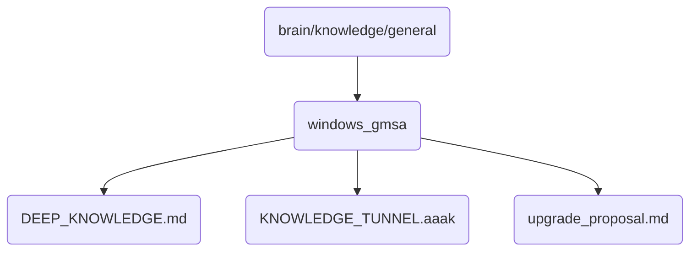

# Windows Gmsa Identity

This directory contains deep knowledge and proposals related to Windows Group Managed Service Accounts (GMSA) for OmniClaw v5.0, crucial for enhancing security and management in our system.

## Topological View

---
*OmniClaw V5.0 | Forged by AI Architect | Evaluated dynamically*
