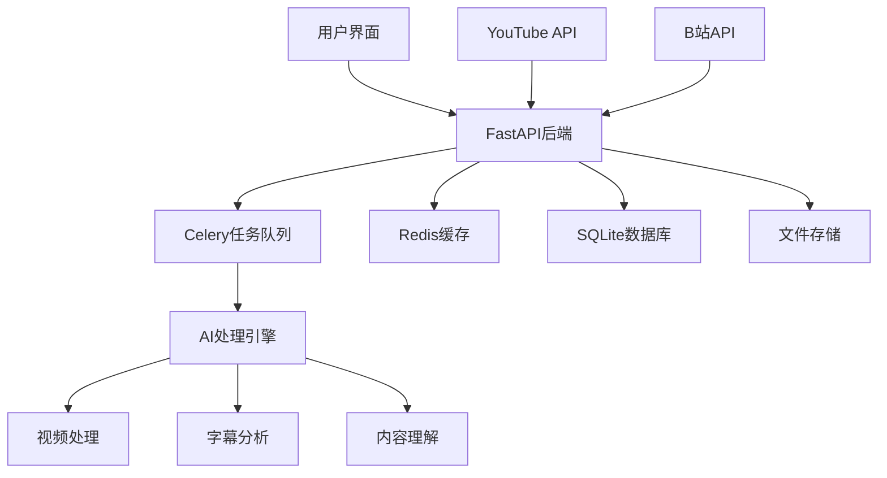

# KNOWLEDGE EXTRACT: zhouxiaoka
> **Extracted on:** 2026-03-30 18:01:27
> **Source:** zhouxiaoka

---

## File: `autoclip.md`
```markdown
# 📦 zhouxiaoka/autoclip [🔖 PENDING/APPROVE]
🔗 https://github.com/zhouxiaoka/autoclip
🌐 https://zhouxiaoka.github.io/autoclip_intro/

## Meta
- **Stars:** ⭐ 3202 | **Forks:** 🍴 678
- **Language:** Python | **License:** MIT
- **Last updated:** 2026-03-26
- **Status trong AI OS:** 🔖 PENDING/APPROVE

## Description:
AutoClip : AI-powered video clipping and highlight generation · 一款智能高光提取与剪辑的二创工具

## README (trích đầu)
```
# AutoClip - 视频高光切片自动化工具

支持YouTube/B站视频下载、自动切片、智能合集生成

[](https://python.org)
[](https://reactjs.org)
[](https://fastapi.tiangolo.com)
[](https://www.typescriptlang.org)
[](https://celeryproject.org)
[](LICENSE)

[](https://github.com/zhouxiaoka/autoclip)
[](https://github.com/zhouxiaoka/autoclip)
[](https://github.com/zhouxiaoka/autoclip/issues)

**语言**: [English](README-EN.md) | [中文](README.md)  

</div>

## 🎯 项目简介

AutoClip是一个基于AI的智能视频切片处理系统，能够自动从YouTube、B站等平台下载视频，通过AI分析提取精彩片段，并智能生成合集。系统采用现代化的前后端分离架构，提供直观的Web界面和强大的后端处理能力。

### ✨ 核心特性

- 🎬 **多平台支持**: YouTube、B站视频一键下载，支持本地文件上传
- 🤖 **AI智能分析**: 基于通义千问大语言模型的视频内容理解
- ✂️ **自动切片**: 智能识别精彩片段并自动切割，支持多种视频分类
- 📚 **智能合集**: AI推荐和手动创建视频合集，支持拖拽排序
- 🚀 **实时处理**: 异步任务队列，实时进度反馈，WebSocket通信
- 🎨 **现代界面**: React + TypeScript + Ant Design，响应式设计
- 📱 **移动端支持**【开发中】: 响应式设计，正在完善移动端体验
- 🔐 **账号管理**【开发中】: 支持B站多账号管理，自动健康检查
- 📊 **数据统计**: 完整的项目管理和数据统计功能
- 🛠️ **易于部署**: 一键启动脚本，Docker支持，详细文档
- 📤 **B站上传**【开发中】: 自动上传切片视频到B站
- ✏️ **字幕编辑**【开发中】: 可视化字幕编辑和同步功能

## 🏗️ 系统架构



### 技术栈

#### 后端技术

- **FastAPI**: 现代化Python Web框架，自动API文档生成
- **Celery**: 分布式任务队列，支持异步处理
- **Redis**: 消息代理和缓存，任务状态管理
- **SQLite**: 轻量级数据库，支持升级到PostgreSQL
- **yt-dlp**: YouTube视频下载，支持多种格式
- **通义千问**: AI内容分析，支持多种模型
- **WebSocket**: 实时通信，进度推送
- **Pydantic**: 数据验证和序列化

#### 前端技术

- **React 18**: 用户界面框架，Hooks和函数组件
- **TypeScript**: 类型安全，更好的开发体验
- **Ant Design**: 企业级UI组件库
- **Vite**: 快速构建工具，热重载
- **Zustand**: 轻量级状态管理
- **React Router**: 路由管理
- **Axios**: HTTP客户端
- **React Player**: 视频播放器

## 🚀 快速开始

### 环境要求

#### Docker部署（推荐）

- **Docker**: 20.10+
- **Docker Compose**: 2.0+
- **内存**: 最少 4GB，推荐 8GB+
- **存储**: 最少 10GB 可用空间

#### 本地部署

- **操作系统**: macOS / Linux / Windows (WSL)
- **Python**: 3.8+ (推荐 3.9+)
- **Node.js**: 16+ (推荐 18+)
- **Redis**: 6.0+ (推荐 7.0+)
- **FFmpeg**: 视频处理依赖
- **内存**: 最少 4GB，推荐 8GB+
- **存储**: 最少 10GB 可用空间

### 一键启动

#### 方式一：Docker部署（推荐）

```bash
# 克隆项目
git clone https://github.com/zhouxiaoka/autoclip.git
cd autoclip

# Docker一键启动
./docker-start.sh

# 开发环境启动
./docker-start.sh dev

# 停止服务
./docker-stop.sh

# 检查服务状态
./docker-stat
```

---
*Ingested: 2026-03-27 | Source: GitHub API | Owner: Dept 07 Knowledge*
```

