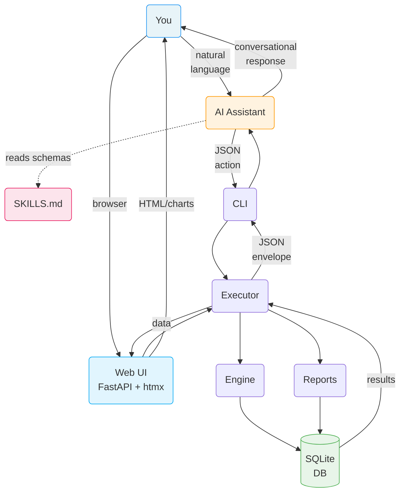

# habit-sprint
Raw knowledge dump assimilated by OA.

## SWALLOW ENGINE DISTILLATION

### File: README.md
```md
# habit-sprint

A deterministic, JSON-native sprint-based habit tracking engine with three interfaces: an **LLM-first conversational workflow** (CLI skill) for AI assistants, a **REST API** that powers the web layer, and a **lightweight web dashboard** for visual tracking and reports.

## Why habit-sprint?

Most habit trackers are standalone apps with rigid UIs. Habit Sprint takes a different approach: it's a structured engine that serves **two complementary interfaces**.

### AI as the interface

By exposing a structured JSON engine as an LLM skill, your AI assistant — whether it's [Claude Code](https://docs.anthropic.com/en/docs/claude-code), [OpenClaw](https://github.com/AgenTool-AI/openclaw), or another agent — gains deep, personalized knowledge of your habits, goals, and behavioral patterns. This unlocks interactions that no traditional app can offer:

- **Conversational tracking** — Say "I meditated and exercised today" instead of tapping checkboxes. Your assistant translates natural language into precise state updates.
- **Personalized coaching** — Your assistant sees your streaks, completion rates, and trends. It can notice you've missed the gym three days in a row and proactively ask about it.
- **Proactive nudges and reminders** — A personal assistant like OpenClaw can check your progress throughout the day and prompt you: "You haven't logged reading yet — still time before bed."
- **Contextual reflection** — At the end of a sprint, your assistant walks you through a retrospective informed by your actual data, not vague recollections.
- **Cross-domain awareness** — Because your assistant already knows your calendar, tasks, and goals, it can connect the dots: "You've been crushing your deep work habit on days you exercise in the morning."

### Web dashboard

A lightweight web UI built with FastAPI, htmx, and Jinja2 provides visual tracking and rich reports — no JavaScript framework required:

- **Sprint dashboard** — Interactive habit grid with one-click toggle, daily scores, and weekly progress
- **Habit management** — Create, edit, archive, and delete habits with category grouping
- **Sprint management** — Create sprints, set per-sprint goal overrides, manage habit assignments, and write retrospectives
- **Reports** — Sprint comparison charts, habit consistency heatmaps, streak leaderboards, category balance, and trend analysis — all powered by Chart.js and cal-heatmap

The engine handles all the computation — streaks, scores, completion percentages, weekly breakdowns. Your AI assistant handles the conversation. The web UI handles the visuals. Neither guesses at the other's job.

## Quick Examples

Once the skill is installed, you interact through natural language. The assistant calls the engine under the hood.

### Set up a sprint

> **You:** Create a 2-week sprint starting today with the theme "Deep Focus" and goals: read daily, exercise 4x/week, meditate every morning.
>
> **Assistant:** Created sprint 2026-S03 (Mar 1 – Mar 14) with theme "Deep Focus" and 3 focus goals. Want me to set up the habits too?

### Log your day

> **You:** I meditated this morning, did 45 minutes of deep work, and went to the gym.
>
> **Assistant:** Logged 3 entries for today. Your daily score is 8/11 (73%). You're on a 4-day meditation streak.

### Check your progress

> **You:** How am I doing this week?

The assistant calls `sprint_dashboard` and renders:

```
====================================================================
SPRINT: 2026-03-02 → 2026-03-15  [Week 1 of 2]
THEME:  Build Morning Routine
FOCUS:  Wake by 6am | Read daily | Exercise 4x/week
====================================================================

CATEGORY: Health                                         Score: 100%
--------------------------------------------------------------------
Habit                     | Min/Wk | Wt | Mon Tue Wed Thu Fri Sat Sun |
--------------------------------------------------------------------
Exercise                  |   4    | 3  |   ✓   ✓   ·   ✓   ·   ✓   · |  4/4  100% ★
--------------------------------------------------------------------

CATEGORY: Mindfulness                                    Score: 100%
--------------------------------------------------------------------
Habit                     | Min/Wk | Wt | Mon Tue Wed Thu Fri Sat Sun |
--------------------------------------------------------------------
Meditation                |   7    | 2  |   ✓   ✓   ✓   ✓   ✓   ✓   ✓ |  7/7  100% ★
Journaling                |   5    | 1  |   ✓   ·   ✓   ✓   ✓   ·   ✓ |  5/5  100% ★
--------------------------------------------------------------------

====================================================================
DAILY TOTALS                    Mon  Tue  Wed  Thu  Fri  Sat  Sun
Points                    →      8    7    5    6    5    7    3
Max Possible              →      8    8    8    8    8    8    8
Completion %              →   100%  88%  62%  75%  62%  88%  38%
====================================================================

SPRINT SUMMARY                                        Weighted: 100%
--------------------------------------------------------------------
Exercise               4 / 4  → 100% ★
Meditation             7 / 7  → 100% ★
Journaling             5 / 5  → 100% ★
--------------------------------------------------------------------
```

### Get nudged by your assistant

> **OpenClaw (proactive):** Hey — it's 8pm and you haven't logged reading today. You're 1 day short of your weekly target. Still planning to read tonight?

### End-of-sprint reflection

> **You:** Let's do a retro.
>
> **Assistant:** Here's your sprint summary: meditation hit 100%, exercise was 75% (dropped off week 2), reading held strong at 90%. What went well? What would you change?

## Architecture

The engine is a thin, deterministic state machine. The LLM never computes metrics — it reads structured results and presents them conversationally. The web UI consumes the same engine through FastAPI routes.



**Key design principles:**

- **Three interfaces** — LLM-first conversational workflow (CLI), REST API (FastAPI), and web dashboard all share the same engine
- **Deterministic** — The engine owns all arithmetic. The LLM never computes scores or streaks.
- **JSON-contract driven** — Strict schemas for every action. No freeform input.
- **SQLite-backed** — Zero-infra, portable, inspectable persistence
- **27 actions** — Sprints, habits, entries, reporting, retrospectives, per-sprint goals, streaks

## Web Interface

The web UI is a lightweight FastAPI application using htmx for interactivity and Jinja2 templates. No JavaScript framework — just server-rendered HTML with progressive enhancement.

### Dashboard

The main dashboard shows the active sprint's habit grid. Click any cell to toggle a habit entry. Daily scores and weekly completion percentages update in real-time via htmx. Notes can be added to individual entries.

### Habits

Browse all habits with category grouping. Create new habits with name, category, weekly target, weight, and unit. View individual habit detail pages showing streak history, completion trends, and entry logs. Archive or permanently delete habits you no longer need.

### Sprints

View all sprints grouped by year and month. Create new sprints with name, start date, duration, theme, and focus goals. Each sprint detail page shows the habit grid, retrospective, and per-sprint goal overrides. Manage which habits are assigned to a sprint and customize targets/weights per sprint without affecting the global defaults.

### Reports

A multi-tab reports page with interactive charts:

- **Sprint Comparison** — Bar chart comparing weighted scores across sprints (Chart.js)
- **Habit Heatmap** — GitHub-style consistency heatmap for any habit or all habits aggregated (cal-heatmap)
- **Category Balance** — Category-level score comparison across sprints
- **Trends** — Weekly completion percentage trends over time
- **Streak Leaderboard** — Table ranking habits by current and longest streaks

## Requirements

- Python 3.12+
- Optional web dependencies: FastAPI, uvicorn, Jinja2, python-multipart, httpx

## Quick Start

### LLM Skill (AI assistant)

If you want your AI assistant (Claude Code, OpenClaw, etc.) to manage your habits through natural language:

```bash
git clone https://github.com/ericblue/habit-sprint.git
cd habit-sprint
make install-global           # Install CLI on your PATH
make claude-skill-install     # Install the LLM skill (or openclaw-skill-install)
```

Start a new Claude Code session and ask about your habits. The database is created automatically at `~/.habit-sprint/habits.db`.

### Web UI

To launch the web dashboard:

```bash
make install-web              # Install with web dependencies (FastAPI, uvicorn, etc.)
habit-sprint serve            # Start web server on http://localhost:8000
```

Or with a custom port:

```bash
habit-sprint serve --port 9000
# or: make serve PORT=9000
```

The web UI and CLI share the same SQLite database (`~/.habit-sprint/habits.db`), so changes made through the assistant or CLI are immediately visible in the browser and vice versa.

## Installation

```bash
# Global install — puts habit-sprint on your PATH (recommended for LLM skill usage)
make install-global

# With web dependencies (FastAPI, uvicorn, Jinja2)
make install-web

# Local venv install — for development, puts binary at .venv/bin/habit-sprint
make install

# With dev dependencies (pytest)
make install-dev
```

Or manually:

```bash
# Global
pip install -e .

# With web extras
pip install -e ".[web]"

# Local venv
python3 -m venv .venv
.venv/bin/pip install -e ".[web]"
```

## LLM Skill Installation

The skill teaches your AI assistant all 27 actions, payload schemas, and constraints. It requires the `habit-sprint` CLI to be on your PATH (`make install-global`).

```bash
# Claude Code
make claude-skill-install     # Install skill
make claude-skill-check       # Check status
make claude-skill-uninstall   # Remove skill

# OpenClaw
make openclaw-skill-install   # Install skill
make openclaw-skill-check     # Check status
make openclaw-skill-uninstall # Remove skill

# Custom OpenClaw skills directory
make openclaw-skill-install OPENCLAW_SKILLS_DIR=/path/to/skills
```

See [SKILLS.md](SKILLS.md) for the full skill reference.

## CLI Usage

You can also interact directly via the JSON contract:

```bash
# List all sprints
habit-sprint --json '{"action": "list_sprints"}'

# Create a sprint
habit-sprint --json '{"action": "create_sprint", "payload": {"name": "March 2026", "start_date": "2026-03-01"}}'

# Log a habit entry
habit-sprint --json '{"action": "log_date", "payload": {"habit_id": "gym", "date": "2026-03-03", "value": 1}}'

# Sprint dashboard (markdown output)
habit-sprint --json '{"action": "sprint_dashboard"}' --format markdown

# Streak leaderboard
habit-sprint --json '{"action": "streak_leaderboard"}'

# Progress summary
habit-sprint --json '{"action": "progress_summary"}'

# Cross-sprint comparison
habit-sprint --json '{"action": "cross_sprint_report"}'

# Use a custom database
habit-sprint --db /path/to/my.db --json '{"action": "list_sprints"}'
```

All responses use a standard envelope:

```json
{"status": "success", "data": {...}, "error": null}
```

## Actions

| Category | Actions |
|----------|---------|
| **Sprints** | `create_sprint`, `update_sprint`, `list_sprints`, `archive_sprint`, `get_active_sprint` |
| **Habits** | `create_habit`, `update_habit`, `archive_habit`, `unarchive_habit`, `delete_habit`, `list_habits` |
| **Entries** | `log_date`, `log_range`, `bulk_set`, `delete_entry` |
| **Per-Sprint Goals** | `set_sprint_habit_goal`, `get_sprint_habit_goal`, `delete_sprint_habit_goal` |
| **Retrospectives** | `add_retro`, `get_retro` |
| **Reporting** | `weekly_completion`, `daily_score`, `get_week_view`, `sprint_report`, `habit_report`, `category_report`, `sprint_dashboard`, `cross_sprint_report`, `streak_leaderboard`, `progress_summary` |

See [SKILLS.md](SKILLS.md) for full action schemas and [COOKBOOK.md](COOKBOOK.md) for practical usage patterns.

## Screenshots

### Sprint Dashboard

Interactive habit grid with one-click toggles, daily scores, and weekly completion tracking.


### Sprints

View all sprints grouped by year and month, with status badges and quick actions.


### Reports — Habit Heatmap

GitHub-style consistency heatmap showing daily check-in intensity with habit filtering and year navigation.


### API (Swagger)

The REST API (FastAPI) backs the web interface and is browsable via the built-in Swagger docs at `/docs`.


### Settings

Database info, data summary, CSV export, and project details.


## Testing

```bash
make test
```

Runs 889 tests covering the engine, CLI, web routes, reporting, validation, and error handling.

## Project Structure

```
habit-sprint/
  habit_sprint/
    cli.py          # CLI adapter (JSON-in/JSON-out, --web/serve subcommand)
    db.py           # SQLite connection and migration runner
    engine.py       # Core business logic (sprints, habits, entries, retros)
    executor.py     # Action router and response envelope (27 actions)
    formatters.py   # Markdown output formatting
    reporting.py    # Queries (dashboards, reports, scores, streaks)
    validation.py   # Payload schema validation
    web.py          # FastAPI web application (htmx + Jinja2)
    templates/      # Jinja2 HTML templates (10 templates)
    static/
      style.css     # Responsive CSS with dark mode support
  migrations/
    001_initial_schema.sql
    002_sprint_habit_goals.sql
  tests/            # 889 tests
  docs/
    prd.md          # Product requirements document
    screenshots/    # Web UI screenshots
  SKILLS.md         # LLM skill reference (27 action schemas)
  COOKBOOK.md        # Practical usage guide with example prompts
  Makefile          # Build, test, serve, and s
... [TRUNCATED]
```

### File: .mcp.json
```json
{
  "mcpServers": {
    "vibe_kanban": {
      "command": "npx",
      "args": ["-y", "vibe-kanban@latest", "--mcp"],
      "env": {
        "PORT": "8080"
      }
    }
  }
}

```

### File: COOKBOOK.md
```md
# Habit Sprint Cookbook

A practical guide with commands and example prompts for using the habit-sprint engine.

## Table of Contents

- [Getting Started](#getting-started)
- [Database Initialization](#database-initialization)
- [Sprint Management](#sprint-management)
- [Habit Management](#habit-management)
- [Habit Logging](#habit-logging)
- [Reporting & Dashboards](#reporting--dashboards)
- [Retrospectives](#retrospectives)
- [Tips & Patterns](#tips--patterns)

---

## Getting Started

### Install

```bash
make install          # Create venv + install
make install-dev      # With pytest for running tests
```

### Install the LLM Skill

If you're using Claude Code or OpenClaw, install the skill so the agent can drive the engine with natural language:

```bash
make claude-skill-install     # Claude Code
make openclaw-skill-install   # OpenClaw
```

### Verify

```bash
habit-sprint --json '{"action": "list_sprints"}'
# → {"status": "success", "data": {"sprints": []}, "error": null}
```

---

## Database Initialization

The database is created automatically on first use at `~/.habit-sprint/habits.db`. The directory is created if it doesn't exist. No explicit init step is needed.

### Use a custom database path

```bash
habit-sprint --db /path/to/my.db --json '{"action": "list_sprints"}'
```

### Example LLM Prompts

> Initialize the habit tracker and show me the current state.

> List all sprints — I want to make sure the database is set up.

---

## Sprint Management

### Create a Sprint

```bash
habit-sprint --json '{
  "action": "create_sprint",
  "payload": {
    "start_date": "2026-03-02",
    "end_date": "2026-03-15",
    "theme": "Build Morning Routine",
    "focus_goals": ["Wake by 6am", "No phone first hour", "Exercise before work"]
  }
}'
```

Sprint IDs are auto-generated in `YYYY-S##` format (e.g. `2026-S01`).

### List Sprints

```bash
habit-sprint --json '{"action": "list_sprints"}'
habit-sprint --json '{"action": "list_sprints", "payload": {"status": "active"}}'
```

### Get the Active Sprint

```bash
habit-sprint --json '{"action": "get_active_sprint"}'
```

### Update a Sprint

```bash
habit-sprint --json '{
  "action": "update_sprint",
  "payload": {
    "id": "2026-S01",
    "theme": "Morning Routine + Deep Work",
    "focus_goals": ["Wake by 6am", "2 hours deep work daily"]
  }
}'
```

### Archive a Sprint

```bash
habit-sprint --json '{"action": "archive_sprint", "payload": {"id": "2026-S01"}}'
```

### Example LLM Prompts

> Create a new 2-week sprint starting today with the theme "Deep Focus" and goals of reading daily, meditating, and limiting social media.

> Start a sprint from March 2 to March 15 focused on building a morning routine.

> Show me all my sprints.

> What's the current active sprint?

> Archive sprint 2026-S01 — it's done.

> Update the current sprint's theme to "Consistency Over Intensity".

---

## Habit Management

### Create Habits

```bash
# Binary habit (did it or didn't)
habit-sprint --json '{
  "action": "create_habit",
  "payload": {
    "id": "meditation",
    "name": "Meditation",
    "category": "Mindfulness",
    "target_per_week": 5,
    "weight": 2
  }
}'

# Numeric habit (tracking minutes)
habit-sprint --json '{
  "action": "create_habit",
  "payload": {
    "id": "deep-work",
    "name": "Deep Work",
    "category": "Productivity",
    "target_per_week": 5,
    "weight": 3,
    "unit": "minutes"
  }
}'

# Sprint-scoped habit
habit-sprint --json '{
  "action": "create_habit",
  "payload": {
    "id": "cold-shower",
    "name": "Cold Shower",
    "category": "Health",
    "target_per_week": 7,
    "weight": 1,
    "sprint_id": "2026-S01"
  }
}'
```

**Key fields:**
- `id` — lowercase slug (`reading`, `daily-walk`, `deep-work`)
- `target_per_week` — 1 to 7 days
- `weight` — 1 (low), 2 (medium), 3 (high behavioral leverage)
- `unit` — `count` (default), `minutes`, `reps`, `pages`
- `sprint_id` — omit for global habits, set for sprint-scoped

### List Habits

```bash
habit-sprint --json '{"action": "list_habits"}'
habit-sprint --json '{"action": "list_habits", "payload": {"category": "Health"}}'
habit-sprint --json '{"action": "list_habits", "payload": {"include_archived": true}}'
```

### Update a Habit

```bash
habit-sprint --json '{
  "action": "update_habit",
  "payload": {"id": "meditation", "target_per_week": 7}
}'
```

### Archive a Habit

```bash
habit-sprint --json '{"action": "archive_habit", "payload": {"id": "cold-shower"}}'
```

### Example LLM Prompts

> Create these habits for my sprint:
> - Reading (30 min/day, 5x/week, high priority, Learning category)
> - Exercise (4x/week, high priority, Health category)
> - Journaling (daily, medium priority, Mindfulness category)
> - No junk food (daily, low priority, Health category)

> Add a habit called "deep-work" — track it in minutes, 5 days a week, high weight, Productivity category.

> Show me all my habits grouped by category.

> I want to stop tracking cold showers — archive that habit.

> Bump my meditation target to 7 days a week.

> List only Health category habits.

---

## Habit Logging

### Log a Single Day

```bash
habit-sprint --json '{
  "action": "log_date",
  "payload": {"habit_id": "meditation", "date": "2026-03-03", "value": 1}
}'

# With a note
habit-sprint --json '{
  "action": "log_date",
  "payload": {"habit_id": "deep-work", "date": "2026-03-03", "value": 90, "note": "Focused session on API design"}
}'
```

### Log a Date Range

```bash
habit-sprint --json '{
  "action": "log_range",
  "payload": {"habit_id": "meditation", "start_date": "2026-03-02", "end_date": "2026-03-06"}
}'
```

### Log Specific (Non-Contiguous) Dates

```bash
habit-sprint --json '{
  "action": "bulk_set",
  "payload": {"habit_id": "exercise", "dates": ["2026-03-02", "2026-03-04", "2026-03-06"]}
}'
```

### Delete an Entry

```bash
habit-sprint --json '{
  "action": "delete_entry",
  "payload": {"habit_id": "meditation", "date": "2026-03-03"}
}'
```

### Example LLM Prompts

> I meditated today.

> Log 90 minutes of deep work for today with the note "finished API refactor".

> I exercised Monday, Wednesday, and Friday this week.

> I read every day this week — log reading for March 2 through March 8.

> Actually I didn't meditate on Thursday — delete that entry for March 5.

> Log that I did journaling on March 3, 5, and 7.

> I did 50 pushups today — log it under exercise.

---

## Reporting & Dashboards

### Sprint Dashboard (the big one)

```bash
# Full dashboard
habit-sprint --json '{"action": "sprint_dashboard"}' --format markdown

# Week 1 only
habit-sprint --json '{"action": "sprint_dashboard", "payload": {"week": 1}}' --format markdown
```

### Weekly View (habit × day grid)

```bash
habit-sprint --json '{"action": "get_week_view"}' --format markdown

# Specific week
habit-sprint --json '{"action": "get_week_view", "payload": {"week_start": "2026-03-02"}}' --format markdown
```

### Sprint Report (analytics)

```bash
habit-sprint --json '{"action": "sprint_report"}' --format markdown
```

### Individual Habit Report

```bash
habit-sprint --json '{"action": "habit_report", "payload": {"habit_id": "meditation"}}' --format markdown

# Different time periods
habit-sprint --json '{"action": "habit_report", "payload": {"habit_id": "meditation", "period": "last_4_weeks"}}' --format markdown
```

### Daily Score

```bash
habit-sprint --json '{"action": "daily_score", "payload": {"date": "2026-03-03"}}' --format markdown
```

### Weekly Completion (single habit)

```bash
habit-sprint --json '{"action": "weekly_completion", "payload": {"habit_id": "meditation"}}' --format markdown
```

### Category Report

```bash
habit-sprint --json '{"action": "category_report"}' --format markdown

# Single category
habit-sprint --json '{"action": "category_report", "payload": {"category": "Health"}}' --format markdown
```

### Example LLM Prompts

> Show me the sprint dashboard.

> How did I do this week?

> Show me the dashboard for week 1 only.

> Give me the full sprint report with analytics.

> How's my meditation habit going? Show me the report.

> What's my daily score for today?

> How's my meditation streak looking?

> Show me a category breakdown — which areas am I strongest and weakest in?

> Compare my Health habits vs Productivity habits.

> How did I do on reading over the last 4 weeks?

---

## Retrospectives

### Add a Retrospective

```bash
habit-sprint --json '{
  "action": "add_retro",
  "payload": {
    "sprint_id": "2026-S01",
    "what_went_well": "Hit meditation target every week. Deep work sessions were productive.",
    "what_to_improve": "Exercise dropped off in week 2. Too many late nights.",
    "ideas": "Try morning exercise before it gets crowded. Set a hard 10pm cutoff."
  }
}'
```

### Get a Retrospective

```bash
habit-sprint --json '{"action": "get_retro", "payload": {"sprint_id": "2026-S01"}}'
```

### Example LLM Prompts

> Let's do a retro for the current sprint. What went well: I stuck to meditation and reading every day. What to improve: exercise fell off in week 2, and I kept staying up too late. Ideas: try working out in the morning and setting a hard 10pm screen cutoff.

> Show me the retrospective for sprint 2026-S01.

> Update the retro — add "try time-blocking" to the ideas.

---

## Tips & Patterns

### Full Setup in One Conversation

Here's an example of a natural conversation to set up everything from scratch:

> 1. "Create a 2-week sprint starting today called 'Foundation Sprint' with goals: build morning routine, read daily, exercise 4x/week."
> 2. "Add these habits: meditation (daily, high weight, Mindfulness), reading (5x/week, high weight, Learning), exercise (4x/week, high weight, Health), journaling (daily, medium weight, Mindfulness), no-sugar (daily, low weight, Health)."
> 3. "I did meditation, reading, and journaling today. I also exercised for 45 minutes."
> 4. "Show me the dashboard."

### End-of-Day Logging

> "Today I meditated, read for 30 minutes, did 50 pushups, and journaled. I didn't exercise or avoid sugar."

### Weekly Check-In

> "Show me the week view and tell me how I'm doing against my targets."

### Sprint Wrap-Up

> "The sprint is ending. Show me the sprint report. Then let's do a retro — here's what went well: ..., what to improve: ..., ideas: ..."

> "Archive the current sprint and create a new one starting Monday."

### Using a Custom Database

Useful for separate tracking contexts (e.g., work vs personal):

```bash
habit-sprint --db ~/work-habits.db --json '{"action": "list_sprints"}'
habit-sprint --db ~/personal-habits.db --json '{"action": "list_sprints"}'
```

### Output Formats

- `--format json` (default) — raw JSON for programmatic use
- `--format markdown` — rendered ASCII tables and formatted output for reading

### Piping from Stdin

```bash
echo '{"action": "sprint_dashboard"}' | habit-sprint --format markdown
cat request.json | habit-sprint
```

```

### File: SKILLS.md
```md
---
name: habit-sprint
description: Manage habit tracking via the habit-sprint engine. Use when user wants to create habits, log habit entries, manage sprints, view scores, check streaks, run retrospectives, view weekly completion, or ask about their habits.
allowed-tools: Bash(habit-sprint:*) Bash(echo:*) Read
---

# Habit Sprint — LLM Skill Reference

**Version:** 1.1
**Engine:** habit-sprint (SQLite-backed, JSON-contract-driven behavioral state engine)

## Overview

Habit Sprint is a deterministic sprint-based habit tracking engine. It manages two-week sprint cycles with weighted habits, entry logging, scoring, and retrospectives. All interaction happens through a strict JSON contract — there is no freeform input.

**Key principles for LLM consumers:**

- **Never compute metrics.** The engine computes all scores, streaks, completion percentages, and trends. The LLM only interprets results.
- **Never invent fields.** Only use fields documented in the schemas below. Unknown fields are rejected.
- **One action per request.** Do not batch multiple mutations into a single action. Each action operates atomically.
- **All operations go through the JSON contract.** No direct SQL, no bypassing the executor.

---

## Invocation

All commands go through the `habit-sprint` CLI. The CLI must be installed and on PATH (via `pip install -e .` or `make install-global`).

**Command pattern:**

```bash
habit-sprint --json '{"action": "<action_name>", "payload": {<fields>}}'
```

**Examples:**

```bash
# List all habits
habit-sprint --json '{"action": "list_habits", "payload": {}}'

# Create a habit
habit-sprint --json '{"action": "create_habit", "payload": {"id": "reading", "name": "Reading", "category": "cognitive", "target_per_week": 5, "weight": 2}}'

# Sprint dashboard with markdown rendering
habit-sprint --json '{"action": "sprint_dashboard", "payload": {}}' --format markdown
```

**Options:**

| Flag | Description | Default |
|---|---|---|
| `--json` | JSON action string to execute | (required) |
| `--db` | Path to SQLite database | `~/.habit-sprint/habits.db` |
| `--format` | Output format: `json` or `markdown` | `json` |

The CLI also accepts JSON via stdin pipe: `echo '{"action": "list_habits"}' | habit-sprint`

---

## Global vs Sprint-Scoped Habits

Habits have two scopes controlled by the `sprint_id` field in `create_habit`:

### Global habits (`sprint_id` omitted or null)

Ongoing habits that persist across all sprints. The engine automatically includes them in every sprint's queries, reports, and dashboards. They never need to be re-created between sprints.

**Use for:** Habits that are part of your established routine or long-term commitments — things you intend to maintain indefinitely regardless of what sprint theme you're running.

**Examples:** Weightlifting 3x/week, daily reading, morning cardio, meditation, journaling.

```json
{"action": "create_habit", "payload": {"id": "weightlifting", "name": "Weightlifting", "category": "fitness", "target_per_week": 3, "weight": 2}}
```

### Sprint-scoped habits (`sprint_id` set to a specific sprint)

Temporary habits tied to a single sprint. They only appear in that sprint's queries and reports. Once the sprint ends, they stop showing up in future sprints automatically.

**Use for:** Experiments, challenges, or short-term goals you want to try for one cycle without cluttering your long-term tracking. If a sprint-scoped habit sticks, you can create a new global version of it.

**Examples:** "Cold plunge challenge", "No sugar for 2 weeks", "Write 500 words daily" (trial run), "Practice Spanish 15 min" (testing if it fits your routine).

```json
{"action": "create_habit", "payload": {"id": "cold-plunge", "name": "Cold Plunge Challenge", "category": "health", "target_per_week": 5, "weight": 1, "sprint_id": "2026-S05"}}
```

### How to choose

| Signal | Scope |
|---|---|
| "I want to track this from now on" | Global |
| "I've been doing this for a while, it's part of my routine" | Global |
| "Let me try this for a sprint and see" | Sprint-scoped |
| "Just for this two-week cycle" | Sprint-scoped |
| User doesn't specify | Default to **global** — most habits are intended to persist |

### Per-Sprint Goal Overrides

Global habits have a default `target_per_week` and `weight`, but these can be **overridden for any specific sprint** using the `set_sprint_habit_goal` action. This lets you adjust goals per sprint without modifying the habit itself.

**Use cases:**
- Increasing a target during an intensive sprint: "I want to read 7x/week this sprint instead of the usual 5"
- Adjusting weight to reflect sprint priorities: "Gym is the focus this sprint, bump its weight to 3"
- Temporarily reducing a target: "I'm traveling next sprint, lower daily-walk to 3x/week"

The override only applies to the specified sprint. Future sprints use the habit's default values unless they also have overrides. All reports, dashboards, and scores automatically use the sprint-specific goal when one exists.

```json
// Override reading target to 7/week for sprint 2026-S06
{"action": "set_sprint_habit_goal", "payload": {"sprint_id": "2026-S06", "habit_id": "reading", "target_per_week": 7, "weight": 2}}
```

### Querying behavior

When reporting functions receive a `sprint_id`, they return **both** sprint-scoped habits for that sprint **and** all global habits. This means global habits are always visible in every sprint's dashboard, reports, and scores without any extra configuration. If a habit has a per-sprint goal override, all scoring and reporting uses the overridden values for that sprint.

---

## LLM Constraints

These rules are mandatory for any LLM consuming this skill. Violations produce incorrect, misleading, or harmful output.

### 1. Never compute metrics

Never compute streaks, scores, trends, or completion percentages. Only interpret and present values returned by the engine. The engine owns all arithmetic. If you need a streak count, call `weekly_completion` or `sprint_report` — do not count entries yourself.

### 2. Never invent fields

Never invent fields not in the schema. Only use documented field names in requests. If you send `{"action": "create_habit", "payload": {"id": "gym", "name": "Gym", "category": "fitness", "target_per_week": 4, "difficulty": "hard"}}`, the engine will reject it with `"Unknown field difficulty in payload for action create_habit"`. The field `difficulty` does not exist.

### 3. One action per request

Do not modify multiple habits in a single action unless the user explicitly requests it. Each action request should be a single, focused operation. If a user says "log reading and gym for today", emit two separate `log_date` actions — not a single fabricated batch action.

### 4. No data fabrication

Never guess or fabricate data. If the engine returns an error, report it honestly. Do not invent habit IDs, sprint IDs, dates, or values. If you are unsure whether a habit exists, call `list_habits` first.

### 5. Schema is truth

The response schemas documented here are the only valid shapes. Do not add, rename, or restructure fields when presenting engine results to the user. If the engine returns `completion_pct: 80`, do not recompute it or present a different number.

---

## JSON Contract

### Request Format

Every request is a JSON object with two keys:

```json
{
  "action": "<action_name>",
  "payload": { }
}
```

- `action` (string, required) — The action name from the table below.
- `payload` (object, optional) — Defaults to `{}` if omitted.

### Response Envelope

Every response follows this exact structure. Success and error fields are never mixed.

**Success:**

```json
{
  "status": "success",
  "data": { },
  "error": null
}
```

**Error:**

```json
{
  "status": "error",
  "data": null,
  "error": "Human-readable error message"
}
```

### Error Examples

| Scenario | Error message |
|---|---|
| Unknown action | `"Unknown action: foo"` |
| Unknown field in payload | `"Unknown field bar in payload for action create_habit"` |
| Missing required field | `"Missing required field: name"` |
| Invalid ISO date | `"Field date must be a valid ISO date (YYYY-MM-DD)"` |
| Integer out of range | `"Field target_per_week must be >= 1"` |
| Invalid enum value | `"Field unit must be one of: count, minutes, reps, pages"` |
| Type mismatch | `"Field weight must be an integer"` |
| Logging to archived habit | `"Habit is archived: reading"` |
| Overlapping active sprints | `"Cannot create sprint: date range ... overlaps with active sprint ..."` |
| Habit not found | `"Habit not found: reading"` |
| Sprint not found | `"Sprint not found: 2026-S01"` |
| No active sprint | `"No active sprint found"` |

---

## Action Routing Table

### Mutation Actions (19)

Mutations modify database state. Routed through `engine.py`.

| Action | Category | Description |
|---|---|---|
| `create_sprint` | Sprint | Create a new sprint |
| `update_sprint` | Sprint | Update sprint theme/goals |
| `list_sprints` | Sprint | List sprints with optional filter |
| `archive_sprint` | Sprint | Archive a sprint |
| `get_active_sprint` | Sprint | Get the currently active sprint |
| `create_habit` | Habit | Create a new habit |
| `update_habit` | Habit | Update an existing habit |
| `archive_habit` | Habit | Archive a habit (soft delete, reversible) |
| `unarchive_habit` | Habit | Restore an archived habit |
| `delete_habit` | Habit | Permanently delete a habit and all its data |
| `list_habits` | Habit | List habits with optional filters |
| `set_sprint_habit_goal` | Goal | Override a habit's target/weight for a specific sprint |
| `get_sprint_habit_goal` | Goal | Query the sprint-specific goal for a habit |
| `delete_sprint_habit_goal` | Goal | Remove a sprint-specific goal override |
| `log_date` | Entry | Log a single entry (idempotent upsert) |
| `log_range` | Entry | Log entries across a date range |
| `bulk_set` | Entry | Log entries for specific non-contiguous dates |
| `delete_entry` | Entry | Delete a single entry |
| `add_retro` | Retro | Add/update a sprint retrospective (upsert) |
| `get_retro` | Retro | Retrieve a sprint retrospective |

### Query Actions (7)

Queries are read-only analytics. Routed through `reporting.py`.

| Action | Description |
|---|---|
| `weekly_completion` | Weekly completion stats for a single habit |
| `daily_score` | Aggregate score for a single day |
| `get_week_view` | Weekly grid data (habits x days) grouped by category |
| `sprint_report` | Full sprint analytics with weighted scoring |
| `habit_report` | Detailed report for a single habit over a period |
| `category_report` | Aggregated report across categories with balance analysis |
| `sprint_dashboard` | Combined full-sprint view (richest action in the system) |

---

## Mutation Actions

### create_sprint

Creates a new sprint. Only one active sprint at a time. Sprint IDs are auto-generated in `YYYY-S##` format based on the start_date year and existing sprint count (the `id` field in the payload is validated but the engine auto-generates the actual ID).

**Payload:**

| Field | Type | Required | Description | Constraints |
|---|---|---|---|---|
| `id` | str | yes | Sprint identifier (validated but auto-generated by engine) | Format: `YYYY-S##` |
| `start_date` | iso_date | yes | Sprint start date | Valid ISO date (YYYY-MM-DD) |
| `end_date` | iso_date | yes | Sprint end date | Must be after start_date |
| `theme` | str | no | Sprint theme | Free text |
| `focus_goals` | list | no | List of focus goal strings | JSON array of strings |

**Behavior:**
- Validates no overlapping active sprints exist.
- `end_date` must be strictly after `start_date`.
- Default sprint duration is 14 days (2 weeks), but any range is accepted.

**Response data:**

```json
{
  "id": "2026-S05",
  "start_date": "2026-03-01",
  "end_date": "2026-03-14",
  "theme": "Foundation Building",
  "focus_goals": ["Establish morning routine", "Hit gym 4x/week"],
  "status": "active",
  "created_at": "2026-03-01T10:00:00",
  "updated_at": "2026-03-01T10:00:00"
}
```

**Example:**

```json
// Request
{"action": "create_sprint", "payload": {"id": "2026-S05", "start_date": "2026-03-01", "end_date": "2026-03-14", "theme": "Foundation Building", "focus_goals": ["Establish morning routine", "Hit gym 4x/week"]}}

// Response
{"status": "success", "data": {"id": "2026-S05", "start_date": "2026-03-01", "end_date": "2026-03-14", "theme": "Foundation Building", "focus_goals": ["Establish morning routine", "Hit gym 4x/week"], "status": "active", "created_at": "2026-03-01T10:00:00", "updated_at": "2026-03-01T10:00:00"}, "error": null}
```

---

### update_sprint

Updates an existing sprint's theme and/or focus goals. Only provided fields are changed; omitted fields are unchanged.

**Payload:**

| Field | Type | Required | Description | Constraints |
|---|---|---|---|---|
| `id` | str | yes | Sprint ID to update | Must exist |
| `theme` | str | no | New theme | Free text |
| `focus_goals` | list | no | New focus goals | JSON array of strings |

**Note:** The engine reads this field as `sprint_id` internally. The validated payload field name is `id`.

**Response data:** Returns the full updated sprint object (same shape as `create_sprint` response).

**Example:**

```json
// Request
{"action": "update_sprint", "payload": {"id": "2026-S05", "theme": "Peak Performance", "focus_goals": ["Exercise daily", "Read 30 pages/day"]}}

// Response
{"status": "success", "data": {"id": "2026-S05", "start_date": "2026-03-01", "end_date": "2026-03-14", "theme": "Peak Performance", "focus_goals": ["Exercise daily", "Read 30 pages/day"], "status": "active", "created_at": "2026-03-01T10:00:00", "updated_at": "2026-03-05T14:30:00"}, "error": null}
```

---

### list_sprints

Lists sprints with optional status filtering.

**Payload:**

| Field | Type | Required | Description | Constraints |
|---|---|---|---|---|
| `status` | str | no | Filter by status | Enum: `active`, `archived`. Omit for all sprints. |

**Response data:**

```json
{
  "sprints": [
    {
      "id": "2026-S05",
      "start_date": "2026-03-01",
      "end_date": "2026-03-14",
      "theme": "Foundation Building",
      "focus_goals": ["Establish morning routine"],
      "status": "active",
      "created_at": "...",
      "updated_at": "..."
    }
  ]
}
```

**Example:**

```json
// Request
{"action": "list_sprints", "payload": {"status": "active"}}

// Response
{"status": "success", "data": {"sprints": [{"id": "2026-S05", "start_date": "2026-03-01", "end_date": "2026-03-14", "theme": "Foundation Building", "focus_goals": ["Establish morning routine"], "status": "active", "created_at": "2026-03-01T10:00:00", "updated_at": "2026-03-01T10:00:00"}]}, "error": null}
```

---

### archive_sprint

Archives a sprint by setting its status to `"archived"`.

**Payload:**

| Field | Type | Required | Description | Constraints |
|---|---|---|---|---|
| `id` | str | yes | Sprint ID to archive | Must exist |

**Response d
... [TRUNCATED]
```

### File: docs\development-plan.md
```md
# Development Plan: Habit Sprint

> **Generated from:** docs/prd.md
> **Created:** 2026-03-01
> **Last synced:** 2026-03-15T01:25Z
> **Status:** Active Planning Document
> **VibeKanban Project ID:** 9c59dcf5-0dc3-4305-855b-9b9432dd88c2

## Overview

Habit Sprint is a deterministic, JSON-native sprint-based habit tracking engine designed for LLM-first workflows. It provides CRUD operations for habits and sprints via a strict JSON contract, weighted scoring and analytics via a read-only reporting layer, and a thin CLI adapter — all backed by SQLite with zero external infrastructure.

## Tech Stack

- **Backend:** Python 3.12+
- **Frontend:** Lightweight web UI (htmx + Jinja2 templates)
- **Database:** SQLite (stdlib sqlite3 module)
- **Testing:** pytest
- **Packaging:** pyproject.toml with venv
- **Infrastructure:** Local-only, single-user

## PRD Clarifications (from review)

| Decision | Detail |
|----------|--------|
| `update_sprint` action | Added to spec |
| Habit lifecycle | Habits carry forward across sprints; global habits always carry forward |
| Sprint ID format | Auto-generated `"YYYY-S##"` from start date |
| Week boundaries | Fixed Mon–Sun for all views |
| `trend_vs_last_sprint` no prior data | Returns `null` |
| Avoidance habits | `value=1` means success, no type field for v1 |
| `balance_assessment.spread` | Max minus min of category scores |
| Database migrations | Simple migration system with schema version table |
| Dependencies | Pure stdlib + sqlite3; external only if truly needed |

---

## Completion Status Summary

| Epic | Status | Progress |
|------|--------|----------|
| 1. Project Foundation & Schema | Done | 100% |
| 2. Core Engine & Executor | Done | 100% |
| 3. Reporting Engine | Done | 100% |
| 4. CLI Adapter | Done | 100% |
| 5. LLM Skill Layer | Done | 100% |
| 6. Web UI | Done | 100% |
| 7. Web UI Polish & Sprint Habit Management | Done | 100% |
| 8. Habit Consolidation & Per-Sprint Goals | Done | 100% |
| 9. Reports & Analytics | Done | 100% |

---

## Epic 1: Project Foundation & Schema (DONE)

Set up the project structure, SQLite schema, migration system, and database connection management. This epic is the foundation everything else builds on.

### Acceptance Criteria

- [ ] Project installs cleanly with `pip install -e .` in a fresh venv
- [ ] SQLite database is created with all tables and indexes on first run
- [ ] Migration system tracks schema version and can apply incremental migrations
- [ ] pytest runs and discovers tests

### Tasks

| ID | Title | Description | Priority | Complexity | Depends On | Status |
|----|-------|-------------|----------|------------|------------|--------|
| 1.1 | Project scaffolding | Create pyproject.toml, directory structure (habit_sprint/, tests/), venv setup, pytest config | High | S | — | <!-- vk:ERI-6 --> |
| 1.2 | SQLite schema | Create schema.sql with sprints, habits, entries, retros tables and all indexes per PRD Section 5 | High | S | 1.1 | <!-- vk:ERI-7 --> |
| 1.3 | Migration system | Create db.py with connection management, schema version table, migration runner that applies .sql files in order | High | M | 1.1 | <!-- vk:ERI-8 --> |
| 1.4 | Database initialization | Wire schema.sql as migration v1, ensure DB is auto-created with WAL mode and foreign keys enabled on first use | High | S | 1.2, 1.3 | <!-- vk:ERI-9 --> |

### Task Details

**1.1 - Project scaffolding**
- [ ] `pyproject.toml` defines project metadata, Python 3.12+ requirement, pytest config, and `habit-sprint` CLI entry point
- [ ] Directory structure: `habit_sprint/` (package), `tests/`, `docs/`, `migrations/`
- [ ] `habit_sprint/__init__.py` exists with version string
- [ ] `pytest` discovers and runs an empty test file successfully

**1.2 - SQLite schema**
- [ ] `migrations/001_initial_schema.sql` contains CREATE TABLE statements for sprints, habits, entries, retros
- [ ] All indexes from PRD Section 5.1 are included
- [ ] Schema matches PRD exactly (column names, types, constraints, foreign keys)

**1.3 - Migration system**
- [ ] `habit_sprint/db.py` provides `get_connection(db_path)` that returns a configured sqlite3 connection
- [ ] Connection has WAL mode, foreign keys enabled, and row_factory set to sqlite3.Row
- [ ] `schema_version` table tracks applied migration versions
- [ ] `migrate(conn)` applies all pending `.sql` files from `migrations/` directory in sorted order
- [ ] Already-applied migrations are skipped (idempotent)

**1.4 - Database initialization**
- [ ] Calling `get_connection()` on a non-existent DB file creates it and runs all migrations
- [ ] After initialization, all 4 tables exist with correct schemas
- [ ] `schema_version` table shows version 1 applied
- [ ] Tests verify table creation and migration idempotency

---

## Epic 2: Core Engine & Executor (DONE)

Implement the domain logic (engine.py) for all CRUD operations and the JSON contract boundary (executor.py) that routes, validates, and wraps all actions. This is the heart of the system.

### Acceptance Criteria

- [ ] All 16 mutation/query actions route through executor.execute() and return correct envelope responses
- [ ] Sprint IDs are auto-generated in "YYYY-S##" format
- [ ] Habits carry forward across sprints (no re-creation needed)
- [ ] All validation rules from PRD Section 11 are enforced with clear error messages
- [ ] All operations are idempotent where specified (entries, retros)
- [ ] 100% of engine functions have passing unit tests

### Tasks

| ID | Title | Description | Priority | Complexity | Depends On | Status |
|----|-------|-------------|----------|------------|------------|--------|
| 2.1 | Executor framework | Create executor.py with execute() entry point, action routing, envelope wrapping, and unknown action rejection | High | M | 1.4 | <!-- vk:ERI-10 --> |
| 2.2 | Payload validation | Add schema-based payload validation to executor: required fields, type checking, unknown field rejection | High | M | 2.1 | <!-- vk:ERI-11 --> |
| 2.3 | Sprint management | Implement create_sprint (with auto-ID), update_sprint, list_sprints, archive_sprint, get_active_sprint in engine.py | High | L | 2.1 | <!-- vk:ERI-12 --> |
| 2.4 | Habit management | Implement create_habit, update_habit, archive_habit, list_habits in engine.py with sprint carry-forward logic | High | L | 2.3 | <!-- vk:ERI-13 --> |
| 2.5 | Entry management | Implement log_date, log_range, bulk_set, delete_entry in engine.py with idempotent upsert behavior | High | M | 2.4 | <!-- vk:ERI-14 --> |
| 2.6 | Retrospectives | Implement add_retro (upsert) and get_retro in engine.py | Medium | S | 2.3 | <!-- vk:ERI-15 --> |
| 2.7 | Error handling | Ensure all validation rules from PRD Section 11 produce clear error messages (overlap prevention, archived habits, date format, ranges) | High | M | 2.3, 2.4, 2.5 | <!-- vk:ERI-16 --> |
| 2.8 | Core engine tests | Comprehensive pytest suite for all engine + executor operations, happy paths and error cases | High | L | 2.3, 2.4, 2.5, 2.6, 2.7 | <!-- vk:ERI-17 --> |

### Task Details

**2.1 - Executor framework**
- [ ] `executor.py` exposes `execute(action_json: dict, db_path: str) -> dict`
- [ ] Routes actions to engine.py (mutations) or reporting.py (queries) based on action name
- [ ] Returns `{"status": "success", "data": {...}, "error": null}` for success
- [ ] Returns `{"status": "error", "data": null, "error": "message"}` for errors
- [ ] Rejects unknown actions with `"Unknown action: 'foo'"`

**2.2 - Payload validation**
- [ ] Each action has a defined schema of allowed fields with types
- [ ] Missing required fields return `"Missing required field: 'name'"`
- [ ] Unknown/extra fields return `"Unknown field 'bar' in payload for action 'create_habit'"`
- [ ] Type validation (ISO dates, integers, allowed enum values) with clear messages

**2.3 - Sprint management**
- [ ] `create_sprint` auto-generates ID in "YYYY-S##" format (sequential per year based on existing sprints)
- [ ] `create_sprint` prevents overlapping active sprints with clear error message
- [ ] `create_sprint` validates end_date > start_date, valid ISO dates
- [ ] `update_sprint` allows updating theme and focus_goals on existing sprints
- [ ] `list_sprints` supports optional status filter ("active", "archived", or all)
- [ ] `archive_sprint` sets status to "archived"
- [ ] `get_active_sprint` returns the active sprint or error if none

**2.4 - Habit management**
- [ ] `create_habit` validates slug format, target_per_week (1-7), weight (1-3), unit enum
- [ ] `update_habit` only updates provided fields, rejects updates to archived habits
- [ ] `archive_habit` sets archived=1; archived habits reject new entries
- [ ] `list_habits` supports filters: sprint_id, category, include_archived
- [ ] Global habits (no sprint_id) are always returned regardless of sprint filter
- [ ] Habits carry forward — no re-creation needed between sprints

**2.5 - Entry management**
- [ ] `log_date` performs idempotent upsert (INSERT OR REPLACE), returns created=true/false
- [ ] `log_range` creates entries for each date in [start, end] inclusive
- [ ] `bulk_set` creates entries for specific non-contiguous dates
- [ ] `delete_entry` removes a single entry, returns deleted=true/false
- [ ] All entry operations validate habit exists and is not archived
- [ ] All dates validated as ISO 8601 format

**2.6 - Retrospectives**
- [ ] `add_retro` performs upsert (one retro per sprint)
- [ ] `add_retro` validates sprint exists
- [ ] `get_retro` returns retro data or clear message if none exists
- [ ] All three text fields (what_went_well, what_to_improve, ideas) are optional

**2.7 - Error handling**
- [ ] Every validation rule from PRD Section 11 has a corresponding test
- [ ] Error messages are human-readable and specific (include the invalid value)
- [ ] Overlapping sprint detection works correctly with date range comparison
- [ ] Invalid ISO dates, out-of-range integers, and invalid enums all caught

**2.8 - Core engine tests**
- [ ] Each action has at least one happy-path test and one error-path test
- [ ] Idempotent operations tested (log_date twice, add_retro twice)
- [ ] Sprint overlap detection tested with various edge cases
- [ ] Habit carry-forward behavior verified across sprint boundaries
- [ ] Tests use in-memory SQLite (`:memory:`) for speed

---

## Epic 3: Reporting Engine (DONE)

Implement all read-only analytics in reporting.py: weekly completion, streaks, daily scores, weighted sprint scoring, category rollups, trend analysis, and the composite sprint dashboard view.

### Acceptance Criteria

- [ ] All 7 reporting actions return correct, deterministic results
- [ ] Weighted sprint score formula matches PRD: Σ(actual × weight) / Σ(target × weight)
- [ ] Sprint dashboard combines all data into a single response matching PRD Section 7.6
- [ ] All metrics computed in reporting layer only — never in engine or executor
- [ ] Reporting functions are strictly read-only (no mutations)

### Tasks

| ID | Title | Description | Priority | Complexity | Depends On | Status |
|----|-------|-------------|----------|------------|------------|--------|
| 3.1 | Weekly completion & streaks | Implement weekly completion % (actual/target) and streak calculation (current + longest) | High | M | 2.5 | <!-- vk:ERI-18 --> |
| 3.2 | Daily score | Implement daily_score action: Σ(value × weight) / Σ(weight) with completed/missed habit lists | High | M | 2.5 | <!-- vk:ERI-19 --> |
| 3.3 | Week view | Implement get_week_view with fixed Mon–Sun grid, per-habit daily values, week_actual, completion_pct, commitment_met | High | M | 3.1 | <!-- vk:ERI-20 --> |
| 3.4 | Sprint report | Implement sprint_report with weighted/unweighted scores, category breakdown, per-habit stats, weekly breakdown, trend_vs_last_sprint | High | L | 3.1, 3.2 | <!-- vk:ERI-21 --> |
| 3.5 | Habit report | Implement habit_report with period support (current_sprint, last_4_weeks, last_8_weeks), weekly history, rolling 7-day avg, trend | Medium | M | 3.1 | <!-- vk:ERI-22 --> |
| 3.6 | Category report | Implement category_report with per-category weighted/unweighted scores, balance_assessment (most/least adherent, spread=max-min) | Medium | M | 3.4 | <!-- vk:ERI-23 --> |
| 3.7 | Sprint dashboard | Implement sprint_dashboard composite view: categories with habits, daily totals, sprint summary, retro — per PRD Section 7.6 | High | L | 3.3, 3.4 | <!-- vk:ERI-24 --> |
| 3.8 | Reporting tests | Comprehensive pytest suite for all reporting actions with known test data and verified expected outputs | High | L | 3.1, 3.2, 3.3, 3.4, 3.5, 3.6, 3.7 | <!-- vk:ERI-25 --> |

### Task Details

**3.1 - Weekly completion & streaks**
- [ ] `completion_pct = (actual_days / target_per_week) × 100`, capped display at whole integers
- [ ] `commitment_met = actual_days >= target_per_week`
- [ ] Current streak: consecutive days ending today or yesterday with value > 0
- [ ] Longest streak: maximum consecutive days with value > 0 across all time
- [ ] Handles edge case of no entries (streak = 0, completion = 0%)

**3.2 - Daily score**
- [ ] Formula: `Σ(value × weight)` for completed habits / `Σ(weight)` for all active habits
- [ ] Returns total_points, max_possible, completion_pct, habits_completed list, habits_missed list
- [ ] Handles days with no entries (score = 0)
- [ ] Only counts non-archived habits active during that date's sprint

**3.3 - Week view**
- [ ] Returns fixed Mon–Sun grid regardless of sprint start day
- [ ] `week_start` defaults to current week's Monday when omitted
- [ ] Per-habit: daily values map, week_actual, week_completion_pct, commitment_met
- [ ] Groups habits by category in response
- [ ] Days outside sprint range return 0 values

**3.4 - Sprint report**
- [ ] Weighted score: `Σ(actual_entries × weight) / Σ(target_entries × weight)`
- [ ] Unweighted score: `Σ(actual_entries) / Σ(target_entries)`
- [ ] Category breakdown with per-category weighted scores
- [ ] Per-habit: total_entries, expected_entries, completion_pct, current_streak, longest_streak, weekly_breakdown
- [ ] `trend_vs_last_sprint` returns `null` when no prior sprint data exists
- [ ] days_elapsed and days_remaining computed from current date vs sprint dates

**3.5 - Habit report**
- [ ] Supports periods: "current_sprint", "last_4_weeks", "last_8_weeks", or specific sprint_id
- [ ] weekly_history array with per-week actual/target/completion_pct
- [ ] rolling_7_day_avg computed correctly
- [ ] trend_vs_prior_period shows delta as percentage string

**3.6 - Category report**
- [ ] Per-category: habits_count, weighted_score, unweighted_score, habit ID list
- [ ] balance_assessment.most_adherent and least_adherent by weighted_score
- [ ] balance_assessment.spread = max(weighted_scores) - min(weighted_scores)
- [ ] Handles categories with a single habit correctly

**3.7 - Sprint dashboard**
- [ ] Combines: sprint metadata, categories with habits (daily values), daily_totals, sprint_summary, retro
- [ ] Supports optional `w
... [TRUNCATED]
```


> [!WARNING]
> Distillation threshold (50000 chars) reached. Truncating further files.
