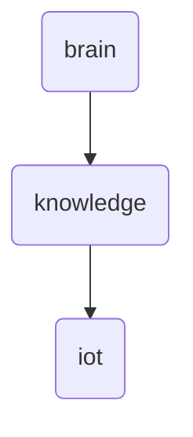

# Iot Identity

The 'iot' directory within OmniClaw v5.0 serves as the central hub for Internet of Things (IoT) related knowledge and data, facilitating seamless integration and management of IoT devices and systems.

---

## Topological View

---
*OmniClaw V5.0 | Forged by OMA AI Architect | brain.knowledge.iot | 2026-04-10*
