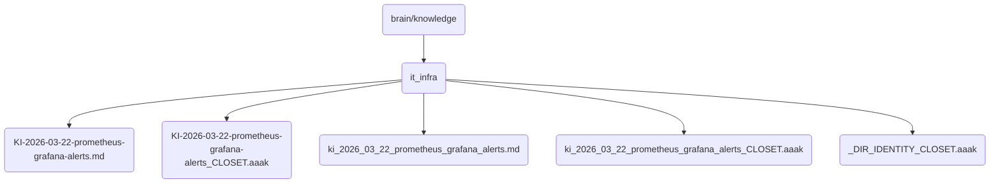

# It Infra Identity

This directory contains critical IT infrastructure monitoring and alerting configurations for OmniClaw v5.0, including Prometheus and Grafana setups.

## Topological View

---
*OmniClaw V5.0 | Forged by AI Architect | Evaluated dynamically*
