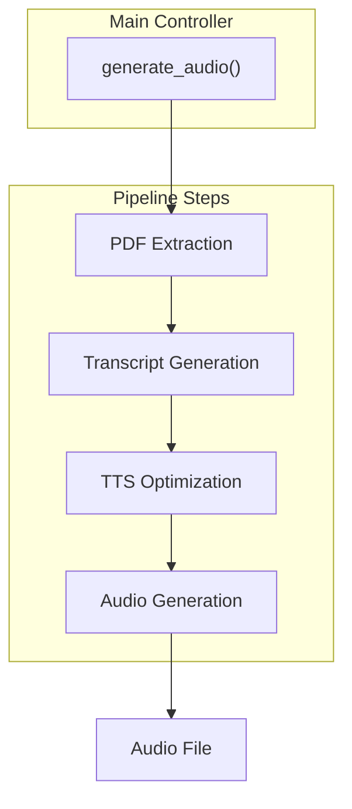

# local
Raw knowledge dump assimilated by OA.

## SWALLOW ENGINE DISTILLATION

### File: README.md
```md
# Local-NotebookLM


NEW! A stand-alone app has been released [link](https://github.com/Goekdeniz-Guelmez/Local-Notebook-LM-App).

A local AI-powered tool that converts PDF documents into engaging audio—such as podcasts or custom audio content—using local LLMs and TTS models.

## Features

- PDF text extraction and processing
- Customizable audio generation (podcasts, summaries, interviews, and more) with different styles and lengths
- Support for various LLM providers (OpenAI, Groq, LMStudio, Ollama, Azure)
- Text-to-Speech conversion with voice selection
- Flexible pipeline with many options for content, style, and voices
- Programmatic API for integration in other projects
- FastAPI server for web-based access
- Example podcast included for demonstration

#### Here are quick examples, can you guess what paper they're talking about?

<audio controls>
    <source src="https://raw.githubusercontent.com/Goekdeniz-Guelmez/Local-NotebookLM/main/examples/podcast_example_casual.wav" type="audio/wav">
    Your browser does not support the audio element. You can manually listen/download here: <a href="https://raw.githubusercontent.com/Goekdeniz-Guelmez/Local-NotebookLM/main/examples/podcast_example_casual.wav">Casual example</a>.
</audio>

<audio controls>
    <source src="https://raw.githubusercontent.com/Goekdeniz-Guelmez/Local-NotebookLM/main/examples/podcast_example_genz.wav" type="audio/wav">
    Your browser does not support the audio element. You can manually listen/download here: <a href="https://raw.githubusercontent.com/Goekdeniz-Guelmez/Local-NotebookLM/main/examples/podcast_example_genz.wav">Gen-Z example</a>.
</audio>

If your browser still blocks embedded playback on GitHub, use direct links:
- [Casual example (.wav)](https://raw.githubusercontent.com/Goekdeniz-Guelmez/Local-NotebookLM/main/examples/podcast_example_casual.wav)
- [Gen-Z example (.wav)](https://raw.githubusercontent.com/Goekdeniz-Guelmez/Local-NotebookLM/main/examples/podcast_example_genz.wav)

## Prerequisites

- Python 3.9+
- Local LLM server (optional, for local inference)
- Local TTS server (optional, for local audio generation)
- At least 8GB RAM (32GB+ recommended for local models)
- 10GB+ free disk space

## Installation

### From PyPI

```bash
pip install local-notebooklm
```

### From source

1. Clone the repository:

```bash
git clone https://github.com/Goekdeniz-Guelmez/Local-NotebookLM.git
cd Local-NotebookLM
```

2. Create and activate a virtual environment (conda works too):

```bash
python -m venv venv
source venv/bin/activate  # On Windows, use: venv\Scripts\activate
```

3. Install the required packages:

```bash
pip install -r requirements.txt
```

## Running with Docker

You can run Local-NotebookLM using Docker for both the Web UI and API modes.

### Prerequisites

- Docker installed on your system

### Steps

1. **Build the Docker image:**

    ```bash
    docker build -t local-notebooklm-ui .
    ```

2. **Run the Gradio Web UI:**

    ```bash
    docker run -p 7860:7860 local-notebooklm-ui
    ```
    The Web UI will be available at [http://localhost:7860](http://localhost:7860).

3. **Run the FastAPI API server:**

    ```bash
    docker run -e APP_MODE=api -p 8000:8000 local-notebooklm-ui
    ```
    The API server will be available at [http://localhost:8000](http://localhost:8000).
## Optional pre requisites
### Local TTS server
- Follow one installation type (docker, docker-compose, uv) at https://github.com/remsky/Kokoro-FastAPI
- Test in your browser that http://localhost:8880/v1 return the json: {"detail":"Not Found"}
  
## Example Output

The repository includes an example podcast in `examples/podcast.wav` to demonstrate the quality and format of the output. The models used are: gpt4o and Mini with tts-hs on Azure. You can listen to this example to get a sense of what Local-NotebookLM can produce before running it on your own PDFs.


## Usage

### Command Line Interface

Run the script with the following command:

```bash
python -m local_notebooklm.make_audio --pdf PATH_TO_PDF [options]
```

#### Available Options

| Option | Description | Default |
|--------|-------------|---------|
| `--pdf` | Path to the PDF file (required) | - |
| `--output_dir` | Directory to store output files | ./output |
| `--llm_model` | Ollama LLM model name | gemini-3-flash-preview:cloud |
| `--language` | Language for the audio output | english |
| `--format_type` | Output format type (summary, podcast, article, interview, panel-discussion, debate, narration, storytelling, explainer, lecture, tutorial, q-and-a, news-report, executive-brief, meeting, analysis) | podcast |
| `--style` | Content style (normal, casual, formal, technical, academic, friendly, gen-z, funny) | normal |
| `--length` | Content length (short, medium, long, very-long) | medium |
| `--is-vlm` | Enable vision mode so extracted PDF images are also sent to the LLM | False |
| `--num_speakers` | Number of speakers in audio (1, 2, 3, 4, 5) | 2 (for podcast/interview) |
| `--custom_preferences` | Additional focus preferences or instructions | None |

#### Format Types

Local-NotebookLM supports both single-speaker and multi-speaker formats:

**Single-Speaker Formats:**
- summary
- narration
- storytelling
- explainer
- lecture
- tutorial
- news-report
- executive-brief
- analysis

**Two-Speaker Formats:**
- podcast
- interview
- panel-discussion
- debate
- q-and-a
- meeting

**Multi-Speaker Formats:**
- panel-discussion (3, 4, or 5 speakers)
- debate (3, 4, or 5 speakers)

#### Example Commands

Basic usage:
```bash
python -m local_notebooklm.make_audio --pdf documents/research_paper.pdf
```

Customized podcast:
```bash
python -m local_notebooklm.make_audio --pdf documents/research_paper.pdf --format_type podcast --length long --style casual
```

With custom preferences:
```bash
python -m local_notebooklm.make_audio --pdf documents/research_paper.pdf --custom_preferences "Focus on practical applications and real-world examples"
```

Specify number of speakers:
```bash
python -m local_notebooklm.make_audio --pdf documents/research_paper.pdf --format_type panel-discussion --num_speakers 3
```

Enable multimodal transcript generation (text + PDF images):
```bash
python -m local_notebooklm.make_audio --pdf documents/research_paper.pdf --is-vlm
```

### Programmatic API

You can also use Local-NotebookLM programmatically in your Python code:

```python
from local_notebooklm.processor import generate_audio

generate_audio(
    pdf_path="documents/research_paper.pdf",
    output_dir="./test_output",
    llm_model="qwen3:30b-a3b-instruct-2507-q4_K_M",
    language="english",
    format_type="interview",
    style="professional",
    length="long",
    num_speakers=2,
    custom_preferences="Focus on the key technical aspects"
)
```

### Gradio Web UI

Local-NotebookLM now includes a user-friendly Gradio web interface that makes it easy to use the tool without command line knowledge:

```bash
python -m local_notebooklm.web_ui
```

By default, the web UI runs locally on http://localhost:7860. You can access it from your browser.

#### Web UI Screenshots


*The main interface of the Local-NotebookLM web UI*

#### Web UI Options

| Option | Description | Default |
|--------|-------------|---------|
| `--share` | Make the UI accessible over the network | False |
| `--port` | Specify a custom port | 7860 |

#### Example Commands

Basic local usage:
```bash
python -m local_notebooklm.web_ui
```

Share with others on your network:
```bash
python -m local_notebooklm.web_ui --share
```

Use a custom port:
```bash
python -m local_notebooklm.web_ui --port 8080
```

The web interface provides all the same options as the command line tool in an intuitive UI, making it easier for non-technical users to generate audio content from PDFs.

### FastAPI Server

Start the FastAPI server to access the functionality via a web API:

```bash
 python -m local_notebooklm.server
```

By default, the server runs on http://localhost:8000. You can access the API documentation at http://localhost:8000/docs.

## Pipeline Steps

1. **PDF Extraction**
   - Extracts and cleans text from the provided PDF.
2. **Transcript Generation**
   - Generates a transcript or script based on the extracted content and user options.
3. **Audio Generation**
   - Converts the optimized transcript to audio using the specified TTS model and outputs the final audio file.

### Pipeline Diagram



## Multiple Language Support

Local-NotebookLM now supports multiple languages. You can specify the language when using the programmatic API or through the command line.

**Important Note:** When using a non-English language, ensure that both your selected LLM and TTS models support the desired language. Language support varies significantly between different models and providers. For optimal results, verify that your chosen models have strong capabilities in your target language before processing.


## Output Files

The pipeline generates the following files:

- `segments/podcast_segment_*.wav`: Individual audio segments
- `podcast.wav`: Final concatenated podcast audio file

## Troubleshooting

### Common Issues

1. **PDF Extraction Fails**
   - Try a different PDF file
   - Check if the PDF is password-protected
   - Ensure the PDF contains extractable text (not just images)

2. **API Connection Errors**
   - Verify your API keys are correct
   - Check your internet connection
   - Ensure the API endpoints are accessible

3. **Out of Memory Errors**
   - Reduce the chunk size in the configuration
   - Use a smaller model
   - Close other memory-intensive applications

4. **Audio Quality Issues**
   - Try different TTS voices
   - Adjust the sample rate in the configuration
   - Check if the TTS server is running correctly

### Getting Help

If you encounter issues not covered here, please:
1. Check the logs for detailed error messages
2. Open an issue on the GitHub repository with details about your problem
3. Include the error message and steps to reproduce the issue

## Requirements

- Python 3.9+
- PyPDF2
- tqdm
- numpy
- soundfile
- requests
- pathlib
- fastapi
- uvicorn

Full requirements are listed in `requirements.txt`.

## Acknowledgments

- This project uses various open-source libraries and models
- Special thanks to the developers of LLaMA, OpenAI, and other AI models that make this possible

Best
Gökdeniz Gülmez

---


---

## Citing Local-NotebookLM

The Local-NotebookLM software suite was developed by Gökdeniz Gülmez. If you find Local-NotebookLM useful in your research and wish to cite it, please use the following
BibTex entry:

```text
@software{
  Local-NotebookLM,
  author = {Gökdeniz Gülmez},
  title = {{Local-NotebookLM}: A Local-NotebookLM to convert PDFs into Audio.},
  url = {https://github.com/Goekdeniz-Guelmez/Local-NotebookLM},
  version = {0.1.5},
  year = {2025},
}
```

```

### File: requirements.txt
```txt
PyPDF2
numpy
soundfile
openai
tqdm
pydantic
gradio
fastapi
uvicorn
```

### File: CODE_OF_CONDUCT.md
```md
# Contributor Covenant Code of Conduct

## Our Pledge

We as members, contributors, and leaders pledge to make participation in our
community a harassment-free experience for everyone, regardless of age, body
size, visible or invisible disability, ethnicity, sex characteristics, gender
identity and expression, level of experience, education, socio-economic status,
nationality, personal appearance, race, religion, or sexual identity
and orientation.

We pledge to act and interact in ways that contribute to an open, welcoming,
diverse, inclusive, and healthy community.

## Our Standards

Examples of behavior that contributes to a positive environment for our
community include:

* Demonstrating empathy and kindness toward other people
* Being respectful of differing opinions, viewpoints, and experiences
* Giving and gracefully accepting constructive feedback
* Accepting responsibility and apologizing to those affected by our mistakes,
  and learning from the experience
* Focusing on what is best not just for us as individuals, but for the
  overall community

Examples of unacceptable behavior include:

* The use of sexualized language or imagery, and sexual attention or
  advances of any kind
* Trolling, insulting or derogatory comments, and personal or political attacks
* Public or private harassment
* Publishing others' private information, such as a physical or email
  address, without their explicit permission
* Other conduct which could reasonably be considered inappropriate in a
  professional setting

## Enforcement Responsibilities

Community leaders are responsible for clarifying and enforcing our standards of
acceptable behavior and will take appropriate and fair corrective action in
response to any behavior that they deem inappropriate, threatening, offensive,
or harmful.

Community leaders have the right and responsibility to remove, edit, or reject
comments, commits, code, wiki edits, issues, and other contributions that are
not aligned to this Code of Conduct, and will communicate reasons for moderation
decisions when appropriate.

## Scope

This Code of Conduct applies within all community spaces, and also applies when
an individual is officially representing the community in public spaces.
Examples of representing our community include using an official e-mail address,
posting via an official social media account, or acting as an appointed
representative at an online or offline event.

## Enforcement

Instances of abusive, harassing, or otherwise unacceptable behavior may be
reported to the community leaders responsible for enforcement at
.
All complaints will be reviewed and investigated promptly and fairly.

All community leaders are obligated to respect the privacy and security of the
reporter of any incident.

## Enforcement Guidelines

Community leaders will follow these Community Impact Guidelines in determining
the consequences for any action they deem in violation of this Code of Conduct:

### 1. Correction

**Community Impact**: Use of inappropriate language or other behavior deemed
unprofessional or unwelcome in the community.

**Consequence**: A private, written warning from community leaders, providing
clarity around the nature of the violation and an explanation of why the
behavior was inappropriate. A public apology may be requested.

### 2. Warning

**Community Impact**: A violation through a single incident or series
of actions.

**Consequence**: A warning with consequences for continued behavior. No
interaction with the people involved, including unsolicited interaction with
those enforcing the Code of Conduct, for a specified period of time. This
includes avoiding interactions in community spaces as well as external channels
like social media. Violating these terms may lead to a temporary or
permanent ban.

### 3. Temporary Ban

**Community Impact**: A serious violation of community standards, including
sustained inappropriate behavior.

**Consequence**: A temporary ban from any sort of interaction or public
communication with the community for a specified period of time. No public or
private interaction with the people involved, including unsolicited interaction
with those enforcing the Code of Conduct, is allowed during this period.
Violating these terms may lead to a permanent ban.

### 4. Permanent Ban

**Community Impact**: Demonstrating a pattern of violation of community
standards, including sustained inappropriate behavior,  harassment of an
individual, or aggression toward or disparagement of classes of individuals.

**Consequence**: A permanent ban from any sort of public interaction within
the community.

## Attribution

This Code of Conduct is adapted from the [Contributor Covenant][homepage],
version 2.0, available at
https://www.contributor-covenant.org/version/2/0/code_of_conduct.html.

Community Impact Guidelines were inspired by [Mozilla's code of conduct
enforcement ladder](https://github.com/mozilla/diversity).

[homepage]: https://www.contributor-covenant.org

For answers to common questions about this code of conduct, see the FAQ at
https://www.contributor-covenant.org/faq. Translations are available at
https://www.contributor-covenant.org/translations.

```

### File: CONTRIBUTING.md
```md
# Contributing to mlx-examples

I want to make contributing to this project as easy and transparent as
possible.

## Pull Requests

1. Fork and submit pull requests to the repo.
2. If you've added code that should be tested, add tests.
3. Every PR should have passing tests and at least one review by me.
4. For code formatting install `pre-commit` using something like `pip install pre-commit` and run `pre-commit install`.
   This should install hooks for running `black` and `clang-format` to ensure
   consistent style for C++ and python code.
 
   You can also run the formatters manually as follows on individual files:
 
     ```bash
     clang-format -i file.cpp
     ```
 
     ```bash
     black file.py
     ```

     or,

     ```bash
     # single file
     pre-commit run --files file1.py 

     # specific files
     pre-commit run --files file1.py file2.py
     ```
 
   or run `pre-commit run --all-files` to check all files in the repo.

## Issues

I use GitHub issues to track public bugs. Please ensure your description is
clear and has sufficient instructions to be able to reproduce the issue.

## License

By contributing to Local-NotebookLM, you agree that your contributions will be licensed
under the LICENSE file in the root directory of this source tree.

```

