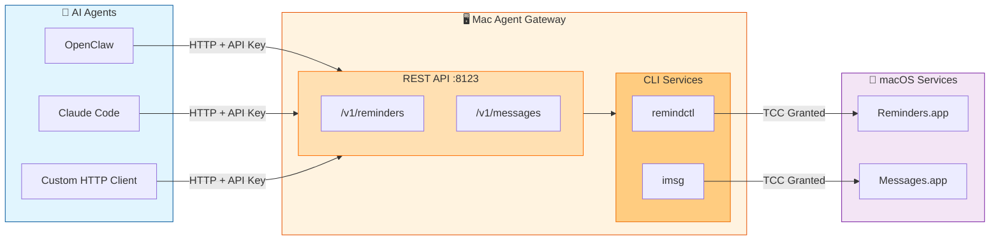
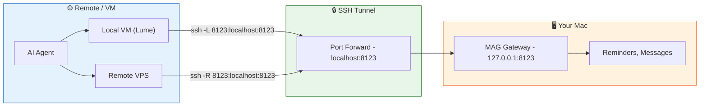

# mac-agent-gateway
Raw knowledge dump assimilated by OA.

## SWALLOW ENGINE DISTILLATION

### File: README.md
```md
# Mac Agent Gateway (MAG)

[](https://www.python.org/downloads/)
[](https://opensource.org/licenses/MIT)
[](https://fastapi.tiangolo.com)

A local macOS HTTP API gateway that exposes Apple-protected capabilities (Reminders, Messages) via a stable, agent-friendly REST API.

## Why MAG?

Modern AI agents running in VMs, containers, or remote hosts cannot access macOS-protected services due to:

- **TCC Permission Enforcement** — Apple restricts access to Reminders, Messages, etc.
- **Sandbox Restrictions** — VMs and containers can't invoke macOS CLIs
- **Fragile CLI Integration** — Direct CLI execution from agents is unreliable

MAG solves this by running on your Mac as a secure HTTP gateway, handling all TCC permissions and CLI execution while exposing clean REST endpoints.

### What This Means for You

**In plain terms:** MAG lets AI assistants work with your Apple Reminders and Messages—apps that are normally locked to your Mac—in a controlled, secure way.

- **Your AI assistant can now help with real tasks** — "Add a reminder for tomorrow", "Find the links Jane sent me last week", "Text me my todo list"
- **Works with any AI agent** — OpenClaw, Claude Code, Cursor, or any tool that can make HTTP requests
- **You stay in control** — Choose exactly what the AI can do: read-only access, send only to specific contacts, or full access
- **No cloud required** — Everything runs locally on your Mac; your data never leaves your computer
- **Built on trusted tools** — Uses popular open-source CLIs ([remindctl](https://github.com/keith/reminders-cli), [imsg](https://github.com/chrisbrandow/imsg)) with a standard REST API on top

**Example permissions you can set:**
- Allow reading messages but not sending
- Allow sending only to yourself or specific contacts
- Allow reminders but disable message access entirely

**Try prompts like these with your AI agent:**
- *"What's on my todo list for today?"*
- *"Find the last 20 Trulia links my wife sent me and organize them by state and city"*
- *"Create a reminder for tomorrow at 9am to call the dentist"*
- *"Text me a summary of my overdue reminders"*
- *"Search my messages with John for anything about the project"*
- *"Find the last restaurant link Jane sent me, look it up, and text me the hours and address"*

See **[EXAMPLES.md](EXAMPLES.md)** for 21+ real-world prompts and workflows.



**Key Principle:** Agents never execute Apple binaries. The gateway owns all permissions and CLI execution.

### Remote Access: VMs and VPS

MAG runs on your Mac but can be securely accessed from local VMs (like [Lume](https://lume.dev)) or remote VPS instances via SSH tunneling:



**Common scenarios:**

| Scenario | SSH Command (run on...) | Result |
|----------|------------------------|--------|
| Local VM → Mac | `ssh -L 8123:localhost:8123 mac-host` (on VM) | VM accesses MAG at `localhost:8123` |
| VPS → Mac | `ssh -R 8123:localhost:8123 vps-host` (on Mac) | VPS accesses MAG at `localhost:8123` |

This keeps MAG secure (localhost-only) while enabling remote agents to use it through encrypted tunnels.

**Tailscale / ZeroTier (alternative):**

For persistent remote access without maintaining SSH sessions, a mesh VPN like [Tailscale](https://tailscale.com) or [ZeroTier](https://zerotier.com) is a reliable option:

```bash
# Bind MAG to all interfaces (required for Tailscale access)
MAG_HOST=0.0.0.0 make run

# Access via your Tailscale IP (e.g., 100.x.x.x)
curl -H "X-API-Key: $KEY" http://100.x.x.x:8123/health
```

> **Note:** This configuration has not been personally tested by the author, but is a well-established pattern for secure remote access.

> **Security consideration:** Binding to `0.0.0.0` exposes MAG beyond localhost. While Tailscale's private network limits exposure, anyone on your tailnet (or who guesses your API key) could access the gateway. Mitigations:
> - Use a strong, randomly-generated API key (32+ characters)
> - Consider Tailscale ACLs to restrict which devices can reach your Mac
> - Use the send allowlist to limit message recipients even if compromised

## Features

- **Apple Reminders API** — Full CRUD: create, list, update, complete, delete reminders and lists
- **Apple Messages API** — Send/reply to iMessages, list threads, search messages, extract links, stream new messages
- **Attachment Downloads** — Download photos and files from messages via secure REST API
- **OpenAPI/Swagger** — Auto-generated docs at `/docs` and `/openapi.json`
- **Agent Skills** — Portable skill definitions for OpenClaw (formerly Clawdbot/Moltbot), Cursor, and other agents
- **Secure by Default** — Localhost-only binding, API key auth, rate limiting, CORS protection, audit logging
- **PII Filtering** — Automatic masking of sensitive data (SSNs, credit cards, passwords) in messages
- **Extensible** — Modular architecture for adding new Apple capabilities

## Quick Start

```bash
# 1. Clone the repository
git clone https://github.com/ericblue/mac-agent-gateway.git
cd mac-agent-gateway

# 2. Install CLI dependencies (Homebrew)
make install-deps  # Installs remindctl and imsg

# 3. Install MAG (creates venv and installs Python dependencies)
make install

# 4. Configure
cp .env.example .env
make generate-api-key  # Generate a secure key
# Edit .env and paste your generated key

# 5. Run
make dev  # Development mode with auto-reload
```

The gateway is now running at `http://localhost:8123`. Visit `/docs` for the interactive API documentation.

> **Note:** `make install` creates a virtual environment at `.venv/` and installs all dependencies there. All `make` commands use this venv automatically.

## Prerequisites

- **macOS** (required for Apple services access)
- **Python 3.11+**
- **Homebrew**

When first running, macOS will prompt you to grant Reminders and Messages permissions to Terminal/iTerm.

## Installation

### 1. Install CLI Dependencies

```bash
make install-deps
```

This installs:
- [`remindctl`](https://github.com/keith/reminders-cli) — Apple Reminders CLI
- [`imsg`](https://github.com/chrisbrandow/imsg) — Apple Messages CLI

### 2. Install MAG

```bash
make install
```

### 3. Configure Environment

```bash
cp .env.example .env

# Generate a secure API key (recommended)
make generate-api-key
```

Edit `.env` with your generated key:

```bash
# Required (minimum 16 characters, 32+ recommended)
MAG_API_KEY=your-generated-key-here

# Server settings
MAG_HOST=127.0.0.1               # Default: localhost only
MAG_PORT=8123                    # Default port
MAG_LOG_LEVEL=INFO               # DEBUG, INFO, WARNING, ERROR

# Audit logging (optional but recommended)
MAG_LOG_DIR=./logs               # Enable file logging
MAG_LOG_ACCESS=true              # Log HTTP requests

# Capability restrictions (all enabled by default)
MAG_MESSAGES_SEND=true           # Enable/disable sending messages
MAG_MESSAGES_READ=true           # Enable/disable reading messages
MAG_MESSAGES_ATTACHMENTS=true    # Enable/disable attachment downloads
MAG_REMINDERS_READ=true          # Enable/disable reading reminders
MAG_REMINDERS_WRITE=true         # Enable/disable writing reminders

# Security restrictions (optional)
MAG_MESSAGES_SEND_ALLOWLIST=+15551234567,user@example.com  # Limit recipients
MAG_ATTACHMENT_ALLOWED_DIRS=~/Downloads,~/Pictures         # Limit attachment sources
```

See `.env.example` for all available options.

## Usage

### Running the Gateway

```bash
# Development mode (auto-reload)
make dev

# Production mode
make run

# Or directly via Python
mag
```

### Testing the API

```bash
# Health check (no auth required)
curl http://localhost:8123/health

# List today's reminders
curl -H "X-API-Key: your-key" "http://localhost:8123/v1/reminders?filter=today"

# Create a reminder
curl -X POST \
  -H "X-API-Key: your-key" \
  -H "Content-Type: application/json" \
  -d '{"title": "Call mom", "due": "tomorrow", "list": "Personal"}' \
  http://localhost:8123/v1/reminders

# Send an iMessage
curl -X POST \
  -H "X-API-Key: your-key" \
  -H "Content-Type: application/json" \
  -d '{"to": "+15551234567", "text": "On my way!"}' \
  http://localhost:8123/v1/messages/send
```

### Running as a Service (launchd)

To run MAG automatically on startup, use the included launchd plist template.

**1. Copy and customize the plist:**

```bash
# Copy the template
cp launchd/com.ericblue.mag.plist ~/Library/LaunchAgents/

# Edit the plist to set your paths and API key
# Update: WorkingDirectory, PYTHONPATH, MAG_API_KEY
nano ~/Library/LaunchAgents/com.ericblue.mag.plist
```

**2. Load the service:**

```bash
# Load and start the service
launchctl load ~/Library/LaunchAgents/com.ericblue.mag.plist

# Verify it's running
curl http://localhost:8123/health
```

**3. Manage the service:**

```bash
# Stop the service
launchctl unload ~/Library/LaunchAgents/com.ericblue.mag.plist

# Restart (unload + load)
launchctl unload ~/Library/LaunchAgents/com.ericblue.mag.plist
launchctl load ~/Library/LaunchAgents/com.ericblue.mag.plist

# View logs (stored in project logs/ directory)
tail -f logs/mag.log
tail -f logs/mag.error.log
```

**Or use the Makefile shortcuts:**

```bash
make service-install   # Copy plist to LaunchAgents (sets secure permissions)
make service-start     # Load and start the service
make service-stop      # Stop the service
make service-restart   # Restart the service
make service-status    # Check if running + health check
make service-logs      # Tail the log files
make service-uninstall # Remove the plist
```

> **Security Notes:**
> - The service runs as your user (LaunchAgent), which is required for TCC permissions. Do not use LaunchDaemons (system-level) as they cannot access Reminders/Messages.
> - `make service-install` sets the plist to mode 600 (owner-only) to protect your API key.
> - Logs are stored in `logs/` within the project directory, not world-readable `/tmp`.

## API Reference

All endpoints except `/health` and `/openapi.json` require the `X-API-Key` header.

Interactive API documentation is available at `/docs` (Swagger UI) and `/redoc` (ReDoc):


### System Endpoints

| Method | Path | Description |
|--------|------|-------------|
| GET | `/` | Web UI homepage |
| GET | `/health` | Health check (no auth) |
| GET | `/v1/capabilities` | Discover enabled capabilities |
| GET | `/docs` | Swagger UI |
| GET | `/redoc` | ReDoc documentation |
| GET | `/openapi.json` | OpenAPI specification |

### Reminders API

| Method | Path | Description |
|--------|------|-------------|
| GET | `/v1/reminders` | List reminders with filters |
| POST | `/v1/reminders` | Create a reminder |
| PATCH | `/v1/reminders/{id}` | Update a reminder |
| POST | `/v1/reminders/{id}/complete` | Mark as complete |
| DELETE | `/v1/reminders/{id}` | Delete a reminder |
| POST | `/v1/reminders/bulk/complete` | Bulk complete |
| POST | `/v1/reminders/bulk/delete` | Bulk delete |
| GET | `/v1/reminders/lists` | List all reminder lists |
| POST | `/v1/reminders/lists` | Create a list |
| PATCH | `/v1/reminders/lists/{name}` | Rename a list |
| DELETE | `/v1/reminders/lists/{name}` | Delete a list |

**Filter Options:**
- `filter` — `today`, `tomorrow`, `week`, `overdue`, `upcoming`, `completed`, `all`
- `date` — Specific date (`YYYY-MM-DD`)
- `list` — Filter by list name

**Reminder Fields:**
- `title` — Reminder text
- `list` — Target list name
- `due` — Due date (ISO 8601 or natural: `today`, `tomorrow`, `next week`)
- `notes` — Additional notes
- `priority` — `0` (none), `1` (high), `5` (medium), `9` (low)

### Messages API

| Method | Path | Description |
|--------|------|-------------|
| GET | `/v1/messages/threads` | List message threads |
| GET | `/v1/messages/threads/lookup` | Find thread by recipient |
| GET | `/v1/messages/threads/{id}` | Get thread by ID |
| GET | `/v1/messages/threads/{id}/messages` | Get thread messages |
| GET | `/v1/messages/threads/{id}/watch` | Watch for new messages (SSE) |
| GET | `/v1/messages/history` | Get messages by recipient |
| POST | `/v1/messages/send` | Send an iMessage |
| POST | `/v1/messages/reply` | Reply to thread or recipient |
| GET | `/v1/messages/search` | Search messages |
| GET | `/v1/messages/links` | Extract links from messages |
| GET | `/v1/messages/attachments/download` | Download an attachment file |
| GET | `/v1/messages/attachments/info` | Get attachment file info |

**Attachments:**

To download attachments (photos, files) from messages:

```bash
# 1. Get messages with attachment metadata
curl -H "X-API-Key: $KEY" \
  "http://localhost:8123/v1/messages/history?recipient=%2B15551234567&attachments=true"

# 2. Download using the original_path from the response
curl -H "X-API-Key: $KEY" \
  "http://localhost:8123/v1/messages/attachments/download?path=/Users/you/Library/Messages/Attachments/..." \
  --output photo.jpg
```

> **Security:** Only files within `~/Library/Messages/Attachments/` can be downloaded.

**Contacts Cache:**

| Method | Path | Description |
|--------|------|-------------|
| POST | `/v1/messages/contacts/upsert` | Create/update contact |
| GET | `/v1/messages/contacts/resolve` | Resolve contact 
... [TRUNCATED]
```

### File: EXAMPLES.md
```md
# Real-World Examples: `mag-reminders` + `mag-messages`

These examples are designed to be copy/paste prompts a user can send to an agent (OpenClaw, Claude Code, Cursor) that has the **mag-reminders** and/or **mag-messages** skills configured.

**Assumptions:**

- The agent can call the Mac Agent Gateway (MAG) via `MAG_URL` and `MAG_API_KEY`.
- `mag-messages` may be configured with a **send allowlist**; examples assume your own number/email are allowed.

> **Tip:** These prompts are designed to be short and realistic. Copy, paste, and adapt to your needs.

---

## Reminders Examples

### 1) "What's due today?" (quick daily scan)

**Prompt:**
> What are my Apple Reminders due today? Group them by list.

**Example output:**
- **Work**
  - Send revised deck to John (due 10:00)
  - Review PR #842 (due 16:00)
- **Personal**
  - Pick up package that was delivered (due 17:30)

---

### 2) "Overdue triage" (reduce backlog)

**Prompt:**
> Show my overdue reminders. Suggest: reschedule, split, or drop.

**Example output:**
- **Overdue (5)**
  1. Call accountant (overdue 6d) → *reschedule*: tomorrow 09:00
  2. Update website copy (overdue 14d) → *split*: 30m outline today + 60m draft Thu
  3. Cancel old subscriptions (overdue 30d) → *drop?* confirm

---

### 3) Reschedule an item by fuzzy name

**Prompt:**
> Push "Review quarterly goals" out by 2 weeks and add a note: "discussed in 1:1 meeting".

**Example output:**
- Updated ✅
  - Title: Review quarterly goals
  - Due: 2026-02-14 07:00
  - Notes: discussed in 1:1 meeting

---

### 4) Create a reminder in plain English

**Prompt:**
> Add a reminder tomorrow at 9am: "Write documentation examples for the API".

**Example output:**
- Created ✅
  - Title: Write documentation examples for the API
  - Due: 2026-02-01 09:00 (local)
  - List: Reminders

---

### 5) Create recurring reminders (habits / routines)

**Prompt:**
> Create a recurring reminder: weekdays at 8:30am "Morning exercise routine".

**Example output:**
- Created ✅ Recurring reminder
  - Weekdays 08:30
  - Title: Morning exercise routine

---

### 6) Batch complete by query

**Prompt:**
> Mark anything containing "groceries" as completed.

**Example output:**
- Completed ✅ (2)
  - Buy groceries for weekend
  - Order groceries online

---

## Messages Examples

### 7) "Send me my reminders as a text" (push delivery)

**Prompt:**
> Text me my top 5 reminders for today.

**Example output:**

Sent via iMessage to **+1 (555) 123-4567**:
- Today (Top 5)
  1) Send revised deck (10:00)
  2) Review PR #842 (16:00)
  3) Pick up prescription (17:30)
  4) Pay invoice #219 (EOD)
  5) Plan weekend hike (EOD)

---

### 8) "Create a reminder from a message" (quote-to-reminder)

**Prompt:**
> In my chat with Jane, take her last message and make it a reminder for tomorrow morning. Put the message text in the reminder notes.

**Example output:**
- Created ✅
  - Title: Follow up on Jane's message
  - Due: tomorrow 09:00
  - Notes:
    - From: Jane (+15559876543)
    - Message: "Can you pick up the package on your way home?"

---

### 9) "Who messaged me recently?" (inbound triage)

**Prompt:**
> Who sent me messages in the last 3 days? Show counts.

**Example output:**
- Last 3 days — unique senders: 8
  - Jane (+15559876543): 9
  - +15551112222: 6
  - +15553334444: 4
  - user@example.com: 3
  - 12345: 2
  - …

---

### 10) "Weekly message review" (inbox zero triage)

**Prompt:**
> Review my messages from the past week and identify:
> - items that may be urgent
> - messages I haven't replied to
> - messages that may be especially relevant or interesting

**Example output:**
- **Urgent (3)**
  - Jane (Jan 29, 14:22): "Can you call me ASAP about the lease?"
  - +15551112222 (Jan 28, 09:15): "Meeting moved to tomorrow 8am"
  - Mom (Jan 27, 18:30): "Dad's flight arrives at 6pm, can you pick up?"

- **Awaiting Reply (5)**
  - John (Jan 30): Asked about weekend plans — no response
  - Sarah (Jan 29): Shared restaurant link, asked if interested
  - +15553334444 (Jan 28): "Did you get my email?" — no response
  - Mike (Jan 27): Project question about API design
  - Jane (Jan 26): Asked for recipe recommendation

- **Interesting/Relevant (4)**
  - Sarah: Shared article about productivity systems
  - John: Sent photos from last weekend's hike
  - Jane: Link to concert tickets on sale
  - +15551112222: Forwarded job posting that matches your skills

---

### 11) "Find the last Instagram links I sent myself" (self-chat as inbox)

**Prompt:**
> Search messages I sent to myself and list my last 5 Instagram links.

**Example output:**
1. https://www.instagram.com/share/ABC123

2. https://www.instagram.com/share/DEF456

3. https://www.instagram.com/share/GHI789

4. https://www.instagram.com/share/JKL012

5. https://www.instagram.com/share/MNO345

   

---

### 12) "Extract links someone sent me" (context retrieval)

**Prompt:**
> Pull the last 5 links Jane sent me and include the message context.

**Example output:**
- 1) https://example.com/article
  - Context: "This is the one I was talking about"
  - Sent: 2026-01-30 18:14

- 2) https://example.com/product
  - Context: "Check this out!"
  - Sent: 2026-01-29 14:22

---

### 13) "Find a message by keyword in a specific thread"

**Prompt:**
> Search my thread with Jane for messages containing "flight" in the last 30 days.

**Example output:**
- Matches (3)
  - 2026-01-22 09:11 — "Flight changed to 11:45…"
  - 2026-01-22 09:13 — "Can you confirm seats?"
  - 2026-01-25 19:04 — "Flight tracker says on time."

---

### 14) "Send a message safely using allowlist"

**Prompt:**
> Send a test message to me at both my phone and iMessage email.

**Example output:**
- Sent ✅ to +15551234567
- Sent ✅ to user@example.com

---

### 15) "Prove restrictions work" (permissions testing)

**Prompt:**
> Try sending "hello" to 555-0000.

**Example output:**
- Blocked ✅
  - Recipient '555-0000' is not in the send allowlist
  - Allowed: +15551234567, user@example.com

---

### 16) "Watch for replies" (SSE message watch)

**Prompt:**
> Start watching my thread with Jane and alert me here when a new message arrives.

**Example output:**
- Watching thread ✅ (poll interval 2s)
- New message from Jane: "On my way."

---

## Combined Workflows

### 17) "Daily check-in via text" (scheduled digest)

**Prompt:**
> Every weekday at 8:05am, text me:
> - today's top 5 reminders
> - any overdue reminders count

**Example output (iMessage):**

Weekday Morning Digest:
- Overdue: 3
- Today (Top 5):
  1) Team standup (09:00)
  2) Client call (11:00)
  3) Review docs (14:00)
  4) Submit report (16:00)
  5) Gym (18:00)

---

### 18) "Turn a link into an action" (capture → execution)

**Prompt:**
> Take the last article link I sent myself, summarize what it's about, and create a reminder tomorrow afternoon to read it.

**Example output:**
- Latest link: https://example.com/article
- Quick summary: "Blog post about productivity systems…"
- Reminder created: "Read article on productivity" (tomorrow 15:00)

---

### 19) "Contacts cache: make texting by name work"

**Prompt:**
> Remember that my number is 555-123-4567 and my partner Jane is 555-987-6543. Update the contacts cache.

**Example output:**
- Contacts updated ✅
  - Me: +15551234567
  - Jane: +15559876543

---

### 20) "Resolve who a number is" (using contacts cache)

**Prompt:**
> Who is +15559876543?

**Example output:**
- Jane (partner)

---

### 21) "Reply to a thread using a contact"

**Prompt:**
> Text Jane: "Running 10 minutes late."

**Example output:**
- Resolved contact: Jane → +15559876543
- Sent ✅

---

## Why These Skills Are Powerful

### `mag-messages`

- Works with real Messages.app data on macOS
- Adds **recipient filtering**, **search**, **link extraction**, **watch/stream**, and a **contacts cache**
- Enables "Messages as a command surface" for your assistant

### `mag-reminders`

- Create/update/complete Apple Reminders programmatically
- Great for turning chat/capture into **concrete next actions**

### Combined = High Leverage

The best user experience is:

1. Capture a thought in Messages (to self or from others)
2. Extract the actionable bit
3. Create a reminder (with the message quoted in notes)
4. Optionally deliver digests back via iMessage

---

## API Reference (for developers)

### Check Capabilities

```bash
curl -H "X-API-Key: $MAG_API_KEY" "$MAG_URL/v1/capabilities"
```

### List Threads

```bash
curl -H "X-API-Key: $MAG_API_KEY" "$MAG_URL/v1/messages/threads?limit=20"
```

### Search Messages

```bash
curl -H "X-API-Key: $MAG_API_KEY" \
  "$MAG_URL/v1/messages/search?q=meeting&recipient=%2B15559876543&limit=50"
```

### Extract Links

```bash
curl -H "X-API-Key: $MAG_API_KEY" \
  "$MAG_URL/v1/messages/links?recipient=%2B15559876543&limit=20"
```

### Create Reminder

```bash
curl -X POST \
  -H "X-API-Key: $MAG_API_KEY" \
  -H "Content-Type: application/json" \
  -d '{"title": "Call mom", "due": "tomorrow", "list": "Personal"}' \
  "$MAG_URL/v1/reminders"
```

### Send Message

```bash
curl -X POST \
  -H "X-API-Key: $MAG_API_KEY" \
  -H "Content-Type: application/json" \
  -d '{"to": "+15551234567", "text": "Hello!"}' \
  "$MAG_URL/v1/messages/send"
```

### List Today's Reminders

```bash
curl -H "X-API-Key: $MAG_API_KEY" "$MAG_URL/v1/reminders?filter=today"
```

### Complete a Reminder

```bash
curl -X POST \
  -H "X-API-Key: $MAG_API_KEY" \
  "$MAG_URL/v1/reminders/ABC123/complete"
```

```

### File: RELEASE.md
```md
# Release Process

This document describes how to prepare and publish a new release of Mac Agent Gateway.

## Prerequisites

1. **Signing key** — You need an Ed25519 keypair for signing skills
   ```bash
   # First time only: generate keypair
   make generate-signing-key
   # Keys are stored in ~/.mag/signing_key.pem (private) and ~/.mag/signing_key.pub (public)
   ```

2. **Dependencies** — Ensure cryptography is installed
   ```bash
   pip install cryptography
   # Or: pip install -e ".[signing]"
   ```

3. **Clean working directory** — All changes should be committed
   ```bash
   git status  # Should show no uncommitted changes
   ```

## Release Checklist

### 1. Update Version Numbers

Update the version in all relevant files:

```bash
# pyproject.toml
version = "X.Y.Z"

# src/mag/__init__.py
__version__ = "X.Y.Z"

# skills/mag-reminders/SKILL.md (frontmatter)
version: X.Y.Z

# skills/mag-messages/SKILL.md (frontmatter)
version: X.Y.Z
```

### 2. Update Changelog (if applicable)

Add release notes describing what's new, changed, or fixed.

### 3. Run Tests

Ensure all tests pass:

```bash
make test
```

### 4. Sign Skills

Sign all skill files with your private key:

```bash
make sign-skills
```

This updates the `integrity` and `signature` blocks in each SKILL.md file.

### 5. Verify Signatures

Confirm the signatures are valid:

```bash
make verify-skills
```

Expected output:
```
✓ skills/mag-messages/SKILL.md: Valid (signed YYYY-MM-DDTHH:MM:SSZ)
✓ skills/mag-reminders/SKILL.md: Valid (signed YYYY-MM-DDTHH:MM:SSZ)

All 2 skill(s) verified successfully
```

### 6. Commit Signed Skills

```bash
git add skills/ pyproject.toml src/mag/__init__.py
git commit -m "Release vX.Y.Z"
```

### 7. Create Git Tag

```bash
make release-tag VERSION=X.Y.Z
```

This will:
- Verify working directory is clean
- Check that the tag doesn't already exist
- Create an annotated tag `vX.Y.Z`
- Push to origin (main branch and tag)

### 8. Create GitHub Release

1. Go to https://github.com/ericblue/mac-agent-gateway/releases
2. Click "Draft a new release"
3. Select the tag `vX.Y.Z`
4. Title: `vX.Y.Z`
5. Description: Include highlights and link to changelog
6. Publish release

## Verification Instructions for Users

Users can verify skills before installing:

```bash
# Clone the repository
git clone https://github.com/ericblue/mac-agent-gateway.git
cd mac-agent-gateway

# Install verification dependencies
pip install cryptography

# Verify all skills (using make target)
make verify-skills

# Or use the script directly
python scripts/verify_skill.py skills/*/SKILL.md

# Verify against a specific release
git checkout vX.Y.Z
make verify-skills
```

## Signing Key Management

### Key Location

| File | Location | Purpose |
|------|----------|---------|
| Private key | `~/.mag/signing_key.pem` | Signs skills (keep secret!) |
| Public key | `~/.mag/signing_key.pub` | Verifies signatures |

### Backup Your Private Key

The private key cannot be regenerated. Back it up securely:

```bash
# Backup to encrypted archive
tar czf - ~/.mag/signing_key.pem | gpg -c > mag-signing-key-backup.tar.gz.gpg

# Or copy to secure storage
cp ~/.mag/signing_key.pem /path/to/secure/backup/
```

### Key Rotation

If you need to rotate the signing key (compromise, loss, etc.):

1. Generate a new keypair:
   ```bash
   rm ~/.mag/signing_key.pem ~/.mag/signing_key.pub
   make generate-signing-key
   ```

2. Update SECURITY.md with the new public key

3. Re-sign all skills:
   ```bash
   make sign-skills
   ```

4. Create a new release with the updated signatures

5. Announce the key rotation to users

## Troubleshooting

### "No signing key found"

Generate a keypair first:
```bash
make generate-signing-key
```

### "Private key already exists"

Your key already exists at `~/.mag/signing_key.pem`. If you really need to regenerate:
```bash
rm ~/.mag/signing_key.pem ~/.mag/signing_key.pub
make generate-signing-key
```

### "cryptography library required"

Install the dependency:
```bash
pip install cryptography
```

### Verification fails after signing

Ensure you're signing with the correct key. Check that the public key in SECURITY.md matches your `~/.mag/signing_key.pub`:

```bash
# Get your public key in base64
python3 -c "
from cryptography.hazmat.primitives import serialization
import base64
with open('$HOME/.mag/signing_key.pub', 'rb') as f:
    key = serialization.load_pem_public_key(f.read())
raw = key.public_bytes(
    encoding=serialization.Encoding.Raw,
    format=serialization.PublicFormat.Raw
)
print(base64.b64encode(raw).decode())
"
```

Compare with the key in SECURITY.md.

## Quick Reference

```bash
# Full release workflow
make test                          # Run tests
make sign-skills                   # Sign skills
make verify-skills                 # Verify signatures
git add -A
git commit -m "Release vX.Y.Z"
make release-tag VERSION=X.Y.Z    # Tag and push
```

```

### File: SECURITY.md
```md
# Security

Mac Agent Gateway (MAG) provides API access to sensitive Apple services (Reminders and Messages). This document outlines the security measures in place and important considerations for users.

## Security Measures

### Authentication

- **API Key Required** — All endpoints (except `/health` and `/v1/capabilities`) require a valid `X-API-Key` header
- **Key Validation** — Startup is blocked if the API key is:
  - A common placeholder value (e.g., "changeme", "secret", "password")
  - Too short (minimum 16 characters required, 32+ recommended)
- **Constant-Time Comparison** — API key validation uses `secrets.compare_digest()` to prevent timing attacks
- **Key Recommendations** — We recommend 32+ character randomly-generated keys (use `make generate-api-key`)

### Network Security

- **Localhost by Default** — MAG binds to `127.0.0.1` by default, rejecting external connections
- **CORS Protection** — Cross-Origin Resource Sharing is restricted to localhost origins only
- **No Cloud Dependencies** — All processing happens locally on your Mac; no data is sent to external servers by MAG itself
- **SSH Tunneling** — For remote access, we recommend SSH tunnels or private mesh VPNs (Tailscale) rather than exposing the port publicly

### Rate Limiting

- **Global Rate Limiting** — Default limit of 100 requests per minute per IP address
- **Message Send Limits** — Send and reply endpoints are limited to 10 requests per minute to prevent spam
- **Configurable** — Rate limits can be adjusted in code if needed for your use case

### Access Control

- **Capability Restrictions** — Fine-grained control over what operations are allowed:
  - Disable message sending while allowing read access
  - Disable search while allowing thread listing
  - Disable all message access while keeping reminders enabled

- **Send Allowlist** — Restrict message sending to specific phone numbers/emails only
  - Even if an agent is compromised, it can only message approved contacts
  - Allowlist is redacted in unauthenticated `/v1/capabilities` responses

- **Capability Discovery** — Agents can query `/v1/capabilities` to discover what's enabled before attempting operations

### Input Validation

- **Path Parameter Validation** — Reminder IDs and list names are validated to prevent command injection
- **File Attachment Restrictions** — When `MAG_ATTACHMENT_ALLOWED_DIRS` is set, only files from those directories can be attached
- **Pydantic Validation** — All request bodies are validated with strict schemas

### Attachment Download Security

- **Restricted Directory Access** — Only files within `~/Library/Messages/Attachments/` can be downloaded
- **Path Traversal Protection** — Paths are resolved and validated before serving
- **Capability Control** — Attachment downloads can be disabled via `MAG_MESSAGES_ATTACHMENTS=false`
- **Authentication Required** — Download endpoints require valid API key

### Data Handling

- **No Data Storage** — MAG does not store messages or reminders; it proxies requests to Apple's local databases
- **Contacts Cache** — The optional contacts cache is stored locally with restricted file permissions (600)
- **No Logging of Content** — Message content and reminder details are not logged by default
- **Error Sanitization** — Internal error details are logged server-side only; clients receive generic error messages

### Audit Logging

- **Access Logs** — Optional HTTP request logging for audit trail and security monitoring
- **Rotating Log Files** — Logs are automatically rotated to prevent disk exhaustion
- **Secure Permissions** — Log files are created with owner-only permissions (600)
- **Configurable** — Enable/disable access logging and configure retention as needed

```bash
# Enable file logging with access audit trail
MAG_LOG_DIR=./logs
MAG_LOG_ACCESS=true
MAG_LOG_MAX_BYTES=10485760  # 10 MB per file
MAG_LOG_BACKUP_COUNT=5      # Keep 5 rotated files
```

Access log format: `TIMESTAMP CLIENT_IP METHOD PATH STATUS DURATION_MS`

Example:
```
2026-01-31 14:30:45 127.0.0.1 GET /v1/reminders 200 45.2ms
2026-01-31 14:30:46 127.0.0.1 POST /v1/messages/send 201 523.1ms
```

**Note:** Query parameters are not logged to prevent sensitive data exposure.

### PII Filtering

MAG includes PII (Personally Identifiable Information) filtering to mask sensitive data before it's returned from the API. **This is enabled by default.**

```bash
# Default: regex-based PII filtering (enabled)
MAG_PII_FILTER=regex

# To disable PII filtering (not recommended):
MAG_PII_FILTER=
```

When enabled, the following patterns are automatically masked:
- Social Security Numbers → `[REDACTED-SSN]`
- Credit Card Numbers → `[REDACTED-CC]`
- Bank Account Numbers → `[REDACTED-ACCOUNT]`
- Routing Numbers → `[REDACTED-ROUTING]`
- Passwords in context → `[REDACTED-PASSWORD]`
- API Keys/Tokens → `[REDACTED-KEY]`

**Note:** Regex-based filtering catches common patterns but is not foolproof. For more comprehensive PII detection, future versions may support Microsoft Presidio integration.

## Configuration Options

### Security-Related Environment Variables

| Variable | Default | Description |
|----------|---------|-------------|
| `MAG_API_KEY` | (required) | API key for authentication (min 16 chars, 32+ recommended) |
| `MAG_HOST` | `127.0.0.1` | Host to bind to (localhost only by default) |
| `MAG_PII_FILTER` | `regex` | PII filtering mode: "regex" or "" (disabled) |
| `MAG_MESSAGES_SEND_ALLOWLIST` | (empty) | Comma-separated list of allowed message recipients |
| `MAG_ATTACHMENT_ALLOWED_DIRS` | (empty) | Comma-separated directories for allowed file attachments |
| `MAG_ALLOW_UNKNOWN_RECIPIENTS` | `true` | Allow sending to recipients not in contacts cache |
| `MAG_MESSAGES_SEND` | `true` | Enable/disable message sending capability |
| `MAG_MESSAGES_READ` | `true` | Enable/disable message reading capability |
| `MAG_MESSAGES_ATTACHMENTS` | `true` | Enable/disable attachment downloads |
| `MAG_REMINDERS_WRITE` | `true` | Enable/disable reminder modification capability |
| `MAG_LOG_DIR` | (empty) | Directory for log files (empty = stdout only) |
| `MAG_LOG_ACCESS` | `true` | Enable HTTP access logging for audit trail |
| `MAG_LOG_MAX_BYTES` | `10485760` | Max log file size before rotation (10 MB) |
| `MAG_LOG_BACKUP_COUNT` | `5` | Number of rotated log files to keep |

### Recommended Production Configuration

```bash
# Strong API key (32+ characters)
MAG_API_KEY=$(openssl rand -base64 32)

# Localhost only (default)
MAG_HOST=127.0.0.1

# Enable PII filtering (default)
MAG_PII_FILTER=regex

# Restrict message recipients
MAG_MESSAGES_SEND_ALLOWLIST=+15551234567,user@example.com

# Restrict file attachments to safe directories
MAG_ATTACHMENT_ALLOWED_DIRS=~/Downloads,~/Pictures

# Enable file logging with audit trail
MAG_LOG_DIR=./logs
MAG_LOG_ACCESS=true

# Read-only mode for messages (optional)
MAG_MESSAGES_SEND=false
```

## Important Considerations

### LLM and AI Agent Privacy

When using MAG with AI agents (Claude, OpenAI, etc.), be aware that:

- **Message content may be sent to LLM providers** — When you ask an agent to search messages or extract information, that content is sent to the AI service for processing
- **Reminder titles and notes may be sent to LLM providers** — Similarly, reminder content is processed by the AI to understand and respond to your requests
- **This is inherent to how AI agents work** — The agent needs to see the data to help you with it

**Recommendations:**

1. Review your AI provider's privacy policy and data handling practices
2. Be mindful of highly sensitive information in messages/reminders when using AI agents
3. Use the capability restrictions to limit access (e.g., read-only mode)
4. Consider which conversations and reminders you ask the AI to access

### Remote Access Risks

If you expose MAG beyond localhost:

- Use strong, randomly-generated API keys (32+ characters)
- Prefer SSH tunnels or Tailscale over binding to `0.0.0.0`
- If binding to a network interface, use firewall rules to restrict access
- Enable the send allowlist to limit potential damage if compromised
- Configure attachment allowed directories to prevent sensitive file access

### File Attachment Security

When the `MAG_ATTACHMENT_ALLOWED_DIRS` setting is empty (default):
- Any readable file on the system can potentially be attached to messages
- This is convenient but less secure

When `MAG_ATTACHMENT_ALLOWED_DIRS` is configured:
- Only files within the specified directories can be attached
- Path traversal attacks (e.g., `../../../etc/passwd`) are blocked
- Recommended for production use

## Skill Signing

MAG skills are cryptographically signed to protect against tampering. Before installing a skill, you can verify its authenticity.

### Verifying Skills

```bash
# Clone the repository
git clone https://github.com/ericblue/mac-agent-gateway.git
cd mac-agent-gateway

# Install dependencies
pip install cryptography

# Verify all skills
make verify-skills

# Or verify a specific skill
python scripts/verify_skill.py skills/mag-reminders/SKILL.md
```

Expected output for valid skills:
```
✓ skills/mag-reminders/SKILL.md: Valid (signed 2026-01-31T14:00:00Z)
✓ skills/mag-messages/SKILL.md: Valid (signed 2026-01-31T14:00:00Z)

All 2 skill(s) verified successfully
```

### What Verification Checks

| Check | What It Detects |
|-------|-----------------|
| **Content hash** | Any modification to the skill file content |
| **Ed25519 signature** | Unauthorized changes (only the maintainer can sign) |
| **Signer key** | Skills signed by unknown parties |

### Signing Key

The official MAG skill signing public key is:

```
Algorithm: Ed25519
Key ID: mag-skills-v1
Public Key (base64): Nb7iFHZDGjKM85eug84ura3BS7zihu7/975jeNQx8gI=
```

**Only install skills that verify successfully against this key.**

### For Maintainers: Signing Skills

```bash
# First time: generate a keypair (stored in ~/.mag/)
make generate-signing-key

# Sign all skills before release
make sign-skills

# Commit the signed skills
git add skills/
git commit -m "Sign skills for vX.Y.Z release"
```

**Important:** Keep the private key (`~/.mag/signing_key.pem`) secure. Never commit it to the repository.

## Security Testing

MAG includes comprehensive security tests. Run them with:

```bash
pytest tests/test_security.py -v
```

## Reporting Security Issues

If you discover a security vulnerability, please report it by:

1. Opening a GitHub issue (for non-sensitive issues)
2. Contacting the maintainer directly for sensitive vulnerabilities

## Disclaimer

Mac Agent Gateway is provided "as is" without warranty of any kind. While we have taken reasonable steps to implement security best practices, the authors and contributors:

- Are not responsible for any data exposure, loss, or misuse that may occur through use of this software
- Cannot guarantee the security of data transmitted to third-party AI services
- Recommend users evaluate their own security requirements before deployment

By using MAG, you acknowledge that you are responsible for:

- Securing your API keys and access credentials
- Understanding the privacy implications of connecting AI agents to your personal data
- Configuring appropriate access restrictions for your use case
- Complying with applicable laws and regulations regarding data privacy

This software is intended for personal use and local development. Users deploying MAG in production or shared environments should conduct their own security review.

---

*Last updated: January 2026*

```

### File: TODO.md
```md
# TODO

Planned enhancements and ideas for future development.

## Reminders

### List Allowlist for Reminders
- **Priority:** Low
- **Description:** Add `MAG_REMINDERS_WRITE_ALLOWLIST` to restrict which reminder lists an agent can create/modify reminders in
- **Use case:** Sandbox agent to designated lists (e.g., "AI Tasks") without touching personal lists
- **Implementation:**
  - Add `reminders_write_allowlist: str = ""` to `Settings`
  - Add `get_reminders_write_allowlist()` method
  - Check list name in create/update/delete/complete endpoints
  - Add `write_allowlist` field to `RemindersCapabilities` in `/v1/capabilities`
  - Update skills documentation

### Delete Protection (Optional)
- **Priority:** Low
- **Description:** Add `MAG_REMINDERS_DELETE=true/false` to allow create/update but block delete
- **Use case:** Let agent add reminders but prevent removal
- **Note:** Lower priority since list allowlist provides better protection

## Messages

### Group Message Support
- **Priority:** Medium
- **Description:** Better support for group conversations
- **Notes:** Depends on `imsg` CLI capabilities

## Privacy & PII

### Presidio Integration
- **Priority:** Medium
- **Description:** Add Microsoft Presidio as an optional PII detection backend
- **Use case:** More accurate detection of names, addresses, medical terms, etc.
- **Implementation:**
  - Add optional dependency: `presidio-analyzer`, `presidio-anonymizer`
  - New setting: `MAG_PII_FILTER=presidio`
  - Detect and mask: names, emails, phones, SSNs, credit cards, addresses
  - Fall back to regex if Presidio not installed

### Thread/Contact Exclusion
- **Priority:** Low
- **Description:** Allow excluding specific threads or contacts from API responses
- **Use case:** Never expose messages from sensitive contacts (bank, medical)
- **Implementation:**
  - `MAG_EXCLUDE_THREADS=2,15,42`
  - `MAG_EXCLUDE_CONTACTS=+15551234567`

## General

### Rate Limiting
- **Priority:** Medium
- **Description:** Add optional rate limiting per endpoint or globally
- **Use case:** Prevent runaway agents from spamming APIs

### Audit Logging
- **Priority:** Low
- **Description:** Log all write operations (sends, creates, deletes) to a file
- **Use case:** Track what agents have done for debugging/accountability

```

### File: scripts\clawdbot_skill_config.py
```py
#!/usr/bin/env python3
"""Configure the OpenClaw (formerly Clawdbot/Moltbot) skill entries for MAG.

This script updates ~/.clawdbot/clawdbot.json to include:

  skills.entries.mag-reminders.enabled = true
  skills.entries.mag-reminders.env.MAG_URL = <value>
  skills.entries.mag-reminders.env.MAG_API_KEY = <value>

  skills.entries.mag-messages.enabled = true
  skills.entries.mag-messages.env.MAG_URL = <value>
  skills.entries.mag-messages.env.MAG_API_KEY = <value>

It is idempotent and will create intermediate objects as needed.

Usage:
  python3 scripts/clawdbot_skill_config.py set --url http://localhost:8124 --api-key your-key
  python3 scripts/clawdbot_skill_config.py check --url http://localhost:8124

Notes:
- We do not attempt to restart OpenClaw. After editing, restart/reload the gateway if needed.
"""

from __future__ import annotations

import argparse
import json
import os
from typing import Any, Dict

SKILL_NAMES = ["mag-reminders", "mag-messages"]
DEFAULT_CONFIG_PATH = os.path.expanduser("~/.clawdbot/clawdbot.json")


def _load_json(path: str) -> Dict[str, Any]:
    if not os.path.exists(path):
        raise FileNotFoundError(
            f"OpenClaw config not found at {path}. Run `openclaw configure` first, or create the file."
        )
    with open(path, "r", encoding="utf-8") as f:
        try:
            data = json.load(f)
        except json.JSONDecodeError as e:
            raise ValueError(f"Invalid JSON in {path}: {e}") from e
    if not isinstance(data, dict):
        raise ValueError(f"Expected JSON object at root of {path}")
    return data


def _save_json(path: str, data: Dict[str, Any]) -> None:
    tmp = path + ".tmp"
    with open(tmp, "w", encoding="utf-8") as f:
        json.dump(data, f, indent=2, sort_keys=False)
        f.write("\n")
    os.replace(tmp, path)


def _ensure_dict(parent: Dict[str, Any], key: str) -> Dict[str, Any]:
    v = parent.get(key)
    if v is None:
        v = {}
        parent[key] = v
    if not isinstance(v, dict):
        raise ValueError(f"Expected object at {key}, found {type(v).__name__}")
    return v


def cmd_set(args: argparse.Namespace) -> int:
    data = _load_json(args.path)

    skills = _ensure_dict(data, "skills")
    entries = _ensure_dict(skills, "entries")

    for skill_name in SKILL_NAMES:
        entry = _ensure_dict(entries, skill_name)
        entry["enabled"] = True
        env = _ensure_dict(entry, "env")
        env["MAG_URL"] = args.url
        env["MAG_API_KEY"] = args.api_key
        print(f"  Configured {skill_name}")

    _save_json(args.path, data)
    print(f"\nUpdated {args.path} with MAG_URL and MAG_API_KEY for all skills")
    return 0


def cmd_check(args: argparse.Namespace) -> int:
    data = _load_json(args.path)

    skills = data.get("skills", {})
    entries = skills.get("entries", {})

    all_ok = True
    for skill_name in SKILL_NAMES:
        print(f"\n{skill_name}:")
        entry = entries.get(skill_name)

        # Check if skill entry exists at all
        if entry is None:
            print("  NOT CONFIGURED (missing from clawdbot.json)")
            print(f"  Run: make clawdbot-skill-config MAG_URL={args.url} MAG_API_KEY=...")
            all_ok = False
            continue

        if not isinstance(entry, dict):
            print(f"  Invalid entry type (expected object, found {type(entry).__name__})")
            all_ok = False
            continue

        env = entry.get("env", {})
        if not isinstance(env, dict):
            print(f"  Missing or invalid 'env' section")
            all_ok = False
            continue

        url = env.get("MAG_URL")
        api_key = env.get("MAG_API_KEY")
        enabled = entry.get("enabled")

        ok = True
        if url != args.url:
            print(f"  MAG_URL: expected {args.url!r}, found {url!r}")
            ok = False

        if api_key is None:
            print("  MAG_API_KEY: missing")
            ok = False
        else:
            print("  MAG_API_KEY: set")

        if enabled is not True:
            print(f"  enabled: {enabled!r} (should be true)")
            ok = False

        if ok:
            print("  OK")
        else:
            all_ok = False

    print()
    if all_ok:
        print("All skills configured correctly")
        return 0
    else:
        print("Run 'make clawdbot-skill-config' to configure missing skills")
        return 3


def main() -> int:
    p = argparse.ArgumentParser()
    p.add_argument(
        "--path",
        default=DEFAULT_CONFIG_PATH,
        help=f"Path to clawdbot.json (default: {DEFAULT_CONFIG_PATH})",
    )

    sub = p.add_subparsers(dest="cmd", required=True)

    ps = sub.add_parser("set", help="Set/overwrite MAG skill configs in clawdbot.json")
    ps.add_argument("--url", required=True, help="MAG base URL, e.g. http://localhost:8124")
    ps.add_argument("--api-key", required=True, help="MAG API key")
    ps.set_defaults(fn=cmd_set)

    pc = sub.add_parser("check", help="Check MAG skill config presence")
    pc.add_argument("--url", required=True, help="Expected MAG base URL")
    pc.set_defaults(fn=cmd_check)

    args = p.parse_args()
    return int(args.fn(args))


if __name__ == "__main__":
    raise SystemExit(main())

```

### File: scripts\sign_skill.py
```py
#!/usr/bin/env python3
"""Sign SKILL.md files with Ed25519 for integrity verification.

This script signs skill files to protect against tampering. The signature
and content hash are embedded in the YAML frontmatter.

Usage:
    # Generate a new signing keypair (first time only)
    python scripts/sign_skill.py --generate-key

    # Sign a skill file
    python scripts/sign_skill.py skills/mag-reminders/SKILL.md

    # Sign all skills
    python scripts/sign_skill.py skills/*/SKILL.md

Key storage:
    Private key: ~/.mag/signing_key.pem (keep secret!)
    Public key:  ~/.mag/signing_key.pub (share this)

The public key should be published in SECURITY.md for verification.
"""

from __future__ import annotations

import argparse
import base64
import hashlib
import os
import re
import sys
from datetime import datetime, timezone
from pathlib import Path

# Ed25519 signing requires cryptography library
try:
    from cryptography.hazmat.primitives import serialization
    from cryptography.hazmat.primitives.asymmetric.ed25519 import (
        Ed25519PrivateKey,
        Ed25519PublicKey,
    )
except ImportError:
    print("Error: cryptography library required")
    print("Install with: pip install cryptography")
    sys.exit(1)


DEFAULT_KEY_DIR = Path.home() / ".mag"
PRIVATE_KEY_FILE = "signing_key.pem"
PUBLIC_KEY_FILE = "signing_key.pub"

# Regex to match YAML frontmatter
FRONTMATTER_PATTERN = re.compile(r"^---\n(.*?)\n---\n", re.DOTALL)


def get_key_paths(key_dir: Path | None = None) -> tuple[Path, Path]:
    """Get paths to private and public key files."""
    key_dir = key_dir or DEFAULT_KEY_DIR
    return key_dir / PRIVATE_KEY_FILE, key_dir / PUBLIC_KEY_FILE


def generate_keypair(key_dir: Path | None = None) -> tuple[Path, Path]:
    """Generate a new Ed25519 keypair and save to files.
    
    Returns paths to (private_key, public_key) files.
    """
    key_dir = key_dir or DEFAULT_KEY_DIR
    key_dir.mkdir(parents=True, exist_ok=True, mode=0o700)
    
    private_path, public_path = get_key_paths(key_dir)
    
    if private_path.exists():
        print(f"Error: Private key already exists at {private_path}")
        print("Delete it first if you want to generate a new keypair.")
        sys.exit(1)
    
    # Generate keypair
    private_key = Ed25519PrivateKey.generate()
    public_key = private_key.public_key()
    
    # Save private key (PEM format, no encryption for simplicity)
    private_pem = private_key.private_bytes(
        encoding=serialization.Encoding.PEM,
        format=serialization.PrivateFormat.PKCS8,
        encryption_algorithm=serialization.NoEncryption(),
    )
    private_path.write_bytes(private_pem)
    os.chmod(private_path, 0o600)
    
    # Save public key (PEM format)
    public_pem = public_key.public_bytes(
        encoding=serialization.Encoding.PEM,
        format=serialization.PublicFormat.SubjectPublicKeyInfo,
    )
    public_path.write_bytes(public_pem)
    os.chmod(public_path, 0o644)
    
    # Also output base64 format for embedding
    public_raw = public_key.public_bytes(
        encoding=serialization.Encoding.Raw,
        format=serialization.PublicFormat.Raw,
    )
    public_b64 = base64.b64encode(public_raw).decode()
    
    print(f"Generated Ed25519 keypair:")
    print(f"  Private key: {private_path}")
    print(f"  Public key:  {public_path}")
    print()
    print("Public key (base64, for SECURITY.md):")
    print(f"  {public_b64}")
    print()
    print("IMPORTANT: Keep the private key secret!")
    print("Add the public key to SECURITY.md for users to verify skills.")
    
    return private_path, public_path


def load_private_key(key_dir: Path | None = None) -> Ed25519PrivateKey:
    """Load the private key from file."""
    private_path, _ = get_key_paths(key_dir)
    
    if not private_path.exists():
        print(f"Error: Private key not found at {private_path}")
        print("Run with --generate-key first.")
        sys.exit(1)
    
    private_pem = private_path.read_bytes()
    private_key = serialization.load_pem_private_key(private_pem, password=None)
    
    if not isinstance(private_key, Ed25519PrivateKey):
        print(f"Error: {private_path} is not an Ed25519 private key")
        sys.exit(1)
    
    return private_key


def load_public_key(key_dir: Path | None = None) -> Ed25519PublicKey:
    """Load the public key from file."""
    _, public_path = get_key_paths(key_dir)
    
    if not public_path.exists():
        print(f"Error: Public key not found at {public_path}")
        sys.exit(1)
    
    public_pem = public_path.read_bytes()
    public_key = serialization.load_pem_public_key(public_pem)
    
    if not isinstance(public_key, Ed25519PublicKey):
        print(f"Error: {public_path} is not an Ed25519 public key")
        sys.exit(1)
    
    return public_key


def parse_frontmatter(content: str) -> tuple[str, str]:
    """Parse YAML frontmatter from content.
    
    Returns (frontmatter, body) where frontmatter excludes the --- delimiters.
    """
    match = FRONTMATTER_PATTERN.match(content)
    if not match:
        raise ValueError("No YAML frontmatter found (must start with ---)")
    
    frontmatter = match.group(1)
    body = content[match.end():]
    return frontmatter, body


def extract_base_frontmatter(frontmatter: str) -> str:
    """Remove existing integrity and signature blocks from frontmatter.
    
    This gives us the canonical content to hash/sign.
    """
    lines = frontmatter.split("\n")
    result = []
    skip_block = False
    
    for line in lines:
        # Check if we're starting an integrity or signature block
        if line.startswith("integrity:") or line.startswith("signature:"):
            skip_block = True
            continue
        
        # Check if we're exiting a block (line doesn't start with space)
        if skip_block and line and not line[0].isspace():
            skip_block = False
        
        if not skip_block:
            result.append(line)
    
    # Remove trailing empty lines
    while result and not result[-1].strip():
        result.pop()
    
    return "\n".join(result)


def compute_content_hash(frontmatter: str, body: str) -> str:
    """Compute SHA256 hash of the canonical skill content.
    
    We hash:
    1. Base frontmatter (without integrity/signature blocks)
    2. Body content
    
    This allows the signature to cover all meaningful content.
    """
    base_fm = extract_base_frontmatter(frontmatter)
    canonical = f"---\n{base_fm}\n---\n{body}"
    
    content_hash = hashlib.sha256(canonical.encode("utf-8")).hexdigest()
    return content_hash


def sign_skill(skill_path: Path, private_key: Ed25519PrivateKey, public_key: Ed25519PublicKey) -> None:
    """Sign a SKILL.md file and update it with signature."""
    content = skill_path.read_text(encoding="utf-8")
    
    try:
        frontmatter, body = parse_frontmatter(content)
    except ValueError as e:
        print(f"Error in {skill_path}: {e}")
        sys.exit(1)
    
    # Compute hash of canonical content
    content_hash = compute_content_hash(frontmatter, body)
    
    # Sign the hash
    signature = private_key.sign(content_hash.encode("utf-8"))
    signature_b64 = base64.b64encode(signature).decode()
    
    # Get public key in base64 for embedding
    public_raw = public_key.public_bytes(
        encoding=serialization.Encoding.Raw,
        format=serialization.PublicFormat.Raw,
    )
    public_b64 = base64.b64encode(public_raw).decode()
    
    # Get current timestamp
    signed_at = datetime.now(timezone.utc).strftime("%Y-%m-%dT%H:%M:%SZ")
    
    # Build new frontmatter with signature
    base_fm = extract_base_frontmatter(frontmatter)
    
    new_frontmatter = f"""{base_fm}
integrity:
  algorithm: sha256
  content_hash: "{content_hash}"
signature:
  signer_key: "{public_b64}"
  value: "{signature_b64}"
  signed_at: "{signed_at}\""""
    
    # Reconstruct the file
    new_content = f"---\n{new_frontmatter}\n---\n{body}"
    
    # Write back
    skill_path.write_text(new_content, encoding="utf-8")
    print(f"Signed: {skill_path}")
    print(f"  Hash: {content_hash[:16]}...")
    print(f"  Signed at: {signed_at}")


def main() -> int:
    parser = argparse.ArgumentParser(
        description="Sign SKILL.md files with Ed25519",
        formatter_class=argparse.RawDescriptionHelpFormatter,
        epilog=__doc__,
    )
    parser.add_argument(
        "skills",
        nargs="*",
        type=Path,
        help="SKILL.md files to sign",
    )
    parser.add_argument(
        "--generate-key",
        action="store_true",
        help="Generate a new Ed25519 keypair",
    )
    parser.add_argument(
        "--key-dir",
        type=Path,
        default=None,
        help=f"Directory for keys (default: {DEFAULT_KEY_DIR})",
    )
    
    args = parser.parse_args()
    
    if args.generate_key:
        generate_keypair(args.key_dir)
        return 0
    
    if not args.skills:
        parser.print_help()
        return 1
    
    # Load keys
    private_key = load_private_key(args.key_dir)
    public_key = private_key.public_key()
    
    # Sign each skill
    for skill_path in args.skills:
        if not skill_path.exists():
            print(f"Error: {skill_path} not found")
            return 1
        sign_skill(skill_path, private_key, public_key)
    
    print()
    print(f"Signed {len(args.skills)} skill(s)")
    return 0


if __name__ == "__main__":
    sys.exit(main())

```


> [!WARNING]
> Distillation threshold (50000 chars) reached. Truncating further files.
