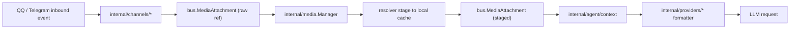

# maxclaw
Raw knowledge dump assimilated by OA.

## SWALLOW ENGINE DISTILLATION

### File: README.md
```md
# maxclaw - Local-First AI Agent App in Go (Low Memory, Fully Local, Visual UI, Out-of-the-Box)

> A 24/7 local AI work assistant built with Go. Gateway, sessions, memory, and tool execution stay on your machine.

[](https://golang.org)
[](LICENSE)
[]()

Language: [中文](README.zh.md) | **English**

**maxclaw** is a local AI agent for developers and operators.
Core value proposition: **low memory footprint**, **fully local workflow**, **visual desktop/web UI**, and **fast onboarding**.

- **Go backend, resource-efficient runtime**: single binary gateway + tool orchestration.
- **Fully local workflow**: sessions, memory, logs, and tool runs are stored locally.
- **Desktop UI + Web UI**: visual settings, streaming chat, file preview, and terminal integration.
- **Out-of-the-box setup**: one-command install and default workspace templates.

SEO keywords: `Go AI Agent`, `local AI assistant`, `self-hosted AI agent`, `private AI workflow`, `desktop AI app`, `low-memory AI`.

---

## Product Screenshot


---

## Highlights

- Go-native agent loop and tool system
- Fully local execution path with auditable artifacts
- Desktop UI + Web UI + API on the same port
- `executionMode=auto` for unattended long-running tasks
- `spawn` sub-sessions with independent context/model/source and status callbacks
- Automatic task titles that summarize sessions without overwriting message content
- Monorepo-aware recursive context discovery (`AGENTS.md` / `CLAUDE.md`)
- Multi-channel integrations: Telegram, WhatsApp (Bridge), Discord, WebSocket
- Cron/Once/Every scheduler + daily memory digest

## OpenClaw Concept Mapping

If you are familiar with OpenClaw, maxclaw follows similar local-first principles with a Go-first engineering focus:

- Local-first agent execution and private data boundaries
- Heartbeat context (`memory/heartbeat.md`)
- Memory layering (`MEMORY.md` + `HISTORY.md`)
- Autonomous mode (`executionMode=auto`)
- Sub-agent task split via `spawn`
- Monorepo context discovery for multi-module repositories

## Quick Start

1. Install Go 1.24+ and Node.js 18+
2. Build: `make build`
3. Initialize workspace: `./build/maxclaw onboard`
4. Configure: edit `~/.maxclaw/config.json`
5. Run gateway: `./build/maxclaw-gateway -p 18890`

Built binaries:
- `./build/maxclaw`: full CLI (`onboard`, `skills`, `telegram bind`, `gateway`, ...)
- `./build/maxclaw-gateway`: standalone backend for desktop packaging or headless use

All-in-one local dev startup:

```bash
make build && make restart-daemon && make electron-start
```

Common dev restart commands:

```bash
make dev-gateway
make backend-restart
make dev-electron
make electron-restart
```

## One-Command Install (Linux / macOS)

```bash
curl -fsSL https://raw.githubusercontent.com/Lichas/maxclaw/main/install.sh | bash
```

## Minimal Config

Path: `~/.maxclaw/config.json`

```json
{
  "providers": {
    "anthropic": { "apiKey": "your-anthropic-key" }
  },
  "agents": {
    "defaults": {
      "model": "anthropic/claude-opus-4-5",
      "workspace": "/absolute/path/to/your/workspace",
      "executionMode": "auto"
    }
  }
}
```

OpenAI native models use the official `openai-go` SDK with default API base `https://api.openai.com/v1`.
Anthropic native models use the official `anthropic-sdk-go` SDK with default API base `https://api.anthropic.com`.

## Execution Modes

Set `agents.defaults.executionMode`:

- `safe`: conservative exploration mode
- `ask`: default mode
- `auto`: autonomous continuation (no manual "continue" approval for paused plans)

## Web UI

1. Build: `make webui-install && make webui-build`
2. Start: `./build/maxclaw-gateway -p 18890`
3. Open: `http://localhost:18890`

## More Docs

- Architecture: `ARCHITECTURE.md`
- Operations: `MAINTENANCE.md`
- Browser runbook: `BROWSER_OPS.md`
- Full Chinese docs and all channel/config examples: [README.zh.md](README.zh.md)

```

### File: bridge\package.json
```json
{
  "name": "maxclaw-whatsapp-bridge",
  "version": "0.1.0",
  "description": "WhatsApp bridge for maxclaw using Baileys",
  "type": "module",
  "main": "dist/index.js",
  "scripts": {
    "build": "tsc",
    "start": "node dist/index.js",
    "dev": "tsc && node dist/index.js"
  },
  "dependencies": {
    "@whiskeysockets/baileys": "7.0.0-rc.9",
    "https-proxy-agent": "^7.0.4",
    "undici": "^6.19.2",
    "ws": "^8.17.1",
    "qrcode-terminal": "^0.12.0",
    "pino": "^9.0.0"
  },
  "devDependencies": {
    "@types/node": "^20.14.0",
    "@types/ws": "^8.5.10",
    "typescript": "^5.4.0"
  },
  "engines": {
    "node": ">=20.0.0"
  }
}

```

### File: internal\README.md
```md
# maxclaw Agent 架构详解

本文档详细说明 maxclaw Agent 系统的核心架构组件及其数据流向。

## 架构概览

```
┌─────────────────────────────────────────────────────────────────────────────┐
│                              Agent 系统架构                                   │
└─────────────────────────────────────────────────────────────────────────────┘

  ┌──────────┐     ┌──────────────┐     ┌─────────────────┐     ┌──────────┐
  │ Channels │────▶│  MessageBus  │────▶│   AgentLoop     │────▶│  Output  │
  │ (多渠道)  │     │   (消息总线)   │     │   (核心循环)     │     │ (多渠道) │
  └──────────┘     └──────────────┘     └─────────────────┘     └──────────┘
                                                │
                          ┌─────────────────────┼─────────────────────┐
                          ▼                     ▼                     ▼
                   ┌────────────┐      ┌─────────────┐      ┌──────────────┐
                   │   Skills   │      │    Tools    │      │     MCP      │
                   │  (技能系统) │      │  (工具注册表) │      │ (外部工具接入) │
                   └────────────┘      └─────────────┘      └──────────────┘
                          │                     │                     │
                          ▼                     ▼                     ▼
                   ┌──────────────────────────────────────────────────────┐
                   │                    LLM Provider                       │
                   │              (OpenAI/Anthropic/DeepSeek等)            │
                   └──────────────────────────────────────────────────────┘
```

---

## 1. Agent Loop (核心循环)

**位置**: `internal/agent/loop.go`

Agent Loop 是整个系统的核心处理引擎，负责协调消息处理、LLM 调用和工具执行。

### 核心职责

| 职责 | 说明 |
|------|------|
| 消息循环 | 持续监听 MessageBus，处理入站消息 |
| 上下文构建 | 整合系统提示、技能、历史消息、心跳 |
| LLM 调用 | 调用 Provider 获取响应 |
| 工具执行 | 解析工具调用，执行并返回结果 |
| 流式输出 | 支持 SSE 结构化事件流 |
| 中断处理 | 支持生成过程中的用户打断 |

### 处理流程

```
┌────────────────────────────────────────────────────────────────┐
│                        Agent Loop 处理流程                       │
└────────────────────────────────────────────────────────────────┘

  1. 监听入站消息
     └─▶ MessageBus.ConsumeInbound()
         │
         ▼
  2. 构建完整上下文
     ├─▶ 系统提示 (system prompt)
     ├─▶ 长期记忆 (memory/MEMORY.md)
     ├─▶ 短期心跳 (memory/heartbeat.md)
     ├─▶ 技能注入 (selected skills)
     ├─▶ 会话历史 (session messages)
     └─▶ 用户输入 (user message)
         │
         ▼
  3. 调用 LLM Provider
     ├─▶ 发送 messages + tools
     ├─▶ 接收响应
     │   ├─ 纯文本响应 ──▶ 直接返回
     │   └─ 工具调用 ────▶ 继续步骤4
         │
         ▼
  4. 执行工具调用 (Tool Loop)
     ├─▶ 解析 tool_calls
     ├─▶ 并发/串行执行工具
     ├─▶ 收集 tool results
     ├─▶ 构建新消息列表
     └─▶ 回到步骤3 (最多20轮)
         │
         ▼
  5. 保存会话 & 发送响应
     ├─▶ 更新 session
     └─▶ MessageBus.PublishOutbound()
```

### 流式事件结构

```go
type StreamEvent struct {
    Type       string // status | tool_start | tool_result | content_delta | final | error
    Iteration  int    // 当前迭代轮次
    Message    string // 状态消息
    Delta      string // 文本增量
    ToolID     string // 工具调用ID
    ToolName   string // 工具名称
    ToolArgs   string // 工具参数
    Summary    string // 工具结果摘要
    ToolResult string // 完整工具结果
    Response   string // 最终响应
    Done       bool   // 是否完成
}
```

### 中断处理机制

```
┌─────────────────────────────────────────────────────────────┐
│                      智能打断流程                              │
└─────────────────────────────────────────────────────────────┘

  用户输入 "打断"
        │
        ▼
  ┌──────────────┐
  │ 意图分析器    │──▶ 识别为 "interrupt" 意图
  │ (intent.go)  │
  └──────────────┘
        │
        ▼
  ┌──────────────────┐
  │ 取消当前上下文    │──▶ context.Cancel()
  │ (interrupt.go)   │
  └──────────────────┘
        │
        ▼
  ┌──────────────────┐
  │ 两种处理模式      │
  │                  │
  │ 1. 打断重试       │──▶ 停止生成，重新回复
  │    (Enter)       │
  │                  │
  │ 2. 补充上下文     │──▶ 不打断，追加到下一轮
  │    (Shift+Enter) │
  └──────────────────┘
```

---

## 2. MessageBus (消息总线)

**位置**: `internal/bus/queue.go`

消息总线是系统的异步通信中枢，采用 Channel 实现的生产者-消费者模式。

### 设计特点

| 特点 | 实现 |
|------|------|
| 双通道设计 | inbound（入站）+ outbound（出站） |
| 缓冲队列 | 默认 100 条消息缓冲 |
| 线程安全 | 读写锁保护 |
| 优雅关闭 | 支持标记关闭状态 |

### 数据流向

```
┌──────────────────────────────────────────────────────────────┐
│                      消息总线数据流                             │
└──────────────────────────────────────────────────────────────┘

  入站消息 (Inbound)
  ══════════════════

  Telegram Bot ──┐
  Discord Bot  ──┼──▶ Channel.PublishInbound() ──▶ inbound chan
  WebSocket    ──┤         (生产者)                    (100缓冲)
  Email        ──┤                                       │
  ...          ──┘                                       ▼
                                                   AgentLoop
                                                   ConsumeInbound()
                                                      (消费者)


  出站消息 (Outbound)
  ═══════════════════

  AgentLoop ──▶ PublishOutbound() ──▶ outbound chan
  (生产者)                              (100缓冲)
                                            │
                    ┌───────────────────────┼───────────────────────┐
                    ▼                       ▼                       ▼
               Telegram Bot          Discord Bot              WebSocket
               发送回复               发送回复                  推送消息
```

### 消息类型

```go
// InboundMessage 入站消息
type InboundMessage struct {
    Channel   string // 来源渠道: telegram/discord/whatsapp/...
    ChatID    string // 会话标识
    SenderID  string // 发送者ID
    Content   string // 消息内容
    SessionID string // 会话ID
}

// OutboundMessage 出站消息
type OutboundMessage struct {
    Channel string // 目标渠道
    ChatID  string // 目标会话
    Content string // 响应内容
    HTML    bool   // 是否HTML格式
}
```

---

## 3. Tools (工具系统)

**位置**: `pkg/tools/`

工具系统是 Agent 与外部环境交互的接口层。

### 架构设计

```
┌─────────────────────────────────────────────────────────────┐
│                       工具系统架构                             │
└─────────────────────────────────────────────────────────────┘

                    ┌─────────────────────┐
                    │   tools.Registry    │
                    │     (工具注册表)     │
                    │                     │
                    │  map[name]Tool      │
                    │  - Register()       │
                    │  - Get()            │
                    │  - Execute()        │
                    └──────────┬──────────┘
                               │
           ┌───────────────────┼───────────────────┐
           ▼                   ▼                   ▼
    ┌─────────────┐    ┌─────────────┐    ┌─────────────┐
    │ Built-in    │    │  Browser    │    │    MCP      │
    │ 内置工具     │    │ 浏览器工具   │    │  外部工具    │
    └─────────────┘    └─────────────┘    └─────────────┘
           │                   │                   │
    ┌──────┴──────┐    ┌──────┴──────┐    ┌──────┴──────┐
    ▼      ▼      ▼    ▼             │    ▼             │
 read  write  exec   web_fetch       │   filesystem     │
_file  _file  _shell   │              │    server        │
  │      │      │      │              │                  │
  ▼      ▼      ▼      ▼              │                  │
文件系统  编辑   Shell  Playwright ────┘                  │
操作                Chrome/CDP                          │
                                                       │
                                            ┌──────────┘
                                            ▼
                                    MCPConnector
                                    - Connect()
                                    - ListTools()
                                    - CallTool()
```

### 内置工具清单

| 工具 | 文件 | 功能 |
|------|------|------|
| read_file | `filesystem.go` | 读取文件内容 |
| write_file | `filesystem.go` | 写入文件 |
| edit_file | `filesystem.go` | 编辑文件（搜索替换） |
| list_dir | `filesystem.go` | 列出目录 |
| exec | `shell.go` | 执行 Shell 命令 |
| web_search | `web.go` | Web 搜索 |
| web_fetch | `web.go` | 网页抓取（HTTP/Chrome） |
| browser | `browser.go` | 浏览器自动化 |
| message | `message.go` | 发送消息 |
| spawn | `spawn.go` | 子代理任务 |
| cron | `cron.go` | 定时任务管理 |

### 工具执行流程

```
┌─────────────────────────────────────────────────────────────┐
│                      工具执行流程                              │
└─────────────────────────────────────────────────────────────┘

  AgentLoop
      │
      ▼
  registry.Execute(ctx, name, params)
      │
      ├─▶ Get(toolName) ──▶ 查找工具实例
      │
      ├─▶ ValidateParams() ──▶ 参数校验（JSON Schema）
      │
      └─▶ tool.Execute(ctx, params)
              │
              ├─▶ 提取运行时上下文 (WithRuntimeContext)
              │    - channel/chat_id
              │
              ├─▶ 执行具体逻辑
              │    - 文件操作（工作区限制）
              │    - Shell 命令（超时控制）
              │    - Web 请求（浏览器/CDP）
              │
              └─▶ 返回结果字符串
```

---

## 4. Skills (技能系统)

**位置**: `internal/skills/`

技能系统允许通过 Markdown 文件扩展 Agent 的专业知识。

### 工作原理

```
┌─────────────────────────────────────────────────────────────┐
│                      技能系统数据流                            │
└─────────────────────────────────────────────────────────────┘

  技能发现 (Discover)
  ═══════════════════

  workspace/skills/
  ├── react-best-practices.md
  ├── golang-style/
  │   └── SKILL.md
  └── kubernetes-troubleshooting.md
        │
        ▼
  loader.Discover(skillsDir)
        │
        ▼
  []Entry{
    {Name: "react-best-practices", Body: "..."},
    {Name: "golang-style", Body: "..."},
    {Name: "kubernetes-troubleshooting", Body: "..."},
  }


  技能选择 (Selection)
  ════════════════════

  用户消息: "帮我写 React 组件 @skill:react-best-practices"
                                              │
                                              ▼
                                       正则匹配 @skill:<name>
                                              │
                                              ▼
                                       加载指定技能内容
                                              │
                                              ▼
  AgentLoop ──▶ ContextBuilder ──▶ 注入到 System Prompt


  快捷语法
  ════════

  @skill:<name>  或  $<name>    ──▶ 加载指定技能
  @skill:all     或  $all        ──▶ 加载全部技能
  @skill:none    或  $none       ──▶ 不加载技能
```

### 技能文件格式

```markdown
---
name: React 最佳实践
description: React 组件开发规范和模式
---

# React 最佳实践

## 组件设计

- 优先使用函数组件
- Props 使用 TypeScript 接口定义
- 使用 React.FC 或显式返回类型

## 状态管理

...
```

---

## 5. MCP (Model Context Protocol)

**位置**: `pkg/tools/mcp.go`

MCP 支持接入外部工具服务器，扩展 Agent 能力边界。

### 架构设计

```
┌─────────────────────────────────────────────────────────────┐
│                      MCP 架构设计                              │
└─────────────────────────────────────────────────────────────┘

  config.json
  ═══════════

  {
    "tools": {
      "mcpServers": {
        "filesystem": {
          "command": "npx",
          "args": ["-y", "@modelcontextprotocol/server-filesystem", "/path"]
        },
        "remote": {
          "url": "https://mcp.example.com/sse"
        }
      }
    }
  }


  MCPConnector
  ════════════

  ┌──────────────────────────────────────────────┐
  │          MCPConnector (pkg/tools/mcp.go)      │
  │                                              │
  │  Connect()      ──▶ 连接所有配置的服务器      │
  │  ListTools()    ──▶ 获取可用工具列表          │
  │  CallTool()     ──▶ 调用远程工具              │
  │  Close()        ──▶ 关闭所有连接              │
  │                                              │
  │  超时保护:                                     │
  │  - Initialize: 10s                            │
  │  - ListTools:   10s                           │
  │  - CallTool:    60s                           │
  └──────────────────────────────────────────────┘
               │
    ┌──────────┴──────────┐
    ▼                     ▼
 STDIO Transport      HTTP/SSE Transport
 (本地进程)            (远程服务器)
    │                     │
    ▼                     ▼
 npx @server/...    https://mcp.example.com


  工具透传流程
  ═════════════

  AgentLoop ──▶ registry.GetDefinitions()
                    │
                    ├─▶ 内置工具定义
                    └─▶ MCPConnector.ListTools() ──▶ 外部工具定义
                    │
                    ▼
              合并后发送给 LLM
                    │
                    ▼
              LLM 返回 tool_calls
                    │
                    ▼
              registry.Execute()
                    │
                    ├─▶ 内置工具 ──▶ 直接执行
                    └─▶ MCP 工具 ──▶ MCPConnector.CallTool()
```

---

## 6. Subagent (子代理)

**位置**: `pkg/tools/spawn.go`

子代理允许 Agent 创建后台任务，实现并行处理和长时间运行任务。

### 工作原理

```
┌─────────────────────────────────────────────────────────────┐
│                       子代理机制                               │
└─────────────────────────────────────────────────────────────┘

  主 Agent
  ════════

  用户: "分析这个项目的代码质量"
      │
      ▼
  AgentLoop ──▶ 决定使用 spawn 工具
      │
      ▼
  spawn_tool.Execute()
      │
      ├─▶ 创建新的 AgentLoop 实例
      ├─▶ 在新 goroutine 中运行
      ├─▶ 分配独立 session_key
      │
      └─▶ 返回: task_id (立即返回，不等待)


  子 Agent 运行
  ═════════════

  ┌─────────────────────┐
  │   Subagent Task     │
  │   (独立 goroutine)  │
  │                     │
  │  1. 加载上下文       │
  │  2. 执行分析         │
  │  3. 生成报告         │
  │  4. 保存结果         │
  │                     │
  │  状态: pending      │
  │      → running      │
  │      → completed    │
  │      → failed       │
  └─────────────────────┘


  状态查询
  ════════

  用户: "查询任务 spawn-xxx-xxx 的状态"
      │
      ▼
  spawn_tool.List()
      │
      ▼
  返回任务状态和结果摘要
```

---

## 7. 数据流向总结

### 完整请求生命周期

```
┌─────────────────────────────────────────────────────────────────────────────┐
│                         完整请求生命周期示例                                   │
│                    (用户: "查看并总结我的周报.pdf")                            │
└─────────────────────────────────────────────────────────────────────────────┘

  1. 消息接收
  ════════════

  Telegram Bot ──▶ 收到消息 "查看并总结我的周报.pdf"
       │
       ▼
  channels.Telegram ──▶ MessageBus.PublishInbound()
       │
       ▼
  ┌────────────────────────────────────────────────────────────────┐
  │ InboundMessage{                                                │
  │   Channel: "telegram",                                         │
  │   ChatID:  "123456789",                                        │
  │   Content: "查看并总结我的周报.pdf"                               │
  │ }                                                              │
  └────────────────────────────────────────────────────────────────┘


  2. Agent 处理
  ══════════════

  AgentLoop.ConsumeInbound()
       │
       ├─▶ 2.1 加载技能 (@skill:none 默认加载全部)
       │
       ├─▶ 2.2 构建上下文
       │     - System Prompt (含工具描述)
       │     - Memory (MEMORY.md)
       │     - Heartbeat (heartbeat.md)
       │     - Session History
       │     - User Message
       │
       ├─▶ 2.3 LLM 调用 (Iteration 1)
       │     │
       │     └─▶ LLM 返回 tool_calls:
       │           - read_file(path="周报.pdf")
       │
       ├─▶ 2.4 执行工具
       │     │
       │     └─▶ tools.Regi
... [TRUNCATED]
```

### File: internal\providers\README.md
```md
# Providers

当前 Provider 运行时分为两类：

- **原生官方 SDK**：`openai/*` 走 `github.com/openai/openai-go`，`anthropic/*` 走 `github.com/anthropics/anthropic-sdk-go`
- **OpenAI 兼容接口**：OpenRouter、DeepSeek、DashScope、Groq、MiniMax、vLLM 等继续走现有兼容层

Anthropic 默认 API Base：`https://api.anthropic.com`
OpenAI 默认 API Base：`https://api.openai.com/v1`
MiniMax 已验证可直接使用官方 OpenAI 兼容接口。

Anthropic 配置示例：

```json
{
  "providers": {
    "anthropic": {
      "apiKey": "YOUR_ANTHROPIC_KEY"
    }
  },
  "agents": {
    "defaults": {
      "model": "anthropic/claude-sonnet-4-5"
    }
  }
}
```

配置示例（OpenRouter）：

```json
{
  "providers": {
    "openrouter": {
      "apiKey": "YOUR_KEY",
      "apiBase": "https://openrouter.ai/api/v1"
    }
  },
  "agents": {
    "defaults": {
      "model": "openrouter/your-model"
    }
  }
}
```

MiniMax 配置示例：

```json
{
  "providers": {
    "minimax": {
      "apiKey": "YOUR_MINIMAX_KEY",
      "apiBase": "https://api.minimax.io/v1"
    }
  },
  "agents": {
    "defaults": {
      "model": "minimax/MiniMax-M2"
    }
  }
}
```

DashScope / Qwen 配置示例：

```json
{
  "providers": {
    "dashscope": {
      "apiKey": "YOUR_DASHSCOPE_KEY",
      "apiBase": "https://dashscope.aliyuncs.com/compatible-mode/v1"
    }
  },
  "agents": {
    "defaults": {
      "model": "qwen-max"
    }
  }
}
```

智谱 GLM（编码套餐端点）配置示例：

```json
{
  "providers": {
    "zhipu": {
      "apiKey": "YOUR_ZHIPU_KEY",
      "apiBase": "https://open.bigmodel.cn/api/coding/paas/v4"
    }
  },
  "agents": {
    "defaults": {
      "model": "glm-4.5"
    }
  }
}
```

扩展新 provider（两步）：
1. 在 `internal/config/schema.go` 的 `ProvidersConfig` 增加配置字段。
2. 在 `internal/providers/registry.go` 追加 `ProviderSpec`（关键词与默认 API Base）。

```

### File: AGENTS.md
```md
# AGENTS.md

This file provides guidance to coding agents (Codex, Claude, and similar) when working in this repository.

## Required Workflow

- Complete the user request end-to-end: implement, verify, then report.
- Run relevant validation (tests/build/smoke) yourself; do not ask the user to verify in your place.
- If a request changes repository files, run the relevant E2E/regression test script(s) before finishing. If any E2E test fails, investigate the failure and either fix it or clearly report the blocker; do not ignore the failure.
- After successfully completing a request that changes repository files, run `make build` and then create a `git commit` for that request.
- If a user request results in a repository change (feature, bug fix, behavior change, config change, or docs change), you must append an entry to `CHANGELOG.md` under `## [Unreleased]`.
- Changelog entries should be concise and include:
  - what changed
  - where (key files)
  - how it was verified (test/build command)
- If no repository files were changed, explicitly state that no changelog update is needed.

## Parallel Sessions (Git Worktree)

- For concurrent sessions/tasks, use one dedicated Git worktree and one dedicated branch per task.
- Branch names must use the `codex/` prefix.
- Before creating a task worktree, sync main with fast-forward only.
- Suggested setup:
  - `git fetch origin`
  - `git switch main`
  - `git pull --ff-only`
  - `git worktree add ../maxclaw-wt-<task> -b codex/<task> main`
- Do all edits, validation, and commit in that task worktree.
- Merge back to `main` only after verification passes (relevant tests + `make build`).
- After merge, clean up the worktree and merged task branch.

## UI Icon Search Rule

- For future UI icon updates, use this source first:
  - `https://igoutu.cn/icons/set/{keyworkd}--os-macos`
- Replace `{keyworkd}` with the icon keyword (for example: `hammer`, `search`, `settings`) and prefer macOS-style icons from that result page.

```

### File: ARCHITECTURE.md
```md
# maxclaw 架构概览

## 部署架构

### 官网部署（Vercel）

静态官网托管于 Vercel，与主仓库共享代码：

```
website/
├── index.html          # 单页应用入口
├── vercel.json         # Vercel 静态托管配置
└── ...
```

**部署流程**：
```bash
cd website
vercel --prod --yes
```

**域名绑定**：
- 自动分配: `xxx.vercel.app`
- 自定义域名: `maxclaw.top`（通过 A 记录指向 Vercel）

---

## 组件分层

- **CLI (`cmd/maxclaw`)**：统一命令行入口（agent / gateway / cron / bind 等）。
- **Gateway (`internal/cli/gateway`)**：
  - 加载配置、创建 Provider、初始化 Agent Loop
  - 初始化 Message Bus / Channel Registry
  - 启动 Web UI Server（同端口）
- **Agent Loop (`internal/agent`)**：
  - 负责对话轮次与工具调用
  - 调用 `pkg/tools` 完成文件/命令/web 等动作
  - 会话与记忆保存在 workspace 目录
  - 自动注入长期记忆 `memory/MEMORY.md` 与短周期心跳 `memory/heartbeat.md`
  - **智能打断支持**：支持流式生成时的用户插话/打断（见下文）
- **Session Metadata (`internal/session`)**：
  - 会话正文与标题分离存储，`Session.Title` 不再复用最后一条消息
  - 支持 `TitleSource=auto|user` 与 `TitleState=pending|stable`
  - 自动标题基于用户消息启发式生成，并在会话进入稳定阶段时允许一次自动精修
  - 手动重命名只更新标题元数据，不覆盖消息正文
- **Memory Summarizer (`internal/memory`)**：
  - Gateway 启动后按小时检查一次
  - 将”前一天会话摘要”幂等追加到 `memory/MEMORY.md`（`## Daily Summaries`）
  - 无会话则跳过，不写空摘要
  - **两层内存系统**：
    - `memory/MEMORY.md`：长期事实与偏好，始终注入系统上下文
    - `memory/HISTORY.md`：追加式历史摘要，适合 grep 检索，不自动注入
- **Skills (`internal/skills`)**：
  - 从 `<workspace>/skills` 发现并加载技能文档
  - 支持 `@skill:<name>` 与 `$<name>` 按需选择
  - 支持 `all/none` 特殊选择器
- **智能打断系统 (`internal/agent/interrupt.go`)**：
  - **InterruptibleContext**：支持上下文取消和消息追加队列
  - **意图分析器** (`internal/agent/intent.go`)：基于关键词识别用户意图（打断/补充/停止/继续）
  - **后台检查器**：支持 Telegram 等轮询渠道的消息检查
  - **双模式 UI**：
    - 打断重试（Enter）- 停止当前生成，重新回复
    - 补充上下文（Shift+Enter）- 不打断，追加到下一轮
  - **流式取消支持**：Provider 层支持上下文取消，立即停止 token 生成

- **Channels (`internal/channels`)**：
  - Telegram（Bot API 轮询，支持打断）
  - WhatsApp（Bridge WebSocket）
  - Discord（Bot API）
  - Slack（Socket Mode）
  - Email（IMAP/SMTP）
  - Feishu/Lark（Webhook + OpenAPI）
  - QQ（腾讯官方 QQBot，Gateway WebSocket + OpenAPI）
  - WebSocket（自定义接入）
  - **官方 QQBot 消息路径**：
    - 认证：`AppID/AppSecret` 或 `AppID:AppSecret`
    - 入站：通过 `https://api.sgroup.qq.com/gateway` 建立 Gateway WebSocket，消费 `C2C_MESSAGE_CREATE`
    - 路由：私聊发送人使用 `author.user_openid` 作为 `sender/chat_id`
    - 出站：通过 `/v2/users/{openid}/messages` 被动回复，并复用最近一条入站 `msg_id`
    - 白名单：`allowFrom` 对官方 QQBot 应填写 OpenID，而不是腾讯控制台里展示的原始 QQ 号
- **Media Pipeline (`internal/media`)**：
  - 负责把“渠道侧媒体引用”转换为“模型侧稳定媒体资产”
  - 入站图片/文件先落本地缓存，再由 Provider 按模型能力编码
  - 避免让 LLM 在运行时自己调用 `web_fetch/browser/exec` 去追临时下载链接

### 入站媒体管线

当前渠道（尤其 QQ）上的图片通常以临时 URL 或渠道特定 `file_id` 形式到达。它们不应该直接作为原始输入暴露给模型层，否则会出现三类问题：

- URL 有时效，晚取可能失效
- 不同模型支持的媒体输入格式不同（远程 URL / `data:` URL / 纯文本）
- 模型在看不到图片时，容易自行触发 `web_fetch / browser / exec / OCR` 等重工具链，导致高延迟和卡死

因此，maxclaw 的入站媒体处理采用三层分离：

1. **Channel 层：产出媒体引用**
   - 渠道只负责识别“这是图片/文件”以及附带的原始引用信息
   - 不在 `internal/channels/*` 中做模型兼容逻辑
   - 输出统一的 `bus.MediaAttachment`

2. **Media 层：解析与缓存**
   - `internal/media.Manager` 按渠道选择 resolver
   - 将临时 URL / `file_id` 解析为稳定的本地缓存文件
   - 输出补全后的 `MediaAttachment`（含本地路径、文件名、MIME）
   - 当前首批 resolver：
     - `QQResolver`：下载官方临时图片 URL
     - `TelegramResolver`：用 Bot API `getFile` 将 `file_id` 解析为可下载文件，再缓存

3. **Provider 层：按模型能力编码**
   - 视觉模型：优先读取本地缓存文件，编码为 provider 兼容的图片输入
     - 现阶段 OpenAI 兼容 Provider 统一转为 `data:` URL（base64 内联）
   - 非视觉模型：不接收图片 part，而是降级为文本提示
   - 这样既能支持支持图片的大模型，也能避免纯文本模型被错误的图片 payload 打挂

### 媒体数据模型

`bus.MediaAttachment` 作为跨层传输对象，分为三类字段：

- **渠道原始引用**
  - `url`：渠道侧原始下载地址（如果有）
  - `fileId`：渠道侧文件 ID（如 Telegram）
- **解析后稳定资产**
  - `localPath`：本地缓存文件路径
  - `filename`：缓存或原始文件名
  - `mimeType`：媒体 MIME
- **媒体语义**
  - `type`：`image / document / audio / video`

### 端到端数据流



### 设计原则

- **渠道无模型知识**：渠道只识别媒体，不知道模型是否支持视觉
- **Provider 无渠道知识**：Provider 只消费标准化后的本地媒体资产
- **优先本地缓存**：对带时效的下载 URL，入站即缓存，避免后续过期
- **显式能力判断**：模型是否支持图片输入优先读取配置中的 `providers.<name>.models[].supportsImageInput`，只在未声明时才回退到 `providers.SupportsImageInput` 启发式
- **可插拔 resolver**：新增渠道只需注册新的 resolver，不改 Agent 主流程
- **渐进降级**：视觉模型走图片输入；非视觉模型走文本降级；必要时可增加 OCR 中间层，但不由 LLM 自行触发

### 第一阶段实现范围

- 接入 QQ / Telegram 入站图片缓存
- OpenAI 兼容 Provider 将本地图片编码为 `data:` URL
- 设置页可为每个模型显式声明 `Multimodal`
- 非视觉模型自动降级为文本，不向模型注入图片 part
- **Web UI (`webui/` / `electron/`)**：
  - **Web 版本**：前端打包后由 Gateway 静态托管（同端口 18890）
  - **Electron 版本**：独立桌面应用，通过 HTTP API + WebSocket 与 Gateway 通信
  - **实时通信**：WebSocket 推送（`internal/webui/websocket.go`）
    - 连接管理：gorilla/websocket 库
    - 自动重连：指数退避，最多5次
    - 消息类型：通知、状态更新、流式事件
  - **API 端点**：
    - `/api/message` - 发送消息（支持 SSE 流式）
    - `/api/sessions` - 会话管理
    - `/api/cron` - 定时任务 CRUD
    - `/api/cron/history` - 执行历史
    - `/api/skills` - 技能管理
    - `/api/upload` - 文件上传
    - `/api/channels/senders` - 基于 `session.log` 的入站发送人聚合统计（支持按渠道筛选）
    - `/ws` - WebSocket 连接
  - **流式响应**：`stream=1` 或 `Accept: text/event-stream` 时返回 SSE 格式
    - 事件类型：`status`, `tool_start`, `tool_result`, `content_delta`, `final`, `error`
    - 非流式 JSON 路径保持兼容
  - **发送人日志辅助**：
    - 设置页的每个渠道 Tab 都会读取 `/api/channels/senders?channel=<name>`
    - 数据源来自 `~/.maxclaw/logs/session.log` 的 `inbound` 记录
    - 聚合维度：`channel + sender`
    - 展示内容：发送人标识、最近一条入站消息、最近时间、累计发送次数
    - 目标：让用户无需手工翻日志，就能把最近发过消息的 sender/OpenID 一键加入 `allowFrom`

### 会话标题策略

- **独立字段**：标题保存在 `Session.Title`，列表展示优先读取该字段，`lastMessage` 仅作为预览内容
- **自动命名时机**：
  - 用户第一条有效消息入库后先生成 `pending` 标题
  - 当会话已有助手回复且消息/工具执行达到稳定阈值后，允许自动刷新一次并标记为 `stable`
- **手动覆盖**：
  - `/api/sessions/{key}/rename` 只更新标题元数据
  - 一旦 `TitleSource=user`，后续自动命名不会再覆盖
- **历史会话懒迁移**：
  - 旧 `.sessions/*.json` 在列表读取时会自动补标题并回写磁盘
  - 这样无需额外迁移脚本，也能让历史任务逐步获得独立标题

## Electron Desktop App 架构

### 应用结构

```
electron/
├── src/
│   ├── main/               # 主进程
│   │   ├── index.ts        # 入口 + 自动更新
│   │   ├── gateway.ts      # Gateway 子进程管理
│   │   ├── ipc.ts          # IPC 处理器
│   │   ├── notifications.ts # 系统通知
│   │   └── windows-integration.ts # Windows 平台集成
│   ├── renderer/           # 渲染进程
│   │   ├── views/
│   │   │   ├── ChatView.tsx       # 聊天主界面
│   │   │   ├── SettingsView.tsx   # 设置页面
│   │   │   ├── SkillsView.tsx     # 技能市场
│   │   │   └── ScheduledTasksView.tsx # 定时任务
│   │   ├── components/
│   │   │   ├── MarkdownRenderer.tsx   # Markdown 渲染
│   │   │   ├── FilePreviewSidebar.tsx # 文件预览侧边栏
│   │   │   ├── TerminalPanel.tsx      # 终端面板
│   │   │   └── Sidebar.tsx            # 侧边栏
│   │   └── hooks/
│   │       └── useGateway.ts   # Gateway API 封装
│   └── preload/            # 预加载脚本
└── electron-builder.yml    # 打包配置
```

### 文件预览侧边栏

- **会话级文件隔离**：文件工具在有会话上下文时，默认解析到 `<workspace>/.sessions/<sessionKey>/`
- **支持的格式**：PDF、Word (docx)、Excel (xlsx)、PowerPoint (pptx)、图片、Markdown、代码文件
- **操作按钮**：消息中自动识别文件链接，显示"预览"按钮
- **拖拽调整**：预览栏左侧支持拖拽调整宽度
- **打开目录**：文件操作统一为"打开所在目录"（而非直接打开文件）

### 终端集成

基于 **node-pty + @xterm/xterm** 实现真终端：

```
┌─────────────────────────────────────────────┐
│  ChatView 聊天界面                            │
│  ┌─────────────────────────────────────┐   │
│  │  消息流                              │   │
│  │  ...                                │   │
│  └─────────────────────────────────────┘   │
│  ┌─────────────────────────────────────┐   │
│  │  TerminalPanel (可折叠)              │   │
│  │  ┌──────────────────────────────┐  │   │
│  │  │  node-pty 伪终端              │  │   │
│  │  │  + xterm.js 渲染              │  │   │
│  │  │  + 主题跟随应用               │  │   │
│  │  └──────────────────────────────┘  │   │
│  └─────────────────────────────────────┘   │
└─────────────────────────────────────────────┘
```

- **按任务隔离**：不同 `sessionKey` 对应独立 PTY 会话
- **多 shell 兜底**：自动尝试 `$SHELL` → `/bin/zsh` → `/bin/bash` → `/bin/sh`
- **IPC 接口**：
  - `terminal:start` - 启动终端
  - `terminal:input` - 发送输入
  - `terminal:resize` - 调整窗口大小

### 执行历史追踪

定时任务的执行历史持久化：

- **存储位置**：`<workspace>/.cron/history.jsonl`
- **记录内容**：任务 ID、执行时间、状态、输出、错误信息
- **API 端点**：
  - `GET /api/cron/history` - 全部历史
  - `GET /api/cron/history/{id}` - 单个任务历史
- **UI 展示**：任务卡片展开显示执行时间线

### 数据导入/导出

配置和会话数据的备份与恢复：

**导出流程**：
```
SettingsView 点击导出
    ↓
IPC `data:export` → Gateway API
    ↓
打包 config.json + sessions.json + metadata.json
    ↓
JSZip 生成带日期文件名 ZIP
    ↓
用户选择保存路径
```

**导入流程**：
```
用户选择 ZIP 文件
    ↓
解压验证结构
    ↓
IPC `data:import` → Gateway API
    ↓
恢复配置并重启 Gateway
```

### Windows 平台支持

- **任务栏集成**：跳转列表、进度条、缩略图工具栏
- **NSIS 安装程序**：自定义向导、协议注册 (`maxclaw://`)
- **自动启动**：注册表方式（Windows）/ launchd（macOS）
- **CI/CD**：GitHub Actions 多平台构建

### 自动更新机制

使用 **electron-updater** 实现自动更新，从 GitHub Releases 获取新版本。

#### 配置方式

**electron-builder.yml**：
```yaml
publish:
  provider: github
  owner: Lichas
  repo: maxclaw
  releaseType: release
```

#### 更新流程

```
┌─────────────────┐     ┌──────────────────┐     ┌─────────────────┐
│   启动后5秒     │────▶│  每小时检查      │────▶│  用户手动检查   │
└─────────────────┘     └──────────────────┘     └─────────────────┘
          │                       │                       │
          ▼                       ▼                       ▼
┌─────────────────────────────────────────────────────────────────┐
│                     autoUpdater.checkForUpdates()                 │
└─────────────────────────────────────────────────────────────────┘
          │
          ▼
┌─────────────────┐     ┌──────────────────┐     ┌─────────────────┐
│ update-available│────▶│ 用户点击下载    │────▶│ downloadUpdate  │
└─────────────────┘     └──────────────────┘     └─────────────────┘
                                                      │
          ┌───────────────────────────────────────────┘
          ▼
┌─────────────────┐     ┌──────────────────┐
│ update-downloaded│────▶│ quitAndInstall  │
└─────────────────┘     └──────────────────┘
```

#### 关键实现

**主进程** (`electron/src/main/index.ts`)：
```typescript
function setupAutoUpdater() {
  // 开发模式跳过
  if (isDev) return;

  autoUpdater.autoDownload = false; // 手动下载

  // 事件处理
  autoUpdater.on('update-available', (info) => {
    mainWindow?.webContents.send('update:available', info);
  });

  autoUpdater.on('update-downloaded', () => {
    mainWindow?.webContents.send('update:downloaded');
  });

  // 定时检查
  setTimeout(() => autoUpdater.checkForUpdates(), 5000);   // 启动后5秒
  setInterval(() => autoUpdater.checkForUpdates(), 3600000); // 每小时
}
```

**IPC 接口** (`electron/src/main/ipc.ts`)：
- `update:check` - 手动检查更新
- `update:download` - 下载更新
- `update:install` - 安装并重启

**渲染进程** (`electron/src/renderer/views/SettingsView.tsx`)：
- 设置页面提供检查/下载/安装按钮
- 显示当前更新状态（checking/available/downloading/downloaded）
- 展示新版本信息

#### 发布流程

1. 打包应用：`npm run build && npm run dist`
2. 创建 GitHub Release
3. 上传 `dist/` 目录中的安装包（.dmg, .exe, .AppImage）
4. 客户端自动检测到新版本并提示用户

#### 技术实现细节

**谁提供"有新版本"的接口？**

GitHub Releases 托管的 `latest.yml`（Windows）、`latest-mac.yml`（macOS）、`latest-linux.yml`（Linux）元数据文件。

**打包时生成的元数据文件**（electron-builder 自动生成）：
```yaml
# latest-mac.yml
version: 1.0.1
files:
  - url: Maxclaw-1.0.1-mac.zip
    sha512: abc123...  # 文件哈希校验
    size: 52567890
path: Maxclaw-1.0.1-mac.zip
sha512: abc123...
releaseDate: '2026-02-23T00:00:00.000Z'
```

**检查更新的完整流程**：

```
┌─────────────────────────────────────────────────────────────┐
│  1. autoUpdater.checkForUpdates()                           │
└─────────────────────────────────────────────────────────────┘
                            │
                            ▼
┌─────────────────────────────────────────────────────────────┐
│  2. 请求 GitHub API                                         │
│     GET /repos/{owner}/{repo}/releases/latest               │
└─────────────────────────────────────────────────────────────┘
                            │
                            ▼
┌─────────────────────────────────────────────────────────────┐
│  3. 从 Release Assets 下载 latest-{platform}.yml            │
└─────────────────────────────────────────────────────────────┘
                            │
                            ▼
┌─────────────────────────────────────────────────────────────┐
│  4. 解析 YAML，获取 version                                 │
│     对比当前版本 app.getVersion()                           │
│     1.0.1 > 1.0.0 → 有新版本                                │
└─────────────────────────────────────────────────────────────┘
                            │
                            ▼
┌─────────────────────────────────────────────────────────────┐
│  5. 触发 'update-available' 事件                            │
│     返回 { version, files, releaseDate, ... }               │
└─────────────────────────────────────────────────────────────┘
```

**版本比较规则**（使用 semver）：

| 当前版本 | 远程版本 | 结果 |
|---------|---------|------|
| 1.0.0 | 1.0.1 | ✅ 有更新（patch）|
| 1.0.0 | 1.1.0 | ✅ 有更新（minor）|
| 1.0.0 | 2.0.0 | ✅ 有更新（major）|
| 1.0.0 | 1.0.0 | ❌ 无更新 |
| 1.0.1 | 1.0.0 | ❌ 无更新（本地更新）|

**下载和安装流程**：

```typescript
// 1. 用户点击"下载更新"
autoUpdater.downloadUpdate()
  ├─▶ 根据 latest-mac.yml 中的 url 下载 .zip/.dmg
  ├─▶ 校验 sha512 哈希（防篡改）
  ├─▶ 保存到本地缓存目录
  └─▶ 触发 'update-downloaded' 事件

// 2. 用户点击"安装并重启"
autoUpdater.quitAndInstall()
  ├─▶ 退出应用
  ├─▶ 解压/替换旧版本（electron-updater 内置逻辑）
  └─▶ 启动新版本
```

**配置关键点**：

```yaml
# electron-builder.yml
publish:
  provider: github
  owner: Lichas      # GitHub 用户名
  repo: maxclaw      # 仓库名
  releaseType: release  # 只检查正式 release，不包括 draft/prerelease
```

```json
// package.json（版本号来源）
{
  "name": "maxclaw",
  "version": "1.0.1"  // 这个版本号会被打包进应用
}
```

**安全机制**：
- **SHA512 校验**：下载完成后校验文件哈希，防止中间人攻击或文件损坏
- **HTTPS 传输**：所有下载通过 HTTPS，防止窃听和篡改
- **签名验证**（macOS/Windows）：安装包需要有效的代码签名证书

### 全局快捷键

使用 Electron `globalShortcut` API 注册系统级快捷键：

```typescript
// 默认快捷键
CommandOrControl+Shift+Space  // 显示/隐藏窗口
CommandOrControl+N            // 新建对话
```

支持在设置页面自定义快捷键组合。

### 数据导入/导出

使用 **JSZip** 实现配置备份：

- **导出**：打包 `config.json` + `sessions.json` + `metadata.json` 为 ZIP
- **导入**：解压 ZIP 并通过 Gateway API 恢复配置

## Web Fetch 方案

### HTTP 模式（默认）

- 直接由 Go `net/http` 抓取页面
- 轻量、无额外依赖
- 适合文档/API/静态页面

### 浏览器模式（推荐复杂站点）

为了模拟真实浏览器行为（真实 UA、JS 渲染、反爬策略），使用 **Node + Playwright** 作为可选抓取引擎：

- **实现位置**：`webfetcher/fetch.mjs`
- **工作方式**：
  1. `web_fetch` 工具根据配置判断 `mode=browser`
  2. Go 侧启动 Node 进程，向 `fetch.mjs` 传入 JSON 请求（stdin）
  3. Playwright 打开无头浏览器、加载页面、提取 `document.body.innerText`
  4. Go 侧截断并返回结果

### 配置入口

`~/.maxclaw/config.json`：

```json
{
  "tools": {
    "web": {
      "fetch": {
        "mode": "browser",
        "scriptPath": "/absolute/path/to/maxclaw/webfetcher/fetch.mjs",
        "nodePath": "node",
        "timeout": 30,
        "userAgent": "Mozilla/5.0 ...",
        "waitUntil": "domcontentloaded"
      }
    }
  }
}
```

## Browser 工具（交互式页面控制）

`browser` 工具支持多步骤页面自动化：

```javascript
// webfetcher/browser.mjs
{
  "action": "navigate",    // 打开页面
  "url": "https://x.com/home"
}
{
  "action": "snapshot",    // 抓取页面文本与可交互元素引用 [ref]
}
{
  "action": "act",         // 执行操作
  "act": "click",          // click | type | press | wait
  "ref": 3           
... [TRUNCATED]
```

### File: BROWSER_OPS.md
```md
# Browser Tool Operations Runbook

本手册用于 maxclaw 的浏览器能力落地，目标是稳定处理 X/Twitter 这类强 JS、需要登录的站点。

## 1. 适用范围

- 读取需要登录态的页面内容
- 多步骤页面交互（点击、输入、切换标签页）
- 产出可追溯证据（截图路径）

## 2. 前置条件

1. 安装 Playwright 依赖：
   ```bash
   make webfetch-install
   ```
2. 配置 `~/.maxclaw/config.json`：
   - `tools.web.fetch.mode = "chrome"`
   - `tools.web.fetch.scriptPath = "/absolute/path/to/maxclaw/webfetcher/fetch.mjs"`
   - `tools.web.fetch.nodePath = "node"`
3. 启动网关：
   ```bash
   ./build/maxclaw gateway
   ```

## 3. 登录态初始化（一次性）

首次使用某个 profile 前，必须手动登录一次：

```bash
./build/maxclaw browser login https://x.com
```

执行后会打开受管 profile（默认目录：`~/.maxclaw/browser/chrome/user-data`）：
- 在弹出的浏览器中完成登录
- 回到终端按 Enter 结束登录会话

说明：
- 后续 `web_fetch(mode=chrome)` 和 `browser` 工具都会复用同一 profile。
- 需要隔离不同账号时，使用 `--profile` 或 `--user-data-dir`。

## 4. 实战流程（聊天里调用）

### 4.1 快速读取页面（单步）

适合只读页面正文：
- 让 agent 调用 `web_fetch`，URL 指向目标页面。

### 4.2 多步骤交互（推荐 `browser`）

适合搜索、点按钮、翻页、截图：

1. 导航
   - `action="navigate", url="https://x.com/home"`
2. 抓快照
   - `action="snapshot"`
   - 返回内容会包含 `[ref]` 引用（可点击/可输入元素）
3. 执行动作
   - 点击：`action="act", act="click", ref=12`
   - 坐标点击（人机协作）：`action="act", act="click_xy", x=640, y=360`
   - 输入：`action="act", act="type", ref=5, text="OpenAI"`
   - 回车：`action="act", act="press", ref=5, key="Enter"`
4. 标签页管理（可选）
   - 列表：`action="tabs", tab_action="list"`
   - 切换：`action="tabs", tab_action="switch", tab_index=1`
5. 保存截图
   - `action="screenshot"`（自动路径）
   - 或 `action="screenshot", path="/absolute/path/result.png"`

### 4.3 Electron Live Co-Pilot（人工协作）

当任务需要你手动登录或点击验证码时：

1. 在聊天页使用 Browser Co-Pilot 面板点击“打开当前页面”，在真实浏览器完成人工操作
2. 回到聊天页点击“同步截图/抓取结构快照”同步最新状态
3. 如需精确接管，可直接在右侧截图预览上点击目标位置（会回传坐标执行 `click_xy` 并自动刷新截图）
4. 点击“插入继续指令”后发送，让 Agent 从最新页面状态继续

## 5. 会话与状态机制

- 浏览器状态按 `channel + chat_id` 维度隔离。
- 每个会话保存：
  - 当前活动标签页索引
  - 最近一次 `snapshot` 的引用表（`ref -> selector`）
- 状态文件路径：
  - `~/.maxclaw/browser/sessions/<session>.json`

## 6. 常见问题排查

### 6.1 页面仍显示未登录

排查顺序：
1. 是否先执行过 `browser login` 并在该 profile 中登录成功
2. `config.json` 的 `profileName/userDataDir` 是否与登录时一致
3. 是否误切回了 `mode=http`（应使用 `mode=chrome`）

### 6.2 CDP 连接失败

现象：
- 错误包含 `CDP connect failed`

处理：
1. 若要接管本机已有 Chrome，会话需以 `--remote-debugging-port=9222` 启动
2. 或者清空 `cdpEndpoint`，直接走受管 profile（推荐稳定方案）

### 6.3 `act` 失败（找不到元素）

处理：
1. 先重新执行一次 `snapshot`
2. 使用新的 `ref`
3. 或直接提供更精确的 `selector`

### 6.4 截图找不到文件

默认输出目录：
- `~/.maxclaw/browser/screenshots/`

建议：
- 在 `screenshot` 时显式传 `path` 到你可控目录

## 7. 推荐生产策略

1. 默认使用受管 profile（稳定、可复现）
2. 只有确实需要共享当前桌面会话时才用 CDP endpoint
3. 对关键任务强制要求 `screenshot` 作为回执证据

```

### File: BUGFIX.md
```md
# Bug 修复记录

## 概述

本文档记录 maxclaw 项目开发过程中发现的关键 bug 及其修复方案。

---

## 2026-03-18 - React Error #310: Hooks 顺序错误

**问题**：
- 从 Starter 模式切换到 Chat 模式时，页面白屏，控制台报错：`Error #310: Rendered fewer hooks than expected`
- 点击任务详情等操作触发模式切换时也会报错

**根因**：
- 性能优化时将 `useMemo` 放置在条件提前 `return` 之后
- Starter 模式下提前 return，没有执行 useMemo（0 个 hook）
- 切换到 Chat 模式后执行 useMemo（1 个 hook）
- React hooks 计数不匹配导致 Error #310

**修复**：
- 将 `renderedMessages` useMemo 移至 `if (isStarterMode)` 条件之前
- 确保每次渲染 hooks 调用顺序一致

**验证**：
```bash
cd electron && npm run build  # 构建成功无报错
```

**修复文件**：
- `electron/src/renderer/views/ChatView.tsx`

---

## 2026-03-10 - Go 版本声明、CI、Docker 与文档相互矛盾

**问题**：
- `go.mod` 使用 `go 1.22`，但同时固定 `toolchain go1.24.2`。
- `Dockerfile`、`README`、`README.zh.md` 和桌面构建 workflow 仍然写着 Go 1.21。
- `go mod tidy -diff` 显示模块依赖声明和 `go.sum` 也不是当前 Go 1.24 toolchain 整理后的状态。

**根因**：
- 仓库在不同阶段分别升级过本地 toolchain、模块版本和外层构建文档，但没有把这些入口统一到同一个 Go 基线。
- 结果是用户、Docker、CI 和模块解析各自依赖不同版本来源，容易引发"go.mod 配错了"的判断和构建环境漂移。

**修复**：
- 将 `go.mod` 的语言版本升级到 Go 1.24，并保留 `toolchain go1.24.2` 作为本地精确 toolchain。
- 将桌面构建 workflow 改为直接从 `go.mod` 读取 Go 版本，避免再手写过期版本。
- 将 Docker builder 和中英文 README / 开发说明统一更新为 Go 1.24+。
- 重新执行 `go mod tidy`，清理过期间接依赖并修正直接依赖分组。
- 修正 `pkg/tools/mcp.go` 中对错误列表的聚合方式，改用 `errors.New`，避免 Go 1.24 下因 `fmt.Errorf` 非常量格式串检查导致测试失败。
- 将 `internal/cron/cron_history.json` 标记为运行时文件并从 Git 跟踪中移除，避免本地运行或测试继续制造无关 diff。

**修复文件**：
- `go.mod`
- `go.sum`

---

## 2026-04-04 - 新增 MCP Server 后运行中对话无法感知新工具

**问题**：
- 桌面端启动后，在 MCP 管理页新增、编辑或删除 MCP server，`config.json` 已经更新成功。
- 但随后直接发起新对话时，Agent 仍然只看到旧的 MCP 工具集合。
- 用户必须手动重启 app / gateway，新的 MCP tool 才会出现在对话工具调用里。

**根因**：
- 运行中的 `AgentLoop` 只在 gateway 启动时读取一次 `cfg.Tools.MCPServers` 并创建 `MCPConnector`。
- `/api/mcp` 的增删改接口只负责保存配置和更新 `Server.cfg`，没有把新的 MCP 配置同步到运行中的 `AgentLoop`。
- 因此磁盘配置和运行态工具注册发生了分离，导致“配置已保存，但当前会话看不到新 MCP”。

**修复**：
- 为 `AgentLoop` 增加运行态 MCP 刷新能力：关闭旧连接、移除旧 `mcp_` 工具、按最新配置重新连接并注册。
- 在 `/api/mcp` 的新增、更新、删除，以及 `/api/config` 的整体配置更新后，立即调用运行态 MCP 刷新逻辑。
- 增加回归测试，覆盖“新增 MCP 后立即可见工具”和“删除 MCP 后工具立即移除”。

**验证**：
```bash
go test ./internal/agent ./internal/webui ./pkg/tools
./e2e_test/gateway_agent_regression.sh
make build
```

**修复文件**：
- `internal/agent/loop.go`
- `internal/webui/server.go`
- `internal/webui/server_test.go`
- `pkg/tools/registry.go`

```

### File: CHANGELOG.md
```md
# Changelog

## [Unreleased]

### Added

- **补充 MCP 热刷新问题的 BUGFIX 记录**：将“运行中的 app 新增 MCP server 后对话无法感知新工具”的现象、根因、修复方案和验证命令写入事故文档，便于后续排障与回溯
  - `BUGFIX.md`
  - 验证：`go test ./internal/agent ./internal/webui ./pkg/tools`、`./e2e_test/gateway_agent_regression.sh`、`make build`

- **聊天过程新增 Skill 调用可折叠展示**：显式 `selectedSkills` 与消息内自动命中（`@skill:` / `$skill`）都会触发 `skill_start` / `skill_result` 事件，并在聊天“执行过程”中以和 tools 一致的可折叠项展示具体 skill 与注入详情
  - `internal/agent/loop.go`、`internal/agent/skills.go`、`internal/agent/loop_test.go`、`electron/src/renderer/views/ChatView.tsx`、`electron/src/renderer/hooks/useGateway.ts`、`electron/src/renderer/i18n/index.ts`
  - 验证：`go test ./internal/agent`、`cd electron && npm run build`、`./e2e_test/gateway_agent_regression.sh`、`make build`

- **设置页新增 `<think>` 标签渲染开关**：新增“Think 标签渲染”选项并默认开启，开启后聊天内容中的 `<think>...</think>` 会以“思考”块样式渲染，避免原始标签直接暴露
  - `electron/src/renderer/views/SettingsView.tsx`、`electron/src/renderer/views/ChatView.tsx`、`electron/src/renderer/store/index.ts`、`electron/src/renderer/i18n/index.ts`、`electron/src/main/ipc.ts`、`electron/src/preload/index.ts`、`electron/src/renderer/types/electron.d.ts`、`electron/src/renderer/App.tsx`
  - 验证：`cd electron && npm run build`、`./e2e_test/gateway_agent_regression.sh`、`make build`

- **AGENTS 增加图标检索约定**：新增“UI Icon Search Rule”，后续图标优先使用 `https://igoutu.cn/icons/set/{keyworkd}--os-macos` 按关键词检索 macOS 风格图标
  - `AGENTS.md`
  - 验证：`./e2e_test/gateway_agent_regression.sh`、`make build`

### Fixed

- **运行中的 Gateway 现在会立即刷新 MCP 工具配置**：在桌面端/`/api/mcp` 新增、更新、删除 MCP server 后，运行中的 `AgentLoop` 会同步重载 MCP 连接与工具注册，不再必须重启 app 才能在新对话中感知到新工具
  - `internal/agent/loop.go`、`internal/webui/server.go`、`internal/webui/server_test.go`、`pkg/tools/registry.go`
  - 验证：`go test ./internal/agent ./internal/webui ./pkg/tools`、`./e2e_test/gateway_agent_regression.sh`、`make build`

- **`<think>` 渲染改为可折叠并去掉重复显示**：`<think>...</think>` 现在在消息正文中渲染为可折叠“思考”块；历史时间线不再重复渲染文本片段，避免“同一内容出现两次”
  - `electron/src/renderer/views/ChatView.tsx`
  - 验证：`cd electron && npm run build`、`./e2e_test/gateway_agent_regression.sh`、`make build`

- **会话标题与模型显示按会话真实状态对齐**：顶部标题改为与左侧会话列表同规则（优先 `title`，再回退 `lastMessage`）；会话切换时从会话历史时间线提取并恢复该会话模型，避免新任务切换模型后历史会话顶部/输入区模型被全局模型污染
  - `electron/src/renderer/views/ChatView.tsx`
  - 验证：`cd electron && npm run build`、`./e2e_test/gateway_agent_regression.sh`、`make build`

- **侧边栏“技能市场”图标替换为锤子**：将左侧导航中 `skills` 项图标由拼图改为锤子 SVG，视觉语义更贴近“工具/工坊”
  - `electron/src/renderer/components/Sidebar.tsx`
  - 验证：`cd electron && npm run build`、`./e2e_test/gateway_agent_regression.sh`、`make build`

- **技能市场图标改为用户提供的锤子 PNG**：侧边栏 `skills` 图标改为使用 `/Users/lua/Downloads/icons8-锤子-50.png` 导入后的静态资源，避免自绘 SVG 形状不符合预期
  - `electron/src/renderer/components/Sidebar.tsx`、`electron/public/icons/skills-hammer.png`
  - 验证：`cd electron && npm run build`、`./e2e_test/gateway_agent_regression.sh`、`make build`

- **右侧栏 workspace 文件夹图标替换为 A 方案 PNG**：按 `igoutu` 预览结果使用 `sf-regular` 文件夹图标替换原有 SVG，使右侧栏 `workspace` 标识更贴近 macOS 风格
  - `electron/src/renderer/views/ChatView.tsx`、`electron/public/icons/workspace-folder.png`
  - 验证：`cd electron && npm run build`、`./e2e_test/gateway_agent_regression.sh`

## [v0.1.2] - 2026-03-18

### Fixed

- **修复 Electron 打包配置中的宏变量错误**：`electron-builder.yml` 中的 `extraResources` 使用 `${ext}` 宏导致打包失败（"macro ext is not defined"），改为显式指定两个文件路径
  - `electron/electron-builder.yml`
  - 验证：`cd electron && npm run build`

- **修复 GitHub Actions 桌面端打包流水线**：
  - 升级 Node.js 20 → 22（避免 deprecation 警告）
  - 移除 snapcraft（导致构建失败）
  - 修复 Windows 构建缺少 `maxclaw-gateway.exe` 的构建步骤
  - 升级 action-gh-release v1 → v2
  - `.github/workflows/build-desktop.yml`

## [v0.1.1] - 2026-03-18

### Fixed

- **定时任务执行结果支持发送到 Telegram 等频道**：修复 `executeCronJob` 函数中 `Payload.Deliver` 设置不生效的问题。现在在独立执行模式下（非 gateway 队列模式），如果 `Deliver=true` 且配置了 Channels 和 To，执行结果会通过相应渠道发送给用户
  - `internal/cli/cron.go`
  - 验证：`go test ./internal/cli/...`、`make build`

- **定时任务执行历史支持 Markdown 渲染**：Electron 端执行历史详情弹窗的输出内容现在使用 `react-markdown` 渲染，支持代码高亮和 GitHub Flavored Markdown
  - `electron/src/renderer/components/ExecutionHistory.tsx`
  - 验证：`cd electron && npm run build`

- **定时任务 Web UI 支持设置接收者 (To)**：后端 API 和前端表单新增 `to` 字段，用于指定任务结果的接收者（如 Telegram Chat ID、Discord 频道等）
  - `internal/webui/server.go`、`electron/src/renderer/views/ScheduledTasksView.tsx`
  - 验证：`make build`、`cd electron && npm run build`

- **定时任务接收者支持从最近联系人中选择**：新增 `/api/channels/senders?grouped=true` API 按渠道分组返回最近的消息发送者，前端添加下拉建议列表方便选择接收者
  - `internal/webui/server.go`、`electron/src/renderer/views/ScheduledTasksView.tsx`
  - 验证：`make build`、`cd electron && npm run build`

- **修复定时任务手动执行返回 "enqueued" 而非结果的问题**：添加 `IsManualRun` 标志区分手动执行和定时触发，手动执行时直接调用 `executeCronJob` 返回实际结果，定时触发才走 `enqueueCronJob` 消息队列
  - `internal/cron/types.go`、`internal/cron/service.go`、`internal/cli/gateway.go`
  - 验证：`make build`

- **修复 React Error #310（Hooks 顺序错误）**：性能优化时 `useMemo` 被放置在条件提前 return 之后，导致 Starter 模式与 Chat 模式之间切换时 hooks 计数不匹配。将 `renderedMessages` useMemo 移至 `if (isStarterMode)` 之前，确保每次渲染 hooks 调用顺序一致
  - `electron/src/renderer/views/ChatView.tsx`
  - 验证：`cd electron && npm run build`

- **修复 Electron GUI 输入延迟和性能问题**：
  - 使用 `React.memo` 包装 `MermaidRenderer` 和 `MarkdownRenderer`，避免不必要的重新渲染
  - 全局只初始化一次 mermaid，避免每次渲染都重新初始化
  - 添加 `MemoizedMessageItem` 组件，使用 `useMemo` 缓存消息列表，输入时不再重新渲染所有消息
  - `electron/src/renderer/components/MermaidRenderer.tsx`、`electron/src/renderer/components/MarkdownRenderer.tsx`、`electron/src/renderer/views/ChatView.tsx`
  - 验证：`cd electron && npm run build`

### Added

- **MCP 管理页支持 JSON 导入服务器配置**：桌面端 MCP 管理弹窗新增“JSON 导入”模式，兼容单个 server 对象、命名 server 块和 Claude/Cursor 风格的 `mcpServers` JSON，并支持一次批量导入多个服务器，避免手动把 `command` / `args` JSON 误填进表单字段
  - `electron/src/renderer/views/MCPView.tsx`、`electron/src/renderer/i18n/index.ts`
  - 验证：`cd electron && npm ci && npm run build`、`GOFLAGS='-modcacherw' ./e2e_test/run.sh`、`NO_PROXY=127.0.0.1,localhost,::1 no_proxy=127.0.0.1,localhost,::1 PORT=18901 ./e2e_test/auto_spawn_ui_regression.sh --setup-only`、`make build`

- **OpenAI / Anthropic 原生官方 SDK Provider 接入**：新增 OpenAI 与 Anthropic 官方 SDK provider 和统一 provider 工厂，让 gateway、agent、cron、Web UI 热更新按 `apiFormat`/模型选择原生实现，其它厂商继续走原有 OpenAI 兼容层；同时修正 provider 连接测试与运行时协议一致，并更新配置文档
  - `internal/providers/factory.go`、`internal/providers/openai_official.go`、`internal/providers/anthropic.go`、`internal/providers/*_test.go`、`internal/cli/gateway.go`、`internal/cli/agent.go`、`internal/cli/cron.go`、`internal/webui/server.go`、`internal/config/schema.go`、`internal/config/config_test.go`、`internal/providers/README.md`、`README.md`、`README.zh.md`
  - 验证：`go test ./internal/providers ./internal/cli ./internal/webui ./internal/config`、`make build`

- **新增 Gateway Agent 本地 E2E 回归脚本**：增加 fake OpenAI provider 驱动的端到端回归，覆盖 `/api/message` 基础响应、`write_file`/`read_file` 工具链路以及同 session 多轮上下文，且已接入 `e2e_test/run.sh`
  - `e2e_test/fake_openai_server.py`、`e2e_test/gateway_agent_regression.sh`、`e2e_test/run.sh`、`e2e_test/README.md`
  - 验证：`bash e2e_test/gateway_agent_regression.sh`、`bash e2e_test/run.sh`、`make build`

- **Gateway Agent E2E 补充基础逻辑推理场景**：在本地 fake provider 回归里新增严格格式输出的算术、计数、简单条件推理，以及“记忆 + 算术”组合场景，避免回归只测固定字符串回显
  - `e2e_test/fake_openai_server.py`、`e2e_test/gateway_agent_regression.sh`、`e2e_test/README.md`
  - 验证：`bash e2e_test/gateway_agent_regression.sh`、`bash e2e_test/run.sh`、`make build`

- **E2E 临时目录清理加固**：`run.sh` 和 gateway/agent 回归脚本改用带随机后缀的临时 HOME，并在退出时显式校验目录已删除，降低并发执行互踩和残留工作目录的风险
  - `e2e_test/run.sh`、`e2e_test/gateway_agent_regression.sh`、`e2e_test/README.md`
  - 验证：`bash e2e_test/gateway_agent_regression.sh`、`bash e2e_test/run.sh`、`make build`

- **AGENTS 工作流补充 E2E 必跑要求**：更新仓库内代理说明，要求任何仓库修改都必须运行相关 E2E/回归脚本，若失败必须调查并处理，不能直接忽略
  - `AGENTS.md`
  - 验证：`bash e2e_test/run.sh`、`make build`

### Fixed

- **修复 Cron `every` 任务启动时的自锁死锁**：移除 `scheduleEveryJob` 内部对 `s.mu` 的重复加锁，避免 gateway 启动 cron 服务时因已启用的 `every` 任务卡死，连带导致 `/api/cron` 列表请求一直挂起；同时为 `Start/Stop` 增加超时回归测试
  - `internal/cron/service.go`、`internal/cron/cron_test.go`
  - 验证：`go test ./internal/cron ./internal/webui ./internal/cli`、`GOFLAGS='-modcacherw' ./e2e_test/run.sh`、`make build`

- **聊天输入框顶部高光线外溢修复**：将 `Thread Composer` 顶部装饰白线放入圆角裁切层，避免 composer 保持 `overflow-visible` 时白线从左右上角露出
  - `electron/src/renderer/views/ChatView.tsx`
  - 验证：`bash e2e_test/run.sh`、`cd electron && npm run build`、`make build`

- **Go 1.24 基线统一并补齐兼容性修复**：将 `go.mod`、Docker builder、桌面 CI 和开发文档统一到 Go 1.24，执行 `go mod tidy` 清理过期间接依赖，并修复 Go 1.24 下 `pkg/tools/mcp.go` 的错误聚合写法，避免 `go test ./...` 因可疑格式串失败
  - `go.mod`, `go.sum`, `Dockerfile`, `.github/workflows/build-desktop.yml`, `README.md`, `README.zh.md`, `CLAUDE.md`, `pkg/tools/mcp.go`
  - 验证：`go test ./...`、`make build`

- **Cron 运行历史文件改为忽略运行态产物**：将 `internal/cron/cron_history.json` 从 Git 跟踪中移除，并加入 `.gitignore`，避免测试或本地运行把运行时历史污染到工作区
  - `.gitignore`, `internal/cron/cron_history.json`
  - 验证：`go test ./...`、`make build`

### Added

- **技能市场新增 ClawHub 兼容层**：新增 ClawHub skill slug / 技能页 URL / API URL 解析与官方 registry 下载解压，桌面端技能市场改为从后端拉取统一推荐源，并支持直接安装 ClawHub 技能
  - `internal/skills/clawhub.go`、`internal/skills/installer.go`、`internal/cli/skills.go`、`internal/webui/server.go`、`internal/webui/server_test.go`、`internal/cli/skills_test.go`、`internal/skills/clawhub_test.go`、`electron/src/renderer/views/SkillsView.tsx`、`electron/src/renderer/i18n/index.ts`
  - 验证：`go test ./internal/skills ./internal/cli ./internal/webui`、`cd electron && npm run build`、`make build`

- **README 截图更新为新的桌面界面预览**：将中英文 README 的产品截图切换为新的 `app_ui2.png` 画面，和当前桌面 UI 保持一致
  - `README.md`、`README.zh.md`、`screenshot/app_ui2.png`
  - 验证：`make build`

- **MaxClaw 桌面 GUI 重做为 Codex 风格工作台**：重塑 Electron 壳层、左侧控制栏与聊天线程视图，引入新的桌面级视觉系统、本地字体资源和更强的启动页/消息编排，让 MaxClaw 以更接近 Codex Desktop 的控制台体验承载现有 Gateway 会话流
  - `electron/src/renderer/App.tsx`、`electron/src/renderer/components/Sidebar.tsx`、`electron/src/renderer/views/ChatView.tsx`、`electron/src/renderer/styles/globals.css`、`electron/public/fonts/*`
  - 验证：`cd electron && npm run build`、`make build`

- **会话独立标题与自动命名**：新增 `Session.Title` / `TitleSource` / `TitleState` 元数据，自动根据用户消息生成任务标题，历史会话在列表读取时懒补标题，手动重命名不再覆写最后一条消息正文
  - `internal/session/manager.go`、`internal/session/title.go`、`internal/session/title_test.go`、`internal/webui/server.go`、`internal/webui/server_test.go`、`electron/src/renderer/hooks/useGateway.ts`、`electron/src/renderer/components/Sidebar.tsx`、`electron/src/renderer/views/SessionsView.tsx`、`README.md`、`README.zh.md`、`ARCHITECTURE.md`
  - 验证：`go test ./internal/session ./internal/webui`、`cd electron && npm run build`、`make build`

- **开发重启命令与独立 Gateway 文档补齐**：新增 `make dev-gateway`、`make backend-restart`、`make dev-electron` 等开发入口，补充 `Makefile` 注释，并将 README / 安装脚本统一到 `maxclaw` CLI + `maxclaw-gateway` 独立后端的双二进制说明
  - `Makefile`、`README.md`、`README.zh.md`、`install_mac.sh`、`install_linux.sh`、`scripts/run_gateway.sh`、`scripts/start_all.sh`、`scripts/start_daemon.sh`、`scripts/stop_daemon.sh`
  - 验证：`make build`、`cd electron && npm run build`

- **Openclaw竞品分析报告**：完成maxclaw与三个主要竞争对手（NanoClaw、IronClaw、SuperAGI）的全面对比分析，包含定位、核心能力、优劣势、成本、风险和推荐决策
  - 文件：`/Users/lua/.maxclaw/workspace/Openclaw_Competitive_Analysis_2026.md`
  - 文件：`/Users/lua/.maxclaw/workspace/Openclaw_Decision_Summary.md`
  - 文件：`/Users/lua/.maxclaw/workspace/Openclaw_Comparison_Table.md`
  - 验证：基于2026年3月最新市场研究，覆盖安全、性能、易用性、成本四个维度

- **渠道发送人日志面板**：新增基于 `session.log` 的发送人统计接口与设置页日志卡片，按当前渠道展示发送人、最近一条入站消息和累计发送次数，并支持一键加入 `allowFrom`
  - `internal/webui/server.go`、`internal/webui/server_test.go`、`electron/src/renderer/components/IMBotConfig.tsx`、`electron/src/renderer/types/channels.ts`
  - 验证：`go test ./internal/webui`、`cd electron && npm run build`、`make build`

- **架构文档补充 QQ 与发送人日志设计**：补充官方 QQBot 的 Gateway/OpenAPI 消息路径、OpenID 白名单约束，以及 `/api/channels/senders` 和设置页发送人日志卡片的架构说明
  - `ARCHITECTURE.md`
  - 验证：`make build`

### Fixed

- **首屏 Hero 收口并去掉重复信息**：将启动页顶部大幅品牌 Hero 压缩为单行引导条，隐藏首屏 composer 里重复的 workspace/model 标签，并缩短输入区默认高度，避免标题区过高且和 `Mission Brief` 说明重复
  - `electron/src/renderer/views/ChatView.tsx`
  - 验证：`cd electron && npm run build`、`make build`、`make electron-restart`、桌面端截图确认首屏可视高度下降

- **侧边栏高对比深色块降噪**：将左栏顶部品牌卡、当前选中会话卡和激活导航项从大面积蓝黑反相改为低饱和暖灰渐层与浅阴影，保留选中层级但不再压过主内容区
  - `electron/src/renderer/components/Sidebar.tsx`
  - 验证：`cd electron && npm run build`、`make build`、`make electron-restart`、桌面端截图目视确认左栏视觉权重下降

- **桌面端 Gateway 徽标字段映射修正**：Renderer 的 Gateway 状态仓库改为兼容主进程 IPC 返回的 `state` 字段并归一化为 UI 使用的 `status`，修复 Gateway 已健康但侧栏与聊天头部仍长期显示“离线”的问题；同时收紧 preload 事件解绑，避免状态监听被误清空
  - `electron/src/renderer/store/index.ts`、`electron/src/preload/index.ts`
  - 验证：`cd electron && npm run build`、`make build`、`make electron-restart`、桌面端实测 `Gateway 在线`

- **MiniMax 鉴权与官方 OpenAI SDK 对齐**：将 MiniMax 兼容接口请求头修正回 `Authorization: Bearer <key>`，并同步修正设置页连接测试，和 OpenAI Python SDK 的实际请求行为保持一致；本地 Gateway 链路不再因为错误去掉 `Bearer` 而触发 401
  - `internal/providers/openai.go`、`internal/providers/openai_test.go`、`internal/webui/server.go`、`internal/webui/server_test.go`
  - 验证：`python OpenAI(base_url='https://api.minimaxi.com/v1').chat.completions.create(...)`、`curl -X POST http://127.0.0.1:18890/api/message?stream=1 ...`、`go test ./internal/providers ./internal/webui`、`make build`

- **后台 Gateway 重启脚本参数对齐独立二进制入口**：修正 `start_daemon.sh`、`start_all.sh`、`stop_daemon.sh`、`run_gateway.sh` 对 `maxclaw-gateway` 的调用与进程匹配模式，避免 `make backend-restart` / `make electron-restart` 仍按旧参数启动导致 Gateway 起不来
  - `scripts/start_daemon.sh`、`scripts/start_all.sh`、`scripts/stop_daemon.sh`、`scripts/run_gateway.sh`
  - 验证：`make backend-restart`、`lsof -iTCP:18890 -sTCP:LISTEN`、`make electron-restart`、`curl http://127.0.0.1:18890/api/status`、`make build`

- **MiniMax 国内域名归一化方向修正**：将错误的 `api.minimaxi.com -> api.minimax.com` 归一化改为反向兼容，把误填的 `api.minimax.com` 自动纠正为可访问的 `api.minimaxi.com`，避免连接测试和实际请求被改写到不存在的域名
  - `internal/config/schema.go`、`internal/webui/server.go`、`internal/config/config_test.go`、`internal/webui/server_test.go`
  - 验证：`curl -X POST https://api.minimaxi.com/v1/chat/completions ...`、`curl -X POST https://api.minimax.io/v1/chat/completions ...`、`go test ./internal/config ./internal/webui`、`make build`

- **Electron 开发白屏与内置 Gateway 启动异常修复**：桌面开发启动改为等待 `dist/main` 与 `dist/renderer/index.html` 产物就绪后再拉起 Electron，避免 `loadFile` 抢跑导致白屏；同时按二进制类型正确选择 Gateway 启动参数，修复桌面端误用命令导致内置 Gateway 起不来的问题
  - `electron/package.json`、`electron/src/main/gateway.ts`
  - 验证：`mv electron/dist electron/dist.prewait-backup && cd electron && npm run dev`、`cd electron && npm run build`、`make build`

- **MiniMax 鉴权与连通性测试修复**：MiniMax OpenAI 兼容请求改为发送原始 `Authorization` 值而非 `Bearer`，设置页连接测试改走 `/chat/completions` 探活，并兼容将旧的 `api.minimaxi.com` 配置归一化为 `api.minimax.com`
  - `internal/providers/openai.go`、`internal/webui/server.go`、`internal/config/schema.go`、`internal/providers/openai_test.go`、`internal/webui/server_test.go`、`internal/config/config_test.go`
  - 验证：`go test ./internal/providers ./internal/webui ./internal/config`、`make build`

- **桌面窗口外层底板移除**：移除 Electron renderer 里额外的外边距、内嵌底板和装饰发光层，让主界面直接贴合窗口边界，不再出现“APP 外还有一层底”的视觉
  - `electron/src/renderer/App.tsx`、`electron/
... [TRUNCATED]
```


> [!WARNING]
> Distillation threshold (50000 chars) reached. Truncating further files.
