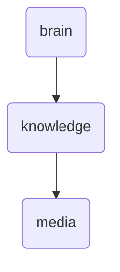

# Media Identity

This directory holds media-related content and tools, including metadata management for platforms like Metube, Smarttube, Tiktok-dl, and Videocaptioner within OmniClaw.

---

## Topological View

---
*OmniClaw V5.0 | Forged by OMA AI Architect | brain.knowledge.media | 2026-04-10*
