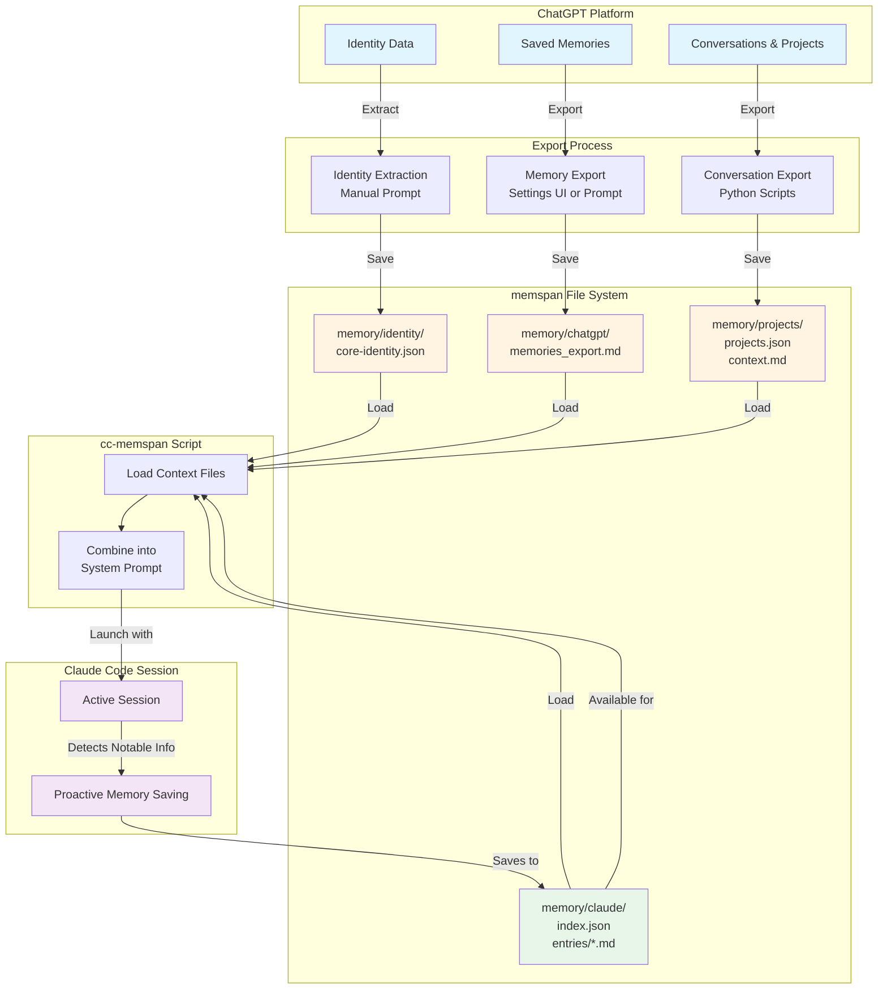

# memspan
Raw knowledge dump assimilated by OA.

## SWALLOW ENGINE DISTILLATION

### File: README.md
```md
# Memspan.ai

<div align="center">
  
</div>


> A persistent span of identity, memory, and conversation for LLMs and agents

**Website:** [https://memspan.ai](https://memspan.ai)

**memspan** is a file-system based memory archive system that helps you extract, organize, and load your personal identity, saved memories, and conversation history into Claude Code and other LLM interfaces. It provides a portable, tool-agnostic approach to maintaining continuity across AI assistant sessions.

## Overview

Memspan addresses a fundamental challenge: **LLMs don't remember across sessions**. While platforms like ChatGPT offer memory features, they're platform-locked and don't easily transfer to other tools like Claude Code. memspan bridges this gap by:

- **Extracting** your identity, memories, and conversation history from platforms like OpenAI ChatGPT
- **Organizing** this data into a structured, portable format
- **Loading** it dynamically into Claude Code sessions when needed

The system is designed to be:
- **File-based**: No databases, no servers—just files you control
- **Portable**: Works across different LLM tools and platforms
- **Selective**: Load only what you need for each session
- **Independent**: Doesn't interfere with Claude Code's own memory system

## Current State

### What Works Today

memspan currently provides:

1. **Identity Extraction**: Scripts and prompts to extract your personal identity from ChatGPT conversations
2. **Memory Export**: Tools to export and structure ChatGPT saved memories
3. **Project Conversations**: Scripts to correlate ChatGPT Projects with conversation history (the default export doesn't include project metadata)
4. **Context Loading**: A wrapper script (`cc-memspan`) to dynamically load identity, memories, and project context into Claude Code sessions

### Architecture

The project follows a three-tier memory model:

1. **Core Identity** (~2-4KB): Always-available personal context
2. **Project/Framework Memory** (~10-50KB per domain): Session-selectable deep context
3. **Historical Archive**: Indexed, retrieved on-demand

### Memory Architecture



## Challenges & Limitations

### Data Extraction Challenges

There are **no automatic tools** to extract all this data. The process requires:

- **Manual prompting**: Using prompts to extract identity from conversations
- **Memory export**: Either through ChatGPT's memory UI or by prompting ChatGPT to export memories
- **Data correlation**: The default OpenAI data export doesn't include project metadata—you need separate scripts to correlate conversations with projects

### Current Limitations

- **No MCP servers**: This version uses file-based context loading, not custom MCP servers
- **No vector search**: No embeddings or semantic search—just file-based retrieval
- **No integration**: Doesn't integrate with other memory systems (though this is a possible near-term direction)
- **Manual process**: Requires manual steps to extract and organize data

## Quick Start

> **New to memspan?** Start with the **[Quick Start Guide](docs/QUICKSTART.md)** for a comprehensive walkthrough.

### 1. Extract Your Identity

Use the prompts in `identity-archive/` to extract your identity from ChatGPT conversations. This creates a structured identity file.

### 2. Export ChatGPT Memories

Follow the instructions in `export-chatgpt-memories/README.md` to export your ChatGPT memories. You can either:
- Copy from ChatGPT Settings → Memory
- Use the export prompt to generate structured exports

### 3. Correlate Project Conversations

To export your conversations (and optionally correlate with projects), use the scripts in `export-chatgpt-conversations/`:

```bash
# Export projects metadata (if you use ChatGPT Projects)
python3 export-chatgpt-conversations/chatgpt_projects_dump.py --curl-file curl.txt

# Correlate conversations with projects
python3 export-chatgpt-conversations/chatgpt_project_conversations.py export
```

### 4. Load Context in Claude Code

Use the `cc-memspan` wrapper to load context into Claude Code. Here are the recommended usage patterns:

**Minimal Load (Identity + Memories):**
```bash
# Core identity and memories - recommended starting point
bash claude-memory/bin/cc-memspan --identity --memories
```

**Lightweight Project Awareness:**
```bash
# Add projects index (lightweight - just project names/metadata)
# Requires projects.json from export-chatgpt-conversations
bash claude-memory/bin/cc-memspan --identity --memories --projects-index
```

Or using the Makefile:
```bash
make memspan-projects-index
```

**Full Project Context (Higher Token Usage):**
```bash
# Load specific project with full context (context.md, conversations.json)
# Use ad-hoc for long-running projects with essential ChatGPT conversations
bash claude-memory/bin/cc-memspan --project project-name
```

**Note:** Loading full project context (`--project`) includes conversation history and can significantly increase token usage. Use `--projects-index` for lightweight project awareness, and reserve `--project` for when you need deep context from specific long-running projects.

See [`claude-memory/README.md`](claude-memory/README.md) for detailed usage instructions.

### Using Make (Optional)

A `Makefile` is provided to simplify common tasks:

```bash
# Show all available commands
make help

# Check prerequisites and status
make check
make status

# Extract identity (shows instructions)
make identity-prompt

# Launch Claude with context
make memspan-identity
make memspan-full PROJECT=project-name

# Show and install shell aliases
make aliases-show
make aliases-install
```

See the `Makefile` for all available targets.

## Usage Examples

### Basic Session with Identity

```bash
# Load just your identity
bash claude-memory/bin/cc-memspan --identity
```

Claude will now know who you are, your preferences, and your communication style.

**Example:** After loading identity, you can ask "who am I?" and Claude will respond with a summary based on your identity context:

```
> who am I?

Based on the identity context loaded for this session, you are [Your Name]:
  
  Personal
  - [Age], born [Year] in [Location]
  - Currently based in [Location]
  
  Professional
  - [Professional identity]
  - [Companies/roles]
  
  Tech Stack
  - [Languages, frameworks, tools]
  
  Personality
  - [Personality traits, values]
  - [Work philosophy]
  
  Current Focus
  - [Active projects]
  
  This identity was loaded from memory/identity/core-identity.json.
```

### Project-Specific Work

```bash
# Load identity + memories + project context
bash claude-memory/bin/cc-memspan --full your_project_name
```

This loads everything Claude needs to work on a specific project with full context.

### Proactive Memory Saving

When you share notable information (goals, preferences, insights), Claude will proactively suggest saving it to your memory system:

```
> I have a goal of losing 10lbs next year

⏺ Good goal! That's a reasonable and achievable target - roughly 0.8-1 lb per month 
allows for sustainable progress without extreme measures.

Looking at your current profile, you already have a solid foundation with strength 
training 3x/week and cardio 2x/week. Weight loss would mainly come down to nutrition 
adjustments alongside your existing routine.

---
Would you like me to save this goal to your memories (memory/claude/)? Per your 
current settings, I'm in ask-first mode for memory saves.

> yes

⏺ Saved to memory/claude/entries/2025-12-15-weight-loss-goal.md
```

When you confirm, Claude:
1. Creates a new entry file in `memory/claude/entries/`
2. Adds the entry to `memory/claude/index.json` with metadata
3. Makes the memory available for future sessions

This works automatically—Claude recognizes goals, preferences, insights, and other notable information and offers to save them.

### Quick Questions

```bash
# No context—just ask a question
claude "What's the best way to structure a Python package?"
```

For generic questions, you don't need to load any context.

## How It Works

### Context Loading

The `cc-memspan` script:
1. Reads selected context files (identity, memories, projects)
2. Combines them into a system prompt
3. Launches Claude Code with `--append-system-prompt`

This means the context is sent with every message, so Claude has access to your identity and memories throughout the session.

### Memory Precedence

When information conflicts:
1. **Claude memories** (in `memory/claude/`) take precedence over ChatGPT memories
2. **Newer entries** take precedence over older entries
3. **Explicit corrections** take precedence over inferred information

### File Organization

- **Identity**: Condensed personal context (~2-4KB)
- **Memories**: Structured memories from ChatGPT and Claude sessions
- **Projects**: Project-specific context, decisions, and conversation history
- **Archive**: Historical conversations indexed for on-demand retrieval

## Documentation

- **[Quick Start Guide](docs/QUICKSTART.md)**: Get up and running with memspan in minutes
- **[Identity Archive README](identity-archive/README.md)**: How to extract identity from ChatGPT
- **[ChatGPT Memories README](export-chatgpt-memories/README.md)**: How to export and structure ChatGPT memories
- **[Conversation Export README](export-chatgpt-conversations/README.md)**: How to export conversations and correlate with projects
- **[Claude Memory README](claude-memory/README.md)**: Usage guide for the context loading system

## Future Directions

Potential enhancements (not yet implemented):

- **MCP Server**: Custom MCP server for on-demand memory retrieval (reduces token costs)
- **Vector Search**: Embeddings and semantic search over conversation history
- **Auto-extraction**: Automated memory extraction from conversations
- **Cross-platform Sync**: Sync memories between ChatGPT and Claude
- **Memory Summarization**: Automatic summarization of new conversations

These enhancements are planned for future releases as the system evolves.

## Contributing

Contributions and ideas are welcome! This is a personal project designed to be:
- **Portable**: Standard formats (JSON, Markdown) that work across platforms
- **Tool-agnostic**: Works with any LLM interface, not locked to specific vendors
- **Explicit**: User controls what gets loaded when—no hidden assumptions

### How to Contribute

- **Report Issues**: Found a bug or have a feature request? Open an issue on GitHub
- **Submit Pull Requests**: Improvements, bug fixes, or new features are welcome
- **Share Ideas**: Have suggestions for improving the system? We'd love to hear them
- **Documentation**: Help improve docs, add examples, or clarify instructions

This project is a work in progress. Your feedback and contributions help make memspan better for everyone.

## License

MIT License - see [LICENSE](LICENSE) file

## Version History

**0.1.0** - 2025-12-15 - Initial release
  - Identity extraction from ChatGPT conversations
  - ChatGPT memory export and structuring
  - Project conversation correlation and export
  - Context loading system (`cc-memspan`) for Claude Code
  - Proactive memory saving system for Claude sessions
  - File-based memory archive with portable formats
  - Example files and comprehensive documentation

## About

**Website:** [https://memspan.ai](https://memspan.ai)  
**Created by [Eric Blue](https://about.eric-blue.com)**

memspan is a file-system based memory archive system that helps you extract, organize, and load your personal identity, saved memories, and conversation history into Claude Code and other LLM interfaces. It provides a portable, tool-agnostic approach to maintaining continuity across AI assistant sessions.

This project addresses the challenge of platform-locked memory systems by providing a portable, user-controlled alternative that works across different LLM tools and platforms.

## Notes

- This system is independent of Claude Code's own memory features
- All context loading is opt-in—you choose what to load per session
- The `chatgpt-history/` directory contains personal data and is ignored in this documentation


```

### File: docs\COMPARISON.md
```md
# Memspan vs Other Memory Frameworks: Technical Comparison

Technical comparison of memspan.ai with other memory frameworks. Focus: architectural tradeoffs and use cases.

---

## Overview

**Memspan** is a file-first memory archive for **personal identity continuity and long-term context portability** across AI tools. Unlike frameworks built for agents and applications, memspan prioritizes:

- **Identity preservation** over isolated fact recall
- **File-first, user-owned** storage (Markdown/JSON)
- **Tool-agnostic design** (works with any LLM interface)
- **Explicit control** (no silent summarization or automatic injection)

Most AI memory systems (Letta, Mem0, BasicMemory) are optimized for **agents and applications**—they rely on infrastructure, embeddings, and retrieval layers. Memspan solves a different problem: **personal identity and long-term context portability across AI tools**.

---

## File-First, Not File-Only

**Memspan is file-first, not file-only.** The filesystem is the source of truth, but the architecture supports optional enhancements:

### Current: Filesystem-Only (Default)
- Pure file system: `memory/identity/`, `memory/claude/`, `memory/projects/`
- No database dependencies
- Human-readable formats (Markdown, JSON)
- Version control friendly (git-trackable)
- Portable across machines via file copy

### Future: Optional Enhancements (Planned)
- **MCP Server**: On-demand memory access via Model Context Protocol
- **Database Index**: Optional SQLite/Postgres index for fast search (files remain source of truth)
- **Knowledge Graph**: Optional relationship graph (Graphiti, Memgraph, FalkorDB adapters)
- **Vector Search**: Optional embeddings (LanceDB/ChromaDB) for semantic search

**Architecture Pattern:**
```
Filesystem (Source of Truth)
    ↓ (optional sync)
Database Index (Derived, can be rebuilt)
    ↓
MCP Server (Uses adapter interface)
    ↓
Storage Adapters (FilesystemAdapter, GraphitiAdapter, etc.)
```

**Key Design Principles:**
1. **Files remain source of truth** - Database/graph are derived indexes
2. **Adapter pattern** - Pluggable backends (filesystem, Graphiti, Memgraph, etc.)
3. **Progressive enhancement** - Start simple, add complexity when needed
4. **No lock-in** - Can delete database/graph and revert to filesystem-only
5. **Backward compatible** - Existing workflows unchanged

See `docs/internal/ARCHITECTURE_TRANSITION.md` for detailed architecture plans.

---

## Core Architectural Differences

### Storage Layer

| Framework | Storage | Format | Infrastructure Required |
|-----------|---------|--------|------------------------|
| **Memspan** | File system (default) | Markdown + JSON | None (optional: DB/graph) |
| **Letta/MemGPT** | Database + services | Structured records | Database server |
| **Mem0** | Database + vectors | Embeddings + metadata | Database + vector store |
| **BasicMemory** | Files + database | Markdown + SQLite/Postgres | Database (SQLite minimal) |

**Tradeoff:** Filesystem-only = transparency and portability, but no built-in query engine. Optional enhancements add search/graph capabilities when needed.

### Access Pattern

| Framework | Access Method | Token Efficiency | On-Demand Retrieval |
|-----------|---------------|------------------|---------------------|
| **Memspan** | System prompt injection | Lower (loads upfront) | Planned: MCP |
| **Letta/MemGPT** | Agent memory API | Higher (selective) | Yes |
| **Mem0** | SDK/API calls | Higher (selective) | Yes |
| **BasicMemory** | MCP server tools | Higher (selective) | Yes |

**Current (filesystem-only):**
```bash
cc-memspan --identity --memories --project mindjot
# → Reads files → Combines → --append-system-prompt
```

**Future (MCP + adapter):**
- On-demand retrieval via MCP tools (`get_identity`, `search_memories`)
- Works with any adapter (FilesystemAdapter, GraphitiAdapter, etc.)

### Integration Model

| Framework | Integration | Protocol | Setup Complexity |
|-----------|-------------|----------|------------------|
| **Memspan** | Wrapper script (MCP planned) | CLI flags | Low (file-based) |
| **Letta/MemGPT** | Agent framework | Python SDK | Medium |
| **Mem0** | SDK/API | REST/GraphQL | Medium |
| **BasicMemory** | MCP server | Model Context Protocol | Medium |

**Current:** Bash wrapper (`cc-memspan`) - no server, works immediately  
**Future:** MCP server via adapter interface - optional, backward compatible

---

## Framework Comparisons

### Memspan vs Letta/MemGPT

| Aspect | Memspan | Letta/MemGPT |
|--------|---------|--------------|
| **Target** | People (personal continuity) | Agents (application memory) |
| **Storage** | Files (default) | Database + services |
| **Infrastructure** | None (optional) | Required |
| **Use Case** | Personal identity across tools | Agent state management |

**Choose Memspan:** Personal identity continuity, file-first, zero infrastructure  
**Choose Letta:** Building AI agents, need automatic summarization, agent frameworks

### Memspan vs Mem0

| Aspect | Memspan | Mem0 |
|--------|---------|------|
| **Target** | People (identity continuity) | Apps & agents (memory layer) |
| **Storage** | Files (default) | Database + vectors |
| **Extraction** | Manual | Automatic |
| **Control** | Explicit | Automatic |

**Choose Memspan:** Explicit control, manual curation, portability  
**Choose Mem0:** Automatic extraction, vector search, multi-user systems

### Memspan vs BasicMemory

| Aspect | Memspan | BasicMemory |
|--------|---------|-------------|
| **Target** | People (identity continuity) | Knowledge workers (PKM) |
| **Storage** | Files (default) | Files + database |
| **Graph** | Planned (optional) | Yes (current) |
| **MCP** | Planned (optional) | Yes (current) |
| **Focus** | Identity + memories | Knowledge graph |

**Choose Memspan:** Identity continuity, file-first, maximum portability  
**Choose BasicMemory:** Knowledge graphs, semantic search, MCP now

---

## Memspan Architecture

### Three-Tier Memory Model

1. **Core Identity**: Always-available personal context
   - `memory/identity/core-identity.json`

2. **Project/Framework Memory**: Session-selectable
   - `memory/projects/<project>/context.md`

3. **Historical Archive**: Indexed, retrieved on-demand
   - `memory/chatgpt/memories_export.md` (static)
   - `memory/claude/entries/*.md` (active)

### Current Access (Filesystem-Only)

```bash
cc-memspan --identity --memories --project mindjot
# → Reads files → Combines → --append-system-prompt
```

### Future Access (MCP + Adapter)

```typescript
// MCP tools via adapter interface:
- get_identity(): Returns condensed identity
- search_memories(query): Returns relevant memories (filtered)
- search_history(query): Keyword/semantic search
- get_conversation(id): Fetch specific chunks
```

**Benefit:** On-demand loading (only what's needed per tool call)

### Memory Precedence

1. Claude memories > ChatGPT memories
2. Newer entries > Older entries
3. Explicit corrections > Inferred information
4. Project context > Global memories > Identity

---

## Use Cases

### When Memspan Is the Right Fit

- Personal identity continuity across multiple LLM tools
- File-first philosophy (see/edit all memories directly)
- Tool portability (works with any LLM interface)
- Explicit control (decide what loads per session)
- Zero infrastructure (works immediately, no setup)

### When Other Frameworks Are Better

- **Letta/MemGPT:** Building AI agents, need automatic summarization
- **Mem0:** Building applications, need automatic extraction, vector search
- **BasicMemory:** Need knowledge graphs, semantic search, MCP now

---

## Feature Comparison

| Feature | Memspan | Letta | Mem0 | BasicMemory |
|---------|---------|-------|------|-------------|
| **Built for** | People | Agents | Apps & agents | Knowledge workers |
| **Storage** | Files (default) | Database | Database + vectors | Files + database |
| **Infrastructure** | None (optional) | Required | Required | SQLite minimal |
| **Portability** | High | Medium | Medium | Medium |
| **Identity Focus** | ✅ Primary | ❌ | ❌ | ❌ |
| **Vector Search** | Planned (optional) | ✅ | ✅ | ✅ |
| **MCP Integration** | Planned (optional) | ❌ | ❌ | ✅ |
| **Knowledge Graph** | Planned (optional) | ❌ | ❌ | ✅ |
| **Search** | Planned (optional) | ✅ | ✅ | ✅ |
| **Auto Extraction** | ❌ | ✅ | ✅ | ❌ |
| **Explicit Control** | ✅ | Partial | Partial | ✅ |
| **Zero Setup** | ✅ | ❌ | ❌ | Partial |

---

## Portability

**File-based advantages:**
- Cross-platform (works on any OS)
- Version control (git-trackable)
- Simple backup (file copy)
- Human-readable (edit with any text editor)
- Long-term (files survive technology changes)

**Migration:** Export from ChatGPT/Claude/other frameworks → convert to memspan format → copy directory

---

## Future Enhancements (Optional)

**Planned:**
- **MCP Server:** On-demand memory access via adapter interface
- **Database Index:** Optional SQLite/Postgres for fast search (files remain source of truth)
- **Knowledge Graph:** Optional relationship graph (Graphiti, Memgraph, FalkorDB adapters)
- **Vector Search:** Optional embeddings (LanceDB/ChromaDB) for semantic search

**Key Principle:** Files remain the source of truth. All enhancements are optional layers via adapter pattern. See `docs/internal/ARCHITECTURE_TRANSITION.md` for details.

---

## Conclusion

**Memspan is different because:**

1. **Built for people, not agents** - Personal identity continuity across tools
2. **File-first, not file-only** - Files are source of truth, optional enhancements available
3. **Tool-agnostic** - Works with any LLM interface
4. **Explicit control** - You decide what context loads
5. **Zero infrastructure** - Works immediately (optional enhancements when needed)

**These approaches are complementary:**

- **Memspan:** Personal identity, cross-tool continuity, file-first
- **Letta/MemGPT:** Agent memory management
- **Mem0:** Application-level memory extraction
- **BasicMemory:** Knowledge graph and PKM systems

**Value proposition:** The memory you carry with you, across tools, across time, under your control—starting simple, scaling when needed.

---

## References

- **Memspan:** [https://memspan.ai](https://memspan.ai) | [GitHub](https://github.com/ericblue/memspan)
- **Letta/MemGPT:** [https://github.com/letta-ai/letta](https://github.com/letta-ai/letta)
- **Mem0:** [https://github.com/mem0ai/mem0](https://github.com/mem0ai/mem0)
- **BasicMemory:** [https://github.com/basicmachines-co/basic-memory](https://github.com/basicmachines-co/basic-memory)

---

*Last updated: 2025-12-15*


```

### File: docs\QUICKSTART.md
```md
# Memspan Quick Start Guide

> Get up and running with Memspan in minutes

This guide will help you extract your identity, memories, and conversations from ChatGPT and load them into Claude Code sessions.

## Table of Contents

1. [Overview](#overview)
2. [Data Types from Other LLMs](#data-types-from-other-llms)
3. [Extracting Data](#extracting-data)
4. [Using cc-memspan](#using-cc-memspan)
5. [Using the Makefile](#using-the-makefile)
6. [Creating Aliases](#creating-aliases)

---

## Overview

**Memspan** is a file-system based memory archive that helps you maintain continuity across AI assistant sessions. It solves a fundamental problem: **LLMs don't remember across sessions**, and platform-specific memory features (like ChatGPT's memory) don't transfer to other tools.

### How Memspan Works

Memspan uses a **three-tier memory model**:

1. **Core Identity** (~2-4KB): Always-available personal context
   - Who you are, your preferences, communication style
   - Stored in `claude-memory/memory/identity/core-identity.json`

2. **Project/Framework Memory** (~10-50KB per domain): Session-selectable deep context
   - Project-specific context, decisions, conversation history
   - Stored in `claude-memory/memory/projects/<project-name>/`

3. **Historical Archive**: Indexed, retrieved on-demand
   - Full conversation history, indexed for search
   - Stored in `claude-memory/memory/chatgpt/` and project directories

### Data Flow

```
ChatGPT (Web Interface)
    ↓ Extract
Identity, Memories, Conversations
    ↓ Organize
Memspan Memory Files
    ↓ Load
Claude Code Sessions
```

### Key Principles

- **File-based**: No databases, just files you control
- **Portable**: Works across different LLM tools
- **Selective**: Load only what you need per session
- **Opt-in**: You choose what context to load

---

## Data Types from Other LLMs

Memspan currently supports extracting three types of data from **OpenAI ChatGPT**:

### 1. Identity

**What it is:** A comprehensive personal profile including:
- Personal information (name, location, career)
- Personality traits and cognitive styles
- Communication preferences
- Technology stack and tools
- Professional context
- Goals and motivations
- Values and philosophy
- And much more (18 major sections total)

**Source:** ChatGPT's internal memory and conversation history

**Format:** Structured JSON with deeply nested sections

**Size:** Full archive can be large; condensed version ~2-4KB

### 2. Memories

**What it is:** Saved facts and preferences that ChatGPT remembers about you:
- Biographical facts
- Preferences (coding style, communication, tools)
- Important relationships
- Recurring themes and patterns

**Source:** ChatGPT Settings → Memory (web interface only)

**Format:** Markdown or structured JSON

**Size:** Varies based on how many memories you've saved

**Note:** The OpenAI API does **not** support memory features—this is only available through the web interface.

### 3. Conversations & Projects

**What it is:** 
- **Conversations**: Full chat history with messages
- **Projects**: ChatGPT Projects (organized conversation groups) with metadata

**Source:** 
- ChatGPT Data Export (conversations)
- ChatGPT API (project metadata—not included in standard export)

**Format:** JSON with conversation trees and project mappings

**Size:** Can be very large (thousands of conversations)

**Note:** The standard ChatGPT export doesn't include project metadata—you need separate tools to correlate conversations with projects.

---

## Extracting Data

This section covers how to extract each type of data and where it gets saved in Memspan.

### Extracting Identity

Identity extraction is a **manual process** using a specialized prompt in ChatGPT's web interface.

#### Why Manual?

- **No API Support**: The OpenAI API doesn't support memory features like the web interface
- **User Control**: You decide when and how to extract your identity
- **Quality Review**: You can review and refine the output before saving

#### Step-by-Step Process

1. **Enable ChatGPT Memory**:
   - Log in to ChatGPT (chat.openai.com)
   - Go to Settings → Personalization & Memory
   - Ensure memory is enabled

2. **Run the Identity Prompt**:
   - Open a new ChatGPT conversation
   - Copy the entire prompt from `identity-archive/identity-archive-prompt.md`
   - Paste it into ChatGPT and send

3. **Review the Output**:
   - ChatGPT will generate a comprehensive JSON profile
   - Review it for accuracy (hallucinations are possible)
   - The output includes 18 major sections with rich details
   - **Tip:** Compare with `core-identity-example.json` to see the expected structure

4. **Save to Memspan**:
   ```bash
   # Copy the JSON output and save it to:
   ./claude-memory/memory/identity/core-identity.json
   ```

#### What You Get

The identity JSON includes:
- `personal_info` - Name, location, career, companies, life events
- `personality_traits` - Cognitive style, creativity, leadership, ambition
- `communication_style` - Tone, collaboration preferences
- `technology_and_tools` - Programming languages, frameworks, projects
- `profession_and_work` - Career trajectory, work philosophy
- `goals_and_motivations` - Short-term and long-term goals
- `fitness_and_health` - Health metrics, training strategies
- `interests_and_learning` - Intellectual pursuits, learning methods
- `values_and_philosophy` - Privacy views, economic beliefs, ethics
- `emotional_and_cognitive_patterns` - Stress response, thinking styles
- `relationships_and_social_dynamics` - Team roles, collaboration beliefs
- `legacy_and_identity` - Long-term vision, desired impact
- `memories_and_stories` - Personal stories with emotional context
- `daily_routines_and_habits` - Morning/evening rituals, productivity practices
- `tools_and_systems_used` - Productivity tools, development environments
- `environmental_preferences` - Work settings, workspace setup
- `self_reflection_and_growth` - Introspection approaches, growth systems
- `personality_type_assessments` - MBTI, Big Five, CliftonStrengths

#### Output Quality

The quality depends on:
- **Interaction History**: More conversations = richer profile
- **Memory Enablement**: Memory must be enabled and active
- **Conversation Depth**: Detailed conversations lead to comprehensive profiles

**Important:** Always review the output for accuracy—hallucinations are possible.

#### File Location

```
claude-memory/
└── memory/
    └── identity/
        ├── core-identity.json         ← Save your identity here
        └── core-identity-example.json ← Example structure (fake data)
```

**Example File:** See `claude-memory/memory/identity/core-identity-example.json` for a complete example of the expected JSON structure with placeholder data. This can help you understand the format and depth of information to include.

### Extracting Memories

Memories are saved facts and preferences that ChatGPT remembers about you. The extraction process is simple: **cut & paste** from ChatGPT, then optionally structure them.

#### Step-by-Step Process

1. **Copy from ChatGPT**:
   - Log in to ChatGPT (chat.openai.com)
   - Go to Settings → Personalization & Memory
   - View your saved memories
   - **Copy all the text** and paste it into `export-chatgpt-memories/memories.md`

2. **Add Additional Memories** (Optional):
   - You can also manually add any additional memories you want to include
   - Just add them to the same `memories.md` file

3. **Structure the Memories** (Optional):
   - The `export_prompt.md` adds structure and metadata to your raw memories
   - Copy the prompt from `export-chatgpt-memories/export_prompt.md`
   - Paste your `memories.md` content into ChatGPT/Claude
   - Save the structured output

4. **Save to Memspan**:
   ```bash
   # Save the structured export to:
   ./claude-memory/memory/chatgpt/memories_export.md
   ```

#### What You Get

Raw memories (`memories.md`):
- Simple text format
- One memory per line or paragraph
- Can be used directly as context

Structured memories (`memories_export.md`):
- Organized with IDs and summaries
- Includes topics, entities, and dates
- Better organized for loading as context

#### Example File

See `export-chatgpt-memories/memories-example.md` for an example of what raw memories look like when copied from ChatGPT.

#### File Location

```
claude-memory/
└── memory/
    └── chatgpt/
        └── memories_export.md    ← Save structured memories here
```

**Note:** The OpenAI API does **not** support memory features—this is only available through the ChatGPT web interface.

### Extracting Conversations & Projects

This process exports your ChatGPT conversations and optionally correlates them with Projects (if you use ChatGPT Projects). The process has two parts:

1. **Export conversations** from ChatGPT (manual download)
2. **Extract project metadata** from Chrome DevTools (if you use Projects)
3. **Correlate** conversations with projects

#### Step 1: Export Conversations from ChatGPT

ChatGPT allows you to export all your data as a zip file:

1. Log in to ChatGPT (chat.openai.com)
2. Go to **Settings → Data Controls → Export Data**
3. Click **Request Data Export** or similar button
4. You'll receive an email with a download link (may take a few minutes)
5. Download and extract the zip file

**Important:** The zip file contains `conversations.json` - this is your complete conversation history. Extract this file and save it as `conversations.json` in your working directory.

**Note:** The official export does **not** include project metadata. If you use ChatGPT Projects, you'll need Step 2 to correlate conversations with projects.

#### Step 2: Extract Project Metadata (If You Use Projects)

If you use ChatGPT Projects, you need to extract project metadata separately because it's not included in the official export. This uses Chrome DevTools to capture an API call.

**Detailed Chrome DevTools Steps:**

1. **Open ChatGPT in Chrome**:
   - Log in to chat.openai.com
   - Make sure you're on the main chat interface

2. **Open Chrome DevTools**:
   - Press `F12` or `Cmd+Option+I` (Mac) / `Ctrl+Shift+I` (Windows/Linux)
   - Or right-click the page → **Inspect**

3. **Open the Network Tab**:
   - Click the **Network** tab in DevTools
   - Make sure the network log is recording (red circle should be active, or click the record button)

4. **Trigger the Projects API Call**:
   - Click on **Projects** in the ChatGPT sidebar (or refresh the page)
   - This will generate network requests

5. **Find the Projects Request**:
   - In the Network tab, look for a request to `/backend-api/gizmos/snorlax/sidebar`
   - You can filter by typing "gizmos" or "snorlax" in the filter box
   - The request should be a `GET` request

6. **Copy as cURL**:
   - Right-click on the `/gizmos/snorlax/sidebar` request
   - Select **Copy → Copy as cURL** (or **Copy → Copy as cURL (bash)**)
   - This copies the full cURL command with all headers and authentication

7. **Save the cURL Command**:
   - Paste the copied cURL command into a file: `export-chatgpt-conversations/curl.txt`
   - Or save it anywhere and reference it with `--curl-file`

**What This Does:**
- The cURL command contains your authentication cookies and headers
- The script replays this API call to get your projects list
- This is the same API call ChatGPT uses to populate the Projects sidebar

#### Step 3: Run the Export Scripts

**Extract Projects Metadata:**

```bash
cd export-chatgpt-conversations
python3 chatgpt_projects_dump.py --curl-file curl.txt
```

This creates:
- `projects.json` - Cleaned project metadata
- `projects_raw.json` - Full API responses (for debugging)

**Correlate Conversations with Projects:**

```bash
# Make sure conversations.json is in the same directory or specify the path
python3 chatgpt_project_conversations.py export
```

This correlates conversations with projects using the `gizmo_id` field and creates:
- Project-to-conversation mappings
- Categorized exports (project conversations, regular conversations, orphaned projects)

**Common Commands:**

```bash
# List all projects
python3 chatgpt_project_conversations.py list-projects

# Export all with full message content (warning: large files)
python3 chatgpt_project_conversations.py export --with-messages

# Export a specific project
python3 chatgpt_project_conversations.py export-project "Project Name"
```

#### What You Get

- **Project conversations**: Conversations linked to active projects
- **Regular conversations**: Standard ChatGPT chats without projects
- **Orphaned conversations**: Conversations from deleted projects
- **Project metadata**: Names, creation dates, memory settings

**Note:** The export scripts create `conversations.json` files, but you'll need to:
1. Copy exported project conversations to `memory/projects/<project>/conversations.json` if you want to use `--project`
2. Manually create `context.md` in each project directory (see project context section below)

#### File Locations

```
export-chatgpt-conversations/
├── conversations.json          ← From ChatGPT data export (.zip file)
├── projects.json               ← Generated from API call (save to memory/projects/)
└── project_conversations.json  ← Generated correlation output
```

**Important:** After generating `projects.json`, save it to `claude-memory/memory/projects/projects.json` to enable the lightweight `--projects-index` option in `cc-memspan`.

**Note:** If you don't use ChatGPT Projects, you can skip Step 2 and just use `conversations.json` directly. The correlation script will still work and categorize your conversations.

---

## Using cc-memspan

The `cc-memspan` script is a wrapper that loads your identity, memories, and project context into Claude Code sessions. It works from any directory and uses absolute paths. This is part of the memspan project for portable, file-based memory.

### Installation

Ensure the `claude` CLI is installed and on your PATH:

```bash
# Check if claude is available
which claude

# If not installed, install it (see Claude Code documentation)
```

### Basic Usage

```bash
# From any directory, use the full path:
bash ~/path/to/memspan/claude-memory/bin/cc-memspan [options]
```

### Options

| Option | Description |
|--------|-------------|
| `--identity` | Load identity from `memory/identity/core-identity.json` (or `.md`) |
| `--memories` | Load ChatGPT memories from `memory/chatgpt/memories_export.md` |
| `--project NAME` | Load project bundle (context.md, conversations.json) |
| `--projects-index` | Load global projects list from `memory/projects/projects.json` |
| `--full NAME` | Shorthand: `--identity --memories --project NAME` |
| `--use-current` | Use project from `memory/current-project` file |
| `--dry-run` | Print the command without running |
| `-h, --help` | Show help message |

### Common Patterns

#### Minimal Load (Recommended Starting Point)

```bash
bash claude-memory/bin/cc-memspan --identity --memories
```

**Recommended for m
... [TRUNCATED]
```

