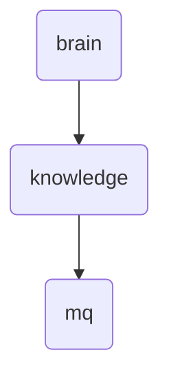

# Mq Identity

This directory is responsible for managing and optimizing the messaging queue system within OmniClaw v5.0, ensuring efficient communication between various components of the system.

---

## Topological View

---
*OmniClaw V5.0 | Forged by OMA AI Architect | brain.knowledge.mq | 2026-04-10*
