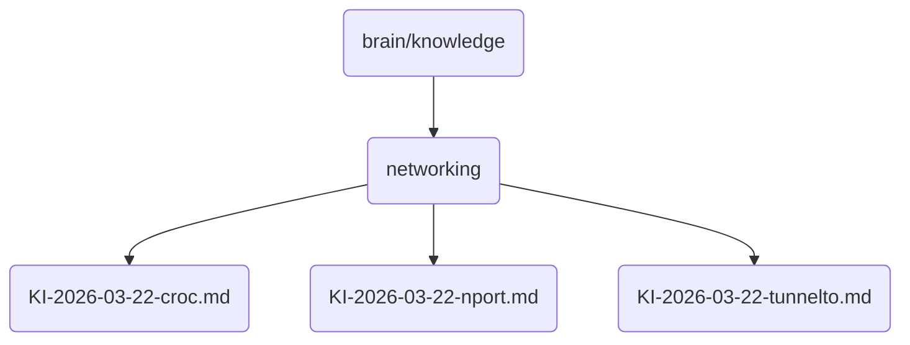

# Networking Identity

This directory contains documents and configurations related to networking, crucial for the operation of OmniClaw v5.0.

## Topological View

---
*OmniClaw V5.0 | Forged by AI Architect | Evaluated dynamically*
