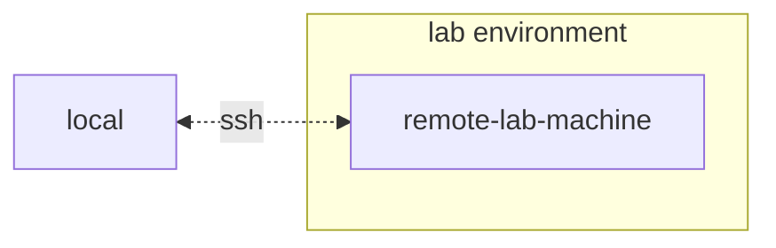

# nim
Raw knowledge dump assimilated by OA.

## SWALLOW ENGINE DISTILLATION

### File: README.md
```md
# NVIDIA NIM Anywhere [](https://ngc.nvidia.com/open-ai-workbench/aHR0cHM6Ly9naXRodWIuY29tL05WSURJQS9uaW0tYW55d2hlcmUK)

[](https://docs.nvidia.com/nim/#large-language-models)
[](https://docs.nvidia.com/nim/#nemo-retriever)
[](https://docs.nvidia.com/nim/#nemo-retriever)
[](https://github.com/NVIDIA/nim-anywhere/actions/workflows/ci.yml?query=branch%3Amain)


 
Please join \#cdd-nim-anywhere slack channel if you are a internal user,
open an issue if you are external for any question and feedback.

One of the primary benefit of using AI for Enterprises is their ability
to work with and learn from their internal data. Retrieval-Augmented
Generation
([RAG](https://blogs.nvidia.com/blog/what-is-retrieval-augmented-generation/))
is one of the best ways to do so. NVIDIA has developed a set of
micro-services called [NIM
micro-service](https://docs.nvidia.com/nim/large-language-models/latest/introduction.html)
to help our partners and customers build effective RAG pipeline with
ease.

NIM Anywhere contains all the tooling required to start integrating NIMs
for RAG. It natively scales out to full-sized labs and up to production 
environments. This is great news for building a RAG architecture and
easily adding NIMs as needed. If you're unfamiliar with RAG, it
dynamically retrieves relevant external information during inference
without modifying the model itself. Imagine you're the tech lead of a
company with a local database containing confidential, up-to-date
information. You don’t want OpenAI to access your data, but you need the
model to understand it to answer questions accurately. The solution is
to connect your language model to the database and feed them with the
information.

To learn more about why RAG is an excellent solution for boosting the
accuracy and reliability of your generative AI models, [read this
blog](https://developer.nvidia.com/blog/enhancing-rag-applications-with-nvidia-nim/).

Get started with NIM Anywhere now with the [quick-start](#quick-start)
instructions and build your first RAG application using NIMs!


 
- [Quick-start](#quick-start)
  - [Generate your NGC Personal Key](#generate-your-ngc-personal-key)
  - [Authenticate with Docker](#authenticate-with-docker)
  - [Install AI Workbench](#install-ai-workbench)
  - [Download this project](#download-this-project)
  - [Configure this project](#configure-this-project)
  - [Start This Project](#start-this-project)
  - [Populating the Knowledge Base](#populating-the-knowledge-base)
- [Developing Your Own Applications](#developing-your-own-applications)
- [Application Configuration](#application-configuration)
  - [Config from a file](#config-from-a-file)
  - [Config from a custom file](#config-from-a-custom-file)
  - [Config from env vars](#config-from-env-vars)
  - [Chain Server config schema](#chain-server-config-schema)
  - [Chat Frontend config schema](#chat-frontend-config-schema)
- [Contributing](#contributing)
  - [Code Style](#code-style)
  - [Updating the frontend](#updating-the-frontend)
  - [Updating documentation](#updating-documentation)
- [Managing your Development
  Environment](#managing-your-development-environment)
  - [Environment Variables](#environment-variables)
  - [Python Environment Packages](#python-environment-packages)
  - [Operating System Configuration](#operating-system-configuration)
  - [Updating Dependencies](#updating-dependencies)

# Quick-start

## Generate your NGC Personal Key

To allow AI Workbench to access NVIDIA’s cloud resources, you’ll need to
provide it with a Personal Key. These keys begin with `nvapi-`.

<details>
<summary>
<b>Expand this section for instructions for creating this key.</b>
</summary>

1.  Go to the [NGC Personal Key
    Manager](https://org.ngc.nvidia.com/setup/personal-keys). If you are
    prompted to, then register for a new account and sign in.

    > **HINT** You can find this tool by logging into
    > [ngc.nvidia.com](https://ngc.nvidia.com), expanding your profile
    > menu on the top right, selecting *Setup*, and then selecting
    > *Generate Personal Key*.

2.  Select *Generate Personal Key*.

    

3.  Enter any value as the Key name, an expiration of 12 months is fine,
    and select all the services. Press *Generate Personal Key* when you
    are finished.

    

4.  Save your personal key for later. Workbench will need it and there
    is no way to retrieve it later. If the key is lost, a new one must
    be created. Protect this key as if it were a password.

    

</details>

## Authenticate with Docker

Workbench will use your system's Docker client to pull NVIDIA NIM
containers, so before continuing, make sure to follow these steps to
authenticate your Docker client with your NGC Personal Key.

1.  Run the following Docker login command

    ``` bash
    docker login nvcr.io
    ```

2.  When prompted for your credentials, use the following values:

    - Username: `$oauthtoken`
    - Password: Use your NGC Personal key beggining with `nv-api`

## Install AI Workbench

This project is designed to be used with [NVIDIA AI
Workbench](https://www.nvidia.com/en-us/deep-learning-ai/solutions/data-science/workbench/).
While this is not a requirement, running this demo without AI Workbench
will require manual work as the pre-configured automation and
integrations may not be available.

This quick start guide will assume a remote lab machine is being used
for development and the local machine is a thin-client for remotely
accessing the development machine. This allows for compute resources to
stay centrally located and for developers to be more portable. Note, the
remote lab machine must run Ubuntu, but the local client can run
Windows, MacOS, or Ubuntu. To install this project local only, simply
skip the remote install.



### Client Machine Install

Ubuntu is required if the local client will also be used for developent.
When using a remote lab machine, this can be Windows, MacOS, or Ubuntu.

<details>
<summary>
<b>Expand this section for a Windows install.</b>
</summary>

For full instructions, see the [NVIDIA AI Workbench User
Guide](https://docs.nvidia.com/ai-workbench/user-guide/latest/installation/windows.html).

1.  Install Prerequisite Software

    1.  If this machine has an NVIDIA GPU, ensure the GPU drivers are
        installed. It is recommended to use the [GeForce
        Experience](https://www.nvidia.com/en-us/geforce/geforce-experience/)
        tooling to manage the GPU drivers.
    2.  Install [Docker
        Desktop](https://www.docker.com/products/docker-desktop/) for
        local container support. Please be mindful of Docker Desktop's
        licensing for enterprise use. [Rancher
        Desktop](https://rancherdesktop.io/) may be a viable
        alternative.
    3.  *\[OPTIONAL\]* If Visual Studio Code integration is desired,
        install [Visual Studio Code](https://code.visualstudio.com/).

2.  Download the [NVIDIA AI
    Workbench](https://www.nvidia.com/en-us/deep-learning-ai/solutions/data-science/workbench/)
    installer and execute it. Authorize Windows to allow the installer
    to make changes.

3.  Follow the instructions in the installation wizard. If you need to
    install WSL2, authorize Windows to make the changes and reboot local
    machine when requested. When the system restarts, the NVIDIA AI
    Workbench installer should automatically resume.

4.  Select Docker as your container runtime.

5.  Log into your GitHub Account by using the *Sign in through
    GitHub.com* option.

6.  Enter your git author information if requested.

</details>

<details>
<summary>
<b>Expand this section for a MacOS install.</b>
</summary>

For full instructions, see the [NVIDIA AI Workbench User
Guide](https://docs.nvidia.com/ai-workbench/user-guide/latest/installation/macos.html).

1.  Install Prerequisite Software

    1.  Install [Docker
        Desktop](https://www.docker.com/products/docker-desktop/) for
        local container support. Please be mindful of Docker Desktop's
        licensing for enterprise use. [Rancher
        Desktop](https://rancherdesktop.io/) may be a viable
        alternative.
    2.  *\[OPTIONAL\]* If Visual Studio Code integration is desired,
        install [Visual Studio Code](https://code.visualstudio.com/).
        When using VSCode on a Mac, an a[dditional step must be
        performed](https://code.visualstudio.com/docs/setup/mac#_launching-from-the-command-line)
        to install the VSCode CLI interface used by Workbench.

2.  Download the [NVIDIA AI
    Workbench](https://www.nvidia.com/en-us/deep-learning-ai/solutions/data-science/workbench/)
    disk image (*.dmg* file) and open it.

3.  Drag AI Workbench into the Applications folder and run *NVIDIA AI
    Workbench* from the application launcher. 

4.  Select Docker as your container runtime.

5.  Log into your GitHub Account by using the *Sign in through
    GitHub.com* option.

6.  Enter your git author information if requested.

</details>

<details>
<summary>
<b>Expand this section for an Ubuntu install.</b>
</summary>

For full instructions, see the [NVIDIA AI Workbench User
Guide](https://docs.nvidia.com/ai-workbench/user-guide/latest/installation/ubuntu-local.html).
Run this installation as the user who will be user Workbench. Do not run
these steps as `root`.

1.  Install Prerequisite Software

    1.  *\[OPTIONAL\]* If Visual Studio Code integration is desired,
        install [Visual Studio Code](https://code.visualstudio.com/).

2.  Download the [NVIDIA AI
    Workbench](https://www.nvidia.com/en-us/deep-learning-ai/solutions/data-science/workbench/)
    installer, make it executable, and then run it. You can make the
    file executable with the following command:

    ``` bash
    chmod +x NVIDIA-AI-Workbench-*.AppImage
    ```

3.  AI Workbench will install the NVIDIA drivers for you (if needed).
    You will need to reboot your local machine after the drivers are
    installed and then restart the AI Workbench installation by
    double-clicking the NVIDIA AI Workbench icon on your desktop.

4.  Select Docker as your container runtime.

5.  Log into your GitHub Account by using the *Sign in through
    GitHub.com* option.

6.  Enter your git author information if requested.

</details>

### Remote Machine Install

Only Ubuntu is supported for remote machines.

<details>
<summary>
<b>Expand this section for a remote Ubuntu install.</b>
</summary>

For full instructions, see the [NVIDIA AI Workbench User
Guide](https://docs.nvidia.com/ai-workbench/user-guide/latest/installation/ubuntu-remote.html).
Run this installation as the user who will be using Workbench. Do not
run these steps as `root`.

1.  Ensure SSH Key based authentication is enabled from the local
    machine to the remote machine. If this is not currently enabled, the
    following commands will enable this is most situations. Change
    `REMOTE_USER` and `REMOTE-MACHINE` to reflect your remote address.

    - From a Windows local client, use the following PowerShell:
      ``` powershell
      ssh-keygen -f "C:\Users\local-user\.ssh\id_rsa" -t rsa -N '""'
      type $env:USERPROFILE\.ssh\id_rsa.pub | ssh REMOTE_USER@REMOTE-MACHINE "cat >> .ssh/authorized_keys"
      ```
    - From a MacOS or Linux local client, use the following shell:
      ``` bash
      if [ ! -e ~/.ssh/id_rsa ]; then ssh-keygen -f ~/.ssh/id_rsa -t rsa -N ""; fi
      ssh-copy-id REMOTE_USER@REMOTE-MACHINE
      ```

2.  SSH into the remote host. Then, use the following commands to
    download and execute the NVIDIA AI Workbench Installer.

    ``` bash
    mkdir -p $HOME/.nvwb/bin && \
    curl -L https://workbench.download.nvidia.com/stable/workbench-cli/$(curl -L -s https://workbench.download.nvidia.com/stable/workbench-cli/LATEST)/nvwb-cli-$(uname)-$(uname -m) --output $HOME/.nvwb/bin/nvwb-cli && \
    chmod +x $HOME/.nvwb/bin/nvwb-cli && \
    sudo -E $HOME/.nvwb/bin/nvwb-cli install
    ```

3.  AI Workbench will install the NVIDIA drivers for you (if needed).
    You will need to reboot your remote machine after the drivers are
    installed and then restart the AI Workbench installation by
    re-running the commands in the previous step.

4.  Select Docker as your container runtime.

5.  Log into your GitHub Account by using the *Sign in through
    GitHub.com* option.

6.  Enter your git author information if requested.

7.  Once the remote installation is complete, the Remote Location can be
    added to the local AI Workbench instance. Open the AI Workbench
    application, click *Add Remote Location*, and then enter the
    required information. When finished, click *Add Location*.

    - \*Location Name: \* Any short name for this new location
    - \*Description: \* Any brief metadata for this location.
    - \*Hostname or IP Address: \* The hostname or address used to
      remotely SSH. If step 1 was followed, this should be the same as
      `REMOTE-MACHINE`.
    - \*SSH Port: \* Usually left blank. If a nonstandard SSH port is
      used, it can be configured here.
    - \*SSH Username: \* The username used for making an SSH connection.
      If step 1 was followed, this should be the same as `REMOTE_USER`.
    - \*SSH Key File: \* The path to the private key for making SSH
      connections. If step 1 was followed, this should be:
      `/home/USER/.ssh/id_rsa`.
    - \*Workbench Directory: \* Usually left blank. This is where
      Workbench will remotely save state.

</details>

## Download this project

There are two ways to download this project for local use: Cloning and
Forking.

Cloning this repository is the recommended way to start. This will not
allow for local modifications, but is the fastest to get started. This
also allows for the easiest way to pull updates.

Forking this repository is recommended for development as changes will

... [TRUNCATED]
```

### File: requirements.txt
```txt
confz==2.0.1
fastapi==0.115.6
gradio==5.9.1
grandalf==0.8
jupyterlab>3.0
langchain==0.3.14
langchain-community==0.3.14
langchain-milvus==0.1.7
langchain-nvidia-ai-endpoints==0.3.7
langchain-openai==0.2.14
langserve==0.3.1
opentelemetry-instrumentation-fastapi==0.50b0
pydantic
pymilvus==2.5.3
pypdf
redis==5.2.1
sse-starlette==2.2.1
uvicorn==0.34.0
watchfiles==1.0.3

```

### File: apt.txt
```txt
ca-certificates
curl
gettext
jq
less
make
pandoc
pipx
python3.10-venv
skopeo
unzip
wget

```

### File: compose.yaml
```yaml
# env variables needed
# NGC_API_KEY

services:
  nv-embedqa-e5-v5:
    image: "nvcr.io/nim/nvidia/nv-embedqa-e5-v5:1.0.1"
    profiles: ["Local LLM + Embedding", "Local LLM + Embedding + Reranking"]
    deploy:
      resources:
        reservations:
          devices:
            - driver: nvidia
              capabilities: ["gpu"]
              count: 1
    ipc: host
    environment:
      - NGC_API_KEY=${NGC_API_KEY}
    volumes:
      - nim-cache:/opt/nim/.cache
    healthcheck:
      test: ["CMD", "python3", "-c", "import requests; resp = requests.get('http://localhost:8000/v1/health/ready'); resp.raise_for_status()"]
      interval: 30s
      start_period: 600s
      timeout: 20s
      retries: 3
    networks:
      - default

  nv-rerankqa-mistral-4b-v3:
    image: "nvcr.io/nim/nvidia/nv-rerankqa-mistral-4b-v3:1.0.2"
    profiles: ["Local LLM + Embedding + Reranking"]
    runtime: "nvidia"
    deploy:
      resources:
        reservations:
          devices:
            - driver: nvidia
              capabilities: ["gpu"]
              count: 1
    ipc: host
    environment:
      - NGC_API_KEY=${NGC_API_KEY}
    volumes:
      - nim-cache:/opt/nim/.cache
    healthcheck:
      test: ["CMD", "python3", "-c", "import requests; resp = requests.get('http://localhost:8000/v1/health/ready'); resp.raise_for_status()"]
      interval: 30s
      start_period: 600s
      timeout: 20s
      retries: 3
    networks:
      - default

  llm-nim:
    image: "nvcr.io/nim/meta/llama3-8b-instruct:1"
    profiles: ["Local LLM", "Local LLM + Embedding", "Local LLM + Embedding + Reranking"]
    deploy:
      resources:
        reservations:
          devices:
            - driver: nvidia
              capabilities: ["gpu"]
              count: 1
    ipc: host
    environment:
      - NGC_API_KEY=${NGC_API_KEY}
    volumes:
      - nim-cache:/opt/nim/.cache
    healthcheck:
      test: ["CMD", "python", "-c", "import requests; resp = requests.get('http://localhost:8000/v1/health/ready'); resp.raise_for_status()"]
      interval: 30s
      start_period: 600s
      timeout: 20s
      retries: 3
    networks:
      - default

  milvus:
    image: "milvusdb/milvus:v2.4.6"
    security_opt:
      - seccomp:unconfined
    environment:
      - ETCD_USE_EMBED=true
      - ETCD_DATA_DIR=/var/lib/milvus/etcd
      - COMMON_STORAGETYPE=local
    volumes:
      - milvus:/var/lib/milvus
    healthcheck:
      test: ["CMD", "curl", "-f", "http://localhost:9091/healthz"]
      interval: 30s
      start_period: 90s
      timeout: 20s
      retries: 3
    command: "milvus run standalone"
    networks:
      - default

  redis:
    image: "redis:7"
    volumes:
      - redis:/data
    healthcheck:
      test: ["CMD", "redis-cli", "ping"]
      interval: 30s
      start_period: 30s
      timeout: 5s
      retries: 5
    command: "redis-server --save 20 1 --loglevel warning"
    networks:
      - default

networks:
  default:

volumes:
  milvus:
  redis:
  nim-cache:


```

### File: LICENSE.txt
```txt
                                 Apache License
                           Version 2.0, January 2004
                        http://www.apache.org/licenses/

   TERMS AND CONDITIONS FOR USE, REPRODUCTION, AND DISTRIBUTION

   1. Definitions.

      "License" shall mean the terms and conditions for use, reproduction,
      and distribution as defined by Sections 1 through 9 of this document.

      "Licensor" shall mean the copyright owner or entity authorized by
      the copyright owner that is granting the License.

      "Legal Entity" shall mean the union of the acting entity and all
      other entities that control, are controlled by, or are under common
      control with that entity. For the purposes of this definition,
      "control" means (i) the power, direct or indirect, to cause the
      direction or management of such entity, whether by contract or
      otherwise, or (ii) ownership of fifty percent (50%) or more of the
      outstanding shares, or (iii) beneficial ownership of such entity.

      "You" (or "Your") shall mean an individual or Legal Entity
      exercising permissions granted by this License.

      "Source" form shall mean the preferred form for making modifications,
      including but not limited to software source code, documentation
      source, and configuration files.

      "Object" form shall mean any form resulting from mechanical
      transformation or translation of a Source form, including but
      not limited to compiled object code, generated documentation,
      and conversions to other media types.

      "Work" shall mean the work of authorship, whether in Source or
      Object form, made available under the License, as indicated by a
      copyright notice that is included in or attached to the work
      (an example is provided in the Appendix below).

      "Derivative Works" shall mean any work, whether in Source or Object
      form, that is based on (or derived from) the Work and for which the
      editorial revisions, annotations, elaborations, or other modifications
      represent, as a whole, an original work of authorship. For the purposes
      of this License, Derivative Works shall not include works that remain
      separable from, or merely link (or bind by name) to the interfaces of,
      the Work and Derivative Works thereof.

      "Contribution" shall mean any work of authorship, including
      the original version of the Work and any modifications or additions
      to that Work or Derivative Works thereof, that is intentionally
      submitted to Licensor for inclusion in the Work by the copyright owner
      or by an individual or Legal Entity authorized to submit on behalf of
      the copyright owner. For the purposes of this definition, "submitted"
      means any form of electronic, verbal, or written communication sent
      to the Licensor or its representatives, including but not limited to
      communication on electronic mailing lists, source code control systems,
      and issue tracking systems that are managed by, or on behalf of, the
      Licensor for the purpose of discussing and improving the Work, but
      excluding communication that is conspicuously marked or otherwise
      designated in writing by the copyright owner as "Not a Contribution."

      "Contributor" shall mean Licensor and any individual or Legal Entity
      on behalf of whom a Contribution has been received by Licensor and
      subsequently incorporated within the Work.

   2. Grant of Copyright License. Subject to the terms and conditions of
      this License, each Contributor hereby grants to You a perpetual,
      worldwide, non-exclusive, no-charge, royalty-free, irrevocable
      copyright license to reproduce, prepare Derivative Works of,
      publicly display, publicly perform, sublicense, and distribute the
      Work and such Derivative Works in Source or Object form.

   3. Grant of Patent License. Subject to the terms and conditions of
      this License, each Contributor hereby grants to You a perpetual,
      worldwide, non-exclusive, no-charge, royalty-free, irrevocable
      (except as stated in this section) patent license to make, have made,
      use, offer to sell, sell, import, and otherwise transfer the Work,
      where such license applies only to those patent claims licensable
      by such Contributor that are necessarily infringed by their
      Contribution(s) alone or by combination of their Contribution(s)
      with the Work to which such Contribution(s) was submitted. If You
      institute patent litigation against any entity (including a
      cross-claim or counterclaim in a lawsuit) alleging that the Work
      or a Contribution incorporated within the Work constitutes direct
      or contributory patent infringement, then any patent licenses
      granted to You under this License for that Work shall terminate
      as of the date such litigation is filed.

   4. Redistribution. You may reproduce and distribute copies of the
      Work or Derivative Works thereof in any medium, with or without
      modifications, and in Source or Object form, provided that You
      meet the following conditions:

      (a) You must give any other recipients of the Work or
          Derivative Works a copy of this License; and

      (b) You must cause any modified files to carry prominent notices
          stating that You changed the files; and

      (c) You must retain, in the Source form of any Derivative Works
          that You distribute, all copyright, patent, trademark, and
          attribution notices from the Source form of the Work,
          excluding those notices that do not pertain to any part of
          the Derivative Works; and

      (d) If the Work includes a "NOTICE" text file as part of its
          distribution, then any Derivative Works that You distribute must
          include a readable copy of the attribution notices contained
          within such NOTICE file, excluding those notices that do not
          pertain to any part of the Derivative Works, in at least one
          of the following places: within a NOTICE text file distributed
          as part of the Derivative Works; within the Source form or
          documentation, if provided along with the Derivative Works; or,
          within a display generated by the Derivative Works, if and
          wherever such third-party notices normally appear. The contents
          of the NOTICE file are for informational purposes only and
          do not modify the License. You may add Your own attribution
          notices within Derivative Works that You distribute, alongside
          or as an addendum to the NOTICE text from the Work, provided
          that such additional attribution notices cannot be construed
          as modifying the License.

      You may add Your own copyright statement to Your modifications and
      may provide additional or different license terms and conditions
      for use, reproduction, or distribution of Your modifications, or
      for any such Derivative Works as a whole, provided Your use,
      reproduction, and distribution of the Work otherwise complies with
      the conditions stated in this License.

   5. Submission of Contributions. Unless You explicitly state otherwise,
      any Contribution intentionally submitted for inclusion in the Work
      by You to the Licensor shall be under the terms and conditions of
      this License, without any additional terms or conditions.
      Notwithstanding the above, nothing herein shall supersede or modify
      the terms of any separate license agreement you may have executed
      with Licensor regarding such Contributions.

   6. Trademarks. This License does not grant permission to use the trade
      names, trademarks, service marks, or product names of the Licensor,
      except as required for reasonable and customary use in describing the
      origin of the Work and reproducing the content of the NOTICE file.

   7. Disclaimer of Warranty. Unless required by applicable law or
      agreed to in writing, Licensor provides the Work (and each
      Contributor provides its Contributions) on an "AS IS" BASIS,
      WITHOUT WARRANTIES OR CONDITIONS OF ANY KIND, either express or
      implied, including, without limitation, any warranties or conditions
      of TITLE, NON-INFRINGEMENT, MERCHANTABILITY, or FITNESS FOR A
      PARTICULAR PURPOSE. You are solely responsible for determining the
      appropriateness of using or redistributing the Work and assume any
      risks associated with Your exercise of permissions under this License.

   8. Limitation of Liability. In no event and under no legal theory,
      whether in tort (including negligence), contract, or otherwise,
      unless required by applicable law (such as deliberate and grossly
      negligent acts) or agreed to in writing, shall any Contributor be
      liable to You for damages, including any direct, indirect, special,
      incidental, or consequential damages of any character arising as a
      result of this License or out of the use or inability to use the
      Work (including but not limited to damages for loss of goodwill,
      work stoppage, computer failure or malfunction, or any and all
      other commercial damages or losses), even if such Contributor
      has been advised of the possibility of such damages.

   9. Accepting Warranty or Additional Liability. While redistributing
      the Work or Derivative Works thereof, You may choose to offer,
      and charge a fee for, acceptance of support, warranty, indemnity,
      or other liability obligations and/or rights consistent with this
      License. However, in accepting such obligations, You may act only
      on Your own behalf and on Your sole responsibility, not on behalf
      of any other Contributor, and only if You agree to indemnify,
      defend, and hold each Contributor harmless for any liability
      incurred by, or claims asserted against, such Contributor by reason
      of your accepting any such warranty or additional liability.

   END OF TERMS AND CONDITIONS

   APPENDIX: How to apply the Apache License to your work.

      To apply the Apache License to your work, attach the following
      boilerplate notice, with the fields enclosed by brackets "{}"
      replaced with your own identifying information. (Don't include
      the brackets!)  The text should be enclosed in the appropriate
      comment syntax for the file format. We also recommend that a
      file or class name and description of purpose be included on the
      same "printed page" as the copyright notice for easier
      identification within third-party archives.

   Copyright 2023 NVIDIA Corporation

   Licensed under the Apache License, Version 2.0 (the "License");
   you may not use this file except in compliance with the License.
   You may obtain a copy of the License at

       http://www.apache.org/licenses/LICENSE-2.0

   Unless required by applicable law or agreed to in writing, software
   distributed under the License is distributed on an "AS IS" BASIS,
   WITHOUT WARRANTIES OR CONDITIONS OF ANY KIND, either express or implied.
   See the License for the specific language governing permissions and
   limitations under the License.

```

### File: req.filters.txt
```txt
# these are packages that will be excluded from the built container.
jupyterlab
grandalf
watchfiles

```

### File: .project\spec.yaml
```yaml
specVersion: v2
specMinorVersion: 2
meta:
    name: nim-anywhere
    image: project-nim-anywhere
    description: Accelerate Your AI Deployment With NVIDIA NIM.
    labels:
        - RAG
        - NIM
    createdOn: "2024-05-02T19:47:52Z"
    defaultBranch: main
layout:
    - path: code/
      type: code
      storage: git
    - path: docs/
      type: code
      storage: git
    - path: data/
      type: data
      storage: gitlfs
    - path: data/scratch/
      type: data
      storage: gitignore
environment:
    base:
        registry: nvcr.io
        image: nvidia/ai-workbench/python-cuda122:1.0.3
        build_timestamp: "20231214221614"
        name: Python with CUDA 12.2
        supported_architectures: []
        cuda_version: "12.2"
        description: A Python Base with CUDA 12.2
        entrypoint_script: ""
        labels:
            - cuda12.2
        apps:
            - name: jupyterlab
              type: jupyterlab
              class: webapp
              start_command: jupyter lab --allow-root --port 8888 --ip 0.0.0.0 --no-browser --NotebookApp.base_url=\$PROXY_PREFIX --NotebookApp.default_url=/lab --NotebookApp.allow_origin='*'
              health_check_command: '[ \$(echo url=\$(jupyter lab list | head -n 2 | tail -n 1 | cut -f1 -d'' '' | grep -v ''Currently'' | sed "s@/?@/lab?@g") | curl -o /dev/null -s -w ''%{http_code}'' --config -) == ''200'' ]'
              stop_command: jupyter lab stop 8888
              user_msg: ""
              logfile_path: ""
              timeout_seconds: 60
              icon_url: ""
              webapp_options:
                autolaunch: true
                port: "8888"
                proxy:
                    trim_prefix: false
                url_command: jupyter lab list | head -n 2 | tail -n 1 | cut -f1 -d' ' | grep -v 'Currently'
        programming_languages:
            - python3
        icon_url: ""
        image_version: 1.0.3
        os: linux
        os_distro: ubuntu
        os_distro_release: "22.04"
        schema_version: v2
        user_info:
            uid: ""
            gid: ""
            username: ""
        package_managers:
            - name: apt
              binary_path: /usr/bin/apt
              installed_packages:
                - curl
                - git
                - git-lfs
                - python3
                - gcc
                - python3-dev
                - python3-pip
                - vim
                - less
                - jq
                - ssh
            - name: pip
              binary_path: /usr/local/bin/pip
              installed_packages:
                - jupyterlab==4.0.7
        package_manager_environment:
            name: ""
            target: ""
    compose_file_path: ""
execution:
    apps:
        - name: Visual Studio Code
          type: vs-code
          class: native
          start_command: ""
          health_check_command: '[ \$(ps aux | grep ".vscode-server" | grep -v grep | wc -l ) -gt 4 ] && [ \$(ps aux | grep "/.vscode-server/bin/.*/node .* net.createConnection" | grep -v grep | wc -l) -gt 0 ]'
          stop_command: ""
          user_msg: ""
          logfile_path: ""
          timeout_seconds: 120
          icon_url: ""
        - name: Chat Frontend
          type: custom
          class: webapp
          start_command: export PROXY_PREFIX && cd /project/code && uvicorn --log-level info --reload frontend.server:app --reload-dir frontend --port 7070 --host 0.0.0.0 --timeout-graceful-shutdown 10
          health_check_command: curl localhost:7070/healthz > /dev/null
          stop_command: ps aux | grep frontend.server:app | grep -v grep | awk '{print $2}' | xargs kill
          user_msg: ""
          logfile_path: ""
          timeout_seconds: 60
          icon_url: ""
          webapp_options:
            autolaunch: true
            port: "7070"
            proxy:
                trim_prefix: false
            url: http://localhost:7070/
        - name: Chain Server
          type: custom
          class: webapp
          start_command: export PROXY_PREFIX && export NGC_API_KEY && cd /project/code && APP_LOG_LEVEL=DEBUG uvicorn --log-level info chain_server.server:app --port 3030 --host 0.0.0.0 --timeout-graceful-shutdown 10 --reload-exclude 'frontend/*' --reload-exclude 'evaluation/*' --reload-include '*.html' --reload-include '*.css' --reload-include '*.yaml' --reload-include '*.js' --reload --reload-include reload
          health_check_command: ps aux |grep -v grep | grep chain_server.server:app
          stop_command: ps aux | grep chain_server.server:app | grep -v grep | awk '{print $2}' | xargs kill
          user_msg: ""
          logfile_path: ""
          timeout_seconds: 60
          icon_url: avatars.githubusercontent.com/u/126733545
          webapp_options:
            autolaunch: false
            port: "3030"
            proxy:
                trim_prefix: true
            url: http://localhost:3030
        - name: Tutorial
          type: custom
          class: webapp
          start_command: |-
            cd /project/code/tutorial_app && \
            export PROXY_PREFIX && \
            streamlit run app.py --server.baseUrlPath=$PROXY_PREFIX
          health_check_command: curl -I http://localhost:8501
          stop_command: |
            pkill -9 -f 'streamlit run app.py'
          user_msg: ""
          logfile_path: ""
          timeout_seconds: 15
          icon_url: ""
          webapp_options:
            autolaunch: true
            port: "8501"
            proxy:
                trim_prefix: false
            url: http://localhost:8501
    resources:
        gpu:
            requested: 0
        sharedMemoryMB: 1024
    secrets:
        - variable: NGC_API_KEY
          description: NGC Personal Key from https://org.ngc.nvidia.com/setup/personal-keys
    mounts:
        - type: project
          target: /project/
          description: Project directory
          options: rw
        - type: volume
          target: /nvwb-shared-volume/
          description: ""
          options: volumeName=nvwb-shared-volume

```

### File: code\config_sample.yaml
```yaml
llm_model:
  name: "meta/llama3-8b-instruct"

  # AI Catalog
  url: "https://integrate.api.nvidia.com/v1"

  # If you are running the LLM NIM locally,
  # comment out the previous line and uncomment the following
  # url: "http://llm-nim:8000/v1"

embedding_model:
  name: "nvidia/nv-embedqa-e5-v5"
  
  # AI Catalog
  url: "https://integrate.api.nvidia.com/v1"
  
  # If you are running the Embedding NIM locally,
  # comment out the previous line and uncomment the following
  #url: "http://nv-embedqa-e5-v5:8000/v1"

reranking_model:  
  # AI Catalog
  name: "nv-rerank-qa-mistral-4b:1"
  url: "https://integrate.api.nvidia.com/v1"

  # If you are running the Reranking NIM locally,
  # comment out the previous lines and uncomment the following
  #name: "nvidia/nv-rerankqa-mistral-4b-v3"  
  #url: "http://nv-rerankqa-mistral-4b-v3:8000/v1/"

# Milvus and Redis have been configured with env variables.

```

### File: docs\.puppeteer.json
```json
{ "args": ["--no-sandbox"] }

```

### File: docs\0_0_quick_start.md
```md
# Quick-start

```

### File: docs\0_1_personal_key.md
```md
## Generate your NGC Personal Key

To allow AI Workbench to access NVIDIA’s cloud resources, you’ll need to provide it with a Personal Key. These keys begin with `nvapi-`.

<details>
<summary>
<b>Expand this section for instructions for creating this key.</b>
</summary>

1. Go to the [NGC Personal Key Manager](https://org.ngc.nvidia.com/setup/personal-keys). If you are prompted to, then register for a new account and sign in.

    > **HINT** You can find this tool by logging into [ngc.nvidia.com](https://ngc.nvidia.com), expanding your profile menu on the top right, selecting *Setup*, and then selecting *Generate Personal Key*.

1. Select *Generate Personal Key*.

    

1. Enter any value as the Key name, an expiration of 12 months is fine, and select all the services. Press *Generate Personal Key* when you are finished.

    

1. Save your personal key for later. Workbench will need it and there is no way to retrieve it later. If the key is lost, a new one must be created. Protect this key as if it were a password.

    

</details>

```

### File: docs\0_2_docker_auth.md
```md
## Authenticate with Docker

Workbench will use your system's Docker client to pull NVIDIA NIM containers, so before continuing, make sure to follow these steps to authenticate your Docker client with your NGC Personal Key.

1. Run the following Docker login command

    ```bash
    docker login nvcr.io
    ```

1. When prompted for your credentials, use the following values:

    - Username: `$oauthtoken`
    - Password: Use your NGC Personal key beggining with `nv-api`

```

### File: docs\0_3_0_install_nvwb.md
```md
## Install AI Workbench

This project is designed to be used with [NVIDIA AI Workbench](https://www.nvidia.com/en-us/deep-learning-ai/solutions/data-science/workbench/). While this is not a requirement, running this demo without AI Workbench will require manual work as the pre-configured automation and integrations may not be available.

This quick start guide will assume a remote lab machine is being used for development and the local machine is a thin-client for remotely accessing the development machine. This allows for compute resources to stay centrally located and for developers to be more portable. Note, the remote lab machine must run Ubuntu, but the local client can run Windows, MacOS, or Ubuntu. To install this project local only, simply skip the remote install.


### Client Machine Install

Ubuntu is required if the local client will also be used for developent. When using a remote lab machine, this can be Windows, MacOS, or Ubuntu.

```

### File: docs\0_3_1_windows.md
```md
<details>
<summary>
<b>Expand this section for a Windows install.</b>
</summary>

For full instructions, see the [NVIDIA AI Workbench User Guide](https://docs.nvidia.com/ai-workbench/user-guide/latest/installation/windows.html).

1. Install Prerequisite Software
    1. If this machine has an NVIDIA GPU, ensure the GPU drivers are installed. It is recommended to use the [GeForce Experience](https://www.nvidia.com/en-us/geforce/geforce-experience/) tooling to manage the GPU drivers.
    1. Install [Docker Desktop](https://www.docker.com/products/docker-desktop/) for local container support. Please be mindful of Docker Desktop's licensing for enterprise use. [Rancher Desktop](https://rancherdesktop.io/) may be a viable alternative.
    1. *[OPTIONAL]* If Visual Studio Code integration is desired, install [Visual Studio Code](https://code.visualstudio.com/).

1. Download the [NVIDIA AI Workbench](https://www.nvidia.com/en-us/deep-learning-ai/solutions/data-science/workbench/) installer and execute it. Authorize Windows to allow the installer to make changes.

1. Follow the instructions in the installation wizard. If you need to install WSL2, authorize Windows to make the changes and reboot local machine when requested. When the system restarts, the NVIDIA AI Workbench installer should automatically resume.

1. Select Docker as your container runtime.

1. Log into your GitHub Account by using the *Sign in through GitHub.com* option.

1. Enter your git author information if requested.

</details>

```

### File: docs\0_3_2_macos.md
```md
<details>
<summary>
<b>Expand this section for a MacOS install.</b>
</summary>

For full instructions, see the [NVIDIA AI Workbench User Guide](https://docs.nvidia.com/ai-workbench/user-guide/latest/installation/macos.html).

1. Install Prerequisite Software
    1. Install [Docker Desktop](https://www.docker.com/products/docker-desktop/) for local container support. Please be mindful of Docker Desktop's licensing for enterprise use. [Rancher Desktop](https://rancherdesktop.io/) may be a viable alternative.
    1. *[OPTIONAL]* If Visual Studio Code integration is desired, install [Visual Studio Code](https://code.visualstudio.com/). When using VSCode on a Mac, an a[dditional step must be performed](https://code.visualstudio.com/docs/setup/mac#_launching-from-the-command-line) to install the VSCode CLI interface used by Workbench.

1. Download the [NVIDIA AI Workbench](https://www.nvidia.com/en-us/deep-learning-ai/solutions/data-science/workbench/) disk image (*.dmg* file) and open it.

1. Drag AI Workbench into the Applications folder and run *NVIDIA AI Workbench* from the application launcher.
    

1. Select Docker as your container runtime.

1. Log into your GitHub Account by using the *Sign in through GitHub.com* option.

1. Enter your git author information if requested.

</details>

```

### File: docs\0_3_3_ubuntu.md
```md
<details>
<summary>
<b>Expand this section for an Ubuntu install.</b>
</summary>

For full instructions, see the [NVIDIA AI Workbench User Guide](https://docs.nvidia.com/ai-workbench/user-guide/latest/installation/ubuntu-local.html). Run this installation as the user who will be user Workbench. Do not run these steps as `root`.

1. Install Prerequisite Software
    1. *[OPTIONAL]* If Visual Studio Code integration is desired, install [Visual Studio Code](https://code.visualstudio.com/).

1. Download the [NVIDIA AI Workbench](https://www.nvidia.com/en-us/deep-learning-ai/solutions/data-science/workbench/) installer, make it executable, and then run it. You can make the file executable with the following command:

    ```bash
    chmod +x NVIDIA-AI-Workbench-*.AppImage
    ```

1. AI Workbench will install the NVIDIA drivers for you (if needed). You will need to reboot your local machine after the drivers are installed and then restart the AI Workbench installation by double-clicking the NVIDIA AI Workbench icon on your desktop.

1. Select Docker as your container runtime.

1. Log into your GitHub Account by using the *Sign in through GitHub.com* option.

1. Enter your git author information if requested.

</details>

```

### File: docs\0_3_4_remote_ubuntu.md
```md


### Remote Machine Install

Only Ubuntu is supported for remote machines.

<details>
<summary>
<b>Expand this section for a remote Ubuntu install.</b>
</summary>

For full instructions, see the [NVIDIA AI Workbench User Guide](https://docs.nvidia.com/ai-workbench/user-guide/latest/installation/ubuntu-remote.html). Run this installation as the user who will be using Workbench. Do not run these steps as `root`.

1. Ensure SSH Key based authentication is enabled from the local machine to the remote machine. If this is not currently enabled, the following commands will enable this is most situations. Change `REMOTE_USER` and `REMOTE-MACHINE` to reflect your remote address.

    - From a Windows local client, use the following PowerShell:
      ```powershell
      ssh-keygen -f "C:\Users\local-user\.ssh\id_rsa" -t rsa -N '""'
      type $env:USERPROFILE\.ssh\id_rsa.pub | ssh REMOTE_USER@REMOTE-MACHINE "cat >> .ssh/authorized_keys"
      ```
    - From a MacOS or Linux local client, use the following shell:
      ```bash
      if [ ! -e ~/.ssh/id_rsa ]; then ssh-keygen -f ~/.ssh/id_rsa -t rsa -N ""; fi
      ssh-copy-id REMOTE_USER@REMOTE-MACHINE
      ```

1. SSH into the remote host. Then, use the following commands to download and execute the NVIDIA AI Workbench Installer.

    ```bash
    mkdir -p $HOME/.nvwb/bin && \
    curl -L https://workbench.download.nvidia.com/stable/workbench-cli/$(curl -L -s https://workbench.download.nvidia.com/stable/workbench-cli/LATEST)/nvwb-cli-$(uname)-$(uname -m) --output $HOME/.nvwb/bin/nvwb-cli && \
    chmod +x $HOME/.nvwb/bin/nvwb-cli && \
    sudo -E $HOME/.nvwb/bin/nvwb-cli install
    ```

1. AI Workbench will install the NVIDIA drivers for you (if needed). You will need to reboot your remote machine after the drivers are installed and then restart the AI Workbench installation by re-running the commands in the previous step.

1. Select Docker as your container runtime.

1. Log into your GitHub Account by using the *Sign in through GitHub.com* option.

1. Enter your git author information if requested.

1. Once the remote installation is complete, the Remote Location can be added to the local AI Workbench instance. Open the AI Workbench application, click *Add Remote Location*, and then enter the required information. When finished, click *Add Location*.

    - *Location Name: * Any short name for this new location
    - *Description: * Any brief metadata for this location.
    - *Hostname or IP Address: * The hostname or address used to remotely SSH. If step 1 was followed, this should be the same as `REMOTE-MACHINE`.
    - *SSH Port: * Usually left blank. If a nonstandard SSH port is used, it can be configured here.
    - *SSH Username: * The username used for making an SSH connection. If step 1 was followed, this should be the same as `REMOTE_USER`.
    - *SSH Key File: * The path to the private key for making SSH connections. If step 1 was followed, this should be: `/home/USER/.ssh/id_rsa`.
    - *Workbench Directory: * Usually left blank. This is where Workbench will remotely save state.


</details>

```

### File: docs\0_4_0_download.md
```md
## Download this project

There are two ways to download this project for local use: Cloning and Forking.

Cloning this repository is the recommended way to start. This will not allow for local modifications, but is the fastest to get started. This also allows for the easiest way to pull updates.

Forking this repository is recommended for development as changes will be able to be saved. However, to get updates, the fork maintainer will have to regularly pull from the upstream repo. To work from a fork, follow [GitHub's instructions](https://docs.github.com/en/pull-requests/collaborating-with-pull-requests/working-with-forks/fork-a-repo) and then reference the URL to your personal fork in the rest of this section.

<details>
<summary>
<b>Expand this section for a details on downloading this project.</b>
</summary>

1. Open the local NVIDIA AI Workbench window. From the list of locations displayed, select either the remote one you just set up, or local if you're going to work locally.

    

1. Once inside the location, select *Clone Project*.

    

1. In the 'Clone Project' pop up window, set the Repository URL to `https://github.com/NVIDIA/nim-anywhere.git`. You can leave the Path as the default of `/home/REMOTE_USER/nvidia-workbench/nim-anywhere.git`. Click *Clone*.`

    

1. You will be redirected to the new project’s page. Workbench will automatically bootstrap the development environment. You can view real-time progress by expanding the Output from the bottom of the window.

    

</details>


```

### File: docs\0_4_1_configure.md
```md
## Configure this project
The project must be configured to use your NGC personal key.

<details>
<summary>
<b>Expand this section for a details on configuring this project.</b>
</summary>

1. Before running for the first time, your NGC personal key must be configured in Workbench. This is done using the *Environment* tab from the left-hand panel.

    

1. Scroll down to the **Secrets** section and find the *NGC_API_KEY* entry. Press *Configure* and provide the personal key for NGC that was generated earlier.

</details>

```

### File: docs\0_5_start.md
```md
## Start This Project

Even the most basic of LLM Chains depend on a few additional microservices. These can be ignored during development for in-memory alternatives, but then code changes are required to go to production. Thankfully, Workbench manages those additional microservices for development environments.

<details>
<summary>
<b>Expand this section for details on starting the demo application.</b>
</summary>

> **HINT:** For each application, the debug output can be monitored in the UI by clicking the Output link in the lower left corner, selecting the dropdown menu, and choosing the application of interest (or **Compose** for applications started via compose). 

Since you can either pull NIMs and run them locally, or utilize the endpoints from *ai.nvidia.com* you can run this project with *or* without GPUs. 

1. The applications bundled in this workspace can be controlled by navigating to two tabs:

    - **Environment** > **Compose**
    - **Environment** > **Applications**

1. First, navigate to the **Environment** > **Compose** tab. If you're not working in an environment with GPUs, you can just click **Start** to run the project using a lightweight deployment. This default configuration will run the following containers:

    - *Milvus Vector DB*: An unstructured knowledge base 

    - *Redis*: Used to store conversation histories

1. If you have access to GPU resources and want to run any NIMs locally, use the dropdown menu under **Compose** and select which set of NIMs you want to run locally. Note that you *must* have at least 1 available GPU per NIM you plan to run locally. Below is an outline of the available configurations:

    - Local LLM (min 1 GPU required)
        - The first time the LLM NIM is started, it will take some time to download the image and the optimized models.
            - During a long start, to confirm the LLM NIM is starting, the progress can be observed by viewing the logs by using the *Output* pane on the bottom left of the UI.

            - If the logs indicate an authentication error, that means the provided *NGC_API_KEY* does not have access to the NIMs. Please verify it was generated correctly and in an NGC organization that has NVIDIA AI Enterprise support or trial.

            - If the logs appear to be stuck on `..........: Pull complete`. `..........: Verifying complete`, or `..........: Download complete`; this is all normal output from Docker that the various layers of the container image have been downloaded.

            - Any other failures here need to be addressed.
    - Local LLM + Embedding (min 2 GPUs required)

    - Local LLM + Embedding + Reranking (min 3 GPUs required)
        

    > **NOTE:** 
    > - Each profile will also run *Milvus Vector DB* and *Redis*
    > - Due to the nature of Docker Compose profiles, the UI will let you select multiple profiles at the same time. In the context of this project, selecting multiple profiles does not make sense. It will not cause any errors, however we recommend only selecting one profile at a time for simplicity.

1. Once the compose services have been started, navigate to the **Environment** > **Applications** tab. Now, the *Chain Server* can safely be started. This contains the custom LangChain code for performing our reasoning chain. By default, it will use the local Milvus and Redis, but use *ai.nvidia.com* for LLM, Embedding, and Reranking model inferencing.

1. Once the *Chain Server*  is up, the *Chat Frontend* can be started. Starting the interface will automatically open it in a browser window. If you are running any local NIMs, you can edit the config to connect to them via the *Chat Frontend*

  

</details>

```


> [!WARNING]
> Distillation threshold (50000 chars) reached. Truncating further files.
