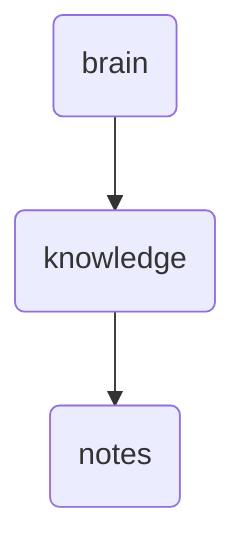

# Notes Identity

This directory contains various notes and documents related to the architecture, design, and implementation of OmniClaw v5.0.

---

## Topological View

---
*OmniClaw V5.0 | Forged by OMA AI Architect | brain.knowledge.notes | 2026-04-10*
