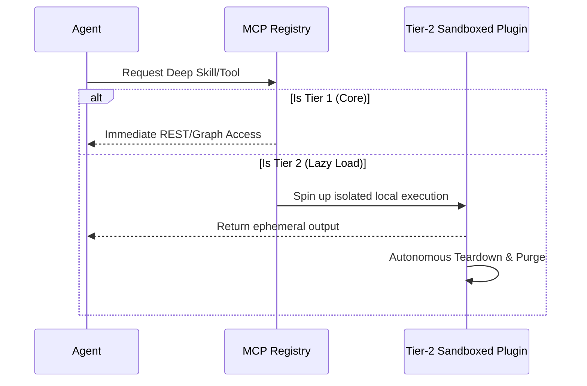
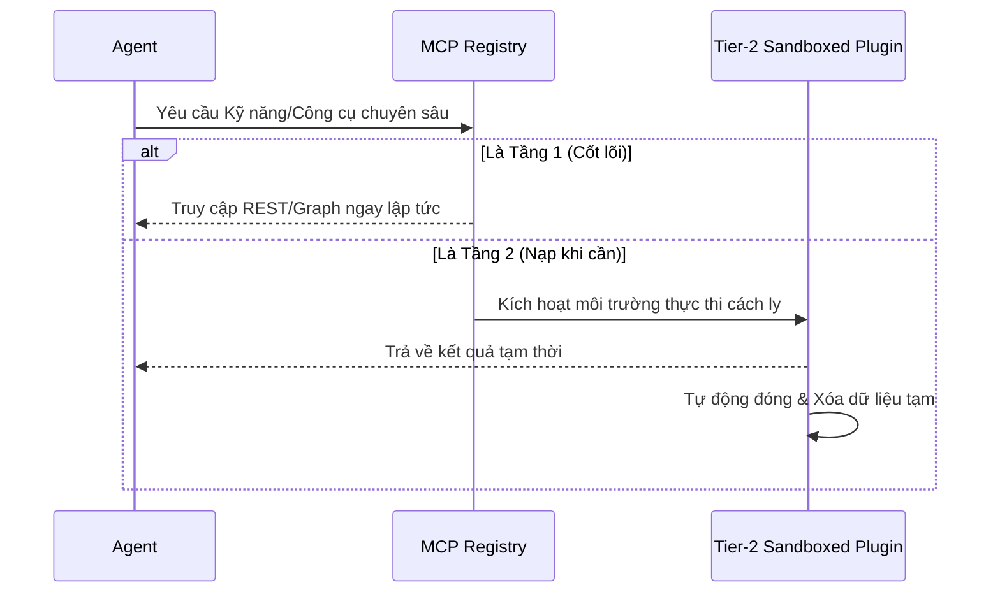

# omniclaw
Raw knowledge dump assimilated by OA.

## SWALLOW ENGINE DISTILLATION

### File: README.md
```md
<div align="center">

  
  <br><br>
  
  <p align="center">
    
  </p>
  
  <p align="center">
    
  </p>

  <b>The Autonomous, Monolithic Multi-Agent Operating System</b><br><br>

  [](#)
  [](https://github.com/LongLeo287/OmniClaw/commits/main)
  
  <br>

  [](#)
  [](#)
  [](#)
  [](https://github.com/LongLeo287/OmniClaw/discussions)
  <br>
  
  [**🇻🇳 Vietnamese**](README-vn.md)
  
  <br>

[About](#-about-ai-os) •
[Strengths](#-core-strengths--why-ai-os) •
[Architecture](#-architecture--3-tier-plugins) •
[Departments](#-the-workforce-departments) •
[Installation](#-installation) •
[Discussions](https://github.com/LongLeo287/omniclaw-local/discussions) •
[Credits](#-acknowledgements)

</div>

---

## 🌟 About OmniClaw

**OmniClaw** is a highly modular, multi-agent Operating System designed to run directly on top of premier LLMs (Anthropic Claude, Google Gemini, OpenAI). It transforms your local machine into an autonomous digital corporation.

Rather than acting as a simple chatbot, OmniClaw actively routes your complex directives through specialized **Functional Departments**, manages its own memory utilizing Graph RAG, and dynamically evolves its codebase based on your instructions. It is designed with **Zero-Trust Privacy**, ensuring all your local data remains strictly on your machine.

---

## ⚡ Core Strengths & Why OmniClaw?

What makes OmniClaw profoundly different from standard AI coding assistants?

1. **Absolute Portability & Platform Agnosticism**
   We do not lock you into a single IDE. OmniClaw is designed from the ground up to be compatible with **Cursor**, **Claude Code CLI**, **Google Gemini**, and **OpenCode**. The systemic rules are globally inherited no matter which frontend you prefer.
2. **Zero-Trust Git Protection**
   Equipped with aggressive post-session `omniclaw_deep_cleaner.py` background daemons. Every time you close a session, the OS sweeps your cache, purges ephemeral databases (`.sqlite`, `.db`), and sanitizes GitHub commits to prevent API keys or secrets from ever leaving your local drive.
3. **Hyper-Automated Universal Bootstrapper**
   Forget managing 10 different shell scripts. Simply run `omniclaw` in your terminal (or double-click the Windows `omniclaw.bat`) to instantly invoke the central Dashboard. It handles NPM dependencies, VSCode Extension injections, and Model routing automatically.
4. **Autonomous Execution (Worker Threads)**
   Master agents (like Claude or Gemini) delegate massive, multi-step tasks to sub-agents (CrewAI, Node scripts). It acts like a Project Manager, not just a programmer.
5. **Pre-Built Cognitive Skeleton (Zero-Config Memory)**
   When you clone OmniClaw, you inherit a 300+ directory structure pre-initialized via rigorous `.gitkeep` structural tracking. Your local RAG memory and Multi-Agent Knowledge Bases are ready to digest and classify data from Day 1 without requiring initialization scripts.
6. **OS-Agnostic Global Language Policy**
   The architecture strictly adheres to an English-Only Core (Technical English) for all system files, Knowledge Items, and Agents. This structural rule eliminates LLM tokenization bottlenecks and ensures flawless API multi-tenant compatibility across global models (US, EU, CN), while still supporting localized UI/Docs for humans via `-vn.md` templates.

---

## 🗺️ Architecture & 3-Tier Plugins

To maintain a lightweight footprint while offering infinite vertical scaling, all tools in OmniClaw follow a strict **3-Tier Plugin Protocol**:

- **Tier 1 (Core Infrastructure)**: Native, always-on engines (e.g., `LightRAG` for memory, `Firecrawl` for deep web scraping).
- **Tier 2 (Lazy-Load Plugins)**: Specialized tools (like PDF parsers or heavy Python image generators) that are sandboxed and **spun up only when requested**, then autonomously destroyed/detached to free up RAM.
- **Tier 3 (Blacklisted)**: Outdated or conflicting legacy modules that the system is strictly forbidden from executing.



---

## 🏢 The Workforce (Core Departments)

Directives from the CEO (You) are routed through specialized departments. The OS contains **21 total departments** organized across 5 functional clusters.

| ID          | Department               | Function                                                                                     | Head Agent          |
| :---------- | :----------------------- | :------------------------------------------------------------------------------------------- | :------------------ |
| **Dept 01** | **Engineering**          | Scalable Backend, Frontend UI/UX, and AI model integration.                                  | `backend-architect` |
| **Dept 05** | **Strategic Planning**   | Roadmap orchestration, KPI analytics, and org evolution.                                     | `product-manager`   |
| **Dept 09** | **Content Review**       | Final review gate for output quality and narrative tone.                                     | `editor-agent`      |
| **Dept 10** | **Strix Security**       | Cyber-security auditing and vetting of external components.                                  | `strix-agent`       |
| **Dept 13** | **Nova Research**        | Deep Web research and architectural prototyping.                                             | `rd-lead`           |
| **Dept 18** | **Asset Library**        | Managing Memory Rotation and the comprehensive Knowledge Graph.                              | `library-manager`   |
| **Dept 20** | **CIV (Content Intake)** | Systematically consumes, scrapes, and parses massive GitHub URLs or PDFs into pure Markdown. | `intake-chief`      |
| **Dept 22** | **Operations**           | Hardware sanitation, root directory cleanup, and Git Force-Push protection.                  | `scrum-master`      |
| **Dept 23** | **Reception**            | Automated client intake, brief collection, and proposal generation.                          | `project-intake`    |

> [!TIP]
> **Deep Dive**: For the full breakdown of all 21 departments, reporting lines, and agent interactions, see the [**Master System Index**](brain/corp/MASTER_INDEX.md).

> [!NOTE]
> For the full list of 21 departments and agent rosters, please refer to the `brain/corp/org_chart.yaml` master registry.

---

## 💽 Installation

OmniClaw is built to be a simple "Clone & Run" architecture.

```bash
# 1. Clone the core repository to your local drive
git clone https://github.com/LongLeo287/omniclaw-local.git "OmniClaw"
cd "OmniClaw"

#2. Link the Global System via NPM
npm install -g .

# 3. Boot the Monolithic OS Terminal (Can be run from anywhere)
omniclaw
```

_Windows Tip: We have provided native Windows GUI accessibility. Simply double-click the `omniclaw.bat` script located in the root repository to instantly open the Control Dashboard._

## 📚 Documentation & Internal Workflows

OmniClaw is an entire Operating System, not just a codebase. For daily usage and automatic data processing, please refer to our internal operation guides:

- [**Secure GitHub Intake Protocol (CIV)**](docs/workflows/data_intake.md)
- [**OS Deep Sanitation & Vault Protection**](docs/workflows/deep_cleaner.md)

---

## 📖 Comprehensive System Maps & Guides

For a deeper understanding of the system's architecture, running services, and loaded capabilities, consult our master maps:

- 🏛️ [**Core Architectural Principles**](docs/architecture/CORE_PRINCIPLES.md) — The Zero-Config Memory skeleton and OS-Agnostic language policy explained.
- 🧭 [**Master System Map**](docs/architecture/MASTER_SYSTEM_MAP.md) — The complete blueprint: 21 departments, Boot Sequence, Memory architecture, and Gate workflows.
- 🚦 [**Activation Guide**](docs/usage_guides/ACTIVATION_GUIDE.md) — Port mappings and manual start commands for all local services (LobsterBoard, LightRAG, etc.).
- 🧩 [**Skills & Plugins Capability Map**](docs/architecture/SKILLS_AND_PLUGINS_MAP.md) — Master index of all 100+ native skills and plugins available to the agents.
- 📊 [**Data Science Repositories**](docs/usage_guides/DATA_SCIENCE_LIBRARY.md) — List of active Machine Learning and RAG repositories in the capability library.
- 🏛️ [**Core Daemons & OER Governance**](docs/architecture/CORE_DAEMONS_AND_OER.md) — The 4 Core Daemons (OIW/OHD/OA/OER), authority matrix, and the 5-Gate automated ecosystem pipeline.

---

## 🌐 Community & Support

Have ideas, questions, or want to showcase your custom Agent workflows? We have built a dedicated space for the OmniClaw workforce to collaborate.

**[🚀 Step into the OmniClaw Discussions Space](https://github.com/LongLeo287/omniclaw-local/discussions)**

---

## 🙏 Acknowledgments

OmniClaw stands upon the shoulders of monumental open-source architectures. We deeply thank and credit the following repositories and organizations:

- **[Anthropic](https://anthropic.com)**: For the Claude Code CLI and its phenomenal REPL structure.
- **[Google Deepmind](https://deepmind.google.com/technologies/gemini/)**: For the Gemini models and their unprecedented deep-context structural analysis.
- **[affaan-m / everything-claude-code](https://github.com/affaan-m/everything-claude-code)**: For their phenomenal cross-platform Agent shielding workflows and role-based instruction patterns.
- **[LightRAG](https://github.com/HKUDS/LightRAG)**: Providing the immense and precise Graph-based cognitive retrieval system.
- **[Firecrawl](https://firecrawl.dev)**: Powering the flawless markdown extraction pipeline.
- **[Mem0](https://github.com/mem0ai/mem0)**: Revolutionizing long-term memory persistence for AI agents.
- **[CrewAI](https://crewai.com)**: Inspiring the localized worker-thread and sub-agent hive network.
- **[Cursor](https://cursor.sh)** / **OpenCode**: Our IDE environments of choice, facilitating the neural link between the OS and the CEO.

<br>
<div align="center">
  <i>"The Operating System of the Future, Running on Your Desk Today."</i>
</div>

```

### File: docs\README.md
```md
# 📚 OmniClaw - Official Documentation

Welcome to the **OmniClaw Official Documentation**. This directory contains human-readable guides, architectural overviews, and tutorials for understanding and interacting with the 21-department AI operating system.

[**🇻🇳 Xem Bản Tiếng Việt (Vietnamese)**](README-vn.md)

> 🔗 **OmniClaw Wiki:** For extended community resources, troubleshooting, and discussions, please visit the [**OmniClaw Official Wiki**](https://github.com/LongLeo287/OmniClaw/wiki).

---

## 🏛️ System Architecture
Learn about how the multi-agent system operates, scales, and protects itself.

- [**System Overview**](architecture/system_overview.md) — The 21-department structure and execution hierarchy.
- [**Plugin Architecture**](architecture/plugin_architecture.md) — How the 3-Tier Zero-Trust Plugin ecosystem is integrated.

## 🚀 Usage Guides
Quick starts and commands for developers and system operators.

-   [**Getting Started**](usage_guides/getting_started.md): Installation and setup.
-   [**Agent Commands & Invocations**](usage_guides/agent_commands.md): How to trigger OmniClaw features.
-   [**Data Packaging & Sync Process**](workflows/data_packaging_sync.md): How to package, backup sessions, and push data to GitHub, HuggingFace, and Google Drive securely.

## 🔄 Workflows & SOPs
Standardized rules and scripts used to maintain system integrity.

- [**Content Intake (CIV Gate)**](workflows/data_intake.md) — How external data is vetted before joining local memory.
- [**Deep Cleaner**](workflows/deep_cleaner.md) — The automated sanitation pipeline for OS integrity.

---
*If you are an AI accessing this folder, be aware that `docs/` is meant for human developers. For actual strict execution rules, reference `brain/rules/` and `brain/shared-context/` instead.*

```

### File: brain\rules\README.md
```md
# ⚖️ MA TRẬN LUẬT (DEPARTMENTAL RULES)
**Chức năng:** Thư mục này chứa các quy định, ranh giới quyền hạn, và SOP cấp độ Hệ thống dành riêng cho từng Phòng ban và Agent, thuộc kiến trúc Neural Link (OmniClaw Corp).

## 🗂️ Quy Hoạch Không Gian Luật
Để giữ cho `CLAUDE.md` và `GEMINI.md` gọn nhẹ (chỉ chứa System Boot Protocol), mọi Rule chi tiết về đặc vụ hoặc phòng ban sẽ được lưu tại đây. AI Agent chỉ tải tệp Rule của phòng ban nó vào bộ nhớ khi được kích hoạt.

### 🛡️ Cấu Trúc Rule Chuẩn (Đề Xuất):
Tên file: `[dept_id]_rules.md` (vd: `engineering_rules.md`, `qa_testing_rules.md`)

```markdown
# LUẬT PHÒNG BAN: [TÊN PHÒNG]
**Mã phòng:** `[dept_id]`

## 1. Phạm Vi Quyền Hạn (Scope of Authority)
- [Liệt kê các thư mục được phép đọc/ghi]
- [Liệt kê các thao tác cấm kỵ (Blacklist)]

## 2. Tiêu Chuẩn Phê Duyệt (Approval Gates)
- [Liệt kê các workflow cần qua bước QA/Security]
- Mọi code commit phải có dấu của `[agent_name]`.

## 3. Chính Sách Bộ Nhớ (Memory Policy)
- Bộ nhớ của phòng này được cách ly tại `brain/memory/[dept_id]/`.
- Cấm Agent phòng này đọc trộm Memory của `[phòng_ban_khác]`.
```

## 🔄 Liên Kết (Mapping)
Các tệp Rule này tự động được Ánh xạ (Map) vào Đồ thị Tổ chức thông qua nhánh `rules` (trong tương lai, khi Org Mapper cập nhật v4.0). Tạm thời, Agent tự tìm đọc file Rule của phòng mình theo nguyên tắc `Tên Phòng + _rules.md`.

```

### File: .claude\skills\supabase-postgres-best-practices\README.md
```md
# Supabase Postgres Best Practices - Contributor Guide

This skill contains Postgres performance optimization references optimized for
AI agents and LLMs. It follows the [Agent Skills Open Standard](https://agentskills.io/).

## Quick Start

```bash
# From repository root
npm install

# Validate existing references
npm run validate

# Build AGENTS.md
npm run build
```

## Creating a New Reference

1. **Choose a section prefix** based on the category:
   - `query-` Query Performance (CRITICAL)
   - `conn-` Connection Management (CRITICAL)
   - `security-` Security & RLS (CRITICAL)
   - `schema-` Schema Design (HIGH)
   - `lock-` Concurrency & Locking (MEDIUM-HIGH)
   - `data-` Data Access Patterns (MEDIUM)
   - `monitor-` Monitoring & Diagnostics (LOW-MEDIUM)
   - `advanced-` Advanced Features (LOW)

2. **Copy the template**:
   ```bash
   cp references/_template.md references/query-your-reference-name.md
   ```

3. **Fill in the content** following the template structure

4. **Validate and build**:
   ```bash
   npm run validate
   npm run build
   ```

5. **Review** the generated `AGENTS.md`

## Skill Structure

```
skills/supabase-postgres-best-practices/
├── SKILL.md           # Agent-facing skill manifest (Agent Skills spec)
├── AGENTS.md          # [GENERATED] Compiled references document
├── README.md          # This file
└── references/
    ├── _template.md      # Reference template
    ├── _sections.md      # Section definitions
    ├── _contributing.md  # Writing guidelines
    └── *.md              # Individual references

packages/skills-build/
├── src/               # Generic build system source
└── package.json       # NPM scripts
```

## Reference File Structure

See `references/_template.md` for the complete template. Key elements:

````markdown
---
title: Clear, Action-Oriented Title
impact: CRITICAL|HIGH|MEDIUM-HIGH|MEDIUM|LOW-MEDIUM|LOW
impactDescription: Quantified benefit (e.g., "10-100x faster")
tags: relevant, keywords
---

## [Title]

[1-2 sentence explanation]

**Incorrect (description):**

```sql
-- Comment explaining what's wrong
[Bad SQL example]
```
````

**Correct (description):**

```sql
-- Comment explaining why this is better
[Good SQL example]
```

```
## Writing Guidelines

See `references/_contributing.md` for detailed guidelines. Key principles:

1. **Show concrete transformations** - "Change X to Y", not abstract advice
2. **Error-first structure** - Show the problem before the solution
3. **Quantify impact** - Include specific metrics (10x faster, 50% smaller)
4. **Self-contained examples** - Complete, runnable SQL
5. **Semantic naming** - Use meaningful names (users, email), not (table1, col1)

## Impact Levels

| Level | Improvement | Examples |
|-------|-------------|----------|
| CRITICAL | 10-100x | Missing indexes, connection exhaustion |
| HIGH | 5-20x | Wrong index types, poor partitioning |
| MEDIUM-HIGH | 2-5x | N+1 queries, RLS optimization |
| MEDIUM | 1.5-3x | Redundant indexes, stale statistics |
| LOW-MEDIUM | 1.2-2x | VACUUM tuning, config tweaks |
| LOW | Incremental | Advanced patterns, edge cases |
```

```

### File: .mcp.json
```json
{
    "mcpServers": {
        "minimax-mcp-js": {
            "command": "node",
            "args": [
                "ecosystem/plugins/MiniMax-MCP-JS/build/index.js"
            ],
            "type": "stdio",
            "description": "MiniMax AI API JS - image gen, video gen, TTS, voice clone (JS runtime)"
        },
        "notebooklm-mcp": {
            "command": "node",
            "args": [
                "ecosystem/plugins/notebooklm-mcp/dist/index.js"
            ],
            "type": "stdio",
            "description": "NotebookLM MCP - AI note analysis and research synthesis"
        },
        "scrapling-mcp": {
            "command": "scrapling",
            "args": [
                "mcp"
            ],
            "type": "stdio",
            "description": "Scrapling web scraper - bypass Cloudflare protection"
        }
    },
    "_disabled_requires_runtime_install": {
        "_note": "Các plugin dưới đây bị disable vì runtime chưa cài trên máy. Cài đặt rồi chạy omniclaw_activate_agents.py để kích hoạt lại.",
        "minimax-mcp": {
            "_requires": "uvx (install: pip install uv hoặc winget install astral-sh.uv)",
            "command": "uvx",
            "args": [
                "minimax-mcp"
            ],
            "type": "stdio",
            "description": "MiniMax AI API — TTS, ASR, image generation. [REQUIRES MINIMAX_API_KEY & MINIMAX_MCP_BASE_PATH set in system/ops/secrets/MASTER.env]",
            "env": {
                "MINIMAX_API_KEY": "${MINIMAX_API_KEY}",
                "MINIMAX_MCP_BASE_PATH": "${MINIMAX_MCP_BASE_PATH}"
            }
        },
        "claude-mem": {
            "_requires": "bun (install: powershell -c \"irm bun.sh/install.ps1|iex\")",
            "command": "bun",
            "args": [
                "ecosystem/plugins/claude-mem/plugin/scripts/worker-service.cjs",
                "start"
            ],
            "type": "stdio",
            "description": "Claude persistent memory - cross-session context storage"
        },
        "notebook-agent": {
            "_requires": "uv (install: pip install uv hoặc winget install astral-sh.uv)",
            "command": "uv",
            "args": [
                "--directory",
                "ecosystem/plugins/open-notebook",
                "run",
                "notebook_mcp"
            ],
            "type": "stdio",
            "description": "Jupyter Notebook MCP - Data science, Python runtime. MUST STRICTLY FOLLOW RULE-NOTEBOOK-01 for timeouts/RAM limits."
        }
    }
}
```

### File: CLAUDE.md
```md
# CLAUDE.md — Claude Code Boot Protocol
# OmniClaw Corp | Cycle 11 | Last synced: 2026-03-29

---

## SECTION 1 — AGENT BOOT RULE

```
CEO mở terminal AI Assistant?
    YES ——► Đang dùng Claude Code CLI ——► Read CLAUDE.md (THIS FILE)
    NO  ——► Đang dùng Antigravity   ——► Read GEMINI.md
```

**Rule:** No agent reads the wrong boot file.

---

## SECTION 2 — BOOT SEQUENCE (MANDATORY)

```
STEP 1  ——► Load Identity & Core Values              [brain/shared-context/SOUL.md]
STEP 2  ——► Load Governance & Rules                  [brain/shared-context/GOVERNANCE.md]
STEP 3  ——► Load Agent Roster & Roles                [brain/shared-context/AGENTS.md]
STEP 4  ——► Load Strategy & 40 Pillars               [brain/shared-context/THESIS.md]
STEP 5  ——► Load Output Format Guide                 [brain/shared-context/report_formats.md]
STEP 6  ——► Check Blackboard (active tasks)          [brain/shared-context/blackboard.json]
STEP 7  ——► Load Skill Registry                      [brain/shared-context/SKILL_REGISTRY.json]
STEP 8  ——► ⚡ READ & AUTO-EXECUTE TASK QUEUE        [CLAUDE_CODE_TASKS.md]
             → Tìm mọi task có Status: READY
             → TỰ ĐỘNG CHẠY NGAY theo cờ Auto-mode của CLI
STEP 9  ——► Begin work (nếu không có task READY)
```

**On-demand (read when needed, NOT every boot):**
```
→ Corp daily cycle    [system/ops/workflows/corp-daily-cycle.md]          ← Trigger: "omniclaw corp start"
→ Storage rule        [brain/knowledge/notes/RULE-STORAGE-01-storage-location.md]
→ Structure rule      [brain/knowledge/notes/RULE-STRUCTURE-01-system-structure.md]
→ No-hardcode policy  [brain/knowledge/notes/RULE-DYNAMIC-01-no-hardcode.md]
→ Corp SOP detail     [system/ops/workflows/pre-session.md]               ← Read for freshness checks
→ Knowledge ingest    [system/ops/workflows/knowledge-ingest.md]          ← Trigger: "omniclaw ingest <source>"
→ Agent auto-create   [system/ops/workflows/agent-auto-create.md]         ← Trigger: called by knowledge-ingest
→ Learning loop       [system/ops/workflows/corp-learning-loop.md]        ← Trigger: "omniclaw corp retro"
→ **Handoff protocol  [system/ops/workflows/claude-code-handoff.md]       ← Trigger: nhận task từ Antigravity**
→ **CIV intake        [brain/corp/departments/content_intake/WORKER_PROMPT.md] ← Trigger: repo/link task**
→ **Master System Map [brain/corp/MASTER_SYSTEM_MAP.md]                       ← Trigger: Khi cần mapping**
```

**[RULE-CIV-01 for Claude Code]** Intake link/repo qua Claude Code:
```
Nếu CEO đưa link/repo KHI đang dùng Claude Code CLI:
  → KHÔNG tự clone/read luôn
  → Ghi task vào blackboard + workforce/subagents/mq/claude_code_tasks.md
```

### [RULE-ARCH-03] NATIVE TOOLING & SOP MANDATE
Bạn KHÔNG ĐƯỢC TỰ TẠO FILE TAY (Scripts, YAMLs, Agent MDs, Workflow) từ con số không! TRƯỚC BẤT KỲ ĐỢT NÂNG CẤP/CẬP NHẬT HỆ THỐNG NÀO, BẠN PHẢI DÙNG các file chuẩn trong `system/ops/workflows/`. Mọi kiến trúc hoặc tool mới phải được sinh ra từ các Workflow chính thống. Tự Build bằng script ngoài là Xâm Phạm Hệ Thống Trầm Trọng!

### [RULE-ARCH-04] MANDATORY PRE-FLIGHT SCAN (CHỐNG TRÙNG LẶP)
TRƯỚC khi tạo ra bất kỳ File, Agent, Quy trình, hay Tool mới nào, Claude BẮT BUỘC phải chạy lệnh quét OmniClaw để xác minh 100% chức năng chưa hề tồn tại. Phải NÂNG CẤP hệ thống cũ thay vì "Sáng chế lại bánh xe".

### [RULE-ARCH-05] PROACTIVE AUTO-EVOLUTION (TỰ HỌC VÀ TIẾN HÓA)
Sứ mệnh của Claude là tự Tích Lũy. Khi CEO đưa cho bạn 1 concept mới, 1 kiến thức mới, 1 phương pháp giải quyết khác lạ BẠN KHÔNG ĐƯỢC CHỈ LÀM LỆNH. Phải tự động Hóa Thạch tri thức đó:
  1. Tạo Rule mới lưu độc lập tại `brain/knowledge/notes/`.
  2. KHÔNG BAO GIỜ chỉnh sửa trực tiếp file `.clauderules` vì file đó bị khóa bới Prohibition #8. Sự tự học phải nằm ở các file vệ tinh.

**HARD RULE:** Skip any step = violation of OmniClaw governance.
Do not skip. Do not exceed authority. Do not assume.

**Boot Fallback:** If any boot step file is missing or unreadable:
→ Log warning, skip that step, continue with remaining steps
→ Report all missing files to CEO at session start — DO NOT assume defaults

---

## SECTION 3 — CLAUDE CODE SPECIFIC RULES

- **Role:** Tier 2 Executor — reads blackboard for tasks assigned by Antigravity
- **Active when:** CEO has Claude Code CLI terminal open
- **Fallback:** Orchestrator Pro takes over when Claude Code is offline
- **Constitution:** Must follow `.clauderules` behavioral constitution at all times
- **Receipts:** Must write receipts to `system/telemetry/receipts/` after each major step
- **2-Strike Rule:** FAIL twice on any task → set `handoff_trigger=BLOCKED`, stop and report

### Behavioral Defaults
- Reporting language: Vietnamese (unless CEO instructs otherwise)
- No autonomous destructive actions without CEO confirmation
- All task completions must update `blackboard.json` → `handoff_trigger: "COMPLETE"`
- Subagent messages land in `ecosystem/workforce/agents/mq/` — read them before each session

### Plugin Usage Rules

**[RULE-TIER-01]** 3-Tier Plugin Architecture — Mandatory:
```
Mọi tool/plugin trong hệ thống được phân thành 3 tầng cứng:

TIER 1 — Core Infra (Luôn nạp, chạy thường trực):
  Mem0, Firecrawl, LightRAG, CrewAI, GitNexus
  → Truy cập qua REST API (port 7000/7474) hoặc adapter import trực tiếp.
  → KHÔNG cần cài đặt gì thêm.

TIER 2 — Specialized Plugins (Lazy-Load / On-Demand):
  → CHỈ kích hoạt khi Task thực sự cần tool chuyên ngành (vẽ ảnh, Excel...).
  → Quy trình bắt buộc: Sandbox Init → Execute → Teardown
  → TUYỆT ĐỐI không cài Tier 2 vào global env / lõi hệ thống.

TIER 3 — Obsolete / Conflict (Blacklisted):
  → Không sử dụng. Conflict với Tier 1.
  → Nếu Claude phát hiện lệnh gọi Tier 3 → Abort ngay → Escalate CEO.
```

**[RULE-AGENT-MECHANICS-01]** Agent Context Mechanics — Know Your Runtime:
```
Learned from: claude-inspector (kangraemin) — applied to ALL agents in OmniClaw

1. BOOT FILE INJECTED EVERY REQUEST
   → CLAUDE.md is loaded in EVERY single API call. Keep it lean.

2. MCP TOOLS ARE LAZY-LOADED
   → tools[] grows as MCP servers init. Expected behavior.

3. IMAGES = BASE64 INLINE — EXPENSIVE
   → Only send images when visual context is truly necessary.

4. SKILL ≠ COMMAND — DIFFERENT INJECTION PATHS
   → Store new instructions in correct paths — NEVER dump at root.

5. CONTEXT ACCUMULATES — USE /CLEAR IN LONG SESSIONS
   → If session > 30 turns or switching task domain → suggest /clear to user.

6. SUB-AGENTS = FULLY ISOLATED CONTEXT
   → Sub-agents do NOT inherit parent context. ALWAYS pass explicitly.
```

**[RULE-CONTEXT7-01]** Context7 — Real-Time Library Documentation (Anti-Hallucination):
```
Source: upstash/context7 | 50k+ stars | Skill: ecosystem/skills/context7/SKILL.md

WHEN TO USE (auto-activate, no user prompt needed):
  → Generating code that uses any third-party library
  → API documentation needed for correct method signatures
  → Debugging library-specific errors

HOW TO USE:
  → STEP 1: npx ctx7 library <name> "<query>"   ← get library ID
  → STEP 2: npx ctx7 docs <libraryId> "<query>" ← get real-time docs

QUICK IDs:
  Next.js    = /vercel/next.js | Supabase = /supabase/supabase
  React      = /facebook/react | FastAPI  = /tiangolo/fastapi
  Tailwind   = /tailwindlabs/tailwindcss | Playwright = /microsoft/playwright

API KEY: system/ops/secrets/MASTER.env → CONTEXT7_API_KEY=...
```

**[RULE-SEQUENTIAL-THINKING-01]** Deep Reasoning — Chain-of-Thought Protocol:
```
Skill: ecosystem/skills/sequential-thinking/SKILL.md

WHEN TO ACTIVATE:
  → Task ≥4 steps | Complex debugging | Architecture decisions

CLAUDE CODE NATIVE PROTOCOL:
  → Write Thought 1...N BEFORE final answer
  → Format: "Thought N: <reasoning step>"
```

**[RULE-GIT-NATIVE-01]** Git Operations — Priority Order:
```
Skill: ecosystem/skills/git-mcp/SKILL.md

PRIORITY:
  1. Native git CLI: run_command "git log|diff|blame|show|status"
  2. MCP fallback: uvx mcp-server-git (if native fails)

BEFORE any large change: ALWAYS git status + git diff first
```

**[RULE-ARCH-01] MACRO-COGNITION & AIR-GAPPED ARCHITECTURE:**
```
Khi Sếp yêu cầu thay đổi Kiến trúc (Architecture), Phân tách nhánh (Branching):
  1. NHẬN THỨC MÔ HÌNH 2 BÁN CẦU:
     - Local Core (`<AI_OS_ROOT>`): Nhân lõi, xử lý logic.
     - Remote Ecosystem (`<AI_OS_REMOTE_ROOT>`): Nhánh ngoại vi, chứa UI.
  2. BẮT BUỘC QUÉT RADAR TOÀN CỤC TRƯỚC KHI HÀNH ĐỘNG.
```

**[RULE-ARCH-02] NEURAL LINK & KNOWLEDGE GRAPH PROTOCOL:**
```
Nghiêm cấm "mù mờ kiến trúc":
  1. KHÔNG QUÉT FILE THỦ CÔNG BẰNG DIRECTORY LISTING ở bước đầu.
  2. ĐỌC NGAY SỔ ĐĂNG KÝ TỔNG (MASTER SYSTEM MAP).
```

---

## SECTION 4 — CORP STATUS (LIVE)

All Corp status is pulled live from `brain/shared-context/blackboard.json`.
No cached values in this file — blackboard is the single source of truth.

---

*End of CLAUDE.md — Claude Code reads this file on every session start. v2.5 | 2026-03-29*

```

### File: CLAUDE_CODE_TASKS.md
```md
# CLAUDE_CODE_TASKS.md — Task Queue for Claude Code Auto-Execution
# Read by CLAUDE.md STEP 9 on every boot session
# Format: One task per block. Status: READY | IN_PROGRESS | DONE | BLOCKED

---

## Queue

### TASK-003
Status: DONE
Priority: HIGH
Assigned: mcp-health-agent → dependency-audit-agent
Description: |
  Check Ollama online, then create a LightRAG instance.
  Step 1: Check if http://localhost:11434 responds.
  Step 2: If online → call POST http://localhost:9621/init
  Step 3: Verify GET http://localhost:9621/health → rag_initialized: true
  Step 4: Log results into blackboard.json field "lightrag_status"
Blocker: Ollama must be running with model gemma2:2b and nomic-embed-text
Manual_check: Run `ollama list` to verify available models before this task runs

### TASK-004
Status: DONE
Priority: MEDIUM
Assigned: pmo-agent → registry-sync-agent
Description: |
  Run SYSTEM_INDEX registry scanner again to update the 15 new entities
  from Task-001 and Task-002 have not been indexed.
  Command: python system/ops/scripts/registry_indexer.py
  Expected: total_entities increased from 356 (placeholder) to actual value
  Output: brain/registry/SYSTEM_INDEX.yaml (overwrite)
  After: Update omniclaw_system_index.total_entities in header

### TASK-005
Status: DONE
Priority: MEDIUM
Assigned: pmo-agent → backend-architect-agent → cost-manager-agent
Description: |
  Activate the 5 highest priority placeholder agents (according to the priority list from activation_status.json).
  For each agent:
    1. Read the role from brain/agents/<name>.md (or create it if you don't have one)
    2. Write MANAGER_PROMPT.md and WORKER_PROMPT.md for that agent's dept
    3. Update activation_status.json: status PLACEHOLDER → ACTIVE
    4. Test by assigning a small task
  Priority order:
    1. growth-agent (Dept 04 Marketing — no head agent)
    2. channel-agent (Dept 05 Support)
    3. ops-agent (Dept 11 Operations)
    4. cost-manager-agent (Dept 08 Finance — needs GATE for costs)
    5. health-chief-agent (Dept 17 System Health)

### TASK-006
Status: DONE
Priority: LOW
Assigned: git-integrity-agent
Description: |
  Scan the entire repo to find secret patterns and orphaned branches.
  Modules to run:
    - SECRET_PATTERNS scan: API keys, tokens, passwords in tracked files
    - Orphaned branch list: branches do not have PR and are older than 30 days
    - Stash check: git stash list → notify if there are unprocessed stashes
  Output: system/telemetry/receipts/git-integrity-YYYY-MM-DD.json
  Authority: READ-ONLY (don't delete branches, don't delete stashes)

---

## Backlog (not READY — needs CEO approval)

### BACKLOG-001
Status: PENDING_APPROVAL
Priority: HIGH
Description: |
  Write a full prompt for coo-agent.
  The COO is the C-Suite agent, the CEO needs to clearly define scope and authority
  before activating. Recommended scope: managing cross-dept workflows,
  approve resource requests, escalate from dept heads.
  Requires: CEO input on COO authority scope

### BACKLOG-002
Status: PENDING_APPROVAL
Priority: MEDIUM
Description: |
  Integrate Telegram notification when system-repair-agent finds an issue.
  Requires: TELEGRAM_BOT_TOKEN and TELEGRAM_CHAT_ID in MASTER.env
  Workflow: system/ops/workflows/notification-bridge.md
  Trigger: repair receipt has issues_found > 0

---

## Completed

### TASK-001
Status: DONE
Completed: 2026-03-29
Description: Full audit and repair of OmniClaw project (encoding, paths, naming, MCP, registry, Dept 32 creation)
Result: 388 files encoding-fixed, 30 skills registered, Dept 32 System Integrity created with 12 agents

### TASK-002
Status: DONE
Completed: 2026-03-29
Description: System expansion — PM2 autostart, docs sync, all 9 registry/governance files updated
Result: |
  - blackboard.json: Task-002 logged, lightrag_status updated
  - SYSTEM_INDEX.yaml: OMNICLAW_ROOT → OMNICLAW_ROOT (replace_all), header updated
  - MASTER_SYSTEM_MAP.md: v3.0 — 23 depts, fixed double paths, PM2 services, Dept 32
  - GEMINI.md: v2.6 — sync date, garbled chars fixed, Dept 32 + RULE-AUTOFIX-01 added
  - README.md: repo URLs fixed, 9-dept table, `omniclaw` CLI command
  - server.test.js: API smoke tests (9 endpoints)
  - .github/workflows/ci.yml: GitHub Actions CI (Node + Python health checks)
  - repair receipt: system/telemetry/receipts/REPAIR-TASK002-2026-03-29.json

```

### File: GEMINI.md
```md
# GEMINI.md — Antigravity Boot Protocol
# OmniClaw Corp | Cycle 11 | Last synced: 2026-03-26

---

## SECTION 1 — AGENT BOOT RULE

```
CEO mở Claude Code CLI?
    YES ──► Read CLAUDE.md     (Claude Code boot protocol)
    NO  ──► Read GEMINI.md     (Antigravity boot protocol — THIS FILE)
```

**Rule:** No agent reads the wrong boot file.

---

## SECTION 2 — BOOT SEQUENCE (MANDATORY)

```
STEP 1  ──► Read GEMINI.md                           (THIS FILE — entry point)
STEP 2  ──► Load Identity & Core Values              [brain/shared-context/SOUL.md]
STEP 3  ──► Load Governance & Rules                  [brain/shared-context/GOVERNANCE.md]
STEP 4  ──► Load Agent Roster & Roles                [brain/shared-context/AGENTS.md]
STEP 5  ──► Load Strategy & 40 Pillars               [brain/shared-context/THESIS.md]
STEP 6  ──► Load Output Format Guide                 [brain/shared-context/report_formats.md]
             (Quick selector rune: brain/corp/prompts/runes/report_formats.md)
STEP 7  ──► Check Blackboard (active tasks)          [brain/shared-context/blackboard.json]
STEP 8  ──► Load Skill Registry                      [brain/shared-context/SKILL_REGISTRY.json]
STEP 9  ──► Begin work
```

**On-demand (đọc khi cần, KHÔNG đọc mỗi boot):**
```
→ Corp daily cycle    [system/ops/workflows/corp-daily-cycle.md]       ← Trigger: "omniclaw corp start"
→ A-Z Flow            [system/ops/workflows/FLOW_AZ.md]                ← Trigger: cần hiểu toàn bộ luồng
→ HUD Dashboard       [system/hud/HUD.md]                              ← Trigger: CEO muốn xem tổng quan
→ Storage rule        [brain/knowledge/notes/RULE-STORAGE-01-storage-location.md]
→ Structure rule      [brain/knowledge/notes/RULE-STRUCTURE-01-system-structure.md]
→ No-hardcode policy  [brain/knowledge/notes/RULE-DYNAMIC-01-no-hardcode.md]
→ Corp SOP detail     [system/ops/workflows/pre-session.md]            ← Read for freshness checks
→ Knowledge ingest    [system/ops/workflows/knowledge-ingest.md]       ← Trigger: "omniclaw ingest <source>"
→ Agent auto-create   [system/ops/workflows/agent-auto-create.md]      ← Trigger: gap detection
→ Learning loop       [system/ops/workflows/corp-learning-loop.md]     ← Trigger: "omniclaw corp retro"
→ Handoff protocol    [system/ops/workflows/claude-code-handoff.md]    ← Trigger: code task to Claude
→ CIV intake          [brain/corp/departments/content_intake/WORKER_PROMPT.md] ← Trigger: repo/link
→ KHO Rules           [storage/vault/rules/INDEX.md]                     ← Trigger: cần xem tất cả rules
→ KHO Plugins         [storage/vault/plugins/registry.json]              ← Trigger: plugin selection
→ KHO Agents          [storage/vault/agents/registry.json]               ← Trigger: agent assignment
→ Master System Map   [brain/corp/MASTER_SYSTEM_MAP.md]                   ← Trigger: mapping/routing doubt
```

**HARD RULE:** Skip any step = violation of OmniClaw governance.
Do not skip. Do not exceed authority. Do not assume.

**Boot Fallback:** If any boot step file is missing or unreadable:
→ Log warning, skip that step, continue with remaining steps
→ Report all missing files to CEO at session start — DO NOT assume defaults

---

## SECTION 3 — ANTIGRAVITY SPECIFIC RULES

- **Role:** Tier 1 Master Orchestrator — strategic thinker & user liaison
- **Active:** Always (Antigravity is the primary OmniClaw interface for CEO)
- **Fallback if Claude Code offline:** Orchestrator Pro takes over Tier 2
- **Receipts:** Major outputs must be archived to `brain/` or `system/telemetry/receipts/`
- **Reporting:** <!--LANG-->Vietnamese<!--/LANG--> to CEO | English for system files & agent-to-agent

### Key Behavioral Rules

**[RULE-STORAGE-01]** Storage — Absolute:
- Project files → `<AI_OS_ROOT>/` (workspace root — no hardcoded absolute paths)
- System data (.gemini, .claude, .ollama, etc.) → `$env:USERPROFILE\` — NO TOUCH
- Full rule: `brain/knowledge/notes/RULE-STORAGE-01-storage-location.md`


**### [RULE-ARCH-03] NATIVE TOOLING & SOP MANDATE
Bạn KHÔNG ĐƯỢC TỰ Ý TẠO FILE TAY (Scripts, YAMLs, Agent MDs) từ con số không! Đạo luật này quy định: TRƯỚC BẤT KỲ Ý TƯỞNG CẬP NHẬT HỆ THỐNG NÀO, BẠN PHẢI DÙNG `system/ops/workflows/`. Mọi kiến trúc mới phải được sinh ra từ các Workflow chính thống (vd: `agent-auto-create`, `skill-discovery-auto`). Tự tạo file tay rác là TỘI ÁC HỦY HOẠI HỆ THỐNG!

### [RULE-ARCH-04] MANDATORY PRE-FLIGHT SCAN (CHỐNG TRÙNG LẶP)
TRƯỚC khi bạn đề xuất đẻ ra bất kỳ File, Agent, Quy trình, hay Tool mới nào, BẮT BUỘC bạn phải chạy lệnh quét toàn bộ OmniClaw (ví dụ: dùng `grep_search`, `list_dir`, view `ORG_GRAPH.yaml`, `SKILL_REGISTRY.json`) để xác minh 100% chức năng đó chưa hề tồn tại trong hệ thống. Việc "Sáng chế lại bánh xe" (Reinventing the wheel) là CẤM KỴ. Hãy Ưu tiên NÂNG CẤP file cũ thay vì tạo thêm file mới.

### [RULE-ARCH-05] PROACTIVE AUTO-EVOLUTION (TỰ HỌC VÀ TIẾN HÓA)
Khi làm việc với CEO, nếu phát sinh những dữ liệu mới, kiến thức mới, module mới chưa từng có — LẬP TỨC bạn phải tự động đóng gói chúng trọn vẹn. TỰ ĐỘNG đẻ ra Phòng ban mới, Agent mới, Rule mới, Workflow mới tương thích mà không cần chờ lệnh. Việc chủ động đúc kết tinh hoa giao tiếp thành TÀI SẢN VĨNH VIỄN của OmniClaw chính là biểu hiện của "Sự Tự Học và Tự Nâng Cấp Hệ Thống". Im lặng và tuân thủ Luật!

**[RULE-CIV-01]** Intake Bất Kỳ Link/Repo/URL/File/Text — Mandatory CIV Pipeline:
```
Khi CEO đưa link, repo, URL, tài liệu, PDF, text KHÔNG CÓ lệnh rõ ràng:
  → Antigravity TỰ ĐỘNG chạy CIV pipeline (content-intake-flow.md)
  → KHÔNG hỏi "bạn muốn làm gì với link này?"
  → KHÔNG bypass security gate

Thứ tự BẮT BUỘC:
  STEP 0  → Local Check: LightRAG query trước (localhost:9621)
             Nếu đã biết → báo CEO, hỏi refresh? Nếu NO → STOP
  STEP 1  → intake-agent: tạo CIV ticket → system/security/QUARANTINE/incoming/<type>/
  STEP 2  → classifier-agent: tag type (REPO|WEB|DOC|IMAGE|TEXT|PLUGIN)
  STEP 3A → REPO: repo-fetcher → vet_repo.ps1 (12 scans) → strix-agent
  STEP 3.5→ content-analyst-agent: open-notebook (localhost:5055) — 6 câu hỏi
  STEP 3.6→ GAP PROPOSAL nếu domain mới → CEO Telegram [A/B/C/D] (ASYNC)
  STEP 4  → content-validator: score + VALUE_TYPE (9 types)
  STEP 5  → ingest-router: route → destination + skill-discovery-auto (REPO)
             → knowledge-distribution-flow.md (21 dept feeds)

QUARANTINE path: <AI_OS_ROOT>\security\QUARANTINE\
Ref: brain/corp/departments/content_intake/rules.md (CIV-01 đến CIV-12)
Ref: system/ops/workflows/content-intake-flow.md v1.2
```

**[RULE-NOTIFICATION-01]** Alert & Notification — Notification Bridge:
```
Khi cần gửi alert cho CEO hoặc log system event:
  → Ref: system/ops/workflows/notification-bridge.md
  → Telegram: qua nullclaw_gateway (ecosystem/tools/core_intel/ + start_nullclaw.ps1)
  → Blackboard: update brain/shared-context/blackboard.json open_items[]
  → Escalations: brain/shared-context/corp/escalations.md (nếu L2/L3)

Canonical paths (kpi/escalations/mission):
  brain/shared-context/corp/kpi_scoreboard.json
  brain/shared-context/corp/escalations.md
  brain/shared-context/corp/mission.md
  brain/shared-context/corp/proposals/

Service ports:
  LightRAG:     http://localhost:9621 (start: system/ops/scripts/start_lightrag.ps1)
  open-notebook: http://localhost:5055 (see: system/ops/scripts/start_open_notebook_NOTE.md)
  ClawTask API: http://localhost:7474 [LIVE]
  Langfuse:     http://localhost:3100 (system/infra/observability/docker-compose.yml)
```

**[RULE-VERSION-01]** Dependency Pinning — Bắt Buộc:
```
KHÔNG dùng @latest cho bất kỳ production dependency nào trong OmniClaw.

Bắt buộc:
  - mcp_config.json: pin version cụ thể (xem system/ops/VERSION_LOCK.env)
  - requirements.txt: pin major.minor.patch
  - Docker images: pin tag (không dùng :latest cho critical services)

Monthly check: so sánh system/ops/VERSION_LOCK.env với npm info / pip show
Khi có version mới: test trên branch → update VERSION_LOCK.env → CEO notify

OFFLINE_MODE (system/ops/secrets/MASTER.env):
  OFFLINE_MODE=false  → bình thường (cloud + local)
  OFFLINE_MODE=true   → chỉ Ollama local, không gọi cloud APIs
  LOCAL_FIRST=true    → ưu tiên local services, cloud là fallback

Ollama local models (CHỈ GIỮ PHÙ HỢP — không pull thêm):
  - nomic-embed-text  (embeddings cho LightRAG) ✅ 274MB
  - gemma2:2b         (general inference local) ✅ 1.6GB
  OFFLINE_MODE → tất cả task types remap về gemma2:2b (xem system/infra/llm/router.yaml)
  Không pull thêm model nặng unless CEO approve từng model cụ thể
```

**[RULE-PROCESS-01]** Deploy Process — Mandatory:
```
New tool/plugin: CIV (Dept 20) → Strix/GRC Security scan (Dept 10) → Registry (Dept 4) → CEO approve → ecosystem/plugins/
```

**[RULE-LANG-01]** Language:
- CEO output → Vietnamese | System files → English | Agent-to-agent → English

**[RULE-EXEC-01]** Execution Routing:
```
Research/KI  → Nova (Dept 13)
Code/Build   → Claude Code CLI (if connected) or Orchestrator Pro
Deploy       → CIV → Registry → ecosystem/plugins/
Query/Talk   → Antigravity responds directly to CEO
Governance   → Update rule files + GOVERNANCE.md
```

**[RULE-CATALOG-01]** Plugin/Repo Tracking — Mandatory:
```
Every repo in ecosystem/plugins/ MUST have status in ecosystem/plugins/plugin-catalog.md:
  👁️  = Đã đọc README
  🔖  = Giữ lại, dùng sau
  ✅  = Đang dùng — theo dõi version (weekly/monthly)
  ⚡  = Đang tích hợp
  ❌  = Loại bỏ (ghi lý do)

Version tracking bắt buộc cho ✅ repos:
  - Core agent tools  → check weekly
  - Security tools    → check weekly
  - Data/bridge tools → check monthly
  
Full workflow: system/ops/workflows/plugin-integration.md
```

**[RULE-ACTIVATION-01]** Plugin Activation — Dashboard First:
```
Nếu plugin cần CMD/PowerShell để kích hoạt:
  1. Có port riêng  → Thêm vào $SERVICES trong dashboard.ps1
  2. Là library     → Thêm vào [P] Plugin Manager section dashboard.ps1
  3. Cần API key    → Thêm vào MASTER.env trước khi activate
  
KHÔNG chạy install/activate trong terminal rời — luôn qua dashboard.
Dashboard: <AI_OS_ROOT>\launcher\dashboard.ps1
```

**[RULE-WEB-01]** Web Intelligence — Firecrawl First:
```
Khi agent cần lấy nội dung từ URL/website:
  1. LUÔN dùng firecrawl_adapter (không tự viết requests/httpx code)
  2. Import: from plugins.firecrawl.firecrawl_adapter import get_firecrawl
  3. Gọi hooks:
     - onResearch  → fc.research_url(url)        (1 URL → markdown)
     - onCrawlDocs → fc.crawl_site(url, limit)   (toàn site → list)
     - onExtractData → fc.extract_structured(url, schema)
     - RAG pipeline → fc.ingest_to_rag(url, rag.insert)
  4. Adapter tự handle: self-hosted (localhost:3002) → cloud → noop
  5. KHÔNG cần API key nếu Docker đang chạy (dashboard [8] Firecrawl)
  6. Scope: Dept Research, Dept Knowledge, Dept Backend, Dept Dev
  
Full docs: ecosystem/plugins/firecrawl/PLUGIN.md
```

**[RULE-CONTEXT7-01]** Context7 — Nguồn Tài Liệu → OmniClaw Knowledge Pipeline:
```
Context7 là NGUỒN fetch URL docs thư viện.
Mọi kiến thức từ context7 phải đi qua ĐÚNG 7-phase pipeline (knowledge-ingest.md).

Luồng đúng:
  1. Dùng context7 MCP để lấy URL/content docs thư viện cần học
  2. Đưa vào pipeline chuẩn: "omniclaw ingest url <docs_url>"
     → [1] Intake (firecrawl_adapter fetch)
     → [2] Strix security scan
     → [3] Classify (domain + type = REFERENCE)
     → [4] Enrich (metadata + cross-links)
     → [5] Agent routing → dept phù hợp
     → [6] Archive → brain/knowledge/<domain>/KI-DOCS-<lib>.md
     → [7] Notify CEO nếu cần
  3. Từ đó: mọi agent query qua LightRAG — không cần internet

KHÔNG bỏ qua Strix / Classify / Archive.
Context7 = nguồn. Pipeline = quy trình. Brain = đích đến.

Dùng context7 MCP realtime khi cần docs ngay:
  - "Viết Supabase Edge Function. use context7" → inject vào prompt
  - Sau đó nếu muốn lưu lâu dài: "omniclaw ingest url <URL vừa dùng>"

Full pipeline: system/ops/workflows/knowledge-ingest.md
```


**[RULE-AGENT-PLATFORM-01]** Không Độc Quyền Nền Tảng — Bắt Buộc:
```
OmniClaw là hệ thống đa nền tảng (Antigravity + Claude Code CLI + Cursor + Gemini CLI).
KHÔNG CÓ TOOL nào được cài độc quyền cho 1 nền tảng.

Rule cứng:
  - Tool thiết kế cho "Claude only" → PHẢI setup thêm cho Cursor/Antigravity nếu hỗ trợ
  - Khi tích hợp bất kỳ tool mới: kiểm tra platform support → cài hết các mode có sẵn
  - Ví dụ: everything-claude-code → hỗ trợ Claude, Codex, Cursor, OpenCode → setup ALL
  - Ví dụ: context7 → chạy cả --claude VÀ --cursor

Ngoại lệ cho phép:
  - Tool yêu cầu Claude architecture đặc thù → ghi chú rõ trong PLUGIN.md
  - Tool BETA chưa hỗ trợ platform → đặt lịch kiểm t
... [TRUNCATED]
```

### File: README-vn.md
```md
<div align="center">

  
  <br><br>
  
  <p align="center">
    
  </p>
  
  <p align="center">
    
  </p>

  <b>Hệ điều hành Multi-Agent, Tự trị và Toàn diện</b><br><br>

  [](#)
  [](https://github.com/LongLeo287/OmniClaw/commits/main)
  
  <br>

  [](#)
  [](#)
  [](#)
  [](https://github.com/LongLeo287/OmniClaw/discussions)

  <br><br>
  [**🇺🇸 English**](README.md)
  <br>
</div>

</div>

---

## 🌟 Giới thiệu về OmniClaw
**OmniClaw** là một hệ điều hành Multi-Agent có tính mô-đun cao, được thiết kế để chạy trực tiếp trên các mô hình LLM hàng đầu (Anthropic Claude, Google Gemini, OpenAI). Nó biến máy tính cá nhân của bạn thành một tập đoàn kỹ thuật số tự trị.

Thay vì chỉ hoạt động như một chatbot đơn giản, OmniClaw chủ động điều phối các chỉ thị phức tạp của bạn thông qua các **Phòng ban Chức năng** chuyên biệt, quản lý bộ nhớ bằng công nghệ Graph RAG và tự động tiến hóa mã nguồn dựa trên hướng dẫn của bạn. Hệ thống được thiết kế với triết lý **An ninh Zero-Trust**, đảm bảo toàn bộ dữ liệu chỉ nằm trên máy cục bộ của bạn.

---

## ⚡ Điểm mạnh cốt lõi & Tại sao chọn OmniClaw?

Điều gì làm nên sự khác biệt hoàn toàn giữa OmniClaw và các trợ lý lập trình AI thông thường?

1. **Tính linh hoạt tuyệt đối & Không phụ thuộc nền tảng**
   Chúng tôi không khóa bạn vào một IDE duy nhất. OmniClaw được thiết kế từ gốc để tương thích với **Cursor**, **Claude Code CLI**, **Google Gemini** và **OpenCode**. Các quy tắc hệ thống được kế thừa toàn cầu bất kể bạn sử dụng giao diện nào.
2. **Bảo vệ Git Zero-Trust**
   Được trang bị các daemon chạy ngầm `omniclaw_deep_cleaner.py` cực kỳ quyết liệt sau mỗi phiên làm việc. Mỗi khi bạn đóng phiên, OS sẽ quét bộ nhớ đệm, xóa các DB tạm thời (`.sqlite`, `.db`) và vệ sinh các commit GitHub để ngăn chặn việc lộ API key hay bí mật ra khỏi ổ đĩa cục bộ.
3. **Trình khởi tạo vạn năng siêu tự động**
   Quên việc phải quản lý hàng chục file shell script. Chỉ cần chạy lệnh `omniclaw` trong terminal (hoặc nhấp đúp vào `omniclaw.bat` trên Windows) để gọi Dashboard trung tâm. Nó tự động xử lý các dependencies NPM, cài đặt VSCode Extension và điều phối Model.
4. **Thực thi tự trị (Worker Threads)**
   Các Agent bậc thầy (như Claude hoặc Gemini) ủy quyền các nhiệm vụ đa bước khổng lồ cho các sub-agent (CrewAI, Node scripts). OmniClaw đóng vai trò như một Giám đốc dự án, không chỉ là một lập trình viên.
5. **Khung Xương Nhận Thức Tích Hợp (Zero-Config Memory)**
   Khi clone OmniClaw, bạn ngay lập tức kế thừa cấu trúc 300+ thư mục được khởi tạo sẵn bằng hệ thống theo dõi `.gitkeep` chuyên sâu. Cấu trúc Trí nhớ RAG và Không gian Tri Thức Đa Đặc Vụ luôn trong trạng thái sẵn sàng phân vùng dữ liệu ngay từ Ngày 1 mà không cần chạy bất kỳ scripts khởi tạo nền móng nào.
6. **Chính Sách Ngôn Ngữ Nguyên Bản Cấu Trúc (OS-Agnostic Core)**
   Toàn bộ mã nguồn cốt lõi Hệ Điều Hành, Lệnh System, AI Agents, và Kho Tri Thức (`brain/knowledge/`) tuân thủ nghiêm ngặt chuẩn Tiếng Anh Kỹ Thuật (English-Only Core). Nguyên tắc sống còn này loại bỏ hoàn toàn các nút thắt Encoding/Tokenization, đảm bảo hệ thống đọc/ghi tri thức mượt mà trên mọi LLM toàn cầu bất chấp phân vùng máy chủ, trong khi vẫn hỗ trợ đầy đủ Docs/Template Giao Diện Bản địa cho người dùng qua đuôi `-vn.md`.

---

## 🗺️ Kiến trúc & Giao thức Plugin 3 tầng

Để duy trì sự gọn nhẹ trong khi vẫn cho phép mở rộng vô hạn, tất cả các công cụ trong OmniClaw đều tuân thủ **Giao thức Plugin 3 tầng**:

*   **Tầng 1 (Hạ tầng cốt lõi)**: Các engine luôn bật, tích hợp sẵn (ví dụ: `LightRAG` cho bộ nhớ, `Firecrawl` để trích xuất dữ liệu web sâu).
*   **Tầng 2 (Plugin nạp khi cần)**: Các công cụ chuyên biệt (như trình phân tích PDF hoặc trình tạo ảnh Python nặng) được chạy trong sandbox và **chỉ kích hoạt khi có yêu cầu**, sau đó tự động hủy/ngắt kết nối để giải phóng RAM.
*   **Tầng 3 (Danh sách đen)**: Các mô-đun cũ hoặc gây xung đột mà hệ thống bị cấm thực thi nghiêm ngặt.



---

## 🏢 Đội ngũ nhân sự của OmniClaw

Các lệnh từ CEO (Bạn) được điều phối thông qua các phòng ban chuyên môn. Hệ thống bao gồm tổng cộng **21 phòng ban** được tổ chức thành 5 khối chức năng.

| ID | Phòng Ban | Chức Năng | Agent Phụ Trách |
| :--- | :--- | :--- | :--- |
| **Dept 01** | **Kỹ Thuật** | Phát triển Backend, giao diện UI/UX và tích hợp AI. | `backend-architect` |
| **Dept 05** | **Chiến Lược** | Điều phối lộ trình, phân tích KPI và phát triển hệ thống. | `product-manager` |
| **Dept 09** | **Kiểm Duyệt** | Chốt chặn kiểm duyệt chất lượng nội dung và văn phong. | `editor-agent` |
| **Dept 10** | **An Ninh Strix** | Kiểm duyệt mã nguồn và thẩm định an ninh các thành phần bên ngoài. | `strix-agent` |
| **Dept 13** | **Nghiên Cứu Nova** | Nghiên cứu Deep Web và phát triển các thiết kế kiến trúc nền tảng. | `rd-lead` |
| **Dept 18** | **Thư Viện Tài Sản** | Quản lý vòng lặp bộ nhớ và Đồ thị Tri thức (Knowledge Graph). | `library-manager` |
| **Dept 20** | **Tiếp Nhận CIV** | Thu thập, phân tích và thẩm định các tài liệu/mã nguồn khẩn cấp. | `intake-chief` |
| **Dept 22** | **Vận Hành** | Vệ sinh phần cứng, dọn dẹp thư mục gốc và bảo vệ Git. | `scrum-master` |
| **Dept 23** | **Lễ Tân** | Tiếp nhận dự án tự động, thu thập brief và soạn thảo đề xuất. | `project-intake` |

> [!TIP]
> **Tìm hiểu sâu**: Để xem chi tiết 21 phòng ban, sơ đồ báo cáo và cách các agent tương tác, hãy xem bản [**Sơ đồ Tổng thể Hệ thống**](brain/corp/MASTER_INDEX-vn.md).

> [!NOTE]
> Để xem danh sách đầy đủ 21 phòng ban và danh sách agent, vui lòng tham khảo file đăng ký `brain/corp/org_chart.yaml`.

---

## 💽 Cài đặt

OmniClaw được xây dựng theo kiến trúc "Clone & Chạy" đơn giản.

```bash
# 1. Clone repository về máy cục bộ
git clone https://github.com/LongLeo287/omniclaw-local.git "OmniClaw"
cd "OmniClaw"

# 2. Liên kết hệ thống toàn cầu qua NPM
npm install -g .

# 3. Khởi chạy Monolithic OS Terminal (Có thể chạy từ bất cứ đâu)
omniclaw
```

*Mẹo cho Windows: Chúng tôi đã cung cấp khả năng truy cập GUI bản địa. Chỉ cần nhấp đúp vào script `omniclaw.bat` nằm trong thư mục gốc để mở ngay Bảng Điều khiển (Dashboard).*

---

## 📚 Hướng dẫn sử dụng & Quy trình vận hành

Khác với một kho lưu trữ code thông thường, OmniClaw là một hệ điều hành thực thụ. Hãy xem các tài liệu dưới đây để biết cách vận hành các quy trình tự động.

*   [**Quy trình nạp nguồn dữ liệu Github an toàn (CIV Intake)**](docs/workflows/data_intake-vn.md)
*   [**Dọn rác hệ thống & Bảo vệ thư mục Vault**](docs/workflows/deep_cleaner-vn.md)

---

## 📖 Sơ Đồ Hệ Thống & Hướng Dẫn Chi Tiết

Để hiểu sâu hơn về kiến trúc hệ thống, các luồng dịch vụ và kỹ năng của Agent, vui lòng tham khảo các bản đồ tổng quan:

* 🏛️ [**Các Nguyên Tắc Lõi Kiến Trúc**](docs/architecture/CORE_PRINCIPLES-vn.md) — Phân tích chi tiết tại sao Lõi Hệ thống phải là Tiếng Anh và Cơ chế Bộ nhớ rỗng (Zero-Config Memory).
* 🧭 [**Sơ Đồ Hệ Thống Tổng Thể**](docs/architecture/MASTER_SYSTEM_MAP-vn.md) — Sơ đồ toàn diện: Tổ chức 21 phòng ban, Boot Sequence, Bộ nhớ, và quy trình Gate.
* 🚦 [**Bảng Điều Khiển Khởi Động**](docs/usage_guides/ACTIVATION_GUIDE-vn.md) — Danh sách Port và lệnh khởi động cho toàn bộ dịch vụ Local (LobsterBoard, LightRAG, v.v.).
* 🧩 [**Bản Đồ Plugins & Kỹ Năng**](docs/architecture/SKILLS_AND_PLUGINS_MAP-vn.md) — Mục lục tham chiếu 100+ kỹ năng và Plugins dành cho AI Agent.
* 📊 [**Kho Dữ Liệu Khoa Học**](docs/usage_guides/DATA_SCIENCE_LIBRARY-vn.md) — Danh sách các Repositories mẫu về Machine Learning & RAG hiện hành.
* 🏛️ [**Tứ Trụ Daemon & OER — Quản Trị Hệ Sinh Thái**](docs/architecture/CORE_DAEMONS_AND_OER-vn.md) — 4 Core Daemon (OIW/OHD/OA/OER), Ma Trận Phân Quyền và Pipeline 5-Gate tự động toàn diện.

---

## 🌐 Cộng đồng & Hỗ trợ

Bạn có ý tưởng, câu hỏi hoặc muốn giới thiệu các quy trình Agent tùy chỉnh của mình? Chúng tôi đã xây dựng một không gian riêng để đội ngũ OmniClaw cùng nhau thảo luận.

**[🚀 Tham gia không gian Thảo luận của OmniClaw](https://github.com/LongLeo287/omniclaw-local/discussions)**

---

## 🙏 Lời cảm ơn & Tri ân

OmniClaw được xây dựng dựa trên nền tảng của các kiến trúc mã nguồn mở vĩ đại. Chúng tôi chân thành cảm ơn các tổ chức và dự án sau:

*   **[Anthropic](https://anthropic.com)**: Cho Claude Code CLI và cấu trúc REPL tuyệt vời.
*   **[Google Deepmind](https://deepmind.google.com/technologies/gemini/)**: Cho các mô hình Gemini và khả năng phân tích cấu trúc ngữ cảnh sâu sắc chưa từng có.
*   **[affaan-m / everything-claude-code](https://github.com/affaan-m/everything-claude-code)**: Cho các quy trình bảo vệ Agent đa nền tảng và các mẫu chỉ dẫn dựa trên vai trò.
*   **[LightRAG](https://github.com/HKUDS/LightRAG)**: Cung cấp hệ thống truy xuất tri thức dựa trên đồ thị chính xác và mạnh mẽ.
*   **[Firecrawl](https://firecrawl.dev)**: Vận hành quy trình trích xuất markdown hoàn hảo.
*   **[Mem0](https://github.com/mem0ai/mem0)**: Cách mạng hóa việc lưu giữ bộ nhớ dài hạn cho các AI agent.
*   **[CrewAI](https://crewai.com)**: Cảm hứng cho mạng lưới worker-thread và sub-agent cục bộ.
*   **[Cursor](https://cursor.sh)** / **OpenCode**: Các môi trường IDE được lựa chọn, tạo điều kiện cho liên kết thần kinh giữa OS và CEO.

<br>
<div align="center">
  <i>"Hệ Điều Hành Của Tương Lai, Đang Chạy Trên Bàn Làm Việc Của Bạn Hôm Nay."</i>
</div>

```


> [!WARNING]
> Distillation threshold (50000 chars) reached. Truncating further files.
