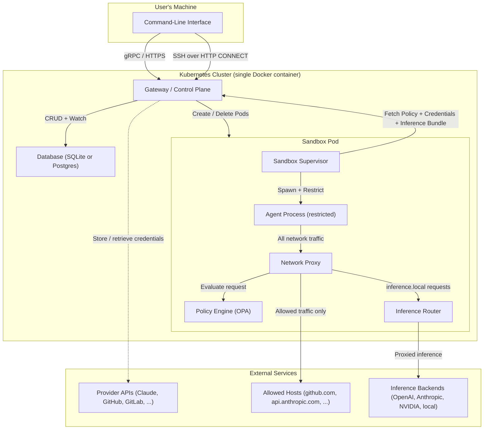

# openshell
Raw knowledge dump assimilated by OA.

## SWALLOW ENGINE DISTILLATION

### File: README.md
```md
# NVIDIA OpenShell

[](https://github.com/NVIDIA/OpenShell/blob/main/LICENSE)
[](https://pypi.org/project/openshell/)
[](SECURITY.md)
[](https://docs.nvidia.com/openshell/latest/index.html)
[](https://docs.nvidia.com/openshell/latest/about/release-notes.html)

OpenShell is the safe, private runtime for autonomous AI agents. It provides sandboxed execution environments that protect your data, credentials, and infrastructure — governed by declarative YAML policies that prevent unauthorized file access, data exfiltration, and uncontrolled network activity.

OpenShell is built agent-first. The project ships with agent skills for everything from cluster debugging to policy generation, and we expect contributors to use them.

> **Alpha software — single-player mode.** OpenShell is proof-of-life: one developer, one environment, one gateway. We are building toward multi-tenant enterprise deployments, but the starting point is getting your own environment up and running. Expect rough edges. Bring your agent.

## Quickstart

### Prerequisites

- **Docker** — Docker Desktop (or a Docker daemon) must be running.

### Install

**Binary (recommended):**

```bash
curl -LsSf https://raw.githubusercontent.com/NVIDIA/OpenShell/main/install.sh | sh
```

**From PyPI (requires [uv](https://docs.astral.sh/uv/)):**

```bash
uv tool install -U openshell
```

Both methods install the latest stable release by default. To install a specific version, set `OPENSHELL_VERSION` (binary) or pin the version with `uv tool install openshell==<version>`. A [`dev` release](https://github.com/NVIDIA/OpenShell/releases/tag/dev) is also available that tracks the latest commit on `main`.

### Create a sandbox

```bash
openshell sandbox create -- claude  # or opencode, codex, copilot
```

A gateway is created automatically on first use. To deploy on a remote host instead, pass `--remote user@host` to the create command.

The sandbox container includes the following tools by default:

| Category   | Tools                                                    |
| ---------- | -------------------------------------------------------- |
| Agent      | `claude`, `opencode`, `codex`, `copilot`                 |
| Language   | `python` (3.13), `node` (22)                             |
| Developer  | `gh`, `git`, `vim`, `nano`                               |
| Networking | `ping`, `dig`, `nslookup`, `nc`, `traceroute`, `netstat` |

For more details see https://github.com/NVIDIA/OpenShell-Community/tree/main/sandboxes/base.

### See network policy in action

Every sandbox starts with **minimal outbound access**. You open additional access with a short YAML policy that the proxy enforces at the HTTP method and path level, without restarting anything.

```bash
# 1. Create a sandbox (starts with minimal outbound access)
openshell sandbox create

# 2. Inside the sandbox — blocked
sandbox$ curl -sS https://api.github.com/zen
curl: (56) Received HTTP code 403 from proxy after CONNECT

# 3. Back on the host — apply a read-only GitHub API policy
sandbox$ exit
openshell policy set demo --policy examples/sandbox-policy-quickstart/policy.yaml --wait

# 4. Reconnect — GET allowed, POST blocked by L7
openshell sandbox connect demo
sandbox$ curl -sS https://api.github.com/zen
Anything added dilutes everything else.

sandbox$ curl -sS -X POST https://api.github.com/repos/octocat/hello-world/issues -d '{"title":"oops"}'
{"error":"policy_denied","detail":"POST /repos/octocat/hello-world/issues not permitted by policy"}
```

See the [full walkthrough](examples/sandbox-policy-quickstart/) or run the automated demo:

```bash
bash examples/sandbox-policy-quickstart/demo.sh
```

## How It Works

OpenShell isolates each sandbox in its own container with policy-enforced egress routing. A lightweight gateway coordinates sandbox lifecycle, and every outbound connection is intercepted by the policy engine, which does one of three things:

- **Allows** — the destination and binary match a policy block.
- **Routes for inference** — strips caller credentials, injects backend credentials, and forwards to the managed model.
- **Denies** — blocks the request and logs it.

| Component          | Role                                                                                         |
| ------------------ | -------------------------------------------------------------------------------------------- |
| **Gateway**        | Control-plane API that coordinates sandbox lifecycle and acts as the auth boundary.          |
| **Sandbox**        | Isolated runtime with container supervision and policy-enforced egress routing.              |
| **Policy Engine**  | Enforces filesystem, network, and process constraints from application layer down to kernel. |
| **Privacy Router** | Privacy-aware LLM routing that keeps sensitive context on sandbox compute.                   |

Under the hood, all these components run as a [K3s](https://k3s.io/) Kubernetes cluster inside a single Docker container — no separate K8s install required. The `openshell gateway` commands take care of provisioning the container and cluster.

## Protection Layers

OpenShell applies defense in depth across four policy domains:

| Layer      | What it protects                                    | When it applies             |
| ---------- | --------------------------------------------------- | --------------------------- |
| Filesystem | Prevents reads/writes outside allowed paths.        | Locked at sandbox creation. |
| Network    | Blocks unauthorized outbound connections.           | Hot-reloadable at runtime.  |
| Process    | Blocks privilege escalation and dangerous syscalls. | Locked at sandbox creation. |
| Inference  | Reroutes model API calls to controlled backends.    | Hot-reloadable at runtime.  |

Policies are declarative YAML files. Static sections (filesystem, process) are locked at creation; dynamic sections (network, inference) can be hot-reloaded on a running sandbox with `openshell policy set`.

## Providers

Agents need credentials — API keys, tokens, service accounts. OpenShell manages these as **providers**: named credential bundles that are injected into sandboxes at creation. The CLI auto-discovers credentials for recognized agents (Claude, Codex, OpenCode, Copilot) from your shell environment, or you can create providers explicitly with `openshell provider create`. Credentials never leak into the sandbox filesystem; they are injected as environment variables at runtime.

## GPU Support (Experimental)

> **Experimental** — GPU passthrough works on supported hosts but is under active development. Expect rough edges and breaking changes.

OpenShell can pass host GPUs into sandboxes for local inference, fine-tuning, or any GPU workload. Add `--gpu` when creating a sandbox:

```bash
openshell sandbox create --gpu --from [gpu-enabled-sandbox] -- claude
```

The CLI auto-bootstraps a GPU-enabled gateway on first use, auto-selecting CDI when available and otherwise falling back to Docker's NVIDIA GPU request path (`--gpus all`). GPU intent is also inferred automatically for community images with `gpu` in the name.

**Requirements:** NVIDIA drivers and the [NVIDIA Container Toolkit](https://docs.nvidia.com/datacenter/cloud-native/container-toolkit/latest/install-guide.html) must be installed on the host. The sandbox image itself must include the appropriate GPU drivers and libraries for your workload — the default `base` image does not. See the [BYOC example](https://github.com/NVIDIA/OpenShell/tree/main/examples/bring-your-own-container) for building a custom sandbox image with GPU support.

## Supported Agents

| Agent                                                         | Source                                                                           | Notes                                                                         |
| ------------------------------------------------------------- | -------------------------------------------------------------------------------- | ----------------------------------------------------------------------------- |
| [Claude Code](https://docs.anthropic.com/en/docs/claude-code) | [`base`](https://github.com/NVIDIA/OpenShell-Community/tree/main/sandboxes/base) | Works out of the box. Provider uses `ANTHROPIC_API_KEY`.                      |
| [OpenCode](https://opencode.ai/)                              | [`base`](https://github.com/NVIDIA/OpenShell-Community/tree/main/sandboxes/base) | Works out of the box. Provider uses `OPENAI_API_KEY` or `OPENROUTER_API_KEY`. |
| [Codex](https://developers.openai.com/codex)                  | [`base`](https://github.com/NVIDIA/OpenShell-Community/tree/main/sandboxes/base) | Works out of the box. Provider uses `OPENAI_API_KEY`.                         |
| [GitHub Copilot CLI](https://docs.github.com/en/copilot/github-copilot-in-the-cli) | [`base`](https://github.com/NVIDIA/OpenShell-Community/tree/main/sandboxes/base) | Works out of the box. Provider uses `GITHUB_TOKEN` or `COPILOT_GITHUB_TOKEN`. |
| [OpenClaw](https://openclaw.ai/)                              | [Community](https://github.com/NVIDIA/OpenShell-Community)                       | Launch with `openshell sandbox create --from openclaw`.                       |
| [Ollama](https://ollama.com/)                                 | [Community](https://github.com/NVIDIA/OpenShell-Community)                       | Launch with `openshell sandbox create --from ollama`.                         |

## Key Commands

| Command                                                    | Description                                     |
| ---------------------------------------------------------- | ----------------------------------------------- |
| `openshell sandbox create -- <agent>`                      | Create a sandbox and launch an agent.           |
| `openshell sandbox connect [name]`                         | SSH into a running sandbox.                     |
| `openshell sandbox list`                                   | List all sandboxes.                             |
| `openshell provider create --type [type]] --from-existing` | Create a credential provider from env vars.     |
| `openshell policy set <name> --policy file.yaml`           | Apply or update a policy on a running sandbox.  |
| `openshell policy get <name>`                              | Show the active policy.                         |
| `openshell inference set --provider <p> --model <m>`       | Configure the `inference.local` endpoint.       |
| `openshell logs [name] --tail`                             | Stream sandbox logs.                            |
| `openshell term`                                           | Launch the real-time terminal UI for debugging. |

See the full [CLI reference](https://github.com/NVIDIA/OpenShell/blob/main/docs/reference/cli.md) for all commands, flags, and environment variables.

## Terminal UI

OpenShell includes a real-time terminal dashboard for monitoring gateways, sandboxes, and providers — inspired by [k9s](https://k9scli.io/).

```bash
openshell term
```

<p align="center">
  
</p>

The TUI gives you a live, keyboard-driven view of your cluster. Navigate with `Tab` to switch panels, `j`/`k` to move through lists, `Enter` to select, and `:` for command mode. Cluster health and sandbox status auto-refresh every two seconds.

## Community Sandboxes and BYOC

Use `--from` to create sandboxes from the [OpenShell Community](https://github.com/NVIDIA/OpenShell-Community) catalog, a local directory, or a container image:

```bash
openshell sandbox create --from openclaw           # community catalog
openshell sandbox create --from ./my-sandbox-dir   # local Dockerfile
openshell sandbox create --from registry.io/img:v1 # container image
```

See the [community sandboxes](https://github.com/NVIDIA/OpenShell/blob/main/docs/sandboxes/community-sandboxes.md) catalog and the [BYOC example](https://github.com/NVIDIA/OpenShell/tree/main/examples/bring-your-own-container) for details.

## Explore with Your Agent

Clone the repo and point your coding agent at it. The project includes agent skills that can answer questions, walk you through workflows, and diagnose problems — no issue filing required.

```bash
git clone https://github.com/NVIDIA/OpenShell.git   # or git@github.com:NVIDIA/OpenShell.git
cd OpenShell
# Point your agent here — it will discover the skills in .agents/skills/ automatically
```

Your agent can load skills for CLI usage (`openshell-cli`), cluster troubleshooting (`debug-openshell-cluster`), inference troubleshooting (`debug-inference`), policy generation (`generate-sandbox-policy`), and more. See [CONTRIBUTING.md](CONTRIBUTING.md) for the full skills table.

## Built With Agents

OpenShell is developed using the same agent-driven workflows it enables. The `.agents/skills/` directory contains workflow automation that powers the project's development cycle:

- **Spike and build:** Investigate a problem with `create-spike`, then implement it with `build-from-issue` once a human approves.
- **Triage and route:** Community issues are assessed with `triage-issue`, classified, and routed into the spike-build pipeline.
- **Security review:** `review-security-issue` produces a severity assessment and remediation plan. `fix-security-issue` implements it.
- **Policy authoring:** `generate-sandbox-policy` creates YAML policies from plain-language requirements or API documentation.

All implementation work is human-gated — agents propose plans, humans approve, agents build. See [AGENTS.md](AGENTS.md) for the full workflow chain documentation.

## Getting Help

- **Questions and discussion:** [GitHub Discussions](https://github.com/NVIDIA/OpenShell/discussions)
- **Bug reports:** [GitHub Issues](https://github.com/NVIDIA/OpenShell/issues) — use the bug report template
- **Security vulnerabilities:** See [SECURITY.md](SECURITY.md) — do not use GitHub Issues
- **Agent-assisted help:** Clone the repo and use the agent skills in `.agents/skills/` for self-service diagnostics

## Learn More

- [Full Documentation](https://docs.nvidia.com/openshell/latest/index.html) — overview, architecture, tutorials, and reference
- [Quickstart](https://github.com/NVIDIA/OpenShell/blob/main/docs/get-started/quickstart.md) — detailed install and first sandbox walkthrough
- [GitHub Sandbox Tutorial](https://github.com/NVIDIA/OpenShell/blob/main/docs/tutorials/github-sandbox.md) — end-to-end scoped GitHub repo access
- [Architecture](https://github.com/NVIDIA/OpenShell/tree/main/archi
... [TRUNCATED]
```

### File: .claude\README.md
```md
# `.claude/` — Claude Code-specific configuration

Agent skills are canonical in `.agents/skills/` and shared across all harnesses (Claude Code, OpenCode, Cursor, etc.). This directory contains only Claude Code-specific configuration that cannot be made tool-agnostic.

## Contents

- `agents/` — Sub-agent persona definitions with Claude Code-specific frontmatter (`model`, `memory`, `color`, `tools`). The same personas exist in `.opencode/agents/` with OpenCode-specific config.
- `agent-memory/` — Persistent agent memory files. Claude Code runtime state, not portable across tools.

```

### File: architecture\README.md
```md
# System Overview

## What This Project Does

This project is a platform for securely running AI agents in isolated sandbox environments. AI agents -- tools that can read, write, and execute code on a user's behalf -- need to operate with real system access to be useful, but granting that access without guardrails poses serious security risks. An unconstrained agent could read sensitive files, exfiltrate data over the network, or execute dangerous system calls.

This platform solves that problem by creating sandboxed execution environments where agents run with exactly the permissions they need and nothing more. Every sandbox is governed by a policy that defines which files the agent can access, which network hosts it can reach, and which system operations it can perform. All outbound network traffic is forced through a controlled proxy that inspects and enforces access rules in real time.

The platform packages the entire infrastructure -- orchestration gateway, sandbox runtime, networking, and Kubernetes cluster -- into a single deployable unit. A user can go from zero to a running, secured sandbox in two commands. The system handles cluster provisioning, credential management, policy enforcement, and secure remote access without requiring the user to configure Kubernetes, networking, or security policies manually.

## How the Subsystems Fit Together

The following diagram shows how the major subsystems interact at a high level. Users interact through the CLI, which communicates with a central gateway. The gateway manages sandbox lifecycle in Kubernetes, and each sandbox enforces its own policy locally. Inference API calls to `inference.local` are routed locally within the sandbox by an embedded inference router, without traversing the gateway at request time.



## Major Subsystems

### Sandbox Execution Environment

The sandbox is the core of the platform. It creates a restricted environment where an AI agent can run code without being able to harm the host system or access resources it should not.

Each sandbox runs inside a container as two processes: a privileged **supervisor** and a restricted **child process** (the agent). The supervisor sets up the isolation environment, then launches the child with reduced privileges. The child process runs as a separate, unprivileged user account.

Isolation is enforced through multiple independent mechanisms that work together as layers of defense:

- **Filesystem restrictions** control which directories the agent can read and write. The platform uses a Linux kernel feature called Landlock to enforce these rules. If the policy says the agent can only write to `/sandbox`, any attempt to write elsewhere is blocked by the kernel itself -- not by the application.

- **System call filtering** prevents the agent from performing dangerous low-level operations. A filter (seccomp) blocks the agent from creating raw network sockets, which prevents it from bypassing the network proxy.

- **Network namespace isolation** places the agent in a separate network environment where the only reachable destination is the proxy. The agent literally cannot send packets to the internet directly; every connection must go through the proxy, which enforces the access policy.

- **Process privilege separation** ensures the supervisor retains enough privileges to manage the sandbox while the agent process runs with minimal permissions.

All of these restrictions are driven by a **policy** -- a configuration that defines what a specific sandbox is allowed to do. Policies are written in YAML and evaluated by an embedded policy engine (OPA/Rego). This means security rules are declarative, auditable, and can vary per sandbox.

For more detail, see [Sandbox Architecture](sandbox.md).

### Network Proxy and Access Control

Every sandbox forces all outbound network traffic through an HTTP CONNECT proxy. The proxy sits between the agent and the internet, acting as a gatekeeper that decides which connections are permitted.

When the agent (or any tool running inside the sandbox) tries to connect to a remote host, the proxy:

1. **Identifies the requesting program** by inspecting the Linux process table (`/proc`) to determine which binary opened the connection.
2. **Verifies the program's integrity** using a trust-on-first-use model: the first time a binary makes a network request, its cryptographic hash (SHA256) is recorded. If the binary changes later (indicating possible tampering), subsequent requests are denied.
3. **Evaluates the request against policy** using the OPA engine. The policy can allow or deny connections based on the destination hostname, port, and the identity of the requesting program.
4. **Rejects connections to internal IP addresses** as a defense against SSRF (Server-Side Request Forgery). Even if the policy allows a hostname, the proxy resolves DNS before connecting and blocks any result that points to a private network address (e.g., cloud metadata endpoints, localhost, or RFC 1918 ranges). This prevents an attacker from redirecting an allowed hostname to internal infrastructure.
5. **Performs protocol-aware inspection (L7)** for configured endpoints. The proxy can terminate TLS, inspect the underlying HTTP traffic, and enforce rules on individual API requests -- not just connection-level allow/deny. This operates in either audit mode (log violations but allow traffic) or enforce mode (block violations).
6. **Intercepts inference API calls** to `inference.local`. When the agent sends an HTTPS CONNECT request to `inference.local`, the proxy bypasses OPA evaluation entirely and handles the connection through a dedicated inference interception path. It TLS-terminates the connection, parses the HTTP request, detects known inference API patterns (OpenAI, Anthropic, model discovery), and routes matching requests locally through the sandbox's embedded inference router (`openshell-router`). Non-inference requests to `inference.local` are denied with 403.

The proxy generates an ephemeral certificate authority at startup and injects it into the sandbox's trust store. This allows it to transparently inspect HTTPS traffic when L7 inspection is configured for an endpoint, and to serve TLS for `inference.local` interception.

For more detail, see [Sandbox Architecture](sandbox.md) (Proxy Routing section).

### Gateway / Control Plane

The gateway is the central orchestration service. It provides the API that the CLI talks to and manages the lifecycle of sandboxes in Kubernetes.

Key responsibilities:

- **Sandbox lifecycle management**: Creating, deleting, and monitoring sandboxes. When a user creates a sandbox, the gateway provisions a Kubernetes pod with the correct container image, policy, and environment configuration.
- **gRPC and HTTP APIs**: The gateway exposes a gRPC API for structured operations (sandbox CRUD, provider management, SSH session creation) and HTTP endpoints for health checks. Both protocols share a single network port through protocol multiplexing.
- **Data persistence**: Sandbox records, provider credentials, SSH sessions, and inference routes are stored in a database (SQLite by default, Postgres as an option).
- **TLS termination**: The gateway supports TLS with automatic protocol negotiation, so gRPC and HTTP clients can connect securely on the same port.
- **SSH tunnel gateway**: The gateway provides the entry point for SSH connections into sandboxes (see Sandbox Connect below).
- **Real-time updates**: The gateway streams sandbox status changes to the CLI, so users see live progress when a sandbox is starting up.
- **Inference bundle resolution**: The gateway stores cluster-level inference configuration (provider name + model ID) and resolves it into bundles containing endpoint URLs, API keys, supported protocols, provider type, and auth metadata. Sandboxes fetch these bundles at startup and refresh them periodically. The gateway does not proxy inference traffic at request time -- it only provides configuration.

For more detail, see [Gateway Architecture](gateway.md).

### Cluster Bootstrap and Infrastructure

The entire platform -- Kubernetes, the gateway, networking, and pre-loaded container images -- is packaged into a single Docker container. This means the only dependency a user needs is Docker.

The bootstrap system handles:

- **Provisioning**: Creating the Docker container with an embedded Kubernetes (k3s) cluster, pre-loaded with all required images and Helm charts.
- **Local and remote deployment**: The same bootstrap flow works for local development (Docker on the user's machine) and remote deployment (Docker on a remote host, accessed via SSH).
- **Health monitoring**: After starting the cluster, the system polls for readiness -- waiting for Kubernetes to start, for components to deploy, and for health checks to pass.
- **Credential management**: If TLS is enabled, the bootstrap process automatically extracts client certificates and stores them locally for the CLI to use.
- **Idempotent operation**: Running the deploy command again is safe. It reuses existing infrastructure or recreates only what changed.

The target onboarding experience is two commands:

```bash
pip install <package>
openshell sandbox create --remote user@host -- claude
```

The first command installs the CLI. The second command bootstraps the cluster on the remote host (if needed) and launches a sandbox running the specified agent.

For more detail, see [Cluster Bootstrap Architecture](cluster-single-node.md).

### Sandbox Connect (SSH Tunneling)

Users can open interactive terminal sessions into running sandboxes. SSH traffic is tunneled through the gateway rather than exposing sandbox pods directly on the network.

The connection flow works as follows:

1. The CLI requests a session token from the gateway.
2. The CLI opens an HTTP CONNECT tunnel to the gateway's SSH tunnel endpoint, passing the token and sandbox identifier.
3. The gateway validates the token, confirms the sandbox is running, resolves the pod's network address, and establishes a TCP connection to the sandbox's embedded SSH server.
4. A cryptographic handshake (HMAC-verified) confirms the gateway's identity to the sandbox.
5. The CLI and sandbox exchange SSH traffic bidirectionally through the tunnel.

This design provides several benefits:
- Sandbox pods are never directly accessible from outside the cluster.
- All access is authenticated and auditable through the gateway.
- Session tokens can be revoked to immediately cut off access.
- The same mechanism supports both interactive shells and file synchronization (rsync).

For more detail, see [Sandbox Connect Architecture](sandbox-connect.md).

### Provider System

AI agents typically need credentials to access external services -- an API key for the AI model provider, a token for GitHub or GitLab, and so on. The platform manages these credentials as first-class entities called **providers**.

The provider system handles:

- **Automatic discovery**: The CLI scans the user's local machine for existing credentials (environment variables, configuration files) and offers to upload them to the gateway. Supported providers include Claude, Codex, OpenCode, OpenAI, Anthropic, NVIDIA, GitHub, GitLab, and others.
- **Secure storage**: Credentials are stored on the gateway, separate from sandbox definitions. They never appear in Kubernetes pod specifications.
- **Runtime injection**: When a sandbox starts, the supervisor process fetches the credentials from the gateway via gRPC and injects them as environment variables into every process it spawns (both the initial agent process and any SSH sessions).
- **CLI management**: Users can create, update, list, and delete providers through standard CLI commands.

This approach means users configure credentials once, and every sandbox that needs them receives them automatically at runtime.

For more detail, see [Providers](sandbox-providers.md).

### Inference Routing

The inference routing system transparently intercepts AI inference API calls from sandboxed agents and routes them to configured backends. Routing happens locally within the sandbox -- the proxy intercepts connections to `inference.local`, and the embedded `openshell-router` forwards requests directly to the backend without traversing the gateway at request time.

**How it works end-to-end:**

1. An operator configures cluster-level inference via `openshell cluster inference set --provider <name> --model <id>`. This stores a reference to the named provider and model on the gateway.
2. When a sandbox starts, the supervisor fetches an inference bundle from the gateway via the `GetInferenceBundle` RPC. The gateway resolves the stored provider reference into a complete route: endpoint URL, API key, supported protocols, provider type, and auth metadata. The sandbox refreshes this bundle eagerly in the background every 5 seconds by default (override with `OPENSHELL_ROUTE_REFRESH_INTERVAL_SECS`).
3. The agent sends requests to `https://inference.local` using standard OpenAI or Anthropic SDK calls.
4. The sandbox proxy intercepts the HTTPS CONNECT to `inference.local` (bypassing OPA policy evaluation), TLS-terminates the connection using the sandbox's ephemeral CA, and parses the HTTP request.
5. Known inference API patterns are detected (e.g., `POST /v1/chat/completions` for OpenAI, `POST /v1/messages` for Anthropic, `GET /v1/models` for model discovery). Matching requests are forwarded to the first compatible route by the `openshell-router`, which rewrites the auth header, injects provider-specific default headers (e.g., `anthropic-version` for Anthr
... [TRUNCATED]
```

### File: AGENTS.md
```md
# Agent Instructions

This file is the primary instruction surface for agents contributing to OpenShell. It is injected into your context on every interaction — keep that in mind when proposing changes to it.

See [CONTRIBUTING.md](CONTRIBUTING.md) for build instructions, task reference, project structure, and the full agent skills table.

## Project Identity

OpenShell is built agent-first. We design systems and use agents to implement them — this is not vibe coding. The product provides safe, sandboxed runtimes for autonomous AI agents, and the project itself is built using the same agent-driven workflows it enables.

## Skills

Agent skills live in `.agents/skills/`. Your harness can discover and load them natively — do not rely on this file for a full inventory. The detailed skills table is in [CONTRIBUTING.md](CONTRIBUTING.md) (for humans).

## Workflow Chains

These pipelines connect skills into end-to-end workflows. Individual skill files don't describe these relationships.

- **Community inflow:** `triage-issue` → `create-spike` → `build-from-issue`
  - Triage assesses and classifies community-filed issues. Spike investigates unknowns. Build implements.
- **Internal development:** `create-spike` → `build-from-issue`
  - Spike explores feasibility, then build executes once `state:agent-ready` is applied by a human.
- **Security:** `review-security-issue` → `fix-security-issue`
  - Review produces a severity assessment and remediation plan. Fix implements it. Both require the `topic:security` label; fix also requires `state:agent-ready`.
- **Policy iteration:** `openshell-cli` → `generate-sandbox-policy`
  - CLI manages the sandbox lifecycle; policy generation authors the YAML constraints.

## Architecture Overview

| Path | Components | Purpose |
|------|-----------|---------|
| `crates/openshell-cli/` | CLI binary | User-facing command-line interface |
| `crates/openshell-server/` | Gateway server | Control-plane API, sandbox lifecycle, auth boundary |
| `crates/openshell-sandbox/` | Sandbox runtime | Container supervision, policy-enforced egress routing |
| `crates/openshell-policy/` | Policy engine | Filesystem, network, process, and inference constraints |
| `crates/openshell-router/` | Privacy router | Privacy-aware LLM routing |
| `crates/openshell-bootstrap/` | Cluster bootstrap | K3s cluster setup, image loading, mTLS PKI |
| `crates/openshell-core/` | Shared core | Common types, configuration, error handling |
| `crates/openshell-providers/` | Provider management | Credential provider backends |
| `crates/openshell-tui/` | Terminal UI | Ratatui-based dashboard for monitoring |
| `python/openshell/` | Python SDK | Python bindings and CLI packaging |
| `proto/` | Protobuf definitions | gRPC service contracts |
| `deploy/` | Docker, Helm, K8s | Dockerfiles, Helm chart, manifests |
| `.agents/skills/` | Agent skills | Workflow automation for development |
| `.agents/agents/` | Agent personas | Sub-agent definitions (e.g., reviewer, doc writer) |
| `architecture/` | Architecture docs | Design decisions and component documentation |

## Vouch System

- First-time external contributors must be vouched before their PRs are accepted. The `vouch-check` workflow auto-closes PRs from unvouched users.
- Org members and collaborators bypass the vouch gate automatically.
- Maintainers vouch users by commenting `/vouch` on a Vouch Request discussion. The `vouch-command` workflow appends the username to `.github/VOUCHED.td`.
- Skills that create PRs (`create-github-pr`, `build-from-issue`) should note this requirement when operating on behalf of external contributors.

## Issue and PR Conventions

- **Bug reports** must include an agent diagnostic section — proof that the reporter's agent investigated the issue before filing. See the issue template.
- **Feature requests** must include a design proposal, not just a "please build this" request. See the issue template.
- **PRs** must follow the PR template structure: Summary, Related Issue, Changes, Testing, Checklist.
- **PRs from unvouched external contributors** are automatically closed. See the Vouch System section above.
- **Security vulnerabilities** must NOT be filed as GitHub issues. Follow [SECURITY.md](SECURITY.md).
- Skills that create issues or PRs (`create-github-issue`, `create-github-pr`, `build-from-issue`) should produce output conforming to these templates.

## Plans

- Store plan documents in `architecture/plans`. This is git ignored so its for easier access for humans. When asked to create Spikes or issues, you can skip to GitHub issues. Only use the plans dir when you aren't writing data somewhere else specific.
- When asked to write a plan, write it there without asking for the location.

## Sandbox Infra Changes

- If you change sandbox infrastructure, ensure `mise run sandbox` succeeds.

## Commits

- Always use [Conventional Commits](https://www.conventionalcommits.org/) format for commit messages
- Format: `<type>(<scope>): <description>` (scope is optional)
- Common types: `feat`, `fix`, `docs`, `chore`, `refactor`, `test`, `ci`, `perf`
- Never mention Claude or any AI agent in commits (no author attribution, no Co-Authored-By, no references in commit messages)

## Pre-commit

- Run `mise run pre-commit` before committing.
- Install the git hook when working locally: `mise generate git-pre-commit --write --task=pre-commit`

## Testing

- `mise run pre-commit` — Lint, format, license headers. Run before every commit.
- `mise run test` — Unit test suite. Run after code changes.
- `mise run e2e` — End-to-end tests against a running cluster. Run for infrastructure, sandbox, or policy changes.
- `mise run ci` — Full local CI (lint + compile/type checks + tests). Run before opening a PR.

## Python

- Always use `uv` for Python commands (e.g., `uv pip install`, `uv run`, `uv venv`)

## Docker

- Always prefer `mise` commands over direct docker builds (e.g., `mise run docker:build` instead of `docker build`)

## Cluster Infrastructure Changes

- If you change cluster bootstrap infrastructure (e.g., `openshell-bootstrap` crate, `deploy/docker/Dockerfile.images`, `cluster-entrypoint.sh`, `cluster-healthcheck.sh`, deploy logic in `openshell-cli`), update the `debug-openshell-cluster` skill in `.agents/skills/debug-openshell-cluster/SKILL.md` to reflect those changes.

## Documentation

- When making changes, update the relevant documentation in the `architecture/` directory.
- When changes affect user-facing behavior, also update the relevant pages under `docs/`.
- Follow the style guide in [docs/CONTRIBUTING.md](docs/CONTRIBUTING.md): active voice, no unnecessary bold, no em dash overuse, no filler introductions.
- Use the `update-docs` skill to scan recent commits and draft doc updates.

## Security

- Never commit secrets, API keys, or credentials. If a file looks like it contains secrets (`.env`, `credentials.json`, etc.), do not stage it.
- Do not run destructive operations (force push, hard reset, database drops) without explicit human confirmation.
- Scope changes to the issue at hand. Do not make unrelated changes in the same branch.

```

### File: CLAUDE.md
```md
@AGENTS.md
```

### File: CONTRIBUTING.md
```md
# Contributing to OpenShell

OpenShell is built agent-first. We design systems and use agents to implement them. Your agent is your first collaborator — point it at this repo before opening issues, asking questions, or submitting code.

## The Critical Rule

**You must understand your code.** Using AI agents to write code is not just acceptable, it's how this project works. But you must be able to explain what your changes do and how they interact with the rest of the system. If you can't, don't submit it.

Submitting agent-generated code without understanding it — regardless of how clean it looks — wastes maintainer time and will result in your PR being closed. Repeat offenders will be blocked from the project.

## AI Usage

OpenShell is agent-first, not agent-only. The distinction matters:

- **Do** use agents to explore the codebase, run diagnostics, generate code, and iterate on implementations.
- **Do** use the skills in `.agents/skills/` — they exist to make your agent effective.
- **Do** interrogate your agent until you understand every edge case and interaction in your changes.
- **Don't** submit code you can't explain without your agent open.
- **Don't** use agents as a substitute for understanding the system. Read the architecture docs.

## First-Time Contributors

We use a vouch system. This exists because AI makes it trivial to generate plausible-looking but low-quality contributions, and we can no longer trust by default.

1. Open a [Vouch Request](https://github.com/NVIDIA/OpenShell/discussions/new?category=vouch-request) discussion.
2. Describe what you want to change and why.
3. Write in your own words. AI-generated vouch requests will be denied.
4. A maintainer will comment `/vouch` if approved.
5. Once vouched, you can submit pull requests.

**If you are not vouched, any pull request you open will be automatically closed.** Org members and collaborators with push access bypass this check.

### Finding Work

Issues labeled [`good-first-issue`](https://github.com/NVIDIA/OpenShell/issues?q=is%3Aissue+is%3Aopen+label%3Agood-first-issue) are scoped, well-documented, and friendly to new contributors. Start there. If you need guidance, comment on the issue.

All open issues are actionable — if it's in the issue tracker, it's ready to be worked on.

## Before You Open an Issue

This project ships with [agent skills](#agent-skills-for-contributors) that can diagnose problems, explore the codebase, generate policies, and walk you through common workflows. Before filing an issue:

1. Clone the repo and point your coding agent at it.
2. Load the relevant skill - `debug-openshell-cluster` for cluster problems, `debug-inference` for inference setup problems, `openshell-cli` for usage questions, `generate-sandbox-policy` for policy help.
3. Have your agent investigate. Let it run diagnostics, read the architecture docs, and attempt a fix.
4. If the agent cannot resolve it, open an issue **with the agent's diagnostic output attached**. The issue template requires this.

### When to Open an Issue

- A real bug that your agent confirmed and could not fix.
- A feature proposal with a design — not a "please build this" request.
- An infrastructure problem that the `debug-openshell-cluster` skill could not resolve.
- An inference setup problem that the `debug-inference` skill could not resolve.
- Security vulnerabilities must follow [SECURITY.md](SECURITY.md) — **not** GitHub issues.

### When NOT to Open an Issue

- Questions about how things work — your agent can answer these from the codebase and architecture docs.
- Configuration problems - your agent can diagnose these with `openshell-cli`, `debug-openshell-cluster`, and `debug-inference`.
- "How do I..." requests — the skills cover CLI usage, policy generation, TUI development, and more.

## Agent Skills for Contributors

Skills live in `.agents/skills/`. Your agent's harness can discover and load them natively. Here is the full inventory:

| Category        | Skill                     | Purpose                                                                                             |
| --------------- | ------------------------- | --------------------------------------------------------------------------------------------------- |
| Getting Started | `openshell-cli`           | CLI usage, sandbox lifecycle, provider management, BYOC workflows                                   |
| Getting Started | `debug-openshell-cluster` | Diagnose cluster startup failures and health issues                                                 |
| Getting Started | `debug-inference`         | Diagnose `inference.local`, host-backed local inference, and direct external inference setup issues |
| Contributing    | `create-spike`            | Investigate a problem, produce a structured GitHub issue                                            |
| Contributing    | `build-from-issue`        | Plan and implement work from a GitHub issue (maintainer workflow)                                   |
| Contributing    | `create-github-issue`     | Create well-structured GitHub issues                                                                |
| Contributing    | `create-github-pr`        | Create pull requests with proper conventions                                                        |
| Reviewing       | `review-github-pr`        | Summarize PR diffs and key design decisions                                                         |
| Reviewing       | `review-security-issue`   | Assess security issues for severity and remediation                                                 |
| Reviewing       | `watch-github-actions`    | Monitor CI pipeline status and logs                                                                 |
| Triage          | `triage-issue`            | Assess, classify, and route community-filed issues                                                  |
| Platform        | `generate-sandbox-policy` | Generate YAML sandbox policies from requirements or API docs                                        |
| Platform        | `tui-development`         | Development guide for the ratatui-based terminal UI                                                 |
| Documentation   | `update-docs`             | Scan recent commits and draft doc updates for user-facing changes                                   |
| Maintenance     | `sync-agent-infra`        | Detect and fix drift across agent-first infrastructure files                                        |
| Reference       | `sbom`                    | Generate SBOMs and resolve dependency licenses                                                      |

### Workflow Chains

Skills connect into pipelines. Individual skill files don't describe these relationships.

- **Community inflow:** `triage-issue` → `create-spike` → `build-from-issue`
- **Internal development:** `create-spike` → `build-from-issue`
- **Security:** `review-security-issue` → `fix-security-issue`
- **Policy iteration:** `openshell-cli` → `generate-sandbox-policy`

Workflow state labels use the `state:*` prefix, and security work uses `topic:security`. GitHub issue templates assign built-in issue types where applicable, and agent-created issues should use issue types or manual follow-up rather than type labels.

## Prerequisites

Install [mise](https://mise.jdx.dev/). This is used to set up the development environment.

```bash
# Install mise (macOS/Linux)
curl https://mise.run | sh
```

After installing `mise`, activate it with `mise activate` or [add it to your shell](https://mise.jdx.dev/getting-started.html).

Shell setup examples:

```bash
# Fish
echo '~/.local/bin/mise activate fish | source' >> ~/.config/fish/config.fish

# Zsh
echo 'eval "$(~/.local/bin/mise activate zsh)"' >> ~/.zshrc
```

Project requirements:

- Rust 1.88+
- Python 3.12+
- Docker (running)

## Getting Started

```bash
# One-time trust
mise trust

# Launch a sandbox (deploys a cluster if one isn't running)
mise run sandbox
```

## Building the `openshell` CLI

Inside this repository, `openshell` is a local shortcut script at `scripts/bin/openshell`. The script will

1. Build `openshell-cli` if needed.
2. Run the local debug CLI binary under `target/debug/openshell`.

Because `mise` adds `scripts/bin` to `PATH` for this project, you can run `openshell` directly from the repo.

```bash
openshell --help
openshell sandbox create -- codex
```

### Cluster debugging helpers

Two additional scripts in `scripts/bin/` provide gateway-aware wrappers for cluster debugging:

| Script    | What it does                                                                         |
| --------- | ------------------------------------------------------------------------------------ |
| `kubectl` | Runs `kubectl` inside the active gateway's k3s container via `openshell doctor exec` |
| `k9s`     | Runs `k9s` inside the active gateway's k3s container via `openshell doctor exec`     |

These work for both local and remote gateways (SSH is handled automatically). Examples:

```bash
kubectl get pods -A
kubectl logs -n openshell statefulset/openshell
k9s
k9s -n openshell
```

## Main Tasks

These are the primary `mise` tasks for day-to-day development:

| Task               | Purpose                                                 |
| ------------------ | ------------------------------------------------------- |
| `mise run cluster` | Bootstrap or incremental deploy                         |
| `mise run sandbox` | Create a sandbox on the running cluster                 |
| `mise run test`    | Default test suite                                      |
| `mise run e2e`     | Default end-to-end test lane                            |
| `mise run ci`      | Full local CI checks (lint, compile/type checks, tests) |
| `mise run docs`    | Build and serve documentation locally                   |
| `mise run clean`   | Clean build artifacts                                   |

## Project Structure

| Path            | Purpose                                       |
| --------------- | --------------------------------------------- |
| `crates/`       | Rust crates                                   |
| `python/`       | Python SDK and bindings                       |
| `proto/`        | Protocol buffer definitions                   |
| `tasks/`        | `mise` task definitions and build scripts     |
| `deploy/`       | Dockerfiles, Helm chart, Kubernetes manifests |
| `architecture/` | Architecture docs and plans                   |
| `rfc/`          | Request for Comments proposals                |
| `docs/`         | User-facing documentation (Sphinx/MyST)       |
| `.agents/`      | Agent skills and persona definitions          |

## RFCs

For cross-cutting architectural decisions, API contract changes, or process proposals that need broad consensus, use the RFC process. RFCs live in `rfc/` — copy the template, fill it in, and open a PR for discussion. See [rfc/README.md](rfc/README.md) for the full lifecycle and guidelines on when to write an RFC versus a spike issue or architecture doc.

## Documentation

If your change affects user-facing behavior (new flags, changed defaults, new features, bug fixes that contradict existing docs), update the relevant pages under `docs/` in the same PR.

To ensure your doc changes follow NVIDIA documentation style, use the `update-docs` skill.
It scans commits, identifies doc pages that need updates, and drafts content that follows the style guide in `docs/CONTRIBUTING.md`.

To build and preview docs locally:

```bash
mise run docs # to build the docs locally
mise run docs:serve # to serve locally and automatically rebuild on changes
```

See [docs/CONTRIBUTING.md](docs/CONTRIBUTING.md) for more details.

## Pull Requests

1. Create a feature branch from `main`.
2. Make your changes with tests.
3. Run `mise run ci` to verify.
4. Open a PR using the `create-github-pr` skill or manually following the [PR template](.github/PULL_REQUEST_TEMPLATE.md).

### Commit Messages

This project uses [Conventional Commits](https://www.conventionalcommits.org/). All commit messages must follow the format:

```
<type>(<scope>): <description>

[optional body]

[optional footer(s)]
```

**Types:**

- `feat` - New feature
- `fix` - Bug fix
- `docs` - Documentation only
- `chore` - Maintenance tasks (dependencies, build config)
- `refactor` - Code change that neither fixes a bug nor adds a feature
- `test` - Adding or updating tests
- `ci` - CI/CD changes
- `perf` - Performance improvements

**Examples:**

```
feat(cli): add --verbose flag to openshell run
fix(sandbox): handle timeout errors gracefully
docs: update installation instructions
chore(deps): bump tokio to 1.40
```

### DCO

All contributions must include a `Signed-off-by` line in each commit message. This certifies you have the right to submit the work under the project license. See the [Developer Certificate of Origin](https://developercertificate.org/).

```bash
git commit -s -m "feat(sandbox): add new capability"
```

```


> [!WARNING]
> Distillation threshold (50000 chars) reached. Truncating further files.
