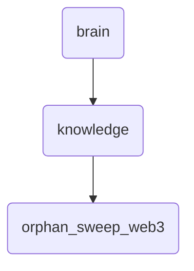

# Orphan Sweep Web3 Identity

This directory contains deep knowledge and proposals related to the orphan sweep process in Web3, ensuring the integrity of data within OmniClaw's decentralized network.

---

## Topological View

---
*OmniClaw V5.0 | Forged by OMA AI Architect | brain.knowledge.orphan_sweep_web3 | 2026-04-10*
