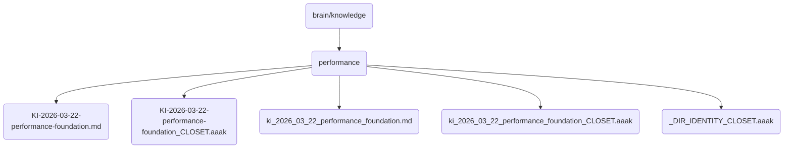

# Performance Identity

This directory contains foundational knowledge and documentation related to the performance optimization of OmniClaw v5.0, including implementation details and best practices.

## Topological View

---
*OmniClaw V5.0 | Forged by AI Architect | Evaluated dynamically*
