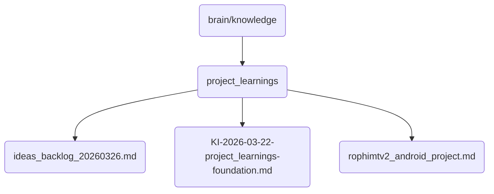

# Project Learnings Identity

Contains project learnings and ideas for future development of OmniClaw v5.0.

## Topological View

---
*OmniClaw V5.0 | Forged by AI Architect | Evaluated dynamically*
