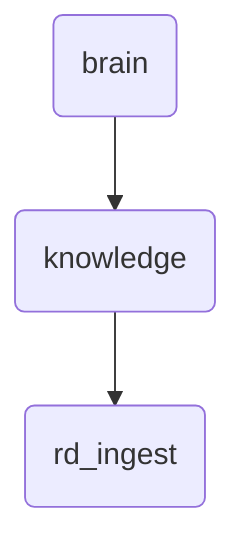

# Rd Ingest Identity

The rd_ingest directory within OmniClaw v5.0 is responsible for ingesting raw research data and processing it into a structured format suitable for further analysis.

---

## Topological View

---
*OmniClaw V5.0 | Forged by OMA AI Architect | brain.knowledge.rd_ingest | 2026-04-10*
