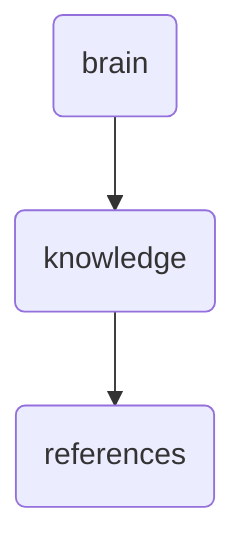

# References Identity

This directory holds various references and documentation related to OmniClaw, including API endpoints, analysis modules, and application examples. It serves as a central repository for developers and maintainers to access detailed information.

---

## Topological View

---
*OmniClaw V5.0 | Forged by OMA AI Architect | brain.knowledge.references | 2026-04-10*
