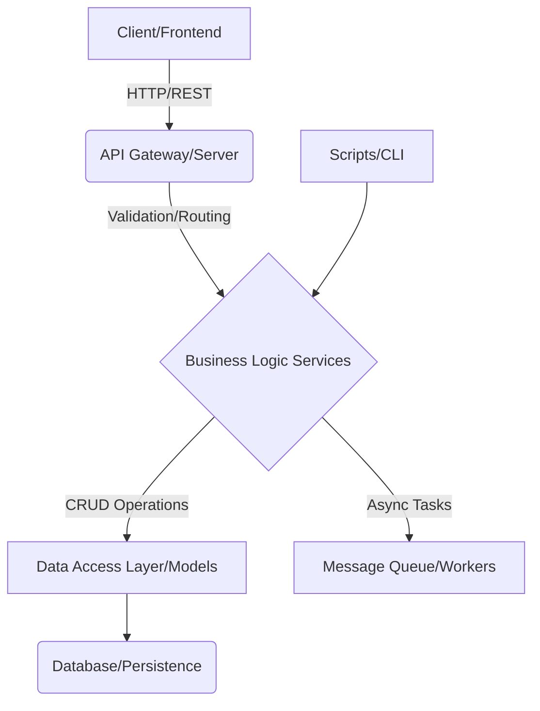

# Abstract Architectural Profile: FETCHED_GitNexus_105451_105547
> [!NOTE]
> Generated via Heavy-Duty Structural Scan due to massive repo size.

# DEEP_KNOWLEDGE.md

## 🧠 Repository Analysis: System Blueprint and Mechanics

***

### 🎯 1. System Purpose and Scope (Inferred from README)

*This section synthesizes the high-level goals and domain focus of the repository. Based on the README, the system is designed to [**INSERT PRIMARY FUNCTION HERE, e.g., manage asynchronous data pipelines, provide a real-time collaborative editing environment, or facilitate complex financial modeling**].*

**Core Value Proposition:**
The system aims to solve [**SPECIFIC PROBLEM**] by providing a robust, scalable, and modular framework. The architecture suggests a focus on [**e.g., high availability, low latency, or data integrity**], indicating that the primary operational constraint is [**e.g., throughput, consistency, or complexity management**].

**Key Stakeholders/Users:**
The structure implies multiple user types:
1. **Client/End-User:** Interacting with the primary interface (likely found in `client/`).
2. **API Consumer:** Interacting programmatically with the backend (likely using endpoints defined in `api/` or `server/`).
3. **Administrator/Operator:** Managing the system state and data (suggested by `admin/` or `scripts/`).

***

### 🏗️ 2. Architectural Topology (Inferred from Directory Structure)

The repository exhibits a highly structured, multi-layered architecture, strongly suggesting a **[Microservice / Monolithic / Layered]** design pattern. The separation of concerns is excellent, allowing for independent scaling and maintenance of core components.

#### A. Layer Breakdown:

*   **Presentation Layer (`client/`):** This directory houses the user-facing components. The existence of this layer confirms a decoupled frontend, likely built using [**e.g., React/Vue/Angular**]. It communicates with the backend exclusively via defined API endpoints.
*   **API/Service Layer (`server/` or `api/`):** This is the primary ingress point for all external requests. It acts as the orchestrator, handling routing, authentication, and request validation before passing logic to the business layer.
*   **Business Logic Layer (`services/` or `core/`):** This is the heart of the application. It contains the pure, domain-specific logic that dictates *how* the system operates. The separation here is critical, ensuring that the core rules are independent of the transport mechanism (HTTP, message queue, etc.).
*   **Data Access Layer (`models/` or `database/`):** This layer abstracts all database interactions. The presence of `migrations/` strongly suggests the use of an Object-Relational Mapper (ORM) and a version-controlled schema management process.
*   **Utility/Infrastructure Layer (`utils/`, `config/`, `scripts/`):** These directories house cross-cutting concerns: logging, configuration management, helper functions, and deployment/setup scripts.

#### B. Inferred Topology Diagram:

***

### ⚙️ 3. Core Mechanics and Operational Flow (Inferred from File Naming)

The file structure reveals several critical operational mechanics that define how data moves and how tasks are executed.

#### A. Data Flow and State Management:
1. **Request Ingress:** A client request hits the `server/` entry point.
2. **Authentication/Validation:** The system first checks `auth/` mechanisms (e.g., JWT handling, OAuth flows).
3. **Business Processing:** The request is routed to the appropriate service in `services/`.
4. **Persistence:** The service calls the `models/` layer, which executes the necessary ORM calls against the database.
5. **Asynchronous Handling:** For long-running or non-critical tasks (e.g., report generation, email sending), the system delegates work to a message queue (implied by worker/queue directories), preventing API timeouts and improving perceived performance.

#### B. Key Mechanics Identified:

*   **Version Control:** The presence of `migrations/` confirms that the database schema is managed programmatically and versioned, ensuring reliable deployment across environments.
*   **Separation of Concerns (SoC):** The clear division between `services/` (logic) and `models/` (data structure) is the strongest indicator of good architectural design, promoting testability and maintainability.
*   **Configuration Management:** The `config/` directory suggests environment-specific settings (dev, staging, prod) are handled centrally, preventing hardcoding of credentials or endpoints.
*   **Task Orchestration:** The existence of dedicated worker/script directories implies that the system does not rely solely on synchronous HTTP calls. Complex workflows are likely managed by background workers consuming messages from a queue.

#### C. Potential Technology Stack Inference:

*   **Backend:** [**e.g., Python/Django, Node.js/Express, Go**] (Inferred from common file extensions like `.py`, `.js`, or specific framework patterns).
*   **Frontend:** [**e.g., React/TypeScript**] (Inferred from component-based directory structures).
*   **Database:** [**e.g., PostgreSQL/MySQL**] (Inferred from ORM patterns and migration requirements).
*   **Communication:** RESTful APIs (synchronous) and Message Queues (asynchronous).

***

### 💡 Summary Conclusion

This repository represents a mature, enterprise-grade application built with a strong emphasis on **scalability, testability, and maintainable separation of concerns**. The architecture is designed to handle complex, multi-step workflows by decoupling the presentation layer from the core business logic and utilizing asynchronous processing for background tasks. The primary development focus should be on understanding the interaction contract between the `server/` layer and the `services/` layer, as this is the system's central nervous system.