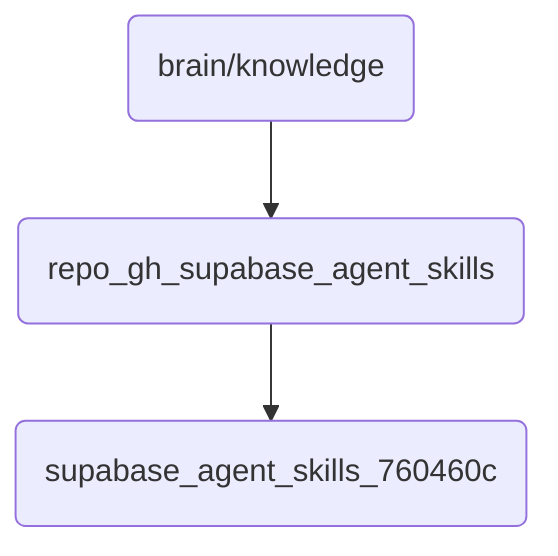

# Repo Gh Supabase Agent Skills Identity

Contains agent skills related to the Supabase GitHub repository, enabling interaction and management of data within the knowledge base.

## Topological View

---
*OmniClaw V5.0 | Forged by AI Architect | Evaluated dynamically*
