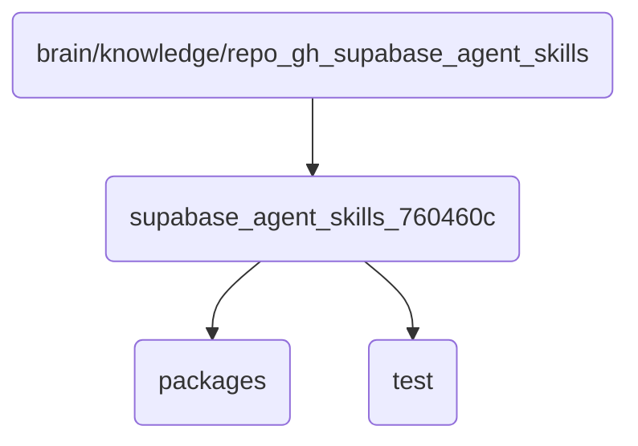

# Supabase Agent Skills 760460C Identity

This directory contains the core skills and configurations for the Supabase agent in OmniClaw v5.0, essential for managing interactions with the Supabase database.

## Topological View

---
*OmniClaw V5.0 | Forged by AI Architect | Evaluated dynamically*
