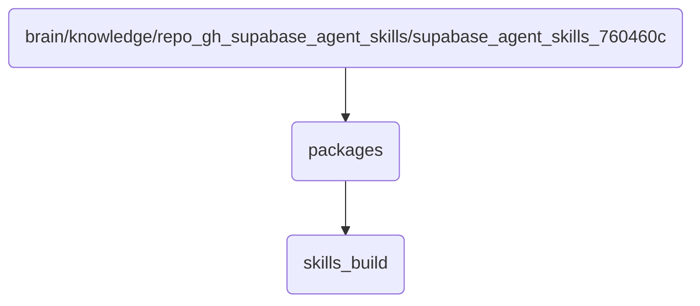

# Packages Identity

Contains the core packages for the OmniClaw v5.0 agent skills, which are essential for managing and executing various tasks.

## Topological View

---
*OmniClaw V5.0 | Forged by AI Architect | Evaluated dynamically*
