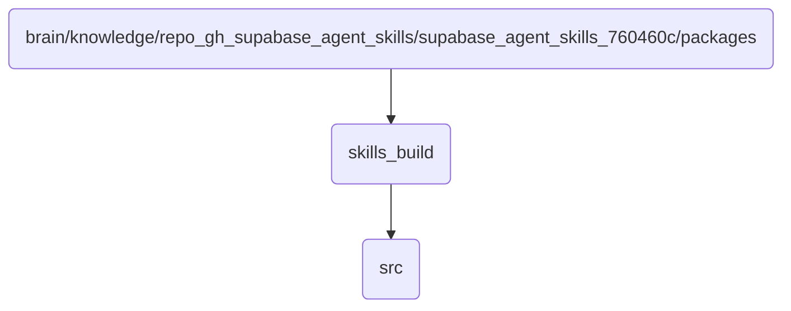

# Skills Build Identity

Contains the source code and configuration files for building skills in OmniClaw v5.0.

## Topological View

---
*OmniClaw V5.0 | Forged by AI Architect | Evaluated dynamically*
