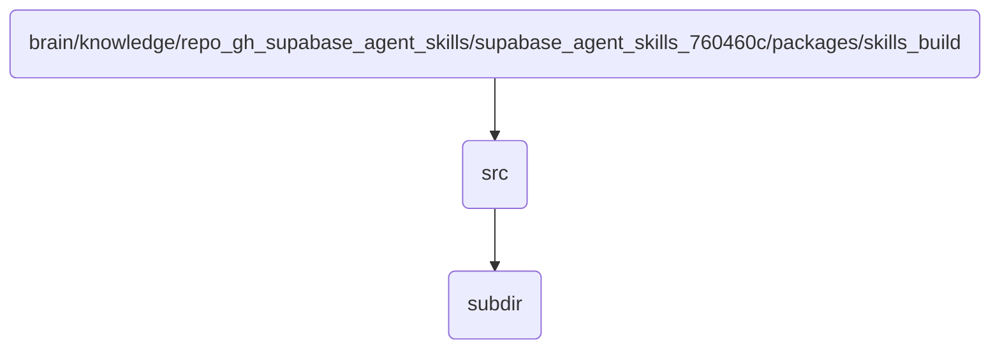

# Src Identity

This directory contains the source code for building skills in the OmniClaw v5.0 agent, specifically interfacing with Supabase.

## Topological View

---
*OmniClaw V5.0 | Forged by AI Architect | Evaluated dynamically*
