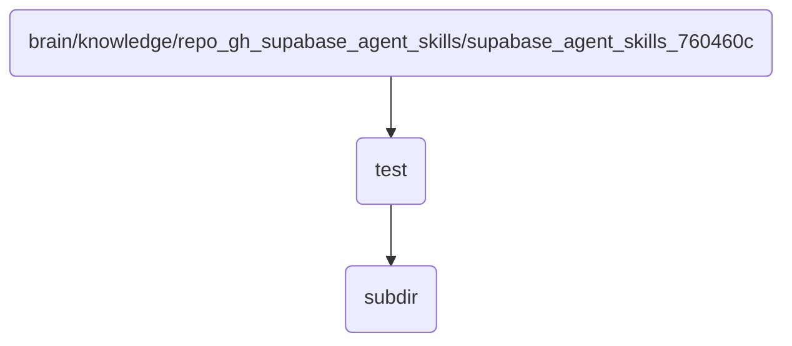

# Test Identity

This directory contains test files and configurations for the OmniClaw v5.0 agent skills repository.

## Topological View

---
*OmniClaw V5.0 | Forged by AI Architect | Evaluated dynamically*
