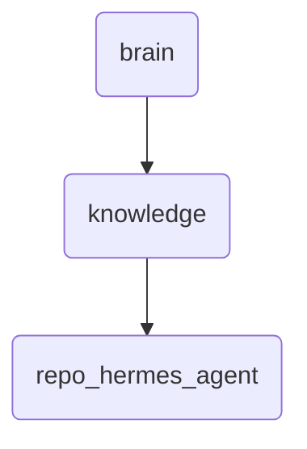

# Repo Hermes Agent Identity

This directory holds the agent components and related documentation for Hermes, a key component of OmniClaw responsible for data collection and processing.

---

## Topological View

---
*OmniClaw V5.0 | Forged by OMA AI Architect | brain.knowledge.repo_hermes_agent | 2026-04-10*
