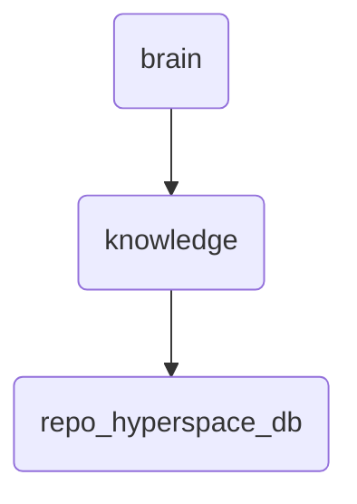

# Repo Hyperspace Db Identity

This directory holds the database schema and related artifacts for OmniClaw's hyperspace module, essential for managing and querying knowledge graphs.

---

## Topological View

---
*OmniClaw V5.0 | Forged by OMA AI Architect | brain.knowledge.repo_hyperspace_db | 2026-04-10*
