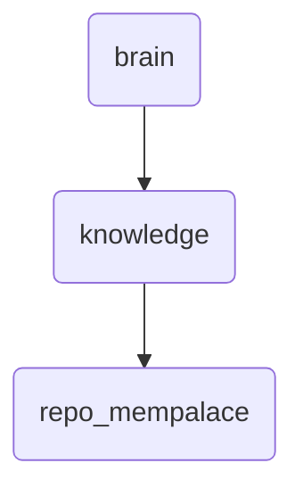

# Repo Mempalace Identity

This directory is responsible for managing and organizing deep knowledge repositories within OmniClaw, ensuring efficient access and maintenance of critical information.

---

## Topological View

---
*OmniClaw V5.0 | Forged by OMA AI Architect | brain.knowledge.repo_mempalace | 2026-04-10*
