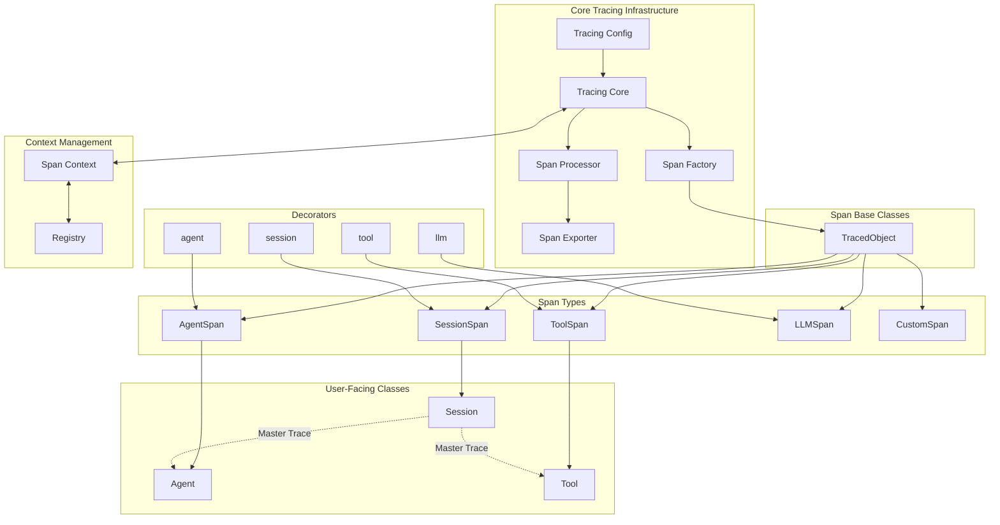

# agentops
Raw knowledge dump assimilated by OA.

## SWALLOW ENGINE DISTILLATION

### File: FETCHED_agentops_033407\README.md
```md
<div align="center">
  <a href="https://agentops.ai?ref=gh">
    
  </a>
</div>

<div align="center">
  <em>Observability and DevTool platform for AI Agents</em>
</div>

<br />

<div align="center">
  <a href="https://pepy.tech/project/agentops">
    
  </a>
  <a href="https://github.com/agentops-ai/agentops/issues">
  
  </a>
  
  <a href="https://opensource.org/licenses/MIT">
    
  </a>
  <a href="https://smithery.ai/server/@AgentOps-AI/agentops-mcp">
    
  </a>
</div>

<p align="center">
  <a href="https://twitter.com/agentopsai/">
    
  </a>
  <a href="https://discord.gg/FagdcwwXRR">
    
  </a>
  <a href="https://app.agentops.ai/?ref=gh">
    
  </a>
  <a href="https://docs.agentops.ai/introduction">
    
  </a>
  <a href="https://entelligence.ai/AgentOps-AI&agentops">
    
  </a>
</p>

<div align="center">
  <video src="https://github.com/user-attachments/assets/dfb4fa8d-d8c4-4965-9ff6-5b8514c1c22f" width="650" autoplay loop muted></video>
</div>

<br/>

AgentOps helps developers build, evaluate, and monitor AI agents. From prototype to production.

## Open Source

The AgentOps app is open source under the MIT license. Explore the code in our [app directory](https://github.com/AgentOps-AI/agentops/tree/main/app).

## Key Integrations 🔌

<div align="center" style="background-color: white; padding: 20px; border-radius: 10px; margin: 0 auto; max-width: 800px;">
  <div style="display: flex; flex-wrap: wrap; justify-content: center; align-items: center; gap: 30px; margin-bottom: 20px;">
    <a href="https://docs.agentops.ai/v2/integrations/openai_agents_python"></a>
    <a href="https://docs.agentops.ai/v1/integrations/crewai"></a>
    <a href="https://docs.ag2.ai/docs/ecosystem/agentops"></a>
    <a href="https://docs.agentops.ai/v1/integrations/microsoft"></a>
  </div>
  
  <div style="display: flex; flex-wrap: wrap; justify-content: center; align-items: center; gap: 30px; margin-bottom: 20px;">
    <a href="https://docs.agentops.ai/v1/integrations/langchain"></a>
    <a href="https://docs.agentops.ai/v1/integrations/camel"></a>
    <a href="https://docs.llamaindex.ai/en/stable/module_guides/observability/?h=agentops#agentops"></a>
    <a href="https://docs.agentops.ai/v1/integrations/cohere"></a>
  </div>
</div>

|                                       |                                                               |
| ------------------------------------- | ------------------------------------------------------------- |
| 📊 **Replay Analytics and Debugging** | Step-by-step agent execution graphs                           |
| 💸 **LLM Cost Management**            | Track spend with LLM foundation model providers               |
| 🤝 **Framework Integrations**         | Native Integrations with CrewAI, AG2 (AutoGen), Agno, LangGraph, & more         |
| ⚒️ **Self-Host**                      | Want to run AgentOps on your own cloud? You're covered        |

## Quick Start ⌨️

```bash
pip install agentops
```


#### Session replays in 2 lines of code

Initialize the AgentOps client and automatically get analytics on all your LLM calls.

[Get an API key](https://app.agentops.ai/settings/projects)

```python
import agentops

# Beginning of your program (i.e. main.py, __init__.py)
agentops.init( < INSERT YOUR API KEY HERE >)

...

# End of program
agentops.end_session('Success')
```

All your sessions can be viewed on the [AgentOps dashboard](https://app.agentops.ai?ref=gh)
<br/>

## Self-Hosting

Looking to run the full AgentOps app (Dashboard + API backend) on your machine? Follow the setup guide in `app/README.md`:

- [Run the App and Backend (Dashboard + API)](app/README.md)


<details>
  <summary>Agent Debugging</summary>
  <a href="https://app.agentops.ai?ref=gh">
    
  </a>
  <a href="https://app.agentops.ai?ref=gh">
    
  </a>
  <a href="https://app.agentops.ai?ref=gh">
    
  </a>
</details>

<details>
  <summary>Session Replays</summary>
  <a href="https://app.agentops.ai?ref=gh">
    
  </a>
</details>

<details>
  <summary>Summary Analytics</summary>
  <a href="https://app.agentops.ai?ref=gh">
   
  </a>
  <a href="https://app.agentops.ai?ref=gh">
   
  </a>
</details>


### First class Developer Experience
Add powerful observability to your agents, tools, and functions with as little code as possible: one line at a time.
<br/>
Refer to our [documentation](http://docs.agentops.ai)

```python
# Create a session span (root for all other spans)
from agentops.sdk.decorators import session

@session
def my_workflow():
    # Your session code here
    return result
```

```python
# Create an agent span for tracking agent operations
from agentops.sdk.decorators import agent

@agent
class MyAgent:
    def __init__(self, name):
        self.name = name
        
    # Agent methods here
```

```python
# Create operation/task spans for tracking specific operations
from agentops.sdk.decorators import operation, task

@operation  # or @task
def process_data(data):
    # Process the data
    return result
```

```python
# Create workflow spans for tracking multi-operation workflows
from agentops.sdk.decorators import workflow

@workflow
def my_workflow(data):
    # Workflow implementation
    return result
```

```python
# Nest decorators for proper span hierarchy
from agentops.sdk.decorators import session, agent, operation

@agent
class MyAgent:
    @operation
    def nested_operation(self, message):
        return f"Processed: {message}"
        
    @operation
    def main_operation(self):
        result = self.nested_operation("test message")
        return result

@session
def my_session():
    agent = MyAgent()
    return agent.main_operation()
```

All decorators support:
- Input/Output Recording
- Exception Handling
- Async/await functions
- Generator functions
- Custom attributes and names

## Integrations 🦾

### OpenAI Agents SDK 🖇️

Build multi-agent systems with tools, handoffs, and guardrails. AgentOps natively integrates with the OpenAI Agents SDKs for both Python and TypeScript.

#### Python

```bash
pip install openai-agents
```

- [Python integration guide](https://docs.agentops.ai/v2/integrations/openai_agents_python)
- [OpenAI Agents Python documentation](https://openai.github.io/openai-agents-python/)

#### TypeScript

```bash
npm install agentops @openai/agents
```

- [TypeScript integration guide](https://docs.agentops.ai/v2/integrations/openai_agents_js)
- [OpenAI Agents JS documentation](https://openai.github.io/openai-agents-js)

### CrewAI 🛶

Build Crew agents with observability in just 2 lines of code. Simply set an `AGENTOPS_API_KEY` in your environment, and your crews will get automatic monitoring on the AgentOps dashboard.

```bash
pip install 'crewai[agentops]'
```

- [AgentOps integration example](https://docs.agentops.ai/v1/integrations/crewai)
- [Official CrewAI documentation](https://docs.crewai.com/how-to/AgentOps-Observability)

### AG2 🤖
With only two lines of code, add full observability and monitoring to AG2 (formerly AutoGen) agents. Set an `AGENTOPS_API_KEY` in your environment and call `agentops.init()`

- [AG2 Observability Example](https://github.com/ag2ai/ag2/blob/main/notebook/agentchat_agentops.ipynb)
- [AG2 - AgentOps Documentation](https://docs.ag2.ai/latest/docs/ecosystem/agentops/)

### Camel AI 🐪

Track and analyze CAMEL agents with full observability. Set an `AGENTOPS_API_KEY` in your environment and initialize AgentOps to get started.

- [Camel AI](https://www.camel-ai.org/) - Advanced agent communication framework
- [AgentOps integration example](https://docs.agentops.ai/v1/integrations/camel)
- [Official Camel AI documentation](https://docs.camel-ai.org/cookbooks/agents_tracking.html)

<details>
  <summary>Installation</summary>

```bash
pip install "camel-ai[all]==0.2.11"
pip install agentops
```

```python
import os
import agentops
from camel.agents import ChatAgent
from camel.messages import BaseMessage
from camel.models import ModelFactory
from camel.types import ModelPlatformType, ModelType

# Initialize AgentOps
agentops.init(os.getenv("AGENTOPS_API_KEY"), tags=["CAMEL Example"])

# Import toolkits after AgentOps init for tracking
from camel.toolkits import SearchToolkit

# Set up the agent with search tools
sys_msg = BaseMessage.make_assistant_message(
    role_name='Tools calling operator',
    content='You are a helpful assistant'
)

# Configure tools and model
tools = [*SearchToolkit().get_tools()]
model = ModelFactory.create(
    model_platform=ModelPlatformType.OPENAI,
    model_type=ModelType.GPT_4O_MINI,
)

# Create and run the agent
camel_agent = ChatAgent(
    system_message=sys_msg,
    model=model,
    tools=tools,
)

response = camel_agent.step("What is AgentOps?")
print(response)

agentops.end_session("Success")
```

Check out our [Camel integration guide](https://docs.agentops.ai/v1/integrations/camel) for more examples including multi-agent scenarios.
</details>

### Langchain 🦜🔗

AgentOps works seamlessly with applications built using Langchain. To use the handler, install Langchain as an optional dependency:

<details>
  <summary>Installation</summary>
  
```shell
pip install agentops[langchain]
```

To use the handler, import and set

```python
import os
from langchain.chat_models import ChatOpenAI
from langchain.agents import initialize_agent, AgentType
from agentops.integration.callbacks.langchain import LangchainCallbackHandler

AGENTOPS_API_KEY = os.environ['AGENTOPS_API_KEY']
handler = LangchainCallbackHandler(api_key=AGENTOPS_API_KEY, tags=['Langchain Example'])

llm = ChatOpenAI(openai_api_key=OPENAI_API_KEY,
                 callbacks=[handler],
                 model='gpt-3.5-turbo')

agent = initialize_agent(tools,
                         llm,
                         agent=AgentType.CHAT_ZERO_SHOT_REACT_DESCRIPTION,
                         verbose=True,
                         callbacks=[handler], # You must pass in a callback handler to record your agent
                         handle_parsing_errors=True)
```

Check out the [Langchain Examples Notebook](./examples/langchain/langchain_examples.ipynb) for more details including Async handlers.

</details>

### Cohere ⌨️

First class support for Cohere(>=5.4.0). This is a living integration, should you need any added functionality please message us on Discord!

- [AgentOps integration example](https://docs.agentops.ai/v1/integrations/cohere)
- [Official Cohere documentation](https://docs.cohere.com/reference/about)

<details>
  <summary>Installation</summary>
  
```bash
pip install cohere
```

```python python
import cohere
import agentops

# Beginning of program's code (i.e. main.py, __init__.py)
agentops.init(<INSERT YOUR API KEY HERE>)
co = cohere.Client()

chat = co.chat(
    message="Is it pronounced ceaux-hear or co-hehray?"
)

print(chat)

agentops.end_session('Success')
```

```python python
import cohere
import agentops

# Beginning of program's code (i.e. main.py, __init__.py)
agentops.init(<INSERT YOUR API KEY HERE>)

co = cohere.Client()

stream = co.chat_stream(
    message="Write me a haiku about the synergies between Cohere and AgentOps"
)

for event in stream:
    if event.event_type == "text-generation":
        print(event.text, end='')

agentops.end_session('Success')
```
</details>


### Anthropic ﹨

Track agents built with the Anthropic Python SDK (>=0.32.0).

- [AgentOps integration guide](https://docs.agentops.ai/v1/integrations/anthropic)
- [Official Anthropic documentation](https://docs.anthropic.com/en/docs/welcome)

<details>
  <summary>Installation</summary>
  
```bash
pip install anthropic
```

```python python
import anthropic
import agentops

# Beginning of program's code (i.e. main.py, __init__.py)
agentops.init(<INSERT YOUR API KEY HERE>)

client = anthropic.Anthropic(
    # This is the default and can be omitted
    api_key=os.environ.get("ANTHROPIC_API_KEY"),
)

message = client.messages.create(
        max_tokens=1024,
        messages=[
            {
                "role": "user",
                "content": "Tell me a cool fact about AgentOps",
            }
        ],
        model="claude-3-opus-20240229",
    )
print(message.content)

agentops.end_session('Success')
```

Streaming
```python python
import anthropic
import agentops

# Beginning of program's code (i.e. main.py, __init__.py)
agentops.init(<INSERT YOUR API KEY HERE>)

client = anthropic.Anthropic(
    # This is the default and can be omitted
    api_key=os.environ.get("ANTHROPIC_API_KEY"),
)

stream = client.messages.create(
    max_tokens=1024,
    model="claude-3-opus-20240229"
... [TRUNCATED]
```

### File: FETCHED_agentops_033407\app\package.json
```json
{
  "name": "agentops-monorepo-root",
  "version": "1.0.0",
  "private": true,
  "description": "Root configuration and shared dev dependencies for the AgentOps monorepo",
  "scripts": {
    "lint:js": "npx eslint . --ext .js,.jsx,.ts,.tsx --fix",
    "lint:py": "ruff check . --fix",
    "format:js": "npx prettier --write .",
    "format:py": "ruff format .",
    "lint": "npm run lint:js && npm run lint:py",
    "format": "npm run format:js && npm run format:py",
    "install:py-dev": "pip install -r requirements-dev.txt"
  },
  "devDependencies": {
    "@typescript-eslint/eslint-plugin": "^7.0.0",
    "@typescript-eslint/parser": "^7.0.0",
    "eslint": "^8.50.0",
    "eslint-config-next": "^14.0.0",
    "eslint-config-prettier": "^9.0.0",
    "eslint-plugin-import": "^2.29.0",
    "eslint-plugin-react": "^7.33.0",
    "eslint-plugin-react-hooks": "^4.6.0",
    "husky": "^9.0.0",
    "lint-staged": "^15.0.0",
    "prettier": "^3.0.0",
    "prettier-plugin-tailwindcss": "^0.5.0",
    "typescript": "^5.3.0"
  },
  "engines": {
    "node": ">=20"
  },
  "packageManager": "yarn@1.22.22+sha512.a6b2f7906b721bba3d67d4aff083df04dad64c399707841b7acf00f6b133b7ac24255f2652fa22ae3534329dc6180534e98d17432037ff6fd140556e2bb3137e"
}
```

### File: FETCHED_agentops_033407\app\README.md
```md
Restart local stack and verify

- Restart services:
  docker compose -f compose.yaml -f opentelemetry-collector/compose.yaml down --remove-orphans
  docker compose -f compose.yaml -f opentelemetry-collector/compose.yaml up -d

- Check logs:
  docker compose -f compose.yaml -f opentelemetry-collector/compose.yaml logs --since=90s api
  docker compose -f compose.yaml -f opentelemetry-collector/compose.yaml logs --since=90s dashboard
  docker compose -f compose.yaml -f opentelemetry-collector/compose.yaml logs --since=90s otelcollector
  docker compose -f compose.yaml -f opentelemetry-collector/compose.yaml logs --since=90s clickhouse

- Open dashboard:
  http://localhost:3000/signin

- Generate a trace (example):
  AGENTOPS_API_KEY=&lt;key&gt; \
  AGENTOPS_API_ENDPOINT=http://localhost:8000 \
  AGENTOPS_APP_URL=http://localhost:3000 \
  AGENTOPS_EXPORTER_ENDPOINT=http://localhost:4318/v1/traces \
  OPENAI_API_KEY=&lt;openai_key&gt; \
  python examples/openai/openai_example_sync.py

- Verify ClickHouse and dashboard:
  curl -s -u default:password "http://localhost:8123/?query=SELECT%20count()%20FROM%20otel_2.otel_traces%20WHERE%20TraceId%20=%20'&lt;TRACE_ID&gt;'"

  http://localhost:3000/traces?trace_id=&lt;TRACE_ID&gt;


Local ClickHouse (self-hosted)
- Set in .env:
  CLICKHOUSE_HOST=127.0.0.1
  CLICKHOUSE_PORT=8123
  CLICKHOUSE_USER=default
  CLICKHOUSE_PASSWORD=password
  CLICKHOUSE_DATABASE=otel_2
  CLICKHOUSE_SECURE=false
  CLICKHOUSE_ENDPOINT=http://clickhouse:8123
  CLICKHOUSE_USERNAME=default

- Start services (includes otelcollector + local ClickHouse):
  docker compose -f compose.yaml -f opentelemetry-collector/compose.yaml up -d

- Initialize ClickHouse schema:
  curl -u default:password 'http://localhost:8123/?query=CREATE%20DATABASE%20IF%20NOT%20EXISTS%20otel_2'
  curl --data-binary @app/clickhouse/migrations/0000_init.sql -u default:password 'http://localhost:8123/?query='

- Run example with local OTLP exporter:
  AGENTOPS_API_KEY=<your_key> \
  AGENTOPS_API_ENDPOINT=http://localhost:8000 \
  AGENTOPS_APP_URL=http://localhost:3000 \
  AGENTOPS_EXPORTER_ENDPOINT=http://localhost:4318/v1/traces \
  OPENAI_API_KEY=<openai_key> \
  python examples/openai/openai_example_sync.py

- Verify:
  - Dashboard: http://localhost:3000/traces?trace_id=<printed_id>
  - CH rows: curl -s -u default:password "http://localhost:8123/?query=SELECT%20count()%20FROM%20otel_2.otel_traces%20WHERE%20TraceId%20=%20'<TRACE_ID>'"
# AgentOps

[](https://www.elastic.co/licensing/elastic-license)
[](https://www.python.org/downloads/)
[](https://nodejs.org/)

AgentOps is a comprehensive observability platform for AI agents and applications. Monitor, debug, and optimize your AI systems with real-time tracing, metrics, and analytics.

## 🚀 Features

- **Real-time Monitoring**: Track AI agent performance and behavior in real-time
- **Distributed Tracing**: Full visibility into multi-step AI workflows
- **Cost Analytics**: Monitor and optimize AI model costs across providers
- **Error Tracking**: Comprehensive error monitoring and alerting
- **Team Collaboration**: Multi-user dashboard with role-based access
- **Billing Management**: Integrated subscription and usage-based billing

## 🏗️ Architecture

This monorepo contains:

- **API Server** (`api/`) - FastAPI backend with authentication, billing, and data processing
- **Dashboard** (`dashboard/`) - Next.js frontend for visualization and management
- **Landing Page** (`landing/`) - Marketing website
- **ClickHouse** - Analytics database for traces and metrics
- **Supabase** - Authentication and primary database
- **Docker Compose** - Local development environment

## 📋 Prerequisites

Before you begin, ensure you have the following installed:

- **Node.js** 18+ ([Download](https://nodejs.org/))
- **Python** 3.12+ ([Download](https://www.python.org/downloads/))
- **Docker & Docker Compose** ([Download](https://www.docker.com/get-started))
- **Bun** (recommended) or npm ([Install Bun](https://bun.sh/))
- **uv** (recommended for Python) ([Install uv](https://github.com/astral-sh/uv))

## 🐳 Quickstart (Docker Compose) — Recommended

Run the full stack with Docker. This is the easiest, most reliable path for local setup.

1) Prerequisites
- Docker and Docker Compose installed

2) Create env file
Create app/.env with the variables referenced by compose.yaml. Minimal required values:

- Supabase
  - NEXT_PUBLIC_SUPABASE_URL=https://YOUR_PROJECT_ID.supabase.co
  - NEXT_PUBLIC_SUPABASE_ANON_KEY=your-anon-key
  - SUPABASE_SERVICE_ROLE_KEY=your-service-role-key
  - SUPABASE_PROJECT_ID=YOUR_PROJECT_ID
- URLs
  - APP_URL=http://localhost:3000
  - NEXT_PUBLIC_SITE_URL=http://localhost:3000
- Auth
  - JWT_SECRET_KEY=replace-with-long-random-secret
- ClickHouse
  - CLICKHOUSE_HOST=your-clickhouse-host
  - CLICKHOUSE_PORT=8443
  - CLICKHOUSE_USER=default
  - CLICKHOUSE_PASSWORD=your-clickhouse-password
  - CLICKHOUSE_DATABASE=otel_2
  - CLICKHOUSE_SECURE=true
- Optional
  - NEXT_PUBLIC_ENVIRONMENT_TYPE=development
  - NEXT_PUBLIC_PLAYGROUND=true
  - NEXT_PUBLIC_POSTHOG_KEY=
  - NEXT_PUBLIC_SENTRY_DSN=
  - NEXT_PUBLIC_STRIPE_PUBLISHABLE_KEY=
  - NEXT_STRIPE_SECRET_KEY=
  - NEXT_STRIPE_WEBHOOK_SECRET=

Tip: Use app/.env.example as a starting point:
cp app/.env.example app/.env

3) Run with compose
From app/:
- docker compose up -d
- docker compose ps
- View logs: docker compose logs -f api and docker compose logs -f dashboard

4) Verify
- API docs: http://localhost:8000/docs
- Dashboard: http://localhost:3000

5) Troubleshooting (Compose)
- CORS: APP_URL must be http://localhost:3000 so API allows dashboard origin.
- Supabase: API requires service role key; anon is only for dashboard.
- ClickHouse: Use port 8443 with CLICKHOUSE_SECURE=true; ensure your IP is allowlisted in ClickHouse Cloud.
- Stripe: Optional unless testing billing. If testing webhooks, set NEXT_STRIPE_WEBHOOK_SECRET and run stripe listen.
- Ports busy: Stop any native servers using ports 3000/8000 before compose.
- Logs: Check docker compose logs -f api and docker compose logs -f dashboard for errors.

## How to get credentials

Supabase
- Create a project at https://supabase.com
- Project URL (for NEXT_PUBLIC_SUPABASE_URL): Settings → API → Project URL
- Anon key (for NEXT_PUBLIC_SUPABASE_ANON_KEY): Settings → API → anon public
- Service role key (for SUPABASE_SERVICE_ROLE_KEY and SUPABASE_KEY on API): Settings → API → service_role secret
- Project ID (for SUPABASE_PROJECT_ID): It’s the subdomain in your Project URL, or Settings → General → Reference ID
- Database connection for API:
  - SUPABASE_HOST, SUPABASE_PORT, SUPABASE_DATABASE, SUPABASE_USER, SUPABASE_PASSWORD
  - Find in Settings → Database → Connection info (use the pooled/primary host and 5432; user is usually postgres.&lt;project_id&gt;)

ClickHouse Cloud
- Create a service at https://clickhouse.com/cloud
- Host and port:
  - CLICKHOUSE_HOST: your-service-name.region.clickhouse.cloud
  - CLICKHOUSE_PORT: 8443
  - CLICKHOUSE_SECURE: true
- Auth:
  - CLICKHOUSE_USER: default (or a user you create)
  - CLICKHOUSE_PASSWORD: from the service connection string
- Database:
  - CLICKHOUSE_DATABASE: otel_2 (default in this repo; adjust if needed)
- Network access:
  - Add your machine IP to the ClickHouse Cloud IP allowlist

Notes
- API docs are enabled in Docker when PROTOCOL=http, API_DOMAIN=localhost:8000, and APP_DOMAIN=localhost:3000 are passed via compose (already configured).
- Keep APP_URL=http://localhost:3000 to avoid CORS issues between dashboard and API.
## 🧩 Beginner Quickstart (Local Dev)

This section is a step-by-step guide to get the API and Dashboard running locally using your own Supabase and ClickHouse credentials. It focuses on the minimum setup for development.

1) Install prerequisites
- Node.js 18+ and Bun
- Python 3.12+ and uv
- Docker (optional, for compose)
- Redis (optional; only needed for rate-limiting/session cache)

2) Prepare environment files
Create and fill these files with your own values (see minimal env lists below).

- API: app/api/.env
- Dashboard: app/dashboard/.env.local
- Optional (for Docker Compose): app/.env

Minimal env for API (app/api/.env):
- Core URLs
  - PROTOCOL=http
  - API_DOMAIN=localhost:8000
  - APP_DOMAIN=localhost:3000
- Auth
  - JWT_SECRET_KEY=your-long-random-secret
- Supabase connection
  - SUPABASE_URL=https://your-project-id.supabase.co
  - SUPABASE_KEY=your-service-role-key
  - SUPABASE_HOST=your-supabase-pg-host
  - SUPABASE_PORT=5432
  - SUPABASE_DATABASE=postgres
  - SUPABASE_USER=postgres.your-project-id
  - SUPABASE_PASSWORD=your-supabase-db-password
- ClickHouse connection
  - CLICKHOUSE_HOST=your-clickhouse-host
  - CLICKHOUSE_PORT=8443
  - CLICKHOUSE_USER=default
  - CLICKHOUSE_PASSWORD=your-clickhouse-password
  - CLICKHOUSE_DATABASE=otel_2
- Optional
  - SQLALCHEMY_LOG_LEVEL=WARNING
  - REDIS_HOST=localhost
  - REDIS_PORT=6379
  - STRIPE_SECRET_KEY=sk_test_...
  - STRIPE_SUBSCRIPTION_PRICE_ID=price_...
  - STRIPE_TOKEN_PRICE_ID=price_...
  - STRIPE_SPAN_PRICE_ID=price_...

Notes:
- The API expects a Supabase service role key for backend operations. An anon key is not sufficient.
- Ensure APP_DOMAIN/API_DOMAIN/PROTOCOL resolve to http://localhost:3000 and http://localhost:8000 for CORS.

Minimal env for Dashboard (app/dashboard/.env.local):
- Supabase
  - NEXT_PUBLIC_SUPABASE_URL=https://your-project-id.supabase.co
  - NEXT_PUBLIC_SUPABASE_ANON_KEY=your-anon-key
  - SUPABASE_SERVICE_ROLE_KEY=your-service-role-key
  - SUPABASE_PROJECT_ID=your-project-id
- URLs
  - NEXT_PUBLIC_API_URL=http://localhost:8000
  - NEXT_PUBLIC_APP_URL=http://localhost:3000
  - NEXT_PUBLIC_SITE_URL=http://localhost:3000
- Optional
  - NEXT_PUBLIC_ENVIRONMENT_TYPE=development
  - NEXT_PUBLIC_PLAYGROUND=true
  - NEXT_PUBLIC_STRIPE_PUBLISHABLE_KEY=pk_test_...
  - NEXT_PUBLIC_POSTHOG_KEY=
  - NEXT_PUBLIC_SENTRY_DSN=

3) Install dependencies
From the repository root (app/):
- bun install
- uv pip install -r requirements-dev.txt

API:
- cd api && uv pip install -e . && cd ..

Dashboard:
- cd dashboard && bun install && cd ..

4) Run locally (native)
Terminal A (API):
- cd app/api
- uv run python run.py
- Verify API docs at http://localhost:8000/redoc

Terminal B (Dashboard):
- cd app/dashboard
- bun run dev
- Open http://localhost:3000

5) Alternative: Docker Compose
If you prefer containers or need a consistent env:
- Create app/.env using the variables referenced in compose.yaml (NEXT_PUBLIC_SUPABASE_URL, NEXT_PUBLIC_SUPABASE_ANON_KEY, SUPABASE_SERVICE_ROLE_KEY, SUPABASE_PROJECT_ID, APP_URL, JWT_SECRET_KEY, CLICKHOUSE_* vars, etc.)
- From app/: docker compose up -d
- Verify: http://localhost:3000 and http://localhost:8000/redoc

6) Verification checklist
- API: http://localhost:8000/redoc loads without 5xx errors
- Dashboard: http://localhost:3000 loads and can reach the API (open browser console; no CORS/network errors)
- If billing flows are needed, configure Stripe and run stripe listen --forward-to http://localhost:8000/v4/stripe-webhook and set STRIPE_WEBHOOK_SECRET in app/api/.env

7) Troubleshooting
- CORS errors: Ensure APP_URL in API resolves to http://localhost:3000. This is derived from PROTOCOL and APP_DOMAIN in app/api/.env.
- 401/403 on API endpoints: The API validates Supabase JWTs. Log in via the dashboard (Supabase project must be configured) so requests include Authorization: Bearer <token>.
- Supabase errors: API requires a service role key (SUPABASE_KEY) and correct Postgres parameters (host/user/password). Check your Supabase project settings.
- ClickHouse connection refused/timeout: Use port 8443, set correct user/password/database, ensure your IP is allowlisted in ClickHouse Cloud.
- Stripe errors: Only required for billing features. For local, use test keys and stripe listen to populate STRIPE_WEBHOOK_SECRET.
- Redis not found: Optional for development. Install and start Redis if enabling rate limiting or session cache, or leave REDIS_* unset to skip those features.
- Ports busy: Ensure nothing else is running on 3000 or 8000, or adjust the mapped ports and corresponding env URLs.


## 🛠️ Quick Start


### 1. Clone the Repository

```bash
git clone https://github.com/AgentOps-AI/agentops.git
```

### 2. Set Up Environment Variables

Copy the environment example files and fill in your values:

```bash
# Root environment (for Docker Compose)
cp .env.example .env

# API environment
cp api/.env.example api/.env

# Dashboard environment  
cp dashboard/.env.example dashboard/.env.local
```

**Important**: You'll need to set up external services first. See [External Services Setup](#external-services-setup) below.

### 3. Install Dependencies

```bash
# Install root dependencies (linting, formatting tools)
bun install

# Install Python dev dependencies
uv pip install -r requirements-dev.txt

# Install API dependencies
cd api && uv pip install -e . && cd ..

# Install Dashboard dependencies
cd dashboard && bun install && cd ..
```

### 4. Start Development Environment

```bash
# Start all services with Docker Compose
docker-compose up -d

# Or use the convenience script
just api-run    # Start API server
just fe-run     # Start frontend in another terminal
```

Visit:
- Dashboard: http://localhost:3000
- API Docs: http://localhost:8000/redoc

## 🔧 External Services Setup

AgentOps requires several external services. Here's how to set them up:

### Supabase (Required)

**Option A: Local Development (Recommended)**

1. Install Supabase CLI: `brew install supabase/tap/supabase` (or see [docs](https://supabase.com/docs/guides/cli))
2. Initialize and start Supabase locally:
   ```bash
   cd app  # Make sure you're in the app directory
   supabase init
   supabase start
   ```
3. The local Supabase will provide connection details. Update your `.env` files with:
   ```
   SUPABASE_URL=http://127.0.0.1:54321
   SUPABASE_KEY=<anon-key-from-supabase-start-output>
   ```
4. Run migrations: `supabase db push`

For Linux environments with CLI install issues, see docs/local_supabase_linux.md for a manual binary install and env mapping steps.
**Option B: Cloud Supabase**

1. Create a new project at [supabase.com](https://supabase.com)
2. Go to Settings → API to get your keys
3. Update your `.env` files with:
   ```
   SUPABASE_URL=https://your-project-id.supabase.co
   SUPABASE_KEY=your-anon-key
   ```

### ClickHouse (Required)

1. Sign up for [ClickHouse Cloud](https://clickhouse.com/cloud) or self-host
2. Create a database and get connection details
3. Update your `.env` files with:
   ```
   CLICKHOUSE_HOST=your-host.clickhouse.cloud
   CLICKHOUSE_USER=default
   CLICKHOUSE_PASSWORD=your-password
   CLICKHOUSE_DATABASE=your-database
   ```

### PostgreSQL (Required)

Configure direct PostgreSQL connection:

**For Local Supabase:**
```
PO
... [TRUNCATED]
```

### File: FETCHED_agentops_033407\docs\package.json
```json
{
  "dependencies": {
    "mintlify": "^3.0.78",
    "posthog-js": "^1.130.2"
  }
}

```

### File: FETCHED_agentops_033407\docs\README.md
```md
# Mintlify Starter Kit

Click on `Use this template` to copy the Mintlify starter kit. The starter kit contains examples including

- Guide pages
- Navigation
- Customizations
- API Reference pages
- Use of popular components

### 👩‍💻 Development

Install the [Mintlify CLI](https://www.npmjs.com/package/mintlify) to preview the documentation changes locally. To install, use the following command

```
npm i -g mintlify
```

Run the following command at the root of your documentation (where mint.json is)

```
mintlify dev
```

### 😎 Publishing Changes

Changes will be deployed to production automatically after pushing to the default branch.

You can also preview changes using PRs, which generates a preview link of the docs.

#### Troubleshooting

- Mintlify dev isn't running - Run `mintlify install` it'll re-install dependencies.
- Page loads as a 404 - Make sure you are running in a folder with `mint.json`

```

### File: FETCHED_agentops_033407\examples\README.md
```md
# AgentOps Examples

This directory contains comprehensive examples demonstrating how to integrate AgentOps with various AI/ML frameworks, libraries, and providers. Each example is provided as a Jupyter notebook and a Python script with detailed explanations and code samples.

## 📁 Directory Structure

- **[`ag2/`](./ag2/)** - Examples for AG2 (AutoGen 2.0) multi-agent conversations
  - `agentchat_with_memory` - Agent chat with persistent memory
  - `async_human_input` - Asynchronous human input handling
  - `tools_wikipedia_search` - Wikipedia search tool integration

- **[`anthropic/`](./anthropic/)** - Anthropic Claude API integration examples
  - `agentops-anthropic-understanding-tools` - Deep dive into tool usage
  - `anthropic-example-async` - Asynchronous API calls
  - `anthropic-example-sync` - Synchronous API calls
  - `antrophic-example-tool` - Tool calling examples
  - `README.md` - Detailed Anthropic integration guide

- **[`autogen/`](./autogen/)** - Microsoft AutoGen framework examples
  - `AgentChat` - Basic agent chat functionality
  - `MathAgent` - Mathematical problem-solving agent

- **[`crewai/`](./crewai/)** - CrewAI multi-agent framework examples
  - `job_posting` - Job posting automation workflow
  - `markdown_validator` - Markdown validation agent

- **[`gemini/`](./gemini/)** - Google Gemini API integration
  - `gemini_example` - Basic Gemini API usage with AgentOps

- **[`google_adk/`](./google_adk/)** - Google AI Development Kit examples
  - `human_approval` - Human-in-the-loop approval workflows

- **[`langchain/`](./langchain/)** - LangChain framework integration
  - `langchain_examples` - Comprehensive LangChain usage examples

- **[`litellm/`](./litellm/)** - LiteLLM proxy integration
  - `litellm_example` - Multi-provider LLM access through LiteLLM

- **[`openai/`](./openai/)** - OpenAI API integration examples
  - `multi_tool_orchestration` - Complex tool orchestration
  - `openai_example_async` - Asynchronous OpenAI API calls
  - `openai_example_sync` - Synchronous OpenAI API calls
  - `web_search` - Web search functionality

- **[`openai_agents/`](./openai_agents/)** - OpenAI Agents SDK examples
  - `agent_patterns` - Common agent design patterns
  - `agents_tools` - Agent tool integration
  - `customer_service_agent` - Customer service automation

- **[`smolagents/`](./smolagents/)** - SmolAgents framework examples
  - `multi_smolagents_system` - Multi-agent system coordination
  - `text_to_sql` - Natural language to SQL conversion

- **[`watsonx/`](./watsonx/)** - IBM Watsonx AI integration
  - `watsonx-streaming` - Streaming text generation
  - `watsonx-text-chat` - Text generation and chat completion
  - `watsonx-tokeniation-model` - Tokenization and model details
  - `README.md` - Detailed Watsonx integration guide

- **[`xai/`](./xai/)** - xAI (Grok) API integration
  - `grok_examples` - Basic Grok API usage
  - `grok_vision_examples` - Vision capabilities with Grok

### Utility Scripts

- **[`generate_documentation.py`](./generate_documentation.py)** - Script to convert Jupyter notebooks to MDX documentation files
  - Converts notebooks from `examples/` to `docs/v2/examples/`
  - Handles frontmatter, GitHub links, and installation sections
  - Transforms `%pip install` commands to CodeGroup format

## 📓 Prerequisites

1. **AgentOps Account**: Sign up at [agentops.ai](https://agentops.ai)
2. **Python Environment**: Python 3.10+ recommended
3. **API Keys**: Obtain API keys for the services you want to use

## 📖 Documentation Generation

The `generate_documentation.py` script automatically converts these Jupyter notebook examples into documentation for the AgentOps website. It:

- Extracts notebook content and converts to Markdown
- Adds proper frontmatter and metadata
- Transforms installation commands into user-friendly format
- Generates GitHub links for source notebooks
- Creates MDX files in `docs/v2/examples/`

### Usage
```bash
python examples/generate_documentation.py examples/langchain/langchain_examples.ipynb
```

## 🤝 Contributing

When adding new examples:

1. Create a new subdirectory for the framework/provider
2. Include comprehensive Jupyter notebooks with explanations
3. Add a README.md if the integration is complex
4. Ensure examples are self-contained and runnable
5. Follow the existing naming conventions
6. Use the `generate_documentation.py` script to create documentation files
7. Add the example notebook to the main `README.md` for visibility
8. Add the generated documentation to the `docs/v2/examples/` directory for website visibility
9. Submit a pull request with a clear description of your changes

## 📚 Additional Resources

- [AgentOps Documentation](https://docs.agentops.ai)
- [AgentOps Dashboard](https://app.agentops.ai)
- [GitHub Repository](https://github.com/AgentOps-AI/agentops)
- [Community Discord](https://discord.gg/agentops)

## 📄 License

These examples are provided under the same license as the AgentOps project. See the main repository for license details.

```

### File: FETCHED_agentops_033407\agentops\instrumentation\README.md
```md
# AgentOps Instrumentation

This package provides OpenTelemetry instrumentation for various LLM providers and related services.

## Available Instrumentors

- **OpenAI** (`v0.27.0+` and `v1.0.0+`)
- **Anthropic** (`v0.7.0+`)
- **Google GenAI** (`v0.1.0+`)
- **IBM WatsonX AI** (`v0.1.0+`)
- **CrewAI** (`v0.56.0+`)
- **AG2/AutoGen** (`v0.3.2+`)
- **Google ADK** (`v0.1.0+`)
- **Agno** (`v0.0.1+`)
- **Mem0** (`v0.1.0+`)
- **smolagents** (`v0.1.0+`)

## Common Module Usage

The `agentops.instrumentation.common` module provides shared utilities for creating instrumentations:

### Base Instrumentor

Use `CommonInstrumentor` for creating new instrumentations:

```python
from agentops.instrumentation.common import CommonInstrumentor, InstrumentorConfig, WrapConfig

class MyInstrumentor(CommonInstrumentor):
    def __init__(self):
        config = InstrumentorConfig(
            library_name="my-library",
            library_version="1.0.0",
            wrapped_methods=[
                WrapConfig(
                    trace_name="my.method",
                    package="my_library.module",
                    class_name="MyClass",
                    method_name="my_method",
                    handler=my_attribute_handler
                )
            ],
            dependencies=["my-library >= 1.0.0"]
        )
        super().__init__(config)
```

### Attribute Handlers

Create attribute handlers to extract data from method calls:

```python
from agentops.instrumentation.common import AttributeMap

def my_attribute_handler(args=None, kwargs=None, return_value=None) -> AttributeMap:
    attributes = {}
    
    if kwargs and "model" in kwargs:
        attributes["llm.request.model"] = kwargs["model"]
    
    if return_value and hasattr(return_value, "usage"):
        attributes["llm.usage.total_tokens"] = return_value.usage.total_tokens
    
    return attributes
```

### Span Management

Use the span management utilities for consistent span creation:

```python
from agentops.instrumentation.common import create_span, SpanAttributeManager

# Create an attribute manager
attr_manager = SpanAttributeManager(service_name="my-service")

# Use the create_span context manager
with create_span(
    tracer,
    "my.operation",
    attributes={"my.attribute": "value"},
    attribute_manager=attr_manager
) as span:
    # Your operation code here
    pass
```

### Token Counting

Use the token counting utilities for consistent token usage extraction:

```python
from agentops.instrumentation.common import TokenUsageExtractor, set_token_usage_attributes

# Extract token usage from a response
usage = TokenUsageExtractor.extract_from_response(response)

# Set token usage attributes on a span
set_token_usage_attributes(span, response)
```

### Streaming Support

Use streaming utilities for handling streaming responses:

```python
from agentops.instrumentation.common import create_stream_wrapper_factory, StreamingResponseHandler

# Create a stream wrapper factory
wrapper = create_stream_wrapper_factory(
    tracer,
    "my.stream",
    extract_chunk_content=StreamingResponseHandler.extract_generic_chunk_content,
    initial_attributes={"stream.type": "text"}
)

# Apply to streaming methods
wrap_function_wrapper("my_module", "stream_method", wrapper)
```

### Metrics

Use standard metrics for consistency across instrumentations:

```python
from agentops.instrumentation.common import StandardMetrics, MetricsRecorder

# Create standard metrics
metrics = StandardMetrics.create_standard_metrics(meter)

# Use the metrics recorder
recorder = MetricsRecorder(metrics)
recorder.record_token_usage(prompt_tokens=100, completion_tokens=50)
recorder.record_duration(1.5)
```

## Creating a New Instrumentor

1. Create a new directory under `agentops/instrumentation/` for your provider
2. Create an `__init__.py` file with version information
3. Create an `instrumentor.py` file extending `CommonInstrumentor`
4. Create attribute handlers in an `attributes/` subdirectory
5. Add your instrumentor to the main `__init__.py` configuration

Example structure:
```
agentops/instrumentation/
├── my_provider/
│   ├── __init__.py
│   ├── instrumentor.py
│   └── attributes/
│       ├── __init__.py
│       └── handlers.py
```

## Best Practices

1. **Use Common Utilities**: Leverage the common module for consistency
2. **Follow Semantic Conventions**: Use attributes from `agentops.semconv`
3. **Handle Errors Gracefully**: Wrap operations in try-except blocks
4. **Support Async**: Provide both sync and async method wrapping
5. **Document Attributes**: Comment on what attributes are captured
6. **Test Thoroughly**: Write unit tests for your instrumentor

## Examples

See the `examples/` directory for usage examples of each instrumentor.

```

### File: FETCHED_agentops_033407\agentops\sdk\README.md
```md
# AgentOps v0.4 Architecture

## Transition from Events to Spans

In AgentOps v0.4, we've transitioned from the "Event" concept to using "Spans" for all event tracking. This proposal outlines a new architecture that supports this transition and enables custom implementations through decorators.

## Core Concepts

1. **Session**: The master trace that serves as the root for all spans. No spans can exist without a session at the top.
2. **Spans**: Represent different types of operations (Agent, Tool, etc.) and are organized hierarchically.
3. **Decorators**: Allow users to easily mark their custom components with AgentOps-specific span types.
4. **TracingConfig**: A dedicated configuration structure for the tracing core, separate from the main application configuration.

## Architecture Diagram



## Component Descriptions

### Core Tracing Infrastructure

- **Tracing Core**: Central component that manages the creation, processing, and export of spans.
- **Tracing Config**: Configuration specific to the tracing infrastructure, separate from the main application configuration.
- **Span Factory**: Creates spans of different types based on context and decorator information.
- **Span Processor**: Processes spans (adds attributes, manages context, etc.) before they are exported.
- **Span Exporter**: Exports spans to the configured destination (e.g., AgentOps backend).

### Span Base Classes

- **TracedObject**: Base class that provides core tracing functionality (trace ID, span ID, etc.) and common span operations (start, end, attributes).

### Span Types

- **SessionSpan**: Represents a session (master trace).
- **AgentSpan**: Represents an agent operation.
- **ToolSpan**: Represents a tool operation.
- **LLMSpan**: Represents an LLM operation.
- **CustomSpan**: Allows for custom span types.

### Decorators

- **@session**: Creates a new session span.
- **@agent**: Creates a new agent span.
- **@tool**: Creates a new tool span.
- **@llm**: Creates a new LLM span.

### User-Facing Classes

- **Session**: User-facing session class that wraps SessionSpan.
- **Agent**: User-facing agent class that wraps AgentSpan.
- **Tool**: User-facing tool class that wraps ToolSpan.

### Context Management

- **Span Context**: Manages the current span context (parent-child relationships).
- **Registry**: Keeps track of active spans and their relationships.

## Implementation Considerations

1. **Decorator Implementation**:
   ```python
   def agent(cls=None, **kwargs):
       def decorator(cls):
           # Wrap methods with span creation/management
           original_init = cls.__init__
           
           def __init__(self, *args, **init_kwargs):
               # Get current session from context
               session = get_current_session()
               if not session:
                   raise ValueError("No active session found. Create a session first.")
               
               # Create agent span as child of session
               self._span = create_span("agent", parent=session.span, **kwargs)
               
               # Call original init
               original_init(self, *args, **init_kwargs)
           
           cls.__init__ = __init__
           return cls
       
       if cls is None:
           return decorator
       return decorator(cls)
   ```

2. **Session as Master Trace**:
   - All spans must have a session as their root ancestor.
   - Session creation should be explicit and precede any agent or tool operations.

3. **Context Propagation**:
   - Span context should be propagated automatically through the call stack.
   - Context should be accessible globally but thread-safe.

## Example Usage

```python
from agentops import Session, agent, tool, tracer
from agentops.sdk import TracingConfig

# Initialize the global tracer with a dedicated configuration
tracer.initialize(
    service_name="my-service",
    exporter_endpoint="https://my-exporter-endpoint.com",
    max_queue_size=1000,
    max_wait_time=10000
)

# Create a session (master trace)
with Session() as session:
    # Create an agent
    @agent
    class MyAgent:
        def __init__(self, name):
            self.name = name
        
        def run(self):
            # Agent operations are automatically traced
            result = self.use_tool()
            return result
        
        @tool
        def use_tool(self):
            # Tool operations are automatically traced
            return "Tool result"
    
    # Use the agent
    agent = MyAgent("Agent1")
    result = agent.run()
```

## Benefits

1. **Simplified API**: Users can easily mark their components with decorators.
2. **Hierarchical Tracing**: All operations are organized hierarchically with the session as the root.
3. **Automatic Context Propagation**: Context is propagated automatically through the call stack.
4. **Extensibility**: Custom span types can be added easily.
5. **Separation of Concerns**: Tracing configuration is separate from the main application configuration.


```

### File: FETCHED_agentops_033407\agentops\semconv\README.md
```md
# OpenTelemetry Semantic Conventions for Generative AI Systems

This module provides semantic conventions for telemetry data in AI and LLM systems, following OpenTelemetry GenAI conventions where applicable.

## Core Conventions

### Agent Attributes (`agent.py`)
```python
from agentops.semconv import AgentAttributes

AgentAttributes.AGENT_NAME     # Agent name
AgentAttributes.AGENT_ROLE     # Agent role/type
AgentAttributes.AGENT_ID       # Unique agent identifier
```

### Tool Attributes (`tool.py`)
```python
from agentops.semconv import ToolAttributes, ToolStatus

ToolAttributes.TOOL_NAME        # Tool name
ToolAttributes.TOOL_PARAMETERS  # Tool input parameters
ToolAttributes.TOOL_RESULT      # Tool execution result
ToolAttributes.TOOL_STATUS      # Tool execution status

# Tool status values
ToolStatus.EXECUTING   # Tool is executing
ToolStatus.SUCCEEDED   # Tool completed successfully
ToolStatus.FAILED      # Tool execution failed
```

### Workflow Attributes (`workflow.py`)
```python
from agentops.semconv import WorkflowAttributes

WorkflowAttributes.WORKFLOW_NAME      # Workflow name
WorkflowAttributes.WORKFLOW_TYPE      # Workflow type
WorkflowAttributes.WORKFLOW_STEP_NAME # Step name
WorkflowAttributes.WORKFLOW_STEP_STATUS # Step status
```

### LLM/GenAI Attributes (`span_attributes.py`)
Following OpenTelemetry GenAI conventions:

```python
from agentops.semconv import SpanAttributes

# Request attributes
SpanAttributes.LLM_REQUEST_MODEL        # Model name (e.g., "gpt-4")
SpanAttributes.LLM_REQUEST_TEMPERATURE  # Temperature setting
SpanAttributes.LLM_REQUEST_MAX_TOKENS   # Max tokens to generate

# Response attributes  
SpanAttributes.LLM_RESPONSE_MODEL       # Model that generated response
SpanAttributes.LLM_RESPONSE_FINISH_REASON # Why generation stopped

# Token usage
SpanAttributes.LLM_USAGE_PROMPT_TOKENS     # Input tokens
SpanAttributes.LLM_USAGE_COMPLETION_TOKENS # Output tokens
SpanAttributes.LLM_USAGE_TOTAL_TOKENS      # Total tokens
```

### Message Attributes (`message.py`)
For chat-based interactions:

```python
from agentops.semconv import MessageAttributes

# Prompt messages (indexed)
MessageAttributes.PROMPT_ROLE.format(i=0)     # Role at index 0
MessageAttributes.PROMPT_CONTENT.format(i=0)  # Content at index 0

# Completion messages (indexed)
MessageAttributes.COMPLETION_ROLE.format(i=0)    # Role at index 0
MessageAttributes.COMPLETION_CONTENT.format(i=0) # Content at index 0

# Tool calls (indexed)
MessageAttributes.TOOL_CALL_NAME.format(i=0)      # Tool name
MessageAttributes.TOOL_CALL_ARGUMENTS.format(i=0) # Tool arguments
```

### Core Attributes (`core.py`)
```python
from agentops.semconv import CoreAttributes

CoreAttributes.TRACE_ID    # Trace identifier
CoreAttributes.SPAN_ID     # Span identifier
CoreAttributes.PARENT_ID   # Parent span identifier
CoreAttributes.TAGS        # User-defined tags
```

## Usage Guidelines

1. **Follow OpenTelemetry conventions** - Use `gen_ai.*` prefixed attributes for LLM operations
2. **Use indexed attributes for collections** - Messages, tool calls, etc. should use `.format(i=index)`
3. **Prefer specific over generic** - Use `SpanAttributes.LLM_REQUEST_MODEL` over custom attributes
4. **Document custom attributes** - If you need provider-specific attributes, document them clearly

## Provider-Specific Conventions

### OpenAI
- `SpanAttributes.LLM_OPENAI_RESPONSE_SYSTEM_FINGERPRINT`
- `SpanAttributes.LLM_OPENAI_API_VERSION`

### LangChain  
- `LangChainAttributes.CHAIN_TYPE`
- `LangChainAttributes.TOOL_NAME`

## Metrics (`meters.py`)

Standard metrics for instrumentation:

```python
from agentops.semconv import Meters

Meters.LLM_TOKEN_USAGE         # Token usage histogram
Meters.LLM_OPERATION_DURATION  # Operation duration histogram
Meters.LLM_COMPLETIONS_EXCEPTIONS # Exception counter
```

## Best Practices

1. **Consistency** - Use the same attributes across instrumentations
2. **Completeness** - Capture essential attributes for debugging
3. **Performance** - Avoid capturing large payloads as attributes
4. **Privacy** - Be mindful of sensitive data in attributes
```


> [!WARNING]
> Distillation threshold (50000 chars) reached. Truncating further files.
