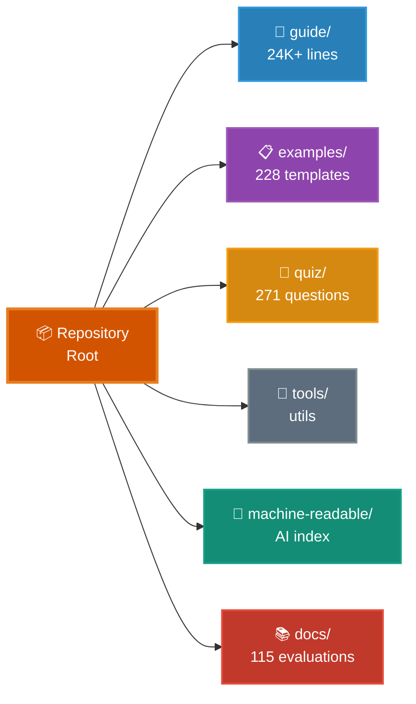

# FETCHED_claude-code-ultimate-guide_051926

## Assimilation Report
Auto-cloned repository: FETCHED_claude-code-ultimate-guide_051926

## Application for OmniClaw
No structural integration blueprint provided.

## SWALLOW ENGINE DISTILLATION

### File: README.md
```md
# Claude Code Ultimate Guide

<p align="center">
  <a href="https://florianbruniaux.github.io/claude-code-ultimate-guide-landing/"></a>
</p>

<p align="center">
  <a href="https://github.com/FlorianBruniaux/claude-code-ultimate-guide/stargazers"></a>
  <a href="./CHANGELOG.md"></a>
  <a href="./quiz/"></a>
  <a href="./examples/"></a>
  <a href="./guide/security/security-hardening.md"></a>
  <a href="./mcp-server/"></a>
</p>

<p align="center">
  <a href="https://github.com/hesreallyhim/awesome-claude-code"></a>
  <a href="https://creativecommons.org/licenses/by-sa/4.0/"></a>
  <a href="https://skills.palebluedot.live/owner/FlorianBruniaux"></a>
  <a href="https://zread.ai/FlorianBruniaux/claude-code-ultimate-guide"></a>
</p>

> **6 months of daily practice** distilled into a guide that teaches you the WHY, not just the what. From core concepts to production security, you learn to design your own agentic workflows instead of copy-pasting configs.

> **If this guide helps you, [give it a star ⭐](https://github.com/FlorianBruniaux/claude-code-ultimate-guide/stargazers)** — it helps others discover it too.

---

## StarMapper

<a href="https://starmapper.bruniaux.com/FlorianBruniaux/claude-code-ultimate-guide">
  <picture>
    <source media="(prefers-color-scheme: dark)" srcset="https://starmapper.bruniaux.com/api/map-image/FlorianBruniaux/claude-code-ultimate-guide?theme=dark" />
    <source media="(prefers-color-scheme: light)" srcset="https://starmapper.bruniaux.com/api/map-image/FlorianBruniaux/claude-code-ultimate-guide?theme=light" />
    
  </picture>
</a>

---

## Choose Your Path

| Who you are | Your guide |
|---|---|
| 🏗️ **Tech Lead / Engineering Manager** | [Deploying Claude Code across your team →](docs/for-tech-leads.md) |
| 📊 **CTO / Decision Maker** | [ROI, security posture, team adoption →](docs/for-cto.md) |
| 💼 **CIO / CEO** | [Budget, risk, what to ask your tech team (3 min) →](docs/for-cio-ceo.md) |
| 🎨 **Product Manager / Designer** | [Vibe coding, working with AI-assisted dev teams →](docs/for-product-managers.md) |
| ✍️ **Writer / Ops / Manager** | [Claude Cowork Guide (separate repo) →](https://github.com/FlorianBruniaux/claude-cowork-guide) |
| 👨‍💻 **Developer (all levels)** | You're in the right place — read on ↓ |
| 🧭 **Career pivot / new AI role** | [AI Roles & Career Paths →](guide/roles/ai-roles.md) |

---

## 🎯 What You'll Learn

**This guide teaches you to think differently about AI-assisted development:**
- ✅ **Understand trade-offs** — When to use agents vs skills vs commands (not just how to configure them)
- ✅ **Build mental models** — How Claude Code works internally (architecture, context flow, tool orchestration)
- ✅ **Visualize concepts** — 41 Mermaid diagrams covering model selection, master loop, memory hierarchy, multi-agent patterns, security threats, AI fluency paths
- ✅ **Master methodologies** — TDD, SDD, BDD with AI collaboration (not just templates)
- ✅ **Security mindset** — Threat modeling for AI systems (only guide with 24 CVEs + 655 malicious skills database)
- ✅ **Test your knowledge** — 271-question quiz to validate understanding (no other resource offers this)

**Outcome**: Go from copy-pasting configs to designing your own agentic workflows with confidence.

---

## 📊 When to Use This Guide vs Everything-CC

Both guides serve different needs. Choose based on your priority.

| Your Goal | This Guide | everything-claude-code |
|-----------|------------|------------------------|
| **Understand why** patterns work | Deep explanations + architecture | Config-focused |
| **Quick setup** for projects | Available but not the priority | Battle-tested production configs |
| **Learn trade-offs** (agents vs skills) | Decision frameworks + comparisons | Lists patterns, no trade-off analysis |
| **Security hardening** | Only threat database (24 CVEs) | Basic patterns only |
| **Test understanding** | 271-question quiz | Not available |
| **Methodologies** (TDD/SDD/BDD) | Full workflow guides | Not covered |
| **Copy-paste ready** templates | 228 templates | 200+ templates |

### Ecosystem Positioning

```
                    EDUCATIONAL DEPTH
                           ▲
                           │
                           │  ★ This Guide
                           │  Security + Methodologies + 24K+ lines
                           │
                           │  [Everything-You-Need-to-Know]
                           │  SDLC/BMAD beginner
  ─────────────────────────┼─────────────────────────► READY-TO-USE
  [awesome-claude-code]    │            [everything-claude-code]
  (discovery, curation)    │            (plugin, 1-cmd install)
                           │
                           │  [claude-code-studio]
                           │  Context management
                           │
                      SPECIALIZED
```

**4 unique gaps no competitor covers:**
1. **Security-First** — 24 CVEs + 655 malicious skills tracked (no competitor has this depth)
2. **Methodology Workflows** — TDD/SDD/BDD comparison + step-by-step guides
3. **Comprehensive Reference** — 24K+ lines across 16 specialized guides (24× more reference material than everything-cc)
4. **Educational Progression** — 271-question quiz, beginner → expert path

**Recommended workflow:**
1. Learn concepts here (mental models, trade-offs, security)
2. Use battle-tested configs there (quick project setup)
3. Return here for deep dives (when something doesn't work or to design custom workflows)

**Both resources are complementary, not competitive.** Use what fits your current need.

---

## ⚡ Quick Start

**Quickest path**: [Cheat Sheet](./guide/cheatsheet.md) — 1 printable page with daily essentials

**Interactive onboarding** (no setup needed):
```bash
claude "Fetch and follow the onboarding instructions from: https://raw.githubusercontent.com/FlorianBruniaux/claude-code-ultimate-guide/main/tools/onboarding-prompt.md"
```

**Browse directly**: [Full Guide](./guide/ultimate-guide.md) | [Visual Diagrams](./guide/diagrams/) | [Examples](./examples/) | [Quiz](./quiz/)

---

## 🔌 MCP Server — Use the guide from any Claude Code session

No cloning needed. Add to `~/.claude.json` and ask questions directly from any session:

```json
{
  "mcpServers": {
    "claude-code-guide": {
      "type": "stdio",
      "command": "npx",
      "args": ["-y", "claude-code-ultimate-guide-mcp"]
    }
  }
}
```

17 tools: `search_guide`, `read_section`, `get_cheatsheet`, `get_digest`, `get_example`, `list_examples`, `search_examples`, `get_release`, `get_changelog`, `compare_versions`, `list_topics`, `get_threat`, `list_threats`, plus `init_official_docs`, `refresh_official_docs`, `diff_official_docs`, `search_official_docs` (v1.1.0 — official Anthropic docs tracker) — plus 13 slash commands `/ccguide:*` and a Haiku agent.

**Onboarding one-liner** (once MCP is configured):
```bash
claude "Use the claude-code-guide MCP server. Activate the claude-code-expert prompt, then run a personalized onboarding: ask me 3 questions about my goal, experience level, and preferred tone — then build a custom learning path using search_guide and read_section to navigate the guide with live source links."
```

→ [MCP Server README](./mcp-server/README.md)

---

## 📁 Repository Structure



<details>
<summary><strong>Detailed Structure (Text View)</strong></summary>

```
📦 claude-code-ultimate-guide/
│
├─ 📖 guide/              Core Documentation (24K+ lines)
│  ├─ ultimate-guide.md   Complete reference, 10 sections
│  ├─ cheatsheet.md       1-page printable
│  ├─ architecture.md     How Claude Code works internally
│  ├─ methodologies.md    TDD, SDD, BDD workflows
│  ├─ diagrams/           41 Mermaid diagrams (10 thematic files)
│  ├─ third-party-tools.md  Community tools (RTK, ccusage, Entire CLI)
│  ├─ mcp-servers-ecosystem.md  Official & community MCP servers
│  └─ workflows/          Step-by-step guides
│
├─ 📋 examples/           228 Production Templates
│  ├─ agents/             9 custom AI personas
│  ├─ commands/           26 slash commands
│  ├─ hooks/              31 hooks (bash + PowerShell)
│  ├─ skills/             14 skills (9 on SkillHub)
│  └─ scripts/            Utility scripts (audit, search)
│
├─ 🧠 quiz/               271 Questions
│  ├─ 9 categories        Setup, Agents, MCP, Trust, Advanced...
│  ├─ 4 profiles          Junior, Senior, Power User, PM
│  └─ Instant feedback    Doc links + score tracking
│
├─ 🔧 tools/              Interactive Utilities
│  ├─ onboarding-prompt   Personalized guided tour
│  └─ audit-prompt        Setup audit & recommendations
│
├─ 🤖 machine-readable/   AI-Optimized Index
│  ├─ reference.yaml      Structured index (~2K tokens) — powers landing site CMD+K search
│  ├─ claude-code-releases.yaml  Structured releases changelog
│  └─ llms.txt            Standard LLM context file
│
└─ 📚 docs/               115 Resource Evaluations
   └─ resource-evaluations/  5-point scoring, source attribution
```

</details>

---

## 🎯 What Makes This Guide Unique

### 🎓 Deep Understanding Over Configuration

**Outcome**: Design your own workflows instead of copy-pasting blindly.

**We teach how Claude Code works and why patterns matter**:
- [Architecture](./guide/core/architecture.md) — Internal mechanics (context flow, tool orchestration, memory management)
- [Trade-offs](./guide/ultimate-guide.md#when-to-use-what) — Decision frameworks for agents vs skills vs commands
- [Configuration Decision Guide](./guide/ultimate-guide.md#27-configuration-decision-guide) — Unified "which mechanism for what?" map across all 7 config layers
- [Pitfalls](./guide/ultimate-guide.md#common-mistakes) — Common failure modes + prevention strategies

**What this means for you**: Troubleshoot issues independently, optimize for your specific use case, know when to deviate from patterns.

---

### 🖼️ Visual Diagrams Series (41 Mermaid Diagrams)

**Outcome**: Grasp complex concepts instantly through visual mental models.

**41 interactive diagrams** across 10 thematic files — GitHub-native Mermaid rendering + ASCII fallback for every diagram:
- [Foundations](./guide/diagrams/01-foundations.md) — 4-layer context model, 9-step pipeline, permission modes
- [Architecture](./guide/diagrams/04-architecture-internals.md) — Master loop, tool categories, system prompt assembly
- [Multi-Agent](./guide/diagrams/07-multi-agent-patterns.md) — 3 topologies, worktrees, dual-instance, horizontal scaling
- [Security](./guide/diagrams/08-security-and-production.md) — 3-layer defense, MCP rug pull attack chain, verification paradox
- [Cost & Models](./guide/diagrams/09-cost-and-optimization.md) — Model selection tree, token reduction pipeline

[Browse all 41 diagrams →](./guide/diagrams/)

**What this means for you**: Understand the master loop before reading 24K+ lines, see multi-agent topologies at a glance, share visual security threat models with your team.

---

### 🛡️ Security Threat Intelligence (Only Comprehensive Database)

**Outcome**: Protect production systems from AI-specific attacks.

**Only guide with systematic threat tracking**:
- **24 CVE-mapped vulnerabilities** — Prompt injection, data exfiltration, code injection
- **655 malicious skills catalogued** — Unicode injection, hidden instructions, auto-execute patterns
- **Production hardening workflows** — MCP vetting, injection defense, audi
... [TRUNCATED]
```

### File: examples\README.md
```md
---
title: "Claude Code Examples"
description: "Annotated templates teaching why patterns work, with trade-offs and alternatives"
tags: [template, reference, workflows, architecture]
---

# Claude Code Examples

Annotated templates that teach you **why** patterns work, not just how to configure them. Each template includes comments explaining trade-offs, alternatives, and when to deviate.

> **[Browse Interactive Catalog](./index.html)** — View, copy, and download all templates with syntax highlighting

## Structure

| Folder | Description | Count |
|--------|-------------|-------|
| [`agents/`](./agents/) | Custom AI personas for specialized tasks | 14 + 2 collections |
| [`commands/`](./commands/) | Slash commands (workflow automation) | 32 |
| [`hooks/`](./hooks/) | Event-driven security & automation scripts | 34 |
| [`skills/`](./skills/) | Reusable knowledge modules — [9 on SkillHub](https://skills.palebluedot.live/owner/FlorianBruniaux) | 17 |
| [`claude-md/`](./claude-md/) | CLAUDE.md configuration profiles | 7 |
| [`config/`](./config/) | Settings, MCP, git templates | 8 |
| [`memory/`](./memory/) | CLAUDE.md memory file templates | 2 |
| [`rules/`](./rules/) | Behavioral rules for common review patterns | 5 |
| [`scripts/`](./scripts/) | Diagnostic & utility scripts | 16 |
| [`team-config/`](./team-config/) | Team onboarding templates | 3 |
| [`templates/`](./templates/) | Session and workflow templates | 1 |
| [`github-actions/`](./github-actions/) | CI/CD workflows | 4 |
| [`workflows/`](./workflows/) | Advanced development workflows | 3 |
| [`plugins/`](./plugins/) | Community plugins (SE-CoVe, claude-mem) | 2 |
| [`integrations/`](./integrations/) | External tool integrations (Agent Vibes TTS) | 1 |
| [`mcp-configs/`](./mcp-configs/) | MCP server configurations | 1 |
| [`modes/`](./modes/) | Behavioral modes (SuperClaude) | 1 |
| [`semantic-anchors/`](./semantic-anchors/) | Precise vocabulary for better LLM outputs | 1 |
| [`multi-provider/`](./multi-provider/) | Multi-provider bridge → [dedicated repo](https://github.com/FlorianBruniaux/cc-copilot-bridge) | — |

## Quick Start

1. Copy the template you need
2. Customize for your project
3. Place in the correct location (see paths below)

## File Locations

| Type | Project Location | Global Location |
|------|------------------|-----------------|
| Agents | `.claude/agents/` | `~/.claude/agents/` |
| Skills | `.claude/skills/` | `~/.claude/skills/` |
| Commands | `.claude/commands/` | `~/.claude/commands/` |
| Hooks | `.claude/hooks/` | `~/.claude/hooks/` |
| Config | `.claude/` | `~/.claude/` |
| Memory | `./CLAUDE.md` or `.claude/CLAUDE.md` | `~/.claude/CLAUDE.md` |
| Modes | — | `~/.claude/MODE_*.md` |

> **Windows**: Replace `~/.claude/` with `%USERPROFILE%\.claude\`

## Templates Index

### Agents (16)

| File | Purpose | Model |
|------|---------|-------|
| [code-reviewer.md](./agents/code-reviewer.md) | Thorough code review | Sonnet |
| [test-writer.md](./agents/test-writer.md) | TDD/BDD test generation | Sonnet |
| [security-auditor.md](./agents/security-auditor.md) | Security vulnerability detection | Sonnet |
| [refactoring-specialist.md](./agents/refactoring-specialist.md) | Clean code refactoring | Sonnet |
| [output-evaluator.md](./agents/output-evaluator.md) | LLM-as-a-Judge quality gate | Haiku |
| [devops-sre.md](./agents/devops-sre.md) | Infrastructure troubleshooting with FIRE framework | Sonnet |
| [planner.md](./agents/planner.md) | Strategic planning — read-only, before implementation | Opus |
| [implementer.md](./agents/implementer.md) | Mechanical execution — bounded scope | Haiku |
| [architecture-reviewer.md](./agents/architecture-reviewer.md) | Architecture & design review — read-only | Opus |
| [adr-writer.md](./agents/adr-writer.md) | Architecture Decision Record generator — read-only | Opus |
| [integration-reviewer.md](./agents/integration-reviewer.md) | Runtime integration validator — read-only | Sonnet |
| [plan-challenger.md](./agents/plan-challenger.md) | Adversarial plan review across 5 dimensions — read-only | Sonnet |
| [planning-coordinator.md](./agents/planning-coordinator.md) | Synthesis agent for dynamic research teams — read-only | Sonnet |
| [security-patcher.md](./agents/security-patcher.md) | Apply security patches from audit findings — proposes for review | Sonnet |
| [analytics-with-eval/](./agents/analytics-with-eval/) | Collection: analytics agent + evaluation hooks | — |
| [cyber-defense/](./agents/cyber-defense/) | Collection: anomaly detector, log ingestor, risk classifier, threat reporter | — |

### Skills (17) — [9 on SkillHub](https://skills.palebluedot.live/owner/FlorianBruniaux)

| File | Purpose |
|------|---------|
| [design-patterns/](./skills/design-patterns/) | Detect and analyze GoF design patterns with stack-aware suggestions |
| [tdd-workflow.md](./skills/tdd-workflow.md) | Test-Driven Development process |
| [security-checklist.md](./skills/security-checklist.md) | OWASP Top 10 security checks |
| [pdf-generator.md](./skills/pdf-generator.md) | Professional PDF generation (Quarto/Typst) |
| [voice-refine/](./skills/voice-refine/) | Writing voice refinement with before/after examples |
| [ast-grep-patterns.md](./skills/ast-grep-patterns.md) | AST-based code search patterns |
| [rtk-optimizer/](./skills/rtk-optimizer/) | RTK token optimization analysis |
| [audit-agents-skills/](./skills/audit-agents-skills/) | Quality audit for agents, skills, and commands |
| [skill-creator/](./skills/skill-creator/) | Create new skills with proper structure and best practices |
| [landing-page-generator/](./skills/landing-page-generator/) | Generate deploy-ready landing pages from any repository |
| [ccboard/](./skills/ccboard/) | Comprehensive TUI/Web dashboard for Claude Code monitoring |
| [guide-recap/](./skills/guide-recap/) | Transform CHANGELOG entries into social content (LinkedIn, Twitter/X, Slack) |
| [release-notes-generator/](./skills/release-notes-generator/) | Generate release notes in 3 formats from git commits |
| [pr-triage/](./skills/pr-triage/) | 4-phase PR backlog management (audit, deep review, validated comments, worktree setup) |
| [issue-triage/](./skills/issue-triage/) | 3-phase issue backlog management (audit, deep analysis, validated actions) |
| [cyber-defense-team/](./skills/cyber-defense-team/) | Multi-agent cyber defense team orchestration |
| [talk-pipeline/](./skills/talk-pipeline/) | 6-stage pipeline: raw material to slides via Kimi |

### Commands (32)

| File | Trigger | Purpose |
|------|---------|---------|
| [commit.md](./commands/commit.md) | `/commit` | Conventional commit messages |
| [pr.md](./commands/pr.md) | `/pr` | Create well-structured PRs with scope analysis |
| [review-pr.md](./commands/review-pr.md) | `/review-pr` | PR review workflow |
| [release-notes.md](./commands/release-notes.md) | `/release-notes` | Generate release notes in 3 formats |
| [sonarqube.md](./commands/sonarqube.md) | `/sonarqube` | Analyze SonarCloud quality issues for PRs |
| [generate-tests.md](./commands/generate-tests.md) | `/generate-tests` | Test generation |
| [git-worktree.md](./commands/git-worktree.md) | `/git-worktree` | Isolated git worktree setup |
| [git-worktree-status.md](./commands/git-worktree-status.md) | `/git-worktree-status` | Check worktree background verification tasks |
| [git-worktree-remove.md](./commands/git-worktree-remove.md) | `/git-worktree-remove` | Safe worktree removal with merge checks |
| [git-worktree-clean.md](./commands/git-worktree-clean.md) | `/git-worktree-clean` | Batch cleanup of stale worktrees |
| [diagnose.md](./commands/diagnose.md) | `/diagnose` | Interactive troubleshooting assistant (FR/EN) |
| [validate-changes.md](./commands/validate-changes.md) | `/validate-changes` | LLM-as-a-Judge pre-commit validation |
| [catchup.md](./commands/catchup.md) | `/catchup` | Restore context after /clear |
| [security.md](./commands/security.md) | `/security` | Quick OWASP security audit |
| [security-check.md](./commands/security-check.md) | `/security-check` | Config scan vs known threats (~30s) |
| [security-audit.md](./commands/security-audit.md) | `/security-audit` | Full 6-phase audit with score /100 |
| [update-threat-db.md](./commands/update-threat-db.md) | `/update-threat-db` | Research & update threat intelligence |
| [audit-agents-skills.md](./commands/audit-agents-skills.md) | `/audit-agents-skills` | Quality audit for .claude/ config |
| [sandbox-status.md](./commands/sandbox-status.md) | `/sandbox-status` | Sandbox isolation status check |
| [refactor.md](./commands/refactor.md) | `/refactor` | SOLID-based code improvements |
| [explain.md](./commands/explain.md) | `/explain` | Code explanations (3 depth levels) |
| [optimize.md](./commands/optimize.md) | `/optimize` | Performance analysis and roadmap |
| [ship.md](./commands/ship.md) | `/ship` | Pre-deploy checklist |
| [learn/quiz.md](./commands/learn/quiz.md) | `/learn:quiz` | Self-testing for learning concepts |
| [learn/teach.md](./commands/learn/teach.md) | `/learn:teach` | Step-by-step concept explanations |
| [learn/alternatives.md](./commands/learn/alternatives.md) | `/learn:alternatives` | Compare different approaches |
| [audit-codebase.md](./commands/audit-codebase.md) | `/audit-codebase` | Codebase health audit scoring 7 categories |
| [plan-start.md](./commands/plan-start.md) | `/plan-start` | 5-phase planning: PRD analysis, design review, technical decisions, research team, metrics |
| [plan-execute.md](./commands/plan-execute.md) | `/plan-execute` | Execute validated plan: worktree isolation, TDD scaffolding, parallel agents, PR creation |
| [plan-validate.md](./commands/plan-validate.md) | `/plan-validate` | 2-layer plan validation: structural checks + specialist agents, auto-fix issues |
| [review-plan.md](./commands/review-plan.md) | `/review-plan` | Structured plan review across 4 axes before writing code |
| [check-cache-bugs.md](./commands/check-cache-bugs.md) | `/check-cache-bugs` | Audit for CC#40524 cache bugs that can silently 10-20x API costs |

### Hooks (34)

Security-first: 12 security hooks, 8 productivity hooks, 5 automation hooks, 5 monitoring hooks.

**Security Hooks** (13 bash):

| File | Event | Purpose |
|------|-------|---------|
| [dangerous-actions-blocker.sh](./hooks/bash/dangerous-actions-blocker.sh) | PreToolUse | Block `rm -rf`, force-push, production ops |
| [prompt-injection-detector.sh](./hooks/bash/prompt-injection-detector.sh) | PreToolUse | Detect injection patterns in prompts |
| [unicode-injection-scanner.sh](./hooks/bash/unicode-injection-scanner.sh) | PreToolUse | Detect zero-width, RTL override, ANSI escape |
| [repo-integrity-scanner.sh](./hooks/bash/repo-integrity-scanner.sh) | PreToolUse | Scan README/package.json for hidden injection |
| [security-check.sh](./hooks/bash/security-check.sh) | PreToolUse | Block secrets in commands |
| [sandbox-validation.sh](./hooks/bash/sandbox-validation.sh) | PreToolUse | Validate sandbox isolation |
| [file-guard.sh](./hooks/bash/file-guard.sh) | PreToolUse | Protect sensitive files from modification |
| [permission-request.sh](./hooks/bash/permission-request.sh) | PreToolUse | Explicit permission flow for risky ops |
| [mcp-config-integrity.sh](./hooks/bash/mcp-config-integrity.sh) | SessionStart | Verify MCP config hash (CVE protection) |
| [claudemd-scanner.sh](./hooks/bash/claudemd-scanner.sh) | SessionStart | Detect CLAUDE.md injection attacks |
| [output-secrets-scanner.sh](./hooks/bash/output-secrets-scanner.sh) | PostToolUse | Prevent API keys/tokens in Claude responses |
| [pre-commit-secrets.sh](./hooks/bash/pre-commit-secrets.sh) | Git hook | Block secrets from entering commits |
| [security-gate.sh](./hooks/bash/security-gate.sh) | PreToolUse | Detect vulnerable code patterns before writing to source files |

**Productivity Hooks** (10):

| File | Event | Purpose |
|------|-------|---------|
| [auto-format.sh](./hooks/bash/auto-format.sh) | PostToolUse | Auto-format after edits (Prettier, Black, go fmt) |
| [auto-checkpoint.sh](./hooks/bash/auto-checkpoint.sh) | PostToolUse | Auto-checkpoint work at intervals |
| [typecheck-on-save.sh](./hooks/bash/typecheck-on-save.sh) | PostToolUse | Run TypeScript checks on save |
| [test-on-change.sh](./hooks/bash/test-on-change.sh) | PostToolUse | Run tests on file changes |
| [rtk-auto-wrapper.sh](./hooks/bash/rtk-auto-wrapper.sh) | PreToolUse | Auto-wrap commands with RTK for token savings |
| [rtk-baseline.sh](./hooks/bash/rtk-baseline.sh) | SessionStart | Save RTK baseline for session savings tracking |
| [setup-init.sh](./hooks/bash/setup-init.sh) | SessionStart | Initialize session environment |
| [subagent-stop.sh](./hooks/bash/subagent-stop.sh) | Stop | Clean up sub-agent resources |
| [auto-rename-session.sh](./hooks/bash/auto-rename-session.sh) | SessionEnd | AI-powered session title generation (Haiku) |
| [velocity-governor.sh](./hooks/bash/velocity-governor.sh) | PreToolUse | Rate-limit tool calls to avoid API throttling |

**Monitoring Hooks** (6):

| File | Event | Purpose |
|------|-------|---------|
| [output-validator.sh](./hooks/bash/output-validator.sh) | PostToolUse | Heuristic output validation |
| [session-logger.sh](./hooks/bash/session-logger.sh) | PostToolUse | Log operations for monitoring |
| [session-summary.sh](./hooks/bash/session-summary.sh) | SessionEnd | Display session stats (duration, tools, cost, RTK savings) |
| [session-summary-config.sh](./hooks/bash/session-summary-config.sh) | CLI tool | Configure session-summary sections and display |
| [learning-capture.sh](./hooks/bash/learning-capture.sh) | Stop | Prompt for daily learning capture |
| [privacy-warning.sh](./hooks/bash/privacy-warning.sh) | PostToolUse | Warn on potential privacy leaks |

**Notification & TTS** (3):

| File | Event | Purpose |
|------|-------|---------|
| [notification.sh](./hooks/bash/notification.sh) | Notification | Contextual macOS sound alerts |
| [tts-selective.sh](./hooks/bash/tts-selective.sh) | PostToolUse | Text-to-speech for selected outputs |
| [pre-commit-evaluator.sh](./hooks/bash/pre-commit-evaluator.sh) | Git hook | LLM-as-a-Judge pre-commit |

**PowerShell** (2):

| File | Event | Purpose |
|------|-------|---------|
| [security-check.ps1](./hooks/powershell/security-check.ps1) | PreToolUse | Block secrets in commands |
| [auto-format.ps1](./hooks/powershell/auto-format.ps1) | PostToolUse | Auto-format after edits |

> **See [hooks/README.md](./hooks/README.md) for full documentation, configuration examples, and security hardening patterns**

### Config (8)

| File | Purpose |
|------|---------|
| [settings.json](./config/settings.json) | Hooks configuration |
| [mcp.json](./config/mcp.json) | MCP servers setup |
| [.gitignore-claude](./config/.gitignore-claude) | Git ignore patterns |
| [CONTRIBUTING-ai-disclosure.md](./config/CONTRIBUTING-ai-disclosure.md) | AI disclosure template for CONTRIBUTING.md |
| [
... [TRUNCATED]
```

### File: exports\README.md
```md
# Exported Formats

## Status: Deprecated

The PDF exports in `deprecated/` were generated from an earlier version of the guide (~9K lines, v1.x era). The guide has since grown to **~19K lines across 10 sections** — these exports no longer reflect the current content.

**Source of truth**: [`guide/ultimate-guide.md`](../guide/ultimate-guide.md)

## Deprecated Files

| File | Description | Status |
|------|-------------|--------|
| [notebooklm.pdf](deprecated/notebooklm.pdf) | Visual overview generated by NotebookLM | Outdated (v1.x) |
| [kimi.pdf](deprecated/kimi.pdf) | Full text PDF export via Kimi | Outdated (v1.x) |

## Planned

Fresh exports are needed to match the current guide (v3.27.0+):

- **PDF** — Full guide export (Quarto/Typst pipeline via [`pdf-generator` skill](../examples/skills/pdf-generator.md))
- **NotebookLM** — Updated visual overview
- **EPUB** — For e-reader consumption (requested)

Contributions welcome. See [CONTRIBUTING.md](../CONTRIBUTING.md).

---

*Back to [main README](../README.md)*

```

### File: guide\README.md
```md
---
title: "Guide Documentation"
description: "Index of all core documentation files for mastering Claude Code"
tags: [guide, reference]
---

# Guide Documentation

Core documentation for mastering Claude Code, organized by topic.

---

## Core Reference

| File | Description | Time |
|------|-------------|------|
| [ultimate-guide.md](./ultimate-guide.md) | Complete reference covering all Claude Code features | ~3 hours |
| [cheatsheet.md](./cheatsheet.md) | 1-page printable quick reference | 5 min |
| [core/architecture.md](./core/architecture.md) | How Claude Code works internally (master loop, tools, context) | 25 min |
| [core/methodologies.md](./core/methodologies.md) | 15 development methodologies reference (TDD, SDD, BDD, etc.) | 20 min |
| [core/visual-reference.md](./core/visual-reference.md) | Visual cheatsheet — ASCII diagrams for key concepts | 5 min |
| [core/claude-code-releases.md](./core/claude-code-releases.md) | Official release history (condensed) | 10 min |
| [core/known-issues.md](./core/known-issues.md) | **Critical bugs tracker**: security issues, token consumption, verified community reports | 15 min |
| [core/context-engineering.md](./core/context-engineering.md) | **Context Engineering**: token budget, modular architecture, team assembly, ACE pipeline, quality measurement | 25 min |
| [core/glossary.md](./core/glossary.md) | **Glossary**: alphabetical reference for Claude Code terms, community patterns, and AI engineering concepts | 10 min |
| [diagrams/](./diagrams/) | **Visual Diagrams Series**: 41 Mermaid interactive diagrams for model selection, agent lifecycle, security, multi-agent patterns | 15 min |

---

## Security

| File | Description | Time |
|------|-------------|------|
| [security/security-hardening.md](./security/security-hardening.md) | Security threats, MCP vetting, injection defense | 25 min |
| [security/sandbox-isolation.md](./security/sandbox-isolation.md) | Docker Sandboxes, cloud alternatives, safe autonomy workflows | 10 min |
| [security/sandbox-native.md](./security/sandbox-native.md) | Native Claude Code sandbox: configuration and security model | 10 min |
| [security/production-safety.md](./security/production-safety.md) | Production safety: guardrails, review gates, rollback strategies | 15 min |
| [security/data-privacy.md](./security/data-privacy.md) | Data retention and privacy guide | 10 min |
| [security/enterprise-governance.md](./security/enterprise-governance.md) | **Org-level governance**: usage charters, MCP approval workflow, guardrail tiers (Starter/Standard/Strict/Regulated), compliance | 25 min |

---

## Ecosystem

| File | Description | Time |
|------|-------------|------|
| [ecosystem/ai-ecosystem.md](./ecosystem/ai-ecosystem.md) | Complementary AI tools (Perplexity, Gemini, Kimi, NotebookLM, TTS) | 30 min |
| [ecosystem/mcp-servers-ecosystem.md](./ecosystem/mcp-servers-ecosystem.md) | **Community MCP servers**: 8 validated servers (Playwright, Semgrep, Kubernetes, etc.) with production configs | 25 min |
| [ecosystem/third-party-tools.md](./ecosystem/third-party-tools.md) | **Community tools**: GUIs, TUIs, config managers, token trackers, alternative UIs | 15 min |
| [ecosystem/context-engineering-tools.md](./ecosystem/context-engineering-tools.md) | **Context & token optimization**: output compression (RTK, Headroom), prompt compression (LLMLingua), AI gateways (Edgee, Portkey), RAG, LLMOps | 20 min |
| [ecosystem/remarkable-ai.md](./ecosystem/remarkable-ai.md) | Remarkable AI usage patterns and power-user techniques | 10 min |

---

## Roles & Adoption

| File | Description | Time |
|------|-------------|------|
| [roles/ai-roles.md](./roles/ai-roles.md) | AI roles mapping: when to use Claude Code vs Claude Desktop vs API | 10 min |
| [roles/adoption-approaches.md](./roles/adoption-approaches.md) | Implementation strategies for teams | 15 min |
| [roles/learning-with-ai.md](./roles/learning-with-ai.md) | Guide for juniors on using AI without losing skills | 15 min |
| [roles/agent-evaluation.md](./roles/agent-evaluation.md) | **Agent quality metrics**: Measuring custom agent effectiveness with hooks, tests, and feedback loops | 20 min |

---

## Operations

| File | Description | Time |
|------|-------------|------|
| [ops/devops-sre.md](./ops/devops-sre.md) | FIRE framework for infrastructure diagnosis and incident response | 30 min |
| [ops/observability.md](./ops/observability.md) | Session monitoring and cost tracking | 15 min |
| [ops/ai-traceability.md](./ops/ai-traceability.md) | AI attribution, disclosure policies, git-ai, compliance | 20 min |
| [ops/team-metrics.md](./ops/team-metrics.md) | **Team metrics for AI-augmented engineering**: DORA, SPACE, DX Core 4, AI-specific signals, by team size (5–25 people) | 20 min |

---

## Workflows

Hands-on guides for effective development patterns:

| File | Description |
|------|-------------|
| [workflows/tdd-with-claude.md](./workflows/tdd-with-claude.md) | Test-Driven Development with Claude |
| [workflows/spec-first.md](./workflows/spec-first.md) | Spec-First Development (SDD) |
| [workflows/plan-driven.md](./workflows/plan-driven.md) | Using /plan mode effectively |
| [workflows/iterative-refinement.md](./workflows/iterative-refinement.md) | Iterative improvement loops |
| [workflows/tts-setup.md](./workflows/tts-setup.md) | Add text-to-speech narration to Claude Code (18 min) |
| [workflows/task-management.md](./workflows/task-management.md) | Multi-session task tracking, TodoWrite migration |
| [workflows/agent-teams.md](./workflows/agent-teams.md) | Orchestrating multi-agent teams for complex tasks |
| [workflows/agent-teams-quick-start.md](./workflows/agent-teams-quick-start.md) | Quick start guide for agent team patterns |
| [workflows/dual-instance-planning.md](./workflows/dual-instance-planning.md) | Dual-instance planning: Opus plans, Sonnet executes |
| [workflows/event-driven-agents.md](./workflows/event-driven-agents.md) | Event-driven agent coordination patterns |
| [workflows/plan-pipeline.md](./workflows/plan-pipeline.md) | End-to-end plan pipeline: start, validate, execute |
| [workflows/design-to-code.md](./workflows/design-to-code.md) | Convert Figma/wireframes to working code |
| [workflows/exploration-workflow.md](./workflows/exploration-workflow.md) | Systematically explore unfamiliar codebases |
| [workflows/pdf-generation.md](./workflows/pdf-generation.md) | Generate professional PDFs with Quarto/Typst |
| [workflows/search-tools-mastery.md](./workflows/search-tools-mastery.md) | Master rg, grepai, Serena, ast-grep combined workflows |
| [workflows/skeleton-projects.md](./workflows/skeleton-projects.md) | Use battle-tested repos as scaffolding for new projects |
| [workflows/talk-pipeline.md](./workflows/talk-pipeline.md) | 6-stage talk preparation: raw material to slides |
| [workflows/team-ai-instructions.md](./workflows/team-ai-instructions.md) | Scale CLAUDE.md across multi-developer teams |

---

## Cowork Documentation

For knowledge workers using Claude Cowork (agentic desktop):

| Resource | Description |
|----------|-------------|
| **[Cowork Hub](https://github.com/FlorianBruniaux/claude-cowork-guide/blob/main/README.md)** | Complete Cowork documentation |
| [Getting Started](https://github.com/FlorianBruniaux/claude-cowork-guide/blob/main/guide/01-getting-started.md) | Setup and first workflow |
| [Capabilities](https://github.com/FlorianBruniaux/claude-cowork-guide/blob/main/guide/02-capabilities.md) | What Cowork can/cannot do |
| [Security Guide](https://github.com/FlorianBruniaux/claude-cowork-guide/blob/main/guide/03-security.md) | Safe usage practices |
| [Prompt Library](https://github.com/FlorianBruniaux/claude-cowork-guide/tree/main/prompts) | 50+ ready-to-use prompts |
| [Cheatsheet](https://github.com/FlorianBruniaux/claude-cowork-guide/blob/main/reference/cheatsheet.md) | 1-page quick reference |

---

## Recommended Reading Order

1. **New users**: Start with Quick Start section in `ultimate-guide.md`
2. **Daily reference**: Print `cheatsheet.md`
3. **Team leads**: Read `roles/adoption-approaches.md` for rollout strategies
4. **Security focus**: `security/security-hardening.md` then `security/sandbox-isolation.md`
5. **Deep architecture**: `core/architecture.md` then `diagrams/`

---

*Back to [main README](../README.md)*

```

### File: machine-readable\README.md
```md
# Machine-Readable References

Files optimized for LLM/AI consumption.

## Contents

| File | Description | Tokens |
|------|-------------|--------|
| [reference.yaml](./reference.yaml) | Structured index with line numbers for deep dives | ~2K |
| [llms.txt](./llms.txt) | Standard LLM context file for repository indexation | ~1.5K |

## Usage

### Give Claude Code instant expertise

```bash
# Paste into any AI assistant
curl -sL https://raw.githubusercontent.com/FlorianBruniaux/claude-code-ultimate-guide/main/machine-readable/reference.yaml
```

### Reference in Claude Code

```
@machine-readable/reference.yaml
```

### Add to system prompts

Include the YAML content in your AI assistant's system prompt for Claude Code expertise.

---

*Back to [main README](../README.md)*

```

### File: mcp-server\package.json
```json
{
  "name": "claude-code-ultimate-guide-mcp",
  "version": "1.2.0",
  "description": "MCP server for the Claude Code Ultimate Guide — search, read, and explore 20K+ lines of documentation directly from Claude Code",
  "keywords": [
    "mcp",
    "claude-code",
    "anthropic",
    "documentation",
    "guide"
  ],
  "author": "Florian Bruniaux",
  "license": "MIT",
  "homepage": "https://github.com/FlorianBruniaux/claude-code-ultimate-guide",
  "repository": {
    "type": "git",
    "url": "git+https://github.com/FlorianBruniaux/claude-code-ultimate-guide.git",
    "directory": "mcp-server"
  },
  "type": "module",
  "main": "./dist/index.js",
  "bin": {
    "claude-code-ultimate-guide-mcp": "dist/index.js"
  },
  "files": [
    "dist/**/*.js",
    "dist/**/*.d.ts",
    "content"
  ],
  "scripts": {
    "build": "tsup && chmod +x dist/index.js",
    "dev": "GUIDE_ROOT=.. node --watch dist/index.js",
    "start": "node dist/index.js",
    "prepublishOnly": "npm run build"
  },
  "dependencies": {
    "@modelcontextprotocol/sdk": "^1.6.0",
    "yaml": "^2.4.0"
  },
  "devDependencies": {
    "@types/node": "^22.0.0",
    "tsup": "^8.0.0",
    "typescript": "^5.4.0"
  },
  "engines": {
    "node": ">=18.0.0"
  }
}

```

### File: mcp-server\README.md
```md
# claude-code-ultimate-guide-mcp

MCP server for the [Claude Code Ultimate Guide](https://github.com/FlorianBruniaux/claude-code-ultimate-guide) — search, read, and explore 20,000+ lines of documentation directly from Claude Code or any MCP-compatible client.

No need to clone the repo. The guide's structured index is bundled in the package (~130KB compressed), and file content is fetched from GitHub on demand with 24h local cache.

## Installation

### Quick start (npx)

Add to `~/.claude.json` (user-level, all projects):

```json
{
  "mcpServers": {
    "claude-code-guide": {
      "type": "stdio",
      "command": "npx",
      "args": ["-y", "claude-code-ultimate-guide-mcp"]
    }
  }
}
```

### Global install

```bash
npm install -g claude-code-ultimate-guide-mcp
```

```json
{
  "mcpServers": {
    "claude-code-guide": {
      "type": "stdio",
      "command": "claude-code-guide-mcp"
    }
  }
}
```

### Per-project

Add to `.claude/settings.json` at your repo root.

## Tools

### Search & Navigation

| Tool | Signature | Description |
|------|-----------|-------------|
| `search_guide` | `(query, limit?)` | Search by keyword or question across 882 indexed entries. Returns ranked results with GitHub links. |
| `read_section` | `(path, offset?, limit?)` | Read a file section with pagination (500 lines max per call). Returns GitHub + guide site links. |
| `list_topics` | `()` | Browse all 25 topic categories in the guide with entry counts. |

### Templates & Examples

| Tool | Signature | Description |
|------|-----------|-------------|
| `get_example` | `(name)` | Fetch a production-ready template by exact name (agents, hooks, commands, skills). |
| `list_examples` | `(category?)` | List all templates by category with GitHub links. Categories: `agents`, `commands`, `hooks`, `skills`, `scripts`. |
| `search_examples` | `(query, limit?)` | Semantic search across all templates by intent (e.g. `"hook lint"`, `"agent code review"`). |

### What's New

| Tool | Signature | Description |
|------|-----------|-------------|
| `get_changelog` | `(count?)` | Last N entries from the guide CHANGELOG (default 5, max 20). |
| `get_digest` | `(period)` | Combined digest of guide changes + Claude Code CLI releases. Period: `day`, `week`, `month`. |
| `get_release` | `(version?, count?)` | Claude Code CLI release details. Pass a version (e.g. `"2.1.59"`) or omit for latest + recent N. |
| `compare_versions` | `(from, to?)` | Diff between two Claude Code versions: aggregated highlights and breaking changes for all releases in range. |

### Security Intelligence

| Tool | Signature | Description |
|------|-----------|-------------|
| `get_threat` | `(id)` | Look up a CVE (e.g. `"CVE-2025-53109"`) or attack technique (e.g. `"T001"`) from the threat database. |
| `list_threats` | `(category?)` | Browse the threat database. Without category: global summary with counts. With category: full section list. Categories: `cves`, `authors`, `skills`, `techniques`, `mitigations`, `sources`. |

### Quick Reference

| Tool | Signature | Description |
|------|-----------|-------------|
| `get_cheatsheet` | `(section?)` | Full cheatsheet or filtered to a specific section (e.g. `"hooks"`, `"agents"`, `"mcp"`). |

## Resources

| URI | Description |
|-----|-------------|
| `claude-code-guide://reference` | Full structured index (94KB YAML, ~900 entries) — use as fallback when search isn't enough |
| `claude-code-guide://releases` | Claude Code official releases history (YAML) |
| `claude-code-guide://llms` | Guide identity/navigation file (llms.txt) |

## Prompts

| Prompt | Args | Description |
|--------|------|-------------|
| `claude-code-expert` | `question?` | Activates expert mode with optimal workflow: search → read → example → YAML fallback |

## Onboarding (first run)

After installing the MCP server, run this in any Claude Code session for a personalized guided tour:

```bash
claude "Use the claude-code-guide MCP server. Activate the claude-code-expert prompt, then run a personalized onboarding: ask me 3 questions about my goal, experience level, and preferred tone — then build a custom learning path using search_guide and read_section to navigate the guide with live source links."
```

This replaces the static URL-fetch approach with live search across 900+ indexed entries, always up to date, with GitHub + guide site links on every result.

## Usage examples

```
# Search
search_guide("hooks")
search_guide("cost optimization")
search_guide("custom agents")

# Read content
read_section("guide/ultimate-guide.md", 8077)
read_section("guide/cheatsheet.md")

# Templates
get_example("code-reviewer")
get_example("pre-commit hook")
list_examples("agents")
list_examples("hooks")
search_examples("hook lint")
search_examples("agent code review")

# What's new
get_digest("week")
get_digest("month")
get_changelog(10)
get_release()
get_release("2.1.59")
compare_versions("2.1.50", "2.1.59")
compare_versions("2.0.0")

# Security
get_threat("CVE-2025-53109")
get_threat("T001")
list_threats()
list_threats("cves")
list_threats("techniques")

# Quick reference
get_cheatsheet()
get_cheatsheet("hooks")
list_topics()
```

## Slash command shortcuts

Install the companion slash commands for one-keystroke access in Claude Code. They live in `.claude/commands/ccguide/` of the guide repo — copy or symlink to `~/.claude/commands/ccguide/` for global availability.

```bash
# From the guide repo root
cp -r .claude/commands/ccguide ~/.claude/commands/ccguide
```

Once installed, these commands are available in any Claude Code session:

| Command | Example | What it does |
|---------|---------|--------------|
| `/ccguide:search <query>` | `/ccguide:search hooks` | Search + auto-read top results |
| `/ccguide:cheatsheet [section]` | `/ccguide:cheatsheet hooks` | Full cheatsheet or filtered |
| `/ccguide:digest <period>` | `/ccguide:digest week` | Guide + CC releases digest |
| `/ccguide:example <name>` | `/ccguide:example code-reviewer` | Fetch a template |
| `/ccguide:examples [category]` | `/ccguide:examples agents` | List templates by category |
| `/ccguide:release [version]` | `/ccguide:release 2.1.59` | CC CLI release details |
| `/ccguide:changelog [count]` | `/ccguide:changelog 10` | Recent guide CHANGELOG |
| `/ccguide:topics` | `/ccguide:topics` | Browse all 25 categories |

## Custom agent

A `claude-code-guide` agent is included in `.claude/agents/claude-code-guide.md`. It uses Haiku (fast, cheap) and searches the guide automatically before answering Claude Code questions.

Copy to your `~/.claude/agents/` to use it globally:

```bash
cp .claude/agents/claude-code-guide.md ~/.claude/agents/claude-code-guide.md
```

Then invoke with: `use claude-code-guide agent to answer: how do I configure hooks?`

## Dev mode (local repo)

If you've cloned the guide repo, set `GUIDE_ROOT` to read files locally instead of fetching from GitHub:

```json
{
  "mcpServers": {
    "claude-code-guide": {
      "type": "stdio",
      "command": "node",
      "args": ["/path/to/claude-code-ultimate-guide/mcp-server/dist/index.js"],
      "env": {
        "GUIDE_ROOT": "/path/to/claude-code-ultimate-guide"
      }
    }
  }
}
```

With `GUIDE_ROOT` set:
- YAML indexes loaded from the local repo (stays in sync with local changes)
- File content read directly from disk (no GitHub fetch, no cache)

## Bundled content

The npm package includes (~130KB compressed total):
- `content/reference.yaml` — 94KB structured index (~900 entries, ~882 indexed)
- `content/claude-code-releases.yaml` — 27KB releases history (76 releases)
- `content/llms.txt` — 8KB identity file

Guide markdown files (3.5MB) are **not** bundled — they're fetched from GitHub on demand and cached at `~/.cache/claude-code-guide/{version}/`.

## Cache

File content is cached at `~/.cache/claude-code-guide/{package-version}/` with 24h TTL. If offline, stale cache is served as fallback. If no cache exists and offline, tools return inline summaries from the YAML index instead.

## MCP Inspector

Test locally with the official MCP Inspector:

```bash
cd mcp-server
npm run build
GUIDE_ROOT=.. npx @modelcontextprotocol/inspector node dist/index.js
```

```

### File: quiz\package.json
```json
{
  "name": "claude-code-quiz",
  "version": "1.0.0",
  "description": "CLI quiz to test your Claude Code knowledge",
  "type": "module",
  "main": "src/index.js",
  "bin": {
    "claude-quiz": "./src/index.js"
  },
  "scripts": {
    "start": "node src/index.js",
    "quiz": "node src/index.js"
  },
  "keywords": [
    "claude",
    "claude-code",
    "quiz",
    "cli",
    "learning"
  ],
  "author": "Florian BRUNIAUX",
  "license": "CC-BY-SA-4.0",
  "dependencies": {
    "chalk": "^5.3.0",
    "inquirer": "^9.2.12",
    "yaml": "^2.8.2"
  },
  "engines": {
    "node": ">=18.0.0"
  },
  "devDependencies": {
    "js-yaml": "^4.1.1"
  }
}

```


> [!WARNING]
> Distillation threshold (50000 chars) reached. Truncating further files.
