# xpfarm
Raw knowledge dump assimilated by OA.

## SWALLOW ENGINE DISTILLATION

### File: README.md
```md
# XPFarm

An open-source vulnerability scanner that wraps well-known open-source security tools behind a single web UI.


---

### Index

| Section | Description |
|---|---|
| [Why](#why) | Motivation and philosophy behind XPFarm |
| [Wrapped Tools](#wrapped-tools) | The 10 open-source tools orchestrated by XPFarm |
| [Architecture Map](#architecture-map) | Full system architecture, scan pipeline, data flow, and AI subsystem |
| [Overlord - AI Binary Analysis](#overlord---ai-binary-analysis) | Built-in AI agent for binary/malware analysis |
| [Setup](#setup) | Build and deployment instructions (Docker / source) |
| [Random Screenshots](#random-screenshots) | UI screenshots of scans and logs |
| [TODO](#todo) | Planned features and roadmap |

---


## Architecture Map

```mermaid
flowchart TB
    subgraph ENTRY["Entrypoint - main.go"]
        M1["Parse Flags<br/>-debug mode"]
        M2["InitDB<br/>SQLite + WAL + GORM"]
        M3["InitModules<br/>Register 10 tool wrappers"]
        M4["Health Check<br/>Auto-install missing tools"]
        M5["RunUpdates<br/>-up flag on all PD tools"]
        M6["CheckAndIndexTemplates<br/>Nuclei template versioning"]
        M7["StartServer<br/>Gin on :8888"]
        M1 --> M2 --> M3 --> M4 --> M5 --> M6 --> M7
    end

    subgraph UI_LAYER["Web UI - internal/ui/server.go"]
        direction TB
        GIN["Gin HTTP Server<br/>Embedded templates + static"]

        subgraph Pages["HTML Pages"]
            P1["Dashboard"]
            P2["Assets"]
            P3["Asset Details"]
            P4["Target Details"]
            P5["Modules"]
            P6["Settings"]
            P7["Overlord Chat"]
            P8["Overlord Binary"]
            P9["Search"]
            P10["Advanced Scan"]
            P11["Scan Settings"]
        end

        subgraph REST["REST API"]
            direction LR
            A1["POST /api/scan"]
            A2["POST /api/search"]
            A3["GET/POST /api/overlord/*"]
            A4["POST /assets/create|delete"]
            A5["POST /settings/*"]
            A6["GET /api/active-scans"]
            A7["POST /api/search/save|delete"]
            A8["GET /api/overlord/events<br/>SSE Proxy"]
        end

        GIN --> Pages
        GIN --> REST
    end

    subgraph SCAN_ENGINE["Scan Engine - internal/core/"]
        direction TB
        SM["ScanManager<br/>Singleton, mutex-guarded<br/>Active scan tracking"]

        subgraph PIPELINE["8-Stage Scanning Pipeline - manager.go"]
            direction TB
            S0["Target Input<br/>ParseTarget + NormalizeToHostname"]
            S1["Stage 1: Subfinder<br/>Subdomain Discovery"]
            S2["Stage 2: Filter & Save<br/>ResolveAndCheck per subdomain<br/>Cloudflare / Localhost / Alive"]
            S3["Stage 3: Naabu<br/>Port Scanning<br/>5-worker pool via channel"]
            S4["Stage 4: Nmap<br/>Service Enumeration<br/>Version + Script detection"]
            S5["Stage 5: Httpx<br/>HTTP Probing<br/>Rich metadata extraction"]
            S6["Stage 6: Parallel Web Processing"]
            S7["Stage 7: CVEMap<br/>CVE lookup by product/tech"]
            S8["Stage 8: Nuclei<br/>Vulnerability Scanning"]

            S0 --> S1 --> S2 --> S3 --> S4 --> S5 --> S6 --> S7 --> S8
        end

        subgraph STAGE6_DETAIL["Stage 6 - Parallel Web Asset Processing"]
            direction LR
            GW["Gowitness<br/>Screenshots"]
            KAT["Katana<br/>JS Crawling, depth=5"]
            UF["URLFinder<br/>URL Discovery"]
            WAP["Wappalyzer<br/>Tech Detection<br/>Header + Body analysis"]
        end

        subgraph NUCLEI_PLAN["Stage 8 - Nuclei Scan Plan"]
            direction TB
            NP1["BuildNucleiPlan<br/>serviceTagMap lookup"]
            NP2["Network Scans<br/>Per-port, service tags"]
            NP3["Web Auto Scan<br/>-as wappalyzer mode"]
            NP4["Fallback Scan<br/>Unmapped services"]
            NP5["Enabled Mode<br/>Custom template workflow"]
            NP1 --> NP2
            NP1 --> NP3
            NP1 --> NP4
            NP1 --> NP5
        end

        subgraph RESOLVE["Target Resolution - target.go"]
            direction LR
            R1["ParseTarget<br/>IP / CIDR / Domain / URL"]
            R2["ResolveAndCheck<br/>DNS + Cloudflare + Localhost"]
            R3["DNS Cache<br/>sync.Map, 5min TTL"]
            R1 --> R2 --> R3
        end

        subgraph SEARCH["Search Engine - search.go"]
            SRCH["GlobalSearch<br/>Regex filter engine<br/>SQL joins across 5 tables<br/>AND/OR/Negate chaining"]
        end

        subgraph TEMPLATE_IDX["Template Indexer - template_indexer.go"]
            TI["IndexNucleiTemplates<br/>Walk filesystem, batch upsert<br/>Version-tracked re-index"]
        end

        SM --> PIPELINE
        S6 --> STAGE6_DETAIL
        S8 --> NUCLEI_PLAN
    end

    subgraph MODULES["Module System - internal/modules/"]
        direction TB
        IFACE["Module Interface<br/>Name / Description<br/>CheckInstalled / Install / Run"]

        subgraph REGISTRY["Registry - 10 Registered Modules"]
            direction LR
            T1["Subfinder<br/>Subdomain enum"]
            T2["Naabu<br/>Port scan"]
            T3["Nmap<br/>Service detection"]
            T4["Httpx<br/>HTTP probe"]
            T5["Gowitness<br/>Screenshots"]
            T6["Katana<br/>Web crawling"]
            T7["URLFinder<br/>URL discovery"]
            T8["Wappalyzer<br/>Tech fingerprint"]
            T9["Nuclei<br/>Vuln scanning"]
            T10["CVEMap<br/>CVE lookup"]
        end

        IFACE --> REGISTRY
    end

    subgraph DATABASE["Database - internal/database/"]
        direction TB
        DB["SQLite + WAL Mode<br/>GORM ORM<br/>Single writer connection<br/>30s busy timeout"]

        subgraph MODELS["Data Models"]
            direction LR
            DM1["Asset<br/>name, advanced_mode"]
            DM2["Target<br/>value, type, is_alive<br/>is_cloudflare, is_localhost"]
            DM3["Port<br/>port, protocol<br/>service, product, version"]
            DM4["WebAsset<br/>url, title, tech_stack<br/>screenshot, paths"]
            DM5["Vulnerability<br/>name, severity<br/>template_id, matcher"]
            DM6["CVE<br/>cve_id, severity<br/>cvss, epss, is_kev"]
            DM7["ScanResult<br/>tool_name, output"]
            DM8["ScanProfile<br/>Feature toggles<br/>Port/Web/Vuln scope"]
            DM9["NucleiTemplate<br/>template_id, file_path"]
            DM10["SavedSearch<br/>name, query_data"]
            DM11["Setting<br/>key-value config"]
        end

        DM1 -->|has many| DM2
        DM2 -->|has many| DM3
        DM2 -->|has many| DM4
        DM2 -->|has many| DM5
        DM2 -->|has many| DM6
        DM2 -->|has many| DM7
        DM1 -->|has one| DM8
        DB --> MODELS
    end

    subgraph OVERLORD["Overlord - AI Agent Subsystem"]
        direction TB
        OV_PROXY["Overlord Proxy<br/>internal/overlord/overlord.go"]

        subgraph OV_API["OpenCode Serve API"]
            direction LR
            OA1["GET /session<br/>List sessions"]
            OA2["POST /session<br/>Create session"]
            OA3["POST /session/:id/prompt_async<br/>Send message"]
            OA4["POST /session/:id/abort<br/>Stop analysis"]
            OA5["GET /event<br/>SSE stream"]
        end

        subgraph OV_FILES["File Management"]
            direction LR
            OF1["Binary Upload<br/>overlord/binaries/"]
            OF2["Analysis Output<br/>overlord/output/"]
            OF3["Auth JSON<br/>API key storage"]
        end

        subgraph PROVIDERS["21 AI Providers"]
            direction LR
            PR1["Anthropic<br/>OpenAI<br/>Groq"]
            PR2["DeepSeek<br/>OpenRouter<br/>xAI"]
            PR3["Ollama Local<br/>Cerebras<br/>Together"]
            PR4["OpenCode Zen/Go<br/>+ 12 more"]
        end

        OV_PROXY --> OV_API
        OV_PROXY --> OV_FILES
        OV_PROXY --> PROVIDERS
    end

    subgraph DOCKER["Docker Deployment - docker-compose.yml"]
        direction LR
        DC1["xpfarm container<br/>Go app on :8888"]
        DC2["overlord container<br/>OpenCode serve :3000<br/>radare2 + analysis tools"]
        DC3["mobsf container<br/>Mobile scan :8000<br/>optional profile"]
        DC1 <-->|xpfarm-network| DC2
        DC1 <-->|xpfarm-network| DC3
    end

    subgraph NOTIFICATIONS["Notifications - internal/notifications/"]
        direction LR
        N1["Discord Bot<br/>Embed notifications<br/>Scan start/stop alerts"]
        N2["Telegram Bot<br/>Markdown messages<br/>Scan start/stop alerts"]
    end

    subgraph UTILS["Utilities - pkg/utils/"]
        direction LR
        U1["Gradient Logger<br/>Color-coded terminal output"]
        U2["Cloudflare IP Detector<br/>IPv4 + IPv6 CIDR matching"]
        U3["Binary Resolver<br/>PATH + GOPATH fallback"]
    end

    %% Cross-component connections
    M7 --> GIN
    A1 --> SM
    A2 --> SRCH
    A3 --> OV_PROXY
    SM -->|uses| IFACE
    SM -->|reads/writes| DB
    SM -->|callbacks| N1
    SM -->|callbacks| N2
    PIPELINE -->|ResolveAndCheck| RESOLVE
    PIPELINE -->|recordResult| DB
    S5 -->|analyzes response| WAP
    A8 -->|proxies| OA5
```



## Why

Tools like [Assetnote](https://www.assetnote.io/) are great - well maintained, up to date, and transparent about vulnerability identification. But they're not open source. There's no need to reinvent the wheel either, as plenty of solid open-source tools already exist. XPFarm just wraps them together so you can have a vulnerability scanner that's open source and less corporate.

The focus was on building a vuln scanner where you can also see what fails or gets removed in the background, instead of wondering about that mystery.

## Wrapped Tools

- [Subfinder](https://github.com/projectdiscovery/subfinder) - subdomain discovery
- [Naabu](https://github.com/projectdiscovery/naabu) - port scanning
- [Httpx](https://github.com/projectdiscovery/httpx) - HTTP probing
- [Nuclei](https://github.com/projectdiscovery/nuclei) - vulnerability scanning
- [Nmap](https://nmap.org/) - network scanning
- [Katana](https://github.com/projectdiscovery/katana) - crawling
- [URLFinder](https://github.com/projectdiscovery/urlfinder) - URL discovery
- [Gowitness](https://github.com/sensepost/gowitness) - screenshots
- [Wappalyzer](https://github.com/projectdiscovery/wappalyzergo) - technology detection
- [CVEMap](https://github.com/projectdiscovery/cvemap) - CVE mapping


## Overlord - AI Binary Analysis

#### Credits

<table>
  <tr>
    <td align="center">
      <a href="https://github.com/Asjidkalam">
        <br/>
        <sub>Asjidkalam</sub>
      </a>
    </td>
    <td align="center">
      <a href="https://github.com/jamoski3112">
        <br/>
        <sub>jamoski3112</sub>
      </a><br/>
      <sub><a href="https://rahulr.in/reversing-a-cheap-ip-camera-to-root/">Research</a></sub>
    </td>
  </tr>
</table>

Overlord is a built-in AI agent powered by [OpenCode](https://opencode.ai) that can analyze binaries, archives, and other files. Upload a binary and chat with it - the agent uses tools like radare2, strings, file triage, and more to investigate your target.

- **Live streaming output** - see thinking, tool calls, and results as they happen
- **Session history** - switch between previous analysis sessions, auto-restored on page refresh
- **Multi-provider support** - Anthropic, OpenAI, Groq, Ollama (local), and 15+ more
- **Stop button** - abort long-running analysis at any time


## Setup

```bash
# Using the helper scripts (recommended)
./xpfarm.sh build     # Build all containers
./xpfarm.sh up        # Start everything

# Windows
.\xpfarm.ps1 build
.\xpfarm.ps1 up

# Standard Docker
docker compose up --build

# Build from source (no Overlord)
go build -o xpfarm
./xpfarm
./xpfarm -debug
```


## Random Screenshots


## TODO

- [ ] SecretFinder JS 4 Web
- [ ] Repo detect/scan from domain

```

### File: overlord\tools\README.md
```md
# OpenCode Custom Tools for Reverse Engineering

This directory contains custom tools for binary analysis and reverse engineering.

## Available Tools

### Binary Analysis (radare2)
| Tool | Purpose |
|------|---------|
| `r2triage` | First-pass analysis: functions, imports, exports, strings, risk indicators |
| `r2analyze` | Targeted r2 commands with persistent session |
| `r2decompile` | Pseudocode generation via r2ghidra/pdc |
| `r2xref` | Cross-reference lookup (callers/callees) |

### Static Analysis
| Tool | Purpose |
|------|---------|
| `arch_check` | Architecture detection, format ID, container compatibility |
| `strings_extract` | Multi-encoding string extraction (ASCII/Unicode) |
| `objdump_disasm` | Intel-syntax disassembly, architecture-aware |
| `binwalk_analyze` | Embedded file extraction and entropy analysis |
| `yarascan` | YARA + heuristic scanning for languages, packers, crypto |
| `floss_extract` | FLARE FLOSS obfuscated string extraction |

### Dynamic Analysis
| Tool | Purpose |
|------|---------|
| `gdb_debug` | GDB command execution, breakpoints, register/memory inspection |
| `emulate` | Unicorn Engine emulation with register snapshots |
| `frida_hook` | Dynamic instrumentation via Frida |
| `fuzz_concolic` | Concolic fuzzing with symbolic inputs |
| `fuzz_harness_gen` | Generate fuzzing harnesses |

### Exploitation & Solving
| Tool | Purpose |
|------|---------|
| `symbolic_solve` | Symbolic execution to solve constraints |
| `generate_exploit_script` | Auto-generate exploit scripts |
| `crypto_solver` | Reverse custom encryption, decode obfuscated data |
| `hashcat_crack` | CPU-mode hash cracking with agent-generated wordlists |

### Network & Web
| Tool | Purpose |
|------|---------|
| `http_request_recreate` | Reconstruct HTTP requests from binary analysis |
| `raw_network_request` | Send raw TCP/UDP network requests |

### APK / Mobile
| Tool | Purpose |
|------|---------|
| `apk_analyze` | Decode APK via apktool (manifest, permissions, components) |
| `apk_extract_native` | Extract native libraries from APK |
| `jadx_decompile` | Decompile APK/DEX to Java source |

## Shared Infrastructure (`lib/`)

| Module | Purpose |
|--------|---------|
| `r2session.ts` | Persistent radare2 HTTP sessions |
| `logger.ts` | Structured logging with correlation IDs |
| `json_utils.ts` | JSON extraction from mixed output |
| `tool_instrument.ts` | Auto-instrumentation wrapper |
| `py_runner.ts` | Python subprocess handler |
| `emulate_helper.py` | Unicorn emulation helper |

## Usage

Once the container is running, you can use these tools in OpenCode:

```
Analyze the binary at /workspace/binaries/target use r2analyze
Debug the main function use gdb_debug
Extract all strings from the binary use strings_extract
```

```

### File: main.go
```go
package main

import (
	"flag"
	"log"
	"os"

	"xpfarm/internal/core"
	"xpfarm/internal/database"
	"xpfarm/internal/modules"
	"xpfarm/internal/ui"
	"xpfarm/pkg/utils"

	"github.com/gin-gonic/gin"
)

func main() {
	// Parse Flags
	debugMode := flag.Bool("debug", false, "Enable debug mode")
	flag.Parse()

	// Configure Logging
	utils.SetDebug(*debugMode)

	// Configure Gin Mode
	if *debugMode {
		gin.SetMode(gin.DebugMode)
	} else {
		gin.SetMode(gin.ReleaseMode)
	}

	banner := `
____  ________________________                     
╲   ╲╱  ╱╲______   ╲_   _____╱____ _______  _____  
 ╲     ╱  │     ___╱│    __) ╲__  ╲╲_  __ ╲╱     ╲ 
 ╱     ╲  │    │    │     ╲   ╱ __ ╲│  │ ╲╱  y y  ╲
╱___╱╲  ╲ │____│    ╲___  ╱  (____  ╱__│  │__│_│  ╱
      ╲_╱               ╲╱        ╲╱            ╲╱ 
                                github.com/A3-N
                            ` + "\x1b[3m" + `bugs, bounties & b*tchz` + "\x1b[0m" + `
`
	utils.PrintGradient(banner)

	// 0. Environment Setup
	// utils.EnsureGoBinPath() - REMOVED per user request

	// 1. Initialize Database
	utils.LogInfo("Initializing Database...")
	database.InitDB(*debugMode)

	// 2. Register Modules
	modules.InitModules()

	// 3. Health Checks & Installation
	utils.LogInfo("Checking Dependencies...")
	allModules := modules.GetAll()
	missingCount := 0

	for _, mod := range allModules {
		if !mod.CheckInstalled() {
			// Specific bypass for Nmap as it is not a Go binary and cannot be auto-installed
			if mod.Name() == "nmap" {
				utils.LogWarning("Tool %s not found. Please install Nmap manually and ensure it is in your PATH.", utils.Bold("nmap"))
				continue
			}

			utils.LogWarning("Tool %s not found. Attempting install...", utils.Bold(mod.Name()))
			if err := mod.Install(); err != nil {
				utils.LogError("Failed to install %s: %v", utils.Bold(mod.Name()), err)
				missingCount++
			} else {
				utils.LogSuccess("Successfully installed %s", utils.Bold(mod.Name()))
			}
		}
	}

	if missingCount > 0 {
		utils.LogError("%d tools failed to install. The tool might not function correctly.", missingCount)
		// We can decide to exit here or continue.
		// User said "if it fails it will error out".
		utils.LogError("Exiting due to missing dependencies.")
		os.Exit(1)
	}

	utils.LogSuccess("%s", utils.Bold("All dependencies satisfied."))

	// 4. Check for Updates
	modules.RunUpdates()

	// 5. Check and Index Nuclei Templates
	utils.LogInfo("Checking Nuclei Templates version...")
	go core.CheckAndIndexTemplates(database.GetDB())

	// 6. Start Web Server
	port := "8888"
	utils.LogSuccess("Starting Web Interface on port %s...", utils.Bold(port))
	utils.LogSuccess("Access at %s", utils.Bold("http://localhost:"+port))

	// Enable Silent Mode (suppress further Info/Success logs to keep terminal clean for bars)
	if !*debugMode {
		utils.SetSilent(true)
	}

	// Open browser? Maybe later.

	if err := ui.StartServer(port); err != nil {
		log.Fatalf("Failed to start server: %v", err)
	}
}

```

### File: xpfarm.ps1
```ps1
# XPFarm - Unified CLI
# Usage: .\xpfarm.ps1 [build|up|debug|onlyGo|down|help]

param(
    [Parameter(Position = 0)]
    [string]$Command = "help",

    [Parameter(Position = 1, ValueFromRemainingArguments)]
    [string[]]$ExtraArgs
)

$ErrorActionPreference = "Stop"

function Show-Banner {
    Write-Host "`e[38;2;139;92;246m ____  ________________________                     `e[0m"
    Write-Host "`e[38;2;122;98;230m `u{2572}   `u{2572}`u{2571}  `u{2571}`u{2572}______   `u{2572}_   _____`u{2571}____ _______  _____  `e[0m"
    Write-Host "`e[38;2;105;110;214m  `u{2572}     `u{2571}  `u{2502}     ___`u{2571}`u{2502}    __) `u{2572}__  `u{2572}`u{2572}_  __ `u{2572}`u{2571}     `u{2572} `e[0m"
    Write-Host "`e[38;2;80;130;190m  `u{2571}     `u{2572}  `u{2502}    `u{2502}    `u{2502}     `u{2572}   `u{2571} __ `u{2572}`u{2502}  `u{2502} `u{2572}`u{2571}  y y  `u{2572}`e[0m"
    Write-Host "`e[38;2;48;158;163m `u{2571}___`u{2571}`u{2572}  `u{2572} `u{2502}____`u{2502}    `u{2572}___  `u{2571}  (____  `u{2571}__`u{2502}  `u{2502}__`u{2502}_`u{2502}  `u{2571}`e[0m"
    Write-Host "`e[38;2;16;185;129m       `u{2572}_`u{2571}               `u{2572}`u{2571}        `u{2572}`u{2571}            `u{2572}`u{2571} `e[0m"
    Write-Host "`e[38;2;16;185;129m                                    github.com/A3-N`e[0m"
}

function Assert-Docker {
    if (-not (Get-Command docker -ErrorAction SilentlyContinue)) {
        Write-Host "`e[1;31mError: Docker is not installed`e[0m"
        exit 1
    }
}


function Invoke-Build {
    Assert-Docker
    Show-Banner
    Write-Host "`e[1mBuilding XPFarm + Overlord containers...`e[0m"
    docker compose build
    Write-Host ""
    Write-Host "`e[1;32mBuild complete!`e[0m Run `e[1m.\xpfarm.ps1 up`e[0m to start."
}

function Invoke-Up {
    Assert-Docker
    Show-Banner

    # Ensure data directory exists
    if (-not (Test-Path "data")) {
        New-Item -ItemType Directory -Force -Path "data" | Out-Null
    }

    Write-Host "`e[1mStarting XPFarm + Overlord...`e[0m"
    docker compose up -d

    Write-Host "`e[1mWaiting for XPFarm web UI...`e[0m"
    while ($true) {
        try {
            $response = Invoke-WebRequest -Uri "http://localhost:8888" -UseBasicParsing -ErrorAction Stop
            break
        } catch {
            Start-Sleep -Seconds 2
        }
    }

    Write-Host ""
    Write-Host "`e[1;32mEnvironment is running and web UI is ready!`e[0m"
    Write-Host "  XPFarm:   `e[1mhttp://localhost:8888`e[0m"
    Write-Host "  Overlord: `e[1mRunning (internal)`e[0m"
    Write-Host ""
    docker compose ps
}

function Invoke-OnlyGo {
    param([string[]]$GoArgs = @())
    Show-Banner
    Write-Host "`e[1mBuilding XPFarm (Go native, no Docker)...`e[0m"
    Write-Host "`e[1mNote: Overlord features require Docker.`e[0m"
    Write-Host ""

    go build -o xpfarm.exe main.go
    Write-Host "`e[1;32mBuild complete. Starting...`e[0m"
    if ($GoArgs.Count -gt 0) {
        & .\xpfarm.exe @GoArgs
    } else {
        & .\xpfarm.exe
    }
}

function Invoke-Debug {
    Assert-Docker
    Show-Banner

    # Ensure data directory exists
    if (-not (Test-Path "data")) {
        New-Item -ItemType Directory -Force -Path "data" | Out-Null
    }

    Write-Host "`e[1;33mStarting XPFarm + Overlord in DEBUG mode...`e[0m"
    docker compose up -d overlord
    docker compose run --rm -p 8888:8888 xpfarm ./xpfarm -debug
}

function Invoke-Down {
    Assert-Docker
    Write-Host "`e[1mStopping all containers...`e[0m"
    docker compose down
    Write-Host "`e[1;32mEnvironment stopped.`e[0m"
}

function Show-Help {
    Show-Banner
    Write-Host "Usage: " -NoNewline
    Write-Host ".\xpfarm.ps1" -NoNewline -ForegroundColor White
    Write-Host " <command>"
    Write-Host ""
    Write-Host "Commands:"
    Write-Host "  build" -NoNewline -ForegroundColor White; Write-Host "       Build the Docker containers (XPFarm + Overlord)"
    Write-Host "  up" -NoNewline -ForegroundColor White; Write-Host "          Start the environment (docker compose up)"
    Write-Host "  debug" -NoNewline -ForegroundColor White; Write-Host "       Start in debug mode (verbose logging + Gin debug)"
    Write-Host "  onlyGo" -NoNewline -ForegroundColor White; Write-Host "      Compile and run Go binary directly (no Docker, no Overlord)"
    Write-Host "  down" -NoNewline -ForegroundColor White; Write-Host "        Stop all Docker containers"
    Write-Host "  help" -NoNewline -ForegroundColor White; Write-Host "        Show this help message"
    Write-Host ""
    Write-Host "Examples:"
    Write-Host "  .\xpfarm.ps1 build        # Build containers"
    Write-Host "  .\xpfarm.ps1 up           # Start full stack"
    Write-Host "  .\xpfarm.ps1 debug        # Start with debug logging"
    Write-Host "  .\xpfarm.ps1 onlyGo       # Dev mode, Go only"
}

switch ($Command) {
    "build"    { Invoke-Build }
    "up"       { Invoke-Up }
    "debug"    { Invoke-Debug }
    "onlyGo"   { Invoke-OnlyGo -GoArgs $ExtraArgs }
    "down"     { Invoke-Down }
    default    { Show-Help }
}

```

### File: xpfarm.sh
```sh
#!/bin/bash

# XPFarm - Unified CLI
# Usage: ./xpfarm.sh [build|up|debug|onlyGo|down|help]

set -e

banner() {
    echo -e "\033[38;2;139;92;246m ____  ________________________                     \033[0m"
    echo -e "\033[38;2;122;98;230m \u2572   \u2572\u2571  \u2571\u2572______   \u2572_   _____\u2571____ _______  _____  \033[0m"
    echo -e "\033[38;2;105;110;214m  \u2572     \u2571  \u2502     ___\u2571\u2502    __) \u2572__  \u2572\u2572_  __ \u2572\u2571     \u2572 \033[0m"
    echo -e "\033[38;2;80;130;190m  \u2571     \u2572  \u2502    \u2502    \u2502     \u2572   \u2571 __ \u2572\u2502  \u2502 \u2572\u2571  y y  \u2572\033[0m"
    echo -e "\033[38;2;48;158;163m \u2571___\u2571\u2572  \u2572 \u2502____\u2502    \u2572___  \u2571  (____  \u2571__\u2502  \u2502__\u2502_\u2502  \u2571\033[0m"
    echo -e "\033[38;2;16;185;129m       \u2572_\u2571               \u2572\u2571        \u2572\u2571            \u2572\u2571 \033[0m"
    echo -e "\033[38;2;16;185;129m                                    github.com/A3-N\033[0m"
    echo ""
}

require_docker() {
    if ! command -v docker &> /dev/null; then
        echo -e "\033[1;31mError: Docker is not installed\033[0m"
        exit 1
    fi
}


cmd_build() {
    require_docker
    banner
    echo -e "\033[1mBuilding XPFarm + Overlord containers...\033[0m"
    docker compose build
    echo ""
    echo -e "\033[1;32mBuild complete!\033[0m Run \033[1m./xpfarm.sh up\033[0m to start."
}

cmd_up() {
    require_docker
    banner

    # Ensure data directory exists
    mkdir -p data

    echo -e "\033[1mStarting XPFarm + Overlord...\033[0m"
    docker compose up -d

    echo -e "\033[1mWaiting for XPFarm web UI...\033[0m"
    while ! curl -s http://localhost:8888/ > /dev/null; do
        sleep 2
    done

    echo ""
    echo -e "\033[1;32mEnvironment is running and web UI is ready!\033[0m"
    echo -e "  XPFarm:   \033[1mhttp://localhost:8888\033[0m"
    echo -e "  Overlord: \033[1mRunning (internal)\033[0m"
    echo ""
    docker compose ps
}

cmd_onlygo() {
    banner
    echo -e "\033[1mBuilding XPFarm (Go native, no Docker)...\033[0m"
    echo -e "\033[1mNote: Overlord features require Docker.\033[0m"
    echo ""

    go build -o xpfarm main.go
    echo -e "\033[1;32mBuild complete. Starting...\033[0m"
    ./xpfarm "$@"
}

cmd_debug() {
    require_docker
    banner

    # Ensure data directory exists
    mkdir -p data

    echo -e "\033[1;33mStarting XPFarm + Overlord in DEBUG mode...\033[0m"
    docker compose up -d overlord
    docker compose run --rm -p 8888:8888 xpfarm ./xpfarm -debug
}

cmd_down() {
    require_docker
    echo -e "\033[1mStopping all containers...\033[0m"
    docker compose down
    echo -e "\033[1;32mEnvironment stopped.\033[0m"
}

cmd_help() {
    banner
    echo -e "Usage: \033[1m./xpfarm.sh\033[0m <command>"
    echo ""
    echo "Commands:"
    echo -e "  \033[1mbuild\033[0m       Build the Docker containers (XPFarm + Overlord)"
    echo -e "  \033[1mup\033[0m          Start the environment (docker compose up)"
    echo -e "  \033[1mdebug\033[0m       Start in debug mode (verbose logging + Gin debug)"
    echo -e "  \033[1monlyGo\033[0m      Compile and run Go binary directly (no Docker, no Overlord)"
    echo -e "  \033[1mdown\033[0m        Stop all Docker containers"
    echo -e "  \033[1mhelp\033[0m        Show this help message"
    echo ""
    echo "Examples:"
    echo -e "  ./xpfarm.sh build        # Build containers"
    echo -e "  ./xpfarm.sh up           # Start full stack"
    echo -e "  ./xpfarm.sh debug        # Start with debug logging"
    echo -e "  ./xpfarm.sh onlyGo       # Dev mode, Go only"
}

case "${1:-help}" in
    build)    cmd_build ;;
    up)       cmd_up ;;
    debug)    cmd_debug ;;
    onlyGo)   shift; cmd_onlygo "$@" ;;
    down)     cmd_down ;;
    help|*)   cmd_help ;;
esac

```

### File: overlord\INSTRUCTIONS.md
```md
# Binary Analysis Agent Instructions

You are a reverse engineering agent operating inside a Docker container with radare2, GDB, and supporting tools. Your job is to analyze binaries thoroughly, efficiently, and in the correct order.

## Environment

- Working directory: `/workspace`
- Binaries are mounted read-only at `/workspace/binaries/`
- Write analysis output to `/workspace/output/`
- All tools return structured JSON. Parse it before reasoning.
- radare2 sessions persist across tool calls. Analysis (`aaa`) runs once per binary, not per invocation.

## Communication Rules

- **BE CONCISE**: Keep your responses extremely short and directly to the point.
- **NO FLUFF**: Do not write long introductions or concluding paragraphs. Your goal is to process data and return actionable insights immediately.
- **USE LISTS**: Favor bullet points or short tables over paragraphs of text.

## Tool Inventory

| Tool | Purpose | When to Use |
|------|---------|-------------|
| `r2triage` | Full first-pass analysis | **Always first.** Start every binary analysis here. |
| `r2analyze` | Targeted radare2 queries | After triage, for specific data (functions, imports, sections). |
| `r2xref` | Cross-reference lookup | To trace data flow: "who calls this?", "where is this string used?" |
| `r2decompile` | Pseudocode generation | To understand function logic. Use on interesting functions found during triage. |
| `yarascan` | Pattern/signature matching | For language detection, packer detection, crypto identification. |
| `gdb_debug` | Dynamic debugging with GDB | When static analysis is insufficient. For runtime behavior, register state, memory inspection. |
| `binwalk_analyze` | Embedded file extraction | For firmware, packed binaries, or files with embedded payloads. |
| `strings_extract` | Raw string extraction | When r2's string output (`izzj`) is insufficient or you need multi-encoding extraction. |
| `hashcat_crack` | Hash cracking | When password hashes are found. *Must generate a targeted wordlist via web search first.* |
| `apk_analyze` | Android APK surface | For initial triage of APK files. Extracts manifest and components. |
| `apk_extract_native` | APK native lib extraction | To extract `.so` libraries from APKs for native code analysis. |
| `jadx_decompile` | APK Java source | For deep logical analysis of specific APK classes. |
| `frida_hook` | Dynamic APK tracing | For bypassing SSL pinning, intercepting Android APIs, etc. via ADB. |
| `apk_patch_resign` | APK patching & resigning | Decode, patch smali (root/SSL/emulator bypass), rebuild, sign, install. |
| `objdump_disasm` | Intel-syntax disassembly | Architecture-aware disassembly via objdump variants. |
| `emulate` | Dynamic emulation | Run binary stubs through Unicorn/Qiling to unpack or trace execution. |
| `arch_check` | Architecture detection | Identify arch, format, and container compatibility before analysis. |
| `symbolic_solve` | Execution path constraint solving | To find input bytes required to reach a specific "win" address using angr. |
| `fuzz_concolic`    | Dynamic Symbolic Fuzzing   | Uses Triton SMT solver to bypass complex branches when a fuzzer gets stuck. |
| `generate_exploit_script` | Automated exploit dev | To generate pwntools scripts for buffer overflows, ROP, etc. |
| `fuzz_harness_gen` | Auto-Fuzzing Harnesses | To auto-generate a C++ libFuzzer harness for a vulnerable C/C++ function. |
| `crypto_solver`    | Cryptographic manipulation | To logically chain XOR, AES, RC4, or Base64 decoding on raw hex bytes. |
| `floss_extract`    | Advanced string extraction | Extensively decodes XOR, Base64, and Stack strings that `strings_extract` misses entirely. |
| `http_request_recreate`| Execute API/C2 simulation | Recreate and send exact HTTP requests found in code to observe responses. |
| `raw_network_request`  | Send Custom TCP/UDP bytes | Fires hex/text payloads to mapped IP:Ports to observe protocol responses. |

## Subagent Architecture

This environment uses specialized subagents to keep context windows clean and analysis focused.

| Agent | Mode | Role | Tools |
|-------|------|------|-------|
| `build` | primary | Orchestrator. Runs triage, delegates deep analysis. | r2triage, r2analyze, yarascan, arch_check, hashcat_crack, bash |
| `re-explorer` | subagent | Cross-reference tracing, call chains, data flow. | r2xref, r2analyze, strings_extract, objdump_disasm, bash |
| `re-decompiler` | subagent | Function decompilation and behavior analysis. | r2decompile, r2xref, r2analyze, emulate, bash |
| `re-scanner` | subagent | Binary classification, pattern matching, entropy. | yarascan, binwalk_analyze, strings_extract, bash |
| `re-debugger` | subagent | Dynamic analysis with GDB (Linux ELF only). | gdb_debug, r2analyze, r2xref, emulate, arch_check, bash |
| `apk-recon`   | subagent | Initial Android triage and manifest parsing. | apk_analyze, strings_extract, apk_extract_native, bash |
| `apk-decompiler`| subagent | Decompiling/analyzing Java logic via JADX. | jadx_decompile, apk_analyze, strings_extract, apk_extract_native, bash |
| `apk-dynamic` | subagent | Full dynamic analysis: Frida bypass, APK patching, resigning, deep instrumentation. | frida_hook, apk_patch_resign, apk_analyze, strings_extract, bash |
| `re-exploiter` | subagent | Weaponizes vulns with symbolic exec, AI fuzzing, and exploit scripts. | symbolic_solve, fuzz_concolic, generate_exploit_script, fuzz_harness_gen, r2analyze, bash |
| `re-crypto-analyzer`| subagent | Reverses custom encryption, extracts obfuscated strings, chains crypto decoding. | r2analyze, yarascan, floss_extract, crypto_solver, bash |
| `re-web-analyzer`| subagent | Restructures/Tests back-end HTTP/REST/WebSocket APIs found in binary. | http_request_recreate, r2analyze, strings_extract, raw_network_request, bash |
| `re-web-exploiter`| subagent | Takes reconstructed HTTP APIs and mounts active server-side attacks (SQLi, IDOR, SSRF). | http_request_recreate, raw_network_request, bash |
| `re-session-analyzer`| subagent | Decodes session/JWT handling, tokens, cookies, and app-based login states. | http_request_recreate, r2analyze, r2decompile, r2xref, strings_extract, bash |
| `re-net-analyzer`| subagent| Reconstructs custom proprietary TCP/UDP binary protocols via raw traffic sending. | raw_network_request, r2analyze, strings_extract, bash |
| `re-net-exploiter`| subagent| Exploits mapped TCP/UDP protocols using byte structural mutations (overflows/underflows). | raw_network_request, bash |
| `re-logic-analyzer`| subagent | Focuses strictly on business logic bypasses, TOCTOU flaws, race conditions, and path traversals in binary flow. | r2analyze, r2decompile, r2xref, strings_extract, bash |

**Why subagents?** A single triage of a medium binary (500 functions) produces 50-100K tokens of JSON. Decompiling 5 functions adds another 25K. With xrefs and strings, one analysis session can burn 150K+ tokens -- most of a typical context window. Subagents get fresh context with only the data they need.

**How delegation works:** The orchestrator reads the compact triage summary (~3-5K tokens), decides what to investigate, then dispatches scoped tasks to subagents via `@agent_name`. Each subagent operates independently and returns structured findings. The orchestrator synthesizes results without ever holding raw tool output.

## Analysis Workflow

Follow this sequence. Do not skip steps. Do not decompile before triaging.

### Exhaustive Analysis (MANDATORY)

You MUST analyze the target binary or APK **to completion**. Never stop after finding initial interesting results — the remaining content may contain additional or more critical findings. Specifically:
- **Process ALL flagged functions** from triage, not just the top few. Work in batches if the list is large.
- **Review ALL strings of interest** — URLs, credentials, API keys, file paths, error messages.
- **Trace ALL suspicious imports** — follow every xref chain to its source.
- **For APKs**: Decompile and review ALL packages and classes, not just the ones that look suspicious on first pass. Use `grep -r` across the full decompiled tree.
- **For binaries**: Decompile every function flagged by triage. If there are too many for one pass, batch them and iterate until complete.
- **Never declare analysis complete** until you have covered all functions, strings, imports, and components identified during triage.

### Step 1: Triage (mandatory)

```
r2triage binary=/workspace/binaries/<target> depth=standard
```

This runs full first-pass analysis and returns:
- File metadata (arch, format, OS, compiler)
- Sections with permissions
- Imports and exports
- Top 100 strings (see `totalStrings` field for actual count)
- Top 30 functions by size (see `totalFunctions` field for actual count)
- Risk indicators (suspicious APIs, network activity, crypto usage)
- Recommended next steps

**Note on timeouts:** All r2 tools accept a `timeout` parameter (seconds). Default is 60s. For large binaries (>10MB) or deep analysis, increase this: `r2triage binary=/workspace/binaries/big.exe depth=standard timeout=300`

**Read the `summary` and `indicators` fields first.** They tell you what matters.

Use `depth=quick` for large binaries (>50MB) to avoid long analysis times.
Use `depth=deep` only when standard analysis misses function boundaries or you suspect obfuscation.

### Step 2: Classify the Binary

After triage, determine:

1. **What is it?** (executable, library, firmware, packed)
2. **What platform?** (Windows PE, Linux ELF, macOS Mach-O, firmware blob)
3. **What language/compiler?** Use these indicators:

| Indicator | Language |
|-----------|----------|
| MSVCRT imports, `__security_cookie` | C/C++ (MSVC) |
| `rust_panic`, `core::fmt`, `core::ptr` | Rust |
| `go.buildid`, `runtime.gopanic`, goroutine strings | Go |
| Direct NT API calls, no CRT, `std.io`/`std.fmt` strings | Zig |
| `PyObject`, `Py_Initialize` | Python (compiled/embedded) |
| `.NET metadata`, `mscoree.dll` | .NET/C# |
| No standard library markers | Hand-written assembly or custom toolchain |

If language is ambiguous, run:
```
yarascan binary=/workspace/binaries/<target> ruleset=languages
```

### Step 3: Identify Key Functions

From the triage `functions` array, prioritize:

1. **Entry point** and **main** (or equivalent)
2. **Largest functions** by size (often contain core logic)
3. **Functions with high cyclomatic complexity** (decision-heavy code)
4. **Functions referenced by suspicious imports** (use xrefs to find these)

Analyze ALL functions flagged by triage. Start with entry point, main, and highest-priority targets, then continue in batches until every flagged function has been decompiled and reviewed. Do not stop after the first batch.

### Step 4: Cross-Reference Analysis

For any interesting address (string, function, import), trace its usage:

```
r2xref binary=/workspace/binaries/<target> address=<addr_or_name> direction=both
```

Key patterns to trace:
- Where are suspicious strings referenced? (`r2xref address=str.password`)
- Who calls network/crypto APIs? (`r2xref address=sym.imp.WriteProcessMemory`)
- What does the entry point call? (`r2xref address=main direction=from`)

**Read the `summary.topCallers` and `summary.topCallees` fields.** They give you the call chain without needing to parse raw xref data.

### Step 5: Decompilation

Decompile functions identified in Steps 3-4:

```
r2decompile binary=/workspace/binaries/<target> function=main
r2decompile binary=/workspace/binaries/<target> function=0x140001acc
```

The tool tries r2ghidra (`pdg`) first, then falls back to r2's built-in decompiler (`pdc`). Check the `decompiler` field in the response to know which was used.

**Read the `metadata` field** for function size, complexity, and argument count before reading pseudocode. It sets context.

**Read the `summary.operations` field** for a quick count of calls, loops, conditionals, and returns. This tells you the function's shape before you read the code.

When analyzing pseudocode:
- Identify the function's purpose in one sentence
- Map parameters to their roles
- Note all side effects (file I/O, network, memory allocation, registry)
- Flag security-relevant behavior (hardcoded keys, buffer operations without bounds checks, privilege escalation)

### Step 6: Deep Dive (as needed)

Based on findings, use targeted tools:

**For firmware or embedded payloads:**
```
binwalk_analyze binary=/workspace/binaries/<target> entropy=true
binwalk_analyze binary=/workspace/binaries/<target> extract=true
```
Entropy analysis identifies encrypted or compressed regions. High entropy (>7.0) in non-compressed sections is suspicious.

**For packed or obfuscated binaries:**
```
yarascan binary=/workspace/binaries/<target> ruleset=packers
```
If packing is detected, attempt to unpack before further analysis.

**For dynamic behavior (Linux ELF only, will not work for Windows PE or Mach-O):**
```
gdb_debug binary=/workspace/binaries/<target> commands=["info functions","disas main"] breakpoints=["main"]
```
Use GDB when static analysis cannot resolve:
- Self-modifying code
- Runtime-decrypted strings
- Anti-analysis techniques
- Computed jump targets

**For custom radare2 commands:**
```
r2analyze binary=/workspace/binaries/<target> analysis=basic command="<any r2 command>"
```
Use this for commands not covered by other tools, such as:
- `agCj` - call graph as JSON
- `afvj @ <func>` - local variables of a function
- `pdsj @ <func>` - disassembly summary (calls and strings only)
- `afta` - type analysis
- `/x <hex>` - hex pattern search
- `rahash2 -a sha256 <file>` - hash the binary

## Output Interpretation

All tools return JSON with a `success` boolean. Always check it first.

### Triage Output Structure
```
{
  "success": true,
  "metadata": { ... },        // File format, arch, OS
  "sections": [ ... ],        // Sections with permissions and sizes
  "imports": [ ... ],         // Imported functions by library
  "exports": [ ... ],         // Exported symbols
  "strings": [ ... ],         // Top 100 strings (use strings_extract for full set)
  "functions": [ ... ],       // All detected functions with sizes
  "indicators": [ ... ],      // Risk indicators with severity levels
  "summary": {
    "totalFunctions": N,
    "suspicious": N,           // <-- Pay attention to this
    "warnings": N,
    "recommendedNextSteps": [] // <-- Follow these
  }
}
```

### Cross-Reference Output Structure
```
{
  "results": {
    "to": [ ... ],    // Who references this address (max 50 results)
    "from": [ ... ]   // What this address references (max 50 results)
  },
  "summary": {
    "topCallers": [],  // <-- Most useful field
    "topCallees": []
  }
}
```

### Decompilation Output Structure
```
{
  "decompiler": "r2ghidra" | "r2",
  "metadata": {
    "address": "0x...",
    "size": N,
    "complexity": N,   // Cyclomatic complexity
    "locals": N,
    "args": N
  },
  "pseudocode": "...",  // The actual decompiled co
... [TRUNCATED]
```

### File: internal\core\manager.go
```go
package core

import (
	"context"
	"encoding/json"
	"fmt"
	"net/url"
	"os"
	"path/filepath"
	"sort"
	"strings"
	"sync"
	"time"

	"xpfarm/internal/database"
	"xpfarm/internal/modules"
	"xpfarm/pkg/utils"

	"gorm.io/gorm"
	"gorm.io/gorm/clause"
)

// ScanManager handles scan execution and cancellation
type ScanInfo struct {
	Cancel    context.CancelFunc
	AssetName string
}

type ScanManager struct {
	mu          sync.Mutex
	activeScans map[string]ScanInfo

	// Optional callbacks — must hold mu or copy under mu before calling
	onStart func(target string)
	onStop  func(target string, cancelled bool)
}

var currentManager *ScanManager
var managerOnce sync.Once

func GetManager() *ScanManager {
	managerOnce.Do(func() {
		currentManager = &ScanManager{
			activeScans: make(map[string]ScanInfo),
		}
	})
	return currentManager
}

type ActiveScanData struct {
	Target string `json:"target"`
	Asset  string `json:"asset"`
}

func (sm *ScanManager) GetActiveScans() []ActiveScanData {
	sm.mu.Lock()
	defer sm.mu.Unlock()
	var list []ActiveScanData
	for t, info := range sm.activeScans {
		list = append(list, ActiveScanData{Target: t, Asset: info.AssetName})
	}
	return list
}

// SetOnStart sets the callback for when a scan starts (thread-safe).
func (sm *ScanManager) SetOnStart(fn func(target string)) {
	sm.mu.Lock()
	defer sm.mu.Unlock()
	sm.onStart = fn
}

// SetOnStop sets the callback for when a scan stops (thread-safe).
func (sm *ScanManager) SetOnStop(fn func(target string, cancelled bool)) {
	sm.mu.Lock()
	defer sm.mu.Unlock()
	sm.onStop = fn
}

func (sm *ScanManager) StartScan(targetInput string, assetName string) {
	sm.mu.Lock()
	if _, exists := sm.activeScans[targetInput]; exists {
		sm.mu.Unlock()
		utils.LogWarning("[Manager] Scan already running for %s, ignoring start request.", targetInput)
		return
	}
	utils.LogInfo("[Manager] Starting scan for %s (Asset: %s)", targetInput, assetName)

	ctx, cancel := context.WithCancel(context.Background())
	sm.activeScans[targetInput] = ScanInfo{
		Cancel:    cancel,
		AssetName: assetName,
	}
	onStartFn := sm.onStart
	sm.mu.Unlock()

	if onStartFn != nil {
		onStartFn(targetInput)
	}

	// Run in background
	go func() {
		defer func() {
			sm.mu.Lock()
			delete(sm.activeScans, targetInput)
			onStopFn := sm.onStop
			sm.mu.Unlock()

			if onStopFn != nil {
				cancelled := ctx.Err() == context.Canceled
				onStopFn(targetInput, cancelled)
			}
		}()
		sm.runScanLogic(ctx, targetInput, assetName)
	}()
}

func (sm *ScanManager) StopScan(target string) {
	sm.mu.Lock()
	defer sm.mu.Unlock()

	if target == "" {
		// Stop ALL — cancel contexts, goroutine defers handle cleanup & notification
		for t, info := range sm.activeScans {
			info.Cancel()
			utils.LogInfo("[Manager] Stopping scan for %s", t)
		}
	} else {
		// Stop Specific
		if info, ok := sm.activeScans[target]; ok {
			info.Cancel()
			utils.LogInfo("[Manager] Stopping scan for %s", target)
		}
	}
}

func (sm *ScanManager) StopAssetScan(assetName string) {
	sm.mu.Lock()
	defer sm.mu.Unlock()

	count := 0
	for _, info := range sm.activeScans {
		if info.AssetName == assetName {
			info.Cancel()
			count++
		}
	}
	utils.LogInfo("[Manager] Requested stop for %d scans for asset %s", count, assetName)
}

// runScanLogic executes the sequential pipeline
func (sm *ScanManager) runScanLogic(ctx context.Context, targetInput string, assetName string) {
	// 1. Initialize & Context Check
	db := database.GetDB()
	if ctx.Err() != nil {
		return
	}

	// 2. Normalize & Resolve Target
	parsed := ParseTarget(targetInput)
	hostname := NormalizeToHostname(parsed.Value)
	if hostname == "" {
		hostname = parsed.Value
	}
	utils.LogInfo("[Scanner] Pipeline Start: %s (normalized: %s, type: %s)", parsed.Value, hostname, parsed.Type)

	if assetName == "" {
		assetName = "Default"
	}
	var asset database.Asset
	if err := db.Preload("ScanProfile").Where(database.Asset{Name: assetName}).FirstOrCreate(&asset).Error; err != nil {
		utils.LogError("[Scanner] Error getting asset: %v", err)
	}

	// Fallback to default profile if missing — persist to DB so user config is not lost
	if asset.ScanProfile == nil {
		defaultProfile := database.ScanProfile{
			Name:                     "Default " + assetName,
			ExcludeCloudflare:        true,
			ExcludeLocalhost:         true,
			EnableSubfinder:          true,
			ScanDiscoveredSubdomains: true,
			EnablePortScan:           true,
			PortScanScope:            "top100",
			PortScanSpeed:            "fast",
			PortScanMode:             "service",
			EnableWebProbe:           true,
			EnableWebWappalyzer:      true,
			EnableWebGowitness:       true,
			EnableWebKatana:          true,
			EnableWebUrlfinder:       true,
			WebScanScope:             "common",
			WebScanRateLimit:         150,
			EnableVulnScan:           true,
			EnableCvemap:             true,
			EnableNuclei:             false,
		}
		if err := db.Create(&defaultProfile).Error; err != nil {
			utils.LogError("[Scanner] Failed to persist default scan profile: %v", err)
		} else {
			db.Model(&asset).Update("scan_profile_id", defaultProfile.ID)
		}
		asset.ScanProfile = &defaultProfile
	}
	profile := asset.ScanProfile

	// 3. Create Main Target Record (before IsAlive check — always stored in DB)
	targetObj := database.Target{
		AssetID: asset.ID,
		Value:   hostname,
		Type:    string(parsed.Type),
	}
	if err := db.Where(database.Target{Value: hostname, AssetID: asset.ID}).FirstOrCreate(&targetObj).Error; err != nil {
		utils.LogError("Error creating target: %v", err)
		return // Critical failure
	}
	db.Model(&targetObj).Update("updated_at", time.Now())

	// === ENABLED MODE SHORT-CIRCUIT ===
	// When AdvancedMode (Nuclei Templates → Enabled) is on, skip the entire
	// default pipeline and ONLY run the selected nuclei templates.
	if asset.AdvancedMode && asset.AdvancedTemplates != "" {
		utils.LogInfo("[Scanner] Enabled mode active for asset %s — skipping default pipeline, running nuclei templates only on %s", assetName, hostname)
		sm.runNucleiScan(ctx, db, targetObj)
		utils.LogSuccess("[Scanner] Enabled mode pipeline completed for %s", hostname)
		return
	}

	// === STAGE 1: Subdomain Discovery (Subfinder — Synchronous) ===
	utils.LogInfo("[Scanner] Stage 1: Running Subfinder on %s", hostname)
	var subdomains []string

	subfinderMod := modules.Get("subfinder")
	if profile.EnableSubfinder && subfinderMod != nil && subfinderMod.CheckInstalled() {
		output, err := subfinderMod.Run(ctx, hostname)
		recordResult(db, targetObj.ID, "subfinder", output)

		if err == nil && output != "" {
			lines := strings.Split(output, "\n")
			for _, line := range lines {
				domain := strings.TrimSpace(line)
				if domain == "" || domain == hostname {
					continue
				}
				subdomains = append(subdomains, domain)
			}
			utils.LogSuccess("[Scanner] Subfinder found %d subdomains for %s", len(subdomains), hostname)
		} else if err != nil {
			utils.LogError("[Scanner] Subfinder failed: %v", err)
		}
	}

	if ctx.Err() != nil {
		return
	}

	// === STAGE 2: Filter and Save newly found subdomains (Parallel DNS) ===
	utils.LogInfo("[Scanner] Stage 2: Filtering and saving %d newly discovered subdomains", len(subdomains))

	// Parallel DNS resolution for new subdomains
	const dnsWorkers = 20
	type subdomainResult struct {
		domain string
		check  TargetCheckResult
	}
	subResultChan := make(chan subdomainResult, len(subdomains))
	dnsSem := make(chan struct{}, dnsWorkers)
	var dnsWG sync.WaitGroup

	for _, domain := range subdomains {
		if ctx.Err() != nil {
			break
		}
		dnsWG.Add(1)
		dnsSem <- struct{}{}
		go func(d string) {
			defer dnsWG.Done()
			defer func() { <-dnsSem }()
			check := ResolveAndCheck(d)
			subResultChan <- subdomainResult{domain: d, check: check}
		}(domain)
	}

	go func() {
		dnsWG.Wait()
		close(subResultChan)
	}()

	for sr := range subResultChan {
		if ctx.Err() != nil {
			break
		}

		subTarget := database.Target{
			AssetID:      asset.ID,
			ParentID:     &targetObj.ID,
			Value:        sr.domain,
			Type:         "domain",
			IsAlive:      sr.check.IsAlive,
			IsCloudflare: sr.check.IsCloudflare,
			IsLocalhost:  sr.check.IsLocalhost,
			Status:       "up",
		}

		if !sr.check.IsAlive {
			utils.LogDebug("[Scanner] Subdomain %s is unreachable, saving as dead", sr.domain)
			subTarget.IsAlive = false
			subTarget.Status = "unreachable"
		} else if sr.check.IsLocalhost && profile.ExcludeLocalhost {
			utils.LogDebug("[Scanner] Subdomain %s resolves to localhost (excluded), saving as dead", sr.domain)
			subTarget.IsAlive = false
			subTarget.Status = "resolves to localhost"
		} else if sr.check.IsCloudflare && profile.ExcludeCloudflare {
			utils.LogDebug("[Scanner] Subdomain %s is behind Cloudflare (excluded), saving as dead", sr.domain)
			subTarget.IsAlive = false
			subTarget.Status = "Cloudflare"
		}

		if err := db.Clauses(clause.OnConflict{
			Columns:   []clause.Column{{Name: "value"}},
			DoUpdates: clause.AssignmentColumns([]string{"is_alive", "is_cloudflare", "is_localhost", "status", "updated_at"}),
		}).Where(database.Target{Value: sr.domain, AssetID: asset.ID}).FirstOrCreate(&subTarget).Error; err != nil {
			utils.LogDebug("[Scanner] Error creating subtarget %s: %v", sr.domain, err)
			continue
		}

		if !subTarget.IsAlive {
			db.Delete(&subTarget)
		}
	}

	var allSubTargets []database.Target
	if profile.ScanDiscoveredSubdomains {
		// Load all existing subdomains for this asset from the database to scan them
		db.Where("asset_id = ? AND id != ? AND type = ?", asset.ID, targetObj.ID, "domain").Find(&allSubTargets)
		utils.LogInfo("[Scanner] Will scan %d previously discovered subdomains", len(allSubTargets))
	} else {
		utils.LogInfo("[Scanner] ScanDiscoveredSubdomains is off. Newly discovered subdomains were saved but will not be scanned this run.")
	}

	// Channel for alive targets to be scanned
	targetsChan := make(chan database.Target, 100)
	var producerWG sync.WaitGroup

	// Check main target alive status
	mainCheck := ResolveAndCheck(hostname)

	// Tag localhost in DB
	if mainCheck.IsLocalhost {
		db.Model(&targetObj).Update("is_localhost", true)
	}

	if !mainCheck.IsAlive {
		utils.LogWarning("[Scanner] Main target %s is unreachable (%s), soft-deleting", hostname, mainCheck.Status)
		db.Model(&targetObj).Updates(map[string]interface{}{"status": mainCheck.Status, "is_alive": false})
		db.Delete(&targetObj)
	} else if mainCheck.IsLocalhost && profile.ExcludeLocalhost {
		utils.LogWarning("[Scanner] Main target %s resolves to localhost (excluded), soft-deleting", hostname)
		db.Model(&targetObj).Updates(map[string]interface{}{"status": "resolves to localhost", "is_alive": false})
		db.Delete(&targetObj)
	} else if mainCheck.IsCloudflare && profile.ExcludeCloudflare {
		utils.LogWarning("[Scanner] Main target %s is behind Cloudflare (excluded), soft-deleting", hostname)
		db.Model(&targetObj).Updates(map[string]interface{}{"status": "Cloudflare", "is_alive": false})
		db.Delete(&targetObj)
	} else {
		db.Model(&targetObj).Updates(map[string]interface{}{
			"is_cloudflare": mainCheck.IsCloudflare,
			"is_localhost":  mainCheck.IsLocalhost,
			"is_alive":      true,
			"status":        "up",
		})
		targetObj.IsCloudflare = mainCheck.IsCloudflare
		targetObj.IsLocalhost = mainCheck.IsLocalhost
		targetObj.IsAlive = true
		targetObj.Status = "up"

		producerWG.Add(1)
		go func() {
			defer producerWG.Done()
			targetsChan <- targetObj
		}()
	}

	// Re-verify all subdomains in parallel
	subVerifyChan := make(chan database.Target, len(allSubTargets))
	var subVerifyWG sync.WaitGroup
	subVerifySem := make(chan struct{}, dnsWorkers)

	for _, subTarget := range allSubTargets {
		if ctx.Err() != nil {
			break
		}
		subVerifyWG.Add(1)
		subVerifySem <- struct{}{}
		go func(st database.Target) {
			defer subVerifyWG.Done()
			defer func() { <-subVerifySem }()

			check := ResolveAndCheck(st.Value)

			if !check.IsAlive {
				utils.LogDebug("[Scanner] Subdomain %s is unreachable (%s), soft-deleting", st.Value, check.Status)
				db.Model(&st).Updates(map[string]interface{}{"status": check.Status, "is_alive": false})
				db.Delete(&st)
				return
			}

			if check.IsLocalhost && profile.ExcludeLocalhost {
				utils.LogDebug("[Scanner] Subdomain %s resolves to localhost (excluded), soft-deleting", st.Value)
				db.Model(&st).Updates(map[string]interface{}{"status": "resolves to localhost", "is_alive": false})
				db.Delete(&st)
				return
			}

			if profile.ExcludeCloudflare && check.IsCloudflare {
				utils.LogDebug("[Scanner] Subdomain %s is behind Cloudflare (excluded), soft-deleting", st.Value)
				db.Model(&st).Updates(map[string]interface{}{"status": "Cloudflare", "is_alive": false})
				db.Delete(&st)
				return
			}

			db.Model(&st).Updates(map[string]interface{}{
				"is_cloudflare": check.IsCloudflare,
				"is_localhost":  check.IsLocalhost,
				"is_alive":      true,
				"status":        "up",
			})

			st.IsAlive = true
			st.IsCloudflare = check.IsCloudflare
			st.IsLocalhost = check.IsLocalhost
			st.Status = "up"

			subVerifyChan <- st
		}(subTarget)
	}

	go func() {
		subVerifyWG.Wait()
		close(subVerifyChan)
	}()

	// Feed verified subdomains into the scan channel.
	// Register the feeder goroutine with producerWG BEFORE starting the closer,
	// so Wait() cannot return early before subdomain results arrive.
	producerWG.Add(1)
	go func() {
		defer producerWG.Done()
		for st := range subVerifyChan {
			targetsChan <- st
		}
	}()

	// Channel Closer
	go func() {
		producerWG.Wait()
		close(targetsChan)
	}()

	// === CONSUMER (Worker Pool — Naabu + downstream stages) ===
	const maxWorkers = 5
	naabuMod := modules.Get("naabu")

	if naabuMod != nil && naabuMod.CheckInstalled() {
		var scannedTargets sync.Map
		var workerWG sync.WaitGroup

		for i := 0; i < maxWorkers; i++ {
			workerWG.Add(1)
			go func() {
				defer workerWG.Done()
				for t := range targetsChan {
					if ctx.Err() != nil {
						return
					}
					if _, loaded := scannedTargets.LoadOrStore(t.ID, true); loaded {
						continue
					}

					var output string
					var err error
					if profile.EnablePortScan {
						if realNaabu, ok := naabuMod.(*modules.Naabu); ok {
							output, err = realNaabu.CustomRun(ctx, t.Value, profile.PortScanScope, profile.PortScanSpeed)
						} else {
							output, err = naabuMod.Run(ctx, t.Value)
						}
						recordResult(db, t.ID, "naabu", output)
					}

					if err == nil && output != "" {
						lines := strings.Split(output, "\n")
						var portBatch []database.Port
						seenNaabuPorts := make(map[int]bool)
						var targetPorts []int

						for _, line := range lines {
							if strings.TrimSpace(line) == "" {
								continue
							}
							var nResult struct {
								IP   string `json:"ip"`
								Port int    `json:"port"`
							}
							if jsonErr := json.Unmarshal([]byte(line), &nResult); jsonErr != nil {
								utils.LogDebug("[Scanner] [Naabu] Failed to parse JSON line: %v (line: %.100s)", jsonErr, line)
								conti
... [TRUNCATED]
```


> [!WARNING]
> Distillation threshold (50000 chars) reached. Truncating further files.
