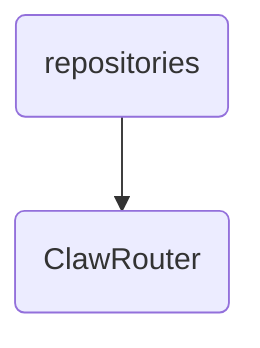

# Clawrouter Identity

The ClawRouter directory contains the core components responsible for routing and managing data flows within OmniClaw v5.0, ensuring efficient and reliable communication between different modules.

---

## Topological View

---
*OmniClaw V5.0 | Forged by OMA AI Architect | brain.knowledge.repositories.clawrouter | 2026-04-10*
