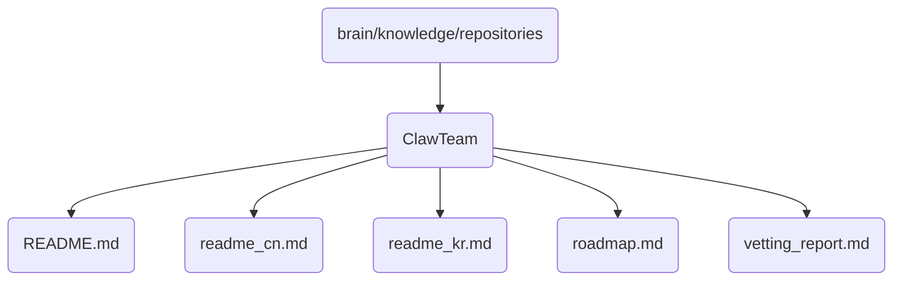

# Clawteam Identity

The ClawTeam directory houses the documentation and reports related to the development, operations, and maintenance of OmniClaw (v5.0). It includes localized README files for different language communities and strategic planning documents.

## Topological View

---
*OmniClaw V5.0 | Forged by AI Architect | Evaluated dynamically*
