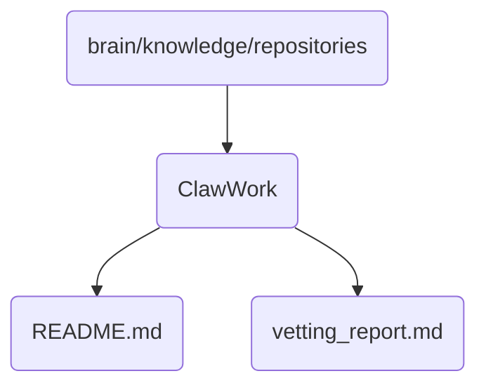

# Clawwork Identity

ClawWork is a critical repository for managing and organizing the operational knowledge of OmniClaw's work processes.

## Topological View

---
*OmniClaw V5.0 | Forged by AI Architect | Evaluated dynamically*
