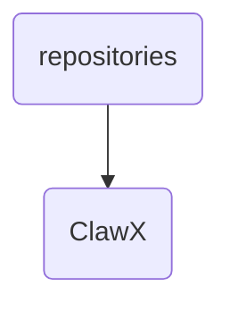

# Clawx Identity

The ClawX directory serves as the primary repository for advanced cognitive agents and related documentation within OmniClaw v5.0, focusing on knowledge management and agent development.

---

## Topological View

---
*OmniClaw V5.0 | Forged by OMA AI Architect | brain.knowledge.repositories.clawx | 2026-04-10*
