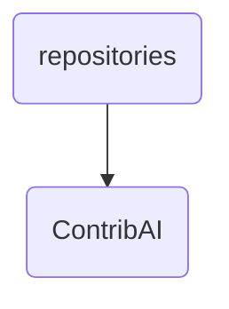

# Contribai Identity

The ContribAI directory houses the AI agents and related documentation for contributing to OmniClaw's knowledge management system. It includes guidelines, changelogs, security policies, and a vetting report.

---

## Topological View

---
*OmniClaw V5.0 | Forged by OMA AI Architect | brain.knowledge.repositories.contribai | 2026-04-10*
