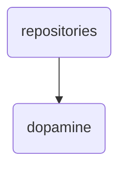

# dopamine Identity

The dopamine directory within OmniClaw v5.0 serves as the central repository for all dopamine-related data and knowledge management, ensuring seamless integration with other brain modules.

---

## Topological View

---
*OmniClaw V5.0 | Forged by OMA AI Architect | brain.knowledge.repositories.dopamine | 2026-04-10*
