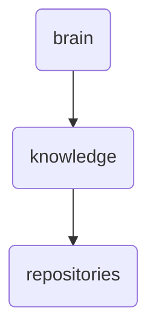

# Repositories Identity

This directory houses various repositories essential for OmniClaw's operations, including core components and third-party integrations.

---

## Topological View

---
*OmniClaw V5.0 | Forged by OMA AI Architect | brain.knowledge.repositories | 2026-04-10*
