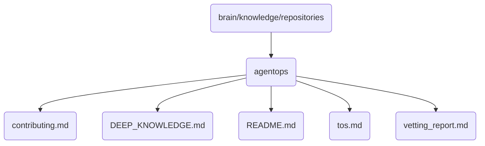

# Agentops Identity

This directory contains the core operations and maintenance knowledge base for OmniClaw v5.0, focusing on agent management and operational procedures.

## Topological View

---
*OmniClaw V5.0 | Forged by AI Architect | Evaluated dynamically*
