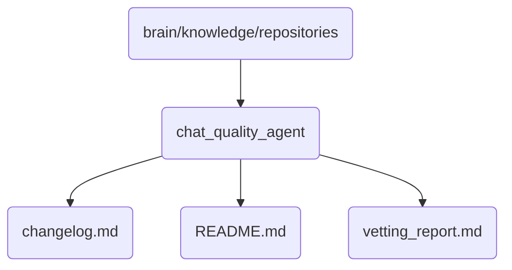

# Chat Quality Agent Identity

Contains the chat quality agent's documentation, changelog, and vetting report.

## Topological View

---
*OmniClaw V5.0 | Forged by AI Architect | Evaluated dynamically*
