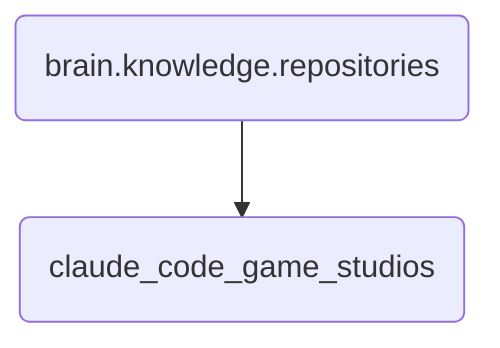

# Claude Code Game Studios Identity

This directory contains the codebase and related documents for Claude Code Game Studios, responsible for managing their projects within OmniClaw.

---

## Topological View

---
*OmniClaw V5.0 | Forged by OMA AI Architect | brain.knowledge.repositories.claude_code_game_studios | 2026-04-10*
