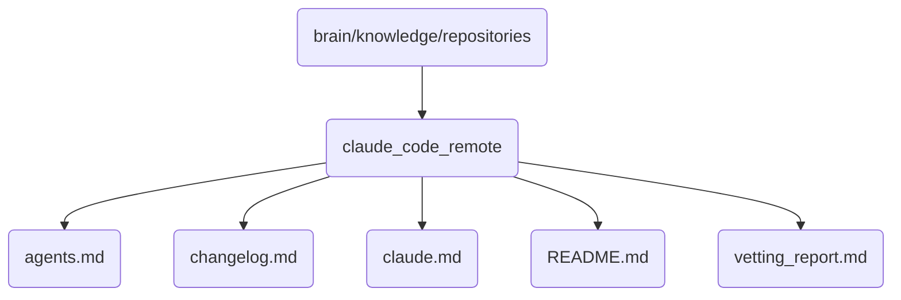

# Claude Code Remote Identity

This directory contains the remote codebase for Claude, including documentation and reports.

## Topological View

---
*OmniClaw V5.0 | Forged by AI Architect | Evaluated dynamically*
