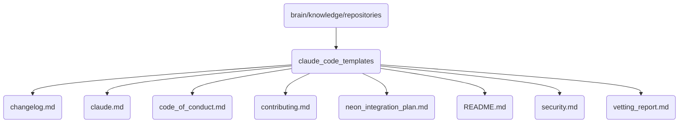

# Claude Code Templates Identity

This directory contains various code templates and documentation related to Claude, the AI assistant.

## Topological View

---
*OmniClaw V5.0 | Forged by AI Architect | Evaluated dynamically*
