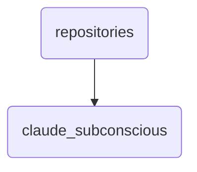

# Claude Subconscious Identity

This directory contains the subconscious knowledge repository for Claude, which stores and manages his internal data and insights. It is crucial for maintaining Claude's cognitive functions within OmniClaw.

---

## Topological View

---
*OmniClaw V5.0 | Forged by OMA AI Architect | brain.knowledge.repositories.claude_subconscious | 2026-04-10*
