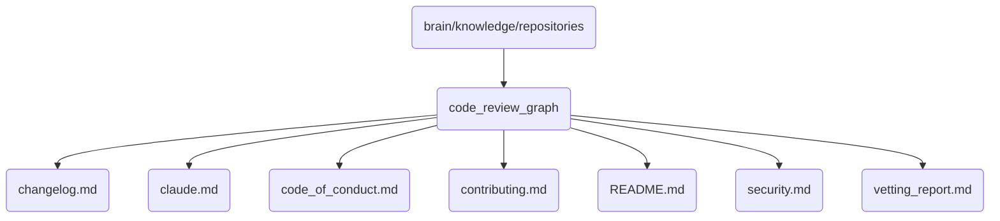

# Code Review Graph Identity

Contains documentation and reports related to the code review process for OmniClaw v5.0.

## Topological View

---
*OmniClaw V5.0 | Forged by AI Architect | Evaluated dynamically*
