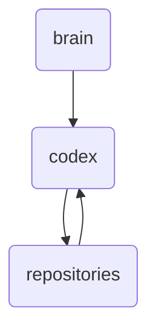

# Codex Identity

The 'codex' directory houses the core knowledge repositories for OmniClaw v5.0, including documentation and reports related to its agents, security measures, and changelog.

---

## Topological View

---
*OmniClaw V5.0 | Forged by OMA AI Architect | brain.knowledge.repositories.codex | 2026-04-10*
